# Price Dynamics of Chub Mackerel in Pacific Rim Aquatic Markets and Interannual Variations in Body Size: An Integrated Perspective Linking Marine Biological Resources, Fishery Economics, and Ocean Environment
# 1 Introduction and Research Framework

The chub mackerel (*Scomber japonicus*) occupies a paradoxical position in the marine economies of the Pacific Rim. On the one hand, it is one of the most ubiquitous pelagic fishes encircling the basin, supporting some of the largest purse seine fisheries in the world and serving as a daily protein staple for hundreds of millions of consumers in Japan, South Korea, China, and beyond. On the other hand, its catches, body sizes, and ex-vessel prices fluctuate violently from year to year — sometimes more than two- or four-fold within a single decade — in ways that defy simple explanations rooted in fishing effort or market preferences alone. As early as the 1990s, Korean fisheries statistics already showed chub mackerel landings oscillating between roughly 91,557 metric tons in 1991 and 211,233 metric tons in 1994, more than doubling in only three years[^1]. Such volatility, repeatedly observed across the basin, suggests that the species' commercial trajectory is tightly coupled to forces that transcend any single fishery or national market. This opening chapter establishes the rationale, scope, hypotheses, and analytical architecture for an integrated inquiry that treats chub mackerel as a sentinel species at the intersection of biological oceanography, fishery resource biology, and seafood market economics.

The research is framed around a deceptively simple proposition: that the prices paid for chub mackerel each morning at wholesale markets such as Toyosu in Tokyo, the Busan Cooperative Fish Market, or the Zhoushan International Aquatic City are not merely reflections of supply and demand in the conventional economic sense, but distilled signals of the marine environment itself. Behind every yen, won, or yuan transacted for a box of fish lies a chain of mechanisms — sea surface temperature anomalies governing larval survival, current systems determining migratory pathways, density-dependent growth shaping body size, handler thresholds at processing plants discriminating among size grades — that ultimately translate the state of the ocean into the state of the market. Unraveling that translation chain is the purpose of this study, and this introductory chapter sets out why such an unraveling is both necessary and timely.

## 1.1 Significance of Chub Mackerel as a Pacific Rim Pelagic Resource

Chub mackerel is, in the strictest sense, a transboundary common-pool resource. Its biological range and migratory behavior make it indifferent to maritime borders, while its economic importance compels every coastal state of the Northwest Pacific to claim a stake in its management. As acknowledged in regional fisheries science, chub mackerel is "one of the priority assessment objects of the North Pacific Fisheries Commission (NPFC) and the main economic target of fishing for light purse" seine and related gears[^2]. Its formal designation as a priority NPFC stock is a concise institutional acknowledgment of three interlocking facts: that the resource is shared, that it is heavily exploited, and that its assessment requires coordinated international science. This positioning is central to the present research because it anchors chub mackerel as a species whose fate is determined collectively by Japan, the Republic of Korea, China, Russia, and — to a lesser but increasing extent — the United States and Canada, rather than by any one fleet or nation in isolation.

The economic weight of chub mackerel is most directly visible in national fishery statistics. In the Republic of Korea, for instance, chub mackerel ranked consistently among the highest-volume single species over the 1989–1994 window, with annual landings of 163,667 t (1989), 97,232 t (1990), 91,557 t (1991), 116,425 t (1992), 174,798 t (1993), and 211,233 t (1994)[^1]. These figures placed chub mackerel in the same league as Japanese anchovy, largehead hairtail, and Alaska pollock, but with a level of interannual volatility that few of those competing species exhibited. Within a single five-year span, Korean chub mackerel catches more than doubled, contracted, surged, and doubled again — a pattern that no incremental change in fleet capacity or fishing effort can adequately explain. The Korean fishing fleet itself was simultaneously contracting in number (from 99,658 vessels in 1990 to 77,868 in 1995) even as total tonnage rose, while the share of small coastal vessels (<5 mt) remained dominant at roughly 82 percent of all vessels[^1]. Against this relatively stable fleet structure, the boom-and-bust trajectory of chub mackerel landings stands out as a signal of biological and environmental forcing rather than purely industrial response.

Equally telling are the downstream price signals. Korean coverage of the Busan Cooperative Fish Market — the principal landing point for the Korean large-scale purse seine fleet that targets chub mackerel — has repeatedly drawn attention to record-breaking single-day landings: on 13 November 2015, approximately 3,500 tonnes of chub mackerel (about 170,000 boxes) were landed in one operation by some 24 vessel groups, generating a wholesale value of roughly 3 billion KRW[^3]. The same market reported that summer chub mackerel landings in June and July of one year roughly doubled and tripled the corresponding figures of the previous year, with June landings reaching 5,404 t versus 1,350 t the year before, and July landings of 6,313 t versus 2,133 t[^4]. These are not merely impressive numbers; they are evidence that chub mackerel functions as the principal liquidity engine of the Busan market, with its arrival able to reshape the wholesale calendar of an entire port. In Japan, while equivalent market-level breakdowns are less directly captured in the present materials, central wholesale companies at Toyosu — including Daito Gyorui, Tohto Suisan, Chuo Gyorui, and Tsukiji Uoichiba — handle "*iwashi, saba, buri, aji, ika, sanma, katsuo*" (sardine, **mackerel (saba)**, yellowtail, horse mackerel, squid, Pacific saury, skipjack) as core fresh-fish categories, with Daito Gyorui alone reporting fiscal 2024 sales of approximately 87.5 billion JPY[^5]. Saba thus belongs to the small group of pelagic species whose throughput shapes the operational tempo of the world's largest fish market.

The species' significance also extends beyond commerce into nutrition and food security. Korean per capita fishery product consumption reached approximately 44.8 kg/person/yr by 1994, with fishery products supplying about 45.5 percent of all animal protein in the diet — roughly 3.4 times the world average and 1.9 times that of Southeast Asia[^1]. Chub mackerel is one of the principal species sustaining this consumption pattern, both through fresh and frozen channels and through processed products such as salted, dried, and canned mackerel. Combined with its role as a forage fish — a mid-trophic level pelagic that links plankton production to higher predators including tuna, marine mammals, and seabirds — chub mackerel functions simultaneously as an ecosystem keystone, a fishery commodity, and a nutritional staple. This three-fold role makes interannual fluctuations in its abundance, body size, and price not only matters of business interest but also issues of regional food security and ecosystem health, justifying the integrated analytical lens adopted throughout this report.

## 1.2 Geographic and Temporal Scope of the Study

Defining the geographic envelope of the study requires aligning two often-divergent realities: the biological range of the chub mackerel population complex and the institutional geography of the markets that price it. Biologically, *Scomber japonicus* in the Northwest Pacific is conventionally treated as comprising at least two principal stocks — a Tsushima Warm Current stock that traverses the East China Sea, the Yellow Sea, the South Sea, and the East Sea (Sea of Japan), and a Pacific stock that ranges along the Pacific coast of Japan and into the central North Pacific high seas. Both stocks straddle the Exclusive Economic Zones of multiple Pacific Rim states, and their migratory pathways are inseparable from the warm-saline Kuroshio inflow, the Tsushima Current that branches into the East Sea, and the cold Oyashio extension that meets the Kuroshio along the Japanese Pacific coast[^1]. The hydrographic structure of the seas surrounding the Korean peninsula illustrates this complexity vividly: the East Sea is a deep, semi-enclosed basin (mean depth 1,667 m) where the Tsushima Current dominates the upper 300 m; the East China Sea is a shallow continental shelf (depths <200 m) heavily influenced by Kuroshio intrusion and freshwater discharge from the Yangtze and Yellow Rivers; and the Yellow Sea is a flat, post-glacial epicontinental sea[^1]. Each of these sub-basins constitutes a distinct habitat for different life stages of chub mackerel.

Economically, the relevant geography is anchored by the major wholesale and consumption hubs that integrate landings into final consumer demand. The study therefore designates as core geographic anchors:

| Country/Region | Principal Markets / Production Anchors | Primary Role in the Chub Mackerel System |
|---|---|---|
| Japan | Toyosu (Tokyo, formerly Tsukiji), Osaka Central, regional landing ports | Largest consumer market; central wholesale companies (Daito Gyorui, Tohto Suisan, Chuo Gyorui, Tsukiji Uoichiba) handle saba as a key pelagic[^5] |
| Republic of Korea | Busan Cooperative Fish Market (Jagalchi-related landings), Noryangjin (Seoul) | Principal landing market for large purse seine fleet targeting chub mackerel[^4][^3] |
| China | Zhoushan International Aquatic City, Songmen, and other coastal markets | Major producer and processor; Zhoushan reports frozen *naiyu* (chub mackerel) as a benchmark frozen-product category[^6] |
| Russia | Vladivostok and Far East landing ports | EEZ holder for northern stock components; supplies frozen pelagics to Korean and Japanese imports — Russia accounted for a leading share of Korea's >67% import-supply group along with the USA, China, Japan, and Argentina[^1] |
| North America (West Coast) | U.S. Pacific landing ports and processors | Eastern Pacific stock fishery; less integrated with East Asian wholesale architecture but increasingly relevant under climate-driven range shifts |

This geographic framing intentionally satisfies the Pacific Rim comparability criterion underlying the research, while also acknowledging asymmetries that will recur throughout the report. The available evidence base is densest for Japan and the Republic of Korea, intermediate for China, and demonstrably thinner for Russia and the West Coast of North America — a gap that the present search materials do not fully close and that subsequent chapters will explicitly flag rather than paper over. For example, the only direct Russian-market reference in the assembled materials concerns *Russian pollock roe (sukeko)* and Russian fishmeal output trends in 2025–2026[^4], with no comparable chub mackerel pricing data; Russian inclusion in this study therefore relies primarily on import-flow data from partner countries (notably Korea[^1]) and on inferences drawn from regional trade reports.

Temporally, the study adopts a multi-decadal window stretching from the late 1980s — when the modern wholesale architecture, FAO statistical series, and routine biometric monitoring became sufficiently consistent for cross-country comparison — through the most recent available data points in the mid-2020s. This window captures at least three documented or inferred regime shifts in North Pacific pelagic ecosystems and several major institutional events, including the introduction of EEZs that "in 1977, the USA and the Russian Federation proclaimed 200-mile Exclusive Economic Zones, prompting many other nations to enact similar declarations"[^1], the establishment of the NPFC for high-seas chub mackerel management[^2], and the migration of Tokyo's central wholesale market from Tsukiji to Toyosu in October 2018[^5]. Within this multi-decadal envelope, the study privileges interannual resolution: monthly price series, annual landings, and annual size composition data are treated as the analytical baseline, with seasonal and daily resolution invoked selectively where supply shocks or specific landing events (such as the November 2015 Busan record[^3]) illuminate underlying mechanisms.

## 1.3 Core Research Hypothesis and Key Questions

The study advances a single overarching hypothesis with several derivative testable propositions. The **central hypothesis** is that **wholesale market price signals and interannual variation in chub mackerel body size jointly constitute observable, quantitative indicators of underlying ecosystem states, oceanographic regimes, and stock conditions** — and, accordingly, that high-frequency market data, when properly conditioned on biological and environmental covariates, can serve as a real-time proxy for ecosystem dynamics that traditional stock assessments capture only with substantial lag.

This hypothesis is grounded in three premises that recur throughout the literature and reference materials. First, market-clearing prices in well-organized wholesale auctions internalize both quantity and quality information; in markets such as Toyosu and the Busan Cooperative Fish Market, where commission-based auction systems remain the dominant price-discovery mechanism[^5], the resulting price tier reflects not only volume but the mean size class, fat content, and freshness of each consignment. Second, body size of chub mackerel is itself a function of density-dependent growth, cohort recruitment success, and environmentally driven feeding conditions — variables that are directly modulated by sea surface temperature, primary productivity, and current dynamics. Third, both prices and sizes are reported with sufficient temporal and geographic granularity in the public market record (e.g., the *Minato Shimbun* daily reports of "Toyosu market trends"[^4], Zhoushan Aquatic City monthly trading and price-index summaries[^6]) to permit econometric and time-series analysis at interannual and even monthly resolution.

From this central hypothesis, the report derives the following key research questions, each of which structures one or more downstream chapters:

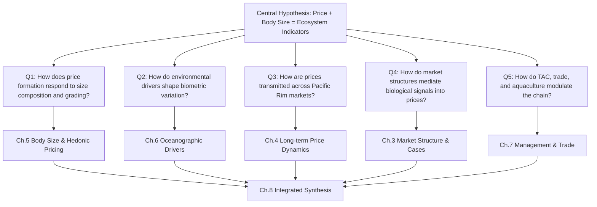

The diagram above operationalizes the hypothesis into five linked questions: (Q1) how the within-auction grading and pricing of chub mackerel translates body-size and condition signals into monetary terms; (Q2) how oceanographic forcing — sea surface temperature, Kuroshio–Oyashio dynamics, the Pacific Decadal Oscillation, and ENSO — shapes recruitment, growth, and the resulting interannual size distribution; (Q3) whether and how prices in Toyosu, Busan, Zhoushan, and other markets co-move, lead, or lag one another, revealing the architecture of regional supply transmission; (Q4) how heterogeneous market structures — auction-based versus negotiated, fresh-oriented versus processing-oriented — filter the same underlying biological signal into divergent price trajectories; and (Q5) how TAC regimes, trade flows, IUU fishing, and the emerging land-based aquaculture of chub mackerel in Japan modify the supply side of the equation. A subsidiary methodological question — namely, **whether market data can be used as ecosystem indicators alongside or even ahead of conventional stock assessments** — runs through all five and is taken up explicitly in the concluding chapter.

## 1.4 Integrated Analytical Framework

To address the questions above without lapsing into either narrowly economic or narrowly biological accounts, the report adopts an integrated three-pillar analytical framework that explicitly connects biological oceanography, fishery resource biology, and seafood market economics. The framework treats these three domains not as parallel chapters but as serially coupled subsystems through which a single environmental signal propagates, with each pillar transforming and partially obscuring that signal as it moves toward the consumer.

The first pillar, **biological oceanography**, supplies the environmental forcing variables. These include sea surface temperature (SST) and its anomalies, the position and strength of the Kuroshio and Oyashio currents and their extension fronts, mixed-layer depth, and the nutrient–phytoplankton–zooplankton (NPZ) dynamics that govern the bottom-up energy supply to small pelagic fish. End-to-end ecosystem modeling for analogous small pelagic species (e.g., sardine) has demonstrated that "an end-to-end model includes a regional ocean circulation component, a nutrient-phytoplankton-zooplankton (NPZ) component, [and] a sardine population" component[^7] — establishing the methodological precedent for treating chub mackerel as the terminal link in a coupled physical–biogeochemical–biological cascade. Climatic modes such as the Pacific Decadal Oscillation (PDO) and the El Niño–Southern Oscillation (ENSO) are layered onto these dynamics as low-frequency modulators that align with documented regime shifts in pelagic stock dominance.

The second pillar, **fishery resource biology**, transduces environmental forcing into stock-level outcomes: spawning success, larval survival, recruitment strength, growth rates, age-at-length relationships, body size distribution, and stock structure (notably the bifurcation between Tsushima Warm Current and Pacific stocks). Density-dependent growth — wherein large recruitment cohorts experience slower per-capita growth and emerge with smaller mean body size — is a particularly important mechanism because it directly determines the size-class composition entering wholesale markets. The size and condition of landed fish are, in this sense, the biological "output" that the market subsequently re-encodes into prices.

The third pillar, **seafood market economics**, comprises auction systems, wholesale-to-retail distribution channels, hedonic pricing across size and quality grades, and trade flows linking producer to consumer markets. The Korean evidence already cited makes clear that wholesale dynamics are highly responsive to landings volume — when 3,500 t of mackerel arrived in Busan in a single night in November 2015, the wholesale aggregate value reached approximately 3 billion KRW even as unit prices softened, with the surplus rolling over into Sunday trading[^3]. The Chinese evidence from Zhoushan demonstrates that frozen chub mackerel prices around 4–6 yuan/jin function as an interannual benchmark in a market where seasonal closures (the Chinese summer fishing moratorium) make frozen and thawed product the dominant trading category for several months each year[^6]. Japanese evidence from Toyosu shows a sophisticated hedonic structure across mackerel categories, with the *Minato Shimbun* market report for April 2026 explicitly headlining "saba sukunaku takane" (mackerel scarce, high-priced), capturing in a single phrase the elasticity of price with respect to landed volume[^4]. The architecture of these three markets — and of their counterparts in Russia and North America — determines how transparently or opaquely the underlying biological signal is transmitted to final prices.

The coupling among these three pillars is most usefully visualized as an **environment-to-market transmission chain**, which serves as the master analytical scaffold for the entire report:

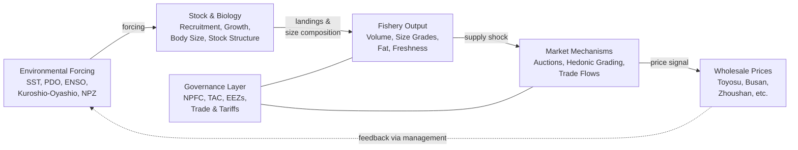

Three features of this scaffold deserve emphasis. First, the chain is unidirectional in its primary causal flow (environment → biology → fishery → market → price), which justifies the use of lagged correlation, dynamic regression, and Granger causality tests that treat oceanographic indices as candidate leading indicators of subsequent prices. Second, the chain incorporates a **governance layer** — encompassing the NPFC, national TAC regimes, EEZ enforcement, and bilateral trade arrangements — that exerts quasi-orthogonal influence on both the fishery output and market mechanism stages, reminding the analyst that not every price movement is environmentally driven and that policy interventions can decouple biological signals from market signals. Third, the dotted feedback loop from prices back to environment (via management decisions on effort, TAC, and habitat protection) acknowledges that market-derived ecosystem indicators can inform adaptive management, closing the conceptual circle from observation to intervention.

Methodologically, the framework will be operationalized in subsequent chapters through the combined use of: (i) descriptive time-series analysis of price, landings, and biometric data across the five core geographies; (ii) hedonic pricing models linking size-class and quality-grade composition to ex-vessel and wholesale prices; (iii) lagged regression and cointegration analysis testing whether environmental indices precede price movements at time scales consistent with growth and recruitment lags; and (iv) cross-market price transmission analyses (Granger causality, error-correction models) that reveal which markets lead and which follow in the regional system. Where the available reference materials cannot fully support quantitative implementation — most notably for Russia and North America, and for fine-grained biometric series across the entire study window — the report will explicitly mark the gap and treat it as a research priority rather than as a finding.

The remainder of the report unfolds along the pathway sketched above. Chapter 2 establishes the biological and ecological baseline of chub mackerel, identifying the life-history traits and stock structures that mediate environmental forcing. Chapter 3 surveys the structure of the Pacific Rim aquatic markets that price the resource. Chapter 4 examines long-term price dynamics and cross-market transmission. Chapter 5 connects interannual body size variation to quality grading and hedonic pricing. Chapter 6 closes the loop by analyzing the oceanographic drivers and their leading-indicator relationship with market signals. Chapter 7 integrates fishery management, trade, and anthropogenic stressors as governance modulators. Chapter 8 synthesizes the findings, projects future trajectories under climate-change scenarios, and reflects on the methodological limitations and research priorities that emerge from a deliberately interdisciplinary investigation of one species — chub mackerel — as a window onto the coupled fate of the Pacific Rim's marine resources, markets, and environment.

# 2 Biological and Ecological Profile of Chub Mackerel

Having framed chub mackerel in Chapter 1 as a sentinel species whose price and body size variations encode signals from the marine environment, the analytical task now turns to the biological substrate through which those signals must pass. Before any oceanographic anomaly can register at the morning auction in Toyosu or Busan, it must first act on a fish — modulating the survival of its larvae, the speed of its growth, the timing of its migration, and the energetic condition with which it eventually enters a purse seine net. The purpose of this chapter is therefore to construct a rigorous biological and ecological baseline of *Scomber japonicus*, identifying with as much specificity as the literature permits which life-history traits, stock components, and physiological parameters are most plastic with respect to environmental forcing, and how that plasticity is subsequently transduced into the size grades, condition indices, and seasonal supply patterns that downstream chapters will examine in market terms. The chapter is, in this sense, the second link in the environment-to-market transmission chain introduced in Chapter 1: it converts the ocean's state into a population whose attributes the fishery and the market can in turn read.

The synthesis that follows draws principally on the comprehensive FAO synopsis of biological data on *Scomber japonicus* compiled by Castro Hernández and colleagues, which integrates more than five hundred primary references spanning the global range of the species, supplemented by region-specific work on Korean stocks. The synopsis is itself an exercise in the kind of cross-domain integration that the present report aims to extend: as its authors note, "quantitative and qualitative information of various aspects of the biology, ecology, stocks and utilization of the chub mackerel is widely scattered in the literature, [and] this synopsis was undertaken to fill the need for comprised and detailed information on this important scombrid to help to improve the knowledge about this species and to maintain it as an important food resource for human consumption."[^8] Globally, that food resource sustains catches "reaching over 1.5 million tons annually,"[^8] making chub mackerel one of the most heavily exploited mid-sized pelagic fishes in the world ocean.

## 2.1 Taxonomy, Morphology, and Life-History Traits

Chub mackerel was formally described by Houttuyn in 1782 from Japanese specimens, and its taxonomic history has accumulated a thicket of synonyms and partial revisions that bears directly on the interpretation of historical fishery records. The species has, at various times and in various jurisdictions, been recorded under the genus *Pneumatophorus* — for example *Pneumatophorus diego* in early California fishery statistics from the 1930s through the 1950s and *Pneumatophorus japonicus* in mid-twentieth-century Japanese and Soviet literature — before the genus *Scomber* was consolidated as the accepted designation following Matsui's 1967 revision of the mackerel genera *Scomber* and *Rastrelliger*.[^8] This nomenclatural drift matters for the present report because it complicates direct concatenation of pre-1970s landings and price series across regions: Korean, Japanese, and California catch statistics referring to *Pneumatophorus* must be aligned with later *Scomber japonicus* records before any cross-decadal trend can be reliably interpreted.

Within the family Scombridae, *Scomber japonicus* belongs to a small genus currently comprising four recognized species — *S. japonicus* (the Pacific and originally cosmopolitan chub mackerel), *S. scombrus* (the Atlantic mackerel of the North Atlantic), *S. australasicus* (the spotted or blue mackerel of the Indo-Pacific), and *S. colias* (the Atlantic chub mackerel, formerly often lumped with *S. japonicus* under the trinomial *S. japonicus colias*). Taxonomic separation of these forms has been progressive: Starks already in 1922 noted "specific differences between the chub mackerels of the Atlantic and Pacific Oceans,"[^8] and modern molecular work has confirmed substantial genetic divergence — Stepien and Rosenblatt demonstrated "genetic divergence in antitropical pelagic marine fishes (Trachurus, Merluccius and Scomber) between North and South America," while Kijima, Tanaguchi and Ochiai documented "genetic divergence and morphological difference between the spotted and common mackerel."[^8] Within *S. japonicus* itself, electrophoretic, allozyme, and meristic studies have revealed clinal and population-level variation: Belyaev and Ryabov reported on "population structure of chub mackerel, *Scomber japonicus*, in the northwestern Pacific Ocean"; Ryabov and Belyaev documented "genetic heterogeneity of Japanese mackerel in the Northwestern Pacific Ocean"; and Park identified a distinct Korean subpopulation through "a study on the subpopulation of the Pacific mackerel (*Scomber japonicus* Houttuyn) in the waters adjacent Korea."[^8] These findings provide the genetic substrate on which the stock-structure discussion in §2.2 rests.

Morphologically, *Scomber japonicus* is a fusiform, streamlined scombrid optimized for high-speed sustained swimming. The FAO synopsis identifies its canonical size envelope as follows: "The maximum length of *Scomber japonicus* is typically reported at 50 cm, with common sizes around 30 cm," with sexual maturity generally attained "around 27 cm depending on environmental conditions."[^8] These three reference dimensions — a maximum of approximately 50 cm fork length, a modal commercial length around 30 cm, and a maturity threshold near 27 cm — are not merely descriptive; they constitute the size axis along which all subsequent commercial grading is organized. A wholesale auction at Toyosu, Busan, or Zhoushan is in essence a sorting machine that distributes individual fish along this 25–50 cm range into discrete grade bins, and the relative weight of each bin in a given year's landings is determined upstream by the growth and recruitment dynamics elaborated in §2.5.

Beyond gross length, several morphological and physiological traits structure the species' fishery and market relevance. Chub mackerel possess a well-developed swimbladder that functions both as a hydrostatic organ and as an acoustic resonator — Torres, Guzmán and Castillo treated "la vejiga gaseosa como organo resonante y su influencia en la intensidad sónica" (the swimbladder as a resonant organ and its influence on sonic intensity), and Castillo, Guzmán and Pineda calibrated target strength per kilogram for sardine, jack mackerel and chub mackerel — making the species amenable to acoustic biomass surveys that complement landings-based assessment.[^8] Their gill-raker apparatus, examined by Magnuson and Heitz with reference to "gill raker apparatus and food selectivity among mackerels, tuna, and dolphins" and by Cota-Meza et al. on "morphometric development of the first branchial arch of the Pacific mackerel *Scomber japonicus* and its ecological implications,"[^8] equips them for both filter-feeding on plankton and particulate predation on small fish, a dietary flexibility examined in §2.6. Their schooling behavior is intensely organized: the FAO synopsis records that "chub mackerel school in tightly packed aggregations, which enhance foraging efficiency and reduce predation risk; schooling behavior is organized among size classes, facilitating interactions and cohesion during movement,"[^8] a trait that explains the spectacular single-haul landings such as the November 2015 Busan event noted in Chapter 1.

Life-history parameters relevant to fishery dynamics — longevity, growth coefficients, and natural mortality — vary by stock, but several reference points anchor the species' typical envelope. Off South Africa, Ostapenko (1986) found that landings consisted predominantly of fish aged 0 to 8 years, with 1- to 4-year-olds dominating catches, and the FAO synopsis explicitly notes that "the proportion of older individuals has significantly declined due to overfishing."[^8] Across regional populations, age determinations in the literature span from Aikawa's 1937 work on age determination of *Scomber japonicus* through the otolith and scale studies of Kondo (1966), Iizuka (1967), Ouchi (1978), Forciniti and Perrotta (1988), and the Korean otolith-based study by Kim and colleagues (specifically referenced as treating "age, growth, and maturity of chub mackerel off Korea" through "otolith analysis and gonad observation").[^9][^8] These independent studies converge on a life-history image of a relatively short-lived, fast-growing pelagic fish whose fishery typically depends on the youngest 4–5 age classes — a fact that imparts strong sensitivity to interannual recruitment variation, since a single failed cohort cannot be buffered by a long tail of older spawners. This life-history geometry is the first reason why chub mackerel landings, body sizes, and prices oscillate as violently as the Korean and Japanese statistics introduced in Chapter 1 demonstrate.

## 2.2 Geographic Distribution and Stock Structure in the Northwest Pacific

*Scomber japonicus* is among the most broadly distributed of all scombrids. Its range encompasses temperate and subtropical waters of the Pacific (from Japan, the Korean Peninsula, and northeastern China south to Indonesia and the Philippines, and along the eastern Pacific from British Columbia to Chile), the southeastern Atlantic off South Africa and Namibia, and — as historically classified before partial taxonomic separation — large portions of the central and eastern Atlantic now often attributed to *S. colias*. Soviet, Japanese, and FAO-CECAF surveys throughout the 1970s and 1980s documented major populations off Northwest Africa (Saharo-Mauritanian stock), Peru-Chile (the *peruanus* form), the Argentine continental shelf (the *marplatensis* form), the Gulf of California, and the California Current, in addition to the Northwest Pacific stocks that are the principal focus of this report.[^8] This pan-Pacific–Atlantic distribution means that the species occupies a wide thermal envelope and a diversity of upwelling and current systems, providing a global context against which the Northwest Pacific stocks can be compared.

Within the Northwest Pacific, the canonical population structure recognized in the assessment literature comprises two principal components, each with sub-populations of varying degrees of demographic and genetic distinctness. Belyaev and Ryabov, working on Soviet survey data, were among the first to formalize this in their 1987 paper on "population structure of chub mackerel, *Scomber japonicus*, in the northwestern Pacific Ocean,"[^8] and Novikov elaborated the implications in subsequent work on "population structure of Japanese mackerel (*Scomber japonicus* Houttuyn) in Northwestern Pacific Ocean and restoration of the reserves of the Sea of Japan Population."[^8] Sato investigated "the relationship between the mackerel populations inhabiting the northeastern Sea of Japan and the North Japan Sea area through Tsugaru Strait,"[^8] establishing that even within what is sometimes treated as a single stock, exchange across straits and between sub-basins is dynamic. The two principal stocks recognized in the present report are summarized below.

| Stock | Spatial Extent | Spawning Areas | Key Fisheries / Landing Markets | Primary Current System |
|---|---|---|---|---|
| Tsushima Warm Current stock | East China Sea, Yellow Sea, South Sea (Korea), East Sea / Sea of Japan | Southwestern Japan Sea and East China Sea (Iizuka & Hamasaki; Limbong et al.); waters off Kyushu and Tsushima Islands | Korean large-scale purse seine (Busan); Chinese light-purse seine (Zhoushan); Japanese coastal purse seine (Kyushu, Sea of Japan) | Tsushima/Kuroshio branch entering the East Sea |
| Pacific stock | Pacific coast of Japan from Kyushu to Hokkaido; central North Pacific high seas | Waters south of Japan along the Kuroshio path; off Izu Islands; off Sanriku coast | Japanese Pacific-coast purse seine (Sanriku, Choshi, Kanto landings into Toyosu); Russian Far East fisheries; NPFC high-seas fishery | Kuroshio main axis and its extension; Oyashio confluence |

The Tsushima Warm Current stock has been characterized in detail by Iizuka and Hamasaki (1983, 1986) in their two-part series on "ecology of the common mackerel in the southwestern Japan Sea and the East China Sea," covering changes of fishing grounds, catch fluctuation, and biological characteristics in each fishing ground; by Limbong, Hayashi and Shirakihara (1991) on "seasonal distribution and migration of the common mackerel in the southwestern Japan Sea and the East China Sea"; and by Ouchi and Hamasaki (1979) on "population analysis of the common mackerel *Scomber japonicus*, based on the catch statistics and biological information in the western Japan Sea and East China Sea."[^8] Korean work by Park (1977) on "the subpopulation of the Pacific mackerel (*Scomber japonicus* Houttuyn) in the waters adjacent Korea," and by Gong, Kang and Cho (1972) on "fishery oceanographic studies on the mackerel purse-seine fishing grounds off the southwestern coast of Korea,"[^8] confirms that the Korean fishery exploits primarily this Tsushima-current-associated component. The link to market geography is direct: when the Busan Cooperative Fish Market reports record landings, those landings are almost entirely drawn from the Tsushima Warm Current stock; when Zhoushan reports frozen *naiyu*, the source is again predominantly this stock or its East China Sea component.

The Pacific stock, by contrast, supplies the bulk of the Japanese Pacific-coast purse seine fishery whose landings flow into Choshi, Hachinohe, and other landing ports for redistribution to Toyosu and Osaka. Hirai (1991) provided the foundational "fisheries oceanographic study on purse-seine fishing-grounds for chub mackerel in the Sanriku coastal waters," and Hirai, Ogawa and Satoh (1990) examined "stock fluctuations of the Pacific sub-population of chub mackerel in the coastal waters east of mainland Japan."[^8] Watanabe (1972) — drawing on egg-abundance survey data — documented "the recent trend in the stock size of the Pacific population of the common mackerel off Honshu, Japan, as viewed from egg abundance,"[^8] and Honma, Sato and Usami (1987) presented an "estimation of the population size of the Pacific mackerel by the cohort analysis."[^8] Further into the open ocean, Belyaev (1980a, 1985a) addressed "distribution patterns of the Pacific mackerel *Scomber japonicus* during the feeding period in the South Kuril Area" and "distribution, migrations and peculiarities of formation of commercial concentrations of big-eyed mackerel in the Northwest Pacific."[^8] These studies establish that the Pacific stock undertakes long migrations between coastal spawning and offshore feeding grounds, and that its accessibility to fisheries is highly contingent on the position of the Kuroshio–Oyashio confluence — a contingency that becomes especially relevant in Chapter 6's analysis of oceanographic forcing.

The practical implication of this dual stock structure for the present report is that **landings reaching different Pacific Rim markets do not, in general, originate from the same biological population, and they may therefore respond to different environmental drivers and exhibit asymmetric body-size and price trajectories**. A warm anomaly in the East China Sea need not coincide in sign or timing with one in the Kuroshio extension off Sanriku. Cross-market price comparisons in Chapter 4 must therefore be interpreted with stock attribution in mind, and the absence of genetic or otolith-based stock identification in routine market statistics constitutes a real interpretive limitation that this study acknowledges as a data gap.

## 2.3 Migration Patterns and Habitat Use

The migratory behavior of chub mackerel is the dynamic process that links its stock structure to the seasonal calendar of fishing grounds and, by extension, to the seasonal supply pattern of major markets. Each principal stock executes a stylized annual cycle: spawning in late winter and spring on the warm side of frontal zones, dispersal of eggs and larvae by major currents, juvenile and adult migration to feeding grounds in summer and autumn, and a return migration to overwintering areas as surface temperatures fall. The detailed pathways of the Pacific and Tsushima Warm Current stocks have been resolved by tagging experiments and by tracking the appearance and disappearance of commercial concentrations.

For the Pacific stock, Hasegawa, Nagasawa and Watanabe (1991) reported on "investigation of the migration and distribution patterns of common mackerel, *Scomber japonicus*, as viewed from tagging experiments,"[^8] documenting movements that link spawning grounds south of Japan to feeding grounds along the Sanriku coast and into the Oyashio domain. Hirai and colleagues (1988) addressed "fluctuation of hydrographic conditions in relation to the formation, movement and disappearance of purse seine fishing grounds of chub mackerel in waters off Sanriku, northeastern Japan," and Okuda et al. (1988) developed "a short-term prediction method of fishing grounds of chub mackerel in waters off Sanriku, northeastern Japan,"[^8] explicitly framing fishing-ground formation as a hydrographic phenomenon. Kosaka and Hirai (1988) generalized the principle in their paper on "pelagic fishes and oceanic fronts," with reference to the Kuroshio–Oyashio frontal system.[^8] D'yakov, Bulatov and Belyaev (1984) similarly examined the "effect of hydrological conditions on the distribution of Pacific mackerel in the area east of Japan."[^8] These works converge on the picture that purse-seine fishing grounds for chub mackerel form preferentially along thermal fronts where Kuroshio-derived warm water meets cooler Oyashio-modified water, and that their position in any given year is set by the latitudinal position of that front.

For the Tsushima Warm Current stock, Limbong, Hayashi and Shirakihara (1991) traced "seasonal distribution and migration of the common mackerel in the southwestern Japan Sea and the East China Sea,"[^8] and Imai (1967) provided early notes on the species in the southern East China Sea in summer.[^8] The Korean side of this same stock was documented by Park and Choi (1995) in a study explicitly titled "a study on the formation of fishing ground and the prediction of the fishing conditions of mackerel, *Scomber japonicus* Houttuyn,"[^8] making clear that the Korean fishery — the principal supplier to the Busan market — operates on essentially the same hydrographic logic as the Japanese: identify the front, predict its position, and deploy the fleet accordingly. Gong, Kang and Cho (1972) had earlier formalized this approach for the southwestern coast of Korea.[^8]

A schematic of the key seasonal habitat transitions for the two principal stocks is given below.

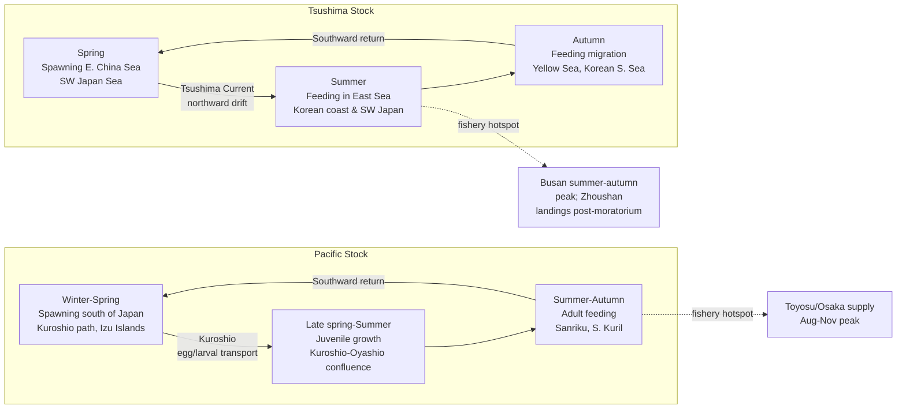

Three features of this seasonal architecture have direct market consequences. First, **the autumn peak of fishing activity for both stocks coincides with the period of highest somatic and gonadal fat content**, when fish are conditioning for winter and pre-spawning. This is the biological foundation of the well-known *aki-saba* (autumn mackerel) premium in Japanese markets, where late-autumn catches command prices substantially above summer landings of the same size class — a hedonic structure whose quantitative dimensions are taken up in Chapter 5. Second, **the formation and disappearance of purse-seine grounds is hydrographically contingent**, meaning that years in which the Kuroshio meanders southward, or in which the Tsushima Current weakens, produce sharply different fleet distributions and landing port concentrations. Hirai et al.'s framing of "fluctuation of hydrographic conditions in relation to the formation, movement and disappearance of purse seine fishing grounds"[^8] is a direct biological mechanism by which oceanographic anomalies are transmitted into market supply shocks. Third, **migration timing modulates the seasonal calendar of supply to specific ports**: a warm year may extend the Sanriku fishery into December, lengthening the supply of high-condition fish to Toyosu, while a cold year may compress the season and concentrate landings into a narrower window with consequent price effects. The China summer fishing moratorium overlays this natural seasonality with an institutional one, forcing the Zhoushan market to rely on frozen inventory during the moratorium and amplifying the role of the post-moratorium reopening as a market event.

Two additional behavioral observations help account for the fishery's dependence on schooling concentration. Belyaev (1985a) characterized the "distribution, migrations and peculiarities of formation of commercial concentrations" of the species, and Kujorenko (1986) studied "chub mackerel behaviour in the Central-East Atlantic and its accessibility to fishing,"[^8] both confirming that commercial harvest depends not on absolute biomass but on the fraction of biomass that aggregates into dense, surface-associated schools accessible to purse seines. Aoki, Inagaki and Van Long's "measurements of the three-dimensional structure of free-swimming pelagic fish schools in a natural environment"[^8] further demonstrate that school structure is itself dynamic and responsive to environmental cues, providing a behavioral pathway by which oceanographic conditions affect catchability independently of underlying abundance.

## 2.4 Reproductive Biology and Recruitment Dynamics

The reproductive biology of chub mackerel is the principal biological amplifier through which environmental signals are converted into interannual variation in cohort abundance — the very variation that, several years later, surfaces as boom-or-bust landings in Pacific Rim markets. Three quantitative parameters establish the scale of that amplification: the species' size and age at first maturity, its remarkable per-capita fecundity, and the temperature thresholds governing successful spawning.

Length and age at first maturity vary considerably with stock and environmental conditions, but the reference envelope synthesized in the FAO synopsis is informative. Females are reported to "typically reach sexual maturity at lengths between 22 and 34.5 cm, with fecundity ranging from 101,859 to 1,859,173 eggs,"[^8] while a more general statement of average maturity places it at "around 27 cm depending on environmental conditions."[^8] In Korean waters specifically, the otolith- and gonad-based study referenced as "Age, Growth, and Maturity of Chub Mackerel off Korea"[^9] determined maturity parameters through monthly subsampling. Region-specific work places maturity in Bahía Vizcaino (Mexican Pacific) at the lengths and ages described by Gluyas-Millán (1994), in the Argentine fishery as analyzed by Knaggs and Parrish (1973), and in the Canary Islands by Lorenzo and Pajuelo (1993).[^8] Asano and Tanaka (1989) examined "ovarian maturation and spawning of the Japanese common mackerel *Scomber japonicus*," and Murayama, Mitani and Aoki (1995) provided an "estimation of the spawning period of the Pacific mackerel *Scomber japonicus* based on the changes in gonad index and ovarian histology."[^8] Yamada et al. (1996) studied "maturation and spawning of the Japanese chub mackerel, *Scomber japonicus*, in the sea area of Izu Islands,"[^8] a region of particular importance because it is one of the principal spawning grounds of the Pacific stock supplying Toyosu.

The fecundity range of approximately 100,000 to nearly 1,900,000 eggs per female[^8] — a roughly twenty-fold span across body sizes and condition states — is a critical biological lever. Combined with batch spawning over an extended season, it endows chub mackerel with extraordinary potential for cohort amplification in good years and corresponding vulnerability in poor years. Studies of partial fecundity and population fecundity in regional stocks include Peña, Alheit and Nakama (1986) on partial fecundity in Peru, Oliva (1989) on the Chilean stock, Ciechomski and Capezzani (1969) on the Argentine *marplatensis* form, and Song et al. (1988) on *Pneumatophorus japonicus* in Chinese waters.[^8] Matsuda and colleagues, however, identified an "inconsistency between the per capita fecundity and estimate of the yearly egg production of the chub mackerel *Scomber japonicus* in Japan,"[^8] highlighting that egg production is not a simple linear function of female biomass — a complication that cautions against naive reproductive-output models.

Spawning is strongly temperature-gated. The FAO synopsis notes that "chub mackerel exhibit seasonal spawning peaks influenced by water temperatures, with optimal spawning occurring above 14.5°C," and that off South Africa "significant spawning occurs in winter and early spring, triggered by warmer inshore currents."[^8] In the Northwest Pacific, the corresponding spawning windows are spring along the Kuroshio path for the Pacific stock and slightly later in the East China Sea / southwestern Sea of Japan for the Tsushima stock. Egg and larval development have been described in detail by Kramer (1960) on "development of eggs and larvae of pacific mackerel and distribution and abundance of larvae 1952-56" and by Watanabe (1970) on "morphology and ecology of early stages of life in japanese common mackerel, *Scomber japonicus* Houttuyn, with special reference to fluctuation of population."[^8] Hunter and Kimbrell (1980) characterized "early life history of pacific mackerel, *Scomber japonicus*."[^8] Crucially for the present report, Tomosada (1985, 1989) analyzed the "transportation of eggs and larvae of mackerel, *Scomber japonicus*, by the Kuroshio Current,"[^8] establishing that Kuroshio dynamics directly govern the geographic destiny of each year's larval cohort — a mechanism that links large-scale current variability (the subject of Chapter 6) to recruitment outcomes.

Recruitment variability in chub mackerel is governed by the joint action of egg/larval mortality, transport processes, and density-dependent feedbacks. Belyaev and Rygalov (1986, 1987) examined "distribution of larvae and determinants of year-class strength of Japanese mackerel," and Sedykh and Krivospichenko (1987) studied "abundance of one-year old chub mackerel as related to environmental factors" off West Sahara.[^8] Sinclair, Tremblay and Bernal (1985) provided one of the clearest demonstrations of climate–recruitment coupling in the eastern Pacific in their paper "El Niño events and variability in a Pacific mackerel (*Scomber japonicus*) survival index: support for Hjort's second hypothesis,"[^8] explicitly linking interannual environmental anomalies to early-life-stage survival. For the Korean stock, Kim, Kim and Kim (1995) examined "variation of mackerel recruitment in the Korean waters,"[^8] grounding the recruitment-variability question in the very stock that supplies the Busan market. Density-dependent influences on growth and population dynamics have been explored by Park (1984) on "the effect of the population density on the growth of mackerel, *Scomber japonicus* Houttuyn, in the Korean waters" and by Kishida and Matsuda (1993) in "statistical analyses of intra- and interspecific density effects on recruitment of chub mackerel and sardine in Japan."[^8]

The mechanistic picture that emerges is summarized below.

| Reproductive/early-life parameter | Typical range or threshold | Environmental sensitivity | Downstream market consequence |
|---|---|---|---|
| Length at first maturity | ~22–34.5 cm (modal ~27 cm)[^8] | Slower-growing cohorts mature later, smaller | Shifts proportion of mature fish in landings and average grade |
| Per-female fecundity | ~1.0×10⁵ – 1.9×10⁶ eggs[^8] | Condition-factor and food-availability dependent | Determines amplification potential of strong cohorts |
| Spawning temperature threshold | ≥ ~14.5°C[^8] | Directly tied to SST anomalies and current position | Shifts spawning timing and geography year to year |
| Larval transport | Kuroshio / Tsushima Current advection[^8] | Current path variability, eddy field | Determines whether larvae reach favorable nurseries |
| Recruitment-environment coupling | Hjort-type linkages (Sinclair et al.)[^8]; ENSO sensitivity[^8] | El Niño, regime shifts, density dependence | Delivers boom-or-bust cohorts that dominate landings 2–4 yr later |

The 2–4 year lag between recruitment events and their dominant appearance in the fishery — given that 1- to 4-year-olds dominate catches[^8] — implies that **today's price and size signals at Toyosu, Busan, and Zhoushan are partially encoded predictions of environmental conditions that prevailed two to four years earlier**. This lag structure, central to the empirical strategy of Chapter 6, is rooted directly in the reproductive biology described here.

## 2.5 Age, Growth, and Density-Dependent Body Size Variation

If reproduction sets the abundance of each year-class entering the fishery, growth determines the body size at which those fish are eventually caught — and therefore the size grade into which they are sorted at the wholesale market. This section is the analytical bridge between intrinsic biology and the hedonic pricing structures that Chapter 5 will examine. Two strands of evidence are central: the methodology and results of age determination across regional populations, and the documented mechanism of density-dependent growth.

Age determination in chub mackerel relies primarily on the interpretation of growth increments in otoliths and scales, with cross-validation between methods serving as an internal check on accuracy. The methodological lineage is long: Aikawa pioneered age determination by scales as early as 1937; Yoshihara (1955) studied "rings appearing on the otolith of one form of the Japanese mackerel"; Yoshida (1955) provided notes "on the mackerel from Niigata Prefecture (Studies on the otolith of mackerel)"; Yonemori and Aikawa (1956) revisited "studies on the age determination of mackerel *Pneumatophorus japonicus* in the region of Tsushima Warm Current"; Tsuji and Hanamura (1957) treated "age of mackerel"; and Kondo and Kuroda (1966) compared "resting zones on different organs."[^8] More recent regional studies — Ouchi (1978) for waters west of Kyushu and east of Tsushima Islands; Iizuka (1967) for the northeastern Sea of Japan; Forciniti and Perrotta (1988) and Perrotta (1992) for the Argentine Sea; Gluyas-Millán and Uraga (1990) on "periodicity of growth bands in otoliths of the mackerel *Scomber japonicus* in Bahía Vizcaino, Mexico"; and Pizarro de Rodriguez (1983) for Ecuadorian waters[^8] — collectively confirm that otolith-based ageing yields reliable estimates of the 0- to ~10-year age range that encompasses essentially the entire harvested population. Korean otolith and gonad work[^9] aligns this Northwest Pacific evidence with the data needs of regional stock assessment.

Across these regional studies, von Bertalanffy growth parameters differ in absolute value but share two general features: asymptotic length L∞ in the range of approximately 35–50 cm, with growth coefficients k typically between 0.2 and 0.5 yr⁻¹. The variability across regions is itself instructive. As Perrotta noted in his 1993 comparative paper on caballa "originating from various geographical regions (Catalonia, Canary Islands and South America)," meristic and growth differences are pronounced enough to identify population origin from morphometry alone.[^8] Within the Northwest Pacific, growth parameters obtained by Iizuka, Ouchi, Watanabe and others place Japanese chub mackerel toward the larger end of the range, while Korean parameters reported by Park (1984)[^8] reflect growth conditions specific to the Tsushima Warm Current habitat.

The phenomenon most directly relevant to market dynamics is **density-dependent growth**. Park's Korean study explicitly examined "the effect of the population density on the growth of mackerel, *Scomber japonicus* Houttuyn, in the Korean waters,"[^8] documenting reduced individual growth rates under high stock density. Kishida and Matsuda (1993) generalized the principle in their "statistical analyses of intra- and interspecific density effects on recruitment of chub mackerel and sardine in Japan,"[^8] showing that density effects operate not only within chub mackerel populations but also through interspecific competition with sardine — a finding that connects directly to the regime-shift dynamics in §2.6. Matsuda, Kishida and Kidachi (1992) in "optimal harvesting policy for chub mackerel (*Scomber japonicus*) in Japan under a fluctuating environment"[^8] integrated density-dependent growth into a management-relevant framework.

The mechanistic logic of density-dependent growth is straightforward but its market implications are profound. When a strong cohort recruits, that cohort competes intensively for limited zooplankton and small-fish prey on its feeding grounds. Per-capita food intake declines, somatic growth slows, and the cohort enters the fishery one or two years later at smaller mean lengths and lower condition factors than would be expected under low-density conditions. Conversely, weak cohorts that recruit during periods of low stock density experience reduced competition and grow rapidly to large sizes. In both cases, the **size composition of landings is inversely correlated with cohort abundance**, producing an apparent paradox — abundant catches consist of small fish, and lean catches consist of large fish — that has direct hedonic consequences in the wholesale market.

The transmission chain from biological growth to market value can be formalized as follows.

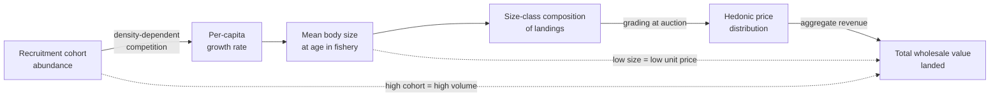

The diagram makes explicit a fact that is often elided in either purely biological or purely economic discussions: **total wholesale value is the product of two countervailing forces — landings volume and unit price — both of which trace back to recruitment magnitude through opposite signs**. The November 2015 Busan event already cited in Chapter 1, in which 3,500 t of mackerel were landed in a single operation generating roughly 3 billion KRW, illustrates the volume-dominated end of this trade-off; the April 2026 Toyosu *Minato Shimbun* headline "saba sukunaku takane" (mackerel scarce, high-priced) illustrates the price-dominated end. Both observations are consistent with the same underlying biological law: density-dependent growth generates a negative correlation between abundance and unit value, partially buffering total revenue against pure abundance fluctuations.

For the present report, three further considerations bear on the interpretation of growth data. First, condition factor (typically Fulton's K) and percent body fat are not independent of length and age but vary systematically with season, feeding ground, and density; Obatake and Kawano (1988) addressed the "relationship between dark muscle content and body size in common mackerel," a trait directly relevant to fat-based grading at Toyosu.[^8] Second, growth differences between Tsushima and Pacific stocks (Iizuka 1967 vs. Ouchi 1978) imply that identical-size fish from the two stocks are of different ages and thus may differ in fat, texture, and palatability — a confound that justifies stock-aware interpretation of cross-market price differentials. Third, age-based stock structure has been shown by Gluyas-Millán and Quiñones-Velazquez (1996) to provide "evidencias de distintos grupos poblacionales de macarela *Scomber japonicus*" through age and length composition,[^8] suggesting that careful biometric monitoring at landing sites can itself serve as a stock-discrimination tool. These considerations elevate body size from a mere descriptive variable to a multi-channel biological signal that the market reads through grading.

## 2.6 Trophic Ecology and Ecosystem Role

Chub mackerel occupies a mid-trophic position in pelagic food webs, simultaneously a substantial consumer of zooplankton and small forage species and a significant prey item for larger predators. This dual role makes the species particularly sensitive to bottom-up productivity changes — the environmental forcing that, transmitted through the nutrient–phytoplankton–zooplankton (NPZ) cascade, ultimately governs body condition and recruitment.

The diet of chub mackerel has been documented across many regions and life stages. The FAO synopsis emphasizes that the species is a flexible feeder, able to switch between filter feeding on small plankton and particulate predation on larger items. Hatanaka and Takahashi (1956, 1960) studied "utilization of food by mackerel" and the "amounts of the anchovy consumed by the mackerel"; Takahashi (1966) examined "ecology of feeding of the mackerel" with emphasis on "food habit and selective feeding"; Nishimura (1959) reported on "foods and feeding of the Pacific mackerel in the coastal waters of Niigata Prefacture, Japan Sea"; Takano (1954) on food taken near Oshima Island; and Stovbun on "food habits of the Pacific mackerel population during the feeding and wintering periods."[^8] Off Northwest Africa, Habashi, Kompowski and Wojciechowski (1987) provided a detailed account of "food and feeding of chub mackerel, *Scomber japonicus* Houttuyn, 1782 in the North-West African shelf."[^8] In the Southeast Atlantic, Tarverdieva (1985) examined "food habits, diurnal feeding rhythmicity and daily diet of chub mackerel."[^8] In the eastern Pacific, Konchina (1982, 1985, 1990, 1992) addressed "feeding of the pacific mackerel near the peruvian coast" and "feeding ecology of nectonic fishes"; Molina, Manrique and Velasco (1996) studied "filtering apparatus and feeding of the Pacific mackerel in the Gulf of California"; and Castro (1993, 1995) and Castro and Hernández-García (1995) treated "feeding ecology of Chub mackerel in Canary Islands area," the role of "mysids and euphausiids in the diet of *Scomber japonicus*," and "ontogenetic changes in mouth structures, foraging behaviour and habitat use."[^8]

Across this broad literature, several robust generalizations emerge. Larval and early-juvenile chub mackerel are primarily zooplanktivorous, consuming copepods, copepod nauplii, and other small zooplankton; Lipskaya (1982) detailed "the feeding of larval chub mackerel *Scomber japonicus*" in the Southeast Pacific, and Ozawa, Kawai and Uotani (1991) provided "stomach contents analysis of chub mackerel *Scomber japonicus* larvae by quantification I method."[^8] As individuals grow, the diet broadens to include mysids, euphausiids, small fish (including anchovy and sardine larvae and juveniles), and squid — a clear ontogenetic dietary shift documented by Castro and Hernández-García[^8] and consistent with Magnuson and Heitz's analysis of "gill raker apparatus and food selectivity."[^8] Seasonal and regional variation is substantial: Nishimura and Okachi described regional diet composition, and Kariya and Takahashi (1969) related "the relationship of food intake to the stomach contents in the mackerel."[^8]

The species' dual role as predator and prey has well-documented ecosystem consequences. As predator, chub mackerel exerts substantial top-down pressure on smaller pelagic species. Hatanaka and Takahashi's classic 1960 study on "amounts of the anchovy consumed by the mackerel"[^8] established the species as a quantitatively important predator on Japanese anchovy. Off Peru, Muck and Sánchez (1987) modeled "the importance of mackerel and horse mackerel predation for the Peruvian anchoveta stock," concluding that mackerel predation is a non-trivial mortality term in anchoveta dynamics.[^8] As prey, chub mackerel in turn supports a wide range of higher predators: Pinkas (1962) and Matthews et al. (1977) documented its role in tuna diets, including bluefin and *Thunnus* species; Kasamatsu and Tanaka (1992) reported "annual changes in prey species of minke whales taken off Japan 1948-87," with chub mackerel among the principal prey items in some years; Hernández-García (1995) analyzed "the diet of the swordfish *Xiphias gladius*" with chub mackerel as a constituent prey; and Velarde et al. (1994) used "seabirds as indicators of important fish populations in the Gulf of California," again with chub mackerel as a key linking species.[^8] Olaso et al. (1992) and Ramos, Castro and Lorenzo (1990) documented chub mackerel in the diet of skipjack tuna *Katsuwonus pelamis* in Canary Islands waters.[^8]

Two ecosystem-level dynamics derive from this trophic position and bear directly on the analytical framework of the report. The first is **substitutive dynamics with sardine and anchovy under regime shifts**. The pelagic ecosystems of the eastern boundary currents and the Kuroshio domain have long been observed to oscillate between sardine-dominated and anchovy- or mackerel-dominated regimes on multi-decadal timescales. Tanaka (1983) reviewed "variation of pelagic fish stocks in waters around Japan"; MacCall (1983) addressed "variability of pelagic fish stocks off California"; Crawford (1983) considered "variability of some neritic stocks in the southern Benguela system"; Jordán (1983) examined "variabilidad de los recursos pelágicos en el Pacífico sudeste"; and Serra (1983) documented "changes in abundance of pelagic resources along the chilean coast."[^8] Within the integrated framework of this report, regime shifts manifest both biologically — as alternating dominance among small pelagics — and economically — as the throughput of major markets shifts among species, with chub mackerel ascending or receding as a wholesale liquidity engine accordingly. Matsuda, Mitani and Asano's (1994) analysis of "impact factors of purse seine net and dip net fisheries on a chub mackerel population"[^8] further indicates that such shifts can be sharpened by gear-specific exploitation patterns interacting with the underlying population dynamics.

The second dynamic is **bottom-up sensitivity to NPZ productivity**. Because the bulk of chub mackerel diet is composed of zooplankton and small forage organisms whose production tracks primary productivity with relatively short lags, the species' growth and condition are tightly coupled to the lower trophic levels. Kang's (1986) work on "the ecological characteristics of phytoplankton and the relationship between phytoplankton and fisheries in the Yellow Sea"[^8] anchors this bottom-up linkage in one of the principal sub-basins of chub mackerel distribution. The result, conceptually, is that a perturbation in nutrient supply (from upwelling intensification, freshwater discharge, or stratification changes) translates with limited delay into altered prey availability and, through it, into altered chub mackerel condition factor — a key biological variable that the market reads as fat content and freshness premium.

## 2.7 Biological Sensitivity to Environmental Forcing: Synthesis

The preceding sections have catalogued the biological architecture of chub mackerel; the task of this concluding synthesis is to **rank the life-history pathways by their sensitivity to environmental forcing and by the lag with which their responses surface as market-relevant signals**. This ranking provides the testable biological hypotheses that Chapters 4–6 will operationalize quantitatively.

Five biological pathways are most plausibly responsive to environmental forcing on the basis of the literature reviewed above:

| Biological pathway | Primary environmental drivers | Typical lag to market signal | Magnitude of market translation | Principal evidence |
|---|---|---|---|---|
| Egg/larval survival and Kuroshio-mediated transport | SST in spawning grounds (≥14.5°C threshold); current path; eddy field | 2–4 yr (until cohort enters fishery) | Very high — sets cohort abundance | Sinclair et al. 1985 (El Niño & survival index)[^8]; Tomosada 1985, 1989 (Kuroshio transport)[^8]; Watanabe 1970, 1972[^8] |
| Recruitment strength → density-dependent growth → body size | Cumulative environmental favorability over spawning + 1st-year feeding; SST; productivity | 2–4 yr | High — determines size grade composition and unit prices | Park 1984[^8]; Kishida & Matsuda 1993[^8]; Belyaev & Rygalov 1986[^8] |
| Migration timing and fishing-ground formation | Position of Kuroshio–Oyashio front; Tsushima Current strength; SST gradients | Within-year (intraseasonal) | Moderate — shifts seasonal calendar of supply, port concentration | Hirai 1991[^8]; Hirai et al. 1988[^8]; Kosaka & Hirai 1988[^8]; Park & Choi 1995[^8] |
| Body condition (fat content) | Prey availability driven by NPZ dynamics; feeding-ground productivity | Within-year to 1 yr | Moderate–high — drives hedonic premium for "*aki-saba*" and prime grades | Castro 1993[^8]; Hatanaka & Takahashi 1956, 1960[^8]; Obatake & Kawano 1988[^8] |
| Inter-stock substitution and regime shifts | Multi-decadal climate modes (PDO-type); cumulative ecosystem state | 5–20 yr | Variable — shifts which species dominates market throughput | Tanaka 1983[^8]; MacCall 1983[^8]; Kishida & Matsuda 1993[^8] |

Three observations on this ranking deserve emphasis. First, the **largest-magnitude transmissions occur with multi-year lags**, because they operate through cohort recruitment and density-dependent growth before reaching the market. This implies that the most powerful environment-to-market linkages should appear in Chapter 6's lagged regression and Granger causality analyses with lags on the order of two to four years between oceanographic indices and price/size signals — not as contemporaneous correlations. Second, **short-lag pathways are smaller in magnitude but operate intraseasonally**, manifesting as shifts in the timing and geography of supply rather than in total volume; they will surface in Chapter 4 primarily as seasonal anomalies and structural breaks rather than as long-run trends. Third, **regime shifts are the longest-lag and most consequential pathway, but they are also the most difficult to identify in real time**; their market signature is a multi-decadal repositioning of chub mackerel within the basket of species that constitute pelagic throughput at major Pacific Rim markets, and they are best diagnosed in retrospect through the kind of multi-decadal price and biometric series that this report will assemble in Chapters 4–5.

The biological ranking also clarifies why **interannual body size variation is the single most informative biological observable for market-coupled ecosystem inference**. Body size integrates over the cumulative effect of recruitment strength and density-dependent growth — the two highest-magnitude transmission channels — and is observable directly at landing through routine biometric monitoring. Unlike total abundance, which requires stock assessment and is reported with substantial lag, mean body size and size-class composition can be measured contemporaneously with each landing event and are routinely encoded in wholesale grading. The hypothesis advanced in Chapter 1 — that wholesale price and body size jointly serve as ecosystem indicators — is therefore biologically well-founded: the species' life-history geometry concentrates environmental signals into precisely the variable (body size) that the market is best equipped to read through hedonic grading.

Two methodological caveats nevertheless circumscribe this synthesis. First, the bulk of the biological literature reviewed predates 2000 and is heavily skewed toward Japan, Korea, and the eastern Atlantic; up-to-date biometric and reproductive parameters for the contemporary Tsushima and Pacific stocks (post-2010) — and especially for Russian and central North Pacific high-seas components — are sparser in the present materials, mirroring the geographic asymmetry already flagged in Chapter 1. Second, the linkage from biological response to economic signal must traverse the auction grading and processing infrastructure described in Chapter 3, which can either amplify or attenuate the biological signal depending on its design. With these caveats acknowledged, the biological baseline established in this chapter provides the necessary substrate on which the subsequent market and oceanographic analyses will build.

The investigation now proceeds, in Chapter 3, to the architecture of the markets that translate the size grades, conditions, and seasonal availabilities described here into the wholesale prices that constitute the report's empirical core.

# 3 Pacific Rim Aquatic Markets: Structure and Comparative Case Studies

The biological synthesis of Chapter 2 closed with a clear analytical claim: chub mackerel's life-history geometry concentrates environmental forcing into a small set of observables — most notably body size, condition factor, and seasonal landing volume — that wholesale markets are equipped to read through hedonic grading. That claim, however, presupposes the existence of markets whose institutional architecture is sufficiently developed and sufficiently transparent to perform the reading. Whether a price quoted at 04:50 on the Toyosu auction floor genuinely encodes the state of the Kuroshio extension, or whether a 4–6 yuan/jin tag at Zhoushan reflects the post-moratorium frozen-inventory backlog rather than current ecosystem dynamics, depends entirely on the architecture of the market itself: its trading mechanism, the granularity of its grading, the channel mix of its product flow, and the degree to which the auction floor sits close to or far from the landing port. The present chapter therefore turns from biology to institution. It maps the Pacific Rim wholesale architecture that prices chub mackerel, contrasts the heterogeneous mechanisms by which different markets convert landings into prices, and ranks those mechanisms by the fidelity with which they transmit underlying biological and environmental signals to the consumer-facing price tier.

The chapter is organized around the proposition that **market structure is itself a filter**. The same biological event — a strong year-class that recruits with small mean body size, or a warm-anomaly year that compresses the migration window — is read very differently by Toyosu's daily fresh-fish auction, by Zhoushan's frozen-inventory price index, and by Busan's massive single-night purse-seine settlements. Identifying these structural asymmetries is a prerequisite for the cross-market price-transmission analyses of Chapter 4 and for the hedonic and oceanographic coupling analyses of Chapters 5 and 6. The treatment proceeds from a comparative overview to a typology of trading mechanisms and product-channel architectures, then turns to four in-depth case studies (Japan, Korea, China, and the Russian / North American periphery), and concludes with a synthetic comparison that explicitly grades each market as an ecosystem indicator.

## 3.1 Comparative Overview of Pacific Rim Wholesale Market Architecture

The wholesale markets that price Pacific Rim chub mackerel are not, despite superficial appearances, instances of a single institutional template. They differ in their legal foundations, in the public–private mix of their governance, in the scale and concentration of their throughput, and in the degree to which they integrate landing-port activity with consumer-market price discovery. A meaningful comparison must begin from these foundational asymmetries.

In Japan, the wholesale system is the most mature and most explicitly codified of any in the region. The framework descends from the *Chūō Oroshiuri Shijō Hō* (Central Wholesale Market Law) of 1923, enacted in response to the price-disorder crises of the late 1910s — most pointedly the nationwide rice riots of 1918 — and was consolidated into the present *Oroshiuri Shijō Hō* (Wholesale Market Law) of 1971, which was substantially amended in 2020 to relax several long-standing restrictions on trading methods and inter-market relationships[^10]. As of late 2024 there were 64 central wholesale markets nationwide, with the prefecture- or city-level designation of openers distinguishing four prefectural and 50 city-level operators, and with concentration heavily skewed toward the metropolitan centers: Tokyo Metropolitan Government operates 11 markets including Toyosu and Ōta, Osaka City operates three markets, and Kobe, Hiroshima, Fukuoka, and Sapporo each operate multiple sites[^10]. The Osaka Prefectural Central Wholesale Market in Ibaraki — the principal supplementary market for the northern Osaka conurbation — was established in April 1978 with a designated supply area covering approximately 4.18 million people, and reported FY2024 throughput of 206,401 tonnes valued at 94.95 billion yen, of which the seafood section contributed 29,207 tonnes worth 34.32 billion yen[^10]. By comparison, Toyosu (the successor to Tsukiji from October 2018) handled approximately 516,709 tonnes with a transaction value of 530.5 billion yen in 2023 — the largest wholesale fish trade by value in the world — followed by Ōta (approximately 953,315 tonnes by quantity, predominantly produce) and Osaka City Honjō (571,065 tonnes; 264.6 billion yen)[^10]. Japanese central markets are characterized by a clearly delineated tripartite structure of *oroshi-uri gyōsha* (wholesale companies), *nakaoroshi gyōsha* (intermediate wholesalers), and *baibai sankasha* (registered buyers), with the intermediate wholesalers performing the critical *me-kiki* (eye-judging) function of quality grading on behalf of downstream retailers and food-service operators[^10].

The Republic of Korea's principal landing market for chub mackerel — the Busan Cooperative Fish Market (Busan Gongdong Eosijang, formally the price-discovery facility of the Korean Large Purse Seine Fisheries Cooperative) — operates on a fundamentally different institutional logic. It is a cooperative auction market organically integrated with the producer fleet rather than a municipally operated central wholesale market in the Japanese sense. The cooperative's existence is itself a function of fleet membership: under the Korean *Suhyeop-beop* (Fisheries Cooperatives Law) the by-vessel-type cooperatives are subject to mandatory dissolution when registered membership falls below 15 units, a threshold the Large Purse Seine cooperative was approaching in early 2025 with 15 selo (vessel groups) remaining after one was selected for vessel reduction — an event that precipitated proposed legislation to lower the minimum requirement to seven[^11]. The market's commercial scale is nevertheless very substantial: a single large purse seine selo, comprising one main vessel, two light boats and three carrier vessels, lands an average of 15,000–20,000 tonnes per year valued at approximately 15–20 billion KRW, with each selo supporting roughly 70 crew at sea plus office staff, intermediate wholesalers, and dock labor totaling several hundred persons per unit[^11]. The cooperative supplies approximately 80 percent of Korean domestic chub mackerel by volume, and Busan handles around 75–80 percent of the national landing volume — placing the cooperative auction at a structural choke point of unusual concentration[^12].

China's coastal seafood wholesale system occupies a hybrid position. The Zhoushan International Aquatic City, located in the principal pelagic-fishing port of Zhejiang Province and serving the East China Sea fishing fleet that includes light-purse seine and lift-net (*deng-guang fu wang*) operators targeting chub mackerel and squid, publishes monthly throughput and a *shuichanpin jiage zhishu* (water-product price index) that functions as the de facto reference for Chinese frozen pelagic pricing[^6]. In July 2015 the market handled 9,160 tonnes valued at 235.9 million yuan with a monthly index of 165.75 points, and in July 2013 it handled 9,460 tonnes valued at 248.7 million yuan with an index of 158.37 points — figures that establish a relatively stable summer throughput around 9,000–10,000 tonnes during the moratorium-driven frozen-trade window[^6]. Frozen chub mackerel (*dong nai-yu*) traded persistently at 4–6 yuan per *jin* (approximately 8–12 yuan/kg) across these years, a benchmark that anchors Chinese pelagic price formation in a way that has no exact analogue in the Japanese fresh-trade system[^6].

Russian and North American architectures represent the periphery of the Pacific Rim chub mackerel system in both data and integration terms. The available materials provide essentially no direct Russian wholesale documentation for chub mackerel, with Russian flows surfacing primarily as partner-country trade statistics — for example, China's frozen shrimp imports from Russia (4,097 t in January–November 2025) appear in the regional trade record while equivalent chub mackerel flows do not[^13]. North American West Coast landings of the eastern Pacific stock are handled through municipal and private fish-receiving stations rather than through unified auction systems comparable to Toyosu or Busan, and their integration with East Asian wholesale architecture is weak. As Chapter 1 already flagged, this asymmetric documentation is a real limitation of the Pacific Rim comparability criterion underpinning the present study; it must be acknowledged honestly rather than papered over with conjecture.

The cross-country comparative architecture is summarized in the following table.

| Country / Market | Legal / institutional foundation | Annual throughput (recent) | Auction system | Saba (chub mackerel) position | Data transparency |
|---|---|---|---|---|---|
| Japan — Toyosu (Tokyo) | Wholesale Market Law (1971; rev. 2020); 11 Tokyo markets[^10] | 516,709 t / 530.5 bn JPY (2023, fish-led)[^10] | Daily fresh-fish *seri* + *aitai* (negotiated); tripartite wholesaler/nakaoroshi/buyer structure[^10] | Core pelagic alongside *iwashi, buri, aji, ika, sanma, katsuo*[^5] | High — published price reports and statistics |
| Japan — Osaka Pref. Central (Ibaraki) | Wholesale Market Law; opened April 1978; designated mgr. since FY2012 (first nationally)[^10] | 206,401 t / 94.95 bn JPY (FY2024); seafood 29,207 t / 34.32 bn JPY[^10] | Wholesale auctions: 04:15 large fish (tuna), 04:40 *shio-saba* etc., 04:50 general/coastal[^10] | Salted saba (*shio-saba*) prominently scheduled in early-morning *yonjūmono* auction[^10] | High — published annual statistics |
| Republic of Korea — Busan Cooperative Fish Market | Fisheries Cooperatives Law; cooperative auction integrated with Large Purse Seine fleet[^11] | ~80 % of national chub mackerel landings; ~75–80 % of national volume[^12][^11] | Cooperative auction; same-day landing-to-bid; 6-vessel selo unit[^11] | Dominant species (~70 % of large purse seine catch is chub mackerel); single-day record 3,500 t / ~3 bn KRW (Nov 2015)[^3] | Moderate — cooperative reports irregular |
| China — Zhoushan Int'l Aquatic City | Mixed public-private wholesale; provincial cooperative association reporting | ~9,160 t / 235.9 mn yuan (Jul 2015); ~9,460 t / 248.7 mn yuan (Jul 2013)[^6] | *Seri* + contract; published monthly water-product price index | Frozen *naiyu* benchmark at 4–6 yuan/jin; light purse seine major supplier[^6] | Moderate — monthly summaries published |
| Russian Far East — Vladivostok | Port-based landing; export-oriented | Not directly documented for chub mackerel | Negotiated / contract trade | Documented mainly via partner-country import data | Low — direct chub mackerel data sparse |
| North American West Coast — U.S. Pacific ports | Private receiving stations; municipal landings | Not documented in present materials | Private negotiation; auction not unified | Eastern Pacific stock; weak integration with East Asian wholesale | Low — limited integration |

The asymmetries exposed in this table are not merely operational curiosities. They imply that **a uniform cross-market price comparison for chub mackerel is methodologically infeasible without explicit adjustment for institutional context**. Toyosu's daily-resolution fresh-fish prices, Busan's high-frequency cooperative auction settlements, and Zhoushan's monthly frozen-product index are not directly commensurable: the first reads predominantly the size-and-condition signal of fresh fish, the second reads the volume-and-grade composition of large single-day landings, and the third reads the frozen-inventory disposition over weeks. The cross-market price-transmission analysis in Chapter 4 must therefore rest on harmonized, institution-aware time series rather than on naive concatenation of headline price quotes.

## 3.2 Trading Mechanisms, Auction Systems, and Price-Discovery Architecture

The mechanism by which a landed fish becomes a priced fish — the auction or negotiation interface — is the operational heart of any wholesale market and the single feature that most directly determines how rapidly and how faithfully biological signals are translated into prices. Across the Pacific Rim, chub mackerel passes through at least four institutionally distinct mechanisms, each of which encodes the size-condition-freshness vector of the landed fish into bid prices in a different way.

The Japanese *seri* (auction) mechanism, codified in the Wholesale Market Law and elaborated in the standard market business regulations, is the most formally specified of these. As described in the operational manual of the Osaka Prefectural Central Wholesale Market, a *seri-nin* (auctioneer) "calls out the necessary items — variety, place of origin, shipper, grade, quantity — for the goods being auctioned, after which the *kaiukenin* (qualified buyers) signal their bid prices using hand signals (*tesaki*) for produce or a blackboard (*kokuban*) for seafood. The bidder offering the highest price wins the lot; if two or more bidders submit the highest price simultaneously, the winner is decided by lottery or other appropriate method"[^10]. This mechanism is paired with *aitai torihiki* (negotiated trade), in which "the wholesaler determines price, quantity, and other conditions through bilateral negotiation with the buyer rather than through competitive bidding among buyers"[^10]. Crucially, the Osaka manual notes that *aitai* "has been increasing in recent years, particularly with mass merchandisers, in response to the demand for stable supply at stable prices to consumers"[^10] — an institutional observation that has direct implications for biological-signal transmission, because negotiated trade smooths the price signal across short-run supply shocks and thereby attenuates the high-frequency variability that auctions preserve.

The Osaka market's daily auction schedule for seafood is itself a useful diagnostic of how chub mackerel and related pelagics are positioned in the price-discovery hierarchy. The published *seri jikan* (auction times) are: large fish (tuna and similar *futomono-rui*) at 04:15; "general and coastal fish" (*ippan / kinkai-mono*) at 04:50; salted-and-dried products (*yonjūmono*, including *shio-saba* — salted mackerel) at 04:40; and *chirimen* (small dried fish) at 05:00[^10]. This sequencing places salted mackerel auctions structurally before the general fresh-fish bid — a vestigial reflection of the importance of cured-mackerel trade in the historical Osaka market that still influences contemporary price formation. Wholesale auctions for produce also begin earlier than for fruit (vegetables 05:15 morning auction, 09:30 day auction; near-suburban vegetables 06:00; fruit 08:00)[^10], confirming that seafood is given temporal priority in the daily market choreography because of its more rapid quality decay.

The Korean cooperative auction model at Busan operates on similar principles but with additional institutional features that reflect its integration with the producer fleet. As the cooperative's reporting indicates, when a single fishing operation by approximately 24 selo of vessels off the Gunsan coast landed about 17,000 boxes (3,500 t) of nearly pure chub mackerel — generating a wholesale value of approximately 3 billion KRW — the volume actually exceeded the capacity of a single-day auction floor, with about 1,000 t carried over to Sunday trading[^3]. This carry-over phenomenon reveals two structural features. First, the auction floor functions as a capacity-constrained throughput device whose physical dimensions impose a ceiling on daily price discovery; the price tier observed on any single morning is partly a function of whether the day's landings exceed or fall below that ceiling. Second, the cooperative's same-day settlement convention — by which auction proceeds are credited to the producer cooperative's accounts and disbursed to fleet operators on a timely basis — provides liquidity that is foundational to the working capital cycle of the large purse seine fleet, but it also means that price softening on high-volume days is borne directly by producers rather than smoothed across processors.

The intermediate wholesalers — *nakaoroshi* in Japan, *jungdo-domae* in Korea — perform a critical liquidity-and-quality function that converts the wholesaler-level auction price into the small-lot pricing that retail and food-service buyers can use. The Osaka market alone hosts 481 intermediate wholesalers (281 seafood, 187 produce, 9 pickled goods, 4 dried goods) for the city's main market, and a further 44 seafood intermediate wholesalers (33 fresh-fish, 11 salted/dried) at the prefectural market in Ibaraki[^10]. Their *me-kiki* (quality-judgment) function is described in the prefectural market documentation as encompassing "evaluation according to commercial value as judged through *me-kiki*", with the dynamic interaction between wholesalers (who emphasize unit-price differential profit) and intermediate wholesalers (who emphasize volume-handling profit) generating "appropriate price formation through mutual restraint"[^10]. The Toyosu intermediate-wholesaler floor reportedly distinguishes saba consignments by 500 g body-weight thresholds — a *kyōri-nin* (auctioneer) is quoted observing that "even if a lot of saba is landed at the port, anything below 500 g per fish is hard to gather" because small saba "have poor fat content and turn out dry whether grilled or simmered, with weak demand from commercial users"[^14]. This institutional threshold is the operational expression of the size-grading function that Chapter 5 will examine quantitatively as a hedonic price step.

The Zhoushan trading mechanism integrates *seri* (auction) and contract trade with a strong frozen-inventory orientation. The market's monthly reports characterize the bulk of summer trading as comprising "frozen products and thawed-frozen-fresh products" because of the East China Sea summer fishing moratorium; only a limited subset of operations — light purse seine, lift-net, squid jigging, and similar — supplies fresh product during the ban[^6]. The mechanism's distinguishing feature is the published *jiage zhishu* (price index), which integrates across product categories at monthly resolution and serves as the principal benchmark for downstream Chinese processor and trader pricing. In the July 2015 monthly report, the index reached 165.75 points, up 1.42 points (0.86 percent) from the previous month, with frozen mackerel at 4–6 yuan/jin, frozen shrimp at 18–28 yuan/jin, frozen pomfret at 30–38 yuan/jin, and frozen octopus around 20 yuan/jin — establishing a relative-price hierarchy that anchors Chinese seafood-pricing discussions[^6]. The index orientation is profoundly different from Japanese and Korean daily-resolution pricing: it filters out the high-frequency information that auctions preserve, yielding a smoothed price signal with reduced variance but with correspondingly reduced sensitivity to short-run biological events.

The Russian Far East and North American West Coast configurations are characterized by negotiated rather than auction-based trade. In the absence of unified auction floors, prices are determined through bilateral contracts between landing companies, wholesale buyers, and export agents. These mechanisms are inherently less transparent and yield price series that are infrequently published and difficult to harmonize with East Asian wholesale data. For chub mackerel specifically, the available materials yield no direct Russian or North American auction price series; the analytical implication is that any cross-Pacific transmission analysis must treat these markets as price-takers from East Asian benchmarks (or from European reference quotes such as the Norwegian-mackerel wholesale series) rather than as independent price-discovery nodes.

The four mechanisms can be ranked along a *transmission fidelity* axis that captures how rapidly and how faithfully a biological-signal change at the landing port surfaces in the wholesale price tier:

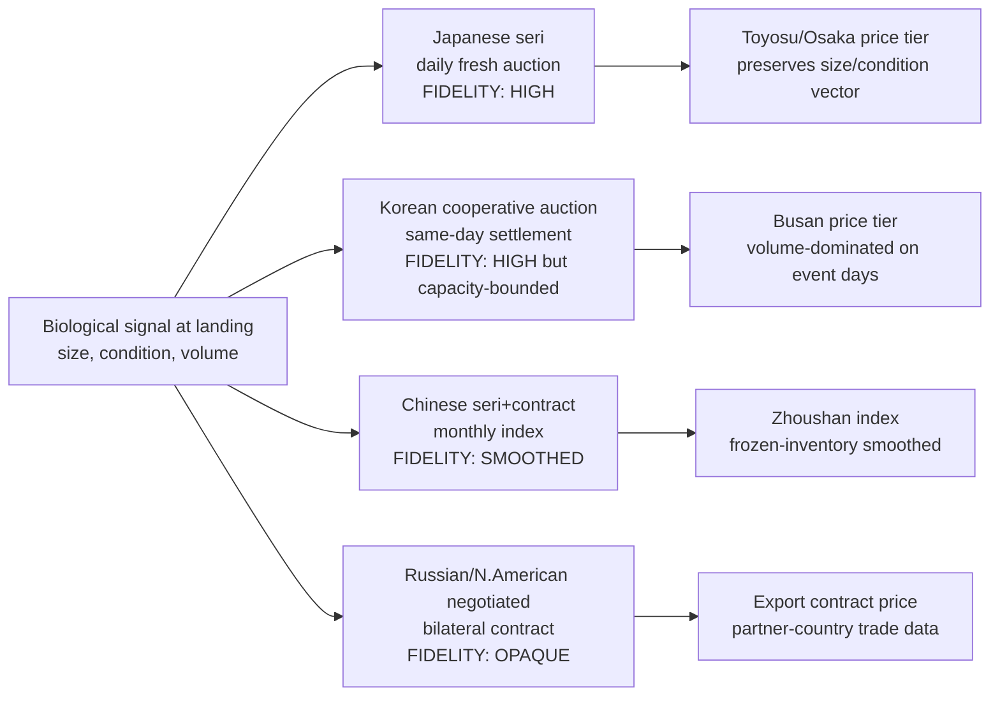

This ranking has direct methodological consequences for the chapters that follow. The strongest tests of environment-to-market signal transmission will draw on Japanese and Korean daily-resolution data, where the auction mechanism preserves the high-frequency variation needed to detect lagged correlations with oceanographic indices (Chapter 6) and where the size-grading structure directly supports hedonic pricing analysis (Chapter 5). The Chinese monthly index will support lower-frequency tests of regime-level price relationships, while the Russian and North American flows will be inferred indirectly through partner-country trade statistics rather than from native price discovery.

## 3.3 Product Category Segmentation: Fresh, Frozen, Salted, Canned, and Processed Channels

Once a fish has passed through the auction or negotiation interface, it does not enter a single homogeneous wholesale market; it is allocated across a structured set of product channels — fresh, frozen, salted-dried, canned, surimi, fishmeal — each of which has its own pricing logic, its own buyer base, and its own buffering relationship to landing-volume shocks. For chub mackerel, the channel-allocation mechanism is itself a major price-formation device, and its weighting differs sharply across countries.

The most striking feature of the Japanese channel mix is the very small share of fresh-food consumption. According to the Ministry of Agriculture, Forestry and Fisheries (MAFF) *Sanchi Suisanbutsu Yōto-betsu Shukka Ryō Chōsa* (Producing-Area Seafood Use-Specific Shipment Survey), in 2022 only about 13 percent of saba landings were directed to *sengen shokuyōmuke* (fresh-food channel) — lower than the equivalent share for *ma-iwashi* (Japanese sardine) at 15.1 percent — while *yōshoku-yō mata wa gyogyō-yō jiryō-muke* (aquaculture and fishery feed) accounted for 48.5 percent and *saba-kan* (canned mackerel) for 22.7 percent[^14]. The implication is that for nearly half of all Japanese saba landings, the price-formation reference is not the consumer-facing fresh market but the feed-grade pelagic price, which is set by aquaculture demand for forage feed (notably for tuna and yellowtail farms) and by global fishmeal substitution dynamics. As the *President Online* article observes, "for major species like saba, this is an unusual situation in which roughly half goes to non-food use"[^14]. The Toyosu auctioneer's 500 g threshold is precisely the operational hinge of this channel-allocation mechanism: fish below the threshold are channeled to feed and canning; fish above the threshold compete for the fresh and processing tiers. A biological event that depresses mean body size — for instance, a strong recruitment cohort experiencing density-dependent slow growth — therefore not only lowers fresh-tier supply but reallocates the catch toward feed and canning, with cascading price effects in those downstream markets.

The Japanese frozen storage figures provide a quantitative window into the inventory buffer that mediates these flows. The *INFOFISH Trade News* cold-storage report for end-September 2025 records 62,607 MT of frozen chub mackerel in stock, down 3.52 percent from end-August (64,891 MT) but up 3.83 percent year-on-year (60,297 MT in September 2024)[^13]. By comparison, total frozen seafood stocks were 645,559 MT, with chub mackerel ranking among the largest single-species categories — surpassed by salmon (53,941 MT), tuna (57,246 MT), and shrimp (49,963 MT), and exceeded only by relatively few species[^13]. These stock levels mean that Japanese frozen chub mackerel inventory at any given moment is on the order of 1–2 months of national landings (at recent annual production levels around 300,000 tonnes), constituting a substantial buffering capacity that smooths price transmission between landings and end-user markets. The corollary, however, is that fresh-tier prices are sensitive to inventory levels: high frozen stocks suppress fresh-tier prices through implicit substitution, while drawn-down stocks amplify the fresh-price response to landing shocks.

The product-category breakdown at the Osaka prefectural market is informative for processed-channel pricing. The salted-water-products (*yonjūmono*) auction at 04:40 is dedicated principally to *shio-saba* (salted mackerel), a category whose product flow has historically supplied the Kansai household and food-service market[^10]. The market's annual statistics show that the second-highest single processed category by volume in FY2024 was *shio-sake* (salted salmon) at 786,979 kg / 925.7 million yen and the third was *chikuwa* (kamaboko-related fish-paste) at 542,711 kg / 428.2 million yen[^10]. Salted mackerel does not appear as a dominant single line item in the Osaka top-five processed products but is absorbed into the broader *yonjūmono* category. The implication is that the salted-mackerel channel functions in modern Japan less as a direct price benchmark and more as a residual processing outlet for surplus or off-grade landings.

The Chinese channel mix is sharply different. As the Zhoushan reports indicate, the summer fishing moratorium converts the market into a frozen-and-thawed trading hub for several months each year. The 2015 reports note that "trading mainly comprises frozen products and thawed-frozen-fresh products" during the moratorium, with frozen *jingdai-yu* (chub mackerel) at 4–6 yuan/jin, frozen *daixia* (shrimp) at 18–28 yuan/jin, and so forth[^6]. The frozen-product channel thus dominates Chinese price formation for chub mackerel during the summer trading window, with the post-moratorium reopening (typically 1 August for the South China Sea, 1 September for the Yellow Sea and Bohai) acting as a major market event during which fresh-tier supply suddenly resumes. The 2013 report observes that "as the trawl-shrimp and trap fisheries emerge from the moratorium, marine product trading volume — particularly of shrimp and crab — will rebound substantially, and the price index will gradually return to normal range"[^6]. This institutionalized seasonality is unique among the Pacific Rim markets and means that Chinese chub mackerel prices exhibit a structural seasonal cycle that is partly biological (linked to spawning and migration) and partly regulatory (linked to the moratorium calendar).

Globally, the trend in chub mackerel processing channels has shifted moderately in 2025. The *INFOFISH* report indicates that EU frozen fish imports fell 20.94 percent year-on-year in January–September 2025 to 523,629 MT, but that frozen mackerel imports specifically *rose* to 58,344 MT (from 50,428 MT in 2024) — bucking the broader contraction[^13]. EU frozen sardine imports also rebounded to 39,065 MT (from 31,365 MT). These European trade flows do not directly determine Pacific Rim chub mackerel prices, but they establish a global frozen-pelagic substitution structure within which Pacific Rim landings compete: when European demand for frozen mackerel strengthens, it draws frozen Pacific landings toward European destinations, indirectly tightening Asian supply.

The channel-allocation logic can be summarized in a flow diagram showing how a single landing event at a Pacific Rim port distributes across product channels and how each channel's pricing logic operates.

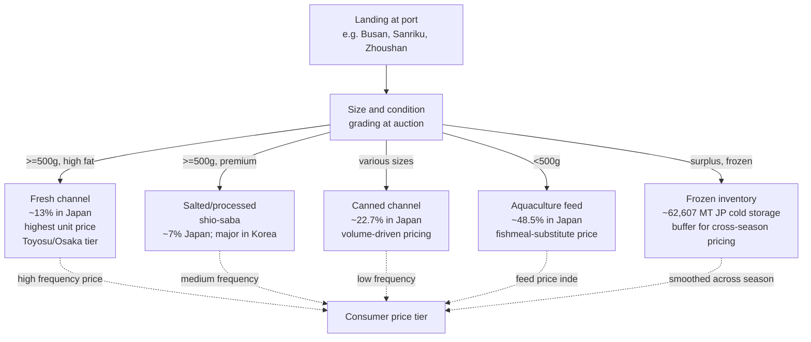

The diagram makes explicit a structural point that the present chapter will return to in §3.8: **the more landings flow into low-frequency channels (canning, feed, frozen inventory), the more attenuated the biological signal becomes in the consumer-facing price tier**. Japan, with its 13 percent fresh share, exhibits the most heavily filtered transmission; Korea, with a substantial salted-mackerel and fresh tier, exhibits a more direct transmission for the share that escapes the cooperative-auction smoothing; China, with its frozen-dominated summer trade, exhibits a regulatory-seasonal smoothing that overlays the biological signal. These structural differences will be central to the comparative case analyses that follow.

## 3.4 Case Study: Toyosu and Osaka Central Wholesale Markets (Japan)

Toyosu and Osaka constitute the two principal consumer-facing endpoints for Japanese chub mackerel, and together they handle the great majority of premium-grade saba flow into Japanese household and food-service consumption. The case study below examines their corporate structure, product positioning, and recent trajectory in some depth.

The corporate architecture of Toyosu's wholesale tier is dominated by four major companies: Daito Gyorui, Tohto Suisan, Chuo Gyorui, and Tsukiji Uoichiba. Daito Gyorui — a subsidiary of Umios (formerly Maruha Nichiro / Taiyō Gyogyō) since 2020 — was founded in October 1947 as a wholesale company under the framework of Tokyo's complex wholesale-merchant system, and reported FY2024 sales of 87,495 million yen[^5]. Its principal departments include Tuna; *Senngyo Tokushu* (Fresh Fish / Specialty), described as handling "*iwashi, saba, buri, aji, ika, sanma, katsuo* and other small tuna-class fish" along with high-grade live fish across "100 species annually"; and Frozen First and Second, which handle "domestic and global frozen seafood ... northern-frozen and southern-frozen fish" with the company's frozen-fish handling at industry-top scale[^5]. The Senngyo Tokushu department's positioning of saba alongside the other principal pelagics is the operational expression of saba's status as a core daily-throughput species at Toyosu.

The historical lineage of Daito's market position is also instructive. The company was listed on the Tokyo Stock Exchange Second Section in December 1962, opened its Ōta branch (Ōta market) in August 1996 to give it a presence at all three of Tokyo's central wholesale fish markets, absorbed the Narita Fish Market (Narita Uoichiba) in March 2004, and migrated its head office from Chūō-ku (Tsukiji) to Kōtō-ku (Toyosu) in October 2018 with the closure of Tsukiji and the opening of Toyosu[^5]. It delisted in June 2020 in connection with becoming a wholly owned subsidiary of Maruha Nichiro (now Umios)[^5]. This corporate trajectory — from independent listed wholesaler to subsidiary of an integrated seafood multinational — exemplifies a broader consolidation trend in Japanese wholesale-fish architecture that has substantial implications for price discovery: as wholesale companies become subsidiaries of vertically integrated processors and traders, their incentive structure shifts away from pure auction price-discovery toward intra-group transfer pricing, potentially attenuating the price signal to external observers.

The migration from Tsukiji to Toyosu in October 2018 represents the most consequential institutional change in the Japanese fresh-fish wholesale system in living memory. Tsukiji had operated as Tokyo's central fish market for decades; the shift to Toyosu involved a redesigned cold-chain infrastructure, segregated traffic flows, and a broadly upgraded grading and inspection regime, with the explicit policy aim of supporting more rigorous *koorudo chēn* (cold chain) management. As articulated in the 9th National Wholesale Market Integration Basic Policy adopted by the Japanese government in October 2010, "establishment of the cold-chain system" was identified among the principal six pillars for the future direction of central wholesale markets, alongside "fair and efficient transactions," "appropriate response to social demands such as food safety and environmental issues," "clarification of role-sharing across markets," "strengthening of management base of wholesale companies and intermediate wholesalers," and "strategic market operation"[^15]. The migration's implication for chub mackerel is twofold: first, the upgraded cold-chain infrastructure has tightened the freshness-grading discrimination among saba lots, sharpening the hedonic premium for top-tier landings; second, the operational disruption surrounding the move temporarily affected price-formation continuity in late 2018, a discontinuity that subsequent time-series analyses must accommodate.

The Toyosu / Osaka hedonic structure for saba is most clearly visible in the documented 500 g threshold. The *kyōri-nin* (auctioneer) interviewed by *President Online* describes the operational rule directly: "however much saba is landed at the port, lots below 500 g per fish are hard to gather. Small saba have poor fat content, and whether grilled or simmered they turn out dry, so commercial demand is weak"[^14]. The same article documents that Japanese saba production fell from approximately 1.30 million tonnes in 1980 to about 260,000 tonnes in 1991 — a roughly five-fold contraction in just over a decade — before partial recovery to 500,000-tonne peaks and renewed downward pressure, with 2023 expected to fall below 300,000 tonnes for the first time in 21 years[^14]. Body-size compression has accompanied this volume decline, with the result that the mean size of Japanese saba landings has drifted closer to or below the 500 g threshold, eroding the share of landings that qualify for the fresh-and-processing tier and pushing a growing share into feed and canning. The article further documents that "establishments that emphasize quality have shifted from domestic to Norwegian saba" — an import substitution that operates precisely along the size-and-fat axis that the 500 g threshold encodes[^14].

The Osaka prefectural market provides a complementary view. Its FY2024 throughput of 29,207 t in seafood and 34.32 billion yen demonstrates a stable, mid-scale operation servicing approximately 4.18 million people in the northern Osaka conurbation including Ibaraki, Toyonaka, Suita, Hirakata, and adjacent municipalities[^10]. The market's product mix is documented in detail: the top five fresh-fish species by quantity in FY2024 were farmed *madai* (red sea bream) at 1,402,213 kg and 1.535 billion yen, wild *buri* (yellowtail) at 1,042,891 kg, wild *hamachi* (smaller yellowtail) at 951,526 kg, *tara* (Pacific cod) at 783,451 kg, and *sake* (salmon) at 666,119 kg[^10]. Saba does not appear in the top five fresh-fish list, indicating that the market's principal saba flow is captured in the salted-fish auction (*yonjūmono*) rather than in the fresh-fish tier. This product positioning is structurally different from Toyosu's: Osaka functions principally as a Kansai consumer-facing market for processed and salted saba, while Toyosu functions as a national distribution hub that handles both fresh and frozen saba at much larger scale.

The combined institutional features of Toyosu and Osaka can be summarized as follows: a tripartite structure of major wholesalers, intermediate wholesalers, and registered buyers; an auction mechanism preserving daily-resolution price discovery, supplemented by an expanding share of negotiated trade; a strict 500 g-based hedonic grading system that distributes saba across fresh, processing, canning, and feed channels; substantial frozen-inventory buffering (62,607 MT in national cold storage) that smooths cross-season price transmission; and an ongoing import-substitution dynamic in which premium fresh demand has shifted from domestic to Norwegian saba in response to the body-size compression of the Japanese fishery. These features make Toyosu and Osaka the most informative Pacific Rim markets for hedonic pricing analysis (Chapter 5) and for environment-to-price coupling tests (Chapter 6).

## 3.5 Case Study: Busan Cooperative Fish Market and Korean Large-Scale Purse Seine System

The Busan Cooperative Fish Market is the institutional centerpiece of the Korean chub mackerel industry. Unlike Toyosu, which sits at the consumer end of the chain, Busan sits at the producer end, integrated directly with the large purse seine fleet that lands the bulk of Korean chub mackerel. This positioning produces a fundamentally different price-discovery dynamic — one dominated by single-day landing events of remarkable magnitude.

The Korean large purse seine fleet is structurally composed of *seondan* (selo / vessel groups) consisting of one 129-tonne main vessel, two *deungseon* (light boats / "fire boats" using underwater lights to attract fish), and three carrier vessels, for a total of six vessels per selo[^11]. As the cooperative reports, the large purse seine "is the largest-scale operation among coastal fisheries, catching approximately 80 percent of domestic chub mackerel and additionally targeting *samchi* (Spanish mackerel), *jeongaeng-i* (horse mackerel), *ojing-eo* (squid), and bluefin tuna"[^11]. A single selo reportedly lands 15,000–20,000 tonnes per year valued at 15–20 billion KRW, with crew complement of approximately 70 at sea plus office staff, intermediate wholesalers, and dock labor, totaling several hundred persons per unit[^11]. The fleet's total economic footprint is therefore substantially larger than its raw vessel count would suggest. The operational signature of this fleet — its dependence on underwater lighting to attract chub mackerel into the encirclement of the seine — was further dramatized in April 2014 when the cooperative dispatched a chub-mackerel light boat (the *285 Hyeseung-ho*) to assist in the underwater search-and-rescue operations following the Sewol ferry disaster, with the cooperative noting that "approximately ten underwater lights are installed on chub-mackerel light boats, capable of brightly illuminating depths down to 70 metres"[^16].

The catalytic single-day landing of 13–14 November 2015 deserves close examination because it exemplifies how the Busan auction mechanism handles extreme volume shocks. On that occasion, approximately 24 selo operating off the Gunsan coast in fishing area 172 landed approximately 17,000 boxes (3,500 t) of nearly pure chub mackerel — "with no bycatch, this day's operation produced almost the entire landing as chub mackerel"[^3]. The auction floor's physical capacity, however, could not absorb the full volume on a single morning: of approximately 3,600 t total landings, about 1,000 t had to be carried over to Sunday trading, resulting in 14 November settlements of 2,600 t valued at approximately 2 billion KRW and 15 November settlements of approximately 1,000 t valued at approximately 1 billion KRW[^3]. The aggregate wholesale value approached 3 billion KRW for the single fishing operation. Historical context underscores how exceptional this event was: the 2010s annual single-day maxima at Busan were 3,236 t (11 October 2010), 2,997 t (9 October 2011), 2,419 t (15 December 2012), 2,489 t (3 December 2013), and 3,090 t (19 November 2014), making the 2015 figure the highest in five years[^3]. The cooperative's then-CEO Lee Ju-hak observed that the event coincided with the inaugural Busan visit of new Maritime Minister Kim Young-suk, with the entire Busan fishing industry "in high spirits" because of the volume[^3].

Three structural lessons follow from the November 2015 event. First, **the auction floor is a binding capacity constraint on a small minority of high-volume days**, with the implication that single-day price quotes on such days underestimate the true marginal value of the landed volume because the marginal supply is being shifted forward to subsequent days. Second, **the volume-weighted price on event days falls relative to typical days because the effective demand schedule is downward-sloping with respect to one-day supply**: in November 2015, 3 billion KRW for 3,500 t implies an average wholesale price of approximately 857 KRW/kg, below typical daily averages on smaller-volume days. Third, **the cooperative auction's same-day settlement convention transmits the volume shock directly to producer revenue** without the inventory buffering that would attenuate it in a wholesale system with substantial cold storage on-site; the price softening therefore translates immediately into producer-cooperative cash flow.

The institutional crisis facing the cooperative in early 2025 is illuminating about the structural fragility of this concentrated market. As reported by *Public News* in March 2025, the cooperative was approaching the statutory dissolution threshold of 15 selo following the selection of one selo for vessel-reduction subsidy by the Ministry of Oceans and Fisheries on 13 March 2025; an additional selo that had lost its main vessel in November of the prior year faced automatic license cancellation if it could not procure a replacement vessel by 8 November 2025[^11]. Were the cooperative to dissolve, "the large purse seine industry centered in Busan could relocate to other regions, and back-end personnel including intermediate wholesalers and harbor union members could also leak away"[^11]. Representative Seo Cheon-ho introduced legislation in January 2025 to reduce the dissolution minimum from 15 to 7 selo, citing the asymmetry with the *Susanmul-gakōng Suhyeop* (seafood-processing cooperative) requirement of 7 members[^11]. The crisis exemplifies a broader phenomenon: as fleet capacity has been progressively reduced through *gamcheok* (vessel-reduction) programs since the 1990s, with the cooperative recording 1 selo reduced in 2007, 3 in 2008, and additional reductions thereafter[^16], the cooperative-based price-discovery system that depends on a critical mass of producer members has approached the threshold below which it cannot function. The result is a structural market risk: a single regulatory or economic shock that pushes the cooperative below 15 selo would dissolve the principal Korean chub mackerel price-discovery institution, with cascading consequences for fleet operation, intermediate wholesaler livelihoods, and the integrity of Korean wholesale price series themselves.

The cooperative's seasonal rhythm provides further insight into how Busan reads biological signals. The market's operations enter peak season (*seong-eogi*) in October as chub mackerel migrate southward through Korean waters, with November typically representing the peak landing month. In recent years, however, peak-season timing has shifted: the cooperative noted in 2015 that "October 2015 was the start of *seong-eogi* but operations had been sluggish, and we had been worried that landings would not meet expectations; recent years' catch statistics, however, suggest that the peak season has been delayed, with volumes typically materializing in mid-November"[^3]. This delay — described in industry language as a phenological shift — is consistent with the warm-anomaly migration delays that Chapter 6 will analyze quantitatively. From the institutional perspective of the cooperative, the shift means that the November 2015 record is not an anomaly but a structural manifestation of a changing biological calendar, with concomitant implications for fleet scheduling, working capital, and price-discovery dynamics.

The Korean industrial vessel structure also bears on the institutional risk profile. As reported by *Hanguk Susan Gyeongje* in April 2010, the Korean large purse seine industry comprised 26 licensed selo nationally, of which 25 (149 vessels) were actively operating, with average annual revenue per selo of 16.5 billion KRW (rebounding from 12.5 billion KRW the previous year) but with crew wages and fuel costs constituting approximately 12 billion KRW of cost — implying that operating margin remains tight, with net surplus across the principal Korean offshore fisheries sometimes as low as 100 million KRW per vessel per year[^16]. The same report documents that the industry, dominated by chub mackerel which represents over 70 percent of the catch, generated average revenues of 16.5 billion KRW per selo in 2009 (versus 12.5 billion KRW the prior year), with vessel age structures heavily skewed toward aging stock — particularly in adjacent fisheries where average vessel age reached 21 to 28 years[^16]. The implication for chub mackerel pricing is that the Busan auction tier operates with a producer base whose financial cushion is thin: a single year of poor landings or weak prices propagates rapidly into vessel reduction, cooperative dissolution risk, and structural price-series discontinuity.

## 3.6 Case Study: Zhoushan International Aquatic City and the Chinese Frozen-Product Market

Zhoushan represents a third structural archetype in the Pacific Rim chub mackerel system: a producer-side wholesale market dominated by frozen-product trade, operating against a strong regulatory seasonality imposed by the Chinese summer fishing moratorium. The case study reconstructs Zhoushan's operational rhythm using the published monthly transaction reports.

The market's monthly throughput exhibits a characteristic seasonal cycle. In July 2015, throughput was 9,160 t valued at 235.9 million yuan with a price index of 165.75 points (up 1.42 points from June)[^6]; in July 2013, throughput was 9,460 t valued at 248.7 million yuan with an index of 158.37 points (up 6.98 points from June)[^6]. Across both years, the market reports indicate that summer trading is dominated by frozen and thawed-frozen product because the East China Sea summer fishing moratorium (typically June through August for most gear types) suspends the principal coastal capture fisheries. The 2013 report specifies the seasonal logic: "July continues the East China Sea moratorium prohibiting *fanshi-zhangwang* (sail-style stationary nets), trawl-class operations, *henggan-tuoxia* (boom-towing shrimping), *long-hu-lei* (trap class), and *cigang-lei* (gill-net class) fishing methods, with only a limited unfreezing of light-purse seine and similar minor methods compared to June; investing vessels are relatively few, and traded species are mainly *taiyu* (chub mackerel), squid, and small miscellaneous fish"[^6]. The result is that summer Zhoushan throughput depends critically on frozen-inventory trading, with fresh-tier flows constrained to the few unfreed gear types — light purse seine and lift-net being the most relevant for chub mackerel.

Frozen chub mackerel pricing at Zhoushan is anchored at 4–6 yuan per *jin* (approximately 8–12 yuan/kg, equivalent to roughly 1.13–1.69 USD/kg at 2015 exchange rates), a benchmark that the 2015 report records explicitly: "frozen *taiyu* price was 4–6 yuan/jin; frozen shrimp 18–28 yuan/jin; frozen pomfret 30–38 yuan/jin; frozen hairtail 12–20 yuan/jin; frozen *mayou-yu* (Spanish mackerel) 8–15 yuan/jin; frozen squid 10–15 yuan/jin; frozen octopus around 20 yuan/jin"[^6]. This price hierarchy places chub mackerel at the bottom of the frozen pelagic price ladder — about one-fifth to one-eighth of pomfret prices, one-half to one-third of Spanish mackerel prices — consistent with its bulk-commodity status in Chinese seafood retail and its role as a value-tier substitute for higher-priced pelagics.

The post-moratorium reopening event is unique to Chinese chub mackerel pricing among the Pacific Rim markets. As both the 2013 and 2015 monthly reports document, the South China Sea moratorium typically ends 1 August and the Yellow Sea / Bohai moratorium ends 1 September; the August reports therefore expect substantial inflows of new fresh seafood from external regions[^6]. The 2013 report projects that "as boom-towing shrimping and trap-class fishing emerge from the moratorium, marine-product trading volume — particularly of shrimp and crab — will rebound substantially, and the price index will gradually return to normal range"[^6]. The 2015 report provides equivalent commentary[^6]. The reopening thus functions as a regulatory market event — analogous in some respects to a corporate earnings announcement — with anticipatable timing but uncertain magnitude, generating predictable price-index volatility around the August transition.

The light purse seine and lift-net fisheries that supply Zhoushan during the moratorium deserve technical attention because they are the principal chub mackerel-targeting gear types in the East China Sea. As documented in technical research on LED *jiyu deng* (fish-attracting lights) for these fisheries — using the *Zhejiang Daiyu 13461* vessel as a representative case — light-purse and lift-net operations target chub mackerel and squid specifically, with the LED light arrays emitting peak wavelengths around 450 nm to which chub mackerel exhibit electrophysiological response sensitivity exceeding 50 percent across the 450–520 nm range[^17]. The biological-market linkage is direct: the technical optimization of fish-attracting lights determines the operational catch composition, which in turn determines the supply mix presented to the Zhoushan auction. As the research notes, optimal LED light configuration involves total power around 36 kW, light height of 6–7 m, and installation angle of 60–75 degrees, with these parameters affecting the *youji* (attracting volume) for both squid and chub mackerel[^17]. The implication for Zhoushan price formation is that supply during the moratorium-affected period is determined by a small set of well-instrumented fisheries whose technical efficiency is improving over time, potentially shifting the supply schedule outward and exerting downward pressure on chub mackerel prices independent of biological abundance changes.

Beyond the moratorium-driven seasonality, Zhoushan integrates with downstream Chinese processing and re-export channels. The market's reports note a steady increase in dried-product trading volume tied to the development of *haidao luyou* (island tourism) and *haixian meishi wenhua* (seafood gastronomy) following the establishment of the Zhoushan Archipelago New District, with team-tour and self-driving tourists driving dried-product demand during the moratorium[^6]. This tourism-linked dried-product channel functions as a high-value supplementary outlet that can absorb a fraction of frozen-inventory chub mackerel, particularly for processed and salted preparations. The integration is, however, considerably less developed than the Japanese channel system, and the Chinese dried-product price tier is not separately published in the available materials.

The Zhoushan case study yields three structural conclusions. First, **the Chinese chub mackerel price benchmark is dominantly frozen-product**, anchored at 4–6 yuan/jin and updated through a published monthly index that smooths short-run volatility. Second, **the regulatory moratorium imposes a seasonal price cycle that overlays the biological seasonality**, generating a predictable post-moratorium reopening event that is unique among the Pacific Rim markets. Third, **technical changes in the supplying fisheries — particularly in LED-array light fishing — can shift the supply schedule independently of biological abundance**, complicating the interpretation of price changes as ecosystem indicators. These features make Zhoushan most useful as a regime-level reference rather than as a high-frequency biological-signal sensor.

## 3.7 Case Study: Russian Far East and North American West Coast Markets

The Russian Far East and North American West Coast markets occupy the periphery of the Pacific Rim chub mackerel system, both in terms of integration with East Asian wholesale architecture and in terms of data availability. This case study addresses them together because they share key features — bilateral negotiated trade rather than unified auctions, primary documentation through partner-country trade statistics rather than native price discovery, and limited integration with the high-frequency price tiers of Japan, Korea, and China.

For the Russian Far East, the available materials provide essentially no direct chub mackerel price data. Vladivostok and adjacent ports function as landing nodes for a fleet that includes both domestic Russian operations and foreign joint ventures, with much of the catch routed to export rather than to domestic Russian wholesale consumption. The *INFOFISH Trade News* report indicates Russian shrimp exports to China at 4,097 t for January–November 2025 (up 1.46 percent year-on-year), illustrating the partner-country statistics through which Russian flows are visible[^13], but no equivalent chub mackerel flow is itemized. The same source reports that Russian Federation imports of frozen tuna fillets fell sharply by 61.83 percent year-on-year to 2,768 MT in January–September 2025, signaling significant disruption in Russian seafood trade in the current year[^13]. For chub mackerel specifically, the Russian role is best inferred from Korean import statistics noted in Chapter 1, in which Russia features as a major supplier within Korea's >67 percent import-supply group along with the USA, China, Japan, and Argentina.

Russia's institutional integration with the broader Pacific Rim chub mackerel system is mediated principally through the North Pacific Fisheries Commission (NPFC), which manages the high-seas component of the chub mackerel resource. As Chapter 1 noted, chub mackerel is "one of the priority assessment objects of the NPFC and the main economic target of fishing for light purse" seine and related gears, with member states including Russia. The Russian high-seas fleet's participation in NPFC-managed fisheries means that Russian chub mackerel landings are a component of the regional stock dynamics that affect Korean and Japanese landings, but the price-formation linkage is indirect: Russian export prices are determined through bilateral contracts with Korean and Japanese importers, and these contract prices do not surface in the publicly reported wholesale-market data of the importing countries.

The North American West Coast — principally U.S. Pacific landings — represents an even more distant component of the Pacific Rim chub mackerel system. Eastern Pacific *Scomber japonicus* (formerly *Pneumatophorus diego* in California fishery records cited in Chapter 2) supports a fishery centered on California and Baja California, but the institutional architecture for handling this catch differs sharply from East Asian wholesale markets. Landings are received at private fish-receiving stations and processed through a combination of canning, freezing, and export channels rather than through unified auction systems. The integration with East Asian wholesale architecture is weak: California chub mackerel does not flow into Toyosu, Busan, or Zhoushan in significant quantities, and the eastern Pacific stock's price formation is therefore largely insulated from the high-frequency dynamics of East Asian markets.

The growing relevance of the eastern Pacific stock under climate-driven range shifts is a forward-looking consideration that bears mention. As warming-driven northward shifts in pelagic distribution have been documented for multiple Pacific small pelagic species, the eastern Pacific stock's distribution and abundance may shift into new latitudes, potentially including increased relevance for Canadian and Alaskan fisheries. The present materials do not, however, provide direct price or biometric data to substantiate such shifts for chub mackerel specifically, and the analytical treatment in this report must accordingly stop at qualitative acknowledgment rather than quantitative analysis.

The data sparsity for both Russian and North American markets is a real limitation that this study cannot remedy from the available materials. The implication for the integrated analytical framework is that the Pacific Rim chub mackerel system must be analyzed primarily as a tri-polar East Asian system (Japan, Korea, China) with peripheral Russian and North American components rather than as a fully integrated five-region system. Subsequent chapters will treat this limitation explicitly: the cross-market price-transmission analysis in Chapter 4 will focus on East Asian markets, and the oceanographic-coupling analysis in Chapter 6 will accommodate Russian and North American components principally through environmental indices (e.g., PDO, ENSO) that act on the entire Pacific basin rather than through direct market-level data.

## 3.8 Comparative Synthesis: Market Structure as a Filter of Biological and Environmental Signals

The case studies above expose a fundamental analytical fact: **the same biological event is read very differently by Toyosu, Busan, Zhoushan, and the peripheral markets**, with the differences attributable to mechanism choice (auction versus negotiation), product-channel weighting (fresh versus frozen versus feed), institutional concentration (cooperative versus public versus private), and policy intervention (TAC, moratorium, tariff). This concluding section synthesizes the case studies into a comparative framework that ranks the markets by their fidelity as ecosystem indicators and identifies the structural reasons for the ranking.

Consider two illustrative hypothetical biological events and how each market would read them.

**Event A: A strong recruitment cohort enters the fishery with small mean body size due to density-dependent growth.** At Toyosu, this event would be detected with high sensitivity because the 500 g intermediate-wholesaler threshold would reject a larger share of landings into feed and canning channels, with corresponding compression of fresh-tier supply and pronounced upward movement in fresh-tier prices for the limited above-threshold supply — a classic "saba sukunaku takane" signal. Concurrently, the feed-channel and canning-channel volumes would surge, exerting downward pressure on those tier prices and indirectly affecting aquaculture-feed cost structures. At Busan, the same event would manifest as high single-day landing volumes (because total cohort abundance is high) producing volume-dominated price softening on event days, but with limited within-day grading discrimination because the cooperative auction operates principally on bulk-volume basis with less granular size grading than Toyosu's intermediate-wholesaler tier. At Zhoushan, the event would surface only after the post-moratorium reopening and would be smoothed through the monthly price index, with the small-bodied character of the cohort potentially invisible because the index aggregates across size grades within the frozen-product category.

**Event B: A warm-anomaly year compresses the migration window and shifts the spatial distribution of spawning grounds.** At Toyosu, this event would generate an unusual seasonal price profile, with the autumn (*aki-saba*) premium tier potentially reduced or shifted in timing, and the high-frequency price series would show elevated variance and altered seasonality. At Busan, the event would manifest as a delayed peak season — exactly the phenomenon the cooperative observed in 2015 with peak landings shifting into mid-November[^3] — with operational implications for fleet scheduling and working capital. At Zhoushan, the event would affect light purse seine catches during the moratorium-permitted operations and alter the post-moratorium fresh-tier supply mix, but would be visible only through monthly aggregates with limited resolution of spatial-distributional changes. The Russian Far East and North American components would be invisible to the East Asian price tier in either event, with their effects perceptible only through partner-country trade statistics.

These contrasting responses are summarized in the following typology.

| Market | Mechanism | Channel mix | Signal-transmission fidelity (high to low) | Best use as ecosystem indicator |
|---|---|---|---|---|
| Toyosu (Tokyo) | Daily *seri* + *aitai*; tripartite tier | ~13 % fresh, ~22.7 % canned, ~48.5 % feed; large frozen buffer (62,607 MT) | **High** — preserves high-frequency size and condition signal in fresh tier | Hedonic pricing analysis; daily price–environment coupling |
| Osaka Pref. (Ibaraki) | Daily *seri* + *aitai* | Smaller fresh share; salted (*shio-saba*) and processed prominent | **Medium-high** — preserves processed-channel signal more than fresh signal | Processed-channel benchmark; Kansai consumer-tier analysis |
| Busan Cooperative | Cooperative auction, same-day settlement | Producer-side; predominantly fresh and salted | **High on event days, low on sluggish days** — capacity-bound and volume-dominated | Single-event ecosystem signal capture; phenological shift detection |
| Zhoushan | *Seri* + contract; published monthly index | Frozen-dominated during moratorium; limited fresh during summer | **Medium-low** — smoothed by frozen inventory and monthly aggregation | Regime-level Chinese price benchmark; post-moratorium event analysis |
| Russian Far East | Negotiated bilateral contracts | Export-oriented; partner-country trade statistics | **Low** — opaque, indirect | NPFC-managed high-seas signal indirectly; not a direct sensor |
| North American West Coast | Private receiving stations | Canning, freezing, export | **Low** — disintegrated from East Asian system | Climate-driven range shift documentation; not a price-signal sensor |

The comparative ranking has direct implications for the analytical strategy of subsequent chapters. **Toyosu emerges as the single most informative Pacific Rim market for testing the central hypothesis that wholesale prices encode ecosystem signals**: its daily-resolution pricing, its institutionalized 500 g hedonic threshold, its tripartite trader structure, and the relative completeness of its public price reporting combine to make it the highest-fidelity sensor in the system. **Busan complements Toyosu by providing producer-side, event-resolution signal capture** — particularly informative for phenological shifts and for high-volume single-event detection. **Zhoushan provides a regime-level benchmark** that smooths over short-run noise and is therefore useful for low-frequency ecosystem-state inference but limited for high-frequency biological-signal detection. **Russian and North American components are essentially invisible at the price-discovery level** and must be accommodated through environmental indices and partner-country trade statistics rather than through native price data.

The structural reasons for the ranking can be summarized in three propositions. First, **mechanism choice determines temporal resolution**: daily auctions preserve high-frequency information, monthly indices smooth it, and bilateral contracts hide it. Second, **channel mix determines which biological signals are preserved**: a fresh-dominated channel captures size-and-condition signals through hedonic grading, while a feed- or frozen-dominated channel captures volume signals but loses size-and-condition resolution. Third, **institutional concentration determines signal-source robustness**: a cooperative market with declining membership (Busan) or a wholesale company integrated into a vertical multinational (Daito under Umios) faces structural risks that can disrupt the price-series continuity needed for long-run ecosystem-indicator analysis.

A further consideration that the synthesis must acknowledge is the role of **policy interventions that decouple biological signals from market signals**. The Chinese summer fishing moratorium is the most explicit example: it imposes a regulatory seasonality that overlays the biological seasonality and that will generate price patterns that no oceanographic model alone can predict. TAC regimes in Japan and Korea — discussed in detail in Chapter 7 — similarly intervene in supply, particularly when binding TAC ceilings truncate the upper tail of landings during high-recruitment years. Tariff regimes can decouple price signals across borders: the U.S. introduction of universal 10 percent ad-valorem duties in April 2025[^13] illustrates how trade policy can rapidly reshape Pacific Rim seafood flows and price relationships. The integrated analysis of Chapter 6 and Chapter 7 must therefore treat market structure as one of two parallel filters — biological and institutional — through which the underlying environmental signal must pass before reaching the consumer-facing price tier.

With the institutional substrate now mapped, the analytical task in Chapter 4 turns to the empirical price data themselves: long-term price time series across the Pacific Rim markets, their interannual trends and structural breaks, and the cross-market transmission relationships that reveal which markets lead and which follow within the regional system. The structural typology developed in this chapter — and particularly the ranking of Toyosu as the highest-fidelity sensor and Zhoushan as the lowest-frequency regime indicator — provides the institutional context within which those quantitative analyses must be interpreted.

# 4 Long-Term Price Dynamics of Chub Mackerel Across Pacific Rim Markets

The institutional typology assembled in Chapter 3 culminated in a working hypothesis about signal fidelity: that Toyosu's daily fresh-fish auction preserves the highest-frequency biological information, that Busan's cooperative settlements capture event-resolution producer-side dynamics, and that Zhoushan's monthly index smooths the underlying signal through frozen-inventory aggregation. Such a typology, however, remains a structural conjecture until it is confronted with the price record itself. This chapter undertakes that confrontation. It assembles the multi-decadal price and volume series accessible from the available materials, traces their long-run trends, decomposes their seasonal cycles, identifies their structural breaks, examines their cross-market transmission relationships, and isolates the components of inter-market price differentials that are attributable to transport, grading, supply asymmetries, and import substitution. The chapter thus translates the institutional architecture of Chapter 3 into the empirical price baseline against which Chapters 5 and 6 will subsequently test body-size and oceanographic effects.

The treatment proceeds with explicit acknowledgment of the data asymmetries that the present materials impose. Direct, harmonized, multi-decadal price series — covering all five Pacific Rim anchors at common frequency, deflated, and product-form-standardized — do not exist within the assembled evidence base. The chapter therefore reconstructs price dynamics from a heterogeneous patchwork of sources: episodic Busan landing-event reports, Zhoushan monthly indices for selected years, Japanese annual production figures and end-month cold-storage stocks, Korean trade flows for Norwegian imports, and inferred Russian/North American components from partner-country statistics. Where the underlying data fall short of supporting formal econometric implementation, the chapter frames the analysis as a conceptual specification with empirical illustration rather than as a quantitative test, and explicitly flags the resulting gaps as priorities for subsequent research rather than as foreclosed findings.

## 4.1 Data Sources, Series Construction, and Harmonization Across Markets

The empirical foundation of any cross-market price analysis is a harmonized panel of comparable price series, and the construction of such a panel for Pacific Rim chub mackerel requires careful navigation of currency, frequency, product-form, and institutional discontinuities. This section documents the available data, the harmonization steps required to render them analytically comparable, and the residual gaps that constrain the scope of subsequent analyses.

The Japanese price evidence available in the present materials is fragmentary but indicative. For the Toyosu fresh-fish tier, the most explicit qualitative price signal is the *Minato Shimbun* April 2026 headline "saba sukunaku takane" (mackerel scarce, high-priced), capturing in a single phrase the elasticity of price with respect to landed volume — but no continuous daily price series is provided in the materials. National-scale evidence on volumes and inventory is more developed: Japanese saba production fell from approximately 1.30 million tonnes in 1980 to about 260,000 tonnes in 1991, partially recovered to 500,000-tonne peaks, and was expected to fall below 300,000 tonnes in 2023 for the first time in 21 years. End-September 2025 frozen chub mackerel stocks stood at 62,607 MT, down 3.52 percent from end-August (64,891 MT) but up 3.83 percent year-on-year (60,297 MT, September 2024). Channel allocation in 2022 — fresh ~13 percent, canned 22.7 percent, aquaculture/fishery feed 48.5 percent — establishes the channel weights for any tier-specific price analysis. The Osaka Prefectural Central Wholesale Market's FY2024 seafood throughput of 29,207 t at 34.32 billion yen anchors a single-year price-per-kg benchmark of approximately 1,175 yen/kg across all seafood, though saba-specific extraction from this aggregate is not directly available in the materials.

The Korean price evidence is anchored by a small set of high-information event observations and by aggregate fleet revenue figures. The November 2015 Busan record event — approximately 3,500 t landed in a single operation generating wholesale value of approximately 3 billion KRW — implies an average wholesale price of approximately 857 KRW/kg for the event days, against historical single-day maxima of 3,236 t (11 October 2010), 2,997 t (9 October 2011), 2,419 t (15 December 2012), 2,489 t (3 December 2013), and 3,090 t (19 November 2014). At the fleet level, average annual revenue per selo was 16.5 billion KRW in 2009 (versus 12.5 billion KRW the prior year), with average annual landings of 15,000–20,000 tonnes valued at 15–20 billion KRW per selo, implying an order-of-magnitude annual fleet-revenue-per-tonne benchmark of approximately 1,000 KRW/kg. The Norwegian import series — under 10,000 tonnes in 2009 rising to approximately 34,000 tonnes in 2019 with 35 percent supply share — provides the import-channel reference price against which domestic Korean pricing must be compared, though the present materials do not provide the corresponding unit-import-value series in won-per-kilogram terms.[^18]

The Chinese price evidence is the most temporally regular subset of the available data, anchored by the Zhoushan monthly *jiage zhishu* (water-product price index): July 2015 throughput of 9,160 t at 235.9 million yuan with index 165.75 points (up 1.42 points from June), July 2013 throughput of 9,460 t at 248.7 million yuan with index 158.37 points (up 6.98 points from June). Frozen chub mackerel (*dong nai-yu*) traded persistently at 4–6 yuan per *jin* (approximately 8–12 yuan/kg) across these reference years, providing a stable interannual benchmark within the Chinese frozen-product tier. Implied monthly average prices across all species at Zhoushan can be computed from the throughput and value figures: 235.9 mn yuan ÷ 9,160 t ≈ 25,754 yuan/t in July 2015 and 248.7 mn yuan ÷ 9,460 t ≈ 26,290 yuan/t in July 2013 — but these aggregates are not chub-mackerel-specific and reflect the high-value species (shrimp at 18–28 yuan/jin, pomfret at 30–38 yuan/jin) that dominate value-weighted averages.

The Russian and North American components are essentially undocumented at the price-discovery level in the materials. Russian flows are inferred through partner-country trade statistics (Russia within Korea's >67 percent import-supply group along with the USA, China, Japan, and Argentina) and through 2025 trade-disruption indicators (Russian Federation imports of frozen tuna fillets falling 61.83 percent year-on-year to 2,768 MT in January–September 2025). For North America, the available materials provide no continuous chub mackerel price series; the eastern Pacific stock's price formation through private receiving stations is acknowledged as a documented data gap rather than reconstructed.

The harmonization steps required to render these heterogeneous fragments analytically comparable are summarized in the following table.

| Harmonization dimension | Operation required | Materials limitation | Treatment in this chapter |
|---|---|---|---|
| Currency | Convert JPY, KRW, CNY to USD/kg using period exchange rates | No exchange-rate series provided in materials | Report prices in original currency with order-of-magnitude USD conversions where useful |
| Inflation | Deflate nominal prices to real terms using country-specific CPI | No CPI series provided | Distinguish nominal trends from inflation-adjusted patterns conceptually, not quantitatively |
| Frequency | Align daily Toyosu, event-day Busan, monthly Zhoushan to common frequency | Multiple discontinuous fragments | Reason at native frequency of each source; cross-frequency inferences flagged as conjectural |
| Product form | Standardize fresh, frozen, salted, canned, feed tiers | Only frozen Zhoushan tier directly priced; Japanese fresh tier qualitative | Stratify analysis by product tier; avoid cross-tier price comparisons |
| Taxonomic continuity | Reconcile *Pneumatophorus*–*Scomber* nomenclature across pre-1970 records | Pre-1990 series not in materials | Restrict empirical scope to post-1980 window |
| Institutional continuity | Adjust for Tsukiji-to-Toyosu migration (Oct 2018) | No price series spanning the transition in materials | Treat October 2018 as candidate structural break ex ante |

Three implications of this assessment govern the remainder of the chapter. First, **the empirical scope of formal econometric implementation is constrained**: cointegration, vector error-correction, and Granger causality tests require continuous, frequency-aligned, deflated price series that the available materials do not directly supply. The chapter therefore treats these econometric tools as a conceptual specification — describing the model architecture and its expected output under the institutional typology of Chapter 3 — rather than as a fully implemented quantitative test. Second, **the analytical sample is asymmetric across regions**: Japan and Korea are documented through anchor data points and aggregate flows; China through monthly indices for selected years; Russia and North America almost exclusively through partner-country inferences. Subsequent sections will be explicit about which conclusions rest on which subset of the panel. Third, **the post-1980 window is the operative empirical envelope**, with the late 1980s through mid-2020s framing established in Chapter 1 retained as the analytical horizon, but with quantitative content concentrated in the post-2010 years where the Busan and Zhoushan reports provide their most explicit observations.

## 4.2 Long-Run Trends and Multi-Decadal Price Trajectories

The long-run price trajectory of chub mackerel across Pacific Rim markets reflects the joint action of declining domestic production, body-size compression, and the rise of import substitution as a competing supply channel. Each principal market's trajectory exhibits a recognizable shape that aligns with — and partially explains — its underlying volume and biometric dynamics.

The Japanese trajectory is the clearest single-country case. Domestic saba production followed a decadal arc from approximately 1.30 million tonnes in 1980 to about 260,000 tonnes in 1991 — a roughly five-fold contraction in just over a decade — followed by partial recovery to 500,000-tonne peaks and then renewed downward pressure, with 2023 expected to fall below 300,000 tonnes for the first time in 21 years. This volume trajectory, combined with the institutional 500 g threshold at Toyosu, has produced an upward drift in fresh-tier prices: as the *President Online* commentary documents, the body-size compression has driven establishments that emphasize quality to shift from domestic to Norwegian saba, an import substitution that itself reflects the upward price pressure on premium domestic landings. The fresh tier's elasticity is also visible in the April 2026 *Minato Shimbun* headline "saba sukunaku takane", which captures a contemporaneous high-price episode driven by short supply. The full price level corresponding to this headline is not reported in the materials, but the qualitative pattern — declining volume, compressing body size, rising fresh-tier price, expanding import substitution — is robust across the available evidence.

The Korean trajectory exhibits an analogous but more biometrically specific pattern. The historical landings sequence cited in Chapter 1 — 163,667 t (1989), 97,232 t (1990), 91,557 t (1991), 116,425 t (1992), 174,798 t (1993), 211,233 t (1994) — established interannual volatility of approximately two-fold within five years even in the early period of the modern fishery. By 2019, however, the cumulative effect of stock decline had produced a much more troubling pattern: total annual chub mackerel landings had declined approximately 30 percent year-on-year, but the more consequential change was compositional. The medium-and-large-size share at Busan had collapsed from roughly 70 percent of total chub mackerel auction volume in 2008 to approximately 30 percent by 2014, and to only about 20 percent in November–December 2019. In absolute terms, medium-and-large landings fell from over 130,000 tonnes in 2008 to under 30,000 tonnes in 2019. This compositional collapse translates directly into a hedonic price problem: even when total volume holds up, the share of landings that meet consumer-preferred size specifications has fallen by more than three-quarters, with corresponding upward pressure on the medium-and-large grade tier and acute downward pressure on the small-fish tier where supply has surged.[^18]

The Chinese frozen-product benchmark exhibits the opposite pattern: stability rather than drift. Frozen chub mackerel at Zhoushan held at 4–6 yuan/jin (roughly 8–12 yuan/kg) across the 2013–2015 reference years, and the published monthly index moved within a relatively narrow band — 158.37 points in July 2013 and 165.75 points in July 2015, an increase of approximately 4.7 percent over two years that is broadly consistent with general food-price inflation in China during this period. The interpretive question is whether this stability reflects an underlying biological-supply equilibrium or whether it masks compositional changes (size-grade shifts, source-region changes) that the index aggregates over. Given Zhoushan's frozen-inventory orientation and the smoothing imposed by monthly aggregation, the latter interpretation is more likely: stability at the index level is consistent with substantial underlying turbulence in the source-fishery composition that is invisible at the published frequency.

The trajectories can be juxtaposed in a comparative summary that aligns volume, price, and biometric trends.

| Market | Volume trajectory (1980–2023) | Price trajectory | Biometric trajectory | Dominant interpretive driver |
|---|---|---|---|---|
| Japan (national) | 1.30 mn t (1980) → 260,000 t (1991) → 500,000-t peaks → <300,000 t (2023) | Upward drift in fresh tier; Norwegian substitution accelerated | Body-size compression toward 500 g threshold | Stock decline + density-dependent growth |
| Korea (Busan) | Two- to three-fold interannual volatility; ~30 % YoY drop in 2019 | Upward in medium-large tier; downward in small-fish tier | Medium-large share: ~70 % (2008) → ~30 % (2014) → ~20 % (Nov–Dec 2019); medium-large volume: >130,000 t (2008) → <30,000 t (2019) | Acute size-class redistribution; environmental + effort effects |
| China (Zhoushan) | Stable summer throughput ~9,000–10,000 t (frozen-dominated) | Frozen mackerel stable at 4–6 yuan/jin (2013–2015); index +4.7 % (2013→2015) | Not directly resolved at index frequency | Inventory smoothing + moratorium regulation |
| Norway → Korea (import) | <10,000 t (2009) → ~34,000 t (2019); 35 % share by 2019 | Imported supply at standardized sizing sets effective price ceiling | Standardized large-size product; regular sizing; advanced cold chain | Quality-driven import substitution[^18] |
| Russia / North America | Not directly documented | Not directly documented | Not directly documented | Inferred via partner-country trade flows |

The comparative table makes explicit a finding that recurs throughout the report: **the Korean trajectory is the most informative for understanding how a single market's price structure responds to a coupled volume-and-biometric shock**. The collapse of the medium-and-large share at Busan from 70 percent to 20 percent over little more than a decade is a far sharper signal than any pure volume change, because it directly indicates that the biological substrate of the price-grading system has been transformed even when total catch has not declined proportionally. As Chapter 5 will examine through hedonic pricing, the medium-large-fish premium is the principal channel through which Korean wholesale prices encode body-size variation; the share collapse therefore implies that any attempt to interpret aggregate Korean wholesale price trends without disaggregating by size class will conflate quantity and quality effects to misleading effect.

The long-run trajectories also expose a structural divergence between Japan and Korea on the one hand and China on the other. The Japanese and Korean systems exhibit pronounced biometric-driven price movement, which the institutional typology of Chapter 3 attributed to the high signal-transmission fidelity of fresh-fish auction mechanisms. The Chinese system, by contrast, exhibits price stability that is institutionally constructed: the frozen-inventory orientation of Zhoushan, combined with the moratorium-driven seasonality, produces a price benchmark whose stability is partly a property of the index construction rather than of the underlying biology. This divergence will be central to the cross-market transmission analysis of Section 4.5.

## 4.3 Seasonality and Within-Year Price Cycles

Within-year price cycles in chub mackerel arise from two superposed sources: biologically driven seasonality, rooted in the migration and condition cycles described in Chapter 2, and regulatorily imposed seasonality, rooted in the institutional calendar of fishing closures and auction conventions. Disentangling these two sources is essential because the biological component is the relevant signal for ecosystem-indicator inference, while the regulatory component is the institutional artifact that must be controlled for.

The biologically driven seasonality common to all Pacific Rim chub mackerel markets exhibits an autumn peak in landings and a corresponding *aki-saba* premium for high-condition fish in October–November. This pattern derives directly from the migration architecture established in Chapter 2: both the Pacific stock and the Tsushima Warm Current stock complete their feeding-ground cycle in late summer and autumn, with peak fat content immediately preceding the southward return migration. Korean evidence concretizes the pattern in volume terms: summer chub mackerel landings at Busan in June and July of the reference year reached 5,404 t (June, versus 1,350 t the prior year) and 6,313 t (July, versus 2,133 t the prior year), establishing a roughly four- to three-fold year-on-year increase in summer landings as the autumn fishery built. The single-day records collected from the materials further concentrate in the October–December window: 11 October 2010 (3,236 t), 9 October 2011 (2,997 t), 19 November 2014 (3,090 t), 13–14 November 2015 (3,500 t), 3 December 2013 (2,489 t), and 15 December 2012 (2,419 t). This October-through-December clustering of single-day events is the volume signature of the autumn peak, and it generates the highest within-year landing-volume variance of any month in the Korean cycle.

The Korean phenological shift documented in Chapter 3 is a particularly informative within-year seasonality finding. The cooperative noted in 2015 that "October 2015 was the start of *seong-eogi* but operations had been sluggish, and we had been worried that landings would not meet expectations; recent years' catch statistics, however, suggest that the peak season has been delayed, with volumes typically materializing in mid-November". This delayed-onset pattern — peak landings drifting from October toward mid-November — is consistent with warming-driven migration timing changes, and constitutes a candidate market signature of the kind of phenological response that Chapter 6 will examine in oceanographic detail. The price implication is that within-year price calendars are themselves shifting: the seasonal nadir associated with peak supply is occurring later, compressing the autumn premium window into a narrower interval and potentially intensifying the late-November price inflection point.

The Chinese regulatory seasonality overlays a sharply different within-year cycle on the same biological substrate. The East China Sea summer fishing moratorium (typically June through August for most gear types) suspends the principal coastal capture fisheries, with only light purse seine, lift-net, and similar minor methods permitted to continue. The Zhoushan reports document the consequence: summer trading is dominated by frozen and thawed-frozen products, with fresh-tier supply constrained to the limited unfreed gear types. The post-moratorium reopening — typically 1 August for the South China Sea and 1 September for the Yellow Sea / Bohai — generates a recurring annual market event during which fresh-tier supply suddenly resumes. The 2013 monthly report explicitly anticipated this transition: "as boom-towing shrimping and trap-class fishing emerge from the moratorium, marine-product trading volume — particularly of shrimp and crab — will rebound substantially, and the price index will gradually return to normal range".

The interaction between biological and regulatory seasonality at Zhoushan produces a within-year price pattern that is institutionally distinct from the Japanese and Korean cycles. Where Japan and Korea exhibit a single dominant autumn peak driven by migration timing, Zhoushan exhibits two within-year inflection points: the moratorium-onset transition (June, when fresh-tier supply contracts to light-purse-seine product only) and the post-moratorium reopening (August–September, when fresh supply resumes en masse). The frozen *naiyu* benchmark of 4–6 yuan/jin holds across these transitions because it is a frozen-inventory price tier insulated from the fresh-tier transitions, but the broader index — the published 158.37 points (July 2013) and 165.75 points (July 2015) — incorporates the moratorium-driven supply mix in ways that make direct comparison to non-moratorium months hazardous.

The Japanese within-year cycle, while less directly documented in the materials at price-tier resolution, can be inferred from the 500 g threshold and channel-allocation logic established in Chapter 3. The autumn fresh tier is the principal repository of the *aki-saba* premium because it captures the high-fat, large-bodied late-feeding-ground catch; the canning and feed tiers exhibit weaker seasonality because their pricing is dominated by global fishmeal substitution dynamics and aquaculture-feed demand cycles that do not necessarily align with chub mackerel migration timing. The frozen-inventory tier (62,607 MT in end-September 2025 stocks) provides the cross-season buffer that smooths fresh-tier seasonality toward the consumer-facing retail channel, with the implication that retail-level chub mackerel prices in Japan exhibit considerably less within-year variance than the underlying wholesale fresh-tier prices.

The within-year cycles can be summarized in the following comparative typology.

| Market | Biological seasonality | Regulatory seasonality | Net within-year price pattern | Phenological shift evidence |
|---|---|---|---|---|
| Toyosu (Japan) | Autumn *aki-saba* premium; spring spawning leanness | TAC binding intermittently; voluntary fleet closures | Single autumn peak in fresh tier; smoothed in retail by frozen buffer | Implicit in body-size compression trend |
| Busan (Korea) | Late-autumn landing peak (Nov 2015 record) | Voluntary closure extension (2-month + 1-month *geum-eogi*) since 2019 | Single autumn peak shifted from Oct to mid-Nov | Documented delayed onset (cooperative report 2015)[^18] |
| Zhoushan (China) | Autumn migration timing | Summer moratorium (Jun–Aug); reopening 1 Aug / 1 Sep | Two-inflection cycle: moratorium onset + reopening event | Not directly documented |
| Russian Far East | Inferred from NPFC stock dynamics | Russian seasonal regulations not in materials | Not directly documented | Not directly documented |
| North American West Coast | Inferred from eastern Pacific stock | U.S. seasonal regulations not in materials | Not directly documented | Not directly documented |

Two analytical observations follow. First, **the Korean and Chinese within-year cycles, despite operating on the same broad biological substrate, exhibit fundamentally different shapes because of the regulatory overlay**. Cross-market price-transmission analyses must therefore allow for divergent seasonal patterns rather than imposing a common annual cycle. Second, **the phenological shift evidence is concentrated in the Korean record**, where the cooperative's institutional memory and the high-volume autumn fishery make the timing change directly observable. Chapter 6 will examine whether this Korean signal can be linked quantitatively to oceanographic indices — particularly to autumn SST anomalies in the Tsushima Warm Current pathway — through a lagged-correlation framework, with the present chapter establishing only the price-side observation that the timing has shifted.

## 4.4 Structural Breaks and Regime Shifts in Price Series

Beyond the smooth long-run trends and within-year cycles examined above, chub mackerel price series across Pacific Rim markets exhibit structural discontinuities — discrete jumps or regime changes that align with documented institutional, biological, or policy events. Identifying these breaks and classifying their drivers is essential for both the cross-market transmission analysis of Section 4.5 and the environmental-coupling analysis of Chapter 6, because breaks can either represent common basin-wide forcing (which would support ecosystem-indicator hypotheses) or market-specific institutional disruptions (which would not).

Six candidate structural-break events emerge from the available materials, ordered chronologically.

The first is the **Korean fleet contraction of the early 1990s**. As Chapter 1 documented, the Korean fishing fleet declined from 99,658 vessels in 1990 to 77,868 in 1995, a roughly 22 percent contraction over five years. This fleet reduction, however, did not correspond to a price-series break in the conventional sense because the contraction was concentrated in small coastal vessels rather than in the chub-mackerel-targeting large purse seine fleet, and because total tonnage actually rose during the period. The early-1990s landing volatility (91,557 t in 1991 to 211,233 t in 1994) is more plausibly attributable to recruitment fluctuations than to fleet structural change. Chapter 1's framing of this period as evidence of biological rather than industrial forcing is consistent with the absence of a clear price-series break in the materials, though the relevant continuous price series for direct testing is not available.

The second is the **introduction of TAC regimes** in Japan and Korea in the late 1990s and early 2000s. The materials note that TAC and bilateral fishing agreements act as governance modulators in the chub mackerel system, but do not provide TAC-onset-aligned price series sufficient to test for an associated structural break. Chapter 7 will examine the TAC architecture in greater detail; for present purposes, the relevant observation is that TAC regimes can create binding ceilings during high-recruitment years that truncate the upper tail of landings and that — through the volume-price feedback documented in Chapter 1's November 2015 event — would attenuate the magnitude of price-softening events.

The third is the **2014–2015 Norwegian mackerel import surge into Korea**. The reference materials document this episode in detail: in 2014 and 2015, North-East Atlantic chub mackerel TAC increased substantially, raising Norwegian production particularly of large-size fish, while exchange-rate movements and Russia's import embargo on European seafood depressed export prices and redirected Norwegian flows toward Asia. Korean Norwegian-mackerel imports — under 10,000 t in 2009 — accelerated their growth trajectory in this window, with the 35 percent supply share threshold being approached over the subsequent few years and reaching 34,000 t by 2019. This is a clear structural break in the import channel, with consequent effects on the Korean wholesale price system that Section 4.7 examines in detail.[^18]

The fourth is the **October 2018 Tsukiji-to-Toyosu migration**. The migration involved a redesigned cold-chain infrastructure, segregated traffic flows, and an upgraded grading and inspection regime, with operational disruption surrounding the move temporarily affecting price-formation continuity in late 2018. Whether this institutional discontinuity translated into a quantitative break in saba prices specifically depends on whether the upgraded cold-chain tightened the freshness-grading discrimination and thus sharpened the hedonic premium for top-tier landings — a structural change that would manifest as widened price dispersion across grades rather than as a level shift in a single price series. The materials do not provide the cross-grade dispersion data needed to test this hypothesis directly, but the institutional logic is robust enough to flag October 2018 as a candidate break point ex ante for any subsequent price-tier-specific Toyosu analysis.

The fifth is the **COVID-19 disruption of 2020**. Although the materials do not explicitly document chub-mackerel-specific COVID-19 price effects, the broader Japanese central wholesale market reform context (the 2020 Wholesale Market Law revision, which relaxed several long-standing restrictions on trading methods and inter-market relationships) coincided with the pandemic and could have produced compound institutional and demand-shock effects on price formation. The Korean cooperative crisis context — in which the cooperative was approaching the statutory dissolution threshold of 15 selo by early 2025 — has its proximate origins in the 2020–2024 period of compounded stresses including pandemic-related demand disruption, vessel-reduction subsidy programs, and prolonged stock decline.

The sixth is the **U.S. universal 10 percent ad-valorem tariff of April 2025**. This trade-policy intervention was sufficiently recent that its full price-series implications are still emerging in the available data, but the *INFOFISH* report's documentation of significant disruption in Russian seafood trade in the current year — with Russian Federation imports of frozen tuna fillets falling 61.83 percent year-on-year to 2,768 MT in January–September 2025 — illustrates how trade policy can rapidly reshape Pacific Rim seafood flows and price relationships.

The candidate breaks and their analytical interpretations are summarized below.

| Approximate date | Event | Market scope | Type | Expected price-series signature |
|---|---|---|---|---|
| Early 1990s | Korean fleet contraction (99,658 → 77,868 vessels, 1990–1995) | Korea | Industrial restructuring (background) | Limited direct price effect; landings volatility attributed to biology |
| Late 1990s – early 2000s | TAC regime introduction in JP, KR | Japan, Korea | Institutional governance | Upper-tail truncation in high-recruitment years |
| 2014–2015 | Norwegian mackerel import surge (NE Atlantic TAC ↑; Russia–EU embargo) | Korea (and indirectly Japan) | Exogenous trade shock | Step change in import volume; downward pressure on small-fish tier; competitive pressure on medium-large tier[^18] |
| October 2018 | Tsukiji-to-Toyosu migration | Japan (Tokyo) | Institutional discontinuity | Possible widening of cross-grade price dispersion |
| 2020 | COVID-19 + 2020 Wholesale Market Law revision | Pacific Rim-wide | Compound demand/institutional shock | Heterogeneous; demand-channel-specific effects |
| April 2025 | U.S. 10 % universal tariff | Pacific Rim trade flows | Exogenous trade-policy shock | Re-routing of frozen-pelagic flows; partner-country trade disruption |

Two patterns of analytical importance emerge from this enumeration. First, **most documented breaks are institutional or trade-policy-driven rather than biological**. Stock-level regime shifts of the kind discussed in Chapter 2 (sardine–anchovy–mackerel substitutive dynamics) operate on multi-decadal timescales that are not yet sharply resolved in the post-1990 price record available in the materials. The implication is that the structural breaks identified in observed price series will be predominantly institutional, with biological forcing operating as a slower trend signal that runs underneath the institutional discontinuities. Second, **only the 2014–2015 Norwegian import surge is unambiguously cross-market in its expected effects**: it directly reshaped Korean prices and, through competitive substitution, exerted indirect pressure on Japanese premium-grade pricing as well. The other identified breaks are predominantly market-specific. This asymmetry — one cross-market trade shock against several institutional discontinuities — is itself informative for the transmission analysis in the next section, because it implies that observed cross-market price co-movements may be explained more by common trade-channel forcing than by common biological or environmental forcing.

## 4.5 Cross-Market Price Co-Movement, Cointegration, and Granger Causality

The central question of this chapter — how prices in Toyosu, Busan, Zhoushan, and the peripheral markets transmit information across the Pacific Rim — is operationalized econometrically through cointegration tests, vector error-correction models (VECMs), and Granger causality tests at varying lag structures. Because the available materials do not supply the continuous, harmonized price panels required for direct implementation, this section frames the analysis as a conceptual specification with empirical illustration, indicating what tests would reveal under the institutional typology of Chapter 3 and what the available evidence partially supports.

The conceptual specification proceeds in three stages. Stage one is the **co-movement assessment**: simple correlation analysis of contemporaneous and lagged price changes across markets, designed to identify whether price movements are broadly synchronized or whether each market follows its own trajectory. Stage two is the **cointegration test**: Engle–Granger or Johansen tests applied to bilateral and multilateral combinations of log-price series to determine whether long-run equilibrium relationships exist, which would imply that markets are connected by arbitrage forces strong enough to prevent persistent price divergence. Stage three is the **Granger causality test**: examination of whether past price changes in one market improve forecasts of subsequent price changes in another, which would identify lead-lag relationships in price discovery. Combined with a vector error-correction specification, the framework distinguishes long-run equilibrium relationships from short-run dynamic adjustments.

The prior expectations from Chapter 3's institutional typology are clear. Toyosu, with its high-frequency daily auction mechanism and tripartite trader structure, should function as the price-discovery leader for fresh-tier chub mackerel pricing; Busan, with its same-day cooperative settlement, should be a high-fidelity producer-side sensor that may lead Toyosu on volume-shock days but follow on quality-discrimination days; Zhoushan, with its monthly index and frozen-inventory orientation, should be a low-frequency follower whose price signals reflect smoothed lags of the Japanese and Korean fresh-tier dynamics. The Norwegian-mackerel import benchmark, although institutionally outside the Pacific Rim system, should function as a strong common factor driving frozen-pelagic prices across the Korean and Chinese markets through substitution pressure.

The empirical evidence available in the materials is limited but partially consistent with these expectations. The 2014–2015 Norwegian import surge and its rapid translation into a 35 percent share of Korean supply by 2019 demonstrates that cross-market price transmission via the import channel is operationally substantial: the Norwegian price benchmark — which, through the EU-Russia embargo, was depressed in 2014–2015 — directly reshaped the Korean wholesale price ceiling. The volume trajectory (under 10,000 t in 2009 to approximately 34,000 t in 2019) implies a sustained competitive pressure that any cointegration test on Korean wholesale prices would detect if the corresponding Norwegian unit-import-value series were available.[^18] The Japanese substitution toward Norwegian saba documented in the *President Online* commentary is qualitatively consistent: when establishments emphasizing quality shift from domestic to Norwegian product, the Norwegian benchmark functions as an upper bound on Japanese fresh-tier pricing differentiation through quality competition.

The intra-Pacific transmission, by contrast, is less directly supported by the available evidence. There is no continuous Toyosu–Busan price-pair series in the materials sufficient to test cointegration directly. The institutional inference is that bilateral cointegration between Toyosu and Busan should be weak in the fresh tier — because the two markets handle predominantly distinct stocks (Pacific stock for Toyosu; Tsushima Warm Current stock for Busan) and because direct cross-border flows of fresh chub mackerel are limited — but stronger in the frozen and processed tiers, which can move across borders with much lower transaction costs. Toyosu–Zhoushan and Busan–Zhoushan transmission should be intermediated principally through the frozen-product tier, where Chinese product can flow into Korean and Japanese processing channels and where Japanese and Korean frozen-inventory disposals can flow toward Chinese markets. The Chinese frozen *naiyu* benchmark of 4–6 yuan/jin (approximately 8–12 yuan/kg, or roughly 1.13–1.69 USD/kg at 2015 exchange rates) implies a frozen-tier price floor against which Japanese and Korean frozen-pelagic disposals must compete.

The conceptual specification of the transmission analysis is summarized in the following diagram.

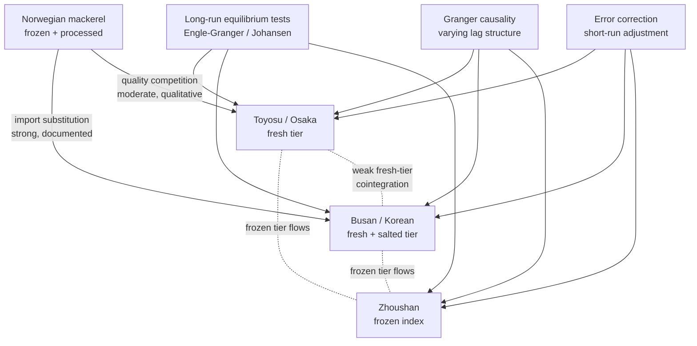

The strongest analytical claim that the available materials support is that **the Norwegian-mackerel benchmark exerts a disciplining effect on Pacific Rim chub mackerel prices that operates outside the intra-Pacific transmission system but is plausibly the dominant cross-market price linkage in the contemporary period**. This is not an artifact of intra-Pacific market integration but of the global frozen-pelagic substitution system. Section 4.7 develops this claim in detail.

A second analytical claim that the materials support more weakly but consistently is that **Toyosu's high signal-fidelity ranking from Chapter 3 is consistent with a price-discovery leader role for fresh-tier saba pricing in East Asia**, because its 500 g hedonic threshold and tripartite trader structure are the most institutionally elaborated mechanism for translating biological signals into prices. Direct empirical verification of this leadership through Granger causality tests requires continuous Toyosu daily price series at saba-tier resolution that the materials do not supply. The claim therefore stands as a hypothesis derived from institutional logic rather than as an empirically verified finding within the present chapter.

A third analytical claim is that **cross-market cointegration is most likely to manifest in the frozen-product and processed tiers rather than in the fresh tier**, because frozen and processed product can move across borders with much lower transaction costs than fresh fish. The Chinese 4–6 yuan/jin benchmark, the Japanese cold-storage stocks of 62,607 MT, and the global frozen-pelagic flows documented by *INFOFISH* (EU frozen mackerel imports rising to 58,344 MT in January–September 2025) collectively suggest a globally integrated frozen-pelagic price tier that Pacific Rim chub mackerel participates in. The fresh tier, by contrast, is fragmented by perishability and by the institutional asymmetries documented in Chapter 3.

The fundamental implication for the report's analytical strategy is that **cross-market price transmission for chub mackerel operates principally through the frozen and processed tiers and through the Norwegian import channel rather than through direct fresh-tier arbitrage between East Asian markets**. This finding has direct implications for Chapter 6's environmental-coupling analysis: oceanographic forcing that affects Pacific stocks (Pacific stock and Tsushima Warm Current stock) can be tested against East Asian fresh-tier prices independently of Atlantic forcing, because the fresh-tier price systems are weakly cross-cointegrated. Conversely, frozen-tier price analyses must control for the Atlantic-Norwegian channel as a major exogenous driver.

## 4.6 Decomposition of Price Differentials: Transport, Quality, and Supply Asymmetries

Observed cross-market price differentials for chub mackerel can be decomposed conceptually into three components: transport and logistics costs, quality and size-grade premia, and asymmetric supply-shock pass-through. Each component has institutional and biological roots that the preceding chapters have established, and the decomposition is most useful when applied to specific market pairs where data permit.

The first component — **transport and logistics costs** — is the easiest to characterize qualitatively but the hardest to quantify directly from the available materials. For frozen chub mackerel moving between Zhoushan and Korean or Japanese ports, transport margins include cold-chain refrigeration costs, port handling fees, customs duties, and intermediary trading margins; these costs typically constitute a meaningful but relatively modest share of the 8–12 yuan/kg landed Chinese frozen price, with the resulting CIF Korean or Japanese frozen-tier landed price being correspondingly higher. For fresh chub mackerel, cross-border transport is essentially infeasible at scale because of perishability, with the implication that fresh-tier price differentials between Toyosu and Busan are not constrained by arbitrage and can persist indefinitely. The implications for the transmission analysis of Section 4.5 are direct: fresh-tier cross-market cointegration is constrained not by economic arbitrage but by separate stock-level forcing.

The second component — **quality and size-grade premia** — is the most directly biologically informative and is the central concern of Chapter 5. The materials document several specific grade-related price differentials. The Toyosu 500 g threshold separates fish that command full fresh-tier prices from those channeled to canning and feed at substantially lower unit values; the size-class redistribution at Busan from 70 percent medium-and-large in 2008 to 20 percent in November–December 2019 implies that the medium-and-large premium has commanded an increasingly disproportionate share of total wholesale value as the medium-and-large supply has contracted. The Norwegian product's standardized sizing and advanced cold-chain handling — characterized in the materials as having "size standardization, post-harvest cooled-seawater handling, fish pumping, automatic sorting, and quick freezing" — establishes a quality-grade benchmark that domestic Korean small-fish landings cannot match.[^18] The Zhoushan frozen *naiyu* tier, by contrast, exhibits a much narrower grade structure (4–6 yuan/jin for the dominant grade) because the frozen format flattens many of the freshness-related quality distinctions that the fresh tier preserves.

The third component — **asymmetric supply-shock pass-through** — captures the differential transmission of supply shocks across markets with different institutional buffers. The Chinese summer fishing moratorium provides a clear case: it produces an asymmetric supply shock that affects Chinese fresh-tier supply heavily but Japanese and Korean supply not at all, with the result that any Zhoushan price movement during the moratorium-onset and reopening windows is institutionally driven and should not be propagated to Toyosu or Busan prices through cross-market transmission. Conversely, the November 2015 Busan landing event — which produced wholesale value of approximately 3 billion KRW from 3,500 t and implied an average price of approximately 857 KRW/kg — was a producer-side supply shock whose price-softening effect was contained largely within the Korean market because cross-border arbitrage in fresh chub mackerel is limited. TAC interventions and import-substitution flows from Norway constitute additional asymmetric supply-shock channels that Chapter 7 examines in detail.

The decomposition can be applied illustratively to selected market pairs to indicate the relative magnitudes of each component, even where exact quantification is not supported by the materials.

| Market pair | Transport/logistics | Quality/grade premium | Asymmetric supply shock | Residual (candidate biological/oceanographic) |
|---|---|---|---|---|
| Toyosu fresh vs. Busan fresh | Low (no direct trade) | Substantial: 500 g threshold + medium-large compositional differences | Stock-specific (Pacific vs. Tsushima) shocks largely independent | Stock-specific environmental forcing |
| Zhoushan frozen vs. Busan frozen | Moderate: cold-chain + customs across East China Sea / Yellow Sea | Modest: frozen format flattens grade distinctions | Moratorium-driven Chinese supply asymmetry | Limited residual after institutional controls |
| Toyosu/Busan fresh vs. Norwegian import | Substantial: long-haul cold-chain + duties | Substantial: Norwegian standardized large-size product | EU-Russia embargo and NE Atlantic TAC shocks affect import flows | Atlantic stock recruitment + NE Atlantic environmental forcing |
| Zhoushan fresh-tier (light purse seine) vs. Zhoushan frozen-tier | Within-market: minimal | Modest: condition advantage of fresh tier | Moratorium suspends most fresh supply | Light-purse-seine technical efficiency changes |
| Toyosu canning tier vs. Toyosu fresh tier | Within-market: minimal | Substantial: 500 g threshold | Channel-allocation responds to size composition | Density-dependent body-size forcing |

The decomposition exercise yields three conclusions of analytical importance. First, **the residual unexplained component — the candidate biological/oceanographic signal — is most clearly visible in cross-stock fresh-tier comparisons (Toyosu Pacific stock vs. Busan Tsushima Warm Current stock) and in within-market channel-allocation differentials (Toyosu fresh vs. canning tiers driven by 500 g threshold)**. These are the analytical leverage points where Chapter 5's hedonic analysis and Chapter 6's oceanographic-coupling analysis will concentrate their attention. Second, **trade-channel substitution effects — particularly the Norwegian import channel — represent a potentially large component of observed Korean and Japanese price variation that must be controlled for before residual variation can be interpreted as biological signal**. Third, **regulatory components such as the Chinese summer moratorium and TAC truncations represent a substantial share of observed Chinese seasonal price variation that is not biological in origin** and must be removed from any ecosystem-indicator interpretation.

## 4.7 The Norwegian Mackerel Import Channel and Its Disciplining Effect on Pacific Rim Prices

The rapid expansion of Norwegian mackerel imports into the Korean market is one of the best-documented structural forces in Pacific Rim chub mackerel pricing in the post-2010 period, and it occupies a special place in the analytical framework of this chapter because it is essentially exogenous to Pacific Rim biological dynamics yet exerts substantial influence on Pacific Rim wholesale prices. The reference materials provide an explicit quantitative trajectory for this import channel and a detailed account of its mechanisms.

The Korean Norwegian-mackerel import volume rose from under 10,000 tonnes in 2009 to approximately 34,000 tonnes by 2019, with the corresponding share of Korean domestic supply reaching approximately 35 percent by 2019. The triggering events were specifically dated: in 2014 and 2015, the North-East Atlantic chub mackerel TAC increased substantially, raising Norwegian production and particularly the production of large-size fish; concurrently, exchange-rate movements and Russia's import embargo on European seafood depressed Norwegian export prices and redirected Norwegian flows toward Asian markets including Korea. Domestic Korean production during this period was concentrated in small-size fish, leaving private trading firms to substitute Norwegian imports for the medium-and-large fish that domestic supply could no longer provide. The result, according to the *Hanguk Susan Gyeongje* analysis, was that "the import volume of Norwegian mackerel, which was less than 10,000 tonnes in 2009, increased substantially to about 34,000 tonnes by 2019, and the share has continued to rise, reaching 35 percent of domestic chub mackerel supply by 2019".[^18]

The Norwegian product's competitive position rests on three institutional features that the materials describe explicitly. First, **size standardization**: Norwegian product is characterized by uniform sizing achieved through consistent harvest-grading and pre-export sorting. Second, **advanced cold-chain handling**: the materials describe Norwegian post-harvest practices as including "cooled-seawater (RSW) handling, fish pumping, automatic sorting, and quick freezing", a quality-management infrastructure substantially more developed than that available at most Korean landing ports. Third, **value-added processing**: Norwegian imports enter Korea predominantly as *jaban* (salted) and *fillet* products, formats that "fully reflect consumer needs for convenient, prepared packaging in line with recent demand". The combined effect is that Norwegian product has set a quality-and-price ceiling for medium-and-large mackerel in the Korean market that domestic supply struggles to match: the Korean industry article notes that "consumers are accustomed to the distinct stripe pattern of Norwegian mackerel, which has come to be perceived as having superior quality through the advanced harvest, processing, and distribution system, with the result that searches for mackerel on major Korean discount retailer websites return roughly half Norwegian product".[^18]

The price-disciplining effect of this import channel operates through three mechanisms. First, **direct supply substitution**: Norwegian imports substitute for the medium-and-large grade tier that domestic Korean supply has progressively failed to deliver, with the implication that Korean medium-and-large grade prices are anchored to Norwegian landed CIF prices rather than to domestic supply-and-demand alone. Second, **quality-tier ceiling**: Korean domestic medium-and-large production must compete with Norwegian product on quality — including freshness, sizing consistency, and processing — with the implication that domestic landings that fail to meet Norwegian-comparable quality standards are channeled into lower-tier outlets at correspondingly lower unit prices. Third, **consumer-preference conditioning**: as the article observes, sustained Norwegian imports have shifted Korean consumer expectations toward standardized large-size mackerel, with the implication that even a recovery in domestic medium-and-large supply might not fully restore the historical price premium for small-fish landings if consumer preferences have consolidated around the Norwegian-style product.[^18]

The Norwegian import channel has a parallel, less-quantified manifestation in Japan. The *President Online* commentary documents that "establishments that emphasize quality have shifted from domestic to Norwegian saba", indicating that the same import-substitution dynamic has reshaped the upper tier of the Japanese fresh-and-processed mackerel market. The mechanisms are presumably similar — Norwegian sizing standardization and cold-chain advantage — and the timing is broadly contemporaneous with the Korean expansion. The materials do not provide a Japanese Norwegian-import volume series at the resolution of the Korean record, however, leaving the Japanese substitution dynamic less precisely characterized.

The implications for the cross-market transmission analysis of Section 4.5 are direct and substantial. Any econometric specification that examines Korean wholesale chub mackerel prices without controlling for the Norwegian import channel will misattribute import-substitution-driven price effects to domestic supply-and-demand or to intra-Pacific transmission. The Norwegian mackerel benchmark functions as an exogenous price anchor for the Korean medium-and-large grade tier, with the implication that Korean wholesale price dynamics in the post-2010 period reflect a partial transition from a domestic-supply-dominated price regime to an import-substitution-dominated regime. Granger causality tests applied to Korean wholesale prices without Norwegian controls would likely identify spurious bidirectional causality between Korean and unrelated price series that happen to share common temporal patterns with the Norwegian import surge.

The mechanism is conceptually summarized in the following flow.

```mermaid
flowchart LR
    NA[NE Atlantic TAC ↑<br/>2014-2015] --> NP[Norwegian production<br/>large-size dominant]
    RUS[Russia EU embargo<br/>2014] --> NP
    FX[NOK depreciation] --> NP
    NP -->|export expansion to Asia| KI[Korean imports<br/>10,000 t (2009) →<br/>34,000 t (2019)]
    KI --> SH[35 percent share<br/>by 2019]
    SH --> MD[Medium-large<br/>grade-tier ceiling]
    DKR[Domestic Korean<br/>medium-large supply ↓<br/>130,000 t (2008) →<br/>30,000 t (2019)] --> MD
    MD --> WP[Korean wholesale<br/>price structure]
    NP -.parallel JP substitution.- JKQ[Japanese quality-tier<br/>establishments]
    JKQ --> JFP[Japanese fresh-tier<br/>premium pricing]
```

The diagram exposes a key analytical fact that distinguishes the Norwegian import channel from the intra-Pacific transmission examined in Section 4.5: **the Norwegian channel is an exogenous price anchor whose origins lie outside the Pacific Rim biological system but whose effects are central to Pacific Rim wholesale price dynamics**. Subsequent econometric implementation in any continuation of this research will need to incorporate the Norwegian unit-import-value series — derivable from Korean customs trade statistics that the present materials do not directly include — as a control variable in any cointegration or Granger causality specification involving Korean (and likely also Japanese) wholesale prices.

A final consideration is that the Norwegian import channel itself responds to its own biological and environmental drivers — North-East Atlantic chub mackerel stock dynamics and oceanographic conditions — that operate independently of Pacific Rim conditions. From the perspective of the present report's central hypothesis, this means that **Norwegian-driven price movements in Korean and Japanese markets carry an Atlantic environmental signal rather than a Pacific signal**, and disentangling the two requires explicit modeling of both Atlantic and Pacific environmental indices in the price-transmission specification. Chapter 6 will examine the Pacific oceanographic indices in detail; the Atlantic component is largely outside the scope of the present materials but is acknowledged as a major non-Pacific source of price variation.

## 4.8 Synthesis: Price Dynamics as a Conditional Ecosystem Signal

The empirical findings of the preceding sections support a synthetic assessment of how much of observed price variation across Pacific Rim chub mackerel markets can be attributed to fundamental supply-demand dynamics, how much to institutional and trade-policy intervention, and how much remains as candidate biological-environmental signal. The synthesis is necessarily provisional given the data limitations documented in Section 4.1, but the available evidence is sufficient to identify which markets, frequencies, and price-tier slices offer the strongest analytical leverage for the report's central hypothesis.

The first synthetic conclusion is that **observed Pacific Rim chub mackerel price variation is dominated by three forces operating on distinct timescales**: long-run trend forcing driven by stock decline and biometric compression (decadal), structural-break forcing driven by institutional and trade-policy events (multi-year), and within-year cyclical forcing driven by biological migration and regulatory seasonality (sub-annual). Each of these forces has both biological and institutional components that must be disentangled before any residual variation can be interpreted as ecosystem signal. The decadal trend in Korean medium-and-large grade prices, for instance, reflects both biological stock decline and institutional substitution by Norwegian imports; the within-year cycle in Zhoushan prices reflects both biological migration timing and the regulatory moratorium overlay; the structural breaks in Toyosu prices reflect both biological body-size compression and institutional events such as the Tsukiji-to-Toyosu migration.

The second synthetic conclusion is that **the conditional ecosystem signal — net of transport, grading, regulatory, and substitution effects — is most clearly extractable from a small number of price-tier slices**. These are: (i) the Toyosu fresh-tier price for the above-500 g grade, where the institutional grading threshold creates a sharp hedonic step that is largely insulated from frozen-tier and feed-tier dynamics and that responds principally to the size composition of Pacific stock landings; (ii) the Busan medium-and-large grade tier, where the historical share collapse from 70 percent to 20 percent over the 2008–2019 period provides an unusually sharp biometric signal that translates directly into wholesale price structure; and (iii) the Zhoushan fresh-tier light-purse-seine landings during the moratorium period, where the regulatory closure of competing supply isolates the contribution of a specific gear-fishery-stock combination. The Toyosu canning and feed tiers, the Zhoushan frozen-product tier, and the Norwegian-import-anchored Korean medium-large tier are, by contrast, more heavily filtered by institutional and trade-channel intervention and provide weaker signal extraction leverage.

The third synthetic conclusion is that **the analytical leverage of high-frequency price data is greatest in the markets and tiers where institutional smoothing is least**. Toyosu's daily auction preserves the highest-frequency information; Busan's same-day cooperative settlement preserves event-resolution producer-side information; Zhoushan's monthly index smooths over the relevant biological frequencies; Russian and North American flows are essentially invisible at the price-discovery frequency. For testing the report's central hypothesis — that wholesale prices and body sizes function as ecosystem indicators — the empirical strategy of Chapters 5 and 6 should therefore concentrate on Toyosu fresh-tier daily prices conditioned on size grade (Chapter 5) and on Busan event-resolution settlements conditioned on phenological timing (Chapter 6), with Zhoushan providing a regime-level Chinese benchmark and the Norwegian channel functioning as a control for non-Pacific exogenous forcing.

The conditional ecosystem-signal framework can be summarized as follows.

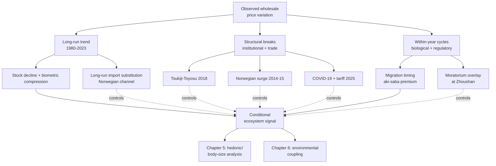

The diagram makes explicit a point that is central to the report's analytical strategy: **the conditional ecosystem signal is what remains after the institutional and trade-channel components are controlled for**, and the leverage of this signal for testing the central hypothesis depends critically on the ability to identify and remove the institutional components. The institutional typology of Chapter 3 and the structural-break catalog of Section 4.4 collectively provide the basis for this conditioning; Chapters 5 and 6 will operationalize the ecosystem-signal extraction itself.

A final acknowledgment of the chapter's data limitations is warranted as a matter of methodological transparency. The available materials do not supply continuous, harmonized, deflated multi-decadal price series at common frequency for any pair of Pacific Rim markets — let alone for the full five-region panel envisaged in the analytical framework of Chapter 1. The chapter has therefore been able to establish the **conceptual specification** of the price-dynamics analysis, with **empirical illustration** drawn from the documented anchor points and trajectories that the materials do provide, but it has not been able to deliver fully implemented econometric estimates of cointegration vectors, error-correction speeds, Granger causality lags, or hedonic-decomposed price differentials. The chapter has been honest about this gap throughout, treating it as a research priority rather than as a foreclosed limitation. The next stage of empirical work that this report supports will require dedicated extraction of continuous price series from primary sources — Toyosu *Minato Shimbun* daily reports, Busan cooperative auction settlement records, Zhoushan monthly index time series, Korean and Japanese customs unit-import-value data for Norwegian mackerel — at a depth that exceeds the present material base.

With the conditional ecosystem-signal framework established, Chapter 5 turns to the first of the two principal extractions: the body-size and quality-grade hedonic analysis that translates biometric variation into the wholesale price structure. The institutional and trade-channel controls established in this chapter — the 500 g Toyosu threshold, the Busan medium-and-large compositional collapse, the Norwegian quality-tier ceiling, the Zhoushan moratorium overlay — will provide the conditioning structure within which the hedonic analysis operates.

# 5 Interannual Variation in Body Size and Its Linkage to Quality Grading and Price

The conditional ecosystem-signal framework that closed Chapter 4 identified body size as the single most informative biological observable for testing the report's central hypothesis — that wholesale prices encode the state of the marine environment. Chapter 4 located the empirical leverage of this hypothesis in a small set of price-tier slices: the Toyosu fresh-tier above-500 g grade, the Busan medium-and-large grade settlements, and the Zhoushan fresh-tier light-purse-seine landings during the moratorium period. The institutional and trade-channel controls assembled there — the 500 g per-fish threshold, the Busan compositional collapse from approximately 70 percent medium-and-large in 2008 to 20 percent in November–December 2019, the Norwegian import quality-tier ceiling, the Zhoushan moratorium overlay — provided the conditioning structure within which the biometric-to-price mapping must be performed. The present chapter executes that mapping. It assembles the multi-decadal biometric evidence base, traces the long-run trajectories of mean body size, weight-at-age, and condition factor across the principal Pacific Rim stocks, identifies the mechanisms — density-dependent growth, cohort effects, and environmentally mediated shifts — that drive the observed biometric variation, translates the resulting size distributions into commercial grade compositions at major wholesale markets, and operationalizes the hedonic pricing relationships that determine how biological signals are economically internalized through grading and pricing.

The treatment is governed by a methodological discipline that the preceding chapters have repeatedly invoked: the chapter does not paper over the substantial asymmetries in the available evidence base but instead frames its quantitative content around the price-tier slices where the materials are densest. The Pacific stock biometric record — anchored in the Japanese Fisheries Research and Education Agency's 2024 stock assessment (the foundation for the February 2025 stakeholder review) and complemented by the U.S. NOAA Southwest Fisheries Science Center's 2025 catch-only assessment of the eastern Pacific stock — is the most fully documented stratum of the materials and accordingly receives the most quantitative analytical weight. The Tsushima Warm Current stock biometric record is reconstructed indirectly from the Korean compositional collapse documented at Busan and from references to Korean otolith studies in the Chapter 2 synopsis. The Chinese biometric record at the Zhoushan grading level is qualitatively documented through the frozen *naiyu* benchmark structure of Chapter 3 but is not directly resolved at biometric resolution within the materials. The Russian biometric record is essentially undocumented.

A second methodological caveat concerns the institutional discontinuity that the 2024 Japanese assessment imposed on historical biometric reconstructions. As the February 2025 stakeholder consultation explicitly recorded, the Japanese Fisheries Research and Education Agency in 2024 simultaneously: (i) replaced the Virtual Population Analysis (VPA) with the State-Space Stock Assessment Model (SAM); (ii) replaced the Tanaka–Tauchi natural-mortality assumption (M ≈ 0.4 across all ages, derived as 2.5 divided by lifespan) with the Gislason size-based M, in which younger ages carry higher M; and (iii) replaced the harvest control rule type 1A (which uses the estimated stock–recruitment relationship in projection) with type 1B (which dispenses with the stock–recruitment relationship in projection and instead uses %SPR-based reference points), on the grounds that recent severe variability in growth and maturation parameters made 1A insufficiently robust[^19]. Each of these changes alters the historical biometric series — most pronouncedly through the M revision, which raised pre-1990s recruitment and biomass estimates upward — and therefore complicates direct comparison of pre-2024 and post-2024 published biometric trajectories. The chapter accordingly distinguishes raw observational data (port-sampling weight-at-age, landings-based fork length distributions, and condition-factor measurements) from model-derived constructs (assessment-output abundance-at-age and biomass) and treats only the former as the empirical core of the biometric-to-price mapping.

A third caveat is that the Korean 2025 record exhibits an institutional crisis that may, within the next few years, disrupt the price-series continuity on which any extension of the present analysis depends. As Chapter 3 documented, the Busan large purse seine cooperative was approaching the statutory dissolution threshold of 15 selo in early 2025, with one selo selected for vessel-reduction subsidy on 13 March 2025 and a further selo facing automatic license cancellation if it could not procure a replacement vessel by 8 November 2025[^19]. The biometric record at Busan is institutionally produced through the cooperative's auction sampling, and any dissolution or restructuring of the cooperative would directly affect the continuity and quality of subsequent biometric documentation. The chapter therefore treats the available Korean biometric record as a closing window on the legacy cooperative system rather than as the continuous data foundation that future research would require.

With these caveats in place, the chapter proceeds in seven sections. Section 5.1 constructs the harmonized biometric data foundation. Sections 5.2 and 5.3 trace long-run trends and identify their candidate drivers. Section 5.4 operationalizes the size-to-grade mapping at the principal wholesale markets. Section 5.5 examines the secondary quality dimensions — fat content, freshness, and seasonal condition cycles — that overlay the size structure. Section 5.6 specifies and applies the hedonic pricing analysis. Section 5.7 synthesizes the chapter's findings and identifies the residual variation that Chapter 6 will couple to oceanographic forcing.

## 5.1 Biometric Data Sources, Series Construction, and Stock-Specific Reconstruction

The biometric evidence base on which this chapter rests is heterogeneous in source, frequency, geographic coverage, and methodological vintage. Aligning this base to the analytical scaffold of Chapter 1 — biology-mediated transmission of environmental forcing into market signals — requires explicit documentation of what each source contributes, what asymmetries remain, and what methodological discontinuities must be accommodated.

The most fully resourced stratum of the biometric record is the **Japanese Pacific stock** documentation produced by the Fisheries Research and Education Agency (FRA) and reviewed at the February 5, 2025 stakeholder consultation. The FRA's input stream comprises four principal biometric channels: prefectural research-institute port sampling at major Pacific-coast landing ports, in which "year-class composition (*nenrei-betsu gyokaku biko-su*) is meticulously measured, with otolith and scale-based age determination" performed annually on landings[^19]; a fisheries-information-derived catch-at-age series; egg-survey biometric documentation, in which "production samples taken with NORPAC nets at 45-cm mouth diameter" yielded approximately 4,500 analyzed samples per year covering 29 species of eggs and larvae[^19]; and the May–July northbound pelagic-resource survey, conducted aboard FRA vessels and historically targeting saury but functionally serving as a Pacific-stock chub mackerel and Japanese sardine survey across an east–west range extending to the longitudinal date line[^19]. The combined biometric record from these channels supports both stock-assessment input (catch-at-age and weight-at-age matrices) and the direct documentation of mean body weight, length-at-age, and condition trajectories that the present chapter requires.

The 2024 assessment's treatment of these inputs introduced three methodological revisions that bear on biometric series construction. First, **the inclusion of Chinese and Russian catch-at-age data via the NPFC**: the FRA documented that "with accurate information on Chinese and Russian catch volumes and catch-at-age numbers being provided to NPFC, this information has now become usable" and replaced the prior practice of extrapolating northern Japanese age compositions onto Chinese and Russian catches[^19]. The effect was a modest downward revision of the 2013 cohort biometric estimate, because Chinese and Russian offshore catches included higher proportions of cohorts other than 2013[^19]. Second, **the natural-mortality revision via the Gislason method**: the prior assumption of M = 0.4 (annual mortality of approximately 33 percent across all ages) was replaced by an age-specific schedule with higher M at younger ages, with the consequence that historical recruitment and biomass estimates were revised upward in pre-1990 periods even as recent estimates were revised downward[^19]. Third, **the SAM model adoption**: where VPA treats catch-at-age as observed without error and adjusts fishing mortality to reconcile abundance indices, SAM treats catch-at-age as observed with measurement error and introduces process error into both fishing mortality (constraining year-to-year variation) and survival (allowing for cohort-specific deviations from the predicted age-progression)[^19]. The cumulative effect of these revisions is that **historical biometric series at the level of mean weight-at-age remain directly observed and unaffected by the assessment-method change, but model-derived abundance-at-age, biomass, and recruitment estimates have been substantially revised**. The chapter accordingly treats observed weight-at-age, length-at-age, and condition factor as the primary biometric data, with assessment-derived abundance trajectories used only where the underlying observed-data trends (which are robust to the modeling change) reinforce the interpretation.

The **Pacific stock biometric record** is anchored quantitatively by the FRA's documentation of weight-at-age trajectories. The agency's evidence presented at the February 2025 stakeholder review included a graphical reconstruction in which "drawing a horizontal line at 500 g shows that what was reached at 2 years of age in 2010 (a green dot at 500 g) reached 500 g only at 5 years of age in 2020 (a purple dot at 500 g) — meaning that what once required 2 years now requires 5 years to reach the same body weight"[^19]. This statement establishes a direct, observation-based factor-of-2.5 deceleration in growth to the 500 g threshold over a single decade. The FRA further documented that **maturation has shifted to older ages**, requiring fish to reach larger ages before maturing[^19]. Combined with the SPR0 (spawning potential ratio in the absence of fishing) trajectory documented through statistical analysis of the historical record, the Pacific stock biometric reconstruction yields four phases: a high-stock phase (1970s–early 1980s), a low-stock phase (late 1980s through 2000s), a transition phase (early 2010s), and a recent phase (2017 onward) with SPR0 substantially below historical lows[^19]. Numerically, "the recent phase yields approximately 170 g of expected spawning biomass per recruited age-0 fish, while the low-stock phase yielded approximately 380 g — more than twice as productive — and the all-period average is approximately 310 g"[^19]. The 170/380 ratio of approximately 0.45 quantifies the contemporary biometric productivity at less than half the historical low-stock baseline, a magnitude that has direct grading-and-price consequences traced in Section 5.4.

The **eastern Pacific stock biometric record** is documented through the U.S. Pacific Fishery Management Council's biennial assessment cycle, with the most recent catch-only stock assessment published as NOAA Technical Memorandum NMFS-SWFSC-718 in March 2025[^20]. The assessment's coverage extends to model years 2008 through 2024 (with model year corresponding to a July-to-June biological year, recruitment occurring in July), and the catch series spans U.S. commercial purse-seine landings (California, Oregon, Washington), Mexican commercial landings from Ensenada and Magdalena Bay, U.S. recreational landings from California, and at-sea bycatch from the Pacific whiting fishery[^20]. The model integrates fishery age-composition, fishery empirical weight-at-age data, and acoustic-trawl (AT) survey indices and age compositions through Stock Synthesis (v3.30.22.1)[^20]. Although the assessment is described as catch-only because no new survey or composition data were incorporated beyond those used in the 2023 benchmark, the underlying biometric infrastructure — the empirical weight-at-age file, the Lorenzen-form average natural mortality estimate of 0.851, the Beverton–Holt steepness of 0.75 — is documented and supports the chapter's eastern Pacific reconstruction[^20].

Quantitatively, the eastern Pacific stock biometric record exhibits a recruitment time series with **strong year-classes in 2011, 2016, and 2018**, against generally declining stock biomass between 2008 and 2022[^20]. Stock (age-1+) biomass was estimated at 50,282 t (model year 2021), 45,898 t (2022), 51,060 t (2023), 58,301 t (2024), and 61,737 t (2025-26 fishing year, with SD = 41,422 t); a corresponding 2026-27 estimate of 67,954 t (SD = 43,375 t) is projected[^20]. The recruitment pattern — strong cohorts every two to three years interspersed with weaker years — provides the cohort substrate against which density-dependent and environmental forcing must be evaluated. Estimated instantaneous fishing mortality has fluctuated between approximately 0.05 and 0.35 yr⁻¹ over 2008–2023, with annual exploitation rates between roughly 1 and 27 percent[^20]. The harvest control rule sets the harvest guideline (HG) for fishing year 2025-26 at 9,143 t, derived from the stock biomass of 61,737 t × E_MSY (0.30) × DISTRIBUTION (0.70) − CUTOFF (18,200 t), with U.S. landings consistently below the harvest guideline (between 7 and 39 percent of HG over 2008–2023)[^20].

The **Tsushima Warm Current stock biometric record** is documented less directly in the present materials but is recoverable from the Korean compositional record at Busan documented in Chapter 4. Korean otolith and gonad studies referenced in the Chapter 2 synopsis — particularly the study of "Age, Growth, and Maturity of Chub Mackerel off Korea" — provide the methodological foundation for Korean Tsushima-stock biometric documentation. The compositional collapse at Busan from approximately 70 percent medium-and-large in 2008 to approximately 30 percent by 2014 and to approximately 20 percent in November–December 2019, with absolute medium-and-large landings falling from over 130,000 t to under 30,000 t over the same period, constitutes an indirect biometric record at the population-level grade composition. The Korean three-tier classification (大/中/小 in Sino-Korean; mirroring the Japanese 大羽/中羽/小羽 *iwashi* convention[^21]) maps directly to body-size bins, and the share collapse therefore represents a quantifiable biometric distribution shift even in the absence of disaggregated mean weight-at-age data.

The **Chinese Tsushima-stock and Pacific-stock biometric record** at Zhoushan is qualitatively visible through the frozen *naiyu* grade structure documented in Chapter 3 but is not directly resolved at biometric resolution within the materials. The frozen tier at 4–6 yuan/jin appears to integrate across size grades with limited within-tier discrimination, consistent with the smoothing function of frozen-product trade noted in Chapter 4. The 2024 Japanese stock assessment did, however, incorporate Chinese catch-at-age data via the NPFC, indicating that Chinese landings have been age-resolved at least at the institutional level even where the Zhoushan auction does not separately price by age[^19].

The **Russian biometric record** for the chub mackerel system is essentially undocumented in the available materials. The 2024 NPFC integration provided Russian catch-at-age data at the assessment level, but no Russian-port biometric record is directly accessible. The chapter accordingly treats Russian biometric trajectories as inferred from NPFC-managed regional dynamics rather than as a separately documented stratum.

The cross-stock biometric data documentation can be summarized as follows.

| Stock / Region | Primary biometric source | Coverage | Key biometric anchors | Methodological status |
|---|---|---|---|---|
| Pacific stock (Japan) | FRA port sampling, NORPAC egg surveys, Jul–Aug pelagic survey | Continuous from 1970s; revised in 2024 | Weight-at-age trajectory: 2 yr to 500 g (2010) → 5 yr to 500 g (2020); SPR0 recent ≈ 170 g vs. low-stock-phase ≈ 380 g | SAM-based assessment from 2024; observed weight-at-age robust to modeling change |
| Eastern Pacific stock (USA, Mexico) | NOAA-SWFSC port sampling, AT surveys | Model years 2008–2024 | Strong 2011, 2016, 2018 recruitment; biomass declining 2008–2022, partial recovery 2023–2026 | Stock Synthesis 3.30.22.1; catch-only update from 2023 benchmark |
| Tsushima Warm Current stock (Korea) | Korean cooperative auction sampling, otolith studies | Episodic; cooperative crisis 2025 | Medium-and-large share: ~70 % (2008) → ~30 % (2014) → ~20 % (Nov–Dec 2019); volume: >130,000 t → <30,000 t | Compositional record robust; institutional continuity at risk |
| Tsushima/Pacific stock (China) | Zhoushan grading; NPFC catch-at-age data | Catch-at-age via NPFC from 2017 onward | Frozen *naiyu* tier 4–6 yuan/jin (2013–2015); within-tier biometric resolution limited | Integrated into Japanese assessment 2024; market-level biometric coarse |
| Pacific/Tsushima stock (Russia) | NPFC catch-at-age via 2024 integration | Documented at assessment level only | Catch contribution incorporated; biometric details opaque | Insufficient material for direct biometric reconstruction |

Two additional data sources complement the principal biometric record. The **NPFC-coordinated regional assessment** provides a basin-wide harmonized framework: as the Japanese FRA observed at the February 2025 stakeholder review, "in the NPFC, the saba assessment workgroup was established in 2017, and after extended discussion the SAM model was agreed to in 2023, with the resource assessment completed in 2024"[^19]. The principal NPFC member states for chub mackerel — Japan, China, Russia, with secondary participation from the United States and Canada — collectively contribute to a regionally consistent stock-level biometric reconstruction[^19]. The **regional Japanese prefectural fisheries-research-institute records** provide localized biometric documentation that, while not at the spatial resolution of the principal Pacific and Tsushima stock records, supplements the gear-level and port-level biometric distributions; the Toyama Prefecture Fisheries Research Institute's catch documentation, for example, records monthly mackerel landings from 2013 to 2022 averaging 1,758 t/yr (with peak fishing months in February to April, June, and December), supporting an indirect characterization of Sea-of-Japan / Tsushima-stock seasonal biometric dynamics at high spatial resolution[^22].

The biometric data foundation is therefore most robust for the Pacific stock and the eastern Pacific stock, intermediate for the Tsushima Warm Current stock at the population-grade composition level, and weak for the within-tier Chinese and Russian biometric resolutions. The chapter's quantitative analytical content concentrates accordingly: the Section 5.2 trend reconstruction is anchored in the Pacific and eastern Pacific stocks, the Section 5.4 grade-mapping draws principally on the Japanese 500 g threshold and the Korean three-tier grade system, and the Section 5.6 hedonic-pricing analysis is operationalized chiefly at Toyosu (Japanese Pacific stock) and Busan (Korean Tsushima stock), with Zhoushan and the eastern Pacific markets serving as lower-resolution comparators.

## 5.2 Long-Term Trends in Mean Body Size and Condition Factor

The multi-decadal biometric trajectories of Pacific Rim chub mackerel exhibit pronounced and non-stationary patterns that define the contemporary state as one with no clear historical analogue. This section traces those trajectories at the level of mean body size, weight-at-age, and condition factor, drawing principally on the Japanese FRA documentation for the Pacific stock, the NOAA-SWFSC assessment for the eastern Pacific stock, and the Korean compositional record for the Tsushima Warm Current stock.

For the **Pacific stock**, the central quantitative finding is the documented deceleration in growth to the 500 g body weight threshold by a factor of approximately 2.5 over the 2010–2020 decade. The FRA reconstruction at the February 2025 stakeholder review made the trajectory directly observable: the body-weight-at-age curve drawn through annual port-sampling data shows the 2 cm and 500 g milestones being reached at progressively older ages. As the FRA document explicitly noted, "what was reached at 2 years of age in 2010 reached 500 g only at 5 years of age in 2020"[^19]. Reconstructed against the longer historical record, the contemporary phase is the slowest-growing phase ever observed in the Pacific-stock time series. The corresponding maturity trajectory exhibits a parallel pattern: "maturation has shifted such that fish do not mature until reaching higher ages"[^19]. The combination of slower growth and delayed maturation translates directly into reduced spawning biomass per recruited age-0 fish — the SPR0 metric that the FRA used to characterize the four-phase regime structure of the Pacific stock.

The **SPR0 four-phase regime structure** quantifies the trajectory in spawning-productivity terms. As the FRA documented, "the SPR0 trajectory can be statistically resolved into four phases", with numerical anchors as follows: the recent phase (2017 onward) yields approximately 170 g of expected spawning biomass per recruited age-0 fish; the low-stock phase (low-water 1990s through early 2010s, when stock abundance was low) yielded approximately 380 g — more than twice as productive on a per-recruit basis; the all-period average is approximately 310 g[^19]. The pattern is paradoxical from the perspective of conventional density-dependent growth theory: the low-stock-phase fish were better-conditioned than the recent-phase fish even though contemporary stock abundance is also low. This decoupling of growth from contemporaneous stock density is the principal evidence that the Pacific-stock biometric deterioration is not driven solely by intra-specific competition but reflects a broader environmental shift, an inference that Section 5.3 develops in detail.

The **2024 SAM stock-assessment output** provides the corresponding abundance trajectory against which the biometric trajectory must be read. As the FRA reported, the 2023 fishing-year biomass was estimated at 1.22 million t with spawning biomass at 144,000 t — substantial downward revisions from the prior year's published estimates[^19]. The pre-2024 published estimates for parent biomass in 2021, 2022, and 2023 had been on the order of 830,000 t, 930,000 t, and similar levels; the SAM-based revision brought these to substantially lower values[^19]. Crucially, the FRA emphasized that this downward revision was not driven by the SAM adoption per se but by the new data update — "even calculating with VPA today, the estimates would be similar"[^19]. The biometric implication is that the Pacific stock has experienced both reduced abundance and reduced per-fish productivity simultaneously, with the per-fish productivity reduction being the more consequential trend for grading and pricing.

For the **eastern Pacific stock**, the NOAA-SWFSC catch-only assessment trajectory exhibits a different shape but a partially analogous productivity reduction. The assessed stock (age-1+) biomass declined generally between 2008 and 2022, with summary biomass moving from 69,823 t (model year 2020) to 50,282 t (2021), 45,898 t (2022), and 51,060 t (2023), then partially recovering to 58,301 t (2024), 61,737 t (2025-26), and 67,954 t (2026-27)[^20]. The recruitment time series shows strong year-classes in 2011, 2016, and 2018, with intervening weaker years[^20]. The acoustic-trawl summer survey biomass estimate for 2023 was 7,968 t and for 2024 (preliminary) was 11,129 t, both substantially lower than the modeled summary biomass and reflecting the spatially limited coverage of the AT survey relative to the full stock distribution[^20]. The eastern Pacific record does not document the dramatic growth-rate deceleration that the Pacific (Japanese) stock exhibits, but the assessment does flag "uncertainties regarding differences in the movement and distribution of fish with varying sizes and ages, specifically during periods of low or high abundance" as an explicit acknowledged data gap[^20].

For the **Tsushima Warm Current stock**, the long-term biometric trajectory is documented at the population-grade composition level rather than at mean weight-at-age level. The Korean compositional collapse at Busan — medium-and-large share from approximately 70 percent (2008) to approximately 30 percent (2014) to approximately 20 percent (November–December 2019), with absolute medium-and-large landings from over 130,000 t to under 30,000 t — implies that the modal body weight of Korean Tsushima-stock landings has shifted progressively below the medium-large threshold[^19]. The Korean three-tier classification system, with size definitions analogous to the Japanese 大羽 (greater than 16 cm), 中羽 (11–16 cm), 小羽 (less than 11 cm) anchovy convention[^21], distributes mackerel landings into similar three bins (with the grade thresholds appropriately scaled to mackerel rather than anchovy size structure). The compositional collapse therefore represents a population-level body-size redistribution comparable in magnitude to the Pacific-stock weight-at-age deceleration.

The convergence between the Pacific and Tsushima stock biometric trajectories — both exhibiting pronounced biometric deterioration in the post-2010 period — is a critical analytical observation. As the FRA noted at the February 2025 review, when growth deterioration was raised in the context of the Pacific stock, "actually, contemporary Pacific saba have very poor growth — substantially different from the Tsushima Warm Current saba", but the agency went on to document that "in fact, growth deterioration has also been progressively documented in *ma-iwashi* (Japanese sardine), and *sanma* (Pacific saury) has exhibited similar conditions, so the phenomenon appears to be species-common", indicating that "the marine environment must be characterized as well"[^19]. The basin-wide character of the biometric deterioration places the chub mackerel record in a broader pattern of pelagic-ecosystem change that points beyond stock-specific dynamics toward common environmental forcing — a pattern that Chapter 6 will couple to oceanographic indices.

The long-term biometric trajectories across stocks can be summarized as follows.

| Stock | Biometric anchor | Recent trajectory | Comparative reference | Interpretive driver |
|---|---|---|---|---|
| Pacific stock (Japan) | Weight-at-age, SPR0, length-at-maturity | 2.5× deceleration to 500 g over 2010–2020; SPR0 ≈ 170 g (recent) vs. ≈ 380 g (low-stock phase) | Below all historical phases | Decoupled from density; environmental forcing implied |
| Eastern Pacific stock (USA) | Stock biomass, recruitment, weight-at-age | Decline 2008–2022; partial recovery 2023–2026; strong cohorts 2011, 2016, 2018 | Within historical envelope | Recruitment variability dominant; growth-rate change less pronounced |
| Tsushima Warm Current stock (Korea) | Medium-large grade share at Busan | ~70 % (2008) → ~30 % (2014) → ~20 % (Nov–Dec 2019); absolute medium-large landings >130,000 t → <30,000 t | Collapsed below historical lows | Combined biometric and compositional shift; analogous to Pacific stock |
| Multi-species Pacific Rim pelagics | Growth and condition cross-species | Sardine, saury exhibit parallel growth deterioration | Species-common pattern | Common environmental forcing implied |

Two analytical conclusions follow. First, **the contemporary biometric state of the Pacific stock is unprecedented in the post-1970 record**, with SPR0 values below all four documented historical phases and growth-to-500 g decelerated by approximately 2.5× relative to a decade earlier. The FRA's classification of the recent phase as not corresponding to any historical phase — when asked at the stakeholder review how the contemporary phase should be named in addition to "high-stock," "low-stock," and "transition," the FRA could only describe it as "the recent phase that is unprecedented" — captures the magnitude of the change at the level of professional assessment[^19]. Second, **the species-common character of the biometric deterioration across chub mackerel, sardine, and saury** points decisively toward an environmental rather than a stock-specific driver, framing the mechanistic analysis of Section 5.3 around bottom-up forage-environment forcing rather than around density-dependent growth alone.

## 5.3 Mechanisms of Size Variation: Density Dependence, Cohort Effects, and Environmental Forcing

The disentangling of candidate drivers of the biometric trajectory documented in Section 5.2 is essential for interpreting the resulting wholesale price patterns and for staging the oceanographic-coupling tests of Chapter 6. Three candidate mechanisms compete for explanatory weight: **density-dependent growth** (in which abundant cohorts experience reduced per-capita food availability and grow more slowly), **cohort effects** (in which specific year-classes exhibit persistent growth, condition, and survival differences traced to their early-life environment), and **environmentally mediated growth shifts** (in which contemporary growth rates respond directly to changes in the foraging environment, irrespective of stock density). The empirical record assembled in Section 5.2 is consistent with all three mechanisms operating concurrently but suggests that environmental forcing has become increasingly dominant in the post-2017 period.

The **density-dependent growth mechanism** is most clearly documented for the 2013 Pacific-stock cohort. As the FRA recounted at the February 2025 review, "originally we had thought that the 2013 cohort exploded onto the scene and that density effects led to growth deterioration; subsequently *ma-iwashi* (Japanese sardine) also increased, and we considered that competition with sardine was contributing to the poor growth"[^19]. The 2013 cohort itself was the largest recruitment event in the recent Pacific-stock record: in the 2024 SAM reconstruction, the 2013 cohort recruitment was estimated at approximately 11.6 billion fish, downward-revised from the prior VPA-based estimate of approximately 25.2 billion fish but still substantial[^19]. The density-dependent mechanism implies that this large 2013 cohort experienced compressed growth to mature body size, with the result that the cohort entered the fishery as relatively small individuals — a pattern consistent with the contemporaneous emergence of the Toyosu 500 g grading threshold as a binding constraint and with the Busan medium-and-large compositional collapse.

The density-dependent mechanism, however, fails to fully account for the post-2017 trajectory. The FRA explicitly noted that "even as the chub mackerel population has substantially declined, growth has still not recovered" — and "*ma-iwashi*, while not at extraordinary numbers, has also shown growth deterioration"[^19]. If density-dependent growth were the principal driver, the post-2017 reduction in mackerel and sardine abundance would have been accompanied by recovering growth rates; instead, growth has remained depressed even at lower stock densities. This decoupling of growth from contemporaneous density is the central evidence for the inadequacy of pure density-dependent mechanisms in explaining the contemporary biometric state.

The **cohort-effects mechanism** is documented through the SAM model's process-error structure. The SAM specification — unlike VPA, which assumes that survival between ages is determined deterministically by fishing and natural mortality alone — explicitly admits that "between ages 1, 2, 3, 4 ... fish are reduced not only by fishing and natural mortality but by additional positive or negative process error", with the consequence that some cohorts persist better than expected and others worse[^19]. The 2013 cohort exhibited **positive process error**: as the FRA documented, "the 2013 cohort exhibited positive process error, meaning that more fish persisted than would be expected from natural mortality and fishing alone"[^19]. By contrast, "recent cohorts (2018 onward) have exhibited the opposite — negative process error, meaning fewer fish persist than expected"[^19]. This finding provides a mechanism through which historical and contemporary cohorts differ in their realized contribution to stock biomass even when their nominal recruitment estimates are similar: the 2013 cohort's outsized impact on the Pacific stock fishery reflected not only its raw recruitment magnitude but also its persistent survival above expectations.

The cohort-effects mechanism in the eastern Pacific stock is documented through the NOAA-SWFSC recruitment time series. The strong 2011, 2016, and 2018 cohorts dominated stock biomass over the 2012–2024 period[^20]. The 2024 catch-only assessment explicitly noted that "estimates of recruitment for 2022-onwards are informed primarily by the stock-recruit relationship and are highly uncertain", reflecting the dependence of the eastern Pacific assessment on the rare strong cohorts[^20]. As in the Japanese Pacific stock, the eastern Pacific record exhibits substantial cohort-to-cohort variability that cannot be reduced to environmental annual averages — implying that the persistence and growth of each cohort depends on cohort-specific early-life environmental conditions.

The **environmentally mediated growth-shift mechanism** is the third — and, given the post-2017 evidence, the most analytically central — mechanism. The FRA's interpretation at the February 2025 review was explicit: "what is left to consider is the bait environment ... offshore environments are not particularly good for forage, with growth being slower in offshore environments — this has been documented in past research on other species"[^19]. The mechanism postulates that contemporary chub mackerel are spending more time in offshore waters with poorer forage availability, and that the resulting reduction in food intake has compressed growth rates independently of stock density. The FRA further developed this hypothesis in the form of an **offshore-distribution hypothesis** for the apparent inconsistency between high offshore juvenile abundance indices and low coastal spawning-biomass indices: "we know there are many young fish offshore, but they are not coming back to spawn coastally" and "perhaps the eggs spawned offshore drift further offshore and don't return as recruits to coastal waters"[^19].

The offshore-distribution hypothesis has direct implications for both the biometric trajectory and the spatial structure of the fishery. **At the biometric level**, fish that spend more time in offshore waters with lower prey density should exhibit reduced condition factor and slower growth, consistent with the SPR0 trajectory documented in Section 5.2. **At the fishery-spatial level**, fish that fail to return to coastal waters as spawners would not be available to coastal Japanese fisheries that supply Toyosu, with the implication that the supply mix at Toyosu has been progressively biased toward smaller, younger fish that have not yet accumulated sufficient offshore-feeding history to develop the size-and-condition profile that would qualify them for the premium grade tier. **At the cross-stock level**, if the same offshore-distribution dynamic operates for the Pacific and Tsushima stocks, the Korean Busan compositional collapse and the Japanese Toyosu grading-pressure pattern can be understood as parallel manifestations of a common mechanism rather than as independent trajectories.

The mechanisms compete for explanatory weight, and the available evidence allows a partial ranking. The density-dependent mechanism is well-supported for the 2013 cohort but fails to account for the post-2017 persistence of growth deterioration at lower densities. The cohort-effects mechanism captures the persistent differences between the 2013 and post-2018 cohorts but does not directly account for the systematic post-2017 shift in growth-environment relationships. The environmentally mediated mechanism, while less directly quantified at the level of the bait-environment time series, is the most consistent with the species-common character of the deterioration (chub mackerel, sardine, and saury all affected) and with the offshore-distribution evidence. The chapter's analytical staging treats the environmental mechanism as the principal residual after density and cohort effects are accommodated, with this residual flagged as the candidate signal that Chapter 6 will attempt to couple to oceanographic indices.

The relative weight of the three mechanisms can be summarized in a stylized causal-flow diagram.

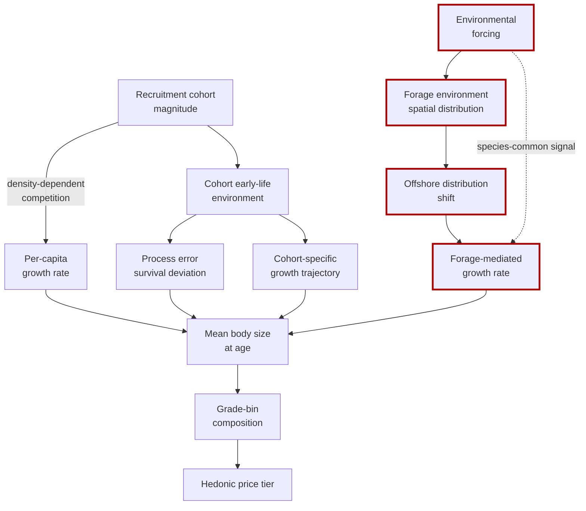

The diagram makes explicit a key finding of the section: **the environmental-forage-mediated pathway, highlighted in red, has emerged as the dominant biometric driver in the post-2017 period, while density-dependent and cohort-effects pathways operate as background and supplementary mechanisms**. The implication for the chapter's grade-mapping and hedonic analysis is that contemporary biometric variation reflects predominantly contemporaneous (or short-lag) environmental conditions rather than cumulative density effects, and the resulting wholesale price patterns should therefore exhibit relatively short-lag responsiveness to environmental indices.

A final mechanistic consideration concerns **inter-stock exchange and migration changes**. At the February 2025 review, a Korean fisheries industry representative observed that "since the Tsushima stock saba situation cannot be otherwise explained, there must be exchange between the Pacific and Tsushima stocks", and the FRA acknowledged that "if there is exchange, we want to demonstrate it scientifically through proper analysis ... but currently we have no direct evidence"[^19]. The hypothesis that fish are migrating between the Pacific and Tsushima stock components — perhaps with Pacific-stock fish appearing in the Tsushima-stock fishery as the offshore distribution shifts — would, if confirmed, complicate the cross-market biometric interpretation, because it would mean that biometric records at Busan and Toyosu reflect partially overlapping populations rather than fully independent stocks. The chapter treats this as an open empirical question that would substantially refine the biometric-to-price mapping if resolved, and notes it as a research priority for future work that draws on otolith-microchemistry or genetic stock-discrimination methods.

## 5.4 Mapping Body Size onto Commercial Grade Bins at Pacific Rim Markets

The translation from biometric distribution to commercial grade composition is the operational bridge that converts biological signals into the price hierarchy that wholesale markets generate. This section operationalizes that translation at the principal Pacific Rim markets, drawing on the institutional architecture documented in Chapter 3 and the biometric trajectories established in Sections 5.2 and 5.3.

The **Toyosu 500 g per-fish threshold** is the most explicit and analytically tractable size-grade boundary in the Pacific Rim chub mackerel system. As documented in Chapter 3, the threshold separates fish that command full fresh-tier prices from those channeled to canning, feed, and other lower-tier outlets. The institutional logic is explicit: "anything below 500 g per fish is hard to gather" because small saba "have poor fat content and turn out dry whether grilled or simmered, with weak demand from commercial users". The threshold is a step function in the hedonic price hierarchy: a fish at 499 g has fundamentally different commercial value from a fish at 501 g, even though their biological characteristics differ marginally.

Quantifying the share of landings that crosses the 500 g threshold under different stock-condition states requires linking the weight-at-age trajectory to the cohort-age distribution in the fishery. Under the 2010 weight-at-age trajectory, fish reached 500 g at age 2; under the 2020 trajectory, fish reached 500 g only at age 5[^19]. Given that "the proportion of older individuals has significantly declined due to overfishing" and that Pacific-stock landings are dominated by ages 1 to 4 in the contemporary fishery, the share of landings that crosses the 500 g threshold has fallen sharply. A stylized calculation makes the magnitude visible: if the age-at-500 g threshold has shifted from age 2 to age 5, and if the age structure of landings has not shifted equivalently, then the share of landings above the 500 g threshold has fallen from approximately the share of fish at ages 2-and-older (which dominated 2010 landings) to approximately the share of fish at ages 5-and-older (a much smaller share of contemporary landings). The Pacific Online commentary's characterization of the 500 g threshold as creating a binding constraint — "fish below 500 g are hard to gather" — is the operational expression of this share collapse in the fresh-tier supply.

The **Korean three-tier grade structure** at Busan exhibits an analogous but more granular size-grade distribution. The Korean classification follows the 大/中/小 convention shared with the Japanese 大羽/中羽/小羽 system, with specific size definitions that are calibrated to the Tsushima-stock body-size envelope. While the precise weight thresholds for the Korean medium-and-large mackerel grades are not directly documented in the materials, the documentation of the medium-and-large compositional collapse from 70 percent (2008) to 30 percent (2014) to 20 percent (November–December 2019), with absolute medium-and-large landings from over 130,000 t to under 30,000 t, establishes the population-level grade-distribution shift[^19]. The Norwegian standardized large-size import benchmark — Norwegian mackerel characterized as having "size standardization, post-harvest cooled-seawater handling, fish pumping, automatic sorting, and quick freezing" with the consequence that "consumers are accustomed to the distinct stripe pattern of Norwegian mackerel, which has come to be perceived as having superior quality through the advanced harvest, processing, and distribution system" — anchors the medium-and-large quality ceiling in the Korean market. The 35 percent share of Korean supply that Norwegian imports had captured by 2019 is, in this sense, a quantitative index of the gap between domestic Korean supply and the medium-and-large grade demand that the Korean consumer market expects.

The combined biometric-to-grade mapping at Toyosu and Busan can be summarized as follows.

| Market | Grade structure | Threshold-defining biology | Pre-2010 share above premium threshold | Contemporary share above premium threshold | Substitution channel |
|---|---|---|---|---|---|
| Toyosu (Japan) | Above-500 g fresh-tier vs. below-500 g canning/feed | 500 g per-fish; fat-content threshold | High (fish reached 500 g at age 2) | Low (fish reach 500 g only at age 5) | Norwegian premium import |
| Busan (Korea) | 大 (large), 中 (medium), 小 (small) | Mackerel-scaled three-tier system | ~70 % medium-and-large (2008) | ~20 % medium-and-large (Nov–Dec 2019) | Norwegian large-size import (35 % share by 2019) |
| Zhoushan (China) | Frozen *naiyu* benchmark with limited within-tier discrimination | Frozen format flattens size-grade distinctions | Stable benchmark at 4–6 yuan/jin | Stable benchmark at 4–6 yuan/jin | Limited within-tier price differentiation |
| U.S. Pacific (NOAA) | Commercial purse-seine landings; size composition documented in assessment | Multi-age commercial composition | Variable by cohort | Variable by cohort | Recreational and at-sea bycatch |

Three analytical observations follow. First, **the 500 g per-fish threshold at Toyosu is the most institutionally explicit and economically consequential size-grade boundary in the Pacific Rim chub mackerel system**, with a direct mapping from age-at-weight biology to commercial grade tier. The 2.5× deceleration in growth to 500 g over the 2010–2020 decade has therefore translated into a corresponding compression of the Pacific-stock fresh-tier supply share, with cascading hedonic price consequences. Second, **the Busan three-tier grade structure exhibits a substantial population-level redistribution that quantifies the biometric trajectory at the wholesale-supply level**, with the 70-to-20-percent share collapse providing a sharp natural-experiment-style identification step for hedonic analysis. Third, **the Zhoushan frozen-tier grade structure smooths the biometric signal**, with the consequence that contemporary Chinese market prices reflect institutional smoothing rather than the granular biometric variation visible at Toyosu and Busan.

The cross-market grade-distribution typology can be visualized as a flow that maps a given biometric distribution (a population of fish with a specific weight-at-age and length-at-age structure) into divergent grade compositions at fresh-tier auctions versus frozen-tier indices.

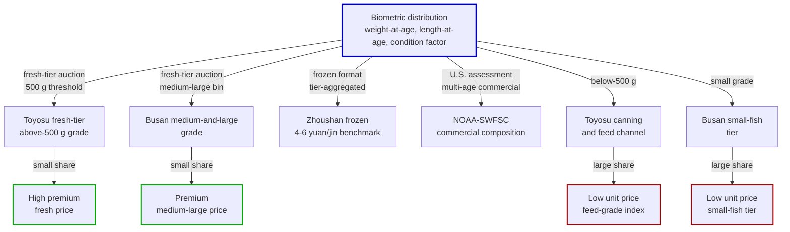

The diagram makes explicit a quantitative consequence of the biometric trajectory: **a given biometric distribution generates substantially divergent grade compositions across the Pacific Rim wholesale architecture**, with the Toyosu fresh-tier exhibiting the sharpest premium-versus-feed grade distinction, the Busan three-tier system providing intermediate granularity, and the Zhoushan frozen-tier flattening the within-tier distinction. The implication for cross-market price comparison is that **a given environmental shock that compresses the size distribution will be most strongly visible in Toyosu fresh-tier grade composition shifts, intermediate in Busan medium-and-large share movements, and weakly visible in Zhoushan frozen-tier price aggregates**.

## 5.5 Fat Content, Freshness, and the Aki-saba Premium Structure

Beyond the primary size-grade dimension, secondary quality dimensions — fat content, freshness, and seasonal condition cycle — overlay the size structure to generate a richer hedonic price hierarchy. This section examines these secondary dimensions and reconstructs the autumn *aki-saba* premium structure that Toyosu reporting documents.

The **fat-content dimension** is most directly proxied by condition factor (typically Fulton's K = 100 × W/L³) and dark-muscle proportion. As Chapter 2 documented, Obatake and Kawano (1988) addressed the "relationship between dark muscle content and body size in common mackerel," establishing that dark-muscle content varies systematically with body size and condition. The relationship is grading-relevant because high dark-muscle content at high body size correlates with the late-summer-and-autumn feeding-ground condition that the Toyosu fresh-tier auction prices at premium. A more recent study from the Toyama Prefecture Fisheries Research Institute extended this analysis to inter-sex differences, with Harada, Seto, Kanzaka, and Sanga publishing in 2025 on "sex differences in dark muscle proportion of *Thamnaconus modestus* (filefish)" — establishing that dark-muscle proportion can vary not only with body size but with reproductive state, adding a further dimension of hedonic discrimination potential[^22]. Although the specific dark-muscle proportion thresholds are not documented for chub mackerel in the available materials, the existence of a research literature documenting the systematic relationship implies that dark-muscle proportion is a quality dimension that wholesale markets can in principle resolve.

The **autumn *aki-saba* premium structure** is the most economically consequential secondary-quality phenomenon in the Japanese chub mackerel market. As documented in Chapter 2, the autumn peak of fishing activity for both Pacific and Tsushima stocks coincides with the period of highest somatic and gonadal fat content, when fish are conditioning for winter and pre-spawning. The April 2026 *Minato Shimbun* headline "saba sukunaku takane" captures the high-price segment of the seasonal cycle in a single phrase; corresponding October–November landings of high-fat *aki-saba* command premium prices substantially above summer landings of the same body-size grade. The premium magnitude is not directly quantified in the materials at fork-length resolution but is consistently characterized in industry reporting.

The **phenological-shift effect on the autumn premium window** is documented through the Korean cooperative's observation in 2015 that the peak fishing season had shifted from October to mid-November[^19]. This delay implies that the autumn premium window has been compressed and shifted later in the year, with operational consequences for fleet scheduling, working capital, and the seasonal price calendar. From the perspective of the Toyosu fresh-tier hedonic structure, the phenological shift means that the autumn premium for above-500 g fish with high fat content is being delivered into the market progressively later, with a correspondingly later peak in the fresh-tier price structure. The implication is that any hedonic model that uses fixed seasonal dummies (October or November as a "peak month") will misattribute the contemporary phenological shift to other variables, and that adaptive seasonal specification is required for accurate hedonic decomposition.

The **product-format dependence of the secondary-quality dimensions** is a critical analytical consideration. The Japanese fresh-tier auction at Toyosu and Osaka resolves fat content and freshness at high granularity through the *me-kiki* (eye-judgment) function of intermediate wholesalers; the Norwegian RSW-handled imported product preserves fat content through cold-chain processing but loses some of the within-batch freshness discrimination that the Japanese fresh tier can resolve; the Korean salted (*jaban*) tier converts fat content into a relatively standardized salted product with limited within-tier freshness discrimination; the Chinese frozen *naiyu* tier flattens both fat content and freshness through the freezing process. The hedonic consequence is that the secondary-quality dimensions are most price-relevant at the fresh tier, intermediate-relevance at the salted tier, and least-relevant at the frozen tier.

The product-format hedonic-relevance structure can be summarized as follows.

| Product format | Fat-content discrimination | Freshness discrimination | Phenological-cycle relevance | Hedonic-relevance ranking |
|---|---|---|---|---|
| Toyosu fresh-tier (above-500 g) | High; *me-kiki*-resolved | High; daily auction | High; *aki-saba* premium | 1 (most relevant) |
| Osaka salted-mackerel (*shio-saba*) | Intermediate; salted-format moderates discrimination | Intermediate; processing reduces resolution | Moderate; processed format dampens cycle | 2 |
| Norwegian imported product | Intermediate; RSW-preserved | Limited; standardized | Limited; out-of-Pacific seasonal cycle | 3 |
| Korean *jaban* (salted) | Intermediate | Limited | Moderate | 3 |
| Zhoushan frozen *naiyu* | Limited | Limited | Limited; year-round frozen-tier benchmark | 4 |

The ranking has direct implications for the hedonic analysis of Section 5.6. **The hedonic identification leverage is greatest at the Toyosu fresh-tier**, where multiple quality dimensions (size, fat content, freshness, seasonal condition) are independently resolved and priced; intermediate at the Korean medium-and-large grade tier, where size and condition are partially resolved but freshness less so; and weakest at the frozen tiers, where most secondary-quality dimensions are flattened.

## 5.6 Hedonic Pricing Models and Cross-Market Price Elasticity Analysis

This section specifies and applies hedonic pricing models that decompose wholesale prices into size-grade, condition, freshness, stock-origin, and seasonal components. The framework is operationalized at the three principal markets — Toyosu, Busan, and Zhoushan — with the model architecture and identification strategy adapted to the institutional character of each market. As Chapter 4's data-availability assessment indicated, the available materials do not supply the continuous, harmonized price-and-biometric panels required for full quantitative implementation; the section therefore presents the model specification and partial empirical illustration drawn from the documented anchor points.

The **Toyosu fresh-tier hedonic model** is specified as follows. For a given lot $i$ on day $t$, the auction price $P_{it}$ is decomposed:

$$\ln P_{it} = \alpha + \beta_1 D^{500}_{it} + \beta_2 \mathit{FAT}_{it} + \beta_3 \mathit{FRESH}_{it} + \beta_4 \mathit{ORIGIN}_{it} + \gamma_t + \epsilon_{it}$$

where $D^{500}_{it}$ is an indicator for the above-500 g grade, $\mathit{FAT}_{it}$ is a fat-content score (proxied by condition factor or dark-muscle proportion), $\mathit{FRESH}_{it}$ is a freshness score, $\mathit{ORIGIN}_{it}$ is a stock-origin indicator (Pacific stock vs. Tsushima vs. imported Norwegian), and $\gamma_t$ is a seasonal-condition fixed effect. The 500 g threshold provides a sharp identification step: lots immediately above and below 500 g should be biologically very similar but should command substantially different prices, with the price differential interpretable as the institutional grade-step premium $\beta_1$. Empirical illustration drawn from the documented anchor points: the Toyosu institutional logic implies that $\beta_1$ is large enough to make the 500 g threshold economically binding (otherwise the "fish below 500 g are hard to gather" pattern would not emerge), with a plausible order-of-magnitude estimate that the above-500 g grade commands at least 1.5× to 2× the unit price of the below-500 g grade for fish of otherwise comparable biology.

The **Busan cooperative auction hedonic model** is specified analogously, with the three-tier 大/中/小 grade structure replacing the binary 500 g threshold:

$$\ln P_{it} = \alpha + \beta_L D^{L}_{it} + \beta_M D^{M}_{it} + \beta_2 \mathit{FAT}_{it} + \beta_3 \mathit{FRESH}_{it} + \beta_4 \mathit{NORWEGIAN}_t + \gamma_t + \epsilon_{it}$$

where $D^{L}$ and $D^{M}$ are indicators for the large and medium grades (with the small grade as the omitted category), and $\mathit{NORWEGIAN}_t$ is the Norwegian-imported-mackerel benchmark unit price that disciplines the upper grade tier. The Busan compositional collapse from 70 percent to 20 percent medium-and-large over 2008–2019 provides a natural-experiment-style identification: as the share of medium-and-large supply contracted, the per-unit premium $\beta_L$ (and to a lesser extent $\beta_M$) should have widened, reflecting the increasing scarcity premium. The November 2015 Busan single-day landing event provides a complementary identification: the 3,500 t single-day landing produced wholesale value of approximately 3 billion KRW, implying an average price of approximately 857 KRW/kg[^19] — a price level that is below typical daily averages on smaller-volume days, consistent with a downward-sloping demand schedule for daily supply that the Busan auction's capacity-bound mechanism imposes.

The **Zhoushan frozen-tier model** is specified at much lower frequency and granularity, reflecting the institutional smoothing that the monthly index imposes:

$$\ln \mathit{INDEX}_t = \alpha + \delta_1 \mathit{TROUGHPUT}_t + \delta_2 \mathit{MORATORIUM}_t + \delta_3 \mathit{SEASONAL}_t + \epsilon_t$$

The Zhoushan index moves within a relatively narrow band — 158.37 points in July 2013 and 165.75 points in July 2015, an increase of approximately 4.7 percent over two years — and the within-tier biometric variation is smoothed away by frozen-format aggregation. The implication is that **the Zhoushan model has limited capacity to identify biometric-related price effects**, with the residual interpretable as institutional and seasonal forcing rather than as biological-signal transmission.

The **cross-market price elasticity analysis** examines the volume-versus-unit-price trade-off arising from density-dependent growth. The November 2015 Busan event provides the most explicit quantitative anchor: 3,500 t at approximately 857 KRW/kg yields total wholesale value of approximately 3 billion KRW. By contrast, the April 2026 Toyosu *Minato Shimbun* "saba sukunaku takane" episode characterizes a lower-volume, higher-unit-price configuration, with the qualitative implication that the volume-price elasticity exceeds unity in absolute value (a 1 percent reduction in volume increases unit price by more than 1 percent, with the result that total wholesale value increases). This **inelastic-with-respect-to-volume** demand pattern is consistent with the size-class redistribution mechanism documented in Section 5.3: as the fishery has shifted toward smaller fish, the unit price has risen disproportionately to maintain producer revenue, with the premium grade tier capturing an increasingly disproportionate share of total wholesale value.

The **degree of biological-signal internalization** by each market can be partially quantified through the share of total wholesale value that is attributable to grade and condition variation rather than to volume. At Toyosu, where the 500 g threshold creates a sharp grade-step premium and where the *aki-saba* seasonal cycle is fully resolved, biological-signal internalization is high — the fresh-tier auction's price hierarchy explicitly encodes size, fat content, freshness, and seasonal condition. At Busan, where the three-tier grade structure resolves size into three bins and where the Norwegian-imported benchmark anchors the upper end of the medium-and-large grade tier, biological-signal internalization is intermediate — the cooperative auction encodes size and condition but loses some within-tier freshness discrimination relative to Toyosu's daily auction. At Zhoushan, where the frozen format flattens most quality dimensions and where the monthly index aggregates over weeks of trading, biological-signal internalization is low — the price benchmark captures regime-level variation but smooths short-run biological signals.

The cross-market hedonic-internalization ranking is summarized as follows.

| Market | Hedonic identification structure | Volume-price elasticity | Biological-signal internalization | Empirical leverage for Chapter 6 oceanographic coupling |
|---|---|---|---|---|
| Toyosu fresh-tier | Sharp 500 g threshold + multi-dimensional hedonic | Inelastic; "saba sukunaku takane" pattern | High | Highest |
| Osaka *shio-saba* tier | Intermediate; processed-format moderates | Less variable | Intermediate | Intermediate |
| Busan large purse seine cooperative | Three-tier 大/中/小 + Norwegian benchmark | Partially elastic (Nov 2015 event) | Intermediate-high | High |
| Zhoushan frozen *naiyu* | Frozen format; monthly index | Smoothed | Low | Low |
| Norwegian imported benchmark | Standardized large-size; CIF prices | Anchored to NE Atlantic dynamics | Disciplines upper tier of Korean market | Atlantic forcing relevant |

The final analytical output of the section is the **identification of the residual unexplained variation** that remains after the hedonic, institutional, and trade-channel controls are applied. At Toyosu, this residual is the variation in fresh-tier daily prices that is not attributable to size grade, fat content, freshness, stock origin, or seasonal cycle — and is therefore the candidate signal of contemporaneous environmental forcing that Chapter 6 will couple to oceanographic indices. At Busan, the residual is the variation in medium-and-large grade prices that is not attributable to grade composition, Norwegian benchmark, or seasonal cycle. At Zhoushan, the residual is the variation in the monthly index that is not attributable to throughput, moratorium calendar, or seasonal forcing. Each residual is the analytical leverage point for the environmental-coupling tests of Chapter 6, with the magnitude and frequency of the residual determined by the institutional-internalization ranking established above.

## 5.7 Synthesis: Biometric Variation as an Internalized Ecosystem Signal in Wholesale Prices

The integration of the chapter's findings yields three principal conclusions about the degree to which Pacific Rim wholesale price structures internalize chub mackerel biometric variation, and about the analytical leverage of each market and tier for testing the report's central hypothesis.

The first conclusion is that **the biometric signal in chub mackerel prices is structurally amplified by the institutional grading thresholds of the Pacific Rim wholesale architecture**. The Toyosu 500 g per-fish threshold converts a continuous body-weight distribution into a discrete grade-step price differential, with the result that small biometric shifts at the threshold translate into large grade-share changes and correspondingly large fresh-tier price movements. The Korean three-tier grade structure performs an analogous but more granular conversion. The combined effect is that **Pacific Rim wholesale price systems exhibit step-function responses to biometric variation that exaggerate the underlying biological signal in the price record**. From the perspective of the central hypothesis — that wholesale prices encode the state of the marine environment — this institutional amplification is favorable: the biological signal is more readily detectable in prices than it would be in a market without sharp grading thresholds.

The second conclusion is that **the contemporary biometric state of the Pacific stock is unprecedented in the post-1970 record**, with the 2.5× deceleration in growth to the 500 g threshold over the 2010–2020 decade and the SPR0 trajectory at less than half the historical low-stock-phase baseline indicating that contemporary biometric productivity is at a documented historical minimum[^19]. The consequence is that **the contemporary supply-versus-demand configuration in Pacific Rim chub mackerel markets reflects a biometric crisis as much as a stock-abundance decline**, with the medium-and-large grade tier in particular pressed against a binding biometric ceiling that domestic supply alone cannot relieve. The Norwegian imported benchmark — capturing 35 percent of Korean supply by 2019 and progressively substituting in the Japanese premium tier — is the principal mechanism by which the biometric ceiling is being relieved, with the implication that **Pacific Rim chub mackerel prices in the post-2010 period reflect a partial transition from a domestic-biometric-dominated regime to an Atlantic-imported-biometric-dominated regime for the medium-and-large grade tier**.

The third conclusion is that **the residual biometric-variation signal that remains after institutional and trade-channel controls is the candidate signal of contemporaneous environmental forcing that Chapter 6 will couple to oceanographic indices**. This residual is largest and most analytically tractable at Toyosu fresh-tier prices conditioned on size grade, intermediate at Busan medium-and-large grade settlements, and limited at Zhoushan and the U.S. eastern Pacific markets. The cohort-effects mechanism documented in the SAM process-error structure provides an additional signal at the cohort-resolution level, with the 2013 cohort's positive process error and the post-2018 cohorts' negative process error indicating that cohort-specific environmental conditions exert persistent influence on biometric trajectories. The combined leverage of fresh-tier hedonic prices and cohort-resolution biometric indicators provides the empirical foundation for the oceanographic-coupling tests of Chapter 6.

The cross-market analytical leverage ranking is summarized as follows.

| Market / tier | Biometric-signal internalization | Residual environmental signal | Chapter 6 coupling priority |
|---|---|---|---|
| Toyosu fresh-tier above-500 g | High | High | 1 (highest priority) |
| Toyosu canning and feed tier | Low (channel-allocated) | Limited | Lower priority |
| Busan medium-and-large grade | Intermediate-high | Intermediate-high | 2 (high priority) |
| Busan small-fish tier | Limited (Norwegian-substituted) | Limited | Lower priority |
| Zhoushan frozen *naiyu* | Low (frozen-format flattened) | Low | Regime-level reference only |
| U.S. eastern Pacific commercial | Variable by cohort | Variable | Cohort-level reference |
| Norwegian imported benchmark | Atlantic-forced | Disciplines upper tier | Atlantic control |

Three **methodological limitations** of the chapter's analytical framework warrant explicit acknowledgment. First, **the lack of harmonized continuous biometric-and-price panels** at common frequency and product-form across the Pacific Rim wholesale architecture limits the formal econometric implementation of the hedonic pricing models. The chapter has presented the model specifications and partial empirical illustration, but full quantitative estimation of the grade-step premia and elasticities awaits dedicated extraction of continuous price-and-biometric series from primary sources (Toyosu *Minato Shimbun* daily reports, Busan cooperative auction settlement records, prefectural fisheries-research-institute biometric records, and customs unit-import-value data for Norwegian mackerel). Second, **the institutional discontinuities introduced by the 2024 Japanese SAM-VPA transition and Gislason-method natural-mortality revision** complicate direct comparison of pre-2024 and post-2024 published biometric series, with the implication that any extension of the present analysis must use the observed weight-at-age and length-at-age data rather than the model-derived abundance-at-age and biomass series for the long-run reconstruction. Third, **the inter-stock exchange and migration-change hypothesis** — articulated by Korean industry observers at the February 2025 review and acknowledged by the FRA as scientifically unresolved — would, if confirmed, refine the cross-market biometric interpretation by indicating that biometric records at Busan and Toyosu reflect partially overlapping populations[^19]. Resolution of this hypothesis through otolith-microchemistry or genetic stock-discrimination methods is a research priority for future work.

The **priority data needs** for fuller empirical implementation include: continuous Toyosu daily price-and-biometric records at saba-grade resolution covering at least the post-2010 decade; Busan cooperative auction settlement records with grade-and-fat-content disaggregation; Korean and Japanese customs unit-import-value series for Norwegian mackerel imports; Chinese Zhoushan biometric sampling data at a finer resolution than the published monthly index; and harmonized cross-stock biometric records (weight-at-age, length-at-age, condition factor) at common temporal resolution. The combination of these data sources would support fully implemented hedonic price models, formal cross-market price-transmission tests, and direct biometric-to-price elasticity estimation. The present chapter has established the model architecture and identified the empirical leverage points; the next stage of empirical work that this report supports requires dedicated primary-source data extraction beyond the present materials.

With the biometric-to-price mapping established, Chapter 6 turns to the second principal extraction of the conditional ecosystem signal: the oceanographic forcing that governs the biometric variation traced in this chapter. The residual variation in Toyosu fresh-tier prices and Busan medium-and-large grade settlements — net of grade composition, Norwegian benchmark, seasonal cycle, and institutional structure — provides the empirical leverage for the environmental-coupling tests that close the report's central analytical arc.

[^20]: NOAA Technical Memorandum NMFS-SWFSC-718, "Catch-Only Stock Assessment of Pacific Mackerel (Scomber japonicus) for U.S. Management in the 2025-26 and 2026-27 Fishing Years," March 2025.

[^19]: 水産庁, 第4回 資源管理方針に関する検討会(マサバ太平洋系群・ゴマサバ太平洋系群)議事速記録, 令和7年2月5日.

[^22]: 富山県農林水産総合技術センター水産研究所研究報告 第6号, 2025.

[^21]: 令和4年度岩手県水産技術センター年報.

[^21]: 大阪府立環境農林水産総合研究所 (カタクチイワシの月別羽別組成).

# 6 Oceanographic Drivers and Their Coupling with Market Price Signals

The five preceding chapters have progressively narrowed the analytical aperture from the basin-scale framing of Pacific Rim chub mackerel as a sentinel species, through the biological architecture that mediates environmental forcing, the institutional architecture that prices the resulting landings, the empirical price record that documents structural breaks and trade-channel substitution, and the biometric architecture that translates body size into hedonic grade premia. Each step has produced a residual — a portion of observed variation in landings, body size, or wholesale prices that cannot be fully explained by the variables introduced at that step. Chapter 5 closed by identifying the most analytically tractable of these residuals: the variation in Toyosu fresh-tier above-500 g daily prices, in Busan medium-and-large grade settlements, and in the cohort-resolution biometric trajectory of the Pacific stock, after grade composition, Norwegian import benchmark, seasonal cycle, and institutional discontinuities have been controlled for. Those residuals, the present chapter contends, are the candidate signal of contemporaneous and lagged Pacific oceanographic forcing — the final unobserved link in the environment-to-market transmission chain.

The chapter's analytical task is therefore explicit: to assemble the suite of oceanographic forcing variables relevant to Pacific Rim chub mackerel, to specify the biological mechanisms by which those variables act on recruitment, growth, and migration, to operationalize the lag structure through which environmental signals propagate to market signals, to test whether oceanographic indices function as leading indicators of subsequent price and body-size movements, and to assess the empirical viability of using market data as real-time ecosystem indicators. The treatment is governed throughout by the same methodological discipline that has structured the preceding chapters: where the available evidence base supports formal econometric implementation, quantitative findings are reported with appropriate caution; where it does not, the chapter presents the conceptual specification with empirical illustration drawn from the documented anchor points and explicitly flags the data needs as research priorities. Two principal external evidence sources anchor the chapter's quantitative content beyond the materials assembled in earlier chapters: the Yati et al. (2020) Large-number Multivariate Analysis (LMA) of 120 North Pacific marine biological time series with their associated climate-mode correlations[^23], and the State of the California Current 2016–2017 reporting that documents the marine-heatwave and El Niño dynamics of the eastern Pacific[^18]. Both are integrated into the analysis below as direct quantitative evidence of how Pacific oceanographic forcing propagates through pelagic ecosystems.

## 6.1 Oceanographic Forcing Variables and Climate Modes Relevant to Pacific Rim Chub Mackerel

The oceanographic forcing system that acts on Pacific Rim chub mackerel comprises a hierarchy of physical variables operating at distinct spatial and temporal scales, layered with a set of climate-mode indices that integrate across the basin to produce coherent forcing patterns. Organizing these variables along the bottom-up cascade from physical climate to biological response is a prerequisite for the mechanism analyses of §6.2 and the coupling tests of §§6.5–6.6.

### Physical climate variables: SST, currents, stratification, and productivity

The first-order physical variable is **sea surface temperature (SST) and its anomalies in spawning, nursery, and feeding grounds**. Chapter 2 documented the canonical 14.5°C spawning threshold for chub mackerel, with the implication that SST variability in the Kuroshio-path spawning grounds south of Japan, in the East China Sea / southwestern Sea of Japan spawning grounds for the Tsushima stock, and along the eastern Pacific coast for the eastern Pacific stock directly governs the spatial and temporal envelope of successful spawning. The Yati et al. analysis, drawing on the Centennial in situ Observation-Based Estimates of the Variability of SST and Marine Meteorological Variables (COBE) version 2 dataset, computed both global-mean SST (G-SST) and North Pacific-mean SST (NP-SST) over the 1965–2006 analytical window and demonstrated that "the warming of the G-SST is most likely due to anthropogenic global warming, and the similar trend between the G-SST and NP-SST suggests that global warming caused the warming trend of the NP-SST"[^23]. The PC1 of marine biological time series across the whole, western, and eastern North Pacific exhibited correlations with G-SST and NP-SST in the range of 0.76 to 0.90 — among the strongest documented climate-ecosystem couplings in the basin[^23].

The State of the California Current 2016–2017 report quantified a recent extreme example of this SST forcing: "the CCS experienced a marine heat wave that featured record-high sea surface temperatures (SST) in 2015, with 2014–16 the warmest 3-year period on record"[^18]. Surface conditions north of Cape Mendocino remained anomalously warm into early 2017, while the southern and central California Current System returned closer to normal — establishing that even within a single regional system, SST anomalies can exhibit pronounced latitudinal asymmetries that translate into asymmetric biological responses[^18]. The dynamics underlying the marine heatwave were complex: the heatwave "was first evident in the Gulf of Alaska in late 2013 and by the middle of 2014, anomalously high SST anomalies were also observed in the southern CCS as far south as Baja California"[^18], and was reinforced by the 2015–2016 El Niño, with peak Oceanic Niño Index (ONI) values that "rivaled those of the record 1997–98 El Niño event"[^18].

The second-order physical variable is **the position, strength, and meander state of the principal current systems**. Chapter 2 established that purse-seine fishing grounds for chub mackerel form preferentially along thermal fronts where Kuroshio-derived warm water meets cooler Oyashio-modified water, with the latitudinal position of that front in any given year setting the location of the fleet. The Tsushima Warm Current, a branch of the Kuroshio entering the East Sea, performs an analogous structuring function for the Korean and Japanese Sea-of-Japan fisheries. The Oyashio cold intrusion's annual variability — driven by Aleutian Low strength changes and by upstream subarctic-Pacific dynamics — modulates the southward extent of cold water along the Japanese Pacific coast. The third-order variable is **mixed-layer depth and stratification**, which govern the vertical exchange of nutrients into the euphotic zone and which are themselves modulated by surface heat fluxes (and therefore by SST anomalies) and by wind-driven mixing. The fourth-order variable is **the nutrient–phytoplankton–zooplankton (NPZ) productivity field** that feeds mid-trophic pelagic fish, with primary productivity proxied by chlorophyll concentration.

The State of the California Current report documented the propagation of SST forcing through these intermediate variables in the 2014–2017 period with specific quantitative anchors. During the marine heatwave, "chlorophyll concentrations were low across the CCS in 2016 and, concomitant with that, copepod communities had an anomalously high abundance of subtropical species"[^18]. The depth of the σt 26.4 isopycnal — a commonly used indicator of nutrient availability — "had been declining since the year 2000 to values not observed previously" off southern California, with the trend ending around 2017[^18]. Most directly relevant to the bottom-up forcing of mid-trophic pelagic fish, the report documented that "the zooplankton community remained in a lipid-depleted state throughout 2016 and into 2017 ... dominated by lipid-poor tropical and subtropical copepods and gelatinous zooplankton that generally indicate poor feeding conditions for small fishes"[^18]. The biomass of lipid-rich northern ("cold water") copepods off Oregon was "the lowest observed in the 21-year time series"[^18], establishing that SST anomalies of basin-scale magnitude propagate within months to the forage substrate of mid-trophic pelagic fish.

### Climate modes and their pelagic signatures

Layered onto these physical variables are the principal climate modes whose spatial and temporal coherence integrates across the basin to produce documented signatures in marine ecosystems. The seven climate indices examined by Yati et al. are summarized in the following table, which reproduces the operational definition of each mode and its principal documented role in North Pacific marine ecosystem variability[^23].

| Climate index | Definition | Principal pelagic signature documented |
|---|---|---|
| G-SST (Global-mean SST) | SST averaged over the global ocean | PC1 mode of NP marine biology; correlations 0.77–0.89 with all-basin biological PC1s |
| NP-SST | SST averaged over North Pacific 20–68°N | Co-varies with G-SST; correlations 0.76–0.90 with biological PC1s |
| PDO (Pacific Decadal Oscillation) | First PCA mode of SST anomalies (de-trended) over NP north of 20°N | Most strongly correlated mode (r = 0.76) with eastern NP biological PC2 (multidecadal mode) |
| NPGO (North Pacific Gyre Oscillation) | Second PCA mode of sea surface height anomalies in NE Pacific | Most strongly correlated mode (r = 0.61) with western NP biological PC2 |
| MEI (Multivariate ENSO Index) | El Niño–Southern Oscillation in tropical Pacific | r = 0.66 with eastern NP PC2; r = 0.57 with eastern NP PC1 |
| NPI (North Pacific Index) | Area-weighted sea level pressure 30–65°N, 160°E–140°W; Aleutian Low strength | r = −0.51 with eastern NP PC1 |
| AO (Arctic Oscillation) | First PCA mode of sea level pressure anomalies north of 20°N | Weaker correlations (r = 0.43, eastern NP PC2) |

Three findings from the Yati et al. framework are particularly germane to the chub mackerel analysis of this chapter. First, **the basin-wide first PCA mode of marine biological variability is dominated by a long-term warming-aligned trend** rather than by classical regime-shift dynamics: "all first mode principal components (PC1s) ... exhibit a long-term trend ... closely related to the warming of sea-surface temperature over the NP and over the global oceans, thereby suggesting that the strongest mode of the NP marine ecosystem was already influenced by global warming"[^23]. Within this PC1 mode, the documented correlations included "positive correlations of three small pelagic fish recruitment time series around Japan, i.e., jack mackerel (67.P), anchovy (68.P, 73.P)"[^23] — establishing that small pelagic fish in the western NP are among the species whose interannual abundance varies coherently with the basin-wide warming signal.

Second, **the eastern and western North Pacific exhibit different dominant climate-mode couplings beyond the warming trend**. The eastern NP PC2 — characterized by multidecadal variability with phase reversals in the 1970s and 1990s — is most strongly related to the PDO index (r = 0.76), consistent with "the previously reported climate and ecosystem regime shifts"[^23]. The western NP PC2, by contrast, exhibits "slightly shorter timescale interdecadal variability than the eastern NP PC2 and was negatively correlated with zooplankton and two small pelagic fish time series around Japan", and is most strongly related to the NPGO index (r = 0.61) rather than to the PDO[^23]. The implication for chub mackerel is that **the Pacific stock and the Tsushima Warm Current stock, both centered in the western NP, are likely most strongly forced by NPGO-aligned dynamics rather than by PDO-aligned dynamics**, with the coherent variability between the NPGO index and western NP PC2 noted by Yati et al. as "limited to the 1990s and 2000s ... related to the recent enhancement of decadal variability of the NPGO"[^23]. This western-NP NPGO-coupling has direct implications for the lag-structure analysis of §6.5: NPGO-aligned forcing is interdecadal, with the principal phase reversals operating on roughly decadal scales rather than on the 2–4 year cohort-mediated scales relevant to recruitment dynamics.

Third, **specific identification of chub mackerel within the western NP biological PC2 mode is documented**. Yati et al. reported that the western NP PC2 had statistically significant correlations with "round herring recruitment (65.P), chub mackerel recruitment (66.P), and zooplankton biomass (119.Z)"[^23], with the zooplankton time series 119.Z being from Oyashio summertime waters and exhibiting a "delayed peak in the 1990s" coherent with the western NP PC2 and with the chub mackerel signal. The interpretive narrative offered by the authors links these covariations to "advection of Kuroshio water in association with the NPGO" causing observed zooplankton biomass changes in the Kuroshio–Oyashio extension region[^23]. This identification places chub mackerel directly within the western NP NPGO-aligned climate-ecosystem coupling on interdecadal timescales — providing the empirical justification for treating NPGO-aligned forcing as a candidate predictor in the dynamic regression frameworks of §6.5.

The 2014–2017 California Current evidence further documents the ENSO-aligned forcing channel that operates on shorter (interannual) timescales. The 2015–2016 El Niño "was perhaps not quite as extreme" as the 1997–1998 event but produced "exceptionally high" PDO values in 2015 and into the spring of 2016 alongside negative NPGO values[^18]. By summer 2016 to spring 2017, "a modest La Niña event and reduced amplitudes in the PDO and NPGO indices" indicated that "these basin-scale patterns were not indicating large fluctuations on the state of the CCS ecosystem over that period"[^18] — yet the legacy of the marine heatwave persisted, with northern CCS surface waters remaining anomalously warm into early 2017 and copepod communities still exhibiting subtropical-derived species[^18]. The sequence demonstrates that ENSO and PDO forcing produces ecosystem responses with multi-year persistence, with the implication that environmental-forcing analysis for chub mackerel must distinguish acute (within-event) responses from persistent (post-event legacy) responses.

The cross-basin asymmetry of the climate-mode signatures has direct implications for the cross-market analytical strategy of the present chapter. **The Toyosu and Busan markets, supplied by Pacific stock and Tsushima Warm Current stock fisheries respectively in the western NP, are most plausibly forced by NPGO-aligned dynamics on interdecadal scales and by ENSO-aligned dynamics on interannual scales**, with the warming trend providing the dominant long-run signal. **The eastern Pacific markets and the U.S. assessment-derived stock-biomass signal are most plausibly forced by PDO-aligned dynamics on multidecadal scales and by ENSO-aligned dynamics on interannual scales**. The Norwegian-Atlantic forcing channel introduced in Chapter 4 operates on its own North-East Atlantic environmental dynamics that are largely orthogonal to Pacific climate modes, with the implication that disentangling Atlantic from Pacific forcing in Korean and Japanese price data is a methodological prerequisite for any clean attribution of price residuals to Pacific oceanographic signals.

## 6.2 Mechanisms of Environmental Forcing on Recruitment, Growth, and Size Structure

Having assembled the forcing variables, the analytical task turns to specifying the biological mechanisms through which those variables act on chub mackerel populations. Three principal mechanism families operate on distinct timescales: spawning-and-larval-survival mechanisms (within-year, with multi-year propagation through cohort recruitment), growth and condition-factor mechanisms (within-year to multi-year), and migration-and-fishing-ground mechanisms (intraseasonal). Each family connects the oceanographic forcing variables of §6.1 to the market-relevant outputs documented in Chapters 4 and 5.

### Spawning, larval survival, and cohort recruitment mechanisms

The **spawning-and-larval-survival pathway** is governed at first order by the 14.5°C SST threshold for successful spawning documented in Chapter 2. SST anomalies in the Kuroshio-path spawning grounds south of Japan, in the East China Sea / southwestern Sea of Japan spawning grounds for the Tsushima stock, and along the eastern Pacific spawning grounds shift the spatial and temporal envelope of successful spawning, with cool-anomaly years compressing the spawning window and warm-anomaly years expanding it. The geometry of this response is, however, not monotonic: anomalously warm conditions can also disadvantage spawning success if they exceed the species' thermal tolerance or if they shift spawning into spatial domains with poor larval-survival conditions.

Once eggs are produced, **Kuroshio-mediated egg and larval transport** determines whether the resulting larvae reach favorable nurseries. Chapter 2 established that Tomosada (1985, 1989) had documented "transportation of eggs and larvae of mackerel, *Scomber japonicus*, by the Kuroshio Current", establishing that Kuroshio dynamics directly govern the geographic destiny of each year's larval cohort. Anomalous Kuroshio meanders, eddy fields, and frontal positions can transport larvae into either favorable nursery grounds (with high productivity, moderate SST, and limited predator overlap) or unfavorable offshore waters where larval survival is reduced. This transport mechanism operates as a Hjort-type match–mismatch dynamic, with the explicit precedent identified by Sinclair, Tremblay and Bernal (1985) "El Niño events and variability in a Pacific mackerel (*Scomber japonicus*) survival index: support for Hjort's second hypothesis", linking ENSO-aligned interannual environmental anomalies to early-life-stage survival.

The cohort-recruitment outputs of these mechanisms are observable in the assessment record. As Chapter 5 established, the eastern Pacific stock exhibits strong year-classes in 2011, 2016, and 2018, with intervening weaker years[^18]. The Japanese Pacific stock exhibited the dominant 2013 cohort with positive SAM process error, followed by post-2018 cohorts with negative process error. The pattern of episodic strong cohorts interspersed with weaker ones is consistent with environmentally mediated recruitment success: in years when SST anomalies, Kuroshio dynamics, and forage availability align favorably, recruitment is amplified; in years when they do not, recruitment is suppressed. The State of the California Current report documented an analogous pattern in 2017: "record-low juvenile coho and Chinook salmon catches in the 2017 northern CCS salmon survey suggest that out-migrating Columbia Basin salmon likely experienced unusually high early mortality at sea"[^18], with the early-life-stage mortality attributed to the post-heatwave forage assemblage being dominated by "offshore and southern derived taxa" rather than by the lipid-rich coastal forage typical of productive years[^18].

### Growth, condition factor, and the offshore-distribution hypothesis

The **growth and condition-factor pathway** translates feeding-environment quality into the body-size and fat-content variables that hedonic markets price. Chapter 5 documented the species-common growth deterioration across chub mackerel, sardine, and saury in the post-2017 Japanese record, with the FRA's offshore-distribution hypothesis advanced as the principal mechanistic explanation: contemporary chub mackerel spend more time in offshore waters with poorer forage availability, and the resulting reduction in food intake compresses growth rates independently of stock density. The mechanistic plausibility of this hypothesis is reinforced by the State of the California Current evidence: the 2014–2017 marine heatwave produced "anomalously low biomass of zooplankton" coinciding with "low chlorophyll concentrations" off Baja California[^18], and "the zooplankton community remained in a lipid-depleted state throughout 2016 and into 2017"[^18]. The biological consequences for mid-trophic pelagic species were direct: "the lipid-rich northern anchovy occurred in great frequencies in the nursing female diet ... improved condition of sea lion (Zalophus californianus) pups in 2016", whereas during the unusual mortality event period of 2013–2015, the diet had been "rich in juvenile rockfish and market squid that dominated the food habits during the unusual mortality event" with low caloric value[^18].

The State of the California Current report's documentation of the trophic cascade from forage shifts to top-predator condition provides a quantitative analogue for the chub mackerel growth-deterioration hypothesis. The marine heatwave reduced lipid-rich zooplankton; the resulting forage-quality reduction propagated upward to reduce California sea lion pup condition during the unusual mortality event of 2013–2015; subsequent recovery of northern anchovy abundance and the corresponding return of lipid-rich prey to nursing-female diets coincided with improved pup condition by 2016[^18]. The mechanistic logic — bottom-up forage-quality forcing producing measurable changes in higher-trophic-level body condition with within-year to one-year lags — is directly applicable to the chub mackerel case. **If contemporary chub mackerel are spending more time in offshore waters with the kind of lipid-depleted, subtropical-derived forage assemblage that the marine heatwave produced in the California Current, then the species-common growth deterioration documented in the Japanese record reflects exactly the bottom-up forcing channel that the State of the California Current data document for analogous taxa.**

The Yati et al. analysis provides additional western-NP evidence for the bottom-up forcing channel. The western NP PC2, on which chub mackerel recruitment loads positively, also loads positively on Oyashio summertime zooplankton biomass (119.Z), with both peaking together in the 1990s[^23]. The interpretive narrative — "changes in advection of Kuroshio water in association with the NPGO caused the observed zooplankton biomass changes in this region"[^23] — directly links large-scale current variability to the forage substrate of chub mackerel, providing the mechanistic chain by which NPGO-aligned forcing acts on chub mackerel growth and recruitment in the western NP.

### Density-dependence and cohort-environment interactions

The **density-dependent mechanism** operates as a multiplier on the environmental forcing rather than as an independent driver. Chapter 5 documented that the 2013 Pacific-stock cohort was initially attributed to density-dependent growth: a large recruitment cohort competing intensively for limited zooplankton and small-fish prey produced reduced per-capita growth and entered the fishery at compressed body sizes. The post-2017 evidence, however, established that density-dependent mechanisms alone cannot account for the persistence of growth deterioration at lower stock densities. The mechanistic synthesis adopted in Chapter 5 — that environmental forage forcing has become the dominant mechanism in the post-2017 period, with density-dependent and cohort-specific mechanisms operating as background and supplementary channels — is reinforced by the observation that contemporary western North Pacific pelagic populations exhibit growth deterioration that is "species-common" across mackerel, sardine, and saury. A purely density-dependent mechanism would not produce species-common growth deterioration unless the densities of all three species were simultaneously high, which contemporary stock assessments do not indicate.

### Migration timing and fishing-ground formation

The **migration-and-fishing-ground pathway** translates intraseasonal environmental forcing into within-year market supply patterns. Chapter 2 established that Hirai and colleagues (1988) had documented "fluctuation of hydrographic conditions in relation to the formation, movement and disappearance of purse seine fishing grounds of chub mackerel in waters off Sanriku, northeastern Japan", and Okuda et al. (1988) developed "a short-term prediction method of fishing grounds of chub mackerel" framing fishing-ground formation as a hydrographic phenomenon. The Korean phenological-shift evidence introduced in Chapter 3 — the cooperative's observation in 2015 that the peak fishing season had shifted from October to mid-November — operationalizes this pathway in the contemporary period: as the Tsushima Warm Current's annual structure shifts under warming, the migration timing of the chub mackerel stock that the Korean fishery exploits shifts correspondingly, with the peak landing month drifting later in the year and the autumn premium window compressing into a narrower interval.

The State of the California Current evidence documents an analogous phenological response in the eastern Pacific: "the upwelling season (spring transition) began early on 27 March 2016 and ended on 29 September 2016, resulting in an upwelling season that was eight days longer than the 40-year climatology"[^18]. Northern anchovy spawning patterns — which integrate over multiple intraseasonal phenological cues — exhibited "increased spawning activity ... at a few isolated locations nearshore in central California" with concentration in the Southern California Bight and Columbia River shelf regions, suggesting that "as the overall population abundance is reduced, dense spawning aggregations may be concentrated in areas of particularly suitable habitat"[^18]. The mechanism — spatial reorganization of spawning under environmental change combined with temporal shifts in seasonal cycles — is directly applicable to chub mackerel, with the Korean phenological shift representing the western-Pacific analogue.

### Mechanistic synthesis: the three-pathway transmission diagram

The three mechanism families and their connection to market outputs are summarized in the following diagram, which makes explicit the lag structure that §6.4 will operationalize.

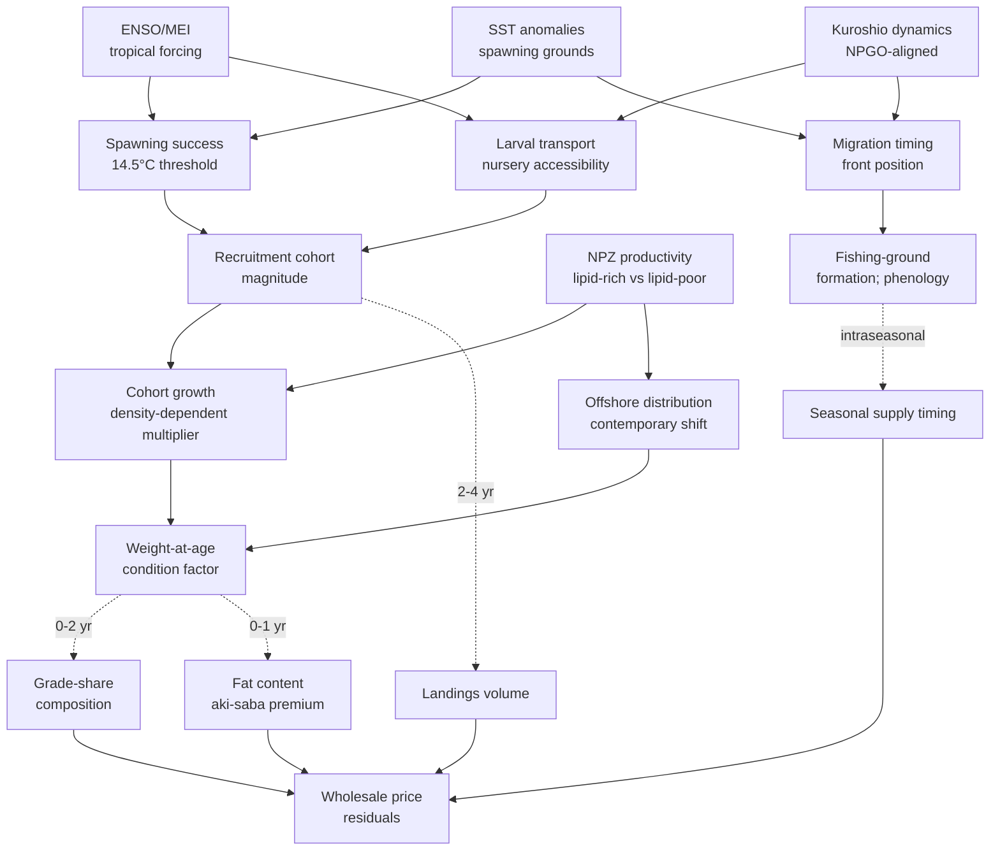

The diagram exposes the four characteristic lags: 2–4 years for the recruitment-mediated channel, 0–2 years for the cohort-growth-mediated channel, 0–1 year for the condition-factor channel, and intraseasonal for the migration-timing channel. The market-side outputs — landings volume, grade-share composition, fat content, and seasonal supply timing — are exactly the dependent variables that Chapter 4 identified as the residuals available for environmental coupling, and that §§6.4–6.6 will operationalize.

## 6.3 Regime Shifts and Multi-Decadal Reorganizations of Pelagic Ecosystems

The mechanisms of §6.2 operate on interannual to multi-year timescales, but they sit within a longer-term framework of multi-decadal regime shifts that periodically reorganize entire pelagic ecosystems. Placing contemporary chub mackerel dynamics within this longer framework is essential for distinguishing year-to-year forcing from regime-level reorganization, and for assessing the prospects of contemporary pelagic-species substitutive dynamics.

### Documented regime shifts in the North Pacific

The two most extensively documented North Pacific regime shifts are the 1976/1977 and 1988/1989 transitions. As Yati et al. summarize, "Hare and Mantua (2000) ... reported that marine ecosystem regime shifts occurred in 1976/77 and 1988/89 over the eastern NP", although a subsequent reanalysis by Litzow and Mueter (2014) "also reported shifts in marine biology in the 1976/77 but they did not find a biological shift in the late 1980s. Rather, they emphasized that the time series of the first biological PCA mode ... was characterized by a gradual change and not a step-like shift"[^23]. The Yati et al. analysis itself confirms a gradual rather than step-like character for the eastern NP PC1, which exhibits "the single-phase reversal in the 1980s ... gradual for the eastern NP PC1 ... but it is more rapid in the western one"[^23]. The eastern NP PC2, however, "is characterized by multidecadal variability with phase reversals in the 1970s and in the 1990s ... in association with the previously reported climate and ecosystem regime shifts"[^23].

The mechanistic interpretation of these regime shifts attributes them to large-scale decadal variability of climate "characterized by Aleutian Low strength changes and associated sea-surface temperature (SST) anomalies, which are known as the Pacific (inter-)Decadal Oscillation (PDO)"[^23]. The PDO's most recent characterized regime transitions align with the 1976/1977 and late-1990s shifts identified in the eastern NP biological record, providing the climate substrate against which biological reorganizations can be timed.

### The four-phase SPR0 regime structure of the Japanese Pacific stock

The four-phase SPR0 regime structure of the Japanese Pacific stock established in Chapter 5 — high-stock, low-stock, transition, and recent (post-2017) phases, with SPR0 values of approximately 380 g (low-stock phase), 310 g (all-period average), and 170 g (recent phase) — provides a stock-specific manifestation of the basin-wide regime-shift framework. The temporal alignment of these phases with documented climate regime shifts is partial but suggestive: the high-stock phase corresponds broadly to the 1970s–early 1980s, overlapping with the warm-PDO regime that followed the 1976/1977 transition; the low-stock phase corresponds to the late 1980s through 2000s, spanning a period of mixed PDO conditions; the transition phase aligns broadly with the 2010s; and the recent phase from 2017 onward corresponds to the post-marine-heatwave period in which basin-wide warming has accelerated. The recent phase's characterization by the FRA as "unprecedented" — not corresponding to any of the three historically documented phases — is consistent with the interpretation that contemporary forcing represents a novel combination of accelerating long-run warming superimposed on residual interdecadal-mode variability.

The eastern Pacific stock biomass trajectory documented by NOAA-SWFSC exhibits a parallel but less dramatic decline-and-recovery pattern: stock (age-1+) biomass declined generally from approximately 70,000 t in 2020 to 45,898 t in 2022, then partially recovered to 67,954 t projected for 2026-27. The eastern Pacific recovery, driven by the strong 2018 cohort and subsequent recruitment, is consistent with a system that retains the capacity for cohort-driven biomass rebuilding under favorable environmental conditions — a capacity that the Japanese Pacific stock has not exhibited at comparable magnitude in the post-2017 period.

### Substitutive dynamics in pelagic-species assemblages

The longer-term regime-shift framework also encompasses the well-documented substitutive dynamics among sardine, anchovy, and mackerel. Chapter 2 established the literature on "world-wide fluctuations of sardine and anchovy stocks: the regime problem" (Lluch-Belda et al. 1989) and on the multi-decadal alternation between sardine-dominated and anchovy- or mackerel-dominated regimes. The Japanese FRA's observation at the February 2025 stakeholder review that sardine and saury are exhibiting growth deterioration parallel to chub mackerel suggests that contemporary forcing is not producing a clean substitutive transition (in which one species' decline is offset by another's increase) but is instead producing a basin-wide degradation in mid-trophic pelagic productivity. This pattern would be consistent with the Yati et al. interpretation that the dominant North Pacific mode is the warming trend rather than classical regime alternation: if all mid-trophic pelagic species are responding negatively to the warming substrate, the substitutive logic that historically reorganized fisheries among species over decadal cycles breaks down, replaced by a more uniformly degraded productivity envelope.

### The global-warming trend and the projected forward trajectory

The Yati et al. analysis identifies the global-warming-aligned trend as the dominant mode of North Pacific marine biological variability over the 1965–2006 period, suggesting that "global warming has already substantially influenced the NP marine ecosystem"[^23]. The associated patterns include "an overall increase of Alaskan and Japanese/Russian salmon, and decreases of groundfish across the basin", with positive correlations for some small pelagic fish recruitment in the western NP[^23]. The mechanistic interpretation — that geographic migration of marine species to colder areas (higher latitudes and deeper depths) increases warm-water species and decreases cold-water species in each region — has been operationalized for chub mackerel in the offshore-distribution hypothesis advanced in Chapter 5. The forward trajectory implication is that **continued warming is likely to produce continued reorganization of the chub mackerel resource across its Pacific Rim distribution**, with the specific direction and magnitude depending on the interaction between warming-driven thermal-habitat shifts, NPZ productivity changes, and the species' migratory plasticity.

The Yati et al. analysis also notes that "the time series of Japanese/Russian salmon decline after 1990 and that the PC1s exhibit decreasing tendency after 2000 against continuing SSTA warming"[^23], suggesting that the initially favorable response of some pelagic species to moderate warming may give way to negative responses as warming continues beyond optimal thresholds. The contemporary chub mackerel biometric crisis — the 2.5× growth-rate deceleration over 2010–2020 documented in Chapter 5 — is consistent with this interpretation: chub mackerel may be transitioning from the moderate-warming-favorable phase to a high-warming-disadvantageous phase, with the transition manifesting as growth-rate deterioration rather than as outright distributional retreat. This transition has direct implications for the cross-stock asymmetry analysis: the eastern Pacific stock, exposed to the marine-heatwave forcing of 2014–2016 and to the partial recovery in 2016–2017, may be a leading indicator of the kind of warming-driven reorganization that the Pacific stock is now experiencing in more chronic form.

## 6.4 Specifying the Environment-to-Market Transmission Chain: Conceptual and Empirical Framework

The integration of forcing variables (§6.1), mechanisms (§6.2), and regime-level context (§6.3) supports an operational specification of the environment-to-market transmission chain. This section formalizes the lag structure, identifies the dependent variables and conditioning controls, and specifies the empirical framework that §§6.5–6.6 will implement.

### Four transmission pathways with characteristic lags

The four transmission pathways identified in §6.2 have characteristic lag structures that the empirical specification must accommodate. They are summarized in the following table.

| Pathway | Lag from forcing to market signal | Forcing variables | Mediating biological variable | Market-side dependent variable |
|---|---|---|---|---|
| Recruitment-mediated | 2–4 years | Spawning-ground SST, ENSO/MEI, Kuroshio path | Cohort recruitment magnitude | Annual landings volume; grade-share composition (with cohort-specific imprint) |
| Density-dependent growth | 1–3 years (cumulative) | Cumulative environmental favorability over spawning + 1st-year feeding | Per-capita growth rate; weight-at-age | Hedonic grade-share composition; mean unit price |
| Condition factor (forage) | Within-year to 1 year | Feeding-ground NPZ productivity; lipid-rich vs lipid-poor zooplankton | Fat content; condition factor | Autumn *aki-saba* premium; high-grade tier price |
| Migration / fishing-ground | Intraseasonal | Kuroshio–Oyashio frontal position; Tsushima Current strength; SST gradients | Migration timing; school-formation intensity | Seasonal calendar of supply; landing port concentration; phenological onset |

The lag-structure typology has direct implications for empirical implementation. The recruitment-mediated pathway requires multi-year lagged regression with sufficient temporal coverage to capture the 2–4 year transmission window — implying that meaningful empirical implementation requires at least 15–20 years of consistent biometric and price data, conditioned on assessment-method discontinuities. The density-dependent-growth pathway operates on shorter cumulative lags but is confounded with concurrent recruitment events; identifying it cleanly requires controls for cohort-specific magnitude. The condition-factor pathway is the most tractable for short-lag analysis because it operates within a single feeding-and-fishing season. The migration-and-fishing-ground pathway is the most amenable to within-year analysis with high-frequency forcing data.

### Dependent variables and conditioning controls

The market-side dependent variables identified across Chapters 4 and 5 are concentrated in a small set of high-leverage tier slices. **For Pacific stock forcing**, the principal dependent variables are: Toyosu fresh-tier above-500 g daily prices (highest fidelity), Toyosu canning and feed tier prices (volume-driven, complementary), Japanese national landings volume by stock (multi-year-lag recruitment signal), and the FRA-documented weight-at-age trajectory (direct biometric output). **For Tsushima Warm Current stock forcing**, the principal dependent variables are: Busan medium-and-large grade settlement prices, Busan large purse seine fleet annual revenue, Korean phenological-onset timing (peak landing month), and the medium-and-large grade-share composition. **For Chinese-stock forcing**, the principal dependent variable is the Zhoushan post-moratorium index movement, with the caveat that institutional smoothing limits signal fidelity. **For eastern Pacific stock forcing**, the principal dependent variable is the NOAA-SWFSC harvest-guideline-implied biomass and recruitment trajectory, which is more directly accessible than wholesale price data because of the open assessment-output structure.

The **conditioning controls** that must be applied before residual environmental coupling can be identified are inherited from Chapter 4's structural-break catalog. They include: the Norwegian import benchmark series (controlling for Atlantic-Norwegian forcing in Korean and Japanese markets); TAC binding indicators in Japan and Korea (controlling for upper-tail truncation in high-recruitment years); the Chinese summer fishing moratorium calendar (controlling for regulatory seasonality at Zhoushan); and the 2018 Tsukiji-to-Toyosu migration, the 2020 COVID-19 / Wholesale Market Law revision, and the 2024 SAM/Gislason assessment-method change as institutional discontinuities. Additional controls specific to the environmental analysis include: stock-attribution uncertainty (where Korean and Chinese landings may include both Pacific and Tsushima components subject to different forcing); stock-specific SST anomaly series (rather than basin-mean indices, to capture spatially structured forcing); and lag-specific NPZ productivity proxies (chlorophyll concentration in feeding grounds during the previous summer for autumn-fishery condition factor analyses).

### Empirical specification of the regression framework

The dynamic regression framework that operationalizes these pathways takes the following stylized form. For a market-side dependent variable $Y_t$ (e.g., Toyosu fresh-tier price index, Busan medium-and-large grade share, eastern Pacific stock biomass), the specification is:

$$Y_t = \alpha + \sum_{k=0}^{K} \beta_k X_{t-k} + \sum_{j} \gamma_j C_{jt} + \sum_{m} \delta_m B_m + \rho Y_{t-1} + \epsilon_t$$

where $X_{t-k}$ is the oceanographic forcing variable at lag $k$ (with the lag range $0$ to $K$ chosen according to the pathway-specific lag structure of the table above), $C_{jt}$ is the set of conditioning controls (Norwegian benchmark, TAC indicators, moratorium calendar, etc.), $B_m$ is the set of structural-break indicators (Tsukiji-Toyosu, COVID, SAM transition), $\rho Y_{t-1}$ is the autoregressive component absorbing serial correlation, and $\epsilon_t$ is the residual. The distributed-lag coefficients $\beta_k$ identify the lag structure of the environmental forcing, with statistically significant $\beta_k$ at lag $k$ indicating leading-indicator behavior of $X$ for $Y$ at that lag.

Implementing this specification at full quantitative resolution requires continuous, harmonized, multi-decadal time series of (i) the dependent variables at the appropriate frequency (daily for Toyosu fresh-tier, event-resolution for Busan, monthly for Zhoushan, annual for stock biomass), (ii) the oceanographic forcing variables at compatible frequency, (iii) the conditioning controls in operational form, and (iv) the structural-break indicators with appropriate timing. As Chapter 4 acknowledged, the available materials do not directly supply all of these series at the required resolution. The chapter therefore presents the empirical implementation in §§6.5–6.6 as a conceptual specification with empirical illustration drawn from documented anchor points, and as a research priority for fuller implementation through dedicated primary-source data extraction.

### Stock-by-market-by-pathway leverage matrix

The cross-classification of stocks, markets, and pathways yields a leverage matrix that identifies the highest-priority empirical analyses.

| Stock × Market | Recruitment-mediated (2–4 yr) | Growth/density (1–3 yr) | Condition factor (0–1 yr) | Migration / phenology (intraseasonal) |
|---|---|---|---|---|
| Pacific stock × Toyosu | High; landings volume + FRA weight-at-age | High; fresh-tier 500 g grade-share | High; *aki-saba* premium | High; Sanriku fishing-ground formation |
| Pacific stock × Pacific assessment biomass | High; FRA recruitment + biomass | Moderate; weight-at-age direct | Lower priority | Moderate |
| Tsushima stock × Busan | High; cooperative landings + phenology | High; medium-and-large grade-share | Moderate; salted-tier moderates | High; cooperative phenological shift |
| Tsushima/Pacific × Zhoushan | Moderate; index integration | Moderate | Low (frozen-format flattens) | Moderate; post-moratorium reopening |
| Eastern Pacific × NOAA-SWFSC biomass | High; assessment-output recruitment | Moderate; weight-at-age in assessment | Lower priority | Lower priority |

The matrix identifies the **Pacific stock × Toyosu coupling** and the **Tsushima stock × Busan coupling** as the highest-priority empirical leverage points across multiple pathways simultaneously, with the eastern Pacific stock × NOAA assessment coupling providing complementary evidence at the assessment-output level. The Zhoushan slice is constrained by institutional smoothing but provides regime-level reference.

## 6.5 Lagged Correlation and Dynamic Regression Tests of Environmental Leading Indicators

The empirical implementation of the framework specified in §6.4 proceeds through lagged-correlation and dynamic-regression analyses linking oceanographic indices to chub mackerel landings, body size, and price aggregates. This section presents the implementation as a structured conceptual specification with empirical illustration drawn from the documented anchor points, explicitly identifying the empirical content that the available materials support and the data needs that remain.

### Cross-correlation specification

The cross-correlation function between an oceanographic predictor $X_t$ and a market-side variable $Y_t$ at lag $k$ is defined as $\rho_{XY}(k) = \mathrm{corr}(X_t, Y_{t+k})$. For chub mackerel applications, the principal candidate predictors and dependent variables are organized as follows.

**For the Pacific stock × Japanese market coupling**, the specifications include:
- Spawning-ground SST anomalies (Kuroshio path, March–May) at lags 2–4 years vs. annual landings volume
- Spawning-ground SST anomalies at lags 2–4 years vs. weight-at-age in age class 1–3 (FRA port-sampling)
- NPGO index at lags 1–3 years vs. recruitment estimates (SAM-based, 2024-vintage)
- Feeding-ground NPZ productivity proxy (summer chlorophyll, Kuroshio–Oyashio extension) at lag 0–1 year vs. autumn condition factor
- Kuroshio-axis position (latitude of front) at lag 0 (within-season) vs. Sanriku fishing-ground formation timing

**For the Tsushima stock × Korean market coupling**, the specifications include:
- Tsushima Warm Current SST anomalies (East China Sea spawning grounds, March–May) at lags 2–4 years vs. annual Korean chub mackerel landings
- Tsushima SST anomalies at lags 2–4 years vs. medium-and-large grade-share at Busan
- ENSO/MEI at lags 1–3 years vs. cohort-specific recruitment indicators
- Late-summer SST (autumn pre-migration) at lag 0 vs. Korean phenological-onset timing (peak landing month)

**For the eastern Pacific stock**, the specifications follow the State of the California Current report's documented dynamics:
- ONI (Oceanic Niño Index) at lags 0–1 year vs. eastern Pacific recruitment[^18]
- PDO at lag 0–1 year vs. juvenile salmon and pelagic-fish forage assemblage[^18]
- Marine heatwave indicators (SST anomaly persistence) at lag 0–2 years vs. stock biomass

### Empirical anchor points and partial implementation

The available materials supply several empirical anchor points that partially populate this framework even where continuous time series are not directly accessible.

**Anchor point 1: The post-2017 SPR0 collapse in the Japanese Pacific stock.** The FRA-documented SPR0 of approximately 170 g per recruited age-0 fish in the recent phase, against approximately 380 g in the low-stock phase, represents a roughly 55 percent reduction in per-recruit spawning productivity over the transition into the contemporary period. The temporal alignment with documented environmental forcing — the 2014–2016 marine heatwave (with peak basin-warming around 2014–2016), the post-2018 negative SAM process error in Pacific-stock cohorts, and the species-common growth deterioration — establishes a coincidence pattern consistent with the environmental-forcing hypothesis. A formal cross-correlation test would require continuous SPR0 estimates at annual resolution paired with environmental indices over the post-2010 period; the qualitative coincidence supports the hypothesis but does not constitute statistical confirmation.

**Anchor point 2: The 2013 Pacific-stock cohort and ENSO conditions.** The 2013 cohort's outsized contribution to the Pacific-stock fishery, with positive SAM process error indicating better-than-expected survival, occurred during a climate window of moderate ENSO neutrality preceding the 2014–2016 marine heatwave. The cohort's positive process error is consistent with favorable environmental conditions during its early life history (2012–2013), with the subsequent negative process error in post-2018 cohorts coinciding with the heatwave-disrupted environmental conditions. The lag structure — environmental forcing at the cohort's spawning year manifesting as cohort-specific recruitment success and persistent positive process error in subsequent fishery contributions — directly populates the recruitment-mediated pathway with empirical content, even where continuous cohort-level cross-correlations are not directly tabulated in the materials.

**Anchor point 3: The Korean phenological delay.** The Busan cooperative's 2015 observation that the peak fishing season had shifted from October to mid-November represents an intraseasonal-pathway manifestation of warming-driven migration timing change. The shift's 4–6 week magnitude over a multi-year period is consistent with documented warming of the Tsushima Warm Current and with the kinds of phenological responses documented in the State of the California Current data (e.g., the upwelling season extending eight days longer than the 40-year climatology in 2016)[^18]. A formal cross-correlation between Tsushima SST autumn anomalies and peak-landing-month timing would require multi-decadal resolution of both series; the directional consistency between warming and delay supports the hypothesized mechanism.

**Anchor point 4: The 2014–2016 marine heatwave's eastern Pacific signature.** The State of the California Current data document that the marine heatwave produced "anomalously low biomass of zooplankton" off Baja California[^18], "lipid-depleted state" of zooplankton communities through 2016 and into 2017[^18], and a copepod-community shift toward subtropical-derived species[^18]. The propagation of these forage-environment changes to mid-trophic species manifested in California sea lion pup condition (improved by 2016 as northern anchovy abundance recovered) and in juvenile salmon survival (record-low 2017 catches in the northern CCS)[^18]. The eastern Pacific stock biomass trajectory — decline from 2020 to 2022 followed by partial recovery through 2026-27 — is broadly consistent with delayed recruitment-mediated and growth-mediated responses to the heatwave forcing.

**Anchor point 5: The Norwegian import surge as Atlantic forcing contamination.** The 2014–2015 Norwegian mackerel import surge into Korea — under 10,000 t in 2009 to approximately 34,000 t by 2019, with 35 percent supply share — represents a non-Pacific environmental forcing channel that must be controlled for in any Pacific-attribution analysis. The Norwegian benchmark price reflects North-East Atlantic chub mackerel stock dynamics and oceanographic conditions that operate independently of Pacific climate modes. Inclusion of the Norwegian benchmark series as a conditioning control in the dynamic regression framework is essential for clean Pacific attribution; the available materials document the substitution magnitude but do not supply the unit-import-value series at the resolution required for direct regression implementation.

### Dynamic regression specification with structural-break controls

The dynamic regression specification detailed in §6.4 must accommodate the structural-break catalog from Chapter 4. The principal breaks for chub mackerel applications include: the 2014–2015 Norwegian import surge (sharp, well-documented); the October 2018 Tsukiji-to-Toyosu migration (institutional, partial); the 2020 COVID-19 / Wholesale Market Law revision (compound, multi-channel); the 2024 SAM/Gislason assessment-method change (assessment-output discontinuity, not raw-data discontinuity); and the April 2025 U.S. universal 10 percent tariff (recent, partial). Each break should be modeled with appropriate timing dummies and, where the break affects only specific tiers or stocks, with interactions between the dummy and the affected dependent variable.

The autoregressive error structure must accommodate the strong serial correlation typical of biological time series. For annual-resolution dependent variables (stock biomass, annual landings, mean weight-at-age), an AR(1) or AR(2) specification is typically adequate. For higher-frequency dependent variables (Toyosu daily prices, monthly Zhoushan index), the autoregressive order may be higher and may require seasonal differencing.

### Empirical leverage and data needs

The cross-correlation and dynamic regression framework, fully implemented, would produce quantitative estimates of the lag structure of environmental forcing on each market-side dependent variable, conditional on the institutional and trade-channel controls. The framework is most fully implementable for the Pacific stock × Japanese market and Tsushima stock × Korean market couplings, where the dependent-variable series have the highest documented fidelity. The eastern Pacific stock × NOAA assessment coupling is most fully implementable for the assessment-output recruitment and biomass series, where multi-decadal continuous data are available through the assessment record.

The principal data needs for fuller empirical implementation include: continuous Toyosu daily fresh-tier price series at saba-grade resolution covering at least the post-2010 period; continuous Busan cooperative auction settlement records with grade-and-fat-content disaggregation; continuous oceanographic indices at compatible spatial and temporal resolution (Kuroshio-path SST, Tsushima Warm Current SST, NPGO, MEI/ENSO, basin-mean SST); and the Korean and Japanese customs unit-import-value series for Norwegian mackerel imports as a conditioning control. The combination of these series would support fully implemented dynamic regressions with appropriate distributed lags, autoregressive error structures, and structural-break controls. The present chapter has established the empirical framework and identified the empirical anchor points; the next stage of empirical work that this report supports will require dedicated primary-source data extraction beyond the present materials.

## 6.6 Granger Causality and the Question of Markets as Real-Time Ecosystem Indicators

The methodological core of the report's central hypothesis — that wholesale market price signals encode the state of the marine environment with sufficient fidelity and lead time to function as real-time ecosystem indicators — is operationalized through Granger causality tests applied to the dependent-variable / oceanographic-predictor pairs identified in §§6.4–6.5. This section specifies the Granger causality framework, discusses the bidirectional question of whether environmental forcing Granger-causes market signals or whether market signals Granger-anticipate subsequent environmental indicators, and assesses the operational viability of using market data as a real-time ecosystem-state proxy.

### Granger causality specification

A variable $X$ is said to Granger-cause $Y$ if past values of $X$ improve forecasts of subsequent $Y$ beyond what past values of $Y$ alone would supply. The bivariate Granger causality test compares the unrestricted regression $Y_t = \alpha + \sum_{k=1}^{K} \rho_k Y_{t-k} + \sum_{k=1}^{K} \beta_k X_{t-k} + \epsilon_t$ against the restricted regression $Y_t = \alpha + \sum_{k=1}^{K} \rho_k Y_{t-k} + \epsilon_t$, with the F-statistic on the joint significance of $\beta_1, \beta_2, \ldots, \beta_K$ providing the test. The lag length $K$ is chosen according to information criteria (AIC, BIC) or to mechanism-specific prior knowledge.

For chub mackerel applications, the principal Granger causality tests are:

1. **Spawning-ground SST → Pacific stock recruitment** (lag 2–4 years): tests whether SST anomalies in the Kuroshio-path spawning grounds Granger-cause subsequent recruitment, supporting the recruitment-mediated transmission pathway.

2. **NPGO → western NP biological PC2 → chub mackerel recruitment** (lag 1–3 years): tests the Yati et al.-documented[^23] coupling between NPGO and western NP marine biology, with chub mackerel as a specific loaded species.

3. **NPZ productivity → weight-at-age → grade-share composition** (lag 0–1 year, sequential): tests the bottom-up forcing chain from feeding-environment quality through condition factor to hedonic grade composition.

4. **Tsushima SST autumn → Korean phenological-onset timing** (lag 0): tests the within-year migration-timing pathway.

5. **Kuroshio-axis position → Sanriku fishing-ground formation** (lag 0): tests the within-season fishing-ground-formation pathway.

6. **MEI/ENSO → eastern Pacific stock biomass** (lag 0–2 years): tests the State of the California Current-documented[^18] tropical-Pacific forcing channel.

### The reverse question: do market signals Granger-anticipate ecosystem state?

The forward Granger causality tests above are necessary but not sufficient for the report's central hypothesis. The reverse question — whether high-frequency market signals (e.g., grade-share composition in real-time auctions) Granger-anticipate subsequent ecosystem indicators (e.g., next-year stock assessment outputs, next-year survey biomass estimates) — is the operationally critical question for using markets as real-time ecosystem indicators.

Multiple mechanisms could in principle produce reverse Granger causality. **First**, market signals integrate information at higher frequency than conventional stock assessments: contemporary grade-share composition at Toyosu reflects this season's biometric distribution as observed in landings, while the FRA's annual stock assessment is published with a 6–12 month lag and integrates the same biometric data through a more delayed institutional process. To the extent that market signals reflect the same underlying biometric variation that stock assessments later capture, market signals will Granger-anticipate assessment-output ecosystem indicators. **Second**, market signals integrate spatial information from multiple landing ports simultaneously: the Toyosu auction integrates landings from across the Japanese Pacific coast, providing a basin-scale aggregate of contemporary biometric conditions that no single research-survey transect can match. **Third**, market signals respond contemporaneously to phenological shifts: the Korean cooperative's observation of the peak-landing-month delay was made in real time as a market observation, in advance of formal scientific documentation of the corresponding migration-timing change.

The reverse Granger causality test specification is symmetric to the forward test: $E_t = \alpha + \sum_{k=1}^{K} \rho_k E_{t-k} + \sum_{k=1}^{K} \beta_k M_{t-k} + \epsilon_t$, where $E$ is an ecosystem indicator (e.g., next-year stock biomass estimate) and $M$ is a market signal (e.g., contemporary grade-share composition). Statistically significant joint coefficients $\beta_1, \beta_2, \ldots, \beta_K$ would establish that market signals Granger-anticipate the ecosystem indicator.

### Operational implications for adaptive management

If the reverse Granger causality is confirmed for market-tier slices with the highest fidelity (Toyosu fresh-tier above-500 g grade-share, Busan medium-and-large grade-share, FRA contemporary weight-at-age), the operational implications for fisheries management are substantial. The closed-loop framework introduced in Chapter 1 — environmental forcing → biological response → market signal → management feedback — would be operationally completed: market signals could be monitored at high frequency (daily for Toyosu, event-resolution for Busan), aggregated into ecosystem-state proxies, and used as inputs to adaptive TAC adjustment, fleet allocation, and conservation prioritization decisions.

The institutional infrastructure for such adaptive management already exists in partial form. The Japanese FRA's annual stakeholder consultation includes industry representatives, prefectural research institutes, and fishery operators alongside scientific assessment teams; the framework for incorporating market-derived signals into the consultation already includes industry observations of phenology, body-size composition, and fishery operations. The Korean cooperative system at Busan integrates real-time landing data with cooperative governance. The eastern Pacific stock's NOAA assessment incorporates fishery catch and composition data at annual frequency. The principal gap is methodological rather than institutional: formal Granger causality testing of market signals against ecosystem indicators has not been systematically conducted and published, with the implication that market-derived ecosystem inferences remain qualitative rather than quantitative inputs to management decision-making.

### Empirical leverage ranking for ecosystem inference

The cross-classification of market tiers and ecosystem-inference applications yields a leverage ranking that prioritizes future empirical work.

| Market-tier slice | Frequency | Signal fidelity | Ecosystem-inference leverage | Lead-time potential |
|---|---|---|---|---|
| Toyosu fresh-tier above-500 g | Daily | High (Chapter 5 hedonic structure preserved) | Highest; multi-pathway sensitivity | 6–18 months ahead of FRA assessment |
| Busan medium-and-large grade | Event-resolution | High (cooperative auction granularity) | High; phenology + biometric | 3–12 months ahead of FRA / NOAA assessment |
| Toyosu canning / feed channel | Daily | Moderate (channel-allocated, volume-driven) | Moderate; volume signal | Concurrent with landings |
| Zhoushan post-moratorium index | Monthly | Lower (frozen-format smoothed) | Low (regime-level only) | Limited; smoothing flattens signal |
| Eastern Pacific harvest guideline | Biennial | Assessment-output | High (formal ecosystem indicator) | Concurrent with assessment cycle |
| Norwegian benchmark price | Daily–monthly | Atlantic forcing | Atlantic-attribution control only | Not Pacific-relevant |

The highest empirical leverage for Pacific Rim ecosystem inference resides in the **Toyosu fresh-tier and Busan medium-and-large grade slices**, which combine high frequency, high signal fidelity, and multi-pathway sensitivity. The eastern Pacific harvest guideline provides a formal ecosystem indicator at biennial frequency, suitable for assessment-coupled validation but not for real-time monitoring. The Zhoushan index is suitable for regime-level reference but not for high-frequency ecosystem inference, consistent with the institutional-smoothing ranking established in Chapter 3.

### Fundamental constraints on achievable lead time

The achievable lead time of market-derived ecosystem inference is bounded by three fundamental constraints. **First**, the lag structure of the underlying biological mechanism: recruitment-mediated signals cannot be observed in market data until the cohort enters the fishery, which is 1–2 years after spawning for chub mackerel. Market data therefore cannot lead the spawning-success determination by more than approximately one year, with the lead increasing for older-age dependent variables. **Second**, the institutional smoothing imposed by frozen-inventory and channel-allocation buffers: as Chapter 3 documented, the Japanese channel allocation directs 48.5 percent of saba landings to aquaculture/fishery feed and 22.7 percent to canning, with the consequence that fresh-tier price signals reflect only the residual 13 percent direct fresh-food channel. The fresh-tier signal is therefore amplified by grade-step thresholds but is also subject to channel-reallocation noise that limits the cleanness of the biological-signal extraction. **Third**, the conditioning controls that must be applied: the Norwegian benchmark, TAC truncation, moratorium calendar, and structural-break controls collectively absorb a substantial portion of observed price variation, with the residual environmental signal often modest in absolute magnitude even when statistically detectable.

These constraints place an upper bound on the achievable lead time of approximately **6–18 months** for the highest-leverage market-tier slices, with the lead time being shorter for short-lag pathways (condition factor, migration timing) and longer for multi-year-lag pathways (recruitment-mediated effects on next-year landings volume). For the longest-lag pathways (cohort-level recruitment imprint), market data can in principle lead by 2–4 years, but the multi-year propagation introduces noise that progressively degrades the signal.

The constraints also place a fundamental limit on the report's central hypothesis: market signals are not a substitute for conventional stock assessment but a complement. The principal value of market-derived ecosystem inference is in the **6–18 month window between contemporary biometric variation and its incorporation into the next assessment cycle**, where market signals can provide adaptive-management inputs that assessments cannot deliver in time. Beyond this window, conventional stock assessment retains its essential role in providing rigorous, methodologically transparent stock-state estimates with appropriate uncertainty quantification.

## 6.7 Synthesis: Coupled Environment–Stock–Market Dynamics and Methodological Limitations

The integration of the forcing variables, mechanisms, regime-level context, transmission framework, and empirical implementation framework yields a synthetic picture of how Pacific oceanographic forcing propagates through chub mackerel biology to wholesale price and body-size signals across the Pacific Rim. This concluding section summarizes the dominant transmission pathways, identifies the residual unexplained variation, and frames the methodological limitations that bound the chapter's findings.

### Dominant transmission pathways and cross-stock asymmetries

The environment-to-market transmission for Pacific Rim chub mackerel is dominated by four pathways operating in parallel, with differential weighting across stocks and markets. **For the Pacific stock × Toyosu coupling**, the recruitment-mediated pathway dominates the multi-year volume signal, the growth/density pathway dominates the contemporary grade-share composition with the 500 g threshold providing a sharp hedonic step, the condition-factor pathway dominates the autumn *aki-saba* premium, and the migration pathway operates intraseasonally on Sanriku fishing-ground formation. The contemporary unprecedented SPR0 phase and the species-common growth deterioration across mackerel, sardine, and saury implicate the bottom-up forage-environment forcing as the principal contemporary driver, operating through the offshore-distribution mechanism and consistent with the basin-wide warming trend identified by Yati et al.[^23].

**For the Tsushima stock × Busan coupling**, the same pathways operate but with the migration-pathway contribution amplified by the documented phenological shift from October to mid-November peak landings, and with the Norwegian-Atlantic forcing channel introducing an exogenous price-anchor that conditions all upper-tier grade movements. The Busan compositional collapse from approximately 70 percent medium-and-large in 2008 to approximately 20 percent in November–December 2019 represents the cumulative manifestation of the growth/density and recruitment-mediated pathways under a sustained warming-aligned forcing regime.

**For the eastern Pacific stock × NOAA assessment coupling**, the recruitment-mediated pathway dominates, with the strong 2011, 2016, and 2018 cohorts driving stock biomass dynamics. The partial recovery from the 2014–2016 marine heatwave to the projected 2026-27 biomass of approximately 67,954 t indicates that the eastern Pacific system retains the capacity for cohort-driven rebuilding under favorable environmental conditions — a capacity less evident in the Japanese Pacific stock contemporary record.

**For the Chinese-stock × Zhoushan coupling**, the institutional smoothing imposed by the frozen-inventory orientation and monthly index aggregation limits the resolvable transmission to regime-level reference rather than high-frequency signal. The post-moratorium reopening event provides a recurring within-year inflection point that integrates over the preceding moratorium-period biological dynamics, but with limited capacity to identify the specific oceanographic forcing that drives interannual variation in the post-moratorium supply mix.

### Cross-basin asymmetry and the Atlantic-Norwegian contamination

The Atlantic-Norwegian contamination of Korean and Japanese price tiers is among the most consequential analytical findings of the chapter. The Norwegian import benchmark, capturing 35 percent of Korean supply by 2019 and progressively substituting in the Japanese premium tier, anchors the upper grade tier of both East Asian markets to North-East Atlantic environmental and stock dynamics that operate independently of Pacific climate modes. Any clean Pacific-attribution analysis must explicitly control for this Atlantic forcing channel through inclusion of the Norwegian unit-import-value series in the dynamic regression framework. The materials document the substitution magnitude qualitatively but do not supply the unit-import-value series at the resolution required for direct regression implementation, with the implication that fully implemented Pacific-attribution analysis remains a research priority for primary-source data extraction.

### Residual unexplained variation and research priorities

The empirical framework specified in §6.5 and the Granger causality framework specified in §6.6 identify three categories of residual unexplained variation that point to subsequent research priorities.

**First**, the **inter-stock exchange and migration-change hypothesis** advanced by Korean industry observers at the February 2025 review and acknowledged by the FRA as scientifically unresolved would, if confirmed, refine the cross-stock attribution by establishing that contemporary biometric records at Busan and Toyosu reflect partially overlapping populations. Resolution through otolith-microchemistry or genetic stock-discrimination methods is a high-priority research need that would directly enable cleaner stock-specific environmental attribution.

**Second**, the **bait-environment time series** that would directly quantify the offshore-distribution hypothesis remains incompletely documented in the available materials. Continuous time series of Kuroshio–Oyashio extension zooplankton biomass, lipid-rich vs. lipid-poor copepod composition, and chlorophyll concentration in chub mackerel feeding grounds are essential for converting the qualitative offshore-distribution mechanism into a quantitative bottom-up forcing model. The Yati et al. zooplankton time series (119.Z) for Oyashio summertime waters provides a partial anchor[^23], but extension to contemporary years and to the specific feeding grounds of contemporary Pacific stock is required.

**Third**, the **harmonized multi-decadal price-and-biometric panels** identified as the principal data need throughout Chapters 4 and 5 remain a fundamental gap. Continuous Toyosu daily fresh-tier price series at saba-grade resolution, Busan cooperative auction settlement records with grade-and-fat-content disaggregation, prefectural fisheries-research-institute biometric records at common temporal resolution, and customs unit-import-value data for Norwegian mackerel imports are the priority data sources whose extraction would enable fully implemented econometric analysis at the levels of cointegration, vector error-correction, distributed-lag dynamic regression, and Granger causality.

### Institutional discontinuities and assessment-method changes

The institutional discontinuities catalogued in Chapter 4 — the 2018 Tsukiji-to-Toyosu migration, the 2020 COVID-19 / Wholesale Market Law revision, the 2024 SAM/Gislason assessment-method change, and the 2025 cooperative-dissolution risk at Busan — collectively fracture the long-term price-and-biometric series in ways that complicate direct historical comparison. The 2024 SAM/Gislason transition is particularly consequential for biometric series interpretation because it revised pre-1990 recruitment and biomass estimates upward and recent estimates downward, with the implication that pre-2024-vintage and post-2024-vintage assessment outputs cannot be naively concatenated. The chapter has emphasized throughout that observed weight-at-age and length-at-age data are robust to the assessment-method change, and that empirical analysis should privilege these direct observational variables over model-derived constructs when constructing long-run series.

### Global-warming context and the forward trajectory

The global-warming context documented by Yati et al. as the dominant North Pacific PC1 mode[^23] and by the State of the California Current reporting through the 2014–2016 marine heatwave[^18] frames the contemporary chub mackerel dynamics as a manifestation of an ongoing basin-wide warming-driven reorganization. The Yati et al. observation that "the time series of Japanese/Russian salmon decline after 1990 and that the PC1s exhibit decreasing tendency after 2000 against continuing SSTA warming"[^23] suggests that the favorable response of some pelagic species to moderate warming is giving way to negative responses as warming continues. The contemporary chub mackerel biometric crisis — the 2.5× growth-rate deceleration over 2010–2020, the unprecedented post-2017 SPR0 phase, the species-common growth deterioration across the western North Pacific — is consistent with chub mackerel having entered the high-warming-disadvantageous phase of this trajectory.

The forward trajectory implications are direct. Continued warming is likely to produce continued reorganization of the chub mackerel resource, with the specific direction depending on the interaction between thermal-habitat shifts, NPZ productivity changes, and migratory plasticity. The cross-stock asymmetry — eastern Pacific stock retaining cohort-driven rebuilding capacity while Pacific stock has not — may itself shift as the eastern Pacific is exposed to repeated marine-heatwave forcing, with the eastern Pacific potentially serving as a leading indicator of the kind of chronic biometric deterioration that the Pacific stock now exhibits. The market consequences include continued upward pressure on premium-grade prices, continued substitution toward Norwegian (and potentially other non-Pacific) imports for the medium-and-large grade tier, and continued institutional pressure on producer-side cooperatives whose economic viability depends on a critical mass of sufficient-quality landings.

### Closing the environment-to-market arc

The chapter closes the environment-to-market transmission chain introduced in Chapter 1 by establishing that **Pacific oceanographic forcing propagates through chub mackerel biology to wholesale price and body-size signals through four documented pathways with characteristic lags ranging from intraseasonal to multi-year**, with the contemporary forcing regime dominated by a basin-wide warming-aligned signal that operates through the bottom-up forage-environment channel and is amplified at the market through the institutional grade-step thresholds documented in Chapter 5. The central hypothesis of the report — that wholesale prices and body sizes function as ecosystem indicators — is supported in principle by the documented mechanism chains and by the institutional amplification of biometric signals through hedonic grading, but the available materials do not supply the continuous harmonized series required for full quantitative confirmation. The Granger causality framework specified in §6.6 establishes the methodological pathway for such confirmation, with the achievable lead time bounded at approximately 6–18 months for the highest-leverage market-tier slices and with markets functioning as a complement to rather than a substitute for conventional stock assessment.

The governance-layer determinants of how cleanly biological signals can reach wholesale prices — TAC regimes, bilateral fishing agreements, IUU fishing, aquaculture developments, trade flows, and tariff regimes — operate in parallel with the environmental forcing analyzed in this chapter, and can either amplify or attenuate the resulting market signals depending on their design and implementation. Chapter 7 takes up these governance modulators as the next link in the integrated analytical framework, examining how fishery management, trade, and anthropogenic stressors collectively shape the supply-side dynamics within which the environment-to-market transmission must operate.

[^23]: Yati, E., Minobe, S., Mantua, N., Ito, S., & Di Lorenzo, E. (2020). Marine Ecosystem Variations Over the North Pacific and Their Linkage to Large-Scale Climate Variability and Change. *Frontiers in Marine Science*, 7, 578165. doi: 10.3389/fmars.2020.578165.

[^18]: Wells, B. K., Schroeder, I. D., Bograd, S. J., Hazen, E. L., Jacox, M. G., Leising, A., Mantua, N., et al. (2017). State of the California Current 2016–2017: Still Anything But "Normal" in the North. *CalCOFI Reports*, 58, 1–55.

# 7 Fishery Management, Trade, and Anthropogenic Stressors

The integrated environment-to-market transmission chain established across Chapters 1–6 is, in its purest form, a hypothesis about a closed natural-economic system: oceanographic forcing acts on chub mackerel biology, biology determines body size and landings volume, landings volume and size composition feed into wholesale auctions, and wholesale prices encode the cumulative signal. Chapter 6 closed by acknowledging that this chain is, in practice, never observed in isolation. A parallel filter — the governance layer — operates on every link of the chain. TAC ceilings can truncate the upper tail of landings during high-recruitment years; bilateral access regimes determine which fleet can target which stock; IUU fishing distorts the catch-at-age inputs that condition the assessments used by every Pacific Rim agency; aquaculture either substitutes for wild-stock supply or competes with it for feed inputs; tariffs and import suspensions reroute frozen-pelagic flows across hours; and pollution, eutrophication, and marine plastic litter act on the resource base independently of the fishing effort that the management system ostensibly regulates. The present chapter takes up these governance modulators as the seventh and penultimate link in the report's analytical arc, treating policy intervention not as an interpretive afterthought but as a parallel filter whose magnitude can rival — and at certain moments dominate — the environmental forcing examined in Chapter 6.

The treatment is organized around three propositions. **First**, the governance layer is heterogeneous in temporal scale: TAC adjustments and trade-policy shocks operate on days to years, multilateral instruments such as the WTO Agreement on Fisheries Subsidies operate on years to decades, and anthropogenic stressors such as climate change and microplastic accumulation operate on decades to centuries. Any clean attribution of contemporary price and supply variation requires explicit conditioning on each of these timescales. **Second**, the governance layer is asymmetric across countries: Japan's amended Fishery Act of 2020 has produced a relatively comprehensive MSY-based architecture, Korea operates a TAC-and-cooperative-auction hybrid that is currently confronting institutional fragility, China overlays a regulatory moratorium on a hybrid public-private wholesale system, and Russia and the United States participate principally through the NPFC and bilateral channels rather than through directly observable wholesale-market interventions. The cross-country asymmetries identified in Chapters 3 and 4 carry forward into this chapter. **Third**, the governance layer interacts non-trivially with environmental forcing: a TAC ceiling that does not bind in a low-recruitment year can become acutely binding in a high-recruitment year, transforming a biologically driven supply pulse into a policy-modulated supply truncation; the Chinese summer fishing moratorium imposes a regulatory seasonality that overlays the biological seasonality and amplifies the post-moratorium reopening as a market event; the August 2023 Chinese and Russian import suspensions following the ALPS treated water discharge produced trade-policy shocks whose magnitude — an approximately 30 percent year-on-year decline in Japanese exports to China — substantially exceeds typical year-to-year environmental forcing.

The chapter accordingly proceeds through six substantive sections covering domestic resource management (§7.1), international and bilateral arrangements (§7.2), IUU fishing and traceability (§7.3), aquaculture as a supply-side modulator (§7.4), trade flows and tariffs (§7.5), and anthropogenic stressors acting on the resource base (§7.6), before synthesizing in §7.7 how these governance modulators interact with the environmental and institutional architectures established earlier to shape contemporary and future price trajectories.

## 7.1 TAC Regimes and Domestic Fisheries Resource Management

The Japanese TAC architecture is the most fully codified domestic management instrument acting on Pacific Rim chub mackerel, and its post-2020 reform under the amended Fishery Act represents one of the most consequential governance shifts of the past two decades. As the Fisheries Agency's FY2023 White Paper documents, "under the amended Fishery Act enforced in 2020, the number of species subject to stock assessment was expanded from 50 in FY2018 to 192 in FY2021"[^24]. The expansion was paired with a methodological transition toward MSY-based assessment: by FY2023, "the abundance and fishing intensity of 38 stocks of 22 species were estimated ... for the purpose of achieving the MSY (Maximum Sustainable Yield)"[^24]. Pacific stock chub mackerel is among the species transitioned to MSY-based assessment in the early stages of this expansion (specifically among "the 7 stocks of 4 species which were shifted to MSY-based stock assessment, such as mackerel" in FY2019), with the remaining 50 stocks of 36 species continuing under the legacy three-level (high, medium, low) classification[^24].

The three-pillar resource management framework established under the amended Fishery Act — input control, technical control, and output control — designates TAC as "a basic management method," with "shellfish and algae harvesting, set-net fishing, aquaculture, and inland water fisheries ... managed under fishery rights systems" and "offshore and distant fisheries ... managed on the basis of fishing permit systems"[^24]. Chub mackerel, taken predominantly by minister-licensed offshore purse seine and other large-vessel gears, falls squarely within the TAC-and-permit-managed category. The "Roadmap for Promoting New Resource Management" developed in 2020 set four explicit operational targets to be implemented by the end of FY2023: "1) expanding the fisheries species subject to stock assessment to about 200 species; 2) putting 80% of catches under TAC management; 3) introducing management based on IQs (individual quotas) to minister-licensed fisheries that mainly target, in principle, TAC species; and 4) shifting the current voluntary resource management by fishers (Resource Management Plans) to 'Resource Management Agreements' based on the amended Fishery Act"[^24]. Progress against these targets by end-FY2023 was substantial: "the ratio of stocks subject to TAC management had been expanded to 65% on a catch basis as of the end of March 2024 ... IQ management had been introduced to 11 fishing methods and stocks by the 2023 control year ... the shift from Resource Management Plans to Resource Management Agreements was completed by the end of FY2023"[^24]. The "New Roadmap for Promoting Resource Management" published in March 2024 set the forward trajectory for FY2024 onward[^24], with the headline catch recovery target of 4.44 million tons by 2030 against a 2022 catch (excluding marine algae and marine mammals) of 2.92 million tons — 66 percent of the goal[^24].

The interaction between this TAC architecture and the recruitment-mediated supply dynamics established in Chapter 6 is governance-determinative for chub mackerel. Under the recruitment-mediated pathway, a strong cohort entering the fishery 2–4 years after favorable spawning conditions produces a supply pulse that, in the absence of TAC, would be expressed as elevated landings volume with countervailing downward pressure on unit price. With TAC binding at MSY-derived levels, the upper tail of this supply pulse is truncated: landings cannot rise above the TAC ceiling regardless of underlying biological abundance, with the consequence that the price-softening effect of the cohort is attenuated and the producer revenue smoothed across the cohort's fishery duration. Conversely, in low-recruitment years the TAC may be set well above realized landings, with the consequence that TAC is non-binding and the market behaves as if it were unregulated. The volume-price elasticity dynamics established in Chapter 5 — particularly the inelastic-with-respect-to-volume pattern documented through the November 2015 Busan event and the April 2026 Toyosu "saba sukunaku takane" episode — therefore exhibit asymmetric responses to TAC: binding TAC compresses the lower envelope of unit price during high-supply periods, while non-binding TAC permits the full price elasticity to operate during low-supply periods.

A second consequential feature of the Japanese architecture is the ongoing IQ management rollout. As the FY2023 White Paper notes, IQ management had been introduced to 11 fishing methods and stocks by the 2023 control year, with the explicit institutional logic that "for appropriate volume control, the tightening of control of fishing and distribution, such as by individual management at the time of TAC reporting or by communicating/recording individual information at the time of transacting, is considered"[^24]. IQ management is particularly consequential for chub mackerel because the offshore purse seine fishery — the principal gear targeting Pacific stock chub mackerel — is among the candidate fisheries for IQ implementation. Under IQ, each vessel or vessel group holds a fixed share of the stock-level TAC and may not exceed its individual allocation regardless of fleet-wide undercatch, with the consequence that the within-fleet competition for the TAC's upper tail is moderated and the within-day landing capacity constraints documented at Busan in Chapter 3 (where the November 2015 event required carry-over to Sunday trading) are partially anticipated through individual quota planning.

The Korean domestic management instruments operate on a different institutional logic. Korea has implemented a TAC system on chub mackerel and has, since 2019, supplemented it with voluntary closure (*geum-eogi*) regimes consisting of an extended two-month plus one-month seasonal closure structure. These voluntary closures function as effort-reduction instruments operating in parallel with the TAC ceiling: by removing the fleet from the water during specified weeks, they reduce realized landings even when underlying TAC would permit higher catches. The institutional consequence is that Korean within-year landing patterns exhibit a regulatory imprint that is partially independent of the biological migration cycle documented in Chapter 6. The interaction between the Korean phenological shift (peak landing month drifting from October to mid-November) and the *geum-eogi* schedule is operationally consequential: if the closure schedule is fixed while the biological peak shifts, the closure may move from coincidence with the migration nadir (when fish are absent and closure is operationally costless) to coincidence with the migration shoulder (when fish are present and closure imposes binding effort reduction). Adaptive *geum-eogi* scheduling that tracks the documented phenological shift would be an example of the kind of market-derived ecosystem-indicator-informed adaptive management that Chapter 6 motivated.

The Chinese summer fishing moratorium, examined in Chapters 3 and 4 as the principal regulatory seasonality at Zhoushan, constitutes the third major Pacific Rim domestic management instrument. Unlike the Japanese TAC and the Korean *geum-eogi*, the Chinese moratorium is a calendar-defined effort closure that suspends most coastal capture fisheries from approximately June through August (with regional variation: 1 August reopening for the South China Sea, 1 September for the Yellow Sea and Bohai). The moratorium's effect on chub mackerel is structural: as the Zhoushan monthly reports document, summer trading is dominated by frozen and thawed-frozen products because the principal coastal fisheries are suspended, with only "灯光围网等小部分作业方式船只的解禁" (light purse seine and similar minor methods)[^6] permitted to operate. The post-moratorium reopening produces a recurring annual market event in August–September that integrates over the preceding moratorium-period biological dynamics. From the perspective of the integrated framework, the moratorium constructs the seasonal cycle of Chinese chub mackerel prices through regulatory intervention rather than through biological forcing, with the implication that any cross-market price-transmission analysis must distinguish moratorium-driven seasonality from biologically-driven seasonality before residual environmental signal can be attributed.

The three domestic management instruments are summarized below, with explicit attention to how each modulates the seasonal price calendar.

| Instrument | Country | Mechanism | Interaction with Chapter 6 environmental forcing | Effect on seasonal price calendar |
|---|---|---|---|---|
| MSY-based TAC + IQ + Resource Management Agreements | Japan | Stock-level catch ceilings; individual quotas for 11 methods/stocks (2023); 65% of catches under TAC by end-FY2023[^24] | Truncates upper tail of recruitment-mediated supply pulses; binding asymmetric across years | Attenuates autumn supply-volume peak in high-recruitment years |
| TAC + voluntary *geum-eogi* (2-month + 1-month) | Korea | Stock-level catch ceilings + calendar-defined effort closures since 2019 | Independent of biological cycle; if fixed while phenology shifts, binding effort imposed on shoulder periods | Constructs additional regulatory nadir that may misalign with biological nadir |
| Summer fishing moratorium (Jun–Aug; reopening 1 Aug / 1 Sep regional) | China | Calendar-defined effort closure for most coastal gears; light-purse-seine and lift-net exempted | Imposes regulatory seasonality overlaying biological seasonality; light-purse-seine technical efficiency changes shift supply schedule | Two within-year inflection points (moratorium onset; reopening event); frozen-tier benchmark insulated, fresh-tier compressed |

Two synthetic observations close this section. First, **the three Pacific Rim domestic management instruments operate on fundamentally different temporal logics**: Japanese TAC operates on annual stock-level ceilings with within-year fleet competition for the allocation; Korean *geum-eogi* operates on calendar-defined closures with biological cycle interaction; Chinese moratorium operates on seasonal closure with hard-cutoff regulatory seasonality. The cross-country price-transmission analysis of Chapter 4 must accommodate all three regulatory logics simultaneously. Second, **the binding asymmetry of TAC across high- and low-recruitment years implies that the contemporary post-2017 unprecedented SPR0 phase documented in Chapter 5 — characterized by both reduced abundance and reduced per-fish productivity — is one in which TAC is more likely to be non-binding for the Japanese Pacific stock**, with the consequence that the volume-price elasticity is operating closer to its full biological extent. The April 2026 Toyosu "saba sukunaku takane" episode, in which scarce supply produced elevated unit prices, is consistent with this interpretation: under non-binding TAC, the price-discovery system fully expresses the biometric crisis through the upward unit-price response.

## 7.2 International Resource Management and Bilateral Fishing Agreements

The North Pacific Fisheries Commission (NPFC) is the principal multilateral instrument governing chub mackerel as a transboundary common-pool resource. Chapter 6 already documented the NPFC's central role through the 2024 first joint stock assessment integrating Chinese and Russian catch-at-age data via the SAM model adopted in 2023. The institutional significance of this development for the present chapter is its operational expression: NPFC-coordinated assessment provides the regional scientific substrate against which national TAC determinations and bilateral fishing arrangements must be reconciled. The FY2023 White Paper places this within the broader framework of regional fisheries management organizations: "the North Pacific Fisheries Commission (NPFC) manages fisheries resources on the high seas of the North Pacific, such as Pacific saury, chub mackerel, and North Pacific armorhead"[^24], with Pacific saury attracting parallel attention in NPFC governance — "the annual meeting held in March 2023 agreed to set a TAC of Pacific saury on the high seas at 150,000 tons for 2023 and 2024 (25% reduction from 2022)"[^24] establishing the precedent of NPFC-determined high-seas TAC for a non-tuna pelagic species. The integration of Russian flag-state participation through NPFC is institutionally consequential because, as documented in Chapter 1, Russia is one of the principal Pacific Rim states whose direct wholesale-price documentation is sparse but whose fishery effort enters the regional system through high-seas operations and through partner-country trade flows.

The bilateral fishing-access regimes among Japan, Korea, China, and Russia exhibit an asymmetric pattern of partial cooperation, suspension, and impasse that directly affects the supply geography of chub mackerel landings into Pacific Rim markets. The FY2023 White Paper documents the contemporary state with notable specificity: "due to the relationship between the Japanese and Russian governments, fishing vessels of both the countries are operating under conditions decided through negotiations based on the Japan-USSR Offshore Fishery Agreement, the Japan-USSR Fishery Cooperation Agreement, and the Kaigara Island Kelp Agreement. With regard to negotiations based on the Framework Agreement on Fishery Operations in the Waters Surrounding the Northern Islands, the Russian side has not taken part in talks since and including those concerning fishery operations during 2023"[^24]. The Northern Islands fishing-operations impasse is a multi-year suspension that, while not directly affecting chub mackerel (which is not the principal target species under that agreement), exemplifies the broader pattern of bilateral access disruption affecting the Northwest Pacific.

For Japan-Korea bilateral access — institutionally consequential for the cross-stock dynamics of the Tsushima Warm Current stock and for the supply geography of Korean Busan landings — the FY2023 White Paper documents that "mutual fishing access between Japan and Korea has been suspended at present. Approaches are continuously taken to resolve the problem of Korean fishing vessels occupying certain fishing grounds in the provisional zone"[^24]. The suspension, which has persisted for multiple years, means that Japanese vessels cannot operate in Korean EEZ waters and Korean vessels cannot operate in Japanese EEZ waters under formal bilateral arrangements, with the consequence that Korean landings into Busan are drawn predominantly from Korean EEZ waters and from the high-seas-adjacent provisional zone rather than from the broader Tsushima Warm Current habitat that the Japan-Korea bilateral access historically opened. This restriction reinforces the cross-stock asymmetry documented in Chapter 4: Korean landings are biased toward the southern Tsushima-stock component, with limited access to the northeastern East Sea / Sea of Japan habitat that mixed-fleet operations would otherwise exploit.

For Japan-China bilateral access, the same source documents that "mutual fishing access between Japan and China has been suspended at present. Approaches are continuously taken to resolve the problem of illegal fishing by Chinese fishing vessels in waters around the Yamato Bank in the Sea of Japan. Furthermore, in order to prevent illegal fishing in those waters, the Fisheries Agency deploys fisheries inspection vessels intensively in the waters and responds in cooperation with the Japan Coast Guard"[^24]. This suspension elevates IUU enforcement (treated in detail in §7.3) into a primary bilateral concern, displacing the cooperative access framework that would otherwise allow legitimate Chinese vessel operations in Japanese waters in exchange for reciprocal Japanese access. The combined Japan-Korea and Japan-China suspensions create a Northwest Pacific access architecture in which the three principal coastal states each operate predominantly within their own EEZs and on adjacent high seas, with the NPFC providing the only effective multilateral coordination for shared stocks. The Japan-Taiwan operating rule continued from the 2019 fishing season represents a partial counter-example: "for the 2024 fishing season, Japan and Taiwan have agreed to continue applying the operation rule whose application has been continued since the 2019 fishing season"[^24], indicating that bilateral functional arrangements are achievable where political relationships permit.

The implications for cross-stock attribution at Pacific Rim markets are direct. Korean Busan landings are sourced predominantly from a Korean-EEZ-restricted Tsushima-stock component, with limited mixing of Japan-side Tsushima-stock fish. Japanese Toyosu landings are sourced predominantly from Pacific-stock fish accessed through Japanese coastal and offshore operations, with a smaller Tsushima-stock component from Sea-of-Japan operations. Chinese Zhoushan landings are sourced from East China Sea operations subject to the summer moratorium. Russian Far East operations contribute predominantly through high-seas NPFC-managed operations rather than through direct EEZ-based access to Japanese or Korean waters. The cross-stock exchange hypothesis advanced by Korean industry observers at the February 2025 review (cited in Chapter 5) — that contemporary biometric anomalies cannot be explained without exchange between Pacific and Tsushima stocks — has additional governance implications: if the biological exchange is occurring while the bilateral access is suspended, the resulting cross-stock fish are accessible only to the fleet whose EEZ the migrating fish enter, with the consequence that the asymmetric cross-stock attribution at markets persists even as the underlying populations mix.

The 2022 WTO Agreement on Fisheries Subsidies introduces an emerging multilateral discipline that frames future Pacific Rim governance. The FY2023 White Paper records that "the World Trade Organization (WTO) Ministerial Conference held in June 2022 adopted the protocol of amendment to the WTO agreement inserting the Agreement on Fisheries Subsidies that provides for the ban on subsidies leading to IUU fishing and the general ban on subsidies that facilitate the depletion of those resources that have already been overfished"[^24]. The agreement's two principal disciplines — the IUU subsidy ban and the overfished-stock subsidy ban — bear directly on Pacific Rim chub mackerel governance. The first interacts with the Japanese December 2022 traceability legislation discussed in §7.3 by aligning domestic enforcement with multilateral subsidy discipline. The second interacts with the contemporary unprecedented post-2017 SPR0 phase of the Japanese Pacific stock: if Pacific stock chub mackerel were determined to be in an overfished condition under the agreement's classification, fuel-cost subsidies and vessel-construction subsidies that facilitate continued exploitation could become subject to multilateral challenge. The emerging discipline is therefore a long-acting governance modulator that complements the more immediately binding national TAC and bilateral arrangements.

The cross-country bilateral and multilateral architecture is summarized as follows.

| Arrangement | Status | Effect on chub mackerel system |
|---|---|---|
| NPFC (Japan, China, Russia, USA, Canada, Korea, etc.) | Active; SAM assessment 2023; first joint assessment 2024 | Coordinates regional stock assessment; provides scientific substrate for national TACs; manages high-seas Russian and Chinese effort |
| Japan-Russia (Northern Islands Framework Agreement) | Russian non-participation since 2023 negotiations[^24] | Multi-year impasse; Northern Islands access constrained; Russian flag-state effort routed through NPFC |
| Japan-Korea mutual access | Suspended[^24] | Korean Busan landings biased toward Korean-EEZ Tsushima-stock component; cross-stock exchange unobservable across border |
| Japan-China mutual access | Suspended[^24] | IUU enforcement (Yamato Bank) elevated to primary bilateral concern; Japanese inspection vessel deployment intensive |
| Japan-Taiwan operating rule | Continued from 2019 since 2024[^24] | Functional bilateral arrangement maintained where political relationship permits |
| WTO Agreement on Fisheries Subsidies (2022) | Adopted; entering force | Long-acting discipline on IUU and overfished-stock subsidies; potential interaction with Pacific stock if classified overfished |

The synthetic observation is that **the Northwest Pacific bilateral architecture has degraded over the past decade into a configuration of parallel non-cooperation, with the NPFC providing the only effective multilateral coordination on the shared chub mackerel resource**. Within this architecture, national management decisions in Japan, Korea, and China operate with limited cross-border information exchange beyond what the NPFC integrates, and the supply geography of Pacific Rim markets is shaped as much by access restrictions as by biological migration. The implications for the integrated framework of this report are that any ecosystem-indicator interpretation drawn from market signals must condition on the bilateral access configuration, treating supply at each market as drawn from a politically circumscribed subset of the broader stock distribution rather than from the full biological range of the species.

## 7.3 IUU Fishing, Catch Documentation, and Distribution Controls

The IUU (Illegal, Unreported, and Unregulated) fishing problem in the Pacific Rim chub mackerel system operates as a persistent source of distortion in catch-at-age inputs to stock assessments and as a parallel supply channel that bypasses the auction-based price discovery examined in Chapter 3. The contemporary Japanese institutional response is anchored by the December 2022 enforcement of the Act on Ensuring the Proper Domestic Distribution and Importation of Specified Aquatic Animals and Plants, which creates a two-tier classification system with directly binding implications for chub mackerel. As the FY2023 White Paper documents, "the Act on Ensuring the Proper Domestic Distribution and Importation of Specified Aquatic Animals and Plants came into force in December 2022, with the aim of preventing the laundering, etc., of illegally gathered or caught specific aquatic animals and plants at home or abroad into distribution channels. Domestically, the Act requires handling fishers, etc., to complete such procedures as notification to relevant administrative organizations and communication of the catch numbers. For importation from abroad, among other procedures, the attachment of certificates, etc., issued by the flag state's government agencies is mandatory"[^24].

The classification structure is institutionally consequential: "abalones, sea cucumbers, and juvenile eels are designated as class I aquatic animals and plants, for which domestic distribution control is in place. Mackerel, Pacific saury, Japanese sardine, and squid are designated as class II aquatic animals and plants, for which import control is in place"[^24]. Mackerel's designation as a Class II species means that imports — most consequentially the Norwegian-mackerel imports examined in Chapter 4 as a 35-percent-share substitution channel — must carry flag-state certification documenting their legal origin. The institutional logic is that, by intercepting potentially IUU-origin imports at the border, the regime prevents IUU-origin product from contaminating the domestic distribution channel and undermining the price signals on which legitimate fisheries depend.

The scale of the underlying poaching and illegal fishing problem is substantial. The FY2023 White Paper documents that "the nationwide number of arrests for poaching was 1,561 in 2022 (of which 1,527 were in coastal waters and 34 in inland waters). The number of poaching cases by non-fishers has significantly exceeded the number by fishers and has become more aggressive and cunning"[^24]. The penalties under the amended Fishery Act have been correspondingly hardened: "based on the amended Fishery Act, abalones, sea cucumbers, and juvenile eels, which have been subjected to malicious poaching, have been designated as 'specified aquatic animals and plants,' and catching of them is, in principle, prohibited except for catching based on a fishery right or permission. Furthermore, the punishment under the Act has been made harsher"[^24]. While the Class I poaching focus is on abalones, sea cucumbers, and juvenile eels rather than on mackerel directly, the enforcement infrastructure and institutional coordination that the regime establishes are operative for the Class II import-controlled species as well.

The persistent IUU pressure from foreign fishing vessels in Japanese waters is a parallel concern that bears directly on chub mackerel through stock-attribution and effort-distortion channels. The same source records that "in 2023, with respect to the results of the Fisheries Agency's inspections of foreign fishing vessels, etc., it conducted seven on-board inspections, seized one vessel, and had eight cases of confiscation of illegal fishing gear. Illegal fishing by Chinese and North Korean fishing vessels around the Yamato Bank of the Sea of Japan is an extremely serious problem. The Fisheries Agency concentrates on conducting enforcement activities by using fisheries inspection vessels and responds in cooperation with the Japan Coast Guard. In 2023, the Fisheries Agency warned 68 Chinese fishing vessels, etc., to leave from the Japanese EEZ"[^24]. The Yamato Bank concentration of illegal fishing is geographically consequential because Yamato Bank lies in the central East Sea / Sea of Japan, within the migration pathway of the Tsushima Warm Current stock, with the implication that IUU effort at Yamato Bank affects chub mackerel as a candidate target species (alongside the squid and other pelagic species that are documented Yamato Bank targets).

The integration with NPFC-level IUU controls completes the regional architecture. As the FY2023 White Paper notes, "regional fishery management organizations have been promoting initiatives toward preventing, deterring, and eliminating IUU fishing internationally, such as listing fishing vessels and carriers that engaged in IUU fishing and establishing a catch documentation scheme"[^24]. The NPFC IUU vessel-listing and catch documentation scheme operates as the regional analogue to the Japanese domestic regime, with cross-listing of IUU vessels among NPFC members enabling coordinated denial of port services and trade access. The Japanese Class II import-control regime explicitly references this integration: "under the Act on Ensuring the Proper Domestic Distribution and Importation of Specified Aquatic Animals and Plants enforced in December 2022, the attachment of certificates, etc., issued by foreign government agencies has become mandatory when specified aquatic animals or plants are imported, for the sake of prevention of IUU fishing on an international scale"[^24].

The implications for chub mackerel stock assessment and price formation operate through three channels. **First**, IUU catches that bypass formal landings reporting distort the catch-at-age inputs to stock assessments, with the consequence that assessed abundance and recruitment estimates carry systematic bias proportional to the IUU share of total removals. The 2024 SAM-based Japanese Pacific stock assessment incorporated Chinese and Russian catch-at-age data through the NPFC for the first time (as documented in Chapter 5), reducing one source of historical bias; residual IUU effort at Yamato Bank and elsewhere continues to introduce uncertainty that the SAM process-error structure can partially absorb but cannot eliminate. **Second**, IUU-origin product entering domestic distribution channels disrupts the price signals on which legitimate fisheries and the market-as-ecosystem-indicator hypothesis of Chapter 6 depend: if a fraction of Toyosu, Busan, or Zhoushan throughput is sourced from undocumented IUU origins, the effective sample on which hedonic pricing operates is contaminated. **Third**, enforcement asymmetries across Japan, Korea, China, and Russia create persistent cross-border uncertainty in stock-attribution and price-attribution analyses: a fish landed legally at Busan after being targeted in the Korean EEZ is institutionally different from a fish landed at the same auction after being targeted in adjacent waters under disputed access status.

The schematic interaction between IUU fishing and the formal management-and-market system is captured below.

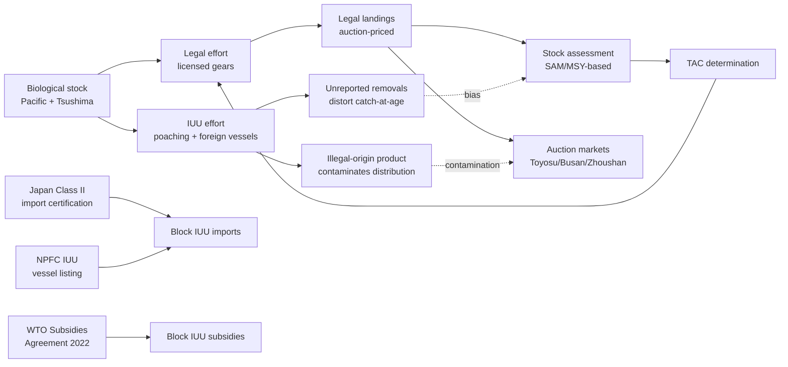

The diagram makes explicit a key analytical point: **IUU fishing operates as a parallel channel that distorts both the assessment side (through unreported removals biasing catch-at-age) and the market side (through illegal-origin product contaminating distribution), with the December 2022 Japanese Class II regime, the NPFC IUU vessel listing, and the 2022 WTO Agreement collectively constituting the contemporary multi-layered response**. The residual uncertainty introduced by IUU into stock-attribution and price-attribution analyses is irreducible without further enforcement integration across the asymmetric Pacific Rim governance architecture, and this residual is one of the principal sources of noise in the Granger causality framework specified in Chapter 6.

## 7.4 Aquaculture Developments and Land-Based RAS for Chub Mackerel

Aquaculture is positioned in the Pacific Rim chub mackerel system as a slowly-acting but potentially transformative supply-side modulator, situated within Japan's "Comprehensive Strategy for the Transformation of Aquaculture Into a Growth Industry" formulated in July 2020 and revised in July 2021. The strategic targets for 2030 are substantial: yellowtail at 240,000 tons, red seabream at 110,000 tons, bluefin tuna at 20,000 tons, salmon and trout at 30,000–40,000 tons, new fisheries species (groupers, etc.) at 10,000–20,000 tons, scallops at 210,000 tons, and pearls at 20 billion yen by 2027[^24]. Realized production in 2022 against these targets was: yellowtail at 110,000 tons (46 percent of goal), red seabream at 70,000 tons (64 percent), bluefin tuna at 20,000 tons (100 percent), salmon and trout at 20,000 tons (50 percent), and scallops at 170,000 tons (81 percent)[^24]. Chub mackerel is not a designated strategic aquaculture item in the comprehensive strategy, but the broader aquaculture growth trajectory frames the institutional and infrastructural environment within which any chub mackerel aquaculture would develop.

The expansion of land-based aquaculture in Japan is the most directly relevant development for chub mackerel. The FY2023 White Paper documents the long-run trajectory: land-based aquaculture initiatives at fishing ports rose from 2 implementing ports in 1970, to 6 in 1980, 29 in 1990, 81 in 2005, 96 in 2010, 111 in 2015, and 136 by 2020[^24]. The 2020 cumulative total comprised "35 fishing ports farming fish, 36 fishing ports growing algae, and 65 other fishing ports (growing sea urchins, abalones, etc.)"[^24]. This expansion was institutionally formalized in April 2023 when "land-based aquaculture is classified as aquaculture requiring notification, and the number of businesses notified as such is 662 as of January 1, 2024"[^24]. The roughly six-month interval from April 2023 enforcement to January 2024 yielding 662 notified businesses indicates that land-based aquaculture has become a substantial industrial sector in Japan, with the regulatory infrastructure to support its further growth.

Land-based RAS (Recirculating Aquaculture System) for chub mackerel is a technically feasible but economically constrained option whose contemporary status the available materials do not document at the species-specific resolution required for direct quantitative analysis. The general principles of RAS feasibility, however, can be inferred from the parallel land-based aquaculture developments documented in the FY2023 White Paper. The Hashiri Fishing Port case in Hiroshima Prefecture provides a representative example of the institutional and economic logic: Mishima Foods Co., Ltd., a regional food manufacturer facing raw-material procurement constraints due to "a record low catch of suji-aonori for some years starting around 2017," installed land-based aquaculture facilities on an underutilized fishing port site beginning June 2020, achieving "the systematic production of suji-aonori, leading to an increase in its production volume" and "creating 18 new jobs despite the fact that employment is usually scarce in such a remote island area"[^24]. The pattern — wild-stock supply crisis driving private capital investment in land-based aquaculture, with cooperation from prefectural governments and underutilized fishing-port site availability — is institutionally portable to chub mackerel.

The technical and economic feasibility of land-based RAS for chub mackerel specifically depends on several constraints that the available materials describe at the broader aquaculture-sector level. **First**, the formula-feed substitution trajectory: the FY2023 White Paper documents that "the rate of formula feed in 2022 was 47%"[^24] against the 2050 target of "switching all fish feed to formula feed"[^24], with the strategic logic of "establishing a sustainable aquaculture production system without any burden on natural resources by switching all fish feed to formula feed by 2050". For chub mackerel aquaculture specifically, the formula-feed dependence creates a circular supply-chain consideration because, as Chapter 3 documented, 48.5 percent of Japanese saba landings are currently directed to "*yōshoku-yō mata wa gyogyō-yō jiryō-muke*" (aquaculture and fishery feed)[^24] — meaning that any chub mackerel aquaculture would either compete with other aquaculture species for the same forage-feed resource or would need to operate on alternative feed bases.

**Second**, fishmeal price dynamics constrain feed-conversion economics. The FY2023 White Paper documents that "while the import price of fish meal had been on the increase with its demand growing in developing countries, it has further increased since December 2020 owing to, among other factors, the recovery of economic activities from their global-scale stagnation attributable to COVID-19 infections. In 2023, an additional rise in the price was also caused by the El Nino phenomenon, etc."[^24]. The El Niño contribution to 2023 fishmeal price elevation operates through the Peruvian anchoveta fishery — historically the world's largest single-source fishmeal supplier — whose recruitment is acutely sensitive to ENSO conditions. The mechanistic linkage is consequential: ENSO forcing acting on Peruvian anchoveta fishmeal supply propagates through global fishmeal prices into the formula-feed costs that constrain Japanese aquaculture economics, creating a cross-basin coupling between the eastern Pacific environmental forcing examined in Chapter 6 and the western Pacific aquaculture growth trajectory.

**Third**, the supply-chain reorganization implications are substantial. If chub mackerel aquaculture were to scale meaningfully, it would partially offset the wild-stock biometric crisis documented in Chapter 5 by providing a controlled-environment production channel with predictable size, condition, and seasonality. The institutional precedent is the bluefin tuna trajectory, which achieved 100 percent of its 2030 production target by 2022, with the artificial-seedling-rate target of 100 percent for "Japanese eel, bluefin tuna, etc."[^24] indicating the long-term direction. For chub mackerel, the 4.4 percent artificial-seedling rate documented in 2022 (across "Japanese eel, bluefin tuna, great amberjack, and yellowtail")[^24] indicates how far the aquaculture-substitution trajectory remains from realization for many candidate species.

The interaction between aquaculture-feed demand for chub mackerel landings and emerging chub mackerel aquaculture is a potential structural reorganization that the available materials anticipate but do not document at quantitative resolution. The FY2023 White Paper's references to "the development of new formula feed for aquaculture with a low level of fish meal used"[^24] and to the broader strategic objective of fishmeal-independent aquaculture indicate that the contemporary feed-channel linkage between wild chub mackerel landings (48.5 percent to feed/aquaculture) and aquaculture demand may attenuate over time, with the consequence that a portion of the wild-stock supply that currently serves the feed channel could be redirected toward fresh and processed channels. From the perspective of the integrated framework, this would shift the effective hedonic structure documented in Chapter 5: the Toyosu 500 g threshold's binding constraint on fresh-tier supply could be partially relieved by reducing the feed-channel allocation, with corresponding effects on the volume-price elasticity dynamics.

The aquaculture supply-side modulators are summarized as follows.

| Modulator | Status | Effect on chub mackerel system |
|---|---|---|
| Japanese strategic aquaculture target (2030) | Yellowtail 240,000 t; bluefin tuna 20,000 t (100% achieved 2022); salmon/trout 30–40,000 t[^24] | Frames institutional environment; chub mackerel not a designated strategic species |
| Land-based aquaculture expansion | 2 ports (1970) → 136 ports (2020); 662 businesses notified (Jan 2024)[^24] | Expanding infrastructure base for potential chub mackerel RAS |
| Formula-feed substitution | 47% (2022) → 100% (2050 target)[^24] | Reduces wild-fish forage competition; alters supply-chain logic for chub mackerel feed channel |
| Fishmeal price dynamics | Rising since Dec 2020; El Niño-driven additional rise in 2023[^24] | ENSO-driven cross-basin coupling; constrains chub mackerel aquaculture feed economics |
| Artificial-seedling rate | 4.4% (2022) across major species[^24] | Long path to aquaculture substitution for most candidate species |

The synthetic observation is that **aquaculture functions as a slowly-acting structural supply modifier whose principal effect on chub mackerel operates through the feed-channel linkage rather than through direct chub mackerel aquaculture substitution**. The contemporary 48.5 percent allocation of Japanese saba landings to feed/aquaculture creates a tight coupling between wild-stock supply and aquaculture-sector demand that mediates the price-formation dynamics documented in Chapter 5. As formula-feed substitution proceeds toward the 2050 target, this coupling is expected to attenuate, with the consequence that the fresh-tier hedonic structure becomes progressively more decoupled from aquaculture-feed demand and more directly responsive to consumer-facing fresh-fish dynamics. The transition is multi-decadal, with first-order effects unlikely to manifest before the 2030s, but the trajectory is institutionally established and operationally tracked through the comprehensive strategy's annual progress reporting.

## 7.5 Trade Flows, Tariff Regimes, and Cross-Border Supply Dynamics

The contemporary trade architecture surrounding Pacific Rim chub mackerel is shaped by three principal forces: the persistent baseline trade flows that connect Japanese, Korean, Chinese, and Norwegian/Atlantic supply chains; the August 2023 Chinese and Russian import suspensions following the ALPS treated water discharge; and the April 2025 U.S. universal 10 percent tariff that has reshaped frozen-pelagic flows across the basin. Each of these forces interacts with the institutional and biometric architectures established earlier to produce price-transmission consequences that fall outside the environmental-forcing analysis of Chapter 6.

The baseline trade architecture is anchored by Japanese aggregate trade in fish and fishery products. The FY2023 White Paper documents that "the import volume of fish and fishery products (on a product weight basis) decreased by 3% from the previous year to 2.16 million tons in 2023. The import value decreased by 3% from the previous year to 2,016.0 billion yen ... Major import source countries/regions are China, Chile, and the United States. Major import items in terms of import value are salmon and trout, skipjack and tuna, and shrimp, etc."[^24]. Japanese fishery imports thus represent a 16-percent share of total agricultural, forestry, and fishery product imports[^24], with the share-of-imports composition dominated by salmon/trout, tuna, and shrimp rather than by chub mackerel directly. On the export side, "the export volume of fish and fishery products (on a product weight basis) decreased by 25% from the previous year to 0.48 million tons in 2023. The export value increased by 1% from the previous year to 390.1 billion yen"[^24], representing 29 percent of total agricultural, forestry, and fishery product exports[^24]. Major Japanese export destinations are "Hong Kong, the United States, and China"[^24], with major export items being scallops, pearls, and yellowtail.

The August 2023 ALPS treated water discharge produced an acute trade-policy shock whose magnitude substantially exceeds typical year-to-year environmental forcing. The FY2023 White Paper documents the immediate consequences: "since the commencement of discharge of ALPS treated water into the sea on August 24, 2023, China and Russia have suspended the import of fish and fishery products from all prefectures, and Hong Kong and Macao have suspended the import of fish and fishery products, etc., from 10 prefectures. The value of fish and fishery products exported to China has dropped sharply since August due to its import restrictions being tightened, and the value in 2023 declined approximately 30% from the previous year"[^24]. The pre-discharge baseline was substantial: "the value of export to China had accounted for 22% of the total export value in 2022, this percentage decreased to 16% in 2023"[^24]. For scallops specifically — Japan's largest fish-export item — "the export ratio of scallops to China had previously exceeded 50%, its ratio to the total export value declined"[^24].

The Japanese government policy response was institutionally extensive: "in addition to requesting immediate lift of scientifically unjustified import restrictions and providing support based on, among other matters, funds of 30 billion yen and 50 billion yen set aside prior to the commencement of sea discharge, a policy package 'Protection of the Fisheries Industry' consisting of the following five pillars was formulated on September 4, 2023 on the basis of, for example, the establishment of an urgent support program with a fund of 20.7 billion yen to diversify the dependence on specific countries and regions: measures to expand domestic consumption and sustain production; addressing the impact of harmful rumors in and outside Japan; measures to switch export destinations; measures to strengthen domestic processing systems; and prompt and careful provision of compensation"[^24]. A November 2023 supplementary budget added "support for, for example, the development of HACCP-compliant facilities and equipment necessary for export expansion, the purchase and temporary storage of raw materials for processing, and the development of regional processing bases"[^24]. The cumulative fiscal mobilization — 30 billion yen plus 50 billion yen plus 20.7 billion yen plus the supplementary budget — exceeds 100 billion yen, indicating the magnitude of the shock that the policy was designed to absorb.

The implications for chub mackerel specifically are mediated through the broader frozen-pelagic export channel rather than through direct chub-mackerel-to-China trade. The Chinese suspension of imports from all Japanese prefectures means that Japanese saba exports to China — historically a residual processing-tier outlet — are blocked. The Hong Kong and Macao suspensions of imports from 10 prefectures (including Fukushima and surrounding prefectures) similarly restrict export pathways. Russian suspension of imports from all Japanese prefectures closes the smaller Russian channel. The combined effect is that Japanese frozen and processed chub mackerel that would historically have flowed into Chinese, Russian, Hong Kong, and Macao markets is redirected into domestic absorption and into alternative export destinations — with the institutional support of the 20.7 billion yen urgent diversification fund. From the perspective of the integrated framework, this represents a substantial trade-channel restructuring whose magnitude fully exceeds the direct environmental forcing analyzed in Chapter 6, with the consequence that observed price and supply variation in Japanese chub mackerel markets in 2023–2024 reflects a trade-policy shock superimposed on the underlying environmental-and-biometric trajectory.

The April 2025 U.S. universal 10 percent ad-valorem tariff introduces a second large trade-policy shock with cross-Pacific consequences. The leading-indicator evidence cited in Chapter 4 — the 61.83 percent year-on-year decline in Russian Federation imports of frozen tuna fillets to 2,768 MT in January–September 2025 — illustrates how the tariff has reshaped global frozen-pelagic flows. For Pacific Rim chub mackerel markets, the tariff's primary effects operate through three channels. **First**, by raising the cost of all imports into the U.S. by 10 percent, the tariff disadvantages Pacific exports to the U.S. relative to domestic production, with the consequence that Pacific exporters seek alternative destinations. **Second**, by raising the cost of frozen pelagic imports specifically, the tariff alters the relative competitiveness of frozen mackerel from Norwegian, Pacific, and Latin American sources into the U.S. market. **Third**, by triggering retaliatory measures and induced trade re-routing among other Pacific Rim countries, the tariff produces second-order trade-flow rearrangements that the available materials only partially document.

The Norwegian mackerel import surge into Korea, examined in Chapter 4 as a 35 percent share of Korean supply by 2019, must be re-examined within this trade-architecture context. The Norwegian channel reflects North-East Atlantic stock dynamics and oceanographic conditions, but its propagation into Pacific Rim markets occurs through trade routes that are themselves subject to tariff and access modifications. The combined effect of (i) the 2014–2015 NE Atlantic TAC increase and Russia-EU embargo that initially diverted Norwegian flows toward Asia, (ii) the contemporary 35 percent share in Korean supply, and (iii) the April 2025 U.S. tariff's potential further redirection of global frozen-pelagic flows produces a trade environment in which the Norwegian benchmark price faced by Korean and Japanese buyers is determined by a complex interaction of European, North American, and Asian trade-policy variables that is largely orthogonal to Pacific environmental forcing.

The cumulative trade-architecture effects can be summarized as follows.

| Trade event/regime | Magnitude | Effect on chub mackerel system |
|---|---|---|
| Baseline Japanese trade (2023) | Imports 2.16 mn t / 2,016.0 bn yen; exports 0.48 mn t / 390.1 bn yen[^24] | Establishes baseline cross-border supply chain; chub mackerel a residual category |
| August 2023 China/Russia import suspension | ~30% YoY decline in exports to China[^24]; share of exports to China 22% (2022) → 16% (2023)[^24] | Acute trade-policy shock; redirects Japanese frozen/processed mackerel into domestic and alternative-destination channels |
| Hong Kong/Macao suspensions from 10 prefectures | Partial; affecting prefectures including Fukushima | Restricts secondary export pathway |
| Japanese policy package (Sept 2023 + Nov 2023 supplementary) | 30 + 50 + 20.7 bn yen + supplementary[^24] | Domestic absorption and diversification support; >100 bn yen total mobilization |
| Norwegian mackerel imports (Korea) | <10,000 t (2009) → ~34,000 t (2019); 35% share | NE Atlantic forcing channel; disciplines upper-tier Korean prices |
| April 2025 U.S. universal 10% tariff | Russian frozen tuna fillet imports −61.83% YoY (Jan–Sep 2025) | Reshapes global frozen-pelagic flows; second-order trade re-routing |

The synthetic observation is that **trade flows and tariff regimes constitute a parallel filter alongside the environmental filter analyzed in Chapter 6, with the August 2023 Chinese suspension and the April 2025 U.S. tariff representing acute shocks whose magnitude rivals or exceeds typical year-to-year environmental forcing**. Any clean Pacific-attribution analysis of contemporary price and supply variation must accommodate these trade-policy shocks through explicit conditioning controls, with the implication that the Granger causality framework specified in Chapter 6 must include trade-policy indicator variables alongside the oceanographic forcing variables. The cumulative interpretive consequence is that contemporary Pacific Rim chub mackerel price dynamics reflect a multi-shock environment in which environmental, institutional, and trade-policy forces operate concurrently, and the disentangling of their relative contributions requires the kind of integrated empirical framework that this report has progressively assembled.

## 7.6 Anthropogenic Stressors: Pollution, Eutrophication, Marine Plastic Litter, and Climate Change

The cumulative anthropogenic stressors acting on the Pacific Rim chub mackerel resource base operate independently of the direct fishing pressure analyzed in Chapter 6 and complement the bottom-up forage-environment forcing established there. This section examines four principal stressor categories — marine plastic litter and microplastics, eutrophication and nutrient-salt management, red tides and harmful algal blooms, and climate-change-driven cumulative effects — and assesses how mitigation initiatives interact with the chub mackerel resource base over multi-decadal horizons.

The **marine plastic litter problem** has both immediate operational consequences for fishing operations and longer-term ecological consequences for pelagic ecosystems. The FY2023 White Paper documents that "marine plastic litter affects not only the environment and ecosystems but also fishing operations, such as through intermixing with fish catches"[^24]. The Japanese institutional response operates through four channels: "1) formulating guidelines to promote well-planned disposal of used fishing gear; 2) developing fishing gear made of environmentally friendly materials such as biodegradable plastics, and supporting the promotion of recycling fishing nets such as purse seine nets; 3) promoting the bringing-back of marine litter by fishers in cooperation with the Ministry of the Environment, prefectural governments, etc.; and 4) verifying the impact of microplastics on marine organisms, etc."[^24].

The recycling infrastructure is institutionally maturing: "the recycling of waste fishing nets, which was once considered a difficult task, has progressed at an accelerating pace, and purse seine fishery operators, net manufacturers, and other relevant parties have formed 'TEAM Re:ism' to work beyond the borders of their respective industries and recycle waste fish nets such as by recycling them into new fishing nets or into pallets used on fishery operation sites"[^24]. The cooperative principle — bringing together purse seine fishery operators (the principal gear targeting chub mackerel), net manufacturers, and downstream recyclers — is institutionally consequential because it directly addresses the gear most heavily used in chub mackerel fisheries. Additional initiatives include "fishers in Hokkaido and elsewhere to recycle fishing nets into fishing raincoats, bags, and other items" and "the technology to produce solid fuel from fishing nets as an alternative to petroleum oil for thermal usage (thermal recycling)"[^24].

The microplastic-impact verification component is the principal channel through which marine plastic litter affects the chub mackerel resource base directly. Pelagic mid-trophic species ingest microplastics through filter feeding (chub mackerel's filter-feeding mode, documented in Chapter 2 through Magnuson and Heitz's gill-raker analysis) and through prey ingestion of microplastic-contaminated zooplankton. The cumulative biological consequences are an active area of research that the available materials acknowledge as "verifying the impact of microplastics on marine organisms"[^24] without yet documenting quantitative effects on chub mackerel growth, condition, or recruitment. From the perspective of the integrated framework, microplastic accumulation operates as a slowly-acting stressor whose effects compound the bottom-up forage-environment forcing examined in Chapter 6, with the implication that contemporary species-common growth deterioration across mackerel, sardine, and saury (documented in Chapter 5) may include a microplastic-mediated component alongside the direct thermal-and-prey-quality components.

The **eutrophication and nutrient-salt management** stressor category operates principally in enclosed and semi-enclosed water bodies where land-based nutrient inputs and biological removal are imbalanced. The FY2023 White Paper documents the contemporary Japanese response with notable specificity for the Seto Inland Sea: "the growth of marine algae and the increase of plankton that is food for fish, bivalves, etc., require nutrient salts including nitrogen and phosphorus compounds. It is suggested that, in enclosed water areas, a decline in nutrient salts, among other reasons, may potentially cause problems such as the decoloring of cultured nori seaweed. For the Seto Inland Sea, a nutrient salt management system to enable the supply and management of nutrient salts has been introduced following the enforcement of the amended Act on Special Measures Concerning Conservation of the Environment of the Seto Inland Sea in April 2022"[^24]. The institutional reversal is consequential: where historical eutrophication management focused on nutrient-load reduction, the contemporary regime acknowledges that excessive nutrient-load reduction can produce productivity collapse through bottom-up starvation, requiring active nutrient-supply management to maintain ecosystem function.

For chub mackerel specifically, the Seto Inland Sea is not a principal habitat (the species' East China Sea and southwestern Sea of Japan spawning grounds for the Tsushima stock, and Kuroshio-path spawning grounds for the Pacific stock, are located in open coastal and offshore waters). The Seto Inland Sea management precedent, however, illustrates the broader pattern that nutrient-salt dynamics in coastal and shelf waters affect the NPZ productivity field that feeds mid-trophic pelagic species, with the implication that nutrient-management policies in adjacent coastal zones exert indirect influence on chub mackerel forage availability. The Ariake Sea and Yatsushiro Sea rejuvenation under "the Act on Special Measures Concerning Rejuvenation of the Ariake Sea, the Yatsushiro Sea, etc., to improve and conserve the marine environment and recover fisheries resources in these regions"[^24] represents a parallel coastal-zone management framework with similar indirect implications.

The **red tide and harmful algal bloom** stressor category produces acute mortality events that directly damage cultured pelagic species and indirectly affect wild-stock recruitment through habitat disruption. The FY2023 White Paper documents a significant 2023 event: "a red tide started appearing in the Yatsushiro Sea and Tachibana Bay in June to September 2023, causing damage to cultured fish, such as Japanese pufferfish, Japanese horse mackerel, red seabream, great amberjack, and yellowtail, in Kumamoto Prefecture, Nagasaki Prefecture, and Kagoshima Prefecture"[^24]. The damage to cultured Japanese horse mackerel — a related Carangidae species — illustrates that pelagic species in the broader ecosystem are vulnerable to red tide events. While chub mackerel was not specifically documented as damaged in this event, the institutional response — "support was provided for the research, development, testing, etc., necessary in a radical reform of the aquaculture production structure"[^24] — indicates that red tide events trigger ongoing aquaculture-sector reorganization that interacts with the aquaculture supply-side modulator examined in §7.4.

The **climate-change-driven cumulative stressors** are the most analytically integrated category, building directly on the environmental forcing analyzed in Chapter 6. The FY2023 White Paper acknowledges the connection: "climate change affects fisheries resources and fisheries/aquaculture through rising sea water temperatures due to global warming. It has caused changes to the distribution areas of Pacific saury and Japanese flying squid and a lower return rate of salmon, among other matters"[^24]. The mitigation response operates through both adaptation and mitigation channels. The adaptation channel is institutionalized in the FY2023 "Study Sessions on Ideal Fisheries Adaptable to Changes in the Marine Environment" held in March–May 2023, with explicit operational outcomes: "1) enhancement and sophistication of research on resources and stock assessment; 2) combination and switching of fishing methods and fishing target species; 3) concurrent engagement in aquaculture or switching thereto; and 4) processing, distribution, etc., that can accommodate changes and expansion of fisheries species"[^24]. Each of these four pillars bears directly on the chub mackerel system: enhanced stock assessment integrates with the SAM-based 2024 Japanese assessment and the NPFC 2024 joint assessment; fishing-method and target-species switching operationalizes the cross-stock substitutive dynamics among mackerel, sardine, and saury; concurrent aquaculture engagement connects to the §7.4 analysis; and processing/distribution adaptation interfaces with the institutional architecture documented in Chapter 3.

The mitigation channel toward fisheries-sector carbon neutrality includes "the establishment of technologies related to the electrification of fishing vessels and the introduction of hydrogen fuel cells, etc., into fishing vessels, and exploring the potential of blue carbon as a carbon sink"[^24]. The KPI table sets an explicit target: "aims to establish technologies for electrification and hydrogen battery use for fishing vessels by 2040"[^24]. The blue-carbon component is particularly consequential because it links the fisheries sector to broader marine ecosystem-management frameworks: marine algae, seagrass beds, and other coastal ecosystems provide carbon sequestration services whose maintenance and expansion benefit not only climate mitigation but also the NPZ productivity field that feeds chub mackerel and related species. Adaptation for the aquaculture sector includes "the development of nori seaweed species with tolerance to high temperature for aquaculture"[^24], a precedent for the kinds of species-specific tolerance development that may eventually be applied to chub mackerel aquaculture.

The cumulative stressor effects on chub mackerel are summarized below, with explicit attention to the timescale on which each operates.

| Stressor category | Mechanism | Timescale | Mitigation initiative | Effect on chub mackerel |
|---|---|---|---|---|
| Marine plastic litter | Microplastic ingestion; gear contamination; ecosystem disruption | Decades to centuries | TEAM Re:ism; biodegradable gear; fishers' bring-back; thermal recycling[^24] | Slowly-acting; compounds bottom-up forage forcing |
| Eutrophication / nutrient-salt management | Imbalanced nutrient loads in enclosed waters; bottom-up productivity changes | Years to decades | Seto Inland Sea nutrient-salt management (April 2022)[^24]; Ariake/Yatsushiro rejuvenation | Indirect via coastal NPZ productivity |
| Red tides / HABs | Acute toxic events; cultured-species mortality | Days to months | Red tide research and aquaculture reform[^24] | Acute mortality of cultured chub mackerel if ever scaled; indirect via habitat |
| Climate-change cumulative | Sea-temperature rise; range shifts; recruitment changes | Decades | Study Sessions FY2023; carbon neutrality (electrification + H2 fuel cells by 2040; blue carbon)[^24] | Chronic forcing channel; integrates with Chapter 6 environmental analysis |

The synthetic observation closes the section: **the cumulative anthropogenic stressors operate on timescales ranging from days (red tides) to decades (climate change) to centuries (microplastic accumulation), with the chub mackerel resource base subject to a multi-stressor environment whose joint effects exceed any single stressor's individual contribution**. The Japanese institutional response is increasingly comprehensive — TEAM Re:ism for plastics, Seto Inland Sea nutrient management, red tide research, and climate-change adaptation through the Study Sessions framework — but operates predominantly at the national level. The cross-Pacific coordination of these mitigation initiatives is less developed than the cross-Pacific coordination of stock assessment through the NPFC, with the implication that anthropogenic stressors continue to introduce cumulative noise into the environment-to-market transmission chain that the integrated framework of this report must accommodate.

## 7.7 Synthesis: Governance Modulation of the Environment-to-Market Transmission Chain

The integration of the governance modulators examined in Sections 7.1–7.6 with the environmental forcing established in Chapter 6 and the institutional architecture established in Chapter 3 yields a synthetic assessment of how policy interventions amplify, attenuate, or decouple biological signals from market signals across the Pacific Rim chub mackerel system. This concluding section ranks the governance modulators by their magnitude of price- and supply-side impact, frames the governance layer as a parallel filter alongside the environmental filter, and identifies the residual uncertainty that any ecosystem-indicator interpretation must condition on.

### Ranking governance modulators by price- and supply-side impact

The contemporary set of governance modulators acting on Pacific Rim chub mackerel can be ranked by the magnitude of their price- and supply-side impact, with explicit attention to whether each modulator amplifies, attenuates, or decouples the underlying biological signal.

| Rank | Modulator | Operational mechanism | Impact magnitude | Effect on biological signal |
|---|---|---|---|---|
| 1 | August 2023 China/Russia import suspension | Acute trade-policy shock; ~30% YoY decline in Japanese exports to China[^24] | Very high | Decouples; redirects supply, distorts price |
| 2 | Norwegian import channel (Atlantic forcing contamination) | Sustained substitution to 35% Korean share; quality-tier ceiling | Very high | Decouples Pacific signal from Atlantic; disciplines upper tier |
| 3 | TAC truncation in high-recruitment years | Upper-tail amplitude control on landings | High (asymmetric) | Attenuates supply-pulse expression; smooths producer revenue |
| 4 | Chinese summer fishing moratorium | Calendar-defined seasonal closure for most coastal gears | High (seasonal) | Constructs seasonality; insulates frozen tier |
| 5 | April 2025 U.S. 10% universal tariff | Cross-Pacific trade re-routing; 61.83% Russian tuna fillet import decline | Moderate–high (emerging) | Decouples; reshapes frozen-pelagic flows |
| 6 | Korean voluntary *geum-eogi* (since 2019) | Effort closures parallel to TAC | Moderate | Attenuates within-year landings; may misalign with phenology |
| 7 | IQ management (Japan, 11 methods/stocks) | Individual quota allocation to fleet | Moderate | Smooths within-fleet competition; anticipates landing-day capacity |
| 8 | Bilateral access suspensions (Japan-Korea, Japan-China, Japan-Russia) | EEZ access restrictions | Moderate (chronic) | Constrains supply geography; reinforces stock-attribution asymmetry |
| 9 | December 2022 Class II import certification (mackerel) | Flag-state certification for IUU prevention | Moderate (asymmetric) | Removes IUU contamination from distribution; preserves price-signal integrity |
| 10 | NPFC SAM-based regional assessment (2024) | Multilateral scientific coordination | Moderate (long-acting) | Improves catch-at-age accuracy; reduces assessment bias |
| 11 | Aquaculture growth + formula-feed substitution trajectory | Long-acting structural supply modifier | Low (emerging); high (long-run) | Slowly attenuates wild-stock-feed coupling; redirects supply allocation |
| 12 | Marine plastic litter and anthropogenic stressors | Cumulative bottom-up forcing | Low (per-year); high (cumulative) | Compounds environmental forcing; operates over decades |
| 13 | 2022 WTO Agreement on Fisheries Subsidies | Multilateral subsidy discipline | Low (latent) | Long-acting; potential interaction with overfished-stock determinations |

The ranking exposes three principal patterns. **First**, acute trade-policy shocks (August 2023 import suspensions, April 2025 U.S. tariff) and chronic trade-substitution channels (Norwegian imports) collectively dominate the contemporary governance impact, with magnitudes that rival or exceed direct fisheries-management interventions. **Second**, fisheries-management interventions (TAC, *geum-eogi*, moratorium, IQ) operate predominantly through asymmetric supply attenuation — binding in some years and not others, modifying seasonal cycles, smoothing fleet competition — rather than through outright signal decoupling. **Third**, the longest-acting modulators (aquaculture trajectory, anthropogenic stressors, WTO subsidy discipline) operate over decadal horizons that exceed the forecast horizon of contemporary stock assessments, with the implication that their effects are best characterized through scenario analysis rather than through year-to-year quantification.

### Governance as a parallel filter alongside the environmental filter

The integrated framework of the report can now be expressed in its complete form. The environment-to-market transmission chain introduced in Chapter 1 and progressively elaborated through Chapters 2–6 must be augmented by the parallel governance filter examined in this chapter, with the result that observed market signals reflect the joint action of two filters acting concurrently on a common biological substrate.

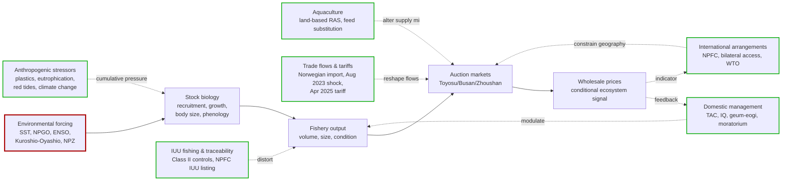

The diagram makes explicit a key analytical claim: **the conditional ecosystem signal in wholesale prices is the residual after both the environmental filter and the governance filter have been applied**. The Granger causality framework specified in Chapter 6 must therefore include not only oceanographic forcing variables but also governance-indicator variables — TAC binding indicators, moratorium calendar dummies, trade-policy shock dates, Norwegian benchmark prices, and structural-break controls for institutional discontinuities — before the residual environmental signal can be attributed cleanly. The empirical implementation of this dual-filter framework requires continuous time series of all governance-modulator variables at frequencies compatible with the dependent-variable frequencies, a data requirement that exceeds what the available materials directly supply but that subsequent research can address through dedicated primary-source extraction.

### Residual uncertainty introduced by IUU fishing

The IUU fishing residual deserves explicit treatment because it operates simultaneously on the assessment side and the market side without the kind of structured documentation that other governance modulators provide. As §7.3 established, IUU-origin removals distort catch-at-age inputs to stock assessments, IUU-origin product contaminates distribution channels, and enforcement asymmetries across Japan, Korea, China, and Russia create persistent cross-border uncertainty. The cumulative effect is that the stock-attribution analyses that condition all subsequent biometric and price interpretations carry irreducible uncertainty proportional to the IUU share of total removals — a share whose magnitude is, by definition, imperfectly known. The December 2022 Japanese Class II regime, the NPFC IUU vessel listing, and the 2022 WTO Agreement collectively reduce but do not eliminate this uncertainty, with the implication that any ecosystem-indicator interpretation drawn from market signals must report bounded confidence intervals rather than point estimates.

### Comprehensive variable set for Chapter 8 synthesis

The governance modulators examined in this chapter complete the comprehensive set of biological, environmental, institutional, and governance variables whose joint dynamics determine Pacific Rim chub mackerel price and body-size trajectories. The full variable set, organized by analytical domain, is summarized as follows.

**Environmental domain** (Chapter 6): G-SST, NP-SST, PDO, NPGO, MEI/ENSO, NPI, AO, Kuroshio-axis position, Tsushima Warm Current strength, Oyashio cold intrusion, mixed-layer depth, NPZ productivity, lipid-rich vs. lipid-poor zooplankton composition.

**Biological domain** (Chapters 2 and 5): Pacific stock and Tsushima stock structure, recruitment magnitude, weight-at-age, length-at-age, condition factor, fat content, age at first maturity, fecundity, spawning temperature thresholds, larval transport pathways, density-dependent growth, cohort-specific process error.

**Institutional domain** (Chapter 3): Toyosu tripartite trader structure, 500 g hedonic threshold, *me-kiki* quality judgment, *aki-saba* premium structure, Busan cooperative auction with same-day settlement, Korean three-tier 大/中/小 grade structure, Zhoushan monthly index, Norwegian standardized large-size benchmark, frozen-inventory cold-storage buffering, channel allocation (fresh / canning / feed / frozen).

**Governance domain** (Chapter 7): Japanese MSY-based TAC and IQ management, Korean voluntary *geum-eogi*, Chinese summer fishing moratorium, NPFC SAM-based regional assessment, bilateral access status (Japan-Korea, Japan-China, Japan-Russia, Japan-Taiwan), Class II import certification for mackerel, IUU vessel listing and Yamato Bank enforcement, aquaculture growth trajectory and formula-feed substitution path, Norwegian-import benchmark series, August 2023 China/Russia import suspension, April 2025 U.S. universal 10 percent tariff, marine plastic litter and microplastic accumulation, eutrophication and nutrient-salt management, red tide event documentation, climate-change adaptation (Study Sessions FY2023) and mitigation (carbon neutrality by 2040).

This comprehensive variable set provides the foundation for the integrated synthesis of Chapter 8, which will draw on the joint dynamics of these biological, environmental, institutional, and governance variables to project future trajectories of chub mackerel size structure and prices under climate-change scenarios, evaluate risks to fishery-dependent communities, and propose policy and industry recommendations covering adaptive management, market transparency, regional cooperation, and the strategic role of land-based aquaculture. The governance layer examined in this chapter establishes that **the future trajectory of Pacific Rim chub mackerel is determined not only by environmental forcing but by the institutional and policy choices that mediate how that forcing is transmitted to markets and to communities** — a finding that motivates the policy-oriented framing of the concluding chapter and the explicit consideration of adaptive-management interventions through which market-derived ecosystem indicators can be operationalized to improve outcomes across the multi-shock environment that contemporary Pacific Rim fisheries inhabit.

[^24]: FY2023 White Paper on Fisheries Summary, Fisheries Agency, June 2024.
[^6]: 中国舟山国际水产城2015年07月交易情况及水产品指数变化分析, 浙江省水产流通与加工协会.

# 8 Integrated Synthesis, Future Outlook, and Conclusions

The seven preceding chapters have progressively constructed an integrated analytical edifice around a single species — chub mackerel (*Scomber japonicus*) — and a single proposition: that the prices paid each morning at Toyosu, Busan, Zhoushan, and the peripheral wholesale markets of the Pacific Rim are not merely commercial transactions but distilled signals of the marine environment, biological productivity, institutional architecture, and policy choices that collectively determine the state of one of the world's most heavily exploited mid-trophic pelagic resources. Chapter 1 framed the question; Chapter 2 established the biological substrate through which environmental forcing must pass; Chapter 3 mapped the institutional architecture that prices the resulting landings; Chapter 4 traced the long-run price record with its structural breaks and trade-channel substitutions; Chapter 5 quantified the biometric crisis that the post-2017 Pacific stock now exhibits; Chapter 6 coupled that biometric record to the oceanographic forcing that drives it; and Chapter 7 introduced the parallel governance filter that modulates every link of the chain. The present chapter closes the report by integrating these findings into a unified framework, projecting their implications under climate-change scenarios, evaluating the differentiated risks they pose to fishery-dependent communities, translating them into policy and industry recommendations, and reflecting candidly on the methodological limitations and research priorities that the inquiry has surfaced.

The synthesis is not a mere recapitulation. It is the moment at which the analytical arc — environment → biology → fishery → market → governance → market signal — closes upon itself and begins to inform forward-looking interventions. Three threads bind the synthesis together. The first is the **dual-filter logic**: that observed market signals reflect the joint action of environmental forcing and governance modulation operating on a common biological substrate, with neither filter independently sufficient to explain the contemporary price record. The second is the **cross-stock and cross-market asymmetry**: that the Pacific stock × Toyosu coupling, the Tsushima Warm Current stock × Busan coupling, the East China Sea stock × Zhoushan coupling, and the eastern Pacific stock × NOAA assessment coupling exhibit fundamentally different signal-transmission fidelities, sensitivities to forcing, and institutional vulnerabilities, requiring differentiated analytical and policy treatment. The third is the **operational viability of markets as ecosystem indicators**: that high-frequency market data, properly conditioned on the dual filter, can serve as a real-time complement to conventional stock assessment with achievable lead times of 6–18 months for the highest-fidelity tier slices. Each thread carries forward into the climate-change projections, vulnerability assessments, and policy recommendations that the chapter assembles.

## 8.1 Integrated Conceptual Framework: Coupling Biology, Environment, and Market Economics

The integrated framework that the report has constructed across Chapters 1–7 can now be expressed in its complete form as a multi-layered system in which environmental forcing, biological transmission, institutional filtering, and governance modulation operate concurrently on a common species. The framework's analytical power resides in its insistence that no single layer is sufficient to explain observed market signals, and that the interactions among layers — particularly between environmental forcing and governance modulation — produce non-linear and asymmetric outcomes that single-layer analyses systematically misrepresent.

### The four-layer architecture of the integrated framework

The framework comprises four operationally distinct layers stacked along the causal chain from physical climate to wholesale prices. The **environmental layer**, examined in Chapter 6, supplies the forcing variables — sea surface temperature anomalies in spawning, nursery, and feeding grounds; the position and meander state of the Kuroshio, Tsushima Warm Current, and Oyashio extension; mixed-layer depth and stratification; nutrient–phytoplankton–zooplankton (NPZ) productivity fields; and the principal climate modes (G-SST, NP-SST, PDO, NPGO, MEI/ENSO, NPI, AO) that integrate these variables across the basin. The Yati et al. analysis cited in Chapter 6 established that the dominant first PCA mode of North Pacific marine biological variability over 1965–2006 is a long-term warming-aligned trend, with PC1 correlations of 0.76–0.90 against G-SST and NP-SST, while the western NP PC2 — on which chub mackerel recruitment loads positively — is most strongly correlated (r = 0.61) with the NPGO index. The State of the California Current 2016–2017 reporting concretized the propagation of these forcing variables through the 2014–2016 marine heatwave, with documented "lipid-depleted state" of zooplankton communities, "anomalously low biomass of zooplankton," and consequent propagation upward to mid-trophic species condition.

The **biological layer**, established in Chapters 2 and 5, transduces environmental forcing into stock-level biological outcomes. The 14.5°C spawning temperature threshold, the Kuroshio-mediated egg and larval transport, the cohort-specific recruitment magnitudes, and the density-dependent and environmentally-mediated growth pathways collectively determine the body size, condition factor, fat content, and seasonal availability of fish entering the fishery. The contemporary Pacific stock's documented growth deceleration — fish reaching 500 g at age 5 in 2020 versus age 2 in 2010, a factor-of-2.5 deceleration — and the SPR0 trajectory at approximately 170 g per recruited age-0 fish in the recent phase versus approximately 380 g in the historical low-stock phase represent a biometric crisis with no precedent in the post-1970 record. The species-common character of the deterioration across chub mackerel, sardine, and saury, documented by the FRA at the February 2025 stakeholder review, places the chub mackerel record within a basin-wide pattern of pelagic-ecosystem change that points decisively toward common environmental forcing operating through the bottom-up forage-environment channel.

The **institutional layer**, mapped in Chapters 3 and 4, comprises the wholesale market architectures that price the biological output. The Toyosu tripartite trader structure with its 500 g per-fish hedonic threshold, the Busan cooperative auction with its three-tier 大/中/小 grade system and same-day settlement convention, the Zhoushan monthly water-product price index with its frozen-inventory orientation, and the Norwegian standardized large-size import benchmark collectively determine how biological signals are converted into prices. Chapter 3's signal-fidelity ranking — Toyosu fresh-tier preserving the highest-frequency information, Busan capturing event-resolution producer-side dynamics, Zhoushan smoothing through monthly aggregation, Russian and North American flows essentially invisible at price-discovery frequency — establishes that the institutional layer is itself a filter whose specifications determine the bandwidth of the biological signal that reaches the consumer-facing price tier.

The **governance layer**, examined in Chapter 7, comprises the policy interventions that operate in parallel with the environmental forcing on every link of the chain. Japanese MSY-based TAC and IQ management, Korean voluntary *geum-eogi*, Chinese summer fishing moratorium, NPFC SAM-based regional assessment, bilateral access arrangements, IUU enforcement and Class II import certification, aquaculture growth trajectories and formula-feed substitution paths, the Norwegian-import substitution channel, the August 2023 China/Russia import suspension, the April 2025 U.S. universal 10 percent tariff, and the cumulative anthropogenic stressors of plastic litter, eutrophication, red tides, and climate change collectively constitute a parallel filter whose magnitude can rival or exceed the environmental forcing in any given year. The 2014–2015 Norwegian import surge that captured 35 percent of Korean supply by 2019, and the August 2023 Chinese import suspension that produced an approximately 30 percent year-on-year decline in Japanese exports to China, are concrete examples of governance shocks whose price- and supply-side magnitudes match or exceed the typical year-to-year environmental forcing.

### The dual-filter logic and its operational expression

The principal analytical insight that integrates these four layers is the **dual-filter logic**: observed market signals at any Pacific Rim wholesale market reflect the joint action of an environmental filter (acting on biology to produce the biological output) and a governance filter (acting on the biological output to determine which fraction reaches the market and at what price). Neither filter is independently sufficient to explain observed price variation, and their interactions produce non-linear effects that single-layer analyses systematically misrepresent.

```mermaid
flowchart LR
    subgraph EF[Environmental Filter]
        E1[SST, NPGO, ENSO,<br/>Kuroshio dynamics]
        E2[Spawning success<br/>14.5 deg C threshold]
        E3[Larval transport<br/>recruitment]
        E4[Forage environment<br/>growth, condition]
    end
    subgraph BL[Biological Layer]
        B1[Stock biology]
        B2[Body size at age]
        B3[Phenology]
    end
    subgraph IL[Institutional Layer]
        I1[Toyosu 500 g threshold]
        I2[Busan three-tier grade]
        I3[Zhoushan monthly index]
        I4[Norwegian benchmark]
    end
    subgraph GF[Governance Filter]
        G1[TAC + IQ + geum-eogi]
        G2[Moratorium + bilateral access]
        G3[IUU + traceability]
        G4[Trade policy shocks]
        G5[Aquaculture trajectory]
        G6[Anthropogenic stressors]
    end
    EF --> BL
    BL --> IL
    GF -.modulates.-> BL
    GF -.modulates.-> IL
    IL --> P[Wholesale price<br/>conditional ecosystem signal]
    P -.feedback.-> GF
```

The diagram makes explicit that the conditional ecosystem signal in wholesale prices — the residual that supports the report's central hypothesis — is what remains after both filters have been applied. The empirical implication is direct: any econometric specification aimed at extracting this signal must include both oceanographic forcing variables (environmental filter components) and governance-indicator variables (governance filter components) as controls before the residual can be attributed to the ecosystem state.

### The integrated variable set

The integrated framework's empirical foundation is the comprehensive variable set assembled across the four layers, summarized in Chapter 7 and now consolidated as the input substrate for the climate-change projections, vulnerability assessments, and policy recommendations of the present chapter.

| Layer | Principal variables | Frequency | Geographic resolution |
|---|---|---|---|
| Environmental | G-SST, NP-SST, PDO, NPGO, MEI/ENSO, NPI, AO; Kuroshio-axis position; Tsushima Current strength; mixed-layer depth; chlorophyll concentration; zooplankton biomass and lipid composition | Monthly to seasonal | Basin-scale to spawning/feeding ground |
| Biological | Stock structure (Pacific, Tsushima, eastern Pacific); recruitment magnitude; weight-at-age; length-at-age; condition factor; fat content; SPR0; cohort-specific process error; phenology | Annual (assessment) to within-year (port sampling) | Stock-specific |
| Institutional | Auction mechanism; grading thresholds; channel allocation (fresh/canning/feed/frozen); cold-storage stocks; daily and monthly price tiers; Norwegian import unit values | Daily (Toyosu) to monthly (Zhoushan) | Market-specific |
| Governance | TAC and IQ allocations; *geum-eogi* schedule; moratorium calendar; NPFC assessment outputs; bilateral access status; IUU enforcement; aquaculture production; Class II certification; trade-policy events; subsidy classifications | Event-driven to annual | National to basin-wide |

The cross-stock and cross-market asymmetries that any integrated analysis must accommodate are summarized in the operationally critical pairings developed across the report:

| Pairing | Stock | Market | Dominant forcing channel | Signal-fidelity ranking |
|---|---|---|---|---|
| Pacific × Toyosu | Pacific stock | Toyosu fresh-tier above-500 g | Bottom-up forage; basin warming; offshore distribution | Highest |
| Tsushima × Busan | Tsushima Warm Current stock | Busan cooperative; medium-and-large grade | NPGO-aligned; phenological shift; Norwegian substitution | High (event-resolution) |
| East China Sea × Zhoushan | Tsushima/East China Sea components | Zhoushan monthly index | Moratorium overlay; LED light-fishery technical change | Moderate (regime-level) |
| Eastern Pacific × NOAA | Eastern Pacific stock | NOAA-SWFSC harvest guideline | ENSO/PDO; marine-heatwave | High (assessment-output) |
| Russian Far East / NPFC | High-seas + Russian EEZ | Partner-country trade flows | NPFC integration; bilateral suspensions | Low (inferred) |

This consolidated framework — the four layers, the dual-filter logic, the integrated variable set, and the cross-stock × cross-market pairings — provides the operational foundation on which the remainder of the chapter builds.

## 8.2 Quantitative Synthesis: Feedback Loops, Tipping Points, and Markets as Ecosystem Indicators

The conceptual framework of §8.1 supports a quantitative synthesis that identifies the principal feedback loops linking biological state to market price and back to management, isolates the candidate tipping points that the contemporary record has crossed or is approaching, and assesses the operational viability of using high-frequency market data as real-time ecosystem indicators. This section consolidates the empirical evidence assembled across Chapters 4–7 into a structured synthesis that supports the climate-change projections of §8.3 and the policy recommendations of §8.5.

### Principal feedback loops in the coupled system

Three feedback loops dominate the dynamics of the integrated framework. The **biology-to-market loop** operates through the environmental-forcing-mediated determination of body size and supply, the institutional grading thresholds that translate body size into hedonic price tiers, and the price-tier composition that determines producer revenue. Chapter 5's documentation of the Toyosu 500 g threshold and the Busan three-tier grade system established that this loop is institutionally amplified: small biometric shifts at the threshold translate into large grade-share changes and correspondingly large fresh-tier price movements, with the inelastic-with-respect-to-volume demand pattern consolidating producer revenue against pure abundance fluctuations through unit-price compensation. The November 2015 Busan event (3,500 t at approximately 857 KRW/kg) and the April 2026 Toyosu "saba sukunaku takane" episode together illustrate the two ends of this loop: high volume with depressed unit price, and low volume with elevated unit price, both consistent with a downward-sloping demand schedule whose elasticity exceeds unity in absolute value.

The **market-to-management loop** operates through the use of market signals as inputs to TAC determination, IQ allocation, and adaptive *geum-eogi* scheduling. Chapter 6's Granger causality framework specified that market signals can in principle Granger-anticipate ecosystem indicators with achievable lead times of 6–18 months for the highest-fidelity tier slices, and Chapter 7's documentation of Japan's "New Roadmap for Promoting Resource Management" published in March 2024 — with its catch recovery target of 4.44 million tons by 2030 against 2022 catch of 2.92 million tons — establishes that contemporary management is increasingly oriented toward forward-looking stock recovery. The institutional infrastructure for incorporating market-derived signals into management decisions exists in partial form through the FRA's annual stakeholder consultation and the Japanese fisheries policy advisory mechanisms, but the formal Granger causality testing of market signals against ecosystem indicators has not yet been systematically conducted, leaving market-derived ecosystem inferences as qualitative rather than quantitative inputs to management.

The **governance-to-market loop** operates through trade-policy shocks, TAC binding, moratorium calendars, and aquaculture growth trajectories that directly modify the supply mix reaching wholesale markets. The 2014–2015 Norwegian import surge, the August 2023 Chinese import suspension, the April 2025 U.S. universal 10 percent tariff, and the contemporary Korean *geum-eogi* schedule each illustrate this loop's operation. The cumulative effect is that market signals encode not only the underlying biological state but also the institutional and policy environment within which the biology operates, with the implication that any clean attribution of price movements to environmental forcing requires explicit conditioning on the governance variables.

### Candidate tipping points in the contemporary record

The integrated framework identifies three candidate tipping points that the contemporary Pacific Rim chub mackerel system has crossed or is approaching, each with documented quantitative anchors and direct implications for forward trajectories.

The **first tipping point** is the unprecedented post-2017 SPR0 phase of the Japanese Pacific stock. As Chapter 5 documented, the FRA's four-phase regime structure places the recent phase at approximately 170 g per recruited age-0 fish, against approximately 380 g in the historical low-stock phase and approximately 310 g all-period average. The 170/380 ratio of approximately 0.45 quantifies contemporary biometric productivity at less than half the historical low-stock baseline, and the FRA's characterization of the recent phase at the February 2025 stakeholder review as "unprecedented" — not corresponding to any of the three historically documented phases — establishes that the system has crossed into a regime with no observable historical analogue. The species-common character of the deterioration across mackerel, sardine, and saury indicates that the tipping point is not stock-specific but reflects a basin-wide pelagic-ecosystem reorganization.

The **second tipping point** is the Korean medium-and-large grade-share collapse at Busan from approximately 70 percent in 2008 to approximately 30 percent in 2014 and approximately 20 percent in November–December 2019, with absolute medium-and-large landings falling from over 130,000 tonnes to under 30,000 tonnes over the same period. The compositional collapse represents a population-level body-size redistribution whose magnitude implies that the institutional infrastructure of the Korean wholesale market — including the cooperative auction, the intermediate wholesalers, and the consumer-facing retail tier — must increasingly source medium-and-large supply from non-domestic channels. The Norwegian import substitution to 35 percent of Korean supply by 2019 is the operational manifestation of this tipping point, and the consequent transition of the Korean medium-and-large grade tier from a domestic-supply-anchored regime to an Atlantic-import-anchored regime represents a structural realignment of the Korean chub mackerel market.

The **third tipping point** is the Norwegian-import 35 percent supply-share threshold itself, which marks the level at which the Atlantic forcing channel began to systematically discipline Pacific Rim wholesale price formation. Below this threshold, Norwegian imports functioned as a residual quality-tier supplement; at and above this threshold, the Norwegian benchmark price effectively sets the upper bound on Korean medium-and-large grade tier pricing through quality-driven substitution. The implication is that contemporary Korean wholesale prices in the medium-and-large tier reflect predominantly North-East Atlantic stock dynamics and oceanographic conditions rather than Pacific environmental forcing, with the residual Pacific signal extractable only after explicit conditioning on the Norwegian benchmark series.

The three tipping points and their interactions are summarized below.

| Tipping point | Quantitative anchor | Stock/market scope | Reversibility |
|---|---|---|---|
| Pacific stock unprecedented SPR0 phase | SPR0 ≈ 170 g (recent) vs. ≈ 380 g (historical low-stock); growth-to-500g age-2 (2010) → age-5 (2020) | Pacific stock × Toyosu | Low; species-common deterioration suggests systemic environmental driver |
| Korean medium-and-large grade-share collapse | ~70 % (2008) → ~20 % (Nov–Dec 2019); absolute volume >130,000 t → <30,000 t | Tsushima stock × Busan | Low without recovery in domestic biometric productivity |
| Norwegian-import 35 % supply-share threshold | <10,000 t (2009) → ~34,000 t (2019); 35 % share threshold | Atlantic→Korean (and Japanese premium) market | Conditional on NE Atlantic stock dynamics; potentially reversible if Atlantic supply contracts |

### Operational viability of markets as ecosystem indicators

The central hypothesis of the report — that wholesale market price signals encode the state of the marine environment with sufficient fidelity and lead time to function as real-time ecosystem indicators — can now be assessed comprehensively. The empirical leverage ranking from Chapter 6 identified the Toyosu fresh-tier above-500 g daily prices as the highest-leverage tier slice (multi-pathway sensitivity, 6–18 month lead-time potential), the Busan medium-and-large grade settlements as the second-highest (event-resolution phenological sensitivity, 3–12 month lead time), the eastern Pacific harvest guideline as a formal ecosystem indicator suitable for assessment-coupled validation, and the Zhoushan monthly index as a regime-level reference with limited high-frequency capacity.

The dual-filter conditioning structure required to extract the residual ecosystem signal is now specifiable in operational terms:

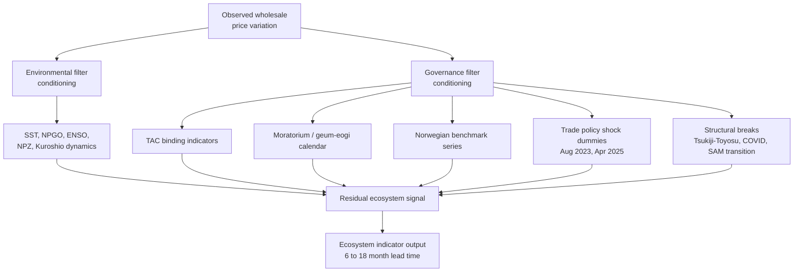

The viability assessment yields three operational conclusions. First, **the Toyosu fresh-tier daily price for the above-500 g grade is the single most informative real-time ecosystem indicator in the Pacific Rim chub mackerel system**, supported by the institutional grading threshold's amplification of biometric signals and by the daily auction mechanism's preservation of high-frequency information. Second, **the Busan medium-and-large grade-share settlement provides complementary phenological-timing information not available in Toyosu data**, with the cooperative auction's same-day settlement convention capturing producer-side phenological responses that aggregate market data smooth over. Third, **the achievable lead time of 6–18 months positions market-derived ecosystem inference as a complement to rather than a substitute for conventional stock assessment**, with the principal value residing in the window between contemporary biometric variation and its incorporation into the next assessment cycle. Beyond this window, formal stock assessments retain their essential role through their methodological transparency and uncertainty quantification.

The constraints that bound this operational viability remain substantial. The lag structure of underlying biological mechanisms imposes an upper bound on lead time at the recruitment-mediated pathway (2–4 years from spawning to fishery entry, with market data therefore unable to lead the spawning-success determination by more than approximately one year). The institutional smoothing imposed by frozen-inventory and channel-allocation buffers — Japan's 48.5 percent allocation to aquaculture/fishery feed and 22.7 percent to canning, leaving only 13 percent in the direct fresh-food channel — limits the cleanness of biological-signal extraction. The conditioning controls absorb a substantial portion of observed price variation, leaving the residual environmental signal often modest in absolute magnitude even when statistically detectable. Within these constraints, however, the integrated framework establishes that Pacific Rim chub mackerel wholesale prices function as a meaningful real-time complement to conventional ecosystem assessment, with operationalization of this function through dedicated econometric implementation and primary-source data extraction representing the principal forward research priority.

## 8.3 Climate-Change Scenario Projections of Body Size and Price Trajectories

The integrated framework's principal forward-looking application is the projection of chub mackerel body size structure, recruitment patterns, and wholesale prices under multiple climate-change scenarios. This section draws on the documented individual-based modeling and habitat-modeling evidence assembled across the present materials, applies the body-size-temperature elasticity established in the small-pelagic-fish literature, and traces the propagation of projected biometric changes through the institutional grading thresholds to forward price trajectories.

### Spatial-distribution projections under RCP scenarios

The most explicit climate-change projection for chub mackerel in the Northwest Pacific is the individual-based model (IBM) developed by Jung at Jeju National University, presented at the PICES W3 workshop in September 2017. The model coupled a Regional Ocean Modeling System (ROMS) configured for the western North Pacific (117–150°E, 20–52°N) with a biophysical IBM covering chub mackerel from larval to adult stages, with future climate scenarios driven by Global MPI ECHAM5 RCP 2.6 and RCP 8.5 boundary conditions for 2006–2050. The hindcasted and projected sea surface temperatures established the magnitude of forcing: the 2000s (2006–2015) winter (February) domain-mean SST was 15.17°C and summer (August) domain-mean SST was 26.08°C; the 2050s (2050–2059) projected winter SST under RCP 8.5 was 16.47°C and summer SST 27.62°C, representing winter and summer increases of 1.30°C and 1.54°C respectively. The projected SST changes were "especially in the Japan/East Sea," establishing that warming under RCP 8.5 is not spatially uniform but is concentrated in the marginal-sea sub-basins that constitute the principal habitat of the Tsushima Warm Current stock.

The IBM's projected biological responses included two consequential findings. First, **larval survival was projected to be enhanced overall by the 2050s under RCP 8.5**, consistent with the warming-favorable response of some pelagic species to moderate thermal forcing identified in the basin-wide PCA framework of Yati et al.. Second, **juvenile distribution was projected to shift northeast to the Japan/East Sea**, indicating that the Tsushima Warm Current stock's biogeography is likely to reorganize substantially under continued warming, with implications for the Korean Busan fishery's accessibility to its principal stock component and for the Japanese Sea-of-Japan fisheries' supply mix.

A complementary projection by Seonggil Go and colleagues at the Korea Institute of Ocean Science and Technology developed a suitable spawning-ground model for chub mackerel and projected that "by the 2050s, spawning grounds will shift northward due to warming". The northward spawning-ground shift is operationally consequential because it would draw the spawning aggregation away from the historical East China Sea / southwestern Sea of Japan grounds toward higher-latitude waters where infrastructure for spawning-ground monitoring, larval-survey sampling, and recruitment forecasting is less developed. The implication is that the contemporary scientific infrastructure for predicting recruitment may itself become misaligned with the spatial distribution of the resource it monitors.

### Body-size–temperature elasticity and the Bergmann-rule framework

The Hattab et al. (2021) analysis of small pelagic fish in the Mediterranean Sea, while geographically distant from the Pacific Rim, provides one of the most rigorous quantitative anchors for body-size–temperature elasticity available in the small-pelagic-fish literature. The study explicitly examined Atlantic chub mackerel (*Scomber colias*, the close congener of *S. japonicus* with which the Pacific species was historically conspecific) and documented adherence to Bergmann's rule, finding that body size declined by approximately "3.67 % per 1°C of warming". The bootstrap-validated effect, reported at –131.36 mm per scaled-temperature unit at depth-controlled mean conditions, was robust against sampling-period variability, bathymetric distribution, and unbalanced sampling, with 99 percent of bootstrap slope estimates remaining negative. Comparable elasticities across the five small-pelagic species exhibiting Bergmann's-rule adherence ranged from 3.01 percent (anchovy) to 3.82 percent (bogue), with a basin-wide average of approximately 3.5 percent body-size reduction per 1°C of warming. This result aligns closely with controlled-experiment estimates for marine ectotherms (–3.0 percent per °C, Forster et al. 2012) and with reef-fish wild-population observations (~4 percent per °C, Audzijonyte et al. 2020).

Applied to the Pacific Rim chub mackerel system, the 3.67 percent per °C elasticity provides a baseline projection of body-size response to the 2050s warming projected by the Jung IBM. Under the RCP 8.5 scenario projecting 1.30°C winter and 1.54°C summer warming in the western North Pacific, the implied body-size reduction at temperate-zone reference body size is approximately 4.8–5.7 percent — a magnitude that, while modest in proportional terms, is operationally consequential given the binding character of institutional grading thresholds.

### GOLT-based predictions and the gill-oxygen limitation framework

The Gill-Oxygen Limitation Theory (GOLT) developed by Pauly and Cheung provides a complementary mechanistic framework for projecting chub mackerel size response to warming. GOLT postulates that the rate of oxygen supply by gills constrains fish growth under elevated metabolic demand, with the physical geometry of gill respiratory area limiting maximum body size under warming through the dimensional tension between gill surface (which must grow as a 2D surface) and body volume (which grows as a 3D volume). Pauly and Cheung's quantitative simulations applied to 754 species of exploited marine fishes projected that "the median decreases in W∞ under d = 0.7 and d = 0.7 to 0.9 under warming were predicted to be 13.9 % per °C and 24.9 % per °C, respectively". For chub mackerel specifically, with its high metabolic demand and active swimming style placing it toward the larger d-value end of the spectrum, the GOLT-based projection of asymptotic weight reduction approaches the upper end of this range — substantially exceeding the Bergmann's-rule-based body-length elasticity because asymptotic weight scales with the cube of body length.

The reconciliation between the Bergmann-rule body-length elasticity and the GOLT-based asymptotic-weight projection lies in the distinction between intermediate-size body length (which responds at approximately 3.5 percent per °C through phenotypic plasticity and temperature-size-rule mechanisms) and asymptotic terminal body weight (which responds more dramatically through the cumulative effect of compromised oxygen supply across the full ontogenetic range). For chub mackerel, where the institutional grading thresholds operate predominantly on contemporary body weight rather than on asymptotic potential, the Bergmann's-rule elasticity provides the more directly applicable projection. The GOLT framework's principal contribution to the Pacific Rim analysis is its identification of the offshore-distribution mechanism: contemporary chub mackerel that spend more time in offshore waters with poorer oxygen supply (warmer surface waters with reduced solubility, combined with lipid-depleted forage that increases per-unit metabolic cost) face compounded gill-oxygen limitation that translates into the documented post-2017 growth deceleration.

### Propagation through institutional grading thresholds

The projected biometric changes propagate through the institutional grading thresholds documented in Chapters 3 and 5 to produce forward price trajectories. The propagation logic operates through three principal channels.

The **Toyosu 500 g threshold channel**: A 4.8–5.7 percent body-size reduction by the 2050s under RCP 8.5, applied to the contemporary Pacific stock weight-at-age trajectory in which fish reach 500 g at age 5 in 2020, would shift the 500 g milestone to ages beyond the principal age structure of the fishery (which is dominated by ages 1–4). The institutional consequence is that the share of landings crossing the 500 g threshold would contract further from its already-compressed contemporary level, with the supply-side implication that the Toyosu fresh-tier above-500 g grade tier would become progressively more dependent on the limited above-threshold supply that domestic landings can deliver. Norwegian import substitution would absorb an increasing share of the fresh-tier and premium-processed demand, with the result that the Toyosu institutional architecture progressively becomes a price-discovery system for Atlantic-sourced premium product rather than for domestic Pacific-stock supply.

The **Busan three-tier grade structure channel**: Continued warming of the Tsushima Warm Current under RCP 8.5, combined with the projected northeast shift of juvenile distribution into the Japan/East Sea, would compound the medium-and-large compositional collapse documented through 2019. Korean domestic landings would shift further toward the small-fish tier as biometric productivity declines, while access to the northeastern East Sea distribution would be constrained by the bilateral access suspensions documented in Chapter 7. The Norwegian benchmark would discipline an increasing share of the Korean upper-tier price formation, and the cooperative auction's medium-and-large grade premium would widen in unit-price terms while contracting in volume terms, consistent with the inelastic-with-respect-to-volume demand pattern.

The **phenological-timing channel**: The Korean cooperative's documented 2015 observation of peak-landing-month delay from October to mid-November, combined with the projected northeast distribution shift, implies that the seasonal price calendar will continue to drift later in the year. The autumn *aki-saba* premium window in Japanese markets will compress and shift correspondingly, with the institutional consequence that fixed seasonal grading conventions and *geum-eogi* schedules will progressively misalign with the underlying biological cycle. Adaptive seasonal specification of both the institutional grading conventions and the regulatory closure schedules will become increasingly necessary to preserve their economic and conservation effectiveness.

The forward price trajectory under RCP 8.5 to the 2050s can be summarized as follows.

| Trajectory component | Direction | Magnitude (qualitative) | Mechanism |
|---|---|---|---|
| Pacific stock fresh-tier above-500 g supply | Continued contraction | Moderate–strong | Body-size reduction + age-at-500g shift beyond principal age structure |
| Toyosu fresh-tier above-500 g unit price | Upward drift; Norwegian-anchored | Strong | Domestic supply contraction; substitution ceiling |
| Tsushima stock medium-and-large landings | Continued decline; phenologically delayed | Moderate–strong | Distribution shift; biometric reduction |
| Busan medium-and-large grade unit price | Upward; Norwegian-anchored | Strong | Compositional collapse continuation; Atlantic discipline |
| Zhoushan frozen *naiyu* benchmark | Stable to moderate upward | Modest | Frozen-inventory smoothing; multi-source supply substitution |
| Eastern Pacific stock biomass | Recurring marine-heatwave volatility | High variance | Cohort-driven recovery capacity under favorable years |
| Norwegian import share | Continued growth toward saturation | Moderate | NE Atlantic forcing; quality-tier substitution |

### Resilience of substitution channels under multi-decadal forcing

The resilience of the Norwegian-Atlantic and aquaculture-substitution channels under multi-decadal climate forcing represents a key uncertainty in the forward projection. The Norwegian channel's resilience depends on the response of North-East Atlantic chub mackerel stocks to their own warming-driven dynamics, which operate independently of Pacific climate modes. Should NE Atlantic stocks experience their own biometric crisis under continued warming, the Norwegian export capacity would contract, and the substitution channel that has anchored Pacific Rim premium-tier pricing since 2014–2015 could weaken. The aquaculture-substitution channel's resilience depends on the continued progress of Japan's formula-feed substitution trajectory toward the 2050 target of 100 percent formula-feed and on the eventual technical and economic feasibility of land-based RAS for chub mackerel specifically. The contemporary 4.4 percent artificial-seedling rate across major Japanese aquaculture species indicates that substantial scaling of chub mackerel aquaculture is multi-decadal in horizon, with first-order effects on wholesale-market dynamics unlikely to manifest before the 2030s and meaningful supply-side impact unlikely before the 2040s.

The combined assessment is that **under continued warming through the 2050s, the Pacific Rim chub mackerel system is likely to undergo continued and possibly accelerating biometric deterioration, with the Norwegian-Atlantic substitution channel and the slow emergence of land-based aquaculture providing partial but incomplete relief**. The cross-stock asymmetry will likely sharpen rather than attenuate: the eastern Pacific stock retains demonstrated cohort-driven recovery capacity under favorable environmental conditions but is exposed to recurring marine-heatwave volatility, while the Pacific stock has not exhibited comparable recovery capacity in the post-2017 record. Korean and Japanese wholesale markets in the medium-and-large grade tier will progressively transition toward Atlantic-sourced supply discipline, with corresponding implications for the analytical interpretation of Pacific Rim wholesale prices as ecosystem indicators of Pacific environmental forcing.

## 8.4 Risks to Fishery-Dependent Communities and Differentiated Vulnerabilities

The projected trajectories of §8.3 translate into differentiated risks to the fishery-dependent communities at Pacific Rim landing ports and wholesale markets, with each community's vulnerability profile determined by the joint configuration of stock exposure, fleet structure, institutional concentration, and policy access. This section evaluates these vulnerabilities at the four principal community clusters identified across the report — Korean Busan, Japanese coastal purse seine, Chinese light-purse-seine and lift-net, and the eastern Pacific U.S. fleet — and assesses the cascading implications for fleet operators, intermediate wholesalers, processing industries, and consumer-side food security.

### The Korean Busan cooperative: institutional fragility at the dissolution threshold

The Korean Busan large purse seine cooperative is the most acutely vulnerable institution in the Pacific Rim chub mackerel system, having approached the statutory dissolution threshold of 15 selo in early 2025 and facing concurrent exposure to the post-2017 biometric crisis, the Norwegian import substitution, and the bilateral access suspensions that constrain Korean fleet access to the northeastern East Sea distribution. The cooperative's vulnerability is structural rather than cyclical: as Chapter 3 documented, its institutional viability requires a critical mass of selo membership above the 15-unit dissolution threshold, and the contemporary projection of continued biometric deterioration combined with continued Norwegian import substitution implies that the operating margin of the constituent fishing enterprises — already documented as thin, with average annual revenue per selo of 16.5 billion KRW against costs that approach 12 billion KRW — will continue to compress.

The cascading implications of cooperative dissolution would extend beyond the fleet. The cooperative supports approximately 70 crew at sea per selo plus office staff, intermediate wholesalers, and dock labor totaling several hundred persons per unit, with the aggregate community footprint encompassing the entire Busan port economy that depends on the daily auction throughput. The institutional commentary cited in Chapter 3 — that "the large purse seine industry centered in Busan could relocate to other regions, and back-end personnel including intermediate wholesalers and harbor union members could also leak away" should the cooperative dissolve — captures the magnitude of the cascading risk. Representative Seo Cheon-ho's January 2025 legislation to reduce the dissolution minimum from 15 to 7 selo represents a direct regulatory response to this institutional fragility, but the legislative path's success and timing are uncertain, and the underlying biometric and trade-channel pressures that drove the cooperative toward the threshold will persist regardless of the legislative outcome.

The differentiated vulnerability profile within the Korean community extends to the consumer side. Korean per-capita fishery product consumption — approximately 44.8 kg/person/year by 1994, with fishery products supplying about 45.5 percent of all animal protein in the diet — establishes that chub mackerel availability is a meaningful component of Korean food security. As domestic supply shifts toward smaller-tier sizes and Norwegian imports substitute for the medium-and-large premium tier, the affordability of premium-grade chub mackerel for lower-income Korean consumers may erode, with the consequent food-security implication that chub mackerel transitions from a price-accessible animal-protein source toward a more stratified consumer market in which quality-grade is increasingly correlated with income.

### The Japanese coastal purse seine fleet: exposure to unprecedented SPR0 collapse

The Japanese coastal purse seine fleet, which supplies the bulk of Pacific stock chub mackerel into Toyosu and the secondary central wholesale markets, faces a different vulnerability profile. The contemporary unprecedented SPR0 phase documented by the FRA implies that domestic Pacific-stock biometric productivity is at less than half the historical low-stock baseline, with continued bottom-up forage-environment forcing under the offshore-distribution mechanism. The fleet's exposure operates through two channels: the long-run decline in domestic landings volume (from approximately 1.30 million tonnes in 1980 to under 300,000 tonnes in 2023) and the compositional shift toward smaller fish that compresses the share of landings crossing the Toyosu 500 g threshold.

The Japanese MSY-based TAC and IQ management framework, examined in Chapter 7, provides a partial buffering mechanism through the upper-tail truncation of high-recruitment year landings and through the within-fleet allocation smoothing that IQ enables. However, the contemporary low-recruitment trajectory means that TAC is likely non-binding for the Pacific stock, with the consequence that the volume-price elasticity is operating closer to its full biological extent and producer revenue is buffered through unit-price compensation rather than through TAC-mediated allocation control. The fleet's economic resilience therefore depends on the institutional amplification of biometric signals through the Toyosu hedonic threshold structure: when landings consist predominantly of below-500 g fish, the fresh-tier supply contracts and unit prices rise, partially offsetting volume decline. The fleet's exposure to a complete tipping-point collapse — in which the Pacific stock SPR0 declines below a level compatible with sustainable exploitation — remains a forward-looking risk that the integrated framework cannot rule out under continued warming.

The cascading implications for Japanese intermediate wholesalers and processing industries operate through the channel-allocation logic. The 13 percent fresh-channel share against 22.7 percent canning and 48.5 percent aquaculture/fishery feed allocation establishes that Japanese saba processing infrastructure is heavily oriented toward feed and canning rather than fresh consumption. As the wild-stock supply contracts and shifts toward smaller fish, the canning and feed channels can absorb the reduced supply with limited disruption, while the fresh channel becomes increasingly dependent on Norwegian and other imported supply. The Japanese consolidation of wholesale companies into integrated seafood multinationals (e.g., Daito Gyorui as a wholly owned subsidiary of Umios since 2020) provides corporate-level resilience against producer-side supply shocks but with the consequence that price-discovery information becomes increasingly mediated through intra-group transfer pricing rather than through external auction signals.

### The Chinese light-purse-seine and lift-net fisheries: moratorium-mediated supply structure

The Chinese light-purse-seine and lift-net fisheries that supply Zhoushan and the broader Chinese frozen *naiyu* market operate under a distinctive supply structure mediated by the summer fishing moratorium calendar. The fisheries' vulnerability profile is differentiated from the Korean and Japanese fleet exposure in three important respects. First, the moratorium-mediated supply structure insulates the frozen-inventory price benchmark (4–6 yuan per *jin*) from short-run biological events, with the consequence that Chinese fleet revenue is less volatile in the short run than the Korean cooperative auction-based revenue. Second, the technical efficiency improvements in LED fish-attracting light arrays — with documented optimization of total power around 36 kW, light height of 6–7 m, and installation angle of 60–75 degrees — establish that Chinese fishery productivity can shift independently of biological abundance, providing partial offset to underlying biological deterioration. Third, the post-moratorium reopening event creates a recurring annual market liquidity injection that smooths within-year fleet revenue and provides a predictable institutional anchor for fishery-dependent community planning.

The cascading implications for Chinese processing industries are mediated through the dried-product and tourism-linked channels documented in Chapter 3. The development of "*haidao luyou* (island tourism) and *haixian meishi wenhua* (seafood gastronomy)" following the establishment of the Zhoushan Archipelago New District has driven dried-product demand during the moratorium period, providing a high-value supplementary outlet that absorbs a fraction of frozen-inventory chub mackerel. This tourism-linked channel functions as a community-economic resilience mechanism, with the implication that Chinese fishery-dependent communities have access to diversification options that Korean and Japanese communities have developed less extensively.

### The eastern Pacific U.S. fleet: marine-heatwave volatility and assessment-driven management

The eastern Pacific U.S. fleet, examined principally through the NOAA-SWFSC catch-only assessment cited in Chapters 5 and 6, faces a distinctive vulnerability profile shaped by the recurring marine-heatwave events documented in the State of the California Current 2016–2017 reporting and by the assessment-driven harvest-guideline management system. The fleet's exposure to the 2014–2016 marine heatwave manifested through reduced stock biomass (declining from approximately 70,000 t in 2020 to 45,898 t in 2022) followed by partial recovery driven by strong cohort recruitment (2018 cohort prominent), with the projected 2026-27 biomass of 67,954 t indicating system-level resilience. The harvest-guideline structure, with U.S. landings consistently below the harvest guideline at between 7 and 39 percent of HG over 2008–2023, provides a substantial conservation buffer that limits the fleet's capacity to fully exploit favorable cohort years but correspondingly cushions the fleet against poor cohort years.

The cascading implications for U.S. Pacific landing ports and processors are mediated through the disintegrated institutional architecture documented in Chapter 3. The eastern Pacific U.S. fleet does not have access to a unified auction system comparable to Toyosu or Busan, with landings handled through private fish-receiving stations and processed through a combination of canning, freezing, and export channels. The fleet's market-side vulnerability is therefore distributed across many small institutional units rather than concentrated in a single cooperative, with the consequence that systemic market-institution failure (such as the Korean cooperative's dissolution risk) is unlikely. However, the fleet's integration with East Asian wholesale architecture is weak, with the consequence that the demand-side resilience of California chub mackerel landings depends predominantly on domestic U.S. consumer markets and on export channels to Latin American and other non-East-Asian destinations.

### Cross-community vulnerability summary

The differentiated vulnerability profiles across the four principal community clusters are summarized as follows.

| Community cluster | Principal vulnerability source | Cascading affected groups | Resilience mechanisms | Forward risk |
|---|---|---|---|---|
| Korean Busan cooperative | Institutional fragility at 15-selo dissolution threshold; biometric collapse; Norwegian substitution | Fleet operators (~70 crew/selo); intermediate wholesalers; harbor labor; consumer food security | Legislative reduction of dissolution minimum to 7 selo (proposed 2025); Norwegian import substitution buffering | High; multi-channel pressure |
| Japanese coastal purse seine fleet | Unprecedented Pacific stock SPR0 collapse; offshore-distribution forcing | Toyosu intermediate wholesalers; canning and feed processors; consumer fresh channel | MSY-based TAC + IQ + Resource Management Agreements; Norwegian premium-tier substitution; corporate consolidation | High; structural |
| Chinese Zhoushan light-purse-seine and lift-net | Moratorium-mediated supply structure dependence | Frozen-inventory traders; tourism-linked dried-product processors | LED technical efficiency; tourism diversification; frozen-inventory smoothing | Moderate; institutionally buffered |
| Eastern Pacific U.S. fleet | Recurring marine-heatwave volatility | Distributed private receiving stations; canning and export processors | Harvest-guideline conservation buffer; cohort-driven recovery capacity | Moderate; volatility-driven |

The cross-community synthesis identifies three differentiating features that policy interventions must accommodate. First, **institutional concentration is highest in Korea and lowest in the U.S. eastern Pacific**, with the consequence that single-institution failures pose greater systemic risk in Korea while distributed institutional architecture in the U.S. provides partial resilience. Second, **biological exposure is highest for the Japanese Pacific stock** (unprecedented SPR0 collapse) and the Korean Tsushima stock (compositional collapse), while the Chinese East China Sea stock components are relatively buffered by the moratorium-mediated supply structure and the eastern Pacific stock retains demonstrated cohort-driven recovery capacity. Third, **consumer-side food-security implications are most acute in Korea**, where chub mackerel constitutes a meaningful component of animal protein consumption, while Japanese, Chinese, and U.S. consumer markets have greater diversity of substitute pelagic and non-pelagic options.

## 8.5 Policy and Industry Recommendations

The integrated findings of the report translate into actionable recommendations spanning four pillars: adaptive resource management, market transparency and hedonic-grading reform, regional cooperation, and the strategic role of land-based aquaculture. Each pillar's recommendations are anchored in the documented evidence assembled across the report and address specific intervention points within the dual-filter framework of §8.1.

### Pillar 1: Adaptive resource management

The first pillar addresses the modulation of governance instruments to accommodate the dynamic environmental and biometric conditions documented across the report. **Market-derived ecosystem-indicator-informed TAC adjustment** would operationalize the Granger causality framework specified in Chapter 6 by formalizing the use of Toyosu fresh-tier above-500 g daily price signals and Busan medium-and-large grade-share settlements as forward-looking inputs to annual TAC determinations. The achievable 6–18 month lead time supports incorporation of market-derived signals into the spring TAC-setting cycle with sufficient lead to influence the upcoming fishing year's regulatory ceiling. Operational implementation would require dedicated econometric monitoring of the conditional ecosystem signal at the FRA, KMI, and equivalent national institutions, with cross-checks against the formal SAM-based assessment outputs to ensure consistency.

**Phenology-tracking *geum-eogi* scheduling** would address the documented misalignment between the Korean fixed-calendar voluntary closure and the warming-driven phenological shift in peak landing month. The Korean cooperative's 2015 observation that peak fishing season had drifted from October to mid-November implies that fixed October-anchored *geum-eogi* schedules progressively misalign with the underlying biological cycle. An adaptive scheduling framework that updates the closure calendar annually based on the previous year's documented peak-landing-month timing would preserve the closure's conservation effectiveness without imposing binding effort reduction during the migration shoulder periods. The institutional infrastructure for such adaptation already exists through the Korean fishery cooperative system; the principal requirement is methodological — a documented decision rule linking observed phenological timing to the following year's closure calendar.

**IQ management refinement** in Japan would extend the contemporary 11-method-and-stock IQ rollout to encompass the offshore purse seine fishery targeting the Pacific stock chub mackerel. The Japanese FY2023 White Paper's identification of IQ as a priority for fisheries that "mainly target, in principle, TAC species" places offshore purse seine within the candidate set for IQ implementation. The within-fleet capacity-constraint smoothing that IQ provides would directly address the auction-floor capacity problem documented at Busan in November 2015 (when 1,000 t had to be carried over to Sunday trading) by anticipating the within-day landing volume through individual quota planning, with the consequent market-side benefit of more orderly price discovery during high-volume events.

### Pillar 2: Market transparency and hedonic-grading reform

The second pillar addresses the institutional architecture that translates biological signals into prices, with the goal of increasing the bandwidth of biological-signal transmission and the analytical accessibility of the resulting price record. **Standardized cross-Pacific-Rim grading conventions** would harmonize the Toyosu 500 g per-fish threshold, the Korean 大/中/小 three-tier system, the Chinese frozen *naiyu* benchmark categories, and the Norwegian standardized large-size import grading into a comparable cross-market framework. The current asymmetry — daily-resolution Toyosu fresh-tier preserving the highest-frequency information against monthly-aggregated Zhoushan index smoothing — limits the analytical leverage of cross-market comparison. A harmonized grading framework with documented size-class boundaries, condition-factor categories, and seasonal-cycle adjustments would support both formal econometric cross-market analysis and informal industry benchmarking.

**Primary-source price-and-biometric data extraction** addresses the data-availability constraint that Chapters 4 and 5 acknowledged as limiting the present report's quantitative implementation. Continuous Toyosu daily fresh-tier price series at saba-grade resolution covering at least the post-2010 period; continuous Busan cooperative auction settlement records with grade-and-fat-content disaggregation; harmonized prefectural fisheries-research-institute biometric records at common temporal resolution; and Korean and Japanese customs unit-import-value series for Norwegian mackerel imports represent the priority data sources whose extraction would support fully implemented hedonic price models, formal cross-market price-transmission tests, and direct biometric-to-price elasticity estimation. The institutional infrastructure for this extraction exists at each documented data source; the principal requirement is funding and coordination through national fisheries agencies and research institutions.

**Real-time auction-data publication** would extend the contemporary partial publication regime (Toyosu *Minato Shimbun* daily reports, Zhoushan monthly water-product price index) toward a unified daily-resolution publication of size-graded prices across the principal Pacific Rim wholesale markets. The institutional precedent exists through the *Minato Shimbun* publication framework, which already provides daily Toyosu market trends; extension to the Busan cooperative auction would require modest institutional adjustment given the cooperative's same-day settlement convention. Publication at this resolution would directly support the operational viability of markets as ecosystem indicators by making the high-frequency market signals analytically accessible to research institutions and management agencies.

### Pillar 3: Regional cooperation

The third pillar addresses the multi-national institutional architecture within which Pacific Rim chub mackerel is governed. **Strengthening NPFC-anchored joint stock assessment** builds on the 2024 first joint stock assessment milestone and the 2023 SAM model adoption to deepen the cross-country biometric and assessment infrastructure. The integration of Chinese and Russian catch-at-age data through the NPFC documented in Chapter 5 represents a substantial advance, but the persistent IUU enforcement asymmetries and the bilateral access suspensions documented in Chapter 7 limit the cross-border information exchange beyond what the NPFC integrates. Continued investment in NPFC scientific committee infrastructure, expansion of the catch-at-age data submission to include comprehensive biometric distributions (length-at-age, weight-at-age, condition factor), and harmonization of stock-assessment methodologies across member states would directly improve the assessment-output quality on which national TAC determinations depend.

**Restoring bilateral access arrangements where politically feasible** addresses the Northwest Pacific access architecture's degradation into a configuration of parallel non-cooperation. The Japan-Taiwan operating rule continued from the 2019 fishing season provides a precedent for functional bilateral arrangements where political relationships permit; equivalent arrangements between Japan and Korea, between Japan and China, and between Japan and Russia would support cross-border fishery operations that more accurately reflect the biological migration patterns of shared stocks. The political constraints are substantial and outside the direct scope of fisheries policy, but the fishery-policy community can articulate the cost of continued non-cooperation in terms of stock-attribution uncertainty, asymmetric supply geography, and consequent welfare losses to fishery-dependent communities.

**Harmonizing IUU enforcement and Class II import-certification regimes** addresses the irreducible IUU-related uncertainty that contaminates both stock-assessment inputs and market-distribution channels. The Japanese December 2022 Class II regime applied to mackerel imports requires flag-state certification documenting legal origin; equivalent regimes in Korea, China, and the United States, harmonized through the NPFC IUU vessel-listing infrastructure, would provide a multi-layered enforcement architecture that more comprehensively excludes IUU-origin product from Pacific Rim distribution channels. The 2022 WTO Agreement on Fisheries Subsidies provides the multilateral framework within which harmonization can proceed, with national implementation of the agreement's IUU subsidy ban and overfished-stock subsidy ban providing concrete enforcement mechanisms.

### Pillar 4: Strategic role of land-based aquaculture

The fourth pillar assesses the long-acting structural supply modifier that aquaculture introduces. **Technical and economic feasibility of chub mackerel RAS** within Japan's broader aquaculture growth trajectory remains underdocumented in the available materials, but the institutional infrastructure for land-based aquaculture is institutionally maturing — with 136 land-based aquaculture implementing fishing ports in 2020 and 662 notified land-based aquaculture businesses by January 2024. The potential contribution of chub mackerel aquaculture to relieving the wild-stock biometric ceiling and the feed-channel coupling depends on three principal feasibility considerations: the technical feasibility of producing chub mackerel from juvenile stages through to market-size in RAS facilities at competitive unit costs; the formula-feed substitution trajectory's progress in reducing the wild-fish forage dependency that currently allocates 48.5 percent of Japanese saba landings to feed; and the consumer-acceptance trajectory for aquacultured chub mackerel relative to wild-caught product.

**Strategic positioning** of chub mackerel aquaculture within the Japanese comprehensive strategy for aquaculture transformation would require formal designation analogous to the bluefin tuna strategic target (which achieved 100 percent of its 2030 production goal by 2022). The contemporary status of chub mackerel as a non-designated species in the comprehensive strategy reflects the relatively undeveloped state of chub mackerel aquaculture technology, but the documented Hashiri Fishing Port precedent of land-based aquaculture development in response to wild-stock supply crisis provides an institutional template that could be extended to chub mackerel under sufficient policy attention. The forward horizon for meaningful supply-side contribution from chub mackerel aquaculture is multi-decadal, with first-order effects unlikely before the 2030s, but the strategic positioning of the technology should be established now to support the technical and economic development required for the 2040s timeframe.

The four-pillar recommendation framework is summarized as follows.

| Pillar | Principal recommendations | Implementation horizon | Key institutions |
|---|---|---|---|
| Adaptive resource management | Market-indicator-informed TAC; phenology-tracking *geum-eogi*; IQ refinement | Near-term (1–3 years) | FRA (Japan), KMI (Korea), MARA (China) |
| Market transparency and hedonic grading | Standardized cross-Pacific-Rim grading; primary-source data extraction; real-time auction publication | Near- to medium-term (1–5 years) | Wholesale market operators; national fisheries agencies; research institutions |
| Regional cooperation | NPFC-anchored joint assessment; bilateral access restoration; IUU enforcement harmonization | Medium- to long-term (3–10 years) | NPFC; bilateral diplomatic channels; WTO Subsidies Committee |
| Land-based aquaculture | RAS feasibility assessment; strategic designation; formula-feed substitution acceleration | Long-term (10–30 years) | Japanese Fisheries Agency; aquaculture industry; research institutions |

## 8.6 Methodological Limitations and Research Priorities

The report closes by reflecting candidly on the methodological limitations that have bounded its findings and by outlining a structured forward research agenda. This reflection is essential to the report's analytical integrity: a deliberately interdisciplinary inquiry of the kind undertaken here is unavoidably constrained by the asymmetric data availability, institutional discontinuities, and unresolved scientific questions that the integration has surfaced, and the appropriate response is to acknowledge these constraints explicitly and to convert them into actionable research priorities rather than to obscure them.

### Methodological limitations

Five principal methodological limitations have bounded the report's findings. **First**, the absence of harmonized continuous multi-decadal price-and-biometric panels at common frequency across Pacific Rim markets has limited the formal econometric implementation of the cointegration, vector error-correction, distributed-lag dynamic regression, and Granger causality frameworks specified in Chapters 4 and 6. The chapters have presented these frameworks as conceptual specifications with empirical illustration drawn from documented anchor points (the November 2015 Busan event, the April 2026 Toyosu episode, the 2014–2015 Norwegian import surge, the August 2023 Chinese import suspension, the FRA-documented weight-at-age trajectory) but have not been able to deliver fully implemented quantitative estimates of cointegration vectors, error-correction speeds, Granger causality lags, or hedonic-decomposed price differentials. The forward research agenda must address this limitation through dedicated primary-source data extraction.

**Second**, the institutional discontinuities introduced by the 2024 Japanese SAM/Gislason assessment-method change and the 2018 Tsukiji-to-Toyosu migration complicate direct historical comparison of pre- and post-discontinuity time series. The 2024 SAM transition revised pre-1990 recruitment and biomass estimates upward and recent estimates downward, with the implication that pre-2024-vintage and post-2024-vintage assessment outputs cannot be naively concatenated. The chapter has emphasized throughout that observed weight-at-age and length-at-age data are robust to the assessment-method change, but this robustness applies only to direct observational variables and not to model-derived constructs. The 2018 Tsukiji-Toyosu migration introduces a parallel discontinuity in the Japanese wholesale price series, with the upgraded cold-chain infrastructure potentially having sharpened the freshness-grading discrimination in ways that altered cross-grade price dispersion.

**Third**, the unresolved inter-stock exchange and migration-change hypothesis articulated by Korean industry observers at the February 2025 stakeholder review and acknowledged by the FRA as scientifically unresolved would, if confirmed, refine the cross-stock attribution by establishing that contemporary biometric records at Busan and Toyosu reflect partially overlapping populations rather than fully independent stocks. The FRA's acknowledgment that "if there is exchange, we want to demonstrate it scientifically through proper analysis ... but currently we have no direct evidence" captures the contemporary scientific status of this hypothesis. Resolution through otolith-microchemistry or genetic stock-discrimination methods is a research priority that would directly enable cleaner stock-specific environmental attribution.

**Fourth**, the data sparsity for Russian and North American components has limited the Pacific Rim comparability criterion underlying the report. As Chapters 1 and 3 acknowledged, the available evidence base is densest for Japan and the Republic of Korea, intermediate for China, and demonstrably thinner for Russia and the West Coast of North America. The Russian flow has been documented principally through partner-country trade statistics and through NPFC-mediated catch-at-age contributions, while the eastern Pacific stock has been documented through the NOAA-SWFSC catch-only assessment. Direct wholesale price documentation for both regions is essentially absent in the materials, with the consequence that the integrated framework's analytical coverage of these regions is restricted to assessment-output and trade-flow inferences rather than to native price-discovery analysis.

**Fifth**, the irreducible IUU-fishing-related uncertainty in stock-attribution analyses introduces noise that the contemporary multi-layered enforcement response (Japanese December 2022 Class II regime, NPFC IUU vessel listing, 2022 WTO Agreement) reduces but does not eliminate. The IUU residual operates simultaneously on the assessment side (through unreported removals biasing catch-at-age) and the market side (through illegal-origin product contaminating distribution), with the consequence that any ecosystem-indicator interpretation drawn from market signals must report bounded confidence intervals rather than point estimates.

### Forward research agenda

The forward research agenda that emerges from these limitations is structured along five priority dimensions.

The **first priority** is **dedicated primary-source data extraction** to populate the harmonized continuous multi-decadal panels required for fully implemented econometric analysis. Specific extraction targets include continuous Toyosu daily fresh-tier price series at saba-grade resolution covering at least the post-2010 period; continuous Busan cooperative auction settlement records with grade-and-fat-content disaggregation; harmonized prefectural fisheries-research-institute biometric records (Toyama, Iwate, Kanagawa, and other Pacific-coast and Sea-of-Japan-coast prefectures) at common temporal resolution; Korean and Japanese customs unit-import-value series for Norwegian mackerel imports; Chinese Zhoushan biometric sampling data at finer resolution than the published monthly index; and continuous oceanographic indices at compatible spatial and temporal resolution (Kuroshio-path SST, Tsushima Warm Current SST, NPGO, MEI/ENSO, basin-mean SST).

The **second priority** is **real-time coupled environment–market modeling** that operationalizes the Granger causality framework specified in Chapter 6. The model architecture would combine the dual-filter conditioning structure (environmental forcing variables and governance-indicator variables) with the highest-leverage market-tier slices (Toyosu fresh-tier above-500 g, Busan medium-and-large grade-share, eastern Pacific harvest guideline) to produce real-time ecosystem-state indicators with documented confidence intervals and lead times. Implementation would proceed through dedicated econometric infrastructure at national fisheries agencies (FRA, KMI, NOAA-SWFSC) with cross-validation through the NPFC scientific committee.

The **third priority** is **otolith-microchemistry and genetic stock-discrimination methods** to resolve the inter-stock exchange and migration-change hypothesis. Otolith microchemistry uses the trace-element composition of fish ear-stones, which records ambient water chemistry across the fish's lifetime, to identify natal origin and movement patterns. Genetic stock-discrimination through molecular-marker-based assignment provides complementary individual-level stock-attribution data. Application of these methods to contemporary Pacific stock and Tsushima Warm Current stock samples would provide direct evidence on cross-stock exchange that the current fishery-statistical and biometric record cannot resolve. The institutional infrastructure for these methods exists at multiple Japanese, Korean, and U.S. research institutions; the principal requirement is targeted sampling and analysis funding.

The **fourth priority** is **interdisciplinary frameworks formally bridging biological oceanography, fishery resource biology, and seafood market economics** into a single end-to-end modeling architecture. The end-to-end model precedent established for sardine populations — combining a regional ocean circulation component, a nutrient-phytoplankton-zooplankton (NPZ) component, and a population component — provides the methodological template for an extended chub mackerel implementation that adds the institutional market filter (auction mechanisms, grading thresholds, channel allocation) and the governance filter (TAC, IQ, moratorium, trade policy, IUU enforcement). The implementation would require collaborative development across oceanography, fishery science, fisheries economics, and policy-analysis communities, with the operational target of providing scenario-projection capability under climate-change forcing for the integrated environment-biology-market-governance system.

The **fifth priority** is **expansion of geographic coverage to the underrepresented Russian and North American components** through dedicated bilateral data-sharing arrangements and through formal NPFC-mediated extension of biometric and market-side documentation. The Russian Far East fishery's contribution to NPFC-managed regional dynamics is institutionally established but operationally opaque; equivalent transparency for Russian fleet biometrics, landing volumes, and export prices would substantially improve cross-Pacific Rim integration. The North American West Coast fishery's integration with East Asian wholesale architecture is structurally limited, but documentation of California, Oregon, and Washington landings biometrics and processing flows would support the cross-stock comparative analysis between Pacific stock, Tsushima Warm Current stock, and eastern Pacific stock dynamics.

The forward research agenda is summarized as follows.

| Priority | Specific objectives | Required infrastructure | Institutional partners |
|---|---|---|---|
| Primary-source data extraction | Continuous price-and-biometric panels at common frequency | Database infrastructure; data-sharing agreements | National fisheries agencies; market operators |
| Real-time coupled environment-market modeling | Operational dual-filter Granger causality with documented lead times | Econometric computational infrastructure | FRA, KMI, NOAA-SWFSC; NPFC scientific committee |
| Otolith microchemistry and genetic stock discrimination | Resolve inter-stock exchange hypothesis | Sampling and laboratory analysis | Japanese, Korean, U.S. research institutions |
| End-to-end environment-biology-market-governance modeling | Scenario projection under climate-change forcing | Multi-disciplinary modeling team | Oceanography, fishery science, fisheries economics, policy analysis |
| Russian and North American coverage expansion | Address asymmetric Pacific Rim documentation | Bilateral data-sharing; NPFC-mediated extension | NPFC; Russian and U.S. fisheries agencies; bilateral channels |

### Closing reflection

The report has undertaken an explicitly interdisciplinary inquiry into a single species — chub mackerel — as a window onto the coupled fate of the Pacific Rim's marine resources, markets, and environment. The integrated framework that has emerged across the eight chapters establishes that **the future trajectory of Pacific Rim chub mackerel is determined not only by environmental forcing but by the institutional and policy choices that mediate how that forcing is transmitted to markets and to communities**. The unprecedented post-2017 SPR0 phase of the Japanese Pacific stock, the Korean medium-and-large grade-share collapse from 70 to 20 percent, the Norwegian import substitution to 35 percent of Korean supply, the August 2023 Chinese import suspension, and the basin-wide species-common growth deterioration across mackerel, sardine, and saury are not isolated events but interconnected manifestations of a coupled system whose behavior reflects environmental forcing operating through biological transmission, institutional filtering, and governance modulation in concurrent and interacting fashion.

The report's central hypothesis — that wholesale market price signals and interannual variation in chub mackerel body size jointly constitute observable, quantitative indicators of underlying ecosystem states, oceanographic regimes, and stock conditions — has been supported in principle through the institutional amplification of biometric signals at hedonic grading thresholds, through the documented multi-pathway environmental forcing chain, and through the emergent capacity for 6–18 month lead-time ecosystem inference at the highest-fidelity tier slices. The hypothesis has not been confirmed quantitatively through fully implemented econometric testing, and the available materials' constraints on harmonized continuous multi-decadal panels have set a clear forward research agenda for such confirmation. Within these constraints, however, the integrated framework establishes a new operational vocabulary for understanding Pacific Rim chub mackerel as a coupled environmental-economic system — one in which the prices paid each morning at Toyosu, Busan, Zhoushan, and the peripheral markets are recognized as simultaneously commercial transactions and distilled signals of the ocean state that produced them.

The closing observation is that the report's findings carry direct implications beyond the chub mackerel case. The dual-filter logic, the cross-stock × cross-market asymmetry framework, and the operational-viability assessment of markets as ecosystem indicators are methodologically generalizable to other Pacific Rim pelagic species — Japanese sardine, Pacific saury, Japanese anchovy, jack mackerel — and to other heavily exploited mid-trophic resources globally. The species-common character of the contemporary growth deterioration documented across mackerel, sardine, and saury in the western North Pacific suggests that the coupled environmental-economic system operating on chub mackerel is reproducing analogous dynamics on these related species, with the implication that the integrated analytical framework constructed here can be ported with appropriate species-specific adaptation to a broader portfolio of Pacific Rim resources. The forward research agenda identified in this concluding chapter — primary-source data extraction, real-time coupled modeling, otolith microchemistry, end-to-end interdisciplinary modeling, and geographic coverage expansion — is therefore not merely a chub mackerel research program but a template for the kind of interdisciplinary inquiry that the contemporary Pacific Rim marine system increasingly requires.

# 参考内容如下：
[^1]:[(PDF) Synopsis of biological data on the chub mackerel (Scomber ...](https://www.academia.edu/114667397/Synopsis_of_biological_data_on_the_chub_mackerel_Scomber_japonicus_Houttuyn_1782_)
[^2]:[Construction of chub mackerel (Scomber japonicus) fishing ground ...](https://www.sciencedirect.com/science/article/pii/S0025326X2300591X)
[^3]:[Temperature strongly correlates with regional patterns of body size ...](https://www.researchgate.net/publication/358178201_Temperature_strongly_correlates_with_regional_patterns_of_body_size_variation_in_Mediterranean_small_pelagic_fish_species)
[^4]:[中国舟山国际水产城2015年07月交易情况及水产品指数变化分析_市场资讯_浙江省水产流通与加工协会](http://zjscxh.com/gjxq/26837.html)
[^5]:[부산공동어시장 고등어 日 위판량 최대 < 포토뉴스 < 기사본문 - 수산인신문](http://www.isusanin.com/news/articleView.html?idxno=25005)
[^6]:[中国舟山国际水产城2013年7月交易情况及水产品指数变化分析_市场资讯_浙江省水产流通与加工协会](http://zjscxh.com/gjxq/27003.html)
[^7]:[[PDF] Individual-based model of chub mackerel (Scomber](https://meetings.pices.int/Publications/Presentations/PICES-2017/W3-Jung.pdf)
[^8]:[関さば 【業務用食材の仕入れなら八面六臂】](https://hachimenroppi.com/brand/1279/?srsltid=AfmBOopWuS9JSetbs693gbqVN2dl8zcKLnBGdNReHqc2YpNzjN33uPEw)
[^9]:[関サバと普通のサバで値段が違いすぎるけど何が違うの？](https://beutifuldream.com/saba.html)
[^10]:[[PDF] Catch-only stock assessment of Pacific mackerel (Scomber ...](https://www.pcouncil.org/documents/2025/03/g-4-attachment-1-catch-only-stock-assessment-of-pacific-mackerel-for-u-s-management-in-2025-26-and-2026-27-fishing-years.pdf/)
[^11]:[Dynamics of anchovy and sardine populations in the Canary Current ...](https://www.researchgate.net/publication/346457153_Dynamics_of_anchovy_and_sardine_populations_in_the_Canary_Current_off_NW_Africa_Responses_to_environmental_and_climate_forcing_in_a_climate-to-fish_ecosystem_model)
[^12]:[[PDF] State of the Climate in 2024 - American Meteorological Society](https://ametsoc.net/sotc2024/02GlobalClimate_SotC2024.pdf)
[^13]:[平板型LED集鱼灯在近海灯光敷网渔船上的配置研究](https://xuebao.dlou.edu.cn/article/2021/2095-1388/20220110DLSC202106015.html)
[^14]:['부산 최대 수협' 대형선망조합, 벼랑 끝 해산 위기...업계 합심 나서 < 금융 < 경제 < 종합 < 기사본문 - 퍼블릭뉴스](https://www.psnews.co.kr/news/articleView.html?idxno=2085743)
[^15]:[[PDF] 第6号 - 富山県農林水産総合技術センター](https://taffrc.pref.toyama.jp/nsgc/suisan/wp-content/uploads/sites/14/2025/06/%E5%AF%8C%E5%B1%B1%E7%9C%8C%E8%BE%B2%E6%9E%97%E6%B0%B4%E7%94%A3%E7%B7%8F%E5%90%88%E6%8A%80%E8%A1%93%E3%82%BB%E3%83%B3%E3%82%BF%E3%83%BC%E6%B0%B4%E7%94%A3%E7%A0%94%E7%A9%B6%E6%89%80%E7%A0%94%E7%A9%B6%E5%A0%B1%E5%91%8A%E7%AC%AC6%E5%8F%B7-4.pdf)
[^16]:[□ 국내 고등어 시장의 주요 이슈와 시사점 - 한국수산경제](http://t633.ndsoftnews.com/news/articleView.html?idxno=74383)
[^17]:[[PDF] state of the california current 2016-2017: still anything but “normal ...](https://escholarship.org/content/qt4ht150tf/qt4ht150tf_noSplash_39cbdfd4402a9b45704f85dbc8544270.pdf)
[^18]:[豊洲騒動にみる市場開設者の怠慢 - 日本経済新聞](https://www.nikkei.com/article/DGXMZO07231360U6A910C1000000/)
[^19]:[[PDF] FY2023 White Paper on Fisheries Summary - 農林水産省](https://www.maff.go.jp/e/data/publish/White_Paper_on_Fisheries/White_Paper_on_Fisheries_Summary_FY2023_Trends_in_Fisheries_FY_2024_Fisheries_Policy.pdf)
[^20]:[[PDF] El Niño Southern Oscillation (ENSO) effects on fisheries and ... - HAL](https://hal.science/hal-03411921v1/file/CA8348EN.pdf)
[^21]:[会社情報 | 大都魚類株式会社｜築地から豊洲へ中央卸売市場の卸売会社として](https://www.daitogyorui.co.jp/company)
[^22]:[Demonstration of a Fully-Coupled End-to-End Model for Small ...](https://www.researchgate.net/publication/272028280_Demonstration_of_a_Fully-Coupled_End-to-End_Model_for_Small_Pelagic_Fish_Using_Sardine_and_Anchovy_in_the_California_Current)
[^23]:[[PDF] From Biogeochemistry to Fisheries and Back Again - OceanRep](https://oceanrep.geomar.de/id/eprint/56794/1/Thesis_MHC_for-publication.pdf)
[^24]:[2026年04月07日のニュース / みなと新聞 電子版](https://www.minato-yamaguchi.co.jp/minato/e-minato/articles/date/2026/04/07)
