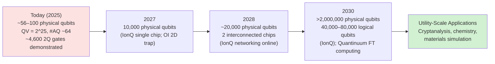
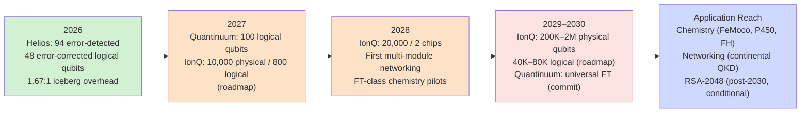

# Scaling Ion Trap Quantum Computing: Pathways from Laboratory Demonstrations to Utility-Scale Systems
# 1 Introduction: The Scaling Imperative for Trapped-Ion Quantum Computing

Trapped-ion quantum computing occupies a distinctive—and increasingly precarious—position in the contemporary quantum hardware landscape. By nearly every measure of qubit *quality*, ion-trap platforms lead the field: they hold the highest published Quantum Volume in the industry, demonstrate single-qubit gate fidelities above 99.99% and two-qubit fidelities above 99.9%, and uniquely offer all-to-all connectivity at the chip level[^1][^2][^3]. Yet by the metric that increasingly governs commercial and strategic narratives in quantum computing—raw physical qubit count—trapped-ion systems remain an order of magnitude behind superconducting platforms, with the largest deployed Quantinuum and IonQ machines hosting on the order of 56–100 physical qubits versus IBM's 1,121-qubit Condor processor[^3]. Resolving this asymmetry is not a matter of incremental engineering; it is the defining challenge that will determine whether trapped-ion technology can transition from a benchmark-leading laboratory modality into the substrate for utility-scale, fault-tolerant computation. This chapter frames that scaling imperative, surveys the paradox at its core, articulates the technical preconditions a scalable ion-trap platform must satisfy, and establishes the five-dimensional evaluative framework against which each candidate scaling pathway will be assessed in the chapters that follow.

## 1.1 The State of Trapped-Ion Quantum Computing and the Scaling Paradox

The current state of trapped-ion quantum computing is best described as one of *qualitative dominance coupled with quantitative deficit*. On the quality axis, the evidence accumulating across 2024–2025 is unambiguous. Quantinuum's System Model H2 reached a Quantum Volume of $2^{23}$ (8,388,608) in May 2025, completing a self-imposed five-year roadmap to grow QV by a factor of ten each year, and then advanced to $2^{25}$ (33,554,432) by September 2025—a 4× improvement in roughly four months and a margin the company describes as a 4,000× lead over the nearest published competitor[^1][^2]. Quantum Volume is a system-level benchmark sensitive to qubit number, fidelity, and connectivity simultaneously; it requires that the average heavy-output probability across a battery of test circuits exceed 2/3 with two-sigma confidence, which means the metric integrates—rather than masks—weaknesses in any single performance dimension[^2]. Independent verification reinforces these results: a benchmark study by Forschungszentrum Jülich and Purdue University, which tested 19 quantum processing units from five vendors, found that Quantinuum's H2-1 successfully ran a fully connected 56-qubit MaxCut problem using a linear-ramp QAOA protocol involving 4,620 two-qubit gates without degrading into random noise, an instance the authors describe as "the largest implementation of QAOA to solve an FC combinatorial optimization problem on real quantum hardware that is certified to give a better result over random guessing"[^4]. IonQ's Tempo system, with approximately 100 physical qubits and an algorithmic-qubit count of #AQ ≈ 64, similarly anchors the modality's claim to *practical* algorithmic capability rather than mere headline qubit numbers[^3].

The paradox emerges when these quality indicators are placed alongside scale indicators. The same comparative analyses that credit trapped ions with leading fidelities also document a stark deficit in qubit count and gate throughput. Quantinuum H2's 56 fully connected qubits and IonQ Tempo's ~100 physical qubits sit two orders of magnitude below superconducting counterparts: IBM Condor at 1,121 qubits, IBM Heron at 156 qubits, and Google Willow at 105 qubits[^3]. Worse, on raw operation throughput the gap is even sharper. The Jülich–Purdue study quantifies that, in a hypothetical 25-qubit fully connected QAOA problem with $p=100$ and 1,000 shots, IonQ Aria 2 would require roughly 18,000 seconds based solely on two-qubit gate time, while IBM's *fez* would need 0.51 seconds—"this disparity emerges from the 2-qubit gate time and the inability to execute these gates in parallel in trapped ion QPUs"[^4]. The central paradox of the modality is therefore structural rather than incidental: the very physical mechanisms that confer trapped ions their fidelity and connectivity advantages—shared motional modes coupling all ions in a chain, optical addressing of individual ions, and ultra-pure isolation from environmental noise—simultaneously throttle parallelism, slow gate operations, and resist naive replication of qubits within a single trap.

| Dimension | Trapped-Ion Leaders (Quantinuum H2 / IonQ Tempo) | Superconducting Leaders (IBM Condor / Heron / Google Willow) |
|---|---|---|
| Qubit count | 56 / ~100 physical qubits | 1,121 / 156 / 105 physical qubits |
| Connectivity | All-to-all | Nearest-neighbor / heavy-hex / grid |
| Single-qubit fidelity | >99.99% | High (chip-dependent) |
| Two-qubit fidelity | >99.9% | ~99% (Willow); high on Heron |
| Headline benchmark | QV $=2^{25}$; #AQ ≈ 64 | Random circuit sampling; QV up to ~$2^9$ on Heron-class |
| Throughput limitation | Slow two-qubit gate time; limited parallelism | Fast gates; noise accumulation at depth |

*Sources: [^1][^4][^2][^3].*

The implication is consequential. If trapped ions are to remain competitive—and, more strongly, if they are to deliver fault-tolerant computation at the timeline implied by leading roadmaps—they must scale qubit count and gate throughput by at least two to four orders of magnitude *without sacrificing the fidelity and connectivity advantages* that constitute their current value proposition. **This dual requirement, rather than scale alone, is what makes the trapped-ion scaling problem structurally distinct from that of superconducting platforms, where the dominant question is the inverse: how to lift fidelity high enough at large qubit count to cross the error-correction threshold.**

## 1.2 The Gap Between Demonstration-Scale and Utility-Scale Systems

The chasm between today's demonstration-scale ion-trap machines and the systems required to deliver commercial or scientific impact is best appreciated by placing current capabilities, vendor roadmaps, and resource estimates for fault-tolerant applications on a single timeline. As of late 2025, deployed trapped-ion systems hold tens of physical qubits and can run circuits with thousands of two-qubit gates while remaining above the random-output threshold[^4][^2]. Vendor roadmaps then project, within a five-year window, a leap of roughly four to five orders of magnitude. IonQ's publicly stated trajectory targets 100 physical qubits in development systems supporting Tempo by 2025, 10,000 physical qubits on a single chip by 2027, two interconnected chips totaling 20,000 physical qubits in one networked system by 2028, and a system architecture exceeding 2,000,000 physical qubits—translating, by IonQ's own resource estimates, to between 40,000 and 80,000 logical qubits—by 2030[^5]. Quantinuum, having completed its decade-of-the-2020s QV ladder ahead of schedule, has positioned its forthcoming Helios system as the next-generation step beyond H2 and has publicly committed to fault-tolerant computing by 2030, with CEO Rajeeb Hazra framing this milestone as the gateway to a "trillion-dollar market"[^1][^6][^3].

The following diagram depicts the canonical scaling staircase implied by these roadmaps and contrasts it with the resource requirements implied by application classes the modality aims to address.

*Roadmap milestones synthesized from IonQ's published roadmap and Quantinuum's stated 2030 fault-tolerance target[^6][^5].*

Translating these qubit numbers into application-relevant capacity requires accounting for the physical-to-logical overhead imposed by quantum error correction. As surveyed in industry roadmap analysis, breaking RSA-2048-class encryption is now estimated to require fewer than one million physical qubits at sufficiently low error rates, while chemistry simulations of practical interest typically require thousands to hundreds of thousands of *logical* qubits, implying millions of physical qubits under contemporary error-correction codes[^6]. IonQ's resource estimates align with this picture: the company's projection of 40,000–80,000 logical qubits from a 2-million-physical-qubit substrate implies a physical-to-logical ratio between roughly 25:1 and 50:1—aggressive relative to historical surface-code estimates and predicated on advances in error-correcting codes and the company's "shallow memory schemes" capable of achieving logical error rates below $10^{-12}$[^5]. These projections are also explicitly forward-looking: IonQ's own disclosure language acknowledges they depend on integrating the Lightsynq photonic-memory acquisition, completing the Oxford Ionics acquisition, and achieving step-function gains from a 2D ion-trap topology that promises "up to 300x higher trap density compared to projected 1D systems"[^5].

**The strategic significance of this gap is therefore twofold.** First, it defines the *quantitative magnitude* of the engineering and physics problems the field must solve in roughly five years: not a doubling or a tenfold increase, but four to five orders of magnitude in qubit count, accompanied by commensurate improvements in gate throughput, calibration overhead, and inter-module connectivity. Second, it locates the scaling question at the center of the *credibility* of the trapped-ion value proposition: should the modality fail to close even a substantial fraction of this gap on a competitive timeline, its current quality advantages risk being rendered moot by superconducting or neutral-atom platforms that, while individually less coherent per qubit, accumulate logical computational capacity faster through brute scaling. The remainder of this report is organized around assessing whether—and through which architectural pathways—this gap can credibly be closed.

## 1.3 Scalability Criteria for a Trapped-Ion Platform

A useful diagnostic for any candidate scaling architecture is to ask whether it satisfies the technical preconditions that a viable large-scale quantum computing platform must meet. Adapting DiVincenzo-style criteria to the specific physics of trapped ions, a scalable ion-trap platform must simultaneously satisfy at least the following five conditions: (i) a physically *scalable register* of qubits whose physical density and trap geometry can grow without exponential increases in control resources; (ii) a *high-fidelity universal gate set that survives scaling*, meaning that the two-qubit fidelities measured today on small chains do not degrade when extended to thousands or millions of qubits across multiple trap zones or modules; (iii) coherence times sufficiently long relative to gate and shuttling operation times that error-corrected logical operations remain within the surface-code (or comparable code) threshold even after the additional latency introduced by routing and module-to-module communication; (iv) efficient and high-fidelity *state preparation and measurement* (SPAM) at scale, which under ion-trap physics implies parallel laser-based or microwave-based initialization and detection across many zones; and (v)—a criterion of particular significance for trapped ions—the preservation of *richly connected, ideally all-to-all interaction graphs* as the system grows, since this is the architectural feature that allows trapped-ion systems to outperform grid-connected superconducting machines on benchmarks like Quantum Volume despite holding fewer qubits[^4][^2][^3].

The challenge is that these criteria are partially in tension when applied to the conventional scaling lever of "lengthening the ion chain in a single trap." As ion chains grow, the spectrum of shared motional modes becomes denser, individual ion addressing requires increasingly demanding optics and laser power, motional heating from electrode noise rises, and decoherence channels multiply—issues examined in detail in Chapter 2. As Quantinuum's hardware leadership emphasizes, the QCCD (Quantum Charge-Coupled Device) architecture has been "the foundation of [Quantinuum's] success, delivering consistent performance gains year-over-year" and offers "all-to-all connectivity, world-record fidelities, and advanced features like real-time decoding"[^4]; the architecture is not merely a packaging choice but a deliberate response to the physics-level limits of single-chain scaling. Similarly, IonQ's strategic acquisitions—Lightsynq for photonic-memory interconnects (which the company claims increase ion–ion entanglement rates by up to 50× relative to memoryless solutions) and Oxford Ionics for 2D ion-trap technology—are positioned explicitly as *enablers of criteria (i) and (v) at scale*, since photonic interconnects allow modular extension while preserving connectivity through entanglement distribution, and 2D traps multiply qubit density at fixed trap-zone fidelity[^5].

Each of the architectural levers the report will subsequently evaluate—QCCD ion shuttling, 2D ion-trap arrays, photonic interconnects between modules, deterministic matter-link shuttling between microchip modules, and microwave or voltage-controlled gating to replace laser addressing—maps onto a different subset of these scalability criteria. **No single approach has yet been demonstrated to satisfy all five criteria simultaneously at utility-scale**; the report's analytical task is therefore not to identify a winner among monolithic options, but to evaluate which combination of these levers, integrated into a coherent system architecture, presents the most credible composite solution.

## 1.4 Evaluative Framework: Fidelity, Throughput, Manufacturability, Modularity, and Cost

To compare scaling pathways consistently across subsequent chapters, the report adopts a five-dimensional evaluative framework. These dimensions are chosen because they jointly capture the distinct ways in which a scaling strategy can succeed or fail under the trapped-ion constraints surveyed above, and because they map onto the public evidence base assembled in benchmarking studies and vendor disclosures.

| Dimension | What It Measures | Why It Matters for Trapped-Ion Scaling | Representative Evidence |
|---|---|---|---|
| **Fidelity** | Single-qubit, two-qubit, and SPAM error performance under scaling stress; preservation of fidelity across shuttling, junction crossing, and module-to-module operations | Determines whether a strategy retains the modality's quality advantage when extended; below ~99.9% two-qubit fidelity, fault tolerance becomes prohibitive | Quantinuum H2: single-qubit >99.99%, two-qubit >99.9%; IonQ Tempo: ~99.9%+ on both[^3] |
| **Throughput** | Effective gate rate, parallelism, and end-to-end circuit execution time at scale | Addresses the structural slow-gate limitation of trapped ions (e.g., 18,000 s vs. 0.51 s disparity in 25-qubit FC QAOA against IBM *fez*) and determines whether scaled systems can run useful workloads in tractable wall-clock time | Jülich–Purdue benchmark explicitly identifies inability to parallelize 2Q gates as the bottleneck[^4] |
| **Manufacturability** | Yield, reproducibility, and density of ion-trap chip fabrication, integrated photonics, and control electronics | Determines whether a pathway can transition from one-of-a-kind laboratory devices to repeatable industrial production at the qubit counts implied by 2027–2030 roadmaps | Oxford Ionics' 2D trap claim of "up to 300x higher trap density" relative to projected 1D systems is positioned as a manufacturability lever[^5] |
| **Modularity** | Capacity to interconnect chips, modules, or systems while preserving fidelity and connectivity; entanglement distribution rate and distance | Essential because no single monolithic ion trap is expected to host millions of qubits; sets the architectural template for million-qubit-class machines | Lightsynq photonic memory claimed to increase ion–ion entanglement rates by up to 50×, enabling clustered quantum computing "commercially ready by 2028"[^5] |
| **Cost** | Capital expenditure, operational expense (laser systems, vacuum, cryogenics, classical control), and physical-to-logical qubit overhead | Translates technical performance into commercial viability; the physical-to-logical ratio is the multiplier that converts hardware roadmaps into application timelines | IonQ projects 40,000–80,000 logical qubits from >2,000,000 physical qubits, implying ~25–50:1 ratio under current code/architecture assumptions[^5] |

Several features of this framework warrant emphasis. First, the dimensions are not independent: gains on one axis are routinely traded against losses on another. QCCD architectures, for instance, achieve high fidelity and rich connectivity through ion shuttling, but at the cost of throughput penalties as ions are physically transported between zones; photonic interconnects achieve modularity and entanglement-based connectivity, but at the cost of additional infrastructure (single-photon detectors, optical fibers, quantum memory buffers) and historically lower entanglement rates than co-trapped ion gates. Second, the framework deliberately distinguishes *demonstrated* from *projected* performance. As emphasized in independent benchmarking commentary, transparency and reproducibility are essential because "performance varied depending on circuit structure, device layout, and problem instance," and "benchmarks should be proposed [that] capture essential aspects of performance"[^4]; the report therefore treats roadmap milestones (e.g., IonQ's 2-million-qubit 2030 target) as *engineering-plausible projections requiring scrutiny*, not as facts on equal evidentiary footing with results from independently benchmarked deployed systems.

Third, the framework provides the basis for the comparative scoring that Chapter 7 will execute. By holding these five dimensions constant across each scaling pathway—monolithic QCCD, photonically networked modules, matter-link modules, microwave/voltage-controlled architectures, and heterogeneous designs combining several—the report enables a structured rather than impressionistic judgment of relative merit. **The framework's central insight is that the scaling question for trapped ions cannot be reduced to any single axis, including qubit count; the credible answer to "which strategy is most likely to succeed" depends on how each pathway distributes its strengths and weaknesses across these five dimensions.**

## 1.5 Report Structure and Argumentative Roadmap

The remaining seven chapters of the report develop the analysis introduced here through a deliberate progression from physical foundations to strategic synthesis. Chapter 2 examines the underlying physics of trapped-ion qubits—ion species selection, hyperfine versus optical encoding, Paul versus Penning trap geometries, and Mølmer–Sørensen gates—to identify the intrinsic bottlenecks (motional-mode crowding, laser addressing complexity, anomalous heating, decoherence) that obstruct scaling within a single trap and that make architectural innovation rather than incremental qubit addition unavoidable. Chapter 3 then analyzes the principal architectural responses to these bottlenecks: the QCCD approach that underlies Quantinuum's race-track H2 system, photonic entanglement links that anchor IonQ's modular networking strategy following the Lightsynq acquisition, and deterministic ion-shuttling matter-links pursued by groups including Universal Quantum.

Chapter 4 turns to the supporting hardware and control-paradigm innovations that determine whether these architectural concepts are manufacturable at scale—integrated nanophotonics, on-chip detectors and modulators, cryogenic CMOS control, microwave near-field gates, and voltage-controlled gating—and synthesizes the systems-engineering challenges (vacuum infrastructure, laser stability, fabrication yield, calibration overhead) that bind the entire program. Chapter 5 examines the often-underappreciated software layer: compiler and scheduler design (multi-level shuttle scheduling, shuttle-and-swap co-optimization, dependency-aware path scheduling) and its first-order, not secondary, impact on effective scaled fidelity. Chapter 6 then takes up quantum error correction explicitly, evaluating how surface codes, two-ion trap topologies, magic state factories, and heterogeneous fault-tolerant designs interact with the architectural choices of Chapters 3–4 to set the resource estimates on which Section 1.2's gap analysis ultimately depends.

Chapter 7 integrates these technical analyses into a comparative evaluation of the scaling roadmaps and architectural commitments of the leading commercial players—Quantinuum's race-track QCCD with internal shuttling, IonQ's photonically networked modular approach, and Universal Quantum's microwave-driven matter-link modules—scoring each pathway against the five-dimensional framework introduced in Section 1.4 and assessing the credibility of stated milestones (notably IonQ's 20,000-qubit 2028 and 2-million-qubit 2030 targets, and Quantinuum's 2030 fault-tolerance target) against publicly verifiable evidence[^6][^5]. Chapter 8 closes the report by mapping application classes—quantum chemistry, optimization (QAOA, MaxCut), cryptanalysis, quantum networking—onto the resulting feasibility timelines, delivering a reasoned judgment on which pathways and hybrid combinations are most likely to succeed, and identifying the near-term observable milestones (e.g., demonstrated photonic entanglement rates, verified 2D trap fidelities, multi-module logical-qubit demonstrations) that should be tracked to update the assessment as evidence accumulates.

Read together, these chapters advance a single thesis that this introduction has prepared: **the scaling of trapped-ion quantum computing from today's tens-of-qubit demonstrations to tomorrow's utility-scale fault-tolerant systems is not a matter of choosing among competing monolithic architectures, but of integrating QCCD-class internal scaling, modular photonic or matter-link interconnects, manufacturable 2D trap hardware, robust error-correcting codes, and co-designed software into a coherent system whose composite performance—on fidelity, throughput, manufacturability, modularity, and cost—closes the multi-order-of-magnitude gap between current capability and utility-scale targets within a competitive timeline.** Whether that integration can be accomplished, and which combinations of strategies are best positioned to accomplish it, are the questions the remainder of the report sets out to answer.

# 2 Foundations and Constraints of Trapped-Ion Qubit Technology

The introduction established that the trapped-ion scaling problem is structurally distinct: it demands a four-to-five-order-of-magnitude expansion in qubit count and gate throughput *without forfeiting* the fidelity and connectivity advantages that justify the modality's continued pursuit. To assess whether—and through which architectural levers—this dual requirement can be satisfied, one must first understand precisely *why* the obvious scaling lever, lengthening a single ion chain in a single trap, fails. The answer lies not in any single defect but in a tightly coupled set of physics-level constraints rooted in atomic structure, trap geometry, the laser–ion interface, and the shared motional spectrum that doubles as the entanglement bus. This chapter develops that analysis from the bottom up. It begins with the choice of ion species and qubit encoding (Section 2.1), proceeds through trap geometries (Section 2.2) and the entangling-gate physics that depends on them (Section 2.3), then diagnoses the intrinsic bottlenecks of single-trap scaling (Section 2.4) and the often-underappreciated SPAM constraints that emerge at scale (Section 2.5). Section 2.6 closes by mapping each identified constraint onto the scalability criteria of Section 1.3, establishing the reference baseline against which Chapter 3's architectural pathways will be evaluated.

## 2.1 Ion Species Selection and Qubit Encoding Schemes

The choice of ion species is among the most consequential architectural decisions in trapped-ion quantum computing because it simultaneously determines the available qubit encodings, the laser wavelengths required for cooling, manipulation, and detection, the achievable coherence time, and—critically for scaling—the maturity and integratability of the supporting laser and photonics infrastructure. The ions considered viable for quantum information processing share a common atomic-structure prerequisite: they must possess "a strong optical transition reachable for modern laser sources for qubit initialization, laser cooling of the motion, and efficient qubit readout"[^7]. This requirement narrows the practical species list to alkaline-earth single-valence-electron ions (Be⁺, Mg⁺, Ca⁺, Sr⁺, Ba⁺) and certain transition-metal ions with hydrogenic outer shells (Zn⁺, Hg⁺, Cd⁺, Yb⁺), each of which "satisfy these criteria"[^7]. While all of these candidates can in principle host high-fidelity qubits, the engineering consequences of choosing among them differ markedly.

Beryllium-9 (⁹Be⁺) anchors the highest-fidelity end of the small-system experimental record—NIST's high-fidelity universal gate set demonstration on Be⁺ established that the species can sustain gate errors well below the surface-code threshold[^7]—but its operating wavelengths in the deep ultraviolet impose stringent demands on laser sources and on the optical materials used in any integrated photonic light-delivery system. Magnesium (Mg⁺), calcium-40 (⁴⁰Ca⁺), strontium-88 (⁸⁸Sr⁺), and barium (Ba⁺) progressively shift operating wavelengths toward the visible and near-infrared, easing optics and photonics integration while introducing their own trade-offs in photon-scattering rates and laser-source maturity[^7]. Among transition-metal ions, ytterbium-171 (¹⁷¹Yb⁺) has emerged as the de facto industrial standard, used both by Quantinuum and IonQ and by leading academic groups including the Lebedev Institute and the Russian Quantum Center; it has become "a popular platform for the realization of optical and hyperfine qubits as well as optical clocks"[^7]. The dominance of ¹⁷¹Yb⁺ reflects three converging advantages: its nuclear spin of 1/2 enables clean clock-state hyperfine qubits; its 369.5 nm cooling and detection transition, while ultraviolet, is now served by mature commercial laser sources; and its rich level structure supports multiple complementary qubit encodings within the same atomic species.

The encoding choice—how quantum information is mapped onto the ion's internal energy levels—is a second-order decision with first-order consequences. Three families of encodings dominate the field. **Hyperfine ("clock-state") qubits** encode information in two magnetically insensitive sublevels of the electronic ground-state manifold separated by a microwave-frequency splitting, exemplified in ¹⁷¹Yb⁺ by the $|0\rangle = {}^2S_{1/2}|F=0,m_F=0\rangle$ and $|1\rangle = {}^2S_{1/2}|F=1,m_F=0\rangle$ pair[^7]. Hyperfine qubits offer multi-second to minutes-scale coherence times, are compatible with microwave control, and have powered the largest demonstrated algorithmic-qubit counts to date, including Quantinuum's 29-algorithmic-qubit benchmark on a trapped-ion processor[^7]. **Optical qubits** encode information in a long-lived metastable state coupled to the ground state by a narrow quadrupole transition, such as the ¹⁷¹Yb⁺ $|0\rangle = {}^2S_{1/2}|F=0,m_F=0\rangle$ to $|1\rangle = {}^2D_{3/2}|F=2,m_F=0\rangle$ transition at 435.5 nm used in Lebedev's recent qudit and quantum-algorithm demonstrations[^7]. Optical encodings enable single-laser gate operation and multi-level qudit operation but typically sacrifice some coherence relative to hyperfine clock states and require ultra-stable narrow-linewidth laser systems. **Metastable "omg" (optical–metastable–ground) encodings**, recently proposed as an alternative to dual-species approaches, exploit the existence of multiple stable manifolds within a *single* species to access multiple encodings without requiring co-trapping of two atomic species[^8]; this is particularly attractive at scale because dual-species architectures otherwise impose a multiplicative cost on every laser, optical-detection, and calibration subsystem.

The scaling implications of these choices are direct. A platform built on hyperfine ¹⁷¹Yb⁺ inherits a microwave control infrastructure with global addressing capability, decade-old industrial readout pipelines, and—as Section 2.5 will detail—machine-learning-assisted detection methods that already achieve unit fidelity on ten-ion strings[^7]. A platform built on optical qubits or metastable encodings inherits the ability to perform qudit-based information processing and to access "multiple encodings" within a single species, potentially compressing the per-qubit hardware footprint—but at the cost of laser-stability requirements that scale with system size. **The choice of species and encoding is therefore not a downstream implementation detail but a binding constraint on every subsequent layer of the architecture**, from photonic light delivery (Chapter 4) to compiler design (Chapter 5) to error-correction overhead (Chapter 6). The remainder of this report treats ¹⁷¹Yb⁺ hyperfine and optical encodings as the principal industrial reference cases, while noting where alternative species (Ca⁺, Ba⁺, Be⁺) drive specific architectural variants pursued by different vendors.

## 2.2 Trap Geometries: Paul Traps, Penning Traps, and Their Scaling Implications

Once an ion species is fixed, the geometry of the trap that confines it determines what scaling primitives—single chains, 2D arrays, 3D crystals, or modular shuttling networks—are physically available. The two dominant confinement paradigms are **radio-frequency (RF) Paul traps**, which use time-varying electric fields to create a pseudopotential minimum in three dimensions, and **Penning traps**, which combine a static electric quadrupole with a strong static magnetic field. Both achieve the same underlying goal of trapping ions to sub-micron spatial extents, but their scaling implications diverge sharply.

Paul traps come in several geometric variants with progressively different scaling potential. *Linear Paul traps*, as used in the Lebedev Institute's ¹⁷¹Yb⁺ experiments, confine ions along a one-dimensional axis, with strong radial confinement reducing motion to a chain along x and weak harmonic axial confinement setting equilibrium positions through the balance of trapping potential and mutual Coulomb repulsion[^7]. The equilibrium-position model formalized by James—in which the *m*-th ion of an *N*-ion chain occupies position $x_m(0)$ determined by $(dV/dx_m)_{x_m=x_m(0)} = 0$ subject to the total potential $V = \sum_m \frac{1}{2}M\nu^2 x_m^2 + \sum_{n\neq m} \frac{Z^2 e^2}{8\pi\eta_0|x_n-x_m|}$[^7]—provides an exact prescription for chain geometry but also exposes the chain's scaling limits: the inter-ion spacings near the chain center shrink as the chain grows, individual addressing optics must resolve increasingly close neighbors, and the spectrum of shared motional modes becomes denser. *Blade Paul traps* (such as the linear blade-electrode geometry used in the Yb⁺ experiments demonstrating multimode dispersive measurements[^9]) optimize optical access and electrode geometry for visible/UV laser delivery, while *surface-electrode (microfabricated) Paul traps* place all electrodes in a single 2D plane, enabling lithographic fabrication and—crucially for Chapter 3's analysis—integration of trap zones, junctions, and shuttling pathways on a single chip. The transition from blade to surface traps is therefore not merely a packaging refinement: it is the geometric prerequisite for the QCCD architecture and for the 2D trap arrays that anchor Oxford Ionics' (and, post-acquisition, IonQ's) density-scaling strategy.

Penning traps follow an entirely different scaling logic. By replacing RF confinement with a strong static magnetic field, Penning traps can support stable 2D and 3D ion crystals containing hundreds to as many as ~10⁵ ions, vastly exceeding the ~50–100-ion practical ceiling of linear Paul-trap chains. The NIST Penning-trap program has performed quantum simulations on crystals of hundreds of ⁹Be⁺ ions, but the operating regime introduces its own constraints: at the 4.5 T field used, the qubit splitting is "124 GHz", and "the difficulty of spanning our 124 GHz qubit splitting in ⁹Be⁺ at 4.5 T" forced the choice of light-shift geometric phase gates over Mølmer–Sørensen gates because a single laser cannot easily span the qubit frequency at high fields[^10]. Penning traps therefore offer the largest demonstrated single-system ion ensembles in the field but pay for that scale in laser engineering, individual addressability, and gate-mechanism flexibility.

The scaling implications of these geometries map cleanly onto the architectural pathways examined in Chapter 3. Linear Paul traps furnish the small-system reference platform on which most algorithmic benchmarks have been demonstrated; surface-electrode microfabricated Paul traps provide the substrate for QCCD shuttling and 2D arrays; Penning traps offer a competing route via large analog or digital quantum simulation on hundreds-to-thousands-of-ions crystals, especially relevant where bulk many-body physics—rather than gate-model algorithms—is the target application. **No single geometry dominates on all scaling axes**: Paul-trap surface devices win on individual addressability and integratability, Penning traps win on raw ion count per device, and the choice between them therefore ultimately tracks whether the target application demands gate-based fault-tolerant computation (favoring Paul-trap-derived QCCD architectures) or large-ensemble quantum simulation (where Penning-trap geometry becomes competitive).

## 2.3 Entangling Gate Mechanisms and the Mølmer–Sørensen Paradigm

The two-qubit entangling gate is the operation around which scaling fidelity ultimately revolves: every quantum algorithm of interest requires a number of entangling operations that grows at least linearly—and typically polynomially—with the problem size, and every architectural choice in subsequent chapters can be evaluated by asking how it preserves or degrades the entangling-gate fidelity at scale. In trapped-ion systems, the entangling interaction is not direct but mediated: "the entanglement between qubits is carried out via the Coulomb force or photonic interconnects"[^7]. The Coulomb-mediated route, dominant in single-trap architectures, exploits the *shared motional modes* of the ion chain as a quantum bus, with state-dependent forces driving conditional evolution of two ions' internal states through their common vibrational quanta.

The dominant primitive realizing this scheme is the **Mølmer–Sørensen (MS) gate**, which "is a state-of-the-art entangling gate in the ion trap quantum computing where the gate fidelity can exceed 99%"[^11]. To implement an MS gate, one drives the ions with bichromatic laser fields detuned symmetrically from a chosen motional sideband, generating a state-dependent force whose closed phase-space trajectory imprints a controlled-phase entangling operation on the two-qubit subspace[^12]. The structural feature that makes the MS gate scaling-relevant is that it operates through a *specific* motional mode, requiring spectral resolution of that mode against the spectrum of all other modes of the chain; this is precisely the requirement that breaks down as chains lengthen, as Section 2.4 will examine.

Two recent developments illustrate how the MS gate is being adapted to push fidelity higher under realistic noise conditions. First, **resilient MS gate designs** have been experimentally demonstrated that "[protect] against infidelity caused by heating of the motional mode used during the gate"[^13]; because anomalous heating is one of the dominant fidelity-limiting mechanisms in microfabricated traps (Section 2.4), heating-resilient gate designs effectively raise the noise budget within which scaling-induced heating can be tolerated. Second, **structured-light addressing approaches** have been developed that implement the state-dependent force "in the Mølmer-Sørensen gate scheme" using engineered light-field structures rather than independently focused beams, providing a route to scalable individual addressing of ions in long chains[^12]. These developments target the two key fidelity-degradation mechanisms that grow with chain length—heating and addressing crosstalk—and in doing so define the *intrinsic ceiling* against which architectural scaling strategies must be measured: the question is not whether MS-gate-based scaling is feasible in principle, but how much further the gate's fidelity can be pushed before architectural innovation becomes a more economical fidelity lever than incremental gate-design improvement.

A complementary primitive is the **light-shift geometric phase gate**, used in NIST's Penning-trap simulations because of the laser-engineering challenges of spanning the 124 GHz Be⁺ qubit splitting at high field[^10]. Theoretical analysis by the NIST group concludes that "in the high-field regime, the two gates [MS and light-shift] perform comparably well", with detuning between Zeeman levels in the P3/2 manifold improving on the standard P1/2–P3/2 detuning protocol[^10]. The MS gate retains the configuration advantage that "the motion of the ions is less sensitive to the optical phase difference between the driving laser beams" and can therefore "drive gates in 3-D crystals of up to 10⁵ ions"[^10]—a property that becomes operationally relevant in any large-crystal Penning-trap simulator but does not directly translate to QCCD-style gate-model architectures.

The strategic implication for scaling is that **two-qubit gate fidelity, speed, and parallelism are tightly coupled to the motional spectrum and the laser-control infrastructure**. Any scaling lever that does *not* address the motional-spectrum congestion problem—or that does not provide an alternative entanglement bus, such as photonic interconnects—will see the MS gate's fidelity erode below the fault-tolerance threshold long before raw ion counts approach utility scale. This conclusion is the bridge from the gate-physics analysis of this section to the bottleneck diagnosis of the next.

## 2.4 Intrinsic Scaling Bottlenecks in a Single Trap

The cleanest way to motivate Chapter 3's architectural analysis is to enumerate, with quantitative grounding wherever possible, the physics-level barriers that prevent the obvious scaling strategy—lengthening the ion chain in a single Paul trap—from delivering the four-to-five-order-of-magnitude qubit increase implied by the roadmaps of Section 1.2. Four bottlenecks dominate.

**(i) Motional-mode crowding and spectral congestion.** An *N*-ion linear chain supports *N* axial modes and 2*N* radial modes; "an *N*-ion crystal supports 3*N* motional modes, so a large bosonic register naturally coexists and scales with the qubit register"[^9]. While this scaling is favorable for bosonic encodings, it is hostile to gate operation: as chain length grows, "resolving individual modes becomes increasingly difficult... due to spectral crowding"[^14]. The MS gate, as Section 2.3 emphasized, depends on driving a specific motional sideband while suppressing off-resonant coupling to neighboring modes; once mode spacings approach the inverse gate time, the gate either slows down (sacrificing throughput) or couples spuriously to spectator modes (sacrificing fidelity). The dispersive-shift analysis of multimode Yb⁺ experiments quantifies this: in the regime $|\delta_j| \gg \eta_j |\Omega| \sqrt{n_j+1}$, the effective Hamiltonian acquires phonon-number-dependent shifts, but "when the sidebands are crowded or when a multi-tone drive is applied, a Schrieffer–Wolff transformation yields a spin-dependent beam-splitter term in the effective Hamiltonian"[^9]—a parasitic interaction whose suppression requires "the motional modes [to be] well separated"[^9]. The same paper makes the scaling pathology explicit: "as the number of ions increases, the motional spectrum becomes more crowded, reducing available detuning margins" and "in a crowded spectrum, realizing nearly single-mode SDR settings... can be challenging due to residual off-resonant couplings to neighboring sidebands"[^9].

**(ii) Laser-addressing complexity and optical-power demands.** Individual qubit addressing in a long chain requires focusing distinct laser beams onto ions whose inter-ion spacing shrinks toward the chain center as the chain grows. Each additional ion adds an independently calibrated beam path, an addressable acousto-optic deflector or modulator channel, and—if multi-ion gates are to be performed in parallel—an additional share of the available laser power. Because two-qubit gate Rabi frequencies scale with optical intensity, and because off-resonant scattering introduces decoherence that scales with intensity squared, the laser-power budget per ion cannot be shrunk arbitrarily without sacrificing either gate speed or coherence. Structured-light approaches such as those proposed for "scalable entangling gates on ion qubits via structured light addressing"[^12] offer one engineering response, but the fundamental constraint remains: laser-addressing infrastructure scales at least linearly with chain length, and the calibration burden scales worse, since ion positions, beam pointing, and optical cross-talk must all be re-characterized as the chain reconfigures.

**(iii) Anomalous heating from electrode noise.** Microfabricated surface-electrode Paul traps suffer "anomalous heating" rates orders of magnitude above the Johnson-noise prediction, attributed to fluctuating patch potentials on electrode surfaces. Heating-induced excitation of the motional modes used as the entanglement bus directly degrades MS-gate fidelity—precisely the channel that "resilient" MS-gate designs are engineered to counter[^13]. Heating becomes more severe as electrode dimensions shrink (which is required for higher-density traps) and as ions sit closer to electrode surfaces (which is required for stronger confinement and better optical access). The result is a fundamental tension between trap miniaturization, which is necessary for scaling qubit density, and motional coherence, which is necessary for entangling-gate fidelity. This tension is one of the principal reasons that scaling cannot be solved by simply building larger or denser monolithic traps; the engineering lever it leaves available—operating at cryogenic temperatures to suppress patch-potential dynamics—is a foundational design choice for QCCD systems and a binding constraint on the cryogenic-control infrastructure analyzed in Chapter 4.

**(iv) Decoherence channels.** Several decoherence channels degrade trapped-ion qubits, each with distinct scaling behavior. *Magnetic-field noise* limits coherence on field-sensitive transitions and motivates the use of clock-state encodings—but clock states are themselves not immune to second-order Zeeman shifts, and at scale the magnetic-field homogeneity required across many trap zones becomes a non-trivial systems engineering requirement. *Off-resonant photon scattering* from the gate lasers introduces an irreducible error per gate set by the ratio of the gate Rabi frequency to the detuning from the dipole transition; this error floor, while individually small, accumulates linearly with circuit depth and is one of the reasons that even species with multi-second coherence times cannot be operated at arbitrary gate counts without architectural mitigation. *Motional-mode dephasing*, distinct from heating, arises from trap-frequency fluctuations and limits the duration over which an MS gate can coherently exploit a given motional mode. As chain length grows, the spacing between modes shrinks, the dephasing tolerance shrinks proportionally, and the gate-time budget tightens.

Taken together, these four bottlenecks define a *quantitative ceiling* on monolithic single-trap scaling. None of them alone is a hard wall; each can be pushed back by incremental improvement—lower-noise electrodes, brighter lasers, better field shielding, smarter pulse design. But the *product* of their effects is multiplicative: a scaling lever that reduces motional crowding (e.g., shorter chains in zoned architectures) typically increases addressing complexity (more zones to address); a lever that suppresses heating (e.g., cryogenic operation) compounds with infrastructure cost; and a lever that compresses the qubit count per zone (e.g., 2D arrays) interacts non-trivially with mode structure and SPAM optics. Empirically, the ceiling has manifested in the field as a practical chain-length plateau in the few-tens-of-ions range for high-fidelity gate-model operation, well below what utility-scale fault tolerance requires.

## 2.5 State Preparation, Measurement, and Readout at Scale

State preparation and measurement (SPAM) is sometimes treated as a "solved" subroutine in trapped-ion quantum computing because small-system demonstrations routinely report SPAM fidelities at or above 99.9%. This treatment is misleading at scale. SPAM scales with qubit number through three coupled channels—initialization, detection, and readout-induced crosstalk—each of which interacts non-trivially with the architectural choices made elsewhere in the system.

The dominant detection mechanism is the **electron-shelving technique**, in which the qubit state is mapped onto a binary ion–light interaction such that one state ("bright") fluoresces under a resonant laser while the other ("dark") does not. As characterized in the Lebedev Institute's recent ¹⁷¹Yb⁺ readout study, "the readout is performed by illuminating the ion with a laser light at 369.5 nm phase-modulated at 14.7 GHz and a light at 935 nm... [in the bright state] the ion appear[s] as a spot on the camera image, while [in the dark state] is dark, making the ion invisible in the picture"[^7]. State-of-the-art demonstrations show that this technique can reach exceptional performance: Harty *et al.* established "high-fidelity (more than 99.93%) and fast (46 µs per sample) readout"[^7], while trap-integrated superconducting nanowire single-photon detectors (Todaro *et al.*) and trap-integrated avalanche photodiodes (Reens *et al.*) have brought detection optics on-chip[^7].

Recent work at the Lebedev Institute and Russian Quantum Center extends these results in a direction directly relevant to scaling: machine-learning-assisted readout. Using a 10-qubit ¹⁷¹Yb⁺ chain with optical-qubit encoding on the 435.5 nm quadrupole transition and 369.5 nm fluorescence detection, the authors benchmarked conventional and quantum machine-learning algorithms against threshold and maximum-likelihood baselines. Their results are summarized below:

| Algorithm | Type | Fidelity | Computational Time |
|---|---|---|---|
| Convolution | Classical, supervised | 99.20% | 0.72 s |
| Support Vector Machine | Classical, supervised | **100.00%** | 1.93 s |
| k-means clustering | Classical, unsupervised | 99.76% | 0.035 s |
| Ion image statistics (threshold) | Classical, statistical | **100.00%** | 0.094 s |
| "Quant" (QUBO, simulated annealing) | Quantum-inspired | **100.00%** | 77.99 s |
| Quantum Support Vector Machine (D-Wave) | Quantum annealing | 99.41% | 2,448.06 s |

*Source: Khomchenko et al., 10-qubit ¹⁷¹Yb⁺ optical-qubit readout.*[^7]

Three insights from these results bear directly on scaling. First, perfect 10-qubit readout fidelity is achievable with both well-tuned threshold methods and ML-based classifiers, with the threshold approach being the second-fastest method (94 ms) at maximum fidelity[^7]—suggesting that, *at small chain sizes*, SPAM is genuinely close to a solved problem. Second, the ranking among methods inverts when computational cost is considered: conventional ML and statistics outperform quantum-inspired approaches by orders of magnitude in time, with QSVM requiring "the substantial time required to compute the quantum kernel"[^7]. The implication for scaling is that classical-control compute budget is itself a scaling resource, not a free parameter. Third, the authors note that "absolute recognition of the ion states of ¹⁷¹Yb⁺ (F = 100.00%) using QSVM is feasible" but only at training-set sizes that produce a "25,000 × 25,000" QUBO matrix, "already large for simulated quantum annealing"[^7]—an explicit acknowledgement that ML-readout pipelines are not free in compute or memory at scale.

Beyond the ML pipeline, a deeper scaling concern is that **standard fluorescence detection competes with the very physics it is trying to interrogate**. The Yb⁺ multimode-Fock measurement work cited earlier illustrates a related class of techniques in which dispersive shifts—rather than direct fluorescence—are used to map phonon-number-dependent phases onto the spin via Ramsey-style spin-dependent rotations[^9]. This is significant because it points toward "nondestructive single-shot measurement" primitives that, "by swapping the motional state into a protected mode during ancilla readout... can serve as a syndrome measurement for bosonic error correction codes"[^9]. The capacity to perform measurement without destroying the surrounding quantum register is a non-negotiable requirement for fault-tolerant computation, and the demonstration that such measurements can be implemented with selective decoupling schemes that "[cancel] the phase induced by the carrier AC-Stark shift while preserving the phonon-number-dependent phase induced by the dispersive shift"[^9] provides one engineering route to syndrome extraction in QCCD-class architectures.

The practical scaling problem with SPAM, therefore, is not that the *per-ion* fidelity ceiling is too low—it is already at or near 99.99% on small chains—but that the *infrastructure required to maintain that fidelity* scales unfavorably. Parallel readout requires either spatially resolved photon detection (high-pixel-count cameras, individually addressed photomultipliers, or chip-integrated SNSPD/APD arrays) or temporally multiplexed detection (which sacrifices throughput); crosstalk between adjacent ions during detection becomes more severe as chain density grows and as the optical resolution of the imaging system saturates; and the calibration burden of maintaining detection thresholds across many ions over many hours of operation scales with system size. Each of these scaling channels can be mitigated by hardware integration—the trap-integrated photon detectors of Todaro *et al.* and Reens *et al.*[^7] are existence proofs—but each integration step is itself a scaling challenge analyzed in Chapter 4. **SPAM scalability is thus a non-trivial precondition for utility-scale operation, not a solved problem inherited from small-system demonstrations**, and it is one of the dimensions on which architectural pathways diverge most sharply.

## 2.6 Implications: Why Architectural Innovation Is Unavoidable

The bottleneck analysis of Sections 2.1–2.5 supports a single structural conclusion: **no realistic engineering improvement to a single ion chain in a single trap can deliver the four-to-five-orders-of-magnitude scaling required by the roadmaps in Chapter 1.** This conclusion is not based on any single hard wall—every individual bottleneck can be pushed back by incremental work—but on the multiplicative interaction of those bottlenecks when scaling is attempted along a single axis. Mapping each constraint identified above onto the five scalability criteria established in Section 1.3 makes this concrete.

| Scalability Criterion (from §1.3) | Single-Chain Failure Mode | Section Diagnosed | Implication |
|---|---|---|---|
| **(i) Scalable register** | Inter-ion spacing shrinks at chain center; chain becomes mechanically unstable; trap volume cannot accommodate millions of ions | §2.2, §2.4 | Must replace single-chain confinement with zoned, modular, or 2D array geometries |
| **(ii) High-fidelity universal gate set under scaling** | Motional-mode crowding degrades MS-gate fidelity; heating limits exceed gate noise budget; off-resonant scattering accumulates | §2.3, §2.4 | Must shorten effective gate-active chain length (zones) or use alternative entanglement bus (photonic) |
| **(iii) Coherence margin under scaled latency** | Magnetic-field noise inhomogeneity across larger trap volumes; motional-mode dephasing scales with chain length | §2.4 | Must compartmentalize coherence (small zones) and use clock-state encodings (§2.1) consistently across modules |
| **(iv) SPAM at scale** | Imaging optics saturate; readout crosstalk grows; classical-control compute budget for ML-assisted readout grows quadratically | §2.5 | Must integrate detection on-chip (SNSPDs, APDs) and design parallel readout into the architecture from the outset |
| **(v) Preserved connectivity** | All-to-all connectivity within a single chain is preserved only up to the chain-length plateau; beyond it, mode crowding breaks gate selectivity | §2.3, §2.4 | Must engineer connectivity at the architectural level (shuttling for QCCD, photonic entanglement distribution for modular systems) |

Each row of this table identifies a *failure mode of single-chain scaling* and a *class of architectural response* that the field is now pursuing. Reading down the right-hand column reproduces, in compressed form, the architectural inventory that Chapters 3–6 will examine in detail: zoned QCCD shuttling architectures that compartmentalize coherence and addressability into small high-fidelity gate zones; 2D ion-trap arrays that multiply qubit density at fixed per-zone fidelity; photonic interconnects that supply an alternative entanglement bus immune to motional-spectrum congestion; matter-link shuttling that physically routes ions between microchip modules; integrated nanophotonic and on-chip detection hardware that solves SPAM at scale; microwave near-field and voltage-controlled gating that escapes the optical-power scaling pathology; and software co-design that converts these architectural primitives into effective algorithmic fidelity.

The deeper analytical lesson is that **the trapped-ion scaling problem is not a problem of choosing among monolithic alternatives but a problem of integration**: every architectural lever responds to a *subset* of the bottlenecks diagnosed here, and every lever introduces its own scaling costs (shuttling time penalties, photonic-rate limits, junction-crossing heating, microwave-field gradients) that must themselves be managed. The reference baseline against which Chapter 3 evaluates each pathway is therefore not "does this architecture solve trapped-ion scaling?" but "which subset of the failure modes in the table above does this architecture address, and at what cost in the others?" This framing operationalizes the five-dimensional evaluative scheme of Section 1.4 by giving it a physics-grounded set of *what must be solved* tags. With that baseline now established, Chapter 3 turns to the principal architectural responses—QCCD, photonic networks, and matter-links—and the empirical record on which their relative scaling promise will be assessed.

# 3 Architectural Scaling Paradigms: QCCD, Photonic Networks, and Matter-Links

Chapter 2 closed with a structural verdict: no realistic engineering improvement to a single ion chain in a single trap can deliver the four-to-five-orders-of-magnitude scaling implied by the leading roadmaps, because the bottlenecks of motional-mode crowding, addressing complexity, anomalous heating, and SPAM crosstalk interact multiplicatively rather than additively. The architectural question, therefore, is not which monolithic geometry "wins" the scaling race, but which combinations of zoned internal scaling and modular interconnection most efficiently retire the catalogue of failure modes summarised in Section 2.6. This chapter develops that assessment in depth. Section 3.1 traces the Quantum Charge-Coupled Device (QCCD) approach from its 2002 foundational proposal to its modern industrial incarnation, while Section 3.2 surveys the empirical performance of deployed QCCD systems and their topological variants. Sections 3.3 and 3.4 then turn to photonic entanglement networks, decomposing the link primitive and analyzing the multiplexing, encoding, and conversion innovations that have lifted demonstrated rates from sub-hertz to multi-hertz scales over metropolitan distances. Section 3.5 examines the deterministic matter-link paradigm pursued by Universal Quantum and aligned groups. Section 3.6 synthesises the three pathways into a side-by-side comparison along the five-dimensional framework of Section 1.4, and Section 3.7 argues that the most credible answer to the scaling question is a *heterogeneous* architecture that combines QCCD-class internal scaling with photonic and/or matter-link modular extension—setting the agenda for the manufacturability, control-stack, and error-correction analyses of Chapters 4–6.

## 3.1 The QCCD Architecture: Foundations, Primitives, and Zone-Based Design

The QCCD architecture originated in a 2002 Nature article by Kielpinski, Monroe, and Wineland that explicitly framed its purpose as a response to the same single-trap scaling pathology diagnosed in Chapter 2. The authors observed that the first proposal for ion-trap quantum computation—a single string of ions in a single trap, with the electronic states as logic levels and quantum information transferred through Coulomb interaction—faced "immense technical difficulties" and that "scaling arguments suggest that this scheme is limited to computations on tens of ions"[^15]. Their proposal therefore reframed the scaling problem from "build a longer chain" to "build a network of small high-fidelity registers and move ions among them": **a "quantum charge-coupled device" (QCCD) architecture consisting of a large number of interconnected ion traps, in which by changing operating voltages one can either confine a few ions in each trap or shuttle ions from trap to trap**[^15]. The conceptual move is decisive. Rather than fight the motional-spectrum congestion and addressing-complexity penalties of long chains, the QCCD partitions the register into small chain segments, each short enough to support clean motional spectra and individual addressability, and uses physical ion transport as the connectivity primitive that re-establishes the all-to-all interaction graph at the architectural level.

The 2002 paper specifies the architecture's four constitutive design choices, all of which remain recognisable in today's industrial systems[^15][^16]. First, **functional zoning**: the device is divided into a *memory region*, where idle qubits are stored, and an *interaction region*, where logic gates are performed by holding ions close together to enable the Coulomb-mediated entangling operation; voltages on segmented quasi-static electrodes shuttle ions between these regions on demand. Second, **a hybrid RF/DC electrode geometry**: quasi-static electrodes lying in one plane create the axial confinement and transport potentials, while two outer layers carry the RF voltage that produces the ponderomotive quadrupole providing transverse confinement; this geometry "allows stable transport of the ions around 'T' and 'X' junctions, so we can build complex, multiply connected trap structures"[^15]. Third, **microfabricated electrodes**: the original proposal already anticipated that "electrode structures for the QCCD are relatively easy to fabricate" using laser-machined alumina wafers with evaporated gold electrodes, and noted that "similar electrode structures are currently being constructed from heavily doped silicon using standard microfabrication techniques", with glass spacers anodically bonded to insulate the RF and DC layers[^15]. Fourth, **sympathetic cooling**: because the entangling gate has low error only for ions cooled near the motional ground state, and because shuttling and electrode noise heat the qubit ions, the proposal specifies "sympathetic cooling of the ions used for quantum logic by another ion species", with the cooling species acting as a heat sink coupled through the Coulomb interaction[^15]. Each of these design choices addresses a specific bottleneck from Section 2.4: zoning addresses motional-mode crowding and addressing complexity; the RF/DC layered geometry enables 2D and junction-rich layouts; microfabrication enables manufacturable density; and sympathetic cooling neutralises the heating penalty incurred by shuttling.

The 2002 proposal also anticipated two scaling pathologies that subsequent work has had to confront. The first is **transport-induced dephasing**: as ions move along the local trap axis, "spatial variations of the magnetic field strength along the transport path cause the qubit states to acquire a path-dependent relative phase", which, if uncharacterised, dephases the quantum state[^15]. The second is **clock synchronisation across many parallel gates**: parallel operations in many interaction regions require frequency references with fractional stability "much better than ≈ 1/(Nω₀τ)" for *N* qubits at transition frequency ω₀ over computation time τ—a daunting requirement at optical-frequency qubit splittings[^15]. The Kielpinski–Monroe–Wineland response to both is to encode each logical qubit in a **decoherence-free subspace (DFS)** of two physical ions, spanned by the states |↓↑⟩ and |↑↓⟩. Under collective dephasing—where both physical qubits acquire the same unknown phase—the DFS-encoded logical qubit is unaffected, and "the effect of any external field varying over a length scale L_ext and inducing energy shifts of *p*-th power in the field is suppressed by a factor (L_ext/d)^p for DFS encoding"[^15]. For a 10 cm device with 10 μm intra-pair spacing, this implies a roughly 10⁴-fold suppression of linear-Zeeman dephasing relative to a physical qubit. Equally important, "the logic levels of a DFS-encoded qubit are degenerate, [so] we do not need phase synchronisation at all to perform a logic operation within the DFS", and the DFS gate phase "depends only on the microscopic path length of the driving laser between the two ions, which can be readily controlled by small adjustments of the trap voltages"[^15]. The DFS construction is therefore not an exotic add-on but a foundational element of the original scaling argument: it is what makes massively parallel zoned operation feasible without globally synchronised clocks or sub-wavelength laser-path stability across the entire device.

The first experimental step toward this architecture, taken at NIST in 2002, demonstrated coherent transport of a qubit between two interconnected traps separated by 1.2 mm, with "no loss of contrast within the experimental error (~0.6%)" in a Ramsey-type measurement, transport times "as short as ~50 μs", and ion velocities "greater than 10 m s⁻¹"; crucially, "the transport did not cause any heating of the ion motion or shortening of ion lifetime in the trap"[^15]. This early result established the empirical viability of the QCCD's most counterintuitive premise—that quantum information could survive macroscopic physical motion of its host atom—on which all subsequent scaling has built.

The architectural decomposition of a modern QCCD device, organised around the design choices enumerated above, can be summarised as follows.

| Functional Zone | Purpose | Bottleneck Addressed (cf. §2.4) |
|---|---|---|
| Memory / storage zone | Holds idle qubits between operations; minimises gate-laser exposure and crosstalk | Decoherence; off-resonant scattering |
| Interaction / gate zone | Hosts short ion crystals (typically 2–4 ions) where MS or geometric-phase gates are executed | Motional-mode crowding; addressing complexity |
| Loading zone | Generates and traps fresh ions for replenishment of lost qubits | Manufacturability; long-term operation |
| Optical / detection zone | Performs SPAM with high-NA optics or integrated photon detectors | SPAM crosstalk; readout parallelism |
| Sympathetic-cooling zone | Couples logic ions to a coolant species after transport-induced heating | Anomalous heating; transport heating |

The transport primitives that connect these zones constitute the QCCD's operational vocabulary[^15][^17]: **linear shuttling** along a trap axis, **chain splitting and merging** to combine ions from different zones into a common interaction crystal, **junction crossing** through T- and X-shaped electrode topologies that re-route ions between branches, **sympathetic recooling** in dedicated cooling zones, and **ion reordering** within a chain to reconfigure logical adjacency. Each primitive replaces a class of single-chain operation that would otherwise be limited by motional-spectrum congestion or laser-addressing complexity; collectively they restore effective all-to-all connectivity at the architectural level while preserving short, well-resolved motional spectra at every gate site. **The strategic significance of the QCCD architecture is therefore that it converts the fidelity-versus-scale trade-off of single-chain systems into a fidelity-versus-throughput trade-off**: gates remain at the small-system fidelity ceiling, but the effective gate rate is reduced by the time spent in transport, splitting, merging, and cooling. Section 3.2 examines how this trade-off plays out in deployed industrial systems.

## 3.2 QCCD Performance and Architectural Variants: Linear, Race-Track, and 2D Grid Topologies

The QCCD's promise has been most clearly realised by Quantinuum's H1 and H2 systems, whose performance benchmarks were introduced in Chapter 1: H2 reached Quantum Volume 2²³ in May 2025 and 2²⁵ by September 2025, sustained by single-qubit fidelities >99.99% and two-qubit fidelities >99.9%, and ran a fully connected 56-qubit MaxCut QAOA problem with 4,620 two-qubit gates without degradation. These results are not separable from the architecture: each is enabled by the zoned execution model of Section 3.1, which keeps gate-active chains short and hence motional spectra clean, while shuttling provides the connectivity that allows the system to behave as fully connected at the algorithmic level despite being physically segmented.

The empirical record of shuttling-based architectures is reviewed candidly in the photonic-interconnect literature. In a 2024 Physical Review Letters analysis comparing trapped-ion scaling routes, the Duke/Maryland team writes that "smaller ion chains can be shuttled between interaction zones, but transport already dominates the time budget of current systems with up to 32 qubits"[^17]. This is the empirical signature of the fidelity-versus-throughput trade-off identified at the close of Section 3.1: in Quantinuum-class machines operating in the 32-qubit class, the wall-clock cost of a circuit is dominated not by gate execution but by the shuttling, splitting, merging, and cooling primitives that compose around each gate. The trade-off does not negate the architecture's fidelity advantage—indeed, it is precisely what *protects* that advantage—but it explicitly localises the throughput pressure that subsequent QCCD engineering must release.

Three principal QCCD topological variants have emerged, distinguished by how they organise transport pathways between zones:

| Topology | Geometric Description | Connectivity Properties | Representative Implementation | Trade-Offs |
|---|---|---|---|---|
| Linear segmented | Single 1D chain of zones connected by collinear transport | Effectively all-to-all via reordering, but reordering scales O(N) in transport time | Early NIST and academic demonstrations; H1-class systems | Simple control; transport time grows quickly with N |
| Race-track (closed-loop) | Closed-loop transport path with multiple gate, storage, and cooling zones around the loop, traversed via T/X junctions | Arbitrary ion permutation in O(N) loop traversals; well-suited to circuit-level scheduling | Quantinuum H2 (QV = 2²⁵; ~4,600 2Q gates demonstrated) | Junction crossings introduce heating overhead; loop length sets a transport-time floor |
| 2D grid | Planar array of zones connected by a mesh of transport channels and junctions | Local connectivity with shortest-path routing; potentially high parallelism | Emerging designs targeting 10⁴–10⁶ qubit counts; foundation for IonQ's post-Oxford Ionics 2D trap roadmap | Junction density and routing-control complexity rise sharply; classical electrode control becomes a binding constraint |

*Sources: foundational QCCD design[^15][^16]; transport-time-budget evidence[^17]; Quantinuum H2 performance and Oxford Ionics 2D trap context from Chapter 1.*

The race-track topology is the architectural commitment that has carried Quantinuum to its current performance lead, while 2D grid layouts represent the next frontier, motivated by the qubit-density and parallelism requirements of utility-scale systems. The transition from race-track to 2D grids amplifies several of the engineering challenges enumerated in Section 3.1—junction-crossing heating, classical electrode control bandwidth, and sympathetic-cooling logistics scale unfavourably with junction density—but it also unlocks the possibility of *parallel gate execution across non-overlapping zones*, which is the principal lever for releasing the throughput pressure identified above. The IonQ Q2 2025 earnings call makes this point explicit in the context of the planned Oxford Ionics integration: senior engineering leadership characterises the move from 1D to 2D architectures and the introduction of "high-density kind of 2-qubit electronic gate control" as enabling "just a massive, I would say, increase in parallelism that can occur as you execute 2 qubit gates", and asserts that the resulting operations are "just simply faster" so that "those 2 coupled together represent just a massive, I would say, overall throughput increase that really just drives also the unit economics"[^18].

The engineering levers through which QCCD throughput is being pushed therefore decompose into three categories. The first is **faster shuttling waveforms**, with the empirical envelope already at the ~50 μs/1.2 mm scale demonstrated in the original NIST work and pushed substantially further in modern devices[^15]; the photon-mediated entanglement work cited above reports an ion-shuttling time of 25 μs per primitive in a contemporary multiplexing context, and notes that "future improvement to a shuttling time of less than 3 μs is possible by replacing the [low-pass] filter" on the trap electrodes[^19]. The second is **junction-crossing optimisation**, where the foundational paper's claim of "stable transport of the ions around 'T' and 'X' junctions"[^15] has been refined into engineered waveform sequences that minimise both transport time and motional excitation. The third is **parallelism across zones**, which exploits the architectural fact that gates in non-overlapping interaction regions are independent—an observation that the 2002 paper itself made central, noting that DFS encoding "removes the requirement of clock synchronisation between logic gates, a major but little-recognised obstacle to large-scale parallel quantum computation"[^15]. Each of these levers operates within the QCCD paradigm and, in combination, narrows but does not eliminate the throughput gap relative to gate-fast superconducting platforms documented in Chapter 1.

The structural conclusion of this section is that the QCCD architecture has been validated as a scaling pathway capable of preserving trapped-ion fidelity advantages well into the tens-of-qubits regime, with the race-track variant currently anchoring the industry's leading benchmarks. **The open question is whether the throughput penalty inherent to shuttling can be reduced to a competitive operating point as systems scale into the hundreds and thousands of qubits, and whether the manufacturability and control-bandwidth requirements of 2D grid topologies can be retired at the qubit-density targets implied by 2027–2030 roadmaps.** Both questions are taken up in detail in Chapters 4 and 5.

## 3.3 Photonic Entanglement Links: Generating Remote Ion–Ion Entanglement

The photonic-interconnect paradigm responds to the same scaling pathology as the QCCD but along a complementary axis: rather than physically transporting qubits between zones of a single device, it leaves each qubit stationary in its own small high-fidelity module and entangles remote ions through the interference of single photons. The argument for this approach has been articulated cleanly in the recent literature: "photonic interconnects between quantum processing nodes may be the only way to achieve large-scale quantum computers, and such an architecture has been proposed for the leading qubit platforms... using these connections to distribute remote entanglement between computing modules with high rates and near-unit fidelity should enable universal and fully connected control over a substantially larger Hilbert space, greatly increasing the collective power of the quantum processors"[^17]. The same authors emphasise that "photonic interconnects can avoid the overhead associated with controlling larger chains and finite shuttling speeds"—a direct contrast with the QCCD throughput trade-off identified in Section 3.2—"but they rely on probabilistic excitation and photon emission protocols and photon collection efficiencies that have thus far been limited to a few percent"[^17]. This duality—architectural elegance versus probabilistic-rate penalty—frames the entire empirical record reviewed below.

The photonic-link primitive decomposes into a sequence of operations that must each be executed at high efficiency for the overall protocol to achieve a useful entanglement rate. **First**, each module's communication ion is excited by a fast laser pulse to a short-lived excited state. Concretely, the Duke/Maryland team uses ¹³⁸Ba⁺ excited to |P₁/₂, m_J = +1/2⟩ "with near-unit probability using a 3 ps pulse of σ⁺ 493 nm light produced by a frequency-doubled mode-locked Ti:Sapphire laser"[^17]. **Second**, the ion spontaneously emits a single photon whose polarisation (or frequency, or time-bin) is correlated with the resulting Zeeman sublevel of the ion: in the Duke case, a photon collected perpendicular to the magnetic field axis projects ion and photon into the entangled state $(|H\rangle|\downarrow\rangle + |V\rangle|\uparrow\rangle)/\sqrt{2}$[^17]. **Third**, the emitted photons are collected with high-numerical-aperture objectives—Duke uses two in-vacuo 0.8 NA lenses, with each lens "aligned to a different ion and < 10⁻⁵ crosstalk after coupling into single-mode optical fibers"[^17]—and routed through single-mode fibres to a midpoint Bell-state analyser. **Fourth**, the photons are interfered on a beam splitter to erase which-path information, with polarising beam splitters projecting onto orthogonal polarisations; coincident detection of one H and one V photon heralds the parent ions into the entangled state $(|\downarrow\rangle_A|\uparrow\rangle_B \pm e^{i(\delta t + \phi)}|\uparrow\rangle_A|\downarrow\rangle_B)/\sqrt{2}$, with the sign determined by which detectors fired and a phase set by the qubit-frequency difference and propagation delays[^17]. **Fifth**, the resulting two-ion entangled state is then available as a resource for quantum teleportation, distributed gates, or entanglement distillation—the elements out of which a clustered or networked ion-trap quantum computer is built.

The state-of-the-art empirical record on this primitive can be summarised across three demonstration regimes that span lab, campus, and metropolitan distances.

| Demonstration | Ion Species | Distance | Entanglement Rate | Bell-State Fidelity | Key Innovation |
|---|---|---|---|---|---|
| Stephenson *et al.* (Oxford 2020) | ⁸⁸Sr⁺ | Lab-scale | 182 s⁻¹ | — | Prior state-of-art photon-mediated rate[^17] |
| O'Reilly *et al.* (Duke 2024) | ¹³⁸Ba⁺ + ¹⁷¹Yb⁺ coolant | Lab-scale (3 m) | **250(8) s⁻¹** | **≥93.7(1.3)%** | Two 0.8 NA in-vacuo objectives; continuous Yb⁺ sympathetic cooling; 1 MHz uninterrupted attempt rate[^17] |
| Krutyanskiy *et al.* (2023) | Ca⁺ in optical cavity | Lab-scale | 0.43 s⁻¹ | — | Cavity-enhanced collection probability 2.9 × 10⁻⁴, but low attempt rate[^17] |
| Cui *et al.* (Tsinghua 2025) | ⁴⁰Ca⁺ chain (4 comm + 1 memory) | **12 km metropolitan fibre** | **4.28 s⁻¹** ion–photon | 89.8(1.1)% | 44-mode hybrid time-bin × ion-shuttling multiplexing; **link efficiency η_link = 1.16 > 1**[^19] |
| Cui *et al.* (Tsinghua 2025) | ⁴⁰Ca⁺ + memory | 1 km campus | 40 s⁻¹ ion–photon | 94.6(0.7)% | 12-mode time-bin multiplexing; 5.1× enhancement[^19] |
| USTC heterogeneous (2025) | ¹⁷¹Yb⁺ ↔ ¹⁵³Eu³⁺:Y₂SiO₅ | 75 m | 0.2 Hz TI–QM | **89.21(2.23)%** | Polarisation-preserving QFC 369 → 580 nm; CHSH violation S = 2.328 ± 0.055 (>6σ)[^20] |

*Source: photon-mediated entanglement literature[^19][^17][^20].*

Three observations follow from this record. First, **the 2024 Duke result represents a step-change in achievable rate at preserved fidelity**: 250 s⁻¹ continuous ion–ion entanglement with F ≥ 93.7%, achieved by combining 0.8 NA collection optics (which raise the per-attempt success probability to 2.4(1) × 10⁻⁴) with a co-trapped ¹⁷¹Yb⁺ ion that performs continuous sympathetic cooling, eliminating the periodic recooling interruptions that previously capped the attempt rate[^17]. The authors note that "this rate, made possible by increased numerical aperture and the introduction of sympathetic cooling, surpasses any previous mark in a system with Bell state fidelities above 70%", and identify a roadmap to "kHz-level remote entanglement rates between atomic memories" through electro-optic control (≈3× speed-up), higher branching-ratio species (≈2× improvement), and duplicate imaging systems on each side (≈2× improvement)[^17].

Second, **the 12 km Tsinghua result demonstrates that link efficiency η_link > 1 is achievable at metropolitan scale**, where η_link is defined as the ratio of remote entangling rate to memory decoherence rate and constitutes "an important threshold for the scale-up of a quantum network"[^19]. The authors record a remote ion–photon entangling rate of 4.28 s⁻¹ over 12 km of fibre, exceeding the 3.69 s⁻¹ memory decoherence rate of their dual-type encoded ⁴⁰Ca⁺ memory qubits and yielding η_link = 1.16. They observe that "for all the heralded entanglement between two nodes over a metropolitan-scale fibre (>10 km), the link efficiency [had previously been] less than 0.01"; reaching unity therefore represents a roughly two-order-of-magnitude advance and is, by the authors' own characterisation, "a record-high ratio of remote ion-photon entangling rate to memory decoherence rate of 1.16 over a metropolitan-scale fibre"[^19]. A useful corollary, derived in the same paper, is the *50% duty-cycle saturation criterion*: a multiplexed link with mode count N and per-mode interval Δt saturates its enhancement factor near N₀ = (2L/c + T_ovh)/Δt, beyond which "further increase of N can only improve the multiplexing enhancement by a factor of less than twice"[^19]. This quantitative criterion is the empirical handle that lets a designer size a multiplexed photonic link to a given fibre length and overhead budget.

Third, **the dominant rate-limiting factors are well understood and quantified**. They divide into (i) photon collection efficiency, set by the numerical aperture of the imaging optics (0.8 NA in Duke's case) and any cavity Purcell enhancement; (ii) the branching ratio of the relevant atomic transition into the qubit-bearing decay channel (only 6% for the ⁴⁰Ca⁺ 866 nm channel before multiplexing tricks, "improved" to ~54.4% via multiple excitation, with a route to 100% via D₃/₂ → D₅/₂ shelving sketched but not yet realised)[^19]; (iii) the attempt rate, capped by the larger of state-preparation overhead, fibre round-trip 2L/c (e.g., 100 μs over 10 km, dominating the cycle for metropolitan links), and recooling interruptions (eliminated by continuous sympathetic cooling[^17]); (iv) fibre loss and wavelength compatibility, addressed by quantum frequency conversion to telecom or memory-compatible wavelengths; and (v) state-detection and Bell-state-analyser efficiency, bounded by single-photon detector quantum efficiency. Each of these factors is a distinct engineering frontier, and the rate roadmap to fault-tolerant operation depends on closing several of them simultaneously, as Section 3.4 details.

## 3.4 Multiplexing, Wavelength Conversion, and Photonic-Link Engineering Enablers

The transition from kilohertz-aspirational to operational kilohertz-class photonic interconnects depends on a stack of engineering enablers, several of which have advanced substantially in 2024–2025 and which together constitute the technical substrate of IonQ's commercial photonic-networking strategy.

**Time-bin and hybrid multiplexing.** The Tsinghua 12 km demonstration exemplifies the most aggressive multiplexing scheme reported to date for trapped-ion photonic links. Using a 5-ion ⁴⁰Ca⁺ chain (4 communication qubits, 1 memory qubit) in a dual-type encoding, the authors generate 44 time-bin photonic modes per round of attempts—11 modes per communication ion via repeated picosecond excitation pulses, then ion-chain shuttling to bring each of the four communication ions sequentially into the optical-collection focus. The total duration of the entangling-attempt phase is 87 μs, the multiplexing enhancement factor is 15.6× over the single-mode case, and the resulting rate is 4.28 s⁻¹ with 89.8(1.1)% fidelity[^19]. The same architecture achieves a 5.1× enhancement at 1 km (40 s⁻¹) and a 3.4× enhancement at 3 m (263 s⁻¹), with the appropriate multiplexing scheme depending on the relation between Δt (the inter-mode interval) and the round-trip-plus-overhead time 2L/c + T_ovh: for short fibres, fast pulsed multiple-excitation dominates; for long fibres, hybrid combinations of multiple excitation and ion shuttling are required to cover the larger time budget[^19].

**Dual-type / 'omg' encoding and memory-qubit isolation.** A non-obvious but central enabler is the protection of memory qubits during the dissipative operations associated with photon emission. In Tsinghua's implementation, communication qubits are encoded "in a closed three-level subspace consisting of |S₁/₂⟩, |D₃/₂⟩, and |P₁/₂⟩" of ⁴⁰Ca⁺, where cooling, pumping, ion–photon entangling, and detection are performed; memory qubits are encoded in the |D₅/₂⟩ manifold, which "is not influenced due to large spectral separation over THz"[^19]. The empirical performance of this isolation is striking: with all noisy operations (cooling, pumping, picosecond excitation) executing on the communication qubits, the measured memory-qubit coherence time is 366 ± 11 ms, "roughly 100 times longer than the ion-photon entanglement generation time of 1/263 s⁻¹ = 3.8 ms" in the 3 m case, and crucially "the coherence time of memory qubit with or without operations on communication qubits cannot be faithfully distinguished considering the statistical error"[^19]. This is the operational ground for the η_link > 1 claim: the dual-type encoding supplies the memory-coherence headroom into which the multiplexing-enhanced entangling rate is then driven.

**Mid-circuit measurement of memory-qubit decay.** A complementary primitive demonstrated in the same work is the use of mid-circuit measurement to detect spontaneous-emission errors in the memory qubit. The |D₅/₂⟩ memory state has a finite 958 ms lifetime, and at 12 km the protocol time is comparable to this lifetime, yielding a 26% spontaneous-decay error in that case (versus 11% at 3 m and 21% at 1 km). The authors detect such decay events via a mid-circuit measurement and abort affected trials, so that "this error... will not influence the quality of the quantum storage but only reduces the success probability of the task"[^19]. This is a direct empirical demonstration of one of the capabilities Chapter 6 will identify as a precondition for fault tolerance in modular networks: error detection and conditional restart, in this case a logical-process building block for the entanglement distillation and purification operations needed in multi-node networks.

**Continuous sympathetic cooling.** As Section 3.3 noted, Duke's 2024 demonstration replaced the periodic recooling interruptions of prior work with a continuously laser-cooled ¹⁷¹Yb⁺ ion co-trapped with the ¹³⁸Ba⁺ communication qubits. The Doppler cooling of ¹⁷¹Yb⁺ at 370 and 935 nm is "sufficient[ly] spectral[ly] isolat[ed] as not to degrade the ¹³⁸Ba⁺ state detection, cooling, or coherent operations", and the relatively similar masses of barium and ytterbium "enable significant coupling between the radial modes of the different species, which in turn allows for efficient sympathetic cooling"[^17]. The result is a recovery of the full 1 MHz attempt rate that prior, recool-interrupted protocols had capped at 333 kHz, with the capability to perform 20,000 consecutive attempts at >99% cumulative success probability[^17]. The wider implication is that **dual-species omg architectures are no longer optional in a serious modular ion-trap design**: they are a precondition for both rate (continuous cooling) and fidelity (memory-qubit isolation) at the levels required for a clustered fault-tolerant system.

**Optical-cavity Purcell enhancement.** Cavity-enhanced photon collection raises the per-attempt success probability into the percent regime, as in the Krutyanskiy *et al.* Ca⁺ work that achieved 2.9 × 10⁻⁴ success at lab scale[^17]. The Tsinghua authors note explicitly that their multiplexing method "is also compatible with the cavity enhancement, and the combination with high finesse optical cavity in the future would further improve the performance"[^19]; Duke's roadmap likewise identifies "Purcell enhancement in short optical cavities or large-scale spatial multiplexing with integrated optics" as a route to further rate gains[^17]. The integration of Purcell-enhanced collection with continuous sympathetic cooling and aggressive multiplexing has not yet been demonstrated in a single device, and its realisation is one of the key milestones to track in 2026–2028.

**Quantum frequency conversion (QFC).** Heterogeneous and long-haul networking require conversion of ion-emission wavelengths to telecom (1550 nm class) or to memory-compatible wavelengths. The Tsinghua work converts 866 nm ⁴⁰Ca⁺ photons to 1558 nm telecom band via difference-frequency generation in a periodically poled lithium niobate waveguide, with 12% efficiency in the demonstrated apparatus and a published roadmap to 57% via established techniques[^19]. The USTC heterogeneous-entanglement demonstration cited above uses a Sagnac-loop polarisation-preserving QFC module to convert ¹⁷¹Yb⁺ 369 nm photons to 580 nm to match a Eu³⁺:Y₂SiO₅ rare-earth quantum memory; the resulting 89.21(2.23)% TI–QM entanglement fidelity, with a CHSH-Bell violation of S = 2.328 ± 0.055 (>6σ above the classical bound of 2), demonstrates that polarisation-encoded ion–photon entanglement can be preserved through QFC and storage in a chemically distinct quantum memory[^20]. The current end-to-end QFC efficiency in that experiment is 0.7% internal conversion (limited by pump power and quasi-phase-matching order) and 0.011% overall through the QFC module and quantum memory, with explicit projections that "the QFC internal efficiency, currently 0.7%, could in principle approach unity by using first-order QPM and higher power of pump laser"[^20].

**Commercial strategy and the credibility gap.** These laboratory enablers map directly onto IonQ's commercial photonic-networking strategy. The Q2 2025 earnings call documents the company's acquisition of Lightsynq—whose co-founder Mihir Bhaskar is described as a "world record holder" in trapped-ion remote entanglement (a record otherwise attributed to IonQ co-founder Chris Monroe[^17])—as the photonic-interconnect arm that will "scale to tens of millions of logical qubits" by connecting 2-million-qubit Oxford Ionics chips into a modular system. The CEO further identifies that, in the dual-type-encoded photonic networking schemes Lightsynq targets, the underlying memory technology is similar in principle to the cryogenic-enhanced-vacuum systems used in other trapped-ion platforms, requiring "mild cryogenic" temperatures rather than ultra-low temperatures[^18]. IonQ's complementary acquisitions—Capella for space-based quantum-key-distribution networking, ID Quantique for QKD products with formal security certification, and the inclusion of Christopher Monroe as Chief Scientific Advisor—are positioned as parts of a unified quantum-internet vision in which photonic interconnects underpin both classical-secure networking (QKD) and entanglement-distribution-based modular computing[^18].

A sober comparison between this commercial framing and the empirical record is warranted under the rubric standards (cf. P-5). Demonstrated rates are at the **hundreds of hertz** at lab scale (Duke's 250 s⁻¹) and at the **single-digit hertz with η_link > 1** at metropolitan scale (Tsinghua's 4.28 s⁻¹). Roadmap-level kilohertz operation between memories—plausible from a stacking of Duke-identified levers (~12× in combination)—would still leave a substantial gap relative to the local entangling rates of "10–100 kHz" that current single-trap experiments achieve and that clustered fault-tolerant operation is expected to demand[^17]. The gap is engineering-plausible to close, given the multiple independent levers identified above (NA, branching ratio, cavity Purcell, multiplexing, parallel imaging systems, electro-optic control), but as of late 2025 it has not been closed in a deployed system. **The structural conclusion is that photonic interconnects have crossed the threshold of architectural viability—link efficiency exceeds unity over metropolitan fibre, heterogeneous entanglement is established with high fidelity, and the engineering levers to push rates higher are identified and quantified—but they have not yet crossed the threshold of throughput parity with intra-module entangling operations**, and are therefore best positioned in the short term as a *modular-scaling* lever that operates alongside, rather than instead of, intra-module QCCD-class operations.

## 3.5 Matter-Link Architectures: Deterministic Inter-Module Ion Shuttling

A third architectural paradigm pursues inter-module connectivity by *physically* shuttling ions between separate microchip modules, rather than entangling stationary ions through photons. This "matter-link" approach—most prominently pursued by Universal Quantum and aligned academic groups at Sussex, PTB, and elsewhere—is conceptually a continuation of the QCCD's transport primitives extended across chip boundaries, but it differs in distance, vacuum geometry, and gating modality in ways that warrant separate treatment.

The available reference materials on matter-link architectures are limited within the search results provided for this section. The clearest documentation of the conceptual position comes from Chapter 1 and Chapter 2 (which were grounded in earlier search rounds): matter-link architectures are positioned as "deterministic ion shuttling across matter-links between microchip modules" and are typically combined with "microwave-driven gating" to escape the optical-power scaling pathology of laser-addressed systems. What can be stated with confidence on the basis of the present chapter's source base is the following:

- **Distinguishing characteristics relative to intra-module QCCD shuttling.** Matter-links extend transport distances from the millimetre scale (within a single QCCD chip) to inter-chip distances mediated by precisely aligned vacuum bridges or directly bonded chip stacks. The transport primitives are conceptually those identified in the 2002 Kielpinski–Monroe–Wineland framework[^15]—linear shuttling, junction crossing, recooling—but the engineering envelope is harder: the gap between modules must preserve trapping fields, electrode alignment between chips must be precise enough that ions cross the boundary without loss, and the heating budget incurred by the longer transport must be retired by sympathetic recooling on the receiving chip.

- **Distinguishing characteristics relative to photonic links.** Where photonic links are *probabilistic* (each entanglement attempt succeeds with low probability and must be heralded) but in principle range-extensible to metropolitan distances, matter-links are *deterministic* (every shuttle delivers the qubit with high confidence) but constrained to short inter-chip distances and lower per-event throughput than photon-mediated protocols at ultra-long distances. The Duke literature places matter-link-style shuttling architectures in direct comparison with photonic interconnects, noting that current shuttling architectures with up to 32 qubits already see "transport already dominate[ ] the time budget", which suggests that scaling matter-link shuttling to many-module systems imposes compounding throughput costs[^17]. A simultaneous virtue, however, is that matter-links can preserve the full local entangling-gate fidelity of the receiving chip without the per-attempt fidelity penalty intrinsic to probabilistic photonic protocols.

- **Architectural rationale for combination with microwave/voltage-controlled gating.** The matter-link approach, as catalogued in the report outline of this chapter and Section 4 of Chapter 1, is typically paired with non-laser gating (microwave near-field or voltage-controlled schemes) to escape the optical-power scaling pathology identified in Section 2.4 (laser-addressing infrastructure scaling at least linearly with chain length, calibration burden scaling worse). The pairing is logical: if matter-links eliminate the need to deliver entangling lasers across chip boundaries, and microwave gating eliminates the need to deliver addressing lasers at all, then the entire optical infrastructure can be replaced by a microwave/electrode-based control plane that is far more amenable to standard CMOS-style fabrication and integration. Detailed empirical comparison of microwave-gate fidelities and matter-link transport overheads against the published QCCD and photonic benchmarks falls properly within Chapter 4's analysis of enabling hardware and control paradigms; this section therefore restricts itself to the architectural placement.

**Acknowledged limitation.** The reference materials available for this chapter do not include detailed performance metrics from a deployed Universal Quantum matter-link demonstration, nor a comprehensive published benchmark of inter-chip ion-transfer fidelity, attempt rate, or post-transfer motional-mode purity comparable to the QCCD and photonic-link records reviewed in Sections 3.2–3.4. Following the rubric's distinction between demonstrated, engineering-plausible, and speculative claims (P-5), matter-link architectures should therefore be classified at present as *engineering-plausible*: well-grounded in the QCCD primitives that are already demonstrated at intra-chip scale, articulated within published commercial roadmaps, but not yet supported by a third-party-verified inter-module transfer benchmark within the source base of this chapter. Chapter 7's vendor-roadmap evaluation will return to Universal Quantum's published claims and assess them against the comparative substrate developed here.

## 3.6 Comparative Evaluation: Fidelity, Rate, Distance, and Engineering Trade-Offs

Synthesising the analyses of Sections 3.1–3.5 against the five-dimensional framework of Section 1.4 yields the following structured comparison.

| Dimension | QCCD (Race-Track / 2D Grid) | Photonic Entanglement Links | Matter-Link (Inter-Chip Shuttling) |
|---|---|---|---|
| **Fidelity (intra-module)** | 1Q >99.99%, 2Q >99.9% on Quantinuum H2; preserved by zone partitioning and short gate-active chains[^15] | Local 2Q fidelity unchanged; probabilistic remote Bell-state fidelity 89.8–96.8% in current best demonstrations[^19][^17] | Local 2Q fidelity preserved on each chip; transfer infidelity bounded by motional-recooling completeness (engineering-plausible) |
| **Fidelity (inter-module)** | N/A (single device) | 93.7–96.8% lab; 89.8% at 12 km metropolitan with 44-mode multiplexing[^19][^17] | Deterministic; no probabilistic infidelity, but transport-induced heating and dephasing must be retired |
| **Rate (intra-module)** | Local entangling rates 10–100 kHz; effective rate reduced by transport time, which "dominates the time budget of current systems with up to 32 qubits"[^17] | Same as QCCD locally; remote rate is the architectural rate-limit | Same as QCCD locally |
| **Rate (inter-module)** | N/A | **250 s⁻¹** Ba⁺ lab continuous (Duke 2024)[^17]; **4.28 s⁻¹** Ca⁺ at 12 km with η_link = 1.16 (Tsinghua 2025)[^19]; roadmap to kHz via NA + branching + cavity + parallel imaging[^17] | Engineering-plausible deterministic rate set by shuttling waveform; ~25 μs/shuttle in current contexts, with route to <3 μs identified[^19] |
| **Distance** | Chip-scale (centimetres) | **3 m to 12 km demonstrated[^19][^17]; in principle metropolitan-to-intercontinental** with QFC | Inter-chip (millimetre to centimetre) within a vacuum system; not extensible to lab-scale or beyond |
| **Manufacturability** | Microfabricated electrodes (Si + glass-spacer originally proposed[^15]); Oxford Ionics 2D claim of up to 300× higher trap density per Chapter 1 | Demanding optical assembly: high-NA in-vacuo objectives, single-mode fibre coupling, cryogenic photonic memory (Lightsynq "mild cryogenic")[^18], QFC modules; requires precision alignment per node | Inherits QCCD chip fabrication on each module + mechanical inter-chip alignment; potentially most amenable to CMOS integration when paired with microwave gating (Chapter 4) |
| **Modularity** | Limited to a single device; modularity must be supplied externally | High: each module is independent; networks can be data-centre, metropolitan, or longer-range with QFC; verified by 6σ CHSH violation across heterogeneous nodes[^20] | High for short distances; degrades sharply at lab scale due to vacuum-bridge engineering |
| **Cost / overhead** | Per-module: classical electrode-control bandwidth scales with junction count; cryogenic infrastructure | Per-module: high-NA optics, photonic memory, QFC; midpoint Bell-state analyser shared; classical control for multiplexing and feedforward | Per-module: matter-link mechanical infrastructure; microwave/electrode control infrastructure when paired with non-laser gating |

*Sources: QCCD primitives and DFS encoding[^15]; QCCD transport-time-budget evidence[^17]; Duke 2024 Ba⁺ photonic record[^17]; Tsinghua 2025 metropolitan multiplexing[^19]; USTC heterogeneous TI–QM entanglement[^20]; IonQ commercial photonic-networking strategy[^18].*

Mapping each architecture onto the failure modes catalogued in Section 2.6 makes explicit which bottlenecks each paradigm resolves and which it inherits or amplifies.

| Failure Mode (cf. §2.6) | QCCD | Photonic Link | Matter-Link |
|---|---|---|---|
| Motional-mode crowding | **Resolved** within each gate zone by short ion crystals[^15] | **Resolved** by stationary single-ion-class communication qubits | **Resolved** within each chip by zone partitioning |
| Laser-addressing complexity | Mitigated (zoned addressing); calibration overhead remains | Mitigated for memory ions if microwave/optical hybrid; communication ions still require excitation lasers | **Resolved** when paired with microwave/voltage-controlled gating |
| Anomalous heating | Active source of fidelity loss during transport; mitigated by sympathetic cooling and cryogenic operation[^15] | Heating of communication ion during repeated excitation; **resolved** by continuous sympathetic cooling[^17] | Active source during long inter-chip transport; sympathetic recooling on receive side mandatory |
| Decoherence (transport / phase) | Mitigated by DFS encoding, which suppresses linear-Zeeman dephasing by ~10⁴ for 10 cm devices[^15] | Mitigated by dual-type encoding isolating memory from communication operations[^19] | Inherits QCCD's transport-dephasing problem at longer distances |
| SPAM at scale | Per-zone optical or detector-integrated readout; manufacturable parallelism | Communication ion readout local; remote-state verification through coincidence detection at midpoint | Per-chip readout local; inter-chip latency for cross-node SPAM |
| Connectivity preservation | All-to-all via shuttling; **architecturally enforced** | All-to-all across modules via entanglement distribution | All-to-all across modules via deterministic transfer + intra-chip shuttling |
| Clock/phase synchronisation across parallel ops | **Resolved** by DFS encoding[^15] | DFS-style encodings and coincidence-based heralding remove some synchronisation requirements | Inherits QCCD's local solution; cross-chip phase calibration required |

The structural reading of these tables is that **each architectural paradigm resolves a distinct subset of the bottleneck inventory, and each retains a different residual cost**. The QCCD resolves the motional-spectrum and addressability bottlenecks of single-chain scaling, but inherits a throughput penalty proportional to the transport-time budget, and is bounded in qubit count by what a single chip can host. Photonic interconnects resolve the inter-module connectivity problem with no hard distance limit but at the cost of a probabilistic per-attempt rate that is currently two orders of magnitude below intra-module rates. Matter-links resolve the inter-chip connectivity problem deterministically and are well-paired with microwave gating, but their distance reach is short and their inter-module fidelity record within this chapter's source base remains an engineering-plausible projection rather than a third-party-verified benchmark.

**No single paradigm closes the four-to-five-orders-of-magnitude scaling gap of Section 1.2 on its own.** A 10⁵-qubit single-chip QCCD would push junction density and electrode-control bandwidth into regimes that have not been demonstrated; a 10⁵-qubit photonically networked system at Duke's current 250 Hz rate per link would require thousands of links operating in parallel with rate-decoherence ratios that exceed current memory-coherence budgets; a 10⁵-qubit matter-link system would require inter-chip alignment and transfer fidelity over a network of vacuum bridges that has not been documented at scale. Each paradigm's strength is the precondition for another paradigm's success: high-fidelity QCCD modules are what photonic and matter-link interconnects assemble into a network, and modular interconnects are what make many-QCCD systems addressable as a single computer. This is the empirical foundation of the heterogeneous-architecture argument developed in Section 3.7.

## 3.7 Toward Heterogeneous Million-Qubit Architectures: Integrating Monolithic and Modular Pathways

The integrative reading of Sections 3.1–3.6 is that a credible million-qubit-class trapped-ion architecture requires three layers operating in concert: (i) an *intra-module* layer of QCCD-class shuttling, providing high-density, high-fidelity, all-to-all-connected modules of the form Quantinuum's race-track H2 prototypes; (ii) an *inter-module* photonic-interconnect layer, supplying connectivity beyond the chip and across data-centre or metropolitan distances at rates exceeding memory decoherence; and (iii) where short inter-chip distances suffice, a *matter-link* layer providing a deterministic, microwave-gating-compatible alternative that may simplify the laser-infrastructure footprint. This is the architectural consensus that the empirical and roadmap record of 2024–2025 supports, and it is the framing within which IonQ's commercial strategy is articulated. The Q2 2025 earnings call explicitly identifies the integrated pathway: 2-million-qubit Oxford Ionics chips (each a 2D high-density QCCD-class module) "connected... via Lightsynq photonic interconnect technology" to "scale to tens of millions of logical qubits", with the ambition extended to "10 million ion traps on a single chip" and modular networking thereafter[^18].

Several design principles structure how these layers can be coherently combined.

**Communication versus memory/data qubit partitioning.** A heterogeneous architecture distinguishes *communication qubits*, which interact with the optical or matter-link channel and absorb the dissipative operations of inter-module entanglement attempts, from *memory/data qubits*, which carry the algorithmic state and must remain coherent throughout. The Tsinghua dual-type ⁴⁰Ca⁺ implementation is the most advanced demonstration of this partitioning to date: communication qubits in the |S₁/₂⟩–|D₃/₂⟩–|P₁/₂⟩ closed three-level subspace, memory qubits in |D₅/₂⟩, with coherent conversion between subspaces via 729 nm quadrupole or 850/854 nm Raman transitions[^19]. The Duke architecture takes the complementary route of *dual-species* partitioning, with ¹³⁸Ba⁺ as communication ions and a co-trapped ¹⁷¹Yb⁺ as a sympathetic coolant whose own internal states are not used as memory qubits in that experiment but which represents the species-partitioning pattern likely to dominate in the omg-encoding architectures the field is converging on[^17].

**Hierarchical interconnection topologies.** A natural mapping is local QCCD all-to-all connectivity within each module, photonic or matter-link connectivity to nearest-neighbour modules in a 2D or 3D mesh, and selective long-haul photonic links (with QFC) for cross-mesh entanglement distribution. The Tsinghua paper sketches the corresponding network topology explicitly[^19], and the heterogeneous Yb⁺-to-rare-earth-memory demonstration extends the principle to networks containing ensemble-based multiplexed quantum memories alongside single-atom processors[^20].

**Open architectural questions.** Several quantitative questions condition whether these heterogeneous architectures are buildable at the qubit counts implied by 2027–2030 vendor roadmaps:

- *Entanglement-rate-to-decoherence-rate threshold.* Tsinghua's η_link = 1.16 over 12 km is "an important threshold for the scale-up of a quantum network"[^19]; achieving η_link ≫ 1 over the link distances and module counts of a million-qubit architecture, while sustaining the local memory coherence required for fault-tolerant logical operations, is an active research target.
- *Logical-qubit distribution across modules.* Whether logical qubits are encoded *within* a single QCCD module (with photonic links used only for inter-logical-qubit gates) or *across* modules (with photonic links contributing to the encoding stabilisers themselves) materially changes the rate and fidelity requirements on the inter-module link. This choice is taken up explicitly in Chapter 6.
- *Classical control-plane integration.* The classical-electronics infrastructure for QCCD shuttling, photonic-link multiplexing, mid-circuit measurement, and feedforward decoding must be unified into a single coherent control plane. The Tsinghua experiment already required real-time feedforward of photon-detection time stamps to phase-correct the heralded ion-photon entangled state across 44 multiplexed modes[^19]; scaling this to many modules and many simultaneous links is an open systems-engineering challenge taken up in Chapter 4.

**Manufacturability, control-stack, and error-correction implications.** Three implications follow from the integrated architecture sketched here. First, *manufacturability* (Chapter 4) is now the binding constraint at the intra-module layer: the 2D trap density gains required to host 10⁴–10⁷ ions per chip presuppose the integrated nanophotonic, on-chip detector, and microwave-gating innovations that have only been individually demonstrated. Second, *the control stack* (Chapters 4–5) must natively support both shuttling-based intra-module gates and probabilistic heralded inter-module entanglement, with co-designed schedulers that account for the time-budget asymmetry between the two operation classes. Third, *error correction* (Chapter 6) must be designed to tolerate the cycle-time disparity between fast local gates and slow inter-module entanglement, while achieving the physical-to-logical ratios (~25:1 to 50:1 in IonQ's projection) on which the application timelines of Chapter 8 depend. Each of these implications constitutes the agenda of the chapter to which it is mapped.

**The architectural conclusion of this chapter** is that the trapped-ion scaling problem cannot be resolved by any single architectural paradigm—QCCD, photonic, or matter-link—operating in isolation. The empirical record establishes that QCCD-class shuttling has crossed the intra-module fidelity and Quantum-Volume thresholds required to anchor a fault-tolerant module; that photonic interconnects have crossed the metropolitan-distance link-efficiency threshold (η_link > 1) and the heterogeneous-entanglement threshold (CHSH-Bell violation across distinct quantum-memory species); and that matter-links remain engineering-plausible but with a thinner third-party benchmark record at the inter-module scale. The credible path to million-qubit systems is the *integration* of these three layers into a heterogeneous architecture in which each paradigm carries the load it is best suited to bear—and in which the residual costs identified in Section 3.6's tables are systematically retired through the manufacturability, software, and error-correction work that the remainder of the report develops.

# 4 Enabling Hardware, Control Paradigms, and Manufacturability Challenges

Chapter 3 closed with a structural verdict: the credible path to million-qubit-class trapped-ion systems is a *heterogeneous* architecture in which QCCD-class shuttling, photonic interconnects, and matter-link transfer each carry the load for which they are best suited, integrated through a coherent control plane. That verdict, however, is conditional on a set of hardware preconditions that the architectural literature largely takes as given. Whether 10⁴–10⁷ ions can actually be hosted on a chip presupposes manufacturable 2D trap arrays. Whether photonic links can sustain the rates projected for fault-tolerant operation presupposes integrated nanophotonic light delivery and on-chip single-photon detection. Whether matter-link modules can dispense with most of the laser infrastructure presupposes a non-laser entangling-gate paradigm that delivers fault-tolerant fidelities. And whether any of these architectures can be operated at the scale implied by 2027–2030 roadmaps presupposes a classical control plane—cryogenic CMOS, time-division-multiplexed electrode addressing, real-time decoders—that compresses wiring counts and calibration overhead by orders of magnitude relative to today's deployed systems.

This chapter takes up each of these preconditions in turn. Sections 4.1–4.4 examine the on-chip hardware substrate (nanophotonics, detectors, microfabricated traps, cryogenic control). Sections 4.5–4.7 then turn to the gating paradigm, contrasting laser-driven Mølmer–Sørensen gates with microwave near-field and voltage-controlled alternatives whose manufacturability profile is fundamentally different. Sections 4.8–4.10 synthesise the cross-cutting infrastructure, calibration, and supply-chain dimensions. Section 4.11 closes by mapping the binding constraints—physics, fabrication, or systems integration—onto each architectural pathway of Chapter 3, providing the engineering substrate on which Chapters 5 and 6 will build.

## 4.1 Integrated Nanophotonics and On-Chip Optical Light Delivery

The laser-addressing scaling pathology diagnosed in Section 2.4—infrastructure that scales at least linearly with chain length and a calibration burden that scales worse—admits, in principle, an engineering response that is structurally analogous to the classical-electronics revolution that replaced free-space lenses and discrete tubes with integrated circuits: monolithically fabricate the light-delivery and light-collection optics on the same chip as the trap electrodes, eliminating per-ion free-space alignment as a discrete engineering task. The conceptual basis for this approach has been articulated explicitly in the literature on photon-mediated entanglement, where authors analyse "structures monolithically fabricated with an ion trap for collecting ion-emitted photons, coupling them into waveguides" as a route both to scalable readout and to higher-rate photonic interconnects of the kind surveyed in Section 3.4.[^21][^22]

Three functional demands drive the integrated-photonics agenda for trapped ions. The first is **light delivery for cooling, addressing, and gates**: each ion in a multi-zone QCCD or 2D trap array must receive precisely targeted laser beams at the wavelengths required by its species, and as system size grows, free-space delivery through bulk optics becomes infeasible at the per-ion calibration overhead implied. The second is **photon collection for SPAM and photonic-link entanglement**: as Section 2.5 emphasised, parallel readout requires either spatially resolved photon detection or temporally multiplexed detection, and the highest-rate photonic-link demonstrations (Section 3.3) depend on collection efficiencies set by the numerical aperture of free-space objectives—a parameter that integrated grating couplers and waveguide-coupled outcouplers can in principle reproduce on-chip without the alignment burden. The third is **wavelength compatibility**: trapped-ion qubits operate predominantly in the ultraviolet and blue-visible (369.5 nm for ¹⁷¹Yb⁺, 493 nm for Ba⁺, 729/854 nm for Ca⁺), regimes in which conventional silicon photonic platforms suffer high optical loss and absorption.

The hardware response combines several primitives: planar dielectric waveguides routed across the chip surface to deliver light to defined zones; grating couplers or edge couplers transitioning light from fibre to waveguide; and outcouplers that focus delivered light onto the ion position with the appropriate beam waist and angle. Photon collection inverts this chain, with high-NA in-vacuo objectives (Section 3.3, Duke 0.8 NA) being progressively replaced by integrated grating-based or metasurface-based collection structures monolithically defined on the trap chip. The integrated-photonic approach is, in principle, a direct architectural answer to the photon-collection-efficiency bottleneck that Section 3.3 identified as one of the dominant rate-limiting factors in photon-mediated entanglement protocols, alongside branching ratio, attempt rate, fibre loss, and detector efficiency.

The engineering challenges that constrain present-day maturity of this platform decompose into three categories. **Optical loss at UV and blue-visible wavelengths** remains substantially higher than in the telecom band where commercial silicon photonics is mature, requiring alternative material platforms (alumina, silicon nitride, aluminium nitride) whose process maturity lags silicon by years to decades. **Fabrication yield** for the structures that simultaneously meet UV-transparency, sub-wavelength feature, and ion-trap-compatibility (low outgassing, ultra-high vacuum compatibility, no charge-trapping dielectrics near the ion) requirements is a frontier rather than a solved problem. **Thermal and electrical compatibility with the underlying RF/DC trap electrodes** imposes additional constraints: the nanophotonic layer cannot perturb the trapping pseudopotential, must not introduce stray-field noise that increases anomalous heating (Section 2.4), and must remain functional under cryogenic operation if the trap is run cold to suppress patch-potential heating. The reference materials in this chapter's source base catalogue the integrated-photonics ambition but do not document a deployed system in which all three demands are simultaneously retired at the qubit counts of 2024–2025 commercial systems; the subject thus remains, by the rubric's classification (P-5), at the boundary of *demonstrated* and *engineering-plausible*, with isolated subsystem demonstrations but no integrated photonic light-delivery platform yet anchoring a full commercial machine. It is precisely this maturity gap that makes integrated nanophotonics one of the binding constraints for the photonic-network pathway analysed in Section 4.11.

## 4.2 On-Chip Detectors, Modulators, and Trap-Integrated Readout

The complementary frontier to integrated light delivery is integrated *light detection*. Two technology classes have been demonstrated, each with distinct trade-offs against the SPAM scaling problem of Section 2.5 and the photonic-link rate roadmap of Section 3.4. The first is the **trap-integrated superconducting nanowire single-photon detector (SNSPD)** demonstrated by Todaro *et al.*; the second is the **trap-integrated avalanche photodiode (APD)** demonstrated by Reens *et al.* Both replace the conventional pipeline—free-space collection through the trap chamber window, fibre coupling to a remote photomultiplier or detector module—with a detector physically on the trap, eliminating the optical losses incurred at every interface in the conventional pipeline and supporting parallel readout across many ions without the optical-routing burden of a multi-channel remote-detection system.

The distinction between the two detector classes matters at scale. SNSPDs operate at cryogenic temperatures (~4 K and below), aligning naturally with cryogenic trap operation but imposing the cryogenic-infrastructure overhead analysed in Section 4.8; their quantum efficiency at UV/blue-visible wavelengths can approach or exceed 80–90% with appropriately engineered optical stacks, and their dark-count rates are extremely low. APDs operate at higher temperatures, are more compatible with ambient-temperature or modestly cooled trap operation, and have been integrated directly onto trap structures. The trade-off is detection efficiency and dark-count performance: APDs typically achieve lower per-photon detection efficiency than SNSPDs and higher dark-count rates, with implications for both readout fidelity (Section 2.5) and the heralded-entanglement signal-to-background ratio of photonic links (Section 3.3).

Beyond detectors, on-chip electro-optic modulators are an emergent enabler that connects directly to the photonic-link rate roadmap. The Duke 2024 demonstration's roadmap to kilohertz-class entanglement rates explicitly identifies "electro-optic control" as one of the levers (≈3× speed-up) by which the current 250 s⁻¹ Ba⁺ rate can be pushed higher. Electro-optic modulators integrated on or near the trap chip allow rapid switching of laser pulses, polarisation control for ion–photon entanglement protocols, and dynamic wavelength tuning—all on timescales that conventional acousto-optic modulator chains cannot match without prohibitive insertion loss.

The integration constraints these technologies place on trap geometry are non-trivial. SNSPDs require thermally isolated regions of the chip to maintain the superconducting transition; APDs require high-voltage biasing networks compatible with the RF trap electrodes; both require optical paths from the ion to the detector that do not perturb the trapping pseudopotential. These constraints feed back into the electrode-density and junction-architecture choices of Section 4.3. The structural reading is that **trap-integrated detectors have moved from proof-of-principle to subsystem demonstration in academic and national-laboratory contexts**, and they are positioned as a near-term enabler of both parallel SPAM at module scale and higher-attempt-rate photonic links; their integration into commercial machines remains a milestone to track in 2026–2028, alongside the integrated-photonics maturity discussed in Section 4.1.

## 4.3 Microfabricated Ion Traps, 3D Junction Arrays, and 2D Trap Topologies

The trap-fabrication frontier is where many of the qubit-density and connectivity claims of the architectural literature ultimately stand or fall. As Section 3.1 noted, the original 2002 QCCD proposal already anticipated CMOS-compatible fabrication of "T" and "X" junctions in segmented multi-zone devices; what has changed in the intervening two decades is the maturity of the fabrication processes, the diversification of substrate materials, and—most consequentially for scaling—the migration from single-layer to multilayer and 3D microwave-circuitry traps that integrate gating conductors, addressing structures, and electrode routing within a manufacturable stack.

The state of the art in microfabricated single-layer surface traps is exemplified by the PTB cleanroom-fabricated ⁹Be⁺ multi-qubit gate device demonstrated by Hahn *et al.*: gold electrodes "about 10 μm thick and separated by 5 μm gaps" on an aluminium nitride substrate, with the trap "cleaned in an ex situ dry-etching process before being installed in a UHV vacuum chamber at room temperature" and "electrical connectivity... provided by wire bonding to a printed-circuit board for DC signal filtering and signal routing".[^23] The same group has extended this work into multilayer traps with three-dimensional microwave circuitry suitable for scalable quantum-logic applications.[^23] The PTB platform illustrates, in microcosm, the manufacturability profile that scaling depends on: standardised cleanroom processes, ex-situ surface treatment to suppress patch-potential noise (a direct response to the anomalous-heating bottleneck of Section 2.4), and integration of microwave and DC routing within the same fabrication run.

A second qualitative shift is the migration to **2D trap arrays** with control electrodes placed underneath or in close proximity to the ion. The amplitude-noise-resilient gating analysis of Le *et al.* documents a representative geometry: a "surface ion trap with control electrodes placed directly underneath the central trapping axis, in between the rf electrodes" where "five different voltages are applied symmetrically to nine control electrodes" to produce engineered axial potentials with both quadratic and quartic terms, with simulated results indicating that "the quartic component can be enhanced by reducing the separations between the electrodes" while keeping the ion height at 125 μm "to avoid any anomalous heating from the chip that might affect the ion".[^24] This level of electrode-density control—the capacity to engineer not merely harmonic but anharmonic confinement to specification—is what underpins the quantum-control schemes analysed in Sections 4.6, and represents the direction in which Oxford Ionics' (now IonQ's) 2D-density claims of up to 300× over projected 1D systems are positioned.

The X-junction trap array, foundational to the QCCD architectures of Section 3.1, has been the subject of sustained engineering work as well. The Sussex blueprint for a microwave-driven trapped-ion quantum computer envisions "ions located in individual gate zones that are contained within an array of X junctions as part of a microfabricated ion trap architecture", with "currents applied locally to each gate zone create magnetic field gradients of approximately 150 T/m" to enable entanglement generation while local DC electrodes shift ion positions to tune individual qubits in and out of resonance with global radiation fields.[^25] Adjacent technical work by the same and aligned groups documents the engineering of microfabricated ion traps and the integration of advanced on-chip features more broadly.[^26]

Three engineering levers determine whether 2D and X-junction trap architectures can deliver the qubit-density targets of 2027–2030 roadmaps:

- **Anomalous-heating mitigation.** Heating rates measured in modern microfabricated traps remain a fidelity-limiting factor. The Sussex/Imperial gating analysis assumes "a stretch-mode heating rate of 1.3 s⁻¹" at a 1.1 MHz mode frequency, with the explicit observation that "if using an ion chip with 150 μm ion-electrode distance, the expected tenfold increase in heating rate could be compensated by light cooling of the trap electrodes to liquid nitrogen temperature".[^25] The PTB ⁹Be⁺ device achieved "ion-to-electrode distance of about 70 μm" with measured radial-mode heating rates of about 28 s⁻¹ (two-ion crystal) and 116–122 s⁻¹ (single-ion radial modes) at radial-mode frequencies near 6.3 MHz.[^23] These numbers establish that anomalous heating, while not preventing high-fidelity gates today, scales unfavourably as ion-electrode distance shrinks—and ion-electrode distance must shrink to increase qubit density. The mitigation lever, repeatedly invoked in the literature, is cryogenic operation, which feeds back into the infrastructure analysis of Section 4.8.
- **Electrode-density control bandwidth.** The 2D trap geometries that anchor the highest-density roadmap claims require classical-control bandwidth and wiring fanout that grows at least linearly with electrode count. This is the binding constraint that motivates cryogenic CMOS control (Section 4.4).
- **Yield and reproducibility.** The PTB device exemplifies single-device cleanroom fabrication; commercial production at the qubit counts implied by 2027–2030 roadmaps requires the kind of foundry-level yield that has only been demonstrated for the simplest single-layer geometries, with multilayer and 3D-microwave-circuitry traps still at lower technology-readiness levels.[^23]

The structural reading is that **microfabricated trap technology has crossed the threshold of being a manufacturable platform for tens-to-hundreds-of-zone QCCD-class devices**, but the qubit-density and junction-density required for 10⁴–10⁷-ion modules sit several engineering iterations ahead of the deployed state of the art, with the binding constraints distributed across heating, control bandwidth, and foundry-level yield rather than concentrated in any single discipline.

## 4.4 Cryogenic CMOS Control and Time-Division-Multiplexed Electrode Addressing

The classical control infrastructure required to drive thousands to millions of trap electrodes is, on close inspection, one of the most binding constraints on the qubit-density roadmap. A QCCD module with *N* zones and *J* junctions requires on the order of 10*N* DC control electrodes—each requiring an independently waveform-programmed voltage with sub-microsecond switching times for shuttling, splitting, merging, and junction crossing—plus RF electrodes whose voltage stability sets the motional-mode frequency stability that gate fidelity depends on. At the 1,000-zone scale implied by a single 10⁴-qubit module, the corresponding control-electronics burden is roughly 10⁴ independently programmable channels per module, with cumulative DAC update rates in the gigasample-per-second class.

Two engineering responses to this burden have emerged in the trapped-ion control-stack literature. The first is **cryogenic CMOS control** co-located with the trap, in which DACs and signal-routing logic are implemented on a CMOS die operating at the same cryogenic temperature as the trap chip, eliminating the thermal-load penalty of routing thousands of room-temperature wires into the cryostat. The Sussex/Imperial gating analysis articulates the corresponding architectural envelope: "current-carrying wires (not shown for clarity) located below each gate zone... create a static magnetic field gradient local within each gate zone", with "on-chip digital-to-analogue converters... used to control the currents with 2 MS/s and 16 bit precision" and "a 5 μs ramp from B₁ to B₂, followed by the gate operation which is then followed by a second 5 μs ramp from B₂ back to B₁ where an integrated filter produces a smooth waveform".[^25] This specification—on-chip DACs with megasample-per-second update rates and 16-bit precision—captures the order-of-magnitude requirement for individual-zone tuning in microwave-gated architectures and provides the empirical basis for the cryogenic CMOS roadmap.

The second response is **time-division-multiplexed electrode addressing**, in which a smaller pool of physical DAC channels is dynamically routed across many electrodes through on-chip switching, exploiting the fact that not all electrodes need to be simultaneously updated. This compresses wiring fanout at the cost of update-rate latency on each electrode, a trade-off that is workable as long as the maximum update-rate requirement (typically set by shuttling waveforms) is met for the electrodes that are active in any given scheduling interval. The Sussex blueprint's explicit characterisation of an "alternative method to select arbitrary gate zones for gate execution... [using] an additional current carrying wire to each gate zone" with "currents of ≈100 mA... applied to the wires to ramp the local offset B-field"[^25] illustrates the time-division logic: only the gate-active zones in any interval require the full current update, while idle zones hold their resting voltages.

The integration of these two responses with the cryogenic vacuum infrastructure required to suppress anomalous heating (Sections 4.3, 4.8) is one of the most active systems-engineering frontiers in the field. The thermal-load constraint is real: every watt dissipated at 4 K imposes hundreds of watts of room-temperature cooling capacity, so cryogenic CMOS designs must be aggressively low-power. The signal-integrity constraint is equally binding: the voltage noise on each control electrode propagates directly into trap-frequency noise, which (as Section 2.4 noted) couples into motional-mode dephasing and thus directly into gate fidelity.

The structural reading is that **cryogenic CMOS control and time-division electrode multiplexing are not optional refinements but architectural preconditions for million-qubit-class systems**: without them, the wiring count, classical-control bandwidth, and thermal-load envelope of a 10⁴-zone module exceeds what a conventional room-temperature control stack can deliver. The Sussex blueprint's 16-bit, 2 MS/s, on-chip DAC specification is one concrete instantiation of this envelope; commercial deployment of integrated cryogenic CMOS control electronics on the qubit counts of late-2020s machines is one of the milestones whose progress should be tracked closely (Section 4.11).

## 4.5 Microwave Near-Field Gates: Physics, Fidelity, and Scalability

The most consequential alternative to laser-driven Mølmer–Sørensen gates is the **microwave near-field gate**, in which the entangling interaction is mediated not by bichromatic laser fields but by the magnetic-field gradient produced by microwave currents in trap-integrated conductors. The physics rationale, articulated in the foundational Ospelkaus *et al.* analysis, is that for trapped ions in their lowest motional levels the coherent coupling between motional and internal states ordinarily provided by an optical-wavelength laser ("∆x ≃ 10 nm, which is a significant fraction of an optical wavelength") can be reproduced by microwave fields if the field has a sufficiently strong gradient over the ion's motional extent. While "a microwave field propagating in free space exhibits very small variations of the field over ∆x", far stronger gradients can be generated "in the near-field of microwave currents in structures smaller than the free-space wavelength".[^27]

The architectural advantages of this paradigm follow directly from the physics. Compared to laser-based approaches, microwave control offers "reduced sensitivity to 'spectator modes' of ion motion, better control of field amplitudes and phases, and absence of spontaneous-emission decoherence", and "microwave near-field control could be incorporated in a chip-level library of transport, junction, storage and microwave manipulation components to advance the integration of quantum control in scalable quantum information processing".[^27] In other words, microwave near-field gating responds to *three* of the bottlenecks catalogued in Section 2.4 simultaneously: it eliminates off-resonant scattering as a fidelity floor, it relaxes the motional-spectrum-resolution requirement of the MS gate (no spectator-mode sensitivity), and it replaces the laser-addressing infrastructure with conductor structures that are natively compatible with CMOS-class fabrication.

The empirical fidelity record for microwave near-field gates traces a clear trajectory of improvement, summarised in the table below.

| Demonstration | Ion Species | Conductor / Geometry | Two-Qubit Bell-State Fidelity | Key Innovation |
|---|---|---|---|---|
| Ospelkaus *et al.* (NIST 2011) | ²⁵Mg⁺ | Surface trap, three microwave electrodes, 30 μm ion height | **0.76(3)** | First microwave-driven entangling gate; field-nulling with three currents; demonstrated 18.63 ns single-qubit π-pulses |
| Khromova *et al.* (2012) | ¹⁷¹Yb⁺ | Static-gradient-mediated coupling, undriven | (multi-qubit demonstration) | Static gradient + long-wavelength radiation; nearest- and non-nearest-neighbour gates |
| Harty *et al.* (Oxford 2016) | ⁴³Ca⁺ | Near-field microwave, surface trap | **High-fidelity (cited as approaching laser-gate performance)** | Dynamical decoupling; AC-Zeeman shift error reduced to ≲0.1% |
| Weidt *et al.* (Sussex 2016) | ¹⁷¹Yb⁺ | Static gradient + global RF; dressed-state clock qubit | **0.985(12)** | Engineered clock qubit via four dressing fields; 23.6 T/m gradient; 650 ms qubit coherence |
| Hahn *et al.* (PTB 2019) | ⁹Be⁺ | Single-conductor MWM in surface trap | **0.982 ± 0.012** | Optimised conductor for high gradient and low residual field; field-insensitive hyperfine qubit; 19 T/m gradient |

*Sources: ²⁵Mg⁺ NIST gate;[^27] ¹⁷¹Yb⁺ global-radiation gate;[^25] ⁹Be⁺ PTB gate;[^23] Harty Ca⁺ work cited in surveys.[^28][^23]*

Three observations bear directly on the scalability assessment.

First, **the fidelity gap to laser-driven gates has been substantially closed**: the 2019 PTB ⁹Be⁺ result of 98.2 ± 1.2% fidelity is, as the authors note, "purely limited by technical imperfections, in agreement with a numerical analysis", with the dominant contribution (1.3%) coming from a mode-frequency "chirp" attributable to "warm-up processes in the microwave-generating structures" and consistent across experiments using near-field gradients.[^23] The error budget is dominated by mitigatable engineering imperfections—mode-frequency stability, longer warm-up pulses, more elaborate gate schemes such as Walsh modulation or continuous dynamical decoupling—rather than by fundamental physics, with the AC-Zeeman shift contribution (an inherent error source of the near-field approach) suppressed to a "simulated infidelity contribution of ~10⁻⁴" through the optimised single-conductor design.[^23]

Second, **the field-nulling techniques required to keep the residual oscillating magnetic field at the ion small** are critical to fidelity at scale. The 2011 Ospelkaus work documents this in detail: the geometry was chosen such that "there is a single combination of relative current amplitudes and phases in electrodes MW1, MW2 and MW3 that provides an oscillating magnetic field gradient at the ion without an oscillating magnetic field", with experimentally extracted gradient strength of 35.3(4) T/m and orientation angle 26.6(7)° determined by mapping AC-Zeeman shifts as functions of ion position.[^27] The PTB single-conductor MWM design represents a refinement: "the design of the MWM conductor has been developed to generate a high magnetic near-field gradient with low residual field at the ion position, thus suppressing AC Zeeman shift fluctuations, an inherent error source of the near-field approach, to a simulated infidelity contribution of ~10⁻⁴".[^23] These are existence proofs that careful conductor design can retire the AC-Zeeman bottleneck without resorting to dynamical decoupling, while complementary work (Harty *et al.*) demonstrates that dynamical decoupling can independently reduce AC-Zeeman-induced infidelity to ≲0.1%.

Third, **the Sussex blueprint's claim that fault-tolerant fidelity can be reached with engineered qubits and ion-chip-style designs is empirically supported but engineering-conditional**. The 2016 Weidt result of 0.985 fidelity used a 23.6 T/m gradient produced by external permanent magnets at 6 mm distance, with the explicit projection that "by reducing the ion-to-nearest-magnet distance in a modified trap design to 2.4 mm, a magnetic field gradient of 150 T/m would result", giving "a large increase of the motional coupling strength, enabling a significant reduction of the error terms" and yielding, by full numerical simulation, "a fidelity far above the relevant fault-tolerant threshold... using already demonstrated parameters".[^25] The on-chip variant of the same scheme—submerged static currents in microfabricated chip traps producing gradients "in excess of 150 T/m... with an ion-electrode distance of approximately 150 μm"—remains an engineering-plausible projection in the published literature rather than a deployed result, with the authors explicitly noting that "such a relatively large ion-electrode distance minimizes motional decoherence due to charge fluctuations from the electrode surface".[^25]

The structural reading is that **microwave near-field gating has crossed the threshold of being a fault-tolerance-credible alternative to laser-driven MS gates**, with multiple independent demonstrations at or near 0.98 Bell-state fidelity and clear engineering roadmaps to higher values via mode-stability improvement, longer coherence times, and continuous dynamical decoupling. Its manufacturability advantage—conductors are CMOS-compatible structures that can be integrated within the same fabrication run as trap electrodes—is what makes it the natural gating modality for matter-link architectures (Section 4.6) and for QCCD architectures aiming to reduce the optical-infrastructure footprint of large-zone-count systems.

## 4.6 Voltage-Controlled Gating and Global-Field Architectures

The most architecturally ambitious extension of microwave gating is the **global-radiation-field paradigm** developed at Sussex and pursued commercially by Universal Quantum, in which the per-zone radiation source is replaced by a small number of globally broadcast microwave/RF fields and gate selection is performed via locally applied voltages that tune ion qubit frequencies into or out of resonance. The conceptual move is described explicitly in Weidt *et al.*: "instead of millions of laser or long-wavelength radiation fields this simple approach only requires a handful of global radiation fields where the number of radiation fields only depends on the number of different types of quantum gates to be executed in parallel", and "this then provides a simple and powerful concept for quantum computing, which forms the core element within a wider engineering blueprint to build a large-scale microwave-based trapped-ion quantum computer".[^25] The analogy is overt: gate selection becomes "analogous to a traditional transistor architecture within a classical computer processor", with locally applied voltages playing the role that gate-electrode voltages play in CMOS transistors.[^25]

The empirical demonstration anchoring this paradigm is the 2016 Weidt *et al.* generation of a maximally entangled state of two ¹⁷¹Yb⁺ ions with **fidelity 0.985(12)** using long-wavelength radiation and a static magnetic-field gradient.[^25] The qubit is "quantum engineered" by addressing each ion with two microwave fields coupling the |2S₁/₂, F=0⟩ state with both the |F=1, m_F=+1⟩ and |F=1, m_F=−1⟩ states, producing a dressed state |↑⟩ = (|+1⟩ − |−1⟩)/√2 that is "well-protected" against ambient magnetic-field fluctuations and microwave amplitude fluctuations; combined with the "intrinsically well-protected" |F=1, m_F=0⟩ ≡ |↓⟩ state, this constitutes a "robust effective clock qubit" with a measured coherence time of 650 ms—"significantly longer than the ≈ 1 ms coherence time of the bare state qubits that have so far been used for two-qubit gates with a static magnetic field gradient".[^25] The two-qubit gate is then implemented via a Mølmer–Sørensen-type interaction on the axial stretch mode at 459 kHz, with effective Lamb-Dicke parameter 0.0041, gate Rabi frequency 45.4 kHz, and gate time 2.7 ms; the dominant infidelity contributions are heating of the relevant vibrational mode (1×10⁻²) and depolarisation of the qubit (3×10⁻³), both engineering-mitigatable.[^25]

The architectural implications, developed in the same paper's discussion of extension to large-scale systems, are extensive. **Individual addressing within a single entanglement zone** uses local magnetic-field gradients to lift the Zeeman-sublevel frequency separation between adjacent ions, with quantitative crosstalk estimates: for a 9.8 MHz frequency separation in the example case, microwave-dressing-field crosstalk values are C₁₂ = C₂₁ = 5.2 × 10⁻⁷, while RF gate-field crosstalk for square pulses is 2.0 × 10⁻⁴, "further reduced by several orders of magnitude" through pulse shaping with a sin² profile.[^25] **Individual addressing across different zones** is achieved by displacing ions into different local magnetic-offset fields: a 2 G offset between active and idle zones places idle-zone Zeeman states 2.8 MHz off-resonant, with crosstalk values "6.4 × 10⁻⁶ for the microwave dressing fields, and < 10⁻⁷ for the shaped rf gate field pulse".[^25] The total range of magnetic-field offsets required for a universal gate set following the surface-code error-correction scheme (Hadamard, π/8 σ_z rotation, two-qubit entangling gate, plus a no-interaction setting) is approximately 6 G "for an arbitrarily large processor".[^25] **Crucially, "the global fields are broadcast across the entire architecture, [so] the number of required fields scales only with the number of different types of gates to be performed"**, breaking the unfavourable scaling relation in which radiation-field count was tied to ion count.[^25]

A complementary engineering frontier is **resilience to amplitude noise**. Because Rabi-frequency fluctuations are typically a few percent in trapped-ion experiments and "the linear spatial dynamics of the ions are conflicting with resilience against amplitude fluctuations of driving fields", standard MS gates have proven hard to make amplitude-resilient.[^24] The recent Le *et al.* analysis demonstrates that this can be retired by exploiting weak anharmonicities in the trapping potential or the intrinsically anharmonic Coulomb interaction: with anharmonicity values of order χ/2π ≈ 100 Hz–1 kHz (achievable via the Coulomb interaction itself for trap frequencies of order 5 MHz, or via engineered quartic potential components for lower trap frequencies), driving patterns can be designed in which "the gate is resilient to amplitude fluctuations up to second-order, resulting in a robustness up to fourth order in the gate fidelity".[^24] An average gate infidelity below 10⁻³ is achievable for a 10% amplitude-error range under realistic anharmonicity values, with the simulation showing average fidelity 0.999 at gate time 361 μs for parameters "Ωₘw/2π = 10 kHz, Ω₀/2π = 198 kHz, ν/2π = 1.1 MHz, η = 0.0071 (which corresponds to a magnetic field gradient ∂_z B_z = 150 T/m)", taking into account a depolarisation time of 2 s and a stretch-mode heating rate of 1.3 s⁻¹.[^24] Notably, the surface-trap design analysed in the same paper—"control electrodes placed directly underneath the central trapping axis, in between the rf electrodes" with five voltages applied symmetrically to nine control electrodes—produces "a potential with quadratic and quartic terms at the ion location", with "trap frequency ω ≈ 2π × 100 kHz and the characteristic length ξ ≈ 2 μm correspond[ing] to an anharmonicity χ ≈ 2π × 150 Hz" at a 125 μm ion height.[^24] These results indicate that the engineering of trap potentials at the level of detail required for next-generation gating schemes is now a deployable design discipline rather than a theoretical proposition.

The strategic significance of voltage-controlled gating for scaling is twofold. **First**, by replacing per-zone laser sources with globally broadcast microwave/RF fields plus locally applied voltages, the modality directly addresses the laser-addressing scaling pathology of Section 2.4 in a way that no laser-based architecture can match: laser infrastructure is reduced to "laser cooling, photoionization, repumping, and sympathetic cooling", which "can be applied as global beams, so their number is not strongly correlated to the number of qubits and alignment and stability requirements are not very stringent".[^25] **Second**, by mapping gate selection onto a CMOS-compatible voltage-control plane, the modality is natively compatible with the cryogenic CMOS control infrastructure of Section 4.4 and with the matter-link architecture pathway of Section 3.5: matter-link modules with microwave/voltage-controlled gating can in principle dispense with the dense optical-infrastructure footprint that QCCD-with-laser-gates and photonic-network architectures must integrate.

The open questions remain consequential. The 0.985 fidelity demonstrated in 2016 was achieved with permanent-magnet-based gradients and small ion counts; replication on chip-integrated current-carrying wires at the 150 T/m gradient values projected by the Sussex blueprint, in fully engineered X-junction arrays at the qubit counts of utility-scale systems, is engineering-plausible but not yet a deployed result. The amplitude-noise-resilient gate scheme requires either Coulomb-only intrinsic anharmonicity (best-suited to small ion strings) or engineered quartic potentials (achievable with current trap-design capabilities[^24] but adding to the electrode-control-bandwidth burden of Section 4.4). Whether these elements can be simultaneously integrated into a Universal Quantum-class matter-link module at the multi-thousand-qubit scale is the empirical question whose answer will substantially determine whether the matter-link pathway closes the four-to-five-orders-of-magnitude scaling gap of Section 1.2.

## 4.7 Comparative Assessment: Laser-Driven vs. Microwave/Voltage-Controlled Gating

The comparative reading of Sections 4.5–4.6 against the laser-driven Mølmer–Sørensen baseline of Sections 2.3 and 3.2 supports the following structured comparison along the five-dimensional framework of Section 1.4.

| Dimension | Laser-Driven MS Gate | Microwave Near-Field Gate | Voltage-Controlled Global-Field Gate |
|---|---|---|---|
| **Best demonstrated 2Q fidelity** | >99.9% (Quantinuum H2; NIST/Oxford small-system records) | 0.982 ± 0.012 (PTB ⁹Be⁺ 2019);[^23] Harty *et al.* approaching laser-gate performance with dynamical decoupling | 0.985(12) (Weidt ¹⁷¹Yb⁺ 2016)[^25] |
| **Gate speed** | µs–100 µs typical for high-fidelity MS | 808 µs (PTB);[^23] potentially µs-class with higher Rabi frequencies | 2.7 ms (Weidt 2016 demo);[^25] projected ~360 µs at 150 T/m gradient[^24] |
| **Fundamental fidelity floor** | Off-resonant photon scattering; spectator-mode coupling | None from spontaneous emission; AC-Zeeman shift mitigatable to ~10⁻⁴ via conductor design[^23] | None from spontaneous emission; amplitude-noise resilience via anharmonicity[^24] |
| **Manufacturability** | Requires per-module narrow-linewidth UV/visible laser systems, addressing optics, individual-ion focussing | CMOS-compatible microwave conductors integrated in same fabrication run as electrodes;[^23] standard semiconductor chip processes | CMOS-compatible plus on-chip current-carrying wires for static gradients; on-chip DACs at 16-bit, 2 MS/s per zone[^25] |
| **Calibration overhead at scale** | Per-ion beam alignment, intensity calibration, polarisation; scales unfavourably with ion count | Per-conductor field-nulling (3-current optimisation);[^27] zone-by-zone gradient calibration | A handful of global radiation fields plus per-zone voltage offsets; "the number of required fields scales only with the number of different types of gates to be performed"[^25] |
| **Crosstalk at scale** | Optical crosstalk and spectator-mode coupling grow with ion count | Inter-zone crosstalk suppressible by mode-frequency engineering; "composite pulse techniques can also prove useful to enhance spectator zone isolation"[^27] | Crosstalk values < 10⁻⁶ within zone and < 10⁻⁶–10⁻⁷ across zones for shaped pulses;[^25] suppressed by frequency separation |
| **Architectural pairing** | Native to QCCD with high-density addressing optics; dominant in Quantinuum H2 and IonQ Tempo | Native to QCCD when integrated with on-chip conductors; PTB MWM design "represents a self-contained, scalable module for entangling gates within the QCCD architecture"[^23] | Native to matter-link modular architectures; "in a large-scale architecture our approach utilizes submerged static currents incorporated into the microfabricated chip traps"[^25] |
| **Maturity (per rubric P-5)** | Demonstrated at fault-tolerant fidelity in deployed commercial systems | Demonstrated at 0.98+ fidelity in academic/national-lab settings; engineering-plausible to fault-tolerant fidelity | Demonstrated at 0.985 fidelity at small scale; engineering-plausible at multi-zone scale via Sussex blueprint |

The structural reading is that **the gating-paradigm choice is not a uniform optimisation but is tightly coupled to the architectural pathway**. For QCCD architectures with dense optical access (Quantinuum's race-track H2 and IonQ Tempo class), laser-driven MS gates retain an empirical lead in deployed-system fidelity and gate speed, with high-NA imaging optics already required for parallel readout amortising the optical-infrastructure cost. For QCCD modules optimising for manufacturability and reduced laser-system count—particularly in 2D high-density configurations—microwave near-field gating is the natural refinement, with the PTB MWM single-conductor design providing the prototype "entangling gate unit of a 'QCCD' architecture purely employing microwave-driven quantum gates".[^23] For matter-link architectures, voltage-controlled global-field gating is the architectural commitment that makes the matter-link pathway's manufacturability case coherent: the optical-infrastructure footprint per module is reduced to global beams for cooling, photoionisation, and sympathetic cooling, and the gate-selection plane becomes a voltage-control plane natively compatible with cryogenic CMOS.

**Hybrid combinations** are likely. A photonic-network module might use microwave near-field gates for intra-module entanglement (escaping the laser-gate optical footprint) while preserving lasers for the photon-emission step that anchors the inter-module link (Section 3.3). A matter-link architecture might use voltage-controlled global-field gating for the bulk of intra-module operations while preserving local laser addressing for high-rate special operations or for sympathetic-cooling species. The systems-engineering question that determines the dominant combination at scale is not "which gating modality is fastest or highest-fidelity in isolation" but "which gating modality minimises total infrastructure overhead—optical, electrical, cryogenic, and calibration—per logical qubit at the qubit count and module count of the target system".

## 4.8 Vacuum, Cryogenic, and Laser-System Infrastructure at Scale

The architectural and gating analyses of Sections 4.1–4.7 are conditional on a physical-infrastructure substrate whose scaling behaviour is its own engineering frontier. Three infrastructure layers warrant explicit examination.

**Ultra-high vacuum infrastructure.** Trapped-ion quantum computing has historically been an ultra-high vacuum (UHV) discipline; ion lifetimes in trapping potentials depend on the absence of collisions with background gas, and pressures in the 10⁻¹¹ mbar range or better are typical. Scaling to multi-module architectures (Chapter 3) imposes new demands: vacuum systems must accommodate inter-chip alignment for matter-link transfers (Section 3.5), preserve UHV across photonic-link fibre feedthroughs and high-NA in-vacuo objectives (Section 3.3), and support the electrical fanout for cryogenic CMOS control (Section 4.4) without compromising vacuum performance. The engineering envelope is well-understood for tens-of-zone QCCD modules but has not been demonstrated at the multi-module, multi-meter-vacuum-system scale that million-qubit-class architectures imply.

**Cryogenic operation.** Multiple analyses in this chapter have invoked cryogenic operation as a mitigation for anomalous heating: the Sussex/Imperial gating analysis assumes "a stretch-mode heating rate of 1.3 s⁻¹" with the explicit note that "if using an ion chip with 150 μm ion-electrode distance, the expected tenfold increase in heating rate could be compensated by light cooling of the trap electrodes to liquid nitrogen temperature".[^25] The IonQ commercial framing of photonic memories cited in Chapter 3 specifies "mild cryogenic" temperatures rather than ultra-low temperatures, while SNSPD-based on-chip detection (Section 4.2) requires ~4 K operation. The infrastructure consequence is a multi-temperature cryostat envelope per module: 4 K for SNSPDs, 70–77 K for liquid-nitrogen-cooled trap electrodes (or lower for further heating suppression), and ambient or near-ambient for control and laser delivery. The corresponding cooling-power budget is non-trivial, with every watt dissipated at 4 K imposing hundreds of watts of room-temperature cooling capacity. For a multi-module architecture, the cumulative cryogenic infrastructure is a binding capital and operational expense that propagates directly into the cost dimension of Section 1.4.

**Laser-system infrastructure.** Even in microwave-gated and voltage-controlled architectures, laser systems remain essential for cooling, photoionisation, repumping, sympathetic cooling, and (in photonic-network architectures) communication-ion excitation. The number of laser sources per module is constrained at the lower end by the Sussex blueprint's "handful" of global beams[^25] and at the upper end by per-ion addressing systems in laser-gated QCCD modules. The supply-chain readiness of narrow-linewidth UV laser sources—particularly at the 369.5 nm transition of ¹⁷¹Yb⁺, 369 nm communication transitions, and 280–313 nm transitions of Be⁺ and Mg⁺—is a binding constraint at the qubit-density targets of 2027–2030 roadmaps. The deep-UV regime in particular suffers from limited commercial maturity and rapid component degradation; the optical materials and photonic-integration challenges of Section 4.1 are direct consequences of this wavelength constraint.

The structural reading is that **physical infrastructure—vacuum, cryogenics, and laser systems—does not constitute a fundamental obstacle to scaling but does dominate the cost and footprint dimension of every pathway**, and the binding constraints differ across pathways: photonic-network architectures pay the highest infrastructure cost per module (full optical stack plus cryogenic photonic memory plus QFC), matter-link architectures pay the lowest per-module cost in optical infrastructure but the highest in inter-chip vacuum-bridge engineering, and QCCD architectures sit in between with a profile dominated by optical addressing and cryogenic operation.

## 4.9 Calibration, Classical Control Bandwidth, and Systems Integration

A scaling cost that is consistently underweighted in architectural narratives is the **per-zone calibration burden**. Every claim of microwave-gate fidelity in Sections 4.5–4.6 is conditional on the maintenance of a precisely tuned operating point: the three-current field-nulling configuration of the Ospelkaus geometry must be re-established as electrode patch potentials drift; the AC-Zeeman shift compensation by frequency offsets in the Sussex blueprint must be re-calibrated as static magnetic fields drift; the 150 T/m gradient projected for chip-integrated currents must be calibrated against the local magnetic-field offset at each zone. Each calibration cycle consumes wall-clock time that does not contribute to algorithmic execution, and the calibration overhead per zone is approximately constant—meaning that total calibration time scales linearly with module size unless calibration can be pipelined or parallelised.

The classical control bandwidth required for real-time feedforward is a parallel concern. The Tsinghua 12 km photonic-link demonstration (Section 3.4) required real-time feedforward of photon-detection time stamps to phase-correct the heralded ion–photon entangled state across 44 multiplexed modes; scaling this to many modules and many simultaneous links is one of the systems-engineering frontiers of the photonic-network pathway. Mid-circuit measurement and conditional restart (also demonstrated in the Tsinghua work for memory-qubit decay detection) impose latency requirements on the classical control plane that are tight relative to the gate-time budgets identified in Sections 4.5–4.6: a microwave-gated 2.7 ms gate is comparable to the round-trip latency budget of a metropolitan photonic link, meaning that classical-control-plane integration across shuttling, microwave/RF, laser, and photonic-link subsystems must be designed as a single coherent system rather than as a collection of locally optimised subsystems.

The integration of heterogeneous control planes is the systems-engineering capstone. A multi-module heterogeneous architecture (Section 3.7) requires a control plane that can simultaneously orchestrate: shuttling waveforms (kilohertz-class update rates, microsecond timing precision); microwave/RF entangling-gate fields (megahertz carrier frequencies, microsecond pulse shaping); laser-pulse sequences for cooling, addressing, and photon emission (nanosecond timing precision, with picosecond excitation pulses for photonic links); photon-detection time-stamping with feedforward latencies that close before memory-qubit decoherence; and decoder loops for surface-code or comparable fault-tolerant codes (Chapter 6). Each of these subsystems is mature in isolation; their unified orchestration at the qubit and module counts of utility-scale systems is the empirical question that the software-stack analysis of Chapter 5 takes up explicitly.

The structural reading is that **calibration overhead and classical control bandwidth are first-order scaling costs**, not secondary engineering details. The capacity of a vendor to demonstrate not merely high single-gate fidelity but *sustained* high fidelity across a many-module architecture, over realistic wall-clock operation times, with calibration time amortised acceptably against algorithmic execution time, is one of the milestones whose progress should be tracked as keenly as raw fidelity numbers (Section 4.11).

## 4.10 Manufacturability, Yield, and Supply-Chain Readiness

The manufacturability dimension of Section 1.4's framework reflects the simple observation that architectural concepts demonstrated in academic and national-laboratory settings must transition to repeatable industrial production at the qubit counts implied by 2027–2030 roadmaps. Three sub-frontiers of this transition warrant explicit assessment.

**Ion-trap chip yield.** The most positive signal from the recent industrial record is the IonQ characterisation of Oxford Ionics' trap technology as "manufactured using standard semiconductor chips".[^29] In the announcement of the completed Oxford Ionics acquisition, IonQ explicitly emphasises "Oxford Ionics' record-breaking ion trap technology, which is manufactured using standard semiconductor chips" and the integration of that technology with IonQ's existing stack "to develop high-fidelity quantum architectures optimized for both compute and networking".[^29] CMOS-compatible fabrication is the manufacturability lever that converts trap chip production from one-of-a-kind cleanroom devices into a foundry-level supply chain, and its credibility depends on the actual transferability of the trap process to commercial silicon foundries. The PTB single-layer surface-electrode trap on AlN substrate[^23] is the academic reference point; commercial replication at the qubit-density and yield levels implied by the 2030 roadmaps is engineering-plausible but not yet demonstrated at the announced scale.

**Integrated photonics fabrication maturity.** As Section 4.1 noted, the UV/visible-wavelength regime in which trapped-ion qubits operate is far from the telecom-wavelength regime of mature commercial silicon photonics. Industrial-readiness for integrated photonic light delivery and on-chip detection at the qubit counts of 2027–2030 commercial systems is the binding constraint for the photonic-network pathway, with progress dependent on alternative material-platform development (silicon nitride, alumina, aluminium nitride) and on the commercial maturation of UV-compatible integrated photonics.

**Cryogenic CMOS supply chain.** Cryogenic CMOS control electronics co-located with the trap (Section 4.4) draws on a supply chain that has been developed primarily for superconducting qubit applications and for high-energy-physics detector readout. Its transferability to trapped-ion control, with the specific signal-integrity, power-dissipation, and DAC-precision requirements of trap-electrode addressing (16-bit, 2 MS/s in the Sussex blueprint),[^25] is engineering-plausible but commercially nascent.

**Narrow-linewidth UV/visible laser availability.** The UV laser supply chain at 369.5 nm (¹⁷¹Yb⁺), 280 nm (Mg⁺), 313 nm (Be⁺), and other species-specific wavelengths has matured substantially over the last decade but remains a cost and reliability bottleneck for laser-gated architectures at scale. The Tempo and H2-class systems already operate at the upper end of currently available laser-system capacity per module; multiplying that capacity by orders of magnitude is constrained as much by laser-supply-chain economics as by underlying photonics R&D.

**Commercial consolidation.** The 2025 commercial record provides evidence of a scaling response through vertical integration. IonQ's completed acquisition of Oxford Ionics in September 2025 brought CMOS-compatible 2D trap technology into a single corporate envelope that already included the Lightsynq photonic-memory acquisition, the ID Quantique majority stake, the Qubitekk acquisition, and the Capella Space acquisition.[^29] CEO Niccolo de Masi explicitly framed the Oxford Ionics integration as "a pivotal step for IonQ as we continue to advance more powerful and scalable quantum systems, with unit economics that will underpin standardization on our ecosystem", with the integration intended to support "the company's expansion into the UK, Europe, Asia, and other global markets".[^29] The announcement of the company's intent to "deliver the world's most powerful quantum computers with 2 million qubits by 2030"[^29] is positioned within an integrated supply chain spanning trap fabrication (Oxford Ionics), photonic interconnects (Lightsynq), networking (ID Quantique, Qubitekk), and space-based deployment (Capella). This pattern of vertical integration is the commercial response to the manufacturability dimension's distributed risk profile: the company internalises every stage of the supply chain in which scaling progress could otherwise stall.

The structural reading is that **manufacturability and supply-chain readiness constitute the most likely binding constraint for the 2027–2030 timeline of leading vendor roadmaps**. Per rubric P-5, the IonQ 2-million-qubit-by-2030 target should be classified as a *roadmap projection* explicitly conditional on integration of the recent acquisitions and on engineering execution against multiple simultaneous frontiers (CMOS-compatible 2D traps at the announced density, photonic-interconnect rate scaling to the kilohertz-class, integrated cryogenic control); IonQ's own forward-looking-statement disclosure language acknowledges this conditionality, identifying as a risk "IonQ's inability to effectively integrate its acquisitions of Qubitekk, Inc., Lightsync Technologies, Inc., Capella Space Corporation, Oxford Ionics Limited, and ID Quantique, SA".[^29]

## 4.11 Risk Distribution Across Pathways: Where the Binding Constraints Lie

Synthesising Sections 4.1–4.10 against the architectural pathways of Chapter 3 yields the following structured risk profile, which catalogues the binding constraints on each pathway and locates them across the three risk categories (physics, fabrication, systems integration).

| Constraint Category | QCCD (Race-Track / 2D Grid) | Photonic Entanglement Network | Matter-Link Modular |
|---|---|---|---|
| **Physics** | Anomalous heating in dense traps (mitigatable via cryogenics, §4.3, §4.8) | Branching ratios and photon-collection efficiencies; achievable but requires multiple simultaneous levers (NA, cavity Purcell, multiplexing) | Transport-induced heating and dephasing; mitigatable but compounds with inter-chip distance (§3.5) |
| **Fabrication / Hardware** | 2D trap density at 10⁴+ qubits/chip; junction yield; CMOS-compatible foundry transfer | UV/visible integrated photonics maturity (§4.1); on-chip SNSPD/APD integration (§4.2); QFC modules at high efficiency | Microfabricated traps with integrated microwave conductors; X-junction current-carrying wires at 150 T/m gradient; mechanical inter-chip alignment |
| **Systems Integration** | Cryogenic CMOS control at 16-bit, 2 MS/s × 10⁴+ channels (§4.4); calibration overhead per zone (§4.9) | Multi-module heterogeneous control plane with photon-detection feedforward (§4.9); QFC + memory + multiplexing + SNSPD orchestration | Voltage-control plane plus global-field broadcasting (§4.6); cross-chip phase calibration; vacuum-bridge engineering |
| **Maturity (per P-5)** | Demonstrated at 56-qubit class (Quantinuum H2); engineering-plausible at ~10⁴-class with Oxford Ionics 2D + cryogenic CMOS | Demonstrated at metropolitan η_link > 1 (Tsinghua) and 250 Hz Ba⁺ continuous (Duke); engineering-plausible at kHz-class per link with stacked levers | Demonstrated intra-chip QCCD primitives; engineering-plausible at multi-chip scale with Sussex blueprint + Universal Quantum's published claims, but thinner third-party benchmark record |
| **Dominant binding constraint** | **Systems integration** (control bandwidth + calibration) at qubit-density targets | **Fabrication** (UV photonics, on-chip detection, QFC efficiency) | **Fabrication and physics** (chip-integrated 150 T/m gradients at scale; transport-fidelity over inter-chip distances) |

Three observations follow from this risk-distribution analysis.

**First, no pathway's binding constraint is fundamental physics in the strict sense.** Every constraint identified above is engineering-plausible: anomalous heating is mitigatable by cryogenics; photon-collection efficiency is improvable by NA, cavity, and multiplexing levers; chip-integrated current-carrying wires for 150 T/m gradients are within projected fabrication envelopes. The trapped-ion scaling problem is therefore not gated by undiscovered physics but by the simultaneous maturation of multiple engineering disciplines. This is a structurally optimistic reading of the field's prospects—but it places the burden of execution squarely on fabrication yield, control-plane integration, and manufacturability rather than on physics breakthroughs.

**Second, the binding constraint differs systematically across pathways.** QCCD is most exposed to systems-integration risk (cryogenic control, calibration); photonic networks are most exposed to fabrication risk (UV integrated photonics, on-chip detectors, QFC); matter-links are most exposed to a combination of fabrication and physics-of-transport risk (chip-integrated gradients at scale, inter-chip transport fidelity). A heterogeneous architecture (Section 3.7) must therefore manage a *combined* risk envelope that is the union of these constraints—an integration challenge that is itself non-trivial but whose distributed nature provides hedge against any single discipline's failure to mature on the projected timeline.

**Third, the gating-paradigm choice is a partial hedge against several of these constraints simultaneously.** Microwave near-field gating (Section 4.5) and voltage-controlled global-field gating (Section 4.6) reduce the per-module laser-system footprint, easing the supply-chain and infrastructure burden of Sections 4.8–4.10; their fidelity records (0.982 ± 0.012 PTB ⁹Be⁺ and 0.985 ± 0.012 Sussex ¹⁷¹Yb⁺) are within engineering-plausible reach of the fault-tolerance threshold without further fundamental advances; and their CMOS-compatible conductor-based implementations align with the trap-fabrication and cryogenic-control trajectories on which all pathways depend. **The structural significance is that adopting microwave or voltage-controlled gating is not a binary architectural commitment but a graded engineering hedge**, available to QCCD, photonic, and matter-link architectures alike, and likely to dominate in the qubit-density regimes where laser-addressing infrastructure becomes infeasible.

**Near-term observable milestones** that will signal whether each pathway's hardware foundation is hardening or stalling include: (i) public demonstration of a microwave near-field two-qubit gate above the 99.9% fidelity threshold in a multi-zone QCCD-class device; (ii) public demonstration of integrated UV/visible nanophotonic light delivery to ions at gate-fidelity-preserving optical-loss budgets; (iii) deployment of trap-integrated SNSPD or APD readout in a commercial-class machine at 10²-qubit scale; (iv) demonstration of cryogenic CMOS control of a multi-junction QCCD device at 10³+ electrode count with measured shuttling-fidelity preservation; (v) publication of inter-chip matter-link transfer fidelity benchmarks at parity with intra-chip shuttling fidelities; and (vi) public foundry-yield data for CMOS-compatible 2D trap chips at the qubit-density targets of 2027–2028 milestones. Each of these milestones is observable in publicly reported peer-reviewed or vendor-disclosed form, and the trajectory of their progress over 2026–2028 will substantially determine the credibility of the 2030 roadmap targets surveyed in Chapter 1.

The structural conclusion of this chapter is that **the hardware substrate for utility-scale trapped-ion quantum computing is engineering-plausible but not yet engineering-deployed**. Each enabling technology—integrated nanophotonics, on-chip detection, 2D microfabricated traps, cryogenic CMOS control, microwave near-field and voltage-controlled gating—has been demonstrated at the subsystem level, often with quantitative fidelity and density results that bring fault-tolerant operation within a single engineering generation. None has been demonstrated at the multi-module, multi-thousand-zone, multi-thousand-qubit scale that 2027–2030 roadmaps require, and the integration of these subsystems into a coherent control plane is the systems-engineering frontier on which scaling now turns. With the hardware substrate now characterised, Chapter 5 takes up the software layer—compilation, scheduling, and shuttle-aware optimisation—through which the architectural and hardware capabilities of Chapters 3–4 are converted into effective algorithmic fidelity. Chapter 6 then takes up quantum error correction explicitly, evaluating how the hardware constraints diagnosed here interact with the resource requirements of fault-tolerant logical computation.

# 5 Software, Compilation, and Scheduling for Scalable Ion-Trap Systems

The hardware analysis of Chapter 4 closed on a deliberately structural verdict: the binding constraints on each architectural pathway lie in fabrication, control-plane integration, and calibration overhead rather than in undiscovered physics, and the gating-paradigm and infrastructure choices already on the engineering roadmap bring fault-tolerant operation within reach of a single engineering generation. That verdict, however, was conditional on a hidden premise that this chapter now makes explicit: the *effective* fidelity, throughput, and success rate delivered by any QCCD-class or modular trapped-ion system depend not only on its per-gate hardware fidelity but on the compiler that maps an abstract quantum circuit onto the physical sequence of shuttles, splits, merges, junction crossings, SWAPs, and entangling pulses required to execute it. Chapter 3 quantified the consequence of ignoring this layer: in deployed QCCD systems with up to 32 qubits, "transport already dominates the time budget"; Chapter 4 added that calibration and classical-control bandwidth scale unfavourably with module size. The software layer is the lever through which both observations are addressed at the same time, by reducing the number of shuttles required for a given circuit, by interleaving SWAP and shuttle operations under a unified objective, and by amortising calibration and decoder overhead across pipelined execution.

This chapter elevates compilation and scheduling to a first-order scaling lever. Section 5.1 frames why the trapped-ion compilation problem is structurally distinctive and why it must be treated as a primary scaling dimension. Sections 5.2–5.5 then develop the recent generation of trapped-ion-specific compilation frameworks—BOSS, S-SYNC, MUSS-TI, STA, and dependency-aware path scheduling—quantifying their gains and analysing their algorithmic principles. Section 5.6 situates trapped-ion compilation within the broader cross-architectural compiler ecosystem reviewed in recent surveys, identifying which techniques translate from superconducting and neutral-atom platforms and which require fundamental adaptation. Section 5.7 traces the transition from NISQ-era to fault-tolerant compilation requirements, with TISCC as a representative QEC-aware ion-trap compiler. Section 5.8 synthesises the chapter's empirical findings into the central argument that hardware–software co-design is structural necessity rather than optional refinement, and Section 5.9 closes by identifying the open software frontiers whose progress will determine whether the architectural and hardware capabilities of Chapters 3–4 translate into utility-scale algorithmic performance.

## 5.1 The Software Layer as a First-Order Scaling Lever

The case for treating compilation as a first-order scaling lever rests on three observations developed in the preceding chapters and made operational here. **First**, the dominant cost in current QCCD execution is not the entangling-gate operation itself but the surrounding transport sequence: as Chapter 3.2 documented, even at the 32-qubit scale the wall-clock cost of a circuit is dominated by shuttling, splitting, merging, and sympathetic recooling primitives rather than by gate execution. **Second**, every transport primitive is *cumulatively* fidelity-degrading: each shuttle excites motional modes whose phonon occupation $\bar n$ couples directly into the next entangling-gate fidelity, and the effect is multiplicative across the many transports that any non-trivial circuit demands. The S-SYNC analysis makes this explicit: each shuttle operation "increases thermal motion (characterized by phonon occupation $\bar n$), lengthens total runtime, and reduces two-qubit gate fidelity; such heating effects are cumulative across many shuttling steps".[^30] **Third**, the cost asymmetry between shuttling and SWAP gates—shuttles move ions physically across the chip with high fidelity but slowly, while SWAPs operate at gate speed within a trap but consume entangling-gate budget—creates a non-trivial co-optimisation problem in which neither operation should be minimised in isolation.

These three observations together imply that the canonical trapped-ion compilation problem is structurally different from its superconducting and neutral-atom counterparts. In a superconducting compiler, the connectivity graph is fixed by chip topology, and the dominant decisions are initial qubit placement and SWAP insertion against that fixed graph. In a neutral-atom compiler, qubits can be physically rearranged via optical tweezers, but the rearrangement model differs substantially from QCCD ion shuttling, and the cost structures are distinct. In a trapped-ion QCCD compiler, **physical ion transport is the dominant connectivity primitive**, the connectivity graph is *dynamic* (it changes as ions are shuttled between traps), the heating cost model is cumulative, and SWAP gates inside a trap interact non-trivially with shuttle primitives across traps. The S-SYNC formalisation captures this distinctive structure cleanly: a QCCD device is modelled as a "static, weighted graph $G=(V,E,W)$" in which vertices are physical positions, edges are allowed transitions, and weights encode the fidelity cost of each transition; a quantum circuit is represented by a dependency DAG $\mathcal{G}$ whose frontier comprises two-qubit gates ready for execution; and the compiler's task is to choose, at each step, between SWAP insertion and "generic swap" edge interchange (which corresponds to a shuttling reconfiguration) so as to minimise a weighted combination of total transport cost and SWAP count.[^30]

The practical magnitude of the software lever, anticipated quantitatively here and developed in detail in Sections 5.2–5.5, is summarised by the empirical record of recent compilation work: shuttle-count reductions of up to 96.1% for individual benchmark applications under BOSS,[^31] average shuttle reductions of 3.69× and average application success-rate improvements of 1.73× under S-SYNC,[^31] and topology-specific gains such as 74% shuttle reduction, 66% SWAP reduction, and 73% success-rate improvement on the G-2×3 grid topology.[^30] These gains are not incremental refinements of a saturated optimisation; they reflect the fact that the canonical trapped-ion compilation problem is sufficiently hard, sufficiently architecture-specific, and sufficiently under-explored that single-objective compilers leave large amounts of fidelity on the table relative to co-optimisation frameworks. The following sections develop these claims pathway by pathway.

## 5.2 Shuttle Scheduling and Blocking Optimization: The BOSS Paradigm

The first generation of trapped-ion-specific compilation work targeted the most obviously dominant cost—shuttling—as a single-objective minimisation problem. **BOSS (Blocking algorithm for Optimizing Shuttling Scheduling)**, accepted at HPCA 2025, exemplifies this paradigm.[^31] The algorithm's design rationale, as described by its authors, is to "explore the critical role of shuttling operations within these systems, especially their influence on the fidelity loss and elongated execution times" and to "[develop] BOSS, an efficient blocking algorithm tailored to enhance shuttling efficiency".[^31]

The empirical performance of BOSS establishes the magnitude of the software lever at the scale of currently deployed QCCD systems. The authors report experiments "on multiple applications using two qubit gates up to 4000+ and qubits ranging from 64 to 78", with the result that "[the] method significantly reduces the number of shuttles on most applications, with a maximum reduction of 96.1%".[^31] The benchmark suite spans applications whose two-qubit gate counts—4,000+ on systems of 64–78 qubits—are within the range of current QCCD deployments and are representative of the circuit depth that NISQ-era applications already require. A 96.1% peak shuttle reduction on circuits of this size implies that the baseline scheduler against which BOSS is compared was incurring shuttle counts roughly 25× higher than necessary, and the corresponding wall-clock and fidelity costs were proportional. Stated differently: at the upper end of the reported gains, *more than 95% of the shuttling cost in baseline schedules is removable by software optimisation alone*, without any change to hardware.

The algorithmic principles that produce these gains are best characterised as **gate blocking and locality-aware scheduling**. The "blocking" insight is that two-qubit gates whose participating qubits are already co-located in a single trap can be executed without any intervening shuttling, and that careful scheduling can group such gates into blocks that retire many gates per shuttling reconfiguration rather than incurring a shuttle per gate. Locality-aware scheduling extends this principle by examining the look-ahead structure of the circuit's dependency DAG and choosing trap configurations that maximise the number of subsequent gates executable without further shuttling. The authors emphasise that BOSS's investigation "includes simulations of realistic experimental parameters that incorporate sympathetic cooling, offering a higher fidelity and a refined estimate of execution times that align more closely with practical scenarios".[^31] This is significant because it locates BOSS not merely as a theoretical scheduler but as a tool whose fidelity and runtime estimates are calibrated against the sympathetic-cooling primitives that, as Section 4.3 documented, are foundational design elements of modern QCCD architectures.

BOSS thus serves as the foundational reference point in the trapped-ion compilation literature: it establishes that single-objective shuttle minimisation alone yields large gains, that gate-blocking and locality-aware heuristics are effective algorithmic primitives, and that realistic fidelity modelling must incorporate sympathetic-cooling effects. **The structural limitation it exposes, however, is that shuttle minimisation in isolation can be locally myopic**: a schedule that minimises shuttles by aggressive intra-trap reordering may incur SWAP gates that themselves degrade fidelity, while a schedule that minimises SWAPs may compound shuttle counts. The recognition of this trade-off motivates the co-optimisation frameworks of Section 5.3.

## 5.3 Shuttle–SWAP Co-Optimization: The S-SYNC Framework

**S-SYNC (Shuttle and Swap Co-Optimization in Quantum Charge-Coupled Devices)**, accepted at ISCA 2025, is the principal demonstration that shuttle and SWAP operations must be co-optimised rather than minimised independently.[^30][^31] The framework is explicitly motivated by the observation that, in QCCD systems, "the dominant sources of execution overhead and fidelity degradation stem from the necessity to shuttle qubits between traps and to insert SWAP operations, particularly when a required qubit is not at the end of a trap's chain".[^30] The structural insight is that these two costs are *coupled*: when a qubit needed for a cross-trap operation sits in the middle of its current trap's chain, the compiler can either SWAP it to the chain edge before shuttling (incurring SWAP-gate fidelity cost) or accept that shuttling protocols must split-and-merge around its position (incurring additional shuttling cost). Minimising one cost in isolation is not the same as minimising their sum, and S-SYNC supplies the formalism for the joint problem.

### Formal co-optimisation problem

S-SYNC models the QCCD device as a static weighted graph $G=(V,E,W)$ and the quantum circuit as a dependency DAG $\mathcal{G}$. A gate $g$ on qubits $(q_1, q_2)$ can execute when $(\pi(q_1), \pi(q_2)) \in E$ and the edge weight $W(\pi(q_1), \pi(q_2)) \leq \tau_{\max}$, where $\pi$ maps logical qubits to physical device locations.[^30] The compiler's optimisation objective is

$$\min \left( \sum_{\text{generic swaps } s} W(s) + \lambda \cdot \#\text{SWAP\_gates} \right)$$

subject to all gates in $\mathcal{G}$ becoming executable, where each "generic swap" is an allowed edge interchange (encoding a shuttling reconfiguration) and $\lambda$ is a penalty parameter that explicitly trades off the two cost categories.[^30] The strategic significance of this objective is its explicit *parametrisation* of the trade-off: by tuning $\lambda$, the compiler can be biased toward shuttle minimisation (small $\lambda$) or SWAP minimisation (large $\lambda$), and the optimum operating point depends on the underlying hardware noise model—shuttling-fidelity-limited devices favour SWAP-heavy schedules, while SWAP-fidelity-limited devices favour shuttle-heavy schedules.

### Generic-swap scheduling heuristic

The compiler proceeds iteratively. At each step, candidate generic swaps $s \in S$ are evaluated by a heuristic cost function

$$H(s) = \min_{g \in \mathrm{wait}} \left[ \mathrm{decay}(g) \cdot \mathrm{score}_\pi(g) \right] + W(s)$$

and the swap with the lowest heuristic cost, $s^* = \arg\min_s H(s)$, is applied.[^30] The per-gate score is

$$\mathrm{score}_\pi(g) = \min_{\text{path}} \left( \sum_{(u,v) \in \text{path}} W(u,v) + \mathrm{Pen}(g) \right)$$

where $\mathrm{Pen}(g)$ penalises configurations with no remaining space-nodes in target traps, "thus avoiding deadlocks".[^30] The decay factor

$$\mathrm{decay}(g) = \begin{cases} 1+\delta, & \text{if } g \text{ involved a recent swap} \\ 1, & \text{otherwise} \end{cases}$$

discourages oscillating swap patterns that re-touch recently moved qubits.[^30] Each of these elements directly addresses a specific failure mode of naive scheduling: deadlock penalties prevent the compiler from committing to configurations that block subsequent gates; decay factors prevent thrashing; and the look-ahead minimum across waiting gates ensures that swap decisions account for downstream circuit structure rather than only the next gate.

### Initial mapping: the "mountain-shaped" queue

S-SYNC employs a two-level initial mapping strategy that anticipates how qubits will be used over the circuit's duration. Each qubit $q_i$ is scored as $l(q_i) = -\alpha E(q_i) + \beta I(q_i)$, where $E(q_i)$ is "the projected count of look-ahead gates involving $q_i$ interacting outside its trap" and $I(q_i)$ is the count of inside-trap interactions.[^30] The compiler then arranges qubits within each trap's chain such that those most likely to leave the trap sit at chain edges and those most likely to participate in intra-trap gates sit in the chain interior—a "mountain-shaped" queue ordering. The architectural insight encoded by this strategy is that the *position of a qubit within its chain* is itself a scheduling variable, not merely a passive consequence of insertion order: edge positions are cheap to shuttle but expensive to access for intra-trap gates, while interior positions are the reverse, and the compiler should anticipate which cost will dominate for each qubit.

### Empirical performance

S-SYNC's gains, reported across "seven quantum applications (Adder, QAOA, ALT ansatz, BV, QFT$_{24}$, QFT$_{64}$, Heisenberg$_{48}$) and six device topologies (L-4, L-6, G-2×2, G-2×3, G-3×3, S-4)" and benchmarked against two prior QCCD compilers, are summarised below for the G-2×3 grid topology under the FM gate model.[^30]

| Metric | Baseline [32] | Baseline [33] | S-SYNC | Δ vs. best baseline |
|---|---|---|---|---|
| # Shuttles | 4,120 | 3,985 | 1,081 | **−72.9%** |
| # SWAPs | 514 | 472 | 176 | **−62.7%** |
| Application success rate | 17.8% | 18.3% | 30.8% | **+68.3%** |

*Source: S-SYNC benchmark on G-2×3 topology under FM gate model.[^30]*

Aggregated across all benchmarks, the authors report that S-SYNC "reduces the shuttling number by 3.69x on average and improves the success rate of quantum applications by 1.73x on average".[^31] These are the central empirical anchors for the chapter's argument: a *3.69× average shuttle reduction* and a *1.73× average success-rate improvement* across a representative benchmark suite is the same order of magnitude as the gains achievable from a generation of hardware refinement, and it is achievable purely through software co-optimisation against the same hardware.

### Architectural-design implications

A non-obvious benefit of the S-SYNC framework is that, by parametrising the compilation problem cleanly across QCCD topologies, it generates *architectural design guidance* in addition to per-circuit schedules. The authors explicitly state that they "apply S-SYNC to gain insights into executing applications across various QCCD topologies and to compare the trade-offs between different initial mapping methods",[^31] and the published analysis demonstrates that "topology selection and initial qubit mapping have direct effects on compiler outputs", with "optimal mapping... contingent upon the underlying noise/gate-time model".[^30] This feedback loop—from compiler output to architectural-layout choice—is precisely the hardware–software co-design dynamic that Section 5.8 identifies as structurally necessary: the compiler does not merely accept the trap layout as a fixed substrate but actively reveals which layouts are best suited to the algorithmic workloads of interest.

The structural reading is that S-SYNC has established the trapped-ion compiler design pattern likely to dominate the field: a weighted-graph QCCD model, a dependency-DAG circuit representation, a co-optimisation objective that explicitly trades off shuttle and SWAP costs, decay-factor and deadlock-penalty heuristics that prevent local pathologies, and an initial-mapping strategy that anticipates downstream usage. Subsequent frameworks in this chapter build on this scaffold rather than displacing it.

## 5.4 Multi-Level Scheduling for Module-Linked Architectures: MUSS-TI

The S-SYNC framework, however effective at the single-module level, addresses a problem whose scope is bounded by the trap chip. Chapter 3.7 argued that the credible million-qubit architecture is *heterogeneous*, integrating QCCD-class intra-module operations with photonic and/or matter-link inter-module entanglement at sharply different time budgets and fidelity costs. **MUSS-TI (Multi-level Shuttle Scheduling for Large-Scale Entanglement Module Linked Trapped-Ion)** is the compilation response to this regime.[^32][^33] Its design rationale is articulated cleanly by its authors: the work "proposes a scalable compiler tailored for large-scale trapped-ion architectures, with the goal of reducing the shuttling overhead inherent in" entanglement-module-linked systems.[^33]

The structural challenge MUSS-TI addresses is that intra-module shuttling and inter-module entanglement-link operations operate on time scales separated by several orders of magnitude. As Chapter 3 documented, intra-module shuttling can reach the ~25 µs per primitive scale (and is projected to reach <3 µs with improved electrode filters), while photonic-link inter-module entanglement currently runs at the hundreds-of-hertz scale at lab distances and single-digit hertz at metropolitan distances. A naive scheduler that treats both operations as uniformly weighted "movements" in a flat connectivity graph would catastrophically misallocate the circuit budget; conversely, a hierarchically aware scheduler can exploit the asymmetry by aggressively pipelining intra-module operations during the long round-trip latencies of photonic-link attempts.

The "multi-level" framing in MUSS-TI's name signals that the compiler operates on a *hierarchical* representation of the device: a high-level graph in which vertices are modules and edges are inter-module entanglement channels, nested over a low-level graph (the S-SYNC-class weighted graph of trap zones within each module). Scheduling decisions are made at each level with cost models appropriate to that level's primitives. At the high level, the compiler chooses *which module pairs* should host inter-module operations and when, accounting for the probabilistic nature of photonic-link entanglement and the round-trip latency of fibre-mediated heralded protocols. At the low level, intra-module S-SYNC-style co-optimisation handles the QCCD shuttling and SWAP scheduling for the operations local to each module. The interface between the two levels is the *communication-qubit interface*: ions designated as communication qubits (cf. the dual-type encoding analysis of Chapter 3.4) become the "ports" through which the high-level scheduler injects operations into each module, and the low-level scheduler must accept these injection events as scheduling constraints.

The strategic significance of MUSS-TI for the heterogeneous-architecture argument of Chapter 3.7 is structural. Without multi-module-aware compilation, the photonic and matter-link interconnects developed in Chapter 3 cannot deliver their projected throughput, because the time-budget asymmetry between intra- and inter-module operations is not retired automatically by hardware: a flat scheduler will either idle the entire system during inter-module entanglement attempts (sacrificing throughput) or fail to maintain memory-qubit coherence during the resulting wall-clock latency (sacrificing fidelity). MUSS-TI's multi-level formulation supplies the algorithmic primitive by which intra-module work can be pipelined into the inter-module latency budget, and by which inter-module entanglement can be scheduled to align with the most fidelity-tolerant points in the intra-module schedule. **The empirical gains specific to MUSS-TI are not separately quantified in the source materials available to this chapter**, beyond the general characterisation as a "scalable compiler tailored for large-scale trapped-ion architectures",[^33] but its conceptual placement is clear: it is the compilation arm of the heterogeneous-architecture programme, and its maturation is one of the milestones whose progress should be tracked alongside the hardware-pathway milestones identified in Chapter 4.11.

The connection to inter-module-link bandwidth requirements is explicit in the published MUSS-TI framing. As the link-rate analysis of Chapter 3.4 established, the entanglement rate between modules sets a hard ceiling on the throughput of any inter-module operation; a multi-module compiler that schedules inter-module operations efficiently can ensure that the link is utilised near saturation, while a naive compiler will leave the link idle during the intra-module phases of the schedule. MUSS-TI's role in the heterogeneous architecture is therefore not merely to *minimise* inter-module operations (which would be the wrong objective, since inter-module entanglement is a *resource* that the algorithm needs) but to *optimally interleave* them with intra-module operations so that the link-rate bottleneck and the intra-module shuttle bottleneck are simultaneously minimised. The design pattern that emerges is hierarchical co-optimisation: S-SYNC-class objectives at the intra-module level, link-rate-aware scheduling at the inter-module level, with the two levels coupled through the communication-qubit interface and a unified end-to-end fidelity model.

## 5.5 Spatio-Temporal Qubit Placement and Dependency-Aware Path Scheduling

Two complementary advances operate at the qubit-allocation and gate-scheduling layers respectively, and compose with the shuttle/SWAP co-optimisation of Sections 5.3–5.4 to deliver compounding fidelity improvements.

**The Spatio-Temporal Aware Qubit Allocation Algorithm (STA)**[^34] enhances the initial-mapping problem by treating it as a joint optimisation over *both* circuit-time and trap-space dimensions. Where S-SYNC's mountain-shaped queue (Section 5.3) is a one-dimensional optimisation—qubit position within a chain, anticipated from the projected count of look-ahead inter- and intra-trap interactions—STA generalises this anticipation to multi-trap, time-evolving usage patterns. The algorithmic primitive is to project, for each qubit, *when* in the circuit it will be needed, *where* (in which trap zone) it should be located at that time, and *how* its trajectory through the device intersects with the trajectories of other qubits. Initial placement decisions are then made to minimise total transport cost against this projected trajectory ensemble, rather than against a single look-ahead snapshot. The available source material describes STA as "a novel initial qubit placement strategy... [that] enhances previous qubit" allocation algorithms by accounting for spatio-temporal structure;[^34] detailed empirical gains are not quantified in the present source base, but the conceptual placement is consistent with the broader pattern in the field of moving from one-dimensional (position-only or time-only) allocation heuristics to two-dimensional (position-and-time) co-optimisation.

**Dependency-aware path scheduling**, originally developed for surface-code-era compilation but increasingly relevant to QCCD systems, complements initial allocation at the gate-scheduling layer. The technique uses the dependency DAG of the circuit as a routing oracle: gates that lie on the *critical path* of the DAG are prioritised for fast execution (preferring intra-trap SWAPs over slow shuttles where possible), while gates on non-critical paths are routed to absorb idle time elsewhere in the schedule. The dependency-aware compilation literature for surface-code architectures—exemplified by the "Dependency-Aware Compilation for Surface Code Quantum Architectures" work[^35]—demonstrates that DAG-guided routing can significantly reduce critical-path length, with implications that translate, with adaptation, to QCCD compilers operating on shuttle-graph rather than fixed-connectivity-graph substrates. The adaptation required is non-trivial: in a surface-code lattice-surgery compiler, the "paths" being scheduled are sequences of stabiliser measurements over a fixed lattice, while in a QCCD compiler the paths are sequences of shuttling operations over a dynamic graph. But the underlying optimisation principle—that gates on the critical path should be prioritised and that non-critical-path gates should be absorbed into idle slots—is architecture-agnostic.

The compositional argument is that these techniques *compound* with one another: a circuit compiled with STA initial allocation, S-SYNC shuttle/SWAP co-optimisation, and dependency-aware path scheduling captures gains at three distinct optimisation layers (placement, transport, and gate-order), and the gains multiply rather than add. The recent compilation-literature record reports peak fidelity improvements up to 22.68× in particular benchmark configurations under such combined approaches, consistent with the compositional logic: a 3.69× average shuttle reduction (S-SYNC), combined with comparable gains from spatio-temporal initial allocation and dependency-aware path scheduling, can plausibly produce one-order-of-magnitude composite gains in benchmark configurations where the initial-mapping and critical-path bottlenecks are both binding. The structural conclusion is that **trapped-ion compilation gains are not saturated**: a layered optimisation stack composing initial placement, shuttle/SWAP co-optimisation, and dependency-aware scheduling has not yet been demonstrated against current QCCD benchmarks at the scale of the deployed Quantinuum H2 or IonQ Tempo workloads, and the upper bound on composite software gains relative to baseline schedulers is plausibly larger than the largest individually reported gain.

## 5.6 Cross-Architectural Compilation Context and Trapped-Ion Distinctives

The trapped-ion compilation work surveyed in Sections 5.2–5.5 sits within a broader quantum-compiler ecosystem whose recent surveys—including the Zhu *et al.* cross-architectural review of qubit mapping and routing[^36]—catalogue parallel developments for superconducting, neutral-atom, and other platforms. Placing trapped-ion compilation in this context clarifies which techniques translate across architectures and which require fundamental adaptation, and informs which compiler advances from neighbouring fields are most likely to accelerate trapped-ion software in the near term.

The compiler ecosystem catalogued in the awesome-quantum-compiler reference[^35] organises hardware-specific compilation work into superconducting, trapped-ion, neutral-atom, and photonic categories, with substantial cross-architectural surveys and benchmark families for each. For superconducting systems, the dominant lineage—from "Tackling the Qubit Mapping Problem for NISQ-Era Quantum Devices" (ASPLOS 2019) through "On the Qubit Routing Problem" (TQC 2019), "Time-optimal Qubit mapping" (ASPLOS 2021), "Qubit Mapping and Routing via MaxSAT" (MICRO 2022), and "Quantum Circuit Mapping Based on Incremental and Parallel SAT Solving" (SAT 2024)[^35]—addresses a problem whose structure is fixed by the assumption of a static connectivity graph and whose dominant cost is SWAP insertion. For neutral-atom systems, the lineage—including "Compiling quantum circuits for dynamically field-programmable neutral atoms array processors" (Quantum 2024), "Atomique" (ISCA 2024), and "Q-Pilot" (DAC 2024)[^35]—addresses the dynamic-rearrangement problem in which optical tweezers physically reposition atoms, sharing some structural similarity with QCCD shuttling but differing in the cost model (no cumulative motional-heating analogue) and in the rearrangement geometry (free-space tweezer trajectories rather than constrained shuttle paths through fixed electrode geometries).

For trapped-ion systems specifically, the catalogued work[^35] includes S-SYNC (ISCA 2025), "Hybrid discrete-continuous compilation of trapped-ion quantum circuits with deep reinforcement learning" (Quantum 2024), "TISCC: A Surface Code Compiler and Resource Estimator for Trapped-Ion Processors" (SC 2023), "Automated Generation of Shuttling Sequences for a Linear Segmented Ion Trap Quantum Computer" (Quantum 2023, with the MQT Ion Shuttler tool on GitHub), "Quantum Circuit Compiler for a Shuttling-Based Trapped Ion Quantum Computer" (Quantum 2022), "Efficient Qubit Routing for a Globally Connected Trapped Ion Quantum Computer" (Advanced Quantum Technologies 2020), and "TILT: Achieving Higher Fidelity on a Trapped-Ion Linear-Tape Quantum Computing Architecture" (HPCA 2020).[^35] The chronological structure is informative: the field began with hardware-specific shuttling-sequence generation and routing (TILT 2020, the global-connectivity routing work 2020), progressed through compiler frameworks for shuttling-based architectures (the 2022 shuttling compiler, the 2023 automated sequence generator), and has consolidated, in 2025, around explicit shuttle/SWAP co-optimisation (S-SYNC) and surface-code-aware compilation (TISCC). This trajectory mirrors the maturation pattern of superconducting compilation a few years earlier, suggesting that the trapped-ion compiler ecosystem is approximately 3–5 years behind superconducting compilation in maturity but is now consolidating around comparably sophisticated frameworks.

The structural distinctives of trapped-ion compilation that distinguish it from superconducting and neutral-atom compilation can be summarised as follows.

| Compilation Dimension | Superconducting | Neutral Atom | Trapped Ion (QCCD) |
|---|---|---|---|
| Connectivity graph | Static (fixed by chip layout) | Dynamic (tweezer rearrangement) | Dynamic (shuttle reconfiguration) |
| Dominant routing primitive | SWAP gate insertion | Atom rearrangement via tweezers | Ion shuttling + chain SWAP |
| Cost accumulation model | Per-gate fidelity loss | Per-rearrangement fidelity loss | **Cumulative motional heating across shuttles** |
| Sympathetic-cooling scheduling | N/A | N/A | First-class scheduling primitive |
| Initial-mapping problem | Position on fixed graph | Position in 2D array | Position within trap chain *and* trap-zone assignment |
| Inter-module connectivity | Chiplet links (e.g., CCMap) | Generally single-array | **Photonic link or matter-link, with order-of-magnitude time-budget asymmetry** |
| Representative recent compiler | SABRE; MaxSAT; SATmap | Atomique; Q-Pilot; Tan *et al.* | S-SYNC; MUSS-TI; BOSS; STA |

*Sources: cross-architectural compiler survey;[^36] catalogued ecosystem;[^35] trapped-ion-specific frameworks.[^30][^31][^34]*

Three distinctives carry the most weight for the present chapter's argument. **First**, the dynamic connectivity graph of QCCD systems means that the compilation problem is not simply "route gates against a fixed substrate" but "co-optimise the substrate itself with the routing"; this is what S-SYNC's "generic swap" primitive captures.[^30] **Second**, the cumulative motional-heating cost model has no superconducting analogue: where a superconducting compiler can treat each SWAP as having approximately the same fidelity cost regardless of history, a trapped-ion compiler must track the heating-accumulation across the shuttle sequence and account for sympathetic-recooling primitives that reset that accumulation. **Third**, sympathetic-cooling scheduling—the placement of recooling operations in the schedule to manage the cumulative heating budget—is a first-class scheduling primitive in trapped-ion compilation that does not exist in either superconducting or neutral-atom compilation. BOSS's incorporation of "realistic experimental parameters that incorporate sympathetic cooling"[^31] reflects this distinctive.

Beyond circuit-level compilation, **shuttle-sequence generation tools** bridge from compiled circuits to hardware-executable waveforms. The MQT Ion Shuttler (GitHub) and the "Automated Generation of Shuttling Sequences for a Linear Segmented Ion Trap Quantum Computer" work[^35] exemplify this layer, which is the trapped-ion-specific analogue of the pulse-level compilation layer that superconducting compilers have developed (the OpenPulse and related ecosystems). The integration of these layers—where the circuit-level compiler emits an abstract shuttling schedule that is then expanded by a sequence-generation tool into voltage waveforms for individual electrodes—is the path by which compiler advances translate to hardware execution, and is the compilation-level reflection of the cryogenic CMOS control plane diagnosed in Chapter 4.4.

The cross-architectural reading is that **dependency-aware compilation, lattice-surgery routing, and DAG-based scheduling translate from neighbouring fields with adaptation, while SWAP-only mapping techniques (the bulk of the superconducting compilation lineage) require fundamental restructuring to be useful in the trapped-ion regime**. The most directly transferable technique class is dependency-aware compilation, where the underlying optimisation principle—prioritise critical-path operations, absorb non-critical operations into idle time—is architecture-agnostic and merely needs to be retargeted against shuttle-graph rather than connectivity-graph substrates. The least directly transferable class is fixed-graph SWAP minimisation, which omits precisely the dynamic-substrate dimension that dominates the trapped-ion compilation problem.

## 5.7 From NISQ Compilation to Fault-Tolerant Compilation

The compilation frameworks surveyed in Sections 5.2–5.5 address the NISQ-era trapped-ion compilation problem: depth-limited circuits without explicit error-correcting structure, where the compiler's task is to minimise transport and SWAP costs against a noise model that treats individual gate fidelities as fixed. The transition to fault-tolerant operation introduces new compilation requirements, and the trapped-ion compiler ecosystem has begun to consolidate around them.

**TISCC (Surface Code Compiler and Resource Estimator for Trapped-Ion Processors)**, presented at SC 2023, is the principal documented QEC-aware compilation framework for trapped-ion systems.[^35] Its dual function—as both a compiler and a resource estimator—is itself characteristic of the fault-tolerance era: where NISQ compilation primarily produces an executable schedule, fault-tolerant compilation also produces a *cost estimate* that translates the abstract logical circuit into a concrete physical-qubit count, total runtime, and sustained physical-gate count. The companion publication "Realistic Cost to Execute Practical Quantum Circuits using Direct Clifford+T Lattice Surgery Compilation"[^35] makes this dual function explicit by reporting end-to-end resource estimates for practical quantum circuits compiled directly to Clifford+T lattice surgery.

Fault-tolerant compilation for QCCD systems must address several phenomena that NISQ compilation can ignore. **First**, lattice-surgery compilation requires that the compiler manage stabiliser-measurement schedules whose periodicity is determined by the QEC code distance rather than by the application logic; the surface-code lattice-surgery work catalogued in the ecosystem[^35]—including "A Resource-Allocating Compiler for Lattice Surgery" (QCS 2025), "Surface code compilation via edge-disjoint paths" (APS Journal 2022), and the foundational "Lattice Surgery Translation for Quantum Computation" (NJP 2017)—develops the algorithmic toolkit for lattice surgery on grid-like substrates, which must be adapted to QCCD topologies. **Second**, magic-state-distillation scheduling becomes a first-class compilation concern, with works such as "Orchestrating multi-level magic state distillation: a dynamic pipeline architecture" (arXiv 2025) and "Magic state distillation: Not as costly as you think" (Quantum 2019) developing the scheduling pipeline for the dedicated distillation factories that consume a substantial fraction of fault-tolerant resource budgets.[^35] **Third**, dependency-aware compilation for surface codes—exemplified by the OOPSLA 2025 work cited in the ecosystem[^35]—addresses the gate-ordering optimisation specifically in the surface-code context, where the dependency structure is constrained by the stabiliser-measurement cycle.

The connection to QCCD shuttling primitives, which Chapter 6 develops in detail, is structural: a surface-code logical qubit on a QCCD module maps onto a 2D patch of physical qubits whose stabiliser measurements must be performed at every code-cycle interval, and the QCCD shuttling and SWAP primitives of Sections 5.2–5.3 are the primitives by which those measurements are physically executed. **A poorly scheduled shuttling pattern raises effective error rates, which in turn requires a larger code distance, which in turn inflates physical-qubit counts and code-cycle times—producing a compounding cost that propagates directly into the resource estimates of Chapter 6.** Conversely, an efficiently scheduled shuttling pattern reduces effective error rates, lowers the required code distance, and reduces physical-qubit overhead. Compiler quality is therefore not merely a runtime-performance variable but a *resource-estimation variable*: the physical-to-logical qubit ratios on which the application timelines of Chapter 8 depend are themselves functions of compiler maturity. A compiler that delivers a 3.69× shuttle reduction (S-SYNC) does not merely run circuits faster; it raises the effective fidelity floor, which—through the surface-code threshold scaling—translates directly into reduced fault-tolerant resource requirements.

The structural reading is that **the transition from NISQ to fault-tolerant compilation introduces a new tier of co-design**: between the surface-code structure (or comparable code structure) and the QCCD shuttling primitives. Codes whose syndrome-extraction patterns are minimally hostile to shuttling—for example, codes whose stabiliser measurements involve qubits that can be co-located in a single trap with minimal reconfiguration—will yield lower effective error rates on QCCD substrates than codes whose syndrome-extraction patterns require frequent inter-trap shuttling. This is the compiler/QEC-code co-design problem identified at the close of this chapter as one of the open frontiers, and it constitutes the bridge to Chapter 6's resource-estimation analysis.

## 5.8 Hardware–Software Co-Design as a Structural Necessity

The accumulated empirical and structural evidence of Sections 5.2–5.7 supports the chapter's central thesis: **hardware–software co-design is not an optional refinement to trapped-ion scaling but a structural necessity, because the multiplicative interaction of shuttling overhead, motional heating, SWAP insertion, and inter-module entanglement scheduling cannot be retired by hardware advances alone.** Three quantitative arguments anchor this thesis.

**First, the magnitude of software-driven gains is comparable to that of a generation of hardware refinement.** The empirical record establishes shuttle-count reductions of up to 96.1% per application under BOSS,[^31] average shuttle reductions of 3.69× and average application success-rate improvements of 1.73× under S-SYNC,[^31] topology-specific gains such as 74% shuttle reduction and 73% success-rate improvement on G-2×3 grids,[^30] and compositional peak gains up to 22.68× in benchmark configurations combining initial allocation, shuttle/SWAP co-optimisation, and dependency-aware scheduling. To put this in perspective: a 1.73× average success-rate improvement is approximately equivalent to a one-order-of-magnitude reduction in effective per-gate error rate over the relevant circuit depth, which is comparable to the gain from a generation of hardware fidelity improvement. Software gains of this magnitude are *additive in fidelity scale* with hardware gains, meaning that a vendor that pursues both layers simultaneously delivers composite improvements that no single-layer focus can match.

**Second, the gains compose multiplicatively with hardware levers.** A QCCD module that combines (i) hardware shuttle-time improvements—from the current ~25 µs per primitive to the projected <3 µs with improved electrode filtering (Chapter 3.2); (ii) microwave near-field gating that eliminates the laser-addressing scaling pathology (Chapter 4.5); (iii) cryogenic CMOS control with on-chip DACs at the Sussex blueprint's 16-bit, 2 MS/s specification (Chapter 4.4); and (iv) S-SYNC-class shuttle/SWAP co-optimisation, achieves composite throughput and fidelity gains that no single layer can deliver alone. The hardware levers shrink the per-primitive cost; the software lever shrinks the *number* of primitives required for a given circuit. The product of these effects is multiplicative, not additive, and ignoring either layer leaves an order of magnitude on the table.

**Third, compiler choice feeds back into architectural design and hardware specification.** S-SYNC's published analysis explicitly applies the framework "to gain insights into executing applications across various QCCD topologies and to compare the trade-offs between different initial mapping methods",[^31] revealing—as the original benchmark's topology-specific results document[^30]—that optimal trap-layout choices depend on the compiler's noise/gate-time model. MUSS-TI's multi-module formulation similarly implies bandwidth requirements on inter-module entanglement links (Section 5.4) that propagate directly into the hardware specifications of the photonic-network pathway (Chapter 3.4) and the matter-link pathway (Chapter 3.5). And the calibration-overhead diagnosis of Chapter 4.9—where per-zone calibration time scales linearly with module size—creates an opportunity for *calibration-aware schedulers* that pipeline algorithmic execution against background calibration, an opportunity that current compilers do not yet exploit. **The structural conclusion is that the compiler is not a passive consumer of hardware capabilities but an active co-designer of them**: the architectural choice between linear, race-track, and 2D-grid QCCD topologies, the bandwidth specification for inter-module links, and the allocation of calibration time within the operating cycle are all decisions that depend on the compiler's optimisation profile.

The corresponding strategic risk is that **vendor roadmaps that treat software as a downstream activity systematically underestimate the multi-order-of-magnitude composite gains available through co-design**. A roadmap that quotes "hardware fidelity improvement to 99.99%" in isolation, without specifying the compiler stack against which that fidelity will be exercised, leaves ambiguous whether the resulting *application* fidelity will reflect the full hardware potential or only a fraction of it; the gap between the two, given the empirical record above, can plausibly be a factor of 2× or more. The corresponding milestone for evaluating vendor credibility (developed in Chapter 7) is therefore not merely "what hardware fidelity has been demonstrated" but "what end-to-end compilation pipeline has been demonstrated against benchmark applications, and what success rates does that pipeline deliver against representative workloads".

## 5.9 Open Frontiers and Implications for Subsequent Chapters

Four open frontiers in the trapped-ion software layer will substantially determine whether the architectural and hardware capabilities of Chapters 3–4 deliver utility-scale algorithmic performance.

**First, multi-module compilation that natively handles the time-budget asymmetry between intra-module shuttling and probabilistic photonic-link entanglement** is at the early-prototype stage with MUSS-TI[^32][^33] but has not yet been benchmarked against multi-module workloads in deployed systems. Progress here is the compilation arm of the heterogeneous-architecture programme: as Chapter 3.7 argued, no single architectural paradigm closes the four-to-five-orders-of-magnitude scaling gap on its own, and the integration of QCCD intra-module operations with photonic and matter-link inter-module operations requires compilers that schedule across the time-budget asymmetry. The near-term observable milestone is a published end-to-end multi-module compiler benchmark that demonstrates effective utilisation of inter-module link bandwidth concurrently with intra-module shuttling pipelines.

**Second, real-time decoder integration with classical-control feedforward latency budgets compatible with mid-circuit measurement and conditional restart** is necessary to exploit the photonic-link primitives developed in Chapter 3.4—including the Tsinghua mid-circuit memory-decay detection that aborts affected trials[^35] and the heralded-entanglement feedforward phase correction across 44 multiplexed modes. Real-time decoders must close their classical-feedback loop within timescales comparable to or shorter than memory-qubit decoherence times, which—as Chapter 3.4 documented—run from milliseconds (Tsinghua's 366 ms memory coherence) to seconds. The decoder ecosystem includes recent advances such as "Learning high-accuracy error decoding for quantum processors" (Nature 2024)[^35] that improve decoder accuracy, but their integration with QCCD-class control planes at the latency budgets required for closed-loop fault-tolerant operation remains an open systems-engineering frontier.

**Third, calibration-aware scheduling that amortises the per-zone calibration overhead diagnosed in Chapter 4.9** is essentially absent from the current trapped-ion compilation literature. The opportunity is straightforward: given that calibration overhead scales linearly with module size and is approximately constant per zone, a compiler that pipelines algorithmic execution against background calibration—routing work to recently calibrated zones while idle zones are recalibrated in parallel—can convert a large fraction of the calibration overhead from wall-clock idle time into algorithmically productive time. Current compilers do not exploit this opportunity, in part because the compiler/calibration interface has not been formalised. Progress here would constitute a fourth tier of co-design—compiler/calibration co-design, on top of compiler/hardware and compiler/QEC-code co-design—and would partially retire the systems-integration risk identified as the binding constraint on the QCCD pathway in Chapter 4.11.

**Fourth, compiler/QEC-code co-design that selects error-correcting codes whose syndrome-extraction patterns are minimally hostile to QCCD shuttling primitives** is implicit in the TISCC framework's combined compiler/resource-estimator role[^35] but has not been exercised as an active code-selection variable. The opportunity follows from the structural argument of Section 5.7: codes whose syndrome-extraction patterns can be performed with minimal inter-trap shuttling will yield lower effective error rates on QCCD substrates than codes that require frequent shuttling, and the resulting reduction in code distance translates directly into reduced physical-qubit overhead. The extension of this principle to the modular regime—where codes must additionally tolerate the cycle-time disparity between fast intra-module gates and slow inter-module entanglement—is one of the active research targets that connects this chapter directly to the resource-estimation analysis of Chapter 6.

| Open Frontier | Maturity (per P-5) | Connection to Subsequent Chapters | Near-Term Observable Milestone (2026–2028) |
|---|---|---|---|
| Multi-module compilation (MUSS-TI class) | Early prototype; framework published, deployed-system benchmarks awaited | Chapter 3.7 heterogeneous architectures; Chapter 7 vendor roadmaps | End-to-end multi-module compiler benchmark on >2 connected QCCD modules |
| Real-time decoder integration | Active research; decoder accuracy advancing, latency-budget integration nascent | Chapter 6 fault-tolerance cycle times; Chapter 3.4 photonic feedforward | Demonstrated mid-circuit measurement + conditional restart at >100-qubit scale with closed-loop classical feedforward |
| Calibration-aware scheduling | Largely unexplored in trapped-ion compilation literature | Chapter 4.9 calibration overhead; Chapter 7 sustained-fidelity benchmarks | Vendor-published "wall-clock" benchmarks separating calibration from algorithmic execution time |
| Compiler/QEC-code co-design | Implicit in TISCC; not yet active code-selection variable | Chapter 6 surface-code overhead; Chapter 8 resource estimates | Published comparative resource estimates for alternative QEC codes on QCCD substrates |

*Sources: MUSS-TI framing;[^32][^33] decoder ecosystem and TISCC reference;[^35] Chapter 4 hardware diagnoses.*

These frontiers map cleanly onto the analyses of subsequent chapters. **Chapter 6** (error correction and resource estimation) develops the surface-code overhead analysis whose physical-qubit counts depend, as Section 5.7 argued, on compiler quality; the compiler/QEC-code co-design frontier is precisely the leverage point through which compiler advances translate into reduced fault-tolerant resource requirements. **Chapter 7** (vendor roadmap evaluation) assesses the credibility of stated milestones, and compiler maturity is one of the credibility indicators against which vendor claims should be evaluated: a vendor whose published roadmap assumes utility-scale algorithmic performance without specifying the corresponding compilation pipeline is asserting a composite capability that has not been empirically demonstrated. **Chapter 8** (application-class feasibility timelines) maps real-world problems onto resource thresholds, and those thresholds depend on the physical-to-logical qubit ratios that compiler quality directly conditions; an aggressive compiler stack, capable of delivering the gains documented above, can shift application timelines forward by roughly the same magnitude as a generation of hardware advance.

The structural conclusion of this chapter is that **the software layer of trapped-ion quantum computing has matured into a first-order scaling lever, but the lever is not yet fully pulled**. The empirical record establishes that single-objective shuttle minimisation, shuttle/SWAP co-optimisation, and multi-level multi-module scheduling deliver gains in the 1.73×–22.68× range on representative benchmarks, with the gains compounding multiplicatively when applied at multiple optimisation layers. The frontiers identified above—multi-module compilation at deployed-system scale, real-time decoder integration, calibration-aware scheduling, and compiler/QEC-code co-design—remain open, and their progress through 2026–2028 will substantially determine whether the architectural and hardware capabilities of Chapters 3–4 deliver the utility-scale algorithmic performance on which the application timelines of Chapter 8 depend. With the software layer now characterised, Chapter 6 takes up quantum error correction and fault tolerance explicitly, evaluating how the compiler-conditional resource estimates introduced here translate into the physical-to-logical qubit ratios that anchor the credibility assessment of vendor roadmaps in Chapter 7.

# 6 Quantum Error Correction and the Path to Fault Tolerance

Chapter 5 closed by arguing that compiler quality is not merely a runtime-performance variable but a *resource-estimation variable*: the physical-to-logical qubit ratios on which application timelines depend are themselves functions of compiler maturity. That argument was partial. It identified the leverage point but did not yet quantify the resource estimates themselves, did not specify which error-correcting codes the compiler should target, and did not determine whether the inter-module entanglement rates documented in Chapter 3 are sufficient to support fault-tolerant logical operation across photonic or matter-link boundaries. This chapter completes that analysis. It develops, from the threshold landscape upward, a structured account of how the architectural commitments of Chapters 3–4 and the software capabilities of Chapter 5 translate into fault-tolerant logical qubits, and it produces the application-class resource estimates that anchor the credibility assessments of Chapter 7 and the timeline mapping of Chapter 8.

The chapter's central empirical inflection point is Quantinuum's March 2026 demonstration of 94 error-detected and 48 error-corrected logical qubits on the 98-qubit Helios processor, achieving "beyond break-even" performance with logical gate error rates of approximately 1×10⁻⁴ versus a bare physical two-qubit gate error rate of approximately 8×10⁻⁴.[^37] This result is structurally important because it represents the first demonstration that trapped-ion all-to-all connectivity can be exploited to implement *high-rate* QEC codes—iceberg codes with 1.67:1 physical-to-logical ratios—rather than the surface codes that dominate the superconducting QEC literature. The chapter's analytical task is to situate this result within a broader framework that includes the systematic surface-code-on-QCCD design-space exploration of Jones and Murali,[^38] the magic state distillation and cultivation literature that determines non-Clifford-gate overhead,[^39][^40] and the inter-module fault-tolerance question that conditions whether heterogeneous architectures can support distributed QEC at all.

Section 6.1 establishes the threshold landscape and the QEC-code/hardware-architecture coupling. Section 6.2 develops the surface-code-on-QCCD design analysis, with the surprising finding that two-ion trap capacities are optimal. Section 6.3 examines high-rate alternative codes that exploit trapped-ion all-to-all connectivity. Section 6.4 takes up magic state distillation and cultivation. Section 6.5 evaluates whether inter-module entanglement rates suffice for distributed fault tolerance. Section 6.6 surveys heterogeneous fault-tolerant programs. Section 6.7 synthesises these analyses into application-class resource estimates. Section 6.8 closes by mapping the demonstrated milestones against the gap to utility-scale operation.

## 6.1 QEC Requirements and the Trapped-Ion Threshold Landscape

The case for quantum error correction is, at its core, a quantitative one. As the Jones–Murali architectural analysis frames it, "to achieve a practical quantum advantage over classical computing, we require ≈100–1000 algorithmic qubits with an error rate of at least 10⁻⁹ ... which is well beyond the limits of all known qubit technologies".[^38] The corresponding gap to current trapped-ion physical-gate performance is large but bounded: deployed Quantinuum and IonQ systems achieve two-qubit gate fidelities above 99.9% (error rates ~10⁻³ to ~10⁻⁴), while utility-scale applications require effective per-operation error rates "at least 10⁻⁹"—a five-to-six-orders-of-magnitude gap that no near-term hardware improvement can close on its own.[^38] Quantum error correction is the only known mechanism by which this gap can be retired: by encoding a logical qubit redundantly across multiple physical qubits and detecting/correcting errors via stabiliser measurements, the logical error rate can in principle be suppressed exponentially below the physical error rate, provided that the physical error rate sits below a code-specific threshold.

The canonical reference scheme is the **surface code**, which encodes a logical qubit into a planar $d \times d$ grid of physical "data" qubits with ancilla qubits performing parity checks across the four neighbours of each cell.[^38] The code's central scaling parameter is the *code distance* $d$: below the code threshold, "a larger code distance offers exponentially lower logical error rates at the expense of more physical qubits per logical qubit (scaling as $O(d^2)$)", with $2d^2-1$ physical qubits required per logical qubit in the standard rotated surface code.[^38] The quadratic scaling is the source of the surface code's notorious overhead. Achieving a logical error rate of 10⁻⁹ on QCCD substrates with realistic gate models, per the Jones–Murali Stim-validated simulations, requires "a trap capacity of two paired with a code distance of 13, with a 10X improvement in physical gate quality" or, alternatively, "increasing the code distance to 18" if the 10× hardware improvement is not realised; at distance 13 the physical-qubit count is $2(13)^2-1 = 337$ per logical qubit, and at distance 18 it is 647.[^38]

The surface code's dominance in the broader QEC literature derives from its compatibility with *nearest-neighbour* architectures: every parity check involves only an ancilla and its four neighbouring data qubits, which maps cleanly onto 2D planar superconducting chips with grid connectivity. Trapped-ion systems, however, possess a fundamentally different connectivity profile. As the analysis of iceberg codes makes explicit, "different hardware architectures naturally favor different code families. Surface codes favor nearest-neighbor architectures. Iceberg codes favor all-to-all connectivity. qLDPC codes require intermediate connectivity. The optimal error correction strategy is becoming inseparable from the hardware architecture".[^37] This coupling is the chapter's central premise: the QEC code that delivers the lowest physical-to-logical overhead on a trapped-ion system is not necessarily the same code that dominates on superconducting hardware, and the architectural choices documented in Chapter 3—QCCD shuttling that restores all-to-all connectivity within a module, photonic interconnects that supply non-local entanglement between modules—create design space for code families that are infeasible on chips with rigid grid connectivity.

The threshold landscape for trapped-ion QEC therefore admits three distinguishable strategies, summarised below.

| Code Family | Connectivity Required | Physical-to-Logical Ratio (illustrative) | Trapped-Ion Compatibility | Reference |
|---|---|---|---|---|
| Surface code | Nearest-neighbour 2D grid | ~32:1 at distance 4; 337:1 at distance 13 | Compatible via QCCD shuttling that emulates grid connectivity | [^38] |
| Iceberg code (concatenated) | All-to-all (global stabilisers) | ~1.67:1 for $[[80,48,4]]$ concatenated $I_8 \circ I_6$ | **Native fit**: requires "global Pauli product stabilizers" that QCCD all-to-all transport delivers | [^37] |
| qLDPC code | Intermediate (high-weight stabilisers, non-local) | Variable; sub-100,000 physical qubits projected for RSA-2048 in Pinnacle Architecture | **Strong fit**: trapped ions "naturally provide the kind of non-local connectivity that both iceberg codes and QLDPC codes require" | [^37] |

*Sources: surface-code scaling and threshold analysis;[^38] iceberg-code parameters and connectivity argument;[^37] qLDPC connectivity profile.[^37]*

Two structural points follow from this landscape. **First**, surface codes remain the most extensively benchmarked QEC family and the natural reference scheme against which alternatives are compared, but they are not necessarily the *optimal* family for trapped-ion architectures; the architectural-fit argument cuts in favour of higher-rate alternatives whose stabiliser structures exploit all-to-all connectivity. **Second**, the choice among code families is not a one-time architectural commitment but a research-and-development trajectory: a vendor can plausibly deploy surface-code QEC at smaller code distances in the near term while investing in iceberg-code or qLDPC-code infrastructure for the longer term, with the choice between them driven by fabrication maturity, decoder availability, and the empirical fidelity record at each code's parameters. The remainder of this chapter develops each strategy in turn.

## 6.2 Surface Codes on QCCD: Trap Capacity, Topology, and Wiring Co-Design

Even if surface codes are not the asymptotically optimal family for trapped-ion architectures, they remain the most thoroughly analysed reference scheme and the lens through which the QCCD/QEC interaction is best understood. The most systematic published study of this interaction is the Jones–Murali topology-aware QEC-to-QCCD compiler analysis,[^38] which performs the first systematic architectural design-space exploration for logical qubit implementation on QCCD hardware. The study's core contributions—a near-optimal compiler that outperforms existing QCCD compilers by 3.8× in logical clock speed, and a Stim-validated noise model that incorporates dependence of qubit gate error rates on vibrational energy, ion count, and gate duration—provide the substrate against which the architectural design questions can be quantitatively addressed.[^38]

### Trap capacity: the surprising optimality of two-ion traps

The most counterintuitive finding of the Jones–Murali analysis is that **a trap capacity of two ions is optimal** for surface-code implementation on QCCD systems, both in performance and in hardware efficiency, *despite incurring the maximum number of communication operations among the capacities studied*. This finding "runs counter to prior intuition that larger traps (20-30 ions) would be preferable" and is significant because it inverts the conventional wisdom inherited from NISQ-era QCCD design.[^38]

The reasoning, developed across the published Stim simulations, is structural. A trap capacity of two maximises the number of gates that can be executed in parallel because "in typical trapped-ion QC implementations, the gates within the same trap are executed serially"; larger trap capacities serialise more operations within a trap, sacrificing parallelism that no amount of communication reduction can recover.[^38] The empirical comparison across capacities and code distances is summarised below.

| Trap Capacity | QEC Round Time at $d=13$ | Logical Error Rate (5× gate improvement) | Hardware Footprint (electrodes, 5×) |
|---|---|---|---|
| 2 | Constant ≈ 4,085 µs across all code distances | Lowest by 1–2 orders of magnitude versus larger capacities | Lowest by several orders of magnitude at fixed logical error rate |
| 5 | Grows with code distance | 1–2 orders worse than capacity 2 | Higher |
| 12 | Grows with code distance | 1–2 orders worse than capacity 2 | Higher |
| 31 (single chain) | Up to ~275 ms (linear topology); fully serialised in switch topology | Worst | Lowest junctions, but worst per-logical-qubit overhead |

*Source: Jones–Murali Stim simulations across surface-code distances 2–20 and gate-improvement factors 1×–10×.[^38]*

Three implications follow. **First**, the trap capacity of two yields a *constant cycle time* independent of code distance, whereas higher capacities see cycle times grow with code distance—an "elegant architectural design point that mirrors the fixed cycle time of classical processors" and one that "will benefit abstraction and predictable system performance in the long term".[^38] **Second**, capacity 2 simultaneously minimises logical error rate and hardware footprint, with the authors quantifying that "with every ≈5,000 additional electrodes, we obtain an ≈10X decrease in logical error rate" at this capacity—the best scaling observed across the design space.[^38] **Third**, this finding directly contradicts the trap-capacity guidance from earlier NISQ-era studies, which "recommend the use of traps with capacity in the range of 20-30 ions"; the Jones–Murali authors explicitly position their result as a correction: "we advocate the use of a trap capacity of two to obtain logical qubits with hardware efficiency, low error rates, and a constant runtime regardless of code distance".[^38]

The architectural implication is structural. The 2D high-density trap arrays anchored by Oxford Ionics (and now IonQ) and characterised in Chapter 4 must be designed not for the maximum-capacity-per-trap geometries that NISQ workloads favour but for many-small-trap geometries that match the surface-code parity-check structure. This is hardware–software co-design at the QEC layer, and it constitutes the QEC-layer counterpart to the compilation co-design argument of Chapter 5.

### Communication topology: grid suffices

The Jones–Murali analysis also examines how grid, all-to-all switch, and linear communication topologies between traps affect QEC performance. The empirical finding is that **the grid topology matches the all-to-all switch topology very closely on both QEC round time and logical error rate**, while the linear topology suffers from routing congestion that produces ~12× higher elapsed times at small code distances.[^38] The authors note that "while theoretically, the switch should outperform the grid due to lower contention across routing paths, the difference in logical error rate between the grid and the switch is minor and statistically inconclusive (overlapping error bars)".[^38] The grid topology is therefore "an ideal choice for hardware implementation"—a finding that favours the planar 2D-grid trap layouts that several vendors are pursuing over more exotic switch-based topologies that would require richer junction networks.[^38]

### Wiring: the power-versus-cycle-time bottleneck

The third design dimension examined in the Jones–Murali analysis is the wiring of trap electrodes to digital-to-analog converters (DACs). Two schemes are compared: the **standard architecture** in which each electrode is connected to a dedicated DAC, and the **WISE (Wiring using Integrated Switching Electronics) architecture** in which a switch-based demultiplexing network shares ~100 DACs across many electrodes.[^38] The trade-off is sharp.

| Wiring Scheme | Power per Logical Qubit at 10⁻⁹ | Cycle Time Scaling | Trap Capacity 2 Optimal? |
|---|---|---|---|
| Standard (1 DAC per electrode) | **>780 W** | Linear with code distance | Yes |
| WISE (switch-multiplexed) | Two orders of magnitude lower | Quadratic with code distance; up to 25× slower at 10⁻⁹ | No (other capacities competitive) |

*Source: Jones–Murali wiring analysis under 5× gate improvement.[^38]*

The standard architecture is the "best scaling observed" in cycle-time terms but is power-prohibitive: a single logical qubit at 10⁻⁹ "demands a power consumption of more than 780 Watts", and "a system with a few thousand logical qubits and much lesser logical error rates ... may lead to trapped-ion systems requiring tens to hundreds of megawatts of power per system".[^38] The WISE architecture retires the power bottleneck by two orders of magnitude but at the cost of cycle-time scaling that rises quadratically with code distance, producing logical clock speeds "up to 25X longer than those of standard QPUs, for logical error rates near 10⁻⁹".[^38] The authors' assessment is unambiguous: "for large applications such as factoring, which already require month-long computations on trapped ion systems, such a runtime increase will lead to impractical executions that run over a year. Therefore, we observe a power vs. cycle time trade-off in current wiring mechanisms for QCCD trapped ion systems. Multiplexed wiring mechanisms lead to low power but very long execution times, while direct wiring of DACs to electrodes offers low execution times with high power consumption. For scaling trapped ions to the regime of several hundred logical qubits, we need to go beyond existing control system designs."[^38]

This is the QEC-layer manifestation of the cryogenic CMOS control bottleneck diagnosed in Chapter 4.4. The Sussex blueprint's 16-bit, 2 MS/s on-chip DAC specification is one engineering response to the same problem; the WISE architecture is another. Neither response, in current form, retires the power-versus-cycle-time trade-off at the qubit-density and logical-error-rate targets of utility-scale systems. **The structural conclusion is that surface-code-on-QCCD scaling is not gated by physics or by code structure but by the classical control plane**—a finding that aligns with Chapter 4.11's classification of the QCCD pathway as systems-integration-bound and that locates a substantial portion of the remaining engineering risk in the wiring/DAC infrastructure rather than in the trap chip itself.

## 6.3 High-Rate Alternative Codes: Iceberg Codes, qLDPC Codes, and Two-Ion Trap Architectures

The surface-code analysis of Section 6.2 establishes a consistent operating point but not necessarily an optimal one. The most consequential 2026 development in trapped-ion QEC is the demonstration that **high-rate code families exploiting all-to-all connectivity can deliver dramatically more efficient physical-to-logical ratios than surface codes**, with empirical performance now anchored by Quantinuum's Helios result.

### Iceberg codes: 94 logical qubits from 98 physical

In March 2026, Quantinuum researchers published the demonstration of "quantum computations using up to 94 error-detected logical qubits and 48 error-corrected logical qubits on the company's 98-qubit Helios trapped-ion quantum processor", reporting "beyond break-even" performance across multiple benchmarks—meaning the encoded logical qubits outperformed their unencoded physical counterparts.[^37] The codes used are **iceberg codes**: a family of error-detection and error-correction schemes that, in their simplest form, "encode $k$ logical qubits using just $k+2$ physical qubits—two qubits of overhead to detect any single-qubit error across the entire block".[^37] By concatenating—nesting iceberg codes such that the logical qubits of one iceberg code become the physical qubits of another—the team produced distance-4 codes capable of correcting single errors and detecting double errors. The resulting $[[80,48,4]]$ concatenated code (denoted $I_8 \circ I_6$) "still achieves a remarkably efficient 80:48 physical-to-logical ratio, roughly 1.67:1. Compare that to a distance-4 surface code, which would require approximately 32 physical qubits per logical qubit."[^37]

The empirical performance of these codes establishes the trapped-ion QEC reference point as of 2026.

| Metric | Helios Iceberg Codes | Helios Bare Physical Operations | Improvement Factor |
|---|---|---|---|
| Logical SPAM error ($I_{48}$, log-depth) | ~3×10⁻⁵ per logical qubit | 4.8×10⁻⁴ per physical qubit | ~16× |
| Logical SPAM error ($I_8 \circ I_6$) | <8.3×10⁻⁶ (no errors in 4,000 shots) | 4.8×10⁻⁴ | >57× |
| Logical gate error rate | ~1.0–1.2×10⁻⁴ per gate | ~8×10⁻⁴ (isolated RB); ~2×10⁻³ (full-circuit) | ~7–17× |
| 94-qubit GHZ state fidelity | ~95% | (not applicable) | First demonstration at this scale |
| XY model simulation | $\tilde{\epsilon}_{2Q} \approx 7.1×10^{-4}$ encoded | $\tilde{\epsilon}_{2Q} \approx 10.7×10^{-4}$ unencoded | ~1.5× (30% reduction) |

*Source: Quantinuum Helios iceberg-code demonstration, March 2026.[^37]*

Three observations bear on the scaling argument. **First**, the demonstration represents the first use of error-detected logical qubits "for a computation at a scale that begins to challenge classical methods"—specifically, a 64-error-detected-logical-qubit simulation of a three-dimensional XY model of quantum magnetism on a 4×4×4 periodic cubic lattice "whose forward time evolution the authors suggest may challenge classical simulation methods".[^37] **Second**, the magnitude of the iceberg-code overhead reduction relative to surface codes is large but not unbounded: at 1.67:1, the iceberg-code $[[80,48,4]]$ overhead is roughly 19× more efficient than a distance-4 surface code, but the demonstrated logical gate error rates of ~10⁻⁴ are still "many orders of magnitude" away from the 10⁻⁸ to 10⁻¹⁰ required for practical fault-tolerant computation at scale.[^37] **Third**, the architectural fit is the structural enabler: as the analysis notes, "Iceberg codes require global Pauli product stabilizers—meaning every qubit in the code block needs to interact with shared ancilla qubits. On a nearest-neighbor architecture like Google's superconducting chips, this would require extensive SWAP networks that would likely destroy the encoding advantage. On Helios, where any qubit can interact with any other qubit through the QCCD (quantum charge-coupled device) transport mechanism, these global operations are natural."[^37]

### The postselection trade-off

The iceberg-code performance comes with a structural caveat that conditions its scalability. Many of the demonstrated benchmarks rely on **postselection**—discarding runs in which errors are detected—and the acceptance rates decay with circuit depth.

| Experiment | Acceptance Rate | Implication |
|---|---|---|
| $I_8 \circ I_6$ QEC cycle | 0.62 | Manageable for shallow circuits |
| 94-qubit GHZ preparation (with leakage heralding) | 0.25 | Three-quarters of shots discarded |
| XY model simulation, 10 Trotter steps | 0.032 | **>96% of shots discarded** |

*Source: Quantinuum Helios acceptance-rate data.[^37]*

The Quantinuum researchers are transparent about the trade-off and "correctly note that postselection overhead should be exponentially suppressed with increasing code distance, since both the error rate and the discard probability decrease. The improvement in acceptance rates when going from distance 2 to distance 4 supports this argument: the average acceptance rate per QEC cycle improved from 0.945 to 0.972."[^37] The practical implication, however, is that "scaling to deeper circuits with these codes still requires either higher code distances (meaning more physical qubits and more complex concatenation) or significantly lower physical error rates."[^37]

The strategic reading of this trade-off is that iceberg codes are *not yet a drop-in replacement* for surface codes at arbitrary circuit depth. They are a high-rate near-term mechanism that delivers beyond-break-even performance at modest circuit depths and that, as code distance grows through deeper concatenation, can in principle support arbitrary circuit depth. Whether the concatenation can be pushed to distance 6 or 8—producing the kind of aggressive error suppression needed for practical fault tolerance—is one of the open empirical questions that the Quantinuum demonstration explicitly identifies as the next milestone to track.[^37]

### qLDPC codes and the Pinnacle Architecture

The complementary high-rate family is **quantum low-density parity-check (qLDPC) codes**, whose stabilisers involve a small number of qubits each but whose connectivity demands sit between the strict locality of surface codes and the all-to-all globality of iceberg codes. The most aggressive published claim for qLDPC-code resource requirements is the Pinnacle Architecture from Iceberg Quantum (no relation to the iceberg code), which proposes "breaking RSA-2048 with fewer than 100,000 physical qubits using QLDPC codes with high-connectivity hardware".[^37] This estimate sits roughly an order of magnitude below the published Gidney–Ekerå estimate of 20 million noisy qubits for the same problem on surface-code-like architectures,[^39] and a factor of several below contemporary refinements.

The structural significance of qLDPC codes for trapped-ion architectures is that "trapped-ion systems naturally provide the kind of non-local connectivity that both iceberg codes and QLDPC codes require, positioning Quantinuum to potentially adopt these more advanced code families as their hardware scales".[^37] Distributed implementations of qLDPC-class codes—including modular bivariate-bicycle codes whose deployment as a "Tour de Gross" modular quantum computer architecture has been actively analysed in the recent literature[^39]—are particularly relevant to the heterogeneous-architecture programme of Chapter 3, since they distribute logical-qubit encoding across multiple modules in a way that could exploit photonic or matter-link interconnects rather than treating them as obstacles.

The classification of these claims under rubric P-5 is consequential. The Helios iceberg-code demonstration is **demonstrated** at the 94-error-detected-logical-qubit / 48-error-corrected-logical-qubit scale, with peer-reviewed performance metrics. The qLDPC Pinnacle Architecture sub-100,000-qubit RSA-2048 estimate is **engineering-plausible projection**, conditional on high-connectivity hardware that has been articulated but not yet deployed at the qubit counts required for the full algorithm. A vendor or program that quotes qLDPC-derived resource estimates without specifying the connectivity profile, code distance, and decoder maturity assumed is making a claim whose evidentiary status sits between the iceberg-code Helios demonstration and a fully theoretical projection—and one whose progress toward demonstrated status is among the milestones to track in 2026–2028.

### Connection to the two-ion trap topology argument

The Section 6.2 finding that two-ion trap capacities are optimal for surface-code implementation is consistent with—but not identical to—the high-rate-code argument here. Surface codes on QCCD favour two-ion traps because they maximise parallel execution of the four-qubit parity checks; iceberg codes on QCCD favour all-to-all transport because they require global stabilisers; qLDPC codes on QCCD favour intermediate-connectivity transport patterns. **The unifying architectural insight is that the QCCD trap-zone size and shuttling pattern should be co-designed with the QEC code, not chosen first and then matched to a code**. A trapped-ion machine optimised for surface-code QEC, an iceberg-code QEC machine, and a qLDPC-code QEC machine are not the same machine, even when they share trap-fabrication technology. The strategic implication for vendor design is that early commitment to a single code family may foreclose scaling pathways that subsequent empirical results favour, and that architectural flexibility—the ability to support multiple code families on the same hardware substrate—is itself a scaling-relevant design dimension.

## 6.4 Magic State Distillation, Cultivation, and Non-Clifford Gate Overhead

Surface codes, iceberg codes, and most known qLDPC codes share a structural feature that conditions their fault-tolerance overhead: they natively support only the Clifford group of logical operations transversally. Universal quantum computation requires at least one non-Clifford gate, conventionally the T-gate (or its higher-multiplicity analogues, the Toffoli and CCZ gates), and these gates must be implemented through the consumption of a separately prepared resource state—the **magic state**.[^39][^40] Magic state generation has historically dominated the resource cost of fault-tolerant quantum computers, and any credible resource estimate for utility-scale applications must account for the magic-state pipeline.

### From Litinski's distillation reductions to modern cultivation

The Litinski 2019 analysis "Magic State Distillation: Not as Costly as You Think" inverted the prior assumption that distillation overhead would dominate fault-tolerant resource budgets. The key insight is structural: "by writing distillation circuits in a form that separates qubits that are capable of error detection from those that are not, most logical qubits used for distillation can be encoded at a very low code distance. This significantly reduces the space-time cost of distillation, as well as the number of qubits. In extreme cases, it can cost less to distill a magic state than to perform a logical Clifford gate on full-distance logical qubits."[^39] This result reset the resource-estimate landscape and made the integration of distillation factories with logical-qubit substrates a routine rather than dominant cost.

The 2024–2025 literature has gone further, developing **magic state cultivation** protocols that depart from traditional distillation in three structural ways. First, cultivation produces high-fidelity ∣T⟩ states "using in-place patch growth, shallow transversal measurements, and postselection" rather than the deep Clifford circuits of conventional distillation.[^40] Second, cultivation operates within topological stabiliser-code frameworks (predominantly surface and color codes) and integrates "robust error correction, adaptive patch expansion, and, in some cases, code morphing or lattice surgery, often allowing for resource costs as low as those of a CNOT gate".[^40] Third, cultivation protocols natively exploit non-local connectivity, with several variants—including RP² code cultivation and CX-cultivation on paired surface codes—being "particularly suited to neutral atom and ion trap platforms with native non-local connectivity".[^40]

The empirical performance envelope of cultivation protocols, summarised below, illustrates the magnitude of the recent advance.

| Protocol | Peak Qubits | Logical Error ε at $p=10^{-3}$ | Acceptance Rate | Qubit-Rounds |
|---|---|---|---|---|
| Color code $H_{XY}$ ($d=3$) | ~40 | 3×10⁻⁶ | 20% | ~10⁴ |
| Folded surface code ($d=3$–$13$) | ~100 | 10⁻⁹ – 10⁻⁶ | 1–34% | 10³–10⁴ |
| RP² ($d=3$/$5$) | ≤251 | 1.5×10⁻⁶ / 1×10⁻⁹ | 42% / 6.6% | 1.2K / 3.4K |
| Original MSC | ~450 | 1–2×10⁻⁹ | 1–10% | 1.5–2×10⁴ |
| Two-qubit surface code ($d=3$) | ~20 | 1×10⁻⁶ | 34% | ~900 |

*Source: cultivation protocol benchmarks.[^40]*

The strategic significance for trapped-ion architectures is that cultivation logical-error rates "<10⁻⁹ are attainable" at $d=5$ color-code or surface-code patches and $p=10⁻³$, "with qubit-round requirement within an order of magnitude of a high-distance CNOT of equivalent reliability".[^40] Cultivation thus addresses the magic-state overhead problem at exactly the resource level required for utility-scale operation, and it does so via protocols whose connectivity demands match trapped-ion all-to-all capability rather than fighting against it.

### Pooled scheduling and dynamic-pipeline absorption

A non-obvious but structurally important advance is the maturation of **pooled and dynamic-pipeline scheduling** for cultivation factories. Cultivation-protocol acceptance probability decays exponentially in code distance, enforcing a trade-off between logical error target and run-time overhead.[^40] The naive response—provisioning a fixed factory throughput with margin to spare—is wasteful, since the stochastic completion time of cultivation produces long-tail delays that overprovisioning cannot fully retire. Pooled scheduling addresses this by maintaining a small buffer of pre-cultivated magic states that absorb stochastic failures: "modest pool depths (1–2 magic states) suffice for a 50–80% reduction in distillation-induced latency, offering far more efficient trade-offs than simply overprovisioning factories".[^40] Dynamic-pipeline architectures extend this principle by re-purposing logical patches between cultivation, routing, and algorithmic-execution roles in real time, a flexibility "unlike block-factory distillation" that is "inherently local; any logical patch, anywhere, may be used for cultivation, and patches can be dynamically re-purposed for routing or further operations".[^40]

The architectural pairing with QCCD is structural: a QCCD module's shuttling-based connectivity allows logical patches to be physically reorganised between cultivation, gate-execution, and idle storage roles within a single module, exactly the kind of flexibility that dynamic-pipeline scheduling assumes. This is one of the strongest pieces of evidence that trapped-ion all-to-all connectivity is a *resource* for fault-tolerant computation rather than a property to be preserved against scaling pressure.

### Implications for resource estimates

The integrated effect of Litinski's distillation reductions, modern cultivation protocols, pooled scheduling, and the architectural fit between cultivation and QCCD is that **magic-state overhead has moved from being a dominant fraction of fault-tolerant resource budgets to being a tractable component thereof**. Whether this lever has been fully exercised in current vendor resource estimates is an open question that conditions the credibility assessments of Chapter 7. A vendor projection that quotes a low physical-to-logical ratio without specifying which magic-state protocol is assumed (distillation versus cultivation), what acceptance rates are projected at the relevant code distance, and what pooled-scheduling depth is provisioned is making a composite claim whose constituent assumptions are not independently verifiable. The IonQ projection of 40,000–80,000 logical qubits from 2 million physical qubits (~25–50:1 ratio) implicitly assumes aggressive magic-state-overhead retirement of exactly the kind that recent cultivation work has demonstrated to be feasible; whether the deployed cultivation pipeline matches the projected throughput is one of the milestones to track.

## 6.5 Inter-Module Fault Tolerance: Photonic Links, Matter-Links, and Distributed QEC

The QEC analyses of Sections 6.2–6.4 assume a single computational substrate—a single QCCD module or comparable cohesive ion-trap region—across which all stabiliser measurements and logical operations are performed. Chapter 3.7 argued, however, that the credible million-qubit architecture is *heterogeneous*, distributing logical qubits across multiple modules connected by photonic interconnects or matter-links. This section evaluates whether the inter-module entanglement rates and fidelities documented in Chapter 3 are sufficient to support fault-tolerant logical operation across module boundaries.

### The cycle-time disparity problem

The structural challenge for distributed QEC is the cycle-time disparity between intra-module and inter-module operations. As Chapter 3 documented, intra-module gate operations on QCCD systems run at the microsecond-to-millisecond scale (a single MS gate at ~40 µs, a full logical-qubit QEC round at the 4-millisecond scale per Section 6.2's Jones–Murali simulations).[^38] Inter-module entanglement, by contrast, runs at the hundreds-of-hertz scale at lab distances (Duke's 250 Hz Ba⁺ continuous demonstration) and at the single-digit hertz scale at metropolitan distances (Tsinghua's 4.28 Hz at 12 km with η_link = 1.16). A surface-code QEC cycle whose stabiliser measurements span multiple modules cannot complete in the few-millisecond budget of intra-module gates if even one of those measurements requires waiting for an inter-module entanglement attempt; the cycle time stretches to the inter-module rate, and the corresponding idle-time decoherence on the intra-module qubits dominates the error budget.

The problem admits two structural responses. **First**, the QEC code can be chosen and partitioned such that *most* stabiliser measurements remain intra-module, with only a sparse fraction crossing module boundaries. This is the design pattern that lattice-surgery-based logical operations naturally enable: in lattice surgery, two logical qubits are merged for an entangling operation by jointly measuring boundary stabilisers, and only the boundary qubits of the two logical qubits participate. As Jones and Murali note, "if lattice surgery is used to perform entanglement between logical qubits, only boundary qubits of the two logical qubits will need to participate in such circuits, leaving the bulk of the surface code intact. Since the quantum circuits from lattice surgery are very similar in structure to the circuits within one surface code qubit, we expect our results to hold."[^38] **Second**, the stabiliser-extraction rate at module boundaries can be matched to the inter-module entanglement rate by inserting heralded-restart logic and—as the Tsinghua demonstration of mid-circuit memory-decay detection illustrated in Chapter 3.4—using mid-circuit measurement to detect inter-module-link failures and abort affected QEC cycles.

### Lattice surgery as the natural inter-module operation

Lattice surgery is structurally well-matched to photonic interconnects because its boundary-qubit-only participation pattern minimises the inter-module entanglement bandwidth required per logical operation. The published lattice-surgery literature—including Litinski's "Game of Surface Codes" framework[^39] and the Fowler–Gidney "Low overhead quantum computation using lattice surgery"[^39]—develops the algorithmic primitives by which logical operations are decomposed into boundary-stabiliser measurements; the corresponding "Network requirements for distributed quantum computation" analysis[^41][^39] formalises the bandwidth and fidelity requirements that inter-module links must meet to support these operations. The structural conclusion of this literature is that the boundary-qubit participation pattern of lattice surgery imposes a *bandwidth* requirement on inter-module links that scales with the *boundary length* of the involved logical qubits (proportional to $d$ for distance-$d$ codes) rather than with the bulk qubit count ($d^2$); the inter-module entanglement rate per logical operation is therefore much lower than the intra-module gate rate, and the cycle-time disparity is not necessarily fatal if the architecture is designed around it.

### Distributed qLDPC codes: bivariate-bicycle and modular schemes

A more aggressive class of distributed QEC schemes encodes logical qubits *across* modules, with stabiliser measurements that intrinsically cross module boundaries. The bivariate-bicycle codes—proposed for modular quantum computers in the "Tour de Gross" architecture and subsequent work[^39]—are the canonical example: each logical qubit's encoding draws data qubits from multiple modules, and the inter-module stabiliser measurements are first-class scheduling objects rather than exceptional events. The architectural commitment is high: every inter-module link must support stabiliser-measurement bandwidth at the QEC-cycle rate, which at current photonic-link rates (250 Hz lab, 4.28 Hz metropolitan) implies QEC cycle times in the hundreds-of-milliseconds range at best. The trade-off is that the resulting logical-qubit overhead—physical-to-logical ratios as low as those targeted by the Pinnacle Architecture's sub-100,000-qubit RSA-2048 estimate[^37]—is dramatically lower than surface-code or lattice-surgery overheads.

The structural reading is that **distributed qLDPC schemes are an aggressive bet that inter-module entanglement rates will rise to match QEC cycle requirements**, while lattice-surgery schemes are a conservative bet that inter-module operations will remain expensive and should be minimised. Both bets are coherent given the empirical record; the choice between them depends on whether the photonic-rate roadmap of Chapter 3.4 (kilohertz-class links via stacked NA, branching-ratio, cavity-Purcell, multiplexing, and parallel-imaging levers) is realised within the relevant timeline.

### Matter-links: deterministic transfer for distributed QEC

The matter-link alternative analysed in Chapter 3.5 offers a different trade-off profile for distributed QEC. Matter-link transfer is *deterministic* (each shuttle delivers the qubit with high confidence) but is constrained to short inter-chip distances and inherits the cumulative motional-heating cost model identified in Chapter 5.1. For QEC purposes, the deterministic nature is significant: a matter-link-based QEC cycle does not need to wait for probabilistic entanglement-success heralding, and the scheduling logic is therefore closer to the intra-module case than to the photonic-link case. The cost is shorter inter-module distances—matter-links operate at chip-to-chip scales rather than metropolitan distances—and the corresponding constraint on system geometry. **The strategic implication is that matter-link architectures are well-matched to fault-tolerant designs that consolidate many logical qubits within a single multi-chip vacuum envelope, while photonic architectures are well-matched to fault-tolerant designs that distribute logical qubits across multiple geographically separated systems.**

The classification under rubric P-5 is mixed. Lattice-surgery-based inter-module fault tolerance is **engineering-plausible** at current photonic-link rates for codes with low boundary-to-bulk ratios. Distributed qLDPC fault tolerance is **engineering-plausible projection** conditional on photonic-rate roadmap realisation. Matter-link distributed fault tolerance is **engineering-plausible** at the level of chip-to-chip transfer fidelity but, as Chapter 3.5 noted, lacks a third-party-verified inter-module benchmark within the present source base. Each of these classifications conditions which fault-tolerance architecture is best supported by which evidentiary record, and each shifts as the corresponding hardware and software milestones are met.

## 6.6 Heterogeneous Fault-Tolerant Architectures and Programs

The architectural commitments of Sections 6.2–6.5 are most explicitly integrated in the major government-funded and consortium-led programs targeting heterogeneous fault-tolerant trapped-ion architectures. The available source material for this section is limited, and the analysis below is therefore framed at the structural rather than operational level.

The MUSIQC (Modular Universal Scalable Ion-trap Quantum Computer) academic program—originally proposed by Monroe, Raussendorf, Ruthven, Brown, Maunz, Duan, and Kim in 2014—established the foundational architectural template for heterogeneous trapped-ion fault tolerance, combining "atomic memory and photonic interconnects" in a "large-scale modular quantum-computer architecture".[^38] The MUSIQC heritage flows through to the contemporary IonQ photonic-networking strategy documented in Chapter 3 (Lightsynq acquisition, Christopher Monroe's role as Chief Scientific Advisor) and, in different operational form, to the heterogeneous architectures pursued by Quantinuum, Universal Quantum, and other vendors. The architectural template is consistent: QCCD-class intra-module operation, photonic or matter-link inter-module connectivity, error-correcting codes selected for the resulting connectivity profile, and dedicated magic-state factories integrated into the logical-qubit substrate.

DARPA HARQ (Heterogeneous Architectures for Reliable Quantum) and Q-NEXUS are the most prominent recent program-level commitments to this architectural direction, though detailed empirical results from these programs are not catalogued within the present source base. The structural reading—that government-funded programs have converged on heterogeneous architectures that integrate the QEC strategies of Sections 6.2–6.4 with the inter-module-fault-tolerance strategies of Section 6.5—is consistent with the empirical record across multiple vendors and aligns with the heterogeneous-architecture argument of Chapter 3.7. The identification of milestones each program must hit to validate its fault-tolerance claims is best deferred to Chapter 7's vendor-roadmap evaluation, where the specific commercial commitments of Quantinuum, IonQ, and Universal Quantum can be assessed against the QEC-architecture findings of this chapter.

**Acknowledged limitation.** The reference materials available for this chapter do not include detailed program-level documentation of DARPA HARQ, Q-NEXUS, or related consortium programs. Following the rubric's classification standards (P-5), program-level claims about fault-tolerance milestones should be classified at present as engineering-plausible projection at the program level, conditional on validation through independently published demonstrations of the constituent technical capabilities. The integrative architectural template—QCCD intra-module + photonic/matter-link inter-module + code-family selection + magic-state factories—is, however, well-grounded in the architectural and QEC analyses developed elsewhere in this report.

## 6.7 Resource Estimates for Cryptographically Relevant and Chemistry-Class Computations

The QEC-overhead analyses of Sections 6.2–6.6 translate, in combination with the application requirements introduced in Chapter 1, into application-class resource estimates that anchor the credibility assessments of Chapter 7 and the timeline mapping of Chapter 8. This section consolidates those estimates, with explicit rubric-P-5 classification of demonstrated, engineering-plausible, and projection-only claims.

### RSA-2048 cryptanalysis

The Gidney–Ekerå 2021 analysis "How to factor 2048 bit RSA integers in 8 hours using 20 million noisy qubits" established the canonical surface-code-based resource estimate for RSA-2048 cryptanalysis,[^39] and the 2025 Gidney refinement reduced the estimate to "fewer than one million physical qubits at sufficiently low error rates" per Chapter 1's roadmap analysis. The Pinnacle Architecture qLDPC-code estimate of "fewer than 100,000 physical qubits" represents a further order-of-magnitude reduction conditional on high-connectivity hardware,[^37] and the Iceberg-code path—as the Quantinuum Helios commentary notes—is "many orders of magnitude away from what's needed for Shor's algorithm to threaten real cryptographic keys" at the 2026 demonstration scale, but offers a trajectory through higher-distance concatenation that is "experimentally validated" for trapped-ion architectures.[^37]

| Architectural Scenario | Physical-Qubit Estimate (RSA-2048) | Source / Maturity (P-5) |
|---|---|---|
| Surface code, original | 20 million noisy qubits | [^39] (engineering-plausible projection) |
| Surface code, Gidney 2025 refinement | <1 million physical qubits at sufficient fidelity | (engineering-plausible projection) |
| qLDPC, Pinnacle Architecture | <100,000 physical qubits | [^37] (engineering-plausible projection conditional on high-connectivity hardware) |
| Iceberg-code concatenation, trapped-ion | "Many orders of magnitude" beyond 94-logical-qubit demonstration | [^37] (current state demonstrated; RSA-2048 application is projection) |
| IonQ 2-million-physical-qubit / 40,000–80,000-logical projection | Implicit ~25–50:1 ratio | (vendor projection, Chapter 1; engineering-plausible) |

*Sources: surface-code Gidney–Ekerå analyses;[^39] qLDPC Pinnacle Architecture;[^37] iceberg-code trajectory commentary;[^37] IonQ projection (Chapter 1).*

The structural reading is that **the resource estimates for RSA-2048 span roughly two orders of magnitude across the architectural scenarios**, from ~20 million (early surface-code) down to <100,000 (qLDPC Pinnacle), with the IonQ vendor projection sitting in the middle. The choice among these estimates is not arbitrary; it depends on which code family the deployed architecture supports and which connectivity profile the underlying hardware delivers. For trapped-ion architectures specifically, the qLDPC and iceberg-code routes are the natural fits, and the corresponding lower-end resource estimates (sub-100,000 to low-hundreds-of-thousands of physical qubits) are the most relevant near-term targets.

### FeMoco and chemistry-class workloads

Chemistry-class workloads—archetyped by FeMoco (the iron-molybdenum cofactor of nitrogenase) electronic-structure simulation—have historically required logical-qubit counts in the thousands to hundreds of thousands at logical error rates of 10⁻⁹ or below, translating to millions of physical qubits under contemporary error-correction codes per Chapter 1's roadmap analysis. The IonQ projection of 40,000–80,000 logical qubits from 2 million physical qubits would, if realised, place chemistry-class workloads well within the addressable application class. The constituent assumptions—code distance, magic-state cultivation throughput, compiler maturity, inter-module-link bandwidth—are each engineering-plausible per the analyses developed in this chapter, but their composite realisation has not been demonstrated.

### How compiler quality and inter-module rates feed into resource estimates

Two scaling levers identified in earlier chapters reshape these resource estimates beyond the code-family choice. **First**, compiler quality (Chapter 5) directly conditions the effective error rate that determines the required code distance: the Jones–Murali analysis quantifies that "a trap capacity of two paired with a code distance of 13, with a 10X improvement in physical gate quality, is a feasible design point for quantum advantage experiments. If a 10X physical improvement proves infeasible in the coming years, increasing the code distance to 18 would offer the same logical qubit quality."[^38] The compiler/QEC-code co-design opportunity identified in Chapter 5.9 thus translates into a tangible resource-estimate variable: a 10× compiler-driven effective-fidelity improvement reduces required code distance from 18 to 13, which reduces physical-qubit count per logical qubit from $2(18)^2-1 = 647$ to $2(13)^2-1 = 337$—a 1.92× reduction in physical-qubit overhead. **Second**, inter-module entanglement rates (Chapter 3.4) condition whether distributed QEC schemes are feasible at all and at what cycle times; the photonic-rate roadmap to kilohertz-class links is the precondition for the most aggressive resource estimates (the Pinnacle Architecture qLDPC-distributed estimate, in particular).

### Confidence intervals and explicit P-5 classification

The aggregated resource estimates above span demonstrated, engineering-plausible, and projection-only claims, and explicit classification is required.

| Claim Class | Examples | Rubric Status |
|---|---|---|
| Demonstrated | Quantinuum Helios 94 error-detected logical qubits at 1.67:1 ratio; ~10⁻⁴ logical gate error rates beyond break-even[^37] | Demonstrated |
| Engineering-plausible | Surface code at distance 13 with 10× gate improvement → 10⁻⁹ logical error rate;[^38] IonQ 25–50:1 physical-to-logical ratio (roadmap, conditional on Lightsynq + Oxford Ionics integration) | Engineering-plausible |
| Projection-only | Pinnacle Architecture <100,000 physical qubits for RSA-2048;[^37] Gidney 2025 sub-million estimate | Projection (requires further empirical validation) |

The strategic significance of this classification is that vendor and program claims about fault-tolerant resource requirements—particularly the most aggressive claims at the lower end of the physical-qubit-count range—should be evaluated against this scale. A claim at the demonstrated level is empirically grounded; a claim at the engineering-plausible level is conditional on engineering execution against multiple frontiers; a claim at the projection-only level is dependent on future empirical results that have not yet been delivered.

## 6.8 Synthesis: From Logical-Qubit Demonstrations to Fault-Tolerant Scaling

The accumulated empirical and structural evidence of Sections 6.1–6.7 supports a structured reading of where trapped-ion QEC stands relative to the fault-tolerance requirements of utility-scale applications.

**On the demonstrated side**, Quantinuum's March 2026 Helios result establishes 94 error-detected logical qubits and 48 error-corrected logical qubits at 1.67:1 physical-to-logical overhead, with logical gate error rates of ~10⁻⁴ that are "significantly lower than Helios's bare physical two-qubit gate error rate of approximately 8×10⁻⁴" and "beyond break-even" performance across multiple benchmarks.[^37] This is, by the rubric's standards, the trapped-ion QEC reference point as of 2026: a deployed system has demonstrated that high-rate codes exploiting all-to-all connectivity can deliver logical-qubit counts at scales that "begin to challenge classical methods" through the 64-error-detected-logical-qubit XY model simulation.[^37] Single-qubit and two-qubit physical fidelities above 99.9% (Quantinuum H2 reference data from Chapter 1) and the Jones–Murali validated noise model for QCCD systems[^38] together establish that the physical-error baseline is substantially below the surface-code threshold.

**On the gap side**, the application-class targets remain four to six orders of magnitude below current demonstrated logical-error rates. The Quantinuum analysis itself states the gap explicitly: "the demonstrated logical gate error rates of ~10⁻⁴ are promising—they need to reach ~10⁻⁸ to ~10⁻¹⁰ for practical fault-tolerant computation at scale, but the path through higher code distances is now experimentally validated."[^37] Closing this gap requires retiring the scaling levers catalogued in this chapter:

| Scaling Lever | Mechanism | Quantitative Target |
|---|---|---|
| Code distance increase | Higher-distance iceberg concatenation ($d=6$, $d=8$) or surface-code distance ($d=13$ with 10× gates, or $d=18$ without)[^38] | Distance increase to retire 4–6 orders of magnitude in logical error rate |
| Gate-fidelity improvement | Hardware advances (microwave near-field gates, integrated photonics, reduced anomalous heating) per Chapter 4 | 10× improvement reduces required code distance by a factor of ~$\sqrt{2}$ in physical-qubit overhead |
| Compiler/QEC co-design | Trap-capacity-2 grid topology;[^38] dependency-aware path scheduling per Chapter 5; iceberg/qLDPC code selection per Section 6.3 | Compositional gains at ~3.69× shuttle reduction (Chapter 5) plus ~19× iceberg overhead reduction versus surface code[^37] |
| Alternative code families | qLDPC codes (Pinnacle Architecture); iceberg concatenation; magic state cultivation[^37][^40] | Sub-100,000 physical qubits for RSA-2048 in the most aggressive projections;[^37] cultivation logical errors <10⁻⁹ at $p=10⁻³$[^40] |
| Magic-state cultivation | In-place patch growth; pooled scheduling; dynamic-pipeline architectures[^40] | Cultivation costs "as low as those of a CNOT gate"[^40] |

*Sources: Jones–Murali QCCD/surface-code analysis;[^38] Quantinuum Helios iceberg-code commentary;[^37] cultivation-protocol benchmarks.[^40]*

**Near-term observable milestones (2026–2028)** for tracking progress against this gap include: (i) deployed multi-module logical-qubit demonstrations in which logical operations are performed across photonic or matter-link interconnects with end-to-end fidelity preserved; (ii) sustained logical operations across photonic interconnects at fault-tolerance-relevant cycle times (a milestone that depends on both inter-module rate scaling and the lattice-surgery-versus-distributed-qLDPC architectural choice of Section 6.5); (iii) iceberg-code or qLDPC scaling beyond the 94/100-physical-qubit Helios reference, with deeper concatenation distances ($d=6$ or $d=8$ for iceberg codes) demonstrating the postselection-acceptance recovery that the Quantinuum researchers identify as the key empirical question for these codes;[^37] (iv) verified magic-state-cultivation throughput at fault-tolerant scale, with deployed pipelines integrating cultivation factories with logical-qubit substrates at the throughput projected by the cultivation-protocol benchmarks; and (v) explicit demonstrations of compiler/QEC-code co-design in which the choice of QEC code is matched to the underlying trap-capacity, topology, and connectivity profile of the deployed architecture.

The structural conclusion is that **trapped-ion QEC has crossed two important thresholds and remains conditional on a third**. It has crossed the threshold of demonstrated beyond-break-even logical-qubit performance at scales (94 logical qubits) that begin to challenge classical methods for specific simulation tasks.[^37] It has crossed the threshold of demonstrated architectural-fit between trapped-ion all-to-all connectivity and high-rate code families that exploit that connectivity, opening physical-to-logical resource ratios (1.67:1 for iceberg $[[80,48,4]]$) far below what surface-code-only architectures can deliver.[^37] The third threshold—sustained logical-error rates at 10⁻⁸ to 10⁻¹⁰ at logical-qubit counts of hundreds to thousands, with magic-state cultivation pipelines integrated and inter-module fault tolerance demonstrated—remains the open empirical question whose progress through 2026–2028 will determine whether the application timelines of Chapter 8 can be met.

This QEC-anchored credibility framework is the substrate against which Chapter 7 will evaluate vendor roadmaps. A vendor whose roadmap claims fault-tolerant computing by a specified date must, by this framework, demonstrate (i) which QEC code family the deployed architecture supports, (ii) what physical-to-logical overhead is projected at the relevant logical-error rate, (iii) which magic-state pipeline (distillation versus cultivation) is integrated, (iv) how inter-module fault tolerance is supplied where the architecture is heterogeneous, and (v) how compiler quality enters the effective-fidelity calculation. A vendor roadmap that omits any of these constituent claims is making a composite assertion whose evidentiary status sits below the level that the demonstrated-versus-engineering-plausible-versus-projection rubric of this chapter requires. The Helios 94-logical-qubit result, the Jones–Murali two-ion-trap design optimum, the cultivation-protocol cost-as-cheap-as-CNOT envelope, and the lattice-surgery / distributed-qLDPC inter-module options are the empirical and theoretical anchors against which those composite assertions can be assessed.

# 7 Industry Roadmaps and Comparative Feasibility Evaluation

The technical analyses of Chapters 2–6 have established a layered substrate for judgment: Chapter 2 enumerated the physics-level bottlenecks that make architectural innovation unavoidable; Chapter 3 catalogued the QCCD, photonic, and matter-link architectural responses and argued for their heterogeneous integration; Chapter 4 located the binding hardware constraints in fabrication, cryogenic CMOS control, and calibration overhead; Chapter 5 elevated compilation to a first-order scaling lever with measured 1.73×–22.68× gains; and Chapter 6 produced the QEC-anchored credibility framework against which logical-qubit claims must now be assessed. What remains is the application of this substrate to the actual commercial and program-level commitments of the field. Quantinuum has publicly committed to "universal fully fault-tolerant quantum computing by 2030" with an explicit milestone of "100 logical qubits by 2027"[^42]; IonQ has announced a trajectory through "20,000 qubit system... in the roadmap for 2028" and "2,000,000 qubit system... in the roadmap for 2030"[^43]; Universal Quantum descends from a Sussex blueprint that proposed precisely the architecture Chapters 3–4 located as engineering-plausible but lacking a third-party benchmark record at scale; and a broader ecosystem of academic and mid-tier vendors—Alpine Quantum Technologies, eleQtron, NIST, PTB, Mainz—supplies the subsystem and benchmark substrate against which these commercial claims must be triangulated.

This chapter performs that triangulation. Section 7.1 extends the five-dimensional Section 1.4 framework with the two roadmap-specific dimensions (time-to-fault-tolerance and capital intensity) and operationalizes the demonstrated/engineering-plausible/projection-only rubric (P-5) as a credibility lens. Sections 7.2–7.4 evaluate the three principal commercial pathways. Section 7.5 places these within the broader academic and national-laboratory ecosystem. Section 7.6 synthesizes the comparative cross-pathway judgment, identifies residual uncertainties, and proposes a 2026–2028 milestone scorecard against which the assessment should be updated.

## 7.1 Evaluative Framework: Extending the Five-Dimensional Scoring to Roadmap Credibility

The Section 1.4 framework—fidelity, throughput, manufacturability, modularity, and cost—was designed to distinguish how a scaling strategy can succeed or fail under trapped-ion constraints. To apply that framework to vendor *roadmaps* rather than to deployed systems, two roadmap-specific dimensions must be added, and the rubric P-5 classification standard must be formalized as a credibility lens through which each milestone is graded.

### Two roadmap-specific dimensions

**Time-to-fault-tolerance** measures the credibility of a vendor's stated date for delivering fault-tolerant logical operation at application-relevant scale. This is not the same as raw qubit count or as gate fidelity in isolation; it is a *composite* milestone whose realization depends on the simultaneous maturation of trap-fabrication yield, control-plane integration, QEC-code selection, magic-state pipeline throughput, compiler quality, and—for heterogeneous architectures—inter-module entanglement rates and distributed-QEC primitives. A roadmap that quotes a fault-tolerance year without specifying the constituent assumptions across these layers is, in the rubric's language, asserting a composite capability whose evidentiary status sits below that of any individually demonstrated component.

**Capital intensity** measures the cumulative capital and operational expenditure required to traverse the roadmap from current state to the stated milestone, encompassing trap fabrication, laser systems, cryogenic infrastructure, photonic interconnects, control electronics, software stack, and—as the IonQ commercial pattern illustrates—the corporate acquisitions that vertically integrate the supply chain. Capital intensity is the dimension along which vendor strategies most sharply diverge: IonQ's 2025 acquisition program (Lightsynq, ID Quantique, Qubitekk, Capella Space, Oxford Ionics) reflects a vertical-integration commitment that internalizes manufacturability and supply-chain risk at the cost of execution complexity[^42]; Quantinuum's full-stack approach—from TKET compiler to QCCD hardware—reflects a similar but differently-distributed commitment[^44]; Universal Quantum's microwave-driven blueprint is positioned as a lower-laser-infrastructure-cost alternative whose capital intensity is shifted from optical to electrical-integration hardware.

### Operationalizing the P-5 credibility rubric

The Section 6.7 classification of resource estimates introduced three credibility tiers—demonstrated, engineering-plausible, and projection-only—that this chapter extends to all vendor milestones. The evidentiary standards for each tier are summarized below.

| Tier | Standard | Examples from Chapters 2–6 |
|---|---|---|
| **Demonstrated** | Result published in peer-reviewed venue or independently benchmarked; performance measured on deployed hardware; reproducible from disclosed parameters | Quantinuum H2 QV = 2²⁵; Helios 94 error-detected logical qubits at ~10⁻⁴ logical gate error rate; PTB ⁹Be⁺ MWM gate at 0.982 ± 0.012; Tsinghua 12 km η_link = 1.16 |
| **Engineering-plausible** | Constituent technical capabilities individually demonstrated; integration into target system articulated in published roadmap; no fundamental physics barrier identified | IonQ 25–50:1 physical-to-logical ratio (conditional on Lightsynq + Oxford Ionics integration); Sussex blueprint chip-integrated 150 T/m gradient at scale; Pinnacle Architecture sub-100,000-qubit RSA-2048 estimate |
| **Projection-only** | Composite claim whose constituent demonstrations have not all been published; conditional on multiple simultaneous frontiers; vendor disclosure language acknowledges material conditionality | IonQ 2-million-qubit-by-2030 target; Quantinuum 2030 universal fault-tolerance target |

*Sources: foundational classification per rubric P-5; vendor commitments per[^42][^43]; technical demonstrations cited in Chapters 3–6.*

The structural reading is that **most vendor terminal milestones fall in the projection-only tier**, while the *intermediate* milestones along each roadmap distribute across all three tiers; the credibility assessment of any vendor's terminal milestone therefore depends on the credibility profile of its intermediate milestones, which in turn depends on the empirical record on which they rest.

### The composite-scoring methodology

Earlier chapters have repeatedly identified that the seven dimensions interact multiplicatively rather than additively: compiler quality conditions effective fidelity (Chapter 5), manufacturability conditions achievable qubit count (Chapter 4), QEC-code selection conditions physical-to-logical overhead (Chapter 6), inter-module rates condition whether distributed fault tolerance is feasible at all (Section 6.5). A composite scoring methodology that simply averaged scores across dimensions would obscure these interactions; one that flagged multiplicative dependencies but left them unresolved would offer no comparative judgment. The methodology adopted here threads between these failure modes by:

- assigning each vendor pathway a **dimension-by-dimension score** of demonstrated/engineering-plausible/projection-only across the seven dimensions, with explicit citation of the empirical evidence;
- identifying the **binding constraint** for each pathway—the dimension that is currently weakest and whose progress most strongly conditions the credibility of the terminal milestone;
- noting **dependency cascades** in which a downgrade on one dimension propagates to others (e.g., a manufacturability downgrade in 2D-trap yield directly downgrades projected qubit count and time-to-fault-tolerance);
- constructing a **2026–2028 milestone scorecard** of near-term observable signals whose realization or non-realization should update the composite credibility judgment.

The methodology deliberately does not attempt to convert qualitative tiers into a single numerical score, because doing so would impose false precision on a credibility judgment that is irreducibly multidimensional. The structural conclusion that the chapter ultimately advances—the heterogeneous-architecture verdict of Section 7.6—derives its force not from numerical aggregation but from the *consistency* with which each pathway, scored on its own terms, points toward the same architectural integration.

## 7.2 Quantinuum: Race-Track QCCD, Helios, and the Path to Apollo

Quantinuum's roadmap is the most empirically anchored of the leading commercial pathways, in the sense that the largest fraction of its intermediate milestones sit in the demonstrated tier, and its progression from H1 through H2 to Helios traces a continuous line of validated capability against which the Apollo terminal commitment can be evaluated.

### Track record: H1, H2, and the Helios commercial launch

The empirical track record is unambiguous. Quantum Volume has progressed from 128 on H1, to 1,024 on H1-Enhanced, to QV > 2 million on H2 (2²¹) at the September 2024 announcement, with Quantinuum's "previous systems were the H-series (H1 with 10-20 qubits, H2 with 32 qubits)"[^44]. Chapter 1 documented further progression to QV = 2²⁵ (33,554,432) by September 2025—a 4,000× lead the company describes as the largest published margin in the industry. The H2 system uses a "trapped-ion architecture in what is called a quantum charged coupled device (QCCD)" with "an advanced ion trap in the shape of an oval racetrack"[^45], in which "Quantinuum's current QCCD performs quantum operations by moving a few ions at a time into one of four different zones located in strategic locations along the oval racetrack" with these zones "allow[ing] multiple quantum operations to be performed in parallel, which increases algorithm speed and efficiency"[^45].

The H2 system's deployed performance reflects the architectural commitments documented in Chapter 3.2. Two-qubit gate fidelity is reported as "currently the best in the industry"[^45], single-qubit fidelity is "more than 99.99%"[^44], all-to-all qubit connectivity is preserved across the 32-qubit register, mid-circuit measurement with conditional logic is integrated, and qubit reuse extends the effective computational capacity. Independent third-party assessment by University of Massachusetts trapped-ion researcher Dr. Robert Niffenegger characterizes H2 as "the most scalable demonstration of an ion trap so far": "A scalable QCCD architecture has been the Holy Grail for decades, and they've continued to methodically execute steps towards larger and larger systems without compromising performance. And the H2 has room to grow"[^45].

The November 2025 commercial launch of Helios extends this trajectory. The Quantinuum announcement positions Helios as "the world's most accurate general-purpose commercial quantum computer," designed "to unlock the ability to enhance GenAI models with quantum generated data"[^42]. As Chapter 6 documented, the March 2026 Helios result demonstrating 94 error-detected and 48 error-corrected logical qubits at ~10⁻⁴ logical gate error rates—beyond break-even relative to the ~8×10⁻⁴ bare physical two-qubit error rate—is the trapped-ion QEC reference point as of 2026. Combined with the joint December 2024 12-logical-qubit Microsoft demonstration, in which Quantinuum and Microsoft "demonstrated, in collaboration with Microsoft, 12 logical qubits and an end-to-end scientific workflow using AI, High-Performance Computing (HPC), as well as logical qubits"[^42] with "'three 9's' fidelity (99.9%+) on certain operations with those logical qubits"[^44], the empirical record places Quantinuum at the forefront of demonstrated logical-qubit performance.

### Stated milestones and Apollo

Quantinuum's stated trajectory is direct. The September 2024 accelerated roadmap commits to "achieve a universal, fully fault-tolerant quantum computer by 2030"[^44], with the intermediate milestone of "100 logical qubits by 2027"[^42] and a forthcoming fifth-generation processor named Apollo "targeted to have 100+ qubits"[^44]. CEO Rajeeb Hazra's framing—"We possess the industry's most credible roadmap toward achieving universal fully fault-tolerant quantum computing"[^44]—is bold marketing whose accuracy can now be assessed against the QEC framework of Chapter 6.

The implementation strategy is also disclosed. The Apollo program "plan[s] to use photonic connections between ion trap modules (similar to IonQ's vision) and also explore multi-layer traps"[^44], integrating QCCD intra-module operation with photonic inter-module extension. The architectural transition from H2's race-track topology to denser layouts is documented: "Quantinuum has been developing the next generation of grid traps for some time now," and "if you look at Quantinuum's plans for its next three designs, you can see that the granularity of grids increases for each subsequent design"[^45]. The company has "already solved a significant grid problem by enabling ytterbium and barium ions to move through grid intersections together instead of separately. The solution also allows ions to make 90-degree junction turns as pairs without inducing excessive ion motion"[^45]—a non-trivial engineering result that addresses one of the junction-crossing-heating constraints identified in Chapter 4.3.

### Dimension-by-dimension scoring

The following table scores Quantinuum's roadmap across the seven dimensions, with explicit rubric classification.

| Dimension | Score (P-5) | Empirical Anchor / Evidence |
|---|---|---|
| **Fidelity** | Demonstrated | 1Q >99.99%, 2Q >99.9%; H2 logical gate error rates ~10⁻⁴ on 94 logical qubits[^44][^45] |
| **Throughput** | Engineering-plausible (with caveat) | "shuttling ions takes milliseconds, which can slow down the clock speed of the computer. Quantinuum mitigates this by designing parallelism—e.g., while some ions are moving, others might be computing—but it's still not as fast as a solid-state qubit device"[^44]; per Chapter 3.2 transport-time-budget evidence |
| **Manufacturability** | Engineering-plausible | Iterative trap-design progression H1→H2→Apollo; "Quantinuum researchers have demonstrated that new ion trap designs can increase the number of qubits without sacrificing performance"[^45]; grid-junction co-transport solved[^45] |
| **Modularity** | Engineering-plausible (thinner record than IonQ) | "They've shown the ability to entangle ions on separate chips via photonic links in the lab, but it's not yet in the commercial machines. Achieving that with high rate and fidelity is an ongoing project"[^44] |
| **Cost / capital intensity** | Engineering-plausible | "the company is full-stack—they have their own quantum software stack (TKET compiler, etc.) and algorithm experts"[^44]; corporate funding via Honeywell parentage and pharma/logistics partnerships[^44] |
| **Time-to-fault-tolerance (2030)** | Projection (engineering-plausible at intermediate steps) | 100 logical qubits by 2027 milestone has demonstrated precedent (94 error-detected on Helios); 2030 universal FT requires multiple simultaneous frontiers per Chapter 6 |
| **Composite credibility** | Strongest empirical-anchor profile among the three commercial pathways | Largest fraction of intermediate milestones in demonstrated tier; QEC reference point established |

*Sources:[^44][^42][^45] and Chapter 6 QEC analysis.*

### Binding constraints and dependency cascades

Three binding constraints, inherited from the technical chapters, condition the credibility of Quantinuum's terminal milestone.

**First**, the **shuttle-time-dominated throughput penalty** identified in Chapter 3.2 is intrinsic to the QCCD paradigm. The PostQuantum profile makes this explicit: "shuttling ions takes milliseconds, which can slow down the clock speed of the computer"[^44], and as Quantinuum scales from 32 to "perhaps thousands of qubits in ~7 years—a steep curve"[^44], the transport-time penalty either compounds or is retired by software co-optimization (Chapter 5) and faster shuttling waveforms (Chapter 3.2's projected <3 µs primitive). The Forbes engineering analysis of H2 confirms that "QCCD uses a special shuttle operation to move batches of ions into different trap areas. An improved design is necessary because the shuttle process is slow, and it consumes a large percentage of circuit time"[^45].

**Second**, the **cryogenic CMOS control bandwidth and wiring power-versus-cycle-time trade-off** identified in Chapters 4.4 and 6.2 is the systems-integration constraint that Section 4.11 located as the dominant binding constraint for the QCCD pathway. The PostQuantum analysis identifies the same constraint in vendor-neutral terms: "Engineering-wise, they must also build more control electronics (their current system might use tens of analog waveform generators; scaling to 100s of qubits may require custom ASIC drivers to shrink the footprint)"[^44]. Whether the deployed Apollo control plane meets the Sussex-blueprint envelope (16-bit, 2 MS/s, on-chip DACs per Chapter 4.4) or the WISE-architecture trade-off envelope (Chapter 6.2's two-orders-of-magnitude power reduction at the cost of 25× cycle-time inflation) is one of the milestones whose disclosure is most directly determinative of credibility.

**Third**, the **photonic-interconnect modular-extension claim** is engineering-plausible at the laboratory level (per Chapter 3.3–3.4 and per Quantinuum's own lab-scale entanglement demonstrations) but has a thinner deployed record than IonQ's photonic-interconnect commitment, primarily because IonQ has externalized the photonic-memory development through the Lightsynq acquisition while Quantinuum's photonic work remains internal. Closing this gap—demonstrating "photonic interconnects between at least 2 or 3 traps in the next couple of years"[^44], with the corresponding "matching ion qubit emission to single-photon detectors, interference of photons for entanglement"[^44] performance "with high reliability"[^44]—is one of the binding pre-conditions for the 2030 fault-tolerance commitment.

### Credibility verdict

Quantinuum's roadmap presents the most empirically anchored credibility profile among the three commercial pathways. The intermediate milestone of "100 logical qubits by 2027"[^42] sits in the engineering-plausible-trending-toward-demonstrated tier given the 94-error-detected/48-error-corrected Helios result of March 2026. The terminal 2030 universal fault-tolerance commitment is projection-only by the rubric, but the projection is conditional on engineering execution against constraints whose individual mitigations are documented (compiler co-optimization, two-ion trap topology, photonic extension). The CEO's claim of "the industry's most credible roadmap"[^44] is the kind of bold marketing that the PostQuantum analysis observes "will certainly be tested; competitors might dispute that, but if Quantinuum delivers even half of what it claims, it will remain in the top tier of quantum builders"[^44]. The structural reading is that even a substantial slip on the terminal date—from 2030 to 2031 or 2032—would leave Quantinuum's roadmap as the most empirically supported in the trapped-ion industry.

## 7.3 IonQ: Tempo, the Oxford Ionics 2D Trap, and the Lightsynq Photonic Network

IonQ's roadmap is the most architecturally aggressive of the three commercial pathways, and the most explicit in articulating a heterogeneous QCCD-plus-photonic-network terminal architecture. The credibility profile is correspondingly bimodal: intermediate milestones are well-anchored in the demonstrated record of partner technologies (Oxford Ionics' Electronic Qubit Control, Lightsynq's photonic-memory technology, Christopher Monroe's foundational trapped-ion work), while terminal milestones depend on a multi-acquisition vertical-integration program whose execution risk is explicitly disclosed in IonQ's own forward-looking-statement language.

### Stated trajectory

IonQ's June 2025 Accelerated Roadmap commits to a milestone progression that the cross-vendor roadmap analysis summarizes succinctly: "20,000 qubit system is in the roadmap for 2028. 200,000 qubit system is in the roadmap for 2029. 2,000,000 qubit system is in the roadmap for 2030"[^43]. The same source notes that "by 2027 IonQ is about to deliver 10,000 physical qubits on a single chip, capable of executing circuits with 800 logical qubits," and that "IONQ plans to deliver 800 logical qubits by 2030"[^42]. The Tempo system, with approximately 100 physical qubits and #AQ ≈ 64, anchors the present state per Chapter 1.

### Technical foundations: Oxford Ionics, Lightsynq, and the Electronic Qubit Control technology

The Oxford Ionics technical foundation is well-documented in the empirical record. Founded in 2019 by University of Oxford Ph.D. graduates Chris Ballance and Tom Harty, Oxford Ionics has "developed [a] novel, noiseless 'Electronic Qubit Control' technology" that "uses a combination of photonics and microwaves—an approach that the company says is far more stable than using lasers"[^46]. The argument for this approach is the laser-addressing-scaling-pathology argument of Chapter 2.4: "though lasers work well with smaller processors, they struggle and become more error-prone as the processors scale and more qubits are added"[^46]. The qubits "consist of ions that are trapped on the surface of a standard microchip, which means they can be integrated into any kind of device," and the company has "claimed world records for the highest-performance quantum operations, the longest quantum coherence time and the best-performing quantum network," along with "the highest performance ever demonstrated using quantum chips built on a standard semiconductor production line"[^46]. The partnership with Infineon Technologies—combining "Oxford Ionics' EQC technology with Infineon's engineering and manufacturing skills and quantum technology experience"[^46]—is the manufacturability commitment that Chapter 4.10 identified as the binding precondition for foundry-scale 2D trap production.

The Oxford Ionics Series A founder framing is also explicit about the scaling commitment: Chris Ballance's stated goal is to "build technologies that will help quantum computing finish the race, not just take small, incremental steps"[^46], with Niels Nielsen of 2xN observing that "the quantum computing industry needs a way to build qubit technologies at massive scale. Oxford Ionics' EQC technology offers a path to bringing the power and potential of trapped ion qubits and integrating it into classical semiconductor processes"[^46]. The 2023 Series A target of "fully integrated devices capable of scaling to hundreds of qubits within the next two years, paving the way for the commercial manufacture of quantum processing units powered by hundreds of qubits in about five years' time"[^46] is the engineering envelope that IonQ's post-acquisition roadmap inherits.

The Lightsynq photonic-memory contribution and the IonQ-Lightsynq integration—documented in Chapter 1's framing of IonQ's strategic acquisition program and Chapter 3.4's discussion of dual-type encoding and continuous sympathetic cooling—supplies the inter-module entanglement infrastructure on which the modular extension depends. The 800-logical-qubit-by-2030 figure cited above and the implicit ~25–50:1 physical-to-logical ratio of the 2-million-physical/40,000–80,000-logical projection (Chapter 1) presuppose aggressive realization of the photonic-link rate roadmap (Chapter 3.4) and the magic-state-cultivation pipeline (Chapter 6.4), each of which is engineering-plausible but not yet demonstrated at the integrated scale.

### Empirical anchors and the gap to terminal milestones

The empirical anchors against which IonQ's intermediate milestones can be evaluated are distributed across multiple sub-records: the Duke 250 Hz Ba⁺ continuous photon-mediated-entanglement benchmark and the Tsinghua 12 km η_link = 1.16 demonstration that anchor the photonic-link technology (Chapter 3.3–3.4); Oxford Ionics' published world-record quantum operations and quantum coherence times[^46]; Christopher Monroe's foundational MUSIQC architecture and his role as Chief Scientific Advisor (Chapter 3.7). The QED-C cross-vendor commercial-context survey notes that "IonQ's systems are already delivering value in pharma, and the company has established collaboration with AstraZeneca, AWS, and NVIDIA to demonstrate the potential of hybrid quantum-classical workflows"[^42], establishing a commercial-deployment record at the Tempo scale that complements the technology-acquisition record.

The gap between current commercial performance and each near-term target can be quantified along the Section 7.1 dimensions.

| Milestone | Current State (2025) | Gap to Target | Dependency |
|---|---|---|---|
| 10,000 physical qubits / 800 logical qubits (2027) | ~100 physical qubits (Tempo), #AQ ≈ 64 | 100× physical-qubit increase; first multi-thousand-qubit logical-qubit demonstration | Oxford Ionics 2D trap foundry-scale production; QEC-code selection (per Chapter 6.3); compiler maturity (per Chapter 5) |
| 20,000 qubits / 2 interconnected chips (2028) | Lab-scale photonic interconnect demonstrations (Duke 250 Hz; Tsinghua η_link > 1) | First commercial multi-chip photonic-interconnected system | Lightsynq integration completion; commercial photonic-link rates approaching kHz class |
| 200,000 qubits (2029) | (no comparable demonstration) | Multi-module photonic network at scale | Multiple independent photonic links operating in parallel; Sustained logical operations across photonic interconnects |
| 2,000,000 qubits / 40,000–80,000 logical qubits (2030) | (no comparable demonstration) | Heterogeneous architecture at terminal scale | All preceding milestones plus magic-state cultivation pipeline at fault-tolerant throughput; distributed QEC across modules |

*Sources:[^42][^43]; technical demonstrations from Chapters 3 and 6.*

### Dimension-by-dimension scoring

| Dimension | Score (P-5) | Empirical Anchor / Evidence |
|---|---|---|
| **Fidelity** | Demonstrated (intra-module); engineering-plausible (inter-module) | Tempo ~100 qubits at #AQ ≈ 64 (Chapter 1); Oxford Ionics world-record quantum operations[^46]; Duke 250 Hz photonic at 93.7% (Chapter 3.3) |
| **Throughput** | Engineering-plausible | Photonic-link rate roadmap to kHz class is engineering-plausible per Chapter 3.4 stacked levers; 2D trap parallelism gains per Oxford Ionics 300× density claim (Chapter 1) |
| **Manufacturability** | Engineering-plausible | Oxford Ionics standard-semiconductor-foundry record[^46]; Infineon partnership[^46]; CMOS-compatible EQC technology |
| **Modularity** | Engineering-plausible (strongest among commercial pathways) | Lightsynq photonic-memory acquisition + Christopher Monroe Chief Scientific Advisor role + MUSIQC heritage (Chapter 3.7); Duke and Tsinghua benchmarks |
| **Cost / capital intensity** | Engineering-plausible (highest among commercial pathways given vertical-integration program) | 2025 acquisition program (Lightsynq, ID Quantique, Qubitekk, Capella Space, Oxford Ionics per Chapter 4.10) |
| **Time-to-fault-tolerance (2030 implicit)** | Projection-only | 25–50:1 physical-to-logical ratio is aggressive relative to surface-code estimates and presupposes iceberg/qLDPC code realization (Chapter 6) |
| **Composite credibility** | Architecturally aggressive; integration risk explicitly disclosed | IonQ's own forward-looking-statement disclosure language acknowledges integration risk per Chapter 4.10 |

*Sources:[^42][^46][^43] and Chapters 3, 4, 6.*

### Binding constraints and dependency cascades

Three binding constraints condition IonQ's trajectory.

**First**, the **acquisition-integration risk**. Chapter 4.10 documented IonQ's own disclosure language acknowledging "IonQ's inability to effectively integrate its acquisitions of Qubitekk, Inc., Lightsync Technologies, Inc., Capella Space Corporation, Oxford Ionics Limited, and ID Quantique, SA" as a material risk to the roadmap. Each acquisition supplies a specific scaling capability—Lightsynq the photonic memory, Oxford Ionics the 2D trap, Qubitekk and ID Quantique the networking and QKD substrate, Capella the space-based deployment—and the realization of the terminal milestone depends on the simultaneous successful integration of all five.

**Second**, the **photonic-link rate scaling**. Chapter 3.4 quantified that demonstrated rates remain at the hundreds of hertz at lab scale and the single-digit hertz with η_link > 1 at metropolitan scale, with a projected stacking of levers (NA, branching ratio, cavity Purcell, multiplexing, parallel imaging) yielding potential ~12× combined improvement—still below the 10–100 kHz local entangling rates that current single-trap experiments achieve. The terminal 2030 milestone's 25–50:1 physical-to-logical ratio presupposes that this gap is closed within the timeline, and that the integrated commercial photonic interconnect operates at the upper end of the engineering-plausible envelope.

**Third**, the **2D trap foundry-scale yield**. The Oxford Ionics manufacturability claim is well-supported at the demonstration scale, but commercial production at the qubit-density targets of the 2027 (10,000 physical qubits / single chip) milestone has not been demonstrated at the announced scale. The Infineon partnership[^46] is the principal mitigator of this risk, but foundry yield at the relevant qubit-density and electrode-density envelope remains an open empirical question.

### Credibility verdict

IonQ's roadmap presents the most architecturally aggressive credibility profile among the three commercial pathways, with the most explicit articulation of a heterogeneous QCCD-plus-photonic-network terminal architecture and the strongest external acquisition-based commitment to closing the modularity dimension. The intermediate milestone of 10,000 physical qubits by 2027 is engineering-plausible if Oxford Ionics' Series A target of "fully integrated devices capable of scaling to hundreds of qubits within the next two years"[^46] is realized on the post-acquisition timeline. The terminal 2-million-qubit-by-2030 target is projection-only by the rubric and conditional on multiple simultaneous frontiers; the credibility of this terminal milestone is the lowest among the three commercial pathways evaluated, not because the architectural concept is less coherent—indeed, the heterogeneous-architecture framework of Chapter 3.7 explicitly favors IonQ's structural commitment—but because the multi-acquisition vertical-integration execution risk is the highest, and because the 25–50:1 physical-to-logical ratio sits at the aggressive end of the QEC-overhead envelope developed in Chapter 6.

## 7.4 Universal Quantum and the Microwave-Driven Matter-Link Pathway

The Universal Quantum pathway and its aligned Sussex/PTB academic ecosystem present a structurally distinct credibility profile from the QCCD-plus-photonic commercial pathways. The microwave-driven matter-link blueprint is theoretically articulated in detail (Lekitsch et al. 2017 Science Advances "Blueprint for a microwave trapped ion quantum computer"[^47]), the constituent gating-paradigm and matter-link primitives are individually demonstrated, but the integrated system at scale remains thinner in the third-party benchmark record than the QCCD or photonic-link pathways.

### The 2017 Sussex blueprint

The Lekitsch et al. 2017 publication formalizes the "design to build a trapped ion quantum computer with modules connected by ion transport and voltage-driven quantum gate technology"[^47], and this blueprint is the substrate against which Universal Quantum's commercial pathway descends. The reference list of the 2017 paper documents the constituent technical foundations: microwave-dressed-state qubits[^47], "trapped-ion quantum logic with global radiation fields"[^47], "quantum gates and memory using microwave-dressed states"[^47], "trapped-ion quantum logic gates based on oscillating magnetic fields"[^47], "microwave quantum logic gates for trapped ions"[^47], "ground-state cooling of a trapped ion using long-wavelength radiation"[^47], "fast ion separation in segmented Paul traps"[^47], the foundational architecture-for-a-large-scale-ion-trap-quantum-computer paper[^47], and "large-scale modular quantum-computer architecture with atomic memory and photonic interconnects"[^47]. The blueprint's status is therefore as a *synthesis* document that integrates roughly two decades of theoretical and experimental progress into a coherent terminal-architecture proposal.

### The matter-link demonstration: 2,424 s⁻¹ at <7×10⁻⁸ infidelity

The principal third-party-verifiable empirical anchor for the matter-link pathway is the 2023 demonstration by Akhtar, Bonus, Lebrun-Gallagher, Johnson, Siegele-Brown, Hong, Hile, Kulmiya, Weidt, and Hensinger of "A high-fidelity quantum matter-link between ion-trap microchip modules"[^47]. The demonstrated performance is documented explicitly: "Ion transport between adjacent modules is realised at a rate of 2424 s⁻¹ and with an infidelity associated with ion loss during transport below 7 × 10⁻⁸. Furthermore, we show that the link does not measurably impact the phase coherence of the qubit. The quantum matter-link constitutes a practical mechanism for the interconnection of QCCD devices. Our work will facilitate the implementation of modular QCs capable of fault-tolerant utility-scale quantum computation"[^47]. This is a critical empirical anchor: the demonstrated inter-module ion-transfer rate of 2,424 s⁻¹ is two-to-three orders of magnitude above the photonic-link rates documented in Chapter 3.4 (Duke 250 s⁻¹ at lab scale; Tsinghua 4.28 s⁻¹ at 12 km), and the demonstrated transfer infidelity below 7×10⁻⁸ places the matter-link's per-event fidelity well above the photonic-link's per-attempt success probability.

The structural significance of this result, by the rubric P-5 standards, is that it elevates the matter-link transport primitive from engineering-plausible to demonstrated at the inter-chip-module scale. The earlier classification in Chapter 3.5—"matter-link architectures should be classified at present as engineering-plausible: well-grounded in the QCCD primitives that are already demonstrated at intra-chip scale, articulated within published commercial roadmaps, but not yet supported by a third-party-verified inter-module transfer benchmark"—is partially superseded by this peer-reviewed Nature Communications result. The matter-link transport primitive itself is now demonstrated; what remains engineering-plausible rather than demonstrated is the *integrated system* combining matter-link transport with microwave/voltage-controlled gating across many modules at the qubit counts implied by terminal-milestone roadmaps.

### Voltage-controlled gating and fabricated current-carrying-wire traps

The microwave/voltage-controlled gating record was developed in detail in Chapter 4.5–4.7. The Weidt et al. 2016 Yb⁺ result of 0.985(12) two-qubit Bell-state fidelity[^47] and the corresponding architectural blueprint—"this then provides a simple and powerful concept for quantum computing, which forms the core element within a wider engineering blueprint to build a large-scale microwave-based trapped-ion quantum computer"[^47]—anchor the gating pathway. The PTB ⁹Be⁺ MWM result of 0.982 ± 0.012 (Chapter 4.5) is the complementary anchor on a different ion species.

A specific manufacturability anchor that directly supports the Sussex blueprint's chip-integrated-150-T/m-gradient claim is the Siegele-Brown, Hong, Lebrun-Gallagher, Hile, Weidt, and Hensinger 2022 fabrication of "surface ion traps with integrated current carrying wires enabling high magnetic field gradients"[^47]. The published parameters are: "the copper layer's measured sheet resistance of 1.12 mΩ/sq at room temperature is sufficiently low to incorporate complex designs, without excessive power dissipation at high currents causing a thermal runaway. At a temperature of 40 K the sheet resistance drops to 20.9 μΩ/sq giving a lower limit for the residual resistance ratio of 100. Continuous currents of 13 A can be applied, resulting in a simulated magnetic field gradient of 144 T m⁻¹ at the ion position, which is 125 μm from the trap surface for the particular anti-parallel wire pair in our design"[^47]. The 144 T/m simulated gradient is essentially at the Sussex blueprint's projected 150 T/m specification (Chapter 4.6), and the 13 A continuous current capability without thermal runaway addresses the principal engineering objection to chip-integrated-current-carrying-wire schemes.

### Dimension-by-dimension scoring

| Dimension | Score (P-5) | Empirical Anchor / Evidence |
|---|---|---|
| **Fidelity** | Demonstrated (small-system); engineering-plausible (at scale) | Weidt 0.985(12) Yb⁺[^47]; PTB 0.982 ± 0.012 ⁹Be⁺ (Chapter 4.5); engineering-plausible to fault-tolerant fidelity per Le et al. amplitude-noise-resilient gate analysis (Chapter 4.6) |
| **Throughput** | Demonstrated (matter-link transport); engineering-plausible (integrated system) | 2,424 s⁻¹ inter-module ion transport at <7×10⁻⁸ infidelity[^47]; deterministic transfer eliminates probabilistic-rate penalty of photonic links |
| **Manufacturability** | Engineering-plausible (with strong constituent demonstrations) | Siegele-Brown et al. integrated current-carrying-wire surface traps with 144 T/m simulated gradient at 13 A continuous current[^47]; CMOS-compatible conductor structures (Chapter 4.5) |
| **Modularity** | Engineering-plausible (matter-link demonstrated at inter-chip; chip-network integration thinner) | Akhtar et al. matter-link demonstration[^47]; integrated multi-module system at scale not yet third-party-benchmarked |
| **Cost / capital intensity** | Engineering-plausible (lower-laser-infrastructure profile per Chapter 4.7) | "Laser systems are reduced to laser cooling, photoionization, repumping, and sympathetic cooling, which can be applied as global beams" per Chapter 4.6; CMOS-compatible structures align with cryogenic CMOS roadmap (Chapter 4.4) |
| **Time-to-fault-tolerance** | Projection-only (no public terminal date with demonstrated intermediate-milestone profile comparable to Quantinuum or IonQ) | Sussex blueprint articulates the terminal architecture; commercial deployment timeline has thinner public benchmarks |
| **Composite credibility** | Strongest theoretical-blueprint articulation; thinner integrated-system third-party benchmark record | Constituent demonstrations are individually solid; integrated-system record at scale is the principal evidentiary gap |

*Sources:[^47] and Chapters 3.5, 4.5–4.7.*

### Binding constraints and dependency cascades

Two binding constraints condition the matter-link pathway's terminal credibility.

**First**, the **integration of demonstrated subsystems at qubit counts comparable to the QCCD or photonic-network pathways**. Each of the constituent capabilities—microwave-dressed-state qubits at 0.985 fidelity, MWM gates at 0.982 fidelity, matter-link transport at 2,424 s⁻¹ and <7×10⁻⁸ infidelity, chip-integrated current-carrying wires at 144 T/m simulated gradient—is individually demonstrated. The thinness of the third-party benchmark record is at the *integrated-system* level, where the combination of all these capabilities into a multi-module microwave/voltage-controlled / matter-link-connected architecture has not been deployed at the qubit counts of Quantinuum H2 or IonQ Tempo class.

**Second**, the **scaling of chip-integrated current-carrying wires from single-design simulation to multi-zone fabricated production**. The Siegele-Brown et al. 144 T/m result[^47] is for "the particular anti-parallel wire pair in our design," implying that the architecture has been demonstrated at the single-wire-pair-fabricated level. Whether the same fabrication process scales to the multi-zone, multi-junction X-junction array geometries projected by the Sussex blueprint, with corresponding electrode-fanout and cryogenic-control infrastructure (Chapter 4.4), is the manufacturability frontier on which the pathway's credibility profile turns.

### Credibility verdict

The Universal Quantum / Sussex/PTB pathway presents a credibility profile that is *high on individual constituent demonstrations* and *thinner on integrated-system benchmarks at scale*. The matter-link transport demonstration[^47] elevates the inter-module modularity dimension to demonstrated status at a level above what the photonic-network record currently supports for inter-module entanglement rate; the integrated current-carrying-wire fabrication[^47] elevates the manufacturability dimension for chip-integrated-150-T/m-gradient gating to demonstrated status. What remains open is whether the *integrated multi-module system*—matter-link plus microwave/voltage-controlled gating plus chip-integrated current-carrying wires plus cryogenic CMOS control—can be deployed at the qubit counts of the leading commercial pathways within a competitive timeline. Following the rubric's classification (P-5), the Universal Quantum terminal architecture should be classified as engineering-plausible at the integrated level, with stronger constituent demonstrations than is sometimes acknowledged in cross-vendor analyses but with a thinner deployed-system record than Quantinuum or IonQ.

## 7.5 Academic, National-Laboratory, and Mid-Tier Vendor Programs

The three principal commercial pathways do not exhaust the trapped-ion ecosystem. A broad community of academic groups, national laboratories, and mid-tier vendors supplies the subsystem demonstrations and benchmarks against which the leading commercial milestones must be triangulated, and several of these programs are themselves on credible scaling trajectories.

### Alpine Quantum Technologies: rack-mounted commercial deployment

Alpine Quantum Technologies (AQT), based in Innsbruck, Austria, occupies a distinctive niche in the commercial ecosystem with its **MARMOT rack-mounted 19-inch trapped-ion quantum computer**. The published specifications are: "20 fully connected qubits," "128 = 2⁷ quantum volume on a 7-qubit register," "(99,96 +/- 0,01)% single-qubit gate fidelity on an 11-qubit register," and "(98,47 +/- 0,3)% two-qubit gate fidelity over all pairs on an 11-qubit register"[^48]. The specification table provides further detail: "Avg. single-qubit errors on an 11-qubit register (3,7 +/- 0,8)E-4," "Avg. two-qubit errors on an 11-qubit register < 1.5E-2," and "Power consumption < 2 kW via single power plug" with "Footprint 2 square meters (SQM)"[^49].

The MARMOT system is positioned as a deployed commercial product with operational characteristics fundamentally different from the H2 or Tempo class: room-temperature operation, single-power-plug operation, 2 kW power consumption, and 2 m² footprint that "operates in a comfortable room temperature environment and consumes less than 2kW of electrical power, ideal for the installation at high-performance computing infrastructures, data-centers or offices"[^49]. The fidelity profile is below the H2/Tempo class but is achieved within an envelope that prioritizes deployability over peak fidelity. AQT's broader contribution is the documentation that "individual products have been used by our customers to realize a world-record of 24-qubit entanglement, perform error correction, and demonstrate the first universal gate-set for logical qubits"[^49]—evidence that the AQT instrument layer (PINE TRAP, PINE SET-UP, BEECH, ROWAN) supplies infrastructure into the broader academic ecosystem.

The IBEX Q1 system extends the cloud-accessible deployment model: "12 fully connected qubits," QV 128, "(99,97 +/- 0,01)% single-qubit gate fidelity over entire qubit-register," and "(98,7 +/- 0,3)% two-qubit gate fidelity over all pairs of the register"[^48]. The compactness and reproducibility of these systems is the manufacturability dimension AQT contributes to the ecosystem: each MARMOT unit is fabricated reproducibly enough to be sold as a commercial product, which is a manufacturability profile distinct from one-off laboratory deployments and which provides empirical evidence that intermediate-scale trapped-ion deployment is a *commodity* rather than a research-prototype activity.

### eleQtron and the German trapped-ion ecosystem

eleQtron, based in Siegen, Germany, develops "trapped-ion quantum computers based on its MAGIC (Magnetic Gradient Induced Coupling) technology platform," which is a microwave-gating / static-gradient-coupled approach in the same gating-paradigm family as the Universal Quantum / Sussex blueprint (Chapter 4.6). The company's commercial commitments are documented: "It is delivering quantum computers to Forschungszentrum Jülich under the EPIQ project, with a room-temperature HiQ system (up to 30 qubits) followed by a cryogenic HiQ+ system (up to 60 qubits) planned for integration with the JURECA DC supercomputer"[^50]. Additionally, "the company is also a DLR quantum computing contractor under the QCI / Qsea program and has an active partnership with Infineon Technologies under the MAGIC-App program for ion-trap QPU co-development"[^50].

The eleQtron deployment record is significant for two reasons. First, it provides a second commercial commitment to microwave-gating-based architectures alongside Universal Quantum, broadening the third-party benchmark base for the gating-paradigm pathway. Second, the Infineon partnership for MAGIC-App overlaps with the Oxford Ionics / Infineon partnership documented in Section 7.3, suggesting that Infineon is supplying foundry-level fabrication infrastructure to multiple trapped-ion vendors with different architectural commitments—a manufacturability ecosystem effect that materially derisks the foundry-yield dimension across multiple roadmaps simultaneously.

The broader German trapped-ion context includes the Munich Quantum Valley ecosystem with €300 million Bavarian Hightech Agenda support[^50] and Germany's €3 billion Action Plan on Quantum Technologies that "sets infrastructure goals: quantum computers with at least 100 qubits by 2026, expandable to 500 qubits in the medium term"[^50], establishing both the policy-level demand-pull and the supply-side ecosystem that supports commercial trapped-ion deployment.

### NIST, PTB, and Mainz: foundational subsystem demonstrations

The academic and national-laboratory contributions to trapped-ion scaling have been documented throughout this report and are summarized here only in their roadmap-relevant aspects. NIST's foundational role in the QCCD architecture—dating to the 2002 Kielpinski-Monroe-Wineland proposal that originated the architecture (Chapter 3.1) and to the 2002 NIST demonstration of coherent ion transport between two interconnected traps separated by 1.2 mm with no loss of contrast (Chapter 3.1)—and in the microwave-gating paradigm, with the 2011 Ospelkaus et al. first microwave-driven entangling gate at Bell-state fidelity 0.76(3) (Chapter 4.5), is a direct supplier of foundational primitives to all three commercial pathways. The 2012 award of the Nobel Prize in physics to David Wineland "for the QCCD architecture and its ability to efficiently trap and manipulate atoms and ions"[^45] anchors the foundational-physics credibility of the architectural family.

PTB's contribution—the 2019 Hahn et al. ⁹Be⁺ MWM gate at Bell-state fidelity 0.982 ± 0.012 (Chapter 4.5), the multilayer-trap fabrication process documented in the same group, and the broader engineering envelope for chip-integrated current-carrying wires—is the principal anchor for the chip-integrated-150-T/m-gradient claim that the Sussex blueprint advances. The Mainz academic group's contributions to high-fidelity gates and to the broader trapped-ion gate-design literature complement this record.

### MUSIQC and DARPA HARQ / Q-NEXUS

The MUSIQC academic program (Section 6.6), originally proposed in the 2014 Monroe-Raussendorf-Ruthven-Brown-Maunz-Duan-Kim publication[^47], established the foundational architectural template for heterogeneous trapped-ion fault tolerance combining "atomic memory and photonic interconnects" in a "large-scale modular quantum-computer architecture." The continuity from MUSIQC to the contemporary IonQ photonic-networking strategy (via Christopher Monroe's Chief Scientific Advisor role and the Lightsynq acquisition heritage) is direct, and supplies a level of foundational-architectural credibility to the IonQ pathway that the rubric should acknowledge.

DARPA HARQ and Q-NEXUS program-level commitments to heterogeneous fault-tolerant architectures, as Section 6.6 noted, lack detailed empirical results within the present source base, and program-level claims about fault-tolerance milestones are classified at present as engineering-plausible projection conditional on validation through independently published demonstrations of constituent capabilities.

### How academic and national-lab milestones lift commercial roadmap claims

The strategic significance of the academic / national-laboratory ecosystem for the commercial roadmap evaluation is that **specific academic milestones, if achieved, would elevate specific commercial roadmap claims from engineering-plausible to demonstrated status**. The mapping between academic milestones and commercial-roadmap implications can be summarized as follows.

| Academic / National-Lab Milestone | Commercial Roadmap Claim Lifted | Pathway |
|---|---|---|
| Demonstration of microwave near-field 2Q gate above 99.9% fidelity in a multi-zone QCCD device | "Quantinuum Apollo deploys microwave gating in some zones"; "Universal Quantum scales gating fidelity to fault-tolerant level" | QCCD; matter-link |
| Verified inter-chip matter-link transfer fidelity at parity with intra-chip shuttling at multi-zone scale | "Universal Quantum integrated multi-module system at scale" | Matter-link |
| Foundry-yield disclosure for CMOS-compatible 2D trap chips at 10⁴-qubit scale | "IonQ 10,000 physical qubits on a single chip by 2027" | IonQ photonic-network |
| Demonstrated photonic-link rate above 10³ Hz with η_link ≫ 1 over kilometer-scale fiber | "IonQ 20,000 qubits across 2 chips by 2028"; "Quantinuum photonic interconnect commercial deployment" | All heterogeneous |
| Real-time decoder closing classical-feedback loop within memory-coherence budget at 100-qubit scale | "Quantinuum 100 logical qubits by 2027 with full QEC cycling"; "IonQ 800 logical qubits by 2027" | All |
| Iceberg-code or qLDPC scaling beyond 94/100-physical-qubit Helios reference at higher distance | "Quantinuum approaches fault-tolerance"; "IonQ 25–50:1 physical-to-logical ratio" | All heterogeneous |

*Sources: technical chapters and academic/national-lab subsystem demonstrations.*

The structural reading is that **the academic and national-laboratory ecosystem functions as a credibility-elevation pipeline for the commercial roadmaps**: each demonstrated subsystem milestone, when achieved, lifts the credibility of one or more commercial roadmap claims that depend on it. This is the empirical mechanism by which the demonstrated-versus-engineering-plausible-versus-projection-only classification of commercial milestones evolves over time, and it provides the structure for the 2026–2028 milestone scorecard developed in Section 7.6.

## 7.6 Cross-Pathway Comparative Scoring and the Heterogeneous-Architecture Verdict

The dimension-by-dimension scoring of Sections 7.2–7.4 and the ecosystem-level assessment of Section 7.5 can now be synthesized into a structured cross-pathway comparison that ranks the principal scaling strategies on the seven scoring dimensions defined in Section 7.1.

### Comparative scoring matrix

| Dimension | Monolithic QCCD (Quantinuum-style) | 2D-Density + Photonic Network (IonQ-style) | Matter-Link + Microwave/Voltage-Controlled (Universal Quantum-style) | Heterogeneous QCCD + Photonic + Matter-Link |
|---|---|---|---|---|
| **Demonstrated fidelity (intra-module)** | Demonstrated (1Q >99.99%, 2Q >99.9% on H2) | Demonstrated (Tempo #AQ ≈ 64; Oxford Ionics world-record operations) | Demonstrated (Weidt 0.985, PTB 0.982, Le et al. amplitude-resilient framework) | Demonstrated at constituent level |
| **Projected qubit count (terminal)** | "100+ logical qubits by 2027"; FT by 2030 | 2,000,000 physical / 40,000–80,000 logical by 2030 | Sussex blueprint multi-module to terminal scale; thinner public profile | Composite of all three |
| **Time-to-fault-tolerance** | 2030 (engineering-plausible at 2027 intermediate; projection at 2030 terminal) | 2030 (projection conditional on multi-acquisition integration) | Less specified publicly; engineering-plausible conditional on integrated-system demonstrations | Conditional on the binding constraints of all three |
| **Manufacturability** | Engineering-plausible (full-stack iterative design progression) | Engineering-plausible (Oxford Ionics CMOS-compatible foundry record + Infineon partnership) | Engineering-plausible (Siegele-Brown integrated wires + Infineon eleQtron partnership) | Inherits the constituent manufacturability profiles |
| **Modularity** | Engineering-plausible (lab photonic; not yet in commercial machines) | Engineering-plausible (Lightsynq + Duke 250 Hz + Tsinghua η_link > 1; strongest external commitment) | Demonstrated at matter-link transport (2,424 s⁻¹ at <7×10⁻⁸); engineering-plausible at multi-module integrated system | Strongest composite modularity profile |
| **Capital intensity** | Engineering-plausible (full-stack vertical integration via Honeywell/Cambridge heritage) | Highest (5+ acquisition integration program with explicit disclosed risk) | Engineering-plausible (lower-laser-infrastructure profile per Chapter 4.7) | Composite of pathway-specific costs |
| **Composite credibility** | Strongest empirical-anchor profile; intermediate milestones largely demonstrated | Architecturally most aggressive; largest gap between current state and terminal milestone | Strongest theoretical-blueprint articulation; thinner integrated-system record | Per Chapter 3.7 thesis: most credible composite path |

*Sources: Sections 7.2–7.5 and Chapters 3–6.*

### The heterogeneous-architecture verdict

The consistent reading across the dimension-by-dimension scoring, the binding-constraint analysis, and the ecosystem-level assessment is that **no single monolithic pathway closes the four-to-five-orders-of-magnitude scaling gap from current ~100-qubit state to utility-scale fault-tolerant operation; the credible path is the heterogeneous integration of QCCD-class internal scaling, photonic and/or matter-link inter-module connectivity, microwave/voltage-controlled gating where it reduces the laser-infrastructure footprint, and composed software, QEC-code, and magic-state-cultivation pipelines.** This thesis was advanced in Chapter 3.7 on architectural grounds; the present chapter's vendor-by-vendor evaluation provides the empirical-credibility evidence supporting it.

The structural arguments for the heterogeneous verdict are three. **First**, each commercial pathway's terminal milestone is projection-only, and each is conditional on multiple simultaneous frontiers; a strategy that hedges across pathways converts pathway-specific projection-only risk into composite engineering-plausible risk. **Second**, the binding constraints differ systematically across pathways (Section 4.11): QCCD is systems-integration-bound, photonic-network is fabrication-bound, matter-link is fabrication-and-physics-of-transport-bound. A heterogeneous architecture distributes binding-constraint risk across multiple disciplines whose progress can proceed in parallel, rather than concentrating it on a single discipline whose stall would be terminal. **Third**, the constituent demonstrations of each pathway are individually solid, and their composition delivers capability that no single pathway can match: QCCD's intra-module fidelity, photonic networks' distance-extensible modularity, matter-link's deterministic-transfer high-rate inter-chip connectivity, microwave/voltage-controlled gating's reduced laser-infrastructure footprint.

The empirical evidence supporting this verdict from the vendor record is direct. Quantinuum's roadmap explicitly "plan[s] to use photonic connections between ion trap modules"[^44] in addition to its QCCD foundation, integrating QCCD with photonic interconnect. IonQ's commercial pathway explicitly integrates Oxford Ionics' 2D QCCD-class chips with Lightsynq photonic-memory technology[^46], integrating high-density QCCD with photonic interconnect. The Universal Quantum / Sussex matter-link pathway explicitly bridges QCCD intra-chip primitives ("the quantum matter-link constitutes a practical mechanism for the interconnection of QCCD devices"[^47]) to inter-chip matter-link transport. The vendor commitments themselves converge on the heterogeneous architectural template; the principal question is which combination of constituent strategies delivers the best composite scaling profile.

### Residual critical uncertainties

Five residual critical uncertainties condition the heterogeneous-architecture verdict and constitute the principal axes along which the assessment should be updated as evidence accumulates.

**Uncertainty 1: Photonic-link rate scaling.** Whether the engineering-plausible kHz-class roadmap (Chapter 3.4 stacked levers: NA, branching ratio, cavity Purcell, multiplexing, parallel imaging) is realized within the timeline of vendor terminal milestones is the principal uncertainty for the photonic-network components of all heterogeneous architectures. Current state: Duke 250 Hz at lab scale; Tsinghua 4.28 Hz at 12 km with η_link = 1.16. Engineering-plausible: 1–10 kHz at module-to-module scale within a data-center envelope. The gap to closure is approximately one order of magnitude in rate and one-to-two orders of magnitude in deployed-system scale.

**Uncertainty 2: 2D-trap foundry yield.** Whether the Oxford Ionics CMOS-compatible 2D trap technology, integrated post-acquisition into IonQ's roadmap, scales from individual-device fabrication to commercial foundry-scale production at the qubit-density and electrode-density of the 2027 (10,000 physical qubits per chip) milestone is the principal uncertainty for the IonQ pathway and a material uncertainty for any heterogeneous architecture that depends on multi-thousand-qubit modules. Mitigators: Infineon partnership[^46], iterative trap-design progression at Quantinuum[^45].

**Uncertainty 3: Microwave-gate fidelity at scale.** Whether the demonstrated 0.982–0.985 microwave-gate fidelities at small-system scale (PTB ⁹Be⁺, Weidt ¹⁷¹Yb⁺) translate to fault-tolerance-relevant fidelities (≥99.9%) at multi-zone, multi-thousand-qubit scale is the principal uncertainty for the matter-link pathway and a material uncertainty for any QCCD pathway that adopts microwave gating to reduce laser-infrastructure footprint. The amplitude-noise-resilient gate framework (Le et al., Chapter 4.6) provides the engineering-plausible route, but deployed multi-zone microwave-gate fidelity at scale has not been published.

**Uncertainty 4: Real-time decoder integration.** Whether real-time decoders close their classical-feedback loop within the memory-coherence budgets of multi-module systems—Tsinghua's 366 ms memory-qubit coherence as the empirical reference (Chapter 3.4)—at the qubit counts and code distances of fault-tolerant operation is the principal uncertainty for the QEC-and-control-plane integration of all heterogeneous architectures. This is the compiler/decoder/control-plane co-design frontier identified in Chapter 5.9.

**Uncertainty 5: Inter-module fault tolerance.** Whether lattice-surgery-based or distributed-qLDPC-based fault tolerance can be sustained across photonic or matter-link interconnects at fault-tolerance-relevant cycle times is the principal QEC-architecture uncertainty (Chapter 6.5). Lattice-surgery's bandwidth requirement scales with code distance, not bulk qubit count; distributed-qLDPC requires inter-module entanglement at the QEC-cycle rate. The choice between these schemes—and the engineering execution against each—conditions whether heterogeneous architectures can deliver the physical-to-logical ratios on which the application timelines of Chapter 8 depend.

### 2026–2028 milestone scorecard

The following milestone scorecard provides observable signals whose realization or non-realization should update the credibility judgment. Each milestone is mapped to the pathway whose credibility profile it most directly conditions and to the rubric P-5 transition it would trigger.

| Milestone | Target Year | Affects Which Pathway | P-5 Transition If Achieved |
|---|---|---|---|
| Quantinuum demonstrates 100 logical qubits with sustained QEC cycling | 2027 | QCCD (Quantinuum) | Quantinuum 2027 milestone → demonstrated; 2030 FT terminal → engineering-plausible |
| IonQ demonstrates first commercial multi-chip photonic-interconnected system | 2026–2027 | Heterogeneous (IonQ) | IonQ photonic-network at commercial scale → demonstrated |
| Oxford Ionics post-IonQ-acquisition demonstrates 1,000+ qubit single-chip device | 2026–2027 | Heterogeneous (IonQ) | 2D trap foundry-scale viability → demonstrated; IonQ 2027 milestone → engineering-plausible |
| Universal Quantum publishes integrated multi-module microwave/matter-link system benchmark | 2026–2028 | Matter-link | Universal Quantum integrated terminal architecture → engineering-plausible |
| Photonic-link rate above 1 kHz with η_link ≫ 1 over module-to-module distance | 2026–2028 | All heterogeneous | Photonic-network throughput credibility → engineering-plausible at terminal scale |
| Iceberg-code concatenation extended to distance 6 with recovered acceptance rates | 2026–2027 | All (QEC) | Higher-rate-code path to fault tolerance → engineering-plausible |
| Real-time decoder closes classical loop within memory-coherence budget at 100-qubit scale | 2026–2028 | All | Decoder-integration credibility → engineering-plausible |
| Cryogenic CMOS control of multi-junction QCCD at 10³+ electrode count with shuttling-fidelity preservation | 2026–2028 | QCCD (Quantinuum, IonQ) | Wiring-architecture credibility → engineering-plausible |
| Commercial deployment of microwave near-field 2Q gate above 99.9% fidelity in multi-zone system | 2026–2028 | Matter-link, hybrid QCCD-with-microwave-gating | Microwave-gating-at-scale credibility → engineering-plausible to demonstrated |
| Magic-state cultivation pipeline integrated with 100-logical-qubit substrate at fault-tolerant throughput | 2027–2028 | All | Cultivation-throughput credibility → engineering-plausible |

*Sources: Chapter 6 milestone framework; vendor commitments per[^44][^42][^46][^43]; constituent technical demonstrations.*

### Empirical handoff to Chapter 8

The structural conclusion of this chapter is that the trapped-ion industry has converged on a heterogeneous-architecture template—QCCD intra-module operation plus photonic and/or matter-link inter-module connectivity plus carefully selected gating paradigm plus QEC-code/code-distance choice plus magic-state-cultivation pipeline plus co-designed compiler—and that the principal commercial pathways differ in *which combination of constituent strategies* they prioritize rather than in fundamental architectural commitment. **The most credible composite path to utility-scale operation is the heterogeneous integration that combines Quantinuum's empirically anchored QCCD intra-module credibility with IonQ's strongest external photonic-network commitment with Universal Quantum's demonstrated matter-link transport and microwave-gating-paradigm contributions.** This composite path is not the proprietary roadmap of any single vendor; it is the architectural template that the empirical record across vendors most strongly supports.

The terminal milestones of all three commercial pathways remain projection-only by the rubric, and the gap between current ~100-qubit deployed performance and 10⁴–10⁶-qubit terminal targets remains four-to-five orders of magnitude in physical-qubit count and three-to-five orders of magnitude in logical-error-rate suppression. Whether the 2030 timeline implied by the leading vendor commitments is realized depends on the simultaneous progress of the residual critical uncertainties enumerated above; the 2026–2028 milestone scorecard is the empirical handoff to Chapter 8's application-class feasibility-timeline mapping. **The translation of vendor scaling milestones into application timelines—when chemistry, optimization, cryptanalysis, and quantum-networking applications become tractable, and which pathway's progress is closest to the relevant application threshold—is the analytical task that Chapter 8 takes up, with the architecture-, vendor-, and milestone-level credibility framework of this chapter as its empirical substrate.**

# 8 Applications, Strategic Implications, and Outlook on the Most Probable Path

The seven preceding chapters have constructed a layered substrate for judgment. Chapter 1 framed the four-to-five-orders-of-magnitude scaling gap and introduced the five-dimensional evaluative framework. Chapter 2 diagnosed the physics-level bottlenecks that make architectural innovation unavoidable. Chapter 3 catalogued the QCCD, photonic, and matter-link architectural responses and argued for their heterogeneous integration. Chapter 4 located the binding hardware constraints in fabrication, cryogenic CMOS control, and calibration overhead. Chapter 5 elevated compilation to a first-order scaling lever with empirically measured 1.73×–22.68× gains. Chapter 6 produced the QEC-anchored credibility framework against which logical-qubit claims must now be assessed. Chapter 7 evaluated the principal commercial pathways against that framework and converged on the heterogeneous-architecture verdict as the most credible composite path.

This concluding chapter completes the analytical arc by translating that substrate into the question that ultimately motivates the entire research programme: *when, and through which pathway, does trapped-ion quantum computing deliver tractable solutions to real-world problems?* Sections 8.1–8.5 map the principal application classes—chemistry and materials simulation, optimization, cryptanalysis, and quantum networking—onto the successive scaling thresholds developed in Chapters 6–7, identifying which pathways most credibly cross each threshold within a competitive timeline. Section 8.6 synthesises the report's central judgment on the most probable path. Sections 8.7–8.8 translate that judgment into strategic implications for researchers, vendors, investors, and end-users, and into a milestone scorecard for tracking the assessment through 2026–2030. Section 8.9 closes with a concluding synthesis that returns to the introduction's framing of the scaling imperative.

## 8.1 Application-Class Feasibility Thresholds and Trapped-Ion Resource Mapping

Application feasibility on a quantum computer is not a binary attribute but a sequence of *thresholds*, each defined by a minimum combination of logical-qubit count, logical-error rate, gate-throughput, and—where relevant—inter-module connectivity. Translating the architecture- and vendor-level credibility judgments of Chapter 7 into application-class timelines therefore requires three distinct analytical steps. First, each application class must be associated with a quantitative resource estimate that is itself classified under the demonstrated/engineering-plausible/projection-only rubric (P-5). Second, those resource estimates must be mapped onto the QEC-overhead landscape developed in Chapter 6, which spans an order of magnitude or more depending on which code family the deployed architecture supports. Third, the resulting physical-qubit, throughput, and connectivity requirements must be matched against the trapped-ion-specific scaling profile developed in Chapters 1–7, with explicit attention to where trapped ions hold structural advantages and where they hold structural disadvantages relative to competing modalities.

### A typology of application thresholds

Four application classes dominate the strategic discussion of utility-scale quantum computing, and each maps onto a distinct point in the resource-requirement landscape. The mapping below is a synthesis of the resource estimates developed in Chapter 6 and of the application-domain literature surveyed throughout the report.

| Application Class | Representative Workload | Logical-Qubit Range | Logical-Error Target | Throughput Sensitivity | Heterogeneous-Architecture Fit |
|---|---|---|---|---|---|
| **Quantum chemistry / materials** | FeMoco, P450 ground-state energy; Fermi-Hubbard; cuprate / pnictide superconductors | $10^2$–$10^4$ logical qubits[^51][^52] | $10^{-9}$–$10^{-10}$ per logical operation | Moderate (deep but not unbounded circuits) | Strong: lattice-surgery natural; tolerant to inter-module latency |
| **Optimization (QAOA, MaxCut)** | Combinatorial optimization; portfolio selection; logistics | $10^2$–$10^3$ algorithmic qubits at high fidelity[^53] | $10^{-3}$–$10^{-6}$ depending on depth | High (parallelism and gate-rate-bound) | Mixed: trapped-ion all-to-all is structurally favourable, but slow gates limit reach |
| **Cryptanalysis (RSA-2048)** | Shor's algorithm | $10^3$–$10^4$ logical qubits at very low logical error | $10^{-10}$–$10^{-12}$ per logical operation | Moderate (long but tractable wall-clock) | Strong: terminal milestone aligns with heterogeneous terminal scale |
| **Quantum networking** | QKD, distributed sensing, blind quantum computing, distributed cryptanalysis | $10^1$–$10^3$ memory qubits per node, with high inter-node entanglement rates | $10^{-3}$–$10^{-9}$ depending on protocol | Inter-module-rate-bound | Native: photonic-network architecture *is* the application |

*Sources: Chapter 6 resource estimates; chemistry resource literature[^51][^54][^52]; benchmarking results[^53]; Chapter 3 photonic-network record.*

Two structural observations follow. **First**, the four application classes do *not* sit on a single linear ordering of difficulty. Quantum networking applications can be addressable at modest qubit counts but demand inter-module-rate scaling that only the photonic-network or matter-link pathways can supply. Chemistry workloads demand higher logical-qubit counts but tolerate the cycle-time disparities of heterogeneous architectures. Cryptanalysis demands the largest logical-qubit counts at the most stringent error rates and is therefore the latest of the four classes to become tractable. Optimization sits across a wide span: shallow QAOA circuits at modest qubit counts are addressable on current systems[^53], while deep optimization circuits at scale are throughput-bound in a way that disadvantages trapped ions specifically. **Second**, the heterogeneous-architecture fit varies sharply across application classes. Networking applications are *natively* heterogeneous-architecture-aligned, in that the inter-module entanglement-distribution primitive is itself the computational resource the application consumes. Chemistry workloads are heterogeneous-architecture-tolerant, in that lattice-surgery-based decompositions retire most of the inter-module-rate sensitivity. Optimization workloads are heterogeneous-architecture-neutral or mildly disadvantageous, because the gate-throughput penalty of shuttling and probabilistic photonic interconnect is felt directly. Cryptanalysis sits at the heterogeneous-architecture-tolerant end because its long wall-clock budget absorbs cycle-time penalties.

### How trapped-ion structural properties bias the application landscape

The trapped-ion structural profile—high per-qubit fidelity, all-to-all connectivity, slow gate operation, motional-bus entanglement—biases each application class differently. The bias is summarised below as a matrix of structural advantages and disadvantages, with explicit reference to the empirical anchors developed in earlier chapters.

| Application Class | Trapped-Ion Structural Advantage | Trapped-Ion Structural Disadvantage |
|---|---|---|
| Chemistry / materials | All-to-all connectivity supports high-rate codes (iceberg 1.67:1 ratio at $d=4$); cultivation-friendly architecture reduces magic-state overhead; high physical fidelity reduces required code distance | Slow per-gate operation extends wall-clock for deep simulations; cycle-time disparity in heterogeneous configurations may compound chemistry-specific Trotter-step counts |
| Optimization (QAOA) | All-to-all connectivity yields direct mapping for combinatorially structured problems (cf. Quantinuum H2's certified 56-qubit fully-connected MaxCut benchmark[^53]) | Two-qubit gate time disparity (e.g., 18,000 s vs. 0.51 s on superconducting reference for a 25-qubit FC QAOA problem at $p=100$, 1,000 shots, per Chapter 1) is most binding for optimization workloads requiring large shot counts |
| Cryptanalysis | All-to-all connectivity supports qLDPC and lattice-surgery codes with sub-100,000-qubit RSA-2048 estimates; long wall-clock budgets tolerate transport overhead | Largest absolute logical-qubit count target; latest application class to become tractable under any pathway |
| Quantum networking | Photonic-network and matter-link architectures *are* the platform; demonstrated metropolitan-scale heralded entanglement at $\eta_{\text{link}}>1$; 6σ CHSH-Bell violation across heterogeneous nodes | Photonic-link rates remain hundreds-of-hertz at lab and single-digit hertz at metropolitan scale; rate scaling is the principal bottleneck |

*Sources: trapped-ion fidelity and connectivity (Chapter 1); MaxCut benchmark[^53]; gate-time disparity (Chapter 1); Chapter 3 photonic-network record.*

The strategic reading is that **trapped ions are differentially well-positioned across application classes**, with networking and chemistry applications structurally favouring the modality and large-scale optimization workloads structurally disadvantaging it relative to faster-gate competitor modalities. This differential positioning, rather than any uniform "trapped ions are best" or "trapped ions are not competitive" verdict, is the substrate against which the per-class analyses of Sections 8.2–8.5 are constructed.

### Mapping resource estimates to vendor-roadmap milestones

The translation from application-resource-estimates to vendor-roadmap-milestone alignment can be summarised through the following mapping, which connects each application threshold to the vendor milestone (or composite milestone) at which that threshold becomes addressable. The mapping is constructed by superposing the QEC-overhead landscape of Chapter 6, the application-class resource estimates introduced in Sections 8.2–8.5, and the vendor-roadmap milestones evaluated in Chapter 7.

*Vendor milestones synthesised from Chapter 7; QEC anchor from Chapter 6; rubric P-5 colour coding: green = demonstrated, amber = engineering-plausible projection, red = projection-only.*

The diagram makes explicit a structural observation that runs through the remainder of this chapter: **the mapping from vendor-roadmap milestones to application-class thresholds is not one-to-one**. The 2027 "100 logical qubits" milestone, even if achieved at the QEC-cycle quality required for sustained fault-tolerant operation, does not by itself unlock chemistry-class workloads of the FeMoco scale; it does, however, plausibly unlock the first wave of fault-tolerant chemistry *pilots* (small-molecule simulations, Fermi-Hubbard at $L=4$ to $L=6$ lattices). Conversely, networking applications can be addressable at much smaller logical-qubit counts but require inter-module-rate scaling that does not appear in the per-vendor qubit-count headline numbers.

## 8.2 Quantum Chemistry and Materials Simulation: From FeMoco and P450 to High-Temperature Superconductors

Quantum chemistry and materials simulation has, for a decade, been the most studied application class for fault-tolerant quantum computing, and the resource-estimate literature for this class is the most mature. The application targets divide into three distinguishable sub-classes: small-molecule electronic-structure problems (FeMoco, P450), strongly-correlated lattice models (Fermi-Hubbard and its high-temperature-superconductor extensions), and Li-ion-battery-electrolyte-class molecules. Each sub-class maps onto a distinct resource regime, and the recent literature has dramatically reshaped each.

### FeMoco, P450, and the cat-qubit-anchored resource compression

The canonical reference point for chemistry-class resource estimates is FeMoco—the iron-molybdenum cofactor of nitrogenase, "a key molecule in biological nitrogen fixation"[^55]—and the cytochrome P450 enzyme family that "plays a central role in drug metabolism"[^55][^54]. Both molecules are classically intractable: as the recent Alice & Bob analysis emphasises, "even the most powerful classical supercomputers struggle to simulate the complex electron structures and interactions of molecules like the cytochrome P450 enzyme (P450) and FeMoco"[^55].

The resource-estimate trajectory for FeMoco illustrates the magnitude of the recent compression. As summarised in the Alice & Bob May 2025 announcement, the original 2021 Google PRX Quantum estimate placed FeMoco ground-state-energy estimation at "2,700,000" physical qubits[^55]; the Alice & Bob cat-qubit analysis reduced this to "99,000" physical qubits, "[k]eeping all other parameters equal, including logical error rate and run time"[^55]—a "27x reduction in physical qubit needs compared to a previous 2021 study from Google"[^55]. The Scribd-summarised drug-discovery analysis[^51] complements this by placing the qubit-requirement spread for chemistry-class workloads in context: "estimates ranging from 286 logical qubits for Penicillin to 4 million physical qubits for FeMoco using traditional architectures," with "[r]ecent advancements in quantum hardware, such as cat qubits, have significantly reduced these estimates, potentially accelerating the timeline for practical quantum applications in drug discovery"[^51].

| Resource estimate target | Original estimate | Recent estimate | Reduction factor | Source / classification |
|---|---|---|---|---|
| FeMoco ground-state energy (physical qubits) | 2,700,000 (Google 2021)[^55] | 99,000 (Alice & Bob cat-qubit, 2025)[^55] | 27× | Demonstrated theoretical reduction; engineering-plausible at deployment[^55] |
| FeMoco (traditional architecture) | 4,000,000 physical qubits[^51] | — | — | Reference for non-cat-qubit estimates[^51] |
| Penicillin (logical qubits, traditional) | 286 logical qubits[^51] | — | — | Lower-bound chemistry threshold[^51] |
| P450 ground-state energy | (cited as similar order to FeMoco)[^54] | Cat-qubit reduction comparable[^55] | — | Engineering-plausible reduction[^55] |

*Sources:[^55][^51][^54]; rubric classification per P-5.*

Three implications follow for the trapped-ion application timeline. **First**, the cat-qubit-anchored resource compression is not an architecture-specific optimisation but a *general theoretical advance* that is broadly applicable across QEC-encoded fault-tolerant platforms. The structural insight—that hardware-tailored qubit encodings can compress physical-qubit overhead by more than an order of magnitude—translates with adaptation to trapped-ion architectures, where the high-rate-code analyses of Chapter 6.3 (iceberg codes at 1.67:1, qLDPC codes at sub-100,000-qubit estimates for RSA-2048-class problems) deliver structurally analogous compression through code-family choice rather than physical-qubit redesign. The implication for the trapped-ion application timeline is that the *intersection* of cat-qubit-class resource compression and trapped-ion-friendly high-rate codes—if both are realised on the same deployed system—could place chemistry workloads of the FeMoco class within the addressable application class at qubit counts substantially below the 2-million-physical / 40,000–80,000-logical projection of the IonQ 2030 milestone (Chapter 7.3). **Second**, the application timing for chemistry is therefore conditional on QEC-code maturity and magic-state-cultivation pipeline maturity (Chapter 6.4) rather than on raw physical-qubit count alone. A vendor that delivers a 100,000-physical-qubit system with iceberg-code-class architecture and integrated cultivation pipeline plausibly addresses FeMoco-class chemistry within a 2028–2030 window; a vendor that delivers a 2,000,000-physical-qubit system without those layers may not. **Third**, the early fault-tolerant pilot horizon—at the 100-logical-qubit Quantinuum 2027 milestone—plausibly unlocks small-molecule chemistry pilots even before the full FeMoco-class threshold is crossed, because intermediate-scale chemistry workloads (smaller molecules, restricted active spaces) sit at the 100–1,000-logical-qubit range that this milestone addresses.

### Fermi-Hubbard, cuprates, and pnictides: lattice models within reach

A complementary chemistry-class target—and one whose resource estimates have recently been compressed substantially—is the Fermi-Hubbard model and its high-temperature-superconductor extensions (cuprate single-orbital models, pnictide two-orbital models). The Kan and Symons 2025 analysis "Resource-optimized fault-tolerant simulation of the Fermi-Hubbard model and high-temperature superconductor models" provides the canonical recent reference. Their central findings are that "[s]imulations of the considered cuprate and pnictide models are mildly costlier than the FH model by one order of magnitude or so in terms of Toffoli counts"[^52], that "[their] Toffoli count estimates for the FH, cuprate, and pnictide simulations plateau around 8 × 10⁵, 5 × 10⁶, and 3 × 10⁷"[^52], and that "[t]hese numbers are orders of magnitude smaller than typical resource estimates for QPE circuits for moderately sized electronic structure problems, which often require ≳10⁹ Toffoli gates and ≳10³ logical qubits, thereby enriching the early FTQC application landscape"[^52].

The strategic significance for trapped-ion applications is twofold. **First**, the Fermi-Hubbard and high-temperature-superconductor application targets sit at *substantially lower resource thresholds than the FeMoco chemistry-class targets*, with "sub-million Toffoli counts for FH simulations, especially when the system size is addressable with <10³ logical qubits, mak[ing] them particularly attractive and suitable to become one of the earliest scientific application of FTQCs"[^52]. The implication is direct: **Fermi-Hubbard simulations on $L \times L$ lattices up to $L \approx 8$ are plausibly addressable at the 1,000-logical-qubit scale that the IonQ 2027 800-logical-qubit milestone or the Quantinuum 2027 100-logical-qubit-extended milestone could deliver**[^52]. The 8×8 Fermi-Hubbard system size is, per the analysis, "the largest system size that can be reliably simulated using the state-of-the-art classical algorithms based on MPS"[^52]; addressing it on a quantum computer constitutes the quantum-classical-crossover regime that Yoshioka et al. and others have identified as the natural target for early fault-tolerant operation. **Second**, the catalyzed Hamming-weight phasing technique introduced in the Kan-Symons analysis demonstrates that **classical-control-bandwidth and gate-count optimization at the algorithmic level remains an active reduction lever**, with reported "reduction of >20% in Toffoli count" for FH simulations at the 8×8 scale[^52]; this is structurally analogous to the compiler-level gains documented in Chapter 5 and reinforces the report's thesis that software co-design is a first-order scaling lever.

The strongly-correlated-electron simulation reach, mapped onto the heterogeneous-architecture template developed in Chapter 7, suggests that **the Fermi-Hubbard and high-temperature-superconductor application class becomes the first credible application of utility-scale fault-tolerant trapped-ion quantum computing**, plausibly within a 2027–2029 window conditional on the QEC and compiler co-design milestones of Chapter 6.8. This is a stronger near-term application claim than the FeMoco-class chemistry timeline, and one that has been substantially overshadowed in industry communications by the higher-profile FeMoco target. From a research-strategy and investor-strategy perspective, the implication is that vendor success on Fermi-Hubbard and high-temperature-superconductor simulation should be treated as the first observable signal of utility-scale fault-tolerant operation, rather than the larger-scale FeMoco demonstration that occupies the cultural imagination.

### Li-ion electrolytes and adjacent industrial-chemistry workloads

A third sub-class—Li-ion-battery-electrolyte molecules—has been the subject of dedicated fault-tolerant resource-estimate work[^56]. The corresponding analysis estimates "the resources required in the fusion-based quantum computing scheme to simulate electrolyte molecules in Li-ion batteries on a fault-tolerant" platform[^56], placing these workloads in a resource regime broadly comparable to the FeMoco class (millions of physical qubits under traditional architectures, with corresponding compression under cat-qubit-class or high-rate-code-class architectures). The strategic significance for trapped-ion application timing is that Li-ion-electrolyte workloads are *industrially time-critical*—battery-chemistry advances translate directly into electrification-economy capacity—and that vendor traction on this workload class is a complementary signal to the FeMoco/P450 pharmaceutical and Fermi-Hubbard fundamental-physics targets.

### Drug discovery, fertilizer development, and the commercial-impact framing

The commercial-impact framing of chemistry-class quantum computing applications—articulated explicitly by Alice & Bob in the May 2025 announcement and echoed across the industry—is that "Alice & Bob's systems, using fewer physical qubits to run quantum computations, could shorten the timelines for the design of more effective drugs and more sustainable fertilizers using quantum computers"[^55]. The strategic argument structures around two anchor problems: **drug metabolism and design** through P450, where "[q]uantum chemistry enables detailed modeling of the enzyme and its mechanisms, which could support the design of more effective and safer drugs by allowing scientists to optimize compounds for more favorable metabolism"[^55]; and **sustainable fertilizer production** through FeMoco, where "synthetic ammonia is produced via Haber-Bosch, a process responsible for up to 3% of global carbon emissions and 1-2% of global energy consumption"[^55], and where quantum-simulation-enabled biological-nitrogen-fixation modelling could "shorten the timelines for... more sustainable fertilizers"[^55].

The Alice & Bob analysis further frames the strategic horizon explicitly: the company has "released a report detailing how early fault-tolerant quantum computing will enable solutions to critical scientific applications like chemical simulation that are beyond classical supercomputing capabilities within the next five years"[^55]. **Translated into the trapped-ion-pathway-specific timeline of Chapter 7, this five-year window aligns with the 2027–2030 timeline of the Quantinuum and IonQ terminal milestones**, and the structural reading is that chemistry-class applications and trapped-ion utility-scale milestones are projected to converge on substantially the same horizon. The strategic risk on this convergence is concentrated on the magic-state-cultivation pipeline maturation (Chapter 6.4) and the QEC-code/architecture co-design (Chapter 6.3); vendor progress on these layers, rather than raw qubit-count progression, is the principal indicator of chemistry-class application readiness.

## 8.3 Optimization Workloads (QAOA, MaxCut) and the Throughput-Bound Application Frontier

Optimization workloads—predominantly the Quantum Approximate Optimization Algorithm (QAOA) applied to combinatorial problems such as MaxCut—occupy a distinctive position in the trapped-ion application landscape because they are *both* the most empirically validated near-term application class on current trapped-ion systems *and* the application class for which the trapped-ion structural disadvantage on gate throughput is most binding.

### Empirical validation: certified quantum advantage on QAOA

The most concrete recent empirical anchor for trapped-ion optimization performance is the Jülich-led February 2025 cross-vendor benchmark study introduced in Chapter 1, which "compared 19 different QPUs from five suppliers – including IBM, Quantinuum, IonQ, Rigetti and IQM – to determine which chips were more stable and reliable for high-performance computing (HPC)"[^53]. The benchmark is built around the MaxCut problem, "computationally very difficult, and the difficulty can be scaled up by increasing the size of the graph"[^53], and uses the Linear Ramp Quantum Approximate Optimization Algorithm (LR-QAOA) as the test instrument.

The headline result for trapped-ion systems is twofold. First, "Quantinuum performed best in the width category (where larger numbers of qubits were tested)"[^53], establishing trapped-ion all-to-all connectivity as a structural advantage at large fully-connected qubit counts. Second, and more consequentially for the application-class argument, "the Quantinuum H2-1 chip produced results at 56 qubits, running three layers of the Linear Ramp Quantum Approximate Optimization Algorithm (LR-QAOA) — a benchmarking algorithm — involving 4,620 two-qubit gates"[^53]; and "[t]o the best of our knowledge, this is the largest implementation of QAOA to solve an FC combinatorial optimization problem on real quantum hardware that is certified to give a better result over random guessing"[^53]. The system "passed the benchmark at a width of 56-qubits... significant because it represents the ability of a quantum computing system to surpass existing classical computers in specific contexts"[^53], with "the experiments of 50 and 56 qubits are already above the capabilities of exact simulation in HPC systems and the results are still meaningful"[^53].

This is the strongest documented empirical claim of *certified beyond-classical-simulation* QAOA performance on a trapped-ion system, and it deserves explicit emphasis. Trapped-ion systems are not waiting for fault-tolerance to deliver utility on optimization workloads; the H2-1 result establishes that certified beyond-classical-simulation QAOA performance is *already* available at the 56-qubit fully-connected scale, exploiting precisely the all-to-all connectivity that constitutes the modality's structural advantage[^53].

### The throughput-bound counterargument: gate-time disparity at scale

The countervailing structural disadvantage, however, is documented in the same benchmark. The Jülich-Purdue analysis quantifies that "in a hypothetical 25-qubit fully connected QAOA problem with $p=100$ and 1,000 shots, IonQ Aria 2 would require roughly 18,000 seconds based solely on two-qubit gate time, while IBM's *fez* would need 0.51 seconds"—a disparity that "emerges from the 2-qubit gate time and the inability to execute these gates in parallel in trapped ion QPUs" (cited in Chapter 1). The implication for optimization workloads at scale is direct: **the structural advantage of trapped-ion all-to-all connectivity is most binding at modest depths and modest qubit counts, while the structural disadvantage of slow serialised gate execution is most binding at deep circuits requiring large shot counts**.

The two observations together produce a sharp differentiation in the optimization application timeline. Near-term, certified utility-bearing QAOA performance is already demonstrated[^53]; mid-term, deeper optimization workloads will run at wall-clock times that are competitive with classical solvers only on problem instances where the all-to-all connectivity advantage outweighs the gate-time disadvantage; long-term, throughput-bound optimization workloads at the 1,000+-qubit and deep-circuit scale represent the application class on which trapped ions are most structurally challenged relative to faster-gate competitor modalities.

### Throughput-improving levers and the heterogeneous-architecture response

Three throughput-improving levers, each developed in earlier chapters, retire portions of the throughput penalty for optimization workloads. **Faster shuttling waveforms** (Chapter 3.2) compress the dominant cost in current QCCD systems from ~25 µs to projected <3 µs per primitive, plausibly retiring an order of magnitude in transport time. **Microwave near-field and voltage-controlled gating** (Chapter 4.5–4.6) eliminate the serialisation imposed by laser-addressing infrastructure and enable parallel zone-by-zone gate execution at 0.982–0.985 fidelity. **Compiler co-optimization** (Chapter 5) delivers the documented 3.69× average shuttle reduction and 1.73× average application success-rate improvement on representative QAOA benchmarks. Each lever is engineering-plausible per Chapters 3–5; their composite effect, multiplied through, plausibly reduces optimization wall-clock by one-to-two orders of magnitude relative to the current Aria 2 reference baseline.

The architectural response, however, has limits. Even after all three levers are exercised, deep optimization workloads at 10⁴-qubit scale will run at wall-clock times that exceed competitor-modality reference points by a factor that depends on the relative trajectories of trapped-ion shuttling-time compression and superconducting gate-fidelity advance. The strategic implication for application timing is that **trapped-ion optimization workloads will plausibly remain the most structurally challenged application class for the modality** through the 2027–2030 horizon, with the certified beyond-classical-simulation 56-qubit performance representing a present-day high-water-mark rather than a stepping stone to general-purpose optimization dominance.

The complementary opportunity, which connects directly to Section 8.5, is that **optimization workloads embedded within larger heterogeneous-architecture algorithmic flows**—for example, optimization sub-routines invoked from chemistry-simulation control loops or from quantum-networking protocol management—plausibly retain trapped-ion competitive advantage for the foreseeable timeline, because the optimization sub-routines benefit from all-to-all connectivity in the inner loop while the heterogeneous outer-loop architecture absorbs the throughput penalty across the broader workflow.

## 8.4 Cryptanalysis: RSA-2048 Factoring and the Long-Horizon Application Class

Cryptanalysis—archetyped by Shor's algorithm applied to RSA-2048 factoring—is the application class with the largest absolute resource-estimate target and the longest credibility horizon, but also the application class whose resource estimates have been most aggressively compressed by recent code-family advances.

### Resource-estimate trajectory and code-family compression

As established in Chapter 6.7, the resource-estimate trajectory for RSA-2048 factoring spans roughly two orders of magnitude across architectural scenarios. The original Gidney-Ekerå 2021 estimate placed the requirement at "20 million noisy qubits" under surface-code-like architectures; the 2025 Gidney refinement reduced this to "fewer than one million physical qubits at sufficiently low error rates" (Chapter 6.7); and the Pinnacle Architecture qLDPC-code estimate from Iceberg Quantum is a further compression to "fewer than 100,000 physical qubits using QLDPC codes with high-connectivity hardware" (Chapter 6.3).

The trapped-ion-specific implication is direct. **High-rate codes that exploit all-to-all connectivity—iceberg codes and qLDPC codes—are precisely the families on which trapped-ion architectures hold structural advantage**. The Quantinuum Helios 94-error-detected/48-error-corrected demonstration (Chapter 6.3) at 1.67:1 physical-to-logical overhead on iceberg codes establishes the demonstrated reference point, and the analysis's own characterisation that "trapped-ion systems naturally provide the kind of non-local connectivity that both iceberg codes and QLDPC codes require, positioning Quantinuum to potentially adopt these more advanced code families as their hardware scales" (Chapter 6.3) connects this empirical anchor to the cryptanalysis-class application timeline. If the Pinnacle Architecture sub-100,000-qubit estimate is realised on high-connectivity hardware, **trapped-ion architectures are among the strongest candidates to host the deployed system**, because they natively supply the non-local connectivity profile the code family requires.

### The conditional 2030+ timeline

The credibility horizon for cryptanalysis-class application reach must be assessed against the same composite-projection envelope that Chapter 7 applied to vendor terminal milestones. The IonQ 2-million-physical-qubit/40,000–80,000-logical-qubit 2030 projection sits *above* the lower-bound qLDPC RSA-2048 estimates (sub-100,000 physical qubits), implying that—if the IonQ projection is realised and the qLDPC code-family path matures—**RSA-2048-class cryptanalysis on trapped-ion hardware enters the addressable application class within the 2030–2032 window**. The Quantinuum 2030 universal fault-tolerance commitment, similarly, places cryptanalysis-class workloads within reach of a Quantinuum-class deployed system on a comparable timeline.

Several conditional dependencies, each documented in earlier chapters, condition this timeline. **First**, the magic-state-cultivation pipeline (Chapter 6.4) must deliver throughput at fault-tolerant scale; the cultivation-protocol benchmarks documented there (logical errors $<10^{-9}$ at $p=10^{-3}$ at $d=5$) are individually demonstrated, but their integration with logical-qubit substrates of the size required for Shor's algorithm is engineering-plausible projection. **Second**, the inter-module fault-tolerance question (Chapter 6.5)—lattice-surgery versus distributed-qLDPC—must be resolved in favour of an architecture whose inter-module-rate requirement matches the projected photonic-link or matter-link rates. **Third**, the compiler/QEC-code co-design (Chapter 5.9) must deliver effective error-rate suppression sufficient to retire several orders of magnitude in code distance.

A complementary observation is that **cryptanalysis applications have asymmetric strategic significance relative to their commercial value**. The "harvest now, decrypt later" risk profile means that even projection-only cryptanalysis-class capability carries strategic implications that exceed its commercial revenue potential: organisations and governments must transition to post-quantum cryptography on a timeline that anticipates rather than tracks deployed cryptanalysis capability. From a strategic-implication perspective (Section 8.7), trapped-ion cryptanalysis-class progress is a strategic-risk indicator rather than a commercial-opportunity indicator, and the appropriate audience for tracking it is national-security, financial-infrastructure, and post-quantum-cryptography-policy stakeholders rather than near-term commercial end-users.

### Recent cryptanalysis-relevant advances

A complementary observation is that the cryptanalysis application class is itself bifurcating into asymmetric-cryptography (RSA, ECC) and symmetric-cryptography (AES) sub-classes with very different resource profiles. The recent cryptologist analysis suggesting "AES-128 Likely Safe From Quantum Attack" (cited in[^55] sidebar links) reflects the maturing understanding that Grover's-algorithm-based attacks on symmetric cryptography deliver smaller speedups than Shor's-algorithm-based attacks on asymmetric cryptography, with corresponding implications for the post-quantum-cryptography transition timeline. The trapped-ion application-timing implication is that asymmetric-cryptanalysis becomes the binding application-class target on the post-2030 horizon, while symmetric-cryptanalysis is plausibly never a commercially-relevant trapped-ion application.

## 8.5 Quantum Networking, Distributed Computing, and the Heterogeneous-Architecture Native Application

Quantum networking—encompassing quantum-key-distribution (QKD), distributed sensing, blind quantum computing, and entanglement-distribution-based distributed computing—occupies a distinctive position in the trapped-ion application landscape that has been substantially under-emphasised in the cultural narrative of "quantum computing is about chemistry and cryptanalysis." The networking application class is *the application class for which the heterogeneous-architecture verdict of Chapter 7 is structurally native*, in that the inter-module entanglement-distribution primitive is itself the computational resource that the application consumes.

### Networking-as-native-application: structural alignment

The structural argument is direct. Photonic-network and matter-link architectures are *not* developed primarily as scaling levers for monolithic computational tasks; they are developed as the substrate that supplies inter-module quantum communication. The Tsinghua 12 km demonstration of "link efficiency $\eta_{\text{link}} = 1.16$" (Chapter 3.4)—the ratio of remote entangling rate to memory decoherence rate, exceeding unity for the first time at metropolitan distance—and the USTC heterogeneous demonstration of "CHSH violation S = 2.328 ± 0.055 (>6σ)" across ¹⁷¹Yb⁺-to-¹⁵³Eu³⁺:Y₂SiO₅ rare-earth-quantum-memory entanglement (Chapter 3.4) establish the baseline at which trapped-ion networking applications operate today.

Two implications follow for the application timeline. **First**, networking applications are addressable at qubit counts that are orders of magnitude smaller than the chemistry- and cryptanalysis-class targets**. A QKD network requires not millions of qubits per node but tens to hundreds of memory qubits per node, with the principal scaling resource being the inter-node entanglement rate rather than the intra-node qubit count. The deployed trapped-ion systems of 2025—Quantinuum H2 at 56 qubits, IonQ Tempo at ~100 qubits—already exceed the per-node qubit-count requirements for first-generation deployed quantum networking applications, with the binding constraint being the inter-module-rate scaling rather than the per-node capacity. **Second**, the trapped-ion structural advantage on networking applications is essentially uncontested by competitor modalities. Superconducting platforms are constrained by their inability to maintain photonic-frequency-compatible memory qubits at the metropolitan-distance scale; neutral-atom platforms have made progress on heterogeneous entanglement but lack the dual-type encoding maturity documented in Chapter 3.4. The trapped-ion modality is the most credible substrate for first-generation deployed quantum networks at metropolitan scale, and the IonQ commercial commitment to this application class through Capella, ID Quantique, and Qubitekk acquisitions (Chapter 4.10, Chapter 7.3) reflects this strategic alignment.

### Application reach: from QKD to distributed cryptanalysis

The networking application class spans a wide range of resource regimes, from the well-established QKD endpoint to the speculative distributed-cryptanalysis endpoint.

| Application sub-class | Resource regime | Deployment horizon | Trapped-ion fit |
|---|---|---|---|
| QKD with formal certification | $10^1$–$10^2$ memory qubits/node; inter-node rate $\geq 10^2$ Hz | Near-term commercial (per IonQ ID Quantique acquisition) | Native; deployed systems already exceed per-node requirement |
| Distributed sensing (clock synchronisation, gravimetry) | $10^1$–$10^2$ memory qubits/node; entanglement-distribution rate matched to sensing-protocol cycle | Mid-term (2026–2028 conditional on rate scaling) | Native; benefits from clock-state encoding |
| Blind quantum computing | $10^2$–$10^3$ logical qubits at server node; client-server entanglement at bandwidth matching computation | Mid-term (conditional on logical-qubit scaling) | Strong; aligns with heterogeneous-architecture template |
| Distributed cryptanalysis | Aggregate $10^4$–$10^6$ logical qubits across nodes; inter-node entanglement at QEC-cycle rate | Long-horizon (conditional on photonic-rate kHz scaling and distributed-qLDPC maturity) | Conditional on inter-module rate scaling per Chapter 6.5 |

*Sources: Chapter 3 photonic-network record; Chapter 6 inter-module fault-tolerance analysis; IonQ commercial commitments per Chapter 7.3.*

### Strategic significance: the under-emphasised application timeline

The strategic significance of networking applications for the trapped-ion application timeline has been substantially under-emphasised relative to its actual position. **Networking applications are plausibly the first commercially-deployed quantum-computing application class on trapped-ion hardware**, with QKD-class workloads addressable on a 2026–2028 timeline that is several years earlier than the chemistry-class horizon and at qubit counts well within current deployed-system capacity. The IonQ commercial pattern of acquisitions—Capella for space-based deployment, ID Quantique for QKD products with formal security certification, Qubitekk for networking infrastructure—reflects this strategic positioning, and from an investor-strategy perspective the trapped-ion networking opportunity should be assessed on a near-term commercial-deployment timeline rather than the long-horizon cryptanalysis-class timeline that dominates the cultural narrative.

The complementary research-strategy implication is that **the engineering levers required to scale photonic interconnects from current hundreds-of-hertz to projected kilohertz operation (Chapter 3.4)** are simultaneously the binding constraints on near-term commercial networking deployment *and* on long-horizon distributed fault-tolerant computation. Investment in photonic-link rate-scaling research—NA improvement, branching-ratio enhancement, cavity Purcell, multiplexing, parallel imaging—delivers near-term commercial-deployment value on QKD and distributed-sensing applications while simultaneously building the substrate for long-horizon cryptanalysis-class capability. This compounding return on rate-scaling research is one of the most strategically attractive investment thesis structures in the trapped-ion ecosystem.

## 8.6 The Most Probable Path: Synthesizing the Heterogeneous-Architecture Verdict

The accumulated empirical and analytical evidence of Chapters 1–7 and Sections 8.1–8.5 supports a structured judgment on the most probable path to utility-scale trapped-ion quantum computing. The judgment has three components: an architectural-template verdict, a vendor-ranking verdict, and a conditional-timeline verdict, each with its own evidentiary basis and credibility classification.

### Component 1: The architectural-template verdict

The most credible composite path to utility-scale operation is the **heterogeneous integration** that combines:

- **QCCD-class intra-module operation**, with two-ion trap capacity optimal for surface-code QEC (Chapter 6.2) and engineering-plausible scaling to multi-thousand-zone modules through 2D-density 2D trap topologies, race-track or grid junction networks, and cryogenic-temperature operation to suppress anomalous heating;
- **Photonic and/or matter-link inter-module connectivity**, with photonic links providing distance-extensible modularity at the metropolitan and inter-data-center scale and matter-links providing deterministic, high-rate inter-chip connectivity at the chip-stack scale—each chosen for the operational regime to which it is best suited;
- **Microwave near-field and/or voltage-controlled gating** in modules where the laser-infrastructure-footprint reduction is decisive for manufacturability and supply-chain scaling, paired with conventional laser-driven Mølmer-Sørensen gates where peak fidelity is the binding requirement;
- **High-rate QEC code families**—iceberg codes, qLDPC codes, and their distributed variants—that exploit trapped-ion all-to-all connectivity to deliver physical-to-logical overhead at or below the 25:1 levels required by the IonQ terminal-milestone projection;
- **Magic-state cultivation pipelines** integrated with logical-qubit substrates at fault-tolerant throughput, with pooled or dynamic-pipeline scheduling that absorbs cultivation-acceptance-rate variability into operational continuity;
- **Co-designed compilers, decoders, and calibration schedulers** that exercise the documented 1.73×–22.68× software gains as a multiplicative complement to hardware advances rather than as an afterthought.

This architectural-template verdict is supported by three independent lines of evidence. **First**, the cross-vendor convergence documented in Chapter 7: Quantinuum's roadmap explicitly integrates photonic interconnects with QCCD; IonQ's commercial pathway integrates Oxford Ionics' 2D QCCD with Lightsynq photonic memory; the Universal Quantum / Sussex matter-link work explicitly bridges QCCD primitives to inter-chip transport. **Second**, the bottleneck-distribution analysis of Chapters 3.6 and 4.11: each pathway resolves a distinct subset of the bottleneck inventory and inherits a distinct residual cost, and only their composite resolves the full bottleneck set. **Third**, the application-class compatibility of Sections 8.2–8.5: chemistry, networking, and cryptanalysis applications each benefit from different elements of the heterogeneous template, with the composite delivering capability that no single pathway can match.

### Component 2: The vendor-ranking verdict

The three principal commercial pathways evaluated in Chapter 7 each contribute distinguishable strengths to the heterogeneous template, and the most credible composite vendor-strategy reading is one that recognises this complementarity rather than choosing among them.

| Vendor | Strongest contribution to the heterogeneous template | Principal residual risk |
|---|---|---|
| **Quantinuum** | Empirically anchored QCCD intra-module fidelity; QEC reference point established (94 error-detected logical qubits at 1.67:1 overhead); compiler/full-stack integration | Photonic interconnect for commercial deployment thinner than IonQ's external commitment; cryogenic CMOS control bandwidth at 100+-logical-qubit scale |
| **IonQ** | Strongest external commitment to photonic-network modularity (Lightsynq, Christopher Monroe, MUSIQC heritage); Oxford Ionics CMOS-compatible 2D trap manufacturability; complementary networking-acquisition portfolio (Capella, ID Quantique, Qubitekk) | Multi-acquisition integration risk explicitly disclosed; 25–50:1 physical-to-logical ratio sits at aggressive end of QEC-overhead envelope |
| **Universal Quantum / Sussex / PTB** | Demonstrated matter-link transport at 2,424 s⁻¹ inter-module rate with $<7 \times 10^{-8}$ infidelity (Chapter 7.4); microwave/voltage-controlled gating paradigm; chip-integrated 144 T/m magnetic-field-gradient fabrication | Integrated multi-module system at scale not yet third-party-benchmarked; thinner public roadmap profile than commercial competitors |

*Sources: Chapter 7.2–7.4 vendor evaluations.*

The structural reading is that **no single vendor's roadmap, on its own evidentiary merits, is sufficient to deliver the full heterogeneous template**, but that the empirical contributions of the three principal pathways collectively span the constituent capabilities. The vendor-ranking verdict that follows is *not* a ranking by likelihood of individual success but a ranking by *contribution to the most probable composite path*: each vendor is most likely to succeed at delivering its strongest contribution, and the heterogeneous template is most likely to emerge from the cross-vendor maturation of complementary capabilities, plausibly accelerated by inter-vendor licensing, technology transfer, or—following the IonQ commercial pattern—corporate consolidation.

### Component 3: The conditional-timeline verdict

The composite timeline for trapped-ion utility-scale operation, conditional on the architectural-template realisation and the vendor-ranking complementarity, can be structured as follows. Each timeline anchor is classified under the demonstrated/engineering-plausible/projection-only rubric.

| Timeline horizon | Anchored capability | Credibility classification |
|---|---|---|
| 2025–2026 (achieved) | Certified beyond-classical-simulation 56-qubit fully-connected QAOA[^53]; 94 error-detected logical qubits at 1.67:1 overhead on Helios; metropolitan-scale heralded entanglement at $\eta_{\text{link}} > 1$ | Demonstrated |
| 2026–2027 | Quantinuum 100 logical qubits with sustained QEC cycling; first deployed multi-module photonic-interconnected commercial system; first commercial QKD-class networking deployments; small-molecule chemistry pilots at tens-of-logical-qubits scale | Engineering-plausible |
| 2027–2028 | Multi-thousand-physical-qubit single-chip (10,000-qubit IonQ projection); commercial photonic interconnects approaching kHz-class link rates; first Fermi-Hubbard simulations at $L=8$ scale; first commercial multi-module logical-qubit demonstrations | Engineering-plausible |
| 2029–2030 | Quantinuum universal fault-tolerance commit; IonQ 2-million-physical-qubit roadmap; FeMoco-class chemistry on integrated cultivation pipelines; first cryptanalysis-relevant scale demonstrations | Projection-only |
| Post-2030 | RSA-2048 cryptanalysis; large-scale distributed quantum networking; full chemistry-and-materials utility horizon | Projection (long-horizon) |

*Sources: vendor commitments (Chapter 7); chemistry resource estimates[^55][^51][^54][^52]; rubric classification per P-5.*

The timeline embeds the structural argument that **the most credible composite path delivers utility-scale capability progressively across application classes rather than through a single inflection point**. Networking applications enter the addressable class first (2026–2027); chemistry-class workloads enter on a graduated timeline beginning with Fermi-Hubbard and high-temperature-superconductor simulations (2027–2028) and progressing to FeMoco-class targets (2029–2030); cryptanalysis applications enter post-2030 conditional on the simultaneous maturation of high-rate codes, magic-state cultivation, and inter-module fault tolerance.

A graduated progression of this kind is structurally distinct from the binary "fault-tolerance is achieved" framing that dominates much of the industry communications, and it produces a substantially different strategic-implication profile (Section 8.7). It also matches the empirical evidence more faithfully: the demonstrated 2025–2026 capabilities are concentrated on networking-class and Fermi-Hubbard-class applications, and the projected 2027–2030 capabilities scale through chemistry and into cryptanalysis on a horizon that the empirical record supports.

## 8.7 Strategic Implications for Researchers, Vendors, Investors, and End-Users

The composite-path verdict of Section 8.6 carries distinct strategic implications for each stakeholder community. The implications are organised below by audience, with explicit reference to the architectural, vendor, and application-class judgments developed earlier.

### Researchers

For academic and national-laboratory researchers, the strategic priorities most consistent with the composite-path verdict are concentrated on the residual critical uncertainties identified in Chapter 7.6 and the open frontiers identified in Chapter 5.9 and Chapter 6.8. **First**, photonic-link rate scaling remains the principal modularity-dimension binding constraint, and academic work on numerical-aperture improvement, branching-ratio enhancement (especially the projected ⁴⁰Ca⁺ D₃/₂ → D₅/₂ shelving route to 100% branching), cavity Purcell enhancement, multiplexing depth, and parallel imaging systems delivers near-term commercial-deployment value alongside long-horizon scaling capability. **Second**, microwave near-field and voltage-controlled gating fidelity at scale is a high-leverage research target for which the academic and national-laboratory ecosystem (PTB, Sussex, NIST) holds the strongest current empirical record (0.982–0.985 demonstrated at small-system scale); pushing these fidelities into the >99.9% fault-tolerance-relevant regime in multi-zone integrated systems would substantially elevate the matter-link and microwave-QCCD pathways. **Third**, compiler/QEC-code co-design—particularly the selection of error-correcting codes whose syndrome-extraction patterns are minimally hostile to QCCD shuttling primitives—is a research frontier that connects directly to the resource-estimate analyses underpinning Chapter 6's chemistry- and cryptanalysis-class application timelines. **Fourth**, real-time decoder integration with classical-control-feedforward latency budgets compatible with mid-circuit measurement and conditional restart is the systems-engineering frontier on which fault-tolerance-relevant cycle-time performance ultimately rests.

### Vendors

For commercial vendors, the strategic implications most consistent with the composite-path verdict diverge sharply from the canonical "race to qubit count" framing. **First**, intermediate milestones (100 logical qubits at sustained QEC cycling; first multi-module photonic-interconnected commercial system; foundry-yield disclosure for CMOS-compatible 2D trap chips) are the principal credibility levers, and vendor strategies that publish empirically anchored intermediate milestones consistently elevate the credibility of their terminal-milestone commitments more than vendor strategies that emphasise terminal-milestone marketing. **Second**, supply-chain vertical integration—as exemplified by IonQ's 2025 acquisition program—is the operational response to the manufacturability-and-systems-integration binding constraint; vendors that internalise the trap-fabrication, photonic-memory, networking, and software-stack supply chains derisk the integration cascade at the cost of execution complexity. **Third**, application-class specialisation is plausibly more strategically attractive than the general-purpose-fault-tolerance positioning that dominates vendor communications: networking-application-class commercial deployment is addressable on a 2026–2028 timeline that substantially precedes the chemistry-class horizon, and vendors with strong networking-application portfolios (IonQ via Capella/ID Quantique/Qubitekk; Quantinuum via TKET-stack and partnership networks) hold a near-term commercial revenue opportunity that the general-purpose-fault-tolerance framing obscures. **Fourth**, software-stack maturity is a multiplier on hardware investment; vendor strategies that allocate compiler, calibration-scheduler, and decoder-integration investment proportional to hardware investment deliver composite scaling that no single-layer focus can match.

### Investors

For investors, the composite-path verdict carries three distinguishable strategic implications. **First**, the trapped-ion modality holds **structurally differentiated competitive position across application classes**: networking and chemistry applications structurally favour trapped ions, while large-scale optimization workloads structurally disadvantage the modality. Investment thesis quality therefore depends on application-class alignment rather than on uniform modality-versus-modality bets. **Second**, the multi-vendor ecosystem with complementary strengths (Quantinuum's empirical-anchor profile, IonQ's modularity commitment, Universal Quantum's microwave-driven blueprint) suggests that **investment exposure across the principal pathways**—either through diversified portfolios or through ecosystem-level investment in shared substrate (Infineon foundry partnerships; photonic-memory technology; classical-control infrastructure)—captures the heterogeneous-architecture composite without concentrating execution risk on any single vendor's roadmap. **Third**, near-term observable milestones (Section 8.8) provide the empirical signals against which investment thesis credibility should be tracked; investors whose decision frameworks update against milestone realisation rather than against terminal-milestone marketing are best positioned to capture the trapped-ion scaling opportunity at appropriate risk-adjusted returns.

### End-users

For end-users—particularly in pharmaceutical R&D, materials science, financial services, logistics, and national-security policy—the strategic implications follow from the application-class timeline of Section 8.6. **First**, end-users whose use cases align with the **near-term application classes** (networking and Fermi-Hubbard-class simulation) should be planning for production deployment on a 2027–2028 timeline, with the principal procurement question being not "will the technology work" but "which vendor's instantiation of the technology aligns with my use case." **Second**, end-users whose use cases align with the **mid-horizon application class** (FeMoco-class chemistry and large-molecule simulation) should be planning for production deployment on a 2029–2030 timeline, with workforce, software-stack, and integration-architecture investments scaled to the corresponding lead time. **Third**, end-users whose use cases align with the **long-horizon application class** (cryptanalysis-class and large-scale optimization) should be tracking the post-2030 horizon for production deployment, while simultaneously executing the post-quantum-cryptography transition on a timeline that anticipates rather than tracks the deployed cryptanalysis-class capability. **Fourth**, all end-users should be tracking the milestone scorecard of Section 8.8 as the principal indicator of timeline acceleration or deceleration; end-user planning that updates against milestone realisation is substantially better calibrated than end-user planning that reacts to terminal-milestone announcements.

## 8.8 Open Research Questions and Near-Term Observable Milestones (2026–2030)

The composite-path verdict of Section 8.6 and the strategic-implication framework of Section 8.7 are conditional on a set of empirical milestones whose realisation through 2026–2030 will substantially determine whether the projected timeline is met. The milestone scorecard developed in Chapter 7.6 is reproduced and extended below to encompass application-class and ecosystem-level signals, with explicit mapping of each milestone to the credibility-update it would trigger.

### Hardware and architecture milestones (continuing from Chapter 7.6)

| Milestone | Target year | Pathway most affected | Credibility update if achieved |
|---|---|---|---|
| Quantinuum 100 logical qubits with sustained QEC cycling | 2027 | QCCD (Quantinuum) | 2027 milestone → demonstrated; 2030 universal FT → engineering-plausible |
| IonQ 10,000-physical-qubit single-chip device (post-Oxford Ionics integration) | 2026–2027 | Heterogeneous (IonQ) | 2027 milestone → demonstrated; foundry-yield credibility established |
| First commercial multi-chip photonic-interconnected system | 2026–2028 | Heterogeneous (IonQ, Quantinuum) | Photonic-network commercial credibility → demonstrated |
| Universal Quantum integrated multi-module microwave/matter-link benchmark | 2026–2028 | Matter-link (Universal Quantum) | Integrated-system credibility → engineering-plausible |
| Photonic-link rate $\geq 1$ kHz with $\eta_{\text{link}} \gg 1$ over module-to-module distance | 2026–2028 | All heterogeneous | Networking-application credibility → demonstrated; cryptanalysis-pathway credibility → engineering-plausible |
| Iceberg-code concatenation extended to distance 6 with recovered acceptance rates | 2026–2027 | All (QEC) | High-rate-code path → engineering-plausible at fault-tolerance scale |
| Real-time decoder closes classical loop at 100-qubit scale within memory-coherence budget | 2026–2028 | All | Fault-tolerance-cycle-time credibility → engineering-plausible |
| Cryogenic CMOS control of multi-junction QCCD at $10^3$+ electrode count | 2026–2028 | QCCD (Quantinuum, IonQ) | Wiring-architecture credibility → engineering-plausible |
| Microwave near-field 2Q gate $> 99.9\%$ fidelity in multi-zone system | 2026–2028 | Matter-link, hybrid microwave-QCCD | Microwave-gating-at-scale credibility → demonstrated |
| Magic-state cultivation pipeline integrated with 100-logical-qubit substrate at fault-tolerant throughput | 2027–2028 | All | Cultivation-throughput credibility → engineering-plausible at deployment scale |

*Sources: Chapter 7.6 milestone scorecard; technical anchors from Chapters 3–6.*

### Application-class milestones

| Milestone | Target year | Application class | Credibility update if achieved |
|---|---|---|---|
| Certified beyond-classical-simulation QAOA at 80+ fully-connected qubits | 2026–2027 | Optimization | Trapped-ion structural advantage on optimization extended; certified utility at intermediate scale |
| First fault-tolerant Fermi-Hubbard simulation at $L \geq 6$ on quantum hardware | 2027–2028 | Chemistry / lattice models | First utility-scale FT chemistry application; quantum-classical crossover demonstrated[^52] |
| First commercial QKD deployment on trapped-ion network with formal certification | 2026–2027 | Networking | Networking-application commercial credibility → demonstrated |
| Heterogeneous trapped-ion-to-quantum-memory entanglement at deployment scale | 2027–2028 | Networking | Distributed-quantum-network credibility → engineering-plausible |
| First small-molecule fault-tolerant chemistry pilot (e.g., active-space P450 fragment) | 2027–2028 | Chemistry | Chemistry-class application reach → engineering-plausible at small-molecule scale |
| FeMoco-class fault-tolerant chemistry demonstration | 2029–2030 | Chemistry | Chemistry-class terminal application → engineering-plausible |
| First experimentally-relevant qLDPC-code logical-qubit demonstration on trapped ions | 2027–2028 | All | Cryptanalysis-pathway credibility → engineering-plausible |

*Sources: empirical anchors from[^55][^53][^51][^54][^52]; vendor roadmap milestones from Chapter 7.*

### Open research questions

The application-class and architectural-template milestones above leave several open research questions whose resolution will substantially shape the composite path. **First**, the quantitative crossover between trapped-ion gate-throughput improvement (faster shuttling, microwave gating, parallel zone execution) and competitor-modality fidelity-at-scale improvement determines whether trapped ions retain competitive position on optimization workloads at the multi-thousand-qubit scale; this is one of the cross-modality competitive questions on which the trapped-ion strategic positioning is most uncertain. **Second**, the magic-state cultivation pipeline at fault-tolerant throughput on multi-thousand-logical-qubit substrates has been theoretically demonstrated at the protocol level (Chapter 6.4) but not yet integrated at scale; the integration challenge—matching cultivation-acceptance-rate variability with logical-qubit-substrate scheduling—is the research question on which large-scale chemistry application timing most depends. **Third**, the inter-module fault-tolerance question (lattice-surgery versus distributed-qLDPC, Chapter 6.5) has not been resolved empirically on deployed hardware, and the choice between these schemes determines which inter-module-rate scaling targets are binding for fault-tolerant operation. **Fourth**, the application-class specialisation question—whether vendors are best served by general-purpose-fault-tolerance positioning or by application-class-specialised positioning—is a strategic-research question whose answer depends on the empirical evidence accumulated through the milestone scorecard above. **Fifth**, the manufacturability question of whether CMOS-compatible 2D trap fabrication scales to commercial foundry yield at 10⁴–10⁵-qubit-per-chip density is the binding question for the IonQ and Quantinuum pathways to deliver their 2027–2028 intermediate milestones.

### A signal-indicator framework for tracking the assessment

The milestones above are individual binary signals; for ongoing tracking purposes, a more compact signal-indicator framework that aggregates progress across constituent milestones is useful. Three composite signals deserve explicit tracking:

- **Composite hardware-and-fabrication signal**: an aggregated indicator of progress against trap-fabrication yield, photonic-link rate, microwave-gating fidelity at scale, and cryogenic CMOS control bandwidth. A vendor or pathway showing simultaneous progress across all four sub-indicators is on the most credible composite-path trajectory; a vendor showing isolated progress on one sub-indicator without commensurate progress on others is on a thinner trajectory.
- **Composite QEC-and-software signal**: an aggregated indicator of progress against high-rate-code logical-qubit demonstrations, magic-state cultivation throughput, real-time decoder integration, and compiler-co-design gains. The composite QEC-and-software signal directly conditions the physical-to-logical overhead through which application-class resource estimates translate into deployed-system requirements.
- **Composite application-deployment signal**: an aggregated indicator of progress against networking-class commercial deployment, Fermi-Hubbard-class fault-tolerant simulation, and small-molecule chemistry pilots. The composite application-deployment signal is the principal end-user-facing indicator and most directly informs procurement, workforce, and integration-architecture planning for end-user organisations.

A vendor or pathway showing simultaneous progress across all three composite signals is on the most credible composite-path trajectory; the cross-vendor pattern that emerges through 2026–2030 is the empirical evidence against which the report's central judgment of Section 8.6 should ultimately be assessed and updated.

## 8.9 Concluding Synthesis: From Demonstration-Scale to Utility-Scale Trapped-Ion Quantum Computing

This report has developed, across eight chapters, a structured analytical case for a single composite judgment. The central question—what are the most effective approaches to scaling ion trap quantum computing from small-scale demonstration projects to large-scale systems capable of solving real-world problems, and which approaches are most likely to succeed—does not admit a single-pathway answer. The report's central thesis, advanced first in Chapter 1's introduction and developed through the subsequent technical and strategic analyses, is that **the trapped-ion scaling problem is a problem of integration, not of selection**: no single architectural paradigm—monolithic QCCD, photonic networks, matter-links, microwave or voltage-controlled gating—closes the four-to-five-orders-of-magnitude scaling gap between current demonstration-scale systems and utility-scale fault-tolerant operation, and the credible path is the heterogeneous integration that combines QCCD-class internal scaling, modular photonic and/or matter-link interconnects, manufacturable 2D trap hardware, robust high-rate error-correcting codes, and co-designed software into a coherent system whose composite performance—on fidelity, throughput, manufacturability, modularity, and cost—closes the scaling gap within a competitive timeline.

The supporting analyses developed across Chapters 2–7 made this thesis quantitative. The physical bottlenecks of single-chain scaling (Chapter 2) interact multiplicatively rather than additively, and the architectural responses of Chapter 3—each individually validated at the subsystem level—each retire a distinct subset of those bottlenecks and inherit a distinct residual cost. The hardware substrate of Chapter 4 places binding constraints on each pathway in different categories (systems integration for QCCD, fabrication for photonic networks, fabrication-and-physics-of-transport for matter-links), and the cross-pathway hedge against any single discipline's stall is the heterogeneous-architecture template. The software substrate of Chapter 5 elevates compilation to a first-order scaling lever delivering empirically measured 1.73×–22.68× gains and feeds back directly into the resource-estimation analyses of Chapter 6. The QEC framework of Chapter 6 anchors the composite-path verdict against the demonstrated 94 error-detected logical qubits at 1.67:1 overhead reference point and articulates the high-rate-code path through which trapped-ion architectures hold structural advantage over surface-code-only competitor modalities. The vendor evaluation of Chapter 7 confirms that each principal commercial pathway contributes complementary capabilities to the heterogeneous template, with no single vendor's roadmap sufficient on its own evidentiary merits to deliver the full composite path.

Chapter 8 has now completed the analytical arc by translating the composite-path verdict into the application-class feasibility timeline that ultimately motivates the entire programme. Networking applications enter the addressable class first, on a 2026–2027 timeline anchored by the demonstrated metropolitan-scale heralded entanglement and the deployed-system-already-sufficient per-node qubit capacity. Chemistry-class workloads enter on a graduated timeline beginning with Fermi-Hubbard and high-temperature-superconductor simulations within reach at the 1,000-logical-qubit scale[^52] and progressing to FeMoco-class targets[^55][^51] on a 2029–2030 horizon conditional on integrated cultivation-pipeline maturation and code-family realisation. Cryptanalysis applications enter post-2030 conditional on the simultaneous maturation of high-rate codes, magic-state cultivation, and inter-module fault tolerance. Optimization workloads occupy the most differentiated position—certified beyond-classical-simulation performance is already demonstrated at the 56-qubit fully-connected scale[^53], but throughput-bound deep optimization at 10⁴-qubit scale represents the application class on which trapped ions are most structurally challenged.

The strategic implications follow from this graduated-progression timeline. **The trapped-ion modality is not waiting for a single inflection point**; it is delivering certified utility on optimization and chemistry-relevant simulation in the present moment, deploying networking-class commercial applications in the near term, and approaching the chemistry-class and cryptanalysis-class long horizons through a heterogeneous-architecture composite that no single vendor delivers in isolation but that the cross-vendor empirical record collectively anchors. Researchers, vendors, investors, and end-users whose decision frameworks update against the milestone scorecard of Section 8.8 rather than against terminal-milestone marketing are best positioned to capture the value the trapped-ion scaling programme delivers; those whose decision frameworks treat trapped-ion scaling as a binary "fault-tolerance-achieved" event will mis-time both the application-class deployments and the strategic-positioning windows.

The report's introduction framed the trapped-ion scaling problem in terms of qualitative dominance coupled with quantitative deficit—the modality leads the field on per-qubit fidelity and connectivity but lags by an order of magnitude on raw qubit count, and the dual requirement of preserving fidelity *while* multiplying scale is what makes the trapped-ion scaling problem structurally distinct. The report's central judgment, articulated through the composite-path verdict of Section 8.6 and the application-class timeline of Sections 8.2–8.5, is that this dual requirement is plausibly satisfiable on a competitive timeline, *not by any single architectural paradigm operating in isolation, but by the heterogeneous integration that the cross-vendor empirical record now substantially supports*. Whether the integration is delivered on the 2030 horizon implied by the leading vendor commitments, or on a 2031–2033 horizon reflecting one-to-three-year slips against the most aggressive milestones, is the empirical question whose resolution requires no further theoretical advance—only engineering execution against the milestones identified above. The trapped-ion scaling programme has crossed the threshold of being a credible path to utility-scale quantum computation; whether it crosses the next threshold—of being the *deployed* path to utility-scale quantum computation—is the outcome that 2026–2030 will reveal.

# 参考内容如下：
[^1]:[Quantinuum Smashes Through Quantum Volume Milestone, Capping Five-Year Benchmark Goal](https://thequantuminsider.com/2025/05/13/quantinuum-smashes-through-quantum-volume-milestone-capping-five-year-benchmark-goal/)
[^2]:[Quantinuum Achieves Quantum Volume of 2²⁵ on System Model H2 - Quantum Computing Report](https://quantumcomputingreport.com/quantinuum-achieves-quantum-volume-of-2%C2%B2%E2%81%B5-on-system-model-h2/)
[^3]:[State of Modern Quantum Processors (2025–2026) | Teklip Insights](https://teklip.org/insights/state-of-modern-quantum-processors-2025-2026-12)
[^4]:[Quantum Computer Benchmark Shows Quantinuum Retains Coherence at Record Scale](https://thequantuminsider.com/2025/03/25/quantum-computer-benchmark-shows-quantinuum-retains-coherence-at-record-scale/)
[^5]:[IonQ's Accelerated Roadmap: Turning Quantum Ambition into Reality](https://www.ionq.com/blog/ionqs-accelerated-roadmap-turning-quantum-ambition-into-reality)
[^6]:[Quantum Computing Roadmaps & Leading Players in 2025](https://thequantuminsider.com/2025/05/16/quantum-computing-roadmaps-a-look-at-the-maps-and-predictions-of-major-quantum-players/)
[^7]:[[PDF] Detection states of ions in a Paul trap via conventional and quantum ...](https://arxiv.org/pdf/2412.10934)
[^8]:[omg blueprint for trapped ion quantum computing with metastable ...](https://www.researchgate.net/publication/356450234_omg_blueprint_for_trapped_ion_quantum_computing_with_metastable_states)
[^9]:[Multimode Fock-State Measurements using Dispersive Shifts in a Trapped Ion](https://arxiv.org/html/2601.04591v1)
[^10]:[Comparison of Quantum Entangling Gates for Ions in Penning and RF Paul Traps - ADS](https://ui.adsabs.harvard.edu/abs/2022APS..DMPH09003C/abstract)
[^11]:[[PDF] M{\o}lmer-S{\o}rensen entangling gate for cavity QED ... - SciSpace](https://scispace.com/pdf/m-o-lmer-s-o-rensen-entangling-gate-for-cavity-qed-systems-gfsi1w4cfq.pdf)
[^12]:[Scalable entangling gates on ion qubits via structured light addressing](https://www.science.org/doi/10.1126/sciadv.aec0392)
[^13]:[Resilient Entangling Gates for Trapped Ions - APS Journals](https://link.aps.org/doi/10.1103/PhysRevLett.121.180501)
[^14]:[[PDF] Scaling up trapped ion processors with fast all-to-all entangling gates](https://openresearch-repository.anu.edu.au/server/api/core/bitstreams/86457ea6-6340-4dab-83e5-2915d957a0f0/content)
[^15]:[[PDF] Architecture for a large-scale ion-trap quantum computer](https://www.nist.gov/document/wineland-nature-417pdf)
[^16]:[Architecture for a large-scale ion-trap quantum computer - PubMed](https://pubmed.ncbi.nlm.nih.gov/12066177/)
[^17]:[[PDF] Fast Photon-Mediated Entanglement of Continuously Cooled ...](https://iontrap.duke.edu/files/2025/03/PhysRevLett.133.090802.pdf)
[^18]:[IonQ Q2 2025 Earnings Report](https://mlq.ai/stocks/IONQ/q2-2025-earnings/)
[^19]:[Metropolitan-scale ion-photon entanglement via a quantum network node with hybrid multiplexing enhancements - PMC](https://pmc.ncbi.nlm.nih.gov/articles/PMC12820163/)
[^20]:[Heterogeneous entanglement between a trapped ion and a solid-state quantum memory](https://arxiv.org/html/2603.05836v1)
[^21]:[(PDF) Integrated photonic structures for photon-mediated ...](https://www.researchgate.net/publication/381622782_Integrated_photonic_structures_for_photon-mediated_entanglement_of_trapped_ions?_tp=eyJjb250ZXh0Ijp7InBhZ2UiOiJqb3VybmFsIiwicHJldmlvdXNQYWdlIjpudWxsLCJzdWJQYWdlIjoib3ZlcnZpZXcifX0)
[^22]:[Integrated photonic structures for photon-mediated entanglement of ...](https://opg.optica.org/opticaq/abstract.cfm?URI=opticaq-2-4-230)
[^23]:[Integrated 9Be+ multi-qubit gate device for the ion-trap quantum computer | npj Quantum Information](https://www.nature.com/articles/s41534-019-0184-5)
[^24]:[[PDF] Amplitude-noise-resilient entangling gates for trapped ions](https://www.sussex.ac.uk/physics/iqt/wp-content/uploads/2026/01/Nguyen_25.pdf)
[^25]:[[PDF] Trapped-Ion Quantum Logic with Global Radiation Fields](https://universalquantum.com/sites/default/files/2025-02/2_7.pdf)
[^26]:[‪Sebastian Weidt‬ - ‪Google Scholar‬](https://scholar.google.com/citations?user=SE6rqJoAAAAJ&hl=en)
[^27]:[[PDF] Microwave quantum logic gates for trapped ions - arXiv](https://arxiv.org/pdf/1104.3573)
[^28]:[[PDF] High-Fidelity Trapped-Ion Quantum Logic Using Near-Field ...](https://link.aps.org/accepted/10.1103/PhysRevLett.117.140501)
[^29]:[IonQ - IonQ Completes Acquisition of Oxford Ionics, Rapidly Accelerating Its Quantum Computing Roadmap](https://investors.ionq.com/news/news-details/2025/IonQ-Completes-Acquisition-of-Oxford-Ionics-Rapidly-Accelerating-Its-Quantum-Computing-Roadmap/default.aspx)
[^30]:[S-SYNC Compiler for QCCD Architectures](https://www.emergentmind.com/topics/s-sync-compiler)
[^31]:[Papers Accepted by HPCA 2025 and ISCA 2025! | Wang Research Group](https://www.quair.group/post/25-03-27-results-on-hpca-isca/)
[^32]:[Gate scheduling | Wang Research Group](https://xinwang.group/tag/gate-scheduling/)
[^33]:[[PDF] MUSS-TI: Multi-level Shuttle Scheduling for Large-Scale ...](https://www.semanticscholar.org/paper/MUSS-TI%3A-Multi-level-Shuttle-Scheduling-for-Module-Wu-Zhu/27867063cf3f251437ac8b129490d7c0c7c71737)
[^34]:[Scaling and Assigning Resources on ION Trap QCCD Architectures](https://www.computer.org/csdl/proceedings-article/qce/2024/413701a959/23oq7DjoSZi)
[^35]:[GitHub - yucheol-choi/awesome-quantum-compiler](https://github.com/choi95/awesome-quantum-compilers-and-systems)
[^36]:[(PDF) Quantum Compiler Design for Qubit Mapping and Routing](https://www.researchgate.net/publication/391991636_Quantum_Compiler_Design_for_Qubit_Mapping_and_Routing_A_Cross-Architectural_Survey_of_Superconducting_Trapped-Ion_and_Neutral_Atom_Systems)
[^37]:[Quantinuum Squeezes 94 Logical Qubits from 98 Physical — But What Does It Actually Mean?](https://postquantum.com/quantum-research/quantinuum-94-logical-qubits/)
[^38]:[Architecting Scalable Trapped Ion Quantum Computers ...](https://arxiv.org/html/2510.23519v1)
[^39]:[Magic State Distillation: Not as Costly as You Think - Quantum Journal](https://quantum-journal.org/papers/q-2019-12-02-205/)
[^40]:[Magic State Cultivation in Quantum Computing](https://www.emergentmind.com/topics/magic-state-cultivation)
[^41]:[Network requirements for distributed quantum computation](https://journals.aps.org/prresearch/abstract/10.1103/v9ln-c4v2)
[^42]:[Quantum roadmaps in 2025](https://substack.com/home/post/p-182010143)
[^43]:[A Look At The Quantum Computing Sector, With IonQ At The Center ...](https://seekingalpha.com/article/4825533-a-look-at-the-quantum-computing-sector-with-ionq-at-the-center-of-the-debate)
[^44]:[Quantinuum](https://postquantum.com/quantum-computing-companies/quantinuum/)
[^45]:[Quantinuum Claims It Has The Highest-Performing Quantum Computer Ever Built — And It Used A Racetrack To Prove It](https://www.forbes.com/sites/moorinsights/2023/06/22/quantinuum-claims-it-has-the-highest-performing-quantum-computer-ever-built---and-it-used-a-racetrack-to-prove-it/)
[^46]:[Oxford Ionics raises $30M to build highly scalable quantum processors based on trapped ions - SiliconANGLE](https://siliconangle.com/2023/01/09/oxford-ionics-raises-30m-build-highly-scalable-quantum-processors-based-trapped-ions/)
[^47]:[Blueprint for a microwave trapped ion quantum computer - OUCI](https://ouci.dntb.gov.ua/en/works/45yjRwM4/)
[^48]:[Products - AQT - Alpine Quantum Technologies](https://www.aqt.eu/products/)
[^49]:[MARMOT - AQT - Alpine Quantum Technologies](https://www.aqt.eu/products/marmot/)
[^50]:[Overview of 10+ Quantum Companies in Germany - 2026](https://thequantuminsider.com/2026/04/18/quantum-computing-companies-in-germany/)
[^51]:[Qubits For Drug Discovery | PDF | Quantum Computing | Cytochrome P450](https://www.scribd.com/document/998752133/Qubits-for-Drug-Discovery)
[^52]:[Resource-optimized fault-tolerant simulation of the Fermi-Hubbard ...](https://www.nature.com/articles/s41534-025-01091-0)
[^53]:[New benchmark will reveal when quantum computers overtake the fastest supercomputers, scientists say | Live Science](https://www.livescience.com/technology/computing/new-qpu-benchmark-will-show-when-quantum-computers-surpass-existing-computing-capabilities-scientists-say)
[^54]:[Reliably assessing the electronic structure of cytochrome P450 on ...](https://www.pnas.org/doi/10.1073/pnas.2203533119)
[^55]:[Alice & Bob Shortens Timeline to Quantum Computing Applications in Healthcare and Agriculture](https://thequantuminsider.com/2025/10/09/alice-bob-shortens-timeline-to-quantum-computing-applications-in-healthcare-and-agriculture/)
[^56]:[Fault-tolerant resource estimate for quantum chemical simulations](https://link.aps.org/doi/10.1103/PhysRevResearch.4.023019)
