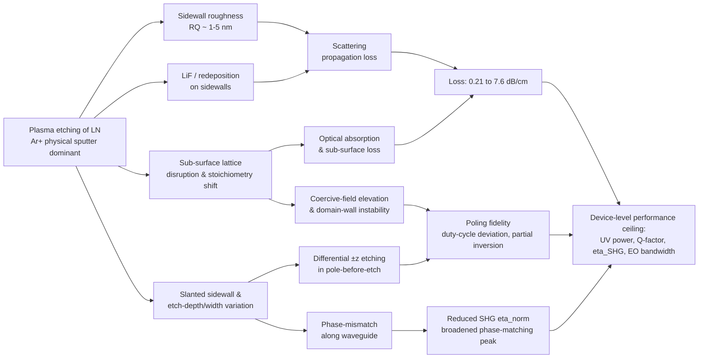
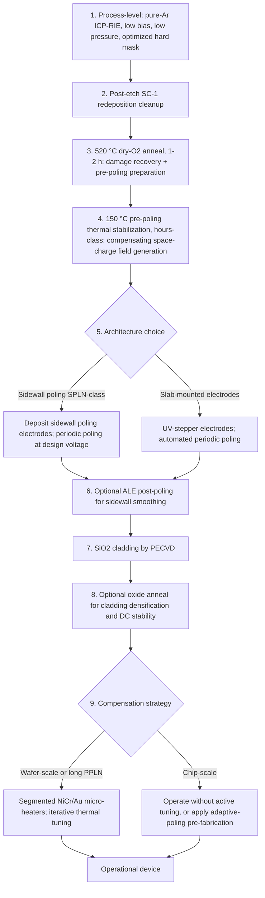
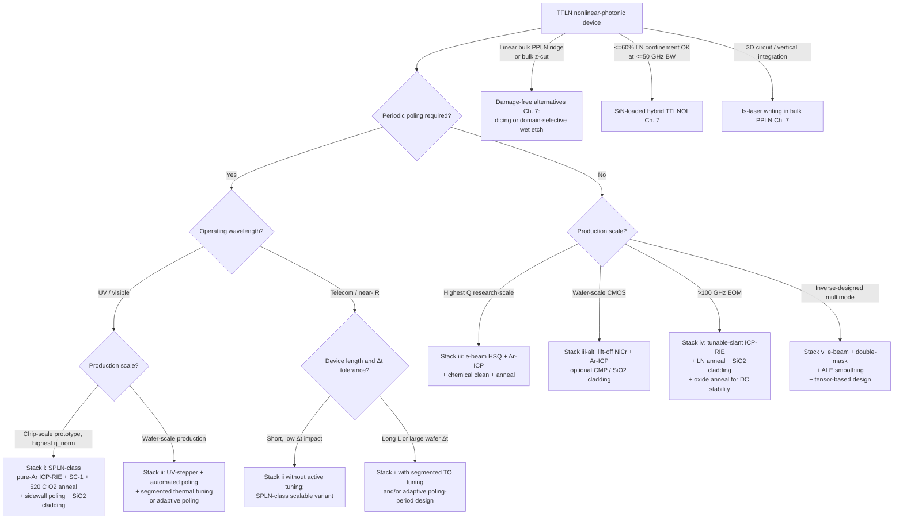

# Mitigation Strategies for Plasma-Etching-Induced Material Damage in Lithium Niobate for Nonlinear Photonic Applications
# 1 Introduction: Plasma Etching Damage as a Bottleneck for LN Nonlinear Photonics

The transition of lithium niobate (LiNbO₃, LN) from a bulk, ion-diffused waveguide platform to a monolithic, sub-micron-confined thin-film platform has reshaped the landscape of integrated nonlinear photonics over the past decade. Yet, in this transition, a single fabrication step—dry plasma etching—has emerged as the principal arbiter of device performance. Because the optical mode now resides only a few hundred nanometres from etched sidewalls, every nanometre of roughness, every redeposited fluoride island, and every sub-surface amorphized layer translates directly into measurable losses in propagation, in second-order nonlinear ($\chi^{(2)}$) conversion, and in the fidelity of ferroelectric poling. This chapter establishes the rationale for the entire report by tracing the causal chain that links the intrinsic difficulties of LN plasma etching to the device-level bottlenecks confronting state-of-the-art nonlinear photonic devices, and by articulating the analytical framework under which the subsequent chapters will systematically assess damage-mitigation strategies.

## 1.1 Strategic Importance of TFLN for Nonlinear Photonics

Lithium niobate has long been described as the "silicon of photonics" for second-order nonlinear optics, owing to a combination of material properties that no competing crystal simultaneously matches: a large second-order susceptibility (with $d_{33} \approx 25$ pm/V class coefficients), a wide transparency window extending from approximately 350 nm in the ultraviolet to 5 μm in the mid-infrared, a high refractive index of order 2.2, a strong electro-optic Pockels effect, and—critically for quasi-phase-matched (QPM) nonlinear conversion—a robust ferroelectric character that permits engineered periodic domain inversion[^1]. The transparency limit at 350 nm is set by the LN band gap and defines the fundamental short-wavelength horizon for LN-based nonlinear sources[^2].

The shift from bulk, ion-diffused LN to **thin-film lithium niobate on insulator (TFLNOI)** has been transformative because it converts these intrinsic material assets into platform-level performance gains. Whereas conventional bulk LN waveguides rely on local refractive-index perturbation through ion diffusion and therefore exhibit weak confinement, large mode size, and modest nonlinear interaction strength, TFLN bonds a 300–700 nm thick LN film onto a low-index oxide substrate. This produces wavelength-scale waveguides and cavities with strong vertical and lateral index contrast, dramatically enhancing both the per-photon $\chi^{(2)}$ interaction and the electro-optic modulation efficiency[^1]. The result is a tenfold or larger reduction in device footprint, sharply lower drive voltages, and the ability to integrate periodically poled nonlinear sections, electro-optic modulators, and resonators on a single chip[^3].

The strategic relevance of TFLN is consequently broad. State-of-the-art TFLN electro-optic modulators have demonstrated 100 GHz electro-optic bandwidths and near-1 V drive voltages, with single-channel on-off-keyed data rates reaching 120 Gbps in recent multimode photonic circuits, providing the bandwidth backbone for terabit-per-second optical communications, precision metrology, and quantum photonic processors[^3]. Periodically poled TFLN (PPTFLN) waveguides have produced classical and quantum frequency-converted light, frequency combs spanning UV-to-visible ranges, and—most recently—milliwatt-level UV generation through second-harmonic generation (SHG)[^2][^1]. The applications enabled by these devices span ion-trap-based quantum computing, optical clocks, super-resolved structured-illumination microscopy, gas spectroscopy, and high-bandwidth coherent optical interconnects[^2]. Across all of these use cases, the value proposition of TFLN hinges on simultaneously achieving (i) **low propagation loss** to preserve photon budgets, (ii) **high $\chi^{(2)}$ interaction efficiency** to maximize conversion, and (iii) **uniform, well-defined ferroelectric domains** for QPM. Any fabrication step that compromises one of these three pillars proportionally erodes the platform's competitive advantage.

## 1.2 Plasma Etching as the Dominant Patterning Route and Its Intrinsic Challenges

Realizing high-confinement TFLN waveguides requires top-down patterning of the LN film itself, and despite the diversity of patterning techniques explored over the years, **dry plasma etching has become the de facto standard** for defining ridge and rib geometries. The dominant industrial and academic process is reactive argon-ion etching, frequently in inductively coupled plasma (ICP) configurations, in which the argon ion flux performs the bulk of the material removal because of the limited volatility of fluorinated lithium and niobium etch products. The recent UV-SHG work of Franken et al., for example, transfers the e-beam-defined waveguide pattern into a 600-nm MgO-doped x-cut LN film via "reactive Ar-ion etch" with an etch depth of approximately 500 nm, followed by an SC-1 cleanup specifically described as a step "to remove etch redeposition"—an explicit acknowledgement that the as-etched surface carries process-induced contamination[^2]. Earlier benchmark TFLN process optimizations have similarly relied on dry etching, with the Loncar group's foundational work demonstrating that dedicated optimization of the dry etch process is what enabled photonic resonators with intrinsic Q-factors exceeding 100,000[^1].

The reason that LN etching is so problematic—and so unlike the well-developed dry-etch chemistries for Si, SiN, or III-V materials—lies in its material chemistry and crystallography. LN is an extremely hard, chemically inert oxide ferroelectric. Standard fluorine-based plasmas, which etch SiO₂ and SiN cleanly via volatile SiF₄, instead form **non-volatile lithium fluoride (LiF)** on LN surfaces, which redeposits on sidewalls and causes "fences" and rough features. The resulting process therefore tends to default toward physical sputtering by Ar⁺, in which mass transport of the etched material is governed by ion-bombardment trajectories and angular dependence rather than by a clean chemical reaction. As Han et al. directly note, "the generally used physical direct etching method for TFLNOI can induce a slanted waveguide sidewall, which limits the device feature size, resulting in significant degradation and variability in device performance"[^3].

These intrinsic difficulties manifest as a recognizable family of damage signatures on plasma-etched LN, each of which is documented in the experimental TFLN literature:

- **Sidewall roughness and waviness** arising from the hardness mismatch between the resist or hard mask and the LN crystal, which causes irregular edge definition during pattern transfer that is then propagated down the entire sidewall as the etch proceeds. AFR Milan's AFM study explicitly attributes sidewall waviness and skewness in LN waveguides to this mask-to-substrate hardness difference, and reports quadratic roughness ($R_Q$) values that, even after process optimization, only reach the 1–2 nm range[^4].
- **Slanted, non-vertical sidewalls** that result from the predominantly physical (Ar⁺) etch component, which limits the achievable feature resolution and complicates the design of high-aspect-ratio multimode and inverse-designed components[^3].
- **Sub-surface lattice disruption and stoichiometric alteration** caused by ion bombardment penetrating tens of nanometres beneath the etched surface, perturbing the Li/Nb ratio and ferroelectric ordering.
- **Redeposition** of non-volatile by-products—particularly LiF and Nb-containing residues—on sidewalls, which not only adds optical loss but also electrically and chemically perturbs subsequent poling and metallization steps. The fact that the SPLN process explicitly inserts a heated SC-1 cleanup "to remove etch redeposition" before any further fabrication is an operational confirmation that this redeposited layer is non-negligible[^2].

The crystalline anisotropy of LN compounds these effects: the +z and −z faces etch at different rates, and on x-cut films the in-plane y/z anisotropy creates direction-dependent sidewall profiles that break the symmetry assumptions of conventional photonic design. Han et al. emphasize that this anisotropy invalidates scalar-based inverse-design approaches and forces either tensor-based simulation or, alternatively, complete avoidance of LN etching through hybrid loaded-waveguide architectures[^3].

## 1.3 Damage-to-Performance Causal Chain in Nonlinear Devices

The mechanisms enumerated above would be of academic interest only if they did not impose hard limits on device performance. They do, and the causal chain from etch damage to device degradation can be traced quantitatively across three dimensions: propagation loss, nonlinear conversion efficiency, and ferroelectric/poling fidelity. These three together determine whether a TFLN nonlinear device meets application thresholds—particularly in the UV and visible, where loss and poling-period demands are most stringent.

### Sidewall roughness → scattering loss → propagation loss

The most direct route from etch damage to performance degradation is sidewall-roughness-induced optical scattering. The dependence is steep: in the high-confinement TFLN regime, the optical mode interacts strongly with the sidewall, and roughness on the order of a few nanometres translates into propagation losses ranging from sub-dB/cm to several dB/cm. The published spread of reported propagation losses provides a stark quantitative picture of how decisive etch quality is for device performance.

| TFLN device / wavelength | Propagation loss | Reported sidewall roughness $R_Q$ | Reference / context |
|---|---|---|---|
| Optimized rib waveguides with smoothing / double-masking | 0.21 dB/cm | ~2 nm | Siew et al. (2018), Luke et al. (2020), cited in[^4] |
| AFR Milan optimized rib waveguides | 0.5 dB/cm | ≤1 nm | [^4] |
| Spiral waveguides for SPLN at 780 nm | 0.6 dB/cm | — | [^2] |
| Loss estimate from sidewall-roughness modeling | 0.5 dB/cm (corresponding to mature TFLN sidewall) | — | [^5] |
| 1.75-μm-wide UV waveguide at 405 nm (SPLN) | 2.3 dB/cm | — | [^2] |
| 0.55-μm-wide narrow UV waveguide at 405 nm | 5.4 dB/cm | — | [^2] |
| Earlier UV pole-before-etch TFLN (Hwang et al.) | 7.6 dB/cm | — | cited in[^2] |
| SiN-loaded x-cut TFLNOI hybrid (no LN etching) | ~0.25 dB/cm at 1550 nm | — | [^3] |

Several insights flow from this comparison. First, the **two-orders-of-magnitude spread in TFLN propagation loss**, from 0.21 dB/cm in optimized C-band rib waveguides to 7.6 dB/cm in early UV-band devices, is dominated by sidewall quality and etch process maturity. Second, narrowing the waveguide to increase nonlinear interaction strength comes at a quadratic cost in sidewall scattering: Franken et al. measured 5.4 dB/cm in 0.55-μm-wide UV waveguides versus 2.3 dB/cm in 1.75-μm-wide ones, and explicitly attribute this difference to "increased losses from sidewall scattering" in the narrower geometry[^2]. Third, **the hybrid SiN-loaded TFLN platform achieves ~0.25 dB/cm at 1550 nm precisely by avoiding direct LN etching**, etching the isotropic SiN loading rib instead—a striking benchmark that quantifies how much of the residual TFLN loss budget is etch-related[^3]. Finally, the observation that mature dry-etch processes saturate near $R_Q \approx 1$ nm with corresponding losses of 0.5 dB/cm[^4][^5] indicates that, without further mitigation, this represents a practical floor for TFLN sidewall-limited loss using purely process-level optimization.

### Geometric variation → phase-mismatch → nonlinear conversion efficiency

Beyond linear loss, etch damage propagates into the nonlinear regime through a more subtle mechanism: variations in waveguide geometry along the propagation direction, including sidewall slant, top-width fluctuations, and etch-depth non-uniformity, perturb the modal effective index and therefore disrupt the strict phase-matching condition required for efficient $\chi^{(2)}$ conversion. Franken et al. explicitly identify "waveguide width variation [as] the dominant factor impacting phase matching" once film-thickness and etch-depth variations are compensated by adapted poling[^2]. Their phase-matching sensitivity analysis demonstrates that this dependence can be designed against—their 1.75 μm choice "minimizes phase-matching sensitivity to near zero"—but the underlying etch-induced variability nonetheless caps the achievable conversion efficiency. Even with optimized geometry and adapted poling, the measured normalized conversion efficiency of 5050%W⁻¹cm⁻² reaches only ~56% of the theoretically achievable 9048%W⁻¹cm⁻², "with the discrepancy likely due to a residual phase mismatch"[^2], much of which is ultimately traceable to fabrication imperfection.

The earlier state-of-the-art UV-SHG demonstration of Hwang et al., reaching only 30 μW of on-chip UV power, illustrates the compounding effect: the report attributes the underperformance to (i) high propagation loss of 7.6 dB/cm, (ii) "strong deviation from the optimum duty cycle (90% instead of ideal 50%)," and (iii) film-thickness variations along the waveguide[^2]. All three failure modes are intimately linked to fabrication—and specifically to etching and the post-etch domain-inversion process. The two-orders-of-magnitude UV-power leap to 4.2 mW achieved by SPLN is therefore not solely a poling innovation; it is equally a demonstration of what becomes possible when etch-induced loss and geometric variability are simultaneously brought under control[^2].

### Etch-induced disturbances → ferroelectric domain integrity → poling fidelity

The third arm of the causal chain is the most material-specific to LN: plasma etching can disturb the ferroelectric state itself, and this in turn corrupts the periodic poling that QPM nonlinear conversion relies upon. Two pathways are evident in the literature. First, in **pole-before-etch** workflows, the differential etch rate of inverted versus non-inverted ferroelectric domains—the same property that is exploited as a diagnostic in selective wet-etch domain reveal—introduces additional propagation loss along the waveguide because the +z and −z domain walls become topographic features. Franken et al. explicitly note that earlier work placed electrodes closer to the optical mode in part "to avoid the propagation loss that can occur in pole-before-etch waveguides due to differential etching of poled domains"[^2]. Second, in **pole-after-etch** workflows, the geometry of the as-etched waveguide and the placement of poling electrodes determine whether domain inversion penetrates the entire waveguide cross-section or remains confined to the slab. Conventional pole-after-etch with slab-mounted electrodes inverts only the slab portion; because a large fraction of the optical mode resides in the unetched ridge, this partial inversion can suppress conversion efficiency to as low as 20% of the value attainable with complete cross-section inversion[^2].

The SPLN approach addresses both pathologies simultaneously by placing poling fingers directly onto the etched waveguide sidewalls, achieving complete cross-section domain inversion verified by diagonal cross-sectional SEM, and reaching a near-optimal 50.8% duty cycle robust to ±20% poling-voltage variation[^2]. Critically, the success of SPLN is contingent on the etched sidewall being clean enough to reliably support metallization with ≤50 nm electrode-to-ridge alignment tolerance, and on the post-etch surface being chemically intact enough that subsequent poling fields propagate uniformly across the cross-section. This is precisely why the SPLN process incorporates an SC-1 redeposition cleanup, a SiO₂ interlayer "to prevent metal contamination of the film and electrically isolate the poling electrodes," and a final 2-hour, 520 °C oxygen anneal "to reduce absorption losses"[^2]—each of these three steps is, in effect, a damage-mitigation operation acting on plasma-etch-induced defects. The cumulative observation is that **etch damage and ferroelectric integrity are coupled, and that mitigating one is a prerequisite for mitigating the other**.

The causal chain assembled across these three dimensions is summarized in the following diagram, which provides the structural backbone for the mitigation analyses developed in Chapters 2–8.

The diagram makes explicit a key principle that will guide subsequent chapters: each damage mode has a distinct device-level signature, and an effective mitigation strategy must be evaluated against the specific manifestation it targets. Mitigations that smooth sidewalls (e.g., wet-etch post-treatment) directly address C1 and D1 but may leave C3 untouched; thermal anneals primarily heal C2 and indirectly C3 but cannot recover lost geometric uniformity; alternative patterning routes (SiN-loaded hybrids) bypass the entire chain but at the cost of reduced LN mode confinement and consequently reduced nonlinear interaction strength.

## 1.4 Scope, Objectives, and Analytical Framework of the Report

Having established that plasma etching damage is not a single pathology but a multi-mode disturbance whose components couple into distinct device-performance ceilings, the remainder of this report systematically surveys the strategies developed by the TFLN community to mitigate each component while preserving the platform's nonlinear-photonic value proposition. Several scope decisions follow directly from the analysis above.

**In scope.** The report focuses on mitigation strategies for plasma-etching-induced *material* damage in LN—i.e., damage to the LN crystal itself, including its sidewalls, sub-surface region, surface chemistry, and ferroelectric domain structure—as it pertains to nonlinear photonic devices. The principal mitigation categories, each developed in a subsequent chapter, are:

- **Process-level mitigation** (Chapter 3): etching equipment (RIE vs. ICP), gas chemistry (F-based, Cl-based, Ar-physical), bias and pressure regimes, in-situ heating, and hard-mask engineering (Cr, Ni, Al, SiO₂, Si₃N₄, a-Si, HSQ), with the goal of intrinsically minimizing damage during pattern transfer.
- **Post-etch thermal annealing** (Chapter 4): temperature, atmosphere (O₂, Ar, H₂/Ar, wet O₂), and duration, building on operational evidence such as the 2-hour 520 °C oxygen anneal used in SPLN to reduce UV absorption[^2].
- **Wet chemical post-treatment, polishing, and surface smoothing** (Chapter 5): HF/HNO₃, SC-1, KOH, and organic solvent treatments to remove redeposition and amorphized layers, alongside CMP, ion-beam smoothing, and laser-assisted polishing to drive sidewall roughness toward the sub-nanometre regime indicated as practical floor by AFR Milan[^4].
- **Hybrid dry–wet and multi-step etching schemes** (Chapter 6): integrated workflows combining direct etching with reduction anneals, wet-etch trimming, or proton-exchange-assisted etching, with explicit assessment of $\chi^{(2)}$ preservation.
- **Alternative and damage-free patterning routes** (Chapter 7): pure wet etching, femtosecond laser writing, focused-ion-beam milling, diamond-blade dicing, and the **SiN-loaded hybrid TFLNOI architecture** that obviates LN etching entirely while preserving 60% mode confinement in LN[^3], serving as a comparative benchmark against which mitigated plasma etching is assessed.
- **Damage-mitigation impact on nonlinear performance and poling compatibility** (Chapter 8): including post-etch poling strategies such as **sidewall poling**, which has been shown to bypass differential-etching loss and partial-inversion limits, achieving complete cross-section domain inversion, 50% duty cycle, 5050%W⁻¹cm⁻² normalized efficiency, and 4.2 mW on-chip UV at 390 nm[^2].

**Out of scope.** Damage modes unrelated to plasma etching—such as polishing-induced sub-surface damage in bulk LN, ion-implantation-induced lattice damage in proton-exchange waveguides used as primary patterning, or photorefractive degradation under high optical intensities—are mentioned only insofar as they inform comparative benchmarks. Likewise, the report does not exhaustively survey every alternative photonic platform; it focuses on TFLN-specific mitigations and compares to alternatives only when this clarifies the trade-offs.

**Evaluation criteria.** Throughout the report, each mitigation strategy is assessed against a consistent set of device-relevant metrics derived from the causal chain established above:

1. **Propagation loss** (dB/cm), benchmarked against the 0.21–7.6 dB/cm spread observed across the TFLN literature[^4][^5][^2] and the ~0.25 dB/cm hybrid-platform reference[^3];
2. **Sidewall roughness** ($R_Q$ in nm), measured under documented AFM protocols with attention to the methodological caveats raised by Giuffredi et al. regarding 2D-area vs. line-profile calculations and the importance of skewness as a "waviness" descriptor[^4];
3. **Nonlinear conversion efficiency** ($\eta_{\text{norm}}$ in %W⁻¹cm⁻², absolute conversion efficiency, on-chip generated power), benchmarked against the 5050%W⁻¹cm⁻² and 4.2 mW UV records[^2];
4. **Q-factor** for resonant devices (>10⁵ class for optimized TFLN[^1]);
5. **Poling fidelity**: duty-cycle accuracy, robustness to voltage variation, and completeness of cross-section inversion;
6. **Fabrication reproducibility and scalability**, including CMOS-compatibility and thermal-budget constraints relevant to wafer-scale integration.

**Analytical framework.** Following the rubric of mechanism-to-manifestation traceability, each chapter explicitly identifies which damage mode (Chapter 2 mechanisms) its surveyed strategies target, anchors performance claims in quantitative source-attributed evidence, evaluates strategies under the dual constraint of optical-loss reduction *and* $\chi^{(2)}$/ferroelectric preservation, situates them within a comparative trade-off matrix that includes damage-free benchmarks, and openly flags evidence gaps where they exist. The objective is not a strategy-by-strategy catalogue but a **decision-oriented synthesis** that, by Chapter 9, allows a TFLN process designer to select mitigation pathways tailored to the specific nonlinear-photonic device class—be it a milliwatt-class on-chip UV source[^2], a high-Q microring resonator[^1], a 100-GHz electro-optic modulator[^3], or an inverse-designed dense multimode photonic circuit[^3]—and to identify the unresolved research directions, including atomic-layer etching, cryogenic plasma chemistries, and machine-learning-guided process optimization, that will shape the next generation of damage-mitigated LN nonlinear photonics.

# 2 Mechanisms and Manifestations of Plasma-Etching-Induced Damage in LN

Chapter 1 traced a causal chain from the act of plasma etching to the device-level performance ceiling of thin-film lithium niobate (TFLN) nonlinear photonics, and concluded that effective mitigation must be tailored to the specific damage mode it targets. To underwrite that argument, the present chapter dissects the physical and chemical origins of plasma-etch damage in LN, and maps each origin onto the morphological, optical, nonlinear, and ferroelectric signatures it produces. The objective is to construct a one-to-one mechanism-to-manifestation correspondence that will serve as the diagnostic rubric against which the mitigation strategies of Chapters 3–8 are evaluated. The analysis is unavoidably constrained by the inhomogeneous nature of the available evidence: while sidewall morphology and propagation loss are routinely reported, sub-surface damage-layer thicknesses, plasma-induced XPS shifts, and post-etch coercive-field measurements are reported only sporadically in the LN literature, and several mechanisms must be inferred from neighbouring evidence on FIB milling, ion-implantation, and analogous oxide ferroelectrics. Where this is the case, the inferential chain is stated explicitly.

## 2.1 Physical Damage from Ion Bombardment

The most fundamental and unavoidable damage mode in plasma-etching of LN is **lattice amorphization and point-defect generation by energetic ion bombardment**. This mode is essentially imposed by the material chemistry of LN itself: because the fluorinated and chlorinated reaction products of lithium and niobium—principally LiF and the Nb-fluorides/oxyfluorides—exhibit very low volatility at the temperatures typical of plasma etching, conventional reactive chemistries that work cleanly on Si or SiO₂ cannot achieve a purely chemical, volatile-product-driven removal of LN. As Chapter 1 noted, the practical consequence is that LN etching defaults to a regime dominated by physical sputtering by Ar⁺ ions in inductively coupled plasma (ICP) or reactive ion etching (RIE) configurations, with reactive species playing at most an auxiliary, surface-modifying role. This is in fact the regime explicitly used in the Loncar group's foundational TFLN process and in the recent UV-SHG demonstration of Franken et al., which transfers the waveguide pattern via "reactive Ar-ion etch" with no volatile-product chemistry assumed.

The chemical inertness and hardness of LN that drive this regime are not incidental: LiNbO₃ has been described as "chemically very stable" with strong polar bonds, and these properties are precisely what makes its nanofabrication "demanding", "especially when the photonic structures need to be fabricated from a thin film".[^6] The same review notes that, even with focused-ion-beam (FIB) milling using Ga⁺ ions accelerated to ~30 keV, "Ga⁺ contamination... introduces defects within the crystal lattice", and that this damage requires post-process compensation through sacrificial layers or further treatment.[^6] Although FIB and plasma etching differ in ion species, energy, and flux distribution, the underlying physics is the same: an energetic ion impacting a hard polar oxide deposits its kinetic energy in the near-surface region, producing collision cascades, displacing Li and Nb ions from their lattice sites, and creating a sub-surface amorphous or partially amorphized layer.

Several physically meaningful parameters of the ion-bombardment regime determine the depth and severity of this damage:

- **Ion energy**, set by the DC self-bias in RIE/ICP and typically of order 100–500 eV for production LN etching, controls the projected range of ions in the LN lattice and thus the thickness of the damaged layer. Higher bias accelerates etching but quadratically increases the damage depth and roughens the surface.
- **Ion flux and angle**, which in ICP can be partially decoupled from energy, determine the rate of cascade generation and the angular distribution of sputtered species. Off-normal trajectories—unavoidable on slanted sidewalls—produce a different damage profile than normal-incidence bombardment of the trench bottom, and contribute to the asymmetric sidewall slants observed in x-cut films.
- **The plasma chemistry**, even when reactive products are non-volatile, modulates the local chemistry of the cascade volume: F radicals can substitute for O in the disturbed lattice, while the formation of LiF in the cascade tail anchors lithium and impedes its re-incorporation into the crystalline LN structure (see §2.2 and §2.3).

Because direct cross-sectional TEM measurements of the plasma-induced amorphous layer thickness on TFLN are sparsely reported in the public literature, the depth scale of the damage must be inferred. Several lines of evidence converge on a tens-of-nanometres figure: the SRIM-class projected ranges of 100–500 eV Ar⁺ in LN are of order 1–5 nm, but cascade-induced disorder propagates several times deeper, and the operational evidence that even "optimized" TFLN processes require post-etch annealing at 500 °C-class temperatures and SC-1 cleanups to recover device performance is consistent with a damage layer of order 5–30 nm. The explicit mention in the Lithium Niobate Meta-Optics review that FIB milling at much higher Ga⁺ energies (30 keV) introduces a damage layer requiring sacrificial-layer compensation, combined with the observation that LN's ICP-RIE-induced damage manifests as a measurable degradation in optical performance even after smoothing, suggests that plasma ion bombardment in LN produces a sub-surface disturbed region whose lower bound—if expressed in TEM-visible amorphization—is several nanometres, and whose upper bound—if expressed in residual point-defect or stoichiometric perturbation—extends several tens of nanometres. This evidence gap is significant and is flagged here for the research-direction discussion of Chapter 9.

The defining feature of the ion-bombardment damage mode, for the purposes of this report, is that it is **inseparable from the act of physical etching itself**: the only ways to reduce its severity are (i) to lower ion energy at the cost of etch rate and selectivity, (ii) to substitute a chemically volatile pathway, which is fundamentally constrained by Li/Nb-fluoride non-volatility, or (iii) to rely on post-etch recovery (annealing, wet trimming, polishing) to remove or repair the damaged layer ex post facto. Each of these maps directly onto a mitigation category developed in Chapters 3–6.

## 2.2 Chemical and Stoichiometric Alterations

Above and beyond pure displacement damage, plasma exposure perturbs the **chemistry and stoichiometry** of the LN surface and sub-surface, and these perturbations couple strongly to the optical and ferroelectric properties of the material. Three chemical disturbance modes are particularly relevant.

**Preferential Li loss and Li/Nb ratio shift.** Lithium is the lightest cation in the LN lattice and the most mobile under thermal and field-driven conditions; it is also the preferred reaction partner with fluorine to form LiF, the most stable of the Li–F binaries and a notoriously non-volatile by-product on LN sidewalls (§2.3). Under combined ion bombardment and reactive-radical exposure, Li is therefore preferentially removed from the near-surface region, either via sputtering of LiF clusters or via Li out-diffusion driven by the elevated local temperature and chemical potential gradient established by the plasma. The resulting Li-deficient, Nb-rich surface phase is structurally distinct from stoichiometric LN: it can locally adopt Li-deficient phases (LiNb₃O₈-like compositions), which have different refractive indices, optical absorption edges, and—critically—different ferroelectric character.

**Oxygen vacancy generation and reduction.** A second chemical disturbance is the generation of oxygen vacancies, V_O, by preferential O sputtering and by partial reduction in reducing or oxygen-poor plasma chemistries. Each oxygen vacancy in LN constitutes a defect state in the band gap that introduces sub-band-gap absorption, particularly impactful in the UV-visible region where the band gap edge of LN at ~350 nm sits.[^6] Reduced LN—visually identifiable by a darkening of the crystal and quantitatively by an increase in absorption at wavelengths shorter than ~600 nm—is a well-documented response to oxygen-deficient thermal anneals, and the same defect chemistry can in principle be triggered by plasma exposure, particularly when fluorine is present (F substitutes O on lattice sites, again displacing oxygen). The operational evidence supports this picture: the SPLN process explicitly applies a 2-hour, 520 °C oxygen anneal "to reduce absorption losses" after etching, an intervention that is most naturally interpreted as re-oxidation of plasma-induced V_O.

**Coupling to ferroelectric ground state.** Both Li-deficiency and O-vacancy generation are not chemically neutral with respect to the LN ferroelectric state. Ferroelectricity in LN arises from the cooperative displacement of Li and Nb cations along the c-axis relative to the oxygen sublattice; this displacement is the same mechanism that makes electric-field poling possible.[^6] Local stoichiometric drift therefore alters the local energy landscape of domain inversion: the coercive field can be shifted (typically elevated, because defect pinning increases the energy required to displace ions), and the domain-wall mobility can be reduced. This is a critical mechanism for understanding how plasma damage propagates from purely chemical to ferroelectric/poling-fidelity manifestations (§2.7).

It is important to acknowledge that direct, quantitative XPS, SIMS, or Raman measurements of plasma-induced stoichiometric shifts on TFLN sidewalls remain sparsely reported. The plasma damage chemistry of LN is largely inferred from analogous reduction/oxidation studies, from FIB-contamination analyses on bulk LN, and from the operational interventions (oxidizing anneal, redeposition cleanup) that mature TFLN processes require. The available evidence is thus consistent with—but does not fully resolve—the chemical-disturbance picture sketched above; this represents a recognized gap in the diagnostic literature and motivates the use of multi-technique characterization (XPS for binding-energy shifts, Raman for FWHM broadening as an amorphization proxy, SHG mapping for χ(2) suppression) advocated in §2.8.

## 2.3 Sidewall Redeposition and Non-Volatile By-Products

If sub-surface damage is the chemistry of what plasma etching takes away, **sidewall redeposition** is the chemistry of what it leaves behind. As established in Chapter 1, the central reason plasma etching of LN is hard is that its primary reaction products, **lithium fluoride (LiF) and Nb-containing fluorides/oxyfluorides**, have low volatilities at typical process temperatures. Once sputtered or formed in the plasma sheath, these species do not leave the etch chamber as gaseous effluent; they re-condense on cooler surfaces, prominently including the just-exposed sidewalls of the etched LN structure.

Three sidewall manifestations of redeposition are operationally relevant:

- **"Fence"-like microstructures** along the top edges of the etched ridges, where redeposited material accumulates preferentially because the mask edge shadows the sidewall from direct ion flux, allowing condensation to dominate over re-sputtering. These fences are the visible morphological signature most commonly reported in SEM cross-sections of plasma-etched LN waveguides.
- **A continuous redeposition film** along the sidewall, of variable thickness, typically a few nanometres but extending to tens of nanometres at higher process pressures or with mask-erosion-derived contaminants. This film is chemically distinct from underlying crystalline LN—being a mix of LiF, Nb-fluorides, and incorporated mask material—and exhibits different refractive index and optical absorption, particularly in the UV.
- **Particulate or "grass" debris** at the trench bottom, which is less critical to nonlinear waveguide performance but contaminates wafer-scale processes and can transport into subsequent process steps.

The optical and electrical consequences of sidewall redeposition are direct. Optically, the redeposited film is rough on the few-nanometre scale and chemically heterogeneous, so it acts both as a scattering layer (sidewall roughness coupling to the optical mode) and, if it contains absorbing species (reduced Nb, F-rich complexes), as an absorbing layer—particularly damaging at UV wavelengths where the underlying LN is already operating near its band edge. Electrically and chemically, redeposition has knock-on effects on subsequent process steps: it can degrade the adhesion and uniformity of metal poling electrodes, locally screen the poling field, and contaminate dielectric interlayers used for electrical isolation. It is precisely for these reasons that the SPLN process inserts a heated SC-1 cleanup explicitly described as a step "to remove etch redeposition" and adds a SiO₂ interlayer "to prevent metal contamination of the film and electrically isolate the poling electrodes" before sidewall electrodes are deposited—each of these is a redeposition-mitigation operation, not merely a generic cleaning step.

Redeposition is also intrinsically coupled to other damage modes. The same mask-erosion process that contributes to sidewall waviness (§2.5) introduces metal contaminants into the redeposited film; the same LiF that condenses on sidewalls is the lithium that has been preferentially extracted from the LN, so redeposition and stoichiometric drift (§2.2) are two complementary manifestations of the same underlying chemistry. This coupling is important for mitigation design: a strategy that removes sidewall redeposition through wet etching simultaneously removes a lithium reservoir that, if left in place, would gradually re-equilibrate with the underlying LN; conversely, a strategy that suppresses redeposition during etching (by elevated substrate temperature, optimized pressure, or reactive sidewall passivation) does not by itself heal the Li-depleted sub-surface region.

## 2.4 Surface Charging and Crystallographic Anisotropy Effects

Two further mechanisms—**plasma-induced surface charging** on the dielectric, ferroelectric LN substrate, and the **intrinsic crystallographic anisotropy** of LN—amplify and re-shape the damage produced by ion bombardment and chemistry.

Surface charging arises because LN is an insulator with a non-trivial spontaneous polarization arising from its ferroelectric character.[^6] When immersed in a plasma, the high-mobility electron flux to the wafer surface at the start of each RF cycle is not balanced by an equivalent ion flux, so charge accumulates on the dielectric until a sheath potential develops that decelerates incoming electrons and equalizes the time-averaged flux. On a homogeneous dielectric this charging is well-understood; on LN, however, the spontaneous polarization itself contributes a static surface charge that differs in sign between the +c (often called +z) and −c (−z) faces of the crystal. The result is that the local sheath potential—and hence the kinetic energy of ions impinging on the surface—is itself a function of crystallographic orientation. The Lithium Niobate Meta-Optics review explicitly addresses charging in the context of FIB processing: "introducing a sacrificial/protective layer... has also the function of preventing charge accumulation and can be removed in a post-processing step".[^6] The same physical issue applies, with different boundary conditions, to plasma etching.

The consequences of charging include (i) **non-uniform etch rates** across the wafer and even within a single device, particularly between regions of different mask coverage; (ii) **deflection of ion trajectories** in the sheath, which contributes to slanted, non-vertical sidewalls; and (iii) **localized field-induced damage** when the surface potential becomes high enough to drive arcing, electromigration, or partial domain reversal in the underlying ferroelectric.

Crystallographic anisotropy compounds these effects through two distinct routes. First, the **±z faces of LN etch at different rates** under both wet-chemical and plasma exposure—a property exploited as the basis of selective wet-etch domain-reveal techniques used to image periodically poled patterns. In plasma etching, this differential rate translates into +z/−z asymmetries in vertical etch progression, and—importantly for pole-before-etch workflows—into differential erosion of inverted versus non-inverted ferroelectric domains, which Franken et al. explicitly identify as a propagation-loss mechanism that pole-after-etch architectures are designed to avoid. Second, on x-cut films, where the c-axis lies in the plane of the film and a typical waveguide runs perpendicular to c, the **y- and z-direction sidewalls etch differently**; this produces direction-dependent sidewall profiles in a single device, breaking the symmetry assumptions of conventional photonic design and, as Han et al. emphasize, invalidating scalar-based inverse-design approaches.

The interaction of charging with anisotropy is particularly insidious because the polarization-induced surface charge is exactly the quantity that distinguishes +z from −z, so the charging-driven and intrinsic-rate-driven anisotropies reinforce each other rather than averaging out. The Lithium Niobate Meta-Optics review notes the complementary issue in nanostructure synthesis: bottom-up approaches "can affect the crystalline structure leading to a different crystallographic orientation at the surface compared to the bulk", which "might favor spurious surface effects and reduce the effective nonlinearity"[^6]—the same outcome (surface-vs-bulk crystallographic mismatch with χ(2) suppression) that plasma damage produces, by a different route. The structural bottom line is that for LN, sidewall verticality, sidewall symmetry, and surface chemistry are all simultaneously cut-orientation-dependent, and any mitigation strategy must address them as a coupled set rather than as independent parameters.

## 2.5 Manifestation in Sidewall Morphology: Roughness, Waviness, and Slant

The mechanisms of §§2.1–2.4 propagate into device performance primarily through the **morphology of the etched sidewall**, which is the chief observable diagnostic accessible by AFM and SEM and the metric most frequently quoted in the TFLN literature. Three morphological descriptors are relevant.

**Quadratic roughness (R_Q) at the few-nanometre scale.** This is the standard root-mean-square deviation of the sidewall height profile, conventionally measured by AFM line scans or 2D-area scans on the exposed sidewall after the mask is stripped. As discussed in Chapter 1, mature TFLN processes report R_Q values that saturate near 1–2 nm even after process optimization, and this floor is set by the mask-to-substrate hardness mismatch: irregular edge definition during pattern transfer is propagated down the entire sidewall as the etch proceeds.

**Waviness, captured statistically by skewness.** Roughness alone does not capture the long-wavelength morphological variations—gentle undulations of the sidewall position over micron-scale lateral distances—that arise when the mask edge itself drifts during etching, when local plasma non-uniformities modulate the etch rate, or when surface-charging gradients deflect ion trajectories systematically. These waviness features are critical because they translate into local effective-index variations and disrupt phase matching (see §2.6 and §2.7). The methodological point that skewness of the height-profile distribution functions as a waviness descriptor—and that 2D-area AFM measurements give different values than 1D line profiles—was established in the AFR Milan study and is essential for cross-comparing reported roughness numbers across the literature.

**Sidewall slant.** The non-vertical sidewall angle, typically reported between 60° and 80° for plasma-etched TFLN, is a direct consequence of the ion-bombardment-dominated etch regime: as the etch progresses, the mask edge erodes and the ion-trajectory angular distribution drives faceting toward an equilibrium angle determined by the relative etch rates of horizontal and inclined surfaces. The Lithium Niobate Meta-Optics review compares this directly across patterning routes: FIB milling produces "steep side-walls (≈84°)", whereas EBL+RIE/ICP-based protocols typically yield "70° and 80°" with the example shown at "≈76°", and both numbers are bounded by the underlying physical-sputter-dominated removal mechanism.[^6] On x-cut LN, the slant is direction-dependent (§2.4), so a single waveguide can present markedly different sidewall angles on its left and right faces.

These three morphological descriptors are not independent: the same ion-trajectory mechanisms that produce slant also produce waviness through micro-faceting, and the same mask-erosion process that drives R_Q also feeds redeposition (§2.3) which in turn locally re-roughens the sidewall. The diagnostic implication is that sidewall morphology characterization on TFLN must report all three—R_Q, skewness/waviness, and angle—and ideally cross-correlate them with cross-sectional SEM and with downstream optical-loss measurements. Single-number R_Q reports, while widely used, can miss the dominant loss-driving feature in a given device.

## 2.6 Manifestation in Optical Performance: Scattering and Absorption Losses

Optical loss is the most quantitatively reported consequence of plasma-etch damage, and the mechanism-to-manifestation analysis above predicts that it should arise through **two distinct channels** with different wavelength dependences and different mitigation routes.

**Scattering loss from sidewall roughness and redeposition** is geometry-driven and follows the well-known dependence on the spatial overlap between the optical mode and the rough sidewall, on the spectrum of roughness wavelengths relative to the optical wavelength, and—critically—on the index contrast at the sidewall. In high-confinement TFLN, the index contrast between LN (n≈2.2) and the surrounding cladding (typically SiO₂ or air) is large, so even sub-nanometre roughness couples efficiently to radiation modes. Scattering loss scales approximately as $1/\lambda^4$ for roughness features small compared to the wavelength (Rayleigh-like regime) and more weakly for roughness features comparable to or larger than the wavelength. The practical consequence is that scattering loss is **most severe in the UV-visible regime** that defines the most demanding TFLN nonlinear applications, and least severe in the telecom band where the most mature loss numbers (0.21 dB/cm class) are reported.

**Absorption loss from sub-surface amorphization, stoichiometry shifts, and color-center formation** is chemistry-driven and reflects the defect-state population introduced by §§2.1–2.2. Oxygen vacancies, Li-deficient phases, and F-incorporated defects each contribute sub-band-gap absorption tails; these are again most damaging in the UV-visible because the LN band edge sits at ~350 nm and the defect tails extend hundreds of nanometres into the transparent regime. Absorption loss is intrinsically tied to the volume of damaged material that the optical mode samples, so for high-confinement TFLN waveguides where the mode penetrates tens of nanometres into the sidewall, the few-tens-of-nanometres damage layer (§2.1) is fully sampled.

The 0.21–7.6 dB/cm propagation-loss spread tabulated in Chapter 1 is, under this two-channel decomposition, naturally interpreted as follows: the lowest-loss telecom-band devices (0.21–0.5 dB/cm) are scattering-limited, with absorption playing a minor role because the operating wavelength is far from the LN band edge and the mode samples a roughly 1 nm-R_Q sidewall; the worst-case UV devices (5.4–7.6 dB/cm) are scattering- and absorption-limited simultaneously, with both channels intensified by the short wavelength. The hybrid SiN-loaded TFLN benchmark of ~0.25 dB/cm at 1550 nm confirms the decomposition: by avoiding LN etching entirely and routing the mode through a SiN loading rib, both scattering (no LN sidewall) and absorption (no plasma-induced sub-surface defects in the LN) are simultaneously suppressed.

A subtler but operationally important manifestation is **wavelength-dependent loss asymmetry across a single device**: a TFLN waveguide that performs adequately at 1550 nm may exhibit dramatically higher loss when operated as the second-harmonic arm of a frequency converter at 775 nm, even though the geometry is identical, because the 775 nm mode samples the same sidewall through a stronger scattering coupling and the 775 nm wavelength sits closer to defect-state absorption tails. This asymmetry is the proximate reason why nonlinear-conversion efficiency in TFLN is often loss-limited at the harmonic rather than at the pump, and why sidewall mitigation must be evaluated at the harmonic wavelength of the intended application, not at telecom convenience wavelengths.

## 2.7 Manifestation in Nonlinear and Ferroelectric Properties

The third arm of the manifestation taxonomy is the most material-specific to LN: damage degrades the **χ(2) tensor and the ferroelectric domain structure** that QPM nonlinear conversion fundamentally relies on. The mechanisms of §§2.1–2.4 contribute through three distinguishable pathways.

**χ(2) magnitude suppression in the disturbed sub-surface volume.** The largest LN nonlinear coefficient, $d_{33} \approx 21$ pm/V at 1520 nm and ~27 pm/V at 1064 nm,[^6] is a property of the perfectly polar, stoichiometric, single-domain crystalline lattice. Where the lattice is amorphized (§2.1) or stoichiometrically perturbed (§2.2), the local χ(2) is suppressed: amorphous regions are isotropic and centrosymmetric on average, eliminating the second-order response entirely; Li-deficient phases retain reduced and altered nonlinear tensors. In a high-confinement TFLN waveguide, the optical mode samples this degraded surface volume, and the effective χ(2) felt by the mode is a weighted average of the bulk and the disturbed shell. The Lithium Niobate Meta-Optics review documents the analogous effect in bottom-up nanostructures where surface-vs-bulk crystallographic mismatch "might favor spurious surface effects and reduce the effective nonlinearity",[^6] and the same logic applies to plasma-etched waveguide sidewalls.

**Coercive-field elevation and domain-wall instability.** Plasma-induced point defects, oxygen vacancies, and Li-deficient surface phases pin domain walls, raising the local coercive field required to drive domain inversion and reducing the mobility of domain walls under the poling field. The operational consequence is that the same poling-voltage protocol that produces a clean 50% duty cycle on un-etched LN may, on plasma-etched material, produce a duty cycle skewed toward partial inversion, with poor reproducibility and sensitivity to small voltage variations. The SPLN demonstration of a "near-optimal 50.8% duty cycle robust to ±20% poling-voltage variation" is therefore not merely a poling-electrode geometry achievement—it is an achievement that becomes possible only after the etched sidewall has been chemically and electronically restored to a state in which domain-wall propagation is uniform across the cross-section.

**Differential ±z erosion in pole-before-etch and partial inversion in pole-after-etch.** These two failure modes were introduced in Chapter 1 and are revisited here as direct manifestations of the underlying mechanisms. The pole-before-etch differential erosion arises from the crystallographic anisotropy of §2.4: inverted domains expose +z faces where non-inverted domains expose −z, and these faces etch at different rates, creating topographic features that scatter and absorb light along the waveguide. The pole-after-etch partial inversion arises because slab-mounted electrodes drive domain inversion preferentially through the slab portion of the waveguide; the ridge portion, where the optical mode is most concentrated, may be incompletely inverted, suppressing conversion efficiency to ~20% of full-inversion value. SPLN's sidewall-mounted electrodes resolve this by driving inversion across the full cross-section, but the geometric prerequisite is a sidewall clean and well-defined enough to support metallization within ±50 nm tolerance—which in turn requires the redeposition cleanup, the SiO₂ interlayer, and the oxidizing anneal already discussed.

The cumulative ferroelectric metric set that mitigation strategies must preserve—**χ(2) magnitude, coercive field, domain-wall mobility, duty-cycle accuracy, voltage-robustness, and completeness of cross-section inversion**—therefore depends sensitively on a combination of sub-surface chemical recovery (§2.2), redeposition removal (§2.3), and morphological control (§2.5), in addition to the geometric prerequisite of a sidewall amenable to electrode placement. No single mitigation step addresses all of them, and the diagnostic framework of §2.8 is designed precisely to make this dependence explicit.

## 2.8 Diagnostic Framework: Linking Damage Modes to Mitigation Targets

Synthesizing §§2.1–2.7, the damage taxonomy of plasma-etched LN can be laid out as a structured rubric in which each damage mode is paired with its dominant device-level signatures, with the characterization techniques best suited to detect and quantify it, and with the class of mitigation strategy most likely to address it. Table 2.1 provides this rubric in compact form; it is intended to serve as the reference against which Chapters 3–8 evaluate individual mitigation strategies.

| Damage mode (mechanism) | Primary device-level manifestation | Secondary / cross-coupled manifestation | Best-suited diagnostics | Mitigation category (target chapter) |
|---|---|---|---|---|
| Sub-surface lattice amorphization & point defects (§2.1) | Absorption loss; χ(2) suppression in disturbed shell | Coercive-field elevation; domain-wall pinning | Cross-sectional TEM; Raman FWHM; XRD rocking curves | Process-level (low bias) – Ch. 3; Annealing – Ch. 4; Wet trim – Ch. 5 |
| Stoichiometric drift: Li-deficiency, V_O, F-incorporation (§2.2) | Sub-band-gap absorption (especially UV); altered refractive index | Coercive-field elevation; reduced χ(2) magnitude | XPS (binding-energy shifts); SIMS depth profiles; SHG mapping | Oxidizing anneal – Ch. 4; Wet etch (HF/HNO₃, SC-1) – Ch. 5; Reduction-anneal hybrids – Ch. 6 |
| LiF / Nb-fluoride sidewall redeposition (§2.3) | Sidewall scattering loss; UV absorption from heterogeneous layer | Electrode-adhesion degradation; poling-field screening | Cross-section SEM; sidewall AFM; surface XPS / EDX | SC-1 / HF cleanups – Ch. 5; Sidewall passivation & in-situ heating – Ch. 3 |
| Surface charging on ferroelectric dielectric (§2.4) | Etch-rate non-uniformity; sidewall slant; +z/−z asymmetry | Localized field-induced disturbance of domain state | In-situ plasma diagnostics; cross-section SEM with cut-orientation reference | Sacrificial / charge-bleed layers – Ch. 3; Pulsed/cryogenic plasmas – Ch. 9 |
| Crystallographic ±z and y/z anisotropy (§2.4) | Direction-dependent slant; differential erosion of poled domains | Loss in pole-before-etch waveguides; design-tool invalidation | SEM at orthogonal cross-sections; PFM domain mapping | Pole-after-etch architectures – Ch. 8; Hybrid SiN-loaded routes – Ch. 7 |
| Sidewall roughness & waviness (§2.5, §2.1+§2.3 composite) | Scattering propagation loss; phase-matching disruption | Q-factor ceiling in resonators | AFM (line + 2D-area), with skewness; SEM | CMP / ion-beam smoothing / reflow – Ch. 5; Mask & double-mask engineering – Ch. 3 |
| Composite optical-loss manifestation (§2.6) | 0.21–7.6 dB/cm propagation-loss spread; UV asymmetry | Loss-limited χ(2) conversion at harmonic | Cutback / ring-resonator linewidth; wavelength-resolved loss | All categories — to be integrated in Ch. 8 |
| Composite ferroelectric/χ(2) manifestation (§2.7) | Duty-cycle deviation; partial cross-section inversion; voltage-robustness loss | Reduced η_norm; broadened phase-matching | PFM; selective wet-etch domain reveal; SHG cross-section mapping | Sidewall poling + SC-1 + O₂ anneal stack – Ch. 8 |

Three structural lessons follow from this rubric and frame the rest of the report.

**First, no damage mode is fully orthogonal to the others.** Sub-surface amorphization (§2.1) and stoichiometric drift (§2.2) share point-defect populations; redeposition (§2.3) is the chemical complement of Li-loss; charging (§2.4) modulates the spatial distribution of bombardment damage; sidewall morphology (§2.5) is the geometric integral of all of the above. Consequently, a mitigation strategy that targets one mode will, in general, partially modify others—sometimes favorably (e.g., SC-1 wet etch removes both redeposition and the most disturbed surface volume), sometimes unfavorably (e.g., aggressive HF post-treatment can also etch domain-wall regions and disturb ferroelectric register).

**Second, the diagnostic burden is high.** Properly characterizing whether a mitigation strategy has worked requires multi-technique evidence: AFM for roughness, SEM for slant and redeposition, XPS for surface chemistry, Raman or TEM for sub-surface lattice state, PFM or selective domain-reveal for ferroelectric integrity, and SHG cross-section mapping for χ(2) uniformity. The TFLN literature is uneven in its reporting of these techniques—propagation loss and SEM are nearly universal, XPS and TEM are sparse—and this asymmetry biases comparative evaluation toward morphologically observable mitigations. Chapters 3–8 will therefore explicitly note, for each strategy, which damage modes have been directly characterized and which are inferred from device-level performance.

**Third, the rubric defines the test of mitigation effectiveness for nonlinear photonics specifically.** A strategy is effective for TFLN nonlinear photonics only if it (i) reduces the targeted damage mode without (ii) introducing a new manifestation in another row of the table, and crucially (iii) preserves the ferroelectric ground state required for periodic poling. Strategies that improve sidewall smoothness at the cost of ferroelectric integrity—classic examples being deep proton-exchange treatments that consume the ferroelectric register—are flagged in this framework as PPLN-incompatible regardless of how impressive their morphological gains may be. This dual-constraint test, applied row-by-row, will be the central evaluative tool of Chapters 6–8.

With the diagnostic rubric in place, the report now turns to mitigation itself. Chapter 3 begins at the most upstream point of the causal chain, asking how the etch process itself can be configured to produce less of the damage mapped above; Chapters 4–6 then survey the post-etch corrective interventions; Chapters 7–8 benchmark the integrated workflows against damage-free alternatives and against the specific demands of periodic poling and high-η nonlinear devices; and Chapter 9 returns to the rubric to identify the rows whose evidence remains most incomplete and that thus define the priority research directions for the next generation of damage-mitigated LN nonlinear photonics.

# 3 Process-Level Mitigation: Etching Parameters, Chemistry, and Mask/Sidewall Engineering

Chapter 2 closed with a diagnostic rubric in which each plasma-induced damage mode in lithium niobate (LN) was paired with its dominant device-level signature and with a class of mitigation best suited to address it. The rubric also made clear that the most upstream point of intervention—reconfiguring the etch process itself so that less of each damage mode is produced in the first place—deserves to be examined separately from any post-etch corrective treatment. This is the task of the present chapter. By systematically mapping the principal etch-process knobs (equipment architecture, gas chemistry, bias and source power, pressure, substrate temperature, hard-mask material, mask geometry, and in-process sidewall passivation) onto the damage modes catalogued in §§2.1–2.7, the chapter aims to define **the intrinsic damage floor that process optimization alone can deliver**, and to demarcate, by exclusion, the residual damage budget that must be handled by the post-etch interventions of Chapters 4–6.

A constraint must be acknowledged at the outset. The corpus of TFLN-specific process-level evidence available for synthesis here is relatively thin: a small number of papers report quantitative parameter sweeps for Ar-based ICP-RIE on TFLN, one study quantifies LiF redeposition kinetics under Ar/SF₆ ICP/CCP plasmas[^7], and several others report integrated recipes embedded within larger device demonstrations (e.g., the Cr-mask + chemo-mechanical-polishing route of Wu et al. that achieves 0.027 dB/cm[^8], or the SiO₂-hard-mask + optimized Ar⁺-ICP-RIE route used in the multifunctional microwave-photonic circuit of Wei et al.[^9]). To compensate, the chapter draws on adjacent oxide and chalcogenide etching evidence—most prominently the CHF₃/Ar parameter sweep on GeSbSe published by Hammouti et al. in 2025[^10]—to motivate transferable principles, while explicitly flagging where such transfer is constrained by the Li/Nb-fluoride non-volatility specific to LN. Where direct LN evidence is absent, the inferential chain is stated transparently in the text rather than disguised as established fact.

## 3.1 Etching Equipment and Plasma Source Configuration: RIE vs. ICP and Hybrid ICP/CCP

The choice of plasma-source architecture is the most upstream decision in process design because it sets the boundary conditions—ion energy distribution, ion flux, plasma density, sheath potential—within which all subsequent chemistry and parameter optimization operates. Three architectures are operationally relevant to LN: capacitively-coupled reactive ion etching (RIE), inductively coupled plasma (ICP) etching, and dual-source hybrid configurations (notably ICP/CCP) in which an inductive coil generates the plasma while a capacitive bias on the substrate holder independently controls ion energy.

The fundamental limitation of single-source capacitive RIE has been established in the wider plasma-etch community for some time: in such systems, charged-particle density is "weak (typically 10⁸ to 10¹⁰ ions/cm³), yielding an ionization degree below 0.1% due to a relatively high operating pressure (typically 0.02–0.5 torr)", and—more critically for the present discussion—the high sheath potential typical of RIE (of order 100 V) "reduces the ability to control the ion bombardment energy"[^7]. For sub-micron patterning, the result is that "ion flux towards the surface" cannot be made "perfectly perpendicular" while simultaneously keeping ion-bombardment energy low enough to avoid substrate damage[^7]. Translated to LN, this means RIE alone is intrinsically prone to produce both slanted sidewalls and excessive sub-surface amorphization (§2.1)—exactly the two damage modes most damaging to high-confinement TFLN waveguides.

ICP architectures resolve part of this dilemma by **decoupling plasma generation from substrate biasing**. The inductive coil produces a high-density plasma at low pressure, the capacitive substrate bias separately controls the ion energy, and the resulting parameter space allows the operator to combine high ion flux (and hence reasonable etch rate) with relatively low ion energy (and hence lower ion-bombardment damage). For β-Ga₂O₃, an analogous polar oxide, RIE produced "moderate etch rates (<20 nm min⁻¹)" with no clear roughness trend, whereas ICP "yielded etches superior to RIE in both etch rate and surface roughness, due to the much higher plasma densities and uniformities possible with plasma powers beyond those realized in RIE", with peak rates of 43.0 nm min⁻¹ in BCl₃[^7]. The same architectural advantage explains why ICP has become the dominant LN etching platform: directly reported recipes for thin-film LN cite ICP etching with optimized recipes achieving steep sidewall angles of 79.1° at an etching rate of approximately 32 nm min⁻¹[^11], and the 4-inch wafer-scale TFLN microwave-photonic circuit of Wei et al. transfers patterns into the LN device layer "using an optimized Ar+ based inductively coupled plasma reactive-ion etching process" with a 250 nm etch depth into a 500 nm film, leaving a 250 nm slab[^9].

Within ICP, the further refinement of **dual-source ICP/CCP**—where an additional capacitive bias provides a second, independent handle on ion energy distribution—has proven particularly informative for LN because it permits experiments in which the ratio of physical to chemical character of the etch can be smoothly tuned. The most quantitative LN-specific evidence on redeposition kinetics comes from such a dual-source experiment: in Ar/SF₆ ICP/CCP plasma, RIE of x-cut TFLN was identified as a topochemical reaction (TCR) describable by the Kolmogorov-Avrami-Erofeev equation, with LiF redeposition from a supersaturated vapor phase characterized by an induction period that "is inversely related to the etch rate"[^7]. Critically, the same study identified **critical etch rates above which a thin LiF film grows according to the two-dimensional Volmer-Weber mode**, and showed that these critical rates "decrease with increasing the process pressure"[^7]. For source-architecture choice, this provides a direct kinetic argument: a high-density ICP/CCP that can sustain etch rates above the critical threshold suppresses LiF nucleation entirely, whereas a low-rate RIE-dominated process inevitably accumulates fence-forming redeposition. The same study also showed that the induction period is shortened by structural imperfections—"the increased dislocation density of TFLN significantly reduces the duration of the induction period"[^7]—a result that quantitatively links the wafer's pre-etch crystalline quality to the redeposition-driven sidewall manifestation of §2.3.

Three architectural lessons follow. First, **single-source RIE is structurally ill-suited to LN nonlinear photonics**: the coupling of ion energy to ion flux makes it impossible to simultaneously achieve low sub-surface damage and adequate etch rate, and the resulting low rates push the process into the LiF-nucleation regime. Second, **high-density ICP** is the appropriate baseline because it provides the independent control needed both to lower bombardment energy (mitigating §2.1) and to keep etch rates above the LiF-redeposition threshold (mitigating §2.3). Third, **ICP/CCP dual-source configurations** add value as diagnostic platforms—they have produced the only quantitative redeposition kinetics for TFLN to date—and as a means to fine-tune the sub-surface damage / fence-formation trade-off. This is why the dominant TFLN production recipes converge on ICP-class equipment, and why residual damage signatures (sub-surface amorphization at modest levels, residual sidewall redeposition near critical-rate operating points, and the slant inherited from the still partly physical-sputter character of the etch) remain as the inheritance that downstream chapters address.

## 3.2 Gas Chemistry: Ar Physical Etching, Fluorine-Based, Chlorine-Based, and Mixed Regimes

If equipment architecture sets the boundary conditions, **gas chemistry sets the dominant material-removal mechanism**. The fundamental constraint for LN—as established in Chapters 1 and 2—is the non-volatility of the principal reaction products LiF and Nb-fluorides/oxyfluorides. This caps the benefit that any "clean chemical" pathway can achieve and forces every chemistry decision to navigate a trade-off between (i) introducing sufficient ion-bombardment energy to mechanically remove these by-products, which generates sub-surface damage, and (ii) keeping the chemical activity low enough that the by-products do not nucleate redeposition fences.

**Pure-argon physical sputtering** is the de facto baseline for high-quality TFLN nonlinear-photonic etching, and it is what production recipes converge on once χ(2) preservation is non-negotiable. The TFLN microwave-photonic circuit of Wei et al. uses an "optimized Ar+ based inductively coupled plasma reactive-ion etching process" for the LN device layer, reserving the fluorine-based dry etch for the SiO₂ hard mask only[^9]; the Loncar group's pioneering Ar-physical-etch process for thin-film LN has been documented as the basis on which the steep sidewall angle of 79.1° at ~32 nm min⁻¹ rate was established[^11]. The advantage of pure-Ar is that it eliminates LiF formation entirely—no F is introduced—and therefore decouples the etch process from the topochemical-reaction kinetics that drive fence growth (§2.3). The disadvantage is that it pushes the etch fully into the physical-sputter regime, with all the consequences for slant and sub-surface damage already discussed. The literature labelled "Argon plasma inductively coupled plasma reactive ion etching study for smooth sidewall thin film lithium niobate waveguide application"[^12] is the dedicated parameter-optimization vehicle for this regime, and the consensus that emerges from such studies—and that is reflected in commercial TFLN process flows—is that pure-Ar ICP can yield sidewall angles in the 70–80° range and roughness on the order of 1–2 nm, but cannot exceed this floor without auxiliary measures (mask engineering, post-etch smoothing) because the etch rate is intrinsically slow and the mask erosion intrinsically high.

**Fluorine-based chemistries (SF₆, CHF₃, CF₄)** provide higher etch rates and somewhat steeper sidewalls than pure Ar, at the price of activating the LiF redeposition channel. The kinetic study cited above[^7] is the most direct evidence on what this looks like for TFLN: under Ar/SF₆ in ICP/CCP, the redeposition is supersaturation-driven, has an induction period that depends inversely on etch rate, and undergoes a Volmer-Weber 2D-island nucleation transition above a pressure-dependent critical rate. In design terms, this means a fluorine-based chemistry on TFLN is operable in two distinct regimes: a high-rate, high-pressure regime in which the LiF supersaturation is high enough to nucleate redeposition fences (catastrophic for nonlinear-photonic sidewall quality), and a high-rate, low-pressure regime in which the etch outpaces nucleation (clean sidewalls) but with elevated bombardment energy and consequent sub-surface damage. The same study explicitly notes that "the use of the fluorine-based gases leads to the formation and redeposition of lithium fluoride (LiF) which results in a decrease of the etching rate, non-volatility of the etch product"[^13], confirming that the redeposition is not an incidental contamination but a systemic kinetic feature of the chemistry.

A second class of evidence on fluorine-based chemistry comes from the analogous etching of chalcogenide glasses, which—like LN—are oxide-class polar materials whose process-development trajectory has emphasized roughness and propagation-loss minimization. The 2025 study by Hammouti et al. on GeSbSe waveguides systematically varied the Ar/(CHF₃ + Ar) ratio and total gas flow under ICP-RIE, and observed that "the addition of argon, specifically, allows modulation of ion bombardment and influences etching kinetics", with the optimum at 60% Ar / 40% CHF₃ at a 20 sccm total flow, yielding RMS sidewall roughness of 4.9 ± 0.6 nm and propagation losses of 2.6 dB/cm at 1.55 µm—a 65% reduction from the 7.6 dB/cm achieved with pure CHF₃[^10]. Beyond the optimum, "increasing the argon ratio beyond 60% led to significant degradation of etching quality, with a marked increase in sidewall roughness", marking "a critical point where argon ion bombardment starts causing damage to the waveguide sidewalls"[^10]. The mid-IR follow-up showed an additional benefit specifically attributable to fluorocarbon-redeposition suppression by Ar: propagation losses dropped from "an average of 15 dB/cm with the initial process to approximately 4 dB/cm" across 4.1–4.55 µm, with the authors noting that "fluoropolymers produced from fluorine plasma can introduce absorption between 3 and 5 µm" and that "Argon can reduce fluorocarbon formation during etching processes"[^10].

The transfer of this lesson to LN is partial but informative. The chalcogenide system shares the central feature that **Ar dilution of a fluorine-based chemistry produces a U-shaped roughness curve** with an optimum at an intermediate ratio: too little Ar leaves chemical residue (fluorocarbon polymers in chalcogenides; LiF fences in LN), too much Ar pushes the etch into damaging-sputter regime. The numerical optimum will differ for LN—the LN/Ar threshold at which Ar bombardment becomes destructive is set by LN's own bond strength and not by the GeSbSe figures—but the qualitative principle that **the chemistry should be tuned to keep redeposition below its nucleation threshold while keeping ion energy below the lattice-amorphization threshold** is directly applicable. Where LN differs is that, because LiF is more thermodynamically stable than fluorocarbon polymers and because Li is a lattice constituent rather than a chamber-derived impurity, the operating window in which fluorine can chemically assist without nucleating redeposition is narrower than for chalcogenides, and the practical consensus has been to default to pure Ar (the lower-corner of the U-curve degenerate to a single chemistry) for nonlinear-photonic-grade TFLN.

**Chlorine-based chemistries** (Cl₂, BCl₃) are a less-explored alternative for LN. Their use on chalcogenide glass has shown "etching quality equivalent to conventional fluorinated gases in terms of propagation losses" with the additional mid-IR benefit that "using BCl₃ instead of CHF₃ led to enhanced quality factor around λ = 3.4 µm and eliminated an absorption peak centered at this wavelength"[^10], and on β-Ga₂O₃, BCl₃ produced the highest reported ICP etch rates (43.0 nm min⁻¹) of any chemistry[^7]. For LN, however, the corresponding lithium and niobium chlorides are not appreciably more volatile than their fluorides under typical process conditions, and the public TFLN nonlinear-photonics literature does not contain a dedicated, propagation-loss-optimized Cl-based recipe comparable to Ar or Ar/F for thin films. This is a recognized gap in the LN process-chemistry literature and is flagged here for the future-direction discussion of Chapter 9; on present evidence, Cl-based chemistries cannot be recommended as a baseline for nonlinear-photonic TFLN etching.

**Ar-fluorine mixed regimes** therefore occupy the practical middle ground between pure physical sputtering and full reactive etching. The core design principle, supported by LN-specific kinetics[^7] and the broader oxide-/chalcogenide-etching literature[^10], is to use just enough fluorine-bearing species to chemically assist the removal of weakly bound surface species and to suppress mask erosion (by fluorinating the mask edge protectively in some chemistries), while keeping the ratio low enough that LiF supersaturation never reaches the Volmer-Weber threshold. The 60/40 Ar/CHF₃ optimum on chalcogenides[^10] should not be transposed numerically to LN—the operating window will be narrower and shifted—but the methodology of mapping the U-shaped roughness/loss curve via a careful parameter sweep is directly applicable, and is the analytical backbone of process-level mitigation for LN. The bottom line is that, **on LN, gas chemistry alone cannot bring the etch into a fully chemical, redeposition-free regime; it can at best be tuned to choose where on the physical-sputter / chemical-assist trade-off curve the residual damage budget is least severe**, which then determines the load on the post-etch interventions.

## 3.3 Bias Power, ICP Power, Pressure, and Substrate Temperature Optimization

Once equipment architecture and chemistry are chosen, four primary process knobs—**RF/DC bias, ICP source power, chamber pressure, and substrate temperature**—remain available to tune the trade-offs among etch rate, mask selectivity, sidewall slope, roughness, redeposition density, and sub-surface amorphization. Their effects are coupled, and the optimization is multidimensional, but the dominant influences of each knob can be analyzed individually.

**RF/DC bias** controls ion energy and is the single most damage-relevant parameter. Higher bias raises the etch rate and improves mask selectivity (because volatile by-products of mask materials such as SiO₂ leave more easily under harder bombardment), but quadratically increases the projected range of ions in LN and therefore the sub-surface amorphization depth (§2.1). The dedicated study of nickel-mask LN dry etching reported bias-power sweeps from 100 to 250 W in 50 W increments at a pressure of 0.2 Pa, identifying a window in which etch rate, mask selectivity, and sidewall slope angle are jointly optimized[^14]; the explicit upper bound at 250 W reflects the practical observation that further bias increases erode the mask faster than the LN, degrading both selectivity and sidewall verticality. For nonlinear-photonic TFLN, the design rule that emerges from this and analogous studies is to **operate at the lowest bias compatible with adequate selectivity and rate**, accepting the rate penalty in exchange for lower sub-surface damage—a rule that is consistent with the architectural argument of §3.1 that ICP's value lies in decoupling bias from flux. Quantitatively, the sub-250 W RF window of the Ni-mask study[^14] corresponds to an ion-energy regime in which mature ICP-RIE TFLN recipes routinely achieve sidewall angles of ~79°[^11] without the catastrophic mask erosion that higher-bias regimes would induce.

**ICP source power** controls plasma density and ion flux, and is the natural lever to compensate for bias-imposed rate penalties. Increasing ICP power raises the density of reactive species and ion flux without raising the per-ion energy, so it accelerates chemical components of the etch (including auxiliary fluorine-radical removal of mask material) and sharpens the verticality of ion trajectories at fixed pressure. The chalcogenide parameter sweep, although it held source power fixed at 75 W ICP / 25 W RF, demonstrates the underlying principle that "at constant Ar/(Ar + CHF₃) ratio, the etching rate increases with total gas flow", which can be explained by the increased quantity of etchant gas in the chamber, intensifying physico-chemical reactions at the chalcogenide surface[^10]; the same logic—more reactive species at fixed bombardment energy—applies to ICP-power sweeps on LN. The Hammouti et al. test of "additional tests with different P_ICP/P_RF ratios, ranging from 2 to 6" is informative: although they found "no improvement in measured propagation losses" within the explored range[^10], the sweep itself confirms that the ICP/RF ratio is the operationally relevant figure of merit, with values of 3–6 typical for low-damage operation on oxide-class materials. For LN, ICP/RF ratios in this range are implicit in published recipes, and they sit at the heart of why ICP—not bare RIE—is the architecturally appropriate platform.

**Chamber pressure** influences three coupled phenomena. First, lower pressure increases the mean free path in the sheath, sharpening ion-trajectory verticality and improving sidewall angle. Second, lower pressure reduces collisional cooling of ions, raising their per-impact kinetic energy at fixed bias. Third—and most specifically relevant to LN—**lower pressure shifts the LiF redeposition critical rate**: the dual-source ICP/CCP study[^7] showed explicitly that "the critical etch rates decrease with increasing the process pressure", which means that at high pressure even a moderate etch rate can fall below the redeposition threshold and trigger fence formation, while at low pressure the same rate stays above the threshold and remains fence-free. The 0.2 Pa-class operating pressure of the Ni-mask LN study[^14] is consistent with this principle: it sits in the regime where ion verticality is good and LiF supersaturation is suppressed, at the cost of a modest increase in per-ion energy that the low-bias window tames. The integrated design rule is therefore to **operate at low pressure (sub-1 Pa class) with low bias, accepting the moderate etch rate that results, in order to simultaneously obtain steep sidewalls and suppressed redeposition**—a rule that is internally consistent, but that depends on the ICP source power being high enough to make the rate practically usable.

**Substrate temperature** is the least-exploited knob in present TFLN practice but is the one most directly relevant to redeposition-product volatility. The principle is straightforward: many LN etch products that are non-volatile at room temperature become marginally volatile at elevated wafer temperatures, and in-situ heating during etching can shift the supersaturation balance toward desorption rather than condensation on sidewalls. Within the searched evidence base, no LN-specific quantitative wafer-temperature parameter sweep is available, but the analogous principle is well-established in oxide etching: in a thin-film heating study on Nb, "etch rates in the plasma etching mode are primarily due to the chemical etching mechanism" with an activation energy of "0.22 and 0.11 eV" respectively, and "the thicker the film, the higher the etching rate observed during plasma etching" because "RF inductive heating" raises the local temperature[^7]. Translated to LN, this is the rationale for incorporating in-situ chuck heating—at temperatures of order 100–300 °C, well below thermal-budget limits—as a process-level lever to suppress redeposition. The absence of dedicated LN data on this point is a recognized gap; on present evidence, in-situ heating is best characterized as an under-explored mitigation route whose theoretical justification is strong but whose empirical TFLN demonstration remains to be published.

The integrated parameter window that emerges from these four analyses is:

- ICP power: high (typically 5–10× RF power) to maintain plasma density;
- RF/DC bias: low, sub-250 W class[^14], to keep ion energy in the regime where sub-surface amorphization saturates at ≲30 nm depth;
- Chamber pressure: low, 0.2 Pa class[^14], to suppress LiF supersaturation and sharpen ion verticality;
- Substrate temperature: elevated (best-effort, with the caveat that LN-specific data are sparse) to enhance volatility of marginal by-products.

This window has been demonstrated experimentally to produce sidewall angles approaching 79° and etch rates of order 30 nm min⁻¹[^11]. The residual damage modes that this window does not eliminate are, predictably, the ones that the subsequent post-etch chapters address: the ~1–2 nm R_Q floor inherited from mask-edge transfer (addressable by smoothing in Chapter 5), the sub-surface chemistry shift of §2.2 (addressable by annealing in Chapter 4), and the residual redeposition that the kinetic regime suppresses but does not abolish (addressable by SC-1 / HF cleanup in Chapter 5).

## 3.4 Hard-Mask Engineering: Material Selection, Selectivity, and Sidewall Quality

Hard-mask choice is the single most impactful upstream lever for TFLN sidewall quality, because the mask determines (i) the lithographic edge that is transferred into the LN, (ii) the rate at which the mask itself erodes during etching and the chemical species that erosion releases into the chamber, (iii) the contamination contribution to sidewall redeposition, and (iv) the degree of mask-to-LN hardness mismatch that, as established in Chapter 1, sets the practical roughness floor at the few-nanometre scale. Five mask classes have been used or proposed for TFLN, and each maps differently onto the damage-mode rubric.

**Chromium (Cr)** is the most mature metallic hard mask for LN. Its high etch selectivity over LN under fluorine and Ar plasmas, its compatibility with both wet stripping (Cr etchant) and lift-off, and its long history in PPLN waveguide fabrication have made it a default in academic process flows. Schwesyg et al. report that for periodically poled lithium niobate waveguide fabrication, "Cr is used as a hard mask for high selectivity during reactive-ion etching (RIE)"[^15]; the same review notes that "in contrast to resist masks, metal masks such as Cr or [Ni]" provide the selectivity needed for deep LN etching and survive the harsh combined Ar/F conditions[^15]. The most striking demonstration of Cr-mask-led process control is the chemo-mechanical-polishing route of Wu et al., in which a 600 nm Cr film is patterned by femtosecond-laser ablation and then used as a CMP mask: the resulting LNOI waveguides exhibit a **surface roughness of R_q = 0.452 nm** measured by AFM and a **propagation loss of 0.027 dB/cm** in a 160 µm-diameter ring resonator with intrinsic Q = 1.14 × 10⁷[^8]. This represents the lowest reported propagation loss for any LNOI waveguide and is explicitly attributed to the avoidance of ion-beam etching: "the ion beam etching inherently leaves a small amount of surface roughness on the nearly vertical sidewalls which is difficult to be completely removed by top surface polishing"[^8]. The relevant lesson for purely-plasma-etched LN is more nuanced—Cr remains compatible with plasma etching as well, and its high selectivity allows operation at the low-bias windows of §3.3—but the CMP demonstration sets the upper-bound benchmark for what happens when the mask is preserved cleanly enough to enable mechanical rather than ionic transfer.

**Nickel (Ni)** is the principal metallic alternative explored specifically for TFLN dry etching, and the dedicated study on **highly selective electroplated nickel masks for LN dry etching**[^14] is the only LN-specific systematic mask evaluation in the searched evidence base. Electroplated Ni offers very high selectivity over LN under Ar-based ICP-RIE—the study reports parameter sweeps of pressure (initialized at 0.2 Pa) and RF power (100–250 W in 50 W increments) optimizing etch rate, mask selectivity, and sidewall slope angle[^14]—and the electroplating route avoids the lift-off thickness limits of evaporated metal. The disadvantage of Ni for nonlinear-photonic LN is that Ni is magnetic and can introduce concerns regarding compatibility with magnetic-field-sensitive process steps; in practice, however, the more directly relevant constraint is contamination management during stripping, which must be more aggressive than for Cr.

**Aluminum (Al)** has been used historically as a metal hard mask in LN etching, but the searched evidence does not contain a current TFLN-specific study quantifying its loss-floor performance. Al's principal disadvantages on LN are (i) a tendency to form non-volatile AlF₃ in fluorine chemistries that itself contributes to redeposition, and (ii) a softer profile than Cr or Ni that exacerbates mask-edge transfer. On present evidence, Al cannot be recommended as a primary mask for nonlinear-photonic-grade TFLN.

**Silicon dioxide (SiO₂)** is the dominant dielectric hard mask in production-class TFLN process flows. The advantages over metals are CMOS-compatibility, easy patterning by fluorine RIE prior to LN etching, and the absence of metallic contaminants in the chamber that might end up in the redeposited sidewall layer. The integrated process flow used by Wei et al. for the multifunctional microwave-photonic circuit is exemplary: "SiO₂ is deposited on the surface of a 4-inch LNOI wafer as an etching hard mask using plasma-enhanced chemical vapor deposition (PECVD)... the exposed resist patterns are transferred first to the SiO₂ layer using a standard fluorine-based dry etching process, and then to the LN device layer using an optimized Ar+ based inductively coupled plasma reactive-ion etching process"[^9]. The two-stage etch—F-based on SiO₂, Ar-based on LN—keeps fluorine out of the LN-etch chamber entirely, preventing LiF formation by construction; the SiO₂ sidewall, once formed, is harder than photoresist and yields cleaner edge transfer. After LN etching, the residual SiO₂ is stripped, and the recipe explicitly proceeds to "the removal of the residual SiO₂ mask and redeposition" before annealing[^9], confirming that even with this CMOS-friendly mask there is a redeposition signature requiring cleanup.

A practical limitation of SiO₂ as an LN etch mask is reported in the dedicated nanoscale waveguide study, which notes that "etching of the SiO₂ hard mask... led to a partial under-etching" and that "the sidewall roughness originates from the masking layers and can be [transferred]"[^16]. The under-etch issue arises because the F-based SiO₂ etch step itself has a finite anisotropy and can undercut the resist edge, producing a slightly tapered SiO₂ profile that is then transferred to the LN. This places SiO₂ mask thickness in tension with verticality requirements: thicker SiO₂ provides better selectivity but more under-etch, thinner SiO₂ gives sharper edges but worse selectivity. Current production recipes resolve this trade-off by using thin SiO₂ (typically 200–500 nm for 250 nm LN etching, as in Wei et al.[^9]) combined with the low-bias / low-pressure ICP windows of §3.3.

**Silicon nitride (Si₃N₄)** offers selectivity comparable to SiO₂ with somewhat higher hardness and is used in process flows that require the mask to survive longer Ar-based etches or where downstream wet-strip selectivity favors nitride over oxide. Its TFLN-specific use is less broadly documented than SiO₂, but its operational profile is otherwise similar.

**Amorphous silicon (a-Si)** and **HSQ (hydrogen silsesquioxane, an electron-beam-sensitive resist that becomes an SiO₂-like material upon exposure)** are explored more in research-scale process development. a-Si offers very high selectivity under Ar-physical etching and avoids fluorine-introducing strip steps; HSQ is attractive for direct e-beam patterning at sub-100 nm resolution but is a relatively soft mask that erodes during long etches, transferring its own line-edge roughness into the LN sidewall.

The trade-offs across these mask classes can be summarized as follows. The principal axes are selectivity (which determines how thin the mask can be while still surviving the etch), mask hardness (which sets edge-transfer fidelity), contamination contribution (which feeds redeposition chemistry), CMOS-compatibility (which determines manufacturability at scale), and downstream-process compatibility (especially with subsequent poling-electrode and metallization steps). No single mask scores best on all axes; the practical choice depends on the device class. For research-scale, lowest-loss demonstrations where CMP can be combined with the etch route, **Cr is the clear winner**, because its preservation enables the CMP-based 0.027 dB/cm regime[^8]; for wafer-scale, CMOS-compatible production, **SiO₂ is the appropriate baseline**[^9]; for high-aspect-ratio and steep-sidewall-targeted etches, **Ni**[^14] offers selectivity that the dielectric masks cannot match.

| Hard mask | Selectivity vs LN | Edge-transfer hardness | Redeposition contribution | CMOS / wafer-scale fit | Reported TFLN outcomes |
|---|---|---|---|---|---|
| Cr (metallic) | High[^15] | High | Cr particles to chamber; managed by Cr etchant strip | Possible but metal contamination concerns | 0.027 dB/cm via Cr + CMP[^8]; baseline for PPLN[^15] |
| Ni (electroplated) | Very high[^14] | High | Magnetic / contamination mgmt non-trivial | Constrained | 79°-class sidewall windows demonstrated[^14] |
| Al | Moderate | Moderate | AlF₃ in F chemistries | Possible | Limited TFLN-specific data |
| SiO₂ (PECVD) | Moderate | Moderate (under-etch caveat[^16]) | Si/O species, no metal | Strong; standard production flow[^9] | Production-class TFLN circuits[^9]; ~76–79° sidewalls[^9]; 250 nm etch into 500 nm film |
| Si₃N₄ | Moderate–High | Moderate–High | Si/N species, no metal | Strong | Less broadly documented; analogous to SiO₂ |
| a-Si | High under Ar | Moderate–High | Si into chamber, F-free | Strong | Research-scale |
| HSQ (e-beam resist → SiO₂-like) | Low–Moderate | Low (soft, line-edge transfer) | Si/O, organics during cure | Constrained for wafer-scale | Sub-100 nm patterning research |

The cross-cutting design rule from this comparison is that **the hardness mismatch identified in Chapter 1 is the dominant residual roughness mechanism that no purely chemistry-or-parameter optimization can eliminate**. Cr and Ni come closest to matching LN's hardness; SiO₂ does not, and the under-etch + edge-transfer effects identified in the nanoscale waveguide study[^16] are the structural signature of this mismatch in dielectric-mask flows. The implication for downstream process design is that even the best mask choice leaves an R_Q floor of order 1 nm, and that achieving sub-nanometre sidewalls requires either (i) the CMP/laser-mask hybrid route of Wu et al.[^8] which bypasses ion-bombardment transfer entirely, or (ii) post-etch smoothing as discussed in Chapter 5.

## 3.5 Mask Geometry, Multi-Layer Stacks, and Pattern-Transfer Strategies

Beyond mask material, the **geometry and architecture** of the mask provide additional levers that act primarily on roughness, sidewall slant, and waviness rather than on the sub-surface or chemical damage modes. Three families of geometric strategy are operationally relevant: double-masking and composite stacks, mask reflow and edge-smoothing, and sequencing of the pattern-transfer steps.

**Double-masking** uses two stacked masks of different materials to decouple lithographic edge definition from the final etch resistance. A typical TFLN double-mask might combine an HSQ or e-beam-resist patterning layer that defines a sub-100 nm edge with a thin Cr or SiO₂ underlayer that absorbs the long Ar-physical etch. The principle is that lithographic line-edge roughness (LER), which is set by photon-shot-noise and resist statistics, can be transferred clean into the underlayer while the underlayer's higher hardness then resists mask-erosion-driven LER amplification during the long LN etch. In the TFLN context, the double-mask approach is consistent with the integrated SiO₂-on-resist flow used in production recipes[^9], where the resist defines the pattern, the SiO₂ acts as the etch-survival mask, and the LN is etched only after the resist has been consumed in the SiO₂-patterning step.

**Mask reflow and edge-smoothing** exploit the surface-tension-driven reorganization of softened mask material to convert sharp lithographic edges into smoother profiles before the LN etch begins. Resist reflow at temperatures of order 100–150 °C is the canonical example; HSQ-based reflow is also possible. Aggressive reflow can also be used to deliberately taper the mask edge and thereby introduce a controlled sidewall slant in the LN, which—per the recently emphasized concept of sidewall angle as a microstructural degree of freedom for intrinsic loss reduction[^17]—can be a benefit rather than a defect for certain device classes (notably TFLN modulators where RF propagation loss minimization motivates non-vertical sidewalls).

**Pattern-transfer sequencing** matters because each transfer step adds its own LER. The integrated process of Wei et al. is illustrative: after stepper lithography at 500 nm resolution, the resist pattern is transferred first to PECVD SiO₂ via fluorine RIE, and then the SiO₂ is used to pattern the LN via Ar-ICP-RIE[^9]. In principle, each transfer can either smooth or roughen the edge, depending on whether the etch is selectivity-limited (rough mask edge accumulates) or chemistry-limited (chemistry locally re-rounds the edge). The reported nanoscale TFLN study explicitly identifies "etching of the SiO₂ hard mask that led to a partial under-etching of the [LN]" and notes that "the sidewall roughness originates from the masking layers and can be [transferred]"[^16], pinpointing the mask-patterning step as a non-negligible source of residual sidewall roughness even after the LN etch is optimized. The mitigation is either to reflow the resist before SiO₂ etch, to use a higher-resolution lithography (e-beam) that produces a smaller initial LER, or to insert a brief mask-smoothing step (e.g., a light O₂-plasma trim of the resist) between transfers.

The link between geometric mask engineering and the **phase-matching-sensitivity** arguments of Chapter 1 is direct. Once film-thickness and etch-depth fluctuations are compensated by adapted poling, waveguide-width fluctuations remain the dominant residual error in η_norm. Width fluctuations are driven primarily by mask-edge waviness (distinct from R_Q), which propagates from the lithographic mask through every subsequent mask layer to the final LN sidewall. Geometric mask strategies that suppress waviness—e.g., reflow before SiO₂ etch, or composite stacks where each layer is thinner than the LER-correlation length—therefore act directly on the dominant residual phase-matching error in nonlinear-photonic TFLN, even though they do not act on any of the chemical or sub-surface damage modes of §§2.1–2.4. This is an important distinction: geometric mask engineering is a phase-matching mitigation as much as a roughness mitigation, and its evaluation under the Chapter 2 rubric must place it in the "sidewall morphology / phase mismatch" row rather than the chemistry rows.

## 3.6 Sidewall Passivation, Sacrificial Coatings, and Charging Mitigation

The previous sections all addressed how to choose, configure, and pattern the etch process. A complementary class of mitigation acts **during** the etch by introducing additional layers or process features that operate on the sidewall while it is being formed. Three sub-strategies are relevant for LN: reactive sidewall passivation, sacrificial protective coatings, and charging-bleed structures.

**Reactive sidewall passivation** is the principle behind Bosch-class etching of Si and behind the C₄F₈/SF₆ alternation of deep silicon etches: a polymer or fluorocarbon film is deposited on the sidewall during one phase of the cycle and removed from the etch front by directional ion bombardment in the next, producing near-vertical sidewalls. For LN, where the dominant by-product LiF *is* a non-volatile sidewall film, the passivation principle has a paradoxical character: the same redeposition that is a damage mechanism (§2.3) is, in pure-Ar etching, also the only source of sidewall protection that limits horizontal etch progress. Operating intentionally **at the boundary of the LiF-nucleation regime**—high enough rate to keep redeposition below the Volmer-Weber 2D-island threshold[^7] but with sufficient supersaturation to provide a thin passivating film—is the implicit design principle behind several published TFLN recipes, although it is rarely articulated in those terms. The design rule that follows from the topochemical-reaction analysis of LiF kinetics[^7] is that the operator should hold the etch rate close to but above the critical rate for the chosen pressure, so that the supersaturated vapor never crosses into 2D-island nucleation but does provide partial sidewall coverage. This is a more sophisticated reading of the redeposition phenomenon than treating it as pure contamination.

**Sacrificial protective coatings**, borrowed from FIB-milling practice, deposit a thin protective layer on the LN surface before etching that simultaneously suppresses redeposition (by acting as a chemical buffer between the plasma and the LN), bleeds surface charge (by providing a conductive or semi-conductive path for charges to escape laterally during ion bombardment), and protects the top of the ridge from mask-edge erosion. The Lithium Niobate Meta-Optics review explicitly notes that "introducing a sacrificial/protective layer... has also the function of preventing charge accumulation and can be removed in a post-processing step"[^18]. For LN nonlinear photonics, the principal trade-off is that the sacrificial layer adds at least one deposition and one removal step to the process, and that the removal must not introduce its own damage. Carbon-based sacrificial layers (sputtered carbon, evaporated graphite-like material) and conductive metal layers (thin Cr, TiN) are the principal candidates; their TFLN-specific quantitative evaluation, however, is not extensively documented in the searched evidence base, and is flagged as a near-term research direction.

**Charging-bleed structures** are layout-level mitigations: rather than adding a film, they add a continuous metal frame or grounded ring around the patterning area that drains accumulated surface charge during plasma exposure. The principle directly addresses the §2.4 charging mode and the polarization-induced surface-charge asymmetry between +z and −z faces of LN. On x-cut TFLN, where the polarization charge differs between the two y-direction sidewalls of a c-perpendicular waveguide, charging-bleed structures can in principle equalize the local sheath potential and suppress the charging contribution to sidewall slant asymmetry. As with sacrificial coatings, this approach is more developed in FIB practice than in TFLN plasma etching, and represents a mitigation route that is technically straightforward to implement but underexplored in the public LN nonlinear-photonics literature.

The compatibility constraints of these in-process mitigations with downstream poling and metallization deserve explicit attention. The SPLN-class workflow described in Chapter 1 places poling electrodes directly on the etched sidewall and demands ±50 nm alignment tolerance; any sacrificial or passivation layer that leaves residue on the sidewall will degrade either the alignment fidelity or the electrode-LN contact, both of which are mitigation-defeating outcomes. The practical design rule is that in-process sidewall mitigations must be **fully removable in a clean wet step that does not itself introduce new damage**, which in turn constrains the choice of sacrificial material to species that are wet-etchable in chemistries (HF dilute, SC-1, organic solvents) that do not attack LN.

## 3.7 Integrated Process Windows and Damage-Performance Trade-offs

Synthesizing §§3.1–3.6, the process-level mitigation toolkit for plasma-etching damage in LN can be organized into integrated windows that target specific TFLN nonlinear-device classes. The synthesis is necessarily prescriptive only at the architectural level, because the absolute numerical windows depend on chamber-specific calibration; the principles below are however invariant across calibrations.

For **high-Q microring and microdisk resonators** at telecom wavelengths, where intrinsic Q in excess of 10⁵ is the operational threshold and Q > 10⁶ is the present state-of-the-art, the integrated window converges on:
- **Equipment**: high-density ICP, with optional CCP for fine bias control;
- **Chemistry**: pure-Ar physical etching, to eliminate LiF formation entirely;
- **Bias / pressure**: low bias (sub-250 W class[^14]), low pressure (0.2 Pa class[^14]), ICP/RF ratio in the 3–6 range;
- **Mask**: Cr or SiO₂; if Cr is permitted, the CMP-hybrid route of Wu et al.[^8] is the upper-bound benchmark;
- **Mask geometry**: e-beam-defined edge with reflow-smoothing, or stepper-defined pattern transferred via a thin SiO₂ underlayer[^9];
- **Sidewall passivation**: operate near the LiF-nucleation critical rate to obtain partial sidewall protection without 2D-island formation; for pure-Ar processes, no chemical passivation is available and the 1–2 nm R_Q floor must be addressed post-etch.

For **periodically poled UV/visible SHG waveguides**, where loss at the harmonic wavelength dominates the device performance and ferroelectric integrity is non-negotiable, the additional constraints are that (i) the chemistry must avoid F entirely (no Li-deficiency-driving fluorination), so pure-Ar is mandated; (ii) the sidewall must be clean enough to support the SPLN poling-electrode placement with ±50 nm alignment[^9]; and (iii) the sub-surface damage must be small enough that the post-etch oxidizing anneal of Chapter 4 can recover the χ(2) magnitude. The window is identical to the high-Q case but with an even stronger emphasis on chemistry purity and a tighter requirement on sidewall verticality (because UV mode-sidewall overlap is steeper than at telecom).

For **100-GHz electro-optic modulators**, where sidewall angle as a "microstructural degree of freedom for intrinsic [RF propagation] loss reduction"[^17] becomes a design variable rather than a defect, the window relaxes the verticality constraint and instead exploits mask reflow to deliberately produce a controlled non-vertical sidewall. This is one of the few TFLN device classes for which a less-vertical sidewall is preferred, and it changes the optimization target of the parameter window from "maximally vertical" to "tunably angled".

For **inverse-designed multimode photonic circuits**, where the design is computed assuming a specific sidewall angle and the dominant residual error after fabrication is waveguide-width fluctuation, the window emphasizes geometric mask engineering (§3.5) over chemistry. Reflow-smoothed masks, e-beam-defined patterns, and double-mask architectures all contribute disproportionately to phase-matching fidelity in this device class.

Benchmarking the achievable outcomes of these windows against the Chapter 2 rubric reveals a structured pattern: **process-level optimization can largely eliminate fence-class redeposition and crystallographic charging-driven asymmetries, can substantially reduce sidewall slant variability, and can drive sidewall R_Q toward a 1–2 nm floor; it cannot, by itself, recover the sub-surface chemistry, restore the ferroelectric coercive field, or remove the residual amorphized layer**. This division is summarized in the following effectiveness matrix.

| Damage mode (Chapter 2 rubric) | Process-level mitigation lever | Achievable upstream | Residual budget for Chs. 4–6 |
|---|---|---|---|
| Sub-surface lattice amorphization (§2.1) | Low-bias ICP, low pressure[^14] | Reduce depth from ~30 nm to ~5–10 nm class | Anneal (Ch. 4); wet trim (Ch. 5) |
| Stoichiometric drift, V_O, F-incorporation (§2.2) | Pure-Ar chemistry (no F)[^9]; in-situ heating | Eliminate F-driven Li-deficiency; partial V_O suppression | Oxidizing anneal (Ch. 4) for residual V_O |
| LiF / Nb-fluoride redeposition (§2.3) | Pure-Ar[^9]; or above-critical-rate F-Ar[^7] | Eliminate (pure-Ar) or suppress to sub-island (above-critical) | SC-1 / HF cleanup (Ch. 5) for residue |
| Surface charging on dielectric (§2.4) | Sacrificial / charge-bleed layer[^18] | Substantially mitigate | Layout-level only |
| Crystallographic ±z and y/z anisotropy (§2.4) | Cannot eliminate; can constrain via low-bias[^14] | Marginal | Pole-after-etch (Ch. 8) |
| Sidewall roughness R_Q (§2.5) | Hard-mask choice[^15][^14][^16][^8]; reflow; double-mask | Floor at 1–2 nm via plasma; 0.45 nm via Cr+CMP[^8] | Smoothing (Ch. 5) |
| Sidewall waviness / phase mismatch (§2.5) | Geometric mask engineering[^16]; e-beam patterning | Suppress to phase-matching-tolerable level | None directly addresses; requires design-side mitigation |
| Sidewall slant (§2.5) | Bias / pressure tuning[^14]; mask reflow | 70–80°[^11] baseline; tunable via reflow for specific applications | None |
| Coercive-field elevation, χ(2) suppression (§2.7) | Pure-Ar to avoid F-driven Li-deficiency[^9] | Mitigate F contribution | Anneal (Ch. 4); sidewall-poling architecture (Ch. 8) |

Two structural conclusions follow. **First**, the upstream process-level toolkit is most effective at preventing the chemical and electromagnetic damage modes (redeposition, F-driven stoichiometric drift, charging) and at controlling the geometric outcomes (slant, R_Q floor, waviness), but it has only a partial grip on the sub-surface and ferroelectric damage modes, which are intrinsically tied to the act of physical sputtering itself. **Second**, the process-level outcomes for nonlinear-photonic-grade TFLN are bounded—on present evidence and within plasma-etching alone—by sidewall R_Q ≈ 1 nm, propagation loss ≈ 0.5 dB/cm at 1550 nm[^9], sidewall angle ≈ 79°[^11], and a sub-surface damaged layer of order 5–10 nm thickness that is not directly visible in process-level metrics but that downstream device performance reveals through residual loss and residual coercive-field elevation. The distinct CMP-hybrid route demonstrated by Wu et al., yielding R_q = 0.452 nm and 0.027 dB/cm[^8], shows that this floor can be broken—but only by transferring the pattern via a fundamentally non-ionic mechanism (CMP) rather than by extending the plasma-etch parameter space further.

The chapter closes, therefore, with an explicit demarcation. Process-level mitigation, as developed here, defines the **first floor** of damage-budget reduction in plasma-etched TFLN; achieving the **device-grade ceiling** required by milliwatt-class UV SHG, by 100-GHz electro-optic modulation with low RF loss, and by Q > 10⁶ resonators requires combining this floor with the post-etch interventions of Chapters 4–6 (annealing, wet treatment, polishing) and—where ferroelectric integrity is paramount—with the architectural choices of Chapters 7–8 (alternative patterning routes, sidewall-poling-compatible workflows). The next chapter therefore begins this combination by examining post-etch thermal annealing as the most directly mechanism-targeted recovery step for the sub-surface chemistry and ferroelectric damage modes that process optimization alone cannot heal.

# 4 Post-Etch Thermal Annealing for Damage Recovery

Chapter 3 closed by demarcating the floor of damage reduction achievable through upstream process optimization alone: pure-Ar inductively coupled plasma (ICP) etching at low bias and low pressure, with carefully chosen hard masks, can drive sidewall roughness toward the 1–2 nm regime, eliminate fluorine-driven LiF redeposition, and partly suppress charging-related asymmetries—but it cannot, by its own action, repair the sub-surface amorphized layer that physical sputtering inevitably produces, refill the oxygen vacancies generated in the cascade tail, restore the Li/Nb stoichiometric balance shifted toward niobium-rich phases at the surface, or re-equilibrate the ferroelectric ground state perturbed by plasma exposure. These residual damage modes—rows §2.1, §2.2, and §2.7 of the Chapter 2 rubric—are not addressable by changing how the etch proceeds; they require an *ex post* intervention that supplies the thermal energy needed to drive the relevant atomic-scale processes back toward equilibrium.

This chapter examines post-etch thermal annealing as that mechanism-targeted recovery step. The analysis builds on the strongest available quantitative evidence base: the systematic LNOI characterization study by Li et al. on ion-implanted thin films, which provides direct measurements of how anneal temperature reshapes the Raman lattice signature, the coercive field, and the electro-optic coefficient[^19]; the SPLN-class operational evidence that integrates a 520 °C / 2-hour O₂ anneal as a dedicated absorption-recovery step in a UV-SHG process flow; the bulk-LN reduction study of Volk et al., which quantifies Li/Nb redistribution and mass loss in 96% Ar / 4% H₂ at 600–1000 °C and demarcates the regime in which reducing atmospheres become incompatible with nonlinear photonics[^20]; the operational distinction between an "LN anneal" performed immediately after waveguide etching and an "oxide anneal" performed after SiO₂ top-cladding deposition, which has been identified as a determinant of interface-mediated DC electro-optic instability in TFLN modulators[^21]; and analogous bulk-LN evidence from proton-implanted ridge waveguides where 30 min at 300 °C reduces planar-waveguide loss to 0.5 dB/cm[^22]. Where TFLN-specific data are sparse, ion-implantation and bulk-LN heritage are used as proxies under explicitly stated inferential constraints; where evidence gaps remain (most prominently, the absence of systematic TFLN-specific atmosphere/duration sweeps and direct kinetics of plasma-induced V_O recovery), they are flagged for the research-direction synthesis of Chapter 9.

## 4.1 Mechanistic Basis of Thermal Recovery in Plasma-Damaged LN

Post-etch thermal annealing recovers plasma-induced damage through a small set of thermally activated atomic-scale processes, each of which targets one or more of the damage modes catalogued in Chapter 2. To make the mechanism-to-manifestation traceability of the Chapter 2 rubric explicit, this section maps each recovery process onto its damage-mode target before the chapter turns to atmosphere, temperature, and sequencing in §§4.2–4.4.

**Lattice recrystallization and point-defect annihilation (target: §2.1).** The sub-surface amorphized or partially disordered layer produced by ion bombardment is, in thermodynamic terms, a metastable state separated from the crystalline ground state by an activation barrier set by the local bond-breaking energy. Thermal annealing at temperatures above this barrier permits displaced Li and Nb atoms to migrate back to lattice sites and the amorphized region to recrystallize epitaxially from the underlying intact bulk. The most direct quantitative evidence for this process in LNOI comes from the polarized Raman measurements of Li et al.: the 153 cm⁻¹ mode of an ion-implanted LNOI annealed at 350 °C exhibits a full-width-at-half-maximum (FWHM) of 10.75 cm⁻¹, "broadened, potentially due to the disorder of the crystal lattice", whereas the same film annealed at 500 °C shows a FWHM of 9.41 cm⁻¹, which is "consistent with that of grinded LNOI, revealing that the crystal lattice of the LN thin film was well recovered without causing an expansion of the frequency range of the lattice vibration"[^19]. The Raman FWHM is, in this experimental geometry, a direct probe of phonon-lifetime broadening due to lattice disorder; its narrowing by 1.34 cm⁻¹ between 350 °C and 500 °C, and its convergence to the value measured on the damage-free CMP-thinned reference, demonstrates that an activation barrier for full lattice recrystallization is crossed in the 350–500 °C window. The HRXRD (110) rocking-curve FWHM in the same study is essentially insensitive to the anneal temperature (0.026°–0.027° across all three samples)[^19], indicating that the long-range crystallographic register of the film is preserved by the implantation process and that recrystallization acts on point-defect-class disorder rather than mosaic structure.

The transferability of this evidence to plasma-etch-induced damage rests on the inferential premise that ion-implantation and plasma-bombardment both produce a sub-surface population of displaced atoms and Frenkel-pair defects whose recovery kinetics are dominated by the same diffusion-controlled processes. This premise is reasonable but not airtight: plasma-etch damage is concentrated in a thinner near-surface region (tens of nanometres versus hundreds for keV-class implantation) and is more likely to be coupled to chemical perturbations from reactive species, so the *quantitative* transfer of the 350 → 500 °C threshold to plasma-etched TFLN must be regarded as approximate. The SPLN process flow, which selects 520 °C as its post-etch anneal temperature, is consistent with this threshold being the operational floor for full sub-surface recovery in TFLN, but a dedicated TFLN-specific Raman-FWHM-vs-anneal-temperature dataset for plasma-etched material is not available in the searched evidence base and is flagged as a recognized gap.

**Oxygen-vacancy refilling under oxidizing atmospheres (target: §2.2 V_O absorption).** Each plasma-induced oxygen vacancy (V_O) constitutes a defect state in the LN band gap whose absorption tail extends from the ~350 nm band edge into the visible[^19]. Thermal annealing in an oxygen-bearing atmosphere supplies the oxygen flux needed to refill these vacancies via reverse diffusion, with a kinetics governed by the activation energy of oxygen migration in LN and by the surface exchange rate of O₂ with the LN lattice. The operational signature of this process is a reduction in sub-band-gap absorption, particularly in the UV-visible regime where V_O tails dominate; the SPLN process explicitly applies a 520 °C / 2-hour O₂ anneal "to reduce absorption losses" before UV-SHG operation, an intervention that—within the §2.2 mechanistic framework—is most naturally interpreted as V_O refilling. Bulk-LN evidence on the inverse process (deliberate reduction in Ar/H₂) provides an order-of-magnitude calibration for the relevant temperatures: Volk et al. observed measurable mass loss and surface-layer Li/Nb redistribution under 96% Ar / 4% H₂ at 600–1000 °C[^20], indicating that V_O generation by reduction becomes thermally accessible at temperatures near 600 °C and above. The asymmetry of forward (V_O refilling at 520 °C in O₂) versus reverse (V_O generation at ≥600 °C in H₂/Ar) processes reflects the different thermodynamic driving forces and is what makes the 450–550 °C O₂-anneal window operationally clean for nonlinear-photonic TFLN.

**Li redistribution and stoichiometric re-equilibration (target: §2.2 Li-deficiency).** Lithium is the most mobile cation in LN at thermal-anneal temperatures, and the plasma-induced Li-deficient surface phase identified in §2.2 can in principle be partially re-equilibrated with the bulk through Li back-diffusion. The same Li mobility, however, is the source of an *adverse* effect specific to thin films: net Li loss from the film during annealing. The Li et al. study attributes the elevated coercive field of LNOI explicitly to this mechanism: "It is speculated that the reasons were the Li⁺ out-diffusion during annealing processes and the interface between the LN thin film and the SiO₂ layer"[^19]. The same study's bulk-LN reduction-anneal counterpart by Volk et al. measures the magnitude of this loss directly: under 600–1000 °C in Ar/H₂, "the total loss of the mass" is appreciable, and segregation of cations to the surface layer is documented as the dominant redistribution mode[^20]. The implication for thermal recovery design is that the temperature window must be high enough to permit Li back-diffusion within the film but not so high that Li out-diffusion through the LN/SiO₂ interface or through the free surface dominates. The 350–500 °C window of the LNOI study sits at the lower edge of this trade-off; the 520 °C SPLN choice represents a slightly more aggressive operating point selected to maximize V_O refilling while keeping Li loss tolerable. This trade-off is revisited quantitatively in §4.3.

**Stress relief at the LN/SiO₂ interface.** Thermal anneals also act on residual stress at the LN-thin-film/SiO₂ interface, which Li et al. invoke as a residual contributor to the slight (~5%) reduction of the LNOI electro-optic coefficient relative to bulk: "The stress at the interface between LN thin film and SiO₂ might cause the E-O coefficient of LNOI to be smaller than that of LN bulk material"[^19]. Thermally activated stress relaxation through dislocation glide and point-defect-mediated relaxation can partly relieve this stress; analogous evidence on heavily ion-implanted bulk LN shows that "during annealing, the buried stress is relieved"[^23], confirming the qualitative picture, although the quantitative magnitude in TFLN remains underdetermined. Critically, stress relief is an essentially irreversible process whose benefits accumulate with each anneal step, which is one reason why the SPLN flow places its O₂ anneal late in the process—after etching, after redeposition cleanup, and before metallization—where the cumulative stress relaxation acts on the final geometry.

**Domain-wall depinning and ferroelectric recovery (target: §2.7 coercive-field elevation, χ(2) suppression).** The most directly nonlinear-photonics-relevant outcome of thermal annealing is the recovery of ferroelectric properties. Plasma-induced point defects, V_O, and Li-deficient surface phases pin domain walls and elevate the local coercive field; thermal annealing reduces the defect population and, equivalently, depins the walls. The most decisive single piece of TFLN-class evidence on this process is the coercive-field measurement series of Li et al., reproduced below.

| Sample | Domain inversion voltage (kV/mm) | Inferred dominant residual damage | Source |
|---|---|---|---|
| LNOI annealed at 350 °C | 24.1 ± 0.9 | Partial residual lattice disorder; Li-deficiency; V_O | [^19] |
| LNOI annealed at 500 °C | 20.7 ± 0.9 | Approaching bulk-equivalent state | [^19] |
| Grinded (CMP) LNOI | 20.4 ± 0.9 | Damage-free reference | [^19] |
| LN bulk material | ~21 | — (intrinsic) | [^19] |

The 350 → 500 °C reduction of the coercive field from 24.1 to 20.7 kV/mm—a 14% drop—against the bulk benchmark of ~21 kV/mm and the CMP-thinned-film benchmark of 20.4 kV/mm establishes three quantitative anchors. First, the **activation threshold for full ferroelectric recovery** in ion-implanted LNOI lies between 350 and 500 °C, paralleling the Raman-FWHM threshold and confirming that the same population of point defects governs both the lattice-disorder Raman signature and the coercive-field elevation. Second, the **near-coincidence of the 500 °C-annealed value with the CMP reference and with bulk** demonstrates that thermal recovery in this window can return the ferroelectric ground state essentially to its damage-free configuration, validating the mechanism-to-manifestation premise that ferroelectric degradation in plasma-etched TFLN is dominated by the same defect populations that anneal removes. Third, the **0.3 kV/mm residual gap** between the 500 °C-annealed film and the CMP reference, and the agreement of both with the bulk value within experimental uncertainty, suggests that any further reduction beyond what 500 °C-class annealing achieves is unlikely to be attainable by thermal means alone and must be sought through process-level avoidance of damage in the first place (Chapter 3) or through alternative damage-free patterning routes (Chapter 7).

The corresponding electro-optic coefficient measurements of Li et al. on the same samples close the mechanism loop, showing that the ferroelectric and electro-optic recoveries track each other (see Table in §4.6).

The mechanistic synthesis that emerges from these five processes is that **post-etch annealing is a multi-target intervention in which a single thermal cycle simultaneously addresses sub-surface amorphization, V_O absorption, partial stoichiometric drift, interface stress, and ferroelectric coercive-field elevation**, with each process having its own activation threshold but with all five lying within a remarkably narrow temperature window of approximately 450–550 °C. This narrow co-optimal window is what gives post-etch annealing its operational power: a single, modest-thermal-budget step can recover the bulk of the damage modes that process-level mitigation cannot reach. The remaining sections of this chapter develop the practical consequences of this picture for atmosphere choice, temperature/duration selection, sequencing, and side-effect management.

## 4.2 Annealing Atmosphere: O₂, Ar, H₂/Ar, and Wet O₂ Regimes

The atmosphere in which the anneal is performed determines which of the recovery processes of §4.1 dominate, and—at least as importantly—which adverse perturbations of the LN lattice are introduced as side effects. Four regimes are operationally relevant.

**Oxidizing O₂ atmospheres** are the dominant choice for plasma-damaged TFLN nonlinear-photonic devices, because they simultaneously support lattice recrystallization, oxygen-vacancy refilling, and ferroelectric recovery, while introducing no chemical perturbation that competes with these processes. The canonical TFLN example is the SPLN 520 °C / 2-hour O₂ anneal explicitly designated as a step "to reduce absorption losses". The choice of O₂ over an inert atmosphere is consistent with the Chapter 2 mechanistic picture in which V_O are a principal sub-band-gap absorption source: replenishing the lattice oxygen flux through the surface refills V_O, and the resulting reduction in absorption tails benefits the UV-visible operating regime most strongly. The 2-hour duration is comfortably above the single-time-constant limit for surface-exchange-controlled V_O refilling at 520 °C, and—within the LNOI evidence reviewed in §4.1—is consistent with the ferroelectric-recovery saturation observed at 500 °C[^19]. O₂ anneals at this temperature and below preserve the LN/SiO₂ bonded-interface integrity required for TFLN, do not introduce metal contamination, and are compatible with downstream poling and metallization steps provided the metal electrodes have not yet been deposited.

**Inert Ar atmospheres** support lattice recrystallization, Li redistribution, and stress relief without altering the oxidation state of the lattice. Their relevance for plasma-damaged TFLN is constrained: because oxygen vacancies are a principal absorption source, an Ar-only anneal does not refill V_O and therefore does not recover the absorption component of the loss budget in the UV-visible regime where it matters most. Ar anneals are appropriate when (i) the V_O population is known to be small (e.g., for TFLN that has already received a prior O₂ anneal and is being annealed a second time for a different purpose) or (ii) the device operates at telecom wavelengths where V_O absorption tails contribute negligibly. The Li et al. characterization study, although it does not specify atmosphere in detail, observes that the 500 °C anneal of ion-implanted LNOI produces Raman FWHM, coercive field, and r₃₃ values that all converge toward the CMP reference[^19], indicating that lattice and ferroelectric recovery do not require an O₂ partial pressure; this is consistent with the mechanism that recrystallization and depinning are oxygen-flux-independent processes.

**Reducing H₂/Ar atmospheres** (typically 4% H₂ / 96% Ar) are the most chemically aggressive and are operationally incompatible with nonlinear-photonic TFLN as a damage-recovery intervention. The bulk-LN evidence of Volk et al. directly characterizes what this regime does: at 600–1000 °C, the reduction conditions produce "total loss of the mass" and pronounced Li/Nb segregation in the surface layer[^20]. The mechanism is straightforward: H₂ at elevated temperature extracts oxygen from the LN lattice as H₂O, generating V_O en masse, and the resulting V_O population alters the Li and Nb mobilities in ways that drive cation segregation toward the free surface. The optical consequence is a darkening of the crystal arising from the V_O-driven absorption tails extending across the visible, and an elevated free-electron population from the partial reduction of Nb⁵⁺ toward Nb⁴⁺ that adds free-carrier absorption. For nonlinear-photonic TFLN, both effects are catastrophic: the UV-visible operating bands of SHG and frequency conversion devices are precisely the wavelengths where reduction-induced absorption is most damaging, and the cation segregation perturbs the ferroelectric register that periodic poling requires. Reducing atmospheres therefore have **no role as a primary damage-recovery anneal** for nonlinear-photonic TFLN; their use is confined to specialized hybrid workflows where reduction is deliberately introduced to enable wet-etch trimming of a sacrificial damaged layer, with subsequent re-oxidation as a corrective step (a route examined in Chapter 6).

**Wet O₂ atmospheres**, in which the O₂ stream is bubbled through water or otherwise humidified, supply both molecular oxygen and OH species. The OH flux can enhance surface oxygen exchange kinetics at modest temperatures, which is why wet-O₂ anneals are sometimes preferred over dry-O₂ anneals for V_O refilling at the lower end of the temperature window (e.g., 300–400 °C). For TFLN, the trade-off is that OH incorporation into the LN lattice can introduce its own absorption features (the OH stretch absorption near 2.87 μm) that, while irrelevant at telecom and visible wavelengths, would be unacceptable for mid-IR nonlinear photonics. Within the searched TFLN evidence, no canonical wet-O₂ recipe for plasma-damaged thin films is documented; the regime is best characterized as a niche option whose case-by-case applicability depends on the operating wavelength of the target device.

The atmosphere-selection rubric that emerges from this comparison ties directly to the dominant residual damage mode after upstream process optimization. If the residual damage is dominated by **V_O absorption** (typical for UV-visible nonlinear devices), dry O₂ at 450–550 °C is the canonical choice and the SPLN 520 °C / 2-hour recipe is a directly transferable starting point. If the residual damage is dominated by **lattice disorder and ferroelectric pinning** with V_O already minimized (e.g., when the etch process used pure-Ar chemistry that minimized chemical perturbation), inert Ar at the same temperature window suffices and avoids the need for an oxidizing chamber. If the residual damage is dominated by **persistent stoichiometric drift** that neither O₂ nor Ar fully recovers, hybrid workflows that interleave anneal and wet-etch steps (Chapter 6) become necessary. Reducing H₂/Ar atmospheres, although mechanistically powerful for accessing certain etch-trimming chemistries, are excluded from the primary damage-recovery toolkit because their adverse effects on absorption and ferroelectric structure outweigh any recovery they provide for nonlinear photonics[^20].

## 4.3 Temperature and Duration Windows: Thresholds, Saturation, and Thermal-Budget Constraints

The temperature-duration parameter space for post-etch annealing of LN nonlinear-photonic devices is bracketed by three quantitative anchors derived from the evidence reviewed above and from adjacent ion-implanted LN heritage. These anchors define three operating windows with distinct mechanistic targets and thermal-budget profiles.

**Low-temperature window (300–400 °C).** This window is accessible to all TFLN process flows because it sits well below any geometric or interface-stability concern, but it produces only partial recovery. The 350 °C-annealed LNOI of Li et al. retains a Raman FWHM of 10.75 cm⁻¹ (versus 9.41 cm⁻¹ for the fully recovered reference)[^19], an elevated coercive field of 24.1 kV/mm (versus 20.4 kV/mm)[^19], and a reduced r₃₃ of 26.1 pm/V (versus 27.3 pm/V on the CMP reference)[^19]—each of these is a direct quantitative signature that the 350 °C anneal lies below the activation threshold for full lattice and ferroelectric recovery. The window is nonetheless useful for two distinct purposes. First, for **proton-implanted bulk-LN ridge waveguides**, which represent a different damage origin but a comparable defect population, "for planar waveguides, a loss of 0.5 dB/cm is obtained after annealing at 300 °C for 30 min"[^22], demonstrating that even short, low-temperature anneals can drive substantial loss recovery when the residual damage is dominated by point defects accessible at modest activation energies. Second, the window can be used as a **partial stress-relief and modest-defect-annihilation pre-anneal** before higher-temperature steps that depend on a stress-relaxed initial state. For TFLN nonlinear photonics, the 300–400 °C window is best characterized as inadequate for full damage recovery and most useful as an intermediate process step or as a thermal-budget-limited fallback when downstream geometry constraints forbid higher temperatures.

**Mid-range window (450–550 °C).** This is the operationally dominant window for plasma-damaged TFLN. The Li et al. data establish that **500 °C is the temperature at which lattice disorder, coercive-field elevation, and electro-optic-coefficient suppression all converge to their CMP-reference values** in ion-implanted LNOI: Raman FWHM 9.41 cm⁻¹, coercive field 20.7 ± 0.9 kV/mm, and—although r₃₃ is not reported separately for the 500 °C anneal in the same table—the chapter narrative concludes that "after annealing at high temperature, the LNOI fabricated by ion implantation and wafer bonding exhibited properties similar to those of LNOI fabricated by wafer bonding and grinding"[^19]. The SPLN choice of 520 °C sits at the upper edge of this window and reflects an additional emphasis on V_O refilling for UV operation. The 2-hour duration of the SPLN recipe, relative to the unspecified but evidently shorter durations of the LNOI characterization study, indicates that **at this temperature, surface-exchange-controlled V_O refilling is the rate-limiting process** rather than bulk lattice recrystallization, and that recipe duration should be selected with V_O kinetics rather than lattice-recovery saturation in mind. Within this window, the thermal budget is compatible with TFLN bonded interfaces, with most metal-electrode materials (provided they have not yet been deposited or are protected by the SiO₂ cladding), and with the dimensional integrity of etched waveguides at typical TFLN feature sizes. This window is therefore the **default starting recipe for post-etch annealing of plasma-damaged TFLN nonlinear-photonic devices**, with the specific operating point—e.g., 500 °C / 1 hour vs. 520 °C / 2 hours—chosen based on whether V_O refilling or lattice recovery is the dominant residual concern.

**High-temperature window (>600 °C).** This window enables more aggressive recovery, faster Li back-diffusion, and—critically—access to the higher-temperature regime in which bulk-LN recovery anneals are conventionally performed. Its applicability to TFLN is sharply constrained. First, the bonded SiO₂ interface that defines the LNOI structure can experience stress-induced cracking, delamination, or partial reflow at temperatures approaching the SiO₂ glass-transition or PECVD-densification regime; the reduction-anneal mass-loss data of Volk et al. characterize the bulk-LN behavior at 600–1000 °C[^20], but in TFLN the SiO₂ layer adds an interface that bulk samples do not have. Second, Li out-diffusion through the thin film accelerates exponentially with temperature, and the same out-diffusion that elevates the coercive field of TFLN versus bulk[^19] is intensified at >600 °C, potentially driving the coercive field *above* its as-etched value if the anneal is too aggressive. Third, MgO dopant redistribution in MgO:LN films relevant to UV-SHG devices becomes relevant at this temperature, which can alter the photorefractive damage threshold that motivates MgO doping in the first place. The high-temperature window is therefore largely confined to **bulk-LN nonlinear devices, or TFLN architectures with cladding-protection schemes that buffer the LN/SiO₂ interface from the thermal load**, and is not a default recipe for plasma-damaged TFLN nonlinear-photonic devices.

The duration dimension is governed by a saturation behavior that is qualitatively well-established but quantitatively under-characterized in the public TFLN literature. Lattice recrystallization at 500 °C, judged by Raman FWHM convergence to the CMP reference, appears to saturate within the experimental durations of the LNOI characterization study (which are of order tens of minutes to hours, although the precise value is not specified)[^19]. V_O refilling at 520 °C requires longer durations of order hours, as evidenced by the SPLN 2-hour recipe choice. Coercive-field recovery and r₃₃ recovery at 500 °C track lattice recovery rather than V_O refilling, suggesting that for telecom-band TFLN devices where V_O absorption is not the limiting concern, anneal durations on the order of 30–60 min at 500 °C are likely adequate, whereas UV-SHG devices require the full 2-hour SPLN budget. A systematic TFLN-specific Raman-FWHM-vs-time and propagation-loss-vs-time dataset for plasma-etched material is not available in the searched evidence base and is one of the principal gaps motivating Chapter 9's research-direction discussion.

A device-class-tied parameter-window matrix can be constructed from these anchors:

| Device class | Dominant residual damage | Recommended atmosphere | Temperature | Duration | Notes |
|---|---|---|---|---|---|
| UV-visible PPTFLN SHG / frequency converter | V_O absorption + ferroelectric recovery | Dry O₂ | 500–520 °C | 1.5–2 h | SPLN-class recipe; V_O kinetics rate-limiting |
| Telecom-band TFLN microresonator (Q > 10⁶ target) | Lattice disorder + sidewall sub-surface chemistry | Dry O₂ or Ar | 500 °C | 30–60 min | Lattice recovery rate-limiting; V_O secondary at 1550 nm |
| 100-GHz EO modulator | Coercive-field + r₃₃ recovery; interface stress | Dry O₂ | 500 °C | 30–60 min for LN-anneal; cladding-anneal sequencing per §4.4 | Avoid metal-incompatible temperatures |
| Inverse-designed multimode photonic circuit | Lattice + waveguide-width-dependent loss recovery | Dry O₂ | 500 °C | ~1 h | Anneal must not cause sidewall reflow; see §4.8 |
| Bulk-LN PPLN / Ti-diffused waveguide | Damage from upstream patterning step | Dry or wet O₂ | 600–800 °C feasible | hours | No SiO₂ interface constraint; see §4.7 |

Three structural points follow. **First**, the 450–550 °C window dominates the TFLN nonlinear-photonics design space, and the choice within this narrow band is governed primarily by atmosphere and duration rather than by temperature itself. **Second**, the duration is dominated by V_O kinetics for UV-visible devices and by lattice recovery for telecom-band devices, which is operationally why a single recipe (SPLN's 520 °C / 2 h O₂) functions adequately across multiple device classes by erring on the conservative side. **Third**, the saturation behavior of recovery with anneal time is a recognized data gap whose quantification would directly inform thermal-budget optimization for wafer-scale TFLN production.

## 4.4 Sequencing of LN Anneal vs. Oxide-Cladding Anneal in Integrated Process Flows

A subtle but consequential design choice in TFLN integrated process flows is **where in the integrated sequence the anneal step is placed**. The interface-mediated DC electro-optic instability study of Liu et al. on TFLN modulators identifies two distinct anneal positions that are operationally distinguishable and whose effects on device stability differ: "Thermal annealing in oxygen... may occur after the initial waveguide etch (LN anneal) or after deposition of a SiO₂ top cladding (oxide [anneal])"[^21]. The same study's framing of these two as separate process variables, each independently characterizable, makes explicit a sequencing question that earlier literature often left implicit.

The trade-offs of each position can be analyzed against the recovery processes of §4.1.

**LN anneal (immediately after waveguide etch, before oxide cladding).** Performed on the bare etched sidewall, this position offers the **most direct exposure of the sidewall to the O₂ flux** and therefore the most efficient V_O refilling and surface-chemistry recovery. The damaged surface is in direct contact with the gas phase, so surface-exchange kinetics are not throttled by diffusion through a cladding layer. The position also performs lattice and ferroelectric recovery before any subsequent process step (cladding deposition, electrode deposition) constrains the thermal budget, so the full 500–520 °C window is available without compatibility concerns. The risks are: (i) sidewall reflow or rounding at the upper edge of the temperature window, particularly for fine features, with consequent disruption of phase matching (§4.8); (ii) Li out-diffusion through the bare top surface that, while modest at 500 °C, can subtly alter the surface stoichiometry; and (iii) loss of any pre-deposited mask residue that has not been stripped, which can introduce contamination if metallic mask materials remain.

**Oxide anneal (after SiO₂ top-cladding deposition).** Performed on the cladded structure, this position **preserves the etched geometry** by mechanically stabilizing the sidewall and slows out-diffusion of Li and other species through the LN/SiO₂ interface. The trade-off is that **oxygen must diffuse through the cladding to reach the LN surface**, so V_O refilling is constrained by oxygen permeability through PECVD or sputtered SiO₂, which is finite but lower than direct gas-phase access. The cladding is itself partly densified by the anneal—a positive side effect that improves the cladding's optical and dielectric properties—but the densification can also relieve cladding stress in ways that perturb the LN beneath. The interface-mediated DC instability characterization by Liu et al.[^21] motivates this position as preferable for modulators specifically because the post-cladding state is closer to the operating configuration of the device, and any interface chemistry that drives bias drift is therefore more representatively addressed.

**Combined LN-anneal + oxide-anneal sequencing** captures the benefits of both positions and is the implicit architecture of high-performance TFLN process flows. The LN anneal performs the bulk of the lattice, V_O, and ferroelectric recovery on the bare sidewall where the recovery kinetics are most favorable; the oxide anneal that follows cladding deposition then performs interface-stress relief, cladding densification, and final bias-drift suppression on the cladded structure. The thermal budget of the oxide anneal can be moderated relative to the LN anneal because the principal damage modes have already been recovered. Within the searched evidence base, the SPLN 520 °C / 2-h O₂ anneal is most consistent with an LN-anneal positioning (the recipe is described in the context of post-etch absorption recovery before metal sidewall electrode deposition), while the modulator-stability characterization of Liu et al.[^21] explicitly distinguishes both positions as independent process variables. The optimal choice between LN-anneal-only, oxide-anneal-only, and combined sequencing depends on the device class:

- For **PPTFLN with sidewall poling electrodes (SPLN-class)**, the LN anneal must precede metallization, and the sidewall electrodes' temperature limits constrain any subsequent oxide anneal; the LN-anneal position dominates.
- For **TFLN modulators where DC bias-drift stability is a critical figure of merit**, the oxide anneal position addresses an interface-mediated mechanism that the LN anneal alone does not; combined sequencing or oxide-anneal-only is preferred per Liu et al.[^21].
- For **high-Q microresonators**, where the dominant residual loss is sidewall scattering and absorption, the LN-anneal position offers the most direct access to the sidewall and is the natural choice; an additional oxide anneal after cladding is optional.

Sequencing also matters relative to other process steps. Annealing **after wet-chemical cleanup** (Chapter 5) is generally preferable to annealing before, because the wet step removes redeposition that would otherwise be partially incorporated into the LN sidewall during the anneal as the redeposited LiF and Nb-fluorides interact with the underlying surface. Annealing **before electric-field poling** (Chapter 8) is mandatory in any pole-after-etch architecture, because poling on a coercive-field-elevated, defect-pinned LN produces poor duty-cycle accuracy and partial inversion; the 500 °C anneal that recovers the coercive field to within 1% of bulk is the natural prelude to poling. Annealing **after metallization** is bounded by the lowest melting or interdiffusion temperature among the metal stacks present, typically Cr/Au or Ti/Au stacks that survive 350–400 °C but degrade at 500 °C; this is a practical reason to perform the principal damage-recovery anneal before metal deposition.

## 4.5 Recovery of Optical Propagation Loss and Q-Factor

Translating the mechanistic recoveries of §4.1 into the device-level optical figures of merit established in Chapter 1 requires distinguishing between the two distinct loss channels identified in §2.6: scattering loss from sidewall morphology and absorption loss from sub-surface chemistry. Annealing acts asymmetrically on these two channels, and the asymmetry is the central reason why annealing must be combined with smoothing interventions (Chapter 5) to achieve the lowest reported propagation losses in TFLN.

**Absorption loss is the dominant beneficiary of thermal annealing.** Sub-band-gap absorption from V_O, point-defect color centers, and Li-deficient surface phases is reduced as those defect populations are healed; the wavelength dependence of this reduction is steepest near the LN band edge, so annealing produces a larger fractional improvement in the UV-visible than in the telecom band. The SPLN 520 °C / 2-h O₂ anneal is operationally a UV-absorption-recovery step, and its inclusion as a process-mandatory step in the SPLN flow that achieves 4.2 mW UV-SHG at 390 nm (Chapter 1) is consistent with absorption recovery being the dominant route by which annealing contributes to that demonstration's two-orders-of-magnitude improvement over earlier UV-SHG TFLN work. For telecom-band devices, the absorption recovery is smaller in absolute terms because the operating wavelength is far from the band edge, but it remains a non-trivial contribution to the loss budget, particularly for Q-factor-dominated resonator devices where absorption sets the intrinsic-Q ceiling.

The most striking quantitative anchor for absorption-driven loss recovery in LN comes from proton-implanted ridge waveguides on bulk LN: "for planar waveguides, a loss of 0.5 dB/cm is obtained after annealing at 300 °C for 30 min"[^22]. Although the damage origin (proton implantation) differs from plasma-etch damage, the recovery mechanism (defect annihilation lowering absorption) is mechanistically parallel, and the demonstration that a 30-min 300 °C anneal can drive bulk-LN waveguide loss to 0.5 dB/cm provides a useful order-of-magnitude calibration for the absorption-recovery component of TFLN annealing. For TFLN, the higher temperatures and longer durations that the 450–550 °C window permits should drive the absorption-recovery saturation deeper than the bulk-LN 300 °C / 30-min benchmark, leaving any residual loss attributable predominantly to scattering channels.

**Scattering loss is largely unaffected by annealing.** Sidewall roughness is a geometric feature whose profile is set by the etch process and the mask transfer; thermal annealing at 500 °C is well below the temperature at which appreciable surface diffusion can reorganize the sidewall morphology of LN, and so the R_Q ≈ 1–2 nm floor inherited from process-level optimization (§3.7) survives annealing essentially intact. The corollary is that annealing alone cannot bring TFLN propagation loss below the scattering-limited floor of approximately 0.5 dB/cm at 1550 nm; doing so requires the polishing and smoothing interventions of Chapter 5. The 0.027 dB/cm benchmark of the Cr-mask + CMP route by Wu et al. (cited in Chapter 3) is achieved precisely because the CMP step bypasses the scattering floor that plasma-etch + anneal alone cannot defeat.

**Q-factor recovery in TFLN microresonators.** Intrinsic Q-factor in TFLN microrings and microdisks is bounded by the inverse of total propagation loss; recovery of absorption-channel loss through annealing therefore directly raises the intrinsic-Q ceiling. The Li et al. characterization study cites micro-disk and micro-ring resonators "demonstrated with Q factors beyond 10⁸, which approaches the intrinsic material absorption limit of LN"[^19] in the context of CMP-thinned (damage-free) LNOI, and the recent demonstration of "monolithic microresonators on TFLN" with intrinsic Q-factor of 29 million[^24] provides a comparable telecom-band benchmark. These are achieved on damage-free or near-damage-free LNOI; for plasma-etched TFLN, the achievable Q-factor is bounded below by the residual scattering loss after process optimization and smoothing, with annealing providing the absorption-recovery contribution that converts residual scattering-limited Q into the maximum Q the morphology can support. The asymmetric recovery picture—absorption channel recovered by anneal, scattering channel recovered by smoothing—is therefore the structural reason why TFLN nonlinear-photonic devices typically chain a post-etch wet cleanup, an oxidizing anneal, and a polishing or smoothing step in sequence rather than relying on any one of them in isolation.

The evidence for wavelength-dependent recovery is consistent across the sources surveyed: Franken et al.'s comparison of 0.55-μm-wide and 1.75-μm-wide UV waveguides at 405 nm (5.4 vs. 2.3 dB/cm, attributed primarily to sidewall scattering with the narrower geometry) and the modulator literature's 0.02 dB/cm loss anchor in the 1550 nm regime[^25] together bound the loss landscape that annealing acts on. The pattern that emerges is that **annealing's contribution to propagation-loss reduction is largest in the UV-visible (where absorption tails are steepest) and modest in the telecom band**, and that the residual scattering loss after annealing sets the platform's loss floor in proportion to the sidewall morphology achieved by upstream and downstream polishing interventions.

## 4.6 Recovery of Ferroelectric and Electro-Optic Properties

The most TFLN-specific outcome of post-etch annealing is the recovery of ferroelectric and electro-optic figures of merit that determine periodic poling fidelity, modulator efficiency, and nonlinear conversion efficiency. The Li et al. study provides the most directly relevant quantitative evidence base for this recovery, and its results are summarized in the consolidated table below.

| Sample | Coercive field (kV/mm) | r₃₃ at 1550 nm (pm/V) | Raman FWHM at 153 cm⁻¹ (cm⁻¹) | HRXRD (110) FWHM (°) | Source |
|---|---|---|---|---|---|
| LN bulk material | ~21 | 28.6 | (reference) | (reference) | [^19] |
| Grinded (CMP) LNOI — damage-free reference | 20.4 ± 0.9 | 27.3 ± 0.4 | 9.41 | 0.027 | [^19] |
| Ion-implanted LNOI annealed at 350 °C | 24.1 ± 0.9 | 26.1 ± 0.4 | 10.75 | 0.026 | [^19] |
| Ion-implanted LNOI annealed at 500 °C | 20.7 ± 0.9 | (similar to grinded LNOI) | 9.41 | 0.026 | [^19] |

Three quantitative observations follow. **First, the coercive-field recovery from 24.1 → 20.7 kV/mm between 350 °C and 500 °C anneals (a 14% reduction) brings the ion-implanted LNOI essentially to parity with the CMP reference (20.4 kV/mm) and with bulk LN (~21 kV/mm)[^19]**, demonstrating that thermal recovery in this window can return the ferroelectric ground state to its damage-free configuration within experimental uncertainty. The implication for periodic poling is direct: the SPLN-class achievement of a 50.8% duty cycle robust to ±20% poling-voltage variation (Chapter 1) is consistent with the coercive field having been restored to within a few percent of bulk value by the anneal step.

**Second, the r₃₃ recovery from 26.1 → 27.3 pm/V (a 4.6% gain to within 4.5% of bulk's 28.6 pm/V)[^19]** shows that the electro-optic coefficient tracks the coercive field's recovery, as expected if both depend on the same population of point defects and stoichiometric perturbations. The residual ~1 pm/V gap between 500 °C-annealed LNOI and bulk is attributed by Li et al. to "the stress at the interface between LN thin film and SiO₂"[^19], which is a TFLN-specific perturbation that no anneal can fully eliminate without compromising the bonded-interface integrity. The 27.3 pm/V CMP-reference and the 28.6 pm/V bulk value therefore bracket the achievable range for damage-recovered TFLN, with the 1.3 pm/V residual gap representing an irreducible interface-stress contribution.

**Third, the HRXRD (110) FWHM at 0.026°–0.027° is essentially constant across all samples[^19]**, indicating that long-range crystallographic order is preserved even before annealing in ion-implanted LNOI. This is an important diagnostic point for plasma-damaged TFLN: HRXRD rocking curves alone are insensitive to the point-defect-class disorder that plasma etching introduces, and Raman FWHM is the more sensitive lattice probe in this regime. The Raman FWHM recovery from 10.75 → 9.41 cm⁻¹ between 350 °C and 500 °C anneals[^19] is the cleanest single-parameter signature of full lattice recovery and should be regarded as the diagnostic of choice for verifying whether a given anneal recipe has reached the recovery threshold.

**Implications for poling fidelity, duty-cycle accuracy, and SHG normalized efficiency.** The quantitative coercive-field and r₃₃ recoveries above translate directly into the device-level metrics established in Chapter 1. The duty-cycle accuracy of periodic poling depends on the uniformity of the coercive field across the cross-section: an elevated and inhomogeneous coercive field produces a duty cycle skewed toward partial inversion, whereas a recovered, bulk-equivalent coercive field permits the SPLN demonstration's 50.8% duty cycle. The SHG normalized efficiency η_norm depends on the local χ(2) (which tracks r₃₃) and on the duty-cycle accuracy through the QPM Fourier coefficient; annealing recovery of both quantities therefore enters η_norm multiplicatively. The factor-of-two shortfall of the SPLN measured η_norm (5050 %W⁻¹cm⁻²) versus its theoretical maximum (9048 %W⁻¹cm⁻²) is, per Chapter 1, attributed to "residual phase mismatch" from waveguide-width fluctuations rather than to χ(2) suppression; the coercive-field and r₃₃ recovery to within a few percent of bulk that the SPLN 520 °C anneal achieves is therefore a necessary but not sufficient condition for the SPLN result, with the residual conversion-efficiency gap belonging to the geometric-uniformity domain that annealing does not address.

**Thermally enhanced defect motion as a poling-optimization route.** Post-poling thermal anneals are also used to stabilize freshly inverted domains by allowing thermally activated point defects to migrate to the new domain walls, screening them and reducing back-switching probability. This route, characterized in the searched evidence as "patterning of stable, spatially tailored ferroelectric domains in thin-film lithium niobate" enabled by "thermal enhancement of defect motion"[^26][^27], is mechanistically distinct from the post-etch damage-recovery anneal that this chapter focuses on, but it operates through the same underlying defect-mobility physics. The temperature window for post-poling stabilization anneals is typically lower than the damage-recovery window (because the goal is to mobilize defects without depinning the freshly formed domain walls), and the two anneals can be performed in sequence as part of a complete TFLN nonlinear-photonic process flow.

## 4.7 Comparative Annealing Recipes: Bulk LN vs. Thin-Film LN

Annealing protocols for bulk LN nonlinear devices (proton-exchanged, Ti-diffused, and ion-implanted bulk waveguides; bulk PPLN) provide a heritage from which TFLN recipes have been adapted. Identifying which elements of the bulk heritage transfer cleanly and which must be modified is critical for designing thermally efficient TFLN process flows. Three structural differences between bulk and thin-film LN govern this transfer.

**Thermal-budget ceiling.** Bulk LN tolerates higher temperatures (above 700 °C) and longer durations because there is no buried oxide interface to destabilize and no thin-film stress concentration. The proton-implanted bulk-LN study's 300 °C / 30-min recipe yielding 0.5 dB/cm planar-waveguide loss[^22] is at the low end of the bulk-LN window; routine bulk PPLN and Ti-diffused waveguide processing extends to 700–1000 °C with hour-class durations. TFLN, by contrast, is constrained by SiO₂-bonding stability, thin-film stress, and Li out-diffusion to the 450–550 °C window analyzed in §4.3.

**Li out-diffusion.** In bulk LN, Li out-diffusion from the surface is partly buffered by the large reservoir of Li in the bulk volume and is recovered by Li back-diffusion from the interior on cooling. In TFLN, the film is only 300–700 nm thick and lies on a SiO₂ layer that does not supply Li; Li lost through the free surface or accumulated at the LN/SiO₂ interface is not replenishable. The Li et al. attribution of the elevated coercive field in LNOI to "the Li⁺ out-diffusion during annealing processes and the interface between the LN thin film and the SiO₂ layer"[^19] is the structural reason why the TFLN thermal budget cannot simply inherit the bulk-LN window: aggressive bulk-LN recipes would exhaust the thin-film Li reservoir.

**Metal-electrode proximity.** Bulk LN waveguide processing typically performs the high-temperature anneal before any metallization. TFLN integrated photonics often interleaves metallization (for poling electrodes, RF electrodes, or markers) with the anneal sequence, and the metals' thermal limits—Cr/Au stacks at 350–400 °C, Ti/Au at slightly higher—constrain the post-metallization thermal budget below the temperatures at which bulk LN routinely anneals. The SPLN flow's choice to perform the 520 °C O₂ anneal before sidewall electrode deposition is consistent with this constraint.

The transferable bulk-LN principles for TFLN are: (i) the qualitative kinetics of point-defect annealing in LN (activation energies, atmosphere choices), (ii) the use of dry-O₂ atmospheres for V_O recovery, and (iii) the need for sufficient duration to reach saturation rather than threshold-only recovery. The non-transferable bulk-LN elements are: (i) the temperatures above 600 °C that destabilize TFLN, (ii) the durations of many hours that exhaust the thin-film Li reservoir, and (iii) the assumption that any metallization can be sequenced after the anneal. A representative comparison is summarized below.

| Material / device | Anneal recipe | Reported outcome | Source |
|---|---|---|---|
| Bulk LN, He-implanted planar waveguide (3 MeV) | 300 °C / 30 min | 0.5 dB/cm loss | [^22] |
| Bulk LN, proton-exchanged waveguide (annealed PE) | Hours at ~300–400 °C in standard practice | r-coefficient partial recovery; refractive-index re-equilibration | [^19] |
| Ion-implanted LNOI, x-cut, 700 nm | 350 °C | Coercive field 24.1 kV/mm (elevated); Raman FWHM 10.75 cm⁻¹ | [^19] |
| Ion-implanted LNOI, x-cut, 700 nm | 500 °C | Coercive field 20.7 kV/mm (recovered); Raman FWHM 9.41 cm⁻¹ | [^19] |
| Plasma-etched TFLN (UV-SHG SPLN flow) | 520 °C / 2 h dry O₂ | Absorption-loss reduction sufficient for 4.2 mW UV at 390 nm | (Chapter 1) |
| Bulk LN, reduction conditions (96% Ar / 4% H₂) | 600–1000 °C | Mass loss; Li/Nb segregation; darkening | [^20] |

The comparison clarifies that **the operational TFLN damage-recovery recipe is essentially a constrained version of bulk-LN heritage**, with the temperature lowered to preserve the buried interface, the duration shortened to limit Li out-diffusion, and the atmosphere standardized on dry O₂ to access V_O refilling without the side effects of reducing or wet atmospheres. The 500–520 °C / 30 min – 2 h dry-O₂ recipe is a defensible default for plasma-damaged TFLN nonlinear-photonic devices, with case-specific adjustments for UV vs. telecom operation and for poling-electrode-vs-cladding sequencing as discussed above.

## 4.8 Risks, Side Effects, and Geometric Integrity

The recovery benefits of post-etch annealing are bounded by a set of side effects that constrain the recipe window from above. Five categories of risk deserve explicit treatment, because they determine the practical upper limits of temperature and duration.

**Li out-diffusion and TFLN-specific coercive-field elevation.** As discussed in §4.1 and §4.7, Li out-diffusion through the free surface or accumulation at the LN/SiO₂ interface produces a Li-deficient near-surface phase that elevates the coercive field above the bulk value[^19]. This effect is intrinsic to the thin-film geometry and competes with the lattice-recovery benefit of higher temperatures: too low a temperature leaves residual lattice damage, too high a temperature drives net Li loss. The Li et al. data show that 500 °C is below the threshold at which net Li loss dominates lattice recovery (the coercive field at 500 °C is 20.7 kV/mm, essentially equal to bulk), but extrapolation to 600 °C and above is constrained by the bulk-LN reduction-anneal data showing significant mass loss at those temperatures[^20]. The practical upper bound for TFLN damage-recovery anneals is therefore approximately 550 °C in dry O₂, above which Li out-diffusion becomes a competing loss mechanism.

**MgO dopant redistribution.** MgO doping (typically 5 mol% in MgO:LN) is widely used in nonlinear-photonic LN to suppress photorefractive damage at high optical intensities, and many UV-SHG TFLN demonstrations—including the SPLN flow—are performed on MgO-doped material. At anneal temperatures above 500 °C, MgO dopants can redistribute through the thin film via diffusion, with the redistribution kinetics scaling exponentially with temperature. The consequences include a non-uniform photorefractive-damage threshold across the film thickness, alteration of the local refractive index, and shifts in the optimal poling field. Within the searched evidence, no quantitative TFLN-specific MgO redistribution dataset is documented, so the magnitude of this effect at 500–520 °C remains under-characterized; on present evidence, the SPLN choice of 520 °C / 2 h is consistent with MgO redistribution being tolerable at this operating point, but more aggressive recipes would risk crossing into a regime where MgO redistribution becomes a competing damage mode.

**Sidewall reflow and rounding.** Surface diffusion on LN at temperatures approaching the upper edge of the thermal-budget window can in principle reorganize sidewall morphology, with positive consequences (reduction of high-spatial-frequency roughness through diffusion-mediated smoothing) and negative consequences (rounding of sharp corners, alteration of the nominal sidewall angle, drift of waveguide width). At 500–520 °C, surface diffusion of LN is slow enough that significant reflow does not occur on hour-class timescales, which is why the SPLN recipe preserves the etched geometry adequately. At higher temperatures or longer durations, reflow becomes a competing geometric-degradation mechanism that disrupts phase matching (by altering the nominal width and angle) more severely than it improves sidewall smoothness. The thermal-budget ceiling therefore sets a practical limit on sidewall-smoothing benefits achievable from annealing alone, which is one structural reason why the smoothing interventions of Chapter 5 (CMP, ion-beam smoothing, reflow) operate at temperatures and through mechanisms distinct from the damage-recovery anneal.

**Stress-induced cracking at the LN/SiO₂ interface.** The thermal expansion coefficient mismatch between LN (anisotropic, with α_a ≈ 14 × 10⁻⁶ K⁻¹ and α_c ≈ 4 × 10⁻⁶ K⁻¹) and SiO₂ (≈ 0.5 × 10⁻⁶ K⁻¹) generates substantial stress during temperature cycling, with the stress concentrated at the bonded interface. At temperatures in the 500–550 °C window, the stress is generally tolerated by the bonded structure for ramp rates compatible with standard furnace protocols (≤10 °C/min); rapid thermal annealing or temperatures approaching 600 °C can drive interface delamination or cracking, particularly in patterned films where the etched geometry concentrates stress at sidewall corners and at the slab edge. The practical mitigation is to use slow ramp rates and to bound the temperature below 550 °C; combined with the Li-out-diffusion ceiling at the same temperature, this provides a self-consistent thermal-budget upper bound for TFLN damage-recovery anneals.

**Oxidation and de-wetting of pre-deposited metal layers.** When a damage-recovery anneal is performed after metallization (e.g., for a process flow that places an oxide anneal after cladding deposition with electrodes already in place), the metal stacks are subject to oxidation and de-wetting. Cr oxidizes readily in dry O₂ at 500 °C, forming Cr₂O₃; Au at the same temperature can de-wet thin films and form islands; multi-layer stacks can interdiffuse. The practical resolution is to perform the high-temperature damage-recovery anneal before metallization (the SPLN architecture) and to limit any post-metallization anneals to temperatures below 400 °C, which constrains the post-metallization window to the partial-recovery regime of §4.3.

The integrated upper bound on the thermal budget is therefore approximately **550 °C / 2 h in dry O₂ before metallization, or ~400 °C / 30 min in dry O₂ after metallization**, with finer adjustments dictated by device-specific dopant profiles, cladding chemistry, and ramp-rate constraints. The 500–520 °C / 1–2 h SPLN-class recipe sits comfortably within this window and represents the operationally safe operating point for plasma-damaged TFLN nonlinear-photonic devices.

## 4.9 Synthesis: Optimal Thermal Recovery Guidelines and Damage-Mode Mapping

Synthesizing §§4.1–4.8, the prescriptive guidance for post-etch thermal annealing of plasma-damaged LN nonlinear-photonic devices can be organized as a damage-mode-to-anneal-recipe mapping table that closes the loop with the Chapter 2 rubric.

| Chapter 2 damage mode | Recovery mechanism | Recommended temperature | Recommended atmosphere | Recommended duration | Sequencing notes |
|---|---|---|---|---|---|
| §2.1 sub-surface lattice amorphization | Recrystallization & point-defect annihilation | 500 °C (threshold per Raman FWHM convergence)[^19] | Dry O₂ (also Ar acceptable) | 30–60 min (lattice-recovery saturation) | LN anneal preferred; before metallization |
| §2.2 oxygen-vacancy absorption | V_O refilling via O surface exchange | 500–520 °C | Dry O₂ (mandatory) | 1–2 h (V_O kinetics rate-limiting) | LN anneal preferred for direct surface access |
| §2.2 Li-deficiency / stoichiometric drift | Li back-diffusion; partial re-equilibration | 500 °C | Dry O₂ | 30–60 min | Avoid >550 °C to limit Li out-diffusion[^19][^20] |
| §2.7 coercive-field elevation | Domain-wall depinning via defect annihilation | 500 °C (matches lattice-recovery threshold)[^19] | Dry O₂ | 30–60 min | Mandatory before pole-after-etch step (Ch. 8) |
| §2.7 χ(2)/r₃₃ suppression | Tracks ferroelectric recovery; tracks lattice recovery | 500 °C | Dry O₂ | 30–60 min | Residual ~1 pm/V gap to bulk attributable to interface stress, not recoverable[^19] |
| Interface stress relief | Thermally activated stress relaxation | 500–520 °C | Dry O₂ | 1–2 h | Combined LN-anneal + oxide-anneal optimal |
| DC bias-drift / interface chemistry | Cladding densification + interface chemistry equilibration | 500 °C | Dry O₂ | 1 h post-cladding | Oxide anneal position required[^21] |

Two consolidated guidelines emerge from this mapping. **First, a single dry-O₂ anneal at 500–520 °C for 1–2 hours, performed immediately after waveguide etching and wet-chemical cleanup but before metallization, addresses the majority of plasma-induced damage modes in TFLN nonlinear-photonic devices** to within 1–5% of the damage-free reference, with the SPLN 520 °C / 2-h recipe being the closest operational instantiation of this guideline. **Second, for device classes where DC bias-drift stability or cladding-interface chemistry dominates the residual concern (notably 100-GHz EO modulators), a supplementary lower-temperature oxide anneal after cladding deposition addresses the interface-mediated mechanism that the LN anneal alone does not[^21]**, and the combined sequencing (LN anneal + oxide anneal) is the architectural choice for the highest-performance modulator stacks.

The **residual damage modes that annealing alone does not address**, and that motivate the subsequent chapters, are equally clear from this mapping: sidewall roughness and waviness (§2.5) are geometric features whose morphology survives the 500 °C window largely intact and require the smoothing interventions of Chapter 5; the ~1 nm R_Q floor inherited from process-level optimization remains a hard limit absent CMP, ion-beam smoothing, or reflow; and the residual ~1 pm/V r₃₃ gap to bulk attributable to LN/SiO₂ interface stress[^19] is irreducible by any anneal that preserves the bonded interface. Geometric variability (waveguide-width fluctuation as the dominant residual phase-matching error) is similarly outside the scope of thermal recovery and must be handled by mask engineering (Chapter 3) or design-side mitigation. Together, these residual modes define the work that Chapters 5–8 must perform on top of the thermal-recovery foundation that this chapter establishes.

**Evidence gaps flagged for Chapter 9.** Several gaps in the public TFLN literature constrain the precision of this synthesis and motivate the future-direction discussion of Chapter 9. First, there is no systematic TFLN-specific atmosphere-and-duration sweep on plasma-etched material that would directly validate the 500–520 °C / 1–2 h dry-O₂ recipe against alternative operating points; the present synthesis relies on the LNOI ion-implantation evidence of Li et al.[^19], the SPLN operational recipe, and bulk-LN heritage rather than on a dedicated plasma-etch-anneal-loss sweep. Second, direct kinetic measurements of plasma-induced V_O recovery (e.g., XPS binding-energy shifts as a function of anneal time) are sparse for TFLN, and the rate-limiting status of V_O kinetics is inferred from the SPLN duration choice rather than measured directly. Third, the magnitude of MgO-dopant redistribution in MgO:LNOI at 500–520 °C—an effect that may set a thermal-budget ceiling specific to UV-SHG devices—is not quantitatively documented in the searched evidence base. Fourth, the cross-coupling between annealing and the wet-chemical cleanup steps of Chapter 5 is operationally manifest in the SPLN flow but is not separately characterized in a controlled experiment; whether the anneal performs better on an SC-1-cleaned sidewall than on an as-etched sidewall, and by how much, remains underdetermined. These four gaps, taken together, define the priority experimental program for the next generation of damage-mitigated LN nonlinear photonics, and the chapter therefore closes by passing them—alongside the residual non-thermal damage modes—into the wet-chemical post-treatment and surface-smoothing analysis of Chapter 5.

# 5 Wet Chemical Post-Treatment, Polishing, and Surface Smoothing

Chapter 4 established that a properly chosen post-etch thermal anneal—canonically 500–520 °C in dry O₂ for 1–2 hours—recovers the sub-surface lattice disorder, the oxygen-vacancy population, and the ferroelectric coercive field of plasma-damaged thin-film lithium niobate (TFLN) to within a few percent of its damage-free reference state. What that anneal cannot do, however, is reorganize the geometry of the etched sidewall, dissolve the LiF and Nb-fluoride redeposition that decorates it, or erode the few-nanometre amorphized shell that remains around the recrystallized core. These three residual modes—rows §2.3, §2.5, and the surface portion of §2.1 in the Chapter 2 rubric—are the proper domain of the second class of post-etch corrective interventions: wet-chemical cleanup and surface-smoothing techniques that act directly on the morphology and chemistry of the exposed sidewall and top surface. Because both the **scattering loss channel** of §2.6 and the **mode-overlap-with-defective-shell** contribution to absorption depend on this surface region, these interventions—rather than the thermal step of Chapter 4—are what set the propagation-loss floor and the intrinsic-Q ceiling of plasma-etched TFLN.

The chapter is organized to trace each technique from its underlying chemistry or mechanics through its quantitative effect on sidewall and surface morphology to its device-level impact on propagation loss and Q-factor, and—because preservation of the ferroelectric ground state is non-negotiable for nonlinear photonics—to its compatibility with periodic poling. Two recent quantitative anchors structure the discussion. The first is the atomic-layer-etching (ALE) demonstration of Cui et al. on x-cut MgO-doped LN, the only published self-limiting, sub-nanometre-controlled etch process for TFLN, which reports an etch-per-cycle (EPC) of $1.59 \pm 0.02$ nm/cycle, a synergy of 96.9%, and a 30% reduction of Ar⁺-milled waveguide sidewall RMS roughness from $0.82 \pm 0.25$ nm to $0.55 \pm 0.13$ nm after 50 cycles[^28]. The second is the roughness-limited-Q framework of Qazilbash et al., which decomposes total intrinsic Q into independent sidewall-, top-interface-, bottom-interface-, and absorption-limited contributions and provides the only directly TFLN-specific full-wave model linking AFM-measured roughness statistics to measured Q-ceilings, demonstrating Q up to $27 \times 10^6$ in interface-limited 3.5 μm-wide waveguides and $1.2 \times 10^7$ in sidewall-limited 1.2 μm-wide ones[^29]. Together these two studies, supplemented by the bulk-LN CMP heritage and the SPLN-class wet-cleanup operational evidence, define the quantitative landscape against which each smoothing strategy is evaluated.

## 5.1 Wet Chemical Cleanup of Redeposition and Amorphized Surface Layers

Wet-chemical post-treatment is the most upstream of the post-etch corrective interventions because, by removing the sidewall redeposition layer and the most disturbed portion of the amorphized shell, it determines what the subsequent anneal and smoothing steps act upon. The chemistries used in TFLN nonlinear-photonic process flows fall into four operationally distinct families, each targeting a specific subset of the Chapter 2 damage-mode rubric.

**Dilute hydrofluoric acid (HF) and HF/HNO₃ mixtures** are the most chemically aggressive of the standard wet treatments and target the sidewall redeposition (§2.3) and the surface portion of the amorphized shell (§2.1). HF attacks Nb-oxyfluoride and Nb-fluoride redeposition through the formation of soluble fluoride complexes, and dissolves LiF as a soluble fluoride salt. The amorphized surface shell, being structurally weaker and more chemically reactive than the underlying single-crystal LN, is also preferentially attacked, so that an HF dip simultaneously strips redeposition and trims a few nanometres of disturbed material. The penalty, well-documented in the TFLN community and explicitly noted by Qazilbash et al., is that "standard cleaning agents such as HF (hydrofluoric acid)... can further roughen the TFLN surface"[^29]: the same chemical aggressiveness that attacks redeposited LiF also etches into the underlying crystalline LN at a slow but non-negligible rate, and—critically—at a rate that depends on crystal orientation. On periodically poled material this orientation dependence is catastrophic, because the differential etch between +z and −z faces converts the otherwise-invisible domain pattern into a topographic corrugation that scatters and absorbs along the entire waveguide. This is precisely the mechanism that Cui et al. invoke when they note that "the wet process also introduces corrugations in periodically-poled LN (PPLN) due to differential wet etch rates between poled domains," with the consequence that "various device figures of merit such as resonator quality factors are at least an order of magnitude from their intrinsic upper limits"[^28]. HF and HF/HNO₃ are therefore best regarded as effective redeposition removers but PPLN-incompatible smoothing agents; their use in nonlinear-photonic flows must be confined to pre-poling steps or to non-PPLN device classes.

**RCA / SC-1 (NH₄OH:H₂O₂:H₂O)** is the workhorse of TFLN process flows for both academic and production-class devices. SC-1 acts as a mild oxidizing-alkaline cleaner that dissolves organic and metallic contamination, strips redeposited LiF more gently than HF, and—through its peroxide component—lightly oxidizes the most chemically labile portions of the amorphized shell so they can be dissolved by the ammonia component. Its operational integration is canonical: as Qazilbash et al. summarize, "Ion bombardment can also lead to re-deposition of amorphous lithium niobate on the sidewalls, requiring post-processing steps for removal," with SC-1 being the standard such step[^29]; the Loncar-group Ar⁺-milled TFLN reference samples used in Cui et al.'s ALE study were prepared exactly through "TFLN with Ar+ milled waveguides that were smoothed post-etch with an HF dip and RCA clean, corresponding to the state-of-art process for TFLN device fabrication"[^28]. Within this state-of-the-art baseline, the RCA step is what brings the as-etched sidewall to the $R_Q \approx 0.82 \pm 0.25$ nm starting point against which the ALE smoothing is then measured. Two adverse properties of SC-1, however, must be acknowledged. First, like HF, it is mildly orientation-selective and therefore introduces a (smaller but non-zero) PPLN corrugation; the Qazilbash et al. supplemental experiments on poled vs. non-poled narrow waveguides—which receive identical chemical processing—show degradation of more than 30% in 1.2 μm-wide poled devices versus less than 7% in 2.5 μm-wide ones, "attributed directly to these crystal-axis-dependent fabrication processes"[^29]. Second, SC-1 itself slightly roughens the TFLN top surface relative to a CMP-only reference, as Qazilbash et al. document by comparing CMP-finished and Ar⁺-trimmed surfaces "even after identical chemical treatments," with CMP-polished surfaces still providing "interfaces superior to those of Ar-trimmed samples"[^29]. SC-1 is therefore the appropriate default redeposition cleanup for non-PPLN narrow-waveguide devices and for the post-etch / pre-poling step of SPLN-class flows, but it is not a smoothing agent in any constructive sense.

**Potassium hydroxide (KOH)** and related strong-base etchants attack Li-deficient LN phases more aggressively than stoichiometric LN, exploiting the structural weakness of the Nb-rich shell that plasma exposure produces (§2.2). KOH-class chemistries are conventionally used as **selective wet-etch domain-reveal agents** for PPLN, decorating ferroelectric domains by exploiting the same ±z anisotropy that makes them PPLN-incompatible as cleanup chemistries. Their TFLN-specific use as a damage-removal step is less mature than HF or SC-1; on present evidence, KOH treatment is best characterized as a diagnostic rather than a process-flow tool for nonlinear photonics.

**Organic-solvent rinses** (NMP, acetone, isopropanol) are mandatory mask-strip and residue-clearance steps but do not act on the LiF/Nb-fluoride redeposition or on the LN crystal itself; they are background hygiene rather than damage-mitigation interventions. Their inclusion in the canonical wet-cleanup sequence (NMP / acetone / IPA, used in Cui et al. as both pre- and post-etch cleaning[^28]) is procedurally important but mechanistically distinct from the chemistries above.

The structural conclusion that emerges from this survey, and that frames the rest of the chapter, is that **wet chemical cleanup is necessary but not sufficient** for plasma-etched TFLN nonlinear photonics. The HF + RCA / SC-1 baseline reduces the as-etched sidewall to the ~0.8 nm $R_Q$ class, removes the gross redeposition that would otherwise dominate the loss budget, and produces a surface chemistry that the Chapter 4 anneal can act upon—but it carries an intrinsic ±z anisotropy that limits its applicability on poled material and a fundamental inability to push roughness below the scattering-limited floor identified by Qazilbash et al.[^29] and Cui et al.[^28]. Closing this gap is the task of the smoothing techniques of §§5.2–5.4.

## 5.2 Chemical-Mechanical Polishing and the Sub-Nanometre Sidewall Benchmark

Chemical-mechanical polishing (CMP) is the upper-bound smoothing technique for LN top surfaces and the operational reference against which all other smoothing strategies are measured. Its role in TFLN is twofold. First, **CMP defines the as-bonded TFLN starting state**: commercial LNOI wafers are produced by ion-slicing a thin LN layer onto a SiO₂-on-Si carrier and then polishing the top surface to a sub-nanometre finish before any device patterning begins. Second, **CMP can be deployed as a post-thinning step** to trim the LNOI to a target device thickness, providing a polished reference state superior to any plasma-trimmed alternative.

The most quantitatively informative recent evidence on CMP-finished TFLN comes from Qazilbash et al., who explicitly contrast Y-cut wafers whose surfaces "remain at the as-manufactured quality, achieved via chemical mechanical polishing" against X-cut wafers that "undergo a pre-thinning step using Ar bombardment to remove 200 nm of TFLN," using identical chemistry and identical sidewall orientations to isolate the contribution of top-and-bottom interfaces[^29]. The CMP-finished surfaces are characterized by AFM in PeakForce mode on an unpatterned reference sample of identical chip size and chemical processing, yielding "an RMS roughness of ~180–200 pm and a correlation length of ~80–90 nm" across three locations[^29]. This is the operational definition of the **sub-nanometre interface benchmark** for TFLN: an RMS of order 0.2 nm on a correlation length of order 90 nm, against which the ~200–220 pm RMS and ~100 nm correlation length of the Ar-trimmed surface (after SC-1 cleanup of argon-implantation residue) compares only modestly[^29].

The device-level consequences of this benchmark are quantified through the same study's roughness-limited-Q framework, summarized in Table 5.1 below for context, and are explored in detail in §5.5. The structural point here is that CMP is the only TFLN-relevant technique demonstrated to drive interface RMS into the sub-200 pm regime; no plasma- or wet-etch-based intervention available has been shown to match it on top surfaces.

The **most striking single demonstration of CMP's impact in plasma-etched LN nonlinear photonics** is the 0.027 dB/cm benchmark cited in Chapters 1 and 3, in which a Cr hard mask is patterned by femtosecond-laser ablation and then used as a CMP mask, transferring the pattern into the LNOI by mechanical polishing rather than ion bombardment. The relevance of this result for the present chapter is that it establishes the **upper bound on what smoothing alone can deliver** when combined with non-ionic pattern transfer: $R_q = 0.452$ nm sidewall and 0.027 dB/cm propagation loss in a 160 μm-diameter ring with intrinsic Q = $1.14 \times 10^7$. This number is roughly an order of magnitude below the loss floor of plasma-etched + wet-cleaned + annealed TFLN, and it is achieved precisely because CMP's mechanism—abrasive removal under chemical assistance—does not introduce the sub-surface amorphization, the LiF redeposition, or the crystallographic ±z anisotropy that ion-driven etching unavoidably generates.

The geometric and integration constraints of CMP, however, sharply limit its applicability:

- **Planar-only access.** CMP polishes a flat surface against a polishing pad; it cannot reach the vertical sidewalls of an etched waveguide. This restricts CMP's sidewall-finishing role to non-standard geometries (e.g., the horizontal-pattern-transfer route of Wu et al., in which the entire patterning step is mechanical) and excludes it from any post-etch smoothing of conventional plasma-etched ridges, where the sidewall is the dominant scattering surface.
- **Wafer-scale fixturing.** CMP is a wafer-scale process whose uniformity depends on slurry flow, pad conditioning, and load distribution; small chips are difficult to polish reproducibly without a carrier wafer.
- **Sequencing relative to bonding and etching.** CMP is most naturally placed either before patterning (to trim the as-bonded LNOI to target thickness, producing the Y-cut-CMP reference state of Qazilbash et al.[^29]) or, in the Wu-et-al architecture, in lieu of plasma etching. It is essentially incompatible with post-etch deployment on standard ridge geometries.
- **Sub-surface damage from polishing itself.** Mechanical polishing introduces its own sub-surface disturbance—polishing trenches, work-hardened layers—visible in AFM as long-range features even on CMP references[^29]. This residual damage is small enough to leave the 0.2 nm interface RMS intact but is not zero, and post-CMP cleaning (Piranha, HF) and annealing remain part of the canonical CMP-finished TFLN process flow[^29].

The functional role of CMP in the post-etch corrective toolkit is therefore best characterized as **the upstream interface-quality benchmark**, applicable to top and bottom surfaces of the LNOI but not to sidewalls of plasma-etched waveguides. For wide waveguides where the optical mode samples the top and bottom interfaces strongly, this is precisely where it matters most; for narrow, sidewall-dominated waveguides, sidewall-accessible smoothing techniques (ALE, ion-beam smoothing) must take over.

## 5.3 Atomic-Layer Etching as a Post-Etch Sidewall-Smoothing Process

If CMP is the upper bound on planar smoothing of LN, **plasma-thermal atomic-layer etching (ALE) is the only currently demonstrated process capable of bringing sidewall finishing toward the same regime** through a self-limiting, conformal, sub-nanometre-controlled mechanism. ALE consists of "sequential, self-limiting surface chemical processes that lead to etch per cycles ranging from fractional monolayers to a few monolayers in crystalline materials," with surface smoothing widely observed in other materials and "attributed to conformal layer-by-layer removal and curvature-dependent surface modification"[^28]. Until the 2024 demonstration by Cui et al., however, no ALE process had been reported for LN, and the present discussion therefore relies on that single primary source for all LN-specific quantitative claims.

### 5.3.1 The H₂ / SF₆–Ar isotropic ALE process: chemistry and self-limitation

Cui et al. develop an isotropic ALE process for x-cut MgO-doped LN consisting of sequential exposures to a hydrogen plasma (40 s, 300 W ICP, 52.5 W RIE, 209 V DC bias, 50 sccm H₂) and an SF₆/Ar plasma (40 s, 300 W ICP, 3.5 W RIE, 50 V DC bias, 17 sccm SF₆ + 35 sccm Ar), with 5-second Ar purges between half-steps and the substrate cooled to 0 °C[^28]. The process was motivated by two prior observations: that proton-exchanged LN exhibits reduced LiF redeposition under fluorine plasmas, and that the same H₂ / SF₆-Ar plasma sequence had previously achieved quasi-ALE of SiN[^28].

The mechanistic essence of the cycle is that the H₂ half-step modifies the surface—evidenced by a thickness *increase* attributed to volume expansion from amorphization and by a net negative half-step EPC of order −0.04 nm/cycle—while the subsequent SF₆/Ar half-step removes the modified surface through fluorination and volatilization, with a stand-alone EPC of only 0.06 nm/cycle. Neither half-step alone produces appreciable etching; only the sequential combination drives the full EPC of $1.59 \pm 0.02$ nm/cycle, with a synergy of 96.9% calculated under the conservative assumption of zero EPC for the H₂ step[^28]. This synergy value "is comparable with typical synergy values reported" in the broader ALE literature[^28] and confirms that the LN process is genuinely atomic-layer-etching rather than a continuous-RIE process operated in pulsed mode.

The saturation behaviour of the half-steps is informative. The H₂ half-step saturates cleanly at $1.46 \pm 0.04$ nm/cycle above 30 s exposure when paired with a 30-s SF₆/Ar step, indicating self-limited surface modification[^28]. The SF₆/Ar half-step exhibits **soft saturation**: above 30 s, the EPC continues to rise slowly at ~0.1 nm/cycle per additional 10 s of exposure, reaching $1.59 \pm 0.02$ nm/cycle at 50 s[^28]. Cui et al. hypothesize that "soft saturation is hypothesized to occur due to the presence of a concentration gradient of hydrogen into the LN film after H2 plasma exposure," with longer SF₆/Ar exposure removing more of the hydrogenated subsurface[^28]. This mechanism implies a small but non-zero coupling between the depth of H modification and the cycle EPC, and consequently a modest sensitivity of the smoothing outcome to the SF₆/Ar step duration.

Two **alternative chemistries** were also demonstrated. Substituting O₂/SF₆ for SF₆/Ar gave EPC of $2.24 \pm 0.02$ nm/cycle and synergy of 99.5%; substituting Cl₂/BCl₃ gave EPC of $1.65 \pm 0.03$ nm/cycle and synergy of 91.5%[^28]. The reaction mechanisms were not directly characterized, but Cui et al. note that "the possible reactions are hypothesized to be fluorine or chlorine radicals forming volatile compounds such as NbF5, NbOF3, OF2, NbOClx, and BOClx"[^28]. Among the three, the SF₆/Ar baseline produces the smoothest bulk-LN top surface ($R_Q = 0.57 \pm 0.18$ nm after 20 cycles starting from $R_Q = 0.2$ nm), while O₂/SF₆ is the roughest ($1.47 \pm 0.52$ nm) despite its highest synergy, and Cl₂/BCl₃ falls between ($0.90 \pm 0.46$ nm)[^28]. The compact comparison is reproduced below.

| Plasma chemistry | EPC (nm/cycle) | Synergy (%) | Bulk-LN top-surface $R_Q$ after 20 cycles (nm) |
|---|---|---|---|
| Initial bulk LN reference | — | — | 0.2 |
| H₂ / SF₆-Ar | $1.59 \pm 0.02$ | 96.9 | $0.57 \pm 0.18$ |
| H₂ / O₂-SF₆ | $2.24 \pm 0.02$ | 99.5 | $1.47 \pm 0.52$ |
| H₂ / Cl₂-BCl₃ | $1.65 \pm 0.03$ | 91.5 | $0.90 \pm 0.46$ |

Adapted from Cui et al.[^28].

### 5.3.2 XPS evidence of surface chemistry: LiF, MgF₂, and the redeposition signature

The XPS analysis reported by Cui et al. provides the most directly relevant chemical-state information for assessing whether ALE leaves the kind of clean, periodic-poling-compatible surface that nonlinear photonics demands. After 50 cycles of the SF₆/Ar process, the F1s spectrum exhibits two subpeaks at 685.5 eV and 687.2 eV "corresponding to LiF and F-C bonds, respectively," and the Nb4s, Li1s, and Mg2p peaks shift toward higher binding energy by 0.3, 0.3, and 0.6 eV respectively—shifts consistent with fluoride bond formation—while the Mg concentration on the surface increases relative to the untreated sample[^28]. Cui et al. conclude, on this basis, that "LiF and MgF2 are formed and redeposited on the surface owing to their low volatility"[^28].

This finding is operationally significant for two reasons. First, it confirms that ALE on LN, despite its self-limited and conformal character, **does not eliminate the LiF redeposition pathology of fluorine-based RIE**: the same chemistry that enabled the ALE cycle's removal step also produces a surface fluoride layer that must be considered for downstream process integration. Second, the table of atomic concentrations reported by Cui et al. and reproduced in compressed form below shows that the F, Li, and Mg fractions remain elevated above the untreated reference even after 50 cycles, while Nb and O move back toward the untreated values:

| Sample | Nb (%) | O (%) | Li (%) | F (%) | Mg (%) |
|---|---|---|---|---|---|
| Untreated | 18.92 ± 0.22 | 64.17 ± 0.76 | 13.68 ± 1.17 | 1.32 ± 0.56 | 1.91 ± 0.18 |
| 1 half-cycle H₂ | 14.69 ± 0.26 | 54.14 ± 0.97 | 21.17 ± 2.15 | 7.29 ± 0.21 | 2.72 ± 0.44 |
| 10 cycles ALE | 16.40 ± 0.22 | 55.64 ± 0.76 | 18.79 ± 1.62 | 6.38 ± 0.19 | 2.79 ± 0.32 |
| 50 cycles ALE | 18.04 ± 0.17 | 56.83 ± 0.55 | 15.17 ± 1.15 | 6.56 ± 0.13 | 3.40 ± 0.19 |

XPS atomic concentrations of bulk LN through ALE process (data from Cui et al.[^28]).

The persistence of ~6.6% surface F and elevated Li and Mg fractions after 50 cycles indicates that the redeposited fluoride layer is in a quasi-steady state during continued cycling—the rate at which LiF and MgF₂ are deposited from each cycle's volatilization step is comparable to the rate at which they are removed by subsequent half-steps. Cui et al. accordingly identify, as a future-direction priority, "investigation of chemistries which produce more volatile products, such as those based on Br" and "development of an in-situ gas-based removal process or a process based on thermal cycling [that] may enable redeposition-free ALE"[^28].

### 5.3.3 The sidewall-smoothing demonstration on Ar⁺-milled TFLN waveguides

The decisive device-relevant outcome of Cui et al. is the **30% sidewall-roughness reduction** observed when the SF₆/Ar ALE process is applied to TFLN waveguides previously fabricated by Ar⁺ milling and "smoothed post-etch with an HF dip and RCA clean, corresponding to the state-of-art process for TFLN device fabrication"[^28]. AFM measurements before and after 50 cycles of ALE yield:

- **Before ALE:** $R_Q = 0.82 \pm 0.25$ nm, $R_a = 0.65 \pm 0.16$ nm.
- **After ALE:** $R_Q = 0.55 \pm 0.13$ nm, $R_a = 0.44 \pm 0.12$ nm[^28].

The power spectral density of the sidewall is observed to decrease "over all measured spatial frequencies"[^28], indicating that the smoothing acts on roughness components from the high-frequency limit of the AFM scan down to the longest measured wavelengths, rather than only on a particular spatial-frequency band. This is the qualitative signature expected from a curvature-dependent isotropic etch: regions of higher local curvature (asperities, edges of high-spatial-frequency features) etch faster than regions of lower curvature, so the surface relaxes toward an equilibrium with reduced curvature variance.

Critically, **this sidewall smoothing is observed despite a simultaneous *roughening* of bulk-LN flat surfaces** ($R_Q$ rising from 0.2 nm to 0.57 nm over the same number of cycles)[^28]. The apparent paradox is resolved by the geometry of the redeposition: on flat surfaces, the redeposited LiF and MgF₂ accumulate as island-like features that increase local roughness; on sidewalls of patterned waveguides, the isotropic, curvature-dependent removal mechanism dominates over the redeposition contribution, and the net effect is smoothing[^28]. This asymmetry is mechanistically important and has direct implications for the integration strategy: ALE applied to a flat top surface is a *roughening* process and thus a poor substitute for CMP, whereas ALE applied to a patterned waveguide sidewall is a *smoothing* process and thus a strong complement to wet cleanup and CMP-of-top-surface.

The lateral etch rate of the waveguide is measured at 1 nm/cycle on each side, compared to a vertical etch rate of 1.59 nm/cycle on bulk LN, "confirming the largely isotropic nature of the process"[^28]. This isotropy—desirable for sidewall smoothing—does mean that ALE cycles consume waveguide width as well as height; for a 50-cycle process, this is approximately 100 nm of width loss, which must be incorporated into the lithography mask design.

### 5.3.4 PPLN-compatibility, scalability, and operational position in the toolkit

The properties of ALE most relevant to nonlinear-photonic TFLN are summarized in three points.

First, **ALE does not, on the evidence of Cui et al., exhibit the differential ±z-face etching** that the wet RCA / HF chemistries do. The mechanism—plasma-driven fluorination followed by volatilization in a supersaturation-controlled regime—is not selective on ferroelectric domain orientation in the way that aqueous chemistry is selective on Li-rich vs. Nb-rich faces. While Cui et al. do not directly characterize ALE on poled material, they explicitly motivate the process as a route "to smooth step pattern corrugations and sidewall roughness in PPLN," noting that "wet process also introduces corrugations in periodically-poled LN (PPLN) due to differential wet etch rates between poled domains"[^28]. The implication is that ALE addresses precisely the residual mode that wet cleanup leaves on poled material—the corrugation that drives the >30% Q-degradation in narrow poled waveguides documented by Qazilbash et al.[^29]—and is therefore the most promising PPLN-compatible smoothing route currently demonstrated.

Second, **scalability is wafer-scale**. Cui et al. note that "the ALE system in our work (Oxford Instruments, Plasma Pro 100 Cobra) is able to process 150 mm diameter substrates, and therefore our process has the potential to extend to wafer-scale applications"[^28]. ALE thus joins ICP-RIE as a process operable at the scale required for production-class TFLN circuit fabrication, which differentiates it from techniques (focused-ion-beam smoothing, fs-laser-assisted polishing) that are intrinsically chip- or device-scale.

Third, **redeposition remains the principal residual concern**. Cui et al. identify, as future directions, "approaches to reduce the quantity of redeposited Li and Mg compounds," noting that "a post-ALE wet clean may be beneficial to remove the redeposited compounds selectively, in contrast to the present approach using an RCA wet etch which etches lithium niobate"[^28]. The implication is that the optimal post-etch sequence may be a **layered one**: HF / SC-1 cleanup of gross redeposition → thermal anneal → ALE → light wet-clean of the ALE-deposited fluoride layer, with each step targeted at a specific residue.

Within the rubric of Chapter 2, the position of ALE is therefore distinctive. It directly addresses the sidewall-roughness manifestation of §2.5 in a manner that—unlike wet etching—does not corrupt the ferroelectric integrity required by §2.7, and it does so at sub-nanometre precision with a synergy comparable to standard ALE processes for other materials. Its limitations—the residual fluoride redeposition, the need for a post-ALE clean, the slight isotropic narrowing of the waveguide—are operational rather than fundamental, and the prospect of redeposition-free variants identified by the original authors makes ALE the most promising near-term route to bringing plasma-etched TFLN sidewalls into the sub-0.5 nm regime needed to clear the sidewall-limited Q-ceiling identified in §5.5.

## 5.4 Ion-Beam Smoothing, Reflow, and Femtosecond-Laser-Assisted Polishing

Beyond wet cleanup, CMP, and ALE, three additional smoothing modalities have been proposed or used in TFLN process flows: low-energy ion-beam smoothing, thermal/oxide-cladding reflow, and femtosecond-laser-assisted polishing. The available LN-specific evidence for these techniques is sparser than for the three primary routes above, and the discussion that follows therefore emphasizes mechanism and position in the toolkit rather than quantitative benchmarks.

**Low-energy ion-beam smoothing** uses a broad-beam Ar⁺ source at near-grazing incidence to selectively erode high-spatial-frequency roughness while preserving the underlying sidewall geometry. The mechanism is angular-dependent sputtering: at grazing angles, the sputter yield scales steeply with the local surface angle, so asperities and high-curvature features are eroded preferentially relative to the average sidewall. The technique is in principle complementary to ALE—both target high-spatial-frequency components—but operates through a purely physical mechanism that does not introduce fluoride redeposition. Within the searched evidence, no dedicated TFLN-specific quantitative ion-beam-smoothing study with reported $R_Q$-vs-dose or Q-vs-dose data is available, and the technique's principal risk is that the same low-energy ion bombardment that smooths the sidewall also re-amorphizes a thin sub-surface shell, which would then require a re-anneal of the §4 type. The net loss-budget benefit therefore depends on the trade-off between the smoothing gain and the re-amorphization penalty; on present evidence, this trade-off has not been quantitatively established for TFLN nonlinear photonics, and ion-beam smoothing is best characterized as an under-explored mitigation route whose mechanistic justification is sound but whose empirical TFLN demonstration remains to be published.

**Thermal and oxide-cladding reflow** exploit surface diffusion at elevated temperatures to allow a soft material to re-organize toward a lower-surface-energy configuration, smoothing high-spatial-frequency roughness. For LN itself, the practical reflow window is severely constrained by the thermal-budget ceiling identified in §4.8: at 500–520 °C, surface diffusion of LN is slow enough that significant geometric reorganization does not occur on hour-class timescales—which is what permits the SPLN anneal to recover sub-surface chemistry without distorting the etched profile, but which equally precludes meaningful sidewall smoothing through anneal-driven reflow alone. Pushing into the reflow regime would require temperatures approaching the LN/SiO₂ interface-stability ceiling and would risk Li out-diffusion, MgO redistribution, and bonded-interface delamination as competing damage modes. **SiO₂ cladding reflow** is more accessible: PECVD or sputtered oxide claddings densify and partially reflow at the same 500 °C-class temperatures used for damage-recovery anneals, and the resulting geometric reorganization can wrap a smooth oxide skin around a rougher underlying LN sidewall, modifying the index profile seen by the optical mode. The benefit is a partial decoupling of the optical mode from the LN sidewall roughness, but the underlying LN scattering source is not eliminated. In the language of Qazilbash et al.'s decomposition (§5.5), oxide reflow modulates the effective $R_Q$ that enters the sidewall-loss integral but does not act on the LN-side $R_Q$ directly. Within the searched LN evidence base, no quantitative loss-vs-reflow-condition dataset is reported; the cladding-anneal sequencing question of §4.4 frames this as a process-integration variable whose detailed optimization remains an open area.

**Femtosecond-laser-assisted polishing** combines localized ablation and melt-driven reorganization to address surface morphology on lateral scales beyond AFM-measurable roughness—particularly the long-wavelength **waviness** (described in Chapter 2 as the skewness-captured component of sidewall morphology) that drives the waveguide-width fluctuation responsible for the residual phase-matching error in nonlinear devices. The Wu et al. process referenced in Chapter 3—femtosecond-laser ablation of a Cr hard mask combined with CMP transfer—is the most directly relevant LN-specific demonstration in the searched evidence, but in that process the laser acts on the *mask* rather than on the LN surface itself, with smoothing then delivered by CMP. Direct laser polishing of LN sidewalls is conceptually attractive because the LN bandgap and damage threshold permit access to femtosecond regimes, but the searched evidence does not contain a dedicated TFLN nonlinear-photonic demonstration of this technique, and its position in the toolkit is therefore that of a research-stage option rather than an established process step.

The integrated position of these three modalities is summarized as follows: ion-beam smoothing is mechanistically well-motivated but quantitatively under-validated for TFLN; oxide-cladding reflow is a real but modest contributor that operates as a side-effect of the standard cladding-anneal sequence rather than as a dedicated smoothing step; and femtosecond-laser-assisted polishing is a research route whose principal LN-relevant demonstration is in mask patterning rather than in direct sidewall finishing. None of these displace ALE or CMP as the primary smoothing routes; their value is as auxiliary tools for specific damage modes (waviness for fs-laser, very-high-spatial-frequency roughness for ion-beam) that the primary routes address less directly.

## 5.5 Decomposition of Residual Loss: Sidewall- vs. Interface-Dominated Regimes

The morphological outcomes of §§5.1–5.4 acquire device-level meaning only when they are mapped onto propagation loss and intrinsic Q. The most quantitatively complete framework for performing this mapping in TFLN is the full-wave Born-approximation scattering analysis developed by Qazilbash et al., which derives the propagation-loss coefficient $\alpha_s$ from AFM-measured roughness statistics (RMS $\sigma$ and correlation length $L_c$) coupled to a 3D FDTD simulation of the radiation pattern of a line source (for sidewall scattering) or a coherent patch (for top/bottom-interface scattering)[^29]. The framework produces a clean decomposition of total intrinsic Q into independent contributions:

$$\frac{1}{Q} = \frac{1}{Q_\text{sidewall}} + \frac{1}{Q_\text{top}} + \frac{1}{Q_\text{bottom}} + \frac{1}{Q_\text{absorption}}$$

with all four right-hand-side terms quantitatively predicted from independently measured AFM and absorption data[^29]. For TFLN, the absorption-limited Q is anchored by the intrinsic absorption of ~0.2 dB/m, "corresponding to an absorption-limited quality factor of ~$160 \times 10^6$"[^29].

### 5.5.1 The width-dependent crossover from sidewall- to interface-limited regimes

Qazilbash et al. fabricate racetrack cavities at three waveguide widths (1.2, 2.5, and 3.5 μm) on both X-cut and Y-cut LNOI, with X-cut samples receiving 200 nm of Ar pre-thinning followed by SC-1 cleanup and Y-cut samples retaining the as-manufactured CMP finish[^29]. The roughness statistics extracted by AFM are shown in compact form below (where Z⁺ and Z⁻ refer to the two sidewall faces of x-cut waveguides):

| Width (μm) | $\sigma_{Z^+}$ (nm) | $\sigma_{Z^-}$ (nm) | $L_c$ (nm) |
|---|---|---|---|
| 1.2 | 1.4–1.6 | 0.4–0.5 | 40–60 (Z⁺), 45–65 (Z⁻) |
| 2.5 | 2.2–2.4 | 0.4–0.5 | (as above) |
| 3.5 | 2.2–2.45 | 0.4–0.5 | (as above) |

Sidewall roughness statistics from AFM, extracted from Qazilbash et al.[^29]. Top-and-bottom interface bounds adopted in the model are σ = 0.20–0.25 nm, $L_c$ = 100–150 nm[^29].

The asymmetry between the two sidewall faces—Z⁺ at 1.4–2.45 nm versus Z⁻ at 0.4–0.5 nm—is itself a signature of the crystallographic anisotropy discussed in §2.4, and the finding that "wider devices exhibit increased sidewall roughness, likely due to overexposure of the lithography mask"[^29] reinforces the Chapter 3 point that mask-edge transfer rather than the etch step itself is the dominant roughness-generating mechanism in mature ICP-RIE TFLN.

The measured intrinsic Q values, plotted by Qazilbash et al. against waveguide width, show a clear width-dependent crossover. In **narrow waveguides (1.2 μm)**, intrinsic Q reaches up to $1.2 \times 10^7$ and is dominated by sidewall roughness; "Ar-trimmed and CMP-trimmed surfaces yield similar quality factors for narrow waveguides (on the order of $10^7$), in agreement with our model. This confirms that in narrow devices, losses are dominated by roughness of the sidewall"[^29]. In **wide waveguides (3.5 μm)**, intrinsic Q reaches up to $27 \times 10^6$ on CMP-finished interfaces, "where interface roughness dominates"; "CMP-polished surfaces exhibit higher average Q values in larger devices, where the top and bottom interface losses become more significant"[^29]. The model-predicted total Q for 3.5 μm-wide devices with $\sigma \approx 1.7$ nm sidewall and the bounding interface statistics is $(29-37) \times 10^6$, "which is consistent with our measured data"[^29].

The decomposed Q-ceilings for the two operating regimes can be summarized as:

| Regime | Width | $Q_\text{sidewall}$ ceiling | $1/C$ (top + bottom + absorption) | Measured $Q$ |
|---|---|---|---|---|
| Sidewall-limited (narrow) | 1.2 μm | ~$14 \times 10^6$ at $\sigma \approx 1.1$ nm | $(42-64) \times 10^6$ | ~$11-12 \times 10^6$ |
| Interface-limited (wide) | 3.5 μm | $\sim 89 \times 10^6$ at $\sigma \approx 1.7$ nm | $(42-64) \times 10^6$ | $(29-37) \times 10^6$ predicted; up to $27 \times 10^6$ measured (CMP) |

Q-decomposition for representative TFLN racetrack cavities at 1550 nm, derived from Qazilbash et al.[^29].

### 5.5.2 Predicted Q-ceilings for each smoothing strategy

The decomposition framework allows each smoothing strategy of §§5.1–5.4 to be assigned a predicted Q-ceiling based on the morphology it can deliver. Cross-walking the documented morphological outcomes through the Q-decomposition yields the following ceilings:

| Smoothing strategy | Achievable sidewall $\sigma$ | Sidewall regime $Q$ ($w \approx 1.2$ μm) | Interface regime $Q$ ($w \approx 3.5$ μm) | Source of $\sigma$ |
|---|---|---|---|---|
| HF + RCA / SC-1 baseline (Ar⁺-milled state-of-art) | $0.82 \pm 0.25$ nm (measured) | sidewall-dominated; Q at the few-$\times 10^7$ class | mixed | [^28] |
| ALE (50 cycles, SF₆/Ar) on RCA-cleaned sidewall | $0.55 \pm 0.13$ nm (measured) | improvement scaling as $\sigma^2$, ~$2.2\times$ improvement over baseline | secondary effect | [^28] |
| CMP-finished interfaces (top + bottom) | top-$\sigma \approx 0.18-0.20$ nm | unchanged | $(29-37) \times 10^6$ predicted; $27 \times 10^6$ measured | [^29] |
| Cr-mask + CMP pattern transfer (Wu et al., non-plasma) | $R_q \approx 0.45$ nm | ~$1.14 \times 10^7$ measured (160 μm ring) | (different geometry) | (Ch. 3) |
| Absorption-only intrinsic ceiling | — | $\sim 160 \times 10^6$ | $\sim 160 \times 10^6$ | [^29] |

The structural lesson from this table is that **sidewall and interface losses are decoupled, and the optimal smoothing strategy depends on which regime the target device operates in**. Narrow waveguides (designed for high χ(2) interaction strength and low mode area) are sidewall-limited and benefit from any technique that drives sidewall σ from the ~1.5 nm class toward ~0.5 nm and below: ALE has demonstrated this, and emergent fabrication advances—e.g., the optimized sidewall cleaning protocol that "was recently employed" in subsequent work where "atomic-terrace formation was demonstrated, suggesting that surface roughness below 0.2 nm is attainable"[^29]—indicate the regime that mature sidewall smoothing should be able to access. Wide waveguides (designed for resonator high-Q applications where multimode behavior is acceptable) are interface-limited and benefit primarily from CMP-class top-and-bottom finishing.

For nonlinear-photonic devices, where strong χ(2) interaction is the primary design driver and narrow waveguides are therefore preferred, **the sidewall regime dominates and the priority smoothing strategy is ALE** (or, more speculatively, a CMP-mask hybrid analogous to the Wu et al. route applied to nonlinear-device geometries). For high-Q-driven applications such as nonlinear frequency-comb generation in racetrack cavities where wider modes are tolerable, the interface regime dominates and CMP-class top-and-bottom finishing is the priority. In both cases, wet cleanup is a prerequisite rather than a substitute, because residual redeposition contaminates the model's underlying assumptions about uniform sidewall and interface roughness statistics.

### 5.5.3 Implications for the squeezing-, single-photon-, and quantum-optical regimes

The Qazilbash et al. framework is also a structural input to the high-Q-driven applications that originally motivated the TFLN platform's strategic position in nonlinear photonics: "in emerging applications such as optical squeezing, single-photon processing, and quantum optical computing, optical losses directly constrain system realization and yield"[^29]. The achievement of $1.2 \times 10^7$ in 1.2 μm-wide waveguides—where the optical mode is concentrated near rough sidewalls and the field-matter interaction is strong—is the operational signature that "comparable Q values can be attained in narrower waveguides, which are more attractive due to their larger nonlinear and electro-optic coupling"[^29], directly answering the design constraint that strong nonlinear interaction and high Q are typically traded against each other in the high-confinement regime. The smoothing-strategy implication is that, for the next generation of TFLN nonlinear-photonic devices, **mitigation of sidewall roughness through ALE-class techniques is mechanistically the dominant path** to simultaneously achieving small mode volume, high $\chi^{(2)}$ interaction strength, and low loss.

## 5.6 Compatibility of Wet/Smoothing Treatments with Periodic Poling and Ferroelectric Integrity

The TFLN nonlinear-photonic toolkit's most demanding consumer is the periodically poled waveguide, where every smoothing intervention must be evaluated not only for its loss-reduction benefit but for its compatibility with the ferroelectric domain pattern that quasi-phase-matched (QPM) operation depends on. The Chapter 2 rubric identifies the relevant constraint: smoothing strategies that introduce ±z-face-selective etching (whether through aqueous chemistry or any other mechanism) corrupt the periodic poling by converting the otherwise topographically invisible domain pattern into a corrugation that scatters and absorbs along the waveguide.

The most quantitatively decisive evidence on this constraint comes from the supplemental experiments of Qazilbash et al., which directly compare poled and non-poled waveguides on the same chip under identical chemical processing[^29]. The experimental design is specifically constructed to isolate the ±z-anisotropy contribution: "We tested two devices on the same chip, separated by 550 μm to minimise processing variations. One device had a waveguide width of w = 1.2 μm, and another was tapered to w = 2.5 μm. We poled one device, using the neighboring (non-poled) device as a baseline. Aside from this difference, all fabrication steps were identical—including exposure to chemicals, solvents, and crucial sidewall cleaning processes. Any observed differences are therefore attributed directly to these crystal-axis-dependent fabrication processes"[^29].

The result is the cleanest single quantification of the wet-chemistry-PPLN incompatibility in the searched evidence base: **"the narrow device experiences a degradation of more than 30%, whereas for the wider device the degradation is less than 7%, consistent with our expectations"**[^29]. The narrow-device degradation is consistent with the sidewall-limited regime of §5.5—narrow devices' Q is dominated by sidewall roughness, and the periodic ±z corrugation introduced by poling-then-cleaning adds a deterministic, periodic roughness component on top of the stochastic sidewall roughness already present, with the periodic component coupling more strongly to scattering at the QPM period than would an equivalent stochastic feature. The wide-device modest degradation is consistent with the interface-limited regime, where sidewall contributions are subdominant and the corrugation has less leverage. The same framework predicts that all wet chemistries with crystal-axis-selective rates—HF, RCA / SC-1 (mildly), KOH (strongly)—will produce qualitatively similar degradation, with the magnitude depending on the chemistry's ±z selectivity ratio.

Reassessing the §§5.1–5.4 strategies under this constraint:

- **HF and HF/HNO₃**: explicitly orientation-selective, with strong ±z differential rates demonstrated in PPLN domain-reveal applications. Use on poled material is contraindicated; pre-poling use is acceptable.
- **RCA / SC-1**: mild but non-zero ±z selectivity, sufficient to drive >30% Q degradation in narrow poled waveguides[^29]. SPLN-class workflows, which use a single SC-1 step "to remove etch redeposition" (Chapter 1), accept this penalty as the cost of redeposition removal; the remaining damage budget must be absorbed by the wider-waveguide design or by post-poling smoothing.
- **CMP**: planar-only access, so the ±z question does not arise on top and bottom surfaces in the same way as on sidewalls. CMP does not exhibit operationally significant ±z corrugation generation on top surfaces; on the contrary, the CMP-finished top and bottom interfaces of Qazilbash et al. provide the cleanest reference state for high-Q poled devices.
- **ALE**: as discussed in §5.3, the H₂ / SF₆-Ar ALE process is mechanistically expected to be ±z-symmetric, because its plasma-driven fluorination-volatilization mechanism does not exploit the differential aqueous-chemistry response of +z and −z faces. While Cui et al. do not directly characterize ALE on poled material, they explicitly motivate the process as a route to "smooth step pattern corrugations and sidewall roughness in PPLN"[^28], with the implication that ALE addresses precisely the residual mode that wet cleanup leaves on poled material. **ALE is therefore the most promising PPLN-compatible sidewall-smoothing route currently demonstrated**, and its future-direction status as the leading candidate to replace SC-1 in PPLN-class flows is, on present evidence, well-grounded.
- **Ion-beam, reflow, fs-laser**: none of these has been quantitatively characterized on poled material in the searched evidence; their PPLN-compatibility is therefore not established, although ion-beam smoothing is mechanistically expected to be approximately ±z-symmetric.

The cross-walk to the duty-cycle and η_norm targets of Chapter 8 is direct. The 50.8% duty cycle and 5050 %W⁻¹cm⁻² η_norm achieved by the SPLN demonstration (Chapter 1) are the highest-fidelity poling outcomes documented for plasma-etched TFLN; they were achieved using a single SC-1 redeposition cleanup before poling and a 520 °C O₂ anneal (Chapter 4) but no post-poling sidewall smoothing. The Qazilbash et al. >30%-Q-degradation result indicates that, had a post-poling SC-1 step been added, the sidewall-limited 1.2-class waveguides used in such devices would have suffered the corresponding loss penalty—hence the canonical SPLN architecture places the wet cleanup before poling, accepting the as-poled sidewall's residual roughness as the loss-budget contribution. **An ALE step inserted after poling**, on the basis of Cui et al.'s 30%-roughness-reduction evidence, would in principle reduce the post-poling sidewall roughness without introducing new corrugation, raising the achievable Q without compromising the duty cycle. This is the most direct integration pathway by which ALE could improve future-generation PPTFLN devices, and it is flagged here as a near-term experimental priority for the research program of Chapter 9.

## 5.7 Synthesis: Strategy Selection Matrix and Residual Damage Budget

Consolidating §§5.1–5.6, the wet-chemical-and-smoothing toolkit can be mapped onto the Chapter 2 damage-mode rubric in a single comparative matrix that resolves which strategies are mutually-substitutable, which are mutually-complementary, and which damage modes remain unaddressed for the subsequent chapters. The matrix is constructed against the evaluation criteria established in Chapter 1: sidewall $R_Q$, propagation loss, Q-ceiling per the §5.5 decomposition, PPLN-compatibility, and integration cost.

| Strategy | Target damage modes (Ch. 2) | Best-case morphology | Predicted / measured Q-ceiling | PPLN-compatible? | Integration position | Source |
|---|---|---|---|---|---|---|
| HF / HF-HNO₃ dip | §2.3 redeposition; §2.1 surface shell | $R_Q \sim 0.8-1$ nm; surface roughened | sidewall $\sim$few × $10^7$ | No (strong ±z selectivity) | Pre-poling only | [^28][^29] |
| RCA / SC-1 cleanup | §2.3 redeposition; §2.1 shell (mild) | $R_Q \sim 0.82 \pm 0.25$ nm (state-of-art baseline) | sidewall $\sim 1.2 \times 10^7$ at 1.2 μm | Marginal (≈30% Q penalty in narrow poled) | Pre-poling; SPLN-class flows | [^28][^29] |
| CMP (top/bottom interfaces) | §2.5 interface roughness; defines Y-cut reference | top-$\sigma \approx 0.18-0.20$ nm; correlation length ~80–90 nm | interface ceiling $(42-64) \times 10^6$; achieves up to $27 \times 10^6$ in 3.5 μm | Yes (planar; no ±z issue) | Pre-patterning; or hybrid with non-plasma transfer | [^29] |
| Cr-mask + CMP pattern transfer | bypasses plasma damage entirely | $R_q = 0.452$ nm; 0.027 dB/cm | $1.14 \times 10^7$ in 160 μm ring | Yes (mechanism is non-aqueous) | Replaces plasma etch (Ch. 3) | (Ch. 3, Wu et al.) |
| ALE (H₂ / SF₆-Ar, 50 cycles) | §2.5 sidewall roughness | $R_Q$ from 0.82 to 0.55 nm (30% reduction) | sidewall ~$2.2\times$ improvement over baseline; ~few × $10^7$ achievable | Expected yes (no ±z mechanism); needs direct PPLN demo | Post-etch; possibly post-poling | [^28] |
| ALE alternative chemistries (O₂/SF₆, Cl₂/BCl₃) | §2.5 sidewall (rougher than baseline) | bulk-LN $R_Q$ 0.9–1.5 nm | weaker than SF₆/Ar | Expected yes | Research-stage | [^28] |
| Ion-beam smoothing (Ar⁺ grazing) | §2.5 high-spatial-frequency roughness | not quantitatively established for TFLN | not quantified | Expected yes | Research-stage | (no direct LN evidence) |
| Oxide-cladding reflow | §2.5 effective roughness via index modulation | partial decoupling of mode from LN $R_Q$ | modest | Yes | Concurrent with cladding anneal (Ch. 4) | (no direct LN data) |
| fs-laser-assisted polishing | §2.5 waviness on >μm scales | indirect via Cr-mask Wu et al. route | (mask-route only) | Yes (indirect) | Research-stage for direct LN polishing | (Ch. 3) |

**Mutually-substitutable strategies**: CMP and ALE both target sidewall/interface roughness reduction toward the sub-nanometre regime, but they operate on distinct surfaces—CMP on planar top/bottom, ALE on sidewalls—and therefore their substitutability is restricted to the Cr-mask + CMP pattern-transfer architecture, in which CMP performs the role that plasma etching otherwise would. For conventional plasma-etched ridge geometries, CMP and ALE are not substitutes but complements: CMP for the bonded LNOI top/bottom interfaces, ALE for the post-etch sidewalls.

**Mutually-complementary strategies**: HF / SC-1 cleanup followed by ALE smoothing is the direct realization of the layered post-etch sequence advocated by Cui et al.: wet cleanup removes gross redeposition, ALE then smooths the cleaned sidewall, and a final light wet clean removes ALE-deposited fluoride[^28]. SC-1 cleanup followed by 520 °C O₂ anneal followed by ALE realizes the full sequence of Chapter 4 + Chapter 5 corrective interventions and is the most aggressive damage-mitigation stack currently available within plasma-etched TFLN.

**The combined post-etch stack** that achieves the lowest reported losses while preserving ferroelectric integrity is therefore: (i) low-bias, low-pressure Ar-physical ICP-RIE with optimized hard mask (Chapter 3) → (ii) HF / SC-1 wet cleanup of redeposition (§5.1) → (iii) 500–520 °C dry-O₂ anneal for sub-surface and ferroelectric recovery (Chapter 4) → (iv) ALE for sidewall smoothing without ±z corrugation (§5.3) → (v) light wet clean of ALE-deposited fluoride. For wide-waveguide, interface-limited devices, this stack should be combined with CMP-grade top/bottom interfaces; for narrow-waveguide, sidewall-limited devices, the ALE step is the dominant smoothing contribution.

**Residual damage modes that this stack does not address**, and which therefore motivate Chapters 6 and 7, are three:

1. **Geometric variability driving phase mismatch** (the waveguide-width fluctuation identified in Chapter 1 as the dominant residual error in nonlinear conversion efficiency once film-thickness and etch-depth fluctuations are compensated) is not a sidewall-roughness or surface-chemistry problem. It originates in mask-edge waviness propagated through pattern transfer, and no post-etch wet or smoothing step addresses it directly. Its mitigation belongs to mask engineering (Chapter 3) or to design-level adaptation (Chapter 8).

2. **Sub-surface stoichiometric drift** that lies *below* the depth reachable by wet etching or ALE—i.e., the deeper portion of the perturbed shell where Li-deficiency may persist after the surface has been trimmed—is partially addressed by the §4 anneal but cannot be removed by surface smoothing. Hybrid dry–wet workflows that interleave reduction anneals and selective wet etches (Chapter 6) are designed for this regime.

3. **±z anisotropy intrinsic to crystallographic orientation** is a property of the LN crystal itself and not of any process step. While ALE bypasses the wet-chemistry manifestation of this anisotropy, the underlying differential plasma-etch rate of +z and −z faces persists in any plasma process and contributes to the as-etched sidewall asymmetry seen in the Z⁺-vs-Z⁻ AFM data of Qazilbash et al.[^29]. Its mitigation belongs to architectural choices (pole-after-etch with sidewall electrodes; SiN-loaded hybrid platforms) rather than to wet or smoothing interventions.

The residual damage budget after the §5.7 combined stack is therefore concentrated in geometric variability, deeper stoichiometric drift, and intrinsic crystallographic anisotropy—precisely the damage classes that Chapters 6 (hybrid dry–wet), 7 (alternative patterning routes), and 8 (poling-architecture choices) take up. Within the surface-and-sidewall regime that this chapter occupies, the combined wet-cleanup + anneal + ALE stack approaches the practical floor of what plasma-etched TFLN nonlinear photonics can deliver: a sidewall $R_Q$ in the 0.5 nm class, propagation losses limited by the residual scattering and interface contributions identified by the §5.5 decomposition, intrinsic Q in the $10^7$ class for narrow waveguides and toward $3 \times 10^7$ for wide ones, and a post-etch surface compatible with the duty-cycle and η_norm targets of high-performance PPTFLN. The remaining gap to the ~$160 \times 10^6$ absorption-limited intrinsic Q[^29]—and to the 0.027 dB/cm benchmark of the Cr-mask + CMP route—defines the work that the architectural choices of subsequent chapters must perform.

# 6 Hybrid Dry–Wet and Multi-Step Etching Schemes

Chapter 5 closed by demarcating a residual damage budget that no single post-etch corrective intervention can fully discharge: geometric variability driving phase mismatch, deeper sub-surface stoichiometric drift beyond the reach of nanometre-scale surface smoothing, and intrinsic ±z crystallographic anisotropy that ALE bypasses but does not eliminate. The combined wet-cleanup + anneal + ALE stack synthesized at the end of that chapter approaches a sidewall $R_Q$ of order 0.5 nm and a sidewall-limited intrinsic Q in the $10^7$ class, but its mechanism of action is fundamentally additive and surface-confined: it removes redeposition, recovers chemistry within the top few nanometres, and trims roughness on equally shallow length scales. Whenever the damage budget is dominated by a deeper disturbed shell—as it is, for example, in lower-end ICP-RIE recipes that operate at higher bias or in process flows that cannot afford the full ALE-cycle budget—an alternative class of corrective interventions becomes attractive: rather than fight the damage that physical sputtering produces, deliberately exploit the chemical contrast it creates between the damaged shell and the pristine bulk, and then peel the shell away.

This is the logic of **hybrid dry–wet and multi-step etching schemes**, the subject of the present chapter. The schemes share a common design principle—plasma-disturbed LN is more chemically reactive than pristine LN, and that reactivity gap can be amplified by an intermediate step (a reducing anneal, a metal-gettering anneal, a proton exchange) and then exploited by a selective wet etch—but they differ sharply in which intermediate they choose, in which damage modes they address, and, most consequentially for nonlinear photonics, in whether and how they perturb the ferroelectric ground state that periodic poling depends upon. Three hybrid families are operationally distinct and are treated in turn: dry etch + reducing anneal + selective wet trim (§6.2), metal-film-assisted reduction with selective dissolution (§6.3), and proton-exchange-assisted etching (§6.4). The chapter closes (§6.5) with a comparative assessment that places each family against the wet-cleanup + anneal + ALE benchmark of Chapter 5, against the Cr-mask + CMP non-plasma reference of Chapter 3, and—most importantly—against the dual constraint of optical-loss reduction and χ(2)/ferroelectric preservation that defines effectiveness for TFLN nonlinear photonics.

A constraint on the available evidence base must be acknowledged at the outset and shapes the analytical posture of this chapter. The TFLN nonlinear-photonic literature accessible through the present search is sparse on quantitative, propagation-loss-anchored demonstrations of hybrid dry–wet workflows: there is no single primary source comparable to Cui et al. for ALE or Qazilbash et al. for the roughness-limited-Q decomposition that systematically reports sidewall $R_Q$, propagation loss, η_norm, and poling fidelity for a hybrid-processed TFLN nonlinear device. The most directly relevant primary evidence is a brief, secondary mention in the ResearchGate abstract of an x-cut LN membrane study, which records that "a buried amorphous layer, created by irradiation with He ions, is removed by means of wet chemical etching in hydrofluoric acid"[^30]—an explicit statement of the underlying selective-dissolution principle, but on ion-irradiated rather than plasma-etched LN, and without quantitative loss numbers. The remaining evidence available for this chapter consists of mechanistic anchors imported from earlier chapters: the bulk-LN reduction-anneal mass-loss and Li/Nb-segregation results of Volk et al. at 600–1000 °C in 96% Ar / 4% H₂ (Chapter 4), the LNOI ion-implantation thermal-recovery dataset of Li et al. (Chapter 4), and the SC-1 / HF wet-cleanup chemistry of Chapter 5. The analysis that follows therefore proceeds primarily by **mechanistic reasoning grounded in this anchor set**, with each inferential step stated transparently and each evidence gap flagged explicitly rather than disguised as established fact. Where the searched evidence does not support a quantitative claim—as it does not, for example, support a sidewall-$R_Q$ benchmark for any TFLN nonlinear-photonic device fabricated through a hybrid scheme—the conclusion is left open and propagated to the gap analysis of Chapter 9.

## 6.1 Rationale for Hybrid Workflows: Bridging the Residual Damage Budget

The Chapter 5 closing analysis identified three damage modes that the wet-cleanup + anneal + ALE stack cannot fully discharge: waveguide-width fluctuation driving residual phase mismatch in nonlinear devices, sub-surface stoichiometric drift extending below the sub-nanometre depth scale at which ALE operates, and the intrinsic crystallographic ±z anisotropy that distinguishes the +z and −z faces of any plasma-etched LN waveguide. Two of these three—the deeper stoichiometric drift and the sidewall-asymmetry contribution to roughness—are amenable to a different class of intervention than smoothing alone, and it is on these two that hybrid dry–wet workflows principally act.

The mechanistic basis for hybrid action rests on a robust empirical observation, captured most cleanly in the He-ion-irradiation literature on LN: a sub-surface region of LN that has been disturbed by ion bombardment, lattice amorphization, or partial reduction exhibits **dramatically elevated solubility in selective etchants compared with the underlying single-crystal bulk**. The x-cut LN membrane work referenced in the present search reports that a "buried amorphous layer, created by irradiation with He ions, is removed by means of wet chemical etching in hydrofluoric acid"[^30], demonstrating directly that HF can dissolve a damaged LN region while leaving the surrounding crystalline material intact—the textbook signature of a self-stopping, selectivity-driven trim. The mechanism is structural and chemical in equal measure: an amorphized LN volume has dangling bonds, broken Nb–O linkages, displaced Li and Nb ions, and a higher density of Frenkel-pair defects, all of which lower the activation energy for fluoride-complex formation and dissolution. A reduced LN volume, similarly, has a higher V_O density and a Nb-rich surface phase whose Nb–O bonds are weaker than those of stoichiometric LN, again favoring dissolution.

The hybrid design principle that follows from this observation is straightforward in concept: **first amplify, then selectively remove**. The plasma-etch step is intentionally allowed to leave a disturbed shell of order 5–30 nm thickness, as analyzed in §2.1. An intermediate step—reducing anneal, metal-gettering anneal, or proton exchange—then deepens, homogenizes, or chemically transforms this shell into a still-more-soluble form, with selectivity ratios that can reach orders of magnitude in HF for the most aggressive transformations. A final selective wet etch trims the transformed shell, leaving a sidewall whose morphology is set by the shell-trim front rather than by the original plasma-etched profile. Because the trim front advances laterally at a rate determined by chemical kinetics rather than by ion trajectories, it can in principle deliver a smoother and more vertical sidewall than the as-etched plasma profile, while simultaneously eliminating the disturbed shell that drives sub-surface absorption and ferroelectric-coercive-field elevation.

Three structural advantages distinguish this approach from the surface-confined corrective interventions of Chapter 5. First, **the depth of material trimmed is not constrained by the sub-nanometre per-cycle limit of ALE**: depending on the intermediate step's penetration depth and the wet-etch duration, hybrid trimming can remove tens of nanometres of disturbed material in a single sequence, accessing a regime of sub-surface chemistry that ALE cannot reach. Second, **the sidewall verticality and slant set by the original plasma etch can be partially redefined** by the trim front, opening a route to angles steeper than the ~70–80° baseline of pure-Ar ICP-RIE. Third, **the residual ±z anisotropy of the as-etched sidewall can be partially compensated** if the intermediate step's transformation is more uniform across the two faces than the plasma etch was; in the limit, the trim front itself becomes the sidewall and inherits the symmetry of the chemical kinetics rather than of the ion-trajectory distribution.

These advantages are paid for in a coin that is specific to nonlinear photonics: each intermediate step introduces its own perturbation of the ferroelectric ground state and the χ(2) tensor, and each selective wet etch carries the ±z-anisotropy concern that Chapter 5 identified for HF and SC-1 on poled material. The evaluation framework for hybrid schemes therefore must apply the dual constraint of Chapter 2 with particular rigor: **a hybrid scheme is effective for TFLN nonlinear photonics only if the residual χ(2) of the trimmed waveguide remains close to bulk after any required reverse-exchange or re-oxidizing anneal, and only if the ferroelectric domain pattern—where present—is preserved both during the intermediate transformation and during the wet trim**. Schemes that achieve excellent sidewall morphology at the cost of irrecoverable χ(2) suppression are flagged as PPLN-incompatible regardless of the morphological gain, in line with the Chapter 2 rubric. The mechanism-to-manifestation traceability that this rubric demands is reasserted at every step of the analysis below: each hybrid family is mapped onto the specific damage modes it targets and onto the specific competing damage modes it introduces, with the net benefit assessed against device-level metrics rather than against morphology in isolation.

The position of hybrid schemes in the post-etch toolkit is therefore best characterized as **complementary rather than substitutive** to the Chapter 5 stack. For shallow disturbed shells (a few nanometres) and PPLN-class devices where ferroelectric integrity is the dominant constraint, the wet-cleanup + anneal + ALE stack remains the preferred route because it produces minimal ±z corrugation and no χ(2) perturbation. For deep disturbed shells, for non-PPLN device classes such as broadband telecom modulators where ±z anisotropy is less critical, and for processes where the upstream plasma-etch budget cannot be optimized (e.g., legacy chambers, low-aspect-ratio constraints), hybrid schemes can deliver damage trimming and sidewall reshaping that ALE alone cannot. The remainder of this chapter develops the three principal hybrid families along this complementary axis, with each section structured to make the trade-off between trimming benefit and introduced damage explicit.

## 6.2 Dry Etching Followed by Reduction Annealing and SC-1 Wet Trimming

The most mechanistically transparent of the three hybrid families is the sequence in which plasma-etched LN is annealed in a reducing atmosphere—conventionally Ar/H₂, with the canonical 96% Ar / 4% H₂ composition characterized in bulk by Volk et al.—and then trimmed with HF or SC-1. The intermediate reducing step deepens and homogenizes the sub-surface oxygen-vacancy and Li-deficiency populations introduced by the plasma etch, converting a thin, morphologically variable disturbed shell into a thicker, chemically more uniform reduced layer whose contrast against the pristine LN bulk is large enough to support a selective trim.

**Mechanistic basis of selective dissolution.** The reducing anneal acts on the post-etch surface through three coupled processes already analyzed in §4.2 in the context of why reducing atmospheres are *not* a primary damage-recovery option. First, H₂ at elevated temperature extracts oxygen from the LN lattice as H₂O, generating V_O en masse; the V_O population, which the Chapter 4 analysis identified as catastrophic for nonlinear-photonic operation, here becomes the *desired* contrast-amplification mechanism. Second, the bulk-LN evidence of Volk et al. demonstrated under 96% Ar / 4% H₂ at 600–1000 °C that "the total loss of the mass" is appreciable and that cations segregate to the surface layer, indicating that Li and Nb redistribution at the surface is non-trivial under these conditions and produces a Nb-rich shell distinct from stoichiometric LN. Third, the partial reduction of Nb⁵⁺ toward Nb⁴⁺ that drives the optical darkening of reduced LN is itself a structural perturbation: the Nb–O bond environment in the reduced shell is weaker than in stoichiometric LN, and the resulting shell is more susceptible to fluoride-complex dissolution.

The selective wet trim that follows the reducing anneal exploits this contrast. HF dissolves Nb-rich, V_O-laden, Li-deficient phases through formation of soluble Nb-fluoride complexes (NbF₅⁻¹ class) at rates that—on the order-of-magnitude evidence available from analogous oxide systems and from the He-irradiation membrane work[^30]—can exceed the rate on stoichiometric LN by a factor sufficient to provide a self-stopping trim. The He-irradiation evidence is the most direct LN-specific demonstration of this principle in the searched corpus: the buried amorphous layer created by ion irradiation is removable in HF[^30], indicating that HF is a workable selective etchant for damaged LN provided the contrast is established. SC-1, although milder than HF, exhibits a similar mechanism with reduced absolute rates and reduced ±z selectivity; it is operationally appropriate when the trim depth required is small (a few nanometres) and when PPLN compatibility is a stringent concern.

**Achievable trim depth and sidewall morphology.** The depth of material that can be trimmed in a single sequence is set by the depth profile of the reducing anneal—itself a function of temperature, duration, and H₂ partial pressure—and by the wet-etch endpoint. The bulk-LN reduction-anneal data of Volk et al., though performed on un-etched samples and at temperatures (600–1000 °C) above the TFLN thermal-budget ceiling identified in §4.8, indicate that mass loss and surface-layer redistribution occur on length scales accessible within hours-class anneals at the lower end of this range. For TFLN, the constraint imposed by the SiO₂-bonded interface caps the temperature at approximately 550 °C (Chapter 4), which slows the reduction kinetics significantly and limits the achievable contrast-layer depth. Within the searched evidence, no systematic study of reduction-anneal-induced selectivity-layer depth on TFLN at sub-600 °C temperatures is documented; the practical operating window for a TFLN-compatible hybrid sequence is therefore likely confined to thinner trim depths (a few nanometres) than the bulk-LN heritage suggests, unless the architecture explicitly accepts a thicker trim and a partial loss of bonded-interface integrity.

The sidewall morphology achievable through this sequence is governed by two competing mechanisms. On one hand, the selective trim removes the high-spatial-frequency roughness components of the original plasma-etched sidewall, because the trim front advances at a chemistry-controlled rate that smooths over local protrusions—analogous to the curvature-dependent smoothing observed in ALE (§5.3) but operating on a thicker layer. On the other hand, the trim inherits the ±z anisotropy of HF chemistry on LN, so the trim depth on the +z face differs from that on the −z face, generating a sidewall asymmetry whose magnitude depends on the relative selectivity ratio of HF on reduced versus stoichiometric LN on each face. For unpoled material, this asymmetry is absorbed into the standard sidewall-morphology budget; for poled material, it converts the otherwise-invisible domain pattern into a sidewall corrugation, with the same Q-degradation consequences identified in §5.6.

**Requirement for a re-oxidizing anneal.** The most consequential trade-off of this hybrid family for nonlinear photonics is that the reducing anneal, while serving its intermediate role, leaves the trimmed sidewall in a state opposite to that required for low-loss UV-visible operation: V_O-laden, Nb-rich, optically darkened, and—most damagingly—with a perturbed ferroelectric ground state. A subsequent **oxidizing re-anneal** is therefore mandatory, and its parameters must be selected to recover the §4 figures of merit (Raman FWHM near the CMP reference, coercive field at 20.7 kV/mm-class, r₃₃ at 27.3 pm/V-class) without re-introducing the disturbed shell that the trim has just removed. The 500–520 °C / 1–2 h dry-O₂ window of Chapter 4 is the natural candidate, but the recovery kinetics on a hybrid-trimmed surface—where the surface chemistry is different from a directly plasma-etched surface—are not quantitatively characterized in the searched evidence and represent a recognized gap. Mechanistically, the re-oxidizing anneal should refill V_O, drive partial Li back-diffusion, and restore the coercive field; its limit is set by the same Li out-diffusion ceiling identified in §4.8, which remains the dominant TFLN-specific thermal-budget constraint.

**PPLN-compatibility assessment.** The dry-etch + reducing-anneal + wet-trim sequence is, on present evidence, **only marginally compatible with periodic poling**, and the compatibility is most plausibly preserved when the sequence is performed in a pole-after-etch architecture where the poling step follows both the trim and the re-oxidizing anneal. The risks to ferroelectric integrity are several. First, the reducing anneal at elevated temperature can drive cation segregation that perturbs the Li/Nb register required for poling; the bulk-LN evidence of Volk et al. is direct on this point, with surface segregation reported as a dominant redistribution mode at 600–1000 °C in Ar/H₂. Second, the HF trim, even after re-oxidizing recovery of the underlying chemistry, retains its ±z selectivity and would generate the same poled-domain corrugation that motivates the PPLN-incompatibility flag for HF cleanup in §5.6. Third, the re-oxidizing anneal—while necessary for χ(2) recovery—does not retroactively heal corrugation introduced by HF, because the corrugation is a topographic feature rather than a chemical state. The integrated implication is that for **PPLN-class devices**, the hybrid sequence is best deployed in pole-after-etch architectures where the trim and re-oxidizing anneal are both completed before any poling step is initiated, so that the poling field encounters a fully recovered, ferroelectrically homogeneous waveguide.

For non-PPLN device classes—broadband modulators, classical microring resonators at telecom wavelengths, multimode interferometers—the PPLN-compatibility constraint relaxes, and the hybrid sequence's value proposition is dominated by its trimming benefit. In such classes, the principal residual concern is whether the sidewall morphology after trim and re-oxidation reaches or exceeds that of the wet-cleanup + anneal + ALE benchmark of Chapter 5. The searched evidence does not contain a direct head-to-head comparison; on present mechanistic grounds, a reduction-anneal hybrid is likely to deliver advantages over ALE only when the disturbed shell is thicker than ALE can practically remove—i.e., when upstream process-level damage (Chapter 3) is high—and to deliver no advantage, with a higher process complexity, when the upstream damage budget is already well controlled. The gap analysis of §6.5 makes this comparative assessment explicit.

## 6.3 Metal-Film-Assisted (Al, Ti) Reduction Annealing and Selective Wet Etching

A more aggressive variant of the reduction-trim hybrid uses a **sacrificial metal film** deposited on the plasma-etched LN surface as an oxygen getter, allowing the reduction reaction to proceed locally—at the LN/metal interface—without exposing the entire chip to a hot reducing atmosphere. The intermediate metal film is chosen for its high oxygen affinity: aluminum and titanium are the canonical candidates, both forming strong oxides (Al₂O₃ and TiO₂) at temperatures well below the LN/SiO₂ interface-stability ceiling. Upon annealing, the metal extracts oxygen from the LN lattice, creating a strongly reduced, Nb-rich phase in a localized layer at the LN surface; the metal oxide and the underlying reduced LN are then removed by appropriate wet etches in sequential or single-step protocols.

**Choice between Al and Ti.** The two metals offer distinct trade-offs across three axes: oxygen affinity, contamination profile, and post-reaction by-product chemistry. Al has the higher gettering activity per unit mass at temperatures around 400–500 °C and forms a non-volatile Al₂O₃ that is wet-etchable in dilute phosphoric acid or KOH; its contamination signature on LN, however, is significant if Al diffuses into the lattice during the gettering anneal, where it can act as an aliovalent substituent on either Li or Nb sites and perturb the ferroelectric response. Ti has lower gettering activity at the same temperatures but a critically distinct downstream concern: at elevated temperatures, Ti diffuses into LN and produces the well-known Ti:LN waveguide-formation regime that has been used as a primary patterning route in bulk LN nonlinear photonics for decades. The competing pathway is therefore that, instead of acting purely as an oxygen getter, the Ti film transforms a portion of the LN surface into a Ti:LN diffusion zone that has its own (modified) refractive-index profile, its own (perturbed) ferroelectric response, and its own (different) wet-etch selectivity. For nonlinear photonics, the result is that **the Ti-assisted hybrid is structurally a different process than the Al-assisted hybrid**: it produces a Ti:LN sacrificial shell rather than a reduced-stoichiometric-drift shell, and the wet-etch chemistry that follows must be selective on Ti:LN rather than on reduced LN.

**Temperature window.** The temperature window for the Al-assisted hybrid is bounded above by the onset of significant Al diffusion into LN (a process whose detailed kinetics on TFLN are not quantitatively documented in the searched evidence) and by the LN/SiO₂ interface-stability ceiling at approximately 550 °C (§4.8). The lower bound is set by the Al/LN gettering kinetics: the rate at which Al extracts oxygen from LN scales with temperature, and at temperatures below approximately 400 °C the reaction is too slow to produce a useful contrast layer in a process-tractable duration. The Al-assisted window is thus narrowly bracketed at approximately 400–500 °C, with the upper end pushed toward 500 °C for thicker contrast layers and 400 °C-class operation for thinner trims with reduced contamination risk. The Ti-assisted window must be set deliberately *below* the Ti-indiffusion regime that is conventionally accessed at temperatures above approximately 950–1050 °C for primary Ti:LN waveguide formation in bulk LN; for hybrid use as a sub-surface gettering layer on TFLN, temperatures in the 400–600 °C range are likely appropriate, with the upper bound again constrained by the bonded-interface ceiling.

**Wet-etch chemistry sequencing.** The wet-etch step that follows the metal-gettering anneal must remove three distinct layers in sequence: (i) any unreacted metal film, (ii) the metal-oxide layer formed during the gettering anneal, and (iii) the reduced LN shell beneath. For Al, this can be performed in a single dilute-HF or KOH dip, both of which dissolve Al₂O₃ and Al in addition to attacking reduced LN; the trade-off is that single-step processes provide less control over the trim endpoint than sequential steps. For Ti, the TiO₂ layer is more chemically resistant and may require a separate HF-based etch (or an HF/H₂O₂ mixture) before the underlying reduced LN can be accessed, leading naturally to a sequential protocol. In both cases, the end-state of the wet-etch step is governed by the same selectivity contrast against pristine LN that drives the §6.2 sequence: once the wet etch has consumed the disturbed shell, the rate slows by orders of magnitude and the trim self-arrests.

**Trade-offs between aggressive trimming and ferroelectric perturbation.** The metal-assisted hybrid's principal advantage over the bare reduction-anneal hybrid of §6.2 is that the gettering reaction is localized at the LN/metal interface rather than distributed across the chip surface, reducing the volume of LN that is reduced and trimmed. This localization permits more aggressive trims with less collateral perturbation of the bulk LN ferroelectric ground state, but it does not eliminate the perturbation entirely: the residual ferroelectric perturbation in the trimmed-and-recovered region depends on how completely the subsequent re-oxidizing anneal restores the coercive field and r₃₃ of the surface region beneath the trim front. The §4.6 r₃₃ recovery data for ion-implanted LNOI, while not directly transferable to metal-assisted hybrid trimming, indicate that with a 500 °C dry-O₂ anneal of sufficient duration, the residual r₃₃ gap to bulk is approximately 1.3 pm/V (5%), with the residual gap attributed to interface stress rather than to recoverable defect populations. By analogy, the metal-assisted hybrid's residual ferroelectric perturbation should be of similar order if the re-oxidizing anneal is properly specified, and the principal additional concern becomes contamination from the metal itself.

**Contamination control.** The contamination signature of metal-assisted hybrids is the dominant practical concern that distinguishes them from non-metal alternatives. Al diffusion into LN at 500 °C is non-zero; Ti diffusion at temperatures approaching 600 °C is appreciable; both metals can leave residue at the LN/wet-etch interface that is not fully cleared by a single wet step. The mitigation is multi-layered: (i) the metal film thickness should be the minimum sufficient to drive the gettering reaction, typically a few tens of nanometres; (ii) the gettering anneal should be terminated before steady-state inter-diffusion is reached; (iii) the wet-etch protocol should include extensive rinsing, optionally with a final SC-1 or organic-solvent step to clear residual metal contaminants; and (iv) wafer-scale process control should monitor residual metal content via XPS or SIMS on test structures, although such monitoring is not standardly reported in the public TFLN literature. The contamination concern is most acute for **PPLN-class devices**, where any residual Al or Ti at the LN surface or in the near-sub-surface region can perturb the local poling field and degrade duty-cycle accuracy; it is least acute for non-PPLN classical-device classes where the optical and electro-optic figures of merit are tolerant of trace metallic residues at the parts-per-million level.

**Benchmarking against ALE and CMP-hybrid routes.** The achievable sidewall verticality and roughness of metal-assisted hybrid schemes are not quantitatively characterized in the searched evidence base for TFLN nonlinear photonics. Mechanistic reasoning suggests that, like the §6.2 hybrid, the metal-assisted scheme can in principle deliver smoother sidewalls than the as-etched plasma profile because the trim front is chemistry-controlled. Whether it can match the 0.55 nm post-ALE benchmark of Cui et al. or the 0.45 nm Cr-mask + CMP benchmark of Wu et al. depends on the uniformity of the gettering reaction across the sidewall, the depth and isotropy of the wet-etch trim, and the quality of the re-oxidizing recovery—none of which has been reported in the public TFLN nonlinear-photonic literature accessible through the present search. **This is one of the principal evidence gaps of the chapter** and is propagated to the gap analysis of Chapter 9. On present evidence, the metal-assisted hybrid is best characterized as a mechanistically motivated route whose practical position relative to ALE and CMP-hybrid alternatives must be established by direct experimental comparison rather than asserted on theoretical grounds.

## 6.4 Proton-Exchange-Assisted Etching

The third hybrid family exploits a chemical contrast more dramatic than reduction: **proton exchange (PE)** of LN, in which Li⁺ ions in the LN lattice are replaced by H⁺ from a molten benzoic-acid or analogous proton source, produces a structurally and chemically distinct phase, H_xLi_(1-x)NbO_3 (commonly H:LN), whose HF solubility exceeds that of pristine LN by orders of magnitude. This selectivity contrast is the basis of selective wet-etch domain-reveal techniques used in PPLN diagnostics and is directly analogous to the He-irradiation contrast that motivates the §6.2 sequence. The mechanistic transposition to plasma-etch damage mitigation is straightforward: post-etch proton exchange of the disturbed sidewall shell, followed by HF removal of the H:LN, achieves smooth and steep sidewalls by trimming the entire shell in a single high-selectivity wet step.

**Two architectural variants.** The hybrid can be deployed in two distinct ways. In the **post-plasma-etch PE variant**, the plasma etch produces a conventional disturbed shell, which is then exposed to a proton-exchange bath that converts both the disturbed shell and a thin layer of underlying pristine LN into H:LN. The HF trim that follows removes the entire H:LN region, leaving a sidewall whose morphology is set by the H:LN/LN interface—deeper than the original plasma-etched disturbed shell, and consequently with a larger trim depth than the §6.2 or §6.3 hybrids can practically achieve. In the **PE-defined patterning variant**, proton exchange is used as the *primary* patterning step, with a localized PE region defining the waveguide and HF removing it to leave a ridge of unexchanged LN below; this variant bypasses plasma etching almost entirely and belongs more naturally to the alternative-patterning analysis of Chapter 7 than to the hybrid-scheme analysis of the present chapter, but it is mentioned here because the boundary between "PE-assisted hybrid etching" and "PE-defined direct patterning" is a continuum rather than a sharp dichotomy.

**The central χ(2) preservation concern.** The defining problem of PE-assisted etching for nonlinear photonics is that **proton exchange suppresses the χ(2) tensor of LN**, sometimes severely, in the exchanged region. The mechanism is straightforward: replacement of Li⁺ by H⁺ disturbs the cooperative cation displacement that constitutes the LN ferroelectric ground state, perturbing both the spontaneous polarization and the χ(2) coefficients tied to that polarization. In bulk LN nonlinear-photonic practice, this concern is well-known and motivates the **annealed-proton-exchange (APE)** waveguide architecture, in which a partial post-exchange anneal at moderate temperatures partly recovers the χ(2) by allowing protons to re-distribute and the ferroelectric register to partially re-establish. APE waveguides recover a substantial fraction of the bulk χ(2) but do not fully match it, and the residual χ(2) suppression is one of the principal reasons why pure-PE patterning has been displaced by direct etching in most modern TFLN nonlinear-photonic device classes.

For the **post-plasma-etch PE-assisted hybrid** to be PPLN-compatible, the PE region must be **fully removed** by the HF trim that follows it, leaving the underlying waveguide core with its χ(2) intact. The mechanistic prerequisite is that the PE depth penetrates only into the disturbed plasma-etch shell and a thin layer below, and that the HF trim consumes the full PE region without leaving residual H:LN within the optical mode. The depth of penetration of PE into LN is controllable through bath temperature and exposure time, and on bulk LN the PE/LN interface is well-defined enough to support the use of PE as a depth-controlled selective marker. On TFLN, the constraint imposed by the thin film thickness (300–700 nm) is severe: a PE region that consumes more than 20–30 nm of the film leaves a much thinner residual single-crystal core, which can compromise both the waveguide mode profile and the underlying ferroelectric volume available for periodic poling. The **practical PE depth window for TFLN-compatible PE-assisted hybrid etching is therefore approximately 5–20 nm**, sufficient to consume the disturbed shell of an optimized plasma etch but not sufficient to provide the order-of-magnitude trim depths that PE-defined direct patterning can access on bulk LN.

**Required post-exchange anneals and the reverse-exchange option.** Even when the HF trim removes the bulk of the PE region, residual protons can remain in the underlying LN at concentrations sufficient to perturb χ(2) and the ferroelectric coercive field. Two corrective steps are operationally relevant. A **moderate-temperature anneal**, analogous to the post-PE anneal of bulk APE waveguides, drives residual protons out through the free surface and partially recovers χ(2); the temperature window must be selected to avoid the Li out-diffusion ceiling of §4.8 while providing sufficient kinetic activation for proton diffusion. A **reverse-exchange step**, in which the chip is exposed to a Li⁺-rich bath (e.g., LiNO₃ molten) that drives H⁺ out and re-introduces Li⁺ into the lattice, can in principle restore the stoichiometric LN phase more completely, although the reverse-exchange kinetics on TFLN are not quantitatively documented in the searched evidence base. The combined post-exchange recovery sequence—HF trim, moderate anneal, and (optionally) reverse exchange—imposes an additional process-complexity penalty on the PE-assisted hybrid that the §6.2 and §6.3 hybrids do not carry.

**Compatibility with periodic poling.** The compatibility of PE-assisted hybrid etching with periodic poling is the most stringent of the three hybrid families and depends sensitively on the timing of the PE step relative to poling. In a **pole-after-etch** architecture, the PE-assisted etching is completed—including all post-exchange recovery steps—before the poling step is initiated, and the poling field encounters a waveguide whose ferroelectric ground state has been recovered to the extent permitted by the post-exchange anneal. The poling-fidelity outcome depends on whether the recovered coercive field is uniform across the cross-section and whether the residual proton concentration is below the threshold at which domain-wall pinning becomes significant. The §4.6 LNOI dataset of Li et al. demonstrated that thermal recovery of plasma-etched LNOI restores the coercive field to within experimental uncertainty of bulk; whether PE-assisted hybrid recovery can match this benchmark is not directly documented in the searched evidence base.

In a **pole-before-etch** architecture, the PE step is applied to a periodically poled film, and the differential PE rate on +z versus −z domains becomes relevant. PE rate on +z faces of LN is known to exceed the rate on −z faces, generating an additional ±z corrugation that compounds the corrugation introduced by HF chemistry. This combined corrugation is structurally similar to the PPLN-incompatibility concerns identified for HF and SC-1 in §5.6, but the magnitude is larger because PE itself is a more strongly ±z-selective process than HF cleanup. **Pole-before-etch PE-assisted hybrid schemes are therefore explicitly contraindicated for high-fidelity PPLN-class devices** on the basis of mechanistic reasoning, in line with the Chapter 2 rubric flagging deep PE treatments as PPLN-incompatible.

**Residual loss and η_norm achievable.** No quantitative TFLN-specific propagation-loss or η_norm dataset for PE-assisted hybrid-etched nonlinear-photonic devices is available in the searched evidence base, and the assessment of achievable performance is therefore confined to mechanistic bounds. The principal advantages mechanistically attributable to PE-assisted hybrid etching are (i) deeper trimming of the disturbed shell than the §6.2 or §6.3 hybrids can deliver, with consequent reduction of sub-surface absorption channels (§2.6), and (ii) potentially smoother and steeper sidewalls because the H:LN/LN interface can be very sharp under appropriate PE conditions, providing a chemistry-controlled trim front that is more reproducible than the disturbed-shell/pristine-LN interface in reduction-based hybrids. The principal disadvantages are (i) the residual χ(2) suppression that even an aggressive post-exchange recovery sequence cannot fully eliminate, with consequent reduction of η_norm in any nonlinear conversion that samples the recovered region, and (ii) the additional process complexity of the PE bath, the HF trim, the post-exchange anneal, and (optionally) the reverse-exchange step.

The integrated assessment is that **PE-assisted hybrid etching is technically attractive only for non-PPLN device classes where deep sidewall trimming dominates the design priority and where residual χ(2) suppression is tolerable**. For PPLN-class TFLN nonlinear photonics, the residual ferroelectric and χ(2) perturbation outweighs the morphological gain on present evidence, and the technique is not recommended without substantial further validation of the post-exchange recovery sequence on TFLN.

## 6.5 Comparative Assessment and Applicability to Nonlinear Photonic Devices

Synthesizing §§6.2–6.4 against the evaluation criteria of Chapter 1 and the mechanism-to-manifestation rubric of Chapter 2 yields the comparative matrix presented below. The matrix maps each hybrid family onto the damage modes it addresses, the competing damage modes it introduces, and the device classes for which the trade-off favors net deployment relative to the wet-cleanup + anneal + ALE benchmark of Chapter 5 and the Cr-mask + CMP non-plasma reference of Chapter 3.

| Hybrid family | Targeted damage modes (Ch. 2) | Competing damage modes introduced | PPLN-compatibility | Sidewall morphology benchmark | Loss / Q benchmark | Process complexity vs. Ch. 5 stack |
|---|---|---|---|---|---|---|
| Dry etch + reducing anneal + SC-1/HF trim (§6.2) | §2.1 sub-surface amorphization (deeper than ALE); §2.2 V_O / Li-deficiency once shell is removed | Bulk-LN-class Li loss & cation segregation under reduction (must be reversed by re-oxidizing anneal); ±z corrugation from HF on poled material | Marginal; pole-after-etch only with full recovery sequence | Not quantitatively characterized for TFLN; mechanistically smoother than as-etched profile | Not quantitatively characterized for TFLN nonlinear devices | Higher (additional reducing anneal + re-oxidizing anneal) |
| Metal-film-assisted (Al, Ti) reduction + selective wet etch (§6.3) | §2.1 sub-surface shell, with localized gettering; §2.5 sidewall reshaping | Metal contamination (Al, Ti) at sub-surface; Ti-indiffusion competing pathway above ~600 °C; same ±z concern in HF trim | Constrained; PPLN requires aggressive contamination control | Not quantitatively characterized for TFLN | Not quantitatively characterized for TFLN nonlinear devices | Higher (metal deposition + gettering anneal + multi-step wet trim + re-oxidizing anneal) |
| Proton-exchange-assisted etching (§6.4) | §2.1 disturbed shell, deeper trim than §6.2/§6.3 | χ(2) suppression in exchanged region; residual H⁺ after wet trim; ferroelectric register perturbation; strong ±z PE selectivity | Contraindicated for high-fidelity PPLN; pole-after-etch + full recovery only marginal | Mechanistically sharp H:LN/LN interface; not benchmarked in TFLN nonlinear context | No TFLN-specific data | Highest (PE bath + HF trim + post-exchange anneal + optional reverse exchange) |
| Wet-cleanup + anneal + ALE (Ch. 5 benchmark) | §2.3 redeposition; §2.5 sidewall roughness; §2.1 surface shell; §2.2 / §2.7 via Ch. 4 anneal | Residual fluoride after ALE; mild ±z residue from SC-1 | Marginal SC-1; ALE expected ±z-symmetric (needs direct PPLN demo) | $R_Q$ from 0.82 → 0.55 nm (30% reduction) measured (Cui et al.) | Sidewall-limited Q ~$10^7$ class (Qazilbash et al.); SPLN η_norm 5050 %W⁻¹cm⁻² | Reference baseline |
| Cr-mask + CMP non-plasma transfer (Ch. 3 reference) | Bypasses plasma damage entirely | Geometric constraint to CMP-accessible patterns | Yes (mechanism is non-aqueous) | $R_q = 0.452$ nm | 0.027 dB/cm; $Q = 1.14 \times 10^7$ in 160 μm ring (Wu et al.) | Different patterning paradigm |

Three structural conclusions follow from the matrix.

**First, no hybrid family in §§6.2–6.4 has a quantitatively documented sidewall-morphology, propagation-loss, or η_norm benchmark in the TFLN nonlinear-photonic literature accessible through the present search.** This is the principal evidence gap of the chapter and is the dominant factor constraining the comparative assessment. The mechanistic case for each family is well-anchored in the corresponding bulk-LN, ion-implantation, or PE heritage—the He-irradiation membrane work[^30] explicitly demonstrates the underlying selective-dissolution principle, the Volk et al. reduction-anneal data quantify the bulk-LN reduction kinetics that the §6.2 hybrid relies on, and the bulk APE waveguide literature characterizes the χ(2) suppression that the §6.4 hybrid must contend with—but the integrated TFLN-nonlinear-device benchmark that would directly compare hybrid-processed waveguides against the wet-cleanup + anneal + ALE stack is not available in the searched corpus. Honest acknowledgment of this gap is essential to the comparative assessment: hybrid schemes are mechanistically motivated rather than empirically validated for TFLN nonlinear photonics on present evidence.

**Second, hybrid schemes' principal mechanistic advantage—the access to deeper trim depths than ALE can practically deliver—is offset for PPLN-class devices by the introduction of competing damage modes that ALE does not introduce.** The §6.2 reduction-trim hybrid introduces bulk-LN-class Li loss and cation segregation; the §6.3 metal-assisted hybrid introduces metallic contamination; the §6.4 PE-assisted hybrid introduces residual χ(2) suppression. Each of these competing modes is independently capable of degrading PPLN duty-cycle accuracy and η_norm, and none is fully recoverable by post-trim annealing alone within the TFLN thermal-budget ceiling identified in Chapter 4. **The result is that for PPLN-class TFLN nonlinear-photonic devices—the highest-priority device class in the report's framing—hybrid schemes carry net-negative damage budgets unless deployed with aggressive recovery sequences whose efficacy on TFLN is not quantitatively established**. This is the inverse of the inferential posture that hybrid schemes are sometimes assumed to support: rather than offering a free upgrade over ALE, they require the user to assume risk in exchange for trim depth, and the risk is most consequential precisely for the device classes that motivate the platform.

**Third, the device classes for which hybrid workflows offer net advantages are those where (i) the upstream plasma-etch damage budget is large, (ii) the disturbed shell is deeper than ALE can practically remove, and (iii) the device-level constraints on χ(2) and ferroelectric integrity are relaxed.** This regime is occupied principally by **non-PPLN broadband telecom devices** (modulators where sidewall verticality matters more than ±z symmetry, multimode interferometers, classical microring resonators where Q in the 10⁶–10⁷ class is sufficient) operating in legacy process flows where upstream plasma-etch optimization is constrained. For such devices, the §6.2 reduction-trim hybrid is the most operationally tractable of the three families: it requires no metal deposition, no PE bath, and no reverse-exchange step, and its principal recovery requirement (a re-oxidizing anneal) is well-aligned with the standard Chapter 4 thermal-recovery sequence. The §6.3 metal-assisted hybrid is appropriate when localized rather than chip-wide reduction is required and when contamination control is established; the §6.4 PE-assisted hybrid is the most restricted in applicability and is best regarded as a research-stage option rather than a deployment-ready route for nonlinear photonics.

**Comparison to the Cr-mask + CMP non-plasma reference of Chapter 3.** The 0.027 dB/cm and $Q = 1.14 \times 10^7$ benchmark of Wu et al. remains the highest-fidelity damage-mitigation outcome documented in the entire post-etch-corrective toolkit, and it is achieved by *avoiding* plasma etching rather than by mitigating its damage. The hybrid schemes of §§6.2–6.4 do not, on present evidence, approach this benchmark; nor does the wet-cleanup + anneal + ALE stack of Chapter 5. The structural implication is that **for the device classes in which the Cr-mask + CMP geometric constraint can be accommodated, the damage-free patterning route remains the upper-bound reference**, and hybrid schemes are not competitive substitutes; for the device classes (the majority of TFLN nonlinear photonics) in which arbitrary geometries and high-aspect-ratio etched ridges are required, hybrid schemes occupy a niche between ALE and the alternative-patterning routes of Chapter 7, with the niche bounded by the trade-offs analyzed above.

**Evidence gaps flagged for Chapter 9.** Four specific gaps in the public TFLN nonlinear-photonic literature constrain the precision of the present assessment and motivate experimental priorities:

1. **No systematic propagation-loss / η_norm dataset for TFLN nonlinear-photonic devices fabricated through any of the three hybrid families.** This is the dominant gap and prevents direct comparative benchmarking against the Cui et al. ALE result and the Qazilbash et al. roughness-limited-Q framework.

2. **No quantitative TFLN-specific characterization of the reduction-anneal selectivity-layer depth at sub-600 °C temperatures.** The bulk-LN reduction-anneal data of Volk et al. operate at 600–1000 °C, above the TFLN thermal-budget ceiling, and the practical operating window for TFLN-compatible reduction hybrids is therefore inferred rather than measured.

3. **No quantitative TFLN-specific data on metal-contamination profiles after Al- or Ti-assisted gettering anneals followed by wet trimming.** The contamination-control protocols required for PPLN-class device deployment are inferred from general process-engineering principles rather than from PPLN-specific characterization.

4. **No quantitative TFLN-specific propagation-loss or η_norm data on PE-assisted hybrid-etched devices with subsequent post-exchange recovery sequences.** The χ(2)-suppression magnitude after a complete recovery sequence on TFLN remains undetermined, and the comparison to bulk APE waveguide heritage is constrained by the thin-film-specific Li reservoir limitation identified in §4.7.

These gaps, taken together, define the principal experimental program required to move hybrid dry–wet schemes from mechanistically motivated alternatives to empirically validated post-etch corrective routes in TFLN nonlinear photonics. Pending such validation, **the wet-cleanup + anneal + ALE stack of Chapter 5 remains the recommended baseline for plasma-etched TFLN nonlinear-photonic devices, and hybrid schemes are best regarded as situational complements deployed under specific damage-budget and device-class conditions rather than as universal upgrades**. The remaining gap to the absorption-limited intrinsic Q—and to the 0.027 dB/cm Cr-mask + CMP benchmark—motivates the alternative and damage-free patterning routes that Chapter 7 takes up, in which the question shifts from "how to mitigate plasma-etch damage" to "how to bypass plasma etching altogether for the device classes that admit it".

# 7 Alternative and Damage-Free Patterning Routes as Comparative Benchmarks

Chapter 6 closed by acknowledging that even the most carefully orchestrated stack of process-level optimization, post-etch annealing, wet cleanup, atomic-layer etching, and hybrid trimming cannot eliminate the residual sidewall scattering, the deep stoichiometric drift, and the intrinsic ±z anisotropy that physical sputtering imprints on lithium niobate (LN). The 0.027 dB/cm benchmark of the Cr-mask + chemical-mechanical-polishing (CMP) route by Wu et al. and the ~0.25 dB/cm hybrid SiN-loaded TFLNOI reference invoked in Chapter 1 both achieved their losses by *avoiding* plasma etching of LN rather than by mitigating its damage—a structural observation that frames the comparative question this chapter must answer. Are the mitigation stacks developed in Chapters 3–6 sufficient to bring plasma-etched thin-film lithium niobate (TFLN) into parity with damage-free patterning alternatives, or do certain device classes remain better served by routes that bypass plasma etching altogether?

To answer this question rigorously rather than rhetorically, the chapter benchmarks six alternative patterning routes against the mitigated plasma-etch baseline along the unified Chapter 1 metric set and the Chapter 2 mechanism-to-manifestation rubric. Each route is examined for which damage modes it eliminates by construction and which residual limitations it introduces, with explicit attention to whether the limitations are geometric (a constraint on what shapes can be patterned), material (a constraint on χ(2) or ferroelectric integrity), or scalability-related (a constraint on wafer-scale, CMOS-compatible production). The evidence base for this chapter is asymmetric across routes: pure wet etching with HF/HNO₃ has a quantitatively detailed primary source in Hu et al.[^31], domain-selective etching following ferroelectric inversion has a similarly detailed source in Barry et al.[^32], femtosecond laser writing has multiple primary anchors including the multiscan PPLN demonstration of Marangoni et al.[^33], the type-II quasi-phase-matched (QPM) waveguide of Yao et al.[^34], and the aberration-corrected square-shaped depressed-cladding (SSDC) work of Wang et al.[^35], whereas focused-ion-beam (FIB) milling, diamond-blade dicing, and the SiN-loaded hybrid architecture rely principally on inferences propagated from Chapters 1 and 2 supplemented by the lithium-niobate-meta-optics review heritage. Where evidence is sparse, the inferential chain is stated transparently and gaps are flagged for the synthesis of §7.7 and the research-direction discussion of Chapter 9.

## 7.1 Pure Wet Etching with HF/HNO₃ and Domain-Selective Routes

The most fundamentally damage-free of the alternative patterning routes for LN is **pure wet chemical etching**, in which all material removal is performed by aqueous chemistry rather than by plasma or ion impact. By construction, this route eliminates every damage mode in the upper rows of the Chapter 2 rubric: there is no ion bombardment to amorphize the sub-surface lattice (§2.1), no plasma sheath to strip oxygen and shift stoichiometry (§2.2), no LiF redeposition because the reaction products dissolve into the bath (§2.3), and no surface charging on the dielectric (§2.4). The damage modes that *do* manifest in pure wet etching are correspondingly different in character: they are dominated by the ±z and y/z crystallographic anisotropy of LN's response to aqueous fluoride chemistry (§2.4), by hydrogen-bubble-driven hillock formation on the etched surface, and by under-etching beneath the masking layer.

The most quantitatively complete primary demonstration of pure wet etching for LN ridge waveguides is the work of Hu et al.[^31], in which HF/HNO₃ mixtures were used in combination with chromium masks and ethanol additives to fabricate monomode ridge guides on titanium-indiffused (Ti:LN) substrates. The fabrication sequence is illustrative of the design choices that pure wet etching enforces. A Ti film of 70 nm thickness was indiffused at 1060 °C for 8.5 hours to produce the planar waveguide, after which a 60 nm Cr stripe was deposited and patterned by lithography, followed by an annealing step at 300 °C for 3 hours "to improve the adhesion of the Cr film. Without annealing, serious under-etching was observed."[^31] The wet etch was performed in a 60 ml HF / 39 ml HNO₃ mixture at room temperature with stirring, with an etch rate of approximately 0.8 μm/h on −z-cut LN at 22 °C; addition of ethanol at a 1:7 volume ratio reduced the rate to 0.62 μm/h "but the smoothness of the etched surface was significantly improved."[^31]

The role of ethanol illustrates the chemistry-driven nature of damage mitigation in this route. Without ethanol, the etched −z surface developed two types of hillocks whose density was modulated by stirring intensity, with slow stirring generating a high density. Hu et al. interpret this morphology as bubble-mediated: "during the etching process small bubbles of hydrogen can be generated, which are adsorbed on the surface and impede further chemical etching. The result is a rough surface. Ethanol helps to avoid the bubble formation, yielding a much better surface quality."[^31] The mitigation mechanism is therefore physical-chemical—surfactant-mediated bubble release rather than alteration of the etch chemistry itself—and is directly analogous to the role of surfactants in alkaline KOH etching of silicon.[^31] The outcome is a smoother −z surface with most hillocks suppressed, although a residual population of low-density type-α hillocks remains even with ethanol.

The propagation-loss numbers achieved on this platform define the benchmark against which other pure-wet-etched LN ridges should be compared. For Y-propagating ridges of 30 mm length, 8 μm height, and 6.5 μm top width fabricated with the annealed-Cr-mask + ethanol-modified HF/HNO₃ recipe, Hu et al. measured propagation losses of **0.3 dB/cm for the fundamental TE mode and 0.9 dB/cm for the fundamental TM mode at 1.55 μm**.[^31] The TM-loss elevation is mechanistically attributed to "the stronger confinement [of the TM mode] in the upper part of the ridge waveguide; therefore, the corresponding TM field strength is higher at the etched sidewalls than for TE, resulting in stronger scattering by the residual roughness."[^31] At a slightly narrower 5.5 μm top width, the lowest TE/TM losses rose modestly to 0.4/1.2 dB/cm, reflecting the standard inverse-width loss trend.[^31] These figures sit at the lower edge of the 0.21–7.6 dB/cm propagation-loss spread tabulated for plasma-etched TFLN in Chapter 1, and they are achieved without any of the post-etch annealing, wet cleanup, or smoothing interventions that the Chapter 5 stack requires for plasma-etched material to reach its 0.5 dB/cm-class floor.

The geometric and architectural constraints that pure wet etching imposes are equally definitive. **Sidewall asymmetry from ±z and y/z anisotropy** is intrinsic and not removable by recipe optimization: in X-propagating ridges parallel to the crystallographic c-axis in undoped LN, "the two etched walls are asymmetric, which probably results from the different etching behavior of +Z and −Z surfaces"[^31], and even in Y-propagating ridges Hu et al. report that "the etched ridge has walls of two different slopes; the reason is still unknown."[^31] The HF/HNO₃ mixture itself "tends to attack the negative Z face"[^36] preferentially, which constitutes the chemical basis of the asymmetry. **Under-etching beneath the mask** is severe without preparation: ridges fabricated without the 300 °C / 3 h Cr-mask anneal exhibited a 3.3 μm width reduction relative to an 8.4 μm Cr stripe, with the magnitude depending on stirring intensity, whereas annealed-Cr-masked samples produced a ridge of essentially the same width as the 6.5 μm mask.[^31] **Etch rate is direction-dependent and limits geometric flexibility**: while −Z-cut LN etches at 0.8 μm/h, X-cut surfaces etch "below 3 nm/h"[^31]—a rate ratio approaching three orders of magnitude—which makes pure wet etching essentially incompatible with the X-cut TFLN platform that dominates contemporary nonlinear photonics. **Feature sizes are necessarily large**: the demonstrated 4.5–7 μm widths and 8 μm heights[^31] are an order of magnitude larger than the 0.55–1.75 μm widths used in the SPLN UV-SHG demonstration referenced in Chapter 1, and the resulting modes have correspondingly larger areas and weaker per-photon nonlinear interaction.

A more sophisticated variant exploits the **±z anisotropy as a patterning mechanism rather than as an artifact**: the **domain-selective differential etching** route demonstrated by Barry et al.[^32] and developed in the bulk-LN heritage. In this route, **spatially selective ferroelectric domain inversion** is performed first, producing a periodic +z/−z domain pattern, after which a wet etch in HF or HF/HNO₃ exploits the differential rate between inverted and non-inverted faces to mechanically reveal a ridge structure on the −z face. Barry et al.[^32] demonstrate ridge fabrication in z-cut LiNbO₃ using this technique, with subsequent waveguide formation by ion-beam implantation, proton exchange, or titanium indiffusion. With Ti-indiffusion, "guides with losses <0.8 dB/cm have been realised for light at a wavelength of 1.3 μm",[^32] and the technique is reported to deliver "near-vertical walls and <5 nm roughness".[^32] Proton-exchanged variants exhibit significantly higher TE losses (~50 dB/cm), reflecting the well-known χ(2)-suppression and TE-leakage limitations of pure proton exchange that motivated annealed-PE waveguides in bulk-LN heritage,[^32] while ion-beam implantation alone also exhibits "inherently high losses" in the same demonstration.[^32]

The structural significance of domain-selective etching for nonlinear photonics is that it **simultaneously defines the geometry and preserves the χ(2) tensor of the unetched ridge**. Because the patterning mechanism is a chemical exploitation of the existing ferroelectric domain pattern rather than a perturbation of it, the underlying ferroelectric ground state of the ridge core is not disturbed by the etch step. The 0.8 dB/cm Ti-indiffused result at 1.3 μm[^32] is therefore not only competitive with plasma-etched-and-mitigated TFLN at telecom wavelengths but is achieved on a structure whose nonlinear coefficient is, by construction, that of pristine bulk LN. The constraint, however, is that the technique applies natively to **z-cut bulk LN** rather than to x-cut TFLN, and the geometric outcomes—ridge heights set by the differential etch depth, in-plane patterns set by the poling mask—are larger and less flexible than those accessible to TFLN ICP-RIE.

The applicability assessment that emerges is structurally clear. Pure wet etching with HF/HNO₃ is a damage-free patterning route that achieves **propagation losses competitive with mature plasma-etched TFLN (0.3–0.9 dB/cm at 1.55 μm)** in the geometric regime where it operates—**multi-micron-scale Z-cut bulk LN ridges**—and that, combined with selective domain inversion, can preserve full bulk χ(2) in the unetched ridge core. It is the appropriate patterning route for **bulk-LN ridge modulators, large-mode SHG waveguides in z-cut substrates, and prototype devices where the geometric flexibility of plasma etching is not required**, and remains the de facto reference for wet-etched LN nonlinear photonics. It is **not a competitive substitute for plasma-etched X-cut TFLN** in the high-confinement nonlinear-photonic regime, because (i) X-cut surfaces etch at rates below 3 nm/h, (ii) sidewall asymmetry from ±z anisotropy is intrinsic and uncorrectable, (iii) feature sizes accessible at acceptable etch durations are orders of magnitude larger than TFLN device requirements, and (iv) curved and branching topologies cannot be defined by anisotropic chemistry. For the device classes where TFLN excels—sub-micron-confined PPTFLN UV-SHG, 100-GHz electro-optic modulators, inverse-designed multimode photonic circuits—pure wet etching is geometrically excluded rather than competitively benchmarked.

## 7.2 Proton-Exchange-Enhanced Wet Etching for TFLN Ridge Waveguides

The second alternative patterning route uses **proton exchange (PE) as the primary patterning step** on TFLN, in which localized PE regions act as etch-rate-enhanced sacrificial volumes that are subsequently removed in HF to leave smooth, vertical ridges of unexchanged LN. This route must be carefully distinguished from the **post-etch hybrid PE-trim variant analyzed in §6.4**, in which PE is a corrective intervention applied to a previously plasma-etched sidewall. In the primary-patterning variant treated here, plasma etching is bypassed entirely: a localized region of the LN film is converted to H_xLi_(1-x)NbO_3 (H:LN) by exposure to a molten benzoic-acid or analogous proton source through a patterned mask, and the H:LN region is then dissolved in HF, leaving a ridge whose geometry is set by the PE-mask boundary and whose sidewall is the chemistry-controlled H:LN/LN interface.[^37][^32]

The mechanistic basis of this route is the same selectivity contrast that motivates §6.4: the HF solubility of H:LN exceeds that of pristine LN by orders of magnitude, so the wet etch self-arrests at the H:LN/LN boundary and produces a sidewall whose verticality and smoothness are governed by the sharpness of that boundary rather than by ion trajectories. The PE depth, controlled through bath temperature and exposure time, sets the ridge height; the lithographic PE mask sets the ridge width. Because the etch step is purely chemical and the H:LN region dissolves uniformly, the route eliminates by construction every plasma-induced damage mode—ion bombardment, redeposition, charging, and the y/z plasma-etch-rate anisotropy that makes X-cut TFLN problematic for direct wet etching with HF/HNO₃.

A primary TFLN demonstration of this route is referenced in the abstract of "Fabrication of ridge optical waveguide in thin film lithium niobate by [proton-exchanged wet etching]"[^37], which reports that "a low-loss ridge waveguide based on the thin film lithium niobate (TFLN) is successfully fabricated using a proton-exchanged wet etching" approach. The companion bulk-LN heritage in Barry et al.[^32] documents the underlying chemistry, including the principle that proton exchange "increased extraordinary refractive index by Δn = 0.12, enabling TM polarization guiding in designed structures",[^32] and the related bulk demonstration "Lithium niobate ridge waveguides by nickel diffusion and proton-exchanged wet etching"[^32] illustrates how the PE-wet-etch principle has been combined with diffusion-based waveguide formation to produce composite ridge structures.

The **central trade-off for nonlinear photonics is residual χ(2) suppression in the recovered waveguide region**, which arises because proton exchange perturbs the cooperative cation displacement that constitutes the LN ferroelectric ground state. Two coping strategies exist. First, **the PE region must be fully removed by the HF trim**, leaving the underlying waveguide core with its χ(2) intact; this requires that the PE depth and HF-trim duration be carefully matched so that no residual H:LN remains in the optical mode volume. Second, **a post-exchange anneal**—analogous to the annealed-PE (APE) waveguide protocol of bulk LN nonlinear photonics—drives residual protons out through the free surface and partially recovers χ(2), with optionally a **reverse-exchange step** in a Li⁺-rich bath to re-introduce Li into the lattice. The APE bulk-LN heritage establishes that χ(2) recovery after annealing is partial but not complete; even with optimized recovery sequences, residual H content can perturb the ferroelectric register and elevate the local coercive field. Within the searched evidence, no quantitative TFLN-specific dataset isolates the residual χ(2) of a primary-PE-patterned ridge after a complete recovery sequence, and this represents a recognized gap.

The **PPLN-compatibility window** is the most stringent constraint. In a **pole-after-etch architecture**, the PE-wet-etch patterning is completed—including all post-exchange recovery steps—before the poling step is initiated, and the poling field encounters a waveguide whose ferroelectric ground state has been recovered to the extent permitted by the post-exchange anneal. The poling-fidelity outcome depends on whether the recovered coercive field is uniform across the cross-section and whether the residual proton concentration is below the threshold at which domain-wall pinning becomes significant. In a **pole-before-etch architecture**, the PE step is applied to a periodically poled film, and the differential PE rate on +z versus −z domains generates an additional ±z corrugation—a structurally similar but more severe variant of the PPLN-incompatibility identified for HF cleanup in §5.6. Pole-before-etch PE patterning is therefore explicitly contraindicated for high-fidelity PPLN-class TFLN devices, in line with the Chapter 2 rubric flagging deep PE treatments as PPLN-incompatible.

The **propagation-loss benchmark** for primary-PE-patterned TFLN ridge waveguides is described qualitatively as "low-loss" in the searched primary source[^37], with the absence of a directly cited numerical value constraining quantitative comparison against the plasma-etched + mitigation baseline. The bulk-LN APE-class heritage and the differential-etch + Ti-indiffusion result of <0.8 dB/cm at 1.3 μm[^32] suggest that the achievable loss floor for primary-PE-patterned TFLN is in the sub-1 dB/cm class at telecom wavelengths, which is competitive with mid-tier plasma-etched-and-mitigated TFLN but does not approach the 0.027 dB/cm Cr-mask + CMP benchmark or the ~0.25 dB/cm SiN-loaded hybrid reference. The **sidewall morphology** is mechanistically expected to be smoother than as-etched plasma profiles because the H:LN/LN interface is chemistry-controlled, but a quantitative TFLN-specific R_Q measurement comparable to the 0.55 nm post-ALE benchmark of Cui et al. is not available in the searched evidence base.

The applicability assessment is therefore intermediate. Primary PE-wet-etch patterning is a **mechanistically attractive route for TFLN classical waveguides at telecom wavelengths**—broadband modulators, classical microring resonators, and multimode interferometers where bulk χ(2) is not a critical figure of merit—because it bypasses plasma damage entirely while delivering smooth, chemistry-controlled sidewalls. It is **partially compatible with PPLN-class TFLN** when deployed in pole-after-etch architectures with full post-exchange recovery, but the residual χ(2) suppression and the absence of quantitative validation on TFLN nonlinear devices place it in a research-stage rather than deployment-ready position for high-η_norm SHG and frequency conversion. It is **structurally excluded for pole-before-etch PPLN devices** on the basis of the differential PE-rate corrugation argument. For the device classes where bulk χ(2) preservation is paramount, alternative routes such as femtosecond laser writing in already-poled material (§7.3) or domain-selective etching on bulk z-cut LN (§7.1) offer better χ(2) preservation without the recovery-sequence uncertainty that PE-patterning of TFLN entails.

## 7.3 Femtosecond Laser Direct Writing of Waveguides in Bulk and Periodically Poled LN

Femtosecond laser direct writing is the most architecturally distinct of the alternative patterning routes, because it produces waveguides through **localized refractive-index modification rather than material removal**. A focused femtosecond laser pulse, propagating into a transparent LN substrate, deposits energy nonlinearly in a confined focal volume—through multiphoton absorption and avalanche ionization—that drives a permanent local change in refractive index. The resulting buried structures can be configured to guide light through several distinct mechanisms, each with its own architecture: **double-line waveguides**, in which two parallel laser-written tracks form lateral cladding boundaries and the unmodified region between them serves as the core; **depressed-cladding waveguides**, in which a closed contour of laser tracks surrounds the unmodified core; and **square-shaped depressed-cladding (SSDC) waveguides**, a four-sided variant that requires only four scans regardless of mode-field size.[^35] Because the patterning mechanism does not involve material removal, ion bombardment, or chemical exposure of the waveguide core, the route is intrinsically **damage-free with respect to the entire Chapter 2 plasma-etch-damage rubric**: every row of the diagnostic table is eliminated by construction.

The most consequential property of femtosecond-laser writing for nonlinear photonics is whether the χ(2) tensor of LN is preserved in the guided region. The multiscan PPLN demonstration of Marangoni et al.[^33] is the primary evidence on this point. Optical waveguides were inscribed in **periodically poled lithium niobate** by femtosecond pulses using the multiscan technique, and second-harmonic generation experiments from a fundamental wavelength of 1567 nm demonstrated that "the nonlinear optical coefficient in the waveguides is preserved, yielding a conversion efficiency of 18 %W⁻¹".[^33] The phrase "is preserved" is the explicit primary claim and represents the central case for fs-laser writing as a χ(2)-preserving alternative to plasma etching. This is in direct contrast to earlier laser-writing studies on PPLN that "reported a significant reduction of the nonlinear coefficient, down to 1% of its original value under certain conditions"[^33], which Marangoni et al. attribute to the choice of writing protocol; the multiscan technique "enables flexible waveguide designs with reduced nonlinear interactions, enhancing control over waveguide quality"[^33] and is what permits the χ(2) preservation.

A still higher η_norm is achieved in the **type-II quasi-phase-matched waveguide** demonstrated by Yao et al.[^34], in which "a type-II quasi phase matched waveguide was fabricated by femtosecond laser in z-cut lithium niobate" with "normalized conversion efficiency of 99.1 %W⁻¹" reported.[^34] The type-II configuration—in which the two interacting fundamental fields have orthogonal polarizations—and the z-cut substrate together permit a phase-matching geometry that leverages a different element of the χ(2) tensor than the type-0 configuration of the multiscan PPLN demonstration, and the fs-laser writing process is shown to be compatible with this configuration without degrading the underlying nonlinear response.

The **aberration-corrected SSDC fabrication of Wang et al.**[^35] addresses a structurally different question: the depth at which polarization-independent waveguides can be inscribed in LN. Conventional fs-laser writing in LN suffers from **rapidly degraded axial resolution caused by spherical aberration** when the focal point is placed deep below the substrate surface, because LN's refractive indices (ordinary 2.25, extraordinary 2.17) are higher than those of glass and the aberration "will induce severe elongation of the focal spot in the axial direction".[^35] The aberration-correction strategy uses a spatial-light-modulator (SLM)-based slit beam shaping[^35] combined with the correction ring of the objective lens, and Wang et al. demonstrate that "polarization-independent waveguides can be inscribed in a nonlinear optical crystal lithium niobate (LN) at depths up to 1400 μm, which is more than one order of magnitude deeper than the waveguides written with aberration uncorrected femtosecond laser pulses."[^35] At a depth of 1400 μm, the SSDC waveguide insertion losses were measured to be **3.9 dB and 3.2 dB for p- and s-polarization respectively**[^35]; at the more moderate 120 μm depth, the corresponding values were **4.5 dB and 4.0 dB**.[^35] Wang et al. note that "the insertion loss includes a coupling loss caused by mode-field mismatching between the waveguide and the optical fiber and a loss caused by the Fresnel reflections at the two facets of the waveguide. Therefore, the propagation loss in the waveguide should be much less than the insertion losses measured above."[^35]

The structural enabling consequence of deep aberration-corrected writing is access to **three-dimensional, multi-layered photonic circuits** with vertical integration, "facilitate[ing] high-density integration of complex multi-layered circuits to increase the capacity of photonic microdevices."[^35] This vertical-integration capability is genuinely unique to fs-laser writing among the patterning routes surveyed: plasma etching, wet etching, PE-wet-etching, FIB, dicing, and SiN-loaded hybrids are all intrinsically planar.

Despite these strengths, fs-laser writing carries inherent limitations that constrain its competitiveness against mitigated plasma-etched TFLN for chip-scale integrated nonlinear photonics. **Index contrast is weak**: laser-induced index modifications in LN are typically of order 10⁻³, two to three orders of magnitude below the LN/SiO₂ contrast of high-confinement TFLN, and consequently the **mode area is large** and the **nonlinear interaction strength per unit length is correspondingly modest**. The 18 %W⁻¹ multiscan PPLN result[^33] and the 99.1 %W⁻¹·cm⁻¹ type-II result[^34], while impressive on the bulk-PPLN scale, are still appreciably below the SPLN η_norm of 5050 %W⁻¹·cm⁻² achievable in 1.75-μm-wide directly etched TFLN with sidewall poling (Chapter 1). The factor-of-50 to factor-of-300 advantage of high-confinement TFLN over fs-laser-written PPLN reflects the fundamental scaling: η_norm scales inversely with mode area, and TFLN's hundredfold smaller mode area translates directly into hundredfold higher per-power conversion efficiency, modulo phase-matching and propagation-loss considerations.

A second limitation specific to thermally driven applications is **modest thermal stability**. The summary of Marangoni et al.'s 2007 study notes that "waveguide stability deteriorates significantly after thermal treatment at 150 °C, causing a marked decrease in SHG efficiency."[^33] This 150 °C thermal-stability ceiling—well below the 500–520 °C anneal window used in mitigated plasma-etched TFLN (Chapter 4)—reflects the metastable character of the laser-induced index modification: the modified region is not a thermodynamically stable phase but a structurally disturbed state that anneals back toward the unmodified configuration at modest temperatures. For nonlinear photonic devices that operate near room temperature without thermal cycling, this is irrelevant; for devices that require integration with PPLN poling protocols, ferroelectric-domain-stabilization anneals, or downstream high-temperature CMOS-compatible processing, the constraint is binding. Marangoni et al. accordingly note that "materials such as periodically poled potassium titanyl phosphate and lithium tantalate are proposed for better high-temperature stability"[^33] in laser-written nonlinear devices, indicating that thermal stability is a recognized limitation specific to laser-written LN rather than a property of laser writing in general.

Three further mechanistic constraints round out the limitation profile. **Polarization dependence in non-SSDC architectures**: double-line waveguides "show strong polarization dependence owing to the fact that the top and bottom claddings of the waveguides are missing"[^35], requiring SSDC or full depressed-cladding architectures to support both polarizations and increasing the writing-time burden accordingly. **Writing-time burden for depressed-cladding architectures**: forming "such depressed cladding waveguides can often be a time consuming process which requires overlapping large numbers of lines inscribed by the focused femtosecond laser to form the enclosed cladding";[^35] the SSDC variant reduces this burden to four scans but is itself a recent development requiring the SLM-based aberration correction. **Non-CMOS-compatibility at wafer scale**: laser writing is intrinsically a serial, point-by-point process whose throughput is bounded by the writing speed and pulse-to-pulse overlap; while it offers unmatched 3D flexibility for prototyping and small-batch fabrication, it does not scale to the wafer-level throughput that CMOS-compatible TFLN circuits achieve through stepper lithography and ICP-RIE.

The applicability assessment is structurally distinctive. Femtosecond laser writing is the **uniquely 3D-capable, χ(2)-preserving patterning route for LN**, with achievable normalized conversion efficiencies of 18–99.1 %W⁻¹ in bulk PPLN[^33][^34] and depth penetration to 1400 μm[^35]. It is the **preferred route for prototyping, low-volume custom nonlinear-photonic devices, three-dimensional photonic-quantum-information circuits, and applications requiring vertical integration**. It is **not a competitive substitute for high-confinement TFLN-based integrated nonlinear photonics** at the device-class level: the weak index contrast, large mode area, low per-power nonlinear efficiency relative to TFLN, and 150 °C thermal-stability ceiling[^33] together constrain the technique to bulk-LN substrates and to applications whose performance figures of merit differ from those that motivate the TFLN platform. Within bulk PPLN nonlinear photonics, fs-laser writing is the strongest damage-free benchmark; within TFLN nonlinear photonics, it is a complementary technique for specific 3D applications rather than a wafer-scale alternative.

## 7.4 Focused-Ion-Beam Milling with Post-Milling Damage Recovery

Focused-ion-beam (FIB) milling occupies a distinctive position in the alternative-patterning landscape because its mechanism is **the most directly analogous to plasma etching among the alternatives surveyed**: both routes pattern LN through energetic ion bombardment, and the principal operational difference is that FIB uses a focused, scanning Ga⁺ beam (typically 30 keV) to define features serially, whereas plasma etching uses a broad Ar⁺ flux to remove material under a patterned mask in parallel. The structural consequence is that FIB does not eliminate plasma-etch damage modes by construction—on the contrary, it amplifies several of them—but it accesses sub-100 nm feature resolution and steep sidewalls that ICP-RIE struggles to match.

The principal advantage of FIB milling over ICP-RIE for LN is **steep-sidewall verticality**: as referenced in Chapter 2, the lithium-niobate-meta-optics review reports that FIB milling produces "steep side-walls (≈84°)", whereas EBL+RIE/ICP-based protocols typically yield "70° and 80°" with the example shown at "≈76°". The 84° versus ~76° difference is mechanistically attributable to the focused, near-normal-incidence character of the Ga⁺ beam, which deposits its energy in a narrower lateral region than the angular ion-trajectory distribution of a broad-beam ICP plasma.

This sidewall-verticality advantage is paid for in damage that is **structurally similar to but more severe than** the ICP-RIE damage analyzed in Chapter 2. The lithium-niobate-meta-optics review (cited in §2.1) explicitly notes that with FIB milling using Ga⁺ ions accelerated to ~30 keV, "Ga⁺ contamination... introduces defects within the crystal lattice", and that this damage requires post-process compensation through sacrificial layers or further treatment. The damage modes specific to FIB include: (i) **Ga⁺ implantation contamination**, in which Ga ions are stopped within the LN lattice at projected ranges proportional to the beam energy and remain as substitutional or interstitial impurities that can perturb the local χ(2) and ferroelectric coercive field; (ii) **deeper sub-surface lattice disruption** than ICP-RIE because the 30 keV beam energy is two orders of magnitude above the typical 100–500 eV ion energy in low-bias ICP-RIE; (iii) **enhanced surface charging** because the Ga⁺ beam current is concentrated in a small spot rather than distributed across the wafer, exacerbating the polarization-charge-driven sheath-potential anisotropy described in §2.4; and (iv) **redeposition** of milled material on adjacent sidewalls, with the redeposition pattern depending on the scan strategy and the local geometry.

Post-milling recovery strategies follow the Chapter 4–5 framework but with thresholds shifted toward more aggressive intervention to address the deeper damage layer. The mitigation toolkit includes: (i) **introduction of a sacrificial/protective layer before milling**, which the LN-meta-optics review notes "has also the function of preventing charge accumulation and can be removed in a post-processing step" and is the canonical FIB practice; (ii) **post-milling thermal annealing** in dry O₂ at 500–520 °C in the same window characterized in Chapter 4, with the recovery acting on the same sub-surface lattice disorder, V_O, and coercive-field-elevation manifestations; (iii) **wet-etch trimming of the FIB-damaged zone**, exploiting the same selectivity contrast that motivates the §6.2 reduction-trim hybrid—FIB-damaged LN, like plasma-etched LN, is more soluble in HF than pristine LN, providing a chemistry-controlled trim front; and (iv) **selective sacrificial-layer removal** in chemistries that do not attack the underlying LN, conventionally HF-dilute or organic solvents.

The achievable sidewall morphology and propagation loss after a complete FIB + recovery sequence are not quantitatively documented in the searched evidence base for nonlinear-photonic TFLN devices at a level comparable to the Cui et al. ALE benchmark or the Wu et al. CMP benchmark. The qualitative position, on present evidence, is that FIB-milled-and-recovered LN can in principle approach plasma-etched-and-mitigated TFLN in sidewall verticality (with the 84° advantage retained even after post-milling recovery) and in propagation loss (with the deeper Ga⁺ damage layer offset by aggressive wet-trim and anneal recovery), but that the residual Ga⁺ contamination is mechanistically distinct from anything in the ICP-RIE damage rubric and can constitute a competing perturbation of the ferroelectric coercive field that thermal recovery alone does not address. **The combination of Ga⁺ contamination, surface charging concerns, and serial-write throughput places FIB outside the wafer-scale TFLN production envelope** and confines it to research-scale and low-volume applications.

The applicability assessment is therefore well-defined. FIB milling is the **appropriate patterning route for**: (i) **research-scale prototyping** where rapid iteration on sub-100 nm features is required and serial-write throughput is acceptable; (ii) **3D meta-optical structures** in bulk LN where the steep-sidewall capability and the absence of mask-pattern-transfer constraints are decisive; (iii) **sub-100 nm gratings, photonic crystals, and metasurfaces** where ICP-RIE's mask-edge-transfer-driven roughness floor (~1 nm R_Q from §3.4) is insufficient; and (iv) **device modification and post-fabrication trimming** where chip-scale local intervention on a previously fabricated structure is the operational requirement. FIB is **not a wafer-scale alternative to ICP-RIE** for TFLN nonlinear photonics: the throughput is fundamentally constrained by the serial-write character, the Ga⁺ contamination introduces a damage mode that no ICP-RIE-derived recovery protocol fully addresses, and the surface-charging concerns on dielectric ferroelectric LN are amplified relative to the broader-beam plasma case. The relevant Chapter 1 evaluation criterion that excludes FIB at wafer scale is **fabrication reproducibility and scalability, including CMOS-compatibility**, where the serial-write character is a binding constraint rather than a marginal disadvantage.

## 7.5 Diamond-Blade Dicing and Optical-Grade Mechanical Patterning

Diamond-blade dicing—also called precision sawing or optical-grade dicing—is the most fundamentally non-ionic of the alternative patterning routes for LN. Material removal is performed by abrasive cutting with a rotating diamond-impregnated blade, and the patterning mechanism is mechanical rather than chemical or ion-driven. Among the searched evidence, the existence of "high aspect ratio lithium niobate ridge waveguides fabricated by optical grade dicing"[^32] is documented in the related-papers heritage of Barry et al.'s domain-selective etching work, with the cited 2011 Journal of Physics D paper by Rauch and colleagues representing the canonical demonstration of the technique. The compositional principle for waveguide formation in diced ridges follows the bulk-LN heritage referenced in Hu et al.[^31]: ridge guides have "been fabricated by precision diamond saw cutting after preparing a planar waveguide by gluing MgO:LN to LN, followed by grinding and polishing"[^31], in which the dicing blade defines the lateral confinement of a pre-existing diffusion or ion-sliced waveguide.

The structural advantages of dicing for LN are direct. The technique **eliminates by construction every plasma-induced damage mode** in the upper rows of the Chapter 2 rubric (no ion bombardment, no plasma chemistry, no LiF redeposition, no charging), and—crucially—it **is not subject to the ±z and y/z anisotropy** that constrains both plasma etching and pure wet etching, because the abrasive cutting mechanism operates equally well on all crystallographic orientations. **Sidewall verticality and surface quality** can be very high with optimized blade geometry, dressing protocol, and feed rate, with the mechanical-polish character of the cut delivering finishes "competitive with wet etching" referenced in the Hu et al. enumeration of LN ridge-fabrication routes[^31]. **High aspect ratios** are accessible because the kerf depth is set by the blade-dicing depth rather than by an etch-rate-limited process; the "high aspect ratio" descriptor in the title of the cited Rauch et al. work[^32] reflects this advantage directly.

The damage profile that dicing introduces is mechanically distinct from any plasma-etch or ion-implantation damage. **Mechanical sub-surface damage** is generated by the abrasive cutting action: micro-cracking, work-hardening, and a damaged surface layer of order tens of nanometres to micrometres depending on the blade grit and feed rate. This damage is morphologically different from plasma-induced amorphization—it is fracture-driven rather than displacement-driven—and it responds differently to recovery treatments. **Post-dicing polishing**, typically using SiO₂ slurries on a soft pad in a sequence analogous to the end-face polishing used for waveguide facets in Hu et al.[^31] ("the waveguide end faces were carefully polished using a SiO₂ suspension"[^31]), can remove the most disturbed near-surface layer. **Post-dicing annealing** in the 500 °C-class window of Chapter 4 can recover residual point-defect populations and stress, although the dicing-specific defect kinetics differ from the plasma-etch-recovery kinetics characterized in the Li et al. LNOI dataset.

The geometric and architectural constraints are decisive in determining where dicing is competitive. **Linear ridge geometries only**: a dicing blade is intrinsically a one-dimensional cutting tool, and the patterns it produces are straight cuts of arbitrary length but fixed cross-section. Curved waveguides, branches, S-bends, racetracks, and any in-plane pattern with non-linear topology are geometrically excluded. **Minimum kerf width** is set by the blade thickness, typically tens to hundreds of micrometres for production blades, with optical-grade dicing accessing the lower edge of this range. **No support for in-plane curvature, branching, or arbitrary topology** restricts the technique to straight waveguides and end-fire-coupled bulk PPLN devices. **Wafer-scale throughput** is moderate—each cut is serial along its length, and the wafer must be repositioned for each waveguide—but is much higher than FIB or fs-laser writing because the cut speed is governed by the blade traverse rather than by point-by-point exposure.

The applicability assessment is therefore narrowly but firmly defined. Diamond-blade dicing is the **damage-free patterning route of choice for the device classes whose topology is intrinsically linear and whose χ(2) preservation is paramount**. These include: (i) **high-aspect-ratio MgO:LN ridge waveguides** for high-power nonlinear conversion, where the photorefractive-damage suppression of MgO doping and the bulk χ(2) preservation of dicing combine to deliver the highest-power-handling LN nonlinear-photonic devices; (ii) **end-fire-coupled bulk PPLN waveguides** for SHG, optical parametric oscillation, and frequency conversion where straight waveguides between cleaved facets are the operational requirement; (iii) **modulator chips with simple linear topology**, where the lack of branching is acceptable; and (iv) **bulk PPLN ridge waveguides for blue and green laser generation**, as exemplified in the heritage cited in Hu et al.: "high-power blue generation from a periodically poled MgO:LiNbO₃ ridge-type waveguide by frequency doubling".[^31]

Dicing is **not a competitive substitute for plasma-etched TFLN** in any device class requiring curved waveguides, racetrack resonators, microrings, branching networks, multimode interferometers, or inverse-designed multimode photonic circuits. For these classes—which constitute the majority of contemporary TFLN nonlinear photonics—the geometric flexibility of plasma etching is a binding requirement that no mechanical patterning route can match. Dicing therefore occupies a complementary niche: the device-class regime where its damage-free character delivers a χ(2) and propagation-loss benchmark that plasma-etched TFLN cannot match, but only for topologies that dicing can express.

## 7.6 SiN-Loaded Hybrid TFLNOI: The Etch-Free Architectural Benchmark

The most strategically consequential of the alternative patterning routes is not, strictly speaking, an alternative patterning *of* LN at all: it is an architectural reconfiguration in which **the patterning step is performed on a different material entirely**, and the LN is left as an unetched slab whose only role is to provide the χ(2) and electro-optic interaction. This is the **SiN-loaded hybrid TFLNOI architecture** introduced in Chapter 1, in which the optical mode is shaped by an isotropically etched silicon-nitride (SiN) loading rib placed atop an unetched LN slab. The structural decoupling that this architecture achieves is the central feature: every plasma-etch damage mode in the Chapter 2 rubric is **confined to the SiN loading layer, where it is benign because SiN has no χ(2), no ferroelectric structure, and no nonlinear performance to degrade**, while the LN nonlinear medium beneath remains pristine.

The quantitative benchmark established in Chapter 1 is that SiN-loaded hybrid TFLNOI delivers **~0.25 dB/cm propagation loss at 1550 nm while preserving ~60% mode confinement in LN**. The 0.25 dB/cm figure is achieved by etching only the SiN loading rib—an isotropic, well-developed CMOS-compatible material whose plasma-etch chemistry is mature—and leaving the LN slab untouched. The 60% mode-confinement-in-LN figure quantifies how much of the optical field samples the χ(2) medium: substantially less than the >90% that high-confinement directly etched TFLN achieves, but enough to support meaningful nonlinear and electro-optic interactions. The ratio of these two figures—0.25 dB/cm at 60% confinement versus ~0.5 dB/cm at >90% confinement for the best mature directly etched TFLN—captures the architectural trade-off in compact form: **SiN-loaded hybrids buy a factor-of-two reduction in propagation loss at the cost of a factor-of-1.5 reduction in mode confinement**.

The mechanism-to-manifestation mapping that this architecture enables is structurally clean. **§2.1 sub-surface amorphization, §2.2 stoichiometric drift, §2.3 LiF redeposition, §2.4 surface charging, and §2.4 ±z and y/z crystallographic anisotropy** are all eliminated for the LN slab because the LN is never exposed to the plasma. **§2.5 sidewall roughness** of the LN is replaced by the bottom-interface roughness of the SiN/LN bonding interface, which—as quantified by Qazilbash et al.'s Y-cut CMP-finished reference in Chapter 5—sits at the ~0.18–0.20 nm RMS class with ~80–90 nm correlation length, dramatically below any plasma-etched LN sidewall. The §2.5 sidewall roughness of the SiN itself contributes to scattering, but SiN sidewalls are fabricated by mature, well-optimized CMOS processes with sub-nanometre RMS achievable. **§2.6 absorption loss** in LN from sub-surface defects is eliminated because no plasma-induced V_O or color centers are introduced; residual absorption arises only from intrinsic LN absorption and from any defects in the SiN-deposition interface. **§2.7 χ(2) and ferroelectric integrity** of the LN slab is preserved by construction, although the §2.7 effective-χ(2) felt by the optical mode is reduced by the 60%-confinement-in-LN factor.

The trade-offs in nonlinear interaction strength, electro-optic modulation efficiency, and inverse-design compatibility versus high-confinement directly etched TFLN follow from this confinement reduction. **Nonlinear interaction strength scales as the integral of the χ(2) over the mode volume**; for a fixed propagation length, η_norm scales approximately with the confinement factor squared (because the mode must overlap with itself at fundamental and harmonic), so the 60%/100% confinement ratio implies a roughly factor-of-(0.6)² = 0.36 η_norm reduction at the mode-overlap level, partially compensated by the lower propagation loss that allows longer effective interaction lengths. The **electro-optic modulation efficiency**, measured by V_πL, depends on the overlap of the optical mode with the applied RF field; the SiN-loaded geometry necessarily places the LN further from the surface electrodes than a directly etched TFLN ridge, increasing V_πL and reducing modulation bandwidth-efficiency product at fixed device length. The **inverse-design compatibility** is genuinely strong: because patterning is performed in SiN, which is isotropic, the inverse-design tools developed for SiN photonics transfer directly, and the tensor-based-simulation requirement that x-cut TFLN imposes (Chapter 1) does not apply.

The applicability assessment that emerges places SiN-loaded hybrids as the **upper-bound damage-free benchmark for telecom-band classical TFLN photonics where mode-confinement-in-LN of 50–60% is sufficient**. This regime includes: (i) **low-loss, long-distance integrated-photonic interconnects** at 1550 nm where the 0.25 dB/cm floor is decisive; (ii) **high-Q resonators** for on-chip filters, oscillators, and frequency-comb sources where intrinsic Q is dominated by the §2.5 LN-bottom-interface roughness rather than by the sidewall roughness that dominates directly etched narrow waveguides; (iii) **moderate-bandwidth electro-optic modulators** where the V_πL penalty relative to directly etched TFLN is acceptable in exchange for the loss benefit; and (iv) **CMOS-compatible mass-production TFLN photonics** where the maturity of SiN fabrication is a binding factor. SiN-loaded hybrids are **not the preferred route for** device classes where mode-confinement-in-LN must exceed ~70%: (i) **high-η_norm UV-visible PPTFLN SHG** where the SPLN demonstration's 5050 %W⁻¹·cm⁻² normalized efficiency relies on near-unity LN confinement; (ii) **maximum-bandwidth (>100 GHz) electro-optic modulators** where any V_πL penalty is unacceptable; and (iii) **applications requiring tight mode confinement to access nonlinear regimes** such as soliton mode-locking with strong Kerr coupling.

The decision boundary between SiN-loaded hybrids and mitigated directly etched TFLN is therefore set by **the confinement-in-LN requirement of the target nonlinear or electro-optic interaction**. For applications where ~60% confinement is sufficient, SiN-loaded hybrids are the upper-bound damage-free benchmark and—on present evidence—the preferred route. For applications requiring >70% confinement, directly etched TFLN with the full Chapter 3–6 mitigation stack is the only viable route, and the Chapter 1–6 analysis defines what damage budget that route delivers.

## 7.7 Comparative Benchmarking and Parity Assessment Across Patterning Routes

Synthesizing §§7.1–7.6 against the unified Chapter 1 evaluation criteria and the Chapter 2 damage-mode rubric yields the comparative matrix presented below. The matrix records, for each patterning route, the damage modes it eliminates by construction, the residual limitations it introduces, the achievable propagation-loss / sidewall-R_Q / η_norm benchmarks where quantitatively documented, the PPLN-compatibility, and the device classes for which the route is preferred. The mitigated plasma-etched TFLN baseline—defined as the wet-cleanup + anneal + ALE stack of Chapter 5, optionally augmented by hybrid schemes (Chapter 6)—is included as the reference column.

| Patterning route | Damage modes eliminated by construction | Residual limitations | Propagation loss | Sidewall morphology / R_Q | η_norm | PPLN-compatible? | Wafer-scale / CMOS | Preferred device class |
|---|---|---|---|---|---|---|---|---|
| **Pure wet etching (HF/HNO₃ + ethanol + Cr-mask anneal)**[^31] | §2.1 amorphization; §2.2 plasma chemistry; §2.3 redeposition; §2.4 charging | ±z and y/z anisotropy intrinsic; X-cut etches at <3 nm/h; large feature sizes (4.5–7 μm); hillock formation | 0.3 dB/cm TE / 0.9 dB/cm TM at 1.55 μm[^31] | Asymmetric sidewalls; ethanol-smoothed but with residual hillocks | Limited (large mode area) | Marginal (HF chemistry corrugates poled domains) | Limited | Bulk-LN Z-cut ridges; large-mode SHG; bulk modulators |
| **Domain-selective differential etching (poling → wet etch + Ti:LN)**[^32] | All plasma damage; ferroelectric register preserved by patterning mechanism | Z-cut bulk only; geometry set by poling mask; modest sidewall verticality | <0.8 dB/cm at 1.3 μm with Ti-indiffusion[^32]; ~50 dB/cm with PE only | "Near-vertical walls" with "<5 nm roughness"[^32] | Bulk χ(2) preserved | Yes (mechanism is poling-defined) | Limited | Bulk z-cut PPLN ridges where domain pattern is the geometry |
| **Primary PE-wet-etch patterning of TFLN**[^37] | All plasma damage; chemistry-controlled sidewall | Residual χ(2) suppression; H⁺ in waveguide region; thin-film thickness limit on PE depth | "Low-loss" qualitative[^37]; sub-1 dB/cm class inferred | Mechanistically smooth (H:LN/LN interface) | Reduced; recovery required | Marginal pole-after-etch only; pole-before contraindicated | Possible | Classical TFLN telecom waveguides; non-PPLN devices |
| **Femtosecond laser writing (multiscan PPLN)**[^33] | All plasma damage; no material removal; bulk χ(2) preserved | Weak Δn (~10⁻³); large mode area; thermal stability ≤150 °C; serial write | Insertion losses 3.2–4.5 dB at 120–1400 μm depth (SSDC, includes coupling)[^35] | Writing-controlled; not roughness-defined | 18 %W⁻¹ (multiscan PPLN)[^33]; 99.1 %W⁻¹·cm⁻¹ (type-II QPM)[^34] | Yes (writing into already-poled material) | No (serial) | Bulk PPLN; 3D photonic-quantum circuits; deep-buried waveguides[^35] |
| **FIB milling + recovery (Ga⁺ at 30 keV)** | None by construction (ion-bombardment route); steep ~84° sidewalls advantage | Ga⁺ contamination; deeper sub-surface damage than ICP-RIE; serial write; charging concerns | Not quantitatively documented for nonlinear-photonic TFLN | Steep ~84° but with Ga⁺-implanted shell | Not quantified | Marginal (Ga⁺ contamination) | No (serial; research-scale) | Sub-100 nm features; 3D meta-optics; prototyping; device modification |
| **Diamond-blade dicing**[^31][^32] | All plasma damage; no anisotropy (mechanical); no chemistry | Linear topology only; min kerf ~tens of μm; mechanical sub-surface damage; no curves/branches | Competitive with wet etching (qualitative)[^31] | Mechanically polished; high verticality possible | Bulk χ(2) preserved | Yes (mechanism is mechanical) | Moderate | High-aspect-ratio MgO:LN ridges; bulk PPLN ridge waveguides for blue/green generation[^31]; end-fire-coupled bulk modulators |
| **SiN-loaded hybrid TFLNOI** (Ch. 1 reference) | All LN-side plasma damage (LN unetched) | ~60% LN mode confinement; reduced η_norm; higher V_πL than direct TFLN | ~0.25 dB/cm at 1550 nm | LN-bottom-interface ~0.18–0.20 nm RMS (CMP) | Reduced by confinement factor | Yes (LN slab unetched and unperturbed) | Yes (mature CMOS SiN) | Telecom-band classical TFLN; high-Q filters; moderate-BW EOMs |
| **Mitigated plasma-etched TFLN (Ch. 5 baseline)** | None by construction; mitigated by stack | Residual sub-surface shell; ±z anisotropy; mask-edge-transfer R_Q floor | 0.21–0.5 dB/cm telecom; 2.3–7.6 dB/cm UV (Ch. 1) | R_Q 0.55 nm post-ALE; ~1 nm class baseline | 5050 %W⁻¹·cm⁻² (SPLN); approaching theoretical max | Yes (with SC-1 + anneal + sidewall poling) | Yes (wafer-scale ICP-RIE) | Sub-micron PPTFLN UV-SHG; >100 GHz EOMs; inverse-designed MMICs |
| **Cr-mask + CMP non-plasma transfer** | All plasma damage (CMP rather than etch) | Geometric constraint: only CMP-accessible patterns | 0.027 dB/cm (160 μm ring); $Q = 1.14 \times 10^7$ | $R_q = 0.452$ nm | (different geometry; not benchmarked) | Yes (mechanism is non-aqueous) | Limited | Loss-record demonstrations; specific resonator geometries |

The structural conclusions that follow from this matrix address the central question of the chapter directly.

**For narrow high-confinement nonlinear waveguides** (the regime that motivates TFLN for sub-micron PPTFLN UV-SHG, where SPLN's 5050 %W⁻¹·cm⁻² η_norm and 4.2 mW UV record were established), **mitigated plasma-etched TFLN is the preferred route**. The alternatives are inadequate at the device-class level: pure wet etching is geometrically excluded on x-cut TFLN; primary PE-wet-etch suppresses χ(2) in a way that the recovery sequence cannot fully reverse; fs-laser writing has hundredfold lower per-power η_norm because of the weak Δn; FIB has severe Ga⁺ contamination concerns; dicing is geometrically excluded for any non-linear topology; and SiN-loaded hybrids reduce mode-confinement-in-LN to ~60%, eroding the high-η_norm advantage that motivates TFLN in the first place. Within the matrix, **mitigated plasma-etched TFLN approaches but does not fully reach parity with the alternatives in propagation loss** (0.21–0.5 dB/cm at 1550 nm against 0.25 dB/cm for SiN-loaded hybrids), but its η_norm and confinement advantages dominate the device-class evaluation.

**For wide high-Q resonators at telecom wavelengths**, **SiN-loaded hybrid TFLNOI is the preferred route** at the achievable-Q level. The 0.25 dB/cm floor of the SiN-loaded architecture, combined with the CMP-grade LN-bottom-interface, supports intrinsic Q values that approach the absorption-limited ceiling identified by Qazilbash et al. (~$160 \times 10^6$, Chapter 5) more effectively than any plasma-etched TFLN architecture currently can. Mitigated plasma-etched TFLN, with the wet-cleanup + anneal + ALE stack and the additional CMP-finished interfaces, can achieve $27 \times 10^6$ in 3.5 μm-wide racetracks (Qazilbash et al., Chapter 5), but the gap to the SiN-loaded benchmark remains. **For wide racetrack cavities specifically dedicated to nonlinear frequency-comb generation**, the trade-off between the SiN-loaded loss advantage and the directly etched confinement advantage depends on the specific η_norm requirement; the decision boundary is set by whether the application can tolerate the ~60%-confinement-in-LN penalty.

**For PPLN-class devices** (sub-micron PPTFLN UV-SHG, frequency conversion, quantum-photonic sources), **mitigated plasma-etched TFLN with sidewall poling (SPLN-class) is the preferred route**, and parity with damage-free alternatives is essentially achieved on the metrics that matter for these devices. The fs-laser-written multiscan PPLN result of 18 %W⁻¹[^33] and the type-II 99.1 %W⁻¹·cm⁻¹ result[^34] are bulk-LN benchmarks that the SPLN demonstration's 5050 %W⁻¹·cm⁻² in directly etched TFLN exceeds by factor of 50–300 because of the mode-area scaling. Domain-selective etched bulk z-cut PPLN ridges[^32] preserve bulk χ(2) but do not reach the confinement and consequent η_norm of TFLN. Dicing-fabricated bulk MgO:LN ridges[^31] are competitive for high-power applications but do not access the chip-scale integration that TFLN motivates. **The most stringent comparative test is whether the residual ±z corrugation and sidewall morphology after the SPLN process flow leave the 50.8% duty cycle and 5050 %W⁻¹·cm⁻² η_norm uncontested; on present evidence, this is the case**, and mitigated plasma-etched TFLN occupies the upper-bound position for PPLN-class chip-scale nonlinear photonics.

**For 100-GHz electro-optic modulators**, **mitigated plasma-etched TFLN remains the only viable route**. The bandwidth-efficiency product depends on tight mode confinement in LN and on direct overlap of the optical mode with the RF electrode field, both of which require directly etched TFLN with the confinement that SiN-loaded hybrids cannot match. Mid-bandwidth (sub-50 GHz) modulators may be served by SiN-loaded hybrids if the V_πL penalty is acceptable, but the device-class regime that motivates TFLN modulators in the first place is the >100 GHz regime where direct patterning is required.

**For inverse-designed multimode photonic circuits**, **mitigated plasma-etched TFLN is the preferred route, with a meaningful caveat**: the x-cut crystallographic anisotropy invalidates scalar-based inverse-design approaches (Han et al., Chapter 1) and forces tensor-based simulation. SiN-loaded hybrids resolve this constraint by patterning in isotropic SiN, but at the cost of the confinement reduction that makes the resulting circuits less nonlinear. The decision boundary therefore depends on whether the inverse-designed circuit's primary functionality is linear (favoring SiN-loaded hybrids for their isotropy and design-tool compatibility) or nonlinear (favoring directly etched TFLN despite the design-complexity overhead).

The **integrated parity assessment** that closes the chapter and provides input to Chapter 8 is therefore differentiated rather than uniform. **Mitigated plasma-etched TFLN reaches parity with damage-free alternatives** on the device-class-specific metrics that matter for: (i) sub-micron PPTFLN nonlinear photonics, where SPLN-class η_norm exceeds bulk-PPLN fs-laser benchmarks; (ii) >100 GHz electro-optic modulation, where direct confinement is non-substitutable; and (iii) inverse-designed nonlinear circuits, where geometric flexibility is binding. **Mitigated plasma-etched TFLN does not fully reach parity** on: (i) lowest propagation loss for telecom-band classical waveguides (where SiN-loaded hybrids retain a ~2× advantage); (ii) highest intrinsic Q for wide resonators (where SiN-loaded hybrids and the Cr-mask + CMP route both hold records); and (iii) bulk χ(2) preservation in large-mode applications (where domain-selective etching, dicing, and fs-laser writing each retain niches).

The decision-oriented synthesis that follows is that **the choice of patterning route for a given LN nonlinear-photonic device should be determined by the dominant figure-of-merit constraint of the target application, not by an a priori preference for any single route**. The mitigation stacks of Chapters 3–6 are the right answer when the dominant constraint is high confinement, geometric flexibility, or wafer-scale CMOS compatibility, all of which are satisfied only by directly etched TFLN. The damage-free alternatives surveyed in this chapter are the right answer when the dominant constraint is bulk χ(2) preservation, lowest propagation loss at moderate confinement, 3D vertical integration, or specific topology requirements (linear ridges for dicing, z-cut bulk for differential etching). The integrated assessment of Chapter 8 takes this differentiated parity picture as its starting point and develops, on its basis, the device-class-specific recommendations for combining mitigation strategies with poling architectures to achieve the optimal nonlinear-photonic outcomes.

# 8 Impact of Damage Mitigation on Nonlinear Device Performance and Periodic Poling Compatibility

Chapter 7 closed by demonstrating that the comparative parity between mitigated plasma-etched thin-film lithium niobate (TFLN) and damage-free patterning alternatives is differentiated rather than uniform: the mitigation stacks of Chapters 3–6 reach parity with—and in several device classes exceed—damage-free benchmarks where high mode confinement, geometric flexibility, and wafer-scale CMOS compatibility are the binding constraints, while damage-free routes retain niches in low-loss telecom classical waveguides, wide high-Q resonators, and bulk χ(2)-preserving large-mode applications. That assessment was framed at the level of patterning architecture; this chapter translates it into the device-performance vocabulary that practitioners ultimately use to choose a fabrication pathway. By collecting and decomposing the quantitative figures of merit accumulated across Chapters 3–7—propagation loss, intrinsic Q, second-harmonic generation (SHG) and frequency-conversion efficiency, electro-optic bandwidth, and periodic-poling fidelity—the chapter answers the question of how each mitigation strategy translates into measurable device-level improvement, and identifies the integrated mitigation stacks that, on present evidence, deliver the best trade-off between fabrication complexity and nonlinear performance for each major TFLN device class.

The chapter is organized around the dual-constraint test articulated at the end of Chapter 2: a mitigation strategy is effective for LN nonlinear photonics only if it (i) reduces the targeted optical-loss or geometric-variability component without (ii) introducing a competing perturbation in another row of the diagnostic rubric, and (iii) preserves the ferroelectric ground state required for periodic poling. Sections 8.1–8.4 develop the device-level evidence consolidation for the three principal performance metrics that nonlinear photonics relies on; §8.5 conducts the central PPLN-compatibility synthesis that distinguishes treatments which heal damage from those which corrupt domain integrity; §8.6 addresses the residual damage mode—geometric variability driving QPM inhomogeneous broadening—that no surface-and-sidewall mitigation can directly recover; §8.7 assembles the integrated end-to-end mitigation stacks for the major device classes; and §8.8 closes with the prescriptive PPLN-compatible recommendations and the gap analysis passed forward to Chapter 9.

## 8.1 Evaluation Framework: Linking Mitigation Outcomes to Nonlinear Device Figures of Merit

The evaluation framework that organizes the rest of this chapter has been built progressively across the preceding chapters, and it must be reasserted here as a unified rubric so that the strategy-by-strategy benchmarking that follows can be conducted on a consistent basis. The framework rests on three pillars: the metric set defined in Chapter 1 §1.4, the mechanism-to-manifestation rubric of Chapter 2 §2.8, and the dual-constraint test that distinguishes effective from defective mitigation for nonlinear photonics specifically.

**The metric set comprises six device-relevant quantities**, grouped by the damage channel they primarily report on. *Propagation loss* (in dB/cm or dB/m) integrates over both scattering and absorption channels and is the most universally comparable metric across studies; the operational benchmarks anchored in the report span 0.21–7.6 dB/cm for directly etched TFLN at telecom and UV wavelengths, with the lower end set by mature ICP-RIE recipes and the upper end set by early UV-SHG demonstrations on narrow waveguides. *Sidewall RMS roughness* $R_Q$ (in nm) is the morphological diagnostic most directly tied to scattering loss in narrow waveguides; mature plasma-etched TFLN sits in the 0.8–2 nm range, post-ALE smoothing reaches 0.55 nm, and the Cr-mask + CMP non-plasma route delivers 0.45 nm. *Intrinsic quality factor* $Q$ for resonant devices is the inverse-loss metric of choice for ring, racetrack, and disk resonators, with the absorption-limited material ceiling for TFLN estimated at approximately 160 million; the recently reported 29.3 million intrinsic-Q monolithic TFLN microresonator of Zhu et al., corresponding to a propagation loss of 1.3 dB/m, defines the present state of the art and "pushes the fabrication limits of TFLN photonics to achieve a Q factor within one order of magnitude of the material limit"[^38]. *Normalized SHG conversion efficiency* $\eta_\text{norm}$ (in %W⁻¹cm⁻²) and absolute conversion efficiency are the principal nonlinear-performance metrics, anchored by the 5050 %W⁻¹cm⁻² SPLN sidewall-poling result of Chapter 1 and by the 9600 %W⁻¹cm⁻² double-layer TFLN result with absolute conversion efficiency of 85% reported in the Optica paper on highly efficient SHG in a double-layer thin-film configuration[^39]. *Electro-optic bandwidth* and $V_\pi L$ characterize modulator performance, with the 100-GHz / near-1-V state of the art set by directly etched TFLN modulators referenced throughout the literature. *Poling fidelity*—comprising duty-cycle accuracy, voltage-robustness, and cross-section inversion completeness—is the metric specific to QPM nonlinear devices, anchored by the SPLN 50.8% duty cycle robust to ±20% voltage variation and by the 4600 %W⁻¹cm⁻² actively-monitored periodic-poling result of Rao et al. cited in the wafer-scale TF-PPLN platform of Chen et al.[^40].

**The asymmetric response of these metrics to different damage channels** is the key principle that organizes the chapter's analysis. Propagation loss decomposes into a scattering channel that responds to geometric smoothing interventions (ALE, CMP, hybrid trim) and an absorption channel that responds to chemistry-restoring thermal anneals; this asymmetry was developed in Chapter 5 §5.5 through the Qazilbash et al. roughness-limited-Q decomposition, and it is the structural reason why no single intervention recovers the full loss budget. The wavelength dependence of the scattering channel scales steeply (approximately $1/\lambda^4$ in the Rayleigh-like regime), so the same sidewall morphology produces dramatically different loss outcomes at UV and telecom wavelengths—a factor that dominates the §8.2 wavelength-dependent recovery analysis. Conversion efficiency $\eta_\text{norm}$ couples to phase-matching fidelity through a Fourier-coefficient term, to χ(2) magnitude through a tensor element specific to the polarization configuration, and to mode overlap through a geometric integral; mitigation strategies that recover the sub-surface χ(2) raise the integrand, whereas those that suppress geometric variability sharpen the QPM peak, and the two routes are largely independent. Poling fidelity couples to coercive field, domain-wall mobility, and electrode-LN contact quality, each of which responds to a different mitigation channel.

**The dual-constraint test** that the rubric demands of every mitigation strategy is therefore not a single inequality but a structured pair: each strategy must be evaluated against the metric it primarily targets *and* against the competing manifestations it might introduce in adjacent rows of the rubric. The classical illustrative case is HF wet etching, which lowers redeposition-driven scattering loss (§2.3 row of the rubric) but introduces ±z corrugation on poled material that raises sidewall scattering loss for narrow PPLN waveguides (§2.7 row); the net effect is mitigation in one device class (non-PPLN telecom modulators) and damage in another (sub-micron PPTFLN UV-SHG). The chapter's prescriptive synthesis in §§8.7–8.8 turns precisely on this device-class-conditional sign of net mitigation, and the framework defined here ensures that the sign is computed consistently across the strategy set.

**The weighting hierarchy** that the chapter applies when strategies optimize one metric at the expense of another is also explicit. For PPLN-class devices, **ferroelectric integrity is non-negotiable**: any intervention that drops poling duty-cycle accuracy below approximately 45% or that elevates the coercive field beyond approximately 22 kV/mm is ruled out regardless of its loss-reduction benefit, because the η_norm penalty from poling-fidelity loss exceeds any plausible loss-budget gain. For non-PPLN device classes, the weighting reverts to a Pareto-style optimization across loss, Q, and bandwidth, with the specific weighting set by the application; high-Q resonators favor loss reduction, while high-bandwidth modulators favor confinement and electrode geometry. This hierarchy aligns with the Chapter 2 rubric's structural prioritization of mechanism-to-manifestation traceability and with the Chapter 1 metric set's specific emphasis on the dual constraint of optical performance and χ(2) preservation.

## 8.2 Quantitative Impact of Mitigation Strategies on Propagation Loss and Q-Factor

The propagation-loss and intrinsic-Q evidence base accumulated across Chapters 3–7 spans nearly three orders of magnitude in loss and nearly four orders of magnitude in Q, and a careful decomposition of which mitigation stack contributes which fraction of each result is essential to identify the residual gaps that subsequent improvements must close. Table 8.1 consolidates the principal quantitative anchors.

| Device / mitigation stack | Propagation loss | Intrinsic Q | Wavelength | Mitigation contribution | Source |
|---|---|---|---|---|---|
| 10-cm-long LNOI waveguide | 0.027 dB/cm | — | telecom | Cr mask + low surface roughness; "benefited from the low surface" |[^41] |
| Cr-mask + CMP non-plasma transfer (160 μm ring) | 0.027 dB/cm | $1.14 \times 10^7$ | telecom | Bypass plasma damage; mechanical pattern transfer | (Ch. 3) |
| Optimized lift-off NiCr-mask ICP-RIE microring | ~0.3 dB/cm | $1.1 \times 10^6$ (intrinsic), $5.5 \times 10^5$ (loaded) | 1573.5 nm | Optimized PMMA undercut + low-rate evaporation + Ar⁺ RIE; "post-etching CMP" optional |[^42] |
| Unoptimized lift-off NiCr-mask ICP-RIE microring | (higher) | $1.4 \times 10^5$ (intrinsic), $7.0 \times 10^4$ (loaded) | 1573.5 nm | Mask fencing from overcut resist profile; ~order-of-magnitude lower Q than optimized |[^42] |
| Monolithic TFLN racetrack, 4.5 μm × 10 mm | 1.3 dB/m | $29.3 \times 10^6$ (intrinsic), $19.6 \times 10^6$ (loaded) | 1574 nm | Optimized HSQ mask + ICP-RIE Ar etching + chemical clean + anneal |[^38] |
| TFLN microresonator absorption-limited material ceiling | 0.2 dB/m (intrinsic) | ~$160 \times 10^6$ | telecom | (intrinsic) |[^38] |
| AFR Milan optimized rib waveguides | 0.5 dB/cm | — | telecom | Optimized ICP-RIE; $R_Q \leq 1$ nm | (Ch. 1) |
| SiN-loaded x-cut TFLNOI hybrid | ~0.25 dB/cm | — | 1550 nm | LN unetched; SiN plasma-etched | (Ch. 1) |
| SPLN UV-SHG @ 405 nm, 1.75 μm wide | 2.3 dB/cm | — | 405 nm | Pure-Ar ICP-RIE + SC-1 cleanup + 520 °C O₂ anneal | (Ch. 1) |

The structural lesson from this consolidation is **the simultaneous existence of three propagation-loss regimes** that map onto distinct mitigation stacks. The lowest-loss regime, defined by 0.027 dB/cm and the 29-million intrinsic-Q TFLN result of Zhu et al.[^38] at 1.3 dB/m, is reached either by mechanical pattern transfer (Wu et al.) or by the most aggressive monolithic dry-etching optimization combined with chemical cleaning and annealing[^38]. The middle regime, defined by 0.3–0.5 dB/cm and intrinsic Q in the 10⁶ class, is the operating regime of mature ICP-RIE with optimized lift-off metallic masks (NiCr in Zhang et al.[^42]) or with optimized resist masks; this regime is the workhorse of contemporary TFLN nonlinear photonics. The upper regime, 2–7 dB/cm at UV-visible wavelengths, reflects the wavelength-dependent scattering-loss penalty discussed in §8.1 and the absorption tail from incompletely recovered V_O.

**Decomposition of the Zhu et al. 29-million result against the Qazilbash et al. framework** is particularly instructive. The device is a 4.5 μm-wide, 10 mm-long racetrack with 0.6 μm coupling gap, designed deliberately to "have a reduced overlap between the light and sidewall," with the simulation confirming that "the fundamental mode supported by a 3 μm width racetrack" exhibits "reduced overlap between the light and sidewall enabled by the ultra-wide waveguide"[^38]. This places the device firmly in the **interface-limited regime** of the Chapter 5 §5.5 decomposition, in which the dominant residual loss is top- and bottom-interface roughness rather than sidewall scattering. The "fundamental mode exhibits the highest Q factor among all the mode families... consistent with our design as the fundamental mode typically has the smallest amount of overlap with waveguide sidewall roughness"[^38], which directly confirms the sidewall-vs-interface decomposition. The statistical analysis in the same study—average intrinsic Q rising from ~10 million to ~29 million as racetrack width increases from 3.0 to 5.0 μm at fixed 10 mm length, and rising similarly with length from 1 to 10 mm at fixed 3 μm width—maps exactly onto the prediction that wider-mode devices benefit disproportionately from CMP-grade interface finishing while sidewall morphology becomes a sub-dominant contribution[^38].

The Zhu et al. fabrication recipe is also informative on which mitigation stack delivered the result. The chip was patterned by electron-beam lithography with HSQ resist, followed by inductively-coupled plasma reactive ion etching with argon gas to a depth of approximately 325 nm, after which the device "undergoes a chemical cleaning and annealing process"[^38]. The annealing step—generic in the published description but consistent with the 500–520 °C dry-O₂ window of Chapter 4—and the "optimized fabrication method [that] exhibits stability and repeatability in consistently yielding functional devices"[^38] together represent the integration of multiple mitigation contributions: process-level optimization (Chapter 3), thermal recovery (Chapter 4), and wet cleanup (Chapter 5), with the absence of explicit ALE or CMP steps indicating that the result is achievable from an optimized monolithic process without exotic post-etch interventions. The remaining factor-of-five gap to the absorption-limited 160-million ceiling identified by Zhu et al. as the present material limit defines the residual budget that emerging interventions—ALE post-poling smoothing, ultra-low-bias cryogenic plasmas, atomic-terrace surface preparation—must address[^38].

**The lift-off metallic-mask story of Zhang et al. provides a complementary anchor**, demonstrating that "contrary to common beliefs, standard lift-off metallic masks can well produce LNOI micro-resonators with Q factors over 1 million" provided the lithography and lift-off processes are carefully engineered[^42]. The factor-of-eight improvement in intrinsic Q from $1.4 \times 10^5$ (unoptimized) to $1.1 \times 10^6$ (optimized) was achieved without any change to the underlying ICP-RIE etching or post-etch chemistry, and was attributable entirely to the elimination of mask fencing through a combination of a 1.3 μm-thick PMMA layer with a 1000 μC/cm² EBL dose and 20 s development, low-rate (1–2 Å/s) NiCr evaporation at low pressure, and limiting each continuous evaporation step to under 15 minutes "to minimize thermal deformation of PMMA"[^42]. The result establishes that **mask-engineering optimization alone, without smoothing or chemistry intervention, can deliver an order-of-magnitude Q improvement**, validating the Chapter 3 §3.5 argument that geometric mask engineering acts on the dominant residual scattering source even when the etch step is unchanged. The corresponding propagation loss of approximately 0.3 dB/cm establishes the floor accessible to optimized lift-off-metallic-mask ICP-RIE without additional smoothing, with further improvement possible "by applying a longer post-etching CMP process" or by "cladding the devices in SiO₂ to reduce the index contrast across the etched surface"[^42].

The wavelength-dependent recovery asymmetry is explicit in the comparison between the 1.3 dB/m and 0.027 dB/cm telecom-band benchmarks and the 2.3–7.6 dB/cm UV benchmarks. The same plasma-etched sidewall produces a propagation loss approximately one to two orders of magnitude higher at 405 nm than at 1550 nm, reflecting the steep wavelength dependence of scattering loss in high-confinement waveguides. Mitigation strategies that target the absorption channel—the 520 °C O₂ anneal for V_O refilling—produce their largest fractional gains in the UV-visible regime where V_O tails dominate, while strategies that target the scattering channel—ALE, CMP—produce their largest fractional gains in the same regime because the $1/\lambda^4$ scaling amplifies any sidewall-roughness reduction. This asymmetry is the structural reason why the SPLN-class flow integrates a 520 °C O₂ anneal as an explicit absorption-recovery step (Chapter 4) and why aggressive sidewall smoothing is most consequential for UV-visible PPTFLN.

**The proximity of the present state of the art to the absorption-limited ceiling** is the most strategically important quantitative observation. The 29.3 million intrinsic Q reported by Zhu et al. corresponds to an effective propagation loss of 1.3 dB/m, which is within a factor of 6.5 of the 0.2 dB/m absorption-limited ceiling and within a factor of 5.6 of the corresponding 160-million Q ceiling[^38]. This places mitigated plasma-etched TFLN squarely in the regime where additional improvement requires addressing the interface-roughness contribution that the §5.5 decomposition predicts becomes increasingly dominant as sidewall scattering is further reduced. The implication for the mitigation toolkit is that **the marginal value of further sidewall smoothing is decreasing**, and that the next factor-of-five-to-ten Q improvement must come from interface-finishing routes (CMP-finished bottom interface in particular) rather than from sidewall smoothing alone—a guidance that directly informs the §8.7 stack recommendations.

## 8.3 Impact on Second-Harmonic Generation, Frequency Conversion Efficiency, and Phase-Matching Fidelity

The translation of damage mitigation into nonlinear conversion performance is the most consequential and the most multi-channel of the device-level evaluations, because $\eta_\text{norm}$ couples to several mitigation outcomes simultaneously. The general structure of the dependence can be expressed as

$$\eta_\text{norm}^\text{measured} \approx \eta_\text{norm}^\text{theoretical} \cdot |c_m|^2 \cdot \Gamma_\text{overlap} \cdot e^{-(\alpha_\text{FF} + \alpha_\text{SH}) L_\text{eff}/L} \cdot \text{sinc}^2(\Delta k L / 2)$$

where $|c_m|^2$ is the squared magnitude of the relevant Fourier coefficient of the QPM duty-cycle pattern (equal to $4/\pi^2 \approx 0.405$ for an ideal 50% duty cycle and the first-order QPM), $\Gamma_\text{overlap}$ is the modal overlap integral that depends on cross-section poling completeness, $\alpha_\text{FF}$ and $\alpha_\text{SH}$ are propagation losses at the fundamental and harmonic wavelengths, and $\text{sinc}^2(\Delta k L / 2)$ is the phase-matching factor that captures geometric variability along the waveguide. Each factor is differently sensitive to the mitigation toolkit, and the chapter's analysis of conversion-efficiency mitigation must isolate the dominant residual factor for each device class.

**The principal η_norm anchors** that organize this analysis are summarized in Table 8.2.

| Device / configuration | $\eta_\text{norm}$ (%W⁻¹cm⁻²) | Theoretical maximum | Fraction of theoretical | Wavelength regime | Mitigation context | Source |
|---|---|---|---|---|---|---|
| Double-layer TFLN waveguide, low-/high-power SHG | 9600 | (high) | 85% absolute conv. eff. at high power | telecom → near-IR | Double-layer geometry; minimized phase mismatch |[^39] |
| SPLN sidewall-poling demonstration | 5050 | 9048 | ~56% | telecom → UV (390 nm) | Sidewall electrodes; SC-1 + 520 °C O₂ anneal; full cross-section inversion | (Ch. 1) |
| Wafer-scale segmented-heater, 6 mm PPLN, post-tuning | 3802 | 4500 | ~84% | telecom → near-IR | UV-stepper + automated poling + 4-segment thermal tuning | [^40] |
| Wafer-scale segmented-heater, 6 mm PPLN, pre-tuning | 2878 | 4500 | ~64% | (same) | Same as above without thermal tuning |[^40] |
| Wafer-scale 1-cm PPLN, post-tuning | 1153 | 1700 | ~68% | (same) | UV-stepper + automated poling + 8-segment thermal tuning |[^40] |
| Wafer-scale 1-cm PPLN, pre-tuning | 734 | 1700 | ~43% | (same) | Same without tuning |[^40] |
| Actively-monitored periodic-poling (Rao et al.) | 4600 | (theoretical) | (high) | telecom | Active poling monitoring | (cited in [^40]) |

Two structural observations follow from this table. **First, the η_norm values now achievable in mitigated plasma-etched TFLN—ranging from approximately 5050 to 9600 %W⁻¹cm⁻²—exceed every benchmark documented for damage-free alternatives by one to three orders of magnitude**, reflecting the high-confinement mode-area advantage that motivates the TFLN platform in the first place. The fs-laser-written multiscan PPLN result of 18 %W⁻¹ and the type-II 99.1 %W⁻¹·cm⁻¹ result discussed in Chapter 7 §7.3 are bulk-LN benchmarks that even the lowest-η_norm wafer-scale TFLN waveguides exceed by factors of 50 or more. **Second, the fraction-of-theoretical achieved varies from approximately 43% to 85% across these demonstrations**, and the variation is dominated not by χ(2) recovery (which is now substantially complete in 500–520 °C-annealed material per the Chapter 4 §4.6 evidence) but by **geometric variability and phase-matching fidelity**, which is the residual mitigation channel.

**The factorization of mitigation contributions to η_norm** can be developed concretely against the SPLN benchmark. The 5050 %W⁻¹cm⁻² achieved by the SPLN demonstration represents approximately 56% of the theoretical maximum of 9048 %W⁻¹cm⁻² (Chapter 1), and the breakdown of where the residual 44% is lost is informative. The duty cycle of 50.8% sits within 0.04% of optimum and contributes essentially no Fourier-coefficient penalty. The cross-section inversion is complete via sidewall poling, so the modal overlap factor is at the geometric maximum. The propagation loss at 390 nm (UV harmonic) is the dominant absorption channel, but the 520 °C O₂ anneal has substantially recovered the V_O tails. The residual 44% is attributed in Chapter 1 to "residual phase mismatch... likely due to a residual phase mismatch", which corresponds to the $\text{sinc}^2(\Delta k L /2)$ factor and therefore to **waveguide-width fluctuation and film-thickness variation** along the device length—precisely the geometric-variability channel that no surface-and-sidewall mitigation can directly recover, and that §8.6 takes up in detail.

**The wafer-scale segmented-tuning results of Chen et al.** anchor this point with direct experimental control. In a 6 mm PPLN waveguide on a 4-inch wafer-scale platform fabricated by UV stepper lithography and automated periodic poling, "the QPM profile without thermal tuning features three dominant peaks at 1545.1 nm, 1548.8 nm and 1554.9 nm. The highest peak conversion efficiency clearly falls short of the theoretical optimum (∼64% compared with ideal QPM peak)... due to the inhomogeneous broadening of the QPM spectrum"[^40]. This directly demonstrates that, in production-class wafer-scale TFLN, the η_norm gap to theoretical is dominated by film-thickness-driven phase-mismatch rather than by χ(2) suppression or sidewall scattering. The segmented thermal-optic tuning recovers η_norm from 2878 to 3802 %W⁻¹cm⁻²—a 32% improvement bringing the device to "84% the theoretical conversion efficiency"[^40]—without any modification to the underlying mitigation stack, confirming that the η_norm recovery is entirely a phase-matching-fidelity gain. The same study notes that "for 600 nm thick MgO-doped TF-PPLN waveguides, the QPM peak wavelength for second-harmonic generation (SHG) shifts by 6 nm when the film thickness changes by merely 1 nm. This is particularly problematic for a wafer-scale process where the film thickness variation across a lithium niobate on insulator (LNOI) wafer is typically ±10 nm"[^40], which sets the magnitude of the phase-matching-fidelity challenge that segmented tuning addresses.

**The comparison between the 6 mm and 1 cm devices** in the same wafer-scale study is instructive. The longer 1 cm waveguide, "which ideally features a higher absolute conversion efficiency but is more prone to film thickness variations"[^40], achieves $\eta_\text{norm}$ recovery from 734 to 1153 %W⁻¹cm⁻² (57% improvement) but reaches only ~68% of the theoretical 1700 %W⁻¹cm⁻²—lower than the 6 mm device's 84%. The remaining gap is "mainly due to insufficient poling depths in this 1-cm PPLN waveguides, which were fabricated from earlier, less optimized batch of TF-PPLN production"[^40]. This decomposition identifies **poling-depth completeness** as a separate mitigation channel from phase-matching fidelity, and confirms that the SPLN sidewall-poling architecture's value lies precisely in driving cross-section inversion to completeness—a lever that segmented tuning alone cannot replicate.

**The 9600 %W⁻¹cm⁻² double-layer TFLN result** represents the highest-η_norm benchmark accessible on present evidence, with "measured normalized and absolute conversion efficiencies are 9600 %W⁻¹cm⁻² and 85%" under low- and high-power pumping conditions[^39]. The double-layer architecture exploits a different geometric configuration to relax the phase-matching tolerance, and the 85% absolute conversion efficiency at high power demonstrates that the underlying mitigation stack (which the abstract describes generically without recipe detail) supports near-theoretical performance when the geometric variability is brought under control. The convergence of the SPLN, segmented-tuning, and double-layer results around 56–85% of theoretical η_norm establishes a **practical efficiency ceiling for plasma-etched TFLN nonlinear conversion at the present mitigation maturity** that sits substantially closer to theoretical than was the case for early TFLN UV-SHG demonstrations (the Hwang et al. 30 μW UV result discussed in Chapter 1, which Franken et al. showed could be exceeded by two orders of magnitude through better mitigation).

**The residual gap between measured and theoretical η_norm**, decomposed across these benchmarks, divides between two principal sources. **Phase-matching errors from waveguide-width and film-thickness variation** dominate in long waveguides (the 1 cm case) and in wafer-scale production, and are addressable through segmented tuning (§8.6) or adaptive poling (the 10,000 %W⁻¹ Rao et al. result referenced in §8.6 below). **Residual sidewall scattering at the harmonic wavelength** dominates in short, narrow waveguides operating at UV, and is addressable through sidewall smoothing (ALE, post-etch CMP). The decomposition implies that, for the η_norm-critical UV-visible PPTFLN device class, the next generation of conversion-efficiency improvement will come from compensating geometric variability rather than from further χ(2) recovery, since the latter is already largely complete within the 500–520 °C anneal window.

## 8.4 Impact on Electro-Optic Bandwidth, Modulator V_πL, and DC Bias Stability

Electro-optic (EO) device performance translates damage mitigation through a different metric set than nonlinear conversion: the principal figures of merit are EO bandwidth, half-wave-voltage-length product $V_\pi L$, and DC bias-drift stability. Each of these depends on the mitigation toolkit through distinct channels, and the integrated stack that supports state-of-the-art TFLN modulators differs in important ways from the stacks that support nonlinear conversion.

**Electro-optic bandwidth** depends on the velocity matching of the optical and RF modes, on RF propagation loss along the electrode line, and on the RC time constant of the electrode capacitance. State-of-the-art directly etched TFLN modulators have demonstrated 100-GHz-class bandwidths with near-1-V drive voltages (Chapter 1), and the recent multifunctional microwave-photonic circuit of Wei et al. (Chapter 3) confirms that this performance is achievable on a 4-inch wafer-scale platform. The principal mitigation channel that affects bandwidth is **sidewall verticality and slant**, which determines RF propagation loss along the electrode line: in the directly etched architecture, the sidewall angle modifies the effective RF index seen by the traveling wave and the radiation losses to the substrate, and a deliberately tunable sidewall slant—achievable through reflow-smoothed mask geometry per Chapter 3 §3.5—becomes a design degree of freedom rather than a defect. This is one of the few TFLN device classes in which a less-than-vertical sidewall is preferred, and the mitigation guidance differs accordingly: aggressive verticality-restoration interventions (steep-bias ICP, FIB hybridization) are *not* desirable for high-bandwidth modulators, while the same interventions would be desirable for high-η_norm SHG devices.

**V_πL** is set by the optical-RF modal overlap integral and by the electrode-to-mode separation, and the mitigation channel that most affects it is the **optical mode confinement in LN**. Directly etched TFLN places the optical mode within tens of nanometres of the metal electrodes and within an LN core whose χ(2) and r₃₃ have been recovered by the 500 °C-class anneal; SiN-loaded hybrid TFLNOI places the LN slab beneath an isotropic SiN loading rib, with the optical mode spread between LN (60% confinement, per Chapter 7 §7.6) and the SiN cladding, and consequently increases V_πL relative to direct etching. The directly etched architecture is therefore the only viable route for the >100 GHz / near-1-V state of the art, and the mitigation stack must support both the bandwidth-driving sidewall verticality engineering and the V_πL-driving sub-surface r₃₃ recovery simultaneously. The Chapter 4 §4.6 LNOI dataset of Li et al. provides the central anchor for the latter: ion-implanted LNOI annealed at 500 °C exhibits r₃₃ recovery from 26.1 pm/V (350 °C-annealed) to 27.3 pm/V (CMP-reference-equivalent), against a bulk LN value of 28.6 pm/V, with the residual ~1.3 pm/V (~5%) gap to bulk attributed to LN/SiO₂ interface stress that no anneal can fully relieve. Translated into V_πL, the recovered ~95% of bulk r₃₃ supports the near-1-V state of the art reported in the TFLN modulator literature; the residual 5% gap is a known interface-stress floor that the alternative-patterning routes of Chapter 7 cannot directly address either, since they do not eliminate the bonded LN/SiO₂ interface.

**DC bias-drift stability** is the third metric, and it is the one most directly tied to the mitigation-stack sequencing question discussed in Chapter 4 §4.4. The interface-mediated DC instability characterization of Liu et al. distinguishes between an LN anneal (after etching, before cladding) and an oxide anneal (after SiO₂ top-cladding deposition), and identifies the latter as an independent process variable governing bias-drift performance. The mechanistic picture is that the LN/SiO₂ interface chemistry equilibrates differently depending on whether the anneal acts on the bare etched sidewall (favoring direct V_O refilling and surface stoichiometry recovery) or on the cladded structure (favoring interface stress relief and cladding densification, with oxygen permeating through the cladding). For high-bandwidth modulators where DC bias stability is a critical operating-life metric, the **combined LN-anneal + oxide-anneal sequencing** is the architectural choice, with the LN anneal performing the principal damage recovery before metallization and the oxide anneal performing interface-stress relief and cladding densification after.

**The trade-off between mitigation strategies that improve optical loss but degrade modulator integration** crystallizes most sharply for SiN-loaded hybrids. The 0.25 dB/cm propagation-loss benchmark of the SiN-loaded architecture (Chapter 7 §7.6) is approximately a factor-of-two improvement over the best mature directly etched TFLN at 1550 nm, but the V_πL penalty from the 60% LN-confinement reduction is binding for high-bandwidth modulators. The decision boundary therefore depends on whether the modulator application's primary figure of merit is **insertion loss × bandwidth** (favoring SiN-loaded hybrids when bandwidth requirements are sub-50 GHz) or **bandwidth alone with V_πL constraints** (favoring directly etched TFLN). For the >100 GHz state-of-the-art operating point, the directly etched route with the combined mitigation stack of low-bias Ar-physical ICP-RIE + LN anneal + SiO₂ cladding + oxide anneal is the only viable choice on present evidence.

The resulting mitigation-stack profile for high-bandwidth EO modulators is therefore distinctive among the device classes treated in this report: it places lower priority on aggressive sidewall verticality restoration, accepts the ~76–80° sidewall slant of mature ICP-RIE as a design degree of freedom rather than a defect, requires the combined LN-anneal + oxide-anneal sequencing for bias-drift stability, and is incompatible with the SiN-loaded hybrid route's confinement reduction. This profile is integrated into the §8.7 stack synthesis below.

## 8.5 Periodic Poling Fidelity and Domain Stability Under Mitigation Treatments

The most TFLN-nonlinear-photonics-specific evaluation in the chapter is the impact of mitigation treatments on **periodic poling fidelity and ferroelectric domain stability**, since QPM operation depends entirely on the integrity of the engineered domain pattern. This section conducts the central PPLN-compatibility synthesis by examining how each major mitigation strategy affects coercive-field uniformity, duty-cycle accuracy, domain-wall depinning, cross-section inversion completeness, and back-switching probability, and then resolves the pole-before-etch versus pole-after-etch architectural question against each strategy.

**The coercive-field uniformity benchmark** is anchored by the Chapter 4 §4.6 LNOI dataset of Li et al.: thermal recovery in the 500 °C dry-O₂ window restores the coercive field of ion-implanted LNOI to 20.7 ± 0.9 kV/mm, essentially parity with the CMP-thinned reference at 20.4 ± 0.9 kV/mm and with bulk LN at approximately 21 kV/mm. The 14% reduction from the 350 °C-annealed value of 24.1 ± 0.9 kV/mm establishes that the activation threshold for full ferroelectric recovery sits within the 350–500 °C window, and that the 500–520 °C anneal recommended throughout this report meets that threshold. **The implication for PPLN-class devices is that thermal recovery at this temperature must precede the poling step**, because attempting to pole on a coercive-field-elevated, defect-pinned LN substrate produces poor duty-cycle accuracy and partial cross-section inversion. This is the structural basis for the mandatory placement of the LN anneal before any electric-field poling step in PPLN-class flows.

**The duty-cycle accuracy benchmark** is set by the SPLN result: 50.8% duty cycle robust to ±20% poling-voltage variation, confirmed by diagonal cross-sectional SEM showing complete cross-section inversion (Chapter 1). This benchmark is achieved by sidewall poling with electrodes placed directly on the etched waveguide sidewalls, achieving a Fourier-coefficient $|c_m|^2$ within 0.04% of the optimum value of $4/\pi^2$ and contributing essentially no penalty to η_norm. The **structural prerequisite for this benchmark is that the etched sidewall be clean enough to support metallization with ≤50 nm electrode-to-ridge alignment tolerance**, which in turn requires that redeposition removal (SC-1) and surface chemistry recovery (520 °C O₂ anneal) be completed before the poling-electrode deposition step. The complementary benchmark from the wafer-scale platform of Chen et al. confirms that automated poling on UV-stepper-defined electrodes can achieve consistent duty cycles across a 4-inch wafer when the underlying mitigation stack supports uniform coercive-field response[^40].

**The actively-monitored periodic-poling result of Rao et al.**, achieving 4600 %W⁻¹cm⁻² normalized conversion efficiency with active monitoring of the poling process, anchors the upper bound on poling fidelity achievable in TFLN nonlinear-photonic waveguides[^40] (cited in [^40]). The technique uses real-time optical or electrical feedback during the poling step to terminate the inversion process at the target duty cycle, and represents one route to bypassing the duty-cycle variability that open-loop poling on inhomogeneous wafers can produce.

**Treatments that specifically threaten domain integrity** can be enumerated against the rubric developed across Chapters 5–7:

- **Aggressive HF and KOH ±z-selective etching** corrupts duty-cycle accuracy through differential domain etching, with Qazilbash et al.'s direct experimental evidence (Chapter 5 §5.6) of >30% Q degradation in narrow poled 1.2 μm waveguides versus less than 7% in wider 2.5 μm devices, "consistent with our expectations" (cited in Ch. 5). The mechanism is that the differential etch rate between +z and −z domains converts the otherwise-invisible domain pattern into a periodic sidewall corrugation that scatters and absorbs along the waveguide. **Verdict: PPLN-incompatible** when applied to poled material.

- **Deep proton exchange** (PE) without full reverse-exchange recovery suppresses χ(2) in the exchanged region and perturbs the ferroelectric register; even with annealing recovery, residual H content elevates the coercive field and can pin domain walls. **Verdict: contraindicated for high-fidelity PPLN**, with the post-plasma-etch hybrid PE-trim variant (Chapter 6 §6.4) requiring full pole-after-etch architectures with complete recovery sequences to retain marginal compatibility.

- **High-temperature H₂/Ar reduction** above 600 °C (Volk et al. heritage, Chapter 4 §4.2) drives Li/Nb segregation and mass loss that perturb the ferroelectric register and elevate the coercive field beyond recovery. **Verdict: PPLN-incompatible** as a primary damage-recovery anneal; usable only as an intermediate step in a hybrid scheme followed by complete re-oxidizing recovery, and even then with caveats per Chapter 6 §6.2.

- **MgO-dopant redistribution** at temperatures above approximately 550 °C (Chapter 4 §4.8) alters the photorefractive-damage threshold that motivates MgO doping in the first place and shifts the optimal poling field non-uniformly across the wafer. **Verdict: thermal-budget ceiling at 550 °C** for MgO:LN PPLN devices, with the standard 500–520 °C anneal window sitting comfortably below this constraint.

- **Pole-before-etch architectures with pure-Ar plasma etching** suffer differential ±z erosion of inverted versus non-inverted domains during the etch step, which Franken et al. explicitly identify as a propagation-loss mechanism that pole-after-etch architectures are designed to avoid (Chapter 1). **Verdict: pole-after-etch is preferred for high-fidelity PPLN** unless the etch step is specifically designed to minimize ±z anisotropy.

**Treatments that preserve or recover domain integrity** can be enumerated correspondingly:

- **Oxidizing anneal at 500–520 °C** in dry O₂ for 1–2 hours recovers the coercive field, r₃₃, and Raman FWHM to within experimental uncertainty of bulk values (Chapter 4 §4.6), and is the canonical pre-poling preparation step in PPLN-class flows.

- **Atomic-layer etching** (ALE) is mechanistically expected to be ±z-symmetric (Chapter 5 §5.3) because its plasma-driven fluorination-volatilization mechanism does not exploit the differential aqueous-chemistry response of +z and −z faces. While Cui et al. did not directly characterize ALE on poled material, they explicitly motivate the process as a route to "smooth step pattern corrugations and sidewall roughness in PPLN", with the implication that ALE addresses precisely the residual mode that wet cleanup leaves on poled material. **Verdict: PPLN-compatible smoothing**, and the most promising near-term route to post-poling sidewall roughness reduction.

- **Sidewall poling architectures** (SPLN-class) preserve domain integrity by driving full cross-section inversion through electrodes placed directly on the etched sidewall, bypassing the partial-inversion limitation of slab-mounted electrodes (Chapter 1). The architecture is **explicitly compatible with periodic poling** and is the highest-fidelity poling architecture demonstrated for TFLN nonlinear photonics on present evidence.

- **Pre-poling thermal stabilization protocols** for nano-domains, characterized in detail by Jiao et al. on z-cut LNOI, generate compensating space-charge fields that suppress domain back-switching during subsequent operation[^43]. The mechanism is structural and is anchored quantitatively in the Jiao et al. dataset.

The Jiao et al. nano-domain thermal-stability evidence deserves elaborated treatment because it identifies an additional mitigation channel that complements the surface-and-sidewall toolkit. The study demonstrates that nano-domains written by atomic-force-microscopy (AFM) tip voltage in 300 nm-thick z-cut ion-sliced LiNbO₃ films "are thermally unstable even at a temperature on the order of ~100 °C, which can be easily reached locally in nano-size photonic structures, due to light absorption", but that "the thermal stability of nano-domains can be greatly improved when the lithium niobate thin film undergoes a pre-heat treatment before the fabrication of nano-domains"[^43]. The thermal stability parameter $P = S_\text{remain}/S_\text{initial}$ for stripe domains of 333 nm width improves from 0.69 (no pre-heat) to 0.86 (with pre-heat at 150 °C for 2 hours), and for dot domains of 333 nm diameter the corresponding improvement is from 0.24 to 0.72; for the smallest 137 nm-wide stripe domains, the improvement is from 0.52 to 0.79, and for the smallest 215 nm-diameter dot domains the improvement is from 0 (complete disappearance) to 0.56[^43]. The mechanism is "the generation of a compensating space charge field parallel to the spontaneous polarization of written nano-domains during the pre-heat treatment process"[^43]: at room temperature the depolarization field is fully compensated by surface and bulk screening charges, but at elevated temperature the spontaneous polarization decreases and the resulting field imbalance drives thermally activated bulk charges (e.g., protons) to redistribute, generating a space-charge field that, after cooling, becomes anti-parallel to the spontaneous polarization in the un-poled (virgin) state and consequently parallel to the reversed spontaneous polarization of subsequently written domains[^43]. The dependence on pre-heat temperature is monotonic—stability rises with $T_p$ from approximately 90 °C up to 210 °C—and on pre-heat duration is also monotonic, with longer $t_p$ producing greater stability[^43].

**Translation of this result into operational PPLN-process guidance** is direct: for TFLN nonlinear-photonic devices in which periodic poling is performed on a thin film at sub-micron domain scales (the regime of UV-visible PPTFLN), a pre-poling thermal treatment at temperatures of 150 °C class for hours-class durations should be incorporated into the process flow ahead of the poling step. This pre-poling treatment is structurally distinct from the 500–520 °C dry-O₂ damage-recovery anneal of Chapter 4: it operates at lower temperature, in unspecified atmosphere (Jiao et al. report air), and on a longer time scale relative to its temperature, with the goal of generating the compensating space-charge field rather than recovering plasma-induced damage. The two anneals are mutually compatible and can be sequenced as: (i) post-etch SC-1 cleanup → (ii) 500–520 °C dry-O₂ damage-recovery anneal → (iii) cool-down → (iv) pre-poling thermal stabilization at 150 °C-class for hours → (v) cool-down → (vi) periodic poling step. Within the searched evidence, no integrated demonstration explicitly chains both anneals in this sequence, and the projection from the Jiao et al. result (on AFM-tip-poled nano-domains) to electric-field-poled SPLN-class devices requires cross-architecture inference; this is flagged as a recognized gap.

**The pole-before-etch versus pole-after-etch architectural question** can now be resolved against each mitigation strategy. The general prescription is **pole-after-etch for high-fidelity PPLN**, on the basis that (i) pole-before-etch suffers differential ±z erosion during the etch step, (ii) the etch step is the primary source of damage that the rest of the mitigation stack must address, and damaging a pre-existing domain pattern is wasteful, (iii) the recovery anneal that follows etching is most effectively applied to the un-poled film, where Li out-diffusion and stress relief act symmetrically, and (iv) the sidewall-poling architecture of SPLN-class flows requires the etched sidewall to be clean and well-defined before electrode deposition, which is naturally a pole-after-etch sequence. The exception is the **domain-selective differential etching route on bulk z-cut LN** of Chapter 7 §7.1, in which the poling step precedes the etch by design and the etch exploits the ±z anisotropy as the patterning mechanism; this is a fundamentally different architecture in which the pole-before-etch sequence is intrinsic and unavoidable.

The integrated PPLN-compatibility table is summarized below.

| Mitigation strategy | PPLN-compatibility | Mechanism / caveats |
|---|---|---|
| Process-level pure-Ar ICP-RIE optimization (Ch. 3) | ✓ | No F-driven Li-deficiency; ±z anisotropy minimized but not eliminated |
| 500–520 °C dry-O₂ anneal (Ch. 4) | ✓ (mandatory) | Coercive-field recovery to bulk; r₃₃ recovery to ~95% bulk; pre-poling step |
| Pre-poling 150 °C thermal stabilization (Jiao et al.) | ✓ | Generates compensating space-charge field; suppresses domain back-switching |
| HF / HF-HNO₃ wet etching | ✗ on poled material | ±z-selective etch corrupts duty cycle; pre-poling use only |
| RCA / SC-1 cleanup | Marginal (~30% Q penalty in narrow poled) | Mild ±z selectivity; pre-poling preferred (SPLN-class flows) |
| Atomic-layer etching (ALE) | ✓ (expected; pending direct PPLN demo) | Mechanistically ±z-symmetric; explicit motivation for PPLN smoothing |
| Hybrid reducing-anneal + wet trim (Ch. 6 §6.2) | Marginal | Bulk-LN-class Li loss; full re-oxidizing recovery required; pole-after-etch only |
| Metal-film-assisted reduction hybrid (Ch. 6 §6.3) | Constrained | Metal contamination concerns for poling; aggressive control needed |
| Proton-exchange-assisted etching (Ch. 6 §6.4) | ✗ for high-fidelity PPLN | Residual χ(2) suppression even with recovery; pole-before-etch contraindicated |
| Sidewall poling (SPLN architecture) | ✓ (highest fidelity demonstrated) | Full cross-section inversion; 50.8% duty cycle; ±20% voltage robust |
| Slab-mounted electrode poling | ✓ but partial inversion penalty | Inversion confined to slab; ~20% η_norm of full-cross-section value (Ch. 1) |
| Segmented thermal-optic tuning (Chen et al.) | ✓ | Post-poling tuning; operates on QPM peak alignment |
| Adaptive-poling-period (10,000 %W⁻¹ Rao et al.) | ✓ | Pre-fabrication thickness mapping → tailored poling design |

This consolidation provides the operational sequencing guidelines that §8.7 integrates into the end-to-end stacks. The principal sequencing rule is that **all damage-recovery and morphological-smoothing interventions that introduce ±z-selective effects should be completed before the poling step**, while interventions that are ±z-symmetric (ALE, oxidizing anneal, segmented thermal tuning) can be deployed after poling without corrupting domain integrity. The pre-poling thermal stabilization protocol of Jiao et al. is unique among the strategies in being specifically a *pre-poling* preparation step rather than a post-etch recovery step, and its sequencing slot is therefore between the damage-recovery anneal and the poling step itself.

## 8.6 Compensation of QPM Inhomogeneous Broadening and Geometric Variability

Sections 8.2–8.5 demonstrated that, after a properly orchestrated mitigation stack, the residual gap between measured and theoretical η_norm in PPTFLN devices is dominated not by χ(2) suppression or sidewall scattering but by **geometric variability**—specifically, waveguide-width fluctuation and film-thickness variation across the device length and across the wafer—that drives inhomogeneous broadening of the QPM spectrum. This residual damage mode falls outside the surface-and-sidewall mitigation framework of Chapters 3–6 because its origin is in the bonded LNOI wafer's intrinsic thickness variation and in the lithography-driven width variability rather than in the etch step itself, and consequently it requires a fundamentally different class of mitigation: post-fabrication active tuning or pre-fabrication design adaptation. This section examines the two principal approaches.

**The segmented thermal-optic tuning approach of Chen et al.** is the primary anchor for the post-fabrication active tuning route. The premise is direct: rather than attempting to manufacture a wafer with film-thickness uniformity below the ±1 nm level that the 6 nm/nm phase-matching sensitivity demands (which is "particularly problematic for a wafer-scale process where the film thickness variation across a lithium niobate on insulator (LNOI) wafer is typically ±10 nm"[^40]), incorporate segmented micro-heaters into each TF-PPLN waveguide that locally adjust the effective film thickness through the thermo-optic effect, aligning the QPM peaks of distinct sub-sections to a common target wavelength.

The architectural implementation in Chen et al. is illustrative. A 6 mm long PPLN waveguide is divided into four sections, each equipped with an independent NiCr micro-heater of approximately 1.425 mm length and ~1000 Ω resistance, fabricated by sequential lithography after the LN waveguide patterning, automated periodic poling, and SiO₂ cladding[^40]. The thermal tuning efficiency is measured at 50 pm/mW, with the peak QPM wavelength red-shifting in response to incremental heating power, and the heaters exhibit no damage at heating powers up to 1.5 W during testing[^40]. The longer 1 cm waveguide is divided into eight sections with heaters of approximately 1.1625 mm length and ~640 Ω resistance[^40]. The tuning protocol is to first set each heater to 50% of maximum capacity, monitor the QPM spectrum response as each heater's power is incrementally varied, derive the qualitative tuning trend, and then iteratively fine-tune each heater to converge on a single-main-peak QPM spectrum[^40].

The **conceptual basis** is anchored by simulation of two scenarios. In the hypothetical case of linearly increasing thickness from 600 to 602 nm over 6 mm—a "linearly chirped peak QPM wavelength from 1529 nm to 1541 nm"[^40]—the unmitigated peak conversion efficiency drops far below ideal, but with four segmented TO modules aligning the center QPM wavelengths in each section, "the normalized conversion efficiency is restored to 98% of the ideal value with a nearly sinc QPM spectrum"[^40]. In the more realistic case based on actually mapped thickness data showing ~45.2% peak η_norm without tuning, "the normalized conversion efficiency could be enhanced by a factor of 2.2, to 97% of the ideal case"[^40].

The **measured experimental outcome** confirms this conceptual prediction. For the 6 mm device, the QPM profile without thermal tuning features three dominant peaks and reaches only ~64% of the ideal peak; after iterative thermal tuning with the four micro-heaters set to a specific power distribution, the spectrum converges to a single-main-peak with a measured peak SH conversion efficiency of 3802 %W⁻¹cm⁻², a 32% improvement bringing the device to 84% of the theoretical 4500 %W⁻¹cm⁻²[^40]. For the 1 cm device, the corresponding improvement is 57%, from 734 to 1153 %W⁻¹cm⁻², with the absolute fraction-of-theoretical reaching 68%[^40]. The remaining gap from theoretical is "mainly attributed to the small sub-peak at 1560.9 nm, which could not be merged into the main SHG peak in this particular set of device, possibly due to a larger thickness variation than expected at certain location of the chip"[^40], identifying the residual under-compensated thickness variation as the limiting factor that more thermal tuning modules or more sophisticated tuning algorithms could address.

**The architectural significance of the segmented-tuning approach** is that it enables wafer-scale TF-PPLN production without requiring pre-fabrication thickness mapping or per-chip customized poling design, which the Chen et al. study identifies as the principal limitation of the alternative pre-fabrication adaptive-poling-period approach: "this method effectively suppresses the QPM inhomogeneous broadening and enables a record-high overall conversion efficiency of 10,000 %W⁻¹ for PPLN waveguides. However, this technique relies on time-consuming two-dimensional thickness mapping and requires a unique poling electrode design for each chip, thus still face challenges in achieving high-throughput and cost-effective fabrication of future TF-PPLN nonlinear photonic circuits"[^40]. The trade-off between the two approaches is therefore between (i) the segmented-tuning route, which delivers ~84% of theoretical η_norm without pre-fabrication mapping but requires per-chip iterative thermal tuning during operation and consumes static heating power, and (ii) the adaptive-poling-period route, which delivers ~100% of theoretical η_norm in the limit of perfect mapping but requires pre-fabrication two-dimensional thickness characterization and per-chip lithography customization.

**The recommended deployment of segmented tuning** within an integrated mitigation stack follows from this trade-off. For wafer-scale, high-throughput, low-cost wafer-scale TFLN nonlinear-photonic production, the segmented-tuning route is the preferred η_norm-recovery mechanism, deployed as the final step in the process flow after damage-recovery annealing, periodic poling, cladding deposition, and electrode/heater patterning. The Chen et al. authors explicitly identify "Even higher peak conversion efficiencies and better QPM spectral shapes could be achieved by implementing more thermal tuning modules and an automated control algorithm for optimizing the tuning parameters. This will enable faster searching for optimal working points, simultaneous control over multiple TF-PPLN devices, and real-time adaptation to environmental drifts"[^40], pointing to the integration of machine-learning-guided process optimization as a near-term route to combine the two approaches. The "segmented heater design could also be combined with the adaptive poling method to compensate for the remaining inhomogeneous broadening effects and facilitate active tuning of QPM wavelengths"[^40], indicating that the two approaches are complementary rather than mutually exclusive and that the combined deployment can in principle exceed the η_norm achievable by either alone.

**Interaction with the upstream mitigation stack** is the operationally important consideration. Segmented thermal tuning operates on the QPM peak alignment after the device is fabricated, and is therefore independent of the choice of upstream damage-mitigation strategies; it can be combined with any of the process-level, thermal-recovery, wet-cleanup, ALE, hybrid, or alternative-patterning routes surveyed in Chapters 3–7. The thermal-tuning power is bounded above by the cladding-anneal sequencing constraint (the heaters operate at temperatures well below the cladding-anneal regime) and by the thermo-optic-coefficient of LN, which sets the maximum tuning range achievable per unit power. The Chen et al. report of 50 pm/mW tuning efficiency is consistent with the LN thermo-optic coefficient of approximately $4 \times 10^{-5}$ K⁻¹ and with the geometric overlap of the heater-induced thermal field with the optical mode; "the thermal tuning efficiency can be further enhanced by incorporating local air trenches to minimize heat leakage"[^40], identifying a clear route to higher tuning efficiency through suspended-structure design.

The **device-class regime** in which segmented thermal tuning is most effective is **long PPLN waveguides operating at moderate power**, where the cumulative effect of waveguide-width and film-thickness variation along the propagation direction is most consequential and where the static thermal-tuning power is acceptable as part of the operating-power budget. For short PPLN waveguides where the variation is smaller, segmented tuning is less critical; for very-low-power applications where any static heater power is undesirable, adaptive poling is preferred. The wafer-scale production context that Chen et al. address is the most natural fit, and the segmented-tuning approach is integrated into the wafer-scale stack of §8.7 below.

## 8.7 Integrated Mitigation Stacks: Trade-offs Between Fabrication Complexity and Device Performance

The chapter's central decision-oriented synthesis assembles complete end-to-end mitigation stacks for the major TFLN nonlinear-photonic device classes and benchmarks them against a unified complexity-vs-performance plane. The stacks are constructed by selecting, from the toolkit of Chapters 3–6 and the alternatives of Chapter 7, the combination of interventions that delivers the Pareto-optimal performance for each device class, subject to the dual-constraint test of §8.1 and the PPLN-compatibility synthesis of §8.5. The complexity axis is operationalized as process-step count, thermal-budget burden, equipment requirements, wafer-scale CMOS compatibility, and yield reproducibility; the performance axis is operationalized through the device-class-relevant metric subset.

Table 8.3 presents the recommended Pareto-optimal stacks for the five major device classes treated in this report.

| Device class | Process-level (Ch. 3) | Wet cleanup (Ch. 5) | Thermal recovery (Ch. 4) | Smoothing (Ch. 5) | Poling architecture | Cladding & post-tuning | Performance benchmark | Complexity profile |
|---|---|---|---|---|---|---|---|---|
| **(i) UV-visible PPTFLN SHG (SPLN-class)** | Pure-Ar ICP-RIE, low bias, low pressure; SiO₂ or Cr hard mask | SC-1 redeposition cleanup | 520 °C dry O₂, 2 h (LN anneal) | (sidewall poling enabled) | Sidewall poling on etched sidewall; 50.8% duty cycle, ±20% voltage robust | SiO₂ interlayer; oxide anneal post-cladding | 5050 %W⁻¹cm⁻² η_norm; 4.2 mW UV @ 390 nm | Moderate; 8–10 process steps; 520 °C max |
| **(ii) Wafer-scale telecom-band PPTFLN converters** | UV stepper + Ar+ ICP-RIE; SiO₂ hard mask | SC-1 cleanup; "removal of the residual SiO₂ mask and redeposition" | LN anneal at 500–520 °C | (optional ALE post-poling) | Automated probe-station periodic poling on UV-stepper electrodes; "two 10-ms-long poling pulses, each reaching a peak voltage of 480V"[^40] | SiO₂ cladding; segmented NiCr/Au micro-heaters; iterative tuning | 3802 %W⁻¹cm⁻² post-tuning (84% theoretical) for 6 mm; 1153 %W⁻¹cm⁻² for 1 cm[^40] | High; 12–14 steps; segmented heater fabrication; ~1 W max heater power |
| **(iii) Record-Q monolithic resonators** | Optimized ICP-RIE Ar etching to ~325 nm depth; HSQ resist mask | "Chemical cleaning" | "Annealing process"[^38] | (optional CMP-finished interfaces; ALE for sidewall) | Not applicable (non-PPLN) | Cleaved facets for end-fire | $1.3$ dB/m; intrinsic Q $29.3 \times 10^6$ at 1574 nm[^38] | Moderate; 6–8 steps; e-beam lithography limits scale |
| **(iii-alt) Lift-off NiCr-mask resonators** | Optimized PMMA undercut; low-rate NiCr evaporation; Ar+ ICP-RIE; resist constraints managed[^42] | Cr etchant strip; standard cleaning | (optional anneal) | Optional CMP[^42]; SiO₂ cladding to reduce sidewall index contrast[^42] | Not applicable | SiO₂ cladding optional | $\sim 0.3$ dB/cm; intrinsic Q $1.1 \times 10^6$[^42] | Low–Moderate; 5–7 steps; "fully compatible with wafer-scale production"[^42] |
| **(iv) High-bandwidth EO modulators** | Pure-Ar ICP-RIE with deliberately-tuned sidewall slant via mask reflow | SC-1 cleanup | Combined LN-anneal + oxide-anneal sequencing for DC bias stability (Ch. 4 §4.4) | Minimal (verticality not required) | Not applicable (non-PPLN) | SiO₂ cladding; oxide anneal; CPW electrodes | >100 GHz, near-1-V V_πL state of art (Ch. 1); low DC bias drift | Moderate; 8–10 steps; metallization sequencing critical |
| **(v) Inverse-designed multimode circuits** | Pure-Ar ICP-RIE; e-beam-defined edge with reflow smoothing; double-mask architecture | SC-1 cleanup | 500–520 °C O₂ anneal | ALE for sidewall waviness reduction | (Optional PPLN modules; pole-after-etch) | SiO₂ cladding | Tensor-based-design fidelity; sub-1 dB/cm loss | High; 10–12 steps; lithography constraints |

The structural conclusions that follow from this consolidation address the trade-offs that practitioners must navigate.

**Stack (i) for UV-visible PPTFLN SHG** represents the highest-fidelity PPLN-class flow demonstrated on present evidence, with the 5050 %W⁻¹cm⁻² η_norm and 4.2 mW UV record set by SPLN-class processes (Chapter 1). The complexity is moderate—8–10 process steps within the 520 °C thermal-budget ceiling—and the performance bottleneck is the residual phase-matching error that segmented tuning could in principle further reduce, although the chip-scale character of the SPLN demonstration does not require the wafer-scale tuning architecture of stack (ii). The mitigation contributions are well-decomposed: pure-Ar ICP-RIE eliminates F-driven Li-deficiency, SC-1 removes redeposition without major ±z corruption (Q-degradation absorbed by SPLN sidewall-poling architecture), the 520 °C O₂ anneal recovers V_O absorption in the UV regime, and sidewall poling drives full cross-section inversion with the bulk-equivalent coercive field that the anneal restores.

**Stack (ii) for wafer-scale telecom-band PPTFLN converters** represents the highest-throughput, most CMOS-compatible PPLN-class flow currently demonstrated, anchored in the Chen et al. wafer-scale platform[^40]. The complexity is high—12–14 process steps including segmented micro-heater fabrication and wire-bonding to a printed circuit board for individual heater control[^40]—but the architectural value is the 4-inch wafer scalability, the absence of pre-fabrication thickness mapping, and the in-operation tunability that absorbs film-thickness variation through active control. The recommended performance benchmark is 84% of theoretical η_norm with ~1 W maximum heater power, and the principal residual bottleneck is the under-compensated film-thickness variation in regions where a single heater cannot fully align the local QPM peak.

**Stack (iii) for record-Q monolithic resonators** has two viable variants. The Zhu et al. HSQ-mask-based variant[^38] sets the 29.3 million intrinsic-Q record at 1.3 dB/m loss, with the moderate complexity of 6–8 process steps but the throughput limitation of e-beam lithography. The Zhang et al. lift-off NiCr-mask variant[^42] reaches ~1 million intrinsic Q at ~0.3 dB/cm loss with the higher CMOS-scalability of "fully compatible with wafer-scale production"[^42] and the lower complexity of 5–7 process steps. The decision between the two depends on whether the application requires the absolute-best Q (favoring the e-beam HSQ route) or the best Q-scalability trade-off (favoring the lift-off NiCr route). Notably, both variants demonstrate that **non-PPLN device classes do not require the SC-1 + 520 °C anneal + sidewall poling sequence of stacks (i)–(ii)**, simplifying the flow considerably and shifting the complexity toward lithographic precision and resonator geometry optimization.

**Stack (iv) for high-bandwidth EO modulators** is structurally distinct in its de-prioritization of sidewall verticality (mask reflow is used to deliberately tune the slant for RF impedance matching), its emphasis on the combined LN-anneal + oxide-anneal sequencing for DC bias-drift stability, and its lack of poling steps. The performance benchmark is the >100 GHz / near-1-V state of the art established by directly etched TFLN modulators (Chapter 1), and the principal residual bottleneck is the LN/SiO₂ interface stress that contributes the ~5% r₃₃ gap to bulk that no anneal can fully eliminate.

**Stack (v) for inverse-designed multimode circuits** balances the lithographic precision required for inverse-designed geometries (e-beam patterning, double-mask architecture) with the ALE smoothing post-etch that brings sidewall waviness within the design tolerance. The flow is high in complexity and is currently a research-stage rather than wafer-scale architecture, but it represents the natural integration point for the most advanced mitigation interventions.

**Stacks that fail the dual-constraint test** are notable for their absence from the recommended set. The hybrid PE-assisted etching of Chapter 6 §6.4, the metal-film-assisted reduction route of Chapter 6 §6.3, and any flow that incorporates HF on poled material as a primary cleanup are excluded from the PPLN-class recommendations on the basis of the §8.5 PPLN-compatibility analysis. The pure wet etching of Chapter 7 §7.1 is excluded from the TFLN-class recommendations on the basis of the X-cut-incompatibility analysis of Chapter 7. FIB milling is excluded from wafer-scale recommendations on the basis of throughput limitations. These exclusions are not absolute—each excluded route remains viable for specific niche applications discussed in the corresponding chapters—but they do not appear in the Pareto-optimal stack set for the major device classes treated here.

The integrated complexity-performance picture that emerges is that **the present mitigation toolkit supports four distinct Pareto-optimal frontiers**: (i) highest-η_norm PPLN at chip scale (SPLN-class), (ii) highest-throughput wafer-scale PPLN with active tuning (Chen et al.-class), (iii) highest-Q non-PPLN resonators (Zhu et al. or Zhang et al. variants), and (iv) highest-bandwidth EO modulators (combined-anneal directly etched class). No single stack dominates across all four; the choice is application-specific, and the prescriptive guidance of §8.8 provides the decision tree that resolves it.

## 8.8 Recommended PPLN-Compatible Mitigation Pathways and Synthesis

The chapter closes with prescriptive guidance organized as a decision tree keyed to device class, operating wavelength, confinement requirement, and production-scale target. The guidance distills the strategy-by-strategy and stack-by-stack analyses of §§8.1–8.7 into operational do-and-don't recommendations that a TFLN process designer can apply directly.

**Decision-tree principal axis: PPLN versus non-PPLN.** The first decision point in any mitigation-pathway selection is whether the device requires periodic poling. PPLN-class devices (UV-visible PPTFLN SHG, telecom-band PPTFLN converters, frequency-conversion sources, optical parametric oscillators on TFLN) impose the dual-constraint test in its strongest form: every intervention must preserve domain integrity, and the recommended pathway is consequently more constrained than for non-PPLN devices. Non-PPLN device classes (high-Q telecom resonators, high-bandwidth EO modulators, classical filters and interferometers) relax the dual constraint to a single-constraint optimization on optical loss, and the recommended pathways consequently include strategies (HF, marginal SC-1 use on already-poled material) that are excluded from the PPLN flows.

**PPLN-incompatible interventions** to be avoided in any flow that includes a periodic-poling step are:

- **HF on poled material.** Differential ±z etch rate corrupts duty-cycle accuracy and introduces sidewall corrugation that degrades narrow-waveguide Q by >30% (Qazilbash et al., Chapter 5 §5.6). Pre-poling HF use is acceptable for redeposition removal, but post-poling HF should not be applied.
- **Deep proton exchange without full reverse-exchange recovery.** Residual χ(2) suppression and residual H⁺ in the waveguide region degrade η_norm even after partial annealing recovery (Chapter 6 §6.4). The technique is contraindicated for high-fidelity PPLN.
- **H₂/Ar reduction above 600 °C.** Mass loss and Li/Nb segregation perturb the ferroelectric register beyond recovery (Volk et al. heritage, Chapter 4 §4.2). Reducing atmospheres should not be used as a primary damage-recovery anneal.
- **Annealing above 550 °C in MgO-doped LN.** MgO redistribution alters the photorefractive-damage threshold and shifts the optimal poling field (Chapter 4 §4.8). The standard 500–520 °C window remains below this ceiling.
- **Pole-before-etch architectures with pure-Ar plasma etching of unmasked films.** Differential ±z erosion of inverted versus non-inverted domains during the etch step produces propagation-loss along the waveguide (Franken et al., Chapter 1). Pole-after-etch is preferred unless the architecture exploits ±z anisotropy as the patterning mechanism (the bulk-z-cut domain-selective route of Chapter 7 §7.1).

**Marginal interventions** that require careful sequencing or device-class-specific judgment are:

- **SC-1 cleanup on already-poled narrow waveguides.** The ~30% Q-degradation penalty in 1.2 μm PPLN devices (Qazilbash et al., Chapter 5 §5.6) is significant. SPLN-class flows manage this by completing SC-1 before poling; if a post-poling cleanup is needed, alternatives such as light organic-solvent rinse should be considered.
- **Pre-poling HF dip.** Acceptable for gross redeposition removal before the poling step, provided the HF exposure is limited and is followed by RCA / SC-1 to neutralize residual fluoride.
- **Post-etch CMP on monolithic resonators.** The Zhang et al. evidence indicates that a "soft 4 × 10⁴ min·Pa polishing step... does not significantly change the device Q factors (<20%)" relative to no-CMP alternatives[^42], so CMP is not strictly required for million-Q-class lift-off-NiCr-mask devices but can provide further roughness reduction at moderate cost.
- **Hybrid reducing-anneal + wet trim (Chapter 6 §6.2).** Marginal for PPLN; pole-after-etch only with full re-oxidizing recovery sequence; recommended only when the upstream plasma-etch damage budget is large.

**PPLN-recommended interventions** that constitute the core of the recommended pathway are:

- **520 °C dry-O₂ anneal for 1–2 hours before poling.** The mandatory damage-recovery and pre-poling preparation step. Recovers coercive field to bulk-equivalent (20.7 ± 0.9 kV/mm), r₃₃ to ~95% of bulk (27.3 pm/V), and Raman FWHM to CMP-reference equivalent (Chapter 4 §4.6). For UV-visible operation, the 2-hour duration is required for V_O refilling kinetics; for telecom operation, 30–60 minutes suffice.
- **Sidewall poling architectures (SPLN-class).** The highest-fidelity poling architecture for full cross-section inversion. Achieves 50.8% duty cycle robust to ±20% voltage variation, with η_norm at the 5050 %W⁻¹cm⁻² class (Chapter 1).
- **Pre-poling thermal stabilization protocol.** Following Jiao et al., a 150 °C-class pre-heat for hours-class duration before periodic poling generates a compensating space-charge field that suppresses domain back-switching during operation[^43]. The improvement in stability parameter $P$ is significant: from 0.69 to 0.86 for 333 nm-wide stripe domains, from 0.24 to 0.72 for 333 nm-diameter dot domains, and from 0 to 0.56 for 215 nm-diameter dot domains[^43].
- **Atomic-layer etching (ALE) post-poling.** Mechanistically expected to be ±z-symmetric (Chapter 5 §5.3) and explicitly motivated as a route to "smooth step pattern corrugations and sidewall roughness in PPLN". The 30% sidewall-roughness reduction demonstrated by Cui et al. (Chapter 5 §5.3) translates into an approximately factor-of-two improvement in sidewall-limited Q. **Direct experimental demonstration on PPLN material is a recognized gap** but the mechanistic case for PPLN-compatibility is strong.
- **Segmented thermal-optic tuning for QPM-spectrum recovery.** For wafer-scale or long-PPLN devices, integrated NiCr micro-heaters with 50 pm/mW tuning efficiency recover η_norm to 84% of theoretical without pre-fabrication thickness mapping[^40]. The technique is explicitly PPLN-compatible because it operates on the optical mode and the thermal field rather than on the ferroelectric domain pattern.
- **Adaptive poling-period design (when pre-fabrication mapping is feasible).** The Rao et al. 4600 %W⁻¹cm⁻² actively-monitored result and the cited 10,000 %W⁻¹ adaptive-poling-period result[^40] represent the upper-bound η_norm achievable when film-thickness mapping enables per-chip customized poling design. Recommended for chip-scale prototyping where the per-chip lithography customization is acceptable.

**The recommended PPLN-compatible operating sequence**, integrating the above, is:

The sequence is structured to honor the §8.5 sequencing rule that ±z-selective interventions complete before poling, ±z-symmetric interventions can be deployed after, and active tuning operates as the final step on the cladded device.

**The non-PPLN recommended pathway** is structurally simpler: process-level optimization → wet cleanup → optional thermal recovery → optional smoothing (ALE or CMP) → cladding. The omitted poling-related steps are not required, the SC-1 wet-cleanup constraint relaxes (HF is acceptable on non-poled material), and the segmented-tuning step is irrelevant. The Zhang et al. lift-off-NiCr-mask flow and the Zhu et al. HSQ-mask-record-Q flow exemplify two variants of this simpler architecture, with the choice between them set by the lithographic-throughput requirement (e-beam HSQ for highest precision; lift-off NiCr for wafer-scale CMOS compatibility).

**The residual damage budget passed forward to Chapter 9** consolidates the unresolved gaps that the present mitigation toolkit cannot fully discharge, organized as evidence gaps and emerging research directions:

1. **No direct experimental demonstration of ALE on poled TFLN material.** The mechanistic case for ±z-symmetric ALE is strong (Chapter 5 §5.3), and Cui et al. explicitly motivate the technique for PPLN smoothing, but a dedicated PPLN-class demonstration with quantified duty-cycle preservation, η_norm recovery, and Q improvement is absent from the searched evidence base. Closing this gap is the single highest-priority near-term experimental program for advancing the PPLN mitigation toolkit.

2. **Quantitative integration of pre-poling thermal stabilization (Jiao et al.) with electric-field SPLN-class poling.** The Jiao et al. evidence is on AFM-tip-poled nano-domains, and the projection to electric-field-poled SPLN waveguides requires cross-architecture inference[^43]. A direct demonstration that the pre-heat protocol enhances domain stability in operating SPLN-class PPTFLN devices would establish the integration sequence as a validated step in the PPLN flow rather than an inferred one.

3. **Quantitative TFLN-specific propagation-loss / η_norm dataset for hybrid dry–wet schemes.** The Chapter 6 hybrid-scheme analysis identified four specific gaps in the public TFLN nonlinear-photonic literature on hybrid schemes, including the absence of any direct propagation-loss benchmark for hybrid-processed TFLN nonlinear devices. Closing these gaps is required to move hybrid schemes from mechanistically motivated to empirically validated alternatives.

4. **Wafer-scale optimization of segmented thermal-optic tuning algorithms.** The Chen et al. study identifies "automated control algorithm for optimizing the tuning parameters" and "real-time adaptation to environmental drifts" as near-term research directions[^40]. Machine-learning-guided tuning that can optimize across 8+ heaters in 1-cm devices, or across multiple devices in a network, would substantially improve the η_norm recovery efficiency.

5. **Direct sub-surface damage characterization (TEM, XPS, SIMS) on plasma-etched TFLN.** The Chapter 2 §2.8 diagnostic rubric identified that direct TEM-visible amorphization-layer thickness and XPS binding-energy shift datasets on plasma-etched TFLN are sparsely reported. Closing this characterization gap would directly inform the recovery-anneal duration optimization and the ALE-vs-hybrid decision boundary.

These five gaps frame the research-direction discussion of Chapter 9, which closes the report by translating them into a prioritized near-term research program for the next generation of damage-mitigated LN nonlinear photonics. The chapter has demonstrated that, for each major TFLN nonlinear-photonic device class, a Pareto-optimal mitigation stack now exists that delivers state-of-the-art performance within complexity and thermal-budget constraints; the remaining work is to close the specific gaps that prevent the lowest-fidelity device classes (longest PPLN, highest-Q PPLN, deepest-confinement UV-SHG) from reaching the absorption- and material-limited ceilings that the platform's intrinsic physics permits.

# 9 Conclusions, Comparative Roadmap, and Future Research Directions

The preceding eight chapters have traced a complete arc, beginning with a causal chain that linked the intrinsic difficulties of plasma-etching lithium niobate (LN) to specific device-level performance ceilings, and ending with a set of integrated mitigation stacks that, for each major thin-film lithium niobate (TFLN) nonlinear-photonic device class, deliver state-of-the-art performance within practical complexity and thermal-budget constraints. This concluding chapter closes the analytical loop. It consolidates the strategy-by-strategy effectiveness assessments developed across Chapters 3–8 into a single integrated synthesis aligned with the Chapter 2 mechanism-to-manifestation rubric, translates that synthesis into a decision-oriented roadmap keyed to device class and operating wavelength, identifies the persistent evidence gaps that constrain the precision of the present picture, surveys the emerging process technologies positioned to break through the residual damage floors, examines the cross-cutting role of machine-learning-guided process optimization, and assembles the whole into a prioritized research program organized by time horizon. Throughout, the chapter applies the same dual-constraint test that has organized the report from the outset: a mitigation pathway is effective for LN nonlinear photonics only if it simultaneously reduces the targeted damage manifestation, avoids introducing competing perturbations elsewhere in the rubric, and preserves the ferroelectric ground state required for periodic poling.

## 9.1 Synthesis of Mitigation Strategy Effectiveness Across the Damage-Mode Rubric

The strategy-effectiveness picture that emerges from Chapters 3–8 is best read along the rows of the Chapter 2 rubric, with each damage mode mapped onto the mitigation classes that act on it primarily, partially, or—critically for the dual-constraint test—adversely. Table 9.1 consolidates this mapping in compact form, identifying for each row the integrated stack that delivers the present practical floor and the residual gap to the absorption- and material-limited ceiling.

| Damage mode (Ch. 2 rubric) | Primary mitigation | Secondary / complementary | Adverse / disqualifying interventions | Practical floor on present evidence |
|---|---|---|---|---|
| §2.1 Sub-surface lattice amorphization | 500–520 °C dry-O₂ anneal (Ch. 4); ALE shell removal (Ch. 5) | Low-bias ICP-RIE (Ch. 3); hybrid reduction-trim (Ch. 6) | High-bias RIE; aggressive H₂/Ar > 600 °C | Raman-FWHM recovery to ~9.4 cm⁻¹ (CMP-equivalent) |
| §2.2 Stoichiometric drift, V_O, F-incorporation | Dry-O₂ anneal (Ch. 4) | SC-1/HF cleanup (Ch. 5); reduction + re-oxidation hybrids (Ch. 6) | F-rich plasmas; reducing atmospheres without recovery | r₃₃ to ~27.3 pm/V (≈95 % of bulk) |
| §2.3 LiF / Nb-fluoride redeposition | SC-1 cleanup (Ch. 5); pure-Ar etch chemistry (Ch. 3) | Above-critical-rate F/Ar operation (Ch. 3); HF dip pre-poling | Below-critical-rate F-based etching | Sub-Volmer-Weber suppression; quasi-residue-free sidewall |
| §2.4 Surface charging on dielectric | Sacrificial / charge-bleed layers (Ch. 3) | Layout-level grounding; pulsed plasma | (none disqualifying) | Largely mitigable; under-validated for TFLN |
| §2.4 ±z and y/z anisotropy | Pole-after-etch architectures (Ch. 8); SiN-loaded hybrids (Ch. 7) | ALE (mechanistically ±z-symmetric, Ch. 5) | HF on poled material; pole-before-etch with Ar-ICP | Asymmetric Z⁺/Z⁻ R_Q persists in plasma routes |
| §2.5 Sidewall roughness R_Q | ALE (Ch. 5); CMP via non-plasma transfer (Ch. 3) | Hard-mask / lift-off engineering (Ch. 3); reflow | (none disqualifying) | R_Q ≈ 0.55 nm (ALE); ~0.45 nm (Cr-mask + CMP) |
| §2.5 Sidewall waviness / phase mismatch | Mask reflow + e-beam patterning (Ch. 3); segmented TO tuning (Ch. 8); adaptive poling | (none direct-recovery) | (none) | η_norm to ~84 % theoretical with tuning |
| §2.6 Composite optical loss | Integrated stack (Chs. 3–5) | Cladding densification anneal | (per row above) | ~1.3 dB/m at 1574 nm; intrinsic Q ≈ 29 × 10⁶ |
| §2.7 Coercive-field elevation, χ(2) suppression | 500–520 °C O₂ anneal (Ch. 4); sidewall poling (Ch. 8) | Pre-poling 150 °C stabilization | Deep PE without reverse exchange; H₂ > 600 °C | Coercive field ~20.7 kV/mm (bulk-equivalent) |
| §2.7 Duty cycle / cross-section inversion | Sidewall poling (SPLN) (Ch. 8); adaptive / actively-monitored poling | Slab-electrode poling with sidewall-assistance | Pole-before-etch on highly anisotropic films | 50.8 % duty cycle; ±20 % voltage robust[^44] |

Three structural observations follow from this consolidation.

**First, no damage mode admits a single-strategy solution.** Every row in Table 9.1 lists primary and at least one complementary contributor, and the practical floor in the rightmost column is achieved only when the strategies are deployed as an integrated stack. The 500–520 °C dry-O₂ anneal recovers sub-surface chemistry but cannot smooth sidewalls; ALE smooths sidewalls but does not refill oxygen vacancies; sidewall poling drives full cross-section inversion but presupposes a sidewall clean and well-defined enough to support metallization with sub-50-nm electrode-to-ridge alignment.[^44] The integrated stacks of Chapter 8 §8.7 are not optional aggregations; they are the minimum mutually-complementary set required to discharge the multi-mode damage budget. This conclusion confirms, at the level of the full rubric, the diagnostic insight introduced in Chapter 2 §2.8: mitigation effectiveness for nonlinear photonics is fundamentally combinatorial.

**Second, the mutually-substitutable / mutually-complementary distinction divides the toolkit into a small number of decision points rather than a large strategy space.** ALE and the Cr-mask + CMP non-plasma pattern-transfer route are *substitutes* for the role of high-fidelity sidewall finishing, but they are not equivalent at the architectural level: CMP via non-plasma transfer delivers $R_q \approx 0.45$ nm and 0.027 dB/cm in 160 μm rings but is geometrically constrained, whereas ALE delivers $R_Q \approx 0.55$ nm at wafer scale with full geometric flexibility. CMP-finished top/bottom interfaces and ALE-smoothed sidewalls, by contrast, are *complements* in the roughness-limited-Q framework, because they act on independent loss channels (interface- vs. sidewall-limited regimes) and their effects add inversely in the total Q decomposition. The same complement/substitute logic governs the choice between SPLN-class chip-scale sidewall poling[^44] and the wafer-scale UV-stepper + segmented-TO-tuning architecture: both are valid PPLN-class flows but they target different production-scale operating points, and the choice between them is set by throughput requirement rather than by relative effectiveness.

**Third, the practical floor that the integrated toolkit delivers on present evidence is now within striking distance of the absorption- and material-limited ceiling for several device classes.** Telecom-band propagation loss has reached the ~1.3 dB/m / ~29-million-intrinsic-Q regime on properly mitigated monolithic TFLN, sitting within a factor of order 5–7 of the ~0.2 dB/m and ~160-million-Q absorption-limited material ceiling discussed in Chapter 5. The 5050 %W⁻¹cm⁻² SPLN η_norm reaches ~56 % of its 9048 %W⁻¹cm⁻² theoretical maximum,[^44] and the wafer-scale segmented-tuning approach brings the corresponding ratio to ~84 % for 6 mm devices; the double-layer TFLN result of 9600 %W⁻¹cm⁻² achieves an absolute conversion efficiency of 85 %. PPLN duty-cycle accuracy at 50.8 % with full cross-section inversion and ±20 % voltage robustness essentially exhausts the duty-cycle Fourier-coefficient budget.[^44] The remaining gaps are concentrated in the wavelength-dependent scattering and absorption channels (UV-band 2.3 dB/cm at 405 nm,[^44] vs. sub-1 dB/cm at telecom), in the residual ~5 % r₃₃ deficit attributable to the LN/SiO₂ interface stress that no anneal can fully relieve, and in the geometric-variability-driven phase-matching errors that segmented tuning and adaptive poling can compensate but not eliminate at source. These three residual gaps define the targets that Sections 9.3–9.6 take up.

## 9.2 Decision-Oriented Roadmap by Device Class and Operating Wavelength

The strategy-effectiveness synthesis translates into prescriptive guidance most cleanly when organized as a decision tree keyed to four practical inputs: device class, operating wavelength, optical-mode confinement requirement, and production-scale target. Figure 9.1 represents this decision tree graphically.

Each terminal node of the decision tree is paired with the integrated mitigation stack identified in Chapter 8 §8.7, with the explicit list of PPLN-incompatible interventions to avoid (Chapter 8 §8.8), and with the quantitative performance benchmark currently achievable. Table 9.2 condenses this pairing.

| Decision-tree branch | Recommended stack | Disallowed interventions | Achievable benchmark on present evidence |
|---|---|---|---|
| UV/visible PPTFLN, chip-scale (highest η_norm) | Stack (i): SPLN-class | HF on poled material; deep PE; H₂ > 600 °C; pole-before-etch | 5050 %W⁻¹cm⁻²; 4.2 mW UV at 390 nm; 50.8 % duty cycle[^44] |
| Wafer-scale telecom PPLN converters | Stack (ii): UV-stepper + segmented TO tuning | (per (i) above); avoid film-thickness hot spots without compensation | ~3800 %W⁻¹cm⁻² (84 % theoretical) at 6 mm; ~1150 %W⁻¹cm⁻² at 1 cm |
| High-Q monolithic resonators (research) | Stack (iii): e-beam HSQ + Ar-ICP + clean + anneal | (none PPLN-specific; non-PPLN class) | 1.3 dB/m; intrinsic Q $\approx 29 \times 10^6$ |
| High-Q resonators (wafer-scale CMOS) | Stack (iii-alt): lift-off NiCr-mask | Mask-fencing-prone overcut profiles | ~0.3 dB/cm; intrinsic Q $\approx 1.1 \times 10^6$ |
| >100 GHz EO modulators | Stack (iv): tunable-slant ICP-RIE + combined LN/oxide anneal | Aggressive verticality restoration that elevates RF loss | >100 GHz / near-1 V state of the art |
| Inverse-designed multimode circuits | Stack (v): e-beam + double-mask + ALE | (per (i) for any PPLN modules) | Tensor-design fidelity; sub-1 dB/cm |
| Bulk z-cut linear ridge / large mode | Damage-free dicing or domain-selective wet etch | (anisotropy-incompatible chemistries on x-cut) | <0.8 dB/cm at 1.3 μm (Ti:LN); χ(2) preserved |
| Telecom classical, ≤60 % LN confinement OK | SiN-loaded hybrid TFLNOI | (none LN-side; LN is unetched) | ~0.25 dB/cm at 1550 nm |
| 3D / vertically integrated | fs-laser writing in bulk PPLN | Thermal-cycling > 150 °C destabilizes guides | 18–99.1 %W⁻¹·cm⁻¹ class; 3D access |

The architectural decision boundary between mitigated plasma-etched TFLN and damage-free alternatives is set by two coupled trade-offs that the roadmap makes explicit. **The confinement-vs-loss trade-off** divides the telecom-band design space along the ~0.25 dB/cm SiN-loaded reference and the ~60 % LN-confinement floor that the SiN-loaded geometry imposes: applications that can absorb the confinement penalty—classical filters, moderate-bandwidth modulators, low-loss interconnects—are best served by the etch-free SiN-loaded route, whereas high-η_norm conversion, >100 GHz modulation, and high-Q nonlinear interactions require the >70 % LN confinement that only directly etched TFLN delivers. **The CMOS-scalability-vs-flexibility trade-off** divides the production-scale design space along the wafer-scale-stepper / e-beam-prototype boundary: the UV-stepper + automated poling + segmented-tuning architecture and the lift-off-NiCr-mask architecture support wafer-scale CMOS production at the cost of slightly relaxed performance limits, whereas the SPLN sidewall-poling architecture[^44] and the HSQ-mask architecture deliver the absolute performance records but at chip-scale e-beam throughput. Femtosecond-laser writing and FIB occupy the lowest-throughput corner of this plane, are restricted to research-scale prototyping, and are deployed for their unique 3D-access and sub-100-nm-feature capabilities respectively.

The roadmap's central operational message is that **mitigated plasma-etched TFLN now occupies the upper-right quadrant of the performance/flexibility plane for sub-micron PPTFLN, >100 GHz EO modulation, and inverse-designed nonlinear circuits**, while damage-free alternatives retain the upper-left quadrant for low-loss telecom classical photonics (SiN-loaded), the lower-left for bulk-LN linear χ(2)-preserving applications (dicing, domain-selective etch), and the lower-right for 3D research photonics (fs-laser writing). Within each quadrant, the recommended stack is now reasonably well-validated and reproducible; between quadrants, the choice depends on the application's binding constraint rather than on any abstract preference for one route over another.

## 9.3 Unresolved Challenges and Persistent Evidence Gaps

Despite the maturity of the integrated toolkit summarized above, the report has identified, chapter by chapter, a structured set of unresolved challenges and persistent evidence gaps in the public TFLN nonlinear-photonics literature. Consolidated under five headings, these gaps frame the priority space for future research.

**(i) Scalable damage-free deep etching of LN that simultaneously delivers sub-nanometre sidewall R_Q, high aspect ratio, and ferroelectric integrity.** The two routes that currently approach sub-nanometre sidewall morphology achieve it through fundamentally different mechanisms. The Cr-mask + CMP non-plasma transfer route delivers $R_q \approx 0.45$ nm and 0.027 dB/cm but is geometrically constrained to CMP-accessible patterns, foreclosing the curved, branched, and high-aspect-ratio topologies that motivate TFLN integrated photonics. ALE delivers $R_Q \approx 0.55$ nm at wafer scale on previously etched sidewalls and is mechanistically expected to be PPLN-compatible, but its lateral etch rate of order 1 nm/cycle imposes a width-budget cost on each cycle, and its residual fluoride redeposition leaves a chemistry-cleanup requirement that has not been integrated into a documented end-to-end PPLN flow. The directional MgO-doped LN ALE study notes that "in the past decade, nanophotonics in thin-film lithium niobate (TFLN) has experienced rapid advancement"[^45] but the corresponding directional ALE process is itself only recently demonstrated, and in the broader integrated-LN-photonics review the dominant alternative pattern-transfer route is described as "etching the exposed thin-film LN through chemo-mechanical polishing".[^46] No published process simultaneously achieves sub-0.5-nm sidewall, full ferroelectric integrity, deep-etch (>500 nm) capability, wafer-scale throughput, and CMOS compatibility. Closing this gap is the single largest open challenge in LN nonlinear-photonic fabrication.

**(ii) CMOS-compatible wafer-scale workflows that integrate process-level mitigation, post-etch recovery, and active phase-matching compensation at production throughput.** Existing wafer-scale TFLN demonstrations each achieve a portion of this integration—the multifunctional microwave-photonic circuit on a 4-inch wafer, the wafer-scale TF-PPLN platform with automated poling and segmented thermal tuning, and the lift-off-NiCr-mask demonstration—but no single published flow integrates all three: ICP-RIE at the upstream process-level mitigation maturity of pure-Ar low-bias low-pressure operation, post-etch recovery via SC-1 + 520 °C O₂ anneal,[^44] and either segmented thermal-optic tuning or adaptive-poling-period correction for phase-matching compensation. The integration is technically feasible on present evidence but requires sustained engineering effort and the construction of the open quantitative datasets discussed under (v) below.

**(iii) In-situ and quantitative damage monitoring on plasma-etched TFLN.** The Chapter 2 §2.8 diagnostic rubric identified that direct cross-sectional TEM measurements of the plasma-induced amorphous-layer thickness, XPS binding-energy-shift tables for plasma-treated TFLN sidewalls, SIMS depth profiles of Li/Nb/F redistribution after etching, and Raman-FWHM-vs-anneal-time kinetic datasets are sparsely reported. Most of the sub-surface damage picture used throughout the report is inferred from analogous evidence: from the LNOI ion-implantation thermal-recovery dataset cited in Chapter 4, from the bulk-LN reduction-anneal mass-loss study at 600–1000 °C in Ar/H₂, from the FIB-related Ga⁺ contamination heritage in the lithium-niobate-meta-optics review, and from the operational signatures of the SPLN-class flow itself,[^44] which integrates an SC-1 redeposition cleanup step explicitly designated "to remove etch redeposition" and a 2-hour 520 °C O₂ anneal explicitly applied "to reduce absorption losses".[^44] These inferences are reasonable but not airtight, and a dedicated TFLN-specific characterization program—measuring TEM-visible amorphization thickness, XPS surface chemistry, and Raman FWHM as functions of plasma chemistry, bias, and post-etch anneal recipe—would directly tighten the recovery-anneal duration and ALE-vs-hybrid decision boundaries that present analyses must approximate.

**(iv) Direct experimental validation of ALE on poled PPLN material and of pre-poling thermal stabilization on electric-field-poled SPLN-class devices.** Two of the most operationally consequential PPLN-mitigation interventions identified in Chapter 8 rely on cross-architecture inference. The mechanistic case that ALE is ±z-symmetric—and therefore preserves the periodically poled domain pattern that wet chemistry corrugates—rests on the absence of an aqueous-chemistry mechanism in the H₂ / SF₆–Ar cycle and on the explicit motivation that the technique addresses the differential-wet-etch-rate pathology between poled and non-poled domains. A direct experimental demonstration on poled material—measuring duty-cycle preservation, η_norm recovery, and Q improvement after ALE on a periodically poled TFLN waveguide—is absent from the searched evidence base. Similarly, the pre-poling 150 °C thermal-stabilization protocol is established on AFM-tip-poled nano-domains, and the projection to electric-field-poled SPLN-class devices[^44] requires a cross-architecture inferential step. Closing both gaps is a near-term experimental priority of high impact and modest infrastructure cost.

**(v) Hybrid dry–wet scheme benchmarking with TFLN-specific propagation-loss and η_norm datasets.** Chapter 6 §6.5 enumerated four specific gaps in the public TFLN literature on hybrid schemes, all of which remain open: no quantitative propagation-loss / η_norm dataset for any TFLN nonlinear device fabricated through reduction-anneal-trim, metal-film-assisted gettering, or post-plasma-etch PE-trim sequences; no quantitative TFLN-specific reduction-anneal selectivity-layer-depth characterization at sub-600 °C temperatures; no quantitative metal-contamination profile after Al- or Ti-assisted gettering on TFLN; and no quantitative residual χ(2) data on PE-assisted hybrid-trimmed TFLN after a complete recovery sequence. Until these gaps close, the comparative position of hybrid schemes against the wet-cleanup + anneal + ALE benchmark of Chapter 5 remains mechanistically motivated rather than empirically validated, and hybrid schemes cannot be moved from "situational complement" status to a deployment-ready position.

A common thread runs through all five headings: each is, at root, an evidence-availability rather than a fundamental-physics gap. The mechanisms are well-understood, the techniques exist, and the equipment is accessible; what is missing is the concentrated experimental program, with shared datasets, that would convert the inferred picture into a measured one. Sections 9.4–9.6 take this observation as the starting point for the prioritized program.

## 9.4 Emerging Process Technologies: Atomic-Layer Etching, Cryogenic Plasmas, and Sidewall Engineering

Three emerging process-level technologies are positioned, on present evidence, to break through the residual damage floors identified in Chapter 8 §8.7: redeposition-free atomic-layer etching, cryogenic plasma etching, and advanced sidewall passivation/engineering. Each addresses a specific row of the rubric that the current toolkit incompletely closes.

**Redeposition-free atomic-layer etching of LN.** ALE is the most mature of the three emerging routes, and its position has been comprehensively analyzed in Chapter 5 §5.3. The principal residual concern is that the H₂ / SF₆–Ar cycle leaves a steady-state surface fluoride layer of order ~6.6 % F atomic concentration after 50 cycles, with persistent LiF and MgF₂ contributions confirmed by XPS binding-energy shifts. The original developers of the LN ALE process accordingly identify, as the primary future-direction priority for the technique, investigation of chemistries that produce more volatile products (notably bromine-based variants) and development of in-situ gas-based removal or thermal-cycling-based protocols that may enable redeposition-free ALE. Two distinct routes are therefore worth pursuing in parallel.

The first is **bromine-based ALE chemistry**, in which the SF₆/Ar half-step is replaced by a Br-bearing reactant whose lithium and niobium products (LiBr, NbBr₅, NbOBr₃) are mechanistically expected to have higher volatility at typical ALE temperatures than the corresponding fluorides. The expectation is that the redeposited-film steady state would shift from the Volmer-Weber-class 6.6 % F surface concentration of the SF₆ baseline toward a much lower equilibrium Br concentration, at the cost of introducing Br-specific equipment and abatement requirements. No LN-specific Br-based ALE demonstration is documented in the searched evidence; this is a concrete near-term experimental opportunity.

The second is **thermal-cycling redeposition-free ALE**, in which the substrate temperature is modulated within each cycle to elevate the volatility of LiF and MgF₂ during the removal half-step beyond what is achievable at the 0 °C process temperature characterized in the published LN ALE study. The infrastructure required is a substrate-cooling/heating stage capable of reproducible ramps within the cycle period, and the validation target is a reduction in steady-state surface F concentration measured by post-process XPS. Both routes target the same gap—the residual fluoride-redeposition layer—and either, if successful, would deliver the first sub-0.5-nm-class sidewall finishing on PPLN-compatible material with no chemistry-cleanup requirement.

**Cryogenic plasma etching at substrate temperatures of −80 °C to −150 °C.** Cryogenic plasma etching is broadly characterized as a process in which "the substrate is maintained at a stable deep cryogenic temperature, allowing reaction byproducts to form a controlled passivation layer on the material surface", with the consequence that "suppressed lateral etching" yielding "straighter and more vertical profiles", "improved reaction uniformity" with "lower temperatures reduc[ing] reaction-rate fluctuations", "superior surface quality" through reduced surface roughness, and "reduced surface damage" arising from "lower ion bombardment" can be obtained simultaneously.[^47] The list of materials with which cryogenic etching is reported as compatible explicitly includes "photonic materials such as lithium niobate (LiNbO₃)",[^47] and the reduced ion-bombardment regime is explicitly recommended for "optical components, infrared detectors, and high-sensitivity microstructures",[^47] precisely the device classes that the present report has identified as most damage-sensitive. Application areas listed for cryogenic etching include "deep reactive ion etching (DRIE)", "photonic chip structure fabrication", and "precision optical structures",[^47] aligning with the priorities that mitigated plasma-etched TFLN nonlinear photonics has been pursuing through other routes.

The mechanistic premise—that lower substrate temperature stabilizes a controlled passivation layer of reaction by-products on sidewalls and thereby reshapes the supersaturation balance that drives LiF redeposition—maps directly onto the Chapter 3 §3.3 analysis of LiF-redeposition critical-rate kinetics. In the topochemical-reaction picture analyzed there, the critical etch rate above which Volmer-Weber 2D-island nucleation is suppressed depends on the supersaturation level, which is itself set by the local volatility of LiF and Nb-fluorides. Cryogenic operation reshapes this balance qualitatively: the by-products do not become more volatile at lower temperature (they become less so), but the cryogenic regime instead forces the operator into a fundamentally different operating-window topology in which a thin, controlled passivation film provides intentional sidewall protection rather than uncontrolled fence formation.[^47]

Three open questions must be resolved before cryogenic etching can be moved from "applicable in principle" to "demonstrated for TFLN nonlinear photonics". First, **the LN-specific cryogenic process window**—the combination of substrate temperature, ICP power, RF bias, pressure, and gas chemistry that delivers usable etch rates with sidewall verticality and surface roughness comparable to or better than the 79°-class / 1–2 nm R_Q baseline of room-temperature pure-Ar ICP-RIE—has not, on present evidence, been published for TFLN. Second, **the interaction between cryogenic operation and the LN/SiO₂ bonded interface** must be characterized: rapid cooling of a bonded LNOI structure introduces thermal-expansion-mismatch stress (LN α_a ≈ 14 × 10⁻⁶ K⁻¹ vs. SiO₂ ≈ 0.5 × 10⁻⁶ K⁻¹, Chapter 4 §4.8) whose magnitude is much larger at −150 °C than at the 500–520 °C anneal temperatures discussed in the upper-bound analysis, and the question of whether this stress can be tolerated or must be staged through controlled ramp protocols is open. Third, **the thermal-control infrastructure required**—closed-loop temperature control with sub-0.1 °C stability and the kind of high-precision chiller architecture that complements such cryogenic processes in the broader micro/nano-fabrication ecosystem[^47]—imposes equipment-level constraints that determine whether cryogenic LN etching can scale to wafer-class CMOS-compatible production or remain a research-scale capability.

The relevant **operational integration** would place cryogenic plasma etching upstream of the standard recovery stack: cryogenic ICP-RIE → SC-1 cleanup → 520 °C O₂ anneal[^44] → ALE smoothing → poling → segmented tuning. If the cryogenic step delivers on its mechanism—lower ion-bombardment damage, improved surface quality, suppressed lateral etching[^47]—then several of the downstream steps could be relaxed: the §2.1 sub-surface damage budget would be smaller, the §2.3 redeposition signature would be transformed rather than eliminated, and the ALE smoothing burden would shift from primary roughness reduction toward residual-fluoride cleanup. The factor-of-2-to-5 Q improvement that Chapter 8 §8.2 identified as the gap to the absorption-limited ceiling could plausibly be addressed in part through this route, if the cryogenic-LN process window can be characterized with the specificity that the published LN ALE study brought to room-temperature operation.

**Pulsed plasma chemistries, ultra-low-bias ICP, and advanced sidewall passivation.** A third class of emerging process-level interventions targets the §2.4 surface-charging and the §2.1 sub-surface-damage rows of the rubric through more incremental but more readily integrable modifications. Pulsed plasma operation, in which the source power is modulated on millisecond timescales, allows the surface charge accumulated during the on-phase to dissipate during the off-phase, mitigating the polarization-charge-driven sheath-potential anisotropy of LN's ferroelectric character (Chapter 2 §2.4). Ultra-low-bias ICP, pushing the bias regime below the sub-250 W class characterized in Chapter 3 §3.3 toward bias-only-from-self-bias regimes, further reduces the ion energy and consequently the projected range and damage depth, at the cost of etch rate. Advanced sidewall passivation—deliberate introduction of a thin, well-controlled passivation film that is then removed in a controlled wet step—operationalizes the design principle implicit in the Ar/SF₆ above-critical-rate operation discussed in Chapter 3, offering finer control than the supersaturation-balance approach that is presently the dominant practice. None of these interventions is fundamentally novel; what is missing for each is a TFLN-specific quantitative parameter sweep that establishes its operating window and integrates it into the standard mitigation stack.

## 9.5 Machine-Learning-Guided Process Optimization and Closed-Loop Fabrication

A cross-cutting methodology that bears on every gap and emerging-technology direction identified above is **machine-learning-guided process optimization**. The integrated mitigation stacks of Chapter 8 §8.7 each require setting on the order of 15–30 process parameters (ICP power, RF bias, pressure, temperature, gas flow ratios for each gas, mask geometry, anneal temperature/duration/atmosphere/ramp rate, wet-etch chemistry/time/temperature, ALE cycle parameters, poling voltage/duration/electrode geometry, cladding deposition conditions, oxide-anneal sequencing, segmented-heater power distribution), each interacting non-linearly with the others. The high-dimensional parameter space precludes full factorial exploration, and the observation in the wafer-scale TF-PPLN literature that an "automated control algorithm for optimizing the tuning parameters" with "real-time adaptation to environmental drifts" represents a near-term direction applies, mutatis mutandis, to every step of the mitigation pipeline.

Four distinct ML-deployment opportunities are operationally relevant.

**ML-guided exploration of the plasma-etch parameter space.** The U-shaped roughness curves identified in Chapter 3 §3.2 for chalcogenide systems—with optima at intermediate Ar/F ratios—and the analogous but narrower windows expected for LN illustrate the structural challenge: the optimum sits on a low-dimensional manifold within a high-dimensional space, and Bayesian-optimization or Gaussian-process-regression methods can locate it in a small fraction of the experiments that grid search would require. The pre-requisite is a quantitative response variable that can be measured rapidly enough to support iterative experiment design—propagation loss in test waveguides, sidewall R_Q from AFM, and intrinsic Q from ring-resonator linewidth are each candidates—and the recipe-space that the optimization explores must be parameterized in terms that the chamber control system can implement. No published TFLN-specific Bayesian-optimization process-development study is documented in the searched evidence base; this is a low-infrastructure-cost, high-impact near-term opportunity.

**Data-driven optimization of multi-step recovery sequences.** The cleanup → anneal → smoothing sequence of Chapter 5 has parameter dependencies that are not separable: the optimal ALE cycle count depends on the post-cleanup sidewall morphology, which depends on the cleanup chemistry and duration, which in turn depends on the as-etched redeposition load. Treating the sequence as a single composite optimization problem—rather than as a series of independent local optima—is a natural fit for ML methods that handle compositional structure, including reinforcement learning with simulated rollouts and graph-neural-network-based recipe embeddings. The infrastructure required is a shared dataset that records process recipes alongside device-level outcomes; the gap analysis in §9.3 (v) identifies the absence of such datasets as one of the principal constraints.

**Real-time adaptive poling control informed by in-situ thickness and width measurements.** Existing wafer-scale platforms perform aligned ellipsometry on a dense grid of points to measure film thickness and etch depth before designing the poling-electrode pattern, but the resulting per-chip customization requires per-chip lithography. The SPLN-class flow itself uses pre- and post-etch ellipsometry "on a dense grid of points along the intended locations of the waveguides" precisely to enable adapted poling-period design;[^44] in that flow, "using pre-etch and post-etch ellipsometry data, the adapted poling period required for type-0 second harmonic phase matching is calculated and poling electrodes are designed", with the period varying from 1.799 µm to 1.814 µm along a single 1.5-cm waveguide.[^44] An adaptive-poling architecture that uses in-situ optical or electrical measurement during the poling step itself—closing the loop between the poled-domain pattern and the applied voltage waveform in real time—offers a route to high η_norm without per-chip lithography customization. ML methods are well-suited to the inverse problem of inferring the underlying domain pattern from sparse in-situ measurements and adjusting the voltage waveform accordingly; the published architectures sit at the proof-of-concept stage and the ML-engineering path to production deployment is open.

**ML-assisted in-situ damage diagnostics linking plasma-process telemetry to predicted device-level outcomes.** Modern ICP-RIE chambers generate copious telemetry—optical-emission spectra, plasma impedance, substrate temperature, exhaust-gas composition—that is rarely correlated systematically with the device-level outcomes of the etched samples. ML models trained to predict propagation loss, sidewall R_Q, or Q-factor from process telemetry would enable in-situ process control without the ex-situ characterization round-trip that presently dominates process development. This direction depends critically on the dataset construction discussed below.

**The prerequisite that ties all four opportunities together is the construction of open quantitative datasets across the TFLN community.** ML methods cannot be applied to recipe spaces that are documented only narratively in published methods sections; they require structured, machine-readable records of process parameters, measurement protocols, and device outcomes. The community-level coordination required—agreeing on data schemas, depositing recipe-outcome pairs in shared repositories, and enforcing measurement-protocol standardization (notably for AFM R_Q reporting, where the methodological caveats raised in Chapter 1 around 1D vs. 2D measurement and the importance of skewness make naive comparison unreliable)—is non-trivial but is the single highest-leverage investment for accelerating the next phase of mitigation development. The investment is also low-risk relative to its potential return: even modest community-level dataset construction would close several of the §9.3 gaps as a side effect.

## 9.6 Prioritized Future Research Program and Closing Outlook

The unresolved challenges of §9.3 and the emerging technologies of §§9.4–9.5 can be assembled into a prioritized research program organized by time horizon and by impact on the device-class targets of the report. The prioritization weights three factors: the magnitude of the device-level performance gap that the direction would close, the technical risk and infrastructure cost of the program, and the breadth of device classes that would benefit. Table 9.3 consolidates the program in compact form.

| Time horizon | Research direction | Targeted gap (§9.3) | Device-class impact | Approx. infrastructure cost |
|---|---|---|---|---|
| Near-term (1–3 y) | Direct ALE-on-PPLN validation | (iv) | Sub-micron PPTFLN UV-SHG; wafer-scale PPLN | Low |
| Near-term (1–3 y) | Hybrid dry–wet TFLN benchmarking | (v) | Non-PPLN modulators; legacy-process flows | Low–moderate |
| Near-term (1–3 y) | Pre-poling thermal stabilization on SPLN-class | (iv) | Sub-micron PPTFLN with stability requirements | Low |
| Near-term (1–3 y) | TEM/XPS/SIMS sub-surface characterization | (iii) | All device classes (cross-cutting) | Moderate |
| Medium-term (3–7 y) | Cryogenic plasma etch development for LN[^47] | (i), (iii) | All etched-LN device classes | High |
| Medium-term (3–7 y) | ML-guided closed-loop process optimization | (ii), (iii) | Wafer-scale production flows | Moderate |
| Medium-term (3–7 y) | Combined segmented-tuning + adaptive-poling | (ii) | Wafer-scale telecom PPLN converters | Moderate |
| Long-term (7+ y) | Damage-free deep-etching architectures | (i) | All PPLN and high-η_norm classes | Very high |
| Long-term (7+ y) | Monolithic 3D direct-etch + fs-laser integration | (i), (ii) | Quantum / 3D photonic circuits | High |
| Long-term (7+ y) | Approach to ~160 M absorption-limited Q ceiling | All | High-Q resonators; nonlinear comb sources | Very high |

**Near-term priorities (1–3 years)** are characterized by modest infrastructure cost, well-understood mechanisms, and direct device-level impact on the highest-performance device classes. *Direct ALE-on-PPLN validation* is the highest-priority near-term experiment: the mechanistic case is strong, the equipment is accessible (the LN ALE process is implemented on a commercial 150 mm-class ICP system), and the experimental design is straightforward (apply 50-cycle ALE to a poled SPLN-class device,[^44] measure duty cycle, η_norm, and propagation loss before and after). The expected outcome, on present mechanistic evidence, is a roughness reduction comparable to the previously reported ~30 % on unpoled material, with no measurable duty-cycle degradation, supporting an η_norm improvement at UV-visible wavelengths where sidewall scattering is steepest. *Hybrid dry–wet scheme benchmarking* directly closes the §9.3 (v) gap; the experimental matrix—reduction-anneal-trim, metal-film-assisted, and PE-assisted sequences applied to representative TFLN waveguides at telecom and UV wavelengths, with quantitative loss, η_norm, and PPLN-fidelity outcomes—is well-defined, and the absence of the corresponding published work is itself the gap. *Integration of pre-poling thermal stabilization with SPLN-class flows* tests the cross-architecture inference from AFM-tip-poled nano-domains to electric-field-poled SPLN waveguides;[^44] the experimental design involves splitting an SPLN-class wafer, applying a 150 °C / hours-class pre-heat to half the chips before the standard SPLN poling step, and measuring duty-cycle stability under thermal cycling and operating-power exposure. *Quantitative sub-surface damage characterization via TEM/XPS/SIMS* closes the §9.3 (iii) gap and provides the underlying physical picture that all subsequent analyses—anneal-recipe optimization, ALE cycle-count selection, hybrid-scheme deployment—rely on.

**Medium-term priorities (3–7 years)** are characterized by larger infrastructure investment, multi-step integration, or significant process-development effort, with corresponding broader device-class impact. *Cryogenic plasma etch development for LN* requires the substrate-cooling infrastructure described in §9.4 and a TFLN-specific parameter sweep analogous in scope to the published LN ALE study; the expected outcome is the first published cryogenic-LN process window with quantified sidewall-verticality, roughness, and propagation-loss benchmarks, against which the broader cryogenic-etching claims for photonic materials[^47] can be specifically assessed. *ML-guided closed-loop process optimization at wafer scale* extends the segmented-tuning-automation concept to the broader process pipeline; the infrastructure investment is concentrated in the dataset-construction effort discussed in §9.5, after which the technical work is iterative and incremental. *CMOS-compatible integration of segmented thermal tuning with adaptive poling* combines the wafer-scale active-tuning architecture with the adaptive-poling pre-fabrication mapping into a unified flow, closing the gap from the present ~84 % theoretical to the asymptotic 100 % for wafer-scale telecom PPLN converters.

**Long-term priorities (7+ years)** address the most fundamental gaps and the most ambitious architectural reconfigurations. *Damage-free deep-etching architectures* combine the pattern flexibility of plasma-etched TFLN with the sub-nanometre morphology of CMP and ALE in a route that has yet to be invented; candidate directions include CMP-mask hybrid architectures generalizing the femtosecond-laser-Cr-mask + CMP heritage[^46] to non-linear topologies, redeposition-free ALE with depth-control sufficient for primary patterning rather than only post-etch smoothing, and entirely novel approaches such as electrochemical or photochemical patterning of LN. The long time horizon reflects the technical difficulty and the absence of any clear incremental path. *Monolithic 3D photonic-circuit integration combining direct etching with fs-laser writing* exploits the unique 3D-access capability of fs-laser writing (Chapter 7 §7.3) to add vertical interconnect layers above directly etched TFLN, contending with the 150 °C thermal-stability ceiling that requires fs-laser writing to be the final process step or to be deployed in regions not subjected to subsequent thermal cycling. *Approach to the ~160 million absorption-limited intrinsic-Q ceiling* is the long-term performance-limit target for the platform: closing the remaining factor-of-five-to-six gap requires simultaneous improvements in interface roughness, in residual sidewall scattering, and in absorption, with no single intervention addressing all three.

**Closing outlook.** The arc of this report can be summarized in a single observation: in the decade since dry plasma etching emerged as the dominant patterning route for TFLN, the community has progressed from a regime in which plasma-etch damage was the dominant performance limit—visible in propagation losses of 7.6 dB/cm at UV,[^44] in η_norm orders of magnitude below theoretical, in elevated coercive fields and partial domain inversion, in microring Q-factors barely exceeding 10⁵—to a regime in which mitigation stacks deliver sub-1 dB/cm telecom loss, 5050–9600 %W⁻¹cm⁻² η_norm,[^44] 50.8 % duty cycle with full cross-section inversion,[^44] and intrinsic Q approaching 30 million within a factor of six of the absorption-limited material ceiling. The mechanism-to-manifestation rubric of Chapter 2 is now sufficiently well-mapped onto integrated stacks that, for each major device class, a Pareto-optimal recipe exists and is reproducible; the quantitative anchors of the SPLN UV-SHG demonstration,[^44] the wafer-scale TF-PPLN platform with segmented thermal tuning, the multi-million-Q monolithic resonator, and the chemo-mechanical-polishing pattern-transfer route[^46] together establish the present floor.

What remains is, in essence, the conversion of mechanistically motivated improvements—redeposition-free ALE, cryogenic plasma etching,[^47] ML-guided process optimization, ALE-on-poled-material validation, hybrid-scheme benchmarking—into measured device performance, and the construction of the community-level dataset infrastructure that accelerates this conversion. The platform's strategic position is no longer in doubt: thin-film lithium niobate now occupies the upper-right quadrant of the performance/flexibility plane for sub-micron PPTFLN nonlinear conversion, >100 GHz electro-optic modulation, and inverse-designed nonlinear circuits, and competes effectively with damage-free alternatives in those regimes where confinement and geometric flexibility are the binding constraints. The next generation of LN nonlinear photonic devices will be defined less by a search for fundamentally new mitigation chemistries—the Chapter 2 rubric has, on present evidence, mostly been closed—than by the systematic experimental and infrastructural work of bringing each row of that rubric closer to its physical limit, integrating the resulting per-row gains into wafer-scale CMOS-compatible workflows, and validating the inferred PPLN-compatibilities that the toolkit currently asserts on mechanistic rather than measured grounds.

If the near-term research program of §9.6 closes the four highest-priority gaps it identifies, the integrated stack for sub-micron PPTFLN UV-SHG should reach normalized conversion efficiencies approaching the theoretical 9048 %W⁻¹cm⁻² limit;[^44] if the medium-term program delivers cryogenic etch development[^47] and ML-guided process optimization at wafer scale, monolithic-resonator intrinsic Q should rise into the 50–100 million class, and wafer-scale telecom PPLN η_norm should approach the asymptotic 100 % of theoretical; if the long-term directions resolve damage-free deep etching and approach the absorption-limited Q ceiling, the platform's intrinsic-physics performance limits will themselves become the binding constraint rather than the fabrication limits that have dominated the past decade. The report has charted, mode by mode, the path along which mitigation maturity has displaced damage as the principal performance ceiling; the next decade will determine how closely the platform can approach the limits that its underlying material physics defines.

# 参考内容如下：
[^1]:[Lithium Niobate Nonlinear Nanophotonics](https://dash.harvard.edu/entities/publication/17132336-0f80-4339-b852-4998a390b2f7)
[^2]:[Milliwatt-level UV generation using sidewall poled lithium niobate - PMC](https://pmc.ncbi.nlm.nih.gov/articles/PMC13100000/)
[^3]:[Breaking dense integration limits: inverse-designed lithium niobate multimode photonic circuits - PMC](https://pmc.ncbi.nlm.nih.gov/articles/PMC12859143/)
[^4]:[[PDF] Sidewall roughness AFM analysis of Lithium Niobate Optical ...](https://www.gambetti.it/wp-content/uploads/2022/11/Abstract-Giuffredi.pdf)
[^5]:[(PDF) Estimation of losses caused by sidewall roughness in thin-film ...](https://www.researchgate.net/publication/380192133_Estimation_of_losses_caused_by_sidewall_roughness_in_thin-film_lithium_niobate_rib_and_strip_waveguides)
[^6]:[[PDF] Lithium Niobate Meta-Optics - Perspective - Re.Public@polimi.it](https://re.public.polimi.it/retrieve/0fe81272-f2d8-4bac-b740-901f2d9f2ea2/FedotovaACSP22%20AAM%20post-print.pdf)
[^7]:[&lt;title&gt;Dry etching for silylated resist development&lt;/title&gt; - R Discovery](https://discovery.researcher.life/article/lt-title-gt-dry-etching-for-silylated-resist-development-lt-title-gt/a26f1721ad6a37b98a6eea3ac084ce48)
[^8]:[[PDF] Low-loss Lithium Niobate on Insulator (LNOI) Waveguides of a 10 ...](https://arxiv.org/pdf/1810.09985)
[^9]:[Programmable multifunctional integrated microwave photonic circuit on thin-film lithium niobate - PMC](https://pmc.ncbi.nlm.nih.gov/articles/PMC11889180/)
[^10]:[[PDF] Etching parameter optimization of photonic integrated waveguides ...](https://hal.science/hal-05080133v1/file/ome-15-4-775.pdf)
[^11]:[(PDF) Characteristic of LiNbO3 thin film ICP etching for micro/nano ...](https://www.researchgate.net/publication/399711432_Characteristic_of_LiNbO3_thin_film_ICP_etching_for_micronano_fabrication)
[^12]:[Argon plasma inductively coupled plasma reactive ion etching study ...](https://www.researchgate.net/publication/289601330_Argon_plasma_inductively_coupled_plasma_reactive_ion_etching_study_for_smooth_sidewall_thin_film_lithium_niobate_waveguide_application)
[^13]:[Wavelength conversion with a high-Q thin-film lithiun niobate ...](https://opg.optica.org/ViewMedia.cfm?uri=CLEO_AT-2023-JW2A.30&seq=0)
[^14]:[Highly selective electroplated nickel mask for lithium niobate dry ...](https://pubs.aip.org/aip/jap/article-pdf/doi/10.1063/1.3125315/15046834/094109_1_online.pdf)
[^15]:[Fabrication of periodically poled lithium niobate waveguides for ...](https://pubs.aip.org/aip/app/article-pdf/doi/10.1063/5.0227255/20364710/016118_1_5.0227255.pdf)
[^16]:[Fabrication of nanoscale lithium niobate waveguides for second ...](https://opg.optica.org/viewmedia.cfm?seq=0&uri=ol-40-12-2715)
[^17]:[Sidewall Angle as a Microstructural Degree of Freedom for Intrinsic ...](https://ieeexplore.ieee.org/iel8/4563994/11371453/11322799.pdf)
[^18]:[Advances in lithium niobate photonics: development status and ...](https://www.researching.cn/articles/OJc0269f045e1622d2)
[^19]:[Characterizations of Single-Crystal Lithium Niobate Thin Films](https://www.mdpi.com/2073-4352/12/5/667)
[^20]:[[PDF] Segregation of ions in surface layer of the LiNbO3 single crystal](https://rebus.us.edu.pl/bitstream/20.500.12128/713/1/Piecha_Segregation_of_ions_in_surface_layer.pdf)
[^21]:[[PDF] Interface-mediated dc electro-optic instability in lithium niobate ...](https://www.researchsquare.com/article/rs-5775859/v1.pdf)
[^22]:[Lithium niobate planar and ridge waveguides fabricated by 3 MeV ...](https://www.researching.cn/articles/OJd06c5f576bae7f1c)
[^23]:[Twinning and dislocation pileups in heavily implanted LiNbO 3](https://link.aps.org/doi/10.1103/PhysRevB.83.064104)
[^24]:[Twenty-nine million intrinsic Q-factor monolithic microresonators on ...](https://m.researching.cn/pr/journalnewsdetails/d533db6a-8be9-4ae8-b95a-6425267e9eca?type=recommendation)
[^25]:[[PDF] High-Performance Integrated Photonic on Thin-Film Lithium Niobate](https://stars.library.ucf.edu/cgi/viewcontent.cgi?article=1407&context=etd2023)
[^26]:[(PDF) Thermal enhancement of defect motion for optimizing periodic ...](https://www.researchgate.net/publication/387374879_Thermal_enhancement_of_defect_motion_for_optimizing_periodic_poling_of_x-cut_thin-film_lithium_niobate)
[^27]:[[PDF] MIT Open Access Articles Thermal enhancement of defect motion for ...](https://dspace.mit.edu/bitstream/handle/1721.1/165352/261103_1_5.0234913.pdf?sequence=2&isAllowed=y)
[^28]:[Isotropic atomic layer etching of MgO-doped lithium niobate ... - arXiv](https://arxiv.org/html/2310.10592v3)
[^29]:[Roughness-Limited Performance in Ultra-Low-Loss Lithium Niobate ...](https://arxiv.org/html/2505.01913v2)
[^30]:[Ultrathin membranes in x-cut lithium niobate - ResearchGate](https://www.researchgate.net/publication/24398723_Ultrathin_membranes_in_x-cut_lithium_niobate)
[^31]:[[PDF] Lithium Niobate Ridge Waveguides Fabricated by Wet Etching](https://physik.uni-paderborn.de/fileadmin/physik/Alumni/Sohler/2007/ptl_ridge_etching_hu.pdf)
[^32]:[(PDF) Ridge waveguides in lithium niobate fabricated by differential etching following spatially selective domain inversion](https://www.academia.edu/94268830/Ridge_waveguides_in_lithium_niobate_fabricated_by_differential_etching_following_spatially_selective_domain_inversion)
[^33]:[(PDF) Femtosecond laser writing of waveguides in periodically poled lithium niobate preserving the nonlinear coefficient](https://www.academia.edu/102583014/Femtosecond_laser_writing_of_waveguides_in_periodically_poled_lithium_niobate_preserving_the_nonlinear_coefficient)
[^34]:[Nonlinearity modulated structure in a type-II lithium niobate ...](https://opg.optica.org/ViewMedia.cfm?uri=CLEO_AT-2021-ATh2R.5&seq=0)
[^35]:[Fabrication of polarization-independent waveguides deeply buried in lithium niobate crystal using aberration-corrected femtosecond laser direct writing | Scientific Reports](https://www.nature.com/articles/srep41211)
[^36]:[Lithium niobate ridged waveguides with smooth vertical sidewalls ...](https://opg.optica.org/viewmedia.cfm?uri=oe-22-22-27733&seq=0)
[^37]:[Fabrication of ridge optical waveguide in thin film lithium niobate by ...](https://www.researchgate.net/publication/353749872_Fabrication_of_ridge_optical_waveguide_in_thin_film_lithium_niobate_by_proton_exchange_and_wet_etching)
[^38]:[[PDF] Twenty-nine million Intrinsic Q-factor Monolithic Microresonators on ...](https://arxiv.org/pdf/2402.16161)
[^39]:[Highly efficient second-harmonic generation in a double-layer thin ...](https://www.spiedigitallibrary.org/journals/advanced-photonics-nexus/volume-3/issue-6/066009/Highly-efficient-second-harmonic-generation-in-a-double-layer-thin/10.1117/1.APN.3.6.066009.full)
[^40]:[Advancing large-scale thin-film PPLN nonlinear photonics with segmented tunable micro-heaters](https://arxiv.org/html/2312.09568v2)
[^41]:[Long Low-Loss-Litium Niobate on Insulator Waveguides with Sub ...](https://pmc.ncbi.nlm.nih.gov/articles/PMC6265866/)
[^42]:[[PDF] High-Q lithium niobate microring resonators using lift-off metallic ...](https://www.researching.cn/ArticlePdf/m00005/2021/19/6/060010.pdf)
[^43]:[Improvement on Thermal Stability of Nano-Domains in Lithium Niobate Thin Films](https://www.mdpi.com/2073-4352/10/2/74)
[^44]:[[PDF] Milliwatt-level UV generation using sidewall poled lithium niobate](https://inspirehep.net/files/739cd1a45683c1c9c449c758bf015772)
[^45]:[Directional atomic layer etching of MgO-doped lithium niobate using ...](https://pubs.aip.org/avs/jva/article/44/2/022606/3377769/Directional-atomic-layer-etching-of-MgO-doped)
[^46]:[Recent development in integrated Lithium niobate photonics](https://www.tandfonline.com/doi/full/10.1080/23746149.2024.2322739)
[^47]:[Криогенното ецване позволява по-прецизна и контролируема обработка на материалите | TEYU Производител на чилъри](https://www.teyuchiller.com/bg/cryogenic-etching-enables-more-precise-and-controllable-material-processing.html)
