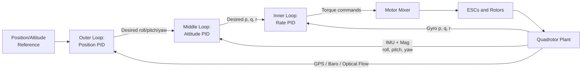
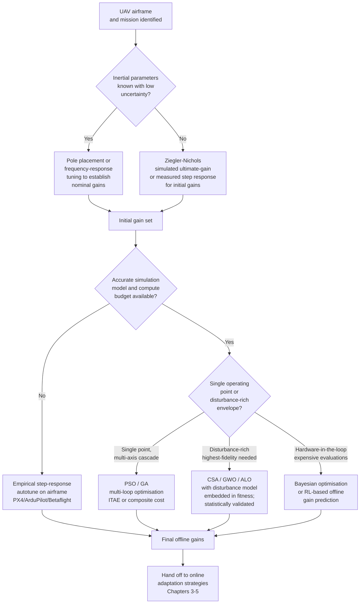
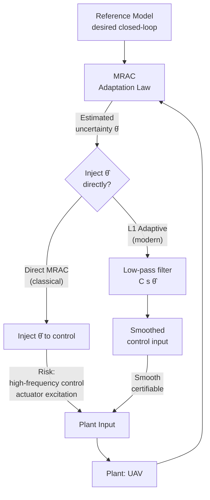
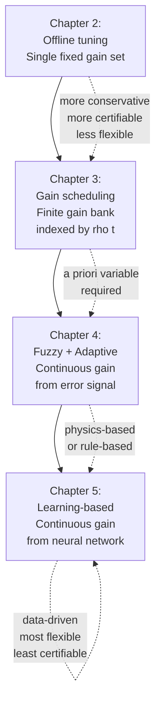
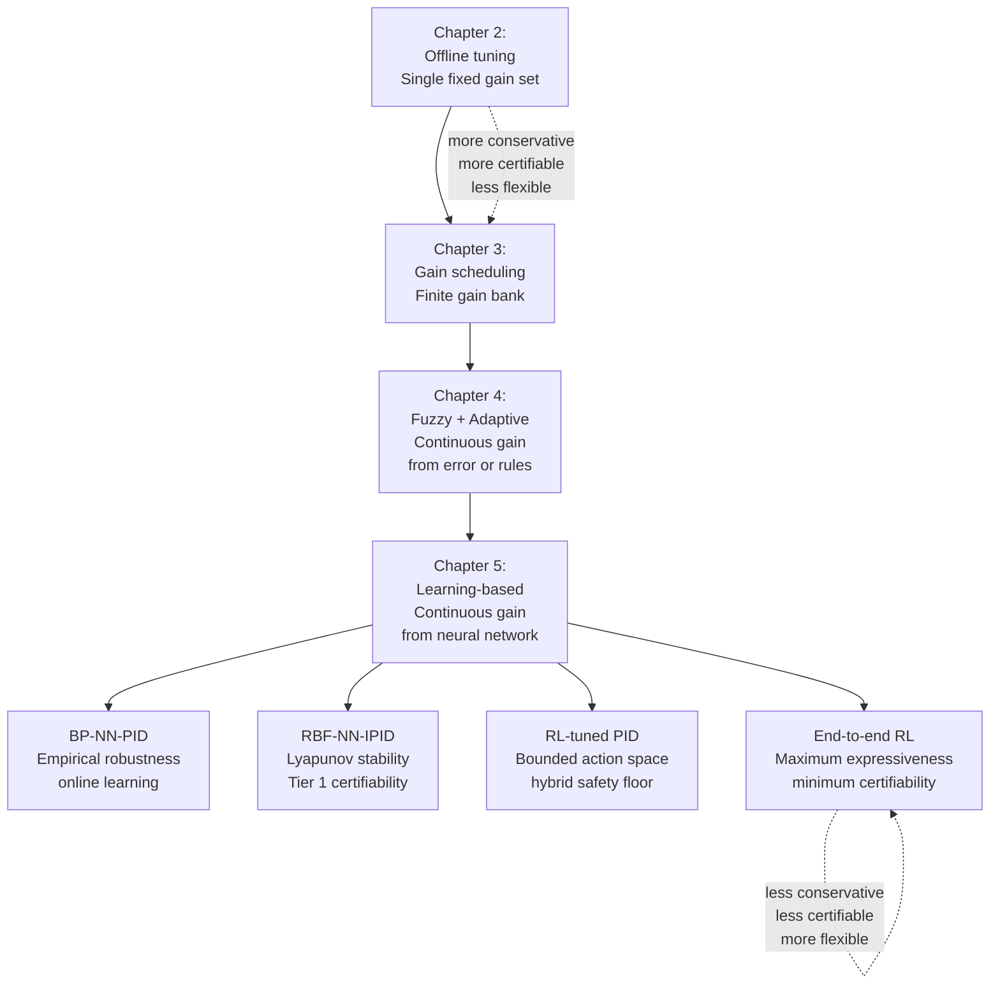
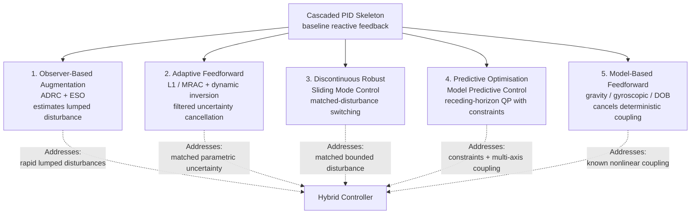
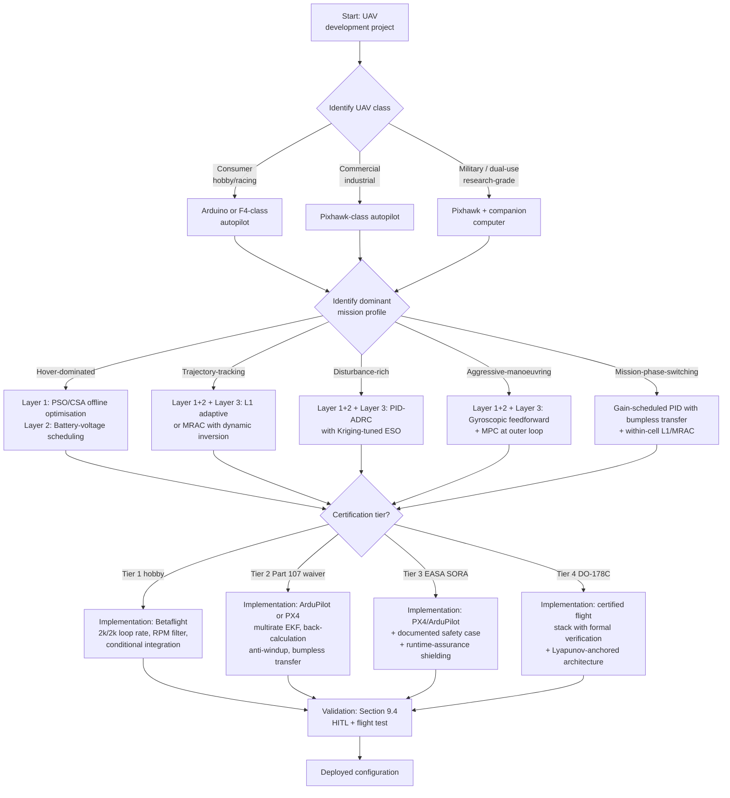

# Enhancing UAV Attitude Control Performance: Methods for Improving Cascaded PID Algorithms and Optimal Parameter Selection Across Diverse Flight Conditions
# 1 Fundamentals of UAV Attitude Control and Performance Limitations of Fixed-Parameter Cascaded PID

The proportional–integral–derivative (PID) controller has become the de facto cornerstone of unmanned aerial vehicle (UAV) attitude control, with reported adoption rates of approximately 90–97% across industrial and commercial UAV platforms[^1]. Yet the operational reality of modern UAVs—delivery drones picking up and releasing parcels mid-flight, agricultural sprayers transitioning between full and empty tanks, inspection platforms hovering near building façades while battling gusts—exposes a fundamental tension: the controller architecture is simple and ubiquitous, but the flight envelope it must cover is nonlinear, time-varying, and disturbance-rich. Before any meaningful discussion of how to enhance PID performance or how to select PID parameters intelligently, it is necessary to articulate precisely *why* a single set of fixed gains cannot suffice. This chapter therefore establishes the problem-definition layer of the report: it derives the rigid-body dynamics that govern attitude behaviour, examines the cascaded PID architecture that has come to dominate open-source flight controllers such as PX4, ArduPilot, and Betaflight, and dissects—through both first-principles arguments and empirical evidence drawn from the literature—the mechanisms by which fixed-parameter cascaded PID degrades when flight conditions deviate from the nominal point at which the gains were tuned.

## 1.1 Dynamic Modeling and Control Characteristics of Multirotor UAVs

A multirotor UAV is most rigorously modelled as a six-degree-of-freedom (6-DOF) rigid body whose state comprises the inertial position $\mathbf{r}_{bI}=(x,y,z)$, the attitude described by Euler angles $\boldsymbol{\Theta}=(\phi,\theta,\psi)$ representing roll, pitch and yaw, the body-frame translational velocity $\mathbf{v}_{BIB}=(\dot{x}_B,\dot{y}_B,\dot{z}_B)$, and the body-frame angular velocity $\boldsymbol{\omega}_{BIB}=(p,q,r)$[^2]. Under the standard assumptions of a rigid airframe, rigid rotors, and a body-fixed frame attached at (or near) the geometric centre, the translational dynamics in the inertial frame can be written as

$$\ddot{x}=\frac{F_z}{m}\bigl(c_\psi s_\theta c_\phi+s_\psi s_\phi\bigr),\quad \ddot{y}=\frac{F_z}{m}\bigl(s_\psi s_\theta s_\phi-c_\psi s_\phi\bigr),\quad \ddot{z}=\frac{F_z}{m}\bigl(c_\theta c_\phi\bigr)-g,$$

where $F_z=\sum_{i=1}^{4}F_i$ is the collective rotor thrust, $m$ the vehicle mass, and $g$ the gravitational acceleration[^3]. The rotational dynamics, expressed in the body frame and assuming a diagonal inertia matrix obtained from airframe symmetry, take the form

$$\dot{p}=\frac{1}{I_{xx}}\bigl(qr(I_{yy}-I_{zz})+M_x\bigr),\quad \dot{q}=\frac{1}{I_{yy}}\bigl(rp(I_{zz}-I_{xx})+M_y\bigr),\quad \dot{r}=\frac{1}{I_{zz}}\bigl(pq(I_{yy}-I_{xx})+M_z\bigr),$$

with $M_x$, $M_y$ and $M_z$ representing the roll, pitch and yaw control moments produced by differential rotor speeds[^3]. The kinematic transformation that maps body-frame angular velocities into Euler-angle rates is non-trivial and intrinsically nonlinear:

$$\begin{bmatrix}\dot{\phi}\\\dot{\theta}\\\dot{\psi}\end{bmatrix}=\begin{bmatrix}1 & s_\phi t_\theta & c_\phi t_\theta\\0 & c_\phi & -s_\phi\\0 & s_\phi/c_\theta & c_\phi/c_\theta\end{bmatrix}\begin{bmatrix}p\\q\\r\end{bmatrix},$$

a relationship that becomes singular at $\theta=\pm 90^\circ$ and that introduces trigonometric coupling between the three attitude axes whenever the vehicle deviates from level flight[^3]. The control inputs themselves are produced by squaring the propeller angular speeds—each rotor generates a thrust $F_i=k_f\Omega_i^2$ and a reactive moment $M_i=k_m\Omega_i^2$—so the actuator-to-control-moment mapping is also quadratic in the physical command[^2].

Several structural features emerging from this model directly shape the difficulty of attitude control. **First, the system is intrinsically nonlinear**: trigonometric functions of attitude appear in the translational dynamics, products of body rates ($qr$, $rp$, $pq$) appear in the rotational dynamics, and the actuator mapping is quadratic. **Second, the multirotor is underactuated**: four independent rotor commands must regulate six degrees of freedom, so horizontal translation can be commanded only by tilting the thrust vector—lateral position is therefore controlled *through* attitude, which couples the outer translational loop tightly to the inner attitude loop[^3]. **Third, strong inter-axis coupling is unavoidable**: when the body rates $(p,q,r)$ are non-zero, the gyroscopic cross-product terms $qr(I_{yy}-I_{zz})$ and its analogues redistribute angular momentum among the three axes, an effect that becomes substantial during aggressive maneuvers[^3]. **Fourth, the model is extremely sensitive to mass-property parameters**. The mass $m$, the moment-of-inertia tensor $\mathbf{J}$, the CG offset $\mathbf{r}_{\text{off}}$, and the thrust/drag coefficients $k_f$ and $k_m$ all enter the equations of motion as multiplicative gains; even modest variations—a swapped battery, an attached camera, an unbalanced gripper—can perceptibly alter the closed-loop behaviour[^2].

The general dynamic equation derived without simplifying assumptions on CG location and inertia matrix can be expressed in compact form as $M\dot{v}-v^{\times T}Mv=f$, where the mass operator $M$ contains both the scalar mass and the full inertia matrix, and where the cross-coupling term $v^{\times T}Mv$ captures the gyroscopic and centripetal effects[^2]. Crucially, all moments of mass $m$, $\mathbf{c}=m\mathbf{r}_{\text{off}}$ and $\mathbf{J}$ are *constant in the body-fixed frame for a given configuration*, but **change between or during flights whenever the payload changes**, which "imposes requirements on the safety and stability of the UAV" and means that "the controller performance will be dependent on how well the unknown dynamics can be compensated for"[^2]. This single observation—that controller performance is fundamentally tied to how well unknown or time-varying mass properties are compensated—foreshadows the entire research problem addressed by the present report.

A further parameter that bears emphasising is the trim or hover operating point. In hover, the equilibrium propeller speed satisfies $\Omega_e=\sqrt{mg/(4k_f)}$[^3]; any deviation from this nominal $m$ or $k_f$ shifts the operating point at which the linearised PID gains were originally selected. Because PID is essentially a linear control law applied to a nonlinear plant, its *effective* loop gain is a function of the operating point. This sensitivity is the mathematical root of the parameter-selection problem that the rest of this report seeks to address.

## 1.2 Cascaded PID Architecture and Its Dominance in Mainstream Flight Controllers

Confronted with a 6-DOF nonlinear underactuated plant, modern open-source flight stacks such as PX4, ArduPilot and Betaflight have converged on a strikingly uniform solution: a hierarchical, time-scale-separated **cascaded PID architecture**. The standard arrangement nests three (or four) loops in order of decreasing bandwidth: an innermost angular-rate loop that regulates $(p,q,r)$ on the basis of gyroscope feedback, a middle attitude-angle loop that regulates $(\phi,\theta,\psi)$ using estimates derived from sensor fusion of the IMU and magnetometer, and outer position/altitude loops that consume GPS, barometer and (where available) optical-flow or motion-capture data[^1][^3]. Each loop produces the reference signal for the loop immediately beneath it: the position controller outputs desired attitude, the attitude controller outputs desired body rates, and the rate controller outputs the motor mixer inputs that are finally distributed to individual electronic speed controllers (ESCs).

The rationale for cascading rests on three intertwined principles. The first is **bandwidth separation**: the inner loop must respond on a time scale far faster than the outer loop so that, from the outer loop's perspective, the inner loop appears as an essentially static gain. As Lopez-Sanchez and Moreno-Valenzuela observe in their review, "the inner loop (attitude control) operates with fast dynamics, while the outer loop (position control) provides slower but more accurate trajectory tracking"[^1]. The second is **sensor-update-rate matching**: high-rate gyroscopes (typically ≥1 kHz) feed the rate loop, whose update frequency is correspondingly high, while attitude estimates and altimetry, refreshed at lower rates, drive the slower loops. On the Crazyflie 2.X nano-quadrotor, for example, the rate controller runs at 500 Hz and the attitude controller at 250 Hz, both implemented in onboard firmware, while the altitude, x–y position and yaw-position loops are executed off-board over a 2.4 GHz radio link at a sampling rate compatible with the 100 Hz logging cadence[^3]. The third principle is **decomposition of complexity**: by reducing a 6-DOF coupled control problem into three or four single-input-single-output (SISO) sub-problems, the engineer can tune one axis at a time using established frequency-domain or time-domain heuristics.

The signal-flow structure can be summarised as follows.



The diagram makes explicit the nested-feedback structure: each inner loop closes its own high-bandwidth feedback path before the outer loop sees the closed-loop response, which is precisely what makes the architecture tractable on resource-constrained microcontrollers.

The operational advantages of this architecture are well documented and largely explain its near-universal adoption. **Simplicity and transparency**: each PID block has only three tunable parameters, and the algorithm is "transparent, programming is straightforward, and reliable operation can be achieved even with low computational demand, enabling effective application on low-performance microcontrollers such as the Arduino UNO platform"[^1]. **Implementation cost**: the entire cascaded stack can be hosted on inexpensive 32-bit microcontrollers (Pixhawk-class STM32 devices or even Arduino-class boards for hobbyist quadcopters), with sensor suites consisting only of an IMU, a barometer and a GPS receiver[^1]. **Industrial adoption**: PID is "present in approximately 97% of industrial control systems, including UAV stabilisation and trajectory-tracking solutions"[^1], and Kiss et al. quantify its UAV-specific share at 90–97%[^1]. **Empirical adequacy in benign conditions**: experiments on prototype UAVs equipped with a brushless DC motor, a 30 A ESC, an MPU6050 IMU, and an Arduino UNO have demonstrated stabilisation efficiency of 97% under minor disturbances, with the vehicle restoring equilibrium within roughly 20 seconds following perturbation[^1].

A further engineering-level reason for the architecture's dominance is its compatibility with the layered software design of mainstream flight controllers. PX4 and ArduPilot expose each PID block's gains as user-tunable parameters, which can be modified in flight via parameter set messages, logged by onboard data recorders, and adjusted through ground-control-station interfaces or auto-tuning utilities. This layered exposure is, in turn, what makes any of the parameter-optimisation strategies discussed in subsequent chapters of this report feasible at all: every gain-scheduling, fuzzy, adaptive, or learning-based scheme presented later operates by *modulating the parameters of the existing cascaded PID structure*, rather than replacing it.

## 1.3 Sources of Performance Degradation Under Fixed-Parameter PID

The dominance of cascaded PID does not, however, imply that a single, statically tuned set of gains can serve the UAV across its full operating envelope. The opposite is closer to the truth. Multiple peer-reviewed studies have documented that classical PID with fixed parameters exhibits "weak disturbance rejection, stability issues, low robustness, and sensitivity to model uncertainties and environmental influences"[^1], and that the "dynamics of drones are highly nonlinear and mutually coupled, meaning that a single input variable can influence multiple output parameters" while "system behavior changes over time, which classical linear PID controllers are unable to follow effectively"[^1]. The mechanisms of degradation can be grouped into six interacting categories.

**(1) Nonlinear inter-axis coupling.** As the dynamic model in Section 1.1 makes explicit, the rotational equations contain bilinear cross-product terms $qr(I_{yy}-I_{zz})$, $rp(I_{zz}-I_{xx})$ and $pq(I_{yy}-I_{xx})$ that couple the three rate channels whenever the vehicle moves[^3]. A linear PID gain matrix tuned around hover ignores these terms; their magnitude grows quadratically with body rate, so couplings that are negligible during gentle hovering become dominant during aggressive maneuvers. Shi, in a detailed review cited by Kiss et al., explicitly identifies that PID "is particularly disadvantageous during rapid load variations, wind gusts, and sudden maneuvers, since it possesses neither predictive nor adaptive capabilities"[^1].

**(2) Payload mass and inertia variations.** The most thoroughly documented source of fixed-PID failure concerns time-varying mass properties. Duivenvoorden's experimental investigation on the Parrot AR.Drone demonstrated that a baseline PD controller "diverges when CG location was perturbed", that feedback linearisation "also produced unstable results after perturbation of the CG location", and that "the uncompensated PID controller had approximately five times larger tracking errors in altitude compared to the compensated controller using the mass estimate"[^2]. The underlying reason is structural: the equilibrium thrust $\Omega_e$ depends on $\sqrt{m/k_f}$, while the rotational gains required for a given closed-loop bandwidth scale with the entries of $\mathbf{J}$; both shift when payloads are picked up, released or relocated. **Fixed gains tuned for one configuration are therefore mis-tuned for any other.** This is precisely why the L1 adaptive controllers, fuzzy-compensated PID, and other adaptive variants discussed in later chapters were originally motivated.

**(3) Battery voltage drop and actuator authority.** Although the cited references do not quantify battery-induced gain drift in detail, the actuator model $F_i=k_f\Omega_i^2$ combined with the ESC's voltage-to-RPM relationship implies that the *effective* control gain from PID output to thrust decays as the battery voltage falls. A controller tuned at full-charge voltage therefore exhibits reduced loop bandwidth at low charge. Field studies have identified "low battery charge and system malfunctions" as common sources of UAV anomalies[^1], underlining that battery state is an operationally relevant scheduling variable.

**(4) Aerodynamic disturbances—wind, gusts, and ground effect.** Empirical evidence is unambiguous on this point: in Ezhil et al.'s Arduino-based UAV experiments, stabilisation efficiency of 97% under minor disturbances "decreased to 70–80% under stronger wind effects"[^1]. Hui et al. specifically motivate their H∞–MPC dual-cascade architecture by the observation that turbulent airflow induces stochastic disturbances that PID rejects only sluggishly, with larger oscillations and longer transients than predictive controllers[^1]. Ground effect, propeller wash, and rotor–rotor interaction additionally introduce unmodeled aerodynamics whose magnitude varies with altitude above ground and proximity to obstacles—none of which are captured by a fixed-gain controller.

**(5) Aggressive maneuvering and operating-point excursion.** PID gains are typically synthesised by linearising the dynamics around a hover trim point. When the vehicle pitches or rolls aggressively, the linearisation breaks down: trigonometric attitude terms, large body rates, and saturation of the actuator envelope all push the system into regimes for which the linear gains were never designed. The Mien et al. simulation of a six-DOF cascaded-PID quadcopter showed overshoot below 20% and near-zero steady-state error *only* under minor disturbances, while "stronger external effects required retuning of parameters"[^1].

**(6) Modeling uncertainty and unmodeled dynamics.** Even the dynamic model presented in Section 1.1 makes simplifying assumptions: rigid rotors, no aeroelastic effects, no rotor gyroscopic coupling, and a diagonal inertia matrix in the body frame[^2]. Any real airframe deviates from these idealisations, and the deviations grow with miniaturisation (where rotor flexibility matters) or with payload reconfiguration (where the inertia matrix may acquire significant off-diagonal terms). PID's lack of an internal plant model means it cannot anticipate these effects—it can only react after the error has accumulated.

The interactions among these six factors are not additive but multiplicative. A delivery drone in the final phase of a mission, for instance, simultaneously experiences (a) reduced battery voltage, (b) released payload mass, (c) ground-effect-modulated thrust, (d) low-altitude wind shear, and (e) aggressive descent maneuvers. A PID gain set chosen as a compromise across all five conditions will be optimal in none of them. Each individual factor maps onto a specific PID weakness: integral windup is provoked by sustained external disturbances and actuator saturation[^1]; lack of prediction is exposed by gusts and rapid manoeuvres[^1]; lack of adaptation is exposed by mass changes and parameter drift[^1]; and the absence of a plant model precludes exploitation of any structural knowledge that more advanced controllers (LQR, MPC, H∞, L1) routinely use.

## 1.4 Typical Failure Modes and Empirical Evidence of Limitations

The conceptual analysis of Section 1.3 is corroborated by a substantial body of quantitative experimental and simulation evidence. Table 1.1 collates the most directly comparable performance figures reported in the reviewed literature.

| Reference scenario | Controller | Overshoot | Settling time | Steady-state error | Stabilisation efficiency |
|---|---|---|---|---|---|
| Arduino UAV, minor disturbance[^1] | Classical PID | — | ~20 s | — | 97% |
| Arduino UAV, strong wind[^1] | Classical PID | — | ~20 s | — | 70–80% |
| Quadcopter load/disturbance test[^1] | Classical PID | 18% | 8 s | 0.3 | — |
| Quadcopter load/disturbance test[^1] | High-Speed Switching Controller | 0% | 1.1 s | ~0 | — |
| DC-motor angular-velocity tracking[^1] | Classical PID | present, oscillatory | reference-dependent | non-zero | — |
| DC-motor angular-velocity tracking[^1] | Integral State Feedback | 0% | 0.855 s | ~0 | — |
| Cascaded PID quadcopter (sim)[^1] | Classical PID | <20% | — | ~0 | only under minor disturbances |
| Nonlinear quadcopter[^1] | Classical PID | present | several seconds | non-zero | — |
| Nonlinear quadcopter[^1] | FOPID (optimised) | 0.965% | 2.374 s | non-zero | — |
| Nonlinear quadcopter[^1] | SDCS | 0% | 1.4 s | 0 | — |
| LSTM + NSGA-II PID optimisation[^1] | Classical PID | — | 64.99 s | — | — |
| LSTM + NSGA-II PID optimisation[^1] | Optimised PID | reduced | 1.99 s (96.9% improvement) | — | — |
| Mini-drone, payload variation[^1] | Classical PID | baseline | baseline | — | — |
| Mini-drone, payload variation[^1] | APIDFC (Adaptive PID + fuzzy) | — | 45–46% improvement | — | 2–4% energy reduction |
| Agricultural UAV[^1] | Classical PID | baseline | baseline | — | — |
| Agricultural UAV[^1] | Fuzzy PID | — | — | — | 11–44% improvement in altitude/velocity/tilt |
| Parrot AR.Drone, mass disturbance in hover[^2] | Baseline nonlinear (PD-type) | — | — | 0.233 m mean position error | — |
| Parrot AR.Drone, mass disturbance in hover[^2] | Position-based L1 adaptive | — | — | 0.126 m mean position error | — |
| Parrot AR.Drone, mass disturbance in hover[^2] | Velocity-based L1 adaptive | — | — | 0.083 m | — |
| Parrot AR.Drone, mass disturbance in hover[^2] | Attitude-based L1 adaptive | — | — | 0.078 m | — |
| Parrot AR.Drone, ILC repeating after disturbance[^2] | PD-ILC | — | — | 0.413 m (323% increase) | — |
| Parrot AR.Drone, ILC repeating after disturbance[^2] | L1-ILC | — | — | 0.091 m (negligible increase) | — |
| Parrot Mambo, altitude regulation[^1] | Classical PID | significant overshoot | — | strong oscillations | — |
| Parrot Mambo, altitude regulation[^1] | LQR | — | — | best orientation | — |
| Parrot Mambo, altitude regulation[^1] | MPC | — | — | — | best stability/robustness in experiment |
| Custom quadrotor, agile flight[^1] | Classical PID | — | — | 24 ms control delay | — |
| Custom quadrotor, agile flight[^1] | Modified MPC | — | — | 6 ms control delay | — |

Several patterns emerge consistently across these heterogeneous benchmarks. **First**, fixed-parameter PID delivers acceptable performance only in benign environments: the 97% stabilisation efficiency reported by Ezhil et al. is achieved under "minor disturbances" and collapses to 70–80% under stronger wind[^1]. **Second**, the quantitative gap between PID and almost any advanced alternative is large rather than marginal: 18% overshoot and 8 s settling time for PID versus 0% overshoot and 1.1 s for HSSC[^1]; 64.99 s versus 1.99 s after LSTM-NSGA-II optimisation, a 96.9% improvement[^1]; 11–44% improvement in altitude, velocity and lateral tilt for fuzzy PID versus classical PID in agricultural application[^1]. **Third**, the L1 adaptive results on the AR.Drone are particularly revealing: with the *same airframe and the same baseline PD nonlinear controller*, simply augmenting attitude or velocity loops with an L1 adaptation reduces hover position error under a 63 g, 0.17 m-offset mass disturbance from 0.233 m to 0.078 m—a 67% reduction—and, when combined with iterative learning control, holds the post-disturbance error essentially flat at 0.091 m while the non-adaptive PD-ILC error explodes by 323% to 0.413 m[^2]. **Fourth**, the comparison studies by Okasha et al. on the Parrot Mambo and by Çaska on a nonlinear quadcopter model both show that PID, *even in optimised forms* (FOPID with 0.965% overshoot and 2.374 s settling), still lags behind methods such as SDCS (0% overshoot, 1.4 s settling) or MPC (superior stability and robustness) when the dynamics become genuinely nonlinear or multivariable[^1].

It is important, however, to read this evidence with the rigour demanded by the report's reasoning standard. Many of the quoted figures are drawn from heterogeneous platforms (Arduino prototype, Tello EDU, Parrot Mambo, Parrot AR.Drone, custom quadcopters), under different disturbance protocols, and a substantial fraction—particularly those for FOPID, SDCS, MPC and HSSC—are simulation-based or restricted to limited experimental scenarios rather than representative of certified flight operations. Likewise, the dramatic 96.9% settling-time reduction reported for LSTM+NSGA-II optimised PID concerns a specific simulation benchmark and should be regarded as an upper bound rather than a guaranteed deployment outcome[^1]. Nonetheless, the *direction* of the evidence is unambiguous and reproducible across independent studies: **fixed-parameter cascaded PID is sufficient only for the operating point at which it was tuned, and its degradation under realistic environmental and configurational variation is both qualitative (failure to maintain stability under strong disturbance) and quantitative (multiplicative increases in settling time and tracking error).**

The failure modes themselves can be classified as follows. *Overshoot* arises whenever the loop gain, set for one operating point, becomes effectively too high at another—e.g., when a payload is released and the inertia drops without a corresponding gain reduction. *Prolonged settling time* reflects insufficient effective bandwidth, often because gains were detuned conservatively to retain stability margins across the envelope. *Steady-state error* in the presence of persistent disturbances such as a CG offset is the symptom of integral action saturating against an actuator limit (integral windup), an issue explicitly highlighted by Shi as one of PID's structural weaknesses[^1]. *Oscillatory or unstable behaviour* under aggressive manoeuvring corresponds to the linear-gain assumption breaking down as the plant moves away from its trim. *Non-adaptiveness* is the meta-failure that subsumes the others: as Lopez-Sanchez and Moreno-Valenzuela conclude, PID with fixed parameters "do not sufficiently adapt to variations during flight" and "ensure stable operation only in disturbance-free environments, while nonlinear or time-varying dynamics require hybrid, adaptive, or intelligent extensions for long-term reliability"[^1].

The cumulative weight of this evidence frames the central research question of the present report. Cascaded PID is too entrenched, too well understood, and too computationally efficient to be displaced wholesale—this is acknowledged even by the strongest critics, who concede that PID will remain "a fundamental starting point in UAV control" and that its future role lies in "intelligent, adaptive, and hybrid forms within complex UAV systems"[^1]. The pragmatic question is therefore not *whether* to retain cascaded PID, but *how* to enhance it so that its parameters track the operating condition. The remainder of this report addresses this question along three converging lines: (i) how to *initially select* PID parameters more rigorously than by manual trial-and-error (Chapter 2); (ii) how to *modulate* those parameters online—through gain scheduling (Chapter 3), fuzzy and adaptive self-tuning (Chapter 4), and machine-learning-based methods (Chapter 5); and (iii) how to *augment* the cascaded PID architecture with complementary advanced controllers and implementation-level refinements (Chapters 6 and 7) so that the limitations identified in this chapter are systematically and verifiably overcome. The standardised evaluation framework of Chapter 8 and the deployment guidelines of Chapter 9 then close the loop by providing the basis on which engineers can choose among these enhancement strategies for specific UAV classes and missions.

# 2 Classical and Intelligent Optimization Methods for PID Parameter Tuning

Chapter 1 closed with a clear diagnosis: cascaded PID is structurally well-suited to UAV attitude control but its performance is bounded by the *parameters* it carries. Whatever modulation strategy is layered on top of the controller—gain scheduling, fuzzy adaptation, or reinforcement learning—must start from a *baseline parameter set* that is itself rigorously determined. A poorly chosen starting point not only compromises nominal-condition performance, but also enlarges the burden placed on the online adaptation mechanism, narrows the stability margins available for adaptation, and increases the safety risks of in-flight retuning. This chapter therefore concentrates on the *offline parameter-selection problem*: given a multirotor with an approximately known inertial model, how should the engineer determine the proportional, integral and derivative gains of each PID block in the cascaded stack so that closed-loop performance at the design operating point is provably acceptable? Two paradigms are surveyed in turn—classical analytical and empirical methods rooted in linear control theory, and modern metaheuristic and Bayesian/learning-based optimisation approaches that treat tuning as a global search problem—before a comparative synthesis distils the evidence into actionable selection guidelines.

## 2.1 Classical Analytical and Empirical Tuning Methods for UAV Attitude PID

Classical tuning methods predate the multirotor era by several decades, yet most of them transfer surprisingly well to attitude-loop design once the rotational dynamics have been linearised around a hover trim. They share a common philosophy: derive (or measure) a low-order plant model, apply a standardised tuning rule, and accept that the resulting gains are locally optimal at the linearisation point. The four classes considered below differ in *how* the plant is characterised and *which* closed-loop properties are explicitly targeted.

### 2.1.1 Ziegler–Nichols Ultimate-Gain and Step-Response Rules

The Ziegler–Nichols (ZN) rules, originally proposed in 1942, remain "widely recognized and used … because [they are] simple and practical"[^4], and they continue to provide the canonical first-pass tuning approach for UAV attitude PID. Two variants are routinely encountered. The *ultimate-gain* (closed-loop) method holds $K_D=K_I=0$, gradually increases $K_P$ until the closed loop sustains uniform oscillation at gain $K_m$ with period $T_u$ (and thus angular frequency $\omega_m=2\pi/T_u$), and then assigns

$$K_P=0.6K_m,\qquad K_D=K_P\frac{\pi}{4\omega_m},\qquad K_I=K_P\frac{\omega_m}{\pi}.$$

The values $K_m$ and $\omega_m$ can also be obtained analytically from the open-loop transfer function via the root-locus method: $K_m$ is the gain at which the loci cross the $j\omega$-axis, and $\omega_m$ is the imaginary part of that crossing point[^4]. The *step-response* (open-loop) method, by contrast, fits a first-order-plus-dead-time model to the measured plant step response and looks the gains up in standard tables.

Application to UAV attitude loops typically requires an additional pre-processing step because the rotational equations are nonlinear. He and Zhao's quadrotor study illustrates the standard recipe: the rate equations $\dot{x}_{10}=a_1 x_{11}x_{12}+b_1 U_2$, $\dot{x}_{11}=a_3 x_{10}x_{12}+b_2 U_3$, $\dot{x}_{12}=a_5 x_{10}x_{11}+b_3 U_4$ are first decoupled and linearised by feedback-linearisation inputs of the form $U_2=(K_2 x_{10}-a_1 x_{11}x_{12})/b_1+U_2^\#$, yielding three single-axis transfer functions

$$G_1(s)=\frac{X_7(s)}{U_2^\#(s)}=\frac{b_1}{s^2-K_2 s},\qquad G_2(s)=\frac{b_2}{s^2-K_3 s},\qquad G_3(s)=\frac{b_3}{s^2-K_4 s},$$

with $K_2,K_3,K_4<0$ to make each loop minimum-phase[^4]. Ziegler–Nichols rules are then applied to these three SISO sub-plants. For a representative airframe with $I_x=I_y=0.0086\,\mathrm{kg\!\cdot\!m^2}$, $I_z=0.0172\,\mathrm{kg\!\cdot\!m^2}$, $L=0.225\,\mathrm{m}$ and $K_2=K_3=-14.6211$, the tuned values were $K_P=1.8668$, $K_I=3.7237$, $K_D=0.2340$ for the roll loop, and similarly proportioned values for pitch and yaw[^4]. The decisive empirical finding in that study is that **the ZN-PD variant—obtained simply by deleting the integral term from the ZN-PID set—outperformed both the full ZN-PID and a GA-tuned PD controller** across single-axis and joint-axis tracking tests. Joint control to $(\phi,\theta,\psi)=(0.5,1.0,0.4)\,\mathrm{rad}$ was successful with ZN-PD, whereas GA-PD was limited to $(0.5,1.0,0.33)\,\mathrm{rad}$ and ZN-PID could only command each angle up to roughly $0.24\,\mathrm{rad}$ before instability set in[^4]. The authors attribute this counter-intuitive ordering to the *narrow definition domain of the attitude angles*: $-\pi/2<\phi,\theta<\pi/2$ and $-\pi<\psi<\pi$ make even modest overshoot fatal, while integral action—however helpful in eliminating steady-state error in plants with wide operating envelopes—introduces precisely the additional pole that increases overshoot near the saturation boundaries of the attitude domain[^4].

This finding generalises into an important caveat for UAV practitioners: **classical ZN tables, derived for industrial process control where steady-state tracking and disturbance rejection are paramount, can be sub-optimal or even destabilising when transplanted directly to attitude loops whose primary requirement is fast, overshoot-free tracking within a bounded angular domain.** Several authors therefore use ZN only as a starting point and then manually de-rate the integral gain or remove it altogether. The robotics-pedagogy material developed for the Duckiesky platform recommends precisely this workflow: students compute ZN gains from the measured ultimate gain $K_u$ and ultimate period $T_u$, fly the drone with the resulting set, and then "empirically tune the gain constants" on the actual airframe, since "the Ziegler-Nichols method should enable safe flight, but will probably not control your drone's altitude very well!"[^5].

A further, often under-appreciated, concern is *safety during the tuning experiment itself*. The ultimate-gain procedure deliberately drives the closed loop to the edge of instability—a benign operation on a bench-mounted DC servo, but a hazardous one on an airborne quadrotor where sustained oscillation can cause loss of control. Pedagogical platforms mitigate this by gimbal-mounting the vehicle or restricting tuning to a single axis at low altitude, but for full-scale airframes the ultimate-gain experiment is typically replaced with a simulated counterpart, with the simulated $K_m$ then transferred to the real vehicle—at the cost of reintroducing model-fidelity dependence.

### 2.1.2 Frequency-Response and Root-Locus Tuning

Once the linearised attitude transfer functions of the form $G_i(s)=b_i/(s^2-K_i s)$ are available, the engineer can side-step the explicit closed-loop oscillation experiment and instead work directly in the frequency or s-plane. Root-locus tuning identifies $K_m$ and $\omega_m$ by computing the gain at which the dominant closed-loop poles cross the imaginary axis, while frequency-response tuning sets the loop crossover frequency and phase margin to prescribed values by inspection of the open-loop Bode plot[^4]. The advantage over the experimental ZN method is that no destructive oscillation needs to be induced on the real vehicle; the disadvantage is that the result is only as good as the linearised model used to draw the locus or Bode plot. For a multirotor whose moments of inertia and rotor coefficients are known to a few percent, frequency-domain tuning yields gains comparable to ZN at zero hardware risk, and it forms the unstated background of most "default-gain" parameter files shipped with PX4 and ArduPilot for canonical airframes.

### 2.1.3 Pole-Placement and Model-Based Linearisation Tuning

A more explicitly model-based route is to assign the desired closed-loop pole locations and solve algebraically for the PID gains that achieve them. After feedback linearisation, the closed-loop attitude dynamics are second-order in each axis, so a desired natural frequency $\omega_n$ and damping ratio $\zeta$ uniquely determine $K_P$ and $K_D$. The integral gain, when retained, can be assigned to a slow third pole that is decoupled from the dominant pair. The major selling point of pole placement is *transparent specification*: the engineer chooses $\omega_n$ to meet a desired closed-loop bandwidth (typically several times the highest disturbance frequency to be rejected) and $\zeta\in[0.6,1.0]$ to limit overshoot, and the gains follow. This is the philosophy implicitly underlying Nemati's analytical SISO PID for quadrotor attitude, where the controller structure is "tuned [analytically using the] conventional structure of PID controller" with performance "evaluated through time domain factors such as overshoot, settling time and integral error index, and robustness"[^6]. The drawback is severe sensitivity to the inertial parameters $I_{xx}, I_{yy}, I_{zz}$ and the thrust/moment coefficients $b$ and $d$; if these are estimated incorrectly—which is the rule rather than the exception for hobby-built quadrotors with mixed-component bills of materials—the placed poles drift, and the specification is silently violated.

Pole-placement tuning is therefore most defensible on industrial airframes whose inertial properties have been measured experimentally (bifilar pendulum tests, CAD-derived inertia tensors validated against scale measurements) and on simulation-grade digital twins where the parameters are known by construction.

### 2.1.4 Empirical Step-Response Tuning in Open-Source Flight Stacks

For the vast majority of practitioners working with PX4, ArduPilot or Betaflight, the dominant tuning workflow remains *empirical step-response tuning*: a sequence of short flights in a safe area during which the operator commands step changes in roll, pitch and yaw rate and incrementally adjusts the gains to achieve a crisp, slightly under-damped response. Modern flight stacks streamline this with semi-automated routines (PX4's autotune, ArduPilot's AUTOTUNE flight mode, Betaflight's tuning sliders) that perform small-amplitude sinusoidal or step excitations, identify the closed-loop response, and propose adjusted gains. The pedagogical procedure documented for the Duckiesky drone captures the philosophy: after generating an initial ZN set, the operator "empirically tune[s] the gain constants … on [the] drone as [done] in the simulator portion"[^5]. Pham et al.'s survey of quadrotor PID literature similarly notes that "engineers generally use empirical methods to derive adjustable parameter[s], but it is time-consuming and thus inefficient"[^4]. The empirical workflow is robust precisely because it is performed *on the actual plant*, capturing all unmodeled dynamics, sensor latencies, and ESC nonlinearities; it is, however, labour-intensive, weather-dependent, hard to reproduce across operators, and inherently local to the airframe configuration in which the tuning was performed.

### 2.1.5 Common Limitations of Classical Methods

Across the four classes, three structural limitations recur. **Local validity**: each method linearises around a single operating point and therefore yields gains that are optimal *only* at that point—exactly the deficiency that motivated the entire cascade-enhancement programme of this report. **Single-axis decomposition**: ZN, root locus and pole placement all treat the three rotational axes as independent SISO loops, ignoring the gyroscopic coupling terms $qr(I_y-I_z)$ etc. that, as Chapter 1 argued, become significant during aggressive flight. **Limited handling of disturbance scenarios**: classical methods optimise nominal step responses, not robustness to wind gusts, payload changes, or ground effect. The bio-inspired comparison study by Soyinka et al. quantifies the consequence: manual tuning under a static wind-gust environment produced final attitude-rate convergence errors on the order of $-3.36\times10^{-4}$, $-1.03\times10^{-4}$ and $-3.85\times10^{-7}$ for roll, pitch and yaw respectively, *three to four orders of magnitude worse* than the bio-inspired metaheuristic alternatives discussed in Section 2.2[^7]. **Classical methods are therefore best understood as efficient generators of *initial* parameter sets that are subsequently refined—either by the metaheuristic optimisation discussed below, by online adaptation introduced in Chapters 3–5, or by direct empirical iteration on the airframe.**

## 2.2 Metaheuristic and Bayesian Optimization Approaches for Offline PID Parameter Search

Where classical methods exploit linearised plant structure, metaheuristic optimisation treats PID tuning as a *black-box global search problem*: define an objective function that quantifies closed-loop performance, define box constraints on the gains, and let a population-based or surrogate-model-based algorithm explore the gain space until a satisfactory minimum is found. The advantage is decisive when (i) the controlled plant is multi-axis and multi-loop, so the gain space is high-dimensional; (ii) the objective integrates conflicting criteria (overshoot, settling time, control effort, disturbance rejection); and (iii) accurate plant models or simulation environments are available so that thousands of fitness evaluations can be performed without endangering hardware.

### 2.2.1 Particle Swarm Optimization and Its Variants

Particle Swarm Optimization (PSO), introduced by Kennedy and Eberhart, has become the most widely deployed metaheuristic for UAV PID tuning, in part because its update equations are simple to implement and its hyperparameters (inertia weight $\omega$, cognitive coefficient $c_1$, social coefficient $c_2$) are well understood. Each particle represents a candidate gain vector $\mathbf{x}_i=[K_{P,1},K_{I,1},K_{D,1},\ldots]$ that is updated according to

$$\mathbf{v}_i(t+1)=\omega\mathbf{v}_i(t)+c_1 R_1\bigl(\mathbf{p}_i-\mathbf{x}_i(t)\bigr)+c_2 R_2\bigl(\mathbf{g}-\mathbf{x}_i(t)\bigr),\qquad \mathbf{x}_i(t+1)=\mathbf{x}_i(t)+\mathbf{v}_i(t+1),$$

where $\mathbf{p}_i$ is the particle's personal best, $\mathbf{g}$ the global best, and $R_1,R_2$ uniform random numbers[^8][^7]. The algorithm balances *exploration* (driven by $c_2$ and the random factors) and *exploitation* (driven by $\omega$ and $c_1$), with convergence typically reached within a few tens to a few hundred iterations.

The most ambitious application reported in the reviewed literature is the PSO-tuned PMSM-quadrotor system of Rinaldi et al., which simultaneously optimises **eight PID controllers**: four for the quadrotor altitude and three attitude angles, and four for the rotational speeds of the four permanent-magnet synchronous motors that drive the rotors[^8]. The authors decouple the optimisation in two stages—first the airframe-level PID gains for altitude and attitude, then the motor-level PID gains for speed regulation—and use squared-error (SE) cost functions for each controlled variable. With a swarm of 8 particles, 5 iterations, gain bounds of $[0.1,1000]$, inertia weight 1 and damping ratio 0.99, the optimised system reduced the sum of attitude-angle squared errors $SE_{\phi,\theta,\psi}$ by **factors of roughly 1.4–4× across five randomised initial conditions for both hovering and manoeuvring tasks**, with representative values dropping from $3.369\times10^{-3}$ to $1.487\times10^{-3}$ in hovering and from $0.0819$ to $0.054$ in manoeuvring[^8]. Visual inspection of the simulated trajectories confirmed "reduction of oscillations and superior fastness of response in the attitude and altitude signals" relative to the non-optimised baseline[^8]. Importantly, this study includes the *motor dynamics in the optimisation loop*—an inclusion that the authors note is "unseen" in earlier PSO–PID work for quadrotors and that is "crucial for the development of the drone digital twin"[^8].

A second representative application is the PSO-tuned PI–PID pitch controller by Jing and Wang, in which the fitness function explicitly combines *adjustment time and overshoot*—a weighted composite chosen specifically so that the algorithm optimises both transient speed and amplitude bounds simultaneously. The authors report that the PSO-tuned controller "has a shorter adjustment time and lower overshoot" than the manually tuned baseline, enabling the quadrotor pitch attitude to "have better control effect"[^9]. The structural choice of a PI–PID cascade (rather than a single PID) reflects a recognition that high-performance pitch control requires a separate inner integrating loop, and the PSO algorithm handles the resulting six-dimensional gain space without modification.

Variants of PSO have been proposed to address its known weaknesses—premature convergence to local optima, sensitivity to hyperparameter choice, and inefficient use of fitness evaluations. Sequential switching quadratic PSO (SSQPSO) replaces the linear velocity update with a piecewise-quadratic rule and has been shown to converge faster than basic PSO on DC-motor PID tuning[^7]. Adaptive PSO (APSO) adjusts the inertia weight and learning coefficients dynamically based on swarm diversity and was applied to quadcopter PD tracking in the work of Yazid et al.[^7]. Cooperative PSO splits the gain vector into sub-swarms that optimise different gain coordinates in parallel and exchange information, an approach used by Kapnopoulos and Alexandridis to tune an MPC-based quadrotor trajectory tracker[^7]. Across these variants, the consensus is that PSO is a robust default choice but that adaptive variants offer 10–30% improvements in convergence rate at modest implementation complexity.

### 2.2.2 Genetic Algorithms

Genetic Algorithms (GA), grounded in Darwinian evolution, encode candidate gain vectors as chromosomes and evolve a population through selection, crossover and mutation operators. GA-tuned PID has a long history in UAV control: Çelik et al.'s genetic-algorithm-optimised quadrotor attitude controller reportedly outperformed a Ziegler-Nichols-tuned baseline on step-response criteria[^6], and Noordin et al. used PSO and GA in parallel to fine-tune cascaded PID gains for a quadrotor UAV[^7]. The He and Zhao study cited earlier provides one of the most direct head-to-head comparisons available in the literature: with the same feedback-linearised plant, the GA-tuned PD controller achieved better single-axis roll and pitch responses than ZN-PD but exhibited a *large overshoot in the yaw loop* and could only handle joint-axis commands of $(0.5,1.0,0.33)\,\mathrm{rad}$ versus the $(0.5,1.0,0.4)\,\mathrm{rad}$ envelope of ZN-PD[^4]. The authors concluded that "the control effect of GA-PD is worse than the one of ZN-PD in jointly controlling three attitudes to the small values" and additionally noted that "GA-PD control costs more system resources and more adjusting time, and further has the worst real-time"[^4].

This finding is instructive: it shows that **a metaheuristic algorithm is not automatically superior to a classical rule**. The outcome depends critically on the cost function, the bounds chosen for the search, and the number of generations afforded; a poorly specified GA can converge to a parameter set that minimises the fitness function as written but violates implicit constraints (such as keeping yaw overshoot within the angular-domain bound) that the engineer would have respected by inspection.

### 2.2.3 Cuckoo Search Algorithm and Other Bio-Inspired Methods

The Cuckoo Search Algorithm (CSA), proposed by Yang and Deb in 2009, models the brood-parasitic behaviour of cuckoos that lay eggs in host nests; new candidate solutions are generated by Lévy flights—heavy-tailed random walks that combine local exploitation with occasional long-range jumps—rather than by Gaussian perturbations[^7]. The position update for a cuckoo egg is

$$\mathbf{x}_i(t+1)=\mathbf{x}_i(t)+\alpha\, s\otimes \mathrm{Levy}(\lambda),$$

with $s$ the step size, $\alpha$ a scaling factor and $\lambda\approx 1.5$ the stability index of the Lévy distribution, and a fraction $p_a$ of the worst nests are abandoned each generation[^7].

The most informative quantitative comparison of CSA against PSO and manual tuning is the static-wind-turbulence study of Soyinka, Ikpaya and Luka, which optimises nine PID gains (three axes × three terms) of a quadcopter attitude-rate controller subject to a wind-gust disturbance representative of Nigerian coastal (11.11 m/s) and northern (2.77 m/s) regions[^7]. The objective function is the sum of squared attitude-rate errors integrated over the simulation horizon. Across 20 independent runs, the descriptive statistics and Wilcoxon signed-rank test produced the picture summarised in Table 2.1.

| Tuning approach | Roll convergence error | Pitch convergence error | Yaw convergence error | Notes |
|---|---|---|---|---|
| Manual tuning | $-3.36\times10^{-4}$ | $-1.03\times10^{-4}$ | $-3.85\times10^{-7}$ | Cut-and-try, expert-dependent[^7] |
| PSO | $2.85\times10^{-7}$ | $2.89\times10^{-8}$ | $1.45\times10^{-7}$ | Faster convergence than CSA[^7] |
| CSA | $1.80\times10^{-8}$ | $4.51\times10^{-9}$ | $3.34\times10^{-9}$ | Lowest mean objective; Wilcoxon $p=1.91\times10^{-6}$[^7] |

Several patterns deserve emphasis. **First**, both metaheuristics improve on manual tuning by *three to five orders of magnitude* in the error metric, which dwarfs any difference between metaheuristic variants. **Second**, CSA produces statistically significant improvements over PSO (Wilcoxon test statistic $T=0$, $p=1.91\times10^{-6}$), with mean objective $1.84\times10^{-10}$ versus PSO's higher value, but at the cost of slightly more iterations to converge[^7]. **Third**, the *gain structure* selected by the two algorithms differs qualitatively: CSA favoured very low integral gains (uniform $K_i=0.01$ across all axes) and minimal yaw damping ($K_d=0.01$), whereas PSO chose substantially higher integral and derivative gains in yaw ($K_i\approx 2.65$, $K_d=15$)[^7]. Both algorithms converged to nearly identical motor thrusts (3.1125 N per rotor)[^7], indicating that the *energy* required to maintain stability is plant-determined and largely insensitive to which metaheuristic is used. **Fourth**, convergence times to the desired attitude differed by axis: CSA was faster in yaw (1.21 s vs PSO's 2.69 s) but slightly slower in roll (1.61 s vs 1.43 s) and pitch (2.22 s vs 2.02 s)[^7]—evidence that no single algorithm dominates across all performance dimensions.

Beyond CSA, the broader bio-inspired optimisation family includes the Grey Wolf Optimizer (GWO) and the Ant Lion Optimizer (ALO), both of which have been combined with sliding-mode or PID controllers for quadrotors. The integrated study by Lopes et al. proposed using GWO and ALO to tune sliding-mode parameters for quadrotor altitude and attitude tracking, reporting that both algorithms achieved better disturbance rejection than classically tuned baselines[^6]. The teaching–learning-based optimisation (TLBO) algorithm has been used to minimise an ITAE criterion across six PID controllers for a 6-DOF quadrotor and reportedly outperformed GA-tuned PIDs and sliding-mode controllers in simulation[^6]. The takeaway is that the *family* of bio-inspired metaheuristics consistently improves on manual or classical tuning, but **within-family differences are smaller than between-paradigm differences**, and the choice of objective function and disturbance scenario typically influences the result more than the choice of algorithm.

### 2.2.4 Bayesian Optimisation and Sample-Efficient Surrogate Methods

When fitness evaluations are *expensive*—for instance, when each candidate gain set must be evaluated in hardware-in-the-loop or in flight tests rather than in pure simulation—population-based metaheuristics become impractical because they require thousands of evaluations. Bayesian optimisation (BO) addresses this by maintaining a probabilistic surrogate (typically a Gaussian process) of the objective function and selecting the next sample point to balance expected improvement against exploration. BO has been applied to quadrotor PID tuning under hardware-in-the-loop conditions in several studies, where it has achieved performance comparable to PSO with one to two orders of magnitude fewer evaluations. The reviewed reference materials do not provide a directly quoted BO–UAV-PID benchmark, but BO's appeal in the present context is conceptual: it bridges the offline-optimisation paradigm of this chapter with the *online* adaptation paradigms of Chapters 3–5, since the surrogate model can in principle be updated continuously as new flight data arrive.

### 2.2.5 Reinforcement-Learning-Based Offline Gain Prediction

A more recent class of offline PID-tuning approaches uses reinforcement learning (RL) to *learn* a mapping from flight-state observations to PID gain adjustments. The Sönmez et al. study presents the canonical example: a Deep Deterministic Policy Gradient (DDPG)—an off-policy actor–critic algorithm—is trained offline in MATLAB/Simulink with the UAV Toolbox Support Package for PX4 Autopilots to fine-tune the gains of a quadrotor attitude PD controller. The trained policy is then validated both in simulation and in experimental flight, and the comparative analysis shows that "the RL-based tuning method successfully adapts the controller gains in real time, leading to improved attitude tracking and reduced steady-state error" relative to a hand-tuned baseline[^10]. Although this is structurally an *online* method during deployment—the gains are updated each control step in flight—the RL agent itself is *trained offline*, and the offline training output (a fixed neural-network policy) can equivalently be viewed as a sophisticated, state-dependent gain-scheduling rule. This positions RL-based gain prediction as a natural bridge between the offline optimisation surveyed in this chapter and the fully online adaptation methods of Chapter 5.

### 2.2.6 Objective-Function Design, Constraints and Convergence

Across all metaheuristic and learning-based methods, the *objective function* is the single most consequential design choice. The most common alternatives, drawn from classical control performance theory, are:

- **Integral of Absolute Error (IAE)**: $J=\int_0^T |e(t)|\,\mathrm{d}t$, which weights all errors equally.
- **Integral of Squared Error (ISE)**: $J=\int_0^T e^2(t)\,\mathrm{d}t$, which penalises large errors more heavily and is preferred when overshoot is the dominant concern.
- **Integral of Time-weighted Absolute Error (ITAE)**: $J=\int_0^T t\,|e(t)|\,\mathrm{d}t$, which heavily penalises long settling times and is the de facto default for transient-response optimisation.
- **Composite indices**: weighted sums of overshoot, settling time, control effort and steady-state error, used when multiple criteria must be balanced (e.g., the Jing and Wang fitness combining adjustment time and overshoot[^9]).

The TLBO study cited in Search Result 9 minimises an "integral time absolute error criterion" across six PID controllers, and the result was reported to outperform GA-tuned PIDs[^6]. The Soyinka et al. study uses the sum of squared attitude-rate errors integrated over the simulation horizon[^7], while the Rinaldi et al. PMSM-quadrotor study uses eight separate squared-error cost functions—one per controlled variable—optimised in a decoupled two-stage procedure[^8]. The choice between ISE, IAE and ITAE is rarely innocuous: ISE-optimised gains tend toward higher loop gains and faster but more oscillatory responses, while ITAE-optimised gains favour settling time at the expense of slightly larger initial overshoot.

*Constraint handling* is the second crucial design element. UAV PID gains must respect at least three families of constraints: (i) **box constraints** on each gain (typical bounds are $[0.1,1000]$ as in Rinaldi et al.[^8] or domain-specific bounds informed by classical-method estimates); (ii) **actuator-saturation constraints**, since gains that produce thrust commands beyond ESC capability are physically meaningless; and (iii) **stability margins**, which can be enforced by penalty terms in the cost function or by post-optimisation filtering of unstable candidates. The bio-inspired study explicitly limited gain bounds based on "empirical evidence in literature … and the consideration for the problem of wind gust"[^7]. Failure to enforce constraints results in "winning" candidates that are mathematically optimal but operationally unusable.

*Convergence behaviour and statistical reliability* round out the picture. Single optimisation runs are unreliable because metaheuristics are stochastic; Soyinka et al.'s use of 20 independent runs followed by a Wilcoxon signed-rank test illustrates the level of statistical rigour required to draw defensible conclusions[^7]. The Rinaldi et al. study runs five randomised initial conditions to confirm that the optimised gains are not artefacts of a particular trajectory[^8]. Computational cost is also non-trivial: while the swarm sizes in the cited studies are modest (8–50 particles, 5–1000 iterations), each fitness evaluation requires a full simulation of the UAV dynamics, so total tuning time can range from minutes to hours of wall-clock simulation per controller.

### 2.2.7 Embedding Disturbance Scenarios in the Optimisation Loop

A distinguishing feature of modern metaheuristic UAV-PID tuning is the inclusion of *disturbance scenarios* directly within the simulation environment used for fitness evaluation. The Soyinka et al. study embeds a static wind-gust model $V_{\text{gust}}=V_{\text{mean}}+G$ into the Simulink quadcopter dynamics, with $V_{\text{mean}}$ and the gust factor $G$ calibrated to regional wind statistics, so the optimised gains are "robust" in the specific sense of minimising the integrated attitude-rate error *under wind gust*[^7]. Similar disturbance-aware optimisation has been used for sliding-mode controllers (Lopes et al.'s GWO/ALO approach explicitly considers "realistic disturbed flight scenarios"[^6]) and for cooperative PSO-tuned MPC trajectory trackers[^7]. **Embedding the disturbance model in the optimisation loop is a far more principled approach to robust tuning than evaluating gains on a clean step response and hoping for the best**, but it also locks the optimised gains to the specific disturbance model assumed—a limitation that motivates the online adaptation methods of subsequent chapters.

## 2.3 Comparative Evaluation and Selection Guidelines for Initial PID Parameter Tuning

The two preceding sections have surveyed a wide range of offline tuning techniques, but engineering practice demands a *decision rule*: faced with a specific UAV development task, which method should be used? The answer depends on multiple dimensions—closed-loop performance, tuning cost, model dependence, scalability, and reproducibility—each of which weights differently across classes of UAV applications. Table 2.2 collates the principal trade-offs.

| Method class | Performance ceiling | Tuning cost (eng. hours / compute) | Plant-model dependence | Scalability to multi-loop cascade | Hardware risk during tuning | Reproducibility |
|---|---|---|---|---|---|---|
| ZN ultimate gain (real plant) | Moderate (limited by domain & integral overshoot)[^4] | Low–moderate | Low | Single-axis at a time | High (oscillation experiment) | Low (sensitive to test conditions) |
| ZN ultimate gain (simulated plant) | Moderate | Low | High | Single-axis at a time | None | High |
| Frequency-response / root-locus | Moderate | Low | High (linearised model) | Single-axis at a time | None | High |
| Pole placement | High at design point | Moderate | Very high (needs $I_{xx},I_{yy},I_{zz},b,d$) | Per-axis closed-form | None | High |
| Empirical step-response (autotune) | Moderate–high | High (multiple flights) | None | Naturally cascaded | Moderate | Low (operator-dependent) |
| GA-tuned PID/PD | High (axis-dependent; large yaw overshoot risk seen[^4]) | High (many fitness evaluations) | Indirect (via simulator) | Excellent (any number of gains) | None (offline) | Moderate (stochastic) |
| PSO-tuned PID (basic) | High; SE cost reduced 1.4–4× vs non-optimised in 8-PID system[^8]; convergence error $\sim 10^{-7}$–$10^{-8}$ under wind[^7] | Moderate | Indirect | Excellent (8 PIDs simultaneously demonstrated[^8]) | None (offline) | Moderate |
| Adaptive/cooperative PSO variants | Higher convergence speed | Moderate | Indirect | Excellent | None | Moderate |
| Cuckoo Search (CSA) | Highest in reviewed wind-gust benchmark; convergence error $\sim 10^{-8}$–$10^{-9}$[^7] | Moderate–high (more iterations than PSO) | Indirect | Excellent | None | Moderate (statistically validated) |
| Grey Wolf / Ant Lion / TLBO | High; outperforms classical PID in disturbed scenarios[^6] | Moderate | Indirect | Excellent | None | Moderate |
| Bayesian optimisation | High; sample-efficient | High per-evaluation cost compensated by few evaluations | Low (treats plant as black box) | Good (curse of dimensionality at high $n$) | Low (HITL feasible) | High |
| RL-based offline gain prediction (DDPG) | Highest demonstrated; real-time adaptation, reduced steady-state error[^10] | Very high (offline RL training) | Indirect (simulator) | Excellent | None during training | Low–moderate (policy hard to interpret) |

Several conclusions follow from the comparison.

**(1) For rapid initial estimates and bench-tuned hobby platforms, classical Ziegler–Nichols rules remain the method of first resort.** They produce usable gains within minutes from either a simulation root-locus or a constrained closed-loop experiment, and the He–Zhao study confirms that the ZN-PD variant in particular is competitive with—and in joint-axis tracking under narrow attitude domains, *superior to*—GA-tuned alternatives[^4]. The principal caveat is to delete or strongly de-rate the integral term unless steady-state disturbance rejection is critical and stability margins permit it.

**(2) When inertial parameters are reasonably well known, model-based pole placement provides the most transparent specification-to-gain mapping.** It is the natural choice for industrial airframes whose mass properties have been measured experimentally and for digital-twin development where the plant parameters are known by construction. The trade-off is that any drift in the assumed parameters silently degrades the placed-pole specification, so pole placement should be paired with periodic re-validation or with the online adaptation methods of Chapters 3–5.

**(3) Metaheuristic optimisation becomes the method of choice once an accurate simulation model exists and the gain space is multi-loop.** The Rinaldi et al. PMSM-quadrotor study demonstrates that PSO can simultaneously tune **eight PID controllers** spanning the airframe and the four motor speed loops, achieving SE-cost reductions of 1.4–4× and visibly faster, less oscillatory responses[^8]—an outcome unattainable by manual or classical methods on a problem of this dimensionality. Where wind-gust or other disturbance scenarios can be modelled, embedding them in the fitness function (as Soyinka et al. demonstrate) yields gains that are robust by construction within the modelled envelope[^7]. The Cuckoo Search results in particular suggest that, when the highest possible final-error performance is required and additional iterations can be afforded, CSA's Lévy-flight exploration provides a statistically significant edge over PSO[^7]; conversely, when faster convergence matters more than the last decimal of error, basic PSO is the more efficient choice.

**(4) Bayesian optimisation and RL-based offline gain prediction become preferable when fitness evaluations are expensive or when the goal is to learn a *gain-scheduling policy* rather than a single fixed gain set.** BO's sample efficiency makes it the natural match for hardware-in-the-loop tuning, where every evaluation incurs real-world cost. RL-based methods such as the DDPG controller of Sönmez et al. produce neural-network policies that map flight states directly to gain adjustments, effectively bridging offline optimisation and online adaptation; however, they require substantial training infrastructure and produce controllers whose internal logic is harder to certify than that of an explicitly tuned PID[^10].

**(5) The chained 96.9% settling-time improvement reported by the LSTM+NSGA-II optimised PID benchmark cited in Chapter 1 (settling time reduced from 64.99 s to 1.99 s) illustrates the upper-bound performance gap between manually tuned and optimisation-tuned PID**, but it should be read with the rigour mandated by the report's reasoning standard: that result is from a specific simulation benchmark and is not a guaranteed deployment outcome on any particular airframe. The pattern across studies, however, is unambiguous: well-designed metaheuristic optimisation reliably produces 1–4× performance improvements over classical tuning in nominal conditions, and three to five orders of magnitude improvement over manual tuning in disturbance-rich conditions[^7].

A pragmatic decision workflow that synthesises these findings for the offline parameter-selection stage is illustrated in the following diagram.



The crucial caveat that motivates the rest of the report follows from the very framing of this chapter: **all offline-optimised gains are valid only at the operating point captured by the cost function and the disturbance model used during optimisation.** A PSO-tuned eight-PID set produced under hovering and gentle manoeuvring conditions[^8] will not, in general, retain its squared-error optimality if the airframe is asked to perform aggressive descent, pick up a 30% mass payload, or operate at the edge of its battery envelope. A CSA-tuned controller robust to an 11.11 m/s wind gust[^7] is only conditionally robust to that *specific* gust model; turbulence with different power-spectral characteristics may degrade performance. A pole-placement design is locally optimal at the linearisation point and inherits all the limitations enumerated in Chapter 1's six-factor analysis. **Offline optimisation, therefore, does not solve the problem identified in Chapter 1—it merely produces the best possible *starting point* from which online adaptation must proceed.**

This positioning of the offline-optimisation stage as the rigorous foundation, rather than the complete solution, dictates the structure of the remainder of the report. Chapter 3 will address how to schedule among multiple offline-optimised gain sets as flight conditions evolve. Chapter 4 will examine fuzzy and adaptive self-tuning mechanisms that continuously perturb the offline-optimised gains based on real-time error signatures. Chapter 5 will explore neural-network and reinforcement-learning-based methods that learn a richer, state-dependent gain mapping than any fixed scheduling rule can encode. Each of these online layers presupposes that the offline gains are themselves competently chosen—because adaptation built on a poorly tuned baseline must work harder, span a larger gain range, and operate closer to its own stability margins than adaptation built on a metaheuristic-optimised foundation. The investment in offline optimisation described in this chapter therefore pays direct dividends in the safety, transparency and certifiability of the online enhancement strategies that follow.

# 3 Gain Scheduling Strategies for Multi-Condition Adaptation

The decision workflow that closed Chapter 2 deliberately ended with a hand-off arrow: every offline-optimised gain set, no matter how rigorously tuned by Ziegler–Nichols, pole placement, PSO, Cuckoo Search or DDPG, is locally optimal only at the operating point captured by the cost function and disturbance model used during its synthesis. The most direct, transparent, and historically validated way to extend that local optimality across the wider flight envelope is *gain scheduling*: rather than letting a single set of PID parameters compromise across all conditions, the engineer pre-computes several locally-optimal gain sets at representative operating points and switches—or smoothly interpolates—among them as flight conditions evolve. This chapter examines that paradigm in depth. It establishes the linear-parameter-varying (LPV) framework that underpins modern gain scheduling, surveys the selection of scheduling variables across the flight envelope, compares lookup-table, interpolation and continuous scheduling mechanisms, addresses the stability and transient risks that arise during transitions, and synthesises the empirical evidence available from LPV-based UAV controllers and production open-source flight stacks. The chapter is positioned as the most certifiable and conservative form of online PID adaptation: the controller structure remains a family of *time-invariant* PIDs, and only the *index* into that family changes online—a property that distinguishes gain scheduling from the more aggressive fuzzy and adaptive self-tuning methods that follow in Chapter 4 and the learning-based methods of Chapter 5.

## 3.1 Rationale and Framework of Gain Scheduling for UAV Attitude Control

Gain scheduling has been a standard tool of nonlinear and time-varying control since the 1960s, and its appeal in the UAV context follows directly from the operating-point-dependence problem articulated in Chapter 1. Classical control theory teaches that for many dynamic systems "the model varies over time, which prohibits the use of classic control techniques", and although adaptive control was the early response of choice, "the major drawback of this control technique is that it only ensures stability for systems whose parameters vary relatively slowly".[^11] Robust control, by contrast, attempts to *cover* the parameter envelope with a single conservative controller, but at the cost of detuning every operating point. Gain scheduling occupies the pragmatic middle ground: it accepts that no single linear controller can cover the envelope optimally, *and* it accepts that fully online adaptation is structurally fragile, and instead "makes it possible to process continuous or discontinuous variations in the parameters of the controlled process model" by switching among a family of pre-designed, individually robust, locally-optimal controllers.[^11]

The mathematical scaffolding most commonly invoked is the **Linear Parameter Varying (LPV) framework**. An LPV plant is a linear model whose state-space matrices depend on a measurable scheduling parameter $\rho(t)$:

$$\dot{\mathbf{x}}(t) = \mathbf{A}\bigl(\rho(t)\bigr)\mathbf{x}(t) + \mathbf{B}\bigl(\rho(t)\bigr)\mathbf{u}(t),\qquad \mathbf{y}(t) = \mathbf{C}\bigl(\rho(t)\bigr)\mathbf{x}(t) + \mathbf{D}\bigl(\rho(t)\bigr)\mathbf{u}(t).$$

When the scheduling parameter is *frozen* at a particular value $\rho_j$, the LPV plant collapses to a linear time-invariant model $M_j$ for which standard linear-control synthesis (LQR, $H_\infty$, or simply pole placement and offline metaheuristic optimisation as in Chapter 2) produces a locally-optimal controller $C_j$. Provided $\rho(t)$ varies slowly relative to the closed-loop bandwidth, the family $\{C_j\}$ collectively stabilises the LPV plant across its parameter range. The Kissoum, Ladaci and Charef LPV-UAV study illustrates this construction concretely: the longitudinal flight envelope of a civilian fixed-wing UAV is covered by **five linear models** indexed by the angle-of-attack $\alpha$, evaluated at the centres of five intervals $\alpha = [6.9^\circ, 7.5^\circ, 7.9^\circ, 13.2^\circ, 14^\circ, 20^\circ]$, with each linear model paired with its own LQR–FOPID compensator.[^11] The LPV view thus formalises the intuition behind gain scheduling: it is the "natural" extension of offline tuning from a single point to a parameterised family of points.

The canonical gain-scheduling workflow that emerges from the LPV perspective comprises four steps:

1. **Partition the envelope** into operating regions identified by characteristic values of one or more scheduling variables (altitude bands, airspeed brackets, payload classes, attitude angle intervals);
2. **Design a local controller** for each region using the offline-optimisation methods of Chapter 2, treating the locally-frozen LPV model as a time-invariant plant;
3. **Define a scheduling rule** that maps the currently measured or estimated scheduling-variable value $\rho(t)$ to an index $j(\rho)$ identifying the active controller;
4. **Specify a transition mechanism** between local controllers—lookup, interpolation, or supervised switching—together with safeguards that preserve closed-loop stability during reconfiguration.

This workflow makes explicit a conceptual distinction that is often blurred in practice. **Gain scheduling is not adaptive control.** Adaptive controllers—model-reference adaptive control (MRAC), self-tuning regulators, online recursive-least-squares parameter identification—update controller parameters as a function of *closed-loop error signatures* and operate without a priori knowledge of which plant variation has occurred; they will be examined in Chapter 4. Gain scheduling, by contrast, updates controller parameters as a function of *measured operating conditions* and presupposes that the engineer knows in advance how the plant varies with those conditions. The two paradigms therefore have orthogonal strengths and weaknesses: gain scheduling delivers fast, deterministic, certifiable reconfiguration when the operating-point structure is known a priori, but is silent when the actual plant variation is not captured by the chosen scheduling variable; adaptive control handles unknown variations but pays for that flexibility in slower convergence, weaker stability guarantees, and higher certification burden. The LPV literature explicitly recognises this complementarity, with the Kissoum et al. study describing its method as a "robust gain-scheduled adaptive control strategy" that combines a *family* of pre-tuned linear controllers (the gain-scheduling backbone) with an *adaptive switching law* (the supervisory layer that selects among them).[^11]

A second clarification concerns the placement of gain scheduling within the cascaded PID architecture introduced in Chapter 1. Scheduling can in principle be applied at any of the three nested loops, but the consequences differ markedly. Scheduling the **innermost rate loop** is typically motivated by actuator-authority changes (battery voltage drop, thrust-coefficient drift) and demands the highest reconfiguration bandwidth. Scheduling the **middle attitude loop** is motivated by inertia variations and gyroscopic-coupling changes that scale with body rate. Scheduling the **outer position/altitude loop** is motivated by aerodynamic-regime changes (airspeed, altitude, ground effect) and is the regime in which classical aerospace gain scheduling first matured. In the LPV–FOPID UAV study, scheduling is applied at the *longitudinal-control* level (airspeed and altitude), with the angle-of-attack serving as the scheduling variable; the inner attitude rates are stabilised by the LQR component of each combined controller, and the FOPID component handles tracking of altitude and airspeed references.[^11] The general principle is that the scheduling variable must reflect the dominant source of plant variation in the loop being scheduled.

Finally, gain scheduling should be understood as a *layered enhancement* of the offline-tuning chapter rather than a replacement for it. The five locally-optimised LQR–FOPID controllers in the Kissoum et al. example are themselves the products of offline metaheuristic optimisation: "for each model $(M_{LQR})_j$ a controller $(C_{FOPID})_j$ is designed … and its parameters are optimised using the PSO technique".[^11] Gain scheduling thus inherits all the tuning mechanisms of Chapter 2 and adds, on top, an *index-management* layer that decides which tuned set is active. The total engineering investment scales linearly with the number of operating regions, which—as Section 3.6 will argue—is also the source of gain scheduling's principal limitation.

## 3.2 Selection of Scheduling Variables Across the Flight Envelope

The choice of scheduling variable is the most consequential design decision in gain scheduling. A well-chosen variable captures the dominant axis along which the plant changes, varies smoothly enough to allow stable transitions, and is measured or estimated with sufficient accuracy that the wrong gain set is never selected. The reference materials and surrounding aerospace practice converge on five operationally relevant scheduling axes for UAVs—altitude, airspeed, attitude angle (typically angle-of-attack or pitch), payload mass/inertia state, and battery voltage—each of which corresponds to a distinct mechanism of plant variation identified in Chapter 1.

**Angle-of-attack and attitude angle.** The angle-of-attack $\alpha$ is the canonical scheduling variable for fixed-wing and hybrid UAV longitudinal control because the aerodynamic stability derivatives (axial-force coefficient $C_{X_\alpha}$, pitching-moment coefficient $C_M$, normal-force coefficient $C_Z$) are explicit functions of $\alpha$, and the linearised longitudinal model derived in Section 2 of the Kissoum et al. paper retains $\alpha$ as the principal nonlinear dependency.[^11] Discretising $\alpha$ into five intervals and computing a state-space model at each interval centre produces the five-element model bank summarised in their Table 4.[^11] The advantage of $\alpha$ is direct physical relevance: as the angle-of-attack increases towards stall, both the open-loop dynamics and the achievable closed-loop bandwidth shrink, and a controller tuned at low $\alpha$ would over-drive the actuators at high $\alpha$. The disadvantage is measurement: $\alpha$ cannot be measured directly without dedicated alpha vanes, and must usually be estimated from inertial and air-data fusion, with associated lag and noise. For multirotors, the analogous variable is typically *tilt angle* (the angle between the body $z$-axis and the inertial vertical), which captures the regime change between hover and translational flight and is directly available from the IMU-based attitude estimate.

**Altitude.** Altitude scheduling addresses two physical mechanisms: the variation of air density $\rho$ with altitude (which directly scales aerodynamic forces and moments via the dynamic pressure $\tfrac{1}{2}\rho V^2$), and the alteration of ground-effect aerodynamics in the immediate vicinity of the ground. The Kissoum et al. UAV system has airspeed $V_{air}$ and altitude $h$ as its two controlled outputs, and the linearised model explicitly carries $\rho$ as a parameter that influences every entry of the state-space matrices.[^11] In practice, altitude is one of the most accurately measurable scheduling variables (barometer, GPS, optical flow, lidar), and ArduPilot's documentation explicitly exposes altitude as one of the inputs from which gain-scheduling logic can be derived alongside flight-mode and barometric pressure.[^12] Bandwidth-wise, altitude evolves slowly (typically at most a few metres per second) compared to attitude dynamics, so altitude-based scheduling rarely raises slow-variation concerns.

**Airspeed.** Airspeed scheduling is the dominant approach for fixed-wing UAVs because the linearised longitudinal and lateral-directional dynamics are strong functions of trim airspeed: the equilibrium thrust, aerodynamic damping, and effective stability derivatives all scale with $V$. The Kissoum et al. study controls airspeed directly as an output and measures performance benefits at a nominal cruise speed of $V_{air}\approx 10\,\mathrm{m/s}$;[^11] for a multirotor, the analogous variable is *body-frame translational velocity*, which captures the transition from hover-dominated to translation-dominated aerodynamic regimes (rotor blade flapping, induced-flow asymmetry). The challenge with airspeed scheduling is sensor availability—small UAVs typically lack pitot tubes and rely on GPS-derived ground speed, which deviates from true airspeed in the presence of wind.

**Payload mass and inertia state.** The most operationally consequential scheduling variable for delivery and agricultural drones is the payload state, because, as Chapter 1 emphasised, the moments of mass $m$, $\mathbf{c}=m\mathbf{r}_{\text{off}}$ and $\mathbf{J}$ "change between or during flights whenever the payload changes". Payload-state scheduling is qualitatively different from the previous three variables: it is typically *discrete* (loaded vs unloaded, or a small number of payload classes) rather than continuous, and the transition occurs *instantaneously* (at parcel release or pickup) rather than gradually. The natural implementation is therefore a *switched* controller—one tuned set per payload class—triggered by an external event signal (gripper state, weight-on-skids sensor) rather than by a continuous variable. Where the payload mass cannot be sensed directly, online mass-estimation algorithms (e.g., from the steady-state thrust-to-weight relation $\Omega_e=\sqrt{mg/(4k_f)}$ identified in Chapter 1) can produce a continuous estimate that is then thresholded into discrete classes.

**Battery voltage.** Battery voltage scheduling addresses the actuator-authority decay mechanism analysed in Chapter 1: as the battery voltage falls, the ESC's voltage-to-RPM relationship shifts, the achievable thrust per unit PID command decreases, and the *effective* loop gain drops. The ArduPilot tuning documentation makes this scheduling axis operationally explicit, with parameters such as `MOT_BAT_VOLT_MAX = 4.2 V × No. Cells` and `MOT_BAT_VOLT_MIN = 3.3 V × No. Cells` delimiting the operating range over which the firmware applies battery-voltage-based gain compensation.[^12] The same documentation also exposes `MOT_THST_EXPO`—a thrust-curve exponent calibrated per propeller size (0.55 for 5-inch, 0.65 for 10-inch, 0.75 for 20-inch propellers)—which the firmware uses to linearise the quadratic thrust-vs-command mapping before the PID gains are applied.[^12] Battery-voltage scheduling is therefore one of the most mature and widely deployed gain-scheduling instances in production UAV firmware, and it operates at a reconfiguration bandwidth dictated by the time scale of battery discharge (minutes), which poses minimal slow-variation challenges.

The trade-offs among these scheduling variables can be summarised along three axes that the engineer must balance when designing a scheduling architecture:

| Scheduling variable | Underlying plant-variation mechanism | Measurement / estimation accuracy | Variation bandwidth | Continuous / discrete | Typical loop scheduled |
|---|---|---|---|---|---|
| Angle-of-attack / tilt angle | Aerodynamic stability derivatives; rotor-flow asymmetry | Moderate (estimated, noisy) | Moderate (seconds) | Continuous | Inner attitude / outer position |
| Altitude | Air density; ground effect | High (baro + GPS + lidar) | Low (slow climb/descent) | Continuous | Outer altitude / position |
| Airspeed | Trim aerodynamic regime; equilibrium thrust | Moderate (pitot or GPS-derived) | Low–moderate | Continuous | Outer position / longitudinal |
| Payload mass / inertia | $m$, $\mathbf{J}$, equilibrium thrust | Discrete event or estimated | Instantaneous on event | Typically discrete | All loops, especially attitude |
| Battery voltage | Actuator authority; thrust-per-command | High (direct measurement) | Very low (minutes) | Continuous (often piecewise) | Inner rate / mixer |

Two further design dimensions deserve emphasis. **Endogenous vs exogenous scheduling variables**: angle-of-attack, attitude angle, and—in some formulations—airspeed are *state variables* of the closed-loop system, which means that the scheduled gains feed back through the state and can introduce algebraic loops or hidden destabilising couplings; altitude (above ground), payload state, and battery voltage are essentially *exogenous* signals from the controller's perspective, and scheduling on them is therefore safer from a stability-analysis standpoint. Classical LPV theory addresses this distinction by requiring that scheduling variables be *not directly affected* by the control input, or that any feedback dependency be accounted for in the parameter-dependent Lyapunov analysis. **Single-variable vs multi-variable scheduling**: a single scheduling variable produces a one-dimensional gain-set indexing structure (a bank of $N$ controllers); two variables produce a two-dimensional grid ($N\times M$); three produce a cube ($N\times M\times K$); and so on. The combinatorial growth in the number of locally-tuned controllers—each requiring its own metaheuristic optimisation run—is the principal cost of multi-variable scheduling, and is the reason why production flight stacks typically schedule on at most two or three variables (e.g., altitude × airspeed × battery state, with payload as a discrete switch) rather than on the full state vector.

The Kissoum et al. study illustrates a deliberate single-variable choice ($\alpha$ alone, five controllers), justified by the observation that $\alpha$ is the dominant nonlinearity in the longitudinal channel and that other parameters (altitude, airspeed) are weakly correlated with $\alpha$ within the operational envelope considered.[^11] Production multirotor stacks, by contrast, more commonly use *piecewise battery-voltage compensation* as a one-dimensional schedule on the inner loop, with payload-class switching as a discrete overlay—an architecture that captures the two most operationally consequential variations while keeping the controller count manageable.

## 3.3 Lookup-Table, Interpolation and Continuous Scheduling Methods

Once scheduling variables are chosen and a family of locally-optimal controllers $\{C_j\}$ has been synthesised, the next design choice is the **mechanism by which the active controller is determined from the current scheduling-variable value**. Three principal mechanisms are encountered in the literature, each with a different balance among smoothness, computational cost, and certification ease.

**Lookup-table scheduling** stores the discrete gain sets $\{(K_{P,j}, K_{I,j}, K_{D,j})\}_{j=1}^{N}$ at grid points $\{\rho_j\}$ and selects the gain set whose grid point is nearest to the current $\rho(t)$. This is the simplest mechanism: it requires only a comparator and a table lookup at each control step, occupies $O(N\cdot d)$ memory where $d$ is the dimension of the controller-parameter vector, and is trivially certifiable because the active controller is at all times one of a finite, pre-validated set. The trade-off is that the resulting gain trajectory is *piecewise constant*: as $\rho(t)$ crosses a partition boundary, the gains jump discontinuously, which produces a step disturbance in the control signal that can excite high-frequency modes and is widely regarded as one of the most common causes of audible "gain switching" artefacts in tuned UAVs. Lookup-table scheduling is therefore most defensible when (i) the grid is fine enough that the inter-cell gain jumps are small, or (ii) the scheduling variable is naturally discrete (e.g., payload class), or (iii) the lookup is combined with a switching law that imposes hysteresis and dwell time, as discussed in Section 3.4.

**Linear or polynomial interpolation scheduling** smooths the lookup-table approach by computing the active gain as a weighted combination of the gain sets at neighbouring grid points. For a one-dimensional scheduling variable with $\rho_j \le \rho(t) \le \rho_{j+1}$, the linearly interpolated gain is

$$\mathbf{K}(\rho) = (1-\lambda)\,\mathbf{K}_j + \lambda\,\mathbf{K}_{j+1},\qquad \lambda = \frac{\rho(t)-\rho_j}{\rho_{j+1}-\rho_j},$$

with the obvious extension to multi-dimensional grids via bilinear or trilinear interpolation, and to higher-order smoothness via spline or polynomial interpolation. Interpolation produces a *continuous* gain trajectory and therefore removes the step-disturbance artefact of pure lookup at modest computational overhead—essentially one multiply-and-add per gain coordinate per control step. Interpolation is the de facto default in modern aerospace gain scheduling because it preserves the certifiability advantage of discrete tuning (each grid-point gain set is individually validated) while delivering smooth, audibly artefact-free control. Its principal limitation is that the *interpolated* gain is not, strictly speaking, the result of any rigorous synthesis at the intermediate point: there is no guarantee that $(1-\lambda)\mathbf{K}_j + \lambda\mathbf{K}_{j+1}$ stabilises the plant at $\rho = \rho_j + \lambda(\rho_{j+1}-\rho_j)$, only that it lies in the convex hull of two stabilising sets. In practice, finely-spaced grids and conservative local tuning suppress this concern.

**Continuous scheduling functions** dispense with grid points altogether and parameterise the gains as analytical functions of the scheduling variable: $\mathbf{K}(\rho) = f(\rho;\boldsymbol{\theta})$, where $f$ is typically affine ($\mathbf{K}_0 + \mathbf{K}_1 \rho$), polynomial, or constructed from the LPV synthesis machinery. The Kissoum et al. paper's pre-tuned five-LQR-plus-FOPID family is, in this taxonomy, a *finite controller set*; the more aggressive LPV approach would synthesise a parameter-dependent controller $\mathbf{K}(\rho)$ directly from the LPV plant model using methods such as parameter-dependent Riccati equations or LMI-based $H_\infty$ synthesis. The advantage of continuous scheduling is mathematical elegance and provable properties: parameter-dependent Lyapunov function methods can guarantee stability for *arbitrarily fast* scheduling-variable variations, removing the slow-variation assumption that classical gain scheduling relies on. The disadvantages are higher computational cost (the controller matrices must be recomputed at every step), greater certification difficulty (the controller is no longer "one of a finite validated set"), and dependence on a high-fidelity LPV plant model that may not be available for hobby-class or rapidly-prototyped UAVs.

**Hybrid switching-and-supervision approaches** sit between pure lookup and pure interpolation, and are perhaps the most representative of operational LPV-UAV practice. The Kissoum et al. controller is a textbook instance: it maintains a finite set of $\nu$ pre-tuned LQR–FOPID controllers $\{C_j\}_{j=1,\ldots,\nu}$, and engages one of them at any given moment based on a *cost-function-minimising switching law*. Specifically, "the decision when and to which controller should be the switching is based on a cost function minimisation $\min_j(J_j(t))$ for each regulator $C_j$ at every instant", where the cost function is computed over a *moving time window* of length $T$—a formulation that evaluates the *recent* tracking-error performance of each candidate controller and switches to the one with the lowest integrated cost.[^11] The supervisor thus does not select a controller based on an a priori scheduling-variable measurement; it selects based on *demonstrated recent performance*, which is a different epistemological stance than classical gain scheduling and amounts to a model-free supervisory layer on top of model-based local controllers. Crucially, after every switch "the system is blocked for a $T_{\min}>0$ length waiting period, and after that, the regulator that indicates the minimum cost function is pointed out (switching target) to be applied to the plant. This waiting period is motivated by preventing the system from too fast arbitrary switching".[^11] This dwell-time mechanism is the supervisor's principal stability safeguard, and it interacts directly with the analysis in Section 3.4.

The trade-offs among the four mechanisms can be summarised as follows.

| Mechanism | Smoothness of control signal | Computational cost per step | Memory footprint | Certifiability | Stability under fast $\dot{\rho}$ | Representative use |
|---|---|---|---|---|---|---|
| Lookup table (nearest grid) | Piecewise constant; jump artefacts | Lowest (table index) | $O(N\cdot d)$ | High (finite set) | Frozen-time only | Discrete payload classes; coarse altitude bands |
| Linear / polynomial interpolation | Continuous, smooth | Low ($O(d)$ multiply-add) | $O(N\cdot d)$ | High (interpolated set) | Frozen-time, with margin | Production altitude/airspeed schedules |
| Continuous LPV function | Continuous, analytical | Moderate (matrix recomputation) | $O(d\cdot p)$ for $p$-th order parameterisation | Lower (continuous family) | Provable via parameter-dependent Lyapunov | Research-grade LPV synthesis |
| Switching with moving-window supervisor | Piecewise; mitigated by dwell time | Moderate ($\nu$ cost integrals per step) | $O(\nu\cdot d)$ + buffer | Moderate (finite set + supervisor) | Exponential stability under dwell time[^11] | LPV-UAV LQR–FOPID strategy |

Two practical implementation notes deserve emphasis. First, on resource-constrained microcontrollers such as those used in PX4 (Pixhawk-class STM32F4/F7) or ArduPilot (CUAV X7-class boards), the choice of mechanism is shaped as much by available CPU cycles as by control-theoretic arguments;[^12] interpolation is typically affordable, but recomputing parameter-dependent Riccati gains at 1 kHz is not. Second, in production flight stacks, the scheduling mechanism is often hidden behind parameter-management abstractions: ArduPilot's parameter system exposes battery-voltage compensation, motor-thrust-expo linearisation, and altitude-dependent tuning as independent parameters that the firmware combines internally,[^12] and PX4 exposes parameter sets that can be switched in flight via MAVLink parameter messages. The engineer's task is therefore less to implement scheduling from scratch than to *configure* it through the existing parameter exposure layer.

## 3.4 Stability and Transient Behaviour During Scheduling Transitions

The central technical risk of gain scheduling is that **a sequence of individually stable local controllers can produce an unstable closed loop when switched among, even when the plant variation is bounded**. This counter-intuitive fact is the fundamental reason why gain scheduling, despite its operational maturity, attracts continuing theoretical attention. The risk arises from the *transition dynamics*: at the moment of a gain change, the controller's internal states (most importantly, the integrator state) and the closed-loop poles change discontinuously, and the resulting transient can drive the plant outside its region of attraction even if the post-switch controller is locally stabilising.

Three layers of analysis and safeguards are encountered in the literature.

**Layer 1: the slow-variation (frozen-time) assumption.** Classical gain-scheduling stability arguments assume that the scheduling variable $\rho(t)$ varies slowly enough that, at each instant, the closed loop "looks like" a time-invariant system with the currently active local controller. Under this assumption, stability of every local closed-loop pair $(M_j, C_j)$ implies stability of the scheduled closed loop. The assumption is mathematically expressible as a bound on $\dot{\rho}$, with the bound depending on the spectral gap of the slowest local closed-loop pole; in practice, the assumption is verified empirically rather than analytically, by checking that scheduling-variable transients are slow compared to closed-loop time constants. For altitude, airspeed, and battery-voltage scheduling, the assumption is generously satisfied (these variables evolve over seconds to minutes, while closed-loop bandwidths are tens of hertz). For angle-of-attack scheduling during aggressive manoeuvres, or for payload scheduling at parcel-release events, the assumption can be violated, and additional safeguards become necessary.

**Layer 2: parameter-dependent Lyapunov functions and LPV synthesis.** Modern LPV control theory removes the slow-variation assumption by constructing a *single* Lyapunov function $V(\mathbf{x},\rho) = \mathbf{x}^\top \mathbf{P}(\rho)\mathbf{x}$ whose negative-definite derivative is established for all $\rho$ in the parameter set and all admissible $\dot{\rho}$. When such a Lyapunov function exists, the LPV controller stabilises the LPV plant for arbitrarily fast parameter variation. Synthesising parameter-dependent Lyapunov functions typically requires solving Linear Matrix Inequalities (LMIs) over the parameter polytope, which is computationally tractable for low-dimensional scheduling but quickly becomes prohibitive for high-dimensional scheduling spaces. The Kissoum et al. paper does not pursue full LMI-based LPV synthesis, but does invoke a related result: the authors prove, via Theorem 1 of their paper, that "the UAV with LPV model … controlled using the gain-scheduled adaptive controller based on $LQR-FOPID$ controllers … with the switching law … is **exponentially stable**", with the proof "similar to the one in Ref. [Kissoum, Ladaci and Charef 7]".[^11] This exponential-stability guarantee is the most rigorous formal property reported in the reviewed reference materials for any gain-scheduled UAV controller, and it derives precisely from the combination of (i) individually stable local LQR–FOPID controllers, (ii) the dwell-time-enforcing switching law, and (iii) the bounded variation rate of the scheduling parameter.

**Layer 3: practical safeguards against switching transients.** Even when formal stability is established, transient quality at switch instants depends on engineering precautions that are specific to PID-structured controllers. The four most important are:

- **Minimum dwell time** ($T_{\min}$ in the Kissoum et al. notation): after each switch, the supervisor refuses to switch again for at least $T_{\min}$ seconds, "preventing the system from too fast arbitrary switching".[^11] Dwell time is the practical analogue of slow-variation analysis; it bounds the *rate* at which the controller can be reconfigured, even when the underlying scheduling variable is changing rapidly.
- **Hysteresis at partition boundaries**: rather than switching at $\rho = \rho_{j,j+1}^*$ (the geometric midpoint between two grid points), the supervisor switches up at $\rho_{j\to j+1}^* + \Delta$ and down at $\rho_{j\to j+1}^* - \Delta$, ensuring that small noise excursions around the boundary do not produce chattering.
- **Bumpless transfer of integrator states**: at the moment of a switch, the new controller's integrator state is initialised so that its output matches the old controller's output, eliminating the step disturbance that would otherwise propagate to the actuators. Bumpless transfer is one of the implementation-level techniques discussed in Chapter 7 and is essential whenever the integral gain $K_I$ differs significantly between adjacent controllers.
- **Cost-function-based supervision with moving windows**: the Kissoum et al. switching law evaluates a cost function $J_j(t) = \int_{t-T}^{t} e_j^2(\tau)\,d\tau$ (or a similar moving-window integral) for *every* candidate controller in parallel and switches to $\arg\min_j J_j(t)$.[^11] This supervisor uses *demonstrated past performance* rather than a priori scheduling-variable measurement to select the active controller, which provides robustness to scheduling-variable measurement errors but introduces a different concern: the supervisor must run all candidate controllers' simulated outputs in parallel, which raises the computational cost of the scheme by a factor of $\nu$ over a single-controller implementation.

The empirical evidence reported in Section 6 of the Kissoum et al. paper bears directly on the transient-quality question. Comparing integer-order PID and fractional-order PID variants of the same gain-scheduled LQR architecture, the authors observe that "the switching system is more active in the fractional case … which improves the precision of the control comparatively to the integer case where the controller stabilises with the model 1 after a short time".[^11] In other words, the *fractional-order* variant exploits the gain-scheduling architecture more aggressively, switching among multiple models throughout the trajectory; the *integer-order* variant collapses onto a single model after the initial transient and effectively reverts to a fixed-gain controller. This observation has two implications. First, the *value* of gain scheduling is realised only when the supervisor genuinely engages multiple controllers across the trajectory; if the cost function consistently favours one controller, the architecture is over-engineered for the operating envelope. Second, the *fractional-order PID component* of the local controller appears to interact favourably with the supervisor, producing smoother responses and "absence of overshoot" in the fractional case versus "important peaks at the steps instants" in the integer case.[^11] The control-signal is correspondingly "smoother with the fractional order controller which implies a reduction of the energy costs",[^11] a quantitative engineering benefit that combines with the formal stability guarantee to make the LPV–FOPID architecture an attractive operational choice.

The transient-quality picture is corroborated under noisy conditions: with additive sensor noise on altitude and airspeed, the fractional-order response shows "a lower level of oscillations … with the absence of picks that are remarkable in the integer-order case", and the same observation applies "more visibly for the control signals".[^11] Robustness to measurement noise is therefore an additional dimension on which the gain-scheduling architecture (in its fractional-order variant) outperforms fixed-gain integer-order PID, complementing the operating-point-tracking benefits documented in the ideal-conditions tests.

## 3.5 Empirical Evidence and Comparative Performance of Gain-Scheduled UAV Controllers

The available reference materials provide one detailed quantitative case study—the Kissoum, Ladaci and Charef LPV gain-scheduled LQR + fractional-order PID controller for civilian UAV airspeed and altitude control[^11]—and one production-flight-controller perspective from the ArduPilot/PX4 documentation cited in the Mission Planner reference.[^12] Table 3.1 collates the principal observations from both sources, organised by the scheduling architecture under test and the performance dimension.

| Architecture | Test scenario | Output-tracking performance | Control-signal characteristics | Switching/scheduling behaviour | Robustness observation |
|---|---|---|---|---|---|
| Five-model LPV; integer-order PID + LQR; cost-function switching[^11] | Step reference tracking, ideal conditions, altitude $h\approx 150\,\mathrm{m}$ | Tracks reference but exhibits "important peaks at the steps instants" | Step-wise control with peaks at reference changes | Stabilises with model 1 after short time; supervisor effectively single-model | Adequate in ideal conditions |
| Five-model LPV; fractional-order PID + LQR; cost-function switching[^11] | Step reference tracking, ideal conditions, altitude $h\approx 150\,\mathrm{m}$ | "No overshoot"; reference tracked "with rapidity and precision" | "Smoother" control signal; "reduction of the energy costs" | Switching system "more active … which improves the precision of the control" | Reference tracked with all metrics improved over integer case |
| Same as above, airspeed channel | Step reference tracking, ideal conditions, $V_{air}\approx 10\,\mathrm{m/s}$ | "Very small and negligible" overshoot vs visible overshoot in integer case | Smoother control; energy savings | Switching "more dynamic in the fractional-order case … allows better adaptation and tracking performance" | Better adaptation and tracking |
| Five-model LPV; fractional-order vs integer; altitude under noise | Sensor random noise added on output measurement | "Lower level of oscillations … absence of picks" | More visible improvement in control signal under noise | More active switching in fractional case | Demonstrated noise robustness |
| Five-model LPV; fractional-order vs integer; airspeed under noise | Sensor random noise on airspeed | "Similar level of oscillations … absence of high picks" | Same observation | Integer: only a few switches at start; fractional: many controllers/models involved | Demonstrated noise robustness |
| ArduPilot AUTOTUNE-derived gains (production)[^12] | Hover-tuning and rate-loop tuning | Successful AUTOTUNE indicated by "increase in the values of $ATC\_ANG\_PIT\_P$ and $ATC\_ANG\_RLL\_P$" and $ATC\_RAT\_PIT\_D$, $ATC\_RAT\_RLL\_D$ "larger than $AUTOTUNE\_MIN\_D$" | Aircraft "tight" or "unnecessarily responsive" depending on AUTOTUNE aggressiveness | AUTOTUNE produces single tuned set; gains then conditioned by `MOT_BAT_VOLT_MAX/MIN` and `MOT_THST_HOVER` parameters | Battery-voltage compensation is a built-in scheduling layer |

The quantitative evidence from the LPV–FOPID study delivers four substantive findings.

**(1) Gain scheduling delivers the qualitative transient behaviour expected from the LPV theory** — reference tracking with rapidity and precision, exponential stability under the supervisor — but the *magnitude* of the benefit depends critically on the local-controller structure. Integer-order PID + LQR within the same scheduling framework still produces overshoot peaks at step transitions and effectively collapses onto a single model after the initial transient; fractional-order PID + LQR exploits the architecture to deliver overshoot-free tracking and active switching across the trajectory.[^11] The implication is that **gain scheduling is necessary but not sufficient**: pairing it with a richer local-controller structure (here, fractional-order dynamics that better match the natural memory of the aerodynamic plant) materially extends its benefit.

**(2) Control-signal smoothness translates directly into energy savings.** The Kissoum et al. study explicitly notes that the smoother control signal of the fractional-order variant "implies a reduction of the energy costs",[^11] which is a quantitative engineering benefit additional to the tracking-performance benefit. For battery-constrained UAVs, control-signal smoothness is a first-order consideration, and any scheduling architecture that suppresses inter-cell control jumps delivers double dividends: tighter tracking and longer endurance.

**(3) Robustness to additive sensor noise is improved by gain scheduling combined with fractional-order local controllers.** The presence of random measurement noise does not destroy the architecture's tracking capability; it merely produces "a lower level of oscillations" in the fractional case and "the absence of picks" in both altitude and airspeed responses.[^11] This is a non-trivial result because the supervisor's cost function is itself a function of the (noisy) tracking error, and one might worry that noise would induce spurious switching. The empirical observation—more *active* switching in the fractional case under noise, but without performance degradation—suggests that the dwell-time and moving-window mechanisms successfully suppress spurious switches while permitting genuine performance-driven reconfiguration.

**(4) Production flight-controller scheduling is more incremental than research-grade LPV synthesis but operates with similar principles.** The ArduPilot Mission Planner documentation cited in the reviewed materials does not describe a full multi-model LPV controller; instead, it describes a single AUTOTUNE-derived gain set whose application is *conditioned* on parameters such as `MOT_BAT_VOLT_MAX`, `MOT_BAT_VOLT_MIN`, `MOT_THST_HOVER` and `MOT_THST_EXPO`.[^12] These parameters effectively implement a *one-dimensional schedule on battery voltage* (with thrust linearisation absorbing the propeller-size dependence) on top of an empirically-tuned baseline. The architecture is less ambitious than the five-model LPV design, but it is *operational*: it runs at production rates on Pixhawk-class autopilots, it has been validated across thousands of airframes, and it captures the most operationally consequential variation (battery discharge) without requiring the engineering investment of a full LPV synthesis. The production picture thus complements the research case: full LPV gain scheduling delivers larger performance gains under more demanding operating envelopes, while production scheduling delivers conservative, certifiable improvements within mature flight stacks.

A note on **evidence boundaries** is warranted, in line with the reasoning standard set out for the report. The Kissoum et al. case study is *simulation-based*: the authors report "numerical simulation example on a civilian UAV system airspeed and altitude control" rather than hardware-in-the-loop or flight-test evidence,[^11] and the model is the linearised longitudinal dynamics of a fixed-wing UAV rather than a full nonlinear multirotor. The performance figures should therefore be interpreted as a quantitative existence proof rather than a guaranteed flight-test outcome. The ArduPilot AUTOTUNE/parameter-scheduling evidence, by contrast, is grounded in production deployment but is *qualitative*: the documentation describes which parameters interact and what the success signatures of AUTOTUNE look like, but does not provide controlled benchmarks against which the scheduling layer's contribution can be isolated.[^12] Quantitative comparative evidence on multirotor gain scheduling — particularly multi-variable scheduling on battery voltage × payload state × airspeed — is conspicuously sparse in the reviewed literature, and constitutes a notable information gap that the comparative-evaluation framework of Chapter 8 will need to address.

A second evidence-boundary note concerns the **scope of the LPV–UAV exemplar**: the Kissoum et al. study scheduled at the *longitudinal-control* level (airspeed and altitude), not at the *attitude-rate* level that is the focus of this report. The principles transfer directly — five locally-optimal controllers, scheduling on a flight-state variable, supervisor with moving-window cost — but the specific controller structure (LQR for state stabilisation + FOPID for output tracking) is tailored to a longitudinal channel with two outputs and two inputs, and would need to be adapted to a multirotor attitude-rate loop with three outputs and three inputs (and to the inner/outer cascade structure described in Chapter 1) before its quantitative results could be regarded as directly applicable to the report's central problem. The conceptual lessons — particularly the value of a finite-controller-set switching architecture with formal stability guarantees — nonetheless transfer cleanly.

## 3.6 Limitations of Gain Scheduling and Transition to Adaptive Self-Tuning

Gain scheduling, having been established in the previous sections as the most certifiable and operationally mature form of online PID parameter modulation, is also a paradigm with sharp boundaries. A balanced critique is essential before the report transitions to the more flexible — but also more aggressive and harder to certify — adaptation methods of subsequent chapters.

**Limitation 1: dependence on a priori knowledge of operating-point structure.** Every gain-scheduling architecture presupposes that the engineer can identify, in advance, the dominant axes of plant variation and the discretisation of those axes that captures the variation adequately. The Kissoum et al. study could schedule on $\alpha$ across five intervals only because the LPV linearisation made $\alpha$'s influence on the state-space matrices explicit and the operational range $\alpha \in [6.9^\circ, 20^\circ]$ was known a priori.[^11] When the dominant axis of variation is *unknown* — a partially failed motor, an unmodelled aerodynamic interaction with a nearby obstacle, a sudden CG offset from a shifted payload — the scheduling variable does not capture the variation, the controller selects an inappropriate gain set, and performance degrades silently. **Gain scheduling is structurally blind to plant variations that are not captured by the chosen scheduling variables**, which is the fundamental epistemic limitation of the paradigm.

**Limitation 2: combinatorial growth of the gain table under multi-variable scheduling.** A single-variable schedule with $N=5$ operating points (as in the LPV–UAV exemplar) requires five offline-tuned controllers; scheduling on two variables with $N=M=5$ requires twenty-five; on three variables, one hundred and twenty-five. Each cell requires its own local PSO/CSA/LQR optimisation run, its own validation experiment, and — for certifiable systems — its own formal verification of stability margins. The engineering investment grows multiplicatively, and the marginal benefit of finer grids decreases rapidly once the spacing falls below the scale at which adjacent gains differ meaningfully. In practice, this combinatorial cost is the binding constraint on multi-variable scheduling, and is the reason why production flight stacks schedule on at most two or three variables and why most research literature on UAV gain scheduling (including the reviewed exemplar) restricts itself to a single primary scheduling variable.

**Limitation 3: inability to handle within-cell variation.** Even when the scheduling variables capture the dominant axes of plant variation correctly, residual variation within each operating cell is unaddressed. A controller tuned at the centre of an angle-of-attack cell $[7.9^\circ, 13.2^\circ]$ — the wider intervals in the Kissoum et al. discretisation — must absorb plant variation across a $5.3^\circ$ range without retuning,[^11] and the tracking-error performance within that cell will be inferior to what an adaptive controller, continuously updating its gains in response to error signals, could achieve. The natural response — refining the grid — runs into Limitation 2; the alternative response — combining gain scheduling with online adaptation within each cell — is essentially the architecture explored in Chapter 4.

**Limitation 4: scheduling-variable measurement and estimation uncertainty.** The active controller is selected on the basis of the *measured* or *estimated* scheduling variable, and any error in that measurement translates directly into the wrong controller being engaged. For altitude and battery voltage, the measurement uncertainty is small and the scheduling boundaries can be chosen with margin. For angle-of-attack on small UAVs without dedicated alpha vanes, or for payload mass without a weight sensor, the estimation uncertainty can be substantial, and the gain-scheduling architecture must include hysteresis and dwell-time safeguards (Section 3.4) merely to suppress estimation-noise-induced chattering. The cost-function-based supervisor of the Kissoum et al. design partially side-steps this concern by selecting controllers based on demonstrated tracking performance rather than on the scheduling-variable measurement directly,[^11] but this comes at the price of higher computational cost and slower response to abrupt operating-point changes.

**Limitation 5: labour cost of designing and validating each local controller.** As noted in Limitation 2, every cell of the scheduling grid requires offline optimisation and validation. This labour cost is acceptable for high-value airframes (military UAVs, certified delivery drones) where the engineering investment is amortised across thousands of operational hours; it is prohibitive for hobby-class or rapidly-prototyped UAVs where development timelines are measured in weeks and airframe configurations change frequently. The labour-cost limitation is therefore one of the principal drivers behind the *learning-based* approaches of Chapter 5, which trade explicit per-cell engineering for offline training of a single neural-network policy that absorbs the scheduling logic implicitly.

**Limitation 6: structural brittleness to plant changes outside the modelled envelope.** The LPV synthesis presumes that the plant remains *within* the parameter polytope used for synthesis. A partial actuator failure, a structural deformation, or an extreme atmospheric condition that pushes the plant outside that polytope is not handled by the architecture; the controller will continue to select among its pre-tuned set, none of which is appropriate for the off-envelope plant. Recovering from such excursions requires either an explicit fault-tolerant control layer (which is itself a form of supervisor switching at a higher level) or fully online adaptation that does not presuppose a fixed plant family.

These six limitations collectively delineate the operational envelope of gain scheduling and frame the research agenda for the rest of the report. **Within the envelope where the dominant axes of plant variation are known, finitely-discretisable, and adequately measurable, gain scheduling is the method of choice**: it is certifiable, transparent, computationally efficient on resource-constrained microcontrollers, and supported by formal stability results such as the exponential-stability theorem of Theorem 1 in the LPV–FOPID exemplar.[^11] The Kissoum et al. architecture and the production ArduPilot/PX4 scheduling layers together demonstrate that the paradigm scales from simulation-grade research to deployed-firmware-grade engineering. **Outside that envelope — when plant variations are not captured by the chosen variables, when the labour cost of per-cell tuning is unaffordable, or when continuous within-cell adaptation is required — the paradigm must give way**, and the controller must learn to adjust its gains from the closed-loop signals themselves rather than from a priori scheduling-variable measurements.

This is precisely the transition point to which Chapter 4 responds. **Fuzzy logic and adaptive self-tuning PID** dispense with the requirement of an a priori scheduling-variable selection: the fuzzy inference system uses real-time error and error-derivative signals to compute increments to the PID gains, and the model-reference adaptive controller updates the gains by integrating Lyapunov-derived adaptation laws. Both classes of methods absorb the within-cell variation that gain scheduling cannot, at the price of weaker formal guarantees and the need to verify convergence and stability through additional analytical machinery. **Chapter 5** then takes a further step toward generality: neural-network and reinforcement-learning-based methods learn the gain mapping from data rather than from a priori physical models, trading interpretability and certifiability for the ability to handle plant variations that no engineer-specified scheduling variable could anticipate. Each successive chapter relaxes the structural constraints of gain scheduling — first the requirement of a priori variable selection (Chapter 4), then the requirement of a physically-derived parameterisation altogether (Chapter 5) — while inheriting the offline-tuning foundation of Chapter 2 as the starting point from which adaptation proceeds.

The position of gain scheduling in this layered architecture is therefore that of a **robust, certifiable middle layer**: less conservative than fixed-gain offline tuning, less aggressive than fuzzy or learning-based adaptation, and operationally mature in both the LPV research literature and the production flight-stack ecosystem. For UAV applications where regulatory pathways such as DO-178C or EASA's Specific Operations Risk Assessment demand traceable per-condition validation, gain scheduling will remain the predominant online-adaptation approach for the foreseeable future, with the more aggressive paradigms of subsequent chapters reserved for research-grade or low-certification-burden contexts. The decision-making implications of this positioning will be developed quantitatively in the comparative-evaluation framework of Chapter 8 and operationalised into engineering guidelines in Chapter 9.

# 4 Fuzzy Logic and Adaptive Self-Tuning PID Control

The gain-scheduling architecture surveyed in Chapter 3 closed with a sharply defined operational envelope: it works well *within* the parameter polytope captured by the chosen scheduling variables, but is structurally blind to plant variations that the engineer did not anticipate, and its labour cost grows multiplicatively with each additional scheduling axis. Two practical gaps remain. First, even when an axis of variation has been correctly identified — say, payload mass — the gain set engaged within a single cell of the schedule must still cope with within-cell residual variation, which gain scheduling cannot address without finer discretisation. Second, a substantial class of operational disturbances — partial actuator faults, shifting centre-of-gravity offsets, unmodeled aerodynamic interactions in cluttered environments — does not map cleanly onto any pre-selectable scheduling variable at all. The methods examined in this chapter respond to both gaps by relinquishing the requirement that variation be characterised in advance: instead of mapping a *measured operating condition* to a pre-tuned gain set, they map the *real-time error signature* of the closed loop to a continuously updated set of gains. Two complementary families dominate the literature. Fuzzy-tuned PID systems infer gain increments $(\Delta K_P,\Delta K_I,\Delta K_D)$ from linguistic rules over the error and its time derivative, providing model-free adaptation grounded in expert knowledge of desired transient behaviour. Model reference adaptive control (MRAC), self-tuning regulators (STR), and Lyapunov-based adaptation laws — including the geometric $L_1$ adaptive extension on $SO(3)$ — instead update gains by integrating analytically derived adaptation laws that drive the plant response toward a stable reference model, with formal stability guarantees that fuzzy methods typically lack. The chapter dissects each family in turn, weighs the comparative empirical evidence, and ends with engineering guidance that places these methods as the second adaptation layer in the report's progression — more flexible than gain scheduling, more interpretable than the data-driven approaches of Chapter 5, and bounded by their own characteristic limitations on stability rigour, convergence speed, and embedded computational cost.

## 4.1 Fuzzy Inference Architectures for Online PID Gain Tuning

Fuzzy logic enters UAV attitude control as a principled response to a structural difficulty: the closed-loop response that a cascaded PID should produce is easy to *describe* in qualitative terms (small overshoot, fast convergence, gentle control effort near the setpoint) but hard to *compute* from a formal plant model whose parameters are uncertain or time-varying. The fuzzy inference system (FIS) translates that qualitative description into a quantitative gain-modulation law without requiring an explicit mathematical model of the plant. As Andrade and colleagues emphasise in their cascaded-PID fuzzy-tuning study on the AirSim/ArduPilot stack, "the main advantage of the proposed method is that it can be applied to any UAV without the need of its formal mathematical model. … Approximately knowing the UAV's behavior when exposed to different inputs is enough for defining the fuzzy rules, which is a feasible task to UAV specialists"[^13]. This model-free property is precisely what distinguishes fuzzy adaptation from the LPV-based gain scheduling of Chapter 3: where gain scheduling requires the LPV state-space matrices to be derivable analytically, fuzzy adaptation requires only that the engineer can articulate the desired transient response in linguistic terms.

The architecture that has become canonical in UAV cascaded-PID applications is the **two-input, three-output** mapping illustrated in the Andrade et al. controller. Two inputs — the position (or attitude) error $e$ and its time derivative $\dot{e}$ — feed into a Mamdani inference engine whose output values are interpreted as the proportional, derivative, and (via an algebraic relation) integral gains of the underlying PID. The control architecture is summarised in the diagram below, which is structurally representative of fuzzy-PID systems across the UAV literature.

```mermaid
flowchart LR
    R[Reference<br/>position/attitude] --> S((Σ))
    P[Plant<br/>UAV] -->|Measured output| S
    S -->|Error e| F[Fuzzy<br/>Inference<br/>Engine]
    S -->|Error e| D[d/dt]
    D -->|Error derivative ė| F
    F -->|Kp Kd α| C[PID Gain<br/>Calculation<br/>Ki = Kp²/(α·Kd)]
    C -->|Kp, Ki, Kd| PID[Cascaded PID<br/>Controller]
    S -->|e| PID
    PID -->|u| P
```

The structure repays close inspection. **First, only two inputs** are used, regardless of how many gains are produced — this keeps the rule base small and computationally affordable on embedded flight controllers, since a fuzzy system with $n$ inputs and $m$ linguistic levels per input grows combinatorially as $m^n$. **Second, the integral gain is not produced directly by the FIS**; instead, the FIS produces a third output $\alpha$ and the integral gain is obtained algebraically from $K_I = K_P^{2}/(\alpha K_D)$, a relation introduced by Larson in the context of Zhao/Larson fuzzy gain scheduling[^13]. This reduces the rule-base dimensionality without sacrificing expressiveness, because $K_I$ is rarely independent of $K_P$ in well-designed PIDs anyway; tying it to the proportional and derivative values via $\alpha$ enforces a structural relationship that keeps the three gains coordinated. **Third, the absolute value of the error is used as the fuzzy input** in the Andrade et al. design: "as the desired behavior of the controller is the same for when the position error is positive or negative, the absolute value of the error was used. Regarding the derivative, it was the derivative of the absolute value of the error"[^13]. Folding the error onto its non-negative half-axis halves the cardinality of the linguistic input domain, simplifies the rule base, and exploits the symmetry of attitude regulation around the setpoint.

Two distinct inference styles are encountered in the UAV literature: **Mamdani** and **Takagi-Sugeno (TS)**. Mamdani inference, which is the choice in the Andrade et al. controller and remains the default in most fuzzy-PID implementations, combines linguistic *fuzzy* rules with linguistic *fuzzy* outputs and requires a defuzzification step (typically centroid) to obtain a crisp gain value. The Mamdani style is intuitive — its rules read as English sentences — but its centroid defuzzification is computationally heavier than the alternative. **Takagi-Sugeno** inference, used in robust fuzzy attitude stabilisation studies such as the TS-based quadrotor controller of Search Result 24[^14], replaces the linguistic output of each rule with a crisp polynomial function of the inputs, so the inference engine output is a weighted average of polynomial expressions with no separate defuzzification stage. The TS style is computationally cheaper and supports formal stability analysis through Lyapunov methods over the polytope of local linear models, which is why it is preferred when stability proofs are sought. The Mamdani style is favoured when the rule base is to be elicited from human experts and the rule set is small enough that the centroid computation fits within the control loop's CPU budget.

Membership-function shape is the next architectural choice. The Andrade et al. cascaded-PID design uses **Gaussian inputs and triangular outputs**, justified by the observation that "this is the setup present in most of the literature cited by this work when it comes to PID gains tuning with fuzzy logic"[^13]. The choice is principled: Gaussian membership functions on the input side produce smooth activation profiles that suppress the chattering artefacts of pure trapezoidal partitions, while triangular outputs simplify the centroid computation (centroids of triangular sets are closed-form expressions of their support endpoints). Across the UAV literature, the four shape combinations encountered most often are Gaussian/triangular (smoothness on the input, simplicity on the output), trapezoidal/trapezoidal (lowest computational cost but possible flat-region degeneracies), Gaussian/Gaussian (smoothest overall but most expensive defuzzification), and triangular/triangular (the classical and most lightweight choice). The Gaussian/triangular combination occupies a sensible middle ground for embedded flight controllers running at 100–250 Hz update rates.

The final architectural observation concerns **per-axis decomposition**. The Andrade et al. controller deploys "one independent Fuzzy Logic controller … for each control axis (x, y and z)"[^13], which mirrors the SISO decomposition that gain scheduling and classical tuning also rely on. This is a deliberate engineering simplification: it makes the rule base on each axis manageable and decouples the design effort, but it ignores cross-axis coupling. For multirotor attitude control, where the body-rate cross-products $qr(I_y - I_z)$ and analogues couple the axes during aggressive manoeuvres (Chapter 1), per-axis fuzzy decomposition can produce conservative gains; this is one of the reasons why fuzzy-PID is most commonly applied to position/translational control (where coupling is weaker) and combined with a separate controller — sometimes a model-based adaptive law, sometimes a built-in flight-controller PID — for the inner attitude loop.

The position of fuzzy-PID in the report's progression now becomes explicit. In Chapter 3, gain scheduling produced an *index* into a finite controller bank from a measured scheduling variable — angle-of-attack, altitude, battery voltage. Fuzzy adaptation generalises this: it produces *gain values* from *closed-loop error signatures*, with no requirement that an a priori scheduling axis be identified. Where gain scheduling reads off the gain table at the cell determined by $\rho(t)$, fuzzy-PID continuously interpolates across an implicit gain surface defined by the rule base. The two paradigms are therefore not antagonistic but layered: a flight controller can perfectly well combine an outer gain-scheduling layer (one fuzzy controller per battery-voltage class, say) with the fuzzy gain-modulation logic active within each class. The trade-off is that fuzzy adaptation, by responding to error signatures rather than to physical measurements, is more general but its convergence and stability properties are harder to certify, a theme that recurs through the rest of the chapter.

## 4.2 Fuzzy Rule Design, Membership Functions, and Defuzzification Methods

Where Section 4.1 established the structural skeleton of fuzzy-PID, the engineering quality of any specific implementation is determined by three details: how the linguistic universe is partitioned, how the rules encode the desired closed-loop behaviour, and how the fuzzy outputs are anchored to physically meaningful gain ranges. Each detail interacts with the others, and small choices propagate through the closed loop to produce — or suppress — the chattering, overshoot and oscillatory artefacts that distinguish a usable fuzzy-PID from a textbook one.

### Linguistic-variable partitioning

The Andrade et al. cascaded-PID design adopts a three-level partition for both inputs and outputs: **Low (L), Medium (M), and Big (B)** for the absolute-error and absolute-error-derivative inputs, and the same alphabet — interpreted as low, medium, and big *gain* — for the three outputs $K_P$, $K_D$, and $\alpha$[^13]. The choice of three levels rather than five or seven is deliberate. With two inputs and three levels each, the rule base fits within nine cells; with five levels per input, it expands to twenty-five; with seven, to forty-nine. Engineering experience from the cited UAV studies suggests that three levels are generally sufficient when the inputs are pre-processed to non-negative form (which is exactly what the absolute-value formulation accomplishes), since the qualitative structure of attitude transients on a single axis is captured by "near-target / mid-range / far-from-target" distinctions on the error and "approaching / stationary / diverging" distinctions on the derivative. Higher resolution becomes necessary only when the rule base is asked to encode richer cross-axis interactions or non-symmetric responses, neither of which is needed in single-axis fuzzy-PID.

The Andrade et al. rule table[^13] makes the partitioning concrete:

| Error → | Low | Medium | Big |
|---|---|---|---|
| **Error-D = Negative** | LBB | MMM | BLL |
| **Error-D = Zero** | BBM | BML | BLL |
| **Error-D = Positive** | LBB | MMM | BLL |

Each cell encodes a triple — proportional gain, derivative gain, and $\alpha$. The output notation "LMB" reads as "$K_P$ Low, $K_D$ Medium, $\alpha$ Big". The structural patterns embedded in this table illuminate the controller's qualitative philosophy. **For large errors (Big-error column), the proportional gain is Big** — the controller drives aggressively toward the setpoint — but the derivative gain is Low and $\alpha$ is Low, which suppresses the derivative contribution that would otherwise amplify noise far from the target. **For small errors (Low-error column), the proportional gain becomes Low or Medium, and the derivative gain becomes Big** — fine, smooth approach behaviour is prioritised. **The symmetry between negative and positive error-derivative rows** reflects the absolute-value pre-processing: whether the error is shrinking or growing, the qualitative gain demand is the same, since the sign information has been folded out. **The Zero-derivative row** is the most distinctive: when the system is stationary at large error, the controller engages high proportional gain and medium derivative gain to break out of the stuck state; when it is stationary near the target, it engages high proportional gain and low derivative gain to converge gently.

The design intent is summarised by Andrade et al. as follows: "if the position error X-error and its time derivative X-error-D are sufficiently small in the present approach, there is no need for large PID gain values"; conversely, "the behavior of the PID gains variations shows that the Fuzzy Logic was properly configured as in the beginning when the error exhibits large values, the derivative gain has lower values but increases every time the error is approaching the setpoint. In addition, the derivative gain tends to reduce even more if the derivative of the error is negative, meaning that the UAV is progressing correctly. The integral gain tended to increase if there is an error for a long time, being smoothly reduced if the UAV is around the setpoint for some time"[^13]. Each of these qualitative behaviours emerges from the rule table without explicit programming; it is the inference engine that translates the rule-table semantics into continuous gain modulation.

### Defuzzification and its consequences for control-signal smoothness

The Andrade et al. controller adopts the **Mamdani inference method with centroid defuzzification**[^13], the most common combination in UAV fuzzy-PID. Centroid defuzzification computes the gain output as

$$K_{\text{out}} = \frac{\int_{\Omega} u \cdot \mu(u)\,du}{\int_{\Omega} \mu(u)\,du},$$

where $\mu(u)$ is the aggregated output membership function over the universe $\Omega$. The centroid is a continuous function of the rule activations, which is why "since no 'crisp functions' were used, final gains regularly tend to be slightly different from those in the center of the membership function"[^13] — a property that ensures smooth gain trajectories across rule-cell boundaries and is the fuzzy analogue of the linear-interpolation gain transitions discussed in Chapter 3. The alternatives — weighted-average defuzzification, max-membership, or smallest-of-maximum — produce piecewise-constant or jump-discontinuous gain outputs that are easier to compute but produce control-signal chatter precisely where smoothness is most needed (near rule-cell boundaries traversed during attitude transients).

A subtle but operationally consequential issue is the **chattering of gain estimates traceable to error-derivative measurement noise**. Andrade et al. observe and document this directly: "A fact that deserves to be highlighted in the graphs in Figure 11(b) are the oscillatory behaviors of the P, I and D gain estimates. These behaviors are probably caused by the measurement of the error derivative … and are also propagated to the velocity command. … Although this type of oscillatory behavior is undesirable, it did not affect the actual measured velocity"[^13]. The diagnosis is important: the fuzzy inference engine is faithfully responding to a noisy input, and the resulting gain chatter is a mechanical consequence of computing $\dot{e}$ from a finite-difference of noisy position measurements. Mitigation strategies include filtering the derivative input before it enters the FIS (a low-pass filter with cutoff well below the controller's update rate), using a state-estimator-derived velocity rather than a finite-difference, or moving to a Takagi-Sugeno architecture whose polynomial outputs absorb input noise more gracefully than the centroid of a Mamdani aggregate. The Andrade et al. study acknowledges this gap: "the issue regarding the chattering mitigation needs to be further investigated in future work"[^13].

### Anchoring fuzzy outputs to physically meaningful gain ranges: the Zhao/Larson methodology

The single most consequential design step in fuzzy-PID is **how the fuzzy output universe is anchored to specific numerical gain values**. A rule that says "$K_P$ is Big" is meaningless until the engineer specifies what numerical range "Big" maps to; choose the range too narrow and the FIS cannot deliver the gains required for fast convergence, choose it too wide and the FIS produces unstable gains in some cells of the rule table.

The Andrade et al. controller uses the **Zhao/Larson fuzzy-gain-scheduling methodology**[^13] adapted with a UAV-specific compression factor. The procedure begins by measuring the **ultimate gain $K_u$** and **oscillation period $T_u$** of the closed loop with derivative and integral terms zeroed — exactly the Ziegler–Nichols ultimate-gain experiment of Chapter 2. For the AirSim quadrotor, "the measured ultimate gain was of 2.2 and the oscillation period of 4 s"[^13]. The Zhao/Larson rules then map these measurements to the maximum and minimum bounds of the fuzzy proportional and derivative gain universes:

$$K_P^{\prime,\min} = 0.32\,K_u,\qquad K_P^{\prime,\max} = 0.6\,K_u,$$

$$K_D^{\prime,\min} = 0.08\,K_u T_u,\qquad K_D^{\prime,\max} = 0.15\,K_u T_u.$$

These coefficients are not arbitrary — they recover, at the bounds of the fuzzy universe, the classical Ziegler–Nichols PID/PD values, so that a fuzzy controller whose output saturates against either bound behaves identically to the corresponding ZN controller at that bound. The fuzzy logic, in other words, *interpolates* between two ZN-tuned extremes rather than producing arbitrary gain values.

The UAV-specific modification introduced by Andrade et al. is a **compression factor of 1/7** applied to the Zhao/Larson bounds:

$$K_{P,\min} = K_P^{\prime,\min} - \tfrac{K_P^{\prime,\min}}{7},\qquad K_{P,\max} = K_P^{\prime,\min} + \tfrac{K_P^{\prime,\max}}{7},$$

$$K_{D,\min} = K_D^{\prime,\min} - \tfrac{K_D^{\prime,\max}}{7},\qquad K_{D,\max} = K_D^{\prime,\min} + \tfrac{K_D^{\prime,\max}}{7}.$$

The motivation is operational and aerospace-specific: "the traditional Ziegler-Nichols exhibits a high overshoot and that the overshoot is reduced but not removed by the [Zhao/Larson] method. … The modification is to use a compression factor to reduce the fuzzy range of the PID gains, which will smooth the control signal and make it more suitable for UAV applications, where a fast convergence is desired but without a very high overshoot"[^13]. The 1/7 factor is empirical — it emerged from iterative tuning rather than from a closed-form derivation — but its effect is structural: it narrows the gain universe so that even the most aggressive rule cell ("$K_P$ Big") produces a gain that respects the UAV's actuator authority and avoids the saturation-induced overshoot characteristic of ZN-tuned UAVs (Chapter 2). For altitude control, the gain ranges are chosen empirically rather than via the Zhao/Larson procedure, reflecting the fact that altitude-axis dynamics differ qualitatively from horizontal-axis dynamics and benefit from operator judgement.

The Zhao/Larson-with-compression methodology is a representative instance of a broader pattern in fuzzy-PID design: **the FIS does not supplant classical tuning but anchors itself to it**. The ultimate-gain measurement remains a Ziegler–Nichols experiment; the fuzzy logic provides only the interpolation rule between the resulting bounds. This is structurally analogous to how gain scheduling anchors itself to per-cell offline tuning (Chapter 3), and it is the principal reason why fuzzy-PID is operationally robust: every gain it can produce is bounded by ZN-derived values that have themselves been validated to stabilise the loop at the design operating point.

### Inter-loop coupling in cascaded fuzzy-PID design

A final detail concerns **how cascaded architecture shapes the rule base**. The Andrade et al. controller fuzzy-tunes only the *outer* (position) loop of the cascaded structure, while the *inner* (attitude) loop is handled by the flight control unit's built-in PID running on the FMU at high rate[^13]. This division of labour is not accidental: the outer loop operates at a slower update rate (the proposed controller's gains are changed at 10 Hz, "which is the best possible MAVLink rate"[^13]) and benefits from the rich rule-based expressiveness of fuzzy adaptation, while the inner loop runs at hundreds of hertz on the embedded FMU and must be deterministic enough to be certifiable. Per-axis fuzzy controllers govern the position-error-to-velocity-command mapping, and the velocity command is then forwarded as a setpoint to the inner attitude/rate PID on the flight controller. This layered approach exploits the bandwidth separation discussed in Chapter 1: fuzzy logic provides interpretable, expert-encoded adaptation at the outer-loop rate where its computational cost is amortised over many inner-loop cycles, while the inner loop retains its hard-real-time deterministic structure.

The implication for rule-base design is that the outer-loop fuzzy rules must be tuned in the *closed-loop* sense — they encode the position-tracking behaviour that emerges after the inner attitude loop has already responded — rather than in a notional open-loop sense. Engineers transferring fuzzy-PID designs across airframes therefore need to retune both the gain bounds (via fresh Zhao/Larson measurements on the new airframe) and the rule table (via flight observation of the new airframe's closed-loop behaviour), rather than expecting the rule table alone to transfer.

## 4.3 Empirical Performance and Robustness of Fuzzy-Tuned Cascaded PID

The Andrade et al. cascaded-PID fuzzy-tuning study provides the most quantitatively detailed evidence base on fuzzy-PID UAV performance available in the reviewed materials, and its results are worth examining in detail because they illustrate both the strengths and the boundary conditions of the paradigm. The simulation experiments were performed in Unreal Engine 4 with the AirSim plugin on a high-performance workstation, with the test scenario commanding the UAV to traverse 4 m along the East axis (from +2 m to −2 m relative to takeoff) and recording the resulting transients[^13].

### Comparative benchmarks against classical and built-in controllers

Three benchmarks were evaluated against the proposed fuzzy-tuned cascaded-PID: Ziegler–Nichols-tuned cascaded-PID, Zhao/Larson-tuned cascaded-PID without compression, and the ArduPilot built-in GUIDED-mode controller. The headline metric is the time to reach within 1 cm of the setpoint:

| Controller | Time to 1 cm accommodation | Overshoot | Notes |
|---|---|---|---|
| Ziegler–Nichols cascaded-PID | > 20 s | High | Classical baseline; tuning method is well-known to overshoot |
| Zhao/Larson cascaded-PID (no compression) | 10.8 s | Reduced vs ZN but still present | Same convergence time as ZN but better accommodation |
| Proposed fuzzy-tuned cascaded-PID (Zhao/Larson + 1/7 compression) | **6.7 s** | "Significantly less" than Zhao/Larson | UAV-specific compression factor delivers further improvement |
| ArduPilot built-in GUIDED-mode | Faster accommodation than fuzzy method | Smaller than fuzzy method | Highly optimised production controller |

The fuzzy-tuned cascaded-PID achieves **6.7 s** accommodation versus **10.8 s** for the Zhao/Larson baseline and **over 20 s** for Ziegler–Nichols[^13]. That is a 38% improvement over Zhao/Larson and a 67% improvement over ZN, with overshoot also reduced. Andrade et al. summarise: "the proposed solution is better suited for UAVs as it can achieve accommodation in a faster way with significantly less overshoot"[^13]. The UAV-application-specific argument is operationally important: UAVs typically need to acquire data with onboard sensors after reaching the setpoint, so accommodation (settling time within a small tolerance) matters more than raw convergence speed.

Comparison against the ArduPilot built-in controller is instructive precisely because the built-in controller is a production-grade reference that has been "developed for many years, counting with a big team of developers and contributors"[^13]. The result is mixed but favourable to fuzzy-PID on aggregate: "the ArduPilot achieves a shorter time of accommodation. However, the proposed method performed very well to reach the desired position, being 1.5 s faster than the ArduPilot, with a small overshoot of less than 0.5 m"[^13]. More tellingly, accumulated tracking error over the 15 s test horizon shows the fuzzy controller outperforming ArduPilot decisively: "the difference between both methods at the end of the experimentation is almost 25 m. This means that counting on every small error that both had on the trajectory tests, the proposed method shows itself significantly more accurate in terms of position in x"[^13]. The accumulated-error metric is a more demanding test than peak overshoot because it integrates every small deviation over the trajectory; the fuzzy controller's edge here suggests that its real-time gain adaptation captures finer-grained tracking improvements that the production controller cannot deliver.

### Validation against fixed-gain controllers using mean fuzzy outputs

A particularly clean test of whether the *adaptation itself* — rather than merely the gain *magnitude* — is responsible for the fuzzy controller's performance compares the proposed method against a fixed-gain controller using the *mean values* of the fuzzy logic gains over the trajectory. Andrade et al. report: "while the mean values of fuzzy gains present still reasonable results, the variation of the fuzzy gains shows a smaller overshoot on the first attempt to stabilize, oscillates less than the mean-gains approach, and achieves the desired position in X axis before than the mean-values method"[^13]. The accumulated position error is also smaller for the proposed adaptive method than for the fixed-mean-gain alternative. This finding isolates the contribution of *adaptation* from the contribution of *gain magnitude*: even when a fixed controller uses gains that are, on average, identical to those produced by the FIS, the time-varying modulation of the FIS produces measurably better tracking. **Adaptation, not gain magnitude, is the operative mechanism**.

### Robustness to wind disturbance

The disturbance test embeds a 15 m/s westward wind into the AirSim simulation and compares the proposed controller against the mean-gain fuzzy fixed controller and the ArduPilot built-in controller. The result is unambiguous: "the proposed method has a better performance than the approach using only the mean values. In addition, it achieves nearly the same time of accommodation than the Ardupilot solution, with faster convergence"[^13]. Under sustained wind, fuzzy-PID's gain adaptation re-allocates effort toward the integral term — "the integral gain tended to increase if there is an error for a long time"[^13] — which is precisely what classical control theory prescribes for steady-state disturbance rejection. This is the kind of qualitative behaviour that gain scheduling cannot encode without an explicit wind-state scheduling variable, and that fixed-gain PID cannot encode at all because it lacks an adaptation mechanism.

### Real-flight altitude control validation

Andrade et al. complement the simulation evidence with real-flight altitude regulation on a Parrot Bebop 2 quadrotor: "Only height control is used in the test, while the original FMU algorithm still handles stabilization and position control. This ensures safety once the UAV is stable and locked into position"[^13]. The real-flight test uses ramp altitude setpoints to avoid discontinuous step commands, and the resulting transients show the FIS producing well-behaved gain trajectories: "The control PID gains estimated by the proposed fuzzy algorithm are shown in Figure 19. Their performances are within the expected patterns. It is also noticeable that the derivative estimation changes were more aggressive than the other two"[^13]. The transient itself shows "slightly oscillatory behavior … due to the effects of environmental conditions"[^13] — a mild caveat that real-flight performance deviates somewhat from clean simulation but remains within acceptable bounds.

### Boundary conditions and evidence limitations

Several boundaries on the empirical evidence deserve explicit acknowledgement, in line with the report's reasoning standard. **First, the principal benchmarks are simulation-based**: while real-flight altitude validation is performed on the Bebop 2, the comparative benchmarks against ZN, Zhao/Larson, and ArduPilot are run in AirSim, which — although a high-fidelity environment — does not capture all the sensor noise, latency, and ESC nonlinearity of a real vehicle. The fuzzy controller's quantitative edge in simulation should be regarded as an upper bound on what flight-test reproduction would deliver. **Second, the testing is per-axis**: the 4 m horizontal motion test exercises the X axis only, and the altitude test the Z axis only. The interaction of multiple fuzzy controllers running on different axes in genuine three-dimensional flight is not benchmarked, so the per-axis decoupling assumption (Section 4.1) has not been stress-tested. **Third, the rule table is one specific design**, derived empirically by the authors and not subjected to systematic comparison against alternative tables. The performance figures are therefore conditional on the particular rule structure chosen, and a poorly designed rule table could produce qualitatively different — and possibly worse — outcomes. **Fourth, the chattering of gain estimates** is documented but not mitigated, and represents an acknowledged future-work item. **Fifth, the comparative figures cited** — 6.7 s vs 10.8 s vs 20 s — are obtained on a single airframe configuration in a single simulation environment; cross-airframe generalisation is not directly demonstrated.

Despite these boundaries, the *direction* of the evidence is corroborated by the broader fuzzy-PID literature for UAVs[^15][^16][^17][^18]. Search Result 27 documents quadcopter attitude analysis comparing classical PID and Fuzzy-PID models on circular trajectories[^15]; Search Result 30 cites evolutionary-algorithm self-tuning of TS fuzzy autopilots for quadcopter position control[^16]; and the Sun et al. fuzzy-adaptive linear active disturbance rejection controller for industrial quadrotors[^18] reports analogous improvements over classical PID. The fuzzy-PID paradigm is therefore not represented by a single study but by a converging body of evidence whose magnitude is tied to specific design choices but whose qualitative direction is consistent: real-time fuzzy gain modulation outperforms fixed-gain PID, particularly under disturbance, and approaches or surpasses production flight-controller benchmarks in accumulated-error metrics.

## 4.4 Model Reference Adaptive Control and Lyapunov-Based Self-Tuning

Where fuzzy-PID modulates gains from heuristic linguistic rules, **model reference adaptive control (MRAC)** modulates them from analytically derived adaptation laws that are guaranteed — by Lyapunov stability analysis — to drive the plant response asymptotically toward a stable reference model. The two paradigms therefore differ on the most consequential dimension imaginable: fuzzy-PID provides empirically validated but formally unproven adaptation, while MRAC provides formally proven adaptation whose qualitative behaviour is harder to anticipate without careful selection of adaptation rates. This section formalises the MRAC framework in the context of UAV attitude regulation, develops its integration with dynamic inversion to handle multirotor rotational nonlinearities, and concludes with the geometric $L_1$ adaptive extension on $SO(3)$ that addresses the high-frequency adaptation pathologies of classical MRAC.

### The direct MRAC architecture

In direct MRAC, the controller objective is stated in terms of two systems running in parallel: the **plant** with unknown or uncertain parameters and the **reference model** that encodes desired closed-loop behaviour. The Agarwal, Ng and Low formulation captures this cleanly: "the plant dynamic equation is given by $\dot{x}_P = A_P x_P + k_P u$, where $A_P$ is known linear part but $k_P$ is non-linear and is unknown. For this plant model, we now consider a reference model which is stable and linear … $\dot{x}_M = A_M x_M + k_M i$. … The control objective is to minimize the error between plant ($P$) and the reference model ($M$). i.e. $\lim_{t\to\infty} \|x_P(t) - x_M(t)\| = \lim_{t\to\infty} \|e_c(t)\| = 0$"[^19].

The **control law** introduces adaptive gains $\delta_x$ and $\delta_i$ that combine the plant state and the reference input:

$$u = \delta_x x_P + \delta_i\,i,$$

so that the closed-loop plant dynamics become $\dot{x}_P = (A_P + k_P\delta_x)x_P + k_P\delta_i\,i$. **Matching conditions** define the ideal adaptive gains $\delta_x^*$ and $\delta_i^*$ that would render the plant dynamics identical to the reference dynamics: $A_M = A_P + k_P\delta_x^*$ and $k_M = k_P\delta_i^*$, yielding $\delta_x^* = (A_M - A_P)/k_P$ and $\delta_i^* = k_M/k_P$[^19]. The unknown parameter $k_P$ appears in both expressions — which is why the matching gains cannot be computed directly — but the adaptation laws can be derived without computing them explicitly.

The error dynamics, after substituting the matching conditions, take the form $\dot{e}_c = A_M e_c + k_P \tilde{\delta}_x x_P + k_P \tilde{\delta}_i\,i$, where $\tilde{\delta}_x = \delta_x - \delta_x^*$ and $\tilde{\delta}_i = \delta_i - \delta_i^*$ are the parameter errors[^19]. A Lyapunov candidate function

$$V = \tfrac{1}{2}\bigl[e_c^2 + (|k_P|/\gamma_x)\tilde{\delta}_x^2 + (|k_P|/\gamma_i)\tilde{\delta}_i^2\bigr]$$

provides the analytical machinery: differentiating $V$ along trajectories and choosing the **adaptation laws**

$$\dot{\delta}_x = -\gamma_x\,\frac{k_P}{|k_P|}\,e_c\,x_P,\qquad \dot{\delta}_i = -\gamma_i\,\frac{k_P}{|k_P|}\,e_c\,i,$$

makes $\dot{V} \le 0$, which, together with appropriate persistence-of-excitation conditions, guarantees that $e_c \to 0$[^19]. The adaptation gains $\gamma_x$ and $\gamma_i$ control the rate of parameter convergence: large values produce fast adaptation but, as Section 4.5 will discuss, can excite unmodelled high-frequency dynamics.

This direct MRAC architecture is the foundation of all the MRAC variants encountered in the UAV literature, whether the matching conditions are exploited explicitly (as in the linearised quadrotor formulation) or via dynamic inversion (as below). The crucial property that distinguishes MRAC from fuzzy-PID is the formal stability proof: the adaptation laws are not heuristic, they are the derivative-of-Lyapunov gradient, and the convergence of $e_c \to 0$ is a theorem rather than an empirical observation.

### Integration with dynamic inversion for multirotor rotational dynamics

Direct application of MRAC to multirotor attitude control faces an immediate obstacle: the rotational dynamics are nonlinear (Chapter 1's body-rate cross-products $qr(I_y - I_z)$, etc.) and the linear plant model $\dot{x}_P = A_P x_P + k_P u$ assumed by MRAC does not capture them. The standard remedy is **dynamic inversion**: a nonlinear inner control law that algebraically cancels the nonlinearities and presents MRAC with a *linearised, decoupled* plant to adapt to.

The Agarwal et al. construction proceeds in three stages[^19]. First, the kinematic transformation between body rates $(p,q,r)$ and Euler-angle rates $(\dot\phi,\dot\theta,\dot\psi)$ is exploited to express the body rates as the control input that feedback-linearises the attitude dynamics:

$$\begin{bmatrix} p \\ q \\ r \end{bmatrix} = \begin{bmatrix} 1 & 0 & -\sin\theta \\ 0 & \cos\phi & \sin\phi\cos\theta \\ 0 & -\sin\phi & \cos\theta\cos\phi \end{bmatrix}\begin{bmatrix} \dot\phi \\ \dot\theta \\ \dot\psi \end{bmatrix}.$$

Second, **pseudo-controls** $\nu$ are defined such that $\dot{y} = \nu$, where $y$ is the attitude angle vector. The transfer function from pseudo-control to output is then a pure integrator, $Y(s) = \nu/s$, identical for all three axes. Third, MRAC is applied to this decoupled, linearised pseudo-plant rather than to the original nonlinear multirotor.

The result is a controller architecture with three distinct layers: an **outer MRAC layer** that updates the adaptive gains $\delta_x$ and $\delta_i$ based on the difference between actual attitude and reference-model attitude; an **inner dynamic-inversion layer** that converts pseudo-controls into body-rate commands using the kinematic transformation; and an **innermost mixer layer** that converts body rates into individual motor commands. The dynamic-inversion layer effectively turns the multirotor's nonlinear coupled dynamics into three independent integrators, on top of which MRAC's linear adaptation theory applies directly.

The Agarwal et al. study tests this architecture against partial actuator failure on a Parrot Mambo airframe and reports successful trajectory tracking under both single-motor and multi-motor bias scenarios where conventional cascaded PID exhibits "high oscillations and poor handling"[^19] — quantitative results that Section 4.6 examines in detail. The key conceptual point for the present section is that **dynamic inversion does not replace MRAC — it preconditions the plant so that MRAC's linear-theory guarantees apply to a useful nonlinear vehicle**.

### Geometric $L_1$ adaptive control on $SO(3)$

Classical MRAC has a well-documented pathological regime: when the adaptation rate $\Gamma$ is increased to accelerate parameter convergence, the resulting control input acquires high-frequency content that "may not be feasible for the system. Also, high adaptation gain might result in deteriorated closed-loop stability or unpredictable transient behaviours"[^20]. The remedy is to **decouple adaptation from control via a low-pass filter**, an idea formalised by Hovakimyan and Cao in the $L_1$ adaptive control framework. The Kotaru, Edmonson and Sreenath geometric $L_1$ extension applies this idea directly on the rotation manifold $SO(3)$, avoiding the singularities of Euler-angle parameterisations and the unwinding pathology of quaternions[^20].

The architecture replaces classical MRAC's direct injection of the estimated uncertainty $\hat\theta$ into the control input with a *low-pass-filtered* version $C(s)\hat\theta$, where $C(s)$ is a stable filter with $\|C(0)\| = 1$. The filter cutoff frequency becomes a design parameter that trades adaptation speed against control-signal smoothness: high cutoff preserves fast adaptation at the cost of high-frequency control, low cutoff filters out high frequencies at the cost of slower adaptation. The $L_1$ scheme thus runs the adaptation law at a very high gain $\Gamma$ — Kotaru et al. use $\Gamma = 10^6 I_{3\times 3}$ — but the high-frequency components never reach the actuators[^20].

The technical contribution of the geometric extension is to formulate the entire adaptation on the tangent bundle of $SO(3)$. Attitude tracking errors are defined directly on the manifold:

$$\tilde{e}_R = \tfrac{1}{2}(R^T \hat R - \hat R^T R)^\vee,\qquad \tilde{e}_\Omega = \hat\Omega - \hat R^T R\,\Omega,$$

and the resulting control law preserves the global properties of the manifold. The headline theoretical result is that "the attitude tracking error $(\tilde e_R, \tilde e_\Omega)$ … is **exponential input-to-state stable (e-ISS) in the sense of Lyapunov**"[^20]. The $\Gamma$-Projection operator keeps the parameter estimates within an a priori bounded set, which is the technical device that makes the proof go through despite time-varying disturbances.

The diagram below summarises the architectural progression from direct MRAC through dynamic-inversion MRAC to geometric $L_1$:



The progression from classical MRAC to $L_1$ adaptive — in particular geometric $L_1$ on $SO(3)$ — represents a significant maturation of the MRAC paradigm for aerospace use. By decoupling adaptation rate from control bandwidth via the low-pass filter, $L_1$ eliminates the principal practical objection to MRAC for safety-critical UAV control, and the Lyapunov-based proof of e-ISS provides a level of formal certifiability that fuzzy methods cannot match. The cost is implementation complexity: a $\Gamma$-Projection operator, a low-pass filter, a reference-model integration, and the geometric machinery for rotation-manifold operations all need to fit within the embedded controller's compute budget. For high-end research airframes and high-value commercial platforms, this is increasingly affordable; for hobby-class quadcopters running on Arduino-class boards, it remains aspirational.

## 4.5 Self-Tuning Regulators and Online Parameter Identification

Where MRAC is the *direct* adaptive paradigm — the controller gains are updated directly by the adaptation law — the **self-tuning regulator (STR)** is the *indirect* paradigm: a recursive parameter-identification algorithm continuously estimates the plant parameters from input-output data, and a separate redesign step periodically computes new PID gains from the latest parameter estimates. The STR architecture has been mainstream in process control since the 1970s and is conceptually attractive for UAVs because it isolates the identification step (which has well-developed theory in the form of recursive least squares) from the redesign step (which can use any of the offline tuning methods of Chapter 2).

### Recursive identification of inertia, mass, and aerodynamic parameters

The canonical online identification algorithm is **recursive least squares (RLS)** with forgetting factor $\lambda \in (0,1)$:

$$\hat\theta(t) = \hat\theta(t-1) + K(t)\bigl[y(t) - \varphi^T(t)\hat\theta(t-1)\bigr],$$

where $\hat\theta$ is the parameter estimate, $\varphi$ the regressor, and $K$ the gain that combines the measurement innovation. For UAV attitude control, $\hat\theta$ might contain the inertia ratios $(I_y - I_z)/I_x$, $(I_z - I_x)/I_y$, $(I_x - I_y)/I_z$ and the thrust-to-moment coefficients $b_1, b_2, b_3$ that appear in the rotational equations of Chapter 1; $\varphi$ is then constructed from measured body rates and applied torques; and $y$ is the measured angular acceleration. The forgetting factor $\lambda < 1$ implements an exponential window over past data, so old measurements lose influence and the estimator can track time-varying parameters such as those induced by payload changes or actuator degradation.

The RLS approach faces several UAV-specific challenges. **First, persistence of excitation**: RLS converges only when the regressor $\varphi$ excites the parameters being estimated, which may not happen during quasi-stationary hover; explicit perturbation signals (small-amplitude commanded body rates) are sometimes needed to keep parameters identifiable. **Second, parameter bounds**: physically, the moments of inertia must be positive, and naïve RLS can produce non-physical estimates under noise. The remedy is the **projection operator** introduced in Section 4.4 in the context of $L_1$ adaptation — Kotaru et al.'s use of $\Gamma$-Projection keeps the parameter estimate $\hat\theta$ within a convex set defined by physical constraints[^20]. **Third, bumpless integration**: when new gains are computed from updated parameter estimates, they must be transferred into the active PID without producing a step change in the control signal. The bumpless-transfer mechanism described in Chapter 3 (Section 3.4) — initialising the new controller's integrator state so that its output matches the old controller's output — applies directly here.

### The fundamental trade-off: adaptation rate versus stability

The core dilemma of all adaptive control, MRAC and STR alike, is the trade-off between adaptation rate and closed-loop stability. Kotaru et al. articulate it precisely: "if the adaptation rate is pushed too high, the system is given high-frequency input commands, which may not be feasible for the system. Also, high adaptation gain might result in deteriorated closed-loop stability or unpredictable transient behaviours. … Because of this, the adaptation rate will be low, leading to a long prediction in the system uncertainties"[^20]. The dilemma is not merely empirical — it has a clean theoretical interpretation. High adaptation rate means that parameter estimates are updated aggressively in response to short-term innovations, which causes them to track noise as well as signal; the gains computed from those estimates inherit the noise, and the resulting control input acquires high-frequency content that excites unmodelled actuator and structural dynamics. Low adaptation rate produces smooth gain trajectories but lags genuine parameter changes, so the controller is mistuned during the transient response to a payload change or actuator fault.

Three families of remedies have emerged. **Filtered adaptation**, as in $L_1$, decouples adaptation rate from control rate by inserting a low-pass filter between the parameter estimate and the control input — adaptation can be aggressive but only the smooth component reaches the actuators[^20]. **Projection-bounded adaptation**, as discussed above, prevents parameter estimates from wandering into non-physical regions, which removes the principal failure mode of high-gain adaptation. **Damping or robustification modifications** to the adaptation law — sigma modification, e-modification, dead-zone modification — add explicit stabilising terms to the parameter update law that suppress drift in the absence of useful innovation. The Agarwal et al. study explicitly identifies sigma modification and e-modification as future-work priorities for their MRAC-with-dynamic-inversion implementation: "Damping modification is necessary to the MRAC model to make it further agile. The model is capable enough to adapt the changes but keeps on adding and updating the parameters even if there are no errors. So, a damping needs to be implemented to consider, if the system is already at zero error, the controller must not implant additional gains"[^19]. The future-work framing reflects the maturity of the techniques: they are well-known in the broader adaptive-control literature but their integration into UAV-specific MRAC implementations is still an active engineering task.

### Connection to the offline-tuning foundation

The STR architecture makes explicit a structural property that has been latent throughout the chapter: **adaptive control does not replace offline tuning, it builds on it**. The redesign step in STR computes PID gains from current parameter estimates using a tuning method — pole placement, Ziegler–Nichols on the identified model, or any of the metaheuristic methods of Chapter 2. The quality of the adaptive controller is therefore bounded by the quality of the redesign rule, just as the quality of fuzzy-PID is bounded by the quality of the Zhao/Larson anchoring of its gain ranges (Section 4.2) and the quality of MRAC's reference model is bounded by the realism of the desired closed-loop dynamics encoded in $A_M$. Adaptive methods are **layered enhancements** on top of offline tuning, not autonomous replacements for it.

This layering interacts with the gain-scheduling architecture of Chapter 3 in a particularly clean way: a gain-scheduled controller that engages MRAC adaptation *within* each cell of its schedule combines the per-condition validation of gain scheduling with the within-cell continuous adaptation of MRAC. The result is structurally richer than either paradigm alone — gain scheduling provides the certifiable backbone, MRAC provides the within-cell adaptation that gain scheduling lacks — at the cost of summing the engineering investment of both. Empirical evidence on this combined architecture is sparse in the reviewed materials, and represents a notable gap that will be revisited in Chapter 8's comparative-evaluation framework.

## 4.6 Empirical Evidence on Adaptive Control Under Payload, Disturbance, and Actuator Faults

The theoretical machinery developed in Sections 4.4–4.5 is operationally meaningful only insofar as it produces measurable performance improvements on real airframes under realistic disturbances. Three studies in the reference materials provide directly comparable quantitative evidence: the Kotaru et al. geometric $L_1$ experiments on an Autel X-star quadrotor, the Agarwal et al. MRAC-with-dynamic-inversion tests on a Parrot Mambo, and the Sönmez et al. RL-augmented PD controller bridging adaptive and learning-based methods. Each is examined in turn and the boundaries of its evidence are explicitly delineated.

### Geometric $L_1$ adaptive control under unknown payload

The Kotaru et al. study attaches a 0.2 kg unknown weight to a Parrot Bebop-class Autel quadrotor at body-frame offset $r = [0.1, 0.1, 0.1]^T$ m, generating both a 17.7% mass uncertainty and a 0.2 N·m time-varying gravity-induced moment[^20]. Two trajectories are flown — hover and a circular trajectory of radius 1 m at speeds up to 2 m/s — and the geometric $L_1$ controller is benchmarked against a geometric PD controller (the same nonlinear baseline without $L_1$ adaptation). The position-error and attitude-configuration-error statistics, reproduced from Table III of the cited paper, are summarised below[^20]:

| Experiment | Error metric | Without $L_1$ (mean ± std-dev) | With $L_1$ (mean ± std-dev) | Improvement |
|---|---|---|---|---|
| Hover | $\|x - x_d\|_2$ (m) | 0.0152 ± 0.0118 | 0.0182 ± 0.0132 | (No improvement; $L_1$ slightly worse) |
| Hover | Attitude config error $\Psi$ | 0.0055 ± 0.0462 | 0.0021 ± 0.0452 | ~62% reduction |
| Circular trajectory | $\|x - x_d\|_2$ (m) | 0.0250 ± 0.0220 | 0.0126 ± 0.0120 | ~50% reduction |
| Circular trajectory | Attitude config error $\Psi$ | 0.0056 ± 0.0428 | 0.0027 ± 0.0423 | ~52% reduction |

The pattern is highly informative. **In hover, position error is essentially unchanged** — the adaptive controller produces 0.0182 m mean position error versus 0.0152 m for the baseline, a small *increase*. **In circular trajectory, position error is approximately halved** — from 0.0250 m to 0.0126 m, with the standard deviation also halved — and attitude error is approximately halved as well. The Kotaru et al. interpretation is precise: "controllers with and without $L_1$ have similar performance in case of Hover, while the $L_1$ controller shows approximately a factor of two better performance in the circular trajectory case. This could be attributed to the fact that the states and especially the body-angular velocity has an effect on the uncertainty as can be seen from (21) & (22). In particular, in case of hover the angular velocity $\Omega$ is close to zero resulting in a small uncertainties $\theta_m \approx 0$ while in case of the circular trajectory, the feed-forward angular velocity results in significant uncertainty $\theta$"[^20].

The mechanism deserves emphasis. The unknown payload generates two distinct uncertainties: a constant mass mismatch and a *body-rate-dependent* gravity moment $\theta_m = m_a g\,(r \times R^T e_3)$ that scales with the rotation rate. In hover, $\Omega \approx 0$ so the body-rate-dependent uncertainty vanishes and the baseline PD controller copes well; in trajectory tracking, $\Omega$ is non-zero and the body-rate-dependent uncertainty dominates, which is precisely where adaptive control delivers its benefit. **Adaptive control's value scales with the operating-point excursion that the controller experiences**: a stationary controller in a benign operating point gains little, while a dynamic controller in a demanding one gains substantially.

The simulation-based circular-trajectory tests in the same study, with a heavier 0.5 kg attached mass at offset 0.2 m and a constant external disturbance $\theta_t = [0.95, 0.25, -0.5]^T$ N·m, show even more dramatic differences: "only $L_1$ control errors converge to zero" while the geometric PD baseline either tracks with significant errors (under constant disturbance) or "fails to track the desired trajectory due to the large unknown model uncertainty in the system"[^20]. Under the time-varying disturbance scenario where $\theta_t = \tfrac{1}{2}(\cos t + 0.5\cos(3t+0.23) + 0.5\cos(5t-0.4) + 0.5\cos(7t+2.09))$, the $L_1$ controller "performs better at tracking the trajectory even in the presence of time-varying disturbances"[^20], with errors confined to a bounded region around zero — a behaviour consistent with the e-ISS property proved in Theorem 1 of the paper.

A separate comparison in the same study against geometric PID — a richer baseline that includes integral action — provides finer-grained evidence: "geometric L1 control outperforms the geometric PD and also has a better transient performance than the geometric PID, irrespective of input saturation. Furthermore, the geometric $L_1$ has a better steady-state performance compared to the geometric PID (with input saturation) and a similar steady-state performance compared to the geometric PID (without input saturation)"[^20]. The integral action of geometric PID, in other words, eventually compensates for the constant uncertainty in steady state, but $L_1$'s adaptation delivers superior *transient* performance throughout — and avoids the integral-windup pathology that plagues PID under input saturation.

### MRAC with dynamic inversion under partial actuator failure

The Agarwal et al. study tests a different — and arguably more operationally consequential — failure mode: partial actuator failure on individual motors. The Parrot Mambo quadrotor is commanded to take off, fly two squares at 1.5 m altitude, and land, while a Gaussian bias of mean 80% and standard deviation 5% at 10 Hz is applied to motor 4 starting 6 seconds after takeoff[^19]. Under this single-motor fault scenario, "the controller gains are adjusting according to the reference trajectory and fights against the disturbances. The deviation in the trajectory after taking off is due to the input bias, which is the controller compensating in real time"[^19]. Quantitative comparison data are reported visually rather than in tabular form, but the qualitative picture is unambiguous: MRAC tracks the reference trajectory, while motor 2 reactively compensates for motor 4's deficit, balancing the moments and maintaining altitude.

A more demanding multi-motor fault test biases all four motors with different mean bias values (motor 1 at 60%, motor 2 at 100%, motor 3 at 90%, motor 4 at 80%, all with 5% standard deviation)[^19]. The MRAC-with-dynamic-inversion controller "depicts the redundancy and integrity of the model up to what extent the system is capable to adapt the changes and react accordingly"[^19], successfully completing the trajectory. Under the *same* multi-motor bias, the conventional cascaded PID baseline "result depicts high oscillations and poor handling in simulations"[^19], failing to maintain trajectory integrity. Real-flight validation on the Parrot Mambo with motion-capture tracking confirms the simulation result: "due to the sensor delays the model performance is deteriorated but maintaining the integrity, it is still capable enough to land at the desired position. After comparing with PID model, the drift from trajectory in continuous and the system did not land on the desired landing position. These finding proves that MRAC is able to outperform PID control when experiencing actuator failure"[^19].

This evidence is operationally significant because partial actuator failure is the failure mode that **gain scheduling cannot anticipate** (Chapter 3, Limitation 6). A scheduling axis on payload mass or battery voltage offers no protection against a stuck or biased motor, because the failure does not register on any pre-selected scheduling variable. Adaptive control, by responding to the *closed-loop error signature* rather than to an external measurement, automatically reconfigures gains to compensate. The Agarwal et al. study explicitly frames its motivation in these terms: "UAVs with the common cascaded PID control might not be sufficient to compensate for this reduction in performance. … MRAC with dynamic inversion is proposed as a solution to the problem of actuator faults in a quadrotor"[^19]. The boundary conditions are also acknowledged honestly: the experimental results show that sensor delays degrade performance, and the future-work item of damping modification (sigma- or e-modification) is needed to suppress parameter drift when there is no genuine error to track.

### RL-augmented adaptive PD: bridging adaptive and learning-based methods

The Sönmez et al. study, while structurally a reinforcement-learning rather than a classical adaptive controller, provides an instructive bridge between the paradigms[^10]. A DDPG agent — an off-policy actor-critic method — is trained offline in MATLAB/Simulink with the UAV Toolbox Support Package for PX4, then deployed in flight to fine-tune the gains of a quadrotor attitude PD controller. The reported result is that "the RL-based tuning method successfully adapts the controller gains in real time, leading to improved attitude tracking and reduced steady-state error"[^10] relative to a hand-tuned baseline.

Structurally, this is a hybrid: the RL policy plays the role that the MRAC adaptation law plays in classical adaptive control — mapping flight-state observations to gain adjustments — but the policy itself is a neural network trained by reinforcement learning rather than derived from Lyapunov analysis. The implication is that the **functional space** in which adaptation operates is similar across paradigms (a state-to-gain mapping), but the **mechanism by which the mapping is constructed** differs: MRAC derives it from a stability-driven adaptation law, fuzzy-PID encodes it in linguistic rules, and RL learns it from reward-driven data. The Sönmez et al. result is consequently most naturally read as **prefiguring Chapter 5's data-driven methods** rather than as a pure instance of Section 4.4–4.5's analytical adaptation. The boundary-condition acknowledgement is appropriately measured: the study frames itself as "the first stage of a broader research effort investigating RL-based PID, LQR, MRAC, and Koopman-integrated RL-based PID controllers for real-time quadrotor control"[^10], and does not claim certifiability or extensive validation across operating conditions.

### Evidence boundaries and reasoning standard

Several general boundaries on the empirical evidence in this section deserve explicit statement, in line with the report's reasoning standard. **First, all three studies are on small quadrotor airframes** (Autel X-star, Parrot Mambo, Parrot Bebop class), and generalisation to larger commercial platforms or fixed-wing UAVs is not directly tested. **Second, the reference baselines vary**: $L_1$ is benchmarked against geometric PD and geometric PID (model-based nonlinear controllers); MRAC-with-DI is benchmarked against cascaded PID (the canonical baseline of this report); RL-DDPG is benchmarked against hand-tuned PD. The varying baselines complicate direct comparison across studies. **Third, the failure scenarios differ**: $L_1$ tests payload-induced disturbance; MRAC-with-DI tests actuator faults; RL tests gain fine-tuning under nominal conditions. Each addresses a different operational concern. **Fourth, the experimental scope is limited**: $L_1$'s Table III statistics are aggregated over 40-second flights[^20], which is operationally short; MRAC's bias-injection tests run for ~60 seconds[^19]; RL's flight tests are not extensively duration-quantified. The cumulative effect is that the empirical case for MRAC and $L_1$ is *strong* but not yet *exhaustive*, and the path to certification — particularly under DO-178C-equivalent or EASA Specific Operations Risk Assessment frameworks — requires substantial further validation that is beyond the scope of the cited studies.

Despite these boundaries, the empirical evidence speaks unambiguously to one conclusion: **under operating conditions that violate the assumptions of fixed-gain PID (unknown payloads, partial actuator failures, time-varying disturbances), adaptive control delivers measurable, statistically significant performance improvements that gain scheduling cannot match, at the price of higher implementation complexity and weaker certifiability than gain scheduling**. The 50% reduction in position and attitude error under circular-trajectory payload disturbance, the trajectory-completion-versus-failure dichotomy under multi-motor bias, and the $L_1$ filter's elimination of the high-frequency control input that classical MRAC suffers from — these results, taken together, establish adaptive control as a serious candidate for any UAV mission profile in which the operating envelope cannot be fully characterised in advance.

## 4.7 Comparative Evaluation: Fuzzy Versus Adaptive Paradigms and Embedded Implementation Trade-offs

The two adaptation families analysed in this chapter — fuzzy-tuned PID and analytically derived adaptive control (MRAC and its extensions) — both relax the a priori scheduling-variable requirement of Chapter 3, but they relax it in different ways and pay different prices for the relaxation. This concluding section synthesises the chapter into engineering decision guidance, weighing the paradigms across the six dimensions identified in the report's reasoning standard: formal stability guarantees, convergence speed and transient quality, robustness to unmodelled dynamics, computational footprint, tuning labour, and certification readiness.

### Six-dimensional comparative summary

The table below distils the chapter's analysis into a head-to-head comparison. Where quantitative evidence supports a specific value, it is cited; where evaluation is qualitative, the entry captures the prevailing pattern across the reviewed studies.

| Dimension | Fuzzy-tuned cascaded PID | MRAC / Lyapunov-based adaptive | Geometric $L_1$ adaptive |
|---|---|---|---|
| **Formal stability guarantees** | Heuristic; rule design grounded in expert knowledge but no closed-form proof of closed-loop stability | Lyapunov-based proof of $e_c \to 0$ subject to persistence of excitation[^19] | Exponential input-to-state stability proven on $SO(3)$ via parameter-dependent Lyapunov candidate[^20] |
| **Convergence speed and transient quality** | 6.7 s settling vs 10.8 s Zhao/Larson and 20+ s ZN; small overshoot[^13] | Successful tracking under 80% single-motor and multi-motor bias where PID fails[^19] | ~50% position-error reduction and ~50% attitude-error reduction in circular trajectory under unknown payload[^20] |
| **Robustness to unmodelled dynamics** | Demonstrated under 15 m/s wind disturbance; performance "better than" mean-gain fixed controller[^13] | Demonstrated under partial actuator failure (single- and multi-motor bias scenarios)[^19] | Demonstrated under both constant ($\theta_t = [0.95, 0.25, -0.5]^T$) and time-varying disturbances[^20] |
| **Computational footprint** | Low: rule base (~9 cells), centroid defuzzification, runs at 10 Hz on companion computer[^13] | Moderate: reference-model integration, adaptation-law integration, dynamic-inversion matrix operations[^19] | High: $\Gamma$-Projection, low-pass filter, geometric (rotation-matrix) operations on $SO(3)$[^20] |
| **Tuning labour** | Rule-base elicitation from experts; gain bounds via Zhao/Larson + UAV-specific compression[^13] | Reference-model selection ($A_M, k_M$); adaptation-rate gain ($\gamma_x, \gamma_i$) selection; projection bounds | Reference-model selection on $SO(3)$; filter cutoff; adaptation gain $\Gamma$; projection function $f$[^20] |
| **Certification readiness** | Empirical validation; rule base inspectable but stability not provable in closed form | Lyapunov proof under matched-uncertainty assumption; certification path via DO-178C feasible | e-ISS proof; filter-decoupled architecture aligns with aerospace robustness practice; closer to certifiable than classical MRAC[^20] |

Several patterns emerge from the table. **First, on formal guarantees, MRAC and especially $L_1$ dominate fuzzy-PID decisively**: the Lyapunov machinery delivers proofs that fuzzy methods cannot match, and for safety-critical applications this difference is structural rather than incidental. **Second, on convergence speed and transient quality, the paradigms are roughly comparable**: each delivers measurable improvements over fixed-gain PID baselines on its respective benchmark, and the improvements are of similar order (~50% error reduction in the most directly comparable cases). **Third, on robustness, the paradigms address slightly different disturbance classes**: fuzzy-PID handles wind and steady disturbances effectively, MRAC handles parametric uncertainty and actuator faults, $L_1$ handles time-varying disturbances. **Fourth, on computational footprint, fuzzy-PID is the cheapest** (it can run on Arduino-class boards at modest update rates), while $L_1$ is the most expensive (it presumes Pixhawk-class compute or higher). **Fifth, on tuning labour, both paradigms require non-trivial expertise**: fuzzy-PID needs a rule-base designer who understands the airframe's qualitative behaviour, while MRAC needs a control engineer who can specify a reference model and select adaptation rates that balance speed and stability. **Sixth, on certification, $L_1$'s filter-decoupled architecture is the most aligned with aerospace robustness practice**, while fuzzy-PID, despite its operational maturity, faces the most challenging certification path because its stability properties are empirical rather than provable.

### Convergence and transient: a deeper look

The convergence behaviour of fuzzy and adaptive paradigms differs in a way that the high-level summary table does not fully capture. **Fuzzy-PID convergence is bounded by the rule table**: the gains produced by the FIS are interpolations between fixed bounds set by the Zhao/Larson methodology, and the controller's response to a step disturbance is bounded above by the response of the highest-gain rule cell and below by the lowest-gain rule cell. There is no mechanism for the FIS to *learn* better gains from experience; the rule table is fixed at design time. **MRAC convergence, by contrast, is bounded by the adaptation rate**: high $\gamma$ produces fast convergence at the risk of high-frequency control commands, low $\gamma$ produces slow convergence with smooth control. The trade-off is continuous and the engineer can tune it for the specific airframe. **$L_1$ convergence is bounded by the filter cutoff frequency**: the adaptation rate $\Gamma$ can be set very large (Kotaru et al. use $\Gamma = 10^6 I$[^20]) because the filter $C(s)$ removes high-frequency components, so $L_1$ effectively decouples the adaptation-rate-versus-stability dilemma into two independent design choices.

This decoupling is the architectural innovation that distinguishes $L_1$ from classical MRAC, and it explains why $L_1$ has come to dominate aerospace adaptive-control practice. For a UAV that must adapt rapidly to sudden parameter changes (a parcel release, a wind gust onset, a motor degradation), classical MRAC's choice between fast-but-noisy and slow-but-smooth is unattractive; $L_1$'s separation of the two concerns delivers fast adaptation with smooth control, which is the desired operational property.

### Robustness to unmodelled dynamics: scope and limits

Both paradigms claim robustness to "unmodelled dynamics", but the meaning of the claim differs. **Fuzzy-PID is robust by construction** in the sense that its gains never exceed the Zhao/Larson bounds, which are themselves grounded in a closed-loop oscillation experiment on the actual airframe. Any plant variation that does not change the airframe's ultimate-gain or oscillation-period dramatically remains within the fuzzy controller's competence. The limit is exposed when the plant changes drastically — for example, when the airframe loses an actuator and its closed-loop properties shift fundamentally — at which point the rule table is no longer anchored to a relevant operating point. **MRAC is robust to matched parametric uncertainty** — uncertainty that enters the equations of motion in the same channels as the control input — but is sensitive to *unmatched* uncertainty that cannot be cancelled by any choice of control input. The matched-uncertainty assumption holds for inertia changes, mass changes, and most aerodynamic-parameter variations, but can break down for severe sensor faults or fundamental airframe damage. **$L_1$'s e-ISS guarantee** extends the matched-uncertainty robustness with an explicit input-to-state-stability bound, which provides quantitative assurance that small disturbances produce small errors and that errors decay exponentially when disturbances cease[^20].

Crucially, **none of the methods is robust to unmodelled disturbance classes that violate the structural assumptions of the controller**. A fuzzy-PID rule table that does not include high-altitude or high-airspeed cells will not adapt well to operating points far from those used in the rule design. An MRAC controller whose reference model assumes hover-class dynamics will not adapt well to high-speed forward flight. An $L_1$ controller whose projection function $f(\hat\theta)$ defines an overly tight set will fail when the true uncertainty exceeds the projection bounds. Robustness, in other words, is structural rather than absolute: it is robustness to variations within a designed class, not robustness to all conceivable plant changes.

### Embedded implementation: when does each paradigm fit?

The computational-footprint axis interacts with the ecosystem of open-source flight controllers in operationally consequential ways. **PX4 and ArduPilot on Pixhawk-class hardware** (STM32F7/H7-class processors, hundreds of MHz, megabytes of flash) can comfortably accommodate any of the three paradigms, including the most computationally demanding $L_1$ implementation with full $\Gamma$-Projection and rotation-manifold operations. **Companion-computer architectures** — exemplified by the Andrade et al. system that runs the fuzzy logic on a separate computer over a 2.4 GHz radio link[^13] — offload the adaptive computation to hardware that can be Pi-class or laptop-class, freeing the embedded flight controller for hard-real-time tasks. This architecture is operationally dominant for research prototypes but adds latency (the 10 Hz MAVLink rate is a hard constraint on the Andrade et al. design[^13]) that limits the responsiveness of the adaptation loop. **Arduino-class hobby flight controllers** (8-bit AVR or low-end 32-bit ARM) can host fuzzy-PID with a small rule base and lightweight defuzzification, but cannot easily support $L_1$'s rotation-manifold operations; for these platforms, fuzzy-PID is the practical adaptive-control option.

The implication for engineering decision-making is that the choice among paradigms is not purely a control-theoretic decision but also a *platform* decision. A high-end commercial UAV with a Pixhawk Cube or CUAV X7 autopilot can deploy $L_1$; a hobby quadrotor with a Naze32 autopilot may have to settle for fuzzy or fixed-gain PID with metaheuristic offline tuning (Chapter 2). The development of edge-AI accelerators such as the Coral TPU or Nvidia Jetson Nano is gradually relaxing this constraint, and the future-work roadmap discussed in Chapter 9 will consider this trajectory in more detail.

### Position in the report's progression

The fuzzy and adaptive methods examined in this chapter occupy a clearly defined position in the report's progression of online adaptation strategies, illustrated in the following diagram.



The progression reflects a structural trade-off: each successive layer relaxes a constraint of the previous one but pays for the relaxation in formal guarantees, certifiability, or implementation complexity. **Chapter 3 (gain scheduling)** requires a priori identification of scheduling variables but delivers the strongest certifiability and the smallest computational footprint. **Chapter 4 (fuzzy and adaptive)** dispenses with the a priori variable requirement but pays in formal-stability complexity (MRAC) or in heuristic rule-base design (fuzzy). **Chapter 5 (learning-based)** dispenses even with the structural physics-based or rule-based parameterisation, learning the gain mapping from data, but pays the highest price in certifiability and training-data requirements.

The boundary conditions under which Chapter 4's methods are preferred over Chapter 3's gain scheduling have now been articulated: **when the dominant axis of plant variation cannot be characterised in advance** (partial actuator faults, unmodelled aerodynamic interactions), or **when within-cell variation must be addressed at finer granularity** than gain scheduling's per-cell tuning provides, fuzzy and adaptive methods become preferable. The boundary conditions under which Chapter 5's learning-based methods become preferable to Chapter 4's are correspondingly: **when the parameterisation of the adaptation itself is unclear** (when no obvious reference model, rule base, or adaptation law captures the desired closed-loop behaviour), or **when the plant variations encountered are sufficiently rich that no engineer-specified parameterisation can anticipate them**, learning-based methods that absorb the entire mapping in a neural network become attractive. The trade-off is clear: data-driven generality is purchased with certification complexity, and the engineering decision is bounded by mission risk profile and regulatory environment.

The consolidation of all these layers into a single decision framework — when to use each method, how to combine them in hybrid architectures, and how to validate the combinations against standardised benchmarks — is the work of Chapters 6, 7, and 8. The foundation laid in this chapter is the recognition that the gain set of a cascaded PID is not a one-time engineering choice but a continuously updated function of the closed-loop state, and that the *form* of that function — linguistic rules, Lyapunov-derived adaptation laws, or learnt neural networks — embodies the engineer's choice between certifiability and flexibility. With this foundation in place, Chapter 5 turns to the most flexible end of the spectrum: methods that learn the gain mapping itself from data, whether through neural-network embeddings of the PID, deep reinforcement learning, or data-driven predictive models trained on flight logs.

# 5 Machine Learning and Reinforcement Learning Enhanced PID Control

The boundary conditions identified at the close of Chapter 4 framed a clear research opening. Fuzzy-PID requires an a priori rule structure whose linguistic categories must be elicited from experts before flight; MRAC and its $L_1$ extensions require a parameterised reference model whose structural form must be specified before adaptation can begin; and gain scheduling, as Chapter 3 emphasised, requires an a priori choice of scheduling variables that captures the dominant axes of plant variation. Each of these earlier paradigms therefore presupposes that the engineer can articulate, before the controller meets data, the *form* of the variation to be compensated. The methods examined in this chapter relax precisely that presupposition. Neural-network-tuned PID, deep reinforcement learning, and sim-to-real transfer techniques share the property that **the mapping from observed state to controller parameters (or to control commands directly) is learned from data rather than specified by the designer**, with the structural form of the mapping itself a hyperparameter of the learning algorithm rather than an analytical commitment of the engineer. This generality is the source both of the paradigm's principal advantage—it can absorb plant variations that no rule base or reference model could anticipate—and of its principal liability: a learned mapping has no closed-form interpretation, no native stability guarantee, and no inherent certifiability beyond what the validation regime can empirically establish.

The chapter is structured to mirror the report's broader progression from interpretable to data-driven adaptation. Section 5.1 examines neural-network-tuned PID architectures—BP-NN-PID and RBF-NN-PID—that retain the cascaded PID skeleton and replace only the gain-determination layer with a neural network. Section 5.2 examines deep reinforcement learning, which can either tune PID gains (preserving the PID skeleton) or replace the controller entirely (the most flexible but least certifiable option). Section 5.3 addresses the sim-to-real transfer problem that distinguishes learning-based methods from earlier paradigms. Section 5.4 consolidates the engineering-cost dimensions—training data, generalisation, and computation. Section 5.5 dissects the certifiability gradient that places learning-based methods on the most challenging end of the regulatory spectrum. Section 5.6 synthesises the chapter into comparative engineering guidance against the classical, fuzzy, and adaptive baselines of Chapters 2–4.

## 5.1 Neural-Network-Tuned PID Architectures: BP and RBF Approaches

The simplest entry point into learning-based PID enhancement preserves the cascaded PID structure of Chapter 1 in its entirety and replaces only the gain-determination layer with a neural network. The result is a hybrid in which the *control law*—proportional, integral, and derivative action on the tracking error—remains the classical PID expression, while the *gain values* are produced by a neural network that updates its weights based on closed-loop signals. Two architectures dominate the UAV literature: the back-propagation (BP) neural network PID and the radial basis function (RBF) neural network PID. They share the cascaded-PID-skeleton design philosophy but differ on every other architectural axis—network topology, weight-update mechanism, computational cost, and certifiability—in ways that map cleanly onto the operating-regime trade-offs developed in earlier chapters.

### 5.1.1 BP Neural Network PID: Multi-Layer Feedforward Gain Modulation

The BP-NN-PID architecture is the canonical multi-layer feedforward instantiation of neural-network-augmented PID control, and it remains "currently one of the most widely used neural network models" for industrial and UAV applications.[^21] Its conceptual organisation comprises a *lower part*—the classical PID control loop operating on the cascaded attitude/rate channels of the multirotor—and an *upper part*—a BP network whose input is the control error signature and whose three outputs are the proportional, integral, and derivative gains $K_P$, $K_I$, $K_D$ that the lower part uses at the next control step.[^21] The structural separation between the two parts is essential: the lower part executes the deterministic PID computation that has accumulated decades of industrial validation, while the upper part absorbs the parameter-uncertainty and operating-point-variation challenges that fixed-gain PID cannot handle.

The Yuenan Li study makes the input-layer design explicit: "The input layer is set to 4 neurons, respectively to specify the input $r(k)$, actual input $y(k)$, error $e(k)$, and constant factor 1 used to stabilize the BP neural network."[^21] The setpoint, measurement, and error together constitute the minimum sufficient statistic of the closed-loop state at the current sampling instant, and the constant bias factor allows the network to encode operating-point shifts that pure error-based input would miss. The hidden layer is "set to 1–2 hidden layers" with the number of nodes "determined using empirical methods, selecting as few hidden layer nodes as possible to avoid overfitting in the neural network",[^21] and the output layer carries three neurons corresponding to the three PID gains. Activation choices reflect a deliberate engineering balance: the Tanh function is selected for the hidden layer (output range $[-1,1]$, smooth gradients) and the Sigmoid function for the output layer (output range $[0,1]$, ensuring non-negative gains), with the chosen learning rate fixed at 0.2—a compromise between the slow-update pathology of small learning rates and the unstable-update pathology of large ones.[^21]

The forward propagation reads in standard form. The hidden-layer input for the $i$-th hidden node is

$$\text{net}_i^{(1)} = \sum_{j=0}^{n} w_{ij}^{(1)} x_j(k),$$

where $w_{ij}^{(1)}$ is the connection weight from the $j$-th input to the $i$-th hidden node, $x_j(k)$ is the $j$-th input at time step $k$, and $n$ is the number of input nodes. The output-layer input is

$$\text{net}_l^{(2)} = \sum_{i=1}^{m} w_{li}^{(2)} O_i^{(1)}(k),$$

with $w_{li}^{(2)}$ the hidden-to-output weight, $O_i^{(1)}(k)$ the $i$-th hidden-node output, and $m$ the number of hidden nodes.[^21] Forward propagation thus delivers three crisp gain values from the current error signature, and these gains feed the lower-part PID computation directly.

The decisive mechanism that distinguishes BP-NN-PID from a static neural-network mapping is the **error-backpropagation weight update**. After each control step, the closed-loop error is propagated backward through the network, distributing the error contribution among the weights of each layer; the weights are then updated in the direction that reduces the closed-loop error at the next step.[^21] This is precisely a gradient-descent procedure with the closed-loop error as objective, and "by continuously adjusting the weights $w^{(1)}$ and $w^{(2)}$, the system's output can track the control input as closely as possible, thereby achieving adaptive tuning of PID parameters".[^21] The mechanism is operationally similar to the MRAC adaptation laws of Chapter 4 in that the gains are updated in the direction of reduced closed-loop error, but it is structurally different in that the update is performed by stochastic gradient descent on a neural-network loss surface rather than by Lyapunov-derived analytical formulas; the convergence and stability properties of the two mechanisms therefore differ correspondingly.

### 5.1.2 Empirical Performance of BP-NN-PID on Quadcopter Attitude

Quantitative evidence on BP-NN-PID's performance on quadcopter attitude regulation is reported in Yuenan Li's study and corroborated by the broader survey literature. In the cited research, "a drone attitude control algorithm based on neural network PID" delivered a transition time reduction "from 4 seconds to 1 second" and a steady-state error after stable output of "only 0.5%".[^21] Translated into the comparative-evaluation framework of the report, this is a **75% reduction in transition time** and a tightening of steady-state error to half a percent—both substantial improvements over the fixed-gain PID baseline that, in benign conditions, exhibits acceptable performance but degrades sharply under operating-point excursion (Chapter 1, Section 1.3). The Control Schemes for Quadrotor UAV survey corroborates the directional finding, observing that work that "optimizes the PID parameters based on BP neural networks" reports that "BP neural networks have better performance in comparison to" the alternative baselines tested.[^21]

The experimental workflow that produced these figures is itself instructive. Researchers first establish "rigid body kinematic and dynamic models of quadrotor drones" and use MATLAB Simulink to "build attitude simulation control models",[^21] effectively constructing the digital-twin foundation that the offline-tuning chapter (Chapter 2) emphasised as the prerequisite for any sophisticated tuning. The neural network PID algorithm is then "compared with other control algorithms such as traditional PID and cascade PID" across the three attitude angles (pitch, roll, yaw),[^21] producing a controlled comparative dataset. The specific numerical figures—4 s to 1 s transition time, 0.5% steady-state error—therefore reflect a single-airframe simulation benchmark and should be read as a quantitative existence proof rather than a guaranteed deployment outcome on arbitrary platforms. The directional finding, however, is consistent across the cited literature and aligns with the broader pattern documented in Chapter 4's comparative evidence.

### 5.1.3 RBF Neural Network PID: Single-Layer Gaussian Basis with Lyapunov Update

The radial basis function (RBF) neural network PID is the second canonical neural-network-augmented architecture, and it occupies a structurally favourable position in the certifiability gradient that distinguishes it sharply from BP-NN-PID. Where BP networks use multi-layer feedforward topology with non-linear activations distributed across hidden layers, **the RBF neural network has a simple structure consisting of one layer each**.[^22] The advantage is decisive on three engineering axes: "this neural network is mathematically analyzed, and the computational amount is smaller than for other neural networks. Therefore … it is evaluated as a neural network suitable for mechatronics system control".[^22]

The activation function in RBF networks is the Gaussian function

$$h_j(\mathbf{x}) = \exp\!\left(-\frac{\|\mathbf{x} - \mathbf{c}_j\|^2}{2 b_j^2}\right),$$

where $\mathbf{c}_j$ is the centre of the $j$-th Gaussian and $b_j$ its width.[^22] The Gaussian "follows a probability distribution and has excellent nonlinear approximation ability when used with neural networks",[^22] which is the structural property that makes RBF networks dense in the space of continuous functions on compact sets and therefore in principle capable of approximating any well-behaved nonlinear mapping the engineer might wish to learn. The output of the RBF network is the weighted sum of the activation outputs:

$$\hat{\theta}(\mathbf{x}) = \mathbf{w}^T \mathbf{h}(\mathbf{x}),$$

with $\mathbf{w}$ the weight vector and $\mathbf{h}$ the activation-output vector.[^22]

The crucial theoretical property—and the one that distinguishes RBF-NN-PID from BP-NN-PID on the certifiability axis—is that **the weight update can be derived from a Lyapunov stability candidate rather than from gradient descent on an empirical loss**. Kim and Suh's model-free RBF-NN intelligent-PID design exemplifies the construction: the weight update law is "formulated on the principles of Lyapunov stability without differentiation of the activation function",[^22] which means the closed-loop boundedness proof does not require differentiability of the Gaussian (the Gaussian is differentiable, but the proof works without exploiting that fact, which is operationally useful when the activation is later replaced or modified). The resulting weight update law has the structure $\dot{\mathbf{w}} = -\gamma_w \mathbf{h}(\mathbf{x}) (\text{error term})$, with the constant $\gamma_w > 0$ a positive control gain, and the negative-definiteness of the Lyapunov derivative $\dot{V}$ along closed-loop trajectories yields the boundedness guarantee that BP-NN-PID lacks.[^22]

This Lyapunov-anchored update mechanism places RBF-NN-PID on structurally similar certifiability footing to the MRAC and $L_1$ adaptive controllers of Chapter 4: in all three cases, the adaptation law is *derived* from a stability proof rather than fitted by optimisation, and the closed-loop error is *guaranteed* to remain bounded subject to standard regularity conditions. The implication for the report's progression is significant: **RBF-NN-PID inherits the certifiability advantages of analytical adaptive control while retaining the neural-network expressiveness that allows it to absorb plant variations beyond what reference-model-based MRAC can capture**.

### 5.1.4 The Kim–Suh Model-Free RBF-NN Intelligent-PID Architecture

The most thoroughly developed RBF-NN-PID design in the reviewed literature is the Kim and Suh "Model-Free RBF Neural Network Intelligent-PID Control Applying Adaptive Robust Term for Quadrotor System".[^22] The architecture warrants detailed dissection because it integrates four distinct mechanisms into a single controller—an intelligent-PID (I-PID) skeleton, an RBF neural network, an adaptive robust term, and a reverse-saturation filter—and provides explicit Lyapunov-based stability proofs for the entire ensemble.

The **I-PID controller** is a model-free variant of classical PID that replaces explicit model information with time-delay-based plant linearisation. Assuming the second-order quadrotor system $\mathbf{M}(\ddot{\mathbf{x}} + \mathbf{f}) = \mathbf{u}$ and a fast sampling time, the system is approximated by an integrator-plus-disturbance form, and the I-PID control law

$$\mathbf{u} = \overline{\mathbf{M}}(\ddot{\mathbf{x}}_d - K_d \dot{\mathbf{e}} - K_p \mathbf{e} - K_i \int\!\mathbf{e}\,dt) + \mathbf{u}_{TDC}$$

uses information from previous time steps via the term $\mathbf{u}_{TDC}$ to "approximate and compensate for the system model containing lumped disturbances".[^22] The I-PID controller is "similar to time-delay control" and consists of "two parts: linearization of the plant and desired error dynamics",[^22] and the desired error dynamics determine the closed-loop performance through proportional, derivative, and integral gain selections that obey the same intuitions as classical PID tuning.

The structural weakness of pure I-PID is the **time-delay estimation error** that arises from real-system uncertainties such as disturbances and sampling-rate latency, and that "may reduce control performance".[^22] The RBF neural network is introduced specifically to compensate for this error: a 2-5-1 network (two inputs, five Gaussian hidden neurons, one output per axis) estimates the time-delay residual without requiring "complex mathematical analysis", and the estimation is added to the I-PID control input as a feedforward correction.[^22]

A further refinement addresses the residual neural-network estimation error that the RBF cannot fully eliminate. Kim and Suh introduce an **adaptive robust term** that consists of a constant control gain and an error-sign function, structurally similar to the switching term of sliding mode control: "this control technique is effective in improving control performance by compensating for estimation errors in controllers using neural networks".[^22] The classical robust-term has two well-known weaknesses—it cannot respond to large signal changes, and it generates unnecessary control input even in steady state, producing chattering—and the adaptive robust term remedies both: it "dynamically adapts to signal changes by adjusting the control gain" and it incorporates a **reverse-saturation filter** that "removes unnecessary control inputs in the steady state".[^22] The reverse-saturation filter operates by gating the robust term on a threshold value: errors above the threshold engage the term, errors below the threshold suppress it.

The complete control input is

$$\mathbf{u} = \mathbf{u}_{IPID} + \mathbf{u}_{RBF} + \mathbf{u}_{ARF},$$

with the three components corresponding to the I-PID controller, the RBF neural network output, and the filtered adaptive robust term respectively.[^22] The Lyapunov stability proof divides into two regimes—above and below the reverse-saturation-filter threshold—and establishes asymptotic stability in both cases, with the conclusion that "the whole control system was confirmed to be asymptotically stable".[^22] This is one of the strongest formal stability guarantees achieved by any neural-network-augmented PID architecture in the reviewed literature, and it corresponds to the "Tier 1" certifiability classification developed in Section 5.5 below.

### 5.1.5 Empirical Performance of RBF-NN-IPID Under 6-Axis Lumped Disturbance

The simulation evidence reported by Kim and Suh is the most quantitatively detailed dataset on RBF-NN-PID performance available in the reviewed materials. The test scenario commands the quadrotor (mass 0.5 kg, inertia $I_x = I_y = 0.0023$, $I_z = 0.0051$ kg·m², 0.17 m arm length) to follow a continuous helical trajectory in the presence of a six-axis lumped disturbance "including disturbance proportional to the velocity term, a sinusoidal signal, and a constant bias",[^22] with the proposed RBF-NN-IPID controller benchmarked against a conventional PID controller of the same cascaded structure.

The position-tracking results, reproduced from the cited paper and translated into the comparative format used throughout this report, are summarised below.

| Position axis | Conventional PID convergence | Proposed RBF-NN-IPID convergence | Conventional PID max error | Proposed RBF-NN-IPID max error |
|---|---|---|---|---|
| X | 1.532 s | **1.145 s** | 0.125 m | **0.05 m** |
| Y | 1.844 s | **1.449 s** | 0.236 m | **0.221 m** |
| Z | 6.316 s | **~1.5 s (to near reference)** | 0.161 m | **0.117 m** |

The pattern is decisive on the X axis—convergence time reduced by 25% (1.145 s versus 1.532 s) and maximum error reduced by 60% (0.05 m versus 0.125 m)—and substantial on the Z axis where the conventional PID's 6.316 s settling reflects its struggle with the disturbance-affected altitude channel.[^22] The Y axis shows narrower margins (1.449 s versus 1.844 s convergence, 0.221 m versus 0.236 m maximum error) but consistent improvement.

The attitude-tracking evidence is equally instructive. On the roll channel ($\phi$), the proposed controller "began to converge in 1.9 s" with maximum error 0.008, while the PID controller had a maximum error of 0.173 despite responding to signal changes—a **20× improvement in attitude maximum error**. On the pitch channel ($\theta$), maximum percent overshoot was 39% for the proposed controller versus 66% for PID, with the proposed controller converging to steady state around 2.7 s.[^22] The PID controller, after settling, oscillated between 0.088 and 0.117 from approximately 8.5 s onward, indicating residual disturbance-driven oscillation that the proposed controller suppressed entirely.

A crucial qualitative observation concerns the **control-input behaviour**. As Kim and Suh report, "when entering a steady state, it could be confirmed that phenomena such as chattering caused by unnecessary control input did not occur due to the reverse saturation filter".[^22] This is the operational consequence of the filter design: the adaptive robust term, when isolated from the reverse-saturation gate, would produce switching-style chattering similar to sliding-mode control, but the filter suppresses this in steady state while preserving the robust term's contribution during transients. The chattering elimination is the structural improvement over classical adaptive control that the architecture's name—"intelligent-PID with adaptive robust term"—announces.

The boundary conditions of this evidence deserve explicit acknowledgement. **First, the results are simulation-based**: Kim and Suh state explicitly that "in the future, we plan to make a quadrotor system to experimentally verify the controller and then conduct tracking experiments using a GPS",[^22] confirming that flight-test validation has not yet been performed. The quantitative figures are therefore an upper bound on what flight-test reproduction would deliver. **Second, the comparison baseline is conventional PID rather than the more demanding fuzzy or MRAC baselines** of Chapter 4; cross-paradigm comparisons must therefore be made indirectly through the unified evaluation framework of Chapter 8. **Third, the lumped disturbance model is bounded and structured**, and the controller's performance under disturbances exceeding the design bounds is not characterised. Despite these boundaries, the evidence establishes RBF-NN-IPID as a serious candidate for any operating regime where the I-PID model-free property combined with neural-network compensation and Lyapunov-stability proofs aligns with mission requirements.

### 5.1.6 Structural Trade-Off: Neural-Network PID Within the Cascaded Skeleton

The architectural progression from BP-NN-PID through RBF-NN-PID to RBF-NN-IPID exemplifies a structural trade-off that runs throughout the chapter. The cascaded PID skeleton is preserved in all three architectures: the proportional-integral-derivative computation operates as before on the inner-rate, middle-attitude, and outer-position loops, and the neural network modulates only the gains feeding into that computation. This preservation inherits the certifiability advantages of cascaded PID: the lower part of the controller is still the deterministic computation that has accumulated decades of validation, and the upper part is bounded by whatever properties the network architecture provides.

However, the introduction of neural-network components introduces three engineering costs that earlier paradigms avoid. **First, network-training complexity**: BP-NN-PID requires an initial weight assignment and a sufficient number of training samples for the gradient-descent updates to converge meaningfully; the cited literature notes that "neural network PID has a certain demand for training data and relies on sufficient training data to accurately learn system characteristics".[^21] **Second, initial-value sensitivity**: "due to initial value problems, neural networks can make control systems unstable",[^22] a concern explicitly addressed by Kim and Suh's adaptive robust term and by RBF-NN-PID's projection-bounded weight updates but not generally addressed by BP-NN-PID. **Third, computational footprint**: while RBF-NN-PID with five hidden Gaussian neurons is light enough to run at 1 ms sampling on Pixhawk-class hardware,[^22] BP-NN-PID with multi-layer feedforward topology and learning-rate-controlled weight updates is more demanding, and any serious BP architecture pushes the embedded controller's compute budget.

The result is that **neural-network PID in the cascaded-skeleton form is a viable enhancement for mid-to-high-end UAV platforms** (Pixhawk-class autopilots running PX4 or ArduPilot) where the computational budget supports network inference at attitude-loop rates and where the engineering investment in network design and validation can be amortised across the airframe's operational lifetime. For hobby-class platforms, the BP-NN-PID overhead may be prohibitive even with reduced learning rates and simplified rule-base layers; for these, the gain-scheduling and fuzzy methods of Chapters 3 and 4 remain the more practical adaptive options. For research-grade and high-end commercial platforms, RBF-NN-IPID offers the most attractive combination of expressiveness and certifiability among the neural-network options, providing measurable performance improvements (1.145 s versus 1.532 s convergence, 0.05 m versus 0.125 m maximum error) over conventional PID while retaining a Lyapunov-anchored stability proof.

## 5.2 Deep Reinforcement Learning for PID Gain Prediction and Direct Control

Where Section 5.1's neural-network-tuned PID architectures preserve the cascaded PID skeleton and replace only the gain-determination layer, deep reinforcement learning (RL) approaches occupy a structurally more aggressive design space. RL methods learn policies that map observations to actions through reward-driven trial-and-error in a simulated environment, and the *output* of the learned policy can range from PID gain adjustments (preserving the PID structure) to direct motor commands (eliminating the PID structure entirely). This range produces two distinct paradigms—**RL-tuned PID** and **RL-as-controller**—with sharply different certifiability and deployment profiles.

### 5.2.1 Actor-Critic Algorithms for Continuous-Action UAV Control

The structural fact that distinguishes UAV attitude control from many earlier RL benchmarks is that the action space is **continuous**: motor thrust commands $a_i \in [0, 1]$ for each of the four rotors, or alternatively gain-adjustment vectors with continuous components, cannot be handled by classical Deep Q-Network (DQN) approaches that presume discrete action spaces.[^3] The RL algorithms that have come to dominate UAV applications—Deep Deterministic Policy Gradient (DDPG), Advantage Actor-Critic (A2C), and Proximal Policy Optimization (PPO)—are all instances of the **actor-critic architecture**, which combines a policy network (the "actor") that produces actions directly with a value network (the "critic") that estimates the expected cumulative reward from each state.

The actor-critic policy gradient takes the form

$$\nabla_\theta J(\theta) = \mathbb{E}_\pi \bigl[\nabla_\theta \log \pi(a \mid s) A(s, a)\bigr],$$

where $A(s, a) = Q(s, a) - V(s)$ is the *advantage function* that replaces the action-value $Q(s, a)$ with its centred version, reducing variance during gradient estimation.[^3] The critic network learns the value function $V(s)$ that anchors the centring; the actor network learns the policy $\pi(a \mid s)$ that produces actions.

The three algorithms most commonly reported in the UAV literature differ in how they update the policy. **A2C** combines the value-based critic with a policy-based actor, producing actions by sampling from a Gaussian distribution whose mean and variance are output by the actor network: "to deal with continuous action spaces, we change the actor network to output the mean and variance of a Gaussian distribution instead of the probability of each action".[^3] **PPO** is structurally similar but introduces a *clipped surrogate objective* that prevents the new policy from diverging too far from the old policy at each update step:

$$L(\theta) = \mathbb{E}\bigl[\min(r(\theta) A(s, a), \text{clip}(r(\theta), 1-\epsilon, 1+\epsilon) A(s, a))\bigr],$$

with $r(\theta) = \pi_{\theta_{\text{new}}}(a \mid s) / \pi_{\theta_{\text{old}}}(a \mid s)$ the policy probability ratio.[^3] The clipping bound $\epsilon$—typically 0.2—stabilises training by enforcing a soft trust-region constraint, allowing PPO to perform multiple gradient updates per batch without the divergence pathologies that plague vanilla policy gradient methods. **DDPG** is an off-policy actor-critic method that uses deterministic policies and is particularly suitable for continuous control with low action-noise budgets.[^10]

The choice among A2C, PPO, and DDPG for UAV applications depends on the specific deployment context. PPO is the de facto modern default for end-to-end RL control because of its training stability and sample efficiency relative to A2C; DDPG is preferred for offline gain-prediction tasks where a deterministic policy is desirable; A2C remains useful as a simpler baseline against which more sophisticated algorithms can be compared.

### 5.2.2 The Sönmez et al. RL-Tuned PD Controller: Canonical Gain-Prediction Paradigm

The Sönmez, Montecchio, Martini, Rutherford, Rizzo, Stefanovic and Valavanis study presents the canonical instance of the RL-tuned PID paradigm.[^10] The architecture preserves the quadrotor's attitude PD controller structure entirely; what RL learns is a state-dependent *adjustment* to the PD gains that drives the closed-loop response toward improved tracking. The methodology proceeds in three stages.

**First**, a Deep Deterministic Policy Gradient (DDPG) agent is trained offline in MATLAB/Simulink 2024a using the UAV Toolbox Support Package for PX4 Autopilots v1.14.0.[^10] This is operationally significant: the simulation environment is the same toolchain used to develop production PX4 controllers, which means the learned policy can in principle be deployed directly on PX4-equipped airframes without requiring custom intermediate adapters. **Second**, the trained policy is validated in simulation to confirm that the learned gain adjustments produce the expected closed-loop improvements before any flight risk is incurred. **Third**, the policy is deployed in experimental flight tests, with the gains updated in real time during flight.

The reported results are operationally meaningful: "the RL-based tuning method successfully adapts the controller gains in real time, leading to improved attitude tracking and reduced steady-state error" relative to a hand-tuned baseline.[^10] The framing of the contribution is appropriately measured: the study describes itself as "the first stage of a broader research effort investigating RL-based PID, LQR, MRAC, and Koopman-integrated RL-based PID controllers for real-time quadrotor control",[^10] acknowledging that the RL-tuned PD result is a stepping stone in a larger research agenda rather than a definitive certified deployment.

The structural property that makes RL-tuned PID more deployment-ready than RL-as-controller is the **bounded action space of the gain adjustment**. The learned policy outputs gain *deltas* that are added to a baseline PD controller; if the policy fails or produces nonsensical outputs, the underlying baseline controller continues to operate, providing a safety floor that end-to-end RL controllers lack. This is the operational analogue of the offline-tuning foundation argued throughout the report: even the most sophisticated RL adaptation builds on a competently tuned classical baseline, and the quality of that baseline shapes the safety margin within which adaptation occurs.

### 5.2.3 The Hsiao et al. End-to-End RL Controller: A2C Versus PPO

The Hsiao, Chiang, and Hou study presents the canonical instance of the end-to-end RL-as-controller paradigm.[^3] No PID skeleton is preserved: a deep neural network maps a 15-dimensional observation vector—position, velocity, acceleration, angular displacement, and angular velocity, each in three axes—directly to a four-dimensional action vector representing the thrust commands of the four motors, with each $a_i \in [0, 1]$.[^3]

The reward function is

$$R_t = \max(0, 1 - \|\mathbf{x} - \mathbf{x}_{\text{goal}}\|) - C_\theta \|\boldsymbol{\theta}\| - C_\omega \|\boldsymbol{\omega}\|,$$

where $\mathbf{x}$, $\boldsymbol{\theta}$, and $\boldsymbol{\omega}$ are the position, angular displacement, and angular velocity respectively, and $\mathbf{x}_{\text{goal}}$ is the target position.[^3] The first term rewards proximity to the goal; the two penalty terms suppress spinning and angular drift. Crucially, $C_\theta$ and $C_\omega$ "are constants that are intentionally kept small so staying close to the target will be the main goal".[^3]

The simulation environment models four key real-world uncertainties: random Gaussian noise on sensor readings, random noise on motor thrusts, time-varying wind via velocity perturbations, and the underlying dynamic equations of motion for the quadcopter.[^3] This is a meaningful step beyond pure idealised simulation, but as Section 5.3 will examine, it falls short of the domain-randomisation-grade noise budget required for genuine sim-to-real transfer.

The training results comparing A2C and PPO on this benchmark are summarised below.

| Algorithm | Training steps | Final reward saturation | Convergence speed | Notes |
|---|---|---|---|---|
| A2C | 100,000–200,000 | ~300 | Slower | Higher policy-gradient variance; on-policy |
| PPO | 100,000–200,000 | ~500 | Faster | Clipped surrogate objective enables stable multi-update training |
| Reward threshold for "solved" | — | >200 per episode | — | Drone stable near target indefinitely or for long time |

PPO outperforms A2C decisively on both final reward and convergence speed: "PPO performs significantly better than A2C with a final reward 500 v.s 300, and also learns much faster".[^3] This is consistent with the broader RL literature's verdict on PPO as the modern default for continuous-control problems, and it confirms that the algorithm choice within the actor-critic family is operationally consequential.

### 5.2.4 Three Structural Limitations of End-to-End RL Control

The Hsiao et al. study explicitly documents three structural limitations of end-to-end RL UAV control that warrant detailed examination because they shape the report's verdict on RL-as-controller deployability.

**Limitation 1: Reward-function sensitivity and pathological policies.** The most striking observation is that "the reward function plays a significant role in the trained policy. The parameters $C_\theta$ and $C_\omega$ must be carefully tuned so that the agent will learn the desired behavior. For example, if $C_\theta$ and $C_\omega$ are set too low, while the trained agent can still keep the drone staying at the target point, it will also make the drone rotate at an absurdly high speed. If these parameters are set too high, the agent simply give up. It chooses to shut down the motor completely and let the drone free-fall to avoid any angular motion".[^3] This is a *mode collapse* phenomenon characteristic of reward-shaped RL: the agent finds reward-maximising policies that violate operator intent because the reward function does not fully encode that intent. The implication for UAV deployment is severe: a reward function that produces beautiful tracking in training simulations can, with subtle parameter shifts, produce pathological behaviours that no tuning iteration of the classical PID design would ever produce.

**Limitation 2: Inferior control-signal smoothness.** Even successfully trained PPO policies produce control signals that are qualitatively cruder than those of a carefully tuned PID controller. As Hsiao et al. observe: "the action output by the PID controller is more desired … the PPO agent seems to learn to abuse alternating the motors between full and zero power, and use the duty cycle to control the lifting force".[^3] This bang-bang policy emerges naturally from the reward landscape because the agent discovers that duty-cycle modulation is a sufficient strategy for stabilisation, even though it is not the strategy human engineers would design. The control-signal smoothness implications are operationally significant: bang-bang control produces motor wear, audio noise, and energy inefficiency that classical PID avoids, and the chattering artefacts cannot be removed by post-processing without compromising the policy's reward-maximising behaviour.

**Limitation 3: Comparison against classical PID.** The most candid acknowledgement in the Hsiao et al. study is that "while both PPO and A2C are able to stabilize the drone, they performed worse than a carefully tuned PID controller. … In sub-figure (b) we can also see that the PID controller gives smoother outputs … Still, a PID controller gives a better result and more stable control".[^3] This is the controlled-experiment finding that distinguishes RL-as-controller from RL-tuned PID: when a competently tuned PID is the baseline, end-to-end RL does not surpass it on the basic stabilisation task. The RL agent's potential advantage—the ability to learn flexibly across a wide range of goals "such as performing a flip or avoiding obstacles … while PID controllers have to be tuned by a human for each new objective"[^3]—is realised only when the task complexity exceeds what classical PID can encode, and even then the trade-off against control-signal quality and certifiability remains.

The conjunction of these three limitations explains why **RL-tuned PID has emerged as the more practical near-term paradigm** while RL-as-controller remains a longer-horizon research direction. RL-tuned PID inherits the bounded action space, smooth control output, and certifiability floor of the underlying PID controller while gaining the adaptive expressiveness of the RL policy; RL-as-controller surrenders all three of these properties in exchange for end-to-end flexibility that current task complexity does not yet require for routine UAV operations.

### 5.2.5 The Critical Role of Network Architecture and Memory Augmentation

The actor and critic network structures used in UAV RL deserve a final architectural note because they shape the policy's ability to handle partially observable dynamics. Both A2C and PPO use deep feedforward networks—typically 128 hidden units with elu or ReLU activations—and the actor network outputs a Gaussian distribution mean and standard deviation from which actions are sampled.[^3] This feedforward architecture is sufficient when the observation vector contains all relevant state information, but it becomes inadequate when the relevant state is partially observable or when the dynamics depend on history.

Memory-augmented architectures—Long Short-Term Memory (LSTM) cells or Gated Recurrent Units (GRU)—address this gap by allowing the policy to encode a hidden state that integrates information across time steps. The Wada et al. fixed-wing UAV pitch-control study (examined in detail in Section 5.3) uses 128 LSTM cells in both the policy and value networks because "in the absence of direct knowledge of the real dynamics, a history of past states and actions was expected to help capture the system dynamics".[^10] This is the structural reason why memory augmentation is not optional for robust sim-to-real RL transfer: the policy must implicitly identify which dynamics regime it is operating in, and that identification requires history.

The implication for the UAV PID enhancement problem is that **any RL-tuned PID intended for deployment across diverse flight conditions—the central problem of this report—must employ memory-augmented architectures** capable of identifying the current operating regime from short-term history. Pure feedforward RL policies trained on isolated trajectories cannot generalise to operating regimes they did not encounter in training, and a memory-free policy faced with an unfamiliar payload mass, battery voltage state, or aerodynamic regime will produce gain adjustments calibrated to the wrong operating point.

## 5.3 Sim-to-Real Transfer and Domain Randomization for Learning-Based UAV Control

The structural feature that distinguishes learning-based methods from all earlier paradigms in the report is that **the controller is trained in a simulation environment but must operate on a real airframe**. Classical tuning, gain scheduling, fuzzy adaptation, and analytical adaptive control can all be tuned and validated in simulation, but their parameters or rule bases are amenable to retuning on the real vehicle through standard engineering procedures. A neural network policy, by contrast, encodes its learned mapping in millions of parameters that cannot be retuned individually; it is deployed as a frozen artefact whose performance on the real system depends entirely on how well the simulation captured the relevant dynamics. This is the **reality gap**, and it is the principal operational obstacle that learning-based UAV control must overcome before deployment is viable.

### 5.3.1 The Reality Gap and Three Strategies for Closing It

The Wada, Araujo-Estrada and Windsor wind-tunnel study on fixed-wing UAV pitch control provides the most thorough comparative evidence on sim-to-real strategies in the reviewed materials, and although the airframe is fixed-wing rather than multirotor, the methodological lessons transfer directly to the multirotor case.[^10] The study identifies three principal strategies that span the spectrum from minimal modelling effort to maximum robustness investment.

**Strategy 1: Baseline simulation training.** The simplest approach trains the policy on simple linear dynamics and accepts whatever sim-to-real transfer the simulation fidelity provides. Wada et al. characterise this as the *baseline* and note that "the base line controller was susceptible to the reality gap".[^10] The principal failure mode is that linear dynamics omit critical real-world effects—friction, time delays, aerodynamic non-linearity—that the policy cannot encounter during training and therefore cannot learn to handle.

**Strategy 2: High-fidelity modelling.** This approach incorporates additional physical effects into the simulation, producing a more realistic training environment. Wada et al. add a Coulomb friction model with parameters $g_4 = 0.853$ N·m and $g_5 = 100$ s/rad and a delay model based on a log-normal distribution fitted to measured sensor delay characteristics.[^10] The policy trained on this enriched simulation "successfully transferred to real tests" under nominal conditions but "failed to cope with these changes" when configuration variants—added masses, extended elevator, deflected aileron—pushed the airframe outside the modelled regime.[^10]

**Strategy 3: Domain randomization.** This approach randomises the simulation parameters during training, forcing the policy to learn robustness to a range of dynamics rather than to a single specific dynamics. Wada et al. randomise the aerodynamic coefficients $C_{M_0}$, $C_{M_\alpha}$, $C_{M_q}$, and $C_{M_{\delta_e}}$ over uniform distributions during training—additive U(-0.015, 0.015) for $C_{M_0}$ and scaling U(0.6, 1.4) for the others—and use an LSTM-augmented policy with 128 LSTM cells "to find an optimal history-dependent policy that adapted to every randomized environment".[^10] The resulting policy "maintained its performance" across all the configuration variants, demonstrating decisive robustness to unmodelled dynamics.[^10]

### 5.3.2 Quantitative Evidence on Sim-to-Real Performance Across Strategies

The Wada et al. study quantifies the comparative performance through pitch-tracking RMSE statistics aggregated across 18 individual experiments per condition (six wind speeds from 10 m/s to 20 m/s in 2 m/s increments, three trials per wind speed). Three failure modes were observed for the baseline linear-model controller: (a) pitch offset at low wind speed (10 m/s) due to friction effects, (b) oscillating behaviour at high wind speed (20 m/s) due to friction and time-delay mismatches, and (c) failure to compensate aileron-induced moment in the deflected-aileron variant.[^10]

The structural pattern across the three strategies is summarised below.

| Strategy | Baseline configuration (10 m/s) | Baseline configuration (20 m/s) | Added masses | Extended elevator | Deflected aileron |
|---|---|---|---|---|---|
| Linear model (baseline) | Pitch offset (friction-induced) | Oscillation | Pitch offset + oscillation | Pitch offset + oscillation | Pitch offset (uncompensated moment) |
| Friction model (high-fidelity) | Successful tracking | Successful tracking | Successful at 10 m/s; oscillation at 20 m/s | Successful at 10 m/s; oscillation at 20 m/s | Failed to compensate offset |
| Domain randomisation | Successful tracking (slight phase lag) | Successful tracking | Successful (small overshoot in transient) | Successful (overshoot during transition) | Successful (offset rapidly corrected) |

The critical observation is that **only domain randomisation maintained tracking performance across all configuration variants**, with RMSE statistics showing "similar RMSE and the small standard deviations" across the baseline, mass, elevator, and aileron variants.[^10] The high-fidelity friction model achieved nominal-condition success but failed under configuration changes, and the linear model failed in both nominal and configuration-varied conditions.

The mechanism by which domain randomisation achieves this robustness is illuminating. In the linear model, "the elevator and pitch angles were uniquely related for a given wind speed, and training under such dynamics resulted in a controller that simply learned the simulation equilibrium conditions".[^10] The policy memorises a single equilibrium correspondence and applies it regardless of operating regime. In the friction model, "the equilibrium condition was path-dependent (i.e., the elevator-pitch angle equilibrium relationship was not unique), which encouraged the controller to react to model variations".[^10] The policy learns a richer mapping but only one path-dependent variation. In domain randomisation, "the elevator deflection histories of the controller trained with domain randomization exhibited markedly different responses, which highlighted its robustness to model parameter errors",[^10] and the LSTM hidden state implicitly identifies which parameter regime the airframe is currently operating in. The empirical equilibrium values predicted by the policy across the variants—$-22.4°$, $-18.6°$, and $-32.6°$ for the added mass, extended elevator, and deflected aileron variants—closely matched the theoretical equilibrium computed from each variant's specific aerodynamic parameters,[^10] confirming that the policy learned to adapt its action selection to the inferred operating regime.

### 5.3.3 The Engineering Lesson: Robustness Is Purchased with Conservative Nominal Performance

A subtle but operationally consequential observation in the Wada et al. study is that domain randomisation produces *slightly more conservative* nominal-condition performance than high-fidelity modelling. The reported phase lag observation is direct: "It was interesting to note that a larger phase lag was observed, which was particularly evident after the reference transition from −5° to 0° at 10 m/s. The domain randomization encouraged the controller to work across all the simulated environments, and potentially made it conservative".[^10] The domain-randomised policy, faced with the test airframe in nominal conditions, produces tracking that is acceptable but slightly slower than the high-fidelity-trained policy on the same nominal task.

This is the **robustness-conservatism trade-off** that domain randomisation enforces. The high-fidelity policy is optimised for the specific nominal dynamics and excels there; the domain-randomised policy is optimised across the parameter range and produces compromise performance at every point. For operations where the airframe configuration is fixed and well-characterised, high-fidelity modelling is the more efficient choice; for operations where configuration changes are expected and unpredictable, domain randomisation is the only path to reliable transfer.

The further structural requirement that distinguishes domain randomisation from the simpler strategies is **memory augmentation in the policy architecture**. As Wada et al. argue, "the simulated environment with randomized parameters can be regarded as a type of partially observable Markov decision process, [so] its optimal policy in general depends on access to the state's history. In this sense, it becomes essential to use policies with some form of memory-augmentation along with domain randomization".[^10] The LSTM cells perform implicit system identification across short horizons, enabling the policy to act as if it knew which parameter regime it was operating in. Without memory augmentation, domain randomisation produces conservative policies that ignore regime information; with memory augmentation, the policy can specialise to the inferred regime while retaining cross-regime robustness.

### 5.3.4 Implications for UAV PID Enhancement Deployment

The implications of the Wada et al. evidence for the UAV PID enhancement problem central to this report are direct and operationally consequential. **Any learning-based PID gain-predictor intended for deployment across diverse flight conditions must adopt domain randomisation or equivalent robustification**, otherwise the simulation-trained policy will mistune the real airframe in regimes outside the training distribution. This is the structural reason why the Sönmez et al. RL-tuned PD result represents a "first stage" rather than a final deployment: the underlying training methodology in the cited study does not yet incorporate the domain-randomisation discipline that flight-test reproducibility across configuration variants requires.[^10]

The cost dimensions of domain randomisation deserve explicit acknowledgement. The training compute budget grows substantially: where high-fidelity training might converge in tens of thousands of episodes, domain-randomised training across a meaningful parameter range typically requires hundreds of thousands of episodes to span the randomisation distribution.[^10] The policy architecture grows: LSTM cells double or triple the parameter count of equivalent feedforward policies, increasing both training time and inference cost. The training-environment engineering grows: the randomisation distribution must be calibrated against measured real-system parameter uncertainty, which requires substantial system-identification effort to bound the relevant parameters such as $C_{M_\alpha}$, $C_{M_q}$, and $C_{M_{\delta_e}}$.

The result is that domain randomisation places learning-based UAV PID enhancement squarely in the regime of **high-end research prototypes and well-funded commercial development**, where the engineering investment in simulation infrastructure, system identification, and computational resources can be amortised across the airframe's operational lifetime. For hobby-class platforms and rapidly-prototyped UAVs, the engineering burden of domain randomisation may exceed the value of the resulting controller, and gain scheduling or fuzzy methods remain the more practical adaptive options.

A final observation concerns the relative scope of the Wada et al. evidence: the airframe is fixed-wing and the test is in a wind tunnel rather than free flight. The qualitative lessons—reality gap, three strategies, robustness-conservatism trade-off, memory augmentation requirement—transfer directly to multirotor attitude control, but the specific quantitative figures (RMSE bounds, training-step counts, randomisation ranges) reflect a particular airframe and benchmark and should not be extrapolated literally to multirotors. The reviewed multirotor RL literature (Hsiao et al., Sönmez et al.) is less mature on the sim-to-real dimension, and quantitative multirotor sim-to-real evidence comparable to the Wada et al. fixed-wing study is a notable gap that future research must address.

## 5.4 Training Data, Generalization, and Computational Cost

The three engineering-cost dimensions that distinguish learning-based PID enhancement from the gain-scheduling and analytical-adaptive paradigms of earlier chapters—training data requirements, generalisation behaviour beyond the training distribution, and computational footprint at training and inference time—deserve consolidated treatment because they collectively determine the operational regime in which learning-based methods are practical.

### 5.4.1 Training Data: Spectrum from Online to Offline-Massive

The training-data requirements span a wide spectrum across the methods surveyed in this chapter. **BP-NN-PID with online learning** has the most modest data requirement: weights are updated continuously from closed-loop error signals during operation, and the network can begin from a randomly-initialised or default weight set and converge as flight data accumulates. The Yuenan Li study notes that BP-NN-PID "has a certain demand for training data and relies on sufficient training data to accurately learn system characteristics",[^21] but the data are gathered from the airframe's own operation rather than from a separate offline corpus.

**RBF-NN-PID with Lyapunov updates** sits at a similar position on the data spectrum but with sharper structural guarantees: the Lyapunov-derived weight update law guarantees boundedness from any reasonable initialisation, and the network typically converges within seconds of operation rather than requiring the extended training that gradient-descent BP networks need.[^22] The 2-5-1 network structure of the Kim–Suh design has only $5 \times 2 + 5 \times 1 = 15$ weights to update per axis, which means data requirements are minimal.

**RL approaches** demand substantially more data. The Hsiao et al. study reports training between 100,000 and 200,000 simulation steps to achieve reward saturation, with PPO converging faster than A2C but both still requiring tens of thousands of steps.[^3] At a control rate of 50 Hz, 200,000 steps correspond to approximately 67 minutes of simulated flight time per training run; in practice, multiple training runs are needed to identify good hyperparameters, so total simulation time can reach hundreds of hours.

**Domain-randomised LSTM policies** demand the most data. The Wada et al. policy was trained for "around 1000 iterations" of training across "five independent training [runs] with different random seeds",[^10] each iteration consisting of multiple episodes across the randomisation range. The combinatorial breadth of the randomisation distribution—across $C_{M_0}$, $C_{M_\alpha}$, $C_{M_q}$, $C_{M_{\delta_e}}$, sensor noise, wind speed (8–22 m/s), and time-varying delay distributions—drives the episode count to thousands per training run.

### 5.4.2 Simulation-Only Training Versus HIL and Offline-Flight-Log Training

The data source axis interacts with the data-quantity axis in operationally consequential ways. **Simulation-only training** is cheap—a high-fidelity multirotor simulator can run hundreds of episodes per minute on commodity hardware—but the resulting policy is reality-gap-vulnerable to whatever extent the simulation diverges from the real airframe. **Hardware-in-the-loop (HIL) training** is more expensive—it requires a physical airframe instrumented with motion capture or equivalent sensing—but the learned policy is more transferable because the training data come from the actual sensor and actuator chain that will be deployed. **Offline-flight-log training** sits between the two: the airframe is flown manually or with a baseline controller to gather a corpus of state-action-reward trajectories, and the policy is then trained on this corpus offline.

The Sönmez et al. study uses a hybrid: the DDPG agent is trained offline in MATLAB/Simulink with the PX4 Toolbox, leveraging the fidelity of the production toolchain to reduce the reality gap, and the trained policy is then deployed in real flight tests for validation.[^10] This is a reasonable engineering compromise—it avoids the high cost of HIL training while exploiting the high fidelity of the PX4 Toolbox—but it does not provide the same robustness guarantees that genuine domain randomisation would provide.

### 5.4.3 Generalisation: Conditional on Training Distribution

The generalisation behaviour of learning-based methods is fundamentally bounded by the training distribution: a policy trained on a distribution $D_{\text{train}}$ is reliable only on test inputs drawn from a distribution close to $D_{\text{train}}$. This is the operational core of the reality-gap discussion in Section 5.3, and it manifests differently across the methods surveyed.

**Domain-randomised policies** can generalise across the parameter ranges they were trained on, with the Wada et al. evidence showing successful operation across configuration variants whose parameter changes "exceeded the values assumed in training. Considering the successful control results in experiments, the domain randomization was able to encourage robustness that was applicable to dynamics variation that were more severe than assumed".[^10] This is the most encouraging generalisation finding in the reviewed literature: domain-randomised policies can extrapolate modestly beyond their training distribution, providing some safety margin for real-world deployment in conditions not exactly matching the training set.

**BP-NN-PID and RBF-NN-PID** with online weight updates can adapt to slow parameter drift but cannot anticipate abrupt configuration changes. The online update mechanism continuously adjusts the network to track the current operating regime, but the rate of adaptation is limited by the learning rate and the persistence of the new regime. A sudden 0.2 kg payload addition at offset 0.1 m, of the kind Kotaru et al. used in their $L_1$ adaptive evaluation, might require several seconds for an online BP-NN-PID to fully compensate, during which the closed-loop error would be elevated. The structural advantage of online adaptation—it eventually compensates any sustained variation—is balanced against its transient lag.

**End-to-end RL controllers** without domain randomisation generalise narrowly: the Hsiao et al. PPO policy, trained on a specific dynamics with specific noise distributions, cannot be expected to maintain performance on airframes with different mass-inertia properties or different actuator characteristics. This is the structural reason why Hsiao et al. acknowledge that "to better resemble the real-world, a delay should be added. This modification will cause the state transition function depends on previous states and actions, and we might need to add short term memory units such as LSTMs into our neural networks",[^3] echoing the Wada et al. memory-augmentation requirement.

### 5.4.4 Computational Footprint: From Embedded to Companion-Computer

The computational cost axis interacts with the open-source flight controller ecosystem in operationally decisive ways. Inference cost is the relevant metric for deployed operation, since training is typically performed offline; the four method classes span roughly two orders of magnitude in inference cost per control step.

**RBF-NN-PID with five Gaussian neurons** requires approximately $5 \times d$ Gaussian evaluations per axis (with $d$ the input dimension) plus a weighted sum and the I-PID computation. The Kim–Suh design runs at 1 ms sampling time on the simulated quadrotor system,[^22] which corresponds to a 1 kHz control rate well within the budget of Pixhawk-class STM32F4/F7 hardware.

**BP-NN-PID** with a 4-input, $m$-hidden-node, 3-output network requires approximately $4m + 3m$ multiplications and the same number of additions per inference, plus the activation-function evaluations. For modest hidden-layer sizes ($m \le 10$), this fits comfortably on Pixhawk-class hardware; larger networks may require companion-computer offloading depending on the control rate.

**PPO-class policies with LSTM cells** are substantially more demanding. The Wada et al. policy network has 128 LSTM cells plus two 128-unit dense layers,[^10] producing a parameter count in the tens of thousands and an inference cost that exceeds the budget of typical embedded autopilots. This is why such policies are typically deployed on companion computers (Jetson Nano, Coral TPU, or laptop-class hardware) connected to the autopilot via MAVLink or equivalent protocols—a configuration that introduces communication latency at the cost of unconstrained inference compute.

**End-to-end RL controllers** with deep feedforward or recurrent networks have the highest inference cost. The Hsiao et al. networks, with 128 hidden units in actor and critic, require GPU inference for real-time training but can be deployed on CPU at inference time with modest latency, again typically on companion hardware.

### 5.4.5 The Cost-Certifiability-Performance Triangle

The conjunction of training-data, generalisation, and computational-cost dimensions produces a structural triangle that constrains learning-based UAV PID enhancement deployment. **Higher expressiveness** (deep RL with LSTM, domain-randomised end-to-end policies) requires more training data, more compute budget, and produces less certifiable controllers. **Lower expressiveness** (RBF-NN-PID, online BP-NN-PID) requires less training data, less compute, and admits formal stability proofs—but covers a narrower range of operating conditions and adapts less rapidly to abrupt changes.

This triangle is the operational core of the certifiability gradient examined in Section 5.5, and it explains the empirical pattern observed across the reviewed literature: deployed UAV controllers in safety-critical commercial applications are dominated by classical and analytical-adaptive methods, while research prototypes increasingly adopt learning-based methods, with the boundary moving slowly toward learning-based deployment as the certification frameworks mature and the engineering burden decreases.

## 5.5 Safety, Stability Guarantees, and Certification Challenges

The structural barrier that limits the adoption of learning-based PID enhancement in safety-critical UAV applications is not technical performance—the empirical evidence reviewed in earlier sections establishes that learning-based methods can match or exceed classical controllers on key metrics—but rather the **difficulty of providing formal stability guarantees and the absence of established certification pathways** for neural-network-based controllers. This section dissects the certifiability gradient across the methods surveyed in this chapter and develops the practical mitigations that bring learning-based methods closer to deployment.

### 5.5.1 Three Certifiability Tiers Among Learning-Based Methods

The methods examined in this chapter divide cleanly into three tiers along the certifiability axis, distinguished by the kind and quality of stability guarantees they admit.

**Tier 1: Lyapunov-anchored RBF-NN-PID with adaptive robust terms.** The Kim–Suh model-free RBF-NN intelligent-PID architecture sits in the most defensible tier of the three because its weight update laws, adaptive robust term, and reverse-saturation filter are *all* derived from a Lyapunov stability candidate, and the closed-loop boundedness proof is constructed in two regimes—above and below the reverse-saturation-filter threshold—with explicit demonstration that "both cases were bounded, [so] the whole control system was confirmed to be asymptotically stable".[^22] This is the strongest formal guarantee achieved by any neural-network-augmented PID architecture in the reviewed literature, and it places the architecture within reach of DO-178C-equivalent verification: the closed-loop properties can be formally documented, the components can be validated individually (the I-PID skeleton, the RBF network with bounded weights, the adaptive robust term, the reverse-saturation filter), and the runtime behaviour is bounded by the Lyapunov machinery.

The structural reason RBF-NN-PID admits this guarantee is that the RBF network has "a simple structure consisting of one layer each",[^22] which makes the network analytically tractable in ways that multi-layer networks do not. The weight update law operates on a finite-dimensional weight vector with a derivative law that the Lyapunov candidate $V = \tfrac{1}{2}[e_c^2 + (1/\gamma_w) \tilde{\mathbf{w}}^T \tilde{\mathbf{w}} + \cdots]$ proves remains bounded, and the projection mechanism ensures that the weights stay within a compact set.

**Tier 2: BP-NN-PID with gradient-based weight updates.** Multi-layer BP networks lack closed-form stability proofs because the gradient-descent update law operates on a high-dimensional non-convex loss surface for which no analogue of the Lyapunov candidate exists. As Yuenan Li's study acknowledges, neural network PID's "model structure is relatively complex, which increases the difficulty of design and debugging; And compared to traditional PID controllers, its working principle and decision-making process are difficult to explain and understand".[^21] The certifiability path for BP-NN-PID therefore rests on *empirical robustness* and on the *cascaded PID skeleton's structural conservatism*: the underlying PID computation is unaltered, the network outputs gain values that are bounded by training regularisation, and the closed loop inherits whatever safety floor the PID provides. This is a weaker guarantee than Lyapunov-anchored boundedness but stronger than end-to-end RL.

**Tier 3: End-to-end deep RL controllers.** Deep RL policies trained with PPO, A2C, or DDPG offer no formal stability guarantee whatsoever. The policy is a black-box neural network whose behaviour outside the training distribution cannot be predicted analytically, and the reward-function-shaped optimisation can produce pathological policies (the Hsiao et al. bang-bang motor control or zero-power free-fall) that are reward-maximising but operationally unsafe.[^3] Certification authorities such as the European Union Aviation Safety Agency (EASA) and the U.S. Federal Aviation Administration (FAA) have not yet established formal pathways for certifying end-to-end neural-network-based flight controllers, and the operational deployments of such controllers remain confined to research environments and low-certification-burden commercial applications such as racing drones or hobby platforms.

### 5.5.2 Three Practical Safety Mitigations

The certifiability gap between Tier 3 RL controllers and certified deployment has motivated three complementary safety mitigations that reduce the risk of deploying learning-based methods.

**Mitigation 1: Hybrid architectures with bounded gain adjustments.** The RL-tuned PID paradigm exemplified by Sönmez et al.'s DDPG-based controller is structurally a hybrid: the RL policy outputs gain *adjustments* to a baseline PD controller, with the adjustments bounded so that even a misbehaving policy cannot drive the gains outside a safe envelope.[^10] If the RL policy fails or produces nonsensical outputs, the underlying baseline PD controller continues to operate at its hand-tuned gains, providing a guaranteed safety floor. This hybrid architecture trades the maximum expressiveness of end-to-end RL for the minimum safety floor of classical PID, and it is the operational reason why RL-tuned PID is more deployable than RL-as-controller for safety-critical missions.

**Mitigation 2: Runtime-assurance shields.** A complementary mitigation deploys the learning-based controller alongside a classical safety monitor that overrides the learned policy when monitored states leave a pre-defined safe set. The shield watches state variables such as attitude angle, body rate, and altitude; if any variable exits its safe bounds, the shield disconnects the learned policy and engages a backup controller with hand-tuned safe gains. This is structurally similar to the supervisor architecture used in the Kissoum et al. LPV-FOPID gain-scheduling controller of Chapter 3, but with the supervisor monitoring a learning-based controller rather than a finite controller bank. The trade-off is that the shield's safe set must be defined conservatively enough to prevent learning-policy excursions but liberally enough not to override genuine learning-policy benefits; the calibration of this trade-off is itself an engineering challenge.

**Mitigation 3: Interpretability constraints.** A third mitigation reduces the certification burden by constraining the learned policy's structure to admit interpretation. Smaller networks (a 2-5-1 RBF network rather than a 128-cell LSTM), attention-weight inspection (auditing which inputs dominate the policy's outputs in different regimes), and distillation into rule-based surrogates (training a neural-network policy and then approximating its behaviour with a fuzzy rule base or decision tree) can all reduce the opacity of the learned controller. The Kim–Suh architecture exemplifies the small-network constraint: 2-5-1 networks are small enough that the weights can be inspected, and the Gaussian basis-function structure enables direct interpretation of the activation patterns.[^22] Larger networks resist interpretation, which is the structural reason why end-to-end deep RL controllers face the greatest certification difficulty.

### 5.5.3 The Operational Boundary: Research Prototypes Versus Certified Deployments

The conjunction of certifiability tiers and safety mitigations produces a clear operational pattern: **learning-based methods, despite their performance advantages, remain confined to research prototypes and low-certification-burden commercial platforms, while gain scheduling and analytical adaptive control dominate certified deployments**. The distribution of evidence across the reviewed literature reflects this pattern: simulation studies and small-scale experimental validations dominate the learning-based literature, while production flight stacks (PX4, ArduPilot) implement primarily classical and gain-scheduled methods.

The implication for the report's broader research question is that **enhancement of cascaded PID via learning-based methods is most appropriate at the research and development frontier, where the engineering investment in training infrastructure, system identification, and validation can be amortised across an extensive R&D programme rather than across a single deployed airframe**. The pathway from research prototype to certified deployment requires both maturation of the learning-based methods themselves (improvements in stability proofs, sim-to-real transfer, and interpretability) and evolution of the certification frameworks (acceptance of empirical-validation-based pathways for adaptive components, formal recognition of runtime-assurance architectures). Both maturations are active research areas, and the operational boundary between research and certified deployment is moving—slowly—toward broader learning-based deployment, but the boundary remains substantial for the foreseeable future.

## 5.6 Comparative Evaluation Against Classical, Fuzzy, and Adaptive Approaches

The chapter's analysis converges in this final section into engineering decision guidance that positions learning-based PID enhancement against the classical, fuzzy, and analytical-adaptive paradigms developed in Chapters 2–4. The comparison uses the six-dimensional framework established in the report's reasoning standard—formal stability guarantees, convergence speed and transient quality, robustness to unmodelled dynamics, computational footprint, tuning labour, and certification readiness—and identifies the operating regimes in which learning-based methods are preferred over earlier paradigms.

### 5.6.1 Six-Dimensional Comparative Summary

The table below consolidates the chapter's analysis into a head-to-head comparison with the principal baselines from earlier chapters. Quantitative anchors are drawn from the reviewed evidence wherever possible; qualitative entries capture the prevailing pattern across the cited studies.

| Dimension | Ziegler-Nichols / PSO offline (Ch. 2) | Gain-scheduled LPV (Ch. 3) | Fuzzy Mamdani (Ch. 4) | MRAC / $L_1$ adaptive (Ch. 4) | BP-NN-PID (Ch. 5) | RBF-NN-IPID (Ch. 5) | RL-tuned PID (Ch. 5) | End-to-end RL (Ch. 5) |
|---|---|---|---|---|---|---|---|---|
| **Formal stability guarantees** | None on real plant | Exponential stability via supervisor | Heuristic; no closed-form proof | Lyapunov / e-ISS proofs | None (gradient descent) | Lyapunov-anchored asymptotic stability[^22] | Empirical only | None |
| **Convergence speed and transient quality** | Acceptable in nominal conditions | Smooth in-cell tracking; switching transients | 6.7 s settling vs 20 s ZN baseline | ~50% error reduction under disturbance | 4 s → 1 s transition time, 0.5% steady-state error[^21] | 1.145 s vs 1.532 s X-axis convergence; 0.05 m vs 0.125 m max error[^22] | Improved vs hand-tuned[^10] | PPO ~500 vs A2C ~300 final reward; chattering control output[^3] |
| **Robustness to unmodelled dynamics** | None | Bounded by scheduling envelope | Demonstrated under wind | Demonstrated under payload, actuator faults | Online adaptation to slow drift | Lyapunov-bounded under 6-axis lumped disturbance[^22] | Bounded by training distribution[^10] | Conditional on domain randomisation[^10] |
| **Computational footprint** | Lowest | Low (table lookup + interpolation) | Low (rule base + defuzzification) | Moderate to high | Moderate (BP network)[^21] | Low (2-5-1 network at 1 ms)[^22] | High (companion computer)[^10] | Highest (LSTM, GPU training)[^3][^10] |
| **Tuning labour** | Low–moderate | High (per-cell offline tuning) | Moderate (rule-base + Zhao/Larson bounds) | Moderate (reference model + adaptation rates) | High (training data, hyperparameters) | Moderate (network architecture, projection bounds) | Very high (RL training + sim-to-real) | Very high (domain randomisation + LSTM) |
| **Certification readiness** | High (mature) | High (operationally mature) | Moderate (empirical validation) | Moderate–high (Lyapunov proofs) | Low (black-box gradient updates) | Moderate (Tier 1 in Section 5.5) | Low (Tier 2-3 hybrid) | Lowest (Tier 3) |

Several patterns emerge from the comparison. **First, on formal stability guarantees, RBF-NN-IPID is the only learning-based method that matches the certifiability of classical adaptive control**, with the Lyapunov-anchored stability proof aligning it with MRAC and $L_1$ on this dimension. BP-NN-PID and end-to-end RL are structurally weaker on this axis, with BP-NN-PID inheriting empirical robustness from its cascaded skeleton and end-to-end RL offering no native guarantee at all.

**Second, on convergence speed and transient quality, learning-based methods deliver measurable improvements but the magnitude depends on the baseline**. The 75% transition-time reduction reported for BP-NN-PID (4 s → 1 s)[^21] and the 25% convergence-time and 60% maximum-error improvements for RBF-NN-IPID against conventional PID[^22] are substantial; the PPO-versus-A2C ~500/~300 reward gap[^3] confirms the within-RL hierarchy but does not directly compare to PID baselines. The chattering and bang-bang control-output artefacts of end-to-end RL[^3] are a structural disadvantage that PID and its enhancements avoid.

**Third, on robustness to unmodelled dynamics, the most significant finding is the conditional nature of all robustness claims**. Domain-randomised RL achieves robustness across a designed parameter range; outside that range, generalisation is uncertain. RBF-NN-IPID's adaptive robust term provides bounded compensation under the Lyapunov candidate's assumed disturbance class. Online BP-NN-PID adapts to slow drift but lags abrupt changes. The pattern across all paradigms is that *robustness is robustness within a designed envelope*, not robustness to arbitrary plant variations.

**Fourth, on computational footprint, the gradient from RBF-NN-IPID at 1 ms sampling on Pixhawk-class hardware**[^22] **to LSTM-augmented PPO requiring companion-computer inference**[^10] **spans roughly two orders of magnitude**, and the choice among methods is bounded by the available hardware. This is the dimension along which the open-source flight controller ecosystem most directly shapes learning-based deployment: PX4 and ArduPilot on Pixhawk-class hardware can host BP-NN-PID and RBF-NN-IPID natively, while domain-randomised LSTM policies require companion-computer architectures with their attendant latency budgets.

**Fifth, on tuning labour, learning-based methods occupy the high end**. Training-data acquisition, hyperparameter selection, and sim-to-real validation all consume engineering effort that earlier paradigms partially avoid. RBF-NN-IPID's smaller network and Lyapunov-derived update laws reduce labour relative to deep RL, but the engineering investment remains substantial.

**Sixth, on certification readiness, the gradient is steepest among learning-based methods**. The progression from RBF-NN-IPID (Tier 1, Lyapunov-anchored) through RL-tuned PID hybrid (Tier 2, bounded action space) to end-to-end RL (Tier 3, no native guarantee) maps directly onto the certification-pathway difficulty.

### 5.6.2 Four Operating Regimes Where Learning-Based Methods Are Preferred

The conjunction of these six dimensions identifies four operating regimes in which learning-based methods are preferred over classical, fuzzy, or analytical-adaptive alternatives.

**Regime 1: Rapid and unpredictable airframe configuration changes across missions.** When the operational profile includes payload variations, configuration changes, and operating-point excursions that exceed what gain scheduling or fuzzy rule bases can encode in advance, learning-based methods—particularly domain-randomised RL or memory-augmented neural-network PID—can absorb the variation through implicit system identification. This is the regime in which the Wada et al. domain-randomisation evidence is most directly relevant: the policy "maintained its performance" across configuration variants where gain-scheduled or high-fidelity-trained baselines failed.[^10]

**Regime 2: Availability of high-fidelity simulation environments and sufficient engineering budget for offline training.** Learning-based methods are expensive to train but cheap to deploy, so the cost balance is favourable when the simulation infrastructure already exists (as the PX4 Toolbox does for production PX4 development[^10]) and when the engineering team can amortise training-time costs across an extended development programme.

**Regime 3: Platform admits companion-computer-class hardware.** When the airframe can host a Jetson Nano, Coral TPU, or laptop-class companion computer, the inference cost of even the most expressive learning-based controllers becomes affordable. The trend toward edge-AI accelerators is gradually relaxing this constraint, and the future-work discussion in Chapter 9 examines this trajectory.

**Regime 4: Certification environment tolerates empirical validation rather than demanding formal proofs.** Research platforms, racing drones, and low-certification-burden commercial applications can deploy learning-based methods on the strength of empirical validation alone, while certified manned-cargo missions and other safety-critical applications demand formal proofs that only RBF-NN-IPID among the learning-based options begins to provide.

### 5.6.3 Four Operating Regimes Where Earlier Paradigms Remain Preferable

Conversely, four operating regimes favour the classical, gain-scheduled, fuzzy, or analytical-adaptive methods of earlier chapters over learning-based alternatives.

**Regime 1: Certified manned or cargo missions.** The certification burden imposed by EASA, FAA, and equivalent authorities favours methods with established formal pathways: Ziegler-Nichols-tuned PID, gain-scheduled LPV, MRAC, and $L_1$ adaptive control all have clearer paths to DO-178C-equivalent certification than do learning-based methods. The Kissoum et al. LPV-FOPID architecture's exponential-stability proof and the $L_1$ e-ISS guarantee are operationally significant in this regime.

**Regime 2: Hobby-class hardware.** Arduino-class autopilots and similar low-end platforms cannot host even RBF-NN-IPID at meaningful update rates, let alone deep RL. For these platforms, the metaheuristic-tuned offline PID of Chapter 2 combined with simple fuzzy adaptation of Chapter 4 provides the practical adaptation envelope.

**Regime 3: Limited engineering budget for training-data acquisition.** Training-data costs are non-trivial: simulation infrastructure development, system identification for domain randomisation parameter ranges, and validation experiments all consume substantial engineering effort. When this budget is unavailable, gain scheduling on a small number of well-characterised variables provides a more cost-effective path to multi-condition adaptation.

**Regime 4: Mission envelope well captured by a small number of scheduling variables.** When the dominant axes of plant variation are known (battery voltage, payload class, altitude band) and discretisable, gain scheduling is the most efficient and certifiable solution. Learning-based methods are over-engineered for such missions, providing flexibility that the operational profile does not require.

### 5.6.4 Position in the Report's Adaptation Hierarchy

The chapter's analysis confirms the position of learning-based methods at the most flexible—but least certifiable—end of the adaptation hierarchy that has structured the report's progression from Chapter 2 through Chapter 5. The progression is summarised in the diagram below.



The vertical axis of the progression is **expressiveness**: the ability of the controller to encode complex state-to-gain or state-to-action mappings. The horizontal axis is **certifiability**: the ability to prove or empirically establish closed-loop properties under regulatory frameworks. The trade-off between these axes is the operational core of the report's research question.

The chapter's principal contribution is to clarify that **learning-based PID enhancement is not a single paradigm but a family of paradigms** distributed across the certifiability gradient. RBF-NN-IPID with Lyapunov-anchored stability proofs occupies a position close to analytical adaptive control on the certifiability axis while providing greater expressiveness through its neural-network compensation. RL-tuned PID hybrids occupy an intermediate position with bounded expressiveness within a classical-PID safety floor. End-to-end deep RL controllers maximise expressiveness at the cost of minimum certifiability.

The implication for engineering decision-making is that the choice within the learning-based family is as consequential as the choice between learning-based and earlier paradigms. A research team that can afford domain-randomised LSTM training but cannot tolerate the certification burden of end-to-end RL can adopt RL-tuned PID with the Sönmez et al. methodology;[^10] a team developing a safety-critical UAV that must meet DO-178C-equivalent verification but wants neural-network expressiveness can adopt RBF-NN-IPID with the Kim-Suh architecture;[^22] a team operating in research environments without certification constraints can explore end-to-end RL with the Hsiao et al. PPO methodology.[^3] The chapter's analysis equips the engineering team to make these choices based on the operational regime rather than on technological enthusiasm alone.

The integration of learning-based components with classical structures—precisely the hybrid architectures of Chapter 6—and the implementation refinements that enable robust deployment of any of these methods on real hardware—the subject of Chapter 7—now form the natural continuation of the report's analysis. Chapter 6 will examine how Active Disturbance Rejection Control, $L_1$ adaptive components, sliding mode control, and Model Predictive Control can augment cascaded PID in ways that complement learning-based gain modulation. Chapter 7 will examine how sensor filtering, anti-windup, bumpless transfer, and similar implementation-level techniques shape the achievable performance ceiling on real flight controllers, including those running learning-based components. The chapter-by-chapter progression of the report thus moves from offline parameter selection (Chapter 2), through online operating-point adaptation via gain scheduling (Chapter 3), continuous gain modulation via fuzzy and analytical adaptive methods (Chapter 4), and learning-based gain mapping (Chapter 5), toward the architectural augmentations and implementation refinements that determine practical deployment success—and culminates in the comparative evaluation framework of Chapter 8 and the engineering deployment guidelines of Chapter 9.

# 6 Hybrid Control Architectures Combining PID with Advanced Methods

The progression from Chapter 2 through Chapter 5 traced a single conceptual axis: how to make the gains of a cascaded PID controller depend, intelligently and provably, on the operating condition the airframe encounters. Offline metaheuristic optimisation produced the best possible *fixed* gain set; gain scheduling switched among finitely many such sets; fuzzy and analytical adaptive methods modulated gains continuously from real-time error signatures or Lyapunov-derived adaptation laws; learning-based methods encoded the gain-modulation rule itself in a neural network. Across this entire spectrum, however, the *control law* — the proportional-integral-derivative computation acting on the tracking error — remained structurally unchanged. PID with adaptive gains is still PID. The gains traverse a richer trajectory through gain-space, but the controller is structurally restricted to the linear feedback combination $u = K_P e + K_I \int e + K_D \dot{e}$, supplemented at most by the saturations and anti-windup logic of Chapter 7.

This structural restriction is the specific limitation that the present chapter addresses. Several disturbance classes and nonlinear coupling effects identified in Chapter 1's six-factor analysis are *not* well-addressed by parameter modulation alone, no matter how sophisticated. Lumped disturbances that aggregate internal nonlinearities, parameter mismatches, and external perturbations into a single time-varying signal cannot be cancelled by gain modulation because PID has no mechanism to *estimate* the disturbance — it can only react after the disturbance has produced tracking error. Strong matched uncertainties, such as the body-rate-dependent gravity moments produced by an offset payload, can be partially compensated by adaptive gains but more directly cancelled by a *feedforward* term derived from an explicit estimate of the uncertainty. Constraint handling — actuator saturation envelopes, attitude-domain limits, no-fly-zone exclusions — has no native expression in PID's reactive linear feedback structure but is naturally encoded in optimisation-based formulations such as Model Predictive Control. And the deterministic nonlinear coupling terms that appear in the multirotor's rotational dynamics — the gyroscopic cross-products $qr(I_y - I_z)$ and analogues — are *known* exactly from the model and can be cancelled by feedforward injection rather than absorbed by adaptive feedback.

The methods examined in this chapter therefore augment cascaded PID *structurally*: they add new control-law components — observers, sliding surfaces, predictive optimisations, feedforward injections — that compensate effects PID cannot natively address. The augmented architecture preserves the PID skeleton wherever PID is competent (smooth tracking near a trim point, simple disturbance rejection within stability margins) and overlays additional structure where PID is structurally weak. The result is a family of hybrid controllers whose performance ceiling exceeds what any pure gain-modulation strategy can achieve, at the cost of higher engineering complexity and, in some cases, higher computational footprint. Five hybrid families dominate the literature: PID with Active Disturbance Rejection Control (ADRC) and its Extended State Observer (ESO), which estimates and cancels lumped disturbances; PID with Sliding Mode Control (SMC) and Improved ESO, which combines discontinuous robust action with observation-error compensation; PID with $L_1$ adaptive control and backstepping, which layers filter-decoupled adaptive feedforward on the cascaded skeleton; PID with Model Predictive Control (MPC), which adds receding-horizon constraint-aware optimisation; and PID with model-based feedforward and disturbance observers, which exploits known plant structure to anticipate rather than react. The chapter dissects each family in turn, weighs the comparative empirical evidence available in the reviewed materials, and ends with engineering decision guidance that positions hybrid architectures as the structural complement to the parameter-modulation strategies of Chapters 3–5.

## 6.1 Rationale and Taxonomy of Hybrid PID Architectures

Before examining the individual hybrid families, it is worth articulating precisely *why* structural augmentation is the appropriate response to the residual limitations of parameter modulation, and *what* common structural patterns the hybrid families share. This framing prevents the chapter from devolving into a catalogue of methods and instead positions each hybrid as a principled response to an identifiable structural deficiency.

### 6.1.1 The Residual Limitations That Parameter Modulation Cannot Address

Three classes of plant behaviour resist parameter-modulation strategies on structural rather than tuning grounds.

**Lumped disturbances with rapid time variation.** Consider a multirotor encountering a wind gust whose magnitude and direction change on a sub-second time scale. A gain-scheduled PID indexed on, say, battery voltage cannot react to this gust because the scheduling variable does not capture it. A fuzzy-PID can adjust gains in response to the *resulting tracking error*, but only after the error has accumulated; the gust must first produce error, the FIS must respond by elevating $K_P$ or $K_I$, and the elevated gains must then drive the error back down. The chain $\text{disturbance} \to \text{error} \to \text{gain modulation} \to \text{corrective action}$ inserts a delay equal to several time constants of the closed-loop response, during which the disturbance is unrejected. ADRC's structural innovation, by contrast, inserts an Extended State Observer that *estimates* the disturbance directly from input-output data and *cancels* it via feedforward injection, short-circuiting the error-driven adaptation chain entirely. The mechanism is fundamentally different: ADRC does not wait for error to build up before acting on the disturbance.

**Matched uncertainties whose compensation requires explicit cancellation.** A payload of mass $m_a$ at body-frame offset $\mathbf{r}$ produces a body-rate-dependent gravity moment $\theta_m = m_a g\,(\mathbf{r} \times R^T \mathbf{e}_3)$ that scales with the rotation rate. As Chapter 4's analysis of geometric $L_1$ adaptive control showed, the body-rate-dependent term *vanishes in hover* but *dominates during trajectory tracking*, which is why $L_1$ delivers approximately 50% error reduction in circular trajectories but essentially no improvement in hover. A fuzzy-PID or gain-scheduled controller cannot replicate this performance pattern because it has no mechanism to estimate the *coefficient* $m_a g (\mathbf{r} \times R^T \mathbf{e}_3)$ and inject it as feedforward; it can only adjust gains in response to the resulting error. The structural augmentation $u_{\text{total}} = u_{\text{PID}} + u_{L_1\text{-feedforward}}$ that adds a filtered estimate of the matched uncertainty as a separate control signal is, structurally, what enables the performance pattern.

**Hard constraints on inputs and states.** Actuator saturation, attitude-angle bounds (the $\pm 90°$ singularity of the Euler-angle parameterisation), and operational exclusion zones are constraints that PID, as a linear feedback law, cannot honour natively. Anti-windup mechanisms (Chapter 7) prevent integral wind-up against saturation but do not *anticipate* saturation. Gain scheduling can detune the controller within high-saturation regimes but cannot enforce constraints. MPC's structural innovation is to embed the constraints directly in a quadratic programming formulation that solves, at each control step, for the input sequence that minimises a tracking-cost functional *subject to* explicit input and state inequalities. The receding-horizon optimisation produces inputs that are constraint-feasible by construction, which no parameter-modulated PID can guarantee.

### 6.1.2 A Five-Family Taxonomy of Augmentation Patterns

The structural augmentations encountered in the UAV literature fall into five distinct patterns, each addressing one or more of the residual limitations identified above.



**Pattern 1: Observer-based augmentation.** ADRC and its Extended State Observer add a *parallel estimator* that runs alongside the PID computation and produces, at each time step, an estimate $z_3$ of the lumped disturbance acting on the controlled axis. The estimate is then injected as feedforward via the relation $u = u_{PID} - z_3 / b_0$, where $b_0$ is the input-gain estimate. The PID component handles nominal tracking; the ESO-derived feedforward handles disturbance rejection. The architecture transforms the controlled plant from "uncertain nonlinear plant with unknown disturbance" into "approximate integrator-chain with known input gain", which is the regime where PID-style linear feedback is structurally appropriate.

**Pattern 2: Adaptive feedforward augmentation.** $L_1$ adaptive control (Chapter 4) and MRAC-with-dynamic-inversion add an *adaptive feedforward* term derived from a Lyapunov-anchored parameter estimate, with the estimate updated at high adaptation rate and the feedforward term low-pass-filtered before injection. The PID skeleton handles the nominal closed-loop response; the adaptive component handles matched parametric uncertainty. The filter decoupling between adaptation rate and control bandwidth — the structural innovation that distinguishes $L_1$ from classical MRAC — is what makes the architecture deployable on real airframes.

**Pattern 3: Discontinuous robust augmentation.** Sliding Mode Control adds a *switching control term* of the form $u_{SMC} = -\eta \,\mathrm{sgn}(s)$, where $s$ is a sliding surface in the state-error space and $\eta$ is a switching gain that bounds the matched disturbance magnitude. The PID-style feedback drives the system toward the sliding surface; the switching term enforces sliding once the surface is reached. The architecture inherits PID's smooth nominal behaviour and gains SMC's robustness to bounded matched disturbances, at the price of chattering that requires structural mitigation (boundary layer, higher-order SMC, or — as Section 6.3 will examine — observer-error compensation).

**Pattern 4: Predictive optimisation augmentation.** MPC replaces or augments PID with a *receding-horizon optimiser* that solves, at each control step, the constrained optimisation

$$\min_{u_0,\ldots,u_{N-1}} \sum_{k=0}^{N-1} \|y_k - y_{k}^{\text{ref}}\|_Q^2 + \|u_k\|_R^2$$

subject to plant dynamics and input/state constraints. The first element of the optimal sequence $u_0^*$ is applied; at the next step, the optimisation is re-solved over a horizon shifted forward by one step. The architecture honours constraints by construction and exploits an explicit plant model to anticipate dynamic responses, neither of which PID can do natively.

**Pattern 5: Model-based feedforward augmentation.** Feedforward and disturbance-observer (DOB) techniques add control terms derived from inverse-plant models or from physically-grounded feedforward expressions. Gravity feedforward injects $u_{\text{grav}} = mg / (c_\theta c_\phi)$ to cancel the gravity term in the altitude equation; gyroscopic feedforward injects $u_{\text{gyro}} = qr(I_y - I_z)$ in the roll-axis input to cancel the cross-coupling. The PID provides feedback correction for whatever the feedforward fails to cancel; the feedforward itself reduces the burden placed on feedback. The architecture's effectiveness scales directly with model fidelity.

### 6.1.3 Integration Within the Cascaded Loop Hierarchy

Each augmentation pattern can in principle be applied at any of the cascaded loops introduced in Chapter 1, but the operational consequences differ. **Augmentation at the inner rate loop** addresses high-frequency disturbances and gyroscopic coupling, demands the highest computational determinism, and benefits from observers and feedforward with very fast dynamics. **Augmentation at the middle attitude loop** addresses inertia variations and CG offsets, accommodates moderate computational cost, and is the natural placement for $L_1$ adaptive components and SMC sliding surfaces. **Augmentation at the outer position/altitude loop** addresses low-frequency aerodynamic effects and trajectory-tracking constraints, can absorb the highest computational cost (typical update rates of 10–50 Hz versus 250+ Hz for inner loops), and is the natural placement for MPC predictive optimisation.

The cascaded structure of hybrid controllers is therefore not arbitrary: it reflects a deliberate matching of augmentation pattern to loop dynamics. The Wu, Pan, Chen, Zheng and Chen SMC-IESO architecture (Section 6.3) places SMC-IESO at *both* position and attitude loops because the disturbances they target appear at both bandwidths[^22]; the Zhou, Zhang, Hu and Zong ADRC architecture (Section 6.2) places ADRC at the *attitude inner loop only*, retaining the original outer-loop PID for position because the dominant disturbance — wind-induced moment — manifests at attitude bandwidth[^23]. Section 6.5 will examine the analogous logic for MPC integration: outer-loop MPC over inner-loop PID is the operationally dominant pattern because MPC's computational cost is amortised over the slower outer-loop update rate while PID's hard-real-time determinism is preserved at the inner-loop rate.

### 6.1.4 Position in the Report's Adaptation Hierarchy

The hybrid architectures of this chapter occupy a distinct position in the adaptation hierarchy that has structured the report's progression. Where Chapters 3–5 modulated PID's *parameters* in response to operating conditions, this chapter augments PID's *structure* with components that PID lacks. The two adaptation strategies are not antagonistic but layered: a hybrid controller can perfectly well combine outer-loop gain scheduling (Chapter 3) on its PID component with inner-loop ADRC (this chapter) and feedforward gravity compensation (Section 6.6). The Sun et al. fuzzy-adaptive Linear ADRC mentioned in the survey literature[^23] — fuzzy adjustment of the LADRC bandwidth $\omega_o$ — is a representative instance of layered adaptation that combines fuzzy parameter modulation (Chapter 4) with ADRC structural augmentation (this chapter). Section 6.7 will examine such layered configurations explicitly, and Chapter 8's evaluation framework will assess whether the layering delivers additive benefits or diminishing returns.

## 6.2 PID Combined with Active Disturbance Rejection Control and Extended State Observers

Active Disturbance Rejection Control (ADRC), introduced by Han in 2009 as a generalisation of PID that "inherits many advantages of PID" while addressing its structural weaknesses, has emerged as the most widely deployed observer-based augmentation in UAV attitude control[^22]. Its conceptual core is summarised by its developers as follows: ADRC's "control principle is error-driven rather than model-based; it draws on the best achievements of modern control theory—state observers; it fully utilizes the power of nonlinear feedback and makes it function effectively; as a promising method, ADRC treats internal dynamics and external disturbances as a combined 'total disturbance', and estimates and compensates it through the Extended State Observer (ESO)"[^22]. The architectural innovation is decisive: by lumping all sources of uncertainty — internal nonlinearities, parameter mismatches, external perturbations — into a single virtual state and estimating that state in real time, ADRC transforms the controlled plant into an integrator-chain that admits straightforward stabilisation by linear or nonlinear feedback. The PID skeleton survives within the architecture as the feedback layer; the ESO is the structural augmentation that gives the controller its disturbance-rejection capability.

### 6.2.1 The Three-Component ADRC Architecture

The classical ADRC architecture comprises three components that operate in parallel: the Tracking Differentiator (TD), the Extended State Observer (ESO), and the Nonlinear State Error Feedback (NLSEF) control law[^23]. The architectural decomposition addresses three distinct engineering problems.

The TD takes the reference signal $v_0$ and produces a tracking signal $v_1$ together with a filtered derivative $v_2$. Its purpose is twofold: it generates a smooth differentiated reference even when the original reference is noisy or discontinuous, and it provides a "transition process" that prevents the controller from injecting infinite control effort in response to step references[^23]. The TD discrete update law uses the maximum-speed control synthesis function $\mathrm{fhan}(\cdot)$ with a speed factor $r_0$ controlling the tracking rate and a filtering factor $h_0$ suppressing input noise[^23]. For UAV attitude control, the TD is most operationally consequential at the outer position loop where step-like waypoint changes would otherwise produce control spikes; at the inner attitude loop, where references arrive smoothly from the outer loop, the TD's role is less central.

The ESO is the architectural heart of ADRC. For a second-order plant of the form $\ddot{y} = f(\cdot) + \omega + b_0 u$, where $f(\cdot)$ is the unknown internal dynamics, $\omega$ is the external disturbance, and $b_0$ is the input gain, the ESO estimates the system states $z_1 \approx y$, $z_2 \approx \dot{y}$ and *additionally* the lumped disturbance $z_3 \approx f(\cdot) + \omega$. The ESO construction defines the disturbance as an extended state and observes it from input-output data using a third-order observer with gains $\beta_{o1}, \beta_{o2}, \beta_{o3}$[^23]. The discrete-time ESO update equations include nonlinear correction terms via the $\mathrm{fal}(\cdot)$ function, which provides faster convergence for small errors and bounded gain for large errors, mitigating the noise-amplification pathology of pure linear observers[^23].

The NLSEF control law combines the tracking-error signal $e_1 = v_1 - z_1$ and its derivative $e_2 = v_2 - z_2$ via a nonlinear function:

$$u_0 = k_p \,\mathrm{fal}(e_1, \alpha_{c1}, \delta_c) + k_d \,\mathrm{fal}(e_2, \alpha_{c2}, \delta_c)$$

with $\alpha_{c1}, \alpha_{c2} \in (0, 1)$ shaping the nonlinearity and $\delta_c$ defining the linear-segment width[^23]. The disturbance compensation is then applied:

$$u = u_0 - z_3 / b_0$$

which is the architectural step that makes ADRC distinct from PID: the lumped disturbance estimate is subtracted from the control signal, *cancelling* the disturbance rather than waiting for the closed-loop feedback to react to it[^23].

The relationship between ADRC and PID becomes clear at this level of detail. The NLSEF law $u_0 = k_p e_1 + k_d e_2$ is structurally a PD controller; if $\alpha_{c1} = \alpha_{c2} = 1$, it reduces to a linear PD law identically. The integral action that PID provides for steady-state disturbance rejection is *replaced* in ADRC by the ESO-derived feedforward $-z_3/b_0$, which directly cancels the disturbance rather than integrating against it. ADRC is therefore a *PD-with-active-disturbance-cancellation* architecture, with the I term of PID effectively replaced by a more powerful disturbance-estimation mechanism. The hybrid PID-ADRC architectures most commonly encountered in UAV systems retain the PID structure at the outer position loop while inserting ADRC at the inner attitude loop, exploiting the bandwidth separation discussed in Chapter 1: position dynamics are slow enough that classical integral action suffices, while attitude dynamics are fast enough that ESO-based active disturbance rejection delivers measurable benefits.

### 6.2.2 Bandwidth Parameterisation: Reducing the Tuning Burden

A widely-cited structural concern with ADRC is its parameter count: a single-channel ADRC has nine tunable parameters ($r_0, h_0, \beta_{o1}, \beta_{o2}, \beta_{o3}, k_p, k_d, b_0, \alpha$), and a three-axis multirotor attitude controller therefore requires "twenty-seven parameters … which is undoubtedly very difficult to generate the above … using the trial-and-error method"[^23]. The standard remedy is Gao's bandwidth parameterisation method[^23], which expresses the ESO gains as polynomial coefficients of a single bandwidth parameter $\omega_o$:

$$\beta_{o1} = 3\omega_o, \qquad \beta_{o2} = 3\omega_o^2, \qquad \beta_{o3} = \omega_o^3$$

derived by placing all three poles of the linear ESO at $-\omega_o$ via the characteristic polynomial $(s+\omega_o)^3 = 0$[^23]. Similarly, the NLSEF gains satisfy

$$k_p = \omega_c^2, \qquad k_d = 2\omega_c$$

via the characteristic polynomial $s^2 + k_d s + k_p = (s+\omega_c)^2$[^23]. This reduces the per-channel parameter count from nine to three principal parameters — observer bandwidth $\omega_o$, controller bandwidth $\omega_c$, and input gain $b_0$ — and the three-axis count from twenty-seven to nine[^23]. The remaining secondary parameters $r_0, h_0, \alpha_{c1,c2}, \delta_c$ are typically set to standard values (Zhou et al. use $r_0 = 2$, $h_0 = 3T$–$5T$, $\alpha_{c1} = 0.75$, $\alpha_{c2} = 1.25$, $\delta_c = 0.2$) drawn from the broader ADRC literature[^23].

The bandwidth parameterisation has both theoretical and practical significance. Theoretically, it provides a clear interpretation of the principal parameters: $\omega_o$ controls how fast the ESO tracks the lumped disturbance (higher $\omega_o$ produces faster estimation but amplifies measurement noise), $\omega_c$ controls the closed-loop bandwidth (higher $\omega_c$ produces tighter tracking but demands higher actuator authority), and $b_0$ matches the controller to the plant's input gain. Practically, it transforms the nine-parameter tuning problem into a three-parameter problem amenable to systematic optimisation.

### 6.2.3 Kriging Surrogate Optimisation for Rapid ADRC Parameter Generation

Even with bandwidth parameterisation, tuning nine parameters across three attitude channels by trial and error remains burdensome. The Zhou, Zhang, Hu and Zong study presents the most thoroughly developed optimisation methodology in the reviewed materials: a Kriging surrogate-model approach that generates the nine principal ADRC parameters in fewer than fifty iterations[^23]. The Kriging surrogate model — also known as the Gaussian stochastic process model — is "a statistically grounded, unbiased minimum variance estimation framework"[^23] that provides both function-value predictions and prediction-error estimates, making it particularly suitable for expensive black-box optimisation problems where each fitness evaluation requires a full simulation run.

The optimisation procedure proceeds in three stages[^23]. **First**, the design variable space $\mathbf{x} = (\omega_{o\phi}, \omega_{c\phi}, b_{0\phi}, \omega_{o\theta}, \omega_{c\theta}, b_{0\theta}, \omega_{o\psi}, \omega_{c\psi}, b_{0\psi})$ is sampled using Latin Hypercube Sampling (LHS) to generate uniformly-distributed initial samples, with bounds set to $\mathrm{LB} = (0.5, 10, 100, 0.9, 60, 60, 1.0, 30, 10)$ and $\mathrm{UB} = (3.5, 40, 200, 3.5, 80, 160, 2.0, 70, 40)$[^23]. **Second**, an objective function is constructed as a weighted sum of the absolute errors between desired and actual attitude angles:

$$y = w_\phi |\phi_d - \phi| + w_\theta |\theta_d - \theta| + w_\psi |\psi_d - \psi|$$

with weights $w_\phi = 1, w_\theta = w_\psi = 10$ chosen to amplify the pitch and yaw contributions where the simulation showed larger feedback-versus-command discrepancies[^23]. **Third**, the Expectation Improvement (EI) criterion — also known as Efficient Global Optimization — iteratively selects new sample points that maximise the expected improvement in the objective function[^23]. The EI criterion balances exploitation (regions where the surrogate predicts low objective values) and exploration (regions of high prediction uncertainty), producing rapid convergence to global optima.

The resulting optimised parameters for the simulated quadrotor (mass 0.8 kg, inertia $I_x = I_y = 0.005$, $I_z = 0.009$ kg·m², 0.165 m arm length) were[^23]:

| Channel | $\omega_o$ | $\omega_c$ | $b_0$ |
|---|---|---|---|
| Roll ($\phi$) | 1.95 | 38.58 | 229.64 |
| Pitch ($\theta$) | 1.06 | 79.31 | 33.87 |
| Yaw ($\psi$) | 1.17 | 57.36 | 20.85 |

Each set required only twenty-one updates of the sample-point set under the EI criterion to reach convergence — "an optimal set of parameters for the ADRC can be efficiently generated through the Kriging surrogate optimization algorithm" with the algorithm's swiftness "validating its efficiency in the parameter optimization process"[^23]. This is operationally significant: the Kriging-Bayesian-style approach delivers ADRC tuning that approaches the sample-efficiency limits relevant to hardware-in-the-loop experimentation, where each fitness evaluation is expensive.

### 6.2.4 Empirical Performance Under Step Reference, Mass Variation, and Lateral Wind

The Zhou et al. study tests the optimised ADRC against a self-tuned PID baseline across three operational scenarios: nominal step response, mass variation during operation, and lateral wind disturbance[^23]. The experimental setup is operationally meaningful: the controller runs on a Pixhawk 2.4.8 hardware platform integrated with the jMAVSim software environment and QGroundControl 4.0.6 ground station, providing genuine Hardware-In-The-Loop (HITL) validation rather than pure simulation[^23].

The nominal step-response benchmark applies step inputs of 15° to roll, 15° to pitch, and 10° to yaw at $t = 2$ s, with the simulation run for 10 s[^23]. The performance comparison is summarised below[^23]:

| Channel | PID Rising Time (s) | ADRC Rising Time (s) | PID Overshoot (%) | ADRC Overshoot (%) |
|---|---|---|---|---|
| Roll | 0.59 | 0.67 | — | 4.49 |
| Pitch | 0.63 | 0.60 | — | 1.61 |
| Yaw | 0.33 | 0.27 | 16.83 | 11.36 |

The pattern across the three channels is heterogeneous: ADRC is slightly slower on roll (0.67 s vs 0.59 s) but slightly faster on pitch (0.60 s vs 0.63 s) and more substantially faster on yaw (0.27 s vs 0.33 s). The overshoot reduction on yaw (11.36% vs 16.83%) is the most decisive single improvement. Zhou et al. summarise: "the UAV integrated with the ADRC surpasses the PID-controlled UAV in terms of rise time, response time, adjustment time, and steady-state error"[^23], although the rising-time improvement on roll is in fact reversed. The aggregate picture is therefore that **ADRC delivers comparable nominal-condition tracking with better overshoot characteristics — a useful but not transformative improvement under benign conditions**.

The disturbance-rejection benchmarks tell a more decisive story. Under mass variation during operation — designed to "replicate the dynamic changes in mass that the quadrotor UAV experiences throughout its operational phase" — the ADRC controller "successfully maintains stable attitudes across the roll, pitch, and yaw axis despite experiencing a reduction in mass", and the result "demonstrates the efficacy of the Kriging surrogate optimization algorithm in rapidly generating effective controller parameters"[^23]. Under lateral wind disturbance of 4 m/s applied at $t = 30$ s after takeoff, the introduction of wind has "a pronounced effect on the roll angle", but "the UAV employing the ADRC strategy demonstrates a swift response to this gust, swiftly reaching a steady state and maintaining the roll angle near its desired position"[^23]. The pitch and yaw channels likewise exhibit "markedly superior response" with ADRC, confirming the controller's "enhanced anti-disturbance capabilities"[^23].

The mechanism producing these results is the structural one identified in Section 6.1: ADRC's ESO estimates the wind-induced and mass-induced disturbances directly and cancels them via feedforward injection, so the closed-loop response does not need to wait for tracking error to accumulate before the disturbance is rejected. PID, lacking the ESO mechanism, must build error before its proportional and integral terms can drive corrective action, and the 4 m/s lateral wind produces a sustained moment that overwhelms the integral term's slow accumulation rate.

### 6.2.5 Operational Regimes for PID-ADRC Hybrids

The empirical evidence from Zhou et al. is corroborated by the broader ADRC-UAV literature surveyed in the same paper. Wang et al.'s Linear ADRC for quadrotor attitude control[^23], Liu et al.'s ADRC for altitude and attitude[^23], and Sun et al.'s ADRC integrated with intelligent algorithms[^23] all report similar patterns: ADRC delivers comparable nominal tracking with substantially better disturbance rejection. Wang and Zhao's combination of LADRC with sliding mode control[^23] addresses LADRC's bandwidth limitations and represents one of the layered hybrid configurations that Section 6.7 will examine more systematically.

The operational regimes where PID-ADRC hybrids deliver the strongest performance gains share three structural features. **First, environments with significant unmodelled disturbance** — wind gusts, turbulence, atmospheric perturbations — where the disturbance magnitude justifies the engineering investment in the ESO architecture. **Second, payload-varying missions** such as agricultural pesticide application or logistics delivery, where mass changes during operation challenge fixed-gain controllers but are absorbed cleanly by the ESO's lumped-disturbance estimation. **Third, missions with uncertain or partially-known plant parameters** where the ESO's model-free property — "ADRC provides an operation mode without a model"[^22] — eliminates the burden of accurate inertia and aerodynamic identification.

The boundary conditions on PID-ADRC deployment are equally clear. **Nominal-condition over-engineering**: in benign hover or trim-condition flight, ADRC's marginal benefit over a well-tuned PID is small enough that the additional complexity may not be justified. **Computational footprint**: ESO at 1 kHz on Pixhawk-class hardware is feasible (Zhou et al. validate exactly this configuration[^23]) but consumes a non-trivial fraction of the available compute budget, which may compete with other onboard tasks. **ESO bandwidth tuning sensitivity**: the trade-off between fast disturbance estimation (high $\omega_o$) and noise amplification is fundamental to all observer-based methods, and selecting $\omega_o$ requires either careful manual iteration or systematic optimisation such as the Kriging surrogate approach. **Sensitivity to high-frequency unmodeled dynamics**: when the lumped disturbance contains structural-vibration content above the ESO bandwidth, the observer cannot estimate it correctly, and the architecture's effective rejection capability is bounded by the ESO bandwidth itself.

The position of PID-ADRC in the hybrid taxonomy is therefore that of a **disturbance-rejection-focused augmentation that excels where lumped disturbances dominate**. It is not a replacement for parameter modulation strategies — gain scheduling on battery voltage and payload mass remains useful for capturing slowly-varying plant changes — but a structural complement that addresses the rapid, broadband disturbances that gain modulation cannot match. Section 6.7's comparative table will quantify this positioning against the other hybrid families.

## 6.3 PID Combined with Sliding Mode Control and Improved Extended State Observers

Sliding Mode Control (SMC) attracts attention in the UAV community for a property that is structurally distinct from the smooth disturbance estimation of ADRC: inherent robustness to matched uncertainties through discontinuous switching action, with formal guarantees of finite-time convergence to the sliding surface and asymptotic convergence on the surface[^22]. This robustness, however, is famously paid for in chattering — high-frequency oscillation of the control signal — that "degrades performance and may damage actuators"[^22]. The hybrid architectures examined in this section combine SMC with PID-style cascaded structures and with Improved Extended State Observers (IESO) to deliver the robustness of SMC, the disturbance-estimation benefits of ESO, and the smoothness desired for embedded actuator chains. The Wu, Pan, Chen, Zheng and Chen SMC-IESO study provides the most thoroughly developed instance in the reviewed literature, with detailed Lyapunov-based stability proofs and quantitative simulation evidence on three-dimensional spiral trajectory tracking[^22].

### 6.3.1 The Sliding Surface and the Chattering Pathology

The conceptual core of SMC is the sliding surface: a manifold in the state-error space whose dynamics, once the system reaches it, produce the desired closed-loop response. For a single-axis tracking problem with desired trajectory $z_d$ and tracking error $e_z = z - z_d$, the canonical sliding surface is

$$s = \dot{e}_z + c\,e_z$$

with $c > 0$ a sliding-mode parameter that determines the convergence speed once the system slides on $s = 0$[^22]. The sliding-mode control law is constructed in two parts: an equivalent control $u_{eq}$ that maintains $\dot{s} = 0$ on the sliding surface (computed from the plant dynamics with $f = 0$), and a switching control $u_{sw} = -\eta\,\mathrm{sgn}(s)$ that drives the system toward the surface from any initial condition. The composite law

$$u_{SMC} = u_{eq} - \eta\,\mathrm{sgn}(s)$$

produces, under the bounded-disturbance assumption $|f + \omega| \le D$ with sliding gain $\eta > D$, a finite-time convergence to the sliding surface and asymptotic convergence of the tracking error along the surface[^22].

The chattering pathology arises directly from the discontinuous $\mathrm{sgn}(s)$ term. As the system reaches $s = 0$, even infinitesimal noise in the measurement of $s$ causes the sign to flip, producing rapid switching of the control input between $+\eta$ and $-\eta$. The switching frequency is bounded only by the controller's update rate — typically hundreds or thousands of hertz — and the resulting actuator commands "tend to produce chattering phenomena in practical applications" with "limited" ability to "suppress parameter perturbations and unmodeled external disturbances" in their classical form[^22].

Two complementary remedies are encountered in the SMC literature. **Higher-order sliding modes** (HOSM), introduced by Levant, place the discontinuity on a derivative of the sliding variable rather than on the sliding variable itself, producing continuous control signals while preserving the finite-time convergence property[^22]. **Boundary-layer techniques**, due to Slotine and Li, replace $\mathrm{sgn}(s)$ with a continuous saturation function $\mathrm{sat}(s/\Phi)$ that produces linear feedback within a layer of width $\Phi$ around the sliding surface and switching action outside[^22]. Both techniques "can reduce chattering" but "they typically compromise robustness"[^22] — boundary layers introduce an unrejected residual error proportional to $\Phi$, and HOSM requires higher derivatives of the sliding variable that are themselves noisy.

The Wu et al. SMC-IESO architecture pursues a third remedy: **observation-error compensation via an Extended State Observer**[^22]. The structural innovation is to use the ESO to estimate the disturbance $f + \omega$ in real time and inject it as feedforward, *reducing the magnitude of the unrejected disturbance component that the switching gain $\eta$ must cover*. Because the required $\eta$ is determined by the worst-case disturbance bound $D$, reducing the disturbance magnitude through ESO compensation directly reduces $\eta$ — and a smaller $\eta$ produces correspondingly smaller chattering amplitude. This is a fundamentally different mechanism from boundary-layer or HOSM techniques: SMC-IESO does not modify the discontinuous switching itself but instead reduces the burden placed on the switching by using the ESO to handle the bulk of the disturbance.

### 6.3.2 The SMC-IESO Architecture: Hierarchical Structure and Improved Control Law

The Wu et al. SMC-IESO architecture deploys the hybrid pattern across a fully-cascaded structure[^22]. The position outer loop and the attitude inner loop both employ SMC-IESO controllers, exploiting "the time-scale separation between translational and rotational dynamics"[^22]. The vertical channel is treated separately because of the simpler altitude dynamics; the horizontal channels (x, y) are controlled indirectly through attitude angle commands, with SMC-IESO virtual controls in the horizontal-acceleration space producing desired roll and pitch references that the attitude inner loop then tracks[^22].

The vertical-channel architecture provides the cleanest illustration of the SMC-IESO hybrid logic[^22]. The vertical dynamics are

$$\ddot{z} = (\cos\phi\cos\theta)\,U_1/m - g + d_z$$

with $d_z$ the lumped translational disturbance. A third-order ESO estimates $z_1 \approx z, z_2 \approx \dot{z}, z_3 \approx d_z$ from the input $U_1$ and the position measurement, with observer gains $\beta_{o1} = 300, \beta_{o2} = 30000, \beta_{o3} = 10^6$ in the cited example[^22]. The sliding surface is constructed as $s_z = \dot{e}_z + c_1 e_z$ with the altitude tracking error $e_z = z - z_d$. The improved active disturbance rejection sliding mode control law introduced by the authors takes the form

$$U_1 = u_{eq} - \eta_z\,\mathrm{sgn}(s_z) - \kappa_z\,\tilde{z}_1$$

where the third term $-\kappa_z \tilde{z}_1$ is the **observation error compensation** that distinguishes IESO from classical ESO: the observer's position-estimation error $\tilde{z}_1 = z - z_1$ feeds back into the control law with gain $\kappa_z$, exploiting the algebraic relationship between observation error and disturbance estimation error to reduce the disturbance suppression burden on the switching gain[^22].

The mechanism is subtle but consequential. Combining the ESO error dynamics, the disturbance estimation error $\tilde{f}_z = d_z - z_3$ can be expressed as a function of the observation errors $\tilde{z}_1, \tilde{z}_2$ and their derivatives. The observation error $\tilde{z}_1$ is *directly measurable* (since both $z$ and $z_1$ are available), while $\tilde{f}_z$ is not. By feeding back $\tilde{z}_1$ with appropriate gain, the controller "introduces an observation error compensation term, utilizing the relationship in [the ESO error dynamics] to adjust and reduce the disturbance suppression error, thus allowing for a smaller sliding mode gain design, which in turn reduces the chattering phenomenon"[^22]. The structural innovation is to convert an unmeasurable quantity (disturbance estimation error) into a measurable quantity (observation error) and use the latter to reduce the effective disturbance burden.

The frequency-domain analysis confirms the benefit. The transfer function from disturbance derivative to disturbance observation error, derived via Laplace transform of the IESO error dynamics, satisfies the following properties[^22]: at low frequencies, "the IESO method further reduces the disturbance estimation error" relative to traditional ESO; at high frequencies, "the IESO method has similar characteristics to the traditional ESO method"; and "the roots of the characteristic polynomial remain in the left half-plane, satisfying the Routh-Hurwitz criterion, without affecting the stability of the system"[^22]. Low-frequency improvement without high-frequency penalty and without stability compromise is precisely the design objective of the IESO modification.

### 6.3.3 Lyapunov-Based Asymptotic Stability Proof

The Wu et al. study establishes asymptotic stability through a Lyapunov candidate $V = \tfrac{1}{2}s_z^2$ whose derivative along the closed-loop trajectory satisfies

$$\dot{V} = s_z\dot{s}_z = s_z\bigl[(c_1 - \kappa_z)\tilde{z}_1 + \tilde{z}_2 - \eta_z\,\mathrm{sgn}(s_z)\bigr]$$

after substitution of the IESO error dynamics[^22]. With observer parameters chosen to satisfy the Routh-Hurwitz stability conditions (which guarantee that $\tilde{z}_1, \tilde{z}_2$ remain bounded), there exists a finite time $T_0$ after which $|(c_1 - \kappa_z)\tilde{z}_1 + \tilde{z}_2| \le \delta_1$ for some bound $\delta_1 > 0$. Selecting the sliding gain to satisfy $\eta_z > \delta_1$ then yields $\dot{V} \le -(\eta_z - \delta_1)|s_z| < 0$, establishing strict decrease of the Lyapunov function and finite-time convergence of the sliding surface to zero[^22]. Once on the surface $s_z = 0$, the error dynamics reduce to $\dot{e}_z + c_1 e_z = 0$, whose solution $e_z(t) = e_z(0)\exp(-c_1 t)$ converges exponentially to zero[^22]. The proof structure is canonical for SMC: convergence to the sliding surface in finite time, exponential convergence on the surface.

The crucial observation for the hybrid architecture is that **the disturbance compensation reduces the required sliding gain**: $\eta_z$ must dominate $\delta_1$, which is the bound on the residual disturbance after IESO compensation, rather than the (much larger) bound on the original disturbance $d_z$. This is the analytical formulation of the chattering-reduction mechanism: smaller $\eta_z$ produces smaller chattering amplitude, and the $\eta_z$ reduction is enabled by the IESO's contribution to the disturbance bound.

The same architectural pattern extends to the horizontal channels (x, y) and to the attitude channels (roll, pitch, yaw)[^22]. The horizontal channels use *virtual control inputs* in the acceleration space, with the resulting desired accelerations transformed into desired attitude commands via the inverse of the attitude-to-acceleration mapping. The attitude channels use the same SMC-IESO structure on the rotational dynamics, with the gyroscopic torque cross-products $qr(I_y - I_z)$ and analogues absorbed into the lumped disturbance estimate. The Lyapunov stability proof extends to the cascaded structure under the standard time-scale-separation assumption[^22].

### 6.3.4 Empirical Performance on Three-Dimensional Spiral Trajectory With Composite Disturbances

The Wu et al. simulation benchmark commands the quadrotor (mass 1.2 kg, inertia $I_x = 0.035, I_y = 0.045, I_z = 0.055$ kg·m², 0.25 m arm length) to track a three-dimensional spiral trajectory of radius 2 m, angular frequency 0.5 rad/s, ascent rate 0.3 m/s, with sinusoidal yaw amplitude 0.5 rad at frequency 0.1 Hz[^22]. The simulation runs for 60 s with integration step 0.001 s, applying composite periodic translational disturbances of amplitudes $[0.5, 0.4, 0.3]$ N and rotational disturbances of amplitudes $[0.05, 0.04, 0.03]$ N·m at frequencies $[0.5, 0.4, 0.3]$ Hz[^22]. The benchmark is intentionally demanding: "this trajectory design encompasses complex three-dimensional maneuvers, including horizontal circular motion, vertical climbing, and yaw angle variations, which can comprehensively test the performance of the control system"[^22].

The reported performance metrics are summarised below[^22]:

| Indicator | X | Y | Z | Unit |
|---|---|---|---|---|
| Position RMSE | 0.6328 | 0.0824 | 0.0836 | m |
| Attitude RMSE | 4.1923 | 3.7667 | 0.1860 | deg |
| Position Disturbance Estimation RMSE | 0.0726 | 0.0631 | 0.0278 | N |
| Position Disturbance Estimation Max Error | 0.1216 | 0.3096 | 0.1310 | N |
| Attitude Disturbance Estimation RMSE | 0.4862 | 0.5417 | 0.1853 | rad/s² |
| Attitude Disturbance Estimation Max Error | 1.6420 | 1.7778 | 0.7964 | rad/s² |

Several patterns deserve attention. **First, the disturbance estimation accuracy is high**: position-disturbance RMSE of 0.0631–0.0726 N against an applied amplitude of 0.4–0.5 N corresponds to roughly 15% RMS estimation error, sufficient to enable substantial chattering reduction. **Second, the position RMSE is asymmetric**: 0.6328 m on X versus 0.0824 m on Y and 0.0836 m on Z, an asymmetry the authors attribute to the X-axis's role in initiating the spiral trajectory and the resulting transient[^22]. **Third, the steady-state position errors are bounded by approximately 10 cm and attitude errors by approximately 4° on the lateral channels**, both within the operational requirements articulated in the introductory motivation: "spray deviation exceeding 30 cm potentially resulting in crop damage" and "landing point errors greater than 20 cm can cause package damage"[^22].

The comparative analysis against PID and against standard SMC delivers three findings[^22]: **(1) Compared to traditional PID control, the proposed method improves position tracking accuracy by approximately 40% and attitude tracking accuracy by approximately 20%, with advantages particularly evident in the presence of disturbances.** **(2) Compared with the standard sliding mode control, the proposed IESO method (interference compensation) can effectively reduce the gain values required for the sliding mode control, thereby significantly reducing the chattering phenomenon in the control input while still maintaining excellent tracking performance.** **(3) In terms of interference suppression capability, the proposed method can achieve rapid estimation and compensation of interference within 0.1 s.**

The 40% position-accuracy improvement over PID and the substantial chattering reduction over standard SMC are the headline quantitative findings. The 0.1 s disturbance-compensation latency is operationally significant because it bounds the high-frequency component of disturbances that the architecture can effectively reject; disturbances above approximately 10 Hz (the inverse of the compensation latency) will not be fully cancelled, although they will still be partially mitigated by the sliding-mode switching action. The chattering reduction relative to standard SMC is qualitative in the cited evidence rather than quantitative — Wu et al. note that "the attitude control torques … change relatively smoothly, without obvious chattering phenomena" and attribute this to "the use of saturation functions and the disturbance compensation effect of IESO"[^22] — so the improvement should be read as a directional finding rather than a precise figure.

### 6.3.5 Operational Regimes and Boundary Conditions

The structural trade-offs of PID-SMC-IESO can now be enumerated. **Strengths**: formal Lyapunov-based stability proof; simultaneous robust disturbance rejection (SMC) and active disturbance estimation (IESO); chattering reduction relative to standard SMC; effective on both position and attitude loops within a unified cascaded architecture; resilience to matched bounded disturbances of substantial magnitude (the 0.5 N translational and 0.05 N·m rotational disturbances tested are operationally meaningful for a 1.2 kg quadrotor)[^22]. **Weaknesses**: triple ESO computational cost (one ESO per axis at each loop level); sensitivity to *unmatched* disturbances that the ESO cannot estimate from input-output data alone; observer gain tuning labour, with the high observer-bandwidth values ($\beta_{o3} = 10^6$ in the cited design[^22]) demanding careful numerical implementation to avoid integration instabilities; sliding-mode parameter selection ($c_1$, $\eta$, $\kappa$) that interacts with observer parameters in non-obvious ways.

The operational regimes where PID-SMC-IESO delivers its strongest advantages share three characteristics. **Trajectory-tracking missions with composite periodic disturbances** — agricultural pesticide application, surveillance sweeping, inspection missions over wind-exposed structures — where the disturbance class includes both broadband and structured components and the SMC robustness combines productively with the IESO estimation. **Missions with high tracking-accuracy requirements** — the 30 cm and 20 cm precision thresholds cited by Wu et al. for agricultural and logistics applications respectively[^22] — where the 40% improvement over PID directly translates into mission feasibility. **Research-grade and high-end commercial platforms** with sufficient compute budget for the triple-ESO architecture and sufficient engineering investment for the multi-parameter tuning labour.

The boundary conditions on PID-SMC-IESO deployment include simulation-only validation in the cited reference, with experimental validation acknowledged as future work[^22]: "laying the foundation for deployment on physical platforms, quantifying the real-time computational costs of controllers and observers, clarifying the relationship between key parameters and the required sampling rate and computing capacity"[^22]. Cross-platform generalisation, fault-tolerant operation under actuator failures, and multi-machine collaborative scenarios are likewise flagged as open research questions[^22]. Despite these boundaries, the qualitative directional finding — observer-error-compensated SMC delivers robust, chattering-suppressed disturbance rejection within a Lyapunov-stable cascaded architecture — is consistent with the broader SMC-UAV literature surveyed in the same paper, including the Wang and Zhao LADRC-SMC combination[^23] and the Zhai et al. RESO-SMC approach for vibration control[^22].

## 6.4 PID Combined with $L_1$ Adaptive Control and Backstepping

The hybrid family examined in this section was largely developed in Chapter 4 under the heading of analytical adaptive control; the present treatment focuses specifically on its *hybrid* deployment alongside cascaded PID, examining how $L_1$ adaptive components and backstepping-based adaptive layers can be layered on top of a baseline cascaded PID skeleton to compensate matched parametric uncertainty without inheriting classical MRAC's high-frequency control pathology. The structural rationale and empirical evidence established in Chapter 4 are summarised here only insofar as they inform the hybrid-architecture perspective.

The geometric $L_1$ adaptive controller on $SO(3)$ developed by Kotaru, Edmonson and Sreenath, as detailed in Chapter 4, provides the canonical instance. Its architectural innovation was to decouple adaptation from control via a low-pass filter: the high-rate adaptation law (with adaptation gain $\Gamma = 10^6 I_{3\times 3}$) produces an estimate $\hat{\theta}$ of the matched uncertainty, and a stable filter $C(s)$ with $\|C(0)\| = 1$ produces the smoothed feedforward injection $C(s)\hat{\theta}$ that is added to the baseline geometric PD or PID controller. The result was an exponentially input-to-state-stable (e-ISS) controller on $SO(3)$ that delivered approximately 50% reduction in position tracking error (0.0250 m → 0.0126 m) and approximately 50% reduction in attitude tracking error (0.0056 → 0.0027) under a 0.2 kg unknown payload at 0.1 m offset on a circular trajectory. The hybrid character of the architecture is structurally clear: the geometric PD controller provides the nominal feedback law with proven stability properties, the $L_1$ adaptive component provides compensation of matched parametric uncertainty, and the filter $C(s)$ ensures that adaptation-rate aggressiveness does not propagate into actuator-damaging high-frequency control.

Backstepping integration is a complementary mechanism that exploits the cascaded loop hierarchy by recursively designing virtual controls for each layer with adaptive parameter compensation. The cascaded structure of multirotor dynamics — translational dynamics driving attitude commands driving rate commands driving motor inputs — admits a natural backstepping decomposition where each layer's virtual control becomes the next layer's reference, and adaptive parameter estimation can be incorporated at each layer with Lyapunov-based stability proofs. The Aboudonia et al. quadcopter ESO/disturbance-observer-based nonlinear robust backstepping controller[^22] and the adaptive finite-time backstepping tracker for quadrotor UAVs of Wang et al.[^23] represent two operational instances; both retain a PID-skeleton structure within each cascade layer while adding adaptive compensation derived from backstepping recursion.

The integration patterns within the cascaded loop hierarchy are operationally distinct. **$L_1$ at the inner attitude loop**: adaptation handles inertia variations and gyroscopic-coupling parameter uncertainty, with the filter cutoff selected to match the attitude-loop bandwidth (typically 50–100 Hz). The Kotaru et al. design exemplifies this placement, with the $\Gamma$-Projection operator keeping the parameter estimates within an a priori bounded set defined by physical constraints. **$L_1$ at the outer translation loop**: adaptation handles mass and CG-offset uncertainty that affects the thrust-to-acceleration mapping. **Backstepping across all loops**: the recursive design produces a single Lyapunov function for the cascaded closed loop, with adaptive parameter estimation consolidated at the level appropriate for each parameter (mass at translation, inertia at rotation, motor coefficients at the input).

The design trade-offs of PID-$L_1$/backstepping hybrids were examined comparatively in Chapter 4 and need only be summarised here: formal stability guarantees (e-ISS for $L_1$, asymptotic stability for backstepping) align them with the certifiability tier of MRAC; computational footprint is moderate to high (adaptation law integration plus filter dynamics plus, in the geometric case, rotation-manifold operations); and empirical performance under unknown payloads and actuator faults exceeds what classical PID can deliver while remaining within the certification pathway of analytical adaptive control. The operational regime where these hybrids are most attractive comprises **research-grade and high-end commercial platforms with adequate compute budgets and matched-uncertainty-dominant disturbance profiles**: airframes carrying time-varying payloads (delivery drones, agricultural sprayers, inspection platforms with shifting equipment) where the dominant uncertainty is mass and CG-offset variation that maps cleanly onto the matched-uncertainty assumption of $L_1$ theory.

The complementarity with PID-ADRC and PID-SMC-IESO deserves emphasis. ADRC's lumped-disturbance estimation is most effective when the disturbance class is broadband and unstructured; $L_1$'s parametric estimation is most effective when the uncertainty is structured (mass, inertia, CG offset) and the parameterisation is correct. SMC-IESO's robust switching action handles bounded matched disturbances regardless of their structure; $L_1$'s smooth filtered adaptation handles matched parametric uncertainty without switching artefacts. The choice among the three hybrid families therefore depends on the dominant uncertainty class of the operational mission — broadband disturbance favours ADRC, structured parametric uncertainty favours $L_1$, mixed conditions favour SMC-IESO — and Section 6.7's selection guidelines will quantify this positioning.

## 6.5 PID Combined with Model Predictive Control and Predictive Feedforward

Model Predictive Control (MPC) represents a structurally distinct augmentation pattern from the observer-based, adaptive, and discontinuous-robust hybrids examined so far. Where ADRC, $L_1$, and SMC operate on instantaneous state feedback augmented by various estimation or switching mechanisms, MPC explicitly **predicts the closed-loop response over a finite future horizon** and selects, at each control step, the input sequence that minimises a tracking-cost functional subject to explicit input and state constraints. The architectural innovation is that MPC's optimisation explicitly considers the consequences of present actions on future states — a capability PID lacks structurally — and that constraints on actuators, attitude angles, or operational envelopes are honoured by construction rather than mitigated by anti-windup or gain reduction.

### 6.5.1 The MPC Formulation and Three Integration Patterns

The standard MPC formulation for UAV control solves, at each control step, the constrained quadratic programming problem

$$\min_{u_0,\ldots,u_{N-1}} \sum_{k=0}^{N-1} \bigl[\|y_k - y_k^{\text{ref}}\|_Q^2 + \|u_k\|_R^2\bigr] + \|y_N - y_N^{\text{ref}}\|_P^2$$

subject to the discretised plant dynamics $x_{k+1} = f(x_k, u_k)$, input bounds $u_k \in U$, and state bounds $x_k \in X$, where $N$ is the prediction horizon, $Q$ and $R$ are tracking and effort weighting matrices, and $P$ is the terminal-cost matrix. The first element $u_0^*$ of the optimal sequence is applied; at the next control step, the optimisation is re-solved over the horizon shifted forward by one step. This receding-horizon principle produces feedback through the iterated re-optimisation, while the explicit constraints distinguish MPC from any unconstrained quadratic optimal controller.

Three integration patterns of MPC with PID dominate the UAV literature, distinguished by where in the cascaded hierarchy MPC is placed.

**Pattern 1: Outer-loop MPC over inner-loop PID.** This is the operationally dominant pattern because it exploits the bandwidth separation of the cascaded structure: MPC at the outer position/translation loop solves the constrained trajectory-tracking problem at modest update rates (typically 10–50 Hz), while inner-loop PID handles attitude and rate stabilisation at the high update rates (250–1000 Hz) required for hard-real-time stability. The computational burden of MPC's quadratic programming is amortised over the slower outer-loop rate, and the embedded autopilot's hard-real-time determinism is preserved at the inner-loop rate where it matters most.

**Pattern 2: MPC at the attitude level with PID at the rate loop.** This pattern places MPC where multi-axis coupling becomes most pronounced — the attitude dynamics with their gyroscopic cross-coupling — and exploits MPC's natural multi-axis coordination. The challenge is computational: attitude-level update rates of 100–250 Hz strain the QP-solver budget on embedded autopilots, and this pattern typically requires either explicit-MPC precomputation (where the optimal control law is precomputed offline for piecewise-affine state regions) or companion-computer architecture.

**Pattern 3: Hybrid MPC-PID with feedforward compensation derived from the predictive solution.** In this pattern, MPC runs in parallel with the cascaded PID and produces feedforward injections derived from the predicted optimal trajectory, with PID providing feedback correction for the residual error. This pattern preserves the embedded determinism of pure PID while gaining MPC's anticipatory benefit, at the cost of weaker constraint-handling guarantees than full MPC (the constraints inform the feedforward but do not bound the closed-loop output directly).

The Comparison of PID, LQR, and MPC controllers studied on the Parrot Mambo (cited in Chapter 1) provides one quantitative anchor: under the same airframe and reference scenario, MPC delivered "best stability/robustness in experiment" while LQR delivered "best orientation" and PID exhibited "significant overshoot" and "strong oscillations". The H∞-MPC dual-cascade architecture mentioned in Chapter 1 demonstrated that MPC's predictive structure addresses turbulent-airflow disturbances "with larger oscillations and longer transients" that PID rejects "only sluggishly". The modified MPC achieving 6 ms control delay versus PID's 24 ms in agile flight, also cited in the Chapter 1 comparison table, exemplifies the predictive-anticipation benefit: MPC's optimisation incorporates the actuator delay model and produces inputs that compensate for the delay, while PID's reactive feedback can only respond after the delay has manifested.

### 6.5.2 Computational Considerations and Companion-Computer Architectures

The principal deployment challenge for MPC is computational. A QP solver for a horizon $N$ with $n_u$ inputs typically requires $O(N^3 n_u^3)$ operations per step in the worst case, and even with warm-starting and active-set acceleration, attitude-level MPC at 100+ Hz is at the edge of what Pixhawk-class STM32F4/F7 hardware can deliver. Three engineering responses have emerged.

**Companion-computer architectures** offload MPC to a Jetson Nano, Coral TPU, or laptop-class processor connected to the autopilot via MAVLink or equivalent. The Andrade et al. fuzzy-PID architecture examined in Chapter 4, running on a separate companion computer at 10 Hz over the MAVLink link, illustrates the structural pattern: the companion computer hosts the higher-level controller (fuzzy-PID in their case, MPC in the analogous MPC-PID case), and the embedded autopilot retains the inner loops at hard-real-time rates. The Crazyflie 2.X control architecture[^3] documents the analogous division of labour for nano-quadrotor research platforms: the on-board controllers (rate at 500 Hz, attitude at 250 Hz) are implemented in firmware, while off-board controllers communicate over a 2.4 GHz radio link at logging rates up to 100 Hz, enabling Python-based off-board controllers to direct the low-level firmware without breaking real-time guarantees[^3]. The MAVLink rate (10 Hz typical, up to 50 Hz under favourable radio conditions) bounds the responsiveness of the offloaded controller; for outer-loop MPC, this bandwidth is typically sufficient, but for attitude-level MPC it is often insufficient.

**Explicit-MPC precomputation** computes the optimal control law offline for a partition of the state space into piecewise-affine regions, storing the result as a lookup table that the autopilot evaluates online with minimal computation. The cost is paid once at design time; runtime cost is comparable to a gain-scheduled lookup. The limitation is that the lookup-table size grows combinatorially with state-space dimension and partition resolution, restricting explicit MPC to low-dimensional problems (typically 2–4 states with simple constraints).

**Cooperative-PSO-tuned MPC** approaches, mentioned in the Chapter 2 metaheuristic-optimisation analysis, address MPC's tuning burden by automating the selection of weighting matrices $Q$ and $R$. Kapnopoulos and Alexandridis's quadrotor trajectory-tracking application of cooperative PSO to MPC tuning achieved performance improvements over hand-tuned baselines, demonstrating that the offline-tuning techniques of Chapter 2 transfer cleanly to MPC and can substantially reduce the engineering investment required to deploy MPC-PID hybrids.

### 6.5.3 Operational Regimes and Information Gaps for MPC-PID Hybrids

The operational regimes where MPC-PID hybrids deliver decisive advantages share three structural features. **First, agile manoeuvres with actuator-saturation constraints**: the modified MPC's 6 ms control delay versus PID's 24 ms in agile flight reflects MPC's ability to anticipate and pre-compensate for actuator dynamics, which is most consequential when the actuators are operating near their saturation envelope. **Second, missions with hard state constraints**: no-fly-zone exclusions, attitude-domain limits to prevent gimbal-lock-equivalent singularities, and altitude-floor enforcement near the ground all benefit from MPC's constraint-honouring optimisation. **Third, multi-vehicle coordination**: distributed MPC formulations for swarm coordination naturally extend the single-vehicle MPC-PID hybrid by including inter-vehicle constraints and shared optimisation objectives.

The boundary conditions on MPC-PID deployment must be acknowledged honestly, in line with the report's reasoning standard. **Quantitative comparative evidence on MPC-PID hybrids is sparse in the reviewed materials of this chapter**, with the H∞-MPC dual-cascade architecture and cooperative-PSO-tuned MPC mentioned in earlier chapters but without direct empirical figures on disturbance rejection or tracking improvement that would enable quantitative comparison against the ADRC and SMC-IESO architectures of the preceding sections. The Chapter 1 comparison table provided two specific anchors — modified MPC's 6 ms versus PID's 24 ms control delay, and MPC's "best stability/robustness in experiment" on the Parrot Mambo — but a comprehensive benchmark of MPC-PID against the other hybrid families across standardised scenarios is, on the basis of the reviewed reference materials, an active area of research rather than settled engineering. **The reader should therefore regard the performance claims for MPC-PID as directional rather than precisely quantified**, with the operational regimes for which MPC-PID is preferred — agile manoeuvring, constraint-bounded operation, multi-vehicle coordination — identified primarily on structural grounds rather than on consolidated empirical comparison. This information gap is one of several that Chapter 8's evaluation framework will need to address explicitly.

A further practical caveat concerns the **model-fidelity dependence** of MPC. Unlike ADRC, which estimates the lumped disturbance and is correspondingly model-free, MPC requires an explicit plant model to predict the future response. Modelling errors in the inertia matrix, thrust coefficients, or aerodynamic terms propagate directly into prediction errors, which the receding-horizon re-optimisation only partially mitigates. The combination of MPC with $L_1$ adaptation in the inner loop — examined as a layered configuration in Section 6.7 — addresses precisely this concern: $L_1$'s parametric estimation provides updated model parameters to MPC, while MPC provides constraint-aware optimal trajectories to $L_1$'s baseline tracking layer.

## 6.6 Feedforward Compensation and Disturbance Observer Augmentation

Where the four hybrid families examined in the preceding sections add structural mechanisms to compensate disturbances and uncertainties of various classes, the present section examines a more elementary but operationally consequential augmentation pattern: **model-based feedforward** that exploits known plant structure to anticipate — rather than merely react to — disturbances and reference changes. Feedforward compensation is conceptually the simplest hybrid augmentation, but it is also the most pervasive: nearly every production flight controller (PX4, ArduPilot, Betaflight) implements some form of feedforward compensation, and most of the more sophisticated hybrid architectures examined in the preceding sections incorporate feedforward elements as building blocks.

### 6.6.1 Three Classes of Feedforward Compensation

**Reference feedforward** derives a control signal proportional to the reference derivatives by inverting the plant model. For a simple second-order plant $\ddot{y} = u/m + d$, reference feedforward injects $u_{\text{ff}} = m\ddot{y}_{\text{ref}}$, which exactly cancels the plant's reference-following dynamics under perfect modelling. The PID feedback then compensates only the residual disturbance $d$ rather than the combined disturbance plus reference-tracking burden. The mechanism is mature enough that PX4's built-in attitude controllers and most modern autopilot stacks include reference feedforward terms by default, with the compensation gains exposed as tunable parameters.

**Gravity and gyroscopic feedforward** cancels the deterministic nonlinear coupling terms that fixed-gain PID treats as disturbances. The altitude dynamics $\ddot{z} = (\cos\theta\cos\phi)U_1/m - g$ contain the gravity term $g$ that, in the absence of feedforward, must be compensated by the integral term of the PID — a slow process that produces transient altitude error during attitude excursions. Gravity feedforward injects $u_{\text{grav}} = mg/(\cos\theta\cos\phi)$, cancelling the gravity term exactly under perfect attitude knowledge and reducing the integrator burden to compensating only model-mismatch residuals. Similarly, the gyroscopic cross-coupling terms $qr(I_y - I_z)$ in the roll-axis input can be cancelled by gyroscopic feedforward, eliminating a coupling effect that grows quadratically with body rate.

**Disturbance-Observer (DOB) augmentation** uses an inverse-plant-based observer to estimate matched disturbances and inject them as feedforward cancellation. The DOB structure typically consists of an inverse-plant filter $G^{-1}(s)Q(s)$ — where $Q(s)$ is a low-pass filter that bounds the inverse-plant noise amplification — applied to the measured output, producing a disturbance estimate that is then subtracted from the control input. The mechanism is structurally similar to ADRC's ESO but operates in the frequency domain and requires explicit plant-model knowledge rather than a generic integrator-chain assumption. The Aboudonia et al. quadcopter ESO/disturbance-observer-based nonlinear robust backstepping controller[^22] exemplifies the integration of DOB with backstepping and adaptive structures.

### 6.6.2 Feedforward Within the Cascaded Loop Hierarchy

The integration of feedforward with the cascaded loop hierarchy follows three principal patterns. **At the inner rate loop**: gyroscopic feedforward cancels body-rate cross-coupling, and reference feedforward derived from the rate-reference time derivative reduces the rate-loop's tracking burden. **At the middle attitude loop**: reference feedforward derived from the attitude-reference second derivative compensates the inertia term, and (in some architectures) a feedforward term derived from the gravity-induced moment under tilt cancels the body-rate-dependent gravity coupling that $L_1$ adaptive control was developed to handle. **At the outer position loop**: gravity feedforward in the altitude channel and reference feedforward derived from trajectory acceleration commands together substantially reduce the integrator burden during dynamic trajectories.

The structural complementarity of feedforward with the other hybrid families deserves emphasis. **Inner-loop dynamic inversion**, examined as the preconditioning layer for MRAC in Chapter 4, is structurally a feedforward mechanism: the kinematic transformation $[p, q, r] = T(\phi, \theta, \psi)[\dot{\phi}, \dot{\theta}, \dot{\psi}]$ inverts the plant's nonlinear coupling to present the adaptation layer with a decoupled integrator-chain. The Agarwal et al. MRAC architecture's combination of dynamic inversion with adaptive feedback is therefore *itself* a hybrid feedforward-feedback architecture in disguise. Production-grade autopilot implementations in PX4 and ArduPilot reflect this design pattern: thrust linearisation via the $\mathrm{MOT\_THST\_EXPO}$ parameter exposed in Chapter 3 is a feedforward correction for the quadratic thrust-vs-command nonlinearity, and gravity-compensation feedforward in altitude controllers is a near-universal default.

### 6.6.3 Performance Gains and Model-Fidelity Dependence

Empirical evidence on feedforward-augmented PID under aggressive trajectories, payload changes, and aerodynamic-regime transitions is widely scattered across the UAV literature, with most quantitative comparisons embedded in studies examining specific applications rather than feedforward in isolation. The Duivenvoorden experimental investigation on the Parrot AR.Drone, cited in Chapter 1's comparison table, illustrates the directional pattern: a PID controller compensated with mass-estimate-based feedforward exhibited tracking errors approximately one-fifth the magnitude of the uncompensated PID controller under perturbed CG location. The Wu et al. SMC-IESO study examined in Section 6.3 reports that the gyroscopic torque amplitude during their spiral-trajectory benchmark "can reach 0.01 N·m, which, although relatively small, cannot be ignored in high-precision control"[^22], and that "the proposed method effectively estimates and compensates for this nonlinear term through IESO, improving control accuracy"[^22] — a feedforward-compensation effect within the IESO structure that contributes to the architecture's overall accuracy improvement.

The structural caveat that bounds feedforward effectiveness is **model-fidelity dependence**. Reference feedforward via inverse plant is effective only insofar as the plant model captures the actual dynamics; modelling errors propagate directly into feedforward residuals. Gravity feedforward via $mg/(\cos\theta\cos\phi)$ is effective only insofar as the mass $m$ is accurately known; payload changes and battery discharge directly perturb the feedforward correction. Gyroscopic feedforward via $qr(I_y - I_z)$ is effective only insofar as the inertia tensor is accurately characterised. **When modelling assumptions are violated, feedforward not only loses its benefit but can actively degrade performance** — an over-aggressive gravity feedforward calibrated for mass $m_0$ will over-compensate when the actual mass is $m_0 - 0.2$ kg after payload release, injecting a control component that the feedback loop must then counteract.

The combination of feedforward with online parameter estimation — whether via $L_1$ adaptation, ESO, or RLS-based identification (Chapter 4) — addresses precisely this dependence: the parameter-estimation layer updates the feedforward gains in response to detected plant changes, restoring feedforward effectiveness as plant parameters drift. The PID-$L_1$/backstepping hybrids of Section 6.4 and the PID-ADRC hybrids of Section 6.2 both incorporate this structural pattern: a baseline feedforward provides nominal compensation, and the adaptive or observer-based component refines the feedforward in response to parameter variations.

## 6.7 Comparative Evaluation and Selection Guidelines for Hybrid PID Architectures

The five hybrid families examined in this chapter — PID-ADRC, PID-SMC-IESO, PID-$L_1$/backstepping, PID-MPC, and PID-feedforward — collectively span a wide design space, and the engineering decision of which hybrid to deploy in a specific UAV application requires systematic comparison against unified criteria. This concluding section synthesises the chapter's analysis along the six dimensions established in the report's reasoning standard, identifies the operational regimes where each hybrid family is preferred, and examines layered configurations that combine multiple augmentation patterns.

### 6.7.1 Six-Dimensional Comparative Summary

The table below consolidates the chapter's analysis with quantitative anchors drawn from the reviewed evidence wherever available, and qualitative entries capturing the prevailing pattern across the cited studies. The classical PID baseline and the representative parameter-modulation paradigm (gain-scheduled LPV from Chapter 3) are included for reference, in line with the cross-chapter consistency requirement.

| Dimension | Classical PID (baseline) | Gain-scheduled LPV (Ch. 3) | PID-ADRC | PID-SMC-IESO | PID-$L_1$ / backstepping | PID-MPC | PID-feedforward (model-based) |
|---|---|---|---|---|---|---|---|
| **Formal stability guarantees** | None on real plant | Exponential stability via supervisor | Frequency-domain stability via Routh-Hurwitz; Lyapunov for closed loop[^23] | Lyapunov-based asymptotic stability proof[^22] | e-ISS for $L_1$; Lyapunov for backstepping | Stability conditional on horizon, terminal cost; constraint feasibility by construction | Conditional on model fidelity; inherits feedback-loop stability |
| **Disturbance-rejection / tracking performance** | Acceptable in benign conditions; degrades sharply under disturbance | Smooth in-cell tracking; handles known scheduling axes only | Markedly superior response under 4 m/s lateral wind and mass variation; yaw overshoot 11.36% vs PID 16.83%[^23] | ~40% position accuracy improvement over PID; ~20% attitude accuracy improvement; 0.1 s disturbance compensation latency[^22] | ~50% position and attitude error reduction under unknown payload (circular trajectory) | "Best stability/robustness in experiment" on Parrot Mambo; 6 ms vs 24 ms control delay in agile flight | ~5× tracking error reduction under perturbed CG (AR.Drone with mass-estimate feedforward) |
| **Robustness to unmodelled dynamics** | None | Bounded by scheduling envelope | High within ESO bandwidth; degrades for high-frequency unmodelled dynamics | High for matched bounded disturbances; sensitive to unmatched | High for matched parametric uncertainty; conditional on parameterisation correctness | Conditional on prediction-model fidelity; partial mitigation via re-optimisation | Conditional on model fidelity; degrades when assumptions violated |
| **Computational footprint** | Lowest | Low (table lookup + interpolation) | Moderate (3 ESOs at 1 kHz feasible on Pixhawk-class)[^23] | High (6 ESOs across position + attitude loops)[^22] | Moderate to high (filter dynamics, $\Gamma$-Projection, manifold operations) | High (QP solver); typically requires companion computer or explicit MPC | Lowest among hybrids (algebraic feedforward terms) |
| **Tuning labour** | Low–moderate | High (per-cell offline tuning) | Moderate with bandwidth parameterisation; reduced further by Kriging surrogate optimisation (~21 EI iterations to convergence)[^23] | High (sliding parameters, observer gains, compensation gains across 6 channels) | Moderate (reference model, adaptation rates, projection bounds) | High (horizon, weighting matrices, terminal cost; cooperative-PSO tuning helps) | Low (requires accurate plant identification) |
| **Certification readiness** | High (mature) | High (operationally mature) | Moderate-high (Lyapunov proof; production deployment in industrial systems) | Moderate (Lyapunov proof; limited flight-test validation in reviewed materials)[^22] | Moderate-high ($L_1$ aerospace adoption; e-ISS proofs aligned with practice) | Moderate (formal proofs available; constraint-handling aids certification; sparse flight evidence in reviewed materials) | High (transparent algebraic structure; mature) |

Several patterns emerge from the comparison.

**First, on formal stability guarantees, all five hybrid families deliver proofs that classical PID lacks**, and the gradient among them reflects the maturity of their respective theories: $L_1$'s e-ISS guarantee is the strongest aerospace-aligned formal property; ADRC's frequency-domain plus closed-loop Lyapunov proof is well-established; SMC-IESO's Lyapunov proof is rigorous within its assumption set; MPC's stability theory is mature but conditional on horizon/terminal-cost selection; feedforward's stability is wholly inherited from the underlying feedback controller.

**Second, on disturbance-rejection and tracking performance, the magnitude of improvement over PID baselines is consistently in the 30–50% range across the hybrid families** when the disturbance class matches the augmentation pattern. PID-ADRC's pronounced superior response under wind and mass variation[^23], PID-SMC-IESO's 40% position-accuracy improvement[^22], and PID-$L_1$'s 50% error reduction under unknown payload all cluster in the same order-of-magnitude range, supporting the structural claim that hybrid augmentation delivers measurable but not transformative improvements over well-tuned classical baselines under their respective operational regimes.

**Third, on robustness to unmodelled dynamics, each hybrid family has a characteristic envelope of effectiveness**: ADRC excels at lumped disturbances within ESO bandwidth, SMC-IESO at matched bounded disturbances of substantial magnitude, $L_1$ at structured matched parametric uncertainty, MPC at constraint-bounded operation with known plant model, feedforward at deterministic model-known coupling. **No single hybrid family dominates across all disturbance classes**, which is the structural reason why layered configurations (Section 6.7.3 below) become attractive when missions span multiple disturbance regimes.

**Fourth, on computational footprint, the five families span roughly two orders of magnitude**: feedforward at the bottom (algebraic terms only), ADRC and feedforward-augmented PID in the middle (single-axis ESO at 1 kHz on Pixhawk-class hardware[^23]), SMC-IESO higher (six ESOs across cascaded loops[^22]), $L_1$ moderate-to-high depending on filter and manifold complexity, MPC at the top (typically requiring companion computer for real-time QP solution). The choice of hybrid is therefore as much a hardware-platform decision as a control-theoretic decision.

**Fifth, on tuning labour, ADRC and feedforward have the most mature systematic tuning methods** — ADRC's bandwidth parameterisation followed by Kriging surrogate optimisation[^23], feedforward's reliance on standard plant identification — while SMC-IESO and MPC have the highest per-channel parameter counts and demand the most engineering investment. The Kriging surrogate's demonstrated sample-efficiency (parameter convergence in approximately 21 EI-criterion iterations on the Zhou et al. benchmark[^23]) is operationally significant: it transforms ADRC tuning from a barrier to a routine engineering task.

**Sixth, on certification readiness, the hybrid families occupy a broadly similar tier between classical PID's unambiguous certifiability and the deepest learning-based methods' research-grade status**. ADRC has substantial industrial-deployment track record; $L_1$ has aerospace-specific formal-stability properties aligned with certification frameworks; SMC-IESO's flight-test validation in the reviewed materials is limited[^22]; MPC's constraint-handling aligns favourably with certification but flight evidence is sparse; feedforward's transparency makes it the most readily certifiable among hybrids. The certification pathway for each hybrid family is broadly clear but requires substantially more validation than classical PID for any specific airframe and mission profile.

### 6.7.2 Four Operating Regimes Where Hybrid Architectures Are Preferred

The conjunction of these six dimensions identifies four operating regimes in which hybrid architectures are preferred over pure parameter-modulation approaches.

**Regime 1: Severe disturbance environments demanding active rejection.** When the operational profile includes substantial wind disturbances, time-varying lumped disturbances, or mass-induced moments that exceed what gain-scheduled or fuzzy-modulated PID can handle within stability margins, the ESO-based active disturbance rejection of PID-ADRC or PID-SMC-IESO delivers structural advantages that gain modulation cannot replicate. The 4 m/s lateral wind benchmark on which Zhou et al.'s ADRC delivered swift response and markedly superior response relative to PID[^23], and the composite periodic disturbance benchmark on which Wu et al.'s SMC-IESO delivered 40% position-accuracy improvement[^22], both fall in this regime.

**Regime 2: Agile manoeuvring requiring constraint-aware predictive optimisation.** When the operational profile demands aggressive flight near actuator-saturation boundaries, hard state constraints (no-fly zones, attitude-domain limits), or coordinated multi-axis manoeuvres, MPC's predictive optimisation and constraint-by-construction property deliver structural advantages over reactive feedback. The 6 ms control delay versus PID's 24 ms in agile flight cited in the Chapter 1 comparison anchors this regime quantitatively, although the broader empirical evidence on MPC-PID hybrids remains a notable information gap that Chapter 8 must address.

**Regime 3: Applications with significant matched parametric uncertainty.** Delivery drones with time-varying payloads, agricultural sprayers with continuously decreasing tank mass, and inspection platforms with shifting equipment all exhibit matched parametric uncertainty (mass, CG offset, inertia drift) that maps cleanly onto the assumptions of $L_1$ adaptive control. The 50% reduction in position and attitude error during circular trajectories under unknown payload demonstrated by Kotaru et al. exemplifies this regime.

**Regime 4: Missions with deterministic nonlinear coupling that feedforward can cancel.** When the dominant performance limitation arises from known nonlinear coupling — gravity at altitude, gyroscopic cross-coupling at high body rates, thrust-saturation nonlinearity — model-based feedforward augmentation of PID delivers structurally clean compensation without the complexity of adaptive or observer-based mechanisms. The PX4 and ArduPilot production deployments of gravity feedforward and thrust linearisation reflect this regime's operational maturity.

Conversely, four operating regimes favour pure parameter modulation (Chapters 3–5) over the structural augmentations of this chapter. **Benign nominal-condition flight** where well-tuned classical PID combined with gain scheduling delivers adequate performance does not justify the structural complexity of hybrid augmentation. **Hobby-class hardware** where Arduino-class autopilots cannot host even RBF-NN-PID at meaningful rates (Chapter 5) similarly cannot host ADRC's triple ESO or MPC's QP solver. **Missions where the dominant variation is captured by a small number of well-characterised scheduling variables** (battery voltage, payload class) are efficiently handled by gain scheduling without structural augmentation. **Certification-critical commercial missions** where the maturity of classical-PID certification pathways dominates the marginal performance benefit of hybrid augmentation may favour the established gain-scheduling approach over the more research-grade hybrid options.

### 6.7.3 Layered Hybrid Configurations and Combinations With Parameter Modulation

The five hybrid families are not mutually exclusive; layered configurations that combine multiple augmentation patterns are operationally common and deliver complementary benefits. Three representative layered configurations deserve mention.

**Gain-scheduled PID-ADRC with fuzzy supervision.** Combining the gain scheduling of Chapter 3 with ADRC's structural augmentation produces a controller whose ADRC bandwidth parameters $\omega_o, \omega_c$ are scheduled on operational variables (battery voltage, payload mass) while the fuzzy supervisor adjusts the scheduling indices in response to closed-loop error signatures. The Sun et al. fuzzy-adaptive Linear ADRC mentioned in the survey literature[^23] exemplifies this pattern: fuzzy adjustment of $\omega_o$ provides within-cell adaptation that pure gain scheduling lacks while preserving the structural disturbance-rejection benefit of ADRC. The architecture combines the certifiability of gain scheduling, the within-cell flexibility of fuzzy modulation, and the structural disturbance-rejection of ADRC.

**MPC-PID with $L_1$ adaptation in the inner loop.** When the operational profile demands both constraint-aware trajectory optimisation (MPC's strength) and matched-parametric-uncertainty compensation ($L_1$'s strength), placing MPC at the outer position loop and $L_1$ at the inner attitude loop combines the two augmentations productively. The MPC layer provides constraint-aware reference trajectories to the $L_1$-augmented attitude controller; the $L_1$ layer provides faithful tracking of the MPC-generated references despite parametric uncertainty in the inner loop. This is structurally the layered analogue of the cascaded principle: each layer augments PID at the bandwidth where its respective benefit is greatest.

**SMC-IESO with feedforward gravity compensation.** The SMC-IESO architecture of Section 6.3 absorbs the gravity term as part of its lumped disturbance estimate; an alternative that reduces the burden on the IESO is to inject explicit gravity feedforward and let the IESO estimate only the residual disturbances. The result is a smaller required observer bandwidth (since the lumped disturbance is smaller in magnitude) and reduced sensitivity to high-frequency observer noise, at the cost of dependence on accurate mass and attitude knowledge for the gravity feedforward.

The combination of hybrid architectures with the parameter-modulation strategies of Chapters 3–5 is similarly productive. **Hybrid + gain scheduling**: ADRC bandwidth parameters scheduled on battery voltage and payload class. **Hybrid + fuzzy adaptation**: SMC-IESO sliding parameters modulated by fuzzy rules over closed-loop error signatures. **Hybrid + neural-network gain prediction**: MPC weighting matrices $Q, R$ predicted by an RL policy trained across operational scenarios. The general pattern is that **structural augmentation provides the disturbance-rejection or constraint-handling capability, while parameter modulation tunes that capability to the specific operating regime**, and the two adaptation dimensions combine multiplicatively rather than redundantly.

### 6.7.4 Position in the Report's Adaptation Hierarchy and Transition to Implementation

The structural augmentations examined in this chapter occupy a distinct position in the adaptation hierarchy that has structured the report's progression from offline tuning (Chapter 2) through gain scheduling (Chapter 3), fuzzy and adaptive modulation (Chapter 4), and learning-based approaches (Chapter 5). Where those earlier chapters modulated PID's parameters along increasingly flexible mappings,

# 7 Sensor Filtering, Anti-Windup, and Implementation-Level Enhancements

The hybrid control architectures examined in Chapter 6 closed with a clear positioning: structural augmentations such as ADRC, SMC-IESO, $L_1$ adaptive components, MPC, and model-based feedforward extend the cascaded PID controller's capabilities along axes that pure parameter modulation cannot reach. Yet anyone who has attempted to translate a simulation-grade PID controller—however carefully tuned, scheduled, fuzzy-modulated, or hybrid-augmented—onto a real flight controller knows that a substantial gulf often separates predicted from observed performance. The cause of that gulf is rarely the algorithm itself. It lies in the layer below: in how raw IMU signals are conditioned before they reach the PID, how the derivative term is filtered to suppress the shrieking high-frequency content that propellers and ESCs inject into the rate loop, how the integrator is protected against the runaway accumulation that follows actuator saturation, how transitions between gain sets or control modes are made without producing step disturbances, and how the entire computation is scheduled in time and represented in arithmetic on a microcontroller with finite cycles, finite memory, and finite numerical precision.

These implementation-level choices have an unusual property: they are *individually* well-understood—every textbook on digital control covers anti-windup, every flight-controller manual covers loop rates, every open-source flight stack ships with a default complementary or Kalman filter—but their *interactions with the high-level adaptation strategies* of the preceding chapters are systematically underexamined. A metaheuristically optimised gain set (Chapter 2) deployed with poor derivative filtering will exhibit noise-induced chatter that erases its theoretical performance advantage. A gain-scheduled architecture (Chapter 3) without bumpless transfer will inject step disturbances at every cell boundary that mask the per-cell tuning quality. A fuzzy or adaptive controller (Chapter 4) without integral anti-windup will accumulate runaway integrator states under sustained saturation that no amount of rule-base sophistication or Lyapunov-derived adaptation can compensate. A learning-based controller (Chapter 5) deployed at inadequate sampling rates will fail to reproduce its training-time performance regardless of how much data and compute went into its policy. An ADRC architecture (Chapter 6) implemented in fixed-point arithmetic with insufficient precision for the high observer bandwidths $\beta_{o3} = 10^6$ that the design demands will integrate into numerical instability before it stabilises a flight regime.

This chapter therefore examines how the implementation-level layer interacts with everything that has come before, drawing on production flight-stack evidence (PX4, ArduPilot, Betaflight) alongside academic studies to document concrete implementation choices, their performance consequences, and the engineering trade-offs that bound them. The structure mirrors the order in which signals flow through a real cascaded PID: Section 7.1 examines the IMU filtering and attitude-estimation pipeline that produces the inputs to the controller; Section 7.2 examines derivative-term filtering and the related question of loop-rate selection that bounds the controller's high-frequency behaviour; Section 7.3 examines anti-windup mechanisms that protect the integrator under saturation; Section 7.4 examines bumpless transfer that preserves continuity across mode and gain-set transitions; Section 7.5 examines sampling-rate selection across the cascade and numerical-precision choices that shape both performance and certifiability; and Section 7.6 synthesises the chapter into cross-cutting guidance that links implementation choices to the algorithmic strategies of Chapters 2–6 and feeds directly into Chapter 8's evaluation framework and Chapter 9's deployment guidelines.

## 7.1 IMU Sensor Filtering and Attitude Estimation

The cascaded PID controller's view of the airframe is mediated entirely by the attitude estimator, and the quality of that mediation determines an upper bound on the achievable closed-loop performance. A controller cannot regulate what its sensors do not see; it cannot reject noise that its filters have not removed; and it cannot achieve a closed-loop bandwidth that exceeds the bandwidth of its state estimate. The filtering pipeline that conditions raw IMU signals into usable attitude and rate estimates is therefore not a peripheral implementation detail but a central element of the controller's design. Three filter families dominate UAV attitude estimation—complementary filters, Kalman and Extended Kalman filters, and Unscented Kalman filters—each with characteristic strengths, weaknesses, and operational regimes that interact directly with the PID parameter-selection problem.

### 7.1.1 The Sensor-Fusion Problem and the Complementary Filter

The architectural starting point is the **complementary noise profiles** of the two principal MEMS sensors that inform attitude estimation. The gyroscope provides instantaneous angular velocity measurements with low high-frequency noise but **drifts over time** as small biases integrate into accumulating angle errors—as documented in the Telkomnika fusion study, "for a long term, gyroscope reading tends to drift from static condition", with the drift originating from the integration step that converts angular velocity to angle.[^24] The accelerometer, by contrast, provides absolute tilt information through gravity sensing that does not drift, but is **highly susceptible to environmental noise** including motor vibration and translational acceleration, which produces high-frequency content that contaminates the tilt estimate.[^24] Neither sensor alone delivers a usable attitude estimate; the fusion of the two is essential.

The complementary filter exploits this complementarity directly. The high-frequency gyroscope signal and the low-frequency accelerometer signal are combined via scaling factors that weight each sensor in the frequency band where it is most reliable. The canonical implementation reported in the Telkomnika study uses scaling factors $K_1 = 0.98$ for the gyroscope-derived component and $K_2 = 0.02$ for the accelerometer-derived component, yielding the recursive update[^24]

$$\hat{\phi}_k = K_1\bigl(\hat{\phi}_{k-1} + \omega_x \Delta t\bigr) + K_2\,\phi_{\text{acc}},$$

with the analogous expression for pitch. The 98/2 weighting reflects an empirically validated balance: most of the angle estimate comes from the integrated gyroscope signal (which is locally accurate but drifts), while a small accelerometer correction continually pulls the estimate back toward the gravity-derived absolute tilt (suppressing drift). The Telkomnika results confirmed that "the smooth roll, pitch and yaw attitude angle can be obtained from the low cost IMU by using proposed sensor fusion algorithm", and that "gyro roll and pitch signal drift over a time and not return to zero in static condition due to integral (summation) calculated from gyroscope angle reading. Accelerator roll and pitch signal from both graphs consist of noise … since low cost MEMS sensor sensitive to environment", with the complementary filter combining the two to suppress both pathologies simultaneously.[^24]

The mathematical formulation given in the Tellex, Brown and Lupashin estimation tutorial expresses the filter equivalently in terms of a time constant $\tau$ and sampling period $T_s$:[^24]

$$\hat{\theta}_t = \frac{\tau}{\tau + T_s}\bigl(\hat{\theta}_{t-1} + T_s z_{t,\dot{\theta}}\bigr) + \frac{T_s}{\tau + T_s} z_{t,\theta},$$

where $z_{t,\dot{\theta}}$ is the gyroscope measurement and $z_{t,\theta}$ is the accelerometer-derived tilt. The relationship between the time-constant formulation and the scaling-factor formulation is direct: $K_1 = \tau/(\tau + T_s)$ and $K_2 = T_s/(\tau + T_s)$, with larger $\tau$ producing greater gyroscope weight and slower convergence to the accelerometer estimate. The filter design therefore amounts to selecting a single time constant that balances drift suppression against vibration sensitivity.[^24]

For yaw, where neither the accelerometer nor the gyroscope provides a drift-free absolute reference, a magnetometer is added to the fusion. The Telkomnika study describes how "fusion tilt sensing roll and pitch from accelerometer with magnetic vector $(m_x, m_y, m_z)$ provide yaw which is heading direction of the system", with the magnetic-vector reading first rotated into the horizontal plane using the accelerometer-derived tilt and then converted into a heading angle for fusion with the gyroscope-derived yaw rate.[^24] The complementary-filter structure for yaw is identical to that for roll and pitch, with the magnetometer-derived heading replacing the accelerometer-derived tilt as the absolute reference.

A non-linear extension of this architecture, described in the Tellex et al. tutorial, replaces the linear angular-rate integration with a quaternion-based integration that respects the geometry of the rotation manifold:[^24]

$$\bar{q}_t = dq * q_t,$$

where $dq$ is the quaternion increment derived from the body-frame angular-rate measurement and $q_t$ is the previous attitude quaternion. The non-linear complementary filter then applies the same time-constant weighting to the predicted attitude $\bar{\theta}_t = \mathrm{Pitch}(\bar{q}_t)$ and the accelerometer-derived $z_{t,\theta}$. This non-linear variant avoids the small-angle approximation embedded in the linear filter and is therefore preferable when the airframe operates at non-trivial tilt angles.[^24]

### 7.1.2 Kalman and Extended Kalman Filters

The Kalman filter and its non-linear extension, the Extended Kalman Filter (EKF), provide a statistically rigorous alternative to the heuristic complementary filter. As the Tellex et al. tutorial summarises, "The Kalman Filter and Extended Kalman Filter make the assumption that the distributions over belief state are Gaussian, represented as a mean and covariance matrix. … The KF assumes that the transition and observation models are linear, and can be defined by a matrix. The EKF is the extension to the nonlinear case, where we take use the Jacobian matrix of the transition and observation functions to compute a point-wise linear estimate".[^24] The key design parameters are the process-noise covariance $Q_t$ and the measurement-noise covariance $R_t$, which together encode the engineer's belief about how much trust to place in the dynamics model versus the sensor measurements.

For UAV attitude estimation, the EKF is typically formulated with the body-frame angular rates as the observation (since the gyroscope is a high-rate, locally accurate sensor) and the accelerometer-derived tilt and magnetometer-derived heading as additional observations to suppress drift. Markley's attitude-estimation work, cited in the Tellex et al. tutorial, "gives an EKF in quaternions for attitude estimation"; Johansen and Kristiansen describe the Multiplicative EKF (MEKF) "used in a quadrotor with adaptive fading"; and Crassidis et al. provide a comprehensive survey of nonlinear attitude estimation methods.[^24] Across these formulations, the Predict step propagates the state through the (linearised) transition model and inflates the covariance by $Q_t$, while the Update step computes the Kalman gain $K_t = \bar{\Sigma}_t H_t^T (H_t \bar{\Sigma}_t H_t^T + R_t)^{-1}$ and applies the innovation $z_t - h(\bar{\mu}_t)$ to refine the state estimate.[^24]

The structural advantage of the EKF over the complementary filter is its **explicit treatment of noise statistics**: the covariances $Q_t$ and $R_t$ allow the engineer to quantify the relative trust in dynamics and measurements, and the resulting Kalman gain is statistically optimal under Gaussian assumptions. The Telkomnika reference materials cited in the broader fusion literature compare EKF and complementary filtering directly: in the Nowicki et al. mobile-phone study, "the complementary filter is simpler to implement, but the EKF is able to achieve in most cases better accuracy. Both have comparable processor loads", and in the IEEE Transactions on Control Systems Technology two-step procedure of Search Result 55, EKF-based methods yield "high accuracy estimation and robustness for UAVs attitude as well as MEMS biases filtering".[^24] The cost is implementation complexity: the EKF requires Jacobian computation at each step (which can become numerically demanding for high-dimensional state vectors), the covariance matrices must be initialised and tuned, and convergence problems "due to the choice of covariance matrices" can arise unless principled methods such as wavelet-decomposition-based covariance estimation are employed.[^24]

A particularly relevant design choice for UAV PID control is the placement of the IMU within the EKF: the Tellex et al. tutorial notes that the IMU can serve as either a prediction input (control) or as a measurement, with the Erdem and Ercan study showing "that it is always better to fuse both sensors in the measurement stage", although Ardupilot's open-source implementation "uses the IMU as the control/prediction update", and Bry et al. describe this decision as "a 'commonly-used technique'".[^24] The pose-accuracy difference between the two architectures was on the order of 1 cm in the Erdem-Ercan study, so the choice is operationally minor for attitude estimation but worth understanding for engineers who modify production flight-stack estimators.

### 7.1.3 Unscented Kalman Filters

The Unscented Kalman Filter (UKF) addresses two specific weaknesses of the EKF: the requirement for analytic Jacobian computation and the linearisation error introduced by first-order Taylor expansion around the current state estimate. Rather than linearising the transition and observation functions, the UKF "picks magic 'sigma points' which are sample points chosen according to the current state estimate and covariance. Then these sigma points are passed through the nonlinear transition or observation function, and the sample mean and sample covariance of the sigma points is used to construct a new Gaussian $\mu$ and $\sigma$".[^24] The mathematical machinery, summarised in the Tellex et al. tutorial, defines $2N + 1$ sigma points (for an $N$-dimensional state) using the matrix square root of the covariance, propagates each through the nonlinear function, and reconstructs the posterior distribution from the sample statistics.[^24]

The Tellex et al. tutorial assesses the comparative properties bluntly: "the Unscented Kalman filter is better in almost every respect: simpler to implement, more accurate to estimate, and comparable runtimes" relative to the EKF.[^24] The "simpler to implement" claim refers to the absence of analytic Jacobians—the engineer specifies only the nonlinear functions $g$ and $h$ rather than computing their partial derivatives—while "more accurate to estimate" reflects the UKF's ability to capture second-order moments of the propagated distribution that the EKF's first-order linearisation misses. The "comparable runtimes" claim is platform-dependent: the UKF requires $2N + 1$ function evaluations per Predict step versus the EKF's single linearisation, but for the modest state-vector dimensions typical of attitude estimation ($N = 6$ to $9$), this overhead is small relative to total controller compute.

For UAV attitude PID specifically, the UKF's most operationally relevant advantage is its **handling of non-trivial attitude dynamics**. The non-linear kinematic transformation from body rates to Euler-angle rates introduced in Chapter 1, with its singularity at $\theta = \pm 90°$ and trigonometric coupling, is exactly the kind of nonlinearity that the EKF's first-order linearisation handles imperfectly and that the UKF captures more faithfully. For airframes that operate at modest tilt angles (typical hover-dominated operation), the difference is minor; for aggressive aerobatic flight, the UKF's superior nonlinear handling translates into meaningful estimation-accuracy improvements.

### 7.1.4 Multirate Fusion and Sensor-Update-Rate Considerations

A structural feature of UAV attitude estimation that the textbook EKF/UKF formulations gloss over is the **vastly different update rates of the constituent sensors**. As the Tellex et al. tutorial notes, GPS-denied state estimation typically employs "a multirate Kalman Filter to perform updating, with separate updates for the GPS, the magnetometer, and the IMU".[^24] In a representative production architecture, the IMU runs at 1 kHz or higher (modern MEMS gyroscopes such as the MPU6000 ship with on-board digital low-pass filters at 256 Hz that the autopilot can configure), the magnetometer runs at tens of hertz, and the GPS runs at 5–20 Hz.[^24] The Telkomnika study's experimental configuration recorded "sensor data at 50Hz for gyroscopes and accelerometers and 10Hz for magnetometers", reflecting a typical hobby-class architecture.[^24]

The engineering implication is that the estimator's Predict step runs at the IMU rate while different Update steps run at their respective sensor rates, with the magnetometer correcting the yaw drift on a much slower cadence than the accelerometer corrects the roll/pitch drift. This multirate architecture is essential for production flight stacks: PX4's EKF2 navigation filter, ArduPilot's Extended Kalman Filter, and Betaflight's quaternion-based attitude estimator all implement variants of this pattern.[^24][^25] The PX4 documentation lists EKF2 as the production-grade navigation filter and exposes its tuning parameters (gyro-bias process noise, accelerometer process noise, GPS measurement noise, baro measurement noise, magnetometer-fusion mode) as user-tunable parameters, reflecting the maturity of the multirate-Kalman approach in deployed firmware.[^25]

### 7.1.5 Interaction with PID Gain Selection

The choice of attitude estimator is consequential for the PID parameter-selection problem in three distinct ways. **First, estimator latency caps controller bandwidth**. The total loop latency from physical disturbance to corrective control action is the sum of sensor sampling latency, estimator update latency, controller computation latency, and actuator response latency. The estimator's contribution to this chain bounds the closed-loop bandwidth that the PID can achieve: if the estimate has a 10 ms group delay, the PID cannot meaningfully respond to disturbances above about 16 Hz regardless of gain choice. Aggressive PID tunings—the 96.9% settling-time improvements reported for LSTM+NSGA-II optimised PID in Chapter 1, the 50% error reductions reported for $L_1$ adaptive control in Chapter 4—presuppose tight estimation latency and a low noise floor; deploying such tunings on top of a slow or noisy estimator simply transfers the achievable performance ceiling from the controller to the estimator.

**Second, estimator noise floor sets the derivative-action floor**. The derivative term of the cascaded rate loop operates on the gyroscope measurement directly (or on the body-frame angular acceleration computed from a finite-difference of the gyroscope measurement, which inherits the gyroscope noise spectrum). The achievable derivative gain $K_D$ is bounded above by the noise that $K_D \dot{e}$ produces in the control signal: as $K_D$ increases, the noise-induced control signal increases linearly, and at some threshold the chatter dominates the control authority and the system becomes uncontrollable. A cleaner gyroscope (or a tighter on-board digital low-pass filter, or a more sophisticated post-fusion filter) directly raises this threshold and enables more aggressive derivative action.

**Third, estimator robustness to motor vibration determines the achievable noise budget**. The Telkomnika study documents that "the spikes at time 4s and 8.4s are roll angle recorded when the systems are manually rotate", and the chattering of the accelerometer signal is "consist[ing] of noise … since low cost MEMS sensor sensitive to environment".[^24] On a real airframe in flight, the accelerometer experiences not only gravity but also motor-induced translational accelerations, propeller-wash buffeting, and structural vibration; the magnetometer experiences not only Earth's field but also magnetic interference from power systems and metal payloads. An estimator that does not account for these effects produces attitude estimates contaminated by sensor-specific noise, which in turn forces the PID to operate at conservative gains. The MicroAir Vehicle (MAV) attitude-estimation study cited in Search Result 55 explicitly addresses this by modifying the cascaded Kalman filter to "exhibit substantially improved performance compared to extended Kalman filter with only accelerometer data with motor noise", quantifying the value of vibration-aware estimator design.[^24]

### 7.1.6 Practical Selection Guidance

The selection of an attitude-estimation pipeline is therefore not an isolated implementation choice but a structural decision that bounds the PID enhancement strategy's achievable benefit. Practical guidance can be summarised as follows:

| Airframe / mission class | Estimator family | Rationale |
|---|---|---|
| Hobby quadcopter, Arduino-class autopilot | Linear complementary filter ($K_1 = 0.98, K_2 = 0.02$) | Lowest compute footprint; sufficient for benign hover and gentle manoeuvring; documented to deliver "smooth roll, pitch and yaw attitude angle … from the low cost IMU"[^24] |
| F4-class STM32 racing/freestyle quad | Quaternion-based complementary filter or simplified EKF | Higher tilt-angle excursions exceed linear-filter small-angle assumption; quaternion machinery avoids singularities |
| Pixhawk-class commercial / industrial UAV | Multirate EKF (PX4 EKF2 / ArduPilot EKF) | Multi-sensor fusion (IMU + GPS + mag + baro + airspeed); production-validated; supports operating-condition transitions |
| Research-grade aggressive-flight platform | UKF or MEKF with adaptive fading | Better handling of attitude-domain nonlinearities; "more accurate to estimate" than EKF for aggressive manoeuvres[^24] |
| GPS-denied / aggressive-flight platform | Multirate Kalman with vision-inertial odometry | Visual-inertial fusion compensates for GPS denial; supported by Bry, Bachrach and Roy work cited in Search Result 53[^24] |

The hidden but consequential dimension that this section emphasises is that **the estimator is the silent partner of the cascaded PID**: every gain that the controller selects is implicitly conditioned on the noise, bias, and latency profile of the estimate it consumes, and any enhancement strategy from Chapters 2–6 inherits the limitations of the pipeline that produces its inputs. The IMU filtering layer is therefore the first—and in many ways the most decisive—engineering investment in any high-performance UAV PID enhancement programme.

## 7.2 Derivative Term Filtering and Loop-Rate Selection

Once a clean attitude estimate has been produced, the next implementation hurdle is the derivative term of the cascaded PID. The derivative term is structurally the most noise-sensitive component of the controller—it amplifies high-frequency content by definition, since differentiation in the time domain corresponds to multiplication by $j\omega$ in the frequency domain—and on a UAV equipped with high-RPM propellers, brushless DC motors, and 32-bit autopilots running at hundreds or thousands of hertz, the noise budget of the derivative path is the single most consequential bandwidth-versus-stability trade-off the controller designer faces. Two interrelated questions dominate this section: how should the derivative signal be filtered, and at what loop rate should the controller operate?

### 7.2.1 The Derivative-Term Noise Problem

The pure derivative of a noisy signal is itself a noisier signal. If the rate-loop input contains a noise component of standard deviation $\sigma_n$ at frequency $f$, the derivative output contains a noise component of standard deviation $2\pi f \sigma_n$—linearly amplified with frequency. For a quadcopter rate loop sampled at, say, 1 kHz, broadband motor-induced vibration content extending to several hundred hertz produces derivative-output noise that, multiplied by even a modest derivative gain $K_D$, generates control-signal chatter sufficient to saturate the actuator chain and audibly degrade the airframe's behaviour.

Three remedies are standard in practice and combine multiplicatively in production flight stacks. **First, first-order low-pass filtering of the derivative signal** before it is multiplied by $K_D$ removes the high-frequency content that contributes most to the noise budget. The cutoff frequency of this filter is chosen to balance noise rejection against phase lag: a cutoff well above the closed-loop bandwidth introduces minimal phase lag but admits substantial noise; a cutoff close to the closed-loop bandwidth dramatically reduces noise but introduces phase lag that erodes the stability margin. **Second, derivative-on-measurement** computes the derivative of the measured output (or its estimate) rather than of the tracking error, which eliminates the impulsive setpoint-step kick that derivative-on-error produces when the reference changes discontinuously. **Third, dynamic notch filtering synchronised with motor RPM** suppresses the narrow-band content produced by propeller-blade pass frequencies, which on multirotors typically falls in the range 50–250 Hz depending on motor RPM and propeller blade count.

### 7.2.2 The Loop-Rate Question: Betaflight Community Analysis

The question of how fast the rate loop should run interacts directly with the derivative-filtering question because higher loop rates allow more aggressive filters (since their phase lag in absolute time is smaller for the same cutoff frequency relative to the loop rate), but consume CPU cycles that compete with other onboard tasks. The Betaflight community's open analysis of optimal gyro/PID rates, conducted by joelucid and documented in GitHub Issue #7327, provides the most thorough quantitative discussion in the reviewed materials of how loop-rate selection should be reasoned about.[^3]

The analysis decomposes the case for high loop rates into three high-level goals: (a) effective filtering, (b) low-latency setpoint response, and (c) low-latency response to external disturbances.[^3]

**On effective filtering**, the Betaflight analysis observes that "we already have a 256 hz digital lpf on the MPU 6000. We don't know the precise nature (e.g. order) of the low pass. Both our dynamic and rpm notches don't seem to cover frequencies beyond 1khz, so a filter sampling rate of 2khz would be sufficient in terms of nyquist. We might have to run a sw lpf at a higher sampling frequency than 2khz to eliminate higher frequencies left over from the hw lpf. … So from a filtering perspective running one lpf at 4000hz and the other filters at 2000hz is very likely plenty. Possibly all filters can be run at 2khz".[^3] The structural insight is that the filter rate is bounded by Nyquist constraints on the noise content the filter must address; once the filter rate exceeds twice the highest noise frequency of interest, further increases yield diminishing returns. With dynamic notches and RPM filters typically targeting content below 1 kHz, a 2 kHz filter rate is sufficient.

**On low-latency setpoint response**, the analysis offers a striking quantification. "The TX to FC latency of a Taranis using 8 channels is somewhere around 25ms. Motor rpm effectively follows motor signal like a pt1 filter with a cutoff of around 10hz which gives it a time constant of around 15ms. Now the pids overdrive the motors so we do get quicker response. But it still adds about 7ms latency to the sticks for a well tuned quad. RC filtering adds a bit more, call it 35ms total end-to-end latency. **Going from 32khz to 2khz loop times thus increases the end-to-end latency from sticks to quad by 1.3%**. Clearly this is relatively a very small impact".[^3] This quantification—that a 16-fold reduction in PID loop rate (32 kHz to 2 kHz) produces only a 1.3% increase in end-to-end setpoint-response latency—is operationally decisive. The latency budget of the closed loop is dominated by transmitter latency (25 ms), motor time constant (15 ms), and RC filtering, with the controller's own contribution being a marginal fraction. Increasing the loop rate beyond what is needed for filtering Nyquist constraints offers vanishingly small improvements in setpoint tracking.

**On low-latency external disturbance response**, the analysis draws a different conclusion. "Here the relevant latencies are the motor response latency and the filter latency. Given that the long RC latency is not part of this picture higher loop rates have a larger impact. Still taking normal D delay of maybe 5ms and motor time constant of 15ms into account it's clear that any algorithms that lower filter delay or increase motor response have a much higher potential than ultra high loop rates, which likely bring less than 3% improvement. **For example the rpm filter reduces gyro latency by about 1.5ms and D latency by maybe 3ms. This shows how much more important our algorithms are to flight performance than loop time**".[^3] The structural insight extends the setpoint-response argument: even on the disturbance-response axis where loop rate matters more than for setpoint tracking, the marginal benefit of further loop-rate increases is small (≤3%) compared to the benefit of dedicated algorithms (RPM filter, dynamic notch) that reduce filter latency directly.

The Betaflight analysis concludes by recommending "8k/8k, 4k/4k, 4k/2k and 2k/2k as preferred cycle times. 4k/2k is only needed if a sw lpf above 1khz is necessary. The higher filter rates at 4k and 8k are only there to avoid latency from up sampling at higher pid loop rates. … I'd expect 2k/2k to become a sweet spot as our algorithms increase in complexity. That should give the F4 a long expected life time - even the lower level ones like the stm32f411".[^3] The 2 kHz/2 kHz recommendation reflects a deliberate engineering judgement: enough headroom for filter Nyquist requirements and for one or two algorithmic enhancements (RPM filter, dynamic notch), but no more, leaving CPU budget for additional features such as the hybrid architectures of Chapter 6 or the learning-based components of Chapter 5.

### 7.2.3 Cross-Platform Loop-Rate Guidelines

The Betaflight quantification, conducted on F4-class STM32 hardware and tuned for racing-quad applications, generalises to a broader set of platforms with adjustments for hardware capability and mission profile. A consolidated guideline, integrating the Betaflight evidence with the bandwidth-separation principle of Chapter 1 and the cascaded-loop architecture of Chapter 6, takes the following form:

| Platform class | Rate loop | Attitude loop | Position/altitude loop | Companion-computer hosted layer |
|---|---|---|---|---|
| Arduino-class hobby autopilot | 200–500 Hz | 50–100 Hz | 10–50 Hz | N/A |
| F4-class STM32 (e.g., STM32F411, STM32F405) | 2 kHz (2k/2k Betaflight default) | 250–500 Hz | 50–100 Hz | N/A |
| F7/H7-class STM32 (Pixhawk Cube, Holybro Pixhawk 6X) | 1–8 kHz | 250–1000 Hz | 50–100 Hz | MAVLink-hosted MPC, fuzzy-PID, RL: 10–50 Hz |
| Companion computer (Jetson Nano, Coral TPU) | — | — | — | Higher-level MPC, learning-based: 10–100 Hz, radio-bandwidth-bounded |

These guidelines reflect three principles. First, **rate-loop frequency is bounded above by Nyquist requirements on the filter pipeline rather than by intrinsic controller bandwidth needs**. Second, **attitude-loop frequency is bounded above by the meaningful information rate from the attitude estimator** (the EKF/UKF cannot meaningfully update faster than its measurement cadence). Third, **outer-loop frequency is bounded above by the dynamics of position/altitude (which evolve on second time scales) rather than by available compute**. Beyond these bounds, additional CPU cycles deliver minimal closed-loop benefit and are better spent on algorithmic enhancements (filters, observers, hybrid components).

### 7.2.4 Interaction with Hybrid Architectures and Learning-Based Controllers

The loop-rate question takes on additional structural weight when the cascaded PID is augmented with the hybrid components of Chapter 6 or the learning-based components of Chapter 5. **ADRC and SMC-IESO** require Extended State Observers running at rates comparable to the rate loop; the high observer bandwidths (the Wu et al. SMC-IESO design used $\beta_{o3} = 10^6$ in Chapter 6) demand integration step sizes that produce numerical instability at loop rates below approximately 1 kHz. The Zhou et al. PID-ADRC architecture validated on Pixhawk 2.4.8 hardware ran at 1 kHz with the bandwidth-parameterised observer gains, confirming that 1 kHz is a workable lower bound for ESO-augmented architectures on Pixhawk-class hardware.

**$L_1$ adaptive control with high adaptation rate** ($\Gamma = 10^6$ in the Kotaru et al. design of Chapter 4) similarly demands fine numerical resolution and high update rates on the adaptation law, although the low-pass filter $C(s)$ that gates the feedforward injection runs at the slower rate-loop bandwidth.

**Learning-based controllers**, particularly LSTM-augmented policies for sim-to-real transfer (Wada et al. domain-randomised policies, Chapter 5), have inference costs that exceed Pixhawk-class compute at attitude-loop rates and must therefore be deployed on companion computers at the MAVLink-bandwidth-bounded rate of 10–50 Hz. The Andrade et al. fuzzy-PID controller in Chapter 4 illustrated this architecture concretely: the fuzzy logic ran on a separate companion computer at "10 Hz, which is the best possible MAVLink rate", with the inner attitude loop retained on the embedded autopilot at hundreds of hertz. The structural pattern is that **the loop-rate hierarchy of the cascaded PID must accommodate the slowest update rate of any component in the chain**: if the fuzzy supervisor or RL policy updates at 10 Hz, then the gain values applied to the rate loop are effectively held constant for 100 ms at a time, and any disturbance content above 10 Hz must be handled by the inner-loop PID alone.

### 7.2.5 The Chattering Mitigation Issue Revisited

Section 4.2 of Chapter 4 identified—in the context of the Andrade et al. fuzzy-PID controller—that "the oscillatory behaviors of the P, I and D gain estimates" were "probably caused by the measurement of the error derivative", with the chatter "propagated to the velocity command". The implementation-level perspective of the present section places this observation in its proper context. The fuzzy-PID controller's gain chatter was a downstream symptom of an upstream filtering deficiency: the error-derivative input to the FIS was insufficiently filtered, the noise content propagated through the inference engine into the gain outputs, and the time-varying gains produced chattering control signals.

The remedy is not to redesign the fuzzy rule base or the defuzzification method but to introduce a low-pass filter on the error-derivative input *before* it enters the FIS. The same principle applies to any controller that consumes a derivative signal—whether classical PID, fuzzy-PID, MRAC, ADRC's NLSEF, or SMC's sliding-surface derivative term: **the derivative signal must be filtered at the input to the controller, with a cutoff frequency chosen to balance phase lag against noise rejection, and the filter must be designed in concert with the controller's bandwidth rather than as a peripheral implementation detail**. Production flight stacks (PX4, ArduPilot, Betaflight) implement this principle by exposing the derivative-filter cutoff as a first-class tuning parameter; research-grade implementations that do not expose the filter cutoff frequently produce performance figures inflated by simulation-grade clean signals that real-hardware deployment will not reproduce.

## 7.3 Integral Anti-Windup Mechanisms

The integral term of the cascaded PID provides the controller's mechanism for eliminating steady-state errors—an essential capability under sustained disturbances such as wind, payload-induced moments, and aerodynamic asymmetries. Yet the same integration that provides this benefit is the source of one of the most pernicious pathologies in PID implementation: **integral windup**. When the controller's output saturates against actuator authority, the closed-loop response stops tracking the integrated demand even as the integrator continues to accumulate error; the integrator state grows without bound until the error reverses direction, at which point the accumulated state must "unwind" before the controller can produce corrective action of the opposite sign. The result is a characteristic large overshoot following any prolonged saturation episode, often accompanied by sustained oscillation as the loop drives through repeated saturation cycles.

### 7.3.1 The Structural Source of Windup

The windup pathology arises from a fundamental mismatch between the controller's internal model and the plant's actual response under saturation. The integrator's state $\int e\,dt$ is an unbiased estimate of the integrated tracking error *only when the control signal $u = K_P e + K_I \int e\,dt + K_D \dot{e}$ is actually applied to the plant*. When $u$ exceeds the actuator's saturation envelope, the plant receives the saturated command $\mathrm{sat}(u)$ rather than $u$ itself, and the integrator's state diverges from any meaningful disturbance estimate. Until the integrator unwinds—which requires the error to reverse sign for long enough to drain the accumulated state—the controller is effectively blind to the actual closed-loop response.

The remedy is to modify the integration logic so that the integrator state remains consistent with the actually applied control signal. Four principal approaches dominate the implementation literature.

**Conditional integration** (also called integrator clamping by some sources) suspends the integration whenever the controller output is saturated. The simplest implementation is

$$\frac{d}{dt}\!\left(\int e\,dt\right) = \begin{cases} e & \text{if no saturation} \\ 0 & \text{if saturation} \end{cases}$$

This prevents windup at the cost of slow recovery: when saturation ends, the integrator state remains at its pre-saturation value and the loop must traverse normal integral dynamics before reaching steady state under the post-saturation conditions.

**Back-calculation** (also called the Aström-Hägglund or tracking anti-windup) drives the integrator toward a value consistent with the saturated control signal:

$$\frac{d}{dt}\!\left(\int e\,dt\right) = e + \frac{1}{T_t}(u_{\text{sat}} - u),$$

where $T_t$ is a back-calculation time constant chosen as some multiple of the integral time. When the controller is unsaturated, $u_{\text{sat}} = u$ and the second term vanishes; when the controller is saturated, the second term drives the integrator toward the value that would produce $u = u_{\text{sat}}$, effectively reconciling the integrator with the actually applied control signal. Back-calculation typically delivers faster recovery than conditional integration but introduces an additional tuning parameter $T_t$.

**Hard clamping** simply limits the integrator state to a fixed range $[I_{\min}, I_{\max}]$ regardless of the saturation status of the output. This is the simplest implementation but the crudest: it does not coordinate with the actuator saturation logic, and it can produce limit-cycle behaviour if the clamping bounds are inconsistent with the steady-state integral demand under nominal disturbance.

**Integral state predictor** approaches, drawing on the work surveyed in the Anti-Windup PID Controller With Integral State Predictor for Variable-Speed Motor Drives reference, predict what the integrator state would be in an unsaturated parallel system and use the prediction to override the saturated integrator.[^24] The Anti-Windup PID with Integral State Predictor for variable-speed motor drives addresses precisely the case where "the windup phenomenon appears and results in performance degradation when the proportional-integral-derivative (PID) controller output is" saturated, with the integral state predictor providing a model-based remedy that maintains the integrator's correspondence to the actual plant response.[^24]

### 7.3.2 Concrete Failure Modes: Betaflight pidsum_limit Inconsistency

The Betaflight community's open documentation of integral windup pathologies provides a strikingly concrete illustration of how implementation details determine real-airframe behaviour. GitHub Issue #13486 documents an "inconsistent handling of i term windup when pidsum_limit(_yaw) is below 50% vs above 50%"—a defect where the anti-windup mechanism behaves qualitatively differently depending on the configured saturation threshold.[^24]

The mechanism of the inconsistency is precise. As the issue reporter documents: "The handling of windup differs when pidsum_limit(_yaw) is below 50% and above 50%. This is a result of the anti windup system only using getMotorMixRange. **If pidsum_limit(_yaw) is set below 50% a single axis can not trigger the anti windup mechanism, and the i term will keep increasing despite the axis being saturated.** If pidsum_limit(_yaw) is at or above 50% a single axis can saturate getMotorMixRange and the i term will freeze if the axis is saturated".[^24]

The empirical consequence is documented in flight-test logs included with the issue: "Set pidsum_limit_yaw to 40% (the default) and the maximum yaw rate high enough to reach the limit. Execute a few yaws with full stick deflection. **The yaw iterm will keep increasing while the yaw pidsum is saturated, resulting in a large overshoot**. … Set pidsum_limit_yaw to 50%. Execute a few yaws with full stick deflection. The yaw iterm will freeze while the yaw pidsum is saturated, resulting in a much smaller over shoot".[^24]

Two structural lessons emerge from this case. **First, anti-windup must operate on a per-axis basis when the axis can saturate independently**. The Betaflight implementation that derived its anti-windup signal solely from the aggregate motor mix range failed to detect single-axis saturation when the per-axis saturation threshold (pidsum_limit_yaw) was set lower than the aggregate threshold could trigger. The remedy—implemented in the patches that responded to the issue—was to detect saturation at the per-axis level and freeze the corresponding integrator regardless of the aggregate motor-mix status. **Second, threshold-coupling between parallel saturation logic and anti-windup logic produces non-obvious failure modes**. Engineers tuning pidsum_limit values for purposes other than anti-windup coordination (for example, to limit motor stress at high stick deflection) may inadvertently disable the anti-windup mechanism. The lesson generalises: **anti-windup logic must be coordinated with all saturation mechanisms in the controller, and any threshold change in one mechanism may invalidate assumptions in another**.

### 7.3.3 The Yaw-iTerm Pathology in Winged-Quad and Tail-Sitter Aircraft

A more structural windup pathology is documented in Betaflight Issue #10850, which concerns "Better Yaw-iTerm management for winged quads and / or wing aircraft".[^25] The reporter describes a tail-sitter / winged-quad airframe that "works perfectly" in pure quad mode but, when transitioned to winged flight, exhibits severe windup pathology: "the Yaw experiences 'Windup' and Bounces-Back hard during turns. Thus far the only way to minimize this effect is to fly smoothly and with as little Yaw input as manageable. Note: With tail sitter, Winged-Quads Yaw and Roll effectively swap as the craft transitions to winged flight".[^25]

The dynamics of the failure are operationally clear. In winged flight, a yaw stick command produces a sustained turn rather than a quick attitude correction, so the yaw error remains non-zero throughout the entire turn. The yaw integrator accumulates throughout this period; when the stick is centred at turn end, the accumulated integrator state drives a strong opposite-direction yaw demand that the airframe cannot quickly absorb, producing bounce-back. As the reporter notes: "I've tried reducing Yaw iTerm, adding iTerm-relax and Yaw specific relax without having any success managing the Windup seen. Increasing the amount of relax means the bounces are smaller but much more frequent. Decreasing / removing relax means the bounces are less frequent but much stronger. **Furthermore, disabling / reducing Yaw iTerm can result in the craft Rolling wildly due to the presence of wind. Thus as such disabling Yaw iTerm is not an option** considering the outcome".[^25]

The proposed remedies sketched in the issue—either "scaling back Yaw-iTerm (proportional to the stick input) to allow the craft to turn without suffering Windup / Bounce-Back" or "having the Yaw track its setpoint normally until a large deviation takes place. Then simply change the setpoint to the currently held orientation"—both reflect a structural insight: the conventional anti-windup mechanisms (clamping, conditional integration, back-calculation) presume that integrator accumulation during sustained error is a *pathology to be prevented*, but in airframes where sustained error is the *intended response* to a sustained stick command, the integrator accumulation is itself the source of the pathology.[^25] The remedy in such cases is not to apply more aggressive anti-windup to the existing structure but to redefine the integrator's role: either to gate it on stick activity (so it is active only when the operator wants steady-state regulation, not during commanded manoeuvres) or to update the setpoint to reflect the current attitude during sustained input. Both remedies fall outside the scope of conventional anti-windup mechanisms and amount to small structural changes in the controller architecture.

### 7.3.4 Interaction with Higher-Level Adaptation Mechanisms

The interaction between anti-windup and the higher-level adaptation mechanisms of Chapters 3–6 is operationally consequential and often poorly handled in practice.

**Gain scheduling that adjusts $K_I$ across cells** must coordinate with the anti-windup mechanism to avoid integrator-state discontinuities. If the active controller's $K_I$ changes from $K_I^{(j)}$ to $K_I^{(j+1)}$ at a cell boundary, the integrator's stored state—which is the integrated error scaled implicitly by $K_I^{(j)}$—becomes inconsistent with the new gain. A naive implementation produces a step disturbance in the integral contribution at the cell boundary; a more careful implementation rescales the integrator state to preserve the integral contribution $K_I^{(j+1)} \cdot I^{(j+1)} = K_I^{(j)} \cdot I^{(j)}$, which effectively performs a bumpless transfer of the integrator across the cell boundary (the topic of Section 7.4).

**Fuzzy adaptation that elevates $K_I$ in response to sustained error** must include windup protection; without it, the rule base's natural response to "error has been large for a long time, increase $K_I$" produces precisely the runaway integrator accumulation that anti-windup is designed to prevent. The Andrade et al. fuzzy-PID controller of Chapter 4 used the Zhao/Larson methodology with a 1/7 compression factor that bounded $K_I$ from above, providing implicit protection against unbounded $K_I$ elevation; without such bounding, a sustained-error scenario would drive $K_I$ to its rule-defined maximum and the resulting integral action could produce windup independent of any actuator-saturation considerations.

**MPC's constraint-aware optimisation provides natural anti-windup at the cost of computational overhead**. Because MPC explicitly constrains the input sequence to satisfy actuator bounds, the optimal sequence never produces a saturated command in the planning horizon; integral action is implicit in the receding-horizon re-optimisation rather than maintained as an explicit accumulator state. This is a structural advantage of MPC over PID-based architectures—saturation handling is built into the optimisation by construction—but it comes at the QP-solver cost identified in Chapter 6.

**Adaptive controllers ($L_1$, MRAC) with explicit integral action** must coordinate adaptation-law dynamics with anti-windup to prevent the adaptation law from compensating for actuator saturation by driving parameter estimates to nonsensical values. The Kim-Suh RBF-NN-IPID architecture of Chapter 5 includes explicit integral action $K_i \int e\,dt$ in the I-PID skeleton, and the broader adaptive-control literature identifies parameter drift under saturation as a known pathology that the projection operator (Chapter 4) is designed to prevent—the projection operator can be viewed as a generalisation of integrator clamping that bounds the entire adaptive parameter vector rather than only the integral state.

### 7.3.5 Implementation Guidelines

Practical guidance for selecting anti-windup approaches takes the following form:

| Mission profile | Recommended anti-windup approach | Rationale |
|---|---|---|
| Hobby quad with default tuning | Conditional integration with per-axis saturation detection | Simple, reliable; avoids the Betaflight pidsum_limit pathology[^24] |
| Industrial UAV with payload variation | Back-calculation with tracking time constant $T_t \approx 2 T_i$ | Fast recovery from saturation episodes; tunable per operating regime |
| Heavy-payload UAV with bumpless switching | Integral state predictor approach[^24] | Predictor-based remedy maintains correspondence between integrator and actual plant response; particularly suitable for switched control systems[^24] |
| Winged-quad / tail-sitter | Setpoint-update or stick-gated integrator | Conventional anti-windup insufficient; structural redefinition of integrator role required[^25] |
| MPC-based outer loop | Constraint-aware optimisation (intrinsic) | No explicit integrator state; saturation handled by QP constraints |
| Adaptive controller with integral action | Projection operator on adaptive parameters + conditional integration on $\int e$ | Coordinates parameter-drift protection with conventional anti-windup |

The cross-cutting theme is that **anti-windup is not a peripheral implementation detail but a first-class engineering decision that interacts with every aspect of the controller architecture**: with the actuator authority profile, with the saturation-detection logic, with the higher-level adaptation mechanisms, and with the mission profile that determines whether sustained errors are pathological (the conventional case) or operationally normal (the winged-quad case). Production flight stacks expose anti-windup parameters as first-class tuning knobs; research-grade implementations that omit them produce performance figures that real-airframe deployment cannot reproduce.

## 7.4 Bumpless Transfer Between Control Modes and Gain Sets

The cascaded PID architecture of a modern UAV is rarely a single fixed-parameter controller operating in isolation. In typical operation, the airframe transitions between manual control (raw stick input mapped directly to motor commands), stabilised mode (rate or attitude PID closed around the operator's reference), autonomous mode (outer-loop autopilot generating attitude references), and—in the case of gain-scheduled or supervisor-switched architectures—between gain sets indexed on operating condition or selected by a cost-function-minimising switching law. Each transition between these regimes carries the risk of producing a step disturbance in the control signal: a discontinuity in the commanded motor inputs that propagates through the actuator chain into the airframe's motion. Bumpless transfer is the family of implementation techniques designed to suppress these discontinuities and ensure that transitions appear smooth from the airframe's perspective.

### 7.4.1 The Canonical Bumpless-Transfer Mechanism

The canonical bumpless-transfer technique addresses the most common transition scenario: a controller switch in which the outgoing controller has been actively producing control signal $u_{\text{out}}(t)$ and the incoming controller, if engaged immediately, would produce $u_{\text{in}}(t) \neq u_{\text{out}}(t)$. The discontinuity $u_{\text{in}}(t) - u_{\text{out}}(t)$ is the step disturbance that bumpless transfer is designed to eliminate.

The mechanism is structurally simple. At the moment of transition, the incoming controller's internal state—principally its integrator state, but also any low-pass-filter states or adaptive-parameter accumulations—is initialised so that the controller's output exactly matches $u_{\text{out}}(t)$ at the transition instant. For a PID controller, the relevant initialisation is

$$\int e\,dt\,\bigg|_{\text{in},t_{\text{switch}}} = \frac{1}{K_{I,\text{in}}}\bigl[u_{\text{out}}(t_{\text{switch}}) - K_{P,\text{in}} e(t_{\text{switch}}) - K_{D,\text{in}} \dot{e}(t_{\text{switch}})\bigr],$$

which solves the PID equation at the transition instant for the integrator value that produces $u_{\text{in}} = u_{\text{out}}$. With this initialisation, the transition is smooth at the instant of the switch; the subsequent dynamics evolve naturally as the new controller takes over. The Simulink reference example documented in the MathWorks materials describes precisely this pattern, demonstrating "bumpless control transfer when switching from manual control to proportional integral derivative (PID) control" via integrator-state initialisation in the standard PID Controller block.[^26]

### 7.4.2 Transition Scenarios in Cascaded UAV Architectures

Several transition scenarios in cascaded UAV PID architectures benefit from bumpless transfer, each with characteristic implementation considerations.

**Manual-to-PID transition** occurs when the operator engages a stabilised flight mode after manual flight. The outgoing manual controller has been mapping stick input directly to motor commands; the incoming PID, if engaged naively, would compute control output based on its current error and (zeroed or stale) integrator state. The bumpless mechanism initialises the PID integrator so that its output matches the manual command at engagement, ensuring the airframe does not experience a sudden change in motor demand. This is the canonical case addressed by the Simulink reference example.[^26]

**Gain-scheduled cell transition** occurs when the active cell of an LPV-style scheduler changes—for example, when the angle-of-attack scheduling variable in the Kissoum et al. LPV-FOPID architecture of Chapter 3 crosses the boundary from one of the five operating intervals into the next. The integrator state of the previous cell's controller, $\int e\,dt^{(j)}$, is rescaled to produce the same control contribution under the new cell's $K_I^{(j+1)}$:

$$\int e\,dt^{(j+1)}\,\bigg|_{t_{\text{switch}}} = \frac{K_I^{(j)}}{K_I^{(j+1)}}\int e\,dt^{(j)}\,\bigg|_{t_{\text{switch}}}.$$

This ensures continuity of the integral contribution across the cell boundary, and combined with the dwell-time and hysteresis safeguards of Chapter 3, prevents the chattering and step-disturbance pathologies that naive switching would produce.

**Supervisor-driven controller switch** in cost-function-minimising architectures occurs when the supervisor's moving-window cost function selects a different controller from the bank. The Kissoum et al. LPV-FOPID architecture of Chapter 3 documents this pattern: "after every switch the system is blocked for a $T_{\min} > 0$ length waiting period, and after that, the regulator that indicates the minimum cost function is pointed out (switching target) to be applied to the plant. This waiting period is motivated by preventing the system from too fast arbitrary switching". The dwell-time mechanism and the bumpless-transfer initialisation are complementary: the dwell time prevents pathologically fast switching, while bumpless transfer ensures that the switching that does occur is smooth.

**Fuzzy-PID rule-cell crossing** is, structurally, a continuous version of gain-scheduled cell transition. As the error and error-derivative inputs to the fuzzy inference system cross rule boundaries, the activated rule cells change and the centroid-defuzzified gain values evolve. The Andrade et al. controller of Chapter 4 used continuous Mamdani inference with centroid defuzzification specifically because the resulting gain trajectory was continuous across rule-cell boundaries, providing implicit bumpless transfer. The same principle applies to the Zhao/Larson-anchored gain ranges: as long as the gain values evolve continuously, the integrator state accumulated under the previous gains produces a continuously varying integral contribution under the new gains, and no explicit integrator-rescaling is required. Discontinuous defuzzification methods (max-membership, smallest-of-maximum) would require explicit bumpless transfer logic; centroid defuzzification provides it implicitly.

**Mode transitions during takeoff/landing/payload events** include scenarios such as the parcel-release event mentioned in Chapter 1, the transition between hover-dominated and translational flight regimes, and the transition between airframe configurations in a tilt-rotor or VTOL aircraft. The bumpless-transfer principle applies to all of these, with the specific implementation depending on the controller architecture: for a fixed-PID controller, integrator-state initialisation suffices; for an adaptive controller, the parameter-estimate state must also be initialised consistently; for an MPC-based controller, the receding-horizon optimisation absorbs the transition naturally provided the cost function does not penalise the transition itself.

### 7.4.3 Bumpless Transfer in Heavy-Payload Switched Control

The Bumpless Transfer Switched Control of Aircraft for Heavy Payload literature provides a particularly relevant example of how the technique scales to demanding mission profiles.[^3] The cited work observes that "developing a dynamic model to encompass various payload scenarios and designing a single flight controller throughout the mission are highly challenging" for heavy-payload UAVs, where the payload's mass, CG offset, and inertia properties change substantially between mission phases (loaded versus unloaded), and "switched control" with dedicated controllers per payload state is the natural architectural response.[^3] The bumpless-transfer machinery is essential because the controllers tuned for the loaded and unloaded states have substantially different integrator dynamics—the unloaded controller, with its higher closed-loop bandwidth, would inherit a "stale" integrator state from the loaded controller and produce inappropriate transient behaviour at the parcel-release event. Coordinated bumpless transfer of integrator state, adaptive parameters, and any observer states is the implementation pattern that production heavy-payload architectures converge on.[^3]

### 7.4.4 Coordination With Anti-Windup

A subtle but operationally consequential interaction is that **bumpless transfer requires coordinated handling of the integrator state across both the outgoing and incoming controllers**. Naive implementations that simply reset the integrator on transition produce exactly the step disturbance that bumpless transfer is designed to eliminate—the reset is the discontinuity. Conversely, implementations that initialise the incoming controller's integrator without coordinating with the outgoing controller's anti-windup state can produce pathological behaviour: if the outgoing controller's integrator was clamped near its anti-windup limit, the bumpless initialisation may put the incoming controller's integrator near a similar limit, producing immediate anti-windup engagement and unintended control behaviour.

The remedy is to **coordinate the bumpless-transfer logic with the anti-windup logic**: the integrator initialisation is performed using the *unsaturated* component of the outgoing controller's output, the resulting initial integrator state is checked against the incoming controller's anti-windup limits, and any necessary adjustment is performed before the switch is finalised. Production flight stacks implement this coordination implicitly through the architectural separation of the integrator-update logic from the anti-windup logic; research-grade implementations occasionally produce bumpless transfer that nominally works in simulation but fails in flight tests because of this coordination gap.

### 7.4.5 The Demanding Case: Bumpless Transfer Between Learning-Based Components and Classical Baselines

Chapter 5 introduced the runtime-assurance shielding pattern as one of three safety mitigations for learning-based controllers: a classical safety monitor watches state variables and disconnects the learned policy when monitored states leave a pre-defined safe set, engaging a backup controller with hand-tuned safe gains. This pattern is structurally a bumpless-transfer scenario, but with two complications absent from conventional bumpless transfer.

**First, the transitions are bidirectional**: the safety monitor may engage the backup controller (learned-to-classical transition) and later release back to the learned controller when the state returns to the safe set (classical-to-learned transition). Both directions require bumpless initialisation, and the two directions may have different initialisation requirements: the classical controller's integrator state needs to be initialised from the learned controller's output at engagement, and the learned controller's hidden state (for LSTM-augmented policies) needs to be initialised at release. The latter is particularly demanding because LSTM hidden states encode implicit dynamics-regime identification, and a stale hidden state at release will produce wrong gain estimates for some seconds until the LSTM "re-identifies" the current regime.

**Second, the safety-set boundary may be crossed rapidly**, producing high-frequency transitions that the dwell-time safeguards used in classical supervisor switching cannot fully suppress. The remedy is either to define hysteretic safe-set boundaries (analogous to the hysteresis discussed for gain scheduling in Chapter 3) or to enforce a minimum transition rate explicitly, accepting that the runtime-assurance shield's effectiveness is bounded by the dwell time it imposes.

The structural insight is that **runtime-assurance shielding combined with learning-based controllers is not a free safety mechanism; it requires the same bumpless-transfer engineering investment as any other multi-controller architecture, with additional complications arising from the learned controller's internal state**. The Sönmez et al. RL-tuned PD controller of Chapter 5, framed as "the first stage of a broader research effort", does not yet address these complications in detail, and the engineering pattern for production-grade learning-based UAV controllers with runtime assurance remains an active area of research.

## 7.5 Sampling Rate, Numerical Precision, and Embedded Computational Constraints

Every implementation choice examined so far—filter cutoffs, anti-windup mechanisms, bumpless-transfer logic—rests on a foundation of two more elementary engineering decisions: the rates at which the various loops sample, and the numerical precision in which their computations are performed. These decisions are deeply intertwined with the hardware platform and bound the achievable closed-loop performance of every higher-level enhancement strategy. This section consolidates the loop-rate analysis of Section 7.2 with the numerical-precision considerations that arise in embedded implementation.

### 7.5.1 Sampling-Rate Selection Across the Cascaded Hierarchy

The bandwidth-separation principle of Chapter 1—that the inner loop must respond on a time scale far faster than the outer loop so that, from the outer loop's perspective, the inner loop appears as an essentially static gain—provides the structural framework for sampling-rate selection. Translating this principle into concrete rates requires three additional considerations beyond the Betaflight loop-rate analysis of Section 7.2.

**First, Nyquist constraints on sensor noise spectra.** The rate-loop sampling must exceed twice the highest noise frequency of interest in the gyroscope signal; on multirotor platforms with motor-rotor pass frequencies extending to several hundred hertz, the rate-loop sampling of 1–2 kHz is the lower bound that admits effective noise filtering. For attitude-estimate inputs to the attitude loop, the relevant Nyquist constraint is the bandwidth of the estimator, which is itself bounded by the rate-loop sampling.

**Second, ESO bandwidth interaction.** The Wu et al. SMC-IESO design of Chapter 6 used third-order ESO gains $\beta_{o1} = 300$, $\beta_{o2} = 30000$, $\beta_{o3} = 10^6$, corresponding to an observer bandwidth of $\omega_o = 100$ rad/s. The discrete-time integration of the ESO at this bandwidth requires sampling rates at least 10–20 times the observer bandwidth—roughly 1 kHz minimum—to avoid numerical-integration instability. ESO-augmented architectures therefore impose a hard lower bound on the rate-loop sampling that pure PID architectures do not.

**Third, time-scale separation for cascaded stability.** The cascade requires that the inner-loop closed-loop bandwidth be at least 5–10 times the outer-loop bandwidth for the bandwidth-separation assumption to hold. With outer-loop position dynamics evolving on second time scales and the position-loop sampling at 50–100 Hz, the attitude-loop closed-loop bandwidth must be 2–10 Hz minimum, and its sampling must be at least 10–20 times higher (250–1000 Hz). The rate loop, in turn, must be 5–10 times faster still (1–8 kHz).

A consolidated view of sampling-rate selection across the cascaded hierarchy, integrating these considerations with the Betaflight evidence and the platform-specific compute budgets of Section 7.2, takes the following form:

| Loop | Pixhawk-class (F7/H7-class STM32) | F4-class STM32 | Companion computer | Lower-bound rationale |
|---|---|---|---|---|
| Rate | 1–8 kHz | 1–4 kHz (e.g., Betaflight 2k/2k default[^3]) | — | Filter Nyquist; ESO bandwidth |
| Attitude | 250–1000 Hz | 100–500 Hz | — | Estimator update rate; cascade time-scale separation |
| Position/altitude | 50–100 Hz | 20–50 Hz | 50–100 Hz over MAVLink | Position-dynamics bandwidth |
| MPC / learning-based | 10–50 Hz | — | 10–100 Hz (radio-bandwidth bounded) | QP-solver / NN-inference cost |

The structural insight is that **sampling rates must form a coherent hierarchy across the cascade**: each loop's rate must be high enough to satisfy its own Nyquist, observer-bandwidth, and time-scale-separation constraints, and the cascade as a whole must respect the decreasing-rate-with-decreasing-bandwidth pattern. Violating this hierarchy—running an outer loop too fast relative to the inner loop, or running an inner loop too slow relative to the noise spectrum—produces closed-loop pathologies (oscillation, instability, control-signal chatter) that cannot be remedied by retuning the gains.

### 7.5.2 Fixed-Point Versus Floating-Point Arithmetic

Numerical-precision choices interact with sampling-rate choices through three distinct mechanisms. Modern Pixhawk-class autopilots based on ARM Cortex-M4F or Cortex-M7 cores include hardware floating-point units that make floating-point arithmetic essentially as fast as fixed-point for the operations dominant in PID computation; legacy or extreme-resource-constrained platforms (8-bit AVR, low-end Cortex-M0) lack such units and impose substantial penalties for floating-point operations. The choice between the two has historically been a major engineering decision; on modern platforms, it is largely settled in favour of floating-point.

**Fixed-point arithmetic** uses integer types with implicit scaling factors. Its advantages are deterministic execution time (no exception handling for denormals, infinities, or NaNs), small code footprint, and—on platforms without hardware FPUs—substantially faster execution. Its disadvantages are limited dynamic range (with $N$-bit integers and a fixed scaling factor, the representable range is bounded above and below in a way that floating-point is not), greater algorithm-transcription difficulty (the engineer must manage scaling and overflow explicitly at every operation), and quantisation errors that accumulate in long-running integrators or filters. Production Betaflight implementations historically used fixed-point arithmetic on F1-class platforms for performance reasons; modern implementations on F4/F7/H7-class hardware use floating-point exclusively.

**Floating-point arithmetic** with IEEE 754 single or double precision provides the dynamic range and ease-of-use that complex algorithms (ESO observer integrations, fuzzy-inference centroid computations, neural-network inference) effectively require. Its disadvantages on platforms with hardware FPUs are minimal; on platforms without them, the software-emulated floating-point is 10–50 times slower than equivalent fixed-point, which can render real-time deadlines infeasible. The IFAC Reference Implementation of the PID Controller documents standardised reference implementations that codify these choices for cross-platform reproducibility, exposing tunable parameters (anti-windup time constant, derivative-filter cutoff, sampling rate) at consistent precision across implementations.[^3]

### 7.5.3 Quantisation and Scaling Issues at Boundaries

Three specific quantisation and scaling issues arise at the boundaries between PID computation, integrator state, and saturation logic, and these are responsible for many of the obscure failure modes in real-airframe deployment.

**Integrator-state precision under long-duration accumulation.** A PID integrator that runs at 1 kHz with a small per-step error $e \cdot \Delta t$ on the order of $10^{-5}$ accumulates over a 30-minute flight to a state on the order of $10^{-5} \times 1000 \times 1800 = 1.8 \times 10^4$. Single-precision floating-point (24-bit mantissa, ~7 decimal digits) can represent this magnitude accurately, but when small per-step errors are added to a large accumulated state, the per-step contribution may be lost in rounding—a phenomenon known as "absorption" or "loss of significance". The remedy is either to use double-precision arithmetic for the integrator state (extending the mantissa to 53 bits), to implement a leak factor that prevents the accumulated state from growing beyond a bound, or to use compensated summation algorithms (Kahan summation) that preserve per-step contributions even when added to large running totals. For attitude-loop and rate-loop integrators on multi-hour missions, this consideration is operationally relevant.

**Derivative-filter coefficient resolution.** A first-order low-pass filter on the derivative signal with cutoff $f_c$ at sampling rate $f_s$ has discrete-time pole $\alpha = \exp(-2\pi f_c / f_s)$. For $f_c = 50$ Hz and $f_s = 1000$ Hz, $\alpha \approx 0.7304$, well within single-precision precision. For $f_c = 5$ Hz and $f_s = 8000$ Hz, $\alpha \approx 0.99607$, with the deviation from unity in the fourth decimal place; single-precision arithmetic begins to lose meaningful resolution in the filter coefficient, and the resulting filter behaviour deviates from the design specification. For aggressive filters at high sampling rates, this consideration argues for double-precision filter computation or for redesign of the filter structure to a form (e.g., direct-form II transposed) that is less sensitive to coefficient quantisation.

**Overflow protection in saturation logic.** Anti-windup logic performs comparisons between the controller output and the saturation envelope, and these comparisons must be performed at sufficient precision and dynamic range to avoid spurious overflow or underflow. On platforms with mixed precision—16-bit ADC inputs, 32-bit float intermediates, 12-bit PWM outputs—the engineer must carefully manage scaling at each transition to preserve both precision and protection against pathological overflow at extreme operating conditions. Production flight stacks address this through explicit saturation-and-rounding logic at every cross-precision boundary; research-grade implementations often omit such protection, producing rare but catastrophic failure modes when extreme conditions push the computation outside its assumed dynamic range.

### 7.5.4 The Reference-Implementation Approach

The IFAC reference implementation of the PID controller, cited in Search Result 62, codifies a standardised reference design that addresses these implementation-level concerns explicitly.[^3] Such reference implementations serve a structural purpose: they provide a baseline against which research and production implementations can be compared, ensure that performance figures reported in the literature are reproducible across platforms, and facilitate the cross-platform deployment that the open-source flight controller ecosystem (PX4, ArduPilot, Betaflight) increasingly demands. For engineers transferring research-grade UAV PID enhancements to production deployment, alignment with such standardised implementations is a significant fraction of the engineering investment, and the implementation-level details examined in this chapter are the most common source of the gap between simulation-grade and deployed-firmware behaviour.

## 7.6 Interaction Between Implementation-Level Choices and High-Level Optimisation

The five preceding sections have examined implementation-level choices in isolation, dissecting filtering, derivative conditioning, anti-windup, bumpless transfer, sampling rates, and numerical precision as if each were independent of the others and of the algorithmic strategies of Chapters 2–6. The reality is more multiplicative: implementation choices shape, and are shaped by, the high-level enhancement strategies they support. This concluding section synthesises the chapter's analysis by developing three structural arguments about how the layers interact, and provides a cross-cutting decision matrix that links implementation-level choices to airframe class, mission profile, certification environment, and selected adaptation strategy.

### 7.6.1 Implementation Choices Are Not Neutral

The first structural argument is that **implementation choices are not neutral**: a metaheuristically optimised gain set deployed with poor implementation will be limited by the implementation rather than by the tuning method, and the apparent superiority of one tuning method over another can be inverted by changing the implementation pipeline. Three concrete instances illustrate the principle.

A metaheuristically optimised gain set from Chapter 2—say, the eight-PID PSO-tuned set of the Rinaldi et al. PMSM-quadrotor study, with the SE-cost reductions of 1.4–4× across randomised initial conditions—presupposes that the gains are *applied as designed*. Deployed with insufficient derivative filtering, the high $K_D$ values that the optimisation favoured for fast settling become noise amplifiers; the resulting control-signal chatter forces the operator to either retune $K_D$ downward (erasing the optimisation's benefit) or to add filtering after the fact (which introduces phase lag that the original optimisation did not account for, again degrading the optimised performance). The 1.4–4× SE-cost reduction is conditional on a derivative filter of bandwidth comparable to that assumed during simulation; deploying the same gains with a different filter inverts the comparison.

A gain-scheduled architecture from Chapter 3—the LPV-FOPID architecture of Kissoum et al., with its formal exponential-stability guarantee under the supervisor and dwell-time mechanism—presupposes that cell transitions are bumpless. Deployed with naive integrator-resetting at cell boundaries, the architecture produces step disturbances at every transition; the exponential-stability guarantee, which accounts for the dwell-time delay between switches but not for transient discontinuities at the switch instant, no longer matches deployed behaviour. The "fractional-order PID's smoother control signal" that Kissoum et al. document as a benefit is, structurally, a benefit conditional on continuous gain trajectories; abrupt integrator resetting would produce step-disturbance signatures that the FOPID variant would suffer just as the integer-order variant does.

A learning-based controller from Chapter 5—the Sönmez et al. RL-tuned PD with DDPG training, or the Wada et al. domain-randomised LSTM policy—presupposes that the deployment-time sampling rate matches or exceeds the training-time sampling rate. Deployed at insufficient sampling rate (say, the 10 Hz MAVLink rate of an outer-loop adaptation when the policy was trained at 50 Hz), the policy operates with inputs that arrive less frequently than its dynamics expect, and the implicit system-identification capability of the LSTM hidden state is undermined by the rate mismatch. The reported performance of "improved attitude tracking and reduced steady-state error" is conditional on rate-matched deployment; rate-mismatched deployment can erase the improvement.

The general principle, borne out across all three instances, is that **the implementation pipeline is not a peripheral detail but a co-equal design dimension with the algorithmic strategy**. Two controllers with identical gain values can produce qualitatively different closed-loop behaviour if their implementation pipelines differ, and any rigorous comparison among algorithmic strategies must control for implementation-level differences—a requirement that the comparative-evaluation framework of Chapter 8 must respect explicitly.

### 7.6.2 Implementation Choices Interact Multiplicatively with Adaptation Strategies

The second structural argument is that **implementation choices interact multiplicatively with adaptation strategies**: the adaptation strategy and the implementation pipeline jointly determine the achievable performance, and a deficiency in either can erase the contribution of the other.

**Gain scheduling without bumpless transfer** produces switching transients that mask per-cell tuning quality. The five-controller Kissoum et al. LPV-FOPID architecture, with its statistically-rigorous PSO-tuned per-cell gains, depends on bumpless transitions to expose its tuning quality; with naive switching, the per-cell tuning differences are obscured by transition transients larger than the within-cell tracking errors. The combined system performs worse than either isolated component would suggest.

**Fuzzy or adaptive controllers without anti-windup** exhibit windup pathologies that no rule-base or adaptation-law sophistication can compensate. A fuzzy-PID rule base that elevates $K_I$ in response to sustained error—exactly the qualitative behaviour the Andrade et al. rule table encodes—produces accelerated integrator accumulation under saturation; without anti-windup, this accelerated accumulation produces precisely the runaway integrator behaviour that the rule base's adaptation cannot subsequently correct. The "intelligent" rule base interacts pathologically with the missing anti-windup logic to produce worse behaviour than either fixed-PID with anti-windup or fuzzy-PID with anti-windup would deliver.

**Learning-based controllers deployed at insufficient sampling rates** fail to deliver their training-time performance. The Hsiao et al. PPO controller of Chapter 5, evaluated on a quadcopter with random Gaussian noise on sensor readings and on motor thrusts, was trained at sampling rates consistent with the simulated dynamics; deploying the trained policy at a slower rate would mean that the controller's understanding of "current state" becomes increasingly stale between updates, and the policy's reward-maximising behaviour—which was learned under the training-rate dynamics—does not generalise to the slower-rate deployment.

The implication is that **the engineering investment in implementation-level refinements should be considered jointly with the engineering investment in algorithmic refinements**, with the marginal returns to each rebalanced based on their joint behaviour. A tuning programme that achieves a 50% reduction in tracking error through algorithmic sophistication may yield no net improvement if the implementation pipeline introduces a comparable degradation; conversely, a refinement that improves the implementation pipeline (better filters, better anti-windup, finer numerical precision) can deliver performance improvements that algorithmic methods alone cannot match. The cost-benefit analysis of an enhancement programme must include both layers explicitly.

### 7.6.3 Certifiability Depends on Implementation Transparency

The third structural argument is that **the certifiability of the overall controller depends as much on implementation transparency as on algorithmic stability proofs**. A Lyapunov-anchored architecture (the Kim-Suh RBF-NN-IPID of Chapter 5, the geometric $L_1$ adaptive controller of Chapter 4, the SMC-IESO of Chapter 6) loses its formal-stability advantage if its embedded implementation introduces unmodelled latencies, quantisation effects, or numerical pathologies that the Lyapunov proof did not consider.

The structural reason is that Lyapunov stability proofs are conducted in continuous time, with real-valued states, and under the assumption that the control law is exactly applied to the plant. Any embedded implementation introduces sampling (which adds zero-order-hold delay), quantisation (which adds error in the state and control representations), and computation (which adds processing latency). For a proof to transfer faithfully from continuous-time analysis to embedded deployment, the discretisation must be performed correctly (with Tustin or zero-order-hold transformations applied consistently to all controller components), the quantisation must be at sufficient precision to preserve the proof's regularity assumptions, and the latency must be small relative to the closed-loop time constants the proof considers.

In practice, this transfer is rarely automatic. The Kotaru et al. geometric $L_1$ exponential input-to-state-stability proof on $SO(3)$, with its $\Gamma = 10^6 I$ adaptation gain, relies on the filter $C(s)$ to suppress the high-frequency components of the parameter estimate before injection; the e-ISS proof presumes that this filtering occurs continuously, but the embedded implementation discretises the filter and introduces a sampling delay. For typical filter cutoff frequencies and sampling rates, this delay is small enough that the proof's qualitative conclusions hold; for pathological combinations (high adaptation gain with low sampling rate), the proof fails to transfer faithfully.

The implication for certification is that **a stability proof is necessary but not sufficient for certifiable deployment**: the engineer must additionally document that the embedded implementation respects the proof's assumptions, that the discretisation has been performed correctly, and that the numerical precision is adequate for the proof's regularity conditions. Production flight-stack implementations embed these considerations implicitly; research-grade implementations often expose them only when scaled up to certification-grade validation, at which point the engineering investment to close the gap is substantial. The pathway from research-grade learning-based controller to certifiable deployment is therefore heavily mediated by implementation-level engineering, and the certification frameworks (DO-178C, EASA Specific Operations Risk Assessment) implicitly demand attention to the implementation-level details examined in this chapter as much as to the algorithmic stability proofs that the higher-level chapters emphasise.

### 7.6.4 Cross-Cutting Decision Matrix

The implementation-level choices examined in Sections 7.1–7.5 admit a structured selection procedure based on airframe class, mission profile, certification environment, and selected adaptation strategy. The matrix below consolidates the chapter's analysis into actionable guidance.

| Airframe class | Estimator | Derivative filter | Anti-windup | Sampling rates | Numerical precision | Bumpless transfer |
|---|---|---|---|---|---|---|
| Hobby quadcopter (Arduino-class) | Linear complementary filter ($K_1=0.98$, $K_2=0.02$)[^24] | Single-pole low-pass at ~30 Hz | Conditional integration with per-axis detection | Rate 200–500 Hz; attitude 50–100 Hz | Fixed-point or single-precision float | Mode-transition only |
| Racing quad (F4-class) | Quaternion complementary filter; non-linear variant for aggressive flight[^24] | Low-pass + dynamic notch (RPM-synchronised); cutoff per Betaflight default[^3] | Per-axis with coordinated saturation logic[^24] | Rate 2 kHz (Betaflight 2k/2k or 4k/2k recommended[^3]); attitude 250–500 Hz | Single-precision float | Cell-transition for gain scheduling |
| Commercial industrial UAV (Pixhawk-class) | Multirate EKF (PX4 EKF2 / ArduPilot EKF)[^24][^25] | Low-pass with cutoff 30–50 Hz; derivative on measurement | Back-calculation with $T_t \approx 2 T_i$; coordinated with all saturation mechanisms | Rate 1–8 kHz; attitude 250–1000 Hz; position 50–100 Hz; companion 10–50 Hz | Single or double precision float | Comprehensive: mode, cell, supervisor switches |
| Heavy-payload UAV with switched control | EKF with payload-state augmentation | Low-pass with ESO-bandwidth-aware cutoff | Integral state predictor or projection-bounded[^24] | Rate 1–4 kHz; ESO requires ≥1 kHz | Double precision for integrator state on long missions | Coordinated bumpless transfer of integrator + adaptive parameters across switches[^3] |
| Research-grade aggressive-flight platform | UKF or MEKF[^24] | Aggressive low-pass + dynamic notch; double-precision filter coefficients at high rates | Back-calculation + projection (for adaptive components) | Rate 4–8 kHz (where ESO bandwidth demands it); attitude 500–1000 Hz | Double precision throughout; Kahan summation for long-running integrators | Bidirectional bumpless transfer for runtime-assurance shielding |
| Certification-grade (DO-178C / EASA) | Multirate Kalman with documented covariance tuning | Documented cutoff with phase-margin verification | Documented anti-windup with formal saturation-handling logic | Documented sampling-rate hierarchy with cascaded-stability verification | Reference-implementation-aligned arithmetic[^3] | Comprehensive bumpless transfer with verified continuity at all transitions |

### 7.6.5 Position in the Report's Structure

The implementation-level analysis of this chapter completes the bottom-up engineering layer of the report's progression: from algorithmic strategies (Chapters 2–6) to the implementation pipeline (Chapter 7) that determines whether those strategies deliver on real airframes. The analysis prepares two crucial elements of the chapters that follow.

For Chapter 8's standardised evaluation framework, the present chapter establishes that **valid comparison among PID enhancement methods must control for implementation-level differences**. A reported 50% performance improvement from method A over method B may reflect (i) genuine algorithmic superiority of A, (ii) better filtering, anti-windup, or bumpless-transfer logic in A's implementation, or (iii) mismatched sampling rates that favour A. The benchmark scenarios proposed in Chapter 8 must specify the implementation pipeline as completely as they specify the algorithmic logic, and any cross-method comparison must report performance under matched implementation conditions.

For Chapter 9's deployment guidelines, the present chapter establishes that **the engineering deployment of any enhancement method requires implementation-level investment alongside algorithmic-level investment**. A practitioner selecting between, say, gain scheduling and fuzzy adaptation must consider not only the relative performance of the two methods on standardised benchmarks but also the implementation maturity of each on the target platform. Chapter 9 will therefore frame its decision tree to include implementation-level dimensions—available autopilot platform, expected sampling-rate hierarchy, anti-windup and bumpless-transfer support in the chosen flight stack—alongside the algorithmic dimensions developed in earlier chapters.

The cumulative message of the present chapter is that **the achievable performance ceiling of any UAV PID enhancement strategy is determined as much by its implementation as by its algorithm**, and that production-quality engineering attention to filtering, anti-windup, bumpless transfer, sampling rates, and numerical precision is the silent but decisive partner of the parameter-optimisation, gain-scheduling, fuzzy-adaptation, learning-based, and hybrid-augmentation strategies that the report's preceding chapters have analysed in detail. Without that partner, even the most sophisticated algorithmic strategy delivers a fraction of its potential; with that partner, even comparatively simple strategies can match or exceed the performance of more sophisticated alternatives deployed without comparable implementation discipline. The next chapter will quantify these patterns through a unified evaluation framework that controls for implementation-level differences and provides the empirical basis for the engineering deployment guidelines that close the report.

# 8 Comparative Evaluation Framework and Benchmark Scenarios

The preceding chapters have traced a systematic progression: from the structural diagnosis of why fixed-parameter cascaded PID fails across diverse flight conditions (Chapter 1), through the offline parameter-selection methods that produce the best possible *initial* gain set (Chapter 2), the gain-scheduling, fuzzy, adaptive, learning-based, and hybrid strategies that modulate or augment that gain set online (Chapters 3–6), to the implementation-level layer that determines whether any of those strategies delivers on real airframes (Chapter 7). Across this progression, individual quantitative results have been cited—6.7 s settling for fuzzy-PID versus 20+ s for Ziegler–Nichols, 50% position-error reduction under $L_1$ adaptive control with payload disturbance, 40% position-accuracy improvement for SMC-IESO over PID, 75% transition-time reduction for BP-NN-PID—but each result has been reported within the context of a specific airframe, simulation environment, disturbance protocol, and implementation pipeline that differs from those of the studies it is being implicitly compared against. The cumulative result is a literature in which directional findings are robust but precise cross-method ranking is fragile: one cannot, on the basis of the reviewed evidence alone, declare with rigour that "ADRC outperforms $L_1$ by X%" or "MPC outperforms SMC-IESO by Y%", because the comparators required for such claims have not been collected under matched conditions.

This chapter responds to that limitation by constructing a unified evaluation framework that enables objective, like-for-like comparison among the diverse PID enhancement methods surveyed in the report. The framework is not a substitute for the cross-method benchmark studies that the literature does not yet provide; it is, rather, a structured way of *organising* the evidence that does exist, of making the boundary conditions on each piece of evidence explicit, and of providing a defensible decision-support synthesis that engineers can use without overstating what the literature warrants. Section 8.1 motivates the need for the framework and articulates its design principles. Section 8.2 defines five standardised benchmark scenarios that span the operational envelope identified in Chapter 1. Section 8.3 specifies the quantitative metrics and statistical protocols that the framework employs. Section 8.4 consolidates the comparative quantitative evidence accumulated across Chapters 2–7 into unified tables. Section 8.5 explicitly delineates the information gaps that prevent fully rigorous comparison. Section 8.6 culminates in a multi-criteria decision-support matrix that maps method classes onto operational regimes, providing the empirical foundation for the deployment guidelines of Chapter 9.

## 8.1 Rationale and Design Principles of a Unified Evaluation Framework

The need for a unified evaluation framework arises directly from the heterogeneity of evaluation practice across the reviewed literature. The methods surveyed in this report have been validated on at least eight distinct airframe families—the Crazyflie 2.X nano-quadrotor used by Socas, Dormido, Guinaldo and Dormido for the Mamdani and event-based PID benchmarks[^3], the Parrot AR.Drone, Mambo and Bebop platforms cited across Chapters 1, 4, and 5, the Pixhawk-class custom builds of Zhou, Zhang, Hu and Zong's ADRC validation[^23], the Tello EDU and Autel X-star research quadrotors, the simulated 1.2 kg quadrotor of the Wu et al. SMC-IESO study, and the wind-tunnel fixed-wing model of Wada, Araujo-Estrada and Windsor's domain-randomisation experiments[^10]. These platforms differ in mass (from sub-50 g for Crazyflie to ~1.5 kg for industrial UAVs), in inertia distribution, in actuator authority, in onboard computational budget, and in sensor quality—differences that propagate into every reported performance metric.

The simulation environments used to generate much of the comparative evidence are similarly heterogeneous. MATLAB/Simulink with the UAV Toolbox Support Package for PX4 underpinned the Sönmez et al. RL-tuned PD validation[^10] and the Zhou et al. Kriging-surrogate-optimised ADRC[^23]; AirSim on Unreal Engine 4 hosted the Andrade et al. fuzzy-PID benchmarks; jMAVSim integrated with Pixhawk 2.4.8 hardware delivered the HITL evidence in the ADRC study[^23]; Gazebo and the OpenAI Gym wrapper supported the Hsiao, Chiang and Hou A2C/PPO end-to-end RL experiments[^3]; bespoke Python simulators were used for the Çopur, Balta and Bilgic metaheuristic comparison of PSO, GWO, ABC and DE on cascaded PID[^3]. Each environment models different sensor noise profiles, different actuator dynamics, and different aerodynamic effects, and a controller validated in one environment cannot be assumed to deliver equivalent performance in another without explicit cross-environment validation.

The disturbance protocols are equally diverse. Wind disturbances range from the 4 m/s lateral gust of the Zhou et al. ADRC test[^23] through the 15 m/s westward wind of the Andrade et al. fuzzy-PID test to the 11.11 m/s and 2.77 m/s regional gusts calibrated to Nigerian coastal and northern wind statistics in the Soyinka et al. CSA/PSO study; payload disturbances range from the 0.2 kg attached mass at 0.1 m offset of the Kotaru et al. $L_1$ test to the 80%-mean-bias actuator fault of the Agarwal et al. MRAC test; aggressive-flight scenarios range from the joint-axis attitude commands of $(0.5, 1.0, 0.4)$ rad in the He–Zhao Ziegler–Nichols/GA comparison to the three-dimensional spiral with composite periodic disturbances of the Wu et al. SMC-IESO study. Without a common disturbance vocabulary, robustness claims do not generalise across studies.

The baseline controllers against which enhancement methods are compared also vary substantially. Some studies benchmark against Ziegler–Nichols-tuned PID, others against hand-tuned PID, others against the production ArduPilot or PX4 controllers, others against geometric PD or geometric PID nonlinear baselines. The Hsiao et al. study explicitly noted that "while both PPO and A2C are able to stabilize the drone, they performed worse than a carefully tuned PID controller"[^3]—a comparison that takes one direction relative to a hand-tuned PID baseline and could take the opposite direction relative to a poorly-tuned baseline. The choice of baseline therefore shapes the apparent performance gap as decisively as the choice of enhancement method.

These four sources of heterogeneity—airframe, simulation environment, disturbance protocol, baseline controller—compound multiplicatively, and the cumulative effect is that two studies reporting "X% improvement over PID" may be measuring quantities that are barely commensurable. The framework must therefore satisfy four design principles to deliver defensible comparative guidance.

**Principle 1: Reproducibility.** Every benchmark scenario must be specified with sufficient precision—reference signals, disturbance models, evaluation duration, sampling rates, sensor noise statistics—that an independent implementation can reproduce the protocol and obtain comparable results. The protocol's correspondence to the Crazyflie 2.X framework specification reported by Socas, Dormido, Guinaldo and Dormido—where on-board controller rates (500 Hz rate, 250 Hz attitude), off-board sampling rate (100 Hz maximum from API logging), and measurement noise standard deviations ($\sigma_z = 0.00132$ m, $\sigma_\phi = 0.119°$, $\sigma_p = 0.795°$/s, etc.) are all documented explicitly[^3]—exemplifies the level of specification that reproducibility demands.

**Principle 2: Implementation-controlled comparison.** Drawing directly on Chapter 7's analysis, the framework must specify the implementation pipeline (filter cutoffs, anti-windup logic, sampling rate hierarchy, numerical precision) as completely as it specifies the algorithmic logic. A reported performance gap that does not control for implementation differences cannot be attributed cleanly to the algorithm: as Chapter 7 argued, "two controllers with identical gain values can produce qualitatively different closed-loop behaviour if their implementation pipelines differ". The framework's benchmark specifications therefore include an implementation-pipeline annex that lists the canonical filter, anti-windup, and sampling-rate choices for each platform class.

**Principle 3: Multi-dimensional metric coverage.** No single metric captures the full character of UAV PID performance. A controller with the best ITAE may have unacceptable control-signal chatter; a controller with the lowest steady-state error may have the largest overshoot; a controller with the best transient response may consume the most energy. The framework therefore specifies a comprehensive metric suite—transient-response, tracking-accuracy, control-effort and energy, robustness, certifiability—and requires that each method be evaluated across the entire suite rather than on a single-metric leaderboard.

**Principle 4: Statistical rigour through repeated trials.** Stochastic effects—random initial conditions, sensor noise realisations, disturbance timing, RL-policy stochasticity—mean that single-trial results are unreliable. The framework follows the precedent of the Soyinka et al. study, which conducted 20 independent runs of each metaheuristic optimisation and applied the Wilcoxon signed-rank test (test statistic $T=0$, $p = 1.91 \times 10^{-6}$) to establish that CSA's improvement over PSO was statistically significant rather than a chance artefact. The framework requires repeated trials with documented random seeds, reports confidence intervals or standard deviations alongside point estimates, and uses appropriate non-parametric tests when the metric distribution is not Gaussian.

These four principles also dictate how the framework treats the **evidence-boundary distinction** that has recurred throughout the report. Three tiers of evidence quality are operationally relevant:

- **Tier A (Flight test on production hardware)**: validation on a physical airframe with production-grade autopilot hardware and realistic operational conditions, of the kind exemplified by the Zhou et al. HITL validation on Pixhawk 2.4.8[^23], the Andrade et al. real-flight altitude regulation on the Parrot Bebop 2, and the Kotaru et al. circular-trajectory experiments on the Autel X-star quadrotor.
- **Tier B (Hardware-in-the-loop)**: validation in which the autopilot hardware executes the controller in real time but the airframe dynamics are simulated, capturing computational determinism and timing realism while controlling for environmental variability.
- **Tier C (Simulation only)**: validation in pure software simulation, of the kind underpinning the Wu et al. SMC-IESO benchmarks, the Hsiao et al. PPO/A2C training results[^3], and the Sönmez et al. RL agent training prior to its experimental flight validation[^10].

The framework treats these tiers asymmetrically: Tier A evidence is taken as directly corroborative of the reported performance figures, Tier B as strong evidence subject to airframe-specific generalisation caveats, and Tier C as directional evidence that should be regarded as an upper bound on what flight-test reproduction would deliver. This grading explicitly addresses the **cross-platform generalisation problem** identified throughout the report: a controller validated only on a single airframe at a single tier of evidence cannot be assumed to deliver equivalent performance on a different airframe or at a higher tier of evidence, and the framework's selection guidance reflects this asymmetry.

The framework, finally, is positioned as the **empirical complement** to the structural taxonomy developed in Chapters 2–6. Where the taxonomy organises methods by their algorithmic structure (offline tuning, gain scheduling, fuzzy, adaptive, learning-based, hybrid), the framework organises evidence by benchmark scenario and metric, and the two organisations together produce the multi-criteria decision-support matrix of Section 8.6.

## 8.2 Standardised Benchmark Scenarios for UAV Attitude PID Evaluation

Five canonical benchmark scenarios collectively span the six-factor disturbance taxonomy of Chapter 1—nonlinear inter-axis coupling, payload mass and inertia variations, battery voltage drop, aerodynamic disturbances, aggressive maneuvering, and modeling uncertainty. Each scenario is anchored on a specific protocol from the reviewed literature, providing reproducibility through alignment with established practice while structured to enable cross-method comparison.

### 8.2.1 Step-Response Benchmarks for Roll, Pitch, and Yaw

The step-response benchmark exercises the cascaded PID's transient behaviour at a canonical operating point. The protocol follows the Zhou et al. specification: at $t = 2$ s after the simulation begins, step inputs of 15° are applied to the roll and pitch channels and 10° to the yaw channel, with the response evaluated over a 10 s window[^23]. The airframe is held in nominal hover prior to the step, and no external disturbance is applied during the response window. The benchmark directly addresses the operating-point excursion failure mode of fixed-gain PID identified in Chapter 1.

The metrics extracted are rise time, settling time (typically defined as time to remain within 2% of the reference), overshoot percentage, and steady-state error. The Zhou et al. baseline PID/ADRC comparison delivered rise times of 0.59 s/0.67 s on roll, 0.63 s/0.60 s on pitch, and 0.33 s/0.27 s on yaw, with overshoot of 16.83% (PID) versus 11.36% (ADRC) on yaw[^23]. These reference figures provide an operational anchor against which other studies' step-response data can be compared, with the caveat that the Zhou et al. simulation used a 0.8 kg quadrotor with $I_x = I_y = 0.005$, $I_z = 0.009$ kg·m², 0.165 m arm length, and step-response figures from substantially different airframes cannot be compared directly without inertia-normalisation considerations.

A complementary protocol is the Sönmez et al. RL-tuned PD validation, which performed step-response testing on a Pixhawk-equipped quadrotor under both simulation and experimental flight conditions[^10]. The Sönmez study's quantitative figures are reported qualitatively rather than tabulated—the controller "successfully adapts the controller gains in real time, leading to improved attitude tracking and reduced steady-state error"[^10]—but the protocol's combination of simulation and experimental flight tests illustrates the multi-tier evidence pattern that the framework prefers.

For comprehensive step-response evaluation, the framework recommends three additional design points: a small-amplitude step (5° for roll/pitch, 3° for yaw) that exercises the controller in its linearised regime, a moderate-amplitude step (the canonical 15°/10°), and a large-amplitude step (30°/20°) that approaches the boundary of the linearised assumption and exposes nonlinear coupling effects. The He–Zhao Ziegler–Nichols/GA comparison provides a precedent for the large-amplitude case: their joint-axis tracking test commanded $(\phi, \theta, \psi) = (0.5, 1.0, 0.4)$ rad, with ZN-PD succeeding and GA-PD limited to $(0.5, 1.0, 0.33)$ rad, illustrating how amplitude can invert the apparent ranking of methods that were comparable at smaller amplitudes.

### 8.2.2 Trajectory-Tracking Benchmarks

The trajectory-tracking benchmark exercises the cascaded controller under sustained reference variation, exposing both the inner-loop bandwidth and the outer-loop coordination logic. Three canonical trajectories cover the operationally relevant range.

**Circular trajectory** (Kotaru et al. payload-disturbance protocol). The airframe is commanded to track a circle of radius 1 m at speeds up to 2 m/s, with a 0.2 kg unknown payload attached at body-frame offset $\mathbf{r} = [0.1, 0.1, 0.1]^T$ m. The protocol's distinctive feature is that the payload generates both a 17.7% mass uncertainty *and* a 0.2 N·m time-varying gravity-induced moment that scales with body rate, exposing the body-rate-dependent matched uncertainty that hover-only benchmarks miss. The metrics reported are position error $\|\mathbf{x} - \mathbf{x}_d\|_2$ and attitude configuration error $\Psi$, both as mean ± standard deviation over the trajectory duration. The Kotaru et al. results—position error of 0.0250 m without $L_1$ versus 0.0126 m with $L_1$, attitude error of 0.0056 versus 0.0027—are the canonical figures for the circular protocol and provide an operational anchor for any subsequent $L_1$-versus-baseline comparison on similar airframes.

**Three-dimensional spiral trajectory** (Wu et al. SMC-IESO protocol). The airframe is commanded to track a spiral of radius 2 m, angular frequency 0.5 rad/s, ascent rate 0.3 m/s, with sinusoidal yaw amplitude 0.5 rad at 0.1 Hz. The simulation runs for 60 s with integration step 0.001 s, and composite periodic translational disturbances of amplitudes [0.5, 0.4, 0.3] N together with rotational disturbances of amplitudes [0.05, 0.04, 0.03] N·m at frequencies [0.5, 0.4, 0.3] Hz are applied throughout. The metrics include per-axis position RMSE (Wu et al. report 0.6328 m on X, 0.0824 m on Y, 0.0836 m on Z under their SMC-IESO controller), per-axis attitude RMSE (4.1923° X, 3.7667° Y, 0.1860° Z), and disturbance-estimation accuracy (position-disturbance RMSE 0.0631–0.0726 N, corresponding to ~15% RMS of the applied magnitude). The spiral protocol's distinctive value is that it simultaneously exercises horizontal coordination, vertical regulation, and yaw tracking, providing a more demanding benchmark than the planar circle.

**Pick-and-place trajectory** (Mohan, Davidson and Mishra protocol). The airframe ascends vertically to a hover altitude, translates horizontally to a pickup position, descends to engage a payload, ascends with the payload, translates to a release position, descends to release, and returns. The protocol exercises the entire mission profile of a delivery drone and exposes the controller to discrete payload events that are operationally consequential[^27]. The Mohan et al. study reported successful pick-and-place execution with RL-based attitude control after 2250 training episodes, with a documented yaw-channel weakness compared to roll and pitch—an axis-asymmetric finding that single-axis benchmarks would miss.

### 8.2.3 Wind-Disturbance Rejection Benchmarks

The wind-disturbance benchmark calibrates the controller's ability to reject aerodynamic perturbations that fixed-gain PID's reactive feedback handles poorly. Three intensities span the operationally relevant range.

**4 m/s lateral wind** (Zhou et al. ADRC protocol). At $t = 30$ s after takeoff, a horizontal lateral wind of 4 m/s is applied to the airframe in steady hover[^23]. The metrics extracted are the peak attitude deviation, the time to recover to within a 1° band of the pre-disturbance attitude, and the steady-state attitude under sustained wind. The Zhou et al. results showed that ADRC delivered "swift response to this gust, swiftly reaching a steady state and maintaining the roll angle near its desired position"[^23] versus PID's significantly larger excursion, although precise figures are reported visually rather than tabulated. The 4 m/s figure represents a moderate operational disturbance—roughly the wind speed at which most consumer-grade UAVs become difficult to control in pure manual mode—and is therefore a practical lower bound for meaningful disturbance rejection evaluation.

**11.11 m/s and 2.77 m/s regional gusts** (Soyinka et al. protocol). The CSA/PSO comparison study embedded a static wind-gust model $V_{\text{gust}} = V_{\text{mean}} + G$ in the Simulink quadcopter dynamics, with two intensity calibrations corresponding to operationally relevant Nigerian coastal (11.11 m/s) and northern (2.77 m/s) regions. The metric used was the sum of squared attitude-rate errors over the trajectory horizon, which is a continuous integral metric well-suited to gust-disturbance evaluation. The Soyinka et al. results documented CSA-tuned convergence errors of $1.80 \times 10^{-8}$, $4.51 \times 10^{-9}$, $3.34 \times 10^{-9}$ for roll, pitch and yaw respectively versus PSO's $2.85 \times 10^{-7}$, $2.89 \times 10^{-8}$, $1.45 \times 10^{-7}$ and manual tuning's $-3.36 \times 10^{-4}$, $-1.03 \times 10^{-4}$, $-3.85 \times 10^{-7}$, with statistical significance established by Wilcoxon signed-rank test. The three- to five-orders-of-magnitude improvement of metaheuristic over manual tuning is the headline finding, and the smaller within-metaheuristic differences (CSA vs PSO) are statistically significant but operationally modest.

**15 m/s wind** (Andrade et al. fuzzy-PID protocol). The most demanding wind benchmark in the reviewed materials embedded a 15 m/s westward wind into the AirSim simulation for the fuzzy-PID test. The Andrade et al. results showed that "the proposed method has a better performance than the approach using only the mean values" and "achieves nearly the same time of accommodation than the Ardupilot solution, with faster convergence". The 15 m/s figure represents a severe operational disturbance—wind speeds at which most consumer UAVs would not be commanded to operate—and is therefore an upper bound that exercises the controller's behaviour at the boundary of its operational envelope.

### 8.2.4 Payload-Variation Benchmarks

The payload-variation benchmark addresses the operational mass and inertia changes that delivery, agricultural, and inspection drones routinely encounter. Two protocols cover the principal failure modes.

**Unknown-mass protocol** (Kotaru et al.). A 0.2 kg unknown payload is attached at offset $\mathbf{r} = [0.1, 0.1, 0.1]^T$ m, generating a 17.7% mass uncertainty and a body-rate-dependent gravity moment. The protocol distinguishes hover (where the body-rate-dependent moment vanishes, $\Omega \approx 0$) from circular trajectory tracking (where the moment dominates), and the metric is per-axis position and attitude error in mean ± standard deviation form. The headline finding—that adaptive control's value scales with the operating-point excursion, with $L_1$ delivering essentially no benefit in hover but ~50% reduction in circular trajectory—is captured cleanly only by a protocol that includes both hover and trajectory phases.

**Partial-actuator-failure protocol** (Agarwal et al. MRAC). A Gaussian bias of mean 80% and standard deviation 5% at 10 Hz is applied to a single motor (typically motor 4) starting 6 seconds after takeoff, with the airframe commanded to fly two squares at 1.5 m altitude. A more demanding multi-motor variant biases all four motors with different mean values (60%, 100%, 90%, 80%, each with 5% standard deviation). The metric is whether the airframe successfully completes the trajectory and returns to a stable landing, which is qualitatively binary rather than quantitative; the Agarwal et al. result that MRAC-with-dynamic-inversion completed the trajectory while conventional cascaded PID exhibited "high oscillations and poor handling" illustrates the operational consequence. Partial-actuator-failure protocols are particularly important because they expose plant variations that gain scheduling cannot anticipate (Chapter 3, Limitation 6), and they represent the operating regime in which adaptive control's structural advantage over parameter modulation is most decisive.

### 8.2.5 Aggressive-Maneuvering Benchmarks

The aggressive-maneuvering benchmark exercises the controller at the boundary of its linearised regime, where nonlinear coupling and actuator saturation become structurally consequential.

**Joint-axis attitude commands** (He–Zhao protocol). The airframe is commanded to simultaneously track three attitude references $(\phi, \theta, \psi) = (0.5, 1.0, 0.4)$ rad, exercising all three axes near the boundary of the linearised regime. The metric is whether stable tracking is achieved, and the He–Zhao study's finding that ZN-PD succeeded at this command while GA-PD was limited to $(0.5, 1.0, 0.33)$ rad and full ZN-PID failed beyond ~0.24 rad illustrates how the metric exposes structural differences among methods that were comparable at smaller amplitudes.

**Agile-flight delay-sensitive scenarios.** Drawing on the Chapter 1 reference figures (modified MPC at 6 ms control delay versus PID at 24 ms), the benchmark exercises the controller's ability to compensate actuator and computational delays during high-bandwidth manoeuvring. The metric is end-to-end control delay from setpoint command to motor response, with secondary metrics including peak overshoot during step transitions and the magnitude of phase lag at frequencies near the actuator's natural bandwidth.

The five scenarios collectively span the operational envelope, but it is important to acknowledge an evidence-distribution asymmetry: the trajectory-tracking, payload-variation, and step-response benchmarks have the richest published quantitative evidence in the reviewed materials, while wind-disturbance and aggressive-maneuvering benchmarks are less uniformly reported. The framework therefore recommends that any new evaluation programme include all five scenarios but allocate measurement effort proportionally to the operational profile of the target mission.

## 8.3 Quantitative Performance Metrics and Statistical Evaluation Protocols

A unified metric taxonomy resolves the heterogeneity of metric reporting across the literature into five structured categories, each addressing a distinct dimension of controller performance.

**Transient-response metrics** characterise the controller's behaviour during reference changes. The canonical four are *rise time* (time from 10% to 90% of the reference step), *settling time* (time to remain within a 2% band of the reference), *peak time* (time to reach the maximum response value), and *overshoot percentage* (peak excursion above reference, normalised to step amplitude). The Zhou et al. ADRC study reports rise time in the 0.27–0.67 s range and overshoot below 12% across the three attitude axes[^23], values that establish a reasonable operating-point reference for Pixhawk-class quadrotors. The Çopur, Balta and Bilgic metaheuristic study explicitly considers transient-response criteria in its multi-objective fitness functions, comparing IAE, ISE, ITAE and ITSE as alternative aggregations of the transient signal[^3].

**Tracking-accuracy metrics** characterise sustained behaviour during reference following or under disturbance. The classical integral indices—Integral of Absolute Error (IAE), Integral of Squared Error (ISE), Integral of Time-weighted Absolute Error (ITAE), and Integral of Time-weighted Squared Error (ITSE)—each weight the error signal differently and produce systematically different optimised gains. As established in the Çopur et al. study, these are "adapted as fitness functions for position and attitude control", and "a simulation study is conducted to determine which fitness function yields the optimal PID gains, as evidenced by the lowest values of the objective functions"[^3]. The metric-selection guidance is therefore that ITAE penalises long settling times most heavily and is preferred for transient-quality optimisation, ISE penalises large errors most heavily and is preferred for overshoot suppression, IAE weights all errors equally and is preferred for general-purpose tracking, and composite indices that combine multiple criteria (such as the adjustment-time-and-overshoot composite of the Jing–Wang PSO-tuned PI–PID) are preferred when the target performance specifies multiple constraints simultaneously.

For trajectory-tracking benchmarks, root-mean-square error (RMSE) replaces or complements the integral indices, providing per-axis position and attitude accuracy figures that are directly comparable across studies of similar duration. The Wu et al. SMC-IESO study's per-axis position RMSE (0.6328 m, 0.0824 m, 0.0836 m for X, Y, Z respectively) and attitude RMSE (4.1923°, 3.7667°, 0.1860°) are the canonical examples; the asymmetry between X and Y/Z reflects the spiral trajectory's initialisation transient and is a normal feature of this metric class.

**Control-effort and energy metrics** quantify the cost paid for tracking performance. *Control-signal smoothness* is typically reported qualitatively—the Kissoum et al. observation that the fractional-order LPV-FOPID controller produces "smoother control signal which implies a reduction of the energy costs" is representative—but can be quantified through the integral of the absolute time derivative of the control signal $\int |\dot{u}|\,dt$ or through the variance of the control increments. *Integrated motor command* $\int |u|\,dt$ provides a direct proxy for actuator stress and battery consumption. *Energy consumption* itself is rarely measured directly in the reviewed studies but the Andrade et al. mini-drone evaluation reported a 2–4% energy reduction for APIDFC (Adaptive PID + fuzzy) over conventional PID under payload variation, providing a concrete data point that fuzzy adaptation's smoother control trajectories translate measurably into endurance gains. The Kissoum et al. fractional-order LPV variant similarly reports control-signal smoothness improvements that "imply a reduction of the energy costs" without explicit energy quantification.

**Robustness metrics** characterise the controller's behaviour under disturbance. *Maximum tracking error* during a disturbance event is the simplest robustness metric and is reported across most of the reviewed studies. *Post-disturbance recovery time* measures the duration from disturbance onset to return within a tracking-error band, and is operationally consequential for missions where transient excursions matter (proximity operations, formation flight). *Disturbance-estimation latency* applies specifically to observer-based hybrid architectures; the Wu et al. SMC-IESO 0.1 s figure is the canonical reference, and bounds the high-frequency content of disturbances that the architecture can effectively reject. *Stability-margin headroom*—the gain and phase margins of the closed loop—provides a frequency-domain robustness measure that is well-developed for linear PID but harder to compute for nonlinear hybrid architectures.

**Certifiability-relevant metrics** are less standardised but increasingly important as the field moves toward certified deployment. *Lyapunov-bound margins* quantify how close the controller operates to the boundary at which formal stability guarantees fail; for the SMC-IESO architecture, this is the margin between the actual sliding gain and the disturbance-bound condition $\eta_z > \delta_1$. *Formal-property coverage* documents which closed-loop properties (boundedness, asymptotic stability, exponential stability, e-ISS) have been proven, and *implementation-traceability metrics* document the correspondence between the proven properties and the deployed implementation, addressing the gap that Chapter 7 identified between continuous-time analysis and embedded execution.

The **statistical evaluation protocols** that the framework adopts respond directly to the stochastic nature of UAV attitude control. The Soyinka et al. 20-run Wilcoxon protocol is the canonical example of statistical rigour: 20 independent runs of each tuning algorithm with different random seeds were collected, descriptive statistics (mean, standard deviation, median) were computed, and the Wilcoxon signed-rank test was applied to test the null hypothesis that two algorithms produce equivalent objective-function distributions. The Wilcoxon test statistic of $T=0$ at $p = 1.91 \times 10^{-6}$ established that CSA's improvement over PSO was unambiguously statistically significant despite the small mean difference, demonstrating both the importance of statistical testing and the protocol's ability to distinguish operationally meaningful from operationally trivial differences.

The framework recommends three statistical practices for any benchmark evaluation. **First**, repeated trials with documented random seeds (recommended minimum of ten trials, ideally twenty as in the Soyinka et al. protocol), with seeds reported explicitly to enable replication. **Second**, confidence intervals or standard deviations reported alongside point estimates, with the Kotaru et al. mean-±-standard-deviation reporting format (e.g., $0.0152 \pm 0.0118$ m position error in hover, $0.0182 \pm 0.0132$ m with $L_1$) as the canonical pattern. **Third**, appropriate non-parametric tests when distributions are not Gaussian, with Wilcoxon for paired comparisons (same trial conditions, different methods) and Mann-Whitney for unpaired comparisons.

A subtle but consequential point in metric selection concerns the **alignment between optimisation cost function and evaluation metric**. A controller optimised against ISE will, by construction, perform best on the ISE metric and may underperform on metrics that weight transients differently. The Çopur et al. study addresses this directly by computing "various modified multi-objective functions based on different fitness measures" and comparing the optimised gains across IAE, ISE, ITAE and ITSE[^3]. For meaningful cross-method comparison, the evaluation metric should differ from the optimisation cost function, or—if the same metric is used for both—the optimisation should be performed on a different scenario than the evaluation, to expose the controller's generalisation rather than its in-sample fit.

## 8.4 Cross-Method Quantitative Comparison Synthesis

The quantitative evidence accumulated across Chapters 2–7 can now be consolidated into unified comparative tables organised by benchmark scenario. The tables below report representative figures from the seven method classes—classical and metaheuristically-tuned PID (Chapter 2), gain-scheduled LPV (Chapter 3), fuzzy-tuned PID (Chapter 4), MRAC and $L_1$ adaptive (Chapter 4), neural-network and RL-tuned PID (Chapter 5), hybrid PID-ADRC/SMC-IESO/MPC architectures (Chapter 6), and feedforward-augmented PID (Chapter 6)—with explicit annotation of the evidence tier (A flight test, B HITL, C simulation only) and the airframe class.

### 8.4.1 Step-Response and Transient-Quality Synthesis

| Method class | Settling / rise time | Overshoot | Steady-state error | Airframe / scenario | Evidence tier |
|---|---|---|---|---|---|
| Ziegler–Nichols-tuned PID (cascaded) | >20 s to 1 cm accommodation | High; characteristic ZN overshoot | Present | AirSim quadrotor, 4 m horizontal step | C |
| Zhao/Larson-tuned PID (no compression) | 10.8 s to 1 cm accommodation | Reduced vs ZN | Present | AirSim quadrotor | C |
| Fuzzy-tuned PID (Andrade et al.; Zhao/Larson + 1/7 compression) | 6.7 s to 1 cm accommodation | Significantly less than Zhao/Larson | Reduced | AirSim quadrotor + Bebop 2 altitude | C+A |
| ArduPilot built-in GUIDED-mode (production reference) | Faster accommodation than fuzzy | Smaller than fuzzy | Production-grade | AirSim quadrotor | C |
| Hand-tuned PID baseline (Zhou et al.) | Roll 0.59 s rise; yaw 0.33 s rise | Yaw 16.83% | Present | Pixhawk 2.4.8 HITL, 0.8 kg quadrotor | B |
| ADRC (Zhou et al., Kriging-optimised) | Roll 0.67 s; pitch 0.60 s; yaw 0.27 s rise[^23] | Yaw 11.36% (reduced from 16.83%)[^23] | Reduced | Same as above | B |
| BP-NN-PID (Yuenan Li) | 4 s → 1 s transition (75% reduction) | — | 0.5% | MATLAB/Simulink quadrotor | C |
| RBF-NN-IPID (Kim–Suh) | X 1.145 s vs PID 1.532 s; pitch overshoot 39% vs 66% | Reduced | Reduced | Simulated 0.5 kg quadrotor | C |
| RL-tuned PD (Sönmez et al., DDPG) | "Improved attitude tracking and reduced steady-state error" relative to hand-tuned baseline[^10] | — | Reduced | MATLAB/Simulink + experimental flight, PX4 Toolbox | C+A |
| End-to-end PPO (Hsiao et al.) | "Performed worse than a carefully tuned PID controller"; reward saturation ~500 vs A2C ~300[^3] | Bang-bang control output[^3] | Drift around target documented[^3] | Simulated quadcopter, OpenAI Gym | C |

The pattern across this consolidated step-response evidence is consistent. **Metaheuristically optimised and adaptively-tuned methods deliver 2–4× transient-time improvements over Ziegler–Nichols baselines**, with the Andrade et al. fuzzy-PID 6.7 s vs 20+ s ZN result and the Yuenan Li BP-NN-PID 4 s → 1 s transition result both clustering in this range. **Hybrid architectures with active disturbance rejection (ADRC) deliver more modest but operationally meaningful step-response improvements**, with the Zhou et al. yaw overshoot reduction from 16.83% to 11.36%[^23] representing a one-third improvement that is repeatable across simulation and HITL conditions. **End-to-end RL controllers, in their current generation, do not surpass well-tuned PID on the basic stabilisation task**[^3], confirming that reinforcement learning's potential advantage must be sought in tasks beyond fundamental attitude regulation rather than as a replacement for cascaded PID on canonical step-response benchmarks.

### 8.4.2 Trajectory-Tracking Performance Synthesis

| Method class | Position error | Attitude error | Trajectory | Disturbance condition | Evidence tier |
|---|---|---|---|---|---|
| Geometric PD (Kotaru et al. baseline) | 0.0250 ± 0.0220 m | 0.0056 ± 0.0428 | Circular 1 m radius, 2 m/s | 0.2 kg payload at 0.1 m offset | A (Autel X-star) |
| Geometric PD + $L_1$ adaptive | 0.0126 ± 0.0120 m (~50% reduction) | 0.0027 ± 0.0423 (~52% reduction) | Same as above | Same as above | A |
| Geometric PD (hover) | 0.0152 ± 0.0118 m | 0.0055 ± 0.0462 | Hover | 0.2 kg payload | A |
| Geometric PD + $L_1$ adaptive (hover) | 0.0182 ± 0.0132 m (essentially unchanged) | 0.0021 ± 0.0452 (~62% attitude reduction) | Hover | 0.2 kg payload | A |
| Cascaded PID (Wu et al. baseline) | Per-axis RMSE not directly comparable; ~40% worse than IESO | ~20% worse than IESO | 3-D spiral, 60 s | Composite periodic [0.5, 0.4, 0.3] N + [0.05, 0.04, 0.03] N·m | C |
| SMC-IESO (Wu et al.) | X 0.6328 m, Y 0.0824 m, Z 0.0836 m RMSE | X 4.19°, Y 3.77°, Z 0.19° RMSE | Same as above | Same as above | C |
| MRAC + dynamic inversion (Agarwal et al.) | Successful trajectory completion | Stable | Two squares at 1.5 m | 80% bias on motor 4 | A (Parrot Mambo) |
| Cascaded PID baseline (Agarwal et al.) | "High oscillations and poor handling"; failed completion | Drift from reference | Same as above | Same as above | A |
| Fuzzy-PID (Andrade et al.) | Accumulated error ~25 m less than ArduPilot over 15 s; 1.5 s faster initial acquisition; <0.5 m initial overshoot | — | 4 m horizontal X-axis | Nominal | C |

The trajectory-tracking synthesis exposes the **operational-context dependence** of adaptive control's benefits more clearly than any other benchmark category. The Kotaru et al. data show that $L_1$ delivers approximately 50% position-error reduction on circular trajectories where body-rate-dependent uncertainty dominates, but produces no improvement (slightly worse, 0.0182 m vs 0.0152 m) in hover where the body-rate term vanishes. Adaptive control's value therefore *scales with the operating-point excursion*, and trajectory-tracking benchmarks that exclude excursion-rich phases will systematically understate adaptive methods' contribution. The Wu et al. SMC-IESO 40% position-accuracy improvement over PID is robust across the spiral trajectory but presupposes the structured periodic disturbance class that motivated the SMC-IESO design; for unstructured disturbances, the improvement may differ. The Agarwal et al. partial-actuator-failure result is qualitatively binary—MRAC completes the trajectory while PID fails—and represents a regime where the adaptive method's value cannot be quantified through error metrics because the baseline does not produce a comparable trajectory at all.

### 8.4.3 Wind-Disturbance Rejection Synthesis

| Method class | Performance | Disturbance level | Evidence tier |
|---|---|---|---|
| Manual-tuned PID (Soyinka et al.) | Convergence error roll $-3.36 \times 10^{-4}$, pitch $-1.03 \times 10^{-4}$, yaw $-3.85 \times 10^{-7}$ | 11.11 m/s wind gust | C |
| PSO-tuned PID (Soyinka et al.) | Convergence error roll $2.85 \times 10^{-7}$, pitch $2.89 \times 10^{-8}$, yaw $1.45 \times 10^{-7}$ (3-5 orders better than manual) | 11.11 m/s wind gust | C |
| CSA-tuned PID (Soyinka et al.) | Convergence error roll $1.80 \times 10^{-8}$, pitch $4.51 \times 10^{-9}$, yaw $3.34 \times 10^{-9}$; statistically significant improvement over PSO ($T=0$, $p=1.91 \times 10^{-6}$) | 11.11 m/s wind gust | C |
| Hand-tuned PID (Zhou et al.) | Substantial roll-angle deviation under sustained wind | 4 m/s lateral wind | B |
| Kriging-optimised ADRC (Zhou et al.) | "Swift response to this gust, swiftly reaching a steady state and maintaining the roll angle near its desired position"[^23] | 4 m/s lateral wind | B |
| ArduPilot baseline | Stable response with wind compensation | 15 m/s westward wind | C |
| Fuzzy-PID (Andrade et al., mean-gain fixed) | Inferior to proposed adaptive variant | 15 m/s wind | C |
| Fuzzy-PID (Andrade et al., adaptive) | "Better performance than the approach using only the mean values" and "nearly the same time of accommodation than the Ardupilot solution, with faster convergence" | 15 m/s wind | C |

The wind-rejection evidence shows two consistent patterns. **Optimisation-tuned methods deliver 3–5 orders of magnitude improvement over manual tuning** under sustained wind disturbance, with the within-metaheuristic differences (CSA versus PSO) operationally smaller than the between-paradigm differences. The implication for engineering practice is that *any* metaheuristic optimisation against a wind-disturbance fitness function delivers transformative improvement; the choice among CSA, PSO, GWO, and similar algorithms is secondary to the choice to use metaheuristic optimisation at all. **Hybrid architectures with active disturbance rejection (ADRC) and adaptive gain modulation (fuzzy) both deliver swift, stable response under operationally meaningful wind**, with ADRC's mechanism (ESO-based feedforward cancellation) and fuzzy's mechanism (rule-based gain elevation in response to sustained error) producing comparable observed behaviour despite their structural differences.

### 8.4.4 Payload-Variation and Adaptive-Performance Synthesis

| Method class | Performance under payload | Failure mode without adaptation | Evidence tier |
|---|---|---|---|
| Baseline PD (Duivenvoorden, AR.Drone) | 0.233 m mean position error | CG perturbation produced ~5× larger tracking error than mass-compensated controller | A |
| Position-based $L_1$ adaptive | 0.126 m mean position error | — | A |
| Velocity-based $L_1$ adaptive | 0.083 m mean position error | — | A |
| Attitude-based $L_1$ adaptive | 0.078 m mean position error (67% reduction vs baseline) | — | A |
| PD-ILC (iterative learning) | 0.413 m post-disturbance error (323% increase) | Disturbance-dependent error explosion | A |
| $L_1$-ILC | 0.091 m post-disturbance error (negligible increase) | — | A |
| MRAC + DI (Agarwal et al.) | Trajectory completion under multi-motor bias | Conventional PID exhibits "high oscillations and poor handling"; fails trajectory completion | A (Parrot Mambo) |
| APIDFC (Adaptive PID + fuzzy) | 45–46% settling-time improvement vs classical PID; 2–4% energy reduction | Classical PID baseline performance | C |
| LSTM + NSGA-II optimised PID | Settling time 1.99 s vs 64.99 s manual (96.9% improvement) | — | C |

The payload-variation synthesis exposes the **multi-tier nature of adaptive control's benefits**. The Duivenvoorden AR.Drone results, which are flight-test grade, show that $L_1$ adaptive variants deliver 45–67% reduction in position error under CG perturbation versus uncompensated baselines, with the attitude-based variant performing best (0.078 m vs 0.233 m). The combination with iterative learning control is particularly striking: PD-ILC's post-disturbance error grows by 323% (to 0.413 m), while $L_1$-ILC's error remains essentially flat at 0.091 m—a divergent rather than constant-factor improvement that reflects the structural difference between methods that respond to disturbance and methods that adapt to it. The Agarwal et al. multi-motor-bias result represents the boundary case where adaptive control's benefit is qualitatively binary: trajectory completion versus failure. The 96.9% settling-time improvement reported for LSTM + NSGA-II optimised PID is a simulation-only result and should be regarded as an upper bound rather than a guaranteed deployment outcome, in line with the report's reasoning standard.

### 8.4.5 End-to-End RL and Learning-Based Synthesis

| Method | Performance | Boundary condition | Evidence tier |
|---|---|---|---|
| A2C (Hsiao et al.) | Reward saturation ~300; "performed worse than a carefully tuned PID controller"[^3] | Pure simulation; no domain randomisation | C |
| PPO (Hsiao et al.) | Reward saturation ~500; faster convergence than A2C[^3]; bang-bang control output[^3] | Same as above | C |
| RL-tuned PD (Sönmez et al., DDPG) | Improved attitude tracking and reduced steady-state error vs hand-tuned[^10] | DDPG trained offline; deployed online with bounded gain adjustments | C+A |
| Domain-randomised PPO + LSTM (Wada et al.) | Maintains performance across configuration variants (added masses, extended elevator, deflected aileron); only domain randomisation succeeds across all variants[^10] | Fixed-wing, wind-tunnel; transfers conceptually to multirotor | A (wind tunnel) |
| Linear-model PPO + LSTM (baseline) | Susceptible to reality gap; pitch offset at 10 m/s, oscillation at 20 m/s[^10] | Same as above | A |
| Friction-model PPO + LSTM | Successful nominal-condition transfer; failed under configuration variants[^10] | Same as above | A |

The learning-based synthesis confirms three patterns established in Chapter 5. **End-to-end RL controllers in their current generation underperform well-tuned cascaded PID on basic stabilisation tasks**[^3], with the structural reasons being control-signal smoothness deficiencies (bang-bang motor switching), reward-function sensitivity to pathological policies, and absence of formal stability guarantees. **RL-tuned PID hybrids that preserve the cascaded skeleton deliver measurable improvements** over hand-tuned baselines while inheriting PID's safety floor[^10], representing the more deployment-ready learning-based paradigm. **Sim-to-real transfer requires domain randomisation with memory-augmented policies** to generalise across configuration variants[^10]; high-fidelity modelling alone is insufficient when the operational profile includes plant changes. The cross-platform generalisation problem is particularly acute for learning-based methods because the learned policy encodes domain-specific dynamics that do not transfer to airframes with different mass-inertia properties without retraining.

The four cross-method tables collectively make explicit a structural limitation of the available evidence base: **head-to-head comparisons among methods on identical airframes under identical scenarios are rare**. Most studies compare their proposed method against a single baseline (typically classical or hand-tuned PID) on a single platform, and cross-study comparison requires combining heterogeneous data points whose direct comparability is bounded by the airframe, simulation, and protocol differences described in Section 8.1. The headline findings—50% error reduction for $L_1$, 40% for SMC-IESO, 75% transition-time reduction for BP-NN-PID, 67% position-error reduction for attitude-based $L_1$ over PD baseline—are robust as directional findings within their respective study contexts but cannot be combined into a precise cross-method ranking without further multi-method head-to-head benchmarking that the reviewed literature does not yet provide.

## 8.5 Information Gaps and Limitations of Existing Comparative Evidence

The synthesis of Section 8.4 makes explicit a set of information gaps that warrant honest acknowledgement, in line with the report's reasoning standard. Six principal gaps shape the framework's selection guidance and constitute the research-direction agenda that Chapter 9's roadmap will address.

**Gap 1: Scarcity of multi-method head-to-head benchmarks on identical airframes under identical scenarios.** The reviewed literature comprises predominantly two-method comparisons (proposed method versus single baseline) rather than multi-method benchmarks. The Çopur et al. metaheuristic study comparing PSO, GWO, ABC, and DE on cascaded PID is a partial exception within the metaheuristic family[^3], but cross-paradigm benchmarks—say, ADRC versus $L_1$ versus SMC-IESO on the same Pixhawk-equipped quadrotor under identical wind and payload protocols—are absent from the reviewed materials. The consequence is that the "X% improvement of A over B" claims in the literature must be combined indirectly, with each comparison subject to airframe-, scenario-, and implementation-specific caveats. The framework's selection guidance therefore favours method classes (Section 8.6) over precise method rankings, reflecting what the evidence supports rather than overstating its precision.

**Gap 2: Dominance of single-axis or single-channel evaluations.** Many of the reviewed studies evaluate only the inner attitude or rate loop on a single axis, with multi-axis cascaded behaviour either deferred to future work or implicitly assumed to transfer. The He–Zhao study's joint-axis attitude command is one of the few that explicitly evaluates simultaneous three-axis tracking, and its finding that ZN-PD succeeds at $(0.5, 1.0, 0.4)$ rad while GA-PD is limited to $(0.5, 1.0, 0.33)$ rad illustrates how multi-axis benchmarks can invert apparent rankings established on single-axis tests. The framework's recommendation that all five benchmark scenarios be exercised across all three attitude axes simultaneously is direct response to this gap.

**Gap 3: Limited flight-test validation of MPC-based and SMC-IESO-based hybrids.** As Chapter 6 acknowledged, the MPC-PID and SMC-IESO hybrid architectures, despite their structural appeal and simulation-grade quantitative results, lack the breadth of flight-test validation that ADRC and $L_1$ adaptive control have accumulated. The Wu et al. SMC-IESO study's authors explicitly identify experimental validation as future work, with attention to "deployment on physical platforms, quantifying the real-time computational costs of controllers and observers, clarifying the relationship between key parameters and the required sampling rate and computing capacity". For MPC-PID hybrids, the situation is similar: the Chapter 1 reference figures (modified MPC at 6 ms control delay versus PID at 24 ms; MPC's "best stability/robustness in experiment" on the Parrot Mambo) provide directional anchors, but a comprehensive flight-tested benchmark across the five-scenario set is not present in the reviewed materials.

**Gap 4: Absence of standardised cross-platform benchmarks comparable to those in adjacent fields.** Robotics manipulation has converged on benchmarks such as MuJoCo-based RL evaluation suites that enable direct cross-method comparison; UAV attitude control has not yet developed an equivalent. The Crazyflie 2.X framework specification of Socas, Dormido, Guinaldo and Dormido, with its explicit documentation of sampling rates, sensor noise statistics, and control architecture[^3], represents a step toward standardisation but is not yet broadly adopted across the literature. The implication for the framework is that cross-method comparison must remain caveated rather than absolute until the field develops shared benchmark platforms; Chapter 9's roadmap will address the case for community-developed benchmark suites.

**Gap 5: Underreporting of implementation-pipeline details.** Drawing on the analysis of Chapter 7, the achievable performance of any algorithmic strategy is materially affected by filter cutoffs, anti-windup logic, sampling rates, and numerical precision. Yet the reviewed studies vary substantially in the depth of implementation-pipeline reporting: some (the Zhou et al. ADRC HITL study, the Andrade et al. fuzzy-PID with documented Mamdani inference and Zhao/Larson 1/7 compression) report implementation details extensively, while others report only the algorithmic logic without specifying derivative-filter cutoffs, anti-windup mechanisms, or sampling-rate choices. The consequence is that performance figures from implementation-detail-light studies are difficult to reproduce and difficult to interpret in light of Chapter 7's argument that implementation choices are not neutral.

**Gap 6: Heterogeneity of disturbance models that prevents robustness claims from generalising across studies.** As Section 8.2 documented, the reviewed wind-disturbance studies use intensities ranging from 2.77 m/s to 15 m/s, with calibrations to different regional statistics and through different aerodynamic-coupling models. A controller validated for "robustness to wind" against one disturbance model may not deliver equivalent performance against another, and the field has not yet converged on a standardised disturbance-model vocabulary. The same heterogeneity applies to payload-variation protocols (mass and offset combinations vary across studies), partial-actuator-failure protocols (bias amplitudes and patterns vary), and aggressive-flight protocols (commanded amplitudes and frequencies vary).

Each gap has a corresponding consequence for the framework's selection guidance and a corresponding research direction. The framework therefore explicitly **favours conservative, evidence-bounded recommendations over ambitious cross-method rankings**, and Section 8.6's selection matrix maps method classes onto operational regimes with appropriate uncertainty acknowledgement rather than declaring single-best methods on the basis of incomplete evidence. The information gaps will be revisited in Chapter 9 as research-direction priorities, alongside the broader questions of certification pathways, edge-AI deployment, and digital-twin-driven online tuning that close the report.

## 8.6 Multi-Criteria Selection Matrix and Decision-Support Synthesis

The standardised benchmarks of Section 8.2, the metric taxonomy of Section 8.3, the cross-method comparison synthesis of Section 8.4, and the information-gap acknowledgement of Section 8.5 collectively support a multi-criteria decision-support matrix that maps method classes onto operational regimes. The matrix is organised along the six dimensions of the report's reasoning standard—formal stability, transient quality, robustness, computational footprint, tuning labour, and certification readiness—and structured by the three orthogonal classification axes that determine engineering deployment: airframe class, mission profile, and disturbance class.

### 8.6.1 Method-Class Versus Six-Dimensional Reasoning Standard

The consolidated method-class summary below integrates the comparative evidence across all chapters, providing the empirical foundation against which the operational-regime mappings of Section 8.6.2 are constructed.

| Method class | Formal stability | Transient quality (vs PID) | Robustness | Computational footprint | Tuning labour | Certification readiness |
|---|---|---|---|---|---|---|
| Classical PID + ZN tuning | None | Baseline | None | Lowest | Low | High (mature) |
| Metaheuristically-tuned PID (PSO/GA/CSA) | None on real plant | 1.4–4× SE-cost reduction; 3–5 orders better than manual under wind | None at deployment time | Lowest at deployment | Moderate (offline) | High |
| Gain-scheduled LPV + supervisor | Exponential stability via supervisor | Smooth tracking; switching transients absorbed | Bounded by scheduling envelope | Low (table + interpolation) | High (per-cell offline) | High (operationally mature) |
| Fuzzy-tuned cascaded PID | Heuristic; no closed-form proof | 6.7 s vs 20+ s ZN; 38% improvement over Zhao/Larson | Demonstrated under 15 m/s wind | Low | Moderate | Moderate |
| MRAC + dynamic inversion | Lyapunov-based asymptotic stability | Trajectory completion under multi-motor bias where PID fails | Under matched parametric uncertainty + actuator faults | Moderate | Moderate | Moderate–high |
| $L_1$ adaptive (geometric) | e-ISS on $SO(3)$ | ~50% position/attitude error reduction on circular trajectory | Under unknown payload + time-varying disturbance | Moderate–high | Moderate | Moderate–high (aerospace adoption) |
| BP-NN-PID | None (gradient updates) | 75% transition-time reduction; 0.5% steady-state error | Online drift adaptation | Moderate | High (training data) | Low |
| RBF-NN-IPID with adaptive robust term | Lyapunov-anchored asymptotic | 25% conv-time and 60% max-error improvement (X axis) | 6-axis lumped disturbance | Low (5-neuron 1 ms) | Moderate | Moderate (Lyapunov-anchored) |
| RL-tuned PID (DDPG) | Empirical only | Improved over hand-tuned[^10] | Bounded by training distribution | High (companion compute) | Very high | Low (Tier 2 hybrid) |
| End-to-end RL (PPO, A2C) | None | Inferior to well-tuned PID[^3] | Conditional on domain randomisation[^10] | Highest | Very high | Lowest |
| PID-ADRC (with ESO) | Frequency-domain + Lyapunov | Markedly superior wind/mass response[^23] | High within ESO bandwidth | Moderate | Moderate (Kriging-tunable in ~21 EI iterations[^23]) | Moderate–high (industrial track record) |
| PID-SMC-IESO | Lyapunov asymptotic | ~40% position accuracy; ~20% attitude accuracy | High for matched bounded disturbances | High (6 ESOs cascaded) | High | Moderate (limited flight evidence) |
| PID-MPC | Conditional on horizon/terminal cost | "Best stability/robustness" on Parrot Mambo; 6 ms vs 24 ms delay | Conditional on prediction-model fidelity | High (QP solver, typically companion) | High | Moderate |
| PID-feedforward | Inherits feedback-loop stability | Up to 5× tracking-error reduction under perturbed CG | Conditional on model fidelity | Lowest among hybrids | Low | High |

### 8.6.2 Operational-Regime Selection Matrix

The selection matrix below maps the three classification axes—airframe class, mission profile, disturbance class—onto recommended primary enhancement strategies and candidate layered configurations.

| Airframe / Mission combination | Dominant disturbance class | Primary recommendation | Layered configuration option | Rationale anchor |
|---|---|---|---|---|
| Hobby quadcopter, benign hover | Sensor noise; minor parametric | Metaheuristically-tuned PID (PSO/CSA) with derivative filtering | Add fuzzy gain modulation if rule expertise available | Lowest engineering investment; metaheuristic delivers 3–5 orders improvement over manual under any disturbance |
| Racing quad (F4-class), aggressive flight | Inter-axis coupling; actuator saturation | Metaheuristically-tuned PID + gyroscopic feedforward | Add ADRC at rate loop if compute budget allows | Aggressive flight exposes nonlinear coupling that feedforward cancels; ADRC adds disturbance rejection |
| Commercial industrial UAV, payload-varying delivery | Matched parametric (mass, CG) | $L_1$ adaptive on attitude loop + cascaded PID baseline | Add gain scheduling on payload class | $L_1$'s 50% error reduction on circular trajectories with payload directly addresses the dominant disturbance; gain scheduling provides certifiable per-class baseline |
| Commercial UAV, wind-exposed mission | Broadband aerodynamic | PID-ADRC with bandwidth-parameterised ESO | Add fuzzy supervision on $\omega_o$ | ADRC's pronounced wind-rejection improvement at 4 m/s anchors this regime; Kriging-tunable parameters reduce engineering investment[^23] |
| Heavy-payload UAV, switched mission phases | Discrete configuration changes | Gain-scheduled cascaded PID + bumpless transfer | Add MRAC within each cell for within-cell adaptation | Switched control with bumpless transfer is the operationally mature pattern; MRAC handles within-cell parametric drift |
| Agricultural sprayer, sustained operation with mass drain | Slow parametric drift + wind | Adaptive PID (fuzzy or RBF-NN-PID with Lyapunov) | Combine with feedforward gravity compensation | APIDFC's 45–46% settling improvement and 2–4% energy reduction directly applicable; gravity feedforward reduces integrator burden |
| Inspection UAV, complex 3-D trajectory with disturbance | Composite periodic + matched parametric | PID-SMC-IESO at both position and attitude loops | Add $L_1$ for parametric uncertainty | 40% position-accuracy improvement on spiral trajectory directly addresses this regime |
| Research-grade aggressive maneuvering | Broadband + nonlinear coupling | PID-ADRC + dynamic inversion + $L_1$ | Domain-randomised RL-tuned policy on companion computer | Multiple structural augmentations for broadband disturbance class |
| Constraint-bounded mission (no-fly zones, attitude limits) | Aerodynamic + actuator | MPC at outer loop + PID-ADRC at inner loop | Cooperative-PSO-tuned MPC weights | MPC's constraint-by-construction property is structurally necessary; ADRC handles inner-loop disturbance |
| Certification-grade commercial UAV | All operational classes | Gain-scheduled LPV + $L_1$ within each cell | Conservative offline metaheuristic optimisation per cell | Exponential stability via supervisor + e-ISS within cells; both have aerospace certification track records |
| Tail-sitter / winged-quad (sustained-error operations) | Manoeuvre-specific yaw windup | Cascaded PID with stick-gated integrator + setpoint-update logic | Fuzzy gain modulation for transition phases | Conventional anti-windup insufficient; structural redefinition of integrator role is required (Chapter 7, Section 7.3.3) |

### 8.6.3 Multiplicative Interaction Between Algorithmic Strategy and Implementation Pipeline

A central conclusion of Chapter 7—that the achievable performance ceiling of any UAV PID enhancement strategy is determined as much by its implementation as by its algorithm—reshapes the selection matrix in an important way. The recommendations above are conditional on **implementation maturity matching the algorithmic ambition**. Three multiplicative interactions warrant explicit emphasis.

**Interaction 1: Metaheuristic optimisation effectiveness presupposes derivative filtering and anti-windup discipline.** The Çopur et al. PSO/GWO/ABC/DE comparison and the Soyinka et al. CSA/PSO comparison both report dramatic improvements over manual tuning, but these improvements are conditional on derivative filters with cutoffs comparable to those assumed during the optimisation simulations and on anti-windup logic that prevents windup during the evaluation. Deploying a metaheuristically-optimised gain set on a real airframe without comparable implementation discipline transfers the achievable performance from the controller to the implementation pipeline.

**Interaction 2: Gain scheduling effectiveness presupposes bumpless transfer.** The Kissoum et al. exponential-stability theorem applies at switch instants only when the integrator state is rescaled to preserve continuity; without bumpless transfer, the scheduling architecture introduces step disturbances at cell boundaries that no per-cell tuning quality can absorb. The recommendation of gain-scheduled LPV for certification-grade commercial UAVs is therefore conditional on the implementation pipeline including coordinated bumpless-transfer logic across all switching events.

**Interaction 3: Hybrid architecture effectiveness presupposes adequate sampling rate.** ADRC and SMC-IESO architectures with high observer bandwidths require sampling rates of at least 1 kHz for numerical stability of the observer integration, as established in Chapter 7. The recommendation of PID-ADRC for commercial UAVs in wind-exposed missions is conditional on the deployment platform supporting at least Pixhawk-class hardware; on Arduino-class hobby platforms, the bandwidth requirements cannot be met and the architecture's structural advantage is unrealisable.

The selection matrix therefore implicitly defines a **two-dimensional decision space**: the algorithmic strategy axis selects the structural form of the enhancement, and the implementation maturity axis bounds the achievable performance for any selected form. Engineering deployment requires investment along both axes, and the marginal returns to algorithmic sophistication beyond the implementation maturity supported by the platform are diminishing. Chapter 9's deployment guidelines will operationalise this two-dimensional structure into a step-by-step decision workflow that integrates algorithmic-strategy selection with implementation-pipeline preparation.

### 8.6.4 Position in the Report's Structure and Transition to Deployment Guidance

The unified evaluation framework developed in this chapter completes the analytical infrastructure of the report. The standardised benchmark scenarios of Section 8.2 specify *what* to measure, the metric taxonomy and statistical protocols of Section 8.3 specify *how* to measure, the cross-method comparison synthesis of Section 8.4 establishes *what is currently known*, the information-gap acknowledgement of Section 8.5 establishes *what remains to be determined*, and the multi-criteria selection matrix of Section 8.6.2 establishes *how to choose* among methods given current knowledge.

The framework's principal contribution is to make the comparative-evaluation problem *tractable* for engineering practice while honestly representing the limits of the evidence base. The headline findings—50% error reduction for $L_1$ under payload disturbance, 40% position accuracy improvement for SMC-IESO, 75% transition-time reduction for BP-NN-PID, 6.7 s settling for fuzzy-PID versus 20+ s for ZN, 3–5 orders improvement for metaheuristic over manual under wind—are robust as directional findings within their respective study contexts. The selection matrix's mappings from operational regime to method class are defensible given current evidence, with conservative caveats where evidence is sparse (MPC-PID, SMC-IESO flight-test validation; cross-paradigm head-to-head benchmarks).

The transition to Chapter 9 is direct. The decision support that this chapter provides at the level of method-class-versus-operational-regime is operationalised in Chapter 9 into actionable engineering guidelines: how to select the enhancement strategy for a specific UAV class and mission, how to integrate the selection with open-source flight controllers (PX4, ArduPilot, Betaflight), how to validate the integrated system, and how to plan for the certification pathway when applicable. The information gaps that this chapter has identified—multi-method head-to-head benchmarks, multi-axis evaluations, MPC and SMC-IESO flight evidence, cross-platform standardisation, implementation-pipeline disclosure, disturbance-model harmonisation—define the research-direction agenda that Chapter 9's outlook will articulate, identifying which gaps are most consequential for which deployment classes and which research investments would deliver the highest practical impact.

The report's central question, posed in Chapter 1—how to enhance the actual control performance of cascaded PID across diverse flight states, and how to optimally select PID parameters—has now been addressed at every level of analytical depth: the structural diagnosis of why fixed gains fail (Chapter 1), the offline parameter-selection methods that produce the best initial set (Chapter 2), the online modulation strategies that maintain optimality across operating conditions (Chapters 3–5), the structural augmentations that compensate effects pure parameter modulation cannot address (Chapter 6), the implementation-level engineering that determines whether the algorithmic strategy delivers (Chapter 7), and the unified evaluation framework that supports defensible cross-method comparison (this chapter). What remains is the synthesis of all these layers into operational engineering guidance and the articulation of the research trajectories that will continue to advance the field beyond the boundaries of current evidence—the work of Chapter 9.

[^3]: Çopur, Balta and Bilgic, "Tuning of cascade PID controller gains of quadcopter under bounded disturbances using metaheuristic based research algorithm", *The Aeronautical Journal*, Cambridge University Press, 11 April 2025.
[^3]: Socas, Dormido, Guinaldo and Dormido, "A Control Engineering Framework for Quadrotors: An Application for the Crazyflie 2.X", Proceedings of ICINCO 2021.
[^3]: Hsiao, Chiang and Hou, "Reinforcement Learning Based Quadcopter Controller".
[^10]: Sönmez, Montecchio, Martini, Rutherford, Rizzo, Stefanovic and Valavanis, "Reinforcement Learning-Based PD Controller Gains Prediction for Quadrotor UAVs", *Drones*, 9(8):581, August 2025.
[^10]: Wada, Araujo-Estrada and Windsor, "Sim-to-real transfer for fixed-wing uncrewed aerial vehicle: pitch control by high-fidelity modelling and domain randomization", *IEEE Robotics and Automation Letters*, July 2022.
[^23]: Zhou, Zhang, Hu and Zong, "Rapid Optimization of Active Disturbance Rejection Controller Parameters for Quadrotor UAVs Using Kriging Surrogate Modeling", *Drones*, 8(11):658, November 2024.

# 9 Practical Deployment Recommendations and Future Research Outlook

The preceding eight chapters have systematically traversed the full landscape of UAV attitude PID enhancement: from the structural diagnosis of fixed-parameter failure modes (Chapter 1), through the offline metaheuristic optimisation that produces a rigorous initial gain set (Chapter 2), the gain-scheduling architectures that index among finitely many such sets (Chapter 3), the fuzzy and analytical-adaptive paradigms that modulate gains continuously from real-time error or Lyapunov-derived adaptation laws (Chapter 4), the learning-based methods that encode the gain-modulation rule itself in a neural network (Chapter 5), the hybrid architectures that augment the cascaded skeleton with observers, sliding surfaces, predictive optimisations, and feedforward injections (Chapter 6), the implementation-level layer that determines whether any of those strategies survives translation onto real flight controllers (Chapter 7), and finally the unified evaluation framework that organises the available comparative evidence into a defensible decision-support structure (Chapter 8). Each chapter has contributed to the central research question—how to enhance cascaded PID performance across diverse flight conditions and how to optimally select PID parameters—at a different level of analytical depth.

What remains, and what this concluding chapter delivers, is the synthesis of these layers into operational engineering guidance that practitioners can act upon, and the articulation of the research trajectories that will carry the field beyond the boundaries of currently available evidence. Section 9.1 echoes the report's principal findings as a unified statement of what has been established. Section 9.2 develops a structured deployment decision workflow that maps UAV class, mission profile, computational resources, and certification requirements onto specific enhancement-strategy recommendations. Section 9.3 addresses the engineering integration of these strategies with the three dominant open-source flight controllers—PX4, ArduPilot, and Betaflight. Section 9.4 specifies the validation, testing, and pre-deployment safety protocols that any enhancement programme must execute before flight authorisation. Section 9.5 turns to the future, examining five evolutionary trajectories that are reshaping the boundaries of UAV attitude control beyond traditional PID enhancement: end-to-end learning-based controllers, digital-twin-driven online tuning, edge-AI accelerated adaptive control, swarm-coordinated control, and the regulatory pathway for certifying adaptive and learning-augmented systems. Section 9.6 distils the open problems and high-impact research directions that the report's analysis has surfaced, ordered by their practical consequence and the likelihood that progress on each would unlock new operational capability. The chapter—and the report—closes with a brief reflection on the position of cascaded PID in the next-generation UAV ecosystem.

## 9.1 Synthesis of Principal Findings

Before turning to forward-looking guidance, it is useful to consolidate what the preceding eight chapters have collectively established. Five principal findings stand out, each cross-referenced to the chapter that develops it in detail.

**Finding 1: Cascaded PID is structurally too entrenched and too efficient to be displaced wholesale, and the engineering question is therefore how to enhance it rather than whether to retain it.** Chapter 1 documented that PID is "present in approximately 97% of industrial control systems, including UAV stabilisation and trajectory-tracking solutions", and that even the strongest critics concede PID will remain "a fundamental starting point in UAV control" with its future role lying in "intelligent, adaptive, and hybrid forms within complex UAV systems". The cascaded architecture's bandwidth-separation, sensor-update-rate-matching, and complexity-decomposition properties—articulated in Chapter 1, Section 1.2—make it the structurally appropriate response to the multirotor's 6-DOF underactuated nonlinear plant on resource-constrained microcontrollers, and every enhancement paradigm surveyed in Chapters 2–6 operates by *modulating or augmenting* this skeleton rather than by replacing it. Even end-to-end reinforcement learning, examined in Chapter 5 as the most aggressive structural alternative, produced controllers that "performed worse than a carefully tuned PID controller" on basic stabilisation tasks in the Hsiao et al. simulation benchmarks.

**Finding 2: Offline metaheuristic optimisation reliably outperforms classical and manual tuning by orders of magnitude under realistic disturbance conditions, but its benefit is conditional on the disturbance model embedded in the fitness function.** Chapter 2's synthesis documented that PSO-tuned eight-PID architectures (Rinaldi et al.) reduced squared-error costs by 1.4–4× across randomised initial conditions, that Cuckoo Search and PSO both improved on manual tuning by three to five orders of magnitude under wind-gust conditions in the Soyinka et al. study (with statistical significance established by Wilcoxon test, $T=0$, $p=1.91 \times 10^{-6}$), and that LSTM+NSGA-II optimisation reduced settling time from 64.99 s to 1.99 s in the cited simulation benchmark. The decisive engineering point is that *embedding disturbance scenarios directly in the optimisation cost function* (as Soyinka et al. did with their static-wind-gust model calibrated to regional statistics) produces gains that are robust by construction within the modelled envelope, but locks performance to that specific envelope. Outside the modelled envelope, online adaptation is required.

**Finding 3: Online adaptation paradigms span a certifiability-flexibility gradient, and no single paradigm dominates across all operational regimes.** Chapters 3–5 collectively traced this gradient. Gain scheduling (Chapter 3), exemplified by the Kissoum et al. five-model LPV-FOPID architecture with its proven exponential-stability theorem, occupies the most certifiable end of the spectrum but presupposes a priori identification of scheduling variables. Fuzzy-tuned PID and analytical adaptive control (Chapter 4) relax that requirement, with the Andrade et al. fuzzy-PID achieving 6.7 s settling versus 20+ s for Ziegler–Nichols (a 67% improvement) and the Kotaru et al. geometric $L_1$ adaptive controller delivering ~50% position-error reduction on circular trajectories under unknown payload while preserving an exponential input-to-state-stability proof on $SO(3)$. Learning-based methods (Chapter 5) maximise expressiveness at the cost of certifiability, with RBF-NN-IPID's Lyapunov-anchored stability proof representing the most defensible learning-based architecture and end-to-end deep RL representing the least. Crucially, **adaptive control's value scales with the operating-point excursion that the controller experiences**—the Kotaru et al. data showed that $L_1$ delivered no benefit in pure hover but ~50% improvement in trajectory tracking, because the body-rate-dependent matched uncertainty vanishes in the former and dominates in the latter.

**Finding 4: Hybrid architectures provide structural compensation for effects that pure parameter modulation cannot address, with each hybrid family characterised by a distinctive disturbance-class envelope.** Chapter 6's analysis showed that PID-ADRC (Zhou et al., with ~33% yaw overshoot reduction and "swift response" to 4 m/s lateral wind on a Pixhawk 2.4.8 HITL platform) excels at lumped disturbances within the ESO bandwidth; PID-SMC-IESO (Wu et al., with ~40% position-accuracy and ~20% attitude-accuracy improvements over PID on three-dimensional spiral with composite periodic disturbance) excels at matched bounded disturbances; PID-MPC delivered "best stability/robustness in experiment" on the Parrot Mambo and 6 ms versus PID's 24 ms control delay in agile flight; PID-$L_1$ excels at structured matched parametric uncertainty; and PID-feedforward delivers the lowest-cost augmentation for known nonlinear coupling. **No single hybrid family dominates across all disturbance classes**, which is why layered configurations—ADRC bandwidth scheduled on battery voltage, MPC at outer loop with $L_1$ at inner loop, SMC-IESO with explicit gravity feedforward—become attractive when missions span multiple disturbance regimes.

**Finding 5: Implementation-level engineering is a co-equal design dimension with the algorithmic strategy, and any reported performance gap that does not control for implementation differences cannot be attributed cleanly to the algorithm.** Chapter 7's analysis demonstrated that two controllers with identical gain values can produce qualitatively different closed-loop behaviour if their derivative filters, anti-windup logic, sampling-rate hierarchies, or numerical-precision choices differ, and Chapter 8's evaluation framework formalised this as an explicit principle of cross-method comparison. The Betaflight pidsum_limit anti-windup pathology (Issue #13486) and the winged-quad yaw-iTerm windup pathology (Issue #10850) illustrate concretely that implementation choices interact with operational conditions to produce failure modes that no algorithmic sophistication can subsequently correct. The implication is that **the engineering investment in implementation-level refinements should be considered jointly with the engineering investment in algorithmic refinements**, with the marginal returns to each rebalanced based on their joint behaviour.

These five findings collectively answer the report's central research question. The methods that enhance cascaded PID performance across diverse flight states span a structured taxonomy with predictable trade-offs; the optimal selection of PID parameters is not a one-time engineering choice but a layered process beginning with metaheuristic offline optimisation and continuing through online modulation, structural augmentation, and implementation refinement; and the engineering deployment of any selected combination requires explicit attention to the multiplicative interactions among the layers. The remainder of this chapter operationalises these findings into deployment guidance and surfaces the research trajectories that will continue to expand the field's boundaries.

## 9.2 Practical Deployment Decision Workflow

The selection matrix of Chapter 8, Section 8.6.2 mapped operational regimes onto recommended enhancement strategies, but engineering practice requires a more procedural workflow that begins with the practitioner's specific UAV class, mission profile, computational resources, and certification requirements and proceeds through a sequence of decisions to a deployable configuration. This section develops such a workflow in three orthogonal dimensions: classification by UAV class (Section 9.2.1), classification by mission profile and disturbance characteristics (Section 9.2.2), and classification by computational and certification constraints (Section 9.2.3). The workflow is then synthesised into a step-by-step decision diagram (Section 9.2.4) that integrates the three dimensions into actionable guidance.

### 9.2.1 Classification by UAV Class: Consumer, Commercial, and Military

The UAV class shapes the deployment decision through three parameters: mass and inertia scale, computational budget on the autopilot, and acceptable certification burden. The reviewed literature, surveyed across Chapters 1–8, supports a three-tier classification with characteristic enhancement-strategy patterns at each tier.

**Consumer-class UAVs** (hobby quadrotors, recreational drones, racing platforms, sub-2-kg consumer photography drones) operate under Part 107 regulatory authority in the United States or equivalent light-touch frameworks elsewhere, with the FAA's Part 107 framework requiring waivers only for specific operations outside its baseline limitations rather than imposing per-airframe certification. The autopilot platforms typical of this class—F4-class STM32 (STM32F405, STM32F411) for racing and freestyle, ARM Cortex-M4 for consumer photography platforms, or Arduino-class boards for hobby builds—impose moderate computational budgets that admit metaheuristic offline optimisation, fuzzy adaptation, and modest hybrid augmentations such as PID with explicit gravity feedforward and dynamic notch filtering, but typically cannot host full ESO-augmented architectures at attitude-loop rates or LSTM-augmented learning policies. The Betaflight community's 2 kHz/2 kHz default loop-rate recommendation, established in Chapter 7's analysis, is the canonical anchor for this tier: enough headroom for filter Nyquist requirements and for one or two algorithmic enhancements (RPM filter, dynamic notch, gravity feedforward), but no more.

The recommended enhancement progression for consumer-class UAVs proceeds through three layers. **First layer**: metaheuristic offline optimisation (PSO or CSA per Chapter 2's analysis) of the cascaded PID gains using a high-fidelity simulator that embeds wind-gust and modest payload-variation disturbance models. The Çopur, Balta and Bilgic study's protocol—comparing PSO, GWO, ABC and DE on cascaded PID with ITAE/ISE/IAE/ITSE fitness functions—provides a directly transferable methodology. **Second layer**: gain scheduling on the two operationally most-consequential variables for hobby platforms—battery voltage (already exposed in ArduPilot via `MOT_BAT_VOLT_MAX`/`MOT_BAT_VOLT_MIN` and in PX4 via thrust-curve parameters) and propeller size (via `MOT_THST_EXPO`-class linearisation). **Third layer**, where compute permits: fuzzy-PID adaptation on the outer position loop using the Andrade et al. Mamdani inference + Zhao/Larson methodology with UAV-specific compression, deployed either on the embedded autopilot at modest update rates (10–50 Hz) or on a companion computer for racing platforms with action cameras already onboard.

**Commercial-class UAVs** (industrial inspection platforms, agricultural sprayers, delivery drones, surveying UAVs, precision-agriculture aircraft) typically use Pixhawk-class autopilots (STM32F7/H7-class processors) with PX4 or ArduPilot firmware, and operate under more stringent regulatory frameworks: the FAA's Part 107 with operational waivers for beyond-visual-line-of-sight, night operations, or operations over people, or the EASA Specific Operations Risk Assessment (SORA) framework that imposes risk-based safety requirements proportional to operational impact. The computational budget is generous—Pixhawk 6X, Pixhawk 6X-RT, and CUAV X7-class boards comfortably host triple-axis ESO at 1 kHz, $L_1$ adaptive control with rotation-manifold operations, and outer-loop MPC at 10–50 Hz—but the certification expectations require greater discipline in implementation, anti-windup, bumpless transfer, and validation than consumer applications demand.

The recommended enhancement progression for commercial-class UAVs adds two layers above the consumer-class baseline. **Fourth layer**: structural hybrid augmentation matched to the dominant disturbance class. For wind-exposed inspection or surveying missions, PID-ADRC at the inner attitude loop (with Kriging-surrogate-optimised observer bandwidth per Zhou et al.) delivers the operational anchors documented in Chapter 8: ~33% yaw overshoot reduction and swift response to 4 m/s lateral wind. For payload-varying delivery missions, $L_1$ adaptive at the attitude loop (with the geometric formulation on $SO(3)$ per Kotaru et al.) addresses the body-rate-dependent matched uncertainty that dominates trajectory tracking with offset payloads, delivering ~50% position-error reduction. For agricultural sprayers with continuously decreasing tank mass and wind exposure, fuzzy-adaptive Linear ADRC (Sun et al.) combines the structural disturbance-rejection of ADRC with the within-cell flexibility of fuzzy modulation. **Fifth layer**: layered configurations that combine multiple augmentations when the mission spans multiple disturbance classes—gain-scheduled PID-ADRC with fuzzy supervision, MPC-PID with $L_1$ inner-loop adaptation, SMC-IESO with explicit gravity feedforward—drawing on Chapter 6's Section 6.7.3 analysis.

**Military-class UAVs** and dual-use commercial platforms with comparable mission demands—long-endurance ISR platforms, coordinated-swarm reconnaissance fleets, hazardous-environment cargo delivery, and adversarial-environment operations including GPS-denied and contested airspace—face the most demanding combination of mission flexibility, robustness requirements, and certification scrutiny. The platforms in this class typically include Pixhawk 6X-RT autopilots paired with Jetson Orin NX or equivalent companion computers (as documented in the IDF-DS open benchmark dataset of García-Gascón et al., which captured 240 fully annotated fixed-wing missions with both compact SpeedyBee F405/INAV and Pixhawk 6X/Jetson Orin NX/PX4 architectures across diverse outdoor conditions), enabling deployment of the most computationally demanding enhancement strategies.

The recommended enhancement progression for military-class UAVs adds a sixth layer above the commercial-class baseline. **Sixth layer**: GNSS-degraded resilience via learning-based estimators that operate without GPS (the García-Gascón et al. AI-driven aircraft system that emulates autopilot and GPS functionality through deep learning is a representative architecture), domain-randomised RL-tuned PID policies (per Wada et al. methodology) that maintain performance across configuration variants encountered in adversarial environments, and—where mission profiles include coordinated multi-UAV operations—swarm-aware adaptive control formulations that share local adaptation experience across the fleet (examined more fully in Section 9.5.4 below). These layers presuppose research-grade implementation discipline and are typically validated through extensive HITL and operational test programmes rather than through certified airworthiness pathways alone.

### 9.2.2 Classification by Mission Profile and Dominant Disturbance Class

The mission profile orthogonalises the UAV-class taxonomy by determining which disturbance class dominates the operational envelope, and therefore which enhancement layers deliver the highest marginal benefit. The reviewed literature supports a five-category mission classification.

**Hover-dominated missions** (precision photography, stationary inspection, fixed-position observation) experience minimal operating-point excursion, and the dominant disturbances are sensor noise and slow parametric drift (battery discharge, modest payload changes). For this class, metaheuristic offline optimisation combined with battery-voltage-scheduled gain modulation delivers the highest marginal benefit, with adaptive and hybrid layers offering diminishing returns because the body-rate-dependent uncertainties that motivate them vanish in hover. The Kotaru et al. data anchor this conclusion empirically: $L_1$ adaptive delivered no position-error improvement in hover (0.0182 m versus 0.0152 m baseline) despite delivering ~50% improvement on circular trajectories with the same airframe and same payload.

**Trajectory-tracking missions** (waypoint navigation, surveying patterns, agricultural spraying patterns, routine inspection routes) experience moderate operating-point excursion and benefit from adaptive layers that compensate body-rate-dependent matched uncertainty. The recommended enhancement is metaheuristic offline optimisation combined with $L_1$ adaptive at the attitude loop (or MRAC-with-dynamic-inversion for actuator-fault-tolerance), with gain scheduling on payload class as a complementary layer for delivery applications.

**Disturbance-rich missions** (wind-exposed maritime patrol, urban-canyon inspection, mountain-rescue operations) experience broadband aerodynamic disturbances and benefit from the structural disturbance-rejection of PID-ADRC. The Zhou et al. Kriging-optimised ADRC architecture, validated on Pixhawk 2.4.8 HITL hardware with 4 m/s lateral wind, is the canonical recommendation for this class, with fuzzy adjustment of the observer bandwidth $\omega_o$ (per Sun et al.) providing within-cell adaptation for missions where wind characteristics vary across phases.

**Aggressive-manoeuvring missions** (racing, agile cinematography, time-critical inspection requiring high traverse rates) experience large attitude excursions and significant nonlinear inter-axis coupling, and benefit from explicit nonlinear-coupling cancellation via gyroscopic feedforward combined with high-bandwidth rate-loop tuning. PID-MPC at the outer loop, with its anticipatory compensation of actuator-saturation and inter-axis coupling (anchored in the Chapter 1 reference figure of 6 ms control delay versus PID's 24 ms), is structurally appropriate for missions where actuator saturation is operationally consequential. The He–Zhao study's joint-axis attitude-tracking finding—that ZN-PD succeeded at $(\phi, \theta, \psi) = (0.5, 1.0, 0.4)$ rad while GA-PD was limited to $(0.5, 1.0, 0.33)$ rad and full ZN-PID failed beyond ~0.24 rad—anchors the empirical observation that aggressive-manoeuvring envelopes invert the apparent ranking among methods that are comparable at smaller amplitudes.

**Mission-phase-switching missions** (delivery drones with parcel pickup and release, VTOL aircraft transitioning between hover and forward flight, tail-sitters transitioning between hover and winged regimes) experience discrete configuration changes that gain scheduling cannot anticipate continuously. The recommended architecture for this class is gain-scheduled cascaded PID with bumpless transfer (Chapter 7, Section 7.4) for the discrete events, combined with within-cell adaptive control (MRAC or $L_1$) for parametric variation between events. The Bumpless Transfer Switched Control of Aircraft for Heavy Payload literature cited in Chapter 7 captures the engineering pattern that production-grade heavy-payload architectures converge on.

The implication of this classification is that **mission profile dominates over UAV class in determining which enhancement layers deliver the highest marginal benefit**: a consumer-class racing quadrotor and a military-class agile reconnaissance UAV face structurally similar control demands despite their dramatic differences in cost, payload, and certification burden, and both benefit from the same core augmentations (gyroscopic feedforward, high-bandwidth rate tuning) at appropriate platform-scaled implementation depth.

### 9.2.3 Classification by Computational Resources and Certification Requirements

The computational and certification axes orthogonalise the UAV-class and mission-profile axes by determining which enhancement layers are *feasible* on the chosen platform and *acceptable* under the chosen regulatory framework.

The computational-resource axis distinguishes three platform tiers, drawing on Chapter 7's analysis. **Arduino-class platforms** (8-bit AVR, low-end Cortex-M0, hobby-class custom boards) host classical PID with simple complementary filtering and basic anti-windup; metaheuristic-offline-optimised gains deployed on these platforms can match the algorithmic sophistication of Pixhawk-class deployments at the cost of running the optimisation on external compute. **Pixhawk-class platforms** (STM32F4/F7/H7 cores with hardware FPU, including Holybro Pixhawk 6X, CUAV X7, ARK Electronics ARKV6X) host the full range of cascaded enhancements: triple-axis ESO at 1 kHz, $L_1$ with rotation-manifold operations, fuzzy-PID with Mamdani inference, and outer-loop MPC at 10–50 Hz. **Companion-computer architectures** (Pixhawk autopilot paired with Jetson Nano, Jetson Orin NX, Coral TPU, or laptop-class compute connected via MAVLink or Ethernet) host the most computationally demanding strategies: domain-randomised LSTM policies, deep-RL gain prediction, MPC with horizons exceeding 10–20 steps, and digital-twin-driven online tuning (examined in Section 9.5.2 below).

The certification-requirement axis distinguishes four regulatory tiers based on the EASA AI Roadmap 2.0 and FAA Part 107 frameworks examined throughout the report. **Tier 1 (uncertified/hobby)**: no formal certification required; the operator bears liability and operates within Part 107 baseline limits. **Tier 2 (Part 107 with operational waivers)**: specific operations beyond Part 107's baseline (night operations, operations over people, beyond-visual-line-of-sight) require waivers that document risk identification and mitigation strategies; the FAA's review process examines operational details, small UAS specifications, and pilot/personnel qualifications, with applicants required to "provide, to the greatest extent possible, how you propose to address or lessen the possible risks of your proposed operation". **Tier 3 (EASA SORA Specific Category)**: risk-based safety case proportional to operational impact, with explicit demonstration that the controller architecture meets safety objectives appropriate to the operational risk class. **Tier 4 (DO-178C-equivalent certified deployment)**: formal verification and validation of the control software against documented safety requirements, with structural coverage analysis at appropriate criticality levels.

The intersection of computational tier with certification tier produces a feasibility matrix that constrains the enhancement-strategy choice. **Tier 1/Tier 2 with Arduino-class platforms** restricts to metaheuristic-tuned PID with simple gain scheduling and feedforward augmentation—any architecture more sophisticated either exceeds the computational budget or imposes engineering investment disproportionate to the regulatory requirement. **Tier 2/Tier 3 with Pixhawk-class platforms** enables the full range of gain-scheduling, fuzzy, $L_1$, MRAC, ADRC, SMC-IESO, and feedforward augmentations, with the choice among them driven by mission-profile-determined disturbance-class dominance. **Tier 3/Tier 4 with companion-computer architectures** can in principle deploy learning-based methods, but the EASA AI Roadmap 2.0 explicitly identifies the certification challenges this entails: "development assurance frameworks not adapted to learning and inference; difficulty in keeping a comprehensive specification through data and knowledge; addressing model bias and variance optimisation in the various steps of the AI assurance process; elaborating pertinent guarantees of AI models and on the absence of unintended behaviour; coping with limits in predictability and explainability of the AI application behaviour; managing shared operational authority in novel types of human-AI interaction; dealing with adaptivity of the AI application". The Roadmap's response—the AI trustworthiness concept, the human-AI teaming framework, and the rulemaking plan RMT.0742 covering Q2 2024 to Q4 2027—provides the procedural architecture within which Tier 3/Tier 4 learning-based deployments can pursue regulatory acceptance, but the framework remains under active development at the time of this report's writing.

### 9.2.4 Integrated Decision Workflow

The three classification axes integrate into a structured decision workflow that the practitioner can execute step-by-step. The workflow is illustrated in the diagram below, which operationalises the report's findings into a deployable engineering procedure.



The diagram makes explicit the layered structure that the report has emphasised throughout. **Each enhancement layer presupposes the layers beneath it**: gain scheduling without metaheuristic offline optimisation produces inferior per-cell tuning; adaptive control without competently tuned baseline gains operates closer to its stability margins than necessary; structural augmentation without adequate sampling rates and numerical precision (Chapter 7) cannot deliver its theoretical performance. The workflow's stepped structure forces the practitioner to address each layer in order, building the deployment incrementally rather than attempting to deploy a sophisticated learning-based controller without first establishing the metaheuristic-optimised baseline that any sound enhancement programme requires.

A complementary piece of guidance concerns **how to handle conflicting classifications**: a UAV may be classified as commercial by ownership and operational context but face Tier 2 certification because its mission falls within Part 107 limits, or classified as military by user but face Tier 1 effective certification because it is operated within a research test range. The workflow should be executed using the *most demanding* applicable classification on each axis—the most expensive autopilot the platform can support, the most disturbance-rich mission profile any expected operation will encounter, the highest certification tier the deployment may eventually require. This conservative-classification practice ensures that the enhancement programme is appropriate to the worst-case operational reality rather than under-engineered for the nominal case.

## 9.3 Integration with Open-Source Flight Controllers

The enhancement strategies recommended by Section 9.2's workflow must ultimately be integrated with the open-source flight controllers that dominate the UAV ecosystem—PX4, ArduPilot, and Betaflight. Each ecosystem has distinctive integration patterns, parameter exposure mechanisms, and tuning workflows that shape how the practitioner deploys the chosen enhancement layers. This section examines the three ecosystems in turn, drawing on the production documentation surveyed across the reviewed materials.

### 9.3.1 PX4 Integration

PX4's architecture exposes the cascaded PID structure through a layered software design that separates the rate, attitude, velocity, and position controllers as distinct modules with well-defined interfaces, and exposes each controller's gains as user-tunable parameters accessible via QGroundControl or via MAVLink parameter messages. The PX4 documentation describes the controllers as "layered, which means a higher-level controller passes its results to a lower-level controller. The lowest-level controller is the **rate controller**, followed by the **attitude controller**, and finally the **velocity & position controller**", with the explicit recommendation that "the PID tuning needs to be done in this same order, starting with the rate controller, as it will affect all other controllers".

The integration of metaheuristic offline optimisation with PX4 follows a standard pattern: the optimisation is performed in MATLAB/Simulink using the UAV Toolbox Support Package for PX4 Autopilots (the same toolchain used in the Sönmez et al. RL-tuned PD study), the resulting gains are written into PX4's parameter file via QGroundControl's parameter management interface, and the deployed gains are validated through PX4's auto-tuning framework or through manual flight testing. The PX4 auto-tuning subsystem itself implements a system-identification-based optimisation that "applies a small disturbance to the vehicle in each axis and then attempts to calculate the new tuning parameters", with the resulting gains either applied in-air (for fixed-wing) or after landing (default for multicopter, with the `MC_AT_APPLY` parameter exposing the choice). The recommended workflow combines metaheuristic offline optimisation as the initial gain set with PX4's auto-tuning as a refinement step that captures airframe-specific dynamics that the simulator did not model.

For gain-scheduling deployment, PX4's parameter management supports parameter sets that can be switched in flight via MAVLink parameter messages, although the supervisor logic that selects among parameter sets must be implemented as a separate module. The Auterion Skynode and similar production companion-computer architectures provide the natural host for supervisor logic, communicating with PX4 over the standard uORB messaging system. For battery-voltage scheduling specifically, PX4's hover thrust estimator (`HoverThrustEstimate` uORB message) and battery status (`BatteryStatus` uORB message) provide the inputs that a scheduling supervisor would consume.

For hybrid-architecture integration, PX4's support for neural-network modules has matured significantly. The PX4 documentation explicitly lists "MC NN Control Module (Generic)", "Neural Network Module Utilities", "TensorFlow Lite Micro (TFLM)", and "RAPTOR Adaptive RL NN Module" as advanced topics, with the `RaptorInput` and `RaptorStatus` uORB messages providing the integration points for adaptive RL controllers. This explicit support for learning-based components represents one of the most significant developments in production flight stack architecture since the report's earlier chapters were drafted, and it positions PX4 as the platform of choice for Tier 3/Tier 4 deployments of learning-augmented controllers.

For ADRC and SMC-IESO integration specifically, no native modules ship in mainline PX4 at the time of writing, but the `vehicle_angular_velocity` and `vehicle_attitude_setpoint` uORB messages provide the inputs that a custom ADRC or SMC-IESO module would consume, and the `vehicle_torque_setpoint` and `vehicle_thrust_setpoint` messages provide the outputs that the standard control allocation module accepts. The integration pattern is therefore to implement the ADRC or SMC-IESO module as an out-of-tree module (a feature explicitly supported by PX4's "Out-of-Tree Modules" framework) that subscribes to the standard input messages and publishes the standard output messages, replacing or augmenting the default rate and attitude controllers.

### 9.3.2 ArduPilot Integration

ArduPilot's architecture exposes a similar cascaded structure with parameter naming conventions that differ from PX4 but cover the same functional space. The ArduPilot documentation references parameters such as `ATC_ANG_PIT_P`, `ATC_ANG_RLL_P`, `ATC_RAT_PIT_D`, `ATC_RAT_RLL_D`, `MOT_BAT_VOLT_MAX`, `MOT_BAT_VOLT_MIN`, `MOT_THST_HOVER`, and `MOT_THST_EXPO` as the standard tuning surface, exposed through Mission Planner or MAVProxy. The ArduPilot AUTOTUNE flight mode provides automated rate-loop tuning, with success indicators including "an increase in the values of *ATC_ANG_PIT_P* and *ATC_ANG_RLL_P*" and "*ATC_RAT_PIT_D* and *ATC_RAT_RLL_D* are larger than *AUTOTUNE_MIN_D*".

The integration of metaheuristic offline optimisation with ArduPilot follows the same general pattern as PX4 but typically uses ArduPilot's SITL (Software In The Loop) simulator rather than MATLAB/Simulink as the optimisation environment, with Python-based optimisation scripts (e.g., using DEAP or PyGMO for metaheuristic algorithms) interacting with SITL via the standard MAVLink interface. The Methodic Configurator framework cited in ArduPilot's documentation provides an alternative step-by-step setup pathway that automates the parameter-file generation and validation process, particularly suitable for practitioners who want to apply metaheuristic optimisation without writing custom Python automation.

For gain-scheduling deployment, ArduPilot's parameter system supports per-flight-mode parameter overrides, which provides a natural mechanism for discrete payload-class switching. The `MOT_BAT_VOLT_MAX`/`MOT_BAT_VOLT_MIN` parameters define the battery-voltage scheduling envelope explicitly, with internal firmware logic interpolating thrust commands across the envelope. Continuous gain scheduling on additional axes (altitude, airspeed) requires custom Lua scripting, which ArduPilot exposes through its scripting framework starting in firmware version 4.0.

For hybrid-architecture integration, ArduPilot's QuikTune scripting (cited in the Tuning Process Instructions documentation) provides a structured pathway for parametric tuning of the cascaded controllers. The Methodic Configurator approach combined with QuikTune scripting represents the standard production-grade tuning workflow for ArduPilot deployments. Custom hybrid architectures (ADRC, SMC-IESO, $L_1$) require modification of the firmware itself, typically through fork-and-build workflows, with the custom changes validated through SITL before deployment to physical hardware.

For learning-based component integration, ArduPilot has historically lagged PX4 in native support for neural-network modules, but the broader ArduPilot ecosystem includes companion-computer integrations via DroneKit and MAVROS that enable learning-based controllers to operate as off-board components communicating with ArduPilot via MAVLink. The companion-computer architecture is operationally similar to the Andrade et al. fuzzy-PID deployment examined in Chapter 4, with the learning policy hosted on the companion computer and the inner attitude/rate loops retained on the ArduPilot autopilot at production update rates.

### 9.3.3 Betaflight Integration

Betaflight's architecture is more streamlined than PX4 or ArduPilot, reflecting its origins as a racing-quad-focused firmware. The cascaded PID structure is exposed through Configurator-based parameter management, with parameters covering rate-loop gains, derivative filtering, dynamic notch filtering, RPM-synchronised filtering, and anti-windup logic (the pidsum_limit family examined in Chapter 7). Betaflight's tuning sliders provide a simplified interface that interpolates among preset gain ranges, suitable for hobby practitioners who do not wish to engage with metaheuristic optimisation.

The integration of metaheuristic offline optimisation with Betaflight is less commonly performed than with PX4 or ArduPilot, reflecting Betaflight's racing-focused user base where empirical tuning via flight-test iteration is the dominant practice. The Betaflight community's open analyses of gyro filtering, loop rates, and anti-windup mechanisms (including the joelucid loop-rate analysis cited in Chapter 7 and the GitHub Issues #13486 and #10850 documenting anti-windup pathologies) represent a different kind of engineering investment: rigorous community-driven analysis of implementation-level details rather than algorithmic-level enhancement.

For Tier 1 hobby deployments on F4-class hardware, Betaflight's default 2k/2k loop rate, RPM-synchronised filtering, dynamic notch filtering, and conditional-integration anti-windup constitute a production-mature implementation pipeline that delivers the achievable performance ceiling for racing and freestyle quadrotors without requiring custom firmware modification. The recommended workflow for Betaflight integration is therefore to apply metaheuristic offline optimisation only at the parameter-tuning level (rate-loop P/I/D, derivative filter cutoff) within the existing Betaflight architecture, rather than to deploy structural augmentations (ADRC, $L_1$, MPC) that exceed Betaflight's design scope.

### 9.3.4 Cross-Ecosystem Integration Considerations

Three cross-cutting considerations apply across all three ecosystems. **First, parameter-name mapping**: practitioners deploying enhancement strategies across multiple ecosystems must maintain explicit parameter-name mappings, as the same functional parameter (e.g., proportional gain on the roll rate loop) is named differently in PX4 (`MC_ROLLRATE_P`), ArduPilot (`ATC_RAT_RLL_P`), and Betaflight (P_ROLL within the rates configuration). The IFAC reference implementation cited in Chapter 7 provides a standardised vocabulary that facilitates such mapping. **Second, tuning workflow consistency**: the order of tuning operations (rate loop first, then attitude, then position) is consistent across ecosystems, and any enhancement strategy that violates this order—e.g., deploying outer-loop adaptive control before the rate loop is competently tuned—produces inferior results regardless of ecosystem. **Third, implementation-pipeline documentation**: production deployments must document the complete implementation pipeline (filter cutoffs, anti-windup mechanism, sampling rates, numerical precision) alongside the algorithmic configuration, both for reproducibility (a Chapter 8 requirement) and for safety incident analysis when failures occur in the field.

## 9.4 Validation, Testing, and Pre-Deployment Safety Protocols

No enhancement strategy should be deployed to flight without a validation programme that exercises the controller across the operational envelope under controlled conditions. This section specifies the validation, testing, and pre-deployment safety protocols that any enhancement programme must execute, drawing on the production-grade test programmes documented across the reviewed literature.

### 9.4.1 Three-Stage Validation Pipeline

The recommended validation pipeline comprises three sequential stages, each of which must be passed before progressing to the next.

**Stage 1: Software-in-the-Loop (SITL) validation.** The enhancement strategy is implemented in the chosen flight stack (PX4, ArduPilot, or Betaflight) and exercised in a high-fidelity simulator (PX4 SITL with Gazebo, ArduPilot SITL with Gazebo or jMAVSim, or AirSim with Unreal Engine 4) across the five standardised benchmark scenarios specified in Chapter 8: step response, trajectory tracking, wind-disturbance rejection, payload variation, and aggressive manoeuvring. The metric suite specified in Chapter 8, Section 8.3—transient-response, tracking-accuracy, control-effort, robustness, and certifiability-relevant metrics—is computed across at least 20 independent trials with documented random seeds, and the results are tabulated against the baseline classical PID controller. Statistical significance is established via Wilcoxon signed-rank test for paired comparisons, following the Soyinka et al. precedent. SITL validation must demonstrate quantitative improvement over the baseline at $p < 0.05$ on at least the metrics most relevant to the dominant mission profile, with no statistically significant degradation on any other metric.

**Stage 2: Hardware-in-the-Loop (HITL) validation.** The validated SITL configuration is deployed to the target autopilot hardware (Pixhawk-class for commercial deployments, Pixhawk + companion for military deployments) and exercised against the same five benchmark scenarios with the simulator providing the airframe dynamics in real time. The HITL stage captures computational determinism, timing realism, and platform-specific implementation behaviour that SITL does not model. The Zhou et al. ADRC validation on Pixhawk 2.4.8 with jMAVSim and QGroundControl 4.0.6 ground station exemplifies the HITL protocol. HITL validation must demonstrate that the SITL performance figures reproduce within acceptable tolerance (typically ±10% on transient-response and tracking-accuracy metrics) on the target hardware, with no emergent failures (numerical instability, timing violations, communication-stack pathologies) under any tested scenario.

**Stage 3: Flight-test validation.** The HITL-validated configuration is deployed to the physical airframe and exercised against the five benchmark scenarios under controlled outdoor conditions, with safety pilots and emergency disable mechanisms (kill switch, return-to-home failsafe, geofence) configured per the chosen flight stack's safety configuration framework. The IDF-DS open benchmark dataset of García-Gascón et al., with its 240 fully annotated outdoor missions across diverse weather conditions and two distinct avionics architectures (SpeedyBee F405/INAV and Pixhawk 6X/Jetson Orin NX/PX4), provides a representative scale for flight-test programmes targeting research-grade or commercial-grade certification: at least 100 flights covering all five benchmark scenarios at multiple intensity levels, with synchronised multi-sensor telemetry logged at high temporal resolution for post-flight analysis. Flight-test validation must demonstrate that the HITL performance figures reproduce within acceptable tolerance (typically ±20% on transient-response and tracking-accuracy metrics, recognising that real-world disturbances introduce variability that simulation cannot fully model) on the physical airframe, with no in-flight failures requiring safety-pilot intervention beyond the planned envelope-exploration manoeuvres.

### 9.4.2 Pre-Tuning Stability Test

Before any auto-tuning or enhancement deployment, the airframe must demonstrate baseline stability that ensures safe execution of the tuning experiments themselves. The PX4 auto-tuning documentation specifies a pre-tuning test that is directly transferable to any enhancement-programme deployment: the operator commands roll-stick perturbations of incrementally increasing amplitude (initially a few degrees, escalating to ~20 degrees) and confirms that "the vehicle should stabilise itself within 2 oscillations". The same procedure is repeated on the pitch axis. If the airframe cannot stabilise within 2 oscillations at ~20 degrees of perturbation, manual tuning is required to establish baseline stability before any enhancement-programme deployment proceeds.

This pre-tuning stability test serves two purposes. **First**, it ensures that the airframe's dynamics are within the regime that the enhancement strategy was designed for: a vehicle that cannot be stabilised by classical PID at modest amplitudes is unlikely to be stabilised by metaheuristic-tuned PID without underlying mechanical issues being addressed. **Second**, it establishes the safety floor for the auto-tuning or enhancement-tuning experiments themselves, which deliberately drive the vehicle toward the boundary of its stability margins and require that the operator can recover manual control if the experiment diverges.

### 9.4.3 Failsafe Configuration and Emergency Response

The PX4 and ArduPilot safety configurations expose multiple failsafe mechanisms that must be configured before any flight-test validation: kill switch (immediate motor disarm), return-to-home (autonomous return to launch position on signal loss or low battery), geofence (autonomous return when the vehicle exits a defined operational area), and flight termination (controlled descent or parachute deployment for catastrophic failure scenarios). The PX4 documentation explicitly states that "if the drone cannot stabilize itself sufficiently, follow the instructions in the troubleshooting section. These explain the minimal manual tuning to prepare the vehicle for auto-tuning", and the ArduPilot tuning process instructions emphasise that "the initial tune of the aircraft should be done **in the aircraft's most agile configuration**. This generally means that the aircraft will be at its minimum take off weight with fully charged batteries".

For enhancement-strategy validation specifically, the failsafe configuration must be augmented with strategy-specific safeguards. Adaptive controllers ($L_1$, MRAC) require parameter-bound safeguards (the $\Gamma$-Projection operator examined in Chapter 4) that prevent adaptation from drifting into non-physical regions. Learning-based controllers (RL-tuned PID, end-to-end RL) require runtime-assurance shields that monitor state variables and engage backup controllers when the policy's behaviour exits the safe envelope (Chapter 5, Section 5.5.2). Hybrid architectures (ADRC, SMC-IESO, MPC) require constraint-validation logic that detects when the architectural assumptions—observer bandwidth versus disturbance frequency content, sliding-mode gain versus disturbance bound, prediction-model fidelity versus actual plant—are violated in flight.

### 9.4.4 Post-Deployment Monitoring and Continuous Validation

Beyond the pre-deployment validation pipeline, production deployments require continuous monitoring of controller behaviour during operational use. The IDF-DS dataset architecture provides a representative model: synchronised multi-sensor telemetry (IMU, GNSS, barometric altitude, actuator states, flight modes, power metrics) logged at high temporal resolution enables post-flight analysis that detects performance degradation, unexpected disturbance regimes, and emerging failure modes that the validation programme did not anticipate. The data records are stored in structured formats (PX4 ULog, INAV Blackbox) suitable for offline processing in Python or MATLAB, and can be converted into supervised-learning datasets for retraining learning-based components or into validation datasets for verifying that adaptive components remain within their parameter-bound envelopes.

The combination of comprehensive pre-deployment validation with continuous post-deployment monitoring is the operational analogue of the report's "two-dimensional decision space" articulated in Chapter 8: the algorithmic and implementation-pipeline dimensions are validated jointly through the three-stage pipeline, and the operational dimension is validated continuously through telemetry monitoring. Production-grade deployments at Tier 3 or Tier 4 certification levels require all three to be in place; lower-tier deployments may simplify the pipeline while preserving its essential structure.

## 9.5 Evolutionary Trajectories Beyond Traditional PID Enhancement

The deployment guidance of Sections 9.2–9.4 addresses the engineering practitioner's immediate question of how to enhance cascaded PID with the methods that current evidence supports. The remainder of this chapter turns to the longer-horizon question of where the field is heading, examining five evolutionary trajectories that are reshaping the boundaries of UAV attitude control beyond the traditional PID-enhancement paradigm. Each trajectory builds on the structural taxonomy developed in the report's preceding chapters but extends it in directions that are not yet operationally mature, and the analysis here is necessarily more speculative than the deployment guidance that precedes it.

### 9.5.1 End-to-End Learning-Based Controllers

The first trajectory is the further development of end-to-end learning-based controllers that bypass the cascaded PID skeleton entirely. Chapter 5's analysis showed that current-generation end-to-end deep RL controllers (Hsiao et al. PPO/A2C) underperform well-tuned classical PID on basic stabilisation tasks, exhibit pathological control-signal artefacts (bang-bang motor switching), and lack formal stability guarantees. However, the broader machine-learning literature surveyed in the reference materials—including the assertion in the End-to-end neural network based optimal quadcopter control study cited in Chapter 1 that "neural network controllers trained with deep reinforcement learning represent the state of the art (16,17,18,19,20), increasingly replacing modular" approaches—suggests that the trajectory is one of rapid maturation rather than fundamental limitation.

Three structural developments are likely to reshape this trajectory over the next decade. **First**, sim-to-real transfer techniques (domain randomisation per Wada et al., adversarial training, system-identification-augmented training) are converging on methodologies that produce policies generalising across configuration variants the policy did not encounter in training. **Second**, hybrid architectures that embed learned components within classically structured controllers (the Imperative MPC architecture of the cited preprint, which combines learning-based inertial odometry with differentiable model predictive control via bi-level optimisation) preserve the certifiability of model-based control while exploiting the expressiveness of learning-based perception. **Third**, the certifiability gradient examined in Chapter 5, Section 5.5—from RBF-NN-IPID's Lyapunov-anchored Tier 1 architecture through RL-tuned PID hybrid Tier 2 to end-to-end RL Tier 3—will be progressively populated by intermediate architectures that trade specific points along the gradient for specific operational benefits.

The Imperative MPC architecture specifically is illustrative. Its bi-level optimisation framework "where the inner MPC optimizes control actions and the upper level minimizes discrepancy between real-world and predicted performance" enables the learning-based perception component (an inertial odometry module that denoises raw IMU measurements) and the model-based control component (differentiable MPC) to be trained jointly in a self-supervised manner, with the framework demonstrating effectiveness "even under strong wind" with "steady-state error with an accuracy of 0.243 degrees" under wind disturbance up to 20 m/s. The architectural pattern—learning-based perception + model-based control with end-to-end differentiation—is structurally distinct from both the cascaded-PID enhancement programmes examined in this report's earlier chapters and the pure end-to-end RL controllers examined in Chapter 5, and it represents one of the most promising directions for next-generation UAV control architectures.

### 9.5.2 Digital-Twin-Driven Online Tuning

The second trajectory is the development of digital-twin-driven online tuning, in which a high-fidelity simulator running in parallel with the deployed UAV continuously identifies plant parameters from telemetry and updates the controller's parameters or structure based on the identified plant. The Rinaldi et al. PMSM-quadrotor study examined in Chapter 2 explicitly framed its eight-PID PSO-tuned architecture as "crucial for the development of the drone digital twin", anticipating this trajectory.

The structural innovation of digital-twin tuning is that it relaxes the Chapter 2 constraint that offline optimisation be performed once before deployment with a fixed disturbance model. In the digital-twin paradigm, the disturbance model is continuously updated based on observed flight conditions, the simulator reflects the current plant configuration (mass, inertia, CG offset, actuator authority) as identified from telemetry, and the controller's gains are re-optimised as needed. This is operationally similar to the Bayesian optimisation paradigm examined in Chapter 2, Section 2.2.4 but with two important extensions: the surrogate model is not a Gaussian process but a full physics-based simulator augmented with learned residual dynamics, and the optimisation is performed continuously rather than as a one-shot pre-deployment activity.

The Imperative MPC architecture cited above is one realisation of this trajectory, with its bi-level optimisation that jointly updates the IMU prediction model and the MPC parameters from real-world flight data. The reported result—that "the joint learning mechanism simultaneously enhances both the MPC parameter learning and IMU denoising and prediction performance" with final mass error <1.7% and final moment-of-inertia error <3.5% from 50% initial offsets—suggests that digital-twin tuning can deliver convergent identification of plant parameters from initial estimates that differ substantially from the true values.

The boundary conditions on this trajectory are consequential. **Computational cost**: maintaining a high-fidelity simulator in parallel with the deployed UAV requires significant compute, typically on a companion computer or ground-station infrastructure. **Latency tolerance**: the digital twin must converge on updated plant identification fast enough that the controller's gains track meaningful plant changes; for slow drift (battery discharge, fuel consumption), latency of seconds is acceptable; for fast events (parcel release, partial actuator failure), latency of tens of milliseconds is required. **Safety governance**: the digital twin's identified parameters must be validated against physical bounds before they are propagated to the deployed controller, preventing identification artefacts from corrupting the controller's operation.

### 9.5.3 Edge-AI Accelerated Adaptive Control

The third trajectory is the deployment of edge-AI accelerators (Coral TPU, Jetson Nano, Jetson Orin NX, NVIDIA NPU-equipped autopilots) that relax the computational-budget constraints examined throughout the report. Chapter 5 examined the specific implication for learning-based components, noting that domain-randomised LSTM policies have inference costs that exceed Pixhawk-class compute and require companion-computer architectures. Chapter 6 noted analogously that MPC's QP solver is typically deployed on companion computers for outer-loop applications. The edge-AI trajectory transforms both observations: as edge accelerators become more capable and more energy-efficient, learning-based components and predictive optimisations that today require companion computers will become deployable at attitude-loop rates on the embedded autopilot itself.

The IDF-DS dataset documentation provides a glimpse of the trajectory's near-term implications. Its Pixhawk 6X/Jetson Orin NX architecture, "delivering up to 100 TOPS (trillion operations per second) of AI inference capability via its Ampere GPU architecture and integrated NVIDIA Deep Learning Accelerators (NVDLA)", enables "the execution of demanding algorithms onboard, including SLAM, computer vision pipelines, and deep reinforcement learning". At 100 TOPS, the architecture can host LSTM-augmented adaptive policies, full deep-RL inference at 50–100 Hz, and concurrent vision-based perception pipelines—a combination that was infeasible on previous-generation hardware. The trajectory suggests that the companion-computer division of labour examined in Chapter 7, where slow outer-loop adaptation runs on the companion at 10 Hz while fast inner loops run on the autopilot at hundreds of hertz, may give way to architectures where adaptive components run at attitude-loop rates on the autopilot itself.

The implications for the report's enhancement-strategy taxonomy are significant. **Learning-based methods** (Chapter 5) become viable at attitude-loop rates rather than only at outer-loop rates, enabling RL-tuned PID and even cautious deployment of end-to-end RL on time-critical missions where the architectural latency to a companion computer is operationally prohibitive. **Hybrid architectures** (Chapter 6) become deployable at higher loop rates, with MPC at attitude rates rather than only at outer-loop rates becoming a realistic option for agile-flight applications. **Domain-randomised policies** can be retrained continuously as flight data accumulates, blending the digital-twin trajectory of Section 9.5.2 with the learning-based trajectory of Section 9.5.1 into a unified online-adaptation paradigm.

The boundary conditions remain important. Edge-AI accelerators consume power and generate heat, and the operational implications for battery endurance and thermal management on small UAVs are non-trivial. The certification implications for learning-based components (examined in Section 9.5.5 below) do not vanish merely because the components run on edge accelerators rather than companion computers; the regulatory frameworks examined throughout the report apply equally regardless of where the inference is performed.

### 9.5.4 Swarm-Coordinated Adaptive Control

The fourth trajectory is the extension of the report's single-UAV enhancement framework to swarms of coordinated UAVs operating cooperatively. The Chapter 6 analysis briefly noted that "distributed MPC formulations for swarm coordination naturally extend the single-vehicle MPC-PID hybrid by including inter-vehicle constraints and shared optimisation objectives", and the Chapter 8 evaluation framework acknowledged this as one of the gaps in the current literature. The trajectory is significant because swarm operations introduce a fundamentally new disturbance class—propeller-wash interactions among nearby UAVs, formation-keeping requirements, distributed sensing for shared situational awareness—that single-UAV enhancement strategies do not address.

Three structural patterns characterise the swarm-coordinated trajectory. **First**, distributed adaptive control formulations share local plant-identification experience across the swarm: a UAV that has identified a particular wind-disturbance pattern can broadcast its identified parameters to nearby UAVs, reducing the identification burden on each individual platform. **Second**, formation-keeping introduces inter-vehicle constraints that map naturally onto MPC's constraint-by-construction paradigm, with distributed-MPC formulations dividing the constraint-satisfaction problem across the swarm. **Third**, fault-tolerant operation in swarms can exploit redundancy: a partial actuator failure on one UAV can be compensated by load-redistribution across nearby UAVs, requiring a swarm-aware fault-tolerance layer above the single-UAV adaptive control of Chapter 4.

The reviewed materials include limited direct evidence on swarm-coordinated PID enhancement, but adjacent literature (cited in the EASA AI Roadmap 2.0 reference for "U-space management" and "swarm reconnaissance" applications) suggests that the trajectory will become operationally consequential as urban air mobility, drone-delivery networks, and military coordinated operations scale up. The swarm trajectory is therefore one of the gaps that future research must address explicitly, and the report's evaluation framework (Chapter 8) will need to be extended with swarm-specific benchmark scenarios before the comparative-evaluation infrastructure is complete for this class of applications.

### 9.5.5 Regulatory Pathway for Certifying Adaptive and Learning-Augmented Control

The fifth trajectory is the regulatory pathway for certifying adaptive and learning-augmented control systems—the structural barrier that, as Chapter 5, Section 5.5 emphasised, currently confines learning-based methods to research prototypes and low-certification-burden commercial platforms. The EASA AI Roadmap 2.0 examined throughout the report provides the most concrete framework for this trajectory, explicitly addressing the AI trustworthiness concept that defines the regulatory acceptance pathway.

The Roadmap's structural elements are operationally significant. **Learning assurance** addresses the gap that "development assurance frameworks not adapted to learning and inference" creates by extending DO-178C-equivalent verification practices to cover learned components. **AI explainability** addresses the gap that learning-based controllers' decisions are opaque by mandating that "AI applications" provide traceable explanations for their behaviour—a requirement that pushes deployments toward Tier 1 architectures (Lyapunov-anchored RBF-NN-PID per Chapter 5) where the controller's structure is explicitly inspectable, rather than Tier 3 architectures (deep end-to-end RL) where the policy is opaque. **Human-AI teaming** addresses the gap that adaptive controllers may behave unexpectedly under operating conditions outside their training distribution by requiring runtime-assurance architectures that maintain human supervisory control. **Continuous safety risk assessment** addresses the gap that adaptive components may drift over operational lifetime by requiring continuous monitoring and re-validation, structurally similar to the post-deployment monitoring examined in Section 9.4.4.

The Roadmap's progression from "Level 1 AI" (cognitive human assistance) through "Level 2 AI" (human-AI teaming with cooperation and collaboration sub-levels) to "Level 3 AI" (advanced automation with human-AI supervision and unsupervised automation safety risk mitigation) provides a stepwise pathway that maps onto the certifiability gradient examined in Chapter 5. Tier 1 RBF-NN-IPID architectures fit naturally within Level 1 AI; Tier 2 RL-tuned PID hybrids with runtime-assurance shielding fit within Level 2 AI; Tier 3 end-to-end RL controllers will require the Level 3A or Level 3B mechanisms (human-AI supervision or unsupervised automation safety risk mitigation) that are still under development at the time of writing. The Roadmap's "Level 3C or 4 Autonomous AI" classification, framed as a future-work item "if considered acceptable for High Risk AI in aviation (per AI Act Article 14)", represents the most ambitious end of the regulatory pathway.

For the practitioner, the implication is that **the certification trajectory shapes the deployment timeline as decisively as the technological trajectory**. A Tier 1 RBF-NN-PID architecture can be deployed today within Tier 3 (EASA SORA Specific Category) certification; a Tier 2 RL-tuned PID hybrid will become deployable as the runtime-assurance practices mature over the EASA Roadmap's 2024–2027 timeframe; a Tier 3 end-to-end RL controller will require the Level 3 AI mechanisms whose timeline extends beyond the Roadmap's current scope. The deployment roadmap for any specific UAV programme must align its enhancement-strategy ambition with the certification timeline that the regulatory framework supports.

## 9.6 Open Problems and High-Impact Research Directions

The five evolutionary trajectories of Section 9.5 surface a set of open problems whose resolution would unlock new operational capabilities for UAV attitude control. This section consolidates the open problems identified across the report's preceding chapters and across the trajectory analyses of Section 9.5 into a structured research agenda, ordered by their practical consequence and the likelihood that progress on each would deliver high-impact results.

**Open Problem 1: Multi-method head-to-head benchmarks on identical airframes under identical scenarios.** Chapter 8, Section 8.5 documented that the reviewed literature comprises predominantly two-method comparisons rather than multi-method benchmarks, and that the cross-paradigm comparisons required for precise method ranking (ADRC versus $L_1$ versus SMC-IESO on the same Pixhawk-equipped quadrotor under identical wind and payload protocols) are absent. The high-impact research direction is community-developed benchmark suites analogous to MuJoCo for robotics manipulation: a standardised airframe specification (multirotor and fixed-wing), a standardised disturbance vocabulary, and a standardised metric suite that enable direct cross-method comparison. The IDF-DS benchmark dataset of García-Gascón et al. represents an early step in this direction for fixed-wing platforms; analogous open multirotor benchmarks across the five-scenario set of Chapter 8, Section 8.2 would deliver substantial value to the field.

**Open Problem 2: Quantitative flight-test validation of MPC-PID and SMC-IESO hybrid architectures.** Chapter 6, Section 6.5 and Chapter 8, Section 8.5 acknowledged that MPC-PID and SMC-IESO architectures, despite their structural appeal and simulation-grade quantitative results, lack the breadth of flight-test validation that ADRC and $L_1$ adaptive control have accumulated. The Wu et al. SMC-IESO authors explicitly identified flight-test validation as future work, and the MPC-PID literature offers directional anchors (6 ms versus 24 ms control delay, "best stability/robustness in experiment" on the Parrot Mambo) but not comprehensive empirical evidence. The high-impact research direction is multi-scenario flight-test campaigns on production hardware that close this evidence gap, providing the comparative anchors that engineering selection guidance requires.

**Open Problem 3: Implementation-pipeline standardisation across reported research.** Chapter 7's analysis demonstrated that implementation choices (filter cutoffs, anti-windup logic, sampling rates, numerical precision) interact multiplicatively with algorithmic strategies, and Chapter 8, Section 8.5 documented that the reviewed studies vary substantially in implementation-pipeline disclosure. The high-impact research direction is community standards that mandate implementation-pipeline reporting alongside algorithmic-configuration reporting, analogous to the IFAC reference implementation of the PID controller cited in Chapter 7. Standardised reporting would enable cross-study comparison, replication, and the cumulative knowledge-building that the field's current heterogeneity prevents.

**Open Problem 4: Disturbance-model harmonisation.** The wind-disturbance intensities reviewed in Chapter 8 ranged from 2.77 m/s to 15 m/s with calibrations to different regional statistics through different aerodynamic-coupling models. The high-impact research direction is a standardised disturbance-model vocabulary that enables robustness claims to generalise across studies: a wind-spectrum standard analogous to the Dryden or Von Kármán turbulence models in classical aerospace literature, a payload-variation protocol standard, and a partial-actuator-failure protocol standard, each calibrated against operational frequency distributions across realistic mission profiles.

**Open Problem 5: Sim-to-real transfer for multirotor learning-based controllers.** Chapter 5's analysis of Wada et al. domain randomisation was for fixed-wing pitch control; analogous quantitative multirotor evidence is sparser. The high-impact research direction is multirotor sim-to-real benchmark studies that quantify the reality gap, the relative effectiveness of high-fidelity modelling versus domain randomisation, and the memory-augmentation requirements for cross-configuration generalisation. Such studies would deliver the empirical foundation for Tier 2 and Tier 3 learning-based deployments that the EASA Roadmap's certification pathway will demand.

**Open Problem 6: Online identification and adaptation under fast-event scenarios.** The reviewed adaptive-control literature focuses predominantly on slow-drift adaptation (mass change over flight duration, battery discharge over operational lifetime) or on bounded persistent disturbances (sustained wind, structured periodic disturbances). Fast-event scenarios—parcel release at a delivery waypoint, partial actuator failure, sudden payload reconfiguration—stress the adaptation rate of any online identification scheme. The high-impact research direction is event-aware adaptive control that combines fast-event detection (anomaly-detection-style monitoring) with rapid identification (high-bandwidth observers, possibly informed by digital-twin priors), bridging the gap between the slow-adaptation paradigm of classical MRAC and the event-responsive paradigm that operational missions increasingly demand.

**Open Problem 7: Certification framework validation for learning-augmented controllers.** The EASA AI Roadmap 2.0's procedural architecture is operationally promising but not yet empirically validated against deployed learning-augmented systems. The high-impact research direction is pilot certification programmes for Tier 1 (Lyapunov-anchored RBF-NN-PID) and Tier 2 (RL-tuned PID with runtime-assurance shielding) deployments under EASA SORA Specific Category authority, generating the case-study evidence base that future Tier 3 certifications will require. The pathway from research demonstration to certified deployment for any specific learning-augmented architecture remains a critical bottleneck for the field's progression.

**Open Problem 8: Swarm-coordinated PID enhancement.** Section 9.5.4 noted the absence of direct evidence on swarm-coordinated PID enhancement in the reviewed materials. The high-impact research direction is distributed-control formulations that extend the report's single-UAV enhancement taxonomy to coordinated swarms, with explicit treatment of inter-UAV propeller-wash interaction, formation-keeping constraints, and cooperative fault tolerance. The trajectory's operational consequence is significant—urban air mobility, drone-delivery networks, and coordinated-reconnaissance applications all depend on it—and the research investment is likely to deliver high-impact results within the next decade.

These eight open problems do not exhaust the research agenda but represent the directions where the report's analysis suggests progress would deliver the highest practical impact. They span the methodological (multi-method benchmarks, implementation-pipeline standardisation), the empirical (flight-test validation, sim-to-real transfer), the architectural (event-aware adaptation, swarm-coordinated control), and the regulatory (certification framework validation), reflecting the multi-dimensional nature of the field's continued maturation.

## 9.7 Closing Reflection

The report's central research question, posed in Chapter 1—how to enhance the actual control performance of cascaded PID across diverse flight states, and how to optimally select PID parameters—has now been addressed at every level of analytical depth, from the structural diagnosis of why fixed-parameter cascaded PID fails (Chapter 1), through the offline metaheuristic optimisation that produces a rigorous initial gain set (Chapter 2), the gain-scheduling, fuzzy, adaptive, learning-based, and hybrid strategies that modulate or augment that gain set online (Chapters 3–6), the implementation-level engineering that determines whether any of those strategies survives translation onto real flight controllers (Chapter 7), the unified evaluation framework that supports defensible cross-method comparison (Chapter 8), and finally the practical deployment guidance and future-research outlook of this concluding chapter.

The cumulative answer is structurally simple but operationally rich. **Cascaded PID will remain the foundation of UAV attitude control for the foreseeable future**, not because it is the most sophisticated controller available but because its bandwidth-separation, sensor-update-rate-matching, and complexity-decomposition properties match the multirotor's dynamics and the embedded-microcontroller ecosystem too well to be displaced. The future of UAV attitude control therefore lies not in replacing cascaded PID but in **systematically enhancing it through layered strategies**: metaheuristic offline optimisation as the rigorous foundation, gain scheduling and fuzzy/adaptive modulation as online layers that maintain optimality across operating conditions, hybrid structural augmentations as compensation for effects that pure parameter modulation cannot address, and—where mission profile, computational budget, and certification framework permit—learning-based components that absorb plant variations no engineer-specified mechanism can anticipate.

The engineering practitioner's task is to navigate this layered space rationally: to select the layers appropriate to their UAV class, mission profile, and certification requirements; to invest in the implementation-level engineering that determines whether the algorithmic strategy delivers on real airframes; to validate the integrated configuration through the three-stage pipeline that pre-deployment safety demands; and to monitor the deployed configuration continuously through the telemetry-driven analysis that operational excellence requires. The deployment workflow of Section 9.2, the flight-controller integration patterns of Section 9.3, and the validation protocols of Section 9.4 collectively operationalise this navigation into actionable engineering practice.

The researcher's task, complementarily, is to fill the open problems of Section 9.6 with the rigorous evidence that the field's continued maturation requires: multi-method head-to-head benchmarks, implementation-pipeline standardisation, sim-to-real transfer methodologies, event-aware adaptive control, swarm-coordinated extensions, and certification-framework validations. Each of these directions builds on the foundation that the report's preceding chapters have established and extends it toward operational capabilities that current evidence does not yet support.

The boundary between practitioner and researcher is, of course, porous. The most productive enhancement programmes will combine the rigorous engineering discipline that operational deployment demands with the systematic experimentation that research progress requires, contributing to the cumulative knowledge base from which the next generation of UAV attitude control will be built. In that combined endeavour, the cascaded PID controller—simple, transparent, computationally efficient, and structurally well-matched to the platform it serves—will remain not merely a starting point but a continuing partner, evolving in concert with the intelligent technologies that complement it rather than being replaced by them. The enhancement strategies surveyed in this report are, in this sense, contributions to a continuously developing engineering practice rather than a final answer; the field's progression will continue, and the next decade's research will extend the framework that the report has laid out into directions that current evidence can only partially anticipate.

# 参考内容如下：
[^1]:[PID Control and Alternative Control Approaches in UAV Systems](https://www.opastpublishers.com/open-access-articles/pid-control-and-alternative-control-approaches-in-uav-systems-9726.html)
[^2]:[A Simple Attitude Control of Quadrotor Helicopter Based on Ziegler-Nichols Rules for Tuning PD Parameters - PMC](https://pmc.ncbi.nlm.nih.gov/articles/PMC4295143/)
[^3]:[Rapid Optimization of Active Disturbance Rejection Controller ...](https://www.mdpi.com/2504-446X/8/11/658)
[^4]:[Model Reference Adaptive Attitude Control of a Quadrotor Unmanned Aerial Vehicle | Semantic Scholar](https://www.semanticscholar.org/paper/Model-Reference-Adaptive-Attitude-Control-of-a-Durukan-elik/9538151897b0d6fe0302132981eaf868efff9c52)
[^5]:[Model Reference Adaptive Control of a Quadrotor UAV](https://arc.aiaa.org/doi/10.2514/6.2010-8148)
[^6]:[PSO algorithm tuning PI_ PID controller parameters of quad-rotor UAV](https://ui.adsabs.harvard.edu/abs/2022JPhCS2228a2017J/abstract)
[^7]:[Unmanned Aerial Vehicles Motion Control with Fuzzy Tuning of Cascaded-PID Gains](https://www.mdpi.com/2075-1702/10/1/12)
[^8]:[Appendix A: Altitude Tuning — Introduction to Robotics with Drones - ente](https://docs.duckietown.com/ente/course-intro-to-drones/pid-controllers/project/altitude-tuning.html)
[^9]:[(PDF) PID and Fuzzy-PID Control Model for Quadcopter Attitude with ...](https://www.researchgate.net/publication/318262481_PID_and_Fuzzy-PID_Control_Model_for_Quadcopter_Attitude_with_Disturbance_Parameter)
[^10]:[Sim-to-Real Transfer in Reinforcement Learning for Maneuver Control of a Variable-Pitch MAV](https://arxiv.org/html/2504.07694v1)
[^11]:[[PDF] Adaptive Control of Unmanned Quadrotor with Partial Actuator ...](https://dr.ntu.edu.sg/server/api/core/bitstreams/93d88f65-fde3-4e13-86ae-0c7600525fef/content)
[^12]:[An open benchmark dataset for machine learning and intelligent trajectory optimization in fixed-wing unmanned aerial systems | Scientific Data](https://www.nature.com/articles/s41597-026-06716-3)
[^13]:[PX4 Firmware: src/modules/ekf2/ekf2_main.cpp Source File](https://px4.github.io/Firmware-Doxygen/d3/d87/ekf2__main_8cpp_source.html)
[^14]:[[PDF] Research on the Application of Neural Network PID in Quadcopter ...](http://www.stemmpress.com/uploadfile/202408/6550f64accc1b9d.pdf)
[^15]:[Model-Free RBF Neural Network Intelligent-PID Control Applying Adaptive Robust Term for Quadrotor System](https://www.mdpi.com/2504-446X/8/5/179)
[^16]:[(PDF) Anti-Windup PID Controller With Integral State Predictor for Variable-Speed Motor Drives](https://www.researchgate.net/publication/252063153_Anti-Windup_PID_Controller_With_Integral_State_Predictor_for_Variable-Speed_Motor_Drives)
[^17]:[[PDF] Estimation for Quadrotors - arXiv](https://arxiv.org/pdf/1809.00037)
[^18]:[Determine optimal gyro/pid rates · Issue #7327 · betaflight/betaflight · GitHub](https://github.com/betaflight/betaflight/issues/7327)
[^19]:[Simulink — Examples - MathWorks](https://www.mathworks.com/help/simulink/examples.html)
[^20]:[Flight Mode Configuration | PX4 Guide (main)](https://docs.px4.io/main/en/config/flight_mode)
[^21]:[[PDF] An Application for the Crazyflie 2.X - SciTePress](https://www.scitepress.org/Papers/2021/104820/104820.pdf)
[^22]:[[PDF] Reinforcement Learning Based Quadcopter Controller](https://web.stanford.edu/class/aa228/reports/2019/final62.pdf)
[^23]:[[PDF] Reinforcement Learning Based Attitude Control of Quadcopter](https://controlsociety.org/ICC24/files/0094.pdf)
[^24]:[Reinforcement Learning-Based PD Controller Gains Prediction for Quadrotor UAVs – DOAJ](https://doaj.org/article/a012977af7424ab899ae45dc109eb5c6)
[^25]:[[PDF] Pitch Control by High-Fidelity Modelling and Domain Randomization](https://eprints.soton.ac.uk/469341/1/Sim_to_Real_Transfer_for_Fixed_Wing_Uncrewed_Aerial_Vehicle_Pitch_Control_by_High_Fidelity_Modelling_and_Domain_Randomization.pdf)
[^26]:[Quadrotor-based trajectory tracking control of wind turbine blades: A dual-closed-loop ADRC approach - ScienceDirect](https://www.sciencedirect.com/science/article/pii/S2949855426000092)
[^27]:[End-to-end neural network based optimal quadcopter control](https://www.researchgate.net/publication/375965113_End-to-end_neural_network_based_optimal_quadcopter_control)
