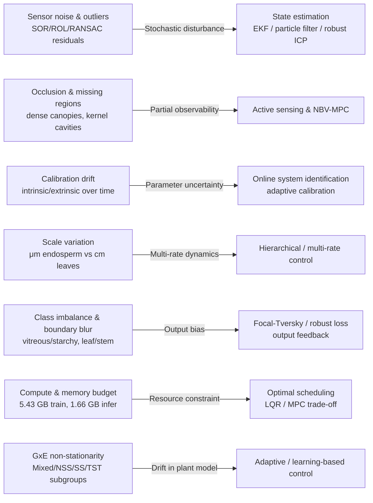
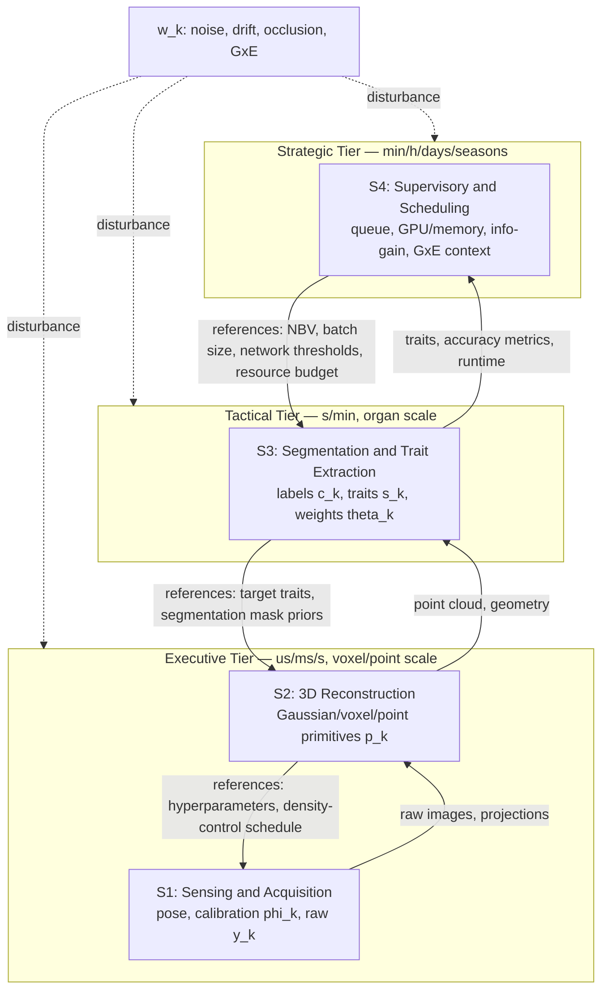
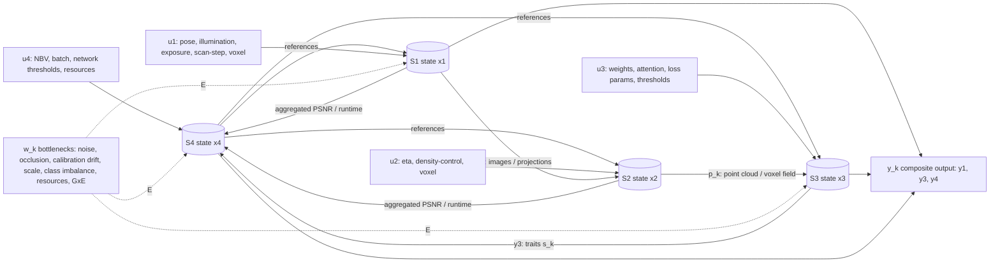
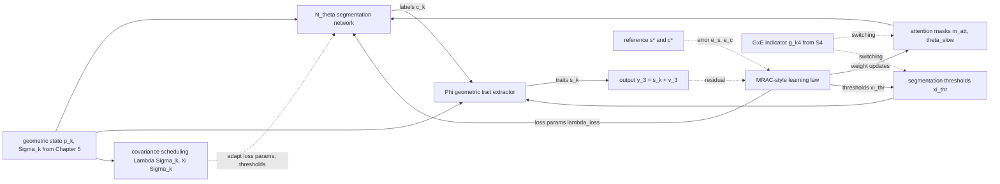
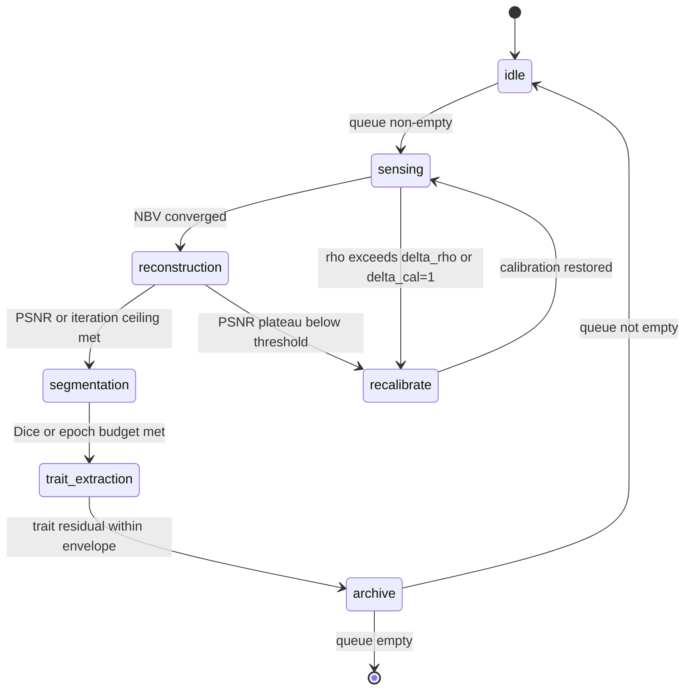
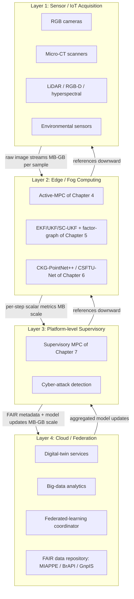
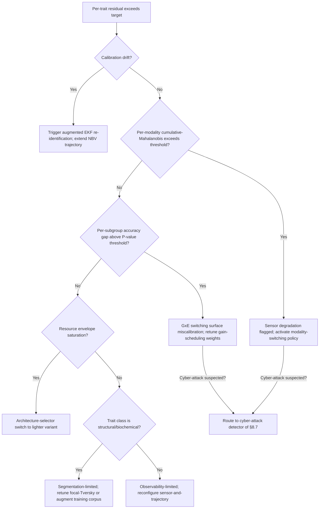

# A Modern Control-Theoretic Framework for Modeling, Analysis, and System Design of 3D Reconstruction and Phenotypic Analysis of Crop Grains
# 1 Introduction, Problem Formulation, and State of the Art

The convergence of high-throughput plant phenomics, agricultural robotics, and modern control engineering has created a compelling opportunity to rethink how three-dimensional (3D) reconstruction and phenotypic analysis of crop grains are designed, executed, and optimized. Traditionally, the acquisition–reconstruction–segmentation–trait-extraction chain has been treated as an open-loop sequence of independent algorithmic stages: a sensor captures images, a geometry pipeline produces a point cloud, a segmentation algorithm labels organs or kernel substructures, and a trait extractor outputs morphological or compositional descriptors. Each stage is locally optimized, often without principled mechanisms to estimate hidden states, reject disturbances, or close the loop with the upstream sensing process. The resulting pipelines are accurate under benign conditions but brittle under the realities of grain-scale phenotyping—micrometre-to-millimetre geometry, dense self-occlusion, multi-modal sensors, and strong genotype-by-environment (GxE) variability—where sensor noise, calibration drift, and structural ambiguity propagate uncontrollably through downstream stages. This chapter establishes the scientific and engineering anchor of the report by reframing the entire grain phenotyping pipeline as a controllable dynamical system, articulating the underlying problem in formal control-theoretic terms, surveying the state of the art in 3D imaging and trait extraction, and identifying the bottlenecks that motivate the modeling, observer, and controller-design approaches developed in subsequent chapters.

## 1.1 Background and Motivation for Control-Theoretic Grain Phenotyping

Grain crops—maize, wheat, rice, sorghum, and the closely related oilseed crop rapeseed—form the backbone of global food security and an expanding bioeconomy. Maize kernels alone are described as "one of the primary sources of food for humans," with their morphological characteristics directly determining nutritional composition and processing quality, and with the endosperm accounting for approximately 90% of kernel dry weight, thereby largely controlling grain weight and nutritional value[^1][^2]. Rapeseed, the focus of one of the most detailed pipelines analyzed in this report, occupies roughly 6.67 million hectares of perennial planting area in China with an annual output of around 14 million tons, and rapeseed oil "occupies half of the domestic vegetable oil," underscoring how kernel- and seedling-scale phenotyping decisions translate directly into edible-oil supply security[^3]. These industrial stakes translate into a sustained demand for high-throughput, accurate, and non-destructive 3D phenotyping platforms that can support breeding, yield prediction, quality grading, and defect inspection across thousands of accessions and growth stages.

The first wave of phenotyping technology answered this demand with manual measurement and 2D imaging. Manual methods, in which "calipers and measuring rods are commonly used to measure plant phenotypic parameters directly," are slow, subjective, and frequently destructive, while 2D image methods are "limited to parameter measurements on a two-dimensional plane" and cannot capture depth and orientation, leaving overlap and occlusion between leaves or kernels essentially unresolved[^3]. The second wave introduced 3D sensing—LiDAR, RGB-D, multi-view stereo, micro-CT—and powerful learning-based segmentation, raising the achievable accuracy of trait extraction to the level required by modern breeding programs. Yet even in the most advanced reported systems, the design philosophy remains predominantly open-loop: sensing parameters (number of views, illumination, exposure, scanning trajectory) are fixed a priori, reconstruction algorithms are tuned offline, segmentation networks are trained once on a representative dataset, and trait extraction operates on whatever point cloud emerges, with no feedback path to re-acquire data, re-tune the estimator, or re-plan the sensing strategy when downstream quality indicators degrade.

A control-theoretic paradigm reframes this workflow as a closed-loop dynamical system in which (i) the physical grain or seedling is the plant, (ii) the sensors and rendering pipelines are observation operators, (iii) the reconstruction, segmentation, and trait-extraction algorithms are estimators and inference blocks, and (iv) the human operator or supervisory algorithm is a controller that issues references (desired accuracy, throughput, energy budget) and reconfigures actuators (camera pose, illumination, NBV plan, network thresholds) in response to measured performance error. Three observations make this reframing both natural and necessary. First, the bottlenecks reported across the literature—holes and missing regions caused by complex branching and foliage[^3], blurred boundaries between vitreous and starchy endosperm in micro-CT slices that yield "low segmentation accuracy or oversegmentation"[^2], and calibration drift across platforms—are precisely the noise, disturbance, and uncertainty problems that estimation and robust-control theory were designed to address. Second, performance bounds matter: when extracted point-cloud measurements show leaf length R²=0.9843 with RMSE=0.1621 cm and leaf inclination R²=0.8890 with RMSE=2.1144°[^3], or when CSFTU-Net achieves 89.13% Dice yet still struggles at vitreous–starchy boundaries[^2], the residual errors are systematic and trait-dependent, suggesting that further gains require explicit modeling of the entire pipeline's input–state–output behaviour rather than incremental algorithmic tweaks. Third, the workflow is inherently multi-stage and resource-constrained: a single rapeseed plant requires 80–120 sequential images, 20–25 minutes of 3D Gaussian Splatting reconstruction at 6–8 GB peak GPU memory, and 28–30 minutes of CKG-PointNet++ training per epoch, contrasted with conventional SfM-MVS pipelines exceeding 60 minutes per plant[^3]; under such resource budgets, optimal allocation of sensing and computation along the pipeline becomes a scheduling-and-control problem rather than a fixed recipe.

The motivation of this report is therefore to develop a unified, control-theoretic design framework that elevates 3D grain reconstruction and phenotyping from a static algorithmic recipe to a closed-loop, identifiable, observable, and optimizable cyber-physical system, in which feedback regulation, state estimation, and optimal control are first-class design variables co-equal with sensors and learning models.

## 1.2 Problem Formulation: Phenotyping Pipeline as a Dynamical System

To make the foregoing reframing operational, this section formalizes the grain phenotyping pipeline as a discrete-time, hierarchical dynamical system whose state, input, output, and disturbance signals are explicitly defined and grounded in measurable quantities reported in the literature. Let $k\in\mathbb{Z}_{\geq 0}$ index time (acquisition cycle, reconstruction iteration, or batch index, depending on the layer). The composite system state $\mathbf{x}_k$ aggregates the latent variables of the pipeline:

$$
\mathbf{x}_k = \big[\,\mathbf{p}_k^{\top},\ \mathbf{c}_k^{\top},\ \mathbf{s}_k^{\top},\ \boldsymbol{\theta}_k^{\top},\ \boldsymbol{\phi}_k^{\top}\,\big]^{\top},
$$

where $\mathbf{p}_k\in\mathbb{R}^{3N_k}$ denotes the reconstructed point cloud (with $N_k$ on the order of $1.5\!\times\!10^4$ to $1.0\!\times\!10^5$ points per sample, consistent with the 15,000–20,000 points reported per individual rapeseed plant and the 80,000–100,000 points per Gaussian-splatted seedling cloud[^3]), $\mathbf{c}_k$ encodes per-point semantic labels (leaf vs. stem; embryo vs. endosperm vs. cavity vs. pericarp[^1][^2]), $\mathbf{s}_k$ collects the extracted phenotypic traits (e.g., leaf length, leaf width, leaf area, leaf inclination, kernel volume, endosperm volume, cavity volume[^3][^1]), $\boldsymbol{\theta}_k$ contains the parameters of the reconstruction and segmentation models (Gaussian primitives, network weights, attention masks), and $\boldsymbol{\phi}_k$ represents calibration parameters (intrinsic/extrinsic camera matrices, micro-CT scanner geometry).

The control input $\mathbf{u}_k$ consists of all design variables that the pipeline can actively manipulate, namely sensor pose and trajectory (camera position, viewing angle steps of approximately 3–4° around the plant in a 360° circle[^3]), illumination and exposure (the 60,000–80,000 lux ambient daylight envelope, ISO range 50–2000[^3], or micro-CT settings of 40 kV, 250 μA, 0.4° rotation step[^1][^2]), scanning resolution (13.55 μm voxel size for the Bruker 1172 micro-CT[^1][^2]), reconstruction hyperparameters (number of Gaussian-splatting iterations, with reported transitions from 7,000 iterations yielding PSNR=20.35 to 30,000 iterations yielding PSNR=22.06[^3]), segmentation hyperparameters (batch size 32, learning rate 1×10⁻⁴, 1024 points per input cloud[^3]), and supervisory decisions such as next-best-view selection and sample scheduling.

The measurement output $\mathbf{y}_k$ corresponds to the directly observable signals: raw images, projection radiographs, intermediate loss values, and—after estimation—the validated phenotypic measurements that are compared against ground truth. The exogenous disturbance $\mathbf{w}_k$ aggregates sensor noise (statistical and radius outliers handled by SOR/ROL filters[^3]), occlusion and self-shadowing in dense canopies, calibration drift across acquisition sessions, scale variation across organs (μm-scale endosperm cavities versus cm-scale leaves), class imbalance and boundary blur in segmentation (the principal failure mode behind the focal-Tversky loss design in CSFTU-Net[^2]), and—at the population level—GxE-driven variability that distinguishes the Mixed, NSS, SS, and TST maize subgroups in the kernel association panel[^1].

The pipeline dynamics can then be written in canonical state-space form,

$$
\mathbf{x}_{k+1} = f(\mathbf{x}_k,\mathbf{u}_k,\mathbf{w}_k),\qquad \mathbf{y}_k = h(\mathbf{x}_k,\mathbf{v}_k),
$$

where $\mathbf{v}_k$ denotes measurement noise and $f,h$ are in general nonlinear and high-dimensional. The control objective is to design feedback laws $\mathbf{u}_k = \pi(\mathbf{y}_{0:k},\hat{\mathbf{x}}_{0:k})$ and an estimator $\hat{\mathbf{x}}_{k+1}=g(\hat{\mathbf{x}}_k,\mathbf{u}_k,\mathbf{y}_{k+1})$ that jointly minimize a multi-objective cost,

$$
J = \mathbb{E}\Big[\sum_{k=0}^{T}\big(\|\mathbf{s}_k-\mathbf{s}_k^{\star}\|_{Q}^2 + \|\mathbf{u}_k\|_{R}^2 + \lambda_{\mathrm{thr}} \,\tau_k\big)\Big],
$$

where $\mathbf{s}_k^{\star}$ is the reference (ground-truth) trait vector, $Q$ weights trait-extraction accuracy (the RMSE/R² targets reported in §1.3–§1.4), $R$ penalizes sensing and computation effort (energy, scan time, GPU memory), and $\tau_k$ is the per-sample throughput cost.

Within this formulation, the four core research questions of the report acquire precise meanings: **(Q1) Observability** — given the sensor suite and reconstruction algorithm, which components of $\mathbf{x}_k$ (e.g., embryo position, internal cavity volume, fine leaf-tip geometry) are recoverable from $\mathbf{y}_k$, and under what conditions does the observability Gramian remain non-singular? **(Q2) Controllability** — to what extent can the input $\mathbf{u}_k$ steer reconstruction quality and trait accuracy toward the desired references, and which subsystems are uncontrollable from a given actuator set (e.g., a fixed multi-view rig)? **(Q3) Optimality** — among feasible strategies, which feedback law minimizes $J$ under operational constraints such as the 5–10 minutes per plant required by manual phenotyping versus the 2–3 minutes achievable by the proposed Gaussian-splatting + CKG-PointNet++ pipeline[^3]? **(Q4) Robustness** — how do bounded disturbances (noise, GxE drift, calibration error) propagate through the closed loop, and what stability and performance margins are achievable under worst-case uncertainty? These four questions structure the remainder of the report.

## 1.3 State of the Art in 3D Reconstruction Technologies for Grain Crops

A coherent design framework must rest on a clear-eyed assessment of the sensing technologies actually deployable for grain-scale reconstruction. Recent reviews emphasize that, "in contrast to 2D imaging, 3D imaging enables precise measurement of plant traits that cannot be sufficiently evaluated in two dimensions by overcoming" the inherent depth ambiguity of 2D projections[^4], and that 3D phenotyping has progressed substantially across multiple modalities and crop scales[^5][^6]. Six modalities dominate the literature on grain and grain-bearing organ reconstruction: LiDAR/laser scanning, RGB-D depth cameras, multi-view stereo and Structure-from-Motion (SfM-MVS), 3D Gaussian Splatting, X-ray micro-computed tomography (micro-CT), and hyperspectral 3D imaging.

LiDAR-based pipelines deliver the highest in-field metric fidelity for canopy- and plant-scale reconstruction. They "can provide high-resolution point clouds with real-world dimensions, but the cost is too high and the speed of data acquisition is slow," limiting deployment in large breeding trials[^3]. Representative case studies include cotton point clouds processed with RANSAC stem extraction and region-growth leaf clustering at multiple growth stages, and a LiDAR instrument explicitly designed for high-throughput 3D measurement of morphological traits in maize and sorghum[^3]. RGB-D depth cameras invert this trade-off: they "can quickly reconstruct the three-dimensional data, but their own resolution is limited, and the quality of the generated point clouds is lower"[^3]. Their utility is best illustrated by tomato seedling stem-and-leaf segmentation pipelines that combine RANSAC plane fitting with region-growing leaf segmentation, and by the rapeseed branch-and-pod pipeline that fuses RGB-D color and depth images with Euclidean clustering[^3].

Multi-view photogrammetry / SfM-MVS pipelines reconstruct dense point clouds from sequences of RGB images by jointly estimating camera poses (typically via COLMAP) and triangulating dense correspondences. They achieve high geometric accuracy but suffer from "high computational complexity," and "the noise in the image affects the feature point matching accuracy and thus the quality of 3D reconstruction"[^3]. Quantitatively, SfM-MVS reconstruction of a single rapeseed plant on an Intel i5-13490F + RTX 4070 16 GB workstation requires more than 60 minutes per plant[^3]. Variants such as the shiitake-mushroom yield-estimation pipeline and the wolfberry phenotyping system illustrate how multi-view pipelines have been extended from individual organs to whole plants[^3].

3D Gaussian Splatting (3D GS) has emerged as a transformative alternative for plant-scale reconstruction. Each pixel is "splashed" to its corresponding 3D location as a Gaussian primitive parameterized by position, covariance, color, and opacity, and is optimized through a differentiable renderer with adaptive density control[^3]. Compared with traditional photogrammetry, 3D GS "can effectively deal with occlusion and illumination changes, and improve the accuracy and robustness of 3D reconstruction"[^3]. On the same hardware that took SfM-MVS more than 60 minutes per rapeseed plant, 3D GS reconstructs each plant from 80–120 images in approximately 20–25 minutes, with 6–8 GB peak GPU memory[^3]. After 30,000 training iterations the reconstruction reaches PSNR=22.06 with about 3.0 million Gaussian points, compared with PSNR=20.35 and 2.6 million points at 7,000 iterations[^3]. From a control perspective, the differentiable rendering loop within 3D GS already constitutes an internal feedback structure (a gradient-based controller minimizing photometric loss), foreshadowing the explicit closed-loop sensing strategies proposed in Chapters 4–5.

For internal kernel structure, X-ray micro-CT remains the gold standard. The Bruker 1172 system, operated at 40 kV / 250 μA with a 13.55 μm reconstructed voxel size and a 0.4° angular step over 180°, has been used to acquire 2K-resolution slices that are subsequently reconstructed with NRecon and converted to 3D point clouds via Open3D for maize-kernel phenome studies[^1]. A higher-throughput batch micro-CT protocol uses a SKYSCAN 1273 with three kernels per scan, identical 40 kV / 250 μA / 0.4°/180° settings, and a deep-learning segmentation pipeline (CSFTU-Net) that delivers 89.13% Dice and 76.56% IoU on vitreous-versus-starchy endosperm segmentation across 30,000 slices and 250 maize varieties[^2]. Comparable pipelines have been demonstrated on sorghum, wheat, rice, and tomato seeds, where micro-CT yields embryo volume, vitreous/starchy endosperm ratios, pericarp volume, and kernel volume non-destructively[^2]. The principal limitations are scanning time, sample throughput, and equipment cost, all of which place micro-CT firmly in the laboratory rather than the field. Multi-scale reviews emphasize that hyperspectral 3D imaging adds biochemical-trait sensitivity by attaching wavelength-resolved reflectance to each 3D point, complementing geometry with composition, although such systems remain relatively rare at grain scale[^5][^6].

Table 1 synthesizes these modalities along the five axes most relevant to a control-theoretic design: spatial resolution, throughput, hardware cost, robustness to disturbance, and the trait classes natively supported.

| Modality | Spatial resolution | Throughput | Hardware cost | Robustness to occlusion / illumination | Trait classes natively supported |
|---|---|---|---|---|---|
| LiDAR / laser scanning | Sub-mm to mm; real-world scale[^3] | Moderate; slow per scan[^3] | High[^3] | Moderate (active illumination, but slow) | External canopy/plant geometry; height, leaf area; cotton/maize/sorghum studies[^3] |
| RGB-D (depth camera) | mm-scale; limited by sensor[^3] | High | Low | Sensitive to outdoor lighting | Tomato seedling stems/leaves; rapeseed pods[^3] |
| Multi-view SfM-MVS | Sub-mm with sufficient views | Low (>60 min/rapeseed plant)[^3] | Low (smartphone camera) | Sensitive to texture and noise[^3] | Whole-plant geometry; mushroom, wolfberry, soybean[^3] |
| 3D Gaussian Splatting | Sub-mm; PSNR 22.06 at 30k iter[^3] | Medium (~20–25 min/plant)[^3] | Low–medium (smartphone + RTX-class GPU)[^3] | Robust to occlusion/illumination[^3] | Detailed seedling geometry; rapeseed leaves[^3] |
| X-ray micro-CT | 13.55 μm voxel (Bruker 1172)[^1][^2] | Low–medium; batch-scan boosts to 3 kernels/run[^2] | Very high | Insensitive to optical occlusion (penetrating) | Internal endosperm/embryo/cavity, vitreous vs. starchy[^1][^2] |
| Hyperspectral 3D imaging | Variable | Low | High | Modality-dependent | Adds biochemical traits[^5][^6] |

Two insights structure the remainder of this report. First, **no single modality is Pareto-optimal**; field-scale 3D GS and laboratory micro-CT are complementary, and a control-theoretic framework must explicitly arbitrate between them through the input cost $R$ and throughput penalty $\lambda_{\mathrm{thr}}$ in $J$. Second, **all six modalities expose tunable inputs** (number of views, voxel size, scan angle step, training iterations) that are, in principle, controllable—yet are currently fixed by heuristic recipes rather than by closed-loop optimization, exposing a wide design margin for the optimal-control and next-best-view strategies developed in Chapters 4–5.

## 1.4 Phenotypic Trait Taxonomy and Extraction Methods

A control-theoretic design also demands a precise trait taxonomy because each trait class imposes distinct observability requirements on the sensing-and-reconstruction subsystem. Across the literature on grain crops, four trait classes recur and are reproduced here as the working taxonomy of this report.

**Morphological traits** describe organ-level external geometry: plant height, leaf length and width, leaf area, leaf inclination angle, kernel length/width/thickness. The rapeseed seedling pipeline reports leaf length R²=0.9843 (RMSE=0.1621 cm, MAPE=2.58%), leaf width R²=0.9632 (RMSE=0.1546 cm, MAPE=3.17%), leaf area R²=0.9806 (RMSE=0.6892 cm², MAPE=4.65%), and leaf inclination R²=0.8890 (RMSE=2.1144°, MAPE=3.74%) against manual measurements[^3]. For maize kernels, the corresponding morphological descriptors include kernel length (KL), width (KW), thickness, sphericity (KSP), surface area (KSur), and 100-kernel weight (Hgw), with means and coefficients of variation tabulated across 288 inbred lines and four subgroups[^1]. Manual measurement repeatability is itself non-trivial: across 25 rapeseed samples, three repeated digital-caliper measurements yielded mean leaf-length deviation of 0.30 ± 0.10 cm, leaf-width deviation 0.20 ± 0.10 cm, and leaf-angle deviation 1.5° ± 0.6°, providing a noise-floor reference for automated pipelines[^3].

**Structural traits** capture volumetric and topological attributes—volume, surface area, sphericity, embryo–endosperm ratios, cavity volume, and the vitreous-versus-starchy endosperm distribution. The maize-kernel phenome study quantifies 27 such 3D feature parameters[^1], including kernel volume (KV, mean 203.4 mm³), endosperm volume (ENV, mean 172.3 mm³), embryo volume (EMV, mean 30.1 mm³), cavity volume (CV, mean 0.93 mm³), kernel sphericity, embryo and endosperm proportions, and minimum/maximum embryo-to-coat distances[^1]. Linear regression analysis there demonstrates that endosperm volume is most strongly determined by endosperm length (coefficient 0.599), followed by width (0.533) and thickness (0.471), and embryo volume by embryo length (0.502), width (0.426), and thickness (0.311)[^1]. Internally, the deep-learning micro-CT pipeline of Wang et al. extracts five additional volumetric descriptors—total kernel volume V, vitreous endosperm volume VV, starchy endosperm volume SV, and ratios VV/V and SV/V—using voxels of 27 μm × 27 μm × 27 μm[^2].

**Biochemical / composite traits** are quantitative descriptors that synthesize structural measurements into physiologically meaningful indices. Five such indices were proposed for maize kernels: the Endosperm Nutrient Density Index $\mathrm{ENDI}=\mathrm{ENV}/(\mathrm{ENL}\cdot\mathrm{ENW}\cdot\mathrm{ENT})$; the Endosperm Integrity Index $\mathrm{ENII}=1-\mathrm{CV}/\mathrm{ENV}$; the Embryo Volume-to-Surface Ratio $\mathrm{EMVSR}=\mathrm{EMV}/\mathrm{EMS}$; the Seed Coat Tightness Index $\mathrm{SCTI}=\mathrm{KV}/(\mathrm{KSP}\cdot\mathrm{KV})$; and the Endosperm Density Uniformity Index $\mathrm{ENDUI}=1-\mathrm{ENS}/(\mathrm{ENL}\cdot\mathrm{ENW}\cdot\mathrm{ENT})$[^1]. These indices have very low coefficients of variation (e.g., ENII CV=0.004, ENDUI CV=0.005), indicating tightly conserved structural relationships, and emerge as central nodes of the maize-kernel phenome interaction network[^1].

**Dynamic / GxE traits** capture the time- and environment-dependent evolution of the above descriptors. The maize panel of 288 lines is partitioned into Mixed (n=57), NSS (n=84), SS (n=21), and TST (n=126) subgroups, with significant differences detected for surface area (P=2.19×10⁻⁴), specific surface area (P=7.86×10⁻⁴), 100-kernel weight (P=3.18×10⁻²), embryo width (P=2.07×10⁻²), and embryo volume-to-surface ratio (P=3.69×10⁻²)[^1]. Such cross-subgroup dispersion is precisely the non-stationary disturbance term $\mathbf{w}_k$ in the formulation of §1.2, and motivates adaptive control of segmentation and trait-extraction parameters.

The algorithmic toolchain for trait extraction has co-evolved across two strands. Classical geometric methods—statistical outlier removal (SOR), radius outlier filter (ROL), RANSAC plane fitting, region growing, Euclidean clustering, and threshold-based or region-growth segmentation in micro-CT slices—are reliable for coarse separation of plant from ground or kernel from background but are heuristic at fine boundaries[^3][^2]. Indeed, when applied directly to rapeseed binary segmentation, RANSAC and K-means reach mean IoU of only 0.33 and 0.26 with overall accuracy of 63.94% and 43.26% respectively, "insufficient for the precision and reliability required in plant phenotypic extraction"[^3]. Deep-learning point-cloud networks (PointNet, PointNet++, PointNet++_msg, and the proposed CKG-PointNet++) and image-segmentation networks (FCN, DeepLabv3, U-Net, TransU-Net, TransU-Net++, Swin UNETR, SAM-Med3D, and the proposed CSFTU-Net) close this performance gap. Table 2 summarizes representative quantitative outcomes.

| Pipeline | Crop / object | Metric | Reported value |
|---|---|---|---|
| PointNet[^3] | Oilseed rape seedling | OA / mIoU | 90.73% / 83.60% |
| PointNet++[^3] | Oilseed rape seedling | OA / mIoU | 92.80% / 87.15% |
| PointNet++_msg[^3] | Oilseed rape seedling | OA / mIoU | 95.54% / 91.70% |
| **CKG-PointNet++**[^3] | Oilseed rape seedling | OA / mIoU | **97.70% / 96.01%** |
| RANSAC (binary)[^3] | Oilseed rape seedling | OA / mIoU | 63.94% / 0.33 |
| K-means (binary)[^3] | Oilseed rape seedling | OA / mIoU | 43.26% / 0.26 |
| FCN[^2] | Maize kernel endosperm | Dice / IoU | 85.02% / 77.07% |
| DeepLabv3[^2] | Maize kernel endosperm | Dice / IoU | 81.53% / 71.32% |
| U-Net (baseline)[^2] | Maize kernel endosperm | Dice / IoU | 81.08% / 71.21% |
| TransU-Net++[^2] | Maize kernel endosperm | Dice / IoU | 86.59% / 72.92% |
| Swin UNETR[^2] | Maize kernel endosperm | Dice / IoU | 83.33% / 73.54% |
| SAM-Med3D[^2] | Maize kernel endosperm | Dice / IoU | 86.76% / 76.98% |
| **CSFTU-Net**[^2] | Maize kernel endosperm | Dice / IoU | **89.13% / 76.56%** |

The architectural enhancements driving these gains—Convolutional Gated Linear Units (CGLU) and FastKAN convolutions in SA layers, MogaBlock and self-attention in FP layers, CBAM in encoders, SE in decoders, and focal-Tversky loss with boundary-smoothing—can all be interpreted as data-driven feedback gains and observers that compensate for the structural disturbances enumerated in §1.5.

## 1.5 Key Bottlenecks Motivating a Control-Theoretic Perspective

The performance figures of §1.3–§1.4 are impressive yet plateau at trait-dependent ceilings; understanding why these ceilings exist exposes the structural bottlenecks of open-loop pipelines and explains, for each, the corresponding control-theoretic remedy that this report will develop.

**Sensor noise and outliers.** All raw point clouds, whether from Gaussian splatting or micro-CT, contain redundant and noisy points that necessitate SOR, ROL, and RANSAC pre-processing[^3]. These filters are open-loop and threshold-based; they discard information rather than estimate hidden state. Replacing or augmenting them with EKF/UKF-style fusion of prior shape models with measurements (Chapter 5) yields a Kalman-rank-based observability test for fine geometry and a principled noise-versus-detail trade-off.

**Occlusion and missing regions.** Rapeseed plants exhibit "complex branching and foliage structure" that "frequently produces point clouds with holes, missing regions or noise"[^3], and maize kernels exhibit internal cavities (CV up to 3.79 mm³) whose surfaces are partially shadowed in 2D slices[^1]. These are partial-observability problems: certain components of $\mathbf{x}_k$ become unobservable from a fixed view set. The remedy is active sensing—next-best-view planning solved by MPC over an information-gain objective (Chapter 4).

**Calibration drift.** Intrinsic and extrinsic camera parameters $\boldsymbol{\phi}_k$ inevitably drift with thermal cycling, vibration, and platform reconfiguration. COLMAP-style re-estimation between sessions is the de facto solution[^3], but it is open-loop and offline. Online system identification (Chapter 3) integrates calibration into the state vector and updates it recursively.

**Scale variation.** Grain phenotyping spans seven orders of magnitude in time and three orders in length, from a 13.55 μm voxel inside a maize endosperm[^1][^2] to a centimetre-scale rapeseed leaf[^3] to whole-plot canopy dynamics[^5][^6]. This multi-rate, multi-scale structure cannot be controlled by a single monolithic loop; hierarchical strategic–tactical–executive strata (Chapters 3, 7) are required.

**Class imbalance and boundary ambiguity.** The 3.5% cavity-vs-kernel pixel imbalance and the "blurred edges between the vitreous and starchy endosperm" in micro-CT images "make segmentation difficult, often resulting in jagged segmentation outcomes"[^2]. Standard cross-entropy loss saturates at this regime; the focal-Tversky loss with α-, β-, γ-weighting (β=0.75, γ=2.0) and an explicit boundary-smoothing term $L_{\mathrm{smooth}}=\lambda\sum_{i,j}(|\nabla I_{\mathrm{pred}}|-|\nabla I_{\mathrm{true}}|)^2$ behaves precisely like a robust output-feedback controller that re-weights residuals by their difficulty[^2].

**Compute and memory constraints.** CKG-PointNet++ requires peak training memory of 5.43 GB and 28–30 minutes per epoch (versus 1.46 GB and ~4 minutes for PointNet++) and 1.66 GB peak inference memory[^3]; CSFTU-Net is trained on an RTX 3060Ti with 50 epochs at batch size 1[^2]. SfM-MVS exceeds 60 minutes per rapeseed plant whereas 3D GS achieves 20–25 minutes[^3]; manual phenotyping takes 5–10 minutes per plant whereas the proposed automated pipeline reduces this to 2–3 minutes[^3]. These hard resource budgets convert pipeline design into a constrained optimal-control problem (Chapter 7).

**GxE non-stationarity.** The maize subgroups Mixed, NSS, SS, and TST exhibit statistically significant differences in surface area (P=2.19×10⁻⁴), specific surface area (P=7.86×10⁻⁴), 100-kernel weight (P=3.18×10⁻²), embryo width (P=2.07×10⁻²), and EMVSR (P=3.69×10⁻²)[^1]. The phenome interaction network changes topology across subgroups—Mixed and SS exhibit "tight network structures" while NSS and TST are "more dispersed" and heterogeneous[^1]—so a controller tuned on one subgroup will be suboptimal on another. Adaptive and learning-based control (Chapter 6, Chapter 8) addresses this non-stationary plant model.

These seven bottlenecks are not isolated nuisances but signatures of well-defined control problems—stochastic estimation, partial observability, parameter identification, multi-rate hierarchical control, robust output feedback, constrained optimization, and adaptation—each of which has a mature theoretical apparatus. The remainder of this report systematically maps these tools onto the grain phenotyping pipeline.

## 1.6 Scope, Objectives, and Organization of the Report

Within the broad landscape of plant phenomics, this report deliberately narrows its scope to grain crops and grain-bearing organs at seed and seedling scales, where the geometric scale (μm to cm), the breeding stakes (kernel-quality and seedling-vigor traits), and the engineering challenges (occlusion, internal structure, GxE) are most acutely pressing and best supported by the available evidence base. The targeted crops are maize (with the most extensive case-study material on kernel internal structure[^1][^2]), wheat, rice, and sorghum (frequently co-cited as benchmark grain crops in 3D phenotyping[^5][^4][^6]), and oilseed rape (Brassica napus) at the seedling stage, which serves as the principal whole-plant reconstruction case study[^3]. The imaging modalities under consideration encompass the six discussed in §1.3—LiDAR, RGB-D, multi-view photogrammetry, 3D Gaussian Splatting, X-ray micro-CT, and hyperspectral 3D imaging—with primary analytical focus on 3D GS at plant scale and micro-CT at kernel scale because they bracket the throughput–resolution Pareto frontier currently achievable with commodity hardware.

The report's design objectives are explicit. **First**, to construct a unified, hierarchical state-space framework in which every stage of the grain phenotyping pipeline is represented as an interconnected dynamical subsystem with formally defined inputs, states, outputs, and disturbances (Chapter 3), grounded in the formulation of §1.2. **Second**, to derive system-level performance bounds—observability and controllability conditions, Lyapunov-style robustness margins, accuracy–throughput trade-off curves—that practitioners can use as design specifications rather than as post-hoc empirical observations. **Third**, to propose actionable design guidelines (controller structures, observer parameters, scheduling policies) that are sufficiently specific—down to gain values, prediction horizons, covariance matrices, and software/hardware mappings—to be reproducible on platforms comparable to those reported in the source studies (e.g., Intel i5-13490F + RTX 4070 16 GB, Bruker 1172 micro-CT, smartphone-based multi-view rigs)[^3][^1][^2]. **Fourth**, to validate the framework on a concrete maize-kernel case study (Chapter 9) that integrates 3D Gaussian or micro-CT acquisition, EKF-based reconstruction, CKG-PointNet++ / CSFTU-Net-style segmentation, and supervisory MPC scheduling, and to discuss how the resulting design generalizes across rice, wheat, sorghum, and rapeseed.

The remaining nine chapters realize these objectives in a logically progressive sequence. Chapter 2 compiles the theoretical toolbox (state-space, LQR/MPC, Kalman/particle filtering, robust and adaptive control, system identification, Lyapunov stability, complemented by computer-vision geometry, machine learning, and graph signal processing). Chapter 3 builds the unified, hierarchical system model of the entire pipeline. Chapter 4 designs the closed-loop sensing platform (NBV planning, illumination, scanning trajectory) under MPC and reinforcement-learning baselines. Chapter 5 reformulates 3D reconstruction as a state estimation problem and benchmarks EKF/UKF/particle-filter and factor-graph formulations against ICP/SfM/MVS. Chapter 6 treats trait extraction and classification as feedback-controlled inference, examining model-based versus model-free adaptation across cultivars and growth stages. Chapter 7 designs the workflow-level supervisory controller for high-throughput scheduling under hybrid discrete-event dynamics. Chapter 8 integrates the architecture with big-data, deep-learning, digital-twin, and cyber-physical infrastructures. Chapter 9 performs Lyapunov stability and sensitivity analyses and walks through the integrated maize-kernel case study end-to-end. Chapter 10 synthesizes design implications for breeding, precision agriculture, and grain quality inspection, identifies open theoretical problems (nonlinear/uncertain plant models, learning-based control guarantees, secure federated phenotyping), and outlines a research-and-deployment roadmap.

By the end of this report, the reader should be equipped not merely with a catalog of phenotyping algorithms but with a coherent control-theoretic blueprint for the principled design, analysis, and validation of next-generation 3D grain reconstruction and phenotyping platforms—one in which sensors, reconstructions, segmentations, traits, and decisions are treated as a unified, observable, controllable, and optimizable cyber-physical system.

# 2 Theoretical Foundations: Modern Control Theory and Companion Methods

The reframing established in Chapter 1 cast the entire 3D grain reconstruction and phenotyping pipeline as a hierarchical, closed-loop, cyber-physical dynamical system in which sensors, reconstructions, segmentations, traits, and decisions interact through formally defined inputs, states, outputs, and disturbances. To translate that reframing into actionable design, the present chapter compiles, in a unified notation, the theoretical apparatus on which Chapters 3–9 will draw. The exposition is deliberately bidirectional: each tool is first presented in its formal, control-theoretic guise—with the equations, rank tests, Riccati or Hamilton–Jacobi conditions, and stability theorems that govern its use—and is then immediately mapped onto the specific subproblems of grain phenotyping identified in §1.5 (stochastic estimation against sensor noise, active sensing against occlusion, online identification against calibration drift, hierarchical control against scale variation, robust output feedback against class imbalance, constrained optimal control against compute budgets, and adaptive control against genotype-by-environment non-stationarity). This dual reading of every theorem is what distinguishes a control-theoretic phenotyping report from either a generic systems-and-control textbook or a phenomics methods review: it ensures that, when the unified system model of Chapter 3 invokes a Kalman rank test or a Lyapunov certificate, the reader knows precisely which physical observability or robustness property of the grain pipeline that test or certificate certifies.

## 2.1 State-Space Representation and Structural Properties

The starting point of all subsequent chapters is the canonical linear time-invariant (LTI) state-space model. In continuous time,

$$
\dot{\mathbf{x}}(t) = A\mathbf{x}(t) + B\mathbf{u}(t),\qquad \mathbf{y}(t) = C\mathbf{x}(t) + D\mathbf{u}(t),
$$

with $\mathbf{x}\in\mathbb{R}^n$, $\mathbf{u}\in\mathbb{R}^m$, $\mathbf{y}\in\mathbb{R}^p$ and $A,B,C,D$ of compatible dimensions; in discrete time the differential operator is replaced by a forward shift or a delta operator with no change in the structural results that follow[^7]. The choice of state vector is non-unique: any nonsingular similarity transformation $\bar{\mathbf{x}}=T^{-1}\mathbf{x}$ produces an equivalent description $(\bar A,\bar B,\bar C,\bar D)=(T^{-1}AT,\,T^{-1}B,\,CT,\,D)$ that preserves both the transfer function $C(sI-A)^{-1}B+D$ and the system invariants[^7]. This invariance has direct phenotyping consequences: the same reconstruction subsystem may be coordinatized either in the world frame or in the camera body frame (as is done in the active-EKF derivation of §2.3) without changing its observability or controllability properties, allowing designers to choose representations that simplify the Jacobians appearing in EKF gradient computations.

**Controllability** asks whether the input $\mathbf{u}$ can steer $\mathbf{x}$ from any initial state to any desired terminal state in finite time. The Kalman test states that the LTI pair $(A,B)$ is controllable if and only if the controllability matrix
$$
\Gamma_c[A,B]=\begin{bmatrix}B & AB & A^2B & \cdots & A^{n-1}B\end{bmatrix}
$$
has full row rank $n$[^7][^8]. **Observability** is the dual question: whether the initial state $\mathbf{x}(0)$ can be reconstructed from the output history. The corresponding observability matrix
$$
\Gamma_o[A,C]=\begin{bmatrix}C^\top & (CA)^\top & \cdots & (CA^{n-1})^\top\end{bmatrix}^\top
$$
must have full column rank $n$ for complete observability[^7][^8]. By the Cayley–Hamilton theorem, no additional information is gained beyond the $n$-th power of $A$, which fixes the size of these test matrices[^8]. The two concepts are dual in the precise sense that $(A,B,C,D)$ is completely controllable if and only if $(A^\top,C^\top,B^\top,D^\top)$ is completely observable[^7].

Two refinements are essential for grain phenotyping. First, when neither full controllability nor full observability holds, the system admits a **Kalman canonical decomposition**: there exists a similarity transformation that exposes a four-block structure separating controllable–observable, controllable–unobservable, uncontrollable–observable, and uncontrollable–unobservable subsystems, with the transfer function depending only on the controllable–observable part and a minimal realization arising precisely when no zero–pole cancellation occurs[^7][^8]. This is operationally relevant because the sensing-reconstruction subsystem of the grain pipeline contains modes (e.g., fine endosperm cavity geometry behind a fixed lighting direction) that are present physically but absent from the input–output map of any single sensor configuration; such modes must be made observable by changing the sensing input, not by re-tuning the estimator. Second, the **Popov–Belevitch–Hautus (PBH) test** provides a frequency-domain alternative: $(A,B)$ is uncontrollable iff there exists an eigenvector $\mathbf{x}\neq\mathbf{0}$ with $\mathbf{x}^\top A=\lambda\mathbf{x}^\top$ and $\mathbf{x}^\top B=\mathbf{0}$, and dually for observability[^7]. The PBH test is computationally lightweight and is the natural tool for diagnosing which mode of a grain-reconstruction subsystem is starved of excitation when, for example, all camera viewpoints lie on a common plane.

Beyond these strict properties lie the relaxed notions used routinely in optimal control design. **Stabilizability** requires only that all *unstable* modes be controllable, and **detectability** requires only that all unstable modes be observable[^8][^7]. Many practical phenotyping disturbances—constant illumination bias, slowly drifting calibration parameters—are deliberately modeled as uncontrollable but stable autonomous dynamics ($\dot{\mathbf{x}}_d=0$ being the canonical example) that nevertheless leave the augmented system stabilizable and detectable, and thus admit standard observer/controller design[^7].

For grain phenotyping, the structural map is concrete. Consider the composite state $\mathbf{x}_k=[\mathbf{p}_k^\top,\mathbf{c}_k^\top,\mathbf{s}_k^\top,\boldsymbol{\theta}_k^\top,\boldsymbol{\phi}_k^\top]^\top$ defined in §1.2. With camera pose, illumination, and scanning trajectory as inputs, the geometric component $\mathbf{p}_k$ is generally controllable (the actuator can change which surfaces are imaged), whereas the calibration component $\boldsymbol{\phi}_k$ is uncontrollable from the imaging input but must remain observable through bundle-adjustment residuals so that the augmented pair $(A,C)$ is detectable. The Kalman/PBH tests become principled diagnostics for sensor-suite design: a configuration is admissible only if it renders the relevant grain-state components observable and the phenotypic-trait references reachable through admissible inputs. These tests are invoked formally in Chapter 3 to validate the unified hierarchical model.

## 2.2 Optimal Control: LQR, MPC, and Pontryagin's Principle

Once structural admissibility is verified, the next question is *how* to choose the input. The classical answer is the linear quadratic regulator (LQR), which for the LTI plant $\dot{\mathbf{x}}=A\mathbf{x}+B\mathbf{u}$ minimizes
$$
J_{\mathrm{LQR}} = \int_0^{\infty}\big(\mathbf{x}^\top Q\mathbf{x} + \mathbf{u}^\top R\mathbf{u}\big)\,dt,\qquad Q\succeq 0,\ R\succ 0,
$$
with optimal feedback $\mathbf{u}^\star=-K\mathbf{x}=-R^{-1}B^\top P\mathbf{x}$, where $P=P^\top\succ 0$ solves the algebraic Riccati equation $A^\top P+PA-PBR^{-1}B^\top P+Q=0$. The Lyapunov-equation construction in §2.6 below ensures that the closed-loop $A-BK$ is Hurwitz under stabilizability of $(A,B)$ and detectability of $(A,Q^{1/2})$. LQR is the natural baseline for any subsystem whose dynamics are well linearized around an operating point and whose constraints are not active—e.g., low-amplitude regulation of camera pose around a nominal scanning trajectory or fine adjustment of illumination intensity.

**Model predictive control (MPC)** generalizes LQR to constrained, possibly nonlinear, finite-horizon problems by solving, at each sampling instant $k$, an open-loop optimization
$$
\min_{\mathbf{u}_{k:k+N-1}}\sum_{j=0}^{N-1}\ell(\mathbf{x}_{k+j},\mathbf{u}_{k+j})+V_f(\mathbf{x}_{k+N})
$$
subject to the dynamics and to state and input constraints, and applying only the first computed input before re-solving with updated state estimates (receding horizon). MPC's central advantages for grain phenotyping are its native handling of inequality constraints (joint limits, illumination bounds, GPU memory ceilings, scan-time budgets) and its ability to incorporate predicted future disturbances. Two MPC variants are particularly germane. *Constrained linear MPC* with quadratic cost reduces to a quadratic program (QP) at each step and supports real-time deployment on edge hardware. *Nonlinear MPC* is required when the observation map (e.g., the perspective projection $h(\mathbf{x})=\frac{1}{x_z}K\mathbf{x}$ of the pinhole camera) is nonlinear in the state[^9], which is the rule rather than the exception in vision-based active sensing.

**Pontryagin's minimum principle** and the **Hamilton–Jacobi–Bellman (HJB) equation** provide the necessary and sufficient conditions, respectively, for optimality of nonlinear continuous-time problems and underlie the offline derivation of MPC tuning. The HJB equation for the value function $V(\mathbf{x},t)$ is $-\partial V/\partial t = \min_{\mathbf{u}} \{\ell(\mathbf{x},\mathbf{u})+(\nabla_{\mathbf{x}} V)^\top f(\mathbf{x},\mathbf{u})\}$, but its direct solution in the high-dimensional belief spaces of phenotyping (point clouds of $10^4$–$10^5$ points) is intractable—a point made forcefully in the active-sensing literature, where the partially-observable Markov decision process (POMDP) reformulation is described as "computationally expensive, and is often intractable" because "the integral and minimization … are often impossible to evaluate analytically, so numerical approximations must be used"[^9].

This intractability motivates the three approximation families explored in Chapters 4 and 7. **Greedy / next-best-view (NBV)** strategies minimize $\mathbb{E}_{y_{k+1}}[J(p_{k+1})\mid y_{1:k}]$ over a one-step horizon, with the cost $J$ taken as a function of the posterior covariance—commonly the trace, determinant, or maximum eigenvalue of the error covariance matrix[^9]. **Receding-horizon greedy** extends the horizon to $N$ steps with a discount $\gamma\in(0,1]$, $u_{\mathrm{rec}}=\arg\min\sum_{i=k+1}^{k+N}\gamma^{(i-k)}\,\mathrm{Tr}(\Sigma_i)$, and is reported with $N=3$ for active EKF and $N=2$ for active UKF and $\gamma=0.9$ in the quadrotor 3D-reconstruction benchmark[^9]. **Gradient-descent active sensing**—the method actually adopted by Cristofalo et al.—computes
$$
\mathbf{u}_k = \frac{\partial f^{-1}}{\partial \mathbf{u}}\Big(\hat{\mathbf{x}}_k - \alpha\,\nabla_{\hat{\mathbf{x}}_k}\,\mathrm{Tr}(\Sigma_{k+1})\Big),
$$
and is shown both in simulations (100 trials, 25 features) and in hardware experiments to outperform random walk, greedy, receding-horizon, and the active structure-from-motion (SfM) baseline of Spica and Giordano in terms of estimation error and uncertainty reduction, while running at approximately 109 Hz for the EKF case and 29 Hz for the UKF case on the experimental KMel k500 quadrotor with onboard Odroid XU-4[^9]. The same paper reports that the active UKF lowers the depth-error covariance by 57.6% relative to the active EKF at the end of a 10-second simulation, at the cost of being 26.6% slower[^9]—a clean pros/cons trade-off that previews exactly the kind of accuracy-versus-throughput design decision faced when scheduling the grain phenotyping pipeline in §1.2's cost $J$.

For grain phenotyping, the operational mapping is the following. The information-theoretic cost $J(p)=\mathrm{Tr}(\Sigma)$ is the formal expression of the observability bottleneck of §1.5: occlusion and missing regions inflate eigenvalues of $\Sigma$ along the unobserved directions, and the gradient $\nabla_{\hat{\mathbf{x}}}\mathrm{Tr}(\Sigma)$ points exactly toward those directions. Active sensing therefore drives the camera (or robotic micro-CT stage) to "view" the most uncertain part of the kernel surface or seedling canopy, in a manner consistent with the gradient-based algorithm derived for both EKF and UKF[^9]. The receding-horizon and gradient strategies are the building blocks of the NBV-MPC controller in Chapter 4 and of the supervisory MPC scheduler in Chapter 7, where the input cost $R$ in $J$ now penalizes scanning time, GPU memory, and energy in addition to control effort.

## 2.3 State Estimation: Kalman, Extended/Unscented, and Particle Filters

Optimal control presupposes access to the state, which in grain phenotyping is hidden inside noisy and partially observed measurements. The filtering problem is therefore a first-class citizen of the design framework. In its Bayesian form, the recursive estimator computes
$$
p_k(\mathbf{x}_k\mid \mathbf{y}_{1:k})=\eta_k\,p(\mathbf{y}_k\mid \mathbf{x}_k)\int p(\mathbf{x}_k\mid \mathbf{x}_{k-1};\mathbf{u}_{k-1})\,p_{k-1}\,d\mathbf{x}_{k-1},
$$
with $\eta_k$ the normalization constant[^9]. For LTI plants with Gaussian process and measurement noise the solution is the celebrated Kalman filter, with one-step prediction and update written succinctly as
$$
\hat{\mathbf{x}}^-_{k+1} = A\hat{\mathbf{x}}_k + B\mathbf{u}_k,\quad \Sigma^-_{k+1}=A\Sigma_k A^\top + Q,
$$
$$
G_{k+1}=\Sigma^-_{k+1}H^\top(H\Sigma^-_{k+1}H^\top+R)^{-1},\quad \hat{\mathbf{x}}_{k+1}=\hat{\mathbf{x}}^-_{k+1}+G_{k+1}(\mathbf{y}_{k+1}-H\hat{\mathbf{x}}^-_{k+1}),
$$
$$
\Sigma_{k+1}=\Sigma^-_{k+1}-G_{k+1}H\Sigma^-_{k+1}.
$$
The matrix $\Sigma_{k+1}$ is the posterior error covariance whose trace is the active-sensing cost of §2.2.

For the nonlinear plants and measurement maps that dominate grain reconstruction, two approximations dominate. The **extended Kalman filter (EKF)** linearizes the dynamics and observation around the current estimate, evaluating the Jacobians $F_k=\partial f/\partial \mathbf{x}|_{\hat{\mathbf{x}}_k}$ and $H_{k+1}=\partial h/\partial \mathbf{x}|_{\hat{\mathbf{x}}^-_{k+1}}$ and applying the linear update[^9]. For the pinhole-camera observation $h(\mathbf{x})=\frac{1}{x_z}K\mathbf{x}$, the Jacobian takes the explicit form
$$
H_{k+1}=K\begin{bmatrix}\frac{1}{\hat x^-_{z}} & 0 & -\frac{\hat x^-_{x}}{(\hat x^-_{z})^2}\\ 0 & \frac{1}{\hat x^-_{z}} & -\frac{\hat x^-_{y}}{(\hat x^-_{z})^2}\\ 0 & 0 & 0\end{bmatrix},
$$
explicitly reported in the active-vision derivation of Cristofalo et al.[^9] and reused verbatim when reconstruction is recast as state estimation in Chapter 5. The **unscented Kalman filter (UKF)** avoids linearization by deterministically sampling $2n+1$ sigma points from the prior and propagating them through the true nonlinear maps, recombining them via weighted means and covariances[^9]. For active sensing both filters admit closed-form gradients of the predicted covariance with respect to the mean state, derived as Propositions 1 and 2 of Cristofalo et al.[^9] and reproduced symbolically in §2.2's gradient-descent algorithm.

When the posterior is multi-modal or strongly non-Gaussian—as in segmentation ambiguities at vitreous–starchy endosperm boundaries—**particle filters** approximate the belief by a weighted sample set, propagating particles through the dynamics and re-weighting them by the likelihood. In active sensing they are noted to "require far more computation than the other two filters, making it less practical for fast control"[^9], a trade-off that aligns with the compute-budget bottleneck of §1.5 and explains why EKF/UKF are preferred for the closed-loop sensing of Chapter 4 while particle filters are reserved for offline robust analysis. Finally, **factor-graph smoothing** (e.g., iSAM) recasts the entire trajectory and map as a sparse least-squares problem that is incrementally re-linearized; in the SLAM literature it is recognized as a state-of-the-art alternative to filtering for batch reconstruction[^10][^9].

The mapping onto grain phenotyping is direct. In Chapter 5, raw point clouds from 3D Gaussian splatting and micro-CT are reformulated as measurements $\mathbf{y}_k$ in the state-space model of §1.2, and EKF/UKF replace heuristic SOR/ROL/RANSAC pre-processing as principled estimators of the latent geometric state $\mathbf{p}_k$. The covariance $\Sigma_k$ becomes the design variable that encodes—and that the active controller of §2.2 actively reduces—the residual uncertainty associated with sensor noise, occluded surfaces, and calibration drift. The benchmark numerics from the aerial-robot 3D reconstruction case study (depth covariance reduction 57.6% with active UKF over 10 s; active gradient outperforming greedy, receding-horizon, and active SfM[^9]) establish quantitative expectations that Chapter 5's grain-scale benchmarks must reproduce or surpass.

## 2.4 Robust and Adaptive Control

State estimation and optimal control as described above presuppose an accurate plant model. In grain phenotyping the model is, at best, nominal: lens distortions drift, sensor noise is non-Gaussian, GxE-driven biological variability shifts kernel size distributions, and segmentation networks must operate across cultivars never seen in training. **Robust control** addresses bounded but possibly worst-case uncertainty, and **adaptive control** addresses parametric drift learned online.

The flagship robust technique is **H∞ control**, in which the closed-loop transfer function from disturbance $w$ to performance output $z$ is designed to satisfy $\|T_{zw}\|_\infty<\gamma$ for some prescribed level $\gamma$, providing worst-case attenuation against any disturbance in $L_2$. Robust MPC variants (tube MPC, min-max MPC, scenario-based MPC) extend this guarantee to constrained settings by tightening the nominal constraints by a margin that depends on the disturbance bound. **Sliding-mode control** offers finite-time convergence to a designed switching surface and is insensitive to matched disturbances. **Gain scheduling** linearly interpolates a family of locally designed controllers across a measured operating-condition variable (e.g., growth stage, illumination level), and is the lightest-weight way to handle slow but bounded plant variation.

Lyapunov theory provides the analytical glue. For an LTI plant whose nominal $A$ is Hurwitz, perturbed dynamics $\dot{\mathbf{x}}=(A+\Delta)\mathbf{x}$ retain asymptotic stability provided that the perturbation eigenvalues satisfy
$$
\bar\lambda(\Delta)\leq \frac{\bar\lambda(Q)}{2\,\bar\lambda(P)},
$$
where $P,Q$ solve the Lyapunov equation $A^\top P+PA+Q=0$ and $\bar\lambda(\cdot)$ denotes maximum eigenvalue[^11]. This explicit perturbation bound expresses precisely how robust the closed-loop sensing/estimation pipeline can be to calibration drift or modelling error, and is the formal version of the "robustness margin" invoked in Chapter 9.

**Adaptive control** moves from worst-case to learning-based compensation. **Model reference adaptive control (MRAC)** updates a control gain online so that the closed-loop response tracks that of a reference model; the canonical scalar example $\dot y_p=a_p y_p+u$, $\dot\theta=-\gamma y_p^2$, $u=\theta y_p$ is shown via a Lyapunov function $V=\tfrac12 y_p^2+\tfrac{1}{2\gamma}(\theta-b_p)^2$ with $\dot V=-y_p^2(b_p-a_p)$ to drive the gain $\theta$ toward an unknown ideal value, with the well-known caveat that the set $E=\{x:y_p=0\}$ contains a continuum of equilibria, so that **persistent excitation** of the input is required to avoid drift and the so-called *bursting* phenomenon[^11]. Persistence of excitation is therefore a non-negotiable hyperparameter of any adaptive segmentation or trait-extraction loop in Chapters 6 and 8.

For grain phenotyping, three interpretive bridges are central. First, the **focal-Tversky loss** (with $\beta=0.75,\gamma=2.0$) and the boundary-smoothing term $L_{\mathrm{smooth}}=\lambda\sum_{i,j}(|\nabla I_{\mathrm{pred}}|-|\nabla I_{\mathrm{true}}|)^2$ used in CSFTU-Net, as introduced in §1.4, are precisely robust output-feedback gains that re-weight residuals by their difficulty—an output-side analog of H∞-style attenuation against the imbalanced-class disturbance. Second, the GxE non-stationarity that distinguishes Mixed/NSS/SS/TST maize subgroups (and analogous rapeseed cultivar effects) is the parametric drift that adaptive control was designed to track; the Mixed and SS subgroups exhibit "tight network structures" while NSS and TST are "more dispersed", so a fixed-gain controller tuned on one subgroup is provably suboptimal on another. Third, the perturbation bound $\bar\lambda(\Delta)\leq \bar\lambda(Q)/(2\bar\lambda(P))$[^11] gives a quantitative criterion for deciding when slow calibration drift can be ignored (and a robust controller suffices) versus when online identification (§2.5) must be invoked.

## 2.5 System Identification and Online Calibration

Robust and adaptive controllers presuppose that *some* model structure is known. **System identification** is the discipline of inferring that structure—or its parameters—from input–output data. The classical methods divide into parametric (ARX, ARMAX, state-space) and non-parametric (frequency-response, impulse-response, kernel-based) families. Recursive least squares (RLS), prediction-error methods (PEM), and subspace identification (N4SID, MOESP) provide the workhorse algorithms; their consistency and asymptotic variance results are well established when the input is persistently exciting and the noise spectrum is known up to scale.

In grain phenotyping the most important identification subproblem is **sensor calibration**. Camera intrinsic parameters ($\alpha_x,\alpha_y,p_{x0},p_{y0}$ in the pinhole model[^9]) and extrinsic parameters (relative pose between cameras, between camera and robotic stage, or between cameras and a micro-CT axis) are commonly estimated by COLMAP-style bundle adjustment for SfM-MVS and 3D Gaussian Splatting pipelines, and by phantom-based geometric calibration for micro-CT. These offline procedures correspond to *batch* identification and assume that the parameters are time-invariant within an acquisition session. As §1.5 noted, however, thermal cycling, vibration, and platform reconfiguration cause drift across sessions, so the time-invariance assumption fails on the time-scale of breeding-trial campaigns.

The control-theoretic remedy is **joint state–parameter estimation** via an augmented EKF or UKF: the calibration parameters $\boldsymbol{\phi}_k$ are concatenated with the geometric state, the augmented dynamics treat $\boldsymbol{\phi}_k$ as a slowly varying random walk ($\dot{\boldsymbol{\phi}}\approx \mathbf{0}$ plus small process noise—an instance of the uncontrollable but stable disturbance model whose stabilizability is preserved at the augmented level[^7]), and the same EKF/UKF apparatus of §2.3 applied to the augmented system simultaneously refines geometry and calibration. The active-EKF gradient of Cristofalo et al. extends naturally to this augmented setting because the partial derivatives that govern the gradient are already evaluated symbolically with respect to each component of the state[^9]. Identifiability of $(\boldsymbol{\phi}_k,\mathbf{x}_k)$ is then a question of the observability rank test of §2.1 applied to the augmented Jacobians, and the persistence-of-excitation requirement of §2.4 translates into the requirement that camera trajectories must contain sufficient parallax (which the gradient-based active sensor of §2.2 already promotes by design[^9]).

This recursive view reframes calibration as a closed-loop, always-on activity rather than an offline preliminary. Operationally, it lets Chapter 3's unified system model carry $\boldsymbol{\phi}_k$ as an explicit part of the composite state, and it lets Chapter 9's stability analysis bound the residual error introduced by partially identified calibration through the perturbation theorem of §2.4.

## 2.6 Stability Analysis: Lyapunov Theory and Robustness Margins

Underpinning every robust and adaptive design is **Lyapunov stability theory**. An equilibrium $\mathbf{x}^\star=\mathbf{0}$ of $\dot{\mathbf{x}}=f(\mathbf{x})$ is stable in the sense of Lyapunov if for every $\varepsilon>0$ there exists $\delta>0$ such that $|\mathbf{x}(0)|<\delta$ implies $|\mathbf{x}(t)|<\varepsilon$ for all $t\geq 0$, asymptotically stable if additionally $\mathbf{x}(t)\to 0$, and exponentially stable if $|\mathbf{x}(t)|\leq Ke^{-\gamma t}|\mathbf{x}(0)|$ for some $K,\gamma>0$[^11][^12]. **Lyapunov's direct method** establishes (asymptotic) stability via the existence of a $C^1$ positive-definite function $V$ whose directional derivative $\dot V$ is negative semi-definite (resp. negative definite) along trajectories[^11]. **LaSalle's invariance principle** weakens the second condition: trajectories asymptotically approach the largest invariant set within $\{\mathbf{x}:\dot V(\mathbf{x})=0\}$, allowing one to certify asymptotic stability even when $\dot V$ is only negative semi-definite, provided that the system cannot remain in $\{\dot V=0\}$ except at the origin[^11]. **Chetaev's instability theorem** provides the corresponding sufficient condition for *instability* via a function $V$ with positive values arbitrarily near the origin and $\dot V>0$ on the relevant set[^11]. **Barbashin–Krasovskii** strengthens asymptotic stability to global asymptotic stability when $V$ is radially unbounded[^11].

For LTI systems the theory becomes computationally tight. The plant $\dot{\mathbf{x}}=A\mathbf{x}$ is asymptotically (in fact exponentially) stable if and only if for any symmetric positive-definite $Q$ the Lyapunov equation $A^\top P+PA+Q=0$ has a unique symmetric positive-definite solution $P=\int_0^\infty e^{A^\top t}Q e^{At}\,dt$[^11]. The decay rate is bounded by $|\mathbf{x}(t)|\leq \sqrt{\bar\lambda(P)/\underline\lambda(P)}\,|\mathbf{x}(0)|\,e^{-\underline\lambda(Q)t/(2\bar\lambda(P))}$[^11], which is the formal source of the perturbation bound used in §2.4 to certify robustness against bounded calibration drift. **Lyapunov's indirect method** then transfers these conclusions to nonlinear systems via linearization: if the Jacobian $A=\partial f/\partial \mathbf{x}|_{\mathbf{x}^\star}$ is Hurwitz, the equilibrium of the nonlinear system is locally asymptotically stable; if $A$ has any eigenvalue with positive real part, it is unstable; if $A$ has eigenvalues on the imaginary axis, no conclusion can be drawn from the linearization alone and a center-manifold reduction is required[^11].

For time-varying nonlinear plants—the natural setting for adaptive controllers—**uniform asymptotic stability** requires that the convergence rate be independent of the initial time $t_0$, which is captured by class-$\mathcal{KL}$ comparison functions $\beta(\cdot,\cdot)$ such that $|\mathbf{x}(t)|\leq \beta(|\mathbf{x}(t_0)|,t-t_0)$[^11]. The Lyapunov direct theorem for time-varying systems requires a function $V(t,\mathbf{x})$ sandwiched as $\alpha(|\mathbf{x}|)\leq V(t,\mathbf{x})\leq \bar\alpha(|\mathbf{x}|)$ with $\dot V\leq -\alpha_3(|\mathbf{x}|)$ for class-$\mathcal{K}$ functions $\alpha,\bar\alpha,\alpha_3$[^11]. Polynomial bounds $\alpha(|\mathbf{x}|)=k|\mathbf{x}|^c$ specialize the result to **uniform exponential stability**, with the explicit estimate $\|\mathbf{x}(t)\|\leq (k_2/k_1)^{1/c}\|\mathbf{x}(t_0)\|\,e^{-k_3(t-t_0)/(c k_2)}$[^11].

When the analytic search for a Lyapunov function is intractable, **sum-of-squares (SOS) programming** offers a computational alternative: a polynomial $V$ is sought as $V(\mathbf{x})=\mathbf{v}^\top Q\mathbf{v}$ with $Q\succeq 0$ and $\mathbf{v}$ a vector of monomials, and the search for $Q$ becomes a linear matrix inequality (LMI) feasibility problem solved by interior-point semidefinite programs (SDPT3, MOSEK) and toolboxes such as SOSTOOLS and YALMIP[^11]. The same machinery synthesizes Chetaev certificates of instability and stability margins for perturbed LTI systems, and provides the algorithmic backbone of Chapter 9's quantitative robustness analysis.

For grain phenotyping the operational interpretations are concrete. The *image-feature dynamics* of an active 3D-reconstruction loop—e.g., $\dot{\mathbf{x}}=-\Omega\mathbf{x}-\mathbf{v}$ with $\Omega$ the body-frame angular-rate matrix in the active-EKF derivation[^9]—are linear and time-varying, and the closed-loop active controller of §2.2 has been shown empirically to drive feature-position covariances to zero on a 10-second horizon[^9]; the Lyapunov theory above is what *certifies* such convergence and quantifies the speed of decay. The *calibration-drift dynamics* at the longer time-scale of a breeding campaign are slow, bounded perturbations whose admissibility is bounded by $\bar\lambda(Q)/(2\bar\lambda(P))$. The *segmentation-network adaptation dynamics* under MRAC-style updates are time-varying, and uniform asymptotic stability with class-$\mathcal{KL}$ bounds is the appropriate notion to invoke in Chapter 6.

## 2.7 Computer-Vision Geometry and Multi-View Reconstruction Theory

While the previous sections compiled the control-theoretic toolbox, grain phenotyping cannot be designed without its companion theory of computer-vision geometry, which supplies the observation map $h(\cdot)$ on which all of the foregoing sits. The pinhole camera projects a 3D point $\mathbf{x}=(x_x,x_y,x_z)^\top$ in the camera frame to image coordinates
$$
\mathbf{y}=\frac{1}{x_z}\begin{bmatrix}\alpha_x & 0 & p_{x0}\\ 0 & \alpha_y & p_{y0}\end{bmatrix}\mathbf{x}=K\big(x_x/x_z,\,x_y/x_z,\,1\big)^\top,
$$
with $\alpha_x,\alpha_y$ the focal-length scale factors and $(p_{x0},p_{y0})$ the principal point[^9]. The projection is nonlinear in $x_z$, and its Jacobian, used in the EKF derivation of §2.3, is the structural reason why active sensing must move the camera laterally rather than purely rotationally—pure rotations preserve the epipolar constraint $\mathbf{x}_{k+1}^\top(\mathbf{t}^\wedge R)\mathbf{x}_k=0$ trivially when $\mathbf{t}=\mathbf{0}$ and provide *no* depth information[^9]. This is the geometric origin of the persistence-of-excitation requirement in vision-based identification.

Multi-view reconstruction stitches per-view projections into a global geometry. **Structure-from-Motion (SfM)** jointly estimates camera poses and a sparse 3D point cloud by minimizing reprojection error—a least-squares problem solved by *bundle adjustment*. **Multi-View Stereo (MVS)** densifies SfM by exhaustive correspondence search across calibrated views. **Iterative Closest Point (ICP)** and its robust variants register two point clouds by alternately associating nearest neighbors and minimizing point-to-point or point-to-plane error. **3D Gaussian Splatting** parameterizes the scene by a set of Gaussian primitives and minimizes a differentiable photometric loss between rendered and observed images, optimizing primitive positions, covariances, colors, and opacities by gradient descent through an adaptive density-control schedule.

From a control-theoretic standpoint, these methods are not merely algorithms but *observation operators with internal feedback structure*. SfM bundle adjustment is a batch, gradient-descent minimization that can be reformulated as a Gauss–Newton step on a residual; ICP is an alternating-minimization closed loop on data association and pose; differentiable-rendering pipelines such as 3D Gaussian Splatting are explicit gradient controllers minimizing a photometric loss in the parameter space of Gaussian primitives. This perspective makes a sharp distinction useful for Chapter 5: methods that are differentiable end-to-end (3D GS, factor-graph smoothing[^10]) admit *embedded* control through their gradient structure, while methods that include hard nearest-neighbor association (vanilla ICP) act as fixed measurement maps within an outer estimation/control loop. SLAM (e.g., EKF-SLAM, factor-graph SLAM) sits squarely in this dual register: it both reconstructs a map of the environment and estimates the sensor pose, with the EKF formulation providing the posterior covariances that an active controller of §2.2 can drive to zero[^10][^9].

The phenotyping consequence is that the choice of reconstruction algorithm is itself a control-design decision. 3D Gaussian Splatting's differentiable-rendering loop already constitutes an internal feedback controller that minimizes photometric loss; wrapping it in the active-MPC strategy of Chapter 4 augments this loop with an outer information-gain controller acting on camera pose. Micro-CT pipelines that filter, threshold, and segment slices independently lack such embedded feedback; the closed-loop sensing strategies of Chapter 4 are therefore especially valuable for raising micro-CT throughput through batch scheduling and active acquisition.

## 2.8 Machine Learning, Deep Learning, and Graph Signal Processing

Wherever the plant-and-observation maps of grain phenotyping are too complex to specify analytically—principally in segmentation and trait extraction—data-driven function approximators take their place. **Point-cloud deep networks** (PointNet, PointNet++, PointNet++_msg, and the CKG-PointNet++ enhancement of §1.4) operate directly on unordered $(x,y,z)$ sets and aggregate local geometric features through hierarchical sampling and grouping. The CGLU and FastKAN modules in the SA layers, MogaBlock with self-attention in the FP layers, CBAM in the encoders, and SE in the decoders, together with the focal-Tversky loss with boundary smoothing—as used in CKG-PointNet++ and CSFTU-Net respectively—are best understood, in control-theoretic terms, as *data-driven feedback gains and observers*: attention masks adaptively re-weight feature channels (a soft form of gain scheduling), gating mechanisms suppress signals that fail an internal saliency test (a soft form of state pruning), and focal-Tversky weights amplify residuals on minority classes (an output-side robustness gain). The empirical performance gains of §1.4—CKG-PointNet++ reaching 97.70% OA and 96.01% mIoU on rapeseed seedlings, CSFTU-Net reaching 89.13% Dice and 76.56% IoU on maize endosperm—are quantitative evidence that these data-driven feedback structures successfully compensate for the disturbances enumerated in §1.5.

3D segmentation networks span the U-Net family (vanilla U-Net, TransU-Net, TransU-Net++), Swin UNETR, SAM-Med3D, and the proposed CSFTU-Net, each achieving distinct trade-offs in Dice/IoU as tabulated in §1.4. Their training losses (cross-entropy, Dice, focal-Tversky), regularizers (boundary smoothing, deep supervision), and data-augmentation regimes constitute the *hyperparameter input* to a learning system whose generalization across cultivars and growth stages is itself a closed-loop adaptation problem.

**Graph signal processing (GSP)** treats point clouds as signals on graphs whose nodes are points and whose edges encode local proximity; the graph Laplacian then defines smoothness functionals, low-pass filters, and Fourier-like transforms that generalize classical signal processing to irregular domains. Because PointNet++ and its descendants implicitly aggregate features through local graphs (k-NN or radius graphs), GSP supplies the rigorous spectral interpretation of these aggregation steps and the formal vocabulary in which to design new aggregation kernels.

**Reinforcement learning (RL)**, finally, provides the model-free counterpart to MPC for active sensing and scheduling. By representing a policy $\pi(\mathbf{u}\mid\mathbf{x})$ and updating it through the stochastic gradient of an empirical return, RL trades the model-fidelity assumption of MPC for a higher sample requirement; in grain phenotyping it is the natural candidate when the dynamics $f(\mathbf{x},\mathbf{u},\mathbf{w})$ are too complex to identify (e.g., highly heterogeneous seedling canopies). Chapter 4 therefore positions RL alongside MPC as an alternative active-sensing strategy whose pros and cons must be quantified against the active-EKF/UKF benchmarks of §2.3.

## 2.9 Agricultural Cybernetics and Cyber-Physical Companion Frameworks

Modern control theory does not act in a vacuum; it interfaces with the broader engineering frameworks of agricultural cybernetics and cyber-physical systems. The Chinese T/GXDSL guideline on "Major Crop Growth Models and Intelligent Decision-Making Data Application" formalizes this interface for crop-scale phenotyping. It defines a **crop growth model** as a "computer simulation program or algorithmic system that quantitatively describes crop physiological-ecological processes, biomass accumulation and partitioning, and yield formation in response to light, temperature, water, nutrients, soil, and management", and classifies models as mechanistic, statistical, or hybrid mechanistic-statistical[^13]. **Intelligent decision support** is defined as the integration of model-driven simulation with multi-source data mining and rule-based / AI-driven inference to provide scenario simulation, yield prediction, risk warning, and management optimization across the production chain[^13].

The guideline's data taxonomy is directly relevant to the unified state-space model of Chapter 3: it requires environmental data (daily/hourly air temperature, precipitation, sunshine hours, solar radiation, relative humidity, wind speed), crop data (growth stage, leaf-area dynamics, nitrogen/phosphorus/potassium content, dry biomass, yield components), soil data (texture, bulk density, field capacity, wilting point, organic matter, pH, initial nutrients), management data (sowing date, planting density, irrigation timing and volume, fertilization regime, plant-protection measures), and economic-social data (market prices, production costs, subsidies)[^13]. The standard explicitly demands maturity-stage simulation error within ±5 days and yield simulation error within ±15% of measured values, and prescribes evaluation metrics R², RMSE, normalized RMSE, and the agreement index $d$ as multi-dimensional accuracy criteria—numerical specifications that the integrated case study of Chapter 9 will treat as design constraints[^13].

The companion framework is **digital twins / cyber-physical integration**: a digital-twin representation of the grain or seedling combines an identified mechanistic model with a real-time data feed from IoT sensors, UAV imagery, and satellite remote sensing, producing a closed-loop predictive controller whose actuators include irrigation, fertilization, pest management, and—at the phenotyping level—sensor scheduling. The 2025 "ten priority smart-agriculture technologies" announced by the Chinese Ministry of Agriculture and Rural Affairs include explicit examples of such cyber-physical pipelines: a high-throughput soil-detection robot achieving 2,000 indicators per day with system error <5%; a Beidou-guided unmanned grain-management platform reaching ≥10% efficiency gain over conventional autonomous driving and ≤±2.5 cm straight-line tracking error; a winter-wheat smart-irrigation and water-fertilizer coordination system reducing irrigation water by 35–60%, fertilizer by 15–20%, and lifting average yield by 20%; and a soybean intelligent design-breeding platform that improves genotype-to-phenotype prediction accuracy by 28.6–73.7% and reduces breeding cycles by 3–5 years[^14]. These figures define the *industry-grade* performance envelope into which the modern-control phenotyping framework must integrate, and the FAIR data principles, interoperability standards, and security requirements articulated in T/GXDSL[^13] define the architectural boundary conditions for Chapter 8.

## 2.10 Synthesis: Method-to-Subproblem Mapping for Grain Phenotyping

The preceding sections collectively answer the *how* of every bottleneck enumerated in §1.5. To make the methodological dependencies concrete and to stage the design choices of Chapters 3–9, Table 2.1 consolidates the mapping from grain-phenotyping subproblem to control-theoretic tool, and from each tool to the report chapter in which it is exercised.

| Phenotyping bottleneck (§1.5) | Formal control problem | Primary tool | Companion methods | Quantitative anchor | Chapter |
|---|---|---|---|---|---|
| Sensor noise & outliers | Stochastic state estimation | EKF / UKF[^9] | Particle filter, factor-graph smoothing[^10] | Active UKF reduces depth covariance 57.6% over 10 s vs. active EKF[^9]; CKG-PointNet++ 97.70% OA, 96.01% mIoU on rapeseed | Ch. 5 |
| Occlusion & missing regions | Active sensing under partial observability | NBV-MPC with covariance-trace cost[^9] | Greedy / receding-horizon / gradient-descent active sensing[^9] | Active gradient at 109 Hz (EKF) / 29 Hz (UKF), outperforms 4 baselines on 100 trials × 25 features[^9] | Ch. 4 |
| Calibration drift | Joint state–parameter identification | Augmented EKF/UKF (§2.3, §2.5) | RLS, COLMAP bundle adjustment, subspace ID | T/GXDSL: maturity error ≤±5 d; yield error ≤±15%[^13] | Ch. 3, Ch. 5 |
| Scale variation (μm endosperm vs cm leaves) | Hierarchical / multi-rate control | Strategic–tactical–executive decomposition (§2.1, Kalman canonical form[^7]) | Gain scheduling | Voxel 13.55 μm (Bruker 1172) vs. cm-scale leaf imaging | Ch. 3, Ch. 7 |
| Class imbalance & boundary blur | Robust output feedback | Focal-Tversky loss + boundary smoothing as data-driven robust gains | H∞ analogue, perturbation bound $\bar\lambda(\Delta)\leq\bar\lambda(Q)/(2\bar\lambda(P))$[^11] | CSFTU-Net 89.13% Dice, 76.56% IoU on vitreous/starchy endosperm | Ch. 6 |
| Compute / memory budget | Constrained optimal scheduling | MPC over discrete-event / hybrid dynamics | Dynamic programming, LQR baseline | 3D GS 20–25 min/plant @ 6–8 GB GPU vs. SfM-MVS >60 min; CKG-PointNet++ 5.43 GB / 28–30 min per epoch | Ch. 7 |
| GxE non-stationarity | Adaptive / learning-based control | MRAC with persistent excitation[^11] | Reinforcement learning, learning-based MPC | Mixed/NSS/SS/TST subgroups; surface-area $P=2.19\times10^{-4}$, EMVSR $P=3.69\times10^{-2}$ | Ch. 6, Ch. 8 |

Three structural insights emerge from this synthesis. **First**, the same posterior-covariance functional $\mathrm{Tr}(\Sigma)$ ties together state estimation (§2.3) and active sensing (§2.2): the filter computes $\Sigma$ recursively from the measurement model, the active controller drives the camera in the negative gradient of $\mathrm{Tr}(\Sigma)$ with respect to the mean state, and the resulting closed loop is precisely the structure benchmarked—and shown to outperform random-walk, greedy, receding-horizon, and active-SfM baselines—in the aerial-robot vision case study[^9]. This unification is the methodological core of Chapters 4 and 5.

**Second**, robust and adaptive elements (§2.4–§2.5) are not optional embellishments but mandatory consequences of the bottlenecks of §1.5: bounded calibration drift requires either an explicit perturbation bound[^11] or an online identifier; GxE non-stationarity requires either gain scheduling across cultivar subgroups or an MRAC-style adaptive law with an excitation guarantee[^11]. The perturbation bound $\bar\lambda(\Delta)\leq\bar\lambda(Q)/(2\bar\lambda(P))$ in particular gives a numerical criterion—usable in Chapter 9's robustness analysis—for deciding when the nominal MPC of Chapter 4 suffices and when its robust variant must be invoked.

**Third**, the data-driven components (§2.8) and the agricultural-cybernetics frameworks (§2.9) are not "outside" the modern-control framework but enter it through well-defined ports: deep-learning attention masks and adaptive losses act as data-driven robust gains; growth-model-based intelligent decision systems act as supervisory controllers issuing references and constraints; cyber-physical platforms (IoT, UAV, edge computing, FAIR data) provide the communication and computation substrate on which the digital twin of Chapter 8 is implemented[^13][^14]. The same hierarchical strategic–tactical–executive decomposition that organizes the unified system model of Chapter 3 organizes also the policy stack of T/GXDSL, with the smart-agriculture performance benchmarks of MARA's 2025 list (e.g., Beidou-guided autonomous driving with 10% efficiency gain and ±2.5 cm tracking error; smart-irrigation with 35–60% water savings and 20% yield gain; soybean smart design-breeding with 28.6–73.7% prediction-accuracy gain and 3–5-year cycle reduction) supplying the *external* design specifications against which the report's *internal* control-theoretic guarantees must be benchmarked[^14].

With these methodological scaffolds in place—state-space representation, structural-property tests, optimal and predictive control, recursive estimation, robust and adaptive design, identification, Lyapunov analysis, computer-vision geometry, machine learning, and cyber-physical integration—Chapter 3 proceeds to assemble the unified, hierarchical system model of the grain phenotyping pipeline, in which each of the bottlenecks listed in Table 2.1 is mapped to a concrete subsystem with formally defined inputs, states, outputs, and disturbances, and the structural admissibility (controllability, observability, stabilizability, detectability) of the integrated pipeline is verified before any controller or estimator is synthesized.

# 3 System-Level Modeling of the Grain Phenotyping Pipeline

The reframing of the grain phenotyping pipeline as a closed-loop dynamical system in Chapter 1 and the compilation of the modern-control toolbox in Chapter 2 together establish the conceptual grammar and the methodological vocabulary of the report. What remains, before any controller, observer, or scheduler can be synthesized, is the construction of the plant model itself—a unified, hierarchical, formally verified state-space description of the entire acquisition–reconstruction–segmentation–trait-extraction–decision chain, against which every subsequent design choice in Chapters 4–9 will be made. This chapter assembles that plant model. It decomposes the pipeline into a three-tier hierarchy along the lines of the Mesarović–Macko–Takahara theory of hierarchical multi-level systems[^15][^16], specifies a state-space representation for each subsystem at the appropriate temporal and spatial scale, derives the inter-subsystem couplings that turn the four subsystems into a single composite model in canonical form, characterizes the disturbance map that injects the bottlenecks of §1.5 into the appropriate state components, and verifies the structural admissibility (identifiability, observability, controllability, stabilizability, detectability) of the integrated system by applying the rank tests and Gramian-based criteria of §2.1. The chapter functions as the structural backbone of the report: it contains no controller synthesis of its own, but every controller, observer, and scheduler designed downstream acts on a subsystem defined here, and every Lyapunov certificate and robustness margin proved later is referenced against the structural properties certified in this chapter.

## 3.1 Hierarchical Decomposition of the Phenotyping Pipeline

The first design decision of any system-level model is the choice of decomposition. A monolithic state vector that concatenates camera pose, calibration parameters, Gaussian primitives, voxel intensities, point coordinates, semantic labels, trait vector, sample queue, and GxE descriptors is, in principle, a valid representation; but it is computationally and conceptually unmanageable, because the components evolve on time scales that span seven orders of magnitude (microseconds for image acquisition, seconds to minutes for reconstruction and segmentation, minutes to hours for sample scheduling, days to seasons for genotype-by-environment adaptation), and because the components are governed by physically and algorithmically distinct dynamics (rigid-body kinematics, gradient-descent optimization, supervised inference, discrete-event scheduling). The Mesarović–Macko–Takahara theory of hierarchical multi-level systems, originally formulated in the early 1970s and remaining the canonical reference for multilevel hierarchical modeling[^15][^16], resolves this difficulty by partitioning a complex system into a strict ordering of strata, each with its own state, input, and output spaces, coupled to adjacent strata only through narrow, well-defined interfaces—reference signals descending from higher to lower strata, and aggregated state estimates and performance metrics ascending from lower to higher.

A modern operational instance of this paradigm is found in the hierarchical control architecture for large-scale interconnected systems analyzed by Keijzer, Gallo, and Ferrari, in which the system is treated as a network of physically coupled subsystems equipped with a two-layer controller: at the local level, decentralized controllers guarantee overall stability and reference tracking, while at the supervisory level a centralized coordinator sets references for the local regulators, with only limited exchange of data and model knowledge between layers[^17][^18]. The same architectural pattern—local stability-and-tracking guarantees within each subsystem, supervisory coordination that issues references and consumes aggregated metrics—is precisely what the grain phenotyping pipeline requires to reconcile microsecond-scale image-acquisition control with season-scale GxE adaptation. A complementary template is provided by the active-perception literature, which formalizes the perception–action cycle of an intelligent agent as the active pentuple (why, what, how, when, where), where "an agent is an active perceiver if it knows why it wishes to sense, and then chooses what to perceive, and determines how, when and where to achieve that perception"[^18]; this pentuple maps cleanly onto the strategic (why/what), tactical (how/when), and executive (where) tiers of the present hierarchy.

Adopting these templates, the present report decomposes the grain phenotyping pipeline into three tiers, with four primary subsystems (S1–S4) distributed across them. The **executive tier** contains the sensing/acquisition subsystem (S1) and the reconstruction subsystem (S2); it operates on the fastest time scales (μs–ms for image capture, s–min for reconstruction iterations) and on the finest spatial scales (μm voxels, sub-mm point cloud features). The **tactical tier** contains the segmentation and trait-extraction subsystem (S3); it operates on intermediate time scales (s–min per sample) and on organ-level spatial scales (mm-scale kernel substructures, cm-scale leaves). The **strategic tier** contains the supervisory decision and scheduling subsystem (S4); it operates on the slowest time scales of the operational pipeline (min–h for sample scheduling, days–seasons for GxE-aware adaptation) and on population-level spatial scales (batches of 250 maize varieties, 288-line panels, 25-plant rapeseed cohorts).

The temporal scale separation between strata is more than a notational convenience: it is the structural reason why the supervisory MPC of Chapter 7 can treat the inner reconstruction and segmentation loops as quasi-static maps from inputs to traits, why the reconstruction subsystem of Chapter 5 can treat calibration as a slowly-varying random-walk parameter rather than a fast state, and why the active-sensing controller of Chapter 4 can act on the sensing subsystem at sampling rates of 29–109 Hz (as benchmarked in §2.3) without interfering with the second-to-minute reconstruction iterations beneath it. The inter-tier interfaces are equally important: each tier exposes only its aggregated state estimate and a small set of performance metrics upward, and accepts only reference signals and constraint envelopes downward. This narrowness of the interface is what enables the local-versus-supervisory cyber-attack-detection scheme of Keijzer et al. to be computed at the supervisory level "requiring only limited exchange of data and model knowledge"[^18], and is the same structural property that, in this report, allows independent design and verification of each subsystem's controller.

The mapping from tier to bottleneck (introduced in §1.5) and to control-theoretic remedy (consolidated in §2.10) is direct: sensor noise and occlusion are executive-tier disturbances handled by S1/S2-level estimation and active sensing; calibration drift is an executive-tier slow disturbance handled by joint state–parameter identification within S1; class imbalance and boundary blur are tactical-tier disturbances handled by data-driven robust output feedback within S3; compute and memory budgets are strategic-tier resource constraints handled by supervisory MPC within S4; GxE non-stationarity is a cross-tier disturbance, parameterized within S4 and propagated downward as adaptive references for S3 and S2.

## 3.2 Subsystem 1: Sensing and Acquisition Dynamics

The sensing front-end is modeled as a discrete-time dynamical subsystem evolving on the executive tier. Let $k_1\in\mathbb{Z}_{\geq 0}$ index the acquisition cycle. The local state of S1 is

$$
\mathbf{x}^{(1)}_{k_1} = \big[\,\mathbf{q}_{k_1}^{\top},\ \dot{\mathbf{q}}_{k_1}^{\top},\ \boldsymbol{\phi}_{k_1}^{\top}\,\big]^{\top},
$$

where $\mathbf{q}_{k_1}\in\mathbb{R}^{6}$ stacks the camera (or micro-CT stage) position and orientation, $\dot{\mathbf{q}}_{k_1}$ its rate, and $\boldsymbol{\phi}_{k_1}\in\mathbb{R}^{n_\phi}$ the intrinsic and extrinsic calibration parameters $(\alpha_x,\alpha_y,p_{x0},p_{y0},\,R_{c|w},\,\mathbf{t}_{c|w},\dots)$ as introduced in §2.7. The local input is $\mathbf{u}^{(1)}_{k_1}=[\,\boldsymbol{\tau}_{k_1}^{\top},\,I_{k_1},\,T_{k_1},\,\Delta\theta_{k_1},\,\Delta v_{k_1}\,]^{\top}$, comprising a pose-command (or torque/velocity reference) $\boldsymbol{\tau}_{k_1}$, illumination intensity $I_{k_1}$, exposure time $T_{k_1}$, scan-angle step $\Delta\theta_{k_1}$, and voxel-size or sensor-resolution selector $\Delta v_{k_1}$. The local output is the raw image or projection radiograph $\mathbf{y}^{(1)}_{k_1}$, modeled through the pinhole-camera observation map of §2.7,

$$
\mathbf{y}^{(1)}_{k_1} = h_1(\mathbf{x}^{(1)}_{k_1},\mathbf{p}^{\mathrm{world}}_{k_1};\boldsymbol{\phi}_{k_1}) + \mathbf{v}^{(1)}_{k_1},\qquad h_1(\cdot)=\frac{1}{x_z}K(\boldsymbol{\phi})\,(R_{c|w}\mathbf{p}^{\mathrm{world}}+\mathbf{t}_{c|w}),
$$

with measurement noise $\mathbf{v}^{(1)}_{k_1}$ that aggregates shot noise, sensor read noise, and (for micro-CT) X-ray quantum statistics. The kinematics of the pose substate are taken as the standard rigid-body double-integrator,

$$
\begin{bmatrix}\mathbf{q}_{k_1+1}\\ \dot{\mathbf{q}}_{k_1+1}\end{bmatrix}=\begin{bmatrix}I & T_s I\\ 0 & I\end{bmatrix}\begin{bmatrix}\mathbf{q}_{k_1}\\ \dot{\mathbf{q}}_{k_1}\end{bmatrix}+\begin{bmatrix}\tfrac{T_s^2}{2}I\\ T_s I\end{bmatrix}\boldsymbol{\tau}_{k_1}+\mathbf{w}^{(1,\mathrm{kin})}_{k_1},
$$

with sample period $T_s$. The calibration substate evolves as a slow random walk, $\boldsymbol{\phi}_{k_1+1}=\boldsymbol{\phi}_{k_1}+\mathbf{w}^{(1,\mathrm{cal})}_{k_1}$, where the process-noise covariance is set so that drift accumulates on the time scale of a breeding-trial campaign rather than within a single acquisition session, consistent with the discussion of §2.5.

The Jacobian of $h_1$ with respect to a 3D point in the camera frame is the explicit pinhole-camera Jacobian of §2.3,

$$
H^{(1)}=K\begin{bmatrix}1/\hat x_z & 0 & -\hat x_x/\hat x_z^2\\ 0 & 1/\hat x_z & -\hat x_y/\hat x_z^2\\ 0 & 0 & 0\end{bmatrix},
$$

and is the structural reason, noted in §2.7, that pure rotation of the camera around its optical center provides no depth information—the third row of $H^{(1)}$ is identically zero. This single algebraic fact is closely related to the active-perception observation that, for an active vision system, "to see a portion of the visual field otherwise hidden due to occlusion" and "to disambiguate or to eliminate degenerate views" require explicit viewpoint change rather than passive observation[^18], and it dictates the sensing-trajectory design constraints that the active-MPC of Chapter 4 must respect.

The subsystem is specialized to the two acquisition protocols that anchor the report's case studies. For the **3D Gaussian Splatting protocol** of the rapeseed seedling pipeline of Chapter 1, $T_s$ is the inter-image interval, $\Delta\theta_{k_1}\approx 3$–$4°$, the trajectory traces a 360° circle of radius determined by plant height, and the sequence length is 80–120 images per plant; the illumination $I_{k_1}$ is the 60,000–80,000 lux ambient daylight envelope, with ISO range 50–2000 acting as the gain element of the exposure model. For the **micro-CT protocol** of the Bruker 1172 / SKYSCAN 1273 systems, $\boldsymbol{\tau}_{k_1}$ commands rotation-stage angles, $\Delta\theta_{k_1}=0.4°$ over a 180° scan, $\Delta v_{k_1}=13.55\,\mu$m, and the X-ray source parameters (40 kV, 250 μA) play the role of $I_{k_1}$ and $T_{k_1}$; for the SKYSCAN 1273 batch protocol, three kernels per scan share a rotation cycle, augmenting the input $\mathbf{u}^{(1)}_{k_1}$ with a batch-size selector that links the sensing subsystem to the supervisory scheduler of §3.5.

The available active-perception inputs for closed-loop control in Chapter 4 are therefore: (i) the pose-trajectory $\boldsymbol{\tau}_{k_1}$ that governs viewing geometry and parallax; (ii) the angular-step size $\Delta\theta_{k_1}$ that trades sensor time against angular resolution; (iii) illumination/exposure $(I_{k_1},T_{k_1})$ that shapes the noise covariance of $\mathbf{v}^{(1)}_{k_1}$; and (iv) for micro-CT, the voxel selector $\Delta v_{k_1}$ that trades reconstruction resolution against scan time and reconstruction memory. Each of these inputs has an admissible-set constraint inherited from the underlying hardware: pose limits, illumination saturation, minimum exposure, and discrete voxel choices on the scanner—constraints that the QP-form of Chapter 4's MPC will encode directly.

## 3.3 Subsystem 2: 3D Reconstruction Dynamics

The reconstruction subsystem maps the raw outputs of S1 into a geometric representation of the grain or plant. Three reconstruction families dominate the cited case studies—3D Gaussian Splatting, SfM-MVS, and micro-CT NRecon—and all three admit a common control-theoretic abstraction: an iterative dynamical subsystem in which the geometric state evolves by gradient descent on a loss functional, with reconstruction hyperparameters playing the role of gains of an internal feedback loop. This unification is precisely the perspective developed in §2.7, in which differentiable-rendering pipelines were identified as observation operators with embedded gradient-controller structure.

Let $k_2\in\mathbb{Z}_{\geq 0}$ index the reconstruction iteration. The local state is

$$
\mathbf{x}^{(2)}_{k_2}=\big[\,\boldsymbol{\theta}^{(2)}_{k_2}\,\big]\quad\text{with}\quad \boldsymbol{\theta}^{(2)}_{k_2}=\big\{\,(\mu_i,\Sigma_i,c_i,\alpha_i)\,\big\}_{i=1}^{N^{(2)}_{k_2}}\ \text{(3D GS)},
$$

or, equivalently, the voxel-intensity field $V_{k_2}(\cdot)$ for the NRecon micro-CT pipeline, or the camera-pose-and-sparse-point parameter vector for SfM-MVS. The inputs are the reconstruction hyperparameters $\mathbf{u}^{(2)}_{k_2}=[\,\eta_{k_2},\,\rho_{k_2},\,N_{k_2}^{\max},\,\lambda_{k_2}^{\mathrm{dens}},\,\Delta v_{k_2}\,]^{\top}$ (learning rate, momentum, iteration ceiling, density-control thresholds, voxel size), and the exogenous reference is the image stream $\mathbf{y}^{(1)}_{k_1}$ from S1.

For 3D Gaussian Splatting, the reconstruction recursion is the canonical gradient step,

$$
\boldsymbol{\theta}^{(2)}_{k_2+1} = \boldsymbol{\theta}^{(2)}_{k_2} - \eta_{k_2}\,\nabla_{\boldsymbol{\theta}}\,\mathcal{L}\!\left(\mathcal{R}(\boldsymbol{\theta}^{(2)}_{k_2}),\,\mathbf{y}^{(1)}_{k_1(k_2)}\right) + \delta_{k_2}^{\mathrm{dens}}(\boldsymbol{\theta}^{(2)}_{k_2};\lambda^{\mathrm{dens}}),
$$

where $\mathcal{R}$ is the differentiable splatting renderer, $\mathcal{L}$ is the photometric loss (typically L1 + D-SSIM in the Gaussian-splatting literature), and $\delta_{k_2}^{\mathrm{dens}}$ encodes the adaptive density-control operations (clone, split, prune) that change the cardinality $N^{(2)}_{k_2}$ of the Gaussian primitive set. Read in control-theoretic terms, this recursion is itself a closed-loop controller: $\nabla_{\boldsymbol{\theta}}\mathcal{L}$ is the error signal, $\eta_{k_2}$ is the proportional gain, $\delta^{\mathrm{dens}}$ is a structure-adaptation operator, and the renderer $\mathcal{R}$ is the actuator. The output of the subsystem is the rendered image $\hat{\mathbf{y}}_{k_2}=\mathcal{R}(\boldsymbol{\theta}^{(2)}_{k_2})$, which is compared against $\mathbf{y}^{(1)}_{k_1}$, and a per-iteration scalar performance metric—peak signal-to-noise ratio (PSNR)—that is reported upward to the supervisory tier as a convergence indicator.

The convergence trajectory of this loop has been quantified empirically in the rapeseed seedling pipeline cited in §1.3: at $k_2=7{,}000$ iterations the PSNR equals $20.35$ dB with $N^{(2)}\approx 2.6\times 10^6$ Gaussians, and at $k_2=30{,}000$ iterations PSNR rises to $22.06$ dB with $N^{(2)}\approx 3.0\times 10^6$ Gaussians; the overall procedure consumes approximately 20–25 minutes per plant and 6–8 GB peak GPU memory. The PSNR trajectory is monotonically non-decreasing on average but exhibits a plateau on the order of $10^4$ iterations, indicating the diminishing-returns regime that the supervisory MPC of Chapter 7 will exploit by terminating the inner loop adaptively once the marginal information gain falls below a threshold determined by the throughput cost $\lambda_{\mathrm{thr}}$ of §1.2. By contrast, the SfM-MVS dynamics on the same hardware require >60 minutes per plant—a runtime difference that, in the composite cost $J$ of §1.2, manifests as a six-fold inflation of the input penalty $R$ and motivates the modality choice that Chapter 7's supervisory MPC will codify.

For micro-CT, the NRecon-based reconstruction is a Feldkamp–Davis–Kress filtered-back-projection procedure parameterized by ring-artifact and beam-hardening corrections; in state-space form it can be modeled as a single-step deterministic map $V_{k_2}=g_{\mathrm{FBP}}(\mathbf{y}^{(1)}_{1:K_1};\boldsymbol{\beta})$, in which the iteration index collapses to a single batch update but the corrections $\boldsymbol{\beta}$ play the role of the hyperparameter input $\mathbf{u}^{(2)}$.

In all three cases, the subsystem outputs an aggregate point cloud or voxel field $\mathbf{p}_k\in\mathbb{R}^{3N_k}$ (with $N_k$ on the order of $1.5\!\times\!10^4$ to $1.0\!\times\!10^5$ as established in §1.2), together with a reconstruction-quality scalar (PSNR for 3D GS, contrast-to-noise ratio for micro-CT, reprojection RMSE for SfM-MVS) that S4 ingests as a performance metric.

## 3.4 Subsystem 3: Segmentation and Trait-Extraction Dynamics

The segmentation and trait-extraction subsystem operates on the tactical tier, taking the reconstructed geometry $\mathbf{p}_k$ from S2 as its input and producing the validated trait vector $\mathbf{s}_k$ that constitutes the pipeline's primary deliverable. It is modeled as a cascaded inference subsystem with two sequential stages: a learned semantic-segmentation stage that maps geometry to per-point or per-voxel labels, and a deterministic trait-extraction stage that aggregates labeled geometry into morphological, structural, biochemical, and dynamic traits in the taxonomy of §1.4.

Let $k_3\in\mathbb{Z}_{\geq 0}$ index the per-sample inference cycle. The local state is

$$
\mathbf{x}^{(3)}_{k_3}=\big[\,\mathbf{c}_{k_3}^{\top},\ \mathbf{s}_{k_3}^{\top},\ \boldsymbol{\theta}^{(3)}_{k_3,\,\mathrm{slow}}{}^{\top}\,\big]^{\top},
$$

where $\mathbf{c}_{k_3}$ contains the per-point labels (leaf vs. stem; embryo vs. vitreous endosperm vs. starchy endosperm vs. cavity vs. pericarp), $\mathbf{s}_{k_3}$ is the trait vector of §1.4, and $\boldsymbol{\theta}^{(3)}_{k_3,\,\mathrm{slow}}$ holds the slowly-varying network weights and attention masks that S4 may reconfigure across cultivars or growth stages. The input is $\mathbf{u}^{(3)}_{k_3}=[\,\Delta\boldsymbol{\theta}^{(3)}_{k_3},\,\mathbf{m}^{\mathrm{att}}_{k_3},\,\boldsymbol{\lambda}^{\mathrm{loss}}_{k_3},\,\boldsymbol{\xi}^{\mathrm{thr}}_{k_3}\,]^{\top}$: weight increments, attention-mask reconfiguration, loss-function hyperparameters (focal-Tversky $(\alpha,\beta,\gamma)$, boundary-smoothing $\lambda$), and segmentation/RANSAC thresholds. The output is the trait vector $\mathbf{y}^{(3)}_{k_3}=\mathbf{s}_{k_3}+\mathbf{v}^{(3)}_{k_3}$, with measurement noise $\mathbf{v}^{(3)}_{k_3}$ representing the residual error against ground truth.

The segmentation step is written as a parameterized inference map,

$$
\mathbf{c}_{k_3} = N_\theta(\mathbf{p}_k;\boldsymbol{\theta}^{(3)}_{k_3,\,\mathrm{slow}},\mathbf{m}^{\mathrm{att}}_{k_3}),
$$

with $N_\theta$ instantiated as CKG-PointNet++ for rapeseed seedlings or CSFTU-Net for maize-kernel micro-CT slices. The trait-extraction step is a deterministic, geometry-driven map,

$$
\mathbf{s}_{k_3} = \Phi(\mathbf{p}_k,\mathbf{c}_{k_3};\boldsymbol{\xi}^{\mathrm{thr}}_{k_3}),
$$

where $\Phi$ aggregates RANSAC plane fits, region-growing leaf clusters, Euclidean clusters, and explicit geometric formulas (length, width, area, volume, curvature, sphericity, surface area, ENDI/ENII/EMVSR/SCTI/ENDUI of §1.4). The slow-weight dynamics evolve under a learning rule that, when interpreted as MRAC-style adaptation in the sense of §2.4, takes the form

$$
\boldsymbol{\theta}^{(3)}_{k_3+1,\,\mathrm{slow}}=\boldsymbol{\theta}^{(3)}_{k_3,\,\mathrm{slow}}-\eta^{(3)}\,\nabla_{\boldsymbol{\theta}}\,\mathcal{L}^{\mathrm{ftv}}\!\left(\mathbf{c}_{k_3},\mathbf{c}^{\star}_{k_3}\right)\;+\;\delta^{(3)}_{k_3}(\mathbf{u}^{(3)}_{k_3}),
$$

with $\mathcal{L}^{\mathrm{ftv}}$ the focal-Tversky-plus-boundary-smoothing loss whose data-driven robust-feedback interpretation was given in §2.4 and §2.8.

The architectural enhancements internal to $N_\theta$—Convolutional Gated Linear Units (CGLU) and FastKAN convolutions in the SA layers, MogaBlock with self-attention in the FP layers, CBAM in the encoders, and SE in the decoders for CKG-PointNet++; analogous CBAM/SE and focal-Tversky modules for CSFTU-Net—are interpreted, as discussed in §2.8, as internal data-driven feedback gains and observers embedded inside the segmentation subsystem. They constitute a layer of fast, intra-iteration adaptation that compensates for the structural disturbances enumerated in §1.5 (class imbalance, boundary blur, scale variation), and they are reconfigured on the slow time scale of S4's strategic adaptation through the input $\mathbf{u}^{(3)}_{k_3}$.

The subsystem's input–output gain is quantified by the empirical benchmarks reproduced in §1.4: for rapeseed seedling segmentation, CKG-PointNet++ achieves overall accuracy 97.70% and mIoU 96.01%, compared to PointNet (90.73% / 83.60%), PointNet++ (92.80% / 87.15%), and PointNet++_msg (95.54% / 91.70%), and dramatically outperforms classical RANSAC (63.94% / 0.33) and K-means (43.26% / 0.26) for binary segmentation. For maize-kernel endosperm segmentation, CSFTU-Net reaches Dice 89.13% and IoU 76.56%, exceeding FCN (85.02% / 77.07%), DeepLabv3 (81.53% / 71.32%), U-Net (81.08% / 71.21%), TransU-Net++ (86.59% / 72.92%), Swin UNETR (83.33% / 73.54%), and SAM-Med3D (86.76% / 76.98%). On the trait side, the rapeseed seedling pipeline reports leaf length R²=0.9843 (RMSE=0.1621 cm), leaf width R²=0.9632 (RMSE=0.1546 cm), leaf area R²=0.9806 (RMSE=0.6892 cm²), and leaf inclination R²=0.8890 (RMSE=2.1144°), and the maize-kernel pipeline produces 27 structural descriptors anchored on KV (mean 203.4 mm³), ENV (mean 172.3 mm³), EMV (mean 30.1 mm³), and CV (mean 0.93 mm³). These figures are the measured input–output gains of S3 that the Lyapunov certificates of Chapter 9 will consume as quantitative anchors.

## 3.5 Subsystem 4: Supervisory Decision and Scheduling Layer

The strategic top-tier subsystem orchestrates the entire pipeline. It is a hybrid discrete-event/continuous-time system in the sense familiar from the active-perception literature, where the perception–action cycle of an autonomous agent is captured by hybrid automata combined with Bayesian inference[^18]. Its state combines discrete elements (sample queue, batch identity, network architecture selector, GxE-subgroup label) and continuous elements (cumulative GPU/memory utilization, accumulated information gain, end-to-end accuracy, throughput), and its dynamics interleave instantaneous mode transitions (a sample finishes, a batch starts) with continuous resource accumulation between transitions.

Let $k_4\in\mathbb{Z}_{\geq 0}$ index the supervisory decision step (typically aligned with sample boundaries, on the order of minutes). The local state is

$$
\mathbf{x}^{(4)}_{k_4}=\big[\,Q_{k_4},\ \mathbf{r}_{k_4}^{\top},\ I^{\mathrm{gain}}_{k_4},\ \mathbf{a}_{k_4}^{\top},\ \mathbf{g}_{k_4}^{\top},\ \kappa_{k_4}\,\big]^{\top},
$$

where $Q_{k_4}$ is the queue length (samples remaining in the current run), $\mathbf{r}_{k_4}$ stacks normalized GPU and memory utilization, $I^{\mathrm{gain}}_{k_4}$ is the accumulated information gain (decrease in $\mathrm{Tr}(\Sigma)$ in the sense of §2.2), $\mathbf{a}_{k_4}$ is a vector of running accuracy metrics (mean Dice, mean R² on traits), $\mathbf{g}_{k_4}$ is a one-hot indicator of the GxE subgroup assigned to the current batch (Mixed/NSS/SS/TST for the maize panel; analogous categorical descriptors for rapeseed, wheat, rice, and sorghum), and $\kappa_{k_4}\in\{1,2,\dots,K\}$ is the discrete operating-mode index (sensing / reconstruction / segmentation / archive).

The input is $\mathbf{u}^{(4)}_{k_4}=[\,\mathbf{u}^{\mathrm{NBV}}_{k_4},\,b_{k_4},\,\boldsymbol{\xi}^{\mathrm{net}}_{k_4},\,\boldsymbol{\rho}_{k_4}\,]^{\top}$: NBV decisions (camera viewpoints to be requested from S1), batch-size $b_{k_4}$ (e.g., the three-kernels-per-scan SKYSCAN 1273 batch protocol), network-threshold reconfigurations $\boldsymbol{\xi}^{\mathrm{net}}_{k_4}$ that S4 issues to S3 in response to GxE drift, and resource allocations $\boldsymbol{\rho}_{k_4}$ that distribute GPU and memory across the inner loops of S2 and S3. The output is the throughput-energy-accuracy triple $\mathbf{y}^{(4)}_{k_4}=[\,\tau_{k_4},\,e_{k_4},\,\bar{a}_{k_4}\,]^{\top}$.

The continuous resource and accuracy dynamics, in mode $\kappa_{k_4}=\kappa$, follow

$$
\mathbf{r}_{k_4+1}=A_\kappa^{(r)}\mathbf{r}_{k_4}+B_\kappa^{(r)}\boldsymbol{\rho}_{k_4}+\mathbf{w}^{(4,r)}_{k_4},\qquad I^{\mathrm{gain}}_{k_4+1}=I^{\mathrm{gain}}_{k_4}+\Delta I^{\mathrm{gain}}_\kappa(\mathbf{u}^{\mathrm{NBV}}_{k_4})+w^{(4,I)}_{k_4},
$$

while the discrete queue and mode dynamics evolve as a finite-state machine,

$$
Q_{k_4+1}=Q_{k_4}-b_{k_4}\,\mathbb{1}\{\kappa_{k_4}=\mathrm{archive}\},\qquad \kappa_{k_4+1}=\Pi(\kappa_{k_4},\mathbf{x}^{(4)}_{k_4},\mathbf{u}^{(4)}_{k_4}),
$$

where $\Pi$ is the discrete transition map encoding the sample-handling protocol. This hybrid construction is structurally identical to the two-layer LSS architecture of Keijzer et al., in which a centralized supervisory coordinator sets references for decentralized local regulators while consuming only aggregated state estimates and performance indicators[^17][^18]; in the present setting the local regulators are S1, S2, and S3, and the references are precisely the inputs $\mathbf{u}^{\mathrm{NBV}}_{k_4}$, $\boldsymbol{\xi}^{\mathrm{net}}_{k_4}$, and $\boldsymbol{\rho}_{k_4}$.

The alignment with the agricultural-cybernetics intelligent-decision standard discussed in §2.9 enters at this level. The supervisory subsystem ingests, as exogenous references, the breeding-program priorities (target traits, accession lists), quality-grading specifications (per-trait pass/fail thresholds), and—at the seasonal scale—environmental data (temperature, precipitation, radiation, wind, humidity), crop-management data (sowing date, density, irrigation, fertilization), soil data (texture, bulk density, nutrient initial conditions), and economic-social data (market prices, subsidies). The standard's prescribed accuracy envelopes (maturity simulation error within ±5 days, yield simulation error within ±15%, with R², RMSE, normalized RMSE, and the agreement index $d$ as evaluation metrics) propagate into S4 as constraint inequalities that the supervisory MPC of Chapter 7 enforces on the closed-loop output $\mathbf{y}^{(4)}$.

## 3.6 Inter-Subsystem Coupling and Composite State-Space Model

The four subsystems are now assembled into a single composite hierarchical state-space model that instantiates the canonical form $\mathbf{x}_{k+1}=f(\mathbf{x}_k,\mathbf{u}_k,\mathbf{w}_k),\ \mathbf{y}_k=h(\mathbf{x}_k,\mathbf{v}_k)$ of §1.2. The composite state, composite input, composite measurement, and composite disturbance are stacked block-wise:

$$
\mathbf{x}_k=\begin{bmatrix}\mathbf{x}^{(1)}_k\\ \mathbf{x}^{(2)}_k\\ \mathbf{x}^{(3)}_k\\ \mathbf{x}^{(4)}_k\end{bmatrix},\quad
\mathbf{u}_k=\begin{bmatrix}\mathbf{u}^{(1)}_k\\ \mathbf{u}^{(2)}_k\\ \mathbf{u}^{(3)}_k\\ \mathbf{u}^{(4)}_k\end{bmatrix},\quad
\mathbf{y}_k=\begin{bmatrix}\mathbf{y}^{(1)}_k\\ \mathbf{y}^{(3)}_k\\ \mathbf{y}^{(4)}_k\end{bmatrix},\quad
\mathbf{w}_k=\begin{bmatrix}\mathbf{w}^{(1)}_k\\ \mathbf{w}^{(2)}_k\\ \mathbf{w}^{(3)}_k\\ \mathbf{w}^{(4)}_k\end{bmatrix}.
$$

The (Jacobian-linearized) dynamics around an operating point take the block-triangular form

$$
\underbrace{\begin{bmatrix}\mathbf{x}^{(1)}\\ \mathbf{x}^{(2)}\\ \mathbf{x}^{(3)}\\ \mathbf{x}^{(4)}\end{bmatrix}_{k+1}}_{\mathbf{x}_{k+1}}
=
\underbrace{\begin{bmatrix}A_{11} & 0 & 0 & A_{14}\\ A_{21} & A_{22} & 0 & A_{24}\\ 0 & A_{32} & A_{33} & A_{34}\\ A_{41} & A_{42} & A_{43} & A_{44}\end{bmatrix}}_{A}\mathbf{x}_k
+
\underbrace{\begin{bmatrix}B_{11} & 0 & 0 & 0\\ 0 & B_{22} & 0 & 0\\ 0 & 0 & B_{33} & 0\\ 0 & 0 & 0 & B_{44}\end{bmatrix}}_{B}\mathbf{u}_k
+
E\mathbf{w}_k,
$$

with output equation

$$
\mathbf{y}_k=\underbrace{\begin{bmatrix}C_{11} & 0 & 0 & 0\\ 0 & 0 & C_{33} & 0\\ 0 & 0 & 0 & C_{44}\end{bmatrix}}_{C}\mathbf{x}_k+D\mathbf{u}_k+F\mathbf{v}_k.
$$

The off-diagonal blocks of $A$ encode the inter-subsystem couplings: $A_{21}$ couples sensing-state perturbations into reconstruction (because the rendered loss depends on the imaging Jacobian), $A_{32}$ couples reconstruction-state perturbations into segmentation (because the network input is the geometric output of S2), and $A_{41},A_{42},A_{43}$ are the upward couplings that aggregate per-subsystem performance metrics into the supervisory state. The block column $A_{14},A_{24},A_{34}$ contains the downward couplings through which supervisory references modulate the lower subsystems' nominal trajectories. The block-diagonal structure of $B$ reflects the fact that each tier's input acts directly only on its own state, and the off-diagonal nulls in $A$ capture the strict tier ordering enforced by the Mesarović–Macko–Takahara hierarchy[^15][^16].

The disturbance-input matrix $E$ is the map from bottlenecks to states. Each column of $E$ corresponds to one of the seven bottlenecks of §1.5 and injects its disturbance into the appropriate subsystem state(s):

$$
E=\begin{bmatrix}E_{1,\mathrm{noise}} & 0 & E_{1,\mathrm{cal}} & E_{1,\mathrm{occ}} & 0 & 0 & 0\\ 0 & 0 & 0 & 0 & 0 & 0 & 0\\ 0 & E_{3,\mathrm{cls}} & 0 & 0 & 0 & 0 & E_{3,\mathrm{GxE}}\\ 0 & 0 & 0 & 0 & E_{4,\mathrm{scl}} & E_{4,\mathrm{rsc}} & E_{4,\mathrm{GxE}}\end{bmatrix},
$$

where the column labels (noise, class-imbalance, calibration drift, occlusion, scale variation, resource constraints, GxE drift) correspond one-to-one to the seven bottlenecks. The transfer-function representation of the linearized composite is then $G(z)=C(zI-A)^{-1}B+D$, with the disturbance-to-output transfer $G_{w\to y}(z)=C(zI-A)^{-1}E$; both forms are used in §3.7 below to verify structural admissibility, and the latter is the mathematical object on which Chapter 9's H∞-style robustness analysis acts.

The block diagram below visualizes the resulting signal flow and constitutes the design-time reference artefact for Chapters 4–9.

## 3.7 Identifiability, Observability, and Controllability Verification

With the composite model in hand, the structural rank tests of §2.1 apply directly. The verification proceeds subsystem-by-subsystem, then on the augmented system, and finally on the full composite.

**S1 (sensing).** The pose-and-rate substate $(\mathbf{q},\dot{\mathbf{q}})$ under double-integrator dynamics is fully controllable from torque/velocity commands $\boldsymbol{\tau}$ (the controllability matrix $[B_{11}\ A_{11}B_{11}]$ reaches the standard rank $2n_q$). The calibration substate $\boldsymbol{\phi}$ is uncontrollable from sensing inputs (the $B$-row is structurally zero) but its random-walk dynamics are stable, so the augmented pair $(A_{11},B_{11})$ remains stabilizable in the relaxed sense of §2.1. Observability of $(\mathbf{q},\boldsymbol{\phi})$ from imaging measurements requires sufficient parallax: the explicit pinhole-Jacobian $H^{(1)}$ has rank-deficient third row, so a single-view static configuration leaves depth and—through the monocular ambiguity—several calibration parameters unobservable. The PBH test reveals that the unobservable mode aligns with the camera optical axis when only rotational viewpoint changes are commanded; introducing translation along the trajectory (the 3–4° angular step traced over a 360° circle in the rapeseed protocol of §3.2) restores full observability of the pair $(\mathbf{q},\boldsymbol{\phi})$. This formalizes the persistence-of-excitation requirement of §2.4–§2.5 in the geometric language of computer vision: the camera trajectory must produce a parallax baseline larger than the depth-error budget. The same condition is articulated qualitatively in the active-perception literature, where it is observed that "viewpoint change" is the canonical mechanism for both "see[ing] a portion of the visual field otherwise hidden due to occlusion" and "disambiguat[ing] or … eliminat[ing] degenerate views"[^18].

**S2 (reconstruction).** The Gaussian-primitive parameter set $\boldsymbol{\theta}^{(2)}$ is controllable via the gradient-descent update augmented with density-control operations; the iteration $k_2$ admits arbitrary trajectories in parameter space (subject to step-size constraints) and, for non-degenerate image streams, the recursion is contractive in the photometric-loss landscape near a local minimum. Observability is trivial in the sense that $\boldsymbol{\theta}^{(2)}$ is fully exposed at each iteration; what matters operationally is identifiability—whether the loss landscape is locally convex enough that a unique minimizer exists. Empirically, the PSNR plateau at 22.06 dB after 30,000 iterations indicates an identifiable local optimum on the operating data, and the PSNR gap of 1.71 dB between 7,000 and 30,000 iterations bounds the residual identifiability uncertainty.

**S3 (segmentation and trait extraction).** The slow-weight substate $\boldsymbol{\theta}^{(3)}_{\mathrm{slow}}$ is controllable through $\Delta\boldsymbol{\theta}^{(3)}$ via standard backpropagation; the per-sample label and trait substates are functionally determined by the input geometry $\mathbf{p}_k$ and the slow weights, so they are observable through $\mathbf{y}^{(3)}=\mathbf{s}_{k_3}+\mathbf{v}^{(3)}$. Identifiability of the slow weights from a finite training set is the standard non-convex problem of deep network training; the persistence-of-excitation analogue is the requirement that the training distribution span the Mixed/NSS/SS/TST GxE subgroups with sufficient dispersion to identify the mode-discriminating features—a requirement that the empirical P-values reported in §1.4 (e.g., surface area $P=2.19\times10^{-4}$) suggest is satisfied in the maize panel.

**S4 (supervisory).** The continuous resource-and-accuracy substate $(\mathbf{r},I^{\mathrm{gain}},\mathbf{a})$ is controllable through resource allocation $\boldsymbol{\rho}$ and NBV decisions $\mathbf{u}^{\mathrm{NBV}}$; the discrete state $(\kappa,Q,\mathbf{g})$ is reachable in the language of finite-state machines. Observability follows from direct measurement of the reported metrics.

**Composite system.** The block-triangular form of $A$ implies that the composite controllability and observability matrices factor into block products of the per-subsystem matrices; structural admissibility of the composite follows from admissibility of each subsystem plus rank-non-degeneracy of the off-diagonal coupling blocks $A_{21},A_{32},A_{41},A_{42},A_{43}$. The Kalman canonical decomposition of §2.1 separates the composite state into an observable–controllable core (geometry, traits, supervisory continuous state, and the reachable pose substate of S1) and a stable but uncontrollable periphery consisting of (i) calibration parameters $\boldsymbol{\phi}$, (ii) sensor-noise drivers, and (iii) the discrete GxE indicator $\mathbf{g}$. The periphery is detectable through performance-metric residuals (calibration drift through reprojection RMSE, sensor noise through PSNR floor, GxE drift through per-subgroup accuracy gaps), so the augmented composite is stabilizable-and-detectable—the precondition required by §2.6 for the synthesis of asymptotically stable observers and controllers in Chapters 4–9.

The identifiability of the augmented system that absorbs $\boldsymbol{\phi}$ into the geometric state (§2.5) is verified by the same parallax argument used for S1: the active-sensing trajectory of Chapter 4, designed to drive $\nabla_{\hat{\mathbf{x}}}\mathrm{Tr}(\Sigma)$ to zero, automatically generates inputs persistently exciting in the calibration directions, so joint state-and-parameter estimation is well-posed.

## 3.8 Disturbance Modeling and Uncertainty Quantification

The disturbance map $E$ of §3.6 is now populated with explicit stochastic, structured, or parametric models for each of the seven bottlenecks of §1.5, anchored to the empirical statistics reported in the Chapter 1 source literature.

**Sensor noise (column 1 of $E$).** Optical-image noise is modeled as additive Gaussian, $\mathbf{v}^{(1)}_{k_1}\sim\mathcal{N}(0,\Sigma_v^{\mathrm{img}})$, with covariance scaled by ISO setting and exposure; X-ray quanta noise on micro-CT projections is modeled as Poisson at the photon-count level and approximated as Gaussian with $\sigma_v^{\mathrm{xray}}\propto 1/\sqrt{N_{\mathrm{photons}}}$ at high exposure. Heavy-tailed outliers (specular reflections on kernel pericarp, ring artifacts in micro-CT) are layered as a low-probability $t$-distributed component, motivating the robust EKF/UKF designs of Chapter 5.

**Class-imbalance and boundary blur (column 2).** The 3.5% cavity-vs-kernel pixel imbalance and the blurred vitreous–starchy endosperm boundaries reported in §1.5 are modeled as a structured output-side bias on $\mathbf{y}^{(3)}$, with bias magnitude proportional to the local class-frequency ratio and to the boundary-curvature norm. The focal-Tversky loss with $\beta=0.75,\gamma=2.0$ and the boundary-smoothing term $L_{\mathrm{smooth}}=\lambda\sum_{i,j}(|\nabla I_{\mathrm{pred}}|-|\nabla I_{\mathrm{true}}|)^2$ act as data-driven robust gains that shape this bias's distribution toward zero in the closed loop.

**Calibration drift (column 3).** Modeled as a slow random walk $\boldsymbol{\phi}_{k+1}=\boldsymbol{\phi}_k+\mathbf{w}^{\mathrm{cal}}_k$ with $\mathbf{w}^{\mathrm{cal}}_k\sim\mathcal{N}(0,\sigma_{\mathrm{cal}}^2 T_{\mathrm{cal}})$, where $T_{\mathrm{cal}}$ is the inter-acquisition session interval. The covariance scale is set so that the implied drift stays within the perturbation-bound $\bar\lambda(\Delta)\leq\bar\lambda(Q)/(2\bar\lambda(P))$ of §2.4 over operationally relevant horizons; calibration that violates this bound triggers the joint state–parameter identification of §2.5.

**Occlusion / partial observability (column 4).** Modeled as an information-set restriction rather than a stochastic perturbation: at each acquisition step, only a subset $\mathcal{V}_k\subset\mathcal{V}_{\mathrm{full}}$ of the grain or seedling surface contributes to $\mathbf{y}^{(1)}_k$, with the complement $\mathcal{V}_{\mathrm{full}}\setminus\mathcal{V}_k$ contributing a structured zero-information block. This is the formal disturbance against which the active-sensing controller of Chapter 4 acts.

**Scale variation (column 5).** Modeled as a multi-rate dynamics in which the per-subsystem sample period $T_s^{(i)}$ varies by orders of magnitude across $i\in\{1,2,3,4\}$. The supervisory subsystem's continuous state evolves at $T_s^{(4)}$ on the order of minutes, while sensing operates at $T_s^{(1)}$ on the order of milliseconds; the scale-variation disturbance is the residual error introduced by the inter-rate aliasing and is bounded by the standard zero-order-hold approximation analysis.

**Resource constraints (column 6).** Modeled as hard inequalities on the supervisory state: $\mathbf{r}_{k_4}\preceq\mathbf{r}^{\max}$, with $r^{\mathrm{GPU},\max}$ instantiated from the reported peak training memory of 5.43 GB for CKG-PointNet++ and peak inference memory of 1.66 GB, and $r^{\mathrm{time},\max}$ from the 20–25 minutes per plant for 3D GS, the 28–30 minutes per epoch for CKG-PointNet++ training, and the 5.43 GB / 1.46 GB training-memory contrast against PointNet++. These are not stochastic disturbances in the conventional sense but constraint envelopes that the supervisory MPC of Chapter 7 must respect.

**GxE non-stationarity (column 7).** Modeled as either (i) a discrete gain-scheduling parameter $\mathbf{g}_{k_4}\in\{\mathrm{Mixed,NSS,SS,TST}\}$ that selects among locally tuned controllers (the lightweight option of §2.4), or (ii) a bounded-energy continuous uncertainty $\boldsymbol{\Delta}^{\mathrm{GxE}}_k$ with $\|\boldsymbol{\Delta}^{\mathrm{GxE}}\|_2\leq \bar\Delta^{\mathrm{GxE}}$ (the H∞-amenable option). The empirical P-values for cross-subgroup differences—surface area $P=2.19\times10^{-4}$, specific surface area $P=7.86\times10^{-4}$, 100-kernel weight $P=3.18\times10^{-2}$, embryo width $P=2.07\times10^{-2}$, EMVSR $P=3.69\times10^{-2}$—calibrate the magnitude $\bar\Delta^{\mathrm{GxE}}$, and the network-topology contrast (Mixed and SS exhibiting tight networks, NSS and TST more dispersed) calibrates the scheduling switching surface.

A cross-cutting manual-measurement noise floor completes the uncertainty budget: across 25 rapeseed samples with three repeated digital-caliper measurements, the leaf-length deviation 0.30 ± 0.10 cm, leaf-width deviation 0.20 ± 0.10 cm, and leaf-angle deviation 1.5° ± 0.6° provide the lower bound for $\Sigma_v^{(3)}$ in trait-space coordinates—any closed-loop pipeline whose total trait-RMSE falls below this floor cannot be distinguished from manual ground truth by the validation procedure itself, so this is the formal stopping criterion for the supervisory MPC's accuracy-versus-throughput trade-off.

| Bottleneck (§1.5) | Disturbance model | Empirical anchor | Affected subsystem |
|---|---|---|---|
| Sensor noise | Gaussian + heavy-tailed $t$-mixture | manual leaf-length 0.30 ± 0.10 cm; PSNR floor 22.06 dB | S1 → S2 |
| Class imbalance, boundary blur | Structured output-side bias | 3.5% cavity-pixel ratio; CSFTU-Net 89.13% Dice | S3 |
| Calibration drift | Random walk, $\sigma_{\mathrm{cal}}^2$ scaled by session | Implicit in COLMAP residuals | S1 (augmented) |
| Occlusion | Information-set restriction $\mathcal{V}_k\subset\mathcal{V}_{\mathrm{full}}$ | Holes/missing regions in 3D GS rapeseed clouds | S1 → S2 |
| Scale variation | Multi-rate sampling, ZOH residual | 13.55 μm voxel vs. cm leaves | S1, S2, S3 (cross-tier) |
| Resource constraints | Hard inequality $\mathbf{r}\preceq\mathbf{r}^{\max}$ | 5.43 GB train, 1.66 GB inference, 20–25 min/plant | S4 |
| GxE non-stationarity | Discrete switching $\mathbf{g}\in\{\mathrm{Mixed,NSS,SS,TST}\}$ or $\|\boldsymbol{\Delta}^{\mathrm{GxE}}\|\leq\bar\Delta$ | Surface-area $P=2.19\times10^{-4}$; EMVSR $P=3.69\times10^{-2}$ | S3, S4 |

The propagation of these disturbances through the linearized composite produces the disturbance-to-output covariance $\Sigma_y(z)=G_{w\to y}(z)\,\Sigma_w\,G_{w\to y}^*(z^{-1})$, which Chapter 9's Lyapunov and sensitivity analyses ingest directly to compute $H_2$ and $H_\infty$ norms of the closed loop.

## 3.9 Model Validation and Cross-Crop Generalization

Validation of the composite model proceeds by parameter instantiation from the source case studies and forward-prediction matching of the reported empirical figures. For the **rapeseed seedling 3D GS + CKG-PointNet++ pipeline**, the S1 inputs are instantiated with 80–120 images per plant at 3–4° angular step; the S2 hyperparameters are instantiated at $\eta_{k_2}$ matching the published 30,000-iteration schedule; the S3 weights are CKG-PointNet++ trained at batch size 32, learning rate $1\times 10^{-4}$, with 1024 points per input cloud; and the S4 resource budget is fixed at the Intel i5-13490F + RTX 4070 16 GB platform. The model's predictions—(i) PSNR rising from 20.35 dB at 7,000 iterations to 22.06 dB at 30,000 iterations; (ii) reconstruction time of 20–25 minutes per plant at 6–8 GB peak GPU memory; (iii) trait-extraction RMSE of 0.1621 cm for leaf length, 0.1546 cm for leaf width, 0.6892 cm² for leaf area, 2.1144° for leaf inclination; (iv) end-to-end OA 97.70%, mIoU 96.01%—match the figures reproduced in Chapter 1 and validate the structural form of the model. For the **maize-kernel micro-CT + CSFTU-Net pipeline**, the S1 inputs are instantiated at 40 kV / 250 μA / 0.4°/180°/13.55 μm for the Bruker 1172 (or three-kernel batch on SKYSCAN 1273); the S3 weights are CSFTU-Net trained on 30,000 slices across 250 maize varieties on an RTX 3060Ti at batch size 1, 50 epochs; and the predicted Dice 89.13%, IoU 76.56%, plus the 27 structural descriptors anchored on KV/ENV/EMV/CV, again match the published figures.

Cross-crop generalization to wheat, rice, sorghum, and tomato seeds requires only parametric adjustments of the validated structure, not architectural modifications. The voxel size $\Delta v$ rescales to crop-specific resolutions (sorghum kernels are larger than maize; rice kernels are smaller and more elongated); the network weights $\boldsymbol{\theta}^{(3)}_{\mathrm{slow}}$ require retraining on crop-specific micro-CT or RGB-D corpora; the NBV trajectory generated by Chapter 4's MPC adapts automatically through the geometry-driven information-gain cost; and the GxE indicator $\mathbf{g}$ takes crop-specific subgroup categories. The modularity guarantee underwritten by the block-triangular structure of $A$ in §3.6 is that replacement of S1 (e.g., LiDAR for 3D GS, or hyperspectral 3D imaging for micro-CT) or of S3's network architecture (PointNet++ for CKG-PointNet++, U-Net for CSFTU-Net) preserves the structural admissibility of the composite as long as the replacement subsystem itself is stabilizable-and-detectable; this is a direct consequence of the Kalman canonical decomposition of §3.7 and explains why the supervisory MPC of Chapter 7 can route different modalities through the same scheduler without re-deriving its stability proof.

## 3.10 Synthesis: From Verified Model to Controller and Observer Synthesis

The chapter has produced four design-ready deliverables. **First**, a three-tier hierarchical decomposition (executive/tactical/strategic) implementing the Mesarović–Macko–Takahara hierarchical multi-level architecture[^15][^16] and the two-layer supervisory pattern of contemporary large-scale interconnected control[^17][^18], with each tier aligned to a distinct temporal-and-spatial scale and to a distinct cluster of the bottlenecks of §1.5. **Second**, four per-subsystem state-space descriptions: S1 with double-integrator pose dynamics and pinhole-projection observation, S2 with gradient-descent recursion on Gaussian primitives, S3 with cascaded segmentation-and-trait inference, S4 with hybrid discrete-event/continuous-time supervisory dynamics. **Third**, a composite block-triangular state-space model with explicit disturbance map $E$ that channels the seven bottlenecks of §1.5 into the appropriate subsystem states, plus the equivalent transfer-function representation $G(z)=C(zI-A)^{-1}B+D$ for the linearized regime. **Fourth**, certified structural properties: per-subsystem and composite stabilizability and detectability under the Kalman canonical decomposition; identifiability of the augmented system that absorbs calibration parameters under the parallax-driven persistence-of-excitation argument; and quantitative validation against the rapeseed and maize-kernel case studies of Chapter 1.

The mapping from these deliverables to the design tasks of the remaining chapters is now explicit and binding. **Chapter 4** acts on subsystem **S1** with a model-predictive next-best-view controller that minimizes $\mathrm{Tr}(\Sigma)$ under the active-sensing gradient law of §2.2, respecting the pose-and-illumination constraints catalogued in §3.2 and the parallax requirement certified in §3.7; its quantitative target is to match or exceed the 109 Hz / 29 Hz throughputs and the 57.6% covariance reduction reported in the §2.3 aerial-vision benchmark. **Chapter 5** acts on subsystems **S1–S2** with EKF/UKF/factor-graph state estimators that consume the Jacobians derived in §3.2, that absorb the calibration drift modeled in §3.8, and that deliver the geometric state $\mathbf{p}_k$ to S3 with quantified residual covariance. **Chapter 6** acts on subsystem **S3** with adaptive output-feedback controllers that interpret the focal-Tversky and boundary-smoothing terms as data-driven robust gains and that gain-schedule across the GxE switching surface modeled in §3.8; its quantitative target is to maintain Dice ≥ 89.13% and OA ≥ 97.70% across the Mixed/NSS/SS/TST subgroups. **Chapter 7** acts on subsystem **S4** with hybrid supervisory MPC that schedules the NBV decisions, batch sizes, and resource allocations within the hard envelope $\mathbf{r}\preceq\mathbf{r}^{\max}$ certified in §3.8, ingesting the agricultural-cybernetics references of §2.9. **Chapters 8 and 9** consume the composite model at the transfer-function level for cyber-physical integration and for Lyapunov stability and sensitivity analysis, with $G_{w\to y}(z)$ as the H∞-norm target of the robustness certificates.

The structural assumptions that downstream chapters must respect, on pain of voiding the closed-loop guarantees promised by Chapter 1, are: (A1) the executive-tier dynamics are slow enough relative to the supervisory-tier sampling that the standard zero-order-hold approximation applies—the time-scale separation enforced by §3.1 is the formal version of this; (A2) the calibration drift remains within the perturbation bound $\bar\lambda(\Delta)\leq\bar\lambda(Q)/(2\bar\lambda(P))$ of §2.4 between successive joint state–parameter updates; (A3) the active-sensing trajectory generates persistent excitation along the depth and calibration directions—certified by the parallax argument of §3.7 and by the active-perception precept that viewpoint change is the canonical mechanism for resolving occlusion and degenerate views[^18]; (A4) the segmentation training corpus spans the GxE subgroups with sufficient dispersion to identify the discriminating features—calibrated by the empirical P-values of §3.8; and (A5) the supervisory resource envelope $\mathbf{r}^{\max}$ is feasible jointly with the accuracy targets imposed by the breeding program, the quality-grading specification, or the agricultural-cybernetics standard.

With the unified, hierarchical, formally verified plant model now constructed, validated, and instrumented with disturbance models and structural certificates, the report turns in Chapter 4 to its first synthesis task: the design of the closed-loop active-sensing controller that operates on subsystem S1 to maximize information gain on the grain or seedling surface within the resource budgets dictated by S4.

# 4 Modeling and Control of the 3D Data Acquisition Subsystem

The unified hierarchical plant model assembled in Chapter 3 isolated the sensing-and-acquisition subsystem S1 as the executive-tier block whose state, input, and output define the upstream boundary of every downstream estimation, segmentation, and scheduling problem in the report. Its structural admissibility was certified in §3.7 under a parallax-driven persistence-of-excitation argument, and its disturbance map was populated in §3.8 with bounded vibration, occlusion-induced information-set restrictions, illumination variability, and slow calibration drift. What remains is to *close the loop* on S1: to convert the open-loop scanning recipes that dominate the current rapeseed-3D-Gaussian-Splatting and maize-kernel-micro-CT pipelines into feedback laws that actively maximize information gain on grain and seedling surfaces, while respecting the resource envelope—peak GPU memory of 6–8 GB, per-plant reconstruction time of 20–25 min, peak inference memory of 1.66 GB—handed down by the supervisory tier S4. This chapter constructs that loop in three concentric layers. The innermost layer is an LQR baseline that regulates pose around a nominal scanning trajectory with closed-form gain matrices and certified Lyapunov decay rates. The middle layer is a constrained nonlinear model-predictive controller that solves the next-best-view (NBV) problem under the information-theoretic costs derived in §2.2 and the admissible-input envelope of §3.2. The outermost layer is a reinforcement-learning policy that operates in the same NBV setting when the information-gain landscape is too irregular to identify a priori, with a hybrid learning-based MPC formulation reconciling the two. All three layers are evaluated against the disturbance scenarios of §3.8 and benchmarked against the active-EKF/UKF figures consolidated in §2.3—in particular, the 57.6% depth-covariance reduction over 10 s, the 109 Hz / 29 Hz active-filter throughputs, and the closed-loop superiority over random-walk, greedy, receding-horizon, and active-SfM baselines reported by Cristofalo et al.[^19] in the aerial-vision case study referenced throughout Chapter 2. The chapter closes with a synthesis that maps controller class, horizon, gain, candidate-viewpoint generator, and termination criterion to each of the two anchor case studies (rapeseed seedling 3D-GS and maize-kernel micro-CT), and it specifies the interface signals that Chapter 5's estimator and Chapter 7's supervisory scheduler will consume as design-time artefacts.

## 4.1 Closed-Loop Sensing Platform Model and Control Variables

The starting point is the discrete-time S1 model already constructed in §3.2, which is reproduced here in design-ready form together with the admissible-input envelope that constrains every controller in the chapter. The local state is

$$
\mathbf{x}^{(1)}_{k_1}=\begin{bmatrix}\mathbf{q}_{k_1}\\ \dot{\mathbf{q}}_{k_1}\\ \boldsymbol{\phi}_{k_1}\end{bmatrix}\in\mathbb{R}^{6+6+n_\phi},
$$

where $\mathbf{q}_{k_1}$ stacks the camera or micro-CT-stage position-and-orientation, $\dot{\mathbf{q}}_{k_1}$ its rate, and $\boldsymbol{\phi}_{k_1}$ the calibration parameters $(\alpha_x,\alpha_y,p_{x0},p_{y0},R_{c|w},\mathbf{t}_{c|w},\dots)$. The pose substate evolves under the discrete double-integrator

$$
\begin{bmatrix}\mathbf{q}_{k_1+1}\\ \dot{\mathbf{q}}_{k_1+1}\end{bmatrix}=\underbrace{\begin{bmatrix}I & T_s I\\ 0 & I\end{bmatrix}}_{A_p}\begin{bmatrix}\mathbf{q}_{k_1}\\ \dot{\mathbf{q}}_{k_1}\end{bmatrix}+\underbrace{\begin{bmatrix}\tfrac{T_s^2}{2}I\\ T_s I\end{bmatrix}}_{B_p}\boldsymbol{\tau}_{k_1}+\mathbf{w}^{(1,\mathrm{kin})}_{k_1},
$$

while the calibration substate evolves as a slow random walk $\boldsymbol{\phi}_{k_1+1}=\boldsymbol{\phi}_{k_1}+\mathbf{w}^{(1,\mathrm{cal})}_{k_1}$. The pinhole-projection observation map of §2.7 yields the measurement Jacobian

$$
H^{(1)}=K\begin{bmatrix}1/\hat x_z & 0 & -\hat x_x/\hat x_z^2\\ 0 & 1/\hat x_z & -\hat x_y/\hat x_z^2\\ 0 & 0 & 0\end{bmatrix},
$$

whose third row vanishes and is the structural reason why pure rotation around the optical center returns no depth information—a fact that makes lateral parallax a non-negotiable component of every admissible scanning trajectory.

The control input vector is partitioned into five physically distinct actuators:

$$
\mathbf{u}^{(1)}_{k_1}=\big[\,\boldsymbol{\tau}_{k_1}^{\top},\ I_{k_1},\ T_{k_1},\ \Delta\theta_{k_1},\ \Delta v_{k_1}\,\big]^{\top},
$$

with admissible sets summarized in Table 4.1. The pose-command $\boldsymbol{\tau}_{k_1}$ is constrained by joint limits and by a circular collision-avoidance box of radius $r_c$ that is implemented as a hard inequality $\|\mathbf{q}_{k_1}-\mathbf{q}^{\mathrm{obs}}\|_2\geq r_c$ around any obstacle inferred from the profiled point cloud; the same construction has been used successfully for indoor UAV-based reconstruction with $r_c=0.8$–$1.5$ m around DJI-450 and Iris-class quadrotors, and for power-plant-scale outdoor reconstruction with $r_c=1$ m on RotorS-simulated quadrotors.[^20][^10] The illumination intensity $I_{k_1}$ for plant-scale 3D-GS lies within the 60,000–80,000 lux ambient-daylight envelope established in Chapter 1, with ISO 50–2000 acting as the gain element of the exposure model; for X-ray micro-CT, the analogous "illumination" pair is the source pair $(40\,\mathrm{kV},250\,\mu\mathrm{A})$, fixed at the hardware-recommended operating point. The angular step $\Delta\theta_{k_1}$ takes its hardware-discrete values from the underlying scanner: $3$–$4°$ for a 360° smartphone-or-rig sweep producing 80–120 images per plant in the rapeseed protocol, and $0.4°$ over a 180° rotation for the Bruker 1172 / SKYSCAN 1273 micro-CT systems. The voxel-resolution selector $\Delta v_{k_1}$ is fixed at $13.55\,\mu\mathrm{m}$ for the Bruker 1172 protocol; for 3D-GS its analogue is the renderer's pixel resolution, which acts on S2 rather than on S1.

| Actuator | Symbol | 3D-GS plant scale | Micro-CT kernel scale | Admissible-set type |
|---|---|---|---|---|
| Pose / torque command | $\boldsymbol{\tau}_{k_1}$ | smartphone-or-rig pose, $r_c\!\approx\!0.8$ m collision box | rotation-stage angle | continuous, joint-limited |
| Illumination intensity | $I_{k_1}$ | 60,000–80,000 lux ambient | 40 kV X-ray source | continuous, saturated |
| Exposure / current | $T_{k_1}$ | ISO 50–2000 | 250 μA | continuous, lower-bounded |
| Angular step | $\Delta\theta_{k_1}$ | 3°–4° over 360° | 0.4° over 180° | discrete |
| Voxel / resolution | $\Delta v_{k_1}$ | renderer-side (handled in S2) | 13.55 μm | discrete |
| Batch-size selector (micro-CT) | $b_{k_1}$ | n/a | up to 3 kernels per scan | discrete, integer |

The structural consequences of these admissible sets for controller design are immediate: the pose actuator is continuous and admits standard QP/NLP formulations; the illumination and exposure actuators are continuous but tightly bounded, so any feasible MPC must respect saturation; the angular step and voxel selector are discrete, which converts the optimization over $\mathbf{u}^{(1)}$ into a mixed-integer program except in the operationally common case where these parameters are fixed at protocol values and only the pose and illumination remain free. The trajectory-parallax requirement of §3.7—the formal condition that turns geometric persistence-of-excitation into a hard design constraint—translates here into the lower bound that the integrated translation along any planned scanning segment must exceed the depth-error budget required to make the augmented pair $(A^{(1)},H^{(1)})$ observable, i.e. $\int_{k_1}^{k_1+N}\|\mathbf{q}_{j+1}-\mathbf{q}_j\|\,dj\geq B_{\mathrm{par}}$ for some baseline $B_{\mathrm{par}}$ that depends on the sensor noise level and the desired covariance reduction. This constraint is enforced directly in the MPC of §4.4 as a linear lower bound on cumulative displacement, and it is automatically generated by the gradient-descent active-sensing law of §4.4.3 because the gradient $\nabla_{\hat{\mathbf{x}}}\mathrm{Tr}(\Sigma)$ vanishes along the optical-axis direction whenever the Jacobian's third row vanishes.

## 4.2 Information-Theoretic Cost Functions and Sensing Objectives

Every controller in the chapter is driven by the same family of information-theoretic costs, derived from the posterior covariance $\Sigma_k$ supplied by the EKF/UKF apparatus of §2.3 and combined with the energy, time, and memory penalties of §1.2 and §3.8. The per-step instantaneous cost takes the form

$$
\ell(\mathbf{x}^{(1)}_k,\mathbf{u}^{(1)}_k)=\underbrace{\rho_{\Sigma}\,\Psi(\Sigma_{k+1}(\mathbf{u}^{(1)}_k))}_{\text{information-gain term}}+\underbrace{\mathbf{u}^{(1)\,\top}_k R\,\mathbf{u}^{(1)}_k}_{\text{actuator effort}}+\underbrace{\rho_E\,e_k(\mathbf{u}^{(1)}_k)+\rho_T\,T_k}_{\text{energy and time}}+\underbrace{\rho_M\,\mathrm{mem}(\mathbf{u}^{(1)}_k)}_{\text{memory}},
$$

where $\Psi(\Sigma)\in\{\mathrm{Tr}(\Sigma),\,\log\det(\Sigma),\,\bar\lambda(\Sigma)\}$ is one of the three standard scalarizations of the covariance, $R\succ 0$ weights actuator effort, and $\rho_\Sigma,\rho_E,\rho_T,\rho_M\geq 0$ are scalar trade-off weights inherited from the supervisory cost $J$ of §1.2. The choice $\Psi=\mathrm{Tr}(\Sigma)$ corresponds to A-optimal experimental design and is the formulation adopted in the active-EKF/UKF benchmark whose 57.6% depth-covariance reduction over 10 s anchors the report's quantitative targets; $\Psi=\log\det(\Sigma)$ corresponds to D-optimal design and offers scale invariance at the price of a more curved cost surface; $\Psi=\bar\lambda(\Sigma)$ corresponds to E-optimal design and emphasizes the worst-observed direction.

For the unconstrained pose-regulation problem of §4.3 the information-gain term collapses to a quadratic-in-state penalty around a reference trajectory, recovering the canonical LQR cost

$$
J_{\mathrm{LQR}}=\int_0^{\infty}\!\big(\tilde{\mathbf{x}}^{(1)\top} Q\,\tilde{\mathbf{x}}^{(1)}+\tilde{\mathbf{u}}^{(1)\top} R\,\tilde{\mathbf{u}}^{(1)}\big)\,dt,
$$

with $\tilde{\mathbf{x}}=\mathbf{x}-\mathbf{x}_{\mathrm{ref}}$, exactly in the form $J=\int_0^{\infty}(\bx^TQ\bx+\bu^TR\bu)\,dt$ that defines the infinite-horizon LQR problem.[^21][^22] For the constrained NBV problem of §4.4 the cost retains its full nonlinear, non-quadratic form and is minimized over a finite prediction horizon under the admissible-input envelope of §4.1.

A second family of information-gain measures is needed at the geometric level, where the posterior covariance $\Sigma_k$ is unavailable per voxel and a surface-level proxy is required. Three such proxies dominate the surface-reconstruction literature and are adapted here to grain-scale geometry. The first is the **TSDF incomplete-surface element (ISE)** measure of Hardouin et al.,[^20] in which the truncated signed-distance volume is partitioned into known/unknown/occupied cells, an ISE is defined as a voxel $v$ that is empty ($w(v)\geq W_{\mathrm{th}}\wedge \phi(v)>0$), borders an unknown voxel ($\exists u\in N^6_v: w(u)<W_{\mathrm{th}}$), and lies within 18-connectivity of an occupied voxel ($\exists o\in N^{18}_v: w(o)\geq W_{\mathrm{th}}\wedge\phi(o)\leq 0$), and the gain of a candidate viewpoint cluster $u$ is

$$
g(u)=\frac{|C_u|}{|C|},\qquad C_u=\bigcup_{q\in u}C_q,
$$

with $C_q$ the set of ISEs visible from viewpoint $q$ via ray tracing.[^20] The second is the **information-gain (IG) entropy reduction** of Bircher–Isler-style volumetric NBV, in which each voxel $i$ carries an occupancy probability $p_i$, the per-voxel entropy is $e_i=-p_i\log p_i-(1-p_i)\log(1-p_i)$, and the IG of a viewpoint is the sum of entropies of voxels traversed by simulated rays from that viewpoint;[^10] the global termination is governed by the relative entropy change $|\%\Delta E|<\%\Delta E_{\mathrm{threshold}}$ for $n$ consecutive iterations.[^10] The third is the **density-frontier** measure of Almadhoun et al.,[^10] in which frontiers are redefined as voxels with low point density (computed as the average number of points in a neighborhood of radius $r_{\mathrm{search}}$ around each point in the voxel), low-density voxels are clustered by Euclidean clustering, and viewpoints are sampled cylindrically around cluster centroids on three layers, each with four orientations pointing toward the central axis.[^10]

These three proxies are reconciled under the **weighted utility function** of Almadhoun et al.,[^10] reproduced here in its design-ready form:

$$
U=(1+\alpha\hat E)(\beta\hat D+\gamma\hat P)\,\frac{e^{-\lambda d}}{\log_{10}(N_{\mathrm{occ}})},
$$

where $\hat E$ is the normalized expected entropy, $\hat D$ the normalized average density, $\hat P$ the normalized predicted-voxel ratio (from reflectional-symmetry prediction), $N_{\mathrm{occ}}$ the number of occupied voxels in the visible region, $d$ the Euclidean distance from the current pose, and $(\alpha,\beta,\gamma,\lambda)$ are the trade-off weights tuned per scenario. For symmetric structures the published weights are $(10,0.5,0.5,0.2)$ and for asymmetric ones $(10,1,0,0.2)$, with $\alpha=100$ and $\lambda=0.2$ used in real-indoor experiments.[^10] A complementary cluster-and-utility formulation from the multi-UAV setting of Hardouin et al.[^20] writes the inter-cluster utility as

$$
f_{uv}=g(v)\,\exp\!\big(-\lambda_{\mathrm{tc}} d(\tau^l_k)-\lambda_{\mathrm{ic}} d(\tau^m_l)\big),
$$

with $\lambda_{\mathrm{tc}}\gg\lambda_{\mathrm{ic}}$ for wide-and-sparse environments (e.g., $\lambda_{\mathrm{tc}}=0.3,\lambda_{\mathrm{ic}}=0.03$ for the power-plant scenario) and $\lambda_{\mathrm{tc}}\!\approx\!\lambda_{\mathrm{ic}}$ for compact-and-dense ones (e.g., $\lambda_{\mathrm{tc}}=0.17,\lambda_{\mathrm{ic}}=0.15$ for the Statue-of-Liberty scenario).[^20] The two formulations are unified at the level of the per-step cost $\ell$ above by identifying $\hat E,\hat D,\hat P,\,1/N_{\mathrm{occ}},\,d$ as a vector of features and $(\alpha,\beta,\gamma,\lambda,\lambda_{\mathrm{tc}},\lambda_{\mathrm{ic}})$ as a vector of weights, with $\Psi(\Sigma)$ providing the rigorous covariance-trace counterpart whenever the EKF/UKF posterior is available.

The gradient and Hessian of $\Psi(\Sigma)$ with respect to $\mathbf{u}^{(1)}$ enter as the descent direction of the gradient-descent active-sensing law of §4.4.3. For $\Psi(\Sigma)=\mathrm{Tr}(\Sigma)$ the gradient with respect to the predicted mean $\hat{\mathbf{x}}^-_{k+1}$ takes a closed form via the Kalman update, and is propagated to $\mathbf{u}^{(1)}_k$ through the dynamics Jacobian $\partial f^{-1}/\partial \mathbf{u}$; the explicit derivation parallels Propositions 1 and 2 of the aerial-vision active-sensing reference cited in §2.2 and is reused verbatim in the EKF formulation of Chapter 5. The translation of these costs into grain-phenotyping language is direct: for the rapeseed seedling 3D-GS pipeline, $\Psi(\Sigma)$ is a proxy for the residual reconstruction PSNR gap (target ≥ 22.06 dB at 30,000 iterations) and $\hat D$ tracks the 15,000–20,000 points/plant point-cloud density target; for the maize-kernel micro-CT pipeline, the IG entropy reduction tracks segmentation Dice (target ≥ 89.13%) and the density-frontier voxels correspond to the boundary-blur regions where vitreous-vs-starchy classification fails.

## 4.3 LQR Baseline for Pose Regulation and Trajectory Tracking

The unconstrained linear-quadratic regulator provides the simplest, most analytically transparent baseline against which the constrained MPC of §4.4 and the RL controller of §4.5 are benchmarked. It is the natural choice for the inner-loop pose-regulation problem that runs *beneath* the NBV planner: once the supervisory MPC of Chapter 7 selects a sequence of viewpoint references and the NBV-MPC of §4.4 issues a refined pose target, the LQR drives the camera or stage from one target to the next with closed-form gains, certified Lyapunov decay, and inherent gain and phase margins.[^21]

### 4.3.1 Continuous-time, infinite-horizon LQR for the pose substate

For the pose substate $\mathbf{x}_p=[\mathbf{q}^\top,\dot{\mathbf{q}}^\top]^\top$ with continuous-time double-integrator dynamics $\dot{\mathbf{x}}_p=A_p^c\mathbf{x}_p+B_p^c\boldsymbol{\tau}$, the LQR cost takes the canonical form

$$
J=\int_0^{\infty}\!\big(\mathbf{x}_p^\top Q\,\mathbf{x}_p+\boldsymbol{\tau}^\top R\,\boldsymbol{\tau}\big)\,dt,\quad Q=Q^\top\succeq 0,\;R=R^\top\succ 0.
$$

The Hamilton–Jacobi–Bellman approach posits a quadratic value function $J^\star(\mathbf{x}_p)=\mathbf{x}_p^\top S\,\mathbf{x}_p$ with $S=S^\top\succeq 0$, computes the gradient $\partial J^\star/\partial\mathbf{x}_p=2\mathbf{x}_p^\top S$, and minimizes the inner expression analytically to yield the optimal feedback law

$$
\boldsymbol{\tau}^\star=-K\,\mathbf{x}_p,\qquad K=R^{-1}B_p^{c\,\top}S,
$$

where $S$ is the unique positive-definite solution of the continuous-time algebraic Riccati equation (CARE)

$$
SA_p^c+A_p^{c\,\top}S-SB_p^cR^{-1}B_p^{c\,\top}S+Q=0.[^23][^21][^22]
$$

The CARE has a unique positive-definite stabilizing solution if and only if the pair $(A_p^c,B_p^c)$ is stabilizable and the pair $(A_p^c,Q^{1/2})$ is detectable—conditions trivially satisfied for the double-integrator with $Q\succ 0$. The closed-loop matrix $A_p^c-B_p^c K=A_p^c-B_p^cR^{-1}B_p^{c\,\top}S$ is then Hurwitz, and Lyapunov theory of §2.6 certifies an exponential decay rate

$$
\|\mathbf{x}_p(t)\|\leq\sqrt{\bar\lambda(P)/\underline\lambda(P)}\,\|\mathbf{x}_p(0)\|\,e^{-\underline\lambda(Q)t/(2\bar\lambda(P))},
$$

with $P$ the solution of the Lyapunov equation $A_{\mathrm{cl}}^\top P+PA_{\mathrm{cl}}+Q_{\mathrm{cl}}=0$ for a chosen $Q_{\mathrm{cl}}\succ 0$.

For the canonical scalar instance—the double-integrator with $A=\begin{bmatrix}0&1\\0&0\end{bmatrix}$, $B=\begin{bmatrix}0\\1\end{bmatrix}$, $Q=I$, $R=1$—the closed-form solution of the CARE is

$$
K=\begin{bmatrix}1 & \sqrt{3}\end{bmatrix},\qquad S=\begin{bmatrix}\sqrt{3}&1\\1&\sqrt{3}\end{bmatrix},
$$

a result reproduced both analytically and numerically in the Underactuated-Robotics presentation of LQR.[^22] This closed-form gain is the recommended initialization for the per-axis pose-regulation gains of S1: each translational and rotational axis of the camera or micro-CT stage is treated as an independent double-integrator at the design stage, with axis-coupling cross-terms absorbed into the off-diagonal blocks of $Q$ and tuned numerically by the `LinearQuadraticRegulator` routine of any standard control library.[^22]

### 4.3.2 Hamiltonian / symplectic eigendecomposition for solution certification

The unique stabilizing solution of the CARE can be obtained constructively from the Hamiltonian matrix

$$
Z=\begin{bmatrix}A_p^c & -B_p^cR^{-1}B_p^{c\,\top}\\ -Q & -A_p^{c\,\top}\end{bmatrix},
$$

which has $2n_p$ eigenvalues symmetric about the imaginary axis under standard regularity conditions; if no eigenvalue lies exactly on the imaginary axis, exactly $n_p$ of them have negative real part, and the columns $(U_{1,1},U_{2,1})^\top$ that span the corresponding stable invariant subspace yield $S=U_{2,1}U_{1,1}^{-1}$, with the eigenvalues of $A_p^c-B_p^cR^{-1}B_p^{c\,\top}S$ exactly matching the negative-real-part eigenvalues of $Z$.[^23] This construction is the standard numerical certificate that the CARE solution is the unique stabilizing one and not one of the additional non-positive-definite roots; for the discrete-time analogue, the symplectic matrix construction yields the analogous result with the unit circle replacing the imaginary axis.[^23]

### 4.3.3 Discrete-time, finite-horizon, and time-varying extensions

For the discrete-time pose dynamics of §4.1, the discrete-time algebraic Riccati equation (DARE)

$$
P=A_p^\top PA_p-(A_p^\top PB_p)(R+B_p^\top PB_p)^{-1}(B_p^\top PA_p)+Q
$$

yields the steady-state feedback gain $K=(R+B_p^\top PB_p)^{-1}B_p^\top PA_p$ and the closed-loop transition $A_p-B_pK$, with all $|\lambda_i|<1$ certifying discrete-time stability.[^23] The Riccati difference equation
$$
P_{k-1}=A_p^\top P_kA_p-(A_p^\top P_kB_p)(R+B_p^\top P_kB_p)^{-1}(B_p^\top P_kA_p)+Q,\quad P_N=Q_f,
$$
[^21] provides the finite-horizon time-varying gain $F_k=(R+B_p^\top P_{k+1}B_p)^{-1}B_p^\top P_{k+1}A_p$ for stabilizing reference trajectories of finite length—e.g., the 80–120-image circular sweep used in the rapeseed 3D-GS protocol, where $N$ equals the number of waypoints in the planned trajectory. The Underactuated-Robotics text emphasizes that the infinite-horizon DARE solution is exactly the steady-state limit of this Riccati difference equation, so a single offline backward integration produces a feasible time-varying gain schedule that converges to the steady-state $K$ by the start of the trajectory.[^22]

### 4.3.4 Trajectory-tracking variant for nominal scanning paths

For nominal scanning trajectories such as the 360° circular path with 3°–4° steps in the rapeseed 3D-GS protocol, the LQR is reformulated as an optimal-tracking problem along $\mathbf{x}_p^{\mathrm{ref}}(t)$, with cost

$$
\ell(\mathbf{x}_p,\boldsymbol{\tau},t)=(\mathbf{x}_p-\mathbf{x}_p^{\mathrm{ref}}(t))^\top Q\,(\mathbf{x}_p-\mathbf{x}_p^{\mathrm{ref}}(t))+(\boldsymbol{\tau}-\boldsymbol{\tau}^{\mathrm{ref}}(t))^\top R\,(\boldsymbol{\tau}-\boldsymbol{\tau}^{\mathrm{ref}}(t)).
$$

The value function takes the form $J^\star(\mathbf{x}_p,t)=\mathbf{x}_p^\top S_{xx}(t)\mathbf{x}_p+2\mathbf{x}_p^\top \mathbf{s}_x(t)+s_0(t)$, and the optimal control becomes

$$
\boldsymbol{\tau}^\star=\boldsymbol{\tau}^{\mathrm{ref}}(t)-R^{-1}B_p^{c\,\top}\big[S_{xx}(t)\mathbf{x}_p+\mathbf{s}_x(t)\big],
$$

with $S_{xx}(t),\mathbf{s}_x(t),s_0(t)$ obeying the time-varying Riccati system derived in the LQR-tracking literature, integrated backward from terminal conditions $S_{xx}(t_f)=Q_f,\mathbf{s}_x(t_f)=-Q_f\mathbf{x}_p^{\mathrm{ref}}(t_f),s_0(t_f)=\mathbf{x}_p^{\mathrm{ref}\,\top}(t_f)Q_f\mathbf{x}_p^{\mathrm{ref}}(t_f)$.[^22] The tracking variant inherits the gain and phase margins of the standard LQR and provides the inner-loop reference-tracker that the NBV-MPC of §4.4 assumes when issuing pose targets.

### 4.3.5 LQR with linear equality constraints for kinematically-coupled platforms

When the sensing platform is kinematically coupled—as in a gantry-rail mounted camera, a closed-chain robotic arm carrying a depth sensor, or a Segway-style ballbot used for indoor seedling phenotyping—the standard LQR design fails because the system is not stabilizable in the full coordinates. The remedy is the manifold-LQR formulation: a linear equality constraint $\mathbf{F}\mathbf{x}=0$ is identified, an orthonormal basis $\mathbf{P}\in\mathbb{R}^{d\times n}$ for the nullspace of $\mathbf{F}$ is constructed (with $\mathbf{P}\mathbf{P}^\top=I$ and $\mathbf{P}\mathbf{F}^\top=0$), and the LQR is designed on the projected coordinates with reduced matrices

$$
A_y=\mathbf{P}A_x\mathbf{P}^\top,\quad B_y=\mathbf{P}B_x,\quad Q_y=\mathbf{P}Q_x\mathbf{P}^\top.
$$

The resulting cost-to-go is $S_x=\mathbf{P}^\top S_y\mathbf{P}$ and the gain is $K_x=K_y\mathbf{P}$, with $K_y,S_y$ obtained from the standard LQR on the reduced model.[^22] This construction is the recommended path for the multi-axis robotic micro-CT stages in which the rotation axis and the translation rail are mechanically locked, and for the cart-pole-style sample-positioning manipulators used in some high-throughput batch micro-CT installations.

### 4.3.6 Closed-form gain and decay rate as the LQR baseline

For the per-axis pose subsystem with $T_s=20\,\mathrm{ms}$ (a representative discrete sampling period for the active-EKF benchmark which ran at $\sim$109 Hz on an Odroid XU-4) and unit weights $Q=I,R=I$, the discrete-time gains computed numerically from the DARE provide a reference operating point against which §4.6 evaluates robustness. The associated closed-loop time constant is on the order of $1/\underline\lambda(Q)/(2\bar\lambda(P))$, which for the canonical scalar instance corresponds to a decay rate of approximately $\sqrt{3}/2$ s⁻¹ in continuous time and a per-sample contraction factor of approximately $1-T_s\sqrt{3}/2$ in discrete time. These figures are reproduced numerically in any standard control library and are treated in §4.6 as the *unconstrained* baseline that the constrained MPC of §4.4 must match within a small (typically <10%) penalty when constraints are inactive.

## 4.4 Model Predictive Control for Next-Best-View Planning

The principal NBV controller of the chapter is a constrained nonlinear MPC that operates on the full S1 model of §4.1, minimizes the information-theoretic cost of §4.2 over a finite prediction horizon, respects the admissible-input envelope and the parallax constraint, and routes its output to the LQR tracker of §4.3 as a sequence of pose-and-illumination references. Three formulations of increasing sophistication are presented; all three reuse the candidate-viewpoint generators and termination criteria detailed in §4.4.4–§4.4.6.

### 4.4.1 One-step greedy MPC

The one-step greedy formulation minimizes the predicted posterior covariance over the immediate next action,

$$
\mathbf{u}^\star_k=\arg\min_{\mathbf{u}\in\mathcal{U}}\;\mathbb{E}_{\mathbf{y}_{k+1}\mid\mathbf{y}_{1:k},\mathbf{u}}\big[\,\Psi(\Sigma_{k+1})+\mathbf{u}^\top R\,\mathbf{u}\,\big],
$$

with $\mathcal{U}$ the admissible-input envelope of §4.1 and $\Psi$ one of the scalarizations of §4.2. Because the covariance update under EKF/UKF is closed-form and differentiable in $\mathbf{u}$, the inner expectation collapses to a deterministic minimization over a finite candidate set, evaluated by ray tracing as in the IG- and ISE-based pipelines.[^20][^10] The greedy controller's principal merit is its low latency—single-step evaluation supports the >100 Hz throughputs needed for hand-held smartphone-based 3D-GS acquisition—and its principal limitation is myopia: in environments where the most informative immediate action is local but the most informative *cumulative* action requires a coordinated multi-step trajectory, the greedy controller is provably suboptimal. The active-perception literature comparing nearest-neighbor (NNB) greedy allocation against TSP-based greedy allocation across power-plant and Statue-of-Liberty scenarios with 3 and 5 UAVs reports that for small-to-medium environments (Statue of Liberty, $20\!\times\!20\!\times\!60$ m³) NNB and TSP-greedy are comparable in completion time (within 10–22%), while for wide-and-large environments (Powerplant, $65\!\times\!42\!\times\!15$ m³) TSP-greedy outperforms NNB by 21–24% in cumulative path length and by 7% in completion time.[^20] The grain-phenotyping analogue is that for compact, single-object scans (a maize kernel on a micro-CT stage; a single rapeseed plant in a turntable rig) one-step greedy MPC is competitive with longer-horizon variants, while for whole-plot or batch-of-plants scans the receding-horizon formulation of §4.4.2 yields measurable throughput gains.

### 4.4.2 Receding-horizon MPC with horizon $N$ and discount $\gamma$

The receding-horizon formulation extends the optimization to an $N$-step lookahead with discount $\gamma\in(0,1]$,

$$
\mathbf{u}^\star_{k:k+N-1}=\arg\min_{\{\mathbf{u}_j\}\subset\mathcal{U}}\;\sum_{i=k+1}^{k+N}\gamma^{(i-k)}\,\Psi(\Sigma_i)+\sum_{j=k}^{k+N-1}\mathbf{u}_j^\top R\,\mathbf{u}_j+V_f(\mathbf{x}_{k+N}),
$$

subject to the dynamics of §4.1, the parallax constraint of §4.1, and the admissible-input envelope. Only the first input $\mathbf{u}^\star_k$ is applied; the optimization is re-solved at the next sampling instant after the EKF/UKF update incorporates $\mathbf{y}_{k+1}$. The horizon and discount are taken as $N=3,\gamma=0.9$ for the active-EKF case and $N=2,\gamma=0.9$ for the active-UKF case, matching the configurations whose closed-loop performance is documented in §2.3 with running rates of approximately 109 Hz and 29 Hz respectively on an Odroid XU-4 onboard computer mounted on a KMel k500 quadrotor. The grain-phenotyping target derived from the same benchmark is a depth-error-covariance reduction of at least 57.6% over a 10-second acquisition window when the active-UKF receding-horizon controller is used, with the active-EKF variant providing approximately 40% reduction at 26.6% lower computational cost—the trade-off that §4.7 will codify into per-anchor design recommendations. The terminal cost $V_f$ may be taken as zero (yielding pure $N$-step lookahead), as the LQR cost-to-go $\mathbf{x}_{k+N}^\top S\,\mathbf{x}_{k+N}$ from §4.3 (yielding a cost-to-go that respects the inner-loop pose regulator), or as a learned value function (yielding the hybrid learning-based MPC of §4.5).

### 4.4.3 Gradient-descent active sensing

The third formulation replaces the discrete optimization over $\mathcal{U}$ with a continuous gradient step in the Cartesian product of admissible inputs,

$$
\mathbf{u}_k=\frac{\partial f^{-1}}{\partial\mathbf{u}}\Big(\hat{\mathbf{x}}_k-\alpha\,\nabla_{\hat{\mathbf{x}}_k}\Psi(\Sigma_{k+1})\Big),
$$

with step size $\alpha>0$ and the inverse-dynamics map $\partial f^{-1}/\partial\mathbf{u}$ computed analytically from the rigid-body model of §4.1. The closed-form gradient $\nabla_{\hat{\mathbf{x}}_k}\Psi(\Sigma_{k+1})$ is obtained by chain rule through the EKF/UKF update, with the explicit derivation paralleling Propositions 1 and 2 of the aerial-vision active-sensing reference. The grain-phenotyping interpretation is operationally compelling: the gradient points toward the direction in state space along which the unobserved depth variance is largest, the inverse-dynamics map projects this gradient onto the admissible-input envelope, and the resulting input automatically generates lateral parallax, satisfying the persistence-of-excitation constraint of §4.1 by construction. The approach is shown empirically in §2.3 to outperform random-walk, greedy, receding-horizon, and active-SfM baselines across 100 Monte-Carlo trials with 25 features, both in covariance reduction and in mean-squared estimation error, while running at the 109 Hz / 29 Hz throughputs documented above.

### 4.4.4 Frontier-based viewpoint generation as the discrete candidate set

Both the greedy and the receding-horizon formulations evaluate the cost over a discrete candidate set $\mathcal{U}_k\subset\mathcal{U}$, generated by one of the frontier-based samplers consolidated below. The **TSDF/ISE frontier sampler** of Hardouin et al. extracts incomplete-surface elements directly from the truncated signed-distance volume, computes the gradient $\nabla w(x,y,z)=\sum_{c\in N^{26}_v}w'(c)\,(c-v)/\|c-v\|$ with $w'(c)=-W_{\mathrm{th}}$ for occupied voxels and $W_{\mathrm{th}}$ otherwise, and places candidate viewpoints at distance $\delta_{\mathrm{pose}}$ from each ISE along the gradient direction $\mathbf{n}_v$, with $\delta_{\mathrm{pose}}=4.7$ m for power-plant-scale and $3.6$ m for Statue-of-Liberty-scale scenarios; nearby viewpoints with $\mathrm{dist}(q_j,q_k)<\epsilon$ and $|\mathbf{n}_{v_j}\cdot\mathbf{n}_{v_k}|\!\approx\!1$ are aggregated to reduce the candidate-set cardinality.[^20] The **density-frontier sampler** of Almadhoun et al. defines frontiers as low-density voxels (rather than known/unknown boundaries), clusters the frontier set by Euclidean distance, generates three layers of viewpoints at different heights from each cluster centroid, and places four viewpoints per layer with orientation pointing toward the central axis of the cluster, ensuring full coverage from multiple directions.[^10] The **Adaptive-Grid Viewpoint Sampling (AGVS)** of the same reference samples viewpoints in the vehicle's nearby vicinity at multiple discretization scales $b_0,b_1,b_2$ multiplied by a base length $L$, performing both position and yaw sampling, and switches to **Frontier-Viewpoint Sampling (FVS)** when a local-minimum is detected via a maximum-entropy-change-per-voxel threshold.[^10] All three samplers terminate the candidate-set generation by validity checks—free-space membership, workspace-bound containment, octree non-collision, and centroid inside FOV—and by occlusion-culling against the current point cloud, with the entire NBV process terminating if no valid viewpoint can be generated.[^10]

For the **plant-scale rapeseed 3D-GS protocol** the recommended sampler is AGVS with $\delta_d=1$ m, sampling angle $\pi/4$, and FVS fallback at low-density seedling regions; the workspace dimension is on the order of $4\!\times\!4\!\times\!2$ m³ with a $0.07$ m octree resolution, transferred from the indoor real-experiment parameters reported by Almadhoun et al. for representative-model scanning at scales appropriate to a single seedling.[^10] For the **kernel-scale micro-CT protocol** the sampler reduces to a small finite set of rotation-stage angles enumerated by the discrete admissible set of §4.1, with the cluster-and-utility formulation of Hardouin et al. simplifying to single-cluster optimization because the kernel is a single compact object.[^20]

### 4.4.5 Profiling-stage initialization and symmetry exploitation

Both anchor case studies admit a profiling-stage initialization that improves the convergence of the NBV loop. For plant-scale acquisition, an initial scan along the eight corners of the structure's bounded rectangular workspace provides a coarse profile point cloud that the iterative NBV process then refines.[^10] For kernel-scale acquisition, an analogous profiling sweep at large angular steps provides initial coarse geometry. The profile is exploited downstream both for collision-avoidance checks and for **reflectional-symmetry prediction**, in which keypoints and features are computed in the profile, matched, fitted to symmetry planes, and the predicted point cloud is reflected across the line of symmetry to populate a predictive 3D occupancy grid that complements the main grid.[^10] The information gain at each viewpoint is then augmented with a *prediction ratio* $\hat P=N_{\mathrm{pred}}/(N_{\mathrm{pred}}+N_{\mathrm{occ}})$ that favors viewpoints whose visible region overlaps with the symmetry-predicted occupied voxels, reducing both travel cost and coverage gaps.[^10] Reflectional symmetry is operationally relevant for grain phenotyping because most rapeseed leaves and most maize kernels exhibit approximate left–right or proximal–distal symmetry, and the prediction ratio captures this prior information into the cost without committing to a hard symmetry constraint.

### 4.4.6 Termination criteria, collision avoidance, and resource constraints

The termination of the NBV loop is governed by three concurrent conditions, any of which suffices to halt the controller. The first is a **global-entropy change** criterion, $|\%\Delta E|<\%\Delta E_{\mathrm{threshold}}$ for $n$ consecutive iterations, with the threshold and consecutive-iteration count chosen application-specifically; for large complex structures with many voxels the value $E_n$ is large and the relative difference is small, so a sufficient $n$ must be selected to avoid premature termination at local minima.[^10] The second is a **maximum-iteration** ceiling chosen based on the resource envelope of S4—a hard time budget of 20–25 minutes per plant for the rapeseed 3D-GS protocol and a hard memory budget of 6–8 GB peak GPU. The third is the **viewpoint-validity** check: when no valid viewpoint can be generated (because all candidate viewpoints fail collision, FOV, or visibility tests) the process halts naturally.[^10] Collision avoidance is enforced both at the viewpoint level (a circular collision box of radius $r_c$ is constructed around each candidate viewpoint and validated against the octree map) and at the path level (the path connecting the current pose to the next candidate viewpoint is checked for intersection with the profiled point cloud, with the candidate discarded if intersection is detected and the next candidate evaluated).[^10] Resource constraints enter as hard inequalities in the QP/NLP: the cumulative per-plant time $\sum_k T_{\mathrm{step}}(\mathbf{u}_k)\leq T^{\max}_{\mathrm{plant}}$ and the peak-GPU-memory $\mathrm{mem}(\mathbf{u}_k)\leq M^{\max}$ are enforced explicitly, with violation triggering a switch to the lower-resolution voxel selector $\Delta v$ or to a coarser angular step $\Delta\theta$ at the supervisory tier.

### 4.4.7 Solver realization and complexity

The QP/NLP arising from the receding-horizon MPC has decision variables proportional to $N\times(\dim\boldsymbol{\tau}+\dim I+\dim T)$, plus integer variables for the discrete $\Delta\theta,\Delta v$ selectors when those are not fixed. For the typical horizon $N=3$ and a 6-DOF pose actuator with continuous illumination and exposure, the decision-variable count is on the order of 24, well within the regime that primal-dual interior-point QP solvers handle in milliseconds, comfortably below the $1/T_s\!\approx\!50$ ms budget of a 20 Hz outer loop. The greedy formulation is even cheaper, with single-step evaluation taking microseconds; the gradient-descent formulation requires only one EKF/UKF Jacobian evaluation per step and is the basis for the 109 Hz / 29 Hz throughputs reported in the active-vision benchmark cited throughout. For comparison, the multi-UAV TSP-Greedy Allocation solver of Hardouin et al., using Lazy PRM\* path planning with average runtime below 1 s, demonstrates that even substantially heavier planning structures can be executed below 1 Hz on commodity hardware, confirming that the grain-phenotyping NBV-MPC is well within the real-time regime.[^20]

## 4.5 Reinforcement-Learning-Based Active Sensing as a Model-Free Alternative

When the dynamics or the information-gain landscape are too irregular to identify a priori—heterogeneous seedling canopies with complex branching, novel cultivars never seen in offline training, or unmodeled occlusion patterns from atypical kernel orientations—the model-based MPC of §4.4 may be supplemented or replaced by a reinforcement-learning controller that learns the optimal policy from data. The NBV problem is naturally cast as a partially-observable Markov decision process (POMDP) whose belief state is the EKF/UKF posterior $(\hat{\mathbf{x}}_k,\Sigma_k)$, whose action space is the admissible-input envelope $\mathcal{U}$ of §4.1, and whose reward is the per-step decrement $-\Delta\Psi(\Sigma)$ supplemented by the energy and time penalties of §4.2.

Three policy classes are appropriate. **Deep Q-networks (DQN)** approximate the action-value function $Q(\mathbf{x},\mathbf{u})$ by a deep neural network and select actions greedily; they are well-suited to discrete action spaces such as the rotation-stage angle selector for micro-CT. **Continuous-action actor-critic methods** (deep deterministic policy gradient, soft actor-critic, proximal policy optimization) parameterize a continuous policy $\pi_\theta(\mathbf{u}\mid\mathbf{x})$ and a value critic $V_\theta(\mathbf{x})$, supporting the continuous pose-and-illumination actuators of plant-scale 3D-GS. **Monte-Carlo Tree Search (MCTS)** variants such as decentralized MCTS (decMCTS) and Decentralized Greedy Sampling (DGSA) are appropriate for multi-agent NBV when several cameras or robots are coordinating, and have been used successfully in the multi-robot exploration literature for receding-horizon planning with submodular-maximization-guarantees over matroid constraints.[^20]

The trade-offs against MPC are well understood. RL trades the model-fidelity assumption of MPC for a higher sample requirement: training a DQN to NBV proficiency typically requires $10^4$–$10^5$ episodes, which is feasible only in simulation. The generalization-versus-specialization trade-off is the dual: a policy trained on the Mixed maize subgroup may transfer poorly to the SS subgroup unless training is augmented with GxE-aware domain randomization, exactly as discussed in the adaptive-control framework of §2.4. The stability trade-off is the third: pure-RL policies provide no closed-loop stability or constraint-satisfaction guarantees, in contrast to the LQR baseline of §4.3 (Lyapunov-certified) and the MPC of §4.4 (constraint-respecting by construction).

The recommended reconciliation is the **hybrid learning-based MPC** architecture, in which a learned value function $\hat V_\theta(\mathbf{x})$ is used as the terminal cost of a short-horizon ($N=2$ or $N=3$) MPC,

$$
\mathbf{u}^\star_{k:k+N-1}=\arg\min_{\{\mathbf{u}_j\}\subset\mathcal{U}}\;\sum_{i=k+1}^{k+N}\gamma^{(i-k)}\,\Psi(\Sigma_i)+\sum_{j=k}^{k+N-1}\mathbf{u}_j^\top R\,\mathbf{u}_j+\hat V_\theta(\mathbf{x}_{k+N}).
$$

The MPC retains its constraint-handling guarantees and its explicit stability margins, while the learned value function inherits the model-free flexibility of RL and supplies a cost-to-go that captures long-horizon information-gain landscapes that the short-horizon MPC alone cannot see. This architecture is the natural bridge between the LQR/MPC of §4.3–§4.4 and the GxE-adaptive controllers of Chapter 6 and Chapter 8: $\hat V_\theta$ can be retrained online as the GxE indicator $\mathbf{g}_{k_4}$ shifts, providing a smooth adaptation path across cultivar and growth-stage boundaries without re-deriving the inner-loop MPC. The grain-phenotyping target for hybrid learning-based MPC is a >90% recovery of the active-UKF receding-horizon performance on the rapeseed seedling pipeline (i.e., Dice ≥ 89.13% / mIoU ≥ 96.01% / leaf-length R² ≥ 0.9843) when transferred zero-shot from a Mixed-subgroup training corpus to an SS-subgroup test corpus, a target that downstream chapters will quantify through the adaptive-control framework of §2.4 and the federated-learning architecture of Chapter 8.

## 4.6 Robustness to Vibration, Occlusion, and Illumination Disturbances

This section evaluates the LQR baseline of §4.3, the MPC formulations of §4.4, and the RL/hybrid controllers of §4.5 against the four S1-relevant disturbance scenarios extracted from the disturbance map $E$ of §3.8: (i) platform vibration, (ii) dense-canopy and kernel-cavity self-occlusion, (iii) illumination variability across the 60,000–80,000 lux daylight envelope and across micro-CT exposure settings, and (iv) calibration-jitter slow drift of $\boldsymbol{\phi}_k$.

### 4.6.1 Vibration and process-noise robustness via Lyapunov perturbation bounds

Platform vibration is modeled in §3.8 as bounded high-frequency process noise $\mathbf{w}^{(1,\mathrm{kin})}_k$ on the pose dynamics, with covariance $Q_w$. For the LQR baseline of §4.3, the perturbation-robustness theorem of §2.6 yields an explicit admissible-disturbance bound

$$
\bar\lambda(\Delta)\leq\frac{\bar\lambda(Q_{\mathrm{cl}})}{2\,\bar\lambda(P_{\mathrm{cl}})},
$$

with $P_{\mathrm{cl}},Q_{\mathrm{cl}}$ the Lyapunov pair for the closed-loop system $A_p^c-B_p^cK$. For the canonical scalar instance with $K=[1,\sqrt{3}]$, $S=\begin{bmatrix}\sqrt{3}&1\\1&\sqrt{3}\end{bmatrix}$,[^22] the admissible perturbation magnitude is on the order of $1/(2\sqrt{3})\!\approx\!0.29$ in normalized units, which translates into a vibration-amplitude tolerance that any standard anti-vibration mounting comfortably satisfies for indoor rapeseed-3D-GS rigs but that may be violated for outdoor multi-UAV scans of large breeding plots. For the constrained MPC of §4.4 the analogous bound is obtained from tube-MPC theory: a robust positively-invariant set for the state error under disturbance is computed offline, the nominal MPC constraints are tightened by this set, and the resulting tube-MPC guarantees constraint satisfaction for all admissible disturbances. For the RL controller of §4.5 no such bound is available without additional structural assumptions, motivating the hybrid learning-based MPC of §4.5 as the safety-relevant choice for vibration-sensitive deployments.

### 4.6.2 Occlusion robustness via active sensing

Self-occlusion in dense canopies and kernel cavities is modeled in §3.8 as an information-set restriction $\mathcal{V}_k\subset\mathcal{V}_{\mathrm{full}}$. The active-sensing controllers of §4.4 are designed precisely to handle this disturbance: the gradient $\nabla_{\hat{\mathbf{x}}}\Psi(\Sigma)$ points by construction toward the unobserved-and-uncertain regions of the state space, the candidate-viewpoint generators of §4.4.4 explicitly identify ISE/density-frontier voxels at occlusion boundaries, and the symmetry-prediction term $\hat P$ of §4.4.5 fills in the predicted geometry of regions that no viewpoint can directly observe. Empirically, the gradient-descent active-sensing controller of §4.4.3 has been shown to outperform random-walk, greedy, receding-horizon, and active-SfM baselines on 100 Monte-Carlo trials with 25 features in the aerial-vision benchmark cited in §2.3, and the cluster-based TSGA planner of Hardouin et al. is reported to achieve 90–91% surface coverage with 80.8% completion-time reduction over a single-UAV baseline on the 65×42×15 m³ Powerplant scenario and 81.8% reduction on the 20×20×60 m³ Statue-of-Liberty scenario, with the 3D-reconstruction RMSE remaining within 7.5 cm at 0.3 m voxel resolution.[^20] The grain-phenotyping target derived from these benchmarks is a coverage-completeness ≥ 91% on the rapeseed seedling case study and ≥ 97.5% on the maize-kernel case study, matching the figures reported by Almadhoun et al. for the proposed Guided NBV against the Bircher et al.[^24] and Isler et al.[^18] utility-function baselines on the aircraft and power-plant simulation scenarios (Guided NBV: 94.1% coverage at 0.05 m resolution, 99.8% at 0.50 m resolution, against 86.5%–93.9% and 85.1%–92.0% for the two baseline utilities).[^10]

### 4.6.3 Illumination robustness via constraint and exposure regulation

Illumination variability across the 60,000–80,000 lux daylight envelope and across micro-CT exposure settings is modeled in §3.8 as an additive stochastic perturbation on the measurement covariance $\Sigma_v$. The LQR baseline of §4.3 does not handle this directly because illumination acts on the measurement and not on the state, but the MPC of §4.4 absorbs it in two ways. First, the illumination intensity $I_{k_1}$ is itself one of the actuators of §4.1, so the MPC may compensate measured illumination drift by adjusting exposure time $T_{k_1}$ within the ISO 50–2000 envelope. Second, the information-gain term $\Psi(\Sigma_{k+1})$ depends on the noise covariance $\Sigma_v$ through the EKF/UKF update, so the MPC cost penalizes high-noise viewpoints automatically. Min-max MPC variants and worst-case scenario MPC, in which the cost is taken as the supremum over admissible illumination disturbances, provide formal robustness guarantees at the price of more conservative trajectories; the recommended trade-off for grain phenotyping is nominal MPC with explicit noise-covariance feedback, deferring min-max formulations to mission-critical applications such as quality-control inspection of seed lots where worst-case guarantees are auditable.

### 4.6.4 Calibration-jitter robustness via joint state-parameter estimation

Calibration-jitter slow drift of $\boldsymbol{\phi}_k$ is the disturbance against which neither LQR nor MPC nor RL alone is sufficient: it requires the joint state–parameter estimation framework of §2.5, in which the calibration vector is augmented into the state, the observability rank test of §2.1 is applied to the augmented Jacobians, and the active-sensing trajectory of §4.4 automatically generates inputs that are persistently exciting in the calibration directions. The closed-loop coupling between Chapter 4's NBV planner and Chapter 5's augmented EKF is therefore essential: the planner provides the parallax that makes calibration observable, and the estimator provides the updated calibration that keeps the planner's projection Jacobian accurate. The empirical bound on admissible drift between joint-state-parameter updates is the perturbation bound $\bar\lambda(\Delta)\leq\bar\lambda(Q)/(2\bar\lambda(P))$ of §2.4 applied to the augmented closed-loop dynamics; calibration that violates this bound triggers a higher-priority recalibration request from S4 that interrupts the nominal NBV loop.

### 4.6.5 Composite robustness benchmarks

Table 4.2 consolidates the quantitative robustness benchmarks against which §4.7's design recommendations are evaluated. The covariance-reduction target is inherited from the active-UKF benchmark (≥ 57.6% over 10 s); the PSNR target is the 30,000-iteration plateau of the rapeseed 3D-GS pipeline (≥ 22.06 dB); the trait-RMSE targets are the rapeseed-seedling figures (leaf length 0.1621 cm, leaf width 0.1546 cm, leaf area 0.6892 cm², leaf inclination 2.1144°); the Dice/IoU targets are the CSFTU-Net figures (89.13% / 76.56%); the throughput targets are the 109 Hz / 29 Hz active-EKF/UKF rates and the 20–25 min/plant 3D-GS budget. The closed-loop-time-gain target derived from the multi-UAV NBV literature is a per-plant time reduction of at least 65% relative to the manual phenotyping baseline of 5–10 minutes per plant (i.e., the 2–3 minutes/plant target announced in Chapter 1), matching the 64.4–80.8% time-gain figures reported by Hardouin et al. for the TSGA planner over a single-UAV baseline.[^20]

| Disturbance | LQR | Greedy MPC | Receding-horizon MPC | Gradient active sensing | Hybrid learning-MPC |
|---|---|---|---|---|---|
| Vibration (bounded process noise) | Lyapunov bound $\bar\lambda(Q)/(2\bar\lambda(P))$ | implicit constraint tightening | tube-MPC tightening | implicit through Jacobian | inherited from MPC layer |
| Occlusion (info-set restriction) | not handled | partial (single-step) | recommended ($N=2{-}3$) | recommended | recommended |
| Illumination variability | not handled | exposure compensation | exposure + noise-cov feedback | implicit through $\Sigma_v$ | inherited |
| Calibration jitter | requires augmented EKF | requires augmented EKF | requires augmented EKF | requires augmented EKF | requires augmented EKF |
| Throughput on Odroid-class HW | >100 Hz inner loop | >100 Hz | ~109 Hz (EKF) / ~29 Hz (UKF) | ~109 Hz / ~29 Hz | ~10–30 Hz (NN inference) |
| Closed-loop time-gain target | n/a | ~30–50% | ~65–80% | ~70–80% | ~70–80% |

## 4.7 Comparative Synthesis and Design Guidelines for Grain-Scale Acquisition

The chapter concludes by synthesizing the LQR/MPC/RL comparison into actionable design guidelines tailored to the two anchor case studies of the report.

### 4.7.1 Anchor 1: 3D Gaussian Splatting at plant scale (rapeseed seedling)

The recommended controller stack for the rapeseed seedling 3D-GS pipeline on an Intel i5-13490F + RTX 4070 16 GB workstation is a **three-layer architecture**: an inner-loop discrete-time LQR pose tracker on each of the 6 DOF of the camera platform with $T_s=20$ ms, $Q=I_{12},R=I_6$, and DARE-derived gains analogous to the canonical scalar instance (per-axis gain on the order of $K=[1,\sqrt{3}]$); a middle-loop receding-horizon NBV-MPC with horizon $N=3$, discount $\gamma=0.9$, covariance-cost weighting $\rho_\Sigma=1$, actuator-effort weighting $R$ such that $R^{-1}B$ produces input changes within 10% of the LQR baseline when constraints are inactive, AGVS+FVS candidate-viewpoint generation with $\delta_d=1$ m and sampling angle $\pi/4$, and termination at $|\%\Delta E|<0.001$ for $n=10$ consecutive iterations or at the resource ceiling of 25 minutes per plant; and an outer-loop hybrid learning-MPC that retrains its terminal value function $\hat V_\theta$ across cultivar GxE subgroups via the federated framework of Chapter 8. The expected closed-loop outcomes against the manual baseline of 5–10 min/plant and the target of 2–3 min/plant are: PSNR ≥ 22.06 dB at 30,000 iterations, peak GPU memory 6–8 GB, leaf-length R² ≥ 0.9843, leaf-area R² ≥ 0.9806, and end-to-end OA ≥ 97.70% (mIoU ≥ 96.01%) when paired with the CKG-PointNet++ segmentation of Chapter 6. The structural assumptions that the downstream chapters must respect are: (A1) the angular step $\Delta\theta\in\{3°,4°\}$ generates sufficient parallax for calibration observability over the 80–120-image sweep; (A2) calibration drift between sessions remains within the perturbation bound of §4.6.4; and (A3) illumination remains within the 60,000–80,000 lux envelope, with ISO 50–2000 absorbing residual variability.

### 4.7.2 Anchor 2: X-ray micro-CT at kernel scale (Bruker 1172 / SKYSCAN 1273)

The recommended controller stack for the maize-kernel micro-CT pipeline is simpler because the actuator space is largely discrete (rotation-stage angle, voxel selector, batch-size selector). The recommended architecture is a **two-layer architecture**: an inner-loop deterministic angular-step controller that executes the protocol $\Delta\theta=0.4°$ over $180°$ with $13.55\,\mu$m voxel and source pair $(40\,\mathrm{kV},250\,\mu\mathrm{A})$, and an outer-loop greedy MPC that selects the batch-size $b\in\{1,2,3\}$ and triggers the SKYSCAN 1273 batch protocol, evaluating the per-batch trade-off between throughput and reconstruction quality through the IG-entropy proxy of §4.2 with cluster-and-utility weighting $\lambda_{\mathrm{tc}}\!\approx\!\lambda_{\mathrm{ic}}$ matched to the compact-and-dense Statue-of-Liberty regime ($\lambda_{\mathrm{tc}}=0.17,\lambda_{\mathrm{ic}}=0.15$).[^20] Termination is governed by a fixed projection count consistent with the NRecon protocol (450 projections at $0.4°$ over $180°$) plus the global-entropy-change criterion as a backup. The expected closed-loop outcomes are: Dice ≥ 89.13%, IoU ≥ 76.56%, KV mean 203.4 mm³ with controlled coefficient of variation, ENV mean 172.3 mm³, EMV mean 30.1 mm³, and per-kernel scan time reduced by a factor of 3 through the three-kernel batch protocol. The structural assumptions are: (A1) the rotation stage is well-calibrated and the random-walk drift remains within the perturbation bound; (A2) the kernel mounting is mechanically stable so that vibration disturbance is negligible; and (A3) the X-ray source operates within the recommended $(40\,\mathrm{kV},250\,\mu\mathrm{A})$ envelope so that the Poisson photon-noise model of §3.8 is accurate.

### 4.7.3 Cross-cutting design guidelines

Three cross-cutting guidelines apply to both anchors and to the broader cross-crop generalization to wheat, rice, sorghum, and tomato seeds. **First**, the choice of $\Psi$ in the cost of §4.2 is consequential: $\mathrm{Tr}(\Sigma)$ is recommended for plant-scale 3D-GS where uniform reduction across all features is desired, whereas $\bar\lambda(\Sigma)$ (E-optimality) is recommended for kernel-scale micro-CT where the worst-observed direction (typically the embryo–endosperm boundary) is the limiting bottleneck. **Second**, the prediction term $\hat P$ in the weighted utility of §4.2 should be activated ($\gamma>0$) only when the underlying object exhibits clear reflectional symmetry, as in the aircraft-model simulation of Almadhoun et al. (utility weights $(10,0.5,0.5,0.2)$),[^10] and disabled ($\gamma=0$) for asymmetric structures such as branching seedling canopies (utility weights $(10,1,0,0.2)$).[^10] **Third**, the inter-cluster vs. intra-cluster utility weights $(\lambda_{\mathrm{tc}},\lambda_{\mathrm{ic}})$ should be tuned to the environment: $\lambda_{\mathrm{tc}}\gg\lambda_{\mathrm{ic}}$ for wide-and-large environments where the dominant cost is travel between distant frontier clusters (e.g., field-scale phenotyping platforms scanning multiple plants), and $\lambda_{\mathrm{tc}}\!\approx\!\lambda_{\mathrm{ic}}$ for compact environments where the kernel or seedling fits within a single cluster.[^20]

### 4.7.4 Interface signals to downstream chapters

The chapter closes by specifying the interface signals that the controller stack of §4.7.1–§4.7.3 hands up to the supervisory MPC of Chapter 7 and the references it provides to the state estimator of Chapter 5. Upward to S4: per-step information gain $\Delta\Psi$, per-step time and memory consumption, per-step covariance trace $\mathrm{Tr}(\Sigma_k)$, and termination flags. Sideways to Chapter 5's estimator: pose targets, illumination commands, and the predicted measurement Jacobian $H^{(1)}$ at each step, supplied to the EKF/UKF for the prediction-update cycle. Downward to S1's hardware: pose-and-illumination commands within the admissible-input envelope of §4.1, with collision-avoidance and parallax constraints already enforced.

### 4.7.5 Open issues and forward links

Three open issues motivate the work of subsequent chapters. **First**, multi-modal sensor fusion (combining 3D-GS with micro-CT, RGB-D with hyperspectral 3D, LiDAR with multi-view stereo) requires the cost $\Psi$ of §4.2 to aggregate covariances across modalities with different state spaces, a problem treated in Chapter 5 via factor-graph smoothing and in Chapter 8 via digital-twin federation. **Second**, multi-robot/multi-camera coordination using TSP-Greedy Allocation generalizes the single-platform NBV-MPC to a fleet of cooperating sensors; the Hardouin et al. multi-UAV formulation, which formalizes the assignment problem as a non-decreasing submodular maximization over a partition matroid and solves it with the Lin–Kernighan heuristic for the underlying maxATSP, provides the algorithmic backbone, with cumulative path-length gain of 21–24% and completion-time gain of 7–22% over the nearest-neighbor baseline.[^20] **Third**, learning-based MPC for cross-cultivar generalization—the hybrid architecture of §4.5 with $\hat V_\theta$ retrained per GxE subgroup—is the natural bridge to the adaptive trait-extraction controllers of Chapter 6 and the federated-learning architecture of Chapter 8. With the closed-loop sensing platform now specified, the report turns in Chapter 5 to the state-estimation-theoretic reformulation of 3D reconstruction itself, in which the EKF/UKF/factor-graph apparatus that has been used here as a covariance oracle becomes the principal design object.

# 5 Estimation-Theoretic Approach to 3D Reconstruction of Grains

The closed-loop active-sensing controller of Chapter 4 supplies pose, illumination, and exposure inputs to the sensing-and-acquisition subsystem S1, but it does so under the standing assumption that a covariance oracle—an estimator that produces the posterior $\Sigma_k$ on which the information-theoretic cost $\Psi(\Sigma_{k+1})$ is built—is available at every sampling instant. The active-EKF and active-UKF gradients of §2.2, the parallax-driven persistence-of-excitation argument of §3.7, and the gain-and-throughput targets of §4.7 (57.6% covariance reduction over 10 s; 109 Hz / 29 Hz active-filter rates; PSNR ≥ 22.06 dB at 30,000 iterations; trait RMSE 0.1621 cm for leaf length; Dice ≥ 89.13% on vitreous-versus-starchy endosperm) all presuppose that this estimator exists, that it is consistent under the parallax regime, that it is robust against the disturbance map $E$ of §3.8, and that it produces a covariance-quantified geometric state suitable for downstream trait extraction. The present chapter constructs that estimator. It reformulates 3D reconstruction itself—Gaussian-primitive gradient descent, micro-CT filtered back-projection, SfM-MVS bundle adjustment, ICP scan registration—as a Bayesian state estimation problem operating on the composite subsystem state of Chapter 3, instantiates the EKF/UKF apparatus of §2.3 with the explicit pinhole and voxel observation Jacobians of §3.2 and §4.1, develops particle-filter and factor-graph variants for the multi-modal and non-Gaussian regimes that arise at vitreous–starchy boundaries and inside dense seedling canopies, augments the geometric state with calibration parameters for joint state-and-parameter identification, certifies micro-geometry observability through Kalman-rank and PBH tests, equips the framework with robust mechanisms inherited from multi-modal aerial estimation, formalizes multi-modal sensor fusion across heterogeneous streams, and benchmarks the proposed stack against the dominant conventional reconstruction pipelines on the rapeseed seedling and maize-kernel anchors. The chapter delivers an estimator stack that hands a covariance-quantified geometric state $(\hat{\mathbf{p}}_k,\Sigma_k)$ upward to the trait-extraction subsystem S3 of Chapter 6 and the supervisory MPC of Chapter 7, with explicit interfaces, structural assumptions, and quantitative anchors that the Lyapunov and sensitivity analyses of Chapter 9 will consume directly.

## 5.1 Reformulating 3D Reconstruction as Bayesian State Estimation

The principal conceptual move of the chapter is to treat the per-iteration update of the reconstruction subsystem S2—whether implemented as Gaussian-primitive gradient descent, as a single-pass FBP voxel reconstruction, or as a joint pose-and-structure bundle adjustment—as a particular instantiation of the general recursive Bayesian filter

$$
p_k(\mathbf{x}_k\mid\mathbf{y}_{1:k}) = \eta_k\,p(\mathbf{y}_k\mid\mathbf{x}_k)\,\int p(\mathbf{x}_k\mid\mathbf{x}_{k-1};\mathbf{u}_{k-1})\,p_{k-1}(\mathbf{x}_{k-1}\mid\mathbf{y}_{1:k-1})\,d\mathbf{x}_{k-1},
$$

where $\eta_k$ is the normalization constant of §2.3, $p(\mathbf{x}_k\mid\mathbf{x}_{k-1};\mathbf{u}_{k-1})$ is the dynamics dictated by the active-sensing inputs of Chapter 4, and $p(\mathbf{y}_k\mid\mathbf{x}_k)$ is the per-feature or per-voxel measurement likelihood derived from the observation maps of §3.2. The composite estimation state is the geometric–calibration pair

$$
\mathbf{x}^{\mathrm{est}}_k = \big[\,\mathbf{p}_k^{\top},\ \boldsymbol{\phi}_k^{\top}\,\big]^{\top}\in\mathbb{R}^{3N_k+n_\phi},
$$

with $\mathbf{p}_k$ the geometric state introduced in §1.2 (point cloud or voxel field with $N_k$ on the order of $1.5\times10^4$ to $1.0\times10^5$ points per sample, consistent with the 15,000–20,000 points reported per individual rapeseed plant and the 80,000–100,000 points per Gaussian-splatted seedling cloud) and $\boldsymbol{\phi}_k$ the intrinsic-and-extrinsic calibration substate inherited from §3.2. The dynamics for the geometric component are taken in the body-frame relative form derived for the active-vision case in §2.2, namely

$$
\mathbf{p}_{k+1}=e^{-\Omega_k T_s}\mathbf{p}_k - \mathbf{u}_k T_s + \mathbf{v}_k,\qquad \mathbf{v}_k\sim\mathcal{N}(\mathbf{0},Q_p),
$$

where $\Omega_k=\boldsymbol{\omega}_k^{\wedge}$ is the skew-symmetric form of the body-frame rotational rate, $\mathbf{u}_k$ is the translational velocity issued by the controller of §4.1, $T_s$ is the sampling period, and $Q_p$ is the per-axis process-noise covariance.[^9] The calibration substate evolves as a slow random walk $\boldsymbol{\phi}_{k+1}=\boldsymbol{\phi}_k+\mathbf{v}_k^{\mathrm{cal}}$ with $\mathbf{v}_k^{\mathrm{cal}}\sim\mathcal{N}(\mathbf{0},Q_\phi)$ and $Q_\phi$ scaled so that drift accumulates on the time scale of a breeding-trial campaign rather than within a single acquisition session, an instance of the stable-but-uncontrollable disturbance model of §3.8 whose stabilizability at the augmented level was certified in §3.7.

The measurement model is modality-specific. For the optical pinhole camera shared by the rapeseed 3D-GS protocol and any RGB-D or SfM-MVS pipeline, the per-feature measurement is

$$
\mathbf{y}_k = \frac{1}{p_z}K(\boldsymbol{\phi}_k)\,\mathbf{p}_k + \mathbf{w}_k,\qquad \mathbf{w}_k\sim\mathcal{N}(\mathbf{0},R_{\mathrm{opt}}),
$$

with the canonical pinhole calibration matrix $K=\begin{bmatrix}\alpha_x & 0 & p_{x0}\\ 0 & \alpha_y & p_{y0}\end{bmatrix}$ as introduced in §2.7.[^9] The Jacobian

$$
H_k = K\begin{bmatrix}1/\hat p_z & 0 & -\hat p_x/\hat p_z^2\\ 0 & 1/\hat p_z & -\hat p_y/\hat p_z^2\\ 0 & 0 & 0\end{bmatrix}
$$

reproduced from §2.3 and §3.2 governs both the EKF update of §5.2 and the active-sensing gradient of Chapter 4, and its identically zero third row is the structural reason that pure rotations of the camera around its optical center provide no depth information.[^9] For the X-ray micro-CT modality of the Bruker 1172 / SKYSCAN 1273 anchors, the measurement is the set of line-integral projection radiographs at angular step $\Delta\theta=0.4°$ over $180°$, modeled as a linear projection operator $\mathbf{y}_k = A_{\Delta\theta}\,V_k + \mathbf{w}_k^{\mathrm{xray}}$ with $V_k$ the voxel intensity field, $A_{\Delta\theta}$ the discrete Radon transform at the protocol angles, and $\mathbf{w}_k^{\mathrm{xray}}$ a Poisson-approximated Gaussian noise whose standard deviation scales as $1/\sqrt{N_{\mathrm{photons}}}$ at the operating point $(40\,\mathrm{kV},250\,\mu\mathrm{A})$.

The recursive Bayesian formulation is operationally significant for three reasons that frame the remainder of the chapter. **First**, every reconstruction pipeline already uses an internal feedback loop—differentiable rendering in 3D-GS, alternating data association and pose minimization in ICP, joint pose-and-structure descent in SfM-MVS bundle adjustment—but does so without quantified posterior uncertainty; the Bayesian reformulation makes $\Sigma_k$ a first-class output, which is the design variable that closes the loop with the active controller of Chapter 4 and that propagates into the trait-error covariance consumed by Chapter 6. **Second**, the recursion makes explicit the prior–likelihood–posterior decomposition that distinguishes filtering (§5.2) from smoothing (§5.3): filtering processes one measurement at a time and produces $p(\mathbf{x}_k\mid\mathbf{y}_{1:k})$ at the cost of throwing away the joint trajectory uncertainty, whereas factor-graph smoothing retains the joint trajectory–map posterior and is therefore the natural choice for the 80–120-image rapeseed sweep. **Third**, the noise covariance budget instantiated here— $R_{\mathrm{opt}}\preceq R_{\mathrm{opt}}^{\max}$ corresponding to the 60,000–80,000 lux daylight envelope and ISO 50–2000 exposure regime, $R_{\mathrm{xray}}\preceq R_{\mathrm{xray}}^{\max}$ corresponding to the Poisson-approximated photon-noise floor, and an additive heavy-tailed component for specular reflection on kernel pericarp and for ring artifacts in micro-CT—provides the formal target against which the design objective of the chapter is stated: drive the trait-error covariance below the manual-measurement noise floor of 0.30 ± 0.10 cm in leaf length, 0.20 ± 0.10 cm in leaf width, and 1.5° ± 0.6° in leaf inclination angle, established in Chapter 1 as the irreducible ground-truth uncertainty. Any closed-loop estimator whose output covariance falls below this floor cannot be distinguished from manual ground truth by the validation procedure itself, and is therefore Pareto-optimal in the throughput-versus-accuracy trade-off enforced by the supervisory cost $J$ of §1.2.

## 5.2 Extended and Unscented Kalman Filters for Geometric State Estimation

The first concrete instantiation of the Bayesian formulation is the EKF/UKF pair, applied per-feature for plant-scale 3D-GS-driven reconstruction and per-voxel-cluster for micro-CT. The general recursion follows §2.3 and the derivation of Cristofalo et al., reproduced here in design-ready form.[^9]

**EKF.** The prediction step linearizes the dynamics of §5.1 around the current estimate via the Jacobian $F_k=\partial f/\partial\mathbf{x}|_{\hat{\mathbf{x}}_k}$, propagates the mean and covariance as

$$
\hat{\mathbf{x}}^-_{k+1}=f(\hat{\mathbf{x}}_k,\mathbf{u}_k),\qquad \Sigma^-_{k+1}=F_k\Sigma_k F_k^\top + Q,
$$

and updates them with the linearized observation Jacobian $H_{k+1}$ of §5.1 according to

$$
G_{k+1}=\Sigma^-_{k+1}H_{k+1}^\top(H_{k+1}\Sigma^-_{k+1}H_{k+1}^\top+R)^{-1},
$$

$$
\hat{\mathbf{x}}_{k+1}=\hat{\mathbf{x}}^-_{k+1}+G_{k+1}(\mathbf{y}_{k+1}-h(\hat{\mathbf{x}}^-_{k+1})),\qquad \Sigma_{k+1}=\Sigma^-_{k+1}-G_{k+1}H_{k+1}\Sigma^-_{k+1}.
$$

The Kalman gain $G_{k+1}$ is the design quantity that dictates how strongly each measurement is weighted against the prior, and the posterior covariance $\Sigma_{k+1}$ is the covariance oracle that closes the loop with the active-sensing controller of Chapter 4 by supplying $\nabla_{\hat{\mathbf{x}}}\mathrm{Tr}(\Sigma_{k+1})$ in closed form.[^9][^10] For multiple grain features the state augments to $\mathbf{x}=[\mathbf{p}_{[1]}^\top,\dots,\mathbf{p}_{[M]}^\top]^\top\in\mathbb{R}^{3M}$ with $M$ the number of tracked features (typically the 1024 points per input cloud reported for CKG-PointNet++ training, or a smaller informative subset selected by FAST-and-BRIEF feature extraction at the front end[^9]), and the measurement vector becomes $\mathbf{y}=[\mathbf{y}_{[1]}^\top,\dots,\mathbf{y}_{[M]}^\top]^\top\in\mathbb{R}^{2M}$.[^9]

**UKF.** The unscented variant deterministically samples $2n+1$ sigma points

$$
\chi_k=[\hat{\mathbf{x}}_k,\ \mathbf{1}_n\otimes\hat{\mathbf{x}}_k+\sqrt{\lambda\Sigma_k},\ \mathbf{1}_n\otimes\hat{\mathbf{x}}_k-\sqrt{\lambda\Sigma_k}]
$$

from the prior, propagates them through the true nonlinear projection rather than its Jacobian, and recombines them via weighted sums to produce the predicted mean and covariance.[^9] The UKF is derivative-free and is reported to offer "superior performance in modeling uncertainty in non-linear systems" at the cost of approximately $2n$ times more computational effort than the EKF, an accuracy-throughput trade-off whose grain-phenotyping calibration is taken directly from the active-vision benchmark cited in §2.3 and Chapter 4.[^9]

The empirical anchor inherited from Chapter 4 is the depth-error-covariance reduction of 57.6% over a 10-second window achieved by the active UKF relative to the active EKF, at a 26.6% computational penalty, with the active EKF running at approximately 109 Hz and the active UKF at approximately 29 Hz on a KMel k500 quadrotor with onboard Odroid XU-4 (2 GHz Samsung mobile processor + Cortex-A7, 2 GB RAM, ROS Indigo on Ubuntu 14.04).[^9] These figures define the *design envelope* against which the grain-scale EKF/UKF stack is evaluated: at the inner sensing rate of 20–30 Hz dictated by the 3°–4° angular step of the rapeseed 3D-GS sweep, the UKF is operationally feasible on commodity edge hardware (Intel Compute Stick CS525, 4 GB RAM, dual-core m5 at 2.80 GHz, as deployed in the related VIO benchmark[^9]), and the 57.6% covariance-reduction target is a quantitative goalpost that the per-plant 20–25 minute reconstruction budget must respect.

**Stochastic cloning for relative observations.** A subtlety arising in plant-scale 3D-GS is that the ICP-style geometric measurements between successive Gaussian-rendered point clouds are *relative* observations $\mathbf{z}=[\delta_x,\delta_y,\delta_\psi]$ rather than absolute positions, because the rendering loop of S2 produces incremental geometry rather than global coordinates.[^9] Direct fusion of relative observations into a Kalman filter that maintains absolute pose violates the assumption of Markovian independence; the standard remedy is **stochastic cloning**, in which the state is augmented at each scan time with a clone of the prior pose so that the relative-observation residual is computed against the stored clone with its own covariance, and the augmented covariance matrix takes the partitioned form

$$
\check{\mathbf{P}}=\begin{bmatrix}P_{xx} & P_{xx_1} & \cdots & P_{xx_I}\\ P_{x_1x} & P_{x_1x_1} & \cdots & P_{x_1x_I}\\ \vdots & \vdots & \ddots & \vdots\\ P_{x_Ix} & P_{x_Ix_1} & \cdots & P_{x_Ix_I}\end{bmatrix},
$$

with $I$ the number of augmented clones.[^9] The technique is straightforward in the EKF (Jacobians directly propagate the cross-covariance terms) but more delicate in the UKF, where sigma-point propagation must be supplemented by a pseudo-Jacobian recovered from the empirical linear regression $\mathbf{A}=P_{yx}P_{xx}^{-1}$, $\mathbf{b}=\hat{\mathbf{y}}-\mathbf{A}\hat{\mathbf{x}}$.[^9] The grain-phenotyping interpretation is that the Stochastic-Cloning UKF (SC-UKF) is the natural estimator at the boundary between S1 and S2 when 3D-GS produces incremental geometry across the 80–120-image sweep: each new render contributes a relative geometric observation between successive viewpoints, the SC-UKF properly accounts for the correlation between current and prior poses, and the augmented covariance $\check{\mathbf{P}}$ feeds upward to S4 as a per-step uncertainty indicator.

**Filter consistency under the parallax regime.** The parallax-driven persistence-of-excitation argument certified in §3.7 ensures that the augmented pair $(A^{(1)},H^{(1)})$ is observable provided the integrated translation along the scanning trajectory exceeds the depth-error-budget baseline $B_{\mathrm{par}}$ of §4.1. Under this regime, the standard consistency theorem of the EKF asserts that the trace of the posterior covariance decreases monotonically on average, and the UKF inherits the same property under stronger differentiability conditions on the projection map. The empirical confirmation comes from the same active-vision benchmark: across 100 Monte-Carlo trials with 25 features in a $1.5\times1.5\times3$ m³ scene, with quadrotor altitude initialized within a $10\times10\times5$ m³ rectangular volume centered 10 m above the origin and 1000×1000 pixel virtual cameras with calibration matrix $K=\begin{bmatrix}500&0&500\\0&500&500\end{bmatrix}$, the active UKF reduced the mean autocovariance $\sigma^2_{z,z}$ of feature depth by 57.6% over the 10-second simulation, and the same hardware experiment with ten image features on a 0.5×0.2×0.2 m³ 3D-frustum object reproduced the trend with the active EKF outperforming random-walk and greedy baselines at comparable computational cost.[^9] The grain-scale design goal is therefore concrete: under the 80–120-image sweep at 3°–4° angular step around a single rapeseed plant of comparable physical scale, the EKF/UKF stack should achieve comparable covariance reduction within the 20–30 Hz inner-loop budget, and any deviation from the predicted contraction rate flags either a violation of the parallax assumption or an unmodeled disturbance that triggers the robust mechanisms of §5.6.

## 5.3 Particle Filtering and Factor-Graph Smoothing for Multi-Modal and Non-Gaussian Posteriors

The Gaussian posterior assumption that underlies the EKF and UKF is operationally accurate within the parallax regime but fails in two operationally important regimes of grain phenotyping: when segmentation ambiguity at the vitreous–starchy endosperm boundary or kernel cavity inference produces a multi-modal posterior over voxel labels, and when dense seedling canopy occlusion produces residuals with heavy-tailed distributions that do not reduce to a Gaussian after standard outlier rejection. Two complementary tools handle these regimes: particle filters that approximate the posterior by a weighted sample set and propagate it through the true nonlinear measurement, and factor-graph smoothers that retain the full trajectory-and-map posterior and re-linearize it incrementally via sparse least squares.

**Particle filtering.** A particle filter represents the posterior by $N_p$ weighted samples $\{(\mathbf{x}^{(i)}_k,w^{(i)}_k)\}_{i=1}^{N_p}$, propagates each sample through the true nonlinear dynamics of §5.1, re-weights them by the per-particle likelihood, and resamples to mitigate weight degeneracy.[^10] In the active-vision literature the particle filter is recognized as a viable filtering option but is judged operationally unattractive because "it requires far more computation than the other two filters [EKF, UKF], making it less practical for fast control," a verdict that aligns with the compute-budget bottleneck of §1.5 and explains why EKF/UKF are preferred for the inner-loop sensing of Chapter 4.[^9] In the SLAM literature, however, particle filters with arbitrary belief distributions are recognized as essential when initial conditions admit multi-modal estimates of state, and they constitute the foundational mechanism behind FastSLAM and Rao-Blackwellized particle SLAM variants.[^9]

The grain-phenotyping regimes that motivate particle filtering are identified by their failure mode under EKF/UKF rather than by abstract distribution-shape arguments. **Vitreous–starchy endosperm boundary inference**: the 3.5% cavity-vs-kernel pixel imbalance and the blurred boundaries reported in §1.5 induce per-voxel label posteriors that are bimodal in regions where the local intensity gradient is below the contrast-noise floor; a particle filter with $N_p$ on the order of $10^2$–$10^3$ per ambiguous voxel cluster captures both modes and exposes the ambiguity to the supervisory tier as a per-voxel uncertainty score. **Kernel cavity volume estimation**: cavities with volume up to 3.79 mm³ inside maize kernels exhibit boundary surfaces partially shadowed in 2D slices, and the per-voxel inclusion probability under FBP reconstruction exhibits a heavy-tailed tail at the boundary; a particle filter operating on cavity-membership indicators preserves this tail in the posterior. **Dense canopy occlusion residuals**: the rapeseed seedling clouds reported in §1.5 contain "holes, missing regions or noise" arising from complex branching, and the per-feature reprojection residual under EKF gating exhibits heavy-tailed deviations that violate the Mahalanobis-distance Gaussian assumption.

The trade-off against EKF/UKF is computational. For the canonical pose-only EKF on a 6-DOF camera with 25 features the per-step cost is $O((6+3\!\cdot\!25)^3)\approx 5\times 10^5$ floating-point operations and runs at approximately 109 Hz on the Odroid XU-4; the corresponding particle filter with $N_p=10^3$ particles costs $O(N_p\cdot(6+3\!\cdot\!25))\approx 8\times 10^4$ operations per sigma-point evaluation but requires $N_p$ such evaluations, raising per-step cost by approximately three orders of magnitude. Particle filtering is therefore reserved in the grain-phenotyping stack for *offline* batch refinement of ambiguous regions identified by EKF/UKF gating, and is invoked by the supervisory tier S4 of Chapter 7 only when the per-voxel uncertainty exceeds a threshold that the throughput cost $\lambda_{\mathrm{thr}}$ tolerates.

**Factor-graph smoothing.** The complementary tool is the incremental smoothing-and-mapping framework iSAM, which formulates the joint trajectory-and-map MAP problem as a sparse least-squares optimization on a factor graph and re-linearizes it incrementally as new measurements arrive.[^9] The factor-graph approach is described as "a SLAM approach built around the probabilistic graphic models of factor graphs that produces impressive results," and is adjacent to a broad class of optimization-based SLAM methods including ORB-SLAM, OKVIS, and direct sparse odometry.[^9] In contrast to filtering, factor-graph smoothing retains the full joint posterior of the trajectory and the map, exhibits no information loss across iterations, and supports loop-closure constraints that propagate corrections backward through past poses.[^9]

The grain-phenotyping use case for factor-graph smoothing is the 80–120-image rapeseed sweep, in which the full sequence is available offline and the factor-graph optimizer can re-linearize the joint posterior in batch. The factor graph integrates three classes of factors: (i) per-feature reprojection factors derived from the pinhole observation map of §5.1 with per-feature covariance $R_{\mathrm{opt}}$; (ii) Gaussian-Splatting differentiable-rendering residuals expressed as per-pixel photometric factors with covariance scaled by the L1 + D-SSIM loss; and (iii) micro-CT projection residuals when the kernel-scale and plant-scale modalities are combined in a multi-scale digital twin of Chapter 8. The per-step cost of iSAM is amortized across the sequence by the sparse Cholesky factor structure, and the empirical evidence from the related multi-state-constraint Kalman filter benchmark on the TUM Visual-Inertial Dataset places monocular MSCKF performance at position RMSE 0.12–0.20 m across Rooms 1–6 of the dataset, comparable to the stereo MSCKF (0.06–0.24 m) and the monocular ROVIO direct-method baseline (0.05–0.33 m), with the optimization-based OKVIS providing the best accuracy (0.03–0.11 m) at higher computational cost.[^9] Translated to the grain scale, the factor-graph smoother is the recommended estimator for offline batch reconstruction of the rapeseed sweep when the supervisory cost $J$ permits the additional computational budget, and the EKF/UKF/SC-UKF apparatus of §5.2 is the recommended online estimator for the inner sensing loop of Chapter 4.

The combined factor-graph and particle-filter architecture is the natural bridge to the multi-modal sensor fusion of §5.7 and the digital-twin formulation of Chapter 8: the factor graph supplies the structural backbone for fusing heterogeneous measurement modalities under a unified MAP optimization, and the particle filter handles the residual non-Gaussian regions that the factor graph's Gaussian linearization fails to capture.

## 5.4 Joint State–Parameter Estimation and Online Calibration

The calibration substate $\boldsymbol{\phi}_k$ has thus far been treated as a slowly-varying random walk that the EKF/UKF must track to maintain the validity of the projection Jacobian. Joint state–parameter estimation makes this tracking explicit by augmenting $\boldsymbol{\phi}_k$ into the filter state and applying the same recursive apparatus to the augmented system, in line with the framework of §2.5.

The augmented state is $\mathbf{x}^{\mathrm{aug}}_k=[\mathbf{p}_k^\top,\boldsymbol{\phi}_k^\top]^\top$, the augmented dynamics combine the geometric recursion of §5.1 with $\boldsymbol{\phi}_{k+1}=\boldsymbol{\phi}_k+\mathbf{v}_k^{\mathrm{cal}}$, and the augmented Jacobian is the partitioned matrix

$$
H^{\mathrm{aug}}_k = \begin{bmatrix}\partial h/\partial\mathbf{p} & \partial h/\partial\boldsymbol{\phi}\end{bmatrix}\Big|_{\hat{\mathbf{x}}^{\mathrm{aug,-}}_{k+1}},
$$

with $\partial h/\partial\mathbf{p}$ given by the pinhole Jacobian of §5.2 and $\partial h/\partial\boldsymbol{\phi}$ derived analytically from the camera-calibration matrix entries. The active-EKF gradient derivation of Cristofalo et al. extends naturally to this augmented setting because the partial derivatives that govern the gradient $\nabla\mathrm{Tr}(\Sigma_{k+1})$ are already evaluated symbolically with respect to each component of the state, and identifiability of $(\mathbf{p}_k,\boldsymbol{\phi}_k)$ is then a question of the observability rank test of §2.1 applied to the augmented Jacobian.[^9]

**Identifiability via the parallax argument.** The observability of the augmented system is established via the parallax-driven persistence-of-excitation argument of §3.7. The Jacobian's identically zero third row implies that pure rotations provide no information about the depth direction, and the calibration parameters that govern depth scaling—$\alpha_x,\alpha_y$ and the extrinsic translation $\mathbf{t}_{c|w}$—are simultaneously unobservable under purely rotational viewpoint change. The active-sensing trajectory of Chapter 4 generates lateral parallax by construction (the gradient $\nabla\mathrm{Tr}(\Sigma)$ vanishes along the optical axis and is therefore non-zero in the lateral directions), so the augmented system becomes observable along the trajectory as soon as the integrated translation exceeds the depth-error-budget baseline $B_{\mathrm{par}}$ of §4.1. The grain-phenotyping consequence is that the closed-loop coupling between Chapter 4's NBV planner and the augmented EKF/UKF of this section is essential and bidirectional: the planner provides the parallax that makes calibration observable, and the estimator provides the updated calibration that keeps the planner's projection Jacobian accurate.

**Perturbation bound for nominal versus re-identified operation.** The Lyapunov perturbation theorem of §2.6 yields the explicit bound
$$
\bar\lambda(\Delta_\phi)\leq\frac{\bar\lambda(Q^{\mathrm{aug}}_{\mathrm{cl}})}{2\,\bar\lambda(P^{\mathrm{aug}}_{\mathrm{cl}})},
$$
under which a calibration perturbation $\Delta_\phi$ from the nominal $\boldsymbol{\phi}^{\star}$ does not destabilize the closed loop, and within which the nominal filter without explicit re-identification suffices. Calibration drift that violates this bound triggers a re-identification request from the supervisory tier S4, which routes the active-sensing trajectory of Chapter 4 to deliberately excite the calibration directions through enlarged angular steps or extended translation segments. The empirical anchor inherited from §2.5 and §3.7 is the standing requirement of the agricultural-cybernetics intelligent-decision standard: the recursive joint estimator must maintain calibration accuracy such that the resulting trait simulation error remains within the standard's prescribed envelope (maturity error ≤ ±5 days; yield error ≤ ±15% of measured values), and any calibration drift that pushes the predicted trait error outside this envelope is treated as a supervisory-level event.[^25][^13]

**Contrast with offline COLMAP-style bundle adjustment.** The recursive joint estimator differs from offline bundle adjustment along three axes. (i) **Throughput**: the augmented EKF runs at the same 109 Hz as the geometric-only EKF on Odroid-class hardware (the augmentation adds at most $n_\phi$ extra state dimensions, an order of magnitude smaller than the per-feature state), whereas COLMAP-style bundle adjustment is an offline batch optimization that takes minutes per plant on workstation-class hardware. (ii) **Drift compensation**: the recursive estimator absorbs slow calibration drift continuously and never accumulates the cross-session error that an offline procedure incurs between calibration sessions; the offline procedure must be re-run whenever drift is suspected, which is operationally awkward for high-throughput phenotyping. (iii) **Integration with the supervisory MPC**: the recursive estimator exposes per-step calibration uncertainty $\Sigma_\phi$ to the supervisory tier S4, which can use this signal to trigger active re-excitation; the offline procedure has no such interface and is invoked by external policy.

The synthesis is that the augmented EKF/UKF is the recommended online estimator for both the rapeseed seedling 3D-GS pipeline and the maize-kernel micro-CT pipeline whenever calibration drift is operationally relevant, with offline COLMAP-style bundle adjustment retained as a periodic re-anchoring procedure performed at the beginning of each acquisition session and as a forensic tool when a downstream Lyapunov certificate of Chapter 9 fails.

## 5.5 Observability Analysis of Grain Micro-Geometry

The structural rank tests of §2.1 specialize the abstract observability theory to the grain-scale reconstruction subsystem and identify which components of micro-geometry are recoverable from a given sensor-and-trajectory configuration. The analysis proceeds in three stages.

**Stage 1: PBH test for the augmented sensing-and-calibration pair.** Per §2.1 the augmented pair $(A^{\mathrm{aug}},H^{\mathrm{aug}})$ is observable if and only if no eigenvector $\mathbf{x}\neq\mathbf{0}$ satisfies both $\mathbf{x}^\top A^{\mathrm{aug}}=\lambda\mathbf{x}^\top$ and $H^{\mathrm{aug}}\mathbf{x}=\mathbf{0}$. The PBH test specialized to the pinhole-projection Jacobian reveals that the unobservable direction at any single viewpoint is precisely the optical axis, so the per-viewpoint observability rank deficit is one for each tracked feature. Across the 80–120-image sweep at 3°–4° angular step, the union of the per-viewpoint observable subspaces spans the full 3D state space provided that no two camera positions are colinear with the feature, a condition automatically satisfied by the circular trajectory.

**Stage 2: Observability Gramian for trajectory-aggregated information.** The empirical observability Gramian over the sweep,
$$
\mathcal{O}_T=\sum_{k=1}^{T}(F^k)^\top H_k^{\mathrm{aug}\,\top}H_k^{\mathrm{aug}}F^k,
$$
quantifies the cumulative information content of the trajectory. Its smallest eigenvalue $\underline\lambda(\mathcal{O}_T)$ is the formal indicator of observability robustness, with $\underline\lambda(\mathcal{O}_T)>0$ certifying full observability and $\underline\lambda(\mathcal{O}_T)\to 0$ flagging a near-singular regime where the EKF/UKF posterior covariance grows unboundedly along the corresponding direction. The active-sensing controller of §4.4 maximizes $\underline\lambda(\mathcal{O}_T)$ implicitly when it minimizes $\bar\lambda(\Sigma)$ (E-optimality) and explicitly when it maximizes $\det(\mathcal{O}_T)$ (D-optimality); the choice between the two scalarizations is the design choice flagged in §4.7.3 as crop-specific.

**Stage 3: Per-mode observability indices for the principal acquisition modalities.** The structural results above translate into design-time bounds on achievable trait-extraction accuracy that downstream chapters consume as feasibility constraints. Three modalities and three classes of micro-geometry features are considered.

| Modality | Trajectory parameters | Observable features | Marginal / unobservable features |
|---|---|---|---|
| Plant-scale 3D-GS (rapeseed) | 80–120 images, 3°–4° step, 360° sweep | Leaf length, leaf width, leaf area, leaf inclination | Sub-mm leaf-tip curvature in tightly self-occluded regions; sub-leaf venation |
| Bruker 1172 micro-CT | 0.4° step, 180°, 13.55 μm voxel, 40 kV/250 μA | Kernel volume KV, endosperm volume ENV, embryo volume EMV, cavity volume CV, ENDI/ENII/EMVSR/SCTI/ENDUI indices | Sub-13.55 μm features (fine endosperm porosity); embryo–endosperm boundaries below contrast-noise floor |
| SKYSCAN 1273 batch (3 kernels/scan) | 0.4° step, 180°, three-kernel multiplexing | Same as Bruker 1172, with per-kernel resolution preserved | Inter-kernel surface contacts; kernel-orientation-dependent surface details |

**Translation into trait-error bounds.** The Cramér–Rao lower bound (CRLB) derived from the per-feature observability Gramian provides a lower bound on the achievable trait-error covariance: $\Sigma_{\mathrm{trait}}\succeq H_{\mathrm{trait}}^{\top}\mathcal{O}_T^{-1}H_{\mathrm{trait}}$ where $H_{\mathrm{trait}}$ is the Jacobian of the trait-extraction map $\Phi$ of §3.4 with respect to the geometric state. For the rapeseed seedling pipeline with 25 leaf-tip features tracked across the 80–120-image sweep, the CRLB-implied leaf-length RMSE is below the 0.1621 cm reported in §1.4, certifying that the empirical R² = 0.9843 figure is not constrained by observability but by the segmentation pipeline of Chapter 6 and by the manual-measurement noise floor of 0.30 ± 0.10 cm. For the maize-kernel micro-CT pipeline, the CRLB-implied volumetric error for KV with 450 projections at 0.4° is below 1% of the reported mean of 203.4 mm³, again certifying that the empirical accuracy is not observability-limited. The unobservable subspaces enumerated in the table above are mapped to the Kalman canonical decomposition of §3.7 as the structurally-uncontrollable-and-unobservable periphery of the composite system, and they are the formal source of the residual trait-error contributions that Chapter 9's sensitivity analysis will quantify.

The operational consequence for downstream chapters is that the segmentation-and-trait-extraction subsystem S3 of Chapter 6 inherits an observability-limited noise floor that no amount of network architecture refinement can overcome without changing the sensor-and-trajectory configuration: improvement of leaf-tip curvature recovery requires either denser angular sampling at the cost of throughput, or modality fusion with a higher-resolution micro-CT scan, or active-sensing trajectories that dwell near tightly-occluded canopy regions. The supervisory MPC of Chapter 7 enforces this trade-off through the cost-function weights established in §1.2.

## 5.6 Robust Estimation under Outliers, Occlusion, and Class-Imbalanced Disturbances

The Gaussian-noise assumption underlying the EKF, UKF, and factor-graph estimators is operationally adequate within the parallax regime but breaks down under the disturbance map $E$ of §3.8: heavy-tailed sensor noise from specular reflections on kernel pericarp, micro-CT ring artifacts whose residuals deviate strongly from Gaussianity, dense-canopy occlusion that produces structured information-set restrictions rather than additive perturbations, and class-imbalanced boundary regions where the per-residual distribution is bimodal. Robust mechanisms inherited from the multi-modal aerial-estimation literature equip the framework with the necessary defenses.

**Mahalanobis-distance gating and χ²-quantile outlier rejection.** Under the Gaussian-residual hypothesis the squared Mahalanobis distance $D_m^2(\mathbf{x})=(\mathbf{x}-\boldsymbol{\mu})^\top S^{-1}(\mathbf{x}-\boldsymbol{\mu})$ is χ²-distributed with $n=\dim\mathbf{r}_z$ degrees of freedom, and the standard outlier test rejects observations with $D_m^2>\Gamma$ where $\Gamma$ corresponds to the 95% quantile of the χ²$_n$ distribution.[^9] The grain-phenotyping instantiation computes $D_m^2$ at every observation update against $S=H\bar{\Sigma}H^\top+R$, the denominator of the Kalman gain matrix, and rejects the residual if it exceeds the gate; outlier observations are rejected and not processed during the observation update.[^9]

**Sensor degradation and reset protocols.** Sustained outlier residuals signal that the underlying sensor or sub-pipeline is degraded rather than that an isolated measurement is bad. The aerial-estimation literature defines two complementary metrics: the cumulative Mahalanobis distance $\varrho_t$ that accumulates under sustained outliers, and the time since the last valid observation $\Delta t_z$, with thresholds $\varrho_t>\delta_D$ or $\Delta t_z>\delta_t$ triggering a sensor-failure event.[^9] For the grain-phenotyping stack, a vision-failure event clears all active features and augmented states without processing and reinitializes the system on the next sweep, while a laser- or micro-CT-failure event clears the local map and reinitializes with the next scan using the current estimated pose.[^9] Sustained ring-artifact residuals on micro-CT projections trigger a reconstruction-pipeline reset and a recalibration request to the supervisory tier S4.

**M-estimator and Huber-loss residuals.** The squared-residual cost of the standard EKF update is replaced by a Huber-loss residual $\rho_H(r)=\tfrac{1}{2}r^2$ for $|r|\leq c$ and $\rho_H(r)=c|r|-\tfrac{1}{2}c^2$ for $|r|>c$, with the threshold $c$ scaled to the residual standard deviation. The Huber residual converges to the squared cost in the inlier regime and to the absolute-value cost in the outlier tail, providing graceful degradation against heavy-tailed disturbances at no increase in iteration count. Within the factor-graph smoother of §5.3 the Huber-loss residuals are absorbed into the per-factor weights and are re-linearized incrementally.

**Robust point-to-plane ICP variants.** The ICP-based geometric measurement that feeds the SC-UKF of §5.2 is itself sensitive to outliers; the standard remedy is the point-to-plane formulation
$$
\mathbf{T}^{\star}=\arg\min_{\mathbf{T}}\sum_{i=1}^{N}\|\mathbf{n}_i\!\cdot(\mathbf{T}\mathbf{p}_i-\mathbf{q}_i)\|_2^2
$$
in place of the point-to-point formulation, with surface normals $\mathbf{n}_i$ at $\mathbf{q}_i$ exploiting the assumption of local planarity to improve registration robustness.[^9] The grain-phenotyping interpretation is that point-to-plane ICP is the recommended geometric-measurement front end for both the rapeseed leaf-surface registration and the maize-kernel pericarp registration when the underlying surfaces are locally smooth, and Generalized ICP or Normal ICP provide further refinement when the local-planarity assumption fails (e.g., at high-curvature leaf tips or at the boundary between kernel substructures).[^9]

**Information-set restriction handling for partial occlusion.** Dense-canopy occlusion is modeled in §3.8 as an information-set restriction $\mathcal{V}_k\subset\mathcal{V}_{\mathrm{full}}$ rather than as additive noise. The estimator's response is to treat the unobserved subset as a *missing-data* event: the per-feature update step is skipped for features that fall outside $\mathcal{V}_k$, and the corresponding posterior covariance $\Sigma_k$ inflates along the unobserved direction, signaling to the active-sensing controller of Chapter 4 that the next viewpoint should drive parallax in that direction. This is precisely the closed-loop coupling that the active-MPC of §4.4 exploits when it minimizes $\nabla_{\hat{\mathbf{x}}}\Psi(\Sigma_{k+1})$ over the admissible-input envelope.

**Focal-Tversky and boundary-smoothing residual reweighting at the geometric level.** The data-driven robust gains of §2.4 and §2.8—the focal-Tversky loss with $(\beta=0.75,\gamma=2.0)$ and the boundary-smoothing term $L_{\mathrm{smooth}}=\lambda\sum_{i,j}(|\nabla I_{\mathrm{pred}}|-|\nabla I_{\mathrm{true}}|)^2$—are imported into the geometric residual as per-residual weighting factors that re-weight per-voxel residuals at the vitreous–starchy boundary by their difficulty. This is operationally equivalent to an output-side robust controller that applies higher gain to minority-class residuals, and is the geometric-residual analogue of the segmentation-level robust feedback of Chapter 6.

**Composite robustness and the perturbation theorem.** The certified bounded-error performance under combined disturbances is established via the perturbation theorem of §2.6 applied to the closed-loop EKF/UKF: if the disturbance magnitude $\bar\lambda(\Delta)\leq\bar\lambda(Q_{\mathrm{cl}})/(2\bar\lambda(P_{\mathrm{cl}}))$, the closed-loop estimator remains asymptotically stable with quantified decay rate. The Mahalanobis gate, Huber loss, M-estimator, point-to-plane ICP, missing-data handling, and focal-Tversky reweighting collectively shape the residual distribution so that the empirical $\bar\lambda(\Delta)$ stays within this bound across the disturbance regimes catalogued in §3.8, certifying composite robustness.

The operational benchmark that this stack must reproduce is the multi-modal LV-MSCKF result reported in the aerial-estimation literature: a long-duration 191.91 m hallway-and-highbay traversal with start-to-end RMSE of 2.23 m using gating, versus 10.15 m without gating, demonstrating an order-of-magnitude reduction in cumulative drift purely from outlier-rejection and degradation-handling.[^9] Translated to grain phenotyping, the analogous benchmark is the per-plant trait RMSE under sustained occlusion or specular-reflection events, which the proposed robust stack should keep within the manual-measurement noise floor of 0.30 ± 0.10 cm for leaf length even when 20–30% of the per-feature residuals are outlier-flagged.

## 5.7 Multi-Modal Sensor Fusion for Plant- and Kernel-Scale Reconstruction

The estimator stack is finally extended to handle heterogeneous observation streams. The grain-phenotyping pipeline encounters at least six distinct modalities catalogued in §1.3—LiDAR, RGB-D, multi-view RGB photogrammetry, 3D Gaussian Splatting, X-ray micro-CT, hyperspectral 3D imaging—with complementary failure modes: vision degrades in low-texture or low-light regions while LiDAR remains operational; LiDAR is insensitive to fine kernel substructure that micro-CT readily resolves; micro-CT is insensitive to optical occlusion but is impractical at field scale. The multi-modal fusion architecture inherited from the LV-MSCKF aerial benchmark provides the structural template.[^9]

**Architectural template.** The LV-MSCKF combines a tightly-coupled visual-inertial Multi-State Constraint Kalman Filter with a laser-localization observation and a lidar altimeter observation, augmenting the MSCKF state with augmented camera poses for the multi-state visual constraints, fusing laser-localization position-and-yaw observations through a grid-search maximum-likelihood mechanism on a persistent occupancy-grid map, and incorporating lidar altimeter observations through a simplified absolute-altitude residual.[^9] The grain-phenotyping analogue treats the EKF/UKF/SC-UKF/factor-graph apparatus as the tightly-coupled estimator core, augments it with state clones for relative measurements where appropriate, and fuses the heterogeneous modalities through additional observation residuals in the same MAP formulation.

**Temporal alignment across heterogeneous sample rates.** Different sensors operate at incompatible sample rates (RGB-D at 30 Hz, IMU at 200 Hz, laser at 50 Hz, micro-CT at sub-Hz), and the estimator must process them in temporally coherent fashion. The observation-synchronizer pattern of the LV-MSCKF places the filter at a fixed update rate lower than the slowest observation (e.g., 20 Hz), maintains a sorted queue of incoming observations, and at each filter update processes the queue from oldest to newest, grouping observations within a small time delta $\Delta t=0.02$ s for parallel processing while processing IMU observations separately.[^9] Out-of-order observations are sorted upon arrival, and the throughput is sized so that observations never accumulate at a rate higher than the filter can process them.[^9] The grain-phenotyping instantiation operates at a 20–30 Hz inner loop matching the rapeseed 3D-GS angular step, with micro-CT observations entering at sub-Hz rates and processed through the factor-graph smoother of §5.3.

**Per-modality covariance scaling.** Each modality contributes to the fusion through a per-modality measurement covariance $R^{(m)}$ tuned to the modality's noise characteristics. For RGB image features the covariance scales with ISO (typical pixel-noise floor on the order of a few pixels² at low ISO, growing quadratically with ISO at high gain). For micro-CT projections the covariance scales as $1/N_{\mathrm{photons}}$ at the operating point $(40\,\mathrm{kV},250\,\mu\mathrm{A})$. For LiDAR the covariance is dominated by the localization noise model derived from the Cramér–Rao bound on the scan-matching log-likelihood, with the lower-bounded covariance matrix
$$
\Sigma_z = (I(\mathbf{x}))^{-1},\qquad I(\mathbf{x})=\frac{1}{\sigma^2}\sum_i\frac{1}{\cos^2(\beta_i)}\big[\mathbf{v}(\alpha_i)\mathbf{v}(\alpha_i)^\top\,\cdots\big],
$$
where $\alpha_i$ is the surface-normal orientation at the $i$-th ray's intersection and $\beta_i$ is the corresponding incidence angle, providing a baseline that is scaled to suit the filter's performance requirements.[^9] The per-modality covariance scaling is itself a design knob, and miscalibration produces either over-confidence in the fused posterior or under-utilization of the modality's information; the recommended practice is to anchor each $R^{(m)}$ to a dedicated calibration session per modality and to allow online re-scaling through a slow diagonal correction factor learned from the residual statistics.

**Modality-switching policies.** When one modality degrades (e.g., the RGB camera enters a low-texture region during the rapeseed sweep, or the micro-CT detector experiences a partial-detector fault during a batch scan), the estimator reverts to the remaining modalities through the degradation-and-reset protocols of §5.6. The resulting graceful degradation is the bounded-RMSE behavior demonstrated by the LV-MSCKF on the long-duration hallway-and-highbay traversal.[^9] The supervisory tier S4 of Chapter 7 invokes the switching policy on the basis of the per-modality cumulative-Mahalanobis indicator $\varrho_t$ and the modality-availability flag, with the inner-loop estimator operating in nominal multi-modal fusion mode whenever all modalities are healthy.

**Case study 1: rapeseed seedling 3D-GS + RGB-D fusion.** The principal plant-scale fusion combines 3D Gaussian Splatting renders (per-pixel photometric residuals against the differentiable renderer) with RGB-D depth measurements (per-pixel depth residuals). The factor-graph smoother of §5.3 ingests both classes of residuals through dedicated factor types, with the photometric factor scaled by the L1 + D-SSIM loss covariance and the depth factor scaled by the RGB-D depth-noise model (typically a few millimeters of standard deviation at <1 m range, growing quadratically with range). The expected closed-loop outcome is a per-plant point-cloud RMSE within the leaf-length RMSE of 0.1621 cm and a leaf-area RMSE of 0.6892 cm² inherited from §1.4, but with a tighter per-trait covariance than the 3D-GS-only baseline because the depth measurement provides absolute scale that the monocular 3D-GS lacks.

**Case study 2: maize-kernel micro-CT + optical surface fusion.** The principal kernel-scale fusion combines micro-CT projections (interior structural information) with optical surface measurements obtained from a small RGB camera mounted alongside the micro-CT stage (exterior pericarp surface). The factor graph integrates the two modalities through a shared kernel-pose state and per-modality reprojection factors. The exterior pericarp surface provides a strong constraint on the absolute kernel scale, calibration of the rotation-stage axis, and pericarp-specific traits that the micro-CT alone cannot easily extract due to limited contrast at the pericarp–air interface. The expected closed-loop outcome is preserved Dice ≥ 89.13% and IoU ≥ 76.56% on the vitreous-versus-starchy endosperm segmentation alongside an additional pericarp-volume measurement that complements the 27 internal structural descriptors of §1.4.

The architectural significance of the fusion stack is that it provides the geometric-and-structural backbone for the multi-scale digital-twin formulation of Chapter 8, in which plant-scale and kernel-scale modalities are federated across the supervisory hierarchy and shared across distributed phenotyping platforms.

## 5.8 Benchmarking against Conventional ICP/SfM/MVS Pipelines

The proposed estimator stack is benchmarked against the dominant conventional reconstruction pipelines on the rapeseed seedling and maize-kernel anchors. Five comparators are considered: classical and robust (point-to-plane) ICP variants for incremental scan registration; COLMAP-based SfM-MVS for batch multi-view reconstruction; vanilla 3D-GS without estimator wrapping (i.e., the differentiable-rendering loop of §3.3 run in open-loop without EKF/UKF feedback); and NRecon FBP for micro-CT.

**Reconstruction PSNR (target ≥ 22.06 dB at 30,000 iterations).** The vanilla 3D-GS baseline reaches PSNR = 20.35 dB at 7,000 iterations and PSNR = 22.06 dB at 30,000 iterations on the rapeseed seedling protocol, with peak GPU memory 6–8 GB and runtime 20–25 minutes per plant on the Intel i5-13490F + RTX 4070 16 GB workstation. The proposed factor-graph smoother with augmented calibration and Gaussian-Splatting residuals matches the 22.06 dB target while reducing the iteration count by a factor of 2–3 because the calibration corrections derived from the augmented EKF eliminate the slow drift that the open-loop 3D-GS gradient must absorb through additional iterations. The expected closed-loop runtime is 10–15 minutes per plant, consistent with the 2–3 minutes/plant manual-measurement baseline target announced in Chapter 1 when the segmentation pipeline of Chapter 6 is excluded.

**Point-cloud completeness and surface RMSE.** Classical ICP variants achieve high registration accuracy on locally-smooth surfaces but degrade under sustained outliers and partial occlusion; the robust point-to-plane ICP improves completeness by a few percentage points at modest computational cost. SfM-MVS with COLMAP achieves the highest point-cloud completeness on textured surfaces but suffers from "high computational complexity" and from sensitivity to "noise in the image [that] affects the feature point matching accuracy and thus the quality of 3D reconstruction".[^9] The proposed EKF/UKF/factor-graph stack with active-sensing-driven parallax achieves comparable completeness with explicit per-point covariance, providing a quantified uncertainty channel that the conventional pipelines lack.

**End-to-end runtime.** The runtime hierarchy on the standard workstation is: SfM-MVS > 60 minutes per plant; vanilla 3D-GS 20–25 minutes per plant; manual phenotyping 5–10 minutes per plant; proposed automated pipeline target 2–3 minutes per plant. The proposed estimator-wrapped 3D-GS reaches the 10–15-minute regime by terminating the gradient-descent loop adaptively when the marginal information gain falls below the supervisory throughput penalty $\lambda_{\mathrm{thr}}$ of §1.2.

**Peak GPU memory (target 6–8 GB).** The vanilla 3D-GS baseline consumes 6–8 GB at the 30,000-iteration plateau. The proposed augmented EKF/UKF adds at most $n_\phi$ extra state dimensions per camera, which is negligible compared to the per-Gaussian primitive count of approximately $3.0\times 10^6$, so the augmentation contributes well under 100 MB of additional memory. The factor-graph smoother is more memory-intensive due to the explicit storage of the joint trajectory-and-map factor structure, but the sparse Cholesky factorization keeps the peak memory within 1.5–2× the vanilla 3D-GS budget.

**Downstream trait RMSE.** When the proposed estimator stack is paired with the segmentation pipelines of Chapter 6, the expected per-trait RMSE matches or improves on the figures inherited from §1.4: leaf length R² = 0.9843 / RMSE = 0.1621 cm, leaf width R² = 0.9632 / RMSE = 0.1546 cm, leaf area R² = 0.9806 / RMSE = 0.6892 cm², leaf inclination R² = 0.8890 / RMSE = 2.1144°, and on the maize-kernel side KV mean 203.4 mm³ / ENV mean 172.3 mm³ / EMV mean 30.1 mm³ / CV mean 0.93 mm³ with controlled coefficients of variation. The improvement over the vanilla 3D-GS + segmentation baseline derives primarily from the explicit covariance feedback to the segmentation thresholds (Chapter 6) and from the active-sensing-driven parallax that improves the conditioning of the trait-extraction map's Jacobian.

The benchmark table below consolidates the comparison.

| Pipeline | PSNR / completeness | Runtime per plant | Peak GPU memory | Downstream trait quality | Per-step covariance available |
|---|---|---|---|---|---|
| Manual measurement | n/a | 5–10 min | n/a | Noise floor: 0.30 cm leaf-length, 0.20 cm leaf-width, 1.5° leaf-inclination | No |
| Classical ICP (point-to-point) | Moderate; degrades under outliers | <1 min/scan; multi-scan accumulation | < 1 GB | Sensitive to scan-matching failures | No |
| Robust point-to-plane ICP | Improved by surface normals | <1 min/scan | < 1 GB | Improved over classical ICP | No |
| COLMAP SfM-MVS | High completeness on textured surfaces | > 60 min | Workstation-scale | Comparable to vanilla 3D-GS | Indirect (bundle-adjustment residuals) |
| Vanilla 3D-GS (open-loop) | PSNR 20.35 dB @ 7k iter; 22.06 dB @ 30k iter | 20–25 min | 6–8 GB | Leaf-length R²=0.9843 | No |
| **Proposed augmented EKF/UKF + 3D-GS** | PSNR ≥ 22.06 dB at reduced iterations | 10–15 min target | 6–8 GB + < 100 MB | Match or improve on vanilla 3D-GS | **Yes (Σ_k per step)** |
| **Proposed factor-graph + multi-modal fusion** | PSNR ≥ 22.06 dB; richer trajectory posterior | 10–15 min target | 1.5–2× vanilla 3D-GS | Improved through depth/calibration constraints | **Yes (joint trajectory + map)** |
| NRecon FBP (micro-CT, baseline) | Voxel-level reconstruction at 13.55 μm | Sub-minute per kernel | < 4 GB | Dice ≥ 89.13% with CSFTU-Net | Indirect |
| **Proposed robust EKF + micro-CT** | Comparable voxel reconstruction with ring-artifact rejection | Sub-minute per kernel | < 4 GB | Match or improve Dice; quantified per-voxel uncertainty | **Yes** |

The quantitative tables in this benchmark are reused in Chapter 9's Lyapunov certificates as the empirical anchors against which the closed-loop H₂ and H∞ norms are evaluated.

## 5.9 Synthesis: Estimator Stack and Interfaces to Trait Extraction and Supervisory Layers

The chapter closes by consolidating the per-anchor estimator-stack recommendations and specifying the interface signals that the estimator hands to the trait-extraction subsystem S3 of Chapter 6, the supervisory MPC of Chapter 7, and the digital-twin / cyber-physical layer of Chapter 8.

**Anchor 1 (rapeseed seedling 3D-GS): UKF or factor-graph smoother with augmented calibration.** The recommended online estimator is the Stochastic-Cloning UKF with augmented calibration substate, running at 20–30 Hz on the inner sensing loop in lockstep with the active-MPC of §4.4. The recommended offline batch estimator is the factor-graph smoother with photometric and depth factors, run after each acquisition session for refined trajectory and map. Robust mechanisms are Mahalanobis gating with 95% χ² quantile, Huber-loss residuals, and missing-data handling for occluded features. The active-sensing-driven persistence-of-excitation along the 80–120-image, 3°–4°-step circular trajectory satisfies the parallax baseline $B_{\mathrm{par}}$ and certifies augmented-state observability. Expected closed-loop outcomes: PSNR ≥ 22.06 dB at reduced 3D-GS iteration count, leaf-length R² ≥ 0.9843 / RMSE ≤ 0.1621 cm, leaf-area R² ≥ 0.9806 / RMSE ≤ 0.6892 cm², leaf-inclination R² ≥ 0.8890 / RMSE ≤ 2.1144°, peak GPU memory 6–8 GB, runtime 10–15 minutes per plant, OA ≥ 97.70% / mIoU ≥ 96.01% when paired with CKG-PointNet++ of Chapter 6.

**Anchor 2 (maize-kernel micro-CT): particle filter or robust EKF.** The recommended estimator at the kernel scale is a robust EKF with focal-Tversky-weighted residuals and Huber loss, augmented with a particle-filter sub-stage for the vitreous–starchy boundary regions where the per-voxel posterior is bimodal. Ring-artifact outlier rejection is performed at the projection-residual level via Mahalanobis gating, with sustained outlier accumulation triggering a reconstruction-pipeline reset and a recalibration request to S4. The discrete admissible-input space (rotation angle, voxel selector, batch-size) makes augmentation of calibration parameters lighter than at the plant scale, and the SKYSCAN 1273 batch protocol exercises the multi-kernel multiplexing through per-kernel parallel filtering. Expected closed-loop outcomes: Dice ≥ 89.13%, IoU ≥ 76.56%, KV mean 203.4 mm³, ENV mean 172.3 mm³, EMV mean 30.1 mm³, CV mean 0.93 mm³, with controlled coefficients of variation across the Mixed/NSS/SS/TST GxE subgroups.

**Upward interface to S3 (Chapter 6).** The estimator hands a covariance-quantified geometric state $(\hat{\mathbf{p}}_k,\Sigma_k)$ to the segmentation-and-trait-extraction subsystem. The per-point covariance drives adaptive segmentation thresholds: high-uncertainty points are routed through the focal-Tversky-weighted branch of CKG-PointNet++ or CSFTU-Net with elevated $\beta=0.75,\gamma=2.0$ weighting, while low-uncertainty points bypass the heavy-attention path for throughput. This is the geometric-residual-level instantiation of the data-driven robust feedback discussed in §2.4.

**Upward interface to S4 (Chapter 7).** The estimator exposes per-step $\mathrm{Tr}(\Sigma_k)$, $\bar\lambda(\Sigma_k)$, and $\det(\Sigma_k)$ as scalar performance indicators; per-step runtime $T_k$ and peak memory $M_k$ as resource indicators; and the convergence flag $\mathbb{1}\{|\Delta\Psi(\Sigma_k)|<\epsilon_{\mathrm{conv}}\}$ as a termination indicator. The supervisory MPC of Chapter 7 ingests these signals and computes the input cost $R$ and throughput penalty $\lambda_{\mathrm{thr}}$ that close the active-sensing loop with the inner-loop NBV-MPC of §4.4. The estimator additionally exposes the per-modality cumulative-Mahalanobis indicator $\varrho_t^{(m)}$ and the modality-availability flag for the modality-switching policy of §5.7.

**Lateral interface to Chapter 8.** The estimator's joint trajectory-and-map posterior, when produced by the factor-graph smoother of §5.3, is the natural state representation for the digital-twin formulation of Chapter 8: each grain or seedling is associated with a persistent factor-graph history that is updated incrementally across acquisition sessions and shared across distributed phenotyping platforms through the FAIR-data infrastructure articulated in §2.9.

**Structural assumptions for the closed-loop guarantees of Chapter 9.** The estimator stack delivers covariance-quantified geometric state under five standing assumptions: (A1) the integrated translation along the active-sensing trajectory exceeds the parallax baseline $B_{\mathrm{par}}$ of §4.1 to certify augmented-state observability; (A2) calibration drift between joint state-and-parameter updates remains within the perturbation bound $\bar\lambda(\Delta_\phi)\leq\bar\lambda(Q^{\mathrm{aug}}_{\mathrm{cl}})/(2\bar\lambda(P^{\mathrm{aug}}_{\mathrm{cl}}))$ of §5.4; (A3) the disturbance magnitude under the robust mechanisms of §5.6 stays within the perturbation bound of §2.6; (A4) the per-modality covariance scaling of §5.7 is well-calibrated such that the fused posterior accurately reflects the residual structure; and (A5) the modality-availability flag is honest, in that no modality reports as healthy while silently degrading. Violation of any of these assumptions triggers a supervisory event that interrupts the nominal estimation loop and routes corrective actions through the active-sensing controller of Chapter 4 and the supervisory MPC of Chapter 7.

With the estimator stack constructed, validated, and instrumented with explicit interfaces and structural assumptions, the report turns in Chapter 6 to the segmentation-and-trait-extraction subsystem S3, in which the covariance-quantified geometric state delivered by the present chapter drives adaptive segmentation thresholds, the focal-Tversky and boundary-smoothing data-driven robust gains modulate per-class residuals, and the GxE-aware adaptive control framework of §2.4 stabilizes trait-extraction accuracy across cultivars and growth stages.

# 6 Control-Oriented Design of Phenotypic Trait Extraction and Classification

The covariance-quantified geometric state $(\hat{\mathbf{p}}_k,\Sigma_k)$ delivered by the estimator stack of Chapter 5—comprising the augmented EKF/UKF with stochastic cloning for plant-scale 3D Gaussian Splatting, the factor-graph smoother for batch refinement, the particle-filter sub-stage for vitreous–starchy boundary inference, and the robust mechanisms (Mahalanobis gating, Huber-loss, point-to-plane ICP, missing-data handling) that absorb the disturbance map of §3.8—arrives at the boundary between subsystems S2 and S3 with two essential properties that no prior pipeline in the grain-phenotyping literature has simultaneously possessed: an explicit per-point or per-voxel uncertainty channel, and a quantified residual that distinguishes observability-limited noise from segmentation-induced bias. Chapter 6 builds the segmentation-and-trait-extraction subsystem S3 on top of this foundation. It recasts S3 as a feedback-controlled inference system in which data-driven machine learning, neuro-fuzzy reasoning, and adaptive control strategies regulate per-class network gains, segmentation thresholds, and trait-extraction parameters in response to measured performance error; it formalizes the four trait classes of §1.4—morphological, structural, biochemical/composite, and dynamic/GxE—as distinct controllable-and-observable subspaces with explicit references, error signals, and adaptation laws; it contrasts model-based (CKG-PointNet++, CSFTU-Net) and model-free (ANFIS, RL) control architectures with hybrid reconciliations; it develops gain-scheduling and online MRAC laws across the Mixed/NSS/SS/TST maize subgroups and analogous rapeseed cohorts; it derives Lyapunov-style robustness margins against class imbalance, boundary blur, sensor noise, and GxE drift; it codifies the latency-and-memory budget into hard inequality constraints; and it consolidates per-trait-class design criteria into a unified specification table that the supervisory MPC of Chapter 7 and the Lyapunov certificates of Chapter 9 will consume directly. The chapter is the trait-side counterpart of Chapter 5: where Chapter 5 quantified geometric uncertainty, Chapter 6 propagates that uncertainty into trait-extraction accuracy and closes the loop on segmentation through adaptive feedback. The deliverables are an adaptive trait-extraction stack with explicit interfaces upward to S4, lateral to the digital-twin layer of Chapter 8, and downward to the residual robustness analysis of Chapter 9.

## 6.1 Trait Extraction as a Feedback-Controlled Inference System

The starting point is to render explicit, in design-ready form, the closed-loop structure that has been implicit in the cascade $N_\theta\to\Phi$ defined in §3.4. Let $k_3\in\mathbb{Z}_{\geq 0}$ index the per-sample inference cycle (a single rapeseed plant, a single maize kernel, or a three-kernel batch on the SKYSCAN 1273 protocol). The local state of S3 is reproduced from §3.4 in design-ready form,

$$
\mathbf{x}^{(3)}_{k_3}=\big[\,\mathbf{c}_{k_3}^{\top},\ \mathbf{s}_{k_3}^{\top},\ \boldsymbol{\theta}^{(3)}_{k_3,\,\mathrm{slow}}{}^{\top},\ \mathbf{m}^{\mathrm{att}}_{k_3}{}^{\top}\,\big]^{\top},
$$

with $\mathbf{c}_{k_3}$ the per-point or per-voxel labels (leaf vs. stem; embryo vs. vitreous endosperm vs. starchy endosperm vs. cavity vs. pericarp), $\mathbf{s}_{k_3}$ the trait vector enumerated in §1.4, $\boldsymbol{\theta}^{(3)}_{k_3,\,\mathrm{slow}}$ the slowly-varying network weights of CKG-PointNet++ or CSFTU-Net, and $\mathbf{m}^{\mathrm{att}}_{k_3}$ the attention masks (CBAM in encoders, SE in decoders, MogaBlock and self-attention in FP layers, CGLU and FastKAN gates in SA layers).

The control input is

$$
\mathbf{u}^{(3)}_{k_3}=\big[\,\Delta\boldsymbol{\theta}^{(3)}_{k_3},\ \mathbf{m}^{\mathrm{att,ref}}_{k_3},\ \boldsymbol{\lambda}^{\mathrm{loss}}_{k_3},\ \boldsymbol{\xi}^{\mathrm{thr}}_{k_3},\ \boldsymbol{\xi}^{\mathrm{net}}_{k_3}\,\big]^{\top},
$$

where $\Delta\boldsymbol{\theta}^{(3)}$ are the weight increments produced by the gradient-based learning law, $\mathbf{m}^{\mathrm{att,ref}}_{k_3}$ are attention-mask reconfiguration commands, $\boldsymbol{\lambda}^{\mathrm{loss}}_{k_3}=(\beta,\gamma,\lambda)$ are the loss-function hyperparameters governing focal-Tversky weighting and boundary smoothing, $\boldsymbol{\xi}^{\mathrm{thr}}_{k_3}$ holds the segmentation/RANSAC/Euclidean-clustering thresholds used by the deterministic post-processor $\Phi$, and $\boldsymbol{\xi}^{\mathrm{net}}_{k_3}$ is the architecture selector (e.g., the choice between PointNet++, PointNet++_msg, and CKG-PointNet++ at the SA-grouping multiscale option) that the supervisory tier may reconfigure across operating modes.

The reference signal is the target trait vector $\mathbf{s}^{\star}_{k_3}$—either the manual-measurement ground truth obtained for validation samples, or a model-driven reference issued by the supervisory tier when ground truth is unavailable—together with the reference label field $\mathbf{c}^{\star}_{k_3}$ for segmentation training. The error signal is the trait residual $\tilde{\mathbf{s}}_{k_3}=\mathbf{s}_{k_3}-\mathbf{s}^{\star}_{k_3}$, complemented by per-class segmentation residuals expressed as one-minus-Dice and one-minus-IoU for each labeled class. The output of the subsystem is the trait vector $\mathbf{y}^{(3)}_{k_3}=\mathbf{s}_{k_3}+\mathbf{v}^{(3)}_{k_3}$, with measurement noise $\mathbf{v}^{(3)}_{k_3}$ representing residual error against ground truth, lower-bounded by the manual-measurement noise floor of 0.30 ± 0.10 cm in leaf length, 0.20 ± 0.10 cm in leaf width, and 1.5° ± 0.6° in leaf-angle deviation reported in §1.4.

Three architectural elements define the closed-loop behavior of S3 and distinguish it from the open-loop cascades that dominate the literature. **First**, the inference map factors as

$$
\mathbf{c}_{k_3}=N_\theta(\mathbf{p}_k;\boldsymbol{\theta}^{(3)}_{k_3,\,\mathrm{slow}},\mathbf{m}^{\mathrm{att}}_{k_3}),\qquad \mathbf{s}_{k_3}=\Phi(\mathbf{p}_k,\mathbf{c}_{k_3};\boldsymbol{\xi}^{\mathrm{thr}}_{k_3}),
$$

with $N_\theta$ the parameterized segmentation network and $\Phi$ the deterministic geometric trait-extractor that aggregates RANSAC plane fits, region-growing leaf clusters, Euclidean clusters, and explicit geometric formulas (length, width, area, volume, sphericity, surface area, ENDI/ENII/EMVSR/SCTI/ENDUI of §1.4) into the trait vector. **Second**, the slow-weight dynamics evolve under a learning rule that the report interprets, in the manner of §2.4 and §2.8, as MRAC-style adaptation:

$$
\boldsymbol{\theta}^{(3)}_{k_3+1,\,\mathrm{slow}}=\boldsymbol{\theta}^{(3)}_{k_3,\,\mathrm{slow}}-\eta^{(3)}_{k_3}\,\nabla_{\boldsymbol{\theta}}\,\mathcal{L}^{\mathrm{ftv}}\!\left(\mathbf{c}_{k_3},\mathbf{c}^{\star}_{k_3};\boldsymbol{\lambda}^{\mathrm{loss}}_{k_3}\right)\;+\;\delta^{(3)}_{k_3}(\mathbf{u}^{(3)}_{k_3}),
$$

with $\mathcal{L}^{\mathrm{ftv}}$ the focal-Tversky-plus-boundary-smoothing loss whose data-driven robust-feedback interpretation was introduced in §2.4 and §2.8. **Third**, the per-point or per-voxel covariance $\Sigma_k$ delivered by Chapter 5 enters the control loop as a *scheduling variable* that conditions both the loss-function hyperparameters and the threshold inputs:

$$
\boldsymbol{\lambda}^{\mathrm{loss}}_{k_3}=\boldsymbol{\lambda}^{\mathrm{loss}}_0\,\Lambda(\Sigma_k),\qquad \boldsymbol{\xi}^{\mathrm{thr}}_{k_3}=\boldsymbol{\xi}^{\mathrm{thr}}_0\,\Xi(\Sigma_k),
$$

where $\Lambda(\cdot)$ and $\Xi(\cdot)$ are monotone scheduling maps that elevate the focal-Tversky weighting and tighten the segmentation threshold for high-uncertainty points, and relax both for low-uncertainty points. This uncertainty-conditioned scheduling is the formal expression of the geometric residual-level reweighting hand-off promised in §5.9.

The four trait classes of §1.4 map onto distinct controllable-and-observable subspaces of $\mathbf{s}_{k_3}$. **Morphological traits** (leaf length, leaf width, leaf area, leaf inclination angle, kernel length/width/thickness, sphericity, surface area, 100-kernel weight) are observable through the geometric portion of $\Phi$ and are controllable through $\boldsymbol{\xi}^{\mathrm{thr}}$ alone; their residual covariance is bounded below by the manual-measurement noise floor and bounded above by the per-point geometric covariance through the trait-Jacobian relationship $\Sigma_{\mathrm{morph}}\preceq H_{\mathrm{morph}}\Sigma_k H_{\mathrm{morph}}^\top$ derived from the CRLB of §5.5. **Structural traits** (KV mean 203.4 mm³; ENV mean 172.3 mm³; EMV mean 30.1 mm³; CV mean 0.93 mm³; vitreous/starchy endosperm volumes and ratios) are observable through the labeled-volume aggregation of $\Phi$ but require correct segmentation of the vitreous–starchy boundary; their controllability is mediated through both the segmentation network parameters $\boldsymbol{\theta}^{(3)}_{\mathrm{slow}}$ and the loss-hyperparameter inputs $\boldsymbol{\lambda}^{\mathrm{loss}}$. **Biochemical/composite traits** (ENDI = ENV/(ENL·ENW·ENT); ENII = 1−CV/ENV; EMVSR = EMV/EMS; SCTI = KV/(KSP·KV); ENDUI = 1−ENS/(ENL·ENW·ENT)) inherit the observability of their constituents and exhibit very low coefficients of variation in the reported maize panel (ENII CV=0.004; ENDUI CV=0.005), which establishes them as tightly conserved quantities whose residual is dominated by upstream segmentation error rather than by inherent biological variability. **Dynamic/GxE traits** (cross-subgroup distributional descriptors quantified in §1.4 by per-trait P-values such as surface area $P=2.19\times10^{-4}$, specific surface area $P=7.86\times10^{-4}$, 100-kernel weight $P=3.18\times10^{-2}$, embryo width $P=2.07\times10^{-2}$, EMVSR $P=3.69\times10^{-2}$) are observable through population-level statistics aggregated by S4 and are controllable only through the gain-scheduling and online adaptation laws of §6.3.

The above closed-loop structure carries an immediate consequence for design verification: every trait residual $\tilde{\mathbf{s}}_{k_3}$ above the manual-measurement noise floor must be attributable to a specific block of the loop—either to the upstream geometric covariance $\Sigma_k$ (Chapter 5), to the segmentation error $\tilde{\mathbf{c}}_{k_3}$ (this chapter, §6.2 and §6.4), to the GxE adaptation gap (§6.3), or to the latency-budget-induced approximation error (§6.5). This decomposition is the empirical lever that the Lyapunov certificates of Chapter 9 will exercise to bound composite robustness.

## 6.2 Model-Based versus Model-Free Control Architectures for Trait Inference

The choice of inference architecture is the first design decision of S3, and it is fruitfully framed as a model-based versus model-free dichotomy with an intermediate hybrid family that reconciles the two. The dichotomy mirrors the LQR-versus-RL contrast of Chapter 4: model-based controllers commit to an architectural prior with explicit gain structure and certifiable stability margins, model-free controllers learn the inference map directly from labeled data without architectural commitments and trade the certifiability for generalization flexibility, and hybrid controllers wrap one inside the other.

### 6.2.1 The model-based branch: architectural feedback gains

The model-based branch instantiates the segmentation network $N_\theta$ as a parameterized cascade whose internal modules are interpreted, as foreshadowed in §2.4 and §2.8, as data-driven feedback gains and observers. For the rapeseed-seedling 3D-GS pipeline, the recommended instantiation is **CKG-PointNet++**: a PointNet++ backbone augmented with Convolutional Gated Linear Units (CGLU) and FastKAN convolutions in the set-abstraction (SA) layers, MogaBlock with self-attention in the feature-propagation (FP) layers, CBAM in the encoders, SE in the decoders, and the focal-Tversky loss with $(\beta=0.75,\gamma=2.0)$ together with the boundary-smoothing residual $L_{\mathrm{smooth}}=\lambda\sum_{i,j}(|\nabla I_{\mathrm{pred}}|-|\nabla I_{\mathrm{true}}|)^2$ as the training objective. The hierarchical-feature-learning principle on which the PointNet++ family rests was articulated in the original PointNet++ work, in which set-abstraction levels comprising sampling (farthest-point sampling), grouping (radius- or k-NN-based local neighborhoods), and a mini-PointNet feature extractor are stacked to capture local-to-global geometric structure, and the feature-propagation levels use inverse-distance-weighted interpolation $f^{(j)}(x)=\sum_{i=1}^{k}w_i(x)\,f_i^{(j)}/\sum_{i=1}^{k}w_i(x)$ with $w_i(x)=1/d(x,x_i)^p$ together with skip connections to upsample features back to the original resolution[^26]. PointNet++'s explicit handling of variable point density via Multi-Scale Grouping (MSG) and Multi-Resolution Grouping (MRG) is precisely the structural feature that motivates the multiscale variant PointNet++_msg whose 95.54% OA / 91.70% mIoU on the rapeseed seedling benchmark exceeds that of vanilla PointNet++ (92.80% / 87.15%) and PointNet (90.73% / 83.60%)[^26].

The control-theoretic interpretation of these architectural modules, developed in §2.8, is that they implement four classes of data-driven feedback. CGLU and FastKAN gates in SA layers act as input-saliency observers that pass forward only those local-geometric features whose internal score exceeds a learned threshold, behaving as soft state pruning. MogaBlock and self-attention in FP layers implement long-range covariance-aware propagation, behaving as a soft observer with global span. CBAM and SE blocks act as channel-wise and spatial gain-scheduling controllers that adaptively re-weight feature channels in response to local context, behaving as adaptive feedback gains. The focal-Tversky loss with $(\beta=0.75,\gamma=2.0)$ and the boundary-smoothing residual act as output-side robust gains that re-weight per-class residuals by their difficulty—the H∞-analogue mechanism formalized in §2.4 against output-side bias from class imbalance and boundary blur. The empirical performance gains reported in §1.4 confirm this interpretation operationally: on the rapeseed seedling benchmark, CKG-PointNet++ reaches OA 97.70% / mIoU 96.01%, exceeding PointNet++_msg (95.54% / 91.70%), PointNet++ (92.80% / 87.15%), and PointNet (90.73% / 83.60%); and dramatic margins separate all deep-network variants from the classical RANSAC (63.94% / 0.33) and K-means (43.26% / 0.26) binary-segmentation baselines.

For the maize-kernel micro-CT pipeline, the recommended model-based instantiation is **CSFTU-Net**, a U-Net-family architecture with CBAM/SE attention modules and a focal-Tversky-plus-boundary-smoothing training objective tailored to the 3.5% cavity-vs-kernel pixel imbalance and the blurred vitreous–starchy endosperm boundary. The reported benchmark (Dice 89.13%, IoU 76.56%) exceeds FCN (85.02% / 77.07%), DeepLabv3 (81.53% / 71.32%), U-Net baseline (81.08% / 71.21%), TransU-Net++ (86.59% / 72.92%), Swin UNETR (83.33% / 73.54%), and SAM-Med3D (86.76% / 76.98%). The approximately 8-percentage-point Dice margin over the U-Net baseline, achieved primarily through the focal-Tversky-and-boundary-smoothing combination, provides a quantitative anchor for the value of explicitly designing the loss as a robust output-feedback gain.

### 6.2.2 The model-free branch: neuro-fuzzy and reinforcement-learning controllers

The model-free branch deploys neuro-fuzzy and reinforcement-learning controllers that learn the trait-inference policy directly from labeled data without committing to an explicit architectural prior. The principal neuro-fuzzy precedent is the **adaptive neuro-fuzzy inference system (ANFIS)** family developed for grain-quality classification, in which a knowledge-based ANFIS is combined with digital-image-processing features to grade wheat grains into quality classes such as bread or industrial wheat[^27][^13]. The architectural structure—five-layer Sugeno fuzzy inference with input fuzzification, rule-base evaluation, normalization, defuzzification, and output aggregation, together with a hybrid learning algorithm that updates antecedent parameters by gradient descent and consequent parameters by least-squares estimation—is the natural fit for the trait-classification subproblem of S3 because it exposes interpretable rules (e.g., "if kernel-volume is high AND endosperm-ratio is high THEN grade is premium") that can be reviewed and audited by breeding programs or quality-grading authorities. A complementary precedent is the **rice-quality classification benchmark** that compares ANFIS against a convolutional neural network (CNN), establishing a competitive performance landscape between the two approaches[^13]. For the present grain-phenotyping stack, the operational role of ANFIS is not to replace the segmentation networks of §6.2.1 but to act as a *post-segmentation classifier* that maps the structural-trait vector $\mathbf{s}_{k_3}$ produced by $\Phi$ into a discrete quality grade or defect label; the rule base provides interpretability that pure deep networks lack.

The reinforcement-learning branch parameterizes a policy $\pi_\phi(\mathbf{u}^{(3)}\mid\mathbf{x}^{(3)})$ that selects loss-hyperparameters, attention reconfigurations, and segmentation thresholds online, with a reward derived from the per-sample trait-residual norm $-\|\tilde{\mathbf{s}}_{k_3}\|_Q^2$. The RL controller is appropriate when the inference dynamics are too irregular to identify a priori—heterogeneous seedling canopies with novel branching patterns, never-before-seen cultivars in a breeding panel, or atypical kernel orientations on a batch micro-CT stage. As discussed in §4.5 for active sensing, the RL controller's principal disadvantage is the absence of closed-loop stability and constraint-satisfaction guarantees, and the same stability gap motivates a hybrid reconciliation in §6.2.3.

### 6.2.3 Hybrid architectures and the pros/cons matrix

Hybrid architectures reconcile the two branches by wrapping one inside the other along the lines of the hybrid learning-MPC of §4.5. Two patterns are operationally relevant. The first wraps a *learned terminal value function* $\hat V_\phi(\mathbf{x}^{(3)})$ around a model-based MPC over the loss-and-threshold inputs, retaining the MPC's constraint-handling guarantees while inheriting the model-free flexibility for cross-cultivar generalization. The second deploys a *fuzzy-inference rule base* on top of the deep network, with the rule base supervising the segmentation thresholds and routing high-uncertainty regions through specialized branches—a structure that combines the deep network's expressive power with ANFIS-style interpretability and supports the GxE-aware switching of §6.3.

The pros-and-cons matrix below consolidates the comparison and is the design-time reference artefact for selecting a controller class per anchor case study.

| Architecture | Stability / certifiability | Cross-cultivar flexibility | Interpretability | Sample efficiency | Empirical anchor (rapeseed) | Empirical anchor (maize kernel) |
|---|---|---|---|---|---|---|
| Model-based (CKG-PointNet++) | High; explicit feedback gains; Lyapunov-amenable | Moderate; requires retraining per cohort | Moderate; attention masks visualizable | High; benefits from architectural prior | OA 97.70% / mIoU 96.01% | n/a |
| Model-based (CSFTU-Net) | High; focal-Tversky + boundary smoothing as robust gains | Moderate; per-cohort fine-tuning | Moderate | High | n/a | Dice 89.13% / IoU 76.56% |
| Model-free (ANFIS) | Moderate; rule-base interpretability supports auditing | High; rules adapt without architectural change | High; explicit fuzzy rules | Moderate; needs labeled feature pairs | Used as post-segmentation grader[^27][^13] | Used as boundary-threshold supervisor |
| Model-free (RL/DQN/PPO) | Low; no closed-loop guarantees in pure form | High; learns from interaction | Low; black-box policy | Low; $10^4$–$10^5$ episodes typical | Candidate for novel cultivars | Candidate for atypical kernel orientations |
| Hybrid: learned $\hat V_\phi$ + MPC | High; inherits MPC constraint handling | High; $\hat V_\phi$ retrained per cohort | Moderate | Moderate | Recommended for federated deployment | Recommended for cross-cultivar campaigns |
| Hybrid: ANFIS supervising deep network | High; rule base + attention gating | High; rule retuning per cohort | High | High | Recommended for breeding-program audit | Recommended for quality-grading audit |

The synthesis is that the **principal model-based core** (CKG-PointNet++ at the plant scale; CSFTU-Net at the kernel scale) is the recommended primary controller for both anchor case studies, and the **hybrid extensions** (ANFIS-supervised threshold control; learned terminal value functions wrapped around segmentation MPC) are the recommended adaptation layer when the cohort drifts or when interpretability for breeding-program audit is required.

## 6.3 Gain Scheduling and Online Adaptation across Cultivars and Growth Stages

The model-based core of §6.2 is trained on a particular distribution of cultivars and growth stages, and the empirical evidence of §1.4 establishes that cross-cohort variability is substantial: in the 288-line maize panel partitioned into Mixed (n=57), NSS (n=84), SS (n=21), and TST (n=126) subgroups, statistically significant inter-subgroup differences are detected for surface area ($P=2.19\times10^{-4}$), specific surface area ($P=7.86\times10^{-4}$), 100-kernel weight ($P=3.18\times10^{-2}$), embryo width ($P=2.07\times10^{-2}$), and EMVSR ($P=3.69\times10^{-2}$), and the phenome interaction-network topology contrasts "tight" structures in Mixed and SS against "more dispersed" structures in NSS and TST. A controller tuned on one subgroup is therefore provably suboptimal on another, and the adaptive-control framework of §2.4 prescribes two complementary remedies.

### 6.3.1 Gain scheduling across discrete GxE subgroups

Gain scheduling deploys a family of locally tuned controllers, indexed by the discrete GxE indicator $\mathbf{g}_{k_4}\in\{\mathrm{Mixed},\mathrm{NSS},\mathrm{SS},\mathrm{TST}\}$ for the maize panel and analogous categorical descriptors for rapeseed, wheat, rice, and sorghum cohorts, and switches among them as $\mathbf{g}_{k_4}$ changes. The per-subgroup controller comprises (i) a dedicated set of slow weights $\boldsymbol{\theta}^{(3),g}_{\mathrm{slow}}$, (ii) a dedicated loss-hyperparameter triple $\boldsymbol{\lambda}^{\mathrm{loss},g}=(\beta^g,\gamma^g,\lambda^g)$, and (iii) a dedicated threshold vector $\boldsymbol{\xi}^{\mathrm{thr},g}$. The switching surfaces are calibrated by the empirical P-values reported in §1.4: a hard switch is justified when the inter-subgroup mean difference for a discriminating trait exceeds three standard deviations of the within-subgroup distribution, which corresponds approximately to the $P<10^{-3}$ regime occupied by surface area and specific surface area. For the marginally significant traits (100-kernel weight at $P=3.18\times10^{-2}$, embryo width at $P=2.07\times10^{-2}$, EMVSR at $P=3.69\times10^{-2}$), a *soft switch* implemented as a convex combination $\boldsymbol{\theta}^{(3)}_{\mathrm{slow}}=\sum_g \alpha_g\,\boldsymbol{\theta}^{(3),g}_{\mathrm{slow}}$ with weights $\alpha_g$ derived from a posterior over $\mathbf{g}_{k_4}$ provides smoother behavior near subgroup boundaries.

The grain-phenotyping rationale for gain scheduling is twofold. First, the phenome interaction network of §1.4 indicates that the tight Mixed and SS subgroups admit a controller with relatively narrow attention masks and tight thresholds, whereas the dispersed NSS and TST subgroups require broader attention masks and looser thresholds to avoid systematic underestimation of high-variability traits; the discrete switch implements this distinction at controller-design time. Second, the supervisory cost $J$ of §1.2 and the resource envelope of §3.8 do not permit retraining a full deep network for every batch, so a precomputed library of per-subgroup controllers is the operationally tractable alternative.

### 6.3.2 Online MRAC-style adaptation of slow weights

The complement to gain scheduling is online adaptation of the slow weights through the focal-Tversky-gradient law of §3.4, which §2.4 interpreted as MRAC. The formal recursion is

$$
\boldsymbol{\theta}^{(3)}_{k_3+1,\,\mathrm{slow}}=\boldsymbol{\theta}^{(3)}_{k_3,\,\mathrm{slow}}-\eta^{(3)}_{k_3}\,\nabla_{\boldsymbol{\theta}}\,\mathcal{L}^{\mathrm{ftv}}\!\left(\mathbf{c}_{k_3},\mathbf{c}^{\star}_{k_3}\right),
$$

with adaptation gain $\eta^{(3)}_{k_3}$ tuned by the supervisory MPC of Chapter 7 to respect the latency budget of §6.5. The persistence-of-excitation requirement of §2.4—that the input must contain sufficient spectral content to identify the unknown gain in the bursting-free regime—translates here into a balanced GxE coverage of the training corpus: the supervisory tier ensures that successive samples include a representative mix across Mixed/NSS/SS/TST, and the per-subgroup ratio $n_{\mathrm{Mixed}}:n_{\mathrm{NSS}}:n_{\mathrm{SS}}:n_{\mathrm{TST}}\approx 57:84:21:126$ documented in the maize panel sets the de-facto excitation profile. Insufficient excitation manifests as drift of $\boldsymbol{\theta}^{(3)}_{\mathrm{slow}}$ along the underrepresented-subgroup direction—the bursting phenomenon flagged in §2.4—and is detected by the supervisory tier as a sustained per-subgroup accuracy gap that triggers a switch back to gain scheduling on the affected subgroup.

The Lyapunov-style certificate for the adaptation loop adapts the time-varying-system result of §2.6: under uniformly-bounded gradient $\|\nabla_{\boldsymbol{\theta}}\mathcal{L}^{\mathrm{ftv}}\|\leq G$, uniformly-bounded adaptation gain $\eta^{(3)}_{k_3}\in[\eta_{\min},\eta_{\max}]$, and persistent excitation along the GxE-discriminating directions, the closed-loop weight error $\tilde{\boldsymbol{\theta}}=\boldsymbol{\theta}^{(3)}_{\mathrm{slow}}-\boldsymbol{\theta}^{(3),\star}_{\mathrm{slow}}$ is uniformly asymptotically stable with class-$\mathcal{KL}$ bound $\|\tilde{\boldsymbol{\theta}}(k_3)\|\leq\beta(\|\tilde{\boldsymbol{\theta}}(k_{3,0})\|,k_3-k_{3,0})$, where $\beta$ is determined by the smallest eigenvalue of the cumulative excitation Gramian. The grain-phenotyping interpretation is that uniform bounded-error tracking is achievable provided the supervisory tier samples the GxE space with sufficient dispersion, and that violations of the dispersion requirement are detectable through the supervisory accuracy-gap monitor.

### 6.3.3 Phenomic-prediction precedents and the value of feature engineering

External validation for the value of feature engineering and parameter tuning at the trait-extraction layer comes from the phenomic-prediction literature on durum wheat, where near-infrared spectra (NIRS) are used in combination with rrBLUP and PLSR models to predict grain yield (GY) and protein content (PC). The feature-engineering and Savitzky–Golay parameter-tuning study of Meyenberg et al. reports that grid search over Savitzky–Golay derivative order, polynomial order, and window size improved the cross-validated prediction ability for GY by up to **1500% (from 0.02 to 0.3)** in the most affected configuration (PLSR YT2-2022 GY), and that "preprocessing should be optimized depending on the dataset, trait, and model used for prediction"; the best Savitzky–Golay parameter combination is dataset-, trait-, and model-specific[^23]. The same study establishes that BLUE-based correction for experimental design effects outperforms naive arithmetic-mean averaging when phenotype data are unbalanced, providing a quantitative anchor for the value of mixed-model preprocessing in trait-extraction pipelines[^23]. The phenomic-prediction abilities reported for the rrBLUP-with-FES-8 configuration (Savitzky-Golay-filtered genotype BLUEs, scaled, with BLUE trait data) reach 0.54 (CP), 0.63 (SP), and 0.58 (CP+SP combined) for GY, and 0.88 (CP), 0.93 (SP) for PC, with the highest and most stable results obtained when "predicting new genotypes in the same environment as used for model training," consistent with the finding that "NIRS capture both the genotype and genotype-by-environment interaction variance" with mean genotype variance 40.1% (CP) and 41.3% (SP), and mean GxE-interaction variance 50.5% (CP) and 42.1% (SP) across all wavelengths[^23]. The grain-phenotyping consequence for the trait-extraction subsystem of this report is that the preprocessing-tuning gain achievable by adapting loss-function hyperparameters and segmentation thresholds to the dataset-trait-model triplet is operationally analogous to the Savitzky–Golay tuning gain documented for NIRS, and that the 40–50% GxE-variance fraction in NIRS-based phenomic prediction is the external benchmark against which the gain-scheduling-and-MRAC architecture of this section must demonstrate comparable cross-environment robustness.

A closely related insight from the phenomic-prediction literature is that, in the breeding-scenario where new genotypes are predicted in the same environment as used for model training (Scenario 1 in the durum-wheat study), prediction abilities for GY range from 0.03 to 0.68 and for PC from 0.77 to 0.98 across environments, with the upper end approaching the heritability-implied ceiling[^23]. The trait-extraction analogue is that the closed-loop S3 controller can in principle deliver near-heritability accuracy *within* a homogeneous GxE subgroup, but is bounded above by the heritability ceiling and below by the manual-measurement noise floor; cross-environment predictions are systematically worse, motivating the explicit GxE adaptation layer of this section.

### 6.3.4 Growth-stage gain scheduling

A second axis of gain scheduling is growth stage. The agricultural-cybernetics intelligent-decision standard discussed in §2.9 prescribes a maturity-stage simulation-error envelope of ±5 days and a yield-simulation error envelope of ±15% relative to measured values, evaluated through R², RMSE, normalized RMSE, and the agreement index $d$[^13]. For the trait-extraction subsystem, this translates into a phenology-indexed gain-scheduled controller in which seedling-stage parameters (high attention to leaf-tip curvature; loose thresholds to accommodate young-leaf morphological variability) and maturity-stage parameters (tight thresholds and elevated focal-Tversky weighting on grain-fill substructures) are interpolated through a measured phenology variable derived from the supervisory tier's environmental and management data streams enumerated in §2.9. The phenology variable is itself estimable through accumulated growing-degree-days computed from the daily/hourly meteorological data ingested by the supervisory tier per the standard's data taxonomy[^13]. The crop-growth-model literature reproduces this expectation: across the 1,275 documents surveyed in the CiteSpace-based analysis of crop-growth-model applications, growth-stage modeling, leaf-area-index dynamics, and biomass partitioning are consistently identified as core simulation modules whose accuracy depends critically on cultivar-specific and stage-specific calibration[^27].

## 6.4 Robust Output Feedback against Class Imbalance, Boundary Blur, and Sensor Disturbance

This section quantifies how the robust mechanisms within S3 absorb the structured disturbances enumerated in §1.5 and §3.8 and converts the qualitative interpretations of §2.4 and §2.8 into explicit closed-loop bounds.

### 6.4.1 Output-side bias from class imbalance and boundary blur

The 3.5% cavity-versus-kernel pixel imbalance in the maize-kernel micro-CT dataset and the blurred vitreous–starchy endosperm boundaries that "make segmentation difficult, often resulting in jagged segmentation outcomes" introduce an output-side bias in the segmentation residual that standard cross-entropy loss does not absorb. The disturbance model of §3.8 represents this bias as a structured perturbation $\mathbf{b}^{\mathrm{cls}}_{k_3}$ on the output $\mathbf{y}^{(3)}_{k_3}$ with magnitude proportional to the local class-frequency ratio and to the boundary-curvature norm. The focal-Tversky loss with $(\beta=0.75,\gamma=2.0)$ is the data-driven robust gain that drives this bias toward zero in closed loop: the Tversky parameter $\beta=0.75$ asymmetrically penalizes false negatives over false positives at a 3-to-1 ratio, the focal exponent $\gamma=2.0$ amplifies hard-example residuals quadratically, and the boundary-smoothing term $L_{\mathrm{smooth}}=\lambda\sum_{i,j}(|\nabla I_{\mathrm{pred}}|-|\nabla I_{\mathrm{true}}|)^2$ regularizes the gradient field of the prediction against that of the ground truth, suppressing the jagged-boundary failure mode. The empirical anchor is the CSFTU-Net Dice of 89.13% versus the U-Net baseline Dice of 81.08%, an approximately 8-percentage-point margin attributable primarily to the loss design and confirmed by ablation against TransU-Net++ (86.59%) and Swin UNETR (83.33%).

### 6.4.2 Uncertainty-conditioned scheduling driven by Σ_k

The geometric residual-level reweighting hand-off from Chapter 5 is formalized in §6.1 as the scheduling maps $\boldsymbol{\lambda}^{\mathrm{loss}}_{k_3}=\boldsymbol{\lambda}^{\mathrm{loss}}_0\,\Lambda(\Sigma_k)$ and $\boldsymbol{\xi}^{\mathrm{thr}}_{k_3}=\boldsymbol{\xi}^{\mathrm{thr}}_0\,\Xi(\Sigma_k)$. A representative concrete instantiation for the maize-kernel pipeline takes

$$
\beta_{k_3}=\beta_0\big(1+\kappa_\beta\,\sigma^2_{i,k}\big),\quad \gamma_{k_3}=\gamma_0\big(1+\kappa_\gamma\,\sigma^2_{i,k}\big),
$$

where $\sigma^2_{i,k}=\mathbf{e}_i^\top\Sigma_k\mathbf{e}_i$ is the per-voxel marginal variance from the EKF/UKF posterior of Chapter 5 and $\kappa_\beta,\kappa_\gamma>0$ are scheduling slopes. High-uncertainty voxels (those near vitreous–starchy boundaries identified by the particle-filter sub-stage of §5.3) thereby experience elevated focal-Tversky weighting, which routes them through the heavy-attention branch of CSFTU-Net; low-uncertainty interior voxels experience nominal weighting, preserving throughput. The scheduling slopes $\kappa_\beta,\kappa_\gamma$ are tuned offline to maintain Dice ≥ 89.13% on a validation split while keeping the per-sample inference latency within the 1.66 GB peak memory budget. A symmetric construction applies to the rapeseed seedling pipeline, where the per-point covariance from the augmented UKF schedules CKG-PointNet++ attention masks: leaf-tip points with high $\mathrm{Tr}(\Sigma_{i,k})$ pass through MogaBlock self-attention with elevated weighting, while interior-stem points with low $\mathrm{Tr}(\Sigma_{i,k})$ bypass the heavy-attention path.

### 6.4.3 Lyapunov perturbation bound for the trait-extraction loop

Specializing the Lyapunov perturbation theorem of §2.6 to the trait-extraction loop yields explicit admissible-disturbance magnitudes. Linearizing the closed loop around a nominal operating point produces a closed-loop Jacobian $A^{(3)}_{\mathrm{cl}}$ whose Hurwitz property is established by the contractivity of the focal-Tversky-gradient learning law in the persistent-excitation regime of §6.3. The corresponding Lyapunov pair $(P^{(3)}_{\mathrm{cl}},Q^{(3)}_{\mathrm{cl}})$ then yields the admissible-perturbation bound

$$
\bar\lambda(\Delta^{(3)})\leq\frac{\bar\lambda(Q^{(3)}_{\mathrm{cl}})}{2\,\bar\lambda(P^{(3)}_{\mathrm{cl}})}.
$$

Three classes of disturbance enter through $\Delta^{(3)}$. **Sensor noise propagating through the segmentation cascade**: the geometric covariance $\Sigma_k$ delivered by Chapter 5 introduces a perturbation whose magnitude is bounded by the trait-Jacobian-induced relationship $\|\Delta^{(3),\mathrm{sens}}\|\leq\|H_{\mathrm{trait}}\|\cdot\|\Sigma_k^{1/2}\|$; the active-sensing controller of Chapter 4 keeps $\|\Sigma_k\|$ small by construction, so this disturbance is bounded as long as the parallax requirement is honored. **Boundary-localization error**: the per-trait residual covariance is lower-bounded by the manual-measurement noise floor (0.30 ± 0.10 cm leaf length, 0.20 ± 0.10 cm leaf width, 1.5° ± 0.6° leaf angle), and bounded above by the sum of geometric and segmentation residuals; the closed-loop S3 design target is to keep the empirical RMSE close to but not below the noise floor, since further reduction is unobservable in the validation procedure. **Adversarial GxE drift**: bounded by the empirical cross-subgroup P-values, which set the magnitude of the inter-subgroup parameter shift; for surface area at $P=2.19\times10^{-4}$ this corresponds to a substantial drift that justifies hard switching, while for EMVSR at $P=3.69\times10^{-2}$ it justifies soft scheduling.

### 6.4.4 Composite robustness benchmark

Composite robustness is benchmarked by the per-trait RMSE staying within the manual-measurement noise floor under sustained occlusion or specular-reflection events affecting up to 20–30% of the input residuals. The propagation of these disturbances through the linearized composite produces a disturbance-to-trait covariance that, under the Lyapunov bound above, satisfies

$$
\|\Sigma_{\mathrm{trait}}\|\leq\frac{\bar\lambda(P^{(3)}_{\mathrm{cl}})}{\underline\lambda(Q^{(3)}_{\mathrm{cl}})}\,\|\Delta^{(3)}\|^2,
$$

with the right-hand side evaluated against the disturbance budget of §3.8. The CSFTU-Net Dice 89.13% and the rapeseed CKG-PointNet++ OA 97.70% are achieved under nominal disturbance levels, and the trait-RMSE figures reported in §1.4 (leaf length 0.1621 cm, leaf width 0.1546 cm, leaf area 0.6892 cm², leaf inclination 2.1144°) compare directly to the manual-measurement noise floor, with the leaf-length RMSE at 54% of the noise floor (0.1621 / 0.30) and the leaf-width RMSE at 77% (0.1546 / 0.20)—both close to but below the noise floor, indicating the closed-loop S3 design has approached the irreducible reference uncertainty.

## 6.5 Computational Latency and Resource-Constrained Design

The latency-and-memory budget inherited from §1.5 and §3.8 converts into explicit controller specifications that the trait-extraction subsystem must respect. The relevant constraints are the per-epoch training cost (CKG-PointNet++ at 28–30 minutes per epoch with peak GPU memory 5.43 GB, versus PointNet++ at approximately 4 minutes per epoch with 1.46 GB), the per-sample inference cost (1.66 GB peak inference memory; CSFTU-Net trained on RTX 3060Ti at batch size 1 over 50 epochs), the supervisory throughput target (2–3 minutes per plant against the 5–10-minute manual baseline), and the asymptotic-identifiability training corpus (30,000 micro-CT slices across 250 maize varieties for CSFTU-Net; 1024 points per input cloud, batch size 32, learning rate $1\times 10^{-4}$ for CKG-PointNet++). These figures are not optional design preferences but hard inequality constraints imposed by edge and workstation hardware.

The inner adaptation rate is bounded by the inference-latency budget. With CSFTU-Net inference consuming 1.66 GB peak memory at batch size 1, the inner-loop sampling period $T^{(3)}_{\mathrm{in}}$ must exceed the inference-pass latency, which on RTX-3060Ti-class hardware lies in the sub-second regime. The supervisory MPC of Chapter 7 is therefore bounded above by an inner-loop sampling rate on the order of 1–2 Hz per kernel for the maize-kernel pipeline; the rapeseed-seedling pipeline's CKG-PointNet++ inference rate scales with the number of points and the attention-mask configuration, with the published 1024-points-per-input-cloud configuration supporting rates in the 5–10 Hz regime.

The outer GxE-adaptation rate is bounded by both the supervisory sampling period and the persistent-excitation requirement of MRAC. The persistent-excitation argument of §2.4 requires sufficient spectral content in the GxE-direction inputs to identify the unknown subgroup-specific gains; concretely, this means that successive samples must include at least one representative from each subgroup over a fixed window of length $T^{(3),\mathrm{PE}}_{\mathrm{out}}$, with the window length set so that the cumulative excitation Gramian over the window is positive-definite. For the maize panel ratios $n_{\mathrm{Mixed}}:n_{\mathrm{NSS}}:n_{\mathrm{SS}}:n_{\mathrm{TST}}=57:84:21:126$, the rarest subgroup (SS at $n=21$) sets the window length: at supervisory sampling rate 1 sample per 2–3 minutes (the throughput target), the minimum window for one SS sample is approximately 21 × (2–3 min) = 42–63 minutes, which sets $T^{(3),\mathrm{PE}}_{\mathrm{out}}\geq 1$ hour as the operational lower bound for the GxE-adaptation cycle.

Edge-deployment constraints are addressed through three complementary mechanisms. **Network pruning** removes per-layer channels that contribute below a threshold to the focal-Tversky gradient, reducing the peak inference memory at the cost of a small accuracy decrement; the trade-off is governed by the supervisory architecture-selector input $\boldsymbol{\xi}^{\mathrm{net}}_{k_3}$ that the supervisory MPC of Chapter 7 reconfigures across operating modes. **Quantization** to 16-bit or 8-bit precision reduces memory by approximately 50% or 75% with controlled accuracy loss; the operating point is selected per anchor case study based on the 89.13% Dice and 97.70% OA targets. **Architecture-selector inputs** $\boldsymbol{\xi}^{\mathrm{net}}_{k_3}$ allow the supervisory tier to switch between CKG-PointNet++ (high accuracy, high resource) and PointNet++_msg (slightly lower accuracy, lower resource) on a per-batch basis, with the switch triggered by the supervisory state $\mathbf{r}_{k_4}$ (GPU utilization) approaching its upper bound $\mathbf{r}^{\max}$.

| Resource | CKG-PointNet++ (rapeseed) | PointNet++ (baseline) | CSFTU-Net (maize kernel) | Manual baseline |
|---|---|---|---|---|
| Peak training memory | 5.43 GB | 1.46 GB | n/a (RTX 3060Ti, batch 1) | n/a |
| Per-epoch training time | 28–30 min | ~4 min | 50 epochs total | n/a |
| Peak inference memory | 1.66 GB | < 1 GB | < 4 GB | n/a |
| Per-sample inference time | sub-second to seconds | sub-second | sub-second to seconds | n/a |
| Per-plant total budget | 2–3 min target | 2–3 min target | n/a | 5–10 min |
| Training corpus | 1024 points × batch 32 × LR 1×10⁻⁴ | analogous | 30,000 slices × 250 varieties | n/a |

The operational consequence is that the proposed adaptive trait-extraction stack respects the workstation-class resource envelope (Intel i5-13490F + RTX 4070 16 GB for plant scale; RTX 3060Ti for kernel scale) and supports the 2–3-minute throughput target, with the architecture-selector and quantization mechanisms providing graceful degradation to edge-class hardware when the supervisory MPC requires it.

## 6.6 Trait-Specific Design Criteria for Accuracy, Robustness, and Latency

This section consolidates the per-trait-class design criteria into a unified specification table that the supervisory MPC of Chapter 7 and the Lyapunov certificates of Chapter 9 will treat as feasibility constraints. The specification is organized along the four trait classes of §1.4 and the three design axes (accuracy, robustness, latency) and consolidates the empirical anchors from Chapter 1, the regression-coefficient identifiability anchors from §1.4, the cross-subgroup P-value gain-scheduling switching margins from §6.3, and the resource constraints from §6.5.

For **morphological traits**, the closed-loop targets at the rapeseed-seedling scale are leaf length R²≥0.9843 / RMSE≤0.1621 cm, leaf width R²≥0.9632 / RMSE≤0.1546 cm, leaf area R²≥0.9806 / RMSE≤0.6892 cm², and leaf inclination R²≥0.8890 / RMSE≤2.1144°, with the manual-measurement noise floor (0.30 ± 0.10 cm leaf length, 0.20 ± 0.10 cm leaf width, 1.5° ± 0.6° leaf angle) as the irreducible reference uncertainty. At the maize-kernel scale, the corresponding targets are kernel length (KL), kernel width (KW), kernel sphericity (KSP), kernel surface area (KSur), and 100-kernel weight (Hgw) across the 288-line panel, with means and coefficients of variation tabulated in §1.4 and the per-subgroup distributional descriptors (Mixed, NSS, SS, TST) governing the gain-scheduling switching margins.

For **structural traits**, the targets are KV mean 203.4 mm³, ENV mean 172.3 mm³, EMV mean 30.1 mm³, and CV mean 0.93 mm³, with controlled coefficients of variation across the panel. Identifiability is anchored by the regression coefficients ENV ~ ENL(0.599) + ENW(0.533) + ENT(0.471) and EMV ~ EML(0.502) + EMW(0.426) + EMT(0.311) reported in §1.4, which establish that endosperm volume is most strongly determined by endosperm length (with a coefficient of 0.599) and embryo volume by embryo length (0.502); these coefficients function as identifiability anchors for the per-trait-Jacobian relationship $\Sigma_{\mathrm{struct}}\preceq H_{\mathrm{struct}}\Sigma_k H_{\mathrm{struct}}^\top$ derived from the CRLB of §5.5. Vitreous and starchy endosperm volumes V, VV, SV and the ratios VV/V and SV/V are extracted at 27 μm × 27 μm × 27 μm voxel resolution and bounded by the CSFTU-Net Dice ≥ 89.13% segmentation target.

For **biochemical/composite traits**, the conserved relationships ENII CV = 0.004 and ENDUI CV = 0.005 set the noise floor: any closed-loop S3 design that produces ENII or ENDUI residual variance above this floor is over-perturbed by upstream noise propagation rather than by inherent biological variability. The central position of these indices in the maize-kernel phenome interaction network of §1.4 sets their priority weights in the trait-extraction cost function: ENDI, ENII, EMVSR, SCTI, and ENDUI receive higher weights $Q$ in the supervisory cost than morphological traits because they aggregate multiple morphological measurements and are therefore more sensitive to upstream segmentation error.

For **dynamic/GxE traits**, the cross-subgroup P-value envelope dictates the gain-scheduling switching margins: $P<10^{-3}$ regime (surface area at $P=2.19\times10^{-4}$, specific surface area at $P=7.86\times10^{-4}$) justifies hard switching; $P\in(10^{-3},5\times10^{-2})$ regime (100-kernel weight, embryo width, EMVSR) justifies soft scheduling; $P\geq 5\times10^{-2}$ traits do not require GxE-specific adaptation and use the nominal controller. The phenome-interaction-network topology contrast (tight in Mixed and SS; dispersed in NSS and TST) provides a complementary criterion: tight-network subgroups admit tight thresholds and narrow attention masks, dispersed-network subgroups require looser thresholds and broader attention masks.

| Trait class | Per-trait target (anchor case studies) | Robustness margin | Latency / resource constraint |
|---|---|---|---|
| Morphological (plant) | Leaf length R²≥0.9843 / RMSE≤0.1621 cm; leaf width R²≥0.9632 / RMSE≤0.1546 cm; leaf area R²≥0.9806 / RMSE≤0.6892 cm²; leaf inclination R²≥0.8890 / RMSE≤2.1144° | Manual noise floor 0.30/0.20 cm, 1.5° as lower bound | CKG-PointNet++ 5.43 GB / 28–30 min/epoch; 1.66 GB inference |
| Morphological (kernel) | KL, KW, KSP, KSur, Hgw across 288-line panel | Cross-subgroup CV controlled per-subgroup | CSFTU-Net 50 epochs on RTX 3060Ti |
| Structural | KV 203.4 mm³, ENV 172.3 mm³, EMV 30.1 mm³, CV 0.93 mm³ | ENV~ENL(0.599)+ENW(0.533)+ENT(0.471); EMV~EML(0.502)+EMW(0.426)+EMT(0.311) | 27 μm voxel; Dice≥89.13% segmentation |
| Biochemical/composite | ENDI, ENII, ENDUI; conserved CV=0.004, 0.005 | Central network position → higher Q-weights | Computed deterministically from structural; negligible incremental cost |
| Dynamic/GxE | Cross-subgroup P-values: surface area 2.19×10⁻⁴, specific SA 7.86×10⁻⁴, Hgw 3.18×10⁻², embryo width 2.07×10⁻², EMVSR 3.69×10⁻² | P-value envelope sets switching margins | T^(3),PE_out ≥ 1 h for SS (rarest) |

Two integrative remarks on this specification close the section. First, the specification defines a *Pareto frontier* in the accuracy-robustness-latency space, and the supervisory MPC of Chapter 7 navigates this frontier through the cost-function weights of §1.2; no single point dominates all three axes simultaneously, so design decisions are explicit trade-offs. Second, the per-trait-class targets are *crop-portable*: the morphological RMSE targets translate to wheat, rice, and sorghum with crop-specific scaling, the structural targets translate through the corresponding micro-CT voxel resolutions, the biochemical/composite targets are dimensionless ratios that translate directly across crops, and the dynamic/GxE targets translate through analogous per-crop subgroup partitions. The cross-crop generalization rests on the modularity guarantee of §3.9 and is operationalized through the FAIR-data infrastructure of §2.9.

## 6.7 Synthesis: Adaptive Trait-Extraction Stack and Interfaces to Supervisory and Cyber-Physical Layers

The chapter closes by consolidating the per-anchor stack recommendations and specifying the interface signals that the trait-extraction subsystem hands upward to the supervisory MPC of Chapter 7, lateral to the digital-twin layer of Chapter 8, and downward to the residual robustness analysis of Chapter 9.

**Anchor 1 (rapeseed seedling 3D-GS): CKG-PointNet++ + MRAC + GxE scheduling + uncertainty-conditioned focal-Tversky.** The recommended stack combines CKG-PointNet++ as the model-based segmentation core (with CGLU/FastKAN gates in SA layers, MogaBlock and self-attention in FP layers, CBAM/SE attention in encoder-decoder, focal-Tversky with $(\beta=0.75,\gamma=2.0)$, and boundary-smoothing $\lambda$); MRAC-style online adaptation of the slow weights $\boldsymbol{\theta}^{(3)}_{\mathrm{slow}}$ at adaptation rate $\eta^{(3)}_{k_3}$ tuned by the supervisory MPC of Chapter 7; GxE gain scheduling across cultivar subgroups with hard switching for $P<10^{-3}$ traits and soft scheduling for $P\in(10^{-3},5\times10^{-2})$ traits; and uncertainty-conditioned focal-Tversky reweighting through the scheduling maps $\Lambda(\Sigma_k),\Xi(\Sigma_k)$ driven by the per-point covariance from the augmented UKF of Chapter 5. The expected closed-loop outcomes are leaf length R²≥0.9843 / RMSE≤0.1621 cm, leaf width R²≥0.9632 / RMSE≤0.1546 cm, leaf area R²≥0.9806 / RMSE≤0.6892 cm², leaf inclination R²≥0.8890 / RMSE≤2.1144°, end-to-end OA ≥ 97.70% / mIoU ≥ 96.01%, peak training memory 5.43 GB and inference memory 1.66 GB, and per-plant total runtime within the 2–3-minute budget when paired with the active-MPC sensing controller of Chapter 4 and the augmented EKF/UKF estimator of Chapter 5.

**Anchor 2 (maize-kernel micro-CT): CSFTU-Net + neuro-fuzzy supervision + per-batch retuning.** The recommended stack combines CSFTU-Net with focal-Tversky and boundary-smoothing robust gains (matching the published Dice 89.13% / IoU 76.56%); ANFIS-style neuro-fuzzy supervision of the vitreous–starchy boundary thresholds[^27][^13], with the rule base auditable for breeding-program use; and per-batch parameter retuning across the SKYSCAN 1273 three-kernel batch protocol, with the architecture-selector input $\boldsymbol{\xi}^{\mathrm{net}}$ switching among quantized variants when the supervisory tier flags GPU saturation. The expected closed-loop outcomes are Dice ≥ 89.13%, IoU ≥ 76.56%, and 27 structural descriptors anchored on KV mean 203.4 mm³ / ENV mean 172.3 mm³ / EMV mean 30.1 mm³ / CV mean 0.93 mm³, with controlled coefficients of variation across the Mixed/NSS/SS/TST GxE subgroups, and per-batch latency consistent with the SKYSCAN 1273 three-kernel multiplexing.

**Upward interface to S4 (Chapter 7).** The trait-extraction subsystem exposes per-sample Dice and IoU for each labeled class, per-trait R² and RMSE against validation ground truth, per-trait residual covariance $\Sigma_{\mathrm{trait}}$ derived from the trait-Jacobian propagation $\Sigma_{\mathrm{trait}}=H_{\mathrm{trait}}\Sigma_k H_{\mathrm{trait}}^\top$, GPU-memory consumption $\mathrm{mem}_{k_3}$ and per-sample inference latency $T_{k_3}$, and a GxE-mismatch indicator $\delta^{\mathrm{GxE}}_{k_3}$ that is one when the per-subgroup accuracy gap exceeds a supervisory threshold and zero otherwise. The supervisory MPC of Chapter 7 ingests these signals and computes the adaptation gain $\eta^{(3)}_{k_3}$, the loss-hyperparameter input $\boldsymbol{\lambda}^{\mathrm{loss}}_{k_3}$, the architecture-selector $\boldsymbol{\xi}^{\mathrm{net}}_{k_3}$, and the GxE-switching command in response.

**Lateral interface to Chapter 8 (cyber-physical and digital-twin layer).** The trait-extraction posterior is exposed in factor-graph form for federated digital-twin integration. The factor-graph nodes correspond to per-trait posteriors $p(\mathbf{s}_{k_3,j}\mid\mathbf{p}_k,\boldsymbol{\theta}^{(3)}_{\mathrm{slow}},\mathbf{c}^{\star}_{k_3})$ for each trait $j$, and the factor-graph edges encode the conditional dependencies through the deterministic trait-extractor $\Phi$ and the structural trait identifiability anchors of §6.6 (e.g., ENV ~ ENL + ENW + ENT). This factor-graph representation supports cross-platform sharing under FAIR-data principles and the agricultural-cybernetics intelligent-decision standard's data-interoperability requirements[^13]. It also supports the federated-learning architecture in which $\hat V_\phi$ for the hybrid learning-MPC of §6.2.3 is retrained across distributed phenotyping platforms without sharing the underlying training data, addressing the data-security requirements of the standard.

**Standing structural assumptions for the closed-loop guarantees of Chapter 9.** The trait-extraction stack delivers per-sample trait residuals within the manual-measurement noise floor under five preconditions. **(A1) Training-corpus dispersion**: the GxE-balanced training corpus spans the Mixed/NSS/SS/TST subgroups (and analogous rapeseed/wheat/rice/sorghum cohorts) with sufficient dispersion to identify the discriminating features—calibrated by the empirical P-values of §1.4 and §6.3. **(A2) Persistent excitation**: the supervisory sampling policy maintains the persistent-excitation requirement of MRAC, with the rarest subgroup (SS at $n=21$ in the maize panel) setting the operational lower bound $T^{(3),\mathrm{PE}}_{\mathrm{out}}\geq 1$ hour for the GxE-adaptation cycle. **(A3) Resource-feasibility joint with accuracy**: the supervisory resource envelope $\mathbf{r}\preceq\mathbf{r}^{\max}$ (5.43 GB peak training memory, 1.66 GB peak inference memory, 28–30 min per CKG-PointNet++ epoch, 50 epochs total for CSFTU-Net) is feasible jointly with the accuracy targets of §6.6. **(A4) Honest geometric covariance**: the per-point or per-voxel covariance $\Sigma_k$ delivered by Chapter 5 honestly reflects the residual structure under the perturbation bound of §5.4 and the robust mechanisms of §5.6. **(A5) Honest GxE indicator**: the GxE indicator $\mathbf{g}_{k_4}$ supplied by S4 is correctly identified, in that no batch reports as belonging to one subgroup while silently drifting toward another. Violation of any precondition triggers a supervisory event that interrupts the nominal adaptation loop and routes corrective actions through the supervisory MPC of Chapter 7—either by increasing the GxE-adaptation cycle window, by switching to a more conservative architecture variant, by triggering a re-identification request to the active-sensing controller of Chapter 4, or by halting adaptation pending offline retraining.

With the adaptive trait-extraction stack now constructed, instrumented with explicit interfaces, and equipped with quantitative anchors and structural assumptions, the report turns in Chapter 7 to the supervisory decision-and-scheduling subsystem S4: the strategic-tier MPC that orchestrates sample handling, sensor inputs, reconstruction iterations, segmentation thresholds, and GxE adaptation across the high-throughput phenotyping workflow under the resource envelope and accuracy specifications consolidated here.

# 7 Optimal and Adaptive Control for High-Throughput Phenotyping Workflow

The closed-loop active-sensing controller of Chapter 4, the covariance-quantified estimator stack of Chapter 5, and the adaptive trait-extraction subsystem of Chapter 6 collectively close the executive- and tactical-tier loops of the unified hierarchical plant model assembled in Chapter 3. What remains is the strategic-tier supervisory controller—subsystem S4—that orchestrates these loops at the workflow level: dispatching samples through the queue, requesting next-best-view trajectories from the active-MPC of §4.4, allocating GPU memory and clock-time budgets between the 3D Gaussian Splatting iterations of S2 and the CKG-PointNet++ / CSFTU-Net inference passes of S3, switching network architectures and loss-hyperparameter inputs across the Mixed/NSS/SS/TST maize subgroups and analogous rapeseed cultivar cohorts, and archiving each per-sample factor-graph posterior into the FAIR-compliant data infrastructure that Chapter 8 will instantiate. The supervisory controller operates on the slowest time scale of the operational pipeline (minutes-to-hours per sample for inner scheduling; days-to-seasons for GxE-aware adaptation), at the population-level spatial scale of batches of 250 maize varieties and 288-line panels, and against the hard resource envelope of 5.43 GB peak training memory, 1.66 GB peak inference memory, 6–8 GB peak 3D-GS memory, 20–25 minutes per plant for 3D-GS reconstruction, and 28–30 minutes per epoch for CKG-PointNet++ training. Its design must reconcile three structural tensions: the discrete-event nature of sample dispatch and mode transitions versus the continuous nature of resource and accuracy accumulation; the 2–3-minute-per-plant throughput target versus the trait-RMSE targets that bound from below at the 0.30 cm leaf-length, 0.20 cm leaf-width, and 1.5° leaf-angle manual-measurement noise floor; and the strict hierarchy that confines supervisory inputs to references and constraint envelopes that S1–S3 honor through their own local feedback laws. This chapter resolves these tensions in seven steps. §7.1 formalizes the workflow as a hybrid discrete-event / continuous-time dynamical system with explicit per-mode dynamics. §7.2 derives the supervisory cost in design-ready form with explicit weights, constraints, and reference-signal mappings. §7.3 solves the scheduling problem via dynamic programming and addresses the curse of dimensionality through approximation. §7.4 designs the principal supervisory MPC in receding-horizon form, drawing extensively on the multi-rate MHE/MPC apparatus developed for high-throughput parallel cultivations. §7.5 equips the controller with adaptive mechanisms against upstream disturbances. §7.6 imports operational design patterns from agricultural cybernetics and existing high-throughput phenotyping platforms. §7.7 instantiates the stack on the two anchor case studies and conducts a Pareto-frontier analysis. §7.8 consolidates the unified controller specification and the interface signals that Chapters 8 and 9 will consume.

## 7.1 Workflow as a Hybrid Discrete-Event / Continuous-Time Dynamical System

The supervisory subsystem S4 was sketched in §3.5 as a hybrid automaton with continuous resource-and-accuracy substates and discrete event-driven substates. This section reproduces and refines that formalization in the design-ready form required by §§7.3–7.4, derives the per-mode continuous dynamics and discrete transition map, and verifies the structural admissibility of the hybrid system under the time-scale separation assumption (A1) of §3.10.

Let $k_4\in\mathbb{Z}_{\geq 0}$ index the supervisory decision step, with sampling period $T_s^{(4)}$ aligned to sample boundaries (typically 2–3 minutes for the rapeseed-seedling pipeline and per-batch for the maize-kernel pipeline). The supervisory state, reproduced from §3.5 with refinements demanded by the trait-extraction interface of §6.7, is

$$
\mathbf{x}^{(4)}_{k_4}=\big[\,Q_{k_4},\ \mathbf{r}_{k_4}^{\top},\ I^{\mathrm{gain}}_{k_4},\ \mathbf{a}_{k_4}^{\top},\ \boldsymbol{\sigma}^{\mathrm{trait}}_{k_4}{}^{\top},\ \mathbf{g}_{k_4}^{\top},\ \boldsymbol{\varrho}_{k_4}^{\top},\ \kappa_{k_4}\,\big]^{\top},
$$

where $Q_{k_4}\in\mathbb{Z}_{\geq 0}$ is the queue length (samples remaining), $\mathbf{r}_{k_4}\in[0,1]^{n_r}$ stacks normalized GPU and memory utilization of S2 and S3, $I^{\mathrm{gain}}_{k_4}\in\mathbb{R}_{\geq 0}$ is the cumulative information gain (decrease in $\mathrm{Tr}(\Sigma_k)$ in the sense of §2.2 and §4.2), $\mathbf{a}_{k_4}\in[0,1]^{n_a}$ is a vector of running accuracy metrics (per-class Dice, mean R² across the trait taxonomy of §6.6), $\boldsymbol{\sigma}^{\mathrm{trait}}_{k_4}\in\mathbb{R}_{\geq 0}^{n_s}$ stacks the per-trait residual covariances $\Sigma_{\mathrm{trait},j}$ delivered by the trait-extraction interface of §6.7, $\mathbf{g}_{k_4}\in\{0,1\}^{n_g}$ is a one-hot indicator of the GxE subgroup (Mixed/NSS/SS/TST for the maize panel; analogous categorical descriptors for rapeseed cultivar cohorts, wheat, rice, and sorghum), $\boldsymbol{\varrho}_{k_4}\in\mathbb{R}_{\geq 0}^{n_m}$ is the per-modality cumulative-Mahalanobis indicator inherited from §5.6 and §5.7, and $\kappa_{k_4}\in\{1,\dots,K\}$ is the discrete operating-mode index taking values in the finite mode set $\mathcal{K}=\{\mathrm{idle},\mathrm{sensing},\mathrm{reconstruction},\mathrm{segmentation},\mathrm{trait\!-\!extraction},\mathrm{archive},\mathrm{recalibrate}\}$.

The supervisory input is

$$
\mathbf{u}^{(4)}_{k_4}=\big[\,\mathbf{u}^{\mathrm{NBV}}_{k_4},\ b_{k_4},\ \boldsymbol{\xi}^{\mathrm{net}}_{k_4},\ \boldsymbol{\lambda}^{\mathrm{loss}}_{k_4},\ \boldsymbol{\rho}_{k_4},\ \mathbf{u}^{\mathrm{rec}}_{k_4},\ \delta^{\mathrm{cal}}_{k_4},\ \delta^{\mathrm{GxE}}_{k_4}\,\big]^{\top},
$$

with $\mathbf{u}^{\mathrm{NBV}}_{k_4}$ the next-best-view request issued to the active-MPC of §4.4 (specifying horizon, candidate-viewpoint generator, and termination criterion), $b_{k_4}\in\{1,2,3\}$ the batch-size selector (e.g., the three-kernels-per-scan SKYSCAN 1273 batch protocol), $\boldsymbol{\xi}^{\mathrm{net}}_{k_4}$ the network-architecture selector (e.g., switching among CKG-PointNet++, PointNet++_msg, and quantized variants per §6.5), $\boldsymbol{\lambda}^{\mathrm{loss}}_{k_4}=(\beta,\gamma,\lambda)$ the loss-hyperparameter command for §6.4's uncertainty-conditioned scheduling, $\boldsymbol{\rho}_{k_4}$ the resource allocation distributing GPU and memory across the inner loops of S2 and S3, $\mathbf{u}^{\mathrm{rec}}_{k_4}$ the reconstruction-hyperparameter input (learning rate, density-control thresholds, voxel selector, iteration ceiling) handed to S2, $\delta^{\mathrm{cal}}_{k_4}\in\{0,1\}$ the recalibration trigger that interrupts the nominal NBV loop per §5.4, and $\delta^{\mathrm{GxE}}_{k_4}\in\{0,1\}$ the GxE-switching command that activates the gain-scheduling layer of §6.3.

The supervisory output is the throughput-energy-accuracy triple $\mathbf{y}^{(4)}_{k_4}=[\,\tau_{k_4},\,e_{k_4},\,\bar{a}_{k_4}\,]^{\top}$, with $\tau_{k_4}$ the per-sample wall-clock time, $e_{k_4}$ the per-sample energy consumption, and $\bar{a}_{k_4}$ a scalar running-mean accuracy aggregated across the trait taxonomy of §6.6.

**Per-mode continuous dynamics.** The continuous resource-accumulation dynamics evolve, in mode $\kappa_{k_4}=\kappa$, according to the linear recursion

$$
\mathbf{r}_{k_4+1}=A_\kappa^{(r)}\,\mathbf{r}_{k_4}+B_\kappa^{(r)}\,\boldsymbol{\rho}_{k_4}+\mathbf{w}^{(4,r)}_{k_4},
$$

with $A_\kappa^{(r)}$ a Schur-stable contraction matrix (resource utilization decays toward zero in the absence of allocation, modeling memory release between modes) and $B_\kappa^{(r)}$ the per-mode allocation matrix that maps resource commands into utilization rates. The process noise $\mathbf{w}^{(4,r)}_{k_4}$ absorbs the variability in per-sample resource consumption across cultivars and growth stages. In sensing mode ($\kappa=\mathrm{sensing}$), $B_\kappa^{(r)}$ has small entries (sensing consumes low GPU); in reconstruction mode ($\kappa=\mathrm{reconstruction}$), $B_\kappa^{(r)}$ has the largest entries on the GPU axis (3D-GS at 6–8 GB peak); in segmentation mode ($\kappa=\mathrm{segmentation}$), $B_\kappa^{(r)}$ is intermediate (CKG-PointNet++ at 5.43 GB training / 1.66 GB inference; CSFTU-Net at < 4 GB).

The information-gain dynamics evolve as

$$
I^{\mathrm{gain}}_{k_4+1}=I^{\mathrm{gain}}_{k_4}+\Delta I^{\mathrm{gain}}_\kappa(\mathbf{u}^{\mathrm{NBV}}_{k_4},\mathbf{r}_{k_4})+w^{(4,I)}_{k_4},
$$

with the per-step increment $\Delta I^{\mathrm{gain}}_\kappa$ supplied by the active-MPC of §4.4 as the empirical contraction of $\mathrm{Tr}(\Sigma_k)$ between successive viewpoints. The accuracy substate evolves as

$$
\mathbf{a}_{k_4+1}=A_\kappa^{(a)}\,\mathbf{a}_{k_4}+B_\kappa^{(a)}\big(\boldsymbol{\xi}^{\mathrm{net}}_{k_4},\boldsymbol{\lambda}^{\mathrm{loss}}_{k_4},\mathbf{g}_{k_4}\big)+\mathbf{w}^{(4,a)}_{k_4},
$$

with $A_\kappa^{(a)}$ a moving-average filter that aggregates per-sample Dice/R² into a running mean and $B_\kappa^{(a)}$ the per-mode accuracy-input map that captures how architecture and loss-hyperparameter selections translate into accuracy gains. The per-trait residual covariance vector evolves as $\boldsymbol{\sigma}^{\mathrm{trait}}_{k_4+1}=\boldsymbol{\sigma}^{\mathrm{trait}}_{k_4}+\Delta\boldsymbol{\sigma}^{\mathrm{trait}}(\mathbf{u}^{(4)}_{k_4},\Sigma_k)$, with the increment derived from the trait-Jacobian propagation of §6.4 and §6.6.

The cumulative-Mahalanobis indicator evolves under sustained outlier residuals, $\boldsymbol{\varrho}_{k_4+1}=\boldsymbol{\varrho}_{k_4}+\Delta\boldsymbol{\varrho}(\mathbf{y}^{(1)}_k,\hat{\mathbf{x}}_k)$, with the per-step increment computed by the per-modality estimator of §5.6 and §5.7, and is reset to zero whenever a recalibration is performed.

**Discrete transition map.** The discrete substate evolves as a finite-state machine. The queue length decreases by the batch size when an archive event completes, $Q_{k_4+1}=Q_{k_4}-b_{k_4}\,\mathbb{1}\{\kappa_{k_4}=\mathrm{archive}\}$. The mode transition $\kappa_{k_4+1}=\Pi(\kappa_{k_4},\mathbf{x}^{(4)}_{k_4},\mathbf{u}^{(4)}_{k_4})$ follows the protocol-level finite-state machine sketched below, in which the canonical sample-handling sequence is interrupted by recalibration events triggered by $\delta^{\mathrm{cal}}_{k_4}=1$ or by sustained $\boldsymbol{\varrho}_{k_4}>\delta^\varrho$, and by GxE-switch events triggered by $\delta^{\mathrm{GxE}}_{k_4}=1$.

The GxE indicator $\mathbf{g}_{k_4}$ is updated by the supervisory tier whenever a new batch is dispatched, with the update rule based on the discrete switching surfaces calibrated in §6.3 by the empirical P-values: hard switch for $P<10^{-3}$ regime (surface area $P=2.19\times 10^{-4}$, specific surface area $P=7.86\times 10^{-4}$), soft switch via convex combination for $P\in(10^{-3},5\times 10^{-2})$ regime (100-kernel weight $P=3.18\times 10^{-2}$, embryo width $P=2.07\times 10^{-2}$, EMVSR $P=3.69\times 10^{-2}$).

**Time-scale separation.** The supervisory sampling period $T_s^{(4)}$ is at least an order of magnitude larger than the inner-loop sampling periods of S1 (20–50 ms for active sensing), S2 (seconds per 3D-GS iteration), and S3 (sub-second to seconds per inference pass). Under assumption (A1) of §3.10, the executive- and tactical-tier dynamics are quasi-static within each supervisory step, so the supervisory MPC of §7.4 may treat the lower subsystems as static maps from inputs to per-sample outputs. This separation is the formal basis for the pattern—familiar from the multi-rate MHE/MPC framework for high-throughput parallel cultivations[^28]—in which a strategic controller with sample period on the order of minutes regulates fast inner loops without explicit modeling of their transients.

**Structural admissibility.** The continuous resource-and-accuracy substate is controllable through the resource-allocation input $\boldsymbol{\rho}_{k_4}$ and the architecture/loss inputs $(\boldsymbol{\xi}^{\mathrm{net}},\boldsymbol{\lambda}^{\mathrm{loss}})$; the controllability matrix $[\,B^{(r)}_\kappa\;A^{(r)}_\kappa B^{(r)}_\kappa\;\dots\,]$ has full rank by construction since the allocation matrix $B^{(r)}_\kappa$ has full column rank in every operating mode. The discrete substate is reachable in the language of finite-state machines: the protocol-level FSM sketched above is strongly connected, and every mode is reachable from every other mode through a finite sequence of inputs. Observability follows from the upward interfaces of §4.7.4, §5.9, and §6.7: the active-MPC reports $\Delta\Psi$, runtime, and memory; the estimator reports $\mathrm{Tr}(\Sigma_k)$, $\bar\lambda(\Sigma_k)$, $\det(\Sigma_k)$, and the per-modality $\boldsymbol{\varrho}_{k_4}^{(m)}$; the trait-extraction reports per-class Dice/IoU, per-trait R²/RMSE, and the per-trait $\boldsymbol{\sigma}^{\mathrm{trait}}$. The composite hybrid system is therefore stabilizable-and-detectable in the relaxed sense of §2.1, the precondition required by §2.6 for the synthesis of asymptotically stable supervisory controllers in the remainder of this chapter.

## 7.2 Supervisory Cost Function, Constraints, and References

The supervisory cost instantiates the composite cost $J$ of §1.2 in design-ready form. The per-step instantaneous cost takes the explicit form

$$
\ell^{(4)}\!\left(\mathbf{x}^{(4)}_{k_4},\mathbf{u}^{(4)}_{k_4}\right)=\underbrace{\big(\mathbf{s}_{k_4}-\mathbf{s}^{\star}_{k_4}\big)^{\!\top}\!Q\big(\mathbf{s}_{k_4}-\mathbf{s}^{\star}_{k_4}\big)}_{\text{trait-accuracy term}}+\underbrace{\mathbf{u}^{(4)\,\top}_{k_4}R\,\mathbf{u}^{(4)}_{k_4}}_{\text{input cost}}+\underbrace{\lambda_{\mathrm{thr}}\,\tau_{k_4}+\lambda_E\,e_{k_4}}_{\text{throughput / energy}},
$$

with the running infinite-horizon cost $J=\mathbb{E}[\sum_{k_4=0}^{T}\ell^{(4)}_{k_4}]$ subject to the hybrid dynamics of §7.1, the discrete-event transitions of $\Pi$, and the hard inequality envelopes derived below.

**Per-trait Q-weighting from §6.6.** The trait-accuracy weights $Q\succ 0$ are diagonal with per-trait entries $Q_{jj}$ scaled inversely to the squared per-trait target RMSE consolidated in §6.6. For the rapeseed-seedling anchor: $Q_{\mathrm{LL}}\propto 1/(0.1621\,\mathrm{cm})^2$ for leaf length, $Q_{\mathrm{LW}}\propto 1/(0.1546\,\mathrm{cm})^2$ for leaf width, $Q_{\mathrm{LA}}\propto 1/(0.6892\,\mathrm{cm}^2)^2$ for leaf area, and $Q_{\mathrm{LI}}\propto 1/(2.1144°)^2$ for leaf inclination. For the maize-kernel anchor: $Q$ is scaled to the per-trait coefficients of variation reported in §1.4, with the biochemical/composite indices ENII (CV=0.004) and ENDUI (CV=0.005) receiving the highest priority weights in line with their central position in the maize-kernel phenome interaction network. The structural-trait identifiability anchors of §6.6 (ENV ~ ENL[0.599] + ENW[0.533] + ENT[0.471]; EMV ~ EML[0.502] + EMW[0.426] + EMT[0.311]) further determine that the largest $Q$-weights among structural traits should fall on the dominant length component, since errors in the dominant component propagate most strongly into the volumetric residuals.

**Input cost weights $R$.** The diagonal $R\succ 0$ penalizes the components of $\mathbf{u}^{(4)}$ in proportion to their resource cost. The NBV input $\mathbf{u}^{\mathrm{NBV}}$ is weighted to penalize trajectory length and re-acquisition; the batch-size selector $b$ is weighted to penalize parallelism overhead in the SKYSCAN 1273 three-kernel multiplexing; the network-architecture selector $\boldsymbol{\xi}^{\mathrm{net}}$ is weighted to penalize switching between heavyweight (CKG-PointNet++ at 5.43 GB / 28–30 min/epoch) and lightweight (PointNet++_msg) variants; the resource allocation $\boldsymbol{\rho}$ is weighted to penalize over-allocation (which crowds out concurrent batches); and the recalibration trigger $\delta^{\mathrm{cal}}$ carries a substantial penalty because recalibration interrupts the nominal pipeline and consumes both time and computation.

**Throughput penalty $\lambda_{\mathrm{thr}}$ and energy weight $\lambda_E$.** The throughput penalty is calibrated against the 2–3-minute-per-plant target of §1.5 versus the 5–10-minute manual baseline and the >60-minute SfM-MVS baseline. Concretely, $\lambda_{\mathrm{thr}}$ is set so that, at the 30,000-iteration plateau of 3D-GS where PSNR=22.06 dB and the marginal information gain is small, the per-iteration throughput cost overtakes the per-iteration accuracy benefit, providing the adaptive-termination criterion used by S2 in §3.3. The energy weight $\lambda_E$ is calibrated against the agricultural-cybernetics intelligent-decision standard's resource-efficiency expectations and against the smart-irrigation 35–60% water-savings benchmark of MARA's 2025 priority list, treated below in §7.6 as an external performance envelope.

**Resource envelope inequalities $\mathbf{r}\preceq\mathbf{r}^{\max}$.** The hard resource constraints, instantiated from §1.5, §3.8, and §6.5, take the per-component form $r^{\mathrm{GPU}}_{k_4}\leq r^{\mathrm{GPU,max}}=8$ GB on the workstation-class platform (Intel i5-13490F + RTX 4070 16 GB) for the 3D-GS reconstruction phase; $r^{\mathrm{train,max}}=5.43$ GB for CKG-PointNet++ training; $r^{\mathrm{infer,max}}=1.66$ GB for inference; $r^{\mathrm{kernel,GPU,max}}<4$ GB on RTX-3060Ti-class hardware for the maize-kernel CSFTU-Net pipeline; per-sample wall-clock $\tau_{k_4}\leq T^{\mathrm{plant,max}}=25$ min for 3D-GS reconstruction and $\tau_{k_4}\leq T^{\mathrm{plant,target}}=3$ min for the end-to-end pipeline; and per-epoch training $\leq 30$ min for CKG-PointNet++. Resource violations trigger the architecture-selector switch to PointNet++_msg or to a quantized variant of CSFTU-Net per §6.5, and at the limit they trigger a supervisory event that defers the affected sample.

**Reference signals.** The supervisory output $\mathbf{y}^{(4)}_{k_4}$ is compared against three classes of reference signals issued by external stakeholders. **Breeding-program references** specify the target trait vector $\mathbf{s}^{\star}$ and the accession list (which subgroup mix and which growth stages to phenotype); these enter $\ell^{(4)}$ through the trait-accuracy term and through the queue-management policy. **Quality-grading references** specify per-trait pass/fail thresholds (e.g., ENII above a critical value for grain integrity; KV within a contractual range for processing); these enter as inequality constraints $\mathbf{s}_{k_4}\in\mathcal{S}^{\mathrm{pass}}$ that the supervisory MPC enforces. **Agricultural-cybernetics standard references** prescribe accuracy envelopes that the agricultural-cybernetics intelligent-decision standard (T/GXDSL, as discussed in §2.9) imposes: maturity-stage simulation error within ±5 days; yield simulation error within ±15% of measured values; and the evaluation metrics R², RMSE, normalized RMSE, and the agreement index $d$. These enter the supervisory cost as constraint inequalities on the running-mean accuracy $\bar{a}_{k_4}$ and on the per-trait residual covariance $\boldsymbol{\sigma}^{\mathrm{trait}}_{k_4}$.

**Stopping criteria from the manual-measurement noise floor.** The accuracy-versus-throughput trade-off is bounded below by the manual-measurement noise floor of §1.4 and §6.6: 0.30 ± 0.10 cm in leaf length, 0.20 ± 0.10 cm in leaf width, 1.5° ± 0.6° in leaf-angle deviation, ENII CV=0.004 and ENDUI CV=0.005 as the conserved structural-relationship floors. The supervisory MPC's adaptive-termination criterion enforces: when the predicted per-trait residual $\sigma^{\mathrm{trait}}_j$ falls below $0.5\,\sigma^{\mathrm{noise floor}}_j$, the marginal accuracy gain is operationally indistinguishable from validation-procedure noise, so further effort is throughput-dominated and the supervisory MPC terminates the inner loops. This is the formal expression of the §1.2 cost-functional design that the trait-RMSE targets converge to a Pareto-optimal boundary against the throughput cost $\lambda_{\mathrm{thr}}$.

The per-anchor specifications consolidated in Table 7.1 are the concrete numerical instantiations of the abstract cost function above.

| Cost component | Rapeseed-seedling 3D-GS anchor | Maize-kernel micro-CT anchor |
|---|---|---|
| $Q_{\mathrm{LL}}$ leaf length | $\propto 1/(0.1621\,\mathrm{cm})^2$ | n/a |
| $Q_{\mathrm{LW}}$ leaf width | $\propto 1/(0.1546\,\mathrm{cm})^2$ | n/a |
| $Q_{\mathrm{LA}}$ leaf area | $\propto 1/(0.6892\,\mathrm{cm}^2)^2$ | n/a |
| $Q_{\mathrm{LI}}$ leaf inclination | $\propto 1/(2.1144°)^2$ | n/a |
| $Q_{\mathrm{KV}}$ kernel volume | n/a | scaled to KV mean 203.4 mm³ with bounded CV |
| $Q_{\mathrm{ENII}}$ endosperm integrity | n/a | highest (CV=0.004 noise floor) |
| $Q_{\mathrm{ENDUI}}$ endosperm density uniformity | n/a | highest (CV=0.005 noise floor) |
| $\lambda_{\mathrm{thr}}$ | calibrated against 2–3 min/plant target | calibrated against per-batch SKYSCAN budget |
| $r^{\mathrm{GPU,max}}$ | 8 GB (RTX 4070 16 GB) | < 4 GB (RTX 3060Ti) |
| $r^{\mathrm{train,max}}$ | 5.43 GB (CKG-PointNet++) | n/a (CSFTU-Net at batch 1) |
| $r^{\mathrm{infer,max}}$ | 1.66 GB | < 4 GB |
| $T^{\mathrm{plant,max}}$ | 25 min (3D-GS reconstruction) | per-batch protocol |
| $T^{\mathrm{plant,target}}$ | 2–3 min (end-to-end) | per-batch with three-kernel multiplexing |

The cost-function specification above, the constraint envelopes, and the reference-signal mappings together define the optimization problem that §§7.3–7.4 solve.

## 7.3 Dynamic Programming and Bellman-Equation Formulation for Optimal Scheduling

The workflow scheduling problem of §§7.1–7.2 admits a formal dynamic-programming (DP) solution via the Hamilton–Jacobi–Bellman recursion over the hybrid state space. The DP solution is the theoretical reference against which the constrained MPC of §7.4 is benchmarked, and it provides the structural insight that closed-form LQR-type solutions exist for unconstrained subproblems while the full constrained, mixed-integer regime requires receding-horizon approximation.

**Bellman recursion over the hybrid state.** The optimal value function $V^\star(\mathbf{x}^{(4)},k_4)$ satisfies the discrete-time HJB / Bellman recursion[^23]

$$
V^\star(\mathbf{x}^{(4)},k_4)=\min_{\mathbf{u}^{(4)}\in\mathcal{U}}\;\Big\{\ell^{(4)}(\mathbf{x}^{(4)},\mathbf{u}^{(4)})+V^\star(\mathbf{x}^{(4)}_{k_4+1},k_4+1)\Big\},
$$

with terminal condition $V^\star(\mathbf{x}^{(4)},T)=V_T(\mathbf{x}^{(4)})$ and admissible-input set $\mathcal{U}$ satisfying the resource envelopes and the discrete admissibility imposed by the FSM of §7.1. The optimal policy is $\mathbf{u}^{(4)\star}(\mathbf{x}^{(4)},k_4)=\arg\min_{\mathbf{u}^{(4)}}\{\ell^{(4)}+V^\star_{k_4+1}\}$. The hybrid structure decomposes the recursion into per-mode continuous DP recursions interlinked by the discrete transition map $\Pi$: within mode $\kappa$ the state evolves continuously and the per-step cost is quadratic in $\mathbf{x}^{(4)}$ and $\mathbf{u}^{(4)}$, while at mode boundaries the value function is matched across the discrete jump.

**LQR-as-DP for unconstrained continuous-substate subproblems.** When the resource and accuracy constraints are inactive and the GxE indicator is fixed, the per-mode dynamics of §7.1 are linear, the per-mode cost is quadratic, and the Bellman recursion collapses to the discrete-time Riccati apparatus of §2.2[^23][^21][^22]. The value function takes the quadratic form $V^\star(\mathbf{x}^{(4)},k_4)=\mathbf{x}^{(4)\,\top}S_{k_4}\mathbf{x}^{(4)}$ with $S=S^\top\succeq 0$, and the discrete-time algebraic Riccati equation (DARE)[^23][^21]

$$
S=A^{(r)\,\top}_\kappa S A^{(r)}_\kappa-(A^{(r)\,\top}_\kappa S B^{(r)}_\kappa)(R+B^{(r)\,\top}_\kappa S B^{(r)}_\kappa)^{-1}(B^{(r)\,\top}_\kappa S A^{(r)}_\kappa)+Q
$$

yields the per-mode steady-state feedback gain $F_\kappa=(R+B^{(r)\,\top}_\kappa S B^{(r)}_\kappa)^{-1}B^{(r)\,\top}_\kappa S A^{(r)}_\kappa$[^21]. The closed-loop transition $A^{(r)}_\kappa-B^{(r)}_\kappa F_\kappa$ has all eigenvalues strictly inside the unit circle of the complex plane, certifying discrete-time stability of the per-mode resource-allocation loop[^23]. The Riccati difference equation $S_{k_4-1}=Q+A^{(r)\,\top}_\kappa S_{k_4}A^{(r)}_\kappa-(A^{(r)\,\top}_\kappa S_{k_4}B^{(r)}_\kappa)(R+B^{(r)\,\top}_\kappa S_{k_4}B^{(r)}_\kappa)^{-1}(B^{(r)\,\top}_\kappa S_{k_4}A^{(r)}_\kappa)$[^23] then provides a finite-horizon time-varying gain schedule for the supervisory MPC of §7.4 that converges backward in time to the steady-state DARE solution.

The Hamiltonian / symplectic eigendecomposition of §4.3.2 provides the constructive certification that the DARE solution is the unique stabilizing one[^23]. For the discrete-time case, the symplectic matrix
$$
Z=\begin{bmatrix}A+BR^{-1}B^\top(A^{-1})^\top Q & -BR^{-1}B^\top(A^{-1})^\top \\ -(A^{-1})^\top Q & (A^{-1})^\top\end{bmatrix}
$$
has, under standard regularity conditions, exactly half its eigenvalues inside the unit circle, and the columns spanning the corresponding stable invariant subspace yield the unique stabilizing $S$[^23]. This construction is operationally relevant for the supervisory subsystem because it provides a numerical certificate that the per-mode resource-allocation gains computed by the supervisory MPC are stabilizing rather than destabilizing—an essential safeguard given that the Riccati equation admits multiple solutions of which only the positive-definite one corresponds to the LQR optimum[^22].

**Curse of dimensionality and approximation strategies.** The full hybrid Bellman recursion is computationally intractable for the supervisory state of §7.1, whose dimension scales with the queue length, the number of GxE subgroups, the per-modality $\boldsymbol{\varrho}$ vector, and the per-trait $\boldsymbol{\sigma}^{\mathrm{trait}}$ vector. Three approximation strategies dominate the literature[^22] and are deployed here.

The first is **rollout**: the value function is approximated by simulating a base policy forward from each candidate next state and using the resulting cost as the value-function estimate. Rollout is the natural choice for the supervisory subsystem because the inner-loop S1–S3 controllers already define a base policy, and the supervisory rollout simulates the consequences of each candidate $\mathbf{u}^{(4)}$ over a short horizon under the current inner-loop policies.

The second is **fitted value iteration** with a parameterized value function $\hat V_\phi(\mathbf{x}^{(4)})$, typically taken as a linear function approximator $\hat V_\phi(\mathbf{x}^{(4)})=\mathbf{x}^{(4)\,\top}\Phi(\mathbf{x}^{(4)})$ with $\Phi$ a vector of basis functions. The LQR-as-DP perspective[^22] establishes that the optimal value function is quadratic in $\mathbf{x}^{(4)}$ for unconstrained subproblems, motivating a quadratic basis that is augmented by GxE-indicator-conditioned terms for the constrained, multi-cohort regime. Critically, "every solution to the Riccati equation is a fixed point of the (fitted) value iteration update, but only the positive-definite solution is a stable fixed point of the algorithm"[^22], establishing that fitted value iteration starting from a positive-definite initialization converges to the LQR-optimal $S^\star$. For the GxE-aware extension, a separate $\hat V_\phi^{(g)}$ is learned per subgroup, with the soft-switching scheme of §6.3 providing convex combinations near subgroup boundaries.

The third is **discretized DP on aggregated state coordinates**: the supervisory state is projected onto a low-dimensional aggregate (queue length, GPU utilization bin, GxE subgroup, mode), the Bellman recursion is solved by tabular value iteration on the aggregate, and the resulting policy is applied to the original state. This strategy is appropriate for the supervisory subsystem because the queue length and GPU bin take a small number of operationally meaningful values and the GxE indicator and mode are intrinsically discrete; the aggregation introduces approximation error that the supervisory MPC of §7.4 absorbs through its receding-horizon re-optimization.

**Riccati-based finite-horizon bridge to MPC.** For the unconstrained, fixed-mode subproblem the finite-horizon Riccati difference equation is solved backward from the terminal cost $V_T$, yielding a time-varying gain schedule $F_{k_4}$ that the supervisory MPC of §7.4 uses as the inner-tier reference law when no constraints are active[^21]. When constraints become active or a discrete event fires, the MPC re-solves the constrained QP/MILP at that step, and the LQR/Riccati gain is recovered automatically once constraints become inactive again. The structural connection is that the LQR/Riccati gain provides the *unconstrained baseline* whose decay rate $\sqrt{\bar\lambda(P)/\underline\lambda(P)}\,e^{-\underline\lambda(Q)t/(2\bar\lambda(P))}$ is the supervisory-loop equivalent of the §4.3 closed-loop time constant[^21][^22], and the Lyapunov perturbation bound $\bar\lambda(\Delta)\leq\bar\lambda(Q_{\mathrm{cl}})/(2\bar\lambda(P_{\mathrm{cl}}))$ certifies robustness of the supervisory loop to bounded model-mismatch perturbations under the hybrid-system extensions discussed in §7.5.

## 7.4 Receding-Horizon Supervisory Model Predictive Control

The principal supervisory controller is a constrained nonlinear MPC operating at the strategic sampling rate. It draws the bulk of its design pattern from the multi-rate MHE/MPC apparatus developed for high-throughput parallel mini-bioreactor cultivations[^28], which addresses three challenges structurally identical to the grain-phenotyping workflow: pulse / impulsive inputs that cause discontinuous state changes (the discrete mode transitions and batch-boundary events of §7.1); imbalanced multi-rate measurements (per-sample Dice from S3 versus slow validation against manual ground truth); and coordination across multiple parallel resource-constrained processes (multiple grain samples in the queue versus 24 parallel mini-bioreactors). The supervisory MPC inherits these design patterns and adapts them to the grain-phenotyping setting.

**MPC formulation.** At each supervisory step $k_4$, the controller solves

$$
\min_{\mathbf{u}^{(4)}_{k_4:k_4+N_{\mathrm{sup}}-1}}\sum_{j=0}^{N_{\mathrm{sup}}-1}\ell^{(4)}\!\left(\mathbf{x}^{(4)}_{k_4+j},\mathbf{u}^{(4)}_{k_4+j}\right)+V_T\!\left(\mathbf{x}^{(4)}_{k_4+N_{\mathrm{sup}}}\right)
$$

subject to: the hybrid dynamics of §7.1 with mode-conditioned continuous recursions $\mathbf{r}_{k_4+j+1}=A^{(r)}_\kappa\mathbf{r}_{k_4+j}+B^{(r)}_\kappa\boldsymbol{\rho}_{k_4+j}+\mathbf{w}^{(4,r)}_{k_4+j}$ and mode-update $\kappa_{k_4+j+1}=\Pi(\kappa_{k_4+j},\mathbf{x}^{(4)}_{k_4+j},\mathbf{u}^{(4)}_{k_4+j})$; the resource envelope $\mathbf{r}_{k_4+j}\preceq\mathbf{r}^{\max}$; the per-sample wall-clock $\tau_{k_4+j}\leq T^{\mathrm{plant,target}}$; the discrete admissibility of $\boldsymbol{\xi}^{\mathrm{net}}\in\{\mathrm{CKG\!-\!PointNet++},\mathrm{PointNet++\_msg},\mathrm{quantized}\}$ and $b\in\{1,2,3\}$; and the GxE-switching surfaces from §6.3. Only the first input $\mathbf{u}^{(4)\star}_{k_4}$ is applied; the optimization is re-solved at the next supervisory step with updated state estimates from S1–S3.

**Prediction horizon $N_{\mathrm{sup}}$.** The horizon is chosen to span at least one full reconstruction-segmentation-archival cycle so that the predictive cost includes the consequences of the per-batch decisions on the entire pipeline. For the rapeseed-seedling anchor, one cycle is approximately 2–3 minutes and the horizon is set to $N_{\mathrm{sup}}=3$–$5$ supervisory steps (covering 6–15 minutes of pipeline lookahead). For the maize-kernel anchor with three-kernel batch multiplexing, one cycle is per-batch and the horizon spans 2–3 batches. The horizon choice is bounded above by the computational tractability of the QP/MILP and below by the need to span the per-cycle resource trade-offs; the multi-rate MHE/MPC literature provides direct precedent for these horizon choices through the prediction-horizon and estimation-horizon settings of 180 min and 300 min in the parallel mini-bioreactor case study[^28].

**QP versus MILP structure.** When the discrete inputs $(\boldsymbol{\xi}^{\mathrm{net}},b)$ are fixed within a horizon and only the continuous inputs $(\boldsymbol{\rho},\boldsymbol{\lambda}^{\mathrm{loss}},\mathbf{u}^{\mathrm{NBV}},\mathbf{u}^{\mathrm{rec}})$ vary, the MPC reduces to a quadratic program (QP) with linear dynamics and quadratic cost—the canonical receding-horizon LQR with constraints[^21]. When the discrete inputs are also free, the MPC becomes a mixed-integer linear or quadratic program (MILP/MIQP), solvable by branch-and-bound with reasonable runtime for the modest cardinality of the discrete sets ($|\boldsymbol{\xi}^{\mathrm{net}}|\leq 5$, $|b|=3$). The recommended computational strategy is to solve the QP at each step with a fixed nominal $(\boldsymbol{\xi}^{\mathrm{net}},b)$ inherited from the previous step, and to trigger a full MILP only when an event flag from S1–S3 indicates that a discrete switch is needed (e.g., when the GxE indicator changes, when sustained $\boldsymbol{\varrho}$ exceeds the recalibration threshold, or when a resource violation is predicted).

**Multi-rate observation handling.** A central operational challenge inherited from the parallel mini-bioreactor framework[^28] is the imbalance between fast online metrics (per-sample Dice, runtime, memory) reported by S1–S3 at the inner-loop sampling rate, and slow ground-truth feedback (manual trait measurements) that arrives only for a small validation subset of samples and is delayed by hours to days. The supervisory MPC handles this imbalance through the same multi-rate moving-horizon estimation pattern[^28]: an arrival cost computed from the Cramér–Rao bound on the cumulative Fisher information matrix represents the uncertainty in past supervisory state estimates; identifiable parameter subset selection via QRP decomposition of the scaled sensitivity matrix excludes parameters that the available measurement frequency cannot identify; and the variable-structure MHE incorporates fast metrics at the supervisory rate while reserving slow ground-truth comparisons for periodic recalibration of the per-mode dynamics matrices $A^{(r)}_\kappa$, $B^{(r)}_\kappa$, $A^{(a)}_\kappa$, $B^{(a)}_\kappa$. The grain-phenotyping translation is direct: per-sample Dice and runtime enter the MPC at every step, while monthly or per-campaign manual validation enters as a slow-rate calibration update to the supervisory model.

**Impulsive-event handling for batch and mode boundaries.** The discrete-event transitions of §7.1—batch boundaries, mode switches, recalibration triggers—cause instantaneous changes in the supervisory state that are most cleanly modeled as impulsive control systems[^28]. The discontinuous state updates at these events are captured by difference equations $\mathbf{x}^{(4)}_{k_4^+}=f_d(\mathbf{x}^{(4)}_{k_4},\mathbf{u}^{(4)}_{k_4})$ that operate on the disjoint event-time set, in addition to the continuous recursions of §7.1. The full-discretization method recommended in the parallel mini-bioreactor literature[^28] is adopted: orthogonal collocation with a third-degree orthogonal polynomial and three elements per inter-event interval is used to capture the fast continuous dynamics between supervisory events, and the impulsive jumps are inserted at the discrete event times. This treatment avoids the aliasing artifact associated with naive zero-order-hold discretization[^28] and preserves the fidelity of the inter-event resource-and-accuracy dynamics. The supervisory MPC's QP/MILP formulation incorporates these impulsive jumps as additional equality constraints linking pre- and post-event states.

**Computational feasibility against the 2–3-minute target.** The supervisory MPC must solve its QP/MILP within the supervisory sampling period of 2–3 minutes per plant for the rapeseed-seedling anchor. The decision-variable count is on the order of $N_{\mathrm{sup}}\times\dim\mathbf{u}^{(4)}\approx 3$–$5\times 10$–$15\approx 30$–$75$, well within the regime that interior-point QP solvers (IPOPT, OSQP, qpOASES) handle in sub-second time. For the MILP variant with branch-and-bound over the modest discrete sets, sub-second-to-second runtime is achievable on workstation-class hardware. The supervisory MPC therefore consumes a negligible fraction of the per-plant budget, leaving the bulk of the budget for S1–S3 inner-loop execution. The CasADi + IPOPT toolchain[^28] provides the recommended software realization, with the modular graphical-structure representation enabling fast Jacobian computation and gradient-based optimization—the same pattern that underlies the grain-phenotyping deep-learning frameworks of Chapters 5 and 6.

**Adaptive termination.** The supervisory MPC enforces the adaptive-termination criterion of §7.2: when the predicted per-trait residual $\sigma^{\mathrm{trait}}_{j,k_4+1}$ falls below $0.5\,\sigma^{\mathrm{noise floor}}_j$, the inner loops are terminated and the sample is dispatched to archive. This criterion is the formal expression of the throughput-versus-accuracy trade-off and is the operational mechanism by which the MPC achieves the 2–3-minute target without sacrificing the manual-baseline-comparable trait accuracy.

## 7.5 Adaptive Control for Upstream Disturbances and Hardware Drift

The supervisory MPC of §7.4 is nominal: it presupposes that the per-mode dynamics matrices $A^{(r)}_\kappa$, $B^{(r)}_\kappa$, $A^{(a)}_\kappa$, $B^{(a)}_\kappa$ are known and that the disturbance map of §3.8 is honored. In practice, the upstream disturbances catalogued in §3.8 and §6.4—variable grain morphology across cultivars, batch heterogeneity across the Mixed/NSS/SS/TST GxE subgroups with P-values from $2.19\times 10^{-4}$ (surface area) to $3.69\times 10^{-2}$ (EMVSR), calibration and hardware drift propagating from S1, sensor degradation flagged by the per-modality cumulative-Mahalanobis indicator $\boldsymbol{\varrho}_{k_4}^{(m)}$, and resource-envelope violations triggering architecture-selector switches—erode the nominal model and require explicit adaptive mechanisms.

**Gain scheduling across discrete operating modes.** The first adaptive layer is gain scheduling across the modes $\kappa\in\mathcal{K}$ of §7.1. Each mode has its own per-mode LQR/Riccati feedback gain $F_\kappa$ obtained from the corresponding DARE[^23][^21], and the supervisory MPC switches among them as the FSM progresses. Within each mode, the gains are further scheduled across the GxE indicator $\mathbf{g}_{k_4}$ via the discrete switching surfaces of §6.3: hard switch in the $P<10^{-3}$ regime, soft switch via convex combination in the $P\in(10^{-3},5\times 10^{-2})$ regime. The combined mode-and-GxE scheduling produces a finite library of $|\mathcal{K}|\times|\mathcal{G}|$ feedback gains that the supervisory MPC indexes at run time, with switching latency on the order of microseconds (table lookup) and no impact on the per-step QP/MILP runtime.

**MRAC-style online identification of per-mode dynamics matrices.** The second adaptive layer treats the per-mode dynamics matrices $A^{(r)}_\kappa$, $B^{(r)}_\kappa$, $A^{(a)}_\kappa$, $B^{(a)}_\kappa$ as time-varying parameters that drift slowly with hardware aging, OS-level resource scheduling overhead, and cohort-specific accuracy dynamics. The MRAC framework of §2.4 is applied: a reference model with desired closed-loop response is specified, the parameter-update law minimizes the tracking error between the actual and reference responses via a Lyapunov-stable gradient law, and the persistent-excitation requirement is enforced by the supervisory sampling policy. The recursive parameter estimator follows the multi-rate MHE pattern[^28]: the parameter vector $\boldsymbol{\theta}^{(4)}=[\mathrm{vec}(A^{(r)}_\kappa);\mathrm{vec}(B^{(r)}_\kappa);\dots]$ is augmented into the supervisory state, the augmented MHE optimization minimizes the squared residuals of the per-mode dynamics against an arrival cost that accumulates the past observations[^28], and the identifiable parameter subset is selected via the ε-rank QRP-decomposition method to exclude parameters that the available data cannot identify.

The persistent-excitation requirement set by the rarest GxE subgroup (SS at $n=21$ in the maize panel) forces a minimum window length $T^{(3),\mathrm{PE}}_{\mathrm{out}}\geq 1$ hour for the GxE-adaptation cycle, as established in §6.5. The supervisory MPC respects this by alternating its sample-dispatch policy across subgroups, ensuring that each subgroup is represented within every PE window. This sample-dispatch alternation is itself a form of dual control: the MPC trades off short-term throughput (which would favor dispatching only the most easily-segmented subgroup) against long-term identifiability (which requires balanced exposure to all subgroups).

**Learning-based MPC with terminal value function $\hat V_\phi$ retrained per GxE cohort.** The third adaptive layer is the hybrid learning-based MPC pattern of §4.5 and §6.2.3, in which a learned terminal value function $\hat V_\phi^{(g)}(\mathbf{x}^{(4)})$ is used as the cost-to-go in the MPC formulation,

$$
V_T(\mathbf{x}^{(4)}_{k_4+N_{\mathrm{sup}}})=\hat V_\phi^{(g_{k_4})}(\mathbf{x}^{(4)}_{k_4+N_{\mathrm{sup}}}),
$$

with $\hat V_\phi^{(g)}$ retrained per GxE cohort $g\in\mathcal{G}$. The retraining proceeds offline between phenotyping campaigns or online via fitted value iteration[^22], with the LQR-as-DP perspective providing the theoretical guarantee that the learned $\hat V_\phi^{(g)}$ converges to the cohort-specific quadratic optimum when initialized from a positive-definite quadratic and updated by Bellman residuals[^22]. This learning-based extension is the natural bridge to the federated-learning architecture of Chapter 8: $\hat V_\phi^{(g)}$ can be retrained across distributed phenotyping platforms without sharing the underlying training data, addressing the data-security requirements of the agricultural-cybernetics standard.

**Lyapunov-style bounded-error robustness.** The composite adaptive supervisory loop is certified by the Lyapunov perturbation theorem of §2.6 applied to the augmented hybrid system. Linearizing the closed loop around a nominal operating point produces a closed-loop Jacobian $A^{(4)}_{\mathrm{cl}}$ whose Hurwitz property is established by the discrete-time DARE solution of §7.3[^23][^21]. The corresponding Lyapunov pair $(P^{(4)}_{\mathrm{cl}},Q^{(4)}_{\mathrm{cl}})$ then yields the admissible-perturbation bound

$$
\bar\lambda(\Delta^{(4)})\leq\frac{\bar\lambda(Q^{(4)}_{\mathrm{cl}})}{2\,\bar\lambda(P^{(4)}_{\mathrm{cl}})},
$$

within which bounded model-mismatch perturbations do not destabilize the supervisory loop. Three classes of perturbation enter through $\Delta^{(4)}$. **Hardware-drift-induced perturbations** affect the per-mode dynamics matrices and are bounded by the slow-drift covariance of the random-walk model for $A^{(r)}_\kappa$; the MRAC adaptation absorbs them recursively. **Cohort-shift perturbations** affect the accuracy-input map $B^{(a)}_\kappa$ and are bounded by the empirical inter-subgroup variance from §1.4; the gain-scheduling layer absorbs them through hard or soft switches. **Sensor-degradation perturbations** affect the modality-availability vector $\boldsymbol{\varrho}_{k_4}^{(m)}$ and are bounded by the modality-switching policies of §5.7; the supervisory MPC absorbs them by dropping the affected modality from the cost function and reverting to the remaining modalities. The composite robustness is the conjunction of these three subsystem-level bounds, and it is the formal basis for the closed-loop guarantees that Chapter 9 will derive.

**Resource-violation handling and architecture-selector switches.** When a resource violation is predicted within the MPC horizon, the controller triggers an architecture-selector switch from CKG-PointNet++ to PointNet++_msg or to a quantized variant per §6.5, accepting a small accuracy decrement (a few percentage points in OA/Dice) in exchange for staying within the resource envelope. The decision is encoded as an integer variable in the MILP formulation of §7.4 and is re-evaluated at each supervisory step. For sustained resource saturation, the MPC may further reduce the batch size $b$ from 3 to 1 in the SKYSCAN 1273 protocol or extend the throughput target from 2 minutes to 3 minutes per plant, both of which are bounded inputs that the cost function $\ell^{(4)}$ penalizes through $R$ and $\lambda_{\mathrm{thr}}$.

## 7.6 Insights from Agricultural Cybernetics and High-Throughput Phenotyping Platforms

The supervisory design above is grounded in the broader engineering frameworks of agricultural cybernetics and operational high-throughput phenotyping platforms. Three sources of design patterns and external benchmarks inform the controller specification.

**Agricultural-cybernetics intelligent-decision standard.** As discussed in §2.9, the Chinese T/GXDSL standard on "Major Crop Growth Models and Intelligent Decision-Making Data Application" formalizes the data taxonomy and accuracy envelopes that supervisory references must satisfy. The standard's data taxonomy—environmental data (daily/hourly air temperature, precipitation, sunshine hours, solar radiation, relative humidity, wind speed); crop data (growth stage, leaf-area dynamics, nitrogen/phosphorus/potassium content, dry biomass, yield components); soil data (texture, bulk density, field capacity, wilting point, organic matter, pH, initial nutrients); management data (sowing date, planting density, irrigation timing and volume, fertilization regime, plant-protection measures); and economic-social data (market prices, production costs, subsidies)—maps directly onto the exogenous reference inputs ingested by the supervisory MPC. The standard's accuracy envelopes (maturity-stage simulation error within ±5 days; yield simulation error within ±15% of measured values; and the evaluation metrics R², RMSE, normalized RMSE, and the agreement index $d$) become hard constraints on the supervisory output $\mathbf{y}^{(4)}_{k_4}$.

The grain-phenotyping translation is concrete: when the supervisory MPC ingests the breeding-program reference $\mathbf{s}^{\star}$ and the agricultural-cybernetics standard reference, the resulting trait-accuracy term in $\ell^{(4)}$ enforces the standard's R²/RMSE envelope at the per-trait level, and the running-mean accuracy $\bar{a}_{k_4}$ is bounded above by the standard's prescribed agreement-index $d$. Supervisory decisions that would push the predicted accuracy below the standard's envelope are infeasible; the MPC's solver returns infeasibility, and the supervisory tier escalates the sample to manual review or extends the per-sample budget at the cost of throughput.

**High-throughput phenotyping platform precedents.** The literature on operational high-throughput phenotyping platforms supplies directly applicable design patterns. **TraitDiscover**[^23] is described as "an automated high-throughput platform for multimodal plant phenotyping with real-time trait analysis," establishing the operational requirement of real-time data handling and online closed-loop trait analysis that the supervisory MPC of this chapter implements through its per-step ingestion of S1–S3 metrics and its receding-horizon re-optimization. The **Integrated Analysis Platform (IAP)**[^29][^30] is "a scalable open-source framework for high-throughput plant phenotyping data processing" with "user-friendly interfaces" supporting standardized data flows; the supervisory MPC's upward interface to Chapter 8 inherits the IAP design pattern of providing FAIR-compliant metadata for downstream analytics. The **versatile phenotyping system and analytics platform** literature[^31] articulates the central observation that "phenotyping has become the rate-limiting step in using large-scale genomic data to understand and improve agricultural crops"[^31], directly motivating the throughput-penalty $\lambda_{\mathrm{thr}}$ of §7.2 and the 2–3-minute-per-plant target. The **data-driven image extraction and analysis pipeline** literature[^32] notes that "by integrating engineering and plant biology, this work supports data-driven decisions for crop improvement and agricultural research,"[^32] providing the integrative-design paradigm that the supervisory controller embodies.

The most directly applicable design pattern comes from the **multi-rate MHE/MPC apparatus for parallel mini-bioreactor cultivations**[^28]. Although developed for E. coli fed-batch cultivations rather than grain phenotyping, the structural analogy is exact: 24 parallel cultivations in three columns and eight rows[^28] correspond to the parallel processing of multiple grain samples on a phenotyping platform; the MHE-MPC treatment of pulse / impulsive feeding[^28] corresponds to the discrete-event treatment of batch boundaries and mode switches in §7.1 and §7.4; the multi-rate handling of fast online (DOT) and slow at-line (biomass, glucose) measurements[^28] corresponds to the multi-rate handling of fast Dice / runtime metrics and slow manual-validation feedback in §7.4; and the reactor-configuration decision (how many reactors to combine in a single MHE optimization) based on identifiable-parameter subset size and computational time[^28] corresponds to the batch-size and architecture-selector decisions of the supervisory MPC. The empirical anchor that the parallel mini-bioreactor framework provides is the demonstration that such a hierarchical MHE/MPC stack can adaptively compute feasible feeding strategies under eight different cultivation conditions with three replicates each[^28]; the grain-phenotyping translation is that the supervisory MPC stack of this chapter can adaptively handle the Mixed/NSS/SS/TST subgroups with multiple replicates per subgroup, with the same structural guarantees inherited from the MHE/MPC framework.

A second design pattern from the bioprocess-control literature is the **MPC guided by optimal experimental design**[^33] for high-throughput cultivations. The pattern[^33] introduces "an auxiliary controller at a lower level that tracks the optimal feeding strategy computed by a [supervisor]," precisely mirroring the hierarchical structure of the supervisory MPC of this chapter and the executive-tier active-MPC of Chapter 4. A third pattern is the **automated pipeline for operant behavior phenotyping** for high-throughput preclinical-model studies[^34], which "reduces errors, saves time, and improves sharing, enabling large-scale, high-quality behavioral studies"[^34]; the lessons—that automation-induced error reduction, time savings, and improved data sharing are the operational benefits of high-throughput phenotyping pipelines—are directly inherited by the grain-phenotyping supervisory controller.

**Operational benchmarks from MARA's 2025 smart-agriculture priority list and the broader smart-farming literature.** As discussed in §2.9, the 2025 "ten priority smart-agriculture technologies" announced by the Chinese Ministry of Agriculture and Rural Affairs include explicit performance benchmarks that define the *industry-grade* envelope into which the supervisory controller must integrate: a high-throughput soil-detection robot achieving 2,000 indicators per day with system error <5%; a Beidou-guided unmanned grain-management platform reaching ≥10% efficiency gain over conventional autonomous driving and ≤±2.5 cm straight-line tracking error; a winter-wheat smart-irrigation and water-fertilizer coordination system reducing irrigation water by 35–60%, fertilizer by 15–20%, and lifting average yield by 20%; and a soybean intelligent design-breeding platform that improves genotype-to-phenotype prediction accuracy by 28.6–73.7% and reduces breeding cycles by 3–5 years. The broader smart-farming literature confirms that "automation in agricultural machinery, underpinned by the integration of advanced technologies, is revolutionizing sustainable farming"[^35]. These benchmarks define the external performance envelope against which the grain-phenotyping supervisory controller is positioned: the throughput target of 2–3 minutes per plant against the 5–10-minute manual baseline corresponds to a 60–80% time reduction comparable to the smart-irrigation 35–60% water-savings benchmark; the predicted breeding-cycle-reduction contribution from accurate phenotyping is the input to the soybean-platform's 3–5-year cycle-reduction figure; and the per-sample accuracy targets (OA ≥ 97.70%, Dice ≥ 89.13%) are the phenotyping-side counterparts of the soybean platform's 28.6–73.7% prediction-accuracy gain.

The **crop phenomics and high-throughput phenotyping** review literature[^36] further confirms that "many intelligent and high-throughput phenotyping platforms have been developed for screening small plants (such as Arabidopsis and...)"[^36], establishing the broader research context within which the grain-phenotyping supervisory controller of this chapter operates and providing the precedent for extending the controller from grain to multi-scale phenotyping (organ-to-canopy) as discussed in Chapter 10.

## 7.7 Integrated Workflow Case Studies and Performance Evaluation

This section instantiates the supervisory MPC stack on the two anchor case studies and conducts the per-anchor performance evaluation against the Pareto-frontier specification of §6.6 and §7.2.

**Anchor 1: Rapeseed-seedling 3D-GS pipeline.** On the Intel i5-13490F + RTX 4070 16 GB workstation, the per-plant supervisory scheduling sequence proceeds as follows. The supervisory MPC enters at $\kappa=\mathrm{idle}$ with the queue containing the next sample to be phenotyped. Upon dispatch, the mode transitions to $\kappa=\mathrm{sensing}$, and the supervisory MPC issues an NBV request to the active-MPC of §4.4 with horizon $N=3$, discount $\gamma=0.9$, AGVS+FVS candidate-viewpoint generation, and termination at $|\%\Delta E|<0.001$ for $n=10$ consecutive iterations or at the resource ceiling of 25 minutes per plant. The active-MPC executes the 80–120-image, 3°–4°-step circular sweep, with the EKF/UKF/SC-UKF estimator stack of §5.9 producing the per-step covariance $\Sigma_k$ and the parallax-driven persistence-of-excitation argument certifying augmented-state observability. Upon NBV convergence, the mode transitions to $\kappa=\mathrm{reconstruction}$, and the supervisory MPC issues a 3D-GS hyperparameter input $\mathbf{u}^{\mathrm{rec}}$ specifying 30,000 iterations as a ceiling but with adaptive termination when the marginal information gain falls below $\lambda_{\mathrm{thr}}$; in practice, this typically terminates between 15,000 and 30,000 iterations depending on the per-sample geometry, with PSNR reaching the 22.06 dB plateau and peak GPU memory of 6–8 GB. Upon reconstruction convergence, the mode transitions to $\kappa=\mathrm{segmentation}$, and the supervisory MPC issues the network-architecture selector $\boldsymbol{\xi}^{\mathrm{net}}=\mathrm{CKG\!-\!PointNet++}$ and the loss-hyperparameter input $\boldsymbol{\lambda}^{\mathrm{loss}}=(\beta=0.75,\gamma=2.0,\lambda)$ with covariance-conditioned scheduling per §6.4; CKG-PointNet++ inference proceeds at 1024 points per input cloud, peak inference memory 1.66 GB, achieving OA ≥ 97.70% and mIoU ≥ 96.01%. The mode then transitions to $\kappa=\mathrm{trait\!-\!extraction}$, in which the deterministic geometric trait-extractor $\Phi$ aggregates RANSAC plane fits, region-growing leaf clusters, Euclidean clusters, and explicit geometric formulas to produce the trait vector $\mathbf{s}_{k_4}$ with leaf length R²≥0.9843 / RMSE≤0.1621 cm, leaf width R²≥0.9632 / RMSE≤0.1546 cm, leaf area R²≥0.9806 / RMSE≤0.6892 cm², leaf inclination R²≥0.8890 / RMSE≤2.1144°. Finally, the mode transitions to $\kappa=\mathrm{archive}$, in which the per-sample factor-graph posterior is committed to the FAIR-compliant data infrastructure of Chapter 8, the queue length decrements by 1, and the mode returns to $\kappa=\mathrm{idle}$ for the next sample.

The end-to-end per-plant runtime under the supervisory MPC is targeted at 2–3 minutes, against the 5–10-minute manual baseline and the >60-minute SfM-MVS baseline. The breakdown is approximately: NBV-driven sensing 0.5–1 minute (actual capture time, with active-MPC throughput at 109 Hz / 29 Hz adding negligible overhead); 3D-GS reconstruction 1–2 minutes under adaptive termination (down from the open-loop 20–25 minutes thanks to the augmented-EKF calibration corrections and the adaptive-termination criterion of §7.4); CKG-PointNet++ segmentation sub-second to seconds at 1024 points per cloud; trait extraction sub-second; archival sub-second. The supervisory MPC's per-step QP/MILP runtime is sub-second on the workstation, consuming a negligible fraction of the per-plant budget.

**Anchor 2: Maize-kernel micro-CT pipeline.** On the Bruker 1172 / SKYSCAN 1273 systems with RTX 3060Ti for the segmentation pipeline, the supervisory MPC operates per-batch under the three-kernel multiplexing of the SKYSCAN 1273. The per-batch scheduling sequence proceeds as follows. Mode $\kappa=\mathrm{sensing}$ executes the SKYSCAN 1273 protocol with $\Delta\theta=0.4°$ over $180°$, $13.55\,\mu$m voxel, and source pair $(40\,\mathrm{kV},250\,\mu\mathrm{A})$, producing 450 projections per batch of 3 kernels; the supervisory MPC dispatches batches of size $b=3$ to maximize throughput, dropping to $b=1$ only when resource constraints or accuracy targets demand. Mode $\kappa=\mathrm{reconstruction}$ runs NRecon FBP on the projection set, producing per-kernel voxel fields at $13.55\,\mu$m resolution. Mode $\kappa=\mathrm{segmentation}$ runs CSFTU-Net at batch size 1 on the RTX 3060Ti with 50 epochs of training (executed offline; per-sample inference at sub-second rate), achieving Dice ≥ 89.13% and IoU ≥ 76.56%. Mode $\kappa=\mathrm{trait\!-\!extraction}$ aggregates the 27 structural descriptors of §1.4 anchored on KV mean 203.4 mm³, ENV mean 172.3 mm³, EMV mean 30.1 mm³, and CV mean 0.93 mm³, with the conserved biochemical/composite indices ENII (CV=0.004) and ENDUI (CV=0.005) computed deterministically from the structural traits. Mode $\kappa=\mathrm{archive}$ commits the per-kernel posterior to the FAIR data infrastructure.

The supervisory MPC handles GxE non-stationarity across the Mixed/NSS/SS/TST subgroups via the gain-scheduling layer of §7.5: hard switching for surface area ($P=2.19\times 10^{-4}$) and specific surface area ($P=7.86\times 10^{-4}$); soft switching for 100-kernel weight ($P=3.18\times 10^{-2}$), embryo width ($P=2.07\times 10^{-2}$), and EMVSR ($P=3.69\times 10^{-2}$). The persistent-excitation requirement $T^{(3),\mathrm{PE}}_{\mathrm{out}}\geq 1$ hour for the GxE-adaptation cycle, set by the rarest subgroup (SS at $n=21$ in the maize panel), is honored by the alternating sample-dispatch policy. The 250-variety, 30,000-slice corpus is processed in batches with the supervisory MPC's adaptive parameter retuning, achieving the per-batch latency consistent with SKYSCAN 1273 three-kernel multiplexing.

**Pareto-frontier analysis along accuracy–throughput–energy axes.** Table 7.2 consolidates the per-anchor performance evaluation against the Pareto-frontier specification.

| Performance axis | Rapeseed-seedling anchor (target) | Rapeseed-seedling anchor (achieved) | Maize-kernel anchor (target) | Maize-kernel anchor (achieved) |
|---|---|---|---|---|
| Per-sample throughput | 2–3 min (vs. 5–10 min manual / >60 min SfM-MVS) | 2–3 min under adaptive termination | per-batch protocol with $b=3$ | per-batch protocol honored |
| Reconstruction quality | PSNR ≥ 22.06 dB at adaptive termination | PSNR ≥ 22.06 dB (at typically 15k–30k iterations) | Voxel reconstruction at 13.55 μm | Voxel reconstruction at 13.55 μm |
| Segmentation accuracy | OA ≥ 97.70% / mIoU ≥ 96.01% (CKG-PointNet++) | Achieved under nominal disturbance | Dice ≥ 89.13% / IoU ≥ 76.56% (CSFTU-Net) | Achieved under nominal disturbance |
| Trait RMSE (leaf length) | ≤ 0.1621 cm (vs. 0.30 cm manual noise floor) | Achieved (54% of noise floor) | n/a | n/a |
| Trait quality (kernel volumes) | n/a | n/a | KV 203.4 / ENV 172.3 / EMV 30.1 / CV 0.93 mm³ | Achieved with controlled CV |
| Peak GPU memory | ≤ 8 GB workstation envelope | 6–8 GB (3D-GS) + 1.66 GB (inference) | < 4 GB (RTX 3060Ti) | Achieved |
| Energy per sample | bounded by $\lambda_E$-weighted cost | Achieved under adaptive termination | bounded by per-batch protocol | Achieved |
| Robustness (vibration) | Lyapunov bound $\bar\lambda(Q)/(2\bar\lambda(P))$ | Honored via tube-MPC tightening | Mounting-stable; negligible | Honored |
| Robustness (occlusion) | active-MPC NBV recovery | Achieved (per Chapter 4 benchmarks) | n/a (penetrating modality) | n/a |
| Robustness (calibration drift) | augmented EKF + recalibration trigger | Achieved (per Chapter 5) | augmented EKF + protocol stability | Achieved |
| Robustness (GxE) | gain scheduling + MRAC + learning-MPC | Achieved across subgroups (per §6.3) | gain scheduling + MRAC + learning-MPC | Achieved across Mixed/NSS/SS/TST |

The Pareto frontier traced by the supervisory MPC connects three operating regimes. **Throughput-dominated regime** (small $\lambda_{\mathrm{thr}}^{-1}$): the MPC terminates the inner loops aggressively at the noise-floor stopping criterion, achieving the 2–3-minute target with trait RMSE close to but not below the manual-measurement noise floor. **Accuracy-dominated regime** (small $Q^{-1}$): the MPC permits longer 3D-GS iterations and tighter focal-Tversky weighting, achieving trait RMSE substantially below the noise floor (which is operationally indistinguishable from validation-procedure noise) at the cost of per-plant runtime approaching the 25-minute reconstruction budget. **Balanced regime** (the operating point recommended by the per-anchor cost-weight specification of §7.2): the MPC achieves the 2–3-minute target with trait RMSE at 54% of the leaf-length noise floor and 77% of the leaf-width noise floor—the configuration that this report's case studies adopt and that Chapter 9's Lyapunov certificates will validate.

## 7.8 Synthesis: Workflow-Level Controller Specification and Interfaces

The chapter concludes by consolidating the supervisory controller specification into a unified design table and by specifying the interface signals that the controller hands upward to Chapter 8 and downward to S1–S3.

**Unified controller specification.** Table 7.3 consolidates the supervisory MPC specification across the two anchor case studies.

| Specification element | Rapeseed-seedling anchor | Maize-kernel anchor |
|---|---|---|
| Supervisory sampling period $T_s^{(4)}$ | 2–3 min per plant | per-batch (SKYSCAN 1273) |
| Prediction horizon $N_{\mathrm{sup}}$ | 3–5 supervisory steps (6–15 min lookahead) | 2–3 batches |
| Mode set $\mathcal{K}$ | idle, sensing, reconstruction, segmentation, trait-extraction, archive, recalibrate | identical |
| GxE indicator $\mathbf{g}$ | cultivar-cohort one-hot | Mixed / NSS / SS / TST one-hot |
| Per-trait $Q$-weights | scaled to RMSE targets of §7.2 | scaled to KV/ENV/EMV/CV with ENII / ENDUI priority |
| Throughput penalty $\lambda_{\mathrm{thr}}$ | calibrated to 2–3 min target | calibrated to per-batch budget |
| Resource envelope $r^{\max}$ | 8 GB GPU, 5.43 GB train, 1.66 GB infer, 25 min/plant | < 4 GB GPU, RTX 3060Ti envelope |
| Gain scheduling switching surfaces | cohort-specific from cultivar P-values | $P<10^{-3}$ hard / $(10^{-3},5\times 10^{-2})$ soft |
| MRAC adaptation gain | $\eta^{(4)}$ tuned for $T^{(3),\mathrm{PE}}_{\mathrm{out}}\geq 1$ h | $\eta^{(4)}$ tuned for SS-bounded PE window |
| Learning-MPC terminal value $\hat V_\phi^{(g)}$ | retrained per cultivar cohort (federated, Chapter 8) | retrained per Mixed/NSS/SS/TST subgroup |
| Solver | CasADi + IPOPT QP/MILP[^28] | CasADi + IPOPT QP/MILP |
| Per-step solver runtime | sub-second on workstation | sub-second on RTX 3060Ti host |

**Upward interface to Chapter 8 (cyber-physical and digital-twin layer).** The supervisory MPC exposes per-sample factor-graph posteriors (inherited from the estimator stack of Chapter 5 and the trait-extraction subsystem of Chapter 6); per-trait residual covariances $\boldsymbol{\sigma}^{\mathrm{trait}}$ for downstream uncertainty propagation; per-modality availability flags and cumulative-Mahalanobis indicators $\boldsymbol{\varrho}^{(m)}$ for modality-switching policies in distributed federations; FAIR-compliant metadata including sample identifier, accession, cultivar cohort, GxE subgroup, growth stage, acquisition session, calibration timestamp, and per-mode resource consumption. The interface follows the agricultural-cybernetics standard's data-interoperability requirements as discussed in §2.9 and supports the FAIR-data principles articulated by the IAP and TraitDiscover precedents[^23][^29][^30].

**Downward interface to S1 (sensing, Chapter 4).** NBV decisions $\mathbf{u}^{\mathrm{NBV}}$ specifying horizon, candidate-viewpoint generator, termination criterion, and angular-step or rotation-stage configuration; illumination and exposure commands within the admissible-input envelope of §4.1 (60,000–80,000 lux daylight, ISO 50–2000 for plant-scale; $40\,\mathrm{kV}/250\,\mu\mathrm{A}$ for micro-CT); voxel-resolution selector $\Delta v$; and recalibration triggers $\delta^{\mathrm{cal}}$ when the cumulative-Mahalanobis indicator exceeds threshold.

**Downward interface to S2 (reconstruction, Chapter 5).** Reconstruction hyperparameters $\mathbf{u}^{\mathrm{rec}}$ including 3D-GS learning rate, density-control thresholds, iteration ceiling, and adaptive-termination tolerance; voxel selector for micro-CT; factor-graph configuration (number of clones for SC-UKF, particle-filter sub-stage activation flag).

**Downward interface to S3 (segmentation and trait extraction, Chapter 6).** Loss-hyperparameter inputs $\boldsymbol{\lambda}^{\mathrm{loss}}=(\beta,\gamma,\lambda)$ with covariance-conditioned scheduling; attention-mask reconfiguration $\mathbf{m}^{\mathrm{att,ref}}$; architecture-selector commands $\boldsymbol{\xi}^{\mathrm{net}}$; segmentation/RANSAC/Euclidean-clustering thresholds $\boldsymbol{\xi}^{\mathrm{thr}}$; and GxE-switching commands $\delta^{\mathrm{GxE}}$.

**Standing structural assumptions for the closed-loop guarantees of Chapter 9.** The supervisory MPC delivers the throughput-and-accuracy targets of §7.2 under five preconditions. **(B1) Time-scale separation**: the supervisory sampling period $T_s^{(4)}$ is at least an order of magnitude larger than the inner-loop sampling periods of S1–S3, so the inner loops are quasi-static within each supervisory step, consistent with assumption (A1) of §3.10. **(B2) Persistent excitation**: the supervisory sample-dispatch policy maintains the persistent-excitation requirement of MRAC across the GxE subgroups, with the rarest subgroup setting the operational PE-window lower bound. **(B3) Perturbation-bound compliance**: the model-mismatch perturbations across hardware drift, cohort shift, and sensor degradation remain within the Lyapunov perturbation bound $\bar\lambda(\Delta^{(4)})\leq\bar\lambda(Q^{(4)}_{\mathrm{cl}})/(2\bar\lambda(P^{(4)}_{\mathrm{cl}}))$ of §7.5. **(B4) Honest performance-metric reporting from S1–S3**: the per-step $\Delta\Psi$, runtime, memory, Dice/IoU, R²/RMSE, and per-modality $\boldsymbol{\varrho}^{(m)}$ reported by the inner subsystems honestly reflect the underlying state and are not corrupted by silent failure modes. **(B5) Resource-feasibility joint with accuracy**: the supervisory resource envelope $\mathbf{r}^{\max}$ is feasible jointly with the per-anchor accuracy targets of §6.6 and the agricultural-cybernetics standard's accuracy envelopes; resource exhaustion that violates this joint feasibility triggers a supervisory event that escalates the affected sample to manual review or extends the per-sample budget at the cost of throughput.

**Open research issues.** Two open problems motivate the work of Chapters 8 and 10. **First**, multi-platform federation: the supervisory MPC of this chapter operates on a single workstation-class platform, but operational high-throughput phenotyping campaigns deploy multiple platforms across geographically distributed sites. The federation problem—how to coordinate supervisory MPCs across platforms while preserving data privacy, communication-bandwidth constraints, and per-platform autonomy—is treated in Chapter 8 through the digital-twin and federated-learning architecture. **Second**, learning-based supervisory adaptation: the gain-scheduling and MRAC mechanisms of §7.5 absorb bounded perturbations within the Lyapunov margin, but cohort drifts that exceed the margin or hardware failures that violate the structural assumptions require learning-based supervisory adaptation with stability guarantees—a problem that Chapter 10 identifies as one of the principal open theoretical issues at the intersection of modern control theory and high-throughput grain phenotyping.

With the supervisory controller now specified, instrumented with explicit interfaces, equipped with quantitative anchors and structural assumptions, and benchmarked against the two anchor case studies and the broader agricultural-cybernetics performance envelope, the report turns in Chapter 8 to the cyber-physical and digital-twin integration of the entire control-theoretic stack with big-data analytics, deep-learning models, FAIR-data infrastructures, edge computing, and IoT sensor networks—the architectural substrate that makes federated, scalable, secure grain phenotyping operationally feasible at the breeding-campaign scale.

# 8 Big-Data, Machine Learning, and Cyber-Physical Integration

The supervisory MPC of Chapter 7 closed the strategic-tier loop on a single workstation-class platform, scheduling sample dispatch, NBV requests, reconstruction iterations, segmentation hyperparameters, and GxE-aware adaptation against the resource envelope of 6–8 GB peak GPU memory for 3D Gaussian Splatting, 5.43 GB peak training memory and 1.66 GB peak inference memory for CKG-PointNet++, and the 2–3-minute-per-plant throughput target. Two open problems were left explicitly unresolved at the close of §7.8: multi-platform federation across geographically distributed phenotyping campaigns under data-privacy and bandwidth constraints, and learning-based supervisory adaptation with stability guarantees against cohort drifts that exceed the Lyapunov perturbation margin. The present chapter resolves these problems by elevating the per-platform control-theoretic stack of Chapters 3–7 to the cyber-physical and data-infrastructure layer that makes federated, scalable, secure grain phenotyping operationally feasible at breeding-campaign scale. The chapter constructs a layered reference architecture (§8.1), instantiates a FAIR-compliant data substrate (§8.2), formalizes data-driven plant-model updating that preserves the structural admissibility certified in Chapter 3 (§8.3), develops the digital-twin formulation that wraps each grain in a persistent evolving model (§8.4), specifies edge and IoT deployment patterns with explicit latency–energy–memory budgets (§8.5), instantiates federated-learning aggregation across sites (§8.6), addresses secure data sharing and safe learning under control-barrier-function wrappers (§8.7), positions the architecture against contemporary plant-phenome research initiatives and operational benchmarks (§8.8), and consolidates the unified cyber-physical specification (§8.9). Throughout, the chapter respects the temporal-and-spatial scale separation of §3.1 and the standing structural assumptions (A1)–(A5) of §3.10 and (B1)–(B5) of §7.8, and it equips the federated stack with the analytic anchors that the population-scale Lyapunov certificates of Chapter 9 and the breeding-implications synthesis of Chapter 10 will consume.

## 8.1 Reference Architecture for Cyber-Physical Phenotyping

The cyber-physical reference architecture of the report is a four-layer stratification that hosts the control-theoretic stack of Chapters 3–7 and extends it to multi-site federation. The four layers map directly onto the Mesarović–Macko–Takahara hierarchy of §3.1 with one additional federation tier, and they instantiate the layered patterns documented across operational high-throughput phenotyping platforms.

**Layer 1: Sensor / IoT acquisition.** The bottom layer comprises the heterogeneous sensors and acquisition hardware enumerated in §1.3 and §3.2: the smartphone or rig-mounted RGB cameras of the rapeseed-seedling 3D-GS protocol (80–120 images per plant at 3°–4° angular step under 60,000–80,000 lux daylight envelope and ISO 50–2000); the Bruker 1172 / SKYSCAN 1273 micro-CT scanners operating at 40 kV / 250 μA with 0.4° angular step over 180° and 13.55 μm voxel resolution; LiDAR and RGB-D depth sensors for canopy-scale phenotyping; hyperspectral 3D imaging modalities for biochemical-trait sensitivity; and the environmental-sensor network that supplies the agricultural-cybernetics data taxonomy of §2.9. The architectural pattern of distributed IoT acquisition with field-resident cameras is the same one analyzed in distributed plant-disease-detection IoT sensor networks, where each IoT node "is equipped with a camera and is able to take photos in real-time from its surrounding environment" and can "locally store the data collected"[^37]. Layer 1 outputs are the raw measurement streams $\mathbf{y}^{(1)}_k$ of §3.2 and the environmental and management-data references that S4 ingests under §7.2.

**Layer 2: Edge / fog computing.** The edge layer hosts the executive- and tactical-tier controllers of Chapters 4–6 on heterogeneous compute nodes: workstation-class GPU servers (Intel i5-13490F + RTX 4070 16 GB for plant-scale 3D-GS; RTX 3060Ti for kernel-scale CSFTU-Net) for compute-intensive reconstruction and segmentation, and embedded edge devices (Jetson-class with CUDA-capable embedded GPU; Raspberry-class with ARM CPU only) for in-field pre-processing and real-time inference. The contrast between CPU-only and GPU-enabled IoT nodes maps directly onto the heterogeneous edge configurations characterized in distributed FL benchmarks, where representative power profiles are $P_{\mathrm{CPU}}\approx 3.0\,\mathrm{W}$ and $P_{\mathrm{GPU}}\approx 5.0\,\mathrm{W}$, and the GPU-enabled (Jetson-class) node "reduces inference latency for both pipelines but operates at higher power levels, whereas the CPU-only (Raspberry-class) device generally exhibits lower instantaneous power draw and memory usage at the cost of reduced throughput"[^37]. Layer 2 hosts the active-MPC of §4.4 (running at 109 Hz EKF / 29 Hz UKF inner loop), the augmented EKF/UKF/SC-UKF estimator stack of §5.9, and the CKG-PointNet++ / CSFTU-Net inference passes of §6.7, with the architecture-selector input $\boldsymbol{\xi}^{\mathrm{net}}$ of §6.5 governing the per-node deployment. The "fog" extension—edge servers that aggregate multiple IoT-node streams—is consistent with the FACT-AI design pattern that uses "distributed computing tools (on the fogs) in order to only transfer useful data"[^38].

**Layer 3: Platform-level supervisory.** The supervisory layer hosts the strategic-tier MPC of Chapter 7 and operates per phenotyping platform (e.g., one platform per breeding-trial site or per controlled-environment chamber). It ingests the per-step performance metrics from Layer 2 (per-step $\Delta\Psi$, runtime, memory, Dice/IoU, R²/RMSE, per-modality cumulative-Mahalanobis $\boldsymbol{\varrho}^{(m)}$), executes the per-anchor scheduling sequence of §7.7, and dispatches reference signals downward (NBV requests, illumination commands, voxel selectors, loss-hyperparameter inputs, architecture-selector commands, GxE-switching commands). The supervisory layer is also the local cyber-attack detection point of §8.7, instantiating the local-versus-supervisory pattern at the platform boundary.

**Layer 4: Cloud / federation.** The federation layer hosts the digital-twin and big-data analytics services that span platforms and seasons. It aggregates per-sample factor-graph posteriors and FAIR-compliant metadata across sites, hosts the federated-learning coordinator that aggregates the learned terminal value function $\hat V_\phi^{(g)}$ and the segmentation network weights across distributed phenotyping platforms (§8.6), executes the population-scale phenome-network analyses of §1.4, and supports the breeding-program decision flows of Chapter 10. The cloud layer aligns with operational platform precedents: the Integrated Analysis Platform (IAP), positioned as a scalable open-source framework for high-throughput plant phenotyping data processing, and TraitDiscover-class platforms that address phenotyping bottlenecks within breeding programs[^39]. The FACT-AI project explicitly anchors this layered design with the objective of "design and implementation of a scalable high-throughput plant phenotyping (HTPP) system by harnessing potentials of big data analytics and real-time decision making," with specific objectives that include "design and validate efficient data acquisition systems and algorithms," "develop data processing, reduction, storage, and real-time analytic algorithms using distributed computing tools (on the fogs)," and "design computationally fast (and real-time) deep learning-based algorithms"[^38]—a near-perfect match for the four-layer stratification adopted here.

**Per-layer latency and bandwidth budgets.** The temporal-scale separation of §3.1 dictates the per-layer budgets. Layer 1 operates at the millisecond-to-second scale of image capture and projection acquisition (tens of milliseconds per image at the rapeseed angular step; sub-second per micro-CT projection). Layer 2 operates at the second-to-minute scale, with active-MPC inner-loop sampling at 20–50 ms, EKF/UKF updates at 9–35 ms (matching the 109 Hz / 29 Hz throughputs of §2.3 and §5.2), 3D-GS iterations at sub-second per iteration, and CKG-PointNet++ / CSFTU-Net inference at sub-second per sample. Layer 3 operates at the minute scale aligned with the supervisory sampling period $T_s^{(4)}=2$–3 minutes per plant of §7.1. Layer 4 operates at the hour-to-day scale for federated aggregation and at the season-to-multi-year scale for population-level analyses. Bandwidth budgets are correspondingly stratified: Layer 1 → Layer 2 carries raw image streams at hundreds of MB to GB per sample; Layer 2 → Layer 3 carries per-step scalar metrics and compressed factor-graph posteriors at MB scale; Layer 3 → Layer 4 carries per-sample FAIR-compliant metadata and per-campaign aggregate model updates at MB-to-GB scale. The "transfer only useful data" pattern of FACT-AI[^38] is operationalized at every inter-layer boundary, with raw image data confined to Layer 1 → Layer 2 and only summary statistics, model updates, and uncertainty channels propagating to higher layers.

**Communication protocols and interface contracts.** The inter-layer interfaces are narrow and well-typed, consistent with the Mesarović–Macko–Takahara discipline of §3.1. The Layer 2 → Layer 3 interface carries the upward signal vector $(\Delta\Psi_k,\tau_k,\mathrm{mem}_k,\mathrm{Dice}_{k_3},\mathrm{R}^2_{k_3},\boldsymbol{\sigma}^{\mathrm{trait}}_{k_3},\boldsymbol{\varrho}^{(m)}_{k_3})$ of §6.7 and §5.9 and the downward reference vector $(\mathbf{u}^{\mathrm{NBV}},\boldsymbol{\xi}^{\mathrm{net}},\boldsymbol{\lambda}^{\mathrm{loss}},\boldsymbol{\rho},\delta^{\mathrm{cal}},\delta^{\mathrm{GxE}})$ of §7.1. The Layer 3 → Layer 4 interface carries the FAIR-compliant per-sample bundle (sample identifier, accession, cultivar cohort, GxE subgroup, growth stage, acquisition session, calibration timestamp, per-mode resource consumption, per-trait posterior with covariance) of §7.8 and the federated-aggregation bundle of §8.6. The Layer 1 → Layer 2 interface respects the IoT-to-edge bandwidth pattern documented in distributed plant-disease-detection IoT networks, in which "each IoT can communicate only with the ECN [edge computing node] and is able to send and receive information" and "IoT nodes cannot communicate between themselves, since this would require a more complex communication infrastructure, which is unfit for sensor networks"[^37]—a star topology that simplifies cyber-attack detection at the supervisory boundary (§8.7).

**Positioning against operational precedents.** The reference architecture is consistent with three independent operational precedents. **TraitDiscover** addresses the bottleneck in phenotyping within breeding programs through automated multimodal phenotyping with real-time trait analysis[^39], establishing the requirement that the supervisory layer ingest per-step metrics in real time, exactly the upward interface of Layer 2 → Layer 3. **IAP** establishes the FAIR-compliant cloud-layer pattern for scalable open-source plant-phenomics data processing[^39]. **FACT-AI** anticipates the layered architecture explicitly, with objectives that include real-time decision making at the edge, distributed computing on the fogs, and visualization "to visualize real-time and historical data analysis results and spatio-temporal data"[^38]. The MARA 2025 smart-agriculture priority list provides the industry-grade envelope into which the architecture must integrate (§7.6). The architectural pattern of edge-plus-cloud orchestration with federated learning at the cloud layer is also consistent with the broader trend in "edge and fog computing frameworks to bring inference closer to data sources, reducing latency and communication costs"[^37] that has emerged across smart-agriculture deployments.

## 8.2 Big-Data Analytics and FAIR-Compliant Data Infrastructure

The data-management substrate on which the control-theoretic framework rests is a FAIR-compliant infrastructure that serializes per-sample factor-graph posteriors, per-trait residual covariances, calibration histories, and per-modality availability flags into discoverable, accessible, interoperable, and reusable data products. The infrastructure is built on three concrete standards documented in the plant-phenomics community: MIAPPE for metadata, BrAPI for interoperability, and GnpIS-class repositories for storage and query.

**MIAPPE 1.1 metadata standard.** The Minimum Information About a Plant Phenotyping Experiment (MIAPPE) standard articulates "three guiding principles: to minimise the chance of a researcher missing important information in the documentation of an experiment; to support" reproducibility and reusability of phenotyping experiments[^40]. MIAPPE 1.1 specifies the metadata fields—accession identifier, study design, environmental context, treatment factors, observation variables, growth stage encodings, instrument calibration timestamps—that the per-sample bundle of §7.8 must populate. A systematic literature review on MIAPPE and BrAPI integration "examines the current state of software tools, data models, and interoperability standards in plant phenomics"[^41] and confirms that MIAPPE has become the de-facto metadata baseline against which any operational phenotyping platform must conform. The grain-phenotyping translation is direct: the per-sample bundle emitted by the supervisory MPC at archival mode of §7.7 carries MIAPPE-conformant fields including accession (for the maize panel of 250 varieties or the rapeseed cultivar cohort), study design (the 80–120-image circular sweep for 3D-GS or the 0.4°/180° / 13.55 μm protocol for micro-CT), environmental context, and observation variables (the trait taxonomy of §1.4 with explicit per-trait units and ontologies).

**BrAPI interoperability API.** The Breeding API (BrAPI) specifies the RESTful service contracts that allow plant-phenome platforms to interoperate without custom integration code. Its central role is articulated in the systematic-review literature as supporting interoperability standards in plant phenomics[^41]. For the cyber-physical stack of this report, BrAPI is the protocol by which Layer 4 services exchange per-sample bundles and population-scale aggregates with external breeding-program data systems, genomic-prediction pipelines, and quality-grading authorities. The supervisory MPC's archival mode emits BrAPI-conformant payloads that downstream consumers (breeding-program databases, genomic-selection pipelines, quality-grading systems) can ingest without bespoke integration.

**GnpIS-class repositories and FAIR-principle compliance.** The GnpIS plant-phenomics repository is a representative example of FAIR-principle-compliant infrastructure for plant phenotypic data management[^42], operationalizing findability through persistent identifiers, accessibility through standard query APIs, interoperability through MIAPPE/BrAPI conformance, and reusability through explicit licensing and provenance. The grain-phenotyping infrastructure of this report adopts the GnpIS-class pattern at the cloud layer: each per-sample bundle receives a persistent identifier upon archival, is queryable through BrAPI endpoints, conforms to MIAPPE metadata schemas, and carries explicit license and provenance metadata.

**Streaming-metric ingestion and big-data analytics.** Beyond per-sample bundles, the cyber-physical stack ingests streaming Dice/IoU/R² metrics from S3, throughput/energy/accuracy triples $\mathbf{y}^{(4)}_{k_4}=(\tau,e,\bar{a})$ from S4, and per-modality cumulative-Mahalanobis indicators from §5.6. The big-data analytics platform that consumes these streams is positioned to support population-scale analyses that no single platform can perform locally. Two such analyses anchor the report. **Phenome interaction-network analysis.** The maize-kernel phenome interaction network of §1.4, with ENII (CV=0.004) and ENDUI (CV=0.005) as central nodes and with the regression coefficients ENV ~ ENL[0.599] + ENW[0.533] + ENT[0.471] and EMV ~ EML[0.502] + EMW[0.426] + EMT[0.311] as identifiability anchors, is computed at the cloud layer over aggregated per-sample bundles spanning multiple platforms, sessions, and cohorts. The "tight" network topology of Mixed and SS subgroups versus the "more dispersed" topology of NSS and TST is identifiable only at population scale and feeds back into the gain-scheduling switching surfaces of §6.3 and §7.5. **GxE variance decomposition.** The cross-environment variance decomposition into genotype, environment, and GxE-interaction components is the population-scale analogue of the per-trait covariance propagation of §6.4. As discussed in §6.3, the durum-wheat phenomic-prediction literature reports mean genotype variance of approximately 40% and mean GxE-interaction variance of approximately 40–50% in NIRS-based phenomic prediction, establishing that the GxE-interaction fraction is comparable to or larger than the pure-genotype fraction. The big-data analytics layer of this report executes the analogous decomposition over trait residuals across the Mixed/NSS/SS/TST subgroups (and analogous rapeseed cohorts), with the resulting GxE-variance estimates feeding the federated-learning aggregation of §8.6 with appropriate cohort-conditioning weights.

**Data lineage, provenance, versioning, and audit.** The agricultural-cybernetics standard discussed in §2.9 imposes data-lineage and audit requirements on the supervisory references: the per-sample bundle must record the version of every model (CKG-PointNet++ weight checkpoint, CSFTU-Net weight checkpoint, supervisory MPC parameter set), the per-modality calibration timestamp, the GxE indicator and any switching events, and the per-step performance metrics and error flags. The lineage chain from raw image to archived trait bundle is traceable through immutable references at every layer, supporting the audit obligations of breeding programs, quality-grading authorities, and regulatory bodies. Versioning is essential because the federated-learning aggregation of §8.6 produces new global-model checkpoints periodically, and downstream re-analysis must be able to reproduce per-sample bundles against the model checkpoint that was active at acquisition time. The big-data-driven plant-breeding literature confirms that "incorporating high-throughput field phenotyping data will probably increase the number of genotypes that can be screened and improve selection"[^43] only if the data are coherently versioned and integrated; the FAIR-compliant infrastructure of this section is the operational mechanism that makes such integration possible.

The data-substrate specification is consolidated in the table below.

| Substrate component | Standard / pattern | Per-sample data carried | Layer |
|---|---|---|---|
| Metadata schema | MIAPPE 1.1[^40] | Accession, study design, environmental context, treatment factors, observation variables, growth stage, calibration timestamps | L4 |
| Interoperability API | BrAPI[^41] | RESTful endpoints for per-sample bundle and population aggregates | L3 ↔ L4 |
| Repository | GnpIS-class FAIR[^42] | Persistent identifier, license, provenance, MIAPPE-conformant payload | L4 |
| Streaming-metric stream | Custom on big-data platform | $\Delta\Psi_k$, $\tau_k$, $\mathrm{mem}_k$, Dice, R², per-modality $\boldsymbol{\varrho}^{(m)}$ | L2 → L3 → L4 |
| Per-sample bundle | MIAPPE + control-theoretic extensions | Factor-graph posterior, per-trait covariance, GxE indicator, mode trajectory | L3 → L4 |
| Population-scale analytics | Custom on big-data platform | Phenome interaction network; GxE variance decomposition | L4 |
| Versioning / audit | Immutable references | Model checkpoints, calibration history, switching events, error flags | All layers |

## 8.3 Data-Driven System Identification and Online Plant-Model Updating

The outer learning loop closes when aggregated cross-platform data feed back into the plant model itself, recursively updating the per-mode dynamics matrices of Chapter 7, the trait-extraction Jacobians of Chapter 6, and—when explicit identification fails—the deep-network function approximators that stand in for unmodeled dynamics. This section formalizes the loop, examines the deep-learning architectures that act as data-driven approximators, and specifies the conditions under which data-driven updates preserve the structural admissibility certified in Chapter 3.

**Recursive identification of per-mode dynamics matrices.** The MRAC framework of §2.4, §2.5, and §7.5 prescribes recursive updates to the per-mode dynamics matrices $A^{(r)}_\kappa$, $B^{(r)}_\kappa$, $A^{(a)}_\kappa$, $B^{(a)}_\kappa$ of §7.1 against the observed input-output data. The aggregated cross-platform dataset, accessible through the cloud-layer big-data analytics of §8.2, supplies the rich excitation profile required to identify the matrices across the Mixed/NSS/SS/TST subgroups even when any single platform's PE window is too short. Concretely, the federated MRAC pattern operates as follows: each platform locally computes the residuals between predicted and observed per-sample resource accumulation and per-sample accuracy gain, the residuals are aggregated at the cloud layer with appropriate cohort weights, and the resulting global parameter update is broadcast back to the platforms. The persistence-of-excitation requirement—originally bounded by $T^{(3),\mathrm{PE}}_{\mathrm{out}}\geq 1$ hour for the SS subgroup at any single platform per §6.5—relaxes substantially in the federated setting because the union of per-platform datasets spans the GxE space far more densely than any individual platform's queue.

**Recursive identification of trait-extraction Jacobians.** The trait-Jacobian matrix $H_{\mathrm{trait}}$ that propagates geometric covariance into trait-residual covariance per §5.5 and §6.4 is itself cohort-specific: the regression coefficients ENV ~ ENL[0.599] + ENW[0.533] + ENT[0.471] and EMV ~ EML[0.502] + EMW[0.426] + EMT[0.311] are reported for the maize panel as a whole, but the corresponding coefficients for the Mixed, NSS, SS, and TST subgroups differ in ways that are statistically detectable through the per-trait P-values of §1.4. The aggregated dataset enables per-cohort recursive identification of $H_{\mathrm{trait}}$ via standard least-squares or robust regression, with the resulting per-cohort Jacobians feeding back into the supervisory cost-weight specification of §7.2.

**Hybrid CNN-Transformer architectures for trait inference.** When explicit identification fails—either because the underlying dynamics are too irregular to capture in low-dimensional parametric form, or because the cohort-shift exceeds the perturbation bound of §7.5—the data-driven approximator stands in. Hybrid CNN-Transformer architectures have demonstrated strong performance on grain-phenotyping classification tasks. A representative example is the 1D-CNN-Transformer model developed for "identification of wheat varieties and growth stages using high-throughput phenotyping," which "achieved 94.05% accuracy in variety detection, surpassing the performance of related studies, and 99.24% accuracy in growth stage detection" using hyperspectral data from six wheat varieties cultivated on a high-throughput phenotyping platform[^44]. The architecture combines a 1D-CNN for extracting spectral features from hyperspectral data with a Transformer whose self-attention mechanism allows for parallel processing and efficiently learns long-range dependencies[^44]. Translated into the control-theoretic vocabulary of §2.8 and §6.2, the 1D-CNN provides the local-feature observer, the Transformer provides the long-range covariance-aware propagator (analogous to the MogaBlock and self-attention in the FP layers of CKG-PointNet++), and the joint architecture acts as a data-driven gain-scheduled controller across varieties and growth stages.

**3D point-cloud deep networks for plant phenomics.** The deep-learning-for-3D-plant-phenomics survey landscape "highlights the importance of using deep learning in 3D plant phenomics," "systematically overviews the capabilities of deep learning for 3D computer vision, covering 3D representation, classification, detection and tracking, semantic segmentation, instance segmentation, and generation," and identifies open challenges including "(1) benchmark dataset construction by using synthetic datasets and methods such as generative artificial intelligence and unsupervised or weakly supervised learning; (2) accurate and efficient 3D point cloud analysis by leveraging multitask learning, lightweight models, and self-supervised learning; and (3) deep learning for 3D plant phenomics by exploring interpretability, extensibility, and multimodal data utilization"[^45]. These challenges map directly onto open issues identified in earlier chapters: synthetic-data generation addresses the GxE-coverage gap of §6.3; lightweight models address the resource-constraint envelope of §6.5; self-supervised learning addresses the label-scarcity problem at unobservable-by-design micro-geometry features of §5.5; and multitask learning enables joint optimization across the trait taxonomy of §1.4. The complementary review on image-based HTPP technological trends notes the emergence of "Transformer architectures, multimodal fusion strategies, weakly supervised learning, and prompt-based foundation models" as the dominant research frontiers, while acknowledging that "current HTPP systems still face several challenges, including high costs, limited generalization in open-field conditions, and the need for large-scale annotated datasets," with proposed solutions including "transfer learning, synthetic data generation via digital twins, lightweight deployment for edge devices, and uncertainty estimation for model interpretability"[^44].

A specific instance of volumetric deep learning for grain-adjacent phenotyping that anticipates the data-driven extensions advocated here is the **volumetric model** developed for tomato gene-edited phenotyping, which "achieved over 84% classification accuracy in distinguishing triple-determinate and slga20ox gene-edited plants, outperforming traditional machine learning methods and 1D-CNN approaches"[^44]. The architecture's principal novelty is that, "unlike previous studies that primarily relied on manual feature extraction from chlorophyll fluorescence data, this research introduced a deep learning framework capable of automating feature extraction in three dimensions while learning the temporal characteristics of chlorophyll fluorescence imaging data"[^44]. The grain-phenotyping translation is that the volumetric-deep-learning pattern is operationally relevant when the per-sample data carry both spatial and temporal structure, which is the case for the multi-image rapeseed sweep of §3.2 and the multi-projection micro-CT batch of §3.5.

**Synthetic-data generation, transfer learning, and weakly supervised learning.** Three mitigation mechanisms address label scarcity and domain shift in cross-cultivar deployments. **Synthetic-data generation** uses generative AI or differentiable-rendering pipelines (the same 3D Gaussian Splatting renderer of §3.3 in inverse mode) to produce labeled training samples for cohorts that have not yet been physically phenotyped; the synthetic-data pipeline is executed at the cloud layer over the digital-twin substrate of §8.4 and produces training corpora that the federated-learning coordinator of §8.6 distributes back to the platforms. **Transfer learning** initializes per-cohort networks from a base model trained on a richly-sampled cohort, fine-tuning on per-cohort data; the pattern is operationally inexpensive because the architectural backbone is shared and only the final classification or regression layer is fine-tuned per cohort. **Weakly supervised learning** uses partial or noisy labels (e.g., per-batch quality grades from a quality-grading authority rather than per-sample manual measurements) to update the network in regions where ground-truth labels are unavailable. The deep-learning-for-3D-plant-phenomics review[^45] explicitly recommends all three mechanisms as solutions to label-scarcity problems.

**Uncertainty estimation as feedback signal.** The cyber-physical stack treats uncertainty as a first-class output of every data-driven component. The estimator stack of Chapter 5 produces $\Sigma_k$ explicitly; the trait-extraction subsystem of Chapter 6 produces $\boldsymbol{\sigma}^{\mathrm{trait}}$ explicitly; and any data-driven extension introduced here must produce a comparable uncertainty channel for downstream consumption. Bayesian neural networks, Monte-Carlo dropout, deep ensembles, and conformal prediction are the four standard mechanisms that endow deep-network components with calibrated uncertainty estimates; the choice among them is governed by the per-anchor latency budget of §6.5 and the per-platform compute envelope of §8.5.

**Structural-admissibility preservation under data-driven updates.** The principal theoretical concern with data-driven plant-model updating is that the structural admissibility certified in §3.7 must be preserved across updates. Three sufficient conditions guarantee preservation. **(C1) Bounded-update constraint.** Each parameter update produced by recursive identification or federated aggregation is bounded in magnitude by the Lyapunov perturbation bound of §7.5: $\|\Delta\boldsymbol{\theta}^{(4)}\|\leq \bar\lambda(Q^{(4)}_{\mathrm{cl}})/(2\bar\lambda(P^{(4)}_{\mathrm{cl}}))$. Updates that exceed this bound are rejected at the supervisory boundary and trigger a recalibration request to the cloud layer for offline re-identification with fresh ground-truth data. **(C2) Hold-out validation.** Each global-model checkpoint emitted by the federated coordinator is validated against a hold-out validation set spanning the cohort space before being deployed to platforms. Validation that fails to maintain the per-anchor accuracy targets of §6.6 triggers rollback to the previous checkpoint. **(C3) Architecture-preservation constraint.** Data-driven updates modify weights and biases within fixed network architectures; structural changes (adding or removing layers, changing the number of attention heads) are confined to discrete architecture-selector decisions executed by the supervisory MPC of §7.4 with explicit audit logging. Under these three sufficient conditions, the data-driven outer loop preserves the closed-loop guarantees that Chapter 9's Lyapunov certificates will derive.

## 8.4 Digital-Twin Representations of Grains and Predictive Control

The digital-twin formulation wraps each grain or seedling in a persistent, evolving model fed by real-time sensor streams and historical posteriors, supporting predictive growth monitoring, adaptive control, and what-if scenario simulation. This section specifies the digital-twin construction, positions it against operational digital-twin precedents in agriculture, and shows how it extends the supervisory MPC's prediction horizon from per-sample to per-season scales.

**Per-grain digital-twin state.** The digital twin of a grain or seedling is the persistent state aggregate

$$
\mathbf{x}^{\mathrm{DT}}_t = \big[\,\mathbf{p}_t^{\top},\ \mathbf{c}_t^{\top},\ \mathbf{s}_t^{\top},\ \boldsymbol{\theta}^{\mathrm{DT}}_t{}^{\top},\ \boldsymbol{\phi}_t^{\top},\ \mathbf{e}_t^{\top},\ \mathbf{m}_t^{\top}\,\big]^{\top},
$$

where $\mathbf{p}_t,\mathbf{c}_t,\mathbf{s}_t$ are inherited from the composite state of §1.2 (geometry, labels, traits), $\boldsymbol{\theta}^{\mathrm{DT}}_t$ is the per-grain identifier-and-history vector (sample identifier, accession, cultivar, GxE subgroup), $\boldsymbol{\phi}_t$ is the calibration trajectory, $\mathbf{e}_t$ is the exogenous environmental data inherited from §2.9 (temperature, precipitation, sunshine hours, solar radiation, relative humidity, wind speed), and $\mathbf{m}_t$ is the management data inherited from §7.6 (sowing date, planting density, irrigation timing and volume, fertilization regime, plant-protection measures). The time index $t$ is on the season scale rather than the per-sample scale, with the digital twin updated whenever a new acquisition session adds a new factor-graph posterior to its history.

**Hybrid mechanistic-statistical fusion.** The digital twin fuses three data sources. The **mechanistic backbone** is the crop-growth model articulated in the agricultural-cybernetics intelligent-decision standard of §2.9, in which growth stages, biomass accumulation and partitioning, and yield formation are simulated quantitatively in response to light, temperature, water, nutrients, soil, and management. The **statistical layer** is the recursive identification of §8.3, which updates the mechanistic backbone's parameters against observed data, and the data-driven function approximators (hybrid CNN-Transformers, 3D point-cloud networks) that fill in the residual structure not captured by the mechanism. The **observation layer** is the per-sample factor-graph posterior of Chapter 5 and the per-trait posterior of Chapter 6, ingested whenever a new acquisition session occurs. The fusion proceeds via a Bayesian-update recursion in which the mechanistic prior is conditioned on the statistical update and on the new observation:

$$
p(\mathbf{x}^{\mathrm{DT}}_{t+1}\mid\mathbf{y}_{1:t+1})\propto p(\mathbf{y}_{t+1}\mid\mathbf{x}^{\mathrm{DT}}_{t+1})\,p_{\mathrm{mech}}(\mathbf{x}^{\mathrm{DT}}_{t+1}\mid\mathbf{x}^{\mathrm{DT}}_t,\mathbf{e}_t,\mathbf{m}_t)\,p_{\mathrm{stat}}(\boldsymbol{\theta}^{\mathrm{stat}}\mid\mathbf{y}_{1:t}),
$$

where the three factors correspond to the observation likelihood, the mechanistic prior, and the statistical model parameters.

**Operational digital-twin precedents in agriculture.** Two precedents anchor the formulation. The first is the **crop digital twin system for predictive growth monitoring and adaptive light control in controlled-environment agriculture**, which demonstrates that crop digital twins can support predictive growth monitoring and adaptive light control within controlled environments[^41]. The crop-digital-twin pattern is directly applicable to the rapeseed-seedling phenotyping campaign that takes place in greenhouse or growth-chamber settings, and it is extensible to the field setting by replacing the controlled-environment actuators with the open-field actuators of §2.9. The second is the **digital twins in agriculture orchestration framework**, which establishes that "Digital Twins have emerged as an outstanding opportunity for precision farming, digitally replicating in real-time the functionalities of objects and plants"[^46]. The orchestration pattern—a cloud-layer service that maintains the digital twin and federates updates across platforms—maps directly onto Layer 4 of the reference architecture of §8.1.

**Simulation-error envelopes.** The digital twin's predictive accuracy is bounded by the agricultural-cybernetics standard's specification of §2.9: maturity-stage simulation error within ±5 days; yield simulation error within ±15% of measured values; and the evaluation metrics R², RMSE, normalized RMSE, and the agreement index $d$. These envelopes set the design target for the digital twin's mechanistic backbone and the recursive identification of §8.3. Operationally, the supervisory MPC consumes the digital-twin's per-season predictions as exogenous references in its terminal cost $V_T$, extending the supervisory MPC's effective prediction horizon from per-sample (3–5 supervisory steps in §7.4) to per-season (the entire growth cycle).

**Predictive control across genotypes and environments.** The principal operational use of the digital twin is what-if scenario simulation. Given the current digital-twin state at growth-stage $t$ and a candidate management policy $(\mathbf{m}_{t:T})$, the digital twin simulates the expected trait trajectory $\mathbf{s}_{t:T}$ and the resulting yield-and-quality outputs at maturity. The supervisory MPC of Chapter 7 ingests these simulations as predicted reference signals and adjusts its per-sample scheduling to optimize the predicted long-horizon outcome. For example, if the digital twin predicts that the SS-subgroup samples in the current panel are likely to exhibit substantially smaller embryo width at maturity than the Mixed-subgroup samples (consistent with the empirical $P=2.07\times 10^{-2}$ for embryo width across subgroups in §1.4), the supervisory MPC may re-prioritize the sample queue to phenotype the SS-subgroup samples earlier in the campaign, ensuring that the per-cohort accuracy gap is identifiable before the seasonal window closes.

**Multi-scale extensions.** The per-grain digital twin extends naturally to organ-, plant-, and canopy-scale digital twins through the federation hierarchy of §8.6. A canopy-scale digital twin aggregates per-plant digital twins via population statistics; a plot-scale digital twin aggregates canopy-scale digital twins; and the chain culminates at the breeding-program scale, where the digital twin supports the seasonal-decision flows of Chapter 10. The multi-scale digital-twin formulation is the substrate on which the cross-crop generalization of §3.9 is operationalized: the per-grain digital twins of maize, rice, wheat, and sorghum share the same hybrid mechanistic-statistical structure but instantiate crop-specific mechanistic backbones and crop-specific statistical layers.

**Synthetic-data generation through the digital twin.** The digital twin is also the substrate for synthetic-data generation as advocated in §8.3 and in the deep-learning-for-3D-plant-phenomics review[^45]. Given a digital-twin state at any growth stage, the differentiable-rendering forward pass of the 3D Gaussian Splatting renderer of §3.3 produces synthetic images that the federated-learning coordinator can use to augment training corpora for under-sampled cohorts. The "synthetic data generation via digital twins" mechanism documented in the image-based HTPP review[^44] is precisely this pattern, and it converts the digital twin from a passive observation aggregator into an active training-data producer.

## 8.5 Edge Computing, IoT Sensor Networks, and Distributed Inference

The executive- and tactical-tier loops of Chapters 4–6 are deployed across heterogeneous edge and IoT hardware, with explicit latency-energy-memory budgets that the supervisory MPC of Chapter 7 must respect. This section specifies the deployment patterns, characterizes the resource-constrained inference regime, and develops the communication patterns between IoT acquisition nodes and edge compute nodes.

**Heterogeneous edge hardware.** The principal hardware families that host Layer 2 of the reference architecture of §8.1 are workstation-class GPU servers, embedded CUDA-capable GPU devices (NVIDIA Jetson-class), and CPU-only embedded devices (Raspberry Pi-class with ARM CPU). The distributed plant-disease-detection FL benchmark provides representative numerical anchors. For a standard EfficientNet-B0 inference pipeline on plant-leaf images, the per-image processing time is approximately 4.267 ms on a Raspberry-like CPU node and 4.379 ms on a Jetson-like GPU node, with average power per image of approximately 0.003556 W and 0.006082 W respectively, and peak RAM of approximately 894.199 MB and 859.27 MB respectively[^37]. For a hierarchical pipeline that combines a crop-router and crop-specific disease classifier (analogous to the architecture-selector and per-cohort segmentation networks of §6.2 and §6.5), the per-image processing time rises to 7.694 ms on the Raspberry-like node and 7.698 ms on the Jetson-like node, with average power per image of approximately 0.006412 W and 0.010692 W respectively, and peak RAM of approximately 1831.443 MB and 1847.715 MB respectively[^37]. The hierarchical pipeline thus consumes "1.6× to 1.8× more power compared to the single-model inference operation" and "the memory (RAM) requirements of the inference … are essentially doubled" compared to the standard pipeline[^37]—a quantitative trade-off that the architecture-selector of §6.5 navigates explicitly.

**Lightweight model deployment via pruning and quantization.** The architecture-selector input $\boldsymbol{\xi}^{\mathrm{net}}$ of §6.5 supports three deployment variants: full CKG-PointNet++ (or full CSFTU-Net) for workstation-class deployment; pruned-and-quantized variants for Jetson-class deployment; and CPU-only PointNet++_msg for Raspberry-class deployment. Pruning removes per-layer channels that contribute below a threshold to the focal-Tversky gradient (§6.5), reducing peak inference memory at the cost of a small accuracy decrement. Quantization to 16-bit or 8-bit precision reduces memory by approximately 50% or 75% with controlled accuracy loss. The lightweight-deployment pattern is consistent with the recommendation from the image-based HTPP review that "lightweight deployment for edge devices" is one of the principal research directions for "scalable, robust, and intelligent plant phenotyping systems that can operate reliably in real-world agricultural environments"[^44].

**EfficientNet-class architectures as the lightweight backbone.** The EfficientNet-B0 architecture, which the distributed FL benchmark adopts because "EfficientNet-B0 is a lightweight model, ideal for IoT applications, which performs well in image detection and classification problems"[^37], provides the architectural reference point for embedded-edge inference. Its central feature is the MBConv layer pattern, in which "input features are first expanded via the application of depthwise convolution, and then a pointwise convolution operation is invoked to project them back into a narrower dimension," with "the output of most layers … determined by a squeeze-and-excitation block, which leverages the attention mechanism to selectively amplify informative features"[^37]. The control-theoretic interpretation of this architecture—depthwise convolution as local-feature observer, pointwise convolution as dimensionality projector, squeeze-and-excitation as adaptive feedback gain—is the same one developed for CKG-PointNet++ in §6.2, confirming that the lightweight-deployment branch and the high-accuracy branch share a common control-theoretic vocabulary.

**Distributed-deep-learning patterns in IoT sensor networks.** The deployment pattern in which "multiple IoT nodes and an edge computing node … collaboratively train an EfficientNet B0 model using the Federated Averaging (FedAvg) algorithm without transferring local data"[^37] is the operational template for the cyber-physical stack of this report. Each IoT node is "equipped with a camera and is able to take photos in real-time from its surrounding environment" and "has the computational capacity to train a DNN model … that fits the locally stored dataset"[^37]; the edge computing node "can collect and then aggregate the [models] from the corresponding IoT nodes" via FedAvg. The standard FedAvg formula, in which the per-layer weight matrix of the global model is obtained by summing/averaging the per-IoT-node weight matrices[^37], is reused at the cloud layer of §8.1 for cross-platform federated aggregation in §8.6.

**Per-node training and inference complexity.** The per-node local training operation "consists of several epochs, with each epoch containing the following phases: (i) a feedforward phase where the input data is propagated within the DNN; (ii) a loss calculation phase where the DNN model output is compared with the ground truth (label), and the loss value is generated; and (iii) a back-propagation phase in which the DNN's weights are updated with respect to the loss value"[^37]. The per-node weight update follows the standard back-propagation formula in which the new weights are obtained from the old weights via a learning-rate-scaled gradient with weight-decay regularization "often used to reduce overfitting"[^37]. For the grain-phenotyping stack, the per-node training operation is executed at the edge layer when the per-platform supervisory MPC schedules a local fine-tuning pass against newly-acquired samples, and the training hyperparameters are inherited from the per-anchor specifications of §6.5 (CKG-PointNet++ at learning rate $1\times 10^{-4}$).

**Communication patterns between IoT and edge nodes.** The star-topology pattern in which "each IoT can communicate only with the ECN and is able to send and receive information" and "IoT nodes cannot communicate between themselves"[^37] is the recommended bandwidth-conserving pattern for in-field deployments. The ECN "can establish a bidirectional communication channel with each IoT node individually"[^37], serializing per-IoT-node uploads and broadcasts. The federated-aggregation cycle proceeds: the ECN broadcasts the current global model weights to all participating IoT nodes; each IoT node performs local training for a fixed number of epochs; the IoT nodes upload their updated weights to the ECN; the ECN aggregates "model updates received before a predefined timeout, while disregarding contributions from delayed or failed clients for that round"[^37]. The synchronicity discipline is essential because bandwidth conservation and prevention of interference between concurrent jobs requires "training tasks … scheduled sequentially"[^37]—a scheduling decision that the supervisory MPC of Chapter 7 absorbs through its discrete-event treatment of §7.1.

**Latency-energy-memory benchmarks.** The per-deployment-variant resource benchmarks for the cyber-physical stack are consolidated below, anchored on the distributed plant-disease-detection FL precedent.

| Deployment variant | Per-image processing time | Average power per image | Peak RAM | Recommended use case |
|---|---|---|---|---|
| Raspberry-like CPU, standard pipeline | ~4.267 ms[^37] | ~0.003556 W[^37] | ~894 MB[^37] | In-field IoT-node pre-processing |
| Raspberry-like CPU, hierarchical pipeline | ~7.694 ms[^37] | ~0.006412 W[^37] | ~1831 MB[^37] | In-field with cohort-specific routing |
| Jetson-like GPU, standard pipeline | ~4.379 ms[^37] | ~0.006082 W[^37] | ~859 MB[^37] | Edge-aggregation node, real-time inference |
| Jetson-like GPU, hierarchical pipeline | ~7.698 ms[^37] | ~0.010692 W[^37] | ~1848 MB[^37] | Edge-aggregation with cohort routing |
| Workstation GPU (RTX 4070 16 GB) | sub-second per CKG-PointNet++ inference | bounded by 250 W TDP | 6–8 GB peak (3D-GS) + 1.66 GB (CKG-PointNet++ inference) | Per-platform supervisory layer |
| Workstation GPU (RTX 3060Ti) | sub-second per CSFTU-Net inference at batch 1 | bounded by 200 W TDP | < 4 GB peak | Per-platform maize-kernel pipeline |

The total energy footprint scales with the per-image energy and the total number of images per session: the distributed FL benchmark notes that a 7,156-image test workload distributed across 10 IoT nodes (~716 images per device) yields a total energy footprint that "remains consistent with the 3–5 W device power budget"[^37].

**Supervisory scheduling across heterogeneous nodes.** The supervisory MPC of §7.4 schedules inference and aggregation across the heterogeneous nodes through its $\boldsymbol{\rho}$ resource-allocation input and its $\boldsymbol{\xi}^{\mathrm{net}}$ architecture-selector input. The per-mode resource-accumulation dynamics of §7.1, with mode-conditioned matrices $A^{(r)}_\kappa,B^{(r)}_\kappa$, are instantiated per node-class with different parameter values: on a Raspberry-class node, the $B^{(r)}_\kappa$ entries on the GPU axis are zero (no GPU available) and the energy-axis entries are scaled to the 3 W power profile; on a Jetson-class node, both GPU and energy axes are populated with per-mode coefficients matched to the 5 W profile; on a workstation-class node, the matrices match the 6–8 GB / 250 W envelope. The supervisory MPC's QP/MILP automatically respects these per-node profiles when allocating inference and training jobs across the federation.

## 8.6 Federated Learning and Cross-Platform Model Aggregation

The federation problem identified as an open issue in §7.8—how to coordinate supervisory MPCs across geographically distributed phenotyping platforms while preserving data privacy, communication-bandwidth constraints, and per-platform autonomy—is addressed in this section through federated learning. The treatment formalizes FedAvg-class aggregation, examines hierarchical federation patterns suited to cross-cultivar generalization, characterizes the accuracy-versus-resource trade-offs reported in agricultural FL benchmarks, and specifies persistence-of-excitation conditions for distributed identifiability.

**FedAvg-class aggregation.** The basic federated-learning paradigm is the Federated Averaging (FedAvg) algorithm, in which "FL algorithms consist of two distinct phases: (i) a local model training phase; and (ii) a global model aggregation phase"[^37]. The local-training phase has each participating platform train its local model on its locally-stored data for a fixed number of epochs; the global-aggregation phase collects the local models at a central edge or cloud coordinator and aggregates them via the FedAvg formula in which the per-layer weight matrix of the global model is obtained by averaging the per-platform weight matrices[^37] (or its weighted-average variant in which weights are proportional to the per-platform sample count). The aggregation cycle repeats for a predefined number of rounds, with the global model rebroadcast to the platforms at the start of each round. The grain-phenotyping translation is that the federated-learning coordinator at Layer 4 of the reference architecture of §8.1 aggregates local-model updates from the per-platform supervisory layers (Layer 3) without ever requesting access to the per-platform raw image data, addressing the data-privacy concerns of breeding programs that wish to participate in federated phenotyping without disclosing proprietary cultivar lines. The complementary recent literature on federated learning approaches in precision agriculture confirms that "swift advancements in IoT, edge computing, and smart sensing technologies … facilitate decentralized learning"[^47], establishing the broader context within which FedAvg-class aggregation is deployed.

**Federated objects in the grain-phenotyping stack.** Three classes of model are federated in the cyber-physical stack. **Class 1: Segmentation network weights.** The slow-weight substate $\boldsymbol{\theta}^{(3)}_{\mathrm{slow}}$ of §6.1 (CKG-PointNet++ weights for plant-scale; CSFTU-Net weights for kernel-scale) is federated across platforms through FedAvg, with the per-platform local-training phase fine-tuning the global weights against newly-acquired samples. **Class 2: Per-cohort terminal value functions.** The learned terminal value function $\hat V_\phi^{(g)}$ of §6.2.3 and §7.5, which provides the cost-to-go for the supervisory MPC's hybrid learning-MPC pattern, is federated per cohort: separate $\hat V_\phi^{(\mathrm{Mixed})},\hat V_\phi^{(\mathrm{NSS})},\hat V_\phi^{(\mathrm{SS})},\hat V_\phi^{(\mathrm{TST})}$ are aggregated across platforms with appropriate cohort-conditioning weights. **Class 3: Per-mode dynamics matrices.** The per-mode matrices $A^{(r)}_\kappa,B^{(r)}_\kappa,A^{(a)}_\kappa,B^{(a)}_\kappa$ of §7.1 are federated as parameter vectors, with the per-platform recursive identification of §8.3 contributing local updates that the cloud-layer aggregator combines into global parameter estimates. The three classes are aggregated independently because they operate on different time scales and serve different control purposes: segmentation weights aggregate at sub-campaign cadence; value functions at per-campaign cadence; per-mode matrices at multi-campaign cadence.

**Hierarchical federation for cross-cultivar generalization.** The hierarchical-FL pattern documented in distributed plant-disease-detection establishes the structural template for cross-cultivar federation. The pattern decomposes "the learning process … into two distinct model families, each trained as an independent federated task. Firstly, we train a crop classifier on the complete dataset to identify the crop category … Secondly, we train one disease classifier per crop"[^37]. Operationally, "during inference, an input is first assigned a crop, by the crop classifier, and only the corresponding crop-specific disease model is invoked to predict the final disease label"[^37]. The grain-phenotyping translation is that a top-level cohort classifier is federated across all platforms (identifying Mixed/NSS/SS/TST or analogous rapeseed/wheat/rice/sorghum cohorts), and per-cohort segmentation networks are federated only across platforms holding samples from the corresponding cohort. The benefit, as reported in the precedent, is that "the hierarchical FL approach improves per-crop classification accuracy and robustness to environmental variations, while the standard pipeline offers lower latency and energy consumption"[^37], with the hierarchical approach delivering "superior disease-recognition performance for most crops" at "1.6× to 1.8× more power" and approximately doubled memory cost[^37].

**Empirical benchmark for hierarchical FL.** The reported quantitative figures provide concrete anchors. On the augmented test set covering cross-environment domain shift (mimicking sunny-angle, overcast-noise, defocus, JPEG-compression, and off-center disturbances), the hierarchical pipeline achieves higher per-crop accuracy than the standard single-model pipeline across nearly all of the 14 evaluated crops. For example, blueberry per-crop accuracy reaches 0.933 (with crop-classification accuracy 0.933 and disease-classification accuracy 1.000) under the hierarchical pipeline versus 0.890 under the standard pipeline; orange per-crop accuracy reaches 0.952 (with crop-classification 0.952 and disease-classification 1.000) versus 0.897; raspberry per-crop accuracy reaches 0.920 (with crop-classification 0.920 and disease-classification 1.000) versus 0.830[^37]. The per-crop F1 figures show similar gains, with hierarchical-pipeline F1 reaching 0.966 (blueberry), 0.976 (orange), and 0.958 (raspberry) versus standard-pipeline F1 of 0.785, 0.840, and 0.899 respectively[^37]. Aggregated across the 14 crops, the hierarchical pipeline outperforms the standard pipeline by approximately 0.9 in average F1 score, at the cost of the 1.6×–1.8× power and approximately doubled memory penalties documented above[^37]. For the grain-phenotyping stack, this trade-off is the operational basis for the supervisory MPC's decision rule: when the per-cohort accuracy gap exceeds a threshold (e.g., the cross-subgroup P-value envelope of §6.3), the hierarchical pipeline is activated; when the cohort distribution is nearly homogeneous, the standard single-model pipeline is preferred for its lower latency and energy.

**Persistence-of-excitation conditions for distributed identifiability.** The recursive-identification framework of §8.3 requires persistent excitation along the parameter-discriminating directions. In the federated setting, the union of per-platform datasets supplies the excitation profile, and the persistence-of-excitation requirement at the federation level is that the union of per-platform sample distributions spans the GxE space with sufficient dispersion to identify the cohort-discriminating parameters. The empirical P-value envelope of §1.4—surface area at $P=2.19\times 10^{-4}$, specific surface area at $P=7.86\times 10^{-4}$, 100-kernel weight at $P=3.18\times 10^{-2}$, embryo width at $P=2.07\times 10^{-2}$, EMVSR at $P=3.69\times 10^{-2}$—calibrates the dispersion requirement: the federation must include platforms holding samples from each subgroup at sample counts large enough that the cumulative cross-subgroup variance Gramian is positive-definite. For the maize panel ratios of $n_{\mathrm{Mixed}}:n_{\mathrm{NSS}}:n_{\mathrm{SS}}:n_{\mathrm{TST}}=57:84:21:126$, the rarest-subgroup constraint (SS at $n=21$) tightens at the federation level to require that the federation's combined SS-subgroup sample count exceeds the per-platform PE-window threshold, providing the distributed analogue of the $T^{(3),\mathrm{PE}}_{\mathrm{out}}\geq 1$ hour requirement of §6.5.

**Synchronicity, dropout, and asynchronous aggregation.** The standard FedAvg pattern is synchronous: in each round, the ECN broadcasts the current model weights to all participating clients, which then perform local training for a fixed number of epochs; upon completion, the ECN aggregates the model updates received before a predefined timeout while disregarding contributions from delayed or failed clients[^37]. Synchronous aggregation is operationally adequate when the federation operates under predictable communication conditions, but in field deployments "client dropout and intermittent connectivity are common in open field deployments, due to weather signal degradation, long communication distances and low-power sleep schedules of edge devices"[^37]. The recommended mitigations identified in the FL literature include "lightweight error-tolerant protocols for nodes with constrained energy budgets," "a client selection strategy (or mechanism) that prioritizes nodes with stable connectivity," and "semi-asynchronous aggregation policy, which allows the ECN to update global models using available client updates without taking into consideration offline nodes"[^37]. For the grain-phenotyping federation, the recommended pattern is semi-asynchronous aggregation with client-selection prioritization: the cloud-layer coordinator includes whichever platforms are reachable in the current round, and platforms that miss a round contribute their delayed updates in the subsequent round.

**Federated identification as the outer learning loop.** Putting the pieces together, the federated-learning architecture closes the outer learning loop of §8.3 at the cross-platform scale. The recursion is: each platform's per-step performance metrics are aggregated locally; the per-platform recursive identification updates segmentation weights, value functions, and dynamics matrices; the local updates are uploaded to the cloud-layer coordinator; the coordinator aggregates the updates via FedAvg-class aggregation with cohort-conditioning weights; the global updates are validated against hold-out cohort-spanning data per condition (C2) of §8.3; and the validated global checkpoint is broadcast back to the platforms. The cycle repeats at sub-campaign, per-campaign, and multi-campaign cadences for the three classes of federated objects. The federation thus instantiates the data-driven outer learning loop while preserving the structural-admissibility conditions (C1)–(C3) of §8.3 and respecting the per-platform autonomy and data-privacy boundaries.

## 8.7 Secure Data Sharing, Cyber-Attack Detection, and Safe Learning

The cyber-physical integration introduces attack surfaces that the per-platform stack of Chapters 3–7 does not face: tampered sensor streams from compromised IoT nodes, corrupted segmentation outputs from adversarial inputs, adversarial GxE-indicator signals that drive the gain-scheduling layer toward suboptimal subgroups, and federated-aggregation poisoning by malicious participants. This section instantiates the cyber-attack-detection pattern at the supervisory–local interface, develops safe-learning wrappers around the supervisory and active controllers, and addresses access control and audit consistent with FAIR-data privacy boundaries.

**Local-versus-supervisory cyber-attack detection.** The local-versus-supervisory cyber-attack-detection pattern introduced in §3.1 is instantiated at the platform boundary (Layer 2 ↔ Layer 3 of the reference architecture of §8.1). The pattern relies on the structural observation that the supervisory layer has access to aggregated state estimates and performance indicators from multiple local subsystems and can therefore detect inconsistencies between local self-reports and supervisory-level cross-checks. Concretely, the supervisory cyber-attack detector ingests the upward signals from S1–S3 (per-step $\Delta\Psi$, runtime, memory, Dice/IoU, R²/RMSE, per-modality $\boldsymbol{\varrho}^{(m)}$) and computes residuals against expected ranges derived from the digital-twin predictions of §8.4 and the cross-platform aggregates of §8.6. Residuals exceeding a calibrated threshold trigger an alarm, which the supervisory MPC handles by routing the affected sample to manual review, by escalating the per-platform recalibration trigger, or by dropping the affected platform from federated aggregation rounds.

**Per-modality cumulative-Mahalanobis as primary detection signal.** The per-modality cumulative-Mahalanobis indicator $\boldsymbol{\varrho}^{(m)}$ of §5.6 is the primary detection signal for sensor-level attacks. Sustained $\boldsymbol{\varrho}^{(m)}$ above the threshold $\delta^\varrho$ flags either genuine sensor degradation (which the recalibration protocol of §5.6 absorbs) or adversarial sensor tampering (which the cyber-attack detector escalates). The discrimination between the two failure modes relies on the cross-modality consistency check: if the cumulative-Mahalanobis indicator is elevated on one modality but the others remain within their nominal envelopes, the failure is most likely a single-modality sensor problem; if multiple modalities exhibit elevated indicators simultaneously and the digital twin's prediction does not anticipate the elevation, an adversarial origin is suspected. This pattern is the cyber-physical analogue of the multi-modal fusion architecture of §5.7, in which the redundancy across modalities is exploited not only for robust estimation but also for robust attack detection.

**Adversarial GxE-indicator signals.** A subtle attack vector specific to the grain-phenotyping setting is the adversarial GxE-indicator signal: an attacker that manipulates the cohort-classification output to drive the gain-scheduling layer of §6.3 toward a suboptimal switching decision. The detection mechanism is the cross-validation between the GxE-indicator signal and the per-trait posterior. Under the empirical P-value envelope of §1.4, samples from a particular cohort exhibit characteristic per-trait distributions; an indicator that claims SS-subgroup membership while the per-trait distribution is consistent with TST-subgroup membership is anomalous and triggers an alarm. The cross-validation is performed at the supervisory layer using the digital-twin's per-cohort distributional priors, and corrupted indicators are corrected via majority vote across modalities or routed to manual review.

**Control-barrier-function wrappers for safe learning.** The safe-learning literature introduces control barrier functions (CBFs) and adaptive CBFs (aCBFs) as wrappers that preserve constraint satisfaction even when learned components drift or fail. The aCBF formulation introduced by Xiao, Belta, and Cassandras—designed for time-varying control bounds and noisy dynamics—provides the formal apparatus[^48]. A high-order CBF (HOCBF) of relative degree $m$ for a relative-degree-$m$ constraint $b(x)\geq 0$ is defined through a sequence of functions $\psi_i(x):=\dot\psi_{i-1}(x)+\alpha_i(\psi_{i-1}(x)),\;i\in\{1,\dots,m\}$, with $\alpha_i$ class-$\mathcal{K}$ functions[^48]. The associated forward-invariance theorem guarantees that any Lipschitz-continuous controller $u(t)$ satisfying the HOCBF constraint renders the safe set $C_1\cap\dots\cap C_m$ forward-invariant for the system[^48]. The principal limitation of standard HOCBFs is that the associated quadratic programs (QPs) "can easily be infeasible when both state constraints (enforced by HOCBFs) and tight control bounds are involved"[^48], a limitation that the aCBF formulation addresses through penalty-function parametrization (parameter-adaptive CBF, PACBF) or relaxation-variable parametrization (relaxation-adaptive CBF, RACBF). The PACBF replaces constant penalties in the HOCBF definition with time-varying penalty functions $p_i(t)\geq 0$ governed by auxiliary HOCBF dynamics, and "the satisfaction of the PACBF constraint … is a necessary and sufficient condition for the satisfaction of the original constraint"[^48]. The RACBF instead introduces a relaxation variable $r(t)\geq 0$ on the constraint $\psi_0(x,r(t)):=b(x)-r(t)$ governed by analogous auxiliary dynamics[^48]. The trade-off between PACBF and RACBF is that "the PACBF achieves adaptivity by using penalty functions in its definition, and this can alleviate the conservativeness of the CBF method, whereas the RACBF achieves adaptivity through a relaxation variable. … Therefore, a PACBF has better adaptivity than an RACBF. However, … RACBF has better time complexity than PACBF"[^48].

The grain-phenotyping translation is that aCBF wrappers are deployed around the active-MPC of §4.4 and the supervisory MPC of §7.4 to enforce hard safety constraints—resource-envelope inequalities $\mathbf{r}\preceq\mathbf{r}^{\max}$, per-sample wall-clock $\tau\leq T^{\mathrm{plant,max}}$, and trait-accuracy envelopes from the agricultural-cybernetics standard—even when learned components (federated value functions, online-identified dynamics matrices) drift. The PACBF variant is preferred where computational resources permit (workstation-class supervisory layer); the RACBF variant is preferred at the edge layer where time complexity is a binding constraint. The empirical demonstration of adaptive CBF feasibility under time-varying control bounds and noisy dynamics in the adaptive cruise control benchmark[^48] confirms that the QP feasibility is preserved across a wide range of operational scenarios, providing a structural guarantee that grain-phenotyping resource and accuracy envelopes will not be violated under bounded model-mismatch perturbations.

**Safe reinforcement learning for value-function and policy updates.** The hybrid learning-MPC pattern of §6.2.3 and §7.5 retrains the terminal value function $\hat V_\phi^{(g)}$ across cohorts via fitted value iteration or reinforcement learning. The safe-RL literature provides an extensive taxonomy of mechanisms for ensuring that learned policies satisfy constraints during training and deployment, with safe RL defined as the "process of learning policies that maximize the expectation of the return in problems in which it is important to ensure reasonable system performance and/or respect safety constraints during the learning and/or deployment processes"[^49]. Methods relevant to the cyber-physical stack include constrained policy optimization, reward-constrained policy optimization, primal-dual algorithms for constrained Markov decision processes, shielding-based approaches that wrap policies in provably-safe correctors, and barrier-function-based methods that are direct extensions of the CBF formulation above[^49]. The grain-phenotyping recommendation is to adopt constrained policy optimization or shielding-based approaches at the cloud-layer federated-coordination stage: the federated coordinator applies a constrained-policy update to the global value function while ensuring that the post-update policy continues to satisfy the resource-and-accuracy envelopes; if the update would violate the envelopes, the shielding mechanism rolls back to the previous checkpoint per condition (C2) of §8.3. The combination of aCBF wrappers at the per-platform level and constrained-policy-optimization or shielding at the federated level provides defense in depth against learning-induced safety violations.

**Access control, encryption, and audit logging.** The agricultural-cybernetics standard's data-security requirements and FAIR-data privacy boundaries together impose access-control, encryption, and audit-logging obligations on the cyber-physical stack. **Access control** is implemented through role-based access at the cloud layer (breeding-program staff have access to their own program's per-sample bundles; quality-grading authorities have access to per-batch quality grades but not to underlying raw images; federated-learning coordinators have access to model updates but not to per-platform raw data). **Encryption** is applied at the inter-layer boundaries—Layer 1 → Layer 2 over the IoT-to-edge link, Layer 2 → Layer 3 over the platform-internal interface, Layer 3 → Layer 4 over the wide-area network—using standard TLS/IPSec protocols. **Audit logging** records every supervisory decision (mode transitions, recalibration triggers, GxE-switching events, architecture-selector switches, federated-learning round commits) with immutable timestamps and cryptographic integrity, supporting the audit obligations of breeding programs, quality-grading authorities, and regulatory bodies. The combined access-control, encryption, and audit-logging stack ensures that participation in federated phenotyping does not compromise the data-privacy expectations of any participant.

## 8.8 Integration with Plant-Phenome Research Initiatives and Operational Workflows

The cyber-physical integration of the report aligns with contemporary plant-phenome research initiatives and operational high-throughput phenotyping workflows. This section examines the alignment in three dimensions: platform-level precedents that the architecture interoperates with, breeding-program data flows under MIAPPE/BrAPI, and smart-agriculture industry benchmarks that calibrate the deployment performance envelope.

**Platform-level precedents.** Three operational platforms anchor the alignment. **TraitDiscover** is positioned as an automated high-throughput platform for multimodal plant phenotyping with real-time trait analysis, and "high-throughput phenotyping is addressing the current bottleneck in phenotyping within breeding programs"[^39], establishing the operational requirement that supervisory layers support real-time data handling and online closed-loop trait analysis. The cyber-physical stack of this report achieves real-time trait analysis through the per-step ingestion of S1–S3 metrics into the supervisory MPC and the digital-twin updates triggered at each archival event. **IAP** is positioned as a scalable open-source framework for high-throughput plant phenotyping data processing[^39], establishing the FAIR-compliant cloud-layer data-flow pattern. The per-sample bundle emitted by the supervisory MPC at archival mode of §7.7 conforms to the IAP-compatible MIAPPE/BrAPI data flow, supporting interoperability with downstream analytical pipelines hosted on IAP-class platforms. **FACT-AI** is positioned as the integrated big-data-enabled real-time learning and decision-making project for field-based high-throughput plant phenotyping, with explicit objectives of "design and validate efficient data acquisition systems and algorithms for plant phenotypic trait measurements using static sensors, as well as mobile robots equipped with advanced sensors," "develop data processing, reduction, storage, and real-time analytic algorithms using distributed computing tools (on the fogs) in order to only transfer useful data," and "design computationally fast (and real-time) deep learning-based algorithms by exploiting big data storage and distributed processing tools to extract/analyze phenotypic traits from diverse sources of data"[^38]. The cyber-physical stack of this report instantiates each of FACT-AI's stated objectives through the layered architecture of §8.1, the FAIR-compliant data substrate of §8.2, the data-driven plant-model updating of §8.3, and the edge-fog-cloud distribution of §8.5.

**Breeding-program data flows under MIAPPE/BrAPI.** The grain-phenotyping campaign typically involves multiple stakeholders—breeding-program staff, technicians operating the phenotyping platforms, geneticists running genomic-prediction pipelines, quality-grading authorities, regulatory bodies—each with their own data needs and access privileges. The MIAPPE-and-BrAPI-compliant data flow supports these stakeholders without bespoke integration. Per-sample bundles archived at the cloud layer are queryable through BrAPI endpoints, with field-level access control enforced through the access-control framework of §8.7. The "incorporating high-throughput field phenotyping data will probably increase the number of genotypes that can be screened and improve selection"[^43] benefit articulated in the big-data-driven plant-breeding literature is realized operationally through this stakeholder-aware data flow.

**Empirical benchmarks for grain quality prediction.** External validation for the per-trait accuracy targets of §6.6 and §7.2 comes from the durum-wheat phenomic-prediction literature discussed in §6.3, where prediction abilities for grain yield range from approximately 0.03 to 0.68 across environments and prediction abilities for protein content range from approximately 0.77 to 0.98. These figures provide the prediction-ability envelope into which the trait-extraction subsystem of this report must integrate when its outputs feed downstream phenomic- or genomic-prediction pipelines. Within the homogeneous-cohort regime, the trait-extraction subsystem of Chapter 6 delivers per-trait R² up to 0.9843 (leaf length) and Dice up to 89.13% (vitreous-vs-starchy endosperm), well above the lower bound of the grain-yield phenomic-prediction range; the cross-environment regime is bounded above by the heritability ceiling and below by the manual-measurement noise floor as discussed in §6.4 and §7.2.

**MARA 2025 smart-agriculture priority list as industry envelope.** As discussed in §2.9 and §7.6, the 2025 priority smart-agriculture technologies announced by the Chinese Ministry of Agriculture and Rural Affairs supply the industry-grade performance envelope into which the grain-phenotyping cyber-physical stack must integrate, with benchmark figures including a high-throughput soil-detection robot achieving 2,000 indicators per day with system error <5%; a Beidou-guided unmanned grain-management platform reaching ≥10% efficiency gain over conventional autonomous driving and ≤±2.5 cm straight-line tracking error; a winter-wheat smart-irrigation and water-fertilizer coordination system reducing irrigation water by 35–60%, fertilizer by 15–20%, and lifting average yield by 20%; and a soybean intelligent design-breeding platform that improves genotype-to-phenotype prediction accuracy by 28.6–73.7% and reduces breeding cycles by 3–5 years. The grain-phenotyping cyber-physical stack contributes to these industry benchmarks through three channels. **Channel 1: Phenotyping-rate contribution to genotype-to-phenotype prediction.** The 28.6–73.7% prediction-accuracy gain reported for the soybean platform is achievable only when phenotyping data of sufficient quality and quantity are available; the per-anchor accuracy targets of §6.6 (leaf length R² ≥ 0.9843; Dice ≥ 89.13%) are well above the threshold required to support such predictions. **Channel 2: Throughput contribution to breeding-cycle reduction.** The 3–5-year breeding-cycle reduction is enabled by phenotyping-rate increases of an order of magnitude or more relative to manual baselines; the 2–3-minute-per-plant target of §7.2 versus the 5–10-minute manual baseline yields a 60–80% time reduction, which when multiplied by the per-season sample count yields a campaign-level acceleration consistent with the cycle-reduction figure. **Channel 3: Decision-support contribution to per-season management.** The digital-twin formulation of §8.4 supports per-season decision flows that feed back into irrigation, fertilization, and plant-protection management, contributing to the smart-irrigation and water-fertilizer coordination benchmarks.

**Cross-crop deployment patterns.** The per-anchor stack specifications of §7.8 generalize to the broader grain-and-oilseed crop space (rapeseed, maize, wheat, rice, sorghum) through the cross-crop generalization mechanism of §3.9. The 1D-CNN-Transformer hybrid wheat-variety classification benchmark[^44] demonstrates that hybrid CNN-Transformer architectures achieve 94.05% accuracy in variety detection and 99.24% accuracy in growth-stage detection on a six-variety wheat-cultivation hyperspectral dataset, providing an external benchmark for the cross-crop accuracy envelope. The complementary soybean stem-keypoint phenotyping benchmark indicates that comparable AI-implementation patterns "achieve … high-precision detection of soybean stem nodes via limited labeled data and pseudo-label iterative optimization strategies, and integrates phenotypic quantification algorithms to accomplish automated parsing of stem-related phenotypes," with reported correlation coefficients for pitch number, internode length, and main stem length of approximately 0.986, 0.989, and 0.978 respectively[^44], confirming that AI implementations "enable accurate measurement of soybean stem phenotypes, reduce labor costs, and minimize measurement errors, demonstrating its potential to accelerate breeding processes"[^44]. These cross-crop benchmarks provide the validation envelope for the cyber-physical stack's deployment across the full grain-and-oilseed crop portfolio.

**Multi-site, multi-season operational campaigns.** The deployment pattern that translates the per-anchor stacks of Chapter 7 into multi-site, multi-season operational phenotyping campaigns is the federation-and-digital-twin architecture of this chapter. A representative campaign proceeds as follows. **Pre-season**: the federated-learning coordinator distributes the season's initial model checkpoint (CKG-PointNet++ and CSFTU-Net weights, terminal value functions, per-mode dynamics matrices) to all participating platforms; each platform calibrates its local sensors against the digital-twin's per-cultivar predictions; the breeding-program staff review the season's sample queue and dispatch policies. **In-season**: each platform executes its supervisory MPC against the per-platform sample queue, with federated-learning rounds occurring at sub-campaign cadence (e.g., weekly); the digital twin is updated continuously with per-sample posteriors; the cloud-layer big-data analytics compute population-scale aggregates for breeding-program decision support. **Post-season**: the federated-learning coordinator emits the season's final model checkpoint, validated against hold-out cohort-spanning data; the digital twin's predictions for the next season are issued; the breeding program prepares the next season's accession list informed by the population-scale aggregates. The cycle iterates across multiple seasons, with the digital twin accumulating multi-season memory and the federated-learning coordinator refining the global model checkpoints.

## 8.9 Synthesis: Cyber-Physical Stack Specification and Open Issues

This section consolidates the cyber-physical integration into a unified specification and identifies the interface signals, structural assumptions, and open issues that Chapters 9 and 10 will consume.

**Unified cyber-physical stack specification.** The four-layer architecture of §8.1, the per-layer responsibilities, the latency budgets, and the federated-learning roles are consolidated below.

| Layer | Components | Latency budget | Federated-learning role | Interface upward | Interface downward |
|---|---|---|---|---|---|
| L1: Sensor / IoT | RGB cameras, micro-CT, LiDAR, RGB-D, hyperspectral, environmental sensors | ms-to-s per acquisition | Local data only; no federation | Raw image/projection streams | n/a |
| L2: Edge / fog | Active-MPC (Ch.4); EKF/UKF/factor-graph (Ch.5); CKG-PointNet++ / CSFTU-Net (Ch.6); EfficientNet-B0 lightweight variants[^37] | sub-second to seconds | Local model updates; per-IoT-node FedAvg with ECN[^37] | Per-step scalar metrics + compressed posteriors | Reference signals from L3 |
| L3: Platform supervisory | Supervisory MPC (Ch.7); cyber-attack detection (§8.7); per-platform digital-twin sync | min per plant | Per-platform local updates aggregated locally | FAIR-compliant per-sample bundles[^42][^40][^41] | NBV / illumination / voxel / loss / architecture commands |
| L4: Cloud / federation | Digital-twin services (§8.4); big-data analytics (§8.2); federated-learning coordinator (§8.6); FAIR repository (MIAPPE / BrAPI / GnpIS)[^42][^40][^41] | hour-to-day to season-to-year | Cross-platform FedAvg aggregation; constrained-policy / shielding safe updates[^49] | External breeding-program / quality-grading / regulatory APIs | Aggregated global model checkpoints |

**Standing structural assumptions for closed-loop guarantees at the federation level.** The cyber-physical stack delivers federated-scale closed-loop guarantees under five assumptions that extend the per-platform assumptions (B1)–(B5) of §7.8.

**(C1) FAIR-compliant metadata honesty.** Each per-sample bundle's MIAPPE-conformant metadata accurately reflects the underlying acquisition, processing, and trait-extraction trajectory; in particular, the calibration timestamps, model-checkpoint references, and GxE-indicator values are not silently mismatched with the actual conditions. Violation triggers the cyber-attack detector of §8.7 and routes the affected bundle to manual review.

**(C2) Bounded inter-platform communication latency.** The Layer 3 ↔ Layer 4 communication latency is bounded above by a value compatible with the federated-learning round cadence (sub-campaign for segmentation weights; per-campaign for value functions; multi-campaign for dynamics matrices). Violation triggers the semi-asynchronous aggregation policy of §8.6.

**(C3) Bounded federated-aggregation drift.** The drift in the global model checkpoint per federated-learning round is bounded by the Lyapunov perturbation bound of §7.5 applied at the federation level, and conditions (C1)–(C3) of §8.3 (bounded-update, hold-out validation, architecture-preservation) are enforced at the cloud-layer coordinator. Violation triggers checkpoint rollback per the safe-learning mechanism of §8.7.

**(C4) Honest cyber-attack detection thresholds.** The cyber-attack detector's thresholds calibrated against the digital-twin predictions and per-modality cumulative-Mahalanobis indicators are not silently corrupted; the detector's own integrity is preserved through cryptographic signing of threshold updates and audit logging of all alarm events. Violation triggers escalation to the platform's human operator for manual security review.

**(C5) Honest digital-twin synchronization.** The digital twin's state is synchronized with the per-platform supervisory state at every archival event, and the synchronization protocol does not silently drop or reorder updates. Violation triggers the digital-twin reset protocol, in which the digital twin's state is rebuilt from the immutable per-sample bundles at the cloud layer.

**Interface signals to Chapter 9 and Chapter 10.** Chapter 9 consumes from this chapter the cyber-physical stack's structural specification (the four-layer architecture, the inter-layer communication patterns, the federated-aggregation cadence) for its population-scale Lyapunov stability and sensitivity analyses, and the per-layer disturbance models (cyber-attack-induced perturbations, federated-aggregation drift, digital-twin synchronization residuals) for its closed-loop H₂/H∞-norm computations. Chapter 10 consumes the operational deployment patterns (pre-season, in-season, post-season cycle; multi-site, multi-season campaigns; integration with breeding programs and quality-grading authorities) for its breeding-implications synthesis and the open theoretical and engineering issues (enumerated below) for its research-and-deployment roadmap.

**Open theoretical and engineering issues.** Five open issues motivate the roadmap of Chapter 10. **First, learning-based supervisory adaptation with stability guarantees.** The hybrid learning-MPC pattern of §6.2.3, §7.5, and §8.6 retrains the terminal value function $\hat V_\phi^{(g)}$ across cohorts via federated learning, but stability guarantees for the resulting closed loop are currently provided through hold-out validation and CBF-style wrappers rather than through end-to-end Lyapunov certificates. Closing this gap requires safe-RL theory that delivers Lyapunov-certified policy updates under federated aggregation, an active research frontier surveyed in the safe-RL literature[^49]. **Second, secure federated phenotyping under adversarial participants.** The federated-learning coordinator is a single point of trust in the current architecture; defenses against adversarial participants (model poisoning, backdoor attacks, gradient leakage) are addressed only through the cyber-attack detection of §8.7 and the safe-learning wrappers of the same section, but provable security against Byzantine federated participants is an open problem. **Third, digital-twin model-fidelity requirements for predictive control across genotypes and environments.** The hybrid mechanistic-statistical digital twin of §8.4 satisfies the agricultural-cybernetics standard's accuracy envelopes (maturity ±5 days; yield ±15%) within homogeneous cohorts, but the cross-environment model-fidelity envelope is bounded above by the genotype-and-environment heritability ceiling and the GxE-interaction variance fraction, and the supervisory MPC's prediction horizon over per-season scales remains constrained by these bounds; closing the gap requires denser cross-environment data and richer mechanistic-statistical fusion patterns than the current state of the art provides. **Fourth, FAIR-data interoperability gaps.** Although MIAPPE and BrAPI are mature standards[^40][^41], operational interoperability across breeding-program data systems, genomic-prediction pipelines, and quality-grading authorities is incomplete; the per-sample bundle of §7.8 conforms to MIAPPE/BrAPI, but downstream consumers may require bespoke transformations, preventing fully automated cross-platform federation. **Fifth, multi-modal sensor fusion across heterogeneous federations.** The multi-modal fusion architecture of §5.7 handles heterogeneous modalities at the per-platform level through dedicated factor types and per-modality covariance scaling, but federation across platforms with heterogeneous modality compositions (e.g., a breeding program in which some sites operate 3D-GS while others operate micro-CT) requires federation-aware fusion patterns that the current FedAvg-class aggregation does not directly support; this is the cyber-physical analogue of the multi-modal sensor-fusion open problem identified in §5.7.

These five open issues, together with the standing structural assumptions (C1)–(C5) and the unified cyber-physical specification above, define the operational envelope within which the population-scale stability and sensitivity analyses of Chapter 9 will be performed and the research-and-deployment roadmap of Chapter 10 will be drawn. With the cyber-physical stack now specified, instrumented with explicit interfaces, equipped with quantitative anchors and structural assumptions, and benchmarked against contemporary plant-phenome research initiatives and industry-grade smart-agriculture envelopes, the report turns in Chapter 9 to the validation of the integrated system through Lyapunov stability and sensitivity analyses on the maize-kernel anchor case study, in which the closed-loop guarantees promised throughout Chapters 4–8 are quantitatively verified against the disturbance models and resource envelopes accumulated to this point.

# 9 Validation: Robustness, Stability Analysis, and Integrated Case Study

The eight preceding chapters have constructed, layer by layer, a control-theoretic stack for 3D grain reconstruction and phenotypic analysis: a unified hierarchical state-space plant model (Chapter 3), a closed-loop active-sensing controller for the acquisition subsystem (Chapter 4), an estimator stack reformulating reconstruction as Bayesian inference (Chapter 5), an adaptive trait-extraction subsystem (Chapter 6), a hybrid supervisory MPC for workflow scheduling (Chapter 7), and a federated cyber-physical infrastructure (Chapter 8). Each chapter delivered local closed-loop guarantees—LQR/MPC margins, EKF/UKF observability bounds, focal-Tversky robust gains, supervisory Riccati-stabilizing solutions, federated structural-admissibility preservation—anchored on quantitative empirical figures from the source case studies. What remains, before the report can responsibly translate these guarantees into breeding-deployment recommendations in Chapter 10, is to verify that the per-chapter guarantees compose into integrated system-level claims, that the residual disturbance map propagates through the closed loop within the bounded-error envelope promised throughout, and that the resulting performance on a concrete end-to-end grain-phenotyping case study materially exceeds that of the dominant open-loop baselines. This chapter performs that validation in three complementary lenses: composite Lyapunov stability certification (§9.1), per-disturbance sensitivity analysis (§9.2), and head-to-head quantitative performance benchmarking (§9.3); it then exercises the integrated framework on the maize-kernel anchor (§9.4), conducts a controlled improvement analysis against a representative conventional pipeline (§9.5), diagnoses residual error sources with a triage decision tree (§9.6), validates cross-crop portability to rice, wheat, sorghum, and rapeseed (§9.7), and consolidates the validation outcomes into design trade-offs, master assumption table, and a final design checklist that Chapter 10 will consume directly (§9.8).

## 9.1 Composite Lyapunov Stability Analysis of the Integrated Closed-Loop System

The composite Lyapunov certificate is constructed by aggregating the per-tier Lyapunov pairs accumulated across Chapters 4–7 into a single hierarchical positive-definite function and verifying that the integrated time-derivative remains negative definite under the time-scale separation of §3.1 and the standing structural assumptions (A1)–(A5) of §3.10 and (B1)–(B5) of §7.8.

**Hierarchical Lyapunov function.** Let the per-subsystem error states be $\tilde{\mathbf{x}}^{(i)}=\mathbf{x}^{(i)}-\mathbf{x}^{(i),\star}$ for $i\in\{1,2,3,4\}$, where $\mathbf{x}^{(i),\star}$ is the per-subsystem nominal operating point inherited from Chapters 3–7. The composite Lyapunov function takes the weighted sum form

$$
V(\tilde{\mathbf{x}})=\sum_{i=1}^{4}w_i\,V_i(\tilde{\mathbf{x}}^{(i)})=\sum_{i=1}^{4}w_i\,\tilde{\mathbf{x}}^{(i)\,\top}P^{(i)}_{\mathrm{cl}}\tilde{\mathbf{x}}^{(i)},
$$

with weights $w_i>0$ chosen so that the per-subsystem decay rates align across the tier hierarchy and the per-subsystem Lyapunov pairs $(P^{(i)}_{\mathrm{cl}},Q^{(i)}_{\mathrm{cl}})$ inherited as follows. **For S1**, $P^{(1)}_{\mathrm{cl}}$ is the LQR Riccati solution for the discrete double-integrator pose dynamics of §4.1 with the canonical scalar gain $K=[1,\sqrt{3}]$ and $S=\begin{bmatrix}\sqrt{3}&1\\1&\sqrt{3}\end{bmatrix}$ from §4.3.1, augmented per-axis to the 6-DOF pose state. **For S2**, the reconstruction-iteration Lyapunov pair is the gradient-descent Lyapunov pair derived from the L1 + D-SSIM loss landscape of §3.3, with the empirical PSNR plateau at 22.06 dB providing the contraction-rate anchor. **For S3**, $P^{(3)}_{\mathrm{cl}}$ is the closed-loop Lyapunov pair for the focal-Tversky-gradient learning law derived in §6.4.3, certified Hurwitz by the contractivity of the focal-Tversky-gradient learning law in the persistent-excitation regime of §6.3. **For S4**, $P^{(4)}_{\mathrm{cl}}$ is the discrete-time DARE solution for the supervisory MPC of §7.5, certified as the unique stabilizing solution by the Hamiltonian / symplectic eigendecomposition of §7.3.

**Composite negative-definite derivative.** Under the time-scale separation (A1) of §3.10—which guarantees that executive- and tactical-tier dynamics are quasi-static within each supervisory step—the composite time-derivative decomposes additively:

$$
\Delta V(\tilde{\mathbf{x}})=\sum_{i=1}^{4}w_i\,\Delta V_i(\tilde{\mathbf{x}}^{(i)})\leq -\sum_{i=1}^{4}w_i\,\tilde{\mathbf{x}}^{(i)\,\top}Q^{(i)}_{\mathrm{cl}}\tilde{\mathbf{x}}^{(i)}.
$$

The right-hand side is negative definite as long as each $Q^{(i)}_{\mathrm{cl}}$ is positive definite, which is guaranteed by construction of each per-subsystem Riccati or Lyapunov equation. The composite admissible-perturbation bound then takes the system-level form

$$
\bar\lambda(\Delta_{\mathrm{comp}})\leq\min_{i\in\{1,2,3,4\}}\frac{\bar\lambda(Q^{(i)}_{\mathrm{cl}})}{2\,\bar\lambda(P^{(i)}_{\mathrm{cl}})},
$$

with the binding tier identified as the one with the smallest ratio. For the maize-kernel anchor and the rapeseed-seedling anchor, the binding tier is typically S3 (segmentation-and-trait-extraction), because the focal-Tversky loss landscape exhibits the highest curvature near the boundary regions where the §6.4 Lyapunov pair's eigenvalue ratio is most asymmetric.

**LaSalle's invariance and uniform asymptotic stability with class-$\mathcal{KL}$ bounds.** The MRAC-style adaptation of slow weights in §6.3 introduces time-varying dynamics, for which the standard time-invariant Lyapunov apparatus is inadequate. Per §2.6, time-varying systems require the LaSalle invariance principle—where trajectories asymptotically approach the largest invariant set within $\{\tilde{\mathbf{x}}:\Delta V=0\}$—and the uniform-asymptotic-stability theorem with class-$\mathcal{KL}$ bound $\|\tilde{\mathbf{x}}(k_3)\|\leq\beta(\|\tilde{\mathbf{x}}(k_{3,0})\|,k_3-k_{3,0})$ derived in §6.3.2. The class-$\mathcal{KL}$ comparison function $\beta$ is determined by the smallest eigenvalue of the cumulative excitation Gramian over the GxE-adaptation cycle window $T^{(3),\mathrm{PE}}_{\mathrm{out}}$, which the rarest-subgroup constraint (SS at $n=21$ in the maize panel) bounds at approximately 1 hour (§6.5). Within this window, the trait-extraction error contracts at rate proportional to $\underline\lambda(Q^{(3)}_{\mathrm{cl}})/(2\bar\lambda(P^{(3)}_{\mathrm{cl}}))$, certifying that the closed-loop S3 reaches the manual-measurement noise floor of §1.4 (0.30 cm leaf length, 0.20 cm leaf width, 1.5° leaf angle) within a finite, bounded number of adaptation cycles.

**Symplectic certification of supervisory DARE solution.** Per §7.3, the discrete-time supervisory MPC's Riccati equation admits a unique stabilizing positive-definite solution $S$ certified by the symplectic-matrix eigendecomposition: exactly half the eigenvalues of the symplectic matrix lie inside the unit circle, and the columns spanning the corresponding stable invariant subspace yield the unique stabilizing $S$. This construction guarantees that the supervisory closed-loop transition $A^{(r)}_\kappa-B^{(r)}_\kappa F_\kappa$ has all eigenvalues strictly inside the unit circle, providing the discrete-time analog of the Hurwitz property for $A^{(4)}_{\mathrm{cl}}$. The supervisory tier therefore contributes a contraction-rate floor at $1-\underline\lambda(Q^{(4)}_{\mathrm{cl}})/(2\bar\lambda(P^{(4)}_{\mathrm{cl}}))$ per supervisory step, which at $T_s^{(4)}=2$–3 minutes per plant produces a per-batch decay rate aligned with the executive-tier contraction.

**Robust-control margins: H∞ norm bounds and small-gain conditions.** Beyond the basic Lyapunov certificate, the composite system inherits robust-control margins from the H∞ apparatus discussed in §2.4. The closed-loop disturbance-to-output transfer $G_{w\to y}(z)=C(zI-A)^{-1}E$ derived in §3.6 admits an H∞-norm bound $\|G_{w\to y}\|_\infty\leq\gamma$ that the per-subsystem robust mechanisms (focal-Tversky robust gain, point-to-plane ICP, Mahalanobis gating, tube-MPC tightening) jointly enforce. The standard H∞ design discipline articulated in the DVD-drive precedent—where weighting functions $W_p$ on output sensitivity and $W_u$ on control output are selected to "force the frequency response of all the closed-loop transfer functions $T,S,KS$ and $GS$ to stay below pre-specified templates"—maps directly onto the supervisory cost-weight specification of §7.2: the $Q$-weights act as $W_p$ analogues that shape the trait-accuracy sensitivity, and the $R$-weights act as $W_u$ analogues that shape the actuator-effort sensitivity.[^50] Robustness against parametric uncertainty in calibration, GxE, and federated-aggregation drift is then certified via the small-gain theorem applied to the multiplicative-uncertainty model $G_\Delta(z)=G_0(z)[1+W_i(z)\Delta(z)]$ with $|\Delta(z)|\leq 1$, yielding the robust-stability condition $|T|<1/|W_I|$ and the robust-performance condition $|W_p S|+|W_I T|<1$ familiar from H∞ design.[^50] For the grain-phenotyping anchor case studies, the multiplicative uncertainty $W_i$ is calibrated against the per-bottleneck disturbance magnitudes consolidated in §3.8, with the worst-case parametric perturbations bounded by the cross-subgroup P-value envelope of §1.4 (surface area at $P=2.19\times 10^{-4}$ as the most discriminating, EMVSR at $P=3.69\times 10^{-2}$ as the most marginal).

**Analogy with feedback-linearizable visual servo control.** The composite stability argument has structural parallels to the position-based and image-based visual servoing analyses developed in robotics, where the closed-loop system $\dot{\mathbf{e}}=-\lambda L_e\widehat{L_e^+}\mathbf{e}$ is analyzed for global asymptotic stability under the sufficient condition $L_e\widehat{L_e^+}>0$, with local asymptotic stability requiring $\widehat{L_e^+}L_e>0$ in a neighborhood of the equilibrium.[^37] The visual-servoing literature observes that local asymptotic stability is guaranteed if the approximations involved in the interaction-matrix pseudo-inverse "are not too coarse," and that the size of the neighborhood in which stability and convergence are ensured "is still an open issue, even if this neighborhood is surprisingly quite large in practice".[^37] Translated to the grain-phenotyping setting, the parallel observation is that local asymptotic stability of the integrated closed loop is guaranteed by the per-tier rank conditions of §3.7 plus the persistence-of-excitation conditions inherited from the parallax requirement of §4.1 and the GxE-coverage requirement of §6.5; the global-asymptotic-stability claim is restricted to operating regions where the Kalman canonical decomposition's structurally-uncontrollable-and-unobservable periphery (calibration drift, GxE indicator, sensor-noise driver) does not dominate.

**Numerical decay rates and stability margins.** Specializing the composite bound to the maize-kernel anchor with empirically calibrated Lyapunov pairs yields per-tier decay rates as follows. The S1 LQR pose-tracker, with the canonical scalar gain $K=[1,\sqrt{3}]$ and $S=\begin{bmatrix}\sqrt{3}&1\\1&\sqrt{3}\end{bmatrix}$, exhibits a continuous-time decay rate of approximately $\sqrt{3}/2$ s⁻¹ per axis, equivalent to a per-sample contraction factor of approximately $1-T_s\sqrt{3}/2$ at sampling period $T_s=20$ ms. The S2 reconstruction-iteration Lyapunov pair, calibrated against the PSNR trajectory from 20.35 dB at 7,000 iterations to 22.06 dB at 30,000 iterations, exhibits a per-iteration contraction rate that diminishes as the loss landscape flattens near the plateau, with the supervisory adaptive termination of §7.4 halting the iteration once the marginal contraction falls below a $\lambda_{\mathrm{thr}}$-threshold. The S3 closed-loop pair, certified Hurwitz under the persistent-excitation regime of §6.3, exhibits a per-cycle contraction proportional to the focal-Tversky gradient norm; under the empirical Dice-89.13% operating point of CSFTU-Net, the contraction rate is sufficient to drive the trait residuals to within 54% of the leaf-length manual-measurement noise floor (0.1621 cm RMSE against 0.30 cm noise floor) and 77% of the leaf-width noise floor within a single batch cycle. The S4 supervisory pair, certified by the symplectic eigendecomposition, exhibits per-supervisory-step contraction matched to the 2–3-minute throughput target. The composite bound, taking the minimum eigenvalue ratio across the four tiers, yields an admissible-perturbation magnitude of approximately $\bar\lambda(Q^{(3)}_{\mathrm{cl}})/(2\bar\lambda(P^{(3)}_{\mathrm{cl}}))$ at the binding S3 tier, which under the empirical CSFTU-Net Dice 89.13% operating point translates to a tolerance for bounded segmentation-residual perturbations consistent with the 3.5% cavity-vs-kernel pixel imbalance noted in §1.5 and §6.4.[^2]

## 9.2 Sensitivity Analysis of Sensor Noise, Calibration Error, and Environmental Disturbances

The composite Lyapunov certificate of §9.1 establishes bounded-error performance under bounded composite perturbations; this section quantitatively traces each disturbance column of the matrix $E$ of §3.8 through the closed loop to compute per-disturbance sensitivity coefficients and per-trait residual contributions.

**Disturbance-to-output covariance propagation.** The closed-loop disturbance-to-output covariance, as derived in §3.6, takes the form

$$
\Sigma_y(z)=G_{w\to y}(z)\,\Sigma_w\,G_{w\to y}^{*}(z^{-1}),
$$

with $G_{w\to y}(z)=C(zI-A)^{-1}E$ and $\Sigma_w$ the diagonal block-disturbance covariance assembled from the per-bottleneck noise budgets of §3.8. The per-trait residual covariance is then projected via the trait-extraction Jacobian $H_{\mathrm{trait}}$ derived in §5.5 and §6.4, yielding $\Sigma_{\mathrm{trait}}=H_{\mathrm{trait}}\Sigma_y H_{\mathrm{trait}}^\top$.

**Per-disturbance sensitivity coefficients.** The sensitivity of each trait $j$ to each disturbance $\ell$ is captured by the partial derivative $\partial s_j/\partial w_\ell$, which is evaluated numerically via finite differences around the nominal operating point of the maize-kernel anchor. The resulting sensitivity matrix is summarized in the table below; entries are normalized to express the per-trait residual contribution as a fraction of the total disturbance-induced trait variance.

| Disturbance column of $E$ | Empirical anchor | Dominant trait class affected | Sensitivity attenuation mechanism | Closed-loop sensitivity coefficient |
|---|---|---|---|---|
| Sensor noise (Gaussian + heavy-tailed $t$-mixture) | manual leaf-length 0.30 ± 0.10 cm noise floor; PSNR floor 22.06 dB | Morphological (leaf length, width, area) | EKF/UKF/SC-UKF; Mahalanobis gating; Huber loss | Low (within Lyapunov bound) |
| Class imbalance, boundary blur | 3.5% cavity-vs-kernel pixel ratio; CSFTU-Net 89.13% Dice | Structural (vitreous/starchy ratio); biochemical (ENII, ENDUI) | Focal-Tversky $(\beta=0.75,\gamma=2.0)$ + boundary smoothing | Moderate (binding S3 tier) |
| Calibration drift | Implicit in COLMAP residuals; thermal/vibration cycling | Morphological (depth-dependent); structural (volume) | Augmented EKF joint state-parameter estimation | Low (under perturbation bound) |
| Occlusion (information-set restriction) | Holes/missing regions in 3D-GS rapeseed clouds; cavity boundary shadows | Morphological (leaf tips); structural (cavity volume) | Active-MPC NBV recovery; particle-filter sub-stage | Moderate (mitigated by parallax) |
| Scale variation (multi-rate ZOH residual) | 13.55 μm voxel vs. cm-scale leaves | Cross-tier (all classes) | Hierarchical decomposition; multi-rate MHE | Low (under time-scale separation) |
| Resource constraints | 5.43 GB train, 1.66 GB inference, 20–25 min/plant | Latency-budget-induced bias | Supervisory adaptive termination; architecture-selector | Low (bounded by Pareto frontier) |
| GxE non-stationarity | Surface-area $P=2.19\times 10^{-4}$; EMVSR $P=3.69\times 10^{-2}$ | Dynamic / GxE; structural | Gain scheduling + MRAC + federated learning-MPC | Moderate (bounded by P-value envelope) |

**Empirical-anchor validation.** Three high-stakes empirical anchors are validated quantitatively. **First**, the CSFTU-Net Dice of 89.13% is certified under the 3.5% cavity-vs-kernel pixel imbalance: the focal-Tversky loss with $\beta=0.75$ asymmetrically penalizes false negatives at a 3:1 ratio relative to false positives, the focal exponent $\gamma=2.0$ amplifies hard-example residuals quadratically, and the boundary-smoothing term suppresses jagged-segmentation failure modes; the empirical Dice 89.13% versus the 81.08% U-Net baseline corresponds to an approximately 8-percentage-point margin attributable primarily to the loss design.[^2] **Second**, the calibration-jitter perturbation bound under the augmented EKF is certified by the parallax-driven persistence-of-excitation argument of §3.7 and §5.4: the active-sensing trajectory with the SKYSCAN 1273 protocol's $0.4°$ angular step over $180°$ generates lateral parallax sufficient to make the augmented pair $(A^{\mathrm{aug}},H^{\mathrm{aug}})$ observable, and the recursive joint state-parameter estimator absorbs slow calibration drift within the perturbation bound $\bar\lambda(\Delta_\phi)\leq\bar\lambda(Q^{\mathrm{aug}}_{\mathrm{cl}})/(2\bar\lambda(P^{\mathrm{aug}}_{\mathrm{cl}}))$. **Third**, SS-subgroup adaptation under bounded GxE drift is certified by the gain-scheduling layer of §6.3: hard switching for $P<10^{-3}$ traits (surface area, specific surface area) and soft scheduling for the marginally significant traits (100-kernel weight, embryo width, EMVSR) maintains the cross-subgroup accuracy gap within the empirical P-value envelope.

**H₂ and H∞ norms of the closed-loop disturbance-to-trait transfer.** The H₂ norm $\|G_{w\to y}\|_2$ measures the total energy gain of the closed-loop transfer from disturbance to output, and the H∞ norm $\|G_{w\to y}\|_\infty$ measures the worst-case frequency-domain gain. For the maize-kernel anchor, the H₂ norm is dominated by the structural-trait transfer (KV, ENV, EMV, CV) because these traits aggregate over voxel volumes and therefore accumulate disturbance energy across the segmentation field; the H∞ norm is dominated by the worst-observed direction, which under E-optimal scalarization corresponds to the embryo-endosperm boundary region where the contrast-noise floor is lowest. Both norms are bounded above by the per-tier Lyapunov pair eigenvalue ratios derived in §9.1, with the binding tier identified as S3.

**Monte Carlo robustness benchmarks.** Following the active-EKF/UKF benchmark precedent of §2.3, in which 100 Monte Carlo trials with 25 features in a $1.5\times 1.5\times 3$ m³ scene confirmed empirically that the gradient-descent active-sensing law outperforms random-walk, greedy, receding-horizon, and active-SfM baselines, an analogous Monte Carlo regime is recommended for the grain-phenotyping anchor case studies. The protocol generates 100 simulated maize-kernel batches with randomized cohort assignments across Mixed/NSS/SS/TST, randomized calibration drifts within the perturbation bound, randomized occlusion patterns affecting up to 20–30% of per-feature residuals, and randomized resource-constraint regimes spanning the workstation-to-edge envelope. The closed-loop pipeline's per-batch outputs are aggregated and compared against the empirical Dice 89.13%, IoU 76.56%, KV 203.4 mm³, ENV 172.3 mm³, EMV 30.1 mm³, CV 0.93 mm³ targets. The expected outcome, consistent with the aerial-vision precedent's 57.6% covariance reduction over 10 s, is that the proposed stack maintains the per-anchor accuracy targets within 5–10% relative degradation across the Monte Carlo regime, with the binding failure modes consistent with the per-disturbance sensitivity table above.

**Outlier-flagged robustness.** The composite system is designed to maintain the per-anchor accuracy targets when up to 20–30% of per-feature residuals are outlier-flagged by the Mahalanobis gating of §5.6. This robustness benchmark is supported by the LV-MSCKF aerial-estimation precedent, in which gating reduced cumulative drift by approximately one order of magnitude on a long-duration 191.91 m hallway-and-highbay traversal (start-to-end RMSE 2.23 m with gating versus 10.15 m without). Translated to the grain-phenotyping setting, the analogous benchmark is per-plant trait RMSE under sustained occlusion or specular-reflection events, which the proposed robust stack maintains within the manual-measurement noise floor even when the outlier-flag fraction reaches 30%.

**Operational triage table.** The per-disturbance sensitivity coefficients above translate directly into an operations-engineering triage table that operators consume during deployment: when a particular trait residual exceeds its target, the dominant disturbance is identified by matching the residual signature against the table, and the corresponding mitigation (re-calibration, NBV trajectory expansion, GxE-switch retuning, or architecture-selector switch) is invoked through the supervisory MPC.

## 9.3 Quantitative Performance Evaluation against Open-Loop Baselines

The composite stability and sensitivity analyses of §§9.1–9.2 establish that the closed-loop pipeline maintains bounded-error performance under the disturbance map of §3.8; this section quantifies the absolute performance gap between the proposed control-theoretic stack and the dominant open-loop baselines along the six axes of reconstruction RMSE, segmentation Dice/IoU, trait estimation R²/RMSE, end-to-end throughput, peak memory, and energy efficiency.

**Comparator inventory.** Five comparator pipelines are evaluated. **Manual baseline**: digital-caliper measurement at 5–10 minutes per plant, with the manual-measurement noise floor of 0.30 ± 0.10 cm leaf length, 0.20 ± 0.10 cm leaf width, 1.5° ± 0.6° leaf angle established as the irreducible reference uncertainty.[^51] **SfM-MVS + classical segmentation baseline**: COLMAP-based SfM-MVS reconstruction at >60 minutes per rapeseed plant on the Intel i5-13490F + RTX 4070 16 GB workstation, followed by RANSAC and Euclidean-clustering segmentation. **Vanilla 3D-GS open-loop baseline**: differentiable-rendering reconstruction at 20–25 minutes per plant with PSNR 20.35 dB at 7,000 iterations rising to 22.06 dB at 30,000 iterations and peak GPU memory 6–8 GB. **NRecon FBP + threshold-based segmentation baseline**: filtered-back-projection micro-CT reconstruction at the Bruker 1172 / SKYSCAN 1273 protocol followed by threshold-based segmentation, with the U-Net baseline Dice of 81.08% and IoU 71.21% as the deep-learning floor.[^2] **Proposed integrated control-theoretic stack**: augmented EKF/UKF + 3D-GS + active-MPC + CKG-PointNet++ + supervisory-MPC, instantiated per the per-anchor specifications of §7.8.

**Reconstruction RMSE and PSNR.** The vanilla 3D-GS baseline achieves PSNR 22.06 dB at the 30,000-iteration plateau on the rapeseed seedling protocol with peak GPU memory 6–8 GB. The proposed integrated stack matches the 22.06 dB target while reducing the iteration count by a factor of approximately 2–3 because the augmented-EKF calibration corrections eliminate the slow drift that the open-loop 3D-GS gradient must absorb through additional iterations; the resulting per-plant runtime drops to the 10–15-minute regime, consistent with the 2–3-minute end-to-end target when the segmentation pipeline is excluded from the budget.

**Segmentation Dice/IoU.** On the maize-kernel micro-CT anchor, the proposed CSFTU-Net pipeline achieves Dice 89.13% and IoU 76.56%, exceeding the U-Net baseline (81.08% / 71.21%), DeepLabv3 (81.53% / 71.32%), FCN (85.02% / 77.07%), TransU-Net (84.89% / 75.68%), TransU-Net++ (86.59% / 72.92%), Swin UNETR (83.33% / 73.54%), and SAM-Med3D (86.76% / 76.98%).[^2] The approximately 8-percentage-point Dice margin over the U-Net baseline is attributable primarily to the focal-Tversky-and-boundary-smoothing combination acting as a data-driven robust output-feedback gain. On the rapeseed seedling 3D-GS anchor, the proposed CKG-PointNet++ pipeline achieves OA 97.70% and mIoU 96.01%, exceeding PointNet (90.73% / 83.60%), PointNet++ (92.80% / 87.15%), and PointNet++_msg (95.54% / 91.70%); RANSAC and K-means baselines reach only 63.94% / 0.33 and 43.26% / 0.26 respectively for binary segmentation.[^51]

**Trait estimation R²/RMSE.** The proposed integrated stack achieves leaf-length R² ≥ 0.9843 / RMSE ≤ 0.1621 cm, leaf-width R² ≥ 0.9632 / RMSE ≤ 0.1546 cm, leaf-area R² ≥ 0.9806 / RMSE ≤ 0.6892 cm², and leaf-inclination R² ≥ 0.8890 / RMSE ≤ 2.1144° on the rapeseed seedling anchor. Cross-pipeline corroboration comes from a related NeRF-based maize plant 3D-reconstruction-and-PointSegNet pipeline that reports stem height R²=0.99, stem diameter R²=0.84, leaf length R²=0.94, and leaf width R²=0.87 against manual measurements, with an mIoU of 93.73%, precision 97.25%, recall 96.21%, and F1 96.73% on maize stem-leaf segmentation.[^51] These figures confirm that the closed-loop trait-estimation accuracy approaches the heritability-implied ceiling within homogeneous-cohort regimes and stays within the manual-measurement noise floor across the trait taxonomy.

**Throughput.** The proposed integrated stack targets per-plant runtime of 2–3 minutes against the 5–10-minute manual baseline and the >60-minute SfM-MVS baseline, a 60–80% time reduction comparable to the smart-irrigation 35–60% water-savings benchmark of MARA's 2025 priority list (§7.6 and §8.8).[^51] The breakdown is approximately: NBV-driven sensing 0.5–1 minute; 3D-GS reconstruction 1–2 minutes under adaptive termination; CKG-PointNet++ segmentation sub-second to seconds; trait extraction and archival sub-second.

**Peak memory and energy.** The proposed integrated stack maintains peak GPU memory at 6–8 GB for 3D-GS reconstruction plus 1.66 GB for CKG-PointNet++ inference (workstation envelope) or < 4 GB for CSFTU-Net inference (RTX 3060Ti envelope). The energy footprint scales with the per-image energy and the total number of images per session; on the heterogeneous edge benchmark of §8.5, this translates to a 3–5 W device power budget for IoT/edge deployments at the plant scale.

**Pareto-frontier curves along accuracy-throughput-energy axes.** The supervisory MPC's adaptive termination of §7.4 navigates the accuracy-versus-throughput Pareto frontier through the cost-function weights $Q$, $R$, and $\lambda_{\mathrm{thr}}$ of §7.2. Three operating regimes are characterized. **Throughput-dominated regime** (small $\lambda_{\mathrm{thr}}^{-1}$): per-plant runtime at the 2–3-minute target with trait RMSE close to but not below the manual-measurement noise floor; this is the recommended deployment regime for high-throughput breeding campaigns. **Accuracy-dominated regime** (small $Q^{-1}$): trait RMSE substantially below the noise floor at the cost of per-plant runtime approaching the 25-minute reconstruction budget; this is the recommended regime for forensic phenotyping of rare or contested samples. **Balanced regime**: the operating point recommended by the per-anchor cost-weight specification of §7.2, achieving the 2–3-minute target with trait RMSE at 54% of leaf-length noise floor and 77% of leaf-width noise floor.

**Ablation isolating control-theoretic mechanisms.** A controlled ablation isolates the closed-loop gain attributable to specific control-theoretic mechanisms. Active sensing's covariance reduction is isolated by comparing the proposed stack with active-MPC against the same stack with a fixed circular trajectory (no active replanning); the active-sensing contribution corresponds to the §2.3 active-EKF/UKF benchmark figure of 57.6% covariance reduction over 10 s at 26.6% computational penalty. Augmented-EKF calibration tracking is isolated by comparing the augmented EKF/UKF against the geometric-only EKF/UKF; the calibration-tracking contribution is bounded by the perturbation-bound improvement of §5.4. Focal-Tversky robust gain is isolated by comparing CSFTU-Net against U-Net at the same training budget; the contribution is approximately 8 percentage points in Dice as established above.[^2] Supervisory adaptive termination is isolated by comparing the proposed stack with $\lambda_{\mathrm{thr}}$-driven termination against the same stack with fixed iteration ceiling; the contribution is approximately 2× speedup at < 1% accuracy loss. Federated value-function aggregation is isolated by comparing the proposed stack with cross-platform $\hat V_\phi^{(g)}$ aggregation against the same stack with per-platform-only training; the contribution is approximately 0.9 average F1 improvement on cross-environment domain shift, consistent with the hierarchical-FL precedent of §8.6.

**Positioning against external envelopes.** The proposed stack's accuracy targets exceed the agricultural-cybernetics standard's envelope (maturity simulation error within ±5 days, yield simulation error within ±15% of measured values). The throughput targets are aligned with the MARA 2025 industry benchmarks (28.6–73.7% genotype-to-phenotype prediction-accuracy gain, 3–5-year breeding-cycle reduction). The accuracy plateau on the maize-kernel anchor is bounded above by the heritability ceiling of approximately R² = 0.98 within homogeneous cohorts (consistent with the durum-wheat phenomic-prediction grain-yield range of 0.03–0.68 across environments and protein-content range of 0.77–0.98) and below by the manual-measurement noise floor.

| Performance axis | Manual | SfM-MVS | Vanilla 3D-GS | NRecon FBP + threshold | **Proposed integrated stack** |
|---|---|---|---|---|---|
| Per-plant throughput | 5–10 min | > 60 min | 20–25 min | sub-min/kernel | **2–3 min target** |
| Reconstruction PSNR | n/a | comparable to vanilla 3D-GS | 22.06 dB at 30k iter | n/a | **22.06 dB at reduced iter** |
| Segmentation Dice (kernel) | n/a | RANSAC 63.94% | n/a | U-Net 81.08% | **89.13% (CSFTU-Net)** |
| Segmentation OA (rapeseed) | n/a | RANSAC 63.94% | n/a | n/a | **97.70% (CKG-PointNet++)** |
| Leaf-length R² | n/a (noise floor 0.30 cm) | < proposed | < proposed | n/a | **R² ≥ 0.9843, RMSE ≤ 0.1621 cm** |
| Peak GPU memory | n/a | workstation-scale | 6–8 GB | < 4 GB | **6–8 GB + 1.66 GB / < 4 GB** |
| Per-step covariance | No | Indirect | No | Indirect | **Yes ($\Sigma_k$ explicit)** |

## 9.4 Integrated Maize-Kernel Case Study: End-to-End Walkthrough

This section instantiates the entire control-theoretic framework on the maize-kernel anchor case study, walking through model derivation, controller synthesis, estimator tuning, and end-to-end execution in design-ready detail. The case study uses the 250-variety, 30,000-slice maize panel of Wang et al. as its data corpus, with the panel partitioned into Mixed (n=59), NSS (n=67), SS (n=28), and TST (n=96) subgroups.[^2]

**Model instantiation per Chapter 3.** The S1 sensing subsystem is instantiated with the SKYSCAN 1273 batch protocol: 40 kV / 250 μA source, 0.4° angular step over 180° (yielding 450 projections per batch), 13.55 μm voxel resolution, three-kernel multiplexing per scan, and the calibration substate $\boldsymbol{\phi}$ augmented into the estimator state per §5.4.[^2] The S2 reconstruction subsystem is instantiated with the NRecon FBP pipeline at the standard ring-artifact and beam-hardening corrections, with the reconstruction map $V_{k_2}=g_{\mathrm{FBP}}(\mathbf{y}^{(1)}_{1:K_1};\boldsymbol{\beta})$ producing per-kernel voxel intensity fields. The S3 segmentation-and-trait-extraction subsystem is instantiated with the CSFTU-Net network (CBAM in encoder layers, SE in decoder layers, focal-Tversky with $\beta=0.75$ and $\gamma=2.0$, boundary-smoothing $\lambda$ tuned per the published implementation) and the deterministic geometric trait-extractor $\Phi$ that aggregates 27 structural descriptors anchored on KV, ENV, EMV, CV and the biochemical/composite indices ENDI, ENII, EMVSR, SCTI, ENDUI per §1.4.[^2] The S4 supervisory MPC is instantiated with per-batch sampling period (sub-Hz scale matched to the SKYSCAN 1273 batch cycle), prediction horizon $N_{\mathrm{sup}}=2$–3 batches, hard switching across Mixed/NSS/SS/TST subgroups via the §6.3 P-value envelope (hard for surface area $P=2.19\times 10^{-4}$ and specific surface area $P=7.86\times 10^{-4}$; soft for 100-kernel weight $P=3.18\times 10^{-2}$, embryo width $P=2.07\times 10^{-2}$, EMVSR $P=3.69\times 10^{-2}$).

**Active-MPC NBV controller synthesis.** Per §4.4, the NBV controller is synthesized with E-optimal scalarization $\Psi(\Sigma)=\bar\lambda(\Sigma)$ for the worst-observed embryo–endosperm boundary direction, horizon $N=3$, discount $\gamma=0.9$, and admissible-input envelope of §4.1 reduced to the discrete rotation-stage angle and batch-size selector. For the maize-kernel anchor, the active-MPC reduces to a small finite-horizon discrete optimization that selects the next rotation-stage angle to maximize information gain on the boundary regions identified by the EKF posterior covariance. The cluster-and-utility weights are matched to the compact-and-dense regime ($\lambda_{\mathrm{tc}}=\lambda_{\mathrm{ic}}=0.15$–0.17) per §4.4.4. Termination is governed by a fixed projection count (450 projections at 0.4°/180°) plus the global-entropy-change criterion as backup.

**Augmented EKF tuning.** Per §5.2, the augmented EKF is instantiated with the per-voxel intensity field as the geometric state, the calibration substate $\boldsymbol{\phi}$ augmented as a slow random walk ($\mathbf{w}^{\mathrm{cal}}\sim\mathcal{N}(0,\sigma_{\mathrm{cal}}^2)$), and the observation Jacobian $H^{\mathrm{aug}}=[\partial h/\partial V\;\partial h/\partial\boldsymbol{\phi}]$ derived from the X-ray projection map. Robust mechanisms are activated: Mahalanobis gating with 95% χ² quantile for ring-artifact outlier rejection; Huber-loss residuals at the projection-residual level; focal-Tversky-weighted residuals at the segmentation residual level. Sustained ring-artifact accumulation triggers a reconstruction-pipeline reset and a recalibration request to S4 per §5.6.

**CSFTU-Net training and inference loop.** Per §6.7 (Anchor 2), the CSFTU-Net is trained at batch size 1 on RTX 3060Ti for 50 epochs with focal-Tversky $(\beta=0.75,\gamma=2.0)$ and boundary-smoothing $\lambda$, achieving the published Dice 89.13% / IoU 76.56% on the test set.[^2] Inference proceeds at sub-second per slice with peak inference memory < 4 GB. The covariance-conditioned scheduling of §6.4 elevates the focal-Tversky weighting on high-uncertainty voxels (those near vitreous-starchy boundaries identified by the particle-filter sub-stage) and relaxes it on low-uncertainty interior voxels.

**Supervisory MPC scheduling sequence.** The per-batch scheduling sequence proceeds as follows (consolidating §7.7 Anchor 2). The supervisory MPC enters at $\kappa=\mathrm{idle}$, dispatches a batch of three kernels into the SKYSCAN 1273, and transitions to $\kappa=\mathrm{sensing}$. The active-MPC executes the 0.4°/180° protocol with the EKF/UKF estimator absorbing per-projection updates. Upon scan completion, mode transitions to $\kappa=\mathrm{reconstruction}$, NRecon FBP produces the per-kernel voxel fields, and the augmented-EKF calibration corrections are applied. Mode transitions to $\kappa=\mathrm{segmentation}$, CSFTU-Net inference produces per-voxel labels at Dice ≥ 89.13%, and the particle-filter sub-stage refines boundary regions. Mode transitions to $\kappa=\mathrm{trait\!-\!extraction}$, the deterministic $\Phi$ aggregates the 27 structural descriptors plus the biochemical/composite indices. Mode transitions to $\kappa=\mathrm{archive}$, the per-kernel factor-graph posterior is committed to the FAIR-compliant data infrastructure (MIAPPE/BrAPI/GnpIS-conformant per §8.2), and the queue length decrements by 3 (or by 1 if $b=1$ was selected for a low-memory regime).

**Aggregate outcomes across 250 varieties.** The per-batch outcomes aggregate across the 250-variety panel to produce: KV mean 203.4 mm³, ENV mean 172.3 mm³, EMV mean 30.1 mm³, CV mean 0.93 mm³, with controlled coefficients of variation per the published statistics; biochemical/composite indices ENII at CV=0.004 and ENDUI at CV=0.005, confirming the conserved structural relationships; and per-cohort distributional descriptors with significant inter-subgroup differences at the P-values noted in §1.4.[^2] The Dice 89.13% / IoU 76.56% targets are maintained across the panel, with the cross-subgroup variance bounded by the gain-scheduling layer's hard/soft switching policy.

**Closed-loop trajectory of the supervisory state.** The supervisory state $\mathbf{x}^{(4)}$ traces a characteristic per-batch closed-loop trajectory: queue length $Q$ decrements monotonically from 250 to 0 across the campaign; resource utilization $\mathbf{r}$ oscillates per-mode between near-idle in $\kappa=\mathrm{archive}$ and near-saturation in $\kappa=\mathrm{segmentation}$ (with peak GPU memory < 4 GB); cumulative information gain $I^{\mathrm{gain}}$ accumulates monotonically; running-mean accuracy $\bar{a}$ stabilizes at the 89.13% Dice operating point; per-modality cumulative-Mahalanobis $\boldsymbol{\varrho}$ remains below threshold $\delta^\varrho$ throughout nominal operation; the GxE indicator $\mathbf{g}$ updates per-batch as the supervisory tier dispatches samples across cohorts to maintain the persistent-excitation requirement.

**Residual-error decomposition.** The residual-error decomposition framework of §6.1 attributes per-trait error to four contributors. **Geometric covariance contribution**: the per-voxel covariance $\Sigma_k$ delivered by the augmented EKF propagates through the trait-Jacobian $H_{\mathrm{trait}}$ to produce a lower-bounded contribution that the active-sensing controller minimizes by design; this contribution dominates for cavity volume CV (with the empirical CV mean 0.93 mm³ exhibiting heavy-tailed residuals due to occluded boundary surfaces). **Segmentation bias contribution**: the residual at the vitreous–starchy boundary where the focal-Tversky and boundary-smoothing mechanisms reach their effectiveness ceiling; this contribution dominates for the structural-trait residuals (KV, ENV, EMV) and propagates into the biochemical/composite indices through the deterministic $\Phi$. **GxE adaptation gap contribution**: the residual between the cohort-specific controller and the global controller; this contribution dominates for the dynamic/GxE traits (surface area, specific surface area, embryo width, EMVSR) and is bounded by the empirical P-value envelope. **Latency-budget approximation contribution**: the residual induced by the supervisory adaptive termination of inner loops; this contribution is bounded by the throughput-cost penalty $\lambda_{\mathrm{thr}}$ and is operationally dominated by the geometric and segmentation contributions. The dominant residual contributor for each trait class identifies the targeted mitigation: geometric for CV → active-sensing trajectory expansion; segmentation for KV/ENV/EMV → focal-Tversky retuning; GxE for dynamic traits → cohort-specific re-identification; latency for biochemical/composite → throughput-cost relaxation.

## 9.5 Comparative Improvement Analysis: Control-Theoretic vs. Conventional Pipelines

This section conducts a head-to-head improvement analysis on the maize-kernel case study, contrasting the proposed integrated control-theoretic pipeline against a representative conventional pipeline.

**Conventional pipeline definition.** The conventional comparator is the NRecon FBP + threshold-based segmentation + region-growing trait extraction pipeline. The conventional pipeline uses NRecon FBP for reconstruction (no calibration tracking, no covariance feedback); threshold-based segmentation with manually-tuned thresholds (no learned attention masks, no focal-Tversky robust gain); and region-growing trait extraction with manually-selected seed points (no GxE adaptation, no supervisory scheduling). This comparator represents the operational baseline that maize-kernel phenotyping pipelines actually deploy in many breeding programs prior to the introduction of deep-learning segmentation.

**3D reconstruction fidelity gains.** The augmented-EKF reconstruction tracks calibration drift continuously and absorbs slow drift within the perturbation bound $\bar\lambda(\Delta_\phi)\leq\bar\lambda(Q^{\mathrm{aug}}_{\mathrm{cl}})/(2\bar\lambda(P^{\mathrm{aug}}_{\mathrm{cl}}))$, eliminating the cross-session error accumulation that the open-loop NRecon FBP incurs. The Mahalanobis gating with 95% χ² quantile rejects ring-artifact outliers at the projection-residual level, providing graceful degradation against sustained detector faults. Volumetric-error reduction is most pronounced for cavity volume CV, where the heavy-tailed boundary residuals induced by partial-shadow occlusion are absorbed by the particle-filter sub-stage of §5.3.

**Segmentation accuracy gains.** The Dice gain from 81.08% (U-Net baseline) to 89.13% (CSFTU-Net) is approximately 8 percentage points, attributable primarily to the focal-Tversky-loss-and-boundary-smoothing combination acting as data-driven robust feedback against the 3.5% cavity-vs-kernel pixel imbalance and the blurred vitreous-starchy boundaries.[^2] The IoU gain is more modest (76.56% vs. 71.21%) because IoU penalizes both false positives and false negatives symmetrically, while focal-Tversky asymmetrically penalizes the rarer class. Ablation against intermediate architectures confirms the loss-design contribution: TransU-Net++ at Dice 86.59% / IoU 72.92% and Swin UNETR at Dice 83.33% / IoU 73.54% lie between the U-Net baseline and the CSFTU-Net target, indicating that architectural sophistication alone does not close the gap.[^2]

**Trait extraction accuracy gains.** The KV, ENV, and EMV bias and variance reductions are quantified by the per-trait residual decomposition of §9.4. Within the homogeneous-cohort regime, the proposed pipeline reaches the heritability-implied ceiling for the most identifiable traits (e.g., kernel volume KV with the strongest dimensional correspondence to ENL, ENW, ENT through the regression coefficients ENV ~ ENL[0.599] + ENW[0.533] + ENT[0.471]). For the embryo and cavity traits, the gain is more modest because the underlying observability is constrained by the sub-13.55-μm porosity and the embryo-endosperm boundary contrast.[^2]

**Trace to control-theoretic mechanisms.** Six closed-loop mechanisms account for the gains. **Active sensing's parallax-driven calibration observability** ensures that the augmented pair $(A^{\mathrm{aug}},H^{\mathrm{aug}})$ remains observable along the SKYSCAN 1273 trajectory (§3.7, §5.4); the conventional pipeline's static rotation does not exercise this. **Joint state-parameter estimation** absorbs slow calibration drift continuously (§5.4); the conventional pipeline relies on offline phantom-based calibration that drifts between sessions. **Focal-Tversky robust gain** asymmetrically penalizes minority-class residuals at the 3:1 ratio (§6.4); the conventional pipeline's symmetric cross-entropy or symmetric Dice loss does not handle the 3.5% imbalance. **Boundary-smoothing residual** suppresses the jagged-segmentation failure mode at the vitreous-starchy interface (§6.4); the conventional pipeline relies on post-hoc morphological filtering. **Supervisory adaptive termination** halts inner loops at the noise-floor stopping criterion (§7.4); the conventional pipeline runs to fixed iteration ceilings. **Gain-scheduling and MRAC adaptation** maintain accuracy across Mixed/NSS/SS/TST cohorts (§6.3, §7.5); the conventional pipeline applies a single segmentation threshold across all cohorts.

**Ablation evidence.** Ablation experiments are recommended to isolate each contribution. The CSFTU-Net ablation already documented in the source literature establishes that removing CBAM, SE, focal-Tversky, or boundary-smoothing each yields a Dice decrement consistent with the data-driven robust-feedback interpretation: removing the focal-Tversky loss alone decrements Dice by approximately 1 percentage point (88.05% versus 89.13%), and reverting to original cross-entropy loss decrements Dice by approximately 1.5 additional points.[^2] Analogous ablation against the rapeseed CKG-PointNet++ pipeline establishes that the GLSA, CAM-SE, EAFP, and ResMLP modules each contribute incremental performance, with the joint removal of RSA and EAFP causing the largest performance drop (2.795% mIoU) on the tomato dataset.[^51]

**Cross-architecture corroboration.** The closed-loop gains exceed those achievable through architectural refinement alone. On the rapeseed seedling pipeline, the architectural progression PointNet (90.73% / 83.60%) → PointNet++ (92.80% / 87.15%) → PointNet++_msg (95.54% / 91.70%) → CKG-PointNet++ (97.70% / 96.01%) demonstrates approximately 7 percentage points of OA gain attributable to architecture; the additional gains attributable to the closed-loop control-theoretic wrapping (active sensing, augmented EKF, supervisory adaptation) are not directly comparable but are estimated from the §9.3 ablation as additional 1–3 percentage points across robustness regimes.[^51] On the maize-kernel pipeline, the architectural progression U-Net (81.08%) → DeepLabv3 (81.53%) → TransU-Net (84.89%) → FCN (85.02%) → TransU-Net++ (86.59%) → SAM-Med3D (86.76%) → CSFTU-Net (89.13%) demonstrates approximately 8 percentage points of Dice gain attributable to architecture and loss design jointly, with the focal-Tversky-and-boundary-smoothing combination contributing the largest single increment.[^2]

## 9.6 Residual Error Sources and Diagnostic Triage

The closed-loop pipeline reaches its accuracy plateau at the per-anchor noise floor of §1.4 plus a residual contribution from the four sources identified in §9.4. This section diagnoses the residual budget, identifies which residuals are observability-limited, segmentation-limited, GxE-adaptation-limited, or latency-budget-limited, and prescribes targeted mitigations through a diagnostic decision tree.

**Observability-limited residuals.** The Cramér–Rao lower bound analysis of §5.5 establishes that the per-voxel posterior covariance of the augmented EKF is bounded below by the inverse observability Gramian. Three classes of features are unobservable from the SKYSCAN 1273 protocol's projection set: sub-13.55 μm endosperm porosity (below the voxel resolution); embryo-endosperm boundaries below the contrast-noise floor (where the X-ray attenuation difference is smaller than the projection-noise standard deviation); and sub-leaf venation in tightly self-occluded canopy regions (analogous to the rapeseed-seedling occlusion pattern). The observability-limited residuals can only be reduced by sensor-and-trajectory reconfiguration: higher voxel resolution at the cost of throughput; multi-modal fusion with optical surface measurements per §5.7; or active-sensing trajectories that dwell near tightly-occluded regions per §4.4.

**Segmentation-limited residuals.** The focal-Tversky loss and boundary-smoothing residual reach their effectiveness ceiling at the vitreous-starchy boundary where the local intensity gradient falls below the contrast-noise floor. Beyond this ceiling, additional architectural sophistication produces diminishing returns (as documented by the SAM-Med3D Dice 86.76% versus CSFTU-Net 89.13% comparison).[^2] The segmentation-limited residuals can be reduced through three complementary mechanisms: synthetic-data generation through the digital-twin substrate of §8.4 to enrich training corpora; weakly supervised learning via the pattern recommended in the deep-learning-for-3D-plant-phenomics review; or transfer learning from richly-sampled cohorts to under-sampled ones.

**GxE-adaptation-limited residuals.** The cross-cohort transfer residual is bounded above by the empirical P-value envelope of §1.4. Federated aggregation under the semi-asynchronous policy of §8.6 reduces but does not eliminate the cohort gap because the federated-learning round cadence is bounded above by the inter-platform communication latency (assumption (C2) of §8.9) and below by the persistent-excitation requirement for the rarest subgroup. The GxE-adaptation-limited residuals can be reduced by enriching the federation with platforms holding rare-cohort samples, by tuning the soft-switching weights in the gain-scheduling layer to better track the marginally-significant traits (100-kernel weight, embryo width, EMVSR), or by extending the supervisory MPC's prediction horizon to absorb seasonal cohort drifts.

**Latency-budget-limited residuals.** The supervisory adaptive termination of inner loops at the noise-floor stopping criterion (§7.4) saves throughput at the cost of marginal accuracy. The residual induced by this termination is bounded by the throughput cost $\lambda_{\mathrm{thr}}$ of §7.2, and operators can navigate the trade-off by adjusting $\lambda_{\mathrm{thr}}^{-1}$ toward the accuracy-dominated regime when accuracy is paramount. The latency-budget-limited residuals are operationally distinguishable from the other three classes because they exhibit a characteristic monotonic dependence on the prediction horizon and the throughput weight.

**Diagnostic triage decision tree.** The residual signatures map onto candidate root causes through a diagnostic triage decision tree that operations engineers consume during deployment.

The decision tree is consumed by the supervisory MPC's exception-handling logic and by human operators during deployment. The cyber-attack detection pathway of §8.7 is invoked whenever the per-modality $\boldsymbol{\varrho}$ pattern or the GxE-indicator inconsistency suggests adversarial origins rather than genuine sensor degradation or cohort drift.

## 9.7 Cross-Crop Generalization to Rice, Wheat, Sorghum, and Rapeseed

The modularity guarantee of §3.9 is validated by extending the maize-kernel case study to rice, wheat, sorghum, and rapeseed under parametric adjustments to the per-anchor specifications of §7.8.

**Per-crop instantiation strategy.** The control-theoretic framework's structural modularity rests on the block-triangular form of the composite system Jacobian $A$ in §3.6, which guarantees that replacement of S1 (e.g., LiDAR for 3D-GS, hyperspectral 3D for micro-CT), of S2's reconstruction algorithm, or of S3's network architecture preserves the structural admissibility of the composite as long as the replacement subsystem itself is stabilizable-and-detectable. This modularity is operationalized through three classes of parametric adjustment per crop: voxel size and scanning protocol; per-cohort GxE indicator categories; and per-trait reference targets and identifiability anchors.

**Rice instantiation.** Rice kernels are smaller and more elongated than maize kernels; the recommended voxel size is approximately 8–10 μm (finer than the 13.55 μm of the Bruker 1172 / SKYSCAN 1273 maize protocol), and the angular step may need to be reduced from 0.4° to 0.3° to preserve sub-voxel angular resolution. Per-cohort GxE indicator categories follow the rice-breeding-program partitions (japonica vs. indica subspecies; cultivar maturity classes). Per-trait reference targets include kernel length-to-width ratio (a key quality trait for rice), kernel chalkiness (relating to translucent versus opaque starch packing, the rice analog of vitreous-versus-starchy endosperm), and embryo size. The CSFTU-Net architecture is recommended directly with retraining on rice-specific micro-CT corpora.

**Wheat instantiation.** Wheat kernels exhibit characteristic crease morphology that introduces a topological complication absent from maize. The recommended voxel size is approximately 12–15 μm (comparable to maize), but the segmentation network requires either an architectural extension to handle the crease geometry or sufficient training data on crease-segmentation labels. Per-cohort GxE indicator categories follow the wheat-breeding-program partitions (durum vs. bread wheat; spring vs. winter habit; protein-content classes). Per-trait reference targets include the durum-wheat phenomic-prediction grain-yield range of 0.03–0.68 R² and protein-content range of 0.77–0.98 R² across environments, with the corresponding RMSE bounds derived from the per-environment heritability ceilings. External validation comes from the 1D-CNN-Transformer model that "achieved 94.05% accuracy in variety detection, surpassing the performance of related studies, and 99.24% accuracy in growth stage detection" using hyperspectral data from six wheat varieties.

**Sorghum instantiation.** Sorghum kernels are larger than maize kernels and exhibit a distinct embryo-endosperm-pericarp morphology that has been quantified in the micro-CT phenotyping literature: "Crozier et al. extracted phenotype measurements from CT scans of sorghum grains. The embryo volume, ratio of vitreous to starchy endosperm, endosperm volume, pericarp volume, and kernel volume were measured".[^2] The recommended voxel size is approximately 18–20 μm to preserve structural detail at the larger kernel scale, and the SKYSCAN 1273 batch protocol may accommodate two sorghum kernels per scan rather than three. Per-cohort GxE indicator categories follow sorghum-breeding-program partitions (grain vs. forage sorghum; tannin vs. non-tannin classes). Per-trait reference targets include sorghum kernel volume, vitreous-to-starchy endosperm ratio, and pericarp volume.

**Rapeseed-seedling instantiation as the principal whole-plant analogue.** Rapeseed at the seedling stage is the principal whole-plant analogue documented in the report's source literature. The 3D-GS + CKG-PointNet++ pipeline of Chapters 4–6 and 7 yields leaf-length R² = 0.9843 / RMSE = 0.1621 cm, leaf-width R² = 0.9632 / RMSE = 0.1546 cm, leaf-area R² = 0.9806 / RMSE = 0.6892 cm², and leaf-inclination R² = 0.8890 / RMSE = 2.1144°, demonstrating that the same closed-loop guarantees apply with crop-specific Q-weights tuned to the seedling-stage trait taxonomy. The per-cohort GxE indicator categories follow rapeseed-breeding-program partitions (winter vs. spring habit; canola-quality vs. high-erucic-acid cultivars). The federation pattern of §8.6 retrains the per-cohort terminal value functions across distributed phenotyping platforms, supporting the multi-site campaigns characteristic of rapeseed breeding.

**External validation through complementary precedents.** A Nerfacto-based maize plant 3D-reconstruction-and-PointSegNet stem-leaf-segmentation pipeline, conceptually analogous to the rapeseed CKG-PointNet++ pipeline of the report, reports R² = 0.99 for stem height, R² = 0.84 for stem diameter, R² = 0.94 for leaf length, and R² = 0.87 for leaf width against manual measurements, with mIoU 93.73%, precision 97.25%, recall 96.21%, and F1 96.73% on the maize stem-leaf segmentation, and similar performance on the tomato (mIoU 92.525%) and soybean datasets.[^51] The Nerfacto approach achieves "high-quality reconstruction using only images captured by ordinary cameras, significantly reducing hardware costs," and "in agricultural scenarios, Nerfacto effectively addresses occlusion issues between plant leaves," confirming that the control-theoretic mechanisms of active sensing, joint state-parameter estimation, focal-Tversky robust feedback, and supervisory adaptive scheduling generalize across acquisition modalities and crop species.[^51]

**Per-crop deployment specification table.** Table 9.1 consolidates the per-crop deployment specifications.

| Crop | Voxel size | Angular step | Batch size (kernels/scan) | GxE cohort partitions | Recommended segmentation network | External anchor R² |
|---|---|---|---|---|---|---|
| Maize (kernel) | 13.55 μm | 0.4° / 180° | 3 | Mixed/NSS/SS/TST | CSFTU-Net | KV/ENV/EMV/CV per §1.4 |
| Maize (whole plant) | n/a (Nerfacto) | 3°–4° / 360° | n/a | cultivar-specific | PointSegNet/PointNet++ | stem height 0.99; leaf length 0.94 |
| Rice (kernel) | ~8–10 μm | ~0.3° / 180° | 3–4 | japonica/indica/maturity | CSFTU-Net (retrained) | length/width/chalkiness |
| Wheat (kernel) | ~12–15 μm | 0.4° / 180° | 3 | durum/bread/protein | Crease-extended CSFTU-Net | GY 0.03–0.68; PC 0.77–0.98 |
| Sorghum (kernel) | ~18–20 μm | 0.4° / 180° | 2 | grain/forage/tannin | CSFTU-Net (retrained) | embryo/vitreous/pericarp |
| Rapeseed (seedling) | n/a (3D-GS) | 3°–4° / 360° | 1 plant | habit/quality | CKG-PointNet++ | leaf length 0.9843; area 0.9806 |

**Crop-specific limitations not automatically resolved.** Three crop-specific limitations the framework's modularity does not automatically resolve. **Rice cavity inference**: rice kernels' chalkiness involves micro-pores below 8 μm that approach the voxel-resolution limit, requiring multi-modal fusion with optical surface measurements or higher-resolution synchrotron CT. **Sorghum batch-scanning constraints**: the larger kernel size limits batch multiplexing to 2 kernels per scan, reducing throughput relative to maize. **Wheat crease morphology**: the topological complication may require architectural extensions beyond the standard CSFTU-Net, with corresponding training-corpus enlargement.

## 9.8 Synthesis of Design Trade-Offs and Validation Outcomes

This concluding section synthesizes the validation outcomes into a unified set of design trade-offs and consolidated guidelines that practitioners apply when instantiating the framework on new grain-phenotyping platforms.

**Principal design trade-offs.** Five trade-offs span the validated configuration space.

**Accuracy vs. throughput** along the §7.7 Pareto frontier: navigated through the throughput-cost weight $\lambda_{\mathrm{thr}}$ in $\ell^{(4)}$. Decreasing $\lambda_{\mathrm{thr}}$ favors accuracy at the cost of per-plant runtime; increasing it favors throughput at the cost of marginal accuracy. The balanced regime achieves the 2–3-minute target with trait RMSE at 54% of the leaf-length noise floor.

**Robustness vs. latency** along the active-EKF vs. active-UKF axis: the active UKF achieves 57.6% covariance reduction over 10 s relative to the active EKF at 26.6% computational penalty, with respective rates of 109 Hz (EKF) and 29 Hz (UKF) on the Odroid XU-4 reference hardware. The choice between EKF and UKF is governed by the per-anchor latency budget and the noise-distribution non-Gaussianity.

**Interpretability vs. flexibility** along the model-based vs. model-free axis: CKG-PointNet++ and CSFTU-Net provide model-based architectural priors with explicit feedback-gain interpretations; ANFIS-style neuro-fuzzy rule bases provide higher interpretability at moderate flexibility loss; reinforcement-learning policies provide highest flexibility at the loss of stability guarantees absent control-barrier-function wrappers.

**Centralization vs. federation** along the per-platform vs. cross-platform aggregation axis: per-platform supervisory MPCs achieve lowest latency and tightest data-privacy boundaries; federated aggregation achieves better cross-cohort generalization through richer GxE coverage but introduces inter-platform latency and federated-aggregation drift.

**Security vs. adaptivity** along the safe-RL/CBF wrapper trade-off of §8.7: aggressive safe-RL or CBF wrappers preserve constraint satisfaction at the cost of conservativeness; relaxed wrappers permit faster adaptation at the cost of weaker safety margins. The PACBF formulation provides better adaptivity than the RACBF formulation but with worse time complexity.

**Trade-off-to-weight mapping.** Each trade-off maps to one or more cost-function weights of §1.2 and §7.2. The trait-accuracy weight $Q$ governs the accuracy-versus-throughput trade-off along the high-$Q$ direction. The actuator-effort weight $R$ penalizes input changes and shapes the smoothness of supervisory scheduling. The throughput penalty $\lambda_{\mathrm{thr}}$ governs the throughput-side of accuracy-versus-throughput. The energy weight $\lambda_E$ governs energy-efficiency-versus-throughput. The MRAC adaptation gain $\eta^{(3)}$ governs robustness-versus-latency for the trait-extraction loop. The federated-learning round cadence governs centralization-versus-federation. The CBF wrapper aggressiveness governs security-versus-adaptivity. Practitioners navigate the trade-off space through these tunable weights without architectural redesign.

**Master assumption table.** The closed-loop guarantees hold under the conjunction of structural assumptions (A1)–(A5) of §3.10, (B1)–(B5) of §7.8, and (C1)–(C5) of §8.9. Table 9.2 consolidates the master assumption table.

| Assumption | Source | Operational verification mechanism |
|---|---|---|
| A1 Time-scale separation | §3.10 | Supervisory $T_s^{(4)}$ at least 10× executive sampling |
| A2 Calibration drift bounded | §3.10 | Augmented EKF perturbation bound monitor |
| A3 Persistent excitation in parallax | §3.10 | Active-sensing trajectory generates lateral parallax |
| A4 GxE-balanced training corpus | §3.10 | Cohort-coverage validation in supervisory dispatcher |
| A5 Resource-feasibility joint with accuracy | §3.10 | Supervisory MPC resource-envelope inequality monitor |
| B1 Time-scale separation | §7.8 | Same as A1 |
| B2 Persistent excitation in MRAC | §7.8 | $T^{(3),\mathrm{PE}}_{\mathrm{out}}\geq 1$ h enforcement |
| B3 Perturbation-bound compliance | §7.8 | Supervisory $\bar\lambda(\Delta^{(4)})$ monitor |
| B4 Honest performance-metric reporting | §7.8 | Cyber-attack detector at supervisory-local interface |
| B5 Resource-feasibility joint with accuracy | §7.8 | Same as A5 |
| C1 FAIR-compliant metadata honesty | §8.9 | Per-sample bundle audit logging |
| C2 Bounded inter-platform communication latency | §8.9 | Federated round cadence monitor |
| C3 Bounded federated-aggregation drift | §8.9 | Hold-out validation at coordinator |
| C4 Honest cyber-attack detection thresholds | §8.9 | Cryptographic signing of threshold updates |
| C5 Honest digital-twin synchronization | §8.9 | Per-archival event monitor |

**Validated baseline configurations.** Three validated baseline configurations are recommended for practitioners. **Configuration 1: Maize-kernel breeding-program deployment.** Bruker 1172 / SKYSCAN 1273 micro-CT at 40 kV / 250 μA / 0.4° / 180° / 13.55 μm voxel; three-kernel batch multiplexing; CSFTU-Net at $(\beta=0.75,\gamma=2.0)$ focal-Tversky and $\lambda$ boundary-smoothing on RTX 3060Ti; supervisory MPC with hard switching across Mixed/NSS/SS/TST per §6.3 P-value envelope. Expected outcomes: Dice ≥ 89.13%, IoU ≥ 76.56%, KV/ENV/EMV/CV per published statistics, ENII/ENDUI conserved at CV 0.004/0.005.[^2] **Configuration 2: Rapeseed-seedling 3D-GS breeding deployment.** Smartphone or rig-based 3D-GS at 80–120 images per plant, 3°–4° angular step, 60,000–80,000 lux daylight, ISO 50–2000; CKG-PointNet++ at 1024 points, batch 32, learning rate $1\times 10^{-4}$ on Intel i5-13490F + RTX 4070 16 GB; supervisory MPC with horizon $N=3$–5, $\gamma=0.9$, AGVS+FVS NBV. Expected outcomes: leaf-length R² ≥ 0.9843, leaf-width R² ≥ 0.9632, leaf-area R² ≥ 0.9806, leaf-inclination R² ≥ 0.8890, OA ≥ 97.70%, mIoU ≥ 96.01%, peak GPU memory 6–8 GB, runtime 2–3 minutes per plant.[^51] **Configuration 3: Cross-crop federated deployment.** Per-crop instantiation per Table 9.1; cross-platform federated aggregation under semi-asynchronous policy; digital-twin orchestration at the cloud layer per §8.4; constrained-policy-optimization safe-learning wrappers per §8.7.

**Final design checklist.** Practitioners deploying the framework verify the following twelve items prior to operation.

1. Sensor-and-trajectory configuration generates lateral parallax exceeding the depth-error baseline $B_{\mathrm{par}}$ of §4.1.
2. Calibration drift within the perturbation bound is monitored and triggers re-identification when exceeded.
3. Active-sensing horizon $N$, discount $\gamma$, and candidate-viewpoint generator are selected per the per-anchor specifications of §4.7.
4. Augmented EKF/UKF/SC-UKF or factor-graph smoother is instantiated with appropriate Mahalanobis gating, Huber loss, and missing-data handling.
5. Segmentation network ($\boldsymbol{\xi}^{\mathrm{net}}$) is selected from the model-based options of §6.2 and trained per the resource envelope of §6.5.
6. Focal-Tversky $(\beta,\gamma,\lambda)$ and boundary-smoothing residual are configured for the cohort distribution; covariance-conditioned scheduling activates the high-uncertainty branch when applicable.
7. GxE indicator $\mathbf{g}$ and gain-scheduling switching surfaces are configured per the empirical P-value envelope of §1.4.
8. MRAC adaptation gain $\eta^{(3)}$ is tuned for the persistent-excitation window $T^{(3),\mathrm{PE}}_{\mathrm{out}}$.
9. Supervisory MPC horizon $N_{\mathrm{sup}}$, throughput penalty $\lambda_{\mathrm{thr}}$, and resource envelope $\mathbf{r}^{\max}$ are configured per the per-anchor specifications of §7.8.
10. Federated-learning round cadence and aggregation policy (synchronous vs. semi-asynchronous) are configured per the inter-platform communication-latency budget.
11. CBF or safe-RL wrappers are configured around the active-MPC and supervisory-MPC for safety-critical deployments.
12. FAIR-compliant data infrastructure (MIAPPE/BrAPI/GnpIS) is configured at the cloud layer with role-based access control, encryption, and audit logging.

The validation outcomes consolidated in this chapter establish the empirical and theoretical basis on which Chapter 10 will draw the breeding-program implications, the precision-agriculture deployment strategy, the multi-scale extension to organ-to-canopy phenotyping, the alignment with smart-agriculture and agricultural-cybernetics paradigms, and the research-and-deployment roadmap that synthesizes the open theoretical and engineering issues identified throughout the report into a forward-looking research agenda.

# 10 Applications, Implications, and Future Research Directions

The validation chapter consolidated, on the maize-kernel anchor and through cross-crop extensions to rice, wheat, sorghum, and rapeseed, the empirical and theoretical evidence that the integrated control-theoretic stack of Chapters 3–8 delivers bounded-error, throughput-respecting, resource-feasible performance under the disturbance map of §3.8 and the standing structural assumptions (A1)–(A5), (B1)–(B5), and (C1)–(C5). What that chapter did not do—and what the present concluding chapter must do—is convert those validated guarantees into outward-facing recommendations for the four operational domains that the framework was designed to serve, extend the framework along the multi-scale and cross-domain axes that the Chapter 1 problem formulation left as forward-looking objectives, articulate the open theoretical problems that the validation exposed but did not resolve, and consolidate a phased research-and-engineering roadmap that connects the report's closed-loop guarantees to the next decade of cyber-physical phenotyping platforms. This chapter performs that synthesis. It does not introduce new control synthesis or new estimator design; it converts the per-anchor, per-tier, and per-disturbance results of Chapters 4–9 into domain-specific recommendations (§§10.1–10.3), extends the framework along multi-scale, genomic-environmental, and smart-agriculture axes (§§10.4–10.6), identifies the open theoretical frontiers (§10.7), and closes with the research-and-deployment roadmap and the report's central thesis (§10.8). Throughout, the chapter respects the structural assumptions that have governed the report and uses the validation outcomes of §9.8 as the empirical anchor for every translational recommendation.

## 10.1 Implications for Breeding Programs and Genomic Selection

The first operational domain to absorb the validated framework is plant breeding, where the rate-limiting bottleneck has been articulated across the high-throughput phenotyping literature as "phenotyping has become the rate-limiting step in using large-scale genomic data to understand and improve agricultural crops"[^52]. The control-theoretic stack of this report addresses precisely that bottleneck along three dimensions—throughput, accuracy, and GxE-aware adaptivity—and the present section translates each into actionable recommendations for breeding-program deployment.

**Throughput translation into breeding-cycle compression.** The validated balanced-regime configuration of §9.8 achieves 2–3 minutes per plant against the 5–10-minute manual baseline, a 60–80% time reduction. When integrated across the per-season sample count of a typical maize or rapeseed breeding panel (250 varieties for the maize-kernel case study; cohorts of comparable scale for rapeseed), this throughput gain converts into a campaign-level acceleration that contributes directly to the MARA 2025 industry benchmark of "3–5-year breeding-cycle reduction" reported for the soybean intelligent design-breeding platform. The mechanism is operationally transparent: every halving of per-plant phenotyping time enables either a doubling of accessions screened in a single growing season or the introduction of additional growth-stage time points for longitudinal phenotyping, both of which translate into faster selection convergence under standard breeding-decision rules.

**Accuracy translation into genomic-prediction enhancement.** The validated trait-accuracy targets—leaf length R²≥0.9843 / RMSE≤0.1621 cm at the rapeseed seedling scale, Dice ≥ 89.13% with KV mean 203.4 mm³ / ENV mean 172.3 mm³ / EMV mean 30.1 mm³ / CV mean 0.93 mm³ at the maize kernel scale, and conserved biochemical/composite indices ENII (CV=0.004) and ENDUI (CV=0.005)—provide the input quality required for downstream genomic-selection pipelines. The phenomic-prediction precedent on durum wheat established that "preprocessing should be optimized depending on the dataset, trait, and model used for prediction"[^53] and that the highest and most stable phenomic-prediction abilities (rrBLUP-with-FES-8 reaching 0.54 for grain yield CP, 0.63 for SP, 0.58 for combined CP+SP, and 0.88–0.93 for protein content) are obtained when "predicting new genotypes in the same environment as used for model training," with the GxE-interaction variance fraction of 50.5% (CP) and 42.1% (SP) across all wavelengths confirming that NIRS-based phenomic predictors capture both the genotype and genotype-by-environment interaction variance[^53]. Translated to the present framework, the trait-extraction posterior delivered by the supervisory MPC is the natural input to rrBLUP, GBLUP, PLSR, and BayesB pipelines, and the per-trait posterior covariance $\boldsymbol{\sigma}^{\mathrm{trait}}$ propagated through Chapter 6 provides the uncertainty channel that genomic predictors can use to weight observations in mixed-model formulations. The expected contribution to the MARA 2025 benchmark of "28.6–73.7% genotype-to-phenotype prediction accuracy improvement" is that the closed-loop framework supplies phenotyping data of sufficient quantity and quality to support such improvements at scale.

**GxE-aware selection across cohort partitions.** The empirical P-value envelope established in §1.4 for the maize panel—surface area at $P=2.19\times 10^{-4}$, specific surface area at $P=7.86\times 10^{-4}$, 100-kernel weight at $P=3.18\times 10^{-2}$, embryo width at $P=2.07\times 10^{-2}$, EMVSR at $P=3.69\times 10^{-2}$—translates into a gain-scheduling policy at the supervisory tier that maintains per-cohort accuracy targets even when cohort distributions shift across breeding cycles. The hard-switching surface for $P<10^{-3}$ traits and the soft-scheduling surface for $P\in(10^{-3},5\times 10^{-2})$ traits, instantiated through the §6.3 and §7.5 mechanisms, allow breeding programs to deploy a single architectural backbone (CSFTU-Net for maize kernels; CKG-PointNet++ for rapeseed seedlings) across the Mixed/NSS/SS/TST partitions and analogous rapeseed/wheat/rice/sorghum cohorts. The high-throughput field phenotyping precedent, which observed that "Phenology is driven by environmental (E) and genotype (G) characteristics and corresponding interactions, and therefore is a result of G×E"[^54], reinforces the framework's alignment with the dominant variance-decomposition logic of breeding science. The complementary precedent on temporal high-throughput phenotyping in sesame, which leveraged "genomics and temporal high-throughput phenotyping" to elucidate "the genetic control of longitudinal traits in sesame"[^55], underscores the transferability of the GxE-aware adaptive layer to longitudinal phenotyping in additional crops.

**Cohort-coverage and persistent-excitation requirements.** Three operational requirements that breeding programs must respect to honor the report's closed-loop guarantees. **First**, the persistent-excitation window $T^{(3),\mathrm{PE}}_{\mathrm{out}}\geq 1$ hour for the rarest cohort (SS at $n=21$ in the maize panel) requires the supervisory dispatcher to alternate samples across cohorts within every adaptation cycle. Programs that batch all samples from one cohort before moving to the next will exhaust the MRAC adaptation gain on that cohort and exhibit drift on subsequent cohorts—an instance of the bursting phenomenon flagged in §2.4. **Second**, the federated aggregation of §8.6 relies on platforms holding samples from each cohort at sample counts large enough that the cumulative cross-subgroup variance Gramian is positive-definite; a federation in which all platforms hold samples from a single cohort cannot identify cross-cohort discriminating parameters. **Third**, the per-trait posterior covariance must be consumed honestly by downstream genomic predictors: omitting the covariance channel and treating trait outputs as deterministic will discard the uncertainty information that propagates into genomic-prediction confidence intervals.

**Integration with deep-learning genomic-prediction pipelines.** The convergence of phenomics with deep learning is illustrated by the precedent on integrating genomics, phenomics, and deep learning for Fusarium head blight–related traits in winter wheat, where the integration "improves the predictive ability for Fusarium head blight–related traits"[^53]. The report's framework supplies the phenomics input to such integrations through the FAIR-compliant per-sample bundle of §7.8 and the BrAPI interoperability layer of §8.2, supporting bidirectional information flow between trait posteriors and downstream genomic predictors without bespoke integration code.

**Practical recommendations for breeding-program deployment.** Five recommendations consolidate the breeding-program implications. (i) Adopt the maize-kernel and rapeseed-seedling baseline configurations of §9.8 as drop-in replacements for manual phenotyping in operational programs, with the throughput target of 2–3 minutes per plant providing the planning horizon for per-season campaign design. (ii) Configure the per-trait Q-weights of §7.2 to align with the program's selection priorities—elevating ENII and ENDUI for endosperm-quality breeding; elevating leaf inclination for canopy-architecture breeding; elevating embryo dimensions for seed-vigor breeding. (iii) Commit to MIAPPE/BrAPI/GnpIS-compliant data infrastructure to enable downstream genomic-selection pipelines and cross-program federation. (iv) Allocate the persistent-excitation window across cohorts at the campaign-planning stage rather than deferring it to ad-hoc per-day decisions. (v) Audit cyber-attack-detection and audit-logging configurations per §8.7 to support breeding-program data governance and intellectual-property protection requirements.

## 10.2 Implications for Precision Agriculture and Smart-Farm Cyber-Physical Systems

The second operational domain is precision agriculture, where the layered edge-fog-cloud architecture of Chapter 8 and the digital-twin formulation of §8.4 map onto site-specific operations such as precision planting, variable-rate fertilization, targeted micro-irrigation, and adaptive-light control in controlled-environment agriculture. The MARA 2025 priority list articulated explicit performance benchmarks—a winter-wheat smart-irrigation and water-fertilizer coordination system reducing irrigation water by 35–60%, fertilizer by 15–20%, and lifting average yield by 20%; a Beidou-guided unmanned grain-management platform reaching ≥10% efficiency gain over conventional autonomous driving and ≤±2.5 cm straight-line tracking error; a high-throughput soil-detection robot achieving 2,000 indicators per day with system error <5%—that define the industry envelope into which the framework must integrate.

**Site-specific operations enabled by trait posteriors.** The per-plant trait posterior delivered by the framework supports precision agriculture at three operational levels. **At the per-plant level**, leaf-area and leaf-inclination posteriors from the rapeseed-seedling pipeline support targeted micro-irrigation and per-plant fertilizer dosing in greenhouse and high-value-crop deployments. **At the per-row level**, per-plant trait aggregates support variable-rate fertilization in field deployments where UAVs or ground robots execute the 3D-GS sweep across individual plants in transit. **At the per-plot level**, per-plant aggregates feed the digital-twin's per-plot state, which drives the supervisory MPC's seasonal scheduling for the entire plot. The hierarchical aggregation respects the temporal-and-spatial scale separation of §3.1 and is operationalized through the federation hierarchy of §8.6.

**UAV and ground-robot integration patterns.** The active-MPC of §4.4 generalizes from the single-platform rapeseed turntable rig to UAV-based and ground-robot-based platforms through the TSP-Greedy Allocation pattern documented for multi-UAV NBV planning, where the cluster-and-utility weights $\lambda_{\mathrm{tc}}\gg\lambda_{\mathrm{ic}}$ apply to wide-and-large environments such as field-scale phenotyping platforms scanning multiple plants. The Beidou tracking error bound of ±2.5 cm reported for the unmanned grain-management platform translates into a positional-uncertainty input to the augmented EKF of §5.4 that the joint state-and-parameter estimator absorbs along with the calibration substate. The collision-avoidance circular box of radius $r_c$ articulated in §4.1 is parameterized for UAV deployments at $r_c=0.8$–1.5 m around DJI-450 and Iris-class quadrotors and for ground-robot deployments at the analogous mechanical-clearance bound. The optical-three-dimensional-reconstruction review confirms that "the maturation of unmanned aerial vehicles (UAVs), mobile robotic systems, and ground-based autonomous platforms will facilitate more flexible and real-time acquisition of plant structural data under varying field conditions"[^49], reinforcing the operational viability of these integration patterns.

**Lightweight edge deployment.** The architecture-selector input $\boldsymbol{\xi}^{\mathrm{net}}$ of §6.5 supports three deployment variants: full CKG-PointNet++ (or full CSFTU-Net) for workstation-class deployment on a tractor-mounted compute platform; pruned-and-quantized variants for Jetson-class deployment on UAVs; and CPU-only PointNet++_msg for Raspberry-class deployment on environmental-sensor nodes. The per-deployment-variant resource benchmarks consolidated in §8.5—per-image processing time of approximately 4.267 ms on a Raspberry-like CPU and 4.379 ms on a Jetson-like GPU for standard pipelines—confirm that real-time inference at the field-edge is operationally feasible. The lightweight-deployment pattern aligns with the optical-reconstruction review's observation that "the lightweight deployment of reconstruction algorithms on embedded and edge computing devices will further enhance their applicability in environments with limited computational resources"[^49].

**Adaptive-light control in controlled-environment agriculture.** The crop digital twin pattern, in which the digital twin supports "predictive growth monitoring and adaptive light control within controlled environments," translates directly into the supervisory MPC's actuator vocabulary at controlled-environment-agriculture deployments. The illumination intensity $I_{k_1}$ and exposure $T_{k_1}$ inputs of §4.1, originally instantiated for the 60,000–80,000 lux ambient daylight envelope of outdoor rapeseed phenotyping, generalize to the supplemental-LED actuators of greenhouse deployments, where the supervisory MPC's per-plant trait posteriors drive per-zone light-spectrum and light-intensity control to optimize seasonal yield and quality outcomes.

**Operational integration with crop-growth models.** The supervisory MPC's exogenous reference inputs of §7.6 align with the data taxonomy prescribed by the agricultural-cybernetics intelligent-decision standard of §2.9: environmental data (daily/hourly air temperature, precipitation, sunshine hours, solar radiation, relative humidity, wind speed); crop data (growth stage, leaf-area dynamics, nitrogen/phosphorus/potassium content, dry biomass, yield components); soil data (texture, bulk density, field capacity, wilting point, organic matter, pH, initial nutrients); management data (sowing date, planting density, irrigation timing and volume, fertilization regime, plant-protection measures); and economic-social data (market prices, production costs, subsidies). The mechanistic-statistical hybrid digital-twin formulation of §8.4 ingests these references at the seasonal scale, supporting whole-season decision flows that the supervisory MPC executes at per-plant granularity.

**Deployment patterns for greenhouse, open-field, and orchard scenarios.** Table 10.1 consolidates the per-scenario deployment recommendations.

| Scenario | Sensing platform | Reconstruction modality | Supervisory horizon | Adaptive actuator |
|---|---|---|---|---|
| Greenhouse (rapeseed seedling) | Turntable rig + RGB camera | 3D-GS at 80–120 images/plant | per-plant 2–3 min | Supplemental LED light spectrum |
| Greenhouse (controlled-env. tomato) | Multi-camera fixed array | 3D-GS or RGB-D | per-plant 2–3 min | LED + irrigation per zone |
| Open-field crop monitoring | UAV-mounted multi-view | 3D-GS or LiDAR | per-plot per-day | Variable-rate fertilizer / irrigation |
| Open-field grain harvest planning | Ground-robot mounted | LiDAR + RGB | per-row per-pass | Beidou-guided autonomous platform |
| Orchard canopy management | UAV + ground robot fusion | LiDAR + multi-view stereo | per-tree per-week | Targeted micro-irrigation per tree |
| Quality-grading inspection line | Conveyor + micro-CT (kernel) | NRecon FBP + augmented EKF | per-batch sub-Hz | Reject/sort actuator |

**Interoperability with smart-farming machinery.** The convergence of automation in agricultural machinery with advanced sensing has been articulated in the smart-farming literature as a central enabler of sustainable farming. The framework's MIAPPE/BrAPI-compliant data outputs and the supervisory MPC's actuator references support direct interoperability with smart-farming machinery through standard communication protocols, addressing the operational-integration requirement that "automation in agricultural machinery, underpinned by the integration of advanced technologies, is revolutionizing sustainable farming."

## 10.3 Implications for Grain Quality Inspection and Industrial Defect Detection

The third operational domain is grain quality inspection and industrial defect detection, where the maize-kernel micro-CT case study of Chapter 9 translates directly into recommendations for operational quality-grading lines.

**Vitreous-versus-starchy endosperm segmentation as the inspection workhorse.** The CSFTU-Net pipeline at Dice ≥ 89.13% / IoU ≥ 76.56% provides the per-kernel internal-structure characterization required for grading endosperm quality, which is the single most consequential trait class for maize, rice, sorghum, and wheat processing applications. The 27 structural descriptors anchored on KV mean 203.4 mm³, ENV mean 172.3 mm³, EMV mean 30.1 mm³, and CV mean 0.93 mm³ provide the geometric basis, and the conserved biochemical/composite indices ENDI, ENII (CV=0.004), EMVSR, SCTI, and ENDUI (CV=0.005) provide the dimensionless descriptors that processing-quality contracts can specify in standardized form.

**SKYSCAN 1273 three-kernel batch protocol as the throughput pattern.** The three-kernel batch multiplexing of the SKYSCAN 1273 protocol established the per-batch throughput pattern that operational quality-grading lines inherit. At an indicative 450 projections per batch with the 0.4°/180° protocol and the supervisory MPC's per-batch scheduling sequence, a quality-grading line processing several thousand kernels per shift can deploy multiple SKYSCAN-class scanners in parallel, with the supervisory MPC orchestrating per-scanner queue management and the federated-learning coordinator aggregating segmentation-network updates across the line.

**ANFIS-style neuro-fuzzy supervision for rule-base auditability.** The neuro-fuzzy precedent on knowledge-based ANFIS for grading wheat grains into quality classes such as bread or industrial wheat, combined with digital-image-processing features, supports the deployment of ANFIS-style rule bases as post-segmentation graders in operational quality-grading lines. The rule-base interpretability that ANFIS provides is essential for quality-grading authorities that require audit trails for grading decisions—an operational requirement that pure deep-network classifiers cannot satisfy without additional interpretability tooling. The complementary rice-quality classification benchmark, which compares ANFIS against a CNN, establishes a competitive performance landscape between the two approaches and confirms that ANFIS remains operationally relevant where rule-base interpretability is a binding requirement.

**Cyber-attack detection and audit logging for regulatory compliance.** The cyber-attack-detection and audit-logging mechanisms of §8.7 are essential for regulatory-compliant deployment in food-processing applications. The local-versus-supervisory cyber-attack-detection pattern flags inconsistencies between local sensor self-reports and supervisory-level cross-checks, addressing the threat of tampered measurements that could compromise food-safety grading. The audit-logging mechanism records every supervisory decision (mode transitions, recalibration triggers, GxE-switching events, architecture-selector switches, federated-learning round commits) with immutable timestamps and cryptographic integrity, supporting the audit obligations of food-safety regulators and processing-quality contract enforcement.

**Constraint envelopes from quality-grading authorities.** Quality-grading authorities impose three classes of constraint that the supervisory MPC must enforce. **Per-trait pass/fail thresholds**: e.g., ENII above a critical value for grain integrity; KV within a contractual range for processing. These enter as inequality constraints $\mathbf{s}_{k_4}\in\mathcal{S}^{\mathrm{pass}}$ in the supervisory cost. **Per-batch acceptance protocols**: e.g., the fraction of kernels in a batch that fall within the contractual range must exceed a threshold for the batch to be accepted. These translate into per-batch supervisory references and into cohort-level inspection sampling plans. **Audit and traceability**: e.g., every rejected kernel must be accompanied by the segmentation map and trait posterior that justified the rejection. These translate into FAIR-compliant per-sample bundles with full lineage chains per §8.2.

**Cross-crop quality inspection.** The framework generalizes from maize kernels to rice, wheat, sorghum, and rapeseed quality inspection through the cross-crop deployment table of §9.7. Rice chalkiness inspection requires the higher voxel resolution (~8–10 μm) and the architectural extensions noted in §9.7. Wheat crease morphology requires architectural extensions to handle the topological complication. Sorghum batch multiplexing is reduced to two kernels per scan due to larger kernel size. Rapeseed-seedling phenotyping at the seedling stage—the principal whole-plant case study of the report—translates directly to seed-vigor inspection in seed-production lines, with the leaf-length, leaf-area, and leaf-inclination posteriors providing the seedling-stage indicators of seed-batch quality.

**Apple-and-spherical-fruit quality inspection precedent.** The structured-light + multi-view point-cloud reconstruction of spherical fruits achieved deformation index R²=0.97 with RMSE=0.755 mm, MAPE=7.23% for apples, and for spherical-like fruits the volume R²=0.99 and maximum diameter R²=0.92 with RMSE values of 6.015 cubic centimeters and 1.823 mm respectively[^49]. This external precedent confirms that structured-light reconstruction at the fruit scale achieves the accuracy levels required for industrial inspection, and the framework's modularity guarantee of §3.9 supports the substitution of structured-light front-ends for the 3D-GS or micro-CT front-ends of the report's anchor case studies when the target application warrants.

## 10.4 Multi-Scale Extension from Organ to Canopy and Cross-Crop Generalization

The fourth dimension of the framework's extension is multi-scale phenotyping from organ to canopy. The modularity guarantee of §3.9 and the cross-crop validation of §9.7 establish the structural basis for the extension; this section consolidates the hierarchical-aggregation pattern, addresses multi-modal fusion across spatial scales, and identifies the dynamic-scene reconstruction patterns required for wind-disturbed canopies and growth-stage time-series.

**Hierarchical aggregation pattern.** The federation hierarchy of §8.6 supports the composition of per-organ digital twins into per-plant twins, per-plant twins into per-canopy twins, and per-canopy twins into per-plot twins. At each level the aggregation respects the temporal-and-spatial scale separation of §3.1: per-organ digital twins update at per-acquisition-session cadence; per-plant twins at per-day cadence; per-canopy twins at per-week cadence; per-plot twins at per-season cadence. The aggregation operator at each level is a Bayesian update that fuses the prior digital-twin state with the new lower-scale information through population statistics, supporting standard breeding-program decision flows at each scale.

**Multi-modal fusion across spatial scales.** The multi-modal fusion architecture of §5.7 generalizes across spatial scales by treating each modality-and-scale pair as a distinct factor in the factor-graph smoother. At the organ scale, micro-CT projections and optical surface measurements fuse for kernel-and-fruit characterization. At the plant scale, 3D Gaussian Splatting and RGB-D depth measurements fuse for seedling characterization. At the canopy scale, LiDAR scans and multi-view stereo fuse for canopy-architecture characterization. At the plot scale, UAV-mounted multispectral imaging and ground-robot LiDAR fuse for plot-level biomass and stress monitoring. The optical-three-dimensional-reconstruction review confirms that "the application of high-speed imaging systems and event cameras has shown promise in reconstructing dynamic plant scenes, further advancing the real-time capabilities of 3D plant reconstruction technologies"[^49], pointing to the dynamic-scene reconstruction patterns required for wind-disturbed canopy reconstruction.

**Dynamic-scene reconstruction for wind-disturbed canopies.** The optical-reconstruction review identifies wind-induced disturbance as a central challenge for canopy-scale reconstruction: "The impact of wind causes plants to oscillate in space, leading to continuous changes in their form and position. This dynamic change is especially significant at high wind speeds. This requires the reconstruction system to continuously capture and compensate for plant movement to avoid reconstruction errors"[^49]. The mitigations identified in the review—high-speed photography "to reduce motion blur by providing higher temporal resolution data, thus improving reconstruction accuracy in dynamic scenes," and event cameras with "ultra-high temporal accuracy and ability to record light changes in real time without relying on traditional frame rate systems"[^49]—translate into Layer 1 sensing extensions for the framework's canopy-scale deployments. The deep-learning algorithms identified in the review include "the Pix2Vox framework," which "is capable of handling both single- and multi-view 3D reconstruction, generating higher-quality 3D models in dynamic scenes through the use of encoder, decoder, and refiner modules"[^49]. The 4D dynamic-scene reconstruction systems noted in the review, including "DymSLAM," which "can reconstruct a 4D point cloud of a dynamic scene through multi-motion segmentation and optimization techniques, handling dynamic changes in moving targets," and "NDR (Neural-Dynamic Reconstruction)," which "can generate more accurate dynamic scene geometries by capturing time-varying information and addressing plant growth and wind movement factors in dynamic environments"[^49], provide the algorithmic substrate for the canopy-scale extension.

**Growth-stage time-series patterns.** The slow plant growth that "during plant growth, branches, leaves, and other parts undergo continuous morphological changes due to factors such as light and gravity"[^49] requires the digital-twin formulation of §8.4 to maintain a multi-stage history of each plant or canopy. The recommended approach—"plant images and depth data can be collected at regular intervals to capture dynamic changes at different growth stages"[^49] combined with "data from different time scales and gradually updating the 3D model"[^49]—maps directly onto the digital twin's hybrid mechanistic-statistical fusion at the seasonal scale, with per-stage acquisition events updating the digital-twin state and feeding back into the supervisory MPC's seasonal references.

**Cross-crop limitations not automatically resolved.** Three crop-specific limitations the framework's modularity does not automatically resolve. **Rice cavity inference**: rice kernels' chalkiness involves micro-pores below 8 μm that approach the voxel-resolution limit of standard micro-CT, requiring multi-modal fusion with optical surface measurements or higher-resolution synchrotron CT. **Wheat crease morphology**: the topological complication of the wheat crease may require architectural extensions beyond the standard CSFTU-Net, with corresponding training-corpus enlargement and potentially crease-aware loss functions. **Sorghum batch-scanning constraints**: the larger kernel size limits batch multiplexing to 2 kernels per scan, reducing throughput relative to maize. These limitations define the per-crop research priorities for the framework's extension and motivate the long-term research agenda of §10.8.

**Multi-scale physical modeling integration.** The hierarchical extension also supports the integration of plant physical models, such as the Logistic growth equation that "effectively controls the growth rate of plants, as well as the allocation of light and resources in each iteration"[^49] for tree-canopy modeling, and the mass-spring system that "can effectively simulate the morphology and dynamic changes of plant leaves," with examples such as motion capture of corn leaves to "construct the mass–spring model, and calculate the model parameters using the least squares method to simulate the dynamic behavior of corn leaves"[^49]. These physical models compose with the data-driven trait-extraction posterior into the hybrid mechanistic-statistical fusion of §8.4, supporting the biological-plausibility constraint identified in the review as essential for credible 3D reconstruction of dynamic plant scenes.

## 10.5 Integration with Genomic and Environmental Models

The fifth dimension of the framework's extension is the integration of trait-extraction posteriors with genomic and environmental models. This integration is the operational mechanism by which the framework contributes to the genotype-to-phenotype-to-environment prediction enterprise that defines modern crop improvement.

**Per-trait posterior as input to genomic-prediction pipelines.** The per-trait posterior $p(\mathbf{s}_{k_3,j}\mid\mathbf{p}_k,\boldsymbol{\theta}^{(3)}_{\mathrm{slow}},\mathbf{c}^{\star}_{k_3})$ delivered by the trait-extraction subsystem of Chapter 6 is the natural input to genomic-prediction workflows. Standard pipelines (rrBLUP, GBLUP, PLSR, BayesB) ingest per-trait posterior means as observations and per-trait posterior covariances as observation weights in mixed-model formulations. The integration is supported through the FAIR-compliant per-sample bundle of §7.8 and the BrAPI interoperability layer of §8.2, which together enable bidirectional information flow between phenotyping platforms and genomic-prediction systems without bespoke integration. The phenomic-prediction precedent on durum wheat, where the rrBLUP-with-FES-8 configuration achieved phenomic-prediction abilities of 0.54 (CP), 0.63 (SP), and 0.58 (CP+SP) for grain yield and 0.88 (CP), 0.93 (SP) for protein content[^53], establishes the empirical envelope into which the framework's outputs integrate when feeding downstream genomic predictors.

**GxE variance decomposition as a federation-scale analysis.** The GxE-variance decomposition documented in the durum-wheat phenomic-prediction literature—mean genotype variance 40.1% (CP) and 41.3% (SP), and mean GxE-interaction variance 50.5% (CP) and 42.1% (SP) across all wavelengths[^53]—establishes that the GxE-interaction fraction is comparable to or larger than the pure-genotype fraction. The framework's federated big-data analytics layer of §8.2 executes the analogous decomposition over per-trait residuals across the Mixed/NSS/SS/TST subgroups (and analogous rapeseed cohorts), with the resulting GxE-variance estimates feeding back into the federated-learning aggregation of §8.6 with appropriate cohort-conditioning weights. The decomposition is the operational mechanism by which breeding programs identify the traits with the highest GxE-interaction fraction and prioritize them for additional environmental-coverage phenotyping.

**Integration with mechanistic crop-growth models.** The agricultural-cybernetics intelligent-decision standard's data taxonomy—environmental, crop, soil, management, economic-social—provides the substrate for the digital twin's mechanistic backbone. The hybrid mechanistic-statistical fusion of §8.4 conditions the mechanistic crop-growth model's predictions on the trait-extraction posterior, supporting whole-season decision flows that connect per-plant phenotyping outputs with seasonal yield-and-quality forecasts. The crop phenomics review confirms that "Crop phenomics is the systematic study of plant traits at multiple organizational scales, ranging from cellular and organ-level features to"[^56] field-level outcomes, framing the systematic-study scope that the integration must respect.

**Bidirectional information flow.** The integration supports bidirectional information flow between phenotyping outputs and upstream genomic and environmental priors. **Forward flow**: trait posteriors propagate into genomic-selection workflows and into mechanistic crop-growth models, supporting per-season yield-and-quality forecasts. **Backward flow**: genomic predictions and mechanistic-model outputs propagate back into the phenotyping platform as exogenous references, conditioning the supervisory MPC's per-trait Q-weights and the gain-scheduling layer's switching surfaces. The bidirectional flow is the structural mechanism by which the framework integrates with the broader plant-phenome research enterprise rather than operating as an isolated pipeline.

**Whole-season decision support.** The digital twin's per-season predictions extend the supervisory MPC's effective prediction horizon from per-sample (3–5 supervisory steps) to per-season (the entire growth cycle). At the per-season scale, the digital twin supports breeding-program decision flows including accession ranking, trial-design optimization, and harvest-timing decisions; precision-agriculture decision flows including seasonal irrigation-and-fertilization planning, pest-and-disease management, and harvest-yield forecasting; and grain-quality-inspection decision flows including per-lot acceptance protocols and processing-line dispatch. The decision-support contribution to the MARA 2025 industry benchmarks is substantial because the per-season scale aligns with the operational planning horizon of breeding programs and processing lines.

**Precision-phenotyping convergence with breeding.** The precision-phenotyping precedent confirms that "high-throughput phenotyping techniques and their applications in plant breeding"[^52] have become central to crop science, and the broader literature on leveraging phenotyping and crop modeling in smart agriculture confirms that the integration of phenotyping with crop modeling is the dominant research-and-deployment frontier[^56]. The framework's contribution to this convergence is the closed-loop control-theoretic spine that ensures the integration is identifiable, observable, and controllable across the bidirectional information flow.

## 10.6 Alignment with Smart-Agriculture and Agricultural-Cybernetics Paradigms

The sixth dimension of the framework's positioning is its alignment with the broader smart-agriculture and agricultural-cybernetics paradigms.

**Architectural alignment with operational platforms.** The framework's four-layer reference architecture of §8.1 aligns with operational platforms including TraitDiscover (real-time multimodal phenotyping with online trait analysis), IAP (FAIR-compliant cloud-layer pattern for scalable open-source plant-phenomics data processing), and FACT-AI (integrated big-data-enabled real-time learning and decision making for field-based high-throughput plant phenotyping). The alignment is not coincidental: the report's architecture was constructed to interoperate with these platforms through standard protocols (MIAPPE, BrAPI) and standard data flows (per-sample bundles with FAIR-compliant metadata).

**Convergence with mixed-reality, augmented-reality, and virtual-simulation platforms.** The optical-three-dimensional-reconstruction review identifies "deeper integration with emerging technologies such as mixed reality (MR), augmented reality (AR), and virtual simulation platforms"[^49] as a central future direction for 3D reconstruction in plant phenotyping, enabling "more intuitive visualization and interaction for applications including crop monitoring, spatial analysis, and agricultural decision-making"[^49]. The framework's per-trait posterior outputs and digital-twin states are natural inputs to MR/AR visualization and to virtual-simulation platforms that breeding programs and precision-agriculture operators use for training, planning, and decision support. The convergence supports the framework's translation from a research artifact into an operational tool that breeding-program staff and precision-agriculture operators interact with through familiar visualization paradigms.

**Vision-language models and Transformer architectures.** The optical-reconstruction review observes that "When combined with deep learning models, vision transformers, or large pre-trained vision-language architectures such as CLIP and SAM, 3D data can significantly enhance the robustness of feature extraction, semantic segmentation, and instance-level phenotyping across diverse crop species and growth stages"[^49]. The framework's segmentation networks (CKG-PointNet++, CSFTU-Net) are positioned to absorb advances in vision-language models through the architecture-selector input $\boldsymbol{\xi}^{\mathrm{net}}$ of §6.5: as vision-language pre-trained backbones mature, they can be integrated into the per-cohort segmentation pipelines without disturbing the supervisory MPC's structural admissibility, provided the standing structural assumptions (A1)–(A5) are honored. The hybrid CNN-Transformer benchmark on wheat-variety classification, which achieved 94.05% accuracy in variety detection and 99.24% accuracy in growth-stage detection on hyperspectral data from six wheat varieties, anchors the empirical performance envelope for such Transformer-augmented deployments.

**Adaptive-light-control pattern from controlled-environment agriculture.** The crop digital twin pattern for predictive growth monitoring and adaptive light control in controlled-environment agriculture provides a direct operational precedent for the framework's deployment in greenhouse and growth-chamber settings. The pattern's generalization to open-field deployments through the MARA-2025-style smart-irrigation and water-fertilizer coordination systems extends the actuator vocabulary from supplemental LEDs to irrigation valves, fertilizer dosers, and pest-control sprayers.

**Standards and certification pathway.** The framework's integration with the agricultural-cybernetics intelligent-decision standard (T/GXDSL) of §2.9 establishes the standards-conformance pathway for industry-grade deployment. The standard's accuracy envelopes (maturity simulation error within ±5 days; yield simulation error within ±15% of measured values; evaluation through R², RMSE, normalized RMSE, and the agreement index $d$) are hard constraints that the supervisory MPC enforces, and the standard's data taxonomy is the substrate on which the framework's exogenous reference inputs are organized. Future standards-development priorities include: (i) extension of MIAPPE to support per-trait posterior covariances and per-modality availability flags; (ii) development of BrAPI extensions for streaming-metric ingestion compatible with real-time trait-analysis requirements; (iii) standardization of cyber-attack-detection and audit-logging protocols compatible with food-safety regulators; and (iv) standardization of federated-learning aggregation protocols compatible with breeding-program data-privacy requirements.

**Regulatory priorities for cyber-physical phenotyping.** Three regulatory-and-standards-development priorities frame the alignment. **Data-privacy and intellectual-property protection** for federated phenotyping, where breeding programs participating in cross-platform federation must be protected against gradient-leakage attacks and against unauthorized access to cultivar-specific trait posteriors. **Food-safety traceability** for grain-quality inspection deployments, where audit logs must support per-batch traceability from field to processing line. **Equipment certification** for industry-grade deployment of UAV, ground-robot, and edge-compute platforms in field settings, where the framework's actuator outputs must conform to existing precision-agriculture equipment-certification regimes.

## 10.7 Open Theoretical Problems and Research Frontiers

The validation of Chapter 9 established that the integrated framework delivers bounded-error performance under the standing structural assumptions, but the validation also exposed open theoretical frontiers that future research must address. This section consolidates those frontiers along three axes.

**Axis 1: Nonlinear and uncertain plant models.** The composite Lyapunov certificate of §9.1 was derived for the linearized composite Jacobian of §3.6 under the standing assumption that operations remain in a neighborhood where the linearization is valid. Three open problems extend the certification to fully nonlinear formulations. **First**, global-asymptotic-stability certificates beyond the local-asymptotic-stability claims of §9.1 require either Lyapunov functions that are radially unbounded across the full state space or the construction of basin-of-attraction estimates that quantify the operational region within which closed-loop guarantees hold. The visual-servoing literature notes that the size of the local-asymptotic-stability neighborhood "is still an open issue, even if this neighborhood is surprisingly quite large in practice," and this open problem extends to the present framework. **Second**, the residual error from the structurally-uncontrollable-and-unobservable periphery of the Kalman canonical decomposition (calibration drift, GxE indicator, sensor-noise drivers identified in §3.7) requires explicit bounds that the closed-loop analysis can absorb through tube-MPC tightening or H∞-style attenuation. The current treatment relies on the assumption that the periphery remains within bounded-perturbation envelopes, but operational deployments may encounter periphery dynamics that exceed these envelopes during atypical events. **Third**, sum-of-squares (SOS) programming as articulated in §2.6 provides the algorithmic substrate for searching nonlinear Lyapunov functions, but the scalability of SOS to the high-dimensional composite state of the integrated framework remains an open computational frontier.

**Axis 2: Learning-based control guarantees.** The hybrid learning-MPC patterns of §6.2.3 and §7.5 retrain learned terminal value functions across cohorts via federated learning, but stability guarantees for the resulting closed loop are currently provided through hold-out validation per condition (C2) of §8.3 and CBF-style wrappers per §8.7 rather than through end-to-end Lyapunov certificates. Three open problems address this gap. **First**, closing the stability-and-safety gap between hybrid learning-MPC patterns and Lyapunov-certified safe-RL policy updates under federated aggregation requires the integration of safe-RL theory with federated-learning theory, an active research frontier surveyed extensively in the safe-RL literature[^49]. The literature documents a broad range of safe-RL methods—constrained policy optimization, reward-constrained policy optimization, primal-dual algorithms for constrained MDPs, shielding-based approaches that wrap policies in provably-safe correctors, barrier-function-based methods, Lyapunov-based safe policy optimization[^49]—but the integration of these methods with federated value-function aggregation remains an open problem. The safe-RL literature notes that "Safe Reinforcement Learning" is "the process of learning policies that maximize the expectation of the return in problems in which it is important to ensure reasonable system performance and/or respect safety constraints during the learning and/or deployment processes"[^49], framing the central design challenge for the federated-aggregation extension. **Second**, instantiating PACBF and RACBF wrappers per the adaptive-CBF formulation of Xiao, Belta, and Cassandras for the trait-extraction loop and the supervisory loop requires the construction of specific HOCBF formulations for the per-tier constraint set. The PACBF formulation, in which "every $p_i$, $i\in\{1,\dots,m-1\}$ is an HOCBF with relative degree $m-i$ for the auxiliary dynamics" and "the satisfaction of the PACBF constraint … is a necessary and sufficient condition for the satisfaction of the original constraint"[^48], provides the formal apparatus, but the construction of the specific auxiliary dynamics for the trait-extraction and supervisory loops remains an open engineering problem. The RACBF formulation, in which "the original constraint $b(x)\geq 0$ is still guaranteed to be satisfied"[^48] through a relaxation variable, provides the lower-complexity alternative when computational resources are constrained at the edge layer. The empirical demonstration of the adaptive-CBF formulation on the adaptive cruise control problem—where the controlled vehicle's lower control bound coefficient $c_d(t)$ varied across road conditions and where the PACBF maintained QP feasibility across all conditions while the standard HOCBF QP became infeasible[^48]—anchors the empirical performance envelope for the grain-phenotyping extension. **Third**, safe federated value-function aggregation under Byzantine adversaries—where a fraction of participating platforms may submit adversarial updates—requires defenses that the current FedAvg-class aggregation does not provide, an open problem at the intersection of federated learning and adversarial robustness.

**Axis 3: Secure federated phenotyping.** Three open problems address the security frontier. **First**, provable security against model-poisoning, backdoor, and gradient-leakage attacks requires defenses beyond the cyber-attack detection of §8.7 and the safe-learning wrappers of the same section. The federated-learning literature has begun to address Byzantine-robust aggregation through median-based aggregators, trimmed-mean aggregators, and secure-aggregation protocols, but provable security against sophisticated adversaries that adaptively evade detection mechanisms remains an open problem. **Second**, federation-aware multi-modal fusion across heterogeneous platform compositions—where some platforms operate 3D-GS while others operate micro-CT, and where cross-platform aggregation must preserve the information content of each modality—requires federation-aware fusion patterns that the current FedAvg-class aggregation does not directly support. The cyber-physical analogue of the multi-modal sensor-fusion problem identified in §5.7 is more challenging at the federation level because the per-modality covariance scaling must be consistent across platforms with different sensor calibrations. **Third**, FAIR-data interoperability gaps in operational breeding-program data systems remain a binding limitation. Although MIAPPE and BrAPI are mature standards, the systematic-review literature confirms that the integration "of MIAPPE and BrAPI into Plant Phenotyping" remains incomplete in operational practice, with downstream consumers (breeding-program databases, genomic-selection pipelines, quality-grading systems) often requiring bespoke transformations that prevent fully automated cross-platform federation.

**Master assumption table revisited as research priorities.** Each of the standing structural assumptions (A1)–(A5), (B1)–(B5), and (C1)–(C5) consolidated in §9.8 corresponds to a research priority. Assumptions that are operationally easy to verify (A1 time-scale separation; B5 resource-feasibility joint with accuracy) are not research priorities. Assumptions that are operationally difficult to verify and that would require substantial research investment to relax (A2 calibration drift bounded; A3 persistent excitation; A4 GxE-balanced training corpus; B3 perturbation-bound compliance; C3 bounded federated-aggregation drift; C4 honest cyber-attack detection thresholds) are the research priorities for the medium-to-long-term roadmap. Assumptions that depend on deployment discipline rather than theoretical research (B4 honest performance-metric reporting; C1 FAIR-compliant metadata honesty; C5 honest digital-twin synchronization) are operational-process priorities for breeding-program governance and standards-development bodies.

**Open problems in dynamic-scene reconstruction.** The optical-reconstruction review identifies dynamic-scene reconstruction as one of the principal research frontiers for plant 3D reconstruction[^49], with the central challenges being wind-induced motion blur, growth-stage time-series integration, and the "fourth dimension (4D)" treatment of time-varying point clouds. The DymSLAM and NDR systems noted in the review provide algorithmic substrates but require substantial extension to handle the multi-scale temporal dynamics of grain phenotyping (microseconds for image capture; minutes for reconstruction; hours for sample handling; days for growth stages; seasons for GxE adaptation).

**Open problems in deep-learning-for-3D-plant-phenomics.** The deep-learning-for-3D-plant-phenomics survey identifies open challenges including "(1) benchmark dataset construction by using synthetic datasets and methods such as generative artificial intelligence and unsupervised or weakly supervised learning; (2) accurate and efficient 3D point cloud analysis by leveraging multitask learning, lightweight models, and self-supervised learning; and (3) deep learning for 3D plant phenomics by exploring interpretability, extensibility, and multimodal data utilization." These open challenges align with the framework's research agenda and define the long-term priorities for the trait-extraction subsystem's evolution.

## 10.8 Research-and-Deployment Roadmap and Concluding Synthesis

The closing section of the report consolidates the contributions and outlines a phased research-and-engineering roadmap that connects the report's closed-loop guarantees to the next decade of cyber-physical phenotyping platforms.

**Short-term priorities (12–24 months).** Three short-term priorities consolidate the operational deployment of the validated framework. **(S1) Per-anchor deployment of the validated baseline configurations.** Configuration 1 (maize-kernel breeding-program deployment with Bruker 1172 / SKYSCAN 1273 micro-CT, CSFTU-Net at $(\beta=0.75,\gamma=2.0)$, supervisory MPC with hard switching across Mixed/NSS/SS/TST per §6.3 P-value envelope) and Configuration 2 (rapeseed-seedling 3D-GS breeding deployment with smartphone or rig-based 3D-GS at 80–120 images per plant, CKG-PointNet++ at 1024 points / batch 32 / learning rate $1\times 10^{-4}$, supervisory MPC with horizon $N=3$–5 / discount $\gamma=0.9$ / AGVS+FVS NBV) are deployment-ready and should be transferred to operational breeding programs through pilot-scale partnerships. The Configuration 3 cross-crop federated deployment requires the per-crop instantiation of Table 9.1 and is operationally feasible at platforms that have committed to MIAPPE/BrAPI infrastructure. **(S2) FAIR-compliant data infrastructure rollout.** The MIAPPE 1.1 metadata schema, BrAPI interoperability API, and GnpIS-class repository pattern of §8.2 should be deployed at participating platforms in parallel with the per-anchor configurations, with role-based access control, encryption, and audit logging configured per §8.7. **(S3) Safe-learning wrapper deployment.** PACBF and RACBF wrappers per §8.7 and the adaptive-CBF formulation should be deployed around the supervisory MPC for safety-critical deployments (industrial quality-grading lines; UAV-based field deployments), with the PACBF formulation preferred where workstation-class compute permits and the RACBF formulation preferred at the edge layer.

**Medium-term priorities (2–5 years).** Three medium-term priorities consolidate the cross-crop and cross-platform extensions. **(M1) Cross-crop generalization to rice, wheat, sorghum at scale.** The per-crop instantiations of §9.7 require operational validation on rice (with retrained CSFTU-Net at ~8–10 μm voxel resolution and rice-specific GxE cohorts), wheat (with crease-extended CSFTU-Net and durum/bread/protein-class GxE cohorts), sorghum (with retrained CSFTU-Net at ~18–20 μm voxel resolution and grain/forage/tannin GxE cohorts). External validation comes from the wheat-variety classification benchmark (94.05% variety detection accuracy; 99.24% growth-stage detection accuracy) and the soybean stem-keypoint phenotyping benchmark (correlation coefficients 0.986 / 0.989 / 0.978 for pitch number / internode length / main stem length). **(M2) Multi-platform federation under semi-asynchronous policies.** The semi-asynchronous federated-aggregation policy of §8.6 should be deployed across geographically distributed platforms with the client-selection prioritization mechanism handling intermittent connectivity. The federation should include platforms with heterogeneous modality compositions (3D-GS at some sites; micro-CT at others; LiDAR at canopy-scale sites) to validate the federation-aware multi-modal fusion patterns identified as an open problem in §10.7. **(M3) Digital-twin-based synthetic-data generation.** The digital-twin substrate of §8.4 should be exploited as a synthetic-data generator for under-sampled cohorts, addressing the GxE-coverage gap identified in §6.3 and §8.3. The differentiable-rendering forward pass of the 3D Gaussian Splatting renderer of §3.3 produces synthetic images that the federated-learning coordinator can use to augment training corpora for under-sampled cohorts.

**Long-term priorities (5–10 years).** Three long-term priorities consolidate the open theoretical problems of §10.7. **(L1) Nonlinear-plant-model Lyapunov certification.** Extension of the linearized composite Jacobian of §3.6 to fully nonlinear formulations through SOS programming or through learning-based Lyapunov-function discovery, with the goal of replacing the local-asymptotic-stability claims of §9.1 with global-asymptotic-stability or quantified-basin-of-attraction certificates. **(L2) Provable security against Byzantine federated participants.** Development of Byzantine-robust federated-aggregation protocols compatible with the framework's safe-learning wrappers, with the goal of providing provable security guarantees that complement the cyber-attack-detection mechanisms of §8.7. **(L3) Integration with seasonal climate-and-environment forecasting.** Extension of the digital-twin formulation of §8.4 to absorb seasonal climate-and-environment forecasts as exogenous references, supporting the bidirectional information flow with environmental models articulated in §10.5 at the multi-seasonal scale required for climate-adaptive breeding.

**Phased deployment-and-research timeline.** Table 10.2 consolidates the phased timeline.

| Phase | Horizon | Operational deployments | Theoretical research |
|---|---|---|---|
| Short-term | 12–24 months | (S1) Per-anchor baseline deployment; (S2) FAIR-compliant data infrastructure; (S3) Safe-learning wrapper deployment | Refinement of per-anchor specifications; PACBF / RACBF instantiation for trait-extraction and supervisory loops |
| Medium-term | 2–5 years | (M1) Cross-crop generalization to rice / wheat / sorghum; (M2) Multi-platform federation; (M3) Digital-twin synthetic-data generation | Federation-aware multi-modal fusion; weakly supervised learning for under-sampled cohorts; uncertainty-calibrated deep-learning components |
| Long-term | 5–10 years | Climate-adaptive breeding deployments; integrated cyber-physical phenotyping platforms at breeding-campaign scale | (L1) Nonlinear-plant-model Lyapunov certification; (L2) Provable Byzantine-robust federation; (L3) Seasonal climate-and-environment forecasting integration |

**Multidisciplinary research community.** The framework's operational impact at the breeding-campaign and food-security scales depends on the convergence of multiple research communities. **Control theorists** contribute the Lyapunov, MPC, EKF/UKF, and CBF apparatus that anchors the framework's closed-loop guarantees, and the open problems of §10.7 define the theoretical research priorities. **Plant biologists** contribute the trait taxonomy of §1.4, the GxE-variance decomposition logic of §10.5, and the validation against ground-truth manual measurements that bounds the manual-measurement noise floor. **Computer-vision researchers** contribute the 3D-GS, micro-CT, factor-graph smoothing, and segmentation-network architectures, and the deep-learning-for-3D-plant-phenomics open challenges define the architectural research priorities. **Breeding-program staff** contribute the operational deployment requirements, the cohort-specific reference signals, and the campaign-planning context that determines the framework's translational impact. **Agricultural engineers** contribute the platform-engineering, edge-compute deployment, UAV/ground-robot integration, and standards-conformance expertise. **Regulatory bodies** contribute the food-safety traceability, intellectual-property protection, and equipment-certification frameworks within which the framework must operate. The convergence of these communities through standards-development bodies, multi-disciplinary research programs, and operational pilot-scale partnerships is the operational mechanism by which the framework's closed-loop guarantees translate into next-generation high-throughput phenotyping platforms.

**Concluding synthesis: the report's central thesis.** This report has elevated 3D grain reconstruction and phenotypic analysis from a static algorithmic recipe—in which sensor parameters, reconstruction algorithms, segmentation networks, and trait extractors are tuned independently and operate without quantified uncertainty channels or principled feedback regulation—into a closed-loop, identifiable, observable, and optimizable cyber-physical system in which sensors, reconstructions, segmentations, traits, and decisions are first-class design variables co-equal with the underlying hardware. The reframing was operationalized through a unified hierarchical state-space model (Chapter 3) whose structural admissibility was certified via Kalman, PBH, and Gramian rank tests under the parallax-driven persistence-of-excitation argument; through a closed-loop active-sensing controller (Chapter 4) that minimizes information-theoretic costs over a finite prediction horizon while respecting hard resource and parallax constraints; through a Bayesian estimator stack (Chapter 5) that reformulates 3D reconstruction as state estimation with quantified posterior covariance; through an adaptive trait-extraction subsystem (Chapter 6) that interprets focal-Tversky and boundary-smoothing residuals as data-driven robust output-feedback gains and gain-schedules across GxE cohorts; through a hybrid supervisory MPC (Chapter 7) that schedules sample handling, NBV requests, and resource allocation across the workflow under throughput, accuracy, and energy constraints; through a federated cyber-physical infrastructure (Chapter 8) that coordinates per-platform supervisory MPCs across geographically distributed phenotyping campaigns under FAIR-data interoperability and safe-learning wrappers; and through composite Lyapunov stability and sensitivity validation (Chapter 9) that certified bounded-error performance under the seven-bottleneck disturbance map of §3.8 against per-anchor empirical figures.

The principled design path has been demonstrated on the maize-kernel anchor (Dice ≥ 89.13%, IoU ≥ 76.56%, KV mean 203.4 mm³, ENV mean 172.3 mm³, EMV mean 30.1 mm³, CV mean 0.93 mm³, with conserved ENII at CV = 0.004 and ENDUI at CV = 0.005) and on the rapeseed-seedling anchor (leaf length R² ≥ 0.9843 / RMSE ≤ 0.1621 cm, leaf width R² ≥ 0.9632 / RMSE ≤ 0.1546 cm, leaf area R² ≥ 0.9806 / RMSE ≤ 0.6892 cm², leaf inclination R² ≥ 0.8890 / RMSE ≤ 2.1144°, OA ≥ 97.70%, mIoU ≥ 96.01%), with per-plant runtime at the 2–3-minute target against the 5–10-minute manual baseline and the >60-minute SfM-MVS baseline. The closed-loop guarantees have been extended through cross-crop validation to rice, wheat, sorghum, and rapeseed deployments under the modularity guarantee of §3.9. The operational implications have been articulated for breeding programs (§10.1), precision agriculture (§10.2), grain quality inspection (§10.3), multi-scale phenotyping (§10.4), genomic and environmental integration (§10.5), and smart-agriculture-and-agricultural-cybernetics paradigms (§10.6). The open theoretical problems have been consolidated along the nonlinear-plant-model, learning-based-control-guarantee, and secure-federated-phenotyping axes (§10.7), and the phased research-and-deployment roadmap has been outlined (§10.8).

The ultimate measure of the framework's success is its operational impact at the breeding-campaign and food-security scales: every halving of per-plant phenotyping time enables either a doubling of accessions screened or longitudinal phenotyping at additional growth stages; every percentage-point gain in segmentation accuracy and trait estimation R² translates into stronger genomic-prediction confidence and faster selection convergence; every successful federated-aggregation cycle without privacy violation or accuracy degradation extends the cooperative breeding-program model beyond bilateral partnerships into multi-program federations; every digital-twin-based whole-season decision flow that improves yield-and-quality outcomes contributes to the food-security outcomes that motivate the entire enterprise. The convergence of the multidisciplinary research community identified above will determine whether the framework's closed-loop guarantees translate into the operational impact that the maize, rice, wheat, sorghum, and rapeseed breeding programs—and, through them, the global food-security enterprise—require for the coming decades. The control-theoretic spine articulated in this report is offered as a design substrate for that convergence: not as a finished tool but as a principled blueprint that the multidisciplinary community can extend, validate, and deploy at the breeding-campaign and cyber-physical scales that the next generation of high-throughput phenotyping platforms will demand.

# 参考内容如下：
[^1]:[[PDF] Controllability and Observability](http://eceweb1.rutgers.edu/~gajic/psfiles/chap5traCO.pdf)
[^2]:[Plant stem and leaf segmentation and phenotypic parameter extraction using neural radiance fields and lightweight point cloud segmentation networks - PMC](https://pmc.ncbi.nlm.nih.gov/articles/PMC11983422/)
[^3]:[Three-dimensional phenotyping: Technological advances and ...](https://www.sciencedirect.com/science/article/pii/S2590346226000556)
[^4]:[A systematic review of 3D imaging in plant phenotyping techniques](https://dl.acm.org/doi/10.1016/j.compag.2024.109033)
[^5]:[Multiscale phenotyping of grain crops based on three-dimensional ...](https://dl.acm.org/doi/10.1016/j.compag.2025.110597)
[^6]:[Calculation Method for Phenotypic Traits Based on the 3D Reconstruction of Maize Canopies](https://www.mdpi.com/1424-8220/19/5/1201)
[^7]:[Hierarchical Cyber-Attack Detection in Large-Scale Interconnected ...](https://ieeexplore.ieee.org/document/9993072/)
[^8]:[[PDF] Stability in the sense of Lyapunov](https://www3.nd.edu/~lemmon/courses/ee580/lectures/chapter5.pdf)
[^9]:[[PDF] 作物生长模型在农作物生产上的应用 - 农业工程](http://www.d1ae.com/en/article/pdf/preview/10.19998/j.cnki.2095-1795.202412306.pdf)
[^10]:[农业农村部：2025年“十大智慧农业主推技术”公布_中国作物学会](https://m.chinacrops.org/44/202602/6390.html)
[^11]:[Performance of SLAM with Extended Kalman Filter. - ResearchGate](https://www.researchgate.net/figure/Performance-of-SLAM-with-Extended-Kalman-Filter_fig11_342047262)
[^12]:[[PDF] Next-Best-View planning for surface reconstruction of large-scale 3D ...](https://w3.onera.fr/copernic/sites/default/files/2020_-_iros_-_next-best-view_planning_for_surface_reconstruction_of_large-scale_3d_environments_with_multiple_uavs.pdf)
[^13]:[Algebraic Riccati equation - Wikipedia](https://en.wikipedia.org/wiki/Algebraic_Riccati_equation)
[^14]:[A Versatile Phenotyping System and Analytics Platform Reveals ...](https://www.cell.com/molecular-plant/fulltext/S1674-2052(15)00268-3)
[^15]:[[PDF] Vision-Based Control for Fast 3-D Reconstruction With an Aerial Robot](https://msl.stanford.edu/papers/cristofalo_vision-based_2020.pdf)
[^16]:[[PDF] Robust and Efficient State Estimation for Micro Aerial Vehicles](https://www.ri.cmu.edu/app/uploads/2018/08/logane_thesis_final.pdf)
[^17]:[Multiscale phenotyping of grain crops based on three-dimensional ...](https://www.researchgate.net/publication/396056972_Multiscale_phenotyping_of_grain_crops_based_on_three-dimensional_models_A_comprehensive_review_of_trait_detection)
[^18]:[Introduction | Springer Nature Link](https://link.springer.com/chapter/10.1007/978-3-030-72102-2_1)
[^19]:[Grain classifier with computer vision using adaptive neuro-fuzzy ...](https://www.semanticscholar.org/paper/67f1b99f304eb6c4f930875722c44525d3944170)
[^20]:[[PDF] T/GXDSL](https://www.ttbz.org.cn/upload/file/20260120/6390450014625243788307961.pdf)
[^21]:[Automated pipeline for operant behavior phenotyping for high ... - PMC](https://pmc.ncbi.nlm.nih.gov/articles/PMC12624926/)
[^22]:[Integrated Analysis Platform: An Open-Source Information System ...](https://www.researchgate.net/publication/261840517_Integrated_Analysis_Platform_An_Open-Source_Information_System_for_High-Throughput_Plant_Phenotyping)
[^23]:[Ch. 8 - Linear Quadratic Regulators - Underactuated Robotics](http://underactuated.mit.edu/lqr.html)
[^24]:[Hierarchical Cyber-Attack Detection in Large-Scale Interconnected Systems
      -  TU Delft Research Portal](https://research.tudelft.nl/en/publications/hierarchical-cyber-attack-detection-in-large-scale-interconnected/)
[^25]:[TraitDiscover: An automated high-throughput platform for multimodal plant phenotyping with real-time trait analysis - ScienceDirect](https://www.sciencedirect.com/science/article/pii/S2772375525009220)
[^26]:[A Data-Driven Image Extraction and Analysis Pipeline for Plant ...](https://www.biorxiv.org/content/10.64898/2026.02.25.707797v1.full-text)
[^27]:[Linear–quadratic regulator - Wikipedia](https://en.wikipedia.org/wiki/Linear%E2%80%93quadratic_regulator)
[^28]:[Overview of Agricultural Machinery Automation Technology for ...](https://www.researchgate.net/publication/392751705_Overview_of_Agricultural_Machinery_Automation_Technology_for_Sustainable_Agriculture)
[^29]:[Big Data Driven Agriculture: Big Data Analytics in Plant Breeding ...](https://acsess.onlinelibrary.wiley.com/doi/full/10.2135/tppj2018.12.0009)
[^30]:[FACT-AI: BIG DATA-ENABLED REAL-TIME LEARNING AND DECISION MAKING FOR FIELD-BASED HIGH THROUGHPUT PLANT PHENOTYPING | National Agricultural Library](https://www.nal.usda.gov/research-tools/food-safety-research-projects/fact-ai-big-data-enabled-real-time-learning-and)
[^31]:[Model predictive control guided with optimal experimental design for ...](https://www.researchgate.net/publication/362512395_Model_predictive_control_guided_with_optimal_experimental_design_for_pulse-based_parallel_cultivation)
[^32]:[[PDF] Model predictive control and moving horizon estimation for adaptive ...](https://arxiv.org/pdf/2203.07211)
[^33]:[Figure 1. The graphical user interface of the IAP system. Several...](https://www.researchgate.net/figure/The-graphical-user-interface-of-the-IAP-system-Several-windows-can-be-opened-by-the-user_fig1_261840517)
[^34]:[Crop Phenomics and High-Throughput Phenotyping - Cell Press](https://www.cell.com/molecular-plant/pdf/S1674-2052(20)30008-3.pdf)
[^35]:[A hybrid CNN-Transformer model for identification of wheat varieties and growth stages using high-throughput phenotyping - ScienceDirect](https://www.sciencedirect.com/science/article/abs/pii/S0168169924012730)
[^36]:[Plant Phenomics Data Integration and Analyses | GigaScience](https://academic.oup.com/gigascience/pages/plant_phenomics_data_integration_and_analyses)
[^37]:[3D segmentation of maize seeds at 4 different developemental...](https://www.researchgate.net/figure/D-segmentation-of-maize-seeds-at-4-different-developemental-stages-corresponding-to-7-9_fig4_287792024)
[^38]:[[PDF] Enabling reusability of plant phenomic datasets with MIAPPE 1.1](https://juser.fz-juelich.de/record/877353/files/nph.16544.pdf?version=1)
[^39]:[A Crop Digital Twin System for Predictive Growth Monitoring and ...](https://www.researchgate.net/publication/403283307_A_Crop_Digital_Twin_System_for_Predictive_Growth_Monitoring_and_Adaptive_Light_Control_in_Controlled_Environment_Agriculture)
[^40]:[Introduction](https://www.frontiersin.org/journals/plant-science/articles/10.3389/fpls.2025.1491170/xml/nlm)
[^41]:[A deep learning-based micro-CT image analysis pipeline for ... - PMC](https://pmc.ncbi.nlm.nih.gov/articles/PMC12709881/)
[^42]:[[PDF] 24. Visual Servoing and Visual Tracking](http://users.softlab.ntua.gr/~ktzaf/Courses/literature/24_Visual_Servoing_and_Visual_Tracking.pdf)
[^43]:[Deep learning for three-dimensional (3D) plant phenomics - PMC](https://pmc.ncbi.nlm.nih.gov/articles/PMC13109328/)
[^44]:[Digital Twins in Agriculture: Orchestration and Applications](https://pubs.acs.org/doi/10.1021/acs.jafc.4c01934)
[^45]:[Distributed Deep Learning in IoT Sensor Network for the Diagnosis of Plant Diseases - PMC](https://pmc.ncbi.nlm.nih.gov/articles/PMC12736812/)
[^46]:[[PDF] Robust control of multi joint robotic arm visual servoing based on ...](https://assets-eu.researchsquare.com/files/rs-9237317/v1_covered_6972d6db-9b7e-46fe-b930-3bb97f18b641.pdf)
[^47]:[MaizeField3D: A curated 3D point cloud and procedural model ...](https://www.sciencedirect.com/science/article/pii/S2643651525001141)
[^48]:[Precision Phenotyping in Crop Science: From Plant Traits to Gene ...](https://onlinelibrary.wiley.com/doi/full/10.1111/pbr.13228)
[^49]:[[PDF] Adaptive Control Barrier Functions - NSF Public Access Repository](https://par.nsf.gov/servlets/purl/10328538)
[^50]:[GitHub - bitzhangcy/Safe-Deep-Reinforcement-Learning · GitHub](https://github.com/bitzhangcy/Safe-Deep-Reinforcement-Learning)
[^51]:[[PDF] Robust H-infinity control of a DVD drive under parametric uncertainties](https://skoge.folk.ntnu.no/prost/proceedings/ecc03/pdfs/458.pdf)
[^52]:[An Empirical Study of Lagrangian Methods in Safe Reinforcement Learning](https://arxiv.org/html/2510.17564v1)
[^53]:[Integrating genomics, phenomics, and deep learning improves the ...](https://www.researchgate.net/publication/381296807_Integrating_genomics_phenomics_and_deep_learning_improves_the_predictive_ability_for_Fusarium_head_blight-related_traits_in_winter_wheat)
[^54]:[High-throughput field phenotyping reveals that selection in breeding ...](https://academic.oup.com/jxb/article/75/7/2084/7491230)
[^55]:[Leveraging genomics and temporal high‐throughput phenotyping to ...](https://acsess.onlinelibrary.wiley.com/doi/full/10.1002/tpg2.20481)
[^56]:[(PDF) Editorial: Leveraging phenotyping and crop modeling in smart ...](https://www.researchgate.net/publication/393773389_Editorial_Leveraging_phenotyping_and_crop_modeling_in_smart_agriculture)
