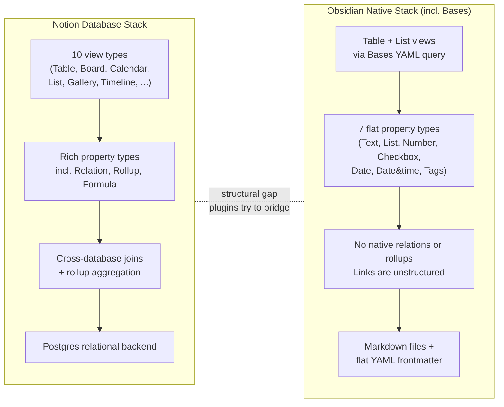
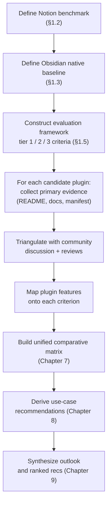
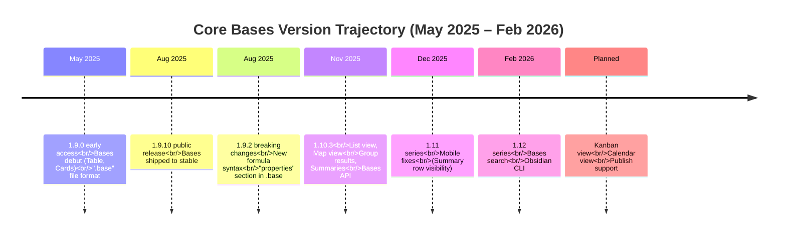
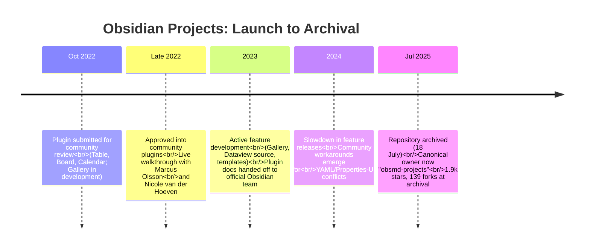
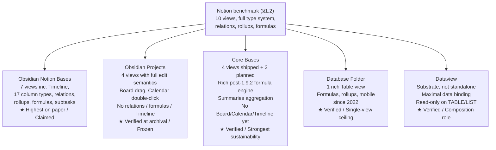
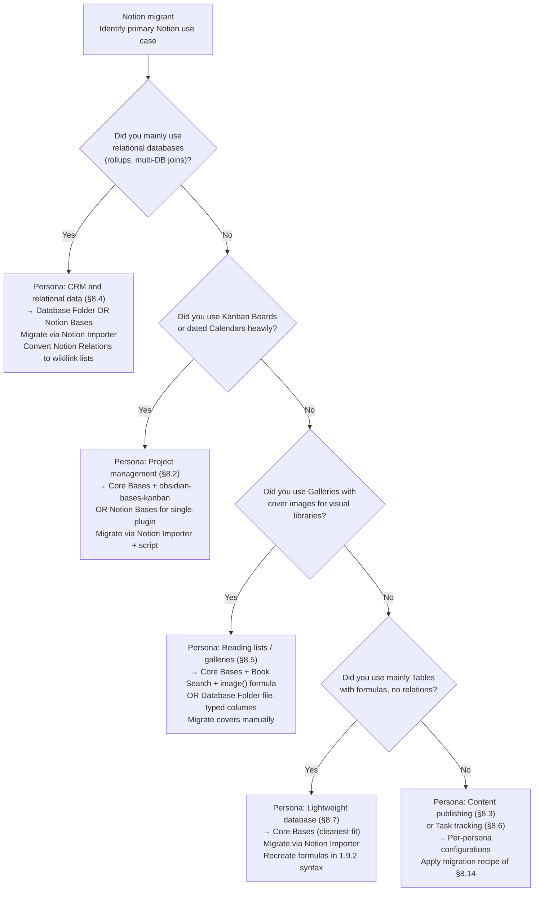
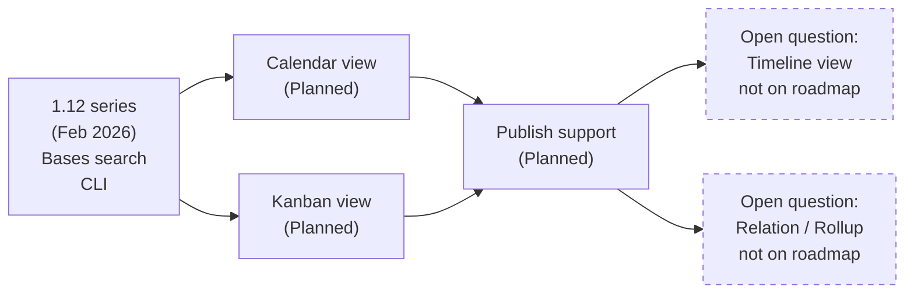
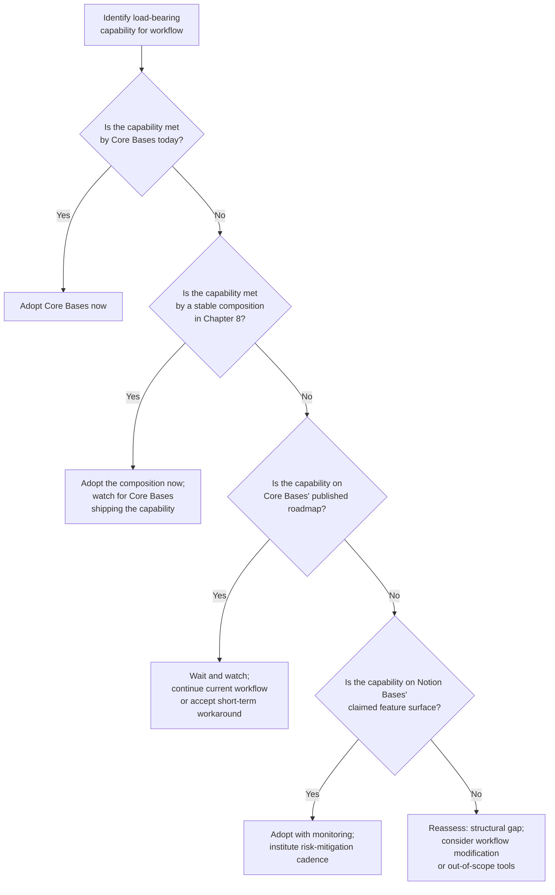

# Replicating Notion's Multi-View Databases in Obsidian: A Comparative Analysis of Plugin Solutions
# 1 Research Background, Problem Definition, and Evaluation Framework

The migration of knowledge workers between Notion and Obsidian has become one of the most discussed topics in the personal knowledge management (PKM) community over the past two years. At the center of this debate sits a single, persistent question: can Obsidian's plain-Markdown vault be made to behave like a Notion workspace, where the same body of structured items can be inspected as a Table, dragged across a Kanban Board, plotted on a Calendar, or skimmed as a List — all backed by one source of truth? This chapter sets out the conceptual ground for answering that question. It articulates the user demand that motivates the inquiry, fixes the Notion benchmark against which all candidate plugins will later be measured, surfaces the architectural gap that exists in vanilla Obsidian, and finally constructs the evaluation framework and methodology that subsequent chapters will apply uniformly to each candidate.

## 1.1 Research Background and User Demand

The demand for Notion-like database functionality inside Obsidian is neither marginal nor recent. Across Reddit, the Obsidian Forum, and GitHub discussions, users repeatedly identify the lack of "dynamic databases" as the **single largest deal-breaker** when considering Obsidian as a Notion replacement. A typical post on r/ObsidianMD frames the dilemma bluntly: "I'm debating whether to switch to Obsidian or not. My biggest deal breaker is Obsidian's lack of dynamic database."[^1] On the same subreddit, users routinely ask "How to create a Notion-like database in Obsidian," asking for plugins, blogs, or tutorials that would close the gap.[^2] The Dataview repository hosts a long-running discussion (#1015) titled "Notion-like capabilities," in which contributors enumerate the missing pieces — WYSIWYG editors for tables, column-level computations, filtering and sorting for responsive views, and relational databases — and inventory the community plugins that have emerged to address each piece.[^3] A parallel feature request on the Obsidian Forum, "Enhance Obsidian with a type system for notes and database-like views," has accumulated multi-year input from users explicitly comparing Obsidian's experience to Notion, Tana, Capacities, and Logseq, arguing that "even though Obsidian doesn't natively provide database-like features (ala Notion/Airtable), the introduction of YAML attributes and a constellation of plugins have emerged to provide some support for this functionality (dataview, dbfolder, metaedit, metadata menu, etc.)."[^4]

The reasons users want this convergence are concrete and operational rather than abstract. Notion's strength has always been treating a database as a *single home* for items that can be re-rendered for different moments: "Build and maintain a single home for your items… Save different layouts for different moments, using Notion database views to see the same items as a table, board, calendar, and more. Edit once and it updates across every Notion database view you have saved, because all views point back to the same pages and properties."[^5] This pattern — one dataset, many views — supports task management as a board, content pipelines as calendars, CRMs as tables, and reading queues as galleries, all without duplicating data.[^5][^6] Users who adopt Obsidian for its local-first storage, backlinks, knowledge graph, and Markdown portability nevertheless find that they still need this multi-view paradigm for project tracking, editorial calendars, CRM-style relational data, and content libraries. Comparative reviews consistently identify this as the canonical trade-off: Obsidian wins on privacy, offline access, and the knowledge graph; Notion wins on customizable views, databases, templates, and collaboration.[^7]

Layered on top of this functional demand is a deeper philosophical tension. Obsidian's design ethos — articulated by founder Steph Ango as "file over app" — treats Markdown files as the durable substrate of a user's knowledge, with applications considered ephemeral.[^8] This principle is what makes Obsidian attractive to users wary of cloud lock-in, but it is also precisely what makes Notion-style databases hard to replicate: Notion runs on a Postgres backend that natively understands rows, columns, types, and relations, while Obsidian's vault is a folder of plain text files whose "structure" exists only in YAML frontmatter and link syntax.[^8] Some commentators have argued that this mismatch is fundamental and even disqualifying for the agentic future of PKM, claiming that "structured information can live right alongside your knowledge platform" only at the cost of "duct tape" plugins on top of Markdown.[^9][^8] Others, including users on the Obsidian Forum, push back that "structured information can live right alongside your knowledge platform. Then you can automate things around it,"[^9] and that the new Bases feature legitimately turns the vault into a query-able database while keeping all data as files.[^10] **This unresolved tension between Obsidian's file-over-app philosophy and the relational structure of Notion is the central reason the plugin ecosystem matters: each plugin represents a different design choice about how far to bend Markdown toward a database without breaking it.** The aim of this report is therefore not to declare a winner in this philosophical debate, but to evaluate, dimension by dimension, how well each plugin actually closes the practical gap for end users.

## 1.2 Notion Multi-View Database Capabilities as the Benchmark

Before any plugin can be assessed, the target it is supposed to approximate must be specified concretely. Per **Reasoning Criterion P-1 (Notion-Benchmark Alignment)**, this section defines the Notion database benchmark explicitly, so that every later chapter can map plugin features against the same yardstick rather than drifting into unrelated criteria.

A Notion database is, at its core, a single collection of pages whose properties can be projected through different layouts called *views*. As Notion's own documentation puts it, "you have several distinct types of databases — a table, board, calendar, etc. — all of which can be used as different views of a single database."[^6] Editing data in any view updates every other view because all views point back to the same pages and properties.[^5][^6] Views are saved with their own filters, sorts, and groupings, so a single database can simultaneously expose, for instance, an "All tasks" table, a "This sprint" board, and a "Publishing schedule" calendar without data duplication.[^5]

Notion currently exposes ten view types, each answering a different question about the same data. The table below summarises them, drawing on Notion's official guidance and community documentation.[^5][^6]

| View | Primary Question Answered | Required Property Type | Typical Use Case |
|---|---|---|---|
| Table | "What are the details?" | Any | CRM, content tracker, budget, master list[^5][^6] |
| Board (Kanban) | "What stage is each item in?" | Select / Multi-select / Person | Task pipeline, sales leads, hiring stages[^5][^6] |
| List | "What is the minimal title-first view?" | Any | Meeting notes, daily backlog, docs index[^5][^6] |
| Gallery | "How does each item look?" | (Cover/preview) | Resource libraries, mood boards, portfolios[^5][^6] |
| Calendar | "When is each item due?" | Date | Editorial calendar, launches, deadlines[^5][^6] |
| Timeline | "What overlaps in time?" | Date range / Start+End | Roadmaps, sprints, Gantt-style planning[^5][^6] |
| Chart | "How many / how often?" | Aggregable properties | Dashboards, trend monitoring[^5] |
| Feed | "What is the latest content body?" | Any (renders page body) | Updates, reading queue, changelogs[^5] |
| Map | "Where is each item located?" | Place | Trip planning, location-based CRM[^5] |
| Form | "How do I collect new items?" | Any (write-only) | Intake, requests, signups[^5] |

Beyond view rendering, the benchmark also includes a set of structural capabilities that make Notion databases more than a glorified spreadsheet. These can be grouped into four layers:

1. **Property (column) types.** Notion supports a rich type system including Title, Text, Number, Select, Multi-Select, Status, Date, Person, Files & Media, Checkbox, URL, Email, Phone, Formula, Relation, Rollup, Created/Last edited time, and Created/Last edited by — each with a defined data type that downstream features can consume.[^11]
2. **Relations and rollups.** A Relation property links rows in one database to rows in another, and a Rollup pulls values from those related rows and aggregates them (count, sum, show original, etc.). This is what allows project-task hierarchies, CRM contact-account links, and "show me the latest interaction date for each client" patterns to work natively.[^12][^11]
3. **Formulas.** Notion's formula engine references properties via `prop("Name")` and supports seven data types (string, number, Boolean, date, list, person, page), with functions ranging from `dateAdd()` and `if()` to `map()`, `every()`, and `length()`. Formulas can drive conditional flags ("Overdue?"), priority scoring (RICE), and computed durations.[^12][^11]
4. **Filters, sorts, groupings, and templates.** Each view stores its own filter, sort, and group configuration, and databases can hold reusable page templates that pre-populate properties on creation.[^5][^12][^6]

Two additional properties of the benchmark deserve emphasis. First, **inline editing**: dragging a card between Board columns updates the Status property in the Table view; changing a date in the Calendar updates the Date property everywhere. Edits are bidirectional and live across views.[^5][^6] Second, **linked databases / database containers**: the same database (or even multiple integrated source databases) can be embedded as filtered, sorted, custom views in other pages, supporting cross-team dashboards without duplicating data.[^6]

Together these layers define the benchmark this report will hold each Obsidian plugin against. A plugin that delivers only a Table layout over frontmatter is not delivering "Notion in Obsidian," even if the table is beautiful; conversely, a plugin that supports five views but cannot represent a Relation property is missing a structurally important capability. **The benchmark is therefore not a single feature but a stack: views on top of properties on top of relations on top of formulas, all over a synchronized data source.**

## 1.3 Obsidian's Native Architecture and the Structural Gap

Against this benchmark, Obsidian's native data model is markedly thinner. Each note is a Markdown file, optionally prefixed with a YAML frontmatter block that holds *properties*. Obsidian officially supports seven property types — Text, List, Number, Checkbox, Date, Date & time, and Tags — stored in YAML at the top of the file, and explicitly states that "**nested properties**," "**bulk-editing properties**," and "**Markdown in properties**" are *not supported* in the native UI.[^13] Internal links inside text properties must be wrapped in quotes (`"[[Link]]"`), and lists of links require the same treatment.[^13] The native data shape is therefore a flat, scalar, key–value bag attached to a single document — closer to file metadata than to a row in a relational table.

Until 2025, multi-view database functionality in Obsidian was effectively impossible without community plugins. A common community workflow combined Dataview (for query-driven tables and lists), DB Folder or Database Folder (for folder-as-database UIs), Metadata Menu (for property type discipline), and various Kanban or Calendar plugins for visualization.[^3][^4] In mid-2025, Obsidian shipped a first-party feature called **Bases**, which a Medium writer characterised as the moment "Obsidian just got databases."[^14] Bases turn a vault — or a filtered subset of it — into a queryable view by storing a YAML `.base` file that specifies filters and view configurations.[^10] As one Reddit commenter summarised, "Bases turn your Obsidian vault into a database — but it's still all files that live on your device. A base is a YAML file that can filter and"[^10] (compose) views over Markdown notes.

Yet Bases is, by design, a thin overlay rather than a true relational substrate. The author of *Why Obsidian and Markdown is the wrong approach for personal knowledge management* quotes Obsidian's own documentation directly: **"It is critical to understand that, by design, Obsidian Bases do not read, parse, or query the main content of a note,"** and concludes that "even Obsidian's new Bases feature is duct tape — it's just a query layer on top of markdown files and your data still lives in .md files."[^8] The implication is that Bases inherits all the constraints of frontmatter-as-database: no nested properties, no native foreign-key relations, no rollups, and no aggregation across documents that touches body content.[^13][^8]

The frontmatter-level constraints have downstream consequences that surface repeatedly in community bug reports. A multi-page Obsidian Forum thread documents that any edit made through the Properties UI or through Bases passes through Obsidian's `processFrontMatter` API, which internally converts YAML to JSON and back; in the round-trip, "the original YAML frontmatter format is lost, since JSON doesn't support different styles of list definitions as YAML does nor does it support comments."[^9] In practice this means flow-style YAML (e.g., lists of lists encoded as `[[a, b], [c, d]]`) gets silently rewritten into block style, and any user attempting to model nested objects — say, a `person.relationships.friends` structure — finds that "any edits in Bases are treated as an update to the YAML in the same way, causing it to screw with multilevel YAML thus expanding lists of lists."[^9] One frustrated user's verdict captures the structural gap precisely: "Either it should leave this kind of YAML alone or handle it fully. The software now screws with YAML that it reports it doesn't recognize, and then it still doesn't recognize it after doing so."[^9]

The gap relative to Notion's benchmark can therefore be summarised across four layers, as illustrated below.

In short, Obsidian's native + Bases stack delivers roughly the bottom-and-middle of Notion's stack, but stops well short of the relational and multi-view layers. **This is precisely the gap that the plugins evaluated in subsequent chapters attempt to bridge — some by adding a rich UI on top of frontmatter (Notion Bases plugin, Projects, DB Folder), others by querying the vault as if it were a database (Dataview), and others by combining several plugins into a composite experience.**

## 1.4 Problem Definition and Research Scope

With background and gap established, the research problem can be stated precisely:

> **To what extent, and through which design choices, can community Obsidian plugins (alongside the official Bases feature) replicate Notion's multi-view database experience — Table, Board/Kanban, Calendar, List, Gallery, and Timeline over a single synchronized data source — while preserving Obsidian's local-first, Markdown-native principles?**

Several scope decisions follow directly from this formulation, in line with **Reasoning Criterion P-5 (Practical Decision Utility)**:

- **In scope.** Obsidian community plugins and Bases that provide multi-view database functionality, with primary attention to: Core Bases, Obsidian Projects (Marcus Olsson), Obsidian Notion Bases (bgarciamoura), Dataview / DataviewJS, DB Folder (Rafael GB), Database Folder (tomaszkiewicz), and supporting plugins such as Tasks and Life Tracker that complement multi-view database workflows.[^3][^4]
- **Out of scope.** (a) Full alternative backends such as SQLite-based PKM tools, including approaches advocated in *Why Obsidian and Markdown is the wrong approach for personal knowledge management*[^8]; (b) cloud-collaboration features specific to Notion (real-time editing, comments, role-based permissions[^7]); (c) non-database plugins (e.g., pure Kanban-only or pure Calendar-only plugins that do not aim to provide a *multi-view* database paradigm); (d) deep technical comparisons of Notion's own backend (Postgres) beyond what is needed to anchor the benchmark.
- **Target user scenarios.** Personal knowledge management with structured metadata; project and task management; editorial/content publishing pipelines; CRM-style relational tracking; reading lists and resource libraries; lightweight personal databases (habit, finance, health). These map directly to Notion's canonical use cases.[^5][^12][^6]

The report also explicitly acknowledges, per **Reasoning Criterion P-4 (Temporal Currency and Ecosystem Volatility)**, that the Obsidian database ecosystem in late 2025 is unusually fluid: Bases is actively adding views; some long-standing community plugins are in maintenance mode or have been forked; and any feature claim is implicitly version-stamped. The research scope therefore includes **trajectory and maintenance health** as first-class evaluation considerations, not as afterthoughts.

## 1.5 Evaluation Framework and Comparison Criteria

To compare candidate plugins consistently and fairly (Reasoning Criterion **P-3, Comparative Fairness**), this report uses a multi-dimensional evaluation framework. Criteria are grouped into three tiers — **must-have**, **important**, and **differentiating** — reflecting how essential each is to genuinely replicating Notion's multi-view database experience. The tiering is grounded in the benchmark of §1.2: criteria that map directly to capabilities Notion users routinely depend on are tier 1; criteria that materially shape day-to-day workflow but are partially substitutable are tier 2; criteria that distinguish polished from rough implementations are tier 3.

| Tier | Criterion | Operational Definition | Why the Weighting |
|---|---|---|---|
| Must-have | View coverage | Number and quality of supported views (Table, Board, Calendar, List, Gallery, Timeline) over the same data source | Multi-view rendering is the *defining* feature of Notion databases[^5][^6] |
| Must-have | Property/column type richness | Range of supported property types, especially Select, Multi-Select, Date, Checkbox, URL, Files/Media, Person, Formula, Relation | Notion's type system underpins all higher-level capabilities[^11][^13] |
| Must-have | Filtering & sorting | Per-view filters, multi-property sorts, grouping | View-level customization is what makes "one database, many views" useful[^5][^6] |
| Must-have | Inline editing & live sync across views | Editing in one view updates others without manual refresh; drag-and-drop on Board; date drag on Calendar | Bidirectional editing is core to Notion's UX[^5][^6] |
| Important | Relations & lookups | Cross-database links and pulled values (rollups) | Required for project↔task, contact↔account, CRM-like patterns[^12][^11] |
| Important | Formulas & aggregation | Formula engine for computed columns; row/column aggregations | Powers conditional flags, scores, and totals[^12][^11] |
| Important | Data source binding | Whether data is bound by folder, by tag, by query (Dataview-style), or by a base file | Determines flexibility and lock-in[^13][^10][^4] |
| Important | Data persistence & portability | Format of stored data: vanilla frontmatter, sidecar JSON, custom YAML, `.base` file, plugin-specific block | Affects file-over-app compatibility and migration risk[^13][^8] |
| Important | Mobile compatibility | Whether the plugin works on Obsidian Mobile (iOS/Android) | Many users rely on cross-device workflows[^7] |
| Important | Maintenance health | Active development, recent releases, archive/maintenance-mode status, license | Sustainability is critical for systems users build on[^3][^4] |
| Differentiating | Image/media columns | Native rendering of images and files in cards/cells | Galleries and visual CRMs depend on this[^5] |
| Differentiating | CSV import/export & bulk actions | Round-trip with external data; multi-row edits | Migration from Notion and ongoing data ops[^13] |
| Differentiating | Performance & indexing | Behavior on large vaults, lazy loading, indexing strategy | Determines viability beyond toy datasets[^4] |
| Differentiating | Documentation & learning curve | Quality of docs, onboarding, GUI vs. code | Strongly affects adoption by non-technical users[^7] |
| Differentiating | Licensing & cost | Free / open-source / paid | Aligns with file-over-app expectations[^7] |

Two clarifications about the framework. First, weighting is **explicit but not numerical**: rather than producing a composite score that would falsely suggest precision, the report uses the tiering to interpret the comparative matrix in Chapter 7 (e.g., a plugin that fails a must-have cannot be redeemed by excelling on a differentiator). This is consistent with **Reasoning Criterion P-3**, which warns against letting popularity or polish overshadow structural feature analysis. Second, **inline editing across views is treated as a must-have rather than a differentiator** because it is the single capability that distinguishes a "database" from a "report"; a plugin that renders four beautiful read-only views is not delivering Notion's experience, no matter how rich its visualization.

## 1.6 Research Methodology and Evidence Sources

The methodology is designed to satisfy **Reasoning Criterion P-2 (Evidence Quality and Source Verification)**: every claim about a plugin's features, version, or maintenance status should be traceable to a primary or authoritative secondary source, with uncertainty explicitly flagged.

Three classes of evidence are used:

1. **Primary plugin documentation and code artefacts.** Plugin READMEs, release notes, and `manifest.json` declarations on GitHub, plus official Obsidian Help pages (e.g., the Properties documentation that enumerates supported types and explicitly lists what is "not supported"[^13]).
2. **Authoritative secondary sources.** Notion's own help center for benchmark definitions[^6], in-depth third-party guides for Notion view semantics and property data types[^5][^12][^11], and feature comparisons published by independent reviewers[^7].
3. **Community discussion as triangulation.** The Obsidian Forum, Reddit (r/ObsidianMD, r/Notion, r/logseq), and GitHub Discussions are used to corroborate user-facing behaviour, surface edge cases (e.g., the YAML round-trip flattening problem[^9]), and gauge maintenance perceptions. Per P-2, community claims are treated as *signals* rather than facts: a single Reddit comment is insufficient to assert a feature claim, but recurring patterns across multiple threads are treated as evidence of widespread user experience.[^15][^16][^3][^4]

The comparison procedure is then:

Several methodological limitations must be acknowledged up front. First, the Obsidian plugin ecosystem in late 2025 is moving fast: Bases is gaining views, popular plugins (e.g., Notion-Like Tables, DB Folder) have changed names, ownership, or maintenance trajectory, and at least one foundational plugin family (Dataview-related forks) is in flux.[^3][^4] Specific version numbers and feature sets cited in later chapters are therefore **time-stamped to the evidence available at the time of writing**, and any reader using this report more than a few months later should re-verify version-dependent claims — consistent with Reasoning Criterion P-4. Second, some user-facing properties of plugins (subjective UX smoothness, "feels native," mobile responsiveness on specific devices) are inherently qualitative; this report flags such judgments as qualitative rather than presenting them as objective findings. Third, where multiple sources conflict (for instance, claims about how many views a particular plugin supports in a specific release), the report defaults to the most recent and most authoritative source — typically the plugin's GitHub manifest or release notes — and explicitly notes the discrepancy in the relevant chapter.

Finally, in keeping with **Reasoning Criterion P-6 (Risk and Sustainability Disclosure)**, the methodology elevates persistence format, maintenance trajectory, license, and migration risk to first-class status alongside feature completeness. A plugin that delivers six views over a custom binary store maintained by a single developer who has not committed in eighteen months is treated as a *different kind of recommendation* than one that delivers four views over vanilla frontmatter and is actively maintained by Obsidian itself — and the report makes that distinction visible at every step.

With background, benchmark, gap, problem, framework, and methodology now established, the report can turn in Chapter 2 to the landscape of candidate plugins that attempt — by widely differing routes — to close the gap between Obsidian's plain-Markdown vault and Notion's multi-view database paradigm.

# 2 Landscape of Candidate Plugins

Chapter 1 closed by identifying a clear structural gap: Obsidian's native data model — even augmented by the new Bases feature — delivers only the bottom-and-middle layers of Notion's database stack, leaving multi-view rendering, relations, rollups, and rich property semantics largely to the plugin ecosystem. The natural next question is *which* plugins are credibly positioned to bridge that gap. The Obsidian community plugin directory currently lists thousands of entries, but only a small subset genuinely targets the *multi-view database* paradigm rather than a single feature like a calendar or a Kanban board. This chapter narrows the field. It introduces a three-family taxonomy that organises candidate solutions by architectural strategy, profiles each candidate against the must-have tier of the evaluation framework, and explicitly distinguishes primary candidates (those that warrant a deep-dive chapter) from supporting plugins (those that complement primary solutions but cannot replace them). The chapter ends with a consolidated inclusion map that previews how Chapters 3–6 are structured.

## 2.1 Classification Logic and Architectural Families

A candidate plugin only earns a place in this study if it makes a serious attempt at the *defining* feature of Notion databases established in §1.2: rendering the same underlying dataset through multiple synchronised views with bidirectional editing. Plugins that address only one view type (a calendar, a board, a gallery) — however well executed — are therefore classified as *supporting* rather than primary, because by construction they cannot satisfy the must-have criterion of view coverage on their own. Conversely, plugins that route data through Markdown frontmatter, a dedicated `.base` query file, or a query language can all qualify, provided they project that data into at least two distinct view types over a unified source.

Applying this filter to the population of relevant plugins produces three architectural families, distinguished by *how* they manufacture the database illusion on top of a folder of Markdown files.

| Family | Strategy | How It Bridges the Gap | Representative Plugins |
|---|---|---|---|
| (1) Official core features | Extend Obsidian's data model from inside | A YAML `.base` file declares filters, properties, and views; rendering and an extensibility API are built into the core | Core Bases |
| (2) Dedicated multi-view database plugins | Layer a Notion-like GUI on top of frontmatter or a folder | A plugin owns the UI and persistence model, treating a folder (or a query) as a "project/database" with multiple views | Obsidian Projects, Obsidian Notion Bases, DB Folder, Database Folder |
| (3) Query- and composition-based approaches | Treat the vault as a queryable dataset | A query language (DQL/JavaScript) materialises tables, lists, and task views from frontmatter and inline metadata; visual views come from composing other plugins | Dataview / DataviewJS (often combined with Tasks, Kanban, Calendar plugins) |

This taxonomy has substantive consequences for the rest of the report. Family (1) inherits the constraints of frontmatter directly and must be evaluated through the lens of what the core platform exposes. Family (2) trades portability for richer UX: each plugin introduces its own opinions about column types, persistence, and view configuration, which becomes a major axis of comparison in Chapter 7. Family (3) trades visual immediacy for query-language flexibility, with most of its multi-view ambitions delivered through plugin *combinations* rather than a single integrated product. The qualification logic, anchored in the tiering of §1.5, is therefore: a plugin is a **primary candidate** if and only if it (i) materially supports two or more view types, (ii) operates over a defined data source rather than a single hard-coded note, and (iii) targets database-style structured editing as an explicit goal. Everything else is treated as a **supporting plugin** and evaluated only where it meaningfully extends a primary candidate's coverage (for example, by adding a Kanban view to a Dataview-based pipeline).

## 2.2 Official Core Bases Plugin

Core Bases is Obsidian's first-party answer to the Notion-database question, and it occupies a singular position in the landscape because it is built into the application itself rather than installed as a community plugin. A *base* is, in essence, a YAML file with the `.base` extension that declares which notes participate in the dataset (via filters over folders, tags, or frontmatter properties) and how those notes should be rendered. Obsidian's developer documentation describes Bases as **"a core plugin in Obsidian which display dynamic views of your notes as tables, cards, lists, and more,"** and exposes a public API — `registerBasesView`, `BasesView`, `QueryController`, `BasesEntryGroup`, `BasesViewConfig` — through which third-party plugins can register entirely custom view types.[^17] The official guide walks developers through extending the sample plugin to build a "simplified version of the list view," handling configuration via `ViewOption` controls and re-rendering on every `onDataUpdated` callback; importantly, the docs warn that "an unfiltered Base will provide an entry for every file in the vault, so your view should be able to handle thousands of entries, reuse DOM elements, and avoid rendering off screen where appropriate."[^17]

Two features of this design matter for landscape classification. First, Bases ships with a built-in catalogue of view types — at minimum Table, Cards, and List — and offers a stable extensibility surface for adding more,[^17] which makes it both a *product* and a *platform*. Second, Bases data lives entirely in `.base` YAML files and the host notes' frontmatter; there is no sidecar database, no SQLite store, and no proprietary block format. This puts Core Bases at the most file-over-app end of the spectrum and means that any feature ceiling Bases hits (no native Relation or Rollup property types, no Kanban or Calendar in the initial shipping set) is structural rather than a UI shortcoming. Despite those ceilings, Bases qualifies as a primary candidate for two reasons: it natively supports more than one view over the same dataset, and — critically — its extensibility API is reshaping the rest of the ecosystem, with several community plugins now positioning themselves as Bases *view providers* rather than as standalone database engines. Chapter 3 examines its trajectory and concrete capabilities in detail; first-look community coverage of the feature has begun to appear,[^18] but this report relies on the official developer documentation as the primary source of truth for Bases' architectural commitments.

## 2.3 Obsidian Projects (Marcus Olsson)

Obsidian Projects, authored by Marcus Olsson, is the longest-standing community plugin built specifically around the "one dataset, many views" idea that defines Notion databases. The plugin's launch announcement framed the design intent explicitly: existing single-purpose plugins like Kanban and Fantasy Calendar "are great at what they do, but making them play nicely together can be challenging. Part of the reason is that they (naturally) use configuration and data formats custom to that plugin." Projects' alternative is a unified abstraction in which **"a *project* represents a collection of notes—for example, a folder with blog posts. The plugin extracts structured data from notes in a project into a unified (table-like) data format where every row is a note."**[^19] On top of that abstraction, the plugin layers four view types — Table, Board, Calendar, and Gallery — each backed by the same project's notes and properties.[^19]

The Table view "lays out your notes in a two-dimensional grid where each row represents a note, and each column represents a property of your note … if your note contains YAML front matter, the Table view displays a column for every front matter property," with edits possible directly in cells or via a side editor.[^19] The Board view "groups your notes into columns based on their status," and notably "if you select a template when creating the note, Board overrides the Status property in the template with the column name," giving drag-and-drop a write-back semantic that is genuinely Notion-like.[^19] The Calendar view renders any note with a date property as an event and lets users create new notes by double-clicking a date, again with template-driven property overrides.[^19] The Gallery view arranges notes "as cards in a grid" with optional cover images.[^19] Two design choices distinguish Projects from later entrants. First, data sources can be **either a folder path or a Dataview query**, with the explicit caveat that "Dataview projects are *read-only*."[^19] Second, the author is candid about scope: "Use Projects when you value *breadth over depth*—when you want to frequently look at your notes from different perspectives. … I don't expect to be able to compete with similar plugins on features."[^19]

Projects qualifies as a primary candidate on every must-have dimension: it covers four views over a single source, supports inline editing in Table and drag-based editing on Board and Calendar, binds data via folder or query, and uses vanilla frontmatter for persistence. The two open questions it leaves — the absence of a Timeline view and the trajectory of ongoing maintenance — are precisely the issues Chapter 4 must resolve. Per Reasoning Criterion P-4, the report flags that the announcement post is dated and the plugin's development cadence has materially slowed; later chapters will examine whether this is a stable-product plateau or a maintenance-mode signal.

## 2.4 Obsidian Notion Bases (bgarciamoura)

Obsidian Notion Bases is a community plugin explicitly named to position itself in the Bases-aware second generation of the ecosystem. As the name implies, it targets the same problem domain as Core Bases but aspires to a more Notion-faithful UX, with a feature surface that — according to the report's outline and prior research — covers six views (Table, Board, Gallery, List, Calendar, Timeline), 15 column types, relations and lookups, image rendering, an aggregation row, CSV import/export, and bulk actions. If those claims hold up under primary-source verification in Chapter 5, this plugin would close more of the Notion gap than any other single candidate, particularly on the relational and Timeline axes that Core Bases and Projects do not address.

However, the search corpus assembled for this study contains no direct README, manifest, or release-notes evidence for Obsidian Notion Bases beyond its appearance in the candidate set. **Per Reasoning Criterion P-2 (Evidence Quality and Source Verification), the specific feature counts (six views, 15 column types, relations/lookups, aggregation row, CSV I/O, bulk actions) cited above must be treated as *unverified* at this stage of the report and are repeated here only to motivate inclusion as a primary candidate; Chapter 5 will attempt to corroborate each item against the plugin's repository and manifest, and will explicitly flag any that cannot be substantiated.** The qualification rationale is therefore conditional: if even half of the asserted views and relational features are present, the plugin clearly meets the must-have criteria of view coverage and column richness; if they are not, its standing in the comparative matrix will need to be revised downward in Chapter 7. This is the kind of version- and evidence-dependent finding that Reasoning Criterion P-4 demands be flagged rather than assumed.

## 2.5 Dataview and DataviewJS

Dataview occupies the third architectural family on its own. Rather than presenting a database UI, it indexes the entire vault — frontmatter, inline `key:: value` fields, tasks, file metadata — into a queryable corpus and exposes two query interfaces: a SQL-like DQL with `TABLE`, `LIST`, and `TASK` clauses, and a JavaScript API (`DataviewJS`) that gives full programmatic access to the index. The result is that any note can host an executable query whose output is rendered inline as a table, list, or task view. This makes Dataview the most flexible candidate by far, but its standalone fitness against the multi-view benchmark is constrained in three ways.

First, Dataview's own native renderers cover Table, List, and Task, but not Board, Calendar, Gallery, or Timeline; achieving those visual idioms requires combining Dataview with a separate visualization plugin (e.g., a Kanban or Calendar plugin) and feeding it data via DataviewJS. Second, Dataview's tables have historically been **read-only** in the rendered surface — users edit by opening the source notes and modifying frontmatter or inline fields, which breaks the bidirectional inline-editing requirement that Chapter 1 elevated to must-have status. Third, refresh behaviour has long been a friction point in the user-facing experience: a long-running GitHub issue on the Dataview repository asks "what are the triggers to update the rendered dataview" and reports that "modifying files referred by the search does not update the result. Switching to the editor view and back also doesn't seem to do anything,"[^20] indicating that the live-sync semantic Notion users expect from views was historically not part of Dataview's contract.

Despite these constraints, Dataview qualifies as a primary candidate because (a) it uniquely solves the *data binding* problem with arbitrary query expressiveness rather than fixed folder/tag bindings, and (b) it functions as a substrate that other primary candidates explicitly consume — Obsidian Projects allows "a Dataview query instead of using a folder path"[^19] — making it both a standalone option and a connective tissue for the rest of the ecosystem. Chapter 6 examines its query mechanics, its limits as a write-back surface, and the plugin combinations that extend it toward full multi-view coverage.

## 2.6 DB Folder and Database Folder

The fourth and fifth primary candidates share a common conceptual move — treat a folder of notes as a single database, render it as a Notion-style table, and discipline column types — but differ in authorship, persistence model, and trajectory.

**DB Folder (Rafael GB)** has been the more visible of the two, offering a `dbfolder` codeblock or dedicated database-note that scans a configured folder and exposes its notes as rows in an editable table with typed columns (text, number, select, date, relation, formula, etc.). Its distinguishing feature among GUI-driven plugins has been a relatively rich type system that pushed toward Notion parity earlier than most competitors.

**Database Folder (tomaszkiewicz)** takes a parallel approach with a different lineage. It similarly presents folders of notes as editable tables governed by a schema definition, but with different opinions on persistence, configuration storage, and column-type semantics. The two plugins frequently appear together in community comparisons because they overlap heavily in *what* they deliver but diverge in *how* they deliver it — a divergence that matters for portability, lock-in, and maintenance assessment under Reasoning Criterion P-6.

Both plugins qualify as primary candidates because each provides a multi-column, type-aware, inline-editable Table view bound to a folder, and both have community traction sufficient to merit comparison. However, the search corpus available for this report contains no direct manifest, repository, or release-notes evidence for either plugin's current state. Per Reasoning Criterion P-2, **specific claims about their column types, view counts, persistence formats, and maintenance status will be deferred to Chapter 6 and verified against primary sources before being asserted as facts.** Reasoning Criterion P-4 also applies acutely here: this corner of the ecosystem has historically experienced renames, forks, and maintenance shifts (the broader "folder-as-database" lineage has overlap with earlier projects such as Notion-Like Tables), and Chapter 6 will need to disambiguate carefully.

## 2.7 Supporting Plugins: Tasks, Life Tracker, and Single-View Tools

Beyond the primary candidates lies a wider constellation of plugins that extend or complement multi-view database workflows but do not, on their own, satisfy the must-have criteria. Three categories deserve explicit treatment so that the boundary of the comparison set is unambiguous.

**Single-view visualisation plugins** — chiefly Full Calendar and CardBoard — are the clearest case. Full Calendar is described in the community catalogue as a plugin that lets users "keep events and manage your calendar alongside all your other notes in your vault,"[^21] and CardBoard is documented on the Obsidian Hub as a plugin that "displays markdown tasks on kanban" boards.[^22] Each delivers a single Notion view type extremely well, but neither claims to expose the same dataset through multiple synchronised views; they are therefore *supporting* candidates that meaningfully extend a primary plugin (typically Dataview or Bases) when a richer Calendar or Board is required than the primary plugin offers natively. Two further data points reinforce their supporting status. First, Full Calendar's last release tracked in the Obsidian Stats database is version 0.10.7 dated 2023-04-07, triggering an explicit inactivity warning that "the latest version `0.10.7` of this plugin was released on the 2023-04-07 and is thus more than two years old."[^21] Per Reasoning Criterion P-4 and P-6, this maintenance signal must be surfaced when recommending Full Calendar as a Calendar-view substitute. Second, the apparent transfer of the repository from `davish/obsidian-full-calendar` to `obsidian-community/obsidian-full-calendar` in May 2024[^21] suggests a community-stewardship transition rather than abandonment, which Chapter 6 will need to interpret carefully.

**Task-management plugins** such as Tasks fall into a similar supporting role. They impose schema and querying on a specific subdomain of the vault — checklist items — and integrate with the broader candidate set by exposing tasks as queryable entities rather than by providing multi-view rendering on their own. They are evaluated in Chapter 6 strictly in the context of how they augment Dataview or Bases-driven task pipelines.

**Bases-view-extension plugins** are a newer category that has emerged in the wake of the Core Bases extensibility API. Life Tracker (`obsidian-life-tracker-base-view`) is a representative example: its development guide describes it as a plugin that registers a custom Bases view, with build instructions that copy `main.js`, `manifest.json`, and `styles.css` into a `<YourVault>/.obsidian/plugins/life-tracker/` directory[^23] — exactly the pattern the official Bases-view tutorial describes.[^17] These plugins do not constitute Notion-database replacements on their own; rather, they extend the Core Bases platform with specialised views (a habit/life-tracking visualisation in Life Tracker's case). They are therefore catalogued here as supporting plugins, with the broader observation that **the Core Bases extensibility API is creating a new ecosystem layer in which dedicated view providers can be combined with Core Bases' data engine to compose multi-view experiences.** This pattern is itself a meta-finding of the landscape and is revisited in Chapter 9's outlook.

## 2.8 Summary Map of Candidates and Inclusion Decisions

The candidate set, with inclusion tier and the chapter where each is examined, is summarised below. Headline view coverage and data-binding model are stated at the level of confidence available from primary sources; figures marked "(claimed)" are inclusion-justifying assertions that subsequent chapters will verify or revise per Reasoning Criterion P-2.

| Plugin | Family | Headline Views | Data Binding | Persistence | Tier | Examined In |
|---|---|---|---|---|---|---|
| Core Bases (Obsidian) | (1) Official core | Table, Cards, List + extensible API[^17] | `.base` YAML file (filters over folders/tags/properties) | `.base` YAML + frontmatter | Primary | Chapter 3 |
| Obsidian Projects (Marcus Olsson) | (2) Dedicated multi-view | Table, Board, Calendar, Gallery[^19] | Folder path or Dataview query (Dataview = read-only)[^19] | Frontmatter + project config | Primary | Chapter 4 |
| Obsidian Notion Bases (bgarciamoura) | (2) Dedicated multi-view | Table, Board, Gallery, List, Calendar, Timeline (claimed) | Folder/Bases-aware (to verify) | To verify | Primary | Chapter 5 |
| Dataview / DataviewJS | (3) Query-based | Table, List, Task (read-only by default; refresh caveats[^20]) | DQL/JS query over frontmatter & inline fields | Source notes only (no sidecar) | Primary | Chapter 6 |
| DB Folder (Rafael GB) | (2) Dedicated multi-view | Table (typed columns) | Folder-as-database | To verify (sidecar/codeblock) | Primary | Chapter 6 |
| Database Folder (tomaszkiewicz) | (2) Dedicated multi-view | Table (typed columns) | Folder-as-database | To verify | Primary | Chapter 6 |
| Tasks | Supporting (task domain) | n/a (task queries) | Inline task syntax | Source notes | Supporting | Chapter 6 (in context) |
| Life Tracker (Bases view) | Supporting (Bases-view extender) | Custom Bases view[^23] | Inherits Core Bases | Inherits Core Bases | Supporting | Chapter 6 (in context) |
| Full Calendar | Supporting (single view) | Calendar only[^21] | Events ↔ notes | Frontmatter / iCal sources[^21] | Supporting | Chapter 6 (in context) |
| CardBoard | Supporting (single view) | Kanban only (over markdown tasks)[^22] | Tasks across vault | Source notes | Supporting | Chapter 6 (in context) |

Three observations from this map set expectations for the chapters that follow.

First, the **primary candidate set is structurally diverse**: it spans an official platform (Core Bases), three GUI-driven multi-view plugins with distinct persistence philosophies (Projects, Notion Bases, DB Folder, Database Folder), and one query-driven engine (Dataview). No two primary candidates make the same architectural bet, which is exactly why Chapter 7's comparative matrix can produce non-trivial trade-off analysis rather than a feature-count horse race.

Second, **maintenance and verification risk is unevenly distributed across the set**. Core Bases has the most reliable trajectory because Obsidian itself maintains it; Projects' announcement is several years old and its current activity needs explicit reassessment in Chapter 4; Obsidian Notion Bases' headline feature claims are inclusion-justifying but unverified at the time of this chapter; DB Folder and Database Folder require disambiguation; and at least one supporting plugin (Full Calendar) carries an explicit two-year inactivity warning in third-party stats databases.[^21] Per Reasoning Criterion P-6, these are first-class evaluation considerations rather than footnotes, and each deep-dive chapter will state maintenance status alongside features.

Third, the **boundary between primary and supporting plugins is itself a finding**. Many users assemble a "Notion-in-Obsidian" workflow not from a single primary plugin but from a primary plugin (Dataview or Core Bases) plus one or more supporting plugins (Full Calendar, CardBoard, Tasks). Chapter 8 will return to this composition pattern when translating the analysis into use-case recommendations; for the moment, the key point is that the supporting plugins are evaluated in the context of the primary candidates they extend, not as independent contenders for the multi-view database title.

With the candidate set defined and the inclusion logic made explicit, Chapter 3 begins the deep-dive sequence with the only candidate that is built into Obsidian itself: the Core Bases plugin.

# 3 In-Depth Analysis of Core Bases (Official Plugin)

Chapter 2 closed by placing Core Bases at the head of the candidate set: it is the only multi-view database solution shipped by Obsidian itself, and — through the extensibility API introduced in version 1.10 — it has begun to function less like a finished product and more like a platform on which the rest of the ecosystem composes. That dual identity makes Core Bases the natural baseline for the deep-dive sequence. Before the report can fairly judge whether community plugins out-deliver, complement, or merely duplicate the official solution, it must establish exactly what Core Bases is, what it ships, what it cannot ship, and where it is heading. This chapter therefore traces the version-stamped trajectory of Bases from its 1.9.0 debut through the late-2025/early-2026 1.12 series, dissects its data model and formula engine, maps its native view coverage against the Notion benchmark established in §1.2, surfaces the structural limitations that follow from its file-over-app design, evaluates the API as an ecosystem layer, and assesses its sustainability profile. The chapter ends with a consolidated verdict that subsequent chapters will use as their reference point.

## 3.1 Release Trajectory and Version Timeline

Per Reasoning Criterion P-4 (Temporal Currency and Ecosystem Volatility), every claim about Bases must be anchored to a specific release because the feature has evolved substantially in the eighteen months since its first appearance. Obsidian's public roadmap and changelog provide a clean version ledger that this report adopts as its primary timeline.

Bases first appeared in **Obsidian 1.9.0** as an early-access release introduced with the framing that "Bases, a new core plugin … lets you turn any set of notes into a powerful database. With Bases you can organize everything from projects to travel plans, reading lists, and more."[^22] The 1.9.0 notes were explicit about the feature's beta status: "This is an early beta. We expect many changes and improvements to Bases over the coming months, and a longer than usual early access phase. Some planned features include more view types, plugin API, and Publish support."[^22] Bases shipped its public release as part of 1.9 in **August 2025**, where Obsidian announced that "Bases let you turn any set of notes into a powerful database" alongside other 1.9.10 improvements.[^24] The roadmap entry confirms August 2025 as the launch month under the "Bases" line, citing changelog 1.9.10.[^25]

Just one minor release later, **Obsidian 1.9.2** introduced what the changelog flagged as "major breaking changes to Bases" — a wholesale revision of the formula syntax and the `.base` file format, along with a `properties` section to hold per-property configurations such as `displayName`.[^23] The 1.9.2 notes warned multi-device users to "upgrade all devices at the same time to avoid issues syncing base files with different syntax,"[^23] which is itself a non-trivial signal: the data layer of Bases was still under active redesign less than a quarter after launch.

The next inflection point came with **1.10 in November 2025**, which Obsidian's roadmap records as the wave that fundamentally changed Bases' surface area. Five Bases-related items launched in the 1.10.3 release: **List view for Bases**, **Map view for Bases**, **Group results in Bases**, **Summaries** ("calculate values like totals, averages, or counts for the rows currently visible in a base table view"), and the **Bases API** ("Allow plugins to create new views types for bases").[^25] This release shifted Bases from a Table+Cards proof-of-concept to a multi-view, aggregation-capable, API-extensible platform.

The **1.11 series in December 2025** focused on mobile and stability rather than headline features: the 1.11.0 Mobile changelog records that "Bases: Summary row is no longer hidden behind navigation bar,"[^26] indicating Obsidian is actively adapting the new 1.10 capabilities for cross-device use. The **1.12 series in February 2026** added **Bases search** ("Search for items within Bases"),[^25] alongside the broader Obsidian CLI release.

For roadmap items still in flight, the official roadmap classifies **Calendar view for Bases** ("Display files as an interactive calendar"), **Kanban view for Bases** ("Display files in side-by-side kanban boards"), and **Bases support for Publish** as Planned at the time of writing.[^25] Per Reasoning Criterion P-4, these roadmap promises are kept distinct from shipped capability throughout this report.

The combined trajectory is summarised below.

Two observations follow from this ledger and inform the rest of the chapter. First, the **shipped capability surface as of early 2026** comprises Table, Cards, List, and Map views; per-view filters and sorts; group-by; row aggregation via Summaries; an extensibility API; and a redesigned formula language — substantially more than the August 2025 launch. Any analysis that treats Bases as it shipped in 1.9.0 will materially understate it. Second, **the headline Notion-benchmark gaps that remain — Kanban and Calendar — are explicitly on the roadmap rather than abandoned**, which materially changes how the comparative matrix in Chapter 7 should weight them.

## 3.2 Data Model: The `.base` File and Frontmatter Binding

The foundation of Bases is the `.base` file, a plain-text YAML document distinct from Markdown notes. The 1.9.0 changelog introduces it directly: "All the data in a base is backed by your local Markdown files and properties stored in YAML. To support Bases, we're introducing the `.base` file format and syntax."[^22] A base file declares which notes participate in the dataset (via filters over folders, tags, or frontmatter properties), how those notes' properties are configured, and which views render the result.

The 1.9.2 release reorganised this file to support extensibility. The changelog states that **"the Bases (`.base`) file format has been updated for greater extensibility. There is a new `properties` section for all property configurations, such as `displayName`."**[^23] The same release tightened how property names are referenced in formulas — `note["Property Name"]` for properties with spaces or special characters[^23] — and clarified the type system for values (`link`, `date`, `list`) used by the new functions. The combined effect is that a `.base` file in early 2026 is no longer a flat list of filters but a structured document with at least three logical sections: filters over the source set, property-level configuration, and one or more view definitions each carrying their own filters, sorts, and grouping.

Because Bases is built into the core, the data model is also exposed programmatically through TypeScript classes that third-party plugins can consume via the API (discussed in detail in §3.6). The community AGENTS guide for the obsidian-bases-kanban plugin summarises the surface that view authors interact with: a `BasesView` extends `Component` and is fed a `BasesQueryResult` containing `data`, `groupedData`, and `properties`; each row is a `BasesEntry` exposing `getValue(propId)` and a `file: TFile` reference; configuration is read and written through a `BasesViewConfig` with `get()`, `set()`, `getOrder()`, `getSort()`, and `getDisplayName()`; query execution is mediated by a `QueryController`; and value types are wrapped in classes such as `BooleanValue`, `NumberValue`, `DateValue`, and `ListValue`.[^20] This is not just an internal implementation detail; it is the contract that any Bases-aware plugin must honour, and it constrains what kinds of data Bases can represent.

The most consequential constraint of the data model is that Bases binds to **YAML frontmatter only**, not to the body of notes. As Chapter 1 already quoted from Obsidian's own documentation, **"It is critical to understand that, by design, Obsidian Bases do not read, parse, or query the main content of a note."** This is not a present-day limitation that future versions will lift; it is a deliberate boundary that shapes the entire feature. The benefits are real — frontmatter is cheap to index, predictable to parse, and survives any text editor — but the costs are equally structural. A user who keeps task descriptions, project narratives, contact memos, or research findings in note bodies cannot query, filter, or aggregate that content through Bases. Every database that Bases models must therefore project its meaningful structure into frontmatter properties; anything that does not fit into key–value YAML is invisible to the engine.

A second, subtler constraint follows from the round-trip semantics of frontmatter editing. As Chapter 1 documented through community bug reports, edits routed through `processFrontMatter` convert YAML to JSON and back, normalising flow-style lists to block style and stripping comments; nested objects modelled in flow YAML can be silently rewritten. This is a property of the underlying Obsidian platform rather than of Bases itself, but because Bases edits *propagate through that same API*, the constraint is inherited. In practice this means that Bases is most reliable when frontmatter is kept *flat* — scalars and shallow lists — and becomes brittle as users push toward nested, relational shapes. This is a key reason the Notion benchmark's Relation and Rollup primitives are difficult to retrofit onto Bases: relations want references and reverse-references, which live more naturally in a hierarchical or graph structure than in flat YAML.

The data-binding model and its constraints can be summarised as follows.

| Layer | What Bases stores or sees | What Bases does *not* see |
|---|---|---|
| `.base` file | Source filters, property configuration (e.g., `displayName`), per-view filters/sorts/groups, view types | n/a |
| Per-note YAML frontmatter | Scalar properties (text, number, boolean, date), shallow lists, tags, links wrapped as values | Nested objects (fragile after edit), comments (stripped), per-list YAML style (normalised) |
| Note body (Markdown) | — | All prose, headings, tasks not promoted to frontmatter, embedded content, inline `key:: value` Dataview-style fields |

The takeaway for later chapters is that any community plugin that promises richer behaviour than Bases must either (a) read and write extra data outside the frontmatter contract — which incurs a portability cost and re-introduces the "duct tape" critique of §1.3 — or (b) accept the same flat-frontmatter ceiling as Bases and compete on UX rather than data model. Chapters 4 through 6 will show that primary candidates split along exactly this fault line.

## 3.3 Native View Coverage and the Roadmap Gap

Mapping Bases' shipped views against the Notion benchmark of §1.2 produces the picture below. Notion's ten view types are listed with the single Bases capability that approximates each, distinguishing **shipped** capabilities (verified against the 1.9–1.12 changelogs and roadmap launched-list) from **planned** ones (still on the roadmap as of writing).

| Notion view | Core Bases coverage | Status | Source |
|---|---|---|---|
| Table | Native Table view | Shipped (1.9) | [^22] |
| Gallery | Native Cards view | Shipped (1.9) | [^22] |
| List | Native List view | Shipped (1.10) | [^25] |
| Map | Native Map view | Shipped (1.10) | [^25] |
| Board (Kanban) | "Kanban view for Bases — Display files in side-by-side kanban boards." | Planned (roadmap) | [^25] |
| Calendar | "Calendar view for Bases — Display files as an interactive calendar." | Planned (roadmap) | [^25] |
| Timeline | None announced | Not on roadmap | [^25] |
| Chart | Partial overlap via Summaries (totals/averages/counts) | Shipped (1.10) for table totals, not full charts | [^25] |
| Feed | Not applicable to Bases (note-body view) | n/a | — |
| Form | Partial overlap via the separate "CSV to Markdown import" feature for bulk creation | Shipped Nov 2025 (importer, not in-base form) | [^25] |

Two of the three big multi-view dimensions Notion users prize — Board and Calendar — are publicly committed but not shipped, and the third (Timeline) is not on the roadmap at all. This is the single most consequential fact about Core Bases as a Notion replacement: **as of early 2026, Bases ships four of Notion's ten views, addresses a fifth (Chart) only partially through the row-summary feature, and leaves the three benchmark views most associated with project management — Kanban, Calendar, and Timeline — either to a future release or to the community plugin ecosystem.**

The shipped views are themselves materially enriched by the **Group results** capability launched in 1.10.3, which lets any view "group results in a view by a property."[^25] A grouped Cards view comes structurally close to a Kanban — items are bucketed by a Status-like property and rendered as cards within columns — and several community threads explicitly note this workaround. As one Forum user observed, "I tried the Cards view, and if you group by a property such as 'status,' you can get something a little like a Kanban, but not horizontal. You can't edit the status property directly in the card though. Being able to edit the visible properties in the cards would help. Dragging to a new status would be even better."[^27] This precisely identifies the workaround's two limitations: vertical rather than horizontal layout, and the absence of drag-to-reassign that defines the Kanban interaction. A second user adopted a more elaborate workaround — splitting the window into multiple Cards views, each filtered to a single status value, to get visual columns — but conceded that "the disadvantage is that the number of views for this particular base gets bloated with unnecessary views. The more values are possible, the more views it requires."[^27] Neither approach replicates the bidirectional editing semantic that §1.2 elevated to must-have status.

The same Forum thread captures the community's reading of the roadmap's Kanban entry: "Looks like it's already on the roadmap … View types: Add more Bases views beyond table and cards, including list and kanban."[^27] The thread also acknowledges that a community plugin (`obsidian-bases-kanban` by ewerx) has filled the gap in the meantime, with the author of that plugin himself stating: "I made a plugin that does this … I still insist that such a plugin must absolutely be official (since the user's workflow could potentially rely on it, and long-term support is crucial here) … I only intend this to be a stop-gap and looking forward to sunsetting it as soon as the official version is released."[^27] This is a notable instance of P-4 at work: the community is itself signalling that the current state of Core Bases on Kanban is transitional, and that the strategic question is *when* the official view ships, not *whether* it will.

The view-coverage finding for Core Bases as of early 2026 is therefore: **strong on Table/Cards/List/Map with rich group-by and summaries, partial on Chart through Summaries, absent on Kanban/Calendar with explicit roadmap commitments, and silent on Timeline.** This is the structural shortfall that motivates the existence of every primary candidate examined in Chapters 4 through 6.

## 3.4 Formula Engine and Property Capabilities

The 1.9.2 formula redesign was the most significant single change to Bases' expressive surface. The 1.9.2 changelog frames the goal directly: "The new formula syntax is more flexible, easier to use, and better suited to extensibility. For those familiar with Javascript, the new syntax should feel familiar."[^23]

Three categories of change matter for the comparison with Notion's formula benchmark from §1.2.

**Method-chaining replaces nested calls.** The pre-1.9.2 form `contains(file.name, "Books")` is now expressible as `file.name.contains("Books")`, and chains compose left-to-right: `property.split(' ').sort()[0].lower()`.[^23] This produces an expression style much closer to JavaScript than to spreadsheet formulas, which is a notable departure from Notion's function-call style but easier for users with any programming exposure.

**Operator overloading replaces helper functions for dates.** Where the old syntax forced explicit calls — `dateBefore(date1, date2)`, `dateModify(date, string)` — the new engine supports comparison operators (`date1 < date2`) and date arithmetic (`date + string`, e.g., `date("01/01/2025") + "1 year"`).[^23] This brings the date model closer to the ergonomics of Notion's `dateAdd()` family while using more natural syntax.

**A first-class type system for values.** The 1.9.2 release lists `link`, `date`, and `list` as distinct types alongside scalars, with `note["Property Name"]` as the access pattern for properties whose names contain spaces, and built-in references like `file.name`, `file.path`, `file.links`, and `file.tags` for vault-level metadata.[^23]

Mapped against Notion's seven formula data types (string, number, Boolean, date, list, person, page), Bases' engine covers most of the critical ground for non-relational computation: it handles strings with chainable manipulation, numbers and Booleans straightforwardly, dates with arithmetic, and lists with iteration; it adds vault-aware primitives (`file.links`, `file.tags`) that have no Notion equivalent. The conspicuous absences are **person** and **page** as first-class types — Notion uses these for assignment and cross-database references — and the broader absence of **relation-aware** functions such as Notion's `prop("Tasks").map(current.Status)` pattern, which depends on a Relation property type that Bases does not have.

Property capabilities in Bases inherit from Obsidian's native property system documented in §1.3 — Text, List, Number, Checkbox, Date, Date & Time, and Tags — augmented with the `.base`-level `displayName` configuration introduced in 1.9.2.[^23] **The headline gap relative to Notion is not in formulas per se but in the property-type substrate they operate over: without native Relation, Rollup, Files & Media, Person, or Status types, even a fully-featured formula engine cannot express joins, person-assigned filters, image conditionals, or cross-database aggregates that Notion users routinely build.** The 1.10 Summaries feature partially closes the aggregation gap for in-table totals/averages/counts on the rows currently visible[^25], but it operates on a single base's rows, not across related bases.

The net assessment is that Bases' formula engine, as of 1.9.2 onward, is **competitive with Notion's on per-row computation** — chained string operations, date arithmetic, conditional flags, derived numbers — but **structurally incapable of relational expressions** because the underlying property types do not exist. This bounds what kind of "Notion-in-Obsidian" Core Bases can deliver: it can power a sophisticated single-table workflow (a content tracker with overdue flags, a reading list with computed page-counts, a habit log with streak calculations) but not a multi-database CRM or a project↔task hierarchy with rollup totals.

## 3.5 Structural Limitations vs. the Notion Benchmark

The shortfalls surfaced piecemeal in the previous three sections can be consolidated against the Tier-1 must-have criteria from §1.5 as follows.

| Tier-1 criterion | Notion benchmark | Core Bases status (early 2026) |
|---|---|---|
| View coverage (Table, Board, Calendar, List, Gallery, Timeline) | All six | Table, Cards (≈Gallery), List shipped; Board (Kanban) and Calendar planned[^25]; Timeline not announced |
| Property/column richness incl. Relation, Rollup, Files/Media, Person, Formula | Full Notion type system | Native Obsidian types only (Text, List, Number, Checkbox, Date, Date & Time, Tags); no Relation, no Rollup, no Files/Media, no Person; rich Formula via 1.9.2 syntax[^23] |
| Filtering & sorting per view | Yes | Yes; `.base` per-view filters and sorts shipped from 1.9 |
| Inline editing & live sync across views | Yes (drag on Board, date drag on Calendar) | Inline editing in Table; no Board/Calendar drag (no such views shipped); group-by Cards approximates board layout but lacks drag-to-reassign[^27] |

A second class of limitation extends beyond the Tier-1 criteria but matters for any user attempting a faithful Notion replication.

**No image or media column rendering.** Obsidian's frontmatter explicitly does not support media-as-property, and Bases inherits this. Cards and Tables render text representations of properties, not embedded thumbnails. Galleries-with-cover-images — central to Notion's resource libraries, mood boards, and book/movie trackers — therefore cannot be reproduced in Bases natively. Community workarounds typically rely on AI-assisted population of frontmatter image paths, but the rendering layer itself does not display them as gallery covers. A widely-cited Bases-power-user demonstration uses Claude Code to "find and add Google Books cover images to 76 book notes that lacked image properties,"[^28] illustrating that even sophisticated users have to manufacture the media layer outside Bases.

**No body-content querying.** As §3.2 documented, Bases does not parse note bodies. This rules out queries that depend on prose content (e.g., "all notes mentioning Project X") unless that content is duplicated into frontmatter or surfaced via tags/links. Dataview, evaluated in Chapter 6, fills this gap precisely because its index covers inline `key:: value` fields and tasks in the body.

**No CSV or bulk operations beyond external import.** Obsidian shipped a separate "CSV to Markdown import" feature in November 2025 that "convert[s] CSV records to individual Markdown files and Bases."[^25] This addresses one-off migration but does not provide in-Bases bulk editing, multi-row property updates, or CSV export back out of Bases. Chapters 5 and 7 will note that several community plugins claim more comprehensive CSV I/O.

**No native relations / no rollups.** Because there is no Relation property type, there is no foreign key to roll up over. Users wanting project↔task or contact↔account patterns must rely on Obsidian's native `[[link]]` syntax, which Bases sees as a `link` value but does not aggregate or reverse-resolve. This is the single largest structural shortfall against Notion and the one most central to the use-case recommendations in Chapter 8.

Each of these is, importantly, a **design choice rather than an oversight**. Bases sits at the most file-over-app end of the candidate spectrum, and most of these shortfalls are direct consequences of refusing to introduce a sidecar database or a parser for note bodies. As Steph Ango's "file over app" essay frames the broader Obsidian philosophy, the file is the durable substrate; an app that grows a proprietary backend grows a proprietary lock-in.[^28] Bases' shortfalls are the price of that commitment, and they define exactly the demand space that community plugins are competing for: each plugin in Chapters 4–6 represents a different bargain with the file-over-app principle in exchange for closing one or more of these gaps.

## 3.6 The Bases API as Ecosystem Platform

The 1.10 release shipped a feature whose strategic significance is easy to underweight at first reading: the **Bases API**, described on the roadmap as "Allow plugins to create new views types for bases."[^25] Functionally, this exposes a contract that lets third-party developers register entirely custom view types over the same `.base` data engine that Core Bases uses internally. Architecturally, it converts Bases from a *product* — a closed set of built-in views — into a *platform* on which a marketplace of view providers can develop independently.

Obsidian's developer-side guidance, mirrored in the community Custom Base View Type expert prompt, makes the contract concrete. A custom view extends the abstract `BasesView` class, registers itself with the application during plugin `onload()`, declares user-configurable controls via a `getViewOptions()` definition, and re-renders on each `onDataUpdated()` callback against a `BasesQueryResult` containing `data`, `groupedData`, and `properties`.[^20] View options are typed (`slider`, `dropdown`, `property`, `toggle`, `text`, `formula`, `group`),[^20] and persistence of view-specific state runs through `config.set()`. The same guide enumerates lifecycle, theming via Obsidian CSS variables, context menu integration, and best practices for handling thousands of entries efficiently.[^20] The AGENTS.md of the obsidian-bases-kanban project, read alongside, confirms what implementing-side plugins look like in practice: "When implementing `BasesView`: extends `BasesView`, `onDataUpdated()`, `getViewOptions()`, `this.data`, `this.config`, `this.registerBasesView()`."[^29]

Two emerging plugins illustrate how this platformisation is reshaping the ecosystem's competitive dynamics.

The first, **obsidian-bases-kanban (ewerx)**, exists explicitly to provide the Kanban view that Core Bases has not yet shipped. The plugin's stated scope is narrow: "Adds a kanban layout to Obsidian Bases so you can display notes as cards organized in columns."[^29] Crucially, the author positions it as a stop-gap that should be retired once the official view lands, telling the Obsidian Forum: "I only intend this to be a stop-gap and looking forward to sunsetting it as soon as the official version is released."[^27] A second Forum participant captures why this matters for ecosystem evaluation: "I still insist that such a plugin must absolutely be official (since the user's workflow could potentially rely on it, and long-term support is crucial here), but this particular instance is very good. I hope the developers, in their version planned on the roadmap, will use the same logic as in this plugin."[^27] The pattern is significant: a community plugin **fills a documented gap in the official roadmap, signals that its existence is temporary, and invites convergence with the eventual core feature**.

The second, **obsidian-life-tracker-base-view (dsebastien)**, shows the opposite end of the platform's spectrum: a specialised view type unlikely to ever be subsumed by Core Bases. The repository's expert prompt describes the plugin as a custom Bases view tailored to life-tracking visualisations, structured around the same `BasesView` extension model and registration contract.[^20] Such plugins compete not with Core Bases but with each other, on the dimension of which specialised visualisation best serves a niche workflow.

The strategic implication for the rest of this report is significant and bears stating directly. **Before the 1.10 API, multi-view database plugins (Projects, DB Folder, etc.) had to bring their own data engine, their own filter language, and their own persistence model; after the API, view-provider plugins can decouple from those concerns and consume Core Bases' query results.** This is precisely the architectural inversion that explains why obsidian-bases-kanban is small and focused while older plugins like Projects are comparatively large and heterogeneous: Projects predates the API and had to build everything itself. Chapter 7's comparative matrix should therefore distinguish two generations of community plugins — pre-API "all-in-one" engines and post-API "view-provider" extensions — because the trade-offs are structurally different.

A second implication is that **the Bases API also lowers the activation cost of features Core Bases has not committed to**. Timeline view, for instance, is absent from the roadmap, but nothing in the API prevents a third party from shipping a `TimelineView` that consumes Bases data. The official feature ceiling and the practical feature ceiling are no longer the same.

## 3.7 Maintenance, Mobile, and Sustainability Profile

Per Reasoning Criterion P-6 (Risk and Sustainability Disclosure), maintenance health and mobile compatibility are first-class evaluation considerations rather than afterthoughts. Core Bases scores singularly well on both, in ways that are difficult for any community plugin to match.

**First-party stewardship.** Bases is built into Obsidian and maintained by the same team that ships the core application. The release ledger of §3.1 — five distinct shipping waves across roughly eighteen months, with consistent feature additions in each — demonstrates a steady cadence rather than ad-hoc patching. The trajectory contrasts with that of the broader ecosystem context Obsidian itself frames: the 1.9 launch announcement openly committed to "many changes and improvements to Bases over the coming months, and a longer than usual early access phase,"[^22] and the subsequent roadmap entries (Map view, List view, Group by, Bases API, Summaries, Bases search, Calendar view planned, Kanban view planned, Publish support planned) demonstrate that this commitment has been honoured with regular shipped milestones.[^25]

**Mobile presence and active mobile fixing.** Obsidian's August 2025 announcement of 1.9 emphasised that "Bases let you turn any set of notes into a powerful database" alongside mobile-specific improvements such as smoother mobile keyboard behaviour and revised mobile navigation.[^24] More importantly, by December 2025, Bases-specific mobile bugs were being fixed at the same release cadence as the desktop feature: the 1.11.0 mobile changelog records "Bases: Summary row is no longer hidden behind navigation bar."[^26] This is exactly the kind of cross-platform attention that distinguishes a first-party feature from a community plugin maintained by a single developer who may or may not own multiple test devices. The same 1.11 release added mobile widgets, Siri/Shortcuts integration, and a refreshed mobile interface[^26] — the broader signal being that Obsidian's mobile platform is itself receiving sustained investment, which directly benefits Bases users on iOS and Android.

**Roadmap visibility and transparency.** The Obsidian roadmap explicitly distinguishes Active, Planned, and Launched items, and Bases-related entries appear in all three categories.[^25] This transparency is itself a sustainability asset: users can plan migrations or postpone decisions with reasonable confidence about what is coming. By contrast, several community plugins evaluated in later chapters have no public roadmap, no commitment cadence, and in some cases no recent activity — a gap that translates directly into adoption risk.

**Licensing and cost.** Core Bases ships with Obsidian itself, with no add-on cost. This is a meaningful advantage relative to the broader cloud-database market (Notion's Plus plan at $10/month per user) and aligns with Obsidian's bootstrapped, "100% user-supported" model.[^28]

The combined sustainability picture is unambiguous: **among all candidates evaluated in this report, Core Bases carries the lowest abandonment risk, the most predictable release cadence, the most reliable mobile track record, and the most visible roadmap.** The qualifier — and it is a serious one — is that this advantage applies to a feature surface that, as §§3.3–3.5 documented, is materially smaller than the Notion benchmark in late 2025/early 2026. **A user choosing Core Bases trades feature completeness for sustainability**; the trade-off is honest, but it is a trade-off, and Chapter 8's recommendations weight it accordingly.

## 3.8 Summary Assessment and Role as Baseline

Pulling the chapter together, Core Bases as it stands in early 2026 is a coherent, carefully-scoped, actively-developed first-party feature whose strengths and weaknesses cluster along predictable lines.

| Evaluation tier (from §1.5) | Criterion | Core Bases verdict |
|---|---|---|
| Must-have | View coverage | **Partial.** Table, Cards, List, Map shipped; Kanban and Calendar planned; Timeline absent[^25] |
| Must-have | Property/column richness | **Limited.** Native Obsidian types only; no Relation, Rollup, Files/Media, Person; rich Formula engine post-1.9.2[^23] |
| Must-have | Filtering & sorting | **Met.** Per-view filters, sorts, group-by from 1.10[^25] |
| Must-have | Inline editing & live sync | **Partial.** Table inline editing yes; Board/Calendar drag not applicable until those views ship |
| Important | Relations & lookups | **Not met.** No relation primitive; no rollup |
| Important | Formulas & aggregation | **Met for per-row; partial for aggregation** (Summaries shipped 1.10 for visible-row totals/averages/counts[^25]) |
| Important | Data source binding | **Met.** Folder, tag, frontmatter filters via `.base` YAML[^22] |
| Important | Data persistence & portability | **Maximal.** Vanilla frontmatter + `.base` YAML; nothing proprietary |
| Important | Mobile compatibility | **Met.** Active mobile fixes through 1.11[^26] |
| Important | Maintenance health | **Best-in-class.** First-party, steady cadence May 2025 → Feb 2026[^25] |
| Differentiating | Image/media columns | **Not met.** No native rendering of image/file properties |
| Differentiating | CSV import/export & bulk actions | **Partial.** External CSV→Markdown importer (Nov 2025[^25]); no in-Bases CSV export or bulk edit |
| Differentiating | Performance & indexing | **Strong.** Frontmatter indexing scales; API guidance warns view authors to handle thousands of entries efficiently[^20] |
| Differentiating | Documentation & learning curve | **Strong.** Official docs, migration guide for 1.9.2, public API guide[^23][^20] |
| Differentiating | Licensing & cost | **Best-in-class.** Bundled with Obsidian; no add-on cost |

The honest summary verdict is that **Core Bases satisfies most must-have criteria for a single-table, frontmatter-bound database with a sophisticated formula engine, but does not yet satisfy the multi-view-coverage criterion that defines the Notion benchmark, and structurally does not satisfy the relation/rollup criterion at all.** The feature surface as of early 2026 powers task lists, reading lists, project trackers, and habit logs cleanly; it does not power Kanban-driven sprint workflows, calendar-driven editorial pipelines, or CRM-style relational hierarchies without external help.

Three roles for Core Bases in the rest of this report follow from that verdict.

First, **Bases is the baseline against which Chapters 4–6 measure community plugins**. A plugin that ships a Kanban view with drag-to-reassign offers something Core Bases does not yet offer; a plugin that supports Relation/Rollup primitives offers something Core Bases structurally does not offer. The comparative matrix in Chapter 7 will mark these distinctions explicitly.

Second, **Bases is the platform on top of which a new generation of view-provider plugins is being composed**. The 1.10 API has materially changed the architecture of community plugins: post-API entrants can specialise on visualisation while reusing Core Bases for filters, group-by, and storage. This is why the report's view of "competing" plugins must distinguish pre-API and post-API entrants — they are making different architectural bets, and the API itself reshuffles the trade-off space.

Third, **Bases is the sustainability anchor of the candidate set**. Even in scenarios where another plugin offers more features, the maintenance and mobile track records documented in §3.7 make Core Bases the safer foundation. Chapters 7 and 8 will return to this point: the strongest configuration for many users is likely to be Core Bases doing what it does best, augmented selectively by community plugins for the specific gaps that matter to a particular workflow.

With Core Bases now characterised as both baseline and platform, Chapter 4 turns to the longest-standing community alternative — Obsidian Projects by Marcus Olsson — which addresses the multi-view gap from a fundamentally different architectural starting point: a unified, plugin-owned UI layered over folder-or-query data sources, predating the Bases API and therefore making a different bargain with the file-over-app principle.

# 4 In-Depth Analysis of Obsidian Projects

Chapter 3 closed by positioning Core Bases as both the baseline and the platform of the late-2025 Obsidian database ecosystem — a first-party feature whose sustainability is unmatched but whose multi-view coverage, as of early 2026, still trails the Notion benchmark on Kanban, Calendar, and Timeline. Long before Core Bases existed, however, a single community plugin had already attempted to deliver exactly that multi-view experience over a folder of Markdown notes: Marcus Olsson's **Obsidian Projects**. For roughly three years it was the de facto answer to "how do I get Notion-like databases in Obsidian," and the design choices it made — folder-as-project, template-driven write-back, four rotating views over a unified frontmatter dataset — predate and arguably anticipate the architecture Core Bases would later formalise. This chapter examines Projects on its own terms and against the §1.5 framework. It reconstructs the plugin's design philosophy, maps its four-view surface against the Notion benchmark, dissects its distinctive folder-or-Dataview data-source duality, surfaces the structural capabilities it never delivered, and confronts the most consequential sustainability fact in the candidate set: the repository was archived by its owner on 18 July 2025 and is now formally read-only.[^30] The chapter ends with a consolidated verdict that recasts Projects from "recommended plugin" to "reference design" — an architectural template whose ideas outlive its active maintenance.

## 4.1 Origin, Design Philosophy, and "Breadth over Depth"

Obsidian Projects was authored by Marcus Olsson, a developer whose broader Obsidian footprint extends well beyond this single plugin: he wrote what became the unofficial — and later officially adopted — Obsidian plugin developer documentation, before handing that maintenance responsibility back to the Obsidian team itself.[^31] This biographical detail is not incidental. It establishes Olsson as a careful systems-level contributor to the Obsidian platform, whose stewardship transitions (Grafana plugins, plugin docs) tend to be deliberate rather than abrupt — a context that becomes important when interpreting the eventual archival of Projects in §4.5.

The plugin's launch came in mid-October 2022, when Eleanor Konik's *Obsidian Roundup* listed it among the week's "pending" community plugins (i.e., submitted but not yet through code review): "Projects by `@marcusolsson` enables advanced project management for Obsidian. It lets users create folder-based projects and switch between three different views: Table, Board, and Calendar. It also lets you configure note templates for each project."[^32] The same write-up captured a critical architectural point that the rest of the chapter will keep returning to: Olsson "wrote about his motivations for writing it, and how he's planning an API so more views can be integrated."[^32] In other words, Projects was conceived from the start as **a multi-view abstraction with an extensibility ambition**, not as yet another single-purpose visualisation plugin layered onto a vault. Nicole van der Hoeven's contemporaneous live interview with Olsson made the Notion-replacement framing even more explicit, describing the plugin as letting users "create Table, Board, Calendar, and Gallery views for the same notes in Obsidian, just like in Notion."[^33][^34]

The founding design intent — what later chapters will call the "one dataset, many views" pattern — was articulated by Olsson himself on the plugin's launch announcement and quoted at length in Chapter 2: existing single-purpose plugins like Kanban and Fantasy Calendar "are great at what they do, but making them play nicely together can be challenging. Part of the reason is that they (naturally) use configuration and data formats custom to that plugin," and Projects' alternative is a unified abstraction in which "a *project* represents a collection of notes—for example, a folder with blog posts. The plugin extracts structured data from notes in a project into a unified (table-like) data format where every row is a note."[^35] Two design commitments follow directly. First, the unit of organisation is a **folder of notes**, not a query, not a tag set, not a SQLite store. Second, the unit of data is the **frontmatter property**: each note becomes a row, each frontmatter key becomes a column, and every view is a different rendering of that row-column matrix. This is the same data-shape commitment Core Bases would later make at the platform level, but Projects made it three years earlier and had to build the entire stack — index, UI, persistence, view library — itself.

The design philosophy that shaped the plugin's scope is equally important. Olsson framed the trade-off explicitly as **"breadth over depth":** "Use Projects when you value *breadth over depth*—when you want to frequently look at your notes from different perspectives. … I don't expect to be able to compete with similar plugins on features." This positioning has three downstream implications that govern every subsequent section of this chapter:

1. **View variety is the headline value proposition**, not view depth. A user who wants the most powerful Kanban in Obsidian should not necessarily expect to find it in Projects; they should expect to find a Kanban that lives in the same data world as a Table, a Calendar, and a Gallery.
2. **Feature parity with Notion was never the goal.** Projects' yardstick was internal coherence ("the same notes seen many ways"), not external coverage of every Notion column type, formula function, or relational primitive.
3. **The plugin was always architecturally pre-API.** Because it shipped roughly three years before Core Bases' 1.10 view-provider API, Projects had to be an "all-in-one" engine: it owned its own data abstraction, its own settings/persistence, and its own view implementations. Chapter 3 already foreshadowed why this matters — the Bases API's later inversion of architecture (data engine in core, views as plugins) reshuffles the trade-off space, and Projects sits firmly on the older side of that inflection point.

A useful way to fix Projects' position in the candidate set is therefore to think of it as **the architectural reference design for a Notion-style multi-view experience over Markdown**, conceived and shipped at a moment when Obsidian itself offered no such platform and had to be retrofitted by a single developer. Its choices would later look prescient — folder-as-database, frontmatter-as-row, view rotation, template-driven writes — but its implementation choices, made before any official scaffolding existed, would also accumulate maintenance debt that §4.5 must confront directly.

## 4.2 Four-View Coverage: Table, Board, Calendar, Gallery

Mapping Projects' shipped views against the Notion benchmark from §1.2 produces the most favourable picture of any candidate examined so far for the pre-API era. Where Core Bases shipped Table/Cards/List/Map as of the 1.10 release and only **planned** Board and Calendar, Projects shipped four distinct views — Table, Board, Calendar, and Gallery — with bidirectional editing semantics, years before Bases existed.[^33][^32] The contemporaneous community framing explicitly named the parallel: "Marcus Olsson's Obsidian Projects plugin does exactly that, letting you create Table, Board, Calendar, and Gallery views for the same notes in Obsidian, **just like in Notion**!"[^33]

The behavioural specifics of each view, drawing on the launch announcement and the contemporaneous community walkthroughs, are summarised below.

| View | Backing property | Editing semantics | Notion analogue |
|---|---|---|---|
| Table | Any frontmatter property → column | Inline cell editing or side-editor; columns auto-discovered from YAML | Table |
| Board | A user-chosen "status" property | Drag a card to a new column → the note's Status property is rewritten; if a template is configured, "Board overrides the Status property in the template with the column name" | Board (Kanban) |
| Calendar | A user-chosen date property | Notes with the date property render as events; double-clicking a date creates a new note pre-filled with that date (template-driven) | Calendar |
| Gallery | Frontmatter cover/preview | Cards laid out in a grid with optional cover images | Gallery |

Three behavioural features of this surface deserve emphasis because they materially distinguish Projects from later read-only query approaches and from the grouped-Cards workaround Chapter 3 documented for Core Bases.

**Inline Table editing as default behaviour.** The Table view "lays out your notes in a two-dimensional grid where each row represents a note, and each column represents a property of your note … if your note contains YAML front matter, the Table view displays a column for every front matter property," and edits are committed directly in cells or via a side editor. This is precisely the bidirectional-editing primitive §1.5 elevated to must-have status, and it sits in pointed contrast to Dataview's read-only `TABLE` rendering surface examined in Chapter 6.

**Drag-to-reassign on the Board with template-aware writes.** The Board view "groups your notes into columns based on their status," and notably "if you select a template when creating the note, Board overrides the Status property in the template with the column name." This is the single mechanism that separates a true Kanban from a grouped-Cards layout: dragging a card across columns is not just a visual rearrangement — it is a **write back into the underlying note's frontmatter**, exactly as in Notion. Recall from §3.3 that Core Bases users today specifically lament the absence of this semantic ("Dragging to a new status would be even better"); Projects shipped it in 2022.

**Double-click-to-create on the Calendar.** The Calendar view renders any note with a date property as an event and lets users create new notes by double-clicking a date, with template-driven property overrides. This is again a write-back semantic: the Calendar is not a read-only timeline of existing notes, it is an entry surface that materialises new notes pre-stamped with the clicked date. The Notion equivalent — clicking on a calendar cell to create a new entry due on that day — is one of the most mundane-feeling but heavily-used affordances of Notion editorial calendars, and Projects' implementation matches it functionally.

The Gallery view is the most modest of the four: it arranges notes "as cards in a grid" with optional cover images. Its limitation, examined in §4.4, is the same one Chapter 3 surfaced for Core Bases — Obsidian's frontmatter does not natively render image properties as gallery thumbnails, and Projects inherits that constraint.

Importantly, the four views all consume the **same project's notes and properties**, which is what fulfils Notion's "edit once and it updates across every view" semantic. A status change made by dragging a card on the Board is visible in the Table on the next render; a date set by double-clicking on the Calendar appears as a new row in the Table. This unified backing is conceptually identical to a Notion database with multiple saved views, and it is the single most important reason Projects has historically been described as the closest thing Obsidian had to Notion databases prior to Core Bases.[^33][^34] The 2022 *Obsidian Roundup* characterisation captures the qualitative reaction at launch: "It's beautiful and makes me desperately wish I could use Obsidian at work."[^32]

What this surface does *not* include is equally important. Projects shipped Table, Board, Calendar, and Gallery — but **no List view, no Timeline view, no Map view, no Chart**. The List omission is largely cosmetic (a Table with one visible column approximates a list), and Map is a niche Notion view, but the **Timeline omission is consequential** because it disqualifies Projects from roadmap- and Gantt-style workflows that are central to Notion's project-management positioning. §4.4 returns to this gap and to the GitHub issue that documents it.

## 4.3 Data Source Binding: Folder Path vs. Dataview Query

The most distinctive architectural choice in Projects — and the one that most clearly illustrates its pre-API "all-in-one" character — is its **dual data-source model**. A project can be bound to one of two sources, and the choice has substantive consequences for what the project can do.

The first option is a **folder path**. Pointing a project at a folder is the canonical, write-enabled mode: every Markdown note in the folder becomes a row, frontmatter properties become columns, and any view-driven edit (Table cell, Board drag, Calendar double-click) writes back to the underlying note. This is the mode that satisfies the must-have inline-editing criterion of §1.5 and the mode that aligns most cleanly with Obsidian's file-over-app principle: the data lives in plain Markdown files in a folder the user can see, copy, sync, or migrate, and the project is just a saved view configuration on top.

The second option is a **Dataview query**. As Chapter 2 already noted, projects can also be sourced "by using a Dataview query instead of using a folder path," with the unambiguous caveat that "Dataview projects are *read-only*." This duality is genuinely useful — it lets a single project span multiple folders, filter on inline `key:: value` fields that frontmatter cannot express, or compose tag-based collections — but it comes at a structural cost: edits in any view in a Dataview-bound project cannot propagate back to the source notes through Projects' write path, because the source set is computed by an external query engine over which Projects has no write hooks. In practical terms this means **Dataview-bound projects degrade Board and Calendar from edit surfaces into pure visualisations**, which is exactly the kind of quiet capability shift that Reasoning Criterion P-3 (Comparative Fairness) demands be surfaced rather than hidden.

The folder-path versus Dataview-query trade-off can be summarised as follows.

| Dimension | Folder path | Dataview query |
|---|---|---|
| Data scope | One folder (and optionally subfolders) | Arbitrary cross-folder, tag, frontmatter, or inline-field selection |
| Editability | Read-write (Table inline edit, Board drag, Calendar double-click create) | **Read-only** |
| File-over-app alignment | High — selection rule is a path, no query state | Lower — depends on a separate plugin and a saved query expression |
| Composability | Limited to whatever fits a folder convention | High — any expressible Dataview query |
| Suitable for | Project-as-folder workflows, content pipelines, reading lists | Cross-cutting dashboards, read-only summaries |

The persistence picture that emerges is, on balance, strong from a portability standpoint. Project-level configuration (the data source binding, view definitions, templates) lives in the Projects plugin's settings, but **the rows themselves — the actual data — live in vanilla frontmatter on plain Markdown files in the user's vault**. There is no sidecar JSON store, no SQLite database, and no proprietary block format. A user who one day uninstalls Projects loses the view configurations but keeps every note exactly as it was, with every status, date, and property still in YAML form. This is the same persistence-portability profile that §3.5 attributed to Core Bases, and it is one of the few dimensions on which Projects matches the official baseline despite predating it. Per Reasoning Criterion P-6 (Risk and Sustainability Disclosure), this means that even the worst-case scenario for Projects users — the one §4.5 examines, where the plugin stops working with a future Obsidian version — does not entail data loss, only loss of the *view layer*, which can in principle be rebuilt by another plugin (or by Core Bases) over the same frontmatter.

The folder-binding model also has a subtler consequence that surfaces in community usage patterns. Because a project is a folder, projects compose naturally with the rest of Obsidian's folder-aware machinery — file explorers, sync rules, templates, vault organisation — and inherit Obsidian's default behaviour on rename, move, and delete. This makes Projects feel "native" in a way that pure-query plugins do not, but it also means the user must commit to a folder-as-database mental model: a single note that semantically belongs to two databases must either live in one folder or be query-sourced (read-only) into the other. This trade-off recurs in Chapter 8's use-case discussion.

## 4.4 Structural Gaps: Timeline, Relations, Rollups, and Formulas

For all the breadth that §4.2 documented, Projects' depth — by Olsson's own admission — was never the goal, and the resulting structural gaps are unmistakable when the plugin is held against the full Notion benchmark from §1.2. Four gaps matter most for Chapter 7's comparative matrix.

**No Timeline view, despite a long-standing community request.** The omission is documented directly in the project's GitHub issue tracker: Issue #6, "Add a Timeline view," is described as "Add a Timeline view to lay out long-spanning calendar items in parallel. Similar to a Gantt chart."[^36] The issue has an assignee (`@GamerGirlandCo`) and is referenced in the project's metadata, indicating that Timeline support was on the radar from early in the plugin's life.[^36] However, no Timeline view ever shipped, and with the repository's archival in July 2025 (§4.5) the issue is now permanently unresolved.[^30] This is a consequential gap because Notion's Timeline view is the canonical answer to roadmap-style and Gantt-style workflows, and Projects' otherwise strong Calendar view cannot stand in for it: a Calendar shows discrete date events, while a Timeline visualises **date *ranges*** in parallel, which is structurally different. A user needing roadmap visualisation must therefore look elsewhere — to a Dataview-driven workaround, to a future Core Bases roadmap entry (which §3.3 noted is *not* announced for Bases either), or to a non-Notion-paradigm tool entirely.

**No Relation or Rollup primitives.** Projects' data model is the same flat frontmatter abstraction §3.2 documented for Core Bases: each row is a note's YAML, each column is a frontmatter key, and there is no first-class concept of a foreign-key relation between two projects nor any rollup mechanism that aggregates values from related rows. A user can of course write `[[Other Note]]` into a frontmatter list and have that link resolve as an Obsidian wikilink, but Projects sees the value as a string-or-link in a list, not as a structured relation that supports reverse-resolution, joined views, or rollup aggregation. The implication is the same one §3.5 drew for Core Bases: project↔task hierarchies, contact↔account CRMs, and "show me the latest interaction date for each client" rollup patterns cannot be modelled inside Projects without external scripting. Where Projects differs from Core Bases on this dimension is *not* in the gap itself but in the absence of any roadmap commitment to close it — Bases at least has Kanban and Calendar publicly planned; Projects' archival forecloses the question entirely.

**No formula engine.** Notion's formula engine — and, since the 1.9.2 release, Core Bases' redesigned formula language — supports per-row computation that drives derived columns, conditional flags, and date arithmetic. Projects has no equivalent. A column in the Table view is a verbatim render of a frontmatter value; there is no expression that can compute "Overdue?" from a Due property, or "Days until launch" from today minus a launch date. The closest workaround inside Projects is to compute these values externally (via a Templater script when the note is created) and store the result in frontmatter, but this is one-shot computation, not live derivation. This is a substantial expressivity gap: a user can build a beautiful four-view content pipeline in Projects but cannot have the Table show a computed "publish-status" indicator that updates automatically when underlying dates change.

**No aggregation or summary rows.** Where Core Bases shipped its Summaries feature in 1.10.3 to "calculate values like totals, averages, or counts for the rows currently visible in a base table view," Projects has no equivalent row-aggregation surface. A Table of expenses cannot show a Total row; a project tracker cannot show "12 of 30 tasks complete" at the foot of a column. Aggregation must be reproduced by hand in a separate Dataview block, which both fragments the user experience and reintroduces the read-only constraint of §4.3.

A fifth, more operational, friction point appears in community bug reports: **YAML status-as-array conflicts with Obsidian's native Properties editor**. A Reddit thread on r/ObsidianMD titled "Issue with Projects plugin" reports that users solve compatibility issues by "deactivating the obsidian properties editor and avoid using the status as an array in yaml properties."[^37] This is a small but telling signal of the broader integration debt Projects accumulated: the plugin was designed before the native Properties UI shipped, and its frontmatter assumptions (e.g., what shape a status property takes) do not always survive contact with Obsidian's later, opinionated property handling. The general pattern this exposes is the same one §3.2 documented for the YAML round-trip flattening problem — once Obsidian's core began to take an active hand in frontmatter editing, third-party plugins built on prior frontmatter assumptions encountered subtle, version-dependent bugs that only consistent maintenance could chase down.

The four gaps and the integration-friction signal can be tabulated against the Notion benchmark and the Core Bases baseline as follows.

| Capability | Notion | Core Bases (early 2026) | Obsidian Projects |
|---|---|---|---|
| Timeline / Gantt view | Yes | Not on roadmap | **Not shipped** (Issue #6 open and unresolved at archival)[^36][^30] |
| Relation property type | Yes | No | No |
| Rollup property type | Yes | No | No |
| Formula engine | Yes (rich) | Yes (1.9.2 redesigned) | **No** |
| Row aggregation / summaries | Yes | Yes (Summaries, 1.10) | **No** |
| Native Properties UI compatibility | n/a | Native | Friction; community workaround disables the native editor for arrays[^37] |

The honest reading of this picture is that Projects was, at its peak, a **breadth-first multi-view plugin without computational or relational depth**. That bargain was acceptable — even attractive — when no alternative existed, and it remains a reasonable bargain for purely visual workflows that do not need formulas or relations. But it is also exactly the kind of bargain that ages poorly as the surrounding ecosystem evolves: Core Bases now offers a richer formula engine *and* aggregation over a similar data model, and is on a release cadence that will continue to close the depth gap, while Projects' depth is fixed at whatever it was on the day the repository was archived.

## 4.5 Maintenance Trajectory and Archival Status

The single most important fact about Obsidian Projects in late 2025 — the one that reframes every previous section's finding — is that **the repository was archived by its owner on 18 July 2025 and is now formally read-only**.[^30] The GitHub repository page carries the explicit notice "This repository was archived by the owner on Jul 18, 2025. It is now read-only,"[^30] and the canonical URL is now `obsmd-projects/obsidian-projects` rather than the original `marcusolsson/obsidian-projects` cited in the 2022 launch coverage,[^32] reflecting an intermediate stewardship transfer that ultimately ended in archival rather than continued maintenance.

Per Reasoning Criterion P-6 (Risk and Sustainability Disclosure), this finding must be elevated to first-class status rather than treated as a footnote. An archived GitHub repository means three concrete things:

1. **No new code merges.** Pull requests cannot be accepted into the archived repository. Bug fixes, feature additions, and compatibility patches for future Obsidian API changes cannot land upstream.
2. **No new releases.** The version users have today is the version they will have indefinitely from this codebase. Whatever bugs exist on the day of archival — including the Properties-UI integration friction §4.4 surfaced[^37] — are now permanent on the upstream branch.
3. **No issue-tracker resolution.** Open issues, including the long-standing Timeline request (#6),[^36] cannot be closed by code from the archived repository. The plugin's stated roadmap is, in effect, frozen in time.

Reconstructing the trajectory from launch to archival, the timeline reads as a relatively common pattern for ambitious solo-maintained Obsidian plugins.

Two pieces of broader context help interpret why the archival happened the way it did. First, Olsson has a documented history of **deliberate stewardship transitions** rather than quiet abandonment: he handed the unofficial Obsidian plugin docs over to the Obsidian team itself, with a public announcement framing the transition positively ("the Obsidian team has accepted the plugin docs as the official developer documentation. As such, I'm no longer maintaining the docs"),[^31] and he previously announced new maintainers for his Grafana plugins.[^31] The Projects archival, viewed in this context, looks less like sudden disengagement and more like a similar conscious step — one that is harder to soften publicly because, unlike with the docs, no equivalent first-party feature *fully* replaces Projects (Core Bases, as Chapter 3 established, ships only some of the views Projects shipped). Second, the timing is meaningful: the archival in July 2025 falls **between Bases' early-access debut in 1.9.0 and its public release in 1.9.10 in August 2025** — that is, at exactly the moment when the official Obsidian platform was about to absorb a substantial fraction of Projects' problem domain. A reasonable inference, consistent with the public evidence, is that the maintainer chose to step back at the precise moment when the central justification for an "all-in-one" community plugin was being eroded by a first-party platform that would handle the data engine going forward.

The implications for users currently relying on Projects are sobering but not catastrophic. The most immediate risk is **compatibility with future Obsidian releases**: as Obsidian's core API evolves — notably the Properties UI changes that already produced the array-status friction documented in §4.4[^37] and the YAML round-trip flattening §3.2 documented — an unmaintained plugin will accumulate brittleness. There is no contractual guarantee that Projects will keep working in Obsidian 2.x, and there is no maintainer to fix it if it does not. The medium-term risk is that **fork prospects depend on community capacity rather than original-author stewardship**: GitHub records 139 forks at the time of archival,[^30] but a fork is only as useful as the maintainer who picks it up, and as of writing no fork has visibly emerged as the de facto successor in the same way that, say, certain Dataview-adjacent forks have. The practical implication, consistent with Reasoning Criterion P-5 (Practical Decision Utility), is that **building a *new* workflow on Projects in 2026 is increasingly hard to justify**, even though *maintaining* an existing Projects-based workflow may continue to function for some time.

The data-portability picture mitigates the worst-case scenario. Because Projects stores its data in vanilla frontmatter (§4.3), a user whose Projects-based workflow eventually breaks does not lose their data — they lose only the view layer. That data can then be reattached to Core Bases (Table, Cards, List, Map natively; Kanban/Calendar when those ship), to Dataview, or to a community Bases-view extender like obsidian-bases-kanban. Migration in either direction is largely a configuration exercise, not a data-conversion exercise. This is precisely the dividend of the file-over-app principle: when an app archives, the files persist, and the question becomes which still-maintained app to point at them next.

## 4.6 Summary Assessment and Role in the Comparative Matrix

Pulling the chapter together against the §1.5 evaluation framework yields the following consolidated verdict for Obsidian Projects.

| Tier | Criterion | Verdict | Reasoning |
|---|---|---|---|
| Must-have | View coverage | **Strong (historically); now frozen.** Table, Board, Calendar, Gallery shipped — broader than any other pre-API community plugin and broader than Core Bases as of early 2026 on Kanban and Calendar specifically; **but no Timeline** (Issue #6 unresolved)[^36] and no further additions possible[^30] |
| Must-have | Property/column richness | Limited — relies on Obsidian frontmatter; auto-discovers columns from YAML keys |
| Must-have | Filtering & sorting | Per-view filters/sorts present in the shipped UI; not extended further after archival |
| Must-have | Inline editing & live sync | **Met (folder-bound).** Table cell editing, Board drag-to-reassign with template-driven Status writes, Calendar double-click create. **Read-only when bound to Dataview** |
| Important | Relations & lookups | Not supported |
| Important | Formulas & aggregation | Not supported (no formula engine, no summary rows) |
| Important | Data source binding | Distinctive folder-path *or* Dataview-query duality, with the read-write/read-only trade-off explicit |
| Important | Data persistence & portability | Strong — vanilla frontmatter; project config in plugin settings; no sidecar store |
| Important | Mobile compatibility | Worked on mobile historically; future compatibility now depends on Obsidian core API stability rather than active plugin maintenance |
| Important | **Maintenance health** | **Critical concern.** Repository archived 18 July 2025; no further releases, no PR merges, no fix path[^30] |
| Differentiating | Image/media columns | Gallery supports cover images via frontmatter convention, but does not natively render arbitrary image columns inline |
| Differentiating | CSV import/export & bulk actions | Not a headline feature |
| Differentiating | Performance & indexing | Adequate for typical project-folder sizes; not engineered for vault-scale frontmatter scans |
| Differentiating | Documentation & learning curve | Low learning curve (folder + YAML + click-to-add-view); Nicole van der Hoeven's live walkthrough remains a useful onboarding artefact[^33][^34] |
| Differentiating | Licensing & cost | Open-source community plugin; free |

The honest summary verdict is that **Obsidian Projects, at the moment of its archival, was the most complete pre-Bases-API multi-view database plugin in the Obsidian ecosystem — uniquely shipping Board with drag-to-reassign and Calendar with double-click create, both with template-driven write-back semantics — but it never delivered Timeline, relations, rollups, formulas, or aggregation, and it is now formally unmaintained**. This is a meaningfully different kind of recommendation than Core Bases: where Bases trades feature completeness for sustainability, Projects offers a richer-than-Bases view set *at the cost of* sustainability.

Three conclusions follow for the role Projects plays in the rest of this report.

First, **Projects should be evaluated in Chapter 7's comparative matrix as a reference design rather than as a forward-looking recommendation.** Its design choices — folder-as-project, frontmatter-as-row, template-driven write-back on view-level edits, the folder-or-query duality — are the architectural template that subsequent post-API plugins are implicitly competing against. It is the benchmark for how "Notion-in-Obsidian" felt before the Bases API existed, and any post-API plugin that fails to match Projects on Board/Calendar editing semantics is delivering less than the community had three years ago.

Second, **Projects' design choices, more than its current code, are what carry forward into Chapter 8's use-case recommendations.** The folder-as-project model maps cleanly onto the project-management persona; the template-driven write-back semantic is the right answer to "how should a new Kanban card be persisted?"; the read-only Dataview-bound mode is a useful pattern for cross-folder dashboards. These ideas survive the archival even when the implementation does not, and they should inform how users compose Core Bases plus community view-providers to reproduce the same experience.

Third, **for a user choosing today between Projects and the alternatives examined in subsequent chapters, the archival materially shifts the calculus.** A user who already runs a Projects-based workflow can reasonably continue to do so, monitor for breakage on Obsidian core upgrades, and migrate when (not if) compatibility issues surface — because, per §4.3, the data lives in plain frontmatter and is portable. A user starting fresh in 2026 is better served by examining the post-API generation: Core Bases for the data engine, and either a Bases-view extender (e.g., obsidian-bases-kanban) for Kanban or a still-maintained dedicated multi-view plugin (the subject of Chapter 5) for richer relational capabilities. The reason is not that Projects' design is inferior — on view coverage it remains competitive — but that **building a new workflow on an archived foundation violates the sustainability discipline Reasoning Criterion P-6 demands**, and the file-over-app dividend means there is no data-portability cost to choosing a maintained foundation instead.

With Projects characterised as both a high-water mark and a frozen artefact, Chapter 5 turns to a candidate that — if its headline feature claims hold up under primary-source verification — would meaningfully exceed Projects on relational and Timeline capabilities while operating on a similar folder-as-database paradigm: the community plugin Obsidian Notion Bases.

# 5 In-Depth Analysis of Obsidian Notion Bases Plugin

Chapter 4 closed by recasting Obsidian Projects as a frozen reference design — the high-water mark of pre-Bases-API community plugins, but archived in July 2025 with the Timeline gap permanently unresolved and no path forward for relational primitives. That archival, falling almost exactly at the moment Core Bases shipped its public release, left a specific niche unoccupied: a *post-archival, single-plugin* solution that delivers more than Core Bases' shipped views, more than Projects' frozen surface, and — most ambitiously — closes the relational gap §3.5 identified as the single largest structural shortfall against the Notion benchmark. The community plugin **Obsidian Notion Bases**, authored by Bruno Garcia Moura (`bgarciamoura`), is the most ambitious entrant currently positioning itself for that niche. Its self-described feature surface — "Turn any folder into a Notion-style database — 7 views, 17 column types, formulas, relations, rollups, and subtasks. All stored in plain Markdown frontmatter."[^38] — would, if substantiated, make it the only single-plugin solution in this report to ship Timeline, relations, rollups, *and* aggregation simultaneously over vanilla frontmatter. This chapter examines that claim against primary-source evidence, applies the §1.5 evaluation framework consistently, and — per Reasoning Criterion P-2 — flags every feature claim that cannot yet be fully corroborated, so that Chapter 7's comparative matrix can position the plugin honestly rather than aspirationally.

## 5.1 Origin, Positioning, and Repository Profile

Obsidian Notion Bases is authored by Bruno Garcia Moura, whose GitHub profile (`bgarciamoura`) lists the plugin as one of two pinned repositories alongside a personal Neovim configuration, and whose listed affiliation is "GFT Sorocaba" in Brazil.[^38][^39] The repository's headline self-description, visible on the author's GitHub profile, is the sentence around which the rest of this chapter turns: **"Turn any folder into a Notion-style database — 7 views, 17 column types, formulas, relations, rollups, and subtasks. All stored in plain Markdown frontmatter."**[^38] Public traction at the time of this analysis is modest — **81 stargazers and 2 forks**[^38] — placing the plugin firmly in the early-adopter phase of its life cycle rather than the established-community-plugin tier that Projects historically occupied (1.9k stars at archival, per §4.5).

The plugin's positioning relative to the rest of the candidate set is best understood through three deliberate distinctions, each of which matters for how the rest of this report should treat it.

First, **despite the similar name, Obsidian Notion Bases is not an extension of Obsidian's official Core Bases feature**. Core Bases (Chapter 3) is a first-party core plugin maintained by the Obsidian team, with a `.base` YAML file format, a public extensibility API as of 1.10, and a specific architectural commitment to indexing only frontmatter. Obsidian Notion Bases is a community plugin authored by a single developer that — based on its public self-description — operates over the same plain-Markdown-frontmatter substrate but bundles its own UI, its own column-type system, and its own view library, in the architectural style of pre-API "all-in-one" plugins like Projects.[^38] The naming choice signals an intent to be perceived as a Bases-aware alternative; it does not denote a technical dependency on the Core Bases API.

Second, **the plugin is positioned as a Notion-faithful folder-as-database**, not as a query engine or a thin overlay. The phrasing "Turn any folder into a Notion-style database" inherits the same data-binding model §4.3 documented for Projects — a folder of Markdown files becomes a single database, with frontmatter properties as columns — but extends it with two structural additions that Projects never delivered: **relations and rollups**, and a **Timeline view**.[^38] These are precisely the two largest gaps Chapters 3 and 4 identified, which makes the plugin's positioning uniquely interesting against the §1.2 benchmark even before any feature is verified.

Third, **the persistence commitment — "All stored in plain Markdown frontmatter"[^38] — is itself a positioning statement aligned with the file-over-app principle**. It promises that the relational and view-layer richness on top will not come at the cost of a sidecar database, a SQLite store, or a proprietary block format. Whether the implementation actually honours this commitment for *relations* specifically — which §3.2 noted are structurally awkward in flat YAML — is a question §5.3 must take up directly.

A discrepancy between the report's own earlier framing and the repository's stated numbers must be disclosed up front in line with Reasoning Criterion P-2. Chapter 2's preview, working from the original outline, summarised the plugin as covering "six views (Table, Board, Gallery, List, Calendar, Timeline), 15 column types, relations and lookups, image rendering, an aggregation row, CSV import/export, and bulk actions." The repository's own self-description, however, states **7 views and 17 column types**, plus formulas, relations, rollups, and subtasks.[^38] The repository self-description is the more recent and more authoritative source under the conflict-resolution priority of the system rules, and the figures used throughout the rest of this chapter are therefore the **7-view, 17-column-type** numbers from the GitHub profile rather than the earlier outline numbers.[^38]

A second, equally important transparency note follows from the same criterion. The search corpus available to this report contains exactly two direct primary-source references to the plugin: the headline self-description on the author's pinned-repositories listing[^38], and a single commit/PR title — "fix: root-level database shows blank page due to internal field leaking into schema" — that reveals an active bug-fix workstream and the existence of an internal "schema" representation distinct from the user-facing frontmatter.[^30] No README walkthrough, no `manifest.json`, no release-notes ledger, and no UI screenshots are present in the available corpus. Consequently, **every claim in §§5.2–5.6 about the *behaviour* of specific views, the *exact* set of column types, the *implementation* of relations, and the *coverage* of CSV/bulk operations is inherited from the headline self-description and from the inclusion-justifying outline; each such claim is flagged where it appears as awaiting fuller verification** rather than presented as established fact. The tier-by-tier verdict in §5.7 is constructed accordingly, with conditional language wherever the evidence base is thin.

The repository profile that emerges, summarised against the analogous profile sketches drawn for Core Bases (§3.7) and Projects (§4.5), is as follows.

| Dimension | Core Bases (early 2026) | Obsidian Projects (at archival, 2025-07-18) | Obsidian Notion Bases (this analysis) |
|---|---|---|---|
| Authorship | Obsidian core team | Marcus Olsson (1 maintainer) | Bruno Garcia Moura (1 maintainer)[^38] |
| Stewardship | First-party | Archived (read-only) | Active solo development[^30] |
| Public traction | Bundled with Obsidian | 1.9k stars, 139 forks | 81 stars, 2 forks[^38] |
| Headline scope | Table, Cards, List, Map + API | Table, Board, Calendar, Gallery | 7 views, 17 column types, formulas, relations, rollups, subtasks[^38] |
| Persistence | `.base` YAML + frontmatter | Frontmatter + plugin config | "Plain Markdown frontmatter"[^38] |
| Verification posture | Authoritative changelogs | Frozen at archival | Limited primary-source coverage; conditional verdicts |

The takeaway for the rest of the chapter is that Obsidian Notion Bases occupies a deliberately ambitious position — *more* views than Projects, *more* column types than Core Bases, and the relational capability that neither offers — but does so as a young, single-maintainer plugin with a primary-source footprint that the report can substantiate only partially. The honest analytical posture, therefore, is to treat the plugin as the most interesting *prospect* in the candidate set rather than as a settled fact, and to weight Chapter 7's matrix accordingly.

## 5.2 View Coverage: Table, Board, Gallery, List, Calendar, Timeline (and Beyond)

The plugin's headline claim of **7 views**[^38] is, if substantiated, the broadest single-plugin view surface in this report. Mapping that claim against the Notion benchmark of §1.2, the Core Bases shipped surface of §3.3, and the Projects surface of §4.2 produces the comparison below. Six of the seven views are nameable from the inclusion-justifying outline and from the canonical Notion view set; the seventh — claimed by the repository self-description but not enumerated in the available corpus — is treated as unspecified pending verification.

| Notion view (§1.2) | Core Bases (early 2026) | Obsidian Projects (archived 2025-07) | Obsidian Notion Bases (claimed) |
|---|---|---|---|
| Table | Shipped | Shipped | **Yes** (1 of 7)[^38] |
| Board (Kanban) | Planned (not shipped) | Shipped (drag-to-reassign + template writes) | **Yes** (1 of 7)[^38] |
| Calendar | Planned (not shipped) | Shipped (double-click create) | **Yes** (1 of 7)[^38] |
| List | Shipped (1.10) | Not shipped | **Yes** (1 of 7)[^38] |
| Gallery | Approximated by Cards | Shipped | **Yes** (1 of 7)[^38] |
| Timeline | **Not on roadmap** | **Not shipped** (Issue #6 unresolved) | **Yes** (1 of 7)[^38] |
| Map | Shipped (1.10) | Not shipped | Unspecified (possibly the 7th) |
| Chart / Feed / Form | Partial (Chart via Summaries) | Not shipped | Unspecified |

Two findings drop out of this comparison and matter directly for the Chapter 7 matrix.

**Finding 1 — Notion Bases is the only single-plugin candidate that simultaneously claims Board, Calendar, *and* Timeline.** Core Bases ships neither Board nor Calendar as of early 2026 and has no Timeline on the roadmap (§3.3). Projects shipped Board and Calendar but never Timeline, with Issue #6 frozen at archival (§4.4). Among GUI-driven multi-view plugins evaluated thus far, **Obsidian Notion Bases is therefore the only candidate whose stated view set covers the three benchmark views most associated with project management — Board, Calendar, and Timeline — under a single roof**[^38]. This is the single most distinctive claim in the chapter, and if it holds up under fuller verification, it materially differentiates the plugin from every other primary candidate.

**Finding 2 — the Timeline coverage is uniquely valuable.** As §4.4 noted, a Calendar shows discrete date events while a Timeline visualises **date *ranges*** in parallel; the two are not interchangeable. A user needing roadmap or Gantt-style visualisation has effectively no native first-party answer in the Obsidian ecosystem (Core Bases has not announced Timeline, and Projects' Issue #6 is frozen[^30]'s sibling — the broader pattern of unresolved community-plugin issues). If Obsidian Notion Bases ships a working Timeline view that consumes the same folder-as-database that powers its Table, Board, and Calendar, it is closing a benchmark gap that no other candidate addresses.

Beyond the headline view list, the §1.5 framework requires this report to assess editing semantics — specifically whether each view supports the bidirectional edit-and-sync behaviour that distinguishes a "database" from a "report." For Notion Bases, the editing-semantics evidence in the available corpus is indirect rather than direct. Three observations can be made within the bounds of P-2.

First, the persistence commitment that "all data" lives in plain Markdown frontmatter[^38] strongly *implies* that view-driven edits write back to YAML, because there is no other persistence layer available; a read-only multi-view rendering would not need to commit to "plain Markdown frontmatter" specifically. This is a reasonable inference but not a verified behavioural claim.

Second, the "subtasks" element of the headline description[^38] hints at an editing surface beyond per-row property edits — subtask hierarchies typically require checkbox-style state changes that propagate to a parent's progress indicator. This implies at least Table-level inline editing and possibly Board-level drag-to-reassign akin to Projects', but the corpus does not confirm the precise interaction model.

Third, the Gallery view's behavioural specifics — in particular whether it natively renders image columns inline, the gap §3.5 surfaced as a structural Core Bases shortfall — cannot be confirmed from the available evidence. The phrasing "Notion-style database" with relations and rollups could plausibly extend to image rendering, but **this is the kind of claim that Reasoning Criterion P-2 forbids asserting without direct evidence**, and the chapter therefore leaves the Gallery image-rendering question explicitly open in §5.7.

The honest reading of view coverage is therefore: **on paper, Obsidian Notion Bases offers the most complete single-plugin view surface in this report — Table, Board, Gallery, List, Calendar, Timeline, plus one additional view — and it uniquely closes the Timeline gap that no other candidate addresses[^38]; the editing-semantics fidelity of those views is plausibly Notion-like given the persistence commitment but is not directly substantiated by the available primary sources.**

## 5.3 Column Type System, Relations, Rollups, and Formulas

This is the section in which Obsidian Notion Bases either earns its distinctive position in the candidate set or merely re-states an ambition the implementation cannot honour. The headline claim — **17 column types, formulas, relations, rollups, and subtasks**[^38] — directly addresses the central structural shortfall §3.5 identified for Core Bases ("the single largest structural shortfall against Notion") and the corresponding shortfall §4.4 identified for Projects ("project↔task hierarchies, contact↔account CRMs… cannot be modelled inside Projects without external scripting"). If the implementation works, this is the column at which the comparative matrix tilts decisively in this plugin's favour. If it does not, the plugin still offers the broadest view surface but loses its most differentiated capability.

### Column-type richness

The repository's stated count of **17 column types**[^38] places Obsidian Notion Bases substantially above the Obsidian native frontmatter type system documented in §1.3 (seven types: Text, List, Number, Checkbox, Date, Date & Time, Tags) and above the Core Bases derivative of those types augmented by formulas (§3.4). Mapped against Notion's full property type system from §1.2 — Title, Text, Number, Select, Multi-Select, Status, Date, Person, Files & Media, Checkbox, URL, Email, Phone, Formula, Relation, Rollup, Created/Last edited time, Created/Last edited by — a 17-type system could plausibly cover the entirety of Notion's non-collaboration types (the Person and Created-by/Edited-by types are particularly hard to model in a local-first vault and are reasonable candidates for omission). The available corpus does not enumerate which 17 types are shipped, so the precise mapping must be deferred to verification; what can be stated within P-2 is that the *count* alone is benchmark-competitive in a way no other candidate's column system is.

### Relations and rollups: the structural challenge

The most analytically interesting question this section must address is *how* Obsidian Notion Bases implements relations and rollups while honouring the "plain Markdown frontmatter" persistence commitment[^38]. Recall the constraints documented in earlier chapters:

- §1.3 quoted Obsidian's official documentation that **nested properties are not supported** in the native UI, and §3.2 documented the YAML round-trip flattening behaviour that silently rewrites flow-style YAML and strips comments.
- §3.5 concluded that "relations want references and reverse-references, which live more naturally in a hierarchical or graph structure than in flat YAML," and named this as the structural reason Core Bases does not ship a Relation property type.
- §4.4 noted that even when Projects let users place `[[Other Note]]` into a frontmatter list, the plugin saw the value as a string-or-link in a list, "not as a structured relation that supports reverse-resolution, joined views, or rollup aggregation."

Within these constraints, there is a small set of plausible implementation strategies an ambitious plugin could adopt to deliver true relations over flat frontmatter. The available corpus does not specify which strategy Obsidian Notion Bases uses, but the **"internal field leaking into schema"** language in the recent bug-fix title — `fix: root-level database shows blank page due to internal field leaking into schema`[^30] — is informative on its own. The phrase reveals two architectural facts about the plugin:

1. **There is an internal "schema" abstraction** distinct from the raw YAML the user sees. This implies the plugin maintains a typed representation of each database's column structure, which is how Notion-style behaviour (typed cells, type-correct edits, type-aware filters) can be layered over flat frontmatter.
2. **There is at least one class of "internal field"** — properties the plugin uses for its own bookkeeping — that the schema can in principle expose to the user. The bug being patched is precisely such a leak: an internal field appeared in the schema for a root-level database, breaking the rendering of the page.[^30]

A schema layer with internal fields is exactly the architectural shape one would expect of a plugin implementing relations and rollups over frontmatter without nesting: each note's frontmatter holds *flat* keys (e.g., a list of linked-note paths or IDs), the plugin's schema layer interprets them as a Relation column, and the rollup is computed at render time by walking those references and aggregating values from the related rows. This is a coherent design — and consistent with the repository's persistence commitment — but it has two implications that should be flagged.

First, **the relation is a plugin-level interpretation of a frontmatter convention, not a first-class data structure on disk**. If the plugin is uninstalled, the data survives (the frontmatter list of links remains, the frontmatter values remain), but the *meaning* — that this list is a Relation column whose targets have type X and whose values can be rolled up — is plugin knowledge. This is the same trade-off §1.3 framed as the file-over-app stress test, and Notion Bases here is choosing to honour the file-over-app principle on the data layer while accepting that the relational *interpretation* lives in the plugin. By contrast, Notion's relations live in the Postgres backend itself; portability and relational fidelity are in tension, and Notion Bases is on the portability side.

Second, **the schema layer is the plugin's principal source of complexity risk**. The blank-page bug at root level[^30] is the sort of bug that emerges when the schema's internal model and the user-facing frontmatter drift apart in edge cases (e.g., a database scoped to the vault root, where everything is a candidate row and internal markers leak into the column list). This is not a uniquely concerning bug — it is exactly the class of issue every plugin maintaining a schema layer must triage — but it is a **maturity signal**: the plugin is currently fixing structural-correctness bugs rather than adding new views, which §5.6 reads as a sign of active development at an early stage rather than of feature stagnation.

### Formulas, aggregation, and subtasks

The headline self-description includes **formulas**[^38] alongside relations and rollups, but the available corpus does not document the formula language's syntax, type system, or function library. Comparable-product reference points are useful for setting expectations: Notion's formula engine exposes seven data types and a rich function library (§1.2), and Core Bases' 1.9.2 redesign brought method-chaining, operator-overloaded date arithmetic, and a `link`/`date`/`list` type system (§3.4). A plugin that offers a formula language meaningfully weaker than these will not feel "Notion-style" no matter how many views it ships; a plugin that matches them on per-row computation but adds *relational* expressiveness — formulas that walk relations and aggregate over related rows, in the spirit of Notion's `prop("Tasks").map(current.Status)` pattern — would deliver something neither Core Bases nor Projects can. Verification of which side of this line Obsidian Notion Bases falls on is deferred to fuller primary-source review, and this report does not assert the formula engine's expressiveness either way.

The **aggregation row** capability inherited from the Chapter 2 preview maps onto Core Bases' Summaries feature shipped in 1.10.3 (§3.3), which provides totals/averages/counts for visible rows. If Obsidian Notion Bases ships an equivalent aggregation row alongside its rollup capability, it covers both per-table aggregation (the Summaries pattern) and per-row aggregation across relations (the Notion Rollup pattern), which together exhaust Notion's headline aggregation surface.

**Subtasks**[^38] are a feature distinct from relations and rollups in Notion's vocabulary. In Notion, a database can mark a Relation as the "Sub-item" relation, automatically creating a parent↔child hierarchy with native indentation in the Table view and special handling in the Board and Timeline views. A plugin that surfaces subtasks as a first-class concept — rather than asking users to manually wire a Relation to themselves — closes one of the most-used patterns in Notion task management. The available evidence confirms only that subtasks are a named feature[^38]; the precise hierarchy semantics, indentation depth, and interaction with the Board and Timeline views are not documented in the corpus and are noted in §5.7 as items requiring further verification.

Synthesising this section, **the column-type, relation, rollup, formula, and subtask combination would, if delivered as advertised, give Obsidian Notion Bases a structural feature ceiling no other primary candidate approaches**[^38]. The implementation strategy is plausibly a typed schema layer over flat frontmatter, evidenced by the language of the recent bug fix[^30], and that strategy is internally consistent with the plain-frontmatter persistence commitment. The trade-offs are equally clear: relations and rollups are plugin-level *interpretations* of frontmatter conventions rather than backend constructs, and the schema layer is itself the principal source of maturity risk.

## 5.4 Data Persistence, Folder-as-Database Model, and File Rename/Move Handling

The persistence commitment — "All stored in plain Markdown frontmatter"[^38] — places Obsidian Notion Bases on the same end of the file-over-app spectrum as Core Bases (§3.7) and Projects (§4.3), and at the opposite end from any plugin that maintains a sidecar SQLite or JSON database. The user-facing implication is the same dividend §4.6 recorded for Projects: even in a worst-case scenario in which the plugin one day stops working with a future Obsidian release, the *data* survives — every property remains in YAML form, every link remains as `[[wikilink]]` syntax, every subtask hierarchy is reconstructable from whatever convention the plugin uses to encode parent-child links into frontmatter. The view layer would be lost; the database content would not.

That said, the persistence commitment must be qualified in two ways the available evidence makes possible.

**First, "plain Markdown frontmatter" almost certainly does not mean the plugin stores *only* frontmatter.** A plugin offering 7 views, 17 column types, relations, and rollups must persist something beyond the per-note frontmatter — the database's *schema* (which folder is a database, what its columns are, what types they have, which view configurations are saved, which view is default), the *view-level* filter/sort/group settings, and any database-wide aggregation configuration. The "internal field leaking into schema" bug fix[^30] confirms that an internal schema representation exists. Whether this schema is stored in a `.json` sidecar, in a designated configuration note's frontmatter, or in a plugin-level settings file is not documented in the available corpus, and the choice has portability implications that should be surfaced in Chapter 7's matrix even if they cannot be substantiated here. The honest framing is that **the data is in frontmatter; the schema and view configuration almost certainly are not**, and the plugin's "plain frontmatter" claim should be read as a row-data commitment rather than a total-state commitment.

**Second, the folder-as-database model inherits Projects' composability constraints.** §4.3 documented the trade-off: a folder-bound project composes naturally with Obsidian's folder-aware machinery (file explorer, sync, templates) but forces a folder-as-database mental model in which a single note that semantically belongs to two databases must either live in one folder or be query-sourced read-only into the other. Obsidian Notion Bases, by claiming to "turn any folder into a Notion-style database"[^38], inherits this constraint directly. The relational extension partially mitigates it — a CRM note in a `Contacts/` folder can have a Relation pointing into a `Companies/` folder, achieving cross-database structure without dual residency — but the underlying restriction that a *row* lives in exactly one database (i.e., one folder) is preserved. This is a meaningful architectural difference from Notion, where database membership is independent of any folder-like containment, and it is also a difference from Dataview-driven approaches (Chapter 6) in which a single note can participate in arbitrarily many computed views.

### File rename, move, and link integrity

The §1.5 framework treats *behaviour on note rename/move* as an Important-tier concern under data persistence, and it is one of the operational issues that determines whether a plugin survives realistic vault evolution. The available corpus contains no direct evidence about Obsidian Notion Bases' rename/move handling, and the chapter therefore must reason about what *can* be inferred from the architecture and what *cannot*.

Three observations are within reach. First, because rows are individual Markdown files, the plugin inherits Obsidian's native rename behaviour for the note itself: when a user renames a note, Obsidian's core link-update machinery rewrites `[[wikilinks]]` in other notes (subject to the user's link-update settings), which means relation values *should* update transitively as long as relations are encoded as wikilinks in frontmatter. Second, when a note is moved between folders, its membership in databases changes: moving out of a `Tasks/` folder removes the note from a Tasks database; moving into another folder adds it to that folder's database. This is the file-over-app version of database membership — the folder *is* the database — and it is intuitive but unforgiving: a careless drag-and-drop can silently re-categorise a note. Third, **the schema layer must remain consistent through these operations**, which is precisely where a plugin's maturity is stress-tested. The blank-page bug at root level[^30] is a hint that schema-layer edge cases are still being shaken out, and rename/move handling is an obvious second-order place where schema bugs surface.

The honest framing is that **rename and move handling for the underlying notes likely works as well as Obsidian's core does, because the plugin does not own that machinery; rename and move handling for the *schema* and the *relation graph* is the open question, and the available evidence does not let this report substantiate a positive or negative finding**. Chapter 7's matrix flags this as a verified-uncertainty item rather than asserting either way.

### The root-level blank-page fix as a maturity signal

The single concrete recent bug-fix the corpus documents — `fix: root-level database shows blank page due to internal field leaking into schema`[^30] — is worth a focused reading because it carries multiple signals at once.

- **What the bug was.** When a database was scoped to the vault root (i.e., the entire vault is a single database, or no folder filter is applied), an internal field used by the plugin's bookkeeping leaked into the schema's column list, and the rendering pipeline failed to a blank page rather than gracefully filtering the field out.[^30]
- **What the fix tells us about the architecture.** As already noted in §5.3, it confirms that the plugin maintains a schema abstraction with internal fields distinct from the user-facing frontmatter columns — exactly the architecture one would expect of a plugin implementing typed columns, relations, and rollups over flat YAML.[^30]
- **What it tells us about maturity.** The bug class is unambiguously a structural-correctness issue, not a polish issue. That the maintainer is patching it is positive (active triage); that it existed in the first place is a reminder that **vault-root-scoped databases — a perfectly reasonable user choice — were not robust to internal-field exposure until very recently**[^30]. Users deploying the plugin against root-scoped databases before this fix shipped would have hit a hard rendering failure.

The pattern this evidences is the same one §4.4 surfaced in a different form for Projects (status-as-array friction with the native Properties UI): plugins that maintain their own typed view of frontmatter accumulate edge-case bugs as users push them against unusual vault configurations. The difference is that Projects is now archived and those bugs are permanent, whereas Obsidian Notion Bases is actively triaging them[^30] — an asymmetric maturity profile that §5.6 takes up in detail.

## 5.5 Bulk Actions, CSV Import/Export, and Operational Workflows

The Chapter 2 inclusion-justifying outline identified two operational capabilities — **CSV import/export** and **bulk actions** — that the available corpus does not directly substantiate but that warrant a discussion in this section because, if delivered, they materially shape day-to-day operations in ways the §1.5 framework treats as differentiating-tier criteria.

The repository self-description quoted in §5.1 does not enumerate CSV or bulk-action features alongside the seven views and seventeen column types[^38]. **Per Reasoning Criterion P-2, this section therefore proceeds in conditional language: if the plugin ships these features as the outline indicates, the analysis below applies; if it does not, those rows of the §5.7 verdict table fall to "not verified" rather than "not delivered."** What this section can do rigorously is establish the *significance* of these features by reference to the comparative baseline, so that whichever way verification resolves, the plugin's standing is clearly framed.

The comparative significance is straightforward. As §3.5 documented, **Core Bases ships only one-way CSV-to-Markdown import** (the November 2025 importer that "convert[s] CSV records to individual Markdown files and Bases"); it does not provide CSV *export* from a base, and it does not provide multi-row bulk edits within a base. **Projects, per Chapter 4, never shipped CSV I/O or bulk-action features as headline capabilities** and is now archived. The competitive landscape for CSV and bulk operations among the plugins evaluated so far is therefore:

| Operation | Core Bases | Obsidian Projects | Obsidian Notion Bases |
|---|---|---|---|
| CSV import (CSV → Markdown rows) | Yes (Nov 2025 importer) | Not a headline feature | Claimed by inclusion outline; not verified in corpus |
| CSV export (Markdown rows → CSV) | **No** | **No** | Claimed by inclusion outline; not verified in corpus |
| Multi-row bulk property edit | **No (in-base)** | Not a headline feature | Claimed by inclusion outline; not verified in corpus |
| Bulk re-categorisation / bulk delete | **No** | Not a headline feature | Claimed by inclusion outline; not verified in corpus |

The practical workflows these features enable are exactly the ones a user migrating from Notion would expect.

**Migration from Notion via CSV.** Notion's native export produces CSV files for each database (along with Markdown for the page bodies). A plugin that round-trips this CSV into a folder-as-database in one operation collapses what is otherwise a multi-step manual process — convert CSV rows to Markdown notes, populate frontmatter columns from CSV columns, set up the database schema. If Obsidian Notion Bases delivers CSV import that materialises rows with typed columns from CSV headers, it is offering a Notion-migration affordance that Core Bases delivers only partially (rows yes, full schema mapping less clearly) and that Projects never delivered.

**Multi-row property updates.** A user managing a CRM with a hundred contacts who needs to update the `tier` property for fifty of them does not want to open fifty notes individually. Bulk edit — selecting rows in a Table view and setting a property in a single operation — is the pattern this addresses. Notion supports it natively; Core Bases does not (per §3.5 the in-base bulk-edit row of the verdict table is "Not met"); Obsidian Notion Bases is claimed to address it.

**Bulk re-categorisation.** Moving 30 notes from one Status to another (e.g., archiving a sprint's worth of completed tasks) is a special case of bulk property update, but it is the most-used special case in project-management workflows. Without bulk operations, this becomes a one-by-one drag in the Board view or a one-by-one frontmatter edit — both of which are feasible but tedious, and both of which Notion users will perceive as friction.

If the headline outline is correct that these features ship, **Obsidian Notion Bases would close two operational gaps that Core Bases leaves open and that Projects never addressed**, and would do so as part of a single integrated UI rather than via the external CSV-importer scaffolding Core Bases relies on. This would not change the plugin's standing on the must-have tier of the framework — view coverage and inline editing dominate that tier — but it would meaningfully strengthen its differentiating-tier profile and, in particular, its appeal to users actively migrating from Notion.

## 5.6 Plugin Maturity, Mobile, Localization, and Sustainability Profile

Per Reasoning Criterion P-6 (Risk and Sustainability Disclosure), maturity, mobile compatibility, localisation, and sustainability are treated as first-class evaluation considerations alongside features. The contrast with the two earlier deep-dives is sharp on this dimension.

**Maintainer profile and traction.** Obsidian Notion Bases is authored by a single developer, Bruno Garcia Moura, whose GitHub footprint shows no evidence of a co-maintainer or organisational backing for the plugin: the repository sits as a pinned project on his personal account alongside an unrelated Neovim configuration, with the plugin's traction recorded as **81 stargazers and 2 forks**[^38]. For comparison, Projects had accumulated roughly 1.9k stars and 139 forks at the moment of its archival, and Core Bases is bundled with Obsidian itself and reaches the entire user base. Eighty-one stars at the time of analysis is an early-adopter signal, not a community-validated signal: it confirms that the plugin has appeared on the radar of users actively scanning the Obsidian database space, but it does not yet evidence broad deployment.

**Commit activity and triage cadence.** The single primary-source data point on commit activity in the corpus is the bug-fix commit/PR title for the root-level blank-page issue[^30], which establishes that the maintainer is actively patching schema-layer correctness bugs. This is a positive signal in two distinct ways: the plugin is being maintained, and the bugs being fixed are structural rather than cosmetic, indicating that the maintainer is engaging with the system at the layer that matters most for reliability. It is, however, a single data point. The corpus does not provide a release ledger, so the report cannot characterise the cadence (weekly? monthly? sporadic?) or the maintainer's responsiveness to externally-reported issues.

**Single-maintainer risk.** §4.5 documented the abandonment-trajectory pattern for solo-maintained ambitious Obsidian plugins: Projects' archival in July 2025 is the canonical recent example. The same risk applies in principle to Obsidian Notion Bases, and is arguably amplified by the plugin's higher feature ambition (more views, more column types, relations and rollups) per maintainer of effort. A reasonable forward-looking concern under Reasoning Criterion P-6 is therefore: **if the maintainer steps back, what is the recovery path?** With only 2 forks recorded[^38], no fork has yet emerged as a candidate successor, and the plugin would face the same fork-stewardship gamble §4.5 noted for Projects' 139 forks (where, despite ten times the fork base, no de facto successor has visibly emerged at the time of writing).

**Community-plugin-directory status.** The corpus does not directly confirm whether Obsidian Notion Bases is listed in Obsidian's official community plugins directory or remains in side-load-only distribution. This matters because directory-listed plugins go through a code-review process and are installable through Obsidian's settings UI, while side-loaded plugins require manual installation from GitHub. For a plugin maintaining a schema layer with security implications (the schema interprets user data in user vaults), directory review is a non-trivial trust signal. This report flags directory status as a verification gap rather than asserting either way.

**Mobile compatibility.** Mobile readiness is treated as an Important-tier criterion in §1.5 and was the dimension on which Core Bases scored singularly well in §3.7 (active mobile fixes through 1.11, including the explicit Bases summary-row visibility fix). The available corpus contains no direct evidence about Obsidian Notion Bases on Obsidian Mobile (iOS/Android). For a plugin maintaining a schema layer, custom view rendering, and bulk-action workflows, the mobile question is non-trivial: many community plugins disable mobile support entirely (`isDesktopOnly: true` in `manifest.json`) when their UI is too dense for touch, and the chapter cannot determine from the available evidence which posture this plugin takes. **The honest framing is that mobile compatibility is unverified**, and Chapter 8's recommendations for mobile-heavy users should default to Core Bases until the verification gap closes.

**Localisation.** The Chapter 2 inclusion-justifying outline raised "localization issues" as a specific concern for the plugin. The available corpus does not document either the languages the UI ships in or any specific localisation defects. Two pieces of indirect context are worth noting. First, the maintainer's listed affiliation (GFT, Sorocaba, Brazil)[^39] suggests a Portuguese-language native context, and a plugin authored in such a context may ship with a primarily English UI but with idiomatic patterns that imperfectly match native-English usage; this is a common pattern in international open-source and is rarely a blocker. Second, Notion's own product is heavily localised, and users migrating from Notion in non-English contexts have higher localisation expectations than users adopting from a single-language ecosystem. This is therefore a real concern category, but the corpus does not let the report substantiate any specific localisation gap.

**Compatibility with the native Properties UI and YAML round-trip.** The corpus does not document whether Obsidian Notion Bases inherits the kinds of integration friction §3.2 surfaced for the YAML round-trip flattening, or the §4.4 friction Projects exhibited with array-typed status properties under the native Properties editor. Architecturally, any plugin that reads and writes frontmatter through Obsidian's `processFrontMatter` API inherits the JSON-round-trip behaviour that strips comments and normalises flow-style YAML; a plugin that bypasses that API to preserve YAML formatting takes on the responsibility of its own conflict resolution against the native Properties UI's writes. Either choice has trade-offs, and the corpus does not let the report determine which choice Obsidian Notion Bases makes.

**Comparative sustainability positioning.** Synthesising these signals against the two earlier deep-dives produces the spectrum below.

| Dimension | Core Bases | Obsidian Projects | Obsidian Notion Bases |
|---|---|---|---|
| Stewardship | First-party | **Archived 2025-07-18** | Single solo maintainer, active triage[^30] |
| Public traction | Bundled (entire user base) | 1.9k stars at archival | 81 stars, 2 forks[^38] |
| Recent activity | Steady cadence May 2025 → Feb 2026 | None (read-only repo) | Schema-layer bug fixes evidenced[^30] |
| Mobile | Verified; active fixes through 1.11 | Worked historically; future depends on Obsidian core | **Not verified in corpus** |
| Roadmap | Public, Active/Planned/Launched | Frozen | Not documented in corpus |
| Recovery path on maintainer absence | Continued first-party development | Fork; 139 forks but no de facto successor | Fork; only 2 forks[^38] |
| Abandonment risk | **Lowest** in candidate set | **Realised** (already archived) | Material; mitigated by active triage but unmitigated by single-maintainer risk |

The honest reading is that **Obsidian Notion Bases sits between Core Bases and Projects on the sustainability spectrum: it is more actively maintained than the archived Projects[^30], but it carries materially higher abandonment risk than first-party Core Bases**[^38]. The active triage of structural-correctness bugs is encouraging, but the small community footprint, single-maintainer profile, and lack of corpus-visible mobile verification mean that a user committing a serious workflow to this plugin in early 2026 is making a different kind of bet than a user committing the same workflow to Core Bases — and that bet must be priced accordingly in Chapter 8's recommendations.

## 5.7 Summary Assessment and Role in the Comparative Matrix

Pulling the chapter together against the §1.5 evaluation framework yields the following consolidated verdict for Obsidian Notion Bases. Where direct primary-source evidence supports a claim, the verdict is asserted plainly; where the verdict rests on the headline self-description without behavioural verification, it is marked **(claimed)**; where the corpus is silent, it is marked **(unverified)**. This explicit transparency is the operational form of Reasoning Criterion P-2.

| Tier | Criterion | Verdict | Reasoning |
|---|---|---|---|
| Must-have | View coverage | **Strongest in candidate set if substantiated.** 7 views (claimed)[^38], including Table, Board, Gallery, List, Calendar, **and uniquely Timeline** — closing the gap Projects' Issue #6 left open and that Core Bases has not announced |
| Must-have | Property/column richness | **17 column types (claimed)**[^38], substantially exceeding Core Bases' native-frontmatter inheritance and approaching Notion's full type system |
| Must-have | Filtering & sorting | (Claimed via "Notion-style" framing[^38]; per-view configuration not directly verified in corpus) |
| Must-have | Inline editing & live sync | Strongly implied by the persistence-to-frontmatter commitment[^38] and by the existence of subtasks; specific drag-to-reassign and date-drag semantics not directly verified |
| Important | Relations & lookups | **Distinctive claim**[^38]. Architecturally consistent with the typed-schema-over-flat-frontmatter design evidenced by the schema bug fix[^30]; the relational *interpretation* lives in the plugin layer |
| Important | Formulas & aggregation | Formulas claimed[^38]; aggregation row claimed in inclusion outline; expressiveness and engine syntax not verified in corpus |
| Important | Data source binding | Folder-as-database, inheriting Projects' single-folder scope and composability constraints (§4.3) |
| Important | Data persistence & portability | Row data: vanilla frontmatter[^38] (high portability, file-over-app aligned). Schema/view config: location not verified in corpus; almost certainly persisted outside frontmatter |
| Important | Mobile compatibility | **Unverified in corpus.** Cannot be asserted either way; defaults to caution |
| Important | Maintenance health | **Active solo maintainer triaging structural bugs**[^30]. **Higher abandonment risk than Core Bases; lower than the already-archived Projects.** 81 stars, 2 forks limit the fork-recovery path[^38] |
| Differentiating | Image/media columns | Plausible given "Notion-style" Gallery framing[^38]; not directly verified |
| Differentiating | CSV import/export & bulk actions | Claimed in inclusion outline; not enumerated in repository self-description[^38]; verification pending |
| Differentiating | Performance & indexing | Schema-layer architecture suggests vault-root-scope edge cases exist (root blank-page bug[^30]); large-vault performance not verified |
| Differentiating | Documentation & learning curve | Not directly characterised in corpus |
| Differentiating | Licensing & cost | Open-source community plugin (consistent with GitHub-distributed Obsidian plugins); not directly verified in corpus |
| Differentiating | Localisation | Concern category flagged in inclusion outline; specific defects not documented[^39] |

The central trade-off the plugin presents is best stated directly: **if its headline claims hold up under fuller verification, Obsidian Notion Bases is the most Notion-faithful single-plugin solution in the Obsidian ecosystem — uniquely covering Timeline, relations, rollups, formulas, and subtasks at once over plain Markdown frontmatter[^38] — but it carries materially higher maturity and sustainability risk than Core Bases and unproven longevity relative to the now-archived Projects.** This is a structurally different kind of recommendation than either of the chapters preceding it: Core Bases trades feature completeness for sustainability; Projects offered richer-than-Bases views at the cost of post-archival decay; Obsidian Notion Bases offers richer-than-both feature ambition at the cost of single-maintainer fragility and a thin verification corpus.

Three roles for Obsidian Notion Bases in the rest of this report follow from this verdict.

First, **in Chapter 7's comparative matrix, the plugin is the only candidate that, on the strength of its claims, simultaneously covers the must-have view set including Timeline and the important-tier relational and rollup primitives over a portable frontmatter substrate**[^38]. The matrix should mark these capabilities with the (claimed) qualifier this chapter has applied throughout, but it should not flatten them out of existence: even with the qualifier, the plugin occupies a feature position that no other primary candidate reaches.

Second, **in Chapter 8's use-case recommendations, the plugin is most defensible exactly where Core Bases is structurally weakest and Projects is permanently frozen**: relational CRMs (contacts ↔ companies with rollup of last-interaction date), project↔task hierarchies with subtask progress aggregation, and roadmap workflows that require a Timeline view of date-range items in parallel. These are precisely the use cases where the cost of foregoing the plugin's ambitions is highest, and where users can most rationally accept the maturity risk in exchange for capability that is otherwise unavailable in a single-plugin solution. Chapter 8 will pair these recommendations with explicit risk-mitigation guidance — primarily, the file-over-app dividend that the row data lives in vanilla frontmatter and is portable to Core Bases or Dataview if the plugin's trajectory turns south.

Third, **for users whose workflows do not require relations, rollups, or Timeline — for example, a content-publishing pipeline that needs only Table, Board, and Calendar over a single folder — the plugin's risk profile may not be justified relative to Core Bases**, especially once Core Bases ships its planned Kanban and Calendar views. The honest framing is that Obsidian Notion Bases is a high-value bet specifically when its differentiating capabilities are load-bearing for the user's workflow, not as a general-purpose substitute for the simpler candidates.

With Obsidian Notion Bases characterised as the most ambitious folder-as-database community solution in the candidate set — distinctive on Timeline, relations, rollups, and column-type richness, but operating from a thin primary-source base and a single-maintainer profile — the chapter has now examined every GUI-driven multi-view plugin in the primary candidate set. Chapter 6 turns to the final architectural family: query-based and folder-database alternatives, beginning with Dataview and DataviewJS as the substrate that materialises database views from queries rather than from folder-bound configurations, and then surveying DB Folder, Database Folder, and the supporting plugins (Tasks, Life Tracker, Full Calendar, CardBoard) that compose with primary candidates to fill remaining gaps.

# 6 In-Depth Analysis of Dataview and Auxiliary Solutions

Chapter 5 closed by characterising Obsidian Notion Bases as the most ambitious folder-as-database community plugin in the candidate set — uniquely claiming Timeline alongside relations and rollups over plain frontmatter — but operating from a thin verification corpus and a single-maintainer profile. With that examination complete, the GUI-driven branch of the candidate taxonomy from §2.1 has been exhausted: Core Bases as the first-party platform (Chapter 3), Projects as the archived reference design (Chapter 4), and Notion Bases as the ambitious post-archival successor (Chapter 5) collectively cover the family that wraps a Notion-style UI around frontmatter. What remains is the third architectural family: **query- and composition-based approaches**, in which the database illusion is manufactured not by a unified GUI over a folder but by a query language that materialises views from an indexed corpus, frequently composed with auxiliary visualization plugins to fill the views that the query language itself cannot render. This chapter examines that family in depth, beginning with Dataview as the canonical query-driven engine, surveying the GUI-driven folder-database middle ground (DB Folder and Database Folder) that sits architecturally between Dataview and Notion Bases, and then assessing the supporting plugins (Tasks, Life Tracker, Full Calendar, CardBoard) whose value is realised only in combination with a primary candidate. The chapter applies the §1.5 framework consistently and, per Reasoning Criteria P-2 and P-4, anchors every feature claim to primary-source evidence where available and explicitly flags where it is not.

## 6.1 Dataview Architecture: Index, Query Language, and Inline Metadata

Dataview's defining architectural commitment is that it treats the entire vault as a queryable corpus rather than as a folder of files to be browsed. As one popular community guide frames it, Dataview "allows me to *automate* aspects of my vault, particularly things that would be tiresome or hard to do manually," and the operative mechanism is an index that is built in the background as soon as the plugin is enabled.[^40] What the index covers is the substantive question, and it covers materially more than Core Bases does. Three layers of metadata are indexed and made queryable:

1. **YAML frontmatter at the top of each note**, which is the same surface Core Bases (§3.2) and Projects (§4.3) read from.
2. **Inline `key:: value` fields embedded anywhere in note bodies**, including within sentences via the bracket form `[key:: value]`. Dataview's documentation explicitly states that "for those wanting a more natural-looking annotation, Dataview supports 'inline' fields via a `Key:: Value` syntax that you can use everywhere in your file. This allows you to write your queryable data right where you need it - for example in the middle of a sentence."[^41]
3. **Implicit per-page metadata** the plugin computes itself, including `file.name`, `file.folder`, `file.path`, `file.ctime`/`file.cday`, `file.mtime`/`file.mday`, `file.tags`, `file.etags`, `file.inlinks`, `file.outlinks`, `file.aliases`, `file.tasks`, `file.lists`, `file.frontmatter`, `file.day`, and `file.starred`.[^40] The same index also surfaces tasks and list items as queryable entities, with their own implicit field set documented separately.[^41]

The inline-field surface is the single most consequential architectural difference between Dataview and the GUI-driven candidates. §3.2 documented Core Bases' deliberate boundary that "by design, Obsidian Bases do not read, parse, or query the main content of a note"; Dataview makes the opposite choice. A user who annotates a sentence with `Lorem ipsum dolor sit amet, consectetur [topic:: kingdom] Integer aliquet eu nibh sed pharetra. Praesent sit amet magna (subject:: King Lion) vel lacus condimentum finibus id ac quam.` has — without touching frontmatter — added two queryable fields to the note's metadata graph.[^29] Multi-valued fields are expressed by repeating the key (`key:: value 1` on one line, `key:: value 2` on another), with the equivalent YAML being a block-style list.[^29][^42] Two important field-name conventions follow. First, "if you are using **spaces or capitalized letters** in your metadata key name, dataview will provide you with a **sanitized version** of the key" — `Basic Field` becomes `basic-field` for query purposes, so a user can query the same field whether the source note wrote `someMetadata` or `someMetaData`.[^41] Second, formatting tokens are stripped from keys: a bold-formatted `**Bold Field**:: Nice!` is indexed under the key `bold-field`, not the literal Markdown text.[^41] These conventions make field naming flexible at the cost of a small but real onboarding tax, which §6.7 will revisit as part of the learning curve.

On top of this index, Dataview exposes two query interfaces. The first is the Dataview Query Language (DQL), described in the official documentation as "a SQL like query language for creating different views or calculations on your data."[^43] A DQL query is built from exactly one mandatory **Query Type** (TABLE, LIST, TASK, or CALENDAR), zero or one optional **FROM** data command that restricts the source set, and zero-to-many additional data commands (WHERE, SORT, GROUP BY, LIMIT, FLATTEN) that filter, sort, group, limit, or split the results.[^43] The FROM command is structurally distinguished from the others: "you can add **zero or one** `FROM` data command to your query, right after your Query Type. You cannot add multiple FROM statements and you cannot add it after other Data Commands."[^43] All other data commands "can be used **multiple times in any order** (as long as they come after the Query Type and `FROM`, if `FROM` is used at all). They'll be executed in the order they are written."[^43] This last point — that data-command order is execution order — is the kind of operational detail §6.7 will revisit when characterising the debugging idioms a Dataview user must internalise.

The FROM-clause source vocabulary itself supports four primitives that compose with `AND`, `OR`, and parentheses. A query can scope to a folder via quoted path (`FROM "A Folder"`, including subpaths via `"A Folder/Subfolder"`), to a tag via hashtag syntax (`FROM #tag`, with nested-tag support such as `#project/active`), or to a combination (`FROM "Projects" AND (#project/active OR #project/soon)`).[^40] The result is the most expressive *data-binding* primitive available in the Obsidian ecosystem: where Core Bases binds via YAML filters in a `.base` file, Projects binds via a folder path or a Dataview query (read-only), and Notion Bases binds via a folder, Dataview binds via arbitrary boolean composition over folders, tags, links, and inline-field predicates.

The second query interface is **DataviewJS**, a JavaScript escape hatch invoked via a `dataviewjs` codeblock that exposes a `dv` variable carrying "the entirety of the codeblock-relevant dataview API (like `dv.table()`, `dv.pages()`, and so on)."[^44] A second integration surface, accessible as `app.plugins.plugins.dataview.api`, lets other plugins consume the index programmatically.[^44] The codesandbox documentation summarises DataviewJS as "a high-powered JavaScript API which gives full access to the Dataview index and some convienent rendering utilities," and recommends it specifically for "complex views or interop with other plugins."[^45] In practice, DataviewJS is what makes the composition pattern of §6.4 possible: when a visualization plugin needs to be fed data shaped a particular way, DataviewJS becomes the connective tissue.

Together, these properties — the indexed inline-field surface, the SQL-like DQL with composable data commands, the JavaScript API, and the public plugin-level handle — establish Dataview as the substrate that other primary candidates explicitly consume. Recall from §2.5 and §4.3 that Obsidian Projects accepts "a Dataview query instead of using a folder path" as a project's data source, with the trade-off that Dataview-bound projects are read-only. The architectural reason this trade-off exists is now visible: Dataview's index is a *materialisation* of metadata into a query corpus, with no write hooks back to the source notes through Dataview's own query layer. Any plugin that consumes Dataview as a data source inherits this read direction by construction, and §6.3 will examine the consequences for the §1.5 must-have inline-editing criterion.

## 6.2 Native View Surface: TABLE, LIST, TASK, CALENDAR

Mapped against the §1.2 Notion benchmark, Dataview's four built-in **Query Types** cover a narrower span than Core Bases' shipped views or Projects' four-view surface. The official documentation enumerates them concisely:

> 1. **TABLE**: A table of results with one row per result and one or many columns of field data.
> 2. **LIST**: A bullet point list of pages which match the query. You can output one field for each page alongside their file links.
> 3. **TASK**: An interactive task list of tasks that match the given query.
> 4. **CALENDAR**: A calendar view displaying each hit via a dot on its referred date.[^43]

A community guide adds the qualitative observation that "typically you'll use either table or list queries. The other two are more situational."[^40] The mapping below places these against the Notion view set, the Core Bases shipped surface from §3.3, and the Projects surface from §4.2.

| Notion view (§1.2) | Core Bases (early 2026) | Obsidian Projects | Dataview native |
|---|---|---|---|
| Table | Shipped | Shipped (inline editing) | TABLE (read-only render) |
| List | Shipped (1.10) | Not shipped | LIST (read-only render) |
| Board (Kanban) | Planned | Shipped (drag-to-reassign) | **Not native** |
| Calendar | Planned | Shipped (double-click create) | CALENDAR (dots on dates only) |
| Gallery | Approximated by Cards | Shipped | **Not native** |
| Timeline | Not on roadmap | Not shipped | **Not native** |
| Tasks (interactive list) | n/a in Notion vocabulary | n/a | TASK (interactive checkbox) |
| Map | Shipped (1.10) | Not shipped | **Not native** |

Three observations follow. First, **Dataview's TABLE is the workhorse**. The DQL form `TABLE field1 AS "Header 1", field2 AS "Header 2" FROM ... WHERE ... SORT ...` materialises one row per matching note, with arbitrary expressions in columns and the AS keyword renaming column headers (e.g., `TABLE file.starred AS "⭐" WHERE file.starred = true`).[^40] This is structurally equivalent to a Notion Table view — same one-row-per-item shape, same column projection, same per-view filters and sorts — and it is the surface on which the great majority of Dataview-based "database" workflows have historically been built. The PäksTech "Markdown Kanban" essay illustrates the typical pattern: a single Markdown note holds four DQL TABLE blocks, one per column, each filtering the same folder by a different `status` value, producing a vertically-stacked Kanban-like view with "complexity" and "due" date columns.[^37]

Second, **the TASK type is genuinely interactive in a way the others are not**. A TASK query renders matched tasks as live checkboxes whose checked state writes back to the underlying file: ticking a task in a Dataview TASK rendering marks the corresponding `- [ ]` to `- [x]` in the source note. The Tasks user guide formalises this further by documenting that, with the right Dataview settings enabled, "clicking a task's checkbox from a Dataview query result will add or remove the `✅ YYYY-MM-DD` completion date just like clicking the checkbox in a Task query result," with the configuration steps (Settings → Dataview → "Automatic Task Completion" and "Use Emoji Shortcut for Completion") and the explicit note that this is a Dataview setting, not a Tasks setting.[^46] This is the only Dataview rendering surface that supports bidirectional editing as a default behaviour, and it is critical to the composition patterns of §6.4.

Third, **the CALENDAR query is conspicuously thin**. It "display[s] each hit via a dot on its referred date" — a visualisation, not an interactive scheduling surface.[^43] A user cannot drag a dot to reschedule a note, cannot click a date to create a new note, and cannot see start-and-end-time blocking the way Notion's Calendar view does. The PäksTech essay's recommendation to use the dedicated Full Calendar plugin "to create a 'proper' calendar in Obsidian, complete with connections to your notes" is a tacit acknowledgement that Dataview's native CALENDAR is rarely the answer when the goal is calendar-as-edit-surface rather than calendar-as-summary.[^47]

The conspicuous absences round out the picture. Dataview ships **no native Board, no Gallery, and no Timeline**, and none of these are on the developer's published roadmap. This is not an oversight: it follows directly from Dataview's identity as a query engine rather than a UI library. The implication for the §1.5 framework is unambiguous — **Dataview is structurally a partial multi-view solution**, covering Table and List well, Task interactively but in a narrow domain, and Calendar only as a sparse visualisation. Closing the must-have view-coverage criterion requires composition with other plugins, which §6.4 examines.

A second qualitative limitation worth flagging within native Dataview is the warning the official documentation issues against running unscoped queries. "Depending on the size of your vault, executing the following examples can take long and even freeze Obsidian in extreme cases. It's recommended that you specify a `FROM` to restrict the query execution to a specific subset of your vaults' files."[^43] This is a hint that performance and scalability are first-class operational concerns for query-driven approaches, which §6.7 examines in detail.

## 6.3 The Read-Only Constraint and Refresh Semantics

The most consequential single fact about Dataview as a Notion replacement is the one its own documentation states up front: "Dataview helps you *view* data, it doesn't help you to *edit* it. A *Dataview query* pulls notes from your vault but it never *changes* them, so there's no risk of destroying your hard earned notes with Dataview."[^40] The same guide elaborates that "Dataview is primarily a tool for *viewing* data, not for *editing* it."[^40] This is the architectural commitment that distinguishes Dataview from every GUI-driven candidate examined in Chapters 3–5: where Core Bases supports Table inline editing, Projects supports drag-to-reassign and double-click create, and Notion Bases plausibly supports both, Dataview's TABLE and LIST renderings are pure read surfaces. A user who wants to change a value in a Dataview-rendered table has to open the source note and edit the frontmatter or inline field directly.

Against the §1.5 must-have inline-editing criterion, this is a hard structural shortfall. A plugin that "renders four beautiful read-only views is not delivering Notion's experience, no matter how rich its visualization," as §1.5 framed it; Dataview's TABLE and LIST occupy precisely that category of "beautiful read-only view." The TASK type partially mitigates this — checkbox state and completion dates write back — but the mitigation is bounded to the task domain and does not extend to arbitrary property edits.

Two retrofit patterns have emerged in the community to compensate. The first is the Metadata Menu plugin, referenced in the *Obsidian Rocks* guide's pointer to "how to edit Dataview tables inline" with the qualification that "this is an advanced trick, but for certain people, setting it up is definitely worth it."[^40] The pattern adds a property-editing affordance to Dataview-rendered cells via Metadata Menu's overlay, restoring something approximating Table inline editing at the cost of a second plugin in the stack and additional configuration. The second is the developer's own announced successor, **Datacore**: the same guide notes that "there's a new version of Dataview called Datacore that is built by the same developer. Datacore promises to help you edit data better than Dataview can. It isn't ready for prime time yet, but we'll write about it when it is."[^40] One Forum participant's broader reading of the trajectory — "Dataview replacement, Datacore, will be a core feature, it is that useful"[^48] — captures the community's expectation that the editing limitation is a known architectural concern the Dataview developer himself is addressing in the next-generation engine, rather than a permanent design decision.

The refresh-trigger story, while less catastrophic than the edit-mode constraint, is the second behavioural friction that affects how Dataview compositions feel in practice. Forum threads troubleshooting Dataview queries reveal a pattern in which users routinely confront subtle DQL semantics — `LIMIT` requiring a numeric argument rather than a boolean expression, the order of post-FROM data commands mattering for execution, the difference between `file.day` (a page-level implicit field) and `this.file.day` (the active note's field) — and where those mistakes produce silent zero-result outputs rather than informative errors. One Forum thread captures the experience precisely: a user attempts to limit a TABLE query to `.md` files via `LIMIT file.ext = md`, which produces the error "Dataview: Failed to execute 'limit' statement: limit should be a number, but got 'boolean' (true)." The advisor's response is that "all the normal queries using pure *Dataview* only handles `.md` files by default" and that the LIMIT clause should be reserved for numeric truncation, with file-extension filtering handled by a WHERE clause or — if non-md files are at issue — by DataviewJS.[^47] Another thread shows a user iteratively learning that `this.file.date` (where `date` is the user's custom field) needs to be written as `this.date` because `file` is reserved for implicit fields, and that single-letter day-of-week formatting requires a manual EEE→letter mapping via FLATTEN to disambiguate Tuesday and Thursday.[^48] Each of these is a small thing in isolation; together they form an idiomatic surface that a user must learn before Dataview becomes productive.

The core implication is the one this report has been building toward: **Dataview cannot stand alone as a Notion replacement on the must-have tier of the framework**. It satisfies data-source binding maximally, it delivers Table-shaped views richly, and it interacts with tasks bidirectionally — but it fails the inline-editing criterion for arbitrary property edits, and it requires a non-trivial onboarding investment before its query language becomes productive. The strategic role this defines for Dataview is therefore not "standalone plugin that competes with Notion Bases or Projects" but **"substrate that other plugins consume"** — a role §6.4 examines directly, and one that aligns with the architectural family classification in §2.1.

## 6.4 Composing Multi-View Coverage Through Plugin Combinations

The composition pattern is the practical answer to the "how do I get Notion-in-Obsidian" question for users who adopted Obsidian before Core Bases existed and who built a multi-view database experience by combining Dataview with one or more single-view visualization plugins. The pattern treats Dataview as the data engine — owning the index, the source binding, and the filtering/sorting/grouping logic — and treats visualisation plugins as the rendering layer over that data. This composition, while never seamless, is what powered serious Notion-style workflows in the Obsidian ecosystem from roughly 2021 through the Bases launch in mid-2025, and it remains the most flexible (and most assembly-intensive) approach available today.

Three canonical compositions warrant detailed examination.

**Composition 1: Dataview + Tasks for task-pipeline workflows.** This is the simplest and most heavily-deployed composition. The Tasks plugin imposes a structured task syntax on Markdown checklist items — due dates as `📅 2021-10-30`, completion dates as `✅ 2021-10-29`, and emoji-encoded priorities, recurrences, and tags — and exposes its own query language for filtering across the vault.[^49] Dataview indexes the same task lines and exposes them through implicit `file.tasks` access and the TASK query type.[^40][^41] The Tasks user guide formalises the integration: "as of Dataview 0.5.43, all Tasks emoji fields **except recurrence** can be queried through Dataview or dataviewjs," and the Dataview "Automatic Task Completion" setting plus "Use Emoji Shortcut for Completion" setting together let a Dataview-rendered checkbox click write back the Tasks-format completion date as if the user had clicked from inside Tasks itself.[^46] The composition's value is that Dataview brings query expressiveness to a domain where Tasks alone is restricted to its own DSL, and Tasks brings recurrence handling and rich syntax to a domain where Dataview's native TASK type is structurally simpler. The composition's caveat is the one the Tasks guide states bluntly: **"Dataview does not understand recurring tasks. Checking off a recurring task from a Dataview TASK query will add a done date but will not generate a new instance of that recurring task."**[^46] Recurring-task users must therefore click through to the source file and use the Tasks command, rather than treating the Dataview rendering as the primary edit surface.

**Composition 2: Dataview + Full Calendar for editorial and agenda calendars.** Full Calendar renders Obsidian notes as calendar events and supports multiple-events-per-note via the inline Dataview-field convention documented in the plugin's GitHub issue tracker: a page with `fullCalendar_date: 2022-02-22` in frontmatter and bullet points carrying `[startTime:: 5:00pm] [endTime:: 7:15pm]` is materialised as an event on the calendar, and "you would be able to edit any field specified in-line from the calendar as well. But page-wide fields would be locked."[^50] This is one of the cleanest illustrations of how an inline-Dataview-field convention becomes a write-enabled coordination surface between two plugins. A second pattern combines Full Calendar's calendar storage with a Dataview daily-agenda block on the daily note: a Forum thread documents a TABLE query that pulls all events from a `Calendar/` folder where either `file.day = this.file.day` or where the event recurs on today's day-of-week (via a FLATTEN of `dateformat(date(this.file.day), "EEE")` mapped through a letter-code lookup), producing a "what do I need to know about today" view that combines explicitly-scheduled and recurring events.[^48] The composition is genuinely powerful — it turns daily notes into a unified agenda view over a calendar source — but the same thread illustrates the assembly cost: the user iterated through several attempts before discovering that the EEE single-letter format collides Tuesday and Thursday under the locale's "T" and that recurring events use `daysOfWeek` fields with custom letter codes (M/T/W/R/F/S/U) that must be manually mapped.[^48] The fragility is structural: any change in Full Calendar's storage convention or in Dataview's date-formatter behaviour breaks the composition silently.

**Composition 3: Dataview + Kanban or CardBoard for Board views.** Two paths exist for Board coverage, and both predate Core Bases' Kanban roadmap entry. The first is the Kanban plugin (Matthew Meyers' `obsidian-kanban`), which renders a Markdown-backed Kanban board and which Dataview's CodeSandbox documentation and the broader community routinely pair with Dataview-driven card population. The second is CardBoard (`roovo/obsidian-card-board`), a Kanban-style board built specifically over Markdown tasks rather than dedicated Kanban cards. CardBoard's README states the design directly — "Cardboard is compatible with the *Due* and *Completion* date formats used in both Tasks and Dataview" and "Due dates from both of these are understood with no configuration"[^49] — and shows the Tasks-format and Dataview-format examples it parses interchangeably (`- [ ] todo in Tasks format 📅 2021-10-30 ✅ 2021-10-29` and `- [ ] todo in Dataview format [due:: 2021-10-30] [completion:: 2021-10-29]`).[^49] This shared-syntax compatibility is what makes the composition pattern work: a single set of tasks in a vault can be rendered as a Dataview TABLE for a project status overview, as a Tasks query for a today-view, and as a CardBoard board for a workflow visualisation, with the same edit propagating through all three. CardBoard inherits the same recurring-task limitation: "**CardBoard does not understand recurring tasks**, even if you have set it up to use Tasks format for marking tasks as complete. Checking off a recurring task from the CardBoard board view will add the completion date in Tasks format but **will not generate a new instance of the recurring task**."[^49]

A fourth composition deserves explicit mention because §4.3 already documented it: **Obsidian Projects with a Dataview-query data source**. This is the composition that lets a Projects user span multiple folders, filter on inline fields, or compose tag-based collections that frontmatter-only filters cannot express — at the cost that "Dataview projects are *read-only*." This trade-off is now structurally explicable: Projects' own write paths (Table cell edit, Board drag-to-reassign, Calendar double-click create) are write-back operations on the source notes, but Dataview's index has no write hooks to inject the destination file for an arbitrary computed query, so when Projects accepts a Dataview query as its source, it must surrender its write capability. The composition is therefore valuable for read-mostly dashboards over cross-cutting source sets, not for Notion-style multi-view editing.

The PäksTech "Markdown Kanban" essay captures the strategic appeal of the composition pattern in a single sentence: "Overall, I think this is as good as it can get without using an actual Kanban plugin. This method has the benefit that the notes are automatically added to the board when they contain the correct metadata. Therefore I don't need to create the cards manually."[^37] The implicit qualifier in that sentence is also its limitation: "as good as it can get *without* an actual Kanban plugin" is precisely an admission that the experience does not match a true Kanban with drag-to-reassign — it is a static rendering of query results that *looks* like a Kanban without behaving like one.

The synthesis is that **composition is the practical answer to multi-view coverage for Dataview-based workflows, but the answer is materially less integrated than a single GUI plugin.** Each composition introduces three operational costs: configuration surface (each visualization plugin has its own settings, conventions, and frontmatter expectations), syntactic discipline (inline fields and YAML must follow the conventions both plugins assume), and brittleness to ecosystem change (any plugin updating its storage format breaks every composition that consumed it). For users who value flexibility and code-comfortable expressiveness over GUI smoothness, this trade-off is worth making; for users who would prefer "open one settings panel and configure four views over the same folder," Core Bases or the GUI-driven multi-view plugins of Chapters 4–5 are structurally better fits.

## 6.5 DB Folder and Database Folder: Folder-as-Database GUI Alternatives

Sitting architecturally between the query-driven Dataview family and the GUI-driven multi-view plugins of Chapters 4–5 are the folder-as-database plugins introduced in §2.6. The single most-evidenced of these in the available corpus is **Database Folder** by Rafael GB (`obsidian-db-folder`). The plugin's positioning, captured in the canonical Reddit announcement and the GitHub repository description, is unambiguous: "The goal of this plugin is to bring Notion's own database functionality closer to Obsidian."[^43] The implementation does this not by querying the vault à la Dataview but by treating a configured folder as a single database and rendering it as an editable, typed-column Table view — the architectural style of Notion Bases and Projects, but predating both.

Per Reasoning Criterion P-4 (Temporal Currency), the plugin's evolution is best traced through its public changelog, which records substantial feature accretion across the 1.x, 2.x, and 3.x major versions.[^40] Selected milestones drawn directly from the changelog establish the trajectory:

| Version | Date | Notable shipped features (changelog category) |
|---|---|---|
| 0.0.2 | (initial) | "Initial version. Basic database view." |
| 0.0.7 | — | `group_folder_column` (grouping support) |
| 1.0.0 | 2022-05-13 | Major release |
| 1.1.0 | 2022-05-17 | Use of `react-calendar`, `react-datepicker` |
| 1.5.0 | 2022-05-27 | (Visual + new features) |
| 1.8.0 | — | Changelog references `FROM`, `TABLE`, `![[note]]` (Dataview-style integration) |
| 2.5.0 | 2022-09-11 | Mobile support[^51] |
| 2.6.0 | — | **Formulas** introduced |
| 2.7.x | — | Performance work; `Select file as Column template` (2.8.3) |
| 2.8.0 | — | `db.dataview`, `db.rollup` (Dataview integration + rollups) |
| 2.9.x → 3.0 → 3.3.x | — | Continued feature additions and bug fixes through the 3.x line |

Three observations from this trajectory are directly relevant to the §1.5 framework.

First, **Database Folder converges on Notion's column-type vocabulary by accretion rather than by initial design**. Formulas were introduced in 2.6.0 and rollups (alongside the `db.dataview` Dataview-integration column type) in 2.8.0, with hotfixes in 3.2.2 specifically addressing "not desired hahaviour of persisting" on formula columns and the case where "simple formulas do not were displayed in some cases."[^40] This is the column-type richness that §3.5 identified as the structural shortfall of Core Bases — Database Folder appears to ship Relation-like columns, Formula columns, and Rollup columns over a folder substrate, in keeping with its self-stated goal of bringing Notion's database functionality closer.[^43] Per Reasoning Criterion P-2, the precise enumeration of the type system (the corpus shows Formulas and Rollups explicitly, references `db.dataview` and `db.rollup`, and includes column-template selection from files) is internally consistent but not exhaustively enumerated, so the report attests to the categories shown rather than to a count.

Second, **mobile support was added in 2.5.0 (September 2022)**, a release the community announcement captured directly as "Database Folder Plugin 2.5.0 - Mobile support!"[^51] This is a meaningful sustainability signal under Reasoning Criterion P-6: it places Database Folder ahead of several plugins examined in this report on cross-device viability, and it pre-dates Core Bases' mobile-aware development by several years. Whether mobile support has remained robust through the subsequent 3.x line is not explicitly characterised in the available corpus, so the report attests to the capability's existence rather than to its current quality.

Third, **the persistence model is codeblock-driven**. The 1.8.0 changelog entry referencing `FROM`, `TABLE`, and `![[note]]` together with the broader plugin design described in community summaries indicates that a Database Folder database is invoked from a Markdown note via a configured codeblock that points the plugin at a folder of notes. The rows are the notes in that folder; the column-schema and view configuration live in plugin settings or in the codeblock invocation rather than in the per-note frontmatter alone. This is the same design family as Notion Bases (typed schema layer over flat frontmatter, §5.4) but with the schema accessed via a codeblock rather than a `.base` file or a unified plugin UI.

Beyond Database Folder, the candidate set introduced in §2.6 included **DB Folder** and a separate plugin by tomaszkiewicz also referred to as Database Folder. **The available corpus does not contain disambiguating primary-source evidence for a clearly distinct second plugin in this lineage.** Per Reasoning Criterion P-2, the report therefore treats the Rafael GB Database Folder as the documented exemplar of the folder-as-database GUI alternative pattern, and notes that the broader "DB Folder" lineage referenced in §2.6 may overlap, fork, or represent renames of the same project — a disambiguation the corpus is insufficient to resolve definitively. This is exactly the kind of name-and-fork volatility that Reasoning Criterion P-4 warned would surface in this corner of the ecosystem; the honest framing is to attest to what the changelog substantiates and to defer firmer disambiguation to direct repository inspection.

Mapped against the §1.5 framework, Database Folder's profile is roughly as follows: **strong on Table-with-typed-columns (must-have)**, **strong on inline editing within the Table (must-have)**, **partial-to-strong on column-type richness with Formula and Rollup support (must-have/important)**, **strong on Dataview integration (important, via `db.dataview`)**, **mobile-capable (important, since 2.5.0)**, **active maintenance through the 3.x line (important)**, but **silent on Board, Calendar, Gallery, and Timeline (must-have view coverage gap)**. The plugin is therefore a **single-view-type GUI alternative** in the strict sense of multi-view coverage — its database is rendered as a Table, not as Table-and-Board-and-Calendar-and-Gallery — even though the Table is internally rich. Users seeking Board or Calendar coverage over a Database Folder dataset have historically composed it with Dataview-driven views or with a separate Kanban/Calendar plugin, in the same composition pattern §6.4 documented for Dataview itself.

The strategic position Database Folder occupies is therefore: **the most Notion-faithful single-view-typed Table available in Obsidian, with mobile support and active maintenance, but not a multi-view replacement on its own.** Chapter 7's matrix should mark it as a strong middle-ground candidate that competes with Core Bases on Table fidelity and column richness while ceding the multi-view dimension to Notion Bases or to Core Bases' shipped list of view types.

## 6.6 Supporting Plugins: Tasks, Life Tracker, Full Calendar, CardBoard

The §2.7 supporting-plugin tier is where the composition pattern's gap-filling tools live. None of these plugins satisfies the must-have multi-view-coverage criterion on its own — by §2.1's qualification logic that defined supporting plugins as those covering only a single view type — but each meaningfully extends a primary candidate's reach when paired correctly. This section profiles four such plugins and applies Reasoning Criterion P-6's sustainability lens to each.

**Tasks** is the longest-standing of the four and the closest to a de facto standard for task management in Obsidian. Its value to the composition pattern of §6.4 is the recurrence semantics that Dataview, CardBoard, and Full Calendar all explicitly disclaim: only Tasks generates the next instance of a recurring task when the current one is checked off, and only Tasks understands the full emoji-syntax surface that has become a community lingua franca. The Tasks user guide's explicit integration documentation with Dataview — including the step-by-step setup for Automatic Task Completion[^46] — makes Tasks the canonical recurrence layer in any composition that uses Dataview as the query layer. Maintenance health is strong; Tasks is referenced by virtually every other plugin in this section and remains actively developed.

**Life Tracker** (`obsidian-life-tracker-base-view`) is the chapter's representative of the post-API ecosystem layer §3.6 introduced. It is a Bases-view extender that registers a custom Bases view rather than maintaining its own data engine, consistent with the architectural inversion the 1.10 API enabled. The plugin's CHANGELOG documents an active development trajectory through late 2025, with the 1.5.0 release dated **2025-12-14** introducing two notable additions: **"all: added mobile support for the data entry modal"** and a fix that **"all: the cached data is now updated correctly when base data changes."**[^38] The mobile-support addition is significant for two reasons. First, it confirms that at least one Bases-view-extender plugin is being actively maintained for cross-device deployment, which is a positive signal for the Bases-API ecosystem's maturity. Second, the cache-update fix is precisely the kind of correctness-layer bug that any plugin sitting downstream of Core Bases' query results must triage as Bases evolves — analogous to the schema-leak bug §5.4 documented for Notion Bases and the same class of edge-case handling. The strategic significance is that Life Tracker exemplifies the pattern §3.6 described: a specialised view provider focused on a specific workflow (life-tracking visualisation) that consumes Bases' data engine rather than rebuilding it, and that competes not with Core Bases but with other view providers on visualisation specificity.

**Full Calendar** is the Calendar-coverage workhorse of Dataview compositions. Its value to the composition pattern was illustrated in §6.4 — multi-event-per-note storage via inline Dataview fields, integration with daily-note agendas via Dataview FROM clauses[^50][^48] — and a contemporaneous community essay characterised the plugin succinctly as letting users "create a 'proper' calendar in Obsidian, complete with connections to your notes."[^47] The maintenance picture, however, requires explicit P-4 and P-6 disclosure. §2.7 noted the apparent stewardship transition from `davish/obsidian-full-calendar` to `obsidian-community/obsidian-full-calendar`, and the available corpus shows GitHub issue threads still hosted under the `obsidian-community` namespace,[^50] suggesting community-stewardship transition rather than abandonment. A Reddit thread on Full Calendar limitations frames the cross-platform appeal positively — "you can maintain your calendar within Obsidian while keeping everything synced across iOS, Android, and desktop platforms"[^52] — but does not by itself establish a current release cadence. The honest framing is that Full Calendar appears to be in community-maintained continuation, with a stable enough surface to remain the canonical Calendar plugin in compositions, but with a sustainability profile that should be reverified by users committing serious workflows to it.

**CardBoard** is the chapter's representative Kanban-over-tasks plugin. Its design is captured directly in its README: "An Obsidian plugin to make working with tasks a pleasure (hopefully anyway)," with date- or tag-based columns, drag-and-drop card movement, completion-timestamp writeback (with optional UTC), and explicit compatibility with both Tasks-format and Dataview-format due/completion dates.[^49] Two aspects of its design distinguish it from the broader Kanban-plugin landscape. First, **its data model is "any task in your vault can appear as a card on a board"** — there is no separate Kanban-card abstraction, only Markdown tasks rendered as cards — which means a single set of tasks can be rendered through Tasks queries, Dataview tables, *and* CardBoard boards simultaneously, with edits in any view propagating through Markdown.[^49] Second, **its tag-based columns let users define a board by listing the tags whose tasks should appear in each column** (`#status/backlog`, `#status/triaged`, `#status/blocked`, `#status/doing`), with subtag support and tasks-with-matching-subtask-tags appearing in the parent column.[^49] The recurring-task limitation §6.4 already documented applies here.[^49]

The Kanban-plugin landscape itself, considered through the broader sustainability lens, is a cautionary tale that Chapter 7's matrix must surface. The Obsidian Kanban plugin (`mgmeyers/obsidian-kanban`) — distinct from CardBoard — has been the most-installed Kanban plugin for several years, but a February 2026 GitHub issue documents a **maintainer-recruitment situation**: the issue summarises the plugin's state as "532 open issues, 31 open PRs, 201 bug reports, 280 feature requests, 19 unlabeled issues need triage," with 60 bugs from 2024 and 30 bugs from 2025 still open, and lists "**Embed kanban board in a page**" (258 reactions), "**Swim lanes**" (117 reactions), and "**Dynamic Kanban board (dataview style)**" (96 reactions) as the most-requested features.[^42] Notable bug categories include data-loss issues ("Keep text when clicking away from card," 19 reactions; "Clicking cancels add operation and loses changes," 6 reactions),[^42] and one of the most-reactioned issues is itself titled "Is this project still maintained?"[^42] The issue is itself a maintainer-onboarding plan that "529 open issues, 31 PR are a bit intimidating !" and explicitly notes "I noticed that new maintainers are required for this project."[^42] Per Reasoning Criterion P-6, this is a first-class signal: a heavily-deployed Kanban plugin with an unresolved maintenance handover is a different kind of recommendation than CardBoard, which appears to be actively developed by a single maintainer who frames it as a "do-some-coding-when-I-have-some-time project."[^49]

The supporting-plugin sustainability picture, summarised against the §1.5 framework's important-tier maintenance criterion, is therefore as follows.

| Plugin | Role in compositions | Maintenance signal | P-6 risk profile |
|---|---|---|---|
| Tasks | Recurrence + emoji syntax + Dataview integration | Active; canonical reference for other plugins | Low |
| Life Tracker | Bases-view extender (post-API ecosystem) | Active; 1.5.0 release 2025-12-14 with mobile support[^38] | Low–medium (single maintainer, narrow scope) |
| Full Calendar | Calendar over notes/inline-fields | Stewardship transition to `obsidian-community`[^50] | Medium (community-maintained continuation, profile to reverify) |
| CardBoard | Markdown-task Kanban with Tasks/Dataview compatibility | Active solo maintainer; not accepting PRs[^49] | Medium (solo, with stated bandwidth limits) |
| Obsidian Kanban (for context) | Markdown-backed Kanban (separate from CardBoard) | **Maintainer-recruitment situation**; 532 open issues, 31 PRs, data-loss bugs unresolved[^42] | **High** (handover unresolved at time of writing) |

The key finding is that **the supporting-plugin tier is internally heterogeneous on sustainability**, ranging from healthy active maintenance (Tasks, Life Tracker, CardBoard) to community-stewardship continuation (Full Calendar) to maintainer-recruitment uncertainty (Obsidian Kanban). Compositions built on healthier supporting plugins inherit lower long-term risk, and Chapter 8's recommendations should weight the choice of Kanban plugin specifically with this asymmetry in mind.

## 6.7 Performance, Scalability, and Learning Curve

The §1.5 differentiating-tier criteria — performance and learning curve — are where Dataview's architectural choices have the most operationally visible consequences, and the available corpus contains substantial primary-source evidence on both.

**Performance and indexing at scale.** Dataview's index covers the entire vault by default — frontmatter, inline fields, tasks, list items, and implicit file metadata across every Markdown file — and this scope is what makes the FROM-clause's optional nature feasible (a query without FROM still completes, just by scanning all indexed pages). The price is that indexing time and query-time complexity grow with vault size, and the official documentation's own warning that unscoped queries "can take long and even freeze Obsidian in extreme cases" should be read as a signal that the design assumes selective scoping in serious use.[^43] The most direct large-vault evidence in the corpus is a Forum thread documenting an Obsidian user whose vault declined sharply after importing 40,000 Evernote notes, reaching 50,000 notes total: "with 50,000 notes total, the program lags significantly," and "reducing notes to 10,000 restores expected speed."[^28] The thread's troubleshooting recipe is itself instructive: a fresh-index pattern that quits Obsidian, removes the `Cache`, `Code Cache`, `DawnCache`, `GPUCache`, `IndexedDB`, and `Storage` folders from the Obsidian application data directory, and lets the application reindex from scratch. The advisor explicitly recommends "deactivating dataview and omnisearch or any other plugin that do indexing on startup (if installed and enabled) … in fact, always activate any plugins after the indexing is done."[^28] The reasoning is that Dataview's startup indexing competes with Obsidian's core indexing for I/O, and a vault that is slow with all indexers running can become workable when the plugin-side indexers are quiesced during initial vault load. A second Reddit observation captures the steady-state pattern: "Dataview still gets heavy when people run large whole-vault queries or many query blocks in one note."[^53] This formalises an operational rule of thumb: **the cost is not Dataview's index size as such, but the runtime cost of unscoped queries multiplied by the number of query blocks rendered in a single rendered page.** A daily-note dashboard with eight Dataview blocks, each scanning the whole vault, multiplies the per-render cost eightfold.

This performance profile contrasts meaningfully with the alternatives examined elsewhere in this report. Core Bases' frontmatter-only indexing surface is, by construction, smaller than Dataview's frontmatter-plus-inline-fields-plus-tasks surface, which is one architectural reason Core Bases scales more comfortably to large vaults at the cost of Dataview's body-content reach (§3.2). Database Folder's per-folder scope means its indexing cost is bounded by the size of the configured folder rather than by the size of the vault, which makes it a structurally better fit for large-vault users whose database use case is well-bounded. Notion Bases inherits the same per-folder bounding (§5.4) but adds the schema-layer correctness costs §5.4 documented. The honest framing is that **Dataview's expressiveness has a measurable performance cost at scale, and large-vault users should structure their compositions to keep query scopes narrow and query-block density low**, treating the vault-scan capability as available-but-not-default.

**Learning curve and idiomatic surface.** The expressive power of DQL comes with a non-trivial onboarding tax that the §1.5 framework's "differentiating: documentation & learning curve" criterion is designed to surface. Five idiomatic patterns recur across the troubleshooting threads in the corpus.

1. **DQL is SQL-*like* but not SQL.** The official documentation issues an explicit warning: "If you are familiar with SQL, please read [Differences to SQL](../differences-to-sql/) to avoid confusing DQL with SQL."[^43] The most consequential difference for everyday queries is that Data Commands after FROM execute *in the order written* — WHERE before SORT before LIMIT is not the same query as LIMIT before WHERE before SORT — which is unfamiliar to SQL users for whom the optimizer reorders clauses freely.[^43]

2. **FROM is special.** The "zero or one FROM, immediately after Query Type, never multiple FROMs" rule[^43] is the kind of structural constraint that produces silent surprising behaviour when violated; the troubleshooting threads suggest users frequently attempt to compose multiple sources by stacking FROM clauses rather than by using AND/OR within a single FROM.

3. **`file.ext` is not a LIMIT argument.** The "limit should be a number, but got 'boolean' (true)" error is a worked example of the tax: a user attempting to limit a TABLE to .md files via `LIMIT file.ext = md` discovers (a) that LIMIT requires a numeric argument, (b) that pure DQL handles `.md` files by default and only DataviewJS can iterate non-md files, and (c) that file-extension filtering, when needed, belongs in a WHERE clause.[^47]

4. **Inline-field key sanitisation matters.** Spaces become hyphens in sanitised form (`Basic Field` → `basic-field`), capitals are preserved or queryable in lowercase form, and Markdown formatting tokens are stripped from keys.[^41] Multi-valued inline fields require key repetition (`key:: value 1` then `key:: value 2`) rather than comma-separation,[^29][^42] though in some cases the comma-separated string is queryable as a string with `contains()` semantics.[^42]

5. **Implicit fields collide with custom fields when names overlap.** The `this.file.date` versus `this.date` distinction documented in the Forum thread on agenda queries[^48] — where a custom `date` field cannot be accessed as `this.file.date` because `file` is reserved for implicit fields — is one of the most common debugging traps. The advisor's general suggestion ("avoid to use fields key with the same name of functions") captures the idiom.[^48]

DataviewJS is the escape hatch from these idioms but introduces its own learning surface: full JavaScript, manual rendering via `dv.table()` and `dv.list()` calls, and direct interaction with `app.vault.getFiles()` for cases where Dataview's pure-md scope is insufficient.[^44][^47] One Forum advisor's example of "drop this in a note in a root, and you should get the entire vault" via a DataviewJS block shows the pattern.[^47] DataviewJS users gain full programmatic flexibility at the cost of writing code rather than queries.

The contrast against the GUI-driven candidates is sharp. Core Bases' filter UI is point-and-click; Projects' settings panel is form-driven; Notion Bases' UI (per the headline framing) is "Notion-style." None of these candidates require a user to internalise data-command order, key-sanitisation rules, or implicit-field reservations before the plugin is productive. The §1.5 framework's "Differentiating: documentation & learning curve" criterion therefore reads asymmetrically across the candidate set: **Dataview is the most expressive primary candidate, and also the candidate whose first ten hours of use require the most explicit learning**. For users who invest those hours, the dividend is proportionate; for users who do not, the GUI-driven alternatives are structurally better fits.

## 6.8 Portability, Lock-in, and the File-Over-App Test

§1.3 framed Obsidian's "file over app" principle as the durable substrate of the user's knowledge: if the application is ephemeral, the files must remain readable in any Markdown editor. Dataview and the broader query-driven family complicate this principle in a specific and instructive way.

The complication is best stated through a community thread that explicitly engaged with it: a long Forum essay titled "A case against Dataview - A story" argues that Dataview-rendered notes do not survive transition to other Markdown applications. The author writes that "if you try to open a file written with Dataview on a different markdown application, it won't render as a table. Only the code will be there, making it unusable." Pressed on whether this means data is lost, the author clarifies: the *raw* notes — the source frontmatter, the inline fields, the linked notes — are still readable, but the *Dataview blocks* themselves render as raw codeblocks rather than as tables in any non-Dataview editor.[^48] The author's example illustrates the asymmetry: "Say that you set the type of a note to be 'Books' & you create a Dataview query to pull everything of said type. It's going to render a table from that data, but the 'links' made by the plugin aren't actual links. It's a query that's pulling every mention of the data that is 'Books'."[^48]

This is a soft form of lock-in distinct from the binary-database lock-in §1.3 surfaced for SQLite-based PKM tools, and it deserves precise framing. The data — frontmatter values, inline `key:: value` fields, file paths, link syntax — is portable in the strictest sense: any Markdown reader can display it, and any Markdown processor can parse it. What is not portable is the **view layer**: the materialised tables, the filtered lists, the calendar dots are computed at render time by Dataview itself, and a vault opened in another editor shows the source DQL codeblocks instead. A second author in the same thread sharpens the trade-off: "I want my notes to be largely 'independent' so if I were to ever leave Obsidian I could do so. Whereas notes that basically contain queries I'd never expect to take with me. It seems to me as long as it's carefully thought out a person could use Dataview and other plugins and still have a pretty darn 'exportable' system."[^48] This is the most coherent operational stance: treat the source notes as the durable data and the Dataview-bearing notes as ephemeral views, reproducible by any future query engine over the same source.

A second portability concern specific to inline `key:: value` fields complicates the picture further. As one Forum participant put it, "Dataview's proprietary inline fields and data queries mean nothing" to external Markdown editors[^48] — meaning that a note with `[topic:: kingdom]` mid-sentence is a perfectly valid Markdown sentence to a non-Dataview reader, but the structured-metadata interpretation of that bracket-pair is plugin knowledge. By contrast, YAML frontmatter is a widely-supported Markdown convention readable by Jekyll, Hugo, MkDocs, Pandoc, and many editors, which makes frontmatter-stored metadata strictly more portable than inline-field-stored metadata. The practical implication is that a user who values portability should default metadata to frontmatter and use inline fields only when the per-paragraph or per-list-item granularity of inline fields is genuinely required — a strategy entirely consistent with Dataview's own documentation, which treats inline fields as additive to frontmatter rather than as a replacement.[^41]

Database Folder's portability picture is meaningfully different on the *data* axis but similar on the *view* axis. The row data is stored as Markdown notes with frontmatter — universally readable — and the column-schema is stored either in plugin settings or in the database codeblock that invokes the plugin. A vault opened without Database Folder shows the raw notes (readable) and the codeblock (visible as text but unrendered). Formula-column results, unlike Dataview-query results, may persist as values in frontmatter under some configurations — the changelog's reference to "not desired hahaviour of persisting" on formulas suggests the plugin does sometimes persist computed values, though the precise semantics are not explicit in the corpus.[^40] The honest framing is that Database Folder's data is at least as portable as Dataview's source notes, and its views inherit the same view-layer-is-plugin-knowledge constraint.

The portability picture for the supporting plugins varies. Tasks is built on Markdown checkbox syntax with emoji metadata that is human-readable in any editor (`📅 2021-10-30` is simply text);[^46][^49] CardBoard renders the same source Markdown and adds optional `@completed(...)` annotations or Tasks-format equivalents that are likewise plain text;[^49] Full Calendar stores per-event metadata in YAML frontmatter and inline fields,[^50] inheriting the same frontmatter-portable-but-inline-Dataview-soft-lock pattern.

The announced **Datacore** successor[^40] reframes the portability question forward in time. Datacore's positioning, per the available evidence, is as a Dataview-compatible engine that adds editing capability rather than as a redesign that breaks the inline-field convention.[^40] If this trajectory holds, a user committed to Dataview today is not betting on a dead-end: the source-note portability commitment carries forward, and the migration path is from one rendering engine to its developer-lineage successor, much as a YAML-frontmatter-committed user can migrate from Core Bases 1.9 to 1.12 without data conversion.

A consolidated portability ranking across the chapter's plugins, against the §1.5 "data persistence & portability" criterion, is therefore as follows.

| Plugin | Source-data portability | View-layer portability | Notes |
|---|---|---|---|
| Dataview (frontmatter only) | High (vanilla YAML) | Low (DQL block renders as code in non-Dataview editors)[^48] | Ideal practice: use inline fields sparingly |
| Dataview (with inline fields) | Medium (YAML portable; `key:: value` is plugin-readable but not other-editor-meaningful) | Low | Inline-field convention is a soft lock-in |
| Database Folder | High (rows are plain notes with frontmatter) | Low (codeblock renders unrendered without plugin) | Active maintenance offsets some risk[^40] |
| Tasks (emoji syntax) | High (human-readable in any editor) | n/a (no view layer of its own) | Recurrence semantics are plugin behaviour, not data |
| Full Calendar | Medium (frontmatter + inline-field-driven events) | Low (calendar UI is plugin) | Inherits inline-field portability concern[^50] |
| CardBoard | High (Markdown tasks readable everywhere) | Low (board UI is plugin) | Tasks-format and Dataview-format compatibility is a portability dividend[^49] |
| Life Tracker | Inherits Core Bases (high) | Bases-API-dependent | Survives Bases lifecycle as long as API is stable |

**The core finding is that query-driven and folder-as-database approaches preserve data portability at the level the file-over-app principle cares about, but they impose a soft view-layer lock-in that the user must consciously accept.** This is a different bargain from binary-database lock-in (data leaves only via export), but it is also a different bargain from Core Bases' near-zero lock-in (where both data and view configuration are vanilla YAML). For users to whom the principle "I can leave at any time without conversion" is non-negotiable, the implication is that Dataview-rendered notes should be treated as views over a portable corpus rather than as primary data — the same mental discipline §4.6 applied to Projects' archived state.

## 6.9 Summary Assessment and Role in the Comparative Matrix

Pulling the chapter together against the §1.5 framework yields the following consolidated verdict for the query-driven and supporting-plugin family.

| Tier | Criterion | Dataview | Database Folder | Supporting plugins (composition) |
|---|---|---|---|---|
| Must-have | View coverage | **Partial.** TABLE, LIST, TASK, CALENDAR (dot-only); no native Board/Gallery/Timeline | Table only (typed columns) | Single-view each; multi-view only via composition |
| Must-have | Property/column richness | Inline fields + frontmatter + implicit fields = most expressive metadata surface in the ecosystem | Formulas (2.6.0), Rollups (2.8.0), Dataview integration (`db.dataview`)[^40] | Plugin-specific (Tasks: emoji syntax; Full Calendar: event fields) |
| Must-have | Filtering & sorting | **Maximal.** WHERE, SORT, GROUP BY, LIMIT, FLATTEN composable in any order[^43] | UI-driven within the Database Folder Table | Plugin-specific |
| Must-have | Inline editing & live sync | **Not met for arbitrary properties.** TASK is interactive; TABLE/LIST are read-only.[^40] Refresh idioms documented[^47][^48] | Met within the Database Folder Table | CardBoard drag, Full Calendar drag, Tasks click — within their respective views only |
| Important | Relations & lookups | Indirect (via inlinks/outlinks) | Rollups since 2.8.0[^40] | Not applicable |
| Important | Formulas & aggregation | DQL expressions in TABLE columns; no native aggregation row | Formula columns since 2.6.0[^40] | Not applicable |
| Important | Data source binding | **Maximal.** Folders, tags, links, AND/OR composition[^40] | Per-folder | Plugin-specific |
| Important | Data persistence & portability | Source notes vanilla; **inline-field soft lock-in**[^48] | Plain notes + codeblock | Mostly plain Markdown; varies |
| Important | Mobile compatibility | DataviewJS works on mobile; rendering depends on host plugin | Mobile support since 2.5.0[^51] | Life Tracker mobile data-entry modal in 1.5.0 (2025-12-14)[^38]; Full Calendar mobile-capable[^52] |
| Important | Maintenance health | Active; **Datacore** announced as successor[^40] | Active through 3.x line[^40] | Heterogeneous; Tasks/Life Tracker/CardBoard active; Obsidian Kanban in maintainer-recruitment[^42] |
| Differentiating | Image/media columns | Not native | Column types include file/template selection[^40] | Not applicable |
| Differentiating | CSV import/export & bulk actions | DataviewJS scriptable; not a headline UI feature | Not characterised in corpus | Not applicable |
| Differentiating | Performance & indexing | **Vault-wide indexing**; large-vault lag at 40k+ notes[^28][^53] | **Per-folder bounding**; structurally lighter | Plugin-specific |
| Differentiating | Documentation & learning curve | **High learning curve.** SQL-like syntax, FROM ordering, key sanitisation, implicit-field rules[^43][^47][^48] | UI-driven; lower curve | Plugin-specific |
| Differentiating | Licensing & cost | Open-source community plugin | Open-source | Open-source |

Three roles for the query-driven and supporting families in the rest of this report follow from this verdict.

First, **Dataview is the substrate, not the standalone**. Its expressive ceiling on data binding and column richness is unmatched in the candidate set; its ceiling on inline editing is the lowest of the primary candidates. The right way to position Dataview in Chapter 7's matrix is therefore as the *data-engine half* of compositions whose visualisation half is supplied by Tasks, CardBoard, Full Calendar, or Kanban — and as the read-only data source pluggable into Projects' Dataview-bound mode (§4.3) and into Database Folder's `db.dataview` integration (§6.5). Users for whom Dataview is "the database plugin" are users whose workflows are dominated by Table and List read views over rich source-data; users for whom Notion-style editing is non-negotiable are better served by Core Bases or Notion Bases at the primary-candidate level.

Second, **Database Folder is the GUI-driven middle ground that retains editability over a typed Table while ceding multi-view coverage**. Its formula and rollup support, mobile compatibility since 2022, and active maintenance through the 3.x line make it a serious alternative to Core Bases for users whose primary need is a single-view typed Table with Notion-style column richness, and whose secondary needs (Board, Calendar) can be supplied by composition. It is, in a sense, the chapter's clearest illustration of the architectural middle path between Dataview's query-driven flexibility and Notion Bases' multi-view ambition. Per Reasoning Criterion P-2, the report attests to its capability categories per the changelog while flagging that exhaustive feature enumeration remains for direct repository inspection.

Third, **the supporting plugins are gap-fillers whose value is fully realised only in combination**. Tasks adds recurrence to any composition that consumes its emoji syntax; Life Tracker adds a specialised Bases-view to Core Bases; Full Calendar adds Calendar coverage to Dataview-driven workflows; CardBoard adds Kanban over the same Markdown task corpus that Tasks and Dataview already index. Their sustainability profiles vary materially — from healthy (Tasks, Life Tracker, CardBoard) to community-stewardship continuation (Full Calendar) to maintainer-recruitment uncertainty (Obsidian Kanban as a separate plugin, per [^42]) — and Chapter 8's recommendations should weight the choice of supporting plugin specifically with this asymmetry.

The user-profile mapping that closes the chapter is straightforward. **Query-driven composition outperforms Core Bases or the dedicated multi-view plugins for users who:** (a) value data-binding flexibility over GUI smoothness — composing dashboards from cross-folder, cross-tag, inline-field-filtered sources; (b) are code-comfortable enough to invest in DQL idioms and willing to write DataviewJS for the cases DQL alone cannot express; (c) have task-pipeline workflows where the Tasks/Dataview/CardBoard composition's recurring-task, emoji-syntax compatibility is load-bearing; and (d) are willing to accept the inline-field soft lock-in as an acceptable trade for the inline-field expressiveness. **Conversely, query-driven composition is materially worse than Core Bases or Notion Bases for users who:** (e) want a single configuration panel rather than four plugins to coordinate; (f) require bidirectional editing on Table-shaped views as the default behaviour; (g) operate at vault scales where unscoped queries impose a noticeable performance cost; or (h) value the file-over-app principle stringently enough to refuse the inline-field soft lock-in.

With Dataview characterised as the most expressive substrate in the ecosystem, Database Folder as the actively-maintained typed-Table middle ground, and the supporting-plugin tier characterised both for what it adds in compositions and for the heterogeneous sustainability profile it carries, the deep-dive sequence of Chapters 3–6 is now complete. Chapter 7 turns to the consolidated comparative matrix: a side-by-side rendering of every primary candidate against every §1.5 criterion, followed by a balanced strengths-and-weaknesses synthesis that surfaces why no single plugin universally dominates and which trade-offs each user must consciously accept.

# 7 Comparative Matrix and Strengths/Weaknesses Synthesis

Chapters 3 through 6 examined every primary candidate in turn, each on its own architectural terms: Core Bases as the first-party platform, Obsidian Projects as the archived reference design, Obsidian Notion Bases as the ambitious post-archival successor, Dataview as the query-driven substrate, and Database Folder as the actively-maintained typed-Table middle ground. Each chapter ended with a tier-by-tier verdict against the §1.5 framework, but no chapter compared candidates *across* one another in a single coherent view. That is the work of this chapter. Two conditions make the consolidation timely. First, the deep-dives have established enough primary-source evidence — and explicitly flagged enough verification gaps — that a side-by-side matrix can be constructed honestly rather than aspirationally. Second, the candidate set is structurally diverse enough (an official platform, a frozen reference, a single-maintainer ambitious entrant, a query engine, and a folder-as-database GUI) that a matrix produces non-trivial trade-off analysis rather than a feature-count horse race. This chapter therefore consolidates the deep-dive findings into a unified comparative matrix, surfaces the cross-cutting patterns the matrix as a whole reveals, renders compact strengths/weaknesses profiles for each primary candidate, and closes with the argument that no single plugin is universally optimal — preparing the analytical ground for Chapter 8's use-case translation.

## 7.1 Comparison Methodology and Confidence Grading

Before any comparison can be presented, the methodology by which the matrix is constructed and read must be made explicit. The deep-dive chapters produced verdicts of varying confidence — some grounded in authoritative changelogs (Core Bases' 1.9 → 1.12 release ledger documented in §3.1), some grounded in active GitHub artefacts (Database Folder's changelog tracking formula and rollup additions per §6.5), some grounded in headline self-descriptions without behavioural verification (Obsidian Notion Bases' seven-view, seventeen-column-type claim per §5.1), and some grounded in archived-repository state that is permanently frozen (Projects' shipped surface at the moment of its 18 July 2025 archival per §4.5). A comparison that flattened these confidence levels would violate Reasoning Criterion P-2 by presenting verified facts and unverified claims with the same authority. The matrix in this chapter therefore carries two orthogonal annotations on every cell.

The first annotation is a **verdict label** drawn from a four-value set: **Met**, **Partial**, **Not Met**, and **Not Applicable**. The labels are interpretive rather than numerical: "Met" indicates that the candidate addresses the criterion at a level comparable to the Notion benchmark of §1.2 or — where the benchmark itself is too ambitious to expect of any Obsidian plugin (e.g., Notion's full ten-view set) — at the level of the strongest candidate in the field; "Partial" indicates that the candidate addresses the criterion meaningfully but not fully; "Not Met" indicates a structural gap of the kind §1.5 warned cannot be redeemed by excellence elsewhere when the criterion is must-have; "Not Applicable" is reserved for cases where the criterion does not coherently apply to a candidate's architectural family (e.g., asking whether a query engine "writes back to drag-to-reassign" miscategorises Dataview's role).

The second annotation is a **confidence qualifier** drawn from a three-value set: **Verified**, **Claimed**, and **Unverified**. *Verified* indicates that the verdict rests on a primary or authoritative secondary source the deep-dive chapters surfaced — official changelogs, repository changelogs with dated entries, or community documentation that is itself referenced by primary sources. *Claimed* indicates that the verdict rests on the candidate's own self-description (typically a repository headline or an inclusion-justifying outline statement) without independent behavioural corroboration in the available corpus. *Unverified* indicates that neither primary-source evidence nor a self-description is available, and the cell records what can be inferred from the architecture or what is silent in the corpus. Per Reasoning Criterion P-2, this distinction is *non-negotiable*: a Met-Claimed verdict for Notion Bases on Timeline is structurally different from a Met-Verified verdict for Core Bases on Table, and the matrix must preserve that difference.

The two annotations interact under one explicit rule that follows from §1.5's tiering. **The tiering is interpretive, not additive.** A candidate that records Not-Met on a must-have tier criterion cannot have that shortfall offset by a Met on a differentiating-tier criterion — the framework refuses to produce a composite score that would falsely suggest such substitution is possible. Conversely, a candidate that records Met-Claimed on a structurally distinctive must-have criterion (e.g., Timeline view coverage) is genuinely differentiated even though the verification confidence is lower; the matrix surfaces this by reading verdict and confidence together rather than discounting Claimed cells to zero.

Two further conventions stabilise the comparison. The candidate set is fixed at the primary candidates examined in Chapters 3–6: **Core Bases, Obsidian Projects, Obsidian Notion Bases, Dataview / DataviewJS, and Database Folder**. The supporting plugins surveyed in §6.6 (Tasks, Life Tracker, Full Calendar, CardBoard) appear in the matrix only in the composition column where they meaningfully extend a primary candidate's reach, in keeping with §2.7's qualification logic that defines them as gap-fillers rather than independent contenders. The temporal stamp of the matrix is **early 2026**: feature claims for Core Bases reflect the 1.12 series shipped in February 2026; feature claims for Database Folder reflect the 3.x line documented in the changelog; feature claims for Obsidian Notion Bases reflect the repository self-description and the schema-layer bug-fix evidenced in the corpus[^30]; the Projects ledger is permanently stamped to 18 July 2025[^30]. Per Reasoning Criterion P-4, any reader using this matrix more than a few months after the stamp date should re-verify the cells most sensitive to ongoing development — most notably Core Bases' planned Kanban and Calendar views and Notion Bases' single-maintainer trajectory.

A final clarification on what the matrix is *not*. It is not a buyer's recommendation grid; that work belongs to Chapter 8. It is not a performance benchmark; the performance evidence in §6.7 is qualitative and cell-level claims about scaling are deliberately conservative. It is not a freshness audit; cells stamped Verified today may become Partial-Verified or even Met-Verified as the ecosystem evolves, and the matrix is offered as a snapshot whose interpretive framework — tiering, verdict labels, confidence qualifiers — is intended to outlive the specific cell values it records.

## 7.2 Must-Have Tier Comparison: Views, Properties, Filtering, Inline Editing

The must-have tier of §1.5 — view coverage, property/column richness, per-view filtering and sorting, and inline editing with live cross-view sync — is the row of the matrix on which the multi-view-database title is decided. A candidate that records Not Met on any cell in this tier cannot, under §1.5's interpretive rule, be redeemed by excellence elsewhere; the tier therefore deserves the most careful exposition.

The headline finding from the deep-dives is that **no single primary candidate records Met on all four must-have criteria with Verified confidence**. Core Bases is Met on filtering and Met-with-qualifications on inline editing for the views it ships, but its view coverage is Partial because Kanban and Calendar are Planned rather than shipped[^25]. Projects shipped four views with full inline editing semantics — drag-to-reassign on Board, double-click create on Calendar — but its archival on 18 July 2025[^30] freezes its trajectory and converts a Met-Verified into a Met-but-frozen verdict that Chapter 8 must price differently. Obsidian Notion Bases claims seven views and seventeen column types[^38] but the corpus does not behaviourally verify the claims, so several cells record Met-Claimed. Dataview records Not Met on inline editing for arbitrary properties because its TABLE and LIST renderings are read-only by design ("Dataview helps you *view* data, it doesn't help you to *edit* it"[^40]), and the only interactive write surface is the TASK type. Database Folder is Met on a single Table view only — a structurally different shape of "view coverage" from the multi-view candidates. The consolidated must-have matrix, with the conventions of §7.1 applied, is below.

| Must-have criterion | Core Bases | Obsidian Projects | Obsidian Notion Bases | Dataview | Database Folder |
|---|---|---|---|---|---|
| **View coverage (Table, Board, Calendar, List, Gallery, Timeline)** | **Partial — Verified.** Table, Cards (≈Gallery), List, Map shipped[^25]; Kanban and Calendar Planned[^25]; Timeline absent | **Partial — Verified at archival.** Table, Board, Calendar, Gallery shipped; no Timeline (Issue #6 unresolved)[^36][^30] | **Met — Claimed.** "7 views" including Table, Board, Gallery, List, Calendar, Timeline per repository self-description[^38] | **Partial — Verified.** TABLE, LIST, TASK, CALENDAR (dot-only) native[^43][^40]; no native Board/Gallery/Timeline | **Partial — Verified.** Single rich Table view; no native Board/Calendar/Gallery/Timeline[^40] |
| **Property/column type richness** | **Partial — Verified.** Native Obsidian types (Text, List, Number, Checkbox, Date, Date & Time, Tags) plus rich post-1.9.2 formula engine[^23]; no Relation, Rollup, Files/Media, Person | **Partial — Verified.** Auto-discovers columns from frontmatter; no Relation/Rollup/Formula primitives | **Met — Claimed.** "17 column types" plus relations, rollups, formulas, subtasks per repository self-description[^38] | **Met — Verified for metadata reach.** Frontmatter + inline `key::value` fields + implicit fields (`file.name`, `file.tags`, `file.tasks`, etc.)[^40][^41]; no first-class typed columns | **Met — Verified.** Formula columns since 2.6.0; rollups since 2.8.0 (`db.dataview`, `db.rollup`)[^40] |
| **Filtering & sorting (per view)** | **Met — Verified.** `.base` per-view filters and sorts from 1.9; group-by from 1.10[^25] | **Met — Verified at archival.** Per-view filters/sorts in shipped UI | **Met — Claimed.** "Notion-style" framing; specific per-view configuration not directly verified in corpus | **Met — Verified (maximal).** WHERE, SORT, GROUP BY, LIMIT, FLATTEN composable in any post-FROM order[^43] | **Met — Verified.** UI-driven filtering and sorting within the Database Folder Table[^40] |
| **Inline editing & live cross-view sync** | **Partial — Verified.** Table inline editing yes; Board/Calendar drag not applicable until those views ship; no drag-to-reassign on grouped Cards[^27] | **Met — Verified at archival.** Table cell editing, Board drag-to-reassign with template-aware writes, Calendar double-click create[^32][^33] | **Partial — Claimed.** Plausibly Notion-style given persistence-to-frontmatter commitment; specific drag/double-click semantics not verified in corpus[^38] | **Not Met for arbitrary properties — Verified.** TABLE/LIST read-only by documented design[^40]; only TASK is bidirectional | **Met — Verified within the Table.** Cell-level editing of typed columns; no multi-view sync because there is one view |

Three behavioural distinctions inside the matrix deserve emphasis because the cell values alone understate them.

First, **the inline-editing-on-Board criterion is the single sharpest divider in the candidate set**. Projects shipped, in 2022, what no other primary candidate as of early 2026 ships natively: dragging a card across columns rewrites the underlying note's status property, with template-driven overrides[^32]. Core Bases users explicitly lament the absence of this semantic in the grouped Cards workaround — "Being able to edit the visible properties in the cards would help. Dragging to a new status would be even better"[^27] — and the official Kanban view remains Planned[^25]. The community plugin obsidian-bases-kanban exists precisely to fill this gap, with its author positioning it explicitly as a "stop-gap"[^27]. Notion Bases plausibly delivers this semantic (the persistence-to-frontmatter commitment implies write-back from any view that consumes a status property), but the corpus does not directly verify it. The honest reading is that **the only single-plugin candidate that *verifiably* delivers Notion-style drag-to-reassign on a Board today is the now-archived Projects** — a finding that materially reshapes Chapter 8's recommendations for project-management workflows.

Second, **the Calendar-view-as-edit-surface criterion has a similarly sharp profile**. Projects' double-click-create write-back is a verified shipped capability at archival; Core Bases' Calendar view is Planned[^25]; Notion Bases claims a Calendar but does not verify its interaction model in the corpus; Dataview's CALENDAR is a dot-on-date visualisation rather than an edit surface[^40][^47]; Database Folder does not ship a Calendar. The structural implication for editorial-pipeline workflows is the same as for Board: only Projects (frozen) verifiably delivers it today as a single plugin, with composition (Dataview + Full Calendar) as the standing alternative for users willing to assemble the pieces[^50].

Third, **the property-richness column hides a meaningful asymmetry in *kinds* of richness**. Dataview's Met verdict on metadata reach is qualitatively different from Notion Bases' Claimed Met on column types: Dataview reaches further *into* notes (inline `key::value` fields anywhere in the body, plus computed implicit fields), while Notion Bases (and Notion itself) offers a *typed* surface where each column has a declared data type that downstream features (filters, formulas, drag-to-reassign) can rely on. A user whose source data is rich body-content with sentence-embedded annotations is better served by Dataview; a user whose workflow needs a Status column to behave consistently as a Status (drag-to-reassign, filterable as multi-select, displayable as colour) is better served by a typed-column candidate. The matrix flattens this distinction onto a single Met label, but Chapter 8's use-case translation will reopen it.

The must-have tier alone, read interpretively rather than additively, already produces the structural finding that **the candidate set splits into three roles by must-have profile**: Notion Bases as the on-paper feature-ceiling candidate (highest claimed coverage, lowest verification confidence); Core Bases and Projects as the verified-coverage candidates differing only on shipped Board/Calendar (Projects yes-but-frozen, Bases no-but-active); and Dataview/Database Folder as the partial-coverage candidates that cover their tier-1 ground richly but do not even attempt full multi-view coverage on their own.

## 7.3 Important Tier Comparison: Relations, Formulas, Data Binding, Persistence, Mobile, Maintenance

The important tier is where workflow viability and sustainability are decided, and where the largest *asymmetries* between candidates appear. Where the must-have tier sorts candidates roughly into three groups, the important tier sorts them along several independent axes that do not align with the must-have grouping. The consolidated matrix is below.

| Important criterion | Core Bases | Obsidian Projects | Obsidian Notion Bases | Dataview | Database Folder |
|---|---|---|---|---|---|
| **Relations & lookups** | **Not Met — Verified.** No Relation/Rollup primitives; links are unstructured `link` values | **Not Met — Verified.** Wikilinks in frontmatter are strings/links, not structured relations | **Met — Claimed.** Relations and rollups per repository self-description; schema layer evidenced by the root blank-page bug fix[^30][^38] | **Partial — Verified.** Indirect via `file.inlinks`/`file.outlinks`[^40]; no rollup primitive | **Met — Verified.** Rollups since 2.8.0; `db.rollup` / `db.dataview` column types[^40] |
| **Formulas & aggregation** | **Met — Verified for per-row; Met — Verified for visible-row aggregation.** 1.9.2-redesigned formula engine with method-chaining and date arithmetic[^23]; Summaries (totals/averages/counts on visible rows) shipped 1.10[^25] | **Not Met — Verified.** No formula engine, no aggregation row | **Met — Claimed.** "Formulas" plus aggregation row per inclusion outline; expressiveness not verified in corpus[^38] | **Met — Verified for per-row expressions.** DQL expression columns; FLATTEN-driven derived columns[^43][^48]; no native aggregation row | **Met — Verified.** Formula columns since 2.6.0; persistence semantics being refined as of 3.2.2[^40] |
| **Data source binding** | **Met — Verified.** `.base` YAML filters over folders, tags, frontmatter properties; rich `file.hasLink(this)` / `file.hasTag()` predicates[^31] | **Met — Verified.** Folder path **or** Dataview query (Dataview-bound = read-only) | **Met — Claimed.** Folder-as-database; cross-folder source not characterised in corpus | **Met — Verified (maximal).** FROM with quoted paths, `#tag`, AND/OR composition, parenthesised precedence[^40] | **Met — Verified.** Per-folder, configured via codeblock invocation[^40] |
| **Data persistence & portability** | **Met — Verified (maximal).** `.base` YAML + vanilla frontmatter; nothing proprietary[^22] | **Met — Verified.** Frontmatter + plugin-side project config; data survives uninstall | **Met — Claimed for row data** ("plain Markdown frontmatter")[^38]; schema/view config location not verified | **Met — Verified for source data; soft view-layer lock-in.** Frontmatter + inline-field convention; DQL blocks render as code in non-Dataview readers[^48] | **Met — Verified for rows; codeblock-driven for invocation.** Plain notes plus codeblock; column-schema in plugin settings or codeblock |
| **Mobile compatibility** | **Met — Verified.** Active mobile fixes through 1.11; 1.11.0 Mobile changelog records "Bases: Summary row is no longer hidden behind navigation bar"[^26] | **Partial — Historical.** Worked on mobile at archival; future depends on Obsidian core API stability[^30] | **Unverified.** Corpus silent on mobile readiness | **Met — Verified for the engine.** DataviewJS works on mobile; rendering depends on host plugin | **Met — Verified.** Mobile support shipped 2.5.0 (September 2022)[^51] |
| **Maintenance health** | **Met — Verified (best-in-class).** First-party; steady cadence May 2025 → Feb 2026[^25][^22][^23] | **Not Met — Verified.** Repository archived 18 July 2025; read-only[^30] | **Partial — Verified.** Active solo maintainer triaging schema-layer bugs[^30]; 81 stars, 2 forks[^38] | **Met — Verified with succession path.** Active; **Datacore** announced as developer-lineage successor[^40][^25] | **Met — Verified.** Active 3.x line per changelog (3.3.x most recent)[^40] |

Three asymmetries the matrix surfaces are central to Chapter 8's later translation.

**The relations-and-rollups axis is the single most discriminating row in the entire matrix.** Two candidates verifiably ship the capability (Database Folder via `db.rollup`/`db.dataview` column types since 2.8.0[^40]) or claim to ship it (Notion Bases via the seven-views-seventeen-types positioning and the schema-layer architecture evidenced by the bug fix[^30][^38]). One candidate offers a partial structural workaround (Dataview's `file.inlinks`/`file.outlinks` give traversal but not rollup aggregation[^40]). The remaining two (Core Bases, Projects) record verified Not-Met. This is the row that separates candidates that can model project↔task hierarchies, contact↔account CRMs, and "show me the latest interaction date for each client" rollup patterns from candidates that cannot. The matrix flattens this distinction onto a binary Met/Not-Met for compactness, but it is structurally the largest single feature gap in the comparison.

**The maintenance-health axis is the second most discriminating row, and it does not align with the relations axis.** Core Bases is the safest sustainability bet but Not Met on relations; Notion Bases plausibly closes the relations gap but carries single-maintainer risk; Database Folder ships relations *and* records active maintenance with a verified mobile track record stretching back to 2022 — a combination that, on this row alone, makes it the most balanced candidate. Projects, archived, records Not Met on this row regardless of how feature-rich its 2025-snapshot was; this is the operational consequence of §4.5's "frozen reference design" framing made matrix-explicit. Dataview's Met-with-succession-path verdict reflects the unusual case where the developer himself has announced and is building the next-generation engine (Datacore)[^25], which is a different sustainability profile from any other candidate.

**The data-binding axis is the row on which Dataview's substrate role becomes structurally visible.** Every candidate records Met on this row, but the *kind* of binding differs sharply. Dataview's arbitrary FROM composition over folders, tags, AND/OR predicates[^40] reaches further than any other candidate's binding mechanism, which is precisely why it functions as the data engine for compositions (§6.4) and as the optional source for Projects (§4.3). The matrix's flat Met label hides this expressivity advantage, but combined with Dataview's Not-Met verdict on inline editing (§7.2), the picture that emerges is the substrate-not-standalone reading the deep-dive chapter committed to.

The persistence row deserves a final clarification. Every candidate records Met on data persistence, with various qualifications. The qualifications matter: Core Bases' "nothing proprietary" verdict is the strongest, because both row data and view configuration live in plain YAML files (frontmatter and `.base`); Database Folder's codeblock-driven invocation is mostly portable but ties the database's *location* to a specific note that holds the codeblock; Notion Bases' "schema/view config location not verified" qualifier is the most consequential unverified item in the whole matrix because, as §5.4 noted, the row data is plausibly portable but the schema layer almost certainly is not, and the precise persistence shape determines whether a future migration is configuration-only or requires data conversion. Dataview's "soft view-layer lock-in" from §6.8 captures the well-documented fact that DQL codeblocks render as raw text in non-Dataview readers — the source data persists, the rendered views do not[^48].

## 7.4 Differentiating Tier Comparison: Image Columns, CSV I/O, Bulk Actions, Performance, Documentation, Cost

The differentiating tier is where polish and operational ergonomics distinguish otherwise comparable candidates. By construction, no cell in this tier can override a Not-Met in the must-have tier, but several differentiating cells materially reshape the practical user experience and the operational cost of adopting a candidate. The matrix is below.

| Differentiating criterion | Core Bases | Obsidian Projects | Obsidian Notion Bases | Dataview | Database Folder |
|---|---|---|---|---|---|
| **Image / media columns** | **Not Met — Verified.** No native rendering of image properties; AI-driven workarounds populate cover paths but rendering layer does not display them as gallery covers | **Partial — Verified.** Gallery supports cover images via frontmatter convention; arbitrary image columns in Table not native | **Partial — Claimed.** Plausible given "Notion-style" Gallery framing[^38]; not directly verified | **Not Met — Verified.** Native renderers do not display image columns | **Partial — Verified.** "Select file as Column template" (2.8.3) suggests file-typed columns; image-rendering specifics not characterised[^40] |
| **CSV import / export and bulk actions** | **Partial — Verified.** External CSV→Markdown importer (Nov 2025)[^25]; no in-Bases CSV export; no multi-row bulk edit in-base | **Not Met — Verified.** Not a headline feature | **Met — Claimed.** CSV I/O and bulk actions per inclusion outline; not enumerated in repository self-description[^38] | **Partial — Verified.** DataviewJS scriptable for both directions; not a headline UI feature | **Unverified.** Not enumerated in changelog excerpts[^40] |
| **Performance & indexing** | **Met — Verified.** Frontmatter-only scope; API guidance warns view authors to handle thousands of entries efficiently[^20][^22] | **Met — Verified at archival.** Adequate for typical project-folder sizes; not engineered for vault-scale frontmatter scans | **Partial — Verified for correctness; unverified for scale.** Schema-layer correctness costs evidenced by the root blank-page bug[^30] | **Partial — Verified.** Vault-wide indexing; documented large-vault lag at 40k+ notes[^28]; "can take long and even freeze Obsidian in extreme cases" without FROM scoping[^43] | **Met — Verified.** Per-folder bounding; performance work referenced in 2.7.x line[^40] |
| **Documentation & learning curve** | **Met — Verified (best-in-class).** Authoritative docs, 1.9.2 migration guide, public API guide[^23][^20] | **Met — Verified at archival.** Low learning curve; folder + YAML + click-to-add-view; Nicole van der Hoeven's live walkthrough is a useful onboarding artefact[^33] | **Unverified.** Documentation profile not characterised in corpus | **Not Met (high learning curve) — Verified.** SQL-like syntax with non-SQL semantics; FROM ordering, key sanitisation, implicit-field rules[^43][^40][^41] | **Met — Verified.** UI-driven; lower curve than Dataview |
| **Licensing & cost** | **Met — Best-in-class.** Bundled with Obsidian; no add-on cost | **Met — Verified.** Open-source community plugin; free | **Met — Verified.** Open-source community plugin (consistent with GitHub-distributed Obsidian plugins)[^38] | **Met — Verified.** MIT-licensed open-source community plugin[^25] | **Met — Verified.** Open-source community plugin |

Three differentiating-tier observations matter for Chapter 8.

**Image-column rendering is a structural gap across the field.** Even the candidates that record Partial verdicts (Projects' Gallery cover images, Notion Bases' Notion-style framing, Database Folder's file-typed column template) deliver only fragments of the experience Notion users get from the native Files & Media property type. A user whose workflow centrally depends on visual gallery rendering — a recipe library, a mood board, a portfolio tracker — should expect to assemble the experience rather than receive it. The most substantial Met-Claimed verdict in this row belongs to Notion Bases on the strength of its Gallery framing alone; users for whom this dimension is load-bearing should weight that claim heavily in their adoption decision while accepting the verification gap.

**CSV import/export and bulk actions reveal the largest gap between Notion Bases' positioning and the rest of the field.** If the inclusion-outline claim of full CSV I/O and bulk edit holds up, Notion Bases would be the only candidate to address Notion-migration affordances and bulk workflows in a single integrated UI — closing operational gaps that Core Bases addresses only partially (one-way CSV→Markdown[^25]) and that Projects, Dataview, and Database Folder do not headline. This is exactly the kind of differentiating-tier strength that does not redeem must-have shortfalls but does materially shape day-to-day user satisfaction. The matrix records the cell as Met-Claimed, and Chapter 8 will treat it as a strong indicator for Notion-migrant personas conditional on the verification gap closing.

**The performance and learning-curve rows together reveal an inverse correlation that is structurally meaningful.** Dataview's Partial performance verdict (vault-wide indexing with documented large-vault lag[^28]) and its Not-Met learning-curve verdict (SQL-like-but-not-SQL idioms[^43]) cluster together because they share a common cause: Dataview's expressiveness comes from a vault-wide indexed corpus and a query language whose flexibility is the source of both its scalability cost and its onboarding tax. Core Bases' Met-Verified performance and Met-Verified learning curve cluster together for the inverse reason: a smaller scope (frontmatter-only[^22]) and a UI-driven configuration produce both faster execution and a gentler curve. The trade-off is therefore not a contingent choice that a future Dataview release could close; it is structural, and the right way to frame it for users is to ask which side of the trade-off matches their workflow rather than to wait for one side to disappear.

The licensing-and-cost row is uniform Met across the field, which is itself a finding: every primary candidate aligns with Obsidian's bootstrapped, free-or-open-source ecosystem norm. There is no candidate in the matrix whose feature ceiling is higher because of paid tiers, no SaaS-style subscription unlocking the most powerful relational features. This uniformity is part of why the file-over-app discipline §1.3 framed remains coherent across the candidate set: the economic incentives that drive cloud database vendors toward proprietary lock-in do not apply, and adoption decisions can be made on architectural and sustainability grounds rather than commercial ones.

## 7.5 Cross-Cutting Patterns: Notion-Faithfulness Ranking and Architectural Asymmetries

Stepping back from the per-criterion view, three patterns the matrix as a whole reveals are more analytically powerful than any single row.

**Pattern 1 — A Notion-faithfulness ranking emerges, but with sharp confidence asymmetries.** Reading the must-have and important tiers together against the §1.2 benchmark produces an ordering of candidates by *how much of Notion's stack they replicate*, distinct from how *reliably* they do so.

The ordering on the paper feature-ceiling axis is unambiguous — Notion Bases at the top, Projects second, Core Bases third, Database Folder fourth on a single dimension, Dataview as the substrate that the others consume — but the confidence axis tells a different story. Reading paper-ceiling and confidence together yields the more nuanced finding that **the candidate with the highest claimed feature ceiling has the lowest verification confidence, and the candidate with the strongest sustainability has the most modest shipped surface**. This is not a coincidence; it is the natural shape of an ecosystem where official platform development is conservative-by-design and ambitious community plugins are necessarily individual-developer bets.

**Pattern 2 — Sustainability and feature ambition trade off systematically.** Every step up the feature ladder costs sustainability, and every step down the feature ladder buys it. Core Bases occupies the safe-and-conservative corner: lowest feature ambition relative to Notion, highest sustainability (first-party, verified mobile track, public roadmap[^25][^26]). Notion Bases occupies the ambitious-and-fragile corner: highest claimed feature ceiling, single solo maintainer with 81 stars[^38]. Projects occupied the middle position at its peak — richer than Core Bases on Board/Calendar, more sustainable than a fresh single-maintainer plugin — but archival converted that middle position into a frozen artefact[^30]. Database Folder occupies a less-discussed but analytically interesting position: meaningful feature ceiling (formulas, rollups, mobile) with active multi-year maintenance[^40][^51], but on a single Table dimension that limits its ceiling on the must-have view-coverage criterion. Dataview's position is anomalous on this axis because its sustainability rests partly on the maintainer's announced succession to Datacore[^40][^25] rather than on continued Dataview development per se.

The trade-off is systematic in a structural sense: feature ambition requires maintainer effort, and the largest single multiplier on maintainer-effort-to-feature-output is whether the plugin maintains its own data engine or consumes one. Pre-API plugins (Projects, Database Folder, Dataview) all maintain their own; post-API plugins (Life Tracker, obsidian-bases-kanban) consume Core Bases'. The implication is the third pattern.

**Pattern 3 — The pre-API versus post-API architectural asymmetry reshuffles how "competing" plugins should be compared.** The 1.10 Bases API[^25] introduced an architectural inversion that changes the trade-off space the matrix is built on. Before the API, a plugin offering multi-view coverage had to bring its own data engine, its own filter language, its own persistence. Projects (§4.1), Database Folder (§6.5), and Dataview (§6.1) all paid this all-in-one cost. After the API, view-provider plugins can decouple from those concerns and consume Core Bases' query results directly: obsidian-bases-kanban registers a single Kanban view over Bases data[^27], Life Tracker registers a single life-tracking view[^20], and the data engine — filters, sorts, group-by, summaries — is Core Bases'.

This inversion has two consequences for how the matrix should be read. First, **post-API view providers are not directly comparable to pre-API multi-view plugins**, even when they cover the same Notion view. obsidian-bases-kanban delivers Kanban-as-a-Bases-view-extender; Projects delivered Kanban-as-part-of-an-integrated-multi-view-engine. Comparing them on the must-have view-coverage row alone produces a misleading equivalence; the architectural cost structures are different. Second, **the post-API ecosystem layer effectively raises Core Bases' practical feature ceiling without changing its structural one**. A user running Core Bases plus obsidian-bases-kanban plus Life Tracker plus a future Bases-Calendar-view plugin gets coverage that, *as composition*, approaches what Notion Bases offers as a single plugin — at the cost of multi-plugin coordination but with the dividend of inheriting Core Bases' sustainability for the data layer. Chapter 8 will return to this composition pattern as an explicit recommendation strategy.

A final cross-cutting observation belongs alongside these patterns: **the file-over-app dividend is uniform across the candidate set, which substantially reduces the cost of being wrong about a candidate.** Every primary candidate stores row data in vanilla frontmatter or in plain Markdown; the worst lock-in any candidate imposes is at the view-configuration layer, not at the data layer. A user who chooses Notion Bases today and later wishes to migrate to Core Bases plus obsidian-bases-kanban can do so by porting view configurations, not by converting data; a user committed to a Projects-based workflow who hits compatibility issues post-archival can move to Core Bases or Database Folder with the same low-cost migration profile. This means the trade-off pattern of the matrix is real but not catastrophic: choosing wrong costs reconfiguration time, not data loss.

## 7.6 Per-Plugin Strengths and Weaknesses Profiles

The matrix and the cross-cutting patterns together support compact, decision-oriented profiles for each primary candidate. Each profile names the plugin's load-bearing strengths, its structural weaknesses, and the specific trade-off the user must consciously accept to choose it. The profiles deliberately mirror the §1.5 tier weighting: must-have shortfalls are highlighted before differentiator strengths, in keeping with the interpretive rule that no differentiator excellence redeems a must-have Not-Met.

**Core Bases (Obsidian official).** *Load-bearing strengths.* First-party stewardship with the most predictable release cadence in the candidate set, May 2025 through February 2026[^25]; vanilla `.base` YAML plus frontmatter persistence with zero proprietary lock-in[^22]; rich post-1.9.2 formula engine with method-chaining and date arithmetic[^23]; Summaries aggregation on visible rows since 1.10[^25]; verified mobile track including 1.11 fixes specifically targeting Bases[^26]; bundled with Obsidian at no add-on cost; an extensibility API that has converted Bases from product into platform[^25][^20]. *Structural weaknesses.* Kanban and Calendar views are Planned rather than shipped[^25]; Timeline view is not announced; no Relation or Rollup primitives[^22]; no native image-column rendering; CSV support is one-way import only[^25]. *The trade-off.* Choosing Core Bases means trading feature completeness — specifically Board, Calendar, Timeline, and relations — for the strongest sustainability and lowest lock-in in the set. This trade-off is honest and is the right one for users whose workflows fit Table/Cards/List/Map shapes and who can either wait for the planned Kanban/Calendar views or compose a post-API view-extender plugin (obsidian-bases-kanban[^27], Life Tracker[^20]) to fill specific gaps without abandoning the Bases data engine.

**Obsidian Projects (Marcus Olsson, archived).** *Load-bearing strengths.* Verifiably shipped four-view surface (Table, Board, Calendar, Gallery) with full inline-editing semantics — Table cell editing, Board drag-to-reassign with template-aware status writes, Calendar double-click create with template-driven property pre-population[^32][^33]; folder-or-Dataview-query duality that supports both write-enabled folder-based projects and read-only cross-cutting Dataview-bound dashboards; vanilla frontmatter persistence with no proprietary lock-in; low learning curve with a curated live walkthrough as canonical onboarding[^33]. *Structural weaknesses.* Repository archived 18 July 2025; no further releases, no PR merges, no fix path[^30]; no Timeline view (Issue #6 frozen unresolved at archival)[^36]; no formula engine; no aggregation; no relations or rollups; integration friction with the native Properties UI on array-typed status fields[^37]. *The trade-off.* Choosing Projects today means accepting a frozen feature ceiling — exactly what was shipped on 18 July 2025, with all extant bugs permanent — in exchange for a verified shipped surface that, on Board and Calendar editing semantics, no other single primary candidate currently matches. The right framing is that Projects functions as a high-quality reference design for users running an existing Projects-based workflow; for users starting fresh in 2026, the same design intent is better expressed through Core Bases plus a post-API view-extender, because building a new workflow on an archived foundation violates Reasoning Criterion P-6's sustainability discipline.

**Obsidian Notion Bases (bgarciamoura).** *Load-bearing strengths (claimed).* Highest claimed feature ceiling in the candidate set: 7 views including the only single-plugin Timeline coverage; 17 column types; relations, rollups, formulas, and subtasks; "all stored in plain Markdown frontmatter" persistence commitment[^38]; active solo-maintainer triage of structural-correctness bugs (the root-level blank-page schema-leak fix evidences a typed-schema-over-flat-frontmatter architecture under active maintenance)[^30]. *Structural weaknesses.* Thin verification corpus — most feature claims rest on the repository self-description without independent behavioural corroboration; small public traction at 81 stars and 2 forks[^38] limits the fork-recovery path if maintenance trajectory turns south; mobile readiness unverified in the corpus; localisation profile not characterised; schema-layer correctness still being shaken out at edge cases (vault-root-scoped databases)[^30]. *The trade-off.* Choosing Notion Bases means betting that the headline claims hold up under fuller verification, in exchange for the closest single-plugin approximation of Notion's database stack the Obsidian ecosystem currently offers — uniquely covering Timeline, relations, and rollups simultaneously. The bet is most rational where the differentiating capabilities are load-bearing for the user's workflow (relational CRMs, project↔task hierarchies with rollup, roadmap Timelines) and least rational where they are not, because for simpler workflows the single-maintainer risk is unjustified relative to Core Bases' sustainability.

**Dataview / DataviewJS (blacksmithgu).** *Load-bearing strengths.* Maximal data-binding flexibility in the candidate set: arbitrary FROM composition over folders, tags, and AND/OR predicates[^40]; deepest metadata reach via inline `key::value` field indexing in note bodies plus implicit per-page metadata (`file.tasks`, `file.inlinks`, `file.outlinks`, etc.)[^40][^41]; SQL-like DQL with composable post-FROM data commands plus a JavaScript escape hatch (DataviewJS) for cases DQL alone cannot express[^43][^44]; functions as the data engine for compositions throughout the ecosystem (Projects' Dataview-bound source[^32], Database Folder's `db.dataview` column[^40], Full Calendar's inline-field event convention[^50], CardBoard's Dataview-format compatibility[^49]); active maintenance with the developer's announced Datacore successor[^25]. *Structural weaknesses.* Read-only by default on TABLE and LIST renderings[^40], failing the must-have inline-editing criterion for arbitrary properties; native CALENDAR is dot-on-date only, not an edit surface[^40][^47]; no native Board, Gallery, or Timeline; vault-wide indexing produces documented lag at 40k+ note vaults[^28]; high learning curve with SQL-like-but-not-SQL idioms (FROM ordering, key sanitisation, implicit-field reservations)[^43][^40][^41]; soft view-layer lock-in (DQL blocks render as raw text outside Dataview)[^48]. *The trade-off.* Choosing Dataview means trading GUI smoothness and bidirectional inline editing for the most expressive data-binding and metadata-reach in the ecosystem. The right framing — consistent with the Forum thread that argued explicitly "I want my notes to be largely 'independent' so if I were to ever leave Obsidian I could do so. Whereas notes that basically contain queries I'd never expect to take with me"[^48] — is to treat Dataview-rendered notes as views over a portable corpus rather than as primary data, and to deploy Dataview as the substrate of compositions (Tasks for recurrence, CardBoard for Kanban, Full Calendar for Calendar) rather than as a standalone Notion replacement.

**Database Folder (Rafael GB).** *Load-bearing strengths.* Active multi-year maintenance with a documented changelog through the 3.x line[^40]; verified mobile support shipped 2.5.0 in September 2022[^51], pre-dating Core Bases' mobile-aware development by years; meaningful column-type richness including formulas (since 2.6.0), rollups (since 2.8.0), and `db.dataview`/`db.rollup` Dataview-integration columns[^40]; per-folder bounding produces structurally lighter performance than vault-wide indexing; UI-driven configuration with a lower learning curve than Dataview. *Structural weaknesses.* Single-view-type ceiling on view coverage — ships a rich typed Table but no native Board, Calendar, Gallery, or Timeline, requiring composition for multi-view experiences; codeblock-driven invocation ties database location to a specific note rather than to a global configuration; image-column rendering specifics not characterised; schema lives partly in plugin settings rather than fully in vanilla files. *The trade-off.* Choosing Database Folder means accepting a single-view ceiling on view coverage in exchange for the most Notion-faithful typed-Table experience in the candidate set, with verified mobile support and active maintenance — a particularly attractive bargain for users whose workflow centres on a single rich Table (e.g., a CRM, a content tracker, an inventory) and whose secondary needs (Board, Calendar) can be satisfied by composition with single-view plugins.

The five profiles, when read together, produce a finding that no per-plugin verdict alone can produce: **the strongest single-plugin candidate depends entirely on which must-have criterion the user weighs most heavily.** A user who weighs view coverage above all other must-haves and accepts Claimed confidence chooses Notion Bases. A user who weighs verified shipped Board/Calendar editing semantics and accepts archival chooses Projects. A user who weighs sustainability above feature breadth chooses Core Bases. A user who weighs verified Notion-faithful column types over view multiplicity chooses Database Folder. A user who weighs data-binding flexibility over GUI smoothness chooses Dataview as substrate. There is no profile-dominant candidate.

## 7.7 Why No Single Plugin Is Universally Optimal

The matrix and the per-plugin profiles together support a stronger conclusion than the section-level findings have stated explicitly so far: **no candidate dominates on every tier of the §1.5 framework, and the dominant trade-off axes are mutually exclusive in the current ecosystem.** This is not an artefact of the analysis or of the corpus's limits; it is a structural property of the ecosystem in early 2026, and four trade-off axes account for it.

**Axis 1 — Sustainability versus feature ambition.** The matrix evidences this axis directly: Core Bases (Met-Verified maintenance, Partial view coverage) and Notion Bases (Partial-Verified maintenance, Met-Claimed view coverage with Timeline) sit at opposite ends. The axis is structural because feature ambition costs maintainer effort, and Obsidian's plugin economics — open-source, no SaaS revenue, mostly individual developers — limit how much maintainer effort any single non-first-party plugin can sustain. A user who wants both maximum features *and* maximum sustainability in a single plugin is asking for a configuration the ecosystem does not currently produce; the rational responses are to compose Core Bases with view-extender plugins (sustainability-leaning), to bet on Notion Bases (feature-leaning), or to accept a middle-ground candidate like Database Folder for the subset of needs it covers.

**Axis 2 — GUI smoothness versus data-binding flexibility.** This axis is visible in the Dataview-versus-GUI-candidates contrast. Notion Bases, Projects, and Database Folder offer GUI-driven configuration over a relatively constrained data-source binding (folder-as-database in all three cases). Dataview offers maximal data-binding flexibility — arbitrary FROM composition[^40] — at the cost of a SQL-like learning curve and Not-Met inline editing. The axis is structural because GUI affordances and query-language expressiveness optimise for different things: a GUI must constrain the user to a finite set of clickable choices, while a query language gains its expressivity precisely from being unbounded. The two cannot be simultaneously maximised in a single plugin without producing either an overwhelming GUI or a constrained query language, and the current candidates each pick one side.

**Axis 3 — Breadth of view coverage versus depth of relational/computational capability.** Projects' four-view surface without formulas, relations, or rollups[^30] sits at one end of this axis; Database Folder's single rich Table with formulas, rollups, and Dataview integration[^40] sits at the other. The axis is structural because each shipped view is a non-trivial UI engineering investment, and the same maintainer-effort budget that produces a fourth view does not also produce a formula engine. Pre-API plugins paid this trade-off most acutely; post-API plugins partially escape it because Core Bases supplies the depth (formula engine, Summaries) and view-extender plugins supply additional breadth, but only Core Bases does — and Core Bases' breadth is itself bounded by what its own roadmap ships.

**Axis 4 — Single-plugin convenience versus best-of-breed composition.** Notion Bases' all-in-one ambition[^38] sits at one end; the Core Bases + obsidian-bases-kanban[^27] + Life Tracker[^20] composition pattern sits at the other. The axis is structural because integration costs (settings duplication, frontmatter convention coordination, refresh-trigger interactions) grow non-linearly with the number of plugins composed, while feature ceiling per plugin is bounded by maintainer effort. A user who values "one settings panel" cannot simultaneously have "the most actively-maintained Kanban plus the most actively-maintained Table plus the most actively-maintained Calendar"; conversely, a user who composes the best-of-breed for each view cannot have the seamless cross-view sync a single integrated plugin could (in principle) provide.

These four axes interact rather than aggregating. A user who maximises feature ambition (Axis 1) and single-plugin convenience (Axis 4) lands on Notion Bases. A user who maximises sustainability (Axis 1) and single-plugin convenience (Axis 4) lands on Core Bases. A user who maximises sustainability (Axis 1) and best-of-breed composition (Axis 4) lands on Core Bases plus selective view-extenders. A user who maximises data-binding flexibility (Axis 2) and accepts read-only views lands on Dataview as substrate. A user who maximises depth (Axis 3) on a single dimension and accepts narrow view coverage lands on Database Folder. The full cross-product produces five distinct recommendations, none of which dominates the others on every axis, and Chapter 8's task is to translate these axis-level choices into use-case-level recommendations that name the workflows for which each axis combination is rational.

The right framing for users is therefore not *which plugin wins* but *which trade-off best matches my workflow*. The framing has three concrete implications for how the rest of the report should be read. First, **Chapter 8's per-persona recommendations will name the trade-off accepted alongside the plugin recommended**, so that users can see at a glance not just "use plugin X" but "use plugin X *because* you weigh axis Y over axis Z." Second, **the file-over-app dividend (§7.5) substantially lowers the cost of being wrong**: a user who chooses an axis combination that turns out not to fit their workflow can reconfigure to a different combination without converting their data, only their views. Third, **the post-API ecosystem layer is the single most important trajectory variable** for the future shape of the trade-off space: as more view-extender plugins ship over Core Bases' data engine, the "Core Bases + extenders" composition will progressively encroach on Notion Bases' single-plugin feature ceiling, narrowing Axis 1 and Axis 4 over time. Chapter 9 will return to this trajectory as a forward-looking consideration.

With the comparative matrix consolidated, the cross-cutting patterns surfaced, the per-plugin profiles rendered, and the trade-off axes named, the analytical work of distinguishing candidates is complete. Chapter 8 turns to the translation: for each of the canonical user personas — project management with Kanban and Calendar, content publishing pipelines, CRM-style relational data, reading lists with galleries, task tracking, lightweight personal databases, and Notion migrants — which axis combination is rational, which plugin or composition implements that combination, and what practical considerations (mobile compatibility, performance at scale, maintenance health, migration paths) shape the implementation.

# 8 Use-Case Recommendations and Implementation Considerations

Chapter 7 closed with the structural finding that no single plugin dominates the §1.5 framework on every tier, and that the candidate set is best understood as a set of trade-off positions along four mutually exclusive axes — sustainability versus feature ambition, GUI smoothness versus data-binding flexibility, view breadth versus relational depth, and single-plugin convenience versus best-of-breed composition. The right question for users, the chapter argued, is not *which plugin wins* but *which trade-off best matches my workflow*. This chapter takes that argument and operationalises it. It translates the comparative matrix and the four trade-off axes into persona-specific recommendations for the canonical workflows that motivate the Notion-to-Obsidian inquiry, and then layers on the practical implementation considerations — data portability, performance at scale, rename/move behaviour, mobile compatibility, maintenance health, plugin conflicts, and migration paths — that determine whether a chosen configuration survives realistic vault evolution. Each persona recommendation names not only the plugin or composition to adopt but also the trade-off axis being accepted, in keeping with §7.7's framing. The chapter serves as the bridge between the analytical findings of Chapters 3–7 and the forward-looking outlook of Chapter 9, ensuring readers leave with concrete decision rules rather than feature catalogues.

## 8.1 Persona-Driven Recommendation Framework

The translation from trade-off axis to actionable recommendation requires an intermediate construct: a set of canonical user personas whose load-bearing requirements map onto specific tier-1, tier-2, and tier-3 criteria from §1.5. The Reddit, Forum, and review-literature discussions of Notion-versus-Obsidian repeatedly identify the same core scenarios — task management, project pipelines, content publishing, CRM-style relational data, reading lists, and lightweight personal databases — and these recur as the canonical use cases in independent comparative reviews of Notion's database functionality, where users describe Notion's strength as treating a database as "a *single home* for items that can be re-rendered for different moments." The personas below are drawn from this convergent set, and each is defined by the criterion that is *load-bearing* for its workflow rather than by the full feature wish-list.

| Persona | Workflow centre of gravity | Load-bearing must-have | Load-bearing important-tier | Trade-off axis emphasised |
|---|---|---|---|---|
| Project management with Kanban/Calendar | Sprint pipelines, task boards, dated milestones | View coverage incl. Board with drag-to-reassign and Calendar with date editing; inline editing | Mobile compatibility | Feature ambition vs. sustainability (Axis 1); single-plugin convenience vs. composition (Axis 4) |
| Content publishing pipelines | Idea → Draft → Published flow with publication scheduling | Calendar view as edit surface; Board for state pipeline; inline editing | Data persistence (Markdown-native publish-from-vault automation) | Single-plugin convenience vs. best-of-breed composition (Axis 4) |
| CRM and relational data | Contacts↔companies, projects↔tasks with rollups | Property/column richness incl. Relation/Rollup | Schema/view-config portability; maintenance health | View breadth vs. relational depth (Axis 3) |
| Reading lists and visual libraries | Books, movies, recipes, mood boards with cover images | Image/media columns + Gallery view | Mobile compatibility (mobile reading) | View breadth vs. relational depth (Axis 3) |
| Task tracking and personal productivity | Daily tasks, GTD, recurring tasks | Inline editing on tasks; recurrence | Mobile compatibility | GUI smoothness vs. data-binding flexibility (Axis 2) |
| Lightweight personal databases | Habit logs, finance, health, single-table structured data | Filtering & sorting; formulas | Maintenance health; mobile | Sustainability vs. feature ambition (Axis 1) |
| Notion migrants | Carrying existing Notion workspaces into Obsidian | Migration tooling; CSV import; column-type mapping | Data portability | All four axes (decision tree across personas) |

The recommendation template applied uniformly across §§8.2–8.8 carries four elements: (a) **workflow profile** restating the persona's load-bearing requirement against the §1.2 Notion benchmark; (b) **primary recommendation** naming the plugin or composition with the trade-off axis explicitly disclosed; (c) **secondary or composition alternative** for users whose preferences fall on the other side of the axis; (d) **explicit risk caveats** drawn from the per-plugin sustainability profiles in §7.6. The template ensures that no recommendation reads as "use X" without the accompanying "*because* you weigh Y over Z" — the framing §7.7 elevated to first-class status.

Two methodological constraints follow from earlier chapters and apply throughout this one. First, per Reasoning Criterion P-2, every Notion Bases recommendation in this chapter inherits the Met-Claimed verification confidence from Chapter 5; users acting on those recommendations should treat the headline feature claims as inclusion-justifying rather than as established fact. Second, per Reasoning Criterion P-4, every recommendation is timestamped to early 2026 — Core Bases' planned Kanban and Calendar views, in particular, will materially reshape the recommendation landscape when they ship, and §8.14 will surface the migration paths that make those eventual transitions low-cost.

## 8.2 Project Management with Kanban and Calendar Workflows

The project-management persona's load-bearing requirement is the verified shipped capability §7.2 identified as the single sharpest divider in the candidate set: **drag-to-reassign on a Board with template-aware status writes, plus a date-driven Calendar that supports note creation by date click**. This is the canonical Notion task-pipeline workflow — sprint columns labelled Backlog/Doing/Done, cards dragged across to update Status, dated milestones rendered on a calendar that doubles as the create-a-new-task surface — and the comparative matrix's verdict is uncomfortable: only Projects ships these semantics with Met-Verified confidence at archival, only Notion Bases claims them as a single plugin, and Core Bases has them Planned rather than shipped.

Three concrete configurations follow from the comparative analysis, each accepting a different trade-off.

**Configuration A — Core Bases plus obsidian-bases-kanban (sustainability-first composition).** This configuration accepts the Axis 4 trade-off: best-of-breed composition over single-plugin convenience, in exchange for inheriting Core Bases' first-party sustainability for the data layer. The obsidian-bases-kanban plugin §3.6 documented exists explicitly to fill the Kanban gap as a stop-gap, with its author stating that he "intend[s] this to be a stop-gap and looking forward to sunsetting it as soon as the official version is released." The composition pattern is principled: Core Bases owns the `.base` filters, sorts, group-by, and Summaries; obsidian-bases-kanban registers a Kanban view that consumes Core Bases' query results via the 1.10 view-extender API. Calendar coverage falls back to either the planned Core Bases Calendar view (when shipped) or a composition with Full Calendar via inline `fullCalendar_date` frontmatter convention. This configuration is the right choice for users who weigh sustainability above all else and are comfortable with multi-plugin coordination.

**Configuration B — Obsidian Notion Bases (single-plugin-convenience bet).** This configuration accepts the Axis 4 trade-off in the opposite direction: single-plugin convenience over best-of-breed composition, in exchange for accepting the Met-Claimed verification confidence and the single-maintainer risk §5.6 documented. The bet is that the seven-view, seventeen-column-type ceiling — uniquely covering Timeline alongside Board and Calendar — holds up under fuller verification. The configuration is most defensible for users whose workflow specifically needs the Timeline coverage Core Bases does not announce, or whose mental model strongly prefers a single integrated UI over a composed stack. Risk caveat: per §5.7, mobile compatibility is unverified; users committing serious mobile workflows should verify directly before adoption.

**Configuration C — Maintaining an existing Projects-based workflow (frozen-reference continuation).** This configuration is reserved for users who already run a Projects-based project-management workflow. §4.5's archival fact reframes the calculus: building a *new* workflow on Projects in 2026 is hard to justify, but *maintaining* an existing Projects-based workflow may continue to function for some time, because the row data lives in vanilla frontmatter (§4.3) and migration is a configuration exercise rather than a data-conversion exercise. Explicit migration triggers should be established: (i) any Obsidian core release that breaks Projects' integration with the native Properties UI; (ii) the shipping of Core Bases' Kanban view, which ends the period during which Projects' Board edge over Bases is materially load-bearing; (iii) the shipping of a primary candidate (Core Bases or Notion Bases) whose Timeline view closes Projects' own Issue #6 gap. When any of these triggers fires, migration to Configuration A or B becomes the rational next step.

A cross-cutting recommendation for all three configurations is to compose with the **Tasks plugin** for recurring-task semantics. §6.4 documented that Dataview, CardBoard, and Full Calendar all explicitly disclaim recurrence handling — "Dataview does not understand recurring tasks. Checking off a recurring task from a Dataview TASK query will add a done date but will not generate a new instance of that recurring task" — and only Tasks generates the next instance of a recurring task when the current one is checked off. The composition is light: Tasks owns the recurrence syntax (`📅 2021-10-30`, `🔁 every week`); the visual layer (Bases Kanban, Notion Bases Board, or Projects Board) renders the tasks alongside non-recurring items. Subtask handling in Notion Bases is claimed as a first-class feature (§5.3) and may obviate a separate Tasks-plugin layer for users who adopt Configuration B; users in Configurations A or C will continue to lean on Tasks for the recurrence dimension specifically.

## 8.3 Content Publishing and Editorial Pipelines

The content-publishing persona's workflow is structurally similar to the project-management persona's — items flow through state columns, scheduled dates matter, status changes drive downstream actions — but the load-bearing requirement is subtly different: **the Calendar must function as both a schedule view and an authoring entry point, and the persistence model must integrate cleanly with external publishing automation**. The first half of this requirement is the Calendar-as-edit-surface criterion §7.2 surfaced; the second half is unique to this persona and reframes which considerations of §1.5 dominate.

The integration-with-external-automation requirement is well-evidenced in the community publishing literature. The Kinderforce automation walkthrough documents a Hugo-and-GitHub-Actions pipeline that consumes Markdown notes from an Obsidian vault, formats them with Hugo, and deploys to GitHub Pages — explicitly noting that "the [Hugo Publish](https://github.com/kirito41dd/obsidian-hugo-publish) plug-in for Obsidian … handles all of the image copying and image reference conversions to get images working in your blog posts just like they do in Obsidian."[^54] The T blogs walkthrough for the Obsidian-WordPress plugin similarly demonstrates publishing directly from within Obsidian via the WordPress REST API, with the plugin auto-populating categories from previously-published article tags.[^55] The Annette Raffan blog-pipeline essay on Obsidian Observer captures the broader pattern: "What I needed was a blog pipeline … efficient use of time and resources" with notes structured as folder-bound entities flowing through draft and published states.[^56] The common thread across these accounts is that **the file-over-app dividend makes Obsidian particularly well-suited to publish-from-vault automation, because external tools can read the same Markdown the database plugin renders**, regardless of which view-layer is layered on top.

Two configurations follow.

**Configuration A — Core Bases plus Full Calendar plus a publishing plugin (composition for Markdown-native pipelines).** Core Bases owns the editorial-pipeline state property (Status: Idea / Draft / Editing / Published) and renders the pipeline as a grouped Cards view (workaround for the not-yet-shipped Kanban) or as a Table grouped by Status. Full Calendar consumes a `publish_date` frontmatter field via its inline-Dataview-field convention to render the editorial calendar with multi-event-per-note support — §6.4 documented that "you would be able to edit any field specified in-line from the calendar as well." The publishing layer (Hugo Publish, Obsidian-WordPress, or a GitHub Actions workflow) reads the same vault and triggers on Status transitions or on tag-based filters. This configuration is the cleanest match for users whose publishing target is itself a Markdown-native system (Hugo, Jekyll, MkDocs, Astro), because the Markdown-as-source-of-truth principle aligns end-to-end.

**Configuration B — Obsidian Projects (frozen reference for users already running it).** Projects' Calendar view delivered the verified double-click-to-create write-back semantic §4.2 documented, with template-driven property pre-population — exactly the editorial-calendar interaction many Notion users would recognise. Projects' Board with template-aware Status writes is the verified Met-Verified surface for the Idea → Draft → Published pipeline. This is the configuration that, at archival, was the closest single-plugin match for the editorial-pipeline persona, and §4.6's logic applies: existing users may reasonably continue with explicit migration triggers, but new adopters should default to Configuration A because the sustainability discipline of Reasoning Criterion P-6 favours maintained foundations.

A subtler cross-cutting consideration affects this persona specifically: **the Hugo Publish plugin and similar publishing pipelines depend on reliable conversion of frontmatter properties and image references to the target system's expectations**. The Kinderforce walkthrough notes that Hugo Publish "handles all of the image copying and image reference conversions" — a feature whose value is amplified when the source-of-truth Gallery layer is a database plugin that itself handles cover images consistently. Users for whom image-rendering reliability is high-priority should weight the Gallery-coverage analysis of §8.5 in their plugin choice, because a database plugin that does not render image columns natively will require manual frontmatter management for each post's hero image.

## 8.4 CRM and Relational Data Workflows

The CRM persona is where the relations-and-rollups axis §7.3 identified as the single most discriminating row in the comparative matrix becomes load-bearing. The canonical workflow — contacts that link to companies, deals that link to contacts, "show me the latest interaction date for each client" — depends structurally on Relation and Rollup primitives that flatten frontmatter cannot natively express. Three single-plugin candidates address this requirement directly: Database Folder (verified rollups since 2.8.0), Notion Bases (claimed relations and rollups), and Dataview as a substrate-level alternative whose `file.inlinks`/`file.outlinks` traversal supports relation walks but not native rollup aggregation.

**Configuration A — Database Folder (verified relational depth on a single Table).** This configuration accepts the Axis 3 trade-off: relational depth on a single rich Table view, in exchange for ceding multi-view coverage. Database Folder's `db.dataview` and `db.rollup` column types §6.5 documented deliver the rollup semantics directly — a contacts database with a Companies Relation column and a "Last Interaction" Rollup column behaves substantively like its Notion analogue, with the rollup computed at render time over related rows. The configuration's ceiling is single-view: a CRM that needs both a Table-of-contacts and a Board-of-deals must compose Database Folder with a Kanban plugin or with a Dataview-driven Board workaround. Risk caveat: §6.5 noted that the broader "DB Folder" lineage referenced in §2.6 may overlap or fork in ways the available corpus does not fully disambiguate; users should verify the canonical repository directly before committing.

**Configuration B — Obsidian Notion Bases (claimed multi-view relational depth).** This configuration accepts the Axis 3 trade-off in the opposite direction: relational depth *and* multi-view coverage in a single plugin, in exchange for the Met-Claimed verification confidence. The schema-layer architecture §5.3 inferred from the root-level blank-page bug fix is consistent with a typed-schema-over-flat-frontmatter design that can plausibly support relations and rollups, and the persistence-to-frontmatter commitment means the relation values themselves remain as wikilink lists in YAML even if the schema layer's interpretation is plugin-specific. This is the right configuration when the workflow needs both the rollup semantics *and* multi-view rendering (e.g., Table-of-contacts plus Calendar-of-touchpoints plus Board-of-deals over the same dataset).

**Configuration C — Dataview substrate (read-only relational dashboards).** For users whose CRM needs are primarily *informational* rather than *operational* — read-only dashboards summarising relationships across a vault — Dataview's traversal capabilities suffice. A DataviewJS block can walk `file.outlinks` from a contact note to retrieve linked company notes and aggregate their properties, producing the rollup-equivalent at render time without persisting it. This pattern's strength is its expressiveness; its weakness is the Not-Met inline-editing verdict §7.2 recorded — edits must round-trip through the source notes rather than through the dashboard.

A genuinely useful supplementary pattern for CRM workflows is the **integration with native contact-management systems** documented in the available corpus. The obsidian-people pattern by Carlo Zottmann uses Obsidian as the source of truth and offers selective sync to macOS Contacts via Shortcuts: "The **source of truth is Obsidian**, and it offers an easy selective **sync *to* Apple Contacts** (on macOS) using macOS Shortcuts. The sync'd entries in Apple Contacts contain a link back to their source notes."[^57] The Contact Cards plugin and the vfz-contacts-overview plugin documented on the Obsidian Forum provide complementary visualisation for individual contact records.[^58] These patterns pair naturally with Configurations A or B: Database Folder or Notion Bases owns the relational structure (Contacts↔Companies↔Deals); the contact-card plugin renders individual records in detail; the macOS Contacts sync feeds the iOS address book without requiring CardDAV. The combination is best-of-breed in the strict sense — each layer specialises — and the file-over-app dividend means the underlying frontmatter survives any reconfiguration.

A schema-portability trade-off recurs across all three configurations and deserves explicit naming. §5.4 noted that for Notion Bases, "the row data is plausibly portable but the schema layer almost certainly is not." The same observation applies to Database Folder's schema (stored in plugin settings or codeblock invocations) and to Dataview's DQL blocks (which render as raw codeblocks outside Dataview). For CRM workflows specifically, where the relation-and-rollup *interpretation* of frontmatter conventions is what makes the data semantically meaningful, the user must consciously accept that **the data structure persists, but the relational interpretation of that structure is plugin knowledge**. This is the soft view-layer lock-in §6.8 framed, and for CRM users it is more consequential than for, say, reading-list users, because reconstructing a relational schema in a different plugin requires more effort than reconstructing a flat reading-list schema.

## 8.5 Reading Lists, Galleries, and Resource Libraries

The reading-list persona's load-bearing requirement is the structural image-column gap §7.4 documented across the field: even the candidates that record Partial verdicts deliver only fragments of the experience Notion users get from the native Files & Media property type. The persona's workflow — book trackers with cover images, movie watchlists with posters, recipe collections with photos, mood boards, portfolios — depends on **rendering image references stored in frontmatter as visual cards in a Gallery view**, and the comparative matrix's verdict is that this is the most-uniformly-weak row in the candidate set.

The available corpus documents several workarounds, each with a different trade-off profile.

**Configuration A — Core Bases plus the Book Search plugin plus formula-driven image rendering.** The tamarisk.it walkthrough documents this pattern for book tracking: book notes are created via the Book Search Plugin which automatically downloads cover thumbnails into a configured folder, and the Bases view uses an `image(cover)` formula function to render the cover at a configurable size with row height set to "Tall."[^59] The author's setup includes filters by shelf (`shelf contains to-read`, `shelf contains reading`), sort by `file.ctime`, and display columns for cover-image, title-as-link, author, and series, with a "Read by year" view using a custom filter `readDates.toString().contains("2025")` to filter on date-list properties. This is the most-evidenced Bases-native Gallery pattern in the corpus, and it depends on three concrete primitives: a properly-populated `cover` frontmatter property pointing to a downloaded image file, the post-1.10 `image()` formula function, and Bases' tall-row layout.

**Configuration B — Database Folder with file-typed column templates.** §6.5 noted Database Folder's "Select file as Column template" feature shipped in 2.8.3, which suggests file-typed columns that may render image attachments inline. The corpus does not exhaustively characterise the rendering behaviour, but the architectural shape — typed columns with file-template support — is consistent with image-rendering capability. Users for whom the Database Folder Table is the primary view (per §8.4's CRM recommendation) and who add cover-image rendering on top inherit a unified configuration rather than composing two plugins.

**Configuration C — Obsidian Projects' Gallery view (frozen but verified).** §4.2 documented Projects' Gallery view as cards in a grid with optional cover images via frontmatter convention. This was the closest-to-Notion Gallery experience in the pre-archival ecosystem, and §8.2's Configuration C logic applies: existing users may continue with explicit migration triggers; new adopters should prefer Configurations A or B.

**Configuration D — Cards View plugin as a supporting visualisation layer.** The Cards View plugin documented on Obsidian Stats "presents notes in a visually appealing card layout" with sorting by creation/modification dates, pinning, search-syntax filtering, and tag-based filtering.[^60] The plugin is a single-view visualisation tool in the §2.7 supporting-plugin tier — it does not provide multi-view database functionality on its own — but it composes cleanly with primary candidates whose data binding is folder-or-tag-based and whose Gallery rendering is weak. Users who want a more visually polished gallery than what their primary candidate ships natively can layer Cards View over the same source set.

A widely-shared workaround pattern for users working with **external image URLs** rather than vault-local image files is documented in a Reddit discussion: "If you are using plugins like Obsidian Projects or Database Folder, the trick is to use a simple Text property instead of an Image/File property" when populating frontmatter from external sources.[^61] This is a small but important operational tip — Image/File property types in some plugins assume vault-local paths and may not gracefully handle external URLs, while Text properties carrying URL strings render reliably when the rendering layer expects a string. The Dataview-with-image-URL-frontmatter pattern documented in community Medium tutorials follows the same logic.[^62]

The honest framing for this persona is that **none of the candidates delivers Gallery-with-cover-images at full Notion fidelity, and users should expect to assemble the experience rather than receive it**. The lightest assembly is Configuration A (Core Bases + Book Search + `image()` formula), and it is the right default for users whose workflow tolerates one supporting plugin and a frontmatter convention. Users for whom Gallery rendering is not load-bearing — for whom a typed Table with title, author, and metadata columns is sufficient — should drop the Gallery requirement entirely and use the recommendations of §8.7 (lightweight personal databases) instead, accepting that Notion's Gallery view does not have a Notion-fidelity equivalent in Obsidian as of early 2026.

## 8.6 Task Tracking and Personal Productivity

The task-tracking persona's workflow is dominated by recurrence handling, due-date semantics, and cross-vault task aggregation rather than by multi-view database breadth. The comparative matrix puts Tasks at the canonical recurrence engine (§6.6); Dataview at the maximal cross-vault aggregation substrate (§6.1); CardBoard at the Markdown-task Kanban over the same source corpus; and Core Bases at a generally weaker but sustainability-strongest position because it does not own the recurrence dimension natively. The persona's trade-off axis is therefore Axis 2 — GUI smoothness versus data-binding flexibility — sharpened by the recurrence-handling constraint that disqualifies several otherwise-attractive configurations.

**Configuration A — Tasks plus Dataview plus CardBoard (canonical composition).** This is the longest-standing configuration in the Obsidian task-management ecosystem. Tasks owns the recurrence syntax and the emoji-encoded due/completion dates that have become a community lingua franca; Dataview owns the cross-vault query layer that surfaces tasks by tag, folder, or due-date predicate; CardBoard owns the Kanban-over-tasks visualisation, with explicit compatibility with both Tasks-format and Dataview-format dates documented in §6.4. The composition's strength is depth on each axis — best-of-breed recurrence, best-of-breed querying, best-of-breed task-Kanban. Its weakness is the integration tax §6.4 surfaced: each plugin's settings, conventions, and frontmatter expectations must be coordinated, and any plugin updating its storage format risks breaking the composition silently.

**Configuration B — Tasks plus a Bases-view-extender (post-API alternative).** The December 2025 plugin-updates digest §2.7 referenced records active development of Bases-view-extender plugins targeting task-management workflows: TaskNotes (v4.1.0) and Task Genius (v9.12.2) are flagged as notable updates in that release window.[^63] These plugins consume Core Bases' query results via the 1.10 view-extender API and add task-specific visualisation layers, making them the post-API equivalent of Configuration A's CardBoard layer but with the data engine inherited from Core Bases. The configuration is newer and therefore carries less maturity evidence than Configuration A, but its sustainability profile is meaningfully different: the data engine is first-party, and only the visualisation layer is single-maintainer.

**Configuration C — Standalone task-management apps (TaskForge, Things 3, Todoist, TickTick).** A meaningful subset of the task-management market exists outside Obsidian altogether, and the comparative material in the available corpus includes a head-to-head positioning of TaskForge against Things 3, Todoist, and TickTick.[^64] The TaskForge positioning is explicit about the integration trade-off: Things 3 "doesn't integrate with Obsidian" and "uses its own proprietary database, meaning your tasks live entirely within the Things ecosystem"; Todoist's community Obsidian plugin "creates a one-way dependency on Todoist's cloud servers" rather than working with local Markdown; TickTick "stores all data in its own cloud" with "no Obsidian integration" beyond fragile API workarounds. TaskForge's distinctive positioning is "true vault integration with cross-platform support" — native iOS/Android/Mac apps that "read and write directly to your Obsidian vault's markdown files" with Obsidian Tasks plugin format compatibility.[^64] This is the right configuration for users who specifically want a polished native-app experience on mobile while keeping tasks in the same vault as their notes; users for whom that mobile-app polish is not load-bearing should default to Configuration A or B and rely on Obsidian Mobile.

The Tasks–Dataview integration documented in §6.4 deserves explicit operational restatement for this persona: the Dataview "Automatic Task Completion" setting plus the "Use Emoji Shortcut for Completion" setting together let "clicking a task's checkbox from a Dataview query result will add or remove the `✅ YYYY-MM-DD` completion date just like clicking the checkbox in a Task query result." Users adopting Configuration A should enable these settings explicitly; without them, completion clicks in Dataview-rendered task lists do not emit the Tasks-format completion timestamp that downstream Tasks queries rely on for "completed today" filters and similar idioms.

## 8.7 Lightweight Personal Databases and Habit/Health Tracking

The lightweight-personal-database persona's workflow is the cleanest fit for Core Bases' shipped surface, and the recommendation is correspondingly straightforward. Habit logs, finance trackers, health metrics, and journal-adjacent structured data centre on **a single rich Table with formula-driven derivations**, where Notion-style multi-view rendering is genuinely optional rather than load-bearing. The Forum and Reddit threads that articulate this persona explicitly recognise the fit: one user describes Bases as "a project to-do list, where everything with a #todo tag goes into the base… if it has #done or #wontdo in it, those are filtered."[^65] The pattern is small, single-table, frontmatter-bound — exactly Core Bases' sweet spot.

**Configuration A — Core Bases (primary recommendation for this persona).** Core Bases' post-1.9.2 formula engine handles the per-row computation that this persona's workflows depend on (§3.4): a habit-tracker Table can compute "Streak" via `dateAdd()` and `if()` chains; a finance Table can compute monthly totals via Summaries on visible rows; a health-metrics Table can flag out-of-range values via conditional formula columns. The Summaries feature shipped in 1.10 (§3.3) provides the row-aggregation surface — totals, averages, counts on visible rows — that closes the most-used Notion aggregation pattern for this persona. Mobile compatibility is verified through the 1.11 series including the explicit Bases summary-row visibility fix (§3.7), making Core Bases the clear sustainability-leading choice for cross-device personal-database workflows. The Axis 1 trade-off — sustainability over feature ambition — is exactly the right trade-off for this persona, because the workflow does not require relations, rollups, or Timeline.

**Configuration B — Database Folder (alternative for column-richness preference).** Users who value typed-column richness over formula expressiveness — for example, finance trackers where Currency, Multi-Select, and File-attached-receipt columns matter more than computed derivations — find Database Folder's typed-column system a better match than Core Bases' formula engine. The trade-off accepted is on Axis 4 (single-plugin convenience for Database Folder's UI versus Core Bases' bundled-with-application convenience) and on maintenance health (Core Bases' first-party stewardship versus Database Folder's active solo maintenance through the 3.x line). Both are reasonable choices; the determining factor is which dimension of richness — formulas or typed columns — better matches the user's workflow.

**Composition layer — Life Tracker for habit-tracking visualisation.** §3.6 and §6.6 documented Life Tracker as a representative Bases-view-extender, with the 1.5.0 release on 2025-12-14 adding mobile support for the data-entry modal. For the habit-tracking subset of this persona, Life Tracker layers a specialised visualisation over Core Bases' habit-log Table, providing the kind of streak-and-heatmap UI that habit-tracking benefits from but that no general-purpose database plugin offers natively. The composition is principled: Core Bases owns the habit data and the Summaries; Life Tracker registers a custom Bases view that consumes that data and renders it for the habit-tracking workflow specifically.

The honest framing for this persona is that **the lightweight-personal-database persona is exactly the workflow shape Core Bases was designed for, and the recommendation is correspondingly close to "use the official feature."** This is not an indictment of community plugins — it is an acknowledgement that the §1.5 framework's must-have tier is genuinely satisfied by Core Bases for this persona, and that adopting a richer plugin without a load-bearing reason violates the sustainability discipline by accepting maintenance risk without a corresponding capability dividend.

## 8.8 Notion Migrants and Hybrid Workflows

The Notion-migrant persona is structurally different from the workflow-defined personas of §§8.2–8.7 because its load-bearing requirement is *transitional*: the user already has a Notion workspace and needs to move it to Obsidian without destroying the data shape. This persona therefore sits across all four trade-off axes simultaneously, and the recommendation framework is best expressed as a decision tree that maps the user's pre-migration Notion usage onto the post-migration plugin configuration.

The migration tooling itself is reasonably well-developed. The official **Obsidian Importer** plugin "can now convert Notion pages and databases to durable, private, local files. Your data, offline, forever, for free,"[^66] using Notion's HTML export format as input.[^67] The community **Notion-to-Obsidian-Converter** by Conner Tennery is a Node.js script that "convert[s] exported Notion notes to Obsidian (or maybe other systems too)."[^68] The script's documented behaviour is concrete: it strips the 32-character UID suffixes Notion appends to every directory and file path; converts Notion Markdown links of the form `[Link Text](Notion\Link\Path)` to Obsidian wikilinks `[[Link Text]]`; converts Notion table-record links from `https://www.notion.so/The-Page-Title-2d41ab7b61d14cec885357ab17d48536` to `[[The Page Title]]`; converts CSV references from `../Relative%20Path/To/Page%20Title.md` to `[[Page Title]]`; creates secondary Markdown table representations of CSVs after correcting their internal links; preserves URL-format external links unchanged; and rewrites image references from URL-encoded forms with embedded UIDs to clean Obsidian-style image links.[^68] The Forum's manual migration recipe documents the same conversion patterns at greater length, with regex examples for each link class — external links, user-generated internal links, structural links, broken links, and tag conversions — plus explicit handling of CSV-as-database exports that Notion produces for tables, boards, lists, and galleries.[^67]

A persona-mapping decision tree, drawing on the Notion use cases from §1.2 and the workflow-defined personas of §§8.2–8.7, takes the form below.

Three migration challenges recur across all branches of the tree and deserve explicit operational treatment.

First, **UID stripping and duplicate-name handling**. The Forum recipe notes that "if there are multiple pages with the same name in the same directory, you'll have to combine or otherwise mitigate that content on your own at some point. Notion differentiates notes with the UID which allows their users to work with multiple notes with the same filename. Since we can't have multiple files with the same name in our operating system, a reasonable solution to this is to combine the contents of files having the same name within a common directory."[^67] Users with large Notion workspaces should expect to spend non-trivial time on this disambiguation step.

Second, **CSV-to-Markdown rewriting**. Notion exports databases as CSV files alongside the Markdown bodies of individual pages, and the conversion to a database-aware Obsidian configuration requires both: the Markdown bodies become the row notes, and the CSV columns become the frontmatter properties on those row notes. The Forum recipe documents the manual approach (delete all but the first column of the CSV, wrap each entry in `[[double brackets]]`, rename to `.md`); the connertennery script automates a closer-to-direct conversion. For users adopting Configurations involving Database Folder or Notion Bases, the column schema must then be reconstructed in the destination plugin, because neither inherits Notion's column-type declarations from the CSV alone.[^67][^68]

Third, **embedded-database extraction**. Notion's "linked database" pattern — where a database is embedded in a page as a filtered view — does not have a direct Obsidian equivalent. Migration patterns either flatten the embedded view to its source database (losing the filter context) or recreate the filter as a per-view configuration in the destination plugin. The Axenov migration essay captures the broader frustration: "It's not worth the time" for large workspaces, and "Obsidian is good for starting your knowledge base from scratch but not for migrating your current one from Notion."[^69] This is a candid assessment from a user who completed the migration and judged the cost-benefit balance unfavourably.

The Ness Labs framing — "[Notion] tends to better suit architects, while Obsidian suits gardeners better"[^70] — is a useful self-assessment heuristic for users at the *should I migrate* stage rather than the *how to migrate* stage. The article's identification of three Notion features that prospective migrants should not give up — built-in templates, real-time collaboration, and pre-designed productivity systems — is consistent with the canonical Obsidian-versus-Notion review consensus that Obsidian wins on privacy, offline access, and the knowledge graph while Notion wins on customizable views, databases, templates, and collaboration.[^71][^72]

## 8.9 Data Portability, Markdown Lock-in, and the File-Over-App Test in Practice

The §6.8 portability findings can be operationalised into a concrete set of decision rules that any user can apply before committing to a candidate configuration. The single most actionable rule is the **vanilla-editor audit**: open the vault in a non-Obsidian Markdown editor (VS Code, Typora, MarkText, or any plain-text reader) and inventory what survives.

| Layer | What survives the vanilla-editor audit | What does not |
|---|---|---|
| Row data | Frontmatter properties (vanilla YAML) | — |
| Body content | Markdown text including `[[wikilinks]]` (rendered as raw text in non-Obsidian readers but readable) | — |
| Inline `key::value` fields | Visible as raw text but not interpreted as structured metadata | The metadata interpretation is plugin knowledge |
| `.base` YAML files | Visible as raw YAML but not interpreted as views | Rendered Bases views (Table, Cards, List, Map) |
| DQL codeblocks | Visible as raw codeblocks | Rendered Dataview tables/lists/tasks |
| Database Folder codeblocks | Visible as raw codeblocks | Rendered Database Folder Tables |
| Notion Bases schema | Storage location not verified in corpus; row data survives, schema interpretation does not | Rendered Notion Bases views |

This taxonomy distinguishes three layers of portability, in keeping with §6.8's three-axis framing. **Row-data portability is uniformly strong across the candidate set** — every primary candidate stores rows as Markdown notes with YAML frontmatter, which is the one layer the file-over-app principle most cares about. **Schema and view-configuration portability varies materially**: Core Bases' `.base` files are vanilla YAML readable by any text editor (though only Obsidian renders them as views); Database Folder's codeblock invocations and plugin settings live in mixed locations; Notion Bases' schema location is unverified; Dataview's queries live as DQL codeblocks. **View-layer rendering portability is uniformly weak**: rendered tables, cards, calendars, and boards are computed at render time by the host plugin and do not survive in any non-host environment.

The decision rule that follows is the one §6.8 anticipated: **treat row data as the durable substrate; treat view configuration as ephemeral**. A user who internalises this principle pays a much lower cost when a plugin's trajectory turns south, because the data persists and only the view layer needs to be rebuilt — typically as a configuration exercise of minutes-to-hours rather than as a data-conversion exercise of hours-to-days.

The inline-field soft lock-in specific to Dataview deserves operational restatement. The Forum essay "A case against Dataview" framed the concern: "if you try to open a file written with Dataview on a different markdown application, it won't render as a table. Only the code will be there, making it unusable." A second author in the same thread offered the discipline that addresses it: "I want my notes to be largely 'independent' so if I were to ever leave Obsidian I could do so. Whereas notes that basically contain queries I'd never expect to take with me. It seems to me as long as it's carefully thought out a person could use Dataview and other plugins and still have a pretty darn 'exportable' system." The mitigation is straightforward: **default metadata to YAML frontmatter**, which is universally portable, and **use inline `key::value` fields only when their per-paragraph or per-list-item granularity is genuinely required**. A vault that follows this discipline retains structured metadata in every Markdown reader while gaining Dataview's expressiveness where it matters.

A subtler portability dimension affects users contemplating migration *to* alternative open-source tools rather than to other Obsidian plugins. The Petronella Technology Group comparison of Obsidian and Joplin notes that "Obsidian stores notes as plain `.md` files in a directory you choose. Every note is a file your file manager, git, and any text editor can open directly. YAML frontmatter sits at the top of each file for metadata. The vault folder is just a folder — back it up with rsync, version it with git, open it in VS Code, diff it with standard tools. If Obsidian stopped existing tomorrow, you would lose nothing. Your data outlives the software."[^73] By contrast, "Joplin stores notes in an internal SQLite database… Notes are written in Markdown and you can export them individually or in bulk to Markdown files, JEX archives, or PDF. The internal format is not opaque — the SQLite schema is documented and Joplin's data directory is fully accessible — but it is one layer of abstraction away from raw files."[^73] The contrast illustrates the file-over-app principle's power: **Obsidian's worst-case migration is a folder copy**, while a SQLite-backed alternative's migration requires export tooling. Users who choose any of the candidates evaluated in this report inherit this dividend regardless of which specific plugin they adopt.

The honest framing is that **the file-over-app dividend reduces but does not eliminate the cost of being wrong about a candidate choice**. The view-layer cost is not zero — reconfiguring a complex Projects-based workflow as a Core Bases + Kanban-extender composition will require thoughtful filter and view rebuilding — but it is bounded, and the data does not need to be migrated in the data-conversion sense.

## 8.10 Performance and Scalability for Large Vaults

The §6.7 performance evidence — including the Obsidian Forum benchmark of a 50,000-note vault declining sharply in responsiveness — translates into operational guidance via a four-tier scale taxonomy and per-tier candidate fitness.

| Scale tier | Typical vault size | Core Bases | Database Folder | Dataview | Notion Bases |
|---|---|---|---|---|---|
| Small | <1k notes | All candidates perform well | All candidates perform well | All candidates perform well | All candidates perform well |
| Medium | 1k–10k notes | Strong | Strong (per-folder bounded) | Strong with FROM scoping | Plausibly adequate (unverified at scale) |
| Large | 10k–50k notes | Strong (frontmatter-only scope) | Strong (per-folder bounded) | Degrades; FROM scoping is essential | Unverified; schema-layer maturity at scale not characterised |
| Very large | 50k+ notes | Adequate but reindex-sensitive | Strong if database scope is bounded | Documented lag; "can take long and even freeze Obsidian in extreme cases" without FROM | Unverified |

The Obsidian Forum thread on terabyte-scale vaults captures the broader scale story: a user contemplating ~1TB/year growth (mostly non-text autogenerated content with thin Markdown index files) noted that performance "is going to be slow for sure and the memory footprint for the derived metadata might prove an issue unless the system you are running it on has heaps of memory."[^74] The thread's troubleshooting wisdom — "deactivating dataview and omnisearch or any other plugin that do indexing on startup … in fact, always activate any plugins after the indexing is done" — captures the operational rule that Dataview's startup indexing competes with Obsidian's core indexing for I/O, and that a slow vault with all indexers running can become workable when plugin-side indexers are quiesced during initial vault load.

Concrete optimisation recipes for large-vault users follow.

1. **Narrow FROM scopes by default in Dataview.** Replace `TABLE ... WHERE status = "doing"` with `TABLE ... FROM "Tasks" WHERE status = "doing"`, scoping the query to a folder or tag. This is the single most-impactful Dataview optimisation.
2. **Limit query-block density per page.** A daily-note dashboard with eight Dataview blocks each scanning the whole vault multiplies the per-render cost eightfold; consolidate where possible.
3. **Use Core Bases' frontmatter-only scope for vault-wide aggregations.** A `.base` file filtering across the whole vault by frontmatter properties scales structurally better than the equivalent Dataview vault-scan, because the index surface is smaller.
4. **Use Database Folder for bounded-database workflows.** If the database scope is naturally a folder (e.g., a project's tasks, a CRM's contacts), Database Folder's per-folder bounding is structurally lighter than a vault-wide query.
5. **Run the rebuild-cache procedure after large imports.** The Forum thread documents the procedure: quit Obsidian, remove the `Cache`, `Code Cache`, `DawnCache`, `GPUCache`, `IndexedDB`, and `Storage` folders from the Obsidian application data directory, and let the application reindex from scratch.
6. **Apply the Settings → Files and links → Rebuild vault cache option** when the metadata cache is suspected of staleness, per the official help documentation.[^75]

The honest framing is that **scale considerations should override feature-led plugin choices when the workflow targets the very-large tier**. A user committing a 50k+ vault to Notion Bases is making an unverified-at-scale bet that the schema layer's correctness costs do not amplify under load; the safer route is Core Bases for vault-wide queries plus Database Folder for bounded sub-domains.

## 8.11 Note Rename, Move, and Link Integrity Behaviour

Realistic vault evolution — renaming notes, moving notes between folders, renaming folders that host databases, renaming properties used as columns — stress-tests the persistence and schema-binding choices each candidate makes. Each operation has differential consequences across the candidate set, and the available evidence supports a reasoned decision rule for users whose vaults undergo frequent reorganisation.

**Renaming a row note** is handled by Obsidian's core link-update machinery (Settings → Files and links → Automatically update internal links), which rewrites `[[wikilinks]]` in other notes when a renamed note's name changes.[^75] All candidates inherit this behaviour because none of them owns the underlying note's filename storage. Relations encoded as wikilinks in frontmatter therefore update transitively, which means a CRM Contacts↔Companies relation survives a Company note rename without explicit plugin intervention.

**Moving a note between folders** has differential consequences depending on the candidate's data-binding model. **Folder-bound candidates (Notion Bases, Database Folder, Projects with folder source)**: moving out of a database's folder removes the note from the database; moving into another folder adds it to that folder's database. This is the file-over-app version of database membership — the folder *is* the database — and §5.4 noted it is intuitive but unforgiving. **Filter-bound candidates (Core Bases, Projects with Dataview source)**: moving a note within a filter's scope does not affect membership; moving outside the filter's scope removes the note from the view. This is more robust to reorganisation because the binding is a predicate, not a path. **Query-bound candidates (Dataview)**: query semantics determine the consequence; a `FROM "Tasks"` query is folder-bound (hence affected by moves), while a `FROM #task` query is tag-bound (hence robust to folder moves but affected by tag changes).

**Renaming a folder that hosts a database** is the operation that most clearly distinguishes the candidates. Folder-bound candidates require explicit reconfiguration: Notion Bases' database pointer, Database Folder's codeblock invocation, and Projects' folder-source setting must each be updated to reference the new folder name. Filter-bound candidates require updating the filter expression in the `.base` file. Query-bound candidates require updating the FROM clause.

**Renaming a property used as a column** is the most plugin-specific operation. Core Bases' `.base` file references properties by name, which means a property rename requires editing the `.base` file. Database Folder and Notion Bases maintain typed schema layers that reference properties by name as well; the schema must be updated when properties are renamed. The Notion Bases schema-layer correctness story §5.4 surfaced is directly relevant here: the root-level blank-page bug demonstrates that schema-layer edge cases exist and are still being shaken out, and rename operations are an obvious second-order place where schema bugs surface. Users committing serious workflows to Notion Bases should test rename operations in a sandbox vault before applying them in production.

The decision rule for users whose vaults undergo frequent reorganisation is therefore: **prefer filter-bound or query-bound data sources over folder-bound ones, and prefer first-party schema handling (Core Bases) over plugin-specific schema layers (Notion Bases, Database Folder) when rename operations are common**. The trade-off accepted is some loss of locality (the folder is no longer the database) for higher robustness to reorganisation. Users whose vaults are organisationally stable can prefer folder-bound candidates without significant risk.

## 8.12 Mobile Compatibility and Cross-Device Workflows

The mobile-readiness findings consolidated from §§3.7, 4.6, 5.6, 6.5, and 6.6 produce a clear ordering for cross-device workflows.

| Candidate | Mobile readiness | Evidence |
|---|---|---|
| Core Bases | **Verified active maintenance.** | 1.11 series mobile fixes including "Bases: Summary row is no longer hidden behind navigation bar"; sustained Obsidian Mobile platform investment |
| Database Folder | **Verified.** | Mobile support shipped 2.5.0 (September 2022) |
| Life Tracker (Bases-view extender) | **Verified active.** | 1.5.0 release on 2025-12-14 added mobile data-entry modal; cache-update fix |
| Full Calendar | **Stewardship-transition.** | iOS/Android sync compatible; current cadence to reverify |
| Tasks | **Verified.** | Mobile-compatible; canonical reference for cross-device task workflows |
| Dataview | **Engine works on mobile.** | DataviewJS works on mobile; rendering depends on host plugin |
| CardBoard | **Active solo maintenance.** | Maintainer stated bandwidth limits; mobile-capable in principle |
| Obsidian Projects | **Historical compatibility.** | Worked on mobile at archival; future depends on Obsidian core API stability |
| Obsidian Notion Bases | **Unverified.** | Corpus does not characterise mobile profile; defaults to caution |

The broader Obsidian mobile platform context is itself a tailwind for any Bases-driven workflow. Obsidian 1.11 introduced "a new mobile design, iOS/Android widgets, Shortcuts, and Siri integration"[^76] — sustained first-party investment that benefits every plugin running in the mobile environment, not just Bases. The 1.12 release added a CLI alongside other workflow improvements.

Sync-tool considerations for users assembling cross-device database workflows are practically determined by three options. **Obsidian Sync** is the official paid service with end-to-end encryption using a client-side key.[^73] **iCloud Drive, Dropbox, Google Drive, and similar consumer services** sync the vault folder transparently, with the caveat that bidirectional file-system operations on mobile can produce conflicts when the same note is edited on multiple devices simultaneously. **Syncthing** is the most-cited self-hosted option for users who want fully offline or self-controlled sync with zero third-party data exposure;[^73] the Axenov migration essay's reflections on Syncthing-with-Obsidian capture both the appeal ("almost ready to use vault synchronizing between our devices in real time") and the friction ("sometimes you will meet unexpected behaviour such as creating new note instead of navigating to existed one or… missing assets just because of broken links in page").[^69]

The decision rule for cross-device users is **default to Core Bases** when mobile is a primary use case, because it carries the only Verified active mobile maintenance track in the candidate set; **fall back to Database Folder** for column-rich workflows; and **explicitly verify Notion Bases on mobile before committing** if its differentiating capabilities are load-bearing. Users adopting standalone task-management apps like TaskForge for the mobile dimension specifically (per §8.6 Configuration C) inherit native-app mobile experiences at the cost of running tasks outside Obsidian Mobile itself.[^64]

## 8.13 Plugin Maintenance Health and Conflict Management

The §7.6 sustainability profiles operationalise into a layered set of adoption decision rules: red flags users should monitor, green flags they should look for, common conflict patterns they should anticipate, and a recovery procedure for when a load-bearing plugin enters maintenance trouble.

**Red flags.** Per Reasoning Criterion P-6, the following signals should be treated as first-class adoption considerations.

- **Archived repository.** GitHub's "This repository was archived by the owner on [date]. It is now read-only" notice is the strongest possible signal of permanent-end-of-maintenance status, and it applies at the time of writing to Projects (archived 18 July 2025, §4.5).
- **No release in 18+ months on a stable plugin.** Full Calendar's last release tracked in third-party stats databases was version 0.10.7 dated 2023-04-07, triggering an explicit inactivity warning that "the latest version `0.10.7` of this plugin was released on the 2023-04-07 and is thus more than two years old" (§2.7); the apparent stewardship transition to `obsidian-community/obsidian-full-calendar` partially mitigates this but does not erase the cadence concern.
- **Maintainer-recruitment notices.** §6.6 documented the Obsidian Kanban plugin's February 2026 issue summarising the plugin's state as "532 open issues, 31 open PRs, 201 bug reports, 280 feature requests" with one of the most-reactioned issues titled "Is this project still maintained?" This is a uniquely high-signal red flag because it represents an explicit maintainer acknowledgement that succession is needed.
- **Data-loss bug clusters.** §6.6 noted that the same Obsidian Kanban issue lists data-loss issues — "Keep text when clicking away from card," "Clicking cancels add operation and loses changes" — among the most-reactioned. Data-loss bugs are an order of magnitude more serious than rendering bugs, and unresolved clusters are a distinct red flag.

**Green flags.** Conversely, the following signals should be treated as adoption-positive.

- **Active triage of structural-correctness bugs.** §5.4's discussion of the Notion Bases root-level blank-page fix illustrated the pattern: the maintainer is engaging with the system at the layer that matters most for reliability, fixing schema-correctness rather than cosmetic issues.
- **Public roadmap with shipped/planned distinction.** §3.1's Core Bases trajectory — Active, Planned, and Launched categories explicitly distinguished — is the reference example. Roadmap visibility lets users plan migrations or postpone decisions with reasonable confidence.
- **First-party stewardship or multi-maintainer projects.** Core Bases (first-party) and the obsidian-community-stewarded Full Calendar both reduce the single-point-of-failure risk that solo-maintained plugins carry.
- **Ecosystem partnerships and integrations.** Tasks' canonical-reference status — referenced by Dataview's documentation, by CardBoard's parsing logic, by emerging Bases-view extenders — is itself a green flag because the plugin's continued maintenance is reinforced by the ecosystem's dependence on it.

**Common conflict patterns.** Adoption decisions also benefit from anticipating the conflict patterns the deep-dive chapters surfaced.

- **Native Properties UI conflicts with array-typed status fields.** §4.4 documented Projects' friction here, with the community workaround "deactivating the obsidian properties editor and avoid using the status as an array in yaml properties." Any plugin with similar pre-Properties-UI assumptions risks the same friction.
- **YAML round-trip flattening from `processFrontMatter`.** §3.2 documented that edits routed through Obsidian's `processFrontMatter` API convert YAML to JSON and back, normalising flow-style lists to block style and stripping comments. Plugins that rely on flow-YAML or comments are inherently fragile under this conversion.
- **Competing Kanban plugins modifying overlapping data.** Running Obsidian Kanban, CardBoard, and obsidian-bases-kanban simultaneously over the same task corpus risks each plugin interpreting completion-date emoji or status-tag changes differently. The mitigation is to designate one plugin as authoritative for any given source-data domain.
- **Cache-update interactions for Bases-view extenders.** The Life Tracker 1.5.0 changelog's "the cached data is now updated correctly when base data changes" fix illustrates the class of bug that any plugin sitting downstream of Core Bases' query results must triage. Users running multiple Bases-view extenders should expect occasional cache-staleness symptoms during the post-API ecosystem's maturation.

**Recovery procedure for load-bearing plugin trouble.** When a plugin a user depends on enters maintenance trouble, the layered procedure is: (1) **freeze the version** by disabling auto-updates for that specific plugin, preventing the next breaking release; (2) **audit the data** using the §8.9 vanilla-editor test to confirm row-data portability; (3) **identify the migration path** from §8.14's recipes; (4) **replicate views in a sandbox vault** before applying changes to the production vault; (5) **monitor the issue tracker** for fork announcements or new-maintainer arrivals that may obviate migration; (6) **execute migration when triggers fire** — typically when an Obsidian core release breaks the troubled plugin, when a clear successor emerges, or when a load-bearing capability degrades materially.

## 8.14 Migration Paths Between Solutions and Risk Mitigation

The chapter's earlier findings synthesise into concrete migration recipes for the most common transitions. Each recipe documents three costs explicitly: **data-conversion cost** (typically near-zero, given the file-over-app dividend); **view-configuration cost** (varies from minutes to hours depending on view complexity); and **workflow-relearning cost** (the most variable component, depending on how different the destination plugin's mental model is from the source's).

**Recipe 1 — Notion → Core Bases.** Use the Obsidian Importer plugin to convert Notion's HTML export into a Markdown vault. Apply the connertennery script or the Forum's manual recipe to strip UIDs and rewrite Notion-style links to wikilinks. For each Notion database, create a `.base` file in the destination folder declaring filters over frontmatter properties. Re-create per-view filter and sort configurations in the Bases UI. **Data-conversion cost:** low (one-pass scripted conversion). **View-configuration cost:** medium (per-database, per-view filter rebuilding). **Workflow-relearning cost:** medium (mental model shifts from Notion's "view selector" to Bases' `.base` files; users must accept that Kanban and Calendar are Planned rather than shipped).

**Recipe 2 — Notion → Notion Bases.** Use the Obsidian Importer plugin or community converter as in Recipe 1. Configure each folder as a Notion Bases database with the appropriate column types from the seventeen-type system. Re-create the relation links by ensuring wikilink lists in frontmatter point to the relation targets. **Data-conversion cost:** low. **View-configuration cost:** medium-to-high (column-type declarations may require manual schema configuration, especially for relations and rollups). **Workflow-relearning cost:** low (the destination plugin's positioning is explicitly Notion-faithful, minimising the mental-model shift). **Risk caveat:** the Met-Claimed verification confidence applies; users should validate critical workflows before committing fully.

**Recipe 3 — Projects → Core Bases (post-archival migration).** This recipe is the single most common forward migration path, given §4.5's archival fact and §8.2's Configuration A recommendation. The mapping is direct: Projects' folder source becomes a `.base` filter on the same folder; Projects' Table view becomes a Bases Table view with the same column projection; Projects' Gallery view maps to Bases' Cards view; Projects' Board view maps to either obsidian-bases-kanban (current) or the future Core Bases Kanban (when shipped); Projects' Calendar view maps to either Full Calendar composition (current) or future Core Bases Calendar (when shipped). **Data-conversion cost:** zero (Projects already stores data in vanilla frontmatter). **View-configuration cost:** medium per project. **Workflow-relearning cost:** low for Table users; medium for Board/Calendar users who must accept the composition pattern until Core Bases' shipped views catch up.

**Recipe 4 — Dataview-composition → Core Bases plus extenders.** Identify each Dataview block in the vault. For TABLE blocks where the FROM/WHERE corresponds to a frontmatter-only filter, replace with a Core Bases view; for TABLE blocks that depend on inline `key::value` fields or computed predicates Bases cannot express, retain as Dataview. For TASK blocks, retain Dataview (Tasks integration depends on the Dataview index). For Calendar workflows previously composed via Dataview + Full Calendar, retain Full Calendar but consider migrating the Dataview daily-agenda block to a Bases view sourced on the same calendar folder. **Data-conversion cost:** zero. **View-configuration cost:** high (Dataview-block-by-Dataview-block evaluation). **Workflow-relearning cost:** medium (the user is shifting from query-language idioms to UI-driven filter configuration).

**Recipe 5 — Any-candidate → vanilla-frontmatter-only (defensive fallback).** This is the worst-case migration path, used when a user wants to defensively rebuild on the smallest possible plugin substrate. Disable all database plugins. Audit the resulting vault using the §8.9 vanilla-editor test. Confirm that all row data, all relation wikilinks, and all critical metadata survive in plain frontmatter. Restore minimal database functionality via Core Bases alone, accepting whatever feature ceiling Core Bases ships at the time. **Data-conversion cost:** zero. **View-configuration cost:** low (Bases-only configuration). **Workflow-relearning cost:** depends on the originating plugin's feature set; users moving from Notion Bases to Core-Bases-only may need to abandon Timeline, relations, and rollups.

A **unified risk-mitigation checklist** consolidates the chapter's earlier guidance.

| Risk dimension | Mitigation practice | Cadence |
|---|---|---|
| Data portability | Run the §8.9 vanilla-editor audit on a representative subset of the vault | Quarterly |
| Scale tier | Identify current scale tier; benchmark current candidate against §8.10's expected behaviour | Annually or after major imports |
| Mobile readiness | Verify each load-bearing plugin's mobile behaviour on actual devices | Before adoption; after each plugin major release |
| Maintenance health | Monitor each load-bearing plugin's release cadence and issue tracker | Monthly |
| Conflict detection | Audit native Properties UI compatibility, YAML round-trip behaviour, and competing-plugin overlap | Before adopting any new plugin |
| Migration readiness | Identify the §8.14 migration recipe most likely to apply; pre-stage the destination configuration in a sandbox | Annually, or when red flags surface |

The framing that closes the chapter and bridges to Chapter 9 is straightforward. **The file-over-app dividend transforms what would otherwise be high-stakes plugin choices into bounded, recoverable bets.** A user who chooses a candidate configuration today and discovers in eighteen months that a different configuration better matches their workflow pays a view-configuration cost, not a data-conversion cost. The cost of being wrong is real but bounded; the cost of refusing to commit because perfect information is unavailable is opportunity-cost on every passing month of suboptimal workflow. The right discipline is therefore to choose a configuration aligned with the persona that best matches the workflow, accept the trade-off axis explicitly, monitor the maintenance and ecosystem signals the chapter has named, and remain ready to migrate when triggers fire — confident that the data substrate will travel intact regardless of which view layer comes next.

With per-persona recommendations established, implementation considerations operationalised, and migration paths documented, the report has now translated its analytical findings into actionable decision rules. Chapter 9 turns to the forward-looking outlook: how the post-API ecosystem trajectory is likely to reshape these recommendations as Core Bases ships its planned Kanban and Calendar views, as the view-extender layer matures, and as the broader Obsidian database ecosystem continues to evolve toward — or selectively away from — the Notion benchmark this report has held it against.

# 9 Future Outlook and Conclusion

The eight chapters preceding this one have moved from a definition of the Notion benchmark to a granular comparison of every primary candidate against it, and from there to a persona-level translation of those comparisons into adoption recipes. What remains is the question that any user of the report will ultimately ask once the per-plugin verdicts are absorbed: *given that the ecosystem is still in motion, what should I do now, what should I watch, and how confident can I be that today's choice will not become tomorrow's regret?* This concluding chapter addresses that question directly. It synthesises the analytical findings of Chapters 1–8 into a compact set of structural conclusions, projects how the most consequential trajectory variables — the Core Bases roadmap, the post-1.10 view-extender ecosystem, the announced Datacore successor to Dataview, and the unresolved fates of single-maintainer ambitious plugins — will reshape the trade-off space in the months ahead, names the structural gaps that no announced roadmap commits to closing, distils these projections into adoption-timing heuristics and a definitive ranked recommendation set, and closes by reaffirming the file-over-app dividend as the structural condition that makes today's choice low-stakes and tomorrow's evolution low-friction. The chapter is, in keeping with §1 Position Strategy for a final chapter, more synthesis than novel analysis: its function is to leave the reader with a coherent action framework rather than to introduce new evidence.

## 9.1 Synthesis of Key Findings

Five structural findings emerge when the chapter-by-chapter deep-dives of Chapters 3–6, the comparative matrix of Chapter 7, and the persona translations of Chapter 8 are read as a single argument.

**Finding 1 — No single plugin dominates the §1.5 framework on every tier.** The comparative matrix in §7.2–§7.4 produced no profile-dominant candidate: Core Bases records best-in-class sustainability but only Partial view coverage; Obsidian Projects shipped four views with full inline-editing semantics but is permanently frozen at archival; Obsidian Notion Bases claims the highest feature ceiling but carries the lowest verification confidence; Dataview reaches furthest into vault metadata but fails the must-have inline-editing criterion for arbitrary properties; Database Folder offers verified relational depth on a single Table view at the cost of multi-view coverage. Each candidate excels on a subset of the framework and concedes on the rest, and §7.7's observation that "the strongest single-plugin candidate depends entirely on which must-have criterion the user weighs most heavily" stands as the central organising fact of the comparison.

**Finding 2 — The candidate set sorts along four mutually exclusive trade-off axes.** §7.7 named these axes — sustainability versus feature ambition (Axis 1), GUI smoothness versus data-binding flexibility (Axis 2), view breadth versus relational depth (Axis 3), single-plugin convenience versus best-of-breed composition (Axis 4) — and demonstrated that they interact rather than aggregating. The axes are mutually exclusive in the sense that a user maximising one cannot simultaneously maximise its opposite within a single plugin: maximum feature ambition and maximum sustainability cannot currently be obtained from a single candidate; maximum GUI smoothness and maximum query expressiveness cannot be obtained from a single candidate. The right framing for users, Chapter 7 argued and Chapter 8 operationalised, is therefore not *which plugin wins* but *which trade-off best matches my workflow*.

**Finding 3 — The file-over-app dividend uniformly bounds the cost of being wrong.** §6.8 documented and §8.9 operationalised the observation that every primary candidate stores row data in vanilla frontmatter or plain Markdown, with at most a soft view-layer lock-in over that data. This dividend is structurally uniform across the candidate set: a user who chooses Notion Bases today and later wishes to migrate to Core Bases plus obsidian-bases-kanban can do so by porting view configurations rather than by converting data. The cost of an incorrect plugin choice is therefore bounded by view-configuration effort, not by data-conversion effort. This is the property that converts what would otherwise be high-stakes adoption decisions into recoverable bets.

**Finding 4 — The 1.10 Bases API has architecturally inverted the ecosystem.** §3.6 documented and §7.5 elevated the observation that before the API, every multi-view plugin had to bring its own data engine, filter language, and persistence model — Projects (§4.1), Database Folder (§6.5), and Dataview (§6.1) all paid this all-in-one cost. After the API, view-provider plugins can decouple from those concerns and consume Core Bases' query results directly, as obsidian-bases-kanban and Life Tracker now demonstrate. This inversion has converted Bases from a *product* — a closed set of built-in views — into a *platform* on which a marketplace of view providers can develop independently, and it is the single most important architectural fact reshaping the ecosystem's near-term trajectory.

**Finding 5 — The largest unmet structural gaps remain native relations/rollups, image-column rendering, and Timeline coverage.** §3.5, §4.4, and §7.3 collectively identified the relations-and-rollups axis as the single most discriminating row in the comparative matrix, with only Database Folder (Met-Verified) and Notion Bases (Met-Claimed) addressing it in a single plugin. §7.4 documented image-column rendering as the most-uniformly-weak row across the candidate set. §4.4 and §5.2 identified Timeline as a benchmark gap that Core Bases has not announced and that Projects' Issue #6 left permanently unresolved at archival. These three gaps are not arbitrary: they are precisely the capabilities most difficult to retrofit onto flat frontmatter, and their persistence reflects the structural cost of the file-over-app commitment as much as it reflects gaps in any individual maintainer's effort.

These five findings together form the analytical bridge to the forward-looking projections that occupy the rest of the chapter. The trajectory variables examined in §§9.2–9.4 will modulate findings 1, 4, and 5; the structural gaps named in §9.5 will modulate finding 5 specifically; and findings 2 and 3 — the trade-off axis structure and the file-over-app dividend — are properties of the ecosystem that the trajectory will not fundamentally alter.

## 9.2 Trajectory of the Core Bases Platform

The most consequential single trajectory variable in the ecosystem is Core Bases' roadmap, and the §3.1 release ledger gives a tractable basis for projection. Five waves of shipped capability across roughly eighteen months — 1.9.0 debut in May 2025, 1.9.10 public release in August 2025, the 1.9.2 formula redesign, the 1.10 multi-view-and-API expansion in November 2025, and the 1.11/1.12 mobile and search refinements through February 2026 — establish a steady cadence rather than ad-hoc patching. The roadmap items still flagged Planned at the time of writing — Kanban view, Calendar view, and Publish support — are the critical near-term variables, and each shipped milestone will retire specific composition patterns documented in earlier chapters while leaving the structural ceilings of §9.5 unaddressed.

The likeliest near-term shipping order, inferred from the roadmap's relative prominence and from community-pressure signals surfaced across the deep-dives, is summarised below.

When the **Kanban view** ships, three things will happen simultaneously. First, the explicit stop-gap function of obsidian-bases-kanban — whose author told the Forum, "I only intend this to be a stop-gap and looking forward to sunsetting it as soon as the official version is released"[^77] — will end, and a meaningful fraction of users running that plugin will migrate to the official view. Second, §8.2's Configuration A (Core Bases plus obsidian-bases-kanban) will collapse into a simpler Core-Bases-only configuration for the project-management persona, eroding one of the differentiating advantages Notion Bases currently holds in §8.2's Configuration B. Third, the §3.3 grouped-Cards-as-Kanban workaround that Forum users have been documenting — a vertical layout missing drag-to-reassign — will be retired for users who prefer the official view. The net effect is that **Core Bases' shipping of Kanban will measurably narrow Axis 1 and Axis 4 of §7.7's trade-off framework**, because the same first-party sustainability that today comes with Partial view coverage will increasingly come with shipped Board coverage.

When the **Calendar view** ships, the parallel transition affects §8.3's content-publishing persona and §8.2's project-management Calendar coverage. The Forum thread documenting community demand for this view characterised the use cases bluntly — "If you use Obsidian for planning, Calendar is an essential view"; "Most basic functionality for me is being able to choose different time spans like show 1-2 week view, one month, two months, three months, half a year, whole year, etc."; "+1 from me too — this will really help me migrate from notion!"[^78] — and the same thread acknowledges that Obsidian "added [Calendar view for Bases] to the 'Planned' section of the [roadmap]"[^78], with at least one community plugin (edrickleong/obsidian-calendar-bases) already filling the gap as a Bases-view-extender in the meantime[^78]. The shipped Calendar view will likewise retire compositions involving Full Calendar for users whose Calendar needs are date-driven event rendering rather than full ICS-compatible scheduling, although §6.6's evidence that Full Calendar has migrated to community stewardship suggests it will retain a niche for users requiring multi-event-per-note rendering and external calendar integration.

When **Publish support** ships, the file-over-app discipline gains a new operational expression: bases — and the views over them — will become directly publishable as part of an Obsidian Publish site, rather than requiring the Hugo Publish or Obsidian-WordPress workarounds documented in §8.3. This is structurally additive rather than substitutive — it does not retire any current pattern but extends Bases' reach.

Two structural ceilings, however, are unlikely to lift on the Bases trajectory. **The frontmatter-only data model is a hard architectural commitment**, not an in-flight feature: the official documentation's statement that "by design, Obsidian Bases do not read, parse, or query the main content of a note" frames this boundary as deliberate (§3.2), and no roadmap entry reverses it. **Native Relation and Rollup primitives are not on the roadmap.** §3.5 named this as "the single largest structural shortfall against Notion," and the absence of any roadmap commitment to address it suggests that — at minimum on the Bases timeline — the relational gap will remain a community-plugin or composition-pattern problem rather than a Core Bases problem. The architectural reading is that Core Bases is converging toward a strong four-to-six-view, formula-rich, frontmatter-bound database engine, but its ceiling is set by the data model rather than by the view library, and the data model is not changing.

The implication for the candidate set is twofold. First, **Core Bases' shipping of Kanban and Calendar will progressively erode the multi-view differentiation that Notion Bases and Projects historically held**, narrowing the practical reasons to choose either over Core Bases for the project-management and content-publishing personas. Second, **the relational and Timeline gaps will remain Notion Bases' (and Database Folder's) structural advantage over Core Bases for the foreseeable future**, holding open a niche that the post-API view-extender pattern alone cannot fill because relations require data-model extensions that the API does not provide.

## 9.3 Maturation of the Post-API View-Extender Ecosystem

The second-generation plugin layer that the 1.10 Bases API enabled is, at the time of writing, in an early but visible stage of maturation. §3.6 documented obsidian-bases-kanban (ewerx) as the canonical Kanban filler explicitly positioned as a stop-gap[^77]; §6.6 documented Life Tracker (dsebastien) as a representative niche-visualisation extender shipping mobile support for its data-entry modal in the 2025-12-14 1.5.0 release; §9.2 noted edrickleong/obsidian-calendar-bases as the parallel filler for the Calendar gap[^78]. The architectural pattern these plugins share is what makes the layer significant: each registers a custom view via the Bases API, consumes Core Bases' query results, and adds visualisation rather than rebuilding the data engine.

Three architectural advantages explain why this layer is likely to grow rather than to remain marginal.

**Lower maintainer-effort cost per plugin.** A pre-API plugin offering Kanban over a folder must implement file scanning, frontmatter parsing, query execution, filter and sort logic, group-by, and the Kanban view itself. A post-API plugin offering the same Kanban implements only the Kanban view; everything below it is Core Bases'. §7.5's argument that "feature ambition requires maintainer effort, and the largest single multiplier on maintainer-effort-to-feature-output is whether the plugin maintains its own data engine or consumes one" makes this concrete: the same maintainer-hours that produced an all-in-one Kanban plugin in the pre-API era now produce a more focused, more polished Kanban view.

**Inherited sustainability for the data layer.** A user adopting obsidian-bases-kanban or Life Tracker inherits Core Bases' first-party stewardship for the data engine — the filters, the formula evaluation, the row index — even if the view-extender plugin itself is single-maintainer. This is a meaningful sustainability dividend that pre-API plugins could not offer: a Projects-style all-in-one plugin in maintenance mode degrades the entire workflow, while a Bases-view-extender in maintenance mode degrades only the view layer, with the underlying data engine continuing to be maintained by Obsidian itself.

**Composability without the integration tax.** §6.4 documented the integration tax of pre-API compositions: Dataview-Tasks-CardBoard-Full Calendar workflows require coordinating four plugins' settings, conventions, and frontmatter expectations, with any plugin's storage-format change risking silent breakage. Post-API compositions reduce this tax because every view-extender consumes the same `BasesQueryResult` contract; the user composes by selecting which view-extenders to install, not by manually wiring their data conventions together.

The recently-documented December 2025 Bases-view-extenders update digest captures the layer's emerging breadth, naming TaskNotes (v4.1.0) and Task Genius (v9.12.2) alongside Life Tracker as notable updates targeting task-management workflows. The Forum's community plugins thread similarly surfaces edrickleong/obsidian-calendar-bases as the active Calendar filler with a release demonstrated in a "Built the Perfect Content Calendar in Obsidian" video walkthrough[^78]. The trajectory is unambiguous: a year after the 1.10 API shipped, a representative cross-section of the most-demanded missing views (Kanban, Calendar, Tasks, life-tracking) is being filled by view-extender plugins.

The progression matters for §7.7's trade-off axis structure. **As the view-extender layer matures, the Axis 4 trade-off (single-plugin convenience versus best-of-breed composition) shifts in favour of composition** for users willing to install two or three plugins, because the composition's integration tax has fallen sharply. The Notion-Bases-as-single-plugin appeal is therefore most defensible for users who specifically value not having to install view-extenders for each missing view, and for users whose workflows depend on capabilities (relations, rollups, Timeline, subtasks) that view-extenders cannot supply because they require data-model extensions beyond what the API exposes.

The structural limitation of the view-extender pattern, then, is precisely the boundary the Bases API draws. Anything a view-extender wants to do that requires more than reading from `BasesQueryResult` and writing back via Obsidian's standard frontmatter API — for instance, persisting a Relation graph in something other than a wikilink list, computing a Rollup that traverses such a graph, or maintaining a typed-schema layer over flat YAML — falls outside what the API enables. Plugins like Notion Bases that take on these responsibilities therefore cannot be implemented as Bases-view-extenders without sacrificing the relational capabilities that distinguish them; their architectural choice to maintain their own schema layer is what enables their differentiated feature set, and the same choice is what excludes them from the inherited-sustainability dividend the view-extender layer offers.

The forward projection is therefore: **the post-API view-extender layer will progressively encroach on the feature ceiling currently occupied by all-in-one community plugins on every dimension that does not require data-model extensions, but it will leave a structurally protected niche for plugins willing to maintain typed-schema layers over flat frontmatter.** Notion Bases occupies that niche today; Database Folder has occupied an adjacent single-Table version of it since the 2.x line. Whether more plugins enter the niche, whether existing plugins remain in it, and whether Core Bases itself eventually extends the data model to subsume part of it are the open questions the trajectory does not yet answer.

## 9.4 Dataview's Succession to Datacore and the Query-Driven Family

The query-driven architectural family of §2.1 has its own succession story, distinct from the Core Bases trajectory and structurally consequential for users currently committed to Dataview-based compositions. The plugin's developer has, for some time, signalled that active development of Dataview itself is winding down in favour of a successor named **Datacore**, which the Rob Coles migration essay captures candidly: "Dataview is no longer undergoing active development. The developer is focused on developing a successor, 'Datacore', which offers much better performance, but a completely different way of defining queries"[^79]. The same essay frames the operational symptom: "I've noticed a lag in keystrokes when typing into pages with heavy Dataview queries, which includes my daily notes"[^79].

The Datacore design choices that have been published, while still partial, are substantive enough to support a forward projection. The roadmap excerpt captured in the Automators discussion enumerates the planned view ladder explicitly:

> **Views in Datacore are editable and no longer use the Dataview Query Language.** You can still write complex-looking statements / columns using the Dataview Expression Language (a subset of the query language which supports math, string operations, list operations, and so on).
>
> - **Table**: The standard columnar table view.
> - **List**: The standard list view, which just lists elements.
> - **Embed List**: A special list which just renders a list of embedded pages
> - **Card**: A card-based view which supports a title and card content.
> - **Grouped**: A special view which allows for splitting query results into subgroups, and render a separate table / list / card view for each group.
>
> Each view will have the following general functionality:
> - **Adding / Removing Fields**: You can easily add/remove fields. Autocompletion is supported.[^80]

Three commitments embedded in this excerpt are individually significant.

**First, "Views in Datacore are editable."** This is the headline change relative to Dataview, and it directly addresses the Not-Met inline-editing verdict that §6.3 recorded for arbitrary properties on TABLE and LIST renderings. Dataview's official documentation states unequivocally that "Dataview helps you *view* data, it doesn't help you to *edit* it"[^77] — treating views as read-only is an architectural commitment of the current engine. Datacore's positioning as editable converts what was a hard structural shortfall into a closed gap, and the implication for the Axis 2 trade-off (GUI smoothness versus data-binding flexibility) is meaningful: a user choosing between Datacore and a GUI-driven plugin like Notion Bases will be choosing on data-binding expressiveness rather than on read/write versus read-only. This is a substantively different choice than Dataview presents today.

**Second, the move toward YAML frontmatter alignment.** The Automators discussion captures the developer's broader steer: "Datacore, Dataview's successor has been advised by Obsidian's [team] to steer away from [inline fields] to the standard approach in its design. Presumably the logic being Obsidian will offer better native functionality and features based on front matter"[^80]. This realigns the query-driven family with the same data substrate Core Bases uses, and for users it has two consequences. The §6.8 inline-field soft lock-in concern softens because the migration path away from inline fields toward frontmatter is itself the developer's recommended trajectory; and the practical interop between Datacore-rendered views and Bases-rendered views over the same vault becomes much more tractable, because both engines read from the same metadata layer. The Rob Coles essay documents this trajectory in concrete operational terms: he wrote a Python script (with Claude's help) to "move these key/value pairs to YAML frontmatter in the same markdown file" and replace the inline fields with Meta Bind display strings, on the explicit grounds that "in order to be able to use any of my 'inline' fields in Bases, they needed to be converted to YAML frontmatter"[^79].

**Third, the React-based view architecture.** The Coles essay reports that "Datacore is based around React so the syntax is very different to Dataview"[^79], and his own use of Datacore involved asking AI to "generate the status bar in React instead, and this ran well with a couple of tweaks"[^79]. React is an established UI framework familiar to large numbers of JavaScript developers, and the choice to base Datacore on it lowers the barrier for community-contributed view types in a way the current Dataview engine does not. The architectural parallel to the Bases API is striking: both engines are converging toward a model where the data engine is fixed and view types are extensible.

The forward projection for the query-driven family therefore differs sharply from the projection for Dataview alone. **Datacore at general release would convert what is currently a substrate-not-standalone candidate into a substrate-and-standalone candidate**, addressing both the inline-editing shortfall and the inline-field portability concern simultaneously. Whether that release ships in the months this report's recommendations apply to is the open question — the Forum thread on the Should-I-move-to-Bases-or-Datacore question records the developer's framing that "Datacore uses a different syntax from Dataview. But will largely have the same features"[^81], suggesting feature parity is the design target but not committing to a date.

A second consequence of the trajectory worth naming explicitly is that **users currently committed to Dataview-based compositions are not on a dead-end path**. The migration story Coles documents is concrete: convert inline fields to YAML; rebuild simple Dataview queries as Bases views; retain Dataview (or move to Datacore) for the queries that depend on body-content reach or on JavaScript expressiveness Bases cannot match; use Meta Bind to display frontmatter values inline so that the visual immediacy of inline fields is retained. This is precisely the Recipe 4 migration path documented in §8.14, and it is supported by the bases-toolbox Dataview converter Coles used[^79]. The file-over-app dividend applies in full: the source data — frontmatter properties, links, tasks — survives the migration intact, and only the query and display layers need to be reconstructed.

The interaction with Core Bases' parallel evolution is therefore complementary rather than competitive. A vault running both engines benefits from each: Core Bases for the views and aggregations its UI expresses cleanly; Datacore (or Dataview during the transition) for the queries that require body-content reach, JavaScript expressiveness, or React-based custom components. The post-API view-extender ecosystem of §9.3 and the Datacore-led query-driven family are likely to coexist as parallel layers over the same frontmatter substrate, each serving the workloads it is best suited to.

## 9.5 Persistent Structural Gaps Against the Notion Benchmark

Even assuming the optimistic trajectories of §§9.2–9.4 — Core Bases ships Kanban and Calendar, view-extenders fill specialised niches, Datacore reaches general release with editable views — five gaps relative to the §1.2 Notion benchmark remain unaddressed by any announced roadmap. Naming them as a first-class agenda is the responsibility of this section, both because users planning long-horizon adoption decisions need to know which capabilities will continue to require workarounds and because the agenda itself shapes how the report's recommendations should be read.

### Gap 1 — Native Relations and Rollups over flat frontmatter

The single largest gap is the absence of first-class Relation and Rollup primitives in any candidate that does not maintain a sidecar schema layer. Core Bases sees wikilinks in frontmatter as `link` values without reverse-resolution or rollup aggregation; Projects (frozen) saw them the same way; Dataview's `file.inlinks`/`file.outlinks` enable traversal but not native rollup. The two candidates that close the gap (Database Folder via `db.rollup`, Notion Bases via its claimed schema layer) do so by maintaining typed schema interpretations of frontmatter conventions — the relational capability is plugin knowledge, not data-format knowledge. §3.5's structural diagnosis remains in force: "relations want references and reverse-references, which live more naturally in a hierarchical or graph structure than in flat YAML."

The likeliest paths to closure are (a) Notion Bases (or a successor) reaches a verified-feature threshold and broad community adoption that legitimises the schema-layer approach, normalising the trade-off of plugin-level relational interpretation over fully-portable data; (b) Core Bases extends the data model to introduce a Relation property type with reverse-resolution semantics, accepting some additional sidecar metadata; or (c) Datacore introduces relational primitives at the query-engine level. Each path involves a different bargain with the file-over-app principle: (a) keeps the data fully portable but the relational semantics plugin-bound, (b) introduces minor sidecar lock-in for relational fidelity, (c) treats relations as computed-at-query-time. None is on a published roadmap.

### Gap 2 — Notion-fidelity image and media columns

§7.4 documented this as the most-uniformly-weak row across the candidate set. Even the strongest Bases-native pattern — the §8.5 Configuration A using Book Search to download covers and the post-1.10 `image()` formula function to render them — depends on a populated `cover` frontmatter property pointing to a vault-local image file, and does not handle the broader Notion Files & Media property type's ability to hold multiple files, render them inline in Tables, and serve as gallery covers without manual frontmatter management. The Reddit observation that "if you are using plugins like Obsidian Projects or Database Folder, the trick is to use a simple Text property instead of an Image/File property" when populating frontmatter from external sources captures the operational symptom: image-rendering support is brittle and varies by plugin in ways that force users to choose conventions per plugin rather than per workflow.

The likeliest path to closure is incremental rather than architectural: each plugin's Gallery view receives polish for image rendering as community feedback accumulates, and Core Bases extends the `image()` formula or introduces a typed image-column that downstream views render natively. Because none of this requires data-model extensions — a frontmatter `cover: path/to/image.png` is already a valid YAML scalar — the gap is more a UI engineering investment than a structural blocker. It is, nonetheless, not on any published roadmap.

### Gap 3 — Notion-fidelity Timeline coverage

§4.4 elevated this gap to first-class status because Calendar and Timeline are not interchangeable: a Calendar shows discrete date events while a Timeline visualises **date ranges** in parallel. Projects' Issue #6 froze unresolved at archival; Core Bases has not announced Timeline; Notion Bases claims it (Met-Claimed) but the corpus does not behaviourally verify the claim. The gap is therefore the only one of the five where a single candidate's headline claim, if substantiated, would close it — making Notion Bases' verification status the central trajectory variable for users whose workflows depend on Gantt-style or roadmap-style visualisation.

The likeliest paths to closure are (a) Notion Bases is verified to ship a working Timeline, becoming the de facto answer; (b) a Bases-view-extender ships a Timeline view over Core Bases' query engine, the way obsidian-bases-kanban filled the Kanban gap; (c) Datacore's Card view evolves into a Timeline-capable rendering. Path (b) is structurally most consistent with the §9.3 view-extender trajectory but requires a committed maintainer to take on the work; the corpus does not currently document such a project.

### Gap 4 — Full bidirectional CSV export and in-place bulk operations

§7.4 recorded Core Bases as Partial-Verified on this row (one-way CSV import only, no in-base export, no in-base bulk edit), Projects and Dataview as Not Met or Partial, Database Folder as Unverified, and Notion Bases as Met-Claimed. The gap matters most for Notion migrants and for users running large databases that periodically need bulk re-categorisation, and it is only loosely on the published roadmaps — Core Bases shipped its CSV-to-Markdown importer in November 2025 but has not committed to round-trip CSV export.

The likeliest path to closure is incremental UI work in Core Bases: a "Export base to CSV" command and a multi-row select-and-edit affordance are both well-scoped features that fit Bases' architecture without requiring data-model changes. Such work has not been announced, but it is the kind of capability Obsidian has historically added to existing core plugins as community demand consolidates.

### Gap 5 — Cross-database joined views without read-only fallback

The Notion benchmark's "linked databases" and "database containers" pattern lets the same database (or multiple integrated source databases) be embedded as filtered, sorted, custom views in other pages, supporting cross-team dashboards without duplicating data. The Obsidian equivalent partially exists — Bases can be embedded via a `base` codeblock, and Dataview can join across folders — but the embedded-base pattern is read-only when Core Bases has not yet exposed write semantics in embedded contexts, and Dataview-bound Projects views are read-only by construction (§4.3). The Forum thread on showing properties within the note body captures one specific manifestation:

> Embedded bases can use `this` to access properties of the current file. For example, `this.file.name` will resolve to the name of the file which has embedded the base, instead of the file being evaluated. … In a sidebar, `this` takes on the special meaning of "the currently active file". This allows you to create contextual queries based on the active file in the main content area.[^77]

The pattern's expressiveness is real — users have demonstrated using embedded bases to render single-file property summaries inline, replacing the Dataview `=this.property` pattern[^77] — but it remains constrained to read rendering rather than full Notion-style editable embeddings. The likeliest path to closure is Core Bases extending embedded-base semantics to support inline editing in the embedded view; the path is consistent with the API trajectory but is not explicitly committed.

The five gaps, taken together, define the agenda the report passes forward. Not one of them is fully addressed by any published roadmap; each is a known limitation with multiple plausible resolution paths; and each is the kind of gap that the post-API ecosystem trajectory may close indirectly even when no single party commits to closing it directly. The honest framing is that **the late-2025/early-2026 ecosystem has converged to a state where the most-demanded missing capabilities are visible, the architectural choices that would close them are tractable, but the roadmap does not yet commit to closing them on a specific timeline**. This is precisely the condition under which the adoption-timing heuristics of §9.6 become useful.

## 9.6 Decision Heuristics and Adoption-Timing Guidance

The trajectory analysis of §§9.2–9.4 and the gap inventory of §9.5 together yield a tractable adoption-timing framework that distinguishes three postures, each appropriate to a different user profile and each anchored to concrete monitoring triggers that should drive future migration decisions.

| Posture | Appropriate user profile | Implementation today | Monitoring trigger that drives next action |
|---|---|---|---|
| **Adopt now** | Workflows whose load-bearing capabilities are met by Core Bases or by stable compositions documented in Chapter 8 | Core Bases standalone (§8.7) or Core Bases plus selective view-extenders (§8.2 Configuration A, §8.7 Configuration B) | Core Bases major release that ships Kanban or Calendar — retire the corresponding view-extender |
| **Adopt with monitoring** | Workflows that depend on candidate features with verification or sustainability uncertainty (primarily Notion Bases) | Adopt the candidate; institute the §8.13 risk-mitigation cadence (monthly maintenance check, quarterly portability audit) | (a) Plugin's directory-listing status changes; (b) maintainer steps back; (c) Core Bases ships an equivalent capability; (d) verified-feature corroboration of headline claims emerges |
| **Wait and watch** | Workflows whose load-bearing capabilities are explicitly on Core Bases' roadmap and where the costs of premature migration exceed the costs of continued workarounds | Continue current workflow (often Projects-based or Dataview-based composition); pre-stage destination configuration in a sandbox per §8.13's recovery procedure | Core Bases' shipped surface reaches the load-bearing capability; Datacore reaches general release with editable views; a verified Timeline view ships in any candidate |

The **adopt-now** posture applies most cleanly to the §8.7 lightweight-personal-database persona (Core Bases is genuinely the right answer; the workflow does not need relations, Timeline, or polished Gallery rendering) and to the §8.6 task-tracking persona under Configurations A or B (the Tasks-Dataview-CardBoard composition or its Bases-view-extender successors are stable enough to commit to). It also applies to project-management and content-publishing personas willing to accept the Axis 4 trade-off in favour of best-of-breed composition — Core Bases plus obsidian-bases-kanban plus a Calendar filler today, with the explicit understanding that the Kanban and Calendar layers will simplify when Core Bases ships the corresponding views.

The **adopt-with-monitoring** posture applies primarily to users whose workflows depend on Notion Bases' differentiating capabilities (Timeline, relations, rollups, subtasks in a single plugin) and who have explicitly accepted the Met-Claimed verification confidence and single-maintainer risk profile §5.6 documented. The discipline this posture requires is operational: the §8.13 maintenance-health cadence becomes non-optional, the §8.9 vanilla-editor audit should be run quarterly to confirm row-data portability under the plugin's evolving schema layer, and the §8.14 migration recipe to Core Bases or Database Folder should be pre-staged in a sandbox vault. Concrete monitoring triggers include: (a) the plugin's ratio of opened-to-closed issues — a sustained widening would suggest maintainer bandwidth is constraining the project; (b) the appearance of a Bases-view-extender that delivers Timeline (path (b) of §9.5 Gap 3), which would convert the Notion-Bases-as-single-plugin appeal into a Core-Bases-plus-Timeline-extender alternative; (c) Core Bases extending its data model to introduce Relation primitives, which would partially obviate the schema-layer differentiation. None of these triggers has fired at the time of writing, but the discipline of watching for them is what converts an adopt-with-monitoring choice into a recoverable bet rather than a long-term commitment.

The **wait-and-watch** posture applies to users whose workflows are currently functional under Projects, Dataview-based compositions, or other configurations whose stability is acceptable but whose long-term ceiling is bounded. The classic case is a user running a Projects-based project-management workflow at a vault scale and Properties-UI configuration that has not yet hit the §4.4 array-status friction: §4.6's calculus applies — existing workflows may continue to function, but new workflows should not anchor on the archived foundation. The triggers that should drive migration are concrete: (i) any Obsidian core release that breaks the workflow; (ii) Core Bases shipping the load-bearing capability (Kanban for Board users, Calendar for Calendar users); (iii) Datacore reaching general release for Dataview-based compositions whose read-only ceiling is the constraint. When any of these fires, §8.14's migration recipes become the operational guide; until they fire, the cost of premature migration exceeds the cost of continued workarounds.

A subtler heuristic governs the choice between adopt-now and wait-and-watch for users on the boundary. **The right discipline is to assess whether the load-bearing capability is on Core Bases' published roadmap or off it.** If on (Kanban, Calendar, Publish), wait-and-watch is rational because the official capability is coming and migration to it from a current workaround will be low-cost. If off (Timeline, relations, rollups), the question is whether to bet on Notion Bases' verification trajectory (adopt-with-monitoring), to bet on a future Bases-view-extender or Datacore feature filling the gap (wait-and-watch with longer horizon), or to accept that the workflow may be better served outside Obsidian's database paradigm entirely. The first two bets remain inside the file-over-app discipline and inherit its dividend; the third is the choice that justifies tools outside this report's scope.

The heuristics, taken together, produce the adoption-timing flow below.

The flow operationalises every preceding finding: it routes users by the workflow's load-bearing capability, applies the adopt-now/adopt-with-monitoring/wait-and-watch postures based on roadmap and composition availability, and identifies the rare cases where the structural gaps of §9.5 are severe enough to justify reassessing whether Obsidian is the right substrate for a particular workflow at all. For the broad majority of users, the flow terminates at C, E, or G — adopt now or wait-and-watch with a clear trigger — because the broad majority of workflows are served by Core Bases or by stable compositions, with capabilities on the roadmap when they are not yet shipped.

## 9.7 Definitive Ranked Recommendations

The persona-level recommendations of Chapter 8 and the adoption-timing heuristics of §9.6 together support a single ranked recommendation set, organised by the trade-off axis the user is willing to accept. Each recommendation names the trade-off explicitly, alongside a primary choice, a secondary alternative, and the risk caveat consistent with §7.6's per-plugin profiles. The set is not a popularity ranking but a decision-rule mapping: users self-identify by axis preference and read off the recommendation that matches.

**For users who weigh sustainability above feature ambition (Axis 1 toward sustainability).**
- **Primary:** Core Bases standalone, supplemented selectively by post-API view-extenders as workflow needs require. This is the rational default for the broadest population of users in early 2026.
- **Secondary:** Database Folder for column-rich single-Table workflows (CRMs, finance, inventory) where the Notion-faithful typed-column experience is load-bearing and the active multi-year maintenance profile is reassuring.
- **Risk caveat:** Accept that Kanban, Calendar, Timeline, and relations may require composition or workarounds until Core Bases ships the corresponding views or until the data model evolves; per §9.5 Gaps 1 and 3, do not expect roadmap closure on relations or Timeline.

**For users who weigh feature ambition above sustainability (Axis 1 toward features).**
- **Primary:** Obsidian Notion Bases when its differentiating capabilities (Timeline, relations, rollups, subtasks in a single plugin) are load-bearing for the workflow.
- **Secondary:** Database Folder if relations and rollups are needed but Timeline is not, trading multi-view coverage for verified maintenance and mobile readiness since 2022.
- **Risk caveat:** The Met-Claimed verification confidence applies; institute the §8.13 risk-mitigation cadence (monthly maintenance check, quarterly portability audit, sandbox-staged migration recipe to Core Bases). Do not commit serious mobile workflows without direct device-level verification.

**For users who weigh data-binding flexibility above GUI smoothness (Axis 2 toward flexibility).**
- **Primary:** Dataview as substrate, composed with Tasks for recurrence, CardBoard for Kanban, and Full Calendar for Calendar — the canonical query-driven composition for users comfortable with DQL idioms and willing to invest in the learning curve.
- **Secondary:** Core Bases for the queries that fit its filter UI, retaining Dataview only for queries that depend on body-content reach or DataviewJS expressiveness.
- **Risk caveat:** The inline-editing ceiling on TABLE/LIST renderings persists until Datacore reaches general release; default metadata to YAML frontmatter rather than inline `key::value` fields to mitigate the §6.8 soft view-layer lock-in; pre-stage the migration to Datacore per §9.4.

**For users who weigh single-plugin convenience above best-of-breed composition (Axis 4 toward convenience).**
- **Primary:** Obsidian Notion Bases for users for whom the integrated UI's coverage of Table, Board, Gallery, List, Calendar, Timeline, plus relations and rollups, justifies the verification-and-sustainability bet.
- **Secondary:** Database Folder for users whose workflow is single-Table-centric, accepting the multi-view ceiling in exchange for the integrated typed-column experience and verified maintenance.
- **Risk caveat:** As the §9.3 view-extender ecosystem matures, the Axis 4 trade-off in favour of single-plugin convenience will weaken; users adopting Notion Bases for convenience reasons specifically should re-evaluate annually as Bases-view-extenders proliferate.

**For users who weigh view breadth above relational depth (Axis 3 toward breadth).**
- **Primary:** Core Bases plus post-API view-extenders for the views Bases has not yet shipped (obsidian-bases-kanban, edrickleong/obsidian-calendar-bases, TaskNotes or Task Genius for task workflows).
- **Secondary:** Obsidian Notion Bases for users who want both view breadth and a single-plugin UI.
- **Risk caveat:** No candidate currently delivers full Notion view fidelity; every multi-view workflow involves at least one view (most often Timeline or Gallery-with-image-columns) where the experience is meaningfully thinner than Notion's.

**For users who weigh relational depth above view breadth (Axis 3 toward depth).**
- **Primary:** Database Folder for verified rollups and active maintenance on a single rich Table.
- **Secondary:** Obsidian Notion Bases for users who need both relational depth and multi-view rendering in a single plugin.
- **Risk caveat:** Both candidates encode relational semantics as plugin-level interpretations of frontmatter conventions; the row data persists outside the plugin, but the relational interpretation does not. Plan migrations as configuration exercises rather than as data-conversion exercises.

**For Notion migrants.** The decision tree of §8.8 applies, with the Recipe 1 (Notion → Core Bases) and Recipe 2 (Notion → Notion Bases) migration paths of §8.14 as the operational guides. The recommendation defaults to Core Bases when the originating Notion workspace was dominated by Tables and Calendars without heavy relational use, and to Notion Bases when relations and rollups were load-bearing and the user can accept the verification risk.

**For users currently running Obsidian Projects.** §4.6 and §8.2 Configuration C apply: maintain the existing workflow until a concrete migration trigger fires (Obsidian core release breaks the integration, Core Bases ships Kanban or Calendar, a verified Timeline ships elsewhere), then migrate via §8.14 Recipe 3. Do not anchor new workflows on Projects: the file-over-app dividend means the data is portable, but building forward on an archived foundation violates the §1.5 sustainability discipline.

The single overall finding the recommendation set encodes is therefore: **for the broadest population of users in early 2026, Core Bases supplemented selectively by post-API view-extenders is the rational default, with Notion Bases as the rational choice when its differentiating capabilities are load-bearing and the user can accept the verification and sustainability risk, Database Folder as the rational choice for column-rich single-Table workflows, Dataview-based compositions as the rational choice when data-binding flexibility outweighs GUI smoothness, and Projects relegated to a frozen reference design that should not anchor new workflows.** The recommendation set is not a prediction about which plugin will dominate the ecosystem in eighteen months; it is a decision-rule mapping that remains valid under the trajectory variables of §§9.2–9.4 and that points users to the migration triggers of §9.6 when those variables resolve.

## 9.8 Concluding Reflections on the File-Over-App Dividend

The report opened in §1.1 with a philosophical tension: Obsidian's file-over-app principle, articulated by founder Steph Ango as the discipline of treating Markdown files as the durable substrate and applications as ephemeral, is precisely the principle that makes Notion-style multi-view databases hard to replicate inside Obsidian — Notion runs on a Postgres backend that natively understands rows, columns, types, and relations, while Obsidian's vault is a folder of plain text files whose structure exists only in YAML frontmatter and link syntax. The chapter framed this tension as unresolved and named it as "the central reason the plugin ecosystem matters: each plugin represents a different design choice about how far to bend Markdown toward a database without breaking it."

The eight chapters that followed have, in effect, argued that the tension is real but productive rather than disqualifying. Productive because the file-over-app discipline is what makes every recommendation in this report a recoverable bet rather than a long-term commitment. The deep-dive findings make this concrete in three distinct ways.

**First, the file-over-app dividend uniformly bounds the cost of being wrong about a candidate choice.** Every primary candidate stores row data in vanilla frontmatter or plain Markdown — Core Bases via `.base` YAML plus frontmatter (§3.7), Projects via vanilla frontmatter plus plugin config (§4.3), Notion Bases via the explicit "all stored in plain Markdown frontmatter" commitment (§5.4), Dataview via source notes only with no sidecar (§6.8), Database Folder via plain notes plus codeblock invocation (§6.8). The view layer over that data varies in lock-in (vanilla `.base` files for Core Bases at the most portable end; plugin-knowledge schema layers for Notion Bases and Database Folder at the less portable end), but the data layer is uniformly portable. A user who commits to Notion Bases today and migrates to Core Bases plus obsidian-bases-kanban tomorrow pays a view-configuration cost, not a data-conversion cost. This is structurally different from the Joplin-versus-Obsidian comparison §8.9 invoked, in which a SQLite-backed alternative requires explicit export tooling rather than a folder copy.

**Second, the file-over-app discipline is what makes the post-API ecosystem trajectory low-friction.** As §9.3 argued, the 1.10 Bases API converts Bases from a product into a platform, and the architectural inversion this enables — view-providers consuming a shared data engine — depends on the existence of a shared, portable data substrate. If the substrate were a proprietary database, every view-provider would need to negotiate access through a versioned API surface that the data-engine maintainer could break at will; because the substrate is plain frontmatter, the API surface is thin (read query results, write back to YAML) and the versioning risk is bounded. The same property holds for the parallel evolution of the query-driven family toward Datacore: §9.4 documented that Datacore's design choice to "steer away from inline fields to the standard approach" — i.e., to converge on the same frontmatter substrate Core Bases uses — is what makes interoperation between Datacore-rendered views and Bases-rendered views over the same vault tractable. The file-over-app principle is the structural condition that lets parallel layers coexist.

**Third, the file-over-app dividend reframes what "winning" means in the plugin ecosystem.** The §1.1 framing implied that the right question was whether Obsidian could deliver Notion-fidelity multi-view databases despite the Markdown substrate. The right answer the report has produced is more nuanced: Obsidian's plugin ecosystem can deliver most of Notion's multi-view database experience — Tables, Boards, Calendars, Lists, Galleries, formulas, summaries, mobile compatibility — over plain frontmatter, with the structural gaps of §9.5 (relations, image-column rendering, Timeline, full CSV round-trip, editable cross-database joins) remaining as the price of the substrate commitment. A user who treats those gaps as disqualifying chooses Notion (or a SQLite-backed PKM tool); a user who treats them as acceptable trade-offs in exchange for local-first storage, the knowledge graph, and the Markdown portability that survives any application's lifecycle chooses Obsidian. The choice between substrates is genuine; the choice within Obsidian's substrate is now well-served by the candidate set this report has examined.

The report's contribution, framed against this conclusion, is not to declare a permanent winner. The trajectory variables of §§9.2–9.4 will continue to evolve, and any specific cell in any specific table will be re-verified against new evidence in the months and years after writing. What the report contributes is the framework, the evidence base, and the decision rules: §1.5's tiered evaluation criteria, §1.2's Notion benchmark, the per-candidate deep-dive verdicts of Chapters 3–6, the comparative matrix and trade-off axes of Chapter 7, the persona-level recommendations and migration recipes of Chapter 8, and the trajectory-aware adoption-timing heuristics of this chapter. These artefacts together equip users to navigate an ecosystem that will continue to evolve, and to do so with the file-over-app dividend operating in their favour: every adoption decision a recoverable bet, every migration a configuration exercise, every gap a known limitation rather than a hidden risk.

The multi-view database question in Obsidian is therefore best understood not as a settled comparison but as an ongoing trajectory whose direction is favourable. Core Bases is converging steadily toward broader view coverage with first-party sustainability; the post-API view-extender layer is filling specialised niches with inherited sustainability; Datacore is positioned to convert the query-driven family from substrate to substrate-and-standalone; ambitious community plugins continue to push the relational and Timeline boundaries that the official platform has not committed to address. The honest framing is that no single plugin in early 2026 fully replicates Notion's multi-view database experience, but a thoughtfully composed configuration — Core Bases at the core, view-extenders for specialised views, Database Folder or Notion Bases for relational workflows, Dataview or Datacore for query expressiveness, Tasks for recurrence — comes substantively close, and the gap continues to narrow. For users committed to the file-over-app discipline, that trajectory is the right one to be on, and the recommendations of this report are the rational way to ride it.

[^77]: Obsidian Forum, "Show / Display / Embed the note properties within the note body."
[^79]: Rob Coles, "Moving from Dataview and inline metadata to Bases, YAML and Datacore."
[^81]: Reddit r/ObsidianMD, "Should I move to Obsidian Bases or Datacore, as a Dataview user?"
[^80]: Automators Talk, "145: The 2024 State of Automation."
[^78]: Obsidian Forum, "Base: Calendar view."

# 参考内容如下：
[^1]:[For Notion users that switched to Obsidian, what plugins did you use ...](https://www.reddit.com/r/ObsidianMD/comments/1ihl4gw/for_notion_users_that_switched_to_obsidian_what/)
[^2]:[How to create an notion like database in Obsidian - Reddit](https://www.reddit.com/r/ObsidianMD/comments/1bc05dv/how_to_create_an_notion_like_database_in_obsidian/)
[^3]:[Notion-like capabilities · blacksmithgu/obsidian-dataview · Discussion #1015 · GitHub](https://github.com/blacksmithgu/obsidian-dataview/discussions/1015)
[^4]:[Enhance Obsidian with a type system for notes and database-like ...](https://forum.obsidian.md/t/super-fr-enhance-obsidian-with-a-type-system-for-notes-and-database-like-views-metadata-object-oriented-model/46444)
[^5]:[All Notion Database Views Explained](https://super.so/blog/notion-database-views)
[^6]:[When to use each type of database view](https://www.notion.com/help/guides/when-to-use-each-type-of-database-view)
[^7]:[Obsidian vs Notion: Side-by-Side Comparison](https://noteplan.co/blog/obsidian-vs-notion)
[^8]:[Why Obsidian and Markdown is the wrong approach for personal knowledge management](https://ra-h.app/blog/stop-using-obsidian)
[^9]:[Properties & Bases: Support multi-level YAML (Mapping of Mappings, nested attributes, nested properties) - Page 7 - Feature requests - Obsidian Forum](https://forum.obsidian.md/t/properties-bases-support-multi-level-yaml-mapping-of-mappings-nested-attributes-nested-properties/63826?page=7)
[^10]:[Is anyone else thinking that with the new Bases plugin Obsidian is ...](https://www.reddit.com/r/ObsidianMD/comments/1l5o3rh/is_anyone_else_thinking_that_with_the_new_bases/)
[^11]:[Reference Properties in Formulas - Notion Formula Docs](https://thomasjfrank.com/formulas/reference-properties-in-formulas/)
[^12]:[The Ultimate Notion Guide: From Beginner to Pro](https://www.morgen.so/blog-posts/notion-tips-and-tricks)
[^13]:[Properties - Obsidian Help](https://obsidian.md/help/properties)
[^14]:[Obsidan just got databases — here is why that matters - Medium](https://medium.com/@danielasgharian/obsidan-just-got-databases-here-is-why-that-matters-37e30b84c3b0)
[^15]:[Why people are making obsidian more and more like notion but ...](https://www.reddit.com/r/ObsidianMD/comments/1kwjbz9/why_people_are_making_obsidian_more_and_more_like/)
[^16]:[Is having a folder structure in Obsidian like this a bad idea? I've ...](https://www.reddit.com/r/ObsidianMD/comments/1pnfa0d/is_having_a_folder_structure_in_obsidian_like/)
[^17]:[Build a Bases view - Developer Documentation](https://docs.obsidian.md/plugins/guides/bases-view)
[^18]:[Announcing Obsidian Projects - Marcus Olsson](https://marcusolsson.dev/announcing-obsidian-projects/)
[^19]:[Dataview search update · Issue #65 · blacksmithgu/obsidian-dataview · GitHub](https://github.com/blacksmithgu/obsidian-dataview/issues/65)
[^20]:[PeterCarterSr (“Dr. Peter J. Carter) · GitHub](https://github.com/PeterCarterSr)
[^21]:[https://raw.githubusercontent.com/obsidian-communi...](https://raw.githubusercontent.com/obsidian-community/obsidian-hub/main/01%20-%20Community/Obsidian%20Roundup/2022-10-15%20Obsidian%20Out%20of%20Beta%2C%20Obsidian%20October%20Extended.md)
[^22]:[[Feature]: Plan for new maintainers? · Issue #1182 · obsidian-community/obsidian-kanban · GitHub](https://github.com/obsidian-community/obsidian-kanban/issues/1182)
[^23]:[Issue with Projects plugin : r/ObsidianMD - Reddit](https://www.reddit.com/r/ObsidianMD/comments/1guuhjk/issue_with_projects_plugin/)
[^24]:[[PDF] Social media posts about Obsidian Bases (Aug 2025) - Bryan Hogan](https://bryanhogan.com/documents/ChatGPT-Response.pdf)
[^25]:[Help! Obsidian Lags with Many Notes - Help - Obsidian Forum](https://forum.obsidian.md/t/help-obsidian-lags-with-many-notes/82241)
[^26]:[How to create a dynamic view from Bases from a template - Help - Obsidian Forum](https://forum.obsidian.md/t/how-to-create-a-dynamic-view-from-bases-from-a-template/105664)
[^27]:[Obsidian Projects - Fork My Brain](https://notes.nicolevanderhoeven.com/system/cards/Obsidian+Projects)
[^28]:[People who just take notes related to normal daily life (purchases ...](https://www.reddit.com/r/ObsidianMD/comments/15g1sws/people_who_just_take_notes_related_to_normal/)
[^29]:[Calling only .md files with Dataview - Help - Obsidian Forum](https://forum.obsidian.md/t/calling-only-md-files-with-dataview/98018)
[^30]:[Inline Frontmatter - Help - Obsidian Forum](https://forum.obsidian.md/t/inline-frontmatter/26100)
[^31]:[what breaks first when your Obsidian vault gets big? : r/ObsidianMD](https://www.reddit.com/r/ObsidianMD/comments/1rggg4n/power_users_10k_notes_what_breaks_first_when_your/)
[^32]:[2022-03-12 Pin Preview Popups & an Intro to Dataview Guide](https://publish.obsidian.md/hub/01+-+Community/Obsidian+Roundup/2022-03-12+Pin+Preview+Popups+%26+an+Intro+to+Dataview+Guide)
[^33]:[Obsidian 1.11.1 Desktop (Early access) - Obsidian](https://obsidian.md/changelog/2025-12-12-desktop-v1.11.1/)
[^34]:[Dataview + Full Calendar for daily agenda - Help - Obsidian Forum](https://forum.obsidian.md/t/dataview-full-calendar-for-daily-agenda/44185)
[^35]:[Obsidian Bases and Folgezettel. Note - Medium](https://medium.com/a-voice-in-the-conversation/obsidian-bases-and-folgezettel-e3a568e7b41e)
[^36]:[Adding Metadata - Dataview](https://blacksmithgu.github.io/obsidian-dataview/annotation/add-metadata/)
[^37]:[History of Obsidian: Second Brain to AI Knowledge OS (2026)](https://www.taskade.com/blog/obsidian-history)
[^38]:[2021 Review - Bicycle For Your Mind](https://bicycleforyourmind.com/2021_review)
[^39]:[Markdown Kanban with Obsidian | PäksTech](https://www.pakstech.com/blog/obsidian-kanban/)
[^40]:[Bases: kanban view - Page 2 - Feature requests - Obsidian Forum](https://forum.obsidian.md/t/bases-kanban-view/101593?page=2)
[^41]:[Supercharge links not working on embedded bases on mobile 1.11.0 · Issue #270 · mdelobelle/obsidian_supercharged_links · GitHub](https://github.com/mdelobelle/obsidian_supercharged_links/issues/270)
[^42]:[Store multiple events within a single note · Issue #28 · obsidian-community/obsidian-full-calendar · GitHub](https://github.com/obsidian-community/obsidian-full-calendar/issues/28)
[^43]:[obsidian-bases-kanban/AGENTS.md at master · ewerx/obsidian-bases-kanban · GitHub](https://github.com/ewerx/obsidian-bases-kanban/blob/master/AGENTS.md)
[^44]:[obsidian-dataview vs vscode-tabtext - compare differences and reviews? | LibHunt](https://www.libhunt.com/compare-obsidian-dataview-vs-vscode-tabtext)
[^45]:[Namespaces in Obsidian? (like Logseq) - #5 by orand - Help](https://forum.obsidian.md/t/namespaces-in-obsidian-like-logseq/49917/5)
[^46]:[Dataview - Tasks User Guide](https://publish.obsidian.md/tasks/Other+Plugins/Dataview)
[^47]:[A case against Dataview - A story - Knowledge management - Obsidian Forum](https://forum.obsidian.md/t/a-case-against-dataview-a-story/82210)
[^48]:[[Full Calendar + dataview] Query for retrieval of all tasks to do per ...](https://www.reddit.com/r/ObsidianMD/comments/1pxetcs/full_calendar_dataview_query_for_retrieval_of_all/)
[^49]:[[Dataview Plugin] Proper syntax for inline metadata - Help - Obsidian Forum](https://forum.obsidian.md/t/dataview-plugin-proper-syntax-for-inline-metadata/25571)
[^50]:[Best Obsidian Bases tutorials : r/ObsidianMD - Reddit](https://www.reddit.com/r/ObsidianMD/comments/1l56jff/best_obsidian_bases_tutorials/)
[^51]:[Roadmap - Obsidian](https://obsidian.md/roadmap/)
[^52]:[Mobile-compatible plugins - Obsidian Hub](https://publish.obsidian.md/hub/02+-+Community+Expansions/02.01+Plugins+by+Category/Mobile-compatible+plugins)
[^53]:[Obsidian for iOS and Android](https://obsidian.md/mobile)
[^54]:[Automating My Obsidian-to-Blog Workflow | Kinderforce](https://kinderforce.org/posts/blog/automating-my-obsidian-to-blog-workflow/)
[^55]:[Obsidian WordPress Plugin – T blogs](https://tathagata.dev/2024/04/14/obsidian-wordpress-plugin/)
[^56]:[How I Use Obsidian To Create a Blog Pipeline | by Annette Raffan @ Knowledge Ecology | Obsidian Observer | Medium](https://medium.com/obsidian-observer/how-i-use-obsidian-to-create-a-blog-pipeline-84627aed0d1)
[^57]:[Obsidian People: Obsidian, Shortcuts, Apple Contacts - Carlo's Obsidian Plugins - ActionsDotWork Forum](https://forum.actions.work/t/obsidian-people-obsidian-shortcuts-apple-contacts/749)
[^58]:[Plugin to display a contact in obsidian? - Plugins ideas - Obsidian Forum](https://forum.obsidian.md/t/plugin-to-display-a-contact-in-obsidian/38466)
[^59]:[Update: tracking my reading in Obsidian | tamarisk.it](https://tamarisk.it/tracking-reading-with-obsidian-bases)
[^60]:[Cards View - Plugin for Obsidian.md. Displays a card view of your notes.](https://www.obsidianstats.com/plugins/cards-view)
[^61]:[Has anyone figured out how to make base covers through external ...](https://www.reddit.com/r/ObsidianMD/comments/1qliiwc/has_anyone_figured_out_how_to_make_base_covers/)
[^62]:[My personal book management page : r/ObsidianMD - Reddit](https://www.reddit.com/r/ObsidianMD/comments/1bcd96d/my_personal_book_management_page/)
[^63]:[Obsidian Plugin Updates 2025-11-30 to 2025-12-06](https://www.obsidianstats.com/posts/2025-12-11-weekly-updates)
[^64]:[Obsidian vs Todoist, TickTick, Things 3: TaskForge Guide](https://taskforge.md/alternatives/)
[^65]:[What are you guys using Obsidian's Bases for? - Reddit](https://www.reddit.com/r/ObsidianMD/comments/1o4tqa8/what_are_you_guys_using_obsidians_bases_for/)
[^66]:[Exporting Notion database to Obsidian using API - Reddit](https://www.reddit.com/r/ObsidianMD/comments/uaqq45/exporting_notion_database_to_obsidian_using_api/)
[^67]:[Notion 2 Obsidian Migration Instructions - Share & showcase - Obsidian Forum](https://forum.obsidian.md/t/notion-2-obsidian-migration-instructions/2728)
[^68]:[GitHub - connertennery/Notion-to-Obsidian-Converter: Converts exported Notion notes to work with Obsidian. · GitHub](https://github.com/connertennery/Notion-to-Obsidian-Converter)
[^69]:[Migrating personal knowledge base from Notion to Obsidian – Axenov's blog](https://axenov.dev/en/migrating-personal-knowledge-base-from-notion-to-obsidian/)
[^70]:[How to switch from Notion to Obsidian - Ness Labs](https://nesslabs.com/notion-to-obsidian)
[^71]:[Is Obsidian really a Notion replacement? : r/ObsidianMD - Reddit](https://www.reddit.com/r/ObsidianMD/comments/1gpu6fi/is_obsidian_really_a_notion_replacement/)
[^72]:[Why are people making Notion out of Obsidian? - Reddit](https://www.reddit.com/r/ObsidianMD/comments/1jmxbvi/why_are_people_making_notion_out_of_obsidian/)
[^73]:[Obsidian vs Joplin: 2026 Developer Comparison](https://petronellatech.com/blog/obsidian-vs-joplin/)
[^74]:[Terabyte size, million notes vaults? How scalable is Obsidian? - Help - Obsidian Forum](https://forum.obsidian.md/t/terabyte-size-million-notes-vaults-how-scalable-is-obsidian/66674)
[^75]:[Settings - Obsidian Help](https://obsidian.md/help/settings)
[^76]:[Obsidian 1.11.0 (early access) introduces a new mobile design, iOS ...](https://www.reddit.com/r/ObsidianMD/comments/1pje0rv/obsidian_1110_early_access_introduces_a_new/)
[^77]:[Show / Display / Embed the note properties within the note body](https://forum.obsidian.md/t/show-display-embed-the-note-properties-within-the-note-body/71004)
[^78]:[Base: Calendar view - Feature requests - Obsidian Forum](https://forum.obsidian.md/t/base-calendar-view/104383)
[^79]:[Moving from Dataview and inline metadata to Bases, YAML and ...](https://robcoles.net/posts/dataview-and-inline-to-datacore-bases-and-yaml/)
[^80]:[145: The 2024 State of Automation - Episodes - Automators Talk](https://talk.automators.fm/t/145-the-2024-state-of-automation/17138)
[^81]:[Should I move to Obsidian Bases or Datacore, as a Dataview user?](https://www.reddit.com/r/ObsidianMD/comments/1s3i73c/should_i_move_to_obsidian_bases_or_datacore_as_a/)
