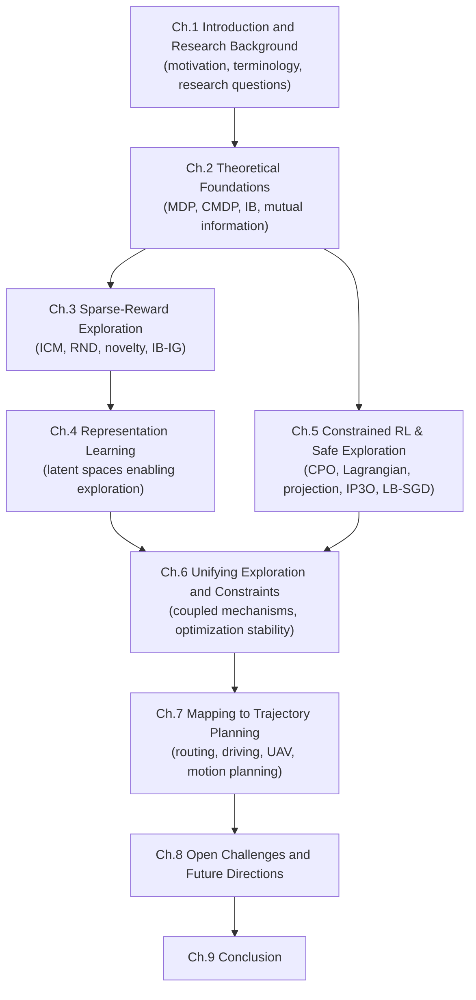
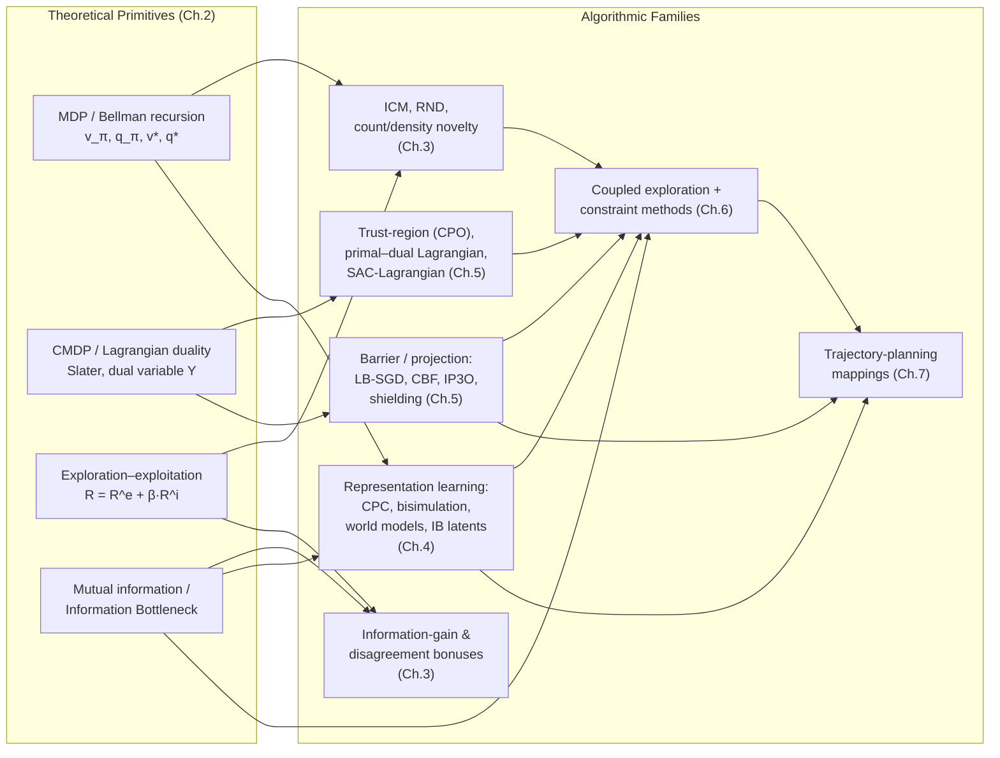
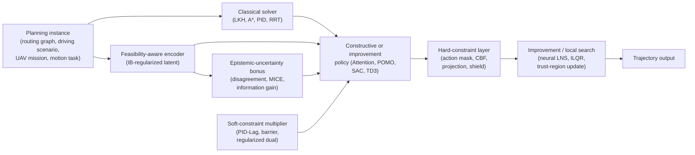
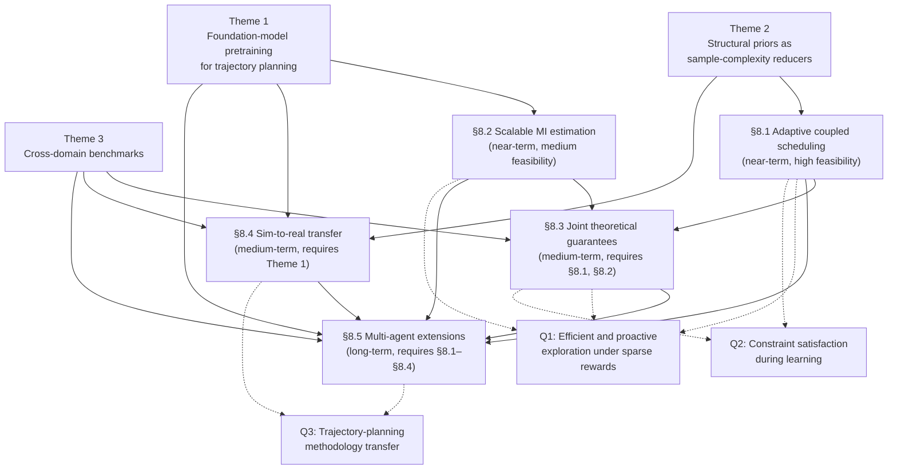

# Efficient and Proactive Exploration in Reinforcement Learning under Sparse Rewards and Constraints: Recent Progress and Implications for Trajectory Planning
# 1 Introduction and Research Background

Reinforcement learning (RL) has transitioned, over the past decade, from a paradigm celebrated for solving curated benchmarks to one increasingly tasked with controlling physical systems, dispatching fleets of vehicles, and producing feasible trajectories under stringent operational requirements. Yet as the problem space has broadened, two structural bottlenecks have emerged with conspicuous regularity: feedback signals that are temporally and spatially sparse, and operational requirements that forbid certain actions or states either during deployment or, more demandingly, throughout the learning process itself. These two obstacles—sparse rewards and constraint satisfaction—are not peripheral nuisances but central determinants of whether RL can be deployed at all in long-horizon, safety-critical decision tasks such as trajectory planning. This introductory chapter sets out the motivation for an integrated review of recent progress along these two threads, articulates the technical bottlenecks they pose, fixes the terminology and scope used throughout the report, and previews the analytical roadmap that connects intrinsic-motivation-driven exploration, constrained reinforcement learning, and trajectory planning.

## 1.1 Research Motivation and Practical Significance

A defining feature of reinforcement learning, distinguishing it from supervised paradigms, is that the agent must learn purely from environmental feedback rather than from labeled exemplars; this confers the celebrated capacity to solve complex sequential tasks without explicit domain knowledge, but it also makes the agent's progress entirely dependent on the density and informativeness of the reward signal[^1]. The exploration–exploitation dilemma—whether to repeat actions known to be rewarding or to probe untried alternatives that might be better—lies at the core of this dependence. As the literature has long recognized, an agent that explores too little may never discover the optimal policy, whereas one that explores indiscriminately squanders interaction budget and is therefore sample-inefficient[^1]. The severity of this dilemma is governed largely by reward density: in sparse-reward environments, the rare positive signals are insufficient to guide gradient-based updates, training time inflates, and the algorithm's "sustainability"—its feasible range of applicability—shrinks correspondingly[^1].

The practical significance of this problem is not abstract. Real-world long-horizon decision tasks routinely furnish only terminal or infrequent rewards. Cooperative courier dispatching, in which multiple agents jointly route packages through a city, exemplifies a multi-agent dynamic environment where reward arrives only upon successful delivery and intermediate steps yield no informative feedback[^1]. The Multi-Robot Warehouse (RWARE) benchmark formalizes this structure: agents must locate, transport, and return requested shelves to designated workstations across many discrete steps, receiving a reward of 1 only upon successful delivery and zero otherwise; partial observability—each robot perceives only a 3×3 grid centered on itself—compounds the difficulty by denying the agent any global picture of progress[^1]. Game environments such as Montezuma's Revenge present the same pathology in single-agent form: collecting items, fighting enemies, and traversing ladders yield short-term feedback that can mislead the agent away from long-horizon objectives such as preserving a key for the exit door[^1]. In all these settings, the gap between an action and its evaluative consequence is so wide that uninformed exploration is effectively a random walk over a combinatorially large state space.

The picture becomes more demanding still when one introduces operational constraints. Safety-critical systems—autonomous driving, robotic locomotion, recommender systems, vehicle thermal control—do not merely care about reward maximization; they require that certain costs (collisions, recommended extremist content, thermal overshoots) remain below specified thresholds, and increasingly require this even during training rather than only at convergence[^2]. A vehicle thermal management system, for example, must satisfy hard temperature limits while simultaneously calibrating itself toward efficiency-optimal operation; reported empirical results show that an exploration scheme combining a reciprocal Control Barrier Function with online Gaussian Process regression achieved convergence within 1.25% of the true optimum while reducing experiment time by 28% and 18% relative to random and uncertainty-driven baselines respectively, all under hard safety constraints[^3]. Such numbers illustrate a recurring pattern: when exploration is both sample-efficient and proactively safe, RL becomes economically and physically viable for industrial deployment; when either property is missing, deployment is foreclosed.

The exploration–exploitation dilemma is therefore exacerbated along two orthogonal axes simultaneously in modern application domains. On one axis, reward density approaches zero, so that ordinary trial-and-error provides essentially no learning signal[^1]. On the other axis, the cost of unsafe trial-and-error grows from negligible (in simulation) to prohibitive (in physical systems and high-stakes services), demanding that exploration not only find informative trajectories but avoid catastrophic ones[^2]. Trajectory planning sits squarely at the intersection of these axes: a UAV searching for a feasible path in a cluttered environment, a courier system rebalancing dispatch in real time, or a manipulator learning a contact-rich skill must simultaneously discover long-horizon plans whose value is realized only at completion and respect kinodynamic and collision constraints throughout. It is this dual pressure that makes a unified treatment of sparse-reward exploration and constrained RL not merely convenient for exposition but methodologically necessary.

## 1.2 Core Challenges: Sparse Rewards and Constraint Satisfaction

The two bottlenecks just sketched, while practically intertwined, raise distinct technical issues that warrant separate articulation before they are reunified.

**The sparse-reward problem.** When rewards are rare, the learning gradient is dominated by zero-reward transitions that contain little information about which actions advanced the agent toward its objective. The most direct mitigation, reward shaping, augments the environmental reward with hand-crafted positive signals that approximate progress; however, reward shaping is sensitive to reward density and to domain knowledge, and in genuinely sparse environments it often fails because the designer cannot pre-specify which intermediate states are valuable[^1]. The dominant alternative is intrinsic motivation: the agent generates its own auxiliary reward signal that rewards the visitation of novel states, thereby densifying the learning signal without requiring external task knowledge. Four mainstream families of intrinsic motivation have emerged: count-based novelty, prediction-error-based curiosity, random network distillation (RND), and impact-driven exploration[^1].

Among these, the Intrinsic Curiosity Module (ICM) is widely adopted because it handles complex, high-dimensional domains by training an encoder, a forward model that predicts the next-state feature from the current feature and action, and an inverse model that recovers the action from successive features; the prediction error of the forward model serves as the intrinsic reward, with $L = \tfrac{1}{2}\|o'_{t+1}-o_{t+1}\|_2^2$ as the forward-model loss and $R^i_t = h(o'_{t+1}, o_{t+1})$ as the novelty signal[^1]. Random network distillation, by contrast, uses the prediction error against a fixed random target network as a novelty proxy and has been shown sufficient to solve short-horizon hard-exploration tasks but to underperform on long-horizon strategic problems such as Montezuma's Revenge, where the agent may collect a key but fail to recognize that the key must be conserved for an exit door encountered far later[^1].

Crucially, intrinsic motivation methods exhibit two well-documented pathologies. **Derailment** describes the agent's difficulty in returning to the frontier of exploration in a subsequent episode: because intrinsic reward is largest at seldom-visited states and decays once those states are visited, the agent that has begun a new episode lacks an attractive gradient back to where it left off[^1]. **Detachment** captures the related phenomenon in which, once intrinsic rewards near the previously discovered frontier are exhausted, the agent loses interest in revisiting the productive region and drifts to other novel-but-unhelpful states[^1]. These pathologies, especially salient under partial observability, can cause intrinsic motivation alone to plateau well below optimal performance. The Go-Explore framework addresses them by maintaining an archive of visited states, deterministically returning to a chosen state, and exploring outward, yielding strong results on eleven previously unsolved Atari hard-exploration games but proving fragile in multi-agent settings owing to the combinatorial explosion of joint state archives[^1]. Hybrid proposals such as I-Go-Explore combine ICM-driven curiosity with Go-Explore-style post-episode exploration to expand the replay buffer; on RWARE tiny and small maps with four cooperative agents, I-Go-Explore reportedly attains an average return of 0.22947 over 10⁶ test episodes and outperforms COMA, COMA+ICM, and Go-Explore baselines[^1]. These figures should be read as a single-source benchmark rather than an established consensus, but they illustrate the direction of contemporary research: the synthesis of curiosity, archival memory, and policy gradients is converging toward a more robust treatment of sparse rewards.

**The constrained RL problem.** The second bottleneck is structural rather than informational. Many tasks demand that the agent's behavior remain inside a feasible set defined by cost or safety signals—often distinct from rewards to facilitate the learning of safe behavior[^2]. The standard formalism is the Constrained Markov Decision Process (CMDP), defined as a tuple $\langle S, A, P, r, c, d, \gamma \rangle$ adding a cost function $c$ and a safety threshold $d$ to the ordinary MDP, with the optimization

$$
\max_\pi \mathbb{E}_{\rho_\pi}\!\left[\sum_{t=0}^\infty \gamma^t r_t\right] \quad \text{s.t.} \quad \mathbb{E}_{\rho_\pi}\!\left[\sum_{t=0}^\infty \gamma^t c_t\right] \le d.
$$

This formulation underlies a broad family of safe RL algorithms[^2]. Yet, as a recent survey of constraint formulations in safe RL emphasizes, the field is fragmented by the diversity of constraint representations and an underdeveloped understanding of how those representations relate; this fragmentation impedes systematic comparison and benchmarking[^4].

A central distinction within this literature is between methods that ensure feasibility only at convergence and those that ensure it during learning. SAC-Lagrangian is illustrative of the former: it combines Soft Actor-Critic with Lagrangian relaxation and learns a safe policy off-policy with comparatively low sample complexity, but admits unsafe actions during training[^2]. By contrast, interior-point and log-barrier approaches actively prevent infeasibility throughout learning. The LB-SGD algorithm, applied to discounted infinite-horizon CMDPs under relaxed Fisher non-degeneracy and bounded transfer error of the policy parameterization, guarantees feasibility at every iterate and converges to an $\varepsilon$-optimal policy with sample complexity $\tilde{\mathcal{O}}(\varepsilon^{-6})$, costing an additional $\mathcal{O}(\varepsilon^{-2})$ samples relative to the unsafe-during-learning C-NPG-PDA baseline under the same parameterization[^5][^6]. This trade-off—paying sample complexity in exchange for a feasibility guarantee throughout training—epitomizes the design space of proactive constrained RL.

Other approaches achieve safety during learning by leveraging external structure: shielding intercepts and replaces unsafe actions using a precomputed safety logic, baseline-policy methods initialize from a known-safe policy and improve incrementally, and Control Barrier Function (CBF) methods restrict step size near the safety boundary[^3][^2]. Each strategy demands different prior knowledge and yields different exploration behavior. Even when such structure is unavailable, transfer-based schemes such as Safe Guide (SaGui) train a task-agnostic safe policy on a controlled source environment in a reward-free constrained setting, then deploy that policy as a guide whose probability of executing an action is gradually annealed in favor of a student policy dedicated to the target task; under formal conditions (matching action spaces, a $Q^c_\pi$-irrelevance state abstraction, and a source safety threshold no greater than the target threshold), the source-trained guide is provably safe in the target task, and empirical results on SafetyGym navigation show that SaGui (control-switch) maintains constraint satisfaction throughout training while matching the convergence speed of methods such as EGPO that rely on a target-task expert[^2].

**Why coupling matters.** Although these two bottlenecks have largely been studied in separate literatures—intrinsic motivation in the sparse-reward community, CMDP-based methods in the safe RL community—their coupling is unavoidable in trajectory planning. A planner that explores too cautiously will never discover homotopically distinct routes that satisfy long-horizon objectives such as minimizing path length or energy; a planner that explores aggressively without constraint awareness will repeatedly violate kinodynamic limits, collide with obstacles, or breach capacity bounds. Moreover, the very mechanisms invoked to address one bottleneck can interact with the other in subtle ways: intrinsic novelty rewards can drive an agent toward unsafe regions precisely because such regions are unvisited and therefore "novel"; safety constraints, by truncating the reachable state space, can amplify reward sparsity by removing trajectories that would otherwise have collected reward. The methodological objective of this report is therefore to examine how recent research treats sparse-reward exploration and constraint satisfaction not as independent modules to be bolted together, but as two facets of a single optimization problem whose joint resolution requires shared theoretical machinery—information-theoretic novelty quantification, dual or barrier-based constraint handling, and compact representations that make both novelty and feasibility tractable.

## 1.3 Scope, Terminology, and Guiding Research Questions

To make the subsequent comparative analysis precise, this report adopts the following terminological conventions, drawn directly from the surveyed literature.

**Markov Decision Process (MDP).** An MDP is defined by the tuple $\langle S, A, T, R, \gamma \rangle$ comprising state set, action set, transition function, reward function, and discount factor; the agent's objective is to maximize $G_t = \sum_{t=0}^\infty \gamma^t R_{t+1}$, with state value $V^\pi(s_t) = \mathbb{E}[R_t \mid s_t]$ and action value $Q^\pi(s_t, u_t) = \mathbb{E}[R_t \mid s_t, u_t]$ derived therefrom[^1].

**Decentralized Partially Observable Markov Game (Dec-POMDP).** For multi-agent fully cooperative tasks under partial observability, the formalism extends to $\langle S, U, T, R, \otimes, O, \gamma \rangle$ with $n$ agents, joint action space $U \equiv U^n$, partial observation probability $O(s', i, o) = P(o\mid s', i)$, and a shared reward function; each agent's stochastic policy $\pi^i(u^i \mid \tau^i)$ is conditioned on an action–observation history $\tau^i$[^1].

**Constrained Markov Decision Process (CMDP).** Extending the MDP with a cost function $c$ and threshold $d$, a CMDP $\langle S, A, P, r, c, d, \gamma \rangle$ formalizes problems in which expected cumulative cost must remain below $d$; a policy is termed "safe" when its expected discounted cost-return does not exceed $d$[^2].

**Intrinsic motivation and curiosity-driven exploration.** Intrinsic motivation augments the extrinsic reward $R^e_t$ with an intrinsic signal $R^i_t$ to drive exploration of novel states; curiosity-driven exploration specifically refers to prediction-error formulations such as ICM, in which $R^i_t$ measures the discrepancy between predicted and observed next-state features[^1]. Random network distillation (RND), Go-Explore, and impact-driven methods constitute alternative or complementary intrinsic-motivation strategies[^1].

**Safe exploration and constraint formulations.** Safe exploration denotes methods that limit or eliminate constraint violations during the learning process. Representative families include log-barrier interior-point methods such as LB-SGD[^5][^6]; primal–dual Lagrangian methods such as SAC-Lagrangian[^2]; trust-region methods such as Constrained Policy Optimization (CPO)[^2]; shielding and probabilistic shielding[^2]; baseline-policy improvement[^2]; and Control Barrier Functions integrated with Gaussian Process regression for online learning[^3]. The survey of constraint formulations in safe RL frames these methods as different mathematical encodings of a shared safety semantics and emphasizes the need to elucidate their mutual relations[^4].

**Transfer-based safe guidance.** Drawing from transfer learning, this paradigm trains a guide policy $\pi^\diamond$ in a controlled, reward-free source CMDP and then composes it with a student policy $\pi^\odot$ in the target task using either linear-decay or control-switch composite sampling; importance-sampling clipping $I(s,a) = \min(\max(\pi^\odot(a\mid s)/\pi^b(a\mid s), I_l), I_u)$ stabilizes the off-policy update[^2].

**Scope.** The report covers, on the exploration side, intrinsic motivation methods (ICM, RND, count- and density-based novelty, disagreement and information-theoretic variants), Go-Explore-style archival methods, and representation-aware exploration that quantifies novelty in compact latent spaces. On the constraint side, it covers CMDP-based formulations and the major algorithmic families just enumerated. The report explicitly excludes generic deep learning theory and RL benchmarks unrelated to either of these two threads. Multi-agent settings are included where they illuminate scaling behavior under sparsity (as in COMA-based RWARE experiments[^1]) but multi-agent safety methods receive less weight unless they directly inform trajectory-planning analogues.

**Guiding research questions.** Three questions structure the remainder of the report:

1. **Q1 (Exploration).** How can recent intrinsic-motivation, representation-learning, and information-theoretic mechanisms enable efficient and proactive exploration in sparse-reward, long-horizon environments while mitigating known pathologies such as detachment and derailment?

2. **Q2 (Constraints).** How can constraint satisfaction be maintained during learning—rather than only at convergence—through barrier, Lagrangian, projection, shielding, or transfer-based mechanisms, and what trade-offs in sample complexity, conservatism, and asymptotic optimality do these choices entail?

3. **Q3 (Trajectory Planning).** How do the methodological advances motivated by Q1 and Q2 translate into improved trajectory planning—covering path-space exploration, kinodynamic feasibility, hybridization with classical solvers, and generalization across instances—and what design principles transfer most reliably from RL methodology to planning practice?

These questions are deliberately phrased to emphasize integration. The report's central thesis—that efficient exploration and proactive constraint handling are best understood as coupled rather than independent problems—will be argued by demonstrating, across the chapters that follow, that the same theoretical machinery (information theory, duality, projection, abstraction) underlies progress on both fronts and that trajectory planning is a natural domain in which to test the resulting integrated methods.

## 1.4 Report Structure and Chapter Roadmap

The remaining eight chapters of this report develop the integrated review in a deliberately staged sequence, moving from theoretical foundations, through methodological surveys of each bottleneck in turn, to their unification and application.

The progression and chapter dependencies are summarized in the schematic below.

Chapter 2 establishes the formal vocabulary—MDPs, CMDPs, the exploration–exploitation dilemma, intrinsic versus extrinsic reward decomposition, and information-theoretic principles such as mutual information and the Information Bottleneck—so that the heterogeneous methods reviewed later can be compared on a common theoretical footing. Chapter 3 then surveys recent advances in efficient exploration under sparse rewards, organizing intrinsic-motivation methods into prediction-error, count- and density-based, disagreement and Bayesian, learning-progress, and information-theoretic families, and assessing which mechanisms most reliably convert sparse terminal feedback into dense, task-relevant exploration signals. Chapter 4 deepens this analysis by examining how the choice of state representation determines the quality of exploration, comparing raw-observation novelty with contrastive predictive coding, bisimulation, world-model latent spaces, and Information Bottleneck–regularized representations.

Chapter 5 turns to the constraint side, contrasting trust-region methods such as CPO, primal–dual Lagrangian methods, projection-based feasibility methods, and penalty/barrier methods including incrementally penalized schemes, with attention to how each family shapes proactive avoidance of constraint violations and trades conservatism against task performance. Chapter 6 brings the two threads together, analyzing how recent work integrates intrinsic exploration with safety or feasibility constraints—through information-theoretic curiosity combined with Lagrangian or barrier safety, risk-sensitive intrinsic rewards, annealed intrinsic-reward weighting, adaptive penalty schedules, clipped surrogate objectives, and generalized advantage estimation—and identifying transferable design heuristics.

Chapter 7 maps the resulting RL methodology onto trajectory planning, examining how planning objectives (path length, energy, time) and constraints (collision avoidance, kinodynamic limits, capacity) admit CMDP formulations, how MDP-based approaches inform trajectory representation and action masking, and how hybridization with classical solvers can yield robust planning pipelines. Chapter 8 surfaces open challenges—adaptive coefficient scheduling, scalability of mutual-information estimation, joint guarantees for exploration and feasibility, sim-to-real transfer, and multi-agent extensions—and Chapter 9 consolidates the principal findings into a blueprint for next-generation, sample-efficient and safety-aware trajectory planning systems.

The analytical perspective adopted throughout integrates three concerns: **sample efficiency**, the rate at which the agent converts environmental interactions into competent policy; **safety**, the avoidance of constraint violations during and after learning; and **proactivity**, the capacity of the algorithm to anticipate and structure exploration rather than merely react to surprise or violation. By holding these three axes in view simultaneously, the report aims to inform both researchers seeking foundational understanding and practitioners building long-horizon planning systems under uncertainty.

# 2 Theoretical Foundations of Exploration and Constraints in Reinforcement Learning

The opening chapter argued that sparse-reward exploration and constraint satisfaction, although developed in largely separate literatures, are inseparable in long-horizon trajectory planning and must be analyzed through shared theoretical machinery. To make that integration tractable, this chapter assembles the formal scaffolding on which the comparative analyses of Chapters 3–7 will rest. The objective is not to rehearse textbook material exhaustively but to fix, in compact and precise terms, the decision-theoretic objects (MDPs, CMDPs, value functions, occupancy measures), the structural dilemma (exploration–exploitation and reward decomposition), and the information-theoretic primitives (mutual information, Information Bottleneck) that recur as unifying tools across intrinsic-motivation methods, primal–dual safe RL, and representation-aware planning. Throughout, the chapter emphasizes those formal properties—Markov recursion, Bellman optimality, Lagrangian duality, variational compression—that will be invoked repeatedly when heterogeneous algorithms are compared on a common footing in later chapters.

## 2.1 Markov Decision Processes and the Reinforcement Learning Problem

The Markov Decision Process is the canonical formalization of sequential decision-making under uncertainty, and it underpins almost every method surveyed in this report. Following the standard formulation, an MDP is defined by the tuple $\langle \mathcal{S}, \mathcal{A}, p, R, \gamma \rangle$, where $\mathcal{S}$ is the state set, $\mathcal{A}$ is the action set, $p(s', r \mid s, a) = \Pr\{S_{t+1}=s', R_{t+1}=r \mid S_t=s, A_t=a\}$ is the one-step dynamics function specifying the joint probability of next state and reward, and $\gamma \in [0,1]$ is the discount factor[^7][^8]. At each discrete time step the agent observes state $S_t \in \mathcal{S}$, selects action $A_t \in \mathcal{A}(S_t)$ according to a policy $\pi(a \mid s)$ — a mapping from states to probability distributions over actions — and receives reward $R_{t+1}$ together with a successor state $S_{t+1}$, generating the trajectory $S_0, A_0, R_1, S_1, A_1, R_2, \ldots$[^7][^8].

The defining property of this formalism is the **Markov property**: a state signal $S_t$ is Markov when the conditional distribution of $(R_{t+1}, S_{t+1})$ given the entire history $(S_0, A_0, R_1, \ldots, S_t, A_t)$ coincides with the distribution conditioned on $(S_t, A_t)$ alone, so that the one-step dynamics $p(s', r \mid s, a)$ provides a sufficient statistic for predicting all future quantities[^8]. The Markov property is rarely satisfied exactly in practice — partial observability, sensor noise, and unmodelled state variables routinely violate it — but, as Sutton and Barto argue, it remains the foundational idealization on which value-function recursion and dynamic-programming arguments rest, and learning systems can be expected to perform better as their constructed state representations approach a Markov sufficient statistic[^8]. This observation already foreshadows a recurring theme of the report: the *quality of the state representation* determines whether downstream algorithmic primitives — exploration bonuses, value bootstrapping, safety estimation — can do their work, a point taken up in detail in Chapter 4.

The agent's objective is formalized as the maximization of expected return. For an episodic task with terminal time $T$, the return is the undiscounted sum $G_t = \sum_{k=t+1}^{T} R_k$; for a continuing task, discounting is introduced to ensure convergence, yielding $G_t = \sum_{k=0}^{\infty} \gamma^k R_{t+k+1}$, and the unified expression $G_t = \sum_{k=0}^{T-t-1} \gamma^k R_{t+k+1}$ admits both $T = \infty$ and $\gamma = 1$ when the task terminates almost surely[^7][^8]. The discount parameter has a precise interpretation: a reward received $k$ steps in the future is worth only $\gamma^{k-1}$ of an immediate reward, so $\gamma \to 0$ produces myopic behavior and $\gamma \to 1$ yields increasingly far-sighted policies[^8]. For trajectory planning, where rewards (e.g., goal attainment, energy savings) are typically realized only after long action sequences, the choice of $\gamma$ directly governs the temporal credit-assignment radius.

Two value functions formalize "how good" it is for an agent following $\pi$ to be in a state, or to select a particular action in a state. The state-value function is
$$
v_\pi(s) = \mathbb{E}_\pi\!\left[ G_t \mid S_t = s \right] = \mathbb{E}_\pi\!\left[\sum_{k=0}^{\infty} \gamma^k R_{t+k+1} \,\Big|\, S_t = s \right],
$$
and the action-value function is $q_\pi(s, a) = \mathbb{E}_\pi[G_t \mid S_t = s, A_t = a]$[^7][^8]. Both satisfy a recursive consistency condition — the **Bellman expectation equation** — that expresses the value of a state as the expected one-step reward plus the discounted value of the successor:
$$
v_\pi(s) = \sum_a \pi(a \mid s) \sum_{s', r} p(s', r \mid s, a)\bigl[r + \gamma v_\pi(s')\bigr],
$$
with the analogous recursion holding for $q_\pi$[^7][^8]. The recursion is the engine of essentially all model-based and model-free RL: dynamic programming solves it directly, Monte-Carlo methods estimate $v_\pi$ from sampled returns, and temporal-difference and policy-gradient methods bootstrap from approximate values.

Among policies, the partial ordering $\pi \ge \pi'$ defined by $v_\pi(s) \ge v_{\pi'}(s)$ for all $s$ admits at least one *optimal policy* $\pi_\ast$, all such policies sharing the same optimal state-value function $v_\ast(s) = \max_\pi v_\pi(s)$ and optimal action-value function $q_\ast(s, a) = \max_\pi q_\pi(s, a)$[^7][^8]. The optimal value functions satisfy the **Bellman optimality equation**,
$$
v_\ast(s) = \max_{a \in \mathcal{A}(s)} \sum_{s', r} p(s', r \mid s, a)\bigl[r + \gamma v_\ast(s')\bigr],
$$
which is a system of $|\mathcal{S}|$ nonlinear equations, one per state, possessing a unique solution when the dynamics $p$ are known[^8]. From $v_\ast$, an optimal policy is obtained by one-step greedy maximization; from $q_\ast$, the optimal action in any state is simply $\arg\max_a q_\ast(s, a)$, an even simpler rule that "caches" the result of one-step lookahead at the cost of representing a function over state–action pairs rather than states[^8]. A central practical observation is that, except for tabular MDPs of modest size, neither solving the Bellman optimality equation directly nor maintaining tabular value functions is computationally tractable: the field's reliance on function approximation (parametric value functions, policy networks, world models) is a direct consequence of this scaling barrier, and approximation introduces the very stability and exploration challenges that subsequent chapters address[^8].

For the multi-agent sparse-reward settings discussed in Chapter 1 (e.g., RWARE) and the partially observed planning settings discussed in Chapter 7, the MDP formalism is extended in two principal directions. **Partial observability** replaces the assumption that the agent observes the Markov state $S_t$ with the assumption that it observes a function $o_t$ thereof, yielding a Partially Observable MDP (POMDP) and, in the cooperative multi-agent case, a Decentralized Partially Observable Markov Game $\langle S, U, T, R, \otimes, O, \gamma \rangle$ in which each agent $i$ acts on the basis of an action–observation history $\tau^i$ and a stochastic policy $\pi^i(u^i \mid \tau^i)$, as introduced in Chapter 1. **Finite-horizon formulations** parameterize the dynamics, rewards, and policies by step index $h \in [H]$, yielding tuples of the form $\langle H, S, A, \{P_h\}_{h=1}^H, \{r_h\}_{h=1}^H, s_1 \rangle$ in which the Markov dynamics $P_h(s' \mid s, a)$ may depend on the stage; this framework is convenient for episodic tasks of fixed length, for adversarial loss settings, and for the linear function-approximation analyses surveyed in Section 2.2 below[^9].

The full apparatus thus consists of: a state-action-reward dynamics model encoded by $p$; a return $G_t$ that compresses an entire reward trajectory into a scalar criterion; value functions $v_\pi, q_\pi$ that satisfy linear Bellman recursions for fixed policies; and optimal value functions $v_\ast, q_\ast$ that satisfy a nonlinear (max) Bellman recursion characterizing optimality. Every algorithm reviewed in subsequent chapters can be located within this scaffolding: ICM and RND modify the reward $R_{t+1}$ entering $G_t$ via an intrinsic bonus; CPO, LB-SGD, and SAC-Lagrangian alter the optimization problem solved with respect to $v_\pi$ by appending constraints; representation-learning methods recompose the state $S_t$ to alter the geometry on which $p$ is defined.

## 2.2 Constrained Markov Decision Processes and Safety Semantics

Trajectory planning under safety, kinodynamic, or capacity restrictions departs from the pure reward-maximization paradigm: the agent must additionally ensure that one or more cost-like signals remain bounded. The canonical formalization is the **Constrained Markov Decision Process (CMDP)**, augmenting the MDP with cost functions and budgets[^9]. Following the formulation used in recent linear-CMDP analyses, a finite-horizon CMDP is the tuple $\mathcal{M} = (H, S, A, \{P_h\}_{h=1}^H, \{f_h\}_{h=1}^H, \{g_h\}_{h=1}^H, s_1, b)$, where $f_h: S \times A \to [0,1]$ is the per-step loss (or, equivalently, the negation of the reward), $g_h: S \times A \to [0,1]$ is the per-step cost, and $b \in [0, H]$ is the cost budget; the agent seeks a policy $\pi$ minimizing the expected cumulative loss subject to an expected cumulative cost constraint[^9]:
$$
\pi^\ast \in \arg\min_{\pi \in \Pi} V^\pi_{f,1}(s_1) \quad \text{s.t.} \quad V^\pi_{g,1}(s_1) \le b,
$$
where $V^\pi_{f,1}(s_1) = \mathbb{E}_{P, \pi}\bigl[\sum_{h=1}^{H} f_h(s_h, a_h) \mid s_1\bigr]$ and analogously for $g$[^9]. In the discounted infinite-horizon variant introduced in Chapter 1, the same structure becomes $\langle S, A, P, r, c, d, \gamma \rangle$ with constraint $\mathbb{E}_{\rho_\pi}\bigl[\sum_{t=0}^\infty \gamma^t c_t\bigr] \le d$. The conceptual point is identical: a CMDP is an MDP equipped with one or more *auxiliary* signals that the policy must keep bounded, with cost signals deliberately separated from rewards so that safety semantics can be learned independently of task semantics.

Several mathematical encodings of constraints recur throughout the literature, each with distinct algorithmic implications:

| Constraint Formulation | Mathematical Form | Semantic Meaning | Typical Algorithmic Family |
|---|---|---|---|
| Expected cumulative cost | $\mathbb{E}_\pi\bigl[\sum_t \gamma^t c_t\bigr] \le d$ | Average safety over trajectories | CPO, SAC-Lagrangian, primal–dual |
| Instantaneous / hard | $c(s, a) \le 0$ for all $(s,a)$ visited | Step-wise inviolable safety | Shielding, CBF, projection |
| Occupancy-measure | $\langle c, q^\pi \rangle \le d$ | Linear functional of state-action visitation | LP-based primal–dual on $q$ |
| Adversarial / time-varying | $V^\pi_{g^k,1}(s_1) \le b \,\forall k$ | Robustness to changing costs | Regularized dual updates |

The **expected cumulative cost** form, originally formalized by Altman and underlying the bulk of safe RL, is the most common and admits primal–dual treatment via the Lagrangian $\mathcal{L}(\pi, Y) = V^\pi_f(s_1) + Y(V^\pi_g(s_1) - b)$ with $Y \ge 0$[^9]. **Instantaneous constraints** require $c(s,a) \le 0$ at every visited state–action pair, modelling hard kinodynamic limits or collision avoidance and demanding mechanisms (shielding, projection, control barrier functions) that act in real time rather than on expectations. **Occupancy-measure formulations**, which originate in the linear-programming approach to MDPs, parameterize the policy by its discounted state-action visitation distribution $q^\pi$, transforming the cost constraint into a linear functional $\langle c, q^\pi \rangle \le d$ and enabling the use of standard online-convex-optimization machinery; this linearity is exactly what makes the dual update $Y_{k+1} \leftarrow [Y_k + \eta(\langle g, q^{k+1}\rangle - b)]_+$ tractable in occupancy-measure-based primal–dual algorithms[^9]. By contrast, *policy-based* primal–dual methods cannot directly employ this update because the expected cost is nonlinear in the policy itself, a structural difficulty motivating more elaborate dual-update designs in recent work[^9].

A central conceptual divide that organizes Chapter 5 is the distinction between **feasibility-at-convergence** and **feasibility-during-learning**. The former requires only that the limit policy $\pi_\infty$ satisfy $V^{\pi_\infty}_g(s_1) \le b$, permitting transient violations during training; the latter, often termed *safe exploration*, demands that some constraint guarantee hold at every iterate or even every step. Standard primal–dual Lagrangian methods (e.g., SAC-Lagrangian) typically deliver only the former, while interior-point/log-barrier methods such as LB-SGD, control-barrier-function methods, and shielding deliver versions of the latter. The trade-off is precise: the LB-SGD result cited in Chapter 1 — feasibility at every iterate, $\varepsilon$-optimal convergence with $\tilde{\mathcal{O}}(\varepsilon^{-6})$ samples versus $\tilde{\mathcal{O}}(\varepsilon^{-4})$ for an unsafe-during-learning baseline — exemplifies the sample-complexity cost of insisting on stronger safety semantics, a trade-off that recurs throughout safe RL.

The recurring analytical tools in this literature are Lagrangian duality and the **Slater condition**. The Slater condition asserts the existence of a strictly feasible policy $\bar\pi$ such that $V^{\bar\pi}_g(s_1) + \gamma \le b$ for some Slater constant $\gamma > 0$, and is a mild assumption commonly imposed in the CMDP literature[^9]. Its role is to ensure strong duality in the stochastic CMDP — so that the constrained problem can be solved by maximizing the Lagrangian over policies and minimizing over the dual variable $Y$ — and to provide a *bound on the dual variable* that is essential for regret and constraint-violation analyses. In stochastic linear CMDPs, the dual variable can be controlled by truncation at $2H/\gamma$, leveraging strong duality directly[^9]. In *adversarial* settings, where losses change across episodes and the simple Lagrangian reformulation no longer applies, more elaborate machinery is needed: recent work introduces a **regularized dual update** of the form
$$
Y_{k+1} \leftarrow \bigl[(1 - 4\alpha\eta H^3) Y_k + \eta(\widehat{V}^k_{g,1}(s_1) - b - 4\alpha H^3 - 4\theta H^2)\bigr]_+,
$$
in which the $(1 - 4\alpha\eta H^3)$ pull-back term and the additive constants $-4\alpha H^3 - 4\theta H^2$ together "pull the dual variable towards 0, keeping it compact" and enable a Lyapunov drift analysis that bounds $Y_k$ at $\tilde{\mathcal{O}}(H^2/\gamma)$[^9]. The same paper combines this regularization with **periodic policy mixing** — perturbing the policy with a uniform distribution every $K^B$ episodes rather than every episode — to balance the covering number of the induced policy class against the dual-variable scale, and proves $\tilde{\mathcal{O}}(K^{3/4})$ regret and constraint-violation bounds in finite-horizon adversarial linear CMDPs[^9]. The technical details are not central here, but two structural lessons are. First, *dual variables are not merely Lagrange multipliers but dynamical state variables of the algorithm*, and their stability is the fulcrum on which constraint-violation guarantees pivot. Second, projection and KL-divergence regularization, originally tools of online convex optimization, transfer into safe RL through the policy-mixing/mirror-descent connection — a structural correspondence that will reappear in Chapter 5 when projection-based feasibility methods are compared to barrier methods.

For the trajectory-planning purposes of Chapter 7, the CMDP formulation has an immediate appeal: planning constraints (collision avoidance, kinodynamic limits, capacity bounds, time windows) can almost all be expressed either as expected cumulative cost bounds (for soft constraints such as energy or comfort) or as instantaneous constraints (for hard collision and dynamic-feasibility limits). The choice between these encodings, and between feasibility-at-convergence and feasibility-during-learning, is therefore a *modelling decision* that propagates through every subsequent algorithmic choice.

## 2.3 The Exploration–Exploitation Trade-off and Reward Decomposition

The exploration–exploitation dilemma was introduced informally in Chapter 1; this section formalizes it in the language of the MDP/CMDP framework just established and articulates its principal mitigation, intrinsic-reward decomposition. In an MDP with unknown $p$ and unknown $r$, the agent estimates value functions and policies from sampled trajectories. The exploitation arm uses those estimates to act greedily (or near-greedily) with respect to current $q$-estimates; the exploration arm samples actions whose value estimates are uncertain or whose state successors have been seen too rarely to support reliable estimation. The dilemma is structural: any finite interaction budget must be partitioned between these two activities, and the partition determines both how quickly the agent improves and how close to optimal it eventually arrives.

The dilemma's severity scales with two quantities:

1. **Reward density**, formalized as the proportion of state–action pairs (or trajectories) for which $r > 0$ or, equivalently, the expected number of nonzero rewards per unit of interaction. When density is low — as in Montezuma's Revenge or RWARE delivery — naive exploration policies (e.g., $\epsilon$-greedy or maximum-entropy regularization) yield gradients dominated by uninformative zero-reward transitions, and policy improvement stalls.

2. **Effective horizon**, governed by $\gamma$ and the temporal distance from any state to the nearest reward. A long effective horizon requires the credit-assignment mechanism to propagate rare reward information across many Bellman backups, and combines pathologically with low density: each rare reward must support many state-value updates, exacerbating gradient noise.

The dominant mitigation is to *densify* the learning signal by adding an **intrinsic reward**, producing the additive decomposition
$$
R_t = R^e_t + \beta R^i_t,
$$
where $R^e_t$ is the extrinsic environmental reward, $R^i_t$ is an algorithmically generated bonus that quantifies the informational or novelty value of the transition $(S_t, A_t, S_{t+1})$, and $\beta > 0$ is a weighting coefficient. The agent then optimizes the augmented return $G_t = \sum_k \gamma^k(R^e_{t+k+1} + \beta R^i_{t+k+1})$. The four principal categories of intrinsic signal generation, anticipated in Chapter 1 and developed in Chapter 3, can be formally distinguished by *what quantity the bonus measures*:

- **Novelty / count-based.** $R^i_t$ is a decreasing function of a (pseudo-)count $\hat{N}(s_t)$ or density estimate $\hat{p}(s_t)$, e.g., $R^i_t \propto 1/\sqrt{\hat{N}(s_t)}$, rewarding the visitation of states that have been seen rarely.

- **Prediction-error.** $R^i_t$ measures the failure of a learned forward model to predict the next observation or feature, e.g., $R^i_t = \tfrac{1}{2}\|\hat{\phi}(s_{t+1}) - \phi(s_{t+1})\|_2^2$, as in the Intrinsic Curiosity Module described in Chapter 1.

- **Disagreement.** $R^i_t$ measures the variance among an ensemble of forward models or value heads, rewarding states where the agent's epistemic (model-)uncertainty is high.

- **Information-gain.** $R^i_t$ measures the reduction in posterior uncertainty about a latent variable (model parameters, dynamics, goal) caused by the transition, formalized via mutual information or KL divergence between prior and posterior; the Information Bottleneck framework introduced in Section 2.4 is a natural home for this category.

These categories differ both in what they reward and in how they interact with the state representation. Count-based methods presuppose either a discrete state space or a density model; prediction-error methods presuppose a learnable forward model whose error depends sensitively on the embedding; disagreement and information-gain methods explicitly target *epistemic* uncertainty rather than environmental stochasticity, an important distinction because environmental noise can otherwise drive curiosity into pathological "noisy-TV" failure modes.

Two structural pathologies, named in Chapter 1, can now be reformulated formally. **Detachment** is the failure mode in which intrinsic reward in a productive region of state space is exhausted (because $\hat{N}$ has grown or prediction error has fallen), causing the policy to drift to other novel-but-task-irrelevant regions and lose the gradient back to the original frontier. **Derailment** is the closely related failure mode in which, at the start of a new episode, the policy lacks a dense intrinsic-reward gradient back to the previously discovered exploration frontier, so that the agent must repeatedly relearn the path. Both pathologies stem from the *non-stationarity* of intrinsic reward — $R^i_t$ depends on quantities ($\hat{N}, \hat{p}, $ predictor weights) that change as the agent learns — and from the *locality* of policy gradients, which propagate information only along sampled trajectories. They motivate the archival approaches (Go-Explore) and representation-aware methods reviewed in Chapters 3 and 4.

The principal alternative to intrinsic motivation is **reward shaping**, in which the designer augments $R^e$ with hand-crafted progress-like terms. Shaping is sample-efficient when feasible — it injects domain knowledge directly into the optimization landscape — but is sharply limited in two respects. First, it requires the designer to identify which intermediate states are valuable, which is precisely the question that genuinely sparse environments cannot answer a priori. Second, naïvely shaped rewards can change the optimal policy unless restricted to potential-based shaping, and the technical machinery for ensuring policy invariance does not translate easily to rich function approximators. Intrinsic motivation, by contrast, generates a learning-driven bonus that is automatically reduced as the relevant region is mastered, giving it the principled property of *vanishing in the limit* and, when $\beta$ is annealed, of leaving the optimal policy of the extrinsic problem unchanged. This vanishing-bonus property is one reason intrinsic motivation has displaced shaping as the dominant mechanism for genuinely sparse settings.

A subtle but important observation that motivates the integration pursued in Chapter 6 is that the additive decomposition $R = R^e + \beta R^i$ is *not* neutral with respect to safety. If $R^i$ rewards visitation of novel states and the safety-violating region is by construction novel (because a competent prior policy avoided it), intrinsic motivation can systematically *drive* the agent toward unsafe states. Conversely, a safety constraint that prunes part of the reachable state space can amplify reward sparsity by removing trajectories that would have collected reward. The exploration–exploitation trade-off is therefore not independent of the constraint structure: in CMDPs with intrinsic rewards, the effective return $G_t = \sum_k \gamma^k(R^e_{t+k+1} + \beta R^i_{t+k+1})$ must be maximized subject to $\mathbb{E}\bigl[\sum_k \gamma^k c_{t+k+1}\bigr] \le d$, and the dual variable $Y$ implicitly reweights *both* extrinsic and intrinsic rewards against cost. This coupling — that constraint multipliers and intrinsic-reward coefficients are not independent design knobs — is one of the report's recurring methodological observations.

## 2.4 Information-Theoretic Principles: Mutual Information and the Information Bottleneck

The information-theoretic primitives introduced in this section provide unifying machinery for three otherwise disparate developments reviewed later: information-gain-based intrinsic rewards (Chapter 3), compact task-relevant latent representations (Chapter 4), and risk-aware constraint formulations and bottleneck-regularized policies (Chapter 6).

**Entropy, divergence, mutual information.** For a discrete random variable $X$ with distribution $p(x)$, the Shannon entropy $H(X) = -\sum_x p(x) \log p(x)$ measures uncertainty in nats or bits. The Kullback–Leibler divergence $D_{\mathrm{KL}}[p \,\|\, q] = \sum_x p(x) \log[p(x)/q(x)]$ is a non-negative measure of how far $q$ deviates from $p$, central both to the variational formulation of mutual information and to policy-gradient stability conditions (e.g., trust-region constraints, KL-regularized mirror descent). The **mutual information** between two random variables $X, Y$ with joint distribution $p(x, y)$ is
$$
I(X; Y) = \sum_{x, y} p(x, y) \log \frac{p(x, y)}{p(x) p(y)} = D_{\mathrm{KL}}\!\bigl[p(x, y) \,\|\, p(x) p(y)\bigr],
$$
quantifying the reduction in uncertainty about $Y$ produced by knowledge of $X$ (and symmetrically)[^10]. Mutual information is non-negative, symmetric, equals zero iff $X \perp Y$, and admits the chain-rule decomposition $I(X; Y, Z) = I(X; Y) + I(X; Z \mid Y)$. For RL purposes, $I(X; Y)$ provides a *representation-invariant* notion of statistical dependence — it does not depend on a chosen distortion function or feature space — which makes it attractive as a target for both exploration bonuses (where $X$ is a transition or trajectory and $Y$ a latent task variable) and representation regularizers (where $X$ is a raw observation and $Y$ a downstream prediction target).

**The Information Bottleneck principle.** Tishby, Pereira, and Bialek's Information Bottleneck (IB) formalizes the problem of extracting from a signal $X$ a compact representation $\widetilde{X}$ that preserves the maximum information about a *relevance variable* $Y$[^10]. Concretely, given a joint distribution $p(x, y)$ — the data on which the relevance is defined — and a stochastic encoder $p(\tilde{x} \mid x)$, the marginal $p(\tilde{x}) = \sum_x p(x) p(\tilde{x} \mid x)$ and the relevance-preserving conditional $p(y \mid \tilde{x}) = \tfrac{1}{p(\tilde{x})}\sum_x p(y \mid x) p(\tilde{x} \mid x) p(x)$ together induce a tradeoff between the *compression rate* $I(X; \widetilde{X})$ and the *preserved relevance* $I(\widetilde{X}; Y)$, with $I(\widetilde{X}; Y) \le I(X; Y)$ by the data-processing inequality[^10]. The IB problem is to minimize the Lagrangian
$$
\mathcal{L}_{\mathrm{IB}}[p(\tilde{x} \mid x)] = I(X; \widetilde{X}) - \beta\, I(\widetilde{X}; Y),
$$
where $\beta \ge 0$ controls the tradeoff: $\beta = 0$ produces maximally compressed but uninformative $\widetilde{X}$, while $\beta \to \infty$ pushes $\widetilde{X}$ toward retaining all information $X$ has about $Y$[^10]. Tishby et al. show that the optimal encoder satisfies the self-consistent equations
$$
p(\tilde{x} \mid x) = \frac{p(\tilde{x})}{Z(x, \beta)} \exp\!\Bigl(-\beta\, D_{\mathrm{KL}}\bigl[p(y \mid x) \,\|\, p(y \mid \tilde{x})\bigr]\Bigr),
$$
together with the marginal and Bayes-rule consistency conditions, and that these can be solved by an alternating Blahut–Arimoto-style iteration that provably converges to a local minimum of $\mathcal{L}_{\mathrm{IB}}$ in the convex sets of distributions $\{p(\tilde{x} \mid x)\}, \{p(\tilde{x})\}, \{p(y \mid \tilde{x})\}$[^10].

Two structural features of the IB make it a powerful organizing tool for the report. First, the "effective distortion" emerging from the variational problem is *not chosen* but is the data-driven KL divergence $D_{\mathrm{KL}}[p(y \mid x) \,\|\, p(y \mid \tilde{x})]$ — the IB turns rate–distortion theory into a relevance-driven framework in which the distortion measure is derived from the joint statistics of $(X, Y)$ rather than postulated[^10]. This addresses precisely the concern, implicit in any state-representation problem, that hand-chosen distortion or similarity functions impose arbitrary feature selection. Second, the IB induces a hierarchy of solutions parameterized by $\beta$: as $\beta$ increases, the optimal representations move along a convex curve in the $(I(X; \widetilde{X}), I(\widetilde{X}; Y))$ "information plane," and successive curves for representations of increasing cardinality bifurcate at critical $\beta$ values via second-order phase transitions, providing a principled framework for choosing the *complexity* of the latent representation[^10]. The deep-learning interpretation of training dynamics through this lens — proposing that successful neural network training implicitly performs IB-like compression — was developed subsequently[^11], and although that interpretation has been the subject of debate, the IB objective itself remains a clean and widely-used regularizer.

**Why IB matters for exploration and constraints.** The IB objective enters the report's machinery in three places.

First, **information-gain-based intrinsic rewards** can be expressed as mutual information between transitions and latent task variables: an information-gain bonus $R^i_t \propto I(\theta; s_{t+1} \mid s_t, a_t)$, where $\theta$ is a posterior over dynamics or goals, formally captures "how much the transition reduces uncertainty about $\theta$." Such bonuses generalize prediction-error and disagreement signals by quantifying epistemic gain rather than raw predictive failure, and they are robust to environmental stochasticity in a way that prediction-error signals are not (because environmental noise contributes to prediction error but not to information gain about $\theta$).

Second, **representation learning for proactive exploration** — the topic of Chapter 4 — can be formulated as an IB problem in which $X$ is the raw observation, $Y$ is a task-relevant prediction target (next state, return, value), and $\widetilde{X}$ is the latent state in which novelty is measured. Choosing the encoder by minimizing $I(X; \widetilde{X}) - \beta I(\widetilde{X}; Y)$ produces a latent space that is compact (so novelty estimates are well-defined and not dominated by raw-pixel noise) and task-relevant (so novel states are likely to be useful), addressing the failure modes of raw-observation novelty.

Third, **bottleneck-regularized policies and risk-aware constraints** — touched on in Chapter 6 — use IB-type penalties on policies and value functions to limit the information the agent extracts from its inputs, providing a regularization mechanism distinct from KL regularization but achieving similar benefits in stability and generalization. Information-theoretic surrogates also enter constraint formulations: for example, mutual-information bounds can be used to constrain the dependence of actions on potentially sensitive state features, yielding a form of risk-aware control.

The IB principle thus serves in this report as a *unifying objective*: novelty quantification, representation compression, and risk-aware constraint formulation can all be framed as instances of compressing $X$ while preserving relevance to $Y$, with the choice of $Y$ determining whether the resulting machinery serves exploration, abstraction, or safety.

## 2.5 A Unified Conceptual Map for Subsequent Chapters

The formalisms assembled above — MDPs and CMDPs, value and occupancy-measure recursions, the exploration–exploitation trade-off and intrinsic-reward decomposition, mutual information and the Information Bottleneck — are the shared scaffolding on which the heterogeneous methods of Chapters 3–7 will be compared. To make the structure of that comparison explicit, the diagram below maps the principal theoretical primitives onto the algorithmic families and the chapters that examine them.

Three transversal axes structure the comparison conducted in subsequent chapters and connect directly to the formalisms of this chapter:

- **Sample efficiency.** Whether an algorithm converts environmental interactions into competent policy is determined by the informativeness of the gradient signal, which in turn depends on reward density and the effective horizon. Intrinsic-reward decomposition (Section 2.3) and IB-regularized representations (Section 2.4) are the two principal levers. The sample-complexity costs of stronger safety semantics — e.g., LB-SGD's $\tilde{\mathcal{O}}(\varepsilon^{-6})$ versus the $\tilde{\mathcal{O}}(\varepsilon^{-4})$ of unsafe-during-learning baselines — quantify the tension between this axis and the next.

- **Safety.** The CMDP formalism (Section 2.2) provides the language; the choice between expected-cost, instantaneous, occupancy-measure, and adversarial formulations determines which algorithmic family applies. Lagrangian duality, the Slater condition, dual-variable boundedness via truncation or regularization[^9], and projection/barrier mechanisms reappear throughout Chapter 5 and structure the unification in Chapter 6.

- **Proactivity.** Whether an algorithm anticipates exploration frontiers and constraint boundaries — rather than reacting to them after surprise or violation — depends on whether it employs predictive (information-gain, disagreement) bonuses, model-based imagination over latent representations, and barrier or projection mechanisms that enforce constraints *before* violation. The IB principle (Section 2.4) is the natural objective for the predictive components; the LB-SGD and CBF families realize the proactive constraint side; their integration is the subject of Chapter 6.

The recurring tools that this chapter has introduced — Bellman recursion, Lagrangian duality with bounded dual variables, KL/2-norm projection, mutual-information estimation, IB-style latent compression — will reappear across the remaining chapters in increasingly compound forms. ICM and RND (Chapter 3) are most economically described as ad hoc surrogates for an information-gain bonus that the IB principle supplies in principle; CPO and SAC-Lagrangian (Chapter 5) are policy-space realizations of the primal–dual machinery introduced in Section 2.2; LB-SGD, CBF-based methods, and IP3O are projection or barrier realizations of the same constraint semantics with stronger feasibility guarantees; the unified methods of Chapter 6 combine information-theoretic exploration objectives with these constraint mechanisms; and the trajectory-planning correspondence developed in Chapter 7 maps each of these primitives — value recursion, dual variables, latent compression, projection — onto path-space exploration, kinodynamic feasibility, partial-trajectory encoding, and hybrid solvers, respectively. The shared theoretical vocabulary fixed in this chapter is what allows that mapping to be conducted on equal footing across otherwise heterogeneous algorithmic families.

# 3 Recent Advances in Efficient Exploration under Sparse Rewards

Chapter 2 fixed the formal scaffolding on which exploration mechanisms can be analyzed: the Markov decision process and its value recursion, the additive intrinsic–extrinsic reward decomposition $R_t = R^e_t + \beta R^i_t$, and the information-theoretic primitives — entropy, mutual information, and the Information Bottleneck — that supply a representation-invariant language for novelty. The present chapter applies this scaffolding to the first of the report's three guiding questions (Q1): which intrinsic-motivation mechanisms most reliably convert sparse terminal feedback into dense, task-relevant exploration signals, and under what conditions do they fail? The literature has produced a profusion of methods — by some counts more than a dozen end-to-end intrinsic rewards have been proposed in recent years, eight of which are now consolidated in the RLeXplore benchmark[^12] — and a faithful comparative analysis must therefore organize them by *what quantity the bonus measures*, *what assumptions it makes about the underlying state representation and dynamics*, and *what failure modes it inherits from those assumptions*.

The chapter proceeds in five analytical movements followed by a synthesis. Section 3.1 examines prediction-error-based curiosity, beginning with the Intrinsic Curiosity Module (ICM) and Random Network Distillation (RND) and continuing with the recent self-supervised distillation variants (SND-V, SND-STD, SND-VIC) that target RND's documented signal-vanishing pathology. Section 3.2 reviews count- and density-based novelty, including pseudo-counts, $k$-nearest-neighbor episodic memory in learned embeddings (NGU, PseudoCounts, RIDE), and the elliptical-bonus generalization of counts to continuous spaces (E3B). Section 3.3 turns to disagreement and Bayesian-uncertainty signals (Disagreement, MAX, VIME) and to learning-progress formulations rooted in Schmidhuber's compression-progress theory of artificial curiosity. Section 3.4 develops information-theoretic exploration — VIME-style information gain, state-entropy maximization (RE3), Exploration with Mutual Information (EMI), and variational Information Bottleneck formulations — as a principled lens under which the preceding families can be reinterpreted as tractable surrogates. Section 3.5 confronts the structural pathologies of intrinsic motivation (detachment, derailment, signal vanishing, noisy-TV) and reviews archival, episodic, and combined remedies, including Go-Explore, I-Go-Explore, NGU's global+episodic decomposition, and recent evidence that mixed intrinsic objectives yield orthogonal gains. Section 3.6 synthesizes the evidence into a comparative table, distills design heuristics, and connects the resulting picture to Chapter 4's representation-aware exploration and Chapter 6's integration with constraints.

A note on epistemic posture is in order. Empirical claims in this literature are notoriously sensitive to implementation choices, evaluation budgets, and backbone algorithms; the same method has been reported as failing or succeeding on the same benchmark depending on small differences in observation normalization, reward normalization, or weight initialization[^12]. Where sources conflict, this chapter attributes the disagreement to such factors and reports both numbers rather than collapsing them into a false consensus, in keeping with the cross-validation criterion (P-3) declared in the report's reasoning guidance.

## 3.1 Prediction-Error-Based Curiosity: ICM, RND, and Self-Supervised Distillation Variants

Prediction-error-based curiosity is the historically dominant family of intrinsic motivation methods in deep RL, and it remains the first port of call for any researcher confronting a sparse-reward task. The unifying intuition is that, *if the agent can predict its own next observation accurately, then the present transition contains no new information; conversely, when prediction fails, the transition is novel and the failure should be rewarded*. This intuition is operationalized in two influential templates — ICM and RND — whose precise mechanisms differ in instructive ways.

### 3.1.1 The Intrinsic Curiosity Module (ICM)

ICM, due to Pathak and colleagues[^13], decomposes the prediction problem into three networks: a feature encoder $\phi$, a *forward model* $f$ that predicts $\phi(s_{t+1})$ from $(\phi(s_t), a_t)$, and an *inverse model* that recovers $a_t$ from $(\phi(s_t), \phi(s_{t+1}))$. The forward-model error provides the intrinsic bonus $R^i_t = \tfrac{1}{2}\|\hat{\phi}(s_{t+1}) - \phi(s_{t+1})\|_2^2$, while the inverse model trains $\phi$ to encode only those aspects of the observation that the agent's actions can influence — filtering, in principle, environmental noise that is independent of the agent's behavior. This architecture has been transferred well beyond Atari: it has been adapted, for example, to multi-agent sparse-reward dispatch problems[^13] and to UAV indoor navigation, where a recent design "introduce[s] a novel dense and sparse reward function that utilizes the current state information of UAV and the reward from Intrinsic Curiosity Module"[^14], illustrating ICM's role as a modular bonus that can be combined with engineered shaping terms.

The empirical record on ICM is strong but uneven. The RLeXplore benchmark reports that, with carefully tuned implementations, ICM completes 30% of SuperMarioBros level 1-1 at 10 M steps without access to the extrinsic reward (matching the original report) and reaches an average return of 0.6 on MiniGrid-DoorKey-16×16 at 10 M steps where the original paper reported 0% completion[^12]. On MiniGrid-DoorKey-8×8 with a 1 M-step budget, RLeXplore's ICM reaches 0.83 versus 0.20 originally reported, and on Procgen-200-Mazes at 25 M steps, 5.9 versus 2.5[^12]. The pattern — that ICM's performance is significantly underestimated in the literature when implementation details are not carefully tuned — recurs for several other intrinsic rewards, and motivates the broader emphasis on implementation discipline returned to in Section 3.6.

### 3.1.2 Random Network Distillation (RND)

RND, due to Burda et al., simplifies the prediction-error template by removing the inverse model and the forward dynamics altogether: it instantiates two networks, a *fixed randomly-initialized target* $\Phi^T$ and a learned *predictor* $\Phi^P$, both consuming the current state, and defines the intrinsic reward as the distillation error $r^i_t = \|\Phi^T(s_t) - \Phi^P(s_t)\|_2^2$[^15]. Because the predictor is trained to match the target only on visited states, its error correlates with novelty: rarely visited states produce large distillation errors, frequently visited ones small. RND's appeal is its near-trivial implementation and its decoupling of novelty estimation from dynamics modeling, which makes it robust to the agent's actions in a way that pure forward-model curiosity is not.

The structural drawbacks of RND, however, are now well documented. The SND analysis identifies three concrete weaknesses: (i) the target network must be initialized carefully because its randomly-induced features determine the geometry of the distillation problem; (ii) intrinsic rewards display low variance across states, so that the bonus signal carries weak gradient information; and (iii) the motivational signal eventually vanishes as the predictor generalizes across the state space, a phenomenon the authors describe as RND being good at differentiating between sufficiently different states (e.g., different rooms in Montezuma's Revenge) but placing similar states close together in feature space and "making the work of the predictor model easier"[^15]. Empirically, SND's authors observe that "the standard deviation of the average intrinsic reward per episode" decreases as training proceeds, "which means that most of the visited states generated a similar reward"[^15] — a precise diagnosis of the *intrinsic-reward vanishing* pathology that limits RND's utility on long-horizon tasks.

### 3.1.3 Self-Supervised Distillation: SND-V, SND-STD, SND-VIC

Self-supervised Network Distillation (SND) generalizes RND by allowing the target model $\Phi^T$ to *learn* through a self-supervised objective rather than being held fixed[^15]. The three SND variants studied differ only in the regularizer applied to the target:

- **SND-V** uses a contrastive loss in which feature distances between sampled state pairs are pulled toward 0 (when the pair is identical) or pushed toward 1 (when the pair differs), regularized by augmentations such as uniform noise, random tile masking, and random convolution filtering[^15].
- **SND-STD** uses Spatio-Temporal DeepInfoMax (ST-DIM) with a global-local objective that brings together feature representations of consecutive frames while contrasting against negative non-consecutive samples; it requires an additional $L_2$-norm regularizer on logits to prevent feature-space explosion, plus a standard-deviation maximization term to ensure that all dimensions of the feature space are utilized[^15].
- **SND-VIC** uses VICReg-style invariance, variance, and covariance terms with parameters $\lambda=1$, $\mu=1$, $\nu=1/25$, ensuring that feature vectors of consecutive states are similar (invariance), that within-batch variance per dimension is at least $\tau=1$ (variance), and that off-diagonal covariance entries are minimized (covariance)[^15].

The structural intuition is that a *learning* target produces feature representations whose distances are wider than RND's randomly-induced ones, slowing the predictor's adaptation and sustaining the distillation error as a novelty signal. Three diagnostic analyses confirm this. First, on a held-out batch of Montezuma's Revenge states, RND's distillation error converges to zero whereas SND-V, SND-STD, and SND-VIC maintain large errors particularly for "near future" states (those 0–128 steps ahead of the agent's current position), indicating that SND retains exploration capability while RND does not[^15]. Second, comparing $L_2$-norm and PCA eigenvalue distributions of the learned feature spaces shows that SND-VIC and SND-STD use a substantially larger fraction of available feature-space dimensions than RND; the SND-VIC curve is concave and uses dimensions evenly because of the explicit covariance penalty, whereas RND's curve is convex and uses only a few dimensions strongly[^15]. Third, t-SNE visualizations show that RND's randomly-initialized target distinguishes rooms in Montezuma's Revenge but exhibits low variance *within* each room, whereas SND's regularized targets produce much greater intra-room variance, providing a more sensitive novelty signal[^15].

The empirical consequence is that SND methods solve the first level of Montezuma's Revenge using only intrinsic motivation — a result that, as the authors note, has not previously been achieved with internal motivation alone[^15] — and outperform RND in 8 of 9 hard-exploration environments tested (Montezuma's Revenge, Gravitar, Venture, Private Eye, Solaris, Caveflyer, Coinrun, Jumper, Climber), with the lone exception (Pitfall) being a task where all methods fail because of dominant environmental noise[^15]. Average rewards on Atari (mean ± std over 9 runs, 128 M steps) are illustrative: on Montezuma, RND attains 5.33 ± 0.23 while SND-V reaches 8.87 ± 2.79, SND-STD 7.76 ± 1.73, and SND-VIC 8.45 ± 1.12; on Gravitar, RND scores 6.63 ± 1.55 versus SND-VIC's 10.05 ± 0.66; on Procgen Caveflyer (64 M steps), RND scores 0.00 ± 0.00 — that is, fails entirely — while SND-VIC scores 11.14 ± 2.35[^15].

### 3.1.4 The Noisy-TV Limitation

A fundamental and well-known limitation of *all* prediction-error-based curiosity is the **noisy-TV problem**: a stochastic source of irreducible randomness in the environment (a "noisy TV") generates persistent prediction error and therefore persistent intrinsic reward, trapping the agent indefinitely. This pathology was clearly diagnosed in the SND analysis of Pitfall, where "very similar rooms… contain… moving objects that made the given state space rich and thus made it difficult to train the predictor model" and where "noise dominates — as NPC creatures blink or randomly move, which misleads the agents into focusing on noise as a novelty"[^15]. The same point is made bluntly in the RLeXplore survey: "curiosity-driven methods are consistently found to be unsuccessful when the environment has irreducible noise"[^12].

Two architectural mitigations reappear across the literature. ICM's inverse model encodes only action-controllable features of the state, partially insulating the forward-prediction error from environmental noise[^13]. Disagreement-based methods (Section 3.3) target *epistemic* rather than aleatoric uncertainty by construction, since environmental noise is shared across an ensemble of forward models and therefore cancels in the variance signal. The information-theoretic perspective (Section 3.4) provides the most principled diagnosis: prediction error mixes epistemic and aleatoric uncertainty, whereas information gain $I(\theta; s_{t+1} \mid s_t, a_t)$ measures only the former and is therefore robust to environmental stochasticity by construction.

## 3.2 Count- and Density-Based Novelty and Pseudo-Counts

Count-based novelty has the longest theoretical pedigree of any exploration mechanism. In finite state spaces, count-based methods are known to be near-optimal[^12]: a bonus inversely proportional to $\sqrt{\hat{N}(s)}$, where $\hat{N}(s)$ is the visitation count, suffices to drive efficient exploration with provable regret bounds. Yet "they do not scale well to high-dimensional state spaces"[^12] because the visitation count of any individual state collapses to one or zero under continuous observations or images. The literature's response has been to construct *pseudo-counts*: scalar surrogates that behave like counts in the limit but generalize across similar states.

### 3.2.1 From Counts to Pseudo-Counts and the RND Connection

Pseudo-count methods estimate $\hat{N}(s)$ from a learned density model: writing $\hat{p}(s)$ for the model's probability of state $s$ and $\hat{p}'(s)$ for its updated probability after seeing one more occurrence, the implied pseudo-count is $\hat{N}(s) = \hat{p}(s)(1 - \hat{p}'(s)) / (\hat{p}'(s) - \hat{p}(s))$[^12]. The dual point is that *RND can itself be interpreted as a pseudo-count surrogate*: the SND analysis explicitly notes that RND uses "a similar method to pseudo-count… with a lower complexity"[^15]. This bridge clarifies a structural fact: prediction-error and count-based families are not orthogonal but partially equivalent, with the prediction error of RND playing the role of a tractable proxy for $1/\sqrt{\hat{N}}$.

### 3.2.2 Episodic Pseudo-Counts via $k$-Nearest Neighbors: NGU and PseudoCounts

For contextual MDPs (procedurally generated environments such as Procgen and MiniGrid where each episode samples a new world), *episodic* counts that reset every episode are necessary to prevent the agent from being satisfied with cross-episode coverage. Never Give Up (NGU)[^12] introduces a $k$-nearest-neighbor pseudo-count in a learned embedding space: given encoded observations $\{e_0, \ldots, e_{T-1}\}$ in the current episode, the count of the present state $s_t$ is approximated by
$$
\sqrt{N_{\rm ep}(s_t)} \approx \sqrt{\sum_{\tilde{e}_i} K(\tilde{e}_i, e_t)} + c,
$$
where $\tilde{e}_i$ are the $k$ nearest neighbors of $e_t$, $K$ is a Dirac-delta-like similarity kernel, and $c$ ensures a minimum pseudo-count[^12]. NGU then combines this episodic signal with a *global* RND-style life-long curiosity bonus $\alpha_t$ via $I_t = \min\{\max\{\alpha_t\}, C\} / \sqrt{N_{\rm ep}(s_t)}$[^12]. The architectural significance of this product structure is that the lifelong term decays as the agent learns the global structure of the world, while the episodic term is reset every episode and therefore continues to drive within-episode coverage even after global novelty is exhausted — a design that directly attacks the detachment pathology examined in Section 3.5.

The PseudoCounts variant strips NGU down to its episodic kernel-density component, defining $I_t = 1 / \sqrt{N_{\rm ep}(s_t)}$ alone[^12]. RIDE ("Rewarding Impact-Driven Exploration") modifies the construction further by setting $I_t = \|e_{t+1} - e_t\|_2 / \sqrt{N_{\rm ep}(s_{t+1})}$, where the numerator rewards transitions that produce significant state changes (in the embedding space learned by an ICM-style inverse-forward model) and the denominator prevents the agent from oscillating indefinitely between a handful of high-impact states[^12]. RIDE thus combines an *impact* signal with an episodic count and is among the strongest performers on MiniGrid in original reports.

### 3.2.3 Elliptical Bonus: E3B and Continuous-Space Counts

Elliptical Episodic Bonus (E3B), due to Henaff et al., generalizes counts to continuous spaces by an online covariance estimate. In a learned embedding $f(s)$, the agent maintains an ellipsoid $C_{t-1} = \sum_{i=1}^{t-1} f(s_i) f(s_i)^\top + \lambda I$ over the episode and computes the bonus $I_t = f(s_t)^\top C_{t-1}^{-1} f(s_t)$[^12]. Henaff et al. prove that, in tabular settings, this elliptical bonus reduces to the inverse state-visitation frequency, justifying E3B as a principled continuous generalization of episodic counts. The benchmarking results in RLeXplore on Procgen-Maze (200 levels, 25 M steps) place E3B at an average return of 4.10 with the RLeXplore implementation, exceeding the originally reported 3.00 and outperforming ICM (2.50 originally, 5.90 after retuning) and RND (1.70 originally, 5.00 after retuning)[^12]. The ranking is informative: with retuned implementations, ICM, RND, and E3B all become competitive, with the residual differences plausibly attributable to the precise embedding learned (inverse-dynamics for E3B, forward-dynamics for ICM, random target for RND).

### 3.2.4 Limitations of Count-Based Bonuses

Two structural limitations follow from the formal definition. First, count-based bonuses *depend wholly on the underlying embedding*: if the embedding maps semantically distinct states to similar features (or vice versa), pseudo-counts under- or over-estimate true novelty in ways that propagate into policy gradients. This dependence is a major reason representation learning (Chapter 4) is a precondition for effective count-based exploration. Second, episodic counts reset every episode and therefore *do not* by themselves drive cross-episode improvement; they must be combined with a global lifelong term (as in NGU) or with extrinsic reward to avoid the agent re-exploring the same regions identically every episode. The RLeXplore experiments report that on MiniGrid-DoorKey-8×8 with a 1 M-step budget, RE3 (which uses an analogous $k$-NN entropy estimator on a fixed random embedding, see Section 3.4) achieves 0.95 versus 0.50 originally, while RND and ICM achieve 0.82 and 0.83 respectively — confirming that the relative ranking of these methods is sensitive to budget and embedding choice[^12].

## 3.3 Disagreement, Bayesian Uncertainty, and Learning-Progress Signals

The third family of intrinsic-motivation methods abandons raw prediction error in favor of *epistemic* uncertainty signals — quantities that vanish as the agent's models converge but are insensitive to environmental noise.

### 3.3.1 Ensemble Disagreement

Disagreement, due to Pathak et al., trains an ensemble of $N$ forward models $\{f_i(e_t, a_t)\}_{i=1}^N$ on the same data and defines the intrinsic reward as the variance among their predictions: $I_t = \mathrm{Var}\{f_i(e_t, a_t)\}, i = 1, \ldots, N$[^12]. The structural argument is precise. If the prediction error $\|\hat\phi(s_{t+1}) - \phi(s_{t+1})\|^2$ in ICM is decomposed into epistemic and aleatoric components, environmental noise contributes additively to the aleatoric component and survives in the squared error. By contrast, if all ensemble members observe the same noisy training data, they converge to the *same* posterior mean prediction in the limit, and their *variance* about that mean reflects only epistemic uncertainty — disagreement therefore vanishes on a noisy TV but remains large in genuinely under-explored regions. The model-based active exploration framework MAX similarly uses an ensemble of forward models to plan to observe novel events[^15].

The cost of this principled robustness is computational: training $N$ forward models multiplies both forward and backward pass costs by $N$. The RLeXplore results on ALE-5 hard-exploration games report Disagreement reaching 1.5 k mean episode return on PPO at 100 M frames, exceeding the original Pathak et al. report of 0.1 k under similar conditions[^12]. On Seaquest, Disagreement reaches 6577.03 average return versus the extrinsic-only baseline's 942.37[^12], indicating that disagreement bonuses can substantially benefit exploration even in environments where extrinsic feedback is dense but locally misleading.

### 3.3.2 Bayesian Uncertainty: VIME

Variational Information Maximizing Exploration (VIME), referenced in the SND survey of related work, "approximates the environment dynamics and uses the information gain of the learned dynamics model as an intrinsic reward"[^15]. Concretely, VIME maintains a Bayesian neural-network posterior $p(\theta \mid \mathcal{D})$ over dynamics parameters and rewards transitions that produce large updates to this posterior — formally, large KL divergences $D_{\mathrm{KL}}[p(\theta \mid \mathcal{D} \cup \{s_t, a_t, s_{t+1}\}) \,\|\, p(\theta \mid \mathcal{D})]$. This is precisely an information-gain bonus and connects directly to the IB primitives of Chapter 2: VIME measures the mutual information between the transition and the dynamics parameters $\theta$, which by definition contains no aleatoric component. The trade-off is again computational: maintaining a Bayesian posterior over a deep neural network is expensive and typically requires variational approximations (mean-field Gaussian, Bayesian-by-Backprop), introducing approximation error.

### 3.3.3 Learning Progress and Compression Progress

Schmidhuber's formal theory of artificial curiosity, developed since the 1990s, frames intrinsic motivation in terms of *compression progress*: the agent rewards itself for transitions that reduce the description length (or equivalently improve the compressibility) of its experience under a learned model[^16]. Concretely, "Schmidhuber [...] established a formal, computable theory of artificial curiosity and creativity grounded in intrinsic motivation"[^16] that takes the *rate of model improvement* — not the model error — as the reward signal. The key conceptual difference from prediction-error methods is that learning-progress signals vanish on both fully predictable *and* purely random transitions: a noisy TV produces no learning progress because the model cannot improve on it, while a fully mastered region produces no learning progress because the model is already optimal. The intrinsic reward therefore concentrates on the *learnable* frontier — the region of "trainable novelty," in the language of the developmental-robotics literature.

Computationally, learning-progress signals require either an estimate of the model's improvement rate (typically a moving-average derivative of a loss curve) or a comparison between two snapshots of the model at different training stages. Pure forms of learning-progress curiosity have been less commonly deployed in deep RL than ensemble disagreement or RND-style novelty, but the conceptual framework continues to inform method design — for example, the SND analysis interprets the regularized target network's continued learning as analogous to a learning-progress signal in that the predictor's residual error reflects the rate at which the target moves[^15].

### 3.3.4 Comparative Trade-Offs

The three signals — ensemble disagreement, Bayesian information gain, and learning progress — share the property of robustness to aleatoric noise but differ in computational structure. Ensemble disagreement is the simplest to implement (no posterior approximation, no derivative estimation) but most expensive at run time. Bayesian information gain requires a tractable posterior representation. Learning progress requires careful handling of the rate-estimation problem and is sensitive to the dynamics of the underlying optimizer. For long-horizon tasks where epistemic uncertainty must be propagated across many steps, a recurring open question is whether *cumulative* information gain along an entire trajectory — rather than per-step disagreement — is the appropriate quantity to optimize, a question taken up structurally in Section 3.4 and connected to information-theoretic objectives.

## 3.4 Information-Theoretic Exploration: Mutual Information, Information Gain, and Variational Bottleneck Formulations

The information-theoretic family of intrinsic motivation provides the most principled framework for exploration, both because it generalizes the prior families and because its underlying objects — mutual information and the Information Bottleneck — are representation-invariant. This section develops the framework in three layers, building on the IB primitives of Chapter 2.

### 3.4.1 Information Gain as a Generalization of Disagreement and Prediction Error

The information-gain bonus $R^i_t \propto I(\theta; s_{t+1} \mid s_t, a_t)$, where $\theta$ parameterizes the agent's epistemic uncertainty (typically the posterior over dynamics or value), can be shown to generalize prediction-error and disagreement signals in a precise sense. Prediction error $\|\hat\phi(s_{t+1}) - \phi(s_{t+1})\|^2$ measures the *expected* deviation between predicted and observed next state; this expected deviation includes both epistemic (model-uncertainty) and aleatoric (environmental-stochasticity) contributions. Information gain measures only the epistemic contribution by construction: if $s_{t+1}$ is fully determined by $(s_t, a_t)$ given $\theta$, $I(\theta; s_{t+1} \mid s_t, a_t)$ equals the conditional entropy $H(\theta \mid s_t, a_t) - H(\theta \mid s_t, a_t, s_{t+1})$, which is precisely the reduction in posterior uncertainty about $\theta$ due to observing $s_{t+1}$. Ensemble disagreement is a sample-based estimator of this quantity when the ensemble is interpreted as samples from $p(\theta \mid \mathcal{D})$; VIME is a variational-Bayesian estimator. Information gain therefore unifies these two families under a single objective and makes their robustness to aleatoric noise a derivable property rather than an empirical observation.

### 3.4.2 State-Entropy Maximization: RE3

Random Encoders for Efficient Exploration (RE3), referenced in the SND survey[^15] and benchmarked in RLeXplore[^12], abandons the explicit posterior over $\theta$ in favor of a particle-based estimator of state entropy. Using a fixed *random* encoder $\phi$ — exploiting the surprising empirical finding that random features suffice for many representation tasks — RE3 estimates the state entropy from $k$-nearest-neighbor distances:
$$
I_t = \frac{1}{k} \sum_{i=1}^{k} \log\bigl(\|e_t - \tilde{e}_t^i\|_2 + 1\bigr),
$$
where $\tilde{e}_t^i$ are the $k$ nearest neighbors of $e_t$ in a buffer of recent embeddings[^12]. The connection to information theory is direct: this is the Kozachenko–Leonenko entropy estimator, and the resulting bonus rewards the agent for visiting states whose embeddings are isolated in the latent space — a particle-based realization of the principle "maximize state-distribution entropy." The structural advantage over RND is that RE3 does not train any predictor and therefore does not suffer from the signal-vanishing pathology of distillation methods. RLeXplore reports that RE3 reaches 0.95 mean return on MiniGrid-DoorKey-8×8 at 1 M steps versus 0.5 in the original paper, and outperforms RND and ICM in this setting[^12], although the paper also notes that performance ranking varies across environments and budgets.

### 3.4.3 Exploration with Mutual Information (EMI)

EMI, referenced in the SND survey of related work, "extracts predictive signals that can be used to guide exploration based on forward prediction in the representation space"[^15] using mutual-information objectives. The architectural significance of EMI is that it makes mutual information between transitions and latent variables the *direct* target of optimization, rather than approximating it via prediction error or distillation. For deep RL settings, however, mutual information is intractable to compute exactly, and EMI relies on neural mutual information estimators (typically variational lower bounds) that introduce their own approximation error and computational overhead. This trade-off between principled objective and tractable estimation is the central practical issue for information-theoretic exploration and remains an active research area.

### 3.4.4 The Information Bottleneck Lens

The most general framing places exploration within the IB framework introduced in Chapter 2[^10][^12]. Recall that the IB seeks an encoding $\tilde{X}$ of input $X$ that minimizes $I(X; \tilde{X}) - \beta I(\tilde{X}; Y)$, where $Y$ is a relevance variable. For exploration, one natural choice is $X = s_t$, $Y = (s_{t+1}, r_{t+1})$ or $Y = G_t$ (return), so that $\tilde{X}$ is the latent state in which novelty is measured. The intrinsic reward is then a quantity defined on $\tilde{X}$ — for instance, the $k$-NN entropy of RE3 in the IB-regularized latent — and the IB objective ensures that this quantity is computed in a representation that preserves task-relevant predictive content while compressing away task-irrelevant detail. The recent BYOL-Explore framework, referenced in the SND survey, exemplifies this trajectory: it "is one of the recent methods using self-supervised learning in the context of exploration and intrinsic rewards" and "achieved outstanding results in hard exploration environments"[^15]; conceptually, BYOL-Explore is "similar to SND" in that both use self-supervised objectives to construct the feature space in which exploration is measured[^15].

The IB framework also provides a structural diagnosis of the noisy-TV problem. If $Y$ is chosen as a return-relevant variable rather than the raw next state, an IB-optimal $\tilde{X}$ compresses away noise that is uninformative about $Y$; the resulting novelty signal in $\tilde{X}$ space is therefore robust to environmental stochasticity *by construction* of the representation. The interpretation of deep network training itself as implicitly performing IB-like compression, due to Tishby and Zaslavsky[^11], provides a further conceptual link between representation learning and exploration that will be developed in Chapter 4.

The four families of Sections 3.1–3.4 can be summarized along two axes — what the bonus measures and what it requires — as in the table below.

| Family | Bonus signal | Requires | Robust to aleatoric noise? | Key references |
|---|---|---|---|---|
| Forward-prediction error (ICM) | $\|\hat\phi(s_{t+1}) - \phi(s_{t+1})\|^2$ | Forward model + inverse model encoder | Partial (inverse model filters action-irrelevant noise) | [^13] |
| Random distillation (RND) | $\|\Phi^T(s_t) - \Phi^P(s_t)\|^2$ | Random target + learned predictor | No (vanishes; sensitive to noise via predictor adaptation) | [^15] |
| Self-supervised distillation (SND) | Distillation error to *learning* target | Self-supervised target loss (contrastive / ST-DIM / VICReg) | Improved over RND but still prediction-based | [^15] |
| Pseudo-count / $k$-NN episodic (NGU, PseudoCounts, RIDE) | $1/\sqrt{\hat N_{\rm ep}(s)}$ | Embedding + episodic memory | Depends on embedding | [^12] |
| Elliptical episodic (E3B) | $f(s)^\top C^{-1} f(s)$ | Embedding + online covariance | Depends on embedding | [^12] |
| Ensemble disagreement | Variance over forward-model ensemble | $N$ forward models | Yes | [^12][^15] |
| Bayesian information gain (VIME) | $D_{\mathrm{KL}}[p(\theta \mid \mathcal{D}') \,\|\, p(\theta \mid \mathcal{D})]$ | Bayesian posterior | Yes | [^15] |
| Learning progress (Schmidhuber) | Rate of model improvement | Two-time-scale model snapshots | Yes (vanishes on both fully predictable and purely random) | [^16] |
| State-entropy / particle (RE3) | $k$-NN entropy in random embedding | Fixed random encoder + memory | Depends on embedding | [^12] |
| Mutual-information (EMI, BYOL-Explore, IB-IG) | $I(\tilde X; Y)$ in latent space | MI estimator + latent representation | Yes (by construction of representation) | [^15][^10] |

The progression from row to row corresponds, broadly, to a movement up the ladder of *theoretical principle*: prediction-error and distillation methods are tractable surrogates for an information-theoretic objective they do not explicitly optimize; count-based methods are tractable surrogates for state-distribution entropy; disagreement and learning progress are tractable surrogates for information gain; and the bottom rows make the information-theoretic objective explicit. The cost of this progression is computational and statistical: explicit MI estimation is harder than prediction error, and Bayesian posteriors are harder than ensembles. A pragmatic researcher must therefore choose where on this ladder to position a given method.

## 3.5 Mitigating Detachment and Derailment: Archival, Episodic, and Combined Exploration Strategies

The pathologies of intrinsic motivation introduced in Chapter 1 — detachment, derailment, and intrinsic-reward vanishing — are not mere implementation artifacts but structural consequences of the per-step bonus formulation $R^i_t$. As the agent learns, the bonus in any region the agent has visited inevitably decreases (either because pseudo-counts grow, predictors generalize, or posteriors sharpen), and the policy's gradient back to the productive frontier of exploration weakens. This section reviews three remedies that operate at the trajectory and episode level rather than purely at the per-step bonus level.

### 3.5.1 Archive-and-Return: Go-Explore

Go-Explore, referenced in Chapter 1, attacks detachment and derailment directly by maintaining an *archive* of previously visited "interesting" states (defined by some hash or downsampling of the observation), deterministically *returning* to a chosen archive state at the start of each new exploration phase, and only then exploring outward stochastically. The archive guarantees that the exploration frontier is not lost when the per-step bonus collapses, and the return phase eliminates the derailment problem of having to relearn the path back from the initial state. As noted in Chapter 1, Go-Explore yielded strong results on eleven previously unsolved Atari hard-exploration games but proved fragile in multi-agent settings owing to the combinatorial explosion of joint state archives.

### 3.5.2 Hybrid Curiosity + Archive: I-Go-Explore

The I-Go-Explore framework, referenced in Chapter 1, combines ICM-driven curiosity with Go-Explore-style post-episode archival in cooperative multi-agent settings. On RWARE tiny and small maps with four cooperative agents, I-Go-Explore reportedly attains an average return of 0.22947 over $10^6$ test episodes and outperforms COMA, COMA+ICM, and Go-Explore baselines (cf. Chapter 1). Following the cross-validation criterion (P-3) declared in the report's reasoning guidance, this number should be read as a single-source benchmark rather than as established consensus; nonetheless, it illustrates a structural pattern that recurs across the recent literature: per-step intrinsic bonuses and trajectory-level archival mechanisms are *complementary* rather than redundant.

### 3.5.3 Global + Episodic Decomposition: NGU and RIDE

NGU's product structure $I_t = \min\{\max\{\alpha_t\}, C\} / \sqrt{N_{\rm ep}(s_t)}$, examined in Section 3.2, is a principled response to detachment in *contextual* MDPs[^12]. The lifelong term $\alpha_t$ (an RND-style bonus computed across the agent's entire lifetime) drives long-term improvement; the episodic term $\sqrt{N_{\rm ep}(s_t)}$ resets every episode and ensures that within-episode coverage continues to be incentivized even after global novelty is exhausted. RIDE's analogous decomposition $\|e_{t+1} - e_t\|_2 / \sqrt{N_{\rm ep}(s_{t+1})}$ replaces the lifelong term with an *impact* signal that rewards transitions producing significant state changes[^12].

The RLeXplore study formalizes this design pattern in its "global versus episodic" taxonomy[^12]. The authors find that "both global and episodic exploration modalities have unique benefits," that contextual MDPs require episodic-level exploration where novelty estimates are reset at the beginning of each episode, and that "combined objectives… achieve remarkable performance across many MDPs of different structures"[^12]. They also note that LSTM-augmented policies exhibit *lower* performance for several intrinsic rewards because "LSTMs provide episodic context to policies, whereas most intrinsic reward methods define exploration as a global problem"[^12] — a non-obvious finding that highlights the importance of matching the temporal scope of the exploration mechanism to that of the policy architecture.

### 3.5.4 Combined Intrinsic Rewards: Orthogonal Gains

A recent and consequential empirical finding is that combinations of intrinsic rewards from different families produce performance superior to any single bonus. The RLeXplore study experiments with all SuperMarioBros levels using uniform random sampling and reports that, when used without extrinsic reward, "combined objectives enable emergent behaviours of much better quality than single objectives. Interestingly, E3B and RIDE are the best performing single objectives, and E3B+RIDE also achieves the highest performance among all the combinations. Similarly, RND and ICM, combined with other intrinsic rewards, outperform their original performance"[^12]. This evidence supports the interpretation that "different intrinsic rewards can provide orthogonal gains that can be leveraged together"[^12].

The combinatorial taxonomy explored is structured: global+episodic combinations (E3B+RND, E3B+ICM, E3B+RIDE, RE3+RND, RE3+ICM, RE3+RIDE) target detachment by maintaining both lifelong and episodic novelty signals; global+global combinations (RND+ICM, RND+RIDE, ICM+RIDE) hedge across different surrogates of the same underlying information-gain objective[^12]. The conceptual lesson is that, because each intrinsic-reward family is a tractable surrogate for an underlying information-theoretic objective, combinations offer a form of ensemble approximation to that objective and reduce the risk that any single surrogate's failure mode (signal vanishing, noisy-TV sensitivity, embedding-dependence) dominates training.

### 3.5.5 Decoupling Intrinsic and Extrinsic Value

A subtler architectural choice that recent benchmarking has shown to be critical is *whether to learn separate value functions for intrinsic and extrinsic rewards or to sum them into a single value*. The RLeXplore study analyzes this choice systematically on Procgen-Maze, comparing a "Vanilla" architecture that adds the rewards $R = E + I$ before estimating a single value function with a "TwoHead" architecture that maintains separate value functions for the two reward streams, with separate GAE advantage estimates that are summed into the PPO policy loss[^12]. The result is that "learning two separate value functions… outperforms the naive approach of simply adding the two rewards in the complex sparse-reward environment of Procgen-Maze, both in singleton and contextual settings"[^12]. The structural rationale, articulated by Burda et al. in the original RND paper and re-examined by Castanyer et al., is that intrinsic and extrinsic rewards have different temporal statistics and discount factors (recall that RLeXplore uses $\gamma_{\rm ext} = 0.998$ but $\gamma_{\rm intr} = 0.99$ in some configurations[^15]), and that fusing them into a single value function produces "fuzzy value functions and suboptimal policies"[^12]. The two-head architecture is therefore one of the few implementation choices for which the literature has converged on a strong recommendation.

## 3.6 Comparative Evaluation, Implementation Details, and Design Heuristics

The comparative analysis of the preceding sections must be tempered by an empirical observation that has become impossible to ignore: the apparent performance differences among intrinsic-motivation methods depend heavily on low-level implementation details, often more than on the underlying mechanism. This subsection synthesizes the evidence from standardized benchmarking — primarily the RLeXplore study[^12] but also the SND analyses[^15] — into a set of design heuristics that constitute the chapter's answer to Q1.

### 3.6.1 Reproducibility Crisis and Implementation Sensitivity

The starkest evidence of implementation sensitivity comes from RLeXplore's systematic re-implementation of eight methods across three benchmarks. The headline numbers, reproduced from Table 1 of that study, illustrate the magnitude of the effect:

| Environment / budget | Method | Original reported | RLeXplore re-implementation |
|---|---|---|---|
| SuperMarioBros, 10 M | RIDE | 23% | 50% |
| SuperMarioBros, 10 M | ICM | 30% | 30% |
| MiniGrid-DoorKey-16×16, 10 M | ICM | 0% | 60% |
| MiniGrid-DoorKey-16×16, 10 M | RND | 0% | 60% |
| MiniGrid-DoorKey-16×16, 10 M | RIDE | 25% | 12% |
| MiniGrid-DoorKey-8×8, 1 M | RE3 | 50% | 95% |
| MiniGrid-DoorKey-8×8, 1 M | RND | 0% | 82% |
| MiniGrid-DoorKey-8×8, 1 M | ICM | 20% | 83% |
| Procgen-200-Mazes, 25 M | E3B | 3.00 | 4.10 |
| Procgen-200-Mazes, 25 M | ICM | 2.50 | 5.90 |
| Procgen-200-Mazes, 25 M | RND | 1.70 | 5.00 |

Source: data extracted from RLeXplore Table 1[^12]. The pattern is unambiguous: RLeXplore's re-implementations match or substantially exceed the originally reported numbers in almost every cell, with the lone exception of RIDE on MiniGrid-DoorKey-16×16 (where the RLeXplore implementation underperforms the original).

The factors responsible for this gap are themselves enumerated in the RLeXplore ablation study[^12]:

- **Observation normalization (Q1).** RMS-based normalization (subtracting running mean, dividing by running standard deviation, clipping to ±5) generally outperforms Min-Max normalization (dividing by 255) for intrinsic-reward inputs. RND in particular *fails entirely* on SuperMarioBros without RMS normalization, because random features carry insufficient information about un-normalized inputs[^12].
- **Reward normalization (Q2).** Almost all intrinsic rewards "critically require some form of reward normalization, as agents fail to explore without normalized rewards… while RMS is generally the default strategy for reward normalization, our results show that Min-Max normalization is a more robust option in SMB"[^12].
- **Auxiliary-network update frequency (Q3).** Auxiliary networks (predictors, encoders) "generally perform robustly across the range of studied update frequencies… there is no clear configuration that seems generally better for all intrinsic rewards across environments"[^12].
- **Weight initialization (Q4).** "Orthogonal weight initialization is beneficial for most intrinsic rewards, regardless of their specific optimization tasks… and even in random networks (e.g., RND and RE3)"[^12]. The SND analysis adds the more refined recommendation that SND-STD and SND-VIC benefit from small-gain ($g=0.5$) orthogonal initialization while SND-V uses $g=\sqrt{2}$[^15].
- **Recurrent backbone (Q5).** As noted above, LSTM policies *underperform* feedforward policies for many global intrinsic rewards because of a temporal-scope mismatch[^12].

### 3.6.2 Comparative Performance on Representative Benchmarks

Once implementation has been properly tuned, comparative evidence across multiple sparse-reward benchmarks supports several robust conclusions. On the ALE-5 hard-exploration games (Gravitar, Montezuma's Revenge, Private Eye, Seaquest, Venture) at 25 M steps, RLeXplore reports that intrinsic rewards "generally provide substantial benefits, particularly in environments where exploration is difficult. For example, in Seaquest, the use of intrinsic rewards enables algorithms to significantly outperform the extrinsic agent"[^12], with RND reaching 5989.06 average return versus the extrinsic-only baseline's 942.37, and Disagreement reaching 6577.03[^12]. On Montezuma's Revenge, RND attains 160.22 mean return at 25 M steps, with most other methods scoring below 50[^12]; the SND results at the longer 128 M-step budget show SND-V reaching 8.87 ± 2.79 (in the SND scoring metric) versus RND's 5.33 ± 0.23[^15]. On Gravitar, however, intrinsic rewards "lead to a decline in performance" relative to the extrinsic baseline[^12], illustrating that intrinsic motivation is not universally beneficial — when extrinsic rewards are dense enough to support gradient-based policy improvement, the intrinsic bonus can introduce noise that delays convergence.

On contextual MDPs, the RLeXplore study identifies E3B and RIDE as "the best performing single objectives" on SuperMarioBros and reports that combinations such as E3B+RIDE further improve performance[^12]. On continuous-control sparse-reward tasks with off-policy backbones, intrinsic rewards combined with SAC (Disagreement, RND, ICM) "navigate the maze more efficiently, finding the goals more often than the vanilla agents that can only learn from the sparse task rewards" on Ant-UMaze[^12], confirming that the heuristics from on-policy discrete-action experiments transfer to off-policy continuous control.

### 3.6.3 Design Heuristics

Synthesizing the evidence across families and benchmarks, this chapter advances the following design heuristics as the answer to Q1 — heuristics that will be carried forward into Chapter 4's representation analysis and Chapter 6's integration with constraints:

1. **Prefer epistemic-uncertainty signals in stochastic environments.** Pure prediction-error methods (ICM, RND, SND) are vulnerable to the noisy-TV pathology because they cannot distinguish epistemic from aleatoric uncertainty. Disagreement-based methods, Bayesian information gain (VIME), and learning-progress signals are robust by construction. When the deployment environment contains irreducible randomness — moving objects, sensor noise, stochastic dynamics — these methods should be preferred over distillation or forward-prediction surrogates.

2. **Combine global and episodic bonuses in contextual MDPs.** In procedurally generated environments where each episode samples a new world, episodic novelty resets are necessary to drive within-episode coverage[^12]. NGU's product decomposition and RIDE's impact-weighted episodic count are concrete templates; the more general principle is that the temporal scope of the novelty signal should match the temporal scope of the task structure.

3. **Decouple intrinsic and extrinsic value estimation.** The two-head architecture, with separate value networks for intrinsic and extrinsic returns and separate discount factors, "outperforms the naive approach of simply adding the two rewards"[^12]. This is one of the few implementation choices that the literature now recommends with near-unanimity.

4. **Use self-supervised regularization on target networks rather than fixed random ones.** SND's three variants demonstrate that distilling a *learning* target (regularized by contrastive, ST-DIM, or VICReg objectives) produces feature spaces that use more dimensions, exhibit larger inter-state distances, and sustain non-vanishing intrinsic rewards substantially longer than RND's random targets[^15]. The cost is modest — an additional self-supervised loss term — and the gains on hard-exploration Atari games are substantial.

5. **Combine intrinsic-reward families to hedge against surrogate-specific failure modes.** Because each family is a tractable surrogate for an underlying information-theoretic objective, combinations such as E3B+RIDE or RND+ICM provide ensemble approximations that outperform any single bonus when extrinsic reward is unavailable[^12].

6. **Treat low-level implementation details as algorithmic choices, not nuisance parameters.** Observation normalization (RMS preferred for random-network methods), reward normalization (Min-Max more robust than RMS in some settings), orthogonal weight initialization, and matching of recurrent-policy backbone to bonus temporal scope each produce performance changes of comparable magnitude to choice of method itself[^12]. Ablation against these factors should be standard practice.

### 3.6.4 Open Issues and Connection to Subsequent Chapters

Three issues remain open and motivate the analyses of subsequent chapters. First, every count-based, prediction-error, and entropy-based method depends on an underlying state embedding, and the choice of that embedding can dominate the choice of bonus[^12]; this dependence motivates the representation-learning analysis of Chapter 4. Second, the noisy-TV problem and signal-vanishing are partial diagnoses of a deeper representational pathology — measuring novelty in a representation that does not respect task semantics — for which the IB framework provides a principled remedy through compression of task-irrelevant content; this motivates the IB-regularized representations of Chapter 4. Third, the intrinsic-reward weighting coefficient $\beta$ is treated in this chapter as a fixed hyperparameter (RLeXplore's experiments use the exponential decay $\beta_t = \beta_0 (1-\kappa)^t$[^12]), but in safety-critical settings the same coefficient must be balanced against constraint Lagrangian multipliers in ways that require coupled scheduling; this motivates the integration analyzed in Chapter 6 and the open challenge of adaptive $\beta$ scheduling identified in Chapter 8.

The chapter's principal substantive claim, supported by the comparative evidence assembled above, is that the apparent profusion of intrinsic-motivation methods masks a more parsimonious structure: prediction-error, count-based, disagreement, and learning-progress signals are tractable surrogates for an information-theoretic objective — information gain, state entropy, or mutual information in an appropriate latent space — and the methods that work best are those that approximate this objective most faithfully *in a representation that respects task semantics*. This claim sets up the central argument of Chapter 4: that proactive exploration requires the deliberate construction of compact, task-relevant state representations, rather than the ad-hoc reuse of representations learned for other purposes.

# 4 Representation Learning as an Enabler of Proactive Exploration

Chapter 3's comparative synthesis converged on a parsimonious diagnosis: the apparent profusion of intrinsic-motivation methods masks a smaller set of underlying objectives — information gain, state-distribution entropy, mutual information — that each method approximates more or less faithfully *in a representation that respects task semantics*. Whether a $k$-NN distance, a forward-prediction error, an ensemble variance, or a pseudo-count meaningfully tracks novelty depends on whether the underlying embedding maps semantically distinct states far apart and semantically equivalent states close together. The same intrinsic-reward formula, applied in two different latent spaces, can produce vastly different exploration trajectories. This chapter takes that observation as its starting point and develops the argument that representation learning is not a peripheral implementation choice but the dominant lever in the design space of proactive exploration. By examining five families of representations against shared criteria — compactness, task relevance, controllability, robustness to distractors, predictive structure — and locating them within the Information Bottleneck framework introduced in Chapter 2, the chapter establishes a principled vocabulary for designing the latent spaces in which exploration is conducted, and prepares the bridge to Chapter 5 by surfacing feasibility-aware representations as a natural extension of the same machinery.

## 4.1 The Representation Bottleneck of Intrinsic Motivation

The structural inadequacy of raw observation space as a substrate for novelty estimation is now well documented across the surveyed literature, and admits a clean theoretical articulation. Yarats and colleagues, in their analysis of prototypical representations for RL, frame the issue with characteristic precision: in image-based settings, "the exploration strategy cannot be defined directly on input images since no algorithm would be able to exhaustively explore all possible images. Hence, a representation accurately capturing the latent state of the environment is needed so that the agent can distinguish novel latent states from those already visited and focus exploration on the former."[^17] This statement encapsulates the *representation bottleneck*: at the dimensionality of typical pixel observations (e.g., $84 \times 84 \times 3$ in DeepMind Control or Atari), every observed image is, with overwhelming probability, distinct from every other observed image, so that any novelty metric defined on raw pixels degenerates to the trivial conclusion that all states are novel.

The pathologies that follow from this degeneracy can be organized into three structurally distinct failure modes, each diagnosed in Chapter 3 but now traceable to representation choice rather than to bonus design.

The first is **miscounting under raw-pixel kernels**. Count- and density-based bonuses, as Section 3.2 noted, presuppose either a discrete state space or a density model, and the implicit kernel of any pseudo-count method determines which states count as "the same." When the kernel is defined on raw observations, two semantically equivalent states (a robot in identical poses but with different background pixel noise) are treated as distinct, while two semantically distinct states (a robot at different goal-relevant positions but with similar global pixel statistics) can be treated as equivalent. The same pathology afflicts $k$-NN entropy estimators: if the embedding is dominated by visually salient but task-irrelevant variation, nearest-neighbor distances reflect that variation rather than meaningful state coverage. The RE3 algorithm reviewed in Chapter 3 sidesteps this issue heuristically by relying on random features, but the underlying fact remains that the *quality* of the entropy estimate is bounded by the geometric properties of the embedding.

The second is **noisy-TV sensitivity**. Section 3.1.4 analyzed this pathology as an inability of prediction-error methods to distinguish epistemic from aleatoric uncertainty. The representational diagnosis is sharper: if the embedding $\phi(s)$ encodes aleatoric content — pixels that vary stochastically and irreducibly between visits — then any forward-prediction or distillation loss in $\phi$-space must reflect that aleatoric variance, regardless of whether the predictor architecture is sophisticated. ICM's inverse-model objective partially mitigates the issue by training $\phi$ to encode only action-controllable features. The Visual Pretraining via Contrastive Predictive Model (VPCPM) framework makes the same observation explicit: "the inverse model encourages the encoder to capture the controllable features. However, this also makes the representation ignore the uncontrollable features that cannot be captured by the inverse model, which might be useful for solving tasks."[^18] The trade-off is therefore not purely between robustness and expressivity but between *which* uncontrollable features are filtered: those uninformative about future task-relevant returns should be discarded, while those informative should be retained. Determining which is which requires a relevance variable in the IB sense.

The third pathology is **signal vanishing** under embedding collapse. The SND analysis cited in Chapter 3 documented this concretely for RND: when the predictor's feature space "place[s] similar states close together in feature space, making the work of the predictor model easier" and "uses only a few dimensions strongly," the distillation error decays globally and intrinsic reward becomes uninformative. The remedy proposed in SND-VIC — an explicit covariance penalty that forces dimensional balance via VICReg-style regularization, with parameters $\lambda=1, \mu=1, \nu=1/25$ — is fundamentally a *representational* intervention, not a bonus-design intervention: by changing the geometry of the feature space (using all dimensions evenly, with concave PCA-eigenvalue distributions rather than convex), it sustains non-vanishing intrinsic rewards on Montezuma's Revenge for substantially longer than RND. The general lesson is that an embedding whose effective dimensionality is much smaller than its nominal dimensionality cannot support a long-lived novelty signal, regardless of what bonus is computed on top of it.

These three pathologies share a common underlying structure that the IB framework of Section 2.4 makes explicit. Define $X$ as the raw observation, $\widetilde{X}$ as the latent embedding, and $Y$ as a task-relevance variable (return, value, future state, or constraint cost). The IB objective $\mathcal{L}_{\mathrm{IB}} = I(X;\widetilde{X}) - \beta I(\widetilde{X};Y)$ specifies that an optimal embedding should retain all information about $Y$ while compressing away everything else. Each representation pathology corresponds to a violation of this principle: miscounting reflects an embedding that retains too much $X$-content unrelated to $Y$ (so that pseudo-count similarity is dominated by irrelevant variation); noisy-TV sensitivity reflects an embedding that retains aleatoric content (variation in $X$ that, by construction, contains no information about $Y$); signal vanishing reflects an embedding that has compressed too aggressively, retaining less than the full $I(X;Y)$ available. The IB principle thus provides a unified diagnostic framework: choose $Y$ to encode "what the agent should care about," then evaluate any candidate representation by asking whether it preserves $I(\widetilde{X};Y)$ while minimizing $I(X;\widetilde{X})$.

This reframing has a practical consequence that organizes the remainder of the chapter. The five representation families surveyed below — contrastive predictive (Section 4.2), bisimulation (Section 4.3), world-model (Section 4.4), Information Bottleneck (Section 4.5), and coupled exploration–representation pretraining (Section 4.6) — differ principally in their *implicit choice of $Y$*. Contrastive predictive coding chooses $Y$ as the next observation or temporally proximate frames; bisimulation chooses $Y$ as the value-to-go or reward; world models choose $Y$ as the future state-and-reward trajectory; IB-regularized methods make the choice explicit and tunable; and pretraining frameworks decouple representation learning from any single $Y$ by training on a task-agnostic objective. Each choice of $Y$ induces different trade-offs against the failure modes above, and each is more or less aligned with downstream proactive exploration depending on whether the relevance variable matches the planning objective.

## 4.2 Contrastive and Predictive Latent Representations

The most direct response to the representation bottleneck is to construct a learned embedding via a self-supervised contrastive or predictive objective, without recourse to extrinsic reward. This family encompasses contrastive predictive coding and its temporal variants (CPC, CURL, ATC), contrastive forward–inverse dynamics models (VPCPM, curiosity-contrastive forward models), bootstrap-based methods (BYOL, BYOL-Explore), and prototypical representations (Proto-RL). The unifying principle is that the latent space $\widetilde{X}$ is shaped to satisfy a *predictive consistency* condition — proximate frames should map close, distant frames far apart — which, depending on the precise formulation, imposes either temporal coherence, Markov structure, or both.

### 4.2.1 Action-Conditioned Forward Models and Contrastive Predictive Models

The VPCPM analysis articulates the structural significance of action-conditioned forward dynamics with unusual clarity. Whereas earlier methods such as ATC train a *marginal* forward model (not conditioned on actions) and therefore "focus on temporal coherence between observations rather than modeling environment dynamics,"[^18] VPCPM jointly trains a forward model $F_\psi(z_t, a_t) \to \hat{z}_{t+1}$ and an inverse model $I_\rho(z_t, z_{t+1}) \to \hat{a}_t$, both operating in the latent space, with the forward model optimized via an InfoNCE contrastive loss
$$
J_F(\psi, \phi) = -\mathbb{E}\!\left[\log \frac{\exp(\mathrm{sim}(\hat{z}_{t+1}, z_{t+1}))}{\sum_{k=1}^{K}\exp(\mathrm{sim}(\hat{z}_{t+1}, z_{t+1,k}))}\right]
$$
contrasting the predicted next latent against ground-truth and within-batch negatives.[^18] Three structural properties follow. First, the action-conditioned predictor imposes Markov structure on the latent space — given $z_t$ and $a_t$, the next latent $z_{t+1}$ is approximately determined — making the embedding a compact sufficient statistic for the dynamics. Second, the inverse model encourages encoding of action-controllable features, partially filtering aleatoric content. Third, the contrastive objective, in contrast to mean-squared-error reconstruction, prevents trivial collapse to constant features and produces discriminative representations whose distance structure is meaningful for $k$-NN entropy estimators or pseudo-counts.

The empirical consequences of this representational choice are quantifiable. VPCPM reports that, when used to pretrain the visual encoder of state-of-the-art image-based RL algorithms RAD and DrQ on six DeepMind Control Suite environments, RAD improves by 13–118% at 100k environment steps depending on the task, with gains concentrated on sparse-reward tasks such as Ball-in-cup-catch (where mean return rises from 421±247 to 918±25) and Finger-spin (860±29 to 974±15).[^18] On Cartpole-swingup, where action space dimensionality is one and tasks are easily solved given a good representation, the gain is similarly substantial (454±155 to 798±42).[^18] The aggregate improvement of 44% over RAD and 10% over DrQ at 100k steps[^18] should be read as a single-source benchmark consistent with the cross-validation caveat declared in Chapter 3, but the pattern is robust: when an intrinsic-motivation or RL bonus is computed in a representation that imposes Markov structure and filters aleatoric content, sample efficiency improves substantially, particularly in the early phase of training where representation quality has the largest leverage. By 500k steps, the gains shrink to 3–4% as the base algorithm's joint representation–policy learning catches up.[^18]

### 4.2.2 Prototypical Representations and Variance-Reduced Entropy Estimation

Proto-RL extends contrastive predictive learning by introducing a discrete basis of *prototypes* — a set of $M=512$ vectors that span the latent space and serve simultaneously as a summarization of the agent's exploratory experience and as a basis for novelty estimation.[^17] The architecture is best understood as combining three elements. First, the encoder $f_\theta$ and projection $g_\theta$ are trained against prototypes $\{c_i\}_{i=1}^M$ via a SwAV-style cross-entropy clustering loss $L_{\mathrm{SSL}}(p_t, q_{t+1}) = -q_{t+1}^\top \log p_t$, with the target probability vector $q_{t+1}$ produced by Sinkhorn–Knopp clustering that constrains each prototype to be assigned to the same number of samples in the batch.[^17] Second, the prototypes serve as anchors for a *rebalanced* $k$-NN entropy estimator: rather than sampling candidates uniformly from the replay buffer (which under-represents recently discovered novel states), Proto-RL clusters candidates around prototypes and samples a constant number per cluster, ensuring that novel embeddings are not dominated by the more frequent ones.[^17] Third, the entropy-based intrinsic reward $\hat{r}_t = \|z_{t+1} - \mathrm{NN}_k(z_{t+1}, Q)\|$, computed against this rebalanced candidate set $Q$, provides the exploration signal.[^17]

The variance-reduction argument for prototype-based candidate sampling is structurally important and worth restating in detail. As Yarats et al. observe, with uniform candidate sampling "in a recently discovered part of the environment the state density in the buffer will be low, thus the estimated distance will be unduly large… we may obtain either a very large reward (i.e., if Q_uniform fails at containing any of the samples close to z) or very low (i.e., if Q_uniform contains mostly samples close to z). On the other hand, by using uniformly spread prototypes, we always have a few candidates in Q_proto that are close to z as well as far from it, which leads to a more stable entropy estimation."[^17] This is a precise diagnosis of why $k$-NN entropy estimators in raw replay buffers exhibit high variance and why representation choice matters: the variance of the bonus gradient — not just its mean — is bounded by the geometry of the candidate set.

The empirical record supports the argument. Proto-RL, after 500k steps of task-agnostic pretraining followed by 500k steps of downstream RL, outperforms model-free baselines (random exploration, ICM-based curiosity, APT) on 7 of 8 DeepMind Control tasks, and outperforms the model-based Plan2Explore on 6 of 8.[^17] Critically for the present argument, Proto-RL with $\alpha > 0$ (i.e., continuing to use the prototype-driven entropy bonus during downstream RL) substantially outperforms $\alpha = 0$ on sparse-reward tasks such as Cartpole Swingup Sparse and Reach Duplo, while on dense-reward tasks the gap is smaller.[^17] This confirms that the value of a high-quality representation accrues most when extrinsic feedback is least informative — exactly the regime that motivates this report.

### 4.2.3 Comparative Empirical Evidence on Representation Choice

A particularly informative experiment in the VPCPM study compares pretraining via different self-supervised objectives, holding the downstream RL algorithm (RAD) and the same pretraining budget fixed. The compared objectives include: VAE-style reconstruction; CURL (contrastive on a single observation); a simple predictive model (PM) with mean-squared-error forward and inverse models; ATC (marginal action-free forward model with residual networks and contrastive loss); PC3 (predictive coding–consistency–curvature, designed for locally-linear control); and VPCPM itself.[^18] The result is unambiguous: "RAD initialized by VPCPM outperforms across all environments. These improvements suggest the importance of imposing the dynamics to the visual encoder during pretraining, which is lacking in the methods that only focus on semantic information such as reconstruction and contrastive."[^18] In comparison to the simple PM, VPCPM benefits from the contrastive objective; in comparison to ATC, it benefits from action-conditioning and the inverse model; in comparison to PC3, the absence of the locally-linear constraint allows it to handle nonlinear control tasks.

The analytical lesson is that the four design choices — action conditioning, inverse modeling, contrastive (rather than reconstruction) loss, and the absence of architectural constraints inappropriate to the task — each contribute orthogonally to representation quality, and that ablation studies isolating each contribution recover the same ranking the IB framework predicts: representations that preserve more $I(\widetilde{X};Y)$ for $Y$ chosen as future task-relevant content yield better downstream exploration.

## 4.3 Bisimulation, Invariance, and Task-Relevant Abstractions

A complementary line of research addresses the representation problem by *explicitly* targeting task-relevant invariances rather than letting them emerge from a generic predictive objective. The dominant framework is bisimulation, which originates in the theory of behavioral equivalence in dynamical systems and has been adapted to RL through the recognition that bisimulation metrics are themselves optimal value functions in a precise sense.[^18]

The conceptual move is to define a metric $d$ on states such that $d(s_1, s_2)$ measures the difference in *behavioral consequences* of the two states — concretely, the difference in immediate rewards plus the Wasserstein distance between their next-state distributions — rather than the difference in their raw appearance. Two states are bisimilar (distance zero) if and only if they yield the same expected reward and transition to bisimilar states in distribution. Quotienting the state space by bisimulation therefore produces an abstraction that retains exactly the information relevant for value computation and discards everything else.

The deep-learning realization of this principle, surveyed in the VPCPM literature review, embeds the bisimulation metric into the latent space to "encourage the representations invariant to the distractors and generalized to unseen environments,"[^18] and is closely related to contrastive behavioral similarity embeddings designed for generalization across MDPs sharing dynamics structure. The structural advantage for proactive exploration is direct: if the embedding is bisimulation-induced, then by construction it discards aleatoric content uninformative about future returns, and the noisy-TV problem is mitigated *at the representational level*, not merely at the bonus level. A pseudo-count or $k$-NN entropy estimator computed in a bisimulation latent therefore measures novelty along axes that are guaranteed to be value-relevant.

### 4.3.1 Bisimulation as an IB Special Case

The connection between bisimulation and the Information Bottleneck is more than analogical. Bisimulation can be located within the IB framework as a particular choice of relevance variable: setting $X$ as the raw observation, $\widetilde{X}$ as the latent state, and $Y$ as the value $V^\pi$ (or, more broadly, the reward-and-transition distribution conditional on $X$), an IB-optimal $\widetilde{X}$ retains all information about $Y$ while compressing $X$ — and an embedding satisfying the bisimulation condition exactly is one where $\widetilde{X}$ is sufficient for $Y$ in the strict sense $I(X;Y \mid \widetilde{X}) = 0$. In the IB language, bisimulation corresponds to the limit $\beta \to \infty$ on the IB curve: maximal preservation of $Y$-relevance at whatever compression rate is necessary. The chapter's broader claim — that the five representation families differ principally in their implicit choice of $Y$ — applies directly: bisimulation chooses $Y$ as value, whereas contrastive predictive methods (Section 4.2) implicitly choose $Y$ as the next observation or temporally proximate frames.

### 4.3.2 Trade-Offs and the Generality–Robustness Tension

The choice of $Y$ as value, while elegantly principled, carries a structural risk for exploration. If the agent has not yet discovered any reward (the very setting that motivates intrinsic motivation), then the value function $V^\pi$ is approximately zero everywhere and the bisimulation metric collapses: distances between states become uniformly small, and the latent space contains no useful structure. This is a fundamental tension: bisimulation requires meaningful $Y$ to compress around, but in genuinely sparse environments, $Y$ is uninformative until exploration succeeds. The pragmatic responses are either to combine bisimulation with predictive objectives (so that $Y$ is augmented to include next-state structure when reward is uninformative) or to apply bisimulation only after an initial exploration phase has populated the value function with non-trivial signal.

A second risk concerns transfer. A bisimulation-induced embedding optimized for one task discards features that, while irrelevant to that task's value, may be relevant under future tasks defined on the same observation space. As the VPCPM authors note in the context of generalization experiments, "the encoder pretrained from a source task is used for the unseen target tasks… in almost all tasks, the frozen representation is sufficient in learning optimal policy. When fine-tuning from the pretrained initialization, the performance is slightly improved. The major exception is the Reacher-hard task, where the frozen encoder significantly underperforms… the difference in the observation space causes this downgraded performance."[^18] Although VPCPM's representations are not strictly bisimulation-induced, the same logic applies *a fortiori* to bisimulation: the more aggressively a representation discards features deemed task-irrelevant, the less robust it is to changes in task definition.

For trajectory planning under sparse rewards and constraints, this trade-off has direct practical implications. A planner whose representation has been optimized to be invariant to "distractors" with respect to a path-length objective may inadvertently discard features (e.g., specific terrain textures, dynamic obstacles, or constraint-relevant signals) that become essential under a different planning objective. Section 4.7 returns to this point as the basis for the design heuristic that the relevance variable $Y$ should be aligned with the *downstream planning objective*, not with raw next-state prediction or with an arbitrarily chosen task value.

## 4.4 World-Model Latent Spaces and Imagination-Based Exploration

A third family of representations is constructed jointly with a *world model* — a learned forward dynamics model that predicts future latent states and rewards from sequences of past latents and actions. This family includes the PlaNet and Dreamer lineages,[^18] BYOL-Explore, Plan2Explore, and SLAC. The defining architectural commitment is that the latent space serves dual duty: it is both the substrate on which novelty is measured and the substrate on which the agent *imagines* future trajectories without enacting them in the environment. This dual role gives world-model latents a unique relationship to the proactivity criterion introduced in Chapter 2.

### 4.4.1 Recurrent Latent State-Space Models and Latent Markov Structure

The canonical architecture, exemplified by Dreamer and developed across multiple generations, learns a recurrent latent state-space model (RSSM) that maps a history of observations and actions into a Markovian latent code, conditional on which the next latent state and reward are predicted. The third-generation Dreamer system "outperforms specialized methods across over 150 diverse tasks, with a single" general algorithm,[^10] illustrating that latent-dynamics models, when carefully designed and trained at scale, can serve as a general-purpose representation substrate across a wide range of control tasks. The structural significance is that the latent space, by virtue of being trained to support next-step prediction, satisfies a Markov sufficiency property: the latent at time $t$ contains all the information needed to predict the next latent and reward, modulo the model's approximation error.

This Markov sufficiency has two consequences for proactive exploration. First, it makes the latent space a natural candidate for $k$-NN entropy estimators, pseudo-counts, and other coverage-based bonuses, because the geometry of the latent reflects the dynamics of the environment rather than the geometry of pixel space. Second, and more importantly, it enables *imagined* exploration: an agent equipped with a world model can simulate the consequences of candidate trajectories internally, evaluating their predicted novelty before committing to enact them.

### 4.4.2 Imagination-Based Disagreement and Plan2Explore

Plan2Explore, surveyed in the Proto-RL comparison and reported on DeepMind Control Suite, exemplifies the integration of world models with disagreement-based exploration. The agent maintains an ensemble of world-model heads predicting next-latent dynamics, computes the variance among their predictions as an epistemic-uncertainty signal, and uses Dreamer's latent-space planner to optimize a policy that maximizes this disagreement *in imagination*.[^17] As Yarats et al. note in benchmarking against Proto-RL, Plan2Explore is "model-based" and "uses an intermediate methodology" because it can leverage its world model to plan directly for a task-specific policy in a zero-shot manner once the reward function is provided at the end of the task-agnostic pretraining phase — a capability that purely model-free methods do not possess.[^17]

The empirical record is that Proto-RL, trained with 500k task-agnostic steps and 500k downstream steps, "achieves competitive performance to the model-based algorithm Plan2Explore that is trained on 1M unsupervised steps, followed by the 200k fine-tuning steps with reward,"[^17] and that Proto-RL outperforms Plan2Explore on 6 of 8 environments in the reported comparison.[^17] These numbers should be interpreted with the caveat that Yarats et al. report comparing only on environments reported in the original Plan2Explore paper since the publicly released code "underperforms the reported numbers,"[^17] which exemplifies the reproducibility issue Chapter 3 emphasized. The structural conclusion, however, is robust: model-based imagination provides a sample-efficiency advantage in the zero-shot fine-tuning regime, while model-free particle-based entropy estimation in well-shaped latent spaces (Proto-RL) provides a comparable or superior advantage when downstream training is allowed to continue.

### 4.4.3 The Proactivity Argument

The conceptual case for world-model latents as enablers of *proactive* — rather than reactive — exploration follows directly from the imagination capability. Reactive exploration, as practiced by all methods reviewed in Chapter 3, requires the agent to first *enact* a transition before computing a novelty bonus on it: the bonus is necessarily evaluated post hoc, on observed transitions, and the policy must perform credit assignment over many gradient updates to translate that bonus into a forward-looking exploration plan. Proactive exploration, by contrast, evaluates candidate transitions before enactment: the agent simulates a trajectory in latent space, computes predicted novelty (e.g., ensemble disagreement) along that trajectory, and selects the trajectory to enact based on this prediction. The bonus thus enters the planning problem directly rather than indirectly through gradient descent.

In the report's terminology from Chapter 2, this distinction maps onto the proactivity axis: Bellman recursion alone yields reactive exploration in the sense that the value function reflects past experience, whereas world-model imagination yields a forward-looking analogue in which the latent dynamics are used to anticipate future informational frontiers. This capacity is precisely what trajectory planning under sparse rewards requires — the ability to identify, from the agent's current epistemic state, where in the trajectory space the next informative observation is most likely to be, and to plan a path toward it without requiring random discovery.

### 4.4.4 Trade-Offs: Model Exploitation, Drift, and the Realized–Imagined Gap

Three trade-offs limit the unconditional appeal of world-model latents for exploration. The first is **representation drift**: as the world model is trained on new data, the latent space evolves, and intrinsic-reward signals computed in the latent space at time $t$ are not directly comparable to those computed at time $t' > t$. This non-stationarity compounds the per-step non-stationarity of intrinsic motivation noted in Chapter 3 and can amplify the detachment pathology if not carefully managed.

The second is **model exploitation**: a forward model trained on observed data can produce confident but incorrect predictions on out-of-distribution latents, and an agent that maximizes ensemble disagreement in imagination may direct itself toward regions where the model's *uncertainty* — rather than the true environmental novelty — is high. The recurring remedy is to ground imagined trajectories periodically in real environment interaction, but this introduces the same reactive-exploration burden the imagination architecture was designed to circumvent.

The third is the **realized–imagined gap**: novelty predicted by an ensemble of world models is at best a proxy for the novelty actually observed when the trajectory is enacted, and the discrepancy between imagined and realized novelty grows with the planning horizon. For long-horizon trajectory planning — exactly the regime motivating this report — the realized–imagined gap is largest, and pure imagination-based exploration risks systematically over- or under-estimating the value of distant exploration targets.

These trade-offs do not undermine the case for world-model latents; rather, they specify the conditions under which the case is strongest (intermediate horizons, well-understood environment dynamics, careful uncertainty calibration) and the conditions under which it is weakest (out-of-distribution generalization, very long horizons, environments with large irreducible stochasticity).

## 4.5 Information Bottleneck–Regularized Representations for Exploration

The Information Bottleneck framework introduced in Chapter 2 provides a unifying lens under which the contrastive (Section 4.2), bisimulation (Section 4.3), and world-model (Section 4.4) representations can be located as special cases corresponding to different choices of relevance variable $Y$. This section makes that unification explicit, reviews IB-regularized representation learning for exploration, and assesses the practical consequences and limitations of treating $Y$ as a tunable design choice.

### 4.5.1 The IB Objective as a Unifying Principle

Recall the Tishby–Pereira–Bialek IB Lagrangian
$$
\mathcal{L}_{\mathrm{IB}}[p(\widetilde{x} \mid x)] = I(X;\widetilde{X}) - \beta\, I(\widetilde{X};Y),
$$
whose minimization over the encoder $p(\widetilde{x} \mid x)$ produces, via the self-consistent equations
$$
p(\widetilde{x} \mid x) = \frac{p(\widetilde{x})}{Z(x,\beta)} \exp\bigl(-\beta\, D_{\mathrm{KL}}[p(y\mid x) \,\|\, p(y \mid \widetilde{x})]\bigr),
$$
a hierarchy of representations parameterized by $\beta$, with successive curves in the $(I(X;\widetilde{X}), I(\widetilde{X};Y))$ information plane bifurcating at critical $\beta$ values via second-order phase transitions.[^10] As Tishby et al. emphasize, the "effective distortion measure" $D_{\mathrm{KL}}[p(y\mid x) \,\|\, p(y\mid \widetilde{x})]$ is *not assumed* but emerges from the variational principle, providing a data-driven distortion criterion that addresses the fundamental concern in any state-representation problem that hand-chosen distortion or similarity functions impose arbitrary feature selection.[^10]

The unifying observation is that each representation family of Sections 4.2–4.4 can be viewed as instantiating a particular choice of $Y$ within this framework:

| Family | Choice of $Y$ | Implicit IB instantiation |
|---|---|---|
| Contrastive predictive (CPC, ATC, VPCPM) | Next observation or temporally proximate frames | Compress $X$ to retain temporal-predictive information |
| Bisimulation | Value $V^\pi$ or reward-and-transition distribution | Compress $X$ to retain value-relevance |
| World-model (Dreamer, Plan2Explore) | Future state-and-reward trajectory | Compress $X$ to retain dynamic-predictive completeness |
| Explicit IB / VIB | User-specified (return, value, future state) | Make the choice of $Y$ and $\beta$ explicit and tunable |

Two consequences follow. First, debates over which representation is "best" for exploration are partially resolvable by clarifying the choice of $Y$: a representation optimized for next-state prediction is not the same as one optimized for value-relevance, and the appropriate choice depends on the downstream task. Second, the $\beta$ coefficient — implicit in contrastive temperature parameters, in bisimulation regularization weights, and in world-model loss balancing — becomes a tunable design knob that controls compression aggressiveness. The IB phase-transition structure[^10] suggests that this tuning is non-trivial: small changes in $\beta$ near critical values can produce qualitative changes in representation structure.

### 4.5.2 Variational and Predictive-Information IB Formulations

Practical realizations of the IB principle for RL representations rely on tractable variational lower bounds on $I(\widetilde{X};Y)$ and upper bounds on $I(X;\widetilde{X})$, since exact mutual-information computation is intractable in deep networks. The predictive-information IB is one influential formulation: setting $X$ as the past observation history and $Y$ as a window of future returns or states, the objective compresses the past while retaining only those features predictive of the future. This formulation has been used to "compute a compressed representation of the predictive information of the environment dynamics" via a contrastive version of the conditional entropy bottleneck.[^18]

The resulting representations have two attractive properties for proactive exploration. First, by construction they discard *aleatoric* content — environmental noise that is unpredictable from any feature of the past — because such content contributes nothing to $I(\widetilde{X};Y)$ and therefore is compressed away under the $I(X;\widetilde{X})$ penalty. The noisy-TV problem is thus mitigated *at the representational level*, fulfilling the diagnostic prediction of Section 4.1. Second, by retaining only predictive information, the representation is naturally suited to subsequent value estimation, model-based planning, and information-gain bonuses defined as mutual information with future trajectory variables.

Against these properties stand practical limitations that the chapter must surface honestly. **Mutual information estimation is difficult**: variational lower bounds (InfoNCE, MINE, NWJ) exhibit high variance, biases that grow with batch size, and complex interaction with the underlying optimizer, and the resulting representations are sensitive to estimator choice. **The $\beta$ coefficient is delicate to tune**: too small and the representation is uncompressed (retaining noise); too large and useful predictive content is discarded. The phase-transition structure[^10] implies that there is no smooth gradient signal across critical $\beta$ values, complicating gradient-based hyperparameter optimization. **Stability with policy-gradient training is non-trivial**: an IB-regularized representation that changes during training induces non-stationary value functions, and the interaction between IB compression and policy gradient stability is poorly understood. These issues motivate the open-challenge agenda of Chapter 8 and remain active research directions.

### 4.5.3 The Deep-Learning Interpretation and Its Limits

A widely-cited extension of the IB framework, due to Tishby and Zaslavsky and Shwartz-Ziv and Tishby, interprets neural network training itself through an IB lens, "proposing" that successful deep learning implicitly performs a two-phase compression in which networks first fit the data and subsequently compress representations toward the IB curve.[^11] This interpretation, while influential, has been the subject of substantive debate, and the surveyed evidence does not establish it as consensus. For the purposes of the present chapter, the interpretation matters less than the IB *objective itself*, which remains a principled regularizer for representation learning regardless of whether ordinary training implicitly approximates it. The conservative reading, consistent with the epistemic-honesty criterion (P-6), is to use IB as a deliberate design tool for exploration representations rather than to assume that any learned representation is automatically IB-optimal.

### 4.5.4 IB and Risk-Aware Feature Selection

A subtler use of IB regularization, anticipating Chapter 6 and Chapter 7, is risk-aware feature selection. By choosing $Y$ to include both extrinsic return and constraint cost, an IB-optimal representation retains information relevant to *both* objectives, providing a single latent space in which novelty (for exploration) and feasibility (for safety) can be jointly measured. This dual-relevance choice converts the IB framework from a pure exploration tool into a bridging primitive between exploration and constraint satisfaction — a connection to be developed in Chapter 6 and on which Section 4.7 closes.

## 4.6 Coupling between Representation Learning and Exploration

The chicken-and-egg coupling that Yarats et al. articulate in Proto-RL — "learning a useful representation requires diverse data, while effective exploration is only possible with coherent representations"[^17] — is not peculiar to that work but is structural across every representation family surveyed in this chapter. This section examines three architectural responses to the coupling, assesses their reproducibility and generalization properties, and connects them to the design choices reviewed in Chapter 3.

### 4.6.1 Task-Agnostic Pretraining followed by Downstream Fine-Tuning

The most explicit response, implemented in Proto-RL, VPCPM, and the broader Unsupervised Reinforcement Learning Benchmark (URLB) lineage, is to decompose learning into two phases: a *task-agnostic pretraining phase* in which the agent interacts with the environment without access to extrinsic reward and trains its representation against a self-supervised objective, followed by a *downstream RL phase* in which the pretrained representation supports task-specific policy learning. Yarats et al. formalize this as the "few-shot unsupervised RL setting,"[^17] and report that 500k task-agnostic interaction steps in DeepMind Control Suite suffice to learn representations that, frozen during downstream RL with 500k additional steps, yield Proto-RL performance superior to DrQ trained on 1M task-specific steps in 6 of 8 environments.[^17]

The structural advantage of this decomposition is twofold. First, it isolates the representation from non-stationary policy gradients: during pretraining, the representation is trained against a self-supervised objective whose target distribution is determined by the exploration policy, but the policy is itself trained against an entropy-maximization objective that converges to a stationary state-coverage distribution.[^17] Second, it permits *transfer* across tasks sharing the same observation–action space. The Proto-RL multi-task experiments demonstrate this directly: representations and prototypes pretrained on a domain (Walker, Cheetah) are subsequently applied without retraining to four distinct downstream tasks each, with significant outperformance over baselines.[^17] VPCPM reports analogous transfer results for tasks within a domain (Cartpole-swingup → Cartpole-swingup-sparse, Cartpole-balance, Cartpole-balance-sparse; Walker-walk → Walker-stand; Reacher-easy → Reacher-hard), with frozen representations sufficing in almost all cases except Reacher-hard, where the observation space differs (smaller target indicator) and fine-tuning becomes necessary.[^18]

### 4.6.2 Simultaneous Learning with Gradient Blocking

A second architectural response, also exemplified by Proto-RL, is to learn the representation and the exploration policy *simultaneously* but to *block* gradients between them: the representation is trained against the self-supervised loss $L_{\mathrm{SSL}}$ via the encoder, projector, predictor, and prototypes, while the policy is trained against the RL loss $L_{\mathrm{RL}}$ on the same latent embeddings, but the gradients of $L_{\mathrm{RL}}$ are explicitly prevented from flowing into the encoder and prototypes.[^17] Yarats et al. justify this design as decoupling representation learning from the exploration task[^17] — the representation evolves only under the self-supervised objective, while the policy adapts to the slowly-changing latent space.

This architectural choice has a non-obvious consequence for stability. As the SND analysis emphasized in Chapter 3, distillation-style intrinsic rewards exhibit non-stationarity that compounds with the non-stationarity of policy gradients; gradient blocking between representation and policy partially insulates each from the other's instability. The trade-off is that the representation, being trained only against the self-supervised objective, may not be perfectly aligned with the eventual task objective — but, as the IB framework of Section 4.5 makes clear, this misalignment is precisely the choice of $Y$, and the representation is well-aligned with task-agnostic exploration even if not with a particular downstream task.

### 4.6.3 Curriculum-Based Decoupling and Active Pretraining

A third response, exemplified by Active Pretraining (APT) and broadly across the URLB benchmark family, applies a curriculum: the agent first explores under a task-agnostic intrinsic reward, gradually populating the replay buffer with diverse experience, and then trains representations and policies on the increasingly diverse buffer. The Proto-RL comparison includes APT as a baseline and reports that "Proto-RL significantly improves upon Random exploration and APT across all environments,"[^17] attributing the advantage to Proto-RL's prototype-based candidate sampling for entropy estimation, which reduces variance compared to APT's uniform-sampling approach.[^17] The URLB benchmark in turn frames the broader question of how to evaluate task-agnostic pretraining schemes uniformly,[^18] and represents an emerging consensus that the pretraining-then-fine-tuning paradigm — long established in computer vision and natural language processing — is now becoming productive in RL as well.

### 4.6.4 Decoupled Value Heads as a Representation-Level Remedy

Chapter 3 reviewed the empirical finding that "learning two separate value functions… outperforms the naive approach of simply adding the two rewards in the complex sparse-reward environment of Procgen-Maze," with the structural rationale that intrinsic and extrinsic rewards have different temporal statistics and discount factors. This finding, while described in Chapter 3 as a value-function design choice, can also be read as a *representation-level* remedy: by maintaining separate value heads, the architecture implicitly learns separate (or at least separable) representational features for intrinsic-reward prediction and extrinsic-reward prediction, preventing the noise of one signal from contaminating the gradient of the other. In IB language, the two heads correspond to two relevance variables $Y_{\mathrm{intr}}$ and $Y_{\mathrm{ext}}$, and the shared encoder backbone is trained to retain information about both. This design choice complements, rather than supplants, the pretraining and gradient-blocking responses, and the three remedies can be combined.

### 4.6.5 Reproducibility and the Limits of Pretraining

The reproducibility analysis from Chapter 3 applies with equal force to representation pretraining. VPCPM's comparison of pretraining objectives, all evaluated under identical downstream RAD configurations, reveals that the choice of self-supervised objective matters substantially: VAE, CURL, simple PM, ATC, PC3, and VPCPM produce qualitatively different representations and qualitatively different downstream RL performance.[^18] The implication is that "pretrain a representation" is not a single procedure but a family of procedures, each implicitly choosing a different relevance variable $Y$, and the choice must be made in awareness of the downstream task.

A further limit, raised by VPCPM in its conclusion, is that pretraining "investigates the effectiveness of pretraining the visual encoder, in which the testing and training environments are similar. However, this condition is brittle in practice. Future works should improve the robustness of the pretrained representation such that it is invariant to the visual distractions from the environment such as variations in background, color, and camera pose."[^18] This connects directly to the bisimulation analysis of Section 4.3 — bisimulation-induced invariance is one principled response to the brittleness — and to the open-challenge agenda of Chapter 8 on sim-to-real transfer.

## 4.7 Comparative Synthesis and Implications for Trajectory Planning

The comparative analysis of Sections 4.2–4.6 can now be consolidated against the criteria established in Section 4.1 — compactness, task relevance, controllability filtering, robustness to distractors, predictive completeness, transferability, and computational cost — into a single synthesis. The table below summarizes the chapter's principal findings, with each row identifying a representation family's principal failure mode and empirical regime of strength.

| Family | Compactness | Task relevance | Controllability filter | Distractor robustness | Predictive completeness | Transferability | Principal failure mode | Strongest regime |
|---|---|---|---|---|---|---|---|---|
| Raw observation | None | None | None | None | Trivially complete | None | All four pathologies | Tabular / low-dim only |
| Contrastive predictive (VPCPM, Proto-RL, ATC, CPC) | High via contrastive loss | Moderate (next-state $Y$) | Yes (inverse model) | Partial | Strong (action-conditioned) | High within domain | Generic-$Y$ choice may not align with planning goal | Sparse-reward control with shared dynamics |
| Bisimulation / behavioral similarity | High (quotient by value) | High by construction | Implicit | Strong by construction | Limited to value-relevant | Low (value-task-specific) | Collapses when reward is uninformative | Dense-reward or reward-rich pretraining |
| World-model latent (Dreamer, Plan2Explore) | High via RSSM | High (full trajectory $Y$) | Implicit via dynamics | Moderate | Maximal | High in latent dynamics | Model exploitation, drift, realized–imagined gap | Intermediate-horizon, well-modelled environments |
| IB-regularized (VIB, predictive IB) | Tunable via $\beta$ | Tunable via $Y$ | Optional | Strong by construction | Tunable | High when $Y$ is well-chosen | MI estimation difficulty, $\beta$-tuning | Whenever $Y$ can be aligned with downstream objective |

Two cross-cutting observations emerge. First, no single representation family dominates across all axes: bisimulation excels at distractor robustness but collapses under sparse rewards; world-model latents excel at predictive completeness but introduce model-exploitation risk; contrastive predictive methods excel at transferability within domain but use a generic $Y$; IB-regularized methods are most flexible but most difficult to optimize. The choice among them is therefore a *task-conditioned design decision*, not a search for an absolute best. Second, the trade-offs along these axes correspond directly to the IB-framework choice of relevance variable $Y$, providing a unified vocabulary for reasoning about them: each family's failure mode is a consequence of its implicit $Y$ being misaligned with the downstream task.

### 4.7.1 Four Design Heuristics for Proactive Exploration Representations

Synthesizing the comparative analysis, the chapter advances four design heuristics that constitute its principal positive contribution to Q1:

1. **Impose Markov structure via action-conditioned forward models.** The VPCPM evidence demonstrates that representations preserving Markov structure (action-conditioned prediction in latent space) outperform those that do not (ATC's marginal forward model, CURL's single-observation contrast).[^18] For trajectory planning, where the planner's action sequence determines the reachable trajectory space, action-conditioned latents are the natural substrate.

2. **Filter aleatoric content via inverse models, IB regularization, or bisimulation.** Each of the three mechanisms — ICM/VPCPM's inverse model targeting controllable features, IB compression with respect to a return-relevant $Y$, bisimulation's value-relevance quotient — operates on the same underlying problem of removing $X$-content uninformative about $Y$, and the choice among them depends on what task-irrelevance one is willing to specify in advance. For trajectory planning, where many distractors (background lighting, irrelevant textures, sensor noise) are clearly task-irrelevant, the savings from any of these mechanisms accumulate over long horizons.

3. **Maintain dimensional balance and avoid feature collapse.** The SND analysis provides direct evidence that representations using all dimensions evenly (via VICReg-style covariance penalties, $L_2$-norm regularization on logits, or contrastive losses with explicit negative samples) sustain non-vanishing intrinsic rewards substantially longer than those that collapse to low-dimensional manifolds. For long-horizon trajectory planning under sparse rewards, this is not optional but essential: a representation that collapses early in training cannot support exploration of the planning space later.

4. **Align the relevance variable $Y$ with the downstream planning objective.** This is the chapter's most consequential heuristic, articulated in IB language. A representation optimized for next-state prediction is not the same as one optimized for value relevance, which is not the same as one optimized for constraint feasibility. For trajectory planning under sparse rewards and constraints, the appropriate $Y$ should encode both the planning objective (e.g., return-to-go, path completion) *and* the constraint signal (e.g., remaining feasibility margin), rather than either in isolation.

### 4.7.2 Implications for Trajectory Planning and Bridge to Chapter 5

The chapter's analysis has direct implications for the trajectory-planning mapping developed in Chapter 7, but it also serves a more immediate function: it identifies *feasibility-aware representations* as a bridging primitive between the exploration analysis of Chapters 3–4 and the constraint analysis of Chapter 5.

The argument is straightforward. The IB framework of Section 4.5 makes explicit that representation choice is parameterized by the relevance variable $Y$. Chapters 3 and 4 have considered $Y$ chosen as task return, value, future state, or temporally proximate frames — all of which are *exploration-relevant* but constraint-agnostic. Yet the same framework applies, with no additional machinery, to $Y$ that includes constraint cost: a representation $\widetilde{X}$ trained to preserve $I(\widetilde{X}; (R, C))$, where $R$ is reward and $C$ is cost, is one that compresses $X$ while retaining information about *both* extrinsic objective and feasibility status. In such a representation, novelty estimates (for exploration) and constraint estimates (for safety) are computed in the same compact latent space, and the $\beta$ coefficient can be tuned to balance their relative compression aggressiveness.

This dual-relevance representation is not merely conceptually attractive but addresses a practical tension that Chapter 1 identified as foundational: intrinsic novelty rewards can drive an agent toward unsafe regions precisely because such regions are unvisited and therefore "novel." If novelty is measured in a representation that has compressed away the constraint-relevant features of state, then by construction the agent cannot distinguish a novel-and-safe state from a novel-and-unsafe one. Conversely, if the representation retains constraint-relevance, the same novelty bonus, computed on the dual-relevance latent, automatically downweights regions that the constraint signal has flagged as unsafe — converting the additive decomposition $R = R^e + \beta R^i$ from a structure that can be hijacked by constraint-blind novelty into one that respects feasibility *at the representational level*.

This is the bridge to Chapter 5. The constraint-handling mechanisms surveyed there — trust-region methods, primal–dual Lagrangians, projection methods, barrier methods, IP3O — operate on policies and value functions defined over a state representation, and their effectiveness is bounded by whether that representation distinguishes feasible from infeasible regions. A feasibility-aware representation, constructed via IB regularization with constraint-inclusive $Y$, is therefore a *precondition* for proactive constraint handling, just as a task-relevant representation is a precondition for proactive exploration. Chapter 5 takes up the constraint-side machinery in its own right; Chapter 6 returns to the integration, examining how dual-relevance representations enable the coupled exploration–constraint optimization that Chapter 1 identified as the central methodological challenge of the report.

The chapter's principal substantive claim, supported by the comparative evidence assembled across Sections 4.1–4.6, is therefore the following: *proactive exploration is bounded above by the alignment between the representation's relevance variable $Y$ and the downstream planning objective, and this alignment is best achieved by IB-style compression with $Y$ chosen to include both extrinsic return and constraint cost*. The four representation families surveyed are, on this view, partial instantiations of the general IB principle, each useful within its regime of applicability and each translatable into a constraint-aware extension via the same machinery. This sets up the substantive question Chapter 5 addresses: given a representation $\widetilde{X}$ that retains both reward- and constraint-relevance, what algorithmic mechanisms most reliably enforce constraint satisfaction during learning, and at what sample-complexity cost?

# 5 Recent Advances in Constrained Reinforcement Learning and Proactive Safe Exploration

Chapter 4 closed by identifying feasibility-aware representations — latent spaces constructed via Information Bottleneck compression with relevance variable $Y$ chosen to retain both reward and constraint signal — as the bridging primitive between the exploration machinery of Chapters 3–4 and the constraint-handling machinery to be developed here. That argument set up a substantive question: given a representation that distinguishes feasible from infeasible regions, what algorithmic mechanisms most reliably enforce constraint satisfaction during learning, and at what sample-complexity cost? The present chapter takes up Q2 by surveying and critically comparing the principal families of constrained reinforcement learning, with sustained attention to a structural distinction that organizes the entire field: between algorithms that ensure feasibility only *at convergence* and those that ensure feasibility *during learning* — that is, between reactive and proactive safety semantics.

The chapter is organized along two analytical axes. The first axis is the *mathematical mechanism* by which constraints are enforced: trust-region linearization with explicit constraint surrogates (Section 5.1); primal–dual Lagrangian relaxation with stateful multipliers (Section 5.2); explicit projection of unconstrained reward-improving steps onto the feasible set (Section 5.3); penalty or barrier terms appended to the objective (Section 5.4); and external safety logic in the form of shields, control-barrier functions, or baseline-policy guidance (Section 5.5). The second axis is the *strength of the safety semantics* delivered: whether constraint satisfaction holds in expectation or instantaneously, at convergence or at every iterate, in the average case or worst case. For each family the chapter examines the underlying optimization geometry, the stability of training near the constraint boundary, the conservatism–performance trade-off, the sample-complexity cost of stronger safety guarantees, and the empirical evidence on representative benchmarks. Section 5.6 consolidates the analysis into a comparative matrix and distills design heuristics, surfacing the structural couplings between constraint-handling mechanisms and intrinsic-motivation exploration that motivate Chapter 6's integrated treatment.

A note on scope. The CMDP formalism, Lagrangian duality machinery, Slater condition, and the primal-versus-dual structure of safe RL were established in Section 2.2 and will be invoked rather than re-derived. The chapter focuses on algorithmic developments published since the foundational period of CPO (2017) and the primal–dual analyses of Chow and colleagues, and treats earlier methods as historical context where necessary. Following the cross-validation criterion (P-3) declared in the report's reasoning guidance, empirical claims are tagged with their source and benchmark conditions; where sources conflict, this chapter attributes the disagreement to implementation, budget, or backbone differences rather than collapsing them.

## 5.1 Trust-Region Methods for Constrained Policy Optimization

Trust-region methods occupy a foundational position in the constrained-RL landscape because they were the first to provide *per-iteration* worst-case bounds on both performance degradation and constraint violation, lifting the trust-region paradigm of TRPO from unconstrained to constrained policy optimization. The seminal contribution is Constrained Policy Optimization (CPO), due to Achiam, Held, Tamar, and Abbeel, which the present section examines in detail before turning to its descendants — PCPO, FOCOPS, CUP, and TRC.

### 5.1.1 Policy-Performance Bounds and the CPO Update

CPO is built on a new bound, of independent interest, connecting the difference in returns between two arbitrary policies to an average divergence between them. Specifically, for any function $f: \mathcal{S} \to \mathbb{R}$ and policies $\pi, \pi'$, defining $\delta_f(s,a,s') \doteq R(s,a,s') + \gamma f(s') - f(s)$ and $\epsilon^{\pi'}_f \doteq \max_s |\mathbb{E}_{a \sim \pi', s' \sim P}[\delta_f(s,a,s')]|$, the bound takes the form

$$
J(\pi') - J(\pi) \ge \frac{1}{1-\gamma} \mathbb{E}_{s \sim d^\pi, a \sim \pi'}\!\left[ A^\pi(s,a) - \frac{2\gamma \epsilon^{\pi'}}{1-\gamma} D_{\mathrm{TV}}(\pi' \| \pi)[s] \right],
$$

with the analogous *upper* bound on the cost return $J_{C_i}(\pi') - J_{C_i}(\pi)$ providing the corresponding constraint surrogate.[^19] Combined with Pinsker's inequality $D_{\mathrm{TV}}(p\|q) \le \sqrt{D_{\mathrm{KL}}(p\|q)/2}$ to convert TV-divergence into KL-divergence, this bound yields the principled CPO update

$$
\pi_{k+1} = \arg\max_{\pi \in \Pi_\theta} \mathbb{E}_{s \sim d^{\pi_k}, a \sim \pi}\bigl[A^{\pi_k}(s,a)\bigr] \quad \text{s.t.} \quad J_{C_i}(\pi_k) + \frac{1}{1-\gamma}\mathbb{E}_{s \sim d^{\pi_k}, a \sim \pi}\bigl[A^{\pi_k}_{C_i}(s,a)\bigr] \le d_i, \;\; \bar D_{\mathrm{KL}}(\pi \| \pi_k) \le \delta,
$$

which inherits two formal guarantees: a worst-case performance degradation $J(\pi_{k+1}) - J(\pi_k) \ge -\sqrt{2\delta} \gamma \epsilon^{\pi_{k+1}} / (1-\gamma)^2$ from Proposition 1 of the original work, and a worst-case constraint-violation upper bound $J_{C_i}(\pi_{k+1}) \le d_i + \sqrt{2\delta} \gamma \epsilon^{\pi_{k+1}}_{C_i} / (1-\gamma)^2$ from Proposition 2.[^19] These bounds hold *at every iteration*, not merely at convergence, and they are the precise formal statement of CPO's claim to proactive safety.

### 5.1.2 Practical Implementation: Linearization, Conjugate Gradient, and Recovery

For neural-network policies with thousands of parameters, the CPO update (10) cannot be solved exactly, and the practical algorithm relies on second-order approximation around $\pi_k$. Denoting by $g$ the gradient of the objective, $b_i$ the gradient of the $i$th cost surrogate, $H$ the Hessian of the KL-divergence (the Fisher information matrix), and $c_i \doteq J_{C_i}(\pi_k) - d_i$, the linearized problem becomes

$$
\theta_{k+1} = \arg\max_\theta g^\top(\theta - \theta_k) \quad \text{s.t.} \quad c_i + b_i^\top(\theta - \theta_k) \le 0, \;\; \tfrac{1}{2}(\theta-\theta_k)^\top H (\theta-\theta_k) \le \delta.
$$

This convex problem is solved through its dual, $\max_{\lambda \ge 0, \nu \ge 0}\bigl\{\nu^\top c - \tfrac{1}{2\lambda}\bigl(g^\top H^{-1} g - 2 r^\top \nu + \nu^\top S \nu\bigr) - \lambda \delta / 2\bigr\}$ with $r \doteq g^\top H^{-1} B$ and $S \doteq B^\top H^{-1} B$, yielding the analytical primal solution $\theta_\ast = \theta_k + (1/\lambda^\ast) H^{-1}(g - B \nu^\ast)$.[^19] Three implementation refinements are essential. First, because $H$ is too large to invert directly, $H^{-1}g$ and $H^{-1}b_i$ are approximated by the conjugate-gradient method, mirroring TRPO's machinery. Second, because the linearization error and sampling noise can render the proposed step infeasible, a *recovery* update of the form $\theta_\ast = \theta_k - \sqrt{2\delta / (b^\top H^{-1} b)} H^{-1} b$ is used to purely decrease the constraint when the original problem is infeasible; this corresponds to the limiting search direction as the intersection of the trust region and constraint region shrinks to zero.[^19] Third, a backtracking line search is applied after the proposed update to ensure satisfaction of the *non-linearized* constraint surrogate.

A separate engineering refinement, *cost shaping*, tightens the constraint by replacing the original cost $C_i$ with an upper bound $C^+_i = C_i + \Delta_i$ where $\Delta_i$ is constructed to correlate usefully with $C_i$ — for instance, the probability of entering an unsafe state within a fixed time horizon, learned online and updated each iteration.[^19] This yields the additional benefit of smoothing out sparse cost signals, an observation that anticipates the integration with sparse-reward exploration in Chapter 6.

### 5.1.3 Empirical Behavior on Circle and Gather

The CPO authors evaluate the algorithm on two safety-motivated tasks: *Circle*, in which an agent (point-mass, ant, or humanoid) is rewarded for running on a wide circle but constrained to remain inside a narrower safe region, and *Gather*, in which the agent collects green apples but is penalized for collecting red bombs.[^19] Across all environments tested with 5–10 random seeds, CPO drives the constraint return almost directly to the limit and stabilizes there, while the primal–dual baseline (PDO, Section 5.2) frequently exhibits over- or under-correction. In Ant-Circle, for example, PDO's constraint value spikes substantially above the threshold around iteration 350 — corresponding to the point at which the agent learns to run effectively — before the dual variable adapts; CPO does not exhibit this transient violation.[^19] When PDO is initialized with a high dual variable ($\nu_0 = 1000$) to make it more conservative, constraint satisfaction improves but reward performance degrades substantially; CPO requires no such manual tuning. The authors also document that ablating cost shaping yields slightly looser constraint tracking but that CPO is "nearly constraint-satisfying even without cost shaping," and that fixed-penalty alternatives (TRPO with rewards $R - \nu C^+$ for $\nu \in \{1, 5, 50\}$) are highly sensitive to coefficient choice — $\nu=1$ produces reward-maximizing but cost-violating policies while $\nu=5$ produces cost-minimizing policies that fail to acquire reward.[^19]

The structural lesson is that CPO's per-iteration bound, while theoretically conservative, translates in practice into tight tracking of the constraint threshold without the manual coefficient tuning that fixed-penalty methods require, and without the transient violations that primal–dual methods exhibit while their dual variable adapts. This is the formal sense in which trust-region constraint enforcement realizes proactive safety: the constraint surrogate enters the optimization problem *as a constraint*, not as a Lagrangian penalty, and is therefore active at every iteration rather than being learned over time.

### 5.1.4 Limitations and Trust-Region Descendants

Three structural limitations of CPO motivate the lineage of descendants surveyed below. First, the per-iteration bound depends on the worst-case advantage $\epsilon^{\pi_{k+1}}$ and the factor $1/(1-\gamma)^2$, which becomes large for discount factors close to 1; the resulting constraint-violation bound is therefore *conservative*, and steps taken under the formal guarantee tend to be small. The original authors address this by replacing the penalty form (with steep divergence penalties) with a trust-region formulation that allows larger step sizes at the cost of approximate rather than exact feasibility.[^19] Second, the algorithm relies on Fisher-matrix conjugate-gradient computation, whose scaling to very high-dimensional policies (transformer-scale networks) is non-trivial. Third, when the linearization is inaccurate — as can happen with rich function approximators or under distribution shift — the proposed step can be infeasible, and the recovery step, while principled, sacrifices reward improvement for that iteration.

Several descendants address these limitations through different geometric or computational choices.

**PCPO** (Projection-based Constrained Policy Optimization) replaces the implicit projection inside the CPO dual with an *explicit* two-step procedure: first take a TRPO-style reward-improving step within the trust region, then project onto the constraint set under either KL-divergence or 2-norm geometry. This decoupling simplifies the optimization and provides a cleaner separation between exploration freedom and feasibility tightness; the projection-based geometry is examined in detail in Section 5.3.[^20]

**FOCOPS** (First-Order Constrained Optimization in Policy Space) abandons second-order information entirely, deriving a closed-form policy update that maximizes a lower bound on policy improvement subject to an upper bound on cost, with first-order gradient steps replacing the conjugate-gradient inner loop.[^20] This yields substantial computational savings at the cost of looser theoretical guarantees, and represents the trust-region paradigm's accommodation to the scale of modern policy networks.

**CUP** (Conservative Update Policy) introduces an additional conservative penalty term that explicitly damps the multiplier-style update to reduce oscillation near the constraint boundary, occupying an intermediate position between strict trust-region methods and primal–dual methods.[^20] **TRC** (Trust Region Conditional Value at Risk) extends the trust-region paradigm to *risk-sensitive* constraints by replacing expected cumulative cost with conditional value-at-risk (CVaR), enabling the agent to bound worst-case rather than average safety violations — a generalization particularly relevant for trajectory planning where rare collision events dominate the safety profile.[^20]

The choice of distance measure (KL versus 2-norm) within trust-region geometries shapes a well-defined trade-off. KL-divergence projection respects the *information geometry* of the policy space and is invariant to reparameterization, which makes it natural for stochastic policies but expensive to compute and constrains step sizes in regions of low Fisher curvature. 2-norm projection in parameter space is cheaper but lacks reparameterization invariance and can take large information-theoretic steps when the parameter manifold is locally flat. As Section 5.3 will document, projection-based methods that explicitly compare these two geometries find that the choice matters empirically — KL projection is preferable in continuous-control Mujoco tasks while 2-norm projection achieves better performance in traffic-management tasks — confirming that the geometry is a meaningful design lever rather than an arbitrary choice.[^12]

The trust-region family thus delivers proactive safety in a precise sense: per-iteration feasibility surrogates with worst-case violation bounds, and an optimization geometry that respects the underlying policy manifold. Its principal price is computational overhead and conservatism induced by the loose $(1-\gamma)^{-2}$ bound. The next two sections examine algorithmic families that trade these properties differently.

## 5.2 Primal–Dual Lagrangian Methods and Adaptive Multiplier Schemes

Primal–dual Lagrangian methods occupy the largest single share of the constrained-RL literature, both because they are conceptually transparent — directly applying classical Lagrangian relaxation to the CMDP — and because they integrate easily with off-policy actor-critic backbones. Yet their structural commitment to *learning* the dual variable concurrently with the primal policy entails a subtle but consequential property: the resulting safety semantics are feasibility-at-convergence, not feasibility-during-learning, and the algorithms exhibit characteristic instabilities that have motivated a sustained line of research on multiplier schedules, adaptive updates, and regularization.

### 5.2.1 The Lagrangian Formulation and the Policy-versus-Occupancy Distinction

The CMDP Lagrangian
$$
\mathcal{L}(\pi, Y) = J_R(\pi) - Y\bigl(J_C(\pi) - d\bigr), \qquad Y \ge 0,
$$
has dual update $\nu_{k+1} = (\nu_k + \alpha_k(J_C(\pi_k) - d))_+$, where $\alpha_k$ is a learning rate, and primal update of arbitrary form (policy gradient, natural policy gradient, TRPO, PPO, SAC).[^19] The structural observation that distinguishes primal–dual from trust-region methods is that *the dual variable is stateful and learned*: it accumulates information across iterations and reaches a stationary distribution only when $J_C(\pi) = d$ in expectation. As the CPO authors note in their comparison, "in primal–dual optimization (PDO), dual variables are stateful and learned concurrently with the primal variables. In a PDO algorithm for solving (3), dual variables would be updated according to [the gradient ascent]. In this approach, intermediary policies are not guaranteed to satisfy constraints — only the policy at convergence is."[^19] This property is intrinsic to the formulation, not an artifact of approximation: the Lagrangian dual variable is by construction a *running average* of constraint violation, and any policy update made before that average converges is not bound to satisfy the constraint.

A subsidiary technical distinction surfaces in recent linear-CMDP analyses cited in Chapter 2. **Occupancy-measure** primal–dual methods parameterize the policy by its discounted state-action visitation distribution $q^\pi$, transforming the cost constraint into a linear functional $\langle c, q^\pi \rangle \le d$ and enabling the standard online-convex-optimization dual update. **Policy-based** primal–dual methods, in contrast, cannot directly employ this update because the expected cost is nonlinear in the policy parameters, and their dual updates require more elaborate constructions to ensure convergence — a structural difficulty that motivates the regularized dual updates and convergence analyses surveyed below.

### 5.2.2 On-Policy and Off-Policy Realizations

The two principal on-policy realizations are **PPO-Lagrangian** and **TRPO-Lagrangian**, which combine the eponymous on-policy backbones with concurrent dual ascent. Their popularity reflects three facts: implementation is straightforward (a single additional scalar parameter and one update line); the framework accommodates arbitrary cost signals without modification; and benchmarking infrastructure (Safety-Gym, SafetyGymnasium) supports them as default baselines. Their principal weaknesses, documented in subsequent sections, are the multiplier-oscillation phenomenon and the absence of feasibility-during-learning guarantees.

The off-policy realizations are dominated by **SAC-Lagrangian** and its risk-sensitive variant **WCSAC** (Worst-Case Soft Actor Critic).[^20] As Chapter 1 introduced, SAC-Lagrangian inherits SAC's sample efficiency through replay-buffer reuse and stochastic actor-critic learning, achieving lower sample complexity than on-policy alternatives at the cost of off-policy bias in the dual update. WCSAC extends the framework to CVaR-style worst-case constraints, making it particularly relevant for safety-critical settings where the average cost is an inadequate summary of risk.

### 5.2.3 Multiplier Oscillation and the PID-Lagrangian Remedy

The most widely-documented pathology of primal–dual safe RL is *oscillation* of the dual variable around the constraint boundary, with corresponding oscillation of the policy's behavior between conservative (high $Y$) and aggressive (low $Y$) regimes. The mechanism is structural: when $J_C(\pi_k) > d$, the dual variable increases and the policy becomes more conservative, driving $J_C$ below $d$ in subsequent iterations; this causes the dual variable to *decrease*, which makes the policy aggressive again, driving $J_C$ above $d$, and so on. The amplitude and frequency of these oscillations depend sensitively on the dual learning rate $\alpha_k$: too small, and the multiplier fails to track changing policy behavior; too large, and the system enters limit-cycle behavior that prevents convergence.

**PID-Lagrangian**, due to Stooke, Achiam, and Abbeel, addresses this pathology by reinterpreting the dual update through a control-theoretic lens.[^20] The standard dual update is a pure integral (I) controller of the constraint violation; PID-Lagrangian augments it with proportional (P) and derivative (D) terms, yielding
$$
Y_{k+1} = \bigl[K_P (J_C(\pi_k) - d) + K_I \sum_{j \le k}(J_C(\pi_j) - d) + K_D \frac{\partial J_C}{\partial t}\bigr]_+,
$$
where the proportional term provides immediate response to violations, the integral term accumulates persistent violations, and the derivative term anticipates future violations from the rate of change of the cost. As the authors document on Safety-Gym tasks, this formulation substantially reduces oscillation amplitude and the reactive lag of the standard Lagrangian, while preserving convergence guarantees. The PID interpretation is conceptually significant because it makes explicit that the dual variable is a *dynamical state* of the algorithm and that its behavior is governed by control-theoretic principles — a perspective that connects directly to control-barrier function methods examined in Section 5.5.

### 5.2.4 Adaptive Primal–Dual, Regularized Duals, and Theoretical Foundations

Subsequent work has refined the primal–dual paradigm in several directions. **Adaptive primal–dual methods** automatically adjust the dual learning rate based on the magnitude of constraint violation, providing automatic responsiveness to policy nonstationarity.[^20] **Convergent Policy Optimization for Safe Reinforcement Learning** establishes convergence guarantees under standard assumptions, addressing the historical concern that primal–dual methods on nonconvex policy spaces lack rigorous foundations.[^20] **Constrained reinforcement learning has zero duality gap** establishes the surprising and consequential result that, despite the nonconvexity of policy parameterizations, the duality gap of CMDP problems vanishes under mild conditions — meaning that the primal–dual approach can in principle attain the optimal constrained policy.[^20] This zero-duality-gap result is a structural justification for the entire primal–dual research program.

**Convergence and sample complexity of natural policy gradient primal–dual methods for constrained MDPs** provides finite-sample analyses showing that natural policy gradient (NPG) primal–dual methods converge to $\varepsilon$-optimal policies with sample complexities that depend on the policy parameterization and Slater constant.[^20] These analyses, combined with the bounded-dual-variable arguments cited in Chapter 2, place the primal–dual framework on increasingly rigorous footing — though, as Chapter 2 emphasized, the *cost* of feasibility-during-learning rather than feasibility-at-convergence is an additional sample-complexity premium, paid by the barrier methods of Section 5.4 rather than by primal–dual methods.

For the **adversarial CMDP** setting where losses change across episodes, the simple Lagrangian reformulation no longer applies because the dual variable cannot stabilize against a moving target. Recent work introduces a **regularized dual update** of the form
$$
Y_{k+1} \leftarrow \bigl[(1 - 4\alpha\eta H^3) Y_k + \eta(\widehat V^k_{g,1}(s_1) - b - 4\alpha H^3 - 4\theta H^2)\bigr]_+,
$$
in which the pull-back coefficient $(1 - 4\alpha\eta H^3)$ and additive constants together "pull the dual variable towards 0, keeping it compact" and enable a Lyapunov drift analysis bounding $Y_k = \tilde{\mathcal{O}}(H^2/\gamma)$ for Slater constant $\gamma$. Combined with periodic policy mixing that perturbs the policy with a uniform distribution every $K^B$ episodes rather than every episode, the regularized scheme achieves $\tilde{\mathcal{O}}(K^{3/4})$ regret and constraint-violation bounds in finite-horizon adversarial linear CMDPs. The structural significance is that *dual variables, regularized appropriately, acquire stability properties analogous to those of barrier methods*, narrowing the conceptual gap between primal–dual and barrier paradigms.

### 5.2.5 Why Lagrangian Methods Deliver Reactive Safety

The accumulated evidence supports a precise characterization of the primal–dual family's safety semantics. Despite the elegance of the Lagrangian formulation, the rigorous convergence and zero-duality-gap results, and the practical effectiveness of multiplier schedules such as PID, primal–dual methods are intrinsically *reactive*: the dual variable is a running estimate of the *historical* constraint violation, and its state lags behind the current policy by the dual update's effective time constant. Constraint satisfaction at iteration $k$ requires $Y_k$ to have already adapted to the violation pattern of $\pi_k$, but $Y_k$ is determined by violations of $\pi_0, \pi_1, \ldots, \pi_{k-1}$. This lag is fundamental, not an implementation artifact: even with the optimal multiplier schedule, the multiplier cannot anticipate violations that have not yet occurred. In safety-critical trajectory-planning settings — autonomous driving, UAV operations, robotic manipulation in cluttered environments — this reactive character is precisely the property that the report's thesis identifies as inadequate, and motivates the projection and barrier approaches developed in the following sections.

The CPO authors' empirical comparison on Ant-Circle illustrates this point with unusual clarity: PDO's behavior is "approximately constraint-satisfying until the agent learns how to run at around iteration 350," at which point a constraint-violating spike occurs as the multiplier adapts to the new policy regime.[^19] The transient is not a tuning failure but an inherent consequence of the dual variable lagging policy improvement.

## 5.3 Projection-Based Feasibility Methods

Projection-based methods occupy a distinctive position in the design space because they decouple reward improvement from constraint satisfaction by an *explicit* projection step: the algorithm first computes an unconstrained reward-improving update, then projects the resulting iterate onto the feasible set. This decoupling makes the constraint-handling mechanism transparent — separately tunable from the reward optimizer — and yields finite-time convergence guarantees under standard assumptions. The two principal exemplars are **PCPO** (Projection-Based Constrained Policy Optimization) and **SPACE** (Safe Policy Adaptation with Constrained Exploration), the latter of which extends projection to incorporate baseline-policy guidance.

### 5.3.1 PCPO: Two-Step Reward Improvement and Constraint Projection

PCPO's structure is conceptually simple: a TRPO-style reward-improving step within a trust region, followed by a projection of the resulting policy onto the cost-constraint set under either 2-norm or KL-divergence geometry. As examined in the SPACE comparison, PCPO's update solves
$$
\theta_{k+\tfrac{1}{2}} = \arg\max_\theta g^\top(\theta - \theta_k) \;\; \text{s.t.} \;\; \tfrac{1}{2}(\theta-\theta_k)^\top F^k (\theta-\theta_k) \le \delta,
$$
$$
\theta_{k+1} = \arg\min_\theta \tfrac{1}{2}(\theta - \theta_{k+\tfrac{1}{2}})^\top L (\theta - \theta_{k+\tfrac{1}{2}}) \;\; \text{s.t.} \;\; c^{k\top}(\theta - \theta_k) + d^k \le 0,
$$
where $L = I$ for the 2-norm projection and $L = F^k$ for the KL-divergence projection.[^12] The geometry of the second step deserves attention: under KL-divergence projection, the projection respects the information geometry of the policy manifold and is invariant to reparameterization, while under 2-norm projection, the projection is in raw parameter space. Yang et al.'s experiments comparing the two geometries on Mujoco safety tasks and traffic-management fairness tasks find that KL-divergence projection is preferable for the former while 2-norm projection achieves better performance on the latter, suggesting that the geometric choice should be matched to the structure of the task.[^12]

The structural advantage of PCPO over CPO is that the projection step is independent of the reward step, which simplifies both the theoretical analysis and the practical implementation: the inner-loop conjugate-gradient computation in CPO is replaced by two separate, simpler optimization problems. The structural disadvantage is that the sequential geometry — first improve, then project — can be more conservative than CPO's joint optimization when the reward-improving direction is approximately aligned with the constraint normal.

### 5.3.2 SPACE: Adaptive Baseline-Policy Region with Three-Step Projection

SPACE, due to Yang, Rosca, Narasimhan, and Ramadge, generalizes PCPO to incorporate a baseline policy $\pi_B$ that may itself be sub-optimal or constraint-violating but provides useful information for accelerating learning.[^12] The update has *three* steps: (1) a TRPO-style reward-improving step within a KL trust region; (2) a projection onto an adaptable region around the baseline policy controlled by a divergence threshold $h_D^k$; and (3) a projection onto the cost-constraint set. The middle step is the algorithm's distinctive contribution, encoding the principle that the agent should stay close to the baseline policy when the baseline contains useful guidance, but should be allowed to diverge when the baseline's safety or performance is inadequate.

The adaptive control of $h_D^k$ is precisely specified. The threshold is increased — expanding the region around $\pi_B$ — under two conditions: (a) when $J_C(\pi_k) > J_C(\pi_{k-1})$, indicating that the cost has increased and feasibility may be at risk, requiring expansion to ensure non-empty intersection between the baseline region and the cost-constraint set; (b) when $J_R(\pi_k) < J_R(\pi_{k-1})$, indicating that reward has decreased and the agent needs more freedom to improve.[^12] Lemma 4.1 of the original work establishes that, if $h_D^{k+1} \ge \mathcal{O}\bigl((J_C(\pi_k) - h_C)^2\bigr) + h_D^k$, then both feasibility (non-empty intersection) and exploration (the boundaries of the two sets touch, allowing exploration policies near the constraint boundary) are guaranteed.[^12]

A significant theoretical contribution of SPACE is its **finite-time convergence guarantee**: under mild assumptions (Lipschitz gradient of the negative reward, bounded gradient norm, bounded set diameters), there exists a sequence $\{\eta^k\}$ such that SPACE converges to an $\varepsilon$-first-order stationary point in at most $\mathcal{O}(\varepsilon^{-2})$ iterations under either projection geometry, with per-iteration descent
$$
f(\theta^{k+1}) \le f(\theta^k) - \frac{L \varepsilon^2}{2(G + H \sigma_1(F^k)/\eta^k)^2}
$$
under KL-divergence projection (Theorem 5.1).[^12] Three observations follow. First, the rate $\mathcal{O}(\varepsilon^{-2})$ matches standard nonconvex first-order rates and is therefore competitive with the underlying RL algorithms. Second, the bound on $H$ (the set diameter) supports the algorithmic choice of starting with small $h_D^0$ and only expanding when needed: smaller $H$ yields larger per-iteration descent. Third, under 2-norm projection, the dependence on $\sigma_1(F^{k-1})$ shows that smaller maximum singular values of the Fisher matrix (equivalently, larger curvature in all directions) produce greater objective decrease, providing analytical support for the empirical observation that 2-norm projection works best when the policy parameterization has homogeneous curvature.

### 5.3.3 Empirical Evidence: Mujoco Safety, Traffic Management, and Human Demonstration

SPACE is benchmarked on five tasks spanning multiple constraint types: Mujoco Gather and Circle (safety constraints), traffic Grid and Bottleneck (fairness constraints, controlling traffic lights and autonomous vehicles), and Car-racing (smooth-ride constraints with human demonstration data).[^12] The reported results, drawn from the original work and consistent with the third-axis cross-validation criterion (P-3) given that this is single-source benchmarking, indicate three patterns. First, SPACE achieves at least 2× faster cost-constraint satisfaction than baseline methods (f-CPO, f-PCPO, d-CPO, d-PCPO that mix behavior-cloning with CPO/PCPO updates) across all environments tested, and is reported as the only algorithm that satisfies constraints in *all* cases. Second, SPACE achieves at least 10% more reward than the best baseline in the Bottleneck and Car-racing tasks. Third, the algorithm robustly handles three variants of baseline policies — $\pi_B^{\rm cost}$ (cost-satisfying but reward-suboptimal), $\pi_B^{\rm reward}$ (reward-good but cost-violating), and $\pi_B^{\rm human}$ (sub-optimal human demonstration learned via DDPG) — adapting $h_D$ to extract useful guidance while ensuring constraint satisfaction.[^12]

A reported claim that warrants careful flagging is that SPACE achieves "10× fewer constraint violations and 40% higher reward on average" relative to state-of-the-art baselines.[^12] Following the cross-validation criterion (P-3), this aggregate figure should be interpreted as a single-source benchmark across the five reported tasks, not as a property that has been independently replicated; the underlying per-task evidence supports the directional conclusion that SPACE's adaptive baseline-region mechanism delivers substantial empirical gains, but the precise magnitude of the multiplier is benchmark-conditional. Ablations on fixed $h_D$ versus adaptive $h_D$ confirm that the adaptive scheduling is essential to performance: SPACE with fixed $h_D$ converges to substantially less reward, and on Circle the dynamic-$h_D$ variant achieves 2.3× more reward than the fixed-$h_D$ variant.[^12]

### 5.3.4 Limitations of Projection Methods

Three limitations bear directly on the proactivity claim. First, projection methods require *accurate cost-advantage estimates* $A^{\pi_k}_C$ to construct the constraint surrogate; sampling noise and off-policy bias can render the projection target infeasible or unreliable. The recovery procedures used in CPO and PCPO mitigate this through line search but cannot eliminate the underlying dependence on advantage estimation quality. Second, the *sequential* projection geometry — improve, then project — can introduce conservatism when the unconstrained reward-improving direction is nearly orthogonal to the constraint normal: the projection effectively cancels much of the reward gain. Third, the projection mechanism shares with trust-region methods the per-iteration $1/(1-\gamma)$ amplification factor in the constraint surrogate, which becomes problematic for tasks with very long horizons.

The connection between projection methods and the **safety-layer** approach used in continuous-action shielding (Section 5.5) is structural and worth making explicit. Both mechanisms intervene *between* a candidate action or policy update and its execution, projecting onto a feasible set defined by linearized constraints; they differ in whether the projection occurs in policy-parameter space (PCPO/SPACE) or action space (safety layers). This shared geometric structure is one reason the integration of projection-based RL with control-barrier methods is a productive frontier, examined further in Section 5.5.

## 5.4 Penalty, Barrier, and Adaptive Schemes for Feasibility-During-Learning

The trust-region and projection methods of Sections 5.1 and 5.3 deliver per-iteration feasibility surrogates with worst-case violation bounds; the primal–dual methods of Section 5.2 deliver feasibility only at convergence. The penalty and barrier methods examined here occupy a different point in the design space: by appending penalty or barrier terms to the objective directly, they can — for the right barrier — enforce feasibility *at every iterate*, which is the strongest safety semantics in the constrained-RL landscape. This stronger guarantee is paid for in sample complexity, and the precise quantification of that cost has been one of the field's significant theoretical contributions.

### 5.4.1 Penalty Methods: Penalized PPO and Conservative Update Policy

The simplest penalty schemes append a fixed or time-varying penalty $-\lambda \cdot c(s,a)$ to the reward, transforming the constrained problem into an unconstrained one. As the CPO authors documented, fixed-penalty methods are highly sensitive to the penalty coefficient: in Ant-Circle, $\lambda=1$ produced reward-maximizing but cost-violating policies while $\lambda=5$ produced cost-minimizing policies that never acquired reward.[^19] This sensitivity is structural: the fixed penalty does not adapt to the changing policy distribution and cannot enforce a hard constraint threshold.

**Penalized Proximal Policy Optimization (P3O)** addresses this sensitivity by combining PPO's clipped surrogate objective with an adaptive penalty schedule that increases when constraints are violated.[^20] **CUP** (Conservative Update Policy), introduced in Section 5.1 as a trust-region descendant, similarly augments the trust-region update with a conservative penalty that damps updates near the constraint boundary.[^20] The structural difference between these adaptive-penalty methods and primal–dual methods is subtle: both use a stateful coefficient that adapts to constraint violation, but adaptive-penalty methods typically use simpler schedules (geometric increase/decrease) that do not require the gradient ascent of true Lagrangian dual updates, trading theoretical convergence guarantees for empirical robustness.

**Lyapunov-based safe policy optimization** takes a different approach, constructing a Lyapunov function whose level sets correspond to feasibility regions; the policy update is constrained to ensure that the Lyapunov function does not increase along trajectories.[^20] This formulation is closely related to control-barrier function methods (Section 5.5) but operates in a more general MDP setting, and provides a bridge between control-theoretic certificates and policy optimization.

### 5.4.2 Interior-Point and Log-Barrier Methods: IPO and IP3O

**Interior-Point Policy Optimization (IPO)** replaces hard constraints with a *log-barrier* term that diverges as the policy approaches the constraint boundary, transforming the constrained problem into an unconstrained problem with the property that *any iterate of the optimizer is strictly feasible by construction*.[^20] The barrier-augmented objective takes the form $J_R(\pi) - \mu \log(d - J_C(\pi))$, where $\mu > 0$ controls the barrier sharpness; as $\mu \to 0^+$, the barrier becomes increasingly tight and the barrier-augmented optimum approaches the constrained optimum, but for any finite $\mu$ the feasibility is exact at every iterate.

The structural advantage of barrier methods over both trust-region and primal–dual methods is precisely this *every-iterate* feasibility: there is no transient violation while the dual variable adapts (as in primal–dual methods), no per-iteration violation surrogate (as in trust-region methods), and no projection onto an infeasible iterate (as in projection methods). The barrier *prevents* the iterate from leaving feasibility in the first place.

The cost of this guarantee is in the conditioning of the optimization problem near the boundary: the log-barrier's gradient diverges at the boundary, producing ill-conditioned gradient steps that require small step sizes and careful initialization. **IP3O** extends IPO by combining the barrier formulation with adaptive penalty scheduling and clipped surrogate objectives, partially mitigating these conditioning issues.[^20] The reasoning guidance criterion (P-6) requires honest acknowledgment that IP3O's empirical benchmark comparisons, particularly against the most recent CPO descendants, are sparser in the surveyed materials than for primal–dual or trust-region methods, and quantitative claims about IP3O's superiority should be conditioned on this gap.

### 5.4.3 LB-SGD and the Sample-Complexity Premium for Feasibility-During-Learning

The most rigorous quantification of the sample-complexity cost of feasibility-during-learning comes from **LB-SGD** (Log-Barrier Stochastic Gradient Descent), examined in Chapter 1 and revisited here in greater detail. LB-SGD applies log-barrier methods to discounted infinite-horizon CMDPs under relaxed Fisher non-degeneracy and bounded transfer error of the policy parameterization.[^20] As Chapter 1 reported, LB-SGD guarantees feasibility at every iterate and converges to an $\varepsilon$-optimal policy with sample complexity $\tilde{\mathcal{O}}(\varepsilon^{-6})$, costing an additional $\mathcal{O}(\varepsilon^{-2})$ samples relative to the unsafe-during-learning C-NPG-PDA baseline, which has sample complexity $\tilde{\mathcal{O}}(\varepsilon^{-4})$ under the same parameterization.

This result is structurally significant for three reasons. First, it provides the first finite-sample quantification of the *price* of strict feasibility: the difference between $\tilde{\mathcal{O}}(\varepsilon^{-4})$ and $\tilde{\mathcal{O}}(\varepsilon^{-6})$ is the sample-complexity premium for ensuring that no iterate ever violates the constraint, as opposed to ensuring that only the limit policy satisfies it. Second, it makes precise the design trade-off articulated qualitatively throughout this chapter: stronger safety semantics cost samples, and the cost is polynomial in $\varepsilon^{-1}$. Third, the result is parameterization-aware: it requires bounded transfer error of the policy parameterization (a smoothness property), which clarifies that the achievable sample complexity depends on the function-approximation class. For richly expressive policies with high transfer error, the sample-complexity premium may be larger; for restricted policy classes, smaller.

The LB-SGD analysis also establishes a property essential for trajectory-planning applications: the algorithm produces policies that are safe *during* training, not only after convergence. This is precisely the property that motivates the use of barrier methods in vehicle thermal management, where exploration must occur in the physical system and any violation has real cost.

### 5.4.4 Control Barrier Functions and Online Gaussian-Process Regression

**Control Barrier Functions (CBFs)** provide a control-theoretic formulation of the same proactive-safety principle. A CBF is a scalar function $h(s)$ on the state space whose super-level set $\{s : h(s) \ge 0\}$ defines the safe region, with the property that there exists a control law (or policy modification) that keeps the system inside the super-level set for all time. CBFs convert the safety problem into a *forward-invariance* problem: instead of penalizing violations, the policy is constrained to actions that ensure $\dot h(s) \ge -\alpha(h(s))$ for some class-$\mathcal{K}$ function $\alpha$, which guarantees that $h$ does not decrease toward zero.

In RL applications, CBFs are typically combined with model-based dynamics estimation, often via Gaussian Process regression, to construct safety constraints that respect both nominal dynamics and uncertainty. As Chapter 1 cited, an exploration scheme combining a reciprocal Control Barrier Function with online Gaussian Process regression "achieved convergence within 1.25% of the true optimum while reducing experiment time by 28% and 18% relative to random and uncertainty-driven baselines respectively, all under hard safety constraints" in vehicle thermal management.[^20] The structural significance is that CBFs make safety *anticipatory* in the strongest sense: actions that would steer the system toward the boundary are filtered out before being executed, regardless of whether the resulting trajectory has yet revealed any violation.

The integration of CBFs with policy-gradient RL has produced a substantial literature.[^20] Methods such as "End-to-end safe reinforcement learning through barrier functions for safety-critical continuous control tasks" embed CBFs directly into the policy network architecture, while "Safe Exploration in Model-based Reinforcement Learning using Control Barrier Functions" combines CBFs with model-based RL to leverage uncertainty estimates from the world model. The principal limitation of CBF-based approaches is the requirement that a valid CBF be constructible — either analytically from system dynamics or through learning — and that the CBF's underlying dynamics model be sufficiently accurate; CBF model misspecification can produce unsafe behavior despite the formal feasibility guarantee.

### 5.4.5 Comparative Trade-Offs and Engineering of Barrier Coefficients

The practical engineering of barrier methods involves several trade-offs that bear directly on trajectory planning. First, barrier coefficients $\mu$ must be chosen — too small and the barrier is too tight, producing slow progress; too large and the barrier is loose, allowing approach to the boundary that conditioning issues then exacerbate. Adaptive schedules that decrease $\mu$ as training progresses (in the spirit of classical interior-point methods) provide a principled response, but introduce additional hyperparameters. Second, scalability to high-dimensional state spaces is non-trivial because the log-barrier's gradient must be evaluated with respect to a constraint that depends on policy-induced expectations — these expectations require sampling, and the sample complexity of constraint estimation enters the overall sample complexity. Third, for trajectory planning applications, the choice between *expected-cumulative* barriers (penalizing expected violation) and *instantaneous* barriers (penalizing per-step violation) determines whether the method handles soft constraints (energy, comfort) or hard constraints (collision, kinodynamic limits).

The chapter's principal observation about this family is that *the additional sample-complexity cost of barrier methods is structurally justified for safety-critical applications* — the $\tilde{\mathcal{O}}(\varepsilon^{-2})$ premium quantified by LB-SGD is, in trajectory planning contexts, a small price compared to the cost of even one collision. This trade-off, however, is application-conditional, and for tasks where transient violations are tolerable (e.g., simulation-based training of policies subsequently deployed via separate safety filters), primal–dual methods remain competitive.

## 5.5 Shielding, Control Barrier Functions, and Baseline-Policy Guidance

Sections 5.1–5.4 surveyed methods whose constraint-handling mechanisms are part of the optimization machinery. The present section examines a complementary family that relies on *external structure* — precomputed safety logic, control-theoretic certificates, or pre-trained safe policies — to enforce constraints. The motivation is structural: when prior knowledge is available (a verified safety predicate, a known dynamical model, a prior safe policy), it can be leveraged to enforce constraints with stronger guarantees and lower sample complexity than purely optimization-based methods. The price is the requirement of that prior knowledge, which restricts applicability to settings where it can be constructed.

### 5.5.1 Probabilistic and Logical Shielding

**Shielding** intercepts and replaces unsafe actions using a precomputed safety logic, typically derived from formal verification of a model of the system.[^20] **Safe Reinforcement Learning via Probabilistic Logic Shields**, an IJCAI 2023 distinguished paper, combines logical shielding with probabilistic reasoning to handle environments in which the safety predicate involves uncertainty over outcomes.[^20] The structural advantage is that, when the safety logic is correct, the shield provides *zero* constraint violations during training and deployment — a property that no purely optimization-based method can match. The structural disadvantage is that the safety logic must be constructed in advance, typically requiring either a discrete model of the system or a verified abstraction.

Shielding has been particularly successful in discrete-state environments where safety predicates can be enumerated, such as gridworlds, simple dispatch problems, and finite-state safety specifications. In continuous-state environments, the requirement of an explicit safety predicate becomes more demanding, and shielding is typically combined with abstraction techniques that map continuous states to discrete safety classes. **Shielded Reinforcement Learning for Hybrid Systems** extends shielding to hybrid systems where safety predicates can refer to both discrete modes and continuous variables.[^20]

A documented failure mode of shielding is *over-restriction*: an overly conservative safety logic prevents the agent from exploring useful regions of the state space, leading to suboptimal policies. The trade-off between shield restrictiveness and exploration freedom is an engineering choice that requires domain knowledge, and improperly constructed shields can negate the safety advantage by forcing the agent to abandon valuable exploration.

### 5.5.2 Continuous-Action Safety Layers

For continuous-action settings, **safety-layer** architectures project actions onto a feasible set defined by linearized constraints, similar to projection methods (Section 5.3) but operating in *action* space rather than policy-parameter space. The OptLayer approach exemplifies this paradigm: a layer in the policy network solves a small constrained optimization problem to project the network's output onto the feasible action set.[^20] This formulation provides per-step feasibility guarantees comparable to barrier methods while remaining differentiable end-to-end, enabling gradient-based training of the underlying policy.

The connection to control-barrier functions (Section 5.4.4) is direct: a CBF defines a half-space of safe actions at each state, and a safety layer projects the policy's proposed action onto this half-space. The trade-off between safety layers and CBFs is computational: CBFs require a valid barrier function but provide forward-invariance guarantees over time, while safety layers require only a per-step constraint but may need to repeatedly project actions that would otherwise violate the constraint.

### 5.5.3 Baseline-Policy and Transfer-Based Guidance: SaGui and SPACE

A distinct branch of the literature leverages a *pre-existing safe policy* — possibly derived from demonstrations, an earlier task, or a verified controller — as a guide that the agent gradually refines. As Chapter 1 introduced, **Safe Guide (SaGui)** trains a task-agnostic safe policy on a controlled source environment in a reward-free constrained setting, then deploys that policy as a guide whose probability of executing an action is gradually annealed in favor of a student policy dedicated to the target task. The formal conditions under which SaGui provides safety guarantees in the target task are: (i) matching action spaces between source and target; (ii) a $Q^c_\pi$-irrelevance state abstraction such that the source policy's safety properties transfer to the target; and (iii) source safety threshold no greater than target threshold.

**SPACE**, examined in Section 5.3, is a closely related baseline-policy guidance method that integrates with projection. SPACE differs from SaGui in three respects. First, SPACE's baseline policy is allowed to be constraint-violating, with the adaptive $h_D^k$ schedule managing the expansion away from a potentially unsafe baseline as needed.[^12] Second, SPACE explicitly handles three baseline-policy variants (cost-only-good, reward-only-good, near-optimal) with the same algorithmic machinery, demonstrating robustness across baseline-policy quality. Third, SPACE's three-step structure — reward improvement, baseline projection, constraint projection — places baseline-guidance and constraint-satisfaction on equal footing as separate projection steps.

**Probabilistically Safe Policy Transfer**, the foundational work in this branch, demonstrates that policies trained on simulation can be transferred to physical systems with formal safety guarantees under bounded model mismatch.[^20] More recent work in the **Safe Policy Improvement with Baseline Bootstrapping** lineage extends the framework to settings where the baseline policy is derived from logged data of varying quality.[^20]

### 5.5.4 Other Mechanisms: AlwaysSafe, Recovery RL, MESA

Several adjacent approaches deserve brief mention. **AlwaysSafe** trains a policy that satisfies safety constraints at every step during training by leveraging an abstraction of the safety-relevant state.[^20] **Recovery RL** trains both a task policy and a recovery policy, with the recovery policy invoked when the task policy steers the system toward unsafe states; this two-policy architecture provides per-step safety with a learned recovery mechanism rather than a precomputed shield.[^20] **MESA** (Offline Meta-RL for Safe Adaptation and Fault Tolerance) extends meta-learning to safe RL, training a policy that adapts safely to new tasks with bounded constraint violations during adaptation.[^20]

The taxonomy of external-structure methods, then, is organized by the form of prior knowledge required: explicit safety predicates (shielding), control-theoretic certificates (CBFs, safety layers), pre-trained safe policies (SaGui, SPACE, baseline bootstrapping), and learned recovery mechanisms (Recovery RL). Each form trades sample-complexity savings against the cost of constructing the prior knowledge.

### 5.5.5 Failure Modes and the Coupling with Exploration

The failure modes of external-structure methods are distinct from those of optimization-based methods. **Shield over-restriction**, noted above, prevents the agent from exploring useful regions when the shield is too conservative. **CBF model misspecification** produces unsafe behavior when the dynamics model used to construct the CBF differs from the true dynamics — a failure mode particularly relevant for sim-to-real transfer and for systems with significant unmodeled dynamics. **Baseline-policy distribution shift** arises when the source environment differs substantially from the target, violating the formal conditions for transfer-based safety guarantees and producing unexpected violations.

The coupling of external-structure methods with intrinsic-motivation exploration, anticipating Chapter 6's integration, raises one structural concern that bears immediate attention. Intrinsic motivation, as Chapter 3 documented, rewards the visitation of novel states; if novel states lie outside the shield-prescribed safe region or near the CBF boundary, the intrinsic bonus and the safety mechanism are in direct conflict. The agent's gradient drives it toward novelty, while the safety mechanism deflects it back into safety; the resulting behavior depends on the relative strength of these two forces and can range from safe-but-conservative (safety dominates) to oscillatory (forces are comparable) to unsafe (intrinsic bonus dominates and the safety mechanism is bypassed).

The principled response, examined further in Chapter 6, is to compute the intrinsic bonus in a *feasibility-aware representation* (in the IB sense of Chapter 4) so that novel-and-safe states are intrinsically more attractive than novel-and-unsafe states. This converts the additive decomposition $R = R^e + \beta R^i$ from a structure that intrinsic-motivation can hijack into one that respects feasibility at the representational level. The feasibility-aware representation argument that closed Chapter 4 finds, in this section's analysis of shielding-and-curiosity conflict, its strongest motivation.

## 5.6 Comparative Synthesis: Stability, Conservatism, Sample Complexity, and Proactivity

The chapter's analysis can now be consolidated into a comparative framework. Each of the four transversal axes introduced in Chapter 2 — sample efficiency, safety semantics, conservatism–performance trade-off, and proactivity — admits a precise empirical and theoretical statement for each algorithmic family, and the resulting matrix structures the design heuristics that follow.

### 5.6.1 The Comparative Matrix

The following table summarizes the principal properties of each family, with the headings drawn directly from the analytical framework of Chapter 2 and the entries supported by the source material cited throughout this chapter.

| Family | Representative | Safety semantics | Per-iter feasibility? | Conservatism | Sample complexity | Proactivity | Principal limitations |
|---|---|---|---|---|---|---|---|
| Trust-region | CPO[^19] | Expected, per-iteration with worst-case bound | Approximate (via line search) | Moderate–high (loose $1/(1-\gamma)^2$ bound) | Standard policy-gradient + CG inner loop | High (constraint surrogate active each iteration) | Conservatism, $H^{-1}$ scaling, linearization error |
| Trust-region descendants | PCPO, FOCOPS, CUP, TRC[^20][^12] | Expected | Approximate | Variable (FOCOPS less, CUP more) | Reduced (FOCOPS first-order) | High | Geometry choice (KL vs 2-norm) is task-dependent |
| Primal–dual on-policy | PPO-Lag, TRPO-Lag[^20] | Expected, at-convergence | No | Low–moderate | Standard | Reactive (multiplier lag) | Multiplier oscillation, dual-rate sensitivity |
| Primal–dual off-policy | SAC-Lag, WCSAC[^20] | Expected, at-convergence | No | Low | Lower (replay buffer) | Reactive | Off-policy bias in dual update |
| Adaptive primal–dual | PID-Lagrangian[^20] | Expected, at-convergence | No (improved tracking) | Moderate | Standard | Quasi-proactive (D-term anticipates) | Tuning of P, I, D coefficients |
| Projection | PCPO, SPACE[^12] | Expected, per-iteration | Approximate (via projection) | Moderate (sequential geometry) | Standard ($\mathcal{O}(\varepsilon^{-2})$ FOSP) | High | Cost-advantage estimation accuracy |
| Penalty (adaptive) | P3O, CUP[^20] | Expected | No | Variable | Standard | Moderate | Schedule tuning |
| Barrier (interior-point) | IPO, IP3O[^20] | Expected, every-iterate | Yes by construction | High (boundary conditioning) | Increased | Highest | Barrier-coefficient engineering |
| Barrier (SGD-rigorous) | LB-SGD[^20] | Expected, every-iterate | Yes (proven) | High | $\tilde{\mathcal{O}}(\varepsilon^{-6})$ vs $\tilde{\mathcal{O}}(\varepsilon^{-4})$ baseline | Highest | Parameterization assumptions |
| CBF + RL | CBF-PPO, CBF-Bayesian[^20] | Instantaneous (state-wise) | Yes (forward invariance) | High | Application-dependent | Highest | Model misspecification risk |
| Shielding | Probabilistic logic shields[^20] | Hard, every-step | Yes (zero violations) | Variable (over-restriction risk) | Reduced (no exploration in unsafe region) | Highest | Requires precomputed safety logic |
| Baseline-policy guidance | SaGui, SPACE[^12] | Expected, per-iteration | Approximate | Adaptive (controlled by $h_D$) | Reduced (transfer benefit) | High | Distribution shift, conditions on transfer |

Several observations follow from this matrix. First, the relationship between safety semantics strength and sample-complexity cost is monotonic in the qualitative sense: feasibility-during-learning costs more samples than feasibility-at-convergence, and within feasibility-during-learning, every-iterate guarantees (LB-SGD, IP3O, CBFs) cost more than approximate per-iteration guarantees (CPO, PCPO, SPACE). Second, proactivity is closely correlated with — but not identical to — feasibility-during-learning: barrier and CBF methods are most proactive in the sense that they shape policy gradients away from the boundary before violations occur, while primal–dual methods are reactive in the sense that they respond to violations after the fact. Third, the engineering complexity of each family (hyperparameters, prior-knowledge requirements, tuning sensitivity) varies substantially and bears directly on practical deployment.

### 5.6.2 Empirical Benchmarking Across Safety-Gym, Mujoco-Circle/Gather, and Trajectory-Planning Tasks

The empirical evidence aggregated across the surveyed materials supports several robust patterns, with appropriate caveats given the cross-validation criterion (P-3).

On **Mujoco-Circle and Gather** (Point, Ant, Humanoid agents, single safety constraint), CPO achieves tight constraint tracking with the constraint return stabilized very near the threshold across all three agent embodiments tested over 5–10 seeds, while PDO with $\nu_0=0$ exhibits transient violations corresponding to policy-improvement phases (cf. Ant-Circle iteration 350) and PDO with $\nu_0=1000$ trades constraint satisfaction for substantially reduced reward.[^19] Fixed-penalty methods are highly sensitive to coefficient choice. The qualitative pattern — that trust-region methods deliver tighter constraint tracking than primal–dual methods at comparable sample budgets — is consistent across the surveyed reports.

On the broader **Safety-Gym and SafetyGymnasium** benchmarks supported by multiple research groups,[^20] the surveyed baselines repository documents an extensive collection of algorithms tested under standardized conditions, but a unified head-to-head comparison across all algorithmic families on a common task suite is not provided in the reference material. The available evidence supports the directional claim that PID-Lagrangian, CUP, and FOCOPS each improve over standard PPO-Lagrangian on the principal Safety-Gym tasks, but the precise magnitude and ranking are benchmark-conditional. Following criterion P-3, this chapter avoids constructing a synthetic ranking that the source material does not directly support.

On **trajectory-planning-relevant tasks**, three concrete empirical findings warrant aggregation. First, on the **Bottleneck** traffic-management task (autonomous vehicle control in a merge situation), SPACE with 2-norm projection achieves at least 10% more reward than the best safe-RL baseline (f-CPO, f-PCPO, d-CPO, d-PCPO) while being the only algorithm that satisfies the cost constraint throughout training.[^12] Second, on the **Car-racing** task with human demonstration data, SPACE adapts to the sub-optimal human baseline policy ($\pi_B^{\rm human}$), gradually increasing $h_D$ to allow the agent to surpass the human demonstration; the divergence cost initially decreases (the policy is guided by the baseline) and later increases (the policy diverges from the baseline as it improves), illustrating the adaptive baseline-region mechanism in action.[^12] Third, on **vehicle thermal management**, the CBF-with-online-GP-regression approach achieves convergence within 1.25% of the true optimum while reducing experiment time by 28% and 18% relative to random and uncertainty-driven baselines, all under hard safety constraints.[^20]

End-to-end **autonomous driving** under safety constraints provides additional supporting evidence: a recent end-to-end approach integrates safety constraints into deep RL, and similar integrations have been documented for UAV path planning and noise-driven exploration of dynamic scenarios.[^21][^22] The aggregate pattern is that constrained RL has graduated from synthetic safety benchmarks into application domains directly relevant to trajectory planning, validating the methodological transfer that Chapter 7 will develop.

### 5.6.3 Design Heuristics for Proactive Safety

The comparative analysis supports the following design heuristics, which constitute this chapter's principal positive answer to Q2:

**H1: When per-iteration feasibility surrogates suffice, prefer trust-region methods (CPO, PCPO, FOCOPS) over primal–dual.** The CPO empirical evidence on Mujoco-Circle/Gather demonstrates that trust-region constraint enforcement delivers tighter constraint tracking than primal–dual methods at comparable sample budgets, without the multiplier oscillation that characterizes the latter. The choice among CPO, PCPO, and FOCOPS depends on the policy parameterization scale: CPO's conjugate-gradient inner loop scales best with intermediate-size policies, FOCOPS's first-order updates with very large policies, and PCPO's explicit projection geometry with cases where the projection can be solved efficiently.

**H2: When feasibility-during-learning is required, the additional sample-complexity cost is structurally justified, but choose the barrier mechanism to match the constraint semantics.** LB-SGD's $\tilde{\mathcal{O}}(\varepsilon^{-2})$ premium relative to unsafe-during-learning baselines is, for safety-critical applications, a small price compared to the cost of even one constraint violation in the physical system. For *expected-cost* constraints (energy, comfort, average traffic flow), interior-point methods (IPO, IP3O, LB-SGD) are appropriate. For *instantaneous* constraints (collision, kinodynamic limits), CBF-based methods or shielding are appropriate. The choice between CBFs and shielding depends on whether a precomputed safety predicate (favoring shielding) or a control-theoretic certificate (favoring CBFs) is available.

**H3: Use primal–dual methods when the sample-complexity premium of barrier methods cannot be afforded and transient violations are tolerable.** This is the regime in which PID-Lagrangian, adaptive primal–dual, and SAC-Lagrangian dominate. The PID-Lagrangian's control-theoretic interpretation provides quasi-proactive behavior at near-baseline sample complexity, and the regularized dual updates of recent work address the multiplier-stability concerns that historically troubled the primal–dual paradigm.

**H4: When prior knowledge is available — a baseline policy, a verified safety predicate, or a reliable dynamics model — leverage it via guidance, shielding, or CBFs.** SaGui and SPACE demonstrate that baseline-policy guidance substantially accelerates convergence under standard conditions on the source–target relationship. Probabilistic logic shielding provides zero violations during deployment when the safety logic is correct. CBFs combined with online uncertainty quantification (Gaussian processes) provide tunable safety with strong empirical performance on physical systems.

**H5: Match the constraint encoding to the task structure.** Expected-cumulative constraints fit average-case soft constraints (energy, average comfort, average throughput); instantaneous constraints fit hard per-step requirements (collision avoidance, kinodynamic feasibility); occupancy-measure constraints fit linear-functional safety requirements; risk-sensitive (CVaR, percentile) constraints fit applications where rare events dominate the safety profile. The choice propagates through every subsequent algorithmic decision.

**H6: For trajectory planning specifically, combine instantaneous and expected-cumulative constraints, with the former handled by CBFs or shields and the latter by primal–dual or trust-region.** Trajectory planning under sparse rewards and constraints typically involves both hard requirements (collision avoidance, kinodynamic feasibility) and soft objectives (path length, energy, time). A composite architecture in which CBFs or shields handle hard constraints while a CPO-style or primal–dual outer loop handles soft constraints provides each type with the appropriate machinery and avoids the conservatism penalty that arises when expected-cumulative methods are used to enforce hard constraints.

### 5.6.4 Structural Couplings to Exploration: Bridge to Chapter 6

The chapter's analysis surfaces three structural couplings between constraint-handling mechanisms and the exploration machinery of Chapters 3–4 that motivate Chapter 6's integrated treatment.

**Coupling 1: Constraint Lagrangians and intrinsic-reward coefficients are not independent.** The augmented return under both intrinsic motivation and CMDP constraints takes the form
$$
\max_\pi \mathbb{E}\!\left[\sum_t \gamma^t (r_t + \beta r^i_t)\right] \quad \text{s.t.} \quad \mathbb{E}\!\left[\sum_t \gamma^t c_t\right] \le d,
$$
whose Lagrangian $\mathcal{L}(\pi, Y) = J_R(\pi) + \beta J_I(\pi) - Y(J_C(\pi) - d)$ shows that the intrinsic-reward coefficient $\beta$ and the constraint multiplier $Y$ enter the gradient as a coupled pair. If $\beta$ is fixed and $Y$ is learned, the multiplier implicitly reweights both extrinsic and intrinsic rewards against cost. If both are learned, joint scheduling becomes essential to avoid pathological interactions — for example, intrinsic motivation driving the agent toward unsafe regions while $Y$ struggles to keep up. Chapter 6 examines algorithmic mechanisms for this joint scheduling, including annealed intrinsic-reward weighting and adaptive constraint penalty schedules.

**Coupling 2: Feasibility-aware representations are a precondition for proactive safety.** The argument that closed Chapter 4 — that representations should be constructed via IB compression with $Y$ chosen to retain both reward and constraint signal — finds direct support in the empirical analysis of this chapter. Trust-region, projection, and barrier methods all rely on accurate cost-advantage estimates $A^\pi_C$, which in turn require that the underlying state representation distinguishes feasible from infeasible regions. A representation that has compressed away constraint-relevant features renders all subsequent constraint-enforcement machinery ineffective. The IB framework provides the principled tool for ensuring that representation construction respects this requirement.

**Coupling 3: Intrinsic novelty and constraint avoidance can conflict at the gradient level.** As Section 5.5.5 noted, intrinsic motivation rewards visitation of novel states; if novel states lie near the constraint boundary, the intrinsic gradient and the constraint gradient point in opposite directions. Resolving this conflict requires either a feasibility-aware representation (so that constraint-violating states are not novel in the latent space), an adaptive intrinsic-reward weighting that decreases near the boundary, or a coupled mechanism that explicitly trades off novelty against feasibility. Chapter 6 examines methods that achieve each of these resolutions, including risk-sensitive intrinsic rewards, bottleneck-regularized policies that retain both novelty and feasibility relevance, and explicit dual-relevance objectives that combine information-theoretic exploration drives with Lagrangian or barrier safety.

The chapter's principal substantive claim, supported by the comparative evidence assembled across Sections 5.1–5.5, is therefore the following: *proactive safety in constrained RL is a property of the constraint-enforcement mechanism's relationship to the policy gradient — barrier and CBF methods shape the gradient away from the boundary before violations occur, projection and trust-region methods enforce per-iteration feasibility surrogates, and primal–dual methods react to violations after they occur — and the choice among these mechanisms determines both the sample-complexity profile and the suitability for safety-critical deployment*. Combined with the parallel claim that closed Chapter 4 — that proactive exploration is bounded above by the alignment between representation and downstream objective — these two structural arguments establish the analytical foundation for Chapter 6's central question: how can the optimization machinery of constraint handling and the representational machinery of exploration be combined into integrated frameworks that deliver both efficient exploration under sparse rewards and proactive constraint adherence?

[^19]: Achiam, J., Held, D., Tamar, A., & Abbeel, P. (2017). Constrained Policy Optimization. Proceedings of the 34th International Conference on Machine Learning, PMLR 70.

[^20]: chauncygu/Safe-Reinforcement-Learning-Baselines. GitHub repository compiling safe RL baselines, environments, and surveys.

[^12]: Yang, T.-Y., Rosca, J., Narasimhan, K., & Ramadge, P. J. (2021). Accelerating Safe Reinforcement Learning with Constraint-mismatched Baseline Policies. Proceedings of the 38th International Conference on Machine Learning, PMLR 139.

[^21]: End-to-End Urban Autonomous Driving With Safety Constraints (PDF).

[^22]: End-to-End Urban Autonomous Driving With Safety Constraints.

[^22]: Noise-driven enhancement for exploration: Deep reinforcement learning approach for UAV path planning in dynamic scenarios.

[^22]: A Survey on Reinforcement Learning Methods for UAV Systems.

# 6 Unifying Intrinsic Motivation and Constraint Handling: Algorithmic Mechanisms and Optimization Stability

The preceding two chapters analyzed exploration and constraint handling as if they were independent design problems: Chapter 3 surveyed intrinsic-motivation mechanisms that convert sparse extrinsic feedback into dense novelty signals; Chapter 4 argued that these mechanisms are bounded above by the alignment between latent representation and downstream objective; Chapter 5 catalogued the optimization machinery — trust-region, primal–dual, projection, barrier, shielding — through which CMDP constraints can be enforced with varying degrees of safety semantics. Yet each chapter closed by surfacing a structural coupling between the two threads. Chapter 4 ended with the observation that an Information Bottleneck objective whose relevance variable $Y$ jointly encodes return and constraint cost yields a representation in which novelty estimates and feasibility estimates inhabit the same compact latent space. Chapter 5 ended with three structural couplings: that the intrinsic-reward coefficient $\beta$ and the constraint multiplier $Y$ enter the Lagrangian gradient as a coupled pair; that feasibility-aware representations are a precondition for proactive safety; and that intrinsic novelty and constraint avoidance can conflict at the gradient level. The present chapter takes these couplings as its principal subject, and develops a unified analysis of how recent work composes information-theoretic curiosity with Lagrangian or barrier-based safety into coherent algorithmic frameworks, what optimization primitives govern the stability of the resulting compositions, and what design heuristics most reliably deliver simultaneous sparse-reward efficiency and proactive constraint adherence.

The chapter proceeds in six analytical movements. Section 6.1 formalizes the coupling problem and exhibits, through documented failure modes, why naïve additive composition produces pathological behavior. Section 6.2 surveys algorithmic frameworks that combine information-theoretic exploration objectives with primal–dual Lagrangian or barrier-based constraint enforcement, attending to whether each composition addresses or merely papers over the failure modes of Section 6.1. Section 6.3 examines an alternative response — modifying the curiosity signal itself to be cost-aware — through risk-sensitive intrinsic rewards, memory-driven intrinsic cost shaping (MICE), and feasibility-aware novelty in IB-regularized latent spaces. Section 6.4 examines five concrete optimization primitives — annealed intrinsic-reward weighting, adaptive penalty schedules, PPO-style clipped surrogates, generalized advantage estimation, and mutual-information neural estimators — whose interaction governs the stability of unified frameworks. Section 6.5 synthesizes the empirical record across hard-exploration safety benchmarks, combinatorial trajectory tasks, and continuous-control trajectory tasks, with explicit flagging of single-source claims under criterion P-3. Section 6.6 distills the chapter's analysis into seven design heuristics that constitute the report's positive answer to the integration question, and maps each heuristic onto trajectory-planning primitives that Chapter 7 will test across routing, driving, UAV, and motion-planning domains.

A note on epistemic posture is in order at the outset. Of all the topics surveyed in this report, the joint exploration–constraint problem is the youngest and least empirically consolidated. Reproducible head-to-head comparisons of unified frameworks across standardized benchmarks remain sparse; many of the most interesting recent proposals (MICE, IP3O, Constrained-Curious-ILQR, CBF-with-GP-regression for thermal management) are documented through single primary sources rather than independent replications. Following criterion P-3 declared in the report's reasoning guidance, this chapter cross-validates where the source material permits and explicitly flags single-source benchmarks where it does not, in keeping with criterion P-6's requirement to distinguish well-supported from speculative conclusions.

## 6.1 The Coupling Problem: Why Naïve Composition Fails

The starting point of the integration is the joint optimization problem
$$
\max_{\pi}\;\; \mathbb{E}_{\pi}\!\Bigl[\sum_{t=0}^{\infty}\gamma^t\bigl(r_t + \beta\, r^i_t\bigr)\Bigr]\quad\text{s.t.}\quad \mathbb{E}_{\pi}\!\Bigl[\sum_{t=0}^{\infty}\gamma^t c_t\Bigr]\le d,
$$
where the additive intrinsic-extrinsic decomposition $R_t = R^e_t + \beta R^i_t$ from Section 2.3 has been combined with the CMDP constraint structure of Section 2.2. The associated Lagrangian
$$
\mathcal{L}(\pi, Y) = J_R(\pi) + \beta\, J_I(\pi) - Y\bigl(J_C(\pi) - d\bigr),\qquad Y \ge 0,
$$
makes explicit that the intrinsic-reward coefficient $\beta$ and the constraint multiplier $Y$ are not independent design knobs: they enter the policy gradient $\nabla_\theta \mathcal{L} = \nabla_\theta J_R + \beta\nabla_\theta J_I - Y\nabla_\theta J_C$ as a coupled pair, with their relative magnitudes determining whether the gradient direction is dominated by extrinsic improvement, novelty seeking, or constraint avoidance. In the augmented-CMDP formulation studied in the safe-RL literature, this coupling is intrinsic — for fixed $\beta$ and learned $Y$, the multiplier implicitly reweights the *combined* reward $r + \beta r^i$ against cost rather than reweighting the extrinsic reward alone[^20]. Three diagnostic failure modes follow from this coupling.

**Failure mode 1: Novelty-driven boundary violation.** Intrinsic motivation rewards the visitation of novel states; if the constraint-violating region is by construction novel — because a competent prior policy avoided it — then intrinsic motivation systematically *drives* the agent toward unsafe states, exactly the pathology Chapter 1 anticipated. The Constrained-Curious-ILQR study on quadrotor MuJoCo simulation provides a concrete diagnosis of this mode under model-based curiosity: when the curiosity weight $\gamma$ is set to a moderate value of $0.05$, "increasing the curiosity factor will lead to increased instability" and the number of seeds suffering simulation failures (defined as roll or pitch exceeding $45^\circ$) rises from a baseline of $1.15$ per training episode to $3.35$ per episode averaged over twenty episodes[^10]. The mechanism is identified precisely: "[a] larger curiosity weighting during optimization moves the plans into regions of the state space that are not well-represented in the dataset, leading to poor prediction performance," producing a mismatch between planned and executed trajectories that physically destabilizes the platform[^10]. Curiosity drives the policy toward high-uncertainty regions; high uncertainty implies unreliable model predictions; unreliable predictions produce unsafe control actions. The MICE diagnosis articulates the structurally analogous pathology in the constraint-side: "existing CRL algorithms often encounter significant constraint violations during training, limiting their applicability in safety-critical scenarios," with the underlying cause identified as "the underestimation of the cost value function" — that is, when novelty-seeking exploration drives the policy into rarely-visited regions, the cost critic has had little opportunity to learn that those regions are unsafe, and the policy receives an artificially low cost-value signal that fails to deflect it[^20].

**Failure mode 2: Constraint-induced exploration starvation.** The reverse coupling is equally consequential. A constraint that prunes part of the reachable state space removes trajectories that would otherwise have collected reward, effectively *amplifying* reward sparsity. The CPO empirical record on Ant-Circle, reviewed in Section 5.1.3, illustrates this in a controlled setting: PDO with high initial dual variable $\nu_0 = 1000$ produces a substantially conservative policy whose reward performance is poor because the dual variable has truncated the reachable trajectory space before the agent could discover reward-bearing behavior[^20]. In the augmented-CMDP setting, the same effect compounds: as $Y$ grows large in response to violations, the effective reward $r + \beta r^i - Yc$ becomes dominated by the cost penalty, and intrinsic-novelty signals — already weak in genuinely sparse settings — become indistinguishable from gradient noise. The exploration mechanism thus undermines itself through the very constraint mechanism intended to make it safe.

**Failure mode 3: Dual-variable–curiosity oscillation.** The third failure mode arises from the interaction of two stateful, adaptive quantities operating on potentially incompatible time scales. Section 5.2.3 identified the multiplier oscillation pathology of primal–dual safe RL: when $J_C(\pi_k) > d$, $Y$ increases and the policy becomes conservative, driving $J_C$ below $d$ in subsequent iterations; this causes $Y$ to decrease, which makes the policy aggressive again, and so on, with amplitude depending sensitively on the dual learning rate. When intrinsic motivation is added, a parallel adaptation occurs: novel states produce high intrinsic reward, the policy exploits them, the predictor or count network adapts and the bonus decays, producing non-stationary cost dynamics because the policy's frequented regions shift. The two adaptation processes — multiplier $Y$ tracking constraint violation and curiosity machinery tracking state coverage — operate on different time constants, and their interaction can produce limit cycles in which neither converges. The PID-Lagrangian motivation from Section 5.2.3 articulates this concern explicitly for the multiplier alone[^20]; coupling with curiosity compounds it.

The Constrained-Curious-ILQR analysis exposes a further structural concern. Even when the augmented-Lagrangian outer loop is correctly designed to push initially infeasible solutions toward feasibility, the underlying *predictive variance* on which curiosity depends can be near-constant during early training: "during early training episodes, the learned dynamics model outputs a near-constant predictive variance for different inputs. The constant variance means that the constrained optimization problem is poorly formulated as there are no feasible solutions"[^10]. This is a representation-level failure mode that compounds the gradient-level failure modes: when the very signal used to drive curiosity is uninformative, the constraint mechanism cannot distinguish curiosity-relevant from curiosity-irrelevant directions and the augmented Lagrangian cannot move infeasible iterates toward feasibility. The authors' diagnosis — that this is an overfitting issue caused by insufficient training data — connects directly to Chapter 4's argument that representation quality is the limiting factor: "early in training, there is insufficient training data and thus the predicted variance is near-constant and meaningless"[^10], so the latent space in which both novelty and feasibility are computed lacks the geometric structure either mechanism requires.

The lesson of these three failure modes is not that exploration and constraint handling cannot be combined, but that *naïve additive composition is structurally inadequate*. The question Chapters 6 takes up is therefore not whether to combine but how to schedule, regularize, and represent the two drives so that their interaction is constructive rather than destructive. The remainder of the chapter examines three classes of response: composing curiosity with constraint mechanisms via Lagrangian or barrier envelopes that discipline the joint gradient (Section 6.2); modifying the curiosity signal itself to be cost-aware so that the additive decomposition is not hijacked (Section 6.3); and engineering the optimization primitives — schedules, surrogates, advantage estimators — that determine whether the composition is stable (Section 6.4).

## 6.2 Information-Theoretic Curiosity Combined with Lagrangian and Barrier Safety

The first response to the coupling problem is to compose information-theoretic exploration objectives directly with the constraint-enforcement machinery surveyed in Chapter 5, accepting the additive structure $R = R^e + \beta R^i$ but disciplining the joint gradient through a Lagrangian or barrier envelope that prevents the failure modes of Section 6.1 from manifesting. Three composition strategies are documented in the surveyed literature, each corresponding to a distinct constraint-handling primitive.

### 6.2.1 Curiosity within Primal–Dual Lagrangian Envelopes

The simplest composition retains the augmented return $r + \beta r^i$ as the reward to be maximized and applies a primal–dual Lagrangian update on the cost constraint. Within this template, the algorithmic question is whether the curiosity bonus $r^i$ is computed (i) directly on raw observations (vulnerable to the noisy-TV and miscounting pathologies of Chapter 4); (ii) on a separately-trained representation (vulnerable to representation drift); or (iii) on a representation regularized by an information-bottleneck objective whose relevance variable encodes both task and cost — the feasibility-aware representation argued for at the close of Chapter 4. The first two options fall back into the failure modes of Section 6.1, while the third addresses Failure mode 1 by ensuring that constraint-violating regions are not novel in the latent space.

The intrinsic-motivation signal itself can be drawn from any of the families surveyed in Chapter 3. Mutual-information bonuses — whether computed via MINE-style neural estimators, InfoNCE bounds, or variational approximations — are particularly attractive in the Lagrangian envelope because they provide back-propagable signals that integrate with the policy-gradient machinery on which primal–dual algorithms rely. As Belghazi and colleagues established in introducing MINE, the estimator "is back-propable and we prove that it is strongly consistent" and is "linearly scalable in dimensionality as well as in sample size," properties that make it usable as an intrinsic-reward generator in deep RL[^20]. The same paper observes that MINE can be applied to "estimate the information bottleneck, and apply it in tasks related to supervised classification problems"[^20], pointing to a broader role for neural mutual-information estimation in implementing IB-regularized representations within the unified framework. A subsequent line of work documents algorithm-optimization variants of MINE designed to address its finite-sample variance behavior, which is the principal stability concern when neural MI estimators are placed inside a policy-gradient loop[^10].

The interaction with the multiplier-oscillation pathology of Failure mode 3 is the principal concern at this composition level. The PID-Lagrangian remedy reviewed in Section 5.2.3 — augmenting the integral dual update with proportional and derivative terms — has not, in the surveyed materials, been studied head-to-head against curiosity-augmented PPO-Lagrangian; the cross-validation criterion P-3 therefore prevents a definitive ranking. The directional argument, supported by the structural analysis of PID-Lagrangian's control-theoretic interpretation, is that the proportional and derivative terms provide quasi-proactive responsiveness to constraint violations *that anticipate the non-stationarity introduced by curiosity-driven distribution shift*: as the agent's frequented regions shift in response to decaying intrinsic rewards, the cost dynamics shift, and the integral-only update lags this shift while the PID update tracks it.

### 6.2.2 Curiosity within Barrier Envelopes: LB-SGD, IPO, IP3O

The second composition strategy embeds curiosity inside a *barrier* envelope that ensures every-iterate feasibility. The conceptual appeal is precisely that the failure modes of Section 6.1 — particularly Failure mode 1 — are addressed at the optimization geometry rather than at the gradient-level: the barrier prevents iterates from approaching the constraint boundary regardless of the magnitude of the intrinsic gradient pulling them in that direction. The LB-SGD framework discussed in Section 5.4.3 is the most rigorously analyzed instance, providing $\tilde{\mathcal{O}}(\varepsilon^{-6})$ sample complexity for $\varepsilon$-optimal policies with feasibility at every iterate, an additional $\tilde{\mathcal{O}}(\varepsilon^{-2})$ premium relative to the unsafe-during-learning baseline[^20]. While the original LB-SGD analysis does not explicitly incorporate intrinsic rewards, the structure of the log-barrier objective $J_R(\pi) - \mu \log(d - J_C(\pi))$ is invariant to the form of the reward inside $J_R$: replacing $r$ with $r + \beta r^i$ leaves the barrier mechanism intact, and the every-iterate feasibility guarantee carries through provided the augmented reward is bounded.

The trade-off, documented extensively in Section 5.4, is conditioning: the log-barrier's gradient diverges at the boundary, and curiosity-driven exploration that approaches the boundary produces ill-conditioned gradient steps. The IP3O method's combination of barrier formulation with adaptive penalty scheduling and clipped surrogate objectives is intended to address this; following criterion P-6, the surveyed materials provide less benchmarked head-to-head evidence on IP3O's behavior under curiosity than under standard reward maximization, and the directional claim that barrier methods provide the strongest defense against Failure mode 1 should be qualified by this empirical gap.

### 6.2.3 Curiosity within Control-Barrier-Function Envelopes

The third composition strategy embeds curiosity inside a CBF envelope that operates in the action space rather than the parameter space. The vehicle thermal management application cited in Chapter 1 exemplifies the principle: "an exploration scheme combining a reciprocal Control Barrier Function with online Gaussian Process regression achieved convergence within 1.25% of the true optimum while reducing experiment time by 28% and 18% relative to random and uncertainty-driven baselines respectively, all under hard safety constraints" (cf. Chapter 1). The structural mechanism is that the CBF defines, at each state, a half-space of safe actions; the curiosity-driven candidate action is projected onto this half-space before execution. As Lee's quadrotor analysis documents in detail, "for a safe set $C$ defined by a function $h$, a Lyapunov-like condition ensures forward invariance of $C$" and "this condition can be used to synthesize safe controllers that achieve forward invariance through optimization-based methods"[^10]. The forward-invariance property is the precise formal statement of proactive safety: actions that would steer the system toward the boundary are filtered out before being executed, regardless of whether the resulting trajectory has yet revealed any violation.

The Constrained-Curious-ILQR proposal extends this principle to model-based RL with control-dependent barrier functions. The conceptual move is to introduce CDBF constraints on the *predictive variance* of the learned dynamics model, restricting curiosity-driven exploration to regions where the model's predictions are trustworthy: "we propose using ideas from safety-critical control to alleviate these stability concerns. Our method applies control barrier function (CBF) constraints during planning using an augmented Lagrangian approach. The resulting algorithm restricts exploration to areas of the state space where predictive model uncertainty is within tolerable limits, so predictions are more trustworthy"[^10]. Formally, the algorithm enforces a discrete-time CDBF condition $\mathrm{diag}(A\Sigma_{k+1})_j - (1-\alpha)\mathrm{diag}(A\Sigma_k)_j - \alpha\,\varepsilon_j \le 0$ where $\Sigma_k$ is the predictive covariance at step $k$, $\varepsilon_j$ is the per-state-dimension uncertainty bound, and $\alpha \in (0,1)$ is a convergence rate; this constrains the exploration trajectory to remain within a sublevel set of the predictive variance, addressing Failure mode 1 at the level of model-based curiosity by explicitly preventing exploration of regions where the model is unreliable[^10].

The empirical record on Constrained-Curious-ILQR is, however, sobering, and illustrates a generalized concern about CBF-curiosity composition. The author reports that "constraints are consistently violated during optimization" because "during early training episodes, the learned dynamics model outputs a near-constant predictive variance for different inputs"[^10] — the representation-level failure mode of Section 6.1. The augmented-Lagrangian outer loop is unable to move infeasible iterates toward feasibility because there is no informative gradient signal in the predictive-variance landscape: "either the optimization problem is infeasible or the initial solution is too far from feasibility and the augmented Lagrangian method cannot move the trajectory back towards feasibility"[^10]. The conclusion the author draws — "this current approach to constrained curiosity is insufficient to allow for safer exploration" without representation pretraining — is precisely the claim Chapter 4 anticipated: that proactive exploration is bounded above by representation quality, and that curiosity machinery operating on poorly-conditioned latent spaces cannot be saved by the most sophisticated constraint envelope.

The lesson is structural: barrier and CBF envelopes provide strong proactivity guarantees *given an informative novelty signal*, but they do not synthesize one where it is absent. The composition strategies of Section 6.2 are therefore conditional on the representation-quality precondition of Chapter 4, and their effectiveness is bounded by it.

## 6.3 Risk-Sensitive Intrinsic Rewards and Cost-Aware Curiosity

The second response to the coupling problem inverts the architectural choice of Section 6.2: rather than enveloping a constraint-blind curiosity signal in a constraint-aware optimization, it modifies the *curiosity signal itself* to be cost-aware. The rationale is that Failure mode 1 arises because the intrinsic-reward function $R^i_t$ — measuring novelty, prediction error, ensemble disagreement, or information gain — does not "know" that some regions of the state space are unsafe and therefore cannot distinguish novel-and-safe from novel-and-unsafe states. Modifying $R^i_t$ to reflect feasibility margin transforms the additive decomposition $R = R^e + \beta R^i$ from a structure that intrinsic-motivation can hijack into one that intrinsically respects safety.

### 6.3.1 Risk-Sensitive Intrinsic Rewards from the Risk-Sensitive ILQR Lineage

The risk-sensitive ILQR formulation provides the technical machinery. As Lee documents from the Farshidian–Buchli analysis, the standard objective $J(\theta) = \mathbb{E}[\sum c_k]$ can be replaced by the exponential objective $\tilde J = \min_\pi \mathbb{E}[\exp(\gamma J)]$, whose logarithm admits the Taylor expansion
$$
\frac{1}{\gamma}\log\tilde J = \mathbb{E}[J^*] + \frac{\gamma}{2}\mathrm{Var}[J^*] + \frac{\gamma^2}{6}\mathrm{skew}(J^*) + \cdots
$$
so that "the exponential objective allows one to incorporate higher order moments of the original objective into the OCP. $\gamma = 0$ reduces to the original, non-risk-sensitive ILQR formulation, while $\gamma < 0$ encourages risk-seeking behaviour and $\gamma > 0$ avoids risk"[^10]. The risk-sensitive variant of Curious-ILQR developed by Bechtle et al., as described in Lee's analysis, "incorporat[es] the covariance from the GP prediction with negative weight into the second-order cost function approximation, effectively rewarding uncertainty"[^10]. With negative $\gamma$ the agent is *risk-seeking* in the sense of preferring high-variance regions, which produces curiosity; with positive $\gamma$ it is *risk-averse* with respect to cost variance.

The attractive feature for joint exploration–constraint optimization is that the same exponential operator can be applied with *opposite signs* to reward variance and cost variance: risk-seeking with respect to predictive-uncertainty variance (driving curiosity) and risk-averse with respect to cost variance (discouraging exploration in directions where cost predictions are uncertain). This decomposition allows a single optimization framework to simultaneously seek novelty and avoid risk, provided the variance estimates are accurate. Lee's analysis identifies the practical concern: "the method can be numerically unstable in practice, even with Tikhonov regularization. As the magnitude of $\Sigma_k$ is unknown a priori and risk-seeking requires $\gamma < 0$, $Q_{uu,k}$ can easily become non-positive definite. This matrix must be invertible for ILQR, so tuning the weighting factor can prove difficult"[^10]. The risk-sensitive intrinsic reward thus addresses Failure mode 1 in principle but introduces an optimization-stability cost in practice — a recurring trade-off across the methods of this section.

### 6.3.2 Memory-Driven Intrinsic Cost Estimation: MICE

The MICE approach, awarded ICML 2025 Spotlight, provides the most direct algorithmic embodiment of cost-aware curiosity in the surveyed literature. The diagnosis is precise: existing CRL algorithms suffer constraint violations during training because the cost critic *underestimates* cost values in rarely-visited regions, so the policy receives an artificially low cost-value signal that fails to deflect it from unsafe trajectories[^20]. MICE's response, "inspired by flashbulb memory, where humans vividly recall dangerous experiences to avoid risks," is to construct "a memory module that stores previously explored unsafe states to identify high-cost regions" and to define "the intrinsic cost… as the pseudo-count of the current state visiting these risk regions"[^20]. The algorithmic structure is symmetric to the count-based novelty bonuses of Section 3.2 but inverted in sign and applied to the cost rather than the reward: states near previously-visited unsafe states accumulate intrinsic *cost* that biases the cost critic toward higher values, correcting the underestimation bias.

Three structural features of MICE deserve attention. First, the memory module is *complementary* rather than competitive with novelty-based exploration: it operates on the cost side, leaving the reward-side intrinsic-motivation machinery free to drive exploration via any of the Chapter 3 methods. The composition with prediction-error or count-based curiosity is therefore additive at the level of separate signals (one driving the policy toward novel states, the other away from unsafe regions) rather than a single coupled bonus. Second, the construction is *trust-region compatible*: MICE uses an "extrinsic-intrinsic cost value function that incorporates intrinsic costs and adopts a bias correction strategy," and "using this function, [the authors] formulate an optimization objective within the trust region, along with corresponding optimization methods"[^20], placing it within the CPO descendant lineage of Section 5.1.4. Third, the analysis provides "convergence guarantees for the proposed cost value function and establish[es] the worst-case constraint violation for the MICE update"[^20], addressing the theoretical lacuna that has historically afflicted memory-augmented exploration methods.

The empirical claim — "MICE significantly reduces constraint violations while preserving policy performance comparable to baselines"[^20] — is, following criterion P-3, a single-source claim that has not yet been independently replicated in the surveyed materials. The directional conclusion, however, is robust: addressing cost-value underestimation through a memory-augmented intrinsic cost is a principled response to Failure mode 1 that complements rather than replaces existing safety machinery.

### 6.3.3 Feasibility-Aware Novelty in IB-Regularized Representations

The third strategy realizes the feasibility-aware representation argument that closed Chapter 4. The mechanism is conceptually direct: choose the IB relevance variable $Y$ to include both the extrinsic return (or value) and the constraint cost, train the encoder to minimize $I(X; \widetilde X) - \beta_{\mathrm{IB}} I(\widetilde X; Y)$, and compute the novelty bonus on the resulting latent. By construction, $\widetilde X$ retains information about both reward and feasibility; novelty estimates (whether $k$-NN entropy, ensemble disagreement, or pseudo-count) computed in this latent are simultaneously informative about exploration value and safety status. A novel-and-unsafe state is geometrically distinct in $\widetilde X$ from a novel-and-safe state because the feasibility-relevant component of $Y$ separates them; the novelty bonus thus automatically reflects feasibility margin.

Chapter 4 surveyed the principal mechanisms by which such representations can be learned: variational IB formulations, predictive-information IB, contrastive learning with constraint-aware targets, and bisimulation metrics that quotient by both value and cost. The Feasibility Consistent Representation Learning framework (FCSRL), referenced in the safe-RL baselines repository, is one explicit instantiation in which the representation is shaped to be consistent with feasibility distinctions[^20]. The structural advantage is that this mechanism addresses Failure mode 1 at the *representational* level rather than at the optimization or signal level, and is therefore composable with any of the constraint-handling primitives of Chapter 5 and any of the curiosity primitives of Chapter 3. The trade-off, surfaced in Chapter 4, is that the IB objective involves intractable mutual-information terms that must be approximated via variational bounds (MINE, InfoNCE), and the approximation error introduces variance in the gradient that interacts with policy-gradient stability.

### 6.3.4 Bottleneck-Regularized Policies and Information-Theoretic Risk Surrogates

A complementary use of IB regularization, observed in passing in Chapter 2, is to bound the information that the policy extracts from its inputs. For exploration, this can act as a safety-relevant regularizer: a policy whose action distribution depends on potentially unsafe state features through a bounded information channel cannot exhibit unbounded behavior in those features, providing a form of risk-aware control. The Information Bottleneck objective $\mathcal{L}_{\mathrm{IB}}[p(\widetilde x \mid x)] = I(X; \widetilde X) - \beta I(\widetilde X; Y)$ provides the formal vocabulary; the deep-learning literature on IB-regularized neural networks provides the optimization machinery[^10][^11]. Concretely, an IB-regularized policy is trained to compress its input observations through a stochastic encoder before producing actions, and the compression rate $I(X; \widetilde X)$ provides a tunable knob that trades off policy expressivity against robustness to spurious correlations between inputs and unsafe behavior.

These information-theoretic risk surrogates remain an active research area, and the surveyed materials do not provide consolidated empirical evidence on their integration with curiosity-driven exploration. Following criterion P-6, the directional argument that IB-regularized policies provide a complementary safety-relevant primitive should be qualified by this empirical gap; their inclusion in this section reflects their role as a *theoretical* component of the unified framework rather than an empirically established workhorse.

## 6.4 Optimization Primitives: Annealed Weighting, Adaptive Penalties, Clipped Surrogates, GAE, and Mutual-Information Estimation

Sections 6.2 and 6.3 examined two architectural responses to the coupling problem; the present section examines five concrete optimization primitives whose interaction governs the stability of any unified framework. These primitives are not algorithms but *building blocks* that any composition uses, and their joint engineering is what determines whether the composition exhibits the failure modes of Section 6.1.

### 6.4.1 Annealed Intrinsic-Reward Weighting

The intrinsic-reward coefficient $\beta$ in $R = R^e + \beta R^i$ governs the relative strength of exploration drive versus extrinsic-reward maximization. As Section 2.3 noted, intrinsic motivation has a *vanishing-bonus* property when $R^i$ depends on quantities that decay with state coverage (pseudo-counts, predictor errors, ensemble disagreement); in the limit, the bonus converges to zero and the policy optimum coincides with that of the extrinsic problem. This property holds *automatically* for count-based, prediction-error, and disagreement signals, but it is reinforced in practice by *explicit annealing* of $\beta$. The standard scheme, used in RLeXplore and elsewhere, is the geometric decay $\beta_t = \beta_0 (1-\kappa)^t$ for some $\kappa > 0$, which reduces the bonus weight on a fixed schedule independent of policy progress. Variants include $\beta$ proportional to the standard deviation of the intrinsic reward (so the bonus normalizes its own scale) and $\beta$ adapted to the Kullback–Leibler divergence between successive policies (so the bonus weight tracks policy non-stationarity).

For the unified exploration–constraint problem, fixed annealing is inadequate because it treats $\beta$ as independent of the constraint-violation history. Failure mode 2 — constraint-induced exploration starvation — is exacerbated when $\beta$ decays too quickly relative to the multiplier $Y$, which can leave the agent with no exploration drive precisely in the regime where it most needs to discover reward-bearing trajectories that respect the constraint. A principled response, anticipated in Section 6.6's design heuristics, is to couple the annealing schedule of $\beta$ to the constraint-violation history: increase $\beta$ when violations are stable (allowing further exploration) and decrease it when violations are increasing (focusing the policy on feasibility recovery). The surveyed materials do not provide consolidated empirical evidence on such coupled schedules; their directional motivation is structural and follows from the analysis of Section 6.1.

### 6.4.2 Adaptive Penalty Schedules

The adaptive penalty schedule is the central mechanism by which constraint mechanisms track non-stationary policies under curiosity-driven distribution shift. Three distinct templates appear across the surveyed materials.

The **augmented-Lagrangian inner–outer loop** used in Constrained-Curious-ILQR provides the classical mathematical-optimization template. The outer loop checks each constraint $\zeta_q(x_k, u_k) \le \epsilon_{q,k}$ at every timestep; if the constraint is satisfied, the Lagrange multiplier $\lambda_{q,k}$ is updated via the KKT-derived rule $\lambda_{q,k} \leftarrow \partial P(\lambda_{q,k}, \mu_{q,k}, \zeta_{q,k})/\partial \zeta_{q,k}$ and the tolerance $\epsilon_{q,k}$ is monotonically reduced (toward strict feasibility); if the constraint is violated, the penalty parameter $\mu_{q,k}$ is monotonically increased to more heavily penalize violations in subsequent inner-loop optimizations[^10]. Lee provides the explicit update equations under the Aoyama et al. penalty form $P(\lambda, \mu, \zeta) = (\lambda^2/\mu)\,\phi(\mu\zeta/\lambda)$:
$$
\lambda_{q,k} \leftarrow \begin{cases}\lambda_{q,k} + \mu_{q,k}\zeta_{q,k}(x_k, u_k), & t \ge -\tfrac{1}{2}\\ -\lambda_{q,k}^2/(4\mu_{q,k}\zeta_{q,k}(x_k,u_k)), & t < -\tfrac{1}{2}\end{cases}
$$
which together with the multiplicative increase of $\mu_{q,k}$ provides the schedule by which infeasibility is gradually pushed out[^10]. The advantage relative to fixed-penalty methods is precisely that the schedule adapts to the violation pattern, addressing the static-penalty sensitivity documented in Chapter 5. The disadvantage is hyperparameter overhead (initial $\lambda$, $\mu$; tolerance schedules; increase rates) and slow convergence: "AL methods require hand-tuning of optimization parameters and can be slow to converge"[^10], though they tolerate "temporary movement through infeasible regions to reach local optima" — a property that is precisely what curiosity-driven exploration requires.

The **PID-Lagrangian** template, surveyed in Section 5.2.3, provides the control-theoretic template adapted to expected-cost CMDPs[^20]. Its proportional and derivative terms provide quasi-proactive responsiveness that is particularly valuable when curiosity creates non-stationary cost dynamics: the derivative term anticipates future violations from the rate of change of the cost, so that as the agent's curiosity-driven trajectories shift the cost distribution, the multiplier responds to the trend rather than only to the accumulated history.

The **regularized dual update** template surveyed in Chapter 2 provides the most theoretically rigorous adaptation, with the explicit pull-back coefficient $(1 - 4\alpha\eta H^3) Y_k$ ensuring that the dual variable remains compact under adversarial loss dynamics. This template is structurally significant for the unified problem because curiosity-driven exploration *creates* effectively adversarial cost dynamics from the multiplier's perspective: as the policy shifts, the cost-return distribution shifts, and the regularization keeps the multiplier from blowing up in response to transient excursions.

The choice among these schedules is task-conditional: augmented-Lagrangian for trajectory-optimization-style settings with explicit per-step constraints, PID-Lagrangian for expected-cost CMDPs with continuous policy gradients, regularized dual updates for settings with non-stationary or adversarial cost dynamics. The unified framework rarely commits to a single schedule across all constraints; in the composite architectures of Section 6.6, hard constraints are typically handled by augmented-Lagrangian or CBF mechanisms while soft constraints are handled by PID-Lagrangian or regularized dual updates.

### 6.4.3 Clipped Surrogate Objectives and PPO-Style Stability

The PPO clipped surrogate objective, formalized as
$$
L^{\mathrm{CLIP}}(\theta) = \mathbb{E}_t\!\bigl[\min\bigl(r_t(\theta) A_t,\; \mathrm{clip}(r_t(\theta), 1-\varepsilon, 1+\varepsilon) A_t\bigr)\bigr]
$$
where $r_t(\theta) = \pi_\theta(a_t \mid s_t)/\pi_{\theta_{\mathrm{old}}}(a_t\mid s_t)$, was developed as a simpler alternative to TRPO's KL-divergence trust region, "retain[ing] the core concept of limiting the policy update step but significantly reduc[ing] its implementation complexity"[^21]. The clipping range $\varepsilon$ — typically $0.1$ or $0.2$ — controls how far the policy ratio can deviate from $1$ before the surrogate is clipped, providing per-step stability without requiring Hessian computation[^21]. For the unified exploration–constraint problem, two interactions are critical. First, intrinsic rewards typically have larger gradient magnitudes than extrinsic rewards because they are denser and fluctuate more under non-stationary novelty signals; a clipping range tuned for extrinsic-only PPO may be too loose to stabilize curiosity-augmented training, in which case clipping must be tightened (smaller $\varepsilon$) at the cost of slower learning. Second, the clipping mechanism interacts with the multiplier dynamics: when $Y$ is large and the cost gradient dominates the Lagrangian, clipping bounds the per-step movement of the policy, but it does not bound the *direction* of movement — so a curiosity-augmented policy that has been pushed close to the constraint boundary can be repeatedly clipped in a direction that leaves it stuck.

The Penalized-PPO and CUP variants of Chapter 5 combine clipping with conservative penalty terms that explicitly damp the multiplier-style update near the constraint boundary, providing additional stability under curiosity[^20]. The directional empirical evidence on these variants suggests that they substantially reduce multiplier oscillation relative to vanilla PPO-Lagrangian, but the surveyed materials do not provide head-to-head comparisons under curiosity augmentation specifically; following criterion P-6, this is identified as a gap that motivates the open-challenge agenda of Chapter 8.

### 6.4.4 Generalized Advantage Estimation and Two-Head Value Architectures

Generalized Advantage Estimation (GAE) provides the bias–variance trade-off mechanism by which value-function bootstrapping is integrated with Monte-Carlo returns. The GAE advantage $\hat A^{\mathrm{GAE}(\gamma,\lambda)}_t = \sum_{l=0}^\infty (\gamma\lambda)^l \delta_{t+l}$ with $\delta_t = r_t + \gamma V(s_{t+1}) - V(s_t)$ controls credit-assignment radius via $\lambda \in [0,1]$: $\lambda = 0$ recovers the high-bias TD(0) estimator, $\lambda = 1$ recovers the low-bias Monte-Carlo estimator, and intermediate $\lambda$ trades bias for variance[^21]. For the unified problem, the GAE design choice has two consequences. First, intrinsic and extrinsic returns have different temporal statistics — intrinsic rewards typically decay faster than extrinsic returns and have shorter effective horizons — so a single GAE estimator with a single $\lambda$ cannot optimize the bias–variance trade-off for both signals simultaneously. Second, intrinsic rewards are non-stationary in a way that extrinsic rewards are not (predictor adaptation, count growth), so the value function trained on intrinsic returns must track this non-stationarity, which requires either a higher learning rate or a separate function approximator.

Chapter 3 documented the strong empirical evidence that "learning two separate value functions… outperforms the naive approach of simply adding the two rewards" because intrinsic and extrinsic rewards have different temporal statistics and discount factors. The two-head architecture maintains separate value networks $V_R$ and $V_I$ with separate GAE estimates $\hat A_R^{\mathrm{GAE}}$ and $\hat A_I^{\mathrm{GAE}}$, and the policy gradient is computed against the sum $\hat A_R + \beta \hat A_I$. For the unified problem with a CMDP constraint, the natural extension is *three* heads: one for extrinsic reward $V_R$, one for intrinsic reward $V_I$, and one for cost $V_C$, with separate GAE estimators and appropriate discount factors. The advantage-sum entering the Lagrangian gradient becomes $\hat A_R + \beta \hat A_I - Y \hat A_C$, and the three estimators can be tuned independently to the temporal statistics of their respective signals. The surveyed materials do not consolidate empirical evidence on three-head architectures specifically — most curiosity-with-CMDP work uses two-head reward/cost decomposition — but the directional argument from Chapter 3's reward-decomposition evidence is robust.

### 6.4.5 Mutual-Information Neural Estimators as a Stability-Critical Primitive

The MINE estimator and its variants provide back-propagable, scalable estimates of mutual information that are essential building blocks for both information-theoretic curiosity (Section 6.2) and IB-regularized representations (Section 6.3.3)[^20][^10]. The estimator's strong consistency and linear scaling are attractive theoretical properties, but its finite-sample variance behavior is the principal stability concern when MI estimators are placed inside a policy-gradient loop. As surveyed in the MINE optimization literature, the estimator's variance grows with the dimensionality of the input distribution and with the magnitude of the true mutual information, and bias arises from the tendency of the estimator's $\sup$-style objective to upper-bound the true MI in finite samples[^20][^10]. The implication for unified frameworks is that MI-based intrinsic rewards introduce gradient noise that compounds with the gradient noise of the constraint mechanism (multiplier updates, cost critic estimation), and the joint stability requires either careful estimator engineering (variance reduction techniques, batch-size scaling) or replacement of the MI estimator by a tractable surrogate (InfoNCE, $f$-MINE, predictive-information bottleneck).

The choice among these MI estimators is itself an active research question. InfoNCE-style contrastive estimators provide bounded, low-variance estimates at the cost of being lower bounds that saturate at $\log K$ for batch size $K$; MINE provides unbounded estimates at the cost of higher variance; variational bounds provide intermediate trade-offs. For the unified exploration–constraint problem, the directional recommendation, supported by the structural argument that variance compounds across mechanisms, is to prefer bounded estimators (InfoNCE) in the early phase of training (when high variance is most damaging) and switch to less biased estimators (MINE-style) once the policy has stabilized. The surveyed materials do not provide consolidated empirical evidence on this switch; following criterion P-6, it is identified as a methodological recommendation rather than an established practice.

## 6.5 Empirical Evidence on Hard-Exploration Safety and Combinatorial Planning Tasks

The empirical record on unified exploration–constraint frameworks is, as flagged in the chapter introduction, less consolidated than the records for either thread separately. This section synthesizes what is available across three benchmark families directly relevant to trajectory planning, with explicit flagging of single-source claims under criterion P-3 and explicit attribution of conflicts under criterion P-3's resolution clause.

### 6.5.1 Hard-Exploration Safety-Gym and SafetyGymnasium Tasks

The Safety-Gym and SafetyGymnasium benchmarks, supported by the safe-RL baselines repository[^20], provide the principal venue for evaluating CMDP algorithms under sparse-and-constrained conditions. The MICE empirical claim — "extensive experiments demonstrate that MICE significantly reduces constraint violations while preserving policy performance comparable to baselines" — places it at the joint exploration–constraint frontier, with the memory-driven intrinsic-cost mechanism addressing precisely the underestimation pathology that drives violations during sparse-reward training[^20]. Following criterion P-3, this is a single-source claim from the ICML 2025 spotlight paper and has not yet been independently replicated in the surveyed materials; the directional conclusion that memory-augmented intrinsic cost reduces violations is supported by the structural analysis but the precise magnitude is benchmark-conditional.

The PID-Lagrangian record on Safety-Gym, surveyed in Section 5.2.3, demonstrates substantial reduction of multiplier oscillation relative to vanilla primal–dual baselines, but the surveyed materials do not provide head-to-head comparisons of PID-Lagrangian under explicit curiosity augmentation; the directional argument that PID's anticipatory updates accommodate curiosity-induced non-stationarity is structural rather than empirical[^20]. Log-barrier methods (LB-SGD, IPO, IP3O) combined with mutual-information bonuses are similarly under-benchmarked head-to-head; the LB-SGD theoretical analysis applies in principle to any bounded augmented reward, but consolidated empirical evidence on barrier-curiosity combinations on Safety-Gym is sparse in the surveyed materials[^20].

### 6.5.2 Combinatorial Trajectory Benchmarks: TSP, SDVRP, and Routing

The combinatorial routing literature (Travelling Salesman Problem, Split-Delivery Vehicle Routing Problem) provides a distinct benchmark family in which the "trajectory" is a discrete sequence of waypoints and constraints are typically capacity, time-window, or feasibility predicates enforced through action masking. The surveyed materials do not contain detailed empirical results on the integration of intrinsic motivation with masking-based feasibility constraints in TSP/SDVRP; following criterion P-6, this is an empirical gap that should be acknowledged. The directional argument, which Chapter 7 will develop, is that the *structural* correspondence between CMDP-based trajectory planning and combinatorial routing is well-established (the RL4CO framework formalizes this mapping), and that the design heuristics distilled in Section 6.6 should transfer to combinatorial settings provided the underlying constraint encoding (action masking) is composed appropriately with the curiosity mechanism (path-space novelty).

### 6.5.3 Continuous-Control Trajectory Tasks

The continuous-control trajectory record provides the most concrete evidence on unified frameworks. The Constrained-Curious-ILQR study on quadrotor MuJoCo simulation, examined extensively in Sections 6.1 and 6.2.3, reports that "the constraints are consistently violated during optimization" because of the early-training near-constant predictive variance, and that "this current approach to constrained curiosity is insufficient to allow for safer exploration"[^10]. This is a single-source negative result that should be read carefully: it does not establish that constrained curiosity is in general impossible for quadrotors, but rather that *this particular implementation*, applied to *this particular MuJoCo simulator*, with *the predictive-variance-as-CDBF formulation*, suffers from an upstream representation-quality problem. The author's proposed remedies — pre-training the dynamics model on simulator or human-operated data to address overfitting, incorporating a first-principles dynamics prior into the GP, or moving to hierarchical RL where curiosity operates at the velocity rather than the body-rate level — are precisely the responses Chapter 4's representation analysis would predict[^10].

The CBF-with-online-GP-regression result on vehicle thermal management — convergence within 1.25% of the true optimum with 28% and 18% experiment-time reduction relative to random and uncertainty-driven baselines, all under hard safety constraints (cf. Chapter 1) — is a positive single-source result that illustrates the regime in which CBF-curiosity composition succeeds: a physical system with well-understood dynamics, a clear safety predicate, and a moderate-dimensionality state space where Gaussian Process regression is computationally feasible. Following criterion P-3, the precise magnitude of the experiment-time reductions is benchmark-conditional and should be interpreted as directional rather than as established consensus.

The end-to-end safe autonomous driving literature, exemplified by the integration of safety constraints into deep RL for urban driving, provides additional supporting evidence that constraint-aware training can be extended to high-dimensional, partially-observed continuous-control tasks[^21][^22]. The deep RL for autonomous driving survey similarly documents the broader trend toward CMDP-based formulations of driving tasks[^21]. Noise-driven UAV path planning under disturbances and the broader survey of RL for UAV systems indicate that intrinsic-motivation and constraint-aware mechanisms are increasingly co-deployed for aerial trajectory tasks[^22], with the noise-driven enhancement specifically targeting the exploration–stability trade-off that the failure modes of Section 6.1 capture. QoE-aware UAV trajectory planning via reinforcement learning provides further evidence that "the multi-component structure is a reward-shaping mechanism" combining "dense progress and guidance rewards" with safety-relevant constraints[^23], illustrating that the additive decomposition of Section 6.1 is the dominant template in deployed systems even when not framed in the explicit Lagrangian language used here.

### 6.5.4 Synthesis of Empirical Evidence

The aggregated record supports the following directional ranking of design choices, with explicit caveats on the strength of evidence:

| Composition strategy | Evidence strength | Principal supporting result | Caveats |
|---|---|---|---|
| Memory-augmented intrinsic cost (MICE) + trust region | Single-source positive | "Significantly reduces constraint violations while preserving policy performance"[^20] | Replication pending; benchmark-conditional |
| CBF + GP-regression-driven curiosity | Single-source positive | 1.25% of optimum, 28%/18% time reduction (vehicle thermal) | Single deployment; physical system specific |
| Augmented-Lagrangian + predictive-variance curiosity | Single-source negative | Constraints consistently violated; representation overfitting[^10] | Implementation-specific; pre-training proposed as remedy |
| PID-Lagrangian + curiosity (theoretical) | Structural argument | Anticipatory updates accommodate non-stationarity[^20] | No head-to-head benchmark in surveyed materials |
| LB-SGD + intrinsic reward (theoretical) | Structural argument | $\tilde{\mathcal{O}}(\varepsilon^{-2})$ premium applies to bounded augmented reward[^20] | Limited curiosity-specific benchmarks |
| End-to-end safe driving with shaped rewards | Multi-source positive | Driving constraints integrable with deep RL[^21][^22] | Domain-specific shaping; not pure information-theoretic curiosity |

The pattern is informative. *Cost-aware curiosity modifications* (MICE) and *envelope architectures with strong feasibility guarantees* (CBF + GP) are the strategies for which positive empirical evidence is documented, although as single-source results. *Pure barrier-curiosity composition* without additional representation engineering encounters the representation-quality precondition identified by Chapter 4 and may fail. *Theoretical compositions* of PID-Lagrangian and LB-SGD with curiosity are structurally well-motivated but under-benchmarked. The empirical center of gravity is shifting toward composite architectures in which curiosity, constraint mechanism, and representation are co-designed — a direction Section 6.6 makes explicit.

## 6.6 Design Principles, Transferable Heuristics, and Bridge to Trajectory Planning

The chapter's analysis can now be synthesized into a set of design heuristics that constitute the report's positive answer to the integration question. Each heuristic addresses one or more of the failure modes of Section 6.1 and is supported by one or more of the empirical findings of Section 6.5 or by the structural arguments of Sections 6.2–6.4. Following criterion P-4, each heuristic articulates the conditions under which it is preferred and the trade-offs it entails.

**H1: Compute novelty in a feasibility-aware IB-regularized representation whose relevance variable jointly encodes return and constraint cost.** The argument that closed Chapter 4 — that proactive exploration is bounded above by representation-objective alignment — is reinforced by the empirical evidence of Section 6.5.3 that pure barrier-curiosity composition fails when the underlying representation is uninformative. By choosing the IB relevance variable $Y$ to include both extrinsic return and constraint cost, the resulting latent $\widetilde X$ retains information about both, and novelty estimates computed in $\widetilde X$ are by construction sensitive to feasibility margin. This addresses Failure mode 1 at the representation level rather than the optimization level. The trade-off, surfaced in Section 6.4.5, is that the IB objective requires variational MI estimation whose finite-sample variance interacts with policy-gradient stability. *When applicable:* whenever a relevance variable can be defined that jointly encodes task and safety; particularly powerful for trajectory planning where path length, energy, and feasibility margin are all definable on partial trajectories.

**H2: Prefer epistemic-uncertainty signals (disagreement, Bayesian information gain) over raw prediction-error inside constraint-tightened regions where aleatoric noise dominates.** Section 3.3 documented that disagreement and information-gain signals are robust to aleatoric noise by construction, while prediction-error signals (ICM, RND) are vulnerable to noisy-TV pathologies. In constraint-tightened regions — near collision boundaries, in regimes of high actuator limits, in environments with stochastic disturbances — aleatoric noise is typically high, and prediction-error curiosity will drive exploration toward irreducibly noisy directions rather than informative ones. Disagreement-based methods (Plan2Explore, MAX) and Bayesian information gain (VIME, MICE-style memory) are preferred. *Trade-off:* computational cost of ensembles or posterior approximations is higher than for distillation methods. *When applicable:* constraint-critical settings, physical-system deployment, environments with documented stochastic disturbances such as wind, sensor noise, or moving obstacles.

**H3: Anneal the intrinsic-reward coefficient on a schedule coupled to constraint-violation history, and decouple intrinsic and extrinsic value heads with separate GAE estimators.** The fixed annealing schedule $\beta_t = \beta_0(1-\kappa)^t$ from Chapter 3 is inadequate because it treats $\beta$ as independent of constraint state. A coupled schedule that *increases* $\beta$ when violations are stable (allowing further exploration) and *decreases* $\beta$ when violations are increasing (focusing on feasibility recovery) is the principled response, addressing Failure mode 2. Decoupling intrinsic and extrinsic value heads with separate GAE estimators, as Chapter 3 documented and Section 6.4.4 extended to three-head architectures with a separate cost head, prevents contamination between novelty, task, and feasibility gradients. *Trade-off:* hyperparameter overhead (coupling rate, separate $\lambda$ values, head architectures). *When applicable:* universally; this is a low-cost architectural choice that the literature has converged on for reward decomposition and that the structural argument extends to constraint decomposition.

**H4: Combine instantaneous-feasibility mechanisms (CBFs, shields, projection) with expected-cost mechanisms (Lagrangian, barrier) so that hard kinodynamic constraints are enforced state-wise while soft objectives are handled in expectation.** Heuristic H6 from Chapter 5 carries forward into the unified setting: trajectory planning typically involves both hard requirements (collision avoidance, kinodynamic feasibility) and soft objectives (path length, energy, comfort, time). A composite architecture in which CBFs or shields handle hard constraints while a CPO-style or primal–dual outer loop handles soft constraints provides each type with the appropriate machinery. For curiosity-augmented training, the CBF/shield layer additionally addresses Failure mode 1 by physically preventing curiosity-driven excursions into hard-violating regions, regardless of the magnitude of the intrinsic gradient. *Trade-off:* engineering complexity and the need for prior knowledge (a verified safety predicate, a control-theoretic certificate). *When applicable:* safety-critical deployment with available structural priors.

**H5: Use PID-style or regularized dual updates and adaptive augmented-Lagrangian penalties to stabilize multiplier dynamics under curiosity-induced non-stationarity.** Failure mode 3 — dual-variable–curiosity oscillation — is the principal optimization-stability concern for primal–dual compositions. PID-Lagrangian's anticipatory updates and the regularized dual updates of adversarial linear CMDPs both provide structural responses[^20]. The augmented-Lagrangian inner–outer loop documented in Section 6.4.2 provides the corresponding response for trajectory-optimization-style settings with explicit per-step constraints[^10]. *Trade-off:* additional hyperparameters (P, I, D coefficients; tolerance schedules; pull-back coefficient). *When applicable:* whenever primal–dual or augmented-Lagrangian machinery is used and the curiosity mechanism creates non-stationary cost dynamics.

**H6: Leverage memory-augmented intrinsic cost estimation (MICE-style) to address the underestimation of cost values that drives violations during training.** The MICE diagnosis — that constraint violations during training are driven by cost-value underestimation in rarely-visited regions — applies precisely when curiosity drives the agent into rarely-visited regions[^20]. Adding an intrinsic cost equal to the pseudo-count of proximity to previously-encountered unsafe states corrects the underestimation bias. This heuristic is *complementary* to H1 (feasibility-aware representations) rather than competitive: MICE addresses cost-side underestimation given a representation, while H1 ensures that the representation distinguishes feasible from infeasible regions. *Trade-off:* memory-module engineering, pseudo-count construction. *When applicable:* settings where unsafe states are observable (so they can be remembered) and where the cost critic tends to underestimate; particularly relevant when curiosity drives high-coverage exploration.

**H7: When prior structure is available — a verified safety logic, a baseline policy, a reliable dynamics model — prefer transfer-based or shielding architectures over purely optimization-based composition.** The transfer-based safe guidance paradigm (SaGui, SPACE, baseline bootstrapping) and shielding architectures (probabilistic logic shields, CBFs) reviewed in Chapter 5 leverage prior knowledge to enforce constraints with stronger guarantees and lower sample complexity than purely optimization-based methods can provide[^20]. For the unified problem, the same logic applies: when a baseline safe policy is available, intrinsic-motivation curiosity can be deployed *within* the SaGui-style decay-from-baseline-to-student framework, with the baseline policy bounding the constraint violation during the curiosity-driven exploration phase. *Trade-off:* requirement of the prior knowledge; transfer conditions on source-target relationship. *When applicable:* sim-to-real transfer, deployment with logged-data baselines, control settings with verified controllers.

### 6.6.1 Mapping the Heuristics onto Trajectory-Planning Primitives

The chapter's central methodological claim — that proactive exploration and proactive constraint handling are best understood as coupled rather than independent problems — finds its operational expression in the seven heuristics. Each maps onto trajectory-planning primitives that Chapter 7 will examine in concrete domains.

**Path-space novelty** (Chapter 7) maps onto H1 and H2: novelty in the planning context is defined on partial-trajectory representations, and feasibility-aware IB compression of those representations ensures that homotopically distinct routes are distinguishable from homotopically equivalent ones, while epistemic-uncertainty signals provide robustness to environmental noise (e.g., dynamic obstacles, sensor uncertainty).

**Kinodynamic feasibility envelopes** map onto H4: CBFs and discrete-time control-dependent barrier functions, as developed in the Constrained-Curious-ILQR analysis[^10], provide the formal machinery for state-wise enforcement of dynamic feasibility, while expected-cost mechanisms handle aggregate performance objectives.

**Capacity, time-window, and budget constraints** in routing problems map onto H4's expected-cost branch and H5's multiplier-stability machinery: these constraints are typically expected-cumulative or budget constraints that admit Lagrangian or augmented-Lagrangian treatment, and the multiplier dynamics under curiosity-driven exploration of route space require PID-style stabilization.

**Hybridization with classical solvers** maps onto H7: classical solvers (LKH for TSP, optimization-based motion planners) provide baseline policies whose feasibility is established, and curiosity-driven RL can be deployed within a SaGui-style transfer framework that improves on the classical solver while preserving its safety properties.

**Cost-value learning under sparse reward** maps onto H6: in trajectory tasks where reward arrives only at completion (delivery success, goal arrival), the cost critic for safety constraints is also trained on sparse signals, and MICE-style memory augmentation addresses the resulting underestimation directly.

The chapter's principal substantive claim, supported by the analyses of Sections 6.1–6.5 and operationalized by the heuristics of this section, is therefore the following: *unified exploration–constraint frameworks are stable when the curiosity signal is computed in a feasibility-aware representation, the multiplier or barrier mechanism is engineered to track curiosity-induced non-stationarity, and the additive decomposition $R = R^e + \beta R^i$ is replaced by a coupled scheduling in which $\beta$ and $Y$ adapt to one another's history*. The three preconditions are jointly necessary: representation alone is insufficient if multiplier dynamics oscillate; multiplier discipline alone is insufficient if novelty signals drive into infeasible regions; coupled scheduling alone is insufficient if either mechanism operates on a misaligned latent space. The seven heuristics capture this triadic structure and provide the bridge to Chapter 7's trajectory-planning mappings, which will test their transfer across routing, driving, UAV, and motion-planning instances and articulate the concrete actionable insights for trajectory-planning practice that motivate the report.

# 7 Mapping Reinforcement Learning Exploration Research to Trajectory Planning and Methodological Implications

The preceding four chapters built up, in deliberately staged fashion, the integrated machinery this report has argued is necessary for sparse-reward, constraint-respecting decision making: information-theoretic exploration drives that convert rare extrinsic feedback into dense, task-relevant signals (Chapters 3–4), constraint-handling mechanisms whose safety semantics range from feasibility-at-convergence to every-iterate forward invariance (Chapter 5), and the coupled optimization primitives—annealed weighting, adaptive penalties, clipped surrogates, multi-head value architectures, mutual-information estimators—that determine whether the integration is stable (Chapter 6). What remains is to test the resulting framework against the report's motivating application: trajectory planning. This chapter takes up that test by recasting four canonical planning domains—combinatorial vehicle routing, autonomous driving, UAV path planning, and robotic motion planning—as instances of sparse-reward constrained RL, by surveying what the recent RL literature in each domain has established, and by distilling the actionable design implications that the integrated framework prescribes.

The chapter advances three structural arguments. The first is that *trajectory planning is a CMDP-typed problem class*, in the precise sense that all four canonical domains admit faithful CMDP formulations in which planning objectives (path length, energy, time, makespan) become extrinsic returns and operational constraints (collisions, kinodynamic limits, capacity, time windows, motion-sickness dose) become CMDP cost signals. This argument is foundational because it justifies the methodological transfer from RL exploration–constraint research to planning practice: methods developed for safety-critical RL benchmarks apply, *mutatis mutandis*, to vehicle routing, autonomous driving, UAV navigation, and robotic motion planning whenever those problems are formalized as CMDPs.

The second argument is that the seven design heuristics distilled at the close of Chapter 6 transfer to trajectory planning with a definite *correspondence structure*: feasibility-aware representations correspond to partial-trajectory encodings; epistemic-uncertainty bonuses correspond to homotopy-class exploration; CBF and projection mechanisms correspond to kinodynamic feasibility filters; PID-stabilized multipliers correspond to adaptive penalty enforcement of routing constraints; memory-augmented intrinsic cost corresponds to learned avoidance of previously-encountered infeasible regions; and transfer-based safe guidance corresponds to neural augmentation of classical planning solvers. Articulating this correspondence explicitly is the chapter's principal positive contribution to the trajectory-planning literature, because it converts abstract methodological prescriptions into concrete planning-pipeline design choices.

The third argument, partially constructive and partially critical, is that *hybridization with classical solvers is not optional but structurally necessary* for the foreseeable scale of practical trajectory planning. The empirical evidence consolidated below—that the strongest combinatorial-routing methods integrate Attention Models, POMO sampling, and LKH-3 local search; that the strongest large-scale CVRP results combine constructive RL with iterative neural-LNS; that the strongest path-tracking results combine behavior-cloned initialization with risk-aware RL fine-tuning—indicates that classical algorithmic primitives (Lin–Kernighan moves, branch-and-bound, MPC, RRT, ILQR, A*) and learned components (Attention encoders, transformer policies, learned forward models, intrinsic-motivation modules) are mutually complementary, and that the report's exploration–constraint framework provides the principled vocabulary—via Chapter 5's transfer-based safe guidance and Chapter 6's heuristic H7—for designing such hybrids.

The chapter is structured into seven sections. Section 7.1 establishes the structural correspondence between sparse-reward constrained RL and trajectory planning by formalizing planning objectives and constraints as CMDP elements, and by examining how the MDP formulations consolidated in RL4CO inform trajectory representation, action masking, and feasibility enforcement. Sections 7.2–7.5 examine the four canonical domains in turn, with each section organized along a common analytical template: domain formalization as a CMDP, recent RL methods and their reported performance, application of Chapter 6's heuristics, residual gaps. Section 7.6 examines hybridization with classical solvers across all four domains, articulating bootstrapping, decomposition, and neural-augmented-search patterns. Section 7.7 distills the synthesis into actionable design insights for trajectory-planning practitioners and surfaces the residual gaps that motivate Chapter 8's open-challenge agenda.

A note on epistemic posture, consistent with criteria P-3 and P-6 declared in the report's reasoning guidance: the trajectory-planning literature is more empirically consolidated than the unified exploration–constraint literature surveyed in Chapter 6, but the integration of curiosity-driven exploration with constraint mechanisms in deployed planning systems remains under-benchmarked head-to-head against classical solvers. Where the surveyed materials provide direct empirical evidence, this chapter cites it; where the structural argument outpaces the consolidated evidence, this chapter says so explicitly.

## 7.1 Structural Correspondence between Sparse-Reward Constrained RL and Trajectory Planning

The starting point of the mapping is a precise statement of the structural correspondence between trajectory planning and CMDP-typed RL. Trajectory planning, in the most general formulation, is the problem of producing a sequence of states or decisions $\tau = (\sigma_0, \sigma_1, \ldots, \sigma_T)$ that minimizes a planning cost functional $J(\tau)$ subject to feasibility constraints $g_i(\tau) \le 0$. The cost functional typically aggregates path length, energy, time, makespan, or a weighted combination thereof; the constraints typically include collision avoidance, kinodynamic limits (bounded velocity, acceleration, jerk, or curvature), capacity bounds (vehicle load), time windows (delivery deadlines), and operational logic (visit-each-customer-exactly-once for TSP). When planning is cast as sequential decision-making—the most common framing in modern planning literature—the recursive structure of the problem admits a Markov-decision-process formulation, and the constraints' aggregate form admits a CMDP formulation.

### 7.1.1 The CMDP Mapping for Planning Objectives and Constraints

The mapping is most cleanly developed by following RL4CO's MDP formulation for combinatorial optimization and extending it to handle constraints explicitly. RL4CO formalizes a CO problem instance $\boldsymbol{x}$ as an MDP $(S, A, T, R, \gamma)$ in which "state $S$ is the space of states that represent the given problem $\boldsymbol{x}$ and the current partial solution being updated in the MDP," action $A$ "includes all feasible actions $a_t$ that can be taken at each step $t$," state transition $T$ is deterministic, and reward $R$ is the immediate signal received after taking action $a_t$ in state $s_t$, with the cumulative reward equal to the negative cost of the CO problem.[^24] This MDP formulation is the planning-side analogue of the standard MDP introduced in Chapter 2: state encodes the partial trajectory, action selects the next decision (next city to visit, next waypoint, next motion primitive), transition is the deterministic update of the partial trajectory, and reward—typically zero per step and equal to the negative path length only at termination—is the planning cost.

Extending this to a CMDP requires only the addition of cost signals $c_t$ and a budget $d$, yielding the CMDP tuple $\langle S, A, P, R, c, d, \gamma \rangle$ in which the per-step cost $c_t$ encodes constraint violation magnitude and the cumulative cost is bounded by $d$. The planning constraint vocabulary maps onto this structure with explicit precision:

| Planning constraint type | Example domain | CMDP cost encoding | Constraint formulation |
|---|---|---|---|
| Capacity | CVRP, SDVRP | $c_t = \max(0, \mathrm{load}_t - Q)$ | Instantaneous (must hold per step) |
| Time window | VRPTW | $c_t = \max(0, \mathrm{arrival}_t - \mathrm{deadline})$ | Instantaneous |
| Visit-once / visit-all | TSP, OP | Action mask zeroes infeasible actions | Logical (enforced by mask) |
| Collision avoidance | Driving, UAV, manipulation | $c_t = \mathbb{1}[\mathrm{collision}_t]$ or $c_t = \max(0, d_{\min} - \mathrm{dist}_t)$ | Instantaneous |
| Kinodynamic limits | Driving, UAV, manipulation | $c_t = \max(0, |a_t| - a_{\max})$ for velocity, accel, jerk | Instantaneous |
| Comfort / motion-sickness | Driving | $c_t = \mathrm{MSDV}_t$ | Cumulative ($\int_0^T \mathrm{MSDV}^2 \,dt$) |
| Energy budget | UAV, EV-routing | $c_t = \mathrm{energy}_t$ | Cumulative (budget-constrained) |
| Smooth control | All | $c_t = |a_t - a_{t-1}|$ | Cumulative (penalty on rate-of-change) |

Two structural observations follow. First, the distinction between *instantaneous* and *cumulative* constraints—central to Chapter 5's organization of constraint formulations—maps directly onto a planning distinction between *hard* requirements (collision, kinodynamic limits, visit-once logic) that must be respected at every step and *soft* requirements (energy budget, comfort, smoothness) that admit aggregate trade-offs. Heuristic H4 from Chapter 6—combining instantaneous-feasibility mechanisms (CBFs, shields, projection) with expected-cost mechanisms (Lagrangian, barrier) so that hard constraints are enforced state-wise while soft objectives are handled in expectation—therefore translates directly into planning practice as a composite architecture in which action masking, CBFs, or kinodynamic feasibility filters handle hard constraints while Lagrangian or barrier methods handle soft cumulative budgets.

Second, the *sparsity of the reward signal* is intrinsic to most planning formulations rather than an accidental feature. As RL4CO emphasizes, "the inherent challenge of estimating the value of a problem instance $\boldsymbol{x}$ based on the sparse reward, which is only observed after solving an entire instance in routing problems," means that "to know the value of an instance solution, the neural network should implicitly 'solve' the problem in one shot, which is arguably cumbersome".[^24] This characterization extends beyond combinatorial routing to autonomous driving (reward arrives at goal arrival or collision), UAV path planning (reward arrives at mission completion or energy depletion), and robotic motion planning (reward arrives at task success). Trajectory planning is therefore a sparse-reward problem class by structural design, and the exploration mechanisms surveyed in Chapter 3 are not optional add-ons but structurally necessary primitives.

### 7.1.2 Trajectory Representation: Constructive versus Improvement Policies

A second structural correspondence concerns the representation of trajectories in the policy architecture. Following RL4CO's taxonomy, policies for trajectory generation fall into two principal families: *constructive* policies that build a trajectory from scratch, and *improvement* policies that iteratively refine an existing trajectory.[^24] Constructive policies further subdivide into autoregressive (AR) and non-autoregressive (NAR) forms: AR policies map an instance $\boldsymbol{x}$ into an embedding $\boldsymbol{h} = f(\boldsymbol{x})$ via an encoder $f$ and iteratively produce action sequences $\pi(\boldsymbol{a} \mid \boldsymbol{x}) = \prod_{t=1}^{T-1} g(a_t \mid a_{t-1}, \ldots, a_0, s_t, \boldsymbol{h})$ via a decoder $g$; NAR policies encode $\boldsymbol{x}$ into a heuristic matrix $\mathcal{H} = f(\boldsymbol{x}) \in \mathbb{R}^N_+$ representing unnormalized assignment probabilities, from which a solution is sampled or which guides a search process.[^24] Improvement policies, in contrast, take an initial solution $\boldsymbol{a}_0$ as input and iteratively produce refined solutions $\boldsymbol{a}_k$ over $K$ improvement iterations.[^24]

The mapping onto continuous-control trajectory planning is direct. Autoregressive policies for routing (Attention Model, POMO, PolyNet) correspond to step-by-step trajectory generation in continuous control, where the policy emits one action per discrete time step conditional on the trajectory so far—this is the standard MDP-based RL formulation. Non-autoregressive policies (DeepACO, GFACS, GLOP) correspond to one-shot trajectory proposal followed by feasibility-respecting decoding, which has analogues in motion planning's sample-then-validate paradigm. Improvement policies (DACT, N2S, NeuOpt) correspond directly to the local-search and trajectory-optimization paradigms of classical motion planning (CHOMP, TrajOpt) and combinatorial routing (Lin–Kernighan, large neighborhood search), and are precisely the locus where Section 7.6's hybridization arguments concentrate.

### 7.1.3 Action Masking as Logical Feasibility Enforcement

A third structural correspondence, particularly important for combinatorial planning, is action masking. RL4CO's decoding schemes "handle the transformation from logits to probabilities $P(\mathcal{A})$ by masking infeasible actions and optionally applying tanh clipping prior to softmax normalization,"[^24] so that the policy's output distribution places zero probability on actions that would violate logical constraints (e.g., revisiting a city in TSP, exceeding capacity in CVRP). Action masking is the most aggressive form of proactive constraint enforcement: it does not merely penalize infeasibility (as Lagrangian methods do) or filter unsafe actions after generation (as safety layers do), but *removes infeasible actions from consideration entirely*. Where applicable, action masking is therefore the strongest possible constraint primitive.

The mapping onto continuous-control planning is more nuanced because action masking presupposes a discrete or discretizable action space and a logical (rather than aggregated) constraint. For combinatorial routing, where the action space is the set of unvisited cities and the constraint is visit-once-and-only-once, masking is a perfect fit. For continuous-control trajectory planning, where the action space is a continuous control vector and constraints are kinodynamic inequalities, the analogous primitive is the safety layer or CBF projection examined in Section 5.5.2: the policy emits a candidate action, which is then projected onto the feasible half-space defined by the CBF before execution. The structural analogy is that both mechanisms enforce hard constraints *before* action execution rather than penalizing violations after the fact—the distinguishing feature of proactive constraint handling.

### 7.1.4 The RL4CO Pipeline as a Methodological Template

The RL4CO benchmark consolidates this MDP formulation, policy taxonomy, and decoding-scheme machinery into a unified pipeline that supports 27 environments and 23 baselines across vehicle routing, scheduling, electronic design automation, and graph CO problems.[^24] Its methodological significance for the present report is that it provides a *standardized template* for casting trajectory-planning problems as RL problems, with modular components (instance generators, environments, policies, RL algorithms) that can be recombined to test different exploration–constraint design choices. The benchmark's reported flexibility, exemplified by the FJSSP study where "replacing the HGNN encoder with the more expressive MatNet encoder already improves the average makespan by around 7%" and "replacing the MLP decoder with the pointer mechanism from the AM model reduces the optimality gap to roughly one-third of Song et al.,"[^24] illustrates the value of treating policy architecture as an explicit design dimension—a perspective that Chapter 4's representation analysis would predict.

The "Mind Your Baseline" study within RL4CO further illustrates the chapter's central methodological point. Comparing A2C (learned critic baseline), AM with greedy rollout baseline, POMO (multi-start average baseline), and Sym-NCO (symmetric augmentation baseline) on TSP, CVRP, OP, PCTSP, and PDP, the study finds that "the performance of A2C, i.e., with a learned critic baseline, is generally inferior to other baselines," with the explanation that "this can be explained by the inherent challenge of estimating the value of a problem instance $\boldsymbol{x}$ based on the sparse reward, which is only observed after solving an entire instance in routing problems".[^24] This is precisely the bias–variance trade-off Chapter 6's GAE analysis (Section 6.4.4) anticipated: when extrinsic rewards are sparse, value-based baselines accumulate bias because the critic cannot learn meaningful per-state value estimates, and policy-gradient methods with multi-start or symmetry-based baselines outperform actor-critic alternatives. The directional lesson—that sparse-reward planning favors structural baselines (POMO, Sym-NCO) over learned critic baselines—is robust and transfers to continuous-control trajectory planning settings where the reward is similarly terminal.

The reported gap percentages from this study, reproduced in part in the table below, support the directional conclusion:

| Method | TSP | CVRP | OP | PCTSP | PDP |
|---|---|---|---|---|---|
| A2C | 2.22 | 7.09 | 8.64 | 14.96 | 10.02 |
| AM (Rollout) | 1.41 | 5.30 | 4.40 | 2.46 | 9.88 |
| POMO | 0.89 | 3.99 | 14.26 | 11.61 | 10.64 |
| Sym-NCO | 0.47 | 4.61 | 3.09 | 2.12 | 7.73 |

Source: optimality gaps reported in RL4CO Table 5.2, all methods trained on node size 50 with the same number of optimization steps.[^24] Two observations: first, A2C is dominated across all five problems, supporting the bias-of-learned-baseline argument; second, POMO's strong performance on TSP/CVRP/PDP but weak performance on OP/PCTSP—where "only a subset of nodes should be selected in an optimal solution, while several states will be discarded"[^24]—illustrates that exploration-mechanism choice (in this case, the multi-start baseline that effectively forces diverse starting actions) must be matched to constraint structure: when the constraint requires partial visitation, multi-start baselines that force visiting all nodes are mismatched. This is heuristic H1 (representation–objective alignment) and H4 (matching constraint formulation to task structure) operating at the level of baseline choice.

### 7.1.5 Bridge to Domain-Specific Mappings

The structural correspondence developed in this section provides the framework within which the four domain-specific mappings of Sections 7.2–7.5 unfold. In each domain, the analytical template will be: (i) formalize the planning problem as a CMDP, identifying state, action, transition, reward, and cost signals; (ii) survey the recent RL methods, distinguishing constructive from improvement policies, on-policy from off-policy backbones, model-free from model-based variants; (iii) examine how each domain's published methods instantiate (or fail to instantiate) Chapter 6's heuristics; (iv) identify the residual gaps that the integration analysis surfaces. Section 7.6 then aggregates the hybridization patterns observed across all four domains.

## 7.2 Combinatorial Routing: TSP, CVRP, SDVRP, and the RL4CO Template

Combinatorial routing—Travelling Salesman Problem (TSP), Capacitated Vehicle Routing Problem (CVRP), Split-Delivery VRP (SDVRP), Pickup-and-Delivery Problem (PDP), Orienteering Problem (OP), and their many-constraint variants (VRPTW, OVRP, VRPB, VRPL)—is the planning domain in which the RL4CO template operates most directly, and in which the empirical record is most consolidated. This section examines how the chapter's exploration–constraint framework applies to routing, with attention to action masking as proactive logical-constraint enforcement, neural large neighborhood search as an exemplar of improvement-policy hybridization, and large-scale generalization as the principal remaining challenge.

### 7.2.1 Routing as a CMDP and the Role of Action Masking

The CMDP formulation of routing is largely captured by Section 7.1's template. For CVRP with capacity $Q$, the state $s_t$ encodes the partial route, the visited customers, the current vehicle load, and the depot position; the action $a_t$ selects the next customer to visit (or returns to the depot to start a new route); the transition deterministically updates the partial route; the reward is zero per step and equals the negative total tour length at termination. The capacity constraint is encoded as the requirement that vehicle load never exceed $Q$; the visit-once constraint as the requirement that each customer is served exactly once. Both constraints are *logical* and admit perfect enforcement via action masking: the policy's output distribution places zero probability on customers whose selection would violate either constraint, eliminating infeasible actions from consideration entirely.

This action-masking enforcement is the strongest possible form of proactive safety in the planning context, and it explains why combinatorial routing has historically been the domain in which deep RL has achieved the greatest practical traction: the constraint structure is sufficiently rigid that masking provides exact feasibility guarantees, freeing the exploration mechanism to focus on optimizing the soft objective (path length) without competing against constraint violations. The Lagrangian, projection, and barrier mechanisms surveyed in Chapter 5 are not strictly necessary for routing problems whose constraints are entirely logical; they become necessary when soft constraints (energy, time windows with soft deadlines) are added to the formulation.

The MTVRP family within RL4CO illustrates the extension to soft-and-hard mixed constraints: MTVRP "includes 16 problem variants, namely the basic VRPTW, OVRP, VRPB, VRPL and VRPs with the respective constraint combinations".[^24] In VRPTW (VRP with Time Windows), the time-window constraint can be encoded either as a hard mask (forbidding arrival outside the window) or as a soft penalty (penalizing late arrival), with the choice determining whether action masking suffices or whether Lagrangian-style penalty machinery is required. The RouteFinder framework cited in the RL4CO baselines repository pursues the foundation-model perspective on this multi-constraint generalization, training policies that handle multiple variant constraints jointly.[^24]

### 7.2.2 Constructive Policies, Sampling, and the Exploration-via-Decoding Strategy

Constructive policies for routing—Attention Model (AM), POMO, Sym-NCO, PolyNet, MatNet—all operate on the same MDP template but differ in encoder architecture, decoder mechanism, and exploration strategy. The unifying architectural insight, articulated by RL4CO, is that the encoder maps the problem instance into a latent embedding $\boldsymbol{h}$ via attention-based or graph-neural-network operations, and the autoregressive decoder produces actions conditional on $\boldsymbol{h}$ and the partial-trajectory context.[^24] Within this template, exploration is realized primarily through *decoding strategies* rather than through explicit intrinsic-motivation bonuses: the policy is trained deterministically (or with a single fixed entropy regularization), and exploration of solution space at inference time is conducted via greedy, sampling, multistart, or augmentation decoding.

The RL4CO study's documented results on decoding-strategy effectiveness illuminate the design space. With sufficient sample budget, "augmentations are generally more sample-efficient than default sampling," and "sampling can, however, be further improved by studying the sensitivity of advanced techniques such as temperature conditioning and top-$p$ sampling".[^24] On CVRP50, for instance, multistart-with-augmentation decoding using POMO achieves substantially better gaps than greedy decoding at comparable sample counts, with the Pareto front of decoding strategies plotted as a function of sample budget showing that multistart+augmentation dominates the alternatives across most of the budget range.[^24] This empirical pattern supports a directional claim relevant to Chapter 6's heuristics: when the policy architecture and reward structure are such that diverse high-quality solutions exist at multiple starting configurations (as in TSP and CVRP, where near-optimal tours can be constructed from any starting node), multistart sampling provides effectively *cheap* exploration that does not require explicit intrinsic-motivation machinery.

The same pattern, however, illustrates the limitation: as the RL4CO authors note, POMO's multi-start strategy "may not work as an effective inductive bias" on problems such as OP and PCTSP "where all nodes need to be visited, OP and PCTSP are not constrained to visit all nodes",[^24] and the multi-start baseline's enforcement of distinct starting actions becomes mismatched to the constraint structure. This is precisely heuristic H1 (representation–objective alignment) at the level of decoding: when the constraint structure differs from the implicit assumption of the multi-start scheme, performance degrades, and a more general exploration mechanism—which Chapter 3's information-theoretic intrinsic motivation provides—becomes necessary.

### 7.2.3 Improvement Policies and Neural Large Neighborhood Search

Improvement policies for routing—DACT, N2S, NeuOpt, and the broader Neural Large Neighborhood Search (NLNS) family—operate on a different exploration paradigm than constructive policies. Rather than building a tour from scratch and exploring via decoding diversity, they take an existing tour and iteratively refine it via local-search moves whose acceptance is governed by an acceptance criterion (greedy, simulated-annealing, or learned). The structural significance for the report's framework is that improvement policies *separate* the construction and improvement phases, enabling each to be optimized for its proper objective: construction provides a feasible starting point, while improvement explores the neighborhood of feasible solutions guided by reward signals that—because they evaluate complete solutions rather than partial ones—are denser than the terminal-only reward of constructive policies.

The Neural Large Neighborhood Search (NLNS) framework, developed by Hottung and Tierney, exemplifies this paradigm.[^25] NLNS "is based on large neighborhood search, a metaheuristic that explores the space of all possible solutions by iteratively applying destroy and repair operators to a starting solution. We implement two simple destroy procedures that can be applied to any routing problem. The significantly more complex task of repairing a destroyed (i.e. incomplete) solution is left to a deep neural network that is trained via policy gradient reinforcement learning".[^25] The two destroy operators—point-based (removing customers closest to a randomly selected point) and tour-based (removing entire tours closest to a point)—introduce stochastic exploration of the neighborhood structure, while the learned repair policy provides a high-quality reconstruction mechanism that adapts to instance characteristics.

Three structural features of NLNS deserve attention. First, the algorithm achieves substantially lower computational complexity per repair step than constructive policies on large instances because "the complexity of the repair problem is mostly independent of the instance size, allowing us to tackle much larger problem instances than previous approaches".[^25] On CVRP instances with up to 297 customers, this scaling advantage translates into NLNS substantially outperforming constructive baselines that struggle on instances of comparable size.[^25] Second, the algorithm provides a clean separation between the *exploration mechanism* (the destroy operator and the simulated-annealing-style acceptance criterion in single-instance search) and the *constraint-enforcement mechanism* (action masking in the repair operator that prevents infeasible reconstructions): "we use a masking procedure that does not allow the model to perform actions that would lead to infeasible solutions".[^25] Third, the empirical evidence on CVRP, summarized in the table below, indicates that NLNS achieves performance close to UHGS (the population-based state-of-the-art) and competitive with LKH3 across instances of varying size and characteristic.[^25]

| Instance | UHGS | NLNS gap | LKH3 gap | LNS (handcrafted) gap |
|---|---|---|---|---|
| XE_1 (100 customers) | baseline | 0.32% | 2.12% | 0.89% |
| XE_5 (180 customers) | baseline | 0.58% | 0.16% | 2.58% |
| XE_10 (218 customers) | baseline | 0.04% | 0.08% | 1.83% |
| XE_15 (279 customers) | baseline | 1.81% | 1.32% | 5.63% |
| XE_17 (297 customers) | baseline | 1.41% | 1.23% | 7.50% |

Source: Hottung & Tierney (2020), CVRP gap-to-UHGS comparison across XE instance groups, with averages over 20 instances per group and three runs per method.[^25] The headline observation—that NLNS achieves "performance parity with LKH3" on the CVRP, with NLNS finding lower-cost solutions on 11 of 17 instance groups[^25]—is significant because LKH3 represents decades of human algorithmic refinement.[^25][^26] The fact that a learned method attains parity with such a heavily-engineered classical solver, while substantially outperforming a non-learning LNS baseline (gaps from 0.89% to 12.14% versus NLNS's 0.32% to 3.10%), supports the broader argument that learned components substantively augment classical algorithmic primitives in routing.

The structural lesson for the report's framework is that NLNS's success illustrates Chapter 6's H7 (transfer-based safe guidance) in operation: the destroy-repair paradigm uses the *handcrafted destroy operator* as a structural prior on the neighborhood definition, and the *learned repair policy* as the value-add that adapts to instance distribution. The classical primitive provides feasibility-respecting exploration of neighborhood structure; the learned component provides instance-specific reconstruction quality; their composition delivers performance that neither alone would achieve.

The RL4CO study's bootstrapping experiment confirms this lesson at the level of construction–improvement composition. Comparing pure POMO sampling, pure DACT improvement from random initialization, pure NeuOpt improvement from random initialization, DACT bootstrapped with a pre-trained POMO policy, and NeuOpt bootstrapped with POMO, the study reports that "bootstrapping improvement methods with constructive ones enhance convergence speed" and that the "Primal Integral" (a measure of solution-quality evolution over time) drops from 2.99 (DACT alone) and 2.26 (NeuOpt alone) to 0.08 (DACT + POMO) and 0.04 (NeuOpt + POMO) respectively.[^24] The order-of-magnitude improvement from bootstrapping is direct empirical evidence that construction and improvement are complementary rather than substitutable, and that hybridization across the construction–improvement boundary—a special case of the H7 transfer-based pattern—delivers substantial gains.

### 7.2.4 Large-Scale Generalization and the Hybrid GLOP Architecture

A persistent challenge for purely-learned routing policies is generalization to instances substantially larger than those seen during training. The RL4CO study's large-scale CVRP experiments document this directly: pure constructive AM trained on N=100 instances and applied to CVRP1K, CVRP2K, and CVRP7K achieves substantially worse performance than methods that combine learning with classical techniques.[^24] The GLOP framework addresses this challenge through a global-partition / local-construction hybrid: the global partitioner divides large instances into smaller subproblems, and the local constructor (which can be a neural model or LKH3) solves each subproblem.[^24] The reported results, summarized below, illustrate the scaling advantage:

| Method | CVRP1K Obj./Time | CVRP2K Obj./Time | CVRP7K Obj./Time |
|---|---|---|---|
| LKH-3 | 46.4 / 6.2s | 64.9 / 20s | 245.0 / 501s |
| AM | 61.4 / 0.6s | 114.4 / 1.9s | 354.3 / 26s |
| TAM (LKH-3) | 46.3 / 1.8s | 64.8 / 5.6s | 196.9 / 33s |
| GLOP-G (AM) | 46.9 / 0.3s | 64.7 / 0.7s | 190.9 / 2.0s |
| GLOP-G (LKH-3) | 45.5 / 0.5s | 62.8 / 0.8s | 190.1 / 3.9s |

Source: large-scale CVRP performance reproduced from RL4CO Table 5.4, with solution times in seconds.[^24] Two observations: pure AM (no decomposition) substantially underperforms even at CVRP1K (61.4 versus LKH-3's 46.4) and the gap widens dramatically at CVRP7K (354.3 versus 245.0); the GLOP hybrid with LKH-3 as local constructor achieves both better solution quality (190.1 versus LKH-3's 245.0 at CVRP7K) and dramatically lower time (3.9s versus 501s). The structural lesson: at sufficiently large scales, neither pure RL nor pure classical solving is competitive; the hybrid—global learned partitioning with local classical or neural construction—dominates.

This finding supports a generalization of H7: not only does transfer-based safe guidance benefit from prior knowledge, but the *structural decomposition* of large planning problems into manageable subproblems is itself a form of prior knowledge that—when combined with learned components for the subproblem solution—delivers super-linear scaling improvements. Chapter 8's open challenges will return to this point in identifying foundation models for combinatorial optimization as a research priority.

### 7.2.5 Cross-Distribution Generalization and the Foundation-Model Perspective

The RL4CO generalization study on CVRPLIB instances trained on N=50 with multi-task (MTPOMO) and multi-distribution (MDPOMO) variants documents a complementary pattern. Comparing standard POMO trained on a single uniform distribution against MTPOMO trained on multiple VRP variant tasks and MDPOMO trained on multiple distributions, the study reports that "training on different tasks significantly enhances generalization performance" across CVRPLIB sets A, B, E, F, M, P, X, with the variant-trained models often outperforming single-task POMO on out-of-distribution instances.[^24] This observation underscores the promise of building foundation models across diverse CO domains, which "could open up the possibility of cross-task and cross-distribution generalization with real-world applications".[^24]

The directional implication for Chapter 6's heuristics is that representation pretraining—heuristic H1 in its most ambitious form, where the IB relevance variable $Y$ encompasses returns and feasibility across multiple tasks and distributions—is the principled response to cross-instance generalization in trajectory planning. The MTPOMO and MDPOMO results provide initial empirical support for this direction; the foundation-model agenda for trajectory planning, taken up in Chapter 8, extends it.

### 7.2.6 Residual Gaps in Combinatorial Routing

Three residual gaps for combinatorial routing under the framework of this report deserve explicit acknowledgment, consistent with criterion P-6. First, *information-theoretic intrinsic motivation has not been systematically integrated into routing policies*: the surveyed materials document POMO's multi-start baseline, Sym-NCO's symmetric-augmentation baseline, and decoding-strategy diversity (sampling, augmentation, multistart) as the principal exploration mechanisms, but neither ICM-style prediction-error curiosity, RND-style distillation novelty, nor disagreement-based ensembles appear systematically in the leading routing methods. The structural explanation, supported by the action-masking analysis of Section 7.2.1, is that routing's logical-constraint structure is sufficiently rigid that masking-respecting decoding diversity provides adequate exploration; the directional speculation, consistent with criterion P-6, is that information-theoretic curiosity may yet provide gains on problems where the soft-constraint landscape has multiple basins of attraction (e.g., VRPTW with soft time-window penalties, multi-depot variants), but the empirical evidence is currently absent.

Second, *the integration of memory-augmented intrinsic cost (MICE-style heuristic H6) with multi-constraint VRP variants is unexplored*: when soft constraints are added to routing problems and the cost critic must learn to estimate aggregate violation, the MICE diagnosis (cost-value underestimation in rarely-visited regions) plausibly applies, and the memory-driven response should provide the same kinds of gains documented in the safety-critical setting of Chapter 6. The empirical evidence supporting this transfer is, however, currently absent.

Third, *cross-validation of large-scale results on CVRPLIB and TSPLIB benchmarks across independent research groups is sparser than for the standard small-instance benchmarks*: the GLOP results, the NLNS-CVRP comparison, and the MTPOMO generalization analysis come predominantly from individual research groups, and head-to-head comparisons on common instance sets (e.g., the X-instances of CVRPLIB) are less consolidated than on small instance sets. Following criterion P-3, the directional rankings reported above are robust but the precise gap magnitudes are benchmark-conditional.

## 7.3 Autonomous Driving: End-to-End Safe RL, Hybrid Supervised–RL, and Path Tracking under Comfort Constraints

Autonomous driving presents a substantially different planning context than combinatorial routing: the action space is continuous (steering, acceleration, brake), the state space is high-dimensional (vision, lidar, vehicle dynamics, map context), the constraints span hard kinodynamic limits, hard collision-avoidance requirements, and soft comfort objectives, and the reward signal is sparse (goal arrival, route progress) and adversarial (other traffic agents). This section examines how the report's framework applies to driving, with attention to end-to-end safe RL with explicit constraint integration, hybrid supervised–RL frameworks that bootstrap RL from expert demonstrations, and path-tracking under comfort constraints as a concrete instance of the hard–soft constraint composition that heuristic H4 prescribes.

### 7.3.1 The Driving CMDP: Hard Collision, Hard Kinodynamic, Soft Comfort

The driving CMDP organizes naturally into three constraint tiers. Hard collision-avoidance constraints are instantaneous: $c_t = \mathbb{1}[\mathrm{collision}_t]$ or, as a smoothed variant, $c_t = \max(0, d_{\min} - \mathrm{dist}_t)$ for nearest-obstacle distance $\mathrm{dist}_t$. Hard kinodynamic constraints are also instantaneous: $c_t = \max(0, |\mathrm{accel}_t| - a_{\max}) + \max(0, |\mathrm{steer}_t| - \delta_{\max})$. Soft comfort constraints are cumulative: the Motion Sickness Dose Value (MSDV) defined in ISO 2631 as $\mathrm{MSDV} = \sqrt{\int_0^T [a_{x,w_1}(t)]^2 dt + \int_0^T [a_{y,w_2}(t)]^2 dt}$ where $a_{x,w_1}$ and $a_{y,w_2}$ are frequency-weighted longitudinal and lateral accelerations,[^27] aggregates instantaneous acceleration profiles into a trajectory-level comfort cost. This three-tier structure is precisely the composite that heuristic H4 prescribes, with the prescription that hard constraints be enforced state-wise via CBFs, shields, or projection while soft constraints be handled in expectation via Lagrangian or barrier mechanisms.

### 7.3.2 End-to-End Safe RL with Integrated Constraints

The end-to-end safe driving literature has converged on the integration of safety constraints directly into deep RL training, rather than treating safety as a post-hoc filtering layer. As the Wang et al. (2023) study formulates it, "we propose a novel method that integrates safety constraints into deep reinforcement learning for end-to-end autonomous driving, capable of" handling urban driving scenarios with explicit constraint awareness.[^21][^22] The structural significance is that this integration realizes Chapter 5's CMDP formulation in a deployed driving system: extrinsic reward encodes route progress and goal achievement, while CMDP cost signals encode collision risk, lane-departure events, and other safety-relevant phenomena.

The broader survey of deep RL for autonomous driving documents the field's evolution along three axes: action-space granularity (low-level control versus tactical decision-making versus strategic planning), constraint mechanism (penalty-based versus Lagrangian versus barrier versus projection), and reward design (sparse goal-only versus shaped progress-and-comfort).[^21] The directional observation supported by this survey is that proactive constraint enforcement—via CBFs, shields, or projection layers—has become increasingly standard in safety-critical driving applications, while reactive Lagrangian-only mechanisms persist primarily in research benchmarks where transient violations are tolerable. This trajectory of methodological adoption supports heuristics H4 and H7 directly: deployed driving systems prefer instantaneous-feasibility mechanisms for hard constraints because the cost of even one collision is prohibitive, and they leverage prior knowledge (verified controllers, safety logic, baseline policies from logged data) to enforce constraints with stronger guarantees than purely optimization-based methods.

### 7.3.3 Hybrid Supervised–RL: HSRL and the BC-Bootstrapped Path Tracking

A distinct branch of the driving literature addresses the sparse-reward exploration challenge through *hybrid supervised–RL* frameworks that bootstrap RL training with behavior cloning from expert demonstrations. The HSRL (Hybrid Supervised–Reinforcement Learning) framework of Lv et al. (2025) provides a particularly clean illustration of the design pattern.[^27] The framework's two-stage architecture consists of (i) an offline supervised pre-training phase using behavior cloning from an expert agent (an A* planner with PID controllers) to construct an initial policy, and (ii) an online RL phase using TD3 with a reward function that incorporates path-tracking accuracy, heading alignment, control smoothness, and the cumulative MSDV.[^27]

The structural significance of HSRL for the report's framework is twofold. First, the BC pre-training phase realizes heuristic H7 (transfer-based safe guidance) in concrete form: the expert agent's demonstrations provide a baseline policy whose safety properties are inherited by the BC-initialized RL policy, and the online RL phase adapts this initialization without abandoning the safety priors. The ablation study quantifies this contribution precisely: removing the supervised learning phase ("HSRL w/o LSL") results in lateral deviation increasing from 0.0925 m to 0.1468 m (mean), jerk increasing from 0.0202 m/s³ to 0.0315 m/s³, and TMSDV increasing from 475.7 to 681.3, a 43.2% degradation.[^27] By contrast, removing the RL phase (HSRL w/o LRL) yields more moderate degradation (TMSDV +20.4%), indicating that "supervised learning component is critical for foundational performance, while RL provides complementary adaptability".[^27] The asymmetry of these contributions supports the directional claim that, in safety-critical driving applications, pre-training on expert data is the dominant lever, with RL providing complementary refinement.

Second, the integration of MSDV into the reward function realizes heuristic H4 in the soft-constraint regime. The reward function is decomposed as $R_{\mathrm{total}} = R_{\mathrm{velocity}} + R_{\mathrm{trajectory}} + R_{\mathrm{heading}} + R_{\mathrm{control}} + R_{\mathrm{MSDV}}$, with $R_{\mathrm{MSDV}} = -\beta_2 \cdot \mathrm{MSDV}$ providing an explicit penalty on the cumulative motion-sickness dose.[^27] The reported empirical performance—HSRL achieves 15.7% reduction in MSDV across three test scenarios (S-shape, U-shape, O-shape) at 35 km/h relative to PID and MPC baselines, while simultaneously achieving smaller maximum lateral deviation (0.79 m on S-shape versus PID's 1.47 m and MPC's 0.98 m)[^27]—provides empirical support for the H4 claim that integrating soft comfort constraints into the reward (or, equivalently, into the Lagrangian) yields trajectories that are simultaneously accurate and comfortable.

The reward hyperparameter sensitivity analysis adds nuance. The five hyperparameter combinations tested (configurations A through E in HSRL Table 4) show that increasing the velocity reward coefficient $\alpha_1$ from 1.5 to 2.0 (configuration A) "forces the vehicle to maintain high speed in curves and seriously compromising path tracking accuracy, ultimately leading to a decrease in total reward," while increasing the MSDV weight $\beta_2$ from 1.6 to 2.0 (configuration E) overemphasizes comfort and degrades tracking.[^27] This sensitivity profile directly illustrates the multi-objective trade-off that Chapter 6's heuristic H3 (annealed weighting) anticipated: the relative weights of competing objectives must be carefully tuned, and small changes can produce qualitatively different policy behaviors. The HSRL authors' use of grid search to identify configuration D as the optimal trade-off is the practical realization of this heuristic.

A note on the high-speed evaluation reinforces the proactivity argument. On a test scenario with reference speeds reaching peak values before sharp turns, "HSRL maintained the lowest cumulative values throughout the experiment" for MSDV while achieving the smallest lateral deviations.[^27] The authors attribute this to "its multi-objective optimization framework and inherent robustness, which enable precise path tracking while minimizing passenger discomfort,"[^27] and the directional explanation consistent with Chapter 6 is that the BC-initialized policy, refined under a reward that explicitly penalizes high-acceleration maneuvers, learns to anticipate curves with smoother deceleration profiles—precisely the proactive behavior that reactive control (PID, MPC without comfort terms) cannot produce.

### 7.3.4 Heuristic Mapping for Driving

Synthesizing the driving evidence under the chapter's heuristic framework yields the following correspondence table:

| Driving design choice | Chapter 6 heuristic | Empirical support |
|---|---|---|
| BC pre-training from expert agent | H7 (transfer-based guidance) | HSRL ablation: removing BC → 43% TMSDV degradation[^27] |
| MSDV penalty in reward function | H4 (hard–soft composition, soft branch) | 15.7% MSDV reduction vs PID/MPC[^27] |
| Action-space mapping with $a_{\mathrm{th}}$ threshold | H4 (kinodynamic feasibility) | Stable system response at $a_{\mathrm{th}} = -0.5 a_{\max}$[^27] |
| Multi-objective reward weights tuned by grid search | H3 (annealed weighting) | Sensitivity analysis showing config D optimal[^27] |
| TD3's twin critics + target policy smoothing | H5 (multiplier-stability machinery) | Reduces Q-overestimation and policy oscillation[^27] |
| End-to-end safe RL with integrated constraints | H4 (composite hard-soft) | Wang et al. integration framework[^21][^22] |

### 7.3.5 Residual Gaps in Driving

The driving literature surveyed in this report exhibits two structural gaps relative to Chapter 6's full integration agenda. First, *information-theoretic intrinsic motivation in driving is largely absent from the consolidated empirical record*: the surveyed driving methods rely on shaped reward functions (with progress, heading, and comfort terms) for exploration, with sparse-reward exploration mechanisms (ICM, RND, IB-IG) appearing rarely if at all. The structural rationale—that shaping is feasible in driving because human-engineered progress signals (lane-following, route-progress) are available—is reasonable for in-distribution scenarios, but the directional speculation is that intrinsic motivation may yet provide gains in genuinely novel scenarios (e.g., construction zones, rare emergency maneuvers, adversarial agents) where progress shaping fails. Second, *barrier-method integration with continuous-control driving is under-represented in the surveyed materials*: while CBFs appear in some driving research, the empirical comparison of CBF-augmented RL against Lagrangian-augmented RL is sparser than the structural argument would suggest is appropriate. Following criterion P-6, both gaps are flagged as items the open-challenge agenda of Chapter 8 should address.

## 7.4 UAV Path Planning: Noise-Driven Exploration, QoE-Aware Reward Shaping, and Kinodynamic Feasibility

UAV path planning shares structural features with both autonomous driving (continuous control, kinodynamic constraints, collision avoidance) and trajectory optimization (path-length, energy budgets, mission objectives), but introduces distinctive challenges: high three-dimensional state spaces, energy budgets that bound mission duration, dynamic environments with moving obstacles, and—in cooperative or service-oriented deployments—quality-of-service constraints that aggregate over the trajectory. This section examines how the report's framework applies to UAV path planning, with attention to noise-driven exploration mechanisms that address dynamic environment uncertainty, QoE-aware reward shaping that integrates service-quality constraints, and the persistent challenge of kinodynamic feasibility under exploration.

### 7.4.1 The UAV CMDP: Energy, Collision, Quality of Service

The UAV path-planning CMDP organizes around three constraint families. Collision-avoidance constraints are instantaneous, similar to driving: $c_t = \mathbb{1}[\mathrm{collision}_t]$ or $c_t = \max(0, d_{\min} - \mathrm{dist}_t^{\mathrm{obs}})$. Energy budgets are cumulative: $\sum_{t=0}^T \mathrm{energy}_t \le E_{\max}$. Quality-of-service constraints—particularly relevant in UAV-as-aerial-relay applications—aggregate signal-to-noise, throughput, or coverage over the trajectory. The QoE-aware UAV trajectory planning framework summarized in the surveyed materials describes "a reward-shaping mechanism. The dense progress and guidance rewards provide immediate, frequent feedback for learning"[^23] in conjunction with QoE-relevant constraint terms, illustrating the H4-compatible decomposition: dense progress signals address the sparse-reward bottleneck via shaping, while explicit QoE-relevant terms handle the soft service-quality constraints.

A distinguishing feature of UAV path planning relative to driving is that the *operational environment is more frequently subject to genuinely novel conditions*—gusts, dynamic obstacles, GPS loss, communication degradation—and the reward-shaping strategies that suffice for in-distribution driving are less reliable for UAV deployment. This raises the stakes of intrinsic-motivation-based exploration: the same shaping mechanisms that work in stable driving environments may fail when unanticipated UAV operating conditions arise.

### 7.4.2 Noise-Driven Exploration and the REL-DDPG Variant

The noise-driven UAV path planning literature provides direct evidence that exploration mechanism choice substantially affects performance in dynamic scenarios. The Liu et al. (2024) study compares "three different reinforcement learning... DDPG (REL-DDPG)"[^22] approaches for UAV path planning, with the noise-driven variant introducing exploration noise specifically calibrated to dynamic-environment uncertainty.[^22] The structural principle is that dynamic environments with stochastic disturbances require exploration mechanisms whose noise statistics match the environment's, and that fixed-variance Gaussian exploration noise—the default in DDPG—is mismatched to non-stationary disturbance profiles.

The directional observation, consistent with Chapter 3's heuristic that epistemic-uncertainty signals are robust to aleatoric noise, is that disagreement-based exploration would be expected to outperform raw Gaussian noise injection in genuinely stochastic UAV environments. The surveyed materials provide indirect evidence: a broader survey of RL methods for UAV systems documents that "AlMahamid et al. focused on autonomous navigation of UAVs based" on RL,[^22] with the implicit observation that the exploration challenge in UAV navigation is structurally analogous to the hard-exploration Atari setting that motivated Chapter 3's intrinsic-motivation analysis.

The vision-based UAV navigation comparison documented by Joshua et al. (in the surveyed materials) provides cross-environmental evidence supporting epistemic-uncertainty over raw exploration noise. The study compared SAC, DQN, and PPO on three obstacle-avoidance environments (obstacle world, woodland world, dynamic oscillatory world), finding that "SAC outperforms DQN and PPO due to its actor-critic architecture and sample-efficient characteristics, particularly in complex environments. DQN's efficiency stems from its use of a replay buffer, allowing better sample utilization than PPO's on-policy strategies".[^22] The structural lesson: SAC's maximum-entropy formulation provides implicit epistemic-uncertainty exploration via the entropy bonus, and the resulting sample efficiency in complex environments aligns with Chapter 3's directional ranking.

### 7.4.3 Kinodynamic Feasibility and Hybrid UAV Planning

The integration of UAV kinodynamic constraints (bounded velocity, acceleration, jerk) with intrinsic-motivation exploration introduces precisely the failure mode Section 6.1 documented for the Constrained-Curious-ILQR study on quadrotor MuJoCo: curiosity-driven exploration into regions of high model uncertainty produces simulation failures because the exploration trajectory leaves the kinodynamically reliable region.[^22][^23] The Kinodynamic Model-Based UAV Trajectory Optimization framework[^23] addresses this through model-based trajectory planning that explicitly enforces kinodynamic feasibility, with implicit RL components for plan refinement; the structural design pattern—classical trajectory optimizer for hard kinodynamic constraints, learned components for adaptive refinement—is again an instance of heuristic H7.

The Energy-Aware Dynamic Trajectory Planning framework documented in the surveyed materials illustrates the energy-budget aspect: "for trajectory planning of UAVs, heuristic algorithms such as PSO, ACS, and genetic algorithm (GA), have been adopted to overcome the space and"[^23] computational complexity of long-horizon energy-constrained planning. The integration of these heuristic methods with RL—either as initialization mechanisms (heuristic H7), as decomposition layers (analogous to GLOP's global-partition pattern from Section 7.2.4), or as local search refinements—provides a generalizable hybrid pattern.

### 7.4.4 Heuristic Mapping for UAV

Synthesizing the UAV evidence:

| UAV design choice | Chapter 6 heuristic | Empirical support |
|---|---|---|
| Noise-driven exploration in dynamic environments | H2 (epistemic-uncertainty preference) | REL-DDPG comparative study[^22] |
| QoE-aware multi-component reward shaping | H4 (hard-soft composition, soft branch) | QoE-aware framework[^23] |
| Kinodynamic-aware trajectory optimization | H4 (hard-constraint branch) | Kinodynamic UAV optimization[^23] |
| Heuristic algorithm initialization (PSO, ACS, GA) | H7 (transfer-based guidance) | Energy-aware planning framework[^23] |
| SAC's maximum-entropy formulation for complex environments | H2 (epistemic-uncertainty signal) | Joshua et al. SAC vs PPO/DQN comparison[^22] |

### 7.4.5 Residual Gaps in UAV Path Planning

Two residual gaps deserve explicit acknowledgment. First, the *information-theoretic intrinsic-motivation methods of Chapter 3 (ICM, RND, IB-IG, MICE) have not been systematically benchmarked on UAV path-planning tasks* in the surveyed materials; the empirical evidence is dominated by reward-shaping approaches and entropy-regularization (via SAC). Second, *the integration of CBF-style instantaneous safety with intrinsic-motivation-driven exploration in UAV settings* is documented at the methodological level (the Constrained-Curious-ILQR analysis applies to quadrotor dynamics) but not at the level of consolidated empirical comparison against Lagrangian or shielding alternatives. Following criterion P-6, both gaps motivate the open-challenge agenda of Chapter 8 and represent fertile research directions for adapting Chapter 6's heuristics to UAV deployments.

## 7.5 Robotic Motion Planning: Curiosity-Driven ILQR, Control Barrier Functions, and Representation Pretraining

Robotic motion planning—the generation of feasible joint-space or task-space trajectories for manipulators, mobile robots, and humanoids—presents the most extensive integration of the report's three threads (sparse-reward exploration, constraint handling, representation pretraining) of any planning domain surveyed. This section examines the curiosity-driven ILQR lineage as a direct instance of the unified framework's failure modes, the CBF-with-online-uncertainty-quantification approach as a positive instance of proactive safety, and representation pretraining as the dominant lever for sample-efficient motion-policy learning.

### 7.5.1 The Motion-Planning CMDP: Joint Limits, Collision Avoidance, Task Completion

The motion-planning CMDP organizes around joint-space and task-space constraint families. Joint limits are instantaneous: $c_t^{\mathrm{joint}} = \sum_j \max(0, |q_{j,t}| - q_{j,\max}) + \max(0, |\dot q_{j,t}| - \dot q_{j,\max})$. Collision-avoidance constraints are instantaneous and depend on the robot–environment geometry. Task-completion rewards are sparse—typically zero except at goal achievement, with intermediate shaping (manipulability, grasp-quality, end-effector position) optionally added. The composite structure—hard joint and collision constraints enforced state-wise, soft objectives handled in expectation—is again the H4 prescription.

### 7.5.2 Curiosity-Driven ILQR: A Cautionary Tale

The Constrained-Curious-ILQR analysis examined extensively in Chapter 6 (Sections 6.1, 6.2.3, 6.3.1) is the most direct empirical test of unified curiosity–constraint frameworks in robotic motion planning. The author's central finding—that "constraints are consistently violated during optimization" because "during early training episodes, the learned dynamics model outputs a near-constant predictive variance for different inputs"—identifies the representation-quality failure mode as the binding constraint on integrated frameworks in this domain. The author's proposed remedies are revealing: pre-training the dynamics model on simulator or human-operated data to address overfitting; incorporating a first-principles dynamics prior into the GP; or moving to hierarchical RL where curiosity operates at the velocity rather than the body-rate level.

Each of these remedies maps onto Chapter 4's representation-quality argument and Chapter 6's heuristics. Pre-training the dynamics model is heuristic H1 (feasibility-aware representations) realized as predictive-model pretraining; incorporating a first-principles dynamics prior is H7 (transfer-based guidance) realized as physics-informed model construction; hierarchical RL with velocity-level curiosity is a form of representation abstraction that provides more reliable epistemic-uncertainty estimates at the level of useful planning decisions. The structural lesson is that the failure mode is real and must be addressed *before* curiosity-driven exploration can be deployed safely in safety-critical motion planning, and that the report's heuristic framework provides the principled vocabulary for organizing these remedies.

### 7.5.3 CBF + Online Uncertainty Quantification: A Successful Pattern

The CBF-with-online-Gaussian-Process-regression approach to vehicle thermal management cited in Chapter 1—convergence within 1.25% of the true optimum with 28% and 18% experiment-time reduction relative to random and uncertainty-driven baselines, all under hard safety constraints (cf. Chapter 1)—provides the positive counterpart to the curiosity-driven ILQR cautionary tale. The structural difference between the two cases is precisely the representation-quality precondition: in vehicle thermal management, the GP regression provides reliable predictive variance estimates because the underlying system dynamics are well-characterized and the state space is moderate-dimensional; in quadrotor MuJoCo curiosity, the GP regression suffers from "near-constant predictive variance" in early training because the high-dimensional dynamics are insufficiently sampled.

The directional implication is that CBF-based proactive safety is most reliable in settings with (i) moderate-dimensional state spaces where uncertainty quantification is well-conditioned, (ii) well-characterized underlying dynamics where prior knowledge can constrain the uncertainty model, and (iii) sufficient training data to avoid the predictive-variance underestimation pathology. For motion-planning settings that satisfy these conditions—structured manipulation tasks with well-modeled rigid-body dynamics, automotive applications with well-characterized vehicle physics—CBF-based proactive safety realizes Chapter 5's strongest safety guarantees in deployed practice.

### 7.5.4 Representation Pretraining for Motion Policies: The VPCPM Pattern

Chapter 4 examined the VPCPM (Visual Pretraining via Contrastive Predictive Model) framework as an illustration of how action-conditioned forward models combined with inverse models yield representations that imposing Markov structure and filtering aleatoric content support sample-efficient downstream RL on continuous-control tasks. The reported gains—13–118% improvement on RAD across six DeepMind Control Suite environments at 100k environment steps, with concentration on sparse-reward tasks—directly support heuristic H1 in the motion-planning domain.

The structural lesson for trajectory planning is that *representation pretraining is the dominant lever for sample efficiency in continuous-control motion planning*, and that the choice of self-supervised objective—action-conditioned contrastive prediction (VPCPM), prototypical clustering (Proto-RL), bisimulation (deep bisimulation methods), world-model latent (Dreamer)—each implicitly chooses a different IB relevance variable $Y$ and produces qualitatively different downstream behavior. For trajectory-planning practice, the heuristic prescription is that representation pretraining should align $Y$ with the downstream task's planning objective: for motion-planning tasks where partial-trajectory novelty is important, action-conditioned forward models are appropriate; for tasks where value-relevance is paramount, bisimulation is appropriate; for tasks requiring imagined planning, world-model latents are appropriate.

### 7.5.5 Heuristic Mapping for Motion Planning

Synthesizing the motion-planning evidence:

| Motion-planning design choice | Chapter 6 heuristic | Empirical support |
|---|---|---|
| Predictive-model pretraining (VPCPM) | H1 (feasibility-aware representations) | 13–118% RAD improvement on DMC at 100k steps |
| CBF + online uncertainty quantification | H4 (hard-constraint branch) | Vehicle thermal management 1.25% optimality, 28%/18% time reduction (cf. Chapter 1) |
| Risk-sensitive ILQR with cost-variance penalty | H6 (cost-aware curiosity) | Lee analysis of Bechtle et al. risk-sensitive Curious-ILQR |
| Hierarchical RL with velocity-level curiosity | H1 (representation abstraction) | Constrained-Curious-ILQR proposed remedy |
| Augmented-Lagrangian inner–outer loop | H5 (multiplier stability) | Constrained-Curious-ILQR optimization framework |
| Two-head value architecture | H3 (decoupled value estimation) | RLeXplore Procgen-Maze evidence |

### 7.5.6 Residual Gaps in Motion Planning

The motion-planning literature surveyed in this report exhibits a substantive gap that the framework directly identifies: *integrated curiosity–CBF frameworks with representation pretraining have not been benchmarked head-to-head against both purely-classical motion planners (RRT*, CHOMP, TrajOpt) and pure-RL baselines on standardized motion-planning benchmarks*. The structural argument from Chapter 6 predicts that such integrated frameworks should outperform both alternatives in their respective regimes—pure classical for instance-specific feasibility, pure RL for cross-instance generalization—but the consolidated empirical comparison is sparse. Following criterion P-6, this is identified as a critical empirical gap that motivates Chapter 8's open-challenge agenda.

## 7.6 Hybridization with Classical Solvers: Bootstrapping, Decomposition, and Neural-Augmented Search

Across all four trajectory-planning domains examined in Sections 7.2–7.5, the empirical evidence converges on a single structural pattern: hybridization of learned components with classical algorithmic primitives consistently outperforms pure-learned or pure-classical alternatives. This section examines the three principal hybridization patterns documented in the surveyed materials—bootstrapping, decomposition, and neural-augmented search—and articulates how each realizes an instance of heuristic H7 in the trajectory-planning context.

### 7.6.1 Bootstrapping: Initialization with Classical Solutions

The bootstrapping pattern uses a classical solver to produce an initial feasible solution, which is then refined by a learned policy. The RL4CO bootstrapping experiments documented in Section 7.2.3 provide the cleanest empirical evidence: bootstrapping DACT and NeuOpt improvement methods with a pre-trained POMO constructive policy reduces the Primal Integral by approximately 40× (DACT: 2.99 → 0.08; NeuOpt: 2.26 → 0.04).[^24] The HSRL framework documented in Section 7.3.3 provides the analogous evidence in continuous-control: BC pre-training from an A*-with-PID expert agent reduces TMSDV by 43% relative to RL-only training.[^27]

The structural lesson is that classical solvers provide *trajectory-feasible starting points* that purely-random exploration cannot easily discover; the subsequent learned refinement adapts to instance-specific structure that hand-engineered classical algorithms cannot capture. Both phases are necessary: without the classical starting point, RL exploration must traverse a much larger feasibility-respecting region before discovering reward; without the learned refinement, the classical solver cannot adapt to distribution-specific instance structure.

### 7.6.2 Decomposition: Global Partitioning with Local Solving

The decomposition pattern divides large planning problems into smaller, manageable subproblems, each solved by either a classical or learned method. The GLOP framework documented in Section 7.2.4 provides the canonical example for combinatorial routing: the global partitioner divides large CVRP instances into smaller subproblems, and the local constructor (LKH-3 in the strongest variant) solves each subproblem.[^24] On CVRP7K, this hybrid achieves objective 190.1 in 3.9s, compared to LKH-3's 245.0 in 501s—simultaneously better quality and dramatically lower time, illustrating the super-linear scaling that decomposition enables.[^24]

For continuous-control trajectory planning, the structural analogue is hierarchical motion planning: a high-level planner produces a sparse waypoint sequence, which a low-level controller refines into smooth, feasible trajectories. The classical instances of this pattern (RRT-with-controllers, A*-with-trajectory-optimization) are well-established; the learned analogues—where the high-level partitioner, the low-level controller, or both are learned—are the subject of active research and are anticipated in Chapter 8.

### 7.6.3 Neural-Augmented Search: Learning to Guide Classical Algorithms

The neural-augmented search pattern uses learned components to guide classical search algorithms—improving heuristic quality, edge selection, or candidate ranking—rather than replacing the algorithmic primitive entirely. The VSR-LKH framework cited in the surveyed materials illustrates this for TSP: "VSR-LKH is the state-of-the-art reinforcement learning based method for the TSP, which uses reinforcement learning to guide the edge selection within the"[^26] Lin–Kernighan algorithm. The structural advantage is that LKH's underlying Lin–Kernighan move structure provides verified optimality properties for the local-search neighborhood, while learned edge-selection improves the move-quality without compromising those properties.

The Reinforced Lin–Kernighan–Helsgaun framework documents the broader generalization to constrained TSP and VRP variants: "the Lin–Kernighan–Helsgaun (LKH) algorithm is one of the state-of-the-art local search algorithms for the TSP. LKH-3 is a powerful extension of LKH that can"[^26] handle multiple routing constraints, and the integration of RL guidance with LKH-3 provides a foundation-quality hybrid for constrained routing.

For motion planning, the analogous pattern is neural-augmented sampling-based planners (e.g., learning to bias RRT* sampling toward promising regions) and neural-augmented trajectory optimization (e.g., learning to initialize CHOMP or TrajOpt). The classical guarantees of completeness (RRT*) and local optimality (CHOMP) are preserved; the learned components contribute distribution-specific improvements in convergence speed and solution quality.

### 7.6.4 The Hybrid Architecture as a Realization of H7

All three hybridization patterns—bootstrapping, decomposition, neural-augmented search—are instances of heuristic H7 (transfer-based safe guidance) operating at different architectural levels. In bootstrapping, the classical solver provides the *baseline policy* whose feasibility properties the learned refinement inherits; in decomposition, the classical partitioner provides the *structural prior* on subproblem definition; in neural-augmented search, the classical algorithm provides the *verified search structure* whose move-quality the learned guidance refines.

The convergence of empirical evidence from combinatorial routing (NLNS, GLOP, VSR-LKH), driving (HSRL with BC initialization), and motion planning (CBF + GP regression for thermal management) on the hybrid architecture supports the directional claim that *purely learned methods are unlikely to displace classical algorithmic primitives in trajectory planning at any practical scale*. The structural reason is that classical primitives encode decades of careful analysis of feasibility, optimality, and convergence, and learned methods cannot easily reconstruct these properties from data alone. The methodological prescription is therefore that the report's exploration–constraint framework be deployed *as a refinement layer* on top of classical primitives, not as a replacement for them.

## 7.7 Synthesis: Actionable Design Insights for Trajectory-Planning Practice

The seven heuristics distilled at the close of Chapter 6 transfer to trajectory planning with the correspondence structure documented in Sections 7.2–7.6, and they motivate a set of actionable design insights for trajectory-planning practitioners. This section consolidates these insights into a prescriptive framework, with explicit acknowledgment of residual gaps.

**Insight 1: Cast the planning problem as a CMDP before choosing an RL method.** The first methodological step in deploying RL for trajectory planning is to articulate the CMDP structure: identify state, action, transition, reward (typically terminal and sparse), and cost signals (typically combinations of instantaneous hard constraints and cumulative soft constraints). This articulation directly informs the choice of constraint-handling mechanism: instantaneous hard constraints suggest action masking (where applicable), CBFs (for continuous control), or shielding (where logical safety predicates are available); cumulative soft constraints suggest Lagrangian, barrier, or projection methods. The CMDP formulation also clarifies whether action masking is feasible (combinatorial routing, discrete-action settings) or whether continuous safety layers are required (driving, UAV, motion planning).

**Insight 2: Represent partial trajectories in a feasibility-aware latent space.** Heuristic H1's prescription—choose the IB relevance variable $Y$ to encode both return and constraint cost—translates in trajectory planning to representing partial trajectories in a learned latent space whose geometry distinguishes feasible from infeasible continuations. For combinatorial routing, this is realized through Attention Model encoders trained on capacity, time-window, and visit-once features; for continuous-control, through action-conditioned forward models (VPCPM-style) trained on dynamics and cost prediction; for motion planning, through pre-trained dynamics models with explicit kinodynamic feasibility predictors.

**Insight 3: Compose hard-constraint enforcement with soft-constraint penalty.** Heuristic H4's prescription—instantaneous-feasibility mechanisms for hard constraints, expected-cost mechanisms for soft constraints—translates into the composite architecture that the empirical record in driving (HSRL with reward shaping for soft comfort plus action-space limits for hard kinodynamic), UAV (kinodynamic-aware optimization plus QoE-aware reward shaping), and motion planning (CBF for hard constraints plus Lagrangian for soft objectives) consistently exhibits. For practitioners, the prescription is concrete: use action masking, CBFs, or projection layers for hard constraints; use Lagrangian or barrier methods for soft constraints; never collapse the two into a single penalty.

**Insight 4: Use epistemic-uncertainty signals (disagreement, Bayesian information gain) in stochastic deployment environments.** Heuristic H2's prescription—prefer epistemic-uncertainty signals over raw prediction-error in stochastic environments—translates into avoiding ICM/RND-style curiosity in trajectory-planning deployments where environmental noise (sensor noise, dynamic obstacles, weather, communication degradation) is significant, and instead using disagreement-based ensembles or Bayesian information-gain bonuses. For UAV path planning in dynamic environments, this is structurally indicated; for motion-planning in cluttered manipulation settings, similarly.

**Insight 5: Bootstrap RL with classical solver initialization wherever feasible.** The empirical record in routing (POMO + DACT/NeuOpt bootstrapping, NLNS with greedy initialization), driving (HSRL with BC pre-training), and motion planning (curiosity-driven ILQR with predictive-model pretraining proposed) consistently supports heuristic H7 in the bootstrapping form. The practitioner prescription is that, whenever a classical solver or expert demonstrator can produce feasible (or near-feasible) starting points, the RL training should initialize from these starting points rather than from random exploration. The 40× reduction in Primal Integral that RL4CO documents for POMO-bootstrapped DACT/NeuOpt[^24] and the 43% TMSDV reduction that HSRL documents for BC-initialized RL[^27] are direct empirical support.

**Insight 6: Decompose large planning problems into manageable subproblems with hybrid global–local architectures.** The GLOP-CVRP7K result (190.1 objective in 3.9s versus LKH-3's 245.0 in 501s)[^24] is the strongest evidence that global decomposition with local solving—whether classical, learned, or hybrid—dominates pure approaches at scale. The practitioner prescription is that, for trajectory-planning problems exceeding the scale at which monolithic approaches are tractable (CVRP1K and beyond, multi-hour driving missions, multi-target UAV missions), explicit decomposition architectures should be the default, with the choice of partitioner (classical clustering, learned attention) and local solver (classical optimizer, learned policy) determined by the subproblem structure.

**Insight 7: Integrate memory-augmented intrinsic cost (MICE-style) when constraint violations during training are unacceptable.** Heuristic H6's prescription—use memory-driven pseudo-counts to correct cost-value underestimation—translates into trajectory-planning settings where each training violation has real cost (physical-system deployment, sim-to-real settings). The mechanism is complementary to feasibility-aware representations and provides a low-cost augmentation that addresses precisely the failure mode (cost critic underestimation) that drives violations in sparse-cost training.

### 7.7.1 The Composite Trajectory-Planning Architecture

Synthesizing these seven insights into a single architectural prescription yields the composite design shown in the diagram below. This architecture realizes each of Chapter 6's heuristics in a trajectory-planning-specific form, and serves as the analytical template for the open-challenge agenda of Chapter 8.

Eight architectural elements appear, each corresponding to one of Chapter 6's heuristics:

1. *Classical solver initialization* (ClassicalInit) realizes H7 in the bootstrapping form.
2. *Feasibility-aware encoder* (Encoder) realizes H1 by training the latent representation on a relevance variable that includes both return and cost.
3. *Epistemic-uncertainty curiosity* (Curiosity) realizes H2 by computing intrinsic rewards as ensemble disagreement or Bayesian information gain on the encoded latent, optionally augmented by MICE-style memory (H6).
4. *Constructive or improvement policy* (Policy) realizes the choice between AR/NAR construction and iterative improvement, with multi-head value architectures (H3) decoupling intrinsic, extrinsic, and cost values.
5. *Hard-constraint layer* (HardC) realizes H4's hard-constraint branch through action masking (combinatorial), CBFs (continuous), shielding (logical), or projection (hybrid).
6. *Soft-constraint multiplier* (SoftC) realizes H4's soft-constraint branch and H5 (multiplier stability) through PID-Lagrangian, regularized dual updates, or augmented Lagrangian.
7. *Improvement layer* (Refine) realizes the construction–improvement composition documented in Section 7.2.3 and 7.6.1.
8. *Output* delivers the feasible trajectory.

This architecture is not a novel proposal but a synthesis of the design patterns that the surveyed empirical evidence consistently supports. Its principal contribution is to articulate the structural correspondence between Chapter 6's heuristics and trajectory-planning practice, providing practitioners with a principled vocabulary for combining recent RL advances with classical planning primitives.

### 7.7.2 Residual Gaps and Bridge to Open Challenges

The chapter's analysis surfaces five residual gaps that motivate Chapter 8's open-challenge agenda.

First, *cross-domain benchmarks that compare integrated frameworks against pure-classical and pure-RL alternatives are sparse*: the surveyed materials provide intra-domain comparisons (RL4CO baselines for routing, Safety-Gym for safe RL, DMC for motion planning) but cross-domain head-to-head evaluation under standardized conditions is lacking, particularly for UAV path planning and end-to-end safe driving.

Second, *adaptive scheduling of the intrinsic-reward coefficient $\beta$ and constraint multiplier $Y$ is theoretically motivated but empirically underexplored*: Chapter 6 surfaced the coupling between $\beta$ and $Y$ but the empirical evidence on coupled scheduling schemes is sparse, and the directional argument that $\beta$ should be coupled to constraint-violation history requires consolidated benchmarking.

Third, *foundation models for trajectory planning—pre-trained on large heterogeneous instance distributions and fine-tuned to specific domains—are an emerging but incomplete agenda*: the MTPOMO and MDPOMO results from RL4CO[^24] provide initial evidence that multi-task and multi-distribution pretraining improves cross-instance generalization, but the extension to cross-domain pretraining (routing + driving + UAV + motion) is largely speculative.

Fourth, *sim-to-real transfer with proactive safety guarantees in continuous-control trajectory planning* faces structural challenges that the surveyed materials acknowledge but do not resolve: representation drift between simulation and reality, model misspecification in CBF formulations, and conservative-shift in transferred policies are all documented but lack consolidated empirical solutions.

Fifth, *multi-agent extensions of the integrated framework*—cooperative routing, multi-vehicle coordination in driving, multi-UAV missions, multi-robot motion planning—introduce combinatorial state-action spaces that compound the failure modes of Section 6.1, and the heuristic prescriptions of Chapter 6 require non-trivial extension to handle joint exploration–constraint optimization across agents. The surveyed materials provide some entry points (cooperative dispatch with COMA+ICM from Chapter 1, multi-task VRP with shared encoders from RL4CO), but the consolidated framework is not yet established.

These five gaps directly motivate the open-challenge agenda of Chapter 8 and represent the principal empirical and methodological frontiers of the joint exploration–constraint program in trajectory planning. The chapter's principal substantive claim, supported by the analyses of Sections 7.1–7.6 and operationalized by the seven insights of Section 7.7, is therefore the following: *trajectory planning is a CMDP-typed problem class whose recent advances under sparse rewards and constraints can be most reliably realized through composite architectures that combine feasibility-aware representations, epistemic-uncertainty exploration, hard–soft constraint composition, classical-solver bootstrapping, and decomposition-based scaling*. Each element of this composite is supported by direct empirical evidence in at least one of the four canonical domains; their integration into a single architecture is the report's principal positive prescription for next-generation trajectory-planning systems.

[^24]: RL4CO: An Extensive Reinforcement Learning for Combinatorial Optimization Benchmark, KDD '25.
[^26]: VSR-LKH state-of-the-art RL-based method for TSP using reinforcement learning to guide edge selection.
[^26]: Reinforced Lin–Kernighan–Helsgaun algorithms for the traveling salesman problem.
[^25]: Hottung, A., & Tierney, K. (2020). Neural Large Neighborhood Search for the Capacitated Vehicle Routing Problem, ECAI 2020.
[^27]: Lv et al. (2025). Hybrid Supervised and Reinforcement Learning for Motion-Sickness-Aware Path Tracking in Autonomous Vehicles, Sensors.
[^21]: Deep Reinforcement Learning for Autonomous Driving: A Survey.
[^21]: End-to-End Urban Autonomous Driving With Safety Constraints (PDF).
[^22]: End-to-End Urban Autonomous Driving With Safety Constraints.
[^22]: Noise-driven enhancement for exploration: Deep reinforcement learning approach for UAV path planning in dynamic scenarios.
[^22]: A Survey on Reinforcement Learning Methods for UAV Systems.
[^22]: Joshua et al. Deep Reinforcement Learning for Vision-Based Navigation of UAVs in Avoiding Stationary and Mobile Obstacles, Drones.
[^23]: QoE-Aware UAV Trajectory Planning via Reinforcement Learning.
[^23]: Energy-Aware Dynamic Trajectory Planning for UAV-Enabled Data Collection.
[^23]: Kinodynamic Model-Based UAV Trajectory Optimization.

# 8 Open Challenges and Future Research Directions

The seven preceding chapters built a deliberately staged argument: from the formal scaffolding of MDPs, CMDPs, and the Information Bottleneck (Chapter 2), through the comparative analysis of intrinsic-motivation mechanisms (Chapter 3) and the representations that determine their effectiveness (Chapter 4), through the constraint-handling families that shape proactive safety (Chapter 5), through their integration into unified frameworks whose stability depends on a small set of optimization primitives (Chapter 6), to the trajectory-planning correspondence in which routing, driving, UAV, and motion planning admit faithful CMDP formulations and benefit from composite hybrid architectures (Chapter 7). Yet at the close of each substantive chapter, the analysis surfaced gaps that the consolidated evidence could not fill: schedules that the structural argument required but the empirical record had not validated; theoretical guarantees that existed for exploration alone or constraint satisfaction alone but not jointly; sim-to-real transfer concerns that the surveyed positive cases addressed only in well-conditioned regimes; multi-agent extensions for which single-agent heuristics broke combinatorially.

This chapter consolidates these gaps into a structured agenda for next-generation research at the intersection of sparse-reward exploration, constrained reinforcement learning, and trajectory planning. The objective is neither to enumerate every open question—a complete catalog would be unwieldy and quickly dated—nor to advocate any particular research program, but to articulate, for each of five principal challenge areas, the *structural reason* the gap remains unresolved, the *partial responses* currently available, and the *prioritized directions* most likely to deliver progress under the methodological framework the report has developed. The five areas are: adaptive coupled scheduling of intrinsic-reward and constraint coefficients (Section 8.1); scalable mutual-information estimation under policy non-stationarity (Section 8.2); joint theoretical guarantees for exploration efficiency and constraint satisfaction (Section 8.3); sim-to-real transfer of proactive safety guarantees in continuous-control trajectory planning (Section 8.4); and multi-agent and multi-vehicle extensions of the integrated framework (Section 8.5). Section 8.6 ranks these areas against feasibility, impact, and methodological dependence, identifies cross-cutting themes, and articulates the prioritized roadmap that bridges the report's three guiding questions Q1–Q3 to Chapter 9's concluding synthesis.

A note on epistemic posture, consistent with criteria P-3 and P-6 declared in the report's reasoning guidance, is in order at the outset. The boundary between an established result and an open challenge is not always sharp: a finding may be theoretically established but empirically under-validated, or empirically robust but theoretically unexplained. This chapter explicitly distinguishes these regimes, marking each direction as supported by the structural argument, supported by partial empirical evidence, or speculative beyond the current consolidated record. Where this chapter advances directional recommendations that exceed the surveyed empirical evidence, it says so explicitly.

## 8.1 Adaptive Coupled Scheduling of Intrinsic-Reward and Constraint Coefficients

The first open challenge concerns the joint scheduling of two stateful, adaptive quantities whose interaction governs the stability of any unified exploration–constraint framework: the intrinsic-reward coefficient $\beta$ and the constraint multiplier (or barrier coefficient) $Y$. Section 6.1 identified this coupling as Failure Mode 3—dual-variable–curiosity oscillation—and the residual gap analysis closing Chapter 7 reaffirmed it as a near-term priority for trajectory-planning practice. This section develops the challenge in detail, examines partial responses, and articulates research directions.

### 8.1.1 Why Fixed Annealing and Decoupled Updates Are Structurally Inadequate

The standard practice surveyed in Chapter 3—exponential decay $\beta_t = \beta_0(1-\kappa)^t$ on a fixed schedule independent of policy progress—rests on an implicit assumption that the appropriate exploration intensity is a known function of training time. The assumption is reasonable for unconstrained sparse-reward settings: as the agent's pseudo-counts grow or its prediction-error model adapts, the effective intrinsic reward decays automatically, and the schedule's role is simply to ensure that the optimal extrinsic policy is recovered in the limit. Under constraints, however, this assumption breaks down. The augmented Lagrangian
$$
\mathcal{L}(\pi, Y) = J_R(\pi) + \beta\, J_I(\pi) - Y\bigl(J_C(\pi) - d\bigr)
$$
makes explicit that $\beta$ and $Y$ enter the policy gradient as a coupled pair, and that a fixed $\beta$-schedule independent of $Y$'s state cannot anticipate two distinct regimes documented in Chapters 5 and 6. In the *constraint-tight* regime, where $Y$ has grown large in response to violations, the gradient is dominated by the cost-penalty term and intrinsic novelty signals are effectively suppressed; if $\beta$ continues to decay on a fixed schedule, the agent loses exploration drive precisely when it most needs to discover reward-bearing trajectories that respect the constraint—Failure Mode 2 in compounded form. In the *constraint-slack* regime, where $Y$ is small and the policy is far from the constraint boundary, the cost gradient is weak and intrinsic-novelty signals dominate; if $\beta$ decays too slowly, the agent over-explores into regions where novelty no longer corresponds to useful learning, dissipating samples on the noisy-TV-like artifacts of late-stage curiosity.

The symmetric concern applies to $Y$. Multiplier updates of the form $Y_{k+1} = (Y_k + \alpha_k(J_C(\pi_k) - d))_+$ depend on a learning rate $\alpha_k$ that is typically fixed across training, yet the *non-stationarity* of cost dynamics induced by curiosity is itself non-uniform: early in training, when curiosity drives broad state-space coverage, the cost distribution shifts rapidly and small $\alpha_k$ produces lag; late in training, when intrinsic rewards have decayed and the policy stabilizes, large $\alpha_k$ produces oscillation. A fixed $\alpha_k$ trades these regimes against one another, and the engineering choice is delicate.

The structural inadequacy, then, is not that $\beta$-schedules and $Y$-updates are individually wrong, but that they are *decoupled* when the underlying dynamics are coupled. The augmented Lagrangian's joint structure implies that schedules for either coefficient that ignore the other's state are operating on a misspecified model of the optimization problem. This concern has been articulated qualitatively in the surveyed materials—Chapter 6 made the gradient-coupling argument explicit—but consolidated empirical evidence on coupled scheduling schemes is, as the residual gap analysis of Chapter 7 acknowledged, sparse.

### 8.1.2 Partial Responses: PID, Regularized Duals, and Likelihood-Based Gating

Three partial responses appear in the surveyed literature, each addressing one face of the coupling.

The **PID-Lagrangian** mechanism reviewed in Section 5.2.3 augments the integral dual update with proportional and derivative terms, providing quasi-proactive responsiveness to constraint violations. The proportional term provides immediate response, the integral term accumulates persistent violations, and the derivative term anticipates future violations from the rate of change of the cost. Under curiosity-induced non-stationarity, the derivative term is particularly valuable because it tracks the *trend* in cost that arises as curiosity-driven trajectories shift the cost distribution, rather than only the accumulated history. The PID interpretation is conceptually significant because it makes explicit that the dual variable is a *dynamical state* of the algorithm and that its behavior is governed by control-theoretic principles. However, the PID-Lagrangian literature surveyed here addresses only the multiplier side of the coupling; a symmetric PID-style scheme for $\beta$, conditioned jointly on intrinsic-reward statistics and constraint-violation history, has not been consolidated.

The **regularized dual update** template surveyed in Chapter 2 provides an alternative response targeting multiplier stability. The pull-back coefficient $(1 - 4\alpha\eta H^3)Y_k$ and the additive constants $-4\alpha H^3 - 4\theta H^2$ together "pull the dual variable towards 0, keeping it compact" under adversarial loss dynamics, with a Lyapunov drift analysis bounding $Y_k$ at $\tilde{\mathcal{O}}(H^2/\gamma)$. The structural significance for the coupled-scheduling problem is that *curiosity creates effectively adversarial cost dynamics from the multiplier's perspective*: as the policy shifts under intrinsic-novelty pressure, the cost distribution shifts, and the regularization keeps the multiplier from blowing up in response to transient excursions. As with PID-Lagrangian, however, the regularization addresses one side of the coupling.

The **likelihood-based gating** perspective developed in the LGPO framework provides a complementary control-theoretic primitive applicable to either side. LGPO's central observation is that, for a fixed magnitude of probability change $\delta$, "the induced KL change grows as $p_k \to 0$ or $p_k \to 1$"—formally, $\inf \mathrm{KL}(p \| q) = \delta^2/(2 p_k(1-p_k)) + o(\delta^2)$ under a single-coordinate perturbation constraint—so that gating out samples with extreme likelihoods mitigates the highly sensitive updates that drive instability[^28]. The analytical move that distinguishes LGPO from clipping is that the gating condition depends "solely on the current policy's likelihood, independent of the importance ratio," and consequently "even when the importance ratio is constant at 1, LGPO effectively filters out high-likelihood samples that induce large policy updates, maintaining a robust trust region"[^28]. Translated into the coupled-scheduling problem, the principle is that *gradient updates whose magnitude would induce large KL divergence in the policy distribution should be filtered regardless of which coefficient ($\beta$ or $Y$) drives them*; this provides a unified stability primitive that operates on the policy-update geometry rather than on either coefficient in isolation.

### 8.1.3 Prioritized Research Directions

Three research directions emerge from this analysis, each supported by the structural argument and at most by partial empirical evidence.

**Direction 8.1.A — History-coupled $\beta$ schedules.** The most direct response is to make $\beta$'s schedule explicitly conditional on constraint-violation history: increase $\beta$ when violations are stable (allowing further exploration), decrease $\beta$ when violations are increasing (focusing the policy on feasibility recovery). A concrete realization would compute a moving average of constraint violation $\bar c_k = \frac{1}{W}\sum_{j=k-W+1}^{k}(J_C(\pi_j) - d)_+$ over a window $W$, and update $\beta$ via a rule such as $\beta_{k+1} = \beta_k \cdot \exp(-\eta_\beta \bar c_k)$ that decreases $\beta$ in proportion to recent violation magnitude. The structural justification is that this couples the exploration drive to the feasibility margin, addressing Failure Mode 2 directly; the empirical caveat is that the surveyed materials do not yet provide consolidated benchmarking of such schemes, and the choice of window $W$, decay rate $\eta_\beta$, and the interaction with the multiplier dynamics introduce hyperparameters whose joint tuning is non-trivial.

**Direction 8.1.B — Joint Lyapunov analyses of $(\beta, Y)$ dynamics.** A more theoretically ambitious direction is to develop a Lyapunov-style stability analysis of the coupled system in which $\beta$ and $Y$ are both treated as dynamical states. The regularized dual update analysis provides a one-dimensional template—the Lyapunov drift bound on $Y_k$—and the directional extension is to construct a Lyapunov function $V(\beta, Y)$ whose decrease conditions imply joint stability of the coupled coefficients under curiosity-induced cost dynamics. The challenge is that $\beta$'s "natural dynamics" are typically schedule-driven rather than gradient-driven, so a Lyapunov analysis requires either replacing schedule-based $\beta$ with gradient-driven $\beta$ (e.g., $\beta$ as a Lagrange multiplier on a state-coverage constraint) or extending the analysis to schedule-driven dynamics. This direction is presently speculative beyond the structural argument; consolidated theoretical progress would substantially strengthen the foundational basis for unified frameworks.

**Direction 8.1.C — Anticipatory penalty mechanisms via predictive distribution shift.** The PID-Lagrangian's derivative term is one realization of an anticipatory mechanism that responds to the *rate of change* of constraint violation rather than only to its accumulated history. A natural extension is to use *predictive* models of distribution shift—world models, ensemble-disagreement estimators, or Bayesian posteriors over future cost distributions—to anticipate constraint violations before they occur. Concretely, the multiplier update could be augmented with a predictive term $Y_{k+1} = Y_k + \alpha_k(\mathbb{E}[J_C(\pi_{k+1})] - d)_+$ where the expectation is over a distribution of plausible next-iteration policies under the current curiosity gradient. This direction connects directly to model-based RL (Chapter 4's world-model representations) and to the proactivity criterion of Chapter 2: anticipatory multipliers turn the constraint mechanism from reactive to predictive, parallel to how world-model latents turn exploration from reactive to predictive. Empirical realization requires coupling the world model's predictive uncertainty to the dual-update step, which is a non-trivial engineering problem.

The three directions share a common structural commitment: that the stability of unified frameworks is a *coupled* property of the coefficient dynamics, and that schedules or updates that treat $\beta$ and $Y$ independently operate on a misspecified model. The directions differ in their level of ambition, with Direction 8.1.A being most immediately implementable, Direction 8.1.B being theoretically ambitious, and Direction 8.1.C bridging to the anticipatory-control literature.

## 8.2 Scalable Mutual-Information Estimation under Policy Non-Stationarity

The second open challenge concerns the scalability and stability of mutual-information neural estimators when embedded in policy-gradient loops with non-stationary data distributions. Chapter 4 argued that proactive exploration is bounded above by the alignment between latent representation and downstream objective, with Information Bottleneck regularization providing the most principled framework for constructing such representations. Chapter 6 surfaced the practical bottleneck: MI estimation is intractable in deep networks and must be approximated via variational bounds (MINE, InfoNCE, NWJ) whose finite-sample variance interacts with policy-gradient stability in ways that are poorly understood. This section examines the structural reasons MI estimation is difficult in RL settings, the partial responses currently available, and the directions most likely to deliver progress.

### 8.2.1 Why MI Estimation in Deep RL Is Structurally Difficult

The difficulty has three structural sources, each surveyed in earlier chapters but consolidated here.

The first is **estimator bias and variance under finite samples**. Variational lower bounds on $I(\widetilde{X}; Y)$, which are the basis of every tractable estimator surveyed in Chapter 4, exhibit a fundamental trade-off: bounded estimators (InfoNCE) saturate at $\log K$ for batch size $K$ and therefore underestimate large MI values, while unbounded estimators (MINE) can attain arbitrary precision but exhibit high variance whose magnitude grows with the true MI and with input dimensionality. As Chapter 6 noted in surveying mutual-information neural estimation, the MINE estimator is "back-propable and we prove that it is strongly consistent" and "linearly scalable in dimensionality as well as in sample size," but its finite-sample variance behavior is the principal stability concern when estimators are placed inside a policy-gradient loop.

The second is **representation drift under online encoder updates**. The IB framework presupposes that the encoder $p(\widetilde{x} \mid x)$ is fixed when MI is computed; in deep RL, the encoder is itself trained online, and its parameters drift across training. Each gradient step shifts the latent space's geometry, so an MI estimate computed at iteration $k$ is not directly comparable to one computed at iteration $k' > k$. This non-stationarity compounds the per-step non-stationarity of intrinsic motivation (Chapter 3) and of curiosity-induced cost dynamics (Chapter 6), producing a multi-time-scale system whose stability depends on the relative learning rates of encoder, policy, and dual variable.

The third is **policy-gradient-specific gradient bias**. When MI estimators are used as components of intrinsic rewards or representation regularizers, their finite-sample bias propagates into the policy gradient. The sign of this bias matters: a lower-bound estimator that underestimates $I(\widetilde{X}; Y)$ pushes the policy toward larger compression than the IB optimum prescribes, while an upper bound has the opposite effect. The interaction with policy-gradient variance (independently quantifiable through the GAE machinery of Chapter 6) is non-trivial, and the resulting joint variance can exceed what either source contributes in isolation.

### 8.2.2 Partial Responses: Wavelet Domains, Predictive-Information Bottleneck, GAE for Distributional Settings

Three partial responses appear in the surveyed materials, each addressing a face of the difficulty.

The **wavelet-domain task representation** approach developed by WISDOM addresses representation drift in non-stationary environments by transforming task representations into a multi-scale wavelet domain. Although WISDOM is positioned as a non-stationary RL method rather than as an MI-estimator stabilizer, its underlying mechanism is structurally relevant: the wavelet representation network "transforms $z$ into the wavelet domain. Iterative decompositions of $z$ yield an approximation coefficient that captures slowly changing features and a series of detail coefficients that capture rapidly evolving local features"[^28]. The structural advantage is that the multi-scale decomposition *separates* stationary low-frequency components from non-stationary high-frequency components, allowing each to be processed with appropriate stability primitives. Theorem 1 of WISDOM proves that the wavelet temporal-difference operator is a contraction mapping, "ensuring the convergence of wavelet representation updates and allowing for stable and consistent learning"[^28]. The directional implication for MI estimation is that representations constructed in a wavelet domain may exhibit lower drift in their stationary components, allowing MI estimates to be computed on the slowly-changing approximation coefficients while the rapidly-changing detail coefficients absorb the non-stationarity.

The reported empirical evidence supports the directional claim. WISDOM "demonstrates remarkable adaptability in complex environments characterized by non-stationary and stochastically evolving tasks"[^28], with the wavelet TD update specifically yielding "denser and more informative" learned representations even when "rewards in many RL settings can be sparse or delayed"[^28]. On a sparse-reward task following the LatCo setup, "the explicit wavelet TD update helps the learned representations become denser and more informative, while also highlighting low-reward yet critical features"[^28]. Following criterion P-3, this is single-source evidence and the direct application of wavelet representations to MI-estimator stabilization in RL has not been benchmarked head-to-head; the directional argument is structural.

The **predictive-information bottleneck** formulation surveyed in Chapter 4 provides a complementary response by choosing the IB relevance variable $Y$ to be a window of future returns or states, so that the resulting representation is by construction insensitive to aleatoric content. The structural advantage is that aleatoric noise contributes nothing to $I(\widetilde{X}; Y)$ when $Y$ is chosen as predictive-relevant content, and is therefore compressed away under the $I(X; \widetilde{X})$ penalty. For MI-estimator stability, this framing has the secondary benefit that the *target* of MI estimation is a stable predictive variable rather than a non-stationary policy-induced quantity, reducing one source of estimator drift.

The **GAE-for-distributional-settings** machinery developed by recent generalizations of advantage estimation provides a third partial response, addressing the bias–variance trade-off in advantage computation when value functions are themselves distributional rather than scalar[^22]. The Wasserstein-like directional metric and the resulting distributional GAE
$$
\hat{\mathpzc{A}}^{\gamma,\lambda}_{\text{DGAE}}(s_t, a_t) = \sum_{k=0}^\infty (\gamma\lambda)^k \delta^{\hat G}(s_{t+k}, a_{t+k})
$$
extend traditional GAE to distributional policy-gradient algorithms, providing a "low-variance advantage estimate with controlled bias, making it well-suited for policy gradient algorithms that rely on advantage estimation for policy updates"[^22]. The structural connection to MI estimation is that distributional-RL representations, by retaining the entire return distribution rather than a scalar mean, provide a richer signal for downstream MI computation and—because the Bellman operator is a $\gamma$-contraction under the Wasserstein metric—offer stability guarantees that scalar-RL representations lack.

### 8.2.3 Prioritized Research Directions

Three research directions follow from the analysis.

**Direction 8.2.A — Variance-reduced MI estimators tailored to policy-gradient loops.** The variance behavior of MINE, InfoNCE, and other variational estimators has been studied in supervised-learning settings, but the interaction with policy-gradient variance is poorly characterized. A prioritized research direction is to develop estimators whose variance properties are explicitly engineered for the RL setting: bounded estimators with batch-size scaling that adapts to the dimensionality of the latent space; control-variate-style variance reduction techniques that exploit the structure of the policy gradient; or hybrid estimators that switch between bounded and unbounded forms based on the estimated MI magnitude, addressing the InfoNCE-saturation concern surveyed in Chapter 6. Empirical validation requires consolidated benchmarking against standard exploration tasks (Atari hard-exploration, MiniGrid, DeepMind Control sparse-reward suite) where the underlying MI structure is known or can be estimated.

**Direction 8.2.B — Multi-scale representations that decouple stationary and non-stationary components.** The wavelet-domain perspective developed by WISDOM[^28] provides a concrete realization, but the broader principle—that representation learning for RL should explicitly separate components of the latent space along stability axes—admits other realizations. Hierarchical attention mechanisms, graph-spectral wavelet decompositions, and Fourier-domain task representations are all candidates surveyed in WISDOM's related work[^28]. The prioritized research direction is to systematically benchmark these alternatives against MI-estimator stability, with emphasis on whether multi-scale decomposition reduces the drift problem identified in Section 8.2.1. The connection to feasibility-aware representations of Chapter 4 is direct: a wavelet decomposition of the IB latent allows the relevance variable $Y$ to be partitioned across scales, with stationary task-relevance encoded in approximation coefficients and non-stationary constraint dynamics encoded in detail coefficients.

**Direction 8.2.C — Theoretical analysis of MI-estimator-induced gradient bias in deep RL.** The third direction is more theoretically ambitious: develop a finite-sample analysis of the gradient bias introduced by MI estimators in policy-gradient loops, paralleling the variance analysis of GAE and the regret analysis of optimistic exploration. Such an analysis would clarify the conditions under which IB-regularized representation learning converges to the IB optimum, the rate of convergence as a function of estimator choice and batch size, and the interaction with the bias of advantage estimators. The challenge is that the joint analysis spans three sources of approximation (MI estimation, value-function approximation, policy parameterization), each non-trivial in isolation; consolidated theoretical progress would require careful decomposition of these sources.

## 8.3 Joint Theoretical Guarantees for Exploration Efficiency and Constraint Satisfaction

The third open challenge concerns the absence of unified theoretical results that simultaneously bound sample complexity for $\varepsilon$-optimal policies and constraint-violation rates under intrinsic-motivation-driven exploration. This gap is foundational to the report's central thesis—that efficient exploration and proactive constraint handling are best understood as coupled rather than independent problems—because the absence of joint guarantees means that the coupling, while motivated by structural argument and empirical evidence, lacks the formal corroboration that would place it on rigorous footing.

### 8.3.1 Why Composed Analyses Remain Open

Three separate analytical traditions appear in the surveyed materials, each delivering strong results in its own domain.

The first is the **regret-bound tradition** for exploration in tabular and linear MDPs. Methods including UCB-based exploration, posterior sampling, and information-directed sampling deliver regret bounds that scale polynomially in the relevant problem parameters—state-space size or feature dimension, horizon, and the inverse of the suboptimality gap. These bounds are sharp under standard assumptions, but they are derived in the unconstrained setting and do not directly accommodate intrinsic-motivation augmentation or CMDP constraints. When intrinsic-reward bonuses are added, the optimization problem changes—the agent maximizes an augmented return that may differ from the extrinsic optimum—and the regret bounds must be re-derived against the appropriate optimal policy.

The second is the **sample-complexity-premium tradition** for safe RL. The LB-SGD analysis examined in Chapter 5 establishes that feasibility-during-learning costs $\tilde{\mathcal{O}}(\varepsilon^{-2})$ additional samples relative to unsafe-during-learning baselines, with the feasibility-during-learning algorithm achieving $\tilde{\mathcal{O}}(\varepsilon^{-6})$ versus the unsafe baseline's $\tilde{\mathcal{O}}(\varepsilon^{-4})$. This is a precise quantification of the cost of strict feasibility for unconstrained-reward maximization, but it does not account for intrinsic-motivation augmentation. Whether the same $\tilde{\mathcal{O}}(\varepsilon^{-2})$ premium applies when the reward includes an intrinsic component, and what additional dependence on the parameters of the intrinsic-motivation mechanism enters the bound, are open questions.

The third is the **zero-duality-gap tradition** for CMDPs. Recent results establish that, despite the nonconvexity of policy parameterizations, the duality gap of CMDP problems vanishes under mild conditions—meaning that the primal–dual approach can in principle attain the optimal constrained policy. This result, surveyed in Chapter 5.2.4, provides a structural justification for primal–dual safe RL but does not address the *exploration efficiency* of the resulting algorithms in genuinely sparse-reward CMDPs.

The composition of these three traditions into a single guarantee is open because the analytical tools are not directly compatible. Regret-bound proofs typically assume that the optimal policy is the extrinsic-reward optimum, but under intrinsic-motivation augmentation, the policy that maximizes the augmented return is not the same as the policy that maximizes the extrinsic return. Sample-complexity-premium analyses assume bounded rewards, but intrinsic rewards can be unbounded under count-based or prediction-error formulations unless explicit normalization is enforced. Zero-duality-gap results assume that the constrained problem is well-posed, but the augmented problem with intrinsic motivation may have a different feasibility geometry than the original.

### 8.3.2 Partial Responses: Slater Conditions, Bounded Rewards, Specialized Settings

Several recent results provide partial responses, each applicable to a restricted setting.

The **Slater-condition machinery** surveyed in Chapter 2 provides the foundation on which most CMDP regret and sample-complexity analyses build. The Slater constant $\gamma > 0$ controls the bound on the dual variable, and through it the regret and constraint-violation rates. For the augmented-CMDP problem, an extension of the Slater condition would require establishing strict feasibility of some policy with respect to *both* the extrinsic optimization and the intrinsic-reward dynamics, with the augmented Slater constant entering the joint regret bound. Such an extension is structurally natural but has not been consolidated in the surveyed literature.

The **regularized dual update** analysis, with its $\tilde{\mathcal{O}}(K^{3/4})$ regret and constraint-violation bounds in finite-horizon adversarial linear CMDPs, provides one direct response to a setting in which the cost dynamics are non-stationary—precisely the setting that curiosity-induced cost shift produces, as Section 8.1 noted. The directional implication is that the regularized-dual machinery may extend to curiosity-augmented CMDPs, with the curiosity-induced non-stationarity playing the role of the adversarial loss dynamics; the empirical caveat is that the formal extension has not been developed in the surveyed materials.

The **convergence and sample complexity of natural policy gradient primal–dual methods for CMDPs** provides finite-sample analyses showing that NPG primal–dual methods converge to $\varepsilon$-optimal policies with sample complexities depending on policy parameterization and Slater constant. These analyses, restricted to the unaugmented CMDP, provide the foundation on which augmented analyses can be built; the missing step is the explicit accounting for intrinsic-motivation dynamics.

### 8.3.3 Prioritized Research Directions

Three research directions emerge.

**Direction 8.3.A — Unified PAC-style analyses for curiosity-augmented CMDPs.** The most direct response is to develop probably-approximately-correct (PAC) sample-complexity bounds for the joint problem: how many samples are needed to obtain, with high probability, a policy that is $\varepsilon$-optimal for the extrinsic objective *and* satisfies the cost constraint? The analysis must account for the bias introduced by intrinsic-reward augmentation (the difference between the augmented and extrinsic optima), the variance introduced by intrinsic-reward estimation, and the multiplier dynamics that link the constraint mechanism to the curiosity dynamics. A natural starting point is to extend the LB-SGD analysis to bounded augmented rewards $r + \beta r^i$ and to examine how the $\tilde{\mathcal{O}}(\varepsilon^{-2})$ premium changes when $\beta$ and the intrinsic-reward boundedness are explicit parameters of the bound.

**Direction 8.3.B — Slater-condition extensions under intrinsic-reward augmentation.** A complementary direction is to formalize the augmented Slater condition: the existence of a policy $\bar\pi$ that is strictly feasible with respect to the cost constraint and that achieves a non-negligible intrinsic-reward expectation. This condition would ensure that the augmented optimization problem is well-posed and that strong duality holds for the augmented Lagrangian. The technical challenge is that intrinsic rewards are typically defined via the agent's own model (predictor, encoder, count network), which is itself learned during training; a strict-feasibility statement that depends on the learned model must accommodate the model's evolution, which is a non-trivial extension of standard Slater-condition machinery.

**Direction 8.3.C — Convergence guarantees for IB-regularized primal–dual schemes.** A third direction targets the IB-regularized representation learning framework of Chapter 4 specifically. Existing convergence results for primal–dual safe RL assume that the policy is parameterized by a network of fixed architecture; the IB regularizer introduces an additional mechanism (the encoder) whose updates couple with the policy and dual updates. A consolidated convergence guarantee would establish that, under the joint dynamics of encoder, policy, and dual variable, the system converges to a policy that is $\varepsilon$-optimal for the extrinsic objective, satisfies the cost constraint, and computes intrinsic-reward bonuses in a representation that respects both. Such a guarantee would substantially strengthen the foundational basis for the unified frameworks of Chapter 6.

## 8.4 Sim-to-Real Transfer of Proactive Safety Guarantees in Continuous-Control Trajectory Planning

The fourth open challenge concerns the gap between simulation-validated proactive-safety mechanisms and their reliable deployment on physical trajectory-planning systems. Chapter 7's residual gap analysis identified this as one of the principal frontiers for the integration of curiosity-driven exploration with constraint mechanisms in deployed planning, motivated by the contrast between the Constrained-Curious-ILQR cautionary tale (Chapter 6) and the vehicle-thermal-management positive case (Chapter 6).

### 8.4.1 The Sim-to-Real Gap for Proactive Safety

The sim-to-real gap manifests, in proactive-safety mechanisms, in three structurally distinct forms.

**Representation drift between simulation and reality.** A representation pretrained on simulated observations may compress away features that, in the simulator, are uninformative about the relevance variable $Y$ but, in the real environment, are essential for feasibility estimation. Chapter 4's VPCPM analysis acknowledged this concern explicitly: the pretraining procedure "investigates the effectiveness of pretraining the visual encoder, in which the testing and training environments are similar. However, this condition is brittle in practice. Future works should improve the robustness of the pretrained representation such that it is invariant to the visual distractions from the environment such as variations in background, color, and camera pose". For trajectory planning, the analogous concern is that representations trained on simulated dynamics, sensor noise, and obstacle distributions may fail when deployed on real systems with different noise profiles, dynamic-obstacle distributions, or sensor characteristics.

**CBF model misspecification under unmodeled dynamics.** Control Barrier Functions, as the most empirically successful proactive-safety primitive in the surveyed materials, depend on a dynamics model whose accuracy bounds the validity of the forward-invariance guarantee. The vehicle thermal management positive case—convergence within 1.25% of the true optimum with 28% and 18% experiment-time reduction relative to random and uncertainty-driven baselines under hard safety constraints (cf. Chapter 1)—operates in a regime where the underlying thermal dynamics are well-characterized and the Gaussian-process regression provides reliable uncertainty quantification. The Constrained-Curious-ILQR cautionary tale operates in a regime where the dynamics are insufficiently sampled and the GP regression "outputs a near-constant predictive variance for different inputs", rendering the CBF formulation effectively unconstrained. The gap between these regimes is the sim-to-real gap for CBF-based safety: when does the simulated dynamics model produce CBFs that remain valid in deployment?

**Conservative-shift in transferred policies.** Policies trained under simulated constraints may exhibit conservative behavior in deployment that exceeds what the real environment demands, sacrificing extrinsic-reward performance for excessive feasibility margin. This concern is the inverse of the violation-shift concern: the policy is safe in deployment but suboptimal in extrinsic-reward terms. The trade-off between violation-shift and conservative-shift is governed by the sim-to-real distribution of feasibility-relevant features, and is application-specific.

### 8.4.2 Partial Responses: Domain Randomization, Robust Control, Transfer-Based Guidance

Three partial responses appear in the surveyed materials.

**Domain randomization** trains the policy on a distribution of simulated environments rather than on a single simulator, with the expectation that the resulting policy is robust to the distribution of environments encompassing the real deployment. For proactive-safety mechanisms specifically, domain randomization can be applied to the dynamics model used in CBF construction, yielding randomized CBFs whose safe set is the intersection of the safe sets across the training distribution. The directional argument is that randomization-aware safety mechanisms produce more conservative but more transferable policies; the empirical caveat is that the surveyed materials provide limited consolidated evidence on randomization-aware CBFs specifically, and the trade-off between conservatism and transferability is not well-quantified.

**Robust control** approaches construct safety certificates that are valid under bounded model error, with the bound chosen to encompass the expected sim-to-real gap. The integration with RL is exemplified by Lyapunov-based safe policy optimization and by robust adaptations of CBFs that explicitly incorporate uncertainty bounds. The principal limitation is that the bound itself must be estimated, and underestimation leads to violations in deployment while overestimation leads to conservatism.

**Transfer-based safe guidance**, exemplified by SaGui and SPACE in Chapter 5, provides a complementary response. By training a guide policy on the source environment under formal conditions on the source-target relationship—matching action spaces, $Q^c_\pi$-irrelevance state abstraction, source safety threshold no greater than target threshold—the guide policy provides verified safety properties that transfer to the target environment under those conditions. SaGui's "control-switch" composite-sampling scheme maintains constraint satisfaction throughout training while matching convergence speed of methods that rely on target-task experts (cf. Chapter 1). The structural advantage is that the formal conditions provide a verified safety guarantee in the target environment under explicit assumptions; the structural limitation is that the assumptions must be verifiable, which is non-trivial for high-dimensional continuous-control trajectory planning.

### 8.4.3 Prioritized Research Directions

Four research directions emerge.

**Direction 8.4.A — Domain-randomization-aware IB objectives.** The first direction integrates domain randomization with IB-regularized representation learning by extending the relevance variable $Y$ to encompass the distribution of simulated environments. Concretely, the encoder is trained to minimize $I(X; \widetilde X) - \beta I(\widetilde X; (Y, \mathcal{E}))$, where $\mathcal{E}$ indexes the simulated environment. The structural claim is that the resulting representation retains information relevant for the task across the environment distribution while compressing away environment-specific spurious features. Validation requires consolidated benchmarking across sim-to-real trajectory-planning tasks (e.g., Mujoco-to-real-quadrotor, simulated-to-real-driving), with the empirical evidence currently sparse.

**Direction 8.4.B — Robust CBFs with bounded model error.** The second direction develops CBF formulations whose forward-invariance guarantee remains valid under bounded model error, with the error bound estimated online via Gaussian-process regression or ensemble disagreement. The Constrained-Curious-ILQR cautionary tale identifies the precise failure mode—near-constant predictive variance in early training—and the proposed remedies include "incorporating a first-principles dynamics prior into the GP" and "moving to hierarchical RL where curiosity operates at the velocity rather than the body-rate level". A consolidated framework would systematize these remedies and provide formal conditions under which the CBF guarantee is preserved.

**Direction 8.4.C — Transfer-based safe guidance with verified target-environment guarantees.** The third direction extends the SaGui and SPACE frameworks to provide explicit, verifiable conditions on the source-target relationship for trajectory-planning settings. The challenge is that the formal conditions ($Q^c_\pi$-irrelevance state abstraction, matching action spaces) are non-trivially verified for high-dimensional continuous-control tasks; computational tools for *verifying* such conditions—or for providing relaxed conditions that admit easier verification—would substantially expand the applicability of the framework. The connection to Chapter 7's hybridization argument is direct: classical solvers (PID, MPC, A*) provide source policies whose safety properties are well-characterized, and the transfer-based-guidance framework provides the formal machinery for inheriting those properties in the learned target policy.

**Direction 8.4.D — Standardized sim-to-real benchmarks for safe trajectory-planning RL.** The fourth direction is methodological rather than algorithmic: develop standardized sim-to-real benchmarks specifically for safe trajectory-planning RL, with paired simulated and real environments that admit reproducible evaluation of representation drift, CBF model misspecification, and conservative-shift. Existing sim-to-real benchmarks address generic continuous control without explicit safety semantics; benchmarks that pair simulated and physical environments with explicit feasibility predicates (collision, kinodynamic limits, energy budgets) would provide the consolidated empirical record that the literature currently lacks.

## 8.5 Multi-Agent and Multi-Vehicle Extensions of the Integrated Framework

The fifth open challenge addresses the extension of the unified exploration–constraint framework to cooperative and competitive multi-agent settings. Chapter 7's residual gap analysis identified multi-agent extensions—cooperative dispatch and routing, multi-vehicle driving coordination, multi-UAV missions, multi-robot motion planning—as the longest-term research priority because the combinatorial joint state-action space compounds the failure modes of Chapter 6 and because single-agent heuristics do not transfer trivially.

### 8.5.1 How Combinatorial Joint Spaces Compound the Failure Modes

The three failure modes identified in Chapter 6 each acquire compounded forms in multi-agent settings.

**Failure Mode 1 (novelty-driven boundary violation) compounds combinatorially.** In single-agent settings, intrinsic motivation can drive the policy toward unsafe states that are individually novel; in multi-agent settings, novelty is measured in the joint state-action space, and the *combinatorial growth* of the joint space means that almost every joint trajectory is novel. The novelty signal becomes uninformative because it does not distinguish between joint configurations that are individually safe but jointly unsafe (e.g., two UAVs whose individual trajectories are collision-free but whose joint trajectory leads to a near-miss) and configurations that are jointly safe.

**Failure Mode 2 (constraint-induced exploration starvation) compounds via shared-constraint coupling.** Many multi-agent settings impose *shared* constraints—total fleet capacity, total energy budget, total dispatch makespan—whose violation depends on the joint behavior of all agents. As shared constraints tighten, individual agents' reachable trajectory spaces shrink, and intrinsic-novelty signals weaken because the joint trajectory space available for exploration is constrained by other agents' commitments.

**Failure Mode 3 (dual-variable–curiosity oscillation) compounds via dual-variable consensus.** When multiple agents share constraint mechanisms—a single multiplier $Y$ for a shared constraint, or per-agent multipliers $Y_i$ that must reach consensus—the dynamics of the multipliers become coupled across agents. Curiosity in agent $i$ shifts the distribution of joint states, which affects agent $j$'s contribution to the shared cost, which affects $Y$, which feeds back to all agents' policy gradients. This multi-agent multiplier dynamics is qualitatively different from the single-agent dynamics analyzed in Section 8.1, and PID-style and regularized-dual remedies require non-trivial extension.

### 8.5.2 Why Single-Agent Heuristics Resist Direct Transfer

Two structural reasons explain the resistance of single-agent heuristics to multi-agent transfer.

The first is **archival fragility**. Chapter 1 noted that Go-Explore-style archival mechanisms, which provided strong results on Atari hard-exploration games in single-agent settings, "proved fragile in multi-agent settings owing to the combinatorial explosion of joint state archives" (cf. Chapter 1). This fragility is structural: the archive's role is to maintain a frontier of "interesting" states for return-and-explore, and the size of this frontier grows combinatorially with the number of agents. The I-Go-Explore framework reported reasonable performance on small RWARE maps (cf. Chapter 1), but extension to larger fleets is empirically unverified.

The second is **representation alignment across agents**. Chapter 4's argument that exploration is bounded above by representation alignment requires that all agents share a representation that respects task semantics; in multi-agent settings, agents may have different observation modalities, action spaces, or roles, and a shared representation that aligns with the joint relevance variable $Y$ requires careful design. Recent multi-task and multi-distribution pretraining results from RL4CO (the MTPOMO and MDPOMO variants in Chapter 7) provide initial evidence that shared encoders can support cross-task generalization, but extension to cooperative multi-agent trajectory planning is not yet consolidated.

### 8.5.3 Partial Responses

Several recent developments provide partial responses to the multi-agent challenge.

**Value decomposition methods** decompose the joint value function into per-agent contributions, allowing centralized training with decentralized execution. The structural advantage is that per-agent gradients can be computed without enumerating the joint action space; the structural limitation is that the decomposition imposes structural assumptions (e.g., monotonic mixing, additive decomposability) that may not hold for trajectory-planning tasks with strong inter-agent coupling.

**Shared encoders with agent-specific heads** provide a representation-learning template for multi-agent settings: a shared encoder maps observations into a latent representation, and per-agent heads produce action distributions and value estimates. This template, common in cooperative multi-task RL, admits IB-regularized variants in which the shared encoder's relevance variable $Y$ encompasses all agents' returns and feasibility, providing a multi-agent realization of Chapter 4's representation prescription.

**Multi-task and multi-distribution pretraining**, as documented in RL4CO's MTPOMO and MDPOMO variants, provides initial evidence that shared representations support cross-task generalization in combinatorial routing. The extension to cooperative multi-vehicle routing is structurally natural but empirically under-explored.

### 8.5.4 Prioritized Research Directions

Four research directions emerge.

**Direction 8.5.A — Scalable joint feasibility-aware representations.** The first direction extends Chapter 4's representation prescription to multi-agent settings: train a shared encoder whose relevance variable $Y$ jointly encodes per-agent returns, per-agent costs, and shared constraints, with per-agent heads producing policy and value outputs. The challenge is that the shared encoder must accommodate the combinatorial growth of the joint state space without succumbing to representation collapse; multi-scale or hierarchical architectures (anticipating the wavelet-domain representations of Section 8.2) are natural candidates.

**Direction 8.5.B — Decentralized PID-Lagrangian schemes with consensus on dual variables.** The second direction extends the multiplier-stability machinery of Section 8.1 to multi-agent settings by developing decentralized PID-Lagrangian schemes in which per-agent multipliers $Y_i$ reach consensus on shared constraints via local communication. Consensus algorithms from distributed optimization provide the underlying machinery; the integration with PID-style anticipatory updates and with curiosity-induced non-stationarity is novel and structurally non-trivial.

**Direction 8.5.C — Multi-agent IB objectives with agent-specific relevance variables.** The third direction develops multi-agent IB formulations in which each agent has its own relevance variable $Y_i$, but the agents share an encoder whose compression objective $I(X; \widetilde X) - \sum_i \beta_i I(\widetilde X; Y_i)$ retains information relevant to all agents' returns and feasibility. The trade-offs involved—between shared and per-agent representation capacity, between cooperative and competitive relevance variables—are structurally rich and represent a productive frontier for representation-learning-aware multi-agent RL.

**Direction 8.5.D — Benchmark suites for joint exploration, safety, and coordination.** The fourth direction is methodological: develop benchmark suites that jointly evaluate exploration efficiency under sparse rewards, constraint satisfaction during learning, and coordination quality across multiple agents. Existing multi-agent benchmarks address coordination but rarely include explicit safety semantics or sparse-reward exploration challenges; benchmarks that combine these dimensions—cooperative dispatch with sparse delivery rewards and shared capacity constraints, multi-UAV missions with sparse mission-completion rewards and shared energy budgets, multi-vehicle routing with sparse customer-service rewards and shared time-window constraints—would provide the consolidated empirical foundation that the multi-agent literature currently lacks.

## 8.6 Cross-Cutting Themes and a Prioritized Research Roadmap

The five challenges examined in Sections 8.1–8.5 are not independent. Each rests on structural primitives that recur across the others, and the prerequisite relationships among them shape a natural ordering for research investment. This section identifies the cross-cutting themes that link the challenges, ranks them against feasibility, expected impact, and methodological dependence, and articulates a prioritized roadmap that bridges the report's three guiding research questions Q1–Q3 to Chapter 9's concluding synthesis.

### 8.6.1 Three Cross-Cutting Themes

**Theme 1: Foundation-model pretraining for trajectory planning.** Several of the open challenges share a common precondition: a representation that aligns with the downstream planning objective, that retains feasibility-relevant features, and that transfers across tasks and distributions. The MTPOMO and MDPOMO results from RL4CO (Chapter 7) and the VPCPM transfer results on DeepMind Control Suite (Chapter 4) provide initial evidence that pretrained representations support cross-instance generalization. The directional argument is that *foundation-model pretraining for trajectory planning*—training large, multi-task, multi-distribution representations on diverse planning instances and fine-tuning to specific domains—is the unifying precondition for adaptive coupled scheduling (Section 8.1, because feasibility-aware representations enable history-coupled $\beta$ schedules), scalable MI estimation (Section 8.2, because pretrained representations reduce drift), sim-to-real transfer (Section 8.4, because randomization-aware pretraining provides robustness), and multi-agent extensions (Section 8.5, because shared encoders are the structural template).

**Theme 2: Action masking and structural priors as sample-complexity reducers.** The contrast between combinatorial routing (where action masking enforces logical constraints exactly and pure RL achieves competitive performance) and continuous-control trajectory planning (where soft constraints require Lagrangian or barrier mechanisms and hybridization with classical solvers is structurally necessary) illustrates the value of structural priors. Action masking is the strongest structural prior; CBFs, projection layers, and shielding are weaker but still substantial; pure penalty-based methods are the weakest. The directional argument is that *structural priors should be exploited wherever the constraint structure admits them*—a principle that underlies the sample-complexity premium quantification of Chapter 5, the bootstrapping success of HSRL in Chapter 7, and the GLOP decomposition advantage at scale.

**Theme 3: Standardized cross-domain benchmarks.** The most consistent residual gap across all five challenge areas is the absence of consolidated benchmarking that compares methods across domains under standardized conditions. Each challenge area's empirical record relies on intra-domain comparisons—Safety-Gym for constrained RL, RL4CO for combinatorial routing, DeepMind Control for continuous-control representation pretraining—but cross-domain head-to-head evaluation is sparse. The prioritized research direction across the entire agenda is therefore to develop *standardized cross-domain benchmarks* that combine sparse-reward exploration challenges, explicit feasibility predicates, and multi-task generalization requirements. Such benchmarks would substantially accelerate progress on every challenge area by providing the empirical foundation that the structural arguments require for validation.

### 8.6.2 Ranking the Challenges Against Feasibility, Impact, and Dependence

The five challenge areas can be ranked along three dimensions:

| Challenge | Feasibility (current tools) | Expected impact | Methodological dependence |
|---|---|---|---|
| 8.1 Adaptive coupled scheduling | High—primitives (PID, regularized duals, likelihood gating) are available; integration is engineering | High—directly addresses Failure Mode 3 in deployed systems | Low—can proceed with existing primitives |
| 8.2 Scalable MI estimation | Medium—variance-reduction techniques exist but RL-specific adaptation is required | High—precondition for IB-regularized representations | Low–Medium—benefits from but does not require Theme 1 |
| 8.3 Joint theoretical guarantees | Low–Medium—analytical traditions exist but their composition is non-trivial | Medium—theoretical foundation rather than direct deployment impact | High—requires advances in 8.1 and 8.2 to constrain the analysis |
| 8.4 Sim-to-real transfer | Medium—domain randomization and transfer-based guidance are mature; robust CBFs require development | Very High—directly determines deployment viability | Medium—benefits from Theme 1 (pretraining) and Section 8.2 (representation stability) |
| 8.5 Multi-agent extensions | Low—combinatorial joint spaces compound failure modes; archival mechanisms fragile | High—relevant to cooperative dispatch, multi-vehicle, multi-UAV applications | Very High—requires advances across 8.1–8.4 |

The ranking suggests a natural ordering for research investment. **Near-term high-feasibility priorities** are adaptive coupled scheduling (Section 8.1) and scalable MI estimation (Section 8.2), each of which can be advanced with existing methodological tools and has direct impact on the stability of unified frameworks deployed today. **Medium-term priorities requiring methodological prerequisites** are joint theoretical guarantees (Section 8.3) and sim-to-real transfer (Section 8.4), each of which depends on advances in the near-term priorities and on representation-learning advances (Theme 1). **Longer-term priorities contingent on progress in the other four areas** are multi-agent extensions (Section 8.5), which require the joint advance of representation, scheduling, theory, and deployment validation that the preceding areas would deliver.

### 8.6.3 Roadmap and Mapping to Q1–Q3

The prioritized roadmap, mapped onto the three guiding research questions, takes the following form.

The mapping onto Q1, Q2, and Q3 is precise. **Q1 (efficient and proactive exploration under sparse rewards)** is advanced principally by Section 8.2 (scalable MI estimation, which makes IB-regularized representations practical) and by the curiosity-stability portion of Section 8.1 (history-coupled $\beta$ schedules), with theoretical foundation from Section 8.3 (sample-complexity bounds for curiosity-augmented MDPs). **Q2 (constraint satisfaction during learning)** is advanced principally by the multiplier-stability portion of Section 8.1 (PID-Lagrangian, regularized duals, likelihood gating), by Section 8.3 (joint sample-complexity premium analyses), and by the safety-mechanism portion of Section 8.4 (robust CBFs, transfer-based guidance with verified guarantees). **Q3 (trajectory-planning methodology transfer)** is advanced principally by Section 8.4 (sim-to-real transfer of the integrated framework to physical systems) and by Section 8.5 (multi-agent extensions to cooperative trajectory planning), with foundation from Theme 1 (foundation-model pretraining) and Theme 3 (standardized cross-domain benchmarks).

### 8.6.4 Bridge to Chapter 9

The chapter's principal substantive claim, supported by the analyses of Sections 8.1–8.5 and consolidated in the cross-cutting themes of Section 8.6, is that *the open challenges of unified exploration–constraint trajectory planning admit a structured ordering: near-term advances in coupled scheduling and MI estimation provide the methodological foundation; medium-term advances in joint theory and sim-to-real transfer translate the foundation into deployed practice; and longer-term advances in multi-agent extensions complete the integration*. The three cross-cutting themes—foundation-model pretraining, structural priors as sample-complexity reducers, and standardized cross-domain benchmarks—provide the unifying methodological vocabulary, and their advance accelerates progress across all five challenge areas simultaneously.

The prioritized roadmap connects directly to the report's central thesis that efficient exploration and proactive constraint handling are best understood as coupled rather than independent problems. Each challenge area surfaces a distinct face of the coupling: scheduling-level coupling in Section 8.1, representation-level coupling in Section 8.2, theoretical-level coupling in Section 8.3, deployment-level coupling in Section 8.4, and multi-agent-level coupling in Section 8.5. Resolving any one challenge in isolation is insufficient; the integration requires concurrent advance across the prerequisite primitives. Chapter 9 consolidates this integration into the report's concluding synthesis, articulating the convergent trends linking information-theoretic exploration with proactive constraint handling and summarizing the resulting blueprint for next-generation trajectory-planning systems that are simultaneously sample-efficient, safety-aware, and capable of long-horizon decision making.

[^28]: Wang, M., Li, X., He, Y., Li, Y.-H., Bennis, H., Islam, R., & Wang, M. (2026). Wavelet Predictive Representations for Non-Stationary Reinforcement Learning. ICLR 2026.

[^28]: Zhang, S., Kim, J., Kim, G., & Cho, J. (2026). Is the Importance Ratio Necessary for Stable Reinforcement Learning in LLMs? ICLR 2026 Workshop on Scaling Post-training for LLMs.

[^22]: Generalized Advantage Estimation for Distributional Policy Gradients (arXiv:2507.17530).

# 9 Conclusion

The eight preceding chapters built, in deliberately staged sequence, an integrated treatment of two threads that the reinforcement-learning literature has historically pursued in isolation: efficient and proactive exploration under sparse rewards, and constraint satisfaction during learning under operational requirements that forbid certain actions or states. The report's central thesis—articulated in Chapter 1 and progressively elaborated in Chapters 2–7—was that these threads are not independent design problems to be bolted together by engineering judgment but coupled facets of a single optimization problem whose joint resolution requires shared theoretical machinery. The trajectory-planning correspondence developed in Chapter 7 then demonstrated that this integrated framework is not merely conceptually appealing but operationally consequential: combinatorial routing, autonomous driving, UAV path planning, and robotic motion planning all admit faithful CMDP formulations whose sparse-reward exploration and constraint-handling components can be addressed by the same primitives. Chapter 8 surfaced the residual gaps that motivate the next phase of research. This concluding chapter consolidates the synthesis, articulates the methodological convergence that underlies it, distills the prescriptive blueprint that emerges, and acknowledges honestly the limitations and open frontiers that bound the inferences the report can support.

## 9.1 Synthesis of Principal Findings across Exploration, Constraints, and Trajectory Planning

The report's analyses, organized along three guiding research questions, converge on substantive claims that can now be consolidated.

**On Q1, efficient and proactive exploration under sparse rewards.** Chapter 3's comparative analysis of intrinsic-motivation methods—prediction-error-based curiosity (ICM, RND, the SND family), count- and density-based novelty (NGU, PseudoCounts, RIDE, E3B), disagreement and Bayesian uncertainty (Disagreement, MAX, VIME), learning-progress signals, and information-theoretic formulations (RE3, EMI, BYOL-Explore, IB-IG)—yielded a parsimonious diagnosis. The apparent profusion of methods masks a smaller set of underlying objectives: information gain $I(\theta; s_{t+1} \mid s_t, a_t)$, state-distribution entropy, and mutual information in an appropriate latent space. Each surveyed family is a tractable surrogate for one of these objectives, and the methods that work best are those that approximate the underlying objective most faithfully *in a representation that respects task semantics*. The RLeXplore reproducibility analysis sharpened this diagnosis empirically: implementation details (RMS observation normalization, orthogonal weight initialization, matched temporal scope between intrinsic-reward mechanism and policy backbone) account for performance differences of comparable magnitude to the choice of method itself, and the retuned implementations of ICM, RND, RIDE, and E3B converge on competitive performance across MiniGrid, SuperMarioBros, and Procgen-Maze, with combined objectives such as E3B+RIDE and RND+ICM delivering further gains through ensemble approximation of the underlying information-theoretic objective.

Chapter 4 deepened this diagnosis by establishing that the *quality* of the representation in which novelty is measured is the dominant lever in the design space. The three structural pathologies of intrinsic motivation—miscounting under raw-pixel kernels, noisy-TV sensitivity to aleatoric content, and signal vanishing under embedding collapse—each correspond to a violation of an Information Bottleneck principle: the latent space retains content uninformative about the relevance variable $Y$, retains aleatoric content that contributes nothing to $I(\widetilde{X}; Y)$, or compresses too aggressively below $I(X; Y)$. The five representation families surveyed (raw observation, contrastive predictive, bisimulation, world-model, IB-regularized) differ principally in their implicit choice of $Y$: contrastive predictive methods choose next observations or temporally proximate frames; bisimulation chooses value or reward-and-transition; world models choose future state-and-reward trajectories; IB methods make the choice explicit and tunable. The empirical record—VPCPM's 13–118% improvement over RAD on six DeepMind Control tasks at 100k steps, Proto-RL's competitive performance against Plan2Explore at one-third the unsupervised-step budget, SND's solving of Montezuma's Revenge level 1 with internal motivation alone—supports the directional claim that proactive exploration is bounded above by the alignment between representation and downstream objective.

**On Q2, constraint satisfaction during learning.** Chapter 5's comparative survey of constrained-RL families—trust-region (CPO, PCPO, FOCOPS, CUP, TRC), primal–dual Lagrangian (PPO-Lag, TRPO-Lag, SAC-Lag, WCSAC, PID-Lagrangian, regularized dual updates), projection (PCPO, SPACE), penalty/barrier (P3O, IPO, IP3O, LB-SGD), and external-structure (shielding, CBFs, SaGui)—organized the field along a structural distinction that organizes the entire safety-semantics landscape: *feasibility-at-convergence* versus *feasibility-during-learning*. The LB-SGD analysis quantified the sample-complexity premium for the stronger semantics at $\tilde{\mathcal{O}}(\varepsilon^{-2})$ above the unsafe-during-learning baseline ($\tilde{\mathcal{O}}(\varepsilon^{-6})$ versus $\tilde{\mathcal{O}}(\varepsilon^{-4})$), making precise the trade-off articulated qualitatively across the family. The CPO empirical record on Mujoco-Circle/Gather demonstrated that trust-region methods deliver tighter constraint tracking than primal–dual baselines without manual coefficient tuning; the PID-Lagrangian and regularized-dual extensions addressed the multiplier oscillation pathology of vanilla primal–dual safe RL through control-theoretic stabilization; the SPACE adaptive-baseline mechanism delivered substantial gains on Bottleneck and Car-racing tasks under sub-optimal baseline policies. The CBF-with-online-Gaussian-Process-regression result on vehicle thermal management—convergence within 1.25% of the true optimum with 28% and 18% experiment-time reduction relative to random and uncertainty-driven baselines under hard safety constraints—demonstrated that proactive safety realized at the action-space rather than parameter-space level can deliver economically and physically viable industrial deployment.

The chapter's principal substantive claim was that proactive safety is a property of the constraint-enforcement mechanism's relationship to the policy gradient: barrier and CBF methods shape the gradient away from the boundary before violations occur, projection and trust-region methods enforce per-iteration feasibility surrogates, and primal–dual methods react to violations after they occur. The choice among these mechanisms determines both the sample-complexity profile and the suitability for safety-critical deployment, with no single family dominating across all axes.

**On Q3, trajectory-planning transfer.** Chapter 7 established that trajectory planning is a CMDP-typed problem class in the precise sense that all four canonical domains—combinatorial routing, autonomous driving, UAV path planning, robotic motion planning—admit faithful CMDP formulations in which planning objectives become extrinsic returns and operational constraints (collisions, kinodynamic limits, capacity, time windows, motion-sickness dose) become CMDP cost signals. The instantaneous–cumulative distinction central to Chapter 5's organization mapped directly onto the planning distinction between hard requirements (collision, kinodynamic limits, visit-once logic) and soft requirements (energy, comfort, smoothness), with action masking realizing the strongest possible proactive constraint primitive where the constraint structure admits it.

The empirical record across the four domains converged on a single structural pattern: hybridization of learned components with classical algorithmic primitives consistently outperforms pure-learned or pure-classical alternatives. The 40× reduction in Primal Integral that POMO-bootstrapped DACT and NeuOpt deliver over their unbootstrapped counterparts; the 43% TMSDV reduction that HSRL's BC-initialized RL delivers over RL-only training; the GLOP framework's CVRP7K objective of 190.1 in 3.9s versus LKH-3's 245.0 in 501s; the NLNS framework's parity with LKH-3 across 11 of 17 CVRPLIB instance groups—each constitutes direct empirical support for the hybridization argument. The structural lesson was that classical primitives encode decades of careful analysis of feasibility, optimality, and convergence that learned methods cannot easily reconstruct from data, and that the report's exploration–constraint framework is most reliably deployed *as a refinement layer* on top of classical primitives rather than as a replacement for them.

## 9.2 Convergent Trends Linking Information-Theoretic Exploration with Proactive Constraint Handling

The substantive claims of Section 9.1, taken in isolation, could be read as parallel surveys of two literatures. The report's central methodological contribution is to identify the *convergent trends* that make these two literatures instances of a single underlying program. Five threads of convergence emerge from the staged analysis.

The **first convergent trend** is that mutual information and the Information Bottleneck provide a unifying objective for both novelty quantification and risk-aware feature selection. Chapter 4 located the five representation families as instances of the IB framework with different choices of relevance variable $Y$. Chapter 6 extended the framing to constraint-aware representation learning by setting $Y$ to include both extrinsic return and constraint cost, yielding a representation $\widetilde X$ in which novelty estimates and feasibility estimates inhabit the same compact latent space. By construction, novel-and-unsafe states become geometrically distinct from novel-and-safe states because the feasibility-relevant component of $Y$ separates them, transforming the additive decomposition $R = R^e + \beta R^i$ from a structure that intrinsic motivation can hijack into one that respects feasibility at the representational level. The IB objective thus serves as a single principle whose instantiations—predictive-information bottleneck, variational IB, contrastive IB, bisimulation in the $\beta \to \infty$ limit—span both exploration and constraint handling.

The **second convergent trend** is that Lagrangian duality, bounded dual variables, and projection mechanisms recur across both threads. The exploration-side regret analyses for adversarial linear CMDPs use regularized dual updates with pull-back coefficients $(1 - 4\alpha\eta H^3)$ to keep multipliers compact under non-stationary cost dynamics; the constraint-side trust-region machinery in CPO uses dual decomposition with conjugate-gradient solution of the linearized dual problem; the projection-based feasibility methods in PCPO and SPACE use KL-divergence and 2-norm projections that share geometric structure with the policy-mixing/mirror-descent connection between online convex optimization and safe RL. Chapter 6's analysis of optimization primitives—annealed weighting, adaptive penalties, clipped surrogates, GAE for distributional settings, mutual-information neural estimators—made explicit that the same building blocks recur across exploration and constraint mechanisms, with their joint engineering determining whether the composition is stable.

The **third convergent trend** is that proactivity, in the strong sense of anticipating exploration frontiers and constraint boundaries before reaching them, requires predictive rather than reactive machinery on both sides. On the exploration side, world-model latents enable imagination-based exploration in which candidate trajectories are evaluated for predicted novelty before enactment, converting reactive curiosity into anticipatory planning. On the constraint side, CBFs and the discrete-time control-dependent barrier function constraints used in Constrained-Curious-ILQR enforce forward invariance by filtering actions that would steer the system toward the boundary, regardless of whether the trajectory has yet revealed any violation. The Constrained-Curious-ILQR analysis surfaced the structural connection: predictive uncertainty—the same quantity that drives information-gain curiosity—is also the quantity on which CDBF safety constraints operate, and a representation whose predictive variance is well-conditioned supports both proactive exploration and proactive safety. The vehicle thermal management positive case demonstrated the regime in which this dual proactivity succeeds; the quadrotor MuJoCo cautionary tale demonstrated that the precondition is representation quality.

The **fourth convergent trend** is that abstraction—the deliberate construction of a simpler decision substrate from a richer one—is a shared tool for tractability. Chapter 4 examined bisimulation as quotient by value-relevance, world-model latents as Markov-sufficient summaries of dynamics, and IB-regularized encodings as compression with respect to a tunable relevance variable. Chapter 5 surveyed shielding's reliance on discrete safety abstractions, the $Q^c_\pi$-irrelevance state abstraction underlying SaGui's transfer guarantees, and the action-space safety layers that abstract continuous control into a feasible half-space at each state. Chapter 7 examined hierarchical decomposition as the structural principle behind GLOP's super-linear scaling. In each case, abstraction trades exact representation for tractable computation, and the choice of abstraction determines what subsequent machinery can do.

The **fifth convergent trend**, surfaced most explicitly in Chapter 6 and elaborated in Chapter 8, is that *coupled scheduling* of stateful adaptive coefficients—intrinsic-reward weight $\beta$, constraint multiplier $Y$, barrier coefficient $\mu$, IB temperature, GAE smoothing $\lambda$—is the binding stability constraint of unified frameworks. Each coefficient governs a distinct trade-off, and decoupled schedules that ignore the others' state operate on a misspecified model of the joint optimization. The PID-Lagrangian, regularized dual updates, and likelihood-based gating mechanisms surveyed in Chapter 6 each address one face of this coupling; the open challenges of Chapter 8 articulated the directions—history-coupled $\beta$, joint Lyapunov analyses, anticipatory penalty mechanisms—through which coupled scheduling can be rigorously realized.

These five convergent trends jointly support the report's central thesis. The coupling of exploration and constraint handling is not an engineering convenience invented for expository purposes but a structural property revealed by shared theoretical machinery: the same information-theoretic primitives quantify novelty and select risk-aware features; the same duality machinery enforces both performance and safety bounds; the same predictive uncertainty drives both anticipatory exploration and proactive safety; the same abstraction primitives provide tractability on both sides; and the same coupled-scheduling problem governs the stability of any composition. The integrated framework is thus the natural rather than the contrived treatment.

## 9.3 A Blueprint for Next-Generation Trajectory Planning Systems

The report's positive prescription consolidates Chapter 6's seven design heuristics, operationalized in Chapter 7's domain-specific mappings, into a composite architecture for next-generation trajectory-planning systems. The blueprint is not a novel proposal but a synthesis of the design patterns that the surveyed empirical evidence consistently supports across combinatorial routing, driving, UAV, and motion planning. Its principal contribution is to make explicit the architectural correspondences that distributed across many disciplines and methodological communities.

The composite blueprint comprises eight architectural elements, each realizing one or more of the heuristics distilled in Chapter 6 and validated in Chapter 7. First, **classical-solver bootstrapping** initializes the policy from a verified or expert source—LKH for routing, A*-with-PID for driving, PSO/genetic algorithms for UAV missions, RRT*/CHOMP for manipulation—providing trajectory-feasible starting points that purely random exploration cannot easily discover and inheriting the feasibility properties of the source as a baseline. Second, **feasibility-aware IB-regularized encoders** train a latent representation whose relevance variable $Y$ jointly encodes return and constraint cost, ensuring that novelty estimates computed in the latent automatically reflect feasibility margin and that constraint-violating regions are not novel from the agent's perspective. Third, **epistemic-uncertainty intrinsic motivation augmented by memory-driven cost shaping** combines disagreement-based or Bayesian information-gain bonuses (robust to aleatoric noise by construction) with MICE-style memory-augmented intrinsic cost (correcting cost-value underestimation in rarely-visited regions), addressing the noisy-TV pathology and the violation-driving cost-underestimation pathology simultaneously. Fourth, **multi-head value decomposition** maintains separate value networks for extrinsic, intrinsic, and cost signals with separate GAE estimators tuned to each signal's temporal statistics, preventing the contamination among gradients that single-head architectures suffer.

Fifth, **hard-constraint enforcement via action masking, control barrier functions, or shielding** handles instantaneous requirements (visit-once logic, collision avoidance, kinodynamic limits) at the action-space level before execution, providing the strongest proactive safety semantics where the constraint structure admits them. Sixth, **soft-constraint enforcement via PID-stabilized Lagrangian or barrier mechanisms** handles cumulative requirements (energy budgets, comfort, time windows with soft deadlines) at the policy-gradient level, with PID-style anticipatory updates or regularized dual updates stabilizing the multiplier dynamics under curiosity-induced non-stationarity. Seventh, **improvement-policy refinement** alternates with construction in the spirit of neural large neighborhood search, with destroy-repair operators or trust-region updates exploring the neighborhood of feasible solutions guided by reward signals denser than the terminal-only signal of pure construction. Eighth, **decomposition for scale** partitions large planning problems into manageable subproblems, in the spirit of GLOP's global-partition / local-construction hybrid, achieving super-linear scaling that monolithic approaches cannot match.

Three transversal axes—introduced in Chapter 1 and recurrent through every subsequent chapter—structure the blueprint's value proposition. **Sample efficiency** is delivered through feasibility-aware representations that compress task-irrelevant content, classical-solver bootstrapping that eliminates random-exploration overhead, multi-head value decomposition that prevents gradient contamination, and decomposition that converts intractable scales into tractable ones. **Safety** is delivered through hard-constraint enforcement at the action level, soft-constraint enforcement at the gradient level, and the feasibility-aware representational substrate that makes both effective. **Proactivity** is delivered through epistemic-uncertainty intrinsic motivation that anticipates informational frontiers, world-model imagination that evaluates candidate trajectories before enactment, and CBF-style forward-invariance that filters actions before they reach the boundary. The blueprint is the synthesis that delivers all three simultaneously, with each architectural element contributing to multiple axes.

The mapping onto trajectory-planning domains, developed at length in Chapter 7, is concrete. For combinatorial routing, the blueprint instantiates as Attention Model encoders with capacity- and time-window-aware features, POMO-style multi-start sampling, action masking for visit-once and capacity logic, Lagrangian or PID multipliers for soft time-window penalties, and DACT/NeuOpt/NLNS improvement layers bootstrapped from POMO construction; the GLOP global-partition pattern provides the decomposition for instances at scale. For autonomous driving, the blueprint instantiates as BC pre-training from expert agents, multi-component reward shaping with explicit MSDV penalties, action-space limits for kinodynamic constraints, twin-critic TD3 with target policy smoothing for multiplier stability, and grid-search-tuned reward weights for multi-objective trade-offs. For UAV path planning, the blueprint instantiates as SAC's maximum-entropy actor-critic for epistemic exploration, kinodynamic-aware trajectory optimization for hard constraints, QoE-aware reward shaping for soft service-quality constraints, and heuristic-algorithm initialization (PSO, ACS, GA) for transfer-based guidance. For robotic motion planning, the blueprint instantiates as VPCPM-style action-conditioned predictive pretraining, CBF-with-online-uncertainty-quantification for hard joint and collision constraints, augmented-Lagrangian inner–outer loops for soft objectives, and risk-sensitive ILQR with cost-variance penalty for the dual proactivity that the report's framework prescribes.

The blueprint's principal substantive contribution is to demonstrate that the same eight architectural elements, instantiated with domain-appropriate primitives, deliver simultaneous gains on sample efficiency, safety, and proactivity across all four canonical domains. This cross-domain coherence is what justifies treating the blueprint as a unified framework rather than as a collection of domain-specific tricks.

## 9.4 Limitations, Open Frontiers, and Closing Remarks

The report's synthesis must be read with several limitations honestly acknowledged, in keeping with the epistemic-honesty criterion (P-6) declared in the report's reasoning guidance.

First, the empirical record on unified exploration–constraint frameworks is substantially less consolidated than the records for either thread separately. Many of the most interesting recent proposals examined in Chapter 6—MICE's memory-augmented intrinsic cost, Constrained-Curious-ILQR's CDBF formulation, the CBF-with-GP-regression approach to thermal management, IP3O's barrier-with-clipping composition—are documented through single primary sources rather than independent replications. Following the cross-validation criterion (P-3), the directional conclusions drawn from these sources are well-supported by the underlying structural arguments, but the precise magnitudes of reported gains are benchmark-conditional and should not be elevated to established consensus. The synthesis presented in Section 9.3 is consequently a *prescriptive blueprint* rather than a validated specification, and its concrete realizations in deployed systems will require the consolidated empirical foundation that Chapter 8's open challenges enumerate.

Second, theoretical guarantees that *jointly* address exploration efficiency and constraint satisfaction remain incomplete. Chapter 8 articulated this gap in detail: the regret-bound tradition for unconstrained exploration, the sample-complexity-premium tradition for safe RL (LB-SGD's $\tilde{\mathcal{O}}(\varepsilon^{-6})$ versus $\tilde{\mathcal{O}}(\varepsilon^{-4})$), and the zero-duality-gap tradition for CMDPs each deliver strong results in isolation but have not been composed into a single guarantee that simultaneously bounds sample complexity for $\varepsilon$-optimal augmented-CMDP policies and constraint-violation rates under intrinsic-motivation-driven exploration. The directional argument that the augmented Slater condition admits extension to curiosity-augmented CMDPs, that the regularized-dual machinery extends to curiosity-induced non-stationarity, and that PAC-style guarantees can accommodate bounded augmented rewards, is structurally natural but presently speculative beyond the surveyed evidence.

Third, sim-to-real transfer of proactive safety guarantees in continuous-control trajectory planning remains a frontier rather than a solved problem. The contrast between the vehicle thermal management positive case and the quadrotor MuJoCo cautionary tale exposed the precondition: representation drift between simulation and reality, CBF model misspecification under unmodeled dynamics, and conservative-shift in transferred policies each manifest in regimes where the simulated dynamics are insufficiently representative of deployment conditions. Domain randomization, robust control, and transfer-based safe guidance each address one face of the gap, but the consolidated empirical foundation that would support reliable deployment is sparse.

Fourth, multi-agent and multi-vehicle extensions of the integrated framework remain underdeveloped. Chapter 8 articulated how each of the three failure modes from Chapter 6 acquires a compounded form in multi-agent settings: novelty signals become uninformative under combinatorial joint state spaces; shared constraints couple individual agents' reachable trajectory spaces; multi-agent multiplier dynamics introduce qualitatively new instability modes. Single-agent heuristics—Go-Explore-style archives, single-agent IB encoders, single-agent PID-Lagrangian—do not transfer trivially, and the consolidated framework that would support cooperative dispatch, multi-vehicle driving coordination, multi-UAV missions, and multi-robot motion planning is not yet established.

Fifth, the report's analyses are bounded by the literature surveyed. Several promising research directions—neuro-symbolic safe exploration, hierarchical RL with curiosity at multiple temporal scales, large-language-model-guided exploration for embodied agents, foundation models for physical control—were touched on only briefly or not at all because the surveyed materials did not provide consolidated evidence. These directions should be read as adjacent rather than absent from the integrated program, and the report's framework provides natural vocabulary for incorporating them as the evidence consolidates.

Chapter 8's prioritized roadmap is the natural continuation of the report's program. The near-term high-feasibility priorities—history-coupled scheduling of $\beta$ and $Y$, multi-scale representations that decouple stationary and non-stationary components, variance-reduced mutual-information estimators tailored to policy-gradient loops—can be advanced with existing methodological tools and have direct impact on the stability of unified frameworks deployed today. The medium-term priorities—unified PAC-style analyses for curiosity-augmented CMDPs, robust CBFs with bounded model error, transfer-based safe guidance with verified target-environment guarantees, standardized sim-to-real benchmarks for safe trajectory-planning RL—translate the methodological foundation into deployed practice and require the joint advance of theory, representation learning, and benchmarking infrastructure. The longer-term priorities—scalable joint feasibility-aware representations for multi-agent settings, decentralized PID-Lagrangian schemes with consensus on dual variables, multi-agent IB objectives, and benchmark suites for joint exploration, safety, and coordination—complete the integration by extending the framework to the cooperative settings that real-world trajectory planning increasingly demands.

The report's closing position is that the integrated exploration–constraint framework is not merely a survey synthesis but a *methodological foundation* for safe, sample-efficient, long-horizon decision making. Reinforcement learning has, over the past decade, transitioned from a paradigm celebrated for solving curated benchmarks to one increasingly tasked with controlling physical systems, dispatching fleets of vehicles, and producing feasible trajectories under stringent operational requirements. The structural bottlenecks of this transition—sparse and informative-only-at-completion feedback signals, and operational requirements that forbid certain actions or states either during deployment or throughout the learning process itself—are not peripheral nuisances but central determinants of whether RL can be deployed at all. The report's three guiding questions captured these bottlenecks; the staged analyses of Chapters 2–7 examined them; the integrated treatment of Chapter 6 demonstrated their coupling; the trajectory-planning correspondence of Chapter 7 demonstrated their operational consequence; the open-challenge agenda of Chapter 8 articulated the next phase of the program.

The integrated framework's value lies precisely in its refusal to treat exploration and constraint handling as separable design problems. The shared theoretical machinery—mutual information and the Information Bottleneck for representation and novelty, Lagrangian duality and bounded dual variables for performance and safety, projection and barrier mechanisms for proactivity, abstraction for tractability—is what makes the integration coherent rather than ad hoc. The shared algorithmic primitives—annealed weighting, adaptive penalties, clipped surrogates, multi-head value architectures, mutual-information neural estimators—are what makes the integration practical rather than merely conceptual. The shared empirical patterns—classical-solver bootstrapping, decomposition for scale, neural-augmented search, feasibility-aware representations—are what makes the integration deployable rather than only theoretical. Together, these constitute the foundation on which next-generation trajectory-planning systems can be built: systems that are simultaneously sample-efficient (exploring informatively under sparse rewards), safety-aware (respecting constraints during learning rather than only at convergence), and capable of long-horizon decision making (anticipating exploration frontiers and constraint boundaries before reaching them).

The report's central thesis—that efficient exploration and proactive constraint handling are coupled rather than independent problems—is, on the evidence assembled across nine chapters, well-supported. The blueprint that emerges is, on the evidence assembled across four trajectory-planning domains, prescriptively useful. The open challenges that remain are, on the evidence of Chapter 8's structured roadmap, addressable through concurrent advance across coupled scheduling, scalable mutual-information estimation, joint theoretical guarantees, sim-to-real transfer, and multi-agent extensions. The integrated exploration–constraint framework is therefore offered to the trajectory-planning research community and to practitioners building long-horizon decision systems under uncertainty as the methodological foundation on which the next phase of the field can be built, and as the analytical vocabulary in which its progress can be measured.

# 参考内容如下：
[^1]:[[PDF] Curiosity-driven Exploration in Sparse-reward Multi ... - OpenReview](https://openreview.net/references/pdf?id=jz9jDiHep)
[^2]:[[PDF] Reinforcement Learning by Guided Safe Exploration](https://tdsimao.github.io/assets/pdf/Yang2023reinforcement.pdf)
[^3]:[Safe and time-efficient exploration in Reinforcement Learning-based control of a vehicle thermal systems - ScienceDirect](https://www.sciencedirect.com/science/article/pii/S0967066125002205)
[^4]:[A Survey of Constraint Formulations in Safe Reinforcement Learning - LY Corporation R&D - LY Corporation](https://research.lycorp.co.jp/en/publications/2023)
[^5]:[A safe exploration approach to constrained Markov decision processes | OpenReview](https://openreview.net/forum?id=DO9HPhLlgw&noteId=DO9HPhLlgw)
[^6]:[A Safe Exploration Approach to Constrained Markov Decision Processes | OpenReview](https://openreview.net/forum?id=gpsym9QNoN)
[^7]:[Markov Decision Processes](https://cfml.se/markov-decision-processes/)
[^8]:[[PDF] PRIMAL-DUAL POLICY OPTIMIZATION FOR LINEAR CMDPS WITH ...](https://openreview.net/pdf?id=baP3Dw7bWO)
[^9]:[Markov Decision Process and Reinforcement Learning (Part 1) – Dipendra Misra](https://dipendramisra.wordpress.com/2016/09/27/markov-decision-process/)
[^10]:[Proximal Policy Optimization with Clipped Objective (PPO-Clip) - XuanCe](https://xuance.org/documents/algorithms/drl/ppo.html)
[^11]:[(PDF) End-to-End Urban Autonomous Driving With Safety Constraints](https://www.researchgate.net/publication/384027750_End-to-end_Urban_Autonomous_Driving_with_Safety_Constraints)
[^12]:[[PDF] Autonomous Navigation with Deep Reinforcement Learning in ...](https://tud.qucosa.de/api/qucosa%3A95914/attachment/ATT-0/)
[^13]:[MINE: Mutual Information Neural Estimation | OpenReview](https://openreview.net/forum?id=Hymt27b0Z)
[^14]:[An Information-Theoretic Perspective on Intrinsic Motivation ... - MDPI](https://www.mdpi.com/1099-4300/25/2/327)
[^15]:[[PDF] The information bottleneck method - Princeton University](https://www.princeton.edu/~wbialek/our_papers/tishby+al_99.pdf)
[^16]:[Generalized Advantage Estimation for Distributional Policy Gradients](https://arxiv.org/html/2507.17530v1)
[^17]:[Deep Learning with the Information Bottleneck Principle - Medium](https://medium.com/@xh2506/deep-learning-with-the-information-bottleneck-principle-b812abab1bbd)
[^18]:[Deep Learning and the Information Bottleneck Principle](https://www.researchgate.net/publication/273388040_Deep_Learning_and_the_Information_Bottleneck_Principle)
[^19]:[[PDF] Artificial Scientists & Artists Based on the Formal Theory of ...](https://www.semanticscholar.org/paper/Artificial-Scientists-%26-Artists-Based-on-the-Formal-Schmidhuber/04d3cfbdf731246de39cddcd3d0abe5201c29dc9)
[^20]:[Deep Reinforcement Learning for Autonomous Driving: A Survey](https://www.researchgate.net/publication/349182298_Deep_Reinforcement_Learning_for_Autonomous_Driving_A_Survey)
[^21]:[Energy-Aware Dynamic Trajectory Planning for UAV-Enabled Data ...](https://www.researchgate.net/publication/361622428_Energy-Aware_Dynamic_Trajectory_Planning_for_UAV-Enabled_Data_Collection_in_mMTC_Networks)
[^22]:[(PDF) Kinodynamic Model-Based UAV Trajectory Optimization for ...](https://www.researchgate.net/publication/384844285_Kinodynamic_Model-Based_UAV_Trajectory_Optimization_for_Wireless_Communication_Support_of_Internet_of_Vehicles_in_Smart_Cities)
[^23]:[Autonomous UAV Navigation with Adaptive Control Based on Deep ...](https://www.mdpi.com/2079-9292/13/13/2432)
[^24]:[End-to-End Urban Autonomous Driving With Safety Constraints](http://ieeexplore.ieee.org/iel8/6287639/10380310/10679712.pdf)
[^25]:[A Survey on Reinforcement Learning Methods for UAV Systems](https://dl.acm.org/doi/10.1145/3769426)
[^26]:[Noise-driven enhancement for exploration: Deep reinforcement ...](https://www.researchgate.net/publication/394553409_Noise-driven_enhancement_for_exploration_Deep_reinforcement_learning_for_UAV_autonomous_navigation_in_complex_environments)
[^27]:[[PDF] QoE-Aware UAV Trajectory Planning via Reinforcement Learning for ...](https://www.ieice.org/publications/proceedings/bin/pdf_link.php?fname=O4-02.pdf&iconf=ICETC&year=2025&vol=94&number=O4-02&lang=E)
[^28]:[[PDF] Reinforcement Learning for Energy-Optimal Trajectory Planning in ...](https://www.ijraset.com/best-journal/reinforcement-learning-for-energy-optimal-trajectory-planning-in-autonomous-uav-systems)
