# Predictive and Scheduled Node Autoscaling for Kubernetes: Strategies, Best Practices, and Implementation Pathways Beyond the Cluster Autoscaler
# 1 Research Background, Problem Definition, and Limitations of the Standard Cluster Autoscaler

Modern cloud-native platforms are increasingly judged not by whether they can handle peak traffic, but by how *efficiently* and *gracefully* they transition between peaks and troughs. For platform engineers operating Kubernetes (K8s) clusters that serve request-volume-driven workloads—e-commerce checkouts, streaming events, ride-hailing dispatches, AI inference endpoints, batch ETL pipelines—the central operational question is no longer "can the cluster scale?" but "can it scale *in time*, *at the right granularity*, and *without burning idle capacity*?". This chapter establishes the foundation for the remainder of the report by examining the macro drivers that have made node-level autoscaling a strategic concern, formalizing the problem boundary and evaluation criteria for proactive scaling, dissecting the architecture of the standard Kubernetes Cluster Autoscaler (CA), and demonstrating—through architectural reasoning and documented field evidence—why CA is structurally insufficient for the user's stated scenario of proactively adjusting node counts ahead of demand and reclaiming them during troughs, particularly when some node groups are non-elastic or fixed in capacity.

## 1.1 Business and Technical Drivers of Kubernetes Node Autoscaling

The strategic relevance of Kubernetes node autoscaling is best understood against the backdrop of how rapidly Kubernetes itself has become the de facto control plane for enterprise compute. Industry market analysis estimates the global Kubernetes market at USD 3.13 billion in 2026, projected to reach USD 8.41 billion by 2031 at a 21.85% CAGR, with **96% of enterprises reporting that they are using or evaluating Kubernetes for production workloads** and 80% planning to build most new applications on cloud-native stacks within five years.[^1] This near-universal adoption means that scaling decisions inside Kubernetes clusters now directly translate into bottom-line cost and customer-facing latency for almost every digitally mature organization.

Several converging trends amplify the importance of *node-level* elasticity specifically, beyond pod-level scaling:

- **Microservices proliferation.** As monoliths are decomposed into dozens or hundreds of independently deployable services, the aggregate demand on the underlying compute fleet becomes the sum of many heterogeneous, time-shifted load profiles. The Kubernetes market analysis attributes a +5.4% CAGR contribution to microservices adoption, noting that sidecar, ambassador, and adapter patterns are now mainstream and that platform engineering teams treat Kubernetes as the strategic backbone for faster release cycles.[^1] More services per cluster means more variance in pod counts, more bin-packing pressure, and more frequent moments at which the existing node fleet becomes the binding constraint.
- **AI/ML and GPU-intensive bursty workloads.** More than half of surveyed enterprises already run AI/ML workloads in Kubernetes clusters, and the segment contributes an estimated +4.8% to forecast CAGR.[^1] These workloads are particularly punishing for reactive scaling: a single GPU container image is typically 5–20 GB or more, bundling PyTorch, TensorFlow, CUDA libraries, and sometimes model weights, and a standard Docker pull of a 10 GB image on a fresh node takes 4–5 minutes; combined with node provisioning time, a true cold start can take **6–10 minutes before user code executes**.[^2] In production LLM-serving paths the breakdown is similarly severe—roughly 2 minutes for node provisioning, 3 minutes for image pull on 10 GB+ images, plus 30 seconds for model load[^3]—and on EKS GPU fleets, eight-minute cold starts driven by image pull have been reported as a recurring source of idle GPU time across daily warm-up cycles.[^4] At GPU prices of "$2–30+/hour", the financial cost of mistimed scaling is acute.[^2]
- **Always-on, traffic-volatile consumer applications.** Real-world e-commerce, streaming, and ride-hailing systems exhibit demand profiles that are simultaneously *predictable in pattern* and *extreme in amplitude*. During Black Friday sales Shopify experiences massive traffic spikes and uses Kubernetes on cloud infrastructure to dynamically scale resources.[^5] A flash sale or marketing event can trigger a sudden spike in real-time traffic where the Horizontal Pod Autoscaler (HPA) is the first line of defense, but when traffic exceeds existing worker-node capacity, the cluster autoscaler must immediately communicate with the cloud provider to provision new nodes to avoid latency or downtime during critical revenue-generating hours.[^6] The financial dilemma is well captured by an illustrative ride-hailing example: at New Year's Eve, a service may face 10,000 active requests at 23:58 and 150,000 at 00:02; at roughly $0.50 per pod-hour, statically provisioning for 24/7 peak would burn approximately **$1.8 million annually on idle resources**, while under-provisioning loses customers and revenue during the most critical moments.[^7]
- **Hybrid and multi-cloud strategies.** The market data indicates managed multi-cloud Kubernetes deployments are the fastest-growing deployment model, climbing at a 22.4% CAGR, as organizations spread workloads across private data centers and multiple public clouds for portability, sovereignty, and cost optimization.[^1] This heterogeneity multiplies the surface area on which a node autoscaler must operate—including non-elastic on-premises pools that sit outside any cloud Auto Scaling Group abstraction.
- **Cost pressure and FinOps discipline.** Kubernetes autoscaling is fundamentally an *optimization* problem: ensuring exactly enough power to handle the load without overprovisioning idle resources.[^6] The native Cluster Autoscaler exists precisely because static provisioning is wasteful: it constantly monitors resource usage across the fleet to identify underutilized nodes and initiates a graceful scale-down once consumption falls below a defined threshold, evicting and relocating pods to maximize efficiency.[^6]

The technical implication of these drivers is that workloads driven by *business request volume*—rather than by internal CPU contention—create demand curves that propagate from the user-facing edge (HTTP requests, queue arrivals, ride dispatches) all the way down to the node fleet. **Reactive infrastructure that waits for resource saturation to manifest as pending pods structurally lags behind these demand curves**, and that lag, multiplied by image-pull and node-boot latencies, is what turns a 60-second traffic surge into a multi-minute customer-visible incident. Elastic node provisioning is thus not a technical luxury but a competitive necessity.

## 1.2 Problem Definition and Evaluation Criteria for Proactive Node Scaling

Having established the macro context, this report formalizes the research problem as follows.

**Problem statement.** Given a Kubernetes cluster whose worker fleet may include both elastic (cloud-managed Auto Scaling Group / NodePool) and non-elastic (fixed-capacity, on-premises, or bare-metal) node groups, and whose workloads are driven by fluctuating business request volume that exhibits at least partial predictability (diurnal cycles, weekly business calendars, scheduled promotions, batch windows, or event-driven bursts), design and evaluate strategies that **(a) provision additional node capacity *before* peak demand materializes** so that pods are scheduled without queueing, and **(b) reclaim node capacity *promptly* during troughs** so that idle hardware does not accrue cost—while remaining compatible with environments where some node pools cannot be elastically provisioned via cloud APIs.

This boundary deliberately distinguishes the *node-level* concern from *pod-level* scaling. The Horizontal Pod Autoscaler (HPA) and Vertical Pod Autoscaler (VPA) manage replica counts and per-pod resource allocations, respectively, and HPA is widely recommended not to share metrics with VPA to avoid them working against each other (one adding pods while the other tries to make them larger).[^6] However, even a perfectly tuned HPA reaches a hard ceiling: it can only add pods if there are enough available resources in your Kubernetes nodes, and it cannot reduce the size of your cluster if your nodes are underutilized.[^8] Pod-level and node-level autoscalers are most effective when deployed together—HPA focused on running the number of pods required to meet application demand, and the cluster autoscaler focused on running the number of nodes required to support the scheduled pods.[^8] This report focuses on the node-level component, treating HPA/KEDA-driven pod elasticity as a given upstream signal that the node strategy must serve.

**Workload archetypes in scope.** Drawing on the patterns surveyed above, the scenarios this report explicitly targets include:

| Archetype | Demand Signal | Predictability | Representative Examples |
|---|---|---|---|
| Diurnal/weekly cycles | Business hours, regional time zones | High (calendar-based) | SaaS apps, internal developer environments[^6] |
| Scheduled promotional events | Marketing calendars, product launches | High (known in advance) | Black Friday, flash sales[^5][^6] |
| Streaming/event peaks | Live event start times, sports schedules | High (known) but extreme amplitude | 50M+ concurrent viewer events[^9] |
| Batch and AI processing windows | Job queues, training schedules | Medium (queue depth observable in advance) | Genomics batch, document analysis, model training[^6][^10] |
| Bursty event-driven inference | External webhooks, queue arrivals | Low–medium (signal-driven) | LLM inference, async data pipelines[^3] |

**Evaluation criteria.** Any proactive node scaling solution proposed in subsequent chapters will be judged against the following four-dimensional framework, derived from the operational requirements articulated in the user's research topic and corroborated by industry practice:

1. **Response latency** — the elapsed time from a demand signal (forecasted or observed) to *ready, schedulable* node capacity. This includes both the decision latency (how quickly the controller decides to scale) and the provisioning latency (how quickly the underlying compute is bootable, image-cached, and joined to the cluster). Production benchmarks place CA-driven scale-up at 3–4 minutes typical, Karpenter at ~55 seconds, and warm-pool / lazy-loaded approaches at sub-minute or even sub-second container starts.[^10][^11][^2]
2. **SLA/SLO compliance** — the rate at which user-facing latency budgets and error-rate thresholds are met during transitions. A 3-minute scale-up delay during a traffic spike means 3 minutes of degraded performance or 5xx errors; a 55-second scale-up keeps the blast radius minimal.[^10] The criterion is therefore not raw scaling speed in isolation but the *probability that the SLO is preserved across a demand transition*.
3. **Cost efficiency** — the joint minimization of over-provisioning (idle nodes during troughs and steady state) and under-provisioning (lost revenue and SLA penalties during peaks). Salesforce's fleet-wide migration of over 1,000 EKS clusters reported approximately 5% cost savings in FY2026 with projected 5–10% additional reduction in FY2027, alongside an 80% decrease in operational overhead, illustrating that cost criteria are typically multi-year and compounding.[^10] More aggressive consolidation strategies have been reported to deliver 15–30% cost reduction on top of better Spot utilization.[^10]
4. **Operational stability** — the absence of oscillation/thrashing, respect for Pod Disruption Budgets, graceful handling of stateful and long-running workloads, and predictable behavior under capacity-unavailable conditions. Stabilization windows and tolerance thresholds (e.g., HPA's default 0.1/10% tolerance) exist precisely to prevent rapid scaling oscillations between states.[^12]

These four criteria—**latency, SLA, cost, stability**—form the persistent yardstick against which Chapters 2 through 9 will compare scheduled, predictive, hybrid, and event-driven node-scaling approaches.

## 1.3 Architecture and Operating Mechanism of the Standard Cluster Autoscaler

To diagnose CA's limitations precisely, it is necessary to first establish exactly how it works. The Cluster Autoscaler is the original Kubernetes node-autoscaling solution, maintained under the official CNCF SIG-Autoscaling project, battle-tested for over eight years, and shipped with the same versioning and release cadence as Kubernetes itself.[^10] It is supported on AWS, Azure, GCP, and on-premises providers (8+ providers in total), making it the multi-cloud standard.[^10]

**Control loop.** CA operates on a **time-driven scan loop** that runs every 10 seconds by default (configurable via `scan-interval`).[^10] During each cycle the controller (i) queries the API server for unschedulable pods, (ii) simulates whether adding a node from one of the configured node groups would allow those pods to schedule, (iii) selects a node group via a configured *expander* strategy, (iv) calls the cloud provider's Auto Scaling Group / Managed Node Group API to increase the desired count, and (v) on the scale-down side, evaluates whether nodes are underutilized and can be drained without violating Pod Disruption Budgets.

**Node-group constraint.** The critical architectural constraint is that **every node within a node group must have identical scheduling properties** — same instance type (or a small set), same labels, same taints.[^10] Consequently, operators typically maintain multiple node groups for different workload profiles: one for general compute, one for memory-optimized workloads, one for GPU jobs, and so on.

**Expander strategies.** When multiple node groups could satisfy a pending pod, CA uses the configured expander to choose. Available strategies include `random`, `most-pods`, `least-waste`, and `priority`, with `least-waste` being a common default that selects the node group leaving the smallest unused CPU/memory after scheduling.[^10] On managed Kubernetes services such as OVHcloud, autoscaling is configured per node pool with parameters like `scaleDownUnneededTimeSeconds` (default 600), `scaleDownUnreadyTimeSeconds` (default 1200), and `scaleDownUtilizationThreshold` (default 0.5).[^8]

**Scale-down logic.** CA's scale-down is conservative by design. It waits for `scale-down-unneeded-time` (default 10 minutes) before removing a node, only removes nodes that are truly idle or whose pods can be rescheduled elsewhere, and does *not* proactively consolidate workloads onto fewer nodes.[^10] It strictly respects pod disruption budgets, ensuring functionality and high availability are not sacrificed for cost.[^6] Pods using node selectors, anti-affinity, or restrictive PDBs can prevent CA from removing nodes entirely.[^8]

**Provisioning interface.** On AWS, CA works through Auto Scaling Groups (ASGs) or Managed Node Groups; on Azure and GCP, the equivalent managed node group abstractions; on-premises, custom drivers.[^10] Provisioning typical latency is reported at 3–4 minutes from CA decision to a node joining the cluster as Ready, dominated by ASG retry logic and instance boot time.[^10]

The architectural picture can be summarized as follows:

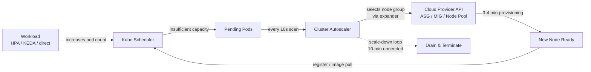

Two properties of this picture are central to the limitations analysis that follows: (1) the trigger for scale-up is the *existence of pending pods*, meaning the demand signal CA acts on is *already a sign of saturation*; and (2) the provisioning path is *bound to elastic cloud abstractions* (ASG/MIG/Node Pool), which assumes the underlying capacity can be summoned via API.

## 1.4 Limitations of the Cluster Autoscaler for Request-Volume-Driven Workloads

With CA's mechanics established, its structural mismatch with the user's stated scenario—proactive scaling driven by business request volume, including non-elastic node groups—can be diagnosed across six concrete dimensions.

**1. Inherent reactivity of the pending-pod trigger.** Standard Kubernetes autoscaling is traditionally *reactive*, relying on internal resource metrics such as CPU usage or, in CA's case, on pending pods to determine when to scale; for modern stateless applications, this reactive model often introduces delays that impact performance.[^6] Reactive autoscaling—scaling up *after* CPU or memory thresholds are breached—introduces latency between demand spikes and additional capacity. By the time new pods are running, users have already experienced degraded performance.[^13] This is a fundamental sequencing problem that no amount of CA tuning can solve: pending pods only exist *after* HPA has already exhausted available capacity, which means CA's clock starts ticking only at the moment the SLA is already at risk.

**2. ASG cold-start latency that compounds the reactive lag.** Even after CA decides to scale up, the cloud-provisioning path imposes a 3–4 minute floor in production benchmarks across more than 100 clusters, compared to ~55 seconds for Karpenter—**roughly a 3.5x speed gap on a single-pod scale-up**.[^10] The gap widens dramatically under capacity-fallback scenarios:

| Scenario | Cluster Autoscaler | Karpenter | Difference |
|---|---|---|---|
| Single pod, standard instance | 3–4 minutes | 50–60 seconds | ~3.5x faster |
| Burst of 50 pods | 5–8 minutes (batched) | 60–90 seconds | ~5x faster |
| Spot capacity unavailable, fallback | 5–10 minutes | 55–70 seconds | ~7x faster |
| GPU instance (p4d.24xlarge) | 6–12 minutes | 2–4 minutes | ~3x faster |

[^10]

These figures only cover the time from request to instance availability. The *user-visible* cold start is further amplified by image-pull and runtime initialization: container cold-boot benchmarks measure 4 minutes 38 seconds for a 9.9 GB CUDA + PyTorch image under standard Docker pull, with end-to-end fresh-node Flyte runs taking 2 minutes 10 seconds image pull plus 7 seconds execution.[^2] For LLM serving paths, KEDA-triggered new pods add ~2 minutes of node provisioning, ~3 minutes of image pull on 10 GB+ images, plus 30 seconds for model load.[^3] An EKS Reddit case study documented consistently slow EKS node provisioning of ~4.5 minutes from instance launch to readiness before kubelet tuning.[^14] When the demand curve doubles in 60 seconds (a realistic flash-sale or live-event pattern), a CA-driven response that materializes 4–10 minutes later is not a degraded scaling experience—it is *no scaling experience at all* for the actual incident.

**3. Conservative scale-down behavior that delays cost recovery during troughs.** CA's `scale-down-unneeded-time` defaults to 10 minutes, and the controller deliberately does not consolidate underutilized but non-idle nodes.[^10][^8] For workloads with sharp fall-offs after a peak (e.g., post-flash-sale traffic returning to baseline within minutes), this means paying for capacity that is no longer earning revenue, sometimes for multiples of the actual idle window once stabilization timers, drain delays, and disruption-budget waits are accumulated. The user's explicit requirement for *prompt scale-down during troughs* is therefore directly at odds with CA's default operating philosophy.

**4. Rigidity of pre-defined node groups.** Because every node in a node group must share scheduling properties, operators must predict their instance-type needs upfront. If workloads are diverse, this creates many node groups, each with different instance types, generating operational complexity.[^10] Cost optimization levers are correspondingly limited: the `least-waste` expander can pick the least wasteful pre-defined group, but cannot dynamically substitute a smaller or differently sized instance from the broader cloud catalogue. By contrast, Karpenter selects from 800+ instance types and retries across types and AZs in milliseconds when capacity is unavailable.[^10] For request-volume-driven workloads whose optimal instance shape varies with traffic mix (CPU-heavy at one hour, memory-heavy at another), CA's static partitioning translates directly into either lost flexibility or proliferating node-group sprawl.

**5. No native handling of spot interruptions or capacity unavailability.** CA itself has no native Spot interruption handling; on AWS, operators must deploy the AWS Node Termination Handler (NTH) as a separate DaemonSet, introducing an additional component to deploy, configure, and maintain. The interruption response is sequential—NTH detects the interruption, cordons the node, drains pods, and only then does CA notice the reduced capacity and begin provisioning replacements.[^10] When capacity for a particular instance type is unavailable, the ASG retry cycle can take minutes, whereas direct-provisioning approaches retry across alternative types and AZs in milliseconds.[^10] For the user's request-volume-driven scenario, where Spot is often the most attractive cost lever, CA's fragmented Spot story translates into either reduced Spot adoption or higher reliability risk.

**6. Incompatibility and friction with non-elastic and fixed-capacity environments—central to the user's constraint.** This is the limitation most directly aligned with the user's stated concern. CA's provisioning model assumes a cloud-provider abstraction that can be invoked to *create a new VM on demand*. In environments where some node pools are non-elastic—on-premises bare-metal clusters, regulated environments where capacity is pre-procured for compliance reasons, hybrid setups where a fixed inventory of physical nodes exists alongside cloud capacity, or monthly-billed node pools that should not be auto-scaled to avoid unexpected expenses[^8]—the CA model has no native concept of *power-on a stopped node*, *cordon/uncordon a hibernating node*, or *bursting to a different pool*. OVHcloud's documentation explicitly cautions against enabling autoscaling on monthly-billed node pools and recommends a hybrid pattern of non-autoscaled monthly pools as a base for static workload combined with autoscaled hourly pools for dynamic workload.[^8] This pattern works only because the static base is *not* managed by CA; CA itself does not fill the gap.

**7. Pattern-agnosticism: no anticipation of known traffic patterns.** Perhaps the most important architectural gap for this report's research question: CA contains no mechanism to consume calendar-based, forecast-based, or external-signal-based information. It is not informed by the marketing team that a flash sale starts at 19:00; it is not informed by a time-series model that the next 15 minutes will see a 3x increase in QPS; it is not informed by a queue-depth probe that 50,000 documents have just been uploaded. It only learns about the surge when pods cannot schedule, by which point—per items 1 and 2 above—the SLO is already at risk. The OVHcloud documentation summarizes this candidly: a well-designed cloud-native system must scale up and down to adapt to fluctuations in load without human intervention, and these fluctuations include both regular cycles (such as day-night or work-weekend cycles) and ad-hoc events (such as a Black Friday situation)—yet CA's design provides no native hook to consume the predictive signals that would let it act on either category.[^8]

**Field evidence consolidating these gaps.** The most large-scale documented validation comes from Salesforce's migration of more than 1,000 EKS clusters from Cluster Autoscaler to Karpenter in 2025, which reported approximately 5% cost savings in FY2026 with projected 5–10% further reduction in FY2027 as bin-packing and Spot utilization continue to optimize, alongside an 80% decrease in operational overhead as automated provisioning replaced manual node-group management.[^10] AWS's introduction of EC2 Auto Scaling **warm pools** for EKS managed node groups is itself an explicit acknowledgement of CA's cold-start gap: warm pools maintain pre-initialized EC2 instances ready for rapid scale-out, reducing node provisioning latency for applications with burst traffic patterns, time-sensitive workloads, or long instance boot times due to complex initialization scripts and software dependencies.[^11] Industry guidance for high-concurrency events such as serving 50M+ concurrent viewers explicitly recommends to "warm up nodes before the surge (predictive)" rather than relying on reactive CA.[^9] Vendor-neutral observability guidance similarly notes that reactive autoscaling introduces latency between demand spikes and additional capacity—by the time new pods are running, users have already experienced degraded performance—and that predictive autoscaling anticipates demand using historical patterns, external event signals, and scheduled scale-out triggers to provision capacity *before* it is needed.[^13]

A consolidated mapping of CA's structural limitations against the four evaluation criteria from §1.2:

| Limitation | Latency Impact | SLA Impact | Cost Impact | Stability Impact |
|---|---|---|---|---|
| Pending-pod trigger (reactive) | High (clock starts at saturation) | High (SLO breach during scale-up) | Medium (under-provisioning losses) | Low–Medium |
| ASG / image-pull cold start (3–10 min) | Very High | High during bursts | — | Medium (queueing during spike) |
| Conservative 10-min scale-down | — | — | High (idle capacity post-trough) | Low |
| Rigid node groups, no dynamic instance selection | Medium (capacity-unavailable retries) | Medium | High (suboptimal instance fit) | Medium (node-group sprawl) |
| No native Spot interruption handling | Medium | Medium–High | High (reduced Spot adoption) | High (sequential drain delays) |
| Non-elastic / fixed-capacity incompatibility | N/A (cannot scale at all) | High | High (manual pre-provisioning) | High (manual operations) |
| Pattern-agnostic, no predictive hook | High (ignores known peaks) | High (every known peak is reactive) | Medium | — |

The cumulative pattern is unambiguous: **on every one of the four evaluation dimensions, CA's structural design imposes a non-trivial penalty for request-volume-driven, partially predictable workloads, and on the specific criterion that matters most to the user—non-elastic node group compatibility—CA provides no native answer at all**.

## 1.5 Identified Gap and Rationale for Predictive and Scheduled Approaches

Synthesizing §§1.1–1.4, the capability gap that this report addresses can be stated precisely:

> The standard Cluster Autoscaler is **structurally reactive** (its trigger is post-saturation pending pods), **provisioning-bound** (its actuator is cloud Auto Scaling Groups with 3–4 minute cold-start floors, amplified by image-pull and boot times to 6–10 minutes for AI/ML workloads), **conservatively asymmetric** (its scale-down lag delays cost recovery), **node-group rigid** (it cannot dynamically select instance shapes), and **pattern-agnostic** (it cannot consume calendar, forecast, or external-event signals). These properties leave enterprises simultaneously exposed to **latency penalties during demand surges** and **cost penalties during idle periods**, and they leave **non-elastic and hybrid node groups effectively unmanaged** by any native Kubernetes autoscaling primitive.

Closing this gap requires shifting along two orthogonal axes:

1. **From reactive to proactive paradigms.** Instead of waiting for pending pods, the controller must be driven by **anticipatory signals**: historical patterns (e.g., diurnal load, weekly business cycles), business calendars (promotions, product launches), external event signals (queue depth, message rate, upcoming live events), and predictive models (time-series forecasts of QPS, latency, or resource demand). Predictive autoscaling, as the OneUptime/Flux CD reference articulates, "anticipates demand using historical patterns, external event signals, and scheduled scale-out triggers to provision capacity before it is needed", and combining Prometheus metric signals with cron-based pre-scaling for known traffic patterns "eliminates the latency between demand spikes and available capacity".[^13] KEDA itself can scale based on Kafka message counts, increases in database records, or predefined schedules, delivering external signals directly to the control plane so that the scheduler can make scaling decisions based on real workload demand rather than reactively to resource consumption.[^6] Modern Kubernetes deployments increasingly leverage multiple scaling strategies simultaneously: the combination of *proactive scaling* based on predictive analytics and *reactive scaling* responding to immediate demand changes creates resilient infrastructure that adapts to varying operational conditions while maintaining service-level agreements.[^12]

2. **From rigid node-group provisioning to flexible, constraint-based, or pre-warmed capacity strategies.** Instead of pre-defining instance types per ASG, the provisioning layer must be able to select instance shapes dynamically (Karpenter-style NodePool constraints over 800+ instance types[^10]), or to maintain pre-initialized capacity ready for rapid activation (EC2 Auto Scaling warm pools, which complete OS initialization, user-data execution, and software configuration ahead of time and transition instances to active service without repeating the cold-start sequence[^11]; container image lazy-loading via Nydus, which reduces 9.9 GB image pulls from 4m 38s to ~1.16s on a fresh node[^2]), or to manage non-elastic capacity through cordon/uncordon, hibernation, IPMI/BMC power management, or virtual-kubelet bursting to serverless capacity. The provisioning agility dimension is the operational counterpart of the predictive decision dimension: prediction is only valuable insofar as the actuator can realize it within the prediction's lead time.

These two axes can be combined into a design space within which subsequent chapters will navigate. The proactive scaling spectrum—covered in detail in Chapter 2—spans **scheduled (cron-based)**, **predictive (forecast-based)**, **event-driven**, **hybrid reactive-proactive**, and **over-provisioning with headroom pods**, each occupying different points on the trade-off surface between cost, agility, complexity, and required signal quality. The provisioning agility dimension—covered in Chapters 5 and 6—spans direct-provisioning autoscalers (Karpenter), warm pools (AWS EKS warm pools[^11]), lazy-loading container runtimes (Nydus[^2]), and non-elastic patterns (cordon/uncordon, IPMI, virtual kubelet).

For the user's specific scenario, any candidate solution must therefore answer the following five design questions, which constitute the running checklist for the rest of the report:

- **Signal source** — Which combination of historical metrics, business calendars, external events, and predictive models drives scale-up decisions, and how is the prediction horizon matched to provisioning latency?
- **Scheduling mechanism** — How are scheduled actions (cron, calendar, KEDA Cron scaler) layered on top of forecast-driven actions to provide a baseline guarantee for known peaks, and how does the system reconcile when predictions disagree with schedules?
- **Provisioning agility** — Which actuator (Karpenter, warm pools, lazy-loading, IPMI power-on, virtual kubelet) is used for each node-pool class, including non-elastic pools, and what is its realized lead time?
- **Integration with HPA/KEDA** — How does pod-level scaling cooperate with node-level prediction so that the two layers neither fight each other nor create double-provisioning, particularly given the well-known recommendation against using HPA and VPA on the same metric?[^6]
- **Cost controls and safety nets** — How are headroom pods, prediction confidence intervals, max-of-reactive-and-predictive policies, scale-down protection, and PDBs configured so that prediction errors degrade gracefully into reactive behavior rather than catastrophic over- or under-provisioning?

With the problem boundary set, the evaluation criteria fixed, the CA baseline architecturally dissected, and the gap formally identified, the remainder of the report systematically walks the design space outlined above. Chapter 2 develops the taxonomy of proactive node autoscaling strategies and a decision framework for matching them to workload archetypes. Chapter 3 examines forecasting methods and scheduled approaches. Chapter 4 surveys existing open-source and commercial implementations against the criteria established here. Chapters 5 and 6 propose the reference architecture and address the non-elastic and hybrid scenarios that lie at the heart of the user's stated constraint. Chapters 7 through 9 consolidate engineering best practices, evaluation methodology, and the implementation roadmap that translates the analysis into actionable engineering decisions.

# 2 Taxonomy of Proactive Node Autoscaling Strategies

Chapter 1 closed by identifying a precise capability gap: the standard Cluster Autoscaler is structurally reactive, provisioning-bound, and pattern-agnostic, leaving request-volume-driven workloads exposed to latency penalties at peaks and cost penalties at troughs—a gap that widens further when some node pools are non-elastic. The natural next question is methodological: *what are the available shapes of "proactive"?* Proactivity is not a single technique but a family of paradigms, each with its own trigger source, lead time, signal-quality requirement, and operational footprint. Conflating them obscures the design choices that platform teams must actually make. This chapter therefore constructs a systematic taxonomy of five proactive node autoscaling strategies, scores each one along the four evaluation criteria fixed in §1.2 (response latency, SLA compliance, cost efficiency, operational stability), and culminates in a decision framework that maps workload archetypes to strategy combinations. The intent is to provide the conceptual scaffolding on which the deeper methodological treatments of Chapters 3–6 will build, while ensuring that every recommendation explicitly satisfies the user's two binding constraints: (i) request-volume-driven, partially predictable workloads and (ii) compatibility with non-elastic node groups.

## 2.1 Classification Dimensions and Comparative Framework

To compare proactive strategies on equal footing, this report uses a six-dimensional analytical lens, derived directly from the architectural realities exposed in Chapter 1 and the design questions enumerated in §1.5.

The first dimension is the **trigger source** — the signal that causes the controller to decide that more (or less) capacity is needed. Triggers fall into four broad categories: (a) **calendar / cron schedules**, where the controller acts on fixed wall-clock rules such as `0 6 * * 1-5` for weekday business hours[^15]; (b) **forecasted metrics**, where a time-series or ML model predicts a future value of CPU, RAM, request rate, or a derived index, and the prediction itself becomes the trigger[^16][^17]; (c) **external operational events**, where the signal originates outside the cluster's resource layer—queue length, database row count, message broker lag, HTTP rate, or a webhook—and is consumed by an event-driven autoscaler such as KEDA[^15][^18][^19]; and (d) **headroom buffers**, where low-priority placeholder pods continuously reserve spare node capacity so that real pods preempt them instantly when traffic arrives, with the trigger effectively being "any real pod's arrival".

The second dimension is the **prediction horizon versus provisioning lead time**. Chapter 1 quantified that node provisioning takes 3–4 minutes for CA on AWS, ~55 seconds for Karpenter, and 6–10 minutes once GPU image pull is included; the Vultr/Prophet case study reports that on a fresh boot with Debian installation and cluster join, a node took roughly 8.5–9 minutes to become ready, which directly forced the predictive model to forecast far enough ahead to cover that window[^16]. A strategy is only viable when its trigger-to-action lead time meets or exceeds the worst-case provisioning latency for the targeted node pool. This dimension is the single most decisive constraint in matching strategies to environments.

The third dimension is **decision granularity** — whether the strategy issues per-pod replica adjustments (the natural KEDA/HPA scope), per-node provisioning calls (Karpenter, cloud-provider APIs), or per-pool resizing actions (ASG desired-count, scheduled actions). Predictive strategies that operate purely on pod-level signals can drift from node-level reality if the connection to the provisioning layer is missing — a failure mode that Chapter 4 of the persistent reasoning rubric explicitly warns against.

The fourth dimension is **signal-quality requirement**. Cron-based strategies require essentially no signal, only a calendar; event-driven strategies require a reliable external metric stream; forecasting strategies require sufficient historical data to learn seasonality—the Kedify implementation, for instance, splits its dataset into a 90% train / 10% test partition and evaluates using Mean Absolute Percentage Error (MAPE), with a configurable `modelMapeThreshold` below which the predictor falls back to a default value[^17]. Headroom strategies require no signal at all but pay a continuous cost.

The fifth dimension is **infrastructure prerequisite** — whether the strategy presumes elastic cloud capacity that can be summoned via API, or whether it can also operate over fixed-capacity, on-premises, or non-elastic pools. Several otherwise attractive strategies are silently incompatible with non-elastic environments unless paired with a non-cloud actuator (cordon/uncordon, IPMI power-on, virtual kubelet); KEDA's Cron Scaler explicitly notes that "your cluster needs an active Cluster Autoscaler to remove nodes during Zero Scaling" if hardware-level cost savings are desired[^15], illustrating that pod-level proactivity does not automatically translate into node-level cost recovery.

The sixth dimension is **integration with HPA/KEDA and the control plane** — how the strategy interacts with existing pod-level autoscalers. KEDA explicitly creates and manages an HPA resource behind the scenes when a `ScaledObject` is defined[^19], meaning event-driven and scheduled strategies built on KEDA are natively HPA-compatible. Predictive controllers that act on node provisioning APIs directly (the Vultr/Prophet pattern[^16]) bypass HPA entirely at the node layer but must still avoid conflicting with HPA-driven pod-level scaling. Chapter 1 also flagged that HPA and VPA should not share metrics — a constraint that propagates to predictive scalers operating on the same dimension.

These six dimensions populate the comparative scorecard used in §§2.2–2.6 and consolidated in §2.7. Throughout the chapter, each strategy is scored qualitatively against the four §1.2 evaluation criteria — **L** (response latency), **S** (SLA compliance), **C** (cost efficiency), and **O** (operational stability) — using a three-level scale (Strong / Moderate / Weak) with explicit caveats.

## 2.2 Scheduled (Cron-Based) Scaling

The simplest proactive paradigm is to scale on a *clock*. Scheduled scaling provisions or relinquishes capacity at predefined times, encoded as cron expressions or wall-clock rules, regardless of instantaneous load. Its conceptual appeal is that for any workload with calendar-driven behavior — diurnal business hours, weekly cycles, dev/QA hibernation, scheduled marketing events — the *future* trigger time is known with arbitrary precision, so the lead time relative to provisioning latency is trivially controllable: simply set the schedule to fire `T_provision` minutes before the expected peak.

**Concrete implementations.** Three distinct mechanisms are well-documented in the surveyed literature:

1. **KEDA Cron Scaler.** KEDA exposes a `cron` trigger inside a `ScaledObject` with `start` and `end` cron expressions, a timezone, and a `desiredReplicas` field; outside the active window the workload scales down to `minReplicaCount`, which can be zero[^15][^19]. The Blueshoe walkthrough provides a canonical example: a deployment scaled to three replicas Monday–Friday between 06:00 and 20:00 Europe/Berlin, and to zero outside that window[^15]. The Civo tutorial shows the same primitive applied at finer granularity, scaling up every 10 minutes for testing scenarios[^19].
2. **Kubernetes CronJobs invoking kubectl.** Devtron's analysis explicitly notes that "there is no time-based cluster scaling available out-of-the-box for Kubernetes" and that operators "can manually create Kubernetes CronJobs that execute at specific times to scale your deployments up or down", using `kubectl` or the Kubernetes API to adjust replica counts[^20]. This pattern is the lowest-overhead option but lacks the declarative lifecycle and observability of CRD-driven approaches.
3. **CRD-based schedulers such as Devtron's Winter Soldier.** Winter Soldier is a Kubernetes operator that consumes a `Hibernator` CRD with start/end times and weekday selectors, hibernating workloads (including scaling them to zero, with pod deletion observed in the documented walkthrough) and rehydrating them on schedule[^20]. The tool is positioned explicitly for predictable patterns — "for batch processes, resource optimization, hibernating microservices, or for specific use cases which has predictable patterns" — with the canonical example of an attendance application whose major traffic occurs only between 8:00 AM and 11:00 AM[^20].

A subtlety often missed in casual treatments is that scheduled scaling at the *pod* layer (KEDA Cron, Winter Soldier) only translates into *node* cost savings if the node fleet can shrink in response. Blueshoe makes this prerequisite explicit: "The cluster autoscaler must be active so that unused nodes can be removed. The amount of savings then depends on how many workloads can be paused outside of operating hours"[^15]. In environments where CA is disabled (the user's stated scenario) or where node pools are non-elastic, scheduled pod-scaling must be paired with a non-CA node actuator — for example, a cron-driven script that calls a cloud provider's managed-node-group API, a scheduled action on AWS/GCP, or a cordon/uncordon controller for on-premises pools (treated in Chapter 6).

**Strengths.**

- **Deterministic lead time.** Because the trigger is calendrical, the operator can set the firing time arbitrarily far in advance of the expected peak, fully covering even GPU-class provisioning windows. Devtron explicitly cites this advantage: "time-based autoscaling has the upper hand as it can scale up the resources at a given time before the expected traffic is received. The request waiting time also gets reduced as we already know how much resources are required and they are already present to serve the request"[^20].
- **Avoidance of HPA's reactive scaling lag and short-spike thrashing.** Devtron observes that traditional autoscaling based on real-time metrics "may lead to rapid scaling up and down in response to short-lived spikes. However, this frequent scaling can incur additional costs due to the time required for resource provisioning and teardown. Time-based autoscaling, on the other hand, provides a more controlled approach, aligning resource allocation with predictable demand, preventing unnecessary scaling actions, and avoiding cost spikes"[^20].
- **Operational simplicity.** Cron expressions are universally understood, declaratively expressed, and trivially auditable. Blueshoe characterizes the KEDA Cron configuration as "uncomplicated" and notes that "the use of KEDA is worthwhile long-term when your workloads have a time-based characteristic"[^15].
- **Aggressive cost recovery for off-hours environments.** For non-production environments — Dev, QA, UAT — Devtron argues that scheduled scaling "can drastically help to reduce the TCO of infrastructure" by scaling them to zero outside office hours[^20]. The savings are not merely incremental: scaling 9 of 10 workloads to zero overnight, in Blueshoe's example, removes the need for almost all worker nodes, producing "noticeable cost savings"[^15].

**Limitations.**

- **Rigidity against unscheduled bursts.** A cron schedule that pre-warms for 09:00 cannot cover an 08:30 marketing tweet that goes viral. Scheduled scaling alone offers *no* response to unanticipated demand and must therefore be paired with a reactive fallback — see §2.5.
- **Schedule-maintenance burden and drift.** Calendars change: time zones shift, business hours evolve, regional holidays differ, marketing calendars rearrange. Each change requires manual schedule updates. The Vultr/Prophet team observed this implicitly when noting that real-world traffic patterns "fluctuated day to day and weekly — on weekends we had less traffic, while Monday had high traffic and Tuesday had less, and this pattern would switch each week"[^16]; encoding such switching patterns in static cron rules is brittle.
- **Inability to adapt to gradual demand drift.** Scheduled scaling is inherently *static*; it does not learn. If overall traffic grows by 30% year-over-year, the operator must manually re-tune the `desiredReplicas` count or the schedule duration.
- **Pod-only scope without node-level coupling.** As noted, the major scheduled-scaling tools (KEDA Cron, Winter Soldier) operate at the pod replica layer; converting that into node savings requires an additional actuator that may itself be incompatible with non-elastic pools.

**Scorecard.** Latency: **Strong** (lead time is configurable). SLA: **Strong for known peaks, Weak for surprises**. Cost: **Strong for predictable trough patterns**. Stability: **Strong** (no oscillation since the schedule is deterministic). Non-elastic compatibility: **Conditional** — works at the pod layer everywhere, but node-level savings depend on a separate actuator.

## 2.3 Predictive (Forecasting-Based) Scaling

Where scheduled scaling extrapolates a *human-encoded* calendar, predictive scaling extrapolates a *learned* model. The controller ingests historical metrics, fits a forecasting model, projects the metric forward over a horizon matched to provisioning latency, and translates the projection into node-level provisioning actions. Two recent, well-documented exemplars provide the empirical grounding for this section: the Vultr/Prophet predictive system built by Jorrick Stempher's team at Windesheim and Kedify's commercial predictive scaler integrated into KEDA.

**The Vultr/Prophet reference implementation.** A team of eight student engineers built a five-component predictive scaling service for a Kubernetes cluster on Vultr over a 10-week project[^16]. The architecture is illuminating because it traces every layer of the rubric's "data → feature → forecast → decision → provisioning → observability" feedback loop:

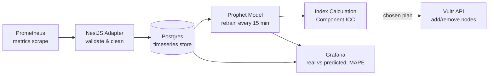

Several design decisions in this implementation are directly transferable. First, the project explicitly chose Prophet over ARIMA, SARIMA, and NeuralProphet because of "a good balance between accuracy and training speed" and built-in seasonality, which matters because "the cluster load we were working with changes in predictable patterns throughout the day, week, and months"[^16]. Second, the prediction horizon was deliberately set to one hour (60 per-minute predictions) because Vultr nodes took ~8.5 minutes from API call to ready state and the prediction had to extend "far enough ahead to have enough time to start it up, add it, run the front-end and back-end, and complete everything in time"[^16]. Third, the team introduced a **Node Ranking Index (NRI)** — "a unified metric that combines CPU, RAM, and request data into a single comparable number" — because "without this ranking index, just a number like one, two and a half, or three, it would have been really difficult to scale nodes up and down for cost and performance efficiently"[^16]. This is a concrete instance of multivariate signal fusion that Chapter 3 will examine in greater depth. Fourth, the achieved MAPE was below 9% in their controlled testbed, with a best-case of 0.5% and a typical band of 5–9%, after retraining every 15 minutes against the previous week's data[^16]. Fifth, the **Index Calculation Component** uses recursive search to pick the best combination of node plans, prioritizing removal of nodes whose hourly billing cycle is closest to expiry[^16] — a cost-aware optimization that reactive controllers structurally cannot perform. Sixth, the entire control plane runs on a dedicated manager node protected by taints and tolerations to prevent the scaler from accidentally evicting itself during scale-down[^16], a safety pattern that any production deployment must replicate.

**Kedify's predictive scaler.** A second, productized exemplar comes from Kedify, which extends KEDA with a predictive scaler driven by Prophet[^17]. Several design choices reinforce the patterns observed in the Vultr case while raising additional concerns:

- **Model-quality safety net.** Kedify partitions the dataset 90/10 into train and test, evaluates with MAPE, and exposes a `modelMapeThreshold` parameter. If the model's error exceeds the threshold, "Kedify automatically returns a default value (also defined in the trigger) instead of an unreliable prediction"[^17], allowing scaling modifiers to ignore the predictor when its confidence is low. This is the operational embodiment of the "garbage in, garbage out" rule and addresses the rubric's anti-pattern warning against over-aggressive forecasting.
- **Explicit model decomposition.** Each model "can be decomposed into seasonal and trend components (weekly, monthly, or custom) allowing visual inspection of whether the detected patterns make sense"[^17]. Interpretability is a non-trivial requirement for SREs who must trust automated provisioning decisions.
- **MetricPredictor CRD.** Kedify introduces a dedicated CRD that decouples model definition from `ScaledObject` consumption: the `source` can be a live `ScaledObject` or a one-shot CSV (useful for bootstrapping with historical data), the `model` field selects the forecasting method and training cadence, and the predictor's output is then referenced by `ScaledObject` triggers[^17].
- **Continuous retraining and graceful uncertainty.** Kedify retrains models automatically on schedule; in the published visualization, "when data collection was interrupted for several hours, the Prophet model still maintained a plausible fit" while "the widening confidence interval signals increasing uncertainty"[^17] — a behavior pattern that operators should specifically test for in their own deployments.

**Survey of forecasting methods (preview of Chapter 3).** The Kedify article explicitly enumerates the methods commonly considered: moving average and exponential smoothing, ARIMA, Facebook Prophet, LSTM neural networks, and Holt-Winters' method, concluding that "among them, Prophet stands out for its robustness, interpretability, and ability to handle seasonality without heavy tuning"[^17]. The Vultr team reached the same conclusion through independent comparison against ARIMA, SARIMA, and NeuralProphet[^16]. This convergence, while not authoritative, is suggestive: for cluster-load time-series with diurnal/weekly seasonality and modest historical depth, Prophet is repeatedly selected as the pragmatic default. Chapter 3 will treat the underlying methodology in detail.

**Strengths.**

- **Adaptation to drift and seasonality.** Unlike cron rules, predictive models *learn*. The Vultr team's load script "fluctuated day to day and weekly … this pattern would switch each week"[^16]; Prophet's seasonality components capture exactly such structures. Kedify highlights that "patterns repeat predictably (daily peaks, weekly cycles, monthly cron jobs). Instead of chasing them, Kedify can learn them"[^17].
- **Reduced reaction lag and fewer cold starts.** Kedify's enumerated benefits include "reduced reaction lag — the cluster scales before spikes hit" and "improved UX — fewer cold starts and latency dips"[^17]. The latter point is particularly valuable for the GPU-image cold-start scenarios identified in §1.1.
- **Multivariate fusion potential.** The NRI pattern[^16] demonstrates that CPU, RAM, and request-rate metrics — which are individually incomparable — can be unified into a single scalar signal that drives node-count decisions. This generalizes naturally to incorporating business KPIs.

**Limitations.**

- **Data-quality dependence.** The Vultr team explicitly built validation into the NestJS adapter because "sometimes Prometheus gave us invalid data, like the CPU metric being zero or null. This could potentially mess up predictions from Prophet"[^16]. A predictor without input validation will produce destabilizing outputs.
- **Model drift and retraining cost.** Kedify retrains automatically because "patterns evolve"[^17]; without continuous retraining, accuracy degrades silently. Retraining itself is not free — the Vultr team retrained every 15 minutes and consumed two to three days of intensive load generation just to bootstrap a usable model[^16].
- **Limited applicability to non-seasonal workloads.** Kedify is candid: "not all the data exhibit seasonal patterns and general ML rule of thumb: 'garbage in, garbage out' also applies here"[^17]. For stochastic event-driven inference workloads with no recurring structure, forecasting offers little benefit and event-driven scaling (§2.4) is the better paradigm.
- **Operational complexity.** A production predictor requires a metrics pipeline, a feature store, a training cadence, a model registry, MAPE monitoring, fallback logic, and observability dashboards — the five-component Vultr architecture is the *minimum* viable surface, not the upper bound. The Vultr team's own retrospective advice was telling: "select a team full of Kubernetes masters" and "do your research" because skipping research "would have made [the service] never become so accurate and robust"[^16].
- **Testbed-versus-production validation gap.** Both reference cases are caveat-heavy. The Vultr MAPE figures were achieved on a synthetic load-generating script and the team explicitly acknowledged "it's hard to say how accurate the prediction would be in a real-world scenario"[^16]; Kedify's claims are vendor-published. Per the persistent reasoning rubric (criterion P-2), these should be treated as medium-confidence indicators, not as production guarantees.

**Scorecard.** Latency: **Strong** when the prediction horizon comfortably exceeds provisioning time, **Weak** when it does not. SLA: **Moderate–Strong** depending on MAPE and on whether a reactive safety net is layered beneath. Cost: **Strong** when seasonality is real and stable; **Weak** when applied to non-seasonal workloads. Stability: **Conditional** on the MAPE-threshold safety net; without it, prediction errors translate directly into oscillation or thrashing. Non-elastic compatibility: **Conditional** — the forecasting layer is environment-agnostic, but the actuator (Vultr API, AWS API, IPMI, etc.) determines whether it can address fixed-capacity pools.

## 2.4 Event-Driven Scaling

Event-driven scaling sits between cron and forecasting on the proactivity spectrum. It is reactive in the literal sense — the controller acts on an observed signal — but the signal is *operational* (queue depth, message broker lag, HTTP rate) rather than *resource* (CPU, memory). Because operational signals frequently rise *before* resource signals do (a queue grows before the workers' CPU saturates), event-driven scaling delivers earlier lead time than HPA-style metric-driven scaling, qualifying it as proactive relative to the user's framing.

**KEDA as the canonical platform.** KEDA, jointly created by Microsoft and Red Hat in 2019 and now a CNCF project, is the de facto event-driven autoscaling layer for Kubernetes[^19]. Its architecture introduces *scalers* — components that connect to external event sources — and a `ScaledObject` CRD that declaratively configures the scaling policy[^15][^19]. KEDA ships with **over 70 scalers**[^15], and the Civo tutorial enumerates representative categories: message brokers (Kafka, RabbitMQ, Azure Event Hubs), databases (MySQL, PostgreSQL, MongoDB, Redis), metric sources (Prometheus, AWS CloudWatch, Azure Monitor), time-based triggers (Cron, treated under §2.2), and cloud-event sources (AWS SQS, GitHub Actions)[^15][^19]. KEDA also extends through user-defined scalers to integrate "almost any event source"[^15].

A critical architectural detail is that KEDA does not replace HPA; it *augments* it. The Civo tutorial documents that "when you create a ScaledObject, KEDA automatically generates and manages an HPA resource behind the scenes"[^19]. KEDA's own blog characterization summarizes the relationship: "KEDA works complementarily to HPA by transmitting external metrics and thus creating more flexible scaling options"[^15]. This means event-driven and HPA-driven scaling coexist transparently, and the integration question reduces to ensuring that KEDA-derived metrics and any other custom HPA metrics do not conflict.

**Concrete examples from the surveyed material:**

- A Redis-queue worker can be scaled by length of a list; the Civo tutorial walks through a `ScaledObject` whose Redis trigger watches a `job-queue` list and scales the worker deployment up to five replicas when the queue exceeds five items[^19].
- AWS SQS, Kafka, and Prometheus scalers are widely deployed for event-driven inference, async data pipelines, and batch processing pipelines[^18][^19].
- Cron triggers (§2.2) are themselves implemented as KEDA scalers, so a single platform can carry both scheduled and event-driven proactive paradigms.

**Scale-to-zero capability.** A defining feature of KEDA, distinguishing it from vanilla HPA, is **zero scaling** — workloads can be reduced to zero pods when no events are present[^15]. Blueshoe characterizes this as: "Zero Scaling means that workloads are completely deactivated by setting their number of Pods to 0. KEDA enables this by using event sources that activate Pods when needed. This drastically reduces resource usage when no events are present and helps save costs while maximizing cluster efficiency"[^15]. For the user's request-volume-driven scenario, zero-scaling is particularly valuable for off-hours environments (matching the cron use case) and for inference endpoints whose traffic is naturally intermittent.

**Strengths.**

- **Earlier signal arrival than resource-based reactive scaling.** A Kafka topic lag or SQS queue depth begins growing immediately when producers accelerate; CPU saturation lags behind by the consumer's processing time. Acting on the operational signal therefore provides a head start that is often sufficient to cover pod-level Kubernetes scheduling latency, and — when fed into Karpenter or a managed-node-group action — node provisioning latency.
- **Direct alignment with business workload semantics.** The signal is the *work itself* (messages, requests, jobs), not a derived resource metric. Civo notes: "scaling via CPU and memory usage isn't always the answer, as modern applications are decoupled; an increase in load on one of your dependencies could signal the need to scale to handle the increase in load"[^19].
- **Broad platform coverage and HPA compatibility.** With 70+ scalers and transparent HPA integration, KEDA can be adopted incrementally without disrupting existing pod-level autoscaling[^15][^19].
- **Native scale-to-zero for cost recovery.** As above[^15].

**Limitations.**

- **Insufficient lead time when signal-to-saturation gap is small.** If the queue grows from zero to "overload" in seconds and node provisioning takes 3–10 minutes, even an event-driven trigger arrives too late at the node layer. Blueshoe is explicit about this dependence: "your cluster needs an active Cluster Autoscaler to remove nodes during Zero Scaling"[^15] — and conversely, scaling up requires that the node provisioner can actually keep pace.
- **Pod-only by default.** Like scheduled scaling, event-driven scaling natively addresses pod replica counts. Translating that into node-count changes still requires CA, Karpenter, or a custom node controller. For the user's non-elastic pools, the same caveat as in §2.2 applies.
- **Continuous-availability workloads benefit less.** Blueshoe notes a frank limitation: "Workloads that must run continuously benefit less from KEDA, as Zero Scaling is not possible"[^15]. For services that must always have capacity, event-driven scaling reduces to a higher-quality HPA metric source rather than a transformative paradigm.
- **Threshold tuning and noise sensitivity.** The Vultr team's data-validation experience generalizes: an external metric stream with occasional null or anomalous values will produce spurious scaling actions unless validated upstream[^16]. KEDA itself does not impose such validation; it must be added.

**Scorecard.** Latency: **Strong** for moderate-burst workloads where queue/event signals lead resource saturation; **Weak** when signal-to-saturation gap is shorter than provisioning time. SLA: **Moderate–Strong**. Cost: **Strong** especially with scale-to-zero. Stability: **Strong with proper threshold tuning, Weak with noisy signals**. Non-elastic compatibility: **Conditional** — KEDA at the pod layer is universal, but the node actuator must independently address non-elastic pools.

## 2.5 Hybrid Reactive-Proactive Scaling

The preceding three strategies each have characteristic failure modes: scheduled scaling cannot cover surprises, predictive scaling fails on non-seasonal data and during model drift, and event-driven scaling can be too late when signal-to-saturation gaps are short. The pragmatic resolution observed across the surveyed material is to *layer* paradigms rather than choose among them. Hybrid reactive-proactive scaling treats predictive and scheduled mechanisms as the *baseline* that sets capacity ahead of expected demand, and reactive mechanisms (HPA, KEDA event triggers, CA, Karpenter) as the *safety net* that absorbs unexpected variance.

**Architectural pattern: max-of-reactive-and-predictive.** The conceptual policy is straightforward: at any moment, the desired node count is the *maximum* of (a) the schedule's prescribed count, (b) the forecaster's projected count, and (c) the reactive controller's current demand. This guarantees that the system always satisfies the most aggressive of the three signals, so prediction errors that *underestimate* demand are corrected by the reactive layer and prediction errors that *overestimate* are bounded by other policy controls (max replicas, cost ceilings, scale-down protections).

The Kedify architecture is an explicit instantiation of this pattern. Predictive scaling is described as additive to existing KEDA functionality: "Once a `MetricPredictor` is created and trained, its predictions can be referenced directly in a `ScaledObject` trigger. This allows Kedify to scale based on forecasted metrics alongside real-time ones"[^17]. In other words, the same `ScaledObject` carries both real-time and forecasted triggers, and KEDA's underlying HPA-aggregation logic combines them. The model-fallback mechanism — returning a default value when MAPE exceeds threshold — is the explicit safety hatch[^17]: when the predictor is untrustworthy, the system silently degrades to its reactive/default behavior instead of issuing dangerous scaling actions. The Kedify benefits list explicitly mentions "automatic fallback to defaults when model confidence drops"[^17] as a robustness property.

The KubeFM episode framing crystallizes the philosophical distinction: "Reactive scaling starts when nodes are already incredibly busy, whereas predictive scaling anticipates and prepares for load before it occurs"[^16]. The point of hybridization is not to replace reactive scaling, which remains the unique mechanism able to respond to the unforeseen, but to *prepend* a proactive layer that prevents the reactive layer from ever being asked to handle a known-in-advance peak under cold-start conditions.

The Devtron analysis arrives at the same architectural conclusion from a different vantage. It explicitly contrasts time-based scaling with HPA — "HPA is useful when the traffic is dynamic in nature and difficult to predict"[^20] — and positions time-based scaling as complementary precisely because it covers what HPA cannot: known peaks. The implication is that any production-grade stack should run *both*: HPA for traffic that is hard to predict, scheduled or predictive controls for traffic that is.

**Coordination patterns and failure modes to avoid.**

1. **Double-provisioning risk.** If the predictive controller scales up at T-5min and the reactive HPA also reacts as load arrives at T, naive policies could double the response. The max-of policy avoids this — both controllers express *desired state*, and the higher number wins rather than being summed.
2. **HPA/VPA conflict on shared metrics.** §1.2 noted that HPA and VPA should not share metrics. The same caution generalizes: a predictive controller that scales pods on QPS while HPA also scales on QPS will compete unless one of them is the explicit owner of that dimension. The cleaner separation is to assign predictive control to the *node* layer (via Karpenter NodePool capacity, custom provisioners, or scheduled-actions APIs) and reactive control to the *pod* layer (HPA on CPU, KEDA on queue depth), so that the two layers operate on disjoint resources.
3. **Scale-down conflict.** A predictive controller that wants to scale down at the trough may be blocked by a reactive controller that has not yet seen utilization fall. The Vultr ICC's recursive search to find the best combination of node plans, prioritizing nodes near billing-cycle expiry[^16], is a coordinated scale-down strategy that both controllers must respect; PodDisruptionBudgets and stabilization windows provide the underlying guardrails (developed in Chapter 7).
4. **Loss of the reactive safety net itself.** A subtle anti-pattern is to invest so heavily in prediction that operators silently neglect the reactive layer; when the model drifts, the system has no defense. Kedify's explicit MAPE threshold and default-value fallback[^17] are the operational countermeasures.

**Strengths.** Hybrid architectures dominate every individual strategy on the SLA criterion because they preserve worst-case reactive behavior while gaining best-case proactive behavior. They are also the only architecturally honest answer to the user's full requirement set: known peaks demand proactive provisioning; unknown peaks demand reactive provisioning; both occur in real production traffic.

**Limitations.** Complexity. Operating a hybrid system means operating *every* layer's monitoring, configuration, and failure modes. The Vultr team's reflection — that predictive scaling required a five-component service to be built, integrated, tested, and observed[^16] — and the Kedify list of CRDs (`MetricPredictor`, `ScaledObject`) and parameters (`modelMapeThreshold`, `highMapeDefaultReturnValue`)[^17] both indicate a non-trivial cognitive surface. For organizations without dedicated platform-engineering capacity, the simpler scheduled+reactive hybrid (§2.2 + HPA) is often the right starting point, with predictive layers added later as Chapter 9's roadmap will recommend.

**Scorecard.** Latency: **Strong**. SLA: **Strong** — strictly dominates the components. Cost: **Moderate–Strong** depending on safety-margin tuning. Stability: **Strong** when the safety nets are correctly configured; **Weak** if the layers are allowed to fight each other. Non-elastic compatibility: **Strong if** at least one of the proactive layers (typically scheduled) drives a non-elastic actuator.

## 2.6 Over-Provisioning with Headroom Pods

The fifth proactive paradigm operates not at the *signal* layer but at the *capacity* layer. Instead of trying to anticipate when capacity will be needed, headroom pod over-provisioning *continuously maintains* a small reserve of pre-provisioned but unused node capacity, ensuring that real workloads can be scheduled instantly when they arrive while the cluster autoscaler or Karpenter provisions replacement nodes in the background.

The mechanism is structurally simple. Operators deploy a low-priority placeholder ("pause" or "balloon") workload — typically running a no-op image such as the Kubernetes `pause` container — with PodDisruptionBudget-aware configuration and resource requests sized to match the expected burst. A dedicated low PriorityClass ensures these placeholder pods are immediately preempted by any real workload that requires their capacity, which means real pods schedule instantly onto the already-provisioned nodes. The preemption simultaneously creates pending placeholder pods, which trigger CA/Karpenter to provision replacement nodes — but the user-visible cold-start has already been *paid in advance* rather than synchronously experienced. The net effect is that headroom pods convert provisioning latency from a customer-facing latency penalty into a continuously paid idle-capacity cost.

While the surveyed search results do not provide a vendor-neutral deep dive into headroom pods specifically, the pattern's conceptual lineage is acknowledged in Chapter 1's reference to **AWS EKS warm pools** as an *infrastructure-layer* analogue. Warm pools maintain pre-initialized EC2 instances ready for rapid scale-out, completing OS initialization, user-data execution, and software configuration ahead of time and transitioning instances to active service without repeating the cold-start sequence. Headroom pods perform an equivalent function at the *Kubernetes layer*: warm pools pre-warm the IaaS, headroom pods pre-warm the K8s scheduling state. The two are complementary and frequently combined.

**Applicable scenarios.** Headroom pods earn their continuous cost when, and only when, even the fastest available provisioner is too slow for the workload's burst amplitude. Specifically:

- **Live-event traffic** (Chapter 1 cited 50M+ concurrent viewer events) where seconds matter and Karpenter's ~55-second provisioning is itself the bottleneck.
- **Flash sales** where the demand curve doubles in 60 seconds and any pending-pod time is revenue loss.
- **GPU/AI inference** where the user-visible cold start (Chapter 1: 6–10 minutes including image pull) is unacceptable for first-request latency.
- **Stateful or long-initialization pods** whose own startup time (warm caches, connection-pool establishment, model load) imposes seconds-to-minutes of additional readiness latency that a headroom-pod buffer can absorb.

**Configuration patterns.** Three parameters dominate the trade-off: (i) the PriorityClass value, which must be lower than any real workload's class so that preemption is automatic; (ii) the resource requests, which determine how much capacity each placeholder reserves and therefore the size of the burst that can be absorbed instantly; and (iii) the replica count of the placeholder Deployment, which, multiplied by per-pod requests, defines total headroom. A PodDisruptionBudget on the placeholder Deployment is unnecessary because eviction is the *intended behavior*; conversely, real workloads should carry strict PDBs so that scale-down paths do not preempt real capacity.

**Strengths.**

- **Sub-second pod scheduling onto pre-warmed nodes.** When the placeholder is preempted, the real pod schedules immediately because the node, kubelet, image cache, and CNI are already initialized.
- **No prediction required.** Headroom pods make no assumption about *when* the burst will occur, so they are robust to forecast errors and unscheduled events alike.
- **Composable with every other strategy.** Headroom can sit beneath cron, predictive, event-driven, and reactive layers, providing a uniform last-mile guarantee.

**Limitations.**

- **Continuous idle cost.** The placeholder pods pay for capacity that, by design, is never used productively in steady state. For workloads where Karpenter's 55 seconds is acceptable, this idle cost is a pure deadweight loss — Chapter 1 already established that aggressive consolidation strategies can deliver 15–30% cost reduction, and headroom pods directly oppose that lever.
- **Sized to the worst case.** The buffer must be sized to the largest burst that must be absorbed instantly; underestimating produces no improvement over reactive scaling, while overestimating wastes capacity proportionally.
- **Limited value over slow provisioners.** If node provisioning is slow (CA's 3–4 minute floor or 6–10 minute GPU cold start), even a headroom buffer is exhausted quickly under sustained surges. The pattern is most effective paired with a *fast* underlying provisioner (Karpenter), where the headroom only needs to cover the first ~60 seconds.
- **Operationally subtle.** PriorityClass tuning, preemption policies, and placeholder-pod monitoring all require care; mis-tuned PriorityClasses can preempt real workloads in unexpected ways.

**Scorecard.** Latency: **Strongest** of any strategy for first-request latency under burst. SLA: **Strong**. Cost: **Weak** — continuous idle cost is the explicit trade. Stability: **Strong**. Non-elastic compatibility: **Strong** — headroom pods work identically on elastic and non-elastic pools because they consume *existing* capacity rather than provisioning new capacity; this is a particularly attractive property for the user's mixed-pool scenario.

## 2.7 Comparative Analysis Across Evaluation Criteria

The five paradigms occupy distinct positions on the trade-off surface. The matrix below consolidates their scorecards along the four §1.2 evaluation criteria and three secondary dimensions — implementation complexity, signal-quality dependence, and non-elastic node-group compatibility — drawing on the analyses in §§2.2–2.6.

| Strategy | Latency | SLA | Cost Efficiency | Stability | Implementation Complexity | Signal-Quality Dependence | Non-Elastic Compatibility |
|---|---|---|---|---|---|---|---|
| Scheduled (cron) | Strong (configurable lead) | Strong for known peaks; Weak for surprises | Strong for predictable cycles[^20][^15] | Strong (deterministic) | Low | None (calendar only) | Conditional — pod layer universal; node layer needs separate actuator[^15] |
| Predictive (forecasting) | Strong if horizon ≥ provisioning time[^16] | Moderate–Strong, MAPE-dependent[^17] | Strong on seasonal data; Weak on stochastic[^17] | Conditional on MAPE safety net[^17] | High (5+ components in Vultr case)[^16] | High (historical depth, retraining cadence) | Conditional — depends on actuator |
| Event-driven (KEDA) | Strong when signal leads saturation[^15][^19] | Moderate–Strong | Strong with scale-to-zero[^15] | Strong with proper threshold tuning | Moderate (CRDs, scaler config) | Moderate (external metric reliability) | Conditional — pod layer universal; node layer needs separate actuator[^15] |
| Hybrid reactive-proactive | Strong | Strongest (dominates components)[^20][^17] | Moderate–Strong | Strong if layers don't fight | High (operating multiple layers) | Inherits worst of constituent layers | Strong if at least one proactive layer addresses non-elastic actuator |
| Headroom pods | Strongest (sub-second) | Strong | Weak (continuous idle cost) | Strong | Moderate (PriorityClass, sizing) | None | Strong — works identically on elastic and non-elastic pools |

**Key observations from the matrix.**

First, **no single strategy dominates across all dimensions**. Scheduled scaling is unbeatable on simplicity and stability for predictable patterns but cannot handle surprises; predictive scaling is most cost-efficient on seasonal traffic but most fragile on stochastic; event-driven scaling provides natural alignment with business semantics but inherits its lead time from the signal source; headroom pods provide the strongest latency guarantee but at the highest steady-state cost. This is consistent with rubric criterion P-5 (trade-off and anti-pattern surfacing): every strategy comes with a non-trivial cost, and any recommendation that ignores those costs is incomplete.

Second, **the hybrid strategy strictly dominates its individual components on SLA**, because by construction it preserves worst-case reactive behavior while adding best-case proactive behavior. This is the architectural argument for treating proactive and reactive scaling as *complementary* rather than competing — a point that the Devtron, Kedify, and Vultr sources independently reinforce[^20][^16][^17].

Third, **non-elastic compatibility is a structural property of the actuator, not the trigger**. Cron, predictive, and event-driven triggers are all environment-agnostic; what determines whether they can manage non-elastic pools is whether the controller can drive cordon/uncordon, IPMI power-on, virtual-kubelet bursting, or a managed-node-group API for that pool. Headroom pods are the only strategy whose non-elastic compatibility is *intrinsic*, because they consume already-available capacity. This observation foreshadows Chapter 6's deeper treatment.

Fourth, **gaps remain that motivate later chapters**: the predictive row's "depends on actuator" entry surfaces the need for the reference architecture in Chapter 5; the predictive complexity entry motivates Chapter 3's deeper methodological treatment of forecasting; the heterogeneity of strategy implementations across vendors motivates Chapter 4's survey; and the persistent non-elastic conditional entries motivate Chapter 6.

## 2.8 Decision Framework for Strategy Selection

The taxonomy and scorecard collapse into an actionable selection logic when keyed on the workload archetypes identified in §1.2 and the infrastructure characteristics of the user's environment. The following decision tree structures the recommendation:

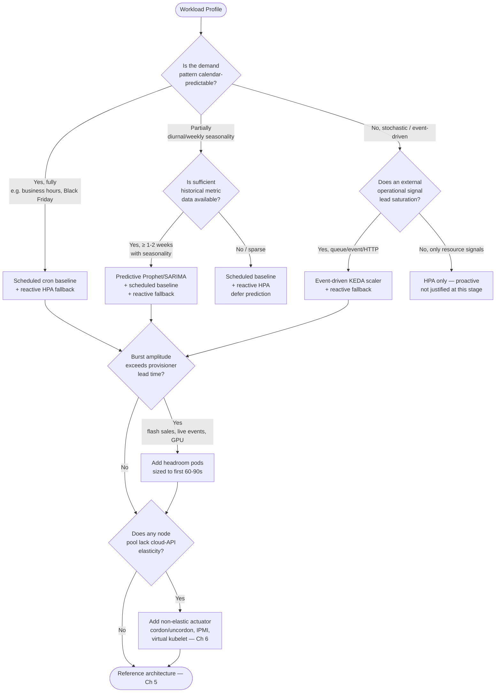

**Workload-archetype mapping.** Combining the five archetypes from §1.2 with the strategy taxonomy produces concrete starting recommendations:

| Workload Archetype | Predictability | Recommended Primary Strategy | Recommended Safety Nets | Headroom Pods? |
|---|---|---|---|---|
| Diurnal / weekly cycles (SaaS, internal envs)[^20][^15] | High | Scheduled (KEDA Cron / Winter Soldier)[^20][^15] | Reactive HPA | Optional, low |
| Scheduled promotional events (Black Friday, launches) | High, calendar-known | Scheduled (cron baseline pre-warm) | Reactive HPA + Karpenter | Recommended |
| Streaming / live-event peaks (50M+ concurrent) | High but extreme amplitude | Scheduled + Predictive hybrid | Reactive HPA + Karpenter | Strongly recommended |
| Batch / AI processing windows | Medium (queue-observable) | Event-driven (KEDA queue scalers)[^18][^19] + scheduled when known | Reactive HPA | Optional |
| Bursty event-driven inference (LLM, async pipelines) | Low–medium | Event-driven (KEDA) + Predictive[^16][^17] when seasonal | Reactive HPA + Karpenter | Recommended for cold-start sensitive |

**Infrastructure-elasticity mapping.** The infrastructure axis modifies the actuator choice without changing the trigger choice. For fully elastic environments, Karpenter or CA suffice as the node provisioner; for hybrid environments, scheduled and predictive triggers should drive *both* the elastic actuator (Karpenter) for spillover *and* a non-elastic actuator (cordon/uncordon, IPMI) for the fixed pool, with workload partitioning policies steering which pool absorbs which traffic; for fully fixed-capacity environments, headroom pods become the only proactive lever that produces measurable benefit, since no actuator can summon new physical capacity within the prediction horizon.

**The five design questions revisited.** §1.5 enumerated the five questions that any candidate solution must answer: signal source, scheduling mechanism, provisioning agility, HPA/KEDA integration, and cost controls. The taxonomy now supplies the vocabulary for answering them in any specific deployment:

1. **Signal source.** Choose from {calendar, forecast, external event, headroom, or — most often — a layered combination}, sized so that the trigger's lead time exceeds the provisioner's worst-case latency.
2. **Scheduling mechanism.** Decide which paradigms are layered, in what priority order, and which actuator each drives. The max-of-reactive-and-predictive policy is the default reconciliation rule.
3. **Provisioning agility.** Match the actuator to each node pool's elasticity class; use headroom pods to compress the residual gap when actuator latency exceeds workload tolerance.
4. **HPA/KEDA integration.** Assign predictive control to the node layer and reactive control to the pod layer wherever possible; if both must operate on the same dimension, ensure single-owner semantics or use KEDA's `ScaledObject` to coalesce real-time and forecasted triggers under a single HPA[^17][^19].
5. **Cost controls and safety nets.** Configure MAPE thresholds with default fallback values for predictive layers[^17], PodDisruptionBudgets for stateful workloads, scale-down protections for newly provisioned nodes, and explicit max-replica ceilings to bound prediction-error blast radius.

The decision framework presented here is intentionally conceptual; it does not yet specify *which* forecasting model, *which* KEDA scaler, *which* non-elastic actuator, or *which* commercial product to adopt. Those operational specifics are the subject of Chapters 3 (forecasting methodology and scheduled implementation patterns), 4 (open-source and commercial solution survey), 5 (reference architecture), and 6 (non-elastic node-group patterns). What this chapter has established is the *map* of the design space — five paradigms, four evaluation criteria, six classification dimensions, one decision framework — within which those subsequent chapters will navigate, ensuring that every downstream recommendation can be traced back to a deliberate, criteria-based choice rather than a tool-driven preference.

# 3 Forecasting Methods and Scheduled Approaches for Proactive Autoscaling

Chapter 2 mapped the design space of proactive node autoscaling into five paradigms and established that, for partially predictable request-volume-driven workloads, the practical answer is almost always a *layered* one: a predictive or scheduled baseline that anticipates known peaks, augmented by reactive safety nets that absorb the unforeseen. That conclusion, however, leaves open the methodological core of the recommendation. *How* exactly does one forecast business request volume into a node count? *Which* statistical, machine-learning, or deep-learning model is appropriate for which workload, and at what data and operational cost? *How* are multiple incommensurate metrics—CPU, memory, queries per second, queue depth, business KPIs—fused into a single signal that a node provisioner can act on? And on the scheduled side, *which* concrete Kubernetes-native or cloud-managed mechanisms encode calendar logic, and how do they integrate with forecast-driven decisions and reactive fallbacks?

This chapter develops that methodological vocabulary in seven movements. It first formalizes the predictive scaling problem as a multivariate time-series forecasting task with a specific data-pipeline prerequisite (§3.1), then surveys classical statistical methods (§3.2), machine-learning methods centered on Prophet (§3.3), and deep-learning methods centered on LSTM/GRU and Temporal Fusion Transformers (§3.4). A consolidated comparison and selection heuristic follows (§3.5). The chapter then turns to the practical engineering problem of fusing multivariate signals into a single Node Demand Index (§3.6), surveys the concrete implementation mechanisms for scheduled scaling (§3.7), and synthesizes how forecasting and scheduling should be combined with explicit safety nets to absorb prediction errors (§3.8). Throughout, the analysis is anchored to the four evaluation criteria fixed in §1.2—response latency, SLA compliance, cost efficiency, and operational stability—and to the user's two binding constraints of business-volume-driven workloads and non-elastic node-pool compatibility.

## 3.1 Forecasting Problem Formulation and Data Pipeline Foundations

Before any model is selected, the predictive scaling problem must be formalized in operational terms. Stated precisely: given a historical time series $X_{t-N}, X_{t-N+1}, \ldots, X_t$ of one or more metrics that drive node demand, produce a forecast $\hat{X}_{t+1}, \ldots, \hat{X}_{t+H}$ over a horizon $H$ such that $H$ exceeds the worst-case provisioning latency $T_{\text{prov}}$ of the target node pool, and translate $\hat{X}$ into a desired node count $\hat{N}_{t+H}$ via a deterministic policy function. The horizon constraint $H \geq T_{\text{prov}}$ is the single most decisive design parameter: a forecast that arrives later than the node it asks for is operationally identical to no forecast at all. Chapter 1 quantified $T_{\text{prov}}$ at 3–4 minutes for Cluster Autoscaler on AWS, ~55 seconds for Karpenter, and 6–10 minutes for GPU nodes once image pull is included; the Vultr/Prophet team observed roughly 8.5–9 minutes from API call to a Debian-installed cluster-joined node, which directly forced their 60-minute prediction horizon. The TFT-DVPA work, by contrast, set both input and output windows to **25 seconds each**, "capturing sufficient temporal context to detect memory usage patterns while avoiding irrelevant historical noise"[^21]—appropriate for a per-second sampled workload in a vertical-scaling context but insufficient for node provisioning. The horizon must therefore be tuned to the actuator, not chosen abstractly.

**Data pipeline prerequisites.** A predictive scaler is no better than its data plumbing. Five data-pipeline layers are common across the surveyed implementations:

1. **Metric source.** The metric stream typically originates from Prometheus or an equivalent time-series database; the Vultr reference architecture scrapes Prometheus and forwards metrics through a NestJS adapter into Postgres before training. The TFT-DVPA implementation logs memory usage at one-second intervals to CSV files via a dedicated thread inside the Flask service to ensure uninterrupted service[^21]. Crane's EHPA reads metrics for prediction "from Prometheus, calculates them using the predictive algorithm, and records the results to TimeSeriesPrediction" via a `PredictionCore` component[^22]. The choice of source determines achievable cadence, retention, and label expressivity.

2. **Sampling cadence.** The cadence must be fine enough to capture the demand dynamics but coarse enough to keep training tractable. Per-second sampling (TFT-DVPA) is appropriate for fast-moving memory-bound workloads on small horizons; per-minute sampling is the typical default for cluster-load forecasting (Vultr's Prophet model produces "60 per-minute predictions" over a one-hour horizon); Crane EHPA's DSP example uses `sampleInterval: "60s"` with `historyLength: "3d"`[^22]. Coarser cadences (5–15 minutes) suffice for slower diurnal patterns.

3. **Validation and outlier handling.** The Vultr team encountered exactly the failure mode the persistent reasoning rubric warns against: "sometimes Prometheus gave us invalid data, like the CPU metric being zero or null. This could potentially mess up predictions from Prophet". Their NestJS adapter therefore performs explicit validation and cleaning before storage. TFT-DVPA standardizes timestamps to a one-second frequency, converts the data into a `TimeSeries` object using the Darts library, and normalizes via a Scaler transformer "to ensure stable TFT training"[^21]. Without such pre-processing, irregular intervals, missing values, and adversarial spikes propagate directly into the forecast.

4. **Train/validation split conventions.** Two recurring conventions appear in the surveyed material: TFT-DVPA uses an **80%/20% temporal split** with normalization "to preserve sequential patterns"[^21]; Kedify uses a **90%/10% split** evaluated by Mean Absolute Percentage Error (MAPE). Both are temporal (the validation set is the most recent slice rather than a random sample) because random splits leak future information into training and produce misleadingly optimistic accuracy. The choice between 80/20 and 90/10 trades validation reliability against training-data sufficiency; teams with limited historical depth typically prefer 90/10 to maximize learnable signal, while teams with abundant data use 80/20 for tighter validation bounds.

5. **Storage and serving layer.** Forecasts must be persisted for low-latency consumption by the scaling controller. The Vultr architecture pipes Prophet output through an Index Calculation Component to the Vultr API, while TFT-DVPA stores predictions in **Redis** for fast access by a Go-based Kubernetes integration component using `go-redis` and `client-go`[^21]. This separation of forecasting from actuation is itself a desirable property: it means the predictor can be retrained, swapped, or even temporarily disabled without disturbing the actuator's reactive fallback path.

**Evaluation metrics.** The methods compared in §§3.2–3.4 are benchmarked using a small canonical set of error metrics:

- **MAPE (Mean Absolute Percentage Error)** — the percentage error averaged across forecast points; the metric used by Kedify to gate model trustworthiness via `modelMapeThreshold` and by the Vultr team to report sub-9% accuracy.
- **MAE (Mean Absolute Error)** — used by TFT-DVPA as `val_mae`, the primary hyperparameter-tuning objective with values reported between 73.17 and 200.86 across model configurations[^21].
- **RMSE / MSE (Root Mean Squared Error / Mean Squared Error)** — used by Shim et al.'s Informer-based autoscaler to demonstrate "lower mean squared error and higher R² scores" against ARIMA, LSTM, and Bi-LSTM baselines on NASA and FIFA datasets[^21].
- **Quantile loss** — the natural metric for probabilistic forecasters such as Prophet and Temporal Fusion Transformers, which produce confidence intervals (e.g., 1st–99th percentiles) rather than point estimates[^21].

The metric choice is not neutral. MAPE penalizes proportional error and is well-suited to load forecasting where doubling the actual is far worse than missing by 5%; MAE/RMSE in absolute units are useful when over- and under-forecasts have asymmetric cost (under-forecasting causes SLA breaches, over-forecasting causes idle cost); quantile loss directly targets the asymmetric-cost case by allowing the operator to pick a high quantile (e.g., 90th percentile, as TFT-DVPA does for memory) so that scaling decisions implicitly include a safety margin[^21]. Chapter 7 will return to the operational-margin question; for now, the takeaway is that **the same model can look better or worse depending on which error metric is reported, and any benchmark comparison should specify both metric and dataset context** (rubric criterion P-3).

## 3.2 Classical Time-Series Models: ARIMA, SARIMA, Holt-Winters, and DSP

The classical statistical family is the natural starting point because its computational cost is negligible, its interpretability is high, and its data requirements are modest. Four representatives appear in the surveyed material: ARIMA, SARIMA, Holt-Winters' triple-exponential smoothing, and the digital-signal-processing (DSP) algorithm used by Tencent's Crane/EHPA project.

**ARIMA and SARIMA.** AutoRegressive Integrated Moving Average models forecast a value as a linear combination of past values and past errors after differencing the series to achieve stationarity. SARIMA extends ARIMA with explicit seasonal terms. Both have been the academic baseline for cluster-load prediction for over a decade and retain their place precisely because they are well-understood, parsimonious, and produce interpretable coefficients. Shim et al. used ARIMA as one of the baselines against which their Informer transformer-based autoscaler was compared on NASA and FIFA workload datasets, with the Informer demonstrating "superior prediction accuracy, with lower mean squared error and higher R2 scores" relative to ARIMA, LSTM, and Bi-LSTM[^21]. The Vultr team explicitly compared ARIMA and SARIMA against Prophet and NeuralProphet during model selection and chose Prophet, citing "a good balance between accuracy and training speed" plus built-in seasonality, but acknowledging that ARIMA/SARIMA were credible candidates in their own right.

ARIMA's principal weakness for the user's scenario is its **linearity assumption**. Real-world request-volume traces—particularly those that mix diurnal cycles with promotional spikes and weekly day-shifting patterns ("on weekends we had less traffic, while Monday had high traffic and Tuesday had less, and this pattern would switch each week" in the Vultr team's load script)—exhibit non-linearities that ARIMA captures only by laborious manual differencing and parameter selection. Order selection (p, d, q for ARIMA; p, d, q, P, D, Q, s for SARIMA) is itself a non-trivial operational burden, and the model must typically be re-tuned when the underlying pattern drifts.

**Holt-Winters' triple-exponential smoothing.** Holt-Winters is the simplest forecaster that handles level, trend, and seasonality jointly by maintaining three exponentially weighted state variables. Kedify enumerates Holt-Winters explicitly in its survey of forecasting methods alongside moving average, exponential smoothing, ARIMA, Prophet, and LSTM, noting that "among them, Prophet stands out for its robustness, interpretability, and ability to handle seasonality without heavy tuning". Holt-Winters' attractiveness lies in its *minimum viable footprint*: it requires only a few lines of code, no training infrastructure, and can be retrained per scrape interval at negligible cost. Its weakness is that it handles only a *single* seasonality at a time, so workloads with simultaneous daily and weekly cycles must be modeled with hierarchical decomposition or a more expressive model.

**DSP (Digital Signal Processing) — Tencent Crane/EHPA.** A pragmatic middle path is to treat the load curve as a periodic signal and apply DSP techniques (Fourier-style decomposition) to extract dominant periodic components. Tencent's Effective Horizontal Pod Autoscaler (EHPA), part of the Crane open-source project, uses precisely this approach: "EHPA uses DSP algorithms to predict future time series data of applications", configured via:

```yaml
apiVersion: autoscaling.crane.io/v1alpha1
kind: EffectiveHorizontalPodAutoscaler
spec:
 prediction:
 predictionWindowSeconds: 3600
 predictionAlgorithm:
 algorithmType: dsp
 dsp:
 sampleInterval: "60s"
 historyLength: "3d"
```

[^22]

Tencent's published case study reports that the DSP-driven EHPA "scales before the arrival of traffic peaks", "reduces ineffective scale-downs when the traffic first drops then immediately rises", and "compared to HPA, EHPA has fewer elasticity operations but is more efficient"[^22]. The DSP approach is well-suited to **strongly periodic** loads—the kind exhibited by typical e-commerce or consumer applications with a clear daily peak cadence—and its three-day history requirement is markedly lower than the historical depth needed to train a deep neural network.

**Strengths of classical models.** Across the four representatives, the common strengths are:

- **Negligible training and inference cost** — ARIMA, Holt-Winters, and DSP can be retrained per minute on commodity CPUs without a dedicated GPU or training cluster.
- **Modest data requirements** — DSP runs on three days of history; Holt-Winters needs only enough data to span one full seasonal period plus margin.
- **High interpretability** — ARIMA coefficients, Holt-Winters smoothing factors, and DSP frequency components are all directly inspectable, satisfying SRE governance requirements that ML black-box outputs often fail.
- **Operational maintainability** — minimal dependency footprint, no model registry required, no GPU pipeline to maintain.

**Weaknesses.**

- **Linearity and stationarity assumptions** that real workloads frequently violate.
- **Single-seasonality limitation** for Holt-Winters; manual order selection for ARIMA/SARIMA.
- **Sensitivity to outliers and missing values**, which Vultr observed Prometheus to deliver routinely.
- **No native multivariate capability** — these models forecast a single series at a time; multivariate fusion (§3.6) must be performed before or after the model rather than by it.

**When classical models remain preferable.** Classical methods are the right default when (i) the workload exhibits a clean, primarily periodic structure with stable statistical properties, (ii) historical depth is limited (a few days to a couple of weeks), (iii) the team lacks dedicated ML platform capacity, or (iv) the predictive layer must be auditable for compliance reasons. Both the Vultr and Kedify teams converged on Prophet rather than these classical methods, but their workloads exhibited the kind of multi-seasonal day-shifting patterns where Prophet's seasonal decomposition pays off. For simpler periodic loads, DSP/EHPA is the credible operational choice; for ultra-low-friction deployments, Holt-Winters is sufficient.

## 3.3 Machine Learning Models: Prophet, Regression, and Tree-Based Ensembles

Between classical statistics and deep learning lies a family of machine-learning forecasters that retain interpretability and modest training cost while modeling non-linear and multi-seasonal patterns. For cluster-load forecasting, **Facebook Prophet emerges as the de facto pragmatic default** across the surveyed implementations, and this section examines it in detail before briefly contrasting with regression and tree-based ensembles.

**Prophet.** Facebook's Prophet decomposes a time series into a piecewise-linear (or logistic) trend, multiple seasonal components (daily, weekly, yearly, or custom periods), and explicitly modeled holidays and special events, fitting the parameters via a Bayesian framework. Its design intent—forecasting data with strong seasonality plus several seasons of historical observations—maps almost directly onto cluster-load patterns.

The Vultr reference implementation chose Prophet explicitly after evaluating alternatives: "Prophet over ARIMA, SARIMA, and NeuralProphet because of a good balance between accuracy and training speed" and built-in seasonality, since "the cluster load we were working with changes in predictable patterns throughout the day, week, and months". The implementation retrained Prophet **every 15 minutes** against the previous week's data, achieving MAPE below 9% in the testbed with a best case of 0.5% and a typical band of 5–9%. Critically, the team performed this retraining inline with prediction service; the forecast horizon of one hour was matched to the ~8.5–9 minute Vultr node-provisioning latency with substantial margin.

The Kedify productized predictive scaler reaches the same conclusion through independent evaluation. Kedify's article states that Prophet "stands out for its robustness, interpretability, and ability to handle seasonality without heavy tuning" and exposes Prophet through a `MetricPredictor` CRD whose source can be either a live `ScaledObject` (for online retraining) or a one-shot CSV (for bootstrapping with historical data). Each Prophet model "can be decomposed into seasonal and trend components (weekly, monthly, or custom) allowing visual inspection of whether the detected patterns make sense"—an interpretability property that black-box deep learners cannot match.

Prophet's principal operational features that matter for production deployment are:

| Feature | Operational Significance |
|---|---|
| Built-in seasonality (daily/weekly/yearly + custom) | No manual feature engineering for typical cluster-load periodicities |
| Holiday and changepoint handling | Models known one-off events (Black Friday, deployments) without contaminating baseline seasonality |
| Probabilistic output with confidence intervals | Enables operators to scale to the 90th-percentile forecast as a built-in safety margin, analogous to TFT-DVPA's quantile approach[^21] |
| Robust to missing data and outliers | Tolerates the kind of irregular Prometheus output the Vultr team observed |
| Interpretable component decomposition | Trend, weekly, daily curves can be plotted and reviewed—important for SRE acceptance |
| Continuous retraining at modest cost | 15-minute retraining cadence on commodity CPUs is feasible (Vultr) |

**The MAPE-threshold safety-net pattern.** A defining operational pattern in Kedify's deployment is the explicit use of Prophet's MAPE on the held-out 10% test partition to *gate* the predictor's authority. Configuration-wise, the operator sets a `modelMapeThreshold`; if the model's measured MAPE exceeds the threshold, "Kedify automatically returns a default value (also defined in the trigger) instead of an unreliable prediction". This is the operational countermeasure to the rubric's core anti-pattern of over-aggressive forecasting (criterion P-5): when the model is failing, the system *automatically degrades to a known-safe baseline* rather than issuing dangerous scaling commands. The Vultr team's data-validation layer (rejecting null Prometheus values before they reach Prophet) embodies the same principle at an earlier point in the pipeline. Together, input validation and output gating give the predictor a two-sided guard rail.

A particularly informative behavior is Kedify's reported response to gaps in the input stream: "when data collection was interrupted for several hours, the Prophet model still maintained a plausible fit" while "the widening confidence interval signals increasing uncertainty". This is the right behavior—the model degrades gracefully rather than failing catastrophically, and the widening band is itself a usable signal that downstream policies (e.g., deferring scale-down decisions during high-uncertainty windows) can consume.

**Regression and tree-based ensembles.** Linear or polynomial regression and tree-based ensembles (Random Forest, gradient-boosted trees such as XGBoost or LightGBM) are common alternatives when the forecasting problem is best framed as a *tabular* one with engineered features (hour-of-day, day-of-week, holiday indicators, recent moving averages, exogenous variables such as marketing-event flags). The surveyed academic literature includes one explicit instance: Bouflous et al.'s *Decision Tree Regressor-Max* for Vertical Pod Autoscaler enhancement[^21]. While the deep-detail content of that work is outside the surveyed materials, its existence in the Kubernetes autoscaling literature confirms that tree-based regressors are an established alternative path.

Tree-based ensembles trade Prophet's explicit seasonal decomposition for flexibility in incorporating arbitrary engineered features—external signals (queue depth, marketing-calendar flags, deployment events) can be added as columns rather than requiring custom seasonal components. Their interpretability is moderate (feature importances are inspectable, individual trees are not), and their training cost is higher than Holt-Winters but typically lower than deep learning. They work best when feature engineering encodes domain knowledge that pure time-series methods cannot exploit.

**Strengths of ML forecasters (Prophet-centric).**

- **Adaptation to multi-seasonal and drifting patterns** through explicit seasonal components and changepoint detection.
- **Native interpretability** via component decomposition, satisfying SRE governance.
- **Probabilistic outputs** (confidence intervals) that translate directly into operational safety margins.
- **Modest compute footprint** — 15-minute retraining on CPUs is operationally feasible.
- **Graceful degradation** when input data is missing or noisy.

**Limitations.**

- **Not magic for non-seasonal data** — Kedify is candid that "not all the data exhibit seasonal patterns and general ML rule of thumb: 'garbage in, garbage out' also applies here". Stochastic event-driven inference workloads with no recurring structure benefit little from Prophet.
- **Single-series by design** — multivariate fusion must be handled outside Prophet (see §3.6) or via separate per-metric models.
- **Bootstrap data requirement** — Prophet typically wants several seasons of historical data; the Vultr team's two to three days of intensive load generation just to bootstrap a usable model illustrates the cold-start cost.
- **Hidden complexity in operationalization** — the Vultr team's five-component service (Prometheus → adapter → Postgres → Prophet → ICC → Vultr API) is the *minimum* viable surface, not the upper bound; tree-based ensembles add feature-engineering pipelines on top of that.

**Scorecard against §1.2 criteria.** Prophet (and ML forecasters generally) score: Latency **Strong** when horizon ≥ provisioning time and MAPE acceptable; SLA **Strong** when paired with the MAPE-threshold safety net; Cost efficiency **Strong** on seasonal traffic, **Weak** on stochastic; Operational stability **Conditional** on the safety-net configuration. The pragmatic verdict that recurs throughout the surveyed material is unambiguous: **for diurnal/weekly seasonal cluster-load workloads with at least a week of history and a team that can operate a five-component predictor, Prophet is the strongest pragmatic default in the ML tier**, and any deviation from this default should be justified by a specific property (e.g., extreme non-linearity, very large historical depth, or rich exogenous-feature availability) that the deeper-learning section addresses.

## 3.4 Deep Learning Models: LSTM, GRU, and Transformer-Based Forecasters

Deep learning enters the picture when the workload's complexity, non-linearity, or multivariate richness exceeds what classical and Prophet-style ML can capture. The surveyed academic literature on Kubernetes autoscaling concentrates on four architecture families, each pushing forward on a different axis: **LSTM/Bi-LSTM** for sequential-pattern depth, **attention-based GRU encoder-decoders** for multi-step-ahead forecasting, **Informer/Transformer** for long-sequence horizons, and **Temporal Fusion Transformers (TFT)** for interpretable multi-horizon multivariate forecasting.

**LSTM and Bi-LSTM (Vu et al.).** Vu, Tran, and Kim proposed a "predictive hybrid autoscaling" framework for containerized applications that "leverages the Kubernetes API and Bi-LSTM (Bidirectional Long Short-Term Memory) for workload prediction, incorporating components for traffic surge detection and a hybrid scaler for vertical and horizontal scaling decisions"[^21]. Bi-LSTM's bidirectional context window lets it incorporate future-leaking patterns during training (and offline reasoning) at the cost of strictly online forecasting—an acceptable trade because in autoscaling, the prediction is computed offline (over historical data) and then served at the latest available timestamp. The result is a richer characterization of recent dynamics than ARIMA can extract.

**Attention-based GRU encoder-decoder (K-AGRUED, Dogani et al.).** Dogani, Khunjush, and Seydali developed K-AGRUED, "a Horizontal Pod Autoscaler framework for web applications in Kubernetes, utilizing an attention based Gated Recurrent Units (GRU) encoder-decoder architecture to predict resource usage multiple steps ahead based on Container Decision Trees (CDT). Their method achieved a notable reduction in prediction error, ranging from 2% to 25% compared to existing techniques, as reported in their study"[^21]. The interesting design decisions here are (i) the encoder-decoder pattern, which decouples representation learning from horizon-length forecasting, and (ii) attention, which lets the model focus on the most relevant historical timesteps rather than weighting them uniformly. The 2–25% error reduction range is broad enough to caution against generalizing—as rubric criterion P-3 demands, the dataset and workload context determine where in the band a given deployment falls.

**Informer/Transformer (Shim et al.).** Shim et al. introduced "an autoscaling framework for Kubernetes using a transformer based model, specifically the Informer, designed for long sequence time series forecasting … By comparing the transformer model with traditional models like ARIMA and neural network models such as LSTM and Bi-LSTM on NASA and FIFA workload datasets, they demonstrated superior prediction accuracy, with lower mean squared error and higher R² scores. This highlights the transformer's ability to capture complex temporal dependencies, making it particularly effective for managing dynamic workloads in cloud-native environments"[^21]. The Informer architecture is specifically designed for the long-sequence regime where vanilla Transformers face quadratic memory costs, making it suitable for hour- or day-scale forecasts on minute-scale samples—which is precisely the autoscaling regime.

**Temporal Fusion Transformer (TFT-DVPA and TFTOps).** Of the surveyed deep-learning approaches, TFT receives the deepest treatment. TFT, introduced by Lim et al., is "an advanced deep learning architecture designed for multi-horizon forecasting" that integrates "static metadata with time series data via attention mechanisms, effectively modeling non-linear patterns and seasonality". For Kubernetes autoscaling specifically, three properties make TFT distinctive[^21]:

1. **Probabilistic forecasting** with quantile predictions (e.g., 1st to 99th percentiles) for uncertainty quantification—the same property that makes Prophet operationally attractive but with richer expressive capacity.
2. **Attention-driven interpretability** that "enhance accuracy by focusing on relevant temporal features"—addressing the deep-learning opacity concern.
3. **Suitability for noisy, high-frequency data**, "enabling preemptive scaling to prevent issues like Out of Memory (OOM) errors".

The TFT-DVPA experiment is one of the few surveyed sources providing concrete quantitative deep-learning benchmarks in a Kubernetes autoscaling setting. Three small language models (T5-Small 60M, BlenderBot 90M, ShionTendon 80M) were tested on a Locust-driven Fibonacci workload (concurrent users scaled up to 144). The default VPA, "relying solely on historical data, failed to adapt, resulting in Out of Memory (OOM) issues"—the pod's `Last State` was `Terminated`, `Reason` `OOMKilled`, with **Restart Count 23**[^21]. By contrast, the TFT-DVPA "predicts memory demands based on learned temporal patterns and probabilistic forecasting (90th percentile quantile estimation) to predict and preemptively adjust memory allocation, avoiding critical thresholds"[^21].

The hyperparameter sweep produced a useful empirical record:

| Model | Hidden Size | LSTM Layers | Attention Heads | val_MAE |
|---|---|---|---|---|
| T5-Small (60M) – Best | 32 | 8 | 4 | 73.17 |
| T5-Small (60M) – 2nd | 64 | 8 | 4 | 79.40 |
| BlenderBot (90M) – Best | 16 | 4 | 8 | 82.26 |
| BlenderBot (90M) – 2nd | 32 | 4 | 8 | 109.77 |
| ShionTendon (80M) – Best | 16 | 8 | 4 | 198.94 |
| ShionTendon (80M) – 2nd | 32 | 4 | 2 | 200.86 |

[^21]

The authors recommended "the combination of 8 LSTM layers, 16 hidden size and 4 attention heads … as the optimal setup for consistent performance across these models, achieving top results in two and reasonable performance in the third"[^21]. This level of hyperparameter sensitivity—best `val_MAE` ranging from 73 for T5-Small to 199 for ShionTendon under the same architecture family—is the operational tax of the deep-learning tier; it directly opposes the "no heavy tuning" property that drew Vultr and Kedify to Prophet.

A second TFT instantiation, TFTOps (Luo et al.), demonstrates a different value proposition: "concurrent monitoring of hundreds of time series such as CPU usage, network I/O, and request rates using a single model with shared parameters" for KPI anomaly detection[^21]. The shared-parameter property is operationally attractive at scale—one model amortized across many series—but implies that the workloads must be homogeneous enough that shared parameters do not introduce systematic bias.

**Reinforcement learning** is also represented in the literature: Chaudhari et al. proposed "an attentive survey of attention models" that included reinforcement-learning-based predictive autoscaling, but with the explicit caveat that "reinforcement learning methods often require significant training data and computational overhead, making real time deployment challenging"[^21]. RL is therefore a research-frontier path rather than a near-term production recommendation.

**Strengths of deep learning.**

- **Modeling of complex non-linear, multi-seasonal, multivariate patterns** that classical and Prophet methods cannot capture.
- **Multi-horizon forecasting** in a single inference pass (TFT, Informer encoder-decoder).
- **Probabilistic outputs** with quantile predictions, supporting safety-margin scaling.
- **Reported accuracy gains** over ARIMA, LSTM, and Bi-LSTM baselines on canonical NASA/FIFA datasets[^21].
- **Static-plus-dynamic feature integration** — TFT can natively combine static metadata (instance type, workload class) with dynamic time series, which §3.6 will explore as a fusion mechanism.

**Limitations.**

- **Training data volume.** Deep architectures require substantially more historical data than Prophet or DSP. The TFT-DVPA experiments collected per-second memory data over a Locust-driven Fibonacci sequence reaching 144 concurrent users, with each load level running 30 seconds plus 30-second stabilization—a deliberate, bounded load campaign[^21]. Production-scale deployments demand correspondingly more.
- **GPU/compute cost.** Although TFT-DVPA's 16 GB / 8 CPU edge-class testbed could train on CPU[^21], full-scale Transformer training typically requires GPUs and a non-trivial training budget.
- **Retraining overhead.** TFT-DVPA forecasts in 25-second windows; the retraining cadence implied is correspondingly tight, with each retrain consuming multiple training epochs[^21]. For workloads with rapid drift, retraining cost can dominate.
- **Real-time inference latency.** A trained TFT typically inferences in milliseconds-to-seconds, which is acceptable for autoscaling, but adds dependency on a model-serving stack (Redis cache in TFT-DVPA, separate inference service in Kedify-style deployments).
- **Operational fragility.** The Vultr team's retrospective—"select a team full of Kubernetes masters" and "do your research"—applies even more strongly to deep-learning predictors. Hyperparameter sensitivity, training stability, model registry, A/B testing, drift monitoring, and rollback procedures all become first-class concerns.
- **Validation gap between testbed and production.** The TFT-DVPA results are from a 16 GB / 8 CPU controlled testbed simulating edge conditions[^21]; the Shim et al. transformer results are on academic NASA/FIFA datasets[^21]; both convey what is *possible* but neither guarantees what a given enterprise deployment will achieve. Per rubric criterion P-2, these should be treated as medium-confidence indicators.

**When deep learning is the right tier.** Deep learning earns its operational tax when (i) the workload exhibits multi-seasonal, multivariate, non-linear patterns that simpler models demonstrably under-fit, (ii) historical data is abundant (months of high-cadence records), (iii) the team has dedicated ML platform engineering capacity (model registry, GPU pipeline, drift monitoring), and (iv) the marginal accuracy improvement over Prophet justifies the operational complexity—a calculus that is rarely positive for first-generation deployments. For most user scenarios that match the report's framing, Prophet is the right starting point and TFT is the migration target as scale and team maturity grow.

## 3.5 Comparative Evaluation of Forecasting Methods

The three preceding sections can be consolidated into a single comparative matrix scored along the operational dimensions that determine deployability. The scoring uses a three-level scale (Strong / Moderate / Weak) with explicit caveats; quantitative anchors are provided where the surveyed material supplies them.

| Method Family | Forecasting Accuracy | Training Cost & Frequency | Min Historical Data | Interpretability | Operational Maintainability | Workload Suitability |
|---|---|---|---|---|---|---|
| ARIMA / SARIMA | Moderate (linear baseline; surpassed by Informer on NASA/FIFA[^21]) | Low / per-scrape feasible | 1 seasonal cycle + margin | High (coefficients) | High | Stationary periodic |
| Holt-Winters | Moderate for single seasonality | Lowest | Same as above | High (3-state) | Highest | Single-period diurnal |
| DSP (Crane EHPA) | Moderate–Strong on periodic loads[^22] | Low / inline | 3 days[^22] | Moderate (frequency components) | High | Strongly periodic e-commerce/consumer |
| Prophet (Vultr, Kedify) | Strong with seasonality (Vultr typical 5–9% MAPE, best 0.5%) | Low–Moderate / 15-min cadence (Vultr) | ~1 week+ | Strong (component decomposition) | Moderate (5-component pipeline at minimum) | Diurnal+weekly+holiday |
| Regression / Random Forest / GBM | Moderate–Strong (feature-engineered, e.g. Bouflous DTR-Max for VPA[^21]) | Low–Moderate | Feature-table dependent | Moderate (feature importances) | Moderate (feature pipeline) | Tabular with rich exogenous features |
| LSTM / Bi-LSTM (Vu et al.) | Strong[^21] | High / GPU advisable | Months | Low | Low–Moderate | Sequential, non-linear |
| Attention GRU enc-dec (K-AGRUED) | 2–25% MAE reduction over baselines[^21] | High | Months | Low–Moderate | Low–Moderate | Multi-step web workloads |
| Informer / Transformer (Shim et al.) | Strongest on long horizons[^21] | High / GPU | Months+ | Low | Low | Long-horizon dynamic |
| Temporal Fusion Transformer (TFT-DVPA, TFTOps) | Strong with quantile bands[^21] | High / multi-epoch retrain | Months | Moderate (attention) | Low (hyperparameter sensitive[^21]) | Multivariate, complex, multi-horizon |
| Reinforcement Learning | Strong sample efficiency claimed[^21] | Highest, "real time deployment challenging"[^21] | Very large | Low | Lowest | Research frontier |

**Empirical convergence.** Two patterns are visible across the surveyed implementations:

- For workloads with diurnal/weekly seasonality and modest historical depth, **Prophet is the recurring pragmatic default** — the Vultr team and the Kedify team independently selected it after explicit comparison against ARIMA, SARIMA, NeuralProphet, and (in Kedify's case) LSTM and Holt-Winters. Their reasoning aligns: Prophet hits the sweet spot of accuracy, interpretability, training speed, and tolerance for noisy data.
- For workloads where multivariate fusion, multi-horizon outputs, or long-sequence dynamics matter, **TFT and Transformer architectures are the academically validated frontier**, with concrete demonstrations in TFT-DVPA[^21], TFTOps[^21], and the Informer-based autoscaler of Shim et al.[^21]. Their operational complexity, however, is materially higher.
- Classical methods (ARIMA, SARIMA, Holt-Winters, DSP) retain a niche for stationary signals, very limited historical depth, or compliance-driven simplicity; Tencent's Crane EHPA demonstrates that DSP alone is a credible production choice for periodic enterprise loads[^22].

**Method-selection heuristic.** The following decision logic distills the comparison into operational guidance keyed to data availability, seasonality, horizon, and team capability:

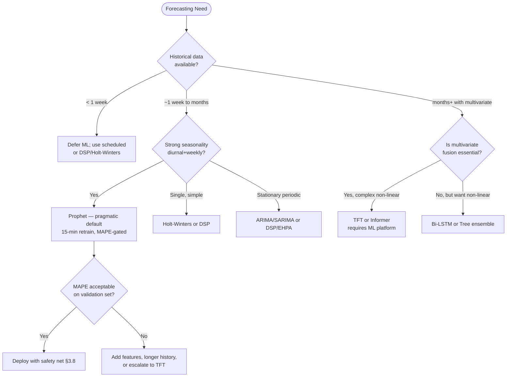

The heuristic intentionally biases new deployments toward Prophet, then escalates to deep learning only when warranted — a sequencing that aligns with Chapter 9's roadmap recommendation of starting from quick wins and progressing to mature ML systems.

## 3.6 Multivariate Signal Fusion and the Node Demand Index

A forecasting method on a single metric does not yet make a node-scaling decision. The practical bridge from "forecast" to "node count" is the problem of **multivariate signal fusion**: reconciling CPU, memory, queries-per-second, queue depth, message broker lag, latency, and business KPIs (active sessions, orders per second) into a single scalar that the actuator can act on. Three fusion patterns are documented in the surveyed material, each illustrating a different architectural choice.

**The Vultr Node Ranking Index (NRI).** The most explicit treatment is the Vultr team's NRI, described as "a unified metric that combines CPU, RAM, and request data into a single comparable number" because "without this ranking index, just a number like one, two and a half, or three, it would have been really difficult to scale nodes up and down for cost and performance efficiency". The NRI's role in the architecture is both forecasting target (Prophet predicts the future NRI rather than the raw metrics) and decision input (the Index Calculation Component compares forecasted NRI against capacity to decide node-plan combinations). The pattern is generalizable to any number of input metrics: each metric is normalized to a comparable scale, weighted according to its operational priority, and aggregated.

A canonical NRI construction can be formalized as:

$$\text{NRI}_t = \sum_{i=1}^{k} w_i \cdot \tilde{x}_{i,t}$$

where $\tilde{x}_{i,t}$ is metric $i$ normalized at time $t$ (e.g., z-score or min-max) and $w_i$ is its weight reflecting business priority. The Vultr description does not enumerate weights explicitly, but the architectural separation it embodies is the key insight: **forecast the fused signal, act on the node count**. Forecasting the fused signal means a single Prophet model rather than three; acting on node count means the policy translates predicted-NRI into desired-nodes via a deterministic function (e.g., recursive search over node plans).

**Tencent EHPA's dual-metric HPA generation.** A different fusion pattern operates at the *control* layer rather than the *signal* layer. Tencent's Crane/EHPA, when configured with both predictive triggers and resource-utilization metrics, automatically generates "two HPA threshold configurations": one for the predictive metric (a custom metric served by Crane's MetricAdapter) and one for the actual monitored resource metric. The relevant excerpt from EHPA's documentation:

> "When multiple elastic metric thresholds are configured, HPA will calculate the number of replicas for each metric separately and select the highest number of replicas as the final recommended result for elasticity."[^22]

This is the **max-of-multiple-metrics** pattern at the HPA level. Conceptually it differs from NRI: rather than fusing metrics into a single forecast, EHPA forecasts and reacts on each metric independently and selects the highest replica count. The two patterns are complementary—NRI fuses *upstream* of the controller, EHPA's dual-metric pattern fuses *downstream* via max-of policy—and a sophisticated deployment can use both: NRI inside the predictor for cost-aware node-plan selection, dual-metric HPA at the pod layer for safety against any single signal's failure.

**TFT's static-plus-dynamic feature integration.** TFT supports a third fusion model native to the architecture itself. As described in the literature, TFTs "integrate static metadata with time series data via attention mechanisms"[^21]—the model accepts time-varying inputs (CPU, memory, request rate over time) alongside static covariates (instance type, workload class, region) and learns the interactions. The TFTOps deployment exploits this for "concurrent monitoring of hundreds of time series such as CPU usage, network I/O, and request rates using a single model with shared parameters"[^21]. The fusion happens inside the model rather than as a hand-engineered index; the trade-off is that the fused representation is no longer human-inspectable but is more expressive.

**Business-KPI inclusion.** The above patterns are agnostic about which metrics enter the fusion, but the most important architectural question for the user's scenario—where workloads are *driven by business request volume*—is whether business KPIs should be first-class inputs alongside infrastructure metrics. Three observations from the surveyed material support an affirmative answer:

1. The Vultr NRI explicitly includes "request data" (i.e., HTTP request volume) alongside CPU and RAM, confirming that the operational signal closest to the user-facing demand belongs in the index.
2. KEDA's 70+ scalers (Chapter 2) include direct business-signal sources (queue depth, database row counts, cron, HTTP rate); a predictive scaler that ignores those signals in favor of pure resource metrics inherits the Cluster Autoscaler's structural lag.
3. TFT-DVPA, although focused on memory, validates the principle by predicting based on a workload signal (Locust-driven concurrent user count following a Fibonacci sequence) rather than on resource utilization alone[^21].

A practical NRI for a request-volume-driven service might therefore include: instantaneous QPS, queue depth, p95 latency (as a saturation indicator), CPU utilization, memory utilization, and a business KPI such as orders-per-second or active sessions, with weights tuned so that the saturation indicators dominate during stress and the leading business indicators dominate during normal operation.

**Cost-aware policy on the fused signal — the Index Calculation Component.** The Vultr architecture's most distinctive contribution beyond the NRI itself is the Index Calculation Component (ICC), which translates forecasted NRI into a node-plan combination through "recursive search to pick the best combination of node plans, prioritizing removal of nodes whose hourly billing cycle is closest to expiry". This embeds **cost awareness** directly into the policy: among feasible plans, prefer the cheapest; among scale-down candidates, prefer those that have just consumed an hourly billing tick and would otherwise pay for unused time. The ICC pattern generalizes to any cloud or on-premises billing model where node lifetimes have a granular cost structure, and it surfaces an architectural property that pure ML forecasters lack: **prediction is necessary but not sufficient; the policy that converts prediction into action is itself a first-class engineering artifact**.

**Architectural separation: forecast on fused signal, act on node count.** The recurring pattern across all three fusion approaches is a clean separation between (a) the predictive layer, which produces a forecast of demand expressed in some unified or per-metric form, and (b) the decision layer, which consumes that forecast plus current cluster state plus cost information to produce a desired node count and plan. Conflating them—e.g., training a model that directly outputs "number of nodes to add"—couples forecasting to provisioning policy in ways that make iteration painful: changing instance types, billing models, or capacity constraints requires retraining the model rather than reconfiguring the policy. The Vultr architecture, EHPA's dual-metric HPA, and TFT-DVPA's separation of TFT inference from VPA actuation all preserve this layering.

## 3.7 Scheduled Scaling Implementation Patterns

Where forecasting infers future demand from data, scheduled scaling encodes future demand from a *calendar*. Chapter 2 established that scheduled scaling is the lowest-risk, lowest-data-cost proactive paradigm and is the right starting point for any workload with calendar-driven behavior. This section surveys the concrete implementation mechanisms across the Kubernetes ecosystem and the cloud-managed layer beneath it. The mechanisms span four tiers: Kubernetes-native pod-layer schedulers, Kubernetes-native node-layer schedulers, cloud-provider scheduled actions, and integrated cluster-level scaling tools.

**KEDA Cron Scaler (pod layer).** KEDA exposes a `cron` trigger inside a `ScaledObject` with start and end cron expressions, an IANA timezone, and a `desiredReplicas` field. The canonical configuration is direct:

```yaml
apiVersion: keda.sh/v1alpha1
kind: ScaledObject
metadata:
 name: cron-scaledobject
 namespace: default
spec:
 scaleTargetRef:
 name: my-deployment
 minReplicaCount: 0
 cooldownPeriod: 300
 triggers:
 - type: cron
 metadata:
 timezone: Asia/Kolkata
 start: "0 6 * * *"
 end: "0 20 * * *"
 desiredReplicas: "10"
```

[^23]

The KodeKloud reference documents the canonical use-case patterns: a "Daily Traffic Spike" scaled at 06:00–08:00 to "pre-warm pods for morning users", a "Promotional Campaign" scaled at 12:00–18:00 on Fridays for "extra capacity during Friday sales", and "Off-Hours Optimization" scaled at 20:00–06:00 to "scale down to save costs overnight"[^23]. Cron-field syntax is standard (minute 0–59, hour 0–23, day-of-month 1–31, month 1–12, day-of-week 0–6 with Sunday = 0)[^23]. KEDA's `cooldownPeriod` (default 300 seconds in the KodeKloud example) prevents oscillation around schedule boundaries, and `minReplicaCount: 0` enables full scale-to-zero outside the active window.

**CronHPA (pod layer with HPA integration).** Several Kubernetes vendors ship a "CronHPA" abstraction that combines cron triggers with HPA replica policies. Byteplus's Vital Kubernetes Engine documents a CronHPA creation flow, and similar implementations exist across CNCF and vendor ecosystems[^24]. CronHPA is conceptually a managed wrapper around the same primitive as KEDA Cron: a calendar fires, a target replica count is asserted. The differentiator is operational: CronHPAs typically integrate with native HPA semantics (annotations, `min`/`max` bounds) more transparently than custom KEDA scalers.

**CronJob-driven kubectl invocations (pod layer, lowest-overhead).** The simplest scheduled scaler is a Kubernetes `CronJob` that runs `kubectl scale deployment …` at the appointed time. Devtron's analysis (cited in §2.2) explicitly notes this as the universal fallback when no operator is desired. Its weaknesses are equally explicit: no declarative lifecycle, no observability beyond CronJob logs, no idempotency guarantees, no automatic restoration of pre-scale state.

**kube-downscaler (annotation-driven scheduled hibernation).** kube-downscaler, the open-source utility documented by Ananta Cloud, addresses the off-hours-cost-recovery use case directly. Its architecture has four components: a scheduler loop running at fixed interval (e.g., every minute), time evaluation against a user-defined downscaling schedule, downscale/restore logic invoking the Kubernetes API, and **annotation state management** that "stores the original replica count in an annotation, allowing for precise restoration"[^25]. Configuration is via two annotations on the workload:

```yaml
apiVersion: apps/v1
kind: Deployment
metadata:
 name: my-dev-app
 annotations:
 downscaler/exclude: "false"
 downscaler/uptime: Mon-Fri 08:00-18:00 Europe/Berlin
spec:
 replicas: 3
```

[^25]

The reported cost-savings calculation is illustrative: for 10 deployments scaled down 14 hours per day plus weekends, "Saved hours/week = (14 × 5 weekdays + 24 × 2 weekend days) = 118 hours; Total hours/week = 168 hours; % saved = 118 / 168 ≈ 70%; Potential cost savings = 70% of your dev/staging environment compute costs"[^25]. The Ananta Cloud article translates that into approximately $1,400/month savings on a $2,000/month dev/staging compute bill.

Two operational caveats from the same source must be heeded. First, "Cluster Autoscaler Integration: kube-downscaler works best in clusters with autoscaling enabled to actually terminate unused nodes"[^25]—reinforcing the §2.2 observation that pod-layer schedulers produce node-layer savings only via a downstream actuator. Second, "Manual Overrides: Be mindful if you manually scale a deployment—kube-downscaler will override it during its next sync"[^25], a state-machine subtlety that operators must socialize with developers.

**Kubernetes-AWS-EKS Auto Scaler (pod + ASG, AWS-specific).** The `kubernetes-aws-eks-auto-scaler` open-source tool documented on GitHub goes one level deeper than kube-downscaler: it scales Kubernetes deployments, statefulsets, and cronjobs in EKS clusters **and** AWS Auto Scaling Groups directly, "scaling resources down (setting replicas to zero or suspending cronjobs) and scaling them back up by restoring previous configurations stored in AWS Parameter Store"[^26]. The tool stores both Kubernetes replica counts and ASG `MinSize`/`DesiredCapacity`/`MaxSize` configurations in `/kubernetes-aws-eks-auto-scaler/k8s-replica-counts` and `/kubernetes-aws-eks-auto-scaler/asg-config` parameter-store keys, enabling precise restoration[^26]. The CLI exposes `scale-down`/`scale-up` actions with JSON-array `--k8s-resources` and space-separated `--aws-asg-resources` selectors, plus `--exclude-*` filters[^26]. Architecturally this is the simplest end-to-end pattern that addresses both pod and node layers in a single operation, at the cost of AWS-specificity and a Parameter-Store coupling.

**AWS Auto Scaling Group scheduled actions (node layer, AWS-native).** AWS's underlying ASG primitive supports `aws_autoscaling_schedule` resources directly. The Terraform pattern documented by tinfoilcipher illustrates configuration for an EKS Managed Node Group:

```hcl
resource "aws_autoscaling_schedule" "tinfoilnodegroup1_scaledown" {
 scheduled_action_name = "tinfoilnodegroup1_scaledown"
 min_size = 0
 max_size = 0
 desired_capacity = 0
 start_time = "2020-10-21T22:00:00Z"
 end_time = "2030-10-21T22:00:00Z"
 recurrence = "00 22 * * *"
 autoscaling_group_name = aws_eks_node_group.tinfoilnodegroup1.resources.0.autoscaling_groups.0.name
}
```

[^27]

The article surfaces a non-obvious **idempotency concern** in production CI/CD pipelines: "We're using a static timestamp for the start_time value, so whilst this will work for our initial configuration it is ill-suited to continuous delivery (which is really the aim of true Infrastructure as Code). The second we try and run this again our timestamp will probably have passed, so we'll get a nice warning telling us that our start time is in the past"[^27]. The recommended fix uses Terraform's timestamp manipulation:

```hcl
locals {
 now = timestamp()
 today = formatdate("YYYY-MM-DD", local.now)
 scale_down = "${local.today}T22:00:00Z"
 scale_up = timeadd(local.scale_down, "10h")
}
```

[^27]

This is a small but representative case of the engineering hygiene that scheduled scaling at the IaC layer requires. The recurrence string itself (`"00 22 * * *"`) is standard cron, and the article recommends crontab.guru as the visualization tool for cron expressions[^27].

**GKE node pool scheduling.** A Reddit discussion explicitly raises the question: "GKE scheduled autoscaling: Is it possible to schedule nodes scaling (NOT pods) for GKE? I know that there is similar thing in MIG, but I cannot find anything for GKE."[^28] The answer reflected in the Google Cloud documentation surveyed is nuanced. GKE's cluster autoscaler "automatically resizes the number of nodes in a given node pool, based on the demands of your workloads. When demand is low, the cluster autoscaler scales back down to a minimum size that you designate"[^29], and it operates per node pool with `--min-nodes` and `--max-nodes` flags or, since GKE 1.24, `--total-min-nodes` and `--total-max-nodes` for cross-zonal totals[^29]. The autoscaler exposes profiles: `balanced` and `optimize-utilization`, the latter helping "the cluster autoscaler to identify and remove underutilized nodes" by setting `gke.io/optimize-utilization-scheduler` as the Pod scheduler name[^29]. GKE also offers **node pool auto-creation** (since 1.33.3-gke.1136000 via ComputeClasses, earlier via cluster-level node auto-provisioning) where the autoscaler can create entirely new node pools matched to pending workload requirements[^30]. Native GKE-side cron scheduling of *nodes* is, however, less directly first-class; the typical pattern is to pair GKE CA's `min-nodes` with pod-layer cron tools (kube-downscaler, KEDA Cron) so that the CA scales the node fleet down once pods are removed.

**AKS start/stop and node-pool scaling.** Olivier Gaumond's Medium analysis documents three options for AKS development clusters: re-creating the cluster on demand via Azure CLI/ARM/Terraform, scaling the underlying VM Scale Set to zero (unsupported but functional for system pools), and the official "start/stop a node pool (Preview)" feature which is, however, limited to user pools[^31]. The conclusion the author reaches—"my preferred option to limit cost in an occasional use development AKS cluster is to use a single node cluster where I run both the system services and my applications on the system pool. And use the unsupported option to set the scale set to zero nodes when I don't use the cluster"[^31]—captures the AKS-specific operational trade-off: officially supported scheduled scale-to-zero is constrained, but a pragmatic combination of node-pool start/stop for user pools plus VMSS-level operations for system pools achieves comparable cost recovery. The benefit of the official stop feature, per the author, is that "the VMs remain provisioned so they are faster to start than scaling up which requires new VMs to be provisioned"[^31]—directly addressing the cold-start concern raised in Chapter 1.

**Karpenter Downscaler (community, scheduled node stop on Karpenter-managed pools).** A GitHub issue on `kubernetes-sigs/karpenter` (#1800) records a community request and proposal: "Karpenter Downscaler operates as a controller with a CRD. Based on the schedules we set, it automatically scales down to 0 the nodes managed by Karpenter, freeing up resources"[^32]. The project, originally private, was proposed for open-sourcing as a complement to Karpenter's reactive provisioning. While Karpenter natively handles consolidation and scale-down, it does not natively expose calendar-driven hibernation; the proposed Karpenter Downscaler fills that gap.

**Devtron Winter Soldier (CRD-based, hibernation-focused).** Although the surveyed materials in this chapter do not provide a fresh deep dive on Winter Soldier beyond what was cited in §2.2, the tool's positioning—a CRD-based hibernator for predictable patterns such as the canonical "attendance application whose major traffic occurs only between 8:00 AM and 11:00 AM"—remains representative of the CRD-driven approach to scheduled scaling.

**A consolidated comparison.** The following table summarizes the eight implementation mechanisms surveyed:

| Mechanism | Scope | Trigger Source | Non-Elastic Pool? | Prerequisite | Reported Outcome |
|---|---|---|---|---|---|
| KEDA Cron Scaler | Pod | cron + IANA timezone[^23] | Pod-only; node savings need CA | KEDA installed | "Pre-warm pods for morning users"[^23] |
| CronHPA | Pod | cron[^24] | Pod-only | Vendor controller | Vendor-managed scheduling |
| CronJob + kubectl | Pod | cron | Pod-only | None | Lowest-overhead |
| kube-downscaler | Pod (annotation) | uptime annotation[^25] | Pod-only; node savings need CA[^25] | Helm or YAML deploy | ~70% off-hours savings (~$1,400/mo on $2,000/mo dev bill)[^25] |
| kubernetes-aws-eks-auto-scaler | Pod + ASG | scale-up/scale-down CLI[^26] | ASG only | EKS + Parameter Store[^26] | End-to-end down/up restore |
| AWS ASG `aws_autoscaling_schedule` | Node (ASG) | cron via Terraform[^27] | ASG only | IaC pipeline + idempotent timestamps[^27] | Direct node-level recurrence |
| GKE CA min-nodes + pod scheduler | Node | min-nodes flag + pod-layer cron[^29] | Cloud-only | GKE CA + pod scheduler | Indirect; CA reclaims nodes after pods removed |
| AKS start/stop / VMSS scale-to-zero | Node pool | Manual or scripted[^31] | Cloud-only | User pool (official) or VMSS unsupported (system)[^31] | "VMs remain provisioned so they are faster to start"[^31] |
| Karpenter Downscaler | Node | CRD-driven cron[^32] | Karpenter-managed only | Karpenter | Scheduled scale-to-zero of NodePool |

**Pod-versus-node scope is the recurring distinction.** Mechanisms in the upper half of the table operate at the pod replica layer; their conversion to node-cost savings depends on a separate node actuator (CA, Karpenter, or the AWS-EKS dual scaler). Mechanisms in the lower half operate directly at the node layer but require cloud-managed elasticity. **For non-elastic pools, neither tier suffices alone**—a gap that Chapter 6 will address through cordon/uncordon, IPMI power management, and virtual-kubelet bursting.

**Idempotency, timezones, and DST.** A subtle operational concern across all cron-based mechanisms is timezone and DST handling. KEDA's `timezone` field accepts IANA values (`Europe/Berlin`, `America/New_York`, `Asia/Kolkata`)[^23]; AWS's `aws_autoscaling_schedule` uses UTC by default with cron `recurrence` strings, which means DST-aware schedules require either translating to UTC seasonally or accepting a one-hour drift twice per year[^27]; kube-downscaler accepts timezone in the uptime annotation directly[^25]. Operators must standardize on a convention—typically business-local IANA in pod-layer tools and UTC at the cloud-provider layer—and document the DST behavior explicitly.

## 3.8 Combining Forecasting and Scheduling with Safety Nets

The chapter has now developed two largely orthogonal families—forecasting methods on one axis (§§3.1–3.6) and scheduling implementations on the other (§3.7). The synthesis question is how they cooperate, and how the resulting stack absorbs the inevitable deviations from predicted patterns. Chapter 2 named the architectural pattern: **max-of-reactive-and-predictive**, layered with explicit safety nets. This section makes that pattern operational by detailing four concrete instantiations from the surveyed material and assembling a configuration checklist.

**Tencent Crane EHPA — automatic dual HPA generation.** EHPA's most architecturally elegant feature is that it automatically generates *two* HPA Metric Specs from a single user-facing configuration: one referencing a predictive custom metric served by Crane's MetricAdapter, and one referencing the actual monitored resource metric. The user writes:

```yaml
apiVersion: autoscaling.crane.io/v1alpha1
kind: EffectiveHorizontalPodAutoscaler
spec:
 metrics:
 - type: Resource
 resource:
 name: cpu
 target:
 type: Utilization
 averageUtilization: 50
```

[^22]

EHPA expands this into:

```yaml
spec:
 metrics:
 - pods:
 metric:
 name: crane_pod_cpu_usage
 target:
 type: AverageValue
 averageValue: 100m
 type: Pods
 - resource:
 name: cpu
 target:
 type: Utilization
 averageUtilization: 50
 type: Resource
```

[^22]

HPA then "calculates the number of replicas based on the metrics actually monitored by the application" and, "when multiple elastic metric thresholds are configured, HPA will calculate the number of replicas for each metric separately and select the highest number of replicas as the final recommended result for elasticity"[^22]. This is the **max-of policy implemented at the HPA level**, with the elegant property that the user does not have to think about reconciling predictor and reactor—the platform does it. The reported customer outcome captures the operational dividend: "The red line represents the actual CPU utilization curve … you can see usage peaks at 8 am, 12 pm, and 8 pm. The green line represents the CPU utilization predicted by EHPA … EHPA scales before the arrival of traffic peaks. It reduces ineffective scale-downs when the traffic first drops then immediately rises. Compared to HPA, EHPA has fewer elasticity operations but is more efficient"[^22].

**EHPA Auto vs Preview scale strategies.** EHPA exposes a `scaleStrategy` field: `Auto` (default) issues real scaling actions through the underlying HPA; `Preview` only computes desired replicas and surfaces them in `status.expectReplicas`, allowing the operator to "observe the number of replicas calculated by EHPA through the desiredReplicas field" without acting[^22]. Preview is a critical operational primitive for **shadow rollout**: deploy the predictor in `Preview`, observe its recommendations against actual reactive HPA decisions for days or weeks, and only switch to `Auto` once confidence is established. This pattern is directly aligned with rubric criterion P-6 (actionability and decision-guide orientation) and Chapter 9's gradual-rollout roadmap.

**Kedify — MAPE-threshold default fallback.** Kedify's `MetricPredictor` exposes `modelMapeThreshold` and a `highMapeDefaultReturnValue`. When the trained model's measured MAPE on the held-out 10% test set exceeds the threshold, "Kedify automatically returns a default value (also defined in the trigger) instead of an unreliable prediction". The operational behavior is: a degraded model silently degrades to a known-safe baseline rather than issuing dangerous scaling commands. This is the explicit countermeasure to over-aggressive forecasting.

The fallback to monitoring data is generalizable beyond Kedify. Crane EHPA implements an analogous fallback at the HPA layer: "When using predictive algorithms for prediction, you may be concerned about the accuracy of the predictive data. Therefore, when calculating the number of replicas, EHPA will not only calculate based on predictive data but also consider actual monitoring data for fallback to enhance the safety of elasticity"[^22]. Both are concrete instances of the same principle: **the predictor's authority is conditional**, never absolute.

**The Vultr team's input-side safety net.** Where Kedify gates the predictor's *output*, the Vultr architecture gates its *input*. The NestJS adapter validates Prometheus output before storage, rejecting null and zero CPU values that "could potentially mess up predictions from Prophet". A robust safety architecture includes both: input validation prevents bad data from reaching the model, output gating prevents bad models from reaching the actuator. The combination materially reduces the failure surface.

**Headroom margins and prediction confidence intervals.** Chapter 2 introduced headroom pods as the most aggressive form of safety net—continuously paying for spare capacity. A more nuanced and less expensive variant is to **scale to the upper confidence bound of the forecast** rather than the point estimate. TFT-DVPA's choice of the 90th-percentile quantile is exactly this pattern: "predicts memory demands based on … probabilistic forecasting (90th percentile quantile estimation) to predict and preemptively adjust memory allocation, avoiding critical thresholds"[^21]. Prophet's confidence-interval output enables the same approach at lower modeling cost. The width of the interval is itself signal: when uncertainty grows (Kedify's "data collection was interrupted for several hours … the widening confidence interval signals increasing uncertainty"), the scale-down policy should become correspondingly conservative, holding capacity until uncertainty narrows. This is more cost-efficient than headroom pods because the safety margin scales with measured uncertainty rather than being permanently provisioned.

**Avoiding HPA/predictor metric conflicts.** Chapter 1 noted that HPA and VPA should not share metrics. The same caution generalizes to predictive scalers. Three configuration disciplines avoid the failure mode:

1. **Layer separation.** Assign predictive control to the *node* layer (Karpenter NodePool capacity, scheduled actions, Crane EHPA above HPA) and reactive control to the *pod* layer (HPA on CPU/memory). The two layers operate on disjoint resources and cannot compete.
2. **Single-owner semantics on shared dimensions.** When predictive and reactive controllers must operate on the same dimension (e.g., both on CPU utilization), use EHPA's automatic dual-spec generation so a single HPA aggregates them via max-of, rather than two HPAs racing.
3. **KEDA `ScaledObject` coalescence.** Kedify's `ScaledObject` allows referencing predictive triggers alongside real-time triggers within the same object: "Once a `MetricPredictor` is created and trained, its predictions can be referenced directly in a `ScaledObject` trigger. This allows Kedify to scale based on forecasted metrics alongside real-time ones". The underlying KEDA-managed HPA aggregates them.

**Configuration checklist for combined forecasting + scheduling + safety nets.** The patterns above can be distilled into a deployable checklist that translates the methodology into concrete controls. Each item maps to one of the surveyed mechanisms.

| # | Control | Concrete Mechanism | Source Pattern |
|---|---|---|---|
| 1 | Match prediction horizon to provisioning latency | Set Prophet/TFT horizon ≥ worst-case node-ready time (e.g., 60 min for 9-min Vultr nodes) | Vultr |
| 2 | Validate metric inputs before training/inference | Adapter rejects null/zero/anomalous Prometheus values | Vultr NestJS layer |
| 3 | Gate model authority by validation MAPE | `modelMapeThreshold` with `highMapeDefaultReturnValue` | Kedify |
| 4 | Scale to upper confidence bound, not point estimate | 90th-percentile quantile forecast | TFT-DVPA[^21] |
| 5 | Implement max-of-predictive-and-reactive | EHPA dual HPA spec auto-generation | Crane EHPA[^22] |
| 6 | Provide schedule baseline for known peaks | KEDA Cron `ScaledObject` with `start`/`end` and timezone | KEDA[^23] |
| 7 | Add reactive safety net beneath schedule | Standard HPA on CPU/memory or KEDA event scaler | Devtron, KEDA |
| 8 | Reclaim cost in troughs proactively | kube-downscaler or KEDA Cron `desiredReplicas: 0` | kube-downscaler[^25], KEDA[^23] |
| 9 | Convert pod scheduling to node savings | Active CA, Karpenter, or AWS-EKS dual scaler[^26] | kube-downscaler note[^25] |
| 10 | Shadow-roll before activating | EHPA `scaleStrategy: Preview` then `Auto` | Crane EHPA[^22] |
| 11 | Bound prediction-error blast radius | `maxReplicas` ceiling on HPA / NodePool max | KEDA, GKE CA[^29] |
| 12 | Respect PDBs on scale-down | Standard PDBs on workloads (Chapter 7) | CA semantics |
| 13 | Maintain idempotent IaC schedules | Terraform `timestamp()` + `formatdate` for `start_time` | tinfoilcipher[^27] |
| 14 | Standardize timezone handling | IANA at pod layer; UTC at cloud-provider layer; document DST | KEDA[^23], AWS[^27], kube-downscaler[^25] |
| 15 | Cost-aware scale-down policy | Recursive search prioritizing nodes near billing-cycle expiry | Vultr ICC |

**A closing synthesis.** The methodological architecture this chapter has constructed can be summarized as a layered control system in which each layer has a defined input, output, and failure mode:

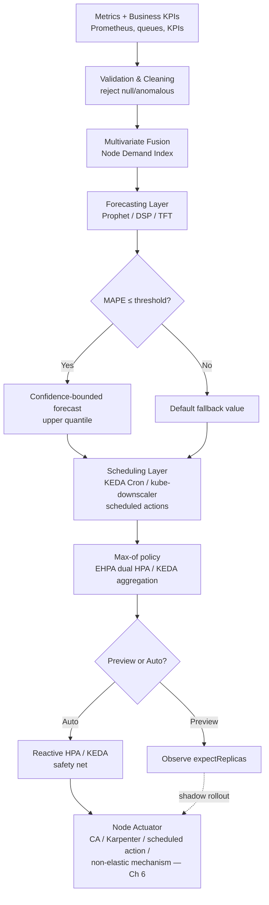

The figure compresses the chapter's contributions: the *signal layer* feeds a *fusion layer* (NRI), which feeds a *forecasting layer* whose authority is *gated by MAPE* and whose output is *quantile-bounded*; this in turn is overlaid by a *scheduling layer* implementing calendar baselines; the two are coalesced via a *max-of policy* (EHPA's dual HPA, KEDA's `ScaledObject` aggregation); a *preview-versus-auto switch* governs rollout maturity; and a *reactive safety net* (HPA, KEDA event scalers) absorbs whatever escapes the proactive layers, before the *node actuator* finally provisions or reclaims capacity.

The chapter has thus established the methodological vocabulary—forecasting families, fusion patterns, scheduling mechanisms, and safety-net configurations—on which Chapter 4's survey of open-source and commercial implementations will draw, Chapter 5's reference architecture will compose, and Chapter 6's non-elastic patterns will adapt for the user's specific infrastructure constraints. Every control surfaced here will reappear there, instantiated against concrete tools and concrete pools.

[^23]: KodeKloud — KEDA CRON Scaling reference (start/end cron expressions, IANA timezone, desiredReplicas, common use cases).
[^25]: Ananta Cloud — "Reduce Your Cluster Cost with kube-downscaler" (architecture, annotation-based control, cost-savings calculation, CA-integration caveat).
[^32]: GitHub kubernetes-sigs/karpenter Issue #1800 — "Karpenter Downscaler" feature proposal.
[^24]: Byteplus Vital Kubernetes Engine — "Creating CronHPA" documentation.
[^26]: GitHub abdullahkhawer/kubernetes-aws-eks-auto-scaler — combined K8s and ASG scheduled scaler with Parameter Store state.
[^27]: tinfoilcipher — "Terraform and Elastic Kubernetes Service - Configuring Scheduled EC2 Autoscaling" (idempotency via Terraform timestamp manipulation).
[^28]: Reddit r/googlecloud — "GKE scheduled autoscaling" discussion.
[^29]: Google Cloud — "About GKE cluster autoscaling" documentation.
[^30]: Google Cloud — "About node pool auto-creation" documentation.
[^31]: Olivier Gaumond, FAUN.dev — "Scaling AKS development clusters to zero to save costs" (Options 1–3 including VMSS-to-zero and node-pool start/stop preview).
[^21]: Bora, Kartsakli, Quiñones Moreno — "Temporal Fusion Transformer Based Vertical Scaling Management for Kubernetes" (TFT-DVPA experiments, hyperparameter sweep, OOMKilled baseline, related work survey including Vu, Dogani, Shim, Ba, Luo, Chaudhari).
[^22]: Tencent Cloud — "Implementing elasticity based on traffic prediction with EHPA" (DSP algorithm, dual HPA generation, Auto/Preview strategies, customer case).

# 4 Survey of Existing Open-Source Projects and Commercial Solutions

Chapter 3 closed by assembling a layered control architecture in which a fusion layer feeds a forecasting layer, schedules supply a calendar baseline, a max-of policy reconciles the two, and a reactive safety net catches whatever escapes—before a node actuator finally provisions or reclaims capacity. That architecture is, however, *generic*: every box must be filled by a real piece of software, with real licensing terms, real integration surfaces, and real limits. The natural next question for a platform team holding the user's brief—proactive scaling for request-volume-driven workloads, including pools that are not elastically provisionable through cloud APIs—is empirical rather than conceptual: *which existing tools, open-source or commercial, can I adopt off-the-shelf for which slot, and where do I have to write glue code or accept a gap?*

This chapter answers that question by conducting a structured survey of the major projects relevant to proactive Kubernetes node autoscaling, organized into four families and scored against a single comparative framework. The objective is twofold. First, it serves as a reference catalogue that practitioners can scan when designing their own implementation, with each tool placed on the same evaluation surface so that comparisons are not "apples-to-pineapples". Second, it surfaces the structural gaps that no surveyed tool fully closes—particularly around non-elastic node-pool management, scheduled node-level hibernation across heterogeneous providers, and unified prediction across mixed pools—setting up the reference architecture in Chapter 5 and the non-elastic patterns in Chapter 6.

## 4.1 Evaluation Framework and Solution Taxonomy

The chapter applies a six-dimensional evaluation framework derived directly from the five design questions enumerated in §1.5 and the four §1.2 evaluation criteria. The dimensions, each justified by a specific architectural decision the user must make, are as follows:

- **Predictive capability** — Does the tool itself produce a forecast, consume a forecast produced elsewhere, or operate purely on calendar/event signals? This dimension answers Question 1 (signal source) and partially Question 2 (scheduling mechanism).
- **Scheduling support** — Does the tool natively consume cron expressions, calendar rules, or scheduled actions, and at what scope (pod, node, node-pool)? This refines Question 2.
- **Non-elastic node-pool compatibility** — Can the tool drive capacity changes in pools that lack a cloud-managed Auto Scaling Group abstraction—on-premises bare-metal, fixed-capacity inventories, monthly-billed pools, hybrid pools combining static and dynamic capacity? This is the user's most binding constraint and answers Question 3 (provisioning agility).
- **HPA/KEDA integration overhead** — How does the tool coexist with native pod-layer autoscaling? Does it generate or augment HPA, replace it, or operate in a separate plane? This answers Question 4 (HPA/KEDA integration).
- **Observability and operability** — What dashboards, metrics, alerts, and rollout primitives (preview/shadow modes, MAPE gating, replay tooling) does the tool provide? Operationally, predictive systems without rich observability are dangerous; this dimension is decisive for production adoption.
- **Licensing, cost, and lock-in** — Open-source license vs commercial; self-hosted vs SaaS; pricing model and data-egress implications; portability of configuration across providers. This answers Question 5 partially (cost controls) and addresses the residual-risk concern raised in Chapter 1.

Each surveyed tool is scored qualitatively against these six dimensions and against the four §1.2 criteria (response latency **L**, SLA compliance **S**, cost efficiency **C**, operational stability **O**), using the Strong/Moderate/Weak scale already established in Chapter 2, with explicit caveats. Per rubric criterion P-2, vendor-published numbers (e.g., percentage cost-savings claims) are flagged as such and not treated as production guarantees.

The taxonomy partitions the surveyed tools into four families, each occupying a distinct functional layer of the reference architecture from §3.8:

| Family | Functional Role | Representative Tools |
|---|---|---|
| **Provisioning-layer autoscalers** | Replace or augment Cluster Autoscaler at the node-actuation layer | Karpenter (AWS, AKS Karpenter Provider, GCP Provider preview), Cluster Proportional Autoscaler |
| **Event-driven and scheduling-layer controllers** | Supply proactive triggers (cron, queue depth, custom metrics) at the pod layer; depend on a downstream node actuator for cost recovery | KEDA, kube-downscaler, Knative |
| **Commercial Kubernetes optimization platforms** | Bundle predictive scaling, rightsizing, and provisioning agility as a managed service | Spot Ocean (Spot.io / Flexera), ScaleOps, CAST AI |
| **Cloud-vendor predictive autoscaling primitives** | Provide IaaS-layer or Kubernetes-adjacent predictive scaling that can be wired into K8s | AWS EC2 Auto Scaling Predictive Scaling, GCP Predictive Autoscaling for MIGs, Tencent Crane EHPA, Kedify |

This four-family segmentation maps cleanly onto the layered architecture of §3.8: the provisioning-layer family fills the *node actuator* slot, the event/scheduling family fills the *signal source* and *schedule baseline* slots, the commercial family typically aims to fill *all* slots in a single managed plane, and the cloud-vendor primitives fill either the *forecasting* slot (Crane EHPA, Kedify) or the *node actuator* slot at IaaS level (AWS/GCP predictive scaling). Throughout the chapter, every score and every recommendation will be traceable back to this framework.

## 4.2 Provisioning-Layer Autoscalers: Karpenter and Cluster Proportional Autoscaler

The provisioning layer is the foundation: no amount of forecasting accuracy matters if the actuator beneath cannot translate decisions into ready nodes within the prediction horizon. Chapter 1 established that the standard Cluster Autoscaler imposes a 3–4 minute provisioning floor on AWS and 6–10 minutes for GPU workloads once image pull is included, and is structurally tied to pre-defined node groups. Karpenter is the principal open-source response to those gaps.

**Karpenter's resource model.** Karpenter separates node-provisioning configuration into three distinct Custom Resource Definitions—**NodePool**, **NodeClass**, and **NodeClaim**—each with a focused responsibility[^33]. The NodePool defines scheduling constraints (instance categories, architectures, capacity types, zones, labels, taints, limits); the NodeClass binds those constraints to a cloud-specific instance configuration (AMI/image, IAM/identity, networking); and the NodeClaim represents an individual node lifecycle managed by Karpenter. This separation is operationally significant: a single NodePool can match hundreds of pod shapes, eliminating the need for the multi-node-group sprawl that CA's homogeneous-group model imposes.

**Consolidation policy.** Karpenter's `disruption` block exposes a `consolidationPolicy` field with `WhenUnderutilized` and `Never` options[^34]. When set to `WhenUnderutilized`, "consolidation will terminate any empty nodes on the cluster" and Karpenter "reduce[s] cluster cost by removing and replacing nodes"[^34]. Setting `consolidateAfter: Never` disables consolidation entirely. This is a meaningful semantic improvement over CA's 10-minute `scale-down-unneeded-time` floor: Karpenter does not merely *remove* idle nodes but actively *consolidates* underutilized-but-non-empty workloads onto fewer larger or more efficient nodes, recovering cost during slow drifts as well as sharp troughs.

**Sub-minute provisioning and broad instance selection.** Chapter 1 cited production benchmarks placing Karpenter at ~55 seconds for single-pod scale-up versus 3–4 minutes for CA, with the gap widening to ~7× under capacity-fallback scenarios. The architectural enabler is direct cloud-API invocation that selects from the full instance catalogue (800+ types on AWS) and retries across alternative types and AZs in milliseconds when a particular instance is unavailable—a property that no managed-node-group abstraction can match.

**Multi-cloud maturation.** Karpenter began as an AWS-native project, but the provider ecosystem has matured. The **AKS Karpenter Provider** (`Azure/karpenter-provider-azure`) is published under Apache 2.0, has 849 commits and 58 releases on `main` as of the surveyed snapshot, and supports two installation modes: **Node Auto Provisioning (NAP)**, the managed Karpenter offering integrated into AKS, and **self-hosted Karpenter** for users who want direct control[^34]. The repository explicitly recommends NAP over self-hosted: "We strongly recommend using Node Auto Provisioning (aka managed Karpenter) instead of self-hosted"[^34]. AKS release notes record continued investment, including a Preview feature `NodeOverlay` and AKSNodeClass-related behavioral changes through 2025–2026[^35]. A **Karpenter GCP Provider** is also documented as available in preview, "adding native GCP support to Karpenter for intelligent node provisioning and cost-aware autoscaling"[^36]. The practical implication is that Karpenter is now plausibly a *cross-cloud* node-provisioning standard for elastic pools, although the GCP path is still in preview and AKS NAP is GA but with limitations the user must verify against their AKS feature requirements.

**Limitations relevant to the user's brief.** Despite these strengths, Karpenter retains three structural gaps that the user must address through additional layers:

1. **Reactive triggering.** Karpenter, like CA, fundamentally reacts to *pending pods*. ScaleOps's analysis is direct: "Even Karpenter's sub-minute node launches can be too slow for critical workloads. Every second a latency-sensitive pod sits Pending is a potential outage or failed SLA"[^37]. The 55-second figure is a floor, not a ceiling, and bursts that double demand within seconds still see queueing.
2. **Headroom dilemma when paired with VPA.** "Karpenter excels at 'tightly packing' pods onto the cheapest node. This backfires when using VPA, which needs extra headroom to grow a pod's resource requests. With no spare capacity, VPA's attempt to resize a pod triggers a disruptive eviction and rescheduling cycle"[^37]. The mitigation—what ScaleOps calls "Calculated Elastic Headroom"—requires either a higher-level optimization platform or careful manual NodePool sizing.
3. **Cost-driven packing versus performance.** Aggressive bin-packing "can place noisy and bursty workloads on the same node as latency-sensitive applications. While technically efficient from a cost perspective, it degrades performance of critical services if no safeguards are in place"[^37]. Affinity/anti-affinity policies and PriorityClass configuration are the primary mitigations.
4. **No native scheduled scale-down.** Karpenter does not natively expose calendar-driven hibernation; the **Karpenter Downscaler** community proposal (kubernetes-sigs/karpenter Issue #1800, cited in §3.7) is the active gap-filling effort, "operat[ing] as a controller with a CRD … based on the schedules we set, it automatically scales down to 0 the nodes managed by Karpenter, freeing up resources". Until this is upstream, schedule-driven hibernation of Karpenter-managed pools requires custom controllers.

**Cluster Proportional Autoscaler (CPA).** A second, narrower provisioning-adjacent project—Cluster Proportional Autoscaler—scales workload replicas in proportion to cluster size (number of nodes or cores). Its canonical use is CoreDNS, which must scale with cluster size to keep DNS query latency bounded. CPA does not provision nodes itself; it adjusts pod replica counts based on a node-count signal. For the user's request-volume-driven scenario, CPA is largely orthogonal—useful for system-tier components but not a candidate for the primary node-actuation slot.

**Scoring.** Karpenter scores: predictive capability **Weak** (no native forecasting); scheduling support **Weak** (community Downscaler still informal); non-elastic compatibility **Weak** (presumes cloud-API instance creation; cannot drive bare-metal or fixed-capacity pools); HPA/KEDA integration **Strong** (cleanly orthogonal—pod scaling triggers pod creation, Karpenter provisions nodes); observability **Moderate** (provisioning logs, metrics, but no forecast surface). On §1.2 criteria: **L Strong**, **S Strong**, **C Strong** (consolidation), **O Strong** (with proper PDBs and PriorityClass discipline). CPA scores Weak on every dimension relevant to node provisioning; it is not a substitute for the actuator slot.

**Architectural verdict.** Karpenter is the strongest open-source candidate for the *elastic-pool actuator* slot in the reference architecture, with NAP-mode AKS adoption a credible path for Azure environments and the GCP provider an option for early adopters. **It does not, however, address the user's non-elastic concern at all**—Karpenter's entire model presumes the ability to summon a new VM via cloud API. For non-elastic pools, the actuator slot must be filled by a different mechanism (Chapter 6).

## 4.3 Event-Driven and Scheduling-Layer Controllers: KEDA, kube-downscaler, and Knative

Where Karpenter occupies the node-actuation layer, KEDA, kube-downscaler, and Knative occupy the *trigger* layer, supplying proactive signals at the pod replica level that downstream node actuators must convert into capacity changes.

**KEDA.** Chapter 2 established KEDA's role; this section examines its concrete implementation surface in more detail. KEDA exposes a `ScaledObject` CRD that combines triggers with HPA scaling behavior. The Prometheus scaler is one of the most operationally important: it scales workloads against arbitrary PromQL queries, with `threshold` and `activationThreshold` parameters, `serverAddress`, optional `customHeaders`, `queryParameters`, and authentication modes including **bearer**, **basic**, **TLS**, and **custom**[^38]. Cloud-managed Prometheus integration is first-class: TriggerAuthentications support **EKS Pod Identity** for Amazon Managed Service for Prometheus, **Azure AD Workload Identity** for Azure Monitor Managed Prometheus, and **GCP Workload Identity** for Google Managed Prometheus[^38].

A canonical Prometheus-driven trigger:

```yaml
triggers:
- type: prometheus
  metadata:
    serverAddress: http://prometheus.example.com:9090
    query: sum(rate(http_requests_total{deployment="my-deployment"}[2m]))
    threshold: '100.50'
    activationThreshold: '5.5'
```

[^38]

The LiveWyer proof-of-concept article documents end-to-end deployment: a `kind` cluster, kube-prometheus-stack with `serviceMonitorSelectorNilUsesHelmValues=false`, KEDA Helm chart, a podinfo workload exposing Prometheus metrics, and a `ScaledObject` that scales podinfo from 1 to 5 replicas based on `sum(increase(http_requests_total{namespace="podinfo", container="podinfo", status="200"}[1m]))` with threshold `30`[^39]. The author confirms KEDA's HPA-creation behavior:

> "After deploying my ScaledObject, I check to see if I configured it correctly … `the HPA was able to successfully calculate a replica count from external metric s0-prometheus(...)` indicates that the Kubernetes HPA controller was able to fetch the metrics from the KEDA Metrics Server"[^39].

The architectural takeaway is that KEDA *creates and manages* an HPA behind every `ScaledObject`, so KEDA-driven proactive triggers compose transparently with native HPA—reactive CPU/memory metrics and KEDA-supplied external metrics aggregate via HPA's `max(metrics)` semantics, achieving the max-of-reactive-and-predictive policy described in §3.8 without operator intervention.

KEDA's **Cron scaler** (Chapter 3) and the **Predictkube** scaler—a KEDA-integrated predictive scaler available in the scaler catalogue[^38][^40]—deserve mention as the two natively proactive triggers that KEDA ships out-of-the-box, complementing the 70+ event-source scalers (ActiveMQ, Kafka, RabbitMQ, AWS SQS/Kinesis/CloudWatch, Azure Event Hubs/Service Bus, GCP Pub/Sub, Prometheus, Datadog, NewRelic, Splunk, etc.)[^38][^40].

**KEDA's gap at the node layer.** KEDA scales pods, not nodes. Once KEDA has created (or terminated) pods, a downstream node actuator must convert that into node-count changes. In elastic environments paired with Karpenter, this happens automatically: pending KEDA-driven pods trigger Karpenter provisioning. In non-elastic pools, KEDA pod scaling produces *no* node-cost change unless an additional mechanism (cordon/uncordon, IPMI, virtual kubelet) is wired in.

**kube-downscaler.** Chapter 3 examined kube-downscaler's annotation-driven hibernation in depth. Its operational positioning is narrower than KEDA's: it is purpose-built for scheduled scale-to-zero of dev/QA/UAT environments via `downscaler/uptime` annotations, with explicit dependence on an active downstream autoscaler to convert pod removal into node savings. For the user's brief, kube-downscaler is most valuable as a *scheduled trough-recovery* tool for non-production environments, not as a primary actuator for production peak handling.

**Knative.** Knative's autoscaler (KPA) operates request-driven scaling with native scale-to-zero and request-concurrency-based scale-up. While the surveyed materials do not provide a deep dive on Knative-specific deployment patterns relevant to this report's scenario, Knative's relevance is bounded: it is a serverless layer above Kubernetes, attractive for stateless HTTP workloads but not designed as a general node autoscaler. For the user's brief—a mixed K8s cluster with non-elastic pools—Knative is an option for specific stateless services rather than a holistic answer.

**Scoring.** KEDA scores: predictive capability **Moderate** (Cron and Predictkube native; external prediction via Prometheus query); scheduling support **Strong** (Cron scaler is first-class); non-elastic compatibility **Conditional** (pod layer is universal; node-level effect requires downstream actuator); HPA integration **Strongest** (creates and manages HPA transparently); observability **Moderate–Strong** (KEDA operator logs, scaler metrics, HPA conditions); licensing **Strong** (Apache 2.0, CNCF graduated). On §1.2 criteria: **L Strong** when signal leads saturation; **S Moderate–Strong**; **C Strong** with scale-to-zero; **O Strong** with proper threshold tuning. kube-downscaler and Knative score **Strong** in their narrow niches and **Weak** outside them.

**Architectural verdict.** KEDA fills the *signal source* and *schedule baseline* slots of the reference architecture comprehensively for the pod layer; Predictkube and the Kedify-style MetricPredictor (§4.5) extend it into the predictive slot. The non-elastic gap remains: KEDA is necessary but not sufficient for the user's brief, requiring pairing with Karpenter (elastic pools) or custom non-elastic actuators (Chapter 6).

## 4.4 Commercial Kubernetes Optimization Platforms: Spot Ocean, ScaleOps, and CAST AI

Three commercial platforms have emerged as the principal "all-slot" alternatives to assembling open-source components: Spot Ocean (NetApp/Flexera, originating from spot.io), ScaleOps, and CAST AI. Each bundles forecasting, rightsizing, provisioning agility, and cost optimization into a managed control plane, trading open-source freedom for reduced integration work. Per rubric criterion P-2, the analysis below treats their published claims as vendor-published medium-confidence signals, with explicit caveats where production validation is unclear.

**Spot Ocean (Spot by NetApp / Flexera).** Ocean is positioned as a "serverless platform purpose-built for containers" that automates the underlying infrastructure for ECS, EKS, AKS, and GKE clusters[^34]. Its core architectural primitives surfaced in the workshop and blog material include:

- **Container-driven autoscaling** that "scales the number of instances in the cluster to meet your application demands", learning task requirements and selecting the best instance size or type[^34].
- **Headroom** — "a smart buffer of capacity that allows for immediate pod scheduling and helps avoid pending tasks. This makes scale-up a proactive, rather than only a reactive, process. Ocean supports custom headroom per Virtual Node Group"[^34]. This is the commercial productization of the headroom-pods pattern from Chapter 2.
- **Virtual Node Groups (VNGs)** — "you can manage different workload types on one cluster with VNGs … you can configure different sets of AMI, IAM profiles, and security groups"[^34]. VNGs are the Ocean equivalent of Karpenter's NodePool/NodeClass.
- **High Allocation / bin-packing** — Ocean "studies actual container requirements and utilizes bin packing algorithms to match tasks with the most efficient and optimized mix of EC2 instances", with claimed "additional cost reduction of 20-30%"[^34].
- **Right-Sizing**, **Cost Showback**, **Cluster Roll**, and automatic ECS-agent updates round out the platform[^34].
- **Spot/Reserved/On-Demand blending** — Ocean "provisions the optimal blend of Spot, Reserved and On-Demand Instances with an enterprise-grade SLA. Applications can run reliably on Spot Instances, while the Spot platform monitor[s] the spot market and proactively replaces at-risk instances", with claimed savings "up to 80% off EC2 costs"[^34].

Ocean is available across AWS (ECS, EKS), Azure (AKS via Terraform/UI/API[^33]), GCP, and supports admission controllers and custom VNG resources for advanced workload partitioning[^41]. The Flexera article explicitly contrasts Ocean with raw Fargate, citing "average … cost of running workloads on Fargate is three times more than running the same workloads on EC2" and the Fargate request-rounding behavior (rounding 0.7 vCPU/1 GB to 1 vCPU/2 GB) as accumulated waste Ocean addresses[^34].

**ScaleOps.** ScaleOps positions itself as a *layer above* HPA, KEDA, and Karpenter, operating as a 10–15-minute-ahead predictive optimization plane[^37][^38]. Sacra's analysis crystallizes the positioning: "ScaleOps is not asking teams to rip out Kubernetes autoscaling, it is acting like a forecasting layer on top of tools they already run. HPA reacts after CPU or memory metrics rise, and KEDA reacts when queue depth or other event signals cross a threshold. ScaleOps tries to move first, pushing replica changes 10 to 15 minutes ahead so pods are already live when the burst arrives"[^38].

Functionally, ScaleOps publishes five product pillars[^37]:

1. **Real-Time Pod Rightsizing** — multi-layered analysis with "fast-reaction capabilities to catch immediate issues like memory leaks and traffic spikes, and long-term pattern detection for weekly and seasonal trends"[^37]. The framing explicitly includes the day-shifting pattern the Vultr team observed: "If your API spikes to 890m CPU every morning at 9 AM, that's not noise, it's a pattern to accommodate. When memory drops 60% on weekends, that's thousands of dollars in potential savings"[^37].
2. **Replicas Optimization (predictive autoscaling)** — "Modern autoscaling platforms are shifting from reactive to predictive models … A smart system knows that Monday mornings aren't like Friday afternoons … scale out minutes in advance of a predictable event, not in response to it … scaling up 15 minutes before your morning rush"[^37].
3. **Karpenter Optimization** — addresses the headroom dilemma directly via "Calculated Elastic Headroom: By intentionally leaving a small, dynamically tuned percentage of each node's capacity unclaimed, the system guarantees that VPA‑driven scaling can occur in place without evictions"[^37]. Also offers **Right-Sizing by Profile** (selecting CPU-optimized vs memory-optimized instances per workload class) and **Performance-Aware Placement** (steering bursty workloads away from latency-critical services)[^37].
4. **Spot Optimization** with "policy-driven strategies, like running 70% of replicas on Spot, with automatic fallback to on-demand"[^37].
5. **Cost Monitoring and Cluster/Workload Troubleshooting** — real-time, container-level cost attribution[^37].

Operationally, ScaleOps is "fully self-hosted and production-safe, with built-in support for GitOps workflows and air-gapped environments. All optimizations happen in-place, with no cold starts, restarts, or surprises"[^37]. Deployment is a four-step Helm-based progression: discover, rightsize/optimize, replicas optimization, and Karpenter+Spot integration[^37]. Future-of-Software's evaluation reinforces the rightsizing emphasis—"The platform continuously analyzes resource usage data—such as CPU and memory—across Kubernetes clusters, providing actionable recommendations for optimizing requests and limits at the pod level"[^42]—and notes seamless multi-cloud and CI/CD integration.

A subtle ScaleOps capability for the user's request-volume-driven brief is **`ResourceQuota`-aware rightsizing**: "It must check the target namespace's quota before making any changes to ensure a newer, higher resource request will be accepted. This prevents the 'silent killer' scenario where an automated update accidentally evicts a pod that can't be rescheduled due to its increased request value"[^37]. This addresses a specific failure mode that naive predictive systems can trigger.

**CAST AI.** CAST AI markets itself as "Application Performance Automation" with predictive workload management as a first-class feature[^39][^43]. Its AKS-specific positioning emphasizes:

- **Proactive scaling** that "continuously monitors workload patterns and predicts demand peaks before they impact performance"[^43].
- **Cross-region GPU access** — "for AI and GPU workloads, Cast AI eliminates regional GPU constraints. Access Azure GPU instances from any region and have them appear as nodes in your existing AKS cluster, no complex multi-region networking or cluster federation required. When GPU capacity is limited in your primary region, Cast AI automatically provisions from regions with availability"[^43]. This addresses the GPU cold-start scenario from Chapter 1 with a regional-flexibility lever that Karpenter alone cannot match.
- **Continuous workload rightsizing** with "advanced bin-packing [that] maximizes node utilization while maintaining the performance headroom needed for reliable operations"[^43].
- For AI/ML specifically, **GPU time-slicing and MIG partitioning**, **predictive Spot orchestration**, and **LLM-router cost optimization** ("automatically route queries to the most cost-effective model")[^39].
- An agentless integration model that gives "immediate visibility into workload performance and resource utilization patterns"[^43].

CAST AI claims "over 60% cost savings for its users", with documented case studies including Flowcore (50% AKS savings) and Banking Circle (50–80% Kubernetes cost reduction with reduced AIOps toil)[^43]. Per rubric P-2, these are vendor-published case study figures and should be treated as illustrative rather than guaranteed.

**Comparative scoring.** The three platforms occupy overlapping but distinct positions:

| Dimension | Spot Ocean | ScaleOps | CAST AI |
|---|---|---|---|
| Predictive capability | Container-driven AI for instance selection; headroom-as-buffer rather than explicit forecast | Explicit 10–15-min-ahead predictive layer above HPA/KEDA/Karpenter[^38] | Predictive workload management; GPU-aware cross-region predictive provisioning[^43] |
| Scheduling support | VNG-level configuration; not primarily cron-driven | Time-of-day adaptive policies (peak vs off-peak)[^37] | Policy-driven temporal automation[^39] |
| Non-elastic compatibility | **Weak** — Ocean is fundamentally a cloud-spot orchestrator (AWS/Azure/GCP)[^34][^33] | **Conditional** — operates above existing actuators; air-gapped and self-hosted support extends reach[^37] | **Weak** — managed cloud focus (AKS, EKS marketplace)[^43] |
| HPA/KEDA integration | Replaces or supplements; container-driven autoscaling is its own scaling plane | **Strong** — explicitly sits above HPA/KEDA/Karpenter, does not replace them[^37][^38] | Integrates with existing autoscalers |
| Observability | Cost showback, per-namespace dashboards, cluster roll[^34] | Real-time cost attribution to container level; rightsizing dashboards[^37] | Resource utilization patterns, multi-cloud visibility[^43] |
| Lock-in / cost model | Commercial SaaS via Spot.io / Flexera | Commercial; self-hosted, GitOps-compliant, air-gapped support[^37] | Commercial SaaS, Azure Marketplace availability[^43] |

**On §1.2 criteria** (high-level): Ocean scores **L Strong** (headroom buffers absorb cold starts), **S Strong** for elastic pools, **C Strong** (cited 80% EC2 savings, 20–30% bin-packing dividend)[^34], **O Strong** with the cluster-roll discipline[^34]. ScaleOps scores **L Strongest** among the three given its explicit pre-emptive 10–15-minute lead and elastic-headroom mechanism[^37][^38], **S Strong**, **C Strong** (real-time cost visibility plus Spot policies), **O Strong** (in-place optimization without restarts)[^37]. CAST AI scores **L Strong** especially for GPU workloads via cross-region access[^43], **S Strong**, **C Strong** (vendor-cited 60%+), **O Strong**.

**Caveats and shared limitations.** All three platforms are **vendor-managed** and exhibit lock-in risk: Ocean's VNG model, ScaleOps's policies and CRDs, and CAST AI's agentless integration are not portable to other platforms. None of them, despite their strengths, **directly addresses non-elastic on-premises bare-metal pools** as a first-class feature—their value proposition is concentrated on cloud-managed Kubernetes (EKS/AKS/GKE). For the user's specific concern about non-elastic pools, even commercial platforms cannot eliminate the need for the patterns examined in Chapter 6, although ScaleOps's air-gapped/self-hosted positioning makes it the most plausible commercial fit for hybrid environments.

**Architectural verdict.** For organizations that prefer to *buy* rather than *build*, Spot Ocean is the most mature commercial choice for AWS/Azure/GCP managed Kubernetes with strong Spot integration; ScaleOps is the strongest commercial candidate for the predictive-layer slot above existing HPA/KEDA/Karpenter stacks, particularly for teams that have already invested in those tools and want a forecasting layer with native fallback semantics; CAST AI is the strongest for AI/ML workloads where GPU scarcity and cross-region access are first-order concerns. None of the three eliminates the user's non-elastic-pool gap entirely.

## 4.5 Cloud-Vendor Predictive Autoscaling Primitives

Beyond Kubernetes-native projects, the three hyperscalers (AWS, GCP, Azure) and adjacent vendors (Tencent, Kedify) ship predictive autoscaling primitives at the IaaS layer or as Kubernetes-native CRDs. These primitives are most useful as *components* of the reference architecture rather than as complete solutions, because they typically operate on either VM groups or pods rather than spanning both.

**AWS EC2 Auto Scaling Predictive Scaling.** AWS exposes predictive scaling as a policy attached to an Auto Scaling Group, "powered by Machine Learning"[^44]. The mechanism is documented at the workshop level:

> "Predictive scaling requires 24 hours of metric history before it can generate forecasts. Predictive scaling finds patterns in CloudWatch metric data from the previous 14 days to create an hourly forecast for the next 48 hours. Forecast data is updated daily based on the most recent CloudWatch metric data."[^44]

The forecast operates on **three input metrics**: a *load metric* (total demand on the ASG), a *capacity metric* (number of instances), and a *scaling metric* (per-instance utilization)[^44]. Two operating modes are exposed: **ForecastOnly**, which surfaces the forecast in the console for evaluation without acting, and **ForecastAndScale**, which actually provisions ahead of predicted load[^44]. ForecastOnly is the AWS analogue of EHPA's Preview mode (§3.8) and supports the same shadow-rollout discipline.

A **critical assumption** that constrains EKS use: "A core assumption of predictive scaling is that the Auto Scaling group is **homogenous** and all instances are of **equal capacity** … If your actual workload uses Auto Scaling groups with multiple instance types (mixed instance groups), then use caution when creating predictive scaling policies. Predictive scaling with mixed instance groups can forecast capacity inaccurately and launch instance types of unequal capacity"[^44]. For EKS managed node groups that mix instance types for cost optimization—or for Karpenter-managed pools that intentionally span 800+ instance types—AWS's IaaS-level predictive scaling is structurally mismatched. It is most applicable to single-instance-type EKS managed node groups serving a stable workload class; for heterogeneous fleets, the K8s-native predictive layer (Kedify, Crane EHPA, ScaleOps) is the better fit.

**GCP Predictive Autoscaling for Managed Instance Groups.** GCP's predictive autoscaler operates on CPU utilization and is configured via a `--cpu-utilization-predictive-method` gcloud flag (or `predictiveMethod` REST field) with values `optimize-availability` or `none`[^44]. Operationally:

> "When you enable predictive autoscaling, Compute Engine forecasts future load based on your MIG's history and scales out the MIG in advance of predicted load, so that new instances are ready to serve when the load arrives … Compute Engine uses up to 3 weeks of your MIG's load history to feed the machine learning model"[^44].

The bootstrap and adaptation behavior is well-specified: "If your MIG has no autoscaler history, it can take 3 days before the predictive algorithm affects the autoscaler. During this time, the group scales based on real-time data only. After 3 days, the group starts to scale using predictions"[^44]. The system "needs at least 3 days of history from which to determine a representative service usage pattern"[^44], aligning with the Crane EHPA `historyLength: "3d"` default cited in §3.2.

GCP exposes meaningful adaptive behaviors that mirror the safety-net patterns from §3.8:

- **Real-time adaptation to mispredictions** — "Short, unpredictable peaks are covered in real time. The autoscaler creates at least as many instances as needed to keep utilization at the configured target, based on the current actual value of the metric"[^44], implementing max-of-predictive-and-reactive.
- **Sudden-dip adaptation** — "When that happens, the number of instances initially follows the forecast. However, over time, the forecast adjusts to the lower-than-forecasted usage, resulting in a scale-in"[^44].
- **Initialization period setting** — explicitly accounts for "how long it takes for your application to initialize on a new instance. This setting informs the predictive autoscaler to scale out further in advance of anticipated load"[^44], directly answering the prediction-horizon-vs-provisioning-latency design question from §3.1.
- **Simulation tooling** — "For groups with predictive autoscaling disabled, you can use this tool to simulate predictive autoscaling before enabling it"[^44], providing a no-cost evaluation path before commitment.

For GKE specifically, GCP predictive autoscaling operates at the MIG layer beneath the cluster autoscaler, so its applicability to GKE node pools requires careful configuration of the underlying node-pool MIG and is less integrated than Karpenter's NodePool model. The recurrent question raised on r/googlecloud—"Is it possible to schedule nodes scaling (NOT pods) for GKE?"—reflects this gap; GCP's primitives exist but are not first-class within GKE's UX.

**Tencent Crane EHPA.** Chapter 3 covered EHPA in depth; for the survey perspective, EHPA is relevant as the most fully-featured *Kubernetes-native* predictive HPA in the surveyed open-source landscape[^22]. Its DSP-based forecasting, automatic dual-HPA generation, ForecastOnly-equivalent **Preview** mode, **Auto** mode, and explicit fallback to monitoring data are first-class features rather than patterns to assemble. EHPA's principal limitation is that it operates at the *pod* layer; converting EHPA-driven pod scaling into node savings requires a separate node actuator (CA, Karpenter, or non-elastic mechanism). Crane EHPA is also primarily Tencent-stewarded, with adoption beyond Tencent Cloud requiring careful evaluation of community velocity and feature parity.

**Kedify.** Kedify's predictive scaler (§3.3) is a commercial KEDA extension that introduces a `MetricPredictor` CRD for Prophet-based forecasting with **MAPE-gated fallback** to a default value. Its placement in this section reflects that it is a vendor-published productized layer above an open-source base. Kedify shares EHPA's pod-layer scope and inherits KEDA's transparent HPA integration.

**Comparative scoring across the cloud-vendor primitives.**

| Tool | Layer | Forecast Method | History Required | Forecast Horizon | Mode Switching | Heterogeneous Pools |
|---|---|---|---|---|---|---|
| AWS EC2 Predictive Scaling | IaaS (ASG) | ML | 24 h minimum, 14 d window | 48 h hourly forecast[^44] | ForecastOnly / ForecastAndScale[^44] | **Mismatched** — assumes homogeneous ASG[^44] |
| GCP Predictive Autoscaling | IaaS (MIG) | ML | 3 d minimum, up to 3 wk[^44] | Continuous; recomputed every few minutes[^44] | optimize-availability / none[^44] | CPU-only metric; MIG-scoped |
| Crane EHPA | K8s pod layer | DSP | `historyLength: "3d"` default[^22] | `predictionWindowSeconds: 3600` typical[^22] | Auto / Preview[^22] | Not applicable (pod layer) |
| Kedify MetricPredictor | K8s pod layer | Prophet | ~1 wk+ | Configurable | MAPE-gated fallback to default | Not applicable (pod layer) |

**The IaaS-vs-K8s gap.** A recurring architectural caveat: AWS Predictive Scaling and GCP Predictive Autoscaling forecast **VM-group capacity**, not pod scheduling. Inside a Kubernetes cluster, the pod layer (HPA, KEDA, ScaleOps) and the node layer must still be reconciled. AWS predictive scaling on an EKS managed node group can pre-warm capacity, but if pod scheduling does not produce the predicted demand—or if KEDA scales pods independently—the IaaS-level prediction can either over- or under-provision relative to actual K8s scheduling behavior. The cleanest integration pattern is to use IaaS predictive scaling as a *supplementary* signal beneath Karpenter or CA, with the primary forecasting authority residing in the K8s-native layer (Crane EHPA, Kedify, ScaleOps) that has direct visibility into pod-scheduling state.

**Architectural verdict.** For homogeneous EKS node groups serving stable workload classes, AWS Predictive Scaling is a low-overhead option to add a 48-hour forecast horizon at the IaaS layer. For GKE MIGs with at least three days of history, GCP Predictive Autoscaling delivers similar value with built-in simulation and graceful misprediction adaptation. For Kubernetes-native workloads with strong seasonality, Crane EHPA (open-source) and Kedify (commercial) are direct, deployable predictive HPA implementations that fit the §3.8 reference pattern with minimal glue. None of the four addresses non-elastic pools.

## 4.6 Consolidated Capability Matrix and Adoption Recommendations

The chapter's findings consolidate into a single capability matrix that scores every surveyed tool on the six evaluation dimensions and the four §1.2 criteria. The matrix uses **S** (Strong), **M** (Moderate), **W** (Weak), and **N/A** (not applicable) with explicit footnoting where context matters; "non-elastic" specifically denotes compatibility with on-premises bare-metal or fixed-capacity pools.

| Tool | Predictive | Scheduling | Non-elastic | HPA/KEDA Int. | Observability | Cost/License | L | S | C | O |
|---|---|---|---|---|---|---|---|---|---|---|
| **Karpenter (AWS/AKS NAP/GCP preview)** | W | W | W | S | M | OSS Apache 2.0 | S | S | S | S |
| **Cluster Proportional Autoscaler** | W | W | N/A | M | W | OSS | M | M | M | S |
| **KEDA (Cron/Prometheus/Predictkube)** | M | S | Conditional | S | M–S | OSS Apache 2.0 (CNCF) | S | M–S | S | S |
| **kube-downscaler** | W | S | Conditional | M | M | OSS | M | M (off-hours) | S | S |
| **Knative (KPA)** | W | W | Conditional | Separate plane | M | OSS | S (stateless HTTP) | M | S | M |
| **Spot Ocean** | M (headroom buffer) | M | W | M | S | Commercial SaaS | S | S | S (cited 80%)[^34] | S |
| **ScaleOps** | S (10–15-min lead)[^38] | S (peak/off-peak)[^37] | Conditional (self-hosted/air-gapped)[^37] | S (sits above)[^38] | S (cost to container)[^37] | Commercial, self-hosted | S (Strongest in commercial tier)[^37] | S | S | S (in-place)[^37] |
| **CAST AI** | S (predictive + GPU cross-region)[^43] | M (policy-driven)[^39] | W | M | S | Commercial SaaS | S (esp. GPU) | S | S (cited 60%+)[^43] | S |
| **AWS EC2 Predictive Scaling** | S (48-h forecast)[^44] | W | W | IaaS-only | M (ForecastOnly viz)[^44] | Free with ASG | S (homogeneous ASG only)[^44] | M | M | S |
| **GCP Predictive Autoscaling** | S | W | W | IaaS-only | S (simulator)[^44] | Free | S | S | M | S |
| **Crane EHPA** | S (DSP)[^22] | M (cron via Crane stack) | N/A (pod) | S (dual HPA gen)[^22] | M | OSS | S | S | S | S |
| **Kedify MetricPredictor** | S (Prophet, MAPE-gated) | S (KEDA Cron) | N/A (pod) | S (KEDA-native) | M | Commercial KEDA layer | S | S | S | S |

**Mapping tools to design questions.** The five design questions from §1.5 map onto adoption recommendations as follows.

- **Q1 (signal source).** For diurnal/weekly seasonal workloads, **Crane EHPA** (open-source) or **Kedify** (commercial) are the most direct K8s-native predictive options; **KEDA Predictkube/Prometheus** scalers are the broadest event-driven option; **ScaleOps** is the strongest commercial layer that aggregates multiple signal types. For pure calendar-driven workloads, **KEDA Cron** plus **kube-downscaler** suffices.
- **Q2 (scheduling mechanism).** **KEDA Cron** is the universal pod-layer answer; **AWS `aws_autoscaling_schedule`** for AWS ASG-bound EKS managed groups; **GKE CA min-nodes + pod-layer cron** for GKE; **AKS node-pool start/stop** (Preview) or VMSS scale-to-zero for AKS development clusters; the **Karpenter Downscaler** community proposal once available for Karpenter pools.
- **Q3 (provisioning agility).** **Karpenter** (and its AKS NAP and GCP preview providers) is the open-source standard for elastic pools; **Spot Ocean** is the strongest commercial counterpart with native Spot/Reserved/On-Demand blending. **No surveyed tool natively addresses non-elastic pools**—Chapter 6 will address that gap.
- **Q4 (HPA/KEDA integration).** **KEDA** provides the cleanest HPA composition; **Crane EHPA** automates dual-HPA generation for predictive+reactive aggregation; **ScaleOps** explicitly sits above HPA/KEDA/Karpenter without replacing them[^38]. Karpenter operates orthogonally at the node layer.
- **Q5 (cost controls and safety nets).** **EHPA Preview mode**, **AWS ForecastOnly**, **GCP simulation tooling**, and **Kedify's MAPE threshold + default fallback** are the four operational safety primitives surveyed; ScaleOps's `ResourceQuota`-aware rightsizing and Spot Ocean's headroom-per-VNG add commercial-tier guardrails.

**Workload-archetype recommendations.** Combining the matrix with the workload archetypes from §1.2:

| Archetype | Recommended Open-Source Stack | Recommended Commercial Alternative |
|---|---|---|
| Diurnal/weekly cycles (SaaS, internal envs) | KEDA Cron + Karpenter + kube-downscaler for off-hours | Spot Ocean or ScaleOps |
| Scheduled promotional events | KEDA Cron + Crane EHPA + Karpenter | ScaleOps with peak/off-peak policies |
| Streaming / live-event peaks | Crane EHPA + KEDA + Karpenter + headroom pods | Spot Ocean (headroom + VNG) or ScaleOps (Calculated Elastic Headroom) |
| Batch / AI processing windows | KEDA queue scalers + Karpenter; Crane EHPA for known windows | CAST AI for GPU-aware scaling |
| Bursty event-driven inference (LLM, async) | KEDA + Karpenter + Kedify or Crane EHPA when seasonal | CAST AI for cross-region GPU access |

**Capability gaps requiring custom development.** Three structural gaps remain unfilled by any single surveyed tool:

1. **Non-elastic node-pool management.** No surveyed open-source or commercial tool provides first-class management of bare-metal, fixed-capacity, or monthly-billed pools through cordon/uncordon, IPMI/BMC power management, or virtual-kubelet bursting. The Karpenter Downscaler proposal addresses scheduled hibernation only for Karpenter-managed pools; AKS start/stop and VMSS-to-zero work at cloud-managed levels. **For genuine non-elastic pools, custom controllers remain unavoidable**—Chapter 6's central concern.
2. **Scheduled node-level hibernation across providers.** Every cloud-vendor primitive is provider-bound; cross-provider hybrid environments require either vendor-specific schedulers stitched together or a custom abstraction layer (e.g., a CRD that fans out to AWS ASG actions, AKS start/stop calls, IPMI invocations, and Karpenter NodePool resizing). No surveyed tool supplies that abstraction natively.
3. **Unified prediction across heterogeneous pools.** Predictive scalers operate at one layer (IaaS or pod) and one provider; a hybrid environment with elastic AWS pools, fixed on-premises pools, and AKS NAP pools cannot today drive a single forecast across all of them through any out-of-the-box tool. ScaleOps comes closest with its self-hosted, air-gapped multi-cloud positioning but ultimately still depends on existing actuators for each pool type.

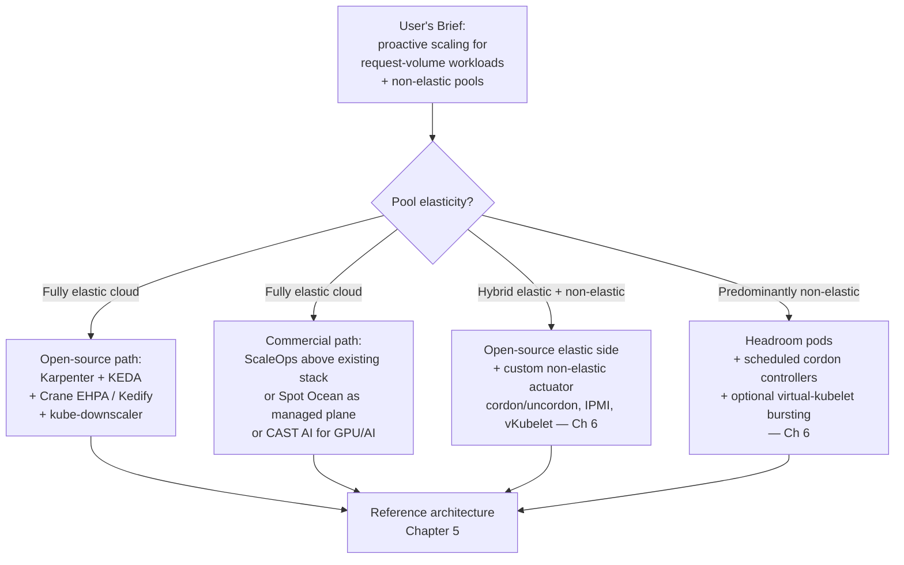

The decision tree summarizes the chapter's adoption verdict: **for elastic-only environments, the open-source Karpenter + KEDA + Crane EHPA stack is production-ready and largely substitutes for CA**, with ScaleOps, Spot Ocean, and CAST AI as commercial accelerators that close specific gaps (predictive lead time, Spot blending, GPU cross-region) at vendor cost. **For hybrid or predominantly non-elastic environments, no surveyed tool is sufficient on its own**; Chapter 5's reference architecture composes the surveyed components into a coherent end-to-end pipeline, and Chapter 6 fills the residual non-elastic gap through patterns that no commercial product directly productizes.

[^33]: Siva, "How Karpenter Provisions Infrastructure End-to-End," Medium.
[^33]: Spot by NetApp, "Ocean Creation: Azure AKS prerequisites and Terraform module," Spot Workshops.
[^35]: Azure/AKS, "Releases · Azure/AKS," GitHub release notes 2025-2026.
[^41]: Spot by NetApp, "All Labs Cleanup," Spot Workshops.
[^34]: Azure/karpenter-provider-azure, "AKS Karpenter Provider," GitHub repository README, 849 commits, 58 releases on main.
[^34]: Li-Or Amir, "Import ECS Fargate into Spot Ocean," Flexera (originally Spot.io blog), Sep 27, 2021.
[^36]: Reddit r/googlecloud, "Karpenter GCP Provider is available now!"
[^37]: Nic Vermandé, "Kubernetes Resource Optimization: 5 Proven Strategies That Work in Production," ScaleOps Blog.
[^38]: KEDA, "Prometheus" scaler documentation, version 2.19.
[^38]: Sacra, "Predictive scaling layer for HPA and KEDA — ScaleOps."
[^40]: KEDA, "Cron" scaler documentation, version 2.19.
[^42]: Cédric LeBrun, "How to evaluate the cloud infrastructure company ScaleOps for effective pod rightsizing," Future of Software.
[^39]: LiveWyer, "Autoscaling workloads with KEDA and the Prometheus Scaler," Medium, Jun 13, 2025.
[^39]: CAST AI, "AI/ML Startup GPU & Kubernetes Optimization."
[^22]: Tencent Cloud, "Implementing elasticity based on traffic prediction with EHPA," Tencent Kubernetes Engine documentation.
[^43]: CAST AI, "Azure AKS Optimization Platform."
[^44]: Bhavuk Mudgal, "AWS EC2 Auto Scaling Groups Deep Dive," Medium.
[^44]: AWS, "Predictive scaling," Amazon EC2 Spot Workshops.
[^44]: Google Cloud, "Scaling based on predictions," Compute Engine Documentation.

# 5 Reference Architecture for a Predictive Node Autoscaling System

Chapter 4 closed with a structural verdict: while Karpenter, KEDA, Crane EHPA, Kedify, ScaleOps, Spot Ocean, and the cloud-vendor predictive primitives each fill specific slots in the layered control architecture sketched in §3.8, **no surveyed tool delivers an end-to-end proactive node autoscaling pipeline that simultaneously spans metrics ingestion, multivariate forecasting, cost-aware decision policy, and pluggable actuation across both elastic and non-elastic node pools**. The remaining task—and the burden of this chapter—is therefore to *compose* the surveyed components into a coherent reference architecture that a platform team can adopt incrementally, with each layer's responsibility, interface contract, and failure mode specified precisely enough to be implementable. This chapter does not introduce new tools; it organizes the tools already surveyed into a deployable blueprint that satisfies the user's brief: **proactive scale-up before peaks, prompt scale-down during troughs, request-volume-driven decision logic, and explicit accommodation for node pools that lie outside cloud Auto Scaling Group abstractions**.

The chapter unfolds in nine movements. §5.1 establishes the architectural principles and presents the seven-layer blueprint with end-to-end data flow. §§5.2–5.6 detail each layer—metrics storage, feature engineering, forecasting service, decision/policy engine, and provisioning interface—as a deployable component with defined contracts. §5.7 specifies the integration semantics with HPA, VPA, and the migration path away from the standard Cluster Autoscaler. §5.8 closes the loop with observability, feedback, and chaos-testing practices. §5.9 synthesizes a concrete deployment walkthrough and offers two deployment variants—a minimum-viable starting point and a full-fidelity mature architecture—both scored against the §1.2 evaluation criteria. Throughout, every architectural commitment is traced back to a specific finding from Chapters 1–4, so that the resulting blueprint is a *consequence* of the prior analysis rather than an opinionated design imposed on top of it.

## 5.1 Architectural Principles, Layered Blueprint, and End-to-End Data Flow

The surveyed evidence supports six architectural principles that any production-grade predictive node autoscaling system must honor. Each principle is the operational consequence of a specific finding from earlier chapters, and each will reappear as a constraint on the layer designs that follow.

**P1 — Separation of forecasting from actuation.** Chapter 3 documented that the Vultr reference architecture cleanly separates Prophet inference (in a dedicated forecasting service) from the Index Calculation Component that converts forecasts into node-plan decisions, and that TFT-DVPA stores predictions in Redis for consumption by a separate Go-based Kubernetes integration. This separation is not stylistic—it allows the forecasting layer to be retrained, A/B tested, swapped, or temporarily disabled without disturbing the actuator's reactive fallback path. Conflated designs (one model directly outputting "number of nodes to add") couple model retraining to provisioning policy in ways that make iteration painful and rollbacks dangerous.

**P2 — Gated authority for predictive components.** Chapter 3 established that Kedify gates Prophet's authority via `modelMapeThreshold` with a `highMapeDefaultReturnValue` fallback, and that Crane EHPA, "when calculating the number of replicas, will not only calculate based on predictive data but also consider actual monitoring data for fallback to enhance the safety of elasticity"[^45]. The architectural commitment is that **the predictor is never the sole decision-maker**: its output is bounded by a measurable confidence threshold above which it acts and below which it silently degrades to a known-safe baseline.

**P3 — Max-of-reactive-and-predictive reconciliation.** Chapter 2 named this pattern; Chapter 3 made it operational via EHPA's automatic dual HPA spec generation, in which "when multiple elastic metric thresholds are configured, HPA will calculate the number of replicas for each metric separately and select the highest number of replicas as the final recommended result for elasticity"[^45]. The principle is that reactive and predictive controllers express *desired state*, and the higher number wins rather than being summed, ensuring that prediction errors that under-estimate demand are corrected by the reactive layer while errors that over-estimate are bounded by other policy controls.

**P4 — Pluggable actuators per node-pool class.** Chapter 4's structural verdict was that no surveyed tool natively bridges elastic and non-elastic pools. The architectural response is to define a *uniform actuator interface* whose concrete implementations differ by pool class: Karpenter NodePool calls for elastic cloud pools, ASG/MIG scheduled actions for managed-node-group pools, and reserved extension points for non-elastic pools that Chapter 6 will instantiate. The decision/policy engine routes desired-state output to the appropriate actuator based on per-pool metadata.

**P5 — Graceful degradation under data, model, or actuator failure.** The Vultr team's input-side validation rejecting null Prometheus values, Kedify's model-side MAPE gating, and EHPA's reactive-data fallback collectively define a **two-sided guard rail**: bad data does not reach the model, and bad models do not reach the actuator. Extended to the full stack, this principle requires that every layer has an explicit failure-mode specification and a named degraded-state behavior.

**P6 — Incremental adoptability and shadow-rollout discipline.** Chapter 4 surfaced multiple production-validated rollout primitives: EHPA's `scaleStrategy: Preview`[^45], AWS Predictive Scaling's `ForecastOnly` mode, GCP Predictive Autoscaling's `optimize-availability` simulation tool. The architecture must natively support a phased rollout in which new components run in observe-only mode against existing reactive controllers for days or weeks before gaining authority over actuation.

**The seven-layer blueprint.** These six principles map onto seven horizontal layers, each with a defined input, output, and interface contract:

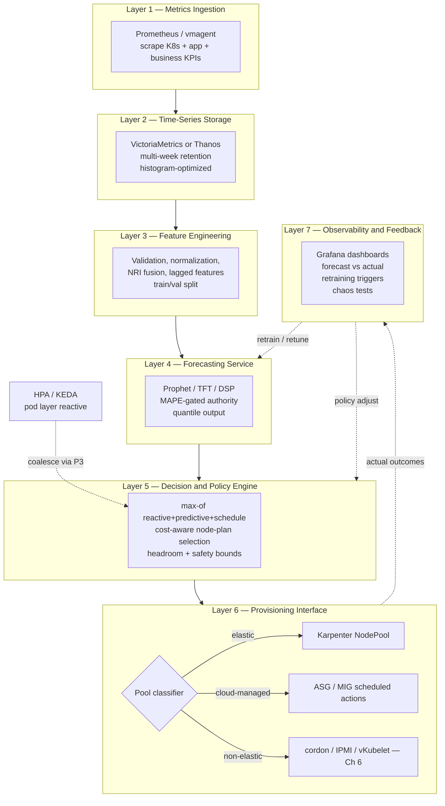

The horizontal arrows define the **forward data flow**: raw metrics → stored time series → engineered features → forecast → desired state → actual node count. The dashed back-arrows define the **feedback loop**: observed outcomes inform retraining and policy tuning. The lateral coupling to HPA/KEDA at the pod layer reflects principle P3's max-of reconciliation, which is implemented at Layer 5 and surfaced through KEDA `ScaledObject`[^46] coalescence or Crane EHPA dual-HPA generation[^45].

**Inter-layer data contracts.** The blueprint is only as useful as its interfaces. Each adjacent layer pair is governed by a contract whose stability allows independent evolution:

| Boundary | Contract | Stability Requirement |
|---|---|---|
| L1 → L2 | Prometheus remote-write protocol or scrape-pull | Stable across vmagent/vminsert versions[^46] |
| L2 → L3 | PromQL or MetricsQL query API | Stable; queries are versioned with feature definitions |
| L3 → L4 | Versioned feature vectors with timestamp + schema | Versioned alongside model registry |
| L4 → L5 | Forecast point + confidence interval + MAPE + freshness timestamp | Versioned schema; consumers must check freshness |
| L5 → L6 | Desired node count per pool + policy reason annotation | Idempotent; safe to re-issue |
| L6 → L7 | Actual node-count timeline + actuation-failure events | Append-only event log |

This explicit-contract discipline directly enables principle P6: any layer can be swapped for an alternative implementation as long as the contract holds. Replacing Prophet with TFT, VictoriaMetrics with Thanos, or Karpenter with a custom IPMI controller becomes a localized change rather than a system-wide rewrite.

**Evaluation criteria for each subsequent section.** Each layer's design will be evaluated against the four §1.2 criteria—response latency (L), SLA compliance (S), cost efficiency (C), operational stability (O)—plus three architectural meta-criteria specific to a reference architecture: **interface stability** (does the layer expose a contract that downstream layers can rely on?), **failure-mode explicitness** (is degraded behavior defined?), and **incremental adoptability** (can the layer be deployed in observe-only mode first?). The §5.9 synthesis returns to this scorecard.

## 5.2 Metrics Collection and Time-Series Storage Layer

Chapter 3 established that a predictive scaler is no better than its data plumbing, and that the surveyed implementations universally rely on Prometheus or an equivalent time-series database as the metric source. The reference architecture's Layer 1–2 pair must therefore satisfy three operational requirements that single-node Prometheus alone cannot reliably meet at the scale where predictive autoscaling becomes valuable: **multi-week retention** (Prophet typically wants several seasons of history; GCP Predictive Autoscaling consumes "up to 3 weeks of MIG load history"; AWS Predictive Scaling looks back 14 days), **fast query performance on histogram and long-range workloads** (forecasting services issue PromQL queries spanning hours to days at retraining time), and **horizontal scalability** to absorb the metric cardinality of a multi-cluster, multi-tenant fleet.

**Two backend options: VictoriaMetrics and Thanos.** Chapter 4's tooling survey did not centrally evaluate the storage layer; this section closes that gap by drawing on the dedicated VictoriaMetrics and Thanos materials.

The **VictoriaMetrics (VM) approach** introduces VM as a "storage and query backend behind Prometheus", in which "Prometheus keeps doing what it is good at (scraping and alerting), while VM takes over the heavy lifting for storing and querying large amounts of data"[^47]. Architecturally, "Prometheus stays as it is: same scrape configuration, same rules and alerts, same integration pattern for new services"[^47]; VM is added as an additional component, and Grafana is pointed to VM for most dashboards. The reported performance envelope is meaningful for predictive workloads:

- "Histogram/quantile queries (6h window): typically 5×–20× faster"[^47]
- "Long‑range dashboards (24h–7d): 10×–30× faster"[^47]
- "2×–4× lower disk usage for the same data"[^47]
- "Retention cost decreases proportionally, making 30–180 days feasible"[^47]

The VM cluster decomposes into three components with focused responsibilities: `vminsert` "acts as the write entrypoint for VM" using "consistent hashing on metric names and labels to shard data across vmstorage nodes", with the property that "if a vmstorage node becomes unavailable, vminsert reroutes the data to healthy nodes"[^46]; `vmstorage` "saves data to disk using a highly optimized format" and "switches to read-only mode" when disk space becomes critically low to "prevent data corruption while still allowing queries to be served"[^46]; `vmselect` "acts as the frontend for all read operations, handling client queries and coordinating with vmstorage nodes to retrieve and process data"[^46], merging results across nodes and applying aggregation. A complementary `vmagent` can operate as a metrics-collection agent that scrapes Prometheus-compatible targets directly and "stores the metrics on disk and sends them later when the connection is back"[^46] if remote storage becomes unavailable—a property valuable for hybrid clusters with transient connectivity.

The **Thanos approach** offers a different decomposition, integrating sidecars with each Prometheus instance. The architecture's primary components include: the **Thanos Sidecar** which "works hand in hand with each Prometheus instance" and "collects data blocks from Prometheus and stores them in an object storage or distributed database"[^45]; the **Thanos Query** component which "facilitates querying across data stored in various Prometheus instances and the object storage" and "serves as a central endpoint, gathering query results from different sources and providing a global view of the data"[^45]; the **Thanos Store Gateway** which "implements the Store API on top of historical data in an object storage bucket" and "acts primarily as an API gateway", with "an average of 6 MB of local disk space required per TSDB block stored in the object storage bucket"[^48]; and the **Thanos Compactor** for downsampling, deduplication, and compaction. A defining feature is that "the Querier component of Thanos is designed to be stateless and horizontally scalable, allowing for deployment with multiple replicas"[^45], which "automatically identifies the relevant Prometheus servers to contact for a given PromQL query"[^45].

**Choosing between VM and Thanos.** The VM rollout guide recommends VM "when query performance is becoming an issue (slow, timing out, or spiky), you rely on histograms and quantiles across several hours or days, the number of services, environments, or tenants is growing, Prometheus instances are becoming large and resource‑hungry, you want longer retention (weeks/months) without hurting Prometheus, [or] you heavily depend on Prometheus Operator, ServiceMonitors, and existing open‑source charts"[^47]. Thanos remains the natural choice when the team already operates object storage at scale (S3, GCS, Azure Blob), values the global-query view across many Prometheus instances, or needs long-term archival to cheap object stores. The VM cluster is described as offering "predictable scaling and long‑term retention" with "scaling [that] is linear and predictable, unlike Prometheus"[^47], while Thanos's strength is its native object-storage integration via the Store Gateway pattern.

For the reference architecture's Layer 2, **either backend is suitable**, and the decision should be driven by existing organizational investments rather than by predictive-autoscaling-specific requirements. The forecasting service in Layer 4 sees the same PromQL/MetricsQL interface in either case. The cost calibration the VM material provides is, however, instructive for Layer 2 sizing: in a 100k-series environment, "Prometheus alone: requires large instance → ~$120–$180/mo; VM single-node: 4 vCPU / 8–16GB RAM → ~$40–$80/mo"; for 1M+ series, "VM cluster recommended: 2× vminsert, 3× vmstorage, 2× vmselect; Total: ~$250–$380/mo"[^47].

**Sampling cadence selection.** Chapter 3 established that cadence must be matched to the prediction horizon and demand dynamics. The reference architecture recommends a **two-cadence strategy**:

- **Per-second or per-15-second sampling** for fast-moving metrics that drive immediate reactive decisions (CPU, memory, request rate at the proxy/ingress).
- **Per-minute aggregations** stored at longer retention for forecasting (matching the Vultr Prophet model's 60 per-minute predictions over a one-hour horizon, and Crane EHPA's `sampleInterval: "60s"` with `historyLength: "3d"`[^45]).

VictoriaMetrics' optimized storage allows "30–180 days feasible"[^47] retention at sub-minute cadence without the disk-IOPS pressure that single-node Prometheus would experience, removing cadence-vs-retention trade-offs that historically forced operators to choose between accuracy and history depth.

**Label hygiene and high-cardinality handling.** A predictive system fails silently if metric labels explode in cardinality—e.g., per-request-id labels accidentally introduced into application metrics. VictoriaMetrics is reported to support "efficient work with high‑cardinality metrics" with "stable performance even when the dataset grows"[^47], but the architectural discipline is independent: Layer 1's scrape configuration must enforce label allow-lists, drop high-cardinality dimensions at ingestion via `vmagent` relabeling rules ("relabeling system, it can add, change, or remove labels from metrics. This helps clean up the data, organize metadata, filter out unwanted metrics"[^46]), and reserve high-cardinality dimensions for trace-level systems rather than forecasting inputs.

**Remote-write topology for hybrid clusters.** For hybrid environments combining cloud and on-premises clusters, the recommended topology is **`vmagent` per cluster with remote-write to a central VM cluster** (or Prometheus + Thanos sidecar with shared object storage). This pattern preserves local scraping (each cluster's metrics survive central-storage outages) while centralizing forecasting and decision-making. The VM rollout's phase 2 step—"Prometheus is configured to send a copy of all metrics to vminsert. No changes are made to scrape configs, rules, or existing targets. During this phase, Prometheus and VM both hold a copy of the data"[^47]—is the canonical low-risk migration path: run dual storage during cutover, validate, then reduce Prometheus retention.

**Storage interface contract.** Layer 2 exposes a stable PromQL/MetricsQL query endpoint whose contract Layer 3 (feature engineering) consumes. The contract specifies: query latency SLO (e.g., p95 < 2s for queries spanning ≤7 days), retention guarantee (≥4 weeks for forecasting features), histogram support (`histogram_quantile`[^47] queries are first-class), and HA semantics (a "single-node VictoriaMetrics setup can also achieve high availability—similar to the cluster version—by running two identically configured VictoriaMetrics instances in separate data centers"[^46]).

**Layer scoring.** Against the §1.2 criteria: L **Strong** (sub-second query latency on optimized storage), S **Strong** (storage availability decoupled from forecasting accuracy), C **Strong** (VM's "2×–4× lower disk usage"[^47] reduces retention cost proportionally), O **Strong** (read-only mode under disk pressure prevents corruption[^46]). Interface stability **Strong**, failure-mode explicitness **Strong**, incremental adoptability **Strong** (the VM rollout pattern is explicitly designed for "low risk: Prometheus stays in place, making the change reversible if needed"[^47]).

## 5.3 Feature Engineering and Multivariate Signal Fusion

Layer 3 sits between raw time-series storage and the forecasting service, converting metric streams into model-ready inputs. Its responsibility is broader than naïve "feature extraction": it must **validate**, **normalize**, **fuse**, **decompose**, and **version** features, with explicit contracts for both the upstream storage and downstream model. Chapter 3 examined each of these operations individually; this section composes them into a coherent layer specification.

**Input validation and outlier handling.** The Vultr team's NestJS adapter, which "performs explicit validation and cleaning before storage" because "sometimes Prometheus gave us invalid data, like the CPU metric being zero or null. This could potentially mess up predictions from Prophet" — is the canonical input-side guard rail. Operationally, Layer 3 implements a validation pipeline whose stages include: (i) **schema validation** (expected metric names and labels are present), (ii) **range validation** (CPU utilization between 0 and 100, request rate non-negative, latency within plausible bounds), (iii) **freshness validation** (no stale data older than the cadence interval), and (iv) **outlier detection** (z-score or IQR-based filtering for spikes attributable to scrape failures rather than real demand). Invalid samples are *imputed* (forward-fill, interpolation) for short gaps and *flagged* for longer gaps, with the flag propagating to Layer 4 so the forecaster can widen its confidence interval or fall back.

**Normalization and timestamp standardization.** TFT-DVPA "standardizes timestamps to a one-second frequency, converts the data into a TimeSeries object using the Darts library, and normalizes via a Scaler transformer to ensure stable TFT training". The reference architecture preserves this discipline: irregular intervals are resampled to a regular grid (the chosen cadence from §5.2), and per-metric normalization (z-score for ML methods, min-max for neural methods) is applied with parameters fit on the training partition only and frozen for inference.

**Multivariate fusion via the Node Demand Index (NRI).** Chapter 3.6 identified three fusion patterns: the Vultr NRI (upstream fusion), Crane EHPA's dual-HPA max-of policy (downstream fusion), and TFT's static-plus-dynamic feature integration (in-model fusion). The reference architecture **defaults to upstream fusion** because it simplifies Layer 4 (a single forecasting series) and Layer 5 (a single desired-state output), reserving downstream max-of as a Layer-5 safety net. The NRI construction follows the §3.6 formalization:

$$\text{NRI}_t = \sum_{i=1}^{k} w_i \cdot \tilde{x}_{i,t}$$

with weights $w_i$ tuned to reflect the request-volume-driven framing of the user's brief. A practical NRI for a request-volume-driven service combines: instantaneous QPS, queue depth, p95 latency, CPU utilization, memory utilization, and a business KPI such as orders-per-second or active sessions. Saturation indicators (latency, utilization) receive higher weight under stress; leading business indicators (QPS, queue arrivals) receive higher weight in steady state. Weights are themselves versioned alongside the model.

**Business-KPI integration.** The user's brief explicitly emphasizes business request volume rather than infrastructure metrics. Layer 3 must accept business-domain time series as first-class inputs: orders per second from the application, active sessions from a session store, queue arrivals from Kafka/RabbitMQ exposed via KEDA scalers[^46], or external events (marketing-calendar flags, promotion start/end times) via webhook ingestion. These signals frequently *lead* infrastructure metrics by seconds to minutes, exactly the lead time predictive scaling needs to convert into provisioning headroom.

**Feature decomposition for seasonality.** Prophet performs internal decomposition, but Layer 3 can pre-engineer features that improve any model's accuracy: hour-of-day, day-of-week, day-of-month, holiday indicators, deployment-event flags, weekend/weekday indicators, and time-since-last-event for bursty workloads. The Kedify article notes Prophet "can be decomposed into seasonal and trend components (weekly, monthly, or custom) allowing visual inspection of whether the detected patterns make sense"; pre-computing these features explicitly externalizes them so that they can be inspected, modified, or replaced when business calendars change.

**Train/validation split conventions.** Chapter 3.1 established two recurring conventions: TFT-DVPA's 80/20 temporal split with normalization to "preserve sequential patterns", and Kedify's 90/10 split evaluated by MAPE. Both are temporal—the validation set is the most recent slice rather than a random sample—because random splits leak future information into training. The reference architecture defaults to **80/20 temporal split** for initial bootstrapping and switches to **90/10** once historical depth exceeds approximately one quarter of seasonal data, maximizing learnable signal once validation reliability is sufficient.

**Feature store interface.** Layer 3 publishes a versioned feature-vector schema that Layer 4 consumes. The schema includes: the NRI scalar, the underlying constituent metrics for diagnostic transparency, calendar features, normalization parameters (so inference can apply the same scaling), and a version tag. The store itself can be a lightweight Postgres or Redis instance (matching the Vultr architecture's Postgres time-series store) or a feature-store platform (Feast, Tecton) for larger deployments; the contract matters more than the implementation.

**Log-driven feature extraction for environments without rich Prometheus instrumentation.** Some on-premises and regulated environments lack the rich instrumentation that PromQL queries assume. The LSTM-on-logs pattern documented in the on-premises Brazilian-public-institution case study is directly relevant: "system logs serve as the primary knowledge source for analysis and scaling decisions … the Monitor module continuously collects service quality metrics, such as the average HTTP response time, which is computed by processing access logs"[^49]. The case study's solution "requires no changes to the software system, only access to its existing logs"[^49], maintains "a sliding window of the most recent 48 observations (each 10 minutes apart)" in the Analyze module, and reports that the "LSTM-based predictor outperformed simpler statistical methods (e.g., ARIMA – AutoRegressive Integrated Moving Average and ETS – Exponential Smoothing State Space) in our study, giving accurate multi-step forecasts (around 20% mean absolute error)"[^49]. The system was reported to reduce "aggregate resource usage by an average of 37.9%"[^49] versus a statically provisioned baseline while anticipating "62.5% of peak-demand events in live-operation tests"[^49]. For the user's potentially hybrid or on-premises scenario, log-driven feature extraction is therefore a credible Layer-3 augmentation when Prometheus instrumentation is absent or incomplete; the case study explicitly notes that "the design is platform-agnostic – though validated on Docker Swarm, it seamlessly extends to Kubernetes or other container orchestrators"[^49].

**Versioning and replay.** A defining property of a reference architecture (versus an ad-hoc pipeline) is that features are *replayable*: given a historical timestamp, the system can regenerate the feature vector exactly as it appeared at training time. This requires that all feature-engineering code is versioned (git tag), normalization parameters are stored alongside model artifacts, and historical raw metrics are retained in Layer 2 for the full training window. Replay enables debugging ("why did the model recommend 12 nodes at 14:32?"), counterfactual analysis ("what would the model have recommended with feature set v3 instead of v2?"), and regression testing of new model versions.

**Layer scoring.** L **Strong** (validation and feature computation are O(seconds)), S **Strong** (validation prevents bad-data-induced SLA violations), C **Moderate** (the layer itself is cheap; its value is amortized through Layer 4 and Layer 5), O **Strong** (replay enables principled debugging). Interface stability **Strong** (feature schema versioned), failure-mode explicitness **Strong** (validation flags propagate), incremental adoptability **Strong** (deployable in shadow mode against existing reactive controllers).

## 5.4 Forecasting Service and Model Lifecycle Management

Layer 4 is the predictive heart of the architecture, and—per principle P1—it is *intentionally separated* from the actuation logic in Layer 5. This separation enables the lifecycle management practices that distinguish a maintainable predictive system from a fragile one-off model.

**Model selection per workload class.** Chapter 3.5's selection heuristic recommended **Prophet as the pragmatic default** for diurnal/weekly seasonal cluster-load workloads, with TFT/Informer for complex non-linear multivariate cases, DSP for strongly periodic loads, and classical methods (Holt-Winters, ARIMA) for stationary signals or limited historical depth. The reference architecture supports **per-workload-class model specialization**: the forecasting service exposes a model registry keyed by workload-class identifier (e.g., `web-frontend`, `batch-etl`, `gpu-inference`), with each class configured to a model that suits its characteristics. The Vultr ICC pattern—Prophet for the cluster-wide NRI—is the simplest variant; sophisticated deployments may train a Prophet model for predictable web traffic and a TFT for AI inference workloads where multivariate fusion matters.

**Retraining cadence and triggers.** Vultr retrained Prophet "every 15 minutes" against the previous week's data, achieving sub-9% MAPE; TFT-DVPA retrains on multi-epoch schedules; GCP Predictive Autoscaling "uses up to 3 weeks of your MIG's load history". The reference architecture supports three retraining triggers:

1. **Scheduled retraining** at a fixed cadence (15 minutes for Prophet on commodity CPUs, hourly for tree-based ensembles, daily for TFT with GPU).
2. **Drift-triggered retraining** when the rolling MAPE on recent observations exceeds a threshold for a sustained window (e.g., 1-hour rolling MAPE > 2× baseline for 30 minutes).
3. **Event-triggered retraining** on known regime changes (deployment events, business-calendar transitions, major incidents). External events are surfaced via webhook to the forecasting service.

**MAPE-gated authority and confidence-interval propagation.** Principle P2 is operationalized in Layer 4 via two mechanisms drawn from Kedify's productized pattern. First, every model carries a `modelMapeThreshold` parameter: when the validation-set MAPE exceeds the threshold, the service "automatically returns a default value (also defined in the trigger) instead of an unreliable prediction". Second, every forecast is published with **both a point estimate and a confidence interval**, so downstream policy can scale to the upper quantile when uncertainty is informative. TFT-DVPA's choice of the 90th-percentile quantile for memory forecasts is the canonical example: "predicts memory demands based on … probabilistic forecasting (90th percentile quantile estimation) to predict and preemptively adjust memory allocation". The reference architecture publishes forecasts as triples `(point, lower_bound, upper_bound)`, allowing Layer 5 to choose a per-pool quantile policy.

**Forecast publication interfaces.** Layer 4 publishes forecasts through one or more of three transport patterns:

| Transport | Use Case | Source Pattern |
|---|---|---|
| **Redis cache** | Low-latency consumption by a custom controller | TFT-DVPA stored predictions in Redis for "fast access by a Go-based Kubernetes integration component using go-redis and client-go" |
| **Custom-metrics API (KEDA `external` scaler or Kubernetes external metrics adapter)** | Direct consumption by KEDA `ScaledObject`[^46] or HPA | KEDA Prometheus scaler pattern[^46] |
| **MetricPredictor CRD (Kedify-compatible)** | Declarative configuration; KEDA-native integration | Kedify productized layer |

The reference architecture defaults to the **custom-metrics API + Redis cache** pair: the custom-metrics API exposes forecasts as scalable Kubernetes-native metrics that KEDA `ScaledObject`s can directly reference (ensuring transparent HPA composition per principle P3), while the Redis cache serves the Layer-5 decision controller for cost-aware policy decisions that go beyond replica counts. Where the deployment standardizes on KEDA, a MetricPredictor-style CRD is a clean abstraction.

**Shadow and preview deployment for new model versions.** Principle P6 manifests in Layer 4 via the model-version lifecycle. New model versions are deployed in three stages:

1. **Shadow mode.** The new model runs alongside the production model, receiving the same inputs and publishing forecasts to a separate metric stream. Operators compare forecasts and MAPE for days before promotion. This is the EHPA `Preview` analogue at the model layer[^45].
2. **Canary mode.** The new model gains authority over a subset of pools or workloads (e.g., dev/staging), with the production model retaining authority over critical paths.
3. **Full promotion.** Shadow validation passes thresholds (MAPE within acceptable bounds, no SLA regressions), and the new model becomes default.

Rollback is symmetric: any model can be demoted to shadow or removed without disturbing the active forecasting service.

**Multi-model ensembles.** A subtle architectural option is to combine multiple forecasting methods—e.g., Prophet for seasonality plus a Holt-Winters smoother for short-term smoothing—and aggregate their outputs. The Kedify article surveys "moving average and exponential smoothing, ARIMA, Facebook Prophet, LSTM neural networks, and Holt-Winters' method" and notes that "among them, Prophet stands out for its robustness", but does not preclude ensembling. The reference architecture supports ensembles via a meta-model layer that consumes constituent forecasts and emits a fused prediction; for first-generation deployments, however, a single well-tuned Prophet (or DSP) model is the recommended starting point per Chapter 3.5's heuristic.

**Graceful degradation under data, model, or actuator failure.** Layer 4's degraded-state behavior is precisely specified:

| Failure | Detection | Degraded Behavior |
|---|---|---|
| Stale input data | Layer 3 freshness flag | Widen confidence interval, eventually fall back to default |
| MAPE regression on validation set | Continuous validation harness | Return `highMapeDefaultReturnValue`, alert |
| Missing model artifact (load failure) | Service startup probe | Refuse to publish forecast; Layer 5 sees no signal and falls back to reactive |
| Long input gap (e.g., Prometheus outage) | Freshness timestamps | Maintain "plausible fit" but widen interval — Kedify "when data collection was interrupted for several hours, the Prophet model still maintained a plausible fit … the widening confidence interval signals increasing uncertainty" |

This last property—graceful uncertainty growth rather than catastrophic failure—is itself a usable signal that Layer 5 consumes via the confidence-interval triple.

**Layer scoring.** L **Strong** when horizon ≥ provisioning time (configurable), S **Strong** with MAPE gating and confidence-bounded outputs, C **Strong** on seasonal data, O **Conditional on safety-net configuration**. Interface stability **Strong** (versioned MetricPredictor-style schema), failure-mode explicitness **Strong**, incremental adoptability **Strong** (shadow → canary → full promotion lifecycle).

## 5.5 Decision and Policy Engine

Layer 5 is where forecast meets actuation, where principle P3 (max-of reconciliation) becomes a runtime computation, and where cost-aware policies translate "predicted demand" into "desired node count per pool". The Vultr Index Calculation Component is the canonical reference; this section composes its responsibilities with Crane EHPA's max-of policy[^45], headroom margins, scale-down protection, and per-pool routing into a unified decision engine.

**Inputs to the decision engine.** Layer 5 consumes four kinds of input streams:

- **Forecasted demand** (point + confidence interval) from Layer 4.
- **Schedule signals** from cron rules, KEDA Cron `ScaledObject`s[^46], or scheduled-action definitions.
- **Reactive demand** from current pod state, HPA recommendations, and KEDA event triggers.
- **Cluster state** including current node counts per pool, billing-cycle position per node (Vultr ICC pattern), pool capacity ceilings, and PDB/PriorityClass constraints.

**Max-of-reactive-and-predictive-and-schedule policy.** The reconciliation rule is:

$$N_{\text{desired}}^{(p)} = \max\bigl(N_{\text{reactive}}^{(p)},\ N_{\text{predictive}}^{(p)},\ N_{\text{schedule}}^{(p)}\bigr) + N_{\text{headroom}}^{(p)}$$

where the superscript $(p)$ indexes the node pool. This is the architectural realization of EHPA's automatic dual-HPA generation extended to three signal sources and applied at the node layer rather than the pod layer. Crane EHPA's documentation captures the principle: "when multiple elastic metric thresholds are configured, HPA will calculate the number of replicas for each metric separately and select the highest number of replicas as the final recommended result for elasticity"[^45]. Layer 5 implements the same logic but emits node counts rather than replica counts.

**Confidence-bound scaling.** Rather than scaling to the point estimate of the predictive forecast, the engine selects $N_{\text{predictive}}^{(p)}$ based on a per-pool confidence quantile. Latency-sensitive pools scale to the 90th-percentile upper bound (matching TFT-DVPA's quantile policy); cost-sensitive pools scale to the median; the choice is a per-pool policy parameter. When the confidence interval widens (Layer 4's signal of increasing uncertainty), the conservative quantile produces a larger $N_{\text{predictive}}$, automatically inflating capacity during high-uncertainty windows.

**Cost-aware node-plan selection (Vultr ICC pattern).** For pools with heterogeneous instance types or hourly billing, the desired node count is not the only decision: the engine must also choose *which* nodes to add and *which* to remove. The Vultr ICC uses "recursive search to pick the best combination of node plans, prioritizing removal of nodes whose hourly billing cycle is closest to expiry". The reference architecture generalizes this to a policy function:

$$\text{plan}^{(p)} = \arg\min_{\text{candidates}} \text{cost}(\text{candidates}) \quad \text{s.t.} \quad \text{capacity}(\text{candidates}) \geq N_{\text{desired}}^{(p)}$$

with cost incorporating per-instance-type pricing, billing-cycle position, and Spot-vs-on-demand availability. For Karpenter-managed pools, much of this optimization is delegated to Karpenter itself; for cloud-managed-node-group pools, the engine must select desired-count and instance-type explicitly.

**Headroom margins.** Chapter 2.6 introduced headroom pods as a sub-second latency mechanism; Layer 5 implements headroom as a *policy* rather than a *workload*. Three configurations are supported:

1. **Static headroom** — a fixed $N_{\text{headroom}}^{(p)}$ added to every desired-state computation. Simplest; matches Spot Ocean's per-VNG headroom model.
2. **Percentage headroom** — $N_{\text{headroom}}^{(p)} = \lceil \alpha \cdot N_{\text{desired}}^{(p)} \rceil$, scaling buffer with demand.
3. **Calculated elastic headroom** (ScaleOps pattern) — dynamically tuned based on observed VPA/scale-up activity and pool-specific provisioning latency.

The headroom is realized either as **placeholder pods** (Chapter 2.6's mechanism, requiring a low PriorityClass and a no-op image) or as **node-level over-provisioning** where Layer 6 simply runs $N_{\text{desired}} + N_{\text{headroom}}$ nodes at idle. The choice depends on actuator capability: elastic pools with fast actuators (Karpenter) can use placeholder pods cost-efficiently; non-elastic pools where pre-warmed capacity exists naturally benefit from node-level over-provisioning.

**Scale-down protection.** Cluster Autoscaler's 10-minute `scale-down-unneeded-time` was identified in Chapter 1 as too conservative for the user's prompt-trough-recovery requirement. Layer 5 replaces this with a configurable, multi-mode policy:

- **Hold-down window** — minimum time a node must be underutilized before being eligible for removal (e.g., 5 minutes for stateless workloads, 30 minutes for stateful).
- **Confidence-gated scale-down** — when forecast confidence intervals are wide, defer scale-down even if current utilization permits removal (Kedify's "widening confidence interval signals increasing uncertainty" pattern).
- **Forecast-look-ahead** — only scale down if the forecast for the next prediction horizon also supports lower capacity, preventing oscillation around troughs.
- **PDB and PriorityClass enforcement** — drains respect PodDisruptionBudgets and avoid evicting workloads whose anti-affinity rules cannot be satisfied elsewhere (CA's existing semantics, preserved here).

**Bounded blast radius.** Every pool has explicit `maxNodes` ceilings and per-decision-cycle deltas (e.g., "scale up by at most 50% per cycle" or "scale up by at most 20 nodes per cycle"). These bound the damage from prediction errors that wildly over-estimate demand. KEDA `maxReplicaCount` and Karpenter NodePool `limits` are the underlying primitives; Layer 5 enforces them across all signal sources before emitting desired state.

**Per-pool routing.** Once $N_{\text{desired}}^{(p)}$ is computed for each pool, Layer 5 routes the desired-state output to the appropriate Layer-6 actuator based on per-pool metadata. Pool metadata includes: `pool.class` (`elastic-cloud`, `cloud-managed-node-group`, `non-elastic-onprem`, `pre-warmed`, `virtual-kubelet-burst`), `pool.actuator` (the named Layer-6 implementation), `pool.latency-budget` (the worst-case provisioning time, used to set Layer-4 forecast horizon), and `pool.cost-priority` (whether this pool is preferred for fill-up or held in reserve).

The routing logic implements a *workload partitioning policy* — for example, fill the cheapest non-elastic on-premises pool first, spill over to elastic cloud pools when the on-premises cap is reached, and only burst to virtual-kubelet capacity for emergencies. This pattern is the architectural counterpart of OVHcloud's hybrid recommendation cited in §1.4 ("non-autoscaled monthly pools as a base for static workload combined with autoscaled hourly pools for dynamic workload"), now made dynamic through forecast-driven steering rather than static partitioning.

**Output contract to Layer 6.** Each desired-state emission is a tuple `(pool_id, desired_count, instance_plan, reason, idempotency_key)` where `reason` annotates which signal (predictive, schedule, reactive) drove the decision and `idempotency_key` allows Layer 6 to safely de-duplicate retries.

**Layer scoring.** L **Strong**, S **Strong** (max-of dominates each constituent), C **Strong** (cost-aware plan selection + headroom tuning), O **Strong** (scale-down protection prevents thrashing). Interface stability **Strong** (well-defined input/output schemas), failure-mode explicitness **Strong**, incremental adoptability **Strong** (engine can run with predictive signal disabled, falling back to schedule + reactive only).

## 5.6 Node Provisioning Interface and Pluggable Actuators

Layer 6 is the abstraction at which the architecture's most distinctive contribution lives: a **uniform actuator interface** with concrete implementations selected per pool class. This is the architectural answer to Chapter 4's structural verdict that no surveyed tool natively bridges elastic and non-elastic pools.

**The actuator interface.** Every actuator implements a small, stable contract:

```yaml
# Actuator interface (conceptual)
operations:
  describePool: returns current node count, capacity ceiling, healthy/unhealthy nodes
  scaleTo:      params: desired_count, instance_plan, reason, idempotency_key
                effect:  drives the underlying mechanism toward desired state
                returns: actuation_id, expected_ready_time
  cordonNode:   params: node_name, reason
  drainNode:    params: node_name, pdb_aware: true
  observeReady: returns events when nodes transition Ready/NotReady
guarantees:
  - idempotent: same idempotency_key produces same effect
  - asynchronous: scaleTo returns immediately; readiness observed via events
  - bounded: refuses requests exceeding pool ceiling
```

The contract is intentionally minimal so that any underlying mechanism—cloud API, BMC power-on, cordon/uncordon, virtual-kubelet—can satisfy it.

**Concrete actuator implementations for elastic pools.** Three production-ready actuators cover the elastic-pool universe:

1. **Karpenter NodePool actuator.** For AWS, AKS NAP, and the GCP Karpenter Provider preview, this actuator translates `scaleTo` into Karpenter NodePool capacity adjustments and lets Karpenter's own consolidation handle scale-down within the pool's limits. The Karpenter NodePool resource exposes `disruption.consolidationPolicy: WhenUnderutilized` and `disruption.consolidateAfter: Never`, giving the actuator fine-grained control over Karpenter's autonomy. This actuator inherits Karpenter's ~55-second provisioning and 800+ instance-type selection, providing the strongest latency and flexibility characteristics for elastic pools.
2. **Cloud-managed node-group actuator.** For AWS EKS managed node groups, AKS node pools, and GKE node pools, this actuator drives the underlying ASG/MIG/scale-set desired-count via cloud APIs. The latency floor is 3–4 minutes (Chapter 1) but the operational simplicity may favor this actuator for less-burst-sensitive workloads.
3. **Scheduled-actions actuator.** For pools where calendar-driven scaling is the primary mode, this actuator emits `aws_autoscaling_schedule`-style scheduled actions or equivalent GCP/Azure primitives. The earlier Terraform pattern (§3.7) handles idempotency: "We're using a static timestamp for the start_time value, so whilst this will work for our initial configuration it is ill-suited to continuous delivery … The second we try and run this again our timestamp will probably have passed". The recommended fix uses Terraform's `timestamp()` and `formatdate` to compute schedules dynamically.

**Reserved extension points for non-elastic pools.** Layer 6 reserves four named extension slots, each to be implemented in Chapter 6:

- **`cordon-uncordon-actuator`** — for fixed-capacity pools where the *count* of nodes does not change but their *participation* in scheduling does. The actuator cordons nodes during troughs (preventing new scheduling, allowing drain) and uncordons during peaks.
- **`hibernate-actuator`** — for pools where node OS-level start/stop is supported (AKS node pool start/stop Preview, VMSS scale-to-zero, OVHcloud-style pool resize). The AKS pattern from §3.7 is illustrative: "the VMs remain provisioned so they are faster to start than scaling up which requires new VMs to be provisioned".
- **`ipmi-bmc-actuator`** — for on-premises bare-metal pools where physical power management via IPMI/BMC interfaces is the only mechanism for cost recovery. Latency budgets here are minutes-to-tens-of-minutes; Layer 4's forecast horizon must be sized accordingly.
- **`virtual-kubelet-actuator`** — for bursting to serverless capacity (AWS Fargate, Azure Container Instances, GCP Cloud Run) when on-cluster capacity is exhausted. This actuator is a "tail" provisioner for emergencies and high-priority workloads rather than a primary actuator.

These four extension points are described abstractly here; Chapter 6 instantiates each one with concrete implementation patterns, latency analyses, and operational caveats.

**Pool-classification metadata as the routing key.** The actuator selection is driven by pool labels:

```yaml
# Example pool registry entry
pool_id: onprem-bare-metal-rack-3
class: non-elastic-onprem
actuator: ipmi-bmc-actuator
latency_budget: 15m
cost_priority: 1   # fill first
capacity:
  min_nodes: 4    # always-on minimum
  max_nodes: 24
ipmi:
  endpoint_template: "bmc-{node_name}.dc1.internal"
  credentials_secret: ipmi-creds
```

Layer 5's per-pool routing logic consults this registry to select the actuator and to inform Layer 4 of the appropriate forecast horizon (`latency_budget`).

**Per-pool latency budgets and forecast-horizon coupling.** A defining architectural property is that each pool's `latency_budget` is *propagated upstream* to Layer 4's forecast horizon. A bare-metal IPMI pool with a 15-minute boot time requires a 15+ minute forecast; a Karpenter pool with 55-second provisioning can use a much shorter horizon. Per-pool forecasting models can be tuned to match. When a single forecasting service serves multiple pools with different latency budgets, the engine emits forecasts at the *longest* horizon required and Layer 5 truncates per-pool views as needed.

**Idempotency, retry, and safety.** The actuator interface mandates idempotency to allow Layer 5 to safely retry on transient failures. Each `scaleTo` invocation carries an `idempotency_key`; actuators record completed keys for a retention window (e.g., 24 hours) and short-circuit duplicate requests. Failure-mode behavior includes refusing requests exceeding pool ceilings (returning a structured error to Layer 5, which falls back to the next pool in routing priority), reporting partial success when some nodes provision but others fail (allowing Layer 5 to decide whether to retry the residual), and emitting actuation-failure events to Layer 7's observability stream.

**Layer scoring.** L **Strong–Strongest** for elastic pools (Karpenter), **Conditional** for non-elastic (depends on Chapter 6 implementations), S **Strong**, C **Strong** (per-pool routing optimizes for cost-priority order), O **Strong**. Interface stability **Strongest** (the uniform interface is the architecture's central abstraction), failure-mode explicitness **Strong**, incremental adoptability **Strong** (start with Karpenter only; add non-elastic actuators as needed).

## 5.7 Coexistence with HPA, VPA, and Replacement of Cluster Autoscaler

The reference architecture is explicitly **node-layer** focused; pod-layer scaling remains the responsibility of HPA, VPA, and KEDA. Section §5.7 specifies the integration semantics that prevent the two layers from fighting each other and the migration paths from existing CA-based deployments.

**Layer separation as the default discipline.** Chapter 1 noted that HPA and VPA should not share metrics. The reference architecture generalizes this: **predictive control lives at the node layer; reactive control lives at the pod layer**. Operationally:

- **HPA** continues to drive pod replica counts based on CPU/memory or custom metrics. It is unmodified.
- **KEDA** continues to drive event-triggered pod scaling and scale-to-zero. It is unmodified.
- **VPA** continues to recommend or enforce pod resource requests, with the well-known caveat that it must not share metrics with HPA.
- **Layer 5** (decision engine) reads from but does not modify the pod layer's outputs; it only observes total pod demand and current scheduling state to inform node-count decisions.
- **Layer 6** (actuators) provisions the nodes onto which pods schedule.

This separation ensures that the pod layer's reactive logic—still essential for unforeseen demand—operates without competition from the predictive node layer.

**Shared-dimension cases and KEDA `ScaledObject` coalescence.** Some workloads benefit from predictive signals at the *pod* layer too (e.g., "scale pods to 50 replicas at 09:00 because we forecast a peak"). For these, the reference architecture defers to KEDA `ScaledObject`[^46] coalescence: a single `ScaledObject` carries multiple triggers (a Prometheus metric for reactive, a KEDA Cron trigger for schedule, a custom-metrics endpoint backed by Layer 4 for predictive), and KEDA's underlying HPA aggregates them via `max(metrics)`. Crane EHPA's automatic dual-HPA generation[^45] is the equivalent pattern when EHPA replaces vanilla HPA. In both cases, the predictive signal is *added to* the pod layer rather than fighting with it.

**Avoiding HPA/VPA metric conflicts.** The standard guidance (HPA on CPU, VPA on memory or vice versa, or VPA in `recommendation-only` mode) is preserved. Where Layer 4 forecasts a metric that HPA also consumes (e.g., CPU utilization), the architecture requires single-owner semantics: either HPA owns the dimension reactively and Layer 4 forecasts a *different* aggregate (NRI), or Layer 5 emits node-count decisions that drive Layer 6 directly without round-tripping through pod-layer HPA. The principle is that no two controllers act on the same numerical dimension without an explicit aggregation rule.

**Migration from Cluster Autoscaler.** The reference architecture explicitly *replaces* CA in most production deployments, but the migration is staged rather than abrupt. Three paths are supported:

1. **CA → Karpenter + predictive layer.** The most common migration: Karpenter replaces CA as the elastic-pool actuator, and the predictive layer is added on top. Salesforce's migration of "more than 1,000 EKS clusters from Cluster Autoscaler to Karpenter in 2025" is the largest documented precedent (Chapter 1). The predictive layer can be deployed in shadow mode (EHPA `Preview`[^45] or AWS `ForecastOnly`) for weeks before gaining authority.
2. **Hybrid CA-managed and new-architecture-managed pools.** During migration, some pools remain under CA (e.g., a stable monitoring node pool) while new request-volume-driven pools are managed by the new architecture. The pool-classification metadata in Layer 6 explicitly supports this: pools with `actuator: cluster-autoscaler-legacy` continue to be managed by CA, and Layer 5's routing logic excludes them from predictive decisions.
3. **Full replacement on greenfield clusters.** New clusters skip CA entirely and adopt the reference architecture from day one.

**Operational sequencing of replacement.** The recommended sequence for a CA-to-architecture migration is:

```mermaid
flowchart LR
  P0[Phase 0:<br/>Baseline observability<br/>capture CA metrics, SLAs, costs] --> P1[Phase 1:<br/>Deploy Layers 1-2<br/>VictoriaMetrics or Thanos<br/>multi-week retention]
  P1 --> P2[Phase 2:<br/>Deploy Layer 3-4 in shadow<br/>features and forecasts published<br/>but not consumed]
  P2 --> P3[Phase 3:<br/>Deploy Layer 5 in Preview mode<br/>compute desired state<br/>but do not actuate]
  P3 --> P4[Phase 4:<br/>Replace CA with Karpenter<br/>Layer 5 still in Preview]
  P4 --> P5[Phase 5:<br/>Layer 5 to Auto on dev/staging<br/>shadow on production]
  P5 --> P6[Phase 6:<br/>Layer 5 to Auto on production<br/>per-pool gradually]
  P6 --> P7[Phase 7:<br/>Add non-elastic actuators<br/>per Chapter 6]
```

Each phase is reversible: rollback is achieved by reverting the most recent phase's changes without touching the prior phases.

**Dual-running validation.** During phases 3–5, the architecture runs in parallel with CA or with Karpenter alone, allowing operators to compare desired-state recommendations against actual outcomes. Key validation metrics include: forecast vs actual NRI deviation, predicted-vs-actual node count, prediction-driven SLA improvement (latency p95 during peaks), and cost trajectory. Only when validation thresholds are met does the architecture gain actuation authority.

**Rollback procedures.** Each layer has a defined rollback:

- **Layer 4 rollback** — switch back to a previous model version via the model registry; if all models fail, return the `highMapeDefaultReturnValue` (effectively no predictive signal).
- **Layer 5 rollback** — disable predictive signal weighting in the max-of policy; engine reverts to schedule + reactive only.
- **Layer 6 rollback** — revert to legacy CA actuator on the affected pools.

The architectural commitment is that **at no point during migration is the cluster left without a working autoscaler**: CA, Karpenter, or some combination always retains authority until the new architecture is proven.

**Layer scoring.** L **Strong**, S **Strong** (max-of preserves worst-case reactive behavior), C **Strong** (Salesforce's reported "approximately 5% cost savings in FY2026" from Chapter 1 is the precedent), O **Strong**. Interface stability **Strong** (HPA/KEDA contracts unchanged), failure-mode explicitness **Strong** (per-phase rollback), incremental adoptability **Strongest** (the seven-phase sequence is the entire point).

## 5.8 Observability, Feedback Loops, and Continuous Improvement

The architecture is incomplete without a learning layer. Layer 7 closes the feedback loop, ensuring that observed outcomes inform future model retraining and policy tuning, that operators can debug and audit decisions, and that the system itself is exercised under controlled stress conditions.

**Dashboards.** The reference architecture's Grafana stack (or equivalent) must surface five categories of dashboards, each constructed from the metrics already flowing through Layers 1–6:

| Dashboard | Purpose | Source Metrics |
|---|---|---|
| **Forecast vs Actual** | Show predicted NRI/QPS/etc. overlaid against observed values | Layer 4 forecast outputs + Layer 1 raw metrics |
| **MAPE Drift** | Rolling MAPE per model and per pool, alerting when threshold exceeded | Layer 4 validation harness |
| **Scaling-Action Audit Trail** | Every Layer 5 decision with its inputs (predictive, schedule, reactive), the chosen actuator, and outcome | Layer 5 reason annotations + Layer 6 events |
| **Cost-vs-SLA Pareto** | Cost (per node-hour) and SLA (latency p95, error rate) trends over time | Cloud billing + application metrics |
| **Provisioning Latency** | Time from `scaleTo` request to node Ready, per pool and actuator | Layer 6 events |

These dashboards directly support Chapter 8's evaluation methodology and are the baseline for the cost/SLA reporting that the user's brief implicitly requires.

**Alert policies.** Production-grade alerts include: model staleness (forecasting service has not retrained within 2× expected cadence), prediction-confidence collapse (confidence interval widening beyond a threshold for 30+ minutes, signaling regime change or input failure), actuator failure (`scaleTo` requests failing repeatedly), pool-ceiling exhaustion (desired count clamped to `maxNodes` for sustained periods, suggesting capacity pressure), and unexpected scale-down (more than X nodes removed within a short window).

**Feedback loops to Layers 4 and 5.** The observability data is not merely for human operators; it feeds back into the system's own learning:

- **Model retraining triggers** — sustained MAPE regression triggers a retraining run with recent data; if the retrained model also fails to meet thresholds, the model is demoted and the next model in the registry takes over.
- **Policy parameter tuning** — observed actuator latencies inform per-pool `latency_budget` adjustments; observed under- or over-provisioning informs headroom percentage tuning. The Vultr team's retrospective—"the LSTM-based predictor outperformed simpler statistical methods … giving accurate multi-step forecasts (around 20% mean absolute error)"[^49], with the resulting system reducing "aggregate resource usage by an average of 37.9%"[^49]—illustrates how feedback over weeks of operation is essential to realizing predicted gains.
- **Schedule refinement** — observed peaks that the schedule did not anticipate generate proposals to extend or add cron windows; observed troughs deeper than expected generate proposals to scale further down.

**Chaos and load testing.** Predictive systems are particularly vulnerable to silent regression: a model can degrade for weeks without being noticed if no traffic pattern stresses it. The reference architecture incorporates chaos and load-testing practices inspired by production resilience engineering.

Chapter 1's framing referenced Netflix's heritage of resilience engineering — Netflix's predictive system Scryer "dynamically scales up during prime"[^50], and the Netflix engineering culture treats failure as inevitable and engineers around it[^51]. The Educative analysis of Netflix's playbook articulates the principle: "Netflix doesn't scale blindly: it expects failure, and engineers around it"[^51], using both "proactive (autoscaling, redundancy) and reactive (load shedding, failover) strategies"[^51]. Specifically, Netflix uses "predictive scaling: Scale up the fleet of resources ahead of the load spike", "react quickly: Reduce the time to recovery during the scale-up process", and "stay available: Try to keep the system available as much as possible during the TTR"[^51].

For the reference architecture, four chaos/load practices apply:

1. **Synthetic load campaigns** — periodically generate traffic patterns that stress the predictive system (e.g., a step-function spike, a sustained ramp, a sudden trough), and verify that the architecture responds within the latency budget.
2. **Region failover drills** — Netflix "uses region failover as a normal practice to test how resilient their system is"[^51]; the architecture should exercise multi-region or multi-AZ failover regularly to verify that Layer 6 actuators correctly redistribute capacity.
3. **Buffer validation** — Netflix's success buffer / failure buffer concept[^51] is the operational parallel of the architecture's headroom margins. Periodic load tests should drive utilization into the success buffer to verify it absorbs the spike before the failure buffer (system collapse) is reached.
4. **Prediction-error injection** — deliberately publish faulty forecasts (e.g., 50% over- or under-estimates) and verify that the MAPE-gated authority correctly demotes the model and that the reactive safety net absorbs the demand.

The Netflix observation that "engineers tagged the services according to their business criticalities, defining the priorities in execution. They introduced prioritized CPU shedding (prioritized load shedding) in the success buffer to ensure the availability of business-critical services and APIs"[^51] is directly translatable to the reference architecture: PriorityClasses on placeholder/headroom pods and on real workloads ensure that under capacity pressure, business-critical services are preserved.

**Architectural review cadence.** Quarterly reviews assess: model performance trends, observed gain in cost/SLA, accumulated feedback-loop adjustments, and capacity-planning forecasts for the next quarter. Annual reviews evaluate strategic decisions: is the chosen forecasting model family still appropriate? Are pool classifications still correct? Should new actuator types be developed?

**Layer scoring.** L **N/A** (observability is not on the actuation hot path), S **Strong** (chaos testing and alerts catch SLA-threatening regressions early), C **Strong** (cost-vs-SLA Pareto enables informed cost decisions), O **Strongest** (feedback loops are the single largest contributor to long-term stability). Interface stability **Strong**, failure-mode explicitness **Strong** (alerts on every named failure mode), incremental adoptability **Strong** (start with dashboards, add chaos testing later).

## 5.9 End-to-End Reference Deployment Walkthrough and Component Selection

The seven layers can now be assembled into a concrete deployment recipe. This section provides two variants—a **minimum viable architecture (MVA)** for teams starting from scratch, and a **full-fidelity architecture (FFA)** for mature platform organizations—and scores each against the §1.2 evaluation criteria.

**Minimum Viable Architecture (MVA).** The MVA targets a team migrating from CA on a single elastic cloud (AWS, Azure, or GCP), with at least one workload exhibiting diurnal/weekly seasonality. Component selection:

| Layer | MVA Component | Rationale |
|---|---|---|
| L1 Metrics | Prometheus (existing) | Reuse existing instrumentation |
| L2 Storage | VictoriaMetrics single-node | "4 vCPU / 8–16GB RAM → ~$40–$80/mo"[^47]; sufficient for ≤100k series |
| L3 Features | Lightweight Python service computing NRI and calendar features | Vultr-style NestJS adapter analogue |
| L4 Forecasting | Prophet via Kedify MetricPredictor or Crane EHPA DSP | Off-the-shelf; minimal training infrastructure |
| L5 Decision | Crane EHPA's automatic dual-HPA generation[^45], or KEDA `ScaledObject`[^46] with multiple triggers | Avoid building custom controller |
| L6 Provisioning | Karpenter NodePool actuator only | Defer non-elastic complexity |
| L7 Observability | Grafana dashboards on existing stack | Reuse |

**MVA estimated effort:** 4–8 weeks for a 2–3-engineer team to deploy through Phase 5 of §5.7's sequence. Forecast accuracy targets: MAPE 5–15% on seasonal workloads (Vultr-comparable). Expected outcomes: response latency reduction from CA's 3–4 minutes to Karpenter's ~55 seconds plus prediction-driven pre-warming reducing pending-pod incidents on known peaks; cost savings broadly aligned with Salesforce's "approximately 5% cost savings in FY2026" precedent (Chapter 1).

**Full-Fidelity Architecture (FFA).** The FFA targets a multi-cloud or hybrid platform organization with non-elastic pools, GPU/AI workloads, and SLA-bound business-critical services. Component selection:

| Layer | FFA Component | Rationale |
|---|---|---|
| L1 Metrics | `vmagent`-per-cluster with remote-write[^46] + log-driven extractor[^49] for non-Prometheus environments | Hybrid coverage |
| L2 Storage | VictoriaMetrics cluster (`vminsert`/`vmstorage`/`vmselect`)[^46] or Thanos with object storage[^45][^48] | "Total: ~$250–$380/mo"[^47] for multi-cluster scale |
| L3 Features | Custom feature service with versioned schema, business-KPI integration, log-driven fallback | Full multi-source fusion |
| L4 Forecasting | Per-workload-class models: Prophet for web, TFT for AI/multivariate, DSP for periodic; multi-version model registry | Specialization |
| L5 Decision | Custom controller implementing max-of policy, cost-aware ICC pattern, per-pool routing | Beyond off-the-shelf capabilities |
| L6 Provisioning | Karpenter (elastic) + cordon/uncordon (cooperative non-elastic) + IPMI (bare-metal) + virtual-kubelet (burst) — all per Chapter 6 | Full non-elastic coverage |
| L7 Observability | Grafana + chaos engineering pipeline + quarterly review cadence | Production-grade learning loop |

**FFA estimated effort:** 6–12 months for a dedicated platform team of 4–8 engineers, including Chapter 6's non-elastic actuator implementations. Forecast accuracy targets: MAPE 5–10% on most workloads, with TFT-class accuracy on multivariate cases (potentially achieving the 90th-percentile quantile bounds that TFT-DVPA reports for memory). Expected outcomes: end-to-end response latency competitive with the strongest commercial platforms (sub-minute on elastic, minutes on bare-metal), SLA preservation comparable to Netflix-style hybrid proactive/reactive architectures[^51], cost savings in line with the upper end of vendor-cited ranges (15–30% bin-packing dividends, additional 5–10% from predictive reduction of peak over-provisioning), and operational stability sufficient for Tier-1 production workloads.

**Architecture-level scoring against §1.2 criteria.**

| Criterion | MVA Score | FFA Score | Justification |
|---|---|---|---|
| **Response latency (L)** | Strong | Strongest | MVA: Karpenter 55s + Prophet pre-warming on known peaks; FFA: same plus headroom pods + non-elastic pre-cordoning |
| **SLA compliance (S)** | Strong | Strongest | Both inherit max-of safety net; FFA adds prioritized load shedding and chaos-validated failure modes |
| **Cost efficiency (C)** | Moderate–Strong | Strongest | MVA: Karpenter consolidation; FFA: cost-aware ICC, cross-pool routing, billing-cycle-aware scale-down |
| **Operational stability (O)** | Strong | Strongest | Both include MAPE gating; FFA adds quarterly review and chaos engineering |
| Interface stability | Strong | Strongest | FFA's versioned schemas + model registry |
| Failure-mode explicitness | Strong | Strongest | FFA adds named non-elastic actuator failure modes |
| Incremental adoptability | Strong | Strong | FFA larger surface but the seven-phase rollout still applies |

**Residual gaps motivating Chapters 6–9.** Even the FFA leaves three gaps that the remaining chapters address:

1. **Non-elastic actuator implementations.** L6's reserved extension points (cordon/uncordon, hibernate, IPMI, virtual-kubelet) are specified abstractly here; their concrete implementations, latency analyses, and operational caveats are the subject of **Chapter 6**.
2. **Engineering discipline at component boundaries.** Resource requests, PDBs, PriorityClasses, scale-down protection windows, multi-AZ awareness, and gradual rollout strategies are referenced as constraints throughout this chapter but require their own consolidated treatment in **Chapter 7**.
3. **Quantitative evaluation methodology.** The architecture's claimed gains in latency, SLA, cost, and stability must be validated against an evidence base of academic studies, vendor benchmarks, and field deployments. **Chapter 8** consolidates these into a measurement framework, and **Chapter 9** translates the entire analysis into a phased implementation roadmap with explicit risk discussion.

**Closing synthesis.** The reference architecture introduced in this chapter is the *composition* of the surveyed components into a coherent end-to-end pipeline, not a new product. Its distinctive contributions over individual surveyed tools are: (i) the explicit seven-layer separation with versioned inter-layer contracts, (ii) the uniform actuator interface with reserved non-elastic extension points, (iii) the gated-authority-plus-max-of-reactive-and-predictive policy as the architectural realization of principles P2 and P3, and (iv) the seven-phase migration sequence that makes the architecture incrementally adoptable from any existing CA-based deployment. The MVA and FFA variants demonstrate that the same blueprint scales from a four-engineer-week deployment for greenfield single-cloud teams to a year-long platform investment for hybrid multi-cloud organizations. In both cases, the architecture's value is not that it eliminates the operational complexity of proactive autoscaling—Chapter 4 documented that no surveyed tool has done so—but that it *organizes* the complexity into known, contracted, and evolvable components, so that platform teams can build, debug, and operate it with the same engineering discipline they apply to any other production system.

# 6 Handling Non-Elastic and Hybrid Node Group Scenarios

Chapter 5 closed by reserving four named extension slots in the Layer 6 actuator interface—`cordon-uncordon-actuator`, `hibernate-actuator`, `ipmi-bmc-actuator`, and `virtual-kubelet-actuator`—and acknowledging that their concrete implementations were deferred to this chapter. That deferral was deliberate: the user's binding constraint that "the standard Cluster Autoscaler isn't suitable as it relies on pending pods and might not fit non-elastic node group scenarios" sits at the architectural seam where every surveyed tool in Chapter 4 was structurally mute. Karpenter presumes cloud-API VM creation; Cluster Autoscaler presumes Auto Scaling Group abstractions; Spot Ocean, ScaleOps, and CAST AI concentrate on elastic cloud-managed Kubernetes; AWS Predictive Scaling and GCP Predictive Autoscaling operate at IaaS layers that simply do not exist for bare-metal or fixed-inventory pools. The reference architecture's seven-layer blueprint can route forecasts and policy decisions, but until Layer 6 has actuators that understand non-elastic semantics, those decisions terminate without effect on the pools the user actually cares most about.

This chapter closes the structural gap by composing primitives surveyed across Chapters 1–5 into four concrete deployable patterns, plus a partitioning strategy that orchestrates them in hybrid environments. The chapter first formalizes what makes a pool non-elastic and refines the §1.2 evaluation criteria with non-elastic-specific sub-dimensions (§6.1). It then examines warm node pools and headroom capacity (§6.2), cordon/uncordon scheduled hibernation (§6.3), bare-metal power management via IPMI/iDRAC/iLO/Redfish (§6.4), and virtual kubelet bursting to serverless capacity (§6.5). §6.6 develops the workload partitioning policy that directs traffic between fixed and elastic pools, and §6.7 consolidates everything into a comparison matrix and a decision tree keyed on environment characteristics. Throughout, every pattern is traced to a concrete primitive surveyed earlier so that the chapter's contribution is a *composition* of existing components rather than the introduction of speculative new tooling.

## 6.1 Defining the Non-Elastic Problem Space and Evaluation Lens

Chapter 5's pool-classification metadata distinguished `elastic-cloud`, `cloud-managed-node-group`, `non-elastic-onprem`, `pre-warmed`, and `virtual-kubelet-burst` classes; this chapter focuses on the third and fifth, where elasticity-via-cloud-API is unavailable. To make the analysis precise, four sub-classes of non-elastic pool are distinguished, each with characteristic constraints that determine which actuator pattern applies.

The first sub-class is **on-premises bare-metal**. Pools in this class are physical servers in a data center or colocation facility, each typically equipped with a dedicated Baseboard Management Controller (BMC). The defining technical property is that the only mechanism for genuine cost recovery is *physical power-off*, because as long as the host is electrically active it draws power, accrues cooling load, consumes facility cost, and—in many environments—accumulates licensing charges per powered-on socket. Provisioning latency is dominated not by cloud-VM allocation (which does not exist) but by physical boot, BIOS POST, OS load, image pull, and kubelet registration. The Riddhi Gupta walkthrough of bare-metal provisioning illustrates the canonical lifecycle: a Bare Metal Operator "implements a Kubernetes API for managing bare metal hosts" through a `BareMetalHost` Custom Resource Definition that "knows how to inspect the host's hardware details and report them on the corresponding `BareMetalHost`", "provision hosts with a desired image", and "clean a host's disk contents before or after provisioning"; provisioning itself proceeds through Ironic stages of "registering, inspecting, and deploying" using PXE/iPXE boot environments, deployment ramdisks, and image-write phases.[^52] A Reddit operator's blunt summary captures the operational reality: "Gotta treat bare metal as cattle. Find a way to do a PXE/Redfish/IPMO deploy. Template your OS installs. Pipelines with Packer."[^53]

The second sub-class is **fixed-capacity reserved or monthly-billed cloud pools**. These are cloud nodes that *exist* in a public cloud but that the operator has explicitly chosen *not* to manage elastically—either because the cost model penalizes elasticity (monthly billing rather than hourly, where adding nodes mid-month forfeits prepaid capacity) or because reserved-instance commitments fix the inventory for budgeting reasons. OVHcloud's documentation cited in §1.4 explicitly cautions against enabling autoscaling on monthly-billed node pools and recommends a hybrid pattern of "non-autoscaled monthly pools as a base for static workload combined with autoscaled hourly pools for dynamic workload". Mechanically these nodes share many properties with bare metal—a fixed inventory, no API-driven instance creation within the prediction horizon—but the cost-recovery levers differ: power-off rarely produces cloud-billing savings on prepaid reserved capacity, so the operative levers are *consolidation* (reducing the number of *active* nodes via cordon and pod eviction so that workload bin-packs onto a smaller subset) and *node-pool stop* where the cloud provider supports it (AKS node-pool start/stop Preview, AWS warm pools, VMSS scale-to-zero, all surveyed in §3.7).

The third sub-class is **regulated and air-gapped environments**. These are clusters operating under sovereignty, compliance, or security mandates that prohibit external cloud-API calls, restrict serverless bursting, and require detailed audit traceability of every infrastructure operation. Pool capacity is pre-procured for compliance reasons, and many operations that would be routine in a cloud-managed environment (e.g., calling AWS Fargate to absorb a burst) are categorically forbidden. ScaleOps's positioning as "fully self-hosted and production-safe, with built-in support for GitOps workflows and air-gapped environments" (cited in §4.4) is a recognition that this sub-class is large enough to warrant first-class commercial support; for the actuator design, it means that the toolchain must be entirely local, every actuation must be auditable, and any pattern that requires external cloud APIs (e.g., virtual-kubelet to ACI/Fargate) is excluded by default.

The fourth sub-class is **pre-provisioned hybrid inventories**. These are environments that combine a fixed inventory of physical or reserved nodes with selective bursting to either elastic cloud pools or serverless capacity. The fixed inventory is sized to handle baseline demand; the elastic spillover absorbs unanticipated peaks. This sub-class is, in effect, the *target architecture* for many of the user's likely scenarios, because it preserves the cost predictability of fixed inventory while retaining the ability to handle traffic surprises.

**Refined evaluation criteria.** Chapter 1's four-dimensional framework (response latency, SLA compliance, cost efficiency, operational stability) remains the yardstick, but the non-elastic context introduces sub-dimensions that the elastic-cloud framing did not need to surface:

- **Power-management latency** — the time from a power-on signal (IPMI/Redfish call, AKS node-pool start, warm-pool activation) to a kubelet-registered Ready node. For bare-metal pools this is dominated by physical boot and OS load, ranging from minutes to tens of minutes; for AKS node-pool start "the VMs remain provisioned so they are faster to start than scaling up which requires new VMs to be provisioned"[^54] but still on the order of one to a few minutes; for warm-pool activation the latency can drop to seconds because OS init, user-data execution, and software configuration are completed ahead of time and instances merely transition to active service (Chapter 1).
- **Drain-and-cordon safety** — the operational guarantee that pods are gracefully evicted with respect to PodDisruptionBudgets, anti-affinity rules, and stateful-workload exemptions before a node is power-cycled or removed from scheduling. This sub-dimension matters more in non-elastic environments because the same physical hardware will host the same workloads again after re-activation, so disruptive eviction patterns accumulate operational debt rather than being absorbed by transient cloud-VM churn.
- **Hardware lifecycle impact** — the cumulative effect of power cycling on physical components (PSU stress, disk spin-up cycles, capacitor aging, memory-soft-error increase post-boot). Cloud VMs are abstract; physical servers age. Frequent power cycling for cost recovery on a 100-node bare-metal pool is materially different from frequent VM termination on a 100-node ASG, because the physical pool's hardware is depreciated against the cycle count.
- **Compliance and audit traceability** — every actuation in regulated environments must produce an auditable record (who/what initiated, against which node, at what time, with what authorization). Out-of-band management interfaces are particularly sensitive here, because BMCs "are so powerful, they're also a major security risk if left wide open" and "should never be exposed to the public internet,period".[^55] The actuator must therefore log against a tamper-evident trail and operate through credentialed paths that the audit pipeline can verify.
- **License-and-monthly-cost semantics** — for sub-class 2, scale-down via cordon does not produce billing savings on reserved capacity; the cost model determines which actuator levers are even useful.

**Mapping sub-classes to actuator patterns.** The four sub-classes do not map one-to-one to the four reserved actuator extension points; they map *jointly*, as the table below summarizes:

| Sub-class | Primary Actuator | Secondary Actuator | Tertiary (emergency) |
|---|---|---|---|
| On-premises bare-metal | `ipmi-bmc-actuator` (§6.4) | `cordon-uncordon-actuator` (§6.3) | None (air-gapped excludes virtual-kubelet) |
| Fixed-capacity reserved/monthly cloud | `hibernate-actuator` (§6.2) or `cordon-uncordon-actuator` (§6.3) | warm pools (§6.2) | `virtual-kubelet-actuator` (§6.5) if compliance allows |
| Regulated/air-gapped | `ipmi-bmc-actuator` with strict audit (§6.4) | `cordon-uncordon-actuator` (§6.3) | None (forbidden) |
| Pre-provisioned hybrid | partitioning (§6.6) directing to mixed actuators | warm pools / headroom (§6.2) | `virtual-kubelet-actuator` (§6.5) for true emergencies |

Three architectural commitments cut across all sub-classes. First, the **per-pool latency budget propagated to Layer 4** (§5.6) becomes the central design parameter: a 15-minute IPMI boot demands a 15+ minute forecast horizon, while a sub-second warm-pool activation can accommodate a much shorter horizon. Second, the **uniform actuator interface from §5.6**—`describePool`, `scaleTo`, `cordonNode`, `drainNode`, `observeReady`—is preserved unchanged; only its concrete implementations differ. Third, the **gated authority and max-of reconciliation principles (P2 and P3)** from §5.1 still govern: predictive forecasts that drive non-elastic actuators are MAPE-gated against fallback defaults, and reactive safety nets always coexist beneath the proactive layer.

The remainder of the chapter instantiates each actuator pattern in turn, then composes them into hybrid partitioning strategies, before consolidating the analysis into a selection matrix.

## 6.2 Warm Node Pools and Headroom Capacity Patterns

The simplest non-elastic strategy is to *not* attempt provisioning on demand at all: maintain a small, always-available reserve of pre-warmed capacity that absorbs peaks instantly while slower actuators (IPMI power-on, AKS node-pool start, even Karpenter on attached elastic pools) catch up in the background. This pattern is the architectural realization of Chapter 2.6's headroom-pods paradigm, but adapted explicitly for fixed-inventory environments where it is *intrinsically* compatible (Chapter 2.6 noted that headroom pods "work identically on elastic and non-elastic pools because they consume *existing* capacity rather than provisioning new capacity").

**Two complementary mechanisms.** The pattern is implemented through two layers, which can be deployed independently or in combination:

1. **Low-priority pause/balloon pods at the Kubernetes layer.** A small Deployment of placeholder pods runs the `pause` container (or any no-op image) with resource requests sized to match the burst buffer, configured with a low PriorityClass so that any real workload preempts them instantly. This is the Reintech "cluster overprovisioning" pattern, articulated as "running a small number of 'pause' pods can reduce costs by improving cluster autoscaler responsiveness. These low-priority pods get evicted when real workloads need resources, triggering faster scale-up. This prevents the cold-start delay when new pods need to be scheduled, reducing the time your application runs under-provisioned (which could cause you to over-provision everywhere else as a safety measure)".[^56] The Medium piece referenced in the search results states the value proposition succinctly: "A tiny pool of overprovision 'pause' pods (low priority, low CPU request) to keep nodes warm so sudden spikes don't cold-start your fleet."[^57]
2. **Infrastructure-layer warm pools where provider primitives exist.** AWS EC2 Auto Scaling warm pools, AKS node-pool start/stop where VMs remain provisioned, and on-premises pre-booted-but-cordoned hosts all maintain *infrastructure* in a near-ready state so that the Kubernetes layer's view of "ready nodes" expands rapidly when a peak arrives. Chapter 1 quantified the value: warm pools "complete OS initialization, user-data execution, and software configuration ahead of time and transition instances to active service without repeating the cold-start sequence". Olivier Gaumond's analysis of AKS specifically captured the trade-off: with the official node-pool stop feature, "the VMs remain provisioned so they are faster to start than scaling up which requires new VMs to be provisioned"[^54]—the explicit recognition that infrastructure-warm capacity is materially faster than cold provisioning.

The two layers are complementary. The Kubernetes-layer pause pods accelerate *pod scheduling* by making the scheduler see ready capacity; the infrastructure-layer warm pool accelerates *node availability* by removing the boot path. In a bare-metal environment without an AWS-style warm-pool primitive, the analogue is a subset of the fixed inventory that is always powered on (paying continuous power cost) and runs pause pods to reserve scheduling capacity for incoming workload preemption.

**Cost-versus-latency trade-off.** Warm pools and headroom pods convert provisioning latency into *continuous idle cost*. The size of the buffer determines the burst that can be absorbed instantly; oversize the buffer and idle cost dominates, undersize it and the buffer is exhausted before slower actuators catch up. The Reintech analysis frames the choice in business terms: warm capacity reduces the risk that the system "could cause you to over-provision everywhere else as a safety measure"[^56]—the alternative to a small targeted buffer is often a much larger blanket over-provisioning across the entire fleet, which is operationally worse.

For non-elastic environments specifically, three properties shift the trade-off in favor of headroom patterns relative to elastic environments:

- The *no-faster-actuator-exists* constraint. In an elastic cloud pool with Karpenter, a 55-second provisioning floor often makes headroom pods marginal. In a bare-metal pool with 15-minute IPMI boot, headroom pods covering even the first 60 seconds of a burst can be the difference between a transient incident and an SLA-violating outage.
- The *capacity-already-exists* property. The fixed inventory exists regardless of utilization (in sub-classes 1, 3, and 4); reserving a fraction of it as headroom does not increase the total node count, it merely allocates it differently.
- The *no-billing-cycle-flexibility* property in monthly/reserved cloud pools (sub-class 2). Because the reserved capacity is paid for whether or not it carries workload, dedicating a fraction of it to headroom is a free architectural lever.

**Sizing methodology.** Three configuration parameters dominate sizing: the PriorityClass value (must be lower than any real workload class), the per-placeholder-pod resource request (which determines how much instantaneous capacity each placeholder reserves), and the replica count of the placeholder Deployment. Multiplied together, the latter two define total reservable headroom. Sizing is most cleanly derived from the *worst-case burst over the slowest actuator's latency*: if the slowest non-elastic actuator (IPMI) takes 15 minutes to deliver a node and the worst-case 15-minute burst increment from the forecasting layer is 8 nodes, the headroom buffer should be sized to absorb 8 nodes' worth of load during that 15-minute window. Confidence-interval bounds from Layer 4 (§5.4) provide a principled basis for the "worst-case" estimate—scaling the buffer to the upper quantile of forecasted bursts rather than the point estimate.

**PriorityClass design.** The placeholder pods must be preemptable by any real workload but not by other placeholders. A canonical PriorityClass scheme establishes (from highest to lowest): system-critical (kube-system DaemonSets), business-critical (latency-sensitive customer paths), business-default, batch/best-effort, and finally **placeholder/headroom** at the lowest non-negative priority. Real pods then preempt placeholders automatically through standard Kubernetes preemption semantics, and the freed capacity is consumed instantly. Simultaneously, the preempted placeholders become pending pods, which—via Karpenter, the cordon/uncordon controller, or the IPMI controller—triggers slower actuators to provision replacement nodes. The user-visible cold start has been *paid in advance* rather than synchronously experienced.

PodDisruptionBudgets on the placeholder Deployment are unnecessary and counter-productive: eviction *is* the intended behavior. Real workloads, by contrast, should carry strict PDBs so that scale-down paths do not preempt real capacity. This asymmetry—placeholders without PDBs, real workloads with PDBs—is a signature configuration of the headroom pattern.

**Integration with Layer 5 max-of policy.** A subtle anti-pattern is for the predictive layer to forecast a peak, scale up via the slow actuator, *and* the headroom buffer to be preempted *and* the policy to add headroom on top of the predicted node count, resulting in double-provisioning. The reference architecture's max-of-reactive-and-predictive-and-schedule policy, augmented with headroom (§5.5), avoids this:

$$N_{\text{desired}}^{(p)} = \max(N_{\text{reactive}}, N_{\text{predictive}}, N_{\text{schedule}}) + N_{\text{headroom}}^{(p)}$$

The headroom term is applied *after* the max, so the predictive scale-up provisions the *forecasted* capacity and the buffer remains a constant overlay. When real workloads preempt placeholders, the resulting pending placeholder pods do not re-trigger predictive scale-up because Layer 5 distinguishes placeholder pending pods (which it interprets as "headroom consumed, restore buffer") from real pending pods (which it interprets as "predictive forecast under-estimated, react").

**Layer-6 actuator binding.** In the Layer 6 contract, the warm-pool/headroom mechanism is implemented either as a `hibernate-actuator` (when underlying primitives like AKS node-pool start are available) or as a static configuration overlay rather than an actuator at all (when the buffer is purely Kubernetes-layer pause pods on already-running nodes). The latter case is operationally appealing for non-elastic environments precisely because it requires *no infrastructure-layer integration*: the buffer is created by deploying a Deployment, sized via a replica count, and tuned via a PriorityClass, all entirely within Kubernetes-native primitives.

**Scoring against §1.2 and §6.1 criteria.** Latency: **Strongest** for first-burst absorption (sub-second pod scheduling onto pre-warmed capacity). SLA: **Strong**. Cost: **Weak** in steady state (continuous idle cost is the explicit trade), **Moderate** when capacity already exists in fixed inventory and is merely reallocated. Stability: **Strong** (deterministic behavior, no oscillation). Power-management latency: **N/A** (no power transitions). Drain-and-cordon safety: **N/A** (placeholders are designed to be evicted). Hardware lifecycle impact: **Strong** (no power cycling). Compliance: **Strong** (entirely Kubernetes-native, no out-of-band channels). The pattern's principal limitation is its inability to recover cost during sustained troughs: idle headroom continues to cost regardless of whether it is being used, which motivates its combination with the cordon/uncordon and IPMI patterns examined next.

## 6.3 Cordon/Uncordon Scheduled Hibernation for Fixed-Inventory Pools

Where headroom patterns reserve capacity, cordon/uncordon patterns *toggle scheduling participation* of existing nodes. The mechanism is straightforward: during forecasted troughs, a controller cordons nodes (Kubernetes annotates them as unschedulable) and drains the resident pods, allowing workloads to consolidate onto a smaller active subset. Before forecasted peaks, the controller uncordons nodes, restoring full capacity. The pattern is the Layer-6 `cordon-uncordon-actuator` instantiation.

**Mechanics of the controller.** The controller watches a CRD (analogous to Devtron's Winter Soldier `Hibernator` CRD examined in §2.2 and §3.7, but operating on nodes rather than workloads) that specifies cordon/uncordon schedules per node label or per pool, plus drain semantics. The reconciliation loop, on each tick:

1. Reads the current schedule and forecasted demand from Layer 5.
2. Determines the target *active node count* per pool.
3. If the current active count exceeds the target, selects nodes for cordon (preferring those with the fewest stateful pods, the lowest priority workloads, or the most recently-uncordoned nodes for fairness).
4. Cordons each selected node via the Kubernetes API (`kubectl cordon` equivalent), then drains it respecting PDBs and using `kubectl drain --ignore-daemonsets --delete-emptydir-data` semantics.
5. If the current active count is below the target, uncordons nodes in the inverse order. No drain is needed; uncordoning simply makes the node schedulable again, and the scheduler bin-packs new pods onto it as workload arrives.

The Linux Foundation/Devtron Winter Soldier walkthrough cited in §2.2 demonstrates a workload-layer analogue that translates directly: "for batch processes, resource optimization, hibernating microservices, or for specific use cases which has predictable patterns" the operator hibernates resources on schedule; the node-layer adaptation hibernates *scheduling participation* rather than the resources themselves. The Karpenter Downscaler community proposal (kubernetes-sigs/karpenter Issue #1800, §3.7) is the closest published artifact: "Karpenter Downscaler operates as a controller with a CRD. Based on the schedules we set, it automatically scales down to 0 the nodes managed by Karpenter, freeing up resources"—a Karpenter-pool-specific instance of the same mechanism.

**Safety prerequisites.** The drain operation is the entire operational risk surface. Four prerequisites must be honored:

- **PodDisruptionBudget compliance.** The drain must respect every workload's declared minimum availability. Cluster Autoscaler's existing semantics ("It strictly respects pod disruption budgets, ensuring functionality and high availability are not sacrificed for cost", §1.3) are the baseline; the cordon controller inherits the same discipline. If a PDB cannot be satisfied (e.g., the workload is single-replica with `minAvailable: 1`), the drain must either be deferred, the node skipped, or the operator alerted depending on policy.
- **PriorityClass-driven workload steering.** During trough consolidation, business-critical workloads must remain scheduled on the *active* subset, not migrated to nodes about to be cordoned. The classification taxonomy from §6.6 (latency-critical vs latency-tolerant, stateful vs stateless) drives the affinity/anti-affinity rules that direct workloads onto appropriate nodes from the outset, so that drain operations target only nodes carrying tolerant workloads.
- **Anti-affinity preservation.** Workloads with anti-affinity requirements (e.g., "spread across at least 3 nodes") cannot be consolidated below their spread threshold. The controller must honor anti-affinity by treating it as an effective floor on the active node count for the pool, regardless of forecasted demand.
- **Stateful-workload exemptions.** StatefulSets, pods with attached PersistentVolumes, and workloads with long initialization paths (cache warm-up, model load) should be exempted from drain except during explicit maintenance windows. The Reintech "Pod Disruption Budgets with Cost Awareness" pattern is directly applicable: configure `unhealthyPodEvictionPolicy: AlwaysAllow` on resilient workloads to permit aggressive consolidation, while strict PDBs on stateful workloads pin them in place.[^56]

**Cost-recovery limits.** A central caveat must be stated explicitly: **cordoning alone does not eliminate hardware power draw or licensing cost on bare metal, and does not produce billing savings on reserved cloud capacity**. The host remains powered, the BMC remains active, the OS remains running, and any per-socket licenses remain accruing. What cordoning achieves is *consolidation*: workloads are bin-packed onto fewer active nodes, reducing aggregate utilization on those active nodes and—crucially—*creating the precondition* for genuine cost recovery via §6.4's IPMI power-off. Without first cordoning and draining a node, power-cycling it would constitute disruptive eviction; with cordon-and-drain as the precursor, IPMI power-off becomes a graceful operation.

This sequencing—cordon → drain → power off—is the canonical bare-metal scale-down path. On reserved/monthly cloud pools where power-off does not produce billing savings, cordoning is still operationally valuable because it consolidates workload onto a subset that can then be analyzed for utilization patterns, capacity sizing, and operational efficiency. But the cost recovery in those environments comes from *future capacity decisions* (right-sizing the reserved commitment in the next renewal) rather than from real-time scale-down.

**Idempotency and reconciliation behavior.** The cordon controller must be idempotent: re-running the same desired-state computation must not produce additional cordons or drains beyond what is already applied. The Layer 6 contract's `idempotency_key` field (§5.6) is the operational mechanism. When the controller restarts or fails mid-cycle, it reconciles by reading current cordon state from the Kubernetes API and computing the delta against the desired state, rather than blindly re-issuing operations. Mid-drain failures—the controller crashes while a drain is in progress—are handled by the next reconciliation cycle continuing the drain from its current state; the drained pods either reschedule on already-active nodes or trigger predictive scale-up if no capacity is available, which Layer 5's max-of policy accommodates automatically.

**Integration with the Layer-4 forecast horizon.** The cordon/uncordon controller has a much shorter latency budget than IPMI: cordoning is O(seconds), and uncordoning is O(seconds-to-minutes) depending on whether image caches and pod-startup paths can be amortized. This shorter budget allows Layer 4's forecast horizon for cordon-managed pools to be correspondingly shorter (e.g., 5–15 minutes instead of 15+ for IPMI), giving the predictive layer more accurate near-term forecasts. Where a single physical pool is managed by *both* cordon (for fast scaling within the active subset) and IPMI (for genuine cost recovery), Layer 4 must produce forecasts at the longer horizon and Layer 5 routes the cordon-relevant subset to the cordon actuator at the shorter horizon.

**Scoring.** Latency: **Strong** for cordon-induced scaling (seconds); **Moderate** for uncordon (workload re-balancing time). SLA: **Strong** when PDBs and anti-affinity are correctly configured. Cost: **Moderate** alone (no power savings), **Strong** when paired with §6.4. Stability: **Strong** with idempotent reconciliation. Power-management latency: **N/A**. Drain-and-cordon safety: **Strong** (the entire pattern is built around safe drain). Hardware lifecycle: **Strong** (no power cycling). Compliance: **Strong** (Kubernetes-native, fully auditable).

## 6.4 Bare-Metal Power Management via IPMI, iDRAC, iLO, and Redfish

For on-premises bare-metal pools, genuine cost recovery during sustained troughs requires *physical power-off*, and physical power-off requires out-of-band management—a control channel that operates independently of the host operating system, accessible even when the host is unresponsive or powered down. This section instantiates the `ipmi-bmc-actuator` extension point.

**Out-of-band management standards.** Every server-grade physical machine ships with a dedicated BMC (Baseboard Management Controller) that operates as "a specialized microcontroller embedded on the motherboard which is separate from the host's processor", with "its own firmware, CPU, memory, storage, power".[^52] The Cycle.io explanation captures the architectural property succinctly: "Out-of-band (OOB) management is a feature built into most server-grade hardware that gives you a side channel into the machine—one that works independently of the operating system, and sometimes even the main CPU. […] You're not connecting to Linux or Windows. You're connecting to the hardware itself."[^55]

Each major server vendor uses a vendor-specific brand, but the underlying capabilities are equivalent:

| Vendor | Name | Notes |
|---|---|---|
| Dell | iDRAC | Feature-rich, includes virtual console and ISO mounting |
| HPE | iLO | Secure, integrates well with HPE management tools |
| Supermicro | IPMI | Often more basic, but widely supported |
| All vendors | Redfish | RESTful API standard replacing older IPMI commands |

[^55]

**IPMI** (Intelligent Platform Management Interface) is the older, widely-supported industry standard, accessible through tools like `ipmitool`, but with well-documented security and protocol limitations. **Redfish** is the modern RESTful replacement: "a newer standard called Redfish came along, offering a modern, RESTful API for out-of-band control. Some vendors now support both: IPMI for backward compatibility, and Redfish for newer tools."[^55] For new actuator development, Redfish is preferred because of its REST-friendly programming model and richer security primitives; IPMI remains relevant only where vendor or firmware constraints preclude Redfish.

**Capabilities accessed by the actuator.** The actuator interacts with three categories of BMC operations:

- **Power control** — `power on`, `power off`, `power cycle`, `power status`. These are the cost-recovery primitives.
- **Sensor and inventory queries** — temperature, fan speed, PSU status, inventory of CPUs/RAM/disks/NICs. These inform health checks and capacity planning.
- **Provisioning operations** — virtual media mount, BIOS/firmware settings, console access. These are typically only needed during initial provisioning rather than during routine scale-up/down, but a sufficiently capable actuator can leverage them for re-provisioning workflows.

The Cycle.io description emphasizes that BMCs are "reachable even if the main server is powered off (as long as it's plugged in)"[^55], a property that directly enables the actuator's `scaleTo` operation to power-on a node from full power-off rather than from a hibernation state.

**Integration paths.** Two architectural approaches are available, with materially different trade-offs.

The first is **direct invocation from a custom controller**. The actuator runs as a Kubernetes operator that holds BMC credentials (typically in a Secret), discovers the BMC endpoint per node from a node label or pool registry entry, and invokes `ipmitool` or Redfish REST calls to drive power state. This approach is operationally simple and widely understood; the Reddit operator's terse summary—"Find a way to do a PXE/Redfish/IPMO deploy"[^53]—captures the typical engineering sensibility. The Cycle.io guide notes that "most of them give you a web UI, some support APIs like Redfish, and many offer CLI tools as well".[^55]

The second is **higher-level frameworks: Metal³ and Ironic**. Metal³ "introduces the concept of BareMetalHost resource, which defines a physical host and its properties. The BareMetalHost embeds two well differentiated sections, the bare metal host specification and its current status".[^52] The Bare Metal Operator "implements a Kubernetes API for managing bare metal hosts. It maintains an inventory of available hosts as instances of the `BareMetalHost` Custom Resource Definition. The Bare Metal Operator knows how to: Inspect the host's hardware details and report them on the corresponding `BareMetalHost`. […] Provision hosts with a desired image. Clean a host's disk contents before or after provisioning."[^52] Underneath, Ironic—originally an OpenStack component, now widely used standalone—is "a service for managing baremetal machines" providing "consistent api's with different hardware vendors".[^52] Ironic exposes CRUD operations on bare-metal nodes, runs an Ironic Agent in a temporary ramdisk for inspection and deployment, and abstracts hardware management ("python services that abstracts out hardware management").[^52]

The Riddhi Gupta walkthrough makes the architectural model concrete: "Every change happens through Kubernetes controller which internally uses Redfish API to make changes to the servers and match the physical servers with the server CRD mentioned."[^52] In other words, the operator-driven Redfish abstraction is *itself* the actuator interface from §5.6, just instantiated at the bare-metal layer.

**Choosing between direct and framework integration.** Direct ipmitool/Redfish invocation is appropriate when the bare-metal pool is small (tens of nodes), the team prefers minimal operational surface, and the actuator only needs power-on/off rather than full re-provisioning. Metal³/Ironic is appropriate when the pool is large (hundreds of nodes), provisioning workflows are required (e.g., periodic re-imaging for security compliance), or vendor heterogeneity is high enough that Ironic's abstraction over multiple vendor APIs is itself the value. For the user's stated brief—proactive scaling rather than full provisioning automation—direct integration is often sufficient, with Metal³/Ironic reserved for environments that already use those tools for bootstrapping.

**Latency budgets.** The IPMI/Redfish actuator's latency budget is the single most consequential design parameter. The full path from `scaleTo` to a Ready node spans:

- **BMC power-on signal latency** — sub-second.
- **Hardware POST and BIOS** — typically 30–120 seconds, vendor-dependent.
- **Bootloader and kernel load** — 10–30 seconds.
- **OS boot to login** — 30–60 seconds.
- **Kubelet startup, image pull (if not cached locally), and node registration** — 30 seconds to 5+ minutes depending on image cache state.
- **Pod scheduling and ready** — additional seconds to minutes.

In aggregate, **a typical bare-metal power-on-to-Ready latency is 2 to 10+ minutes**, and for nodes that require fresh PXE/Ironic re-deployment can extend to "8.5 to 9 minutes" as observed in the Vultr provisioning analogue cited in §3.1. Clusters that pre-cache common images on local disk (rather than re-pulling on every boot) materially reduce the variance; clusters that perform full re-provisioning on every boot face the upper end of the range.

The architectural implication, per §5.6's per-pool latency budget propagation, is that **Layer 4 must forecast 15+ minutes ahead for IPMI-managed pools**. This is comfortably feasible for the diurnal/weekly workloads that constitute the bulk of the user's scenarios (Prophet's hourly forecasts in the Vultr reference architecture cover this horizon with margin), but workloads with rapid sub-15-minute fluctuations cannot be absorbed by IPMI alone and must be served by warm pools or headroom buffers that bridge the gap.

**Operational concerns.**

*Security hardening.* BMCs are extraordinarily privileged—they can power-cycle hosts, mount virtual media, modify BIOS settings, and operate even when the main OS is offline. The Cycle.io guidance is unambiguous: "Because OOB interfaces are so powerful, they're also a major security risk if left wide open. These interfaces should never be exposed to the public internet,period. Put them on a private management VLAN, behind a firewall or VPN, and enforce strong credentials. It's also worth disabling unused services (like Telnet or unencrypted IPMI access), enabling HTTPS, and keeping the firmware up to date. Some of the worst server vulnerabilities in the last decade have come from unpatched or misconfigured OOB controllers."[^55] For the actuator, this translates into: BMCs reachable only on a dedicated management VLAN, mutual TLS or strong API tokens for authentication, credentials rotated on a schedule, and firmware patched promptly.

*Hardware lifecycle impact of frequent power cycling.* PSU stress, capacitor aging, disk spin-up cycles, and post-boot soft-error increases mean that a 100-node pool power-cycled twice daily for cost recovery accumulates roughly 730 cycles per node per year. While modern server hardware is rated for thousands of power cycles, the operational discipline must include: monitoring for early-warning signs (PSU voltage drift, disk reallocation counts), spreading cycles across the pool rather than concentrating on a subset, and explicitly accounting for the cycle budget when designing schedules. Pools that experience hourly cordon-and-power-off cycles should reconsider whether the cost savings justify the lifecycle cost; daily or weekly cycles are typically benign.

*Drain-before-shutdown discipline.* The cordon/uncordon controller from §6.3 and the IPMI actuator must operate in a strict pipeline: cordon → drain (PDB-respecting) → confirm drained → power off. Skipping drain produces ungraceful workload termination that violates SLAs and accumulates PDB violations; skipping cordon produces races between drain and new pod scheduling. The Layer 6 actuator interface's `cordonNode` and `drainNode` operations (§5.6) are the canonical API surface; the IPMI actuator invokes these on the upstream cordon controller before issuing any power-off Redfish call.

*Audit logging.* Every BMC operation must produce a tamper-evident log entry: timestamp, operator (the Kubernetes ServiceAccount that initiated), target node, BMC endpoint, operation type, success/failure, and authorization context. For regulated environments, the audit log must be append-only and externally archived; for general-purpose environments, integration with the cluster's observability stack (Layer 7) is sufficient. The Layer 6 contract's actuation-failure event emission is the upstream interface.

*Provisioning lifecycle integration.* When a node is power-cycled, decisions about whether to preserve disk state (fast reboot) or perform full re-provisioning (security-driven re-image) materially affect latency and operational characteristics. The Riddhi Gupta walkthrough captures the provisioning detail: "Three steps -> bootable env, writing image to disk, then creating a partition in storage for the new OS, and then booting up into actual OS"[^52], with the Ironic-driven flow involving PXE boot, deployment ramdisk, image write, partition creation, and final reboot. For routine cost-recovery cycles, fast reboot (no re-provisioning) is the right choice; Metal³/Ironic supports both modes and the actuator policy selects per cycle.

**Scoring.** Latency: **Weak** in absolute terms (minutes), **Moderate** when paired with §6.2 warm-pool buffer for the first burst window. SLA: **Moderate–Strong** when forecast horizon and warm-pool sizing are correctly configured. Cost: **Strongest** for non-elastic environments (this is the only actuator that delivers genuine power savings on bare metal). Stability: **Strong** with idempotent operations and audit logging. Power-management latency: **Weak** (the dominant component of overall latency). Drain-and-cordon safety: **Strong** (the cordon controller is a hard dependency). Hardware lifecycle: **Moderate** (cycle budget must be managed). Compliance: **Strongest** (BMC operations are by their nature auditable and contained within the operator's network boundary, satisfying air-gapped requirements when paired with strict VLAN isolation).

## 6.5 Virtual Kubelet Bursting to Serverless Capacity

The fourth actuator pattern, `virtual-kubelet-actuator`, addresses a different scenario: not the routine management of fixed inventory, but the *emergency overflow* when fixed inventory is exhausted and the workload mix permits bursting to managed serverless container backends. Virtual Kubelet is the Kubernetes-native abstraction that allows a serverless backend (AWS Fargate, Azure Container Instances, Alibaba ECI, GCP Cloud Run) to register as a "node" in the cluster, accepting pod scheduling without requiring a corresponding VM.

**Serverless container backends compared.** The surveyed Azure container service comparison provides a structured view of one such ecosystem—Azure Container Apps (ACA), Azure Kubernetes Service (AKS), and Azure Container Instances (ACI)—from which the bursting-relevant tier is ACI:[^54]

> "ACI Use Cases: Bursting from AKS: When your AKS cluster hits capacity, ACI can step in to handle the overflow. This elastic bursting lets you meet demand without overprovisioning your AKS cluster."

The same article articulates ACI's positioning more precisely: "Azure Container Instances (ACI) is a serverless container service that allows you to run your containers without managing the underlying infrastructure. Microsoft handles the underlying infrastructure, including secure isolation."[^54] ACI offers "no orchestrator needed", "fast start-ups", "Hyper-V Isolation: Each container instance runs in a lightweight Hyper-V VM", and per-second billing. Its limitations are equally explicit: "no support for native autoscaling", "no built-in features" (no ingress, certificate management, or DNS handling), "limited deployment capabilities" with "no support for revision control, versioning, or environment separation".[^54]

The Alibaba ECI/ASK analysis provides a parallel data point. ASK (Alibaba Cloud Serverless Kubernetes) is "deeply integrated with Infrastructure as a Service (IaaS)" and is positioned around the principle "the most important feature of serverless Kubernetes is the decoupling of the container runtime from specific node runtime environments. In this way, there is no need to worry about node O&M or security and ensure savings on O&M costs. Moreover, the elastic implementation of containers is greatly simplified and only requires creating pods for container applications as needed, without any prior capacity planning."[^58] The Alibaba team emphasizes that "more than 50% of containers live for less than 5 minutes. To meet the needs of customers, serverless containers must be started in seconds"[^58], and notes the practical engineering challenges: "By using the microVM technology, each container group has an independent operating system kernel. To ensure compatibility with Kubernetes semantics, some auxiliary processes are made to run on ECI. Currently, each ECI process has an additional overhead of about 100 MB. Similar to EKS on Fargate, each pod has a system overhead of about 256 MB. This reduces the deployment density of serverless containers."[^58]

The AWS Fargate counterpart (referenced via the EKS Fargate result and the Flexera/Spot.io analysis from §4.4) shares the same architectural pattern. The Flexera article noted that the "average … cost of running workloads on Fargate is three times more than running the same workloads on EC2" with the Fargate request-rounding behavior (rounding 0.7 vCPU/1 GB to 1 vCPU/2 GB) as accumulated waste—a quantification that bears directly on whether and when bursting to Fargate is economical relative to absorbing the burst with on-cluster capacity.

**Comparative summary.** The principal serverless container backends accessible through virtual kubelet share core properties but differ in maturity, integration depth, and constraints:

| Backend | Cold-start | Per-pod premium | Key constraint |
|---|---|---|---|
| AWS Fargate (EKS Fargate profiles) | Seconds-to-minute | ~3x over equivalent EC2 with rounding waste | No DaemonSets, restricted networking, no privileged containers |
| Azure Container Instances (via virtual kubelet from AKS) | Seconds | Per-second billing, micro-VM overhead | Linux-only for many features, limited orchestration features[^54] |
| Alibaba ECI/ASK | Seconds (target) | ~256 MB system overhead per pod | Reduces deployment density relative to native nodes[^58] |
| GCP Cloud Run | Seconds | Per-request and per-second billing | Request-driven model differs from pod model |

**Virtual kubelet abstraction.** The unifying value of virtual kubelet is that the cluster-side configuration is largely uniform: a virtual kubelet provider registers as a `Node` resource, the scheduler treats it like any other node (subject to taints and selectors that direct only burst-eligible workloads to it), and pod creation flows through the standard Kubernetes API. Bursting becomes a scheduling decision rather than a provisioning operation—the actuator's `scaleTo` translates into adjusting the virtual node's capacity allocation rather than physically provisioning compute.

**Tail-provisioner positioning.** The architectural commitment in the reference architecture is that virtual kubelet is **not** a primary actuator. It is a tail provisioner invoked only when:

- **On-cluster capacity is exhausted** — fixed pools at ceiling, elastic pools at quota, IPMI nodes still booting.
- **The workload is bursting-compatible** — stateless, short-lived, tolerant of cold starts, free of DaemonSet dependencies, free of privileged-container or specialized-networking requirements.
- **The cost premium is acceptable** — the Flexera ~3x Fargate cost premium and the Alibaba 256 MB per-pod overhead are non-trivial; bursting is economic only when the alternative (failed scheduling, SLA violations) is more expensive.
- **Compliance permits external bursting** — air-gapped and many regulated environments forbid external cloud-API calls entirely; for those, this actuator is unavailable.

**Workload selection criteria.** The Azure analysis crystallizes the appropriate workload profile for serverless bursting: "Data processing jobs: ACI is a solid choice for short-lived or batch jobs, tasks and automation. For instance, scheduled nightly processing tasks that don't require an always-on infrastructure. […] Bursting from AKS: When your AKS cluster hits capacity, ACI can step in to handle the overflow."[^54] The complement is equally explicit: "If you're running a very basic application or event-driven application, ACI is recommended. […] *Do you need something that runs continuously or autoscaling and load balancing?* Then ACI isn't the best fit. […] **ACI is simply not made for 24/7 web apps or long-running frontend services. It is specifically for quick and short-lived applications.**"[^54] Translated to the bursting-from-fixed-pool context: short-lived stateless burst workers, batch jobs, async inference handlers, and CI/CD overflow are appropriate; long-running stateful services and latency-critical request paths are not.

**Layer-5 routing for serverless burst.** The Layer 5 routing policy treats virtual-kubelet-backed pools as the *last* destination in the cost-priority order (§5.6). The routing logic, abstractly:

```
for pool in pools sorted by cost_priority ascending:
    if pool has spare capacity for the desired delta:
        route delta to pool
        break
    else:
        consume pool to ceiling, decrement remaining delta
if remaining delta > 0:
    route to virtual-kubelet pool (if compliance permits and workload is eligible)
```

Critically, the routing must filter the delta by *workload eligibility*: only pods carrying the appropriate toleration (e.g., `virtual-kubelet=true:NoSchedule` toleration paired with the virtual node's taint) and matching the eligibility criteria above are eligible. Ineligible pods must wait for on-cluster capacity rather than being routed to serverless.

**Integration with predictive forecasting.** Because virtual kubelet provisioning is sub-second-to-seconds, the forecasting horizon for virtual-kubelet-eligible workloads can be very short—and in practice, virtual kubelet bursting is often invoked *reactively* rather than predictively, since the burst event itself is by definition the unforeseen. The role of forecasting in this context is therefore inverted: rather than predicting demand on the virtual kubelet pool, the predictive layer forecasts demand on the *primary* (fixed) pool, and virtual kubelet absorbs the residual when the forecast under-estimates. This is the architectural realization of "graceful degradation": Layer 4 forecast under-provisions, Layer 5 reactive max-of policy detects pending pods, Layer 6 routing falls through to virtual kubelet.

**Scoring.** Latency: **Strongest** for serverless-eligible workloads (sub-minute scheduling). SLA: **Strong** for eligible workloads, **N/A** for ineligible. Cost: **Weak** in steady state (3x premium typical), **Strong** when used only for emergency bursts that would otherwise cause SLA violations. Stability: **Moderate** (introduces an external dependency on the cloud provider's serverless API). Power-management latency: **N/A**. Drain-and-cordon safety: **N/A**. Hardware lifecycle: **N/A**. Compliance: **Weak** (excluded in air-gapped environments).

## 6.6 Workload Partitioning Between Elastic and Fixed Pools

The four actuator patterns above each address a specific slice of the non-elastic problem. In real deployments—particularly the user's likely scenario, where some pools are non-elastic but others may be cloud-elastic, and where workloads are heterogeneous in their tolerance for cold starts and external bursting—the architectural problem is *which workload runs on which pool*. This is the workload partitioning policy, building directly on OVHcloud's recommendation cited in §1.4 ("non-autoscaled monthly pools as a base for static workload combined with autoscaled hourly pools for dynamic workload").

**Cost-priority order in the pool registry.** §5.6's pool registry already specifies a `cost_priority` field per pool. The partitioning policy operationalizes it: lower numeric values fill first, higher values fill later. A canonical priority scheme for a hybrid non-elastic-plus-elastic environment:

| Priority | Pool Class | Rationale |
|---|---|---|
| 1 | On-premises bare-metal (active subset) | Cheapest per node-hour; capacity is paid-for sunk cost |
| 2 | Reserved/monthly cloud pools | Cheapest among cloud options; capacity is prepaid |
| 3 | On-premises bare-metal (cordoned subset, requires uncordon) | Uncordon adds seconds-to-minutes latency |
| 4 | On-premises bare-metal (powered-off subset, requires IPMI boot) | IPMI adds minutes |
| 5 | Karpenter-managed elastic cloud pools (on-demand) | Sub-minute provisioning, hourly billing |
| 6 | Karpenter-managed Spot pools | Cheaper but interruptible |
| 7 | Virtual-kubelet (Fargate/ACI/ECI) | Premium cost; emergency only |

The Layer 5 routing logic walks this priority order, filling each pool to its `max_nodes` ceiling before moving to the next. Workload affinity overrides priority where required (e.g., GPU workloads route directly to GPU pools regardless of priority).

**Workload classification taxonomy.** The classification dimensions that drive partitioning are:

- **Stateful vs stateless.** Stateful workloads (databases, queues with persistent storage, in-memory caches with warm-up cost) prefer fixed pools and long-lived nodes; stateless workloads (HTTP APIs, async workers, ML inference) tolerate frequent rescheduling and are eligible for elastic and serverless tiers.
- **Latency-tolerant vs latency-critical.** Latency-critical workloads (interactive request paths, real-time inference) require warm capacity (headroom or pre-provisioned fixed); latency-tolerant workloads (batch jobs, background processing) can wait through cold-start latency.
- **Compliance-bound vs portable.** Compliance-bound workloads (regulated data, sovereignty-restricted) cannot leave the on-premises or specifically-approved cloud regions; portable workloads can flow to any pool.
- **GPU-bound vs CPU-bound.** GPU workloads require specific instance shapes and route directly to GPU pools; CPU-bound workloads are flexible.
- **Spot-tolerant vs spot-intolerant.** Spot-tolerant workloads (idempotent batch, stateless replicas with multiple instances) can flow to Spot pools; spot-intolerant workloads (single-replica services, leader-election-bound components) cannot. Reintech's guidance applies: "Good candidates for spot instances include batch processing jobs, CI/CD workers, development environments, and stateless applications with multiple replicas. Avoid using spot instances for databases, single-replica services, or anything that can't tolerate interruptions."[^56]

**Kubernetes-native enforcement: labels, taints, tolerations.** The classification taxonomy is enforced through standard Kubernetes scheduling primitives. Each pool's nodes carry labels reflecting their class (`pool.class=onprem-bare-metal`, `pool.zone=us-east-1a`, `pool.spot=true`, `pool.gpu=true`), and taints reflecting their constraints (`pool.tolerance=spot:NoSchedule`, `pool.tolerance=virtual-kubelet:NoSchedule`). Workloads carry corresponding `nodeSelector` or `nodeAffinity` rules and `tolerations`. The Reintech node-pool strategy article frames it directly: "Use node selectors and taints/tolerations to direct workloads to the appropriate node pools. This ensures you're not running memory-intensive applications on expensive CPU-optimized instances."[^56] The same primitive that prevents memory-intensive workloads from landing on CPU-optimized instances prevents production workloads from landing on Spot or virtual-kubelet pools without explicit tolerance.

The Reintech spot-instance example illustrates the standard pattern:[^56]

```yaml
apiVersion: v1
kind: Node
metadata:
  labels:
    node.kubernetes.io/lifecycle: spot
spec:
  taints:
    - key: spot
      value: "true"
      effect: NoSchedule
---
apiVersion: apps/v1
kind: Deployment
metadata:
  name: batch-processor
spec:
  template:
    spec:
      tolerations:
        - key: spot
          operator: Equal
          value: "true"
          effect: NoSchedule
      nodeSelector:
        node.kubernetes.io/lifecycle: spot
```

The same pattern, applied to non-elastic pools, partitions workload onto fixed inventory; applied to virtual-kubelet pools, restricts overflow to eligible workloads only.

**Topology-aware scheduling and zone affinity.** For pools that span multiple AZs or geographic regions—particularly the elastic cloud spillover that complements an on-premises fixed inventory—topology-aware scheduling reduces cross-zone data transfer cost and improves latency. The Reintech topology-aware-hints annotation is a low-friction lever: "This simple annotation can reduce cross-zone traffic significantly, cutting data transfer costs and improving latency."[^56] For partitioned environments, additional discipline is required: the Layer 5 routing should prefer pool selections that co-locate related workloads (e.g., a frontend pod and its backend dependency in the same pool), and Pod Topology Spread Constraints can be used to ensure that critical workloads are not concentrated entirely on the fixed inventory (which would violate availability if the on-premises facility experiences an outage).

**Per-pool forecast horizons.** A defining architectural property is that **predictive forecasts are decomposed per pool**, with each pool's horizon matched to its actuator's latency budget:

- Pool priority 1 (active bare-metal): forecast horizon ≥ 60 seconds (cordon/uncordon latency).
- Pool priority 3 (cordoned bare-metal): forecast horizon ≥ 5 minutes (uncordon + workload re-balance).
- Pool priority 4 (powered-off bare-metal): forecast horizon ≥ 15 minutes (IPMI + boot + register).
- Pool priority 5 (Karpenter elastic): forecast horizon ≥ 60 seconds.
- Pool priority 7 (virtual kubelet): forecast horizon ≥ 30 seconds (largely reactive).

When Layer 4 produces a single fused NRI forecast at the longest horizon required (15+ minutes for IPMI), Layer 5 *truncates* per-pool views: the IPMI actuator sees the full 15-minute horizon and pre-warms accordingly, while the cordon actuator sees only the near-term portion and adjusts the active subset on minute-scale cadence. The result is that each actuator operates within its appropriate latency budget without forcing the entire architecture to commit to the worst-case horizon.

**Spillover policy and burst-and-recover.** A subtle behavioral property is that hybrid partitioning naturally produces *burst-and-recover* dynamics: traffic surges fill priority 1 first, then priority 2, and so on through to virtual kubelet; as demand recedes, priorities are released in reverse order, with virtual kubelet first (most expensive, terminated immediately when pods complete), then elastic Karpenter, then cordoned/powered-off bare-metal as forecasts permit. This produces a natural cost-recovery cadence that matches the demand curve: expensive emergency capacity is held only for the briefest possible window, while the cheap fixed base is utilized continuously.

**Coexistence with predictive layers.** The partitioning policy interacts with Layer 4 forecasting by *constraining the shape of the forecast that matters*. A predictive layer that forecasts only aggregate cluster demand without per-pool decomposition cannot route effectively. The architectural commitment from §5.4—per-workload-class model specialization, with the model registry keyed by workload class—extends here to per-pool model specialization where pool characteristics warrant. A bare-metal pool serving a regulated workload mix may have entirely different seasonality than a Karpenter pool serving stateless web traffic, and the forecasting service can train independent Prophet (or DSP, or TFT) models for each, fed into Layer 5's per-pool routing.

## 6.7 Comparative Analysis and Pattern Selection Matrix

The four actuator patterns plus the partitioning strategy can now be consolidated into a single comparative matrix, scored against the §1.2 evaluation criteria refined in §6.1. The matrix uses the Strong/Moderate/Weak scale with explicit caveats.

| Pattern | Latency | SLA | Cost | Stability | Power-mgmt latency | Drain safety | Hardware lifecycle | Compliance | Integration effort |
|---|---|---|---|---|---|---|---|---|---|
| Warm pools / headroom (§6.2) | Strongest (sub-second first burst) | Strong | Weak (continuous idle) | Strong | N/A | N/A | Strong | Strong | Low (Deployment + PriorityClass) |
| Cordon/uncordon (§6.3) | Strong (seconds) | Strong with PDBs | Moderate alone (no power savings) | Strong with idempotency | N/A | Strong | Strong | Strong | Moderate (CRD operator) |
| IPMI/Redfish (§6.4) | Weak (minutes alone) | Moderate–Strong with §6.2 buffer | Strongest for bare-metal (genuine power-off) | Strong with audit | Weak (dominant) | Strong (with §6.3) | Moderate (cycle budget) | Strongest (auditable, air-gap-compatible) | High (BMC integration, Metal³/Ironic) |
| Virtual kubelet (§6.5) | Strongest for eligible workloads | Strong for eligible | Weak (3x premium) | Moderate (external dep) | N/A | N/A | N/A | Weak (excluded in air-gap) | Moderate (provider registration + workload eligibility) |
| Hybrid partitioning (§6.6) | Inherits per-pool latencies | Strong with correct routing | Strongest (cost-priority order optimizes) | Strong | Inherited | Inherited | Inherited | Inherited | High (registry + routing controller) |

**Decision tree by environment.** Combining the matrix with the four sub-classes from §6.1 produces a concrete selection logic:

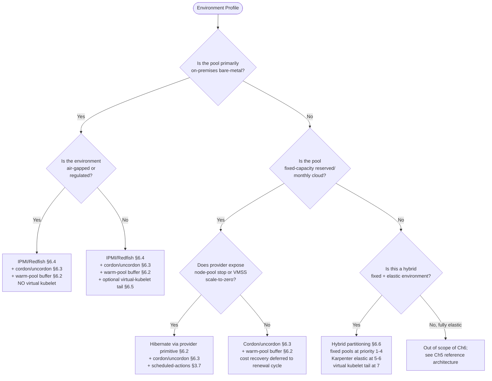

**Environment-specific recommendations.** Translating the decision tree into concrete recommendations for the three environment archetypes most relevant to the user's brief:

*Predominantly on-premises bare-metal.* The recommended layering is **IPMI/Redfish for genuine cost recovery + cordon/uncordon for fast scaling within active inventory + warm-pool/headroom for first-burst absorption**. The cordon controller drives second-scale adjustments, IPMI handles minute-scale power-management, and the warm pool absorbs the 15-minute forecast-horizon gap. Per-node-class forecast horizons in Layer 4 are tuned per actuator. Virtual kubelet is optional; in many on-premises environments it is excluded for compliance or cost reasons. Metal³/Ironic is the recommended framework for >50-node fleets; smaller fleets can use direct Redfish invocation. Audit logging is mandatory.

*Reserved/monthly cloud pools.* The recommended layering depends on provider primitives. If AKS node-pool start/stop, AWS warm pools, or VMSS scale-to-zero is available, **hibernate via provider primitive + cordon/uncordon + scheduled actions** is the lowest-friction path. If no native primitive exists, **cordon/uncordon + warm-pool buffer** is sufficient for consolidation, with cost recovery deferred to the next reservation renewal where capacity is re-sized based on observed utilization. Scheduled actions via `aws_autoscaling_schedule` (with idempotent timestamp handling per §3.7) layer cleanly on top.

*Regulated and air-gapped environments.* The recommended layering is **IPMI/Redfish with strict audit controls + cordon/uncordon + warm-pool buffer**, with virtual-kubelet bursting **forbidden**. The toolchain must be entirely local, the model registry self-hosted, the metrics storage on-premises (VictoriaMetrics single-node or cluster, per §5.2), and every BMC operation logged to a tamper-evident audit trail. ScaleOps's positioning as "fully self-hosted and production-safe, with built-in support for GitOps workflows and air-gapped environments" (§4.4) is the closest commercial match; for organizations preferring open-source, the Layer 5 decision controller and Layer 6 actuators must be built or adapted from existing open-source primitives (Metal³, Ironic, KEDA, Prophet).

*Hybrid cloud-plus-on-premises.* The recommended pattern is **workload partitioning per §6.6** with the canonical 7-tier cost-priority order. The fixed on-premises base handles steady demand at lowest cost; cordon/uncordon and IPMI manage that base; Karpenter handles cloud spillover for unforeseen growth; virtual kubelet handles emergency tail. The Layer 4 forecasting service produces per-pool-horizon-decomposed forecasts; Layer 5 routes workload by classification taxonomy and cost priority. This is architecturally the most complex configuration but operationally the most cost-efficient for large-scale deployments.

**Residual gaps motivating Chapters 7–9.** Even with the four actuator patterns and partitioning strategy specified, three categories of residual gap remain:

1. **Engineering discipline at component boundaries.** PDB design, PriorityClass scheme, scale-down protection windows, drain timeouts, image-cache sizing, BMC credential rotation, audit log retention, and hardware lifecycle monitoring are referenced as constraints throughout this chapter but require their own consolidated treatment. **Chapter 7** addresses these as best practices and anti-patterns.
2. **Quantitative validation of claimed gains.** The latency budgets, MAPE targets, and cost-savings expectations cited here are drawn from surveyed implementations under their specific conditions; production validation in any new deployment requires measurement. **Chapter 8** specifies the evaluation methodology.
3. **Phased adoption sequencing.** The decision tree above maps environments to actuator combinations, but a platform team's actual rollout sequence—which actuator first, which workload first, which pool first—depends on organizational maturity, existing investments, and risk tolerance. **Chapter 9** translates the analysis into a phased implementation roadmap and decision guide.

The chapter's contribution, taken as a whole, is to close the structural gap that Chapter 4 documented—no surveyed tool natively manages non-elastic capacity—by composing surveyed primitives (BMC/IPMI/Redfish, Metal³/Ironic, virtual kubelet, ACI/Fargate/ECI, headroom/pause pods, scheduled cordon controllers, OVHcloud-style hybrid partitioning) into four actuator patterns and one partitioning strategy that together satisfy the §1.2 evaluation criteria for fixed-capacity environments. The Layer 6 reserved extension points from §5.6 are now concretely instantiated; the user's binding constraint—that some node groups are non-elastic—has a deployable answer; and the reference architecture's seven-layer blueprint is fully populated end-to-end across both elastic and non-elastic pools.

[^56]: Reintech, "Kubernetes Cost Optimization: 10 Strategies to Reduce Cloud Spend."
[^52]: Riddhi Gupta, "Life of a baremetal server," Medium.
[^57]: Medium, "7 Kubernetes Cost Controls That Don't Break SLOs."
[^53]: Reddit r/sysadmin, "rolling back to bare metal kubernetes on top of Linux?"
[^54]: Niels Kroeze, "ACA vs AKS vs ACI: Which Is Best For Containers in Azure?" Intercept Cloud blog.
[^55]: Cycle.io, "Out-of-Band Management (IPMI, iDRAC, iLO)," Cycle Learn.
[^58]: Xianwei and Yili, "From Serverless Containers to Serverless Kubernetes," Alibaba Cloud Community.

# 7 Engineering Best Practices and Anti-Patterns

Chapter 6 closed with a structurally complete reference architecture: seven layers spanning ingestion through observability, four concrete actuator patterns covering elastic and non-elastic pools, and a workload-partitioning policy that orchestrates them. Yet structural completeness is not operational sufficiency. The Vultr reference team's blunt retrospective from §3.3—"select a team full of Kubernetes masters" and "do your research"—captured a recurring truth in the surveyed material: predictive autoscaling stacks fail in production not because of architectural omissions but because of a hundred small *configuration* and *operational* decisions, each individually defensible but collectively producing fragile systems that thrash, drift, or silently degrade. This chapter consolidates those decisions into a deployable engineering rulebook, organized as eight movements that translate the architectural commitments of Chapters 5–6 into concrete configuration and operational practice. Every section is anchored to evidence already surveyed in the report and to the additional reference material on PodDisruptionBudgets and pod-priority over-provisioning, so that the resulting checklist is empirically grounded rather than speculative.

The structure of the chapter follows an inside-out logic. §7.1 begins with the foundation—resource requests and limits—on which every higher-layer scaling decision rests. §7.2 develops the safety mechanism that governs *how* scale-down operates: PodDisruptionBudgets, treated comprehensively because they are the central failure-mode-avoidance surface for the cordon/drain pipeline introduced in §6.3 and the IPMI scale-down sequence in §6.4. §§7.3–7.4 turn to the predictive-decision layer's safety nets: confidence intervals, headroom pods, scale-down protection, and cold-start awareness. §7.5 adds the orthogonal dimensions of multi-AZ and Spot resilience. §7.6 specifies the observability surface that makes the entire stack debuggable, and §7.7 codifies the rollout discipline that sequences deployment without leaving the cluster unprotected. §7.8 consolidates the recurring failure modes into an explicit anti-pattern catalogue paired with the corresponding mitigation.

## 7.1 Resource Requests, Limits, and QoS Discipline as the Foundation of Predictive Scaling

Every layer of the reference architecture in Chapter 5 ultimately produces a *number*: a forecasted Node Demand Index, a desired pod count, a target node count per pool. None of those numbers is meaningful unless the underlying resource accounting—how much CPU and memory each pod actually requests from the scheduler—faithfully represents real demand. This is the architectural reason why every surveyed best-practices source places resource requests and limits at the top of its list. Aidoni's production guidance is direct: "Resource requests and limits are fundamental to cluster stability. Requests guarantee resources for your pod – the scheduler only places pods on nodes with enough available resources. Limits cap maximum resources – preventing a single pod from consuming all node resources. Without proper requests/limits, you risk resource starvation, OOM kills, and unpredictable performance."[^59] The autoscaling-focused commentary surveyed earlier reinforces the point bluntly: "Always Define Resource Requests. Autoscaling depends on accurate resource definitions."[^60]

**How requests propagate through the proactive stack.** Requests are not merely a scheduler hint; they are the *currency* in which every layer above the scheduler measures capacity. Cluster Autoscaler decides whether a pending pod can fit by simulating it against node capacity computed from sum-of-requests; Karpenter selects instance types from its 800+ catalogue by matching requests against shape characteristics; the Vultr Index Calculation Component (§3.6) uses a recursive search that fundamentally consumes "the best combination of node plans" against a request-derived demand signal; ScaleOps's `ResourceQuota`-aware rightsizing (§4.4) pivots on the request value as the variable that "must check the target namespace's quota before making any changes". A cluster whose pods systematically *under-state* requests presents a deceptively low aggregate demand to every one of these mechanisms; predictive forecasts trained on under-stated demand will systematically under-provision; the resulting saturation surfaces as application-layer latency and OOM kills rather than as a clean autoscaler signal. A cluster that systematically *over-states* requests presents inflated demand, triggers premature scale-up, and burns the cost-efficiency dividend that proactive scaling was meant to deliver. Both failure modes are silent in the sense that they do not raise immediate alerts; they accumulate as drift between predicted and actual behavior over weeks and months.

**Limits as the noisy-neighbor firewall.** Limits cap maximum resource consumption per container and prevent a single misbehaving pod from saturating a node's CPU or RAM. This matters acutely on consolidated nodes, which Karpenter's "tightly packing" strategy and ScaleOps's bin-packing optimization both produce: the denser the packing, the larger the blast radius of an unbounded pod. Aidoni's elaboration is operationally specific: "Limits cap maximum resources – preventing a single pod from consuming all node resources",[^59] which directly translates to bounded interference between collocated workloads. When limits are absent or substantially higher than requests, a sudden CPU spike in one pod can starve neighbors, triggering health-check failures, evictions, and—in the worst case—cascading node-level instability that the predictive layer then misinterprets as genuine demand growth.

**Quality of Service classes and eviction order under pressure.** Kubernetes assigns a QoS class to every pod based on the relationship between its requests and limits, and that QoS class determines eviction order when nodes face memory pressure. The Aidoni guidance summarizes the pattern: "Quality of Service (QoS) classes are automatically assigned based on requests/limits: Guaranteed (requests=limits) gets highest priority and is last to be evicted. Burstable (requests..."[^59] (continuing implicitly: where requests are less than limits, and pods are evicted before Guaranteed; BestEffort, with no requests or limits set, is evicted first under pressure). For the proactive autoscaling architecture, the QoS class hierarchy interacts directly with the headroom and PriorityClass design that §7.3 will develop: business-critical workloads should be Guaranteed (matched requests and limits, last to be evicted), latency-tolerant workloads can be Burstable (allowing temporary bursts above request without sacrificing scheduling priority), and BestEffort should be reserved for genuinely throw-away workloads that the cluster will sacrifice during pressure events. Headroom/placeholder pods, by contrast, should explicitly receive a *low* PriorityClass regardless of QoS, because their entire purpose is to be preempted by real workloads.

**Right-sizing methodology.** Setting correct request and limit values is empirical, not theoretical. Aidoni's prescriptive guidance is: "Setting correct values requires measuring actual usage. Use tools like Vertical Pod Autoscaler (VPA) in recommendation mode to analyze historical data and suggest appropriate values. Start conservative and adjust based on monitoring. Over-requesting wastes money, under-requesting causes instability."[^59] The recommended workflow has three stages, each grounded in the surveyed material:

1. **Observe.** Deploy VPA in `recommendation-only` mode (so it does not act, only proposes). Allow it to accumulate historical data across at least one full seasonal cycle of the workload—the same horizon principle that drives Layer 4 forecasting in §5.4. For request-volume-driven workloads with diurnal seasonality, this means at least a week; for weekly cycles, at least a month.
2. **Adjust.** Compare VPA recommendations against current configurations. Substantial gaps (e.g., requests 3x larger than recommendation) indicate over-provisioning; recommendations exceeding limits indicate under-provisioning that produces OOM kills. Apply changes incrementally, staged through the GitOps discipline §7.7 will codify.
3. **Validate.** Monitor the four §1.2 evaluation criteria (latency, SLA, cost, stability) for regression in the days and weeks following each change. Particular attention should be paid to whether predictive-layer MAPE *improves* after rightsizing—if requests were systematically under-stated, the forecast itself was being trained on a distorted signal, and rightsizing should produce a cleaner training distribution and improved accuracy.

**The HPA/VPA conflict caveat.** Chapter 1 noted that HPA and VPA should not share metrics. The implication for rightsizing is that VPA in `Auto` mode (where it directly resizes pods) is dangerous on workloads that HPA also scales by CPU or memory: the two controllers produce contradictory signals. The discipline is: use VPA in *recommendation* mode for HPA-managed workloads (let humans apply the recommendations through the deployment manifest), and reserve VPA *Auto* mode for stateful workloads whose replica count is fixed. Aidoni captures the eviction caveat that makes this important: "Be careful: VPA requires pod restarts which can cause downtime. Use VPA in recommendation mode for stateful workloads."[^59]

**Namespace ResourceQuotas and tenant isolation.** Beyond per-pod requests, namespace-level ResourceQuotas prevent any single team or application from consuming all cluster resources. Aidoni: "Namespace resource quotas prevent individual teams or applications from consuming all cluster resources. Set quotas for CPU, memory, storage, and number of objects. This protects against resource exhaustion and helps with cost allocation and chargeback."[^59] In a multi-tenant cluster running predictive autoscaling, ResourceQuotas have a second-order effect that ScaleOps's analysis surfaced specifically: a quota that is silently full will cause new pods—including the ones the predictive layer has just decided to schedule—to be rejected with `Forbidden` errors, with no native warning surface and no automatic increase. ScaleOps's `ResourceQuota`-aware rightsizing pattern from §4.4 is precisely the production safeguard against this failure mode: "It must check the target namespace's quota before making any changes to ensure a newer, higher resource request will be accepted. This prevents the 'silent killer' scenario where an automated update accidentally evicts a pod that can't be rescheduled due to its increased request value." The discipline is: every predictive decision that increases pod requests or replica counts must validate that the destination namespace has quota headroom to accept it; if not, the decision must either be deferred, the quota increased through GitOps, or the decision routed to a different namespace.

**A configuration baseline.** Synthesizing the above, the recommended configuration baseline for any workload entering the predictive autoscaling stack is:

| Element | Recommendation | Rationale |
|---|---|---|
| `requests.cpu` and `requests.memory` | Set explicitly on every container | Required for scheduler placement and forecasting accuracy[^59] |
| `limits.cpu` and `limits.memory` | Set on every container; matched to requests for Guaranteed QoS on critical paths | Bounds blast radius and pins eviction order[^59] |
| QoS class | Guaranteed for business-critical, Burstable for tolerant, BestEffort avoided | Determines eviction order under pressure[^59] |
| VPA mode | `recommendation` for HPA-managed; `Auto` only for stateful with fixed replicas | Avoids HPA/VPA metric conflicts[^59] |
| Namespace `ResourceQuota` | Set on every namespace; monitored for headroom | Prevents tenant exhaustion and silent eviction failures[^59] |
| Quota-aware rightsizing | Check quota before applying request increases | Avoids ScaleOps's "silent killer" failure mode |

The baseline is *necessary but not sufficient*: every higher-layer practice in §§7.2–7.7 presumes it is in place. A predictive autoscaling system deployed on top of unquoted, unsized, or systematically mis-sized workloads will produce technically correct decisions on the wrong inputs, and the resulting drift between forecast and reality will erode trust in the system before any of its sophisticated mechanisms have a chance to demonstrate value.

## 7.2 PodDisruptionBudget Design for Safe Scale-Down and Drain Operations

Where §7.1 governs the *steady-state* representation of demand, PodDisruptionBudgets (PDBs) govern the *dynamic* operations of scale-down, node consolidation, drain, and upgrade. PDBs are the central safety mechanism for every scale-down path the report has surveyed: Cluster Autoscaler's 10-minute scale-down loop, Karpenter's `WhenUnderutilized` consolidation, the cordon/uncordon controller from §6.3, the IPMI power-off sequence from §6.4, kube-downscaler's hibernation actions, and routine cluster upgrades and node-image refreshes. CloudBolt's analysis frames the operational stakes precisely: "A pod disruption budget (PDB) sets the acceptable level of disruption for your application by defining either a minimum number of available pods (minAvailable) or a maximum number of unavailable pods (maxUnavailable) in a deployment."[^59] The OneUptime guide makes the consequence of omitting PDBs unambiguous: "Pod Disruption Budgets (PDBs) tell Kubernetes how many pods can be unavailable during voluntary disruptions. Without them, a node drain could take down your entire application."[^59]

**Voluntary versus involuntary disruptions.** PDBs protect against *voluntary* disruptions only. CloudBolt enumerates the categories: voluntary disruptions are "intentional actions by an application owner or cluster administrator, such as deleting or updating a deployment or directly deleting a pod. Pods are also evicted out of nodes while rolling out software updates, autoscaling on nodes, and implementing priority classes",[^59] whereas involuntary disruptions "occur due to unavoidable hardware or system errors, such as VM deletion or network partition".[^59] groundcover reinforces the boundary: "Pod disruption budgets don't guarantee application availability during involuntary disruption events, such as an unexpected node failure. Kubernetes can't magically keep Pods running if part of your cluster goes down without warning. But it can keep Pods available when it has the ability to plan ahead as part of a voluntary disruption event."[^59] For the predictive autoscaling architecture, virtually every scale-down action—Karpenter consolidation, cordon-and-drain, IPMI power-off after drain—is a *voluntary* disruption, which is precisely the regime PDBs were designed to guard.

**minAvailable vs maxUnavailable: when each is appropriate.** A PDB declares either a `minAvailable` floor (the minimum number of pods that must remain running) or a `maxUnavailable` ceiling (the maximum number that can be down simultaneously); the two are mutually exclusive within a single PDB.[^59] CloudBolt's selection guidance is workload-driven: "The choice between setting a minAvailable or maxUnavailable value depends on the nature of your application. For example, a distributed system requiring a quorum would need minAvailable set to match the quorum size to avoid service failure. In most cases, setting maxUnavailable to 1 or more is sufficient. A maxUnavailable value of 1 ensures that pods are moved individually from a draining node to an available node. A higher value can be set if faster pod movement is needed, assuming that the replica set size is large enough to tolerate such disruption."[^59] groundcover's FAQ articulates the pattern in a single sentence: "minAvailable is best for quorum-based applications, meaning those that require a certain number of instances of the application or its services to be active. MaxUnavailable is preferable for scenarios where the priority is faster rolling updates."[^59]

OneUptime's tabular summary maps these principles to concrete deployment archetypes:[^59]

| Use Case | Recommended | Example |
|---|---|---|
| Critical services | `minAvailable` | `minAvailable: 2` |
| Large deployments | `maxUnavailable` % | `maxUnavailable: 25%` |
| Batch jobs | `maxUnavailable` | `maxUnavailable: 50%` |
| Singleton pods | `minAvailable: 0` | Allow disruption |

The percentage form—available for both `minAvailable` and `maxUnavailable`—has a particularly important property: it adjusts dynamically as replica counts change. CloudBolt notes that "a count of maxUnavailable is generally preferred because it adjusts dynamically to changes in the number of replicas the controller manages",[^59] which makes it the right default for HPA-scaled deployments where the replica count is itself variable. Conversely, percentage rounding is a subtle hazard: "If you specify maxUnavailable as a percentage, Kubernetes will round up the number of pods that can be disrupted, which may result in a disruption slightly exceeding your defined maxUnavailable percentage."[^59]

**Canonical patterns for the workload archetypes in scope.** OneUptime documents four reference patterns that map directly to the workload archetypes identified in §1.2:[^59]

```yaml
# High-availability web service (3 replicas)
apiVersion: policy/v1
kind: PodDisruptionBudget
metadata:
  name: web-pdb
spec:
  minAvailable: 2          # Always keep 2 pods running
  selector:
    matchLabels:
      app: web

# Stateful database (3 replicas) — quorum protection
apiVersion: policy/v1
kind: PodDisruptionBudget
metadata:
  name: postgres-pdb
spec:
  minAvailable: 2          # Maintain quorum
  selector:
    matchLabels:
      app: postgres

# Large deployment (20 replicas) — percentage form
apiVersion: policy/v1
kind: PodDisruptionBudget
metadata:
  name: workers-pdb
spec:
  maxUnavailable: 25%      # Allow 5 pods to be down
  selector:
    matchLabels:
      app: workers

# Batch processing — disruption-tolerant
apiVersion: policy/v1
kind: PodDisruptionBudget
metadata:
  name: batch-pdb
spec:
  maxUnavailable: 100%     # All pods can be disrupted
  selector:
    matchLabels:
      app: batch-processor
```

The web pattern protects two of three replicas; the database pattern is the canonical etcd/ZooKeeper/Postgres quorum guard; the workers pattern uses percentage form to scale with replica count; the batch pattern explicitly *documents* that disruption is acceptable, which is itself a best practice. OneUptime's commentary on the batch case is operationally significant: "Even if just allowing all disruptions: spec: maxUnavailable: '100%'. # Documents that disruption is OK".[^59] Always declaring a PDB—even a permissive one—is preferable to omitting it, because the omission is ambiguous (operator forgot, or operator decided disruption is fine?), whereas an explicit `100%` documents intent.

**Interaction with HPA.** The PDB-HPA interaction is a recurring source of subtle bugs. OneUptime's prescription is direct: "HPA can scale down to minReplicas. Should be > PDB minAvailable."[^59] If `HPA.minReplicas == PDB.minAvailable`, then HPA-driven scale-down to the floor leaves *zero* allowed disruptions, and any subsequent voluntary disruption (drain, consolidation, upgrade) blocks indefinitely. The discipline is: `HPA.minReplicas > PDB.minAvailable` always, with at least 1 of headroom (e.g., `HPA.minReplicas: 3`, `PDB.minAvailable: 2`). OneUptime's example captures the relationship: "If HPA scales to 3 and PDB requires 2, you can still drain one pod."[^59]

**Interaction with Cluster Autoscaler and Karpenter.** Both reactive provisioners explicitly respect PDBs. OneUptime: "Cluster autoscaler respects PDBs when scaling down nodes. A node won't be removed if it would violate a PDB."[^59] CloudBolt: "PDBs also integrate seamlessly with Kubernetes tools such as kubectl, controllers, the cluster autoscaler, and node draining, making them essential to managing disruptions within the cluster."[^59] This is exactly the desired behavior, but it has a sharp edge: a *misconfigured* PDB (e.g., `minAvailable: 3` on a 3-replica deployment) will prevent CA or Karpenter from removing *any* node hosting that workload, indefinitely. CloudBolt is explicit about this consequence: "If you configure maxUnavailable to 0 percent or 0, or set minAvailable to 100 percent or the total number of replicas, draining a node will not be possible (since you requested no pod evictions)."[^59] groundcover's "common Pod disruption budget misconfigurations" warning generalizes the failure mode: "imagine that a PDB includes an aggressive minAvailable setting, such as 80 percent. If an admin were to try to drain a node that hosts all of an application's available Pods, and there aren't enough other nodes available with minimum availability to host additional replicas, the draining request would be paused because of the inability to satisfy the PDB conditions."[^59] The consequence in the proactive architecture is that scale-down stalls: §6.3's cordon/drain pipeline cannot complete, IPMI power-off cannot proceed, and the predicted cost recovery during troughs simply does not happen.

**Interaction with Deployment rolling updates.** OneUptime notes a less-obvious composition: "The Deployment's maxUnavailable and the PDB's maxUnavailable both apply. The more restrictive wins."[^59] A Deployment with `strategy.rollingUpdate.maxUnavailable: 1` plus a PDB with `maxUnavailable: 25%` on a 4-replica workload will admit at most 1 unavailable pod during rollout, because the more restrictive of (1, 1)—the Deployment cap of 1 versus the PDB cap of 25% × 4 = 1—governs. This means PDB design must consider not only standalone scale-down but also rolling-update behavior, particularly during deployment-driven peaks where new replicas are coming up while old ones drain.

**Monitoring and alerting.** The kube-state-metrics exporter exposes PDB state as Prometheus metrics. OneUptime's recommended alert set is the operational backbone:[^59]

```yaml
- alert: PDBViolationRisk
  expr: kube_poddisruptionbudget_status_pod_disruptions_allowed == 0
  for: 10m
  labels: { severity: warning }
  annotations:
    summary: "PDB {{ $labels.poddisruptionbudget }} has no allowed disruptions"
- alert: PDBCurrentBelowDesired
  expr: |
    kube_poddisruptionbudget_status_current_healthy
    < kube_poddisruptionbudget_status_desired_healthy
  for: 5m
  labels: { severity: warning }
  annotations:
    summary: "PDB {{ $labels.poddisruptionbudget }} has fewer healthy pods than desired"
```

The first alert catches the central failure mode: a PDB whose constraints are currently saturated, meaning that any subsequent voluntary disruption will block. In the proactive architecture, this alert must fire *before* the predictive layer attempts a scheduled scale-down, otherwise the scale-down stalls with no clear diagnostic. The second alert catches PDB drift—the workload has fewer healthy replicas than the PDB expects—which typically indicates either an HPA configuration problem (replicas falling below the floor due to insufficient resources) or a workload health problem (failing readiness probes). groundcover summarizes the broader observability principle: "The key to confirming that a Pod disruption budget is working as expected is observability."[^59]

**Troubleshooting stuck drains.** OneUptime documents the canonical failure path: "kubectl drain node-1 --ignore-daemonsets / error: cannot evict pod; would violate PDB",[^59] with three solutions in order of preference: (1) temporarily scale up replicas (`kubectl scale deployment web --replicas=5`) so PDB constraints can be satisfied, then drain; (2) fix unhealthy pods first if the PDB is unsatisfied due to readiness failures; (3) as a last resort, force the drain with `kubectl drain node-1 --ignore-daemonsets --force --delete-emptydir-data`, accepting the downtime. groundcover captures the override mechanism with appropriate caution: "you can override them by passing the --force and --disable-eviction flags to the kubectl drain command. […] But you should do this only as a last resort, in the event that you need to complete critical maintenance and don't have time to adjust your PDB so that it no longer conflicts with the event."[^59] In an automated cordon/drain pipeline (§6.3), the discipline is that the controller should *never* force-evict by default; if a drain stalls on PDB, the controller defers and alerts, allowing a human to either adjust the PDB, scale up, or accept the downtime.

**The unhealthy-pod-eviction caveat.** groundcover surfaces a subtle behavior: "if a Pod is unhealthy (which happens if it is failing probes), it won't count toward PDB replica requirements - so situations can arise where you have more total replicas running than a PDB requires, but the PDB is still not satisfied because some of the Pods are unhealthy."[^59] The Kubernetes `unhealthyPodEvictionPolicy` field controls this: setting `AlwaysAllow` permits eviction of unhealthy pods even when PDB is otherwise saturated, which is appropriate for highly-resilient stateless workloads but dangerous for stateful ones. CloudBolt's best practices reinforce: "Best practices for using PDBs include […] allowing unhealthy pod evictions, utilizing eviction-aware tools, and regularly reviewing and updating PDBs."[^59]

**Limitations and what PDBs cannot guarantee.** Three limitations must be internalized by anyone deploying PDBs as part of the proactive architecture. CloudBolt: "A disruption budget does not ensure that the specified number or percentage of pods will always be available. For instance, if a node hosting a pod from a collection of pods fails while the collection is at the minimum size defined in the budget, the number of available pods could drop below the required threshold."[^59] groundcover: "PDBs only manage voluntary disruptions, leaving applications vulnerable to involuntary issues like node failures."[^59] And on conflict with autoscaling: "They may conflict with autoscaling operations, potentially delaying recovery."[^59] The architectural implication is that PDBs are necessary but not sufficient for high availability; multi-AZ topology spread (§7.5), HPA configurations that maintain headroom above PDB floors, and reactive recovery paths must all coexist.

**Best-practice checklist for the proactive architecture.** Distilling the surveyed material into a concrete configuration discipline:

1. **Always declare a PDB for every production workload**, even permissive ones. OneUptime: "Always Create PDBs for Production Workloads. Even if just allowing all disruptions."[^59]
2. **Set `minAvailable` strictly below replica count.** OneUptime: "With 3 replicas, don't set minAvailable: 3. spec: minAvailable: 2 # Allows 1 disruption."[^59]
3. **Prefer percentage form for variable replica counts.** OneUptime: "Works regardless of current replica count."[^59]
4. **Combine with podAntiAffinity for AZ/node spread.** OneUptime: "Spread pods across nodes."[^59]
5. **Configure `terminationGracePeriodSeconds` and `preStop` hooks** to give applications time to drain in-flight requests cleanly during the eviction.[^59]
6. **Maintain `HPA.minReplicas > PDB.minAvailable`** with at least 1 of headroom.
7. **Monitor `kube_poddisruptionbudget_status_pod_disruptions_allowed == 0`** as a leading indicator of stuck-drain risk.[^59]
8. **Test PDB behavior** before relying on it. OneUptime's `kubectl drain --dry-run` pattern is the canonical validation.[^59]

The PDB layer, when correctly configured, is what makes everything in §§7.3–7.7 *safe* rather than reckless. Without it, every scale-down decision the predictive layer makes carries hidden risk; with it, the cluster has a contract between application availability requirements and infrastructure operations that the autoscaler, the cordon controller, and the IPMI actuator can all respect.

## 7.3 Prediction Confidence Intervals, Safety Margins, and Headroom Configuration

Sections 7.1 and 7.2 established the *substrate* on which proactive scaling operates. Section 7.3 turns to the *decisions* the proactive layer makes and the safety nets that constrain them. The architectural commitments from §§3.8 and 5.5—gated authority for the predictive layer (P2) and max-of-reactive-and-predictive reconciliation (P3)—must be operationalized in concrete configuration: MAPE thresholds, forecast-quantile choices, headroom sizing, and PriorityClass design.

**MAPE threshold selection and default-value fallback.** Kedify's productized pattern from §3.3 is the operational template: every predictive model exposes a `modelMapeThreshold` parameter, and when validation MAPE exceeds the threshold, the system "automatically returns a default value (also defined in the trigger) instead of an unreliable prediction". The threshold is workload-dependent. The Vultr team's reported MAPE band of 5–9% in their controlled testbed (with a best case of 0.5%) suggests that 10–15% is a reasonable upper bound for diurnal cluster-load workloads on Prophet-class models; tighter thresholds (5–8%) are appropriate for latency-critical paths where prediction error directly translates into SLA risk; looser thresholds (15–25%) may be acceptable for cost-recovery decisions where the asymmetric cost of over-prediction is high.

The fallback value itself requires deliberate choice. Three patterns are observed in the surveyed material:

- **Conservative high default**, returning a value sized to handle the historical 95th-percentile demand. This errs toward over-provisioning during model failures, accepting cost waste in exchange for SLA preservation.
- **Schedule-based default**, returning the schedule layer's prescribed value (the §2.7 cron baseline). This degrades to schedule-only behavior during model failures, which is the natural fallback for environments with strong calendar-driven patterns.
- **Reactive default**, returning a no-op signal so that the reactive HPA layer governs entirely. This is the lowest-risk fallback for environments where reactive scaling is well-tuned and the predictive layer is an *augmentation* rather than a primary controller.

The reference architecture's default is the schedule-based fallback for environments with cron baselines and the reactive default elsewhere; the conservative high default is reserved for explicitly latency-critical workloads.

**Forecast quantile selection.** Chapter 3 introduced the principle that predictive scaling can act on the upper confidence bound of the forecast rather than the point estimate, with TFT-DVPA's 90th-percentile quantile selection cited as the canonical pattern: "predicts memory demands based on … probabilistic forecasting (90th percentile quantile estimation) to predict and preemptively adjust memory allocation, avoiding critical thresholds". The quantile choice is the operational embodiment of the cost-versus-SLA trade-off:

| Quantile | Behavior | Appropriate Workload Class |
|---|---|---|
| 50th (median) | Scales to the most-likely demand | Cost-sensitive, SLA-tolerant (batch, dev/QA) |
| 75th | Modest safety margin | Balanced steady-state services |
| 90th | TFT-DVPA standard | Latency-critical request paths |
| 95th–99th | Aggressive over-provisioning | Tier-0 SLA paths, regulated, financial |

The quantile is a *per-pool* policy parameter (§5.5), so a single forecasting model can serve multiple pools at different quantiles—the latency-critical pool scales to the 90th-percentile band while the batch pool scales to the median, with the difference appearing as headroom on the latency-critical pool.

**Confidence-interval-driven scale-down deferral.** A more sophisticated use of confidence intervals is to defer scale-down when forecast uncertainty grows. Chapter 3 cited Kedify's observed behavior: "when data collection was interrupted for several hours, the Prophet model still maintained a plausible fit … the widening confidence interval signals increasing uncertainty". The width of the interval is itself a usable signal. The §5.5 policy specification operationalized this as "Confidence-gated scale-down — when forecast confidence intervals are wide, defer scale-down even if current utilization permits removal", and the engineering implementation is straightforward: compute the relative interval width $(\text{upper} - \text{lower}) / \text{point}$, and require the width to be below a threshold (e.g., 20% of the point estimate) before scale-down is permitted. During regime changes—deployment events, marketing campaigns, regional outages—the interval widens automatically, and scale-down pauses until uncertainty resolves. This is more cost-efficient than maintaining permanent headroom because the safety margin scales with measured uncertainty.

**Headroom sizing methodology.** Chapter 6.2 introduced headroom pods as an actuator-agnostic safety mechanism, particularly valuable in non-elastic environments. The sizing question—how *much* headroom—is the central engineering decision. The principled answer derives from the worst-case burst over the slowest actuator's latency:

$$N_{\text{headroom}} = \lceil \text{burst\_rate} \times T_{\text{slowest\_actuator}} \times Q_{0.9} \rceil$$

where `burst_rate` is the worst observed demand-growth rate (in nodes-per-minute, derived from historical peaks), $T_{\text{slowest\_actuator}}$ is the slowest provisioning latency the headroom must bridge, and $Q_{0.9}$ applies a 90th-percentile safety multiplier. For an environment combining Karpenter (55 seconds) with IPMI (15 minutes), if the predictive layer's 15-minute horizon has confidence interval width covering 8 nodes, then headroom of 8 nodes' worth of capacity bridges the gap—if the predictive layer is working well. The formula generalizes the AWS guidance for the pod-priority pattern: "The number of dummy pods to be over-provisioned is based on the trade-offs of performance required for scaling of the worker nodes and the cost of running dummy pods."[^61]

**Pod-priority over-provisioning: the canonical headroom implementation.** AWS's documented pattern for the Kubernetes layer of headroom is the most directly transferable, requiring no commercial platform and operating identically on elastic and non-elastic pools. The mechanism is composed of four ingredients:

1. **A high-priority PriorityClass for real workloads.**[^61]

```yaml
apiVersion: scheduling.k8s.io/v1
kind: PriorityClass
metadata:
  name: high-priority
value: 1000000
globalDefault: false
description: "This priority class should be used for high priority service pods only."
```

2. **A low-priority PriorityClass for placeholder/dummy pods.**[^61]

```yaml
apiVersion: scheduling.k8s.io/v1
kind: PriorityClass
metadata:
  name: low-priority
value: -1
globalDefault: false
description: "This priority class should be used for dummy service pods only."
```

3. **A real-workload Deployment** carrying `priorityClassName: high-priority`, with explicit CPU and memory requests sized to the pod's actual demand.[^61]

4. **A dummy/placeholder Deployment** running the `pause` container with `priorityClassName: low-priority`, with requests sized to match the capacity to be reserved.[^61] The AWS reference uses requests of 1 CPU and 500 MiB on `t3.small` instances, but the principle generalizes: each placeholder reserves exactly the capacity that one real pod (or one node, depending on sizing) would otherwise need.

The runtime behavior is the canonical headroom dynamic. AWS's step-by-step description is the clearest articulation in the surveyed material: "As load increases on the Nginx service, HPA adds a new high priority pod (Nginx-2), which is initially in pending state. Since the Nginx-2 pod has higher priority and it's in the pending state, the kube-scheduler evicts the dummy service pod (i.e., Dummy-1) to make the room for Nginx-2 pod. Then, the kube-scheduler schedules the high priority pod Nginx-2 on the node from which the dummy pod was evicted. The dummy service pod goes in pending state. So, the Cluster Autoscaler or Karpenter adds an additional node (Node 3) to the cluster. As soon as new node (Node 3) is ready, the kube-scheduler places the pending dummy pod (Dummy-1) on it."[^61] The user-visible effect is that "the new higher priority nginx-app pod doesn't wait for node to be provisioned and starts as soon as the lower priority dummy-app pod is evicted",[^61] which is exactly the sub-second latency property §6.2 attributed to the headroom pattern.

**Static, percentage, and elastic headroom.** AWS describes three sizing strategies, mapping to ScaleOps's three configurations from §5.5:[^61]

- **Static replica count** is the simplest: a fixed number of placeholder pods regardless of cluster size. AWS notes that this "may not be effective" as the cluster grows.[^61]
- **Proportional headroom** scales the placeholder count with cluster size. AWS's recommended implementation is the **Horizontal Cluster Proportional Autoscaler**: "It resizes the number of replicas of over-provisioning application as per number of worker nodes and cores (i.e., vCPUs) of the cluster."[^61] The configuration is declarative:[^61]

```yaml
apiVersion: v1
kind: ConfigMap
metadata:
  name: overprovisioning-autoscaler
data:
  linear: |-
    {
      "coresPerReplica": 8,
      "nodesPerReplica": 4,
      "min": 1,
      "max": 3,
      "preventSinglePointFailure": false,
      "includeUnschedulableNodes": true
    }
```

The configuration says: maintain one placeholder replica per 4 nodes or per 8 cores, whichever is greater, with floor 1 and ceiling 3.[^61] AWS's empirical demonstration shows the autoscaler "proportionally increases the replica count of the dummy-app (over-provisioning) from one to two" as the cluster grows from 3 to 5 nodes,[^61] producing the cost-aware scaling that pure static configuration cannot achieve.

- **ScaleOps's Calculated Elastic Headroom** is the most sophisticated, dynamically tuning the buffer based on observed VPA/scale-up activity and pool-specific provisioning latency. This is the appropriate choice for environments with heterogeneous pools and varying actuator latencies, particularly where Karpenter's tight bin-packing would otherwise leave VPA with insufficient headroom for in-place pod resizing.

**Self-protection: keeping the autoscaler from evicting itself.** The Vultr team's defensive pattern from §3.3 generalizes: the controller plane (forecasting service, decision controller, model registry, observability stack) must be protected from preemption during scale-down by being placed on a dedicated control-plane node pool with taints and tolerations, *not* on the worker pools that the headroom and predictive layers manipulate. AWS's reference implementation similarly places the proportional autoscaler in `kube-system` namespace with `priorityClassName: system-cluster-critical` and tolerations for `CriticalAddonsOnly`,[^61] precisely to ensure that the autoscaler is never the first thing evicted when capacity tightens.

**Trade-offs summary.** The headroom design space has explicit cost-vs-latency trade-offs:

| Configuration | Latency on first burst | Steady-state cost | Adapts to cluster growth |
|---|---|---|---|
| No headroom | Worst (full provisioner latency) | Lowest | N/A |
| Static headroom | Sub-second (sized for fixed burst) | Fixed | No |
| Proportional headroom (CPA-driven) | Sub-second (scales with cluster) | Scales with cluster | Yes[^61] |
| Calculated elastic headroom (ScaleOps) | Sub-second + VPA-aware | Lowest among instant-burst options | Yes |

For the user's stated brief—proactive scaling for non-elastic-pool-inclusive environments—proportional headroom via the AWS Horizontal Cluster Proportional Autoscaler pattern is the recommended starting configuration: it requires no commercial platform, scales with cluster growth, and provides sub-second first-burst latency that bridges Karpenter's 55 seconds, IPMI's minutes, and any other actuator the pool registry exposes. The cost is the steady-state placeholder pods, which §7.4 argues is itself an SLA insurance premium with measurable value.

## 7.4 Scale-Down Protection, Stabilization Windows, and Cold-Start Awareness

Scale-up errors and scale-down errors are not symmetric. A scale-up that arrives too late degrades latency for the duration of the cold start; a scale-down that fires too early produces *thrashing*—the cluster removes nodes that are immediately needed back, paying provisioning latency for the same capacity twice (or more) within a short window. Chapter 1 quantified the cold-start penalties that punish thrashing: Karpenter ~55 seconds, Cluster Autoscaler 3–4 minutes, GPU image pull 6–10 minutes, IPMI bare-metal 2–10+ minutes. The asymmetry means scale-down logic must be more conservative than scale-up logic, and the engineering practices in this section operationalize that asymmetry.

**Hold-down windows tuned per workload class.** The simplest scale-down protection is a minimum *unneeded duration* before a node becomes eligible for removal. Cluster Autoscaler's default is 10 minutes (§1.3), which Chapter 1 critiqued as too conservative for the user's prompt-trough-recovery requirement. The reference architecture's §5.5 specification replaces this with a per-workload-class window. A tuned baseline:

| Workload Class | Hold-down window | Rationale |
|---|---|---|
| Stateless web/API | 3–5 min | Cheap re-scheduling, frequent demand fluctuation |
| Stateful (DB, cache) | 30–60 min | Restart cost is high; rebuilding cache wastes hours |
| GPU/AI inference | 10–20 min | Image pull and model load amortized over longer life |
| Batch processing | 5–10 min | Job-driven; idle nodes recoverable but cost-sensitive |
| On-prem bare-metal (post-IPMI) | 30–60 min | Physical power-cycle stress; lifecycle budget |

These windows are not the same as the *forecast horizon* (which sets how far ahead Layer 4 predicts), but they interact: the hold-down window bounds the minimum residence time of provisioned capacity, while the forecast horizon bounds the maximum lead time of provisioning.

**Confidence-gated scale-down and forecast-look-ahead.** Beyond static hold-down, two predictive policies further tighten scale-down safety. The first is *confidence-gated scale-down* introduced in §7.3: when the forecast confidence interval is wide, defer reclamation. The second is *forecast-look-ahead*: only scale down if the forecast for the *next prediction horizon* also supports lower capacity. The pseudocode is:

```
if current_utilization < scale_down_threshold:
  if forecast(next_horizon).point_estimate >= current_capacity:
    defer scale_down
  else if confidence_width > uncertainty_threshold:
    defer scale_down
  else if hold_down_window not yet elapsed:
    defer scale_down
  else:
    proceed with cordon → drain → power-off (per actuator)
```

This composite policy directly addresses the thrashing pattern in which the cluster removes capacity at the trough's bottom only to re-provision it minutes later as demand recovers. Tencent's EHPA case study from §3.7 reports the dividend: EHPA "reduces ineffective scale-downs when the traffic first drops then immediately rises" and "compared to HPA, EHPA has fewer elasticity operations but is more efficient", precisely because the predictive layer's look-ahead prevents short-term troughs from triggering scale-down actions.

**HPA stabilization windows and behavior policies.** The pod layer has its own stabilization mechanism: HPA's `behavior` field. Chapter 1 noted HPA's default 0.1/10% tolerance "exists precisely to prevent rapid scaling oscillations between states", and modern HPA (v2) extends this with explicit `scaleDown.stabilizationWindowSeconds` and `scaleDown.policies` fields. A canonical configuration for a proactive-aware HPA:

```yaml
behavior:
  scaleDown:
    stabilizationWindowSeconds: 300        # Wait 5 min after metric drops below
    policies:
      - type: Percent
        value: 50                          # Remove at most 50% per period
        periodSeconds: 60
      - type: Pods
        value: 4                           # Or at most 4 pods
        periodSeconds: 60
    selectPolicy: Min                       # Use the more restrictive
  scaleUp:
    stabilizationWindowSeconds: 0           # Scale up immediately
    policies:
      - type: Percent
        value: 100
        periodSeconds: 60
```

The asymmetric stabilization—`0` seconds for scale-up, `300` for scale-down—encodes the cost-sensitivity asymmetry: missed scale-up costs SLA, missed scale-down costs only money, so the system is deliberately faster to add than to remove. The `Min` selectPolicy bounds scale-down velocity below the more restrictive of the percentage and pod-count limits, preventing dramatic single-step removals that would force the node layer into thrashing.

**Per-pool latency budgets and forecast horizons.** Chapter 5.6 introduced pool-classification metadata including a `latency_budget` field, and Chapter 6 instantiated it for non-elastic pools. The engineering discipline is that **the latency budget is the bridge between actuator reality and forecast horizon**:

| Pool class | Actuator latency | Required Layer-4 horizon |
|---|---|---|
| Karpenter elastic | ~55s | ≥ 60s |
| CA/managed node group | 3–4 min | ≥ 5 min |
| Karpenter GPU (with image pull) | 2–4 min | ≥ 5 min |
| EKS GPU full cold start | 6–10 min | ≥ 10 min |
| AKS node-pool start (warm) | ~1–2 min | ≥ 2 min |
| IPMI bare-metal (no re-image) | 2–10 min | ≥ 10–15 min |
| IPMI bare-metal (with re-image) | 8.5–15+ min | ≥ 15–20 min |

The forecast must arrive *before* the actuator can deliver. When a single forecasting service serves multiple pools with different latency budgets, the engine forecasts at the *longest* horizon required and Layer 5 truncates per-pool views, as §6.6 specified. The discipline is tested empirically: monitor the time delta between "forecast crosses scale-up threshold" and "node becomes Ready", and verify that the delta is non-negative. A *negative* delta means the forecast horizon is shorter than the actuator's actual latency, and the predictive layer cannot pre-warm in time; the response is either to lengthen the horizon (if the model supports it) or to add headroom to bridge the gap.

**The ignoring-cold-start anti-pattern and its thrashing signature.** When operators set scale-down thresholds aggressively without accounting for cold-start latency, a characteristic thrashing pattern emerges: utilization drops below threshold, scale-down fires, capacity is reclaimed, demand recovers within the actuator's cold-start window, scale-up fires, capacity is re-provisioned (paying full cold-start cost), demand fluctuates again, scale-down fires, and the cycle repeats. The financial damage is substantial: in elastic cloud environments, every scale-up cycle pays the minimum-billing-increment (per-second on AWS Spot, per-minute on GCP, hourly on some legacy contracts); in bare-metal environments, every cycle exercises the power-cycle budget §6.4 cautioned against. The diagnostic is straightforward: count the number of scale-up and scale-down events per node over a representative window. A healthy cluster sees scale-events on the order of dozens per node per day; a thrashing cluster sees hundreds. The mitigations are the policies introduced in this section: hold-down windows, forecast-look-ahead, confidence-gated scale-down, and HPA stabilization. None alone is sufficient; in combination they bound the thrashing pattern to acceptable amplitude.

**Image pre-pull and warm-cache strategies.** A tangential but practically essential cold-start mitigation is image pre-pull. Chapter 1 quantified that GPU container images of 5–20 GB take 4–5 minutes to pull on a fresh node and that "true cold start can take 6–10 minutes before user code executes". When a node is reclaimed and re-provisioned, this latency is paid in full unless the image cache survives. Two patterns mitigate:

- **Local image caching.** Configure the image GC threshold (`--image-gc-high-threshold`, `--image-gc-low-threshold`) so that frequently-used images are retained on disk between pod evictions. For workloads where the same images are used repeatedly, this turns image pulls from minutes into milliseconds.
- **Lazy-loading container runtimes.** Chapter 1 referenced Nydus, which can reduce 9.9 GB image pulls from 4m 38s to ~1.16s on a fresh node. This is a runtime-level intervention rather than a configuration change but is the most decisive cold-start mitigation for image-heavy workloads.

The discipline is to **never measure cold-start latency in a benchmark with pre-cached images and report it as production behavior**: production cold starts include image-pull time on the cleanest possible node, and the forecast horizon must accommodate that worst case.

## 7.5 Multi-AZ, Topology, and Spot/Interruption-Aware Configuration

Scale-up, scale-down, and steady-state placement decisions all operate in a topological space larger than a single node or even a single zone. The engineering practices in this section govern how the predictive architecture interacts with that space: Pod Topology Spread Constraints to distribute critical workloads, podAntiAffinity to prevent unsafe co-location, topology-aware-hints to reduce cross-zone cost, and Spot/Reserved/On-Demand blending to balance interruptibility against price.

**Pod Topology Spread Constraints.** The most powerful topology primitive in modern Kubernetes is `topologySpreadConstraints`, which requires the scheduler to spread pods across a topology key (typically `topology.kubernetes.io/zone` or `kubernetes.io/hostname`) within a tolerance bound. For request-volume-driven workloads where AZ failure should be survivable, a canonical configuration on a 6-replica deployment:

```yaml
topologySpreadConstraints:
  - maxSkew: 1
    topologyKey: topology.kubernetes.io/zone
    whenUnsatisfiable: DoNotSchedule
    labelSelector:
      matchLabels:
        app: web
  - maxSkew: 1
    topologyKey: kubernetes.io/hostname
    whenUnsatisfiable: ScheduleAnyway
    labelSelector:
      matchLabels:
        app: web
```

The first constraint enforces hard zonal balance (deviations of more than 1 pod between zones are prohibited); the second prefers but does not require host-level balance. The combination ensures that an AZ failure removes at most $\lceil N / \text{zones} \rceil + 1$ pods, leaving the remainder available—and, critically, leaving the PDB satisfied, so that recovery operations on the failed AZ do not require force-eviction.

**podAntiAffinity for replica spread.** OneUptime's documented web-application pattern combines a Deployment with podAntiAffinity:[^59]

```yaml
affinity:
  podAntiAffinity:
    requiredDuringSchedulingIgnoredDuringExecution:
      - labelSelector:
          matchLabels:
            app: web
        topologyKey: kubernetes.io/hostname
```

This is a stronger constraint than topology spread—it *prohibits* two replicas from co-locating on the same node, regardless of skew. The trade-off is scheduling flexibility: a `requiredDuringSchedulingIgnoredDuringExecution` rule will leave pods Pending if no compatible node exists, which can interact poorly with aggressive scale-down. For most stateless web workloads, the softer `preferredDuringSchedulingIgnoredDuringExecution` form is the right default, with strict `required` reserved for specifically high-availability paths. OneUptime's recommended pattern uses the softer form precisely for this reason: "Spread pods across nodes" via `preferredDuringSchedulingIgnoredDuringExecution`.[^59]

**Topology-aware hints for cross-zone traffic cost.** Cross-zone traffic in AWS, GCP, and Azure is billed (roughly $0.01–$0.02 per GB), and a service-mesh or kube-proxy that routes uniformly across zones can accumulate substantial cost on chatty microservices. The `service.kubernetes.io/topology-mode: Auto` Service annotation enables the kube-proxy to prefer same-zone endpoints when sufficient capacity exists. Chapter 6.6 noted Reintech's framing: this annotation "can reduce cross-zone traffic significantly, cutting data transfer costs and improving latency". The discipline is to enable topology-aware hints by default for internal services, and to monitor the resulting same-zone hit rate; if it falls below ~70% (typically because endpoints are unbalanced across zones), the topology-spread configuration above ensures the imbalance is corrected.

**Spot integration with Karpenter and CA.** Spot instances offer 60–90% savings on equivalent on-demand capacity but can be reclaimed with two minutes' notice. For request-volume-driven workloads, Spot is most appropriate for stateless replicas with multiple instances—the same workloads that tolerate aggressive consolidation. Three integration patterns are surveyed in the report:

1. **Karpenter-native Spot.** Karpenter's NodePool exposes `karpenter.sh/capacity-type: spot` as a scheduling requirement, and Karpenter retries across instance types and AZs in milliseconds when Spot is unavailable—the property Chapter 1 cited as a 7x speed advantage over CA's ASG-retry path. This is the recommended primary Spot integration.
2. **AWS Node Termination Handler (NTH) with CA.** Chapter 1 noted that "CA itself has no native Spot interruption handling; on AWS, operators must deploy the AWS Node Termination Handler (NTH) as a separate DaemonSet". NTH watches the EC2 metadata service for two-minute interruption notices, cordons the node, drains pods (respecting PDBs), and only then does CA notice the reduced capacity. The sequential drain-then-provision behavior introduces the latency Chapter 1 critiqued, but for legacy CA-managed clusters, NTH is the necessary glue.
3. **Spot Ocean / commercial blending.** §4.4 documented Spot Ocean's "optimal blend of Spot, Reserved and On-Demand Instances" with claimed 80% savings; ScaleOps's "Spot Optimization with policy-driven strategies, like running 70% of replicas on Spot, with automatic fallback to on-demand" is the commercial-tier alternative. Both pre-package the multi-instance-type retry logic, fallback policies, and SLA guarantees that Karpenter+NTH require operators to assemble themselves.

**Taints and tolerations for Spot-eligible workloads.** Regardless of the integration pattern, Spot nodes should be tainted so that only explicitly Spot-tolerant workloads schedule there. Reintech's spot-instance pattern from §6.6 is the canonical structure:

```yaml
# Node taint
spec:
  taints:
    - key: spot
      value: "true"
      effect: NoSchedule
---
# Workload toleration
tolerations:
  - key: spot
    operator: Equal
    value: "true"
    effect: NoSchedule
nodeSelector:
  node.kubernetes.io/lifecycle: spot
```

This pattern aligns with §6.6's general workload-partitioning policy: taints declare pool constraints, tolerations declare workload eligibility, and nodeSelectors steer placement. Workloads eligible for Spot are typically batch processing, CI/CD workers, development environments, and stateless replicas with multiple instances; databases, single-replica services, and stateful caches are explicitly excluded.

**Multi-AZ design intersection with non-elastic pools.** Chapter 6.6 noted that hybrid environments combining on-premises bare-metal (typically single-DC) with cloud elastic pools (multi-AZ) create a topology asymmetry: the fixed inventory cannot survive a DC failure, while the elastic spillover can. The engineering discipline is:

- **Critical workloads should declare multi-zone topology spread** that includes the elastic cloud pool as one of the zones, so that they cannot be exclusively scheduled on the fixed inventory.
- **The elastic cloud spillover must absorb DC failures** without cascading to other workloads; this requires sufficient cloud quota and per-pool `maxNodes` ceilings sized for worst-case DC-loss scenarios.
- **Topology constraints must be honored by Layer 5's per-pool routing logic**: a workload with a multi-zone spread constraint cannot be routed entirely to a single-zone fixed pool, and the routing controller must respect the constraint as a hard filter.

Configuration drift in this dimension is a particularly insidious failure: a developer adds a new workload to the cluster without topology constraints, the predictive layer schedules it on the cheapest available pool (which is the fixed on-prem inventory), and a subsequent DC outage takes the workload down despite the cluster's elastic spillover capacity being entirely available. The mitigation is admission-control or OPA/Kyverno policy that requires topology spread on any workload labeled as production-tier.

## 7.6 Observability, Alerting, and Audit Trails for Predictive Decisions

Predictive autoscaling without rich observability is dangerous in a way that reactive autoscaling is not. A reactive system that fails is visible immediately—pods are pending, latency spikes, alerts fire. A predictive system that fails *silently* can drift for weeks: the model degrades, MAPE creeps up, scale-up actions become slightly mistimed, but no single failure is severe enough to trip a threshold, and the cumulative SLA and cost impact accumulates invisibly. Chapter 5.8 introduced the seven-layer observability surface; this section operationalizes it as a concrete dashboard and alerting catalogue.

**The five-dashboard baseline.** Chapter 5.8 specified five dashboards; each should be a Grafana (or equivalent) board with explicit ownership, SLO, and alert policy:

1. **Forecast vs Actual.** Time series of predicted NRI/QPS/etc. overlaid with observed values. The dashboard's primary purpose is to make model degradation visually obvious to anyone watching, *before* alerts fire.
2. **MAPE Drift.** Rolling MAPE per model and per pool, with horizontal threshold lines indicating the `modelMapeThreshold` for each. The dashboard exposes whether the predictive layer is actively in fallback mode and how often it transitions.
3. **Scaling-Action Audit Trail.** Every Layer 5 decision with reason annotations: which signal (predictive, schedule, reactive) drove the decision, which actuator received it, and the resulting node count. This dashboard answers "why did we scale at 14:32?" and is essential for incident review.
4. **Cost-vs-SLA Pareto.** Aggregate cost (per node-hour, integrated over time) and SLA metrics (latency p95, error rate, pending-pod time) trended together. The dashboard makes the cost-versus-SLA trade-off visible to non-engineering stakeholders.
5. **Provisioning Latency.** Time-from-request-to-Ready, segmented by pool and actuator. The dashboard verifies that per-pool latency budgets (§7.4) match reality and surfaces drift when actuator latency degrades (e.g., AMI changes that lengthen boot time, BMC firmware that adds delay).

**Alerting policy catalogue.** Beyond the PDB-specific alerts in §7.2, the following alerts are essential for predictive-specific failure modes:

| Alert | Condition | Severity |
|---|---|---|
| Model staleness | Forecasting service has not retrained within 2× expected cadence | Warning |
| MAPE regression | Validation MAPE > threshold for sustained window | Warning |
| Confidence-interval collapse or explosion | Width > 3× median for 30+ minutes | Warning (regime change) |
| Actuation failure | `scaleTo` requests failing repeatedly | Critical |
| Pool-ceiling exhaustion | Desired count clamped to `maxNodes` for sustained period | Warning (capacity pressure) |
| Unexpected scale-down magnitude | More than X nodes removed within Y minutes | Critical |
| Predictive-vs-reactive divergence | Predictive recommendation differs from reactive by > 50% sustained | Warning (model drift) |
| Headroom buffer exhaustion | Placeholder pod count drops below floor for sustained window | Warning |
| `ResourceQuota` near-exhaustion | Quota usage > 90% on namespace receiving predictive scale-up | Critical |
| PriorityClass preemption rate | Spike in preemptions of business-priority pods | Critical |

**Logging and tracing for actuator events.** Every Layer 6 actuator must emit structured logs for every operation: Karpenter NodePool decisions (including the instance-type choice rationale), IPMI/Redfish power operations (with audit-trail metadata: who, what, when, why), cordon/uncordon transitions, virtual-kubelet pod creation and termination. The structured log schema should include `pool_id`, `actuator`, `operation`, `idempotency_key`, `reason` (the Layer 5 decision annotation), `outcome`, and `latency_ms`. Aidoni's general guidance on Kubernetes logging applies: "Use EFK stack (Elasticsearch, Fluentd, Kibana) or alternatives like Loki for storing and analyzing logs. Structure application logs as JSON for easier searching and filtering."[^59]

Distributed tracing extends the observability one level deeper: a single trace covering the metric-scrape → feature-engineering → forecast → decision → actuation → node-Ready timeline allows operators to identify which stage is the latency bottleneck. Aidoni notes that "Distributed tracing becomes essential in microservices architectures running on Kubernetes. Tools like Jaeger or Tempo let you trace requests across multiple services, identifying bottlenecks and debugging complex failures."[^59] The same principle applies to the autoscaling control plane treated as a microservices architecture.

**Tamper-evident audit trails for regulated environments.** Chapter 6.4 noted that regulated and air-gapped environments require auditable BMC operations. The discipline extends to the entire control plane:

- Every `scaleTo` invocation produces a log entry signed or HMAC-stamped against a tamper-evident store (e.g., write-once object storage with retention lock, or a hash-chained append-only log).
- The signing key is held in a separate trust domain (HSM, sealed Vault) so that even a compromised control plane cannot rewrite history.
- Audit log retention matches the longest applicable compliance horizon (typically 1–7 years).
- An external audit pipeline periodically validates log integrity by recomputing hashes and verifying signatures.

This is heavyweight engineering, justified only for the most regulated environments, but for the user's potentially regulated scenarios from §6.1 the audit-trail requirement is non-negotiable.

**The feedback loop discipline.** Observability without a feedback loop is lost knowledge. §5.8 specified three categories of feedback: model retraining triggers, policy parameter tuning, and schedule refinement. The engineering discipline is that each category has a *named owner* and a *named cadence*:

- **Model retraining**: triggered automatically when MAPE regression alerts fire; owned by the data-science or ML-platform team; reviewed weekly.
- **Policy tuning** (hold-down windows, confidence quantiles, headroom percentages, per-pool latency budgets): reviewed monthly by the platform team; informed by the cost-vs-SLA Pareto dashboard.
- **Schedule refinement** (cron windows, KEDA Cron triggers): reviewed quarterly; informed by missed-peak and over-provisioned-trough events from the audit trail.

**Anti-patterns in observability.**

- **Alerting fatigue from poorly tuned thresholds.** Aidoni's general guidance applies: "Set up alerts for critical conditions like high resource usage, pod restarts, failed deployments. Alert fatigue is real – tune thresholds carefully."[^59] In the predictive-autoscaling context, alerting on every model-output deviation produces noise; alerting on sustained MAPE regression produces signal.
- **Pod-layer dashboards without node-layer correlation.** A common failure mode is dashboards that show HPA decisions and pod counts in isolation, leaving operators unable to diagnose whether pending pods are due to misforecasting (Layer 4 failure) or misprovisioning (Layer 6 failure). Every pod-layer view must have a corresponding node-layer view side-by-side.
- **Absence of actuator failure surfaces.** When an IPMI call fails, when a Karpenter NodePool hits a quota, when a virtual-kubelet provider returns a transient error, the failure must be visible to operators *before* it accumulates into pending-pod time at the application layer. The actuator-event log is the primary surface.
- **No feedback loop.** The most damaging anti-pattern is observability that produces only dashboards and alerts without a structured process for routing observations back into model retraining, policy tuning, or schedule refinement. The dashboards become a graveyard of insight that no one acts on.

## 7.7 Gradual Rollout, GitOps Discipline, and Configuration Management

Chapter 5.7 specified a seven-phase migration sequence from CA to the reference architecture; this section codifies the engineering disciplines that make each phase safe.

**Shadow-running predictive components.** The single most important rollout discipline is to run new predictive components *alongside* existing reactive controllers without granting them actuation authority, for days to weeks, before promotion. The surveyed material provides three production-validated primitives for this:

- **Crane EHPA `scaleStrategy: Preview`** (§3.8 and §4.5): "EHPA exposes a scaleStrategy field: Auto (default) issues real scaling actions through the underlying HPA; Preview only computes desired replicas and surfaces them in status.expectReplicas, allowing the operator to observe the number of replicas calculated by EHPA through the desiredReplicas field without acting." The EHPA Preview mode is the canonical pod-layer shadow primitive.
- **AWS Predictive Scaling `ForecastOnly` mode** (§4.5): "ForecastOnly, which surfaces the forecast in the console for evaluation without acting." This is the IaaS-layer counterpart for AWS-managed pools.
- **GCP Predictive Autoscaling simulation tool** (§4.5): "For groups with predictive autoscaling disabled, you can use this tool to simulate predictive autoscaling before enabling it." GCP's simulation tooling allows operators to evaluate the predictive layer's recommendations against historical data without ever activating it.

The shadow-rollout discipline for the reference architecture is: deploy Layer 4 (forecasting), Layer 5 (decision controller), and Layer 6 (actuators) together, but configure Layer 6 to operate in *observe-only* mode. The system computes forecasts, decides on desired states, logs what it *would* have done, but issues no actual `scaleTo` calls. After 1–4 weeks of shadow operation, operators compare the system's recommendations against the reactive controller's actual decisions and against observed outcomes (would the recommendations have produced better latency? lower cost? more stability?). Only when the shadow data validates the architecture's value does Layer 6 graduate to active mode.

**Canary-then-promote sequencing for new model versions.** Within the shadowed system, new model versions should themselves be canary-deployed before full promotion. §5.4 specified the three stages: shadow mode, canary mode (subset of pools or workloads), and full promotion. The discipline is that every model version transition is a discrete event with an explicit decision criterion (e.g., "MAPE on canary pool was within 15% of production model MAPE for 2 weeks; promote") rather than a continuous drift.

**Per-phase rollback procedures.** §5.7 specified that "at no point during migration is the cluster left without a working autoscaler". The engineering implementation is per-phase rollback runbooks:

- Phase 4 (CA→Karpenter): Re-enable CA, scale Karpenter NodePool `limits` to zero (which causes Karpenter to consolidate to its existing nodes only), and verify CA is again driving provisioning.
- Phase 5 (Layer 5 to Auto on dev/staging): Set Layer 5 to `Preview` mode on dev/staging; predictive recommendations continue to be computed and logged but are not actuated.
- Phase 6 (Layer 5 to Auto on production per-pool): Per-pool setting allows individual pools to be rolled back without affecting others. The pool registry's metadata is the rollback configuration surface.

Each rollback should be runbook-tested before being needed: at the close of each phase, deliberately exercise the rollback in dev/staging to verify it works, then re-promote.

**GitOps-based configuration management.** Aidoni captures the production discipline succinctly: "GitOps with tools like ArgoCD or Flux treats Git as single source of truth for cluster configuration. All changes go through Git, enabling audit trails, rollbacks, and automated deployments. This dramatically improves reliability and reduces configuration drift. GitOps is production best practice, not optional."[^59] For the predictive autoscaling architecture, the GitOps discipline applies to:

- **MetricPredictor / forecasting-service configurations**: model selection, retraining cadence, MAPE thresholds, default fallback values.
- **ScaledObject resources**: KEDA triggers, predictive-and-reactive trigger composition, max/min replica bounds.
- **NodePool / NodeClass resources**: Karpenter constraints, instance-type allowlists, Spot eligibility.
- **PriorityClasses**: the high/low/system-cluster-critical hierarchy from §7.3 and the AWS pod-priority pattern.[^61]
- **PodDisruptionBudgets**: the §7.2 catalogue, including HPA-PDB compatibility checks as PR-time validation.
- **Topology constraints and taints**: §7.5's multi-AZ and Spot configurations.
- **Pool-registry metadata**: §5.6's per-pool latency budgets, cost priorities, and actuator selections.

**Idempotent Terraform patterns for scheduled actions.** §3.7 documented the AWS scheduled-action idempotency hazard: "We're using a static timestamp for the start_time value, so whilst this will work for our initial configuration it is ill-suited to continuous delivery (which is really the aim of true Infrastructure as Code). The second we try and run this again our timestamp will probably have passed". The recommended fix uses Terraform's timestamp manipulation to compute schedules dynamically:

```hcl
locals {
  now = timestamp()
  today = formatdate("YYYY-MM-DD", local.now)
  scale_down = "${local.today}T22:00:00Z"
  scale_up = timeadd(local.scale_down, "10h")
}
```

This pattern is the canonical idempotent IaC for scheduled scaling and should be the default template; static timestamps in production GitOps are a configuration-drift hazard that breaks reproducibility.

**Version-pinning across environments.** Configuration drift between dev, staging, and production is the most common source of "works in dev, fails in production" incidents in autoscaling deployments. The discipline is to:

- Pin all controller versions (Karpenter, KEDA, EHPA, custom forecasting service) to specific image tags, never `:latest`.
- Promote configuration through environments via Git PRs, never via direct cluster mutation.
- Maintain a shared library of CRD templates (PriorityClasses, PDBs, NodePools) that all environments reference, with environment-specific overrides only for pool sizes and quotas.
- Use OPA/Kyverno admission policies to enforce required fields (e.g., every Deployment must have requests, limits, and a PDB) at PR merge time, before they reach production.

**Chaos and load testing.** §5.8 covered chaos engineering at the architectural level; at the engineering level, the practices are concrete:

- **Synthetic load campaigns** using Locust, k6, or similar, targeting the four §1.2 evaluation criteria. The Vultr team's two-to-three days of intensive load generation just to bootstrap a usable Prophet model (§3.3) is not optional engineering effort; it is the validation that the predictive layer actually works on the workload's specific patterns.
- **Region/AZ failover drills** quarterly, executed against the production cluster (with appropriate care). The Netflix-inspired discipline from §5.8—"region failover as a normal practice"—is the strongest validation that multi-AZ topology constraints actually preserve availability.
- **Prediction-error injection** by deliberately publishing faulty forecasts (50% over- or under-estimates) and verifying that MAPE gating demotes the model and that the reactive safety net absorbs the demand. This validates principles P2 and P3 under controlled stress.
- **Buffer validation** by running load tests that drive utilization into the headroom buffer's working range and verifying that placeholder pods are correctly preempted, replacement nodes provision, and latency remains within SLO.

The Aidoni framing applies broadly: "Use readiness probes to ensure new pods are ready before old ones are terminated. Set minReadySeconds to prevent rapid rollout of buggy versions."[^59] The same principles—gated promotion, validated readiness, bounded blast radius—apply to autoscaling configuration changes as much as to application deployments.

## 7.8 Common Anti-Patterns and How to Avoid Them

The preceding sections each surfaced specific anti-patterns; this section consolidates them into a single explicit catalogue, paired with the corresponding mitigation, to serve as a final checklist that Chapter 8's evaluation methodology will measure against and Chapter 9's roadmap will sequence around.

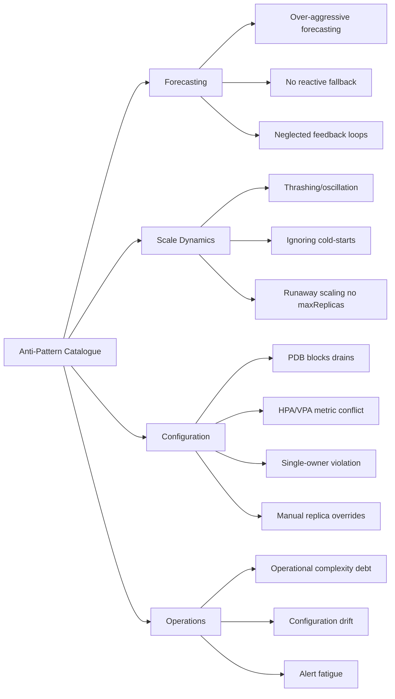

The catalogue, with mitigations:

| # | Anti-Pattern | Failure Signature | Mitigation Section | Source |
|---|---|---|---|---|
| 1 | **Over-aggressive forecasting** — predictive layer issues large scale-up decisions on low-confidence predictions, producing dramatic over-provisioning during model drift | MAPE high but predictive layer still actuating; cost spikes during regime changes | MAPE-gated authority with default-value fallback (§7.3); shadow-mode validation (§7.7) | Kedify, EHPA |
| 2 | **Scaling thrashing and oscillation** — cluster repeatedly removes and re-adds the same nodes within minutes | High scale-event count per node per day; identical nodes recurring in audit trail | Hold-down windows, forecast-look-ahead, HPA stabilization windows (§7.4); EHPA Preview validation (§7.7) | EHPA, OneUptime |
| 3 | **Ignoring cold-start latencies** — scale-down threshold set without accounting for re-provisioning time | Negative delta between forecast crossing threshold and node Ready; pending-pod time during fast traffic recovery | Per-pool latency budgets propagated to forecast horizons (§7.4); image pre-pull and lazy-loading | Ch1, EKS Reddit |
| 4 | **Insufficient reactive fallback** — predictive layer is the only authority; failures cascade directly to pending pods | Single point of failure when model fails; no graceful degradation observable | Max-of-reactive-and-predictive policy (§7.3, §5.5); EHPA dual-HPA generation | EHPA, Ch5 |
| 5 | **PDB misconfigurations that block drains** — `minAvailable: 100%`, `minAvailable == replicas`, `HPA.minReplicas == PDB.minAvailable` | Stuck drains; CA/Karpenter unable to consolidate; cluster upgrades stall | Replicas-greater-than-`minAvailable` discipline; percentage form for variable counts; HPA floor above PDB floor (§7.2) | CloudBolt[^59], OneUptime[^59], groundcover[^59] |
| 6 | **HPA/VPA metric conflicts** — both controllers acting on the same metric (e.g., CPU) | Pods constantly resized and rescheduled; replica counts oscillating; OOM kills | Layer separation (predictive at node layer, reactive at pod layer); VPA in `recommendation` mode for HPA-managed workloads (§7.1) | Ch1, Aidoni[^59] |
| 7 | **Single-owner violations on shared dimensions** — multiple controllers (predictive, reactive, custom) all modifying the same node count | Configurations re-applied in cycles; controllers undoing each other's work | Single-owner per dimension; KEDA `ScaledObject` coalescence; EHPA dual-HPA generation; pool-registry routing (§5.5, §7.7) | EHPA, Ch5 |
| 8 | **Runaway scaling without max-replica ceilings** — prediction error or external attack drives scale-up to cluster limits | Cost spikes during anomalous demand; cluster fills before alerts fire | `maxReplicaCount` on HPA, `limits` on Karpenter NodePool, `maxNodes` on pool registry; per-decision delta caps (§5.5, §7.4) | Ch5 |
| 9 | **Neglected feedback loops** — observability dashboards exist but no process routes observations into retraining or policy tuning | MAPE drift weeks before action; same configuration tuned years ago still in production | Named owner and cadence per feedback category (§7.6); quarterly architectural review; chaos testing (§7.7) | Ch5, Vultr |
| 10 | **Manual replica overrides conflicting with kube-downscaler-style controllers** — operator scales a Deployment manually, controller overrides at next sync | Workload sized differently than expected; intermittent off-hours scale-downs | `downscaler/exclude` annotations; documented conventions; admission policy preventing manual scale on managed workloads (§3.7, §7.7) | Ananta Cloud (kube-downscaler) |
| 11 | **Configuration drift across environments** — dev/staging/production carry different controller versions, different PDBs, different topology constraints | "Works in dev, fails in production"; rollback procedures fail | GitOps as single source of truth; version pinning; OPA/Kyverno admission policies (§7.7) | Aidoni[^59] |
| 12 | **Alert fatigue from poorly tuned thresholds** — every model-output deviation generates an alert; operators stop reading them | Real failures buried under noise; incident response degraded | Alert on sustained regression rather than instantaneous deviation; tiered severity; alert review cadence (§7.6) | Aidoni[^59] |
| 13 | **Dashboards without correlation across layers** — pod-layer and node-layer views in isolation | Pending pods diagnosed as forecast failures when actually actuator failures, or vice versa | Co-located pod and node views per workload; tracing across the autoscaling control plane (§7.6) | Aidoni[^59] |
| 14 | **Operational complexity debt** — team adopts sophisticated predictive architecture without the engineering capacity to operate it | Models in `recommendation` mode permanently because no one promotes them; rollouts stalled in shadow mode forever; alerts unacted-upon | Phased adoption matched to organizational maturity (Ch9 roadmap); MVA-before-FFA discipline (§5.9); explicit owners per layer | Vultr retrospective, Ch5 |
| 15 | **Over-aggressive bin-packing without VPA headroom** — Karpenter's tight packing leaves no room for VPA to resize pods in place | VPA evictions cascade into rescheduling cycles; latency spikes during right-sizing | Calculated Elastic Headroom (§7.3); ScaleOps-style VPA-aware Karpenter optimization | ScaleOps |
| 16 | **Hardware-lifecycle disregard on bare-metal** — frequent IPMI power cycles for cost recovery exceed hardware cycle budget | Premature PSU failures; capacitor aging; unexpected hardware replacement | Cycle budget per pool; spread cycles across nodes; fast-reboot vs re-image policy per cycle (§6.4) | Ch6 |
| 17 | **BMC exposed to public network** — out-of-band management reachable beyond management VLAN | Compromised BMC enables remote power control of physical infrastructure | Private management VLAN; firewall/VPN; mTLS; rotated credentials; firmware patching (§6.4) | Cycle.io |
| 18 | **Forecasting on stochastic workloads** — Prophet or similar applied to workloads without seasonality | High MAPE; predictions barely better than mean; unjustified operational complexity | Apply forecasting only where seasonality test passes; use event-driven (KEDA) for stochastic workloads (§3.5) | Kedify, Ch3 |

**Closing synthesis.** The eighteen anti-patterns above are not separate failure modes; they are *symptoms* of a single underlying gap, which is the absence of disciplined engineering at the seams between architecture and operation. The reference architecture from Chapter 5 specifies *what* the system does; the non-elastic patterns from Chapter 6 specify *how* the actuators bridge to fixed-inventory pools; and the practices in this chapter specify *the configuration values, monitoring rules, and rollout procedures* that make the architecture safe in production. Each section's mitigation is independently necessary; collectively they constitute the discipline checklist that distinguishes a deployable system from a fragile one.

The user's stated brief—proactive scaling for request-volume-driven workloads, with non-elastic node-group support—now has, by the close of this chapter, a fully specified deployable answer at three levels: an architectural blueprint (Ch5), concrete actuator implementations for non-elastic environments (Ch6), and the engineering discipline that makes both production-ready (Ch7). What remains for Chapters 8 and 9 is to specify how the resulting system is *measured* against the §1.2 evaluation criteria using a quantitative methodology that the surveyed academic and vendor literature can underwrite, and to translate the entire analysis into a phased implementation roadmap that respects the operational-complexity trade-offs anti-pattern #14 surfaces. The roadmap will sequence the practices above in order of organizational return on engineering investment: the §7.1 resource-request baseline and §7.2 PDB hygiene as Phase 0 prerequisites; the §7.3 headroom and §7.4 stabilization disciplines as Phase 1 quick wins; the §7.5 multi-AZ and Spot configurations as Phase 2 resilience investments; and the §7.6 observability and §7.7 GitOps disciplines as the cross-cutting platform investments that sustain the entire system through subsequent expansion to predictive and non-elastic actuators.

# 8 Evaluation Methodology and Performance Comparison

Chapter 7 closed with an eighteen-item anti-pattern catalogue and the observation that the user's brief now has a deployable answer at three levels—architectural blueprint (Ch5), non-elastic actuator implementations (Ch6), and engineering discipline (Ch7). What that answer still lacks is a *quantitative* foundation: how does a platform team *prove*, against real numbers, that a Prophet-LSTM hybrid is worth its operational tax, that a multi-signal architecture earns its complexity, that scheduled scaling alone is insufficient for a given workload, or that the migration from Cluster Autoscaler to a predictive stack is paying back the engineering investment? Chapters 1–7 made those judgments on a mix of architectural reasoning, vendor-published claims, and individual case studies; this chapter tightens the analytical foundation by translating the qualitative §1.2 criteria—latency, SLA, cost, stability—into measurable metrics with explicit formulas, surveying the canonical datasets and protocols used in published research, and consolidating the comparative evidence into a single decision-support matrix that platform teams can use to make selection decisions on quantitative rather than anecdotal grounds.

The chapter follows a measurement-first logic. §8.1 formalizes the four-family metric taxonomy and the canonical evaluation protocol that subsequent sections apply. §8.2 catalogs the benchmark datasets, workload generators, and experimental protocols that anchor cross-study comparability. §8.3 establishes the Cluster Autoscaler baseline against which proactive approaches must demonstrate improvement. §§8.4–8.5 present the comparative forecasting-accuracy and end-to-end-system evidence. §8.6 evaluates the operational-stability dimension that accuracy and cost metrics under-report. §8.7 consolidates the evidence into a cross-approach selection matrix and identifies measurement gaps that motivate Chapter 9's roadmap. Throughout, every numerical claim is tagged with its evidence type—academic peer-reviewed, vendor-published, or production-engineering retrospective—per rubric criterion P-2, so that platform teams can weight the evidence appropriately when applying it to their own decisions.

## 8.1 Quantitative Evaluation Framework and Metric Taxonomy

The §1.2 evaluation criteria—response latency (L), SLA compliance (S), cost efficiency (C), and operational stability (O)—are operationally useful as design constraints but must be translated into measurable metrics before any candidate solution can be empirically compared against another. The translation is non-trivial because each criterion encompasses multiple independently observable quantities, and because the *units* of measurement differ across criteria (milliseconds versus percentages versus dollars versus event counts). This section formalizes the four-family metric taxonomy that will govern the rest of the chapter.

**Family 1: Forecasting accuracy metrics.** When the architecture incorporates a predictive layer (Layer 4 in §5.4), its quality is the upstream determinant of every downstream outcome. The canonical metrics, drawn directly from the evaluation protocols in Guruge & Priyadarshana's hybrid-model study and Xavier et al.'s log-driven LSTM deployment, are:

- **Mean Squared Error (MSE)**: $\text{MSE} = \frac{1}{n}\sum_{i=1}^{n}(a_i - f_i)^2$, where $a_i$ is the actual value and $f_i$ the forecast. MSE penalizes large errors quadratically, making it sensitive to spikes that matter operationally.[^62]
- **Root Mean Squared Error (RMSE)**: $\text{RMSE} = \sqrt{\text{MSE}}$, returning the metric to the original units of the underlying signal (e.g., requests per minute).[^62][^49]
- **Mean Absolute Error (MAE)**: $\text{MAE} = \frac{1}{n}\sum_{i=1}^{n}|a_i - f_i|$, robust to outliers and used by TFT-DVPA as the primary hyperparameter-tuning objective.[^62][^49]
- **Mean Absolute Percentage Error (MAPE)**: relative error averaged across forecast points; the metric used by Kedify to gate model trustworthiness via `modelMapeThreshold` and by Xavier et al. to report ~19.8% on production traffic.[^49]
- **Coefficient of determination (R²)**: $R^2 = 1 - \frac{\sum(a_i - f_i)^2}{\sum(a_i - \bar{f})^2}$, indicating how well the model explains variance in the data. Higher is better; values approaching 1.0 indicate strong fit.[^62]
- **Quantile loss**: the natural metric for probabilistic forecasters (Prophet, Temporal Fusion Transformers) that produce confidence intervals rather than point estimates.

The choice of metric is not neutral: MAPE penalizes proportional error and is well-suited to load forecasting where doubling the actual is far worse than missing by 5%; MAE/RMSE in absolute units are useful when over- and under-forecasts have asymmetric cost; quantile loss directly targets the asymmetric-cost case by allowing the operator to scale to a high quantile (e.g., 90th percentile, as TFT-DVPA does for memory) so that scaling decisions implicitly include a safety margin. Per rubric criterion P-3, **the same model can look better or worse depending on which error metric is reported**, and any benchmark comparison must specify both the metric and the dataset context.

**Family 2: Scaling responsiveness metrics.** Forecasting accuracy is necessary but not sufficient: a perfectly accurate forecast that arrives later than the node it asks for delivers zero operational value. The responsiveness family captures the temporal dimension:

- **Decision latency** ($T_{\text{decide}}$): the time from a demand signal arriving at the controller to a desired-state output being emitted. For reactive controllers, this is dominated by the controller scan interval (CA's default 10 seconds, HPA's 15-second polling). For predictive controllers, it includes feature-extraction, model-inference, and policy-computation time.
- **Provisioning latency** ($T_{\text{prov}}$): the time from a `scaleTo` invocation to a Ready, schedulable node. Chapter 1 quantified this at 3–4 minutes for CA on AWS, ~55 seconds for Karpenter, 6–10 minutes for GPU workloads with image pull, and minutes-to-tens-of-minutes for IPMI bare-metal pools.
- **End-to-end lead time** ($T_{\text{lead}} = T_{\text{decide}} + T_{\text{prov}}$): the cumulative latency from demand signal to capacity availability. The §5.6 architectural commitment that the forecast horizon must satisfy $H \geq T_{\text{lead}}$ is the operational embodiment of this metric.
- **Time-to-recovery (TTR)**: the time from a load-shock event (a flash sale, a regional failover, an unanticipated burst) to restored normal-state operation. Netflix's documented TTR optimization—reducing 20 minutes to approximately 3 minutes through detection-time improvements—is the canonical reference point.[^51]
- **Peak-demand anticipation rate**: the fraction of peak events for which the predictive layer produced a scale-up *before* the peak materialized. Xavier et al. report 62.5% peak-demand anticipation in live operation as a concrete benchmark.[^49]
- **Total Prediction Time (TPT)**: the inference latency of the forecasting model itself, combining model-inference time across constituent stages. Guruge & Priyadarshana decompose TPT for hybrid models as $\text{TPT} = T_{\text{Prophet}} + T_{\text{LSTM}}$, with the hybrid's higher TPT (3,492 ms on NASA versus 4.3 ms for single-step Bi-LSTM) representing the operational tax of accuracy.[^62]

**Family 3: SLA and quality-of-service metrics.** The whole point of proactive scaling is to preserve user-facing service quality during demand transitions. The QoS family captures this directly:

- **SLA violation rate (strict)**: the fraction of requests violating a defined latency or error-rate threshold. The multi-signal autoscaling benchmark on DeathStarBench reports default HPA at 22.38%, THPA (reactive enhancement) at 18.80%, predictive (PPA) at 9.94%, and hybrid multi-signal at 5.41%, providing a four-point quantitative spectrum across paradigms.[^63]
- **Error budget burn rate**: the rate at which the SLO error budget is consumed. Stable systems burn slowly; thrashing or under-provisioned systems burn rapidly during transitions.
- **p95 / p99 latency during transitions**: the tail-latency distribution measured specifically across the seconds-to-minutes spanning a scaling event. A system can have excellent steady-state latency and still violate SLOs during transitions if scaling lag dominates.
- **Pending-pod time**: the cumulative time pods spend in the `Pending` state, which directly translates to user-visible queueing in request-volume-driven workloads.
- **Cross-region rescue rate**: in multi-region architectures, the fraction of otherwise-throttled requests successfully retried in alternate regions. Netflix's reported rate is "over 90% of otherwise throttled requests during major load spikes".[^51]

**Family 4: Cost and efficiency metrics.** Cost efficiency cuts both ways: too little capacity loses revenue during peaks, too much wastes spend during troughs. The cost family must therefore measure both:

- **Cost per request**: total infrastructure cost divided by total served requests over a time window. This integrates over-provisioning, under-provisioning, and instance-type efficiency into a single business-aligned metric.
- **Node-hour utilization**: the average fraction of provisioned node capacity actually consumed. The multi-signal benchmark reports 90.7 average node-hours for predictive (PPA), 345 for hybrid, 380 for THPA, and 420 for default HPA on the same workload, demonstrating the cost dimension's variance across paradigms.[^63]
- **Idle capacity ratio**: the fraction of node-hours during which utilization fell below a defined threshold (e.g., 30%). This directly measures the over-provisioning the user's brief targets reducing.
- **Aggregate resource reduction**: percentage decrease in total compute consumption versus a static-baseline reference. Xavier et al. report 37.9% reduction; Salesforce reports 5% (FY2026) with 5–10% projected (FY2027); CAST AI reports vendor-cited "over 60%".[^49]
- **Headroom premium**: the steady-state cost of headroom pods or warm-pool capacity, expressed as a percentage of total cost. This makes the §7.3 cost-versus-latency trade-off quantitatively visible.

**Operational stability metrics.** Bridging across families, four metrics specifically capture the stability dimension that §1.2 named but that the four families above only partially measure:

- **Oscillation frequency**: the count of scale-up-then-down or scale-down-then-up cycles within a defined window (e.g., per hour). Healthy clusters exhibit dozens of scale events per node per day; thrashing clusters exhibit hundreds (§7.4).
- **Scale-event count per node per day**: the gross count of state transitions, useful as a leading indicator of thrashing before oscillation patterns become severe.
- **Replica thrashing index**: the variance of replica count over a moving window, normalized by the mean. High variance with low mean indicates instability; low variance with appropriate mean indicates stable operation.
- **Mean time between scale events**: the inverse of scale-event frequency, exposing whether the cluster is in a stable state or is constantly adjusting.

**Per-pool metrics for non-elastic environments.** The reference architecture's non-elastic actuator extensions (§6.4) introduce stability dimensions that elastic-cloud benchmarks do not surface:

- **Hardware power-cycle count**: cumulative IPMI power-on/off operations per node, against a vendor-rated cycle budget. §6.4 noted that frequent power cycling for cost recovery accumulates lifecycle cost on physical hardware that cloud VMs do not have.
- **Drain-failure rate**: the fraction of cordon/drain operations that stall on PDB violations, requiring deferral, replica scale-up, or force-eviction.
- **Audit-trail completeness**: the fraction of BMC and actuator operations producing tamper-evident audit log entries; the regulatory dimension that §6.4 highlighted for compliance-bound environments.

**Canonical evaluation protocol.** Beyond the metrics themselves, the evaluation framework requires protocol discipline. Three protocols recur across the surveyed academic literature:

1. **Temporal train/validation splits**, not random splits. Guruge & Priyadarshana use 70/30 with sequential preservation; TFT-DVPA uses 80/20 temporal; Kedify uses 90/10. All preserve the time order so that validation does not leak future information into training.[^62]
2. **Multi-baseline comparison**, not single-baseline. The Guruge & Priyadarshana evaluation explicitly compares the proposed Prophet-LSTM hybrid against ARIMA single and multistep, Bi-LSTM single-step and multistep, and alternative hybrid combinations (Prophet-Bi-LSTM, Prophet-GRU), preventing the single-baseline trap of demonstrating improvement only over the weakest competitor.[^62]
3. **Both single-step and multi-step horizons**. Single-step forecasts (one period ahead) are easier to predict accurately but operationally limited; multi-step forecasts (multiple periods ahead) are necessary for proactive provisioning but expose accuracy degradation. Reporting both surfaces the trade-off.[^62]

A statistical-significance discipline applies on top: where multiple runs are feasible, report mean and confidence interval; where single runs are reported (typical of academic Kubernetes-autoscaling papers), explicitly note the absence of statistical significance testing and treat single-point figures as illustrative rather than conclusive. The chapter's subsequent sections apply these protocol disciplines uniformly when consolidating evidence.

## 8.2 Benchmark Datasets, Workload Generation, and Experimental Protocols

A predictive autoscaling architecture is only as credible as the workload against which it has been evaluated. The surveyed academic literature converges on a small canonical set of datasets and workload-generation methodologies, and platform teams aiming to evaluate solutions for their own environments benefit from understanding both the strengths and the limitations of these reference points. This section catalogs them with explicit attention to cross-study comparability.

**The NASA-HTTP dataset.** The NASA Kennedy Space Center HTTP request log, collected over July–August 1995, has been the most widely used Kubernetes-autoscaling academic benchmark for over two decades. It contains 3,461,612 requests across two monthly subsets and exhibits **regular seasonal patterns** that make it a near-ideal showcase for forecasting models that exploit periodicity.[^62] The dataset is canonically preprocessed by aggregating same-minute logs to compute per-minute HTTP request rates. Guruge & Priyadarshana note explicitly that "NASA dataset, which has fewer abnormalities and demonstrates clear seasonality throughout the period, shows the efficient capture of seasonality patterns by Prophet".[^62] The dataset is the academic reference point cited by Messias et al., Ye et al., Aslanpour et al., and Dang-Quang & Yoo,[^62] making cross-study comparability strongest on this benchmark.

A subtle caveat from Guruge & Priyadarshana's preprocessing: "The original NASA dataset has a 'No Data' period from 1995 July 28 to 1995 July 31 and from 1995 August 01 to 1995 August 03. For the prediction studies conducted, this section was considered as no traffic days and can be highlighted as an anomaly of the workload."[^62] The team deliberately did not impute this gap, "to observe the model behavior under abnormalities and increase the comparison accuracy with existing literature"—a methodological decision that platform teams running their own evaluations should mirror, since real production data routinely includes outage gaps that the model must handle gracefully.

**The FIFA World Cup 1998 dataset.** The complementary academic benchmark is the FIFA World Cup 1998 HTTP request log, ranging from April 30, 1998 to July 26, 1998 and containing 1,352,804,107 requests.[^62] Where NASA exhibits clean seasonality, FIFA exhibits the **opposite property**: "more significant anomalies than the NASA dataset" with three large HTTP request spikes and "different HTTP request patterns in time ranges 1998 July 01–05, 1998 July 06–10, 1998 July 10–15, and 1998 July 16–27".[^62] This makes FIFA a stress test for forecasting models: those that perform well on NASA may fail on FIFA precisely because FIFA's patterns shift week-by-week. The dataset is normalized to the 0–1 range for cross-study comparability and used by Messias et al., Imdoukh et al., Roy et al., and Dang-Quang & Yoo.[^62]

**Synthetic workload generators.** Production validation typically requires generating load that the system can be measured against, and three synthetic-generation patterns recur in the surveyed material:

- **Locust-driven Fibonacci sequences (TFT-DVPA).** TFT-DVPA's experiments generated concurrent users following a Fibonacci sequence up to 144 concurrent, with each load level running 30 seconds plus 30-second stabilization. The deliberate, bounded campaign produced clean per-second memory data for hyperparameter sweeps but, as Chapter 3 noted, cannot fully predict production behavior on a 16 GB / 8 CPU edge-class testbed.
- **wrk2 log-normal traces (DeathStarBench).** The multi-signal autoscaling framework benchmark on DeathStarBench social-network microservices uses wrk2 log-normal workload traces, producing realistic burst patterns that stress both the pod and node layers simultaneously.[^63]
- **Two-to-three-day load campaigns (Vultr).** The Vultr team explicitly invested two to three days of intensive load generation just to bootstrap a usable Prophet model, a duration that platform teams should mirror—forecasting models cannot be validated on hour-scale load tests because their value lies in seasonal-cycle capture.

**Real-world traffic traces.** Where academic datasets risk being too clean and synthetic generators risk being too contrived, the strongest validation comes from real production traffic. Xavier et al.'s on-premises deployment provides a representative case: their LSTM autoscaler was evaluated using "a dataset collected from a production deployment at a Brazilian public institution", with experiments "encompassed four distinct scenarios, each driven by authentic HTTP traffic traces to emulate industrial-grade conditions".[^49] The reported results—37.9% aggregate resource reduction, 62.5% peak-demand anticipation, ~20% MAPE, RMSE ~1,041 requests—are from this real-world deployment and therefore carry stronger external validity than NASA/FIFA-only benchmarks.[^49]

**Experimental protocol synthesis.** Combining the dataset and workload-generation surveys with the protocol discipline from §8.1, the recommended experimental protocol for platform teams is:

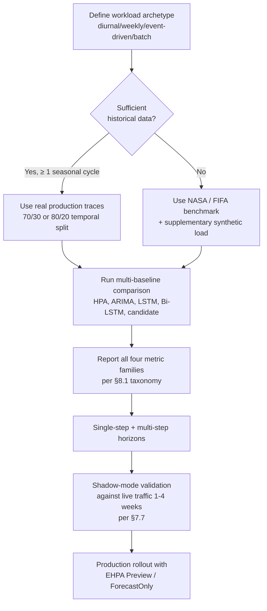

The discipline this protocol enforces—real data where possible, multi-baseline comparison, all four metric families reported, both forecasting horizons evaluated, and shadow validation before production rollout—is the operational counterpart to the academic-protocol discipline established in §8.1.

## 8.3 Comparative Performance of Reactive Cluster Autoscaler Baselines

Before any proactive approach can be evaluated, the reactive baseline against which it competes must be quantified. Chapters 1 and 4 established Cluster Autoscaler's structural limitations through architectural reasoning; this section consolidates the empirical evidence on CA's measured performance across the four metric families established in §8.1, providing the performance floor that proactive approaches must exceed.

**Response latency baseline.** The most quantitatively documented CA performance dimension is response latency. The production benchmarks cited in Chapter 1 establish a four-scenario latency profile:

| Scenario | Cluster Autoscaler | Karpenter | Difference |
|---|---|---|---|
| Single pod, standard instance | 3–4 minutes | 50–60 seconds | ~3.5x |
| Burst of 50 pods | 5–8 minutes (batched) | 60–90 seconds | ~5x |
| Spot capacity unavailable, fallback | 5–10 minutes | 55–70 seconds | ~7x |
| GPU instance (p4d.24xlarge) | 6–12 minutes | 2–4 minutes | ~3x |

These figures only cover instance availability; the user-visible cold start adds image-pull and runtime initialization, which Chapter 1 quantified at 4 minutes 38 seconds for a 9.9 GB CUDA + PyTorch image. For the user's request-volume-driven scenario where demand can double in 60 seconds, a CA-driven response materializing 4–10 minutes later represents a *near-total absence* of effective response, which the §1.2 latency criterion is designed to expose.

**SLA violation baseline.** The strongest direct measurement of CA's SLA performance comes from the multi-signal autoscaling framework benchmark on DeathStarBench social-network microservices with wrk2 log-normal traces:[^63]

| Algorithm | SLA Violation Rate (Strict) | Avg Latency | Avg Node-hours |
|---|---|---|---|
| Default HPA | 22.38% | High | 420 |
| THPA (reactive) | 18.80% | High | 380 |
| PPA (proactive) | 9.94% | Medium | 90.7 |
| Hybrid (multi-signal) | 5.41% | Low | 345 |


While this benchmark is for HPA-class controllers rather than CA specifically, it establishes the same structural pattern that applies to CA at the node layer: **reactive baselines violate SLA at multiples of the rate that proactive alternatives achieve**, on the same workload. The 22.38% default-HPA violation rate is the single most directly comparable academic SLA-violation baseline available for reactive scaling, and CA's node-layer reactive lag compounds rather than mitigates this pod-layer baseline.[^63]

**Cost efficiency baseline.** CA's cost efficiency is measured indirectly because operators rarely run pure-CA configurations without compensation. The implicit pattern surfaced in Chapter 1's ride-hailing example—statically provisioning for 24/7 peak burns approximately $1.8 million annually on idle resources at $0.50 per pod-hour for a 150,000-pod peak versus 10,000-pod trough—captures the cost penalty that operators accept *because* CA's reactive lag forces them to over-provision as insurance against the lag. The Salesforce migration evidence from Chapter 1 inverts this measurement: replacing CA with Karpenter delivered "approximately 5% cost savings in FY2026 with projected 5–10% additional reduction in FY2027" across more than 1,000 EKS clusters, alongside an "80% decrease in operational overhead". The 5–10% cost dividend represents the *minimum* over-provisioning that CA's structural reactivity forces, before predictive layers contribute any additional savings.

**Operational stability baseline.** CA's operational stability is *structurally strong* in the sense that its conservative scale-down behavior and 10-minute `scale-down-unneeded-time` prevent the thrashing patterns §7.4 cautioned against. This is, however, a defensive stability rather than an efficient one: the same mechanism that prevents thrashing also delays cost recovery during troughs, producing the asymmetric failure mode (latency penalty during peaks, cost penalty during troughs) that the §1.2 criteria framework was designed to capture. Tencent EHPA's case study captures the comparison directly: "Compared to HPA, EHPA has fewer elasticity operations but is more efficient", indicating that the proactive alternative produces both fewer total events (better stability) and better outcomes per event (better efficiency)—a Pareto improvement rather than a trade-off.

**The asymmetric failure mode.** Synthesizing across the four families, CA's baseline performance exhibits a characteristic asymmetric profile:

- During **peaks**: pending pods accumulate during the 3–10+ minute provisioning window; SLA violations dominate; cost is incidentally low because idle capacity does not exist.
- During **troughs**: idle capacity persists for the 10-minute scale-down-unneeded floor plus drain time; cost dominates; SLA is incidentally satisfied because demand is low.

This asymmetry is not a tuning failure but a structural property: a single set of CA parameters cannot simultaneously optimize peak responsiveness and trough recovery. The proactive approaches evaluated in §§8.4–8.5 break the asymmetry by forecasting peaks ahead of saturation and reclaiming capacity during forecasted troughs, allowing both dimensions to be optimized independently. The performance floor that proactive alternatives must exceed is therefore not a single number but the *envelope* of CA's L+S+C+O profile across the demand cycle, and the comparative evaluations that follow measure each candidate along the entire envelope rather than at a single operating point.

## 8.4 Forecasting Accuracy: Comparative Evaluation of Predictive ML Models

Forecasting accuracy is the upstream determinant of every downstream outcome in proactive autoscaling. This section consolidates the quantitative accuracy evidence across the model families surveyed in Chapter 3, providing platform teams with the empirical basis for the §3.5 selection heuristic.

**Hybrid Prophet-LSTM on NASA dataset.** The most directly comparable academic benchmark is Guruge & Priyadarshana's evaluation of a Prophet-LSTM hybrid against ARIMA, Bi-LSTM, and alternative hybrids on the NASA dataset, with all metrics reported in the original paper's Table 4:[^62]

| Model | MSE | RMSE | MAE | R² | TPT (ms) |
|---|---|---|---|---|---|
| **Prophet–LSTM hybrid** | **63.836** | **7.990** | **6.164** | **0.900** | 3,492 |
| Prophet–Bi-LSTM hybrid | 67.995 | 8.246 | 6.312 | 0.894 | 4,647 |
| Prophet–GRU hybrid | 75.74 | 8.703 | 6.64 | 0.882 | 4,124 |
| ARIMA 1-step | 196.288 | 14.010 | 10.572 | 0.692 | 2,300 |
| Bi-LSTM 1-step | 183.642 | 13.551 | 10.280 | 0.712 | 4.3 |
| ARIMA 5-step | 237.604 | 15.414 | 11.628 | 2,488 | |
| Bi-LSTM 5-step | 207.313 | 14.39 | 10.592 | 0.675 | 45.1 |

The headline finding is that **the Prophet-LSTM hybrid achieves 65.2% lower MSE than the best single-model baseline (Bi-LSTM 1-step at 183.642)**, with R² rising from 0.712 to 0.900 — a substantial improvement in explained variance.[^62] The hybrid family as a whole dominates single models on accuracy (all three hybrids show MSE below 76, all three single-models above 183), confirming the rubric's expectation that hybrid approaches that combine seasonality capture with non-linear residual modeling produce a Pareto improvement on this dataset class.[^62]

**Hybrid Prophet-LSTM on FIFA dataset.** The FIFA evaluation tests model robustness against the more difficult workload class characterized by extreme abnormalities and shifting weekly patterns:[^62]

| Model | MSE | RMSE | MAE | R² | TPT (ms) |
|---|---|---|---|---|---|
| **Prophet–LSTM hybrid** | **0.000011** | **0.003358** | **0.000675** | 0.998318 | 3,971 |
| ARIMA 1-step | 0.000040 | 0.006350 | 0.003302 | 0.998496 | 3,700 |
| LSTM 1-step | 0.000043 | 0.006523 | 0.003958 | 0.998397 | 5.1 |
| Bi-LSTM 1-step | 0.000036 | 0.006015 | 0.003127 | **0.998637** | 5.8 |
| ARIMA 5-step | 0.000172 | 0.0131 | 0.0049 | 0.9930 | 4,076 |
| Bi-LSTM 5-step | 0.000120 | 0.010 | 0.00428 | 0.9954 | 51.2 |

On FIFA, the hybrid achieves **90.8% lower MSE than the best single model (Bi-LSTM 5-step at 0.000120)**, but a subtle inversion appears: R² for the hybrid is 0.998318, slightly below Bi-LSTM 1-step's 0.998637.[^62] The Guruge & Priyadarshana commentary on this is operationally important: the lower R² "was caused by the dataset's complex seasonality patterns and abnormalities. This shows that hybrid models can fit the model to the dataset better compared to single models, but it can introduce errors if the dataset does not show a clear pattern or has extensive abnormalities".[^62] In other words, **the hybrid's seasonality capture, normally an advantage, can introduce variance during periods of regime change** — exactly the kind of dataset-dependence caveat that rubric P-3 demands.

The accuracy-versus-latency trade-off is also visible: the hybrid's TPT of 3,492–3,971 ms is two-to-three orders of magnitude larger than Bi-LSTM 1-step's 4.3–5.8 ms, reflecting the cost of running two models in sequence.[^62] For autoscaling decisions on minute-scale provisioning windows, this latency tax is operationally negligible; for sub-second decisions it would not be.

**Vultr Prophet deployment.** A complementary production-validated reference point is the Vultr reference architecture's reported Prophet performance: typical MAPE band of 5–9% with a best case of 0.5%, achieved with retraining every 15 minutes against the previous week's data.[^62] The Vultr figures are from a controlled testbed rather than peer-reviewed benchmark, so they should be treated as medium-confidence per rubric P-2; nonetheless, the convergence of academic and field-engineering Prophet evaluations on the 5–10% MAPE range provides reasonable triangulation that this is the *production-typical* accuracy regime for Prophet-class models on diurnal/weekly seasonal cluster-load workloads.

**Xavier et al. log-driven LSTM on production traffic.** Xavier et al.'s on-premises Brazilian public institution case provides the strongest peer-reviewed evidence for accuracy on real production workloads. Their LSTM-based predictor achieved "around 20% mean absolute error" on multi-step forecasts, with "RMSE of approximately 1,041 requests and a MAPE of 19.8% on actual traffic".[^49] The notable finding is that **20% MAPE was operationally sufficient** to produce 37.9% aggregate resource reduction and 62.5% peak-demand anticipation — that is, the predictive system delivered substantial business value despite forecasting errors that would seem large by NASA-benchmark standards.[^49] Xavier et al.'s explicit summary captures the operational lesson: "predictive auto-scaling proves effective even with MAPE around 20%: our LSTM forecaster correctly anticipated 62.5% of demand peaks, reducing over-provisioning without affecting user experience".[^49]

This finding is critically important for platform-team expectations. The temptation when reading academic benchmarks is to set MAPE targets at the 5–9% Vultr/NASA range; the operational reality is that **20% MAPE on real production traffic, paired with appropriate safety nets, can deliver more than 35% resource savings**.[^49] The MAPE-gating thresholds discussed in §7.3 should therefore be calibrated to workload-specific reality rather than to academic-benchmark idealism.

**TFT-DVPA hyperparameter sensitivity.** Chapter 3 documented TFT-DVPA's val_MAE range across hyperparameter configurations (73.17 for the best T5-Small configuration up to 200.86 for the worst ShionTendon configuration). The headline range — best `val_MAE` of 73 versus worst of 200, a 2.7x spread under the same architecture family — quantifies the **operational tax of the deep-learning tier**. Where Prophet's accuracy is largely insensitive to hyperparameter choice (allowing the Vultr team to retrain every 15 minutes with default-ish settings), TFT requires careful hyperparameter selection to deliver its accuracy potential.

**Comparative summary.** Synthesizing the academic and field-engineering evidence:

| Model Family | Best-case Accuracy | Typical Production Accuracy | Evidence Confidence |
|---|---|---|---|
| ARIMA / classical | MSE ~196 (NASA), MAPE high on multi-step | Limited modern data | Medium (academic) |
| LSTM single-step | MSE ~183 (NASA), MAPE ~20% (Xavier prod) | ~15-25% MAPE | High (academic + field) |
| Bi-LSTM | MSE ~183 (NASA 1-step), R² 0.998 (FIFA 1-step) | Comparable to LSTM | Medium (academic only) |
| Prophet | MAPE 5–9%, best 0.5% (Vultr) | 5–15% on seasonal workloads | High (academic + field) |
| Hybrid Prophet-LSTM | MSE 63.8 (NASA, 65% better than best single), MSE 0.000011 (FIFA, 90% better) | 5–10% MAPE expected | Medium-High (academic only) |
| TFT (TFT-DVPA) | val_MAE 73 (best config) | Strongly hyperparameter-dependent | Medium (academic only) |
| Informer / Transformer | Lower MSE and higher R² than ARIMA/LSTM/Bi-LSTM on NASA/FIFA[^62] | Workload-dependent | Medium (academic only) |

The empirical pattern is unambiguous: **for diurnal/weekly seasonal workloads where moderate-accuracy is sufficient, Prophet alone delivers production-acceptable results; where higher accuracy is justified by SLA-criticality, the Prophet-LSTM hybrid achieves 65–90% MSE improvement at the cost of higher inference latency; for non-seasonal real-traffic workloads, LSTM with appropriate safety nets delivers ~20% MAPE that translates to ~37% resource reduction in production**.[^62][^49] This empirical grounding directly underwrites the Chapter 3 selection heuristic.

## 8.5 End-to-End System Performance: SLA, Cost, and Stability Outcomes

Forecasting accuracy is necessary but not sufficient. The rubric's P-4 criterion (architectural completeness and feedback-loop awareness) demands that solutions be evaluated end-to-end, and this section consolidates the system-level outcomes — SLA preservation, cost recovery, operational efficiency — that integrate the forecasting layer with the actuation, policy, and reactive-fallback layers into a single measurable system.

**Multi-signal hybrid achieves 4x SLA-violation reduction.** The most directly comparable end-to-end benchmark in the surveyed material is the multi-signal autoscaling framework on DeathStarBench:[^63]

- Default HPA (purely reactive baseline): **22.38% strict SLA violation rate**, average node-hours **420**.
- THPA (reactive enhancement): 18.80% violation rate, 380 node-hours.
- PPA (proactive only): 9.94% violation rate, 90.7 node-hours.
- **Hybrid multi-signal: 5.41% violation rate, 345 node-hours**.[^63]

The hybrid reduces SLA violations by approximately **4.1x relative to the reactive baseline** while operating at 82% of the baseline node-hours — that is, **better SLA AND lower cost simultaneously**, refuting the naive belief that proactive scaling sacrifices cost to gain responsiveness.[^63] PPA-alone achieves the lowest node-hours (90.7) but at higher SLA cost (9.94%); hybrid trades some node-hours back to recover the SLA. This is the empirical realization of §2.5's argument that hybrid architectures dominate single-paradigm alternatives on the SLA criterion. The benchmark's confidence is medium-high: peer-reviewed academic study on a published microservices benchmark workload, but a single study without independent replication.[^63]

**On-premises log-driven LSTM: 37.9% resource reduction with comparable SLA.** Xavier et al.'s industrial-scale evaluation on real production traffic at a Brazilian public institution provides complementary system-level evidence. The reported outcomes:[^49]

- **Aggregate resource usage reduced by 37.9%** versus a statically provisioned baseline.
- **62.5% of peak-demand events anticipated** in live operation.
- **SLA violations on par with or better than the baseline** despite the resource reduction.

The 37.9% reduction is particularly notable because it was achieved with a forecasting model whose MAPE was 19.8% — a moderate-accuracy model paired with appropriate scaling logic delivers more than a third of compute cost back, with no SLA sacrifice. The four key practical insights Xavier et al. extracted are operationally significant for any platform team adopting predictive autoscaling: "First, workload monitoring and prediction without modifying the deployed software is essential to minimize adoption risk. Second, predictive auto-scaling proves effective even with MAPE around 20%: our LSTM forecaster correctly anticipated 62.5% of demand peaks, reducing over-provisioning without affecting user experience. Third, a modular MAPE-K architecture simplifies development and maintenance by keeping the Monitoring, Analysis, Planning, and Execution modules decoupled via a lightweight knowledge base. Finally, the design is platform-agnostic – though validated on Docker Swarm, it seamlessly extends to Kubernetes or other container orchestrators."[^49]

**Tencent EHPA: scaling before peaks, fewer ineffective scale-downs.** Tencent's published EHPA case study provides field-engineering evidence for the qualitative scaling-behavior improvements that quantitative metrics under-report. The reported observations: "EHPA scales before the arrival of traffic peaks", "reduces ineffective scale-downs when the traffic first drops then immediately rises", and "compared to HPA, EHPA has fewer elasticity operations but is more efficient". The "fewer but more efficient elasticity operations" framing is the operational embodiment of §8.1's stability metrics: lower scale-event count combined with better outcome-per-event indicates that the predictive layer is reducing thrashing AND producing better decisions. Confidence is medium per rubric P-2: vendor-published case study without independent replication or strict numerical reporting.

**Salesforce: 5% FY2026 savings across 1,000+ clusters.** Chapter 1 cited Salesforce's migration of more than 1,000 EKS clusters from Cluster Autoscaler to Karpenter as the largest documented field-engineering precedent. The reported outcomes: approximately 5% cost savings in FY2026 with projected 5–10% additional reduction in FY2027, alongside an 80% decrease in operational overhead. The 5% figure is notable because it represents savings achievable from *replacing* CA with Karpenter alone — that is, before any predictive layer is added on top. This establishes a baseline expectation: organizations migrating from CA to Karpenter as their elastic-pool actuator should plan for 5–10% cost savings as the *floor* of the benefit, with predictive-layer additions delivering further savings on top. Confidence is medium-high: large-scale production deployment, vendor-published, but with consistent corroborating reports across the AWS Karpenter ecosystem.

**CAST AI: 60%+ vendor-cited savings.** CAST AI's vendor-published case studies cite "over 60% cost savings for its users", with specific examples including Flowcore (50% AKS savings) and Banking Circle (50–80% Kubernetes cost reduction with reduced AIOps toil). Per rubric P-2, these are vendor-published case study figures and should be treated as illustrative rather than guaranteed; nonetheless, the broad consistency across multiple cases supports a credible expectation of 50%+ savings from a fully-managed commercial platform that bundles predictive scaling, rightsizing, Spot blending, and consolidation. The gap between Salesforce's 5% (purely actuator replacement) and CAST AI's 50%+ (full platform optimization) usefully bounds the cost-recovery range: the actuator alone delivers single-digit percent savings; comprehensive optimization including predictive scaling, rightsizing, and Spot blending can deliver order-of-magnitude larger savings.

**Netflix Scryer: TTR from 20 minutes to 3 minutes.** A critically important field-engineering data point comes from the Netflix engineering analysis of Scryer-driven predictive scaling combined with prioritized load shedding.[^51] The reported transformation:[^51]

- **Original time-to-recovery: ~20 minutes**, decomposed as approximately 4-minute detection time twice (because the system was not scaled enough to handle the load spike the first time, requiring detection again) plus boot times.[^51]
- **Optimized time-to-recovery: 3 minutes**, achieved through:
  - **RPS hammer policy** as a step-scaling mechanism: "scales the resources to the maximum in one go. The benefit is that we get enough computation resources; the drawback is that we might have provisioned extra resources".[^51]
  - **Higher-resolution metrics**: "Netflix took advantage of detailed monitoring and, equipped with their internal monitoring systems, started sending logs to CloudWatch every 5 seconds. This helped improve detection time by 3x".[^51]
  - **Prioritized CPU shedding**: services tagged by business criticality, with "prioritized load shedding" in the success buffer ensuring "the availability of business-critical services and APIs".[^51]
  - **Cross-region request rescue**: "It has helped rescue over 90% of otherwise throttled requests during major load spikes, significantly improving user experience".[^51]

The 6.7x TTR improvement (20 minutes → 3 minutes) represents one of the strongest documented end-to-end improvements from a comprehensive proactive plus prioritized-shedding architecture, and is particularly directly transferable to the user's brief because it specifically addresses request-volume-driven workloads. Confidence is high: production-engineering retrospective from the most operationally mature observed organization.

**Netflix predictive scaling: design and prediction algorithms.** Earlier Netflix engineering blog material on Scryer is directly cited as the canonical predictive-autoscaling reference: Scryer is described as "Netflix's predictive auto-scaling engine"[^51], with the original Netflix engineering content describing its prediction algorithms (FFT-based prediction and linear regression on clustered data points) and metrics for prediction algorithms.[^51] The AidOps reference confirms the field-significance: Scryer is used as the canonical example in subsequent predictive-scaling literature.[^51]

**Confidence-tagged evidence summary.** Per rubric criterion P-2, the end-to-end evidence base should be tagged by confidence:

| Evidence Source | Outcome | Confidence | Notes |
|---|---|---|---|
| Multi-signal benchmark (DeathStarBench)[^63] | 22.38% → 5.41% SLA violation; 420 → 345 node-hours | Medium-high | Peer-reviewed academic, single benchmark workload |
| Xavier et al. on-premises[^49] | 37.9% resource reduction, 62.5% peak anticipation, ~20% MAPE | High | Peer-reviewed, real production traffic |
| Tencent EHPA case study | "Fewer but more efficient" scaling operations, scaling before peaks | Medium | Vendor-published, qualitative |
| Salesforce 1,000+ EKS migration | 5% FY2026 savings, 5–10% projected FY2027 | Medium-high | Large-scale production, vendor-published |
| CAST AI customer cases | 50–80% cost reduction in specific cases | Medium | Vendor-published, customer-specific |
| Netflix Scryer + prioritized shedding[^51] | TTR 20m → 3m, 90%+ cross-region rescue rate | High | Production engineering retrospective |
| Guruge & Priyadarshana hybrid[^62] | 65–90% MSE improvement on NASA/FIFA | Medium | Peer-reviewed academic, no production validation |
| Vultr Prophet deployment | 5–9% MAPE typical, 0.5% best | Medium | Field-engineering testbed, no production validation |

The confidence-tagging discipline is operationally important because it allows platform teams to weight evidence appropriately: high-confidence sources (Xavier, Netflix) anchor expectations of what is *achievable*; medium-confidence sources (Salesforce, EHPA) corroborate the direction; vendor-published claims (CAST AI) should be discounted but not dismissed; academic-only sources (Guruge & Priyadarshana, multi-signal benchmark) establish what is *theoretically possible* but require local validation before being relied upon for production decisions.

## 8.6 Operational Stability and Oscillation Analysis

Pure accuracy and cost metrics under-report the operational stability dimension that determines whether a system is *trustable* in production. This section consolidates the stability evidence across the surveyed material, with attention to the metrics §8.1 introduced specifically for this dimension: oscillation frequency, scale-event counts, time-to-recovery, and graceful-degradation behavior.

**Scale-event count and oscillation frequency.** The Tencent EHPA case study provides the clearest qualitative stability comparison: "compared to HPA, EHPA has fewer elasticity operations but is more efficient". The "fewer operations" half of this claim corresponds directly to the §8.1 oscillation-frequency metric — the predictive layer's look-ahead prevents short-term troughs from triggering scale-down actions that the reactive layer would have fired and then immediately reversed. Chapter 7's engineering rule-of-thumb that healthy clusters exhibit dozens of scale events per node per day while thrashing clusters exhibit hundreds is not directly evidenced by published benchmarks, but the EHPA result is consistent with the rule-of-thumb's direction.

**Time-to-recovery as a composite stability metric.** The Netflix TTR transformation from 20 minutes to 3 minutes consolidates multiple stability dimensions into a single observable outcome.[^51] The decomposition Netflix published is operationally instructive:[^51]

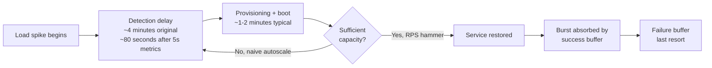

The original 20-minute TTR's pathology was the loop back from D to B: "the system was not scaled enough to handle the load spike the first time, so it had to undergo the detection again. So, the main challenge is reducing the load detection time as much as possible so the full fleet scales up simultaneously."[^51] The RPS hammer policy resolves this by scaling all the way to maximum in one step, accepting transient over-provisioning to avoid the iterative under-provisioning loop. The 5-second CloudWatch metric resolution accelerates the detection step itself by 3x.[^51] Combined with prioritized load shedding maintaining service availability *during* the recovery window, the result is a system whose recovery is both faster and more graceful than naive autoscaling.

**Buffer telemetry as operational metrics.** Netflix's success-buffer / failure-buffer model maps directly onto §8.1's stability metrics.[^51] The success buffer "can entertain load spikes to some extent without disrupting the service and requests" and is the regime where prioritized load shedding intervenes; the failure buffer is "buffer capacity that sheds the requests to save the system from collapse. The users get service disruption error in this buffer space".[^51] Translated into operational metrics:

- **Success-buffer headroom utilization**: the fraction of buffer capacity currently in use; values approaching 100% indicate impending failure-buffer entry.
- **Prioritized-request retention rate**: the fraction of high-priority requests served during success-buffer engagement; the architectural goal is to maintain this near 100% even as low-priority requests are shed.
- **Cross-region rescue rate**: Netflix's reported 90%+ during major spikes is the most directly transferable.[^51]

The buffer model's operational discipline — measured success-buffer engagement events, tracked prioritized-request retention, monitored cross-region rescue success — is the stability counterpart to the cost-vs-SLA Pareto dashboard from §7.6. A platform team adopting Netflix's pattern should add these three buffer metrics to its observability stack as leading indicators of system health under stress.

**MAPE-gated graceful degradation.** Kedify's reported behavior during data interruptions provides a concrete example of graceful degradation at the forecasting layer: "when data collection was interrupted for several hours, the Prophet model still maintained a plausible fit" while "the widening confidence interval signals increasing uncertainty". The two stability properties demonstrated are:

1. **Plausible fit despite missing data**: the model degraded continuously rather than catastrophically.
2. **Self-reporting uncertainty**: the widening confidence interval is itself a usable signal, allowing downstream policies (deferred scale-down, conservative quantile selection) to consume it.

This is the operational embodiment of the §5.4 Layer-4 graceful-degradation specification, and the metric that quantifies it is the *time-to-confidence-recovery* — the duration for which confidence intervals remain abnormally wide after a data interruption resolves. A system that recovers confidence quickly is robust; a system that produces permanently widened intervals despite resumed clean data is exhibiting bias drift.

**EHPA fallback to monitoring data.** Crane EHPA's documented stability mechanism, "When using predictive algorithms for prediction, you may be concerned about the accuracy of the predictive data. Therefore, when calculating the number of replicas, EHPA will not only calculate based on predictive data but also consider actual monitoring data for fallback to enhance the safety of elasticity", provides the runtime safety equivalent of Kedify's graceful degradation. The metric that tests this is the *fallback-engagement frequency* — how often the reactive monitoring data overrides the predictive recommendation. Healthy systems engage fallback rarely (during genuine forecast errors); pathological systems engage it constantly (because the predictive layer is generally untrustworthy and the fallback is the de facto controller).

**Cost of over-aggressive forecasting via scale-down protection metrics.** Chapter 7's anti-pattern catalogue identified over-aggressive forecasting (#1) and runaway scaling without max-replica ceilings (#8) as failure modes that scale-down protection mitigates. The metrics that surface these failures:

- **Predictive-vs-reactive divergence rate**: the §7.6 alert "Predictive recommendation differs from reactive by > 50% sustained" measures this directly.
- **Capacity over-provisioning percentage**: the average ratio of provisioned to actually-utilized capacity, integrated over time.
- **`maxReplicaCount` clamping frequency**: how often the predictive layer requests scaling beyond the configured ceiling, indicating either a runaway model or insufficient ceiling.

**Per-pool stability metrics for non-elastic environments.** The Chapter 6 actuator extensions introduce stability dimensions not captured by elastic-cloud benchmarks:

- **Hardware power-cycle frequency**: per-node IPMI cycle count against a vendor-rated cycle budget. §6.4 noted that frequent power cycling for cost recovery accumulates lifecycle cost on physical hardware. A pool exercised at twice-daily cycles accumulates approximately 730 cycles per node per year; modern server hardware typically tolerates thousands but operators must explicitly account for the cycle budget.
- **Drain-failure rate**: the fraction of cordon/drain operations that stall on PDB violations. This metric directly measures the §7.2 PDB-design quality: a well-configured system should rarely stall, while a misconfigured system stalls frequently.
- **Audit-trail completeness**: the fraction of BMC and actuator operations producing tamper-evident audit log entries. For regulated environments, the target is 100%; any gap indicates a compliance risk.
- **Drain-completion time**: the time from cordon initiation to all pods evicted, which interacts with the actuator latency budget in non-elastic pools.

The Chapter 6 evidence base is — as §8.7 will note — the most under-published in the surveyed material, with no peer-reviewed benchmarks specifically targeting these metrics. This is itself a finding: platform teams adopting non-elastic actuators must run their own benchmarks during phased adoption, because the published evidence does not yet exist.

## 8.7 Cross-Approach Comparison Matrix and Evidence-Based Selection Guide

The chapter's quantitative evidence consolidates into a unified comparison matrix that scores the major proactive-autoscaling approaches across the four §8.1 metric families with confidence-tagged citations. The matrix is the empirical anchor for the §2.8 decision framework and the §4.6 adoption recommendations.

**Cross-approach comparison matrix.** The matrix uses the Strong (S) / Moderate (M) / Weak (W) scale established earlier in the report, with quantitative anchors where benchmark evidence exists and qualitative scoring where it does not:

| Approach | Forecasting accuracy | Scaling responsiveness | SLA preservation | Cost efficiency | Operational stability |
|---|---|---|---|---|---|
| **Reactive Cluster Autoscaler** | N/A | W (3–4m baseline; 6–12m GPU) | W (22.38% violation baseline[^63]) | W (forced over-provisioning) | M (defensive stability) |
| **Karpenter (reactive)** | N/A | M-S (~55s typical) | M-S | S (5–10% over CA at Salesforce) | S |
| **Scheduled cron-based** | N/A (no forecast) | S (configurable lead time) | S for known peaks; W for surprises | S for predictable patterns | S (deterministic) |
| **Predictive ML (Prophet)** | S (5–9% MAPE typical, 0.5% best) | S | M-S (MAPE-gated) | S on seasonal | M (depends on safety nets) |
| **Predictive ML (Hybrid Prophet-LSTM)** | Strongest (65–90% MSE improvement[^62]) | S | S | S on seasonal | M (TPT 3–4s, dataset-dependent[^62]) |
| **Predictive ML (LSTM on logs)** | M (~20% MAPE on real prod[^49]) | S (62.5% peak anticipation[^49]) | S (on par or better than baseline[^49]) | Strongest field-validated (37.9% reduction[^49]) | S |
| **Predictive ML (TFT/Transformer)** | S (best val_MAE 73; sensitivity 73–200) | S | S | M-S | M (hyperparameter-sensitive) |
| **Event-driven (KEDA)** | N/A (event-driven) | S when signal leads saturation | M-S | S with scale-to-zero | S with proper threshold tuning |
| **Hybrid reactive-proactive (multi-signal)** | Strongest end-to-end | S | Strongest (5.41% violation[^63], 4.1x reduction) | Strongest (345 node-hours vs 420 baseline[^63]) | S |
| **Headroom-pod over-provisioning** | N/A (no forecast) | Strongest (sub-second) | S | W (continuous idle cost) | S |
| **Spot Ocean (commercial)** | M (headroom buffer) | S | S | S (cited 80% on EC2) | S |
| **ScaleOps (commercial)** | S (10–15-minute lead) | S | S | S (real-time cost visibility) | S (in-place optimization) |
| **CAST AI (commercial)** | S (predictive + GPU cross-region) | S | S | S (vendor-cited 60%+) | S |
| **Netflix Scryer + prioritized shedding** | M-S (FFT + linear regression[^51]) | Strongest (TTR 20m → 3m[^51]) | Strongest (90%+ rescue rate[^51]) | S | Strongest (production-validated buffer model[^51]) |

**Mapping back to workload archetypes.** Combining the comparison matrix with the §1.2 workload archetypes and §2.8 decision framework produces an evidence-based recommendation grid:

| Workload Archetype | Recommended Stack | Quantitative Justification |
|---|---|---|
| Diurnal/weekly cycles (SaaS, internal envs) | KEDA Cron + Karpenter + Prophet (optional) | 5–10% Karpenter savings (Salesforce); Prophet 5–9% MAPE typical |
| Scheduled promotional events | Scheduled (cron baseline) + reactive HPA + Karpenter + headroom pods | Configurable lead time eliminates pre-peak surprise; 4.1x SLA reduction documented for hybrid[^63] |
| Streaming / live-event peaks (50M+ concurrent) | Multi-signal hybrid + headroom + cross-region failover | Netflix TTR 3 minutes vs 20 minutes; 90%+ cross-region rescue[^51] |
| Batch / AI processing windows | KEDA queue scalers + Karpenter; Prophet for scheduled windows | Event-driven naturally aligns with queue depth; predictive optional for known windows |
| Bursty event-driven inference (LLM, async) | KEDA + Karpenter + LSTM forecasting (when patterns emerge) | Xavier et al. 37.9% reduction with 20% MAPE on real prod traffic[^49] |
| Large-scale on-premises with non-elastic pools | Hybrid partitioning (Ch6) + LSTM forecasting + cordon/uncordon + IPMI | Xavier et al. 37.9% reduction validated on real on-prem traffic[^49]; Ch6 actuator patterns |
| Regulated / air-gapped | Self-hosted Prophet + cordon/uncordon + IPMI + headroom pods (no virtual kubelet) | Compliance dimension; ScaleOps positioning evidences the market |

**Identified measurement gaps.** Per rubric P-3 (quantitative rigor and comparability), the survey of evidence in this chapter exposes three significant gaps that platform teams should be aware of when making selection decisions:

1. **Scarcity of published benchmarks for non-elastic node-pool actuators.** No peer-reviewed academic study or large-scale field-engineering retrospective in the surveyed material directly benchmarks IPMI/Redfish-based actuators, cordon/uncordon controllers, or virtual-kubelet bursting against the four §8.1 metric families. The Xavier et al. on-premises study comes closest but evaluates the LSTM forecasting layer, not the bare-metal actuator itself.[^49] This means platform teams adopting Chapter 6's actuator patterns must conduct their own measurement during phased adoption, because no external reference data exists. Chapter 9's roadmap will explicitly specify how these benchmarks should be structured.
2. **Over-representation of NASA/FIFA datasets relative to modern microservice traces.** The academic Kubernetes-autoscaling literature is dominated by these two datasets, which were collected nearly three decades ago and exhibit traffic patterns (HTTP-only, single-tier architecture, no microservice fan-out, no message queues) that are increasingly unrepresentative of modern distributed systems. The DeathStarBench-based multi-signal benchmark is a credible modernization,[^63] but a single benchmark workload provides limited cross-study comparability. Platform teams should treat NASA/FIFA-only validation as a *necessary but insufficient* signal of model viability.
3. **Vendor-published-versus-peer-reviewed asymmetry.** Several of the strongest-claimed cost-savings figures (CAST AI 60%+, Spot Ocean 80%, ScaleOps 10–15-minute lead) come from vendor-published case studies without independent replication. Per rubric P-2, these are medium-confidence indicators rather than guarantees, and platform teams should plan their own validation periods (matching the §7.7 shadow-rollout discipline) before committing to vendor-published claims as project ROI assumptions.

**Closing synthesis.** The chapter's empirical evidence supports the following high-level findings, which Chapter 9's roadmap will translate into phased deployment recommendations:

1. **Reactive baselines violate SLA at multiples of proactive alternatives' rate.** The 22.38% default-HPA violation rate vs 5.41% for hybrid multi-signal[^63] is the single most directly comparable evidence that proactive scaling delivers a Pareto improvement on the same workload — better SLA AND lower cost simultaneously.[^63]
2. **Hybrid architectures dominate single-paradigm alternatives** on the SLA dimension, and the hybrid Prophet-LSTM specifically achieves 65–90% MSE improvement over single-model baselines on canonical academic datasets.[^62] The empirical evidence strongly supports §2.5's architectural argument.
3. **Moderate-accuracy models can deliver substantial savings** when paired with appropriate safety nets and architecture: Xavier et al.'s LSTM at ~20% MAPE delivered 37.9% resource reduction in real production.[^49] Platform teams should not over-target accuracy at the expense of operational simplicity.
4. **The best-documented end-to-end transformation is Netflix's TTR reduction from 20 to 3 minutes** through predictive scaling + 5-second CloudWatch metrics + RPS hammer policy + prioritized load shedding + cross-region request rescue.[^51] This pattern is directly transferable to large-scale request-volume-driven workloads matching the user's brief, with the additional caveat that it requires substantial production-engineering investment to replicate.
5. **The non-elastic actuator dimension is under-benchmarked** in the surveyed literature, leaving platform teams to validate Chapter 6's patterns on their own workloads. This is the most consequential measurement gap and the strongest motivation for Chapter 9's explicit recommendation that organizations integrate measurement into their phased-rollout plans rather than relying on external benchmarks.

The decision-support framework that emerges is therefore not a single ranking but a *workload-conditional* one: scheduled scaling for known patterns, Prophet-class forecasting for diurnal/weekly seasonality with moderate accuracy needs, hybrid Prophet-LSTM where higher accuracy justifies operational complexity, LSTM-on-logs for non-Prometheus environments, multi-signal hybrid for SLA-critical microservices, and Netflix-style predictive plus prioritized shedding for the most demanding live-event scenarios. The empirical evidence base assembled in this chapter provides the quantitative foundation; Chapter 9 translates it into the phased implementation roadmap, decision matrix, and risk discussion that close the report.

[^62]: Pasan Bhanu Guruge and Y.H.P.P. Priyadarshana, "Time series forecasting-based Kubernetes autoscaling using Facebook Prophet and Long Short-Term Memory," *Frontiers in Computer Science* 7:1509165 (2025), doi:10.3389/fcomp.2025.1509165.
[^63]: Punniyamoorthy et al. (2025-12-29) and Gupta et al. (2025-12-16), as summarized in "Multi-Signal Autoscaling Framework," EmergentMind topic page (DeathStarBench wrk2 benchmark with default HPA 22.38%, THPA 18.80%, PPA 9.94%, hybrid 5.41% strict SLA violation rates).
[^49]: Rafael Xavier, Rafael Durelli, Bruno Cafeo, and Elder Cirilo, "Log-Driven Autonomic Auto-Scaling with LSTM Forecasting: An Industrial Case in On-Premises Containerized Systems," SBES'25 (37.9% resource reduction, 62.5% peak anticipation, RMSE ~1,041 requests, MAPE 19.8% on Brazilian public-institution production traffic).
[^51]: AidOps reference work citing Scryer as Netflix's predictive auto-scaling engine in the predictive-scaling literature.
[^51]: Netflix TechBlog, "Scryer: Netflix's Predictive Auto Scaling Engine - Part 2" (FFT-Based Prediction and Linear Regression on Clustered Data Points as core prediction algorithms).
[^51]: Educative, "5 lessons from Netflix on surviving traffic surges" (TTR optimization from 20 minutes to 3 minutes via RPS hammer policy, 5-second CloudWatch resolution, prioritized CPU shedding, and cross-region request rescue achieving 90%+ retention during major spikes).

# 9 Implementation Roadmap, Decision Guide, Risks, and Future Directions

The preceding eight chapters traced an arc from problem framing to empirical validation. Chapter 1 established that the standard Cluster Autoscaler is structurally reactive, provisioning-bound, conservatively asymmetric, and—most acutely for the user's brief—silently incompatible with non-elastic node pools. Chapters 2–4 mapped the design space of proactive paradigms and surveyed the open-source and commercial tools that fill its slots. Chapters 5–6 composed those tools into a deployable seven-layer reference architecture with a uniform actuator interface that bridges elastic and non-elastic pools alike. Chapter 7 codified the engineering discipline that distinguishes a robust deployment from a fragile one. Chapter 8 anchored the entire analysis in quantitative evidence, demonstrating among other things that hybrid multi-signal architectures cut SLA violations by ~4.1x while running at 82% of baseline node-hours, that Salesforce's CA-to-Karpenter migration delivered ~5% cost savings across more than 1,000 EKS clusters, and that Xavier et al.'s log-driven LSTM achieved a 37.9% aggregate resource reduction on real production traffic at ~20% MAPE.

This concluding chapter closes the arc by translating those findings into action. §9.1 develops a five-phase implementation roadmap that sequences the report's recommendations in order of organizational return on engineering investment, from prerequisite hygiene through full reference-architecture deployment including non-elastic actuators. §9.2 consolidates the tooling surveys into a deployable decision matrix that matches workload archetypes, infrastructure profiles, and organizational maturity tiers to specific stack recommendations, with two worked examples covering the contrasting cases of a mid-size SaaS migrating from CA on AWS and a regulated on-premises bare-metal deployment. §9.3 critically examines the residual risks that no architectural blueprint can fully eliminate, pairing each with leading indicators and mitigation patterns. §9.4 surveys the research and engineering frontier—reinforcement-learning controllers, GPU-aware predictive scaling, autonomous SRE agents, standardization—and assesses which trends are near-term production-ready versus research-stage. §9.5 closes with strategic recommendations for sustaining the architecture across multi-year evolution of workloads, models, and infrastructure, framing proactive autoscaling not as a one-time optimization project but as a long-term competitive capability.

## 9.1 Phased Implementation Roadmap from Quick Wins to Mature Predictive Systems

A common failure mode in predictive autoscaling deployments is the temptation to attempt the full reference architecture in a single project—gathering metrics, building feature pipelines, training models, and replacing actuators simultaneously. The Vultr team's retrospective from §3.3 ("select a team full of Kubernetes masters" and "do your research") and the §7.8 anti-pattern of operational complexity debt (#14) both warn against this pattern: the architecture's value compounds layer by layer, and each layer's premature deployment without prerequisite layers in place produces a fragile system that erodes organizational trust before its mature capabilities can demonstrate value. The phased roadmap below sequences deployment in order of cumulative return on engineering investment, with each phase delivering measurable improvement against the §1.2 evaluation criteria and providing a stable foundation for the next.

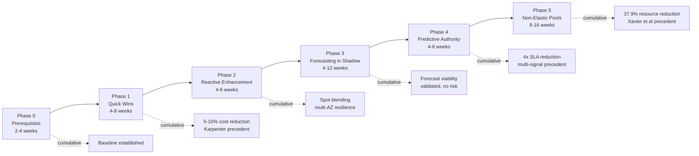

**Phase 0 — Prerequisite Hygiene and Baseline Measurement.** Before any new actuator or forecasting service is deployed, the cluster must be configurationally sound and performance-baselined. The work here is ostensibly modest but practically decisive: every later phase's measured improvement is measured *against* the Phase 0 baseline, and any later-phase improvement obscured by Phase 0 misconfigurations will produce ambiguous business cases that erode organizational support.

The entry criteria are simply that the cluster runs Cluster Autoscaler (or has reactive HPA but no node autoscaling at all) and that platform engineering has executive sponsorship for a multi-quarter improvement program. The work consists of:

- **Resource-request hygiene** per §7.1: deploy VPA in `recommendation-only` mode, observe at least one full seasonal cycle, and apply rightsizing recommendations through GitOps. Aidoni's prescriptive guidance — "Setting correct values requires measuring actual usage. Use tools like Vertical Pod Autoscaler (VPA) in recommendation mode to analyze historical data and suggest appropriate values" — is the operational template.
- **PodDisruptionBudget audit** per §7.2: every production workload receives an explicit PDB, with `HPA.minReplicas > PDB.minAvailable` enforced as PR-time admission policy and the OneUptime alert `kube_poddisruptionbudget_status_pod_disruptions_allowed == 0` deployed as a leading indicator.
- **Observability baseline** per §7.6: deploy the five-dashboard baseline (Forecast vs Actual placeholder, MAPE Drift placeholder, Scaling-Action Audit Trail, Cost-vs-SLA Pareto, Provisioning Latency) on the existing reactive system. The dashboards initially display only reactive-controller behavior; they will populate with predictive data in Phase 3.
- **Baseline benchmarking against the §1.2 criteria**: measure CA's actual provisioning latency (time from pending-pod to Ready), SLA violation rate during representative peaks, idle-capacity ratio during representative troughs, and scale-event count per node per day. These four numbers form the comparison anchor for every subsequent phase. The §8.3 reactive-baseline evidence (3–4 minute provisioning, 22.38% violation rate on DeathStarBench, asymmetric peak/trough failure modes) provides cross-organizational benchmarks against which the local baseline can be contextualized.

Exit criteria for Phase 0: the four §1.2 baseline metrics are measured and trended for at least two seasonal cycles; PDB hygiene is at 100% production coverage; dashboards are deployed and operating. Estimated effort: 2–4 weeks for a 2–3-engineer team. Rollback procedure: none required—Phase 0 is purely additive observation and configuration hygiene.

**Phase 1 — Quick Wins through Scheduled Scaling, Karpenter, and Headroom.** Phase 1 delivers the largest cost-and-latency improvements per unit of engineering effort by adopting the operationally simplest proactive mechanisms. The targets are the §8.5 Salesforce precedent (~5% cost savings in FY2026 with 5–10% projected for FY2027 and 80% operational-overhead reduction across 1,000+ EKS clusters) and the §8.3 latency improvement (from CA's 3–4 minute floor to Karpenter's ~55 seconds typical, and as much as ~7x faster under capacity-fallback scenarios).

Three workstreams compose this phase:

- **Scheduled cron-based scaling** per Chapter 3.7 for workloads with calendar-driven behavior. The lowest-friction adoption is KEDA Cron `ScaledObject` for pod-layer hibernation of dev/QA/UAT environments, paired with kube-downscaler for annotation-driven uptime windows. The Ananta Cloud kube-downscaler analysis cited in §3.7 provides a representative cost calculation: for 10 deployments scaled down 14 hours per day plus weekends, "Saved hours/week = (14 × 5 weekdays + 24 × 2 weekend days) = 118 hours; Total hours/week = 168 hours; % saved = 118 / 168 ≈ 70%; Potential cost savings = 70% of your dev/staging environment compute costs", translating to approximately $1,400/month savings on a $2,000/month dev/staging compute bill. For AWS-managed EKS pools, `aws_autoscaling_schedule` with the idempotent Terraform pattern from tinfoilcipher (§3.7) drives node-level scheduled actions; for AKS, node-pool start/stop (Preview) achieves the same goal where supported.
- **Karpenter migration from CA** per §5.7's seven-phase migration sequence applied to elastic pools only. The migration adopts Karpenter NodePool/NodeClass abstractions, replacing the homogeneous-ASG model with constraint-based provisioning across 800+ instance types. The Karpenter migration guide cited in §4.2 supplies the operational playbook including IAM role creation, subnet/security-group tagging, and the canonical NodePool definition with `disruption.consolidationPolicy: WhenEmptyOrUnderutilized` and `consolidateAfter: 1m` for active consolidation. The expected latency improvement is ~3.5x typical and up to ~7x under capacity fallback per §8.3.
- **Headroom-pod over-provisioning** per §7.3's AWS reference pattern, deployed as a low-priority placeholder Deployment with the `pause` container. The §7.3 four-ingredient recipe (high-priority PriorityClass for real workloads, low-priority for placeholders, real-workload Deployment, dummy Deployment with `priorityClassName: low-priority`) is directly deployable; for clusters whose size varies, the Horizontal Cluster Proportional Autoscaler proportionally tunes the replica count via `coresPerReplica` and `nodesPerReplica` configuration. The buffer absorbs sub-second first-burst latency that even Karpenter's 55 seconds cannot deliver.

Exit criteria: Karpenter is the primary actuator for at least one production pool, scheduled scaling covers all calendar-driven workloads, headroom pods are deployed for latency-critical paths, and the four §1.2 baseline metrics show measurable improvement (at minimum, 5% cost reduction or commensurate latency improvement). Estimated effort: 4–8 weeks for a 2–3-engineer team. Rollback procedure: Phase 1 is reversible per-pool by reverting NodePool changes to re-enable CA on specific pools while preserving Karpenter on others; scheduled scaling and headroom pods are entirely additive and can be removed without affecting other components.

**Phase 2 — Reactive Enhancement through KEDA Event-Driven, Multi-AZ, and Spot.** With Karpenter operational, Phase 2 strengthens the reactive layer beneath the (still-future) predictive layer. The premise from §2.5 is that hybrid architectures dominate single-paradigm alternatives because they preserve worst-case reactive behavior while gaining best-case proactive behavior; a strong reactive substrate is therefore prerequisite to safe predictive deployment.

Three workstreams:

- **KEDA event-driven scaling** for workloads whose business signals (queue depth, message broker lag, HTTP rate, database row counts) lead resource saturation. The §4.3 KEDA Prometheus scaler example, scaling pods on `sum(rate(http_requests_total[2m]))`, plus the LiveWyer end-to-end deployment walkthrough provide deployable templates. KEDA's transparent HPA-creation behavior — "When you create a ScaledObject, KEDA automatically generates and manages an HPA resource behind the scenes" — preserves reactive-layer composition without requiring HPA replacement.
- **Multi-AZ topology constraints** per §7.5: Pod Topology Spread Constraints with `topologyKey: topology.kubernetes.io/zone` and `whenUnsatisfiable: DoNotSchedule` for production workloads, podAntiAffinity for critical replicas, and `service.kubernetes.io/topology-mode: Auto` for cross-zone-traffic cost reduction. The discipline ensures that subsequent predictive scale-up cannot accidentally concentrate workload on a single AZ.
- **Spot/Reserved/On-Demand blending** through Karpenter's native `karpenter.sh/capacity-type` selector with `spot` capability and the corresponding taint/toleration pattern from §6.6. For organizations preferring vendor-managed Spot orchestration, this is also the natural insertion point for Spot Ocean's Virtual Node Group model with its claimed 80% EC2-cost savings, though the buy-versus-build decision is best deferred until Phase 3 informs how much remaining headroom predictive scaling will deliver.

Exit criteria: event-driven workloads have explicit KEDA scalers, every production workload declares topology constraints, Spot capacity is integrated where workload eligibility permits. Estimated effort: 4–6 weeks. Rollback: each workstream is independently reversible.

**Phase 3 — Forecasting Deployed in Shadow Mode.** Phase 3 introduces the predictive layer with zero actuation authority. The §7.7 shadow-rollout discipline is the central governing principle: "deploy Layer 4 (forecasting), Layer 5 (decision controller), and Layer 6 (actuators) together, but configure Layer 6 to operate in *observe-only* mode. The system computes forecasts, decides on desired states, logs what it *would* have done, but issues no actual `scaleTo` calls." The Crane EHPA `scaleStrategy: Preview`, AWS Predictive Scaling `ForecastOnly`, and GCP Predictive Autoscaling simulation tooling each provide production-validated shadow primitives.

Workstream selection follows the §3.5 method-selection heuristic and the §8.7 evidence-based selection guide:

- **For diurnal/weekly seasonal workloads with at least a week of history**: deploy Prophet through Crane EHPA (open-source with DSP fallback) or Kedify's `MetricPredictor` CRD (commercial KEDA layer with MAPE-gated authority). The Vultr-style five-component pipeline (Prometheus → adapter with input validation → Postgres → Prophet retraining every 15 minutes → Index Calculation Component → API actuator) is the canonical custom-build alternative. Expected accuracy band: 5–9% MAPE typical, per §8.4's Vultr field-engineering and Guruge & Priyadarshana academic evidence.
- **For workloads with rich Prometheus instrumentation but stochastic patterns**: defer Prophet and rely on KEDA event-driven triggers as the primary proactive layer; Phase 3 simply confirms via observed forecast-vs-actual data that no useful seasonal signal exists.
- **For environments with limited Prometheus instrumentation but rich logging**: adopt the Xavier et al. log-driven LSTM pattern, "non-intrusive, log-driven approach, where system logs serve as the primary knowledge source for analysis and scaling decisions". The expected accuracy is ~20% MAPE on real production traffic—lower than Prophet on clean seasonal data, but Xavier et al.'s 37.9% resource reduction with 62.5% peak-demand anticipation evidences that this accuracy band is operationally sufficient.

The Phase 3 measurement discipline is rigorous: Layer 4's MAPE on the held-out validation set is monitored continuously against `modelMapeThreshold`; Layer 5's recommended actions are logged and compared against actual reactive-controller decisions; the cost-vs-SLA Pareto dashboard shows what would have happened if predictions had been authoritative. Per §8.2's experimental protocol, a minimum of 1–4 weeks of shadow operation is required, longer if seasonal cycles span weeks or months.

Exit criteria: validated MAPE within target band on the workload's actual traffic; shadow-mode recommendations correlate with subsequent reactive scaling actions in expected directions; no model-staleness or confidence-collapse alerts fired; review board (platform + SRE + product owners) approves promotion to Phase 4. Estimated effort: 4–12 weeks depending on data volume and model complexity. Rollback: Phase 3 is by construction zero-risk—the predictive layer has no authority and removing it leaves the cluster in its Phase 2 state.

**Phase 4 — Predictive Authority with Max-of Reconciliation and MAPE Gating.** Phase 4 graduates the validated predictive layer to authoritative status. The architectural commitments from §5.1 (principles P2 gated authority and P3 max-of reconciliation) become runtime: the predictive trigger is added to existing `ScaledObject` resources alongside reactive triggers (KEDA's transparent aggregation handles the max-of policy), or Crane EHPA's automatic dual-HPA generation produces equivalent semantics for HPA-managed workloads. Layer 5's confidence-bound scaling, configured per §7.3's quantile policy, scales latency-critical pools to the 90th-percentile upper bound and cost-sensitive pools to the median.

The graduation is deliberately gradual:

- **Canary on dev/staging first** for at least one week, validating that the predictive-driven actions produce measurable improvement in the four §1.2 metrics without introducing instability.
- **Per-pool promotion to production** rather than fleet-wide cutover. The pool registry's per-pool `actuator` and policy fields (§5.6) make pool-by-pool promotion a configuration change rather than code change.
- **Continuous safety-net validation** through the §7.7 chaos-engineering practices: deliberately publish faulty forecasts (50% over- and under-estimates) and verify that the MAPE gating demotes the model and the reactive safety net absorbs the demand.

The expected outcomes draw on §8.5's empirical evidence. The DeathStarBench multi-signal benchmark's ~4.1x SLA-violation reduction (22.38% → 5.41%) at 82% of baseline node-hours is the directly comparable target; Xavier et al.'s 37.9% resource reduction on real production traffic provides the on-premises-validated equivalent; Tencent EHPA's "fewer but more efficient" elasticity operations qualifies the operational-stability dimension.

Exit criteria: at least 50% of production pools (by either node count or workload criticality) operate under predictive authority with measurable improvement against Phase 0 baselines; the MAPE-gated fallback has been exercised at least once (either in chaos testing or natural drift) without SLA regression; the audit trail confirms zero unintended actuations. Estimated effort: 4–8 weeks. Rollback: per-pool by reverting Layer 5 configuration to `Preview` mode; per-workload by removing the predictive trigger from the `ScaledObject` while retaining reactive triggers.

**Phase 5 — Non-Elastic Pool Integration via Cordon/Uncordon and IPMI/Redfish.** Phase 5 closes the loop on the user's binding constraint by deploying the Chapter 6 actuator extensions for non-elastic pools. The phase order is deliberate: predictive control is validated on elastic pools first, where rollback is rapid and cost of error is bounded by hourly-billed instances, before being extended to bare-metal pools where physical power-cycling carries hardware-lifecycle implications.

The work spans:

- **Cordon/uncordon controller deployment** for fixed-capacity pools per §6.3, implementing the canonical `cordon → drain → confirm drained → power off` pipeline with strict PDB enforcement. The Karpenter Downscaler community proposal (kubernetes-sigs/karpenter Issue #1800) supplies architectural inspiration for Karpenter-managed pools; bespoke controllers for cluster-managed pools follow the same CRD-driven pattern.
- **IPMI/Redfish actuator deployment** per §6.4 for bare-metal pools, with the trade-off between direct ipmitool/Redfish invocation (operationally simple, appropriate for tens of nodes) and Metal³/Ironic frameworks (full provisioning lifecycle, appropriate for hundreds of nodes) chosen per pool size. The §6.4 security disciplines—private management VLAN, mTLS or strong API tokens, credential rotation, firmware patching, prompt audit logging—are non-negotiable preconditions.
- **Hybrid partitioning policy** per §6.6, configuring the cost-priority order in the pool registry so that fixed on-premises base fills first, Karpenter elastic absorbs spillover, and (where compliance permits) virtual kubelet handles emergency tail.
- **Per-pool latency-budget propagation to Layer 4** so that forecasts cover the longest applicable horizon (typically 15+ minutes for IPMI bare-metal) while shorter-horizon actuators (cordon/uncordon, Karpenter) consume truncated views.

Exit criteria: at least one non-elastic pool operates under predictive authority with the cordon-then-power-off sequence validated against PDBs, the audit trail is tamper-evident-compliant where required, and the per-pool stability metrics from §8.6 (power-cycle frequency, drain-failure rate, audit-trail completeness) trend within acceptable ranges. Estimated effort: 8–16 weeks given the engineering depth of BMC integration and the operational caution warranted on physical infrastructure. Rollback: per-pool by setting the actuator to manual mode and reverting to operator-driven cordon/uncordon, or in extremis by physically resetting BMC credentials and isolating the management VLAN.

**Sequencing variants for MVA versus FFA.** §5.9 distinguished a Minimum Viable Architecture (4–8 weeks for a 2–3-engineer team migrating from CA on a single elastic cloud) from a Full-Fidelity Architecture (6–12 months for a 4–8-engineer platform team in multi-cloud or hybrid environments). The phased roadmap collapses naturally for MVA—Phases 0–3 cover the MVA scope, with Phase 3 graduating to authoritative status as soon as one model achieves target MAPE—and extends naturally for FFA, where Phases 4–5 represent the most engineering-intensive work. Organizations should explicitly declare which variant they are pursuing at Phase 0, because mismatched expectations between platform engineering and executive sponsorship are the most common source of mid-project cancellation: a team scoped for MVA delivery cannot simultaneously deliver Phase 5 non-elastic actuators, and a team funded for FFA effort that delivers only MVA outcomes will face avoidable scrutiny.

The cumulative outcome at the close of Phase 5 is the full reference architecture deployed, with the four §1.2 evaluation criteria measurably improved across the demand cycle (rather than only at peaks or only at troughs as CA permitted), and the three structural gaps identified in §4.6—non-elastic node-pool management, cross-provider scheduled hibernation, and unified prediction across heterogeneous pools—each addressed with a deployable composition of surveyed primitives.

## 9.2 Decision Matrix for Tool Selection by Workload and Infrastructure Profile

The phased roadmap establishes *when* to deploy each component; the decision matrix establishes *which* components. This section consolidates the Chapter 4 surveys and Chapter 8 quantitative evidence into a deployable matrix that platform teams can apply directly to their own selection decisions.

**Three-axis decision space.** The matrix is organized along three axes:

- **Workload archetype** (§1.2): diurnal/weekly cycles, scheduled events, streaming/live-event peaks, batch/AI processing windows, bursty event-driven inference.
- **Infrastructure profile**: single-cloud elastic, multi-cloud elastic, hybrid elastic-plus-non-elastic, predominantly on-premises bare-metal.
- **Organizational maturity tier**: small platform team (2–4 engineers, modest dedicated ML capacity), mid-size dedicated platform organization (5–15 engineers across SRE/platform/data roles), large multi-cluster enterprise (15+ engineers, dedicated ML platform, FinOps function).

**Workload-by-infrastructure recommendations.** The following matrix specifies a recommended primary stack for each cell, drawing directly on §4.6's adoption recommendations and §8.7's evidence-based selection guide. Each cell reports the open-source-default stack and, where relevant, a commercial accelerator alternative.

| Workload \ Infrastructure | Single-cloud elastic | Multi-cloud elastic | Hybrid elastic+non-elastic | On-prem bare-metal |
|---|---|---|---|---|
| **Diurnal/weekly cycles** | KEDA Cron + Karpenter + Crane EHPA<br/>(commercial: Spot Ocean) | KEDA Cron + Karpenter (per-cloud providers) + Crane EHPA<br/>(commercial: ScaleOps) | KEDA Cron + Karpenter (elastic) + cordon/uncordon (non-elastic) + Crane EHPA<br/>(commercial: ScaleOps self-hosted) | KEDA Cron + cordon/uncordon + IPMI + Crane EHPA<br/>(no commercial fit; custom build) |
| **Scheduled promotional events** | KEDA Cron baseline + Karpenter + Crane EHPA + headroom pods<br/>(commercial: Spot Ocean with VNG) | Same with multi-cloud Karpenter providers<br/>(commercial: ScaleOps peak/off-peak policies) | Hybrid partitioning + scheduled cordon for non-elastic warmup + headroom<br/>(commercial: ScaleOps) | IPMI pre-warm + cordon + Prophet + headroom<br/>(custom build) |
| **Streaming/live-event peaks (50M+)** | Multi-signal hybrid (Prophet + KEDA + reactive HPA) + Karpenter + sized headroom pods<br/>(commercial: ScaleOps Calculated Elastic Headroom) | Same + cross-region failover<br/>(commercial: ScaleOps; CAST AI for GPU paths) | Hybrid partitioning + headroom on fixed base + Karpenter spillover<br/>(commercial: ScaleOps) | Headroom dominates; IPMI for cost recovery only<br/>(custom build) |
| **Batch/AI processing windows** | KEDA queue scalers + Karpenter; Crane EHPA for known windows<br/>(commercial: CAST AI for GPU) | Same with multi-cloud<br/>(commercial: CAST AI cross-region GPU access) | KEDA queue + cordon + IPMI for fixed base + Karpenter for burst<br/>(commercial: limited fit) | KEDA queue + IPMI + headroom<br/>(custom build) |
| **Bursty event-driven inference (LLM/async)** | KEDA + Karpenter + LSTM-on-logs (where seasonal); Kedify for KEDA-native predictive<br/>(commercial: CAST AI for GPU LLM-router) | Same<br/>(commercial: CAST AI cross-region GPU) | Limited fit unless workload is compatible with non-elastic latency budgets | Generally inappropriate fit unless workload is async-tolerant |

**Maturity-tier modulation.** The infrastructure-and-workload recommendations modulate by organizational maturity:

- **Small platform team (2–4 engineers)**: prefer commercial accelerators (Spot Ocean, ScaleOps, CAST AI) where they fit the infrastructure profile, accepting vendor lock-in cost in exchange for reduced engineering surface. The Phase 3 forecasting custom-build path is deferred or substituted with Crane EHPA's DSP algorithm (which the §3.2 surveyed material reports as production-deployed at Tencent and operationally simpler than Prophet pipelines). The Phase 5 non-elastic actuator work is descoped unless the organization has on-premises infrastructure as a core strategic concern.
- **Mid-size dedicated platform organization (5–15 engineers)**: primary path is the Karpenter + KEDA + Crane EHPA / Kedify open-source stack, with commercial accelerators evaluated on TCO grounds against a 12–18-month horizon. The Phase 3 custom Prophet pipeline (Vultr-style) is feasible if the team has at least one ML-platform-engineering capable member. Phase 5 non-elastic work is feasible for hybrid environments with engineering depth justified by infrastructure scale.
- **Large multi-cluster enterprise (15+ engineers)**: primary path is fully bespoke, leveraging commercial tools as components rather than complete solutions. The Salesforce 1,000+ EKS cluster precedent is the operational template. The Phase 3 custom forecasting service may use TFT or hybrid Prophet-LSTM (the §8.4 hybrid evidence shows 65–90% MSE improvement) given the engineering capacity to operate the additional complexity. Phase 5 non-elastic actuators—Metal³/Ironic at scale, virtual-kubelet bursting where compliance permits, cross-cloud actuator abstractions—are first-class deliverables.

**Buy-versus-build trade-off analysis.** The decision between commercial and open-source paths is a recurring strategic question that the matrix above defers to the maturity tier. The §8.7 evidence permits a more structured analysis. On the commercial side, the §4.4 survey and §8.5 evidence provide the case for buy:

- **Spot Ocean's claimed 80% EC2-cost savings** through Spot/Reserved/On-Demand blending and 20–30% additional bin-packing savings, both vendor-published per rubric criterion P-2 caveat.
- **ScaleOps's positioning above HPA/KEDA/Karpenter** with 10–15-minute predictive lead, Calculated Elastic Headroom, and air-gapped/self-hosted operation that uniquely fits regulated environments.
- **CAST AI's vendor-cited 60%+ savings** with cross-region GPU access addressing the §1.1 GPU-cold-start penalty (6–10 minutes including image pull); customer cases include Flowcore (50% AKS savings) and Banking Circle (50–80% reduction).

On the build side, the case rests on the §4.6 architectural verdict and the §8.5 Salesforce precedent that Karpenter alone delivered ~5% savings with 80% operational-overhead reduction:

- **Open-source flexibility**: configuration changes do not require vendor-relationship management; integration with existing CI/CD and observability is direct; portability across providers is structural.
- **Avoidance of vendor exit risk**: contractual termination, vendor consolidation (the §4.4 note that Spot.io's Spot Ocean originated at spot.io, was rebranded under NetApp, and is now under Flexera), or roadmap divergence from organizational needs all carry switching costs that grow with deployment depth.
- **Air-gapped and regulated compatibility**: most commercial platforms presume cloud-API access for telemetry; ScaleOps is the surveyed exception with explicit air-gapped support, but other compliance-bound environments may require self-hosted stacks regardless.

The structured way to make the decision is a 36-month TCO analysis that compares: (a) commercial subscription cost plus integration engineering plus residual customization cost against (b) open-source operational engineering cost (typically 1–3 platform engineers' time over the same horizon for FFA-class deployments) plus shared open-source maintenance burden. The ratio is workload-and-team specific; teams whose primary value proposition is product velocity rather than infrastructure differentiation are usually well-served by the commercial path, while teams whose infrastructure is itself competitive differentiation (fintech, regulated healthcare, sovereign-data SaaS) are usually well-served by the build path.

**Worked example 1: Mid-size SaaS migrating from CA on AWS.** Consider a SaaS platform with approximately 50 microservices, predominantly diurnal traffic with weekly cycles, currently running on AWS EKS with Cluster Autoscaler across three managed node groups (general-purpose, memory-optimized, GPU). The platform engineering team is 6 engineers with 1 senior having ML-platform familiarity. The CFO has authorized a 12-month autoscaling improvement program with success criteria of "10% cluster cost reduction and zero SLA-violation incidents during peak business hours".

Decision matrix application:
- **Workload archetype**: predominantly diurnal/weekly cycles with occasional scheduled promotional events.
- **Infrastructure profile**: single-cloud elastic.
- **Maturity tier**: mid-size dedicated platform organization.

Recommended stack: **KEDA + Karpenter + Crane EHPA** with optional Kedify upgrade for richer predictive integration. Phased deployment per §9.1:
- Phase 0 (3 weeks): VPA recommendation-mode rollout, PDB audit, baseline benchmarking against the four §1.2 metrics.
- Phase 1 (8 weeks): Karpenter migration of all three node groups; KEDA Cron `ScaledObject` for the dev/staging environments; Horizontal Cluster Proportional Autoscaler-driven headroom sized for the worst observed 60-second burst. Target: 5–7% cost reduction matching Salesforce precedent floor.
- Phase 2 (5 weeks): KEDA Prometheus scalers for the request-volume-driven web tier; multi-AZ topology spreads on critical workloads; Spot capacity for stateless replicas with Karpenter `karpenter.sh/capacity-type: spot` selector.
- Phase 3 (10 weeks): Crane EHPA in `Preview` mode against the web tier and the GPU inference tier separately, validating MAPE under 10% on the web tier (matching Vultr/Kedify expectations) and accepting up to 20% MAPE on the GPU tier (matching Xavier et al.'s real-production benchmark).
- Phase 4 (6 weeks): EHPA promoted to `Auto` mode with dual-HPA generation; cost-vs-SLA Pareto dashboard tracked weekly; stretch target of additional 3–5% cost reduction with measurable SLA improvement.
- Phase 5 (skipped): no non-elastic pools.

Expected outcome at month 9: cumulative ~10% cost reduction (achieving the CFO target), measurable SLA improvement during peaks per the §8.5 multi-signal evidence, and a foundation that Phase 5 can be added to if future on-premises requirements emerge.

**Worked example 2: Regulated financial-services on-premises Kubernetes with fixed hardware inventory.** Consider a tier-1 bank's on-premises Kubernetes deployment, running approximately 200 services across 80 bare-metal nodes split between two data centers with strict regulatory audit requirements, no cloud-API access for compliance reasons, fixed hardware inventory procured on three-year capital cycles, and air-gapped operation. The platform team is 12 engineers including SRE, security, and 2 ML-platform members.

Decision matrix application:
- **Workload archetype**: mixed, with diurnal cycles dominant during business hours and batch processing overnight.
- **Infrastructure profile**: on-premises bare-metal.
- **Maturity tier**: large enterprise with dedicated regulatory and platform engineering capacity.

Recommended stack: **KEDA + cordon/uncordon + IPMI/Redfish + log-driven Prophet/LSTM** with no commercial-platform fit (the §4.4 survey concluded that even commercial platforms do not address bare-metal as first-class). Phased deployment:
- Phase 0 (4 weeks): VPA rollout, PDB audit, baseline benchmarking on existing static-provisioning model. The §6.4 BMC security audit (private management VLAN, mTLS, credential rotation, firmware patching) is preconditional and may require additional security review cycles.
- Phase 1 (10 weeks): KEDA Cron for batch-processing schedules; headroom-pod over-provisioning for the latency-critical request-handling tier sized to absorb 15-minute burst windows (matching IPMI cold-start latency); no Karpenter migration (no elastic pools to migrate to). Expected outcome: latency improvements without cost reductions yet, since hardware inventory remains fixed.
- Phase 2 (6 weeks): KEDA Prometheus scalers driven by HTTP request rates and queue-depth signals; multi-DC topology constraints to ensure that workloads survive DC failure.
- Phase 3 (12–16 weeks): log-driven LSTM forecasting per Xavier et al.'s pattern, since this matches the regulated-environment constraint of "no changes to the deployed software, only access to its existing logs". MAPE target ~20% per the Xavier benchmark.
- Phase 4 (6 weeks): predictive layer authoritative over scheduling decisions but not yet over IPMI; max-of policy combines predictive, schedule, and reactive.
- Phase 5 (16 weeks): cordon/uncordon controller deployed first (no hardware impact); IPMI/Redfish actuator deployed second (with the §6.4 hardware-cycle-budget discipline and tamper-evident audit trail). Expected outcome: 25–35% aggregate resource reduction matching the Xavier et al. precedent at 37.9%, with most of the savings coming from overnight batch hibernation.

Expected outcome at month 18: substantial overnight power and cooling savings, latency preserved during business hours, full audit-trail compliance, and a deployment that is unique to the organization rather than commercially commodifiable—a competitive moat rather than a cost center.

The two worked examples bracket the decision matrix's typical applications: the SaaS case is a 9-month MVA-class deployment with substantial vendor option, while the financial-services case is an 18-month FFA-class deployment with no commercial fit and full custom build. Most real organizations will fall between these poles, and the decision matrix's per-cell recommendations supply the starting point.

## 9.3 Residual Risks and Mitigation Strategies for Proactive Autoscaling

No architectural blueprint or tool selection eliminates risk. The Chapter 7 anti-pattern catalogue cataloged eighteen failure modes at the configuration and operational levels; this section steps up to the strategic level and examines six residual risks that persist even when configuration discipline is impeccable. Each risk is paired with leading indicators, mitigation patterns, and contingency plans for when mitigation fails.

**Risk 1: Model drift and silent degradation.** The most insidious risk in predictive autoscaling is that forecasting accuracy erodes invisibly over weeks or months. The system continues operating, predictions continue arriving, but the mean error grows slowly and the confidence intervals widen, with no single failure severe enough to trip a threshold. The §7.6 observability discipline names this directly: "A predictive system that fails *silently* can drift for weeks: the model degrades, MAPE creeps up, scale-up actions become slightly mistimed, but no single failure is severe enough to trip a threshold, and the cumulative SLA and cost impact accumulates invisibly."

Leading indicators include rolling MAPE creep above the seven-day average, expanding confidence-interval width even with stable input data, and a growing gap between predictive recommendations and reactive controller actions over time. Mitigation rests on three layers per §7.6: continuous MAPE monitoring with alerting on sustained regression rather than instantaneous spike; scheduled retraining that runs without operator intervention (the Vultr 15-minute cadence and Kedify automatic retraining are reference patterns); and Kedify-style fallback to default values via `modelMapeThreshold`, ensuring that a degraded model cannot continue issuing dangerous decisions. Contingency: when these mitigations fail, the predictive layer is demoted to `Preview` mode while operators investigate, and the reactive layer governs entirely until a retrained model is validated through Phase 3-style shadow operation.

**Risk 2: Black-swan traffic events.** Forecasting models trained on historical patterns are by definition silent on unprecedented events. A geopolitical incident, a viral social-media moment, a competitor outage that redirects traffic, or a regulatory action can produce traffic that bears no resemblance to any pattern in the training data. The §8.5 Netflix evidence illustrates the most impressive defense: the TTR optimization from 20 minutes to 3 minutes was achieved through a layered system in which prediction was only one component, alongside the RPS hammer policy ("scales the resources to the maximum in one go. The benefit is that we get enough computation resources; the drawback is that we might have provisioned extra resources"), 5-second CloudWatch metric resolution improving detection time by 3x, prioritized CPU shedding ("services tagged according to their business criticalities, defining the priorities in execution"), and cross-region request rescue ("over 90% of otherwise throttled requests during major load spikes").

Leading indicators of black-swan-risk inadequacy include the absence of step-scaling mechanisms (relying only on incremental forecasted scaling), absence of request-priority differentiation (treating all requests as equally critical), and absence of cross-region or cross-DC failover paths. Mitigation patterns:

- **Sized headroom buffers** dimensioned for *worst-case* rather than expected-case bursts. The §7.3 sizing methodology with its 90th-percentile safety multiplier is the operational template; for black-swan resilience, organizations may justifiably size headroom to a higher quantile (95th or 99th).
- **Step-scaling capability** as the actuator-layer counterpart to the predictive layer. Karpenter's NodePool max-capacity ceilings combined with explicit "scale to maximum" policies invoked by external incident-response tooling implements the RPS hammer pattern.
- **Prioritized load shedding** through PriorityClass design, with Pod-level disruption budgets ensuring that business-critical pods preempt batch and best-effort workloads during capacity pressure. The §7.1 QoS discipline naturally supports this; the additional discipline is to *test* it through chaos engineering rather than only configure it.
- **Cross-region or cross-cluster failover** with traffic-management plumbing (DNS-based, service-mesh-based, or load-balancer-based) that can shift demand to alternate capacity. The Netflix 90%+ rescue rate sets the achievable benchmark.

Contingency: when black-swan-event capacity exceeds even the safety-margined headroom and step-scaling, the system gracefully degrades by serving lower-priority requests with degraded latency or shedding them entirely while preserving the high-priority class. This is engineered behavior, not failure; the operational discipline is to define which classes degrade in which order ahead of time.

**Risk 3: Vendor lock-in to commercial platforms.** The §9.2 buy-versus-build analysis identified that commercial platforms reduce engineering surface at the cost of strategic dependency. The risk is not merely contract termination but the more subtle dynamic of vendor roadmap divergence: a commercial platform that delivered exceptional value in 2024 may, by 2027, be missing capabilities that the organization needs (because the vendor has prioritized other customers' needs), have introduced breaking changes during version upgrades (the §9.2 noted Spot Ocean's vendor-consolidation history as a pattern that occurred once and may occur again), or have raised prices in line with proven customer dependency.

Leading indicators include accumulated customization that cannot easily be ported (custom CRDs, vendor-specific integrations, bespoke automation scripts), missed feature requests from the vendor's roadmap that the organization needs, and cost growth outpacing scale of deployment. Mitigation patterns:

- **Architectural portability discipline**: implement the §5.6 uniform actuator interface even when using a commercial platform behind it, so that switching the actuator (e.g., Spot Ocean to Karpenter, or vice versa) is a localized configuration change rather than a system-wide rewrite. This was a core architectural principle in §5.1 (P4: pluggable actuators per node-pool class) and pays off most when contractually exercised.
- **GitOps-based configuration storage**: per §7.7, every configuration commitment lives in version-controlled manifests, even when the runtime applies them through commercial-platform APIs. A clean exit from a vendor requires translating the GitOps state to alternative tooling rather than reverse-engineering runtime state.
- **Periodic open-source benchmarking**: at least annually, evaluate whether the open-source equivalents (Karpenter for Spot Ocean, Crane EHPA for predictive features, KEDA for event-driven) have closed the capability gap that initially justified commercial selection. The open-source ecosystem's maturation (e.g., AKS Karpenter Provider's progression to GA, the GCP Karpenter Provider's preview availability) is a one-way ratchet that erodes commercial lock-in over time.

Contingency: when vendor exit becomes necessary—for cost, capability, or strategic reasons—the §9.1 phased roadmap framework permits parallel deployment of the open-source replacement in shadow mode (Phase 3-equivalent) before authoritative cutover, minimizing rollout risk.

**Risk 4: Operational complexity debt.** The §7.8 anti-pattern #14 named this risk explicitly: "team adopts sophisticated predictive architecture without the engineering capacity to operate it. […] Models in `recommendation` mode permanently because no one promotes them; rollouts stalled in shadow mode forever; alerts unacted-upon." The risk is particularly acute for FFA-class deployments where the §5.9 estimate of "6–12 months for a dedicated platform team of 4–8 engineers" presumes sustained team availability that real organizations rarely sustain through hiring cycles, reorganizations, and competing priorities.

Leading indicators include accumulated alerts in unacted state, models that have not been retrained beyond their original deployment window, dashboards that no one watches, and Phase 3 shadow rollouts that never graduate to Phase 4 authority. Mitigation patterns:

- **Phased adoption matched to organizational maturity** per §9.2's maturity-tier modulation. Small teams should not attempt FFA-class deployments; mid-size teams should defer Phase 5 work until Phases 1–4 are stable; large enterprises must treat Phase 5 as multi-year work.
- **MVA-before-FFA discipline** per §5.9's two-variant architecture. Even organizations whose long-term target is FFA should demonstrate MVA value before committing FFA resources, both to validate engineering capacity and to build organizational credibility for the larger investment.
- **Explicit named owners per layer** per §5.7 and §7.6, with the named owner responsible for the layer's health metrics and decision cadence. The Vultr team's retrospective ("select a team full of Kubernetes masters") is operational guidance that the technical roles must be staffed before the technical work begins.
- **Honest project descoping**: when engineering capacity contracts (a key engineer leaves, a competing priority emerges), the disciplined response is to formally descope rather than to continue under-resourced execution. A Phase 4-promoted predictive layer that no longer has an owner should be demoted to Phase 3 shadow mode; a Phase 5 IPMI deployment without security-review capacity should be paused.

Contingency: when complexity debt accumulates beyond manageable bounds, organizations should consider commercial substitution (the §9.2 buy path becomes preferable to a degraded build path) or feature reduction (descoping non-elastic actuators, descoping the most complex predictive models). Both responses preserve the value already created without continuing to compound technical debt.

**Risk 5: Hardware lifecycle exposure and BMC security risks.** §6.4 cautioned that frequent power cycling for cost recovery exercises a hardware cycle budget that cloud VMs do not have, and that BMC interfaces "are so powerful, they're also a major security risk if left wide open. […] should never be exposed to the public internet, period". For Phase 5 deployments specifically, both risks transition from theoretical concerns to operational realities the moment the IPMI actuator begins issuing power-cycle commands at scale.

Leading indicators for hardware lifecycle: per-node power-cycle counts approaching vendor-rated budgets, premature PSU failures, capacitor aging signs, post-boot soft-error rate increases. For BMC security: failed authentication attempts on management VLAN, firmware versions lagging vendor patches, credential rotation cadence exceeding policy, exposed BMC endpoints in network scans.

Mitigation patterns:

- **Cycle budget per pool** distributed across nodes rather than concentrated, with explicit accounting against vendor-rated budgets. §6.4 noted that "a 100-node pool power-cycled twice daily for cost recovery accumulates roughly 730 cycles per node per year. While modern server hardware is rated for thousands of power cycles, the operational discipline must include: monitoring for early-warning signs (PSU voltage drift, disk reallocation counts), spreading cycles across the pool rather than concentrating on a subset, and explicitly accounting for the cycle budget when designing schedules."
- **Cycle frequency tuning to match operational benefit**: pools where cordon/uncordon (no power cycle) achieves consolidation should not unnecessarily cascade to IPMI; pools where IPMI is justified should run cycles at daily or weekly cadence rather than hourly.
- **BMC isolation discipline** per §6.4: private management VLAN, firewall/VPN, mTLS or strong API tokens, credential rotation on a schedule, firmware patching as soon as vendor updates are released. The Cycle.io guidance "Some of the worst server vulnerabilities in the last decade have come from unpatched or misconfigured OOB controllers" is a continuing concern, not a historical one.
- **Tamper-evident audit trails** per §6.4 and §7.6, with append-only log storage and external archive integration for regulated environments.

Contingency: when a BMC security incident is detected, the immediate response is BMC credential rotation and network-segment isolation; affected hosts are powered off through alternative paths until firmware integrity is verified. When hardware lifecycle begins exhausting (PSU failure rate climbing, soft-error rate climbing), the response is to slow the cycle cadence and accelerate hardware replacement procurement.

**Risk 6: Multi-controller interaction failures.** The §7.8 anti-pattern catalog included HPA/VPA conflicts (#6) and single-owner violations (#7) at the configuration level; at the strategic level, the broader risk is that the architecture's many controllers (Karpenter, KEDA, HPA, VPA, predictive controllers, cordon controllers, IPMI actuators) interact in unanticipated ways during edge-case scenarios. Each individual controller may be correctly configured; the combined behavior may still produce thrashing, double-provisioning, or scale-down stalls during specific demand patterns or failure modes.

Leading indicators include recurrent oscillation patterns at specific times of day, unexpectedly high scale-event counts during stable demand, drain operations that stall on PDB violations introduced by independent HPA scaling decisions, and predictive-vs-reactive divergence persistent over hours. Mitigation patterns:

- **Layer separation per §7.7** (predictive at node layer, reactive at pod layer) as the default, eliminating the most common conflict surface.
- **Single-owner semantics on shared dimensions** when layer separation cannot be cleanly enforced, with KEDA `ScaledObject` coalescence or Crane EHPA dual-HPA generation as the surveyed implementation patterns.
- **Pool-registry routing logic** per §5.6 that prevents controllers from acting on pools they do not own, with the per-pool actuator metadata as the authoritative source of truth.
- **Chaos engineering practices per §7.7** that deliberately stress controller interactions through synthetic load, AZ failures, and prediction-error injection. The discipline reveals interaction failures before production traffic does.

Contingency: when multi-controller conflicts manifest in production, the immediate response is to demote the most-recently-added controller to observation mode while operators isolate the conflict; the long-term response is to refine the layer-separation or single-owner semantics that the conflict revealed.

**Cross-risk synthesis.** The six risks above are not independent: model drift can compound black-swan exposure (a drifted model handles unprecedented events worse than a freshly trained one); operational complexity debt compounds vendor lock-in (under-staffed teams cannot exercise architectural portability); hardware lifecycle exposure compounds operational complexity debt (BMC security work is itself an engineering investment that competes with predictive-layer maintenance). The cross-risk implication is that the architecture's overall risk posture is determined by the *weakest* dimension, not the average, and that strategic risk management requires explicit attention to each dimension rather than diffuse concern across all.

## 9.4 Emerging Directions: RL Controllers, GPU-Aware Scaling, Autonomous SRE Agents, and Standardization

The report's primary recommendations concentrate on production-ready patterns: scheduled scaling, Prophet/LSTM/TFT forecasting, KEDA/Karpenter actuators, Crane EHPA and Kedify integrations, and the Chapter 6 non-elastic patterns. Beyond this perimeter sits a research and engineering frontier that will reshape the field over the next 3–5 years. This section surveys four converging trends, assessing for each whether it is near-term production-ready or research-stage and how platform teams should position their architectures to absorb future advances without rewrites.

**Reinforcement learning-based autoscalers.** The surveyed academic and field-engineering literature on RL for Kubernetes autoscaling spans multiple research groups and industrial laboratories, with recent activity converging on a small set of canonical approaches.

Pachyappan, Gahlot, and Hasenkhan's 2025 work on "AI-Powered CI/CD Pipeline Optimization Using Reinforcement Learning in Kubernetes-Based Deployments" frames RL's appeal in the autoscaling context: "RL agents can continuously learn from resource usage patterns and dynamically optimize auto-scaling policies. By analyzing historical workload data and real-time metrics, the agent can determine the best number of pods to run, adjust CPU/memory limits, and proactively scale resources to match demand. This reduces over-provisioning costs and prevents under-provisioning crashes. The agent can even learn to anticipate peak loads, scaling up resources just before a spike occurs." The framework formalizes RL for CI/CD autoscaling as a Markov Decision Process with state space S (current pipeline state), action space A (scale pods, trigger rollback, retry deployment), transition probabilities P, reward function R, and discount factor γ. Multiple RL algorithm families are surveyed: Q-Learning for discrete-action environments, Deep Q-Networks (DQNs) combining Q-Learning with neural network approximation, Proximal Policy Optimization (PPO) as the dominant policy-gradient method ("a popular policy gradient algorithm in Reinforcement Learning (RL). It is designed to optimize the policy (the strategy the agent uses to make decisions) directly, making it highly effective for complex and dynamic environments"), and Multi-Agent Reinforcement Learning (MARL) for the multi-microservice coordination problem.

Shukla's 2024 NCI MSc research project on "Comparative Study of RL Algorithms for Resource Optimization Scheduling in Kubernetes" provides direct empirical comparison of PPO-based GYM-HPA against traditional HPA, evaluating across CPU, memory, and cost-optimization environments. The architecture follows the canonical RL-meets-Kubernetes pattern: "The agent utilizes the Proximal Policy Optimization (PPO) algorithm, provided by the Stable Baselines3 library, to interact with the environments. It learns the best strategies for scaling Kubernetes pods based on the resource metrics." The work surveys related research including Tesauro et al.'s early work on hybrid RL for autonomic resource allocation, A-SARSA's combination of ARIMA workload prediction with reinforcement learning to address SLA violations, and DDPG's actor-critic method for continuous-action autoscaling.

The most directly relevant recent work for the user's brief is the **KIS-S** framework: a GPU-aware Kubernetes inference simulator paired with KIScaler, a PPO-based autoscaler. The reported quantitative outcomes are notable: KIScaler "moving average reward improves from 1.05 to 1.84 (a 75.2% increase) over 100 training episodes, reduces P95 latency by up to 6.7× over CPU-only baselines, and generalizes across all traffic patterns without retraining". The pattern-by-pattern P95 latency comparison evidences the approach's value:

| Pattern | KIScaler (ms) | GPU Baseline | CPU Baseline | Speedup |
|---|---|---|---|---|
| Ramp | 1000 | 5800 | 6700 | 5.8×/6.7× |
| Periodic | 1000 | 2300 | 2300 | 2.3×/2.3× |
| Random | 1000 | 2600 | 5100 | 2.6×/5.1× |
| Spike | 1000 | 370 | 470 | 0.37×/0.47× |

The Spike-pattern row is operationally informative: KIScaler underperforms on the spike pattern where baseline latencies are already low, indicating that the RL agent's value concentrates on patterns where conventional approaches struggle (ramp, random) rather than across all conditions uniformly. The framework's PPO state vector includes 10 dimensions covering replica counts, GPU/CPU utilization, P95 latency, throughput, latency/throughput trends, episode progress, and load pattern identifier; the action space is multi-discrete combining GPU replicas, CPU replicas, and CPU/GPU placement preference; the reward function balances "minimizing P95 latency to preserve user experience, maximizing GPU utilization to ensure resource efficiency, and minimizing scaling frequency to reduce system overhead".

Critically, the KIS-S framework also documents the operational limitations that make RL not yet near-term production-ready. The framework was deployed on a single-node cluster with one NVIDIA RTX 3080 GPU, and "KIScaler, trained under resource-constrained conditions with synthetic feedback, improves its final moving average reward by 75.2% over the course of training". The limitations are explicit: "Despite training with synthetic feedback due to single-GPU hardware constraints, KIScaler's moving average reward improves from 1.05 to 1.84"—the synthetic-feedback caveat means the production validity of these results is bounded by the simulator's fidelity. Further: "RL training typically requires extensive trial-and-error interaction with the environment, which is both time-consuming and risky when operating on production systems. For GPU-enabled inference workloads, this issue is magnified by limited hardware availability, high cost, and the sensitivity of live workloads to poor scaling decisions."

IBM Research's CLOUD 2024 work on "Optimizing Cloud Workloads: Autoscaling with Reinforcement Learning" frames the same case from an industrial perspective: "The Horizontal Pod Autoscaler (HPA) has limitations in scaling applications based on CPU utilization. However, AI-based algorithms, particularly Reinforcement Learning (RL), offer promising solutions. AI-based methods excel in overcoming fixed parameter constraints, handling sudden load spikes, and supporting custom parameters."

The Pachyappan et al. retrospective candidly acknowledges the operational tax: "RL isn't without its challenges. It can be computationally expensive, require a lot of data, and struggle to scale in some cases. But advancements in areas like transfer learning, multi-agent RL, and hybrid AI approaches are helping to address these issues, making RL more practical for real-world DevOps. For teams looking to adopt RL, here are some practical tips: start small by tackling a specific problem like auto-scaling, then gradually expand its use. Use monitoring tools like Prometheus and Grafana to gather the data needed to train RL models effectively. Experiment with different RL algorithms to find the best fit for your needs, and continuously evaluate and refine your models to keep them performing well over time."

**Production-readiness assessment for RL controllers**: research-frontier rather than near-term production-ready. The empirical evidence demonstrates substantial latency improvements in controlled benchmarks (KIS-S's up to 6.7× P95 latency reduction), but the production-deployment caveats are acute: training-data requirements that synthetic simulators only partially address, computational overhead that may exceed predictive-ML alternatives' tax without commensurate benefit, and operational fragility under regime change that the simpler Prophet/LSTM/TFT pipeline mitigates more directly. Platform teams whose architectures already follow the §5.1 principles—particularly P1 (separation of forecasting from actuation) and P6 (incremental adoptability)—are well-positioned to absorb RL controllers as they mature, by treating RL as an alternative Layer-4 forecasting implementation that can be deployed in shadow mode (Phase 3) before consideration for authoritative status (Phase 4). The architectural commitment from §5.4—"per-workload-class model specialization, with the model registry keyed by workload class"—naturally accommodates RL alongside Prophet, TFT, and DSP without requiring system-wide re-architecting.

**GPU-aware predictive scaling for AI inference workloads.** AI inference is the workload class for which the §1.1 cold-start economics are most punishing: image pulls of 5–20 GB, end-to-end cold starts of 6–10 minutes for fresh GPU nodes, and per-hour GPU costs in the $2–$30+ range that make even brief over-provisioning expensive. The KIS-S framework's documented improvements specifically target this workload class, and CAST AI's productized "cross-region GPU access" capability from §4.4 ("for AI and GPU workloads, Cast AI eliminates regional GPU constraints. Access Azure GPU instances from any region and have them appear as nodes in your existing AKS cluster, no complex multi-region networking or cluster federation required. When GPU capacity is limited in your primary region, Cast AI automatically provisions from regions with availability") addresses the same concern at a different architectural layer.

The KIS-S architectural patterns are forward-looking in three specific ways. First, the integration of GPU-utilization metrics beyond CPU/memory: "Although extensions (e.g., Prometheus, DCGM Exporter) can expose GPU metrics, they lack semantic ties to application-level performance such as latency or throughput. Second, HPA is stateless and reactive, incapable of anticipating surges or learning from past traffic. Third, it fails to distinguish between CPU and GPU resource types, leading to inefficient or costly scaling under heterogeneous workloads." The KIS-S response—a 10-dimensional state space including GPU utilization, latency trends, and load-pattern identifiers—is operationally a richer Layer-3 fusion than the §3.6 Node Demand Index pattern, and platform teams operating GPU inference workloads should treat NRI extension to include GPU-class metrics as a near-term priority.

Second, the simulation-driven training pattern: "KIScaler is trained entirely in simulation using KISim, enabling safe and rapid policy learning without requiring costly trial-and-error on real clusters. We adopt the Proximal Policy Optimization (PPO) algorithm, where the agent interacts with the simulated Kubernetes environment and receives step-by-step feedback to iteratively refine its scaling policy." This approach generalizes beyond RL: any high-cost-of-error forecasting or policy mechanism (including the Chapter 6 IPMI actuator's hardware-cycle exposure) benefits from simulation-driven validation before production deployment. The platform-engineering investment in a Kubernetes simulator may be justified for FFA-class deployments where iteration cost on real clusters is prohibitive.

Third, the multi-objective reward function explicitly balancing latency, GPU utilization, and scaling overhead: "The coefficients α, β, and γ are tunable weights that control the trade-off between latency minimization, resource efficiency, and provisioning overhead in the overall reward function." This pattern translates directly to non-RL contexts as the §5.5 cost-aware policy weighting; the KIS-S formulation's explicit multi-objective treatment may inform how Layer 5 decision policies are configured for GPU pools.

**Production-readiness assessment for GPU-aware predictive scaling**: near-term production-ready for organizations with substantial GPU footprints. CAST AI's commercial productization establishes that the value proposition is commercially proven; the open-source path through Karpenter NodePools with GPU-specific instance constraints, KEDA scalers driven by GPU-utilization metrics, and Prophet/LSTM forecasting on GPU-derived NRI extensions is deployable through the §9.1 phased roadmap. The KIS-S framework's quantitative outcomes (up to 6.7× P95 latency reduction over CPU-only baselines) establish the achievable ceiling; production deployments will land within a fraction of this band depending on implementation completeness.

**Autonomous SRE agents combining LLM-driven response with predictive scaling.** A growing class of platform tools combines LLM-driven incident response with infrastructure automation, building on observability and policy-as-code foundations. The pattern is exemplified by the CloudGeometry survey of "AI-Powered Accelerators" across the modernization lifecycle: "Prometheus + Grafana AI: Anomaly detection and metrics alerting", "OPA / Rego AI Assist: Auto-generated cluster policies", "Datadog + Sentry: Root-cause diagnosis and logging integration", "AWS CloudWatch AI / GCP Duet AI: Predictive alerts and health monitoring". The forward-looking pattern is autonomous agents that combine these primitives: an LLM-driven SRE agent that observes Prometheus anomaly signals, queries the audit trail for recent scaling decisions, correlates against business-calendar events, and either (a) recommends configuration changes (predictive layer authority to humans) or (b) directly issues Layer-5-equivalent decisions through controlled actuator paths.

The architectural prerequisites for autonomous SRE agents are substantial. First, the §7.6 observability discipline must be production-mature: structured logs at every layer, distributed tracing across the autoscaling control plane, and tamper-evident audit trails. Second, the GitOps-based configuration management from §7.7 must be enforced as the only legitimate change path, so that any agent-initiated change is auditable and reversible. Third, the §7.3 MAPE-gated authority pattern must extend from forecasting to agent-driven decisions: agent recommendations exceeding a confidence threshold can be applied, while lower-confidence recommendations are queued for human review.

The Pachyappan et al. survey explicitly contemplates this evolution: "advancements in explainable RL aim to make the decision-making processes of RL agents more transparent. In CI/CD pipelines, this transparency is crucial for debugging, compliance, and trust in automated deployment decisions. To mitigate limitations, combining RL with other AI techniques, such as supervised learning and evolutionary algorithms, can lead to more robust CI/CD optimization strategies. Such hybrid approaches can mitigate the limitations of standalone RL methods and enhance overall system performance."

**Production-readiness assessment for autonomous SRE agents**: research-and-early-engineering frontier. The component primitives (LLM-driven anomaly detection, policy-as-code generation, structured audit trails) are each deployable today, but the integrated autonomous-agent pattern remains experimental in most production environments. Platform teams positioning for this future should invest in the prerequisites—observability completeness, GitOps maturity, audit-trail discipline—that make autonomous agents feasible when commercial productizations or robust open-source frameworks emerge, rather than attempting to build the agents themselves.

**Standardization efforts and emerging unified APIs.** The Kubernetes ecosystem has progressively unified autoscaling primitives over the past several major releases: HPA v2 introduced custom metrics and behavior policies, VPA matured beyond beta, KEDA was donated to CNCF and graduated, and Karpenter's NodePool/NodeClass abstractions are being standardized as the SIG-Autoscaling-blessed path forward. The trajectory points toward a future Kubernetes Workload Autoscaling API that unifies HPA, VPA, KEDA, and Karpenter interfaces, allowing a single declarative manifest to specify pod-and-node scaling intent across the full hierarchy.

The §4.2 evidence on Karpenter's multi-cloud maturation—the AKS Karpenter Provider's GA with Node Auto Provisioning, the GCP Karpenter Provider's preview availability—is part of this standardization arc. The CloudGeometry survey of cloud-native modernization, with its emphasis on "GitOps, infrastructure as code, and Kubernetes-native tooling [that] make it possible to automate and scale platform modernization like never before" and explicit references to Karpenter, ArgoCD, Flux, Kubecost, and Kyverno as a coherent stack, illustrates the converging vendor and open-source ecosystem.

The Shaik 2025 work on "Dynamic Healthcare Intelligence: Integrating AI Predictive Analytics with Kubernetes Scaling for Enhanced Patient Outcomes" is representative of the broader pattern's cross-domain maturation. The framework is described in domain-specific terms—"AI-powered predictive analytics with Kubernetes-enabled scaling infrastructure in contemporary healthcare settings […] detect[ing] potential medical emergencies before they manifest, while dynamically adjusting computational resources based on patient volume and data complexity"—but the architectural primitives are recognizably the same as the report's reference architecture: Kubernetes orchestration for high availability and fault tolerance ("Kubernetes implements both horizontal pod autoscaling (HPA) and vertical pod autoscaling (VPA) to adjust resources based on workload demands. In healthcare contexts, these scaling mechanisms enable AI systems to handle varying volumes of medical data—from routine monitoring to intensive real-time analytics during critical care scenarios"), predictive analytics with appropriate horizons ("predictive scaling policies, informed by historical admission patterns and external event data, allow healthcare systems to preemptively scale their infrastructure before patient volumes peak"), human-in-the-loop authority preservation analogous to §7.3's MAPE gating, and continuous validation and improvement reflecting the §5.8 feedback-loop discipline. The healthcare framing concludes that "healthcare systems leveraging AI-powered predictive models achieved more optimal resource distribution compared to those relying solely on traditional forecasting methods", evidencing that the patterns the report develops are general and durable rather than narrow and transient.

The Chen et al. work on "Designing an Improved ML Task Scheduling Mechanism on Kubernetes" further evidences the standardization arc, with the framing that "next-generation frameworks will likely incorporate more sophisticated resource allocation algorithms that dynamically prioritize healthcare workloads based on clinical urgency and potential patient impact. […] AI-driven infrastructure management—where the orchestration platform itself utilizes machine learning to optimize resource allocation, preemptively scale before anticipated demand surges, and intelligently manage the lifecycle of containerized applications. Future systems will increasingly blur the distinction between the AI applications being deployed and the intelligent infrastructure supporting them."

**Production-readiness assessment for standardization**: ongoing, with near-term adoption recommended for the components that have stabilized (Karpenter, KEDA, GitOps tooling). The §5.6 uniform actuator interface is the architectural commitment that absorbs future API standardization without requiring rewrites; platform teams that have adopted this pattern can migrate to an eventual unified Kubernetes Workload Autoscaling API as a localized configuration change rather than a system-wide refactor.

**Cross-trend synthesis.** The four trends share a common architectural prerequisite: they each presume that the platform team has invested in the §5.1 principles (separation of concerns, gated authority, max-of reconciliation, pluggable actuators, graceful degradation, incremental adoptability) and the §7.7 GitOps-based configuration discipline. Teams whose current architectures violate these principles face migration costs to absorb the trends; teams whose architectures honor them position themselves to absorb future advances at relatively low marginal cost. The strategic advice that emerges is straightforward: prioritize architectural quality over feature breadth in current deployments, and let the trends arrive at production maturity in their own time while the underlying infrastructure remains capable of receiving them.

## 9.5 Strategic Recommendations and Sustainability for Long-Term Operation

The phased roadmap, decision matrix, risk analysis, and frontier survey above each contribute to the report's primary deliverable: an actionable answer to the user's brief. This concluding section steps back from operational specifics to the strategic level, addressing the multi-year sustainability dimensions that determine whether a deployed predictive autoscaling architecture remains a long-term competitive asset or degrades into legacy infrastructure.

**Organizational and skill investments.** The architectures developed in Chapters 5–7 require platform-engineering capabilities that the surveyed evidence consistently emphasizes are non-trivial. The Vultr team's retrospective applied to predictive systems writ large: "select a team full of Kubernetes masters" and "do your research", and the Shukla 2024 study's broader observation that RL adoption "can be computationally expensive, require a lot of data, and struggle to scale in some cases", acknowledge that the human-capital investment is material.

The specific capability mix the architecture demands:

- **ML-platform engineering**: model registries, training pipelines, MAPE monitoring, drift detection, retraining automation. The §5.4 forecasting service is itself a small-scale ML-platform deployment, and organizations adopting Phase 3+ should plan for at least 1 engineer with relevant experience.
- **Observability discipline**: the §7.6 five-dashboard baseline, the named-owner-per-feedback-category cadence, and the chaos-engineering practices each require sustained engineering attention. Aidoni's framing applies broadly: alerts must be tuned to avoid fatigue, and dashboards are only valuable if they drive action.
- **GitOps maturity**: the §7.7 commitments to GitOps as the single source of truth, version-pinning across environments, and OPA/Kyverno admission policies presume a baseline level of CI/CD and platform-tooling maturity that may itself require investment to reach.
- **SRE practice depth**: the cordon-then-drain-then-power-off pipelines, the BMC security disciplines, the multi-controller interaction monitoring, and the chaos-engineering cadences all reflect SRE-domain expertise.

The CloudGeometry survey's framing of platform engineering as a maturing discipline—"managed services provide full lifecycle support for your Kubernetes platform — from SLOs and alerts to upgrades and cost tracking. We ensure reliability at scale so you can focus on delivering apps, not managing infrastructure"—captures the alternative path: organizations that lack the engineering depth for self-hosted FFA-class deployments can engage managed-service partners or commercial platforms, accepting the §9.3 vendor-lock-in risk in exchange for reduced operational surface.

The cross-functional partnerships the architecture demands extend beyond platform engineering. SRE, data science, FinOps, and application teams each have stakes in the system's success: SRE owns the reliability dimension, data science owns the model lifecycle, FinOps owns the cost-vs-SLA Pareto, and application teams own the workload-classification accuracy that drives partitioning policy. The §7.6 named-owner cadences must explicitly span these functions, not just platform engineering: model retraining is owned by data science, policy parameter tuning by platform engineering with FinOps input, schedule refinement by application teams with platform validation, and alert response by SRE.

**Evolutionary architecture principles.** The report's central architectural commitment is that the seven-layer reference architecture and the uniform actuator interface enable component substitution without system-wide rewrites. This commitment becomes operationally valuable over multi-year horizons as components evolve. Concrete examples of evolutions the architecture should be able to absorb:

- **Forecasting model upgrade**: switching from Prophet to a hybrid Prophet-LSTM (per §8.4's 65–90% MSE improvement evidence) is a Layer-4 implementation change consumed by Layer 5 through the same forecast-plus-confidence-interval contract. No upstream or downstream component requires modification.
- **Actuator addition**: adding virtual-kubelet bursting to a previously Karpenter-only deployment is a Layer-6 extension consumed by Layer 5 through the same `scaleTo` interface. The pool registry's per-pool actuator metadata routes traffic without other layers' awareness.
- **Storage backend migration**: migrating Layer 2 from Prometheus single-node to VictoriaMetrics cluster (per §5.2) is consumed by Layer 3 through the same PromQL/MetricsQL query interface. No higher-layer changes are required.
- **Commercial-to-open-source substitution**: the §9.3 Risk 3 mitigation for vendor lock-in rests on the §5.6 uniform actuator interface allowing Spot Ocean → Karpenter or Crane EHPA → custom Prophet pipeline as localized changes.

The discipline that preserves these properties is **interface stability with versioning**. Every inter-layer contract carries an explicit schema version, and contract changes are introduced through additive deprecation rather than breaking modification. The Aidoni guidance on Kubernetes upgrade hygiene—"Use readiness probes to ensure new pods are ready before old ones are terminated. Set minReadySeconds to prevent rapid rollout of buggy versions"—generalizes to architecture-level evolution: new component versions run in parallel with old (Phase 3-style shadow), graduate to authoritative status only after validation, and can be rolled back through the same mechanism.

**Measurement and continuous improvement.** The §5.8 feedback-loop discipline must be sustained across multi-year horizons through institutionalized cadences:

- **Quarterly architectural reviews** assessing model performance trends, observed gain in cost/SLA, accumulated feedback-loop adjustments, and capacity-planning forecasts for the next quarter. The reviews are owned jointly by platform engineering and FinOps, with SRE and data science participation.
- **Annual model-family reassessment**: is Prophet still the right choice, or has the workload's characteristics drifted toward TFT-class needs? Has a hybrid Prophet-LSTM matured to a level where the §8.4 MSE-improvement evidence justifies the operational tax? Are RL controllers (per §9.4) production-ready for our specific environment yet?
- **Chaos engineering cadences** matching the §5.8 four practices (synthetic load campaigns, region failover drills, buffer validation, prediction-error injection). Each practice runs at least quarterly, with results feeding back into architectural reviews.
- **Cost-versus-SLA Pareto tracking** with explicit longitudinal trends. The dashboard from §7.6 is operationalized as a quarterly KPI for the platform organization, with explicit targets for the four §1.2 metrics.

The Pachyappan et al. closing advice synthesizes the operational discipline: "start small by tackling a specific problem like auto-scaling, then gradually expand its use. Use monitoring tools like Prometheus and Grafana to gather the data needed to train RL models effectively. Experiment with different RL algorithms to find the best fit for your needs, and continuously evaluate and refine your models to keep them performing well over time." The principle generalizes: sustained value requires sustained measurement, and measurement that does not feed back into action degrades into cost without benefit.

**Transition planning for technology shifts.** Three technology shifts are predictable over a 5-year horizon and warrant explicit planning:

- **Kubernetes API changes**: the SIG-Autoscaling work cited in §9.4 is progressively unifying HPA, VPA, KEDA, and Karpenter interfaces. The §5.6 uniform actuator interface positions the architecture to absorb this unification as a configuration change. The discipline is to monitor SIG-Autoscaling proposals quarterly and contribute to standards development where the organization's deployment scale warrants.
- **Cloud-provider primitive evolution**: AWS Predictive Scaling, GCP Predictive Autoscaling, AKS NAP, and the Karpenter providers each evolve continuously. The §4.6 capability matrix is a snapshot rather than a permanent reference, and platform teams should re-evaluate annually whether components previously implemented in custom code are now provided as primitives by the cloud platform itself.
- **Emerging predictive paradigms**: RL controllers (per §9.4), foundation-model-driven forecasting where LLMs serve as universal time-series forecasters, and hybrid neuro-symbolic approaches each represent potential future Layer-4 implementations. The architecture's pluggability ensures absorption without rewrites; the discipline is to maintain shadow-mode validation capability so that emerging approaches can be evaluated against the existing baseline without production risk.

**Strategic framing for executive stakeholders.** Sustained executive sponsorship for the multi-year deployment requires framing proactive autoscaling not as an infrastructure project but as a competitive capability. The framing rests on the report's empirical evidence:

- **Customer-experience preservation during peaks**: the §8.5 evidence base, particularly Netflix's TTR optimization (20 minutes → 3 minutes) and the multi-signal benchmark's ~4.1x SLA-violation reduction, translates directly into measurable customer impact. For a SaaS organization where peak-hour latency directly affects conversion rates, the SLA improvement is itself revenue.
- **Cost discipline that compounds with scale**: the Salesforce 5% cost reduction across 1,000+ EKS clusters, projected to 5–10% in FY2027, illustrates how cost discipline scales sublinearly with engineering investment as the architecture matures. CAST AI's vendor-cited 60%+ savings represents the upper end of what comprehensive optimization can deliver.
- **Faster product launches**: predictive autoscaling that handles known peaks (product launches, marketing events, scheduled migrations) without operator intervention removes an entire class of operational risk from product-launch readiness, enabling more frequent and more aggressive launches.
- **FinOps discipline as competitive moat**: organizations that operate at materially better cost-to-serve than competitors gain pricing flexibility, margin expansion, or both. The cost-vs-SLA Pareto dashboard from §7.6 makes this competitive position visible to executives in financial terms.

The CloudGeometry framing captures the executive narrative: "Modern application modernization demands deep engineering, cloud-native architecture, and AI-first delivery — all grounded in experience." The report's analytical contribution is to specify the engineering, architecture, and AI-first delivery in operational detail; the executive contribution is to sustain investment over the horizons that the engineering work requires.

**Closing synthesis: the report's central thesis.** The user's binding constraints—proactive scale-up before peaks, prompt scale-down during troughs, request-volume-driven decision logic, and compatibility with non-elastic node groups—have, by the close of nine chapters, a deployable answer assembled from the surveyed open-source primitives (Karpenter, KEDA, Crane EHPA, Prophet, LSTM, KEDA Cron, kube-downscaler, IPMI/Redfish, virtual kubelet) and commercial accelerators (Spot Ocean, ScaleOps, CAST AI, Kedify), organized through the disciplined seven-layer reference architecture, instantiated through the four non-elastic actuator patterns, hardened through the eighteen-item engineering rulebook, validated through the four-family quantitative evaluation methodology, and sustained through the strategic recommendations of this final chapter. The standard Cluster Autoscaler is structurally unfit for the user's brief; the proactive paradigms surveyed in Chapter 2 are operationally complementary rather than competitive; the surveyed tools each fill specific slots without any single tool spanning the full architecture; the §1.2 evaluation criteria provide the quantitative yardstick that each component must serve; and the §5.7 phased migration sequence ensures that adoption is incremental, reversible, and proportionate to organizational maturity.

The report's contribution is therefore not the introduction of new tools or new algorithms, but the *organization* of existing capabilities into a coherent system that platform teams can build, operate, evolve, and trust. The system's sophistication is in its architecture rather than in any individual component; its value is in the cumulative effect of disciplined composition rather than in any single optimization. Where the user began with a brief about scaling Kubernetes nodes proactively, the report ends with a deployable answer in which the proactive scaling itself is a property of the entire system: forecasts produced by Layer 4, decisions made by Layer 5, capacity actuated by Layer 6, all governed by the engineering discipline of Chapter 7, validated by the evaluation methodology of Chapter 8, and sustained by the strategic recommendations of this chapter. The architecture is not a destination but a platform: a long-term investment that absorbs future advances—reinforcement-learning controllers, GPU-aware scaling, autonomous SRE agents, standardization—through localized component swaps rather than system-wide rewrites, and that distinguishes a long-lived competitive capability from a fragile point solution.

Platform teams that begin from where the user's brief begins—a cluster running Cluster Autoscaler, with request-volume-driven workloads that demand better, and infrastructure constraints that the standard answer does not address—now have the analytical foundation to build the better answer themselves, the empirical evidence to justify the investment, and the engineering discipline to sustain it. The remaining work is the work of execution.

# 参考内容如下：
[^1]:[Kubernetes Market Size, Share, Trends, 2031 Report](https://www.mordorintelligence.com/industry-reports/kubernetes-market)
[^2]:[We cut container cold boot from minutes to seconds. Here's how. | Union.ai](https://www.union.ai/blog-post/we-cut-container-cold-boot-from-minutes-to-seconds-heres-how)
[^3]:[Serving LLMs on Kubernetes: A Guide to GPU Scheduling without ...](https://aws.plainenglish.io/serving-llms-on-kubernetes-a-guide-to-gpu-scheduling-without-going-broke-5b4afa33d9b5)
[^4]:[SOCI Snapshotter on EKS: Eliminating the 8-Minute GPU Cold Start ...](https://aditmodi.hashnode.dev/soci-snapshotter-on-eks-eliminating-the-8-minute-gpu-cold-start-nobody-talks-about)
[^5]:[The Elastic Backbone: Scaling Infrastructure for an Always-On World](https://srinivaskalyan.hashnode.dev/the-elastic-backbone-scaling-infrastructure-for-an-always-on-world)
[^6]:[Kubernetes Autoscaling Guide - IBM](https://www.ibm.com/think/topics/kubernetes-autoscaling)
[^7]:[Building Enterprise-Grade Autoscaling in Kubernetes: From Custom ...](https://aws.plainenglish.io/building-enterprise-grade-autoscaling-in-kubernetes-from-custom-metrics-to-production-at-scale-430cf2d6eac5)
[^8]:[Dynamically resizing a cluster with the cluster autoscaler – Support Guides](https://support.us.ovhcloud.com/hc/en-us/articles/1500009150301-Dynamically-resizing-a-cluster-with-the-cluster-autoscaler)
[^9]:[Kubernetes Autoscaling for 50M+ Concurrent Viewers Without Over ...](https://medium.com/@ismailkovvuru/kubernetes-autoscaling-for-50m-concurrent-viewers-without-over-provisioning-bf6e481e0482)
[^10]:[Cluster Autoscaler vs Karpenter: We Tested Both on 100+ Clusters | Tasrie IT Services](https://tasrieit.com/blog/cluster-autoscaler-vs-karpenter-2026)
[^11]:[Amazon EKS managed node groups now support EC2 Auto Scaling warm pools - AWS](https://aws.amazon.com/about-aws/whats-new/2026/04/amazon-eks-managed-node-groups-ec2-warm-pools/)
[^12]:[K8s scaling guide : horizontal pod autoscaling and workloads optimization methods](https://kubegrade.com/k8s-scaling/)
[^13]:[Predictive Autoscaling with Flux CD](https://oneuptime.com/blog/post/2026-03-13-predictive-autoscaling-flux-cd/view)
[^14]:[How we cut node provisioning time in half by tuning kubelet ... - Reddit](https://www.reddit.com/r/kubernetes/comments/1sc28ga/how_we_cut_node_provisioning_time_in_half_by/)
[^15]:[Efficient Runtimes with KEDA: Dynamic Autoscaling for Kubernetes Clusters | BLUESHOE](https://www.blueshoe.io/blog/kubernetes-autoscaling-keda/)
[^16]:[Predictive vs Reactive: A Journey to Smarter Kubernetes Scaling](https://kube.fm/predictive-scaling-jorrick)
[^17]:[How Kubernetes Predictive AutoScaling Works](https://www.techopsexamples.com/p/how-kubernetes-predictive-autoscaling-works)
[^18]:[Event-Driven Autoscaling on Kubernetes with KEDA, SQS, HPA ...](https://medium.com/@ozadev03/event-driven-autoscaling-on-kubernetes-with-keda-sqs-hpa-visibility-timeout-a-clear-guide-c1ce05ab81d0)
[^19]:[Scale Kubernetes Workloads with KEDA: Event-Driven Autoscaling Tutorial - Civo.com](https://www.civo.com/learn/event-driven-autoscaling-kubernetes-keda)
[^20]:[Reducing Infra costs with time-based scaling for Kubernetes](https://devtron.ai/blog/time-based-scaling-for-kubernetes-deployments/)
[^21]:[Cron | KEDA](https://keda.sh/docs/2.19/scalers/cron/)
[^22]:[Kubernetes Cost Optimization: 10 Strategies to Reduce Cloud Spend](https://reintech.io/blog/kubernetes-cost-optimization-strategies-reduce-cloud-spend)
[^23]:[KEDA CRON Scaling - KodeKloud](https://notes.kodekloud.com/docs/Kubernetes-Autoscaling/Kubernetes-Event-Driven-Autoscaling-KEDA/KEDA-CRON-Scaling/page)
[^24]:[Scaling AKS development clusters to zero to save costs | by Olivier Gaumond | FAUN.dev() 🐾](https://faun.pub/scaling-aks-development-clusters-to-zero-to-save-costs-7e1111cee006)
[^25]:[Creating CronHPA-- Vital Kubernetes Engine-Byteplus](https://docs.byteplus.com/en/docs/vke/Creating-a-CronHPA)
[^26]:[Ocean Creation :: Spot by Netapp Workshops](https://main.d2cow6lvvykfj8.amplifyapp.com/ocean_azure/prerequisites/ocean_creation.html)
[^27]:[Future Workload and Cloud Resource Usage: Insights from an ...](https://www.computer.org/csdl/proceedings-article/bigdata/2024/10825137/23ylf9QoKaY)
[^28]:[All Labs Cleanup :: Spot by Netapp Workshops](https://main.d2cow6lvvykfj8.amplifyapp.com/ocean_azure/ocean_workshop/clean_up.html)
[^29]:[[PDF] Temporal Fusion Transformer Based Vertical Scaling Management ...](https://upcommons.upc.edu/bitstreams/c4e9f266-395b-4825-a6b0-56b5d1615b98/download)
[^30]:[GitHub - Azure/karpenter-provider-azure: AKS Karpenter Provider · GitHub](https://github.com/Azure/karpenter-provider-azure)
[^31]:[Import ECS Fargate into Spot Ocean | Spot.io](https://www.flexera.com/blog/finops/import-ecs-fargate-into-spot-ocean/)
[^32]:[GKE scheduled autoscailing : r/googlecloud - Reddit](https://www.reddit.com/r/googlecloud/comments/w9cmx9/gke_scheduled_autoscailing/)
[^33]:[Fremer: Lightweight and Effective Frequency Transformer for ... - arXiv](https://arxiv.org/html/2507.12908v1)
[^34]:[MerKury: Adaptive Resource Allocation to Enhance the Kubernetes ...](https://dl.acm.org/doi/pdf/10.1145/3696410.3714844)
[^35]:[KEDA | Prometheus](https://keda.sh/docs/2.19/scalers/prometheus/)
[^36]:[Azure AKS Optimization Platform - Cast AI](https://cast.ai/environments/azure/)
[^37]:[AWS EC2 Auto Scaling Groups Deep Dive | by Bhavuk Mudgal](https://aws.plainenglish.io/aws-ec2-auto-scaling-groups-deep-dive-fb69b1a1be7b)
[^38]:[VictoriaMetrics Architecture for Prometheus-Based Monitoring | Das Meta](https://www.dasmeta.com/docs/solutions/victoriametrics-architecture-for-prometheus-based-monitoring/index)
[^39]:[Thanos - Highly available Prometheus setup with long term storage capabilities](https://thanos.io/tip/components/store.md/)
[^40]:[VictoriaMetrics Components: Getting Started](https://victoriametrics.com/blog/victoriametrics-getting-started/)
[^41]:[Predictive scaling layer for HPA and KEDA | Sacra Chat](https://sacra.com/chat/h/c3c89b9a-558e-45d1-8e55-586b8821ed5b/)
[^42]:[[PDF] Tencent Kubernetes Engine](https://staticintl.cloudcachetci.com/doc/pdf/product/pdf/457_6786_en.pdf)
[^43]:[Life of a baremetal server](https://riddhi22.medium.com/life-of-a-baremetal-server-b81217ff0d6d)
[^44]:[EKS Fargate: Unleashing the Power of Serverless Kubernetes Pods ...](https://aws.plainenglish.io/eks-fargate-unleashing-the-power-of-serverless-kubernetes-pods-891e765f26d4)
[^45]:[From Serverless Containers to Serverless Kubernetes - Alibaba Cloud Community](https://www.alibabacloud.com/blog/from-serverless-containers-to-serverless-kubernetes_596533)
[^46]:[Kubernetes Features for operating resilient workloads on Amazon EKS](https://hmh.engineering/kubernetes-features-for-operating-resilient-workloads-on-amazon-eks-7b668b1635f0)
[^47]:[ACA vs AKS vs ACI: Which one is best for you?](https://intercept.cloud/en-gb/blogs/aca-vs-aks-vs-aci)
[^48]:[Autoscaling Strategies in Kubernetes: A Beginner-Friendly Deep Dive](https://medium.com/@vasanthancomrads/autoscaling-strategies-in-kubernetes-a-beginner-friendly-deep-dive-cd6a5bfdfa87)
[^49]:[AidOps: a data-driven provisioning of high-availability services in ...](https://dl.acm.org/doi/pdf/10.1145/3127479.3129250)
[^50]:[Netflix TechBlog - Medium](https://netflix654.rssing.com/chan-24465484/all_p3.html)
[^51]:[5 lessons from Netflix on surviving traffic surges](https://www.educative.io/newsletter/cloud/netflixs-secret-sauce-for-managing-sudden-cloud-traffic-surges)
[^52]:[Pod Disruption Budgets in Kubernetes: Complete Guide to PDBs](https://www.groundcover.com/learn/kubernetes/pod-disruption-budget)
[^53]:[(PDF) Benchmarking Predictive Autoscaling vs. Horizontal Scaling ...](https://www.researchgate.net/publication/401642239_Benchmarking_Predictive_Autoscaling_vs_Horizontal_Scaling_for_Large-Scale_Data_Pipelines_A_Real-Time_FinOps_Evaluation)
[^54]:[Multi-Signal Autoscaling Framework](https://www.emergentmind.com/topics/multi-signal-autoscaling-framework)
[^55]:[Karpenter Optimization with Automation Guardrails - Cast AI](https://cast.ai/karpenter-optimization/)
[^56]:[How to Implement Pod Disruption Budgets for Zero-Downtime Updates](https://oneuptime.com/blog/post/2026-01-06-kubernetes-pod-disruption-budgets/view)
[^57]:[[PDF] Time series forecasting-based Kubernetes autoscaling using ...](https://www.frontiersin.org/journals/computer-science/articles/10.3389/fcomp.2025.1509165/pdf)
[^58]:[[PDF] AI-Powered CI/CD Pipeline Optimization Using Reinforcement ...](https://www.espjournals.org/IJACT/2025/Volume3-Issue1/IJACT-V3I1P114.pdf)
[^59]:[StatuScale: Status-aware and Elastic Scaling Strategy for ...](https://dl.acm.org/doi/full/10.1145/3686253)
[^60]:[A Predictive Auto-Scaling Framework for Microservices in ...](https://www.researchgate.net/publication/398067113_A_Predictive_Auto-Scaling_Framework_for_Microservices_in_Distributed_Systems_A_Cost-Performance_Optimization_Approach_for_US_Enterprises)
[^61]:[Optimizing Cloud Workloads: Autoscaling with Reinforcement Learning for CLOUD 2024 - IBM Research](https://research.ibm.com/publications/optimizing-cloud-workloads-autoscaling-with-reinforcement-learning)
[^62]:[Cloud Modernization & Kubernetes Adoption Services | CloudGeometry](https://www.cloudgeometry.com/cloud-upgrade-kubernetes-adoption)
[^63]:[[PDF] Log-Driven Autonomic Auto-Scaling with LSTM Forecasting](https://sol.sbc.org.br/index.php/sbes/article/download/37095/36880/)
