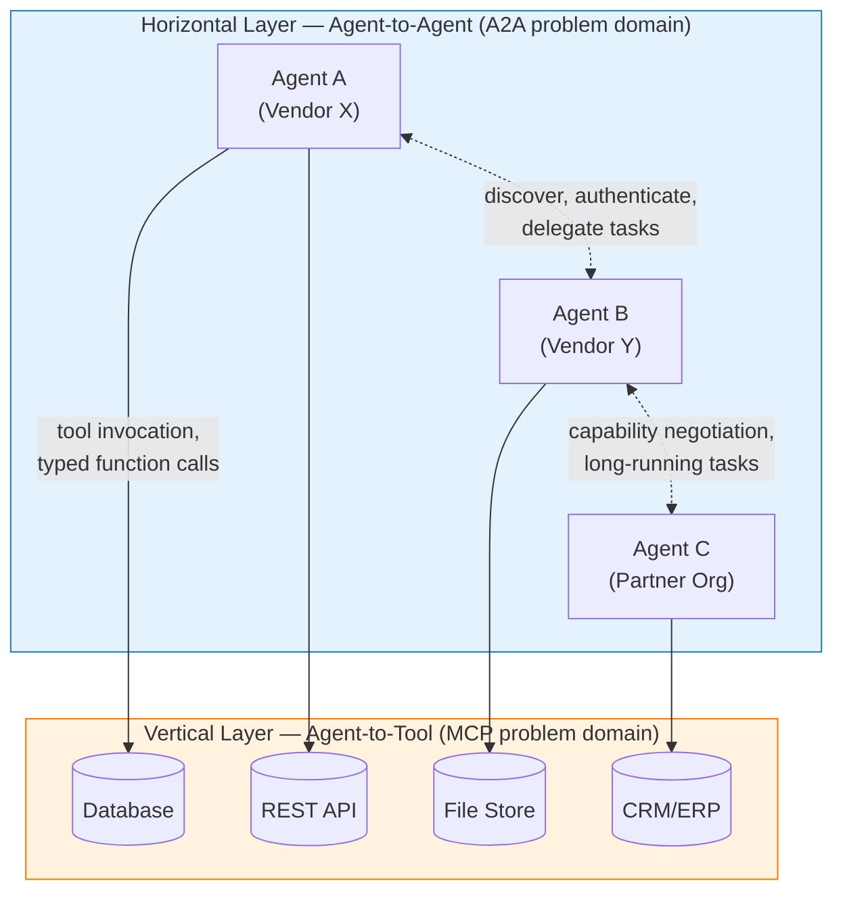
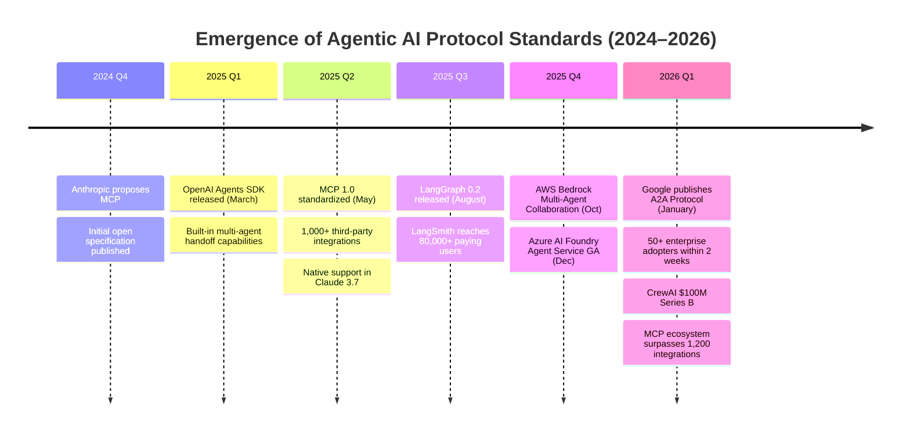
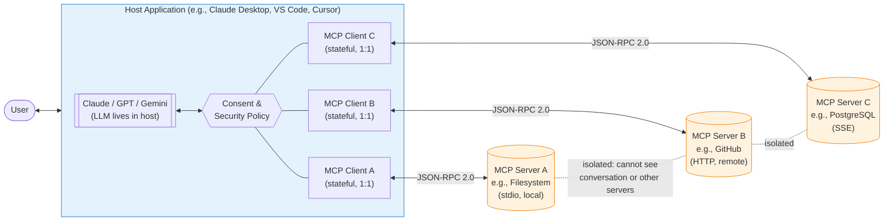
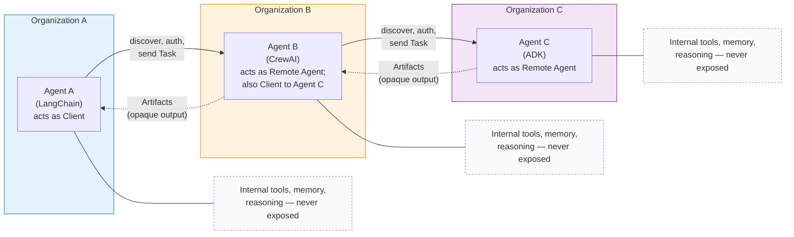
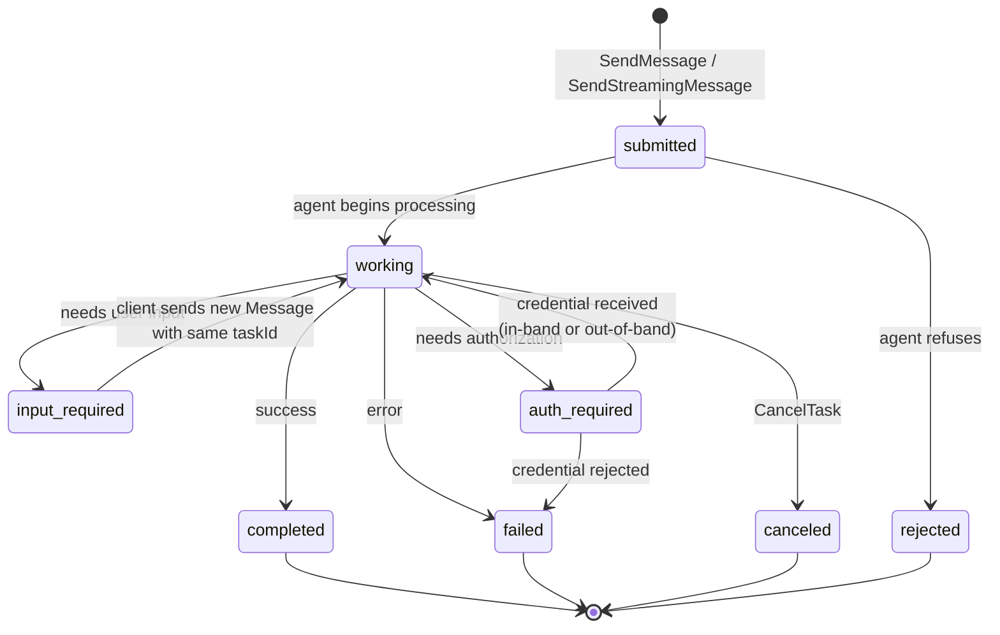
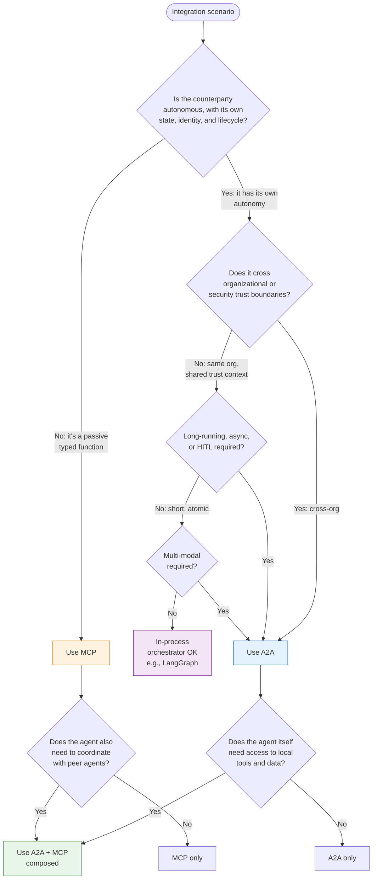
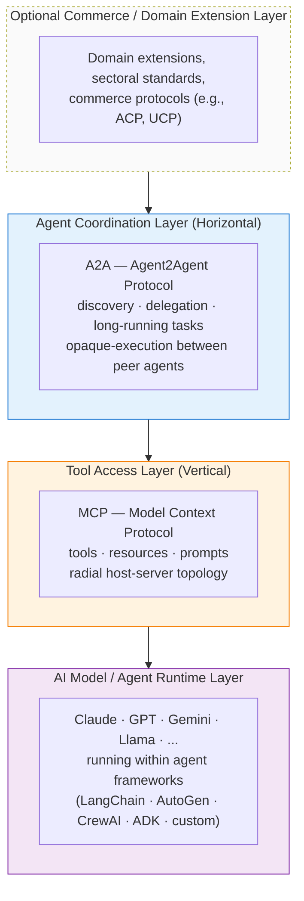
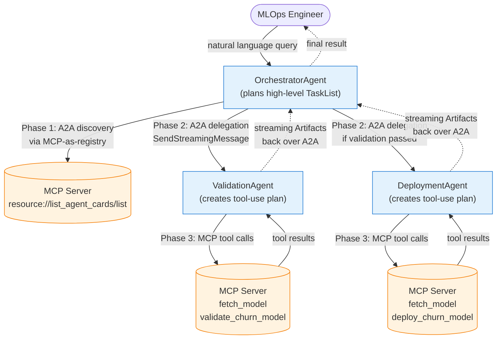

# A Comparative Analysis of Google's Agent2Agent (A2A) Protocol and Anthropic's Model Context Protocol (MCP): Innovations, Differences, and Complementary Roles in the Agentic AI Era
# 1 Research Background: The Rise of Agentic AI and the Need for Standardized Protocols

The emergence of two distinct protocol initiatives — Anthropic's Model Context Protocol (MCP) in late 2024 and Google's Agent2Agent (A2A) Protocol in 2025 — did not occur in a technological vacuum. They are direct architectural responses to a deeper structural transition unfolding across the artificial intelligence industry: the migration from isolated, prompt-driven generative AI tools toward distributed, autonomous, goal-driven *agentic* systems that must reason, act, and collaborate across organizational and vendor boundaries. To understand why two of the most influential AI laboratories independently invested in protocol-layer standardization within roughly a twelve-month window, this chapter establishes the contextual foundation by tracing the rise of agentic AI, examining the fragmentation of the agent framework ecosystem, identifying the two structural bottlenecks that standardization seeks to resolve, surfacing the enterprise demands driving the agenda, and chronologically situating MCP and A2A within the broader 2024–2025 standardization wave.

## 1.1 From Generative AI to Agentic AI: The Paradigm Shift

The first wave of large language model (LLM) deployment, spanning roughly 2022 to 2023, was dominated by stateless, single-turn or short-context prompt-response interactions. While impressive as text generators, these systems were operationally limited: they could not retain durable memory across sessions, invoke external software, or autonomously decompose complex objectives into executable steps[^1]. The current technological transition — broadly labeled "agentic AI" — overcomes these constraints by equipping LLMs with four reinforcing capabilities: **tool use** (the ability to call external APIs, run code, query databases, or interact with other software), **memory** (retention of context across interactions), **planning and reasoning** (decomposition of goals into sub-tasks with adaptive replanning), and **collaboration** (communication and cooperation among multiple specialized agents)[^1]. Gmelius's research summarizes this transition succinctly: agentic AI consists of "autonomously operating systems that use data and cognitive understanding to take action on our behalf"[^2].

The economic and adoption signals confirm that this paradigm shift is no longer experimental. According to industry projections compiled by Landbase, the global agentic AI market is set to expand from approximately **$5.25 billion in 2024 to $199.05 billion by 2034**, a roughly 38-fold increase representing a **compound annual growth rate of 43.84 %**[^3]. The enterprise sub-segment alone is forecast to grow from $2.58 billion in 2024 to $24.50 billion by 2030 at a 46.2 % CAGR[^3]. Adoption metrics show that the technology has crossed the chasm from early experimentation into mainstream deployment: **79 % of organizations report some level of AI agent adoption**, **96 % plan to expand agentic AI usage** in the coming year, and **88 % of executives are increasing AI budgets specifically because of agentic capabilities**[^3]. Gartner's tracking, cited by Gmelius, projects that the share of AI agents embedded in enterprise software applications will grow from less than 1 % in 2024 to **33 % by 2028** — a 33-fold increase in just four years[^3][^2]. Independent surveys reach consistent conclusions: **82 % of organizations plan to integrate agentic AI within the next one to three years**, and **99 % of newly built enterprise applications now include AI agents as a core feature**[^2].

This shift from "AI that talks" to "AI that acts" has profound architectural consequences. Stateless prompt-response systems can be served behind a single HTTPS endpoint with minimal protocol thinking; an agent that maintains long-running state, invokes dozens of heterogeneous tools, persists memory, and collaborates with peer agents requires a far richer substrate. The Multi-Agent AI Orchestration Framework market — the infrastructure layer that coordinates agent populations — was valued at **$1.8 billion in 2025** and is projected to reach **$35.6 billion by 2034 at a 44.0 % CAGR**[^4]. By 2025, **over 62 % of Fortune 500 companies had initiated multi-agent pilot programs**, and Gartner estimates that **over 40 % of enterprise AI deployments now include at least one agentic component, rising to over 75 % by 2028**[^4]. Crucially, enterprises now routinely deploy **10 to 500+ concurrent AI agents within a single workflow**, a scale at which ad-hoc, framework-specific integration patterns collapse under their own complexity[^4].

The implication is direct: when agents must persist, act, and cooperate at this scale, the *interfaces* between agents and the world — and between agents themselves — become the load-bearing infrastructure. Without standardized protocols at these interfaces, every new agent, tool, or partner system requires bespoke integration work whose cost scales combinatorially with ecosystem size. This is the structural condition that motivated the protocol-standardization wave of 2024–2025.

## 1.2 Fragmentation of the Agent Framework Ecosystem

The agentic AI ecosystem that emerged between 2023 and 2025 is, paradoxically, both vibrant and fragmented. A rapidly proliferating set of open-source frameworks and proprietary platforms each defines its own abstractions for the core agentic primitives — tool invocation, inter-agent messaging, memory management, and task delegation — with limited cross-compatibility.

On the open-source side, **LangChain** pioneered the modular "chains, agents, tools, memory" abstraction and, together with its stateful extension **LangGraph**, has grown to **over 1.8 million monthly active developers** by Q1 2026, with LangChain Inc. crossing **$50 million in ARR** through its LangSmith observability and LangGraph Cloud commercial offerings[^1][^4]. Microsoft's **AutoGen** introduced a multi-agent conversational paradigm anchored on the `ConversableAgent` class with specialized subclasses such as `AssistantAgent` and `UserProxyAgent`, and has spawned an ecosystem of **over 800 third-party integration plugins**[^1][^4]. **CrewAI**, founded in late 2023, popularized a role-based "crew" model where each agent has an explicit role, goal, and backstory; despite its short history it has accumulated **45,000+ GitHub stars** and secured a **$100 million Series B** in January 2026[^4]. Hugging Face's Smolagents library and Microsoft's Semantic Kernel further extend the open-source surface[^4].

On the proprietary side, the landscape is equally varied. Google's **Agent Development Kit (ADK)** and Vertex AI Agent Builder are tightly coupled to Gemini models and the Google Cloud stack[^1]. The **OpenAI Agents SDK**, evolved from the experimental "Swarm" project, integrates natively with OpenAI's function-calling, code-interpreter, and image-generation tools and provides its own handoff system for task delegation[^1]. **Amazon Bedrock Agents**, launched on AWS, reported **over 45,000 enterprise customers** experimenting with multi-agent features within six months of its late-2024 launch[^4]. Microsoft's **Azure AI Foundry**, which natively integrates AutoGen, was already serving **over 20,000 paying enterprise customers** by Q1 2026[^4]. At the application layer, **Salesforce Agentforce** processes **over one billion agentic actions per week**, while **ServiceNow AI Agents**, **Workday AI**, and **Microsoft Copilot Studio** each define their own agent abstractions optimized for their respective business platforms[^4].

The structural problem this proliferation creates is well-known to enterprise architects as the **M×N integration problem**: if M agents (or agent frameworks) must each integrate with N tools or peer agents, the number of bespoke connectors required grows multiplicatively. Each framework adopts proprietary representations for what is, conceptually, the same primitive — invoking a tool, passing a message, persisting a memory entry — making it nearly impossible to compose agents across vendor boundaries without building and maintaining adapter layers for every pair. The consequences are concrete: vendor lock-in, redundant engineering effort, brittle cross-platform workflows, and an inability for an agent built on, say, LangGraph to natively delegate a sub-task to a partner agent built on CrewAI or Agentforce. The Multi-Agent AI Orchestration market commentary explicitly identifies this fragmentation as a barrier "that previously slowed enterprise adoption," noting that the industry's embrace of standards such as MCP "is further accelerating interoperability between agent frameworks and tool providers"[^4].

The fragmentation is not merely a developer-experience inconvenience; it is the technical reason why two complementary protocol initiatives became simultaneously necessary. Each framework solved local coordination within its own walls; none solved the global problem of *cross-framework, cross-vendor interoperability*.

## 1.3 Two Bottlenecks: Tool Integration and Inter-Agent Communication

A careful reading of the agentic stack reveals that the fragmentation problem decomposes cleanly into **two structurally distinct bottlenecks**, and recognizing this distinction is essential for understanding why MCP and A2A emerged as separate — rather than rival — protocols.

The **first bottleneck is agent-to-tool integration**: how does a single agent connect to the heterogeneous universe of external resources it needs to perform useful work — REST APIs, SQL and NoSQL databases, vector stores, file repositories, enterprise systems of record (CRM, ERP, SCM), web search, code execution sandboxes, and proprietary internal services? Historically, every framework solved this with its own "tool" abstraction: LangChain ships pre-built tool wrappers (Google Search, ArXiv, Wikipedia) and lets developers add custom Python functions; AutoGen lets `UserProxyAgent` execute code generated by `AssistantAgent`; Bedrock Agents wires into AWS services; and the OpenAI Agents SDK ties into OpenAI's native function calling[^1]. Each integration is bespoke to the framework, meaning that connecting an LLM to a new database requires re-implementing the connector for every framework that wants to use it. This is a *vertical* integration problem — an agent reaching down into the tool layer — and it is precisely the problem MCP was designed to solve. The orchestration market analysis confirms that MCP, "proposed by Anthropic in 2024," has "1,200 third-party server integrations" by early 2026 and is described as a standard that lets agents "connect to external tools, databases, and APIs through a standardized interface, significantly reducing integration complexity"[^4].

The **second bottleneck is agent-to-agent collaboration**: how do autonomous agents, potentially built on different frameworks, hosted by different vendors, and operated by different organizations, *discover* one another, *authenticate*, *negotiate capabilities*, *exchange long-running tasks*, and *coordinate* without revealing each other's internal logic? This is a *horizontal* problem — peer agents communicating across organizational boundaries — and it sits at a fundamentally different abstraction level than tool invocation. A tool is a stateless, typed function; a peer agent is a stateful, autonomous, opaque counterparty with its own reasoning, memory, security context, and lifecycle. The orchestration market commentary highlights this emerging need explicitly: "the emergence of inter-organizational multi-agent networks — where agent systems from different enterprises collaborate on shared tasks like supply chain coordination, insurance claims processing, or clinical trial management — is a nascent but high-potential market segment that current frameworks are beginning to address through standards like A2A (Agent-to-Agent protocol, proposed by Google) and agent identity verification systems"[^4].

The distinction between these two bottlenecks can be visualized as two orthogonal axes of the agentic stack:



The diagram makes clear why a single protocol cannot efficiently address both layers. The vertical agent-to-tool axis demands a schema-driven, function-call-style abstraction in which the agent is the active intelligence and the tool is a passive, deterministic capability. The horizontal agent-to-agent axis demands a peer-to-peer abstraction in which both endpoints maintain independent state, autonomy, and security boundaries, and where interaction patterns include discovery, authentication, asynchronous task lifecycles, and capability negotiation. Conflating the two — for example, by wrapping a stateful peer agent behind a tool-style interface, or treating a stateless API as a "mini-agent" — produces architectural mismatches that surface as bugs, security gaps, or performance problems in production. This is the fundamental design insight that justified two distinct protocol initiatives rather than one universal standard.

## 1.4 Enterprise Demand for Interoperability, Governance, and Cross-Vendor Collaboration

The technical case for protocol standardization is reinforced by an even stronger commercial and regulatory case originating from the enterprise side. Three categories of pressure — operational scale, governance mandates, and the demand for cross-organizational collaboration — together make standardized protocols not merely useful but commercially essential.

**Operational scale.** The deployment density of agents inside Fortune 500 environments has reached a point where ad-hoc coordination is no longer viable. Enterprises now routinely deploy "10 to 500+ concurrent AI agents within a single workflow," and orchestration has become "the defining bottleneck and competitive differentiator in enterprise AI strategy"[^4]. McKinsey surveys cited in the orchestration market analysis report **35–60 % productivity gains** in workflows where multi-agent pipelines are correctly deployed; Landbase research similarly documents **20–60 % productivity improvements** and **70 % cost reductions** through autonomous workflow execution[^3][^4]. These returns, however, are conditional on reliable coordination — and reliable coordination at scale presupposes a stable protocol layer.

**Governance and regulatory mandates.** Regulatory tailwinds have moved from theoretical to operational. The **EU AI Act**, fully applicable from August 2026, classifies many agentic applications as "high-risk" systems and imposes documented accountability, human oversight mechanisms, and detailed logging of agent decision chains[^4]. In the United States, the NIST AI Risk Management Framework and follow-on federal guidance have prompted **over 80 % of Fortune 1000 CIOs to include AI governance tooling as a procurement criterion** in their 2025–2026 AI infrastructure budgets[^4]. Financial regulators including the SEC, FCA, and EBA have issued specific AI model risk management guidance that effectively mandates orchestration layers as a compliance control for agents touching trading, lending, or advisory functions[^4]. Standardized protocols are inherently aligned with these mandates: they produce structured, auditable interaction records at well-defined interfaces, whereas proprietary cross-framework glue code typically does not. Survey data already show that orchestration platforms with built-in governance command **30–45 % pricing premiums** over unmanaged alternatives[^4].

**Security and project risk.** Enterprise hesitation around agentic AI is concentrated in security and reliability concerns. **35 % of organizations cite cybersecurity as the top adoption barrier**, **30 % cite data privacy**, **21 % cite regulatory clarity**, and **87 % report multiple simultaneous adoption barriers**[^3]. Gartner forecasts that **40 % of agentic AI projects will fail by 2027 due to inadequate risk management**, and security researchers have catalogued **15 distinct categories of agentic-AI-specific threats** including memory poisoning, tool misuse, and privilege compromise[^3]. Multi-agent pipelines exhibit a particularly acute failure mode: an MIT CSAIL study cited in the orchestration analysis found that in pipelines with four or more agents, **the probability of unchecked hallucination reaching the final output increases by 3.7× compared to single-agent systems** — a phenomenon termed "error cascading"[^4]. A standardized protocol that defines explicit boundaries, authentication, and observability between agents is one of the few mechanisms that can systematically attack these compounding risks.

**Cross-organizational collaboration.** Perhaps the most strategically important driver is the rise of inter-enterprise agent networks: supply chain coordination, insurance claims processing, clinical trial management, and B2B service exchanges in which agents owned by different organizations must interact under contractual and security constraints[^4]. The convergence of multi-agent AI with ERP and CRM platforms — SAP, Oracle, and Salesforce are all "in early stages of embedding orchestration directly into their core platform APIs" across **250,000+ enterprise customers** — only sharpens the need for vendor-neutral interaction protocols, because no single vendor's proprietary abstraction will be acceptable to its competitors as the lingua franca of multi-party workflows[^4].

Taken together, these pressures define the procurement criteria that any successful agentic protocol must satisfy: **vendor-neutrality**, **enterprise-grade authentication and authorization**, **auditability of decision chains**, **support for long-running and asynchronous interactions**, **explicit data and capability boundaries that protect proprietary logic**, and **interoperability across hybrid public-cloud, private-cloud, and on-premise deployments** (recall that hybrid deployment is the fastest-growing mode at a 47.9 % CAGR, with 47 % of enterprises planning hybrid multi-agent adoption)[^4]. These criteria are precisely the design requirements that frame both MCP and A2A.

## 1.5 The Emergence of MCP and A2A: Timeline and Problem Framing

It is against this backdrop — paradigm shift to agentic AI, ecosystem fragmentation, two distinct integration bottlenecks, and converging enterprise pressure — that the two focal protocols of this report emerged within a roughly twelve-to-fifteen-month window.

**Anthropic's Model Context Protocol (MCP)** was proposed in late 2024 as an open standard explicitly targeted at the agent-to-tool integration bottleneck. Its design defines how AI agents and orchestration frameworks connect to external tools, databases, and APIs through a uniform interface, eliminating the need for custom per-framework integration code[^4]. MCP reached its **1.0 specification milestone in May 2025**, when native MCP support was integrated into Claude 3.7 Sonnet and Opus, and the surrounding ecosystem **surpassed 1,000 third-party server integrations** at that point, growing to **over 1,200 integrations by early 2026**[^4]. Critically, MCP support was rapidly added by the major orchestration frameworks themselves — LangChain, AutoGen, and CrewAI — making it a de facto cross-framework standard rather than an Anthropic-only artifact[^4]. The orchestration market analysis characterizes this trajectory plainly: MCP has become a "platform commoditization" force that "lowers integration complexity" and accelerates multi-agent adoption[^4]. Anthropic's own positioning — "increasingly positioned as an orchestration-layer ecosystem enabler" via MCP — confirms the protocol's intended scope as the standardization layer for *context and tools*, not for inter-agent collaboration[^4].

**Google's Agent2Agent (A2A) Protocol** was published as an open specification by Google DeepMind in **January 2026**, explicitly designed to enable "secure, authenticated inter-agent communication across different orchestration frameworks and organizational boundaries"[^4]. The launch was accompanied by an unusually rapid wave of industry endorsement: **over 50 enterprise technology companies — including SAP, Salesforce, and Atlassian — announced A2A protocol support within two weeks of the publication**[^4]. Google's own ADK had positioned A2A support as a first-class feature even prior to the formal specification release, describing the kit as "Multi-Agent by Design" with native support for "the open Agent2Agent (A2A) protocol for interoperability"[^1]. A2A's problem framing is the inverse of MCP's: where MCP standardizes how an agent reaches *down* to tools, A2A standardizes how agents reach *across* to peer agents, with explicit attention to discovery, authentication, opaque-agent collaboration (preserving proprietary internal logic), long-running task lifecycles, and modality-agnostic message exchange — features that will be examined in detail in Chapters 3 and 6.

The chronological relationship between the two protocols is summarized in the timeline below:



The timeline reveals a clear sequencing logic. MCP solved the more immediate and tractable problem first — vertical tool integration — and its success created both the technical foundation and the cultural expectation for a complementary horizontal standard. By the time A2A was published, the enterprise ecosystem had been primed by MCP's adoption to recognize the value of vendor-neutral protocols, which helps explain the unusually rapid endorsement by major enterprise software vendors. The relationship between the two protocols, as the orchestration market analysis succinctly puts it, is that they collectively "reduce fragmentation that previously slowed enterprise adoption"[^4] — MCP at the agent-tool boundary, A2A at the agent-agent boundary.

It is worth acknowledging two caveats about the source landscape that will inform the rest of this report. **First**, the publicly available aggregated market reports surveyed for this chapter compress some technical nuance: for example, A2A's lineage involves contributions from Google Cloud and Google DeepMind and a transition trajectory toward open governance (discussed in detail in Chapter 8) that is only obliquely visible in third-party summaries. Specific normative details — Agent Card schema fields, JSON-RPC method definitions, protobuf-as-source-of-truth conventions, and version evolution from 0.2.5 to 1.0 — are best validated against the protocol specification itself in subsequent chapters. **Second**, the dating reflected in the source materials (e.g., "January 2026" for the A2A open specification publication) corresponds to the formal open-standard release and the wave of enterprise endorsements; earlier announcement and partner-preview activity occurred during 2025, and this report will reconcile these dates more precisely in Chapter 3 when dissecting the protocol specification directly.

The remainder of this report builds on the foundation established here. Chapter 2 dissects MCP's technical anatomy, verifying its scope as a context-and-tools standardization layer. Chapter 3 performs the parallel dissection for A2A. Chapter 4 develops a structured comparative framework across problem scope, abstraction level, primitives, lifecycle, security, and modality, applying the autonomy litmus test introduced in §1.3 to resolve boundary cases. Chapters 5 through 10 then examine complementarity, A2A's specific innovations and the problems they solve, real-world adoption, governance, limitations, and forward outlook. The throughline of the entire report is the argument framed in this chapter: that A2A and MCP are not competitors but complementary protocols addressing the two structurally distinct bottlenecks — horizontal and vertical — that together define the interoperability frontier of the agentic AI era.

# 2 Technical Anatomy of the Model Context Protocol (MCP)

Chapter 1 established that the agentic AI era is structured around two orthogonal integration bottlenecks — the vertical agent-to-tool axis and the horizontal agent-to-agent axis — and argued that this structural distinction is precisely why two complementary protocols, MCP and A2A, emerged in parallel. Before the comparative analysis can be developed in Chapter 4, however, each protocol must first be understood on its own technical terms. This chapter performs that dissection for the Model Context Protocol. It traces MCP's design philosophy back to the November 2024 release that articulated its problem framing, decomposes its client-host-server topology, examines the JSON-RPC 2.0 wire protocol and its three transport options, details the three server primitives (tools, resources, prompts) and the three client primitives (roots, sampling, elicitation) that together constitute the protocol's expressive surface, and analyzes the lifecycle, capability negotiation, and security model that govern a session. The chapter closes by explicitly demarcating the boundary of MCP's problem domain — namely, that it standardizes how a single agent reaches *down* to external capabilities and deliberately does not address how autonomous agents reach *across* to one another — providing the technical baseline against which A2A will be compared in Chapters 3 and 4.

## 2.1 Design Philosophy and Problem Framing

MCP was released by Anthropic on November 26, 2024 as an open standard for "data exchange between applications and data sources," explicitly framed as a way to simplify "how Large Language Models (LLMs) interact with external tools and data".[^5] InfoQ's contemporaneous coverage of the specification publication identifies the protocol's central motivation as the "MxN" problem: "the combinatorial difficulty of integrating M different LLMs with N different tools," replaced by a single standard that "LLM vendors and tool builders can follow".[^6] This is the same M×N integration burden discussed in §1.2 — under the legacy regime, every new tool vendor (GitHub, Slack, Postgres, filesystem) had to "build custom integrations for Claude, then again for GPT, then again for open-source clients," whereas MCP "inverts this: servers implement the protocol once, and any client that understands JSON-RPC 2.0 can work with them," a transition explicitly compared to "the REST API revolution, but for LLM tool use".[^7]

The protocol's identity as a universal connector is captured in the analogy that has become canonical in MCP discourse: **"MCP is to AI what USB was to hardware: a universal connector that replaces a tangle of proprietary cables with a single standard. Rather than creating unique integrations for each AI tool, you can simply expose your platform as an MCP server. Any MCP-compatible client—such as GitHub Copilot, Claude, or Cursor—can then connect instantly."**[^8] This framing makes explicit that MCP standardizes the *interface layer* between AI applications and external systems rather than the AI applications or systems themselves.

The MCP specification is built on four formally enumerated design principles that constrain how the protocol evolves and what it is willing to absorb into its scope. First, **servers should be extremely easy to build**: "Host applications handle complex orchestration responsibilities" while "servers focus on specific, well-defined capabilities" with "simple interfaces" that "minimize implementation overhead".[^9] Second, **servers should be highly composable**, with each server providing "focused functionality in isolation" so that "multiple servers can be combined seamlessly" via the shared protocol.[^9] Third — and central to the protocol's security posture — **"servers should not be able to read the whole conversation, nor 'see into' other servers"**: each server "receives only necessary contextual information," the "full conversation history stays with the host," each connection "maintains isolation," "cross-server interactions are controlled by the host," and the "host process enforces security boundaries".[^9] Fourth, **features can be added progressively**: the core protocol provides "minimal required functionality" while additional capabilities are "negotiated as needed," allowing servers and clients to "evolve independently" while preserving "backwards compatibility".[^9]

Two consequences flow directly from these principles and frame the rest of this chapter. The third principle establishes that MCP is intrinsically a *radial* protocol — many isolated servers fanning out from a central host, with the host as the trusted aggregator and arbiter. This is a deliberately *non-peer* topology: servers are not designed to talk to one another, nor to share state, nor to see beyond the slice of context the host has explicitly handed them. The fourth principle, combined with the date-based versioning scheme (the original specification was timestamped `2024-11-05`,[^7] with later revisions including `2025-11-25`[^9][^10]), explains how MCP can keep growing its surface — adding elicitation, structured tool annotations, experimental tasks — without breaking earlier integrations. Together, these design choices reveal that MCP's problem framing is narrow by design: it is a vertical context-and-tools standardization layer, not a general substrate for autonomous agent collaboration.

## 2.2 Client-Host-Server Architecture

MCP's architectural topology is a three-tier client-host-server model in which "each host can run multiple client instances," with the architecture explicitly designed to "enable users to integrate AI capabilities across applications while maintaining clear security boundaries and isolating concerns".[^9] The three roles have distinct, formally defined responsibilities.

The **host** is the "container and coordinator" of the entire MCP session. It "creates and manages multiple client instances," "controls client connection permissions and lifecycle," "enforces security policies and consent requirements," "handles user authorization decisions," "coordinates AI/LLM integration and sampling," and "manages context aggregation across clients".[^9] In practical terms, the host is the AI application visible to the end user — Claude Desktop, Claude Code, Cursor, VS Code with GitHub Copilot, or a custom application built on the MCP SDK[^7][^10] — and it is the trusted layer where the LLM lives, where user consent is captured, and where the boundary between user, model, and external systems is enforced.[^10]

The **client** is the per-server connector instantiated by the host. Each client "establishes one stateful session per server," "handles protocol negotiation and capability exchange," "routes protocol messages bidirectionally," "manages subscriptions and notifications," and "maintains security boundaries between servers".[^9] The 1:1 relationship between a client and a server is normative: "a host application creates and manages multiple clients, with each client having a 1:1 relationship with a particular server".[^9] This invariant is what makes the third design principle enforceable in practice — because each server sees only its own client, and each client sees only one server, the host is the unique point at which cross-server context can be aggregated.

The **server** is the "focused responsibilities" capability provider that exposes "resources, tools and prompts via MCP primitives," "operates independently," may "request sampling through client interfaces," "must respect security constraints," and "can be local processes or remote services".[^9] The server contract is deliberately minimal: it advertises capabilities at initialization time and then waits to be called.

Translated into the runtime view documented in deeper architectural treatments, the host abstracts the transport layer entirely from the client API: "the client never talks directly to servers; it always goes through the host, which routes messages, aggregates tool/resource manifests, and enforces sandboxing boundaries".[^7] This produces "three immediate wins: (1) clients aren't coupled to specific transports, (2) servers can be deployed anywhere without client code changes, and (3) tool discovery is centralized, enabling capability negotiation before any tool call".[^7] The architecture is explicitly composable — "a single client can wire multiple MCP servers, aggregate their tools and resources, and route LLM requests to whichever server owns a tool"[^7] — and supports both deployment models that this chapter will revisit in §2.8: local subprocesses (the Microsoft Fabric Local MCP "runs on your machine"[^8]) and remote services (the Microsoft Fabric Remote MCP, "a cloud-hosted MCP server" reachable at `https://api.fabric.microsoft.com/v1/mcp/core` that authenticates through Entra ID[^8]).

The following diagram synthesizes the topology and message flow:



The dashed isolation lines between servers visually encode the third design principle: servers are **siblings under a host**, never peers to one another. Cross-server orchestration — for example, "use the GitHub server to pull a file, then call the database server to write a row" — is composed in the host, by the LLM and the user, not in any direct server-to-server channel. This topological fact is the single most important architectural reason why MCP, despite covering some superficially similar ground to A2A, cannot be repurposed as an inter-agent collaboration protocol; the limitation will be revisited in §2.9.

## 2.3 JSON-RPC 2.0 Messaging and Transport Layer

MCP's wire protocol is built on JSON-RPC 2.0, a choice that recurs throughout the specification: the protocol "uses structured **JSON-RPC 2.0** messages to facilitate clear and reliable interactions between hosts, clients, and servers,"[^10] and Anthropic's specification mandates JSON-RPC as the foundation, with the host enforcing strict message validity.[^7][^6]

Every MCP message is a JSON object. A request carries an `id`, a `method`, and `params`; a response carries the matching `id` and either a `result` or an `error`; a notification carries a `method` and `params` but no `id` and is not acknowledged.[^7][^10] A typical resource read therefore looks like:

```json
{ "jsonrpc": "2.0", "id": 1, "method": "resources/read",
  "params": {"uri": "file:///path/to/config.yaml"} }
```

with the host routing it to the right server and returning:

```json
{ "jsonrpc": "2.0", "id": 1,
  "result": {"contents": [{"uri": "file:///path/to/config.yaml",
                           "mimeType": "text/yaml", "text": "..."}]} }
```

or, on failure, an error using standard JSON-RPC codes — `-32700` (parse error), `-32600` (invalid request), `-32601` (method not found), `-32602` (invalid params), `-32603` (internal error) — supplemented by MCP-specific custom codes such as `-32001` for "resource not found".[^7] Notifications are reserved for unsolicited server-to-client updates such as resource-change events: when a filesystem watcher detects a file modification, the server emits `notifications/resources/list_changed` with no `id`, and the client processes it without responding.[^7] This is the substrate on which subscriptions — the live-update mechanism for resources — are built.

A practical advantage of JSON-RPC 2.0 selection is that "tooling for JSON-RPC debugging works out of the box — the host can log every message, and clients can replay conversations to understand failures".[^7] The discipline of strict id-based correlation also makes auditing tractable, which matters for the governance use cases discussed in §1.4.

The data layer is intentionally **transport-agnostic**: the same JSON-RPC 2.0 message format is used "across all transport mechanisms," and the transport abstraction "allows applications to switch between local and remote servers seamlessly".[^10] Three transports are officially supported, and the choice between them is "one of the first MCP deployment decisions"[^7] because each carries different latency, scalability, and operational profiles.

| Transport | Mechanism | Strengths | Weaknesses | Typical use |
|---|---|---|---|---|
| **stdio** | Server is a subprocess; client speaks newline-delimited JSON over stdin/stdout[^7] | "Zero latency, trivial debugging (watch stdout), process lifecycle management for free"[^7]; no firewall/TLS/discovery required | Local subprocesses only; "scales poorly beyond a few servers"; no clustering or failover[^7] | Default for local servers (filesystem, git, local databases); Claude Desktop spawns binaries this way[^7] |
| **Server-Sent Events (SSE)** | HTTP server; client POSTs requests, opens an `EventSource` stream for async notifications[^7] | "Halfway between stdio and full HTTP — simpler than bidirectional WebSocket but handles streaming well"[^7] | More complex than stdio; less standardized than full HTTP | Long-running daemons that should outlive client restarts[^7] |
| **Streamable HTTP** | HTTP/2 or HTTP/3 endpoint; full request/response semantics[^7] | "Fully cloud-native and supports scaling"[^7]; supports load-balanced clusters and multi-tenant services | Higher latency than stdio; "requires TLS, auth (API key, mTLS), and server discovery"[^7] | Cloud-deployed servers, e.g., Microsoft Fabric Remote MCP at `https://api.fabric.microsoft.com/v1/mcp/core`[^8] |

A critical property is that the transport choice is a *deployment* decision rather than a protocol decision: "a reference implementation for one server can ship with stdio as the default (Claude Desktop spawns it), and the same server can expose SSE or HTTP for web clients. The server doesn't change; only the transport shim changes".[^7] This decoupling enables the same MCP server logic to be packaged for local-first developer experiences (Microsoft's Fabric Local MCP, installed via a VS Code extension or `npx @microsoft/fabric-mcp`[^8]) and for cloud-scale deployments (the Fabric Remote MCP serving "agents, automation tools, Copilot Studio bots" through Streamable HTTP[^8]).

## 2.4 Server Primitives: Tools, Resources, and Prompts

Servers expose three formally specified primitives that, between them, cover the spectrum of context-injection and action-taking needs an LLM has when reaching into external systems. Anthropic developer Justin Spahr-Summers, replying to questions on Hacker News, framed the rationale: although the team "went back and forth about whether the other primitives of MCP ultimately just reduce to tool use," they "ultimately concluded that separate concepts of 'prompts' and 'resources' are extremely useful to express different *intentions* for server functionality. They all have a part to play!"[^6]

**Tools** are "executable functions that AI models can invoke to perform specific actions. They represent the 'verbs' of the MCP ecosystem".[^10] Each tool has a name, a human-readable description, and a JSON Schema defining its input parameters; the schema is read by the client during initialization, and tools are discovered through `tools/list` and executed via `tools/call`.[^7][^10] A canonical filesystem read tool illustrates the shape:

```json
{
  "name": "read_file",
  "description": "Read the contents of a text file",
  "inputSchema": {
    "type": "object",
    "properties": {
      "path": { "type": "string",
                "description": "Absolute path to the file" }
    },
    "required": ["path"]
  }
}
```

The server is "free to implement this tool however it wants — filesystem I/O, a database query, a remote API call. The client doesn't care".[^7] Recent specification revisions have added **tool annotations** — behavioral hints such as `readOnlyHint` and `destructiveHint` "that describe whether a tool is read-only or destructive, helping clients make informed decisions about tool execution" — and tools may also "include **icons** as additional metadata for better UI presentation".[^10] In production, tools are the most visible primitive and "power agentic workflows": a GitHub MCP server "exposes tools like 'list_repositories', 'create_issue', 'get_file_contents'," while a database server exposes "'query_sql' and 'insert_row'".[^7] The Microsoft Fabric Local MCP makes the pattern concrete with its `core_create_item`, `onelake_upload_file`, `onelake_list_workspaces`, and similar tools that "give your AI agent access to Fabric's entire API surface".[^8]

**Resources** are "data sources that provide contextual information to AI applications. They represent static or dynamic content that can enhance model understanding and decision-making".[^10] Resources are "identified by URIs and support discovery through `resources/list` and retrieval through `resources/read` methods,"[^10] with example URI schemes such as `file://documents/project-spec.md`, `database://production/users/schema`, and `api://weather/current`.[^10] Each resource carries a MIME type and content (text or binary). The pivotal innovation, distinguishing resources from a plain file API, is **subscriptions**: a client can say "alert me whenever this resource changes" — for instance, "notify me if the file is modified by another process" — and the server "maintains a watch on the resource, and when it changes, it sends an async notification to the client".[^7] In Claude Code, this powers a real-time editing loop: "while the user edits a file, the server watches the filesystem, and any changes made by other processes (e.g., a formatter running in the background) are pushed to Claude immediately".[^7] Resources also support listing and filtering — "list all resources matching `file://**/*.py`" returns a paginated list — and URI templates allow the server to advertise which URI patterns it supports without per-URI queries.[^7]

**Prompts** are "reusable templates that help structure interactions with language models," providing "standardized interaction patterns and templated workflows".[^10] They support variable substitution and are discovered via `prompts/list` and retrieved with `prompts/get`.[^10] Examples include "analyze this code for security issues" or "generate a unit test for this function": rather than hardcoding such a prompt in every client, "a server can expose it as a prompt, making it discoverable and parameter-aware".[^7]

The division of labor across the three primitives is therefore: **tools** are verbs (functions an LLM can invoke), **resources** are nouns (data the server manages and can stream updates from), and **prompts** are reusable templates (language patterns the server can render on demand). InfoQ's summary of the original specification sharpens the typology: "Prompts are instructions or templates for instructions. Resources are structured data which can be included in the LLM prompt context. Tools are 'executable functions' which LLMs can call to retrieve information or perform actions".[^6] All three are read by the host at session start, populate the host's catalog of available context, and become available to the LLM during inference.

## 2.5 Client Primitives: Roots, Sampling, and Elicitation

What distinguishes MCP from a one-way function-calling API is that *clients* also expose primitives — capabilities the host advertises to servers, allowing servers to ask the host for things rather than only the other way around. The current specification (`2025-11-25`) defines three such client features: roots, sampling, and elicitation.[^9][^10]

**Roots** "provide a standardized way for clients to expose filesystem boundaries to servers, helping servers understand which directories and files they have access to,"[^10] with `file://` URIs as the typical addressing scheme.[^10] Roots are discovered through the `roots/list` method, with clients sending `notifications/roots/list_changed` when the set of roots changes.[^10] Roots are the principal mechanism for *locality scoping*: by saying "your operations are bounded to these roots," the host informs the server which slice of the user's filesystem it is permitted to see, enabling the server to constrain its own behavior accordingly.

**Sampling** is the most distinctive client primitive — and, as the architectural deep-dive notes, "MCP's most unusual primitive".[^7] It "allows servers to request language model completions from the client's AI application," giving servers "access to LLM capabilities without embedding their own model dependencies".[^10] Sampling is initiated through the `sampling/complete` method, where the server sends a completion request to the client, the client invokes its own LLM (Claude or otherwise) on the server's behalf, and the LLM-generated response is returned.[^10] InfoQ notes that "Sampling could be used implementing agentic behavior by nesting LLM calls inside Server actions," but warns — quoting the specification — that "there SHOULD always be a human in the loop with the ability to deny sampling requests".[^6] An illustrative use case is a code-review server that, asked to review a function, calls back into the client to ask the host's LLM to "review this code and suggest improvements" — useful in "advanced agentic workflows where the server needs to make decisions based on LLM reasoning without the main client driving the interaction".[^7]

Sampling is consequential for the comparative analysis later in this report: it is the closest mechanism MCP offers to a delegated-reasoning primitive. Crucially, however, the LLM being invoked is *the host's own model*, not a separate autonomous agent with its own state, identity, or goals. Sampling lets a server briefly borrow the host's intelligence; it does not let the server discover, authenticate, or coordinate with a peer agent. This is the difference between "asking the brain to think for you" and "calling another autonomous mind."

**Elicitation** is a more recent addition, present in the `2025-11-25` specification, and "enables servers to request additional information or confirmation from users through the client interface".[^10] Elicitation requests use the `elicitation/request` method to "collect user input through the client's interface,"[^10] and the specification also supports a **URL Mode Elicitation** variant in which servers "direct users to external web pages for authentication, confirmation, or data entry".[^10] Elicitation closes a gap in the original `2024-11-05` design: it gives a server a structured way to say "I need a piece of information I don't have, please ask the user" without resorting to ad-hoc out-of-band communication.

Together, the three client primitives ensure that MCP is bidirectional in the relevant sense: the host can not only call the server but also act as a service provider to it — exposing filesystem context, the host's LLM as a sampler, and the user's interactive consent — while still enforcing all four design principles, because each request from server to client passes through the host's consent and security gates.[^9][^10]

## 2.6 Lifecycle, Capability Negotiation, and State Management

MCP is described in the specification as a "stateful session protocol focused on context exchange and sampling coordination between clients and servers,"[^9] and the lifecycle of that session is precisely defined. A session begins with the **Initialize handshake**: the client sends an `initialize` request declaring its protocol version, the capabilities it supports, and identifying metadata, and the server responds with the matching version and its own capabilities and metadata.[^7][^9][^10] A representative initialize request looks like:

```json
{ "jsonrpc": "2.0", "id": 1, "method": "initialize",
  "params": {
    "protocolVersion": "2024-11-05",
    "capabilities": {
      "roots": {"listChanged": true},
      "sampling": {}
    },
    "clientInfo": { "name": "Claude Desktop", "version": "0.5.0" }
  } }
```

with the server replying:

```json
{ "jsonrpc": "2.0", "id": 1,
  "result": {
    "protocolVersion": "2024-11-05",
    "capabilities": { "tools": {}, "resources": {}, "prompts": {} },
    "serverInfo": { "name": "Filesystem MCP Server", "version": "1.0.0" }
  } }
```

The exchange establishes a contract: "from this point on, the client knows: 'This server offers tools and resources, but not prompts or sampling.' The client can then list tools (`tools/list`) and resources (`resources/list`) to populate its in-memory catalog".[^7] The contract is durable — "once initialized, the client and server are bound for the lifetime of the connection. Re-initialization is not standard; you close the connection and reconnect if either side changes state in an incompatible way".[^7] The handshake is followed by an `notifications/initialized` notification confirming the client is ready.[^10]

**Capability negotiation** is the keystone of MCP's extensibility model. The protocol uses "a capability-based negotiation system where clients and servers explicitly declare their supported features during initialization," and "capabilities determine which protocol features and primitives are available during a session".[^9] The specification enumerates the rules: "Servers declare capabilities like resource subscriptions, tool support, and prompt templates"; "clients declare capabilities like sampling support and notification handling"; "both parties must respect declared capabilities throughout the session"; and "additional capabilities can be negotiated through extensions to the protocol".[^9] Each capability "unlocks specific protocol features" — emitting subscription notifications "requires the server to declare subscription support," tool invocation "requires the server to declare tool capabilities," and sampling "requires the client to declare support in its capabilities".[^9] This mechanism is what operationalizes the fourth design principle (progressive feature addition): new features can be added to the protocol without breaking older clients or servers, because each side advertises only what it actually implements and the other side adapts accordingly.

**Versioning** uses a date-based scheme (`YYYY-MM-DD`): the original specification was `2024-11-05`,[^7] the current published version at the time of the references is `2025-11-25`,[^9][^10] and clients and servers "declare what version they support, and they negotiate. If client supports 2024-11-05 and server supports 2024-06-01 and 2024-11-05, they both agree on 2024-11-05. If there's no overlap, initialization fails. This allows gradual rollouts of new protocol features".[^7] The date-based scheme is unusual relative to semantic versioning but well-suited to a specification that adds capabilities incrementally rather than making coordinated breaking releases.

Once initialized, a server's runtime can be modeled as a small state machine. The deep-dive description identifies four states: **Idle** (not yet initialized), **InitWait** (initialize received, response not yet sent), **Ready** (initialized; tool, resource, and prompt methods may be invoked), and **Subscribed** (handling at least one async resource subscription).[^7] Recoverable failures — "schema mismatch or a missing resource" — return a JSON-RPC error but keep the server in `Ready`; catastrophic failures close the connection and force the client to reconnect from `Idle`.[^7]

State management has an important nuance. Although the session is stateful — caches, subscriptions, watches, and protocol negotiations all persist for the connection's lifetime — the specification frames the *server* itself as effectively stateless across connections: "MCP assumes each connection is independent. If you have 10 clients, you have 10 connections and potentially 10 instances of the server's internal state".[^7] For read-only servers (filesystem, GitHub public repos), this is benign, but for read-write servers (databases, Slack), "teams must be careful about consistency".[^7] An experimental **Tasks** primitive — "durable execution wrappers enabling deferred result retrieval and status tracking for MCP requests" that "wrap standard MCP requests to enable asynchronous execution patterns for operations that cannot complete immediately"[^10] — is being added to address use cases that need durable, long-horizon execution; its experimental status indicates that, as of the cited specifications, MCP's native model remains synchronous request-response within a stateful session, with long-running asynchronous task lifecycles still under development. This will become an important contrast point against A2A, whose model treats long-running tasks as a first-class primitive.

## 2.7 Security Model and Authorization Boundaries

MCP's security model is articulated as a set of normative principles that the host is responsible for enforcing. Microsoft's MCP-for-beginners curriculum, which mirrors the specification's normative language, lists four core principles. **Explicit user consent**: "All data access and operations require explicit user approval before execution. Users must clearly understand what data will be accessed and what actions will be performed, with granular control over permissions and authorizations".[^10] **Data privacy protection**: "User data is only exposed with explicit consent and must be protected by robust access controls throughout the entire interaction lifecycle".[^10] **Tool execution safety**: "Every tool invocation requires explicit user consent with clear understanding of the tool's functionality, parameters, and potential impact. Robust security boundaries must prevent unintended, unsafe, or malicious tool execution".[^10] **Transport layer security**: "All communication channels should use appropriate encryption and authentication mechanisms. Remote connections should implement secure transport protocols and proper credential management".[^10] Raygun's early engineering write-up corroborates the design intent at the integration level: "MCP servers keep credentials and sensitive data isolated. Hosts don't have direct access to these credentials, and all interactions require explicit user approval".[^5]

Built-in mechanisms support these principles. **Tool permission control** allows clients to "specify which tools a model is allowed to use during a session," with permissions configurable "based on user preferences, organizational policies, or the context of the interaction".[^10] **Authentication** can be required by servers "before granting access to tools, resources, or sensitive operations," using "API keys, OAuth tokens, or other authentication schemes".[^10] **Validation** is enforced via the JSON Schema attached to each tool — "the server validates incoming requests accordingly," preventing "malformed or malicious input from reaching tool implementations".[^10] **Rate limiting** can be applied "per user, per session, or globally" to "protect against denial-of-service attacks or excessive resource consumption".[^10]

Crucially, however, **MCP deliberately delegates authentication and authorization to the transport layer**: "Security is delegated to the transport. stdio assumes the subprocess is sandboxed at the OS level (kernel namespaces, containers). SSE/HTTP use TLS and authentication (API keys, mTLS, OAuth). The MCP spec doesn't define authentication; it assumes the host (client) handles it before sending requests to the server".[^7] Configuration is therefore expressed at the deployment layer — for example, in a host config:

```yaml
servers:
  - name: filesystem
    command: /usr/local/bin/mcp-server-filesystem
  - name: github
    type: http
    url: https://mcp-github.example.com
    auth: { type: bearer, token: secret-api-key }
  - name: database
    type: http
    url: https://mcp-db.example.com/rpc
    auth: { type: mtls, cert: /etc/mcp/db-client.crt,
                         key:  /etc/mcp/db-client.key }
```

[^7]

In production, this delegation is concrete: Microsoft's Fabric Remote MCP authenticates "every request" through "**Entra ID authentication**," ensures "the agent operates with your identity, and it can never exceed your permissions," and records "every action" in "**Fabric Audit Logs**, giving admins full visibility".[^8]

The deliberate delegation has known **gaps and gotchas** that the architectural deep-dive enumerates clearly:

- **No per-tool authorization at the protocol level.** "There's no per-tool authorization; you can't say 'Alice can call this tool, but Bob can't' at the MCP level".[^7] Multi-user authorization must therefore be implemented either by the server internally or by the surrounding identity layer (Entra ID, OAuth scopes), not by the protocol.
- **Schema drift between Initialize and execution.** "A server is allowed to add new tools or change their schemas without reinitializing. The client caches the schema at Initialize time. If you add a required parameter to a tool, old clients will call it without that parameter and fail. Versioning tools is your problem — usually it means keeping the old tool and adding a new one with a new name (`read_file_v2`)".[^7]
- **No transactions, no rollback.** "If you call a tool that modifies state (e.g., 'delete_file') and it partially succeeds, there's no way to undo it via MCP. You must implement idempotence and retry logic in the tool itself".[^7] The recommended mitigation is rigorous idempotency at the tool implementation layer: "every tool that mutates state should be idempotent: calling it twice with the same inputs should have the same effect as calling once. Use request IDs or content hashes to detect and deduplicate retries".[^7]
- **Eventual consistency for resource subscriptions.** "If you subscribe to a resource, you get notifications when it changes, but there's no guarantee you'll see every intermediate state. If a file is modified 1000 times in a second, you might only see notification 1 and 500 and 1000".[^7]
- **Auth weakness in multi-tenant remote scenarios.** "API keys (weak for multi-user systems), mTLS (better but operationally complex), or OAuth (complex but delegated)" are the available options for HTTP servers, while "stdio servers assume the client is already trusted (it spawned them)".[^7]

In addition to these protocol-internal gaps, MCP inherits the broader **prompt-injection and tool-misuse risk surface** that Chapter 1 identified as a top enterprise concern. Because tools are invoked on the basis of an LLM's interpretation of user input and resource content, any malicious content that flows into the LLM's context — through a poisoned resource, a manipulated tool description, or an attacker-controlled web page surfaced via a search tool — can in principle steer the LLM into invoking privileged tools in ways the user did not intend. MCP's response is structural rather than detective: explicit user consent at every tool call, host-side enforcement of the third design principle (servers cannot see other servers' content), and tool annotations such as `destructiveHint`[^10] that let the host warn the user before consequential actions. Robust deployment further requires "audit logging" of "every tool call" with "the tool name, input parameters (with sensitive data redacted), the result or error, and the server that handled it"[^7] — a capability that aligns directly with the regulatory mandates discussed in §1.4.

## 2.8 Ecosystem, Reference Implementations, and Production Deployment Patterns

By the time the specification was first published in late 2024, MCP already shipped with official SDKs in Python and TypeScript and a reference repository of example servers.[^5][^6] Within roughly a year, this ecosystem matured into the broadest tool-integration substrate in the agentic stack. Anthropic itself published reference servers for filesystem, GitHub, PostgreSQL, Slack, Brave search, and others,[^7][^5] and the open repository expanded to include integrations such as Puppeteer for browser automation ("page navigation, screenshots, clicking, and hovering")[^5] and Google Maps for geocoding, place searches, and route calculations.[^5] Third-party implementations followed quickly: Raygun's MindscapeHQ team had a working MCP server for the Raygun API "two days after release," using it to "access error reports and performance data, making tasks like analysis and report generation easier".[^5]

The trajectory continued to accelerate through 2025 and into 2026. Microsoft's Fabric data platform now offers two production MCP deployments: the **Fabric Local MCP**, which reached general availability and "runs on your machine" to support API knowledge, code generation, OneLake file operations, and CLI execution for "developers pair-programming with AI assistants"; and the **Fabric Remote MCP**, in preview as a cloud-hosted server at `https://api.fabric.microsoft.com/v1/mcp/core` performing "real operations: workspaces, items, permissions, connections" for "agents, automation tools, Copilot Studio bots".[^8] The Fabric blog announcing these milestones notes that MCP is "now adopted across the industry by GitHub, Cloudflare, Stripe, and others"[^8] — confirming Anthropic's target of broad cross-vendor adoption — and explicitly describes MCP as "the open standard that connects it all" for "developer pair-programming with AI assistants" through to "agentic data platforms".[^8] The quantitative signal cited in §1.5 (over 1,200 third-party server integrations by early 2026) is consistent with this growth pattern, although that figure is reported by third-party market commentary rather than by Anthropic directly.

In production, deploying MCP at scale crystallizes into a recognizable set of patterns. The architectural deep-dive identifies several:

- **Multi-server aggregation via a capability router.** A typical deployment has "a capability router that connects to multiple MCP servers and merges their tool/resource lists. When a client asks 'list all tools,' the router gathers responses from all servers, deduplicates (if two servers expose the same tool name, pick one or flag an error), and returns the merged list".[^7] Tool execution is similarly routed: "the client calls 'tools/call' with a tool name. The router looks up which server owns that tool and forwards the request".[^7] When two servers expose the same tool name, options include "(1) error out and tell the client there's a conflict, (2) rename one tool (e.g., 'filesystem:read_file' vs 'github:read_file'), or (3) use priority rules".[^7]
- **Health checks and failover.** "A health-check sidecar pings each MCP server periodically (heartbeat every 30 seconds is common). If a server doesn't respond, the router marks it as unhealthy and removes it from the capability catalog until it recovers".[^7] Critical servers run "multiple instances behind a load balancer".[^7]
- **Audit logging and observability.** "Every tool call should be logged for audit trails," capturing "the tool name, input parameters (with sensitive data redacted), the result or error, and the server that handled it,"[^7] supplemented with "Prometheus metrics, structured logs, distributed tracing".[^7] Microsoft's Fabric Audit Logs realization of this pattern[^8] illustrates how deeply the audit requirement aligns with enterprise compliance.
- **Composability of multiple MCP servers per agent.** Microsoft's guidance advises explicitly: "The power of MCP is composability, add multiple servers to your agent for richer capabilities".[^8] This is the production manifestation of design principle #2.
- **Sensible practical caps on server fan-out.** Although a client *can* technically connect to a hundred servers, "each server connection consumes memory" and "capability discovery becomes slow." Production deployments therefore "cap at 10–20 servers and batch them by function (one server for filesystem, one for GitHub, one for Slack, etc.). If you need more, aggregate servers behind a capability router".[^7]
- **Idempotent tool execution as a defense against retry semantics.** "Implement idempotent tool execution. Every tool that mutates state should be idempotent".[^7]

A notable architectural property — and one that anticipates Chapter 4's comparative analysis — is that **MCP servers cannot directly call other MCP servers**. The design FAQ is explicit: "Not directly. MCP is a client-server protocol. A server can implement a tool that makes external HTTP calls, but it can't be an MCP client itself. If you want server-to-server integration, use standard APIs. If you want server A to delegate to server B via MCP, the client must orchestrate it (call A, then call B, then reconcile results)".[^7] This is not an oversight; it is the direct corollary of the third design principle and the radial-topology architecture.

A final observation worth flagging is that MCP is not positioned as a replacement for general-purpose APIs. As the architectural FAQ puts it: "REST APIs are for general-purpose data access and often expose business logic (billing, authentication, entitlements). MCP is specifically for LLM tool use: it's the protocol a server implements to say 'here are the functions I expose and the data I manage, in a schema the LLM can understand.' Many products will expose both a REST API (for user-facing integrations) and an MCP interface (for LLM clients). They can share the same backend implementation".[^7] This dual-surface pattern — REST for humans and partner systems, MCP for LLMs — is the integration topology emerging across the major enterprise vendors.

## 2.9 Boundaries of MCP's Problem Domain

The technical anatomy assembled in §§2.1–2.8 supports a sharp characterization of what MCP standardizes and, equally importantly, what it deliberately does not. Pulling the threads together:

| Dimension | What MCP standardizes | What MCP deliberately does *not* address |
|---|---|---|
| **Axis** | Vertical: agent reaching *down* to external capabilities[^7][^9] | Horizontal: agents reaching *across* to peer agents |
| **Topology** | Radial — one host orchestrates many isolated 1:1 client-server pairs[^9] | Peer-to-peer mesh of autonomous agents |
| **Counterparty** | A passive, deterministic capability provider (filesystem, DB, API, search)[^7][^10] | An autonomous, opaque counterparty with its own state, identity, and goals |
| **Primitives** | Tools (functions), Resources (data + subscriptions), Prompts (templates); plus client-side Roots, Sampling, Elicitation[^9][^10] | Agent identity advertisement, capability discovery between peers, opaque-agent collaboration |
| **State model** | Stateful session per connection, but server treated as effectively per-connection-stateless across connections[^7]; long-running async tasks only experimental[^10] | First-class long-running and asynchronous task lifecycles |
| **Security boundary** | Host-enforced consent and isolation between servers; auth delegated to transport[^7][^9][^10] | Mutual authentication and trust establishment between organizationally distinct agents |
| **Cross-server interaction** | Forbidden: servers cannot see other servers, cannot read full conversation, cannot directly call other MCP servers[^7][^9] | The central concern of an inter-agent protocol |

The table makes the structural conclusion concrete. **MCP standardizes the vertical agent-to-tool interface using a schema-driven, function-call abstraction in which the agent (host + LLM) is the active intelligence and the server exposes passive, deterministic, capability-typed functions.** Its design principles, architecture, and primitives align around this scope: the host is the singular locus of orchestration; servers are isolated, composable capability providers; tools, resources, and prompts cover the surface of "what a single agent needs from external systems"; and capability negotiation and date-based versioning let this surface evolve incrementally without destabilizing the ecosystem.

Conversely, MCP is not designed for the agent-to-agent collaboration scenarios outlined in §1.3. Several specific gaps manifest from the analysis above. **There is no native concept of agent identity** — servers identify themselves with `serverInfo` containing a name and version[^7], but this is a software-component identifier, not an autonomous-agent identity that other agents could authenticate, trust, or reason about. **There is no mechanism for capability negotiation between autonomous peers** — capability negotiation in MCP is between a host's client and a server it has chosen to connect to, not between two agents discovering one another at runtime through a registry or well-known endpoint. **Long-running asynchronous task lifecycles are not first-class** — MCP's session model is fundamentally synchronous within a stateful connection, and the experimental Tasks primitive[^10] is a recognition that durable, deferred-result execution patterns require additional protocol machinery. **Opaque-agent collaboration is structurally precluded** — design principle #3 ("servers should not be able to read the whole conversation, nor 'see into' other servers"[^9]) protects servers from one another, but it also means MCP has no notion of an autonomous counterparty whose internal state should be deliberately hidden as a feature of the collaboration model. **MCP servers cannot directly call other MCP servers**[^7], so the recursive composition pattern in which agents delegate sub-tasks to other agents has no protocol-level expression and must be reconstructed in the host.

These are not deficiencies; they are the consequences of design choices that make MCP good at what it is for. As the architectural deep-dive observes when comparing MCP to OpenAI's tool-use format and to REST APIs, MCP and these alternatives are "orthogonal" — different layers and different scopes of problem.[^7] The same orthogonality applies to MCP versus an inter-agent protocol. A fair characterization is that **MCP is the standardized "context port" of an agentic system: it does for LLM-to-tool integration what USB-C did for hardware**,[^8] and within that scope it is now the de facto standard, ecosystemized at scale and embedded in mainstream developer tooling. But the agent-to-agent layer — discovery, authentication, opaque collaboration, long-running tasks across organizational boundaries — is precisely the gap that motivates the parallel emergence of A2A.

That gap is the subject of Chapter 3. Where MCP answered the question "how does a single agent reach down to external tools and data?", A2A answers the structurally distinct question "how do autonomous agents reach across to one another?" The technical anatomy assembled here provides the baseline against which A2A's primitives — Agent Cards, Tasks, Messages, Artifacts, Parts — and its design choices around long-running asynchronous tasks, modality-agnostic message exchange, and opaque-agent collaboration will be examined in detail.

# 3 Technical Anatomy of the Agent2Agent (A2A) Protocol

Chapter 2 dissected the Model Context Protocol on its own terms, concluding that MCP standardizes the *vertical* axis of the agentic stack — how a single agent reaches down into the heterogeneous universe of tools, resources, and data — through a radial host-client-server topology in which servers are deliberately isolated from one another. That analysis ended by identifying five specific gaps that MCP does not, by design, attempt to close: the absence of agent identity as a first-class concept, the lack of capability negotiation between autonomous peers, the merely experimental status of long-running asynchronous task lifecycles, the structural impossibility of opaque-agent collaboration, and the prohibition on direct server-to-server invocation. These are precisely the gaps that the Agent2Agent (A2A) Protocol was designed to fill. The present chapter performs the parallel dissection of A2A that Chapter 4's comparative framework will rest upon: it traces A2A's design philosophy and five guiding principles, examines the deliberately layered specification architecture, decomposes the Client / Remote Agent topology, walks through each of the canonical data primitives, analyzes the discovery and authentication workflow, examines the task lifecycle and multi-turn interaction model, surveys the three official protocol bindings and the production SDK ecosystem, critically engages the documented security weaknesses in baseline deployments, and closes by demarcating the boundary of A2A's problem domain. Throughout, the analysis is anchored in the normative protocol specification (current version 1.0.0, with documented predecessors 0.1.0, 0.2.6, and 0.3.0)[^11] and triangulated against secondary coverage to flag discrepancies and version drift wherever they materially affect the comparative argument that follows.

## 3.1 Design Philosophy and Guiding Principles

A2A was launched by Google on April 9, 2025 as an open protocol for AI agent communication, accompanied at release by more than fifty founding technology and services partners — including Atlassian, Box, Cohere, Intuit, LangChain, MongoDB, Salesforce, SAP, ServiceNow, UKG, Workday, and the major management consultancies (Accenture, BCG, Capgemini, Cognizant, Deloitte, PwC)[^12]. The launch positioning was unambiguous about A2A's intended scope: Google described it as a protocol that would "allow AI agents to communicate with each other, securely exchange information, and coordinate actions on top of various enterprise infrastructure"[^13]. In June 2025, Google donated the protocol to the Linux Foundation, after which the supporter count grew to more than 150 organizations, and IBM's independently developed Agent Communication Protocol (ACP) was actively merged into A2A rather than maintained as a competing standard — a consolidation event that, as Chapter 1 noted, removed the most credible enterprise alternative and accelerated A2A's trajectory toward de facto standardization[^13].

This chronology corrects an imprecision that arose in some of the secondary sources surveyed for Chapter 1, where market commentary placed the "open specification publication" in January 2026; the authoritative GitHub specification repository confirms the April 2025 initial release, with version evolution proceeding through 0.1.0, 0.2.6, and 0.3.0 to the current 1.0.0[^11]. The asymmetric maturity noted in Chapter 1 — MCP's longer ecosystem runway versus A2A's accelerated enterprise adoption — therefore reflects roughly five months between the two protocols' initial public releases (MCP in November 2024, A2A in April 2025) rather than a longer gap.

The technical content of A2A is governed by **five guiding principles** explicitly enumerated in the official specification[^11]:

1. **Simple.** The protocol "reuses existing, well-understood standards (HTTP, JSON-RPC 2.0, Server-Sent Events)"[^11]. There is no new transport invention; the primitives that production engineers already operate — TLS-terminating load balancers, web application firewalls, API gateways, OpenTelemetry tracing — apply unchanged. As the AgentsIndex coverage observes, this design choice means that adoption "requires no new tooling" and that "you're essentially adding a well-known endpoint to an existing service and implementing the task-handling logic"[^13].
2. **Enterprise Ready.** The specification commits to "address authentication, authorization, security, privacy, tracing, and monitoring by aligning with established enterprise practices"[^11]. The security-scheme catalog (§3.4) is borrowed wholesale from OpenAPI conventions (API Key, HTTP Auth, OAuth 2.0, OpenID Connect, Mutual TLS), and Chapter 13 of the specification dedicates extensive normative language to data-access scoping, push-notification SSRF prevention, audit logging, and credential management[^11].
3. **Async First.** The protocol is "designed for (potentially very) long-running tasks and human-in-the-loop interactions"[^11]. This is the single most consequential point of divergence from MCP: where MCP's session model is fundamentally synchronous and durable execution is still an experimental Tasks primitive (as analyzed in §2.6), A2A treats long-running task lifecycles as a first-class normative concern, with input-required and auth-required states explicitly designed to pause execution pending external action.
4. **Modality Agnostic.** The protocol "supports exchange of diverse content types including text, audio/video (via file references), structured data/forms, and potentially embedded UI components (e.g., iframes referenced in parts)"[^11]. Modality is not bolted onto a text-first design; the canonical Part type (§3.3) is a discriminated union that treats text, files, and structured data as siblings.
5. **Opaque Execution.** The most distinctive principle: "Agents collaborate based on declared capabilities and exchanged information, without needing to share their internal thoughts, plans, or tool implementations"[^11]. The introduction states the same goal in stronger terms — agents must be able to "securely exchange information to achieve user goals **without needing access to each other's internal state, memory, or tools**"[^11]. This is the design decision that, as the AgentsIndex analysis argues, "makes A2A practical" for cross-organizational deployments: "you can participate in a multi-agent workflow with an external organization without exposing your competitive logic"[^13].

These principles are operationalized through six **key goals** the specification commits the protocol to: interoperability ("bridge the communication gap between disparate agentic systems"), collaboration ("enable agents to delegate tasks, exchange context, and work together on complex user requests"), discovery ("allow agents to dynamically find and understand the capabilities of other agents"), flexibility ("support various interaction modes including synchronous request/response, streaming for real-time updates, and asynchronous push notifications"), security ("facilitate secure communication patterns suitable for enterprise environments, relying on standard web security practices"), and asynchronicity ("natively support long-running tasks and interactions that may involve human-in-the-loop scenarios")[^11].

Mapping the principles to the goals reveals a coherent design logic. *Simple* and *Enterprise Ready* together serve interoperability and security: by riding standard web infrastructure rather than inventing transport, A2A inherits mature deployment, observability, and authentication tooling without per-vendor adapters. *Async First* serves asynchronicity and collaboration: real cross-organizational workflows (background-check pipelines, supply-chain reconciliations, clinical-trial coordination) cannot be modeled as request-response within a single TCP connection. *Modality Agnostic* serves flexibility: a hiring agent must exchange résumés (PDF), structured candidate records (JSON), and free-text feedback in a single conversation. *Opaque Execution* serves both collaboration and security simultaneously: it is the architectural commitment that makes inter-organizational delegation acceptable to legal, security, and product teams. Taken together, the five principles position A2A as the deliberate horizontal counterpart to MCP's vertical scope — built on the same web foundations and the same JSON-RPC 2.0 wire choice, but inverted in topology, in counterparty model, and in lifecycle semantics.

## 3.2 Three-Layer Specification Architecture and Client / Remote Agent Topology

A structural feature of A2A that is easily missed in marketing-level coverage — and that materially affects how the protocol can be evaluated, extended, and bound to alternative transports — is the deliberate **three-layer specification architecture** documented in §1.3 of the spec[^11]:

- **Layer 1: Canonical Data Model.** "The core data structures and message formats that all A2A implementations must understand. These are protocol agnostic definitions expressed as Protocol Buffer messages."[^11]
- **Layer 2: Abstract Operations.** "The fundamental capabilities and behaviors that A2A agents must support, independent of how they are exposed over specific protocols."[^11]
- **Layer 3: Protocol Bindings.** "Concrete mappings of the abstract operations and data structures to specific protocol bindings (JSON-RPC, gRPC, HTTP/REST), including method names, endpoint patterns, and protocol-specific behaviors."[^11]

The specification is unambiguous about which layer is normative: "the file `spec/a2a.proto` is the single authoritative normative definition of all protocol data objects and request/response messages. A generated JSON artifact (`spec/a2a.json`, produced at build time and not committed) MAY be published for convenience to tooling and the website, but it is a non-normative build artifact. SDK language bindings, schemas, and any other derived forms **MUST** be regenerated from the proto (directly or via code generation) rather than edited manually"[^11]. This is a substantive technical point: although A2A is most often described in marketing as an "HTTP + JSON" protocol[^13][^12], the canonical normative source is **protobuf**, with JSON serialization defined in terms of ProtoJSON and field-naming conventions (`camelCase` in JSON, `snake_case` in proto, `SCREAMING_SNAKE_CASE` for enum values) explicitly specified to ensure semantic equivalence across bindings[^11].

The layered design has three direct consequences. First, semantic invariants — the meaning of a Task transition, the validity of a Message, the authentication scheme attached to an Agent Card — are defined once at Layer 1 and inherited unchanged by every binding, ensuring that an agent reachable over JSON-RPC behaves the same way as one reachable over gRPC. The specification makes this explicit: when an agent supports multiple protocols, all of them "**MUST** … Provide the same set of operations and capabilities, … Return semantically equivalent results for the same requests, … Map errors consistently using appropriate protocol-specific codes, … Support the same authentication schemes declared in the AgentCard"[^11]. Second, new bindings (WebSocket, MQTT, custom enterprise transports) can be added without disturbing the data model, with §12 of the specification providing explicit guidelines for custom binding development[^11]. Third, the layering provides a clean reasoning frame for comparative analysis: where MCP collapses data, operations, and transport into a single JSON-RPC 2.0 specification with date-versioned revisions, A2A explicitly decouples them, anticipating a multi-binding production landscape.

Layer 2 enumerates **eleven core operations** that every A2A binding must expose: Send Message, Send Streaming Message, Get Task, List Tasks, Cancel Task, Subscribe to Task, Create Push Notification Config, Get Push Notification Config, List Push Notification Configs, Delete Push Notification Config, and Get Extended Agent Card[^11]. These operations are the binding-independent surface area against which agent capabilities are negotiated; §§3.5–3.6 of this chapter examine them in detail.

The runtime topology is a **peer-to-peer, two-role model**: the **A2A Client** is "an application or agent that initiates requests to an A2A Server on behalf of a user or another system," and the **A2A Server (Remote Agent)** is "an agent or agentic system that exposes an A2A-compliant endpoint, processing tasks and providing responses"[^11]. Both roles are themselves agents — it is fully expected that an agent acts as a Client to one peer and as a Remote Agent to another simultaneously, and the in-task authorization flow (§3.5) explicitly anticipates chains of agents each forwarding authorization requests upstream[^11]. This is structurally distinct from MCP's three-tier host-client-server topology: in MCP, "clients aren't coupled to specific transports … servers can be deployed anywhere without client code changes," but the host is the unique trusted aggregator and servers cannot directly call other servers (§2.2, §2.8). In A2A, every endpoint is a potential peer, and the opaque-execution principle ensures that what flows between them is exclusively declared capabilities and exchanged information, never internal state.

The contrast can be summarized in a single diagram:



The diagram encodes three architectural facts simultaneously. Each organization owns the lifecycle, security context, and internal logic of its agent (the dashed boxes), and these are never exposed by protocol. Each agent can act as both Client and Remote Agent, enabling chained delegation across organizational boundaries. And what crosses each boundary is precisely the protocol surface — Tasks, Messages, Artifacts, Agent Cards — and nothing more. This is the topological realization of the opaque-execution principle and the key reason A2A and MCP, despite both running over HTTP and JSON-RPC, occupy structurally orthogonal positions in the agentic stack.

## 3.3 Core Data Primitives: Agent Card, Task, Message, Part, Artifact, Extension

The Layer-1 data model decomposes into a small set of canonical objects, each of which carries a specific role in the discovery, delegation, and exchange lifecycle. The following sub-sections examine each in turn.

### 3.3.1 Agent Card

The Agent Card is "a JSON metadata document published by an A2A Server, describing its identity, capabilities, skills, service endpoint, and authentication requirements"[^11]. It is the entry point for every A2A interaction: a Client discovers an Agent Card, decides whether the remote agent's capabilities match the task at hand, identifies the authentication scheme required, and only then sends a Task. The AgentsIndex coverage frames it as "a machine-readable job listing that any other agent can read before deciding to hire the specialist"[^13].

The principal Agent Card fields, drawn from §4.4 of the specification[^11] and the Python-tutorial reference[^14], are summarized below:

| Field | Type | Purpose |
|---|---|---|
| `name` | string | Human-readable agent name |
| `description` | string | What the agent does |
| `version` | string | Agent version (distinct from protocol version) |
| `provider` | AgentProvider | Organization name and URL |
| `iconUrl` | string | UI presentation hint |
| `documentationUrl` | string | Link to external developer docs |
| `supportedInterfaces` | AgentInterface[] | Ordered list of `(url, protocolBinding, protocolVersion)` triples declaring all supported bindings, with the first entry as the preferred one |
| `capabilities` | AgentCapabilities | Optional features: `streaming`, `pushNotifications`, `stateTransitionHistory`, `extendedAgentCard`, plus declared `extensions` |
| `securitySchemes` | map<string, SecurityScheme> | Named schemes (API Key, HTTP Auth, OAuth 2.0, OpenID Connect, Mutual TLS) |
| `security` | array | Required scheme(s) and scopes for this agent |
| `defaultInputModes` / `defaultOutputModes` | string[] | Default media types accepted/produced |
| `skills` | AgentSkill[] | List of named, tagged capabilities (see below) |
| `signatures` | AgentCardSignature[] | Optional JWS signatures (see §3.4) |

Each entry in `skills` is itself a structured object — `id`, `name`, `description`, `tags`, `examples`, `inputModes`, `outputModes` — that describes a discrete capability the agent offers[^14]. The Python tutorial illustrates a minimal example: a "hello_world" skill with id `"hello_world"`, name `"Return Hello World"`, tags `["greeting", "basic", "demo"]`, examples `["say hello", "greet me", "say hi"]`, and `text/plain` for both input and output modes[^14]. A more elaborate enterprise skill might support `["text/plain", "application/json", "text/csv"]` as inputs and `["application/json", "text/html", "image/png"]` as outputs[^14] — a concrete instance of the modality-agnostic principle in §3.1.

A subtle and important detail is that the Agent Card is itself versioned (via the `version` field) independently of the A2A protocol version (negotiated via the `A2A-Version` header — see §3.5). This separation lets an agent provider revise its skill catalog or change its endpoint without forcing a protocol-level upgrade across all clients, and conversely lets the protocol version evolve without re-signing every Agent Card.

The specification also defines an **Extended Agent Card** — a "potentially more detailed version of the Agent Card" available only after authentication, gated by `capabilities.extendedAgentCard: true`[^11]. The extended card "MAY return different details based on client authentication level, including additional skills, capabilities, or configuration not available in the public Agent Card"[^11], enabling enterprises to expose privileged or partner-specific capabilities only to authenticated counterparties — a pattern with no MCP equivalent.

### 3.3.2 Task

The Task is "the fundamental unit of work managed by A2A, identified by a unique ID. Tasks are stateful and progress through a defined lifecycle"[^11]. A Task carries a server-generated `id`, a `contextId` linking it to a logical conversation, a `TaskStatus` containing the current `TaskState` and an optional message, an array of `artifacts` (the canonical output container), and an array of historical `Message` entries[^11].

Task IDs are exclusively server-generated: "Agents **MUST** generate a unique `taskId` for each new task they create. … Client-provided `taskId` values for creating new tasks is **NOT** supported"[^11]. This is a deliberate design choice that prevents collision attacks and makes the server the authoritative source of task identity.

### 3.3.3 TaskState Enum

The enumeration of task states is the most direct expression of A2A's async-first principle. The specification defines the following states[^11][^15]:

| State | Meaning |
|---|---|
| `submitted` | Task accepted, not yet started |
| `working` | Task in progress |
| `input-required` | Paused; needs additional input from the user |
| `auth-required` | Paused; needs authorization (e.g., OAuth token, human approval) |
| `completed` | Terminal — successful completion |
| `failed` | Terminal — execution failed |
| `canceled` | Terminal — canceled by client or system |
| `rejected` | Terminal — agent refused to handle the task |

There is a discrepancy in secondary coverage worth noting: AgentsIndex and IBM Think describe "five task lifecycle states — submitted, working, input-required, completed, and failed"[^13], which corresponds to an earlier protocol revision. The current 1.0.0 specification authoritatively defines the eight states above, including `canceled`, `rejected`, and the security-relevant `auth-required` state[^11]. This version drift is the kind that the rubric's temporal-awareness criterion (P-6) flags: when comparing A2A behavior to MCP's behavior, the analysis should reference the current normative state machine rather than the simplified five-state version that propagated through 2025 marketing material.

### 3.3.4 Message and Part

A Message is "a communication turn between a client and a remote agent, having a `role` ('user' or 'agent') and containing one or more `Parts`"[^11]. Messages carry a `messageId` (client-generated), an optional `taskId` (referencing an existing task — required when contributing to an ongoing task, omitted when creating a new one), an optional `contextId`, and an optional `referenceTaskIds` array allowing a message to point at related earlier tasks[^11].

A Part is "the smallest unit of content within a Message or Artifact. Parts can contain text, file references, or structured data"[^11]. The specification defines three Part variants — TextPart, FilePart, DataPart — using a JSON-member-name discriminator pattern (e.g., a TextPart is identified by the presence of a `text` member, a FilePart by `raw`/`url` and `mediaType`, a DataPart by `data` and `mediaType`)[^11]. This is a notable change from earlier revisions, which used an inline `kind` field as discriminator; the v1.0 migration appendix documents this as an explicit breaking change[^11]. For the present analysis, the salient point is that Parts are the protocol-level realization of the modality-agnostic principle: a single Message can carry interleaved text instructions, attached files, and structured form data, and any binding is required to convey them with semantic equivalence.

A normative constraint that distinguishes A2A from less disciplined messaging protocols: "Messages SHOULD NOT be used to deliver task outputs. Results SHOULD BE returned using Artifacts associated with a Task. This separation allows for a clear distinction between communication (Messages) and data output (Artifacts)"[^11]. Furthermore, "Messages MUST NOT be considered a reliable delivery mechanism for critical information," since clients reconnecting to a stream may miss interim status messages[^11]. The protocol therefore enforces a clean conceptual split: Messages are *conversation*, Artifacts are *deliverables*.

### 3.3.5 Artifact

An Artifact is "an output (e.g., a document, image, structured data) generated by the agent as a result of a task, composed of `Parts`"[^11]. Each Artifact carries an `artifactId`, an optional `name`, and one or more Parts, and is conveyed either inline within a Task object or progressively via streaming `TaskArtifactUpdateEvent`s. The specification's worked example shows a "Weather Report" artifact for a synchronous task and an incremental Climate-Change-Report artifact built up across multiple SSE events for a streaming task[^11].

The Artifact / Message split is a clean conceptual departure from MCP, where the analogous distinction does not exist: MCP tools return a `result` payload that conflates conversation (text the model should read) and deliverable (structured data the model should consume) into a single field. A2A's split anticipates the production reality that long-running cross-organizational tasks generate auditable deliverables (signed PDFs, ML model artifacts, completed contracts) that are governed differently from the conversational chatter surrounding them.

### 3.3.6 Extension

Extensions are "a mechanism for agents to provide additional functionality or data beyond the core A2A specification"[^11]. They are URI-identified, declared in the Agent Card's `capabilities.extensions`, and opted into by the Client via the `A2A-Extensions` header (in HTTP-based bindings) or equivalent mechanism (gRPC metadata)[^11]. Extensions can be marked `required: true`, in which case the agent will reject requests from clients that do not declare support, returning `ExtensionSupportRequiredError`[^11].

The specification illustrates the mechanism with two examples: a geolocation extension (`https://example.com/extensions/geolocation/v1`) carrying latitude/longitude in Message metadata, and a citations extension (`https://standards.org/extensions/citations/v1`) attaching source-of-evidence metadata to Artifacts[^11]. Extensions are versioned by URI ("a new URI **MUST** be created for breaking changes"), and unsupported optional extensions are silently ignored[^11].

The Extension mechanism plays the same architectural role in A2A that capability negotiation plays in MCP (§2.6): it is the lever that lets the protocol grow domain-specific or vendor-specific surface area without breaking interoperability. The difference is that MCP capabilities are largely about *protocol features* (subscriptions, sampling), whereas A2A extensions are explicitly about *domain semantics* — a citation system, a geolocation system, an industry-specific compliance vocabulary. This positions Extensions as the natural pathway through which sectoral standards bodies could layer domain-specific contracts on top of A2A.

## 3.4 Capability Discovery and Authentication Workflow

A2A's first interaction phase — discovery and authentication — is precisely the layer that has no MCP analogue, because MCP servers are pre-configured into a host rather than discovered at runtime. The specification defines three discovery mechanisms, gives `/.well-known/agent-card.json` a normative status, and then describes an out-of-band authentication flow grounded in standard web security patterns.

**Discovery.** Section 8.2 of the specification enumerates: "(a) **Well-Known URI:** Accessing `https://{server_domain}/.well-known/agent-card.json`; (b) **Registries/Catalogs:** Querying curated catalogs of agents; (c) **Direct Configuration:** Pre-configured Agent Card URLs or content"[^11]. The well-known URI pattern — borrowed from RFC 8615's broader convention for service-level metadata — is the central innovation, because it enables peer-to-peer discovery without a centralized registry or a vendor-specific service. The AgentsIndex coverage captures the practical implication: "no centralized registry, no vendor-specific discovery service, just a standard HTTP path"[^13].

The well-known URI choice has changed across versions. The earliest A2A coverage (and many widely cited blog posts) report `/.well-known/agent.json`[^13][^12], whereas the current 1.0 specification standardizes `/.well-known/agent-card.json`[^11]. Some documentation surfaces mix the two[^14]. For implementation, clients targeting current agents should request `/.well-known/agent-card.json`; for backward compatibility, agents may serve both. This is another instance of version drift that affects literal field-level claims and that the rubric's P-1 fidelity criterion requires acknowledging.

A registry pattern that has emerged in production — and that previews Chapter 5's argument about complementarity — is **MCP-as-A2A-registry**. The `a2a-samples` repository documents an example architecture in which "an MCP server [is used] as a centralized, queryable repository for A2A Agent Cards," with planning and orchestration agents calling MCP tools such as `find_agent` to dynamically retrieve Agent Cards before initiating A2A communication[^16]. This pattern uses MCP for the discovery-context-supply problem (an internal capability question) and A2A for the actual peer interaction (a cross-organizational delegation), and is one of the cleanest empirical demonstrations that the two protocols sit at orthogonal layers of the agentic stack.

**Authentication.** A2A's specification borrows its security-scheme catalog from OpenAPI conventions. The Agent Card declares a `securitySchemes` map and a `security` requirement listing scheme names and required scopes, and the supported scheme types are[^11]:

- **APIKeySecurityScheme** — for simple deployments
- **HTTPAuthSecurityScheme** — Basic, Bearer, etc.
- **OAuth2SecurityScheme** — supporting authorization-code, client-credentials, and device-code flows
- **OpenIdConnectSecurityScheme** — pointing to a `.well-known/openid-configuration` discovery URL
- **MutualTlsSecurityScheme** — for high-assurance enterprise deployments

The Client is normatively required to follow a three-step process: "(1) **Discovery of Requirements:** The client discovers the server's required authentication schemes via the `securitySchemes` field in the AgentCard; (2) **Credential Acquisition (Out-of-Band):** The client obtains the necessary credentials through an out-of-band process specific to the required authentication scheme; (3) **Credential Transmission:** The client includes these credentials in protocol-appropriate headers or metadata for every A2A request"[^11]. The Server is correspondingly required to "authenticate every incoming request based on the provided credentials and its declared authentication requirements" and to "**SHOULD** use appropriate binding-specific error codes for authentication challenges or rejections"[^11].

A point worth emphasizing is the explicit statement that "Identity information is handled at the protocol layer, not within A2A semantics"[^11]. A2A treats agents as standard enterprise applications; their identity flows through OAuth tokens, JWTs, or mTLS certificates rather than through an agent-specific identity primitive. This deliberately reuses two decades of enterprise IAM investment rather than reinventing identity for the agent era — an instantiation of the Enterprise-Ready principle.

**Agent Card signing.** A separate but related concern is the authenticity of the Agent Card itself: a malicious actor that can serve a forged Agent Card at the well-known URI could redirect tasks to a hostile endpoint or claim capabilities it does not have. To address this, the specification permits Agent Cards to be digitally signed using JSON Web Signature (JWS, RFC 7515) with payloads canonicalized via the JSON Canonicalization Scheme (JCS, RFC 8785)[^11]. The signature algorithm operates on a deterministic JSON form that excludes the `signatures` field itself and respects Protocol Buffer field-presence semantics, with the protected JWS header specifying `alg`, `typ`, `kid`, and optionally `jku` (a URL to a JWKS), and clients verifying signatures against trusted keys before relying on the card's claims[^11].

The combined discovery-and-authentication phase is therefore a deliberately layered trust chain: **TLS validates the transport, JWS validates the Agent Card content, and the declared security scheme (OAuth, OIDC, mTLS) validates the calling client**. Each layer addresses a distinct attack surface — transport tampering, card forgery, request impersonation — and each leverages standard, well-audited web-security primitives rather than agent-specific cryptography. This is a sharp design contrast with MCP, where authentication is "delegated to the transport. … The MCP spec doesn't define authentication; it assumes the host (client) handles it before sending requests to the server" (§2.7). A2A treats agent authentication as a first-class concern of the protocol; MCP treats tool authentication as a deployment concern of the surrounding stack.

## 3.5 Task Lifecycle, State Machine, and Multi-Turn Interaction

With discovery and authentication established, the substantive work happens within the task lifecycle. This section examines the state machine, the eleven core operations that drive transitions, and the multi-turn interaction mechanisms that distinguish A2A from a single-shot RPC protocol.

The eight-state lifecycle introduced in §3.3.3 maps onto a state diagram in which every entry point produces a `submitted` Task, transient progress is reflected by `working`, two non-terminal pause states (`input-required`, `auth-required`) gate human-in-the-loop or credential-acquisition flows, and four terminal states (`completed`, `failed`, `canceled`, `rejected`) close the lifecycle. The transition graph is illustrated below:



The eleven core operations defined at Layer 2 fall into four functional groups[^11]:

| Group | Operations | Purpose |
|---|---|---|
| **Message-driven task creation** | `SendMessage`, `SendStreamingMessage` | Initiate a Task or contribute a turn; streaming variant returns updates in real time |
| **Task lifecycle management** | `GetTask`, `ListTasks`, `CancelTask`, `SubscribeToTask` | Poll, enumerate, cancel, and re-attach to in-flight tasks |
| **Push notification configuration** | `CreateTaskPushNotificationConfig`, `GetTaskPushNotificationConfig`, `ListTaskPushNotificationConfigs`, `DeleteTaskPushNotificationConfig` | Manage webhook delivery for asynchronous updates |
| **Authenticated card retrieval** | `GetExtendedAgentCard` | Retrieve privileged capability disclosure post-authentication |

Each operation is normatively specified with its required inputs, outputs, errors, and behavior. `SendMessage`, for example, accepts a `SendMessageRequest` containing the Message, optional configuration (including `return_immediately` controlling blocking vs. non-blocking semantics), and metadata, and returns either a Task or a direct Message response[^11]. The blocking-versus-non-blocking flag is itself a notable design accommodation: for short interactions where polling is overkill, the operation can wait until the task reaches a terminal or interrupted state and return the final state in a single response; for long-running work, the operation returns immediately with a `submitted` or `working` Task and the client subsequently uses streaming, polling, or webhooks (§3.6)[^11].

`ListTasks` deserves a security note that the specification treats with unusual emphasis: implementations "**MUST** use cursor-based pagination for performance and consistency. Tasks **MUST** be sorted by last update time in descending order. Implementations **MUST** implement appropriate authorization scoping to ensure clients can only access authorized tasks"[^11]. Section 13.1 reinforces this with a normative requirement that authorization checks "**MUST** occur before any database queries or operations that could leak information about the existence of resources outside the caller's authorization scope"[^11]. This anticipates a class of vulnerabilities that can otherwise emerge when a tenant attempts to enumerate tasks belonging to another tenant.

**Multi-turn interaction** is mediated by two identifiers operating at different scopes. The **`contextId`** "logically groups multiple [Task] and [Message] objects, providing continuity across a series of interactions"[^11]; agents may generate it on the first turn or accept a client-provided value, and all tasks and messages sharing a `contextId` "**SHOULD** be treated as part of the same conversational session"[^11]. The **`taskId`** is server-generated and refers to a specific stateful unit of work; clients may include it in subsequent messages to continue or refine that task[^11]. The interplay enables several conversational patterns: continuing an existing task with a new Message bearing the same `taskId`; starting a new task within an existing conversational context (`contextId` only, no `taskId`); referring to related earlier tasks via `referenceTaskIds`; and inheriting context across new tasks — "Agents **SHOULD** leverage the shared `contextId` to provide contextually relevant responses"[^11].

The **input-required** state is the structural realization of human-in-the-loop semantics. The specification's worked example shows the agent transitioning a flight-booking task to `TASK_STATE_INPUT_REQUIRED` with a TaskStatus message — "I need more details. Where would you like to fly from and to?" — and the client subsequently sending a follow-up Message bearing the same `taskId` to provide the missing input, after which the agent transitions back to `working`[^11]. This pause-and-resume pattern is impossible to express cleanly in MCP's synchronous request-response model.

The **auth-required** state, defined in §7.6, is the structural realization of in-task authorization — and arguably one of A2A's most distinctive innovations. The flow handles cases where, mid-task, the agent discovers it needs an OAuth access token, an API credential, or a human approval to proceed. The specification requires the agent to "(1) MUST use a Task to track the operation it is performing; (2) MUST transition the TaskState to `TASK_STATE_AUTH_REQUIRED`; (3) MUST include a TaskStatus message explaining the required authorization"[^11]. Clients then either provide the credential out-of-band, negotiate or reject the request via a follow-up Message, or — if the client is itself an A2A agent — propagate the authorization request upstream to *its* client by transitioning *its* task into `TASK_STATE_AUTH_REQUIRED`, "enabling forming a chain of Tasks in `TASK_STATE_AUTH_REQUIRED`"[^11]. This recursive credential-acquisition pattern is, to the analyst's knowledge, without precedent in mainstream agent protocols, and it directly addresses the cross-organizational delegation problem that motivated A2A in the first place: an authorization that a deeply nested agent needs can be satisfied by a human user multiple agents away in the chain.

The specification also imposes versioning discipline at the operation level: clients send an `A2A-Version` header (or query parameter) per request, agents process requests according to the requested `Major.Minor` version, and unsupported versions return `VersionNotSupportedError`[^11]. Empty headers are interpreted as version 0.3 for backward compatibility[^11]. This explicit version-negotiation mechanism stands in contrast to MCP's date-based version negotiation at the Initialize handshake (§2.6), and reflects A2A's expectation of a longer-lived multi-version production deployment landscape.

## 3.6 Communication Patterns: Polling, Streaming SSE, and Push Notification Webhooks

A2A's three task-update delivery mechanisms — polling, streaming, and push notifications — are described in §3.5 of the specification as "complementary mechanisms" rather than alternatives, each suited to a different operational profile[^11]. The trade-off matrix is summarized below.

| Mechanism | Operation(s) | Latency | Connection model | Best for | Capability flag |
|---|---|---|---|---|---|
| **Polling** | `GetTask` | High | Stateless; client initiates each poll | Simple integrations; clients behind firewalls; final-state retrieval after notification | None (always available) |
| **Streaming (SSE)** | `SendStreamingMessage`, `SubscribeToTask` | Low | Persistent server-sent-events stream over HTTP | Interactive UIs; live progress dashboards; incremental artifact assembly | `capabilities.streaming: true` |
| **Push notifications (webhooks)** | `CreateTaskPushNotificationConfig` (+ Get/List/Delete) | Asynchronous | Server-to-client HTTP POST to client-registered endpoint | Long-running tasks where the client cannot maintain a connection; server-to-server B2B integrations | `capabilities.pushNotifications: true` |

**Polling** is the simplest fallback: a client periodically calls `GetTask(taskId)` until the task reaches a terminal state. The specification observes that polling has "higher latency, potential for unnecessary requests"[^11] but is "best for: Simple integrations, infrequent updates, clients behind restrictive firewalls"[^11]. Polling is always available; no agent capability flag is required.

**Streaming via Server-Sent Events** is the principal real-time mechanism. `SendStreamingMessage` initiates a task and returns a sequence of `StreamResponse` envelopes containing either the initial Task, subsequent `TaskStatusUpdateEvent`s, or `TaskArtifactUpdateEvent`s, with the stream closing when the task reaches a terminal state[^11]. `SubscribeToTask` allows a client to attach to an in-flight task without re-creating it — a key feature for reconnection after a network blip. The specification's example streaming response sequence for a "Climate Change Report" task shows a `working` status update, an artifact update bearing initial Markdown content, and finally a `completed` status update, all delivered as `data:` lines on the SSE stream[^11]. Multiple clients can subscribe to the same task — "events MUST be broadcast to all active streams for that task. Each stream MUST receive the same events in the same order. Closing one stream MUST NOT affect other active streams"[^11] — supporting scenarios such as multi-team monitoring of a long-running compliance task and seamless reconnection after disconnection.

A normative ordering guarantee underwrites the streaming model: "Events MUST be delivered in the order they were generated. Events MUST NOT be reordered during transmission"[^11]. Streams are also "simple, linearly ordered sequences: first a `Task` (or single `Message`), then zero or more status or artifact update events until the task reaches a terminal or interrupted state, at which point the stream closes"[^11].

**Push notifications via webhooks** address scenarios where the client cannot or should not maintain an open connection — long-running batch tasks, server-to-server enterprise integrations, mobile clients that disconnect frequently. The client registers a webhook URL via `CreateTaskPushNotificationConfig`, optionally specifying authentication (Bearer token, API key, etc.), and the agent POSTs `StreamResponse`-format payloads to that URL when task state changes[^11]. The specification's worked Q1-sales-report example shows the client supplying a `pushNotificationConfig` with URL `https://client.example.com/webhook/a2a-notifications`, a client-issued token (`secure-client-token-for-task-aaa`) for verifying notification authenticity, and a Bearer authentication scheme; later, the agent POSTs a status update to that URL when the report completes[^11].

The webhook channel imposes additional security requirements that §13.2 makes normative. Agents must "implement reasonable timeout values for webhook requests (recommended: 10–30 seconds)," "implement retry logic with exponential backoff," and "validate webhook URLs to prevent SSRF (Server-Side Request Forgery) attacks: Reject private IP ranges (127.0.0.0/8, 10.0.0.0/8, 172.16.0.0/12, 192.168.0.0/16), Reject localhost and link-local addresses, Implement URL allowlists where appropriate"[^11]. Clients must "validate webhook authenticity using the provided authentication credentials," "verify the task ID in the payload matches an expected task they created," "respond with HTTP 2xx status codes to acknowledge successful receipt," "process notifications idempotently, as duplicate deliveries may occur," and "implement rate limiting to prevent webhook flooding"[^11]. Push notifications are "delivered via plain HTTP and the JSON payloads as defined in the HTTP protocol binding," regardless of which protocol binding the agent itself uses for synchronous traffic[^11] — a deliberate simplification that decouples the webhook receiver from the agent's choice of binding.

The combined model — three mechanisms covering synchronous, real-time, and disconnected scenarios — is functionally richer than MCP's notification system (which provides only intra-session notifications such as `notifications/resources/list_changed`, §2.3), and reflects A2A's first-class commitment to long-running task lifecycles. Whereas MCP assumes the host and server remain coupled for the duration of a session, A2A explicitly models the case where a hours-long task is initiated by a client that may go offline and return tomorrow.

## 3.7 Protocol Bindings: JSON-RPC, gRPC, and HTTP+JSON/REST

The Layer-3 binding decision is one of the most operationally consequential aspects of A2A. The specification defines three official bindings — JSON-RPC 2.0, gRPC, HTTP+JSON/REST — and obligates them to be functionally equivalent surfaces over the same Layer-1 data model and Layer-2 operation set[^11]. The unified method-mapping table from §5.3 of the specification[^11] is reproduced below:

| Functionality | JSON-RPC method | gRPC method | REST endpoint |
|---|---|---|---|
| Send message | `SendMessage` | `SendMessage` | `POST /message:send` |
| Stream message | `SendStreamingMessage` | `SendStreamingMessage` | `POST /message:stream` |
| Get task | `GetTask` | `GetTask` | `GET /tasks/{id}` |
| List tasks | `ListTasks` | `ListTasks` | `GET /tasks` |
| Cancel task | `CancelTask` | `CancelTask` | `POST /tasks/{id}:cancel` |
| Subscribe to task | `SubscribeToTask` | `SubscribeToTask` | `POST /tasks/{id}:subscribe` |
| Create push notification config | `CreateTaskPushNotificationConfig` | `CreateTaskPushNotificationConfig` | `POST /tasks/{id}/pushNotificationConfigs` |
| Get push notification config | `GetTaskPushNotificationConfig` | `GetTaskPushNotificationConfig` | `GET /tasks/{id}/pushNotificationConfigs/{configId}` |
| List push notification configs | `ListTaskPushNotificationConfigs` | `ListTaskPushNotificationConfigs` | `GET /tasks/{id}/pushNotificationConfigs` |
| Delete push notification config | `DeleteTaskPushNotificationConfig` | `DeleteTaskPushNotificationConfig` | `DELETE /tasks/{id}/pushNotificationConfigs/{configId}` |
| Get extended Agent Card | `GetExtendedAgentCard` | `GetExtendedAgentCard` | `GET /extendedAgentCard` |

The **JSON-RPC 2.0 binding** uses PascalCase method names matching gRPC conventions, runs over HTTP(S) with `application/json` content type, and uses Server-Sent Events (`text/event-stream`) for streaming responses[^11]. A typical `SendMessage` request takes the form `{ "jsonrpc": "2.0", "id": 1, "method": "SendMessage", "params": { ... SendMessageRequest ... } }`, and errors use standard JSON-RPC codes (-32700 parse error, -32600 invalid request, -32601 method not found, -32602 invalid params, -32603 internal error) supplemented by A2A-specific codes in the -32001 to -32099 range, including `-32001` for `TaskNotFoundError` and `-32009` for `VersionNotSupportedError`[^11]. The Medium-published Python example walks through a representative `message/send` invocation against the well-known endpoint[^17].

The **gRPC binding** uses the protobuf definitions from `specification/a2a.proto` directly, runs over HTTP/2 with TLS, and uses gRPC's native server-streaming for `SendStreamingMessage` and `SubscribeToTask`[^11]. Errors are conveyed via the standard `google.rpc.Status` structure, with A2A-specific errors carried as a `google.rpc.ErrorInfo` detail with `domain: "a2a-protocol.org"` and `reason` set to the error type (e.g., `TASK_NOT_FOUND`)[^11]. gRPC is the natural choice for low-latency, strongly-typed enterprise integration where polyglot code generation, bidirectional streaming, and HTTP/2 multiplexing materially reduce overhead.

The **HTTP+JSON/REST binding** offers RESTful resource URLs aligned with Google AIP guidelines (e.g., `POST /tasks/{id}:cancel`, `GET /tasks/{id}/pushNotificationConfigs/{configId}`), uses query parameters in camelCase for GET and DELETE operations, and conveys errors via the `google.rpc.Status` JSON serialization with HTTP status codes (404 Not Found for `TaskNotFoundError`, 400 Bad Request for `TaskNotCancelableError` and similar)[^11]. The error-detail payload mirrors the gRPC structure for consistency. Streaming over REST uses SSE.

The error-code mapping table from §5.4 of the specification ensures semantic equivalence across bindings[^11]:

| A2A error type | JSON-RPC code | gRPC status | HTTP status |
|---|---|---|---|
| `TaskNotFoundError` | -32001 | NOT_FOUND | 404 |
| `TaskNotCancelableError` | -32002 | FAILED_PRECONDITION | 400 |
| `PushNotificationNotSupportedError` | -32003 | FAILED_PRECONDITION | 400 |
| `UnsupportedOperationError` | -32004 | FAILED_PRECONDITION | 400 |
| `ContentTypeNotSupportedError` | -32005 | INVALID_ARGUMENT | 400 |
| `InvalidAgentResponseError` | -32006 | INTERNAL | 500 |
| `ExtendedAgentCardNotConfiguredError` | -32007 | FAILED_PRECONDITION | 400 |
| `ExtensionSupportRequiredError` | -32008 | FAILED_PRECONDITION | 400 |
| `VersionNotSupportedError` | -32009 | FAILED_PRECONDITION | 400 |

Beyond the three official bindings, §12 of the specification documents a **custom-binding extensibility path**: implementers "MAY create custom protocol bindings to support additional transport mechanisms or communication patterns" provided the binding implements all eleven core operations, preserves the data model, maintains semantics, defines error mappings, and is identified by a stable URI in `supportedInterfaces`[^11]. The example given is a hypothetical WebSocket binding identified by `https://example.com/bindings/websocket/v1`, with a new URI required for any breaking change[^11]. This extensibility lever ensures that A2A is not pinned to today's three bindings; sectoral standards bodies or large enterprises with custom transport requirements (e.g., regulated industries requiring legacy MQ-based integration) can develop conformant custom bindings without forking the core specification.

The contrast with MCP's binding model is structural: MCP defines a single JSON-RPC 2.0 wire protocol and three transport choices (stdio, SSE, Streamable HTTP — §2.3), but its data model and operation set are tightly coupled to the JSON-RPC representation. A2A's three-layer architecture cleanly separates these concerns, anticipating the heterogeneity of enterprise transport requirements that cross-organizational deployments inevitably surface.

## 3.8 SDKs, Ecosystem, and Production Adoption

The implementation surface and adoption pattern are essential evidence for evaluating A2A's enterprise viability. As of mid-2025, the protocol officially supports **five language SDKs — Python, Go, JavaScript, Java, and .NET — per the `a2aproject/A2A` GitHub repository**, covering "virtually every enterprise development environment"[^13]. Developer experience is reported to be unusually low-friction: AgentsIndex notes that "developers report reaching a functional first agent-to-agent message exchange within 1–2 hours of starting implementation," attributing this to the reuse of standard HTTP transport, JSON payloads, and the absence of new infrastructure requirements[^13]. The Python tutorial referenced earlier documents the canonical pattern: instantiate an `AgentSkill`, embed it in an `AgentCard`, expose the card at `/.well-known/agent-card.json`, and implement an executor for incoming task messages[^14].

The repository's vital statistics — 23,300 stars and 2,400 forks at the time of access[^11] — situate A2A as one of the most-watched protocol repositories in the agentic ecosystem, although still smaller than MCP's broader integration ecosystem on a raw-numbers basis. The version history (0.1.0 → 0.2.6 → 0.3.0 → 1.0.0) reflects active development across roughly twelve months, with Appendix A of the specification documenting both renamed protocol messages (e.g., `MessageSendParams` → `SendMessageRequest`, `SendStreamingMessageSuccessResponse` → `StreamResponse`) and a substantial breaking change in v1.0 — the removal of the `kind` discriminator from polymorphic Part and event types, replaced with member-name discrimination[^11]. The migration appendix instructs that legacy names "MUST remain resolvable until the stated earliest removal version" (≥ 0.5.0), and the SDKs provide deprecation aliases during the overlap[^11]. This disciplined deprecation handling is itself a maturity signal.

**Linux Foundation governance**, completed in June 2025, places A2A under the same neutral-stewardship structure that legitimized Kubernetes and OpenTelemetry — a "trust signal that A2A is infrastructure, not a product, meant to be depended on by everyone rather than controlled by anyone," as the AgentsIndex analysis frames it[^13]. **IBM's ACP merger** is the second consolidation signal: rather than maintaining a competing protocol, IBM "actively merged" ACP into A2A in 2025[^13]. Andrew Ng, announcing the official A2A course in February 2026, characterized the outcome: "Connecting agents built with different frameworks usually requires extensive custom integration. A2A, the open protocol standardizing how agents discover each other and communicate, has emerged as the industry standard after IBM's ACP joined forces with A2A"[^13].

The **150+ organizational supporters** span the full enterprise software stack[^13]:

| Category | Representative supporters |
|---|---|
| Enterprise software | Atlassian, Box, Intuit, MongoDB, PayPal, Salesforce, SAP, ServiceNow, UKG, Workday |
| AI / ML platforms | Cohere, LangChain, Google Cloud, IBM Research |
| Management consulting | Accenture, BCG, Capgemini, Cognizant, Deloitte, KPMG, McKinsey, PwC, TCS, Wipro |
| Protocol governance | Linux Foundation (since June 2025) |

The breadth of the consultancy roster — every Tier-1 system integrator, plus the Indian-origin global SIs (TCS, Wipro) — is particularly significant: as the AgentsIndex commentary notes, "when every major consultancy signs on from day one, they're signaling to their enterprise clients that A2A is going on the roadmap for every agentic AI implementation they deliver"[^13].

Two ecosystem positioning signals deserve specific note. First, "Google's Agent Development Kit (ADK) treats A2A as its default inter-agent communication protocol, which means A2A adoption is a natural consequence of ADK adoption"[^13] — analogous to how MCP support became a natural consequence of Claude Desktop and Claude Code adoption (§2.8). Second, the **Google Cloud AI Agent Marketplace** is positioned as a centralized discovery surface for A2A-compatible agents, "turning the Agent Card mechanism from a point-to-point protocol into a marketplace-compatible standard"[^13] — a registry model that complements (rather than replaces) the well-known URI mechanism.

The empirical demonstration of A2A-MCP complementarity that previews Chapter 5 is most concretely visible in the `a2a-samples` repository's "A2A with MCP as Registry" example, which uses an MCP server as "a centralized, queryable repository for A2A Agent Cards" and demonstrates an orchestrator + planner + three specialist agents (airline ticketing, hotel reservations, car rental) coordinating travel-planning workflows over A2A while using MCP for agent-card lookup[^16]. The same repository also includes an explicit **security disclaimer** that warns developers to "treat any agent operating outside of your direct control as a potentially untrusted entity" and that "all data received from an external agent — including but not limited to its AgentCard, messages, artifacts, and task statuses — should be handled as untrusted input," with specific concern for prompt-injection vectors via crafted Agent Card fields[^16]. This warning is the bridge to the next section.

Search-trend data from third-party SEO trackers cited by AgentsIndex provides an independent demand signal: "'a2a protocol' search volume grew 22% month-over-month and 52% quarter-over-quarter," and "'agent2agent protocol' [grew] 88% quarter-over-quarter"[^13]. While such volumetric statistics carry the usual caveats — they originate from a single SEO source (DataForSEO) and reflect awareness rather than production deployment — they are consistent with the enterprise endorsement pattern documented in the supporter list.

## 3.9 Security Model, Documented Vulnerabilities, and Remediation Patterns

A2A's security architecture is articulated across §§7 and 13 of the specification and is built on five concentric layers: protocol-level transport security, server identity verification, client authentication, in-task authorization, and data-access scoping plus operational hardening.

**Transport security.** Production deployments "**MUST** use encrypted communication (HTTPS for HTTP-based bindings, TLS for gRPC). Implementations **SHOULD** use modern TLS configurations (TLS 1.3+ recommended) with strong cipher suites"[^11]. Section 13.4 adds that agents "**SHOULD** enforce HSTS (HTTP Strict Transport Security) headers when using HTTP-based bindings" and "**SHOULD** disable support for deprecated SSL/TLS versions (SSLv3, TLS 1.0, TLS 1.1)"[^11].

**Server identity verification.** Clients "**SHOULD** verify the A2A Server's identity by validating its TLS certificate against trusted certificate authorities (CAs) during the TLS handshake"[^11] — combined with the JWS-signed Agent Card mechanism (§3.4), this addresses the agent-spoofing attack surface.

**Data-access scoping.** Section 13.1 makes authorization scoping a normative requirement: implementations "**MUST** ensure appropriate scope limitation based on the authenticated caller's authorization boundaries," "**MUST** scope results to the caller's authorized access boundaries as defined by the agent's authorization model," and "**SHOULD NOT** distinguish between 'does not exist' and 'not authorized' to prevent information leakage"[^11]. This last principle — reporting `NOT_FOUND` for unauthorized resources rather than `FORBIDDEN` — is a long-standing best practice in IAM that A2A makes normative.

**Push notification security.** Section 13.2's SSRF-prevention requirements were already cited in §3.6: rejecting private IP ranges, localhost, link-local addresses, and implementing URL allowlists. Additionally, "Agents **SHOULD** securely store push notification configurations and credentials" and "Authentication tokens in `PushNotificationConfig` **SHOULD** be treated as secrets and rotated periodically"[^11]. Clients should "use unique, single-purpose tokens for each push notification configuration"[^11].

**Operational hardening.** Section 13.4 articulates audit and monitoring requirements that align with the regulatory mandates discussed in §1.4: agents "**SHOULD** log security-relevant events (authentication failures, authorization denials, suspicious requests)," "**SHOULD** implement monitoring for unusual patterns (rapid task creation, excessive cancellations)," and "**SHOULD** provide audit trails for sensitive operations"[^11]. Logs "**MUST NOT** include sensitive information (credentials, personal data) unless required and properly protected"[^11].

Yet despite this comprehensive normative scaffolding, **independent academic research has identified material gaps in baseline v1 deployments that should be required reading for production engineers**. Empirical research published as arXiv:2505.12490 (August 2025) reports that "baseline A2A agents suffered 60% to 100% data leakage rates under prompt injection attacks in empirical testing," and identifies "eight specific security weaknesses in the v1 protocol, including token lifetime issues (no enforcement of short expiration for sensitive operations), coarse-grained OAuth scopes that violate the principle of least privilege, and missing user consent mechanisms"[^13]. The AgentsIndex commentary observes that this research "is essentially absent from every other editorial source covering A2A" — Google's own blog, IBM's explainer, and most secondary coverage do not address it[^13].

The same research proposes an enhanced security pattern that achieved "zero data leakage across 45 prompt injection test attempts" with three concrete modifications[^13]: **ephemeral tokens** with 30-second to 5-minute validity windows replacing long-lived OAuth tokens; **granular per-operation OAuth scopes** replacing broad API access; and **explicit consent orchestration**, including an additional `USER_CONSENT_REQUIRED` task state pausing execution for explicit approval before sensitive operations proceed.

The practical implication — and a deployment-decision matrix that any production engineer should internalize — is that baseline A2A is not appropriate for high-sensitivity workloads without these enhancements. Adapted from the AgentsIndex analysis[^13]:

| Use case | Baseline A2A sufficient? | Enhanced security needed? |
|---|---|---|
| Internal tool orchestration (no PII) | Yes | Optional |
| Cross-team agent coordination | Likely yes | Recommended |
| External agent collaboration with PII | No | Required |
| Payment processing or financial data | No | Required |
| Identity verification workflows | No | Required |

Two contextual observations are warranted. First, **the gap is not protocol-incompetence but adoption-velocity**: the A2A specification provides hooks (Extensions, the `auth-required` state, the `metadata` field) that make the enhanced patterns implementable without forking the protocol, and a `USER_CONSENT_REQUIRED` analogue could be expressed as either a new TaskState or as an extension. Whether the patterns become normative in a future revision is a governance question for the Linux-Foundation community. Second, **the prompt-injection risk surface is not unique to A2A**: every protocol that conveys natural-language instructions across trust boundaries — including MCP (where a poisoned resource can steer the host's LLM into invoking destructive tools, §2.7) — faces structurally similar threats. The `a2a-samples` security disclaimer's warning that crafted fields in an Agent Card "could expose your application to prompt injection attacks" if used "without sanitization to construct prompts for a Large Language Model"[^16] is the canonical articulation of the cross-protocol threat. What differs is the surface area: A2A's wider field exposure (capability descriptions, skill examples, agent-emitted Messages) creates more vectors that downstream LLMs may consume than MCP's tool descriptions alone.

The honest characterization is therefore that A2A's specification *as written* embodies serious enterprise security thinking, but that the gap between specification and field deployments is large enough — and the documented attack data severe enough — that production adopters in regulated or high-sensitivity domains should treat the enhanced patterns as a deployment requirement rather than as an optional hardening.

## 3.10 Boundaries of A2A's Problem Domain

The technical anatomy assembled in §§3.1–3.9 supports a sharp characterization of what A2A standardizes — and, as importantly, what it deliberately does not. The structure of this characterization mirrors the closing analysis of Chapter 2 to enable Chapter 4's direct comparative mapping.

| Dimension | What A2A standardizes | What A2A deliberately does *not* address |
|---|---|---|
| **Axis** | Horizontal: agents reaching *across* to peer agents | Vertical: agent reaching *down* to tools, databases, files |
| **Topology** | Peer-to-peer; every endpoint is potentially both Client and Remote Agent | Radial host-with-isolated-servers (MCP's domain) |
| **Counterparty model** | Autonomous, opaque counterparty with its own state, identity, security context, and lifecycle | Passive, deterministic, schema-typed function endpoint |
| **Identity** | First-class agent identity via Agent Card + JWS signing + standard authentication schemes | Tool identity reduced to a name and JSON Schema |
| **Discovery** | Runtime discovery via `/.well-known/agent-card.json`, registries, or direct configuration | Pre-configured server registration in a host |
| **Capability surface** | Declared skills with input/output modes, examples, tags; opt-in extensions; multi-modal Parts | Tool functions, resource URIs, prompt templates inside a single host |
| **Lifecycle** | Eight-state task machine including `submitted`, `working`, `input-required`, `auth-required`, four terminal states; first-class long-running async | Synchronous request-response within a stateful session; long-running tasks experimental |
| **Update delivery** | Three first-class mechanisms: polling, SSE streaming, webhook push notifications | Intra-session notifications (e.g., resource list-changed) |
| **Authorization mid-task** | `auth-required` state with recursive credential acquisition across agent chains | Not modeled; tool calls are atomic |
| **Bindings** | Three official (JSON-RPC, gRPC, REST) + custom-binding extensibility, all functionally equivalent over a single normative protobuf data model | Single JSON-RPC 2.0 wire protocol; three transports (stdio, SSE, Streamable HTTP) |
| **Security boundary** | Mutual authentication between organizationally distinct agents; OpenAPI-style scheme catalog; opaque-execution principle protects internal logic | Host-enforced consent and isolation between local servers; auth delegated to transport |
| **Direct peer invocation** | Native: every agent can call every other agent it can authenticate to | Forbidden by design (servers cannot see other servers, cannot directly call other MCP servers) |

The table makes the structural conclusion concrete. **A2A standardizes the horizontal agent-to-agent interface using a peer-to-peer, opaque-counterparty abstraction in which both endpoints are autonomous agents with their own state, identity, security context, and lifecycle, and the protocol surface deliberately mediates only declared capabilities and exchanged information.** Its design principles, three-layer architecture, and eight-state task machine align around this scope: identity and discovery are first-class; long-running asynchronous task lifecycles with human-in-the-loop and authorization-in-the-loop pauses are first-class; modality-agnostic Parts and Artifacts are first-class; and the layered specification anticipates a multi-binding production landscape across heterogeneous enterprise transports.

Conversely, A2A is not designed for the agent-to-tool integration scenarios MCP addresses. It does not standardize how an agent reaches into databases, filesystems, REST APIs, or vector stores; it does not define a tool-schema-and-invocation contract; it does not provide the radial host-with-isolated-servers topology that MCP uses to keep tool invocations safely sandboxed and contextually composed; and the specification's introduction is explicit that the protocol's purpose is to "enable agents to … work together on complex user requests"[^11], not to standardize the agent-to-resource interface. The relationship is therefore exactly the orthogonality that Chapter 1 forecast and that Chapter 2 confirmed from the MCP side: **MCP is the standardized vertical "context port" of an agentic system; A2A is the standardized horizontal "collaboration port"**. The two protocols share a transport substrate (HTTP, JSON-RPC 2.0, SSE), borrow from a common security vocabulary (OAuth 2.0, OIDC, mTLS, API keys), and even use the same field-naming conventions in their JSON serializations — but they answer structurally different questions, address structurally different bottlenecks, and impose structurally different topological constraints.

Several specific innovations introduced by A2A and not present in MCP — runtime peer discovery via `/.well-known/agent-card.json`, the opaque-execution principle as an architectural commitment, the eight-state task machine with `input-required` and `auth-required` pauses, the recursive in-task authorization chain, multi-binding functional equivalence over a normative protobuf model, JWS-signed Agent Cards, and the Extension mechanism for domain-specific semantic enrichment — will be examined in greater depth in Chapter 6, where each is mapped to the concrete enterprise pain point it solves. The comparative framework in Chapter 4 will operationalize the orthogonality identified here through the autonomy litmus test introduced in §1.3, allowing boundary cases (e.g., a stateless API wrapped behind A2A, a stateful peer agent exposed as an MCP tool) to be resolved consistently rather than ad hoc.

The throughline of this chapter, and the technical foundation for the chapters that follow, is that A2A and MCP are best understood not as competitors but as the two protocol-layer realizations of the two structurally distinct integration bottlenecks that together define the interoperability frontier of the agentic AI era. Chapter 4 develops this orthogonality into a structured comparative framework; Chapter 5 examines how the two protocols compose in production deployments; Chapter 6 evaluates A2A's specific innovations against the enterprise problems they were designed to solve.

# 4 Comparative Analysis: Differences Between A2A and MCP

Chapters 2 and 3 dissected MCP and A2A on their own technical terms, ending in two parallel boundary-of-domain tables that already hinted at the structural orthogonality between the two protocols. The present chapter operationalizes that orthogonality. Rather than producing yet another side-by-side feature listing — of which there are many in the secondary literature, often shallow and frequently inconsistent in their version assumptions — it develops a disciplined eight-dimensional comparative framework grounded in the protocol specifications themselves and triangulated against the most substantive third-party analyses. The chapter proceeds from the foundational distinction (problem scope and abstraction) outward through topology, lifecycle, identity, security, modality and extensibility, and ecosystem governance, applying the autonomy litmus test introduced in §1.3 wherever boundary cases threaten to confuse the analysis. It closes with a consolidated comparison matrix and a decision framework that transforms the analysis into a practitioner tool, setting up Chapter 5's argument that the two protocols are not competitors but composable layers of a single agentic stack.

A representative articulation of the relationship — and one that this chapter will substantiate, refine, and where necessary qualify — is offered in Google's own developer FAQ as relayed by Agent Card community documentation: "The Agent2Agent protocol with Agent Card technology complements other protocols like MCP (Model Context Protocol). Agent2Agent operates at a higher abstraction layer, focusing on enabling applications and agents to communicate with each other using Agent Card, while MCP focuses on interactions between LLMs and tools and data."[^18] The phrasing — *complements*, *higher abstraction layer*, *applications and agents* versus *LLMs and tools and data* — is essentially the official framing that the rest of this chapter will validate dimension by dimension.

## 4.1 Problem Scope and Abstraction Level: Vertical vs. Horizontal Integration

The most foundational difference between A2A and MCP is not a feature, a primitive, or a wire-format choice but the *axis* of integration each protocol standardizes. As Chapters 1–3 established, the agentic stack contains two structurally distinct integration bottlenecks: a vertical one in which a single agent reaches *down* to the heterogeneous universe of tools, databases, and APIs it needs to act in the world, and a horizontal one in which autonomous agents reach *across* organizational and vendor boundaries to coordinate with one another. MCP standardizes the vertical axis; A2A standardizes the horizontal axis. The clean way to express this in functional-positioning terms — and the way the AgentCard developer documentation expresses it — is that "Agent2Agent is a protocol for communication and collaboration between Agents using Agent Card technology, focusing on interoperability between intelligent agents. MCP (Model Context Protocol), on the other hand, is a protocol for integrating Agents with tools (plugins, APIs), primarily addressing model-tool interaction issues."[^18] A 2025 Medium framing, reflecting the same consensus, puts it tersely: "A2A (Agent-to-Agent) is a protocol for AI agents to communicate and collaborate with each other. MCP (Model Context Protocol) is a protocol for [LLM-tool integration]."[^19]

The axis difference produces an *abstraction-level* difference that is just as consequential. MCP abstracts the counterparty as a **schema-typed, deterministic function endpoint**: a tool has a name, a JSON Schema for its inputs, and a `result` payload, and the server "is free to implement this tool however it wants — filesystem I/O, a database query, a remote API call. The client doesn't care" (§2.4). The agent (host + LLM) is the active intelligence; the tool is a passive capability. A2A, by contrast, abstracts the counterparty as **an autonomous, opaque, stateful peer**: a Remote Agent has a signed Agent Card, an identity, a security context, its own reasoning loop, and its own task state machine, and the design principle of *opaque execution* — that "agents collaborate based on declared capabilities and exchanged information, without needing to share their internal thoughts, plans, or tool implementations" (§3.1) — is the architectural commitment that makes the abstraction work. Both endpoints are active intelligences; what crosses the wire is exclusively the protocol surface.

This abstraction-level gap explains why secondary commentary often resorts to the *USB / phone* analogy. The MCP-focused literature canonicalizes "MCP is to AI what USB-C was to hardware: a universal connector that replaces a tangle of proprietary cables with a single standard"[^20] — the analogy is apt because USB-C connects a host (the brain) to peripherals (capabilities), exactly the radial topology MCP standardizes. By contrast, A2A is closer to a *telephone system between independent organizations*: each side maintains its own switchboard, its own subscriber identity, its own billing relationship; what the protocol standardizes is the *call setup*, the *conversation*, and the *termination*, while leaving each side's internal operations entirely private. Conflating the two analogies — for example, treating peer agents as USB peripherals or wrapping a database as a "mini-agent" reachable via A2A — produces architectural mismatches that surface in production as security gaps, performance problems, or unmaintainable plumbing.

The **autonomy litmus test** introduced in §1.3 provides the principled rule for resolving boundary cases. Faced with a candidate counterparty, ask: does it maintain its own independent state, authentication context, and lifecycle, capable of receiving a goal and reasoning about how to accomplish it? If yes, the interaction belongs on the horizontal axis (A2A). Does it execute a typed function and return a deterministic result, with no autonomous decision-making and no persistent state of its own? If yes, the interaction belongs on the vertical axis (MCP). The test resolves several recurring confusions:

| Boundary case | Naive temptation | Litmus test verdict | Reasoning |
|---|---|---|---|
| A stateless weather API wrapped behind A2A as a "weather agent" | Treat as A2A peer because it advertises an Agent Card | **MCP** — it is a function endpoint with no autonomy | No independent state, no reasoning, no goal-decomposition; wrapping it in A2A buys nothing and adds protocol overhead |
| A stateful peer agent (e.g., a partner organization's research agent) exposed as an MCP tool with a single `run_research` function | Treat as MCP because the calling agent invokes it like a function | **A2A** — it has independent authentication, opaque internal logic, long-running task lifecycle | MCP's radial topology cannot mediate cross-organizational trust, opaque execution, or `auth-required` pauses; forcing it through MCP loses these guarantees |
| A long-running data-analysis job that is internal to one organization and stateless across invocations | Treat as A2A because it is "long-running" | **MCP** (preferably with the experimental Tasks primitive, §2.6) | Long-running ≠ autonomous; the lifecycle property is orthogonal to the autonomy property |
| Two specialist agents inside the same product, sharing a memory store, coordinating sub-tasks | Treat as A2A because they are "agents" | **Either**, depending on autonomy boundary | If they share state and trust freely, an in-process orchestrator (LangGraph, AutoGen) suffices; if they have independent owners or security contexts, A2A is appropriate |

The litmus test is therefore not a checkbox of features but a question about the *nature of the counterparty*. This framing also dissolves a common rhetorical question — "isn't an A2A agent that internally uses MCP just an MCP server with extra steps?" — by recognizing that the autonomy property changes both the security model (mutual authentication vs. host-delegated consent) and the lifecycle model (multi-turn, pauseable, resumable vs. atomic request-response), and these changes make the two protocols genuinely orthogonal even when the underlying transport is identical.

## 4.2 Topology and Counterparty Model: Radial Host-Centric vs. Peer-to-Peer

The axis difference cashes out, in protocol terms, as a topological difference. MCP's three-tier **host-client-server radial topology** (§2.2) is not an arbitrary architectural style; it is the direct consequence of design principle #3 — "servers should not be able to read the whole conversation, nor 'see into' other servers" — combined with the requirement that "each connection maintains isolation," "cross-server interactions are controlled by the host," and "the host process enforces security boundaries"[^20]. The result is a star graph in which the host is the unique trusted aggregator: many isolated 1:1 client-server pairs fan out from the host, the host alone holds the full conversation state, and MCP servers are *siblings under a host*, never peers to one another. This topology has a sharp and well-documented consequence: **MCP servers cannot directly call other MCP servers** (§2.8). Cross-capability orchestration is composed in the host, by the LLM and the user, never in any direct server-to-server channel.

A2A's topology is the structural inverse. Both roles in A2A are themselves agents, "and it is fully expected that an agent acts as a Client to one peer and as a Remote Agent to another simultaneously" (§3.2). The Client / Remote Agent designation is *per-interaction*, not *per-endpoint*: in any given task an agent plays one role, but across a workflow it commonly plays both. The recursive credential-acquisition pattern made possible by the `auth-required` state — in which an agent that needs an authorization can propagate the request upstream to *its own* client by transitioning *its* task into `auth-required`, "enabling forming a chain of Tasks in `TASK_STATE_AUTH_REQUIRED`" (§3.5) — is the most direct expression of this peer-to-peer symmetry. There is no central host arbitrating the chain; trust and authorization flow through the chain itself.

The architectural consequences of these two topologies are summarized below:

| Topology property | MCP (radial) | A2A (peer-to-peer) |
|---|---|---|
| Trust locus | Host is the singular trusted aggregator | Each agent is its own trust authority; mutual authentication required between peers |
| Conversation visibility | Host sees full conversation; servers see only what the host hands them | Each agent sees only the protocol surface (Tasks, Messages, Artifacts); internal state is opaque by principle |
| Cross-counterparty interaction | Forbidden at protocol level — composition happens in the host | Native — every authenticated peer can interact with every other |
| State aggregation | Centralized in host | Distributed across the agent chain, mediated by `contextId` and `referenceTaskIds` |
| Failure-mode locus | Host process is the single point of orchestration failure | Failures are local to each peer; chains can degrade gracefully via `auth-required` / `failed` transitions |
| Suitability for cross-organizational deployment | Poor — host-as-trusted-aggregator does not generalize across organizational boundaries | First-class — designed exactly for this case |
| Suitability for sandboxed local capability injection | Excellent — host-enforced isolation is precisely the requirement | Poor — peer-to-peer overhead and identity machinery are gratuitous for local tools |

Two concrete examples make the consequences vivid. **Example 1: a code-assistant host coordinating a filesystem MCP server, a GitHub MCP server, and a Slack MCP server.** Here the radial topology is precisely correct: the host (Claude Desktop, Cursor, VS Code) holds the user's intent and conversation, each server is an isolated capability provider, and the host orchestrates "use GitHub to fetch the file, then call Slack to post a summary" by issuing two separate `tools/call` invocations and reconciling the results. Trying to wire the GitHub server to the Slack server directly would violate design principle #3 and create a security regression. **Example 2: an enterprise inventory agent at Company A that needs to coordinate with a supplier agent at Company B which in turn needs to authorize a payment with a treasury agent at Company C.** Here the peer-to-peer topology is precisely correct: each agent has its own organizational identity, OAuth-token issuance, and audit trail; the recursive `auth-required` chain lets a payment authorization requested by Company C propagate up through Company B back to a human at Company A; opaque execution ensures Company B's pricing logic and Company C's risk model are not exposed to Company A. Trying to model this as an MCP host with three servers would force one party to act as the trusted aggregator over the other two — commercially and legally infeasible across competitive organizations.

The asymmetry of the two topologies is visible in the diagrammatic contrast already established in §2.2 (MCP) and §3.2 (A2A). MCP's diagram has a single host node with isolation lines between sibling servers; A2A's diagram has organizationally distinct dashed boxes around each peer with internal logic explicitly hidden. Neither diagram can be overlaid on the other without architectural distortion. This is the topological evidence for the orthogonality thesis.

## 4.3 Communication Paradigm and Task Lifecycle: Synchronous Sessions vs. Asynchronous Long-Running Tasks

The two protocols share a substantial portion of their wire substrate — both use **JSON-RPC 2.0** as the message format[^20], both run over HTTP, both support Server-Sent Events for streaming, and both adopt the same JSON-RPC error-code conventions (-32600 invalid request, -32601 method not found, -32602 invalid params, etc.). Yet despite this shared substrate, their *lifecycle semantics* diverge sharply. The shared wire format underscores that the divergence is not at the transport layer but at the layer above it — in how each protocol models the duration, state, and interruptibility of a unit of work.

**MCP's communication model is fundamentally a stateful synchronous session** (§2.6). A connection between a client and a server begins with an `initialize` handshake, persists for the lifetime of the connection, and serves a sequence of request-response interactions plus a small set of intra-session notifications (such as `notifications/resources/list_changed` for subscribed resources). The session is stateful — caches, subscriptions, and capability negotiations all persist — but each individual operation is synchronous: a `tools/call` blocks until the server returns a `result` or an `error`. As the architectural deep-dive cited in §2.6 puts it, "MCP assumes each connection is independent. If you have 10 clients, you have 10 connections and potentially 10 instances of the server's internal state." The experimental **Tasks** primitive — "durable execution wrappers enabling deferred result retrieval and status tracking for MCP requests" (§2.6) — is a recognition that durable, deferred-result patterns require additional machinery beyond the core protocol; its experimental status as of the cited specification revisions confirms that, in MCP's *normative* model, long-running asynchronous lifecycles are not yet first-class.

**A2A's communication model is fundamentally a first-class asynchronous task lifecycle** (§§3.3.3, 3.5–3.6). The eight-state task machine — `submitted`, `working`, `input-required`, `auth-required`, `completed`, `failed`, `canceled`, `rejected` — is the normative core, and the *Async First* design principle commits the protocol to "long-running tasks and human-in-the-loop interactions" (§3.1). Three update-delivery mechanisms — polling via `GetTask`, SSE streaming via `SendStreamingMessage` and `SubscribeToTask`, and webhook push notifications via `CreateTaskPushNotificationConfig` — are explicitly described as "complementary mechanisms" (§3.6) covering synchronous, real-time, and disconnected scenarios respectively. The two non-terminal pause states (`input-required`, `auth-required`) have no MCP analogue at all: they encode the case where a task pauses pending external input or authorization and resumes when the missing element is supplied — possibly via a recursive chain of agents, possibly via an out-of-band human approval.

The contrast can be summarized along five dimensions:

| Lifecycle dimension | MCP | A2A |
|---|---|---|
| **Native unit of work** | Synchronous request-response within a stateful session | Long-running stateful Task with explicit state machine |
| **Lifecycle states** | Implicit (request → response → idle); session itself has Idle / InitWait / Ready / Subscribed states | Eight explicit states including two pause states and four terminal states |
| **Pause semantics** | None native; session blocks on synchronous tool call | First-class: `input-required` (HITL) and `auth-required` (credential acquisition) |
| **Update delivery** | Intra-session JSON-RPC notifications (resource list changed, etc.) | Three complementary mechanisms: polling, SSE streaming, webhook push notifications |
| **Reconnection / resumption** | Reconnect re-initializes the session from `Idle`; no native task resumption | `SubscribeToTask` allows re-attachment to in-flight tasks; multiple clients can subscribe simultaneously with ordered event delivery |
| **Long-running async support** | Experimental Tasks primitive; not yet normative core | First-class normative concern; central to specification §3 |
| **Suitability for cross-network, multi-day workflows** | Poor — assumes connection longevity | Excellent — webhook push notifications decouple client connection from task execution |

The divergence has direct practical implications. Consider a candidate-sourcing workflow in which a hiring agent dispatches a search task to a recruitment agent, which in turn must run background checks (potentially taking days), wait for human review of borderline candidates, and produce a final shortlist. In MCP's model, this scenario does not fit the synchronous session pattern at all: the host would need to maintain the connection across the entire duration, the LLM context would be repeatedly reloaded, and there is no native way for the recruitment-side logic to pause and request human review without a custom out-of-band mechanism. In A2A's model, the workflow maps directly onto the task lifecycle: the recruitment agent transitions to `working`, then to `input-required` when human review is needed (with a TaskStatus message explaining what input is required), then back to `working`, and finally to `completed` with the shortlist as an Artifact. The hiring agent can disconnect entirely between phases and learn of the completion via webhook.

A useful additional observation: the **stream-vs-poll-vs-webhook trichotomy** in A2A is itself a recognition that different operational profiles require different delivery mechanisms — and that no single mechanism is optimal across firewall topologies, connection longevity assumptions, and latency requirements. MCP's notification system is simpler precisely because it assumes a single operational profile (host and server coupled for the session's duration); A2A's richer delivery model reflects its commitment to scenarios where this assumption breaks.

The **shared JSON-RPC 2.0 substrate** is, paradoxically, what makes the lifecycle divergence so analytically clean. Two protocols with the same wire format, the same error-code conventions, and overlapping transport choices nevertheless model the unit of work in fundamentally different ways. This rules out the thesis that the protocols differ "merely" in implementation detail; they differ in the *semantic contract* about what an interaction is.

## 4.4 Identity, Discovery, and Capability Negotiation: Tool Schemas vs. Agent Cards

If lifecycle is where the protocols diverge most sharply in semantics, identity and discovery are where they diverge most sharply in *first-class concepts*. MCP has no native concept of agent identity (§2.9). A server identifies itself with `serverInfo` containing a name and version — a software-component identifier, not an autonomous-agent identity that another counterparty could authenticate, trust, or reason about. Discovery in MCP is fundamentally a *deployment-time* concern: hosts are pre-configured with a list of servers to connect to (typically via a configuration file or extension manifest), and capability negotiation occurs at the `initialize` handshake when the client and server exchange supported features. The host then learns "what each server can do" by calling `tools/list`, `resources/list`, `prompts/list`, and uses this catalog throughout the session. There is no protocol-level mechanism for one MCP server to discover another server at runtime, no signed identity document, and no notion of an authenticated capability disclosure that varies based on caller identity.

A2A's identity-and-discovery surface is a first-class architectural pillar. The **Agent Card** is "a structured data format defined in JSON that describes the capabilities, features, and services of an AI agent. It is the foundation for capability discovery between agents in the Agent2Agent protocol, allowing client agents to find and utilize the most suitable remote agent for completing specific tasks."[^18] As §3.3.1 detailed, the Agent Card carries identity (`name`, `provider`, `version`), behavioral metadata (`description`, `documentationUrl`, `iconUrl`), structured capabilities (`skills` with id/name/description/tags/examples/inputModes/outputModes), supported transports (`supportedInterfaces` listing all bindings the agent speaks), authentication requirements (`securitySchemes` and `security`), and optional cryptographic provenance via `signatures` (JWS over a JCS-canonicalized payload).

The capability-discovery workflow likewise differs in kind, not just degree. The community Agent Card documentation summarizes the A2A workflow: "Agents publish their capabilities in Agent Card JSON format through the Agent2Agent protocol"; "Agent Card defines task objects and their lifecycle in the Agent2Agent protocol, supporting real-time feedback and status updates"; and "Using Agent Card, agents exchange messages, negotiate content types and formats in the Agent2Agent protocol, ensuring a consistent user experience."[^18] The well-known URI mechanism (`/.well-known/agent-card.json`) is the protocol-level realization of runtime peer discovery — an agent can locate, evaluate, and connect to a peer it has never seen before, using only a hostname and a standard HTTP path. The **Extended Agent Card** pattern (§3.3.1) further enables authenticated capability disclosure: the public card advertises the minimum surface needed to authenticate, and the extended card — retrieved post-authentication via `GetExtendedAgentCard` — reveals partner-specific or privileged skills not visible in the public surface.

The contrast across the identity-and-discovery dimensions is summarized below:

| Dimension | MCP | A2A |
|---|---|---|
| **Counterparty identity primitive** | `serverInfo {name, version}` — software-component identifier | Agent Card — full identity, capability, security, and binding document |
| **Identity authenticity** | Implicit (transport-level trust, host-controlled spawning) | Explicit and cryptographic — JWS-signed Agent Cards over JCS-canonicalized payloads (RFC 7515 + RFC 8785) |
| **Discovery model** | Pre-configured into host at deployment time | Runtime via `/.well-known/agent-card.json`, registries, or direct configuration |
| **Capability granularity** | Tool name + JSON Schema; resource URI + MIME; prompt name + arguments | Skill object with id, name, description, tags, examples, input/output modes — semantically richer |
| **Capability negotiation** | At `initialize` handshake; date-versioned (`2024-11-05`, `2025-11-25`) capabilities | Per-request `A2A-Version` header negotiation + Extension opt-in via `A2A-Extensions` header |
| **Authenticated capability disclosure** | None | Extended Agent Card returns different capabilities post-authentication |
| **Modality declaration** | Implicit in tool schemas | Explicit `defaultInputModes` / `defaultOutputModes` plus per-skill `inputModes` / `outputModes` |
| **Multi-binding declaration** | Single binding (JSON-RPC); transport choice is deployment-level | `supportedInterfaces` array declares all supported bindings (JSON-RPC, gRPC, REST, custom) with preference order |

The reason for the asymmetry traces back to topology. MCP's radial topology means the host is the unique trust authority and the unique discovery agent: it does not need a runtime peer-discovery mechanism because servers are not peers, and it does not need a signed identity document because the host itself spawns or authorizes connections to each server. A2A's peer-to-peer topology, conversely, makes runtime discovery and cryptographic identity *necessary*: an agent encountering a peer for the first time at the well-known URI cannot rely on any pre-existing trust context and must therefore validate the card's authenticity (TLS + JWS), evaluate its declared capabilities, and present credentials matching its declared security schemes — all *before* sending the first task.

The Extension mechanism (§3.3.6) plays the same architectural role for A2A that capability negotiation plays for MCP: it is the lever that lets the protocol grow domain-specific surface area without breaking interoperability. The functional difference is that **MCP capabilities are largely about protocol features (subscriptions, sampling, elicitation), whereas A2A extensions are largely about domain semantics (citations, geolocation, industry-specific compliance vocabularies)**. This reflects each protocol's natural growth direction: MCP grows by adding ways for hosts and servers to interact, A2A grows by adding shared domain meanings between organizationally distinct peers.

## 4.5 Security Models and Authorization: Host-Delegated Consent vs. Protocol-Native Mutual Authentication

The security architectures of the two protocols are coherent extensions of their respective topologies, and the differences here are perhaps the most consequential for enterprise adoption decisions.

**MCP's security model centers on three load-bearing commitments** (§2.7). First, **explicit user consent** is enforced at the host: "All data access and operations require explicit user approval before execution," with users having "granular control over permissions and authorizations"[^20]. Second, **server isolation** is enshrined in design principle #3 — servers cannot read the full conversation, cannot see into other servers, and the host enforces these boundaries. Third, **authentication is delegated to the transport layer**: "stdio assumes the subprocess is sandboxed at the OS level (kernel namespaces, containers). SSE/HTTP use TLS and authentication (API keys, mTLS, OAuth). The MCP spec doesn't define authentication; it assumes the host (client) handles it before sending requests to the server" (§2.7). The model is well-suited to its scope — local capability injection mediated by a trusted host — but it has documented gaps: no per-tool authorization at the protocol level, schema-drift hazards between Initialize and execution, no native rollback or transactions, eventual-consistency-only resource subscriptions, and authentication weakness in multi-tenant remote scenarios where the protocol-internal model does not address fine-grained per-user access control (§2.7).

**A2A's security model centers on protocol-native mutual authentication** (§3.4) and a multi-layered trust chain. The Agent Card declares an OpenAPI-aligned `securitySchemes` map covering the five canonical schemes (API Key, HTTP Auth, OAuth 2.0, OpenID Connect, Mutual TLS), and the specification mandates that the Server "authenticate every incoming request based on the provided credentials and its declared authentication requirements" (§3.4). The trust chain is layered: TLS validates the transport, JWS validates the Agent Card content, and the declared security scheme validates the calling client. The Agent Card developer documentation captures this design intent succinctly: "Default support for enterprise-grade authentication and authorization mechanisms in Agent Card specifications, ensuring secure and reliable Agent2Agent interactions between agents."[^18]

A2A goes further than MCP in two concrete ways. **In-task authorization** via the `auth-required` state is genuinely novel: when an agent discovers mid-task that it needs an OAuth token, an API credential, or a human approval, it transitions the task into `auth-required` with a TaskStatus message explaining the requirement, and clients either supply the credential out-of-band or — if they are themselves agents — propagate the request upstream by transitioning their own task into `auth-required` (§3.5). This recursive credential propagation is structurally without precedent in mainstream agent protocols and directly addresses the cross-organizational delegation problem: a deeply nested authorization can be satisfied by a human user multiple agents away. **Authorization scoping** is normatively required: §13.1 of the specification mandates that authorization checks "**MUST** occur before any database queries or operations that could leak information about the existence of resources outside the caller's authorization scope" and that implementations "**SHOULD NOT** distinguish between 'does not exist' and 'not authorized' to prevent information leakage" (§3.9).

The contrast is summarized below:

| Security dimension | MCP | A2A |
|---|---|---|
| **Authentication locus** | Delegated to transport (stdio sandbox, TLS + API keys / mTLS / OAuth at HTTP layer) | First-class protocol concern; OpenAPI-aligned scheme catalog declared in Agent Card |
| **Mutual authentication** | Implicit (host trusts the servers it spawns or connects to) | Explicit and required for cross-organizational deployments |
| **Counterparty authenticity** | Transport-level trust; no native cryptographic identity | JWS-signed Agent Cards over JCS-canonicalized payloads |
| **Per-counterparty authorization** | No protocol-level per-tool authorization | Per-skill / per-operation OAuth scopes declarable in `securitySchemes` |
| **In-task authorization** | Not modeled | First-class via `auth-required` state with recursive propagation |
| **Authorization scoping for enumeration** | Not specified at protocol level | Normatively required (§13.1); cannot leak existence to unauthorized callers |
| **Push-notification SSRF prevention** | N/A (no native push mechanism) | Normatively required; URL allowlists, private-IP rejection, etc. (§13.2) |
| **Audit logging** | Recommended pattern; "every tool call should be logged" | Normative `SHOULD` requirements (§13.4) for security events, unusual patterns, sensitive operations |
| **Documented vulnerabilities** | No per-tool auth, schema drift, no rollback, eventual-consistency notifications, multi-tenant auth weakness | Baseline v1 deployments documented to suffer 60–100% data leakage under prompt injection in empirical testing (§3.9) |

The shared cross-protocol risk surface is perhaps the most important security finding of the comparison. **Both protocols are vulnerable to prompt injection and tool-misuse attacks** because both convey natural-language content across trust boundaries that downstream LLMs may consume. In MCP, a poisoned resource fetched from a tool can steer the host's LLM into invoking destructive tools (§2.7). In A2A, crafted fields in an Agent Card or Message — capability descriptions, skill examples, agent-emitted text — can carry equivalent injection payloads if used "without sanitization to construct prompts for a Large Language Model" (§3.8). The risk surface is structurally similar; what differs is the *attack-surface area*. A2A's wider field exposure (capability descriptions, skill examples, agent-emitted Messages, Agent Card metadata) creates more vectors than MCP's tool descriptions alone. The mitigations are also structurally similar: rigorous input sanitization before LLM consumption, host-side enforcement of consent for sensitive operations, audit logging of all interactions, and explicit boundaries between the LLM's interpreting context and any privileged action surface.

The honest characterization, which Chapter 9 will revisit in detail, is that **neither protocol's specification is the primary determinant of deployed security posture**: the implementation discipline of the surrounding stack — IAM integration, sanitization, consent UX, rotation policies — does most of the work. Both protocols provide hooks; both can be deployed insecurely; and both have documented deployment-level vulnerabilities (MCP's gaps, A2A's baseline-v1 leakage findings) that the protocol-internal mechanisms alone do not close.

## 4.6 Modality Support, Bindings, and Extensibility

MCP's modality model is **text-and-resource-centric**. Tools accept and return JSON values typed by JSON Schema; resources carry MIME types (text or binary) and are addressed by URI; prompts produce text. Binary content is supported via base64-encoded resources, but the canonical mode of LLM-relevant interaction is text and structured JSON. This is not a deficiency — it matches the dominant text-oriented modality of mainstream LLM applications — but it is a constraint: scenarios that mix text instructions with PDF attachments and structured form data end up serializing the multi-modal payload into a single text-or-resource representation chosen by the server.

A2A's modality model is **modality-agnostic by design** (§3.1, §3.3.4). The canonical Part is a discriminated union of TextPart, FilePart, and DataPart, and a single Message can carry interleaved instances of all three. The Agent Card documentation expresses the design intent clearly: "Not limited to text interactions, our Agent Card platform also supports seamless Agent2Agent communication via audio, video, and other media formats."[^18] At the skill level, each skill declares its `inputModes` and `outputModes` explicitly — for example, a hiring skill might accept `["text/plain", "application/json", "application/pdf"]` and produce `["application/json", "text/html"]`. The clean separation between **Messages (conversation)** and **Artifacts (deliverables)** further reinforces the model: a multi-day cross-organizational task can carry rich conversational turns in Messages while accumulating signed PDF deliverables, structured data exports, and rendered reports as Artifacts, governed by separate retention and audit policies.

The **binding and extensibility models** likewise reflect the differing scopes. MCP defines a single JSON-RPC 2.0 wire protocol and three transports — stdio for local subprocesses, SSE for streaming HTTP, Streamable HTTP for cloud-native deployment — with the choice between them being a *deployment decision* rather than a *protocol decision* (§2.3). Versioning is date-based (`YYYY-MM-DD`), and capabilities are added progressively, governed by design principle #4. A2A's three-layer specification architecture (§3.2) explicitly decouples the canonical data model (Layer 1, normative protobuf), abstract operations (Layer 2, eleven core operations), and protocol bindings (Layer 3, three official bindings plus a custom-binding extensibility path). The three official bindings — JSON-RPC over HTTP+SSE, gRPC over HTTP/2, and HTTP+JSON/REST — must produce semantically equivalent results with a unified error-code mapping (§3.7). Versioning is per-request via the `A2A-Version` header, and domain-specific evolution happens via URI-identified Extensions opted into by clients via the `A2A-Extensions` header (§3.3.6).

The contrast is summarized below:

| Dimension | MCP | A2A |
|---|---|---|
| **Modality primitives** | Tools (typed JSON), Resources (URI + MIME), Prompts (text + arguments) | Discriminated Part union: TextPart, FilePart, DataPart |
| **Multi-modal in a single turn** | Limited; binary via base64 resources | Native; Parts are siblings within a Message or Artifact |
| **Modality declaration** | Implicit in tool schemas / resource MIME types | Explicit per-skill `inputModes` / `outputModes`; agent-level defaults |
| **Conversation/deliverable separation** | None (tool `result` conflates both) | Explicit (Messages vs. Artifacts) |
| **Wire format** | Single JSON-RPC 2.0 specification | Three-layer architecture: protobuf data model + abstract operations + multiple bindings |
| **Official bindings/transports** | Single JSON-RPC binding; three transports (stdio, SSE, Streamable HTTP) | Three official bindings (JSON-RPC, gRPC, REST); custom-binding extensibility |
| **Cross-binding semantic equivalence** | N/A (single binding) | Normative requirement across all three official bindings |
| **Versioning model** | Date-based (`YYYY-MM-DD`) negotiated at Initialize | Per-request `A2A-Version` header (`Major.Minor`) |
| **Extensibility for domain semantics** | Capability negotiation (mostly protocol features) | URI-identified Extensions (mostly domain semantics), opt-in per request |
| **Backward compatibility** | Date-version overlap negotiation; capability-based feature opt-in | Explicit deprecation aliases; `VersionNotSupportedError` for unsupported versions |

The significance of A2A's three-binding model deserves emphasis: it is the protocol-level acknowledgment that **enterprise transport requirements are heterogeneous**. Some integrations need gRPC's strongly-typed polyglot code generation and HTTP/2 multiplexing for low-latency internal traffic; some need REST's resource-URL ergonomics for partner-facing integrations; some need JSON-RPC's compatibility with existing JSON-RPC tooling. By decoupling the data model from the binding, A2A allows a single agent implementation to expose all three surfaces from a single backend. MCP's single-binding model is appropriate to its scope — local capability injection rarely needs three transport surfaces — but would be a constraint in cross-organizational deployments where partners' transport preferences cannot be dictated.

The **custom-binding extensibility path** (§3.7) is especially significant for forward compatibility. Sectoral standards bodies (financial services, healthcare, government) or large enterprises with regulated transport requirements (legacy MQ-based integration, mainframe gateways) can develop conformant custom bindings without forking the core specification. This is the protocol-level realization of the AgentCard documentation's claim that A2A is "a truly open and extensible solution"[^18].

## 4.7 Originating Ecosystems, Governance, and Adoption Patterns

The institutional origins, governance trajectories, and ecosystem characteristics of the two protocols are themselves comparative dimensions, because they encode — and reinforce — the differing problem scopes the protocols address.

**MCP originated at Anthropic** and was released as an open standard in late 2024 (§2.1). Its ecosystem trajectory has been driven primarily by *developer-tool-and-data-source* adoption: the reference server repository accumulated 84,300 stars and 10,500 forks by the time of the present analysis[^21], with reference servers covering filesystem, fetch, Git, memory, sequential thinking, and time, and a much broader community-and-vendor ecosystem covering AWS KB, Brave Search, GitHub, GitLab, Google Drive, Google Maps, PostgreSQL, Puppeteer, Redis, Sentry, Slack, and SQLite (now archived as moved to vendor-maintained or the official MCP Registry)[^21]. The SDK matrix is broad — "C# MCP SDK", "Go MCP SDK", "Java MCP SDK", "Kotlin MCP SDK", "PHP MCP SDK", "Python MCP SDK", "Ruby MCP SDK", "Rust MCP SDK", "Swift MCP SDK", "TypeScript MCP SDK"[^21] — and the surrounding tooling ecosystem (registry, gateway, marketplace, security scanner, manager UI) is rich, with the README itself listing entries such as MCP Registry, Klavis AI, MCP Linker, MCP Router, mcp-get, MCPHub, mcpm, OpenTools, PulseMCP, Smithery, Toolbase, ToolHive, and Webrix MCP Gateway[^21]. Notable enterprise adoption includes Microsoft (Azure OpenAI), OpenAI (March 2025 adoption[^20], later spanning ChatGPT desktop and the Agents SDK), and the Microsoft Fabric Local and Remote MCP deployments examined in §2.8. Governance is characterized by Anthropic stewardship — the README states "Managed by Anthropic, but built together with the community"[^21] — with an MCP steering group maintaining the reference repository.

**A2A originated at Google** and was launched in April 2025 with 50+ founding partners (§3.1). Its ecosystem trajectory has been driven primarily by *enterprise-software-and-consultancy* adoption. The Agent Card developer documentation lists the founding partner cohort as "Atlassian, Box, Cohere, Intuit, LangChain, MongoDB, Salesforce, SAP, ServiceNow, and others"[^18] — a roster heavily skewed toward enterprise applications platforms. The June 2025 donation to the Linux Foundation and the IBM ACP merger (§3.8) consolidated the standards landscape and placed governance under a neutral-stewardship structure analogous to Kubernetes and OpenTelemetry. The five SDKs (Python, Go, JavaScript, Java, .NET) are smaller in number than MCP's ten but cover the dominant enterprise development languages.

The contrast is summarized below:

| Dimension | MCP | A2A |
|---|---|---|
| **Originating organization** | Anthropic | Google (Cloud + DeepMind) |
| **Initial public release** | November 2024 | April 2025 |
| **Governance structure** | Anthropic stewardship; MCP steering group; "built together with the community"[^21] | Linux Foundation (since June 2025); IBM ACP merged in |
| **Founding / launch partners** | Built on community contributions; integrations grew vendor-by-vendor | 50+ partners at launch[^18]; 150+ supporters by mid-2025 |
| **Supporter composition skew** | Developer tools, data sources, IDE platforms, cloud providers | Enterprise SaaS platforms, management consultancies, AI/ML platforms |
| **SDK count** | 10 official SDKs[^21] | 5 official SDKs |
| **Reference repository signal** | 84,300 stars / 10,500 forks at present[^21]; 4,085 commits | 23,300 stars / 2,400 forks |
| **Cross-vendor de-facto status** | Adopted by OpenAI, Microsoft, GitHub, Cloudflare, Stripe; embedded in Claude Desktop, Cursor, VS Code | Adopted by 150+ orgs; embedded in Google ADK; consultancy roadmaps |
| **Versioning trajectory** | `2024-11-05` → `2025-11-25` (date-based, additive) | `0.1.0` → `0.2.6` → `0.3.0` → `1.0.0` (semantic, with one normative breaking change) |
| **Ecosystem-supporting tooling** | Registry, marketplace, gateway, security scanner, mcp-cli, MCP Router, ToolHive, Smithery, etc.[^21] | Linux Foundation governance forums; A2A Project GitHub; Google Cloud Agent Marketplace |

The **composition difference is itself diagnostic of the problem-scope difference**. MCP's ecosystem skews heavily toward developer tools and data sources because the integrations that need MCP first — filesystem, GitHub, databases, search, productivity APIs — are primarily *capability* providers that an individual agent reaches down into. A2A's ecosystem skews heavily toward enterprise SaaS platforms and management consultancies because the integrations that need A2A first — Salesforce, ServiceNow, SAP, Workday — are primarily *autonomous business agents* that reach across organizational and process boundaries to coordinate workflows. The Tier-1 consultancy roster (Accenture, BCG, Capgemini, Cognizant, Deloitte, KPMG, PwC, TCS, Wipro), virtually absent from MCP's ecosystem signaling, is dominant in A2A's launch-partner roster — which makes sense because cross-organizational agent coordination is precisely the implementation problem these firms are paid to solve.

The governance trajectories also diverge. MCP's Anthropic stewardship has produced a fast-moving specification with date-based versioning that adds capabilities incrementally without coordinated breaking releases — appropriate to a protocol whose growth direction is "more ways for hosts and servers to interact." A2A's Linux Foundation governance and the documented v1.0 breaking change (the removal of the `kind` discriminator from polymorphic Part and event types, §3.8) indicate a willingness to make coordinated breaking releases when they materially improve the data model, balanced by disciplined deprecation handling — appropriate to a protocol whose growth direction is "more domain semantics shared between organizationally distinct peers" and whose governance must be defensible to competing enterprises. Chapter 8 examines these governance dynamics in detail.

It bears noting that the absolute repository-star figures, while informative, are not directly comparable as adoption metrics: MCP has roughly five months of additional ecosystem maturation, and "stars" measure community visibility rather than deployed installations. The qualitative pattern is more reliable than the absolute numbers: MCP has the broader developer-tool ecosystem; A2A has the deeper enterprise-software endorsement. Both are consistent with their respective scopes.

## 4.8 Consolidated Comparison Matrix and Decision Framework

The eight dimensions analyzed above are consolidated in the matrix below, which is intended to be the chapter's reference artifact for practitioners.

| Dimension | MCP (Model Context Protocol) | A2A (Agent2Agent Protocol) |
|---|---|---|
| **Problem scope** | Vertical: agent-to-tool integration | Horizontal: agent-to-agent collaboration |
| **Abstraction level** | Schema-typed deterministic function endpoint | Autonomous opaque stateful peer |
| **Counterparty model** | Passive capability provider | Active autonomous collaborator |
| **Topology** | Radial host-client-server (1:N, mutually isolated) | Peer-to-peer Client / Remote Agent (symmetric, recursive) |
| **Trust locus** | Host (singular trusted aggregator) | Each agent (mutual authentication required) |
| **Cross-counterparty interaction** | Forbidden (composition in host) | Native (recursive chains supported) |
| **Communication paradigm** | Stateful synchronous session | First-class asynchronous task lifecycle |
| **Native lifecycle states** | Implicit (request-response within session) | Eight explicit states (incl. `input-required`, `auth-required`) |
| **Long-running async support** | Experimental Tasks primitive | Normative core; three delivery mechanisms |
| **Update delivery** | Intra-session JSON-RPC notifications | Polling, SSE streaming, webhook push notifications |
| **Identity** | `serverInfo {name, version}` (software identifier) | Agent Card (full identity + JWS signing) |
| **Discovery model** | Pre-configured into host | Runtime via `/.well-known/agent-card.json`, registries |
| **Capability primitive** | Tools, Resources, Prompts (+ client-side Roots, Sampling, Elicitation) | Skills (with modes/tags/examples), Extensions (URI-identified) |
| **Authenticated capability disclosure** | None | Extended Agent Card |
| **Authentication** | Delegated to transport | Protocol-native; OpenAPI scheme catalog |
| **Mutual authentication** | Implicit (host trusts servers it spawns) | Explicit and required for cross-org |
| **In-task authorization** | Not modeled | First-class `auth-required` state with recursive propagation |
| **Authorization scoping** | No protocol-level per-tool authorization | Normatively required; existence-vs-authorization indistinction |
| **Modality support** | Text-and-resource-centric (binary via base64) | Modality-agnostic discriminated Part union (Text/File/Data) |
| **Conversation/deliverable separation** | Conflated in tool `result` | Explicit (Messages vs. Artifacts) |
| **Wire format** | Single JSON-RPC 2.0 specification | Three-layer: protobuf data model + abstract operations + multiple bindings |
| **Bindings/transports** | Single binding; three transports (stdio, SSE, Streamable HTTP) | Three official bindings (JSON-RPC, gRPC, REST) + custom-binding path |
| **Versioning** | Date-based (`YYYY-MM-DD`); negotiated at Initialize | Per-request `A2A-Version` header (`Major.Minor`) |
| **Domain extensibility** | Capability negotiation (mostly protocol features) | URI-identified Extensions (mostly domain semantics) |
| **Originating organization** | Anthropic (Nov 2024) | Google (Apr 2025); Linux Foundation since Jun 2025 |
| **Ecosystem skew** | Developer tools and data sources | Enterprise SaaS platforms and management consultancies |
| **Documented vulnerability surface** | No per-tool auth, schema drift, eventual consistency, multi-tenant auth weakness | Baseline-v1 prompt-injection data leakage (60–100% in empirical testing) |
| **Best fit** | Augmenting an individual agent with external capabilities under a trusted host | Coordinating autonomous agents across organizational and vendor boundaries |

The consolidated matrix supports a **practical decision framework** for architects evaluating which protocol (or combination) to adopt for a given integration scenario. The framework operates by sequential application of the autonomy litmus test introduced in §1.3 and refined in §4.1, supplemented by lifecycle, security-context, and topology checks.



The terminal nodes of the decision tree correspond to four canonical deployment patterns:

| Pattern | When to use | Canonical example |
|---|---|---|
| **MCP only** | Augmenting a single agent with external capabilities under a trusted host; no cross-organizational coordination required | A code-assistant IDE plugin reading a Git repo, calling GitHub APIs, querying a Postgres database — all under the user's host with explicit consent at each tool call |
| **A2A only** | Coordinating autonomous agents across organizational or trust boundaries, where each agent already has its own internal capability access | A Salesforce Agentforce instance dispatching tasks to a partner's procurement agent for cross-org workflows; each side reaches its own internal data through its own private mechanisms |
| **A2A + MCP composed** | Building a multi-agent system where each agent needs both peer collaboration and local capability access | A travel-planning orchestrator using A2A to coordinate airline-ticketing, hotel, and car-rental agents, while each specialist agent internally uses MCP to access its own pricing databases and inventory systems — exactly the architecture demonstrated in the `a2a-samples` repository (§3.8) |
| **Neither (in-process orchestrator)** | Short, atomic, same-process, same-trust agent coordination | A LangGraph-based agent graph inside a single application — protocol-layer machinery is unnecessary overhead |

The composed pattern — A2A at the horizontal layer, MCP at the vertical layer — is empirically the most common production architecture for sophisticated multi-agent systems. The Agent Card documentation itself anticipates this: A2A "complement[s] other protocols like MCP (Model Context Protocol)," with A2A operating "at a higher abstraction layer" while "MCP focuses on interactions between LLMs and tools and data."[^18] The practical realization is that an A2A agent, on receiving a task, internally consults its MCP-served capabilities to assemble the response, and may itself dispatch sub-tasks to other A2A agents that follow the same pattern. The two protocols thus form a **layered agentic stack** rather than competing alternatives.

This composability is the bridge to Chapter 5. Where the present chapter has established that A2A and MCP differ along eight clean analytical dimensions and that those differences are coherent consequences of their differing problem scopes, Chapter 5 examines how the two protocols actually compose in production deployments — through patterns such as MCP-as-A2A-registry (§3.4), A2A agents internally reaching down into MCP servers, and the layered architectures emerging in real enterprise pilots — and what governance, observability, and friction issues arise at the seam between them. Chapter 6 then takes the comparative findings and asks the inverse question: of the differences identified here, which represent genuine A2A *innovations* relative to prior agent communication frameworks, and which concrete enterprise pain points does each innovation solve? The structured matrix and decision framework consolidated in §4.8 is the analytical foundation on which both chapters rest.

# 5 Complementarity: How A2A and MCP Work Together in a Layered Agentic Stack

Chapter 4 closed with a structured comparison matrix and a decision tree whose terminal nodes already foreshadowed the affirmative argument of the present chapter: the most common production architecture for non-trivial multi-agent systems is **A2A + MCP composed**, not either protocol in isolation. That this is the dominant pattern is not a coincidence of marketing but a direct consequence of the orthogonality established in Chapter 4 — the two protocols answer structurally distinct questions, occupy non-overlapping topological positions, and in doing so leave each other's scope deliberately unfilled. Each protocol is therefore strongest precisely where the other is silent. This chapter develops the affirmative argument that follows from that silence: that A2A and MCP are not merely non-competitive but actively *composable* layers of a single agentic stack, and that the layered composition is the production architecture pattern most enterprise multi-agent systems converge on rather than a theoretical ideal.

The chapter proceeds from the synthesis of the layered model (§5.1), through the catalogue of concrete composition patterns by which the two protocols interlock at runtime (§5.2), to a worked reference architecture from a published MLOps deployment (§5.3) and three cross-industry scenarios that illustrate the model's expressive range (§5.4). It then surfaces the friction points and boundary ambiguities that arise at the seam between the two protocols (§5.5), examines the cross-cutting governance, security, and observability concerns at that seam (§5.6), and closes with a phased adoption framework (§5.7) that translates the analysis into practitioner guidance. Throughout, the analysis grounds claims in repository examples, published reference architectures, and ecosystem commentary — and where source materials diverge or only single-source evidence is available, the divergence is explicitly flagged in the spirit of the cross-validation criterion that governs the report's reasoning.

## 5.1 The Layered Agentic Stack: Vertical Tools, Horizontal Collaboration

The orthogonality findings of Chapter 4 — vertical agent-to-tool versus horizontal agent-to-agent (§4.1), radial host-centric versus peer-to-peer topology (§4.2), synchronous session versus asynchronous task lifecycle (§4.3) — converge on an affirmative architectural pattern that is now standard in third-party analyses of the agent-protocol ecosystem. Schema Sauce's industry mapping articulates the consensus framing in terms that closely echo Chapter 4's conclusions: "MCP connects each agent to its tools, while A2A connects agents to each other," with **MCP handling "the vertical integration: connecting agents to databases, APIs, file systems, and external tools they need to accomplish work"** and **A2A handling "the horizontal coordination: enabling agents to discover each other, delegate tasks, share results, and coordinate complex workflows"**[^22]. Gravitee's parallel analysis reaches the same conclusion: "A2A is intended to be complementary to Anthropic's MCP," with the two protocols operating "at different levels within an AI system architecture" so that "an AI system could potentially utilize both protocols. An agent might use MCP to access the necessary tools internally to perform its specific function, and then use A2A to communicate with other specialized agents to orchestrate a more complex workflow"[^23]. Google's own launch post — quoted in the Virtualization Review coverage — encodes the same framing as the official position: "A2A is an open protocol that complements Anthropic's Model Context Protocol (MCP), which provides helpful tools and context to agents"[^24][^21].

The layered model that emerges from these convergent framings is best visualized as a four-tier stack with explicit boundaries between layers, drawn directly from the Digital Applied ecosystem map of the protocol landscape:



The Digital Applied ecosystem map articulates the reading of this stack precisely: "the stack reads bottom-up. At the base, AI models and agent runtimes provide reasoning and planning capabilities. MCP gives those agents access to external tools and data. A2A enables agents to coordinate with peer agents across organisational or vendor boundaries"[^22]. Each layer is presented as depending on the one below it but operating independently of the ones above — which is the protocol-engineering counterpart to Chapter 4's orthogonality finding.

Three properties of this layered model are worth making explicit, because they recur as design constraints throughout the rest of the chapter. First, the layers are **orthogonal in the strict architectural sense**: a system can adopt MCP without A2A (most single-agent deployments do), can adopt A2A without MCP (when each agent's internal capability access is satisfied by means other than MCP — direct SDKs, in-process libraries, or proprietary connectors), or can adopt both. The layers do not require each other; they compose. Second, the layers carry **distinct architectural roles** rather than overlapping responsibilities, in the sense that the autonomy litmus test introduced in §4.1 unambiguously assigns each interaction to one layer or the other. A passive function endpoint belongs in the tool-access layer regardless of whether it is locally hosted or cloud-resident; an autonomous peer with its own state and lifecycle belongs in the agent-coordination layer regardless of how trivial its internal logic happens to be. Third, the layers have **complementary growth directions**: MCP grows by adding ways for hosts and servers to interact (sampling, elicitation, experimental Tasks), while A2A grows by adding domain semantics shared between organizationally distinct peers (Extensions, sectoral skill vocabularies). Neither growth direction encroaches on the other.

The Schema Sauce analysis captures the practical implication of these three properties in a sentence: "MCP and A2A: These protocols solve different problems at different layers of the stack"[^22]. The Digital Applied ecosystem map sharpens it further: "the protocols are complementary, not competing: A complete enterprise agent stack in 2026 will use all four protocols [MCP, A2A, ACP, UCP] simultaneously, each handling the communication type it was designed for"[^22]. For the purposes of this report — which focuses on A2A and MCP specifically — the analogous claim is that **a sophisticated enterprise multi-agent stack uses A2A and MCP jointly, with each protocol confined to its native layer**, and that the layered composition is the production architecture pattern most enterprise multi-agent systems converge on, not a theoretical ideal one might aspire to.

## 5.2 Composition Patterns: How MCP and A2A Interlock in Practice

The layered model becomes operationally meaningful only when one specifies *how* the layers communicate at runtime. Four composition patterns recur across published reference architectures and repository examples, each addressing a distinct interface between the horizontal coordination layer and the vertical tool-access layer. Each pattern is grounded in a documented repository example or specification reference, allowing the analysis to remain anchored in observable practice rather than projected possibilities.

**Pattern 1: A2A agents internally consuming MCP servers for their own tool access.** This is the canonical composition pattern and the one anticipated in the official framing. Gravitee describes it explicitly: "an AI system could potentially utilize both protocols. An agent might use MCP to access the necessary tools internally to perform its specific function, and then use A2A to communicate with other specialized agents to orchestrate a more complex workflow"[^23]. The Digital Applied A2A coordination diagram makes the same pattern visually concrete: an Orchestrator Agent at the center delegates via A2A — "task delegation via Agent Cards" — to three specialist agents (Research, Analysis, Writing), each of which is annotated with its own internal MCP tool surface ("MCP: Web search, DB", "MCP: Code execution", "MCP: Docs, CMS")[^22]. The protocol boundary is clean and explicit, in the words of the same source: "inter-agent communication is A2A, tool invocation is MCP"[^22]. In this pattern, the A2A layer mediates the *who* of the workflow (which agent does what), while the MCP layer mediates the *how* of each agent's internal execution (which tools and data the agent reaches for).

**Pattern 2: MCP-as-A2A-registry — using an MCP server as a queryable Agent Card catalogue.** This more subtle composition pattern was introduced in §3.4 in the context of A2A discovery, and its empirical realization is documented in the official `a2a-samples` repository. An MCP server is used as "a centralized, queryable repository for A2A Agent Cards," with planning and orchestration agents calling MCP tools such as `find_agent` to dynamically retrieve Agent Cards before initiating A2A communication. The InfoQ MLOps reference architecture confirms this same pattern in code: the MCP server in that reference exposes resource endpoints `resource://list_agent_cards/list` and `resource://retrieve_agent_skills/{agent_name}` that "serve as the handler for the MCP resource identified by the URI" returning, respectively, "a list of all available agents" and "an agent card as JSON data"[^25]. The MCPClient then exposes high-level methods `list_agents()` and `get_agent_skills(agent_name)` that the orchestrator uses to look up the appropriate specialist before the A2A delegation proceeds[^25]. The pattern is significant because it uses MCP for what MCP is good at — exposing structured, discoverable, host-controlled resources to an agent — and uses A2A for what A2A is good at — peer-to-peer task delegation under each side's own authentication context. Crucially, the pattern *complements* rather than replaces the A2A specification's well-known URI discovery (§3.4): the well-known URI gives runtime peer discovery across organizational boundaries, while MCP-as-registry gives curated catalogue access within an internal trust domain. §5.5 will return to the friction this dual-discovery surface can create.

**Pattern 3: Chained delegation in which an A2A peer recursively invokes other A2A peers, each backed by its own MCP tool surface.** This pattern is the protocol-level realization of the recursive credential-acquisition chain introduced in §3.5. Each agent in the chain is autonomous (justifying A2A), and each agent internally needs tool access (justifying MCP). Gravitee describes the conceptual mechanics: A2A "enables trust between agents by standardizing how they discover and collaborate" while MCP "allows agents to securely connect to external tools via a shared protocol interface," and "together, A2A and MCP form the backbone of scalable, decentralized agentic AI systems"[^23]. In practice, the orchestrator dispatches via A2A to a first-tier specialist; if that specialist needs to delegate further, it dispatches via A2A to a second-tier specialist; and at each level, the agent that received the delegation uses its own MCP servers to assemble the response, with the opaque-execution principle ensuring that each layer's internal tool inventory remains hidden from its callers. The Digital Applied analysis captures the architectural fit: "Multi-agent investment system" exemplifies the pattern, "MCP connects each agent to its tools like APIs to fetch market data and run simulations, while A2A connects agents to each other to share results, compare data, and decide, before outputting a recommendation"[^22].

**Pattern 4: Hybrid orchestration — a single host application maintaining both MCP client connections to local tools and A2A client connections to remote peer agents.** This is the composition pattern most native to mainstream developer-tool deployments. A host application such as a code-assistant IDE, a research workbench, or an enterprise copilot maintains MCP clients to its local tool ecosystem (filesystem, GitHub, internal APIs) while also acting as an A2A client when it needs to dispatch tasks to autonomous peer agents (specialized research agents, partner-organization agents, internal subject-matter-expert agents). The host orchestrates across both protocol surfaces simultaneously: the LLM in the host reasons about which tools to invoke (MCP) and which peers to delegate to (A2A), and the user's consent UX gates both kinds of action. This is the pattern Microsoft's Agent Framework and similar enterprise agent runtimes are converging on, with Digital Applied noting that frameworks such as "AutoGen (Microsoft)", "LangChain", and "CrewAI" all carry "Full" support for both MCP and A2A in their adoption matrix[^22].

The four patterns can be summarized along the dimension of *which* layer initiates and *which* layer is consumed:

| Pattern | A2A role | MCP role | Canonical reference |
|---|---|---|---|
| **1. A2A peer with internal MCP** | Inter-agent task delegation | Each peer's private tool inventory | Digital Applied A2A diagram[^22]; Gravitee composition[^23] |
| **2. MCP-as-A2A-registry** | Peer-to-peer interaction post-discovery | Agent Card catalogue exposed as MCP resources | InfoQ MLOps reference architecture[^25] |
| **3. Recursive A2A chains with per-agent MCP** | Multi-tier delegation across trust domains | Tool access at every tier | Schema Sauce investment-system example[^22] |
| **4. Hybrid host with dual clients** | A2A client to remote peers | MCP client to local tools | Microsoft Agent Framework / LangChain / AutoGen / CrewAI patterns[^22] |

These four patterns are not exhaustive, and they are not mutually exclusive within a single system: a production deployment commonly combines Pattern 1 (each A2A peer uses MCP internally), Pattern 2 (an MCP-served registry handles internal discovery), and Pattern 4 (the user-facing host application maintains both kinds of clients). What unifies them is the disciplined preservation of the protocol boundary: at no point does an MCP server attempt to discover or call another MCP server directly (which the radial topology forbids, §2.8), and at no point does an A2A peer wrap a stateless function as a pseudo-agent (which the autonomy litmus test correctly prohibits, §4.1).

## 5.3 Reference Architecture Walkthrough: Layered Protocols in an MLOps Workflow

The InfoQ-published MLOps reference architecture by Kapoor, Surendranath Girija, and Arora is the most detailed publicly available walk-through of A2A + MCP composition, and its analysis here grounds the layered model in concrete code-level mechanics. The article frames its contribution explicitly: "by layering these protocols, we can create robust, scalable, extensible, and interoperable multi-agent systems, where new capabilities can be added without changing the core communication logic in the agentic era," with A2A providing "the communication bus, allowing the Orchestrator to find and task the appropriate specialist without hard-coded connections" and MCP acting "as a universal language for capabilities, ensuring that once tasked, an agent can discover and utilize the necessary tools regardless of its underlying implementation"[^25].

The reference workflow targets a representative MLOps scenario: an MLOps engineer issues a high-level natural-language query — *"Retrieve the latest churn prediction model and run it through the validation module. If the model's absolute bias is less than or equal to 0.04, approve it for deployment. Deploy the new model to the alternate region: if the current production model is running in us-west-1, deploy this version to us-west-2; otherwise, deploy it to us-west-1"*[^25] — and the layered system orchestrates validation and deployment without rigid pipeline plumbing. Three specialist agents collaborate: an `OrchestratorAgent`, a `ValidationAgent`, and a `DeploymentAgent`. A single MCP server exposes three domain tools (`fetch_model`, `validate_churn_model`, `deploy_churn_model`) and two registry-style resources (`resource://list_agent_cards/list`, `resource://retrieve_agent_skills/{agent_name}`)[^25].

The end-to-end flow, as the reference architecture describes it, decomposes into three architecturally distinct phases:



**Phase 1 — From query to orchestration.** The Orchestrator receives the high-level natural-language query and calls its internal `_create_plan_from_query` method, "using its LLM-driven reasoning to break the complex request into a `TaskList` of two distinct, high-level sub-goals: one for validation and one for deployment"[^25]. This phase is purely internal to the Orchestrator — neither A2A nor MCP is invoked yet — and produces a structured plan whose nodes will be dispatched in subsequent phases.

**Phase 2 — From orchestration to specialization (A2A layer).** For the first task in the plan, the Orchestrator "uses A2A to discover and call the `ValidationAgent`, passing it the specific validation instruction"[^25]. Discovery happens through the MCP-as-registry pattern (Pattern 2 from §5.2): the Orchestrator's `Task.find_agent_for_task` helper calls `mcp_client.list_agents(query)` to retrieve candidate Agent Cards, selects the appropriate specialist, and constructs an `AgentCard` object from the returned JSON[^25]. The Orchestrator then instantiates an `A2AClient` against the discovered card and dispatches the sub-task via `SendStreamingMessageRequest`, with results streamed back as `TaskArtifactUpdateEvent`s[^25]. Crucially, the Orchestrator does not know how the ValidationAgent will accomplish its task — only that the ValidationAgent has declared the relevant skill and accepts the task instruction. This is the opaque-execution principle (§3.1) operating at the architectural level.

**Phase 3 — From specialization to tools (MCP layer).** Once the ValidationAgent receives the sub-query in its own `stream` method, it calls its internal `_create_tool_use_plan`, which *"is not about delegating, but about using tools. It discovers the `fetch_model` and `validate_churn_model` tools via MCP and formulates a sequence of tool calls to satisfy the request"*[^25]. The ValidationAgent's reasoning, guided by its `prompt_personality` initialization parameter, decomposes the natural-language instruction into a structured plan: "(a) Fetch the model's metadata using the 'fetch_model' tool; (b) Construct a 'validation_config' containing the bias check, extracting the '0.04' threshold from the query; (c) Call the 'validate_churn_model' tool with that config"[^25]. Tool execution proceeds via the MCPClient against the same MCP server, with results streamed back over A2A to the Orchestrator. If validation succeeds, the Orchestrator proceeds to dispatch the second task to the DeploymentAgent, which follows the same pattern: "first fetching the current state, then deploying"[^25] — its tool-use plan derived from the natural-language instruction by reasoning about what tools are needed to determine the alternate region.

The phase-and-layer decomposition makes the layered protocol strategy's architectural payoff concrete. As the InfoQ analysis articulates the benefit: **"this clear separation of orchestration from specialized execution yields significant architectural benefits"**, and **"by layering a communication and discovery protocol (A2A) on top of a capability protocol (MCP), we bridge the gap from rigid and procedural automation to truly goal-oriented, AI-driven operations"**[^25]. The Orchestrator's planning logic is decoupled from each specialist's execution logic; new specialists can be registered without changing the Orchestrator's code; new tools can be added to the MCP server without changing any agent's implementation; and the same agents can be reused in different orchestration topologies because their A2A interface is stable. The reference architecture concludes that the MLOps domain is merely illustrative: "the principles shown here are not limited to MLOps and can be applied to any domain"[^25] where dynamic collaboration and adaptable access to capabilities matter — incident response, supply-chain reconciliation, regulatory reporting, claims processing, and any other workflow that mixes orchestration with specialized execution.

A subtle but important property of this reference architecture is what it does *not* do. The agents do not communicate via direct function calls or shared in-process memory; they do not use a single proprietary framework's inter-agent abstraction; and they do not bypass MCP for tool access. Each protocol is used precisely where it is the right fit, and each layer's machinery is preserved end-to-end. This discipline is what makes the system extensible without architectural rewriting — the architectural property that the InfoQ analysis identifies as "the core principle we aim to demonstrate, as AI Agents evolve"[^25].

## 5.4 Cross-Industry Scenarios: Inventory-Supplier, Candidate Sourcing, and Multi-Agent Investment Systems

The MLOps reference architecture is one slice of the layered model's expressive range. Three additional scenarios — drawn from earlier chapters and triangulated against the reference materials — illustrate distinct applications of the same architectural pattern across different industry contexts.

**Scenario A: Cross-organizational inventory-supplier-treasury chain.** Chapter 4's §4.2 introduced this scenario as the canonical case where A2A's peer-to-peer topology is precisely correct: an enterprise inventory agent at Company A coordinates with a supplier agent at Company B, which in turn must authorize a payment with a treasury agent at Company C. The layered model maps onto this scenario cleanly. **At the horizontal layer**, A2A mediates the inter-organizational interactions: each organization's agent has its own JWS-signed Agent Card published at its well-known URI, presents OAuth or mTLS credentials matching the partner's declared security schemes (§3.4), and engages in long-running tasks where the recursive `auth-required` propagation introduced in §3.5 is the essential mechanism for cross-org payment authorization. **At the vertical layer**, each organization's agent uses MCP internally to reach its private systems: the inventory agent at Company A uses MCP to query its ERP and warehouse-management systems; the supplier agent at Company B uses MCP to access its order-management system and pricing engine; the treasury agent at Company C uses MCP to interface with its payment processor and risk-scoring service. The opaque-execution principle ensures Company B's pricing logic and Company C's risk model never cross the organizational boundary; only Tasks, Messages, and Artifacts cross. The resulting architecture is exactly what Gravitee describes — "an AI system could potentially utilize both protocols. An agent might use MCP to access the necessary tools internally to perform its specific function, and then use A2A to communicate with other specialized agents to orchestrate a more complex workflow"[^23] — instantiated for cross-enterprise commerce.

**Scenario B: Candidate sourcing with input-required and auth-required pauses.** §4.3 introduced this scenario as the canonical case where A2A's first-class long-running async lifecycle is decisive. A hiring agent dispatches a search task to a recruitment agent over A2A. The recruitment agent transitions to `working`, internally uses MCP to invoke search tools (LinkedIn API, internal candidate database, résumé-parsing tools), and accumulates a candidate shortlist. When background checks are required, the recruitment agent uses MCP to invoke its background-check API; when borderline cases require human review, it transitions the task to `input-required` with a TaskStatus message, allowing a human reviewer to provide guidance via a follow-up Message. When the background-check API itself requires fresh OAuth credentials mid-task, the recruitment agent transitions to `auth-required`, and the credential acquisition propagates upstream as needed. The hiring agent on the other side of the A2A boundary can disconnect entirely between phases, learning of completion via webhook push notification (§3.6). The layered model is what makes this work: A2A provides the long-running task lifecycle and pause states across the organizational boundary; MCP provides the structured access to background-check, search, and database tools internal to the recruitment provider. Neither protocol alone could express the workflow cleanly — MCP because it has no native long-running async or `auth-required` semantics, A2A because it does not standardize tool invocation.

**Scenario C: Multi-agent investment system.** Schema Sauce documents this scenario explicitly as a paradigmatic A2A + MCP composition: **"in a multi-agent investment system, MCP connects each agent to its tools like APIs to fetch market data and run simulations, while A2A connects agents to each other to share results, compare data, and decide, before outputting a recommendation"**[^22]. Translating this into the layered model: a portfolio-management orchestrator dispatches via A2A to specialist agents — a market-data agent, a simulation agent, a risk-analysis agent, a recommendation-synthesis agent. Each specialist internally uses MCP servers tailored to its domain: the market-data agent uses an MCP server fronting Bloomberg, Refinitiv, and proprietary data feeds; the simulation agent uses an MCP server exposing Monte Carlo, scenario-analysis, and stress-testing tools; the risk-analysis agent uses an MCP server fronting risk models and compliance databases; the recommendation-synthesis agent uses an MCP server with portfolio-construction and rebalancing tools. The orchestrator coordinates via A2A — including streaming partial results back as Artifacts as each specialist completes its work — and produces a final recommendation that aggregates the specialist outputs. This is structurally Pattern 1 from §5.2, with the additional refinement that several of the specialists may themselves dispatch to sub-specialists (Pattern 3) for sub-domain analysis.

| Scenario | Horizontal (A2A) responsibility | Vertical (MCP) responsibility | Salient layered-model feature |
|---|---|---|---|
| **Inventory-supplier-treasury** | Cross-org peer interactions; recursive `auth-required` chain for payment authorization | Each org's private ERP, OMS, payment-processor access | Opaque-execution preserves competitive logic across orgs |
| **Candidate sourcing** | Cross-org task lifecycle including `input-required` (HITL review) and `auth-required` (credential refresh) pauses; webhook push notifications | Background-check APIs, search tools, candidate database access internal to recruitment provider | First-class long-running async with pause states |
| **Multi-agent investment** | Specialist-agent coordination; result streaming as Artifacts; orchestrator synthesis | Market-data feeds, simulation tools, risk models, portfolio-construction tools — different MCP server per specialist | Recursive composition + streaming partial results |
| **MLOps validation/deployment (§5.3)** | Orchestrator-to-specialist delegation; MCP-as-registry discovery | Domain-specific tools (fetch_model, validate_churn_model, deploy_churn_model) | MCP-as-registry composition pattern |

The four scenarios collectively illustrate that the layered model is **not domain-specific**. It applies wherever a workflow combines (a) coordination across autonomous boundaries — whether organizational, team, or specialization boundaries — with (b) capability access internal to each agent. This conjunction is precisely the structural condition that defines non-trivial enterprise agentic workflows, which is why the layered composition has emerged as the dominant architecture rather than as a niche pattern. As the Schema Sauce analysis frames the strategic implication: "Most production systems will use both. MCP gets your agents connected to the tools and data they need. A2A enables those agents to work together as a coordinated system. Together, they provide the infrastructure layer for scalable, intelligent AI systems"[^22].

## 5.5 Overlap Zones, Friction Points, and Boundary Ambiguities

Despite the clean layered model, real deployments encounter zones where the protocols' scopes touch and where architectural choices are non-obvious. Surfacing these overlap zones explicitly is essential for two reasons: it prevents the misclassification errors that the autonomy litmus test (§4.1) is designed to resolve, and it documents the real friction points that production engineers must reason about at the seam between the two protocols.

**The MCP-A2A boundary as the most consequential overlap zone.** Digital Applied's analysis identifies this as "the most important overlap to understand": "Both protocols can technically transport data between two processes. The architectural distinction is intent and security model: MCP is designed for agent-to-tool calls where the tool is a passive capability provider, while A2A is designed for agent-to-agent delegation where the peer agent has its own reasoning, planning, and autonomy"[^22]. The same source captures the production cost of misclassification: "Using MCP where A2A is the correct abstraction produces systems where sub-agents cannot maintain their own state, authentication context, or task lifecycle independently of the orchestrator"[^22]. The inverse error — wrapping a passive function endpoint as an A2A peer — is equally consequential: it pays the full identity, authentication, and task-lifecycle overhead of A2A for a counterparty that has no autonomous behavior to coordinate. The autonomy litmus test introduced in §4.1 is the principled rule: does the counterparty maintain its own independent state, authentication context, and lifecycle? If yes, A2A; if no, MCP.

**Capabilities that legitimately straddle both protocols.** The Digital Applied protocol-overlap matrix marks three communication types where both protocols have at least partial applicability: "Agent-to-agent file/data exchange" (Primary: A2A; "possible" via MCP), "Agent negotiates a purchase price" (Primary: ACP; "partial" via A2A), and certain knowledge-graph-style accesses[^22]. For the A2A-versus-MCP question specifically, agent-to-agent file and data exchange is the most relevant straddling case. The autonomy litmus resolves it: if the counterparty exposing the file is autonomous (a peer agent with its own access policy, lifecycle, and audit context), A2A is correct and the file is conveyed as a FilePart inside an Artifact; if the counterparty is a passive store (a database, a filesystem, an object store), MCP is correct and the file is conveyed as a resource read.

**The cost of dual-protocol implementation in smaller deployments.** Adopting both protocols imposes engineering and operational costs — two SDK ecosystems to maintain, two security models to integrate with the surrounding IAM, two sets of audit-logging surfaces, two version-evolution timelines to track. For deployments that genuinely fit a single protocol's scope — a single-organization tool-augmented agent, or a single-organization in-process multi-agent system without external collaboration — the layered architecture is over-engineered. The Schema Sauce decision rubric is direct about this trade-off: **"Start with MCP when: You need agents to access existing business tools and external data; Your architecture is relatively centralized; You're working with OSS frameworks like LangChain, LlamaIndex, or DSPy; You want the widest ecosystem of pre-built integrations. Add A2A when: You need multiple specialized agents to collaborate; Tasks require coordination across organizational boundaries; Your workflow involves agent-to-agent negotiation and delegation; You're building for enterprise scale with complex multi-agent orchestration"**[^22]. The implication is that the layered composition is the right *target* architecture for sophisticated systems but should be sequenced rather than adopted simultaneously in early-stage deployments — a point §5.7 develops into an explicit phased adoption framework.

**Friction points specific to composition.** Three composition-specific friction points deserve explicit attention.

1. **Capability-discovery duplication when MCP-as-registry coexists with A2A's well-known URI mechanism.** When an organization adopts both the MCP-as-registry pattern (Pattern 2) for internal agent discovery and the well-known URI mechanism (§3.4) for external peer discovery, it operates two parallel discovery surfaces with overlapping but not identical semantics. The MCP-served registry typically returns Agent Cards filtered by internal authorization; the well-known URI returns the public Agent Card. Maintaining consistency between the two — particularly when an Agent Card's capabilities or security schemes evolve — requires deliberate synchronization tooling and clear ownership of which surface is canonical. The reference materials do not yet document a standard pattern for resolving this; production teams are addressing it via build-time generation from a single source of truth.

2. **Version-skew hazards when an A2A agent's internal MCP server evolves independently.** The A2A specification's date- and version-disciplined evolution (§3.8) is independent of MCP's date-based versioning (§2.6). An A2A agent that internally relies on an MCP server can find itself in a state where its declared A2A skill contract is unchanged but its internal MCP server has evolved its tool schemas, breaking the agent's internal capability assembly without breaking its public contract. Mitigations include rigorous contract testing at the agent's external A2A surface, MCP-tool schema pinning within agent deployments, and treating the agent's MCP-server version as part of the agent's deployment manifest. None of these are yet protocol-level mechanisms; they are deployment-discipline patterns.

3. **Tracing-and-observability gaps where a request crosses the protocol seam.** A user request that enters the system via A2A, is decomposed into multiple A2A delegations, each of which fans out into multiple MCP tool calls, produces a distributed trace whose spans cross multiple protocol boundaries. Each protocol has its own conventions for trace-context propagation — A2A inherits HTTP/gRPC conventions because it rides standard web transports (§3.1); MCP's stdio transport in particular requires explicit instrumentation since trace headers are not natively conveyed. End-to-end observability across the layered stack is technically feasible but requires deliberate platform-level work, which §5.6 examines in the context of emerging gateway and platform patterns.

| Boundary case / friction point | Resolution mechanism | Where addressed |
|---|---|---|
| Wrapping a passive tool as an A2A peer | Autonomy litmus test → MCP | §4.1, §5.5 |
| Wrapping a stateful peer agent as an MCP tool | Autonomy litmus test → A2A | §4.1, §5.5 |
| Dual-discovery surface (MCP-as-registry + well-known URI) | Single source of truth + synchronization tooling | §5.5, deployment-discipline pattern |
| Version skew between A2A skill contract and internal MCP server | Contract testing + pinning + deployment manifests | §5.5, deployment-discipline pattern |
| Trace-context propagation across protocol seam | Platform-level instrumentation; gateway pattern | §5.6 |
| Dual-protocol cost in simple deployments | Phased sequencing (MCP first, A2A added when needed) | §5.7 |

The friction points enumerated here are not arguments against the layered model; they are the predictable engineering costs of composing two genuinely orthogonal protocols across a common deployment. The same pattern appeared in the early years of microservices architectures, where service-mesh and observability tooling lagged the architectural transition by several years before maturing. The protocol-layer analogue — unified gateway and observability tooling for the A2A-MCP seam — is what §5.6 examines next.

## 5.6 Governance, Security, and Observability at the Protocol Seam

Composition introduces governance concerns that neither protocol's specification fully addresses on its own, because the concerns arise specifically at the *seam* between the two protocols rather than within either protocol's native scope. Five such concerns — end-to-end audit trails, identity propagation, consent UX at composition boundaries, the compounded prompt-injection risk surface, and emerging gateway patterns — recur across the reference materials and represent the cross-cutting governance frontier of the layered stack.

**End-to-end audit trails spanning A2A inter-agent delegations and underlying MCP tool calls.** The audit-logging requirements articulated in §3.9 (A2A) and §2.7 (MCP) are each well-specified within their respective scopes, but a regulator asking "what tools did the system invoke in service of this user's request?" requires correlation across both surfaces. A request entering the system as an A2A task, fanning out into multiple MCP tool calls, must produce a correlated audit record whose `taskId`, `contextId`, MCP `request_id`s, and tool invocation parameters can be reconstructed in causal order. Neither specification mandates this correlation; it is a deployment responsibility that emerging gateway products are beginning to address.

**Identity propagation from a calling A2A peer through to downstream MCP tool invocations.** When an A2A request authenticated as "Acting on behalf of User U at Organization A" triggers MCP tool calls inside the receiving agent, the question of *whose identity* the MCP tools are invoked under is non-trivial. Three patterns appear in practice. (i) **Agent-identity** — MCP tools are invoked under the receiving agent's service identity, with the original A2A caller's identity recorded only in the audit trail. (ii) **Delegated-identity** — the receiving agent acquires a downstream-token (via OAuth on-behalf-of flows or similar) representing the original user, and MCP tools are invoked under that delegated identity. (iii) **Hybrid** — privileged tools require delegated identity; routine tools run under the agent's own identity. Each pattern has different implications for audit, authorization scope, and blast radius if a tool call is misused. The reference materials do not converge on a single canonical pattern; the choice is workload-specific and is made at deployment time.

**Consent UX when a remote A2A request triggers MCP tool execution under the host's own user identity.** Pattern 4 (hybrid orchestration) raises a particularly delicate UX question: when a user's host application receives an A2A request from a remote peer (perhaps because the user invoked another agent, which dispatched back to the user's agent for a sub-task), and that remote request would trigger MCP tool execution under the user's own identity and consent context, *whose consent gates the tool invocation?* MCP's design principle of "explicit user consent" (§2.7) implies the user's; but the user is not in the immediate request loop — the originating call came from a peer agent. Production patterns are converging on requiring explicit user pre-authorization for the class of operations a remote A2A peer can trigger, with denial of operations outside the pre-authorized scope, but this is a deployment-policy pattern rather than a protocol-level mechanism.

**The compounded prompt-injection risk surface.** §4.5 documented that both protocols are individually vulnerable to prompt injection — A2A through Agent Card fields, skill examples, and Message content; MCP through resource content and tool descriptions. Composition compounds the surface: malicious content can enter via an A2A Message field, flow through an LLM that decides to invoke an MCP tool, and propagate further into MCP resource content read in subsequent turns. The mitigations identified in earlier chapters — rigorous input sanitization, host-side consent for sensitive operations, audit logging, explicit boundaries between LLM-interpreting context and privileged action surface — must be applied *across* the protocol seam rather than within each protocol independently. The InfoQ MLOps reference architecture does not directly address this risk, but its layered abstraction is structurally compatible with adding sanitization and consent layers at the seam (e.g., between an A2A-incoming request and the agent's internal MCP tool dispatch).

**Emerging gateway and platform patterns.** Several platform-level efforts are visible in the reference materials, each aiming to provide unified governance across the layered stack. Gravitee's positioning frames its product line as encompassing "AI Agent Management" alongside API Management and Kafka Gateway, with the explicit goal to "Consolidate, secure, and manage every AI agent. Eliminate agent sprawl"[^23] — a commercial articulation of the layered-stack governance need. Schema Sauce identifies that "research firm Everest Group notes that enterprises should align protocol use with their architecture: centralized approaches favor MCP, while collaborative scenarios benefit from A2A," and that "the trajectory suggests layered coexistence rather than winner-take-all. In practice, development tools will hide much of the complexity, allowing teams to focus on workflow design rather than the underlying wire protocols"[^22]. Microsoft's Agent Framework, Cloudflare's MCP architecture, and similar platform offerings — referenced obliquely in the InfoQ ecosystem coverage — are converging on a unified gateway pattern that mediates both A2A peer interactions and MCP tool invocations under a single identity, audit, consent, and observability surface.

The governance trajectory at the protocol seam therefore mirrors the maturity trajectory of microservices observability over the past decade: protocols establish the architectural pattern first, and platform-level governance tooling matures over the subsequent years to handle the cross-cutting concerns the protocols themselves do not address. Organizations adopting the layered stack today should anticipate that the gateway-and-platform layer will be where their security, audit, and consent investments concentrate, with the protocols themselves operating as the wire-format and lifecycle-semantics foundation rather than as the primary governance surface.

## 5.7 Decision Framework for Layered Adoption and Sequencing

The chapter's analysis translates into an adoption-sequencing framework that synthesizes the practitioner guidance from the Digital Applied implementation guide and the Schema Sauce decision rubric. The framework rests on three principles: (i) the layered composition is the *target* architecture for sophisticated multi-agent systems, not a starting point; (ii) protocols should be adopted in the order their underlying problems become operationally salient; and (iii) the architectural cost of retrofitting A2A onto an MCP-only architecture late is materially lower than the inverse, but only if the early MCP architecture is built against protocol interfaces rather than framework-specific APIs.

**Phase 1 — MCP foundation.** The Digital Applied guide is explicit about the starting point: **"Audit every tool, API, and data source your AI workflows currently access through custom integrations. Build MCP servers for each. This single investment applies across all current and future agent frameworks that support MCP. Timeline: 2–6 weeks per tool set"**[^22]. The Schema Sauce rubric corroborates: start with MCP "when you need agents to access existing business tools and external data; your architecture is relatively centralized; you're working with OSS frameworks like LangChain, LlamaIndex, or DSPy; you want the widest ecosystem of pre-built integrations"[^22]. This phase establishes the vertical layer of the stack: every tool, database, API, and data source the organization's agents need is exposed through an MCP server, and any agent framework the organization adopts can plug into that surface without bespoke integration work. The phase delivers value in single-agent deployments and accumulates as a reusable foundation for later multi-agent composition.

**Phase 2 — A2A architecture.** The Digital Applied guide places A2A adoption only after the MCP foundation is stable: **"Once MCP tool access is stable, design your multi-agent topology: which agent types your organisation needs, what each specialises in, and how orchestration flows between them. Implement Agent Cards and A2A delegation for the highest-value multi-step workflows first. Timeline: 4–12 weeks for first workflows"**[^22]. The Schema Sauce rubric defines the trigger: add A2A "when you need multiple specialized agents to collaborate; tasks require coordination across organizational boundaries; your workflow involves agent-to-agent negotiation and delegation; you're building for enterprise scale with complex multi-agent orchestration"[^22]. This phase activates the horizontal layer: agents previously coordinated through framework-specific in-process abstractions are restructured into A2A peers with Agent Cards, well-known URIs, and authenticated peer interactions. Crucially, once Phase 1 is in place, Phase 2 *does not require rewriting* the agents' internal capability access — each agent simply continues using its MCP servers internally while gaining a new A2A surface externally. This is the architectural payoff of disciplined sequencing.

**Phase 3 — Composition refinement and beyond.** Once the layered stack is in place, additional patterns become available: MCP-as-A2A-registry for internal discovery (§5.2 Pattern 2), recursive A2A chains for multi-tier delegation (Pattern 3), gateway-mediated unified governance (§5.6), and — for organizations whose use cases extend into autonomous commerce — the commerce-layer protocols (ACP, UCP) that the Digital Applied ecosystem map situates above the agent-coordination layer[^22]. The Digital Applied guide advises "Evaluate ACP or UCP only after MCP and A2A infrastructure is stable and your organisation has operational experience with agentic workflows. Commerce automation requires robust controls, audit trails, and exception handling before autonomous transactions are appropriate. Timeline: 6–24 months depending on use case"[^22].

The phased framework can be summarized in a sequencing table that mirrors the Digital Applied rollout schema:

| Phase | Core action | Trigger | Indicative timeline | Capability checkpoint |
|---|---|---|---|---|
| **Phase 0 — Foundation prep** | Audit existing tool integrations; identify duplicated custom connectors | New agentic AI initiative; recognized M×N integration burden | 2–4 weeks | Inventory of integration surfaces and their current implementation |
| **Phase 1 — MCP** | Build MCP servers for each tool, API, and data source | Single-agent deployments need standardized capability access | 2–6 weeks per tool set[^22] | Tool access standardized; agents from any MCP-compatible framework can use the surface |
| **Phase 2 — A2A** | Implement Agent Cards, well-known URIs, A2A delegation for highest-value multi-step workflows | Multi-agent coordination or cross-org collaboration becomes a binding requirement | 4–12 weeks for first workflows[^22] | Cross-framework, cross-vendor, cross-org agent coordination operational |
| **Phase 3 — Composition refinement** | Adopt MCP-as-registry; gateway-mediated governance; deeper observability | Layered stack stable; multiple production multi-agent workflows | 6–18 months | Unified audit, identity, and observability across the protocol seam |
| **Phase 4 — Commerce and domain extensions** | Evaluate ACP / UCP; sectoral A2A Extensions | Autonomous transacting becomes a business requirement | 6–24 months[^22] | Domain-specific commerce or sectoral semantic interoperability |

**Architectural-debt traps to avoid.** The chapter's analysis identifies three traps that the framework is specifically designed to avoid.

The first trap is **wrapping passive tools as A2A peers** out of architectural enthusiasm rather than necessity. As §5.5 documented, this pays the full identity, authentication, and task-lifecycle overhead of A2A for counterparties that have no autonomous behavior to coordinate, and produces deployments where the protocol surface is overengineered for the actual integration. The autonomy litmus test (§4.1) is the principled prophylactic.

The second trap is the **inverse error of forcing autonomous peer agents through MCP** because MCP was adopted first and "everything looks like a tool from the inside of an MCP-only architecture." This produces the failure mode Digital Applied describes: "systems where sub-agents cannot maintain their own state, authentication context, or task lifecycle independently of the orchestrator"[^22]. The trap is especially insidious because it can persist undetected through early development and only surface in production when cross-organizational deployment, long-running tasks, or `auth-required` flows reveal that the architecture cannot express what the workload requires.

The third trap is **building agent logic against framework-specific APIs rather than against the protocol interfaces**, which pins the architecture to whatever orchestration framework happens to be in use at adoption time and frustrates the layered model's portability promise. The Digital Applied guide frames the alternative pointedly: "The architectures that age best are those built on the layer abstractions — MCP for tool access, A2A for coordination, ACP/UCP for commerce — rather than on specific vendor SDK implementations that may change. Writing agent logic against protocol interfaces rather than framework-specific APIs provides the portability that protects long-term infrastructure investments"[^22].

The chapter's adoption framework is therefore not merely advice about ordering; it is a discipline about *what is being adopted*. Organizations that adopt MCP and A2A as protocol abstractions — exposing tool access through MCP servers regardless of agent framework, exposing peer-agent surfaces through Agent Cards regardless of internal implementation — build infrastructure that compounds across framework migrations and vendor changes. Organizations that adopt MCP and A2A as features of a particular framework's SDK build the same fragmentation Chapter 1 identified as the structural condition that motivated standardized protocols in the first place.

This sets up Chapter 6's deep-dive directly. With the layered model established, the composition patterns documented, the worked reference architecture in hand, and the adoption framework articulated, several of A2A's specific innovations — the Agent Card mechanism for runtime peer discovery, the opaque-execution principle preserving competitive logic across organizational boundaries, the eight-state task machine with `input-required` and `auth-required` pauses, the recursive in-task authorization chain, modality-agnostic Parts, multi-binding functional equivalence — only become *salient* once the layered model is in place. They are innovations against the backdrop of an MCP-only world that would otherwise force horizontal coordination problems through a vertical-integration protocol. Chapter 6 takes each of these innovations in turn, maps it to the concrete enterprise pain point it solves, and validates the problem-solution mapping against the protocol specification and the partner deployment evidence assembled in Chapter 3.

# 6 Innovative Aspects of A2A and the Specific Problems It Addresses

Chapter 4 mapped the orthogonal positions A2A and MCP occupy across eight comparative dimensions, and Chapter 5 demonstrated that the two protocols compose into a layered agentic stack rather than competing for the same architectural slot. With those analytical scaffolds in place, the present chapter shifts register from comparative description to **innovation assessment**. The question it answers is not "how does A2A differ from MCP?" — that question was settled in Chapter 4 — but rather "what does A2A genuinely add to the protocol-engineering toolkit, and which concrete enterprise pain points does each addition resolve?" The distinction matters because the agent-communication problem is not new: foundational agent communication languages such as KQML and FIPA ACL formalized many of the structural concerns (capability advertisement, performative semantics, registration through facilitators, request-inform interaction patterns) two decades before the LLM era[^26][^27]. A disciplined innovation assessment must therefore distinguish three categories of contribution: (i) genuinely novel protocol-layer mechanisms without clear precedent in the prior art; (ii) re-engineering of pre-LLM agent-communication concepts into a vendor-neutral, web-standards-aligned form fit for the enterprise reality of 2025; and (iii) disciplined adoption of established web-and-security standards (HTTP, JSON-RPC 2.0, OpenAPI authentication, JWS) that do not invent new mechanisms but commit the protocol to a coherent baseline. The chapter walks through seven innovation domains in this evaluative frame, validates each problem-solution mapping against the protocol specification and observable partner-deployment or sample-repository evidence, and consolidates the analysis into a reference matrix that bridges to Chapter 7's adoption survey.

## 6.1 Framework for Assessing Innovation: Originality, Significance, and Problem-Fit

The chapter's innovation assessment rests on three explicit lenses applied uniformly to each subsequent section.

The first lens is **originality**. An innovation can be original in three distinct senses. It can be a *genuinely new protocol-layer mechanism* without clear precedent in the prior art — such as the recursive `auth-required` propagation chain examined in §6.6, which has no documented analogue in either KQML's facilitator-mediated brokering or FIPA ACL's request-confirm interaction pattern. It can be a *disciplined re-engineering* of a pre-LLM concept into a web-native, vendor-neutral form — such as the Agent Card mechanism of §6.2, which is recognizably in the same conceptual family as KQML's "advertise" performative and FIPA's Agent Management System but realizes the concept through RFC 8615 well-known URIs, JSON document structure, and JWS signing rather than through Lisp-syntax messages over a proprietary facilitator infrastructure[^28][^26][^27]. Or it can be a *committed adoption of established standards* that does not invent new mechanisms but commits the protocol to a particular technical baseline — such as the OpenAPI-aligned security-scheme catalog examined in §6.7, whose individual schemes (OAuth 2.0, OpenID Connect, mTLS) predate A2A by years but whose normative inclusion in the Agent Card surface is itself an architectural choice with consequences. None of these categories is intrinsically superior to the others; the analytical task is simply to label each contribution honestly.

The second lens is **significance**. An innovation's significance is measured by the magnitude of the enterprise problem it addresses, anchored in the bottlenecks identified in Chapter 1: the M×N framework-integration burden, the absence of standardized capability advertisement across vendor boundaries, the protection of proprietary logic during cross-organizational collaboration, the reliable management of long-horizon tasks, the auditability requirements imposed by the EU AI Act and analogous regulatory regimes, and the demand for vendor-neutral interaction patterns across competing platforms. An innovation may be highly original yet address a marginal problem (and therefore command little adoption energy), or it may be unoriginal in the strict sense yet resolve a load-bearing pain point that prior work failed to address coherently (and therefore command outsized practical impact). Significance is a separate axis from originality.

The third lens is **problem-fit**. Even an original and significant innovation can fail to fit the problem it is nominally designed to solve, either because the protocol mechanism is under-specified relative to the deployment requirements (the baseline-v1 prompt-injection findings examined in §6.7 illustrate this gap) or because the mechanism solves a conceptually adjacent problem rather than the one practitioners actually face. Problem-fit is validated wherever possible against the partner-deployment evidence assembled in Chapter 3 and the sample-repository evidence in `a2a-samples`, with explicit acknowledgment when only single-source validation is available.

The historical lineage against which A2A's innovations must be positioned is significant. **KQML**, developed in the early 1990s as part of DARPA's Knowledge Sharing Effort, introduced an extensible set of "performatives" — `ask-one`, `tell`, `subscribe`, `advertise`, `register`, `forward`, `broadcast` — that allowed agents to exchange typed communicative intentions, and it pioneered the concept of "communication facilitator" agents that "act like intelligent message brokers, maintaining registries of available services and routing messages based on content rather than just predefined addresses"[^26]. **FIPA ACL**, developed in the late 1990s and standardized as an IEEE standard, refined KQML's performative set with formal speech-act semantics and added an Agent Management System for community management functions[^26][^27]. Both languages anticipated many of the structural concerns that A2A addresses today — capability advertisement, registry-based discovery, asynchronous interaction patterns, content-language and ontology declarations — but neither achieved durable cross-vendor adoption beyond academic and limited industrial settings, in part because they predated the web-standards stack (HTTP, JSON, TLS, OAuth) that A2A inherits and in part because their semantic frameworks (modal logic of belief, desire, and intention) imposed adoption costs that outpaced the practical benefits in heterogeneous enterprise environments[^26][^27]. The challenge facing modern agent-communication standardization is therefore not to invent the *concepts* of capability advertisement or asynchronous task lifecycles — those concepts are well-established in the prior art — but to realize them in a form that the contemporary enterprise stack can actually adopt at scale. This is the evaluative frame the rest of the chapter applies.

## 6.2 Agent Card and Dynamic Capability Discovery

The Agent Card is A2A's foundational innovation, and it is the mechanism that all subsequent innovations presuppose. As the protocol's own discovery documentation states, "to collaborate using the Agent2Agent (A2A) protocol, AI agents need to first find each other and understand their capabilities. A2A standardizes agent self-descriptions through the Agent Card"[^28]. Salesforce's contribution to the protocol's design captures the design intent compactly: the Agent Card is "a lightweight JSON contract that communicates an agent's capabilities, identity, compliance tags, and Trust Score," and "the Google product team adopted the concept in its A2A specification, citing Agent Card as the keystone for capability discovery and version negotiation"[^29].

**Mechanism.** The Agent Card is a JSON document — by convention served at `https://{agent-server-domain}/.well-known/agent-card.json` per the well-known-URI principles of RFC 8615 — that conveys: identity (`name`, `description`, `provider`); the service endpoint URL; declared capabilities such as `streaming`, `pushNotifications`, and `stateTransitionHistory`; required authentication schemes (`Bearer`, `OAuth2`, `MutualTLS`, etc.); and an `AgentSkill` array in which each skill declares an `id`, human-readable `name` and `description`, `tags` for categorization and discovery, `examples` of representative prompts, and per-skill `inputModes` / `outputModes` declaring supported MIME types[^28][^14][^30]. The protocol specification defines three discovery strategies that all consume the same Agent Card surface: **Well-Known URI** discovery for public or domain-controlled scenarios; **Curated Registries** for enterprise marketplaces and capability-tag-based search; and **Direct Configuration** for tightly coupled or development scenarios[^31][^28]. A v1.0 evolution of the structure, documented in the Quarkus A2A Java SDK release notes, replaced the earlier `url` plus `preferredTransport` plus `additionalInterfaces` triplet with a unified `supportedInterfaces` list, "providing a cleaner, more flexible way to advertise multiple protocol bindings"[^32] — a refinement that serves the multi-binding innovation examined in §6.8.

**Pain points addressed.** The Agent Card resolves three concrete enterprise pain points that the pre-A2A landscape left unaddressed. First, it eliminates the **absence of standardized capability advertisement** across frameworks: before A2A, every framework — LangChain tool descriptions, AutoGen `ConversableAgent` metadata, CrewAI role-and-goal definitions — represented "what an agent can do" in a proprietary vocabulary, making cross-framework discovery impossible without bespoke adapters. Second, it directly attacks the **M×N integration burden** identified in Chapter 1: with a standardized self-description format, an agent built on any framework can be discovered and consumed by clients built on any other framework that speaks A2A. Third, and most subtly, it provides **the runtime discovery primitive that MCP's pre-configured server registration cannot supply** (§4.4): an A2A client encountering a peer agent for the first time at the well-known URI can evaluate the card's declared capabilities, authentication requirements, and supported bindings before initiating any task — a capability that is structurally absent from MCP's host-pre-configured topology.

**Validation.** Three concrete deployment patterns substantiate the problem-solution mapping. **(1) Salesforce's contribution of the Agent Card concept** itself is the provenance evidence: Salesforce "played a pivotal role" in the protocol's design "by contributing the concept of an Agent Card," with the explicit motivation to "ensur[e] interoperability with Agentforce, regardless of what tools you use to build your agents"[^29]. **(2) The H2O Agents Builder code-generation pattern** demonstrates the developer-experience payoff: when a developer requests "A2A protocol support" for a custom agent, the platform automatically generates an `agent-card.json` description file alongside the agent's runtime — "a description file that tells other agents what your agent can do" — with the card "accessible at `/.well-known/agent-card.json`" once the server is running[^14]. The pattern instantiates the design intent at the lowest friction point: a developer never writes the Agent Card schema by hand, but every agent built through the platform automatically conforms. **(3) The dual-discovery composition documented in the `a2a-samples` repository** — examined in detail in §5.2 as Pattern 2 — uses an MCP server as "a centralized, queryable repository for A2A Agent Cards," allowing planning and orchestration agents to call MCP tools such as `find_agent` to dynamically retrieve Agent Cards before initiating A2A communication[^16]. The composition illustrates that the Agent Card surface is sufficiently disciplined to be consumed by a second protocol's resource-and-tool primitives without translation overhead — a property that follows from the JSON document's self-contained, signature-verifiable structure.

**Originality assessment.** The Agent Card is best characterized as a **disciplined re-engineering** of pre-LLM capability-advertisement concepts into web-native form. The concept of agents publishing self-descriptions for runtime discovery is not new: KQML's `advertise` performative and `register` performative explicitly served this purpose, and FIPA's Agent Management System provided a Directory Facilitator service for capability-based discovery[^26][^27]. What is new in A2A is the *realization*: the use of HTTP and JSON rather than KQML's Lisp-style messages over proprietary facilitators; the alignment with RFC 8615's well-known-URI convention rather than centralized agent management infrastructure; the JSON Schema-style structure with discoverable tags and examples that LLM-driven clients can reason about natively; and the cryptographic provenance via JWS signing that the prior-art frameworks did not provide. Salesforce's framing — "Agent Card as the keystone for capability discovery and version negotiation"[^29] — captures the architectural significance: the innovation lies less in the *concept* of capability advertisement than in the *form* that finally made it deployable across competing enterprise platforms.

## 6.3 Opaque-Agent Collaboration and IP Preservation

Of A2A's seven innovation domains, the **opaque-execution principle** — the architectural commitment that "agents collaborate based on declared capabilities and exchanged information, without needing to share their internal thoughts, plans, or tool implementations" (§3.1) — is the most distinctive and the one most directly responsible for A2A's commercial viability across competitive enterprise boundaries. The principle is articulated repeatedly in protocol-positioning documentation: agents "interact based on declared capabilities and exchanged context, preserving intellectual property and improving security"[^29]; the remote agent "operates as an opaque system, meaning that clients know nothing about its internal state, memory, or tools"[^33]; agents "can now collaborate without revealing their internals, keeping systems secure and protecting intellectual property"[^33]. Salesforce's interoperability blog frames the same commitment in commercial terms: standardized agent communication "will break down vendor silos, allowing service, sales, marketing, and IT agents to share context regardless of what agent or runtime they're using"[^29].

**Mechanism.** Opaque execution is operationalized through a coherent set of protocol-level commitments rather than through a single primitive. The **Client / Remote Agent topology** (§3.2) deliberately exposes only the protocol surface — Tasks, Messages, Artifacts, Agent Cards, Extensions — across organizational boundaries; nothing else is conveyed by protocol. The **Message-versus-Artifact split** (§3.3) ensures that conversational interaction (Messages) is structurally distinct from auditable deliverables (Artifacts), so that an agent receiving an Artifact need not reason about the producer's reasoning trace. The **deliberate exclusion of internal state** is normative: "what crosses each boundary is precisely the protocol surface" (§3.2), with each agent's "tools, memory, and reasoning" residing in its own organizational dashed box (§3.2). The **Extended Agent Card pattern** (§3.3.1) further allows authenticated capability disclosure to vary by caller identity, so that an agent can reveal partner-specific privileged skills only to authenticated counterparties without exposing them in the public surface.

**Pain points addressed.** Opaque execution resolves three pain points that, taken together, gate cross-organizational agent deployment. First, it **protects proprietary pricing logic, risk models, and competitive algorithms** during cross-organizational collaboration — a concern that is explicit in the protocol's design rationale: "in many setups, agents must expose internal logic, memory, or tool access to work together effectively. This raises security concerns and risks disclosing proprietary methods. A2A allows agents to collaborate without revealing their internals, keeping systems secure and protecting intellectual property"[^33]. Second, it **satisfies enterprise legal and procurement requirements** that preclude exposing internal logic to partners: the AltexSoft analysis identifies "lack of boundaries between agents" as one of three core problems A2A solves, alongside non-standard communication formats and scalability issues[^33]. Third, it **enables the multi-organization workflows** that proprietary frameworks structurally cannot — supply-chain coordination across competing suppliers, third-party compliance review of financial advice, joint sales pursuits between competing-but-cooperating partners.

**Validation.** Three deployment patterns concretely substantiate the problem-solution mapping. **(1) The Salesforce service-and-sales scenarios** illustrate cross-organizational opaque coordination: in the customer-service example, "the retailer's Agentforce Service Agent handles the initial request and communicates with the manufacturer's Agentforce Return Specialist Agent to assess the damage based on customer-provided photos. Simultaneously, it consults the logistics partner's Agentforce Policy Agent to determine return shipping protocols"[^34] — three organizationally distinct parties (retailer, manufacturer, logistics partner) each contribute structured information without exposing internal procedures. The B2B sales scenario is even more pointed: "a retailer's Agentforce Sales Agent identifies a potential partnership opportunity. It then reaches out to a prospective partner's Sales Agent to align on product offerings, pricing, and distribution logistics"[^34] — neither side exposes its CRM-internal pricing logic, yet both can converge on a tailored proposal. **(2) The financial-services scenario** illustrates the governance dimension: "a wealth management firm uses an Agentforce Financial Agent to deliver personalized investment advice tailored to each client's financial goals and risk tolerance. Before presenting these recommendations, the financial agent reviews them with a 3rd party compliance agent to ensure they align with ethical standards and comply with regulatory requirements"[^34] — the third-party compliance agent provides oversight without seeing the firm's proprietary recommendation algorithm, only the proposed recommendations and the regulatory framework against which to evaluate them. **(3) The supply-chain scenario** combines opaque execution with the long-running async lifecycle examined in §6.4: "When an inventory monitoring agent detects low stock levels, it can initiate a task and coordinate with an order agent to generate a replenishment request. The order agent then communicates with an external supplier agent to place the order and retrieve shipment details"[^34] — across three trust domains, the protocol surface conveys only structured request and tracking data while each party's internal inventory, order-management, and fulfillment logic remains private.

The `a2a-samples` repository's explicit security disclaimer reinforces the operational discipline that opaque execution presupposes: "treat any agent operating outside of your direct control as a potentially untrusted entity. All data received from an external agent — including but not limited to its AgentCard, messages, artifacts, and task statuses — should be handled as untrusted input"[^16]. The opacity is bidirectional: each party hides its internals from the other, and each party treats the other's protocol-level outputs as untrusted input requiring sanitization.

**Originality assessment.** Opaque execution is, in the analyst's judgment, the **most genuinely novel protocol-layer contribution** in A2A's innovation portfolio. The contrast with prior agent-communication frameworks is structural. FIPA ACL's semantic framework, "based on speech act theory" with "feasibility preconditions, rational effects based on modal logic"[^26], explicitly modeled agents' beliefs, desires, and intentions to permit reasoning about communicated content — a design that *assumed* cooperative agents in shared trust domains and offered no architectural mechanism for protecting one agent's reasoning from another. KQML went further: it "takes a more permissive approach, allowing agents to directly manipulate each other's virtual knowledge bases using primitives such as 'insert' and 'delete'"[^26], a model that is the structural inverse of opaque execution. Modern proprietary orchestration frameworks (LangGraph, AutoGen, CrewAI) couple coordination to shared in-process state, which works precisely because their orchestration boundaries do not cross organizational trust domains. A2A's commitment to convey only Tasks, Messages, and Artifacts across the wire — with internal state, tools, and reasoning structurally excluded — is therefore not a re-engineering of any prior pattern but a deliberate inversion of the trust model that earlier protocols assumed. This is the architectural commitment that makes the protocol practical for cross-vendor and cross-organizational deployment, and it is the innovation most likely to endure as a durable contribution to the agentic stack.

## 6.4 First-Class Long-Running Asynchronous Tasks

A2A's eight-state task lifecycle — `submitted`, `working`, `input-required`, `auth-required`, `completed`, `failed`, `canceled`, `rejected` — together with the three complementary update-delivery mechanisms (polling via `GetTask`, SSE streaming via `SendStreamingMessage` and `SubscribeToTask`, and webhook push notifications via `CreateTaskPushNotificationConfig`) constitute the protocol-level realization of the **Async-First** design principle (§3.1). The Streaming and Async documentation states the design rationale plainly: "A2A is designed for tasks that may run for seconds, minutes, or longer. The protocol gives you two primary delivery models: continuous streaming while connected, and asynchronous notifications when disconnected"[^35], with polling available as a third mechanism for clients behind restrictive firewalls or favoring on-demand state retrieval.

**Mechanism.** The lifecycle innovations decompose into five interlocking commitments documented in the v1.0 specification. **Server-generated task IDs**: "Task identifiers are server-generated; clients should not invent new task IDs for creation"[^30], a discipline that prevents collision attacks and makes the server the authoritative source of task identity. **The `input-required` state** for human-in-the-loop pauses, where the agent transitions to a non-terminal pause state and the client supplies a follow-up Message bearing the same `taskId` to resume execution[^15]. **The `auth-required` state** for in-task credential acquisition, examined further in §6.6. **Terminal-state stream-closure semantics**: "Streaming completion should be detected via task state and stream closure, not a `final` status field"[^30], a v1.0 evolution that simplifies completion detection by leveraging the lifecycle state machine itself rather than a redundant flag. **Multi-client subscription with ordered event delivery**: events "MUST be delivered in the order they were generated. Events MUST NOT be reordered during transmission" (§3.6), supporting reconnection-and-recovery scenarios essential for resilient enterprise pipelines.

A representative VTCode implementation captures the state machine concretely: TaskState values include `submitted`, `working`, `completed`, `failed`, with the streaming response formatted as `data: {"event":{"taskStatus":{...},"state":"completed",...}}` over Server-Sent Events[^26]. The Streaming and Async documentation enumerates the lifecycle's terminal and interrupted states explicitly: "A stream closes when the task reaches a terminal or interrupted state, such as `completed`, `failed`, `canceled`, `rejected`, `input_required`, or `auth_required`"[^35].

**Pain points addressed.** First-class async resolves four pain points that pre-A2A frameworks handled inconsistently or not at all. First, **long-horizon task management** spanning hours to days: enterprise workflows such as background checks, supply-chain reconciliation, regulatory reporting, and clinical trial coordination cannot be modeled as request-response within a single TCP connection (§4.3). Second, **client disconnection during multi-stage workflows**: webhook push notifications decouple the client's connection lifetime from the task's execution lifetime, allowing a client to dispatch a task and learn of its completion days later via webhook. Third, **firewall-constrained webhook receivers**: polling provides a fallback when push notifications cannot traverse the client's firewall topology — "best for: Simple integrations, infrequent updates, clients behind restrictive firewalls" (§3.6). Fourth, **reconnection-and-recovery semantics** for resilient enterprise pipelines: `SubscribeToTask` allows a client to re-attach to an in-flight task after a network interruption without re-creating it, with multi-client subscription ensuring that "events MUST be broadcast to all active streams for that task. Each stream MUST receive the same events in the same order. Closing one stream MUST NOT affect other active streams" (§3.6).

**Validation.** Three deployment scenarios validate the problem-solution mapping. **(1) The AltexSoft travel-planning example** decomposes a user's "find and book flights and hotels for a trip from Lagos to London for October 15" request into two long-running A2A tasks dispatched to specialized flight and hotel agents, with the orchestrating client monitoring progress in real-time via streaming or in request-response mode via polling: "as the flight and hotel agents work on their tasks, the client agent monitors their progress. This can happen in two ways: either in real-time, where each agent streams updates like 'search in progress' or 'waiting for API response,' or in a request-response mode, where the client checks in periodically for updates"[^33] — and "if something goes wrong, like a long delay or an error, the client agent can step in. It might retry the task, tweak the original request, or reassign it to another agent"[^33]. The example concretely instantiates the streaming-or-polling complementarity. **(2) The Salesforce supply-chain scenario** illustrates the webhook channel: "an inventory monitoring agent detects low stock levels, it can initiate a task and coordinate with an order agent to generate a replenishment request. The order agent then communicates with an external supplier agent to place the order and retrieve shipment details. Tracking information returns as an artefact within the same task, which makes the sequence traceable from detection to delivery"[^34] — a multi-organizational workflow whose naturally bursty pacing (immediate detection, multi-day order fulfillment) demands the disconnected-update pattern. **(3) The candidate-sourcing scenario** introduced in Chapter 5 illustrates the input-required pause: a recruitment agent transitions to `input-required` when borderline candidates require human review and back to `working` once the reviewer's guidance arrives.

**Originality assessment.** Long-running async support is best characterized as a mix of **disciplined re-engineering** and **genuinely novel mechanism**. The concept of asynchronous agent interaction is well-established: KQML's `subscribe` performative explicitly supported "continuous updates when some condition changes"[^27], and KQML's broader interaction patterns "supported some early patterns for asynchronous messaging"[^27]. What is new in A2A is the *durable state* component — a normatively defined task state machine with persistent identity, resumable subscriptions, and webhook push notifications integrated with security primitives (SSRF prevention, authenticated webhook tokens) — that KQML lacked because the durable-state-and-webhook-receiver web infrastructure of the 2020s did not exist when KQML was designed. The contrast with MCP is sharper: MCP's experimental Tasks primitive — "durable execution wrappers enabling deferred result retrieval and status tracking for MCP requests" (§2.6) — is itself a recognition that long-running async is not yet first-class in MCP's normative model, which positions A2A's commitment to async as a genuine protocol-layer innovation in the cross-protocol comparison. The contrast with proprietary orchestrators' framework-specific async patterns (LangGraph's checkpointing, AutoGen's message queues) is that A2A's pattern is *vendor-neutral* and *cross-organizational*, where the proprietary patterns are vendor-coupled and same-trust-domain.

## 6.5 Modality-Agnostic Parts and the Message/Artifact Split

A2A's discriminated Part union (TextPart, FilePart, DataPart) and the deliberate separation of Messages (conversation) from Artifacts (deliverables) are best understood as a coherent **pair of innovations** that together resolve the inconsistent modality handling that characterized pre-A2A frameworks. The protocol specification's design intent, captured in the AgentsIndex coverage's framing of the modality-agnostic principle (§3.1), is that "modality is not bolted onto a text-first design; the canonical Part type is a discriminated union that treats text, files, and structured data as siblings" (§3.1).

**Mechanism.** A Message comprises one or more Parts, where each Part is a discriminated union of TextPart (text content), FilePart (binary content via reference or inline base64, with explicit `mediaType`), and DataPart (structured JSON content with explicit `mediaType`). A v1.0 evolution removed the inline `kind` field as discriminator in favor of member-name discrimination (§3.3) — a structural simplification that aligns with the v1.0 specification's broader theme of "removed kind discriminators: the 1.0 specification eliminates the `kind` field as a type discriminator, simplifying the protocol"[^32]. Each AgentSkill declares its `inputModes` and `outputModes` explicitly, with skill-specific values overriding the agent's `defaultInputModes` and `defaultOutputModes`[^14]. The Message-versus-Artifact split imposes a normative discipline: "Messages SHOULD NOT be used to deliver task outputs. Results SHOULD BE returned using Artifacts associated with a Task. This separation allows for a clear distinction between communication (Messages) and data output (Artifacts)" (§3.3.4), and "Messages MUST NOT be considered a reliable delivery mechanism for critical information" (§3.3.4).

**Pain points addressed.** The pair of innovations resolves three pain points that mixed-modality enterprise workflows surface routinely. First, **workflows that mix natural-language instructions with PDF attachments, structured form data, and rendered media** can be expressed in a single conversation without serializing the multi-modal payload into a single text-or-resource representation chosen by the server. Second, **auditable deliverable governance** distinct from conversational chatter: a multi-day cross-organizational task can carry rich conversational turns in Messages while accumulating signed PDF deliverables, structured data exports, and rendered reports as Artifacts, governed by separate retention and audit policies. Third, **modality declarations that allow clients to filter agents at discovery time**: the `inputModes` and `outputModes` fields on the Agent Card and per-skill let a client identify capable agents before initiating a task — a hiring-orchestrator agent can filter for résumé-parsing agents that accept `application/pdf`, while an analytics-orchestrator can filter for data-processing agents that accept `text/csv`[^14].

**Validation.** Three deployment patterns substantiate the mapping. **(1) The AltexSoft travel-itinerary artifact example** illustrates the multi-modal Artifact pattern concretely: "if an agent is asked to prepare a travel itinerary, it might return an artifact that includes a PDF summary, JSON data with booking details, and a map image. Other client applications can process these parts individually or together. When the client requests a revision, like changing the departure date, the server generates a new artifact with a new ID to reflect the update. However, the name is usually kept the same to indicate continuity. This versioning system helps agents and users track changes and refer back to earlier outputs when needed"[^33]. The example exercises all three Part types (text summary, JSON booking data, image) within a single Artifact, demonstrates the Artifact-versioning pattern, and concretizes the deliverable-governance intent. **(2) The CrewAI non-textual-artifact sample** in the official `a2a-samples` repository explicitly demonstrates "Non-textual Artifacts (Files)" as a key A2A feature, with the CrewAI multi-role-collaboration agent producing file Artifacts as task outputs[^36]. **(3) The Salesforce service scenarios** illustrate the modality-declaration payoff at the orchestration level: in the customer-service example, "a triage agent might review an incoming issue and recognise that it needs deeper context before recommending next steps. Using A2A, it can communicate with a knowledge agent to search internal documentation and with a system status agent to check for active incidents. Each agent contributes structured information tied to the same task. The triage agent consolidates the results into a clear summary with recommended actions, giving the human rep a unified view rather than forcing them to piece together information across systems"[^34] — the structured information from each specialist arrives as DataPart-bearing Artifacts that the triage agent can compose without parsing free-text outputs.

The Sample Agent Card examples in the protocol's Python tutorial illustrate the modality declarations concretely. A simple "hello world" skill declares `inputModes=["text/plain"]` and `outputModes=["text/plain"]`; a more advanced "Data Processor" skill declares `inputModes=["text/plain", "application/json", "text/csv"]` and `outputModes=["application/json", "text/html", "image/png"]`[^14]. The granularity is per-skill, allowing a single agent to expose multiple capability profiles whose modality contracts differ.

**Originality assessment.** The Part union and Message/Artifact split are best characterized as **disciplined re-engineering** of pre-LLM concepts into a contemporary multi-modal form. FIPA ACL's `content` field with associated `language` and `ontology` fields acknowledged content-format heterogeneity but "left modality semantics ambiguous"[^27], deferring multi-modal handling to the application layer. KQML's similar separation of content from communication wrappers had the same property[^26]. Modern LLM tool-calling APIs and MCP both privilege text and structured JSON, with binary content treated as a second-class consideration accessed via base64 encoding. A2A's commitment to treat text, files, and structured data as *siblings* in a discriminated union — and to declare modality contracts at the skill level — operationalizes the modality-agnostic principle in a way that the prior frameworks acknowledged conceptually but did not enforce structurally. The Message/Artifact split is original to A2A in the strict sense: neither KQML nor FIPA ACL distinguished conversational messages from durable, versioned deliverables, and MCP conflates both into the tool `result` payload (§4.6). The split's significance is the auditability and governance dimensions it enables, which align directly with the regulatory mandates examined in Chapter 1.

## 6.6 UX Negotiation, Multi-Turn Context, and Human-in-the-Loop Patterns

The protocol mechanisms that together constitute A2A's **UX negotiation innovation** — `contextId`, `taskId`, `referenceTaskIds`, the `input-required` state, the `auth-required` state with recursive credential propagation, and elicitation-style follow-up Messages — operate as a coherent toolkit for expressing conversational continuity, mid-task clarification, structured form input, and credential acquisition that crosses organizational trust boundaries. Of the seven innovation domains, this is the one whose internal mechanisms most clearly compose into capabilities that cannot be cleanly expressed in any prior protocol.

**Mechanism.** Three identifier-and-state primitives operate in concert. The **`contextId`** "logically groups multiple Task and Message objects, providing continuity across a series of interactions" (§3.5), with all tasks and messages sharing a `contextId` "treated as part of the same conversational session." The **`taskId`** is server-generated and refers to a specific stateful unit of work; clients include it in subsequent messages to continue or refine that task. The **`referenceTaskIds`** array allows a Message to point at related earlier tasks, expressing dependency relationships that span the conversational history. The **`input-required` state** transitions are documented in the v1.0 lifecycle: "Agents interact based on declared capabilities and exchanged context"[^29], and the specification's worked example shows the agent transitioning a flight-booking task to `TASK_STATE_INPUT_REQUIRED` with a TaskStatus message asking "I need more details. Where would you like to fly from and to?" with the client supplying the missing input via a follow-up Message bearing the same `taskId` (§3.5). The **`auth-required` state with recursive credential propagation** is the most distinctive composition: when a deeply nested agent discovers it needs an OAuth token, an API credential, or a human approval to proceed, the agent transitions its task into `auth-required`, and if the client is itself an A2A agent, it can propagate the request upstream to *its own* client by transitioning *its* task into `auth-required` — "enabling forming a chain of Tasks in `TASK_STATE_AUTH_REQUIRED`" (§3.5). The recursive chain terminates at a human user multiple agents away from the originating authorization need.

**Pain points addressed.** The UX-negotiation toolkit resolves three pain points that pre-A2A frameworks handled with bespoke out-of-band mechanisms. First, **rigid request-response interactions that cannot pause for human review**: the `input-required` state operationalizes pause-and-resume semantics that no prior LLM-era protocol provides natively. Second, **cross-organizational workflows where authorization decisions cannot be pre-baked**: the recursive `auth-required` chain handles the case where a partner agent discovers it needs fresh OAuth credentials mid-task, without requiring all credentials to be acquired at task initiation — a property that is essential for long-running cross-org workflows whose authorization needs cannot be fully anticipated. Third, **the lack of a standard pattern for agents to negotiate user-experience flow with their counterparties**: structured form input via DataPart in `input-required` responses allows an agent to request not just text but a structured form-fill, allowing rich UX flows to be expressed within the protocol surface.

**Validation.** Four deployment patterns from the official `a2a-samples` repository validate the mapping. **(1) The ADK Expense Reimbursement sample** demonstrates "Multi-turn, Forms (DataPart)" as its key A2A features[^36], with the agent guiding a user through a multi-turn expense-reimbursement form-fill exchange. **(2) The Headless OAuth2 sample** demonstrates the OAuth2 flow for headless agents[^36], illustrating the credential-acquisition pattern that the `auth-required` state operationalizes. **(3) The Magic 8-Ball Security sample** is described as a "security-focused agent with OAuth2"[^36]. **(4) The Birthday Planner ADK sample** is "a multi-step birthday-party planner with ADK"[^36], illustrating the multi-turn conversational continuity that `contextId` and `referenceTaskIds` express. The Salesforce financial-advisory scenario provides the cross-organizational dimension: "before presenting these recommendations, the financial agent reviews them with a 3rd party compliance agent"[^34] is precisely the workflow shape where mid-task authorization (a compliance officer's approval) and recursive credential propagation become essential.

A representative AltexSoft message-format example illustrates the structured-input pattern at the protocol level. In the travel-planning workflow, "the client agent sends task request messages to both agents" with "goals (e.g., find the cheapest direct flight), context (e.g., departure city, dates), and constraints (e.g., only 4-star hotels or higher)"[^33]. The protocol message structure ensures that "both agents understand the task format, even if they're built on different frameworks," and the multi-turn dimension allows the client to "loop back and ask the server agents for alternatives or more refined options using follow-up messages"[^33] — concretely instantiating the `contextId`-mediated conversational continuity.

**Originality assessment.** UX negotiation is among A2A's most genuinely novel composite innovations. The individual primitives have prior-art counterparts: KQML's `subscribe` performative supported asynchronous notifications[^27], and FIPA ACL's `request-confirm` interaction protocol provided a structured pattern for capability requests with explicit acceptance or refusal[^26]. But the **recursive credential-propagation chain through `auth-required`** is, in the analyst's judgment, structurally without precedent in mainstream agent protocols (§3.5). FIPA ACL's request-confirm pattern lacked the recursive trust-chain semantics, because it presupposed that the requesting agent had the authority to act, not that the authority itself might need to be acquired upstream. KQML's facilitator-mediated message routing[^26] solved the discovery problem but not the recursive-authorization problem. Modern proprietary orchestrators handle authorization through framework-internal mechanisms that do not generalize across organizational boundaries. And MCP's elicitation primitive — "enables servers to request additional information or confirmation from users through the client interface" (§2.5) — operates host-to-server only, with no recursive propagation across multiple trust domains. The composition of `contextId`, `taskId`, and the recursive `auth-required` chain into a coherent multi-turn cross-organizational UX-negotiation toolkit is therefore among A2A's most distinctive contributions.

## 6.7 Enterprise-Grade Security and OpenAPI-Aligned Authentication

A2A's protocol-native security model is best understood as a **deliberately disciplined adoption** of enterprise-standard security patterns rather than as an invention of new cryptographic primitives. The model's coherence — the OpenAPI-aligned `securitySchemes` catalog, the JWS-signed Agent Card with JCS canonicalization, the Extended Agent Card for authenticated capability disclosure, normative authorization scoping, push-notification SSRF prevention, and audit-logging requirements — is the innovation; the individual mechanisms are decades-mature.

**Mechanism.** The security architecture is built on five layers detailed in §3.4 and §3.9. The `securitySchemes` map in the Agent Card declares one or more named schemes drawn from the OpenAPI catalog: API Key, HTTP Auth (Basic, Bearer), OAuth 2.0 with multiple flow types, OpenID Connect with `.well-known/openid-configuration` discovery, and Mutual TLS for high-assurance deployments[^14][^30]. The `security` array on the Agent Card lists which schemes are required and what scopes apply. The Extended Agent Card pattern — gated by `capabilities.extendedAgentCard: true` — allows authenticated clients to retrieve a more detailed Agent Card with additional skills, capabilities, or configuration not visible in the public surface, enabling enterprises to expose privileged or partner-specific capabilities only to authenticated counterparties (§3.3.1). The protocol normatively requires authorization scoping at task-listing endpoints to prevent existence leakage to unauthorized callers (§3.9). Push-notification configuration must validate webhook destinations to prevent SSRF, with private-IP rejection and URL allowlists explicitly required (§3.6, §3.9). And audit logging is a `SHOULD` requirement for security-relevant events, with sensitive information protected[^35].

A representative Agent Card example from the protocol documentation illustrates the OAuth 2.0 declaration pattern[^14]:

```
securitySchemes={
    "oauth2": {
        "type": "oauth2",
        "flows": {
            "clientCredentials": {
                "tokenUrl": "https://auth.example.com/token",
                "scopes": {
                    "read": "Read access",
                    "write": "Write access"
                }
            }
        }
    }
}
```

The pattern is recognizable to any engineer who has worked with OpenAPI specifications — which is the architectural intent.

**Pain points addressed.** The security model resolves five pain points that gate enterprise agent deployment. First, **secure delegation across organizationally distinct agents** without inventing agent-specific cryptography: by reusing OAuth 2.0, OIDC, and mTLS, A2A inherits two decades of enterprise IAM tooling. Second, **partner-specific privileged capability disclosure** through the Extended Agent Card pattern, which allows competitive partners to expose privileged surfaces to authenticated counterparties without revealing them in public Agent Cards. Third, **mid-task credential acquisition** through the `auth-required` state (§6.6), which integrates with standard OAuth flows. Fourth, **integration with existing enterprise IAM**: the H2O documentation explicitly relies on environment-variable-based credential management (`os.environ/`) that integrates with standard secret-management infrastructure[^14], and Microsoft Fabric's MCP deployments illustrate the analogous Entra ID integration pattern for the related vertical layer. Fifth, **the regulatory and procurement requirements** that gate cross-vendor agent deployment — the EU AI Act, NIST AI RMF, SEC and FCA guidance — are inherently aligned with protocol-level authentication and audit trails (§1.4).

**Validation.** Three concrete deployment patterns substantiate the mapping. **(1) The H2O Agents Builder OAuth wrapper pattern**: the platform's auto-generated `agents_a2a_server.py` implements the A2A protocol "using JSON-RPC 2.0," and the configuration surface `envs.json` includes both `AGENT_HOST` and `AGENT_PORT` for network configuration and `CUSTOM_AGENT_API_KEY` for credential management, with the `os.environ/` prefix indicating "the value should be loaded from your environment variables, keeping sensitive credentials secure"[^14]. The discipline operationalizes the protocol-level security model in a developer-experience-friendly form. **(2) The Magic 8-Ball OAuth2 sample** in the official `a2a-samples` repository[^36] demonstrates the OAuth2 flow at the agent surface, with the Java SDK's broader pattern showing the security declaration as a first-class Agent Card field[^32]. **(3) The Salesforce contribution of the Trust Score and compliance-tag concepts** to the Agent Card design is explicit: Salesforce contributed "Agent Card — a lightweight JSON contract that communicates an agent's capabilities, identity, **compliance tags, and Trust Score**"[^29], integrating regulatory and trust dimensions into the capability advertisement surface itself.

**Honest engagement with documented baseline-v1 vulnerabilities.** §3.9 documented that empirical research published as arXiv:2505.12490 reports "baseline A2A agents suffered 60% to 100% data leakage rates under prompt injection attacks," with "eight specific security weaknesses in the v1 protocol, including token lifetime issues (no enforcement of short expiration for sensitive operations), coarse-grained OAuth scopes that violate the principle of least privilege, and missing user consent mechanisms" (§3.9). The same research proposes enhanced patterns — ephemeral tokens with 30-second to 5-minute validity, granular per-operation OAuth scopes, and explicit consent orchestration including a `USER_CONSENT_REQUIRED` task state — that achieved zero data leakage in 45 prompt-injection tests (§3.9). The honest characterization is therefore that **protocol-layer security is necessary but not sufficient**: the specification provides hooks (Extensions, the `auth-required` state, the `metadata` field) that make the enhanced patterns implementable, but baseline v1 deployments without these enhancements are not appropriate for high-sensitivity workloads. This gap between specification and field deployment is itself a deployment-discipline frontier rather than a protocol-design failure, and it indicates an open innovation space that future revisions and Extensions are likely to occupy.

**Originality assessment.** The security model is a **disciplined adoption of established standards** more than a genuine innovation. OAuth 2.0, OpenID Connect, mTLS, JWS (RFC 7515), and JCS (RFC 8785) all predate A2A by years; their inclusion in the protocol is an architectural choice with consequences but not a novel mechanism. What is genuinely new is the *coherent integration*: the Agent Card as a single declarative surface for authentication, the Extended Agent Card pattern for authenticated capability disclosure, and the integration of security primitives with the task lifecycle (the `auth-required` state). The contrast with KQML and FIPA ACL is sharp: those frameworks "did not address authentication, authorization, or transport security in any depth"[^26], reflecting their pre-web origin. Modern proprietary frameworks integrate authentication framework-by-framework, with no common surface across competing platforms. A2A's contribution is to make enterprise authentication a *first-class declarative property of the agent itself*, which the protocol specification's normative requirements make verifiable across all bindings.

## 6.8 Multi-Binding Support and Three-Layer Specification Architecture

A2A's three-layer specification architecture — canonical protobuf data model at Layer 1, abstract operations at Layer 2, three official protocol bindings (JSON-RPC over HTTP+SSE, gRPC over HTTP/2, and HTTP+JSON/REST) plus a custom-binding extensibility path at Layer 3 — is the architectural innovation that bridges cross-vendor and cross-framework silos. The protocol's own Core Protocol Specification documentation states the layering principle explicitly: "the canonical protocol definition is the protobuf model: `specification/a2a.proto` is the normative source. Generated JSON artifacts are convenience outputs for tooling and documentation. SDK bindings and schemas should be generated from proto, not edited manually"[^30].

**Mechanism.** Layer 1 defines the core entities (`AgentCard`, `Task`, `Message`, `Artifact`, `Part`) as protobuf messages, with JSON serialization defined in terms of ProtoJSON[^30]. Layer 2 enumerates the abstract operations: `SendMessage`, `SendStreamingMessage`, `GetTask`, `ListTasks`, `CancelTask`, `SubscribeToTask`, push notification config operations, and `GetExtendedAgentCard`[^30]. Layer 3 maps these operations to concrete transports. The normative requirement is that all three official bindings produce semantically equivalent results: "Service parameters such as `A2A-Version` and `A2A-Extensions` are explicit and should be handled consistently"[^30], and the unified error-code mapping table examined in §3.7 ensures that an A2A error has a consistent semantic meaning across JSON-RPC error codes, gRPC status codes, and HTTP status codes. The `supportedInterfaces` array in the Agent Card lets a single agent advertise all bindings it speaks, with the v1.0 evolution unifying the earlier `url` plus `preferredTransport` plus `additionalInterfaces` triplet into a coherent interface list[^32]. The per-request `A2A-Version` header supports rolling version evolution across long-lived deployments.

**Pain points addressed.** Multi-binding support resolves three pain points that pre-A2A standardization efforts failed to address coherently. First, **heterogeneous enterprise transport requirements**: gRPC's strongly-typed polyglot code generation and HTTP/2 multiplexing serve low-latency internal traffic; REST's resource-URL ergonomics serve partner-facing integrations; JSON-RPC serves compatibility with existing JSON-RPC tooling. By decoupling the data model from the binding, A2A allows a single agent implementation to expose all three surfaces from a single backend (§4.6). Second, **the M×N framework integration burden** that motivated the protocol: a vendor-neutral data model regenerated into framework-specific SDK bindings (Python, Go, JavaScript, Java, .NET) eliminates the proliferation of bespoke per-framework integration code. Third, **the need for sectoral or regulated-industry custom bindings** (legacy MQ, mainframe gateways, industry-specific transports) without forking the core specification: §12 of the specification provides a normative custom-binding extensibility path that requires conformance with the data model, abstract operations, and error semantics while permitting transport-specific innovation (§3.7).

**Validation.** Five concrete signals substantiate the problem-solution mapping. **(1) The Java Dice Agent Multi-Transport sample** in the official `a2a-samples` repository[^36] explicitly demonstrates "agent supporting multiple transport protocols," instantiating the multi-binding equivalence at the SDK level. **(2) The IBM ACP merger** examined in §3.8 represents the consolidation payoff: rather than maintaining a competing protocol, IBM "actively merged" ACP into A2A in 2025, with Andrew Ng characterizing the outcome that "A2A, the open protocol standardizing how agents discover each other and communicate, has emerged as the industry standard after IBM's ACP joined forces with A2A" (§3.8). The merger is the strongest possible market signal that the multi-binding architecture met cross-vendor needs that competing protocols did not. **(3) The 150+ supporter cohort** examined in §3.8 spans competing platforms — Atlassian, Box, Cohere, Intuit, LangChain, MongoDB, PayPal, Salesforce, SAP, ServiceNow, UKG, Workday — and the management consultancies that implement cross-vendor integrations professionally (Accenture, BCG, Capgemini, Cognizant, Deloitte, KPMG, McKinsey, PwC, TCS, Wipro). The breadth of the cohort indicates that the multi-binding architecture solves a problem that no single vendor's proprietary abstraction could address. **(4) The five official SDKs** (Python, Go, JavaScript, Java, .NET) covering the dominant enterprise development languages[^36]; the Quarkus A2A Java SDK 1.0.0.Alpha1 release notes specifically document the architectural commitment to "Protocol Buffers as Source of Truth": "we've eliminated our dependency on Jackson and established protocol buffers (protobuf) as the authoritative source for our domain model. … Protobuf definitions in `a2a.proto` define the wire format. Java records in the `spec` module provide the SDK's API. MapStruct mappers handle conversions, giving compile errors if protobuf and spec classes go out of sync. Gson handles JSON serialization for JSON-RPC transport"[^32]. The discipline operationalizes the three-layer architecture in a working SDK. **(5) The community-implementation ecosystem** documented in `awesome-a2a` spans over a dozen languages including Go, Rust, Swift, Elixir, PHP, NestJS, and beyond[^36], with multiple SDKs per major language — a breadth made possible only by the binding-independent normative protobuf data model.

**Originality assessment.** The three-layer architecture is **genuinely novel as a protocol-engineering choice** in the agent-communication space, even though its constituent ideas (protobuf-as-source-of-truth, multi-binding generation, normative IDLs) are well-established in adjacent domains (gRPC's own architecture, OpenAPI's operation-versus-binding distinction). KQML and FIPA ACL each defined a single wire format with no separation between data model, operations, and transport[^26][^27]. MCP defines a single JSON-RPC binding with three transports (§2.3, §4.6), conflating the data-model and binding concerns. Proprietary agent SDKs typically offer a single SDK-coupled wire format. A2A's commitment to a normative protobuf data model with three binding-equivalent wire formats and a custom-binding extensibility path is, in this context, an architectural innovation specific to A2A. The contrast with MCP's single-binding model reflects the different scopes: MCP's local capability injection rarely needs three transport surfaces, but A2A's cross-organizational deployment surface inevitably does.

## 6.9 Consolidated Innovation-to-Problem Matrix and Reflection on Originality

The chapter's analysis can be consolidated into a reference matrix that maps each of the seven innovation domains to the concrete enterprise pain point addressed, the protocol-specification mechanism realizing the innovation, the partner deployment or sample-repository evidence validating the problem-solution mapping, and an originality assessment positioning the innovation along the spectrum from genuinely novel protocol-layer contribution to disciplined re-engineering of established patterns.

| Innovation domain | Pain point addressed | Specification mechanism | Validation evidence | Originality |
|---|---|---|---|---|
| **Agent Card and dynamic capability discovery** | Absence of standardized capability advertisement; M×N integration burden; impossibility of runtime peer discovery | JSON Agent Card with `name`, `description`, `provider`, `version`, `supportedInterfaces`, `capabilities`, `securitySchemes`, `skills`, JWS signing; `/.well-known/agent-card.json` per RFC 8615; Extended Agent Card; three discovery strategies | Salesforce contribution of Agent Card concept[^29]; H2O Agents Builder auto-generation pattern[^14]; MCP-as-A2A-registry composition in `a2a-samples`[^16] | Disciplined re-engineering of KQML `advertise` / FIPA AMS into web-native form |
| **Opaque-agent collaboration and IP preservation** | Protection of proprietary logic across organizational boundaries; legal and procurement constraints; cross-vendor competitive workflows | Client/Remote Agent topology; Message-vs-Artifact split; deliberate exclusion of internal state; Extended Agent Card for authenticated capability variation | Salesforce service / sales / financial-services scenarios[^34]; supply-chain inventory→order→supplier example[^34]; `a2a-samples` security disclaimer treating peer outputs as untrusted[^16] | **Genuinely novel protocol-layer contribution** — structurally inverts the trust model of KQML/FIPA |
| **First-class long-running asynchronous tasks** | Long-horizon task management; client disconnection; firewall-constrained webhook receivers; reconnection/recovery | Eight-state lifecycle (`submitted`/`working`/`input-required`/`auth-required`/`completed`/`failed`/`canceled`/`rejected`); polling, SSE streaming, webhook push notifications; server-generated task IDs; multi-client subscription with ordered delivery | AltexSoft travel-planning streaming/polling example[^33]; Salesforce supply-chain webhook scenario[^34]; candidate-sourcing input-required pattern (§5.4); Streaming and Async normative documentation[^35] | Mix: re-engineering of KQML `subscribe`; **genuinely novel** in durable-state-and-webhook integration |
| **Modality-agnostic Parts and Message/Artifact split** | Mixed-modality workflows; auditable deliverable governance; modality-based agent filtering | Discriminated Part union (TextPart/FilePart/DataPart) with member-name discrimination; per-skill `inputModes`/`outputModes`; normative Message-vs-Artifact discipline | AltexSoft travel-itinerary multi-modal Artifact[^33]; CrewAI non-textual-artifact sample[^36]; Salesforce service-and-sales structured-data scenarios[^34] | Disciplined re-engineering of FIPA `content`/`language`; **Message/Artifact split is original to A2A** |
| **UX negotiation, multi-turn context, HITL** | Rigid request-response interactions; cross-org authorization that cannot be pre-baked; lack of standard UX-flow negotiation | `contextId`, `taskId`, `referenceTaskIds`; `input-required` state for HITL pauses; `auth-required` state with **recursive credential propagation across agent chains** | ADK Expense Reimbursement (Forms/DataPart)[^36]; Headless OAuth2 sample[^36]; Salesforce financial-advisory third-party-compliance scenario[^34]; Birthday Planner ADK[^36] | **Genuinely novel composite** — recursive `auth-required` chain has no documented precedent |
| **Enterprise-grade security, OpenAPI-aligned auth** | Secure cross-org delegation; partner-specific privileged disclosure; mid-task credential acquisition; IAM integration; regulatory/procurement requirements | OpenAPI security-scheme catalog (API Key, HTTP Auth, OAuth 2.0, OIDC, mTLS); JWS-signed Agent Card with JCS canonicalization; Extended Agent Card; normative authorization scoping; SSRF prevention; audit logging | H2O envs.json + OAuth wrapper pattern[^14]; Magic 8-Ball OAuth2 sample[^36]; Salesforce Trust Score / compliance-tag contribution[^29]; documented baseline-v1 vulnerabilities (§3.9) flagging deployment-discipline frontier | Disciplined adoption of established web-security standards; coherent integration is the contribution |
| **Multi-binding support, three-layer architecture** | Heterogeneous enterprise transport requirements; M×N framework integration; sectoral custom bindings | Layer-1 normative protobuf data model; Layer-2 abstract operations; Layer-3 three official bindings (JSON-RPC, gRPC, REST) plus custom-binding extensibility; `supportedInterfaces`; per-request `A2A-Version` header | Java Dice Agent Multi-Transport sample[^36]; IBM ACP merger consolidating standards (§3.8); 150+ supporter cohort; five official SDKs[^36]; Quarkus SDK protobuf-as-source-of-truth discipline[^32] | **Genuinely novel as a protocol-engineering choice** in the agent-communication space |

**Reflection on durable contributions versus disciplined adoption.** The matrix supports a disciplined judgment about which of A2A's innovations are most likely to endure as durable contributions to the agentic stack. Three innovations stand out as the most genuinely novel and the most likely to persist regardless of how the protocol's specific surface evolves. **Opaque execution** is the architectural commitment that makes cross-organizational deployment legally and commercially viable, and any future revision of A2A — or any successor protocol — will have to preserve it to remain useful in the cross-vendor scenarios that motivated the protocol in the first place. **The recursive `auth-required` chain** is a structurally novel mechanism that solves the cross-organizational mid-task authorization problem in a way no prior protocol addressed; its conceptual contribution is likely to persist even if the specific state name or implementation evolves. **Multi-binding equivalence over a normative protobuf data model** is the architectural choice that makes A2A consumable across heterogeneous enterprise transports without forking, and the IBM ACP merger validates that the architecture met cross-vendor needs that competing approaches did not.

By contrast, three innovations are best characterized as **disciplined adoption of established patterns** rather than as genuine protocol-layer novelty. The web-standard transports (HTTP, JSON-RPC 2.0, SSE) are decades-mature; the OpenAPI-aligned authentication schemes are years-mature; the JSON document structure of the Agent Card is a re-engineering of pre-LLM capability advertisement into web-native form. None of these are novel mechanisms in the strict sense. What is novel is the *coherent integration*: A2A's contribution is not to invent any of these primitives but to commit the protocol to using them together in a disciplined, vendor-neutral form that the contemporary enterprise stack can adopt at scale. The same observation applies, in milder form, to the modality-agnostic Parts and the long-running async lifecycle: the *concepts* have prior-art counterparts, but the *realization* in a vendor-neutral cross-organizational protocol is a meaningful contribution.

**Open innovation frontiers.** Three frontiers are visible where the specification provides hooks but normative consolidation is still pending. **Formal user-consent state machines** — the `USER_CONSENT_REQUIRED` task state proposed in the academic literature on baseline-v1 vulnerabilities (§3.9) — could be promoted from a deployment-discipline pattern to a protocol-level state in a future revision, addressing the prompt-injection risk surface explicitly. **Sectoral Extension vocabularies** — the URI-identified Extension mechanism examined in §3.3.6 enables domain-specific evolution (citations, geolocation, financial-services compliance, healthcare PHI handling), but no widely adopted sectoral extension has yet emerged; this is the natural pathway through which industry-specific standards bodies could layer domain semantics on top of A2A. **Ephemeral-token patterns and granular per-operation OAuth scopes** — proposed in the same academic literature as enhancements to the baseline security posture — are implementable today via the existing `securitySchemes` machinery but have not yet been normatively consolidated in the specification.

These frontiers indicate that A2A's innovation portfolio is not yet complete; the protocol is in active evolution under Linux Foundation governance, and the gap between baseline v1 capabilities and field-deployment-grade security and consent UX is the most pressing area where specification-level work is needed. The chapter's analysis therefore positions A2A as a protocol whose foundational innovations are in place — runtime capability discovery, opaque execution, first-class long-running async, modality-agnostic Parts, recursive UX negotiation, OpenAPI-aligned authentication, and multi-binding equivalence — but whose deployment-discipline frontier remains under construction.

The bridge to Chapter 7 follows directly from this reflection. The innovations examined here are not merely theoretical contributions: they have translated into observable adoption patterns across Salesforce's Agentforce, Google's ADK, the H2O Agents Builder, the IBM ACP merger, and the 150+ enterprise supporter cohort. Chapter 7 examines those adoption patterns at scale, asking what concrete deployment evidence — across customer service, sales and revenue operations, supply chain coordination, marketing campaign optimization, and software development — substantiates the enterprise viability of the layered protocol stack and the maturity trajectory of agent interoperability.

# 8 Governance, Standardization, and the Open-Source Trajectory

The technical anatomy assembled in Chapters 2 and 3, the comparative framework of Chapter 4, the layered composition argument of Chapter 5, and the innovation assessment of Chapter 6 have all proceeded on the implicit assumption that the protocols' specifications are stable enough — and their stewardship neutral enough — to underwrite the multi-year enterprise deployments that the analysis presupposes. That assumption is not self-validating. A protocol's technical merit is necessary but not sufficient for it to become durable infrastructure: KQML and FIPA ACL each had defensible technical designs (§6.1), yet neither achieved durable cross-vendor adoption, and the proximate reasons trace to governance, licensing, and stewardship choices as much as to specification content. This chapter therefore steps back from the specifications themselves and examines the institutional structures that surround them — the chronology of A2A's transition from a Google-led initiative to a Linux Foundation-hosted Agent2Agent project, the contrasting stewardship of MCP under Anthropic, the procedural mechanisms by which each protocol absorbs new contributions and manages versioning discipline, the standards-consolidation event represented by IBM's ACP merger into A2A, and the long-term competitive dynamics these governance choices set in motion. The throughline of the analysis is that **governance choices materially shape which protocols become durable infrastructure versus vendor-coupled artifacts**, and that the differing trajectories of A2A and MCP are themselves an artifact of the differing problem scopes each protocol addresses: A2A's cross-organizational, multi-competitor scope structurally requires neutral governance to be commercially viable, while MCP's vertical capability-injection scope can sustain longer under single-vendor stewardship without compromising adoption.

## 8.1 A2A's Transition to the Linux Foundation: Timeline, Founding Members, and Strategic Rationale

The chronology of A2A's governance evolution is unusually compressed for a protocol of its scope. Google released A2A as an open specification in **April 2025** with more than fifty founding partners, as Chapters 1 and 3 documented. Within roughly two months, Google moved to transfer stewardship to a neutral foundation: at the Linux Foundation's **Open Source Summit North America** in mid-2025, the Linux Foundation announced "the formation of the **Agent2Agent project** with **Amazon Web Services**, **Cisco**, Google, **Microsoft**, **Salesforce**, **SAP**, and **ServiceNow**," with the new entity "hosted by the Linux Foundation" and "seeded with Google's transfer of the groundbreaking [Agent2Agent (A2A) protocol](https://developers.googleblog.com/en/a2a-a-new-era-of-agent-interoperability/) specification, accompanying SDKs, and developer tooling".[^37] InfoQ's contemporaneous coverage confirmed the same chronology and the same founding-member roster, framing the move as Google making A2A "part of the Linux Foundation, along with its accompanying SDKs and developer tools".[^38]

The composition of the founding cohort is itself analytically significant and reflects a deliberate construction. The seven founding members — AWS, Cisco, Google, Microsoft, Salesforce, SAP, and ServiceNow — span the dominant cloud-infrastructure providers (AWS, Microsoft, Google), the network-infrastructure tier (Cisco), and the three largest enterprise application platforms (Salesforce, SAP, ServiceNow).[^39][^37] Two of the seven — AWS and Cisco — are explicitly identified as "new validators" joining alongside the 100+ companies already supporting the protocol at that point.[^37] The breadth is unusual: it places three direct cloud-platform competitors (AWS, Microsoft, Google) under the same governance entity for an interoperability standard, and it places three direct application-platform competitors (Salesforce, SAP, ServiceNow) into the same configuration. As Chapter 1 argued, the procurement criteria for any successful agentic protocol include vendor-neutrality precisely because no single vendor's proprietary abstraction is acceptable to its competitors as the lingua franca of multi-party workflows; the founding cohort's composition is the institutional realization of that procurement requirement.

The strategic rationale articulated by founding-member statements clusters around three recurring themes. The first is **interoperability across vendor boundaries** as the binding requirement that motivates the consolidation. Swami Sivasubramanian, VP of AWS Agentic AI, stated that AWS "believe[s] agentic AI will be critical to nearly any customer experience" and welcomed A2A joining the Linux Foundation as a move that "will create broader opportunities for anyone building AI-powered apps".[^37] Vijoy Pandey, GM and SVP of Outshift by Cisco, framed the same commitment more architecturally: Cisco has "always believed in the vision of an open, interoperable Internet of Agents," joining as foundational members "because community-driven development is the fastest path to widespread agent-to-agent adoption," and committing to integrate "A2A support directly into key AGNTCY open source components — the Directory, Identity, SLIM Messaging, and Observability frameworks — to build the interoperability layer that actually works across vendor boundaries".[^37] The second theme is **complementing open standards with enterprise-grade capabilities**. Yina Arenas, VP of Product at Azure AI Foundry, captured the framing: "Open standards are essential—but they're only part of the equation. Microsoft is committed to shaping the future of agentic AI by combining open interoperability with the enterprise-grade capabilities that organizations need to deploy agents responsibly and at scale".[^37] The third theme is **cross-platform orchestration of disconnected systems** as the application-platform value proposition. Gary Lerhaupt of Salesforce framed A2A as "extending our open platform to empower Agentforce to orchestrate solutions from disconnected systems"; Walter Sun of SAP described the protocol as "designed to ensure agents from different vendors can interact, share context, and work together — enabling seamless automation across traditionally disconnected systems"; and Joe Davis of ServiceNow described the move as "a critical step forward — not just for our customers, but for the entire ecosystem".[^37]

The Linux Foundation's own framing confirms the governance intent. Jim Zemlin, the Foundation's Executive Director, stated: "We are happy to be the new home of the Agent2Agent Protocol project. By joining the Linux Foundation, A2A is ensuring the long-term neutrality, collaboration and governance that will unlock the next era of agent-to-agent powered productivity".[^37] The Decoder's parallel coverage corroborates the same chronology and adds a structural detail: "Google has transferred the protocol, including its specification, development tools, and software libraries, to the Linux Foundation to ensure vendor-neutral development. Other companies involved include Amazon Web Services, Cisco, Microsoft, Salesforce, SAP, and ServiceNow".[^39]

The Agent2Agent project as established under Linux Foundation hosting articulates four key objectives that codify the governance commitments:

| Objective | Articulated commitment |
|---|---|
| **Open standard** | "Drive the evolution and adoption of the A2A specification as the premier industry standard for AI agent interoperability, ensuring universal compatibility"[^37] |
| **Vibrant ecosystem** | "Cultivate a diverse global community of developers, researchers, and companies, accelerating the creation of innovative A2A-based technologies and applications"[^37] |
| **Neutral governance** | "Provide a level playing field for all contributors and consumers, managed under the trusted, open-governance framework of the Linux Foundation"[^37] |
| **Secure innovation** | "Encourage the development of novel applications and services that leverage the power of secure, collaborative AI agents"[^37] |

The forward-looking commitments are equally consequential. Google's announcement frames continued work toward "a broader set of open standards that complement the A2A protocol across topics like trustworthy agent identity, delegated agent authority, governance policy, agent security and reputation".[^37] The Decoder's coverage adds a parallel framing: "the group plans to develop additional standards, for example for agent identity, delegated decision-making, security rules, and reputation systems".[^39] This forward agenda is significant because it directly addresses the deployment-discipline frontiers identified in earlier chapters — the documented baseline-v1 security gaps (§3.9, §6.7), the absence of widely adopted sectoral extension vocabularies (§6.9), and the open question of whether a `USER_CONSENT_REQUIRED` task state will be promoted from a deployment-discipline pattern to a protocol-level state. The Linux Foundation's neutral-governance framework provides the procedural pathway through which these enhancements can be specified by competing vendors collaboratively rather than imposed by any single one.

The strategic rationale for Google's choice to relinquish proprietary control is best understood through the lens of the layered-stack thesis from Chapter 5 and the comparative analysis from Chapter 4. A2A's value proposition — peer-to-peer coordination across organizationally distinct, often competitive agents — is structurally incompatible with single-vendor stewardship. If Google had retained sole control of A2A, the protocol's commercial value to AWS, Microsoft, Salesforce, SAP, and ServiceNow would have been bounded by their willingness to depend on a competitor's roadmap, breaking-change discipline, and IP licensing terms. By transferring the specification, SDKs, and developer tooling to the Linux Foundation, Google converts what could have been a proprietary asset into shared infrastructure whose adoption is no longer gated by competitive concerns. The InfoQ coverage cited a Reddit commenter's observation that the announcement "puts to rest the threat of the triple E threat (Embrace, Extend, Extinguish)" — the canonical concern about a single vendor co-opting an ostensibly open standard — and "could help Agent2Agent to differentiate itself from MCP by reducing its overlap and specializing in at least one task that MCP cannot do".[^38] The Reddit framing is informal community commentary rather than authoritative analysis, but it captures a sentiment that the Linux Foundation transition was specifically designed to address.

The signal to enterprise adopters is correspondingly strong. As Chapter 1's analysis of enterprise procurement criteria established, "vendor-neutrality" is among the load-bearing requirements for any agentic protocol. The Linux Foundation's track record of stewarding Kubernetes, OpenTelemetry, and similar foundational infrastructure means that the institutional choice itself functions as a procurement-grade trust signal: enterprise architects who can justify dependence on a Linux Foundation project can also justify the long-term stability assumptions that multi-year multi-vendor agent deployments require. The same justification cannot be made as cleanly for a Google-stewarded protocol, regardless of how technically excellent its specification might be.

## 8.2 MCP's Anthropic Stewardship Model and Community Contribution Pathways

The governance trajectory of the Model Context Protocol presents a deliberate counterpoint to A2A's. As Chapter 2 established, MCP was released by Anthropic in November 2024 and has matured under Anthropic's continued stewardship. The reference repository's self-description — "Managed by Anthropic, but built together with the community" (§2.8) — captures a hybrid model that combines single-organization design coherence with broad community contribution.

The contribution mechanisms operationalize this hybrid. The reference repository accepts pull requests against the official specification; an MCP steering group maintains the reference implementations; and third-party SDK development has produced ten official SDKs spanning C#, Go, Java, Kotlin, PHP, Python, Ruby, Rust, Swift, and TypeScript (§4.7). The surrounding tooling ecosystem — the MCP Registry, Klavis AI, MCP Linker, MCP Router, mcp-get, MCPHub, mcpm, OpenTools, PulseMCP, Smithery, Toolbase, ToolHive, and Webrix MCP Gateway, among others (§4.7) — has grown by community initiative without requiring formal foundation governance. The de facto cross-vendor adoption pattern is equally broad: as Chapter 2 documented, MCP is "now adopted across the industry by GitHub, Cloudflare, Stripe, and others" (§2.8), with major adopters including Microsoft (Azure OpenAI), OpenAI (March 2025 adoption spanning ChatGPT desktop and the Agents SDK), and the Microsoft Fabric Local and Remote MCP deployments (§2.8). The breadth of this adoption — covering cloud infrastructure (Microsoft, Cloudflare), payments (Stripe), developer platforms (GitHub), and a competing AI lab (OpenAI) — is itself a notable signal: vendors that would have substantial reasons to resist a competitor-controlled standard have nevertheless adopted MCP, suggesting that Anthropic's stewardship has been perceived as sufficiently neutral in practice to clear the procurement bar.

The versioning discipline reinforces the single-organization design coherence. As Chapter 2 documented, MCP uses a date-based versioning scheme (`YYYY-MM-DD`), with revisions including the original `2024-11-05` specification and the `2025-11-25` revision (§2.6). The governance-relevant property of date-based versioning is that it operationalizes "additive evolution": new capabilities are added through the capability-negotiation mechanism examined in §2.6, without coordinated breaking releases that would require multi-vendor agreement. As Chapter 4's comparative analysis observed, this approach is "appropriate to a protocol whose growth direction is 'more ways for hosts and servers to interact'" (§4.7) — the design coherence of a single steward is preserved precisely because no competing vendor's roadmap concerns need to be reconciled into each revision.

The strengths of single-organization stewardship for a protocol of MCP's scope are concrete and substantial. **Rapid iteration** is the most visible: the addition of elicitation in the `2025-11-25` revision (§2.5), the introduction of tool annotations such as `readOnlyHint` and `destructiveHint` (§2.4), and the experimental Tasks primitive (§2.6) are all examples of capability additions that proceeded without the multi-vendor coordination overhead that a foundation-governed protocol would impose. **Design coherence** is the second strength: the four design principles articulated in §2.1 — easy server building, server composability, host-enforced server isolation, and progressive feature addition — have been preserved as load-bearing constraints across two specification revisions, and the stewardship model makes such coherence enforceable in a way that multi-stakeholder governance would complicate. **Low coordination overhead** is the third: contributors interact with a known maintainer organization rather than navigating foundation procedures, intellectual-property review, and multi-stakeholder consensus, which lowers the friction for tool-vendor and SDK-author contributions.

The limitations of single-organization stewardship are equally concrete and increasingly visible. **Perceived vendor coupling** is the most consequential: while OpenAI, Microsoft, GitHub, Cloudflare, and Stripe have adopted MCP despite Anthropic's stewardship, the perception persists in some enterprise procurement contexts that an Anthropic-stewarded protocol creates strategic dependence on a single AI lab whose commercial trajectory cannot be guaranteed. **The absence of formal neutral governance** means there is no procedural mechanism for competing vendors to collectively veto roadmap directions they consider strategically inimical, no formal IP-licensing structure that survives changes to Anthropic's corporate situation, and no neutral body to arbitrate disputes about contribution acceptance. **Dependency on Anthropic's commercial trajectory** is the most consequential implication of the absence of formal governance: enterprise adopters making multi-year commitments to MCP infrastructure are implicitly making bets on Anthropic's continued operation, capital adequacy, and strategic alignment, in a way that adopters of Linux Foundation-hosted standards are not.

Whether MCP's adoption breadth has reached the point where formal neutral governance might become a strategic priority is an open question. The InfoQ coverage of A2A's Linux Foundation transition observed that the announcement "puts to rest the threat of the triple E threat" specifically *for A2A*,[^38] which implicitly raises the inverse question of whether MCP faces an analogous concern. Three considerations bear on the answer. First, **the scope distinction examined in Chapter 4** materially affects the governance calculus: MCP's vertical capability-injection scope means that the counterparty in any MCP interaction is, by design, a passive tool endpoint hosted by a single trust authority (the host application). This radial topology does not require multi-vendor governance to be commercially viable in the way that A2A's peer-to-peer cross-organizational topology does. A vendor adopting MCP commits primarily to a wire format and a set of primitives, not to cross-organizational coordination with competitors, so the perceived governance risk is lower. Second, **the adoption breadth itself constitutes informal governance pressure**: when OpenAI, Microsoft, and a competing AI lab's tooling all depend on a specification, the practical cost to Anthropic of making a unilaterally adversarial breaking change is high regardless of formal foundation hosting. Third, **the trajectory remains open**: nothing in the cited reference materials indicates that Anthropic has committed to either retaining sole stewardship or transferring MCP to a neutral foundation, and the choice between continued single-organization stewardship and a future foundation transition is itself a governance decision that Anthropic and the surrounding ecosystem will have to navigate as adoption matures.

The contrast with A2A's trajectory is summarized in the table below:

| Governance dimension | MCP (Anthropic stewardship) | A2A (Linux Foundation) |
|---|---|---|
| **Stewardship structure** | "Managed by Anthropic, but built together with the community"; MCP steering group | Linux Foundation hosting; seven founding members (AWS, Cisco, Google, Microsoft, Salesforce, SAP, ServiceNow)[^37] |
| **Contribution pathway** | Pull requests to official specification; reference server contributions; third-party SDK development | Foundation-governed contribution process under "neutral governance"[^37] |
| **Versioning discipline** | Date-based (`YYYY-MM-DD`); additive evolution via capability negotiation | Semantic (0.1.0 → 1.0.0); documented breaking change with deprecation discipline |
| **Cross-vendor adoption signal** | OpenAI, Microsoft, GitHub, Cloudflare, Stripe, others (de facto) | 100+ companies, formal Linux Foundation membership of competing cloud and application platforms[^37] |
| **Procurement-grade trust signal** | Adoption breadth functions as informal trust signal | Linux Foundation hosting is a formal trust signal analogous to Kubernetes, OpenTelemetry |
| **Forward agenda governance** | Anthropic-led roadmap with community input | Multi-vendor agenda explicitly committing to identity, delegated authority, security, reputation standards[^39][^37] |
| **Suitability to problem scope** | Aligned: vertical capability injection rarely involves cross-vendor competitive concerns | Aligned: cross-organizational, multi-competitor scope structurally requires neutral governance |

The honest characterization is that **each protocol's governance model is well-matched to its problem scope**, and the divergent trajectories are not a sign that one model is superior to the other in absolute terms. The next section develops this comparative analysis along five concrete dimensions.

## 8.3 Comparative Governance Analysis: Vendor Neutrality, Trust, and Procurement Implications

The governance models of A2A and MCP can be compared along five dimensions whose differences materially affect enterprise adoption decisions. These dimensions extend the technical comparison framework of Chapter 4 into the institutional layer that surrounds the specifications.

**Dimension 1: IP and licensing structure.** The Linux Foundation's institutional purpose is partly to provide a structured environment for intellectual-property management among potentially competing contributors, and the foundation's hosting of A2A inherits this structure: the Google announcement explicitly frames the move as "providing a robust framework for open collaboration, intellectual property management, and long-term stewardship".[^37] Multi-vendor contributions can be made under a foundation-governed contributor agreement, and the IP terms persist independently of any single contributing vendor's corporate situation. Anthropic's stewardship of MCP, by contrast, does not have an analogous formal IP structure: the specification is open and the SDKs are open-source, but the institutional continuity of the IP framework depends on Anthropic's continued operation and policy choices. For most enterprise adopters, this distinction is latent rather than salient; for enterprises with multi-year commitments and risk-management requirements that include institutional-continuity assessment, the distinction can become procurement-relevant.

**Dimension 2: Decision-making and contribution pathways.** A2A's governance structure is, by design, a multi-vendor steering committee operating under foundation procedures, with the seven founding members as the initial governance cohort and the broader 100+ supporter cohort participating through foundation-defined contribution mechanisms.[^37] MCP's governance structure is the MCP steering group within Anthropic with broad community contribution through the public repository (§2.8). The functional difference is that A2A's structure formally requires multi-stakeholder consensus on roadmap direction, breaking changes, and major specification revisions, whereas MCP's structure does not require such consensus — Anthropic retains the authority to make roadmap decisions and accepts community contributions through pull-request review. The trade-off is between **roadmap velocity** (faster under single-organization stewardship) and **strategic stability** (more stable under foundation governance, because no single vendor's roadmap shifts can unilaterally redirect the protocol). The trade-off cuts in different directions for different adopter classes: developer-tool integrators often prefer velocity, while enterprise architects making multi-year commitments often prefer stability.

**Dimension 3: Breaking-change discipline.** A2A has demonstrated semantic versioning with documented breaking changes — the v1.0 evolution from prior revisions removed the `kind` discriminator from polymorphic Part and event types and introduced disciplined deprecation handling with legacy names remaining resolvable until ≥0.5.0 (§3.8). The discipline reflects a willingness to make coordinated breaking releases when they materially improve the data model, balanced by procedural deprecation handling that gives adopters a transition window. MCP's date-based versioning has not produced analogous breaking changes; the protocol has evolved additively, with capability negotiation operationalizing progressive feature addition (§2.6, §4.7). The two approaches reflect different philosophies about specification evolution. A2A's semantic-versioning discipline is consistent with foundation governance: a multi-stakeholder committee can negotiate when a breaking change is justified and how to manage the transition, with the foundation procedures providing a structured pathway. MCP's additive-evolution discipline is consistent with single-organization stewardship: the design coherence is preserved by avoiding breaking changes, and capability negotiation provides the extensibility surface.

**Dimension 4: Ecosystem trust signals to enterprise procurement teams.** Chapter 3's analysis of A2A's adoption pattern observed that "when every major consultancy signs on from day one, they're signaling to their enterprise clients that A2A is going on the roadmap for every agentic AI implementation they deliver" (§3.8). The Linux Foundation transition compounds this signal: Tier-1 consultancies (Accenture, BCG, Capgemini, Cognizant, Deloitte, KPMG, PwC, TCS, Wipro) building practices around a foundation-governed standard provide a compounding trust signal that single-vendor-stewarded protocols cannot match. MCP's trust signal operates through a different channel: developer-tool adoption (Claude Desktop, Cursor, VS Code, GitHub Copilot, Microsoft Fabric) demonstrates that a broad community of practitioners has invested in the protocol, which in turn validates it for enterprise adopters whose primary concern is whether their developers can build against the standard. The two trust-signal modalities are not equivalent: foundation-governance signals tend to dominate in formal enterprise procurement contexts, while developer-tool-adoption signals tend to dominate in bottom-up developer-led adoption contexts. Both protocols have generated strong signals in their respective modalities.

**Dimension 5: Competitive-dynamics implications when one protocol's stewardship sits with a competing AI lab.** The InfoQ Reddit commentary cited above frames this concern as the "Embrace, Extend, Extinguish" risk[^38] — the historical pattern in which a dominant vendor co-opts an ostensibly open standard, extends it with vendor-specific capabilities that create lock-in, and eventually drives competitors out of the standardization effort. The Linux Foundation transition is specifically designed to neutralize this concern for A2A: with seven founding members including direct competitors of Google (AWS, Microsoft) and direct competitors of one another (Salesforce, SAP, ServiceNow), no single vendor has the standing to extend the protocol unilaterally in a way that would create lock-in, and the foundation's IP and procedural structure provides recourse against attempts to do so.[^37] MCP faces an analogous structural concern in principle — it is stewarded by Anthropic, a competing AI lab to OpenAI, Google, and Microsoft — but in practice the concern has been mitigated by Anthropic's apparent commitment to the protocol's broad adoption and by the de facto cross-vendor adoption pattern. The structural difference is that A2A's neutralization of the EEE risk is *procedural and institutional*, while MCP's neutralization is *behavioral and reputational*. The procedural neutralization is more durable across changes in stewardship, while the behavioral neutralization is contingent on the steward's continued strategic choices.

The five-dimensional comparison can be summarized as:

| Dimension | MCP | A2A |
|---|---|---|
| **IP/licensing structure** | Anthropic-stewarded; institutional continuity contingent on Anthropic | Linux Foundation hosting; multi-vendor IP framework persisting independently of any contributor[^37] |
| **Decision-making pathway** | MCP steering group within Anthropic; community PR review | Multi-vendor steering committee under foundation procedures; seven founding members[^37] |
| **Breaking-change discipline** | Date-based; additive via capability negotiation; no documented breaking change | Semantic (0.1.0 → 1.0.0); documented v1.0 breaking change with deprecation; multi-stakeholder consensus pathway |
| **Trust signal modality** | Developer-tool adoption (OpenAI, Microsoft, GitHub, Cloudflare, Stripe) | Foundation hosting + Tier-1 consultancy practices + multi-vendor membership[^39][^37] |
| **EEE neutralization** | Behavioral and reputational; contingent on Anthropic's strategy | Procedural and institutional; persists across changes in stewardship |

The implication for the layered-stack adoption thesis from Chapter 5 is direct. **The composed A2A + MCP architecture inherits both governance modalities simultaneously**, which means that enterprises adopting the layered stack are making a hybrid governance bet: foundation-grade stability at the agent-coordination layer, and single-organization-stewarded velocity at the tool-access layer. For most enterprise contexts, this hybrid is well-matched to the layered model's structural properties — cross-organizational coordination genuinely benefits from foundation governance, while local capability injection genuinely benefits from rapid iteration. For enterprises whose risk tolerance does not support single-organization stewardship at any layer, the absence of formal MCP foundation governance may become a constraint that motivates either delayed MCP adoption or contingency planning for alternative tool-access protocols. The reference materials do not document a widespread pattern of such constraints to date, but the dynamic is structurally available and may become more salient as MCP's adoption scale increases.

## 8.4 Versioning Discipline and Specification Evolution Mechanisms

Versioning is a governance choice as much as a technical one: the procedural mechanisms by which a specification evolves determine how breaking changes are negotiated, how multi-vendor compatibility is preserved, and how long-running enterprise deployments tolerate specification drift. A2A and MCP have made structurally different versioning choices that reflect their differing governance models and problem scopes.

**A2A's semantic versioning trajectory** runs through 0.1.0, 0.2.6, 0.3.0, and 1.0.0, with each version transition reflecting deliberate specification work under the Linux Foundation governance umbrella (§3.8). The most consequential change is the v1.0 breaking release, which removed the `kind` discriminator from polymorphic Part and event types in favor of member-name discrimination (§3.3, §6.5). Two governance-relevant properties of this evolution stand out. **First, the breaking change was procedurally disciplined**: the migration appendix instructed that legacy names "MUST remain resolvable until the stated earliest removal version" (≥ 0.5.0), and the official SDKs provide deprecation aliases during the overlap (§3.8). This is the institutional pattern of multi-vendor specification governance — breaking changes are made when justified by data-model improvements, but the transition is managed to give multi-year deployments a path forward without forcing simultaneous upgrades. **Second, the per-request `A2A-Version` header** (§3.5) supports rolling version evolution across long-lived heterogeneous deployments: clients negotiate version per request, with `VersionNotSupportedError` returned for unsupported combinations (§3.7). The negotiation is fine-grained enough to support deployments where different agents in a coordinating chain run different protocol versions, which is essential for cross-organizational scenarios where update timing is not coordinated.

The **protobuf-as-source-of-truth commitment** (§3.2) is the architectural foundation that makes semantic versioning tractable. Because the canonical specification is the protobuf data model rather than any of the wire formats, a versioning event can be specified once and propagated to all three official bindings (JSON-RPC, gRPC, REST) with semantic equivalence guaranteed (§3.7). The Quarkus A2A Java SDK release notes documented in §6.8 illustrate the discipline operationalized: "Protobuf definitions in `a2a.proto` define the wire format. Java records in the `spec` module provide the SDK's API. MapStruct mappers handle conversions, giving compile errors if protobuf and spec classes go out of sync" (§6.8). This is the toolchain-level realization of the three-layer architecture's governance benefit: cross-binding equivalence is enforced at compile time rather than relying on multi-vendor manual reconciliation.

**MCP's date-based versioning scheme** (`YYYY-MM-DD`) operates differently. As Chapter 2 documented, the original specification was timestamped `2024-11-05` and a current revision is `2025-11-25`, with clients and servers negotiating version at the `initialize` handshake: "If client supports 2024-11-05 and server supports 2024-06-01 and 2024-11-05, they both agree on 2024-11-05. If there's no overlap, initialization fails. This allows gradual rollouts of new protocol features" (§2.6). The capability-negotiation mechanism examined in §2.6 operationalizes the progressive feature-addition principle: each new capability "unlocks specific protocol features" (§2.6), and capability declarations at the `initialize` handshake let each side advertise what it actually implements while the other side adapts. The combination — date-based versioning plus capability negotiation — is the procedural mechanism that supports MCP's additive-evolution discipline. New features are added over time, but breaking changes are avoided as a matter of governance practice; backward compatibility is preserved by the negotiation mechanism rather than by deprecation discipline.

The contrast in versioning approach reflects three structural differences between the two protocols:

| Versioning property | MCP | A2A |
|---|---|---|
| **Scheme** | Date-based (`YYYY-MM-DD`) | Semantic (Major.Minor; 0.1.0 → 1.0.0) |
| **Negotiation point** | `initialize` handshake at session start | Per-request `A2A-Version` header |
| **Breaking-change posture** | Avoided; additive evolution preferred | Permitted when justified; procedurally disciplined |
| **Source of truth** | JSON-RPC specification with capability negotiation | Normative protobuf data model with multi-binding equivalence |
| **Compatibility mechanism** | Capability negotiation; per-feature opt-in | Deprecation aliases; `VersionNotSupportedError` for unsupported combinations |
| **Suitability for** | Single-binding protocol with coherent design preserved by single steward | Multi-binding protocol with cross-vendor governance and breaking-change consensus pathway |

The governance implication is direct. **A2A's semantic versioning is suited to long-lived enterprise deployments with multi-vendor interoperability requirements**: when a regulatory or sectoral constraint requires a breaking change to the data model, the multi-vendor governance structure provides the consensus pathway, and the deprecation discipline gives adopters a managed transition window. Per-request version negotiation supports rolling upgrades across heterogeneous deployments. **MCP's date-based versioning is suited to single-binding protocols whose evolution can be governed coherently by a single steward**: additive evolution preserves backward compatibility without requiring multi-vendor negotiation, and capability negotiation provides the extensibility surface. Each approach is well-matched to its governance model and problem scope; neither is intrinsically superior.

The forward-compatibility implications under sectoral or regulatory pressure are worth noting. As Chapter 1 documented, the EU AI Act, NIST AI RMF, and SEC/FCA guidance impose increasingly specific requirements on agentic AI deployments, including documented accountability, human oversight, and detailed logging of agent decision chains (§1.4). These requirements are likely to drive specification-level changes — for example, the academic-literature-proposed `USER_CONSENT_REQUIRED` task state for A2A (§3.9, §6.7), or analogous consent-and-audit primitives for MCP. A2A's foundation-governed semantic-versioning structure provides a procedural pathway for incorporating such regulatory-driven changes through the multi-vendor consensus mechanism. MCP's single-organization-stewarded date-based versioning would need to incorporate analogous changes through additive capability negotiation, which works for purely additive enhancements but is less well-suited to changes that require a reorganization of the specification surface. This is one specific area where the governance-and-versioning choices interact materially with the deployment-discipline frontiers identified in earlier chapters.

## 8.5 Standards Consolidation and the IBM ACP Merger

The single most consequential governance event in the agent-protocol space during 2025 — beyond the Linux Foundation transition itself — is the consolidation of IBM's independently developed Agent Communication Protocol (ACP) into A2A. As Chapter 3 documented, IBM "actively merged" ACP into A2A in 2025 rather than maintaining a competing standard, and Andrew Ng characterized the outcome by stating that "A2A, the open protocol standardizing how agents discover each other and communicate, has emerged as the industry standard after IBM's ACP joined forces with A2A" (§3.8). The merger is significant for three distinct reasons: it represents the strongest possible market signal that A2A's architectural choices met cross-vendor needs that competing approaches did not; it validates the layered governance and technical strategy by demonstrating that a major enterprise vendor with its own protocol initiative chose convergence over differentiation; and it materially reshapes the competitive dynamics among open agent-communication standards by removing the most credible enterprise alternative.

The structural conditions that enabled the consolidation are worth examining in detail, because they illuminate how governance choices facilitate or impede standards convergence. **First, Linux Foundation neutral governance** removed the principal political obstacle to convergence: IBM, as a major Linux Foundation contributor across many projects (Kubernetes, Hyperledger, OpenJS Foundation, others), can participate in Linux Foundation-hosted projects under terms that have been institutionally negotiated and validated across decades of foundation history. Convergence into a Google-stewarded protocol would have raised competitive concerns that would not arise in a neutrally governed foundation project. As §8.1's analysis of the founding-member rationale established, the Linux Foundation transition was specifically designed to make precisely this kind of cross-vendor convergence possible. **Second, A2A's three-layer architecture** (Layer 1 protobuf data model, Layer 2 abstract operations, Layer 3 protocol bindings — §3.2, §6.8) accommodated ACP's data-model concerns without requiring either protocol to wholesale-replace the other. The architectural flexibility means that a converging contributor can propose changes to any of the three layers, with the appropriate reach: data-model changes affect all bindings; operation-set changes affect protocol semantics; binding-level changes affect only a single transport surface. This three-tier modularity reduces the all-or-nothing character that often blocks protocol mergers. **Third, the network effects** generated by A2A's 100+ supporter cohort signaled to ACP's stakeholders that convergence rather than competition was the rational strategic choice (§3.8). Once a critical mass of competing-but-cooperating vendors had committed to a single standard, the cost of maintaining a competing protocol would compound over time, while the benefits of differentiation would erode as A2A's ecosystem matured.

The contrast with the persistent **MCP-versus-other-tool-protocols** landscape is illuminating. The reference materials surveyed for this report do not document an analogous consolidation event in the agent-to-tool integration space; MCP's adoption has grown by accretion (vendor by vendor, integration by integration) rather than through formal standards consolidation. Several factors plausibly contribute to this difference. The vertical capability-injection scope is more amenable to coexistence among multiple proprietary or quasi-open standards because each tool integration is a local choice — a host application can support MCP for one set of tools and a vendor-specific protocol for another set without substantial architectural cost. The horizontal cross-organizational scope of A2A, by contrast, places much higher pressure on standards consolidation: if Salesforce's agent must coordinate with SAP's agent and ServiceNow's agent, and the three vendors had each adopted competing peer-to-peer protocols, the M×N integration burden would re-emerge at the protocol layer itself, defeating the purpose of standardization. The asymmetry in consolidation pressure is therefore structurally aligned with the problem-scope difference established in Chapter 4: cross-organizational coordination structurally requires consolidated standards in a way that local capability injection does not.

The merger also has implications for the **adjacent protocol landscape** that the layered model from Chapter 5 anticipates. Google's announcement frames continued work on "a broader set of open standards that complement the A2A protocol across topics like trustworthy agent identity, delegated agent authority, governance policy, agent security and reputation",[^37] and The Decoder's coverage parallels this with reference to "additional standards, for example for agent identity, delegated decision-making, security rules, and reputation systems".[^39] The Digital Applied ecosystem map referenced in Chapter 5 situates emerging commerce-layer protocols (ACP — note the namespace collision with IBM's pre-merger Agent Communication Protocol — and UCP) above the agent-coordination layer (§5.1). The governance positioning of A2A under the Linux Foundation umbrella shapes how these adjacent protocols can be developed and consolidated. Three pathways are visible. **Pathway 1**: adjacent protocols are developed within the Agent2Agent project itself as Extensions or sister specifications, leveraging the existing governance structure and contributor cohort. **Pathway 2**: adjacent protocols are developed as separate Linux Foundation projects with overlapping membership, allowing each protocol to maintain its own governance scope while benefiting from foundation-level coordination. **Pathway 3**: adjacent protocols emerge from non-foundation initiatives (sectoral standards bodies, industry consortia, individual vendors) and integrate with A2A through the URI-identified Extension mechanism examined in §3.3.6 and §6.9. The reference materials do not yet indicate which pathway will dominate; the choice is itself a governance decision that the Agent2Agent project's steering committee will face as the adjacent agenda matures.

What the consolidation event reveals about competitive dynamics among open agent-communication standards is the **decisive importance of governance positioning for consolidation outcomes**. Two protocols with similar technical scopes — A2A and IBM's ACP — converged because the governance structure made convergence rational and procedurally feasible; absent the Linux Foundation transition, the same technical proximity might have produced sustained competition rather than consolidation. The implication for emerging protocols is that **technical merit is necessary but not sufficient for durable adoption**: the protocol whose governance structure best matches the problem scope's requirements will tend to attract consolidation pressure, while protocols whose governance structures are misaligned with their scope will tend to remain niche or be absorbed. For the cross-organizational, multi-competitor scope that A2A addresses, neutral foundation governance is the structural requirement. For the vertical capability-injection scope that MCP addresses, the requirement is weaker — single-organization stewardship can suffice, as MCP's adoption pattern demonstrates — but the requirement may strengthen as MCP's adoption matures and as enterprise risk-management considerations become more salient.

## 8.6 Implications for Long-Term Competitive Dynamics and Layered-Stack Durability

The chapter's analysis converges on an assessment of long-term competitive dynamics among A2A, MCP, and adjacent protocols under their current governance structures. The assessment is articulated through four scenarios that capture the principal trajectories visible in the reference materials.

**Scenario 1: MCP transitioning to a neutral foundation under adoption pressure as it matures.** The cross-vendor adoption pattern documented in §8.2 — OpenAI, Microsoft, GitHub, Cloudflare, Stripe, and the broader 1,200+ third-party server integration ecosystem — has reached scale where formal neutral governance could become a strategic priority for MCP, particularly if enterprise procurement teams begin to require foundation-grade IP and continuity guarantees as a precondition for production adoption. The reference materials do not indicate that Anthropic has announced any such transition, but the structural pressure is increasing as MCP becomes more deeply embedded in mission-critical enterprise infrastructure (Microsoft Fabric, Azure OpenAI, Cloudflare's MCP architecture). If a transition occurs, the most plausible foundation is the Linux Foundation given its track record with analogous infrastructure projects, and the most plausible timing is when adoption scale produces a critical mass of contributing vendors whose governance preferences align toward formal neutrality. The InfoQ Reddit commentary's observation that the A2A Linux Foundation transition "puts to rest the threat of the triple E threat"[^38] frames the consideration that an analogous concern could motivate an MCP transition, although the structural difference in problem scope (§8.2) means that the pressure is materially weaker for MCP than it was for A2A.

**Scenario 2: A2A's Linux Foundation governance accelerating sectoral extension development for regulated industries.** Chapter 6's analysis identified sectoral Extension vocabularies as one of three open innovation frontiers (§6.9), and the foundation governance structure provides the procedural pathway through which financial-services, healthcare, manufacturing, and government-sector extensions can be developed under multi-vendor consensus. The foundation's institutional infrastructure for working groups, special-interest groups, and sub-projects is well-suited to incubating sectoral extensions without requiring each sector to fork the core protocol. The forward agenda articulated in §8.1 — "trustworthy agent identity, delegated agent authority, governance policy, agent security and reputation"[^37] — is precisely the kind of horizontal infrastructure that complements vertical sectoral extensions, with the horizontal infrastructure providing the security and identity primitives that the vertical extensions presuppose. The trajectory most consistent with this scenario is one in which the Agent2Agent project's roadmap proceeds in parallel with sectoral working groups, producing both core-protocol enhancements and domain-specific Extensions on coordinated cycles. Andrew Ng's framing that A2A "has emerged as the industry standard after IBM's ACP joined forces with A2A" (§3.8) suggests that the foundation has reached the consolidation threshold where such coordinated multi-track development becomes feasible.

**Scenario 3: Potential governance friction at the protocol seam where layered-stack composition requires coordination between two stewardship models.** The layered-stack analysis in Chapter 5 identified specific friction points at the A2A-MCP seam, including dual-discovery surfaces (MCP-as-A2A-registry coexisting with A2A's well-known URI mechanism — §5.5), version-skew hazards between an A2A skill contract and the underlying MCP server (§5.5), and observability gaps where requests cross the protocol boundary (§5.5). These friction points have a governance dimension that Chapter 5's analysis hinted at but did not fully develop. **A2A's foundation governance and MCP's single-organization stewardship operate on different cycles, with different breaking-change disciplines, and through different procedural pathways for incorporating regulatory or sectoral requirements.** If a regulatory requirement (for example, an EU AI Act implementing measure requiring specific consent mechanisms) needs to be incorporated into both protocols simultaneously, the coordination mechanism between the Agent2Agent project and Anthropic's MCP steering group is informal at best — there is no formal cross-protocol governance body to negotiate harmonization, and the differing versioning disciplines mean that even agreed-upon changes would propagate through different mechanisms on different timelines. For most adopters, this asynchrony is tolerable; for high-sensitivity workloads where the consent-and-audit primitives must be coherent across both layers of the stack, the absence of formal cross-protocol governance is a deployment-discipline frontier in its own right. Emerging gateway and platform products (Gravitee, Microsoft Agent Framework, Cloudflare's MCP architecture, others — §5.6) are beginning to provide the operational layer at which cross-protocol governance can be enforced even when the protocol specifications themselves are not formally harmonized, but the gateway layer is a complement to formal cross-protocol governance rather than a substitute for it.

**Scenario 4: The role of Linux Foundation governance in addressing the documented baseline-v1 security gaps through a community-driven specification revision pathway.** Chapters 3.9 and 6.7 documented the empirical research showing that "baseline A2A agents suffered 60% to 100% data leakage rates under prompt injection attacks" with eight specific weaknesses including coarse-grained OAuth scopes, missing user consent mechanisms, and token-lifetime issues. The foundation governance structure provides a procedurally clean pathway for addressing these gaps: the proposed enhanced patterns (ephemeral tokens with 30-second to 5-minute validity, granular per-operation OAuth scopes, explicit `USER_CONSENT_REQUIRED` task state) can be specified through the multi-vendor steering committee, vetted across the foundation's contributor base, and incorporated into a future major or minor version with the deprecation discipline that A2A's semantic versioning supports. Whether this pathway is exercised will depend on the steering committee's prioritization, the urgency of the regulatory and enterprise-deployment pressures, and the alignment among founding members on the specific design choices. The governance structure is well-matched to addressing the gaps; whether the gaps are in fact addressed in the near term is a function of execution rather than of governance availability.

The consolidated implications for the layered-stack thesis are summarized below:

| Scenario | Most plausible trajectory | Layered-stack implication |
|---|---|---|
| **MCP foundation transition** | Pressure increases with adoption scale; transition possible but not yet signaled | Reduces governance asymmetry at the protocol seam; aligns trust signals |
| **A2A sectoral extensions** | Foundation infrastructure supports coordinated development; horizontal forward agenda complements vertical extensions[^39][^37] | Strengthens A2A's enterprise-deployment surface; preserves layered model |
| **Cross-protocol governance friction** | Persistent in the absence of formal harmonization; mitigated operationally by gateway and platform products | Deployment-discipline frontier; enterprise architects must plan for asynchronous evolution |
| **Baseline-v1 security gap remediation** | Foundation pathway is procedurally clean; execution depends on steering committee prioritization | If addressed, reduces the gap between specification and field deployment that Chapter 3.9 identified |

The chapter's central argument can now be stated explicitly. **Governance choices materially shape which protocols become durable infrastructure versus vendor-coupled artifacts**, and the differing trajectories of A2A and MCP are themselves an artifact of the differing problem scopes each protocol addresses. A2A's cross-organizational, multi-competitor scope structurally requires neutral governance to be commercially viable: the seven founding members include direct cloud-platform competitors (AWS, Microsoft, Google) and direct application-platform competitors (Salesforce, SAP, ServiceNow), and the protocol's value proposition — peer-to-peer coordination across organizationally distinct agents — would be undermined by single-vendor stewardship. The Linux Foundation transition is therefore not a contingent governance choice but a structural requirement that flows from the protocol's problem scope. MCP's vertical capability-injection scope, by contrast, can sustain longer under single-vendor stewardship because the counterparty in any MCP interaction is a passive tool endpoint rather than an autonomous peer agent, and because the radial host-server topology means that adoption decisions are local rather than cross-organizational. The trade-off is that single-organization stewardship preserves design coherence and roadmap velocity at the cost of formal IP and continuity guarantees; whether this trade-off remains favorable as MCP's adoption matures is the open question that Scenario 1 above frames.

The final observation is that the governance analysis reinforces the layered-stack thesis from Chapter 5 rather than complicating it. The thesis was that A2A and MCP compose into a layered agentic stack, with each protocol confined to its native architectural layer. The governance analysis shows that **each protocol's governance model is itself well-matched to its native layer**: foundation governance for the cross-organizational coordination layer where neutrality is structurally required, single-organization stewardship for the local capability injection layer where neutrality is structurally weaker. The composition of the two protocols therefore composes two governance modalities, each well-suited to its layer. For most enterprise adopters, this hybrid governance structure is a feature rather than a bug — it provides foundation-grade stability where stability matters most (the cross-vendor coordination surface) and rapid iteration where iteration matters most (the developer-facing tool integration surface). For enterprises whose risk tolerance does not support this hybrid, the principal alternative is to wait for an eventual MCP foundation transition or to build internal abstractions that insulate the enterprise from MCP-specific stewardship risk. Either trajectory is consistent with the layered-stack thesis; the choice between them is a deployment-discipline judgment that each adopter must make based on their specific governance and procurement context.

This analysis sets up Chapter 9's examination of remaining technical and ecosystem limitations. The governance trajectories described here provide the procedural pathway through which the deployment-discipline frontiers identified in earlier chapters — baseline security gaps, semantic interoperability, observability across the protocol seam, economic models for inter-agent service exchange — can be addressed. Whether they are in fact addressed, on what timeline, and through which procedural mechanisms, is the topic of the limitations and open issues analysis that follows.

# 9 Limitations, Challenges, and Open Issues

The trajectory traced through Chapters 6–8 is, on its face, a story of impressive protocol-engineering progress: A2A's foundational innovations are in place, the Linux Foundation transition has consolidated governance and absorbed IBM's competing ACP initiative, the layered composition with MCP has emerged as the dominant architecture for sophisticated multi-agent systems, and a 150+ supporter cohort spanning competing cloud and application platforms has aligned around the protocol. Yet field-deployment readiness — particularly in regulated and high-sensitivity domains — is meaningfully behind the specification's nominal maturity. The gap is not a sign that the architectural choices examined in earlier chapters are wrong; it is a sign that protocols of A2A's scope ship in stages, and that the deployment-discipline frontier is structurally narrower than the specification-design frontier. This chapter takes that gap seriously. It catalogs the documented limitations honestly, distinguishes specification-layer gaps from deployment-discipline frontiers, and assesses for each issue whether resolution is likely to come through protocol revision under the Linux Foundation's governance pathway, through platform-layer instrumentation at the protocol seam, or through cross-stakeholder coordination beyond either protocol's individual stewardship.

The analysis is organized along two axes that follow directly from the report's preceding arguments. First, **A2A-specific gaps** that the v1.0 specification leaves unresolved or under-specified — authorization granularity, dynamic skill negotiation, push-notification reliability, mid-task UX renegotiation, and the absence of sectoral semantic interoperability standards. Second, **cross-protocol challenges** that MCP and A2A share by virtue of operating in the same agentic stack — agent trust and identity propagation, prompt-injection risks compounding across the protocol seam, observability of multi-agent chains, and the still-immature economic models for inter-agent service exchange. The chapter closes with a consolidated limitations matrix that bridges to Chapter 10's forward-looking analysis.

## 9.1 A2A Authorization Gaps: Granularity, Token Lifetimes, and Revocation Propagation

Among A2A's protocol-level limitations, the authorization surface is both the most thoroughly documented in independent academic work and the most consequential for high-sensitivity enterprise deployment. Two academic security analyses — arXiv:2505.12490 and arXiv:2511.03841 — and a 2025 industry analysis published by AuthZed provide a triangulated assessment that goes well beyond the specification's own normative language. The AuthZed analysis is unambiguous about the protocol-layer scope of the problem: although A2A "specif[ies] authentication mechanisms," authorization "is largely treated as an external concern, delegated to generic token mechanisms rather than modeled explicitly," and the protocol's posture is that "authorization and security is intentionally left as an 'implementation-specific' decision"[^40]. The arXiv:2505.12490 paper sharpens the assessment with empirical findings: A2A "demonstrates critical limitations when handling highly sensitive information such as payment credentials and identity documents," with "insufficient token lifetime control, lack of strong customer authentication, overbroad access scopes, and missing consent flows" producing "the risk of unintended harms, including unauthorized disclosure, privilege escalation, and misuse of private data in generative multi-agent environments"[^41]. As Chapters 3.9 and 6.7 documented, baseline-v1 deployments suffered 60–100% data leakage rates under prompt injection in empirical testing; the present section examines the four mechanism-level gaps that produce those outcomes.

**Insufficient token granularity.** The first and most structural gap is that A2A's token model operates at a coarseness mismatched to the access patterns autonomous agents actually require. Standard OAuth scopes "are too broad for agents," with agents receiving "coarse-grained tokens that grant or deny access based on broad criteria like a user's role or blanket permissions across entire systems"[^40]. The illustrative contrast is that "an agent can get Admin access to read and write all files in a drive, while, in reality we need Fine-Grained Access Control tokens that say, 'This agent can modify File X in Directory Y for the next 5 minutes'"[^40]. The AuthZed analysis classifies this gap as an instance of CWE-1220 ("Insufficient Granularity of Access Control") and observes that the vulnerability "is clearly demonstrated in the A2A protocol. Its token model relies on broad JSON-RPC scope definitions without nested hierarchy enforcement. A single delegation token can cover unrelated API endpoints"[^40]. The compliance dimension reinforces the engineering dimension: "broad tokens are not only a security risk, but also violate data-minimization requirements under regulations like GDPR. Privacy laws are built on the idea that systems should only access the data they actually need, and only for a specific purpose. Broad tokens break that model by granting access to far more data than a task requires, even if that extra access is never used"[^40].

The proposed remediation pattern, validated empirically in arXiv:2505.12490 with "zero data leakage" across 45 prompt-injection test attempts (§3.9), is to issue "ephemeral scoped tokens" with "30-second to 5-minute validity windows" alongside "granular per-operation OAuth scopes" replacing broad API access[^41]. Critically, the OpenAPI security-scheme catalog A2A inherits (API Key, HTTP Auth, OAuth 2.0, OIDC, mTLS — §3.4, §6.7) is sufficiently expressive to support both ephemeral tokens and per-operation scopes; the gap is therefore not a missing protocol primitive but a missing **normative requirement**. A future revision could elevate the empirical findings into specification-level guidance — for example, requiring that authorization tokens for sensitive operations declare explicit lifetime limits and per-operation scope granularity — without breaking compatibility with existing deployments.

**Token lifetimes and replay-attack exposure.** The second gap is structurally related but distinct. "The A2A specification does not mandate a particular token format or expiration policy, so implementations often rely on bearer tokens with lifetimes defined by the underlying platform. If these tokens are long-lived and not bound to a specific session or context, intercepted credentials can be replayed to impersonate an agent after the original task completes"[^40]. The AuthZed analysis notes that this vulnerability persisted even in IBM's pre-merger ACP, where "ACP 'exhibits partial exposure. Although short-lived tokens are recommended in its RBAC guidelines, enforcement is optional, enabling replay in extended sessions lacking JWS timestamps'"[^40] — a pattern consistent with the broader observation that recommendation without enforcement does not close vulnerabilities at deployment scale. Session-binding mechanisms (binding tokens to specific `contextId` values, to the originating IP range, or to TLS-channel-binding cryptographic material) are again implementable within the existing protocol surface, but the absence of normative enforcement means that field deployments routinely under-implement them.

**Privilege persistence and the 'new enemy' problem.** The third gap is the most architecturally distinctive and the one most directly tied to A2A's peer-to-peer topology. In multi-agent environments, "authorization changes must propagate across distributed systems. Today, they often do not. Revoked or outdated permissions can persist due to asynchronous updates, cached authorization state or incomplete propagation of revocation signals"[^40]. The AuthZed analysis classifies this as CWE-284 ("Improper Access Control") and frames the architectural specifics: "The A2A protocol is particularly exposed to this class of failure. Authorization state may persist in peer caches, and updates to AgentCards or related manifests are not guaranteed to propagate synchronously to all participants. Over time, this can lead to version drift, where revocation events are applied inconsistently across the system. Because A2A relies on asynchronous communication and does not define a mechanism for global state reconciliation or coordinated cache invalidation, authorization decisions may be evaluated against stale policy state"[^40]. The technical reference is to Zanzibar's "new enemy" problem: "in distributed authorization systems, checks must respect the causal ordering of access control changes and resource updates. When this ordering is not enforced, systems risk applying outdated ACLs to newly created or modified content"[^40].

The asymmetry with MCP is worth noting explicitly. MCP's radial host-server topology (§2.2, §4.2) means that revocation can be enforced at a single point — the host — without requiring distributed cache invalidation, because servers are isolated from one another and do not maintain peer-shared authorization state. A2A's peer-to-peer topology is the source of its commercial viability for cross-organizational deployment (§4.2, §6.3) but is also the source of the new-enemy exposure: distributed peers necessarily maintain distributed authorization caches, and coherent revocation across the cohort requires coordination that the protocol does not currently specify.

**Recursive delegation under implicit consent.** The fourth gap is the most subtle and the one with the most direct UX implications. The recursive `auth-required` propagation chain examined in §6.6 — the mechanism that lets a deeply nested agent's authorization need propagate upstream through multiple agents to a human user — is one of A2A's most genuinely novel contributions. But the same recursive structure produces a documented problem at the consent interface: "consent fatigue. Users may approve permission requests without fully understanding their effective scope, particularly when permissions are bundled or abstracted. When agents act on behalf of users, this increases the risk of over-authorization. An API token that requests 'read access' may also include write permissions"[^40]. The structural problem amplifies through chains: "recursive delegation amplifies this problem. When agents spawn sub-agents, they create complex authorization chains without clear scope attenuation mechanisms. Each delegation in the chain increases the attack surface and makes it increasingly difficult to determine which actor is responsible for a given action"[^40]. The proposed remediation in arXiv:2505.12490 is "explicit consent orchestration," potentially through a `USER_CONSENT_REQUIRED` task state that pauses execution for explicit approval before sensitive operations proceed (§3.9, §6.7)[^41], with the broader requirement being **scope attenuation**: "delegation chains need automatic scope reduction to limit cascading permissions"[^40].

The four gaps, taken together, point to a coherent specification-revision agenda that is well-matched to the Linux Foundation's articulated forward roadmap. The Google announcement and Decoder coverage examined in Chapter 8 explicitly committed the foundation to working on "trustworthy agent identity, delegated agent authority, governance policy, agent security and reputation" and "additional standards, for example for agent identity, delegated decision-making, security rules, and reputation systems" (§8.1). Each of the four authorization gaps maps onto one or more items in this roadmap: token granularity and lifetimes fall under "delegated agent authority" and "security rules"; revocation propagation falls under "governance policy"; recursive delegation and scope attenuation fall under "delegated decision-making." The procedurally clean pathway examined in §8.6 — multi-vendor steering committee specification, vetting across the foundation's contributor base, incorporation into a future release with deprecation discipline — is well-suited to addressing these gaps. Whether this pathway is exercised on a timeline that meets enterprise procurement urgency is, as Chapter 8 noted, a function of execution rather than of governance availability.

The honest synthesis is that **the authorization surface represents a deployment-readiness gap rather than a protocol-design failure**. The specification provides hooks (Extensions, the `auth-required` state, the `metadata` field, the `securitySchemes` catalog) that make the enhanced patterns implementable today; the gap is that baseline-v1 deployments without these enhancements are not appropriate for high-sensitivity workloads, and the deployment-decision matrix from §3.9 retains its operational force:

| Use case | Baseline A2A sufficient? | Enhanced security needed? |
|---|---|---|
| Internal tool orchestration (no PII) | Yes | Optional |
| Cross-team agent coordination | Likely yes | Recommended |
| External agent collaboration with PII | No | Required |
| Payment processing or financial data | No | Required |
| Identity verification workflows | No | Required |

Until the specification absorbs the enhanced patterns as normative requirements — or the Linux Foundation's forward agenda produces complementary standards on identity, authority, and reputation that effectively close the gap — production adopters in regulated domains should treat the four gaps as binding constraints rather than as optional hardening.

## 9.2 Dynamic Skill Negotiation, Push-Notification Reliability, and Mid-Task UX Renegotiation

Three additional protocol-level limitations are explicitly flagged in the A2A repository's "What's next" roadmap, signaling that they are recognized within the project's governance as priorities for future revision rather than as deferred concerns[^42]. Each limitation maps to a concrete deployment cost and to a specification-work agenda whose procedural pathway is now structurally available under Linux Foundation governance.

**The absence of a `QuerySkill()` method for dynamic capability checking.** The Agent Card mechanism examined in §6.2 is well-suited to capability discovery at task initiation: a client retrieves the card, evaluates the declared `skills` array, and selects an appropriate counterparty. But the model is fundamentally *static*: an agent's declared capabilities at the time of card retrieval are assumed to remain stable for the duration of the interaction. The A2A repository's roadmap explicitly acknowledges this gap and frames the proposed remediation: "Investigate a `QuerySkill()` method for dynamically checking unsupported or unanticipated skills"[^42]. The deployment cost of the absence is concrete. When an orchestrator dispatches a task to a peer agent and the task evolves to require a sub-capability the agent did not advertise on its public card, the client has no protocol-level mechanism to verify mid-conversation whether the capability is in fact available — the client must either fall back to attempting the operation and handling failure, or rely on out-of-band knowledge. For long-running cross-organizational tasks where capabilities may evolve over hours or days (the recruitment-agent scenario from §5.4 is illustrative), the absence forces brittle integration patterns. The specification work required to close the gap is bounded: a new abstract operation at Layer 2 with bindings across all three official protocols, returning a structured response indicating support status and any required preconditions. The Extended Agent Card pattern (§3.3.1) provides a partial alternative for authenticated capability disclosure but does not address mid-conversation evolution.

**Push-notification reliability gaps.** The webhook-based push-notification mechanism examined in §3.6 is essential for the long-running task lifecycles that A2A's Async-First principle commits to (§3.1, §6.4), but the specification leaves several reliability properties under-specified. The repository's roadmap identifies "Improvements to streaming reliability and push notification mechanisms" as an explicit area for future work[^42]. Three sub-issues recur in deployment practice. **Delivery guarantees** are not normatively specified beyond the SSRF-prevention and retry-with-exponential-backoff requirements of §13.2: there is no specification-level commitment to at-least-once or exactly-once delivery semantics, no normative requirement for durable webhook queues that survive agent restarts, and no defined behavior for cases where a webhook receiver is unreachable for periods exceeding the retry window. **Retry semantics under partial failure** present similar ambiguity: when a webhook POST receives a 5xx response, the agent retries with exponential backoff, but the maximum retry count, the threshold for escalation to a `failed` task state, and the behavior when all retries are exhausted are deployment-dependent rather than specified. **Operational complexity of authenticated webhook receivers across firewall topologies** is a deployment-discipline issue that Chapter 5.5 addressed indirectly through the polling fallback: clients behind restrictive firewalls cannot receive webhook notifications and must rely on polling, which trades latency for reachability. None of these issues is intrinsic to the design; each is amenable to specification-level normative tightening that would reduce deployment-discipline ambiguity.

**Mid-task UX renegotiation.** The third gap is the most subtle and arguably the most consequential for the long-running cross-organizational interactions that A2A is positioned to enable. The repository's roadmap articulates the gap as: "Support for dynamic UX negotiation *within* a task (e.g., agent adding audio/video mid-conversation)"[^42]. The current specification supports modality declaration at the per-skill level (§6.5): an agent's `inputModes` and `outputModes` are declared statically in its Agent Card, and a Message can carry mixed-modality Parts within the bounds those declarations establish. But the model does not support a peer agent *escalating* the modality surface mid-conversation — for example, a customer-service agent that begins a task as text-only but, partway through troubleshooting a complex issue, needs to add voice or video to convey instructions effectively. The deployment cost is that long-running interactions whose communication needs evolve cannot be expressed cleanly within a single task; instead, the task must be terminated and a new one initiated with a different agent or a different skill profile, breaking the conversational continuity that `contextId` is designed to preserve (§3.5, §6.6).

The specification work required to close the gap is conceptually tractable but architecturally consequential. A mid-task modality-renegotiation mechanism would need to extend the `Message` structure to carry capability-renegotiation metadata, define new task-state transitions or sub-states for the renegotiation phase, and ensure that the renegotiation is consensual (the receiving party can decline). The recursive `auth-required` chain (§6.6) provides a structural template for how such mid-task negotiation could be expressed, since both involve mid-task pause-and-resume semantics with new information flowing across the protocol surface. As with the authorization gaps of §9.1, the procedural pathway under foundation governance is available; the question is execution prioritization.

The three gaps share a common analytical character: each represents a recognized limitation in the v1.0 protocol surface, each is acknowledged in the project's own forward roadmap, and each is amenable to additive specification work that does not require breaking changes to the existing data model. The implication for adopters is that **these are time-limited rather than structural constraints**: enterprise architects evaluating A2A for new deployments should plan for these capabilities to mature over the next 12–24 months under foundation governance, while production deployments today must accommodate the gaps through deployment-discipline patterns (out-of-band capability verification, idempotent webhook receivers with deployment-discipline retry policies, task-restart patterns for modality escalation).

## 9.3 Semantic Interoperability and the Absence of Sectoral Extension Standards

A subtler and more durable limitation than the protocol-mechanism gaps of §§9.1–9.2 concerns the distinction between **syntactic** and **semantic** interoperability. A2A's syntactic interoperability is well-specified through the protobuf data model and the multi-binding equivalence requirements examined in §6.8: two agents that speak A2A can reliably exchange Tasks, Messages, Artifacts, and Parts whose structure is unambiguous at the wire level. But syntactic agreement is necessary, not sufficient, for coordination: two agents whose skill descriptions, tag taxonomies, examples, and Artifact schemas diverge can fail to coordinate semantically even when their wire-level exchange is technically successful. This gap — the absence of widely adopted sectoral extension vocabularies for financial services, healthcare, supply chain, government, or other regulated domains — is one of the three open innovation frontiers identified in §6.9.

The Extension mechanism examined in §3.3.6 is the protocol-level lever through which sectoral semantic interoperability can be addressed: extensions are URI-identified, declared in the Agent Card's `capabilities.extensions`, and opt-in per request via the `A2A-Extensions` header. The mechanism's design is sound — it allows domain-specific evolution without breaking core-protocol interoperability, supports breaking changes via new URIs, and integrates cleanly with the multi-binding architecture. The specification's worked examples (a geolocation extension, a citations extension — §3.3.6) illustrate the intended pattern. Yet as of the reference materials surveyed for this report, no widely adopted sectoral extension has emerged. The absence is consequential: financial-services agents from competing institutions can technically speak A2A to one another, but there is no shared vocabulary for representing trade lifecycle states, regulatory disclosure metadata, counterparty identifiers compliant with LEI standards, or compliance-tag taxonomies. Healthcare agents face analogous problems with PHI handling protocols, FHIR-aligned data exchange, and consent attestations. Supply-chain agents face them with provenance, customs documentation, and incoterms-aligned trade representations.

Three structural reasons help explain why sectoral extension consolidation has lagged the core-protocol consolidation. **First**, the Linux Foundation transition examined in Chapter 8 was completed only in mid-2025, and the foundation's procedural infrastructure for sectoral working groups, special-interest groups, and sub-projects is still being instantiated for the Agent2Agent project specifically. **Second**, sectoral semantic standards historically emerge from industry consortia (FIX for trading, HL7 for healthcare, GS1 for retail and supply chain) with their own governance traditions, and the integration pathway between such consortia and a Linux Foundation hosted protocol project is itself a coordination problem that has not been solved at scale. **Third**, the historical adoption failure of FIPA ACL's ontology-and-content-language frameworks (§6.1) provides a cautionary precedent: imposing semantic-interoperability machinery as a precondition for adoption can slow protocol uptake even when the machinery is technically excellent. A2A's design choice to defer semantic interoperability to opt-in extensions is consistent with avoiding this trap, but the deferral leaves the work undone.

The path forward most consistent with the chapter's reasoning is one in which sectoral extension development proceeds along three pathways simultaneously. **Pathway A**: working groups within the Agent2Agent project itself develop horizontal extensions (citations, geolocation, provenance attestations) that complement vertical sectoral extensions and provide reusable building blocks. **Pathway B**: industry consortia (FIX, HL7, GS1, ISO/TC 307 for blockchain and DLT) develop sectoral extensions under their own governance and register the resulting URIs into the A2A Extension namespace, with the foundation providing a registry and conformance-testing infrastructure. **Pathway C**: large enterprise adopters with proprietary sectoral extensions contribute them to the foundation as starting points for community-developed sectoral standards. None of the three pathways is yet operating at scale, but each is structurally compatible with the foundation's neutral-governance positioning examined in Chapter 8.

The deployment cost of the current gap is concrete: cross-organizational agent coordination today either falls back to bilateral semantic agreements (which reproduces the M×N integration burden at the semantic layer rather than the syntactic layer) or operates within tightly constrained domains where ad-hoc semantic alignment is tractable (typically intra-organizational or single-vendor-ecosystem deployments). Until sectoral extensions emerge, **A2A delivers cross-vendor syntactic interoperability without cross-vendor semantic interoperability** — a meaningful and useful capability, but one that falls short of the full vision of cross-organizational autonomous coordination that the protocol's launch positioning suggested. This is among the most durable of the limitations catalogued in this chapter, because it is bounded less by specification-work timelines than by the slower cycles of industry-consortium alignment and sectoral-vocabulary consolidation.

## 9.4 Cross-Protocol Trust, Identity Propagation, and Prompt-Injection Risks

The challenges examined so far in this chapter are A2A-specific. Several additional challenges arise specifically *at the protocol seam* between A2A and MCP and are therefore properties of the layered stack rather than of either protocol individually. Chapter 5.6 introduced these challenges; the present section deepens the analysis by examining the trust, identity, and prompt-injection dimensions that compound at the seam.

**Compounded prompt-injection risk surface.** Both protocols are individually vulnerable to prompt-injection attacks because both convey natural-language content across trust boundaries that downstream LLMs may consume (§4.5). The AuthZed industry analysis frames the structural risk: "as opposed to traditional software, which follows predefined, static rules, AI agents are autonomous. They make decisions, adapt to changing conditions, delegate work to other agents, and coordinate actions over time. That autonomy fundamentally changes the security model and introduces risks that traditional systems were never designed to handle"[^40]. Composition compounds the risk surface: malicious content can enter via an A2A Message field (capability description, skill example, Agent Card metadata, agent-emitted text), flow through an LLM that decides to invoke an MCP tool, and propagate further into MCP resource content that subsequent turns read. The 60–100% baseline-v1 leakage findings (§3.9, §6.7) measure the A2A-side of the surface; analogous figures for the composed surface are not separately documented in the reference materials, but the structural reasoning is direct: a layered stack inherits the worst of each layer's vulnerabilities and produces additional attack vectors at the seam (e.g., an A2A-conveyed instruction that steers the receiving agent's MCP-mediated tool selection in unintended ways).

The mitigation pattern must operate *across* the seam rather than within each protocol independently. Three deployment-discipline practices, drawn from the reference materials, recur. **Rigorous input sanitization** before LLM consumption applies to both A2A-incoming content and MCP-resource content; the `a2a-samples` security disclaimer's warning that any external agent's "AgentCard, messages, artifacts, and task statuses — should be handled as untrusted input" (§3.8, §6.3) generalizes to the cross-protocol setting. **Host-side enforcement of consent** for sensitive MCP tool invocations triggered by remote A2A requests is the consent-UX challenge introduced in §5.6: when a remote A2A peer's request causes the host to invoke a privileged MCP tool under the user's identity, the user is not in the immediate request loop, but MCP's design principle of explicit user consent (§2.7) requires the user's approval. Production patterns are converging on requiring explicit user pre-authorization for the class of operations a remote A2A peer can trigger, with denial of operations outside the pre-authorized scope (§5.6). **Audit logging of all interactions** must correlate across the seam — a request entering as an A2A task must produce a correlated audit record whose `taskId`, `contextId`, MCP `request_id`s, and tool invocation parameters can be reconstructed in causal order. None of the three practices is yet a normative protocol-level mechanism; each operates at the gateway-and-platform layer.

**Identity propagation patterns and audit implications.** Chapter 5.6 enumerated three patterns by which a calling A2A peer's identity propagates into downstream MCP tool invocations: **agent-identity** (MCP tools are invoked under the receiving agent's service identity, with the original A2A caller's identity recorded only in the audit trail), **delegated-identity** (the receiving agent acquires a downstream-token via OAuth on-behalf-of flows or similar, and MCP tools are invoked under that delegated identity), and **hybrid** (privileged tools require delegated identity; routine tools run under the agent's own identity). Each pattern has distinct implications for audit traceability, authorization scope, and blast radius if a tool call is misused.

The hybrid pattern is the most operationally robust but also the most complex to implement: it requires policy machinery to classify tools by privilege level, an OAuth on-behalf-of flow (or analogous delegation mechanism) for privileged tools, and audit infrastructure that captures both the agent-identity and delegated-identity surfaces. The reference materials surveyed for this report do not document a standard cross-protocol identity-propagation pattern; the choice is workload-specific and is made at deployment time. The absence of formal cross-protocol governance examined in §8.6 means that **consent-and-audit primitives must be reconciled at the gateway layer rather than at the specification layer**, which is a significant deployment-discipline burden for enterprises whose risk tolerance requires coherent policy across both protocols.

**Limited mechanisms for ongoing trust evaluation, reputation, or behavioral attestation.** A2A's JWS-signed Agent Cards (§3.4, §6.7) and MCP's host-spawned server trust model (§2.7) provide initial trust establishment: the calling party can verify that the counterparty's identity claim is cryptographically authenticated and that the counterparty's declared capabilities are signed by a trusted authority. But neither mechanism provides ongoing trust evaluation. Once an A2A peer is authenticated, the protocol does not specify how the calling agent should track behavioral signals (response latency, error rates, deviation from expected output schemas, anomalous resource access patterns) that might indicate compromise. Once an MCP server is connected, the host does not have protocol-level mechanisms for evaluating whether the server's behavior remains consistent with its declared behavior over time. The Linux Foundation's forward agenda explicitly commits to working on "agent reputation" and "reputation systems" (§8.1), but the structural work has not yet been specified, and the question of whether reputation should be a horizontal cross-protocol primitive (reusable by both A2A and MCP) or a vertical A2A-specific mechanism is itself unresolved.

The three challenges, taken together, indicate that **the protocol seam is the locus where deployment-discipline burden is highest** and where the absence of formal cross-protocol governance is most consequential. Chapter 5.6's analysis suggested that the trajectory will mirror the maturity trajectory of microservices observability: protocols establish the architectural pattern first, and platform-level governance tooling matures over the subsequent years to handle the cross-cutting concerns the protocols themselves do not address. The catalog of challenges in this section confirms that prediction and quantifies its scope.

## 9.5 Observability and Tracing Across Multi-Agent Chains

Closely related to the trust-and-audit challenges of §9.4 is the observability gap that emerges when a request crosses multiple A2A delegations and fans out into MCP tool calls. A user request that enters via A2A, is decomposed into multiple A2A delegations (potentially across organizational boundaries), each of which fans out into multiple MCP tool calls, produces a distributed trace whose spans cross multiple protocol boundaries. End-to-end visibility across this trace is essential both for operational debugging and for the regulatory accountability that the EU AI Act and analogous frameworks impose (§1.4, §8.1).

Three technical obstacles to end-to-end tracing are visible in the reference materials. **MCP's stdio transport does not natively convey trace headers.** As Chapter 2.3 documented, stdio communication uses newline-delimited JSON over stdin/stdout, with no built-in mechanism for HTTP-style trace-context propagation; instrumentation must explicitly inject and extract trace context through the JSON-RPC `_meta` field or analogous out-of-band mechanism. A2A's reliance on standard web transports (§3.1) means that HTTP/gRPC trace-context conventions (W3C Trace Context, B3) propagate naturally for the A2A-to-A2A and A2A-to-MCP-over-HTTP cases, but the A2A-to-MCP-over-stdio boundary requires explicit instrumentation. **A2A's per-request version negotiation creates heterogeneous span attributes.** When agents in a chain operate at different `A2A-Version` values, the span attributes recorded for each hop may differ in subtle ways (different field names, different error-code conventions across the JSON-RPC, gRPC, and REST bindings — §3.7), complicating cross-span correlation in trace-analysis tools. **The lack of standardized correlation between A2A `taskId`/`contextId` and MCP `request_id` requires platform-level convention.** A request-tracing system must construct the correlation manually or rely on platform-specific conventions; neither protocol specifies how its identifiers should be conveyed into the other's namespace.

The regulatory dimension makes the observability gap more than an operational concern. Under the EU AI Act's high-risk-system requirements, agentic deployments must provide "documented accountability, human oversight mechanisms, and detailed logging of agent decision chains" (§1.4). When an agent's decision chain spans A2A delegations and MCP tool invocations across multiple organizational boundaries, the logging requirement extends across the protocol seam, and incomplete trace propagation at the seam produces audit gaps that may fail regulatory review. The compliance pressure is therefore aligned with the operational pressure: both push toward standardized cross-protocol tracing, although neither protocol's specification currently provides the mechanism.

Three emerging gateway-and-platform patterns aim to close the gap operationally. **Gravitee** positions its product line as encompassing "AI Agent Management" alongside API Management with the explicit goal to "Consolidate, secure, and manage every AI agent" (§5.6). **Microsoft Agent Framework** integrates AutoGen with broader Azure AI Foundry observability surfaces, providing unified tracing across agent and tool invocations within its supported deployment scope. **Cisco's AGNTCY initiative** — the project that, per Cisco's Linux Foundation founding-member statement, integrates "A2A support directly into key AGNTCY open source components — the Directory, Identity, SLIM Messaging, and Observability frameworks — to build the interoperability layer that actually works across vendor boundaries" (§8.1) — is the most directly relevant to the cross-protocol observability question, because it positions observability as a horizontal infrastructure component rather than a vendor-specific feature. The OpenTelemetry community's broader work on AI-agent semantic conventions provides the standardization substrate that these gateway products can build against.

The strategic question this section raises is whether observability is best addressed through **protocol-level standardization** (extending A2A and MCP specifications to mandate trace-context propagation and correlation conventions) or through **platform-layer instrumentation** (gateway products that intercept protocol traffic and inject the necessary instrumentation transparently). Three considerations bear on the answer. **Speed of convergence**: platform-layer solutions can ship today, while protocol-layer specification work proceeds on the multi-year cycles examined in Chapter 8. **Coverage breadth**: protocol-level standardization, once adopted, produces consistent observability across all conformant implementations, while platform-layer solutions are necessarily vendor-specific until convergence on a common standard. **Coordination cost**: protocol-level standardization across two stewardship models (A2A under foundation governance, MCP under Anthropic stewardship) requires the cross-protocol coordination that §8.6 identified as currently informal at best.

The most likely near-term trajectory, consistent with the reasoning of Chapter 8, is **convergence at the platform layer first, with eventual protocol-level standardization following**. Platform products will define and demonstrate the patterns; once a convergent pattern emerges, it can be retrofitted into protocol specifications under the foundation's governance pathway. The OpenTelemetry-driven semantic-conventions work provides the standardization substrate, and the layered-stack adopters who deploy gateway-mediated observability today are effectively shaping the patterns that will eventually be standardized. For enterprises whose deployment timelines do not tolerate the multi-year wait for protocol-level standardization, the gateway-layer approach is the practically necessary path; for enterprises with longer time horizons, the gateway investment has the additional benefit of prefiguring the standardized patterns rather than competing with them.

## 9.6 Economic Models and Inter-Agent Service Exchange

A final category of limitations concerns infrastructure that A2A's specification deliberately does not address but that production cross-organizational deployments will eventually require: the economic primitives — pricing, metering, settlement, dispute resolution — for inter-agent service exchange. Chapter 5.1 noted that the Digital Applied ecosystem map situates "commerce protocols (e.g., ACP, UCP)" above the agent-coordination layer (§5.1), and Chapter 5.7's phased-adoption framework deferred commerce-layer evaluation to "Phase 4 — Commerce and domain extensions" with a "6–24 months depending on use case" timeline (§5.7). The deferral reflects the reality that economic-layer standardization has lagged the coordination-layer standardization, and the present section examines why and what conditions would need to be met for a durable economic substrate to emerge.

**The reasons for the lag are structural.** Coordination-layer standardization (A2A, MCP) succeeds when a critical mass of competing-but-cooperating vendors agree on a common technical surface, because the alternative — bespoke per-pair integrations — is so much more expensive that the consolidation pressure is decisive (§4.7, §8.5). Economic-layer standardization faces a different dynamic: the alternative to a common pricing-and-settlement protocol is not bespoke per-pair economic integrations but rather **existing, mature financial infrastructure** (commercial agreements, EDI invoicing, payment networks, contract law) that already handles inter-organizational service exchange at scale. Agentic deployments today layer onto this existing infrastructure rather than replacing it: when one organization's agent invokes another organization's agent, the resulting transaction is reconciled through the same commercial agreement and invoicing pipeline that would govern a non-agentic API call. The consolidation pressure for a *new* economic protocol is therefore weaker than the consolidation pressure for a new coordination protocol, because the legacy infrastructure is genuinely sufficient for most current use cases.

**Where the legacy infrastructure breaks down is the case for economic-layer standardization.** Three specific scenarios surface the gap. **Recursive delegation chains spanning multiple organizations** (the recursive `auth-required` chain pattern from §6.6) raise the question of identity attribution for billing: when Agent A at Organization X dispatches to Agent B at Organization Y, which dispatches to Agent C at Organization Z, and the resulting work product is delivered back to Agent A, who pays whom for what? Existing commercial-agreement frameworks assume bilateral relationships; the multi-hop attribution problem is not adequately solved by composing bilateral agreements. **Autonomous high-frequency service invocations** at scales that exceed the practical thresholds of human-mediated billing systems require metering primitives that operate at protocol speed rather than at invoice-cycle speed. **Cross-jurisdictional regulatory and tax implications** of autonomous agent-to-agent transactions are themselves an open question: the tax treatment of an agent acting on behalf of its owner versus an agent operating semi-autonomously is unsettled in most jurisdictions, and the compliance requirements for VAT, sales tax, and analogous transactional levies are not mapped into the protocol layer.

The reference materials surveyed for this report indicate that emerging commerce-layer protocols and platforms are beginning to address these gaps but are at an earlier stage of consolidation than the coordination-layer protocols. **Supertab Connect** is mentioned in the user-need statement and in some industry coverage as an example of an emerging inter-agent settlement infrastructure. **The broader ACP/UCP commerce-layer ecosystem** identified in the Digital Applied stack model (§5.1) represents an attempt to layer economic primitives above A2A's coordination layer, although the namespace collision with IBM's pre-merger Agent Communication Protocol (also abbreviated ACP) is a source of confusion in the literature. None of these initiatives has yet produced the cross-vendor consolidation event that A2A produced for coordination, and none has the foundation governance structure that has stabilized A2A.

The relationship between economic-layer standardization and the Linux Foundation's articulated forward agenda on "reputation systems" (§8.1) is worth noting. Reputation is structurally tied to economics: a reputation signal is meaningful primarily because it informs decisions about whether and at what price to engage with a counterparty. A foundation-governed reputation system that operates across the A2A coordination layer would naturally adjacent to and inform an emerging economic substrate, even if the two are developed under different governance pathways. The challenge is coordination across pathways: the Linux Foundation's forward agenda for A2A does not currently include economic-layer primitives directly, and the commerce-layer initiatives are not under Linux Foundation governance, leaving open the question of how a coherent stack will emerge.

The conditions that would need to be met for a durable economic substrate to emerge can be summarized:

| Condition | Current status | Required progress |
|---|---|---|
| **Sufficient deployment scale** to motivate consolidation | Early-stage; most cross-org workflows reconcile through legacy infrastructure | Requires multi-year growth in autonomous high-frequency cross-org transactions |
| **Cross-vendor governance structure** for the economic protocol | Absent; multiple competing initiatives | Requires foundation-equivalent neutral stewardship |
| **Regulatory clarity** on tax and compliance treatment of autonomous agent transactions | Unsettled in most jurisdictions | Requires multi-jurisdictional coordination on AI agent tax classifications |
| **Reputation infrastructure** to inform economic decisions | Articulated in foundation forward agenda but not yet specified | Requires coordinated specification under foundation governance |
| **Multi-hop attribution mechanisms** for recursive delegation | Not addressed in current commerce-layer initiatives | Requires explicit specification work |

The honest assessment is that **the economic layer is the most distant of the limitations catalogued in this chapter** and the most likely to evolve on multi-year cycles rather than the 12–24 month timelines that the protocol-mechanism gaps of §§9.1–9.2 face. For most adopters, the deferral is acceptable because legacy commercial infrastructure is genuinely sufficient for the deployment scales currently in production. For adopters whose use cases require autonomous high-frequency cross-organizational transactions — the supply-chain scenarios where inventory-supplier-treasury chains operate continuously, the financial-services scenarios where compliance review must happen at trade speed — the absence of a mature economic substrate is a binding constraint that will be addressed at the gateway layer until commerce-layer standardization matures.

## 9.7 Synthesis: Specification-Layer Gaps versus Deployment-Discipline Frontiers

The chapter's analysis can be consolidated into a limitations matrix that classifies each identified limitation along two axes: whether it is primarily a **specification-layer gap** (resolvable through protocol revision under the Linux Foundation's governance pathway) or a **deployment-discipline frontier** (resolvable through gateway, platform, and operational practices); and whether it is **A2A-specific**, **MCP-specific**, or **cross-protocol**. The matrix bridges to Chapter 10's forward outlook by indicating which gaps are most likely to close on what timeline, which require multi-stakeholder coordination beyond either protocol's stewardship, and which represent durable architectural constraints.

| Limitation | Layer | Scope | Most likely resolution pathway | Indicative timeline |
|---|---|---|---|---|
| **Token granularity (coarse OAuth scopes)** | Specification + deployment | A2A | Foundation specification of normative ephemeral-token and per-operation-scope requirements | 12–24 months |
| **Token lifetimes and replay exposure** | Specification + deployment | A2A | Foundation specification of session-binding and lifetime-enforcement requirements | 12–24 months |
| **Privilege persistence across distributed peer caches** | Specification | A2A | Foundation specification of revocation-propagation mechanism (likely via "delegated agent authority" agenda) | 18–36 months |
| **Recursive delegation under implicit consent / scope attenuation** | Specification | A2A | Foundation specification of explicit consent orchestration (e.g., `USER_CONSENT_REQUIRED` state) | 12–24 months |
| **Absence of `QuerySkill()` for dynamic capability checking** | Specification | A2A | Roadmap-acknowledged additive specification work | 12–18 months |
| **Push-notification reliability gaps** | Specification + deployment | A2A | Roadmap-acknowledged specification tightening | 12–24 months |
| **Mid-task UX renegotiation** | Specification | A2A | Roadmap-acknowledged specification work; architecturally consequential | 18–30 months |
| **Sectoral semantic interoperability (extensions)** | Specification + ecosystem | A2A | Industry-consortium development under foundation registry; multi-pathway | 24–60 months |
| **Compounded prompt-injection risk surface** | Deployment | Cross-protocol | Gateway-layer sanitization and consent enforcement; eventual protocol guidance | Ongoing; gateway patterns mature in 12–18 months |
| **Identity propagation across protocol seam** | Deployment | Cross-protocol | Gateway-layer policy machinery; OAuth on-behalf-of patterns | Ongoing; convergent patterns in 18–24 months |
| **Ongoing trust evaluation / reputation** | Specification | A2A (with cross-protocol implications) | Foundation forward agenda on "reputation systems" | 24–48 months |
| **Cross-protocol observability and tracing** | Deployment + eventual specification | Cross-protocol | Gateway-layer instrumentation; eventual protocol-level convergence via OpenTelemetry conventions | Gateway patterns now; standardization 24–36 months |
| **Inter-agent economic models** | Adjacent specification | Cross-protocol | Commerce-layer protocols emerging adjacent to A2A; foundation reputation work as enabler | 36–60+ months |

The matrix supports several synthesis observations that bridge directly to Chapter 10's forward analysis.

**The protocol-mechanism gaps cluster on a 12–24 month timeline.** The four authorization gaps of §9.1, the three roadmap-acknowledged gaps of §9.2, and the cross-protocol observability and identity-propagation challenges of §§9.4–9.5 are all amenable to either specification revision under foundation governance or convergent gateway-layer pattern emergence within roughly the next two years. For enterprise architects evaluating A2A and MCP adoption, this timeline is significant: it suggests that the most acute current limitations are time-limited rather than structural, and that deployments designed today against the layered protocol abstractions (rather than against framework-specific APIs — §5.7) will benefit from these resolutions without architectural rewriting.

**Sectoral semantic interoperability and economic models cluster on longer timelines.** The 24–60+ month timelines for sectoral extensions and the 36–60+ month timeline for economic models reflect the slower cycles of industry-consortium alignment, regulatory clarification, and cross-stakeholder coordination beyond either protocol's individual stewardship. These limitations are best characterized as **durable architectural constraints** that the layered-stack model will address incrementally rather than through any single specification event. For most adopters, the practical implication is that the layered stack provides cross-vendor syntactic interoperability today and will provide increasingly mature cross-vendor semantic and economic interoperability over the next half-decade.

**The deployment-discipline frontier is wider than the specification-design frontier.** The matrix shows that more than half of the catalogued limitations have at least a deployment-discipline component, and several (compounded prompt injection, identity propagation, observability) are primarily deployment-discipline issues that platform-layer tooling can address ahead of any specification work. This is consistent with Chapter 8's observation that A2A's foundation governance and MCP's single-organization stewardship operate on different cycles and through different procedural pathways (§8.6), and that **the gateway-and-platform layer is the locus where cross-protocol coordination is most operationally feasible today**. Emerging products from Gravitee, Microsoft, Cisco's AGNTCY, and others are providing the operational substrate against which specification work can converge.

**The catalogued limitations do not invalidate the layered-stack thesis from Chapter 5.** None of the limitations is a structural defect in either protocol's core architectural choices; each is either a specification-level refinement consistent with the existing surface, a gateway-layer responsibility that the layered model already anticipates, or a longer-term ecosystem evolution that proceeds adjacent to the protocols rather than against them. The chapter's central position can therefore be stated explicitly: **A2A's foundational innovations (Chapter 6) are in place, but field-deployment readiness in regulated and high-sensitivity domains remains contingent on resolving the gaps catalogued here through coordinated specification, governance, and platform-layer work**. The procedural pathways for that coordinated work are now structurally available — foundation governance for specification revision (Chapter 8), gateway-and-platform tooling for deployment-discipline mitigation (Chapter 5.6, §9.5), and emerging adjacent initiatives for economic and reputation primitives (§§9.6, 8.1) — and the trajectory most consistent with the chapter's evidence is one of progressive resolution along the 12–60 month horizon, rather than either rapid wholesale closure or persistent stagnation.

The bridge to Chapter 10 follows directly. With the limitations catalogued and classified, the forward outlook can analyze how A2A and MCP are likely to coevolve, whether convergence or specialization will dominate among emerging protocols, and what role the foundation's articulated forward agenda — trustworthy agent identity, delegated agent authority, governance policy, agent security, reputation systems — will play in resolving the gaps surfaced here. The chapter's catalog of limitations therefore functions both as an honest assessment of current state and as a structured agenda against which the next 2–5 years of agentic protocol evolution can be evaluated.

# 10 Future Outlook, Conclusions, and Strategic Recommendations

The nine analytical chapters that precede this concluding chapter have traced a coherent argument from the structural conditions that motivated agentic protocol standardization (Chapter 1) through the technical anatomy of MCP and A2A (Chapters 2–3), the eight-dimensional comparative framework that establishes their orthogonality (Chapter 4), the layered-stack thesis that reframes the relationship from competition to composition (Chapter 5), the seven innovation domains that constitute A2A's distinctive contribution (Chapter 6), the adoption evidence that substantiates enterprise viability (Chapter 7), the governance trajectories under Linux Foundation neutrality and Anthropic stewardship (Chapter 8), and the limitations and deployment-discipline frontiers that remain open (Chapter 9). The throughline is that **A2A and MCP are best understood as the two protocol-layer realizations of the two structurally distinct integration bottlenecks — horizontal and vertical — that together define the interoperability frontier of the agentic AI era**, and that the layered composition of the two protocols is now emerging as the dominant production architecture rather than a theoretical aspiration.

This concluding chapter steps back from analytical decomposition and looks forward. It first develops a structured forward outlook on how A2A and MCP are likely to coevolve over the 2–5 year horizon (§10.1), then consolidates the report's findings on differences, connections, and innovations into a tightly summarized synthesis suitable as a standalone executive reference (§10.2). It then provides differentiated strategic recommendations for four stakeholder groups — agent developers and software engineering teams (§10.3), enterprise architects and CIO organizations (§10.4), platform vendors and AI infrastructure providers (§10.5), and executive decision-makers and boards (§10.6) — translating the report's findings into actionable guidance calibrated to each audience's decision horizon. The chapter closes with concluding reflections on what the agentic protocol standardization wave reveals about the broader AI industry's maturation trajectory and an honest acknowledgment of the open questions that this report's scope and source horizon could not resolve (§10.7).

## 10.1 Forward Trajectories: Coevolution, Convergence, and Specialization Across the 2–5 Year Horizon

The forward outlook for A2A and MCP can be developed along four interlocking trajectories that build directly on the limitations catalog of Chapter 9 and the governance trajectories of Chapter 8. Each trajectory carries its own evidence base, its own dominant resolution pathway, and its own characteristic timeline; together they compose a probabilistic scenario analysis that distinguishes the most likely from the less likely but consequential alternatives.

**Trajectory 1: Protocol-specification evolution on a 12–24 month horizon for the most acute gaps.** The limitations matrix of §9.7 catalogued the documented authorization gaps (token granularity, lifetimes, revocation propagation, recursive delegation under implicit consent), the three roadmap-acknowledged gaps (`QuerySkill()` for dynamic capability checking, push-notification reliability, mid-task UX renegotiation), and the cross-protocol challenges at the seam (compounded prompt injection, identity propagation, observability). The 12–24 month timeline reflects three converging considerations. First, the procedural pathway under Linux Foundation governance is structurally available and well-suited to additive specification work that does not require breaking changes to the existing data model — multi-vendor steering committee specification, vetting across the foundation's contributor base, incorporation into a future minor or major release with deprecation discipline (§8.6, §9.7). Second, the academic-literature-validated remediation patterns (ephemeral tokens, granular per-operation OAuth scopes, explicit consent orchestration including a `USER_CONSENT_REQUIRED` task state) are implementable today within the existing protocol surface and have been empirically demonstrated to close the documented baseline-v1 vulnerabilities (§3.9, §6.7, §9.1). Third, the foundation's articulated forward agenda — "trustworthy agent identity, delegated agent authority, governance policy, agent security and reputation" — explicitly commits the multi-vendor steering committee to addressing precisely these gaps (§8.1). Whether the pathway is exercised on a timeline that meets enterprise procurement urgency is a function of execution prioritization rather than of governance availability, but the structural alignment between the gap inventory and the foundation's roadmap supports a plausible 12–24 month horizon for the most acute gaps to reach normative resolution.

The MCP-side governance evolution is structurally distinct. As Chapter 8 examined, MCP has continued under Anthropic stewardship with the hybrid model of "managed by Anthropic, but built together with the community" (§2.8, §8.2), and the cross-vendor adoption pattern — OpenAI, Microsoft, GitHub, Cloudflare, Stripe, and the broader 1,200+ third-party server ecosystem — has reached scale where formal neutral governance could become a strategic priority. Whether MCP transitions to a neutral foundation in the next 2–5 years is genuinely uncertain on the available evidence: nothing in the cited reference materials indicates that Anthropic has announced any such transition, and the structural pressure for transition is materially weaker for MCP than it was for A2A because MCP's vertical capability-injection scope is more amenable to single-organization stewardship than A2A's cross-organizational scope (§8.2, §8.6). The most likely trajectory, on balance, is one in which MCP's governance evolves incrementally — possibly toward a foundation-equivalent structure under enterprise-procurement pressure as adoption matures, possibly retaining Anthropic stewardship with strengthened formal IP and continuity guarantees — rather than through a single decisive transition event analogous to A2A's Linux Foundation move.

**Trajectory 2: Specialization at the layer level dominates while convergence at the wire-and-security substrate continues.** The orthogonality findings of Chapter 4 and the layered-stack thesis of Chapter 5 together support a specific prediction about the convergence-versus-specialization question. **At the architectural-layer level, specialization will dominate**: the vertical agent-to-tool axis and the horizontal agent-to-agent axis are structurally distinct integration bottlenecks (§1.3, §4.1), and the protocols that address them will continue to occupy non-overlapping topological positions because the autonomy litmus test resolves boundary cases unambiguously. There is no plausible scenario in which a single unified protocol absorbs both layers without architectural distortion: the radial host-server topology that gives MCP its sandboxing and consent properties (§2.2, §4.2) is structurally incompatible with the peer-to-peer mutual-authentication topology that gives A2A its cross-organizational viability (§3.2, §4.2), and conflating the two would require either MCP to adopt cross-organizational coordination semantics it does not need or A2A to adopt host-mediated tool-invocation semantics that contradict its opaque-execution principle (§6.3). **At the wire-and-security substrate level, convergence will continue**: both protocols already share JSON-RPC 2.0 as a baseline wire format, both ride standard HTTP and SSE transports, both adopt OAuth 2.0 / OpenID Connect / mTLS as the security-scheme catalog (§4.3, §4.5, §4.6, §6.7), and the deployment-discipline frontiers identified in Chapter 9 — sanitization, audit logging, identity propagation, observability — are all areas where cross-protocol convergence is operationally essential and structurally feasible at the gateway layer.

The implication is that the most likely 2–5 year trajectory is one of **layered coexistence with maturing platform-layer governance**, in which A2A and MCP retain their specialized scopes, the gateway-and-platform layer matures to provide unified governance across the seam, and the wire-and-security primitives standardize further through complementary work in adjacent foundations (OpenTelemetry semantic conventions for AI agents, OAuth 2.0 working-group enhancements for delegated authority, W3C Trace Context refinements for agent tracing). This is the trajectory most consistent with the institutional dynamics examined in Chapter 8 and the deployment-discipline frontiers catalogued in Chapter 9.

**Trajectory 3: Adjacent and emerging protocols complete the agentic stack.** Three categories of adjacent protocol activity are visible in the reference materials and merit forward attention. **Commerce-layer protocols** — the Digital Applied ecosystem map situates ACP (note the namespace collision with IBM's pre-merger Agent Communication Protocol) and UCP above the agent-coordination layer (§5.1), and emerging initiatives such as Supertab Connect represent attempts to layer economic primitives on top of A2A's coordination surface (§9.6). The trajectory most consistent with §9.6's analysis is that economic-layer standardization will mature on multi-year cycles (36–60+ months) because legacy commercial infrastructure remains genuinely sufficient for most current cross-organizational use cases, and the consolidation pressure for a new economic protocol is structurally weaker than the consolidation pressure that produced A2A. **Decentralized peer-to-peer protocols** — the survey paper Ehtesham et al. (arXiv:2505.02279) catalogues four protocols including the Agent Network Protocol (ANP), "a decentralized peer-to-peer standard"[^43] — represent a more speculative but architecturally distinct alternative to A2A's federated peer-to-peer model. Whether ANP or analogous decentralized approaches achieve enterprise adoption in the 2–5 year horizon is genuinely uncertain; the most likely trajectory is that decentralized protocols occupy specialized roles (e.g., open agent marketplaces, autonomous public services) rather than displacing A2A's federated model in enterprise contexts where organizational accountability remains essential. **Sectoral extension vocabularies** — the URI-identified Extension mechanism examined in §3.3.6 and §6.9 enables domain-specific evolution, but as Chapter 9.3 documented, no widely adopted sectoral extension has yet emerged. The trajectory most consistent with Chapter 9's analysis is that sectoral extensions will mature on 24–60 month cycles through three pathways operating simultaneously — foundation working groups for horizontal extensions, industry consortia for vertical sectoral standards, and large enterprise contributions of proprietary extensions to the foundation — without any single pathway dominating.

**Trajectory 4: Macro forces shape protocol evolution.** Four macro forces examined in earlier chapters deserve forward attention. **Market-scale expansion**: the agentic AI market is projected to expand from approximately $7-11 billion in 2025 to between $139 billion and $324 billion by 2034, with various analyses citing CAGRs ranging from 40% to over 46%, depending on segment and methodology[^44][^43]. The agentic AI enterprise workflow automation segment specifically is projected at $148.3 billion by 2034 at 40.0% CAGR[^44], with mid-market enterprise adoption growing fastest at 42.6% CAGR[^44] and Asia Pacific the fastest-growing region at 43.5% CAGR[^44]. Multi-agent orchestration framework spend, agent-to-agent marketplace transaction volumes (estimated to reach $9.3 billion annually by 2028)[^44], and the integration of agentic AI with vertical platforms representing $6.2 trillion in global operating expenditure[^44] all create demand-side pressure for the protocols' continued maturation. **Regulatory enforcement**: the EU AI Act's full applicability from August 2026 (§1.4), the NIST AI RMF version 2.0 (§1.4), and SEC/FCA model risk management guidance (§1.4) collectively make documented agent decision chains, audit trails, and governance controls procurement-grade requirements rather than optional capabilities, and the AI governance software market is projected to reach $14.7 billion by 2030[^44]. **Foundation roadmap execution**: the Linux Foundation's articulated agenda on identity, delegated authority, security, and reputation (§8.1) provides the procedural pathway for resolving the gaps catalogued in Chapter 9, and the execution velocity of this agenda will materially shape the deployment readiness of A2A in regulated domains. **Platform-layer governance maturation**: the trajectory of gateway and platform products (Gravitee, Microsoft Agent Framework, Cisco AGNTCY, Cloudflare's MCP architecture, others) will determine how rapidly the deployment-discipline frontiers identified in Chapter 9 are operationally addressed ahead of specification consolidation. The Schema Sauce framing cited in Chapter 5 captures the practical implication: "the trajectory suggests layered coexistence rather than winner-take-all. In practice, development tools will hide much of the complexity, allowing teams to focus on workflow design rather than the underlying wire protocols" (§5.6).

The probabilistic scenario analysis that follows from these trajectories distinguishes a most-likely scenario from less-likely but consequential alternatives:

| Scenario | Probability assessment | Defining features |
|---|---|---|
| **Layered coexistence with maturing platform governance** (most likely) | High | A2A and MCP retain specialized scopes; foundation specification work resolves 12–24 month gaps; gateway layer matures for cross-protocol governance; sectoral extensions emerge incrementally; commerce-layer standardization lags |
| **Accelerated foundation consolidation across the stack** | Medium | MCP transitions to neutral foundation governance under procurement pressure; cross-protocol governance body emerges to harmonize specification work; sectoral extensions consolidate faster through coordinated foundation pathways |
| **Platform-layer dominance over protocol specification** | Medium | Gateway products (hyperscaler-controlled) become the de facto governance layer; protocol specifications evolve more slowly than platform features; vendor lock-in re-emerges at the gateway layer |
| **Decentralized peer-to-peer disruption** | Low | ANP-style decentralized protocols achieve enterprise adoption beyond specialized niches; A2A's federated model loses ground in cross-organizational scenarios |
| **Single unified protocol absorbs both layers** | Very low | Inconsistent with the structural orthogonality findings of Chapter 4; would require either protocol to abandon design principles incompatible with the other layer |

The most-likely scenario is the trajectory most consistent with the chapter-by-chapter evidence in this report: A2A and MCP coevolve as specialized layers, the foundation governance pathway resolves the most acute specification gaps over 12–24 months, the gateway-and-platform layer matures to handle cross-protocol governance over 18–36 months, sectoral and economic-layer protocols mature incrementally over 24–60 months, and the agentic AI market continues its 40%+ CAGR expansion while regulatory enforcement intensifies. This scenario does not require any single decisive event to materialize; it requires the continuation of trajectories already visible in the 2025 evidence base.

## 10.2 Synthesis of Core Findings: Differences, Connections, and Innovations

The report's analytical arc consolidates into a tightly summarized synthesis structured around the three pillars of the research topic. This section serves as the report's executive synthesis, suitable as a standalone reference for readers who require the consolidated argument without re-reading the analytical chapters.

**On differences.** The eight-dimensional orthogonality framework developed in Chapter 4 establishes that A2A and MCP are not competing alternatives but protocols occupying structurally distinct positions in the agentic stack, with each dimension carrying load-bearing implications for adoption decisions:

| Dimension | MCP | A2A | Implication for adoption |
|---|---|---|---|
| **Problem scope** | Vertical: agent-to-tool integration | Horizontal: agent-to-agent collaboration | The autonomy litmus test resolves which protocol applies |
| **Topology** | Radial host-client-server | Peer-to-peer Client/Remote Agent | Cross-organizational scenarios require A2A's mutual authentication |
| **Lifecycle** | Stateful synchronous session | First-class asynchronous task lifecycle (8 states) | Long-running cross-org workflows demand A2A's `input-required` and `auth-required` semantics |
| **Counterparty** | Schema-typed deterministic function | Autonomous opaque stateful peer | Opaque execution preserves competitive logic; tools cannot |
| **Security** | Host-delegated transport-layer auth | Protocol-native OpenAPI-aligned schemes | A2A's mutual authentication enables cross-org delegation |
| **Modality** | Text-and-resource-centric | Modality-agnostic discriminated Part union | Mixed-modality workflows are first-class in A2A |
| **Architecture** | Single JSON-RPC binding, three transports | Three-layer with normative protobuf and three official bindings | A2A accommodates heterogeneous enterprise transport requirements |
| **Governance** | Anthropic stewardship | Linux Foundation hosting since June 2025 | Foundation governance is procurement-grade for cross-vendor scenarios |

The differences are not arbitrary; each reflects the structural requirements of the integration bottleneck the protocol addresses. MCP's choices align with vertical capability injection under a trusted host; A2A's choices align with horizontal cross-organizational coordination. Conflating the two — wrapping passive tools as A2A peers, forcing autonomous peers through MCP — produces architectural mismatches that surface in production as security gaps, performance problems, or unmaintainable plumbing.

**On connections.** Chapter 5's layered-stack thesis reframes the relationship from competition to composition. The two protocols compose into a single agentic stack with each protocol confined to its native architectural layer, and four canonical composition patterns emerge from the production reference architectures examined in §5.2 and §5.3:

| Pattern | A2A role | MCP role | Canonical context |
|---|---|---|---|
| **A2A peer with internal MCP** | Inter-agent task delegation | Each peer's private tool inventory | Most common; production multi-agent investment systems, MLOps workflows |
| **MCP-as-A2A-registry** | Peer-to-peer interaction post-discovery | Agent Card catalogue exposed as MCP resources | InfoQ MLOps reference architecture; `a2a-samples` repository |
| **Recursive A2A chains with per-agent MCP** | Multi-tier delegation across trust domains | Tool access at every tier | Cross-organizational supply-chain coordination with treasury authorization |
| **Hybrid host with dual clients** | A2A client to remote peers | MCP client to local tools | Enterprise copilots, code-assistant IDEs |

The autonomy litmus test introduced in §1.3 and refined throughout Chapters 4–6 provides the principled rule for assigning interactions to layers: counterparties with independent state, authentication, and lifecycle belong on the horizontal A2A axis; counterparties that execute typed functions and return deterministic results belong on the vertical MCP axis. The litmus test resolves boundary cases that ad-hoc reasoning would mishandle.

The cross-protocol governance and observability frontiers at the seam — examined in §5.6 and §9.4–9.5 — are the locus where deployment-discipline burden is currently highest and where the absence of formal cross-protocol governance is most consequential. End-to-end audit trails spanning A2A delegations and underlying MCP tool calls, identity propagation patterns (agent-identity, delegated-identity, hybrid), consent UX when remote A2A requests trigger MCP tool execution, and trace-context propagation across the stdio boundary all require gateway-layer instrumentation today and may eventually be standardized through complementary protocol-level work.

**On innovations.** Chapter 6's seven innovation domains, with originality assessments grounded in the prior art of KQML, FIPA ACL, and contemporary proprietary frameworks, distinguish three genuinely novel contributions from four disciplined re-engineerings or adoptions:

The **most genuinely novel** contributions are: **(1) Opaque execution** as the architectural commitment that enables cross-organizational deployment by structurally inverting the trust model of KQML and FIPA, conveying only Tasks, Messages, and Artifacts across the wire while internal state, tools, and reasoning remain private (§6.3); **(2) Recursive `auth-required` propagation chains** that allow a deeply nested agent's authorization need to propagate upstream through multiple agents to a human user, addressing the cross-organizational mid-task authorization problem in a way no prior protocol solved (§6.6); and **(3) Multi-binding equivalence over a normative protobuf data model**, which is a genuinely novel protocol-engineering choice in the agent-communication space and the architectural property that enabled IBM's ACP to merge into A2A rather than maintain as a competitor (§6.8).

The **disciplined re-engineerings or adoptions** are: **(4) Agent Card discovery via well-known URI** as a re-engineering of KQML's `advertise` performative and FIPA's Directory Facilitator into web-native form (§6.2); **(5) Modality-agnostic Parts** as a re-engineering of FIPA's `content`/`language` into a discriminated union with first-class file and structured data, with the Message/Artifact split being original to A2A in the strict sense (§6.5); **(6) First-class long-running async** as a mix of re-engineering of KQML's `subscribe` performative and genuinely novel durable-state-and-webhook integration (§6.4); and **(7) OpenAPI-aligned authentication** as a disciplined adoption of established web-security standards (OAuth 2.0, OIDC, mTLS, JWS, JCS) whose coherent integration into the Agent Card surface is the contribution rather than the individual mechanisms (§6.7).

The deployment-discipline frontiers identified in Chapter 9 explicitly remain open: token granularity and lifetimes, revocation propagation across distributed peer caches, recursive delegation under implicit consent, dynamic skill negotiation, push-notification reliability, mid-task UX renegotiation, sectoral semantic interoperability, cross-protocol observability, and inter-agent economic models all require further specification or platform-layer work. These frontiers do not invalidate the innovations; they bound their current deployment readiness in regulated and high-sensitivity domains.

The synthesis can be stated in a single paragraph for executive consumption. **A2A and MCP differ along eight dimensions that consistently align with their distinct problem scopes — vertical agent-to-tool integration for MCP, horizontal agent-to-agent coordination for A2A — and these differences make them complementary rather than competitive. They connect through a layered stack in which MCP supplies tools and context to individual agents while A2A coordinates collaboration among those agents, with four canonical composition patterns realizing this composition in production. A2A's seven innovation domains map directly onto enterprise pain points that the pre-A2A landscape left unaddressed, with opaque execution, recursive authorization chains, and multi-binding equivalence representing genuinely novel protocol-engineering contributions, and the remaining innovations representing disciplined re-engineerings of pre-LLM concepts into web-native form. The 2–5 year forward trajectory is one of layered coexistence with maturing platform-layer governance, supported by the Linux Foundation's articulated forward agenda and the gateway-and-platform tooling ecosystem now emerging.**

## 10.3 Strategic Recommendations for Agent Developers and Software Engineering Teams

The developer audience whose adoption decisions most directly shape the protocols' near-term ecosystems can be addressed through three sub-audiences with distinct decision profiles.

**Individual developers and small teams building single-agent or simple multi-agent systems** face the most concrete near-term decisions. Six recommendations follow directly from the report's analysis.

First, **start with MCP for tool integration regardless of agent framework**. The phased adoption framework of §5.7 places MCP foundation work ahead of A2A architecture, and the specific guidance applies: audit every tool, API, and data source the workflow currently accesses through custom integrations and build MCP servers for each, with an indicative timeline of 2–6 weeks per tool set. This investment applies across all current and future agent frameworks that support MCP, and the 1,200+ third-party server integration ecosystem provides a substantial library of pre-built capabilities to draw from.

Second, **build agent logic against protocol abstractions rather than framework-specific APIs**. The architectural-debt analysis of §5.7 identified this as among the three most consequential adoption traps: writing agent logic against framework-specific SDKs pins the architecture to whatever orchestration framework happens to be in use at adoption time and frustrates the layered model's portability promise. The architectures that age best are those built on the layer abstractions — MCP for tool access, A2A for coordination — rather than on specific vendor SDK implementations.

Third, **evaluate SDK maturity across the five official A2A SDKs (Python, Go, JavaScript, Java, .NET) and ten official MCP SDKs (C#, Go, Java, Kotlin, PHP, Python, Ruby, Rust, Swift, TypeScript)**. The SDK matrix differs in scope between the two protocols, with MCP's broader matrix reflecting its longer ecosystem runway and A2A's matrix concentrated on the dominant enterprise development languages. For most developer contexts, the choice of SDK should follow the choice of language and framework rather than driving them.

Fourth, **use the official `a2a-samples` and MCP reference repositories as starting points**. The repository ecosystems documented in Chapters 2.8 and 3.8 — including 84,300 stars on the MCP servers repository and 23,300 stars on the A2A repository — provide working canonical examples for the most common patterns. The MLOps reference architecture examined in §5.3 and the four canonical composition patterns of §5.2 are directly accessible through these repositories.

Fifth, **adopt the autonomy litmus test as a design discipline**. Before adding any new agent or capability to a system, apply the test from §1.3 and §4.1: does the counterparty maintain its own independent state, authentication context, and lifecycle? If yes, A2A; if no, MCP; if neither and the coordination is intra-process and same-trust-domain, an in-process orchestrator (LangGraph, AutoGen, CrewAI) suffices. This discipline prevents both the over-engineering trap (wrapping passive tools as A2A peers) and the architectural-mismatch trap (forcing autonomous peers through MCP).

Sixth, **plan for protocol version evolution from the start**. A2A's per-request `A2A-Version` header (§3.5) and MCP's date-based versioning negotiated at `initialize` (§2.6) both support graceful evolution, but only if deployments are designed against the negotiation mechanisms rather than against specific version numbers. Hardcoding version assumptions creates technical debt that the v1.0 breaking change in A2A (§3.8) and the eventual MCP capability additions will surface.

**Framework and library authors** — the LangChain, AutoGen, CrewAI, LlamaIndex, Quarkus, Spring AI, and similar ecosystem maintainers — face decisions whose downstream effects propagate to thousands of derivative deployments. Three recommendations follow.

First, **support both protocols natively as a baseline expectation**. The Digital Applied adoption matrix examined in Chapter 5 shows that AutoGen, LangChain, and CrewAI all carry "Full" support for both MCP and A2A, and this dual support has become the de facto baseline expectation for serious agent frameworks. The H2O Agents Builder pattern documented in §6.2 — auto-generating an `agent-card.json` alongside the agent runtime when "A2A protocol support" is requested — illustrates the developer-experience approach that minimizes friction.

Second, **implement the autonomy litmus test as a developer-facing API design discipline**. Framework APIs should make it natural to express "delegate this sub-task to a peer agent" (A2A) versus "invoke this tool" (MCP) as architecturally distinct operations rather than as variations on a single abstraction. The architectural-mismatch trap is most likely when frameworks paper over the distinction in pursuit of API simplicity.

Third, **contribute to the foundation's forward agenda on identity, authority, and reputation rather than developing competing proprietary mechanisms**. The Linux Foundation's articulated agenda (§8.1) provides the procedural pathway for cross-vendor consolidation around primitives that no single framework can durably define alone. Framework authors who develop proprietary mechanisms for these primitives risk both architectural lock-in and obsolescence when the foundation specifications consolidate.

**Security and DevSecOps practitioners** face the most acute deployment-discipline decisions because the documented baseline-v1 vulnerabilities (60–100% data leakage under prompt injection — §3.9, §6.7, §9.1) are most consequential in their domain. Five recommendations follow.

First, **treat baseline-v1 A2A as inadequate for high-sensitivity workloads**. The deployment-decision matrix from §3.9 retains its operational force: external agent collaboration with PII, payment processing, financial data, and identity verification all require enhanced security patterns rather than baseline deployments.

Second, **implement the enhanced security patterns ahead of specification consolidation**. The empirically validated patterns from arXiv:2505.12490 — ephemeral tokens with 30-second to 5-minute validity, granular per-operation OAuth scopes, and explicit consent orchestration — are implementable today within the existing protocol surface (§9.1) and have been demonstrated to close the documented vulnerabilities. Waiting for specification consolidation before deploying these patterns leaves production systems exposed during the 12–24 month resolution window.

Third, **instrument trace-context propagation across the protocol seam**. The observability gap examined in §9.5 requires explicit instrumentation today, particularly at the A2A-to-MCP-over-stdio boundary where standard HTTP/gRPC trace conventions do not propagate natively. OpenTelemetry semantic conventions for AI agents provide the standardization substrate against which platform-specific instrumentation should be built.

Fourth, **adopt cross-protocol audit-logging discipline**. A request entering as an A2A task and fanning out into MCP tool calls must produce a correlated audit record capturing `taskId`, `contextId`, MCP `request_id`s, and tool invocation parameters in causal order. Neither specification mandates this correlation; the deployment responsibility falls on the surrounding stack.

Fifth, **adopt the security disclaimer pattern from `a2a-samples` as operational doctrine**: "treat any agent operating outside of your direct control as a potentially untrusted entity. All data received from an external agent — including but not limited to its AgentCard, messages, artifacts, and task statuses — should be handled as untrusted input" (§3.8, §6.3). The operational discipline of bidirectional opacity — each party hides its internals from the other and treats the other's outputs as untrusted — must be enforced at the host-side LLM consumption boundary, not at the wire-protocol boundary.

The phased adoption roadmap from §5.7 — Phase 0 Foundation Prep (2–4 weeks), Phase 1 MCP (2–6 weeks per tool set), Phase 2 A2A (4–12 weeks for first workflows), Phase 3 Composition Refinement (6–18 months), Phase 4 Commerce and Domain Extensions (6–24 months) — provides the sequencing discipline that ties these recommendations into a coherent multi-quarter execution plan.

## 10.4 Strategic Recommendations for Enterprise Architects and CIO Organizations

The enterprise architect and CIO audience makes multi-year infrastructure commitments where protocol selection becomes a load-bearing strategic decision rather than a tactical choice. Recommendations span four decision categories.

**Protocol selection and sequencing.** The autonomy litmus test and decision tree from §4.8 should be applied to common enterprise scenarios as the first-order decision discipline. Four canonical workload categories have clear protocol assignments. **Single-organization tool-augmented agents** (code assistants, research workbenches, internal copilots) belong in MCP-only architectures with the radial host-server topology providing appropriate sandboxing. **Cross-team agent coordination within an organization** typically benefits from A2A even when trust boundaries are nominally shared, because the protocol-level identity, audit, and lifecycle primitives provide governance properties that in-process orchestration does not. **Cross-organizational coordination** (partner integrations, supply-chain agents, third-party compliance review) demands A2A architecture with the opaque-execution principle preserving competitive logic. **Long-running asynchronous workflows** (regulatory reporting, clinical trials, multi-day reconciliation) require A2A's first-class task lifecycle regardless of organizational scope, because MCP's synchronous session model cannot express these patterns natively.

The MCP-first sequencing from §5.7 is the recommended adoption pattern for almost all enterprises. The architectural payoff is concrete: building MCP servers for existing tools, APIs, and data sources establishes the vertical layer that any subsequent A2A architecture can build on without rewriting agent internals. Enterprises that adopt A2A first without an MCP foundation typically end up with framework-coupled agent implementations that resist the layered model.

**Governance, risk, and compliance integration.** Enterprise GRC requirements increasingly drive specific deployment-discipline patterns that should be built into procurement and architecture standards from the outset.

Mapping protocol-level audit and authentication primitives onto enterprise IAM and SIEM infrastructure is the foundational integration work. A2A's OpenAPI-aligned security schemes (§3.4, §6.7) integrate naturally with OAuth 2.0 and OIDC infrastructure that most enterprises already operate, and Microsoft Fabric's MCP deployments illustrate the analogous Entra ID integration pattern for the vertical layer (§2.8). Enterprises with mature IAM and SIEM infrastructure will find that the protocol primitives map directly onto existing enterprise primitives; enterprises without such infrastructure should treat IAM and SIEM modernization as a prerequisite rather than as a parallel track.

The deployment-decision matrix of §3.9 and §9.1 should be implemented as procurement-grade guidance for high-sensitivity workloads. The matrix's clear delineation — baseline A2A sufficient for internal tool orchestration without PII, enhanced security required for external agent collaboration with PII, payment processing, and identity verification — provides the structured decision basis that procurement teams can defend in compliance review.

Preparation for EU AI Act and analogous regulatory requirements should focus specifically on documented agent decision chains. The protocol-level mechanisms (A2A's task lifecycle and Agent Card audit metadata, MCP's tool invocation logs) provide the structured records that regulators will expect, but the cross-protocol audit correlation work examined in §5.6 and §9.5 must be implemented at the gateway layer because neither specification mandates it. Enterprises in regulated industries should treat cross-protocol audit infrastructure as a 2026–2027 priority aligned with EU AI Act enforcement.

**Vendor and platform selection.** Three categories of vendor evaluation apply.

Gateway and platform products (Gravitee, Microsoft Agent Framework, Cisco AGNTCY, Cloudflare's MCP architecture) should be evaluated specifically for their cross-protocol governance capabilities at the seam. The convergent pattern emerging across these products — unified identity, audit, consent, and observability across both A2A peer interactions and MCP tool invocations — addresses the deployment-discipline gap that the protocols themselves do not fill. Enterprises should weight gateway-layer capabilities heavily in procurement scoring because the gateway layer is where most cross-protocol governance work will be done over the 18–36 month horizon.

Vendor agentic AI offerings should be assessed against protocol-conformance criteria rather than framework-specific lock-in. The 150+ A2A supporter cohort (§3.8) and the broad MCP adoption pattern (§2.8) mean that protocol-conformant offerings are available across virtually every major enterprise software category. Vendors that resist protocol conformance — typically by exposing only proprietary integration surfaces — should be weighted negatively because they create lock-in that compounds over multi-year deployments.

Enterprise SaaS platform commitments to A2A and MCP support should be a primary procurement scoring factor. The Salesforce, ServiceNow, SAP, Workday, Atlassian, Box, MongoDB, and similar platform commitments to A2A documented in Chapter 7 mean that cross-platform agent coordination is now achievable through protocol-conformant integration rather than through bespoke per-pair work. Enterprises with deep commitments to these platforms can plan agentic AI architectures that leverage existing platform investments rather than displacing them.

**Talent and organizational readiness.** The talent dimension deserves explicit attention because agentic AI deployment success increasingly depends on capabilities that are scarce in the current labor market.

Building internal capabilities for protocol-level architecture work is a 12–24 month investment that compounds across deployments. The talent profile required — architects who can reason about protocol abstractions, lifecycle semantics, and cross-protocol governance — is genuinely scarce, and external consulting alone is unlikely to provide durable capability. Enterprises should plan for a mix of senior internal hires, targeted training of existing architects, and structured engagement with the foundation's working groups and contributor communities.

Talent scarcity in AI agent architects, LLMOps engineers, and enterprise AI governance officers is a binding constraint that will shape adoption velocity. The Korn Ferry Global Talent Crunch projection of an 85 million worker shortage by 2030[^44] and the U.S. average fully-loaded knowledge-worker compensation of $112,000 in 2025[^44] together mean that the economic case for agentic AI is compelling but the talent to implement it is constrained. Enterprises should plan deliberately for talent acquisition, retention, and development as a strategic priority rather than as a tactical hiring concern.

Aligning agentic AI initiatives with workflow redesign rather than mere task automation is the strategic positioning question Bain has framed: organizations capturing real value from agentic AI are not just automating existing tasks but redesigning entire workflows around agent capabilities[^43]. The McKinsey estimate that AI agents could automate $2.9 trillion in U.S. economic value by 2030[^43] is contingent on this restructuring; bolting agents onto legacy processes captures only a fraction of the available value. CIO organizations should partner explicitly with business-unit leadership on workflow-redesign initiatives rather than treating agentic AI as a technology deployment that proceeds independently of organizational change.

**Budget allocation and 12-24-36 month roadmap.** The budget allocation logic implied by the report's evidence base is concrete. Industry analysis indicates enterprise AI agent spending will grow from approximately $1 billion in 2024 to $51.5 billion by 2028 (~150% CAGR per McKinsey)[^45], with **30% of total AI budgets now flowing directly to agentic AI**[^45] and **35% of enterprise companies allocating over $5 million specifically for AI agents**[^45]. Documented ROI in mature deployments includes labor cost savings of 34% in targeted process domains, throughput improvements of up to 5x for repetitive tasks, customer service contact deflection rates of 74%, and an average annual saving of $180 million by year three of full deployment for typical Fortune 500 enterprises[^44]. 74% of executives report achieving return on investment within the first year[^45], and 420% ROI within 18 months is reported in mature AI tool deployments[^45].

A 12-24-36 month enterprise readiness roadmap structures these dimensions:

| Horizon | Foundation | Scaling | Optimization |
|---|---|---|---|
| **0–12 months** | MCP foundation across existing tool integrations; initial A2A pilots in cross-team coordination scenarios; gateway-layer tooling evaluation; talent acquisition and training; protocol-conformance criteria in procurement | | |
| **12–24 months** | Production A2A deployments in cross-organizational scenarios; cross-protocol audit and observability instrumentation; sectoral extension evaluation for the enterprise's industry; foundation working-group engagement | EU AI Act compliance readiness; enhanced security pattern adoption for high-sensitivity workloads | |
| **24–36 months** | Layered-stack maturity across the enterprise; commerce-layer evaluation for autonomous transaction scenarios; sectoral extension contributions to foundation; workflow-redesign maturity | | Agentic AI as baseline competitive expectation rather than differentiator; organizational operating-model evolution |

The roadmap is deliberately conservative on commerce-layer and sectoral-extension timelines, reflecting the multi-year horizons identified in §9.6 and §9.3. Enterprises whose use cases require these capabilities ahead of consolidation should plan for gateway-layer or proprietary implementations during the consolidation period.

## 10.5 Strategic Recommendations for Platform Vendors and AI Infrastructure Providers

Platform vendors and AI infrastructure providers occupy the strategic position where product decisions collectively determine which protocols become durable infrastructure. Three vendor categories have distinct strategic positions and corresponding recommendations.

**Hyperscaler and cloud-platform providers (AWS, Microsoft, Google, others).** The hyperscalers' role in the agentic protocol ecosystem is already substantial — AWS, Microsoft, and Google are all founding members of the Linux Foundation's Agent2Agent project (§8.1), and all three have integrated MCP support into their managed agent services (Bedrock Agents, Azure AI Foundry, Vertex AI Agent Builder). Three strategic recommendations follow.

First, **deepen native A2A and MCP support across managed agent services as a baseline expectation rather than a feature differentiator**. The competitive bar has moved past whether the protocols are supported to how deeply they integrate with the cloud-platform's broader IAM, observability, and governance infrastructure. Microsoft Fabric's deep integration of MCP with Entra ID authentication and Fabric Audit Logs (§2.8) illustrates the integration depth that enterprise customers are coming to expect.

Second, **position gateway products as the cross-protocol governance layer the seam requires**. The deployment-discipline frontier examined in Chapter 9 — cross-protocol audit, identity propagation, observability, consent UX — is the natural locus for hyperscaler-controlled value-add, because it requires platform-level integration that no individual protocol specification provides. The trajectory toward gateway-layer dominance is one of the medium-probability scenarios identified in §10.1; hyperscalers that execute well on gateway products can capture substantial value during the protocol-specification consolidation period.

Third, **contribute to the Linux Foundation's forward agenda on identity, delegated authority, security, and reputation, and avoid the EEE temptation that the foundation transition was specifically designed to neutralize**. The procedural neutralization of the Embrace-Extend-Extinguish risk (§8.3) is contingent on hyperscalers' continued commitment to multi-vendor consensus rather than unilateral extension. Hyperscalers that develop proprietary extensions to A2A or MCP that create lock-in risk both reputational damage in the enterprise procurement community and active resistance from other foundation members. The strategic alternative — contributing to foundation-governed specifications that benefit all participants — is both more durable and more aligned with the procurement-grade trust signal that enterprise customers are increasingly requiring.

**Enterprise SaaS platform providers (Salesforce, ServiceNow, SAP, Workday, Oracle, others).** Enterprise SaaS platform providers' commitments to A2A as the lingua franca for cross-platform agent coordination — documented across the founding-member roster, the Salesforce Agentforce and SAP Joule integrations, and the broader 150+ supporter cohort (§3.8, §8.1) — have established the protocol's enterprise viability. Three strategic recommendations follow.

First, **treat A2A as the lingua franca for cross-platform agent coordination rather than as a feature-tier capability**. The empirical evidence from Salesforce's contribution of the Agent Card concept to the protocol design (§6.2) and the Salesforce service-and-sales-and-financial-services scenarios (§6.3) shows that platform-internal Agentforce capabilities are most valuable when they can coordinate with non-Salesforce agents through the standardized protocol. Platform providers that gate A2A support behind premium tiers risk fragmenting the cross-platform coordination market and undermining the network effects that benefit all participants.

Second, **expose platform-internal capabilities through both protocols — MCP for tool-style access, A2A for autonomous-peer access**. The dual-surface pattern documented for MCP in §2.8 ("many products will expose both a REST API for user-facing integrations and an MCP interface for LLM clients. They can share the same backend implementation") generalizes to the layered stack: platform capabilities should be exposable as both MCP tools (for internal agent consumption) and A2A peer agents (for external agent coordination). The Salesforce Agentforce architecture illustrates this dual-surface approach in production.

Third, **contribute sectoral extensions for the industries each platform serves**. The sectoral extension consolidation identified as a 24–60 month frontier in §9.3 will most likely emerge through coordinated work by platform providers whose customer bases concentrate in specific industries: Salesforce in CRM and customer service, ServiceNow in IT service management, SAP in enterprise resource planning and supply chain, Workday in human capital management. Platform providers that lead sectoral extension development capture positioning advantages with their existing customer bases while contributing to the broader ecosystem's maturation.

**Agentic AI specialist vendors and startups.** Specialist vendors and startups face the most concentrated strategic decisions because their differentiation must align with where durable value remains in a maturing protocol ecosystem. Three recommendations follow.

First, **build against protocol abstractions rather than vendor-coupled frameworks**. The architectural-debt analysis of §5.7 applies with particular force to specialist vendors: the trap of building agent logic against a specific framework's SDK rather than against the protocol surface compounds across product evolution and customer deployment scenarios. Vendors whose products are protocol-conformant from the start retain optionality across the framework ecosystem; vendors locked to a single framework's abstractions are exposed to that framework's strategic and commercial trajectory.

Second, **focus differentiation on agent reasoning quality, vertical specialization, governance tooling, and ecosystem breadth**. The competitive-differentiation analysis in industry coverage identifies four dimensions where vendor differentiation will increasingly concentrate: "the quality and reliability of agent reasoning (determined by underlying model capabilities), depth of enterprise system integrations (pre-built connectors to ERP, CRM, ITSM platforms), governance and compliance tooling (audit trails, guardrails, explainability), and ecosystem breadth (agent marketplace, partner ISVs, developer tools)"[^44]. Vendors that compete on protocol support alone are exposed to commoditization as protocol conformance becomes a baseline expectation; vendors that compete on these higher-value dimensions retain durable differentiation.

Third, **avoid the architectural-debt traps of §5.7**. Three traps deserve specific vigilance: wrapping passive tools as A2A peers out of architectural enthusiasm rather than necessity, forcing autonomous peer agents through MCP because MCP was adopted first, and building agent logic against framework-specific APIs rather than against the protocol interfaces. Each trap is especially insidious for specialist vendors because the architectural mismatch persists undetected through early development and surfaces in production when cross-organizational deployment, long-running tasks, or `auth-required` flows reveal that the architecture cannot express what the workload requires.

**Strategic positioning for emerging gateway and observability products at the protocol seam.** A specific strategic-positioning observation applies to vendors building products at the cross-protocol governance frontier — gateway products like Gravitee, observability platforms with AI-agent semantic conventions, identity-and-reputation services that complement the foundation's forward agenda. The trajectory analysis of §10.1 identifies platform-layer governance maturation as one of the four most consequential macro forces shaping protocol evolution, and the scenario analysis identifies platform-layer dominance over protocol specification as one of the medium-probability alternative trajectories. Vendors positioned at the seam capture value in both the most-likely and the platform-dominance scenarios; vendors positioned within either protocol's specification scope alone capture value primarily in the most-likely scenario. The strategic implication is that gateway and observability products are well-positioned for the 18–36 month consolidation window, with the additional opportunity that successful patterns established at the platform layer often retrofit into protocol specifications later, allowing gateway vendors to contribute to standardization rather than be displaced by it.

## 10.6 Strategic Recommendations for Executive Decision-Makers and Boards

Executive decision-makers and boards face the highest-altitude strategic decisions: how to allocate capital, attention, and organizational change capacity across an industry transition whose magnitude is comparable to the REST API standardization and microservices transitions of the 2010s. The protocol-standardization wave examined in this report is one component of that broader transition; treating it as a feature-level technology adoption rather than as a structural shift in how software is built underestimates the strategic stakes.

Five strategic dimensions deserve board-level attention.

**First, treat agentic protocols as foundational infrastructure rather than as features of any single vendor's offering.** The Linux Foundation transition examined in Chapter 8 and the IBM ACP merger examined in §8.5 are concrete signals that A2A has reached the stage where it is no longer a Google product but cross-vendor infrastructure analogous to Kubernetes, OpenTelemetry, and similar foundation-governed standards. Boards should evaluate vendor offerings against protocol-conformance criteria and weight protocol-layer investments — internal architectural competence, gateway-layer tooling, foundation engagement — alongside vendor-specific platform investments. The strategic consequence of treating protocols as features is that enterprises pay vendor-coupled lock-in costs for capabilities that are now available as cross-vendor infrastructure; the strategic consequence of treating protocols as infrastructure is that enterprises preserve optionality across the rapidly evolving vendor landscape.

**Second, the budget allocation logic implied by the agentic AI market trajectory is concrete and demands explicit strategic attention.** The market's projected 40–46% CAGR through 2030–2034[^44][^45][^43] and 30%+ share of total AI budgets now flowing to agentic capabilities[^45] indicate a multi-year capital-allocation shift that boards must position for explicitly. The documented productivity gains — 35–60% in mature deployments per McKinsey, 20–60% productivity improvements and 70% cost reductions per Landbase, 420% 18-month ROI per Opsera benchmarks[^45], and 74% of executives reporting ROI within the first year[^45] — translate into quantitative business cases that justify aggressive budget allocation. Boards should expect agentic AI to claim 30%+ of total AI budgets by 2027–2028 in line with the McKinsey trajectory[^45] and should plan capital allocation accordingly. Underinvestment risks competitive disadvantage in workflows where 35-60% productivity gains accrue to faster adopters; overinvestment without adequate governance and workflow-redesign capability produces the 40–47% project failure rate that Gartner forecasts for 2027[^45][^43].

**Third, the workforce and organizational implications require strategic workforce planning rather than tactical hiring.** Three structural dynamics deserve board attention. The Bain workflow-redesign framing — that organizations capturing real value from agentic AI are redesigning entire workflows rather than automating existing tasks[^43] — implies organizational change capacity as a binding constraint, and the McKinsey $2.9 trillion U.S. economic value estimate is contingent on this restructuring[^43]. The 100x-engineer-with-collapsing-junior-pipeline paradox examined in industry coverage — senior engineers achieving 100x productivity multipliers while UK tech graduate roles fell 46% in 2024 with a projected 53% further drop by 2026 and US entry-level software postings down 67%[^45] — reframes talent strategy from incremental hiring to the deliberate cultivation of senior-level capability and the creation of new pathways for junior-level skill acquisition. The 85 million worker shortage by 2030 across knowledge-worker roles[^44] and the US fully-loaded knowledge-worker compensation of $112,000[^44] together mean that the economic case for agentic AI is durable across business cycles. Boards should expect agentic AI to be a workforce strategy issue as much as a technology strategy issue, with five-to-ten-year talent cultivation horizons rather than annual hiring plans.

**Fourth, the risk-management posture appropriate to a market where 40–47% of agentic projects are projected to fail by 2027 due to inadequate governance demands explicit board attention.** The Gartner forecast of 40% project failure by 2027[^44][^43], the MIT Sloan finding that 47% of paused agentic AI deployments cited unexpected agent errors[^44], the documented baseline-v1 prompt-injection vulnerabilities (§3.9, §6.7, §9.1), and the Gravitee finding that only 14.4% of AI agents go live with full security and IT approval while adoption dramatically outpaces security frameworks[^45] together require a governance investment proportionate to the risk. Boards should expect AI governance software spending to grow alongside agentic AI spending, with the AI governance software market projected to reach $14.7 billion by 2030[^44] and Deloitte projecting that over 50% of enterprises will turn to third-party services for agent guardrails by end of 2026[^45]. Specific board-level governance attention should focus on: documented agent decision chains for EU AI Act and analogous regulatory compliance, cross-protocol audit infrastructure as deployments mature, and the deployment-decision matrix from §3.9 as a procurement-grade discipline.

**Fifth, the strategic positioning question of when to lead, follow, or wait varies materially by sector.** Sector-specific guidance can be drawn from the Chapter 7 adoption evidence and the broader industry analysis:

| Sector | Strategic positioning guidance | Key considerations |
|---|---|---|
| **Financial services** | Lead — banking, asset management, and insurance are at the productivity frontier with documented loan-origination cycle reductions from 15 days to under 24 hours and 52% lower cost per application[^44] | Compliance integration is the limiting factor; baseline-v1 A2A inadequate for trading and lending workflows |
| **Healthcare** | Lead in administrative workflows (prior authorization saving $18,000 per physician per year, clinical documentation reducing time by 78%[^44]); follow in clinical decision-making | Sectoral extensions for FHIR and PHI handling are critical 2026–2028 priorities |
| **Manufacturing and supply chain** | Lead — demand-sensing agents reducing inventory carrying costs by 22%[^44], cross-organizational supplier coordination in production | Sectoral extensions for provenance and incoterms-aligned trade representations are 2026–2028 priorities |
| **Retail and consumer goods** | Lead — customer service contact deflection rates of 74% with 18-percentage-point CSAT improvements[^44] | Consumer-facing deployments require strong governance for prompt-injection and data-privacy risks |
| **Government and public sector** | Follow — Saudi Vision 2030 and UAE National AI Strategy 2031 show emerging adoption[^44]; regulatory clarity is the limiting factor | Sectoral extensions for procurement, citizen services, and inter-agency coordination are longer-horizon priorities |
| **Technology and SaaS** | Lead — 41% of code generated by AI coding assistants[^45]; software development is the canonical agentic AI success domain | Internal protocol-layer competence is a competitive differentiator |

**Forward-looking statement on broader implications for the AI industry.** The protocol layer's stabilization through 2025–2026 has set the stage for a 2027–2030 phase in which durable agentic infrastructure becomes a baseline competitive expectation rather than a differentiator. The strategic question for executives shifts correspondingly: from protocol adoption to workflow transformation, from technology deployment to organizational redesign, from individual-task automation to the cultivation of agent-augmented operating models that fundamentally restructure how knowledge work is performed. The transition is comparable in magnitude to the SaaS transition of the 2010s and the cloud-infrastructure transition of the 2010s, but compressed into a tighter timeline by the maturation of LLM capabilities and the regulatory pressure now driving structured deployment. Boards that position their organizations for this 2027–2030 phase — through protocol-layer infrastructure investment, governance maturation, workflow redesign, and talent cultivation — capture compounding advantages across the decade. Boards that treat the protocol-standardization wave as a feature-tier technology decision underestimate the structural stakes.

## 10.7 Concluding Reflections and Implications for the Broader AI Industry

The report has developed across nine analytical chapters a central thesis whose components are now well-grounded: that A2A and MCP are not competitors but complementary protocols addressing the two structurally distinct integration bottlenecks — horizontal and vertical — that together define the interoperability frontier of the agentic AI era, and that the layered composition of the two protocols is the production architecture pattern most enterprise multi-agent systems converge on rather than a theoretical ideal. The thesis is supported by the orthogonality findings of Chapter 4, the layered-stack composition patterns of Chapter 5, the innovation-to-problem mapping of Chapter 6, the adoption evidence of Chapter 7, and the governance and limitations analyses of Chapters 8 and 9. The forward outlook of §10.1 and the synthesis of §10.2 extend the thesis into the 2–5 year horizon and consolidate it for executive consumption. The strategic recommendations of §§10.3–10.6 translate it into actionable guidance for the four stakeholder groups whose decisions will collectively shape its realization.

What the agentic protocol standardization wave reveals about the broader AI industry's maturation trajectory deserves explicit reflection. Three transitions are visible simultaneously and compose into a coherent picture of an industry moving from research curiosity into operational infrastructure.

The first transition is **from prompt-driven generative AI to autonomous goal-directed systems**. Chapter 1 traced this transition as the structural condition that motivated protocol standardization in the first place: stateless prompt-response systems do not require protocol thinking, but autonomous agents that maintain memory, invoke tools, plan multi-step actions, and collaborate with peer agents do. The protocol-standardization wave of 2024–2025 is the architectural realization of the agentic transition, and the protocols themselves are the load-bearing infrastructure that makes the transition operationally viable. Industry coverage captures the moment: "we're no longer debating whether AI agents can be useful. We're arguing about governance, trust, interoperability, and the organizational redesigns required to absorb them. That's not a demotion. That's maturity"[^43].

The second transition is **from proprietary framework competition to open protocol coexistence**. Chapter 2's analysis of the agent-framework ecosystem documented the M×N integration burden that proliferating proprietary abstractions produced; Chapter 8's analysis of the IBM ACP merger and the Linux Foundation's seven founding members shows the consolidation pressure that this burden created. The agentic AI industry is converging on protocol-layer standardization more rapidly than the SaaS or cloud-infrastructure transitions did, in part because the M×N burden is more acute when the integration counterparties are themselves intelligent agents rather than passive APIs, and in part because the regulatory pressure from the EU AI Act and analogous frameworks creates explicit demand for documented, auditable, vendor-neutral interaction patterns.

The third transition is **the institutional consolidation visible in the Linux Foundation transition and IBM ACP merger**. Chapter 8's analysis showed that governance choices materially shape which protocols become durable infrastructure versus vendor-coupled artifacts, and that A2A's foundation governance and MCP's hybrid Anthropic-stewardship-with-broad-community-contribution model are each well-matched to their respective problem scopes. The institutional consolidation is the protocol-engineering counterpart to the broader industry consolidation visible in M&A activity and partnership announcements: the agentic AI ecosystem is moving from a fragmented landscape of specialist vendors to a tiered structure with hyperscalers, enterprise SaaS incumbents, foundation-governed protocols, and specialist vendors occupying complementary positions.

Several open questions that this report's scope and source horizon could not fully resolve deserve acknowledgment. **The long-term trajectory of MCP governance** — whether Anthropic maintains stewardship indefinitely, whether MCP transitions to a neutral foundation under enterprise procurement pressure, or whether some hybrid structure emerges — is genuinely uncertain on the available evidence. **The timeline for sectoral semantic interoperability** depends on industry-consortium alignment cycles that operate on slower timelines than protocol-specification work, and the pathways through which sectoral extensions will ultimately consolidate are not yet apparent. **The maturation of inter-agent economic models** (commerce-layer protocols, autonomous transaction settlement, cross-jurisdictional regulatory treatment) is the most distant of the open questions and the one most likely to evolve on multi-year cycles independent of either A2A or MCP. **The resolution of cross-protocol observability and trust standards** requires coordination across stewardship models that is currently informal at best, and the trajectory toward formal harmonization versus continued informal convergence is uncertain.

The report's analytical limitations also deserve honest acknowledgment. Version drift in some source materials — particularly the 2025 marketing-level coverage that referenced earlier A2A revisions with five-state task lifecycles, `agent.json` rather than `agent-card.json` discovery URIs, and `kind`-discriminated Parts before the v1.0 simplification — required careful triangulation against the current normative specification. Single-source validation applies to certain empirical claims, particularly the arXiv:2505.12490 baseline-v1 prompt-injection findings whose 60–100% data leakage figures rest on a specific test methodology that the broader research community has not yet replicated. Forward projections in a rapidly evolving market carry inherent uncertainty, and the probabilistic scenario analysis of §10.1 should be read as structured speculation grounded in current evidence rather than as deterministic forecast. The market-size projections cited from third-party research firms vary substantially across sources (e.g., agentic AI market reaching $52.62 billion by 2030 per Markets and Markets[^45] versus $148.3 billion to $324 billion by 2034 per various analyses[^44][^43]), reflecting genuine methodological diversity that the report has flagged where consequential.

What durable contribution A2A and MCP are likely to make to the agentic AI infrastructure of the late 2020s and early 2030s can be stated with reasonable confidence. **The vertical agent-to-tool integration layer that MCP standardizes is now the de facto baseline** for any agent framework, IDE, or platform that supports LLM-driven workflows. Whether MCP itself remains the canonical protocol or evolves through governance transition or specification evolution, the architectural pattern it established — host-mediated tool integration with explicit consent, schema-typed function endpoints, and three-transport flexibility — is now permanent infrastructure. **The horizontal agent-to-agent coordination layer that A2A standardizes is on track to become the de facto baseline** for cross-organizational agent interaction in regulated and competitive enterprise contexts, with the Linux Foundation governance, the IBM ACP merger, and the 150+ supporter cohort providing the institutional consolidation that durable infrastructure requires. The seven innovation domains examined in Chapter 6 — particularly opaque execution, recursive authorization chains, and multi-binding equivalence — represent durable architectural contributions that will outlast any specific specification revision.

The report ends with a forward-looking statement positioning the protocol layer's stabilization as the necessary precondition for the deeper organizational and economic transformations that the agentic AI era will produce. The protocols themselves are infrastructure, not strategy; their stabilization makes possible the workflow transformations, organizational redesigns, and operating-model evolutions that determine which enterprises capture the documented productivity gains and which are absorbed by competitors who do. The strategic question for the next decade shifts from "which protocols should we adopt?" to "given that protocols are stabilizing, how do we transform our work, our organizations, and our value propositions to capture the value that agent-augmented operating models make available?" Industry coverage captures the framing one final time: "agentic AI isn't a feature upgrade to existing software — it's a new operating layer. The organizations that treat it as such, investing in architecture (MCP, A2A), governance (guardrails, security), and workforce evolution (reskilling, not just replacing), will define the next decade of software"[^45]. The protocol-layer stabilization examined in this report is the precondition for that definitional contest; the contest itself will be decided at the workflow, organizational, and operating-model layers that the protocols make possible but do not themselves determine.

[^44]: Agentic AI Enterprise Workflow Automation Market Research Report 2034. Market Intelo. https://marketintelo.com/

[^45]: Habel Philip. Agentic AI Adoption: How the $52 Billion Wave Is Reshaping Software. Vibe Mind AI Blog, February 2026. https://blog.vibemindsolutions.ai

[^43]: Giulio Sistilli. The Age of the Agent: What's Actually Happening With Agentic AI Right Now. CodeToDeploy / Medium, April 2026. https://medium.com/codetodeploy/the-age-of-the-agent-8489bcce8d38

# 参考内容如下：
[^1]:[LangChain, AutoGen & Tools for Next Wave of AI Agents - TechWize](https://techwize.com/blog/langchain-autogen-and-beyond-tools-powering-the-next-wave-of-ai-agents)
[^2]:[Agentic AI Statistics to Know in 2025-2026 | AI Assistants | Gmelius](https://gmelius.com/blog/agentic-ai-statistics)
[^3]:[39 Agentic AI Statistics Every GTM Leader Should Know in 2026](https://www.landbase.com/blog/agentic-ai-statistics)
[^4]:[Multi-Agent AI Orchestration Framework Market Research Report ...](https://marketintelo.com/report/multi-agent-ai-orchestration-framework-market)
[^5]:[Engineering AI systems with Model Context Protocol · Raygun Blog](https://raygun.com/blog/announcing-mcp/)
[^6]:[Anthropic Publishes Model Context Protocol Specification for LLM App Integration - InfoQ](https://www.infoq.com/news/2024/12/anthropic-model-context-protocol/)
[^7]:[Anthropic Model Context Protocol (MCP): The 2026 Architecture Deep Dive - IoT Digital Twin PLM](https://iotdigitaltwinplm.com/anthropic-model-context-protocol-mcp-architecture-2026/)
[^8]:[Agentic Fabric: How MCP is turning your data platform into an AI-native operating system | Microsoft Fabric-Blog | Microsoft Fabric](https://blog.fabric.microsoft.com/de-de/blog/agentic-fabric-how-mcp-is-turning-your-data-platform-into-an-ai-native-operating-system?ft=11-2024:date)
[^9]:[Architecture - Model Context Protocol](https://modelcontextprotocol.io/specification/2025-11-25/architecture)
[^10]:[mcp-for-beginners/01-CoreConcepts/README.md at main · microsoft/mcp-for-beginners · GitHub](https://github.com/microsoft/mcp-for-beginners/blob/main/01-CoreConcepts/README.md)
[^11]:[Agent Card](https://www.agentcard.net/)
[^12]:[A2A/docs/specification.md at main · a2aproject/A2A - GitHub](https://github.com/a2aproject/A2A/blob/main/docs/specification.md)
[^13]:[Google's A2A Protocol: How AI Agents Communicate Across ...](https://dev.to/agentsindex/googles-a2a-protocol-how-ai-agents-communicate-across-frameworks-52jj)
[^14]:[A2A Java SDK 1.0.0.Alpha1 - Embracing the 1.0 Specification - Quarkus](https://quarkus.io/blog/a2a-java-sdk-1-0-0-alpha1/)
[^15]:[A2A Protocol Specification (Python) | A2A Protocol Documentation](https://a2aprotocol.ai/docs/guide/a2a-protocol-specification-python)
[^16]:[VTCode/docs/a2a/a2a-protocol.md at main · vinhnx/VTCode · GitHub](https://github.com/vinhnx/VTCode/blob/main/docs/a2a/a2a-protocol.md)
[^17]:[A2A Protocol: Scope, Core Components, Security, and Best Practices](https://zbrain.ai/understanding-the-a2a-protocol/)
[^18]:[Agent Discovery Mechanisms – Agent2Agent Protocol - The A2A Protocol Community](https://agent2agent.info/specification/discovery/)
[^19]:[Architecting Agentic MLOps: a Layered Protocol Strategy with A2A and MCP - InfoQ](https://www.infoq.com/articles/architecting-agentic-mlops-a2a-mcp/)
[^20]:[A2A protocol support | Enterprise h2oGPTe](https://docs.h2o.ai/enterprise-h2ogpte/guide/agents/agent-builder/a2a-protocol)
[^21]:[3. Agent skills and AgentCard - A2A Protocol](https://a2acn.com/en/docs/tutorials/python/3-agent-skills-and-card/)
[^22]:[AgentCard - Agent2Agent Protocol](https://agent2agent.info/docs/concepts/agentcard/)
[^23]:[Agent2Agent Protocol: The Standard for AI Agent Interoperability](https://www.salesforce.com/eu/agentforce/ai-agents/agent2agent-protocol/)
[^24]:[A2A/docs/topics/agent-discovery.md at main - GitHub](https://github.com/a2aproject/A2A/blob/main/docs/topics/agent-discovery.md)
[^25]:[Core Protocol Specification - Agent2Agent Protocol](https://agent2agent.info/specification/core/)
[^26]:[Deep Dive Into the A2A Protocol Flow — Understanding How AI ...](https://medium.com/codex/deep-dive-into-the-a2a-protocol-flow-understanding-how-ai-agents-communicate-25dd43be4ec2)
[^27]:[A2A Protocol Specification (Python) | by SiennaV - Medium](https://medium.com/@vampirenalan/a2a-protocol-specification-python-0df3cfe67bec)
[^28]:[The A2A Protocol: The key to AI Agent collaboration](https://xantygc.medium.com/the-a2a-protocol-the-key-to-ai-agent-collaboration-6f013696b924)
[^29]:[a2a-samples/samples/python/agents/a2a_mcp/README.md at main · a2aproject/a2a-samples · GitHub](https://github.com/a2aproject/a2a-samples/blob/main/samples/python/agents/a2a_mcp/README.md)
[^30]:[Add Agent Card Generator by Starborn · Pull Request #437 · a2aproject/a2a-samples · GitHub](https://github.com/a2aproject/a2a-samples/pull/437)
[^31]:[Agent2Agent (A2A) – awesome A2A agents, tools, servers & clients ...](https://github.com/ai-boost/awesome-a2a)
[^32]:[A2A Protocol — Exhaustively Explained… - Insightful Savant - Medium](https://srivatssan.medium.com/a2a-protocol-exhaustively-explained-727e58ac251e)
[^33]:[Types of Agent Communication Languages - SmythOS](https://smythos.com/developers/agent-development/types-of-agent-communication-languages/)
[^34]:[Why Agent Interoperability Matters - Salesforce](https://www.salesforce.com/blog/agent-interoperability/)
[^35]:[The AI Agent Revolution Is Here: Google's A2A Protocol Finally Lets ...](https://medium.com/@Micheal-Lanham/the-ai-agent-revolution-is-here-googles-a2a-protocol-finally-lets-your-agents-talk-to-each-other-3f09121cd36e)
[^36]:[Streaming and Async – Agent2Agent Protocol - The A2A Protocol Community](https://agent2agent.info/docs/topics/streaming-and-async/)
[^37]:[Google Cloud donates A2A to Linux Foundation](https://developers.googleblog.com/en/google-cloud-donates-a2a-to-linux-foundation/)
[^38]:[Google's Agent2Agent Protocol Enters the Linux Foundation - InfoQ](https://www.infoq.com/news/2025/07/agent2agent-linux-foundation/)
[^39]:[Google hands off Agent2Agent protocol to Linux Foundation for open AI agent standard](https://the-decoder.com/google-hands-off-agent2agent-protocol-to-linux-foundation-for-open-ai-agent-standard/)
[^40]:[Agentic AI is not Secure](https://authzed.com/blog/agentic-ai-is-not-secure)
[^41]:[Improving Google A2A Protocol: Protecting Sensitive Data and Mitigating Unintended Harms in Multi-Agent Systems - ADS](https://ui.adsabs.harvard.edu/abs/2025arXiv250512490L/abstract)
[^42]:[GitHub - a2aproject/A2A: Agent2Agent (A2A) is an open protocol ...](https://github.com/a2aproject/A2A)
[^43]:[The Age of the Agent](https://medium.com/codetodeploy/the-age-of-the-agent-8489bcce8d38)
[^44]:[Agentic AI Enterprise Workflow Automation Market Research Report 2034](https://marketintelo.com/report/agentic-ai-enterprise-workflow-automation-market)
[^45]:[Agentic AI Adoption: How the $52 Billion Wave Is Reshaping Software](https://blog.vibemindsolutions.ai/agentic-ai-adoption-how-the-52-billion-wave-is-reshaping-software/)
