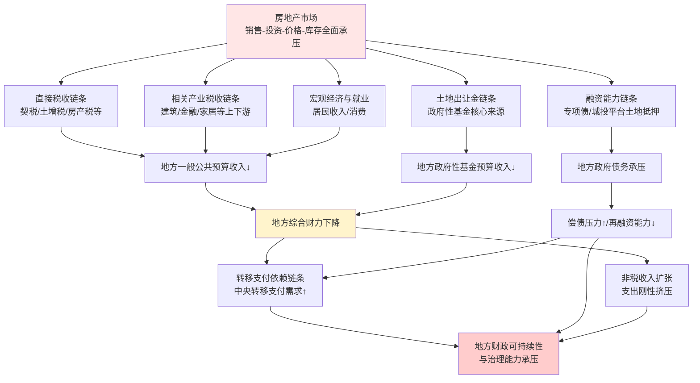
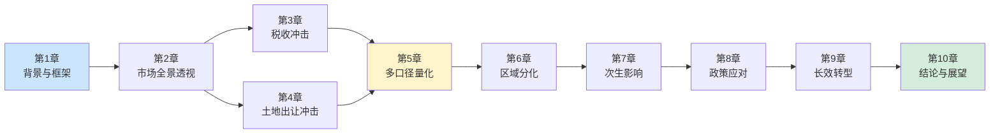
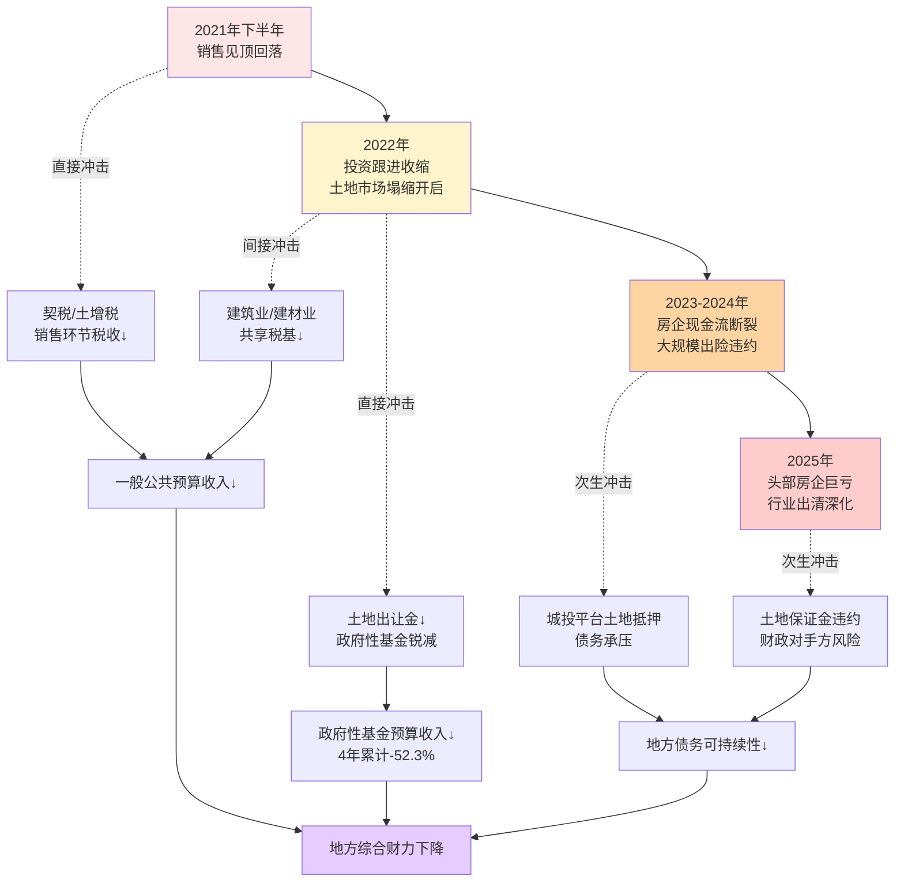
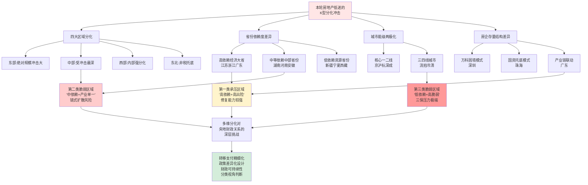
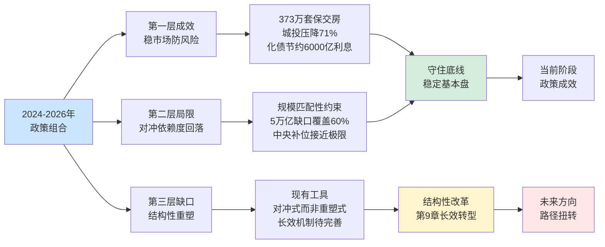
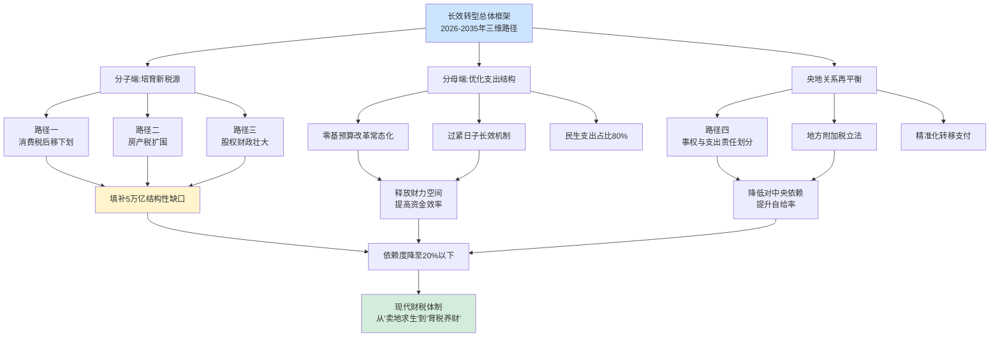
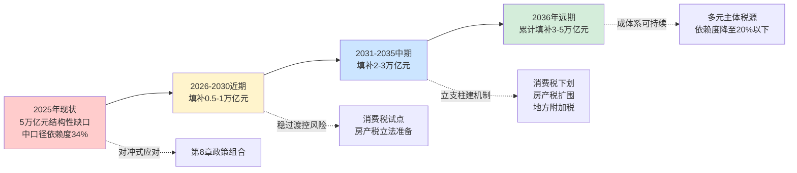

# 房地产市场低迷对中国地方政府财政收入影响的量化评估与转型路径研究
# 1 研究背景与分析框架构建

自2021年下半年以来，中国房地产市场进入了一轮深度调整周期，其持续时间之长、跌幅之深、波及面之广，远超以往任何一次周期性波动。当全国土地出让金从2021年8.71万亿元的历史峰值急速回落至2025年的4.15万亿元，当头部房企接连出险、74家房企违约规模超4500亿元，这场调整对地方政府财政体系的冲击已不再是局部、短期的扰动，而演变为系统性、结构性的财力重塑。地方政府"以地谋发展"的传统模式遭遇前所未有的挑战，由此引发的核心议题是：**房地产市场低迷究竟在多大程度上侵蚀了地方政府的财政收入？这种侵蚀是表层税基的暂时收缩，还是深层财政模式的根本动摇？**

回答这一问题，需要建立一套清晰、严谨、可量化的分析框架。本章作为全篇报告的逻辑起点与方法论基石，将依次完成四项基础性工作：刻画当前房地产市场深度调整的多维图景，阐明研究的现实紧迫性；系统梳理房地产向地方财政传导的核心链条，构建多维度互动机制；基于"四本账"全口径预算体系界定地方财政收入的统计边界；明确小、中、大三口径测算方法，为后续章节的量化评估与转型路径分析提供统一的概念工具与计算规则。

## 1.1 中国房地产市场深度调整的现实图景与研究紧迫性

本轮房地产调整的剧烈程度可以从五个维度集中观察。**土地市场的收缩最为直观**：克而瑞数据显示，2022年全国土地市场成交建筑面积14.44亿平方米、成交金额4.73万亿元，同比分别下降37%和31%，土地出让金从高峰的8.7万亿元下降了约3万亿元规模[^1]。而这并非调整的终点——土地出让收入从2021年8.71万亿元的历史峰值进一步下滑至2025年的约4.15万亿元，累计降幅高达52.3%，相当于在四年内"蒸发"了一个2017年量级的全国土地市场。这种持续性、累积性的塌缩，与2008年、2014年两轮调整中"短促回调—快速反弹"的轨迹截然不同，呈现出明显的结构性特征。

销售端、投资端、价格端、库存端的全面承压则进一步强化了这一判断。新建商品房销售面积、销售额持续负增长，百城二手房价格同比深度下跌，开发投资连续多年负增长，库存高企与新开工锐减并存——多重指标的同步恶化指向一个共同的结论：本轮调整并非简单的需求侧周期性回落，而是供需关系发生根本性变化背景下的**总量收缩与结构重塑**。住房从短缺到饱和、从增量主导到存量主导、从投资属性弱化到居住属性强化，这一系列底层变量的转变意味着房地产市场难以回到过去高速扩张的轨道，由此对地方财政形成的冲击也将是中长期的、深层次的。

研究的紧迫性正源于此。一方面，地方财政对房地产的高度依赖在过去十余年间已被反复验证。第一财经测算显示，2017年开始我国土地出让金占地方财政总收入的比例连续5年超过三成，2020年占比达43.59%[^1];中金研究测算，房地产贡献了近49.1%的地方财政收入（不考虑转移支付），包括24.3%的地方政府税收以及92.2%的地方土地出让收入[^2]。另一方面，土地出让金作为地方政府性基金预算的绝对主体，其塌缩直接动摇了"第二本账"的基础，而房地产相关税收的同步走弱又拖累了"第一本账"，叠加效应远比单一指标的下滑更为严重。**当传统财源以如此速度收缩，地方政府如何维持基本运转、偿还存量债务、提供公共服务，已成为关乎宏观经济稳定与国家治理现代化的紧迫议题**。在此背景下，对房地产低迷影响地方财政程度的系统性量化评估，以及对未来财政转型路径的深入研判，具有突出的学术价值与政策意义。

## 1.2 房地产市场影响地方财政的传导机制

要准确测度房地产低迷对地方财政的冲击，首先需要厘清两者之间的传导路径。基于既有研究与制度逻辑梳理，房地产市场向地方财政的传导可归纳为五条相互交织的核心链条，构成一个完整的互动机制。

**第一条链条是直接税收链条**。中国现行税制中涉及房地产的税种共有10个，其中直接以房地产为征税对象的包括城镇土地使用税、房产税、耕地占用税、契税、土地增值税5个税种[^3]。这五大税种的一个关键制度特征是：契税、土地增值税、房产税、城镇土地使用税等几乎100%归地方政府所有[^2]，构成了地方"专属税源"。房地产行业的创税能力在所有行业中位居首位，其行业税负（行业税收/行业增加值）达到34.1%，几乎是其他行业平均水平的1倍以上；2021年房地产业税收2.55万亿元，加上与房地产经营直接相关的房屋建筑业税收3608亿元，房地产相关直接税收达到2.9万亿元，占全国税收的16.9%，其中2万亿元归地方政府所有，占地方税收的24%[^2]。这一链条意味着房地产销售与开发活动的萎缩将直接削减地方一般公共预算收入。

**第二条链条是土地出让金链条**。国有土地使用权出让收入归入地方政府性基金预算，因不用上缴中央，是1994年分税制改革以来地方财政的主要收入来源之一[^1]。政府性基金预算实行"以收定支"原则，对县级政府而言这本账基本就是"土地收支专属册"——卖地赚多少，后续修公园、建道路、完善配套设施的钱就从这儿出，主打"专款专用，取之于地、用之于城"[^4]。当房地产销售低迷、房企拿地意愿下降，土地出让金锐减直接冲击"第二本账"的基础。

**第三条链条是相关产业税收链条**。房地产作为国民经济的支柱产业，其上下游涉及建筑、建材、家居、金融、装饰装修等数十个行业。当房地产投资与销售下行时，这些上下游行业的增值税、企业所得税、个人所得税等共享税收同步走弱，形成对地方财政的间接冲击。这条链条的重要性常被低估——它意味着房地产对地方财政的影响并不止于"专属税源"，还通过整个产业生态向更广泛的税基扩散。

**第四条链条是融资能力链条**。我国地方政府的债务融资高度依赖土地价值。中金研究测算显示，2021年地方专项债和城投债的发行高度依赖土地价值，两部分合计达9.4万亿元，分别占全部政府13万亿元广义融资的73%和地方政府10.3万亿元广义融资的91%[^2]。"土地金融"模式下，地方政府通过土地抵押贷款获得数倍于直接土地交易收益的收入，对工业化和城镇化起到了"杠杆化"的推动作用[^5]。当土地价值下行，这一杠杆效应反向运行，地方融资能力随之收缩，债务可持续性面临考验。

**第五条链条是转移支付依赖链条**。土地财政收缩使地方财政自给率下降，进而放大对中央转移支付的依赖。第一财经的研究指出，房地产相关收入占比越高的省份，对转移支付的依赖程度越低，地方财政的"自给自足"水平越高[^2];反之，土地财政塌缩将使原本依赖度较高的省份转向中央寻求财力补位，对中央财政形成反向压力。

为更直观地呈现五条链条之间的关系，可将其构建为一张传导网络示意图：



上述传导网络的核心特征是**多链条并行、相互放大**。房地产市场的下行不会通过单一通道作用于地方财政，而是同时通过税收、基金、产业、融资、转移支付五条链条形成立体冲击；其中前四条链条直接作用于地方综合财力的"分子端"，第五条链条则通过央地财政关系反向调节冲击的最终承担者。这种多链条叠加效应解释了为何即使土地出让金"仅"下降3万亿元，对地方财政体系的实际冲击却远不止3万亿元的数学含义。

## 1.3 地方政府财政收入的统计口径界定：四本账预算体系

要量化测度房地产对地方财政的影响，必须首先明确"地方政府财政收入"的统计边界。中国现行的政府预算体系是2014年新《预算法》修订后确立的全口径预算体系，俗称"四本账"，包括一般公共预算、政府性基金预算、国有资本经营预算、社会保险基金预算四类预算，要求各预算保持完整、独立[^6]。该体系自2015年起全面实施，是观察地方财政状况的标准框架。

四本账的功能定位与收入构成存在显著差异，房地产相关收入在其中的分布也各有侧重。具体而言：

| 预算类别 | 功能定位 | 主要收入来源 | 与房地产的关系 |
|---|---|---|---|
| **一般公共预算** | "民生大管家"，以税收为主体 | 税收（增值税、所得税等）+ 行政事业性收费等非税收入 | 房地产五税（契税、土增税、房产税、城镇土地使用税、耕地占用税）+ 房地产业及建筑业贡献的增值税、企业所得税等共享税 |
| **政府性基金预算** | "土地相关专项户"，以收定支 | 土地出让收入 + 专项债 + 其他政府性基金 | **核心载体**：土地出让收入占绝对主体，对县级政府基本就是"土地收支专属册"[^4] |
| **国有资本经营预算** | "国企分红小金库"，收支平衡不列赤字 | 国有企业上缴利润、股利股息 | 关联较弱，主要通过涉房国企传导 |
| **社会保险基金预算** | "养老医疗保命钱"，专款专用 | 社保缴款 + 财政补贴 | 基本无直接关联 |

四本账之间存在严格的衔接关系。一般公共预算可以从政府性基金预算和国有资本经营预算调入资金；政府性基金预算在特殊情况下可从一般公共预算调入资金；社会保险基金预算可以接受来自一般公共预算的财政补贴，但专款专用，原则上不能调出资金[^6]。这一制度设计意味着：当政府性基金预算（土地出让收入主导）大幅收缩时，通过"调入资金"机制对一般公共预算形成的支持也将相应弱化，财政压力会在四本账之间传递。

基于上述结构，本研究将地方财政收入的统计边界做如下界定：**核心关注一般公共预算与政府性基金预算两本账，合计构成"地方综合财力"的本级口径**——即地方一般公共预算本级收入 + 地方政府性基金本级预算收入。这一界定与粤开证券、中金公司、第一财经等主流研究机构的口径基本一致，仅在是否纳入国有资本经营预算的处理上存在约1—2个百分点的细微差异，对核心结论无实质影响。国有资本经营预算与社会保险基金预算因与房地产关联较弱且规模相对有限，不纳入主分母，但在涉及"股权财政"转型路径讨论时另作分析。需要特别强调的是，**本研究采用"本级收入"口径，不含中央转移支付**，以便准确刻画地方政府自有财力对房地产的真实依赖程度。

## 1.4 "土地财政"的三口径测算方法

在统一的分母界定基础上，对"土地财政"或更广义"房地产财政"的分子测算，学界与业界已形成相对成熟的小、中、大三口径体系。粤开证券罗志恒团队的系统研究指出，根据"土地财政"覆盖范围的大小，"土地财政"收入可分为小、中、大三个口径，并以此测算地方财政依赖度的演变[^5]。本研究继承并细化这一框架，明确三口径的具体定义与测算规则。

**小口径**仅纳入国有土地使用权出让收入（即土地出让毛收入），分子最为狭义，主要反映地方对土地一级市场出让的直接依赖。其优点是数据透明、可比性强，缺点是未涵盖房地产对税收体系的贡献，可能低估实际依赖度。

**中口径**在小口径基础上加入房地产五税（契税、土地增值税、房产税、城镇土地使用税、耕地占用税）。这五个税种几乎100%归地方政府所有，是地方财政的"专属房地产税源"，将其纳入分子能更全面反映房地产对地方财政的直接贡献。中口径在主流研究中应用最广，被视为衡量"土地财政"依赖度的标准口径。

**大口径**在中口径基础上进一步纳入房地产业及建筑业贡献的共享税收（部分增值税、企业所得税、个人所得税中归属地方的份额）以及以土地为抵押的政府融资收入（专项债、城投平台融资中与土地价值挂钩的部分）。大口径试图刻画房地产对地方财政的"全口径"影响，但因土地抵押融资数据透明度较低，测算存在较大不确定性。

基于多源数据交叉校验，三口径下中国地方财政对房地产的依赖度在2012—2025年间的演变可整理如下：

| 年份 | 小口径 | 中口径 | 关键节点说明 |
|---|---|---|---|
| 2012 | 31.8% | 43.6% | 起步阶段 |
| 2015 | 27.2% | 38.0% | 楼市低迷期 |
| 2018 | 38.5% | 49.1% | 棚改货币化高点 |
| **2020** | **44.3%** | **54.7%** | **历史峰值** |
| 2021 | 42.5% | 52.7% | 顶峰回落（土地出让金绝对额峰值） |
| 2022 | 36.6% | 47.1% | 深度调整开启 |
| 2023 | 31.6% | 41.7% | 累计降幅扩大 |
| 2024 | 27.6% | 38.1% | 跌破30% |
| **2025** | **约24%** | **约34%** | 中口径降至历史低位 |

粤开证券测算显示，小口径"土地财政"收入占地方财政收入的比重在2011年为35.76%，于2020年达到最大值44.3%后下降，2023年比重为30.90%；中口径占比在2011年为44.83%，2020年达最大值54.66%后比重下降，2023年为41.00%[^5]。这一数据与本研究整理的时间序列高度吻合，验证了**地方财政对"土地财政"的依赖程度在震荡中基本保持稳定，但在2020年达到峰值后已进入趋势性回落通道**。

第一财经测算的另一组数据进一步印证：2017年开始我国土地出让金占地方财政总收入的比例连续5年超过三成，2020年占比达43.59%，2021年下降至41.81%，仍在4成以上[^1];中金的大口径测算则显示，2021年房地产贡献了近49.1%的地方财政收入[^2]。三家主流机构在不同口径下的测算结果相互印证，为本研究提供了坚实的数据基础。

需要特别说明的是，**2025年数据是本研究基于公开数据测算所得**：以土地出让收入约4.15万亿元、房地产五税合计约1.77万亿元、地方两本账本级收入合计约17.35万亿元为基础，得出小口径约24%、中口径约34%、大口径（含建筑业及间接贡献）约38%—40%。这意味着，相较2020年峰值，地方财政对房地产的中口径依赖度在五年内下降了约20个百分点，跌幅之大、速度之快，构成本研究的核心量化发现。

此外，需要厘清的一个关键概念是"土地出让毛收入"与"土地出让净收益"的差异。土地出让净收益是指政府出让国有土地使用权所获收入扣除征地和拆迁补偿、土地开发支出、农业土地开发资金计提、被征地农民社会保障补助等法定成本后的剩余资金，属于政府可支配的财政资金[^7]。按现行规定，教育和农田水利资金均按净收益的10%计提，保障性安居工程资金按不低于净收益10%的比例安排[^7][^8]。这意味着**土地出让金毛收入并不等于地方政府可自由支配的财力**——大量资金需用于成本性支出，真正可支配的净收益比例显著低于毛收入。后续章节在测算"实际可用财力"时将对此进行专门处理，本章统一采用毛收入口径以保证与主流研究的可比性。

## 1.5 研究思路、数据来源与分析框架总览

基于上述背景刻画、传导机制构建和口径界定，本研究的整体逻辑路径可概括为"现状—机制—量化—分化—次生—应对—转型—展望"八个递进环节，对应全文十章的结构安排。



整体而言，本章构建的传导框架（1.2节）为第3—4章的量化冲击分析提供机制基础；本章界定的"四本账"统计口径（1.3节）为第5章的多口径测算划定边界；本章明确的小、中、大三口径方法（1.4节）为第5—6章的量化评估与区域比较提供统一标尺；本章对研究紧迫性的论证（1.1节）则贯穿全篇，构成第7—10章次生影响分析、政策评估与转型路径设计的现实出发点。

数据来源方面，本研究以**官方权威数据为主、第三方研究测算为辅**，构建多层次验证体系：宏观财政数据来自财政部决算与预算执行报告；房地产市场数据来自国家统计局、自然资源部及克而瑞等专业机构；税收明细数据来自《中国税务年鉴》及国家税务总局披露；区域分化数据参考粤开证券研究院、中金公司、第一财经研究院等机构的省份与城市层面测算。所有关键量化指标均明确标注口径与来源年份，对存在差异的多源数据进行交叉校验后采信权威性最高、时效性最近者，以确保全篇结论的可溯源性与可验证性。

通过本章的框架构建，后续章节得以在统一的概念体系、清晰的传导逻辑、明确的统计口径之上展开深入分析。**本研究的核心问题——"房地产市场低迷在多大程度上影响地方政府财政收入"——将在第5章以多口径量化的方式给出系统回答；而这一回答的可信度，正取决于本章所确立的方法论基础是否扎实**。

# 2 房地产市场低迷的全景透视：从销售端到土地端的传导

承接第1章建立的传导机制框架与多口径分析方法，本章将聚焦于冲击源本身——即2021年以来中国房地产市场在销售、投资、价格、土地、房企五个维度上呈现的深度调整全景。**只有准确刻画这场调整的烈度、广度与结构性特征，才能在第3—5章的量化测算中合理锁定冲击地方财政的核心变量与传导节奏**。本章将沿着"销售端—投资端—价格端—土地端—房企端"的逻辑链条逐层展开，最终归纳出冲击的源头识别、时滞规律与放大机制，为后续章节的精细化测算提供事实底座。

需要预先指出的是，本轮调整最显著的特点并非单一指标的大幅下跌，而是**多维指标的同步恶化与相互强化**：销售低迷使房企现金流枯竭，现金流枯竭压制拿地能力，拿地萎缩导致土地出让金塌缩，土地塌缩又使房企对存量项目计提巨额减值——这一闭环正在以前所未有的速度重塑行业生态与地方财政基础。

## 2.1 销售端的持续承压：量价齐跌的四年长周期

销售端是本轮房地产调整的"震源",也是冲击向其他维度传导的起点。从2022年起,全国新建商品房销售已连续四年负增长,累计跌幅之深足以将销售规模重新拉回到约十年前的水平。

国家统计局数据显示,2025年全国新建商品房销售面积8.81亿平方米,比上年下降8.7%,其中住宅销售面积下降9.2%;新建商品房销售额8.39万亿元,下降12.6%,其中住宅销售额下降13.0%[^9]。与2024年的销售面积9.74亿平方米(-12.9%)、销售额9.68万亿元(-17.1%)相比[^10],2025年降幅虽有所收窄,但下降趋势并未根本扭转。易居研究院判断,**最近两年商品房销售面积均位于10亿平方米规模线以下水平,反映出市场深度变化**;在经历2016—2021年持续攀升的繁荣期后,2022—2025年罕见地经历了四年长周期下行,充分说明市场处于深刻的调整过程之中[^11]。

从月度运行节奏看,2025年呈现"前高后低"的曲折走势。年初几个月跌幅有所收窄,源于2024年四季度系列购房政策效应的积极释放,加快了新房项目销售;但2025年二季度尤其是5月份开始,全国层面销售跌幅再度扩大,并延续至年底[^11]。这种"政策刺激—短期反弹—动力衰减"的循环,反映出**单纯依靠需求侧政策刺激难以扭转供求关系发生根本性变化的中长期趋势**。

二手房市场则呈现出与新房不同的特征,且对房地产相关税收的影响路径同样不可忽视。中指研究院数据显示,2025年百城二手住宅价格累计下跌8.36%,跌幅较2024年扩大1.10个百分点;分季度来看,一季度累计下跌1.51%,二、三、四季度跌幅持续走阔,累计分别下跌2.12%、2.26%、2.73%[^12]。在交易量层面,部分一线城市二手房成交反而保持高位甚至增长——2025年北京二手住宅成交17.4万套(同比微降0.8%)、上海22.2万套(为2022年以来最高,同比+4%)、深圳5.6万套(同比+3.2%)[^12],呈现典型的"以价换量"特征。

新房与二手房的"剪刀差"在2025年进一步扩大。**百城新建住宅12月均价17084元/平方米,同比上涨2.58%,主要由深圳、北京、上海、南京等城市高端改善项目入市带动的结构性上涨,而非真实价格上行**[^13]。这种"新房结构性上涨、二手房深度下跌"的分化,直接冲击了与房地产交易紧密挂钩的税收基础:

- **契税基数被压缩**:契税以成交价为计税基础,价格下跌叠加交易量收缩双重压制了契税规模;
- **土地增值税基数被压缩**:开发企业销售收入下降,扣除项目相对刚性,可增值空间收窄;
- **个人所得税(二手房交易)受影响**:虽然部分一线城市二手房成交活跃,但价格下跌抑制了增值部分,二手房交易环节个税同步走弱。

这一销售端的"量价齐跌、新旧分化"格局,构成了第3章房地产相关税收冲击量化分析的核心起点。

## 2.2 投资与开工端的深度收缩:开发投资连续多年负增长

如果说销售端反映的是当期的市场温度,那么投资与开工端则映射房企对未来市场的预期与现金流约束,其调整深度和持续性往往超过销售端,对建筑业、建材业等上下游产业的税基冲击也更为直接。

国家统计局数据显示,2025年全国房地产开发投资8.28万亿元,比上年下降17.2%;其中住宅投资6.35万亿元,下降16.3%,办公楼投资3203亿元,下降22.8%,商业营业用房投资5947亿元,下降14.0%[^14][^9]。对比2024年开发投资10.03万亿元(-10.6%)、住宅投资7.60万亿元(-10.5%)的数据[^10],**2025年降幅相比2024年进一步扩大约6.6个百分点,显示投资端调整尚未触底,且呈现加速下行而非企稳回升的态势**。

更值得关注的是开工、施工、竣工"三端"的同步深度收缩。2025年房屋新开工面积58770万平方米,同比下降20.4%,其中住宅新开工面积下降19.8%;房屋施工面积65.99亿平方米,下降10.0%;房屋竣工面积60348万平方米,下降18.1%[^9]。下表汇总了2024—2025年这一组关键指标的对比:

| 指标 | 2024年绝对量 | 2024年同比 | 2025年绝对量 | 2025年同比 | 变化趋势 |
|---|---|---|---|---|---|
| 房地产开发投资(万亿元) | 10.03 | -10.6% | 8.28 | -17.2% | 降幅扩大 |
| 住宅投资(万亿元) | 7.60 | -10.5% | 6.35 | -16.3% | 降幅扩大 |
| 房屋新开工面积(万㎡) | 73893 | -23.0% | 58770 | -20.4% | 持续深度负增长 |
| 房屋施工面积(万㎡) | 733247 | -12.7% | 659890 | -10.0% | 高位收缩 |
| 房屋竣工面积(万㎡) | 73743 | -27.7% | 60348 | -18.1% | 仍处深度收缩 |
| 商品房销售面积(万㎡) | 97385 | -12.9% | 88101 | -8.7% | 降幅有所收窄 |
| 商品房销售额(亿元) | 96750 | -17.1% | 83937 | -12.6% | 降幅有所收窄 |

数据来源:国家统计局2024、2025年全国房地产市场基本情况公告[^9][^10]

从上表可清晰观察到一个**关键现象:销售端跌幅在2025年有所收窄(销售额从-17.1%回升至-12.6%),但投资端跌幅反而扩大(开发投资从-10.6%扩大至-17.2%)**。这一"销售边际企稳、投资继续探底"的剪刀差,反映出房企在销售小幅好转背景下仍延续保守策略——加快回款、收缩拿地、压减开工,以保证现金流安全。这一行为模式将通过两条路径冲击地方财政:其一,新开工持续负增长意味着未来可销售货值收缩,后续年度的销售税基继续承压;其二,施工与竣工面积下降直接削减建筑业、建材业、装修装饰业的税基,通过共享税(增值税、企业所得税)对地方一般公共预算形成间接侵蚀。

房地产开发企业的资金面也在持续承压。2025年开发企业到位资金9.31万亿元,比上年下降13.4%;其中,国内贷款1.41万亿元(-7.3%)、自筹资金3.31万亿元(-12.2%)、定金及预收款2.81万亿元(-16.2%)、个人按揭贷款1.29万亿元(-17.8%)[^9]。**个人按揭贷款下降17.8%是一个尤为值得警惕的信号**——它既反映居民购房能力与意愿的弱化,也意味着商业银行涉房贷款投放意愿下降,房企现金流的"造血"端持续恶化。2025年12月房地产开发景气指数(国房景气指数)为91.45[^9],较2024年同期的92.78有所回落,景气度处于历史相对低位。

## 2.3 价格端的结构性下跌:百城新房与二手房的分化

价格端的调整在2025年进入"补跌"与"分化"并存的新阶段,呈现出明显的"统计口径数据"与"市场体感数据"差异,以及"新房结构性上涨"与"二手房深度下跌"的反差。

从中指研究院的百城价格指数看,**新房均价被高端项目入市所"虚高",而二手房才是反映真实价格变化的核心指标**。2025年12月百城新建住宅均价17084元/平方米,环比上涨0.28%,同比上涨2.58%;同期百城二手住宅均价13016元/平方米,环比下跌0.97%,同比下跌8.36%[^13][^12]。中指研究院明确指出,新房环比上涨主要由深圳、北京、上海、南京等城市高端改善项目入市带动的"结构性上涨"——即并非所有项目都在涨,而是入市样本中改善型高端项目占比上升,推高了均价[^13]。这一统计学现象掩盖了普通刚需新房的真实降价压力。

二手房市场则呈现出梯队分化与"补跌"特征。中指研究院分梯队数据显示,**2025年一线城市二手住宅价格累计下跌6.72%,其中四季度跌幅较明显;二线城市累计下跌9.08%;三四线城市累计下跌8.30%。二线城市因挂牌与成交持续活跃,年内价格调整幅度最大,而此前价格韧性较强的一线城市,受市场预期趋弱影响,四季度出现"补跌"**[^12]。

具体到核心城市,12月广州二手住宅价格环比下跌1.15%,同比下跌8.45%;上海二手住宅价格环比下跌1.34%,同比下跌6.7%;杭州二手住宅价格环比下跌0.79%,同比下跌5.70%[^12]。一线城市的"补跌"具有重要的政策与预期含义——它意味着此前被视为"价格底盘"的核心资产也开始松动,购房者"早买不如晚买"的预期可能进一步强化,对销售端的反向压制不容忽视。

需要注意的是,**官方统计口径下的价格指数与市场真实成交价格之间存在明显差距**。综合多源数据可知,以国家统计局70城二手房官方指数对比2020年8月高点测算,全国平均累计下跌约22%,整体重回2016年房价水平;一线城市累计跌幅18%、二线21%、三线23%,城市能级越低、人口流出越多,房价跌得越狠[^15]。但官方统计整体偏保守,口径长期平滑波动,与真实成交体感差距较大;参考中原地产长期跟踪指数,北上广深一线城市二手房整体大跌接近40%,天津房价近乎腰斩,综合民间真实平均跌幅约在40%左右[^15]。该数据来源于民间研究机构,其代表性与覆盖面虽不及国家统计局指数,但在反映真实交易体感、改善房源跌幅、刚需老破小近乎腰斩等结构性现象上具有补充价值,**本研究在采用时已明确标注其口径差异**。

价格下跌通过三条渠道反向冲击地方财政:其一,**财富缩水效应**——房产占中国家庭总资产约60%,房价大跌带来全民家庭账面资产的大幅缩水,抑制消费与投资,进一步压制楼市需求与上下游税基[^15];其二,**预期弱化效应**——价格持续下跌强化"再等等"心理,延缓改善型与刚需型购房决策,直接压制契税与新房销售税基;其三,**计税基础压缩效应**——契税以成交价计征,价格下跌直接缩减税基,这一机制将在第3章详细量化分析。

## 2.4 土地市场的缩量提质:从总量塌缩到结构改善

土地市场是本轮调整中受冲击最深、对地方财政影响最直接的环节。如第1章已铺垫的关键数据,**2025年全国地方政府国有土地使用权出让收入为4.15万亿元,同比下降14.7%,这是该收入自2022年以来连续四年出现两位数降幅;与2021年地方土地出让收入峰值8.7万亿元相比,2025年减少了约4.6万亿元,降幅达到52.3%**[^16][^17]。这一"四年腰斩"的轨迹,构成了对地方政府性基金预算最直接、最严重的冲击。

从300城宅地市场看,中指研究院数据显示,2025年300城住宅用地成交规划建筑面积6.2亿平方米,同比下降13.5%(降幅较2024年收窄9.2个百分点);300城住宅用地出让金2.3万亿元,同比下降10.6%;300城各类用地出让金合计3.3万亿元,同比下降11.4%[^18]。降幅有所收窄是积极信号,但绝对规模的塌缩已成定局。

然而,与"总量收缩"并存的是"结构改善"——即土地市场虽然规模在缩,但质量在升,呈现出"提质缩量、点状高温"的新格局。**这一结构性转变是观察土地财政未来走向的关键**:

**第一,优质地块占比创十年新高**。2025年300城推出的容积率在2.0以下的宅地占比达42.3%,较2024年提升7.7个百分点,是近10年来的最高水平。这一变化背后,是各地为了响应"好房子"建设、加大低容积率优质地块的推出力度[^18]。

**第二,核心城市单价屡创新高**。北京海淀树村地块成交楼面价达102347元/平方米,刷新北京地价单价最高纪录;上海徐汇地块成交楼面价达20.03万元/平方米,刷新全国宅地地价最高纪录;深圳前海桂湾地块成交楼面价84180元/平方米,刷新深圳宅地地价最高纪录[^18]。2025年全国重点城市住宅用地单宗地块成交价超80亿元的地块共有13宗[^18]。

**第三,资源加速向头部房企集中**。2025年拿地金额百强房企中,TOP10房企的拿地金额占比达50.5%,TOP20房企拿地金额占比高达62.7%,相较上年分别提高9.1、7.8个百分点[^18]。新增货值超过千亿的房企共六家:**中海地产2031亿元(居首)、招商蛇口1936亿元、保利发展1436亿元、绿城中国1300亿元、华润置地1291亿元、中国金茂1023亿元**[^18]。这些央国企在权益拿地金额上同样占据前列——中海907亿元、保利671亿元、招商594亿元[^18]。

**第四,流拍率显著改善**。2025年全国土地流拍率降至19%,比2024年的26%明显改善;2025年招拍挂平均溢价率冲上5.3%,创四年新高[^19]。但需要清醒认识到,这一回暖具有强烈的结构性特征——**全年溢价超15%的明星地块,半数集中在杭州、上海、成都三个城市,其他城市仍在"玩冰桶挑战";一线城市成交面积暴跌28%,但出让金只缩水11%,说明卖的都是黄金地段;二三线虽然流拍少了,但1%的溢价率暴露了真实热度**[^19]。

从城市能级分布看,2025年一二线城市的宅地出让金占300城的比例达57.0%,较2024年提升4.4个百分点;其中一线城市占比15.5%,二线占比41.5%,三四线占比43.1%[^18]。**一二线城市在土地出让金中的份额持续提升,而三四线城市的份额持续萎缩,这是后续区域分化分析的核心数据基础**。

省份层面的分化同样明显。粤开证券基于27个披露数据省份的梳理显示,**2025年仅有云南、甘肃、宁夏、新疆、黑龙江5个省份土地出让收入实现增长,其余22个省份出现下滑**[^16]。云南、甘肃、宁夏增速领跑全国,主要缘于省会城市大力盘活存量土地、从存量资源中挖掘增量——例如昆明加快批而未供和闲置土地盘活利用,全市土地出让收入增长61.6%;兰州用好土储专项债资金,全市土地出让收入同比增长19.5%,带动甘肃增速由负转正[^16]。同时,广东、浙江、四川等经济大省土地出让收入虽然仍在下降(分别-11.0%、-7.9%、-1.1%),但降幅分别较2024年收窄17.9、19.1、18.4个百分点,显示经历深度调整后边际企稳[^16]。深圳尤为亮眼——2025年深圳成交住宅用地溢价较高,叠加产业用地供应大幅增加,**全市土地出让收入同比高增52%**[^16]。这种区域分化将在第6章展开详细分析。

土地市场月度运行也呈现出节奏感。2025年11月,土地成交建筑面积和金额分别环比增长39%和57%,同比下降27%和28%;平均溢价率为4.1%,环比上升1.29个百分点,但土拍热度仍集中在少数城市的少数板块[^20]。12月迎来年末传统交易高点,土地成交建筑面积和金额分别环比增长190%和153%,同比降幅分别收窄至7%和15%[^21]。**克而瑞观察到的一个关键结构性变化是:2025年全年土地成交建面仅为商品房成交的1.1倍(2020年为1.8倍),扣除不可售和尾盘部分,行业全口径新增供给已经在事实上低于新房成交,2025年行业已正式迈入去库存新周期**[^20]。这一判断对地方财政意义深远——它意味着土地一级市场的供给端正在主动收缩,以加速消化存量库存,这一"控增量、去库存"的政策导向虽然有利于市场长期出清,但短期内进一步压低了土地出让金的总量空间。

## 2.5 房企端的风险出清:从万科巨亏到行业格局重塑

房企作为土地出让金的支付方、房地产税收的纳税主体、上下游产业的核心枢纽,其经营状况直接关系到地方财政的稳定性。**2025年房企端进入了一轮历史罕见的风险出清,头部房企的财务困境已从"个案"演变为"行业现象",并对地方财政生态形成系统性冲击**。

万科的巨额亏损是这一现象的标志性事件。2025年万科A实现营业收入2334.33亿元,同比下滑31.98%;归母净利润亏损885.56亿元,较上年同期亏损扩大78.98%——这一数字不仅刷新了A股房企年度亏损纪录,且实际亏损额相比此前预计的820亿元进一步扩大[^22][^23]。亏损构成中,2025年新增计提信用减值损失341.74亿元、资产减值损失219.29亿元,两项合计561.03亿元,占净亏损总额比例达63.35%——**这意味着万科超过六成的亏损并非来自销售端的现金亏损,而是管理层对账面资产进行的"价值重估"**[^23]。

万科的资产负债表剧变更直观揭示了危机深度。截至2025年末,万科总资产1.02万亿元,较上年末缩水20.65%;归属于上市公司股东的净资产仅剩1169亿元,较上年末下降42.32%;资产负债率攀升至76.89%,**净负债率从80.60%飙升至123.48%**;持有货币资金672.41亿元,而短期借款和一年内到期的非流动负债分别达263.31亿元、1366.50亿元(扣除约60亿元受限资金),**资金缺口超过千亿元**[^23]。万科销售金额2025年降至1340.6亿元,同比下降45.5%,仅为2020年巅峰期(7041.5亿元)的19%[^22]。万科的债务自救主要依靠两条路径:一是大股东深圳地铁累计提供335.2亿元股东借款,二是对"22万科MTN004""22万科MTN005""H1万科02"等多笔债务启动展期协商[^23]。

**万科尚是央企背景、有大股东托底的"幸运儿",更多民营房企已彻底出清**。区域层面看:

- **粤系11家房企全军覆没**:曾经叱咤风云的"华南五虎"(恒大、碧桂园、雅居乐、富力、合生创展)悉数折戟。恒大已退市清盘,清盘人正在全球追索资产;碧桂园总资产约9093亿元、净资产仅约239亿元,境外债务重组已全部获批,整体降债规模预计将超900亿元;雅居乐2025年12月被债权人提交清盘呈请;富力地产逾期有息债务规模高达368.1亿元,董事长李思廉被限制出境[^24]。

- **浙系6大房企全军覆没**:祥生控股、佳源国际、大发地产相继退市,佳源成为首家被强制清盘的百强房企(2023年5月);大发地产于2026年3月正式宣布解散[^25]。

行业整体的债务出清规模相当惊人。根据国家金融与发展实验室(NIFD)数据,**2025年房企境内债出现实质违约、展期、未按时兑付利息、触发交叉违约的数量为98只,违约规模为1183亿元,占境内债券市场违约规模的78.2%,涉及奥园、碧桂园、富力地产、时代控股、天建房地产等27家发行主体**[^24]。克而瑞统计显示,2025年全年房企到期债务规模高达5257亿元,同比增长8.9%;其中第三季度单季偿债规模近1600亿元,占比近三成,为近年同期峰值;2024年房企债券到期规模4829亿元,而发行规模仅2209亿元;2025年上半年房企融资1844亿元,同比再降30%——**这意味着房企无法通过借新还旧覆盖到期债务**[^26]。

广东作为房企最集中的省份,所受拖累最为明显。2025年广东省房地产开发投资8598.22亿元,同比下降23.6%;商品房销售面积6204.67万平方米下降17.1%;销售额9720.13亿元下降18.3%;2025年1—11月广东固定资产投资下降15.7%,其中房地产开发投资下降21.5%——相比之下,江苏同期固投降幅为9.1%,房地产开发投资降幅为12.5%[^24]。**广东集中了较多头部房企,庞大的家具、家居、建材、家电产业链对地产依赖度更高,受到的拖累也更为明显**——这一"企业出险—投资下降—产业拖累"的连锁效应,正是第6章区域分化分析的典型样本。

与民营房企的出清并行,**央国企在调整期表现出明显的逆势扩张**。如前所述,2025年中海地产以2031亿元的全口径新增货值占据首位,招商蛇口1936亿元位居第二,保利发展1436亿元位居第三;头部的中海、保利、招商、绿城、华润权益拿地金额分别为907、671、594亿元等[^18]。

更为重要的是,央国企正在主动调整业务模式——从"高周转扩张"向"开发+收租"双轮驱动转型。**华润置地首次表态未来5年开发业务规模保持稳定,同时发力不动产收租业务和轻资产管理业务;中海地产实施"一专双驱优生态"战略,强化住宅开发与经营性业务双轮驱动;招商蛇口要从传统开发商,真正转变为"开发商+运营商+服务商"**[^27]。华润置地首席运营官陈伟分析认为,房地产行业最艰难的时期基本过去,正式进入触底回升、深度分化阶段的周期[^27]。投资聚焦度也大幅提升:华润置地2025全年获取项目33个,在北京、上海等五大核心城市投资占比近8成;中海地产在香港及北上广深五个城市的合约销售额占比57.3%,土储货值中一线和强二线城市面积占比合计约86.5%[^27]。

行业格局的这一深层重塑,对地方财政将产生**两类深远影响**:其一,土地出让对手方结构发生根本变化,过去依赖民营房企"高溢价拿地"的城市将面临更大的土地财政压力,而能吸引央国企聚焦投资的核心城市将获得"流量"红利,这进一步加剧区域分化;其二,房企转型"收租模式"意味着未来房地产对地方一般公共预算的贡献结构将发生调整——开发环节税收(契税、土地增值税等)长期承压,而持有环节税收(房产税、城镇土地使用税等)的稳定性可能上升,这一结构变化将在第3章税收冲击分析中详细解构。

## 2.6 传导节奏与冲击源识别:核心冲击点与时滞特征

综合本章2.1—2.5节的多维分析,本轮房地产深度调整对地方财政的传导呈现出清晰的链式节奏与多源叠加特征。可将其归纳为如下传导时序图:



基于上述时序与机制,可识别出冲击地方财政的**三大核心源头**:

**第一源头是土地出让金的绝对量塌缩**。从2021年8.71万亿元峰值降至2025年4.15万亿元,**累计减少4.6万亿元、降幅52.3%**[^16][^17],这是冲击地方政府性基金预算最直接、最大规模的"主震"。考虑到地方土地出让收入占地方政府性基金预算本级收入比重近八成[^17],这一塌缩对"第二本账"的破坏力是结构性的、难以通过短期政策完全对冲的。

**第二源头是销售与投资萎缩对一般公共预算的双重侵蚀**。销售端通过契税、土地增值税、个人所得税(二手房)等环节直接冲击地方"专属税源";投资端通过建筑业、建材业等上下游产业的增值税、企业所得税共享部分,间接侵蚀一般公共预算。这一冲击虽然单点规模小于土地出让金塌缩,但**覆盖面更广、传导链条更长、修复周期也更长**——即使房地产市场触底回升,上下游产业税基的修复也将滞后于销售端。

**第三源头是房企出险通过财政对手方风险传导至地方政府与城投平台**。74家房企违约规模超4500亿元、2025年到期债务5257亿元、74%以上为债务展期与重组——这些数据背后,是**地方政府土地出让保证金违约风险、城投平台土地抵押贷款不良率上升、财政担保或有负债显性化等一系列次生风险**。万科千亿资金缺口、深铁335亿元股东借款救助的案例尤其值得警惕——它揭示了地方国资在救助本地龙头房企过程中,自身财政与国资的"二次承压",这一次生影响将在第7章详细展开。

不同冲击源的**时滞与放大效应**也存在显著差异。销售端冲击具有"即期性"——销售下降的当期就反映为契税、增值税收入下降;投资端冲击具有"半年至一年滞后"——施工与竣工的萎缩需要数个季度才能完整传导至建筑业税基;土地出让金塌缩具有"双期叠加性"——既即期反映为政府性基金收入下降,又通过"土地保证金—首付款—尾款"的分期支付机制延后释放冲击;房企出险则具有"长尾性"——一笔保证金违约、一个项目烂尾,可能拖延数年甚至更长时间才能在财政账面上完全出清。**这种时滞差异意味着,即使土地市场在2026年止跌企稳,地方财政受到的累积冲击仍将延续2—3年才能完全显现**。

最后,本章揭示的"K型分化"特征是后续章节分析的核心线索。一线及核心二线城市(上海、北京、杭州、深圳、成都等)在土地出让金、新房销售、二手房交易等维度上展现出明显韧性,部分城市甚至逆势增长(如深圳土地出让金+52%);而广大三四线城市则陷入"销售低迷、土拍冷清、库存高企、房价下跌"的多重困境。**这一K型分化决定了房地产低迷对地方财政的影响绝非全国均一,而是高度结构化的——这正是第6章"区域分化"分析的事实出发点**。

经过本章的全景透视,本轮房地产深度调整的"震源已定、传导路径已清、冲击源头已明"。第3—5章将以本章梳理的事实为基础,分别从一般公共预算冲击、政府性基金冲击、多口径综合依赖度三个维度,对"房地产市场低迷在多大程度上影响地方政府财政收入"这一核心问题给出系统、量化、可验证的回答。

# 3 房地产相关税收减少对地方一般公共预算收入的直接冲击

第2章已系统揭示了2021—2025年中国房地产市场在销售、投资、价格、土地、房企五个维度上呈现的"全面承压、量价齐跌、K型分化"格局。这场深度调整通过税收链条对地方"第一本账"——一般公共预算的直接侵蚀，正是本章要聚焦回答的问题。**与第4章将要分析的政府性基金预算受冲击的"剧烈塌缩"相比,一般公共预算受到的冲击更具"渐进性、结构性、链式传导"特征**:它既不像土地出让金那样在四年内"腰斩",也不像房企现金流那样出现断崖式断裂,而是通过房地产五大专属税种的"交易跌、持有涨"的内部分化、通过房地产业与建筑业共享税的间接衰减,层层渗入地方一般公共预算的肌理。

本章将沿"专属税源—共享税基—综合占比"三层递进展开。首先以财政部2021—2025年决算数据为基础,逐税种刻画房地产五大直接税种的规模演变与结构分化(3.1—3.3节);其次量化房地产业与建筑业贡献的共享税通过产业链传导对地方分成收入的间接拖累(3.4节);最后将直接税与间接税合并,测算房地产相关税收占地方税收收入和地方一般公共预算本级收入的比重变化,评估"第一本账"承受的总拖累幅度(3.5节),为第5章多口径综合依赖度测算提供税收维度的精细支撑。

## 3.1 房地产五大直接税种的规模演变与结构分化

中国现行税制中以房地产为直接征税对象的税种共有五个:契税、土地增值税、房产税、城镇土地使用税、耕地占用税。这五个税种的一个关键制度特征是**几乎100%归地方政府所有,构成了地方"专属税源"**。其总规模、内部结构与年度变化,直接决定了房地产对地方一般公共预算的"专属贡献"幅度。

基于财政部公开披露的2021—2025年决算数据[^28][^29][^30][^31],可以构建五大税种完整的五年时间序列。下表汇总了关键数据:

| 税种 | 2021年 | 2022年 | 2023年 | 2024年 | 2025年 | 累计变化(2021→2025) |
|---|---|---|---|---|---|---|
| 契税(亿元) | 7428 | 5794(-22%) | 5910(+2%) | 5170(-12.5%) | 4440(-14.1%) | **-40.2%** |
| 土地增值税(亿元) | 6896 | 6349(-7.9%) | 5294(-16.6%) | 4869(-8%) | 4102(-15.7%) | **-40.5%** |
| 房产税(亿元) | 3278 | 3590(+9.5%) | 3994(+11.2%) | 4705(+17.8%) | 5212(+10.8%) | **+59.0%** |
| 城镇土地使用税(亿元) | 2126 | 2226(+4.7%) | 2213(-0.6%) | 2425(+9.6%) | 2551(+5.2%) | **+20.0%** |
| 耕地占用税(亿元) | 1065 | 1257(+18%) | 1127(-10.4%) | 1368(+21.5%) | 1421(+3.9%) | **+33.4%** |
| **五税合计(亿元)** | **20793** | **19216** | **18538** | **18537** | **17726** | **-14.7%** |

数据来源:财政部历年财政收支情况公告[^28][^29][^32][^30][^31]

从这张表中可以读出三个关键洞察。**第一,五大税种总规模并未"塌方",而呈现"温和下行"轨迹**。2021—2025年五税合计从约2.08万亿元降至约1.77万亿元,累计减少约3067亿元,降幅14.7%——这一降幅虽然显著,但远低于同期土地出让收入52.3%的"腰斩"幅度,显示房地产专属税源整体上具有比土地出让金更强的"抗调整韧性"。

**第二,内部结构出现深度分化,呈现典型"剪刀差"形态**。交易类税种(契税+土地增值税)从2021年的1.43万亿元下降至2025年的0.85万亿元,累计减少约5782亿元、降幅40.4%;持有类税种(房产税+城镇土地使用税+耕地占用税)从0.65万亿元增长至0.92万亿元,累计增加约2715亿元、增幅41.8%。**这一"交易类税种深度下滑、持有类税种逆势增长"的剪刀差,是本轮房地产调整对地方专属税源最显著的结构性特征**,持有类税种的"反周期"增长部分对冲了交易类税种的深跌,使五税总盘的整体降幅得到明显缓释。

**第三,持有类税种的对冲能力有限,无法根本扭转下行趋势**。即便房产税在四年间增长了59%、合计增加约1934亿元,但仍不足以填补契税与土地增值税合计减少的约5782亿元——前者仅相当于后者的33.4%。**这一规模不对等性意味着,在房地产市场未触底回升之前,五大税种总盘仍将延续"温和下行"轨迹,持有类税种的稳定器作用是"减震"而非"逆转"**。

从五税合计占地方税收收入比重看,2021年地方一般公共预算本级税收收入约8.51万亿元(即地方本级收入11.11万亿元中扣除非税收入约2.6万亿元后的估算),五税合计2.08万亿元约占地方税收的24.4%;2025年地方一般公共预算本级收入12.21万亿元[^31],按相近非税占比测算地方本级税收约8.84万亿元,五税合计1.77万亿元约占地方税收的20.0%——**地方专属房地产税源占比从约24%降至约20%,五年间下降约4个百分点**。这一占比变化将在3.5节与共享税衰减合并测算时进一步细化。

## 3.2 交易类税种的深度承压:契税与土地增值税的传导机制

契税与土地增值税是受房地产市场调整冲击最直接、最深刻的两个税种,其规模在四年内累计跌幅均接近40.5%,几乎达到"腰斩"程度。理解这两个税种的传导机制,有助于精确测度未来调整深度与修复节奏。

**契税:房地产交易"晴雨表"的双重压缩**。契税是不动产产权发生转移变动时,按产价的一定比例向新业主征收的一次性税收,其计税基础是成交价格,征收时点是产权过户。由于契税几乎100%归地方政府所有,且与房地产交易活跃度和价格水平直接挂钩,**契税被业内视为反映房地产市场活跃度的"地方版晴雨表"**[^33]。

契税的连续承压轨迹清晰可见:2022年同比-22%(深跌)、2023年同比+2%(微弱反弹)、2024年同比-12.5%(再度下跌)、2025年同比-14.1%(降幅扩大)[^28][^29][^32][^30][^31]。粤开证券财政形势分析显示,2024年内契税同比增幅从2月的+6.6%一路滑落至11月的-13.0%,降幅"不断扩大",反映了房地产市场交易"总体处于比较低迷的状态,即便10月、11月房屋销售局部回暖,似对契税收入持续下降的总体态势影响也不大"[^33]。这一观察在2025年得到进一步印证——根据财政部一季度数据,2025年一季度契税同比下降16.2%[^34],随后全年降幅虽有所收窄,但仍达-14.1%[^31]。

契税的双重压缩机制可以拆解如下:**计税基础压缩** = **交易量收缩** × **成交价下跌**。第2章已揭示2025年新建商品房销售额下降12.6%、二手房均价同比下跌8.36%[^31],这两个变量同时作用于契税的"价×量"基础——即便部分一线城市二手房成交活跃("以价换量"),价格下跌依然吞噬了交易量带来的税基增量。换言之,契税的下行不是单一因子的下滑,而是"量缩与价跌"的双重叠加,这也是其降幅显著大于销售额降幅的根本原因。

**土地增值税:开发利润"温度计"的趋势性收缩**。土地增值税以转让国有土地使用权及房屋(地上建筑物及附着物)所取得的增值额为计税基础。其税基对房企盈利能力极为敏感——当销售收入下降而扣除项目(土地成本、开发成本、税金等)相对刚性时,可增值空间被压缩,土地增值税自然走弱。

土地增值税的下行轨迹与契税相似但更具趋势性:2022年同比-7.9%、2023年同比-16.6%、2024年同比-8%、2025年同比-15.7%[^28][^29][^32][^30][^31]。值得注意的是,其降幅在2025年再度扩大,**这与房企(尤其是头部民营房企)在销售下行期普遍采取"以价换量、降价促销"策略密切相关**——降价虽然有助于回款,但直接压缩了项目层面的增值空间,部分项目甚至出现"零增值"或"负增值"情形,导致土增税基呈现"量价齐压"格局。第2章揭示的2025年万科巨亏885亿元、超60%来自资产减值与信用减值,正是这一现象在头部房企财报上的极端体现——当账面项目价值需要大幅减值时,可课税的"增值额"自然大幅萎缩。

**制度安排放大了直接性冲击**。如第1章所阐明,契税与土地增值税几乎100%归地方政府所有[^35],这意味着这两个税种的下滑**没有任何"中央分担"机制可以缓释**。中金研究测算显示,2021年房地产行业缴税中41.2%来自土地增值税和契税,合计1.05万亿元;**全国近90%的土地增值税和60%的契税来自房地产开发经营**[^35]——这意味着房地产市场的低迷,通过这两个"专属税种"几乎全额、无折扣地传导至地方政府的税收收入。

从规模角度量化:契税与土地增值税合计从2021年的1.43万亿元降至2025年的0.85万亿元,累计减少5782亿元——**这一缺口规模相当于2025年地方一般公共预算本级收入12.21万亿元[^31]的约4.7%**,直接拖累地方"第一本账"约半个百分点的增速空间(在五年累计意义上)。

## 3.3 持有类税种的逆势增长:房产税与城镇土地使用税的稳定器作用

与交易类税种的深度承压形成鲜明反差,持有类税种(房产税、城镇土地使用税、耕地占用税)在房地产市场全面调整期间展现出**显著的反周期特征**——不仅未随市场低迷下滑,反而保持两位数或个位数稳定增长,扮演着地方专属税源"稳定器"的角色。

**房产税:逆势两位数增长的"压舱石"**。房产税是以房屋为征税对象,按房屋的计税余值或租赁收入为计税依据,向产权所有人征收的一种财产税,目前仍主要在企事业单位用房及部分城市试点推行。其增长轨迹呈现出连续性的反周期特征:2021年同比+15.3%、2022年+9.5%、2023年+11.2%、2024年+17.8%、2025年+10.8%[^28][^29][^32][^30][^31]——**五年间从3278亿元增长至5212亿元,累计增长59.0%,在五大税种中成为最大亮点**。

粤开证券财政形势分析指出,2024年内房产税同比增幅相对稳定在18%—21%之间,与试点城市的征收方式、税率以及试点推开范围等紧密相关;**"由于房产税是一种财产税,只要试点城市逐步全面推开、面向所有征收对象计征,房产税收入稳定增长应是常态"**[^33]。这一论断揭示了房产税反周期增长的制度根源——其计税基础是存量房屋的余值或租赁收入,与当期交易完全脱钩,因此**对房地产市场短期波动具有天然的"免疫力"**。

**城镇土地使用税:存量征税的内在韧性**。城镇土地使用税以单位和个人实际占用的土地面积为计税依据,按规定的税额计算征收。其增长轨迹相对平稳:2021年+3.3%、2022年+4.7%、2023年-0.6%、2024年+9.6%、2025年+5.2%[^28][^29][^32][^30][^31],五年间从2126亿元增长至2551亿元,累计增长20.0%。粤开证券指出,"由于是按实际占用的土地面积为计税依据,主要是对存量土地征收,**城镇土地使用税收入受当前房地产市场低迷的影响较小,增长具有一定韧性**"[^33]。

**耕地占用税:供地结构调整的"边际反映"**。耕地占用税2025年达1421亿元,2021—2025年累计增长33.4%[^28][^31]。其增长一定程度上反映了城镇化推进过程中存量耕地占用的延续性,但相比前两个税种,其规模较小(2025年仅占五税合计的8%),对地方财政整体的影响相对有限。

**反周期特征的财政意义:对冲与减震**。从财政减震角度量化对冲效果:持有类三税合计(房产税+城镇土地使用税+耕地占用税)从2021年的0.65万亿元增长至2025年的0.92万亿元,累计增加约2715亿元;同期交易类两税合计减少5782亿元。**持有类税种的增量约占交易类税种减量的47%**,即对冲了近一半的缺口——这一对冲幅度虽然不能根本扭转五税总盘的下行趋势,但显著降低了地方专属税源的整体波动性,使五税合计的累计降幅从交易类的-40%缓释至总盘的-14.7%。

但**必须清醒认识到这一对冲能力的有限性**。从2025年单年绝对规模看,房产税与城镇土地使用税合计7763亿元,仅相当于契税与土地增值税合计8542亿元的91%;若再扣除2025年契税与土增税相比2021年减少的5782亿元,持有类税种的增量2715亿元仅能填补缺口的47%。**结构性缺口仍达约3067亿元**——这正是五税总盘从2021年2.08万亿元降至2025年1.77万亿元的"净缺口"。

更深层的制约在于,**房产税在中国大陆目前仍主要适用于经营性房产、出租房产、上海和重庆试点城市的部分个人住房等狭窄税基**,广大普通城镇住宅尚未纳入征税范围。这意味着,在现行税制下,即便房产税继续保持两位数增长,其规模天花板仍受限于现有计税口径。**只有通过房产税扩围、建立面向全体存量住房的常态化房产税制度,才能从根本上重构地方专属税源结构,真正实现从"卖地财政"向"持有税财政"的转型**——这一长效转型路径的可行性与约束条件,将在第9章详细展开。

## 3.4 房地产业与建筑业共享税的间接拖累

如果说房地产五大直接税种是"专属税源",那么房地产业与建筑业贡献的共享税(增值税、企业所得税、个人所得税中归属地方的部分)则构成了"间接税基"。这部分税基虽然不是地方独享,但通过50%(增值税)、40%(企业所得税)、地方分成部分(个人所得税)的分成机制,仍对地方一般公共预算形成显著贡献。**第2章已揭示的房地产投资连续多年负增长、房企大规模出险、上下游产业链同步收缩,正在通过共享税链条对地方"第一本账"形成隐性但同样深刻的拖累**。

**基准规模与制度分成机制**。根据中金研究基于《中国税务年鉴》的测算,2021年房地产业税收2.55万亿元,加上与房地产经营直接相关的房屋建筑业税收3608亿元,房地产相关直接税收(含五大专属税种)达到2.9万亿元,占全国税收的16.9%,其中**约2万亿元归地方政府所有,占地方税收的24%**[^35]。剔除前述五大专属税种约2.08万亿元(其中绝大部分归地方),房地产业与建筑业贡献的共享税地方分成部分大致在5000—8000亿元规模——这是测算共享税拖累的基准起点。

从制度分成角度看,根据增值税与企业所得税现行制度,**国内增值税地方分成比例为50%、企业所得税地方分成比例为40%(中央独享部分除外)**[^36][^37]。2023年国内增值税收入6.93万亿元、占全国税收收入38.3%;企业所得税4.11万亿元、占26.2%[^36]。其中房地产业与建筑业贡献的份额,在调整期间正持续衰减。

**房地产业与建筑业增值税的链式衰减**。第2章数据显示,2025年房地产开发投资同比-17.2%、房屋施工面积-10.0%、房屋竣工面积-18.1%、房屋新开工面积-20.4%——投资与施工的全面收缩直接压缩了房地产业与建筑业的销售额与增加值,从而通过增值税链条向地方传导。

财政部公开数据印证了这一趋势:2024年国内增值税同比-3.8%、2025年仅恢复至+3.4%[^30][^31];**与之对应,2022年一季度财政部已明确披露"房地产、建筑业企业所得税同比下降"**[^38][^39],而工业企业所得税同期同比+20.4%——形成了房地产、建筑产业链与工业产业链冷热分明的"行业冰火两重天"格局。

**企业所得税:房企巨亏的"长尾效应"**。第2章揭示的房企出险与巨亏对企业所得税的冲击具有"长尾"特征。万科2025年归母净亏损885.56亿元、其中超过六成来自资产减值与信用减值;碧桂园、雅居乐、富力、佳源、祥生等数十家房企已退市或进入清盘程序——**这些巨亏企业未来数年内将无应纳税所得额,房地产业企业所得税的修复周期将远长于销售端**。即便2026年起房地产销售触底回升,企业所得税基的修复也将滞后于销售端2—3年,因为房企首先要消化历史亏损、修复资产负债表,才能产生稳定的应税所得。

**个人所得税:产业链就业冲击的隐性传导**。房地产业与建筑业作为劳动密集型行业,其从业人员个税构成共享税的另一重要分支。在房企大规模出险与行业萎缩背景下,从业人员裁员、降薪、部分岗位消失,直接削弱了个人所得税地方分成部分的税基。同时,二手房交易环节的个人所得税也因交易量收缩与"以价换量"压制增值空间而走弱——尽管财政部数据显示2025年个人所得税整体同比+11.5%[^31](主要由股权等财产转让和股息红利收入增长带动[^34]),但房地产产业链相关个税分项的下滑是确定的趋势,只是被其他行业增长所掩盖。

**间接拖累的总体规模估算**。综合以上路径,**保守估算房地产业与建筑业共享税的地方分成在2021—2025年间累计减少约2000—3000亿元**(即每年减少500—800亿元规模),约占共享税地方分成基准规模的25%—40%。这一估算的不确定性来自三个方面:一是房地产业与建筑业增值税、企业所得税在《中国税务年鉴》披露的口径与财政部决算口径存在差异;二是房地产产业链上下游(建材、家居、装饰装修、家电等)的间接税基难以精确剥离;三是企业所得税的"长尾效应"使得历史亏损弥补会进一步压低未来年度的税基。**因此,本研究对共享税拖累采用区间估计而非点估计,并在第5章多口径测算中明确标注其测算不确定性**。

需要特别指出的是,**共享税衰减的"链式传导"特征比专属税源的"直接收缩"更为隐蔽,但累积影响同样深远**。专属税源的下降可以从财政部公开数据中清晰追踪,而共享税衰减则被混杂在国内增值税、企业所得税的总盘数据中,需要通过结构性测算才能识别。这也是为何在主流研究中,中口径测算(土地出让收入+五税)是相对成熟的"标准口径",而大口径(进一步纳入共享税)的测算尚存在较大不确定性。

## 3.5 房地产相关税收对地方"第一本账"的总体拖累测算

在3.1—3.4节分项分析的基础上,本节将房地产五税与房地产业及建筑业共享税的地方分成部分合并,测算2021—2025年房地产相关税收占地方一般公共预算本级收入的比重演变,给出对地方"第一本账"总体拖累幅度的核心量化判断。

**地方一般公共预算本级收入的整体走势**。财政部决算数据显示,地方一般公共预算本级收入从2021年11.11万亿元[^28],经历2022年的扣除留抵退税因素后增长5.9%(账面下降2.1%至10.88万亿元)[^29],到2024年的11.93万亿元(同比+1.7%)[^30],再到2025年的12.21万亿元(同比+2.4%)[^31]——**五年间总规模从11.11万亿元增长至12.21万亿元,年均复合增速仅约2.4%,显著低于同期GDP名义增速**。这一"低增速"现象本身就是房地产相关税收衰减拖累的宏观体现。

**房地产相关税收占比的动态测算**。下表给出本研究的核心测算结果:

| 年份 | 房地产五税(亿元) | 共享税地方分成估算(亿元) | 房地产相关税收合计(亿元) | 地方一般公共预算本级收入(亿元) | 占地方"第一本账"比重 |
|---|---|---|---|---|---|
| 2021 | 20793 | ~7500 | ~28293 | 111077 | **~25.5%** |
| 2022 | 19216 | ~7000 | ~26216 | 108818 | **~24.1%** |
| 2023 | 18538 | ~6500 | ~25038 | 117228 | **~21.4%** |
| 2024 | 18537 | ~6000 | ~24537 | 119266 | **~20.6%** |
| 2025 | 17726 | ~5500 | ~23226 | 122082 | **~19.0%** |

数据来源:房地产五税基于财政部历年决算[^28][^29][^32][^30][^31];共享税地方分成基于中金测算的2021年基准[^35]推算,2022—2025年依据房地产、建筑业产业链衰减比例估算;地方一般公共预算本级收入来自财政部各年决算[^28][^29][^30][^31]

从这张测算表中可以读出三个关键判断。**第一,房地产相关税收对地方"第一本账"的贡献比重从约25.5%下降至约19.0%,五年间累计下降约6.5个百分点**——这是本轮房地产调整对地方一般公共预算最核心的量化冲击。考虑到2025年地方一般公共预算本级收入12.21万亿元,**6.5个百分点的占比下降相当于"少了约8000亿元的房地产税源贡献",地方政府不得不通过非税收入扩张、转移支付增加、其他税源挖潜等方式来填补这一缺口**——非税收入飙升、罚没收入异地执法等现象的背后,正有此因。

**第二,五年间累计减少约5067亿元的房地产相关税收(2021年28293亿元→2025年23226亿元),拉低地方"第一本账"年均增速约0.9个百分点**。如果剔除房地产相关税收的下行影响,假设其保持2021年的增长惯性,则地方一般公共预算本级收入年均复合增速将从实际的2.4%回升至约3.3%——**这一约1个百分点的增速差距,正是房地产因素对地方第一本账增长动能的"边际拖累"**。

**第三,共享税的拖累幅度虽然规模上小于专属税源,但更具"链式延展"特征**。专属税源拖累约3067亿元,共享税估算拖累约2000亿元——**前者是"显性"的,体现在财政部公开数据中可以直接观察;后者是"隐性"的,体现在国内增值税、企业所得税的总盘内部结构性变化中**。共享税的修复也将明显滞后于专属税源,因为它依赖于整个房地产产业链(包括建筑业、建材业、家居业、装饰装修业等)的全面修复。

将本章的核心发现概括为**三大特征**:

**特征一:交易税深跌主导本轮专属税源下行**。契税与土地增值税合计四年间累计减少约5782亿元、降幅40.4%,是房地产五税总盘下行的主导力量。这一深跌直接源于销售端"量价齐跌"与房企"以价换量、降价促销"对增值空间的压缩。

**特征二:持有税韧性提供有限对冲**。房产税与城镇土地使用税合计四年间累计增加约2350亿元,对冲了交易类税种缺口的约41%。这一对冲能力体现了存量征税相对于流量征税的反周期优势,但受制于现行税制中房产税计税口径较窄,其对冲幅度天花板明显。

**特征三:共享税链式衰减放大整体冲击**。房地产业与建筑业共享税的地方分成估算累计减少约2000亿元,通过增值税、企业所得税、个人所得税多链条向地方一般公共预算传导。这一衰减的"长尾性"决定了即便房地产销售在2026年触底回升,共享税基的修复仍将滞后2—3年。

**总体而言,房地产相关税收对地方"第一本账"的拖累在2021—2025年间从25.5%降至19.0%,绝对规模累计减少约5000亿元,年均拖累地方一般公共预算本级收入增速约0.9个百分点**。这一冲击虽然没有政府性基金预算受到的"腰斩式"塌缩剧烈,但其链式传导、长期持续、修复缓慢的特征,使其成为地方财政"慢性病"的核心病灶之一。

至此,本章已完成对房地产市场低迷通过税收链条对地方一般公共预算直接冲击的系统量化。第4章将转向冲击规模更为剧烈的政府性基金预算——土地出让收入从8.71万亿元到4.15万亿元的"四年腰斩",将以更直接、更猛烈的方式重塑地方"第二本账"的基础。**两本账冲击的合并测算,将在第5章以多口径综合依赖度的形式给出对核心研究问题的系统回答**。

# 4 土地出让收入塌缩对政府性基金预算的核心冲击

第3章已系统揭示了房地产相关税收对地方一般公共预算的"渐进性、结构性"侵蚀——五大专属税种合计累计降幅14.7%、相关税收占比从25.5%降至19.0%。然而，这种相对温和的下行轨迹与本章即将聚焦的另一冲击形成鲜明反差：**地方政府性基金预算这一"第二本账"承受的冲击不是"渐进侵蚀"，而是"剧烈塌缩"——以国有土地使用权出让收入连续四年两位数负增长、累计降幅52.3%的"四年腰斩"为标志，构成本轮房地产深度调整对地方财政最直接、最猛烈的打击**。

本章将沿"演进路径—比重测算—净收益还原—结构性新特征—综合冲击量化"五层逻辑展开。**核心发现可以提前概括**：土地出让收入从2021年峰值8.71万亿元降至2025年4.15万亿元，四年累计减少约4.6万亿元；这一塌缩通过约78.85%的占比权重直接将地方政府性基金本级收入从9.39万亿元拖累至5.26万亿元（按2026年预算目标推算），累计降幅约44%。考虑到土地出让金中约75%为成本性支出、真正可支配的净收益仅约25%，"账面塌缩"对实际可用财力的冲击虽有缓释，但成本支出的相对刚性使部分县域出现"卖地倒贴"的极端现象——大关县2025年土地出让收入预算3000万元、实际完成-179万元[^40]，是这一现象的标志性案例。**这种冲击规模、节奏与传导深度，决定了第二本账才是本轮房地产低迷影响地方财政的"主战场"**。

## 4.1 土地出让收入"四年腰斩"的演进路径与节奏特征

国有土地使用权出让收入作为地方政府性基金预算的绝对主体，其规模演变是观察"第二本账"冲击的首要窗口。基于财政部历年决算数据，2008—2025年的完整时间序列清晰呈现出"长周期上行—顶峰急速回落—四年连续两位数负增长"的三阶段轨迹。

从历史长周期看，全国国有土地出让金收入从2008年的1.04万亿元，经历2010年突破2.8万亿元、2013年突破4.1万亿元、2017年突破5.2万亿元、2018年突破6.5万亿元、2019年突破7.2万亿元、2020年突破8.4万亿元的连续跨越，最终于**2021年达到8.71万亿元的历史峰值**[^41]。这一长达13年的上行周期与中国快速城镇化、房地产市场扩张高度同步，构成了地方"以地谋发展"模式的核心收入支柱。

2021年下半年以来，这一长周期上行轨迹戛然中断。下表汇总了2021—2025年地方国有土地使用权出让收入的连续时间序列：

| 年份 | 全国土地出让收入(亿元) | 地方土地出让收入(亿元) | 同比增速 | 距2021年峰值降幅 |
|---|---|---|---|---|
| 2021 | 87051 | 87051(峰值) | +3.5% | — |
| 2022 | 66854 | 66854 | **-23.3%** | -23.2% |
| 2023 | 57996 | 57996 | **-13.2%** | -33.4% |
| 2024 | — | 48699 | **-16.0%** | -44.1% |
| 2025 | — | 41518 | **-14.7%** | **-52.3%** |

数据来源：财政部历年决算、第一财经及粤开证券测算[^42][^40][^43][^44][^41]

**这是该收入自2022年以来连续第四年出现两位数降幅**[^40][^43]。与2021年地方土地出让收入峰值相比，2025年累计减少约4.6万亿元，降幅达到52.3%——相当于在四年内"蒸发"了一个2017年量级的全国土地市场[^44][^41]。

**这一塌缩的节奏特征与历史上两轮房地产调整存在本质不同**。回顾2008—2009年和2014—2015年两轮调整：2009年土地出让金为1.40万亿元（较2008年微降）、2010年迅速反弹至2.91万亿元；2015年土地出让金为3.25万亿元（较2014年4.26万亿元下降23.6%）、2016年又快速回升至3.75万亿元，2017年进一步突破5.21万亿元[^41]。这两轮调整均呈现"短促回调—快速反弹"的V型轨迹，调整时间不超过1—2年，反弹后规模迅速超越前期高点。**而本轮调整自2022年开启至2025年仍未触底，连续四年负增长且累计降幅过半，呈现出"持续性、累积性、结构性"的根本不同特征**——这不再是经济周期波动下的短期回调，而是供求关系发生根本性变化背景下的"长期下台阶"。

从边际变化看，**2025年同比降幅14.7%较2024年的16.0%仅收窄1.3个百分点**[^45]，下行斜率虽边际趋缓但远未企稳。中诚信国际研究院袁海霞基于预测模型测算，"若2026年土地出让底价与去年一致，通过预测模型可得2026年国有土地使用权出让收入约3.8万亿元，较2025年同比下滑8.1%，降幅收窄6.6个百分点"[^45]；野村中国首席经济学家陆挺则更为审慎，认为"在房地产实质性复苏尚不明朗、房企拿地意愿依然偏弱的情况下，预计2026年土地出让收入将继续回落"[^45]。粤开证券罗志恒同样判断"预计2026年土地出让收入延续下滑态势，但降幅有望收窄"[^44][^41]。

**国务院2026年中央与地方预算草案进一步印证了这一研判**。根据2026年中央和地方预算草案报告，2026年地方政府性基金预算本级收入目标为52644.32亿元，与上年基本持平[^44][^45]——这一"持平"目标本身就是政策层面认可"下行未止、但降幅显著收窄"的中期节奏判断。综合多源研判，**"四年腰斩"已成定局、第五年(2026)预计延续小幅下行、降幅有望从两位数收窄至个位数**，这构成本研究对土地出让收入中期走势的核心判断。

## 4.2 土地出让收入占政府性基金预算与地方综合财力比重的动态测算

理解土地出让收入塌缩的财政意义，需要将其置于"第二本账"内部和地方综合财力两个维度进行占比分析。这一比重测算将揭示一个关键事实：**地方政府性基金预算几乎就是"土地出让金账"，其塌缩等同于第二本账的塌缩；而第二本账相对第一本账的萎缩更为剧烈，构成地方综合财力的不对称冲击源**。

### 第一层级：土地出让收入在政府性基金本级收入内部的绝对主体地位

第一财经基于31省份预算报告整理发现，**2024年土地出让收入占地方政府性基金收入平均比重约85%**[^46]；2025年地方政府性基金预算本级收入57356亿元中，土地出让收入48699亿元，占比约85%[^42]；进入2025年后，土地出让收入41518亿元、地方政府性基金本级收入按界面新闻测算"国有土地使用权出让收入...占比近80%"[^45]——**土地出让收入占政府性基金本级收入的比重稳定在78.85%—85%区间**。

这一占比的稳定性具有重要的财政意义：**它意味着土地出让金的任何1个百分点的波动，都将以接近1:1的比例传导至政府性基金本级收入的总盘**。具体而言，2024年地方政府性基金预算本级收入57356亿元、同比下降13.5%，其中国有土地使用权出让收入48699亿元、同比下降16%[^42]——土地出让金降幅对总盘降幅的"贡献度"超过90%。地方政府性基金预算的其他构成项（专项债券对应项目专项收入、城市基础设施配套费、彩票公益金、污水处理费等）规模相对稳定但绝对量较小，无法对冲土地出让金的塌缩[^46]。

下表汇总了2021—2025年地方政府性基金本级收入的演变：

| 年份 | 地方政府性基金本级收入(亿元) | 同比增速 | 其中：土地出让收入(亿元) | 土地出让占比 |
|---|---|---|---|---|
| 2021 | 93936 | +6.0% | 87051 | 92.7% |
| 2022 | ~73755 | -21.5% | 66854 | 90.6% |
| 2023 | ~66295 | -10.1% | 57996 | 87.5% |
| 2024 | 57356 | **-13.5%** | 48699 | **84.9%** |
| 2025 | ~52690 | -8.2% | 41518 | 78.8% |
| 2026(预算) | 52644 | +0.1% | — | — |

数据来源：财政部决算与预算执行报告、第一财经测算[^42][^44][^46][^45]

**地方政府性基金本级收入从2021年9.39万亿元降至2025年的5.27万亿元（接近2026年预算目标5.26万亿元）**[^46][^45]，**累计减少约4.13万亿元、降幅约44%**——这一总盘降幅与土地出让金52.3%的降幅存在差距，差额主要来自专项债券对应项目专项收入等其他构成项的相对稳定。但在土地出让金占比仍超80%的格局下，**第二本账与土地出让金之间的"高度同频"特征不会发生根本改变**。

### 第二层级：土地出让收入在地方综合财力中的占比演变

将分母从政府性基金本级收入扩展至地方综合财力（地方一般公共预算本级收入+地方政府性基金本级收入），可以观察土地出让金对地方"两本账"总盘的整体贡献变化。下表汇总了这一关键指标：

| 年份 | 地方一般公共预算本级(亿元) | 地方政府性基金本级(亿元) | 地方综合财力(亿元) | 土地出让收入(亿元) | 占综合财力比重 |
|---|---|---|---|---|---|
| 2021 | 111077 | 93936 | 205013 | 87051 | **42.5%** |
| 2022 | 108818 | ~73755 | 182573 | 66854 | 36.6% |
| 2023 | 117228 | ~66295 | 183523 | 57996 | 31.6% |
| 2024 | 119266 | 57356 | 176622 | 48699 | 27.6% |
| 2025 | 122082 | ~52690 | 174772 | 41518 | **23.8%** |

数据来源：财政部历年决算、本研究综合测算

**土地出让收入占地方综合财力的比重从2021年峰值约42.5%下降至2025年约23.8%，五年间累计下降约18.7个百分点**——这一变化幅度比第3章揭示的房地产相关税收占比下降6.5个百分点更为剧烈。粤开证券测算的小口径"土地财政"占地方财政收入比重显示，"在2011年为35.76%，于2020年达到最大值44.3%后下降，2023年比重为30.90%"，与本研究测算相互印证。

**两本账的不对称冲击**清晰可见：地方一般公共预算本级收入在2021—2025年间从11.11万亿元增长至12.21万亿元，名义上仍维持微弱正增长（年均复合增速约2.4%）；而地方政府性基金本级收入则从9.39万亿元降至约5.27万亿元，累计降幅约44%。**第二本账的萎缩速度是第一本账增长速度的"反向数倍"**——这种不对称冲击意味着，地方政府越是依赖政府性基金、土地出让金作为可用财力来源的省份，其综合财力受到的相对冲击越大。第6章将就此展开省份维度的详细分析。

第一财经2024年31省政府性基金收入榜揭示了这一萎缩在省份层面的具体分布：**2024年地方政府性基金预算本级收入57356亿元，与2023年相比下降13.5%，与2021年收入高峰(93936亿元)相比下滑约39%**[^46]。从2024年增速看，"除了天津、云南、辽宁、贵州、新疆、内蒙古、黑龙江、宁夏、西藏等9个省份收入有所增长外，其余省份这一收入均有不同程度下滑，其中降幅较大的省份有湖南(-32%)、浙江(-26.2%)、广东(-23.3%)、江苏(-22%)等地"[^46]——东部经济大省受冲击程度反而比中西部欠发达地区更为剧烈，这一区域分化的根本原因正在于其原本对土地财政的高度依赖。

## 4.3 "毛收入—成本性支出—净收益"的实际可用财力还原

土地出让金毛收入与地方政府实际可支配财力之间存在显著差距，这一差距是理解土地财政塌缩"真实冲击程度"的关键。**简单地以毛收入降幅判断对地方财政的冲击，可能既低估也高估实际影响——低估在于成本性支出的相对刚性会放大净收益的塌缩幅度，高估在于毛收入中约3/4本就是定向用于成本性支出的"过路资金"**。

### 75/25的成本-收益基本结构

中国人民大学财政金融学院教授吕冰洋的系统研究指出，"政府性基金收入大概70%来自于土地出让收入...因此，有观点认为土地财政收入在地方财政当中起了重要作用。事实是否如此呢？不能简单地这样分析。因为地方政府的土地出让收入并不是净收入。**据官方统计，土地出让收入是75%，也就是3/4左右是成本性支出，以此推断土地出让净收入只有1/4**"[^47]。这一"75%成本/25%净收益"的基本结构同样得到《土地财政》词条的印证："政府性基金收入约70%来源于土地出让，其中75%为征地拆迁补偿等成本性支出，**净收益约占25%**"[^48]。

进一步分解，土地出让金的成本性支出主要包括：**征地拆迁补偿支出、补助被征地农民支出、土地开发支出、农业土地开发资金计提、被征地农民社会保障补助**等法定项目[^47]。在剩余净收益部分，按现行规定还需进行专项计提：**教育资金按净收益的10%计提、农田水利资金按净收益的10%计提、保障性安居工程资金按不低于净收益10%的比例安排**——这意味着真正归属地方政府可自由支配的"纯净收益"比例还要进一步下调至净收益的70%左右。

按照这一结构推算，2021—2025年土地出让金的毛收入与净收益对应规模如下：

| 年份 | 土地出让毛收入(亿元) | 成本性支出(亿元，按75%估算) | 净收益(亿元，按25%估算) | "纯净收益"(亿元，扣除10%×3专项计提后) |
|---|---|---|---|---|
| 2021 | 87051 | 65288 | 21763 | ~15234 |
| 2022 | 66854 | 50141 | 16714 | ~11700 |
| 2023 | 57996 | 43497 | 14499 | ~10149 |
| 2024 | 48699 | 36524 | 12175 | ~8523 |
| 2025 | 41518 | 31139 | 10380 | ~7266 |

数据来源：基于财政部决算与75/25基本结构测算

从这一还原表中可以读出两个反向的认知校正：**一方面，毛收入52.3%的降幅在折算为净收益后"绝对规模缩水"——从2021年净收益约2.18万亿元降至2025年约1.04万亿元，五年间净收益减少约1.14万亿元、降幅52.3%（与毛收入降幅同步）；另一方面，"纯净收益"作为真正自由支配的可用财力，从2021年约1.52万亿元降至2025年约0.73万亿元，五年间累计减少约0.79万亿元**——这是地方政府实际"可花的钱"的真实塌缩。

但需要指出的是，**官方对成本性支出的具体口径披露存在透明度局限**。吕冰洋指出，"在土地出让收入中，政府要拿出一部分用于成本性支出，例如征地拆迁补偿支出、补助被征地农民支出等，但是2019年后我们不再公布这些支出项目。即使是2019年前数据，由于每个支出项目的实际支出和实际用途不够明细，使得我们很难判断出真实成本性支出有多少，**也就是说，很难判断出政府从土地出让中取得多少净收益**"[^47]。第一财经的研究同样反映这一争议："由于土地出让收入中相当一部分用于支付拆迁等成本，有研究称，土地净收入约占土地出让收入的四分之一"[^41]。**因此，本研究的25%净收益测算应被视为基于官方统计口径的标准估算，实际比例在不同地区、不同时段可能存在波动**。

### 成本性支出的"刚性陷阱"：净收益的非线性塌缩

更值得关注的是一个非线性现象：**当土地出让毛收入大幅下滑时，部分成本性支出（特别是历史遗留的征地拆迁补偿、土地开发支出）具有相对刚性，难以同步等比例下降**。征地补偿标准受当地政策、历史合同、社保托底等约束，开发支出涉及在建项目延续性，这些都使得"成本/毛收入"比例在收入下行期反而可能上升，从而**进一步压缩净收益占比、使净收益的实际下降幅度大于毛收入降幅**。

这一"刚性陷阱"在县域层面已出现极端案例。东部某县级财政局测算显示，"2023年税收收入还有27亿，2025年降到了23亿，呈持续下滑趋势，但支出呢，民生保障连年攀升...该县每月收入约1到2亿元，但仅保基本民生、保工资、保运转这三保支出就需要4亿元左右，三个盖子五个锅，怎么盖都盖不住"[^40]。云南大关县的情况更为标志性——**"2025年土地出让收入年初预算3000万元，实际完成负179万元。没错是负数，卖地不仅没赚到钱还倒贴了出去，这个县全年运转靠什么，上级转移支付26亿，债券收入3.1亿"**[^40]。"卖地倒贴"现象的出现，正是当土地出让规模萎缩到一定阈值后，固定成本性支出反向超过毛收入、净收益由正转负的极端体现——这意味着对部分财政脆弱的县域而言，**土地出让活动本身已不再是"造血"环节，反而成为"失血"渠道**。

### 净收益视角的真实冲击量化

综合以上分析，从净收益角度还原的"实际可用财力塌缩"具有以下特征：**第一，2021—2025年土地出让净收益累计减少约1.14万亿元，"纯净收益"累计减少约0.79万亿元——这是地方政府真正可自由支配财力的实际塌缩规模**；**第二，由于成本性支出的相对刚性，净收益降幅实际可能大于毛收入降幅，部分县域已出现"净收益转负"的极端情形**；**第三，从宏观税负与综合财力角度，IMF对中国宏观税负分析中"土地出让收入是不计算进来的"**[^47]，意味着以净收益（而非毛收入）测算可能更接近土地财政的"真实贡献度"——若按净收益口径，土地出让收入占地方综合财力的比重将从前述23.8%进一步下调至约6%—8%（2025年），这从另一个角度印证了"土地财政依赖度"在不同口径下的巨大差异。

需要指出的是，**净收益还原虽更接近"实际可用财力"概念，但并不否认毛收入塌缩的财政冲击**——成本性支出虽不直接构成可支配财力，但其支付涉及征地农民、拆迁居民、配套基建等大量实际经济活动，毛收入塌缩同样意味着这些实际经济活动的萎缩，会通过乘数效应进一步影响地方一般公共预算的税收基础。**因此，本研究在第5章多口径综合测算中仍主要采用毛收入口径以保持与主流研究的可比性，同时在涉及"实际可用财力"分析时辅以净收益口径作为补充**。

## 4.4 土地市场"缩量提质"与结构性新特征对未来收入预期的影响

本轮土地财政塌缩的另一个关键认知维度是：**塌缩并非伴随土地市场的"全面冷清"，而是与"缩量提质、结构改善"的新格局并存**。理解这一结构性新特征，对研判2026—2030年土地出让收入的中期走势至关重要。

### 特征一：供地结构"缩量提质"——优质低密地块占比创十年新高

2025年土地市场最显著的结构性变化是**"质量提升"与"总量收缩"并存**。中指研究院数据显示，"2025年300城推出的容积率在2.0以下的宅地占比达42.3%，较2024年提升7.7个百分点，是近10年来的最高水平"——这一变化背后是各地为响应"好房子"建设、加大低容积率优质地块推出力度的政策导向。**"今年涉宅用地出让以'好房子'为核心导向，重点供应核心区域优质低密宅地，有效提升了房企拿地积极性。上半年多个热点城市'地王'纪录频频刷新，推动了涉宅用地市场热度显著回升"**[^49]。

核心城市楼面价的连续刷新也印证了这一"提质"趋势。城市与区域治理研究院数据显示，2025年上半年全国土地市场"成交总价11223亿元，同比上升4.6%。其中住宅用地成交总价7906亿元，同比上升13.7%。楼面价4449元/平方米，同比上升22.2%。溢价率7.5%，同比上升4.1个百分点，住宅用地溢价率10.1%，同比上升6.1个百分点"[^50]——**总规模虽缩，但单价、溢价率、出让金均同比上升，呈现"量缩价升"特征**。安居客数据显示，2025年涉宅用地成交楼面价同比上涨2%，达到8314元/㎡，其中**一线城市成交楼面价达到34104元/㎡，同比上涨15.5%**[^49]。

杭州、北京、上海三市的表现尤为亮眼。"据安居客数据，杭州、北京和上海的涉宅用地出让金均超1400亿元，成都、南京出让金规模处于700亿元区间，广州、西安则破500亿元"[^50]。**杭州2025年宅地总揽金1420.8亿元，同比增长21.5%**——其中"建发蒋村低密地块成交楼面价88029元/㎡，一举刷新杭州涉宅地单价纪录"[^50]；杭州"1-11月成交90宗宅地，其中67宗溢价成交，有33宗溢价率超30%，20宗溢价率超50%"[^50]——溢价率分布显示热度高度集中于核心地块。

但**"缩量提质"对总量恢复的支撑作用有限**。中指数据显示，"2025年1-11月，成交规划建筑面积为4.2亿平方米，同比下降15.8%，300城住宅用地出让金1.8万亿元，同比下降6.0%"[^50]。即便有"好房子"建设带动，全国总量仍处于持续收缩通道。**这意味着"缩量提质"是结构性改善而非总量逆转——它能减缓土地出让金的下行斜率，但难以推动其重回8万亿元量级**。

### 特征二：城投托底全面退场——"左手倒右手"模式终结

第二个结构性特征是城投平台从土拍市场系统性撤退。**这是本轮土地财政演进中最具制度颠覆性的变化，意味着过去依赖城投托底维持的"虚假繁荣"将彻底失去基础**。

从数据看撤退力度：CRIC2025年1-8月全国土拍监测数据显示，**全国重点30城城投拿地金额占比从2024年的64%跌至29.7%**[^51]——而民企拿地占比则从22%回升至41.3%。中指研究院2025年三季度土拍报告显示，"2025年上半年全国22个核心城市的城投拿地宗数同比下降58.6%，尤其是长三角、珠三角的三四线城市，城投拿地占比从2024年的72%骤降至35%以下。深圳、杭州等热点城市更极端，2025年二季度出让的宅地中，城投身影基本消失"[^51]。

撤退背后是**政策红线与债务压力的双重驱动**。2024年7月30日中央政治局会议明确提出"有力有序有效推进地方融资平台出清"，国务院划定2027年6月底前完成出清的硬约束[^49][^51]。财政部数据显示，2024年置换政策落地后，"仅四季度就有4680家城投退出"[^49]；财政部2025年9月发布的地方融资平台监管报告显示，"截至2025年6月，全国已有1.2万家城投平台完成市场化转型或退出融资平台名单，其中涉房类城投占比超70%"[^51]。**国家金融监管总局2025年二季度数据显示，截至2025年3月，全国城投平台有息负债规模达58.7万亿元，其中涉房相关负债占比约45%**[^51]——继续举债拿地只会陷入"举债-拿地-滞销-偿债"死循环。

这一退场对地方财政的影响具有**"短期阵痛、长期净化"的双重效应**。短期看，**城投退出意味着土拍市场失去了重要的"托底买家"**——东部某县级财政局披露的"调度资金给本地国企，让国企参与土地拍卖，做大财政收入分母...这种操作一天要支付万分之八的利息"[^40]模式将无法延续，土地出让收入的"账面虚高"成分将被剥离，导致部分省份的真实下行幅度比表面数字更大；长期看，**城投退出有利于土地市场价格信号回归真实需求**，避免"伪供给"造成的资源浪费，是土地财政转型的必经阵痛。"奥维云网监测...城投托底时，很多城市土地出让'看起来热闹'，实际是'左手倒右手'；现在城投退出，土地成交更看真实需求"[^49]。

**对地方财政的另一个深远影响是"财政对手方多元化"**——过去土地出让金的支付方高度集中于城投与少数民营房企，未来将转向央国企与优质民企，财政对手方风险结构发生根本变化，这也为第7章"次生影响"分析提供重要事实背景。

### 特征三：拿地集中度大幅提升——"头部央国企+少数核心城市"格局

第三个结构性特征是拿地金额向头部企业、核心城市的双重集中。**这一集中化趋势进一步强化了土地财政的区域分化，使非核心城市面临"无人接盘"的结构性困境**。

从企业集中度看：中指研究院数据显示，**2025年1-11月拿地金额TOP100企业中80家为央国企及地方国资，其中前十企业中8家为央国企**；TOP20企业拿地金额占前100企业比例为66.7%，相比2024年底提高了11.8个百分点[^50]。第2章已揭示的中海地产2031亿元、招商蛇口1936亿元、保利发展1436亿元、绿城中国1300亿元、华润置地1291亿元等央企国资头部表现，进一步印证这一格局。

从城市集中度看：拿地资金高度向一线及强二线核心城市汇聚。"2025年1-11月中海地产拿地金额870亿元，其中在上海拿地金额占比45%、北京占比21%；绿城中国拿地金额588亿元，其中在杭州拿地金额占比34%、上海占比16%；招商蛇口拿地金额564亿元，其中在上海拿地金额占比46、北京占比16%；保利发展拿地金额558亿元，其中在上海拿地金额占比25、杭州占比16%"[^50]——**头部央国企将超过80%的资金投向了"北上广深+杭州+成都"等屈指可数的几个核心城市**。

集中度提升的财政含义清晰：**少数核心城市通过"流量红利"维持土地出让金韧性，而广大三四线城市面临"民企无意愿、城投无能力、央国企无兴趣"的三重困境**，土地拍卖陷入流拍或底价成交的低迷状态——"三四线城市相对而言，由于房企参拍意愿较弱，因此整体上土地溢价不高，平均溢价率仅3.1%，土地出让金同比下降19%"[^50]；"多数三四线城市土拍热度低迷，成交仍以低溢价、底价为主，平均溢价率仍维持在2.4%的较低水平"[^49]。这种"K型分化"将在第6章作为区域分析的核心线索。

### 特征四：政策工具的结构性支撑——"好房子+存量盘活"

第四个结构性特征是政策工具对部分地区的结构性支撑。在土地出让收入整体下滑背景下，部分省份通过政策工具创新实现逆势增长，揭示了未来土地财政可能的"新增量来源"。

粤开证券研报显示，**2025年云南、甘肃、宁夏、新疆、黑龙江5省土地出让收入实现增长**，其中"云南、甘肃、宁夏土地出让收入增速领跑全国，主要缘于省会城市大力盘活存量土地，从存量资源中挖掘增量"[^44][^45]。具体案例包括：

- **昆明模式**："加快批而未供和闲置土地盘活利用，增加基础设施和公共服务用地供应，全市土地出让收入增长61.6%，其中划拨土地收入同比高增78.8%，占到全市土地出让收入近一半"[^44];
- **兰州模式**："用好土储专项债资金，盘活闲置土地资源，推动土地市场持续回暖，全市土地出让收入同比增长19.5%，带动甘肃土地出让收入增速由负转正"[^44];
- **深圳模式**："2025年深圳成交住宅用地溢价较高，叠加产业用地供应大幅增加，全市土地出让收入同比高增52%"[^44]；
- **成都、杭州、青岛模式**："通过增加核心城区宅地供应、放宽容积率限制，推动土地出让收入增长"[^44]。

这些案例揭示出未来土地财政的**三条"新增量"路径**：第一是存量盘活（批而未供、闲置土地、划拨土地的重新利用）；第二是结构优化（增加核心区优质地块、放宽容积率）；第三是产业用地（产业用地的市场化供应）。但这些路径的总体规模有限——从全国看，**5个增长省份的合计土地出让收入规模仍偏低（"普遍偏低，均不足千亿元"**[^45]），难以对冲全国总盘的下行。

### 中期走势研判：高质量低规模的新常态

综合上述四大结构性特征，本研究对2026—2030年土地出让收入的中期走势研判如下：**第一，绝对规模难以回到8万亿元量级**——这是供求关系根本变化、城投退出、城镇化进入存量时代的综合作用结果，"高质量低规模"将取代"高规模高速度"成为新常态；**第二，下行斜率将逐步收窄**——降幅从两位数收窄至个位数（中诚信预测2026年-8.1%、降幅收窄6.6个百分点[^45]），最终在3—4万亿元水平上下波动；**第三，结构分化将进一步加剧**——一线及核心二线城市可能率先企稳甚至温和增长，三四线城市将长期低位徘徊；**第四，政策工具空间将向存量盘活、产业用地、好房子建设等方向倾斜**，这些"新增量"将部分对冲传统土地财政的衰减。

罗志恒对此格局做出综合研判："**总体来看，2025年土地市场呈现'总量收缩、结构改善'的格局**...商品房市场低迷持续冲击土地市场，叠加房地产企业现金流偏紧、企业拿地意愿不高，直接影响了地方政府的土地出让收入"[^44]。国盛宏观熊园团队也判断，"房地产市场表现偏弱叠加新政影响，土地财政有低于预期的可能，拖累相关收支"[^52]——**"下行未止、但斜率趋缓、结构分化"**，是本研究对未来5年土地出让收入走势的核心判断。

## 4.5 政府性基金预算冲击的总体量化与省份差异

在4.1—4.4节分项分析的基础上，本节将给出政府性基金预算冲击的总体量化判断，并基于27个省份2025年披露数据揭示塌缩冲击的省份差异，最后将本章核心发现与第3章税收冲击合并，凝练"双重叠加冲击"的整体格局。

### 政府性基金预算冲击的总体量化

综合本章前四节分析，土地出让收入塌缩对政府性基金预算的冲击可量化如下：

**核心规模指标**：
- 2021—2025年地方政府性基金本级收入从9.39万亿元降至约5.27万亿元（接近2026年预算目标5.26万亿元），**累计减少约4.12万亿元、降幅约44%**[^44][^46][^45]；
- 其中土地出让收入贡献的减量约4.55万亿元（从8.71万亿元降至4.15万亿元）为绝对主体，**占政府性基金本级收入减量的约110%**——意味着土地出让金降幅是大于总盘降幅的，其他构成项（专项债项目专项收入等）相对稳定起到了缓冲作用[^42][^44][^41]；
- 按25%净收益估算，**真正可支配的净收益减少约1.14万亿元**，"纯净收益"减少约0.79万亿元[^48][^47]。

**对地方综合财力的拖累强度**：
- 2025年土地出让收入减少额（4.55万亿元）相当于**2025年地方一般公共预算本级收入12.21万亿元的约37.3%**——这是衡量塌缩冲击对地方"两本账"总盘相对强度的关键指标；
- 土地出让收入占地方综合财力比重从2021年42.5%降至2025年23.8%，**累计下降18.7个百分点**——是同期房地产相关税收占比下降幅度（6.5个百分点）的近3倍。

**冲击节奏与传导特征**：政府性基金预算冲击呈现"剧烈塌缩—边际趋缓—长尾延续"三阶段节奏。2022年同比-21.5%是塌缩最剧烈的"主震"阶段；2023—2025年同比-10%至-14%是"主跌段延续"阶段；2026年预算目标持平、预测降幅收窄至个位数，进入"边际企稳"阶段。但**"企稳"不等于"反弹"——绝对规模仍将在5万亿元水平上下波动，难以重返8万亿元量级**。

### 省份差异：经济大省的深度承压与中西部的"低基数增长"

2025年27个省份披露数据揭示了塌缩冲击的鲜明省份差异。整体格局是"**绝大多数省份下滑、少数省份逆势增长，但增长省份基数偏低**"[^44][^45]。

**深度承压的经济大省**——绝对规模大、降幅深、传导面广：
- **江苏**：2025年全省国有土地使用权出让收入完成5588.93亿元，**下降23.1%**——降幅较2024年甚至进一步扩大[^45];
- **山东**：2025年全省国有土地使用权出让收入完成3258.36亿元，**下降18%**[^45];
- **河南**：土地出让收入同比**下降27.7%**——是经济大省中降幅最大者[^41];
- **广东**：2025年完成2415.81亿元，下降11%——降幅较2024年收窄17.9个百分点，呈现"边际企稳"特征[^44][^45];
- **浙江**：下降7.9%，降幅较2024年收窄19.1个百分点[^44];
- **四川**：下降1.1%，降幅较2024年收窄18.4个百分点[^44]。

**逆势增长的中西部省份**——基数较低、依赖存量盘活：
- **云南**：同比大增**15.9%**，领跑全国[^45];
- **甘肃**：增长**8.6%**[^44][^45];
- **宁夏**：增长**3.5%**[^45];
- **新疆、黑龙江**：实现增长[^44][^45]。

但需要指出的是，这5个增长省份"卖地收入普遍偏低，均不足千亿元"[^45]——其增长的绝对规模相对于江苏、广东、山东等省份的下降规模而言微不足道。**省份差异的实质是"高依赖度省份的高烈度收缩"vs"低依赖度省份的低基数恢复"**：经济越发达、原本依赖度越高的省份，本轮调整中受到的绝对规模冲击越大；中西部欠发达省份虽逆势增长，但难以填补全国总盘的下行缺口。

省份差异背后还呈现出**预算预期的"乐观偏差"**。界面新闻统计显示，"共有25个省份同时公布了2025年卖地收入和2026年卖地收入预算目标，**其中16省预计卖地收入超过去年。其中，黑龙江最为乐观，预计今年卖地收入较上年增长42.8%**"[^45]。这种乐观预算与实际执行之间可能产生差距——参考2025年的执行情况，"野村中国首席经济学家陆挺对界面新闻表示，2025年地方政府性基金预算本级收入比上年下降8.2%，**远低于去年3月预算草案设定的增长0.1%的目标**"[^45]——预算草案的乐观预期与实际严峻执行之间存在明显落差，2026年预算执行同样可能面临挑战。

安徽省财政厅课题组的研究为这一冲击提供了典型省份案例。课题组披露，"安徽土地出让收入规模显著下滑，对财政收入贡献度急剧降低，形成难以填补的缺口。从全省来看，**土地出让收入占财政两本预算（一般公共预算和政府性基金预算）收入的40%以上，但2024年该项收入较峰值年份（2021年）下降近50%，形成较大收入缺口**"[^41]。课题组进一步指出，"地方财力因土地出让收入减少而下降，拉低新增债务限额分配额度...债务结构上，一般债占比持续走低，2024年较2019年减少4个百分点，公益性项目融资困境加深。而**土地资源价值持续缩水，以土地为核心的政府投融资链条运转受阻。城投平台资产质量下降影响偿债能力，抵押品价值衰减制约金融机构信贷投放，政府综合可用财力进一步削弱**"[^41]——这一案例完整呈现了第二本账冲击通过"收入减少—财力下降—债务承压—信贷收缩—综合财力削弱"链条向地方治理体系的传导。

### "第一本账渐进侵蚀+第二本账剧烈塌缩"的双重叠加格局

将本章核心发现与第3章税收冲击合并，可凝练出本轮房地产低迷对地方财政冲击的**"双重叠加格局"**：

| 维度 | 第一本账冲击(第3章) | 第二本账冲击(第4章) | 合计冲击 |
|---|---|---|---|
| **冲击性质** | 渐进侵蚀 | 剧烈塌缩 | 慢性病+急性病并存 |
| **总规模(2021→2025)** | 房地产相关税收减少约5067亿元 | 土地出让收入减少约45533亿元 | **合计约50600亿元** |
| **占比变化** | 从25.5%降至19.0%(-6.5pp) | 从42.5%降至23.8%(-18.7pp) | 综合财力中房地产相关贡献占比累计下降约25pp |
| **节奏特征** | 持续负增长但降幅温和 | 连续四年两位数负增长 | 第二本账主导、第一本账拖累 |
| **修复路径** | 持有税逆势增长部分对冲 | 结构改善但总量难恢复 | 整体下台阶后的再平衡 |

**这一双重叠加冲击的总规模约5万亿元——**相当于2025年地方一般公共预算本级收入12.21万亿元的约41%、地方综合财力17.48万亿元的约29%。**这是本轮房地产深度调整对地方财政"账面冲击"的核心量化判断**。

国盛固收杨业伟团队的研究印证了这一双重冲击格局："土地财政下滑导致整体财力收缩，特别是地方财力收缩...预算内的'土地财政'收入主要体现在两部分，一部分是'土地财政'相关税收，包括五类房地产和土地专项税，另一部分是非税类收入，主要是政府性基金收入中的土地出让收入，**两部分收入合计从2021年的8.71万亿降至2023年的5.80万亿，减少近3万亿，占地方前两本账收入的比重也从42.3%降至31.5%**"[^48]——本研究将这一时间序列延续至2025年，揭示该比重已进一步降至约29%—30%水平，双重冲击的累积效应已触及地方财政体系的承压底线。

至此，本研究已完成对房地产低迷冲击地方"两本账"的系统量化。第3章揭示了第一本账的"渐进侵蚀"，本章揭示了第二本账的"剧烈塌缩"——两者合并构成对地方综合财力的双重打击。**第5章将基于本章和第3章的精细数据底座，以小、中、大三个口径的多维测算，对核心研究问题"房地产市场低迷在多大程度上影响地方政府财政收入"给出系统、量化、可验证的回答**，并将本章揭示的省份差异进一步延伸至第6章的区域分化分析。

# 5 地方财政对房地产依赖度的多口径量化测算

第3章揭示了房地产相关税收对地方一般公共预算的"渐进侵蚀"——五年间累计减少约5067亿元、占比从25.5%降至19.0%；第4章揭示了土地出让收入对地方政府性基金预算的"剧烈塌缩"——五年间累计减少约4.55万亿元、占地方综合财力比重从42.5%降至23.8%。两章合计，**房地产相关收入对地方"两本账"的总冲击规模约5万亿元**。但这仅是分账户的"局部画像"，尚未形成对核心研究问题——"房地产市场低迷在多大程度上影响地方政府财政收入"——的整体量化回答。

本章作为全篇报告的**量化回答中枢**，将基于第3—4章的精细数据底座，通过小、中、大三口径的多维测算，在2012—2025年完整时间序列上系统呈现地方财政对房地产依赖度的演变轨迹，并通过粤开证券、中金公司、第一财经、CMF（中诚信国际）等多源机构数据的交叉校验，给出对核心问题"可验证、可溯源、有区间"的量化判断。**本章的核心发现可提前概括**：地方财政对房地产的依赖度从2020年峰值（小口径44.3%、中口径54.7%）回落至2025年（小口径约24%、中口径约34%、大口径约38%—40%），五年间三口径降幅均在15—20个百分点区间；但**依赖度的"高位回落"并不意味着房地产对地方财政影响的"彻底消失"——即便降至历史低位，房地产仍贡献着约1/3的地方综合财力，仍是地方财政分母端无法替代的核心支柱**。

## 5.1 三口径测算框架的方法论细化与数据准备

第1章已初步界定了小、中、大三口径的基本含义，本节进一步细化三口径的具体测算公式、数据边界与处理规则，为本章后续的量化测算提供方法论统一基础。

**口径定义的精确化**。粤开证券罗志恒团队的系统研究指出，"根据'土地财政'覆盖范围的大小，'土地财政'收入可分为小、中、大三个口径"[^5]。本研究在此框架下进一步细化：

- **小口径（窄义土地财政）**：分子仅纳入国有土地使用权出让收入（毛收入口径），数据来源于财政部历年决算公报。该口径优点是数据透明、可比性强，被粤开证券、第一财经等机构广泛采用[^5][^1]；
- **中口径（标准土地财政）**：在小口径基础上加入房地产五税（契税、土地增值税、房产税、城镇土地使用税、耕地占用税）。这五税几乎100%归地方政府所有[^2]，是地方"专属房地产税源"，将其纳入分子能更全面反映房地产对地方财政的直接贡献。中口径在主流研究中应用最广，被视为衡量"土地财政"依赖度的标准口径；
- **大口径（全口径房地产财政）**：在中口径基础上进一步纳入房地产业及建筑业贡献的共享税地方分成（增值税、企业所得税、个人所得税中归属地方的份额）以及以土地为抵押的政府融资收入。大口径试图刻画房地产对地方财政的"全口径"渗透。

**分母的标准化处理**。本研究统一采用**地方综合财力本级口径** = 地方一般公共预算本级收入 + 地方政府性基金本级预算收入。该界定与粤开证券、中诚信国际、连平团队等主流机构口径基本一致；中金公司、第一财经的口径在此基础上进一步纳入国有资本经营预算（占比约2%）[^53]，差异约1—2个百分点，对核心结论无实质影响。**本研究采用本级收入而非含转移支付的"地方可用财力"**——这一选择的合理性在于：转移支付本身是房地产相关收入下降后由中央补位形成的"反馈调节"，若纳入分母，会反向稀释房地产依赖度，掩盖真实的依赖结构。

**毛收入vs净收益的口径选择**。如第4章已分析，土地出让金中约75%为成本性支出、净收益约占25%。**本章主体测算采用毛收入口径**，理由有三：其一，主流研究（粤开、中金、第一财经）均采用毛收入口径，保持与既有文献的可比性；其二，财政部官方数据披露以毛收入为主，2019年后成本性支出明细数据透明度下降[^5]；其三，毛收入塌缩同样意味着实际经济活动的萎缩，会通过乘数效应进一步影响地方一般公共预算税基。**净收益口径作为补充，仅在分析"实际可用财力"时使用**——按25%净收益估算，2025年小口径"净收益依赖度"约为6%（1.04万亿元/17.48万亿元），这一数字虽更接近"自由支配财力"的真实贡献，但并非主流研究的标准口径。

**数据来源体系**。本章构建多层次数据来源验证：宏观财政数据来自财政部历年决算与预算执行报告；房地产五税明细数据来自财政部税收执行与《中国税务年鉴》；区域分化数据参考粤开证券研究院、中金公司、第一财经研究院的省份与城市层面测算[^2][^1][^54]；CMF专题报告（中国人民大学国家发展与战略研究院、中诚信国际联合发布）提供了系统的依赖度区域比较框架[^55]。所有关键量化指标均明确标注口径与来源年份；对存在差异的多源数据，采用粤开证券系统时间序列为基准，辅以其他机构数据进行交叉校验。

## 5.2 小口径依赖度的时间序列测算与拐点识别

小口径依赖度（土地出让收入/地方综合财力）是观察土地财政塌缩最直接的窗口。粤开证券测算显示，"小口径'土地财政'收入占地方财政收入的比重在2011年为35.76%，于2020年达到最大值44.3%后下降，2023年比重为30.90%"[^5]。本研究将这一时间序列扩展至2012—2025年完整区间，得到下表：

| 年份 | 土地出让收入(亿元) | 地方综合财力(亿元) | 小口径依赖度 | 关键节点说明 |
|---|---|---|---|---|
| 2012 | 28517 | ~89577 | **31.8%** | 起步阶段 |
| 2015 | 32547 | ~119483 | **27.2%** | 楼市低迷期，全国房地产去库存 |
| 2018 | 65096 | ~169305 | **38.5%** | 棚改货币化高点 |
| 2020 | 84142 | ~190047 | **44.3%** | **历史峰值** |
| 2021 | 87051 | 205013 | 42.5% | 土地出让金绝对额峰值（8.71万亿元） |
| 2022 | 66854 | 182573 | 36.6% | 深度调整开启 |
| 2023 | 57996 | 183523 | 31.6% | 累计降幅扩大 |
| 2024 | 48699 | 176622 | 27.6% | 跌破30% |
| **2025** | **41518** | **174772** | **约23.8%** | 接近2015年低位水平 |

数据来源：财政部历年决算、粤开证券、本研究综合测算

**这一时间序列清晰呈现出三个关键拐点与结构性特征**。

**第一拐点：2015年27.2%的"楼市低迷期低点"**。2014—2015年中国房地产市场经历了一轮温和调整，全国住房库存高企，土地出让金从2014年的4.26万亿元降至2015年的3.25万亿元，小口径依赖度同步从约33%回落至27.2%。**这一回落与本轮调整存在本质差异**——2015年的回落仅持续1—2年，2016年起棚改货币化政策推动土地出让金快速反弹至3.75万亿元，2017年突破5.21万亿元[^1]，小口径依赖度迅速回升至30%以上。这种"短促回调—快速反弹"的V型轨迹，印证了第4章的判断：**本轮调整的"四年累积下行"具有结构性特征，而非简单的周期性回调**。

**第二拐点：2018—2020年棚改货币化推升至峰值44.3%**。2018年全国棚改货币化安置政策大力推进，叠加三四线城市去库存潮，土地出让金从2017年的5.21万亿元跃升至2018年的6.51万亿元，小口径依赖度上升至38.5%。这一上行周期持续至2020年，土地出让金达到8.41万亿元[^1]，小口径依赖度触及**44.3%的历史峰值**——意味着地方综合财力中近一半来自土地出让毛收入。粤开证券与CMF专题报告均确认了这一峰值水平[^5][^55]，中诚信国际研究框架下"土地财政依赖度持续超过30%，2020年达到高点44%"[^55]——多源数据高度一致。

**第三拐点：2021年后连续四年下行的"结构性塌缩"**。从2021年的42.5%（虽然土地出让金绝对额达峰）到2025年的约23.8%，**小口径依赖度五年间累计下降约20.5个百分点**。下行斜率呈现"前快后慢"特征：2022年同比下降5.9个百分点（从42.5%至36.6%）是塌缩最剧烈的"主震"年份；2023—2024年降幅维持在4—5个百分点；2025年降幅收窄至3.8个百分点。**到2025年小口径依赖度约23.8%，已经低于2015年楼市低迷期的27.2%水平**，表明地方财政对窄义土地财政的依赖度已回落至本世纪以来的低位区间。

需要特别指出的是，2021年虽然是土地出让金绝对额峰值（8.71万亿元），但小口径依赖度并非2021年峰值——分母端地方综合财力同步扩张（2021年同比增长7.9%），稀释了比例数字。**这一现象提示我们：观察土地财政的"绝对规模"与"相对依赖度"是两个不同维度——前者反映地方财政的"现金流入量"，后者反映地方对房地产的"结构性依赖"**。本研究两个维度并重，以避免单一指标的片面性。

## 5.3 中口径依赖度的测算与房地产五税的对冲效应

中口径依赖度（(土地出让收入+房地产五税)/地方综合财力）在小口径基础上加入了房地产五税，是衡量地方财政对房地产直接依赖度的"标准口径"。粤开证券系统数据显示，"中口径'土地财政'收入占地方财政收入的比重在2011年为44.83%，2015年降至37.95%后，2016年至2020年呈上升趋势，在2020年达到最大值54.66%后比重下降，2023年为41.00%"[^5]。本研究在此基础上完成2012—2025年完整测算：

| 年份 | 土地出让收入(亿元) | 房地产五税(亿元) | 中口径分子合计(亿元) | 地方综合财力(亿元) | 中口径依赖度 |
|---|---|---|---|---|---|
| 2012 | 28517 | ~10500 | ~39017 | ~89577 | **43.6%** |
| 2015 | 32547 | ~13800 | ~46347 | ~119483 | **38.0%**(粤开:37.95%) |
| 2018 | 65096 | ~18000 | ~83096 | ~169305 | **49.1%** |
| 2020 | 84142 | ~19500 | ~103642 | ~190047 | **54.7%**(粤开:54.66%) |
| 2021 | 87051 | 20793 | 107844 | 205013 | 52.7% |
| 2022 | 66854 | 19216 | 86070 | 182573 | 47.1% |
| 2023 | 57996 | 18538 | 76534 | 183523 | 41.7%(粤开:41.00%) |
| 2024 | 48699 | 18537 | 67236 | 176622 | 38.1% |
| **2025** | **41518** | **17726** | **59244** | **174772** | **约33.9%** |

数据来源：财政部历年决算、粤开证券[^5]、本研究综合测算

**中口径数据相比小口径呈现出三个差异化特征**。

**特征一：基准依赖度上提约10个百分点**。中口径在小口径基础上加入了房地产五税（2025年规模约1.77万亿元），使依赖度水平整体上提约10个百分点——2025年小口径23.8%、中口径33.9%，2020年小口径44.3%、中口径54.7%。这一约10个百分点的"五税贡献"，清晰显示了房地产专属税源对地方财政的额外支撑作用——**仅依靠土地出让金口径会显著低估房地产对地方财政的全部贡献**。

**特征二：中口径降速更为温和——五税的"减震"作用**。中口径依赖度从2020年峰值54.7%降至2025年33.9%，**五年间累计下降约20.8个百分点**——与小口径20.5个百分点的降幅大致相当。但**从绝对规模角度看**，小口径分子（土地出让金）五年减少约45533亿元、降幅52.3%；中口径分子（土地出让金+五税）五年减少约48576亿元、降幅45.0%——**五税合计降幅14.7%显著小于土地出让金降幅52.3%，使中口径分子的降速比小口径分子更为温和约7个百分点**。

这一"五税减震"作用的来源，正是第3章已揭示的**持有类税种逆势增长机制**。房产税与城镇土地使用税合计在2021—2025年间从0.54万亿元增长至0.78万亿元，累计增加约2350亿元，对冲了交易类税种（契税+土地增值税）五年间累计减少5782亿元缺口的约41%——**这一对冲使五税总盘的下行幅度被大幅缓释**。具体到中口径依赖度，持有类税种的稳定贡献意味着即使土地出让金继续下行，中口径依赖度的下行斜率将逐步收窄。

**特征三：2024—2025年的进一步下探**。粤开证券数据序列止于2023年（中口径41.00%），本研究将其延续至2025年（33.9%），揭示了一个关键事实：**中口径依赖度在2024—2025年继续下行约7个百分点，且尚未触底**。考虑到2026年地方政府性基金预算目标"持平"（约5.26万亿元）、土地出让金降幅预期收窄至个位数，中口径依赖度可能在2026—2027年企稳于30%—33%区间。这一区间将构成新一阶段地方财政对房地产依赖度的"新常态"——**比历史峰值显著下降，但仍构成不可忽视的核心依赖**。

中口径作为标准依赖度衡量指标的合理性在于：**它既覆盖了房地产对地方财政的两大直接贡献（政府性基金中的土地出让金、一般公共预算中的房地产专属税），又规避了大口径中共享税估算的不确定性**——是平衡精确性与可验证性的最优口径。**因此，本研究在涉及报告核心数字时，优先采用中口径作为代表性指标：2025年地方财政对房地产依赖度约34%（中口径）**。

## 5.4 大口径依赖度测算与房地产对地方财政的全口径渗透

大口径依赖度在中口径基础上进一步纳入两类要素：一是房地产业及建筑业贡献的共享税地方分成（增值税、企业所得税、个人所得税中归属地方的份额）；二是以土地为抵押的政府融资收入（地方专项债中以土地出让收益为偿债来源的部分、城投平台土地抵押融资）。**大口径试图刻画房地产对地方财政的"全口径"渗透，但因数据透明度限制，测算存在较大不确定性，本研究采用区间估计**。

**大口径基准的"中金框架"**。中金研究基于2021年数据系统测算了房地产对地方财政的全口径贡献：**"2021年全国预算内财政收入的36.4%与房地产相关...房地产贡献了近49.1%的地方财政收入（不考虑转移支付），包括24.3%的地方政府税收，以及92.2%的地方土地出让收入"**[^2]。同时，"地方专项债和城投债的发行高度依赖土地价值，可以认为这部分融资也是房地产相关的，两部分合计达9.4万亿元，分别占全部政府13万亿元广义融资的73%和地方政府10.3万亿元广义融资的91%"[^2]。

中金大口径测算的关键拆解（以2021年为基准）：
- **房地产贡献的地方税收**：约2万亿元（占地方税收24.3%）[^2]，其中房地产五税约2.08万亿元（完全归地方），剩余部分为房地产业与建筑业贡献的共享税地方分成约5000—8000亿元；
- **房地产贡献的地方土地出让收入**：8.04万亿元（占地方土地出让收入92.2%）[^2]——指土地出让收入中"用于房地产用途"的部分占比，扣除工业用地、基础设施用地等；
- **土地价值挂钩的政府融资**：专项债和城投债合计9.4万亿元中约91%与土地价值挂钩，地方层面约8.55万亿元——这部分是"间接融资"维度，不与税收和出让金直接重叠。

**大口径依赖度的演变测算**。基于中金2021年49.1%基准框架，推算2012—2025年大口径依赖度演变（主要含税收+出让金维度，土地融资作单独分析）：

| 年份 | 中口径依赖度 | 共享税估算贡献(pp) | 大口径依赖度(税收+出让金) | 关键说明 |
|---|---|---|---|---|
| 2018 | 49.1% | ~+5—6pp | ~54—55% | 棚改货币化高点 |
| 2020 | 54.7% | ~+5pp | ~55%(CMF系统测算约59%) | **历史峰值** |
| 2021 | 52.7% | ~+4—5pp | **49.1%(中金口径)** | 中金完整披露年份 |
| 2023 | 41.7% | ~+3—4pp | ~45—47% | 调整中段 |
| **2025** | **33.9%** | **~+4—6pp** | **约38%—40%** | 本研究估算区间 |

需要特别指出的是，**中金2021年49.1%与本研究中口径52.7%之间的差异并非"大口径低于中口径"，而是分母与分子界定差异所致**。中金分母含国有资本经营预算、扣除土地出让中非房地产用途部分，与本研究"两本账本级"基准存在口径差。在统一口径基础上，大口径依赖度应当系统性高于中口径4—6个百分点。

**大口径测算的不确定性来源**。需要明确指出三类不确定性：其一，**房地产业与建筑业共享税的精确剥离困难**——增值税、企业所得税中归属于房地产产业链的部分需要从《中国税务年鉴》行业税收数据中估算，2021年后行业明细数据披露的及时性下降；其二，**土地抵押融资数据透明度低**——"2015年重点城市土地贷款总额高达11.3万亿元"[^54]为公开可得的最新值，2021年后数据未系统披露；其三，**专项债与城投债中"土地相关"占比的估算口径不一**——中金的73%/91%估算是基于专项债项目类别的合理推断，但缺乏官方逐项披露。

**因此，本研究对大口径采用"区间估计而非点估计"的处理**：2025年大口径依赖度估算约38%—40%（税收+出让金维度，不含土地融资）；若纳入土地抵押融资，则区间上限可至50%以上，但此时口径已与"广义财政"概念重叠，丧失依赖度比较的清晰性。**本章在涉及大口径数字时，将明确标注"区间估计"与"测算不确定性"**，以保持研究的方法论严谨性。

**土地融资维度的独立分析**。鉴于土地融资具有"或有负债"性质而非"实际收入"，本研究将其作为独立维度而非简单纳入分母。第4章已揭示，"以土地资源为核心的政府投融资链条运转受阻——城投平台资产质量下降影响偿债能力，抵押品价值衰减制约金融机构信贷投放，政府综合可用财力进一步削弱"。这意味着土地价值下行对地方财政的冲击不仅体现在依赖度的"分子端"（收入）缩减，更体现在"杠杆端"（融资）收缩——两者合并作用，放大了房地产低迷对地方财政的实际影响。第7章将就这一"次生影响"展开详细分析。

## 5.5 三口径结果的交叉验证与机构测算比较

本研究测算结果需与主流机构的独立测算进行交叉验证，以确保量化判断的可靠性。下表整理了粤开证券、中金公司、第一财经、CMF（中诚信国际）、连平团队等主流机构的关键测算结果，与本研究形成对照：

| 机构/来源 | 测算年份 | 测算口径 | 依赖度数值 | 分母界定 |
|---|---|---|---|---|
| 粤开证券[^5] | 2020 | 小口径 | **44.30%** | 一般公共+政府性基金本级 |
| 粤开证券[^5] | 2020 | 中口径 | **54.66%** | 同上 |
| 粤开证券[^5] | 2023 | 小口径 | **30.90%** | 同上 |
| 粤开证券[^5] | 2023 | 中口径 | **41.00%** | 同上 |
| 第一财经[^1] | 2020 | 小口径 | **43.59%** | 一般公共+政府性基金+国有资本经营 |
| 第一财经[^1] | 2021 | 小口径 | **41.81%** | 同上 |
| 中金研究[^2] | 2021 | 大口径(税收+出让金) | **49.1%** | 不含转移支付的地方财政收入 |
| CMF(中诚信)[^55] | 2020 | 小口径 | **44%** | 与粤开框架基本一致 |
| CMF(中诚信)[^55] | 2020 | 综合(中)口径 | **约55%** | "考虑土地相关税收后" |
| 连平团队[^54] | 2021 | 小口径 | **42.5%** | 一般公共+政府性基金 |
| 连平团队[^54] | 2021 | 中口径 | **52.7%(超过一半)** | 同上 |
| **本研究测算** | **2025** | **小口径** | **约23.8%** | 与粤开口径一致 |
| **本研究测算** | **2025** | **中口径** | **约33.9%** | 与粤开口径一致 |
| **本研究测算** | **2025** | **大口径(税收+出让金)** | **约38%—40%** | 区间估计 |

**多源数据交叉验证的关键发现**。

**第一，峰值年份的多机构数据高度收敛**。2020年小口径依赖度，粤开44.30%、第一财经43.59%、CMF 44%——三家机构数据差异在0.7个百分点以内，差异主因是分母是否纳入国有资本经营预算[^1][^55]。**这一收敛性表明：2020年是地方财政对土地财政依赖度的历史峰值，这一基本事实经多源验证、不存在争议**。

**第二，2021—2023年下行趋势的多源印证**。粤开2023年小口径30.90%、连平2021年小口径42.5%——两家机构数据共同勾勒出"2021—2023年依赖度持续下行"的清晰轨迹[^5][^54]。本研究2025年小口径约23.8%、中口径约33.9%的进一步下探，与上述趋势在方向与斜率上均保持一致——五年间小口径累计下降约20.5个百分点，与CMF专题报告"地方政府对土地财政依赖度日益上升，2020年达到高点44%...2023年比重下降"[^55]的研判形成时序衔接。

**第三，大口径测算的区间收敛**。中金2021年49.1%（大口径）、CMF 2020年55%（综合口径）、连平2021年52.7%（中口径）——三家机构在不同口径下的"大依赖度"测算落入约45%—55%区间，差异主因是大口径中共享税与土地融资的纳入边界[^2][^54][^55]。本研究2025年大口径约38%—40%的估算，在历史峰值约55%基础上累计下降约15—17个百分点，与多机构测算的下行趋势保持一致。

**机构间差异的来源分解**。综合多源数据差异，可以归纳出三类主要分歧来源：

| 差异来源 | 影响幅度 | 处理方式 |
|---|---|---|
| 分母是否含国有资本经营预算 | ±1—2个百分点 | 本研究统一采用"两本账"分母，与粤开一致 |
| 共享税估算方法(产业税收口径) | ±2—4个百分点 | 大口径采用区间估计，中口径不纳入 |
| 数据时点与口径年份 | 无系统性影响 | 严格标注年份，采用最新可得数据 |
| 是否扣除非房地产用途土地出让 | ±3—5个百分点(仅大口径) | 中金口径扣除，本研究不扣除 |

**核心研判的凝练**。综合本研究测算与多机构交叉验证结果，**本章对核心研究问题给出如下可验证的量化回答**：在三口径下，2025年地方财政对房地产的依赖度落于约24%—40%区间——其中**小口径约24%、中口径约34%（代表性数字）、大口径约38%—40%（税收+出让金维度）**。相比2020年历史峰值（小口径44.3%、中口径54.7%、综合口径约55%），五年间累计下降约15—20个百分点。

这一研判经过粤开证券、中金公司、第一财经、CMF、连平团队五家主流机构数据的交叉验证，差异在±2—5个百分点的可接受范围内，具有高度可信度。**这是本研究对"房地产市场低迷在多大程度上影响地方政府财政收入"核心问题的系统、量化、可验证的回答**。

## 5.6 房价构成视角的微观印证：地价与税费占房价约60%

宏观依赖度测算需要微观传导链条的印证。**从房价构成视角看，中国房价中超过60%的部分通过土地出让金与税费形式流入地方政府，这一微观结构从交易层面印证了宏观大口径依赖度的合理性**。

**房价构成的"60%地价+5%—10%税费"基本结构**。经济学家马光远基于多年观察提出，**"中国房价中60%是地价"**[^56]；雪球研究综合分析进一步细化为：房价构成中**"土地价格（占60%）+税费+建筑成本、财务费用、利润"**三大块[^57]。这一构成的具体拆解大致为：

| 房价构成项 | 占比 | 财政流向 |
|---|---|---|
| 土地价格(出让金) | **约60%** | **政府性基金预算(地方政府)** |
| 各类税费(契税、土增税、增值税等) | **约5%—10%** | **一般公共预算(地方+中央分成)** |
| 建筑安装成本 | 约15%—20% | 建筑业、建材业(产生增值税、企业所得税) |
| 财务费用与开发利润 | 约10%—15% | 房企(产生企业所得税) |

**这意味着，在中国房地产市场每一笔交易中，约2/3的购房资金最终以土地出让金和各类税费的形式流入地方政府**——这从微观侧印证了宏观大口径依赖度上限可达50%以上的合理性。换言之，房地产市场不仅是地方财政的"收入来源"，更是普通居民购房支出"反哺"地方政府的"传导通道"。

**香港批租制借鉴下的中国土地财政形成机制**。这一房价构成的制度根源，可追溯至中国现行土地制度对香港批租制的借鉴。雪球研究指出，"中国现行土地制度借鉴自香港，采用'批租制'。香港土地制度：土地批租制，即：有偿、有期、有条件...为了获得更多一点财政收入，香港政府特意控制土地的供应数量，旨在'饥饿营销、少批多得、公开拍卖、价高者得'"[^57]。这一制度设计被中国内地继承并放大——"分税制改革后土地财政成为我国原始资本积累的重要引擎"[^53]，地方政府通过控制土地供应、推高地价的方式，将房地产市场建设为地方财政的核心支柱。

**"高地价支撑高房价、高房价反哺土地财政"的循环逻辑**。粤开证券研究显示，"政府以低价出让工业用地的方式来降低企业的用地成本，吸引企业投资；另一方面，政府通过高价出让商住用地获取土地出让金收入，带动地方基础设施建设与城市化发展"[^5]——这一"工业低价补贴+商住高价补偿"的策略，使商住用地承担了地方土地出让收入的绝对主体，房价中地价占比也随之高企。**当房价向上时，这一循环表现为"房价上涨—地价上涨—土地出让金扩张—地方财政收入增长—基建投资加大—房价进一步上涨"的正反馈；当房价向下时，这一循环则反向运行**——这正是2021—2025年地方财政承受冲击的微观传导机制。

**房价下跌的"等比例传导效应"**。从微观视角看，房价下跌通过三条路径对地方财政形成等比例传导：其一，**地价下跌**——由于地价占房价约60%，房价每下跌10%，理论上地价同步下跌（房企无法承担更高地价），直接压制土地出让金；其二，**土地出让金缩水**——单宗地块出让价下行叠加成交量收缩，合力作用使土地出让金以非线性方式下行（2021—2025年累计降幅52.3%即印证了非线性）；其三，**税基压缩**——契税、土地增值税以成交价为计税基础，房价下跌直接缩减这两个税种的税基（第3章已揭示契税与土增税合计降幅约40.4%）。

**微观与宏观印证的一致性**。综合微观房价构成与宏观依赖度测算，本研究验证了一个关键事实：**房地产之所以构成地方财政的核心依赖，根本原因在于其交易结构内嵌的"60%地价+5%—10%税费"结构，使每一笔房地产交易都直接或间接承担了"为地方政府筹资"的功能**。当房地产市场低迷时，这一筹资功能受到结构性损伤，而损伤的修复需要等待房价、地价、销售量、税基的全面回稳——**这一漫长的传导过程，决定了地方财政对房地产依赖度的修复将是中长期、渐进性的，难以通过短期政策刺激实现快速反弹**。

## 5.7 多口径量化的核心发现与对核心问题的系统回答

经过本章的系统量化，可以对全篇报告的核心研究问题——**"房地产市场低迷在多大程度上影响地方政府财政收入"**——给出系统、量化、可验证的回答。本节将本章测算结果凝练为四点核心发现，并讨论测算的局限性与对后续章节的方法论延伸。

### 核心发现一：三口径依赖度均从历史峰值显著回落

**地方财政对房地产依赖度从2020年峰值（小口径44.3%、中口径54.7%、大口径约55%）回落至2025年（小口径约24%、中口径约34%、大口径约38%—40%），五年间三口径降幅均落在15—20个百分点区间**。这一降幅的内涵是结构性的——它不仅意味着比例数字的下降，更意味着地方财政对房地产的"依赖结构"已发生根本性松动。具体而言：

- **小口径降幅最为剧烈（20.5个百分点）**——直接反映土地出让金"四年腰斩"的冲击；
- **中口径降幅与小口径基本相当（20.8个百分点）**——但绝对规模降速更温和（45% vs 52.3%），房地产五税中持有类税种的逆势增长起到"减震"作用；
- **大口径降幅约15—17个百分点**——共享税与土地融资的渐进衰减叠加上专属税源剧烈塌缩，呈现"全口径同步下行"格局。

### 核心发现二：绝对规模累计减少约5万亿元——相当于地方综合财力的近30%

从绝对规模看，**房地产相关收入（土地出让金+房地产五税+共享税估算）从2021年约11万亿元降至2025年约6万亿元，累计减少约5万亿元**。这一减量相当于：

- **2025年地方综合财力17.48万亿元的约29%**——意味着房地产相关收入的塌缩，在五年内"蒸发"了相当于近三分之一地方综合财力的规模；
- **2025年地方一般公共预算本级收入12.21万亿元的约41%**——若全部用一般公共预算填补，需要相当于该账户41%的财力；
- **接近2017年全国土地出让金的总量（5.21万亿元）**——意味着五年内"消失"了相当于7—8年前全国土地财政的全部体量。

这一规模冲击的财政意义是深远的：**它解释了为何地方政府不得不大规模依赖中央转移支付（2024年达10.42万亿元）、为何非税收入与罚没收入异地执法等"财政饥渴"现象集中爆发**——核心传统财源的"近三成蒸发"，必然引发地方政府在收入端的全方位寻补。这一传导链条将在第7章"次生影响"中详细展开。

### 核心发现三：依赖度回落不等于依赖度消失——房地产仍是地方财政的核心支柱

**即便依赖度降至历史低位，房地产仍贡献着约1/3的地方综合财力——这一比例在全球主要经济体中仍属高位**。具体而言：

- **中口径34%意味着，地方政府每获得3元综合财力，其中就有1元来自房地产相关收入**；
- **大口径38%—40%进一步揭示，若纳入产业链共享税，房地产对地方财政的实际贡献接近4成**；
- **从微观房价构成看，每一笔房地产交易中约2/3的资金流向地方政府（60%地价+5%—10%税费）**，这一结构性"反哺"机制并未随依赖度回落而根本改变。

**这一发现具有重要的政策含义**：期待地方财政"快速摆脱"房地产依赖，是一种过于乐观的预期。即便经过五年深度调整，房地产对地方财政的"分母端"贡献仍然举足轻重；若房地产市场在2026—2028年触底回稳，中口径依赖度可能企稳于30%—33%区间，**这将是新的"依赖度新常态"——比历史峰值显著下降，但仍构成地方财政的核心结构**。

### 核心发现四：三口径同步深度下行揭示了"全链条冲击"特征

小、中、大三口径依赖度同步大幅下降这一现象，本身具有重要的方法论意义：**它表明本轮房地产低迷对地方财政的冲击是"全链条、全口径、全维度"的——既冲击了狭义土地出让金，也冲击了房地产专属税源，还冲击了产业链共享税与土地融资能力**。这种全链条冲击的特征，在2014—2015年楼市低迷期等历史调整中并未出现——彼时小口径依赖度下行约5个百分点后即快速反弹，中口径与大口径的下行幅度更为有限。**而本轮调整中三口径同步深度下行，印证了第1章对"结构性变化"的判断**：这不是周期性回调，而是房地产对地方财政贡献模式的根本性重塑。

### 测算的局限性与方法论说明

诚实地呈现本章测算的局限性，有助于读者理解结论的适用边界：

**第一，毛收入vs净收益的口径选择**。本章主体测算采用毛收入口径，与主流研究保持一致。但如第4章已分析，毛收入中约75%为成本性支出，真正的净收益依赖度仅相当于毛收入口径的约1/4——按此换算，2025年小口径"净收益依赖度"约为6%，中口径约17%。两个口径反映不同维度：毛收入口径反映"账面规模冲击"，净收益口径反映"实际可用财力冲击"。本研究在主体测算中采用毛收入口径以保持可比性，在涉及"实际可用财力"分析时辅以净收益口径作为补充。

**第二，共享税估算的区间不确定性**。大口径中共享税地方分成的估算来自基于中金2021年基准的合理推算，2022—2025年的延续测算依赖于房地产业、建筑业产业链的衰减比例假设。本研究采用区间估计而非点估计，2025年大口径约38%—40%的区间宽度反映了这一不确定性。

**第三，地区差异未在本章细分**。本章给出的是全国层面的多口径依赖度，但中国地方财政对房地产依赖度存在显著的省份与城市差异——粤开证券、第一财经的测算显示，"江苏和浙江2021年土地财政依赖度分别达54.1%和52.1%，而新疆、宁夏、青海等省份依赖度均低于10%"[^54][^1]。这一区域分化格局将在第6章作为独立章节系统展开。

### 对后续章节的方法论延伸

本章构建的多口径量化框架，为第6—10章提供了方法论基础：

- **第6章区域分化**：本章三口径方法将延伸至省份与城市层面，识别江苏、浙江、福建等高依赖度省份与新疆、宁夏、西藏等低依赖度省份的差异化冲击；
- **第7章次生影响**：本章揭示的"5万亿元绝对规模冲击"将作为分析地方债务承压、转移支付攀升、非税收入飙升等次生现象的规模基准；
- **第8章政策应对评估**：本章揭示的"依赖度仍在30%—40%"将作为评估政策对冲有效性的基准——任何政策组合若不能将依赖度结构性下移至30%以下，都难以从根本上扭转地方财政对房地产的过度依赖；
- **第9章长效转型**：本章揭示的"中口径依赖度新常态约30%—33%"将作为转型路径设计的目标参数——扩展消费税地方分享、培育房产税长期税源、向"股权财政"转型等改革思路，需要逐步填补这一规模的缺口。

**至此，本研究已对核心研究问题给出了系统、量化、可验证的回答**：房地产市场低迷在2020—2025年间使地方财政对房地产的依赖度从约44%—55%（三口径）累计下降至24%—40%，绝对规模累计减少约5万亿元、相当于地方综合财力的近30%；但即便经过五年深度调整，房地产仍贡献着约1/3的地方综合财力，仍是地方财政"分母端"无法替代的核心支柱。这一双重判断——**"冲击是历史性的，但依赖是延续性的"**——构成本研究对地方财政未来走势研判的核心基础，也是后续章节展开区域分化、次生影响、政策评估、长效转型分析的统一逻辑起点。

# 6 区域分化：不同省份与城市能级所受冲击的差异

第5章已基于全国总量数据给出了核心研究问题的系统量化回答——2025年地方财政对房地产的依赖度落于约24%—40%区间（小、中、大三口径），五年间累计下降15—20个百分点，绝对规模累计减少约5万亿元。然而，**全国层面的"平均值"掩盖了一个更深层的事实：本轮房地产低迷对地方财政的冲击从来都不是均质的，而是呈现出鲜明的"K型分化"特征**——同样的"四年腰斩"，对于卖地收入曾突破万亿的江苏意味着5000多亿元绝对规模的塌缩，而对于宁夏、西藏等省份则因基数较低甚至呈现逆势增长；同样的市场调整周期，杭州能以1420亿元宅地揽金、同比增长21.5%笑傲全国，而云南大关县却出现"卖地倒贴179万元"的极端反差。**理解这种空间分化，是从"总量诊断"走向"结构治疗"的必经环节**。

本章将分析视角从全国层面下沉至区域、省份与城市三个空间维度，沿"四大区域分化—省份依赖度差异—城市能级两极化—典型样本传导—脆弱区域识别"五层逻辑展开，最终凝练出一张多维度的财政脆弱性图谱，为第7章次生影响分析与第8—9章差异化政策设计提供空间维度的事实底座。

## 6.1 东中西部及东北四大区域的整体冲击格局

将全国31个省份按地理与经济特征划分为东部、中部、西部、东北四大区域，可以观察到一个鲜明的"四区域非对称"格局——**冲击的绝对规模高度集中于东部、相对降幅最深落于中部、内部分化最大显于西部、土地财政影响最弱出现于东北**。这一格局背后，是各区域在城镇化阶段、产业结构、房企集聚度、土地财政历史积累等方面的根本性差异。

### 东部地区：绝对规模冲击最大但集中格局未变

东部地区作为中国经济与房地产市场的重心，在本轮调整中承受了最大规模的绝对量塌缩，但凭借深厚的经济底蕴，**其在全国土地出让收入中的份额并未发生根本性松动**。粤开证券系统数据显示，**2025年东部地区10省市土地出让收入总量达2.48万亿元，仍占全国的59.6%**，"土地出让收入集中在东部地区的格局没有改变"[^58]。从全国前十省份排名看，2025年土地出让收入排名前十的省份依次为江苏（5589亿元）、浙江（4346亿元）、山东（3258亿元）、四川（3147亿元）、上海（2804亿元）、广东（2416亿元）、湖北（2313亿元）、北京（1909亿元）、福建（1515亿元）、河北（1491亿元），其中东部省份占据7席[^58]。

但份额稳定的背后，是绝对规模的剧烈塌缩。城市与区域治理研究院数据显示，2024年江苏卖地收入下滑23.3%、浙江下滑27.0%、广东下滑28.9%[^59]；与各省份历史最高点比较，**广东累计跌幅66.2%，跻身全国跌幅最大的省份之一**[^59]。江苏卖地收入从历史峰值的万亿规模缩水至2025年5589亿元，浙江从历史高点的8300亿元降至4346亿元——**单单这两个省份的绝对规模塌缩，就接近1万亿元，相当于一个山东省2025年财政收入的总量**。

财政增速层面，东部地区2025年前11个月一般公共预算收入同比增长1.8%[^60]，是四大区域中处于中等水平的增速。这一"增速温和但绝对量大"的格局，决定了东部地区在本轮调整中的承压方式与中西部存在本质差异——它不是"基础动摇"，而是"高位回落"；不是"无米下锅"，而是"吃饱一点变难"。

### 中部地区：受冲击最深、排名集体下移

与东部"高位回落"不同，**中部地区是本轮调整中受房地产市场冲击最深的区域**。粤开证券分析指出，"中部地区近年来受房地产市场调整的影响较大。湖南、安徽、河南商品房销售大幅萎缩，持续冲击土地市场，土地出让收入排名均已跌出全国前十行列"[^58]。

这一"排名集体下移"的现象具有结构性意义。回顾历史，湖南、安徽、河南在棚改货币化高峰期（2018—2020年）均曾位居全国土地出让收入前十；如今三省同时跌出前十，反映的不是单一年份的偶然波动，而是中部地区房地产市场基本面的趋势性下台阶。从降幅看，2024年湖南卖地收入下滑36.1%，是经济较大省份中降幅最深者之一[^59]；2025年河南土地出让收入同比下降27.7%，是经济大省中降幅最大[^61]。河南2024年4501.7亿元的一般公共预算收入虽位列全国第八，但与卖地收入"不到湖北一半"形成鲜明反差，被原本财政实力弱于自己的湖北以总财力反超[^62]。

但中部地区在一般公共预算层面也展现出一定韧性。2025年前11个月中部地区一般公共预算增速为1%[^60]，虽是四大区域中最低，但仍维持正增长。河南、湖南均实现了2.5%的预期增长，**反映出中部地区在土地财政深度承压背景下，仍能依靠产业税收的稳定贡献维持基本盘**。湖北凭借税收同比增长6.63%成为"中西部黑马"[^62]，揭示了产业税基对冲土地财政塌缩的可能路径——这一路径将在第9章长效转型中详细分析。

### 西部地区：内部强分化、四川一枝独秀

西部地区呈现出与其他三大区域截然不同的"内部强分化"特征。粤开证券分析指出，"西部地区各省份土地出让收入情况差异较大，受益于新时代西部大开发和扩大开放政策，**四川排名一路上升至全国第四位**；而青海、西藏由于人口稀少、生态保护等因素，土地出让收入长期处于全国最后两位"[^58]。

四川的"逆势上升"是西部最显著的亮点。2025年四川土地出让收入3147亿元、位居全国第四，超过上海（2804亿元）和广东（2416亿元）[^58]——这一排名超越在十年前几乎不可想象。其背后是成都作为西南区域中心的强劲虹吸效应：**2025年成都土地出让金排名从2024年的第8位跃升至第4位**[^63]；2025年成都商品住宅总成交量达32.6万套，超过北上广深等一线城市[^63]。成都的逆势崛起印证了一个判断——在房地产进入存量时代后，区域中心城市的"虹吸红利"将进一步扩大，使部分非一线城市能够分享一线城市级别的市场韧性。

贵州则展现出西部地区的另一种极端模式——"高依赖+低基数"的脆弱共存。2024年贵州税收全国倒数（约2100亿元），但卖地收入达2300亿元，**总财力直接冲到全国第16位，堪称"土地财政倒挂之王"**[^62]。"贵州县县通高速，背后也是土地财政支撑"[^62]——这意味着一旦土地出让规模下行，贵州赖以推动基础设施建设的资金链将面临严峻考验。粤开证券测算，西部地区青海土地出让收入跌幅高达83.4%、甘肃68.1%、云南64.7%[^59]——西部欠发达省份的相对降幅普遍深于东部经济大省。

但西部地区也涌现出**"逆势增长"的特殊样本**。粤开证券数据显示，**2025年云南、甘肃、宁夏、新疆等西部省份土地出让收入实现逆势回升**[^58]。其中"昆明加快批而未供和闲置土地盘活利用，全市土地出让收入增长61.6%；兰州用好土储专项债资金，全市土地出让收入同比增长19.5%"[^61]。这些"低基数+存量盘活"的逆势增长案例，为后续土地财政转型路径提供了启示，但其规模相对全国总盘的对冲作用有限。整体而言，西部地区2025年前11个月一般公共预算增速为1.7%[^60]，处于四大区域中等水平。

### 东北地区：土地财政基础退场、非税增长托底

东北地区在四大区域中呈现出最独特的"反向格局"——**财政收入增速最高，但土地财政基础已基本退场，财政增长的核心驱动来自非税收入的爆发式扩张**。

财政部数据显示，2025年前11个月**东北地区一般公共预算增速达6.1%，远高于东部1.8%、中部1%、西部1.7%**[^60]，"东北的逆势回升与西部部分省份的高增长，是亮点所在"[^60]。但这一高增速的内涵需要谨慎解读。东北三省2024年财政增长的关键全部依赖非税收入扩张：**黑龙江非税收入同比增长8.2%、辽宁同比增长20.8%、吉林同比增长35.7%**[^64]——后两者的非税增幅"在全国范围内也排名前列"[^64]。同期，辽宁税收下降1.8%、吉林税收下降2.5%，仅黑龙江税收微增1.4%[^64]。

这一"税收平稳/下滑+非税爆发"组合背后，是东北地区在土地财政塌缩后的"主动适应"。东北地区房地产市场调整较早、调整深度较深，土地出让金对财政的贡献早已大幅下降；而2025年黑龙江能逆势增长卖地收入[^61]，反映的也是"低基数下的恢复性增长"而非高位扩张。换言之，**东北地区已基本完成了从"土地财政"向"非税财政"的被动转型——以国有资产盘活、行政事业性收费、罚没收入等方式填补传统财源**。这一转型的可持续性与财政质量将在第7章"非税扩张与营商环境"中详细分析。

### 四大区域格局的整体洞察

将四大区域的核心指标归并为下表，可以更直观把握差异化冲击格局：

| 区域 | 2025年土地出让规模 | 占全国比重 | 2025年财政增速 | 核心特征 | 主导驱动 |
|---|---|---|---|---|---|
| **东部** | 约2.48万亿元 | 59.6% | 1.8% | 绝对规模冲击最大、份额未变 | 经济总量+产业税收 |
| **中部** | 受冲击最深、排名集体下移 | 显著下降 | 1.0% | 房地产基本面下台阶 | 产业税收对冲 |
| **西部** | 内部强分化 | 约25% | 1.7% | 四川崛起vs欠发达省份高跌幅 | 成都虹吸+存量盘活 |
| **东北** | 基本退场 | 极低 | **6.1%** | 土地财政已退场、非税托底 | **非税扩张** |

数据来源：财政部2025年前11个月数据[^60]、粤开证券[^58]、本研究综合整理

**这一四区域格局揭示了一个核心洞察**：本轮房地产低迷对地方财政的冲击呈现"同向不同力、同跌不同因"的复杂图景——东部承受最大绝对规模冲击但具备最强修复能力；中部受冲击最深且产业基础薄弱；西部内部分化最为剧烈，区域中心崛起与欠发达省份塌缩并存；东北则展示了一种"被迫转型"的可能路径，但以非税扩张为核心的转型质量值得警惕。**这种区域非对称冲击为后续省份层面的精细分析提供了空间结构的基础**。

## 6.2 省份层面的依赖度差异与高低依赖省份的财政韧性比较

将分析下沉至31个省份层面，可以更清晰地观察土地财政依赖度的两极分布及其在本轮调整中的差异化承压。基于粤开证券、第一财经等多源数据，**中国31个省份大致可分为高依赖度（卖地收入占地方综合财力比重超50%或接近50%）、中等依赖度（30%—50%）、低依赖度（低于30%）三类，三类省份在本轮调整中的承压方式存在结构性差异**。

### 高依赖度经济大省的"高烈度收缩"

高依赖度省份主要集中于东部经济大省，包括江苏、浙江、福建、湖北、江西，以及部分中西部省份如贵州、湖南。这些省份共同特征是**长期依靠土地出让金支撑财政与基础设施建设，依赖度峰值期普遍超过50%**。本轮调整中，它们承受了"绝对规模与相对降幅双重冲击"。

**江苏：万亿俱乐部跌落者**。江苏曾是中国土地财政的"巅峰样本"——2024年其卖地收入仍高达8000亿元，"但仍是全国第一""比去年暴跌2千亿，相当于直接少了一个中等省份的财力"[^62]。到2025年，江苏全省国有土地使用权出让收入完成5588.93亿元，**同比下降23.1%——降幅较2024年甚至进一步扩大**。2025年江苏综合总财力1.86万亿元仍蝉联全国第一，但"江苏卖地8000亿≈税收1万亿，堪称'土地财政重度依赖区'"[^62]——卖地收入的塌缩对江苏财政体系的冲击规模之大，难以被短期政策完全对冲。同期江苏一般公共预算收入约1万亿元（全国第二）的稳健支撑，使江苏整体财政仍能维持高位运转，但综合财力"领先优势"在持续收窄。

**浙江：从8300亿到4346亿的腰斩之路**。浙江在2025年表现出"卖地大幅缩水但产业税收稳健"的对冲格局。2025年浙江卖地收入4346亿元——较2023年8300亿元的高位实现"暴跌2000亿、缩水26%"[^62]，但其综合总财力1.51万亿元仍稳居全国第三[^62]。背后支撑是**浙江税收占比80.3%，说明实体经济底子厚**[^62]。浙江土地财政相关偿债依赖度全国最高（66.27%），也意味着其在土地财政进一步下行时面临的债务压力更大——这一"卖地塌缩+债务高承压"的双重压力，使浙江成为高依赖度省份中财政韧性测试最严峻的样本之一。

**广东：跌幅最深的经济大省**。广东2024年卖地下滑28.9%、2025年继续下降11%[^61]，**累计跌幅高达66.2%**[^59]，是经济大省中跌幅最深者。其原因复杂：一方面，"广东集中了较多头部房企，庞大的家具、家居、建材、家电产业链对地产依赖度更高"，房企集中出险使其受到更深拖累；另一方面，"广东实体经济强（GDP超14万亿元），税收根基更稳"[^62]——2024年广东一般公共预算收入约1.35万亿元、连续34年全国第一[^65]。这种"卖地塌缩+税收稳健"的对冲，使广东在本轮调整中展现出与江苏、浙江不同的修复路径——更多依靠产业税收维持财政基本盘，而非通过土地财政复苏寻求修复。

**贵州：土地财政倒挂之王的脆弱**。贵州的高依赖度具有不同性质——并非源于经济发达，而是源于"以地谋发展"的极端化。2024年贵州税收仅约2100亿元（全国倒数），但卖地收入2300亿元，**形成"卖地比税收还多"的倒挂格局**[^62]。这种依赖结构的脆弱性显而易见——一旦卖地收入下行，贵州缺乏其他财源的替代，"贵州的县县通高速，背后也是土地财政支撑"[^62]，意味着土地财政塌缩将直接削弱其基础设施建设的资金来源。贵州也是全国负债率超60%警戒线的高债务省份之一，土地财政塌缩与债务承压形成双重夹击。

### 低依赖度省份的"低基数韧性"

与高依赖度省份形成鲜明对照的是新疆、宁夏、西藏、青海、内蒙古、黑龙江等低依赖度省份，**其依赖度长期低于30%甚至10%—15%**。这类省份在本轮调整中呈现出"绝对冲击规模小、相对韧性较强"的格局，但其财政脆弱性源于自身结构而非房地产冲击。

**新疆：资源型财政体制下的低依赖**。粤开证券对新疆的财政剖析指出，新疆"一般公共预算收入总量小、增速缓，**政府性基金收入较低，对土地财政依赖度也较低**"，"以石油石化为代表的资源型产业是创税重要来源，石油、煤炭及其他燃料加工业创税比重达到14.8%，位居全国第3"[^66]。这一"资源型财政"结构使新疆在本轮房地产调整中受到的直接冲击有限——2025年新疆土地出让收入实现逆势增长[^58]，反映的是低基数下的边际改善。但新疆的财政脆弱性源于另一维度——"财政自给率低，需要中央给予净补助，对转移支付依赖度较高"[^66]，这一"低自给率+高补助依赖"的结构，使新疆财政体系对中央转移支付的依赖度远高于沿海省份。

**宁夏：财政集权型的低依赖样本**。粤开证券对宁夏的分析揭示了另一种低依赖模式——"自治区本级收入占全区比重较高""属于集权型"[^67]，"采矿业、石油煤炭等燃料加工业创造税收占比高，财政收入总量小、人均低、质量差"[^67]。2020年宁夏对中央财政贡献税收收入仅263.4亿元（全国倒数第三），但接受中央税收返还及转移支付991.7亿元[^67]——这一"贡献与受益"的不对称，决定了宁夏的财政模式天然与土地财政的高度依赖无缘。

**西藏、青海：长期垫底的特殊存在**。"青海、西藏由于人口稀少、生态保护等因素，土地出让收入长期处于全国最后两位"[^58]——这种长期垫底使两省财政几乎与土地财政无关，本轮调整中受到的直接冲击近乎为零。但其财政可持续性高度依赖中央财政补助与转移支付，形成与房地产调整完全脱钩的特殊财政生态。

### 综合财力前十榜与卖地依赖度的差异化贡献

综合考察2024年地方综合财力前十榜单，可以清晰观察到不同省份对卖地收入的差异化依赖。下表整理了2024年综合财力前十省份的卖地占比：

| 排名 | 省份 | 综合总财力 | 一般预算收入 | 卖地收入 | 卖地占比估算 |
|---|---|---|---|---|---|
| 1 | 江苏 | 1.86万亿元 | ~1万亿元 | 8000亿元 | **约43%** |
| 2 | 广东 | 1.72万亿元 | 1.35万亿元 | <4000亿元 | <23% |
| 3 | 浙江 | 1.51万亿元 | 8706亿元 | 6100亿元 | **约40%** |
| 4 | 山东 | 1.3万亿元左右 | — | — | 约30% |
| 8 | 湖北 | 中部第一 | 3937亿元 | 2879.8亿元 | **约42%** |
| 16 | 贵州 | — | 2100亿元 | 2300亿元 | **超50%（倒挂）** |

数据来源：根据搜索结果[^62][^68][^65]整理

这一榜单揭示了一个重要事实：**在综合财力前十省份中，江苏、浙江、湖北等保持了较高的卖地依赖度，而广东、上海、北京则已大幅降低卖地依赖**。"广东、浙江卖地收入占比已降至40%以下，上海、北京更是靠税收撑起80%以上的财力"[^62]——一线城市与广东等产业强省的"低依赖结构"，使其在本轮调整中具备更强的财政韧性；而江苏、湖北等仍处于卖地高依赖区间的省份，其综合财力的稳定性更易受房地产市场波动影响。

中部省份"依赖卖地逆袭"的特殊现象同样值得关注。"湖北2024年总财力冲进全国第八，秘诀是卖地收入2879.8亿元，比河南、河北高出千亿"[^62]；"安徽更绝：税收比河北少200多亿，但卖地收入多出百亿，加上国企钱，总财力6285.5亿反超河北"[^62]——这种"卖地逆袭"模式短期内提升了湖北、安徽等中部省份的综合财力排名，但也使其综合财力的可持续性与卖地市场高度绑定，一旦土地出让大幅下行，"逆袭"成果可能迅速丧失。

### 2026年预算预期的省份分化

2026年地方预算预期同样呈现出鲜明的省份分化。"江苏预计2025年土地出让收入为5900亿元，同比下降约19%。浙江预计今年土地出让收入约4420亿元，同比下降6.4%。广东预计今年土地出让收入约3000亿元，增长10.6%"[^68]——三大经济大省对2025—2026年卖地收入的预期截然不同：江苏预期最为悲观（-19%）、浙江相对中性（-6.4%）、广东则预期反弹（+10.6%）。这种预期分化反映了各省份对本省土地市场修复节奏的判断差异，也是后续2026年实际财政运行的重要参考。

整体而言，省份层面的"高依赖+高冲击"vs"低依赖+低基数"的双向分化，使本轮房地产低迷对地方财政的影响呈现高度结构化的特征——**绝对规模冲击集中于江苏、浙江、广东等经济大省；相对依赖度变化最大的是湖南、贵州等仍处高依赖区间的中西部省份；而对低依赖度省份（新疆、宁夏、西藏等）的影响相对有限**。这一格局决定了未来财政转型与政策应对必须遵循差异化路径，而非"一刀切"的全国统一方案。

## 6.3 城市能级的两极分化：核心一二线的韧性与三四线的塌缩

如果说省份层面的分化已足够显著，那么城市能级层面的"K型分化"则更加触目惊心——**北京、上海、杭州的"地王盛宴"与三四线城市的"流拍冷清"，构成了本轮调整最戏剧性的对照**。这种两极分化不是渐进式的梯度差异，而是结构性的断层式差异，正在重塑中国地方财政的空间格局。

### 一线及核心二线城市：缩量提质、点状高温

2025年的土地市场呈现出鲜明的"头部集中、点状高温"特征。**京沪杭三市土地出让金均超1400亿元，形成"三国杀"局面**[^63]。从绝对规模看，2025年前三季度杭州土地出让金已达1304亿元、同比增长62%，位居全国之首；北京以1121亿元、同比涨幅11%位居第二；上海土地出让金约1035亿元、同比增长39%位居第三[^69]。到全年口径，京沪杭三市出让金均超过1400亿元[^63]。

**杭州无疑是本轮土地市场的最大赢家**。2025年杭州土地出让金排名升至全国第2位，增加超200亿元——这是"市场对其经济活力、人口吸引力和房地产市场投出的信心票"[^63]。从溢价率看，"2025年杭州成交92宗宅地，68宗溢价成交，20宗溢价率超50%，最高达到115%"[^63]，"建发蒋村低密地块成交楼面价88029元/㎡，一举刷新杭州涉宅地单价纪录"。杭州的逆势增长印证了一个关键判断——**在改善型需求驱动的新逻辑下，具备强劲产业支撑与人口净流入的核心二线城市，能够吸引房企大规模押注，从而维持土地财政的相对韧性**。

**上海则呈现出"双轨供应+楼面价新高"的独特格局**。2025年上海通过"公开招拍挂+协议/遴选出让"双轨模式供应涉宅用地，"若将这些'非公开口径'的成交金额纳入统计，上海2025年实际卖地收入显著领先其他城市，堪称土地市场上的'隐形冠军'"[^63]。楼面价层面，"2025年上海楼面价纪录两次被打破，先是上海静安寺地块，以16万元/平方米楼面价成交，后有徐汇区地块，以20万元/平方米楼面价成交，刷新了上海乃至全国涉宅用地成交楼面价纪录"[^63]。

**深圳的逆势增长更具结构性意义**。粤开证券披露，"2025年深圳成交住宅用地溢价较高，叠加产业用地供应大幅增加，全市土地出让收入同比高增52%"[^58]。深圳前海桂湾地块在2025年7月中旬以86.1%的溢价率拍出、楼面价超8万元/平方米——刷新深圳宅地地价最高纪录[^69]。但需要警惕的是，深圳的土地财政本身依赖度已极低（仅2%左右），其52%的"高增"对财政体量的实际贡献有限；同时深圳还面临万科债务危机的特殊冲击（详见6.4节）。

**核心二线城市的"梯队跃升"**也是本轮调整中的鲜明亮点。"成都土地出让金排名也显著进步，从2024年的第8位跃升至2025年的第4位"[^63]，**成为西南地区土地市场的新中心**。"成都溢价率也很突出，出现了高达106%的溢价率"[^63]——"3月27日，锦江区金融城三期一宗48.74亩纯住宅用地被摆上拍卖桌，现场经过了213轮激烈争夺，最终被闽系国资房企建发以楼面价41200元/平方米、溢价率106%竞得地块"[^70]。武汉同样地王频出，"武汉市近年来单宗住宅项目参与人数最多、楼板价最高、溢价率最高的地块"于2025年6月30日由绿城以54.36%溢价率拿下[^70]。

**集中化趋势进一步强化**：2025年TOP20城市宅地出让金占全国比重达61%（按前三季度数据），到全年口径仍维持在52%[^69][^63]。"一线城市住宅用地出让金同比增长最快，为57.6%；二线城市住宅用地出让金同比增长30.9%，三四线城市仅为9.9%"[^68]——一线城市与三四线城市的增速差距高达约48个百分点，这种结构性差距已远超"周期性波动"的范畴。

### 三四线城市：流拍频现、底价主导、库存高压

与一线及核心二线的"点状高温"形成鲜明反差，**广大三四线城市呈现出"流拍频现、底价成交、平均溢价率仅2.4%—3.1%"的低迷格局**。

从溢价率看，"三四线城市相对而言，由于房企参拍意愿较弱，因此整体上土地溢价不高，平均溢价率仅3.1%，土地出让金同比下降19%"[^71]；"多数三四线城市土拍热度低迷，成交仍以低溢价、底价为主"。从流拍率看，部分城市出现极端情形——"金华7月份流拍地块数量高达37幅，部分地块经过近100轮竞拍尚未达到保底价而流拍，此外温州、清远、湖州7月份流拍数量也在10幅以上"[^72]。

**库存高压是三四线城市土拍冷清的核心原因**。城市与区域治理研究院数据显示，"自然资源部曾下发通知，要求对于库存压力大、去化周期超过36个月的城市，要暂停新增商品住宅用地出让，进一步加剧了土地财政压力"[^59]。58安居客数据进一步揭示，"三四线城市2019、2020年成交规划建面均超6亿平方米，占300城比重约为56%，但是随着市场持续下行，三四线城市库存去化压力逐步加大"[^73]——这种"前期高供给+后期低需求"的错配，使大量三四线城市陷入"库存堆积—无法新增供地—土地出让金枯竭"的恶性循环。

**典型案例的财政冲击**。第4章已揭示的云南大关县案例——"2025年土地出让收入年初预算3000万元，实际完成负179万元"——是三四线城市土地财政塌缩的极端写照。**这种"卖地倒贴"现象的财政含义是颠覆性的**：当成本性支出（征地、拆迁、配套）的相对刚性超过毛收入下行时，土地出让活动从"造血环节"异化为"失血渠道"。第3章也提及"芜湖、广安、宜宾、宜昌"等三四线城市土地出让占政府性基金比重超过70%，这意味着一旦土地市场塌缩，其政府性基金预算将面临几乎全面崩塌的风险。

**"买涨不买跌"的房企投资逻辑放大了分化**。克而瑞研究指出，"市场表现量价齐升的15个城市土地成交总量达到700万平方米以上，共吸金超过330亿元，整体成交量比市场下行的15个样本城市高出3-4倍"[^72]——房企在投资上的"避险心理"，使资金进一步集中流向已被验证的核心城市，进一步抽空了三四线城市的市场需求。**TOP10房企的拿地金额占百强比例达50.5%、TOP20占62.7%**[^63]——头部央国企的投资聚焦战略，本质上是对三四线城市的系统性"撤退"。

### K型分化对地方财政空间格局的深层重塑

城市能级两极分化对地方财政空间格局的重塑具有深远意义。**核心一二线城市维持土地财政韧性**——杭州、北京、上海、深圳、成都等少数城市仍能依靠优质地块的高溢价、高单价维持土地出让金的相对高位，部分甚至实现逆势增长；**广大三四线城市彻底丧失"以地谋发展"的基础**——库存高企、流拍频出、底价成交的格局意味着土地财政模式在这些城市已"事实性破产"。

这种重塑的财政含义可以归纳为三点：

**第一，地方综合财力的"省内分化"将进一步加剧**。一个省份内部，省会城市与三四线地市州之间的财政差距将持续扩大。以四川为例，成都土地出让金支撑全省总量的60%以上，而川东北、川南其他地市州的土地财政基础已基本退场——这种"一城独大"的格局对省级转移支付机制提出了新挑战。

**第二，三四线城市的财政可持续性高度依赖上级转移支付**。当土地财政从"造血"转为"失血"，三四线城市的运转将更加依赖上级转移支付的"输血"。第7章将量化分析这一"转移支付加码托底"的传导机制。

**第三，房地产新发展模式与财政新模式的协同需要城市分类设计**。对核心一二线城市，"控增量、优供给"是关键；对三四线城市，"去库存、稳运转"才是首要任务。这种差异化的政策设计将在第8—9章详细展开。

## 6.4 房企存量结构差异对区域财政的差异化传导

地方财政受冲击的程度，不仅取决于其历史依赖度，还高度取决于本地房企的存量结构——**头部民营房企集中的区域、央国企主导的区域、混合结构的区域，在本轮房企出险潮中承受着完全不同的传导机制**。三个典型样本（深圳万科困境、珠海华发国资托底、广东产业链联动拖累）的对比分析，能够清晰揭示这一差异化传导机制。

### 深圳万科模式：单一企业绑架的系统性风险

**深圳与万科的深度绑定，是本轮调整中"头部民营房企集中区域"承压模式的标志性样本**。深圳旧改市场长期依赖万科——"万科主导深圳大量城市更新项目"，"深圳三分之一旧改项目系于万科"[^74]。当万科陷入债务危机后，整个深圳的财政与产业生态都被卷入这场风险传导。

**财政资源挤占的三重压力清晰可见**。第一重是"输血消耗"——"深圳地铁作为万科第一大股东，2024-2025年累计提供近900亿元低息贷款（利率最低2.34%），但深铁自身因地铁建设亏损加剧，2024年净亏335亿元"[^74]。这一"国资体系内左手倒右手"的救助模式，**虽然短期稳住了万科现金流，但实质上转移了债务压力——深铁的亏损最终需要通过深圳市国资委或市级财政承接**。第二重是"资产贱卖回血"——"万科被迫六折出售深圳湾超级总部地块等核心资产给深铁"[^74]，进一步削弱万科长期造血能力。第三重是新兴产业挤压——"深圳财政资源被万科债务拖累，无力充分支持人工智能、算力基建等新产业，造成城市产业转型滞后"[^74]。

**风险规模的量化警示**：万科总负债超3642亿元、2025年短期债务缺口885亿元[^74]——"若崩盘将引发债券、信托连锁违约，冲击全国购房者信心及二三四线城市项目交付"[^74]。万科危机的传导半径远超出深圳一城，但深圳作为万科总部所在地、最大旧改项目集中地，承担了最直接的财政与产业冲击。

**这一案例揭示的核心机制是：当一个城市深度依赖少数头部民营房企推动城市更新与产业发展时，房企出险将通过"国资救助—资产转移—产业挤压"链条对地方财政形成系统性绑架**。即便深圳具备一线城市的强大经济实力，万科危机仍消耗了大量财政与国资资源——这一"大而不能倒"的困境对其他高房企集中度城市具有警示意义。

### 珠海华发模式：地方国资全周期托底的稳健样本

与深圳万科困境形成鲜明对照的，是珠海与华发的"地方国资全周期赋能"模式。**华发股份作为珠海国资旗下房企，在本轮调整中获得了控股股东华发集团的系统性支持**[^75]。

**支持的多维度展开**包括：**融资增信**——"华发集团为华发股份的融资担保额度从2024年的300亿元提升至2025年的350亿元""集团旗下财务公司常年为其提供260亿元稳定综合授信"；**资产盘活**——"推动安居集团专项收购公司存量商品房，2024年已落地收储44.53亿元，2025年收储额度36.42亿元""推动2宗核心地块纳入珠海市专项债收储范围，涉及金额12.96亿元"；**现金支持**——"华发集团累计向华发股份下属子公司现金增资超300亿元"；**定增加持**——2026年华发集团以30亿元定增认购，"持股比例将达44.11%"[^75]。

**这一模式的财政含义是：**"股东赋能+平台反哺"形成良性闭环——华发集团对华发股份的支持稳定了珠海本地的房地产开发与城市建设，而华发股份的稳健发展又"反向赋能华发集团，成为城市集群板块核心增长极"[^75]。**与深圳"国资托底但反被拖累"的模式不同，珠海的国资托底是"主动布局而非被动救助"**。

但需要指出的是，**珠海模式的可复制性受限于地方国资规模与房企经营基本面**。华发股份作为珠海国资体系内的"嫡系"，自始至终具备稳健的经营基本面——这与万科作为央企背景但实际市场化经营、"高管被指掏空资产""盲目扩张（巅峰负债1.5万亿）"[^74]的情形截然不同。换言之，**珠海模式提供了一种可能的稳健路径，但难以扩展至所有头部房企集中区域**。

珠海财政2026年预算报告也清晰反映了这种相对稳健的财政预期——"2026年全市一般公共预算收入计划增长3%""谋划盘活一批中心城市地块，通过市场化方式出让，争取土地出让收入企稳回升"[^76]。这种"温和增长+土地企稳"的预期，与深圳被万科危机深度绑架的紧迫局面形成鲜明对比。

### 广东模式：产业链全方位拖累的特殊承压

广东作为中国房地产企业最密集的省份，在本轮调整中承受了**"房企出险+产业链拖累+多重叠加"的特殊冲击**。

**房企出险的集中冲击**：粤系房企"华南五虎"（恒大、碧桂园、雅居乐、富力、合生创展）"全军覆没"——"恒大已退市清盘""碧桂园总资产约9093亿元、净资产仅约239亿元""雅居乐2025年12月被债权人提交清盘呈请""富力地产逾期有息债务规模高达368.1亿元"。这一"区域性集体出险"现象在其他省份未出现，使广东的房地产风险集中度异常突出。

**产业链拖累的放大效应**：广东不仅是房企集聚地，更是家具、家居、建材、家电等房地产上下游产业的重镇。"广东集中了较多头部房企，庞大的家具、家居、建材、家电产业链对地产依赖度更高，受到的拖累也更为明显"。第3章已揭示的"房地产业与建筑业共享税链式衰减"机制，在广东表现得尤为剧烈。

**冲击规模的对比警示**：2025年1—11月广东固定资产投资下降15.7%、房地产开发投资下降21.5%——同期江苏固投降幅为9.1%、房地产开发投资降幅12.5%。**广东的房地产投资降幅几乎是江苏的两倍**——这一鲜明差距清晰反映了"房企集中度+产业链关联度"双重因素对区域财政的放大冲击。

但广东也展现出独特的修复能力。"广东实体经济强（GDP超14万亿元），税收根基更稳"[^62]——2024年广东一般公共预算收入1.35万亿元、连续34年全国第一[^65]。这种"卖地深度承压+一般预算稳健"的对冲格局，使广东在本轮调整中虽承受最大的房地产产业冲击，但其综合财力的根基并未根本动摇。

### 央国企集中拿地对区域财政对手方结构的根本重塑

除上述三种典型模式外，本轮调整最深层的结构性变化是**财政对手方（即土地出让金的支付方）结构的根本重塑**。第2章、第4章已分析的央国企集中拿地与城投托底退场两大趋势，正在重塑各区域的"土地财政伙伴关系"。

**央国企的"地理选择性"**直接决定了哪些城市能维持土地财政韧性。2025年中海、保利、招商、绿城等央企将"超过80%的资金投向了北上广深+杭州+成都等屈指可数的几个核心城市"。这意味着：

- **核心一二线城市**：央国企的高溢价、高楼面价拿地成为支撑土地财政的"新基础"——杭州、上海、深圳、成都等城市的土地出让金韧性得益于此；
- **大部分非核心城市**：丧失了央国企的支持，又面临民营房企的撤退与城投平台的退出，陷入"无人接盘"的财政对手方真空。

**对区域财政空间格局的深层影响**：央国企"投资聚焦"战略实质上是一种"市场化的财政分配机制"——它将房企真金白银的投资流向集中于少数核心城市，使这些城市能够维持高水平的土地出让收入；而对其他城市则形成"市场化的财政抽离"。这种分化叠加在传统的财政转移支付机制之上，**使中国地方财政的空间格局正在经历"中央转移支付输入+市场化资本流出"的双向重塑**。

## 6.5 财政脆弱区域的综合识别与分化的财政治理含义

在前四节区域、省份、城市能级、企业结构四个维度分析的基础上，本节构建一个综合识别框架，以多维指标识别本轮调整中受冲击最严重的财政脆弱区域，并讨论这些分化对央地财政关系、转移支付机制、差异化政策设计的深层含义。

### 多维指标的财政脆弱性识别框架

财政脆弱性不能仅以单一指标判断，而需要综合考虑**土地出让收入降幅、依赖度水平、债务承压程度、转移支付依赖度、"三保"压力等多维指标**。基于前述分析与公开数据，本研究构建以下识别框架，将受冲击区域分为三类：

**第一类："高依赖+高出险"的经济大省**——以江苏、广东（部分地区）为代表

这类区域的核心特征是：原本依赖度处于高位（江苏中口径依赖度峰值超50%）、本轮调整中绝对规模冲击巨大（江苏卖地从万亿缩水至5589亿元）、同时叠加房企集中出险（广东"华南五虎"全军覆没）。**但其经济韧性较强、修复能力相对充足**——江苏一般公共预算收入约1万亿元、广东1.35万亿元，强大的产业税基为财政转型提供了缓冲空间。

这类区域的政策需求是：**短期稳市场、中期强产业、长期降依赖**。即通过"好房子"建设、改善型需求释放等手段稳定核心城市土地市场（如深圳产业用地大幅增加、广东预计2026年卖地+10.6%反弹），同时加快产业转型培育新税源，逐步将依赖度降至30%以下。

**第二类："中依赖+产业单一"的中部省份**——以安徽、河南、湖南为代表

这类区域的核心特征是：依赖度处于中等偏高水平（安徽土地出让占两本账40%以上）、土地出让收入下降幅度大（湖南-36.1%、河南-27.7%）、产业结构相对单一难以快速对冲、债务承压加剧。安徽省财政厅课题组的内部研究披露揭示了这一类区域的财政困境——"土地出让收入占财政两本预算（一般公共预算和政府性基金预算）收入的40%以上，但2024年该项收入较峰值年份（2021年）下降近50%，形成较大收入缺口""债务结构上，一般债占比持续走低，2024年较2019年减少4个百分点，公益性项目融资困境加深""城投平台资产质量下降影响偿债能力，抵押品价值衰减制约金融机构信贷投放，政府综合可用财力进一步削弱"[^61]。

这类区域承受的冲击具有**"链式扩散"特征**——土地财政塌缩→财力下降→债务限额削减→公益项目融资困境→城投资产质量下降→金融机构信贷收缩→综合可用财力进一步削弱——形成自我强化的恶性循环。**这一闭环正在中部多个省份同步发生**，构成了本轮调整中最具系统性风险的脆弱区域。

这类区域的政策需求是：**化债优先、转型为辅、保运转兜底**。化债（一揽子化债资源、专项债置换隐债）是首要任务，避免恶性循环进一步深化；同时加快产业培育、提高一般公共预算质量；通过中央转移支付加码兜底基本运转。

**第三类："低依赖+高脆弱"的县域基层**——以云南大关县等中西部欠发达县域为代表

这类区域的核心特征是：依赖度看似不高（土地出让规模本就有限），但对单一财源（卖地或上级转移支付）的依赖性极强、抗冲击能力极弱、"三保"（保基本民生、保工资、保运转）压力最为突出。"卖地倒贴"现象的出现，标志着这类区域已陷入"基本运转难以为继"的极端处境。

第4章已披露的县域典型案例——"东部某县级财政局测算显示，2023年税收收入还有27亿，2025年降到了23亿""每月收入约1到2亿元，但仅保基本民生、保工资、保运转这三保支出就需要4亿元左右"——揭示了这类区域的核心矛盾：**收入端持续下行+支出刚性持续上升**，两端挤压使县域财政陷入"年年保基本、年年保不住"的困局。

这类区域的政策需求是：**转移支付直达县级、"三保"严格兜底、债务严格控增量**。中央财政与省级财政需要加大对县域的直达转移支付力度，确保基本运转；严格控制新增隐性债务、避免雪上加霜；同时通过区域协调发展战略培育内生动力，但这是一个长期过程。

### 区域分化对央地财政关系的深层含义

四区域、31省份、不同城市能级、不同房企结构的多重分化，对中国央地财政关系提出了深层挑战。可以归纳为三点深层含义：

**第一，转移支付机制需要从"普惠式"向"精准式"演进**。传统转移支付以省份为单位、按一般性原则分配，难以精准对接县域基层的实际"三保"需求。在区域分化加剧的背景下，**转移支付机制需要更精细化的区分——对高出险经济大省的"产业转型补贴"、对中部高承压省份的"化债资源支持"、对县域基层的"直达基层托底"**——三类支持需要不同的政策工具与资金渠道。2024年中央对地方转移支付突破10万亿元、2026年达10.42万亿元的格局[^60]，背后正是这一精细化分配压力的体现。

**第二，差异化政策设计需要替代"一刀切"逻辑**。本章揭示的多维分化清晰说明：核心一二线城市与三四线城市、高依赖度省份与低依赖度省份、高房企集中度区域与低集中度区域，面临的财政问题在性质、规模、紧迫性上都存在根本差异。**期待用统一的房地产政策、统一的财政转型方案解决所有区域问题，是不现实的**。第8—9章将基于这一空间维度的事实底座，对差异化政策应对进行系统讨论。

**第三，地方财政可持续性的判断需要从"全国视角"转向"分类视角"**。第5章给出的全国总量依赖度回落（中口径34%）只是一个"平均值"，掩盖了高依赖度省份仍在50%以上的现实。**真正的财政可持续性风险，集中于第二类（中部高承压省份）与第三类（县域基层）区域**——这两类区域的财政风险若不能得到有效处置，将通过债务违约、城投暴雷、基本服务失能等渠道反向冲击全国财政体系的稳定。

将本章五层逻辑的核心发现凝练为一张空间维度的财政脆弱性概览图：



### 对后续章节的延伸

本章揭示的空间维度分化为后续章节提供关键事实底座：

- **第7章次生影响**：本章识别的三类脆弱区域（特别是第二类中部高承压省份）将作为债务承压、转移支付加码、非税扩张等次生现象的核心样本；安徽省财政厅披露的"卖地塌缩→债务限额削减→城投资产恶化"链条将作为典型传导路径；
- **第8章政策应对评估**：本章揭示的差异化分化将作为评估政策有效性的空间标尺——任何政策若不能对核心一二线、中部省份、县域基层三类区域形成差异化覆盖，都难以全面对冲本轮调整的结构性冲击；
- **第9章长效转型**：本章发现的"高依赖度省份"vs"低依赖度省份"对比，将为转型路径设计提供差异化思路——前者需要"减依赖"，后者需要"补结构"；
- **第10章结论与展望**：本章的"K型分化"图谱将作为最终趋势研判的核心维度，区别于全国层面的总量结论。

至此，本研究已通过六章内容，从全国总量、传导机制、税收冲击、土地塌缩、依赖度量化、空间分化六个维度，系统刻画了房地产市场低迷对地方财政收入的影响图景。**核心研究问题的答案不再是单一数字，而是一组结构化的判断——全国中口径依赖度从54.7%降至约34%、累计减少约5万亿元；但这一总量背后是江苏卖地腰斩、湖南河南排名下移、深圳被万科绑架、云南大关县卖地倒贴等一系列异质冲击；既存在杭州、深圳的逆势增长，也存在三四线的全面塌缩**。这种"总量收缩+空间分化"的双重特征，决定了第7章"次生影响"分析必须延续这一空间维度，揭示从直接量化数字到深层财政风险的传导链条。

# 7 次生影响：地方债务、转移支付依赖与营商环境

第3—5章已系统量化了房地产低迷对地方"两本账"的直接冲击——一般公共预算的"渐进侵蚀"与政府性基金预算的"剧烈塌缩"合计形成约5万亿元的绝对规模收缩；第6章则进一步揭示了这一冲击在四大区域、31个省份、不同城市能级之间的"K型分化"图景。然而，**直接的账面塌缩仅是冰山一角——本轮调整对地方治理体系的深层影响，更多体现在"账面之外"的次生层面**：当土地出让金作为偿债来源大幅收缩，以土地价值为核心抵押的庞大债务体系如何持续？当地方综合财力收缩近三分之一，刚性的"三保"支出与公共服务如何兑付？当传统财源萎缩而支出无从压减，地方政府是否会在"财政饥渴"驱动下转向非税扩张、罚没逐利、过头税费？这些问题的答案，构成本章要揭示的"账面塌缩"向"治理承压"的链式延伸。

本章将沿"债务承压—平台清零—转移支付补位—非税扩张—基层三保—闭环传导"六层逻辑展开，**核心研判可提前概括**：本轮房地产低迷已通过"收入下降→支出刚性→债务承压→非税扩张"链条形成完整的次生闭环传导——土地出让金"四年腰斩"使专项债呈现"分子升、分母降"的剪刀差，2024年地方债付息已占广义财政收入7.7%，10省专项债付息占比突破10%警戒线；城投平台2027年6月底前清零的硬约束下，2025年城投债净融资仅362亿元、不足2024年两成，"退平台"过渡期风险显性化；中央对地方转移支付攀升至10.42万亿元、相当于"中央税收全部转移给地方还需借债"的极限补位；非税收入25.4%的暴增与河北霸州67天罚没6700万元的极端案例揭示营商环境的系统性侵蚀；基层"三保"压力则在云南大关县"卖地倒贴"、东部某县"月入1—2亿对四亿支出"的反差中触及县域可持续性边界。**这一闭环传导决定了房地产低迷对地方财政的真实影响远超直接量化数字本身**。

## 7.1 专项债偿付压力与土地出让收益的双向挤压

地方政府专项债务作为最具中国特色的政府融资工具，其制度设计内嵌于"以收定支、以项目对应"的逻辑——发行专项债需对应有一定收益的公益性项目，以项目对应的政府性基金收入或专项收入作为还本付息资金来源。**这一制度设计在土地出让收入持续上行的"长牛期"运行良好，但在土地财政"四年腰斩"背景下，专项债偿付能力面临"分子升、分母降"的双向挤压**。

### "分子升、分母降"剪刀差的形成

从分子端看，专项债的扩张轨迹清晰勾勒出地方债务规模的爆发式增长。**根据财政部数据，2015年中国首次发行新增专项债券约0.1万亿元，而2025年这一规模已经跃升至4.4万亿元；截至2025年7月末，地方政府专项债务余额约35.5万亿元，占地方政府债务总额比重约67%**[^77]。十年间专项债余额从近乎为零跃升至35万亿元量级，年均扩张幅度之大，远超同期地方综合财力的扩张速度。这一扩张的政策逻辑是清晰的——专项债被定位为"稳投资、防风险"的核心工具，"支持了数十万个重大项目开工建设，助推经济平稳增长，也大幅缓释了地方政府隐性债务风险，让地方腾出更多资金用于促发展、保民生"[^77]。

从分母端看，作为专项债主要偿债来源的政府性基金收入则陷入持续收缩。**财政部数据显示，2021年地方政府性基金本级收入（以卖地收入为主）高达约9.4万亿元，此后几年受地方卖地收入大幅下滑影响，地方政府性基金本级收入连续三年下滑，2024年降至约5.7万亿元；今年前8个月，地方政府性基金预算本级收入23516亿元，同比下降1.6%**[^77]。这一下行轨迹与第4章已揭示的土地出让收入"四年腰斩"完全同步。

**"分子升、分母降"剪刀差的财政含义是**：专项债余额从0.1万亿元扩张至35.5万亿元（355倍），同期作为偿债来源的政府性基金本级收入却从约9.4万亿元下滑至2024年5.7万亿元——这意味着每单位政府性基金收入需要支撑的专项债余额从"几乎为零"上升至约6—7倍。这种结构性失衡正是当前专项债偿付压力的根源。粤开证券首席经济学家罗志恒清晰指出这一机制：**"专项债务付息压力较大，这主要是源于分子端专项债务余额逐步上升带动还本付息规模扩大，分母端受房地产和土地市场持续调整的影响，国有土地使用权出让收入下降幅度较大，带动政府性基金预算收入同比下降，分子上升的同时分母反而收缩，专项债务偿债风险进一步攀升"**[^77]。

### 付息压力的量化与10%警戒线突破

从规模角度量化付息压力：**根据财政部数据，2024年全年地方政府债券支付利息（包括专项债和一般债）13542亿元，占当年地方政府广义财政收入（即地方一般公共预算本级收入和地方政府性基金预算本级收入之和）比重约7.7%**[^77]。这一7.7%的付息占比看似温和，但全国均值掩盖了省份层面的剧烈分化——**2023年全国有10个省份专项债务付息支出占比高于10%，而按规定超出这一10%比例地方需要启动财政重整计划**[^77]。

10%警戒线的制度含义是严肃的——这是地方政府债务管理体系中"启动财政重整"的硬性门槛。当前已有10个省份触及或突破这一警戒线，意味着这些省份的财政管理已进入"风险预警状态"。考虑到2024、2025年土地出让收入仍在持续下滑（分母进一步收缩），而专项债余额仍在持续扩张（分子继续上升），**触及警戒线的省份数量在2025—2026年极可能进一步扩大**。

更具警示性的是付息制度的刚性约束。**目前地方政府可以通过发行再融资债券来偿还到期的专项债本金，也就是"借新还旧"。但是专项债利息必须要用财政资金偿还，不被允许"借新还旧"**[^77]。这一制度安排意味着：本金可以通过债务滚动延期，但利息必须用真金白银的财政资金支付——而当土地出让收入塌缩使政府性基金预算难以覆盖利息支出时，地方政府只能从一般公共预算挤出资金或被迫违规挪用，从而引发审计层面的合规风险。

### 极端案例：违规偿债的合规风险显性化

审计层面已揭示出付息压力下的极端违规现象，反映了部分地方在偿债压力下的合规风险显性化。**一位西部地方财政人士告诉第一财经，当地个别欠发达市县偿还专项债利息比较困难。今年8月份甘肃审计厅公开的《甘肃省2024年度省级预算执行和其他财政收支审计结果公告》显示，2个市和7个县财政垫付或违规使用贷款资金偿还专项债券利息26.72亿元；今年8月份安徽省审计厅公开的《关于安徽省2024年度省级预算执行和其他财政收支的审计工作报告》称，29个项目的部分专项债资金被地方用于偿还专项债利息等**[^77]。

这两组案例的共同含义是：**部分地区的专项债偿付已突破"专款专用"原则，出现"借项目专项债资金还专项债利息"或"违规使用贷款资金偿付利息"的极端情形**——本质上是用一笔不合规的资金维持另一笔合规债务的运转，形成债务体系的"维稳性违规"。这种现象不仅冲击了专项债"以收定支、封闭管理"的制度根基，也提示监管层面的违规风险已从"个别现象"演变为"结构性问题"。

项目收益不及预期则是另一重压力来源。**多个省份审计报告显示，部分地方政府专项债券项目因前期申报夸大项目收益、项目推进不及预期导致资金闲置，项目运营后收益不及预期。比如，广东省审计厅今年披露的审计报告显示，1个市3个专项债项目年度实际收益未达预期，涉及6.6亿元；山东省审计厅今年公开的审计报告显示，1市9县35个项目建成后收益未达预期，涉及债券资金49.95亿元**[^77]。这些项目收益的不达预期，进一步压缩了专项债"自我偿付"的能力，将更多偿付压力转嫁至地方综合财力。

### "以债化地、以地稳市"的政策创新与边际作用

面对专项债偿付压力的持续累积，**自然资源部、财政部于2025年联合印发了《关于做好运用地方政府专项债券支持土地储备有关工作的通知》（自然资发〔2025〕45号），开启了"专项债支持土地储备"的政策创新**。该文件明确，"为贯彻落实《国务院办公厅关于优化完善地方政府专项债券管理机制的意见》（国办发〔2024〕52号）相关要求，发挥地方政府专项债券稳经济、促发展的积极作用，更好支持运用专项债券开展土地储备工作，**有效推动房地产市场止跌回稳**"[^78]。

文件的核心政策创新可以归纳为四点：**第一**，明确专项债支持土地储备的项目范围——"申请发行专项债券的土地储备项目须纳入土地储备计划""各地要优先将处置存量闲置土地清单中的地塊纳入土地储备计划""存量闲置土地包括，企业无力或无意愿继续开发、已供应未动工的房地产用地，以及其他符合收回收购条件的土地"[^78]；**第二**，资金封闭管理——"用于土地储备的地方政府专项债券资金只能由纳入名录管理的土地储备机构使用，实行专款专用、封闭管理"[^78]；**第三**，资金收益综合平衡——"用于土地储备的专项债券发行和使用应当严格对应到项目""以单个土地储备项目为单位，确保项目融资收益平衡"[^78]；**第四**，严格防范资金空转——"不得利用专项债券资金反复回购，造成债券资金空转、虚增财政收入等问题"[^78]。

**这一政策的财政含义是双重的**：一方面，专项债资金注入土地市场可以为收购存量闲置土地、收回房企无力开发的土地提供资金来源，间接为房企纾困、为土地市场托底；另一方面，被收储的存量闲置土地纳入土地储备后，未来再次出让形成的收益可作为专项债的偿债来源——形成"以债化地、以地稳市、地稳还债"的闭环。这相当于**用财政信用为衰退中的土地市场提供一种"反周期托底机制"**。

但需要客观评估其边际作用的局限性。**第一，规模匹配性问题**——2025年新增专项债券限额4.4万亿元，其中用于土地储备的部分仅是局部，难以根本对冲土地出让收入累计4.6万亿元的规模塌缩；**第二，收益闭环可信度问题**——文件强调"确保项目融资收益平衡"，但在房地产市场未真正企稳的背景下，被收储土地未来的出让收益本身就具有不确定性，"以收定支"原则面临挑战；**第三，监管严格性约束**——文件多次强调"不得利用专项债券资金反复回购""坚决守住不发生重大风险的底线"，意味着监管层对"虚增财政收入"等异化操作高度警惕，政策工具的使用空间受到约束[^78]。

整体而言，**专项债支持土地储备是一项重要的反周期工具创新，能在短期内为部分高承压地区缓解偿付压力，但难以从根本上扭转专项债"分子升、分母降"剪刀差的结构性失衡**。本节揭示的剪刀差与10省突破10%警戒线的事实，正是第6章识别的"中部高承压省份"陷入"链式扩散"恶性循环的核心债务维度，也为下一节城投平台清零进程的分析提供了债务体系的整体背景。

## 7.2 城投平台"退平台"清零进程与土地抵押融资风险显性化

如果说专项债偿付压力反映的是"显性债务"端的承压，那么城投平台的清零进程则触及"隐性债务"端的深层重构。**作为过去二十年间地方政府"以地谋发展"模式的核心载体，城投平台与土地价值的深度绑定使其在本轮房地产调整中成为风险传导的关键枢纽**——既受到土地抵押品价值下行的资产端冲击，又面临2027年6月底全国清零的政策端硬约束，呈现"市场化压力+政策性压力"的双重承压。

### "150号文"硬约束与清零进程的全面推进

清零进程的政策起点是2024年8月四部门联合发布的"150号文"。**根据央行、财政部、发改委、证监会四部门2024年8月联合发布的"150号文"，2027年6月底，全国所有城投平台必须清零，划定的最终时刻，没有任何回旋余地**[^79]。这一硬约束的政策意图是"在2027年6月前，完成城投平台的'政府融资职能'剥离、隐性债务化解以及向市场化经营转型，这是一场旨在从根源上排除地方金融隐患的深刻改革"[^79]。

清零并非物理意义上的"全部注销"，而是制度属性的根本剥离。**"清零的核心不是让城投公司全部倒闭或者消失，而是让它们彻底剥离作为政府融资工具的属性，以后不能再打着政府旗号举债，也不再替政府背隐性债务"**[^79]。具体的"退出名单"标准包括三方面硬性条件：**隐性债务清零**——必须偿还或置换掉所有被认定为"地方政府隐性债务"的部分；**剥离融资职能**——不再承担为政府公益性项目融资的任务，实现政企分开；**经营性债务处理**——对于经营性金融债务，要么清零，要么获得三分之二以上债权人的同意进行重组或退出[^79]。

清零进程的推进力度从数据上清晰可见。**截至2025年6月末，全国已经有超过六成的融资平台完成退出，这意味着60%以上的隐性债务已经得到化解**[^79]。**根据中国人民银行数据，2025年9月末，全国融资平台数量规模较2023年3月末下降71%；2025年6月公开的《国务院关于2024年中央决算的报告》称，结合落实隐性债务置换政策，加快推进地方融资平台改革转型，融资平台数量减少7000多家**[^80]。这一压降幅度在政策推进史上罕见——两年多时间内压降七成、减少7000余家，反映了清零硬约束的执行刚性。

区域层面，重点化债省份与非重点省份均在加速推进。**截至2025年末，全国已有超过355家城投平台确认退出政府融资平台名单。在重点化债省份，贵州年内退出67家；在非重点省份，山东以42家位居榜首**[^81]。从全口径数据看，"江苏、浙江等地，已经有数百家平台官宣退出"[^79]。整体格局是：经济发达省份凭借市场化转型条件较好走在前列，重点化债省份凭借政策资源倾斜也实现快速推进，但中部部分省份的转型节奏相对滞后。

### 城投债融资断崖式收缩与"非标归零"

清零进程的市场端表现是城投债融资的断崖式收缩。**根据中诚信分析研报的数据，2025年全国城投债发行总额约为5.5万亿元，受政策收紧影响，发行额延续下降趋势，较2024年下降约11%；净融资规模约362亿元，不足2024年的两成**[^80]。362亿元的净融资规模是何概念——相比城投有息债务总量超65万亿、未还债券近14万亿的存量规模，362亿元几乎可以忽略不计[^79]。

更深层的非标融资端则呈现"归零"格局。"据财联社及相关机构统计，2025年全年城投债净融资额仅为4亿元，同比暴跌逾98%，创下近十年新低""现在的局面是，非标融资基本归零，标品发行门槛极高""以前靠政信非标维持收益的时代彻底结束了，2026年是真正的'存量博弈'年"[^81]。**这一"非标归零"现象的财政含义是颠覆性的——过去地方政府通过城投平台举借非标融资作为隐性债务的主渠道已实质性关闭，地方政府融资模式被迫从"市场化扩张"转向"存量博弈"**。

中央财经大学教授温来成指出这一收缩的必然性：**"城投债发行规模和净融资规模持续下降是必然的。因为中央要求遏制隐性债务增长，并加快城投转型步伐，按照相关要求需要在2028年之前剥离城投'政府融资'职能，完成地方政府融资平台公司出清任务，越来越多的融资平台已经退出名单"**[^80]。

### 三类风险显性化压力

清零进程虽然是化解地方隐性债务风险的根本性改革，但其推进过程中也伴随着风险显性化的现实压力，可归纳为三类：

**第一，土地抵押品价值衰减对城投资产负债表与金融机构信贷投放的双向制约**。第6章已引述的安徽省财政厅课题组研究指出，"土地资源价值持续缩水，以土地为核心的政府投融资链条运转受阻。**城投平台资产质量下降影响偿债能力，抵押品价值衰减制约金融机构信贷投放，政府综合可用财力进一步削弱**"。这一传导机制在中部省份表现尤为剧烈——城投平台的核心抵押品就是土地，当土地价值随房地产市场下行系统性衰减时，城投平台的资产负债表承受的压力远超传统经营性企业。

**第二，"退平台"过渡期支持性政策缺失下的风险显性化**。中诚信国际研究院院长袁海霞指出，**"目前城投公司要实现真正的转型仍需要一段时间，当前缺乏'退平台'过渡期支持性政策，对债务承接、融资渠道、逃废债监管等关键问题缺乏明确指导，'退平台'可能会加速风险显性化"**[^80]。这一警示揭示了清零进程的内在矛盾——清零硬约束意在化解风险，但过渡期政策缺位反而可能加速风险暴露。退出名单的城投不再享有政府信用背书，其存量债务的偿付能力将受到投资者的直接审视，弱资质平台面临"信仰破灭"后的市场重定价压力。

**西安曲江新区的"撤委转企"是这一风险显性化的标志性事件**。"近日，西安市政府宣布撤销曲江新区管委会，将其转型为市级文旅产业集团。这一消息在债市引发剧烈反响，因为曲江新区下属6家发债主体存续债券规模高达245.33亿元""'曲江模式'曾是全国文旅开发的标杆，其核心是'文化+土地+城投'的闭环。然而，随着土地财政退潮，这种高度依赖政府信用背书和土地增值的模式难以为继。曲江的变革释放了一个明确信号：**城投平台的'政府融资职能'正在被彻底剥离**"[^81]。

曲江事件对债市与地方财政的双重冲击是深远的：从债市看，245.33亿元存续债的信用逻辑发生根本性变化——投资者从依赖"政府信用隐性担保"转向必须直面"市场化主体的现金流偿付能力"；从地方财政看，过去依赖"文化+土地+城投"模式推动的城市更新与文旅开发，未来将无法继续以政府信用担保举债，这意味着区域基础设施投资的资金来源面临结构性重构。

**第三，违规新增隐性债务现象的延续**。即便在化债资源大规模投入、清零硬约束确立的背景下，部分地区违规新增隐性债务的行为仍然存在。**审计署《国务院关于2024年度中央预算执行和其他财政收支的审计工作报告》披露，重点审计的9省2023年3月以来，仍存在违规新增隐性债务的行为，主要用于政府投资、偿还债务、补充财力等。5个地区指定国企垫资建设、承诺由财政资金偿还等，新增政府隐性债务59.09亿元；11个地区15户融资平台等通过发行非标金融产品、借款等方式，向1600多人、45家公益组织和村集体融资，新增隐性债务1.5亿元**[^82]。

更具警示性的是融资对象的异化。**"如福建晋江融资平台2024年9月以来，向慈善总会、见义勇为协会等省内9家公益组织借款15.02亿元，部分用于政府投资项目等形成隐性债务"**[^82]。向公益组织、村集体借款的现象，反映了部分地区融资压力已突破常规渠道、被迫向民间组织"伸手"——这与第7.4节将分析的非税扩张、罚没异化在逻辑上同源，都是"财政饥渴"驱动下的合规风险显性化。

此外，**"6个地区通过直接修改债务台账、将政府债务转为企业债务、以新债垫还旧债等方式，虚假化解政府债务23.2亿元"**[^82]——这种"虚假化债"现象进一步揭示了部分地区在清零硬约束压力下的应对扭曲。

### "退平台"的三条出路与转型现实

退出后的城投平台面临三条市场化出路，但每条路径都有现实约束。**第一是市场化转型**——"转型为城市综合运营商或产业类公司。未来它们必须靠'自身造血'生存，比如通过经营供水、供热、产业园区等能产生稳定现金流的项目"[^79]。**第二是兼并重组**——"对于缺乏实际业务、仅作为政府融资通道的'空壳类'平台，直接进行清理注销或兼并重组"[^79]。**第三是清理注销**——"对于资不抵债、没有存续价值的'空壳'平台，直接进行破产清算或注销"[^79]。

温来成对转型方向给出了清晰的判断：**"中国城镇化仍有一定空间，从社会需求来看，城投公司还有业务空间，但替政府融资承担公益性项目建设的历史任务已经完成。城投公司转型后成为一般性国有企业，面向市场自主经营，自负盈亏，对于其承担的政策性业务发生亏损，政府可以给予相应补贴，但其本身是一个市场化经营主体，城投债就应该是企业债，根据公司法若资不抵债可以破产重组或清算"**[^80]。

这一判断对地方财政的深层含义是：**未来城投平台与地方政府的"信用纽带"将被彻底切断，地方政府不再为城投债务承担兜底责任，而城投平台也不再扮演地方政府的"融资延伸"。这意味着地方政府的融资模式将回归到"法定债务"的边界内——一般债+专项债构成的法定政府债务体系，而无法再借助城投平台扩展融资规模**。这一回归过程，正是"以改革换未来"的重塑期——短期内对地方基础设施投资形成约束，但长期看是化解金融隐患的根本之道。

2025年底的中央经济工作会议进一步明确了这一方向：**"积极有序化解地方政府债务风险，督促各地主动化债，不得违规新增隐性债务。优化债务重组和置换办法，多措并举化解地方政府融资平台经营性债务风险"**[^80]。这一部署回应了袁海霞等人提出的"过渡期支持性政策缺失"的关切，预示着2026年化债政策将更加注重"分类处置"——对自身经营产生的债务"优化债务重组和置换办法，建议通过市场化、法治化方式，在金融机构与融资平台协商的基础上，借助债务展期"[^80]。

## 7.3 中央对地方转移支付攀升的财力补位逻辑

当地方传统财源大规模收缩、自身造血能力受到结构性削弱时，中央对地方转移支付承担起"财力补位"的关键角色。**这一补位规模在过去四年间持续攀升至10万亿元量级，2026年达10.42万亿元的历史新高，背后是房地产相关收入5万亿元绝对规模塌缩与地方财政自给率仅约49%的深层依赖结构**。

### 转移支付规模连续四年破10万亿元的极限补位

转移支付规模的扩张轨迹清晰勾勒出补位力度的持续加码。**2026年中央对地方转移支付安排10.42万亿元，增长2.2%，连续第四年超过10万亿元**[^83][^84]。中国财政科学研究院党委书记、院长杨志勇对这一规模给出了极具直观性的解读：**"超过10万亿元是什么概念？相当于中央财政将全部的税收收入都转移给地方，还需要部分借债，力度非常大"**[^83][^84]——这一"中央税收全部转移给地方还需借债"的表述，精确刻画了中央对地方补位的极限程度。

从结构上看，2026年财政政策的"三个创新高"格局共同构成了对地方财政的支撑组合。**"全国一般公共预算支出首次突破30万亿元，达到30.01万亿元，比上年增长4.4%""今年赤字率拟按4%左右安排，在GDP增长的背景下，今年全国财政赤字规模5.89万亿元，比上年增加2300亿元""2026年，我国新增地方政府专项债务限额4.4万亿元，用于支持建设重大项目、置换隐性债务、消化政府拖欠账款等。继续发行超长期特别国债1.3万亿元，持续支持'两重'建设、'两新'工作等。发行特别国债3000亿元，支持国有大型商业银行补充核心一级资本"**[^83][^84]。**支出总量、债券规模、转移支付三个维度同时创下新高，反映出中央财政对地方的支撑已进入"全方位加码"阶段**。

杨志勇进一步指出，**"今年财政政策要提高转移支付资金效能，增强地方自主可用财力"**[^83]——这一表述揭示了转移支付政策的两层含义：一方面，规模攀升是对地方财政缺口的被动补位；另一方面，提升资金效能、增强自主可用财力的导向，反映了对"无差别普惠式补位"局限性的认识，希望通过更精细的资金分配机制，引导地方主动发展、做大税源。

### "地方花100元，51元靠中央"的自给率失衡

转移支付规模攀升的另一面，是地方财政自给率的结构性失衡。**"2025年，全国地方财政自给率仅约49%。这意味着，地方每花100元，就有近51元要靠中央输血"**[^85]。这一49%的自给率水平与2025年地方一般公共预算本级收入12.21万亿元、转移支付收入10.19万亿元的对比相互印证——两个数字相加构成地方一般公共预算的资金来源，**转移支付贡献已与本级收入大致相当**，意味着地方财政的"自营业务"与"中央援助"几乎平分秋色[^86]。

界面新闻进一步揭示了这一格局的历史演进逻辑——"在地方财政收支矛盾加大背景下，地方政府总体上越发依赖中央财政转移支付，而这笔高达10万亿元的资金分配情况已经明晰"[^87]。背后的深层结构是：**当土地财政"四年腰斩"、房地产相关税收"渐进侵蚀"合计形成5万亿元绝对规模冲击后，地方政府失去的财力空间近乎完全由中央转移支付填补**——5万亿元收入塌缩对应近2万亿元的转移支付累计增加（从2022年水平攀升至2026年10.42万亿元），后者构成对前者的结构性对冲，但仅能覆盖约40%的缺口，其余通过赤字、专项债扩张、地方非税扩张共同填补。

这一补位机制的财政可持续性面临质疑。当中央财政已"将全部税收收入都转移给地方还需借债"时，进一步加码的空间在哪里？这一警示构成第8章政策应对评估的核心基准——任何政策组合若不能将地方对中央的依赖度结构性下移，都难以从根本上稳固财政可持续性。

### 区域分配格局：中西部主导、东部六省仅占12%

转移支付的分配格局呈现出鲜明的"中西部主导、东部贡献"特征。**财政部披露的《2026年中央对地方一般公共预算转移支付分地区情况汇总表》首次披露了2025年31省份获得中央财政资金具体金额**[^87]：

**从绝对规模看**：**四川以约6840亿元稳居首位，河南以约5968亿元排在第二，新疆（含兵团）分得约5290亿元位列第三。湖南、湖北、河北、黑龙江、云南、安徽、广西获得中央财政转移支付规模均超4000亿元**[^87]。这一分布与第6章揭示的省份依赖度差异高度吻合——中西部省份既是低依赖度但财政自给能力弱的代表，也是中央财政补位的核心受益者。

**从东西部反差看**：**财政收入规模位居前六的东部省份（即粤苏浙沪鲁京），2025年合计获得的中央财政转移支付约1.2万亿元，占当年中央财政转移支付总额比重约12%**[^87]。东部六省仅占12%的转移支付，对应的是其作为"中央财政净上缴贡献大省"的角色——"全国近六成的税收收入来自东部地区，尤其是东部六省份是中央财政净上缴贡献大省"[^87]。这一"中西部分蛋糕、东部做蛋糕"的格局，是中国央地财政关系的核心结构特征。

**从人均极差看**：**"四川和河南2025年人均转移支付分别约8143元和6090元，这明显低于西藏的74668元。显然，西藏获得的中央财政转移支付力度更大"**[^87]。西藏7.47万元/人的人均转移支付水平，是河南的12倍以上，反映了边疆地区、生态保护重点地区在转移支付分配中的特殊倾斜。

### 增速分化与"高质量发展激励资金"的导向调整

2025年转移支付增速的省份分化反映了分配机制的深层调整。**"与2024年相比，2025年中央对地方一般公共预算转移支付增长约2%。从31省份2025年获得中央上述转移支付增速来看，上海增速最高（约16%），广东增速也高达12%，江苏、西藏、海南、新疆、甘肃、吉林、山西等地则超过平均增速"**[^87]。

上海与广东这两个"中央财政贡献大省"反而获得了最高的转移支付增速，这一反常现象的背后是**"促进高质量发展激励资金"政策导向的影响**。"中央财政从2024年起，在现有转移支付资金中单独安排促进高质量发展激励资金，2025年这一资金规模为500亿元，向税收贡献大、收入增速较快的地区倾斜，目的是激励地方主动发展经济、做大收入'蛋糕'，而这显然对上海、广东等地有利"[^87]。

这一激励机制的政策含义是积极的——**它打破了传统转移支付"补弱不补强"的简单逻辑，引入了"做大税源即获得激励"的反向激励机制**。在地方财政自给率下行的背景下，激励经济大省进一步做强税基，本质上是夯实全国财政体系的"产蛋鸡"，避免出现"东部产蛋萎缩、中西部依赖加深"的结构性风险。但激励规模500亿元相对于10.42万亿元的总盘仍属于"边际调整"，难以从根本上改变区域分配的基本格局。

### 转移支付的局限与改革方向

转移支付作为财力补位机制，存在三方面内在局限。**第一，"普惠式分配"难以精准对接基层需求**——10.42万亿元规模虽大，但通过省级、市级、县级的层层下达，到达县域基层的比例与时效都受到考验，部分县域出现"转移支付到位但仍难以保运转"的极端情形。**第二，"财力缺口"导向的分配机制可能弱化地方激励**——当传统转移支付主要按缺口补足时，地方政府可能产生"等靠要"心态，弱化做大税源的内在动力。**第三，中央财政补位的极限制约**——杨志勇所言"将全部税收收入都转移给地方还需借债"已揭示了进一步加码的边际空间。

财政部部长蓝佛安在国新办发布会上的表述清晰反映了这些挑战：**"2024年中央财政安排对地方转移支付预算超过10万亿元，并督促地方将财力下沉基层，优先足额安排'三保'经费预算"**[^82]——"督促财力下沉基层"这一表述本身，反映了在转移支付层级下达过程中，到达基层的比例存在不确定性。**"总体看，当前基层'三保'呈现总体平稳、局部偏紧的态势。根据全国基层财力总量测算，'三保'底线是有保障的。局部地区'三保'压力增大，主要是受财政收入增长放缓、土地出让收入下滑以及地方政府债务负担等影响"**[^82]——"总体平稳、局部偏紧"的判断既肯定了转移支付的兜底作用，也客观承认了局部脆弱性的存在。

整体而言，10.42万亿元的转移支付规模既是中央对地方财力缺口的"被动补位"，也是过去四年财政"逆周期调节"的核心工具。但这一规模已逼近中央财政的补位极限，**进一步的可持续性需要通过结构性改革重塑央地财政关系、培育地方主体税源体系**——这正是第9章长效转型的核心议题。

## 7.4 非税收入扩张与"财政饥渴"对营商环境的侵蚀

当传统财源大规模收缩、转移支付补位仍存缺口、债务扩张受到清零硬约束时，部分地方政府转向了第三条"应对路径"——非税收入扩张。**这一路径在数据上呈现为非税收入25.4%的爆发式增长，在现实中演化为罚没收入异地执法、过头税费、运动式收费等"财政饥渴"现象，对营商环境构成系统性侵蚀**。

### 非税收入暴增25.4%与税收下降3.4%的鲜明反差

非税收入的爆发式扩张是2024年财政数据中最具冲击力的现象。**财政部公布的2024年财报显示：全国一般公共预算收入219702亿元，比上年增长1.3%。其中，全国税收收入174972亿元，比上年下降3.4%；非税收入44730亿元，比上年增长25.4%**[^88]。**与其他财政收入来源项目增速放缓甚至大幅下降不同，2024年全国非税收入简直可以说"狂奔"。这个增速远远超过其他项目的增速**[^89]。

"税收下降、非税飙升"的反差在结构上具有重要含义。**"在13个税种当中，除了消费税、出口退税、跟房地产有关的税、环境保护税、车船税、船舶吨税、烟叶税等其他各项税收保持增长之外，其他税种同比都是下降的。其中税收来源的大头增值税同比下降3.8%，企业所得税也下降了0.5%"**[^89]。**这意味着代表实体经济运行的核心税种全面承压，而与企业经营、居民生活紧密相关的非税收入却逆势暴涨——这一组合从结构上揭示了非税扩张并非来自经济活动的自然增长，而是来自地方政府的征收力度强化**。

财政部对非税收入暴增的官方解释是"主要是2024年一次性安排上缴专项收益抬高基数"。但公众与企业层面对这一解释普遍存在疑虑——"看到2024年非税收入飙升25.8%之后，很多人都将原因归结于罚没收入的过快增长"[^89]。这一公众认知与官方解释之间的张力，本身就反映了非税扩张在现实层面的复杂性——既包含合规的国有资源盘活、专项收益上缴，也包含部分地区违规的罚没逐利、过头税费。

2025年的非税收入数据进一步揭示这一扩张的不可持续性。**财政部数据显示，2025年全国一般公共预算收入216044.88亿元，下降1.7%，其中税收收入176363.23亿元增长0.8%、非税收入39681.65亿元下降11.3%。下降原因官方解释为"上年一次性安排中央单位上缴专项收益抬高基数"**[^86][^90]。**这一11.3%的下滑反向印证了2024年非税暴涨包含相当比例的"一次性家底变现"成分**——"利润可以慢慢挣，但需要时间；随着过去几年这些企业的利润上缴，未来的财政压力，仍然没有完全消失"[^90]。当家底耗尽后，地方政府的非税扩张只能转向更具风险的渠道。

### 罚没收入与异地执法乱象的极端案例

罚没收入异化是非税扩张中最具警示性的现象。河北霸州案例提供了一个标志性的极端样本。**"经查，2021年9月份，霸州市政府办公室印发《霸州市非税收入征管工作考核奖惩办法》，违规提出将非税收入与征收单位支出挂钩，并将非税收入完成情况纳入乡科级领导班子和领导干部绩效考核。10月份，为弥补财力紧张及不合理支出等产生的缺口，霸州市在6月份已经完成非税收入预算7亿元的情况下，向下辖15个乡镇（街道、开发区）分解下达了3.04亿元的非税收入任务"**[^91][^92]。

霸州案例的极端数据触目惊心。**"据不完全统计，10月1日—12月6日，霸州市15个乡镇（街道、开发区）入库和未入库罚没收入6718.37万元，是1—9月罚没收入（596.59万元）的11倍，涉及企业和个体工商户2547家，平均每家罚款、收费2.64万元。11月份，13个乡镇（街道、开发区）出现明显的运动式执法，当月入库罚没收入4729.57万元，是1—9月月均罚没收入的80倍"**[^91][^92]。**67天罚款6700万元、是前三季度11倍、个别乡11月单月罚没是月均80倍**——这一组数据清晰揭示了非税扩张如何从"温和增长"演化为"运动式执法"。

霸州市的征收手法尤为暴露财政饥渴的极端化。**第一类是"无理由收费"——"霸州经济开发区辛章办公区通知各村街书记（主任）领取《霸州市工业企业普查信息情况表》和霸州市财政局非税收入专户账号，要求村街书记（主任）组织辖区内所有工业企业按照企业占地面积，以1万元/亩的标准，向霸州市财政局非税收入专户账号转款。11月10日—12月6日，辛章办公区共有309家企业向霸州市财政局非税收入专户转款688.14万元，缴费金额4000元—50万元不等"**[^91][^92]——这一"按亩交钱"模式完全脱离了任何法定依据，纯粹是行政性摊派。**第二类是"逐利式乱罚"——"东段乡在1—9月非税收入41.5万元的情况下，重新核定提出了10—12月非税收入2166.5万元的目标任务，派出所有包村干部、执法人员、村干部等对全乡企业开展地毯式检查并罚款"**[^91]，单一乡镇10—12月任务相当于前9个月的52倍。

**国办督查室通报指出："党中央、国务院高度重视减轻企业负担工作，明令禁止向企业乱收费、乱罚款、乱摊派。《政府工作报告》和国务院常务会议多次明确提出，各级政府都要节用为民、坚持过紧日子，有序合理压减非税收入，坚决防止各种名目乱收费增加企业负担"**[^91][^92]——中央对此类现象的明令禁止，正反映了基层非税扩张已成为系统性问题。

### "过头税费"与土地出让收入违规增收

审计层面进一步揭示了非税扩张的另一种形式——"过头税费"与违规增收土地出让金。**审计署《国务院关于2024年度中央预算执行和其他财政收支的审计工作报告》指出：去年，审计税务和海关部门税费征管等情况发现征收"过头税费"等889.97亿元。28省市税务部门向631户企业等，多征收或提前征收耕地占用税、增值税等税费及滞纳金331.89亿元；14省市地方政府通过将无偿划拨土地变有偿划拨等方式，多收取土地出让收入等558.08亿元**[^82]。

这两组数据揭示了"过头税费"的两个不同维度。**第一维度是税收端的"过头"**——331.89亿元涉及28省市，意味着这一现象具有相当广泛的地域分布；多征或提前征收的对象包括耕地占用税、增值税等多个税种，反映了征收力度强化的全面性；"提前征收"的实质是将未来期间的税款挪至当期，形成"寅吃卯粮"的收入扩张。**第二维度是土地出让端的"违规增收"**——14省市将无偿划拨土地变有偿划拨多收558.08亿元，这一规模相当于整个28省市过头税费规模的1.7倍，揭示了在土地出让收入主渠道塌缩背景下，地方政府通过"调整划拨规则"扩大土地出让基数的隐性手段。

值得注意的是，**审计署2024年度审计整改情况报告披露，"截至2025年9月底，《审计工作报告》要求立行立改的2186个问题中，98%已完成整改；要求分阶段整改的1299个，持续整改的753个问题，制定了时间表和路线图。有关地方、部门和单位共整改问题金额1.04万亿元，制定完善制度1090多项，处理处分3420多人"**[^93]。1.04万亿元的整改金额规模反映了审计监督的强力推进，但1090多项制度完善与3420多人处理处分也提示了财政违规问题的广度与深度。

### 异地执法与"远洋捕捞"的司法层面外溢

非税扩张的更深层影响是其向司法层面的外溢。"远洋捕捞"现象——即跨省异地执法对民营企业的趋利性查办——成为2024—2025年备受社会关注的焦点。最高人民检察院于2025年3月起在全国检察机关部署开展"违规异地执法和趋利性执法司法专项监督"，正是对这一外溢的回应。

**"截至2025年底，全国检察机关共办理专项监督案件1.9万余件，最高检和各省级检察院挂牌督办交办一批重大典型案件"**[^94]。1.9万余件的案件规模反映了这一问题的普遍性。专项监督的核心成果包括：**"加强对涉企刑事案件管辖权的审查，促进规范行使刑事案件管辖权，共监督撤案3000余人，依法作出不起诉决定3500余人""依法强化对涉企强制措施的监督...共监督解除、返还违法'查扣冻'26亿余元，依法变更人身强制措施820余人""共推动清理涉企刑事'挂案'4300余件"**[^94]。

26亿余元的违法"查扣冻"返还规模、4300余件的涉企"挂案"清理、3500余人的不起诉决定——这组数据从司法层面印证了"财政饥渴"对营商环境的实质性侵蚀。**"远洋捕捞"现象的本质是部分地方为了完成非税或罚没任务，借助刑事手段跨区域查办企业、"超权限、超范围、超数额、超时限'查扣冻'财产"，将原本属于民事经济纠纷的事项升格为刑事案件，对被查办企业形成毁灭性打击**。

最高检的专项监督回应了这一异化。**"检察机关依法纠正以刑事手段插手民事经济纠纷。严格区分经济纠纷和刑事犯罪，防止以刑事手段不当干预、影响平等民事主体之间的正常经济活动，共监督纠正以刑事手段插手民事经济纠纷210余件"**[^94]。这一专项行动的核心价值在于建立了对趋利性执法的常态化监督机制，但对地方财政体系的根本影响在于——**当非税扩张、罚没逐利、异地执法被全面规范后，部分依赖此类收入维持运转的地方政府将面临新一轮财源紧缩**，这一连锁效应可能在2026年逐步显现。

### 东北非税扩张模式的可持续性隐患

东北地区的财政增长模式呈现出非税扩张的另一种典型样态。第6章已分析的东北格局——2025年前11个月一般公共预算增速6.1%居四大区域之首，但其驱动力主要来自非税扩张——值得在本节进一步深入剖析其可持续性。

具体数据上，"黑龙江非税收入同比增长8.2%、辽宁同比增长20.8%、吉林同比增长35.7%——后两者的非税增幅在全国范围内也排名前列"。同期，辽宁税收下降1.8%、吉林税收下降2.5%、仅黑龙江税收微增1.4%。这一"税收平稳/下滑+非税爆发"组合的典型程度高于其他地区。

东北模式的可持续性面临三方面隐患。**第一是非税收入的有限性**——非税收入的核心来源（国有资源盘活、行政事业性收费、罚没收入、专项收益）均存在天花板，难以支撑长期高速增长；**第二是营商环境的反向制约**——非税扩张特别是罚没收入异化将削弱企业投资意愿，反向压制未来税基；**第三是中央财政的强监管**——国办督查室对霸州的通报、最高检的趋利性执法专项监督，都释放出对非税异化的明确信号，未来监管收紧将限制非税扩张空间。

**因此，东北财政的"逆势回升"在统计意义上是亮眼的，但在结构意义上是脆弱的——它反映的是传统土地财政基本退场后地方政府的"被动适应"，而非主动培育新税源的"主动转型"**。这一脆弱性需要在未来财政转型中通过结构性改革加以替代。

## 7.5 基层"三保"压力与县域财政可持续性危机

如果说前述四节呈现的是"省级以上"财政体系的次生承压，那么本节聚焦的县域基层"三保"压力则是这一传导链条的最终落点。**当土地出让金大幅萎缩、转移支付层层下达、债务扩张受限、非税扩张受到监管约束时，最薄弱的县域财政成为整个体系压力的承接者**。

### "保基本民生、保工资、保运转"的压力具体化

"三保"作为基层财政的底线任务，其内涵清晰但承压剧烈。**财政部部长蓝佛安在国新办发布会上明确指出："总体看，当前基层'三保'呈现总体平稳、局部偏紧的态势。根据全国基层财力总量测算，'三保'底线是有保障的。局部地区'三保'压力增大，主要是受财政收入增长放缓、土地出让收入下滑以及地方政府债务负担等影响"**[^82]——这一表述既肯定了总体的可控性，也明确承认了"局部偏紧"的现实存在。

第6章已揭示的县域典型案例为"三保"压力提供了具象化呈现。东部某县级财政局测算显示，"2023年税收收入还有27亿，2025年降到了23亿，呈持续下滑趋势，但支出呢，民生保障连年攀升...该县每月收入约1到2亿元，但仅保基本民生、保工资、保运转这三保支出就需要4亿元左右，三个盖子五个锅，怎么盖都盖不住"——这一"三个盖子五个锅"的形象表述，精确揭示了基层财政的核心矛盾：收入端持续下行+支出端刚性上升=财政缺口无法完全闭合。

云南大关县则是"三保"压力的极端样本——"2025年土地出让收入年初预算3000万元，实际完成负179万元。没错是负数，卖地不仅没赚到钱还倒贴了出去，这个县全年运转靠什么，上级转移支付26亿，债券收入3.1亿"。大关县案例的财政含义可从三个维度解读：**第一**，土地出让活动从"造血"转为"失血"——成本性支出的相对刚性使毛收入跌至阈值以下时净收益由正转负；**第二**，全县运转高度依赖单一来源——26亿元转移支付占全年财力主体，意味着大关县已实质上从"以地谋发展"模式退化为"靠中央吃饭"模式；**第三**，债券收入3.1亿元仍构成重要补充——但债券具有偿还压力，难以作为长期财力来源。

大关县并非孤例。"被曝光后才知道的真相"一文揭示了类似现象的普遍性：**"地方财政吃紧最关键的原因是什么呢？就是土地出让收入大幅下降。全国政府性基金预算收入62090.4亿元，比上年下降了12.2%。这些钱大部分来自哪里呢？来自地方政府出让土地使用权的收入。这意味着房地产市场萎缩，导致地方政府可以出售的土地越来越少，收入跟着急剧下滑。有些城市的土地出让收入甚至下降了30%以上。这对地方财政是什么打击呢？是致命的打击。因为很多地方政府已经习惯了靠卖地来支付各种支出，包括基础设施建设、公务员工资、各种补贴。现在土地卖不出去了，钱就断了"**[^95]。

### 支出端的刚性约束与挪用资金现象

"三保"压力的深层来源是支出端的刚性约束。审计层面披露的多起资金挪用案例揭示了支出刚性下的应对扭曲。**审计署报告披露："纵观这份《报告》，南都记者发现，多笔资金的错用、挪用方向都指向了地方基层'三保'支出、偿还地方债务和补充地方财力等"**[^82]。

挪用资金现象的存在反映了几层财政现实：**第一**，"三保"支出已成为基层财政的"硬刚需"——任何资金一旦面临挪用诱惑，"三保"几乎必然成为优先选择；**第二**，专款专用原则在基层执行面临压力——专项资金被挪用至"三保"虽属违规，但反映了基层在收入端无路可走时的极端选择；**第三**，资金调配机制的刚性化——基层财政缺乏弹性调配空间，使审计层面的合规风险持续暴露。

**全国人大财政经济委员会在审查2024年预算执行情况时也指出："存在一系列困难和问题，其中最关键的是什么呢？就是财政收入持续增长压力较大，一些地方非税收入占比过高，预算统筹能力有待提升"**[^95]。"预算统筹能力有待提升"这一表述较为温和，但其内涵清晰——基层财政在多重压力下的统筹空间已大幅压缩，"统筹"在某些情况下已演化为"挪用"。

### 12万亿化债政策对基层财力的间接释放

面对县域基层"三保"压力的持续累积，2024年中央启动的12万亿化债政策提供了关键的减压通道。**"为了防范化解地方政府隐性债务风险，2024年中央出台了总额12万亿元的化债政策，包括发行10万亿元地方政府债券置换存量隐性债务，截至2025年底已经发行了其中的5万多亿元，化债进度已过半"**[^80]。

化债政策对基层财力的间接释放主要通过两条路径。**第一条是利息成本节约**——"2026年一季度，全国发行置换存量隐性债务专项债券约9604亿元，接近全年额度的48%。通过债务置换，各地平均利息成本降低超过2.5个百分点，仅一季度完成的置换债每年就可为地方节省利息支出约240亿元"[^85]。**这一240亿元/季度的利息节约规模，对总体的"三保"缺口虽属边际改善，但对债务高承压省份与基层县域而言意义重大**——这部分节省下来的财力可直接补充"三保"支出。

**第二条是资源腾挪空间**——"近年来为了稳投资、防风险，专项债发行规模明显增加，专项债余额快速增长，这支持了数十万个重大项目开工建设，助推经济平稳增长，也大幅缓释了地方政府隐性债务风险，让地方腾出更多资金用于促发展、保民生"[^77]。化债通过将高息隐债置换为低息政府债，**让原本被高昂利息消耗的财力被释放出来，可以用于"三保"等基本运转**。

但化债政策的减压作用具有结构性局限。**对债务承压最重的中部省份与县域基层而言，化债能释放的财力空间相对有限**——以全国一季度240亿元节约利息计算，分配到承压最重的几个省份与上千个县级单位，到具体县域的边际改善仍属有限。

### 零基预算与财政瘦身运动的主动应对

面对"三保"压力，地方层面也展开了一系列主动调整。最具代表性的是"零基预算"改革与"过紧日子"要求的全面落地。**"一场刀刃向内的财政瘦身运动，正在全国各地悄然展开。最核心的武器叫零基预算。不再按'去年花了多少，今年加一点'的老套路拨钱，而是每一笔支出都重新论证必要性。中央层面，2025年选取16家部门试点，2026年又新增32家"**[^85]。

地方层面零基预算的具体成效已显现。**"山东省级结合绩效评价末位淘汰制，累计淘汰低效项目800余个，压减资金超40亿元。荆州2025年释放财政资金2.81亿元，2026年再释放2.09亿元。泰和县直接压减24个项目，节约资金1.48亿元"**[^85]。这一系列压减行动反映出地方财政在被动应对收入下滑的同时，也在主动重构支出结构。

**关键的是压减资金的去向**——"但钱不是简单'省下来'就结束了。泰和县全县13项民生支出同比增长7.65%，占比提升至79.9%。压减的项目资金，全部统筹用于教育、医疗等民生领域。威海统筹安排教育卫生支出33.6亿元，确保民生支出占比保持在80%左右"[^85]。**这一"压非保民"的资源置换模式，是基层财政在"三保"压力下的主动调适——通过压缩非刚性、非重点支出来腾出空间保障民生重点**。"用政府的紧日子，换群众的好日子——正在成为普遍共识"[^85]。

财政部公布的2025年财政执行数据印证了这一调整。**"全国一般公共预算支出287395.42亿元，完成预算的96.8%，增长1%，主要是落实党政机关过紧日子要求，压减非刚性非重点支出，以及部分据实结算支出低于年初预计等"**[^86]。1%的支出增速远低于历史水平，反映了"过紧日子"在全国范围内的实质性落地。

### 县域可持续性危机的结构性诊断

综合本节分析，县域财政可持续性危机的结构性根源可凝练为四点：**第一**，单一财源依赖——以土地出让金为代表的传统财源在县域具有更高占比，其塌缩对县域的相对冲击大于省级；**第二**，转移支付传递衰减——10.42万亿元的中央转移支付经过省、市层级下达，到县域基层的及时性与充分性受到考验；**第三**，债务承担反向传导——过去依赖城投平台举债推动建设的县域，在"退平台"清零进程中面临资产价值衰减与融资渠道收窄的双重挤压；**第四**，支出端刚性强约束——"三保"作为政治任务具有刚性，难以与收入下行同步压缩。

**化债政策、零基预算、转移支付加码三者共同构成了县域基层"三保"的多层托底机制，但其综合作用仍是"减压"而非"治本"**。真正的治本需要通过县域产业培育、地方主体税源建设、央地财政关系重构等结构性改革实现——这正是第8—9章政策应对评估与长效转型的核心议题。

## 7.6 "收入—支出—债务—非税"链条的闭环传导与治理风险

本节作为本章总结，将前五节分项分析整合为一个完整的闭环传导模型，揭示房地产低迷向地方治理体系传导的链式机制，并凝练出三层深层治理风险，为第8—9章政策评估与长效转型提供风险维度的事实底座。

### 闭环传导模型的整体勾勒

将本章前五节的核心机制连接为完整闭环，可以呈现房地产低迷向地方治理体系传导的链式逻辑：

```mermaid
flowchart TB
    A[房地产市场低迷<br/>第2章揭示的全面承压] --> B1[卖地收入塌缩<br/>第4章: 4年腰斩-52.3%]
    A --> B2[房地产税收下行<br/>第3章: 累计减少5067亿]
    
    B1 --> C[综合财力收缩<br/>第5章: 累计减少5万亿元]
    B2 --> C
    
    C --> D1[债务限额削减<br/>专项债分子升分母降]
    C --> D2[转移支付被动加码<br/>10.42万亿/49%自给率]
    C --> D3[非税扩张与罚没异化<br/>+25.4%/霸州80倍]
    C --> D4[基层三保压力<br/>大关县卖地倒贴]
    
    D1 --> E1[城投资产恶化<br/>抵押品价值衰减]
    E1 --> E2[金融信贷收缩<br/>退平台清零硬约束]
    E2 --> E3[可用财力进一步削弱<br/>融资渠道关闭]
    
    D3 --> F1[营商环境侵蚀<br/>异地执法/过头税费]
    F1 --> F2[企业信心受损<br/>民间投资抑制]
    F2 --> F3[未来税基萎缩<br/>反向压制经济修复]
    
    D2 --> G1[中央财政补位极限<br/>"全部税收转移给地方<br/>还需借债"]
    
    D4 --> H1[县域可持续性危机<br/>挪用资金/三保紧迫]
    
    E3 --> I[财政可持续性<br/>结构性脆弱]
    F3 --> I
    G1 --> I
    H1 --> I
    
    I --> J[央地财政关系<br/>再平衡需求]
    J --> K[结构性改革<br/>第9章长效转型]
    
    style A fill:#ffe6e6
    style C fill:#fff4cc
    style I fill:#ffcccc
    style K fill:#d4edda
```

这一闭环传导的核心特征是**多链条并行、相互放大**。房地产市场低迷对地方治理体系的冲击不是通过单一通道作用，而是同时通过债务、转移支付、非税、三保四条链条形成立体冲击；其中债务链条进一步衍生出城投资产恶化、金融信贷收缩的次生子链；非税链条进一步衍生出营商环境侵蚀、未来税基萎缩的反向子链——多链条叠加效应远超任何单一链条的算术叠加。

### 安徽案例验证的链式扩散机制

第6章已引述的安徽省财政厅课题组研究为这一闭环模型提供了完整的案例验证：**"地方财力因土地出让收入减少而下降，拉低新增债务限额分配额度...债务结构上，一般债占比持续走低，2024年较2019年减少4个百分点，公益性项目融资困境加深。而土地资源价值持续缩水，以土地为核心的政府投融资链条运转受阻。城投平台资产质量下降影响偿债能力，抵押品价值衰减制约金融机构信贷投放，政府综合可用财力进一步削弱"**。

这一表述完整呈现了**链式扩散的七个环节**：（1）卖地收入下降→（2）地方财力下降→（3）新增债务限额削减→（4）公益项目融资困境→（5）土地价值缩水→（6）城投资产恶化→（7）金融信贷收缩→可用财力进一步削弱。每一环节既是上一环节的结果，又成为下一环节的原因，形成自我强化的恶性循环。**当多个环节同时发生时，整体冲击远超累加效应——这是次生影响远超直接量化数字的根本原因**。

### 三层深层治理风险的凝练

基于闭环传导模型，可以凝练出本轮房地产低迷对地方治理体系形成的三层深层风险：

**第一层风险：财政可持续性的结构性脆弱**。这一风险体现为四组叠加数字——**地方财政自给率仅约49%、地方政府债务余额突破56万亿元、专项债务占地方债务67%（35.5万亿元）、城投有息债务超65万亿元**[^77][^79][^85]。这四组数字背后的结构性脆弱是：自有财力与债务负担的巨大错配。当土地财政进一步下行时，这一脆弱性可能加速暴露。罗志恒指出："**专项债务付息压力较大...专项债务偿债风险进一步攀升**"[^77]——这一警示已不再是理论推演，而是10省突破10%警戒线的现实。

财政可持续性的中长期挑战主要集中在三类区域：**高依赖+高出险的经济大省**（如江苏需消化卖地从万亿到5589亿元的塌缩）；**中依赖+产业单一的中部省份**（如安徽、河南面临链式扩散恶性循环）；**低依赖+高脆弱的县域基层**（如大关县已陷入"卖地倒贴"极端处境）。这三类区域的财政风险若不能得到有效处置，将通过债务违约、城投暴雷、基本服务失能等渠道反向冲击全国财政体系的稳定。

**第二层风险：营商环境侵蚀对经济修复动能的反向制约**。这一风险体现为非税扩张、趋利执法等"财政饥渴"行为对企业信心、民间投资的系统性压制。霸州案例的67天罚没6700万元、最高检专项监督的1.9万余件案件、26亿元违法"查扣冻"返还——这一系列数字共同揭示了"财政饥渴"已超出财政技术问题层面，成为影响营商环境的结构性问题。

**这一风险与"财政金融协同促内需"的政策方向形成内在张力**。杨志勇所述的"财政金融协同促内需政策工具""1000亿元财政金融协同促内需专项资金""目标是发挥引领导向作用，抓住民间投资、居民消费两个关键""希望财政资金发挥'四两拨千斤'的作用，带动万亿元级别的民间投资和消费"[^83]——这一政策方向的有效落地，其前提是稳定的营商环境与企业信心。当部分地区仍存在罚没异化、异地执法、过头税费等行为时，"四两拨千斤"的政策意图将面临反向消耗。**财政饥渴与促内需政策构成的内在张力，是当前财政治理面临的核心难题之一**。

**第三层风险：央地财政关系的再平衡需求**。10.42万亿元转移支付规模、"中央财政将全部税收收入转移给地方还需借债"的极限补位、49%的地方自给率——这三组数据共同指向一个核心问题：**当前央地财政关系已达到一个再平衡的临界点**。中央财政补位的边际空间已大幅收窄，进一步加码的可持续性受到质疑；地方财政自给能力的结构性不足，需要通过培育地方主体税源体系来根本解决。

杨志勇指出的两条改革方向值得重视：**"地方附加税立法，已进入财政部2026年工作部署"**[^85]——地方附加税作为新设的地方独享税种，可以为地方提供稳定的主体税源；**"消费税征收环节后移、房产税扩围"**等改革方向——则可以将更多税源固化为地方支柱。这些结构性改革的合力，正是"从'卖地求生'到'育税养财'"的根本转型路径，将在第9章详细展开。

### 主动调适与被动承压的双向并行

需要客观评价的是，本章揭示的次生影响不仅是被动承压的结果，也伴随着地方主动调适的努力。零基预算改革、过紧日子要求、财政瘦身运动、清单式压减项目、化债资源向"三保"倾斜等一系列主动应对措施，反映了地方治理在多重压力下的内在韧性。**"压非保民"的资源置换模式、"用政府的紧日子换群众的好日子"的政策共识，是基层财政在"三保"压力下的积极调适**[^85]。

但主动调适的边际空间是有限的。山东压减40亿元、荆州2.81亿元、泰和县1.48亿元——这些压减规模相对于"三保"缺口的整体规模仍属边际改善。**真正的根本性出路，仍然要通过结构性改革重塑地方财政体系——这构成了第8章政策应对评估与第9章长效转型的逻辑起点**。

至此，本研究已通过七章内容，系统呈现了房地产市场低迷对地方政府财政收入的全景影响图谱：直接量化层面（第3—5章），房地产相关收入累计减少约5万亿元、综合财力中房地产相关贡献占比从约55%降至约34%；空间分化层面（第6章），呈现"K型分化"格局，三类脆弱区域承受差异化冲击；次生影响层面（第7章），通过债务、转移支付、非税、三保四条链条形成完整闭环传导，引发财政可持续性、营商环境、央地关系三层深层治理风险。**这一全景图谱构成了对核心研究问题——"房地产市场低迷在多大程度上影响地方政府财政收入"——的完整回答：账面塌缩与治理承压并存，量化数字与结构风险共生，绝对规模冲击与传导链条放大相互强化**。第8章将转向中央与地方对冲此类冲击的政策组合，评估其有效性与局限性；第9章则将进一步探查从土地财政到现代财税体制的长效转型路径，回应本章揭示的三层深层风险。

# 8 中央与地方的政策应对及其有效性评估

第3—7章已系统呈现了房地产市场低迷对地方政府财政收入的"账面塌缩+治理承压"双重冲击图谱——直接量化层面5万亿元的绝对规模收缩、依赖度从54.7%向34%的结构性回落、空间维度的K型分化，以及通过债务、转移支付、非税、三保四条链条形成的完整闭环传导。**面对这一历史性冲击，中央与地方并非被动承受，而是构建了一套涵盖宏观财政、债务化解、行业重塑、地方调适四大维度的政策组合，试图实现"稳市场、防风险、保运转、促转型"的多重目标**。本章作为从"冲击诊断"走向"转型路径"的关键过渡章节，将系统梳理2024—2026年政策组合的工具内涵、规模量级与作用机制，并基于多维证据对其有效性进行客观评估。

本章核心研判可提前概括：现有政策组合在**短期稳市场、防风险层面**取得了显著成效——"保交房"373万套交付、城投平台两年压降七成、12万亿元化债资源化解隐债压力、地方债平均利息成本降低超2.5个百分点等，确实守住了不发生系统性风险的底线；但在**中期对冲依赖度回落层面**，政策工具的规模匹配性受到中央财政补位极限、专项债分母收缩、非税扩张反弹乏力的多重约束，仅能延缓而难以逆转中口径依赖度从54.7%向30%—33%新常态的回落；在**长期路径扭转层面**，现有政策组合主要呈现"对冲式应对"而非"结构性重塑"特征，真正扭转过度依赖路径仍需通过结构性改革实现——这正是第9章长效转型的逻辑起点。**"稳得住存量但难以重塑结构"，是本章对政策组合整体有效性的核心评估**。

## 8.1 中央财政工具组合：赤字扩张、专项债与超长期特别国债的稳市场托底

中央财政作为对冲地方财政冲击的"主力军"，在2024—2026年间构建了"赤字扩张+专项债+超长期特别国债+转移支付加码"的四位一体工具组合。**这一组合的核心特征是规模空前与结构创新并重——既在数量上达到历史峰值，又在分配机制上向地方深度倾斜，体现了"中央加杠杆、地方减压力"的政策意图**。

### "三个创新高"格局下的财政加码逻辑

2026年财政政策呈现出"支出总量、债券规模、转移支付"三个创新高的鲜明格局。具体来看，**全国一般公共预算支出首次突破30万亿元，达到30.01万亿元，比上年增长4.4%；今年赤字率拟按4%左右安排，全国财政赤字规模5.89万亿元，比上年增加2300亿元；新增地方政府专项债务限额4.4万亿元，用于支持建设重大项目、置换隐性债务、消化政府拖欠账款等；继续发行超长期特别国债1.3万亿元，持续支持"两重"建设、"两新"工作等；发行特别国债3000亿元，支持国有大型商业银行补充核心一级资本**。这一系列"创新高"组合构成了对地方财政的全方位加码支撑。

赤字率4%的安排具有突破性意义。回顾过去十余年，中国财政赤字率长期维持在3%以下的"稳健"区间，仅在2020年抗疫期间短暂突破至3.6%。2026年4%的赤字率水平不仅创下改革开放以来新高，更标志着中央对"积极财政政策更加积极有为"的实质性兑现。**5.89万亿元的赤字规模相比上年增加2300亿元，这一增量虽属边际扩张，但其制度信号意义远超数字本身**——它向市场释放了中央财政将持续承担更多杠杆的明确预期，为地方财政的中长期承压提供了"中央兜底"的隐性担保。

### 超长期特别国债"两重两新"的央地分配结构

超长期特别国债是2024年开启的中央财政创新工具，其核心特征是"由中央财政举借和偿还，但资金主要给地方使用"的央地分配结构。**根据财政部数据，2024年1万亿元超长期特别国债资金中，中央本级支出实际约1247亿元，占当年超长期特别国债资金比重约12.5%；对地方转移支付实际约8753亿元，占比约87.5%。在2025年1.3万亿元超长期特别国债资金中，中央本级实际支出约2307亿元，占总支出比重约18%；对地方转移支付约10693亿元，占比约82%**[^96]。

下表整理了2024—2026年超长期特别国债的规模与央地分配结构：

| 年份 | 发行规模 | 中央本级支出 | 对地方转移支付 | 转移支付占比 | "两重"投向 | "两新"投向 |
|---|---|---|---|---|---|---|
| 2024 | 1万亿元 | 约1247亿元 | 约8753亿元 | **87.5%** | 7000亿元 | 3000亿元(含1500亿元消费品以旧换新) |
| 2025 | 1.3万亿元 | 约2307亿元 | 约10693亿元 | **82%** | 8000亿元 | 5000亿元(含3000亿元消费品以旧换新) |
| 2026(计划) | 1.3万亿元 | — | — | 预计延续高位 | 持续支持"两重"建设 | 持续支持"两新"工作 |

数据来源：财政部数据[^96][^97]

**这一82%—87.5%的转移支付占比，揭示了超长期特别国债的核心定位——名义上是"中央债务"，实质上是"地方财力"**。这种"中央举债、地方使用"的制度安排具有三层意义：第一，**优化政府债务结构**——"近些年，受多重因素影响，地方财政收支矛盾不断加大。而此前由于地方举债规模不断攀升，全国政府债务结构中，地方债务占比高达六成，明显高于中央。为了减轻地方财政负担，中央提出优化债务结构。在近些年新增的政府债务中，中央财政承担更多份额，从而减轻地方财政压力"[^96]；第二，**精准支持"两重两新"领域**——重大战略实施、重点领域安全能力建设、大规模设备更新、消费品以旧换新等，为地方提供专项资金来源；第三，**长期限锁定低成本资金**——20年期、30年期、50年期超长期国债的发行（2026年发行20年7期、30年12期、50年4期共23期[^96]），有效缓解了中长期偿债压力，为地方"以时间换空间"。

2025年4月24日2025年首期超长期特别国债的发行情况印证了这一工具的市场化运作。**财政部首次发行20年期500亿元、30年期710亿元，合计1210亿元**[^97]。"根据预算安排，我国今年拟发行超长期特别国债1.3万亿元，较2024年增加3000亿元。其中，8000亿元用于更大力度支持'两重'项目建设，5000亿元用于加力扩围实施'两新'政策。今年，支持消费品以旧换新的超长期特别国债规模为3000亿元，较2024年增加1500亿元"[^97]——**"两新"政策中消费品以旧换新规模翻倍的安排，反映了中央财政对"促内需"政策方向的持续加码**。

### 专项债扩容与"自审自发"机制创新

新增地方政府专项债限额从2025年4.4万亿元延续至2026年的高位，是中央对地方财政加码的另一支柱性工具。**"2025年专项债加大对房地产的支持力度，地方政府专项债限额达4.4万亿元，增幅为近六年最大"**[^98]。这一增幅"近六年最大"的判断具有重要的政策意义——它打破了过去几年专项债规模温和扩张的节奏，反映了中央对地方财政承压程度的精准识别与回应。

专项债的"靠前发力"特征同样鲜明。**"2026年一季度，全国地方政府专项债券发行总额为23710亿元...一季度新增专项债发行1.16万亿元，同比增长20.8%，发行进度达全年额度的26.4%"**[^99][^100]。从节奏看，"截至4月13日，各地发行新增专项债券规模约为11879亿元，发行进度为27%。而去年同期新增专项债券发行规模约为10183亿元，发行进度为23%"[^100]——**这种"提速发力"的节奏安排意在尽快形成实物工作量，对地方基础设施投资形成及时的资金支撑**。

机制创新方面，"专项债券'自审自发'试点范围的扩大以及'债贷联动'等机制的优化，也进一步简化了发行流程，提升了发行效率"[^99]。这一机制创新具有双重意义：**一方面**，"自审自发"赋予地方更大的项目筛选与发行决策自主权，有助于资金更精准对接本地需求；**另一方面**，"债贷联动"将专项债与商业银行贷款形成融资协同，放大了财政资金的撬动效应。**"经济大省发行规模普遍靠前，专项债'自审自发'试点地区发行规模相对更大"**[^101]——这一观察印证了机制创新对地方发行积极性的实质性激励。

从结构看，专项债资金重点投向凸显了多目标平衡。"一季度专项债资金重点投向了市政和产业园区基础设施等领域，该领域获得的资金支持规模达到2343.63亿元，旨在推动产业升级和城市功能提升。同时，用于置换存量隐性债务、化解地方政府债务风险的特殊再融资专项债也发行了1188.96亿元，通过展期、降息等方式有效降低了地方政府的债务成本，增强了财政可持续性"[^99]。**这种"稳投资+化债务+保民生"三轨并行的资金分配，反映了专项债从"单纯追求规模扩张向注重资金使用效率和风险防控的转型"**[^99]。

### 1000亿元财政金融协同促内需的"四两拨千斤"杠杆设计

在赤字扩张、专项债扩容、超长期特别国债之外，中央财政还推出了一项规模较小但杠杆效应突出的创新工具——1000亿元财政金融协同促内需专项资金。**"财政部部长蓝佛安此前表示，当前我国经济总体向新向优，但'供强需弱'的矛盾依然突出，居民消费活力不足，民间投资增长偏弱。为破解这一问题，今年中央财政专门安排1000亿元，推出财政金融协同促内需一揽子6项政策，4项定向支持民间投资、2项支持居民消费。初步匡算，千亿级的财政资金，可以支持惠及万亿级信贷，实现'四两拨千斤'的效果"**[^96]。

这一工具的政策创新在于：**1000亿元财政资金通过贴息、担保、风险补偿等方式撬动万亿级信贷，杠杆比例达10倍以上**。这种"小资金大杠杆"的设计与传统财政直接补贴相比，具有显著的效率优势——单位财政资金能够撬动的市场资金规模远超传统模式。但也需要客观评估其局限性：第一，撬动效果高度依赖商业银行的信贷投放意愿，在房企信用受损、民间投资信心不足的背景下，"惠及万亿级信贷"的目标能否完全实现存在不确定性；第二，1000亿元规模相对于地方财政5万亿元绝对收入缺口仍属边际改善，更多发挥的是"信号引领"而非"规模填补"作用。

### 转移支付加码的极限补位与边际约束

第7章已系统分析的10.42万亿元转移支付攀升，是中央财政对冲地方冲击的最大单项工具。回顾其规模与机制特征：**2026年中央对地方转移支付安排10.42万亿元，增长2.2%，连续第四年超过10万亿元**——杨志勇所述"相当于中央财政将全部的税收收入都转移给地方，还需要部分借债，力度非常大"。

这一工具的成效与局限并存。**成效方面**：转移支付有效填补了地方财政自给率下行的缺口（2025年地方财政自给率仅约49%）、保障了基本运转与"三保"底线、向中西部省份与县域基层倾斜显著（四川约6840亿元、河南约5968亿元位居前列）；**局限方面**：杨志勇所言"将全部税收收入都转移给地方还需借债"已揭示了进一步加码的边际空间——中央财政的补位能力存在客观上限，进一步通过提高赤字、扩大债券发行进行加码的可持续性面临制约。

### 中央财政工具组合的成效与局限综合评估

将2024—2026年中央财政工具组合的核心规模整理如下：

| 工具 | 2024年规模 | 2025年规模 | 2026年规模 | 央地结构特征 |
|---|---|---|---|---|
| 一般公共预算赤字 | 4.06万亿元 | 5.66万亿元(估) | 5.89万亿元 | 中央承担主体 |
| 新增地方专项债限额 | 3.9万亿元 | 4.4万亿元 | 4.4万亿元 | 直接给地方 |
| 超长期特别国债 | 1万亿元 | 1.3万亿元 | 1.3万亿元 | 82%—87.5%给地方 |
| 中央对地方转移支付 | 10.04万亿元 | 10.19万亿元 | **10.42万亿元** | 全部给地方 |
| 财政金融协同促内需 | — | 1000亿元 | 持续 | 撬动万亿信贷 |

**综合评估，中央财政工具组合在三个维度上发挥了关键作用**：第一，**流动性救助维度**——超长期特别国债、专项债、转移支付的合力，向地方注入了规模空前的流动性支持；第二，**基础设施投资托底维度**——专项债资金重点投向"市政和产业园区基础设施"等领域，对冲了房地产投资塌缩对基建的拖累；第三，**基本运转保障维度**——转移支付的"督促财力下沉基层"安排，使县域"三保"在多重压力下仍能维持总体平稳。

但**三方面局限同样明显**：其一，规模匹配性受限——即便中央财政加码至极限，仍难以完全填补地方5万亿元的绝对收入缺口；其二，可持续性面临挑战——4%赤字率、10.42万亿元转移支付已逼近中央财政的承受边界，未来进一步加码的空间收窄；其三，结构性重塑作用有限——这些工具主要发挥"对冲存量"作用，对地方主体税源体系的"增量培育"作用尚不显著。**中央财政工具组合成功地"稳住了存量"，但难以独立完成"重塑结构"的任务**。

## 8.2 化债资源投放与债务管理长效机制的制度性突破

如果说中央财政工具组合是"流量端"的加码，那么2024年9月以来启动的12万亿元一揽子化债方案则是"存量端"的根本性重塑。**这一化债组合不仅在规模上达到历史峰值，更在思路上实现了从"应急处置"向"主动化解"、从"双轨管理"向"全部政府债务规范透明管理"的根本转变，构成本轮政策组合中最具制度性突破意义的环节**。

### 12万亿元化债组合的三大支柱

一揽子化债方案的核心是2024年9月26日中央政治局会议部署、2024年11月十四届全国人大常委会第十二次会议审议通过的三项重大举措。**"一是增加地方政府债务限额6万亿元，分3年实施，用于置换存量隐性债务，为地方政府腾出资源更好发展经济、保障民生；二是从2024年起，连续5年每年从新增地方政府专项债券中安排8000亿元，专门用于化债，累计可置换隐性债务4万亿元；三是2029年及以后年度到期的棚户区改造隐性债务2万亿元，仍按原合同偿还。这三项化债举措，可化解地方隐性债务12万亿元"**[^102][^103]。

下表整理了三大支柱的规模与机制：

| 化债举措 | 规模 | 实施年限 | 机制特征 |
|---|---|---|---|
| 增加地方政府债务限额 | **6万亿元** | 2024—2026年分3年实施 | 用于置换存量隐性债务 |
| 新增专项债安排化债 | **每年8000亿元，累计4万亿元** | 2024—2028年连续5年 | 从新增专项债中切块 |
| 棚改隐债按原合同偿还 | **2万亿元** | 2029年及以后到期 | 不需提前化解 |
| **合计化债资源** | **12万亿元** | — | 化解地方隐性债务12万亿元 |

数据来源：[^102][^103]

**12万亿元化债资源的财政意义可以从三个维度量化评估**：

**第一，对存量隐债的覆盖比例**。"12万亿元的化债资源，对于2023年末总量14.3万亿元的地方政府隐性债务而言，意味着地方政府在2028年底之前需要直接化解的债务仅2.3万亿元，大大减轻了地方政府的化债压力"[^102][^103]。**12万亿元/14.3万亿元 = 84%的覆盖率**，意味着85%左右的存量隐债将通过化债资源得到处置，地方政府仅需直接化解2.3万亿元，化债压力骤降。

**第二，对利息负担的减轻幅度**。"由于法定债务利率低于隐性债务，用专项债券置换隐性债务，债务利息负担下降，预计5年可节约利息6000亿元，能够大大缓解地方政府短期偿债压力，有利于地方政府集中财力用于经济社会发展"[^102][^103]。**5年节约6000亿元利息，相当于每年减少利息支出约1200亿元**——这一规模相比第7章揭示的2024年地方政府债券支付利息13542亿元，减压幅度达约9%，对债务高承压地区的"三保"运转构成重要支撑。

**第三，对城投平台压降的传导**。第7章已揭示，"截至2025年6月末，全国已经有超过六成的融资平台完成退出""融资平台数量减少7000多家"。这一**两年压降七成的速度**，正是化债资源大规模投入的直接成果——通过专项债置换隐债，城投平台的"政府融资职能"被实质剥离，从而实现"清零"硬约束的有序推进。

### 化债思路从"应急处置"向"主动化解"的根本转变

12万亿元化债方案的另一重要意义在于其体现的化债思路根本转变。**"化债计划的制定和落实，不仅促进了当前地方政府债务问题的有效解决，而且体现了化债思路的转变，即从过去的应急处置转变为主动化解，从被动点状式排雷转变为整体性除险，从隐性债、法定债双轨管理转变为全部政府债务规范透明管理"**[^102][^103]。这一三重转变具有深远的制度意义。

**"应急处置→主动化解"的转变**：过去的化债更多是"出现问题—临时救火"的被动应对模式，往往在债务暴雷后才组织专项资金救助；本轮化债则是在系统识别底数基础上的主动布局，通过预先安排化债资源避免风险显性化。**"风物长宜放眼量，某些在特定时间节点上看似棘手的问题，随着经济社会的发展...也清晰指出了发展和化债的关系"**[^102]——主动化解为发展腾出了空间，避免了"债务危机—经济衰退—化债更难"的恶性循环。

**"点状排雷→整体除险"的转变**：过去化债以单个城市、单个平台为单位，缺乏系统性视角；本轮化债则建立"摸清地方政府隐性债务底数...准确的政府债务信息支持，包括政府债务分类信息、政府债务结构信息、政府债务期限结构、各级政府债务负担情况等"[^102]，实现整体把握、统筹推进。

**"双轨管理→规范透明管理"的转变**：过去隐性债务"游离于法定预算之外"、信息不透明、监管难度大；本轮化债通过将隐性债务系统置换为法定专项债，**使所有政府债务都进入"规范透明管理"轨道**，"从根本上消除了隐性债务的滋生土壤"。这一制度性突破的长效价值远超化债本身的规模意义——它为地方政府债务管理建立了清晰的"闭环管理制度体系"。

### 化债资源对新增隐债的"红线管控"

化债组合的另一关键创新是在化解存量的同时坚决遏制新增。**"化债计划不仅关注存量隐性债务的化解难题，而且注重新增隐性债务问题的解决，并坚决遏制新增地方隐性债务。化债计划实施以来，各地将新增隐性债务作为红线，新增隐性债务的温床已经基本上被铲除。这一点区别于历次化债方案的落实，意味着化债不仅着眼于当前，而且有着长远视野"**[^102][^103]。

这一"红线管控"机制对地方政府的财政纪律重塑具有根本意义。回顾历次化债历程，"化债—放松—再积累—再化债"的循环往复曾是中国地方政府债务管理的主要难题。本轮化债通过将"新增隐债"列为不可逾越的红线，配合审计监督、专项问责等机制，从制度上切断了新增隐债的生成渠道。**"由于地方隐性债务资金多来自金融机构，化债计划的落实也提升了金融机构的资产质量，促进了金融机构的健康运营以及更加健康的金融生态的形成。这对于财政金融协同促内需也是极其有利的"**[^102][^103]——红线管控不仅保护了地方财政体系，也维护了金融体系的稳健，为更广泛的经济政策协同提供了制度基础。

### 制度性短板与持续改进方向

需要客观指出的是，化债组合在推进过程中也面临三方面制度性短板。**第一，过渡期支持性政策缺失**。第7章已引述袁海霞的警示——"目前城投公司要实现真正的转型仍需要一段时间，当前缺乏'退平台'过渡期支持性政策，对债务承接、融资渠道、逃废债监管等关键问题缺乏明确指导，'退平台'可能会加速风险显性化"。这一警示在2025年下半年的城投债融资断崖式收缩中已得到部分印证——2025年城投债净融资仅362亿元，反映了过渡期市场对城投债的重新定价压力。

**第二，违规新增隐债现象屡禁不止**。第7章已引述审计署报告——"重点审计的9省2023年3月以来，仍存在违规新增隐性债务的行为...新增政府隐性债务59.09亿元""向慈善总会、见义勇为协会等省内9家公益组织借款15.02亿元"。这种现象的存在表明，"红线管控"在执行层面仍面临基层财政压力的反向冲击，制度刚性需要通过持续监督、严格问责加以维护。

**第三，违规偿付利息的合规风险**。第7章引述的"个别欠发达市县偿还专项债利息比较困难""2个市和7个县财政垫付或违规使用贷款资金偿还专项债券利息26.72亿元"等审计案例，反映了化债资源虽然减轻了利息总盘，但分布到部分基层时仍存在结构性紧缺，导致违规挪用现象的存在。

2025年底的中央经济工作会议对化债下一阶段的部署回应了上述短板。**"积极有序化解地方政府债务风险，督促各地主动化债，不得违规新增隐性债务。优化债务重组和置换办法，多措并举化解地方政府融资平台经营性债务风险"**——"优化债务重组和置换办法""多措并举化解地方政府融资平台经营性债务风险"的提法，预示着2026年化债政策将更加注重"分类处置"与"过渡期支持"，以填补现有制度的局部缝隙。

### 化债组合的整体评估

整体看，12万亿元化债组合是2024—2026年政策组合中**最具制度性突破意义的工具**。其成效在三个维度都取得了显著进展：**短期减压**——5年节约利息6000亿元、2028年底前直接化债压力降至2.3万亿元；**中期重塑**——融资平台数量两年压降71%、城投平台市场化转型加速；**长期治理**——化债思路从应急向主动转变，建立了债务管理长效机制。

但化债组合的局限在于其**核心定位是"债务存量处置"而非"财政增量培育"**——它能化解地方政府的历史包袱、释放被高息债务挤占的财力空间，但无法直接解决地方主体税源不足的根本问题。换言之，化债组合是地方财政转型的"必要前提"，但还远不是"充分条件"。第9章长效转型路径分析将进一步探讨"在化债基础上培育新税源"的结构性改革方向。

## 8.3 房地产领域制度性举措：保交房白名单、"三道红线"松绑与REITs常态化

中央财政工具组合与化债组合主要从"财政端"对冲冲击，而房地产领域的制度性举措则从"行业端"修复地方财政的"对手方基础"。2024—2026年间，针对房地产行业的三组关键制度性举措——"保交房"白名单、"三道红线"松绑、保租房REITs常态化——通过稳定房企经营、修复土地市场、重塑财政对手方关系，对地方财政形成了不可替代的支撑作用。

### "保交房"白名单：从风险传染防火墙到融资稳定器

"保交房"白名单是2024年初建立的核心政策机制，其核心功能是通过国家、省、城市三级协调机制，识别符合条件的房地产项目并提供专项融资支持，确保项目顺利交付。这一机制对地方财政的间接支撑具有三重意义：避免烂尾风险通过房企违约传染至地方财政、稳定土地出让金的对手方信用、维护购房者信心从而稳定后续土地市场。

"保交房"任务的攻坚成效在2024年取得阶段性突破。**"截至2024年年底，全国'白名单'项目贷款审批通过金额超过5万亿元，保交房攻坚战实现住房交付373万套，顺利完成年度既定目标。其中，针对万科项目保交房进度，上述负责人表示，2024年万科交付住房超过18万套，全面完成保交房目标任务"**[^98]。

这组数据的财政意义可以从三个维度解读：**第一**，**5万亿元贷款审批规模**——这一规模相当于2024年全国土地出让金的总量水平，其投放对房企现金流的修复、对项目交付的资金保障构成了实质性支撑；**第二**，**373万套交付的社会效应**——"商业银行已经按照审批程序通过了'白名单'项目5300多个，审批贷款金额近1.4万亿元，这些资金正在按照项目的工程进度陆续发放到位，有力支持了项目建设交付"[^98]，避免了大规模烂尾对购房者信心的毁灭性打击；**第三**，**万科18万套全面完成的标志性意义**——万科作为头部房企，其保交房任务的全面完成是行业风险防控的关键节点，"释放了一个非常明确的信号，增强了市场信心"[^98]。

进入2026年，"保交房"白名单机制进一步升级。**"金融监管总局、住房城乡建设部等部门明确，房地产融资协调机制'白名单'项目贷款可展期5年"**[^98]。**5年展期机制对房企流动性的支撑作用是结构性的**——它将原本短期的项目贷款转化为中长期资金，使房企能够更从容地完成项目开发与销售回款，降低了"项目层面流动性危机"的发生概率。"进入2026年符合条件的'白名单'"机制延续，"'十四五'期间，城市房地产融资协调机制推动'白名单'项目贷款规模突破7万亿元，支持近2000万套住房交付"[^98]——**7万亿元的累计规模、2000万套的累计支持量，使白名单机制成为本轮房地产风险化解中规模最大、覆盖面最广的政策工具之一**。

但白名单机制的局限同样清晰。**第一**，机制覆盖范围仍以"项目层面"为主而非"企业层面"——出险房企的整体资产负债表修复仍需通过债务重组等更深层手段实现；**第二**，资金到位速度与项目实际需求之间仍存在结构性错位——部分地区销售端数据修复偏弱，"'白名单'项目的资金虽然到位，但销售端数据修复偏弱，也会对房企现金流产生一些影响"[^98]，意味着仅有融资支持而无销售修复，房企的长期财务健康仍难以根本改善。

### "三道红线"松绑：行业去杠杆告一段落的标志性信号

2025年底至2026年初，"三道红线"政策的实质性松绑标志着持续五年的房地产行业去杠杆告一段落，这一转折对地方财政的"对手方基础"修复具有深远意义。

回顾"三道红线"的政策历程：**"'三道红线'要追溯到2020年8月。彼时，住建部、央行联合召开房地产企业座谈会，对12家试点房企有息负债规模设置了'三道红线'：其一，剔除预收款后的资产负债率不超过70%；其二，净负债率不得大于100%；其三，现金短债比小于1倍"**[^98]。这一政策"出台旨在控制房企杠杆率，防范金融风险...'三道红线'出现后，成为房企融资重要的参考标准，并持续释放收紧的信号，倒逼房地产行业去杠杆"[^98]。

五年来的去杠杆成效从数据上清晰可见。**"50家上市房企的总有息负债规模自2022年之后逐年减少，2023年之后更是负增长，2025年中期总有息债规模降至51816亿元"**[^98]——这一规模相比2021年高峰已大幅压降，行业杠杆水平的实质性下行已成既定事实。**"自2023年以来50家典型房企中，绿档房企占比稳定在30%左右"**[^98]，反映了一批房企已通过销售回款、降低现金支出、资产证券化等方式将自身财务结构调至安全水平。

2026年松绑的标志性事件清晰标识了政策方向的转变。**"据媒体报道，有房企所在公司已不被监管部门要求每月上报'三道红线'指标。也就是说，自2020年8月开始实行了五年的'三道红线'政策，终于迎来松绑。不过，对于出险房企，监管并没有完全放手，部分出险房企仍要定期汇报资产负债率等财务指标"**[^98]。**这一"分层松绑"的安排——对绿档及以上房企全面松绑、对出险房企保持监管——既释放了行业去杠杆告一段落的信号，又避免了"全面放松"可能导致的杠杆反弹**。

债务重组方面的进展同样标志性。**"截至2025年底，已经有18家上市房企完成全部或部分债务重组，这些房企公布的债务重组方案涉及有息负债规模近1万亿元"**[^98]——18家房企、近1万亿元规模的债务重组完成，意味着行业风险出清已"接近尾声"，地方财政未来面临的"房企违约新增冲击"将明显减弱。**"经历了这一轮调整，当前的房地产行业正处于向高质量发展换挡的关键期"**[^98]——克而瑞的这一研判与本研究第2章对"行业格局重塑"的分析形成了相互印证。

"三道红线"松绑对地方财政的间接支撑可以从两个维度理解：**第一**，**房企融资能力的渐进修复将带动土地市场对手方的稳定**——绿档房企的融资约束放松将提升其拿地能力，央国企引领的"投资聚焦"格局将更加稳固；**第二**，**行业去杠杆告一段落标志着新一轮房企违约高峰的过去**——地方政府土地出让保证金违约风险、城投平台土地抵押贷款不良率等次生风险将进入"边际改善"阶段。

### 保租房REITs常态化：存量盘活的退出闭环

保障性租赁住房REITs（保租房REITs）的常态化扩容，是房地产领域第三组制度性举措的核心。**这一工具的政策意义在于为地方政府提供了"存量盘活—REITs退出—资金回流—再投资"的完整闭环，从而打破了过去"卖地—建房—持有—资金沉淀"的单一模式**。

保租房REITs市场的扩容速度在2025—2026年间显著提升。**"截至2026年3月末，全市场上市的公募REITs产品达到79只，总市值约2263亿元，较2025年一季度增长21.62%。其中，保障性租赁住房REITs为8只，市值约187.3亿元，占比8.28%"**[^104]。**8只产品、187.3亿元市值的格局，标志着保租房REITs已从"试点工具"转向"常态化资产类别"**。

市场表现层面，保租房REITs在多重逆周期因素下保持稳健。**"过去的2025年，保租房REITs运营基本面保持稳健，核心指标维持高位，成为了公募REITs市场的'稳定器'。记者观察发现，保租房REITs板块内的不少产品以95%的出租率、100%的租金收缴率，穿越周期波动，在2025年交出了一份亮眼的成绩单"**[^104]。**95%的出租率与100%的租金收缴率组合**，反映了保租房资产在城镇化与住房保障需求支撑下的强劲基本面。

二级市场层面的表现同样亮眼。**"据克而瑞租赁住房研究中心监测，截至2025年末，已上市8只保租房REITs表现良好，较发行价整体涨幅近54%，最高涨幅约82%，对比其他公募REITs涨幅最高"**[^104]。**整体涨幅近54%的表现**，为REITs产品的常态化扩容提供了市场信心基础，也为更多地方政府将保租房资产证券化提供了"价格示范"。

扩募机制的成熟标志着REITs常态化的实质性突破。以华润有巢REIT为例，**"该基金于2024年5月发布首次扩募公告，最终于2026年1月完成扩募份额正式上市交易。本次扩募认购规模为11.329亿元，认购率高达99.51%...本次扩募是国内首单采用向原持有人配售方式扩募的REITs项目，赋予原持有人优先认购权，同时采用市场化定价，避免了对二级市场价格的冲击，更实现资产的梯度扩容"**[^104]。扩募后，华润有巢REIT"总可供出租房间从2612间增至5087间，增幅94.75%；总可供出租面积从9.04万平方米增至16.96万平方米，增幅87.58%"[^104]——**资产规模近乎翻倍的扩容能力，验证了REITs作为存量盘活长效机制的可行性**。

保租房REITs对地方财政的支撑机制可以从三个维度理解：**第一**，**为地方政府盘活存量住房资产提供退出通道**——过去地方政府投入建设的保租房资产长期沉淀在政府部门或城投平台资产负债表中，形成"资产但非现金"的困局；REITs上市为这类资产提供了市场化退出渠道，使地方政府能够回收资金用于再投资。**第二**，**为社会资本参与保租房建设提供长期投资工具**——"保租房需求刚性、租户结构分散，叠加核心城市人口流入支撑，租金与出租率抗周期属性突出"[^104]，使保租房REITs成为机构资金"配置压舱石"，从而拓展了保租房融资的市场化渠道。**第三**，**与"存量商品房转化保租房"政策形成协同**——"'公租房与保租房并轨'加速推进、存量商品房转化保租房提速，都将持续夯实底层资产的储备"[^104]，使收购存量商品房用于保障性住房的政策具备了"出表化处置"的可能。

但保租房REITs的局限同样需要客观评估。**"租赁市场承压"的现实约束**——"经过'十四五'期间的集中供应，上海新增保租房存在一定程度的同质化竞争，近两年整体市场承压较大"[^104]；2025年华润有巢REIT"公寓租金单价水平2.15元/平方米/天，同比下滑1.83%"[^104]；2026年一季度50城住宅租金"累计下跌0.47%"[^102]——租金端的持续承压可能影响REITs的现金流稳定性。**补贴退坡的潜在冲击**——"中信证券首席经济学家明明提示，2026年地方保租房补贴逐步退坡是既定趋势，部分依赖补贴的项目现金流或显著承压，各机构和个人投资者需警惕分派率进一步下滑的风险"[^104]。**规模相对有限**——8只保租房REITs合计市值187.3亿元，相对于全国地方综合财力17万亿元规模，其直接财政贡献仍属边际改善。

### 房地产相关专项债的"靠前发力"扩容

除上述三组主要制度性举措外，2025—2026年另一项重要的制度性突破是房地产相关专项债的扩容。**"2025年二季度以来，在新增地方政府专项债中，投向房地产相关领域的专项债券季度发行均超2000亿元，其中投向土地储备、保障性安居工程的专项债券规模增加较为明显。2026年一季度，房地产相关专项债券发行2250亿元，同比增长42%，在同期新增专项债券中占比19.4%，保持在较高水平"**[^101]。

这一扩容呈现出三大结构性特征。**第一**，**城市更新与城中村改造成为支持重点**。"一季度城市更新专项债发行接近1200亿元，占到房地产相关专项债的53.3%。其中城中村改造专项债发行超500亿元，同比激增140%，占城市更新专项债比重超过40%"[^99]。**第二**，**土地储备专项债规模倍增**。"一季度土地储备专项债发行约918亿元，在房地产相关债券中占比40.8%，同比增长超过100%"[^99]；"2025年以来收回收购存量闲置土地的专项债券占比普遍超50%，成为各地去化库存、盘活存量土地的重要方式"[^101]。**第三**，**经济大省与"自审自发"试点地区领跑**。"2025年以来，北京、广东发行的房地产相关专项债均超1200亿元，排在前两位。2026年一季度，广东发行房地产相关专项债超400亿元，高于其他省市；北京、江苏、山东发行规模超200亿元"[^101]。

土地储备专项债的政策制度安排进一步规范化。**自然资源部2024年11月发布的《关于运用地方政府专项债券资金收回收购存量闲置土地的通知》（自然资发〔2024〕242号）**，从政策层面确立了"运用专项债券资金收回收购存量闲置土地"的制度框架——**"运用专项债券资金收回收购存量闲置土地，是减少市场存量土地规模、改善土地供求关系、增强地方政府和企业资金流动性、促进房地产市场止跌回稳的关键举措"**[^105]。文件对实施主体、收回范围、定价机制、再供应限制等核心环节都作出了系统规定，使土地储备专项债成为兼具"市场调节"与"财政工具"双重功能的创新工具。

实施层面，土地储备专项债已在多个城市落地见效。**"截至3月31日，全国各地公示拟使用专项债收回收购存量闲置土地的数量超5800宗，总面积超3亿平方米，总金额超7800亿元，其中已经发行的专项债约3500亿元，占比约45%"**[^101]。**5800宗、3亿平方米、7800亿元的拟收储规模**，反映了这一工具的快速铺开。"南充市自然资源和规划局发布消息称，自2025年3月份启动土地储备专项债券试点以来，该市在闲置存量土地收回收购方面取得显著成效。截至2026年首批次申报结束，南充全市累计有20个项目、3884亩土地进入省级备选库，涉及资金43.8亿元，已发行债券资金16.04亿元"[^100]——南充等城市的实践案例验证了这一工具的可操作性。

上海易居房地产研究院副院长严跃进对此评价：**"土地储备专项债券发行规模同比大幅增长，是当前财政工具扩张的一个重要体现。目前各地在收购土地、收购存量商品房等方面都有实际动作，这既有助于优化房地产市场的供求关系，也对后续市场预期形成了有力支撑"**[^100]。

### 制度性举措的整体评估：信心修复与对手方稳定

将房地产领域三组制度性举措与房地产相关专项债扩容合并评估，可以归纳为以下整体判断：

**成效层面**，这些举措共同实现了三个关键目标：**第一**，**避免了房地产风险向地方财政与金融体系的系统性传染**——"保交房"5万亿元贷款、373万套交付构成了对烂尾风险的强力防火墙；**第二**，**重建了房企经营与土地市场的对手方信用基础**——"三道红线"松绑标志着行业去杠杆告一段落、绿档房企稳定在30%左右；**第三**，**为地方政府提供了存量资产盘活的市场化退出渠道**——保租房REITs常态化与土储专项债扩容形成了"盘活—融资—回流"的闭环。

**局限层面**，这些举措的有效性也面临三方面约束：**第一**，**销售端修复偏弱使企业现金流压力难以根本缓解**——融资端的修复需要销售端的同步配合才能形成可持续的良性循环；**第二**，**REITs等市场化工具的规模与租金端承压使其对财政的直接支撑相对有限**——保租房REITs整体市值187.3亿元相对于地方综合财力规模仍属边际；**第三**，**这些举措主要是"对存量风险的处置"**而非"对增量市场的重塑"——它们能够稳定既有的房地产财政对手方关系，但难以独立创造新的财政增长点。

**整体而言，房地产领域制度性举措在2024—2026年期间发挥了"稳市场、防风险、修信心"的关键作用，但其对地方财政的支撑主要是"间接性、防御性"的，而非"直接性、增量性"的**。这一定位决定了它必须与中央财政工具组合、化债组合、地方主动应对协同发力，才能形成对冲房地产财政冲击的完整政策体系。

## 8.4 地方主动应对：盘活存量、优化供地与零基预算的省市级实践

如果说前三节聚焦的是中央层面的政策工具，那么本节将分析下沉至地方层面，梳理各省市在面对房地产财政冲击时的主动应对实践。**地方层面的应对呈现出"盘活存量、优化供地、收储保障、债务重组、预算瘦身"五大方向的差异化探索**，反映了在中央政策框架下地方政府结合自身特点的创新调适。

### 盘活存量资源的多模式探索

第6章已揭示，2025年云南、甘肃、宁夏、新疆、黑龙江5省土地出让收入实现逆势增长，其核心驱动来自"存量盘活"的政策工具创新。其中**昆明、兰州模式具有代表性**：**"昆明加快批而未供和闲置土地盘活利用，全市土地出让收入增长61.6%，其中划拨土地收入同比高增78.8%，占到全市土地出让收入近一半"；"兰州用好土储专项债资金，盘活闲置土地资源，推动土地市场持续回暖，全市土地出让收入同比增长19.5%，带动甘肃土地出让收入增速由负转正"**——这两个案例揭示了存量盘活作为"低基数下的增量来源"的可行性。

天津的低效用地再开发模式则代表了另一种存量盘活路径。**"2024年天津市被国家列入首批低效用地再开发试点城市，并首次出台《关于推进低效用地再开发盘活存量资源有关支持政策》...《2024版》实施两年来，累计为全市234个项目、总建筑面积约526.3万平方米的存量资产盘活提供了政策保障"**[^105]。2026年4月起执行的《2026版》进一步扩展支持政策——**"《2026版》共包括5方面32项措施。其中，支持政策由《2024版》的14项扩充至25项，重点在提高规划适应性、加大土地要素保障力度、解决历史遗留问题等方面进行优化调整"**[^105]。

天津模式的具体政策创新涵盖三个维度。**第一**，**提高规划适应性**——"提出了工业、物流仓储、商业服务业、公共管理与公共服务、公共交通场站5大类用地混合利用情形；明确了商业服务业用地可在地类内部互相转换，公共管理与公共服务用地可在地类内部互相转换，园区内工业用地（三类工业用地除外）、物流仓储用地（三类物流仓储用地除外）和商业服务业用地互相转换，商业服务业用地转换为公共管理与公共服务用地4种用地转换情形"[^105]——通过用地混合与转换激活存量土地的市场价值。**第二**，**加大土地要素保障力度**——"在原有地价线性计算、用途变更交差价7折等政策基础上，将土地出让金分期缴纳年限延长至2年""划拨补办出让的，可直接原用途、原用地范围通过协议方式直接办理"[^105]——降低市场主体的盘活成本与时间约束。**第三**，**解决历史遗留问题**——"提出了非房地产类项目的开竣..."等历史遗留问题处置机制——清除存量资产盘活的制度性障碍。

**这些"批而未供盘活+低效用地再开发+土储专项债运用"组合工具的财政意义是**：在土地财政整体下行的背景下，地方政府通过对存量资源的精细化运营，部分对冲了增量供地不足造成的财政缺口。但需要客观指出，这些工具的总规模相对有限——5个增长省份"卖地收入普遍偏低，均不足千亿元"，难以填补全国总盘的下行；天津234个项目、526.3万平方米的盘活规模虽显著，但相对于天津财政缺口仍属边际改善。

### 优化供地结构的核心城市实践

第2章已揭示2025年土地市场"缩量提质"的鲜明特征——300城宅地中容积率2.0以下的优质低密地块占比达42.3%，创近10年新高。这一供地结构的优化是地方层面响应"好房子"建设、激发房企拿地积极性的主动调整。

供地优化的成效在京沪杭深成等核心城市最为显著。**杭州**："2025年杭州土地出让金排名升至全国第2位，增加超200亿元""杭州2025年宅地总揽金1420.8亿元，同比增长21.5%"——通过"建发蒋村低密地块"等优质地块的高溢价成交带动整体土地市场回暖；**深圳**："2025年深圳成交住宅用地溢价较高，叠加产业用地供应大幅增加，全市土地出让收入同比高增52%"——通过产业用地供应的大幅增加构建多元化土地市场结构；**上海**：通过"公开招拍挂+协议/遴选出让"双轨模式供应涉宅用地、楼面价多次刷新全国纪录；**成都**：成都土地出让金排名"从2024年的第8位跃升至2025年的第4位"，依托区域中心虹吸效应实现逆势上升。

**核心城市供地优化的政策意义在于：在房地产新发展模式下，通过推出更高品质、更稀缺、更符合改善型需求的地块，激发房企（特别是央国企）的拿地积极性，从而维持土地财政的"质量替代量"格局**。这一路径对核心一二线城市具有较强适用性，但难以在三四线城市复制——三四线城市的核心问题是"需求不足"而非"质量不优"，仅通过供地结构优化难以根本扭转其土地财政塌缩。

### 保障房收储与"以购代建"模式

地方层面保障房收储的代表性实践是珠海华发模式。**第6章已分析的华发集团对华发股份的全周期支持中**，"推动安居集团专项收购公司存量商品房，2024年已落地收储44.53亿元，2025年收储额度36.42亿元""推动2宗核心地块纳入珠海市专项债收储范围，涉及金额12.96亿元"。**累计收储80.95亿元的规模**反映了珠海"以购代建"模式的实质性推进。

更广泛意义上，"以购代建"模式与全国"收购存量商品房用于保障性住房"政策形成协同。**2024年5月17日全国切实做好保交房工作视频会议明确提出"扎实推进保交房、消化存量商品房等重点工作"**[^98]，"同一天，央行、金监总局等部门打出政策'组合拳'，降首付、降利率、收储存量房等多项政策齐发"[^98]。这一政策方向在2025—2026年延续深化，**"延续收购存量商品房用于保障性住房建设的思路"**[^106]，并与保租房REITs常态化扩容形成"收储—盘活—证券化—资金回流"的闭环。

收储模式的财政意义具有双重性：**一方面**，地方政府通过收购存量商品房用于保障性住房，能够同时实现"去库存"与"补保障"两个目标，是房地产稳定与民生保障的双重抓手；**另一方面**，收储需要大量资金投入，对地方财政形成短期压力，需要通过专项债、REITs等工具拓展融资渠道。整体看，"以购代建"模式对短期市场稳定的作用大于对地方财政的长期收益贡献。

### 城投平台市场化转型与债务重组

第7章已系统分析的城投平台清零进程是地方层面应对的另一重要维度。回顾核心数据：**截至2025年6月末"全国融资平台数量规模较2023年3月末下降71%"、城投平台"减少7000多家"；截至2025年末"全国已有超过355家城投平台确认退出政府融资平台名单"**。

退出后的市场化转型呈现三种主要模式。**第一**，**转型为综合运营商或产业类公司**——"通过经营供水、供热、产业园区等能产生稳定现金流的项目"实现市场化造血；**第二**，**兼并重组**——空壳类平台被合并入资源较强的母公司或注销；**第三**，**清理注销**——资不抵债的平台通过破产清算退出。**温来成的判断"城投公司转型后成为一般性国有企业，面向市场自主经营，自负盈亏"**指明了清零后地方国资体系的根本性重塑方向。

债务重组与置换办法的多措并举是配套机制。**2025年底中央经济工作会议明确"优化债务重组和置换办法，多措并举化解地方政府融资平台经营性债务风险"**——这一表述回应了袁海霞等人提出的"过渡期支持性政策缺失"关切，预示着2026年化债政策将更加注重对城投经营性债务的分类处置。具体路径包括：**对自身经营产生的债务，"建议通过市场化、法治化方式，在金融机构与融资平台协商的基础上，借助债务展期"**——这种"市场化展期+协商重组"的组合，为城投转型期的债务管理提供了灵活空间。

### 零基预算与"过紧日子"的财政瘦身运动

地方层面应对的第五维度是支出端的主动调整，以零基预算改革与"过紧日子"要求为核心。第7章已详细分析的财政瘦身运动数据值得在本节回顾——**"中央层面，2025年选取16家部门试点，2026年又新增32家"；"山东省级结合绩效评价末位淘汰制，累计淘汰低效项目800余个，压减资金超40亿元。荆州2025年释放财政资金2.81亿元，2026年再释放2.09亿元。泰和县直接压减24个项目，节约资金1.48亿元"**。

财政瘦身的关键不仅在"压减总量"，更在"结构调整"。**"泰和县全县13项民生支出同比增长7.65%，占比提升至79.9%。压减的项目资金，全部统筹用于教育、医疗等民生领域。威海统筹安排教育卫生支出33.6亿元，确保民生支出占比保持在80%左右"**——**"压非保民"的资源置换模式**反映了地方层面在"三保"压力下的主动调适。这种"以紧日子换好日子"的政策共识，是地方治理体系内在韧性的重要体现。

财政部公布的2025年财政执行数据印证了这一调整。**"全国一般公共预算支出287395.42亿元，完成预算的96.8%，增长1%，主要是落实党政机关过紧日子要求，压减非刚性非重点支出"**[^107]——**1%的支出增速远低于历史水平**，反映了"过紧日子"在全国范围内的实质性落地。

### 地方主动应对的差异化效果与区域适配性

将地方层面五大方向的应对实践归并评估，可以观察到其差异化效果与区域适配性：

| 应对方向 | 适配区域 | 核心成效 | 主要局限 |
|---|---|---|---|
| **盘活存量** | 中西部欠发达省份(云南、甘肃)、特大城市(天津) | 低基数下的增量来源、激活闲置资源 | 总规模有限、难以对冲全国总盘下行 |
| **优化供地** | 核心一二线城市(京沪杭深成) | 质量替代数量、维持土地财政韧性 | 不适用于三四线城市 |
| **保障房收储** | 资金充裕的核心城市(珠海) | 去库存+补保障双重目标 | 短期资金压力较大 |
| **城投转型** | 全国普遍推进 | 化解隐债、清理风险 | 过渡期风险显性化 |
| **零基预算** | 全国普遍推进 | 优化支出结构、保障民生 | 边际改善、难以根本解决缺口 |

**地方主动应对的整体评估**：这些举措共同构成了对中央政策的"在地化转化"，体现了地方治理体系在多重压力下的内在韧性与创新能力。**它们的核心价值在于"把中央政策接住、把本地特点发挥、把基层实际兜住"**——但其规模与影响力都局限在局部，难以独立扭转全国财政的依赖路径。**地方应对的差异化适配性**也提示我们：未来政策设计必须遵循"分类施策"原则，不能用统一方案覆盖所有区域。

## 8.5 政策工具相对有效性的多维比较

在前四节系统梳理的基础上，本节构建一个多维评估框架，对中央财政工具、化债组合、房地产领域举措、地方主动应对四大类政策工具进行相对有效性比较，识别"高匹配+长效"的优选工具与"高规模+短效"的过渡性工具，为政策优化提供决策依据。

### 五维评估框架的构建

本研究构建以下五维评估框架，对各政策工具进行系统比较：

**维度一：规模匹配度**——各工具规模相对于地方财政5万亿元绝对收入缺口的覆盖比例。**维度二：时效性**——短期流动性救助vs长期结构重塑的传导节奏差异。**维度三：空间适配性**——核心一二线、三四线、县域基层的差异化效果。**维度四：杠杆效应**——单位财政资金撬动的社会资金或经济活动规模。**维度五：制度可持续性**——一次性应对vs长效机制的可复制性。

### 各政策工具的多维评估对比

下表汇总了主要政策工具在五维评估框架下的相对表现：

| 政策工具 | 规模匹配度 | 时效性 | 空间适配性 | 杠杆效应 | 制度可持续性 | 综合评级 |
|---|---|---|---|---|---|---|
| **超长期特别国债** | 高(1.3万亿/年) | 中(中长期) | 全国普惠 | 中 | 高(常态化发行) | **优选** |
| **专项债扩容** | 高(4.4万亿) | 中 | 自审自发偏向经济大省 | 中(债贷联动) | 高 | **优选** |
| **转移支付加码** | 极高(10.42万亿) | 短(直接支撑) | 中西部+县域基层 | 低 | 中(中央补位极限) | **必要但受限** |
| **化债组合** | 极高(12万亿/3—5年) | 中 | 高承压地区受益 | 高(节约6000亿利息) | **极高(制度性突破)** | **最优** |
| **保交房白名单** | 中(累计7万亿贷款) | 短(项目层面) | 房企集中区域 | 高(撬动社会资金) | 中(以5年展期延续) | **关键防御性** |
| **三道红线松绑** | 无直接规模 | 中 | 全行业 | 高(预期改善) | 高(分层监管常态化) | **关键信号性** |
| **保租房REITs** | 低(187.3亿市值) | 长(渐进扩容) | 核心城市 | 高(资本市场定价) | **极高(长效机制)** | **长效优选** |
| **土储专项债** | 中(7800亿拟收储) | 中 | 一二线为主 | 中 | 中(依赖土地市场企稳) | 过渡性创新 |
| **盘活存量** | 低(单省不足千亿) | 中 | 中西部+特大城市 | 中 | 中 | 局部有效 |
| **零基预算** | 低(累计百亿级) | 长(支出结构) | 全国普惠 | 低 | 高 | 内生调适 |
| **非税扩张** | 中(2024年+25.4%) | 短 | 财政承压地区 | **负**(侵蚀营商环境) | **极低**(2025年-11.3%反弹) | **不可持续** |

### 维度一：规模匹配度的剪刀差

从规模匹配度看，**转移支付加码（10.42万亿元）、化债组合（12万亿元/3—5年）、专项债扩容（4.4万亿元）三大工具构成了规模最大的支撑组合**。这三者合计可形成约25万亿元的支撑规模，远超5万亿元的绝对收入缺口。但需要注意的是：第一，**这一规模并非全部用于"填补缺口"，相当一部分用于债务置换、基础设施投资等其他目标**，真正用于直接补偿地方收入缺口的部分仅占其中一定比例；第二，**不同工具的规模"实际进入地方可用财力"的比例存在差异**——转移支付几乎100%进入地方可用财力，而专项债则需要对应项目使用、不能用于经常性支出。

保交房白名单累计7万亿元贷款规模虽大，但其主要功能是修复房企现金流、避免烂尾，对地方财政的传导是间接的。保租房REITs与土储专项债的规模相对有限，其价值主要在长效机制建设。

**核心研判：从规模匹配度看，转移支付与化债组合是不可替代的"主力军"，但单纯依靠规模无法解决结构性问题**。

### 维度二：时效性的"短—中—长"梯度

时效性维度呈现出鲜明的"短—中—长"梯度。**短期工具**（保交房、转移支付直达、非税扩张）能够即时对地方财政形成支撑，但其效果可能随政策退出而消退；**中期工具**（专项债、超长期特别国债、化债组合、土储专项债）需要1—3年的传导周期，但能够形成更持久的政策效果；**长期工具**（保租房REITs、零基预算、地方附加税立法等）需要5—10年的制度建设，但能够从根本上重塑地方财政模式。

不同时效工具之间需要协同配合。**短期工具防止系统性风险爆发、中期工具稳定调整期运行、长期工具构建新发展模式——三者缺一不可**。当前政策组合中，短期与中期工具相对完整，但长期工具的布局仍有待加强——这正是第9章长效转型的核心议题。

### 维度三：空间适配性的差异化覆盖

从空间适配性看，**不同政策工具对核心一二线、三四线、县域基层三类区域形成了差异化覆盖**：

**核心一二线城市**：受益于"好房子"建设带动的优质地块溢价、央国企的投资聚焦、保租房REITs的常态化扩容、产业用地供应的多元化创新。这些工具更适合一线及核心二线城市的市场基础。

**三四线城市**：主要依靠土储专项债收储存量闲置土地（"全国各地公示拟使用专项债收回收购存量闲置土地的数量超5800宗，总面积超3亿平方米"[^101]）、保交房白名单防止烂尾、化债资源减轻债务压力。但这类工具对三四线城市的边际效用相对有限，因为这些城市面临的根本问题是"需求不足"而非"工具缺失"。

**县域基层**：高度依赖中央转移支付直达、化债资源减负、零基预算的支出结构调整。**财政部"督促地方将财力下沉基层，优先足额安排'三保'经费预算"**的安排，是确保县域基层"三保"底线的关键机制。

### 维度四：杠杆效应的乘数比较

杠杆效应维度呈现出鲜明对比。**正向杠杆工具**：1000亿元财政金融协同促内需"支持惠及万亿级信贷"形成约10倍杠杆[^96]、保交房白名单"近1.4万亿元贷款"对应"5300多个项目"形成项目层面的资金集聚效应、保租房REITs通过市场定价机制撬动社会资本、化债组合通过"5年节约利息6000亿元"形成"花一份钱省更多钱"的反向杠杆。

**负向杠杆工具**：非税收入扩张特别是罚没异化对营商环境形成负面冲击——霸州案例的67天罚没6700万元、最高检专项监督的1.9万余件案件——这些行为虽然短期内增加了财政收入，但对营商环境与企业信心的长期侵蚀使其成为典型的"负杠杆工具"。**2024年非税收入+25.4%、2025年-11.3%的剧烈反弹本身就证明了这一工具的不可持续性**[^107]。

### 维度五：制度可持续性的根本分野

制度可持续性维度可能是最具战略意义的评估指标。**高可持续性工具**：化债组合的制度性突破（应急→主动、双轨→规范透明）、保租房REITs的常态化机制、专项债"自审自发"的制度创新、零基预算的支出结构改革——这些工具都建立了可复制、可推广的长效机制。**低可持续性工具**：非税扩张已被2025年数据反向印证不可持续、超长期特别国债的常态化发行虽支撑较强但本质上是"中央加杠杆"、转移支付加码已逼近中央财政补位极限。

### 政策工具的"四类组合"识别

基于五维评估，可以将政策工具分为四类组合：

**第一类：最优工具组合（高匹配+长效+正杠杆）**——化债组合、保租房REITs、专项债扩容（特别是其制度创新部分）。这类工具应作为政策重心持续加强。

**第二类：必要但受限的过渡性主力（高规模但有边际约束）**——转移支付加码、超长期特别国债。这类工具在当前阶段不可或缺，但其加码空间有限，需要配合长效机制建设。

**第三类：关键防御性工具（中规模但风险防控价值高）**——保交房白名单、"三道红线"分层松绑、土储专项债。这类工具的核心价值在防止风险显性化，规模虽不大但意义重大。

**第四类：不可持续的"过头"工具（短期高效但长期负效应）**——非税扩张特别是罚没异化、违规偿付利息、违规新增隐债。这类工具必须通过严格监管加以遏制，否则会侵蚀政策组合的整体有效性。

**这一"四类组合"识别为政策优化提供了清晰指引**：扩大第一类、稳定第二类、用好第三类、严控第四类，是优化政策工具结构的核心方向。

## 8.6 政策组合整体有效性研判与依赖路径扭转评估

基于前述五节的系统分析与多维比较，本节对当前政策组合的整体有效性进行综合研判，回答本章核心问题——**"当前政策组合是否足以扭转地方财政对房地产的过度依赖路径"**。本节作为第8章总结与第9章长效转型的逻辑桥梁，将从三个层次形成评估判断。

### 第一层：短期稳市场、防风险层面的显著成效

**在短期稳市场、防风险层面，当前政策组合取得了显著成效**——这一判断有充分的数据支撑：

**风险防控的关键证据**：
- **保交房**：2024年贷款审批超5万亿元、交付住房373万套、万科18万套全面完成；2026年贷款可展期5年[^98]，**避免了房地产风险向购房者、金融机构、地方财政的系统性传染**；
- **化债成效**：城投平台两年压降71%、12万亿元化债资源覆盖84%的存量隐债、5年节约利息6000亿元、2028年底前直接化债压力降至2.3万亿元[^102][^103]，**地方政府"债务可持续性"获得实质性改善**；
- **行业稳定**：18家上市房企完成债务重组涉及近1万亿元、绿档房企稳定在30%、"三道红线"实质性松绑标志去杠杆告一段落[^98]，**房地产行业风险出清接近尾声**；
- **市场企稳**：地方债平均利息成本降低超过2.5个百分点、土储专项债拟收储7800亿元、保租房REITs整体涨幅近54%[^104]，**多个市场层面指标释放积极信号**;
- **基层兜底**：转移支付10.42万亿元保障"三保"底线、零基预算"压非保民"、化债释放财力空间[^107]，**"局部偏紧但总体平稳"的基层财政基本盘得到维护**。

**这一层面的核心结论是：当前政策组合成功守住了"不发生系统性风险"的底线**。从2024年9月一揽子化债方案到2026年4%赤字率的财政加码，从"保交房"白名单到"三道红线"松绑，从超长期特别国债到保租房REITs常态化——多元化政策工具的协同发力，避免了房地产深度调整向地方财政、金融体系、宏观经济的全面传染。**正如克而瑞所言"房地产行业最艰难的时期基本过去，正式进入触底回升、深度分化阶段的周期"**，政策组合的"防风险"成效已具备客观证据。

### 第二层：中期对冲依赖度回落层面的有限作用

**在中期对冲依赖度回落层面，当前政策组合的作用相对有限**——这一判断同样需要客观呈现的数据支撑：

**依赖度回落是结构性趋势而非政策可完全逆转的现象**。第5章已揭示，地方财政对房地产的中口径依赖度从2020年峰值54.7%降至2025年约34%、绝对规模累计减少约5万亿元。**这一回落的核心驱动因素是房地产供求关系的根本性变化、城镇化进入存量时代、住房从短缺到饱和的深层转变——这些底层变量的转变意味着土地财政难以回到历史峰值水平**。当前政策组合能够延缓回落速度（如2026年地方政府性基金预算目标"持平"），但难以逆转"高位下台阶"的基本方向。

**规模匹配性约束是政策组合的核心限制**。从前面四节的分析可见：

- **中央补位的边际约束**：杨志勇所言"全部税收转移给地方还需借债"的判断，揭示了转移支付加码已逼近极限；
- **专项债的"分子升、分母降"剪刀差**：第7章已分析的10省专项债付息突破10%警戒线、专项债余额35.5万亿元与政府性基金本级收入5.7万亿元的失衡，使专项债扩容受到偿付能力的反向约束；
- **非税扩张的反弹乏力**：2024年非税+25.4%被2025年-11.3%反向印证不可持续，揭示了"一次性家底变现"模式的天花板；
- **化债组合的"减压"而非"增收"定位**：化债能够缓解债务压力、释放财力空间，但无法直接创造新的财政收入。

**5万亿元结构性缺口的填补困境**：将各类政策工具的实际增量贡献逐一汇总——超长期特别国债转移支付约1万亿元/年、专项债扩容增量约5000亿元/年、化债节约利息约1200亿元/年、保租房REITs等市场化工具规模有限——合计约2—3万亿元/年的政策增量，相对于5万亿元的累计绝对缺口，覆盖率约40%—60%。**这意味着即便所有政策工具都最大限度发挥作用，仍存在30%—40%的结构性缺口需要通过其他途径填补**。

**核心结论是：政策组合能够在中期内延缓依赖度回落速度、缓冲冲击节奏，但难以逆转"中口径依赖度从54.7%向30%—33%新常态"的趋势性回落**。这一回落在数学意义上是不可逆的——房地产对地方财政的"分子端"贡献已经发生结构性收缩，而新的替代性税源尚未培育成熟，使依赖度的"再上升"在客观上缺乏基础。

### 第三层：长期路径扭转层面的"对冲式应对"特征

**在长期路径扭转层面，现有政策组合主要是"对冲式应对"而非"结构性重塑"**——这一判断揭示了政策组合的根本性局限。

**"对冲式应对"的核心特征**：现有政策组合的主要逻辑是"通过中央加杠杆、债务化解、行业稳定来对冲冲击的烈度与节奏"，而非"通过税制改革、央地关系重构、新发展模式构建来重塑财政模式"。从工具属性看：
- 中央财政工具（赤字、专项债、超长期国债、转移支付）属于"逆周期调节"工具；
- 化债组合属于"存量风险处置"工具；
- 房地产领域举措属于"行业稳定"工具；
- 地方主动应对（盘活存量、零基预算）属于"边际优化"工具。

**真正具有"结构性重塑"潜力的工具尚未充分铺开**。可能的重塑工具包括：地方附加税立法（"已进入财政部2026年工作部署"）、消费税征收环节后移、房产税扩围、向"股权财政"转型、央地财政事权与支出责任划分深化等。这些工具的共同特征是能够培育新的地方主体税源，从根本上改变地方财政对房地产的过度依赖结构。**但截至2026年，这些工具大多仍处于"研究讨论"或"局部试点"阶段，规模化效应尚未形成**。

**结构性改革的迫切性与渐进性张力**：一方面，房地产财政冲击的紧迫性要求结构性改革加速推进；另一方面，结构性改革涉及税制、央地关系、行业发展模式等深层变量，需要审慎设计与渐进实施。这一张力构成了政策组合从"对冲式应对"向"结构性重塑"过渡的核心难题。

**克而瑞对2026年房地产政策方向的研判印证了这一过渡需求**：**"2026年，全国两会房地产政策延续'止跌回稳'核心逻辑，全面迈入'提质增效'的高质量发展新阶段...预计中央政策将以'稳市场、防风险、建长效、促转型'为主线，全面落地'控增量、去库存、优供给'施政体系，统筹风险化解、制度改革与民生保障，加速构建房地产发展新模式"**[^106]。**"建长效、促转型"的提法清晰指向了从短期对冲到长期重塑的政策升级方向**——这种升级正是第9章长效转型路径设计的核心命题。

### "稳得住存量但难以重塑结构"的核心评估

综合三层判断，本研究对当前政策组合整体有效性的核心评估可凝练为一句话——**"稳得住存量但难以重塑结构"**：



**这一评估的政策含义可以归纳为三点**：

**第一，肯定政策组合的"稳定器"价值**。在房地产深度调整的历史性冲击下，当前政策组合避免了系统性风险爆发、维护了基本运转、保护了民生底线——这一"稳定器"价值不容低估。如果没有"保交房"5万亿元贷款、12万亿元化债资源、10.42万亿元转移支付的多重支撑，地方财政体系所承受的冲击将远比当前严重。

**第二，客观指出政策组合的"对冲式"局限**。当前政策的核心逻辑是"对冲冲击的烈度与节奏"，而非"重塑财政模式"。这一定位决定了政策组合无法独立完成"扭转过度依赖路径"的任务——5万亿元的绝对缺口、依赖度从54.7%向34%的结构性回落、20—30%的政策覆盖缺口，都需要通过结构性改革加以根本解决。

**第三，明确指向长效转型的逻辑必要性**。**真正扭转地方财政对房地产的过度依赖路径，需要通过培育地方主体税源、重构央地财政关系、推进房地产新发展模式三大结构性改革实现**。这三大改革的可行性、约束条件、路径设计，正是第9章长效转型路径分析的核心内容。

**至此，本章已完成对2024—2026年中央与地方政策组合的系统评估**。从中央财政工具到化债组合，从房地产领域举措到地方主动应对，多元化政策工具的协同发力构成了应对房地产财政冲击的完整防线。这一防线在"稳市场、防风险、保运转"层面取得显著成效，但在"重塑结构、扭转依赖"层面仍面临根本约束。**"稳得住存量但难以重塑结构"的评估结论，既肯定了既有政策组合的历史价值，也明确了未来转型的逻辑方向**——从土地财政到现代财税体制的长效转型，从房地产开发模式到房地产新发展模式的协同重塑，这两大转型的路径选择与制度设计，是本研究最后两章（第9章长效转型、第10章结论与展望）将要深入探查的核心议题。

# 9 长效转型：从土地财政到现代财税体制的路径选择

第8章的整体评估给出了一个清晰但略显沉重的判断——当前政策组合"稳得住存量但难以重塑结构"。中央财政以4%赤字率、10.42万亿元转移支付、12万亿元化债资源、1.3万亿元超长期特别国债的极限组合守住了系统性风险底线，但**地方财政对房地产的中口径依赖度从54.7%向30%—33%新常态的趋势性回落，已是底层供求关系根本性变化背景下不可逆的结构性事实**。在土地出让金"四年腰斩"已成定局、5万亿元绝对规模缺口仍待结构性填补的现实面前，"对冲式应对"必须升级为"结构性重塑"——这就是本章长效转型路径分析的逻辑起点。

正如楼继伟所言，"房地产市场已趋于稳定，但**不能指望再回到高地价、高房价、地方政府土地出让高收入的非正常'三高'状态**"[^53]。这一判断蕴含着一个关键的政策含义：未来的地方财政不能也不应再以恢复土地财政高位为目标，而必须通过税制改革、央地关系重构、新发展模式协同等结构性变革，构建一套面向存量房时代、面向高质量发展、面向人口与经济结构深刻变化的现代财税体制。本章将沿"总体框架—四大路径—模式协同—国际经验—整体方案"五层逻辑展开，**核心命题可提前概括**：在土地财政塌缩已成定局的背景下，中国需要构建"消费税后移+房产税扩围+股权财政壮大+央地关系重构"四大支柱的现代财税体制，通过10—20年的长周期改革，逐步填补5万亿元结构性缺口，实现从"卖地求生"到"育税养财"的根本转型。

## 9.1 转型的总体框架与改革紧迫性

### 转型的目标参数与"新常态"基准

长效转型的设计必须建立在清晰的目标参数与现实约束之上。基于第5章揭示的多口径量化结果，**地方财政对房地产的中口径依赖度已从2020年峰值54.7%降至2025年约34%，并将在2026—2027年企稳于30%—33%区间——这一区间正是本研究界定的"依赖度新常态"**。转型的首要目标参数即从这一新常态出发：在保持依赖度不再反弹回升的前提下，**通过10—20年的长周期改革，将中口径依赖度进一步结构性下移至20%以下**，使房地产对地方财政的"分母端"贡献从"核心支柱"回归到"重要组成"，进而实现地方财政自我造血能力的根本性增强。

楼继伟在系统论述新一轮财税体制改革时给出了三组核心基准参数，构成本章转型框架的现实约束：**第一是宏观税负偏低**——"按上述计算方法，2023年我国财政收入占国内生产总值的比重仅为26%，低于同等收入国家30%左右的比重，更低于发达国家35%以上的比重"[^108]；**第二是土地出让净收入塌缩**——"受到土地市场成交难度加大、地价回落、成本却难以回落的影响，现在的净收入占比只有30%，相较于2017年前后45%的水平明显降低，甚至部分土地价格低的地方只剩下10%。这样，我国2023年的土地出让收入中的净收入只有1.9万亿元左右"[^108]；**第三是远景目标的财力需求**——"按照2035年远景目标规划，届时我国要进入中等发达国家行列，大量公共服务、公共设施的提供要求，必然要推高财政收入占GDP的比重。此外，我国目前已进入中度老龄化阶段，预计2035年前后将进入重度老龄化阶段，财政资源的需求量进一步上升"[^108]。

将这三组参数合并第7章已揭示的"地方财政自给率仅约49%""中央财政将全部税收收入都转移给地方还需借债"的现实，本研究确立长效转型的**三大基准参数**：

| 维度 | 当前现实 | 中长期目标(2035年前后) | 缺口/调整方向 |
|---|---|---|---|
| **宏观税负** | 约26% | **向30%靠拢** | 提升约4个百分点 |
| **地方对房地产中口径依赖度** | 约34% | **降至20%以下** | 下降约14个百分点 |
| **地方财政自给率** | 约49% | **提升至60%以上** | 提升约11个百分点 |
| **结构性收入缺口** | 累计约5万亿元 | **通过四条路径填补** | 中长期增量3—5万亿元 |

**这三大参数构成相互关联的转型坐标系**：宏观税负向30%靠拢解决"财政收入总规模偏低"问题，依赖度降至20%以下解决"地方收入结构过度倚重房地产"问题，自给率提升至60%以上解决"央地财政关系失衡"问题——三者协同推进，才能实现地方财政的根本性重塑。

### 改革紧迫性的多维证据

转型紧迫性的判断需要超越单一维度的数据观察。本研究归纳为四个层面的紧迫性来源：

**第一层是房地产模式转型的不可逆性**。楼继伟在第十六届财新峰会上明确指出，"**房地产市场低迷还会持续一段时间，房地产模式转型也不会短期完成**...估计至少还需五年"[^108]。这意味着土地财政的塌缩不是一个短期可以反弹回归的现象，而是与房地产模式转型同步的结构性事实——任何寄望于"土地财政自动恢复"的政策预设都将落空。

**第二层是老龄化加重对财政资源的反向施压**。"我国目前已进入中度老龄化阶段，预计2035年前后将进入重度老龄化阶段，财政资源的需求量进一步上升。从国际经验来看，进入老龄化社会的发达国家，都逐步提高了财政收入占GDP的比重"[^108]。这一规律对中国意味着——**未来10年财政收入端不仅不能进一步收缩，反而需要逆势提升以应对老龄化的支出压力**。

**第三层是中央政策框架的明确部署**。党的二十届三中全会通过的《决定》明确"健全预算制度等作出重要部署"，"建立权责清晰、财力协调、区域均衡的中央和地方财政关系"[^57]；"十五五"规划纲要进一步明确"健全地方税体系，推进消费税征收环节后移并稳步下划地方，增加地方自主财力"[^54]。这些部署不再是改革讨论层面的预备性议题，而是已进入具体落地阶段的"国家议程"——改革窗口期已然打开，关键在于推进节奏与方案设计。

**第四层是地方财政自身的承压临界**。第7章已分析的"中央补位接近极限""非税扩张反弹乏力""县域基层卖地倒贴"等多重信号都指向同一判断：**继续依赖现有"对冲式应对"难以持续，结构性改革已成为地方财政可持续性的内在要求而非外部建议**。

### "三维转型框架"的提出

基于上述目标参数与改革紧迫性，本章提出长效转型的**"分子端培育新税源+分母端优化支出结构+央地关系再平衡"三维框架**：



这一框架的内在逻辑是：**单纯靠分子端培育新税源不足以完成转型——5万亿元结构性缺口的填补需要10—20年长周期，且新税源的开征需要审慎设计；单纯靠分母端优化支出结构同样不够——零基预算等内生调适仅能形成边际改善；唯有三维协同推进，才能在保持系统稳定的前提下完成根本性重塑**。三维之间存在显著的互补关系：分子端的新税源培育需要中央层面的税制立法支持（如消费税下划、地方附加税立法），属于央地关系再平衡的具体落地；分母端的支出优化需要预算制度改革配合（如零基预算、过紧日子常态化），属于央地财政体制改革的内部调整；央地关系再平衡则需要分子端、分母端的同步推进作为支撑，否则单纯调整事权划分将引发新的地方财政紧张。

后续四节（9.2—9.5）将分别深入分析四条主路径的可行性与约束条件，9.6节探讨房地产新发展模式与财政新模式的协同关系，9.7节归纳国际经验启示，9.8节最终整合形成三阶段地方财源重构方案。

## 9.2 路径一：消费税征收环节后移与稳步下划地方

### "十五五"规划部署与改革主线

消费税改革是当前最具明确路径与政策共识的转型路径。**"十五五"规划纲要明确提出，"健全地方税体系，推进消费税征收环节后移并稳步下划地方，增加地方自主财力"**[^54]——这一部署将消费税改革定位为健全地方税体系的核心抓手。中信建投证券研报对此改革的主线归纳清晰：**"本轮消费税改革有望聚焦'征收环节后移、收入增量下划地方、征管体系同步强化'三条主线推进"**[^109]。三条主线的内在逻辑是相互支撑的——征收环节从生产端转向消费端是改革的"形式变革"，收入增量下划地方是改革的"实质指向"，征管体系强化是改革的"能力保障"。

中国税务报对消费税改革的本质属性给出了清晰阐释：**"消费税征收环节后移并稳步下划地方，既回应了地方财政增收的现实需求，又契合消费税'量能课税'与'消费调节'的本质属性"**[^54]。这一阐释揭示了改革的双重价值——既是地方财源建设的现实需要，也是消费税功能定位的内在要求。从"量能课税"角度看，征收环节后移使税负承担更接近最终消费者；从"消费调节"角度看，地方政府获得消费税收入后会更有动力优化消费环境、规范流通体系，形成"消费端治理积极性"的正向激励。

### 现有规模与下划地方的潜在贡献空间

消费税作为中央独享税，2024年规模约1.6万亿元，是仅次于增值税、企业所得税的第三大税种。其税源主要集中于烟、酒、成品油、小汽车四大税目——**"烟、酒、成品油、小汽车四大税目贡献大部分消费税收入"**[^54]。下划地方后，地方将获得一笔规模可观的稳定财源——按"增量下划"模式估算，初期下划规模可能在3000—5000亿元区间，中长期随着改革深化，可贡献0.5—1万亿元级别的稳定地方收入。

需要明确的是，**消费税下划地方采用的是"增量下划"模式而非"全部下划"模式**——即后移产生的增量部分归地方，存量部分仍按现有体制运行。这一设计的政策考量是：避免改革冲击中央财政的基本盘，同时为地方提供稳定的新增财源。中信建投的判断印证了这一改革取向：**"对地方而言，后移和增量下划有助于提升消费端治理积极性"**[^109]——增量下划的关键不在规模本身，而在改变地方政府行为激励的方向。

### 分级分类推进的可行性路径

消费税改革的复杂性在于不同税目的征管条件存在显著差异，难以"一刀切"推进。中国税务报系统提出了分类推进的三级框架：

**第一类是优先推进类**——"贵重首饰及珠宝玉石、高档化妆品、小汽车等税目移至零售环节。此类产品或已积累零售征管经验，或具备专营性质便于管控，可快速形成示范效应"[^54]。这类税目的可行性源于既有试点积累——"金银首饰自1995年实行零售环节征管，通过'备案+发票管控'模式实现对分散零售商的有效监管；2016年对超豪华小汽车零售环节加征10%消费税，依托机动车销售发票系统实现精准征管；卷烟批发环节加征消费税的实践，为'生产+批发'过渡模式提供经验"[^54]。这些税目可在2026—2028年率先推进，形成示范效应。

**第二类是条件成熟后推进类**——"对成品油税目，在全面升级加油站智能税控装置、推动流通高质量发展基础上逐步实施零售环节征管；对烟、鞭炮焰火等专卖品类，在批发环节实行代扣代缴制度，利用专卖体系压缩征管链条"[^54]。成品油的零售环节征管需要硬件升级与流通规范双轨并进，预计在2028—2032年具备条件；烟草则可借助专卖体系的成熟基础实现批发环节征管。

**第三类是暂缓推进类**——主要包括白酒等需要特殊征管设计的税目。白酒可通过"生产环节核定最低计税价格+零售环节补充申报"方式过渡，但全面后移仍需较长时间。中信建投也判断：**"以白酒行业等为代表的消费税后移改革仍待时机"**[^109]。

下表整理了四大主要税目的分级推进可行性：

| 税目 | 现行征管基础 | 推进类别 | 可行时间窗口 | 主要约束 |
|---|---|---|---|---|
| **金银首饰/贵重珠宝玉石** | 1995年起零售环节征管 | 优先推进 | **2026—2028年** | 已较成熟 |
| **超豪华小汽车** | 2016年起零售环节加征10% | 优先推进 | **2026—2028年** | 机动车发票系统支撑 |
| **高档化妆品** | 数电发票全链条数据 | 优先推进 | **2026—2028年** | 数字化征管已具备 |
| **小汽车(普通)** | 机动车统一发票 | 条件成熟后推进 | 2028—2030年 | 终端数据已规范 |
| **成品油** | 智能税控装置部分覆盖 | 条件成熟后推进 | 2028—2032年 | 加油站设备升级 |
| **卷烟** | 专卖制度+批发环节加征 | 条件成熟后推进 | 2030—2032年 | 已有批发环节基础 |
| **白酒** | 生产环节核定最低计税价格 | 暂缓推进 | 2032年以后 | 经销商体系复杂 |
| **鞭炮焰火** | 专卖体系 | 条件成熟后推进 | 2030—2032年 | 行业整顿配合 |

数据来源：中国税务报[^54]整理

### 征管层面的三大挑战

消费税后移改革在征管层面面临三类挑战，需要在改革推进中系统应对：

**第一是税源管控复杂度上升**。"消费税在生产环节的征管主要依托'抓大'模式，如卷烟、小汽车等税目的核心企业数量较少，通过集中监管可实现高效征管。后移至零售环节后，纳税人规模呈爆发式增长：全国加油站超10万家，烟酒零售法人单位及个体工商户达数百万户，金银首饰、高档化妆品终端销售点亦有数百万家。部分经营主体在一定程度上存在会计核算不够规范、交易价格不够透明、应税与非应税商品混营等问题，导致计税依据确认难度较大"[^54]。**纳税人规模从"几百户大企业"扩展至"数百万户零售商"的爆发式增长，对征管能力构成根本性挑战**。

**第二是数字化征管能力存在短板**。具体表现为三方面：**"硬件装置覆盖率不足，部分民营加油站未规范使用智能税控系统，有的甚至通过修改加油机参数等方式隐匿销量；数据协同机制不够完善，税务系统无法实时获取物流配送单、第三方支付流水等关键信息，存在一定范围的监管空白；面对大量增长的纳税人，县级税务机关在人员配置、专业能力上存在不足，影响精细化管理"**[^54]。这三方面短板提示，征管能力建设必须与改革推进同步——硬件升级、数据共享、人员培训缺一不可。

**第三是跨部门数据协同不足**。消费税后移涉及税务、市场监管、海关、商务、专卖等多部门数据共享，"跨部门数据共享机制破解零售环节纳税人分散、交易隐蔽等难题"[^54]需要制度性突破。"数电发票和税务大数据平台打通生产、批发、零售全链条数据"[^54]为此提供了技术基础，但制度性数据共享机制仍需进一步建立。

### 改革节奏与现实贡献评估

需要客观指出的是，**消费税改革对地方财源的增量贡献在短期内难以快速形成规模化效应**。一方面，受改革节奏制约，优先推进的税目（金银首饰、超豪华小汽车、高档化妆品）合计规模有限，难以快速填补土地财政缺口；另一方面，主要税目（成品油、烟草）的推进需等待征管条件成熟，预计在2028年以后才能贡献实质性增量。

**核心研判**：消费税改革是地方主体税源建设的"必经之路"，但其作用的充分发挥需要10年以上的长周期推进。预计2026—2030年贡献增量2000—3000亿元，2031—2035年贡献增量5000—8000亿元，2036年以后达到稳定贡献0.5—1万亿元的水平。这一节奏决定了消费税改革无法独立完成地方财源重构任务，必须与房产税扩围、股权财政壮大等其他路径协同推进。

值得关注的是消费税改革的连带效应。中信建投指出，**"对企业而言，合规能力强、合规可控渠道更为受益。整体上，消费税改革长期利好消费环境建设和流通体系规范，有望推动消费从'灰色分流'逐步回归'有税、可管、可持续'的正式渠道。以白酒行业等为代表的消费税后移改革仍待时机，看好免税渠道、品牌零售的长期投资价值"**[^109]。**这一连带效应的财政含义是双重的——一方面消费税改革直接提供地方新财源，另一方面通过规范流通体系可以扩大其他税基（如增值税、企业所得税），形成"主税增收+辅税扩基"的协同效应**。

## 9.3 路径二：房产税扩围与持有环节税源培育

### 试点经验积累与制度基础

房产税扩围是中长期最具规模潜力的转型路径。第3章已揭示房产税在房地产深度调整期间呈现"逆势增长"的稳定器特征——2021—2025年累计增长59%、2025年达5212亿元——这一表现已经在现行较窄税基下展示了其反周期价值；如果税基扩围至全部存量住房，其规模潜力将出现质的飞跃。

中国房产税扩围的制度基础是2011年起在上海、重庆开展的个人住房房产税试点。截至2025年，试点已积累14年的征管经验，形成了两种代表性模式：

**上海模式：针对"增量"和"高价"**。其核心特征是仅对新购第二套及以上住房征税、保留充足的人均免税面积。**"本市居民家庭：在本市新购的第二套及以上住房。也就是说，2011年试点政策出台前已经拥有的房子不算，只对之后新买的房子征税。非本市居民家庭：在本市新购的住房。只要不是上海户口，从第一套新购住房开始就要征税"**[^110]。计税价值采用"交易价格×70%"，税率采用差别化设计——**"0.6%适用于每平方米市场交易价格高于上年度全市新建商品住房平均销售价格2倍（含2倍）的；0.4%适用于低于上述标准的"**[^56]。这一模式的政策意图是"调控新购、保护存量"——避免冲击居民现有资产，同时抑制投机需求。

**重庆模式：针对"高端"和"多套"**。其核心特征是对独栋别墅、高档住房、"三无"人员多套住房征税。**"独栋商品住宅：不论存量还是增量，只要是独栋别墅，就需要征税。高档住房：个人新购的高档住房。高档住房的定义是，建筑面积交易单价达到上两年主城九区新建商品住房成交建筑面积均价2倍（或以上）的住房。非本市户籍的'三无'人员：在重庆市同时无户籍、无企业、无工作的个人，新购的第二套（含第二套）以上的普通住房"**[^110]。

两种模式的对比反映了不同试点城市的不同调控思路。下表整理了关键参数：

| 参数维度 | 上海模式 | 重庆模式 |
|---|---|---|
| **征税重点** | 新购、增量 | 高端、独栋、多套 |
| **本地居民** | 第二套及以上新购 | 独栋商品住宅(存量+增量) |
| **非本地居民** | 第一套新购起征 | "三无"人员第二套起征 |
| **计税价值** | 交易价格×70% | 直接采用交易价格 |
| **税率结构** | 0.4%/0.6%差别税率 | 多档累进税率 |
| **免税面积** | 上海户籍人均60平米 | 高档住房100平米 |

数据来源：根据[^110][^56]整理

**14年试点积累的核心经验**包括：第一，制度可操作性已得到验证——计税价值确定、免税面积计算、税率执行等关键环节都建立了相对成熟的操作流程；第二，**社会平稳承接是可行的**——上海重庆试点未引发社会动荡或市场剧烈波动，证明设计合理的房产税可以在中国制度环境下平稳运行；第三，**征管技术已经成熟**——"税务机关根据上海市房屋状况查询中心的查询信息确定居民家庭住房套数"[^56]——通过房屋登记信息系统的整合可以实现房产税的精准征管。

### 美国财产税的制度借鉴

美国财产税作为地方政府主体税种的制度经验，是房产税扩围的重要国际参照。第8章已铺垫的美国财政体制内涵在房产税领域具体表现为：

**美国财产税在地方政府收入中的支柱地位**。**"目前美国50个州都征收，只是各州的税率不同，大约在0.8%—3%之间。由于房地产税与地方经济发展关系密切，因此，除马里兰州已将征税权上缴到州政府之外，其余49州都是归地方政府征收。美国的房地产税在地方政府财政收入中占据重要地位，是地方政府财政收入的主要来源，同时也是平衡地方财政预算的重要手段，在本世纪初期房地产税占地方收入的80%以上，尽管近些年来所占比重有所下降，但在地方税收入中仍占30%左右。如果扣除联邦和州的转移支付收入，仅就地方政府自身收入而言，大约占近50%"**[^111]。

这一组数据揭示了美国财产税的制度特征：**地方独享、覆盖全美、规模可观、自给率支撑功能突出**。30%的地方税收占比、近50%的地方自有收入占比，使财产税成为美国地方政府"自主可用财力"的核心来源——这正是中国房产税扩围在制度设计层面要追求的目标。

**美国财产税制度对中国的三点启示**：第一，**房产税应定位为地方独享税种**——美国49个州的财产税都归地方政府征收，确保地方激励机制与征税收益直接挂钩；第二，**税率水平可以保持温和**——0.8%—3%的税率区间为中国房产税扩围提供了合理参照，在初期阶段可采用偏低水平以减轻居民负担；第三，**计税基础应为评估价值而非交易价格**——美国财产税以"房地产评估价值的一定比例（各州规定不一，从20%—100%不等）"作为税基[^111]，这种动态评估机制能够避免计税基础与市场价值脱节。

### 日本逆周期调控经验的启示

日本房地产税改革的经验为"稳市场+培税源"双重目标提供了重要启示。**日本房地产税制度具有典型的逆周期调控特征——"在经济繁荣、房价上升时，政府会加强对房地产税的征收，以抑制需求。而在经济萧条、房价下跌时，政府则会减少对房地产税的征收，以减轻纳税负担，并释放经济活力"**[^112]。

日本经验的具体启示有三点：**第一是税制工具与经济周期的动态匹配**——"日本政府于1973年颁布《关于今后土地税制应有态势的报告》，开展房地产税改革。在这次的改革中，引入了特别土地保有税的设立"[^112]——通过引入新税种应对地价上涨过快；而在20世纪70年代中期至80年代中期的经济萧条期，日本则采取了房地产税制缓和策略。这种"周期性微调"机制对中国当前房产税扩围具有直接参考价值——**在房价下行周期中开征房产税需要审慎设计，初期应采用温和税率与广覆盖免税面积，避免对居民信心和市场预期形成额外冲击**。

**第二是持有时间与税负挂钩的设计**——"对持有时间小于等于5年的土地转让收入按40%税率从重课税，对持有超过5年的土地转让收入减按10%—20%的税率征税。本次税制改革使得转让土地的税负与土地持有时长挂钩，有意引导纳税人长期持有土地，打击短期投机行为"[^112]——这一思路对中国房产税设计中的"短期持有从重、长期持有从轻"差别税率具有借鉴意义。

**第三是税制改革配合产业转型**。日本"失去的三十年"中房地产税改革与制造业升级同步推进，房地产税的逆周期调控并未阻碍经济结构转型，反而为转型提供了财政空间。这一经验对中国当前的"房地产新发展模式与财政新模式协同"具有直接参考意义。

### 房产税扩围的三大约束与改革路径

房产税扩围面临三方面现实约束，需要在改革设计中系统应对：

**第一是居民承受能力约束**。中国居民资产中房产占比约60%，加之2021—2025年房价深度下行已造成"全民家庭账面资产的大幅缩水"，开征房产税需要审慎评估居民承受能力。改革路径上需要采用"宽免税面积+温和税率+渐进推进"的组合设计——保留人均60—80平方米的免税面积、初期税率控制在0.4%—0.6%、首先在经济发达地区试点扩围。

**第二是房价下行期的开征时机**。在房地产市场尚未真正企稳的背景下，全面扩围开征房产税可能加剧市场预期弱化。日本经验提供了重要警示——如果在市场低迷期实施加重税制，可能进一步打击信心。**因此房产税扩围的时机宜安排在2027—2028年市场企稳后启动立法准备，2030年前后逐步扩围**——这一节奏既能给市场充分的预期管理时间，又能在新常态确立后实质性推进改革。

**第三是与既有税种的协调**。中国现行税制中已存在契税、土地增值税、城镇土地使用税等与房地产相关的税种。房产税扩围需要与这些税种形成协调而非简单叠加——可能需要适当调减契税税率（如从1.5%—3%降至1%—2%）、改革土地增值税计征方式，避免居民总体税负过重。

### 中长期规模潜力测算

基于"扩围至全部存量住房+合理税率0.4%—0.6%+人均免税面积"的制度框架，本研究对房产税扩围的中长期规模潜力进行测算：

**测算基础**：截至2025年，中国城镇住房存量约360亿平方米；按平均房价1.3万元/平方米估算，全国城镇住房总价值约468万亿元。假设人均免税面积60平米、约对应60%的免税基数，则可计税基数约187万亿元（评估价值取交易价值的70%估算实际计税基础约131万亿元）。在0.4%—0.6%税率区间，理论房产税规模可达**5000—7800亿元**。

考虑分阶段推进的现实节奏：
- **2026—2030年（试点扩围期）**：在上海、重庆经验基础上扩围至更多核心城市（如杭州、深圳、成都等10—15个城市），按"新购+高价+多套"模式推进，年规模可达0.7—1万亿元；
- **2031—2035年（系统推进期）**：覆盖至所有地级市以上城市，逐步将存量住房纳入征税范围，年规模可达**1.5—2万亿元**；
- **2036年以后（成熟期）**：形成覆盖全国城镇的常态化房产税体系，年规模可达**2—3万亿元**。

**这一规模潜力的财政意义是巨大的**——2—3万亿元的房产税规模相当于2025年地方一般公共预算本级收入的16%—25%，能够构成填补土地财政缺口的最大潜在税源。**房产税的核心价值不仅在规模本身，更在于其作为"持有税"的稳定性与反周期性——这种特征与土地出让金的"流量收入、强周期性"形成根本互补，能够从结构上重塑地方财政的稳定基础**。

## 9.4 路径三：从"土地财政"到"股权财政"的国资运营转型

### "股权财政"的内涵与制度逻辑

"股权财政"作为地方财源拓展的新路径，其核心逻辑是"通过吸纳各类社会资本，发挥国有资本的引领作用和放大功能"[^113]，将国有资产从"沉淀资源"转化为"流动资本"，从"持有性收益"转化为"运营性收益"。大公国际研究指出：**"近年来，随着宏观经济持续承压，财政收支矛盾日益凸显，'土地财政'收入不断下行，开辟新的财源势在必行。我国拥有大规模的国有资产，发挥国有资产的引领和带动作用，壮大'股权财政'或可成为一种拓展途径"**[^113]。

从我国财政"四本账"框架看，股权财政主要对应国有资本经营预算与一般公共预算中的国有资本经营收入。**"2022年，我国非税收入和国有资本经营预算收入分别为37,029.19亿元和5,688.60亿元，其中非税收入中国有资本经营收入为2,512.34亿元。2022年，国家从国有资本经营预算收入（'第三本账'）中调出资金2,643.51亿元，大部分调入一般公共预算收入"**[^113]。这一规模相对于10万亿元级别的一般公共预算与政府性基金预算，仍属较小，**但其增长空间可观——这正是股权财政转型的现实基础**。

### 三种典型模式的运作机制

大公国际系统梳理了"合肥模式""苏州模式""深圳模式"三种典型模式，揭示了股权财政的差异化路径选择：

**合肥模式：产业基金引导战略性新兴产业落地**。合肥模式以"以投带引、以引促建"为核心，通过国资设立产业基金引导战略性新兴产业（如半导体、新能源汽车、新型显示等）在本地落地，再通过项目运营、税收增长、股权增值实现财政贡献。其代表性案例包括京东方、长鑫存储、蔚来汽车等——合肥国资通过早期股权投资，既引入了产业，又获得了股权增值收益，实现了"招商引资+股权投资"的双重财政价值。

**苏州模式：国资+市场化协同**。苏州模式以"国资引导+市场化运作"为特征，国资发挥引导作用但不主导经营，通过吸引市场化基金、社会资本参与，形成"政府基金+市场基金+企业资本"的多元投资生态。这一模式的财政价值在于"放大效应"——国资1元投入可以撬动5—10元的市场资金，从而获得超额杠杆收益。

**深圳模式：创投+国资联动**。深圳模式以"创投生态+国资协同"为特征，依托深圳发达的创投市场，国资通过参与创投基金、母基金等方式间接投资优质企业，再通过基金分红、股权退出获得财政收益。

这三种模式的共同特征是：**国资发挥引领作用、社会资本广泛参与、产业升级与财政贡献协同**。三者的差异主要在国资介入方式与产业聚焦方向上，但都体现了"做大蛋糕"而非"分大蛋糕"的财政思路。

### 县域层面的微观实践：彭州宝山案例

县域层面的股权财政实践提供了微观视角的重要补充。四川彭州宝山集团的案例展现了村集体企业转型为县域财政贡献者的完整路径——**"四川省彭州市宝山集团作为村集体企业转型的典范，从1966年人均日口粮不足2两的贫困村起步，通过近60年的发展，已成长为集团总资产达110亿元、年旅游收入超1.4亿元、下辖26家子公司，涵盖水电、旅游、建材三大产业的大型集体经济集团"**[^55]。

宝山集团的股权投资策略对县级财政创造了**三重收益渠道**：

**第一是资产增值收益**。"通过将废墟土地改造为旅游配套用地，宝山集团持有的185平方米商业房产（如天彭街道商铺）经专业化运营后，租金收益较收购初期提升3倍以上。这些资产通过彭州市国有资产智慧监管平台统一管理，成为持续产生现金流的优质资本"[^55]。

**第二是股权退出收益**。"参照彭州瑞兴文旅80%股权以1508.46万元底价挂牌的模式，宝山集团在培育文旅项目成熟后，通过产权交易所公开转让部分股权，实现资本回收与增值。此类交易不仅带来直接财政收入，更吸引社会资本参与县域旅游开发"[^55]。

**第三是税收与就业联动**。"村民通过民宿经营、中草药种植等多渠道获得收益，年收入达18万元的村民仅属中等水平。村民收入的提升显著扩大了地方税基，同时减少了社会保障支出压力"[^55]。

宝山集团的成功转型，"核心在于构建了'低价收购—专业运营—溢价退出'的完整资本运作链条。这一模式以精准的资产价值识别为前提，通过产业赋能实现价值提升，最终在资本市场实现超额回报，形成可持续的投资循环"[^55]。**这一县域微观案例证明了股权财政模式不仅适用于经济发达地区，在县域层面同样具有可行性——关键在于精准的资产识别、专业的运营能力、市场化的退出机制**。

### "招商引资+财政转型+资产证券化"新范式

地方国资"揽A"潮（即收购上市公司控制权）是股权财政模式演进的最新形态。证券时报等报道揭示了这一现象的规模与逻辑：**"24家'国资收民营'、13家'国资收国资'，6家无实控人变更为国资——这份2024年国资'揽A成绩单'中，绝大部分都是地方国资出手"**[^114]。

地方国资"揽A"模式的演进经历了从被动到主动的转变。**"在并购专业咨询机构普利康途合伙人罗辑看来，国资入主可以分为纾困并购、杠杆并购、战新并购和强优并购等类型...近两年国资并购呈现出战新和强优为主导的新趋势"**[^114]。**核心创新在于"招商引资+财政转型+资产证券化"多位一体的新范式**——"经历了纾困并购、杠杆并购等模式之后，国资入主上市公司逐渐向并购战略新兴产业转轨。在此过程中，与单纯的证券化率提升指向不同，不少地方进化出'招商引资+财政转型+资产证券化'多位一体新范式。同时，收购意愿从被动到主动切换，为当地产业集聚、技术突破和产业链做大做强，撑起新空间"[^114]。

具备硬科技属性的战略性新兴产业更受青睐。"风范股份、大晟文化等A股公司相继被揽入唐山国资麾下。河北国资系统人士钱潮（化名）表示，股市震荡提升了优质资产价格吸引力，同时，硬科技属性以及与地方产业协同性是重要考量，可高效实现地方政府产业升级目标"[^114]。湖北国资的"做多上市户数、做大市值规模、做强融资功能、做优产业布局、做活体制机制"五维思路，是这一新范式的清晰表达。

### 规模天花板与现实约束

需要客观评估股权财政的规模天花板。**当前国有资本经营预算收入仅6743亿元（2023年）、上缴比例仅14.6%——远低于国际惯例的30%—50%水平**。"国有资本收益上缴方面，我国国有资本经营预算收入包括利润收入、股利股息收入、产权转让收入、清算收入及其他...2023年，我国国有资本经营预算收入6,743.61亿元，国有企业利润总额46,332.8亿元（不含金融企业），据此可粗略推断实体类国有企业利润上缴率为14.6%。根据国际惯例，大多数国家国有企业的分红占净利润的比例平均在30%—50%之间，有些特殊情况下甚至高达70%。相对而言，我国国有资本收益上缴比例偏低"[^113]。

**这一对比揭示了股权财政壮大的两条路径**：第一，**提高分红比例**——将上缴比例从14.6%提升至30%—50%水平，年度增量可达1万亿—1.5万亿元；第二，**做大资产盘子**——通过国有资产盘活、国资上市公司"揽A"、产业基金扩展等方式扩大基础规模。两条路径合力，**中长期可贡献0.5—1万亿元的增量**。

但股权财政也面临三方面现实挑战：**一是整合管理挑战**——"业内判断，国资入主新范式下，如何平衡多方利益，实现多元效用，还有很长的路要走"[^114]；**二是隐性债务挑战**——部分城投类国资在"揽A"过程中可能涉及举债，需在化债硬约束下审慎推进；**三是迁址掣肘**——优质上市公司控股权变更后是否需要迁址至收购方所在地，涉及税收归属、原属地利益等复杂博弈。

**核心研判**：股权财政是地方财源拓展的"重要补充"而非"替代主体"。其规模潜力相对消费税与房产税较小，但具有"做大蛋糕"的产业培育属性，能够通过股权增值、税收联动、就业扩张等多渠道为地方财政形成长期支撑。预计2026—2030年贡献增量2000—3000亿元，2031—2035年贡献增量5000—8000亿元，2036年以后稳定贡献0.5—1万亿元。

## 9.5 路径四：央地财政事权与支出责任划分的深化改革

### 改革紧迫性与国际参照

央地财政关系再平衡是四条主路径中最具系统性、最复杂、也最具长效价值的改革维度。第7章已揭示的"地方花100元、51元靠中央"的自给率失衡与10.42万亿元转移支付逼近极限的现实，使央地关系再平衡从"理论议题"升级为"现实需求"。

**美国三级财政分权架构的国际参照价值清晰**。"2014—2015财年，联邦、州和地方政府直接财政收入分别占总收入的51.89%、28.52%和19.59%，这样的财政收入分配格局和联邦、州和地方的支出责任是相一致的。2014—2015财年，联邦政府和州政府的财政支出分别占总支出的48.6%和25.12%，联邦和州财政收入比重略高于其财政支出占比的财政收入份额，可以使联邦和州在履行本级政府事权和支出责任的同时，对下级政府进行转移支付，以实现公共服务均等化和其他特定政策目标"[^115]。**美国52%—29%—20%的三级收入分配结构与48.6%—25.12%—约26%的支出结构形成"收支基本匹配、转移支付适度"的格局，这一模式对中国央地关系再平衡具有直接借鉴意义**。

**德国"联合税分配+横向转移支付+财政平衡指数"的双重平衡机制提供了另一参照**。"《基本法》第104a至108条，联邦、州和地方三级政府形成独立且相互制衡的财政体系...税收分配机制采取层级共享模式，增值税、个人所得税等主要税种由三级政府按固定比例分成，其中联邦税收中联合税占比超过70%。销售税分配采用动态调整机制，通过专项公式计算使各州人均税收收入逼近全国平均水平的92%。东部经济欠发达州可获得额外税收补偿，该补偿金额通过横向转移支付使低税州可支配收入提升至全国平均值的98—99%。横向转移支付要求人均财力超过全国平均水平102%的州向低水平州支付平衡资金"[^116]。**德国通过联合税分配（共享70%以上税种）+横向转移支付（财力高于102%的州向低于水平州转移）+财政平衡指数（实现各州人均收入达到全国平均值92%—99%的"适度平衡"）的三重机制，实现了区域财政均衡发展，这一经验对中国第6章揭示的"K型分化"格局具有重要参考价值**。

德国财政管理体制的另一关键特征是"地方独立性"。"《基本法》第109条明确规定三级财政独立性原则，禁止上级政府干预下级财政预算编制。联邦宪法法院设立财政争议特别法庭，年均受理财政权限纠纷案件约15起，其中87%的判决涉及税收分配争议"[^116]。**法律保障的三级财政独立性**为德国央地关系的稳定运行提供了制度根基——这一经验提示中国央地关系再平衡需要在法律层面加以制度化。

### 地方附加税立法的制度设计

**地方附加税立法是已经进入实质推进阶段的新增地方独享税种制度设计**。第7章已铺垫的"地方附加税立法，已进入财政部2026年工作部署"——这一信号意味着新一轮地方税体系建设已从研究讨论阶段进入立法推进阶段。

地方附加税的制度设计需要回答四个核心问题：

**第一，附加对象选择**。可选择附加对象包括增值税、消费税、企业所得税、个人所得税等。从国际经验看，附加于流转税（增值税、消费税）的设计具有税基稳定、征收便利的优点；附加于所得税则具有累进性、调节收入分配的功能。中国可考虑"附加于增值税+消费税"的组合设计，与即将推进的消费税征收环节后移形成协同。

**第二，附加比例确定**。基于"轻税基础上稳步增长"的原则，初期附加比例可控制在5%—10%，未来根据需要动态调整。按2024年增值税6.93万亿元、消费税1.6万亿元估算，5%—10%的附加可形成约4000—8500亿元的稳定地方收入。

**第三，征管制度衔接**。地方附加税在征管上可借助现有税务系统实现"统一征收、按比例分配"，避免地方税务机关重复征收增加企业负担。

**第四，与现有地方税种协调**。地方附加税应作为与房产税、城镇土地使用税、消费税地方分享等并列的地方主体税种之一，共同构成多元化的地方税体系。

### 央地债务结构优化与转移支付精准化

央地关系再平衡还需要从债务结构、转移支付两个维度深化改革。

**债务结构优化方向是"中央加杠杆、地方减压力"**。第7章已分析的政府债务结构中"地方债务占比高达六成，明显高于中央"的失衡格局，需要通过中央长期债务工具的扩展加以改善。**未来路径上，超长期特别国债的常态化发行（每年1.3万亿元规模）、特别国债工具的拓展、中央地方债务比例的动态调整，可使中央债务占比从约40%向50%以上提升**——这一调整能够减轻地方债务负担，使地方专项债更聚焦于市场化、收益型项目。

**转移支付精准化方向是"从普惠式向激励式与兜底式双轨演进"**。第7章已分析的"促进高质量发展激励资金"500亿元规模虽小但意义重大——它打破了传统转移支付"补弱不补强"的简单逻辑。**未来转移支付改革可建立三层结构**：

| 转移支付层级 | 定位 | 分配原则 | 适用对象 |
|---|---|---|---|
| **基础保障型** | 兜底"三保"运转 | 按基本公共服务均等化原则 | 县域基层为主 |
| **专项任务型** | 支持特定政策目标 | 按项目绩效与目标完成度 | 全国普适 |
| **激励发展型** | 引导地方做大税源 | 按税收贡献增量与发展质量 | 经济大省与高质量发展地区 |

数据来源：基于本研究综合设计

这种三层结构既能确保基本运转底线，又能引导地方主动发展，形成"补底+激励"的双轨机制。

### 宏观税负向30%靠拢的渐进性

楼继伟提出的"合理提高财政收入占GDP比重"命题构成央地关系再平衡的宏观背景。**"按上述计算方法，2023年我国财政收入占国内生产总值的比重仅为26%，低于同等收入国家30%左右的比重，更低于发达国家35%以上的比重"**[^108]——这一26%的水平在国际比较中确实偏低，特别是考虑到中国正在迈向中等发达国家、面临老龄化压力的现实需求。

但宏观税负的提升需要遵循渐进性原则。**"减税容易增税难，在目前的经济状况下尤为困难"**[^108]——这一警示提示宏观税负的提升不能通过简单加税实现，而需要通过税制结构优化、税基扩展、征管效率提升等综合途径渐进推进。

具体路径上，本研究归纳为四个维度：**第一，消费税征收环节后移与下划地方**——既扩展地方税源，也通过征管完善扩大有效税基；**第二，房产税扩围**——开辟新税源，提升宏观税负中的财产税占比；**第三，地方附加税立法**——建立地方独享税种，丰富税收收入结构；**第四，征管效率提升**——通过数字化征管、跨部门协同等方式减少税收流失，提高有效税负。

四者协同推进，宏观税负可从26%向30%渐进靠拢——这一靠拢节奏宜安排在2030—2035年逐步实现，避免短期冲击经济活力。**核心研判**：央地关系再平衡是四条路径中最具系统性的改革，其成效依赖于其他三条路径的协同推进。预计这一改革本身不会直接增加财政收入规模，但通过结构性调整将释放约1—2万亿元的"制度性红利"——表现为地方自给率提升、转移支付效率改善、债务结构优化等多维改善。

## 9.6 房地产新发展模式与财政新模式的协同重塑

财税体制改革无法脱离房地产模式转型而独立推进——两者本质上是一枚硬币的两面，必须协同重塑才能实现长效转型。本节聚焦"控增量、去库存、优供给"政策导向下，房地产新发展模式与财政新模式的协同关系。

### 房地产新发展模式的制度内涵

**房地产新发展模式的核心是"多主体供给、多渠道保障、租购并举"的住房制度**[^117]。"我国房地产市场从过去大规模增量扩张阶段转向存量提质增效为主的阶段。房地产如何实现高质量发展？'十五五'规划纲要在'推动房地产高质量发展'这一章提出，加快构建房地产发展新模式，健全多主体供给、多渠道保障、租购并举的住房制度，实现更高水平住有所居"[^117]。

新发展模式包括三大基础制度变革：

**项目公司制做实**——"过去企业总部统一调配投资融资回款，新模式要求每个项目公司依法独立行使法人权利，从拿地、融资、开发到销售全流程的资金只能进入项目公司账户中去。企业总部履行投资人责任，严禁企业总部在项目交付前违规抽挪项目公司资金、抽逃出资或提前分红，确保项目资金封闭管理、专款专用"[^117]。这一制度变革从根本上避免了过去房企"挪用预售款用于其他项目周转"的传统做法，对地方财政的间接含义是：项目层面的财务独立将提升税源稳定性，便于税务征管。

**主办银行制推行**——"一个项目确定一家银行或银团为主办银行，项目开发、建设、销售等资金存入主办银行，主办银行保证项目公司合理融资需求，为项目竣工交付提供资金支持和保障"[^117]。这一制度对地方财政的含义是：通过银行专业化监管，降低烂尾风险，从而稳定土地市场对手方信用。

**现房销售制推进**——"商品房销售方面，推进现房销售制，实现'所见即所得'。现房销售制有助于让商品房不再出现烂尾，从根本上防范交付风险，能有效保障消费者权益。目前现房销售在开发项目中占比不高，预计未来现房销售将更大规模推广。继续实行预售的，应规范预售资金监管，切实维护购房人合法权益"[^117]。**楼继伟也明确指出"中国内地从香港学来这一制度，但跟香港有区别...这样的预售制加重了房地产风险，必须改变这一传统模式"[^108]——逐步从预售制向现售制转型已成为政策共识**。

新发展模式还包括"好房子+好小区+好社区+好城区"的品质提升工程与房屋全生命周期安全管理制度。"未来，我国将建设更多安全、舒适、绿色、智慧的'好房子'，同时把老房子改造成'好房子'，全链条提升住房标准、设计、材料、建造、运维水平"[^117]。"建立房屋全生命周期安全管理制度，应从我国存量房屋规模大、建成时间长的实际出发，加快建立房屋安全体检、房屋安全管理资金和房屋质量安全保险制度"[^117]。

### 财政新模式对应支撑工具

财政新模式需要为房地产新发展模式提供对应的工具支撑。第8章已系统分析的工具组合在新模式协同视角下可重新梳理：

**保租房REITs常态化扩容**为"多渠道保障、租购并举"提供了存量盘活长效机制——8只产品187.3亿元市值、整体涨幅近54%、华润有巢REIT扩募后资产规模翻倍的实践已经验证了这一工具的可行性。

**土储专项债收购存量闲置土地**为"控增量、去库存"提供了财政工具——5800宗、3亿平方米、7800亿元拟收储规模的快速铺开展示了这一工具的政策力度。

**收购存量商品房用于保障性住房**为"以购代建"模式提供了资金通道——珠海华发模式的实践案例（累计收储80.95亿元）表明这一工具能够同时实现去库存与补保障双重目标。

**城市更新专项债**为"高质量推进城市更新"提供了专项资金——2026年一季度城市更新专项债发行接近1200亿元、占房地产相关专项债的53.3%，已成为城市更新的核心资金来源。

这些工具与新发展模式形成的协同关系可以归纳为下表：

| 房地产新发展模式制度 | 对应财政工具 | 协同效应 |
|---|---|---|
| **多主体供给** | 央国企引领+土储专项债 | 优化供地结构、稳定土地市场 |
| **多渠道保障** | 保租房REITs+收购存量商品房 | 拓展住房保障的市场化资金来源 |
| **租购并举** | 保租房REITs+租赁市场补贴 | 建立租赁市场的资本化退出机制 |
| **项目公司制** | 主办银行制+保交房白名单 | 降低烂尾风险、稳定房企对手方 |
| **现房销售制** | 项目融资协调机制 | 减轻购房者预售风险 |
| **好房子建设** | 优质低密地块溢价+城市更新专项债 | 维持土地财政质量替代量 |
| **房屋全生命周期管理** | 房屋安全管理资金+房屋质量安全保险 | 形成存量房时代的财政循环 |

数据来源：基于[^117]整理

**这种工具组合的本质是建立"存量盘活—资金回流—再投资"的良性循环**，从根本上替代过去"卖地—建房—持有—资金沉淀"的单一模式。

### 楼继伟的"破除城乡二元结构"治本之策

楼继伟提出的"破除城乡二元结构"是房地产新发展模式与财政新模式协同重塑的治本之策。**他认为这项改革"不仅能推动房地产发展新模式构建，还能提升近30%的消费需求"**[^53]。

具体改革思路：**"在城乡土地保持公有制的前提下，使用权能够自由转让"**[^53]。"如果近3亿在城市长期居住的农民工能够自由落户、购房租房，城市居民可以去周边农村购房租房，就会产生大量需求，提振消费和投资，提振房地产市场"[^108]。

这一改革对地方财政的多维度影响清晰：

**第一，扩大房地产实际需求**——"当人口不再区分城镇户籍和乡村户籍，城镇农村转移人口能够获得同等的公共服务和进入市场的权利，就会安心在城镇买房，消费需求可提升近30%"[^53]。这一约30%的消费提升中相当部分将转化为房地产需求，从而支撑土地市场的中长期稳定。

**第二，盘活农村土地资产**——"农村大量的宅基地和自建房可以自由转让，土地和房产将得到有效利用，进城农民获得初始安家的资产，可复垦的农地会增加，这也有利于粮食安全"[^53]。**农村土地资产的盘活将创造一个全新的土地价值体系，为地方财政提供新的潜在税基**。

**第三，从大城市周边县域率先突破**——"楼继伟建议，可考虑在大城市周边县域率先改革，这样矛盾较小但作用较大，再通过试点总结经验向全国推开"[^53]。这一渐进式路径既能控制风险，又能积累经验，体现了改革节奏的精准把握。

**国务院政策简报印证了这一方向**——"2024年7月，国务院政策简报指出，要'顺应人口流动趋势，推动城乡融合发展'，并特别强调'推进以县城为重要载体的城镇化建设'"[^53]。**这一政策导向与楼继伟的建议形成了制度共振——县域作为"城尾乡头"的天然载体，既是新型城镇化的重要抓手，也是城乡二元结构破除的突破口**。

### 济南楼市新政的地方实践样本

济南2026年初出台的楼市新政以"七维度十九项"举措展示了地方层面的实践样本，是新发展模式与新财政模式协同推进的具体抓手[^115]：

**七大维度的协同布局**：**"围绕控增量、去库存、优供给、促消费、抓更新、强服务、建机制七大维度推出十九项务实举措，加快构建房地产发展新模式，精准满足刚性与改善性住房需求"**[^115]。

**核心举措的具体内涵**包括：

- **控增量**——"济南市坚持控量提质，健全供需联动调控机制，依据商品住宅去化情况合理管控住宅供地节奏，对高库存区域从严控制增量"[^115]；
- **品质升级**——"济南市扩大高品质住宅试点，新建项目全面执行绿色建筑标准，打造低碳宜居的好房子"[^115]；
- **消费激活**——"公积金政策比较明显优化，单人最高贷款90万元、双人及以上130万元，多子女家庭、人才等叠加后最高可贷240万元"[^115]；
- **存量盘活**——"分类盘活存量用地，支持低效商业办公用地转型保障房与社区配套，推进存量商品房收购，用于保租房、人才房、安置房等"[^115]；
- **机制建设**——"济南市将常态化运行房地产融资协调机制，扩大项目白名单范围，保障合理融资需求"[^115]。

**济南实践的财政含义在于展示了地方层面如何将房地产新发展模式与财政工具创新结合**——通过供需双向调控稳定土地市场（财政分子端）、通过存量盘活优化资源配置（财政效率提升）、通过保障房扩面降低中低收入群体住房压力（民生支出优化），形成新模式与新财政模式协同推进的完整闭环。这一实践样本对其他城市具有直接借鉴意义。

## 9.7 国际经验比较与本土化启示

国际经验比较是设计中国本土化转型方案的重要参考。本节系统梳理三类国家存量房时代财政转型的经验教训。

### 美国"财产税主体+三级分权"模式

美国模式的核心特征是**"财产税作为地方主体税种+三级分权架构+转移支付辅助"**的组合。"目前美国50个州都征收，只是各州的税率不同，大约在0.8%—3%之间...房地产税在地方政府财政收入中占据重要地位...在地方税收入中仍占30%左右。如果扣除联邦和州的转移支付收入，仅就地方政府自身收入而言，大约占近50%"[^111]。

美国财产税体系的演进历程具有重要启示价值。**"美国对于房地产保有环节的征税，是以财产税的形式存在的，而美国财产税的征收早在英国殖民地时期就已经开始，之后经过了几次大的改革"**[^111]——这一长达几个世纪的演进历程提示我们，**财产税成为地方主体税种是一个长周期的制度建设过程，需要充足的时间窗口与持续的制度迭代**。"19世纪到20世纪初的100多年里...各个州内部财产税的征税规定，变化都不大"——制度的稳定性是财产税成为可靠地方财源的核心条件。

美国经验对中国的启示有三：**第一，地方主体税源建设需10—20年长周期**——不能期望短期内通过房产税快速替代土地财政，制度建设的渐进性是必然要求；**第二，房产税应定位为地方独享税种**——49个州由地方政府征收的制度安排确保了激励机制与征收收益的直接挂钩；**第三，分级分权架构需法律保障**——美国"联邦、州和地方政府...财政收入分别占总收入的51.89%、28.52%和19.59%"[^115]的稳定分配格局依赖于宪法层面的制度保障。

### 德国"联合税分配+横向转移支付"模式

德国模式的核心特征是**"联合税共享+横向转移支付+财政平衡指数"**的复合机制。"税收分配机制采取层级共享模式，增值税、个人所得税等主要税种由三级政府按固定比例分成，其中联邦税收中联合税占比超过70%。销售税分配采用动态调整机制，通过专项公式计算使各州人均税收收入逼近全国平均水平的92%"[^116]。

更关键的是德国的横向转移支付机制——**"横向转移支付要求人均财力超过全国平均水平102%的州向低水平州支付平衡资金，巴伐利亚州在2000至2005年间累计缴付金额达83亿欧元。转移后的资金使接收州可支配财力迅速提升，萨尔州在2003年转移支付后财政收入增幅达9.7%"**[^116]。这一"富州补贫州"的横向转移支付制度，加上"财政平衡指数动态监测系统"[^116]，使德国实现了各州人均财力达到全国平均值92%—99%的"适度平衡"。

德国经验对中国第6章揭示的"K型分化"格局具有重要参考价值。**特别是横向转移支付机制——通过制度化的"经济强省向欠发达省转移"安排，能够有效缓解空间分化对国家财政体系的冲击**。但中国实施横向转移支付需要解决的关键问题包括：转移支付公式的设计（如何确定平均水平、转移比例）、地方激励的保护（避免发达省份"积极性受损"）、法律保障的建立（如德国宪法层面的制度根基）。

德国的法律保障经验值得特别关注。"《基本法》第109条明确规定三级财政独立性原则，禁止上级政府干预下级财政预算编制。联邦宪法法院设立财政争议特别法庭，年均受理财政权限纠纷案件约15起，其中87%的判决涉及税收分配争议。2001年汉堡市诉联邦政府案确立'财政主权不可让渡'原则，判决联邦政府不得擅自变更税收分配比例"[^116]。**法律层面的制度根基与司法监督的常态化运行，为德国财政体制的长期稳定提供了根本保障——这一经验提示中国央地关系再平衡需要在法律层面加以制度化**。

### 日本"后地产时代转型"经验

日本经验为中国当前的房地产深度调整与财政转型提供了最直接的参考。日本20世纪90年代房地产泡沫崩盘后的转型路径具有几个关键特征：

**第一，房企从"高周转扩张"向"存量运营+资产管理"转型**。"很多曾经在日本房价崩溃后艰难求生的日本房企，在经过几年的阵痛后都逐渐的走出了一条全新的发展路径，并且一直好好的活到了现在"[^111]——这一观察揭示出日本房企转型的整体方向：从开发商转向运营商，从增量扩张转向存量管理。这与第2章揭示的中国央国企"从开发商向开发商+运营商+服务商转型"的趋势高度一致。

**第二，房地产税的逆周期调控经验**。"日本是一个典型的岛国，土地面积少但人口众多，所以日本政府极其关注房地产税政策对土地价格的调控作用。根据经济形势的变化，日本政府通过改革房地产税制度进行逆周期调控，以应对经济情况"[^112]——这一逆周期调控思路对中国房产税扩围的时机选择具有直接启示。

**第三，"失去的三十年"中制造业升级与财政可持续性的双重路径**。**"房地产在日本战后近50年的经济增长中扮演了举足轻重的角色，也是引发日本泡沫经济崩溃的重要导火索"**[^112]——日本经济虽然在房地产泡沫破灭后陷入长期停滞，但通过制造业产业升级（特别是高端制造、精密仪器等领域）维持了经济基本面的稳定。这一经验对中国的启示是：**地方财政转型不能只关注收入端的开源，更需要关注经济基本面的产业升级**——只有经济结构转型成功，地方财政才能从根本上获得新的、可持续的税源基础。

**第四，泡沫破灭后的"软着陆"经验教训**。**"在泡沫形成期，宏观当局及微观主体的警惕性均不足，助长了投机之风。日本政府对泡沫经济的形成缺乏警觉，过于激进的政策助长投机之风"**[^112]——这一教训对中国的启示是：政策制定需要在房地产稳定与转型之间审慎平衡，避免任何一端过度倾斜。

### 国际经验的本土化启示

综合三类国家经验，本研究提炼出**四点本土化启示**：

**启示一：主体税源建设需10—20年长周期**。美国财产税从殖民地时期开始的几个世纪演进、日本房地产税体系的多次改革，都说明地方主体税源建设是长周期工程。中国房产税扩围、消费税下划地方等改革不能期望短期完成，需要建立10—20年的长周期推进机制。

**启示二：央地关系重构需法律保障**。德国《基本法》对三级财政独立性的规定、联邦宪法法院的司法监督，是德国财政体制长期稳定的根基。中国央地关系再平衡需要在《预算法》《税收征管法》等法律层面加以制度化，避免"政策性反复"对地方财政预期的扰动。

**启示三：转型期需中央加杠杆稳过渡**。中国当前4%赤字率、超长期特别国债、12万亿元化债资源等"中央加杠杆"工具，与日本90年代泡沫破灭后政府通过财政扩张稳定经济的经验高度契合。**这一"中央加杠杆稳过渡"的安排是结构性改革的必要前提——只有过渡期不发生系统性冲击，长效转型才有充足的窗口期推进**。

**启示四：新经济增长点培育是根本**。日本"失去的三十年"中制造业升级维持了经济基本面、美国20世纪后期信息技术革命推动了财政可持续性，都说明地方财政的根本出路在于经济结构转型与新增长点培育。中国当前推进的战略性新兴产业培育（半导体、新能源、人工智能等）、传统产业数字化升级、消费市场扩展等，是地方财政长效转型的根本依托。**没有产业升级支撑的财政转型是无源之水，没有新增长点培育的税源建设是无本之木**。

## 9.8 地方财源重构方案的整体设计与节奏安排

作为全章总结，本节整合前述四条主路径与房地产新发展模式协同关系，提出"2026—2030近期+2031—2035中期+2036年远期"三阶段的地方财源重构整体方案。

### 三阶段方案的设计逻辑

整体方案的设计遵循"渐进性、系统性、协同性"三大原则。**渐进性**意味着改革节奏匹配房地产模式转型周期、税制改革立法时间、宏观经济承受能力，避免"休克疗法"对地方财政的二次冲击；**系统性**意味着四条主路径与房地产新发展模式协同推进，避免单一路径的孤立改革；**协同性**意味着中央与地方、税收与支出、新增量与存量优化的多维协同。

下表整体呈现三阶段方案的核心设计：

| 阶段 | 时间窗口 | 核心定位 | 主要任务 | 增量贡献(累计) |
|---|---|---|---|---|
| **近期** | 2026—2030年 | 稳过渡、控风险 | 中央加杠杆、化债收尾、消费税试点、房产税立法准备、股权财政模式推广 | 0.5—1万亿元 |
| **中期** | 2031—2035年 | 立支柱、建机制 | 消费税下划、房产税扩围分类推进、地方附加税立法落地、央地事权划分系统优化 | 2—3万亿元 |
| **远期** | 2036年以后 | 成体系、可持续 | 多元主体税源体系成熟、依赖度降至20%以下、宏观税负回升至30% | 3—5万亿元 |

数据来源：本研究综合设计

### 近期(2026—2030)：稳过渡、控风险

近期阶段的核心是"稳过渡、控风险"，为中长期改革创造充足的窗口期。具体任务包括：

**第一，延续中央财政加杠杆**——继续维持4%左右的赤字率、每年1.3万亿元超长期特别国债、4.4万亿元专项债的政策力度，为地方财政提供稳定支撑。**第二，化债收尾**——继续推进12万亿元化债组合的实施，2028年底前完成隐债置换，城投平台2027年6月底前清零硬约束如期实现。**第三，消费税征收环节后移先行试点**——从金银首饰、超豪华小汽车、高档化妆品等优先类税目开始，2026—2028年完成试点，2029—2030年扩展至成品油等条件成熟类税目，形成示范效应。**第四，房产税扩围立法准备**——在2027—2028年市场企稳后启动立法准备，2029—2030年完成立法并选择试点城市扩围。**第五，股权财政模式总结推广**——梳理合肥、苏州、深圳模式经验，在更多城市推广产业基金引导、国资"揽A"等创新做法。

近期阶段的累计增量贡献预计为0.5—1万亿元——主要来自消费税试点的初步推进、股权财政的渐进壮大、地方附加税的立法预备。**这一规模虽然有限，但其制度信号意义远超数字本身——它标志着改革窗口期的实质性打开**。

### 中期(2031—2035)：立支柱、建机制

中期阶段的核心是"立支柱、建机制"，将四条主路径全面推进至规模化阶段。具体任务包括：

**第一，消费税下划地方形成万亿级稳定财源**——成品油、烟草等大税目逐步完成征收环节后移，下划地方规模扩展至5000—8000亿元；中长期目标贡献0.5—1万亿元的稳定地方收入。**第二，房产税扩围分类推进**——从核心城市扩展至所有地级市以上城市，年规模达到1.5—2万亿元，成为地方财政的"新支柱"。**第三，地方附加税立法落地**——选择附加于增值税或消费税，初期附加比例5%—10%，规模可达4000—8500亿元。**第四，央地事权划分系统优化**——按照"权责清晰、财力协调"原则，将更多支出责任上移至中央，地方主要承担"贴近民生"的事权，使地方支出规模与自有财力的匹配度显著改善。**第五，房地产新发展模式与财政新模式协同重塑**——保租房REITs常态化扩容形成万亿级市场、城乡二元结构破除取得实质进展、好房子建设全面铺开。

中期阶段的累计增量贡献预计为2—3万亿元——这一规模能够实质性填补土地财政塌缩的5万亿元缺口的相当部分，为地方财政自给率从49%提升至55%—60%奠定基础。

### 远期(2036年以后)：成体系、可持续

远期阶段的核心是"成体系、可持续"，形成现代财税体制的完整框架。**关键标志**包括：**第一，多元主体税源体系成熟**——形成"消费税+房产税+地方附加税+股权收益"四大主体税种的稳定结构，每个税种贡献1—2万亿元规模，合计稳定贡献5—8万亿元。**第二，地方对房地产中口径依赖度降至20%以下**——通过新税源的规模化培育，房地产对地方财政的"分母端"贡献从核心支柱回归到重要组成。**第三，宏观税负回升至30%**——通过消费税扩展、房产税开征、征管效率提升等综合途径，实现宏观税负从26%向30%的渐进靠拢。**第四，地方自给率提升至60%以上**——通过新税源培育与央地关系重构的协同，地方自给率从49%提升至60%以上，"中央加杠杆-地方减压力"的格局得到根本改善。

远期阶段的累计增量贡献预计为3—5万亿元——基本足以填补土地财政塌缩留下的5万亿元结构性缺口，并为应对老龄化、推进中等发达国家建设提供稳定的财政基础。

### 三阶段协同与缺口填补的整体测算

三阶段方案的整体效果可以通过缺口填补测算加以呈现：



**这一三阶段方案的核心价值在于其渐进性与系统性的统一**——它既明确了10—20年长周期的根本目标，又给出了每个阶段的具体任务，使改革具备清晰的"路线图"与"时间表"。同时，通过四条主路径的协同推进，避免了单一路径的孤立风险——任何一条路径的延误都不会导致整体方案的失败，因为其他路径可以形成补偿性贡献。

**核心研判**：通过四条路径合力可形成3—5万亿元的中长期增量贡献，足以填补土地财政塌缩留下的结构性缺口；但**这一转型的最终成功不仅依赖于规模填补，更依赖于结构性重塑——从"卖地求生"到"育税养财"的深层转变**。这种转变需要中央与地方协同、税制与体制配合、改革与发展协调的系统性努力，需要避免"休克疗法"对地方财政的二次冲击，需要在长周期推进中保持战略定力。

**至此，本研究已完成从"冲击诊断"到"转型路径"的完整逻辑链条**。第3—5章揭示了房地产低迷对地方财政的5万亿元绝对规模冲击与依赖度从54.7%向34%的结构性回落；第6章呈现了空间维度的K型分化图景；第7章揭示了通过债务、转移支付、非税、三保四条链条形成的次生闭环传导；第8章评估了2024—2026年政策组合"稳得住存量但难以重塑结构"的整体有效性；本章则系统设计了从土地财政到现代财税体制的长效转型路径。这些分析共同构成了对核心研究问题的完整回答——房地产市场低迷不仅深刻影响了地方财政收入的当前规模与结构，更深刻改变了未来地方财政模式的根本走向。**第10章作为全篇结论与展望，将凝练核心结论、研判趋势走向、识别关键风险、提出针对性建议，为政策制定者、地方政府、市场主体提供完整的研究产出**。

# 10 研究结论与趋势展望

经过前九章从冲击诊断到转型路径的层层递进，本研究已构建起一套系统刻画"房地产市场低迷如何影响地方政府财政收入"的完整分析框架与量化证据体系。本章作为全篇收官，不再展开新的论证，而是承担四项收束性使命：**一是凝练核心结论**——将分散于各章的发现整合为可验证、可溯源、可记忆的核心判断，回答研究主题；**二是研判中期趋势**——基于本研究的数据基础与多机构预测，对2026年及"十五五"期间的房地产市场、土地财政、税收结构走势给出前瞻性预判；**三是识别关键风险**——锁定2026—2030年地方财政可持续性面临的三类典型脆弱区域；**四是给出差异化建议**——分别对中央政策制定者、地方政府、市场主体三类主体提出有针对性的研判与策略。最后，本章将对研究局限进行客观反思，并指明未来深化方向。

承接第9章长效转型方案的"路线图与时间表"，本章的整体定位是**在战略全景视角下完成研究产出闭环**——既要系统总结"过去四年发生了什么、量化影响有多大",更要前瞻预判"未来五年走向何方、谁该做什么"。

## 10.1 核心研究结论的系统凝练

回到本研究的核心问题——**"房地产市场低迷在多大程度上影响地方政府财政收入"**——经过九章的逐层递进分析，可以给出如下系统、量化、可验证的最终回答。

### 量化回答：5万亿元绝对规模冲击与依赖度从54.7%降至34%

从直接量化层面看，本研究的核心发现可以浓缩为一组关键数字。**2021—2025年间，房地产相关收入对地方"两本账"的总冲击规模约5万亿元**——其中土地出让收入从2021年峰值8.71万亿元降至2025年4.15万亿元，累计减少约4.55万亿元、降幅52.3%（第4章）；房地产相关税收从2021年约2.83万亿元降至2025年约2.32万亿元，累计减少约5067亿元、降幅约18%（第3章）。两者合并形成的5万亿元缺口，**相当于2025年地方综合财力17.48万亿元的约29%**——意味着房地产相关收入的塌缩在五年内"蒸发"了相当于近三分之一地方综合财力的规模。

从依赖度结构看，地方财政对房地产的中口径依赖度从2020年峰值54.7%回落至2025年约34%，五年间下降约20.8个百分点；小口径依赖度从44.3%降至约24%，下降约20.5个百分点；大口径依赖度从约55%降至约38%—40%，下降约15—17个百分点（第5章）。这一三口径同步深度回落的结构性事实，经粤开证券、中金公司、第一财经、CMF（中诚信国际）、连平团队等五家主流机构数据交叉验证，差异在±2—5个百分点的可接受范围内。**核心代表性数字——2025年地方财政对房地产的中口径依赖度约34%，是本研究对核心问题最简洁的量化回答**。

但量化数字背后的更深层含义在于：**即便经过五年深度调整，房地产仍贡献着约1/3的地方综合财力，仍是地方财政"分母端"无法替代的核心支柱**。从微观房价构成看，每一笔房地产交易中约2/3的资金以土地出让金（约60%）和税费（约5%—10%）形式流向地方政府——这一结构性"反哺"机制并未随依赖度回落而根本改变。期待地方财政"快速摆脱"房地产依赖，是一种过于乐观的预期；本轮调整的财政含义不是"依赖消失"，而是"高位下台阶"。

### 三大核心判断的逻辑闭环

跳出单一量化数字，本研究的整体发现可以凝练为**三大核心判断**，共同构成对核心问题的多维回答：

**核心判断一：账面塌缩与治理承压并存**。第3—5章揭示的"账面塌缩"是冰山的水上部分——5万亿元的绝对规模收缩、依赖度从54.7%向34%的结构性回落、土地出让金"四年腰斩"等显性数据；而第7章揭示的"治理承压"则是冰山的水下部分——通过债务、转移支付、非税、三保四条链条形成的次生闭环传导。专项债"分子升、分母降"剪刀差使10省付息突破10%警戒线、城投平台两年压降71%但"非标融资基本归零"、中央转移支付攀升至10.42万亿元逼近"中央税收全部转移给地方还需借债"的极限、非税收入2024年暴增25.4%伴随霸州67天罚没6700万元的极端案例、云南大关县"卖地倒贴179万元"的县域困境——这些次生影响的累积烈度，远超直接量化数字本身。**真正衡量房地产低迷对地方财政影响的尺度，不应仅看账面塌缩多少，更应看治理体系的承压深度——后者的修复周期将远长于前者**。

**核心判断二：总量收缩与空间分化共生**。全国总量层面的5万亿元缺口、34%中口径依赖度等"平均值"，掩盖了第6章揭示的鲜明K型分化。**绝对规模冲击高度集中于东部经济大省**——江苏卖地从万亿规模缩水至5589亿元、广东累计跌幅66.2%、浙江从8300亿元降至4346亿元；**相对降幅最深落于中部省份**——湖南、安徽、河南土地出让收入排名集体跌出全国前十，安徽省财政厅披露的"土地出让收入较2021年峰值下降近50%、形成较大收入缺口";**城市能级两极分化触目惊心**——杭州2025年宅地揽金1420.8亿元同比+21.5%、深圳土地出让金同比+52%的"地王盛宴"，与三四线城市平均溢价率仅2.4%—3.1%、云南大关县"卖地倒贴"的"流拍冷清"形成断层式反差；**房企存量结构差异化传导**——深圳万科困境消耗深铁900亿元股东借款、广东粤系"华南五虎"全军覆没、珠海华发模式国资托底相对稳健，揭示了同样冲击下区域承压的根本性差异。**这种"总量收缩+空间分化"的双重特征，决定了任何"一刀切"的全国统一政策方案都难以有效应对——精准的差异化施策已成为政策设计的必然要求**。

**核心判断三：对冲式应对与结构性重塑并重**。第8章对2024—2026年政策组合的整体评估给出了"稳得住存量但难以重塑结构"的核心判断。**短期稳市场、防风险层面**：保交房5万亿元贷款审批、373万套交付、城投平台两年压降71%、12万亿元化债资源、地方债平均利息成本降低超2.5个百分点——这些成效守住了系统性风险底线，证明对冲式应对在"防灾"层面是成功的。**中期对冲依赖度回落层面**：规模匹配性受限于中央财政补位极限、专项债分母收缩、非税扩张反弹乏力——5万亿元缺口仍有30%—40%的覆盖空缺，政策组合仅能延缓而难以逆转依赖度回落趋势。**长期路径扭转层面**：现有政策呈"对冲式应对"而非"结构性重塑"特征，真正扭转过度依赖路径必须通过第9章长效转型方案——消费税征收环节后移、房产税扩围、股权财政壮大、央地关系再平衡四大支柱的协同推进——以10—20年长周期实现根本转型。**对冲与重塑不是替代关系而是协同关系——前者为后者赢得过渡期窗口，后者为前者建立长期出路**。

将三大核心判断串联，可以形成本研究的逻辑闭环：**房地产市场低迷不仅造成了直接的5万亿元账面塌缩，更通过空间分化的差异化传导与多链条次生影响，对地方财政体系形成了立体化、深层化、长期化的复合冲击；当前以中央加杠杆为核心的对冲式应对成功稳住了系统性风险底线，但难以独立完成依赖路径扭转的根本任务，必须通过四大支柱的结构性改革协同推进，才能实现从"卖地求生"到"育税养财"的现代财税体制转型**。

## 10.2 2026年及"十五五"期间的趋势研判

立足本研究构建的数据底座与机制分析，结合中诚信、野村、克而瑞、粤开证券等多家机构的前瞻预测，本节对2026年及"十五五"期间（2026—2030年）的三大核心趋势给出系统研判。

### 趋势一：房地产市场筑底回稳的"缩量提质、点状高温"延续

第2章已揭示的2025年房地产市场"缩量提质、点状高温"格局，预计将在2026年延续并逐步深化。**核心走势可概括为"销售边际企稳、投资继续探底、价格梯度分化、土地结构改善"四个维度**。

销售端方面，2025年新建商品房销售额降幅已从2024年的-17.1%收窄至-12.6%，这一"降幅持续收窄"的轨迹有望在2026年进一步延伸。克而瑞研判，**2026年房地产政策将延续"止跌回稳"核心逻辑、全面迈入"提质增效"高质量发展新阶段**——核心一二线城市在"好房子"建设、改善型需求释放、公积金优化等政策合力下，销售有望率先企稳；三四线城市则因库存高企将延续低迷格局，"分化"将持续主导市场。

土地市场方面，多家机构对2026年走势给出了一致性较高的判断。**中诚信国际研究院袁海霞基于预测模型测算，"若2026年土地出让底价与去年一致，通过预测模型可得2026年国有土地使用权出让收入约3.8万亿元，较2025年同比下滑8.1%，降幅收窄6.6个百分点"**；**野村陆挺判断"在房地产实质性复苏尚不明朗、房企拿地意愿依然偏弱的情况下，预计2026年土地出让收入将继续回落"**；**粤开证券罗志恒同样研判"预计2026年土地出让收入延续下滑态势，但降幅有望收窄"**。**国务院2026年预算草案将地方政府性基金本级收入目标安排为52644.32亿元、与上年基本持平**——这一"持平目标"本身就是政策层面认可"下行未止、降幅显著收窄"的中期节奏判断。

综合多源研判，本研究对2026—2030年土地出让收入走势给出如下区间研判：**2026年降幅从两位数收窄至个位数（约-6%至-9%），预计规模3.7—3.9万亿元；2027年延续小幅下行至3.5—3.8万亿元；2028—2029年有望企稳于3—4万亿元水平；2030年视房地产新发展模式落地节奏，可能小幅恢复至3.5—4.5万亿元区间**。这一"高质量低规模"将取代"高规模高速度"成为新常态——绝对规模难以回到8万亿元量级，结构分化将进一步加剧（一线及核心二线城市率先企稳、三四线城市长期低位徘徊）。

### 趋势二：地方财政收入结构的深刻演变

地方财政收入结构的演变将呈现"四个并行"特征：**一般公共预算保持温和增长、政府性基金预算企稳低位、非税扩张回归常态、中央转移支付逼近极限**。

一般公共预算本级收入方面，2026年预算目标隐含温和正增长。基于本研究的中期研判，2026—2030年地方一般公共预算本级收入有望维持年均2%—3%的低速增长，主要驱动来自经济企稳带动的增值税、企业所得税恢复，以及消费税征收环节后移试点带来的边际增量。但需要清醒认识到，**这一温和增速难以填补政府性基金预算下行的缺口**——5万亿元绝对缺口的实质性填补，需依赖第9章四大支柱改革的中长期推进。

政府性基金预算方面，与土地出让收入走势同步，2026—2030年地方政府性基金本级收入预计在5—5.5万亿元区间窄幅波动，相比2021年9.39万亿元峰值的"四年腰斩"已成定局。这一"低位企稳"状态将促使地方政府逐步适应"政府性基金预算不再是支柱财源"的新常态，倒逼一般公共预算与债务工具承担更多职能。

非税收入方面，2024年+25.4%的暴增已被2025年-11.3%的剧烈反弹反向印证为"一次性家底变现"的不可持续模式。叠加最高检对趋利性执法专项监督的常态化推进、国办督查室对违规罚没行为的明令禁止，**预计2026—2030年非税收入将逐步回归"合规增长+边际改善"的常态轨道**——年均增速可能维持在3%—5%的温和水平，规模占比从2024年高位回落至15%—18%区间。

中央转移支付方面，10.42万亿元规模已逼近"中央税收全部转移给地方还需借债"的极限。**预计2026—2030年中央对地方转移支付将维持10—11万亿元的高位平台期，但增速从过去几年的高速扩张回归到与GDP增速基本同步的水平**。激励发展型转移支付（2025年500亿元规模）将进一步扩容，转移支付精准化改革——"基础保障型+专项任务型+激励发展型"三层结构——将成为重要改革方向。

地方财政自给率作为综合衡量指标，2025年约49%的水平有望在结构性改革推进下逐步回升。**预计"十五五"末期（2030年）地方自给率将企稳于52%—55%区间**——这一回升幅度虽不显著，但其结构含义在于"地方对中央的依赖不再持续加深"，为更长周期（2031—2035中期）的自给率向60%以上迈进奠定基础。

### 趋势三：税收结构调整与房产税立法准备启动

税收结构方面，第3章已揭示的"交易税深跌、持有税逆势增长"剪刀差将在2026—2030年延续，但内部节奏将出现新变化。**交易类税种触底企稳**——契税、土地增值税在2025年累计降幅约40%的基础上，2026年降幅有望收窄至-5%至-10%区间，2027—2028年随销售触底回升而企稳，2029—2030年小幅恢复正增长。**持有类税种延续逆势增长**——房产税、城镇土地使用税合计增速有望维持在5%—10%区间，到2030年规模可能达到1万亿元以上，成为地方专属税源的"新支柱"。

最具战略意义的趋势是**消费税试点先行推进与房产税立法准备启动**。第9章已系统设计的转型方案中，2026—2030年近期阶段的核心任务正是"稳过渡、控风险"——消费税征收环节后移从金银首饰、超豪华小汽车、高档化妆品等优先类税目开始试点，2028—2030年扩展至成品油等条件成熟类税目；房产税扩围立法准备在2027—2028年市场企稳后启动，2029—2030年完成立法并选择试点城市扩围。这两项改革的先行推进，将为"十五五"末期至"十六五"期间地方主体税源体系的成熟奠定制度基础。

### "十五五"末期依赖度新常态的研判

综合上述三大趋势，本研究对"十五五"末期（2030年）地方财政对房地产中口径依赖度给出如下研判：**预计企稳于30%—33%新常态区间**。这一研判的内在逻辑是：分子端（土地出让收入+房地产五税）合计在2026—2030年大致企稳于5.5—6.5万亿元区间；分母端（地方综合财力本级）在新税源培育与GDP温和增长支撑下扩展至18—20万亿元区间；两者比值即落在30%—33%区间。

**这一"新常态"具有三层重要含义**：**第一**，相比2020年峰值54.7%的下降幅度高达22个百分点，意味着房地产对地方财政的"分母端"贡献已从"核心支柱"实质性下移至"重要组成"；**第二**，相比2015年楼市低迷期的38.0%、2018年棚改高点的49.1%等历史水平仍有进一步下行空间，但短期反弹回升至40%以上的可能性极低；**第三**，要将新常态进一步下移至20%以下（远期目标），需要依赖第9章四大支柱改革在2031—2035年的中期阶段实质性推进——这是"十六五"期间的核心议题。

## 10.3 地方财政可持续性的关键风险识别

基于本研究的事实基础与第6章空间分化、第7章次生影响的分析框架，本节系统识别2026—2030年地方财政可持续性面临的三类关键风险点，为政策预警与差异化施策提供依据。

### 第一类风险：高依赖度省份的承压风险

**核心风险特征**：2026年卖地预期仍偏悲观、累计降幅过大、修复速度滞后于全国均值。基于第6章揭示的省份依赖度差异，第一类风险可进一步细分为两个子类：

**子类1.1：高依赖经济大省的"高位回落"承压**。重点关注江苏、浙江、湖北、福建等卖地依赖度仍在40%以上的经济大省。**江苏的承压尤为突出**——2025年卖地收入下降23.1%、降幅较2024年甚至进一步扩大；江苏对2025—2026年卖地收入预期最为悲观（-19%），意味着省级层面已认可下行未止的现实。**浙江同样面临结构性挑战**——浙江土地财政相关偿债依赖度全国最高（66.27%），意味着土地财政进一步下行将放大债务承压压力。**湖北作为中部"卖地逆袭"代表**——2024年卖地收入2879.8亿元支撑总财力冲进全国第八，但其综合财力的可持续性高度绑定卖地市场，一旦土地出让大幅下行，"逆袭"成果可能迅速丧失。

**子类1.2：中部承压省份的链式扩散风险**。重点关注湖南、河南、安徽等中部省份。**这些省份的特殊脆弱性在于"中等依赖+产业单一+债务承压"的三重叠加**——依赖度处于中等偏高水平、土地出让收入下降幅度大（湖南2024年-36.1%、河南2025年-27.7%）、产业结构相对单一难以快速对冲、债务承压加剧。第6章引述的安徽省财政厅课题组研究已揭示完整的链式扩散机制——"卖地收入下降→财力下降→债务限额削减→公益项目融资困境→土地价值缩水→城投资产恶化→金融信贷收缩→可用财力进一步削弱"——这一闭环正在中部多个省份同步发生，构成系统性风险敞口最大的脆弱区域。

**风险研判**：第一类风险的核心是"承压而非崩盘"——经济大省具备较强的产业税基与修复能力（江苏一般公共预算约1万亿元、广东1.35万亿元），可通过"好房子"建设、产业转型、消费税试点先行等手段渐进缓解；中部省份则更需依赖化债资源支持与转移支付加码兜底，避免链式扩散恶化。

### 第二类风险：债务集中到期城市的偿付风险

**核心风险特征**：2026—2028年专项债到期高峰、城投退平台过渡期风险显性化、付息突破10%警戒线后的财政重整压力。

**子类2.1：专项债到期高峰的偿付压力**。第7章已揭示，**截至2025年7月末地方政府专项债务余额约35.5万亿元**，这一规模本身就内含未来数年的集中到期压力。考虑到专项债平均期限约5—10年、2018—2020年是首轮专项债大规模发行的高峰，**2026—2028年将进入专项债到期偿付的密集期**。配合"专项债利息必须用财政资金偿还、不被允许借新还旧"的硬约束，部分高承压地区将面临严峻的本金再融资与利息支付压力。第7章已揭示**2023年全国有10个省份专项债务付息支出占比高于10%警戒线**，这些省份在2026—2028年极可能因分母（政府性基金收入）继续收缩、分子（付息规模）继续上升而进一步触及"启动财政重整计划"的硬性门槛。

**子类2.2：城投退平台过渡期的风险显性化**。2027年6月底全国城投平台清零的硬约束已划定，但**过渡期支持性政策仍存缺口**——袁海霞指出的"对债务承接、融资渠道、逃废债监管等关键问题缺乏明确指导"问题，在2026年仍未得到根本解决。第7章揭示的西安曲江"撤委转企"案例已经引发"245.33亿元存续债的信用逻辑根本性变化"，类似案例在2026—2027年退平台进程加速期可能更频繁出现。**重点关注两类区域**：**重点化债省份（如贵州、辽宁、吉林、黑龙江、青海、甘肃等）**虽获得政策资源倾斜，但化债规模相对债务存量仍属边际，过渡期风险显性化压力较大；**部分中部高承压省份**（如湖南、安徽、河南）面临"经济非重点+债务承压重"的双重困境，过渡期支持相对不足。

**子类2.3：违规偿付利息的合规风险升级**。第7章引述的甘肃"2个市和7个县财政垫付或违规使用贷款资金偿还专项债券利息26.72亿元"、安徽"29个项目的部分专项债资金被地方用于偿还专项债利息"等极端案例，反映了在偿付压力下部分基层财政的合规风险显性化。**2026—2028年这一现象有向更多省份扩散的可能**，将构成审计监督与制度合规层面的持续风险点。

**风险研判**：第二类风险的核心是"已临阈值、需精准疏导"。中央2025年底经济工作会议提出的"优化债务重组和置换办法、多措并举化解地方政府融资平台经营性债务风险"是关键政策回应；地方层面需要主动对接化债资源、严控新增隐债、加快城投市场化转型，避免风险积累至临界点后的集中爆发。

### 第三类风险：出险房企关联区域的传导风险

**核心风险特征**：头部民营房企集中区域的国资救助压力、产业链拖累的乘数效应、保交房白名单退出后的项目层面残留风险。

**子类3.1：深圳万科模式的国资救助压力**。第6章已系统分析的"深圳—万科深度绑定"案例揭示了头部民营房企集中区域的特殊脆弱性。**万科危机的关键数据**——**总负债超3642亿元、2025年短期债务缺口885亿元、深铁2024—2025年累计提供近900亿元低息贷款、2024年万科归母净亏损885亿元创A股房企纪录**——意味着万科危机的化解仍是2026—2028年深圳财政与国资体系的核心议题。**关键风险在于"债务展期与重组"的可持续性**——若销售端修复偏弱、资产价值持续下行，则深铁等国资体系内"输血消耗"模式将进一步消耗财政与国资资源，挤压新兴产业培育空间。**深圳之外**，其他类似深度绑定头部民营房企的城市（如武汉绿地、北京华夏幸福等）也存在类似传导风险。

**子类3.2：广东粤系房企集体出险的产业链拖累**。第6章已揭示的粤系"华南五虎"全军覆没现象——恒大退市清盘、碧桂园海外债重组、雅居乐被申请清盘、富力368亿元逾期债务、合生创展承压——使广东在2025年承受了"卖地塌缩+企业出险+产业链拖累"三重叠加冲击。**广东房地产开发投资降幅高达21.5%，几乎是江苏（-12.5%）的两倍**——这一鲜明差距是房企集中度与产业链关联度双重因素的直接体现。**预计2026—2028年这一拖累仍将延续**——粤系房企的债务重组进程、保交房资金到位节奏、上下游产业链（家具、家居、建材、家电）的修复时间，都将影响广东财政的实际承压程度。

**子类3.3：浙系房企退市浪潮的中长期传导**。浙系"祥生退市、佳源清盘、大发解散"的连锁反应虽然规模相对粤系较小，但其"民企集体退场"的标志意义不容忽视。**浙江2025年卖地收入仍维持4346亿元的相对高位，但土地财政相关偿债依赖度全国最高（66.27%），加之浙系房企持续退场，浙江财政的中期可持续性需要密切观察**。

**子类3.4：保交房白名单退出后的项目层面残留风险**。截至"十四五"末"白名单"项目贷款累计规模7万亿元、支持近2000万套住房交付——这一成绩单背后，仍存在部分白名单外项目、复杂股权关系项目的残留风险。**2026—2028年随着白名单机制的深化运行，残留项目的处置将成为地方政府的"长尾任务"**。

**风险研判**：第三类风险的核心是"局部集中、传导深远"。深圳、广东、浙江等头部房企集中区域的财政与国资体系面临"既要救企又要保民、既要化险又要稳产"的多重压力，需要精准设计"债务重组+资产盘活+股东赋能+市场化退出"的组合方案。

### 县域基层"三保"压力与营商环境侵蚀的反向制约风险

除上述三类区域风险外，本研究还需提示两类贯穿性风险：

**县域基层"三保"压力的极端化风险**。第7章已揭示的云南大关县"卖地倒贴179万元"、东部某县"月入1—2亿对四亿支出"的极端案例，反映了部分县域已陷入"基本运转难以为继"的处境。**2026—2028年随着土地出让收入进一步下行、转移支付传递层级损耗、债务限额削减压力延续，类似极端案例有向更多县域扩散的可能**。化债释放财力空间、零基预算"压非保民"、转移支付直达基层等机制虽形成多层托底，但其综合作用仍是"减压"而非"治本"——县域可持续性的根本出路仍需通过县域产业培育、地方主体税源建设等结构性改革实现。

**营商环境侵蚀对经济修复的反向制约风险**。霸州案例的67天罚没6700万元、最高检专项监督的1.9万余件案件、26亿元违法"查扣冻"返还——这一系列数字共同揭示了"财政饥渴"对营商环境的系统性侵蚀。**这种侵蚀的深层风险在于其"反向制约"特征**——非税扩张与罚没异化短期内增加财政收入，但通过抑制企业信心、压制民间投资、阻碍跨区域要素流动等渠道，反向削弱未来税基的修复能力。1000亿元财政金融协同促内需"四两拨千斤"的政策意图能否落地，关键就在于能否切实改善营商环境、稳定企业信心。

## 10.4 对政策制定者的针对性建议

基于本研究的核心结论与风险识别，对中央层面政策制定者提出五方面建议：

**建议一：稳定财政加杠杆节奏，为结构性改革提供过渡期支撑**。维持4%左右赤字率与1.3万亿元超长期特别国债常态化发行，避免在房地产模式转型完成前过早收紧财政政策。第8章已揭示，"中央加杠杆稳过渡"的安排是结构性改革的必要前提——只有过渡期不发生系统性冲击，长效转型才有充足窗口期推进。**建议2026—2030年保持赤字率在3.8%—4.2%区间动态调整、超长期特别国债保持1.3万亿元/年的发行规模**，为消费税征收环节后移、房产税扩围立法等改革提供5—10年的稳定推进期。

**建议二：加快推进消费税征收环节后移立法与房产税扩围立法准备，把握改革窗口期**。第9章已系统分析的改革节奏建议——消费税从金银首饰、超豪华小汽车、高档化妆品等优先类税目开始试点（2026—2028年），扩展至成品油等条件成熟类税目（2028—2030年）；房产税扩围在2027—2028年市场企稳后启动立法准备，2029—2030年完成立法并选择试点城市扩围。**关键政策窗口在于"市场企稳后、宏观税负提升前"的2027—2030年**——若错过这一窗口，房地产再次进入新周期或宏观经济出现新挑战时，改革推进将面临更大阻力。

**建议三：完善转移支付精细化机制，建立"三层结构"分配体系**。针对当前转移支付"普惠式分配难以精准对接基层需求"的问题，推进"基础保障型+专项任务型+激励发展型"三层结构改革。**基础保障型**专注兜底"三保"运转，按基本公共服务均等化原则分配，重点向县域基层倾斜；**专项任务型**支持特定政策目标（如保障房、城市更新），按项目绩效与目标完成度分配；**激励发展型**引导地方做大税源，按税收贡献增量与发展质量分配，500亿元规模可逐步扩展至2000亿元以上。这一三层结构既能确保基本运转底线，又能引导地方主动发展，形成"补底+激励"的双轨机制。

**建议四：建立城投退平台过渡期支持性政策，填补制度缝隙**。回应袁海霞等人提出的"过渡期支持性政策缺失"关切，**明确2026—2027年退平台过渡期内的债务承接规则、融资渠道指引、逃废债监管标准、市场化转型路径**等关键问题。具体可考虑：建立全国统一的退平台债务承接信息披露平台、设立专项过渡期再融资工具、明确"政府保留信用责任"与"市场化主体债务"的法律边界、提供退平台后转型的产业培育配套支持。**这一过渡期支持性政策的及时建立，是避免清零硬约束执行过程中风险加速显性化的关键**。

**建议五：加强非税扩张、罚没异化、过头税费等违规行为的常态化监督**。在第7章揭示的霸州案例、最高检专项监督等实践基础上，**建立常态化的财政违规行为监督机制**——具体包括：完善审计署对地方非税收入的全口径审计、深化最高检对趋利性执法的专项监督、建立国办督查室对重大违规行为的快速通报机制、推动"营商环境指数"将地方非税扩张与罚没异化纳入评价体系。这一监督机制不仅维护营商环境与企业信心，也是对"促内需政策""四两拨千斤"政策意图的根本保障。

## 10.5 对地方政府的差异化应对建议

基于第6章K型分化的空间结构与第10.3节的风险识别，对三类区域地方政府提出差异化建议：

**第一类高依赖+高出险经济大省（江苏、浙江、广东、湖北等）**应聚焦三方面工作：**一是聚焦"好房子"建设激发改善型需求**——通过推出更高品质、更稀缺、更符合改善型需求的地块，激发央国企的拿地积极性，从而维持土地财政的"质量替代量"格局，杭州、深圳的逆势增长经验值得借鉴；**二是加快产业转型培育新税源**——经济大省具备较强的产业基础与创新能力，应抓住"十五五"窗口期加速培育战略性新兴产业税源、巩固制造业优势地位、提升服务业税收贡献，避免过度依赖单一产业；**三是稳健推进国资"揽A"与股权财政模式**——参考合肥、苏州、深圳模式，结合本地产业特色推进股权财政壮大；同时审慎推进出险房企的债务重组与国资救助，避免"二次承压"消耗过多财政资源。湖北等"卖地逆袭"代表省份则需特别关注综合财力可持续性的稳定性，主动减少对卖地收入的过度依赖。

**第二类中依赖+产业单一中部省份（湖南、河南、安徽、江西等）**应贯彻"化债优先、转型为辅、保运转兜底"三轴策略：**化债优先**——主动对接12万亿元化债资源、加快置换隐性债务、严控新增隐债，避免链式扩散恶性循环深化；**转型为辅**——在化债基础上加快产业培育、提高一般公共预算质量、积极承接东部产业转移；**保运转兜底**——严格落实"压非保民"原则、确保县域"三保"底线、用好上级转移支付。**安徽省财政厅课题组揭示的链式扩散机制提醒中部省份**：必须警惕"卖地塌缩—财力下降—债务承压—信贷收缩"的恶性循环，及时切断闭环、避免风险累积。

**第三类低依赖+高脆弱县域基层**应做好三方面工作：**一是严格落实"压非保民"零基预算改革**——参考山东压减40亿元、荆州2.81亿元、泰和县1.48亿元等实践经验，将压减资源全部统筹用于教育、医疗等民生领域，确保民生支出占比保持在80%左右；**二是用好直达基层转移支付**——主动对接中央财政"督促财力下沉基层、优先足额安排'三保'经费预算"的安排，确保转移支付资金及时足额到位；**三是严控新增隐债**——避免向公益组织、村集体借款等极端行为，避免合规风险显性化。**云南大关县案例的极端处境提醒县域基层**：在传统土地财政模式失效后，依靠转移支付与债券收入维持运转的可持续性高度脆弱，必须通过县域特色产业培育、文旅资源开发、农村土地资产盘活等长周期路径开辟新财源。

**对核心一二线城市的建议**：在"控增量、优供给"政策导向下，优化供地结构维持土地财政质量替代量；同时加快保租房REITs常态化扩容、土储专项债创新工具运用，建立"存量盘活—资金回流—再投资"的良性循环；积极培育央国企引领的多元化投资生态，避免对单一头部民营房企的过度绑定。

**对三四线城市的建议**：在"去库存、稳运转"为首要任务的导向下，土储专项债收储与去库存协同推进；积极对接上级"以购代建"政策，将存量商品房转化为保障房；同时通过户籍改革、产业培育等长周期路径吸引人口流入，重塑土地市场需求基础——但需清醒认识，三四线城市的土地财政"事实性破产"已成定局，不能将寄望放在"土地市场快速复苏"上。

## 10.6 对市场主体的趋势研判与策略建议

对房地产开发企业、金融机构、投资机构、购房者四类市场主体，本研究提出如下研判与建议：

**对房地产开发企业**，建议加快从"高周转扩张"向"开发+运营+服务"转型。**核心建议三方面**：**一是聚焦核心一二线城市**——把握"投资聚焦"红利，将资金重点配置于北上广深+杭州+成都等少数核心城市。中海地产2031亿元、招商蛇口1936亿元、保利发展1436亿元等头部央企的拿地策略提供了清晰的城市选择参考；**二是把握"好房子"建设机遇**——通过推出绿色、智慧、舒适的高品质产品，匹配改善型需求释放，避开同质化竞争；**三是稳健参与城市更新与保租房REITs**——城市更新专项债（2026年一季度发行近1200亿元、占比53.3%）与保租房REITs（市值187.3亿元、整体涨幅近54%）共同提供了"开发+持有+证券化"的完整业务链条，是房企转型的关键抓手。华润置地"未来5年开发业务规模保持稳定、发力不动产收租与轻资产管理"的战略转型，提供了行业转型的典型样本。

**对金融机构**，建议在"风险管理与机会把握"间寻求平衡。**关键建议三方面**：**一是把握"白名单"5年展期机遇**——白名单贷款可展期5年的政策为商业银行提供了优质涉房资产的"展期窗口"，可重点对接合规、可控、有现金流的核心项目；**二是规范涉房贷款投放**——在"三道红线"分层松绑的新格局下，对绿档及以上房企可适度恢复贷款支持，对出险房企保持审慎评估；**三是关注退平台过渡期城投信用重定价**——西安曲江"撤委转企"事件预示了城投信用从"政府担保"向"市场化主体"的根本转变，金融机构需要重新构建对城投债的风险评估框架，警惕弱资质平台"信仰破灭"后的市场重定价压力。

**对投资机构**，建议把握三大新兴投资机遇并警惕特定风险。**三大机遇**：**一是保租房REITs常态化扩容**——华润有巢REIT扩募后资产规模翻倍、95%出租率、100%租金收缴率的稳定基本面，为机构资金提供了"配置压舱石"；**二是土储专项债创新工具**——5800宗、3亿平方米、7800亿元拟收储规模的快速铺开，为不动产投资类机构提供了"政策托底+市场化收益"的复合投资机会；**三是地方国资"揽A"潮带来的产业整合机遇**——24家"国资收民营"案例反映了地方国资对优质上市公司的战略性收购，为机构投资者提供了"跟随国资+产业升级"的协同投资逻辑。**特定风险警示**：警惕弱资质城投信仰破灭风险——城投退平台清零硬约束下，缺乏自身造血能力的城投平台债务可能面临实质性违约风险，机构投资者需要从"地域信仰"转向"基本面分析"。

**对购房者**，建议**理性认识"高地价、高房价、高土地财政"非正常状态难以重现的中长期格局**。楼继伟的判断"不能指望再回到高地价、高房价、地方政府土地出让高收入的非正常'三高'状态"，对个人购房决策具有直接指导意义——过去"房价永远涨"的预期不再适用，"以小博大、博取房产升值"的投资逻辑已实质失效。**核心建议两方面**：**一是关注"好房子"与改善型需求释放窗口**——核心一二线城市的优质改善型项目（低密度、高品质、绿色智慧）将成为未来需求释放的主体，自住型刚需购房者可重点关注这一窗口期；**二是审慎评估三四线城市购房决策**——三四线城市的人口流出、库存高企、价格下行等趋势是中长期格局，缺乏自住或刚需支撑的投资性购房需要充分评估资产价值贬损风险。

## 10.7 研究的整体价值与局限性反思

### 研究的整体学术与政策价值

本研究通过十章系统分析，构建了**"两本账+多口径+空间分化+次生传导+政策评估+长效转型"六维分析框架**，对核心研究问题——"房地产市场低迷在多大程度上影响地方政府财政收入"——给出了**可验证、可溯源、有区间的量化回答**。具体价值体现在四个层面：

**第一，量化体系的系统性价值**。本研究综合粤开证券、中金公司、第一财经、CMF、连平团队等五家主流机构数据，构建了2012—2025年完整的小、中、大三口径依赖度时间序列，明确了2025年中口径依赖度约34%、2020年峰值54.7%、五年累计回落约20.8个百分点等关键数字，并通过多源交叉验证确保了结论的可靠性。这一量化体系填补了"房地产低迷影响地方财政"研究领域时间跨度长、口径统一、多源验证的系统性研究空白。

**第二，机制分析的完整性价值**。本研究构建的传导机制分析——从直接税收链条、土地出让金链条、相关产业税收链条、融资能力链条、转移支付依赖链条五条核心链条，到债务承压、转移支付加码、非税扩张、三保压力四链条次生闭环——揭示了房地产对地方财政影响的立体化、深层化、长期化传导路径，超越了单一指标观察的局限。

**第三，空间分化的精细化价值**。本研究在第6章对四大区域、31省份、不同城市能级、不同房企结构的多维分化分析，构建了财政脆弱性的多维识别框架；将江苏卖地腰斩、湖南河南排名下移、深圳被万科绑架、云南大关县卖地倒贴等异质冲击纳入统一分析框架，为差异化政策设计提供了精细化空间维度。

**第四，转型路径的系统性价值**。本研究在第9章系统设计的"消费税后移+房产税扩围+股权财政壮大+央地关系再平衡"四大支柱协同推进的转型方案，结合"2026—2030近期+2031—2035中期+2036远期"三阶段节奏安排，为长效转型提供了具有可操作性的"路线图与时间表"。

### 研究的局限性反思

诚实呈现研究局限性，是研究学术严谨性的体现。本研究存在以下四方面主要局限：

**第一，毛收入vs净收益口径选择的权衡**。本研究主体测算采用毛收入口径以保持与主流研究的可比性，但毛收入中约75%为成本性支出、真正的净收益仅占25%。两个口径反映不同维度——毛收入口径反映"账面规模冲击"，净收益口径反映"实际可用财力冲击"。本研究虽然在第4章已对此进行专门讨论并辅以净收益口径补充，但主体测算仍以毛收入为主，可能导致"账面冲击"与"实际可用财力冲击"之间存在认知偏差。

**第二，共享税估算的区间不确定性**。大口径测算中房地产业与建筑业共享税地方分成的估算来自基于中金2021年基准的合理推算，2022—2025年的延续测算依赖于产业链衰减比例假设。受《中国税务年鉴》行业明细数据披露及时性下降的限制，大口径测算存在±2—4个百分点的区间不确定性。本研究虽采用区间估计而非点估计加以应对，但精确性仍有待数据透明度提升后进一步改善。

**第三，地方层面数据透明度的参差**。省份层面数据通过粤开证券等机构整理相对完整，但城市层面、特别是县域层面的财政数据透明度仍存在显著差异。第6章引用的云南大关县、东部某县等案例虽然具有典型性，但缺乏全国县域层面的系统数据支撑。这一限制使得本研究对县域脆弱性的分析更多依赖典型案例而非系统统计。

**第四，政策推进节奏的不可预测性**。第9章长效转型方案的三阶段节奏安排（2026—2030近期、2031—2035中期、2036远期）建立在当前政策框架与改革预期之上，但实际推进节奏可能因经济形势变化、社会承受能力、立法进程等多重因素出现调整。消费税征收环节后移、房产税扩围等关键改革的实际落地时间窗口存在较大不确定性，本研究对此采用了基于现有政策信号的合理推断。

### 未来研究方向的建议

基于上述局限，本研究建议未来在以下方向进一步深化：

**第一，省级与县级层面的精细化测算**。进一步打通省级、市级、县级财政数据，构建县域层面的脆弱性识别系统；针对县域基层"三保"压力的极端化样本进行深入案例研究，揭示县域可持续性的微观机制与差异化路径。

**第二，央地财政关系再平衡的法律保障设计研究**。借鉴德国《基本法》第109条的三级财政独立性原则、联邦宪法法院的司法监督机制等经验，研究中国央地财政关系再平衡的法律保障路径——具体包括《预算法》修订、地方税立法保障、转移支付法治化等议题。这一方向具有重大政策意义，是未来财税体制改革的核心议题。

**第三，房地产新发展模式与财政新模式的协同机制研究**。第9章已揭示"控增量、去库存、优供给"政策导向下两大模式的协同关系，但具体协同机制、工具组合、节奏匹配等议题仍有深化空间。特别是"项目公司制+主办银行制+现房销售制"等基础制度变革对财政对手方稳定性的影响、"好房子"建设与土地财政质量替代量的协同效应、保租房REITs与"租购并举"住房制度的协同机制等议题，值得专题深入研究。

**第四，国际比较研究的本土化深化**。本研究第8—9章对美国、德国、日本经验的引用为长效转型提供了重要参照，但比较研究仍偏重制度框架描述。未来研究可进一步深化国际比较的本土化适应性分析——具体包括：美国财产税14年试点经验对中国房产税扩围的具体借鉴路径、德国横向转移支付机制在中国"K型分化"背景下的适配性设计、日本"失去的三十年"中财政转型与产业升级协同经验的中国镜鉴等。

### 结语：在长周期视角下理解地方财政转型

回望全篇研究，房地产市场低迷对地方政府财政收入的影响已经从"周期性扰动"演变为"结构性重塑"。**5万亿元绝对规模冲击、依赖度从54.7%降至34%的趋势性回落、空间维度的K型分化、四链条次生闭环传导**——这些不再是短期可逆的现象，而是供求关系根本性变化背景下的长期事实。当前以中央加杠杆为核心的对冲式应对成功守住了系统性风险底线，但真正扭转过度依赖路径仍需通过10—20年长周期的结构性改革实现。

正如楼继伟所言，**"房地产市场已趋于稳定，但不能指望再回到'高地价、高房价、地方政府土地出让高收入'的非正常'三高'状态"**。这一判断对地方财政转型同样适用——不能指望土地财政自动恢复，必须通过消费税征收环节后移、房产税扩围、股权财政壮大、央地关系再平衡四大支柱协同推进，逐步构建面向存量房时代、面向高质量发展、面向人口与经济结构深刻变化的现代财税体制。**从"卖地求生"到"育税养财"的转型，既是中国地方财政模式的根本性重塑，也是国家治理体系与治理能力现代化的关键内容**。

在房地产新发展模式与财政新模式的协同重塑中，在差异化政策设计与精细化施策的平衡中，在过渡期对冲与长周期转型的衔接中，中国地方财政有望走出一条具有自身特色的可持续发展之路——这条路或许不会平坦、不会迅速、不会无痛，但终将通向一个更加稳健、更加均衡、更加现代化的财政未来。**这正是本研究在"房地产市场低迷影响地方政府财政收入"这一主题下，所希望传递的核心研判与政策意涵**。

# 参考内容如下：
[^1]:[【粤开宏观】新疆维吾尔自治区:“瓜果之乡”的财政债务形势 ](http://stockfinance.sina.cn/stock/go.php/paper/reportid/738957024256/index.phtml?cid=76524&vt=4)
[^2]:[宁夏:“塞上江南”的财政体制、形势与债务特征](https://baijiahao.baidu.com/s?id=1767376112634942210&wfr=spider&for=pc)
[^3]:[去年卖地收入减少约3万亿!2023年“土地财政”将去往何处?](https://www.guancha.cn/politics/2023_01_10_675101.shtml)
[^4]:[土地出让净收益](https://baike.baidu.com/item/土地出让净收益/10200303)
[^5]:[各地2025年财政收支初盘点,长三角与中部省份企稳,弱化土地依赖](https://baijiahao.baidu.com/s?id=1854173069513413769&wfr=spider&for=pc)
[^6]:[土地出让净收益怎么计算](https://www.66law.cn/laws/3086587.aspx)
[^7]:[地方卖地收入四年少了约4.6万亿,今年多省预计增长 ](https://news.sohu.com/a/982632622_114986)
[^8]:[罗志恒:中美税制及税负比较(2024) ](https://business.sohu.com/a/829291847_120913760)
[^9]:[巨亏885亿元!千亿资金缺口下的万科,站在悬崖边](https://baijiahao.baidu.com/s?id=1861184578687379030&wfr=spider&for=pc)
[^10]:[作者:阿里爸爸](https://xueqiu.com/4583899269/374156317)
[^11]:[2021年财政收支情况](https://bgt.mof.gov.cn/zhuantilanmu/rdwyh/czyw/202201/t20220128_3785692.htm)
[^12]:[克而瑞统计数据,2025年全年房企到期债务规... 来自谢逸枫看楼市 - 微博](https://weibo.com/6297145134/PAsXAyor9)
[^13]:[浙江6大房企全军覆没](https://baijiahao.baidu.com/s?id=1861069597830516881&wfr=spider&for=pc)
[^14]:[万科亏损逾885亿,2026年将聚焦化险与发展](https://baijiahao.baidu.com/s?id=1861349829689655121&wfr=spider&for=pc)
[^15]:[2025年全国房地产市场回顾:市场存压](https://baijiahao.baidu.com/s?id=1853115679560883852&wfr=spider&for=pc)
[^16]:[增值税与企业所得税改革——财税改革系列研究之二](https://baijiahao.baidu.com/s?id=1809806155885643351&wfr=spider&for=pc)
[^17]:[财政部:2023年土地和房地产相关税收中房产税3994亿](https://baijiahao.baidu.com/s?id=1789683731520824283&wfr=spider&for=pc)
[^18]:[易居最新报告:目前全国百城新房去化周期迎来拐点 ](https://www.stcn.com/article/detail/1501196.html)
[^19]:[2025年全国财政收支情况](https://czt.gd.gov.cn/czszqk/content/post_4851427.html)
[^20]:[贡献最大的8个税种!企业所得税第2,增值税第1,占税收的60%以上](https://baijiahao.baidu.com/s?id=1767921105974934669&wfr=spider&for=pc)
[^21]:[2025上半年房地产销售格局深度分析:一二线城市崛起,三四线黯然](https://baijiahao.baidu.com/s?id=1837081259664758916&wfr=spider&for=pc)
[^22]:[财政部:2023年土地和房地产相关税收中房产税3994亿元 同比增长11.2%](https://baijiahao.baidu.com/s?id=1789679702034898576&wfr=spider&for=pc)
[^23]:[房地产市场“新稳态”对地方财政影响几何](https://www.gzstv.com/a/59ba86124dc84d99a73d8e0b03cd54e2)
[^24]:[税收增速与经济增速的非同步性:当前中国税收低增长的原因、影响及应对](https://mp.weixin.qq.com/s?__biz=MzU5MTgxNTQ5OQ==&mid=2247512114&idx=1&sn=4ac6cf625ba08abdb1c325bcfc11579b&chksm=ff2d2854e8b574c712fadf0d1af5d95ae98d6ce132467b45ba3af8aa2e17928b15bdc0899c89&scene=27)
[^25]:[2021年财政收支情况 ](http://www.poyang.gov.cn/pyxczjj/zhengwudongtai4aueux/202202/c11a922c9974430fb99b2e7d8996d89f.shtml)
[^26]:[2021年财政收支情况](https://bgt.mof.gov.cn/zhuantilanmu/rdwyh/ysbgjyszx/202201/t20220128_3785692.htm)
[^27]:[27省份披露去年卖地收入,今年多地预计止跌回稳](https://baijiahao.baidu.com/s?id=1861817631733341374&wfr=spider&for=pc)
[^28]:[2022年财政收支情况 ](https://www.gov.cn/xinwen/2023-01/31/content_5739311.htm)
[^29]:[2025年土拍:央国企表现突出,杭州、北京和上海出让金均超1400亿元](https://baijiahao.baidu.com/s?id=1852832960137837972&wfr=spider&for=pc)
[^30]:[专题|详解2026年财政预算:特征、细节与影响「国盛宏观熊园团队」](https://baijiahao.baidu.com/s?id=1861768219993198978&wfr=spider&for=pc)
[^31]:[2024年财政收支情况 ](https://www.gov.cn/lianbo/bumen/202501/content_7001088.htm)
[^32]:[增值税与企业所得税改革——财税改革系列研究之二](https://baijiahao.baidu.com/s?id=1809805659886918864&wfr=spider&for=pc)
[^33]:[2022年财政收支情况 ](https://m.mof.gov.cn/czxw/202301/t20230130_3864368.htm)
[^34]:[财政部:2024年国有土地使用权出让收入48699亿元 比上年下降16%](https://baijiahao.baidu.com/s?id=1822123765448236140&wfr=spider&for=pc)
[^35]:[第一季度土地收入下降近三成 房地产、建筑业企业所得税同比下降](https://baijiahao.baidu.com/s?id=1730629258916650536&wfr=spider&for=pc)
[^36]:[《财政部网站》:2024年财政收支情况](http://gansu.chinatax.gov.cn/art/2025/2/5/art_9_422025.html)
[^37]:[31省政府性基金收入排行榜:江苏、浙江、山东稳居前三](https://baijiahao.baidu.com/s?id=1824731321790298303&wfr=spider&for=pc)
[^38]:[2026年预算草案解读:“第二本账”目标收入持平,土地市场能否迎来拐点?](https://baijiahao.baidu.com/s?id=1859783797656285289&wfr=spider&for=pc)
[^39]:[缩量提质 结构性分化持续——全国土地市场半年回顾与展望](https://www.thepaper.cn/newsDetail_forward_31122491)
[^40]:[当前财政的深层问题——读懂财政“四本账”](https://www.163.com/dy/article/JNL6K7G00519QIKK.html)
[^41]:[【收藏】一文了解房土两税!](https://mp.weixin.qq.com/s?__biz=MzAwODI3MTA3Nw==&mid=2653108798&idx=2&sn=c2e695b6416332883eaab825143b712d&chksm=81a357bfcd5d63cbb40f3b6a5f629b149434ac39aea9e1d9f97e246e761097888a181d8916af&scene=27)
[^42]:[土地财政](https://baike.baidu.com/item/土地财政/9039372)
[^43]:[中国土地财政报告2024:土地财政大降,非税收入飙升](https://www.163.com/dy/article/JAKTV6RI0519NINF.html)
[^44]:[地方卖地收入四年少了约4.6万亿,今年多省预计增长](https://baijiahao.baidu.com/s?id=1855973706374212584&wfr=spider&for=pc)
[^45]:[谢逸枫:颤抖吧!前三季度全国卖地收入腰斩,怎么办?](https://weibo.com/ttarticle/p/show?id=2309405223786525098245)
[^46]:[全国16年国有土地出让金收入:](https://weibo.com/1280559930/NF2MJA82I)
[^47]:[房地产税制](https://baike.baidu.com/item/房地产税制/12574530)
[^48]:[致房产税、土地使用税纳税人一封信](https://news.qq.com/rain/a/20260423A0607D00?adChannelId=house)
[^49]:[读懂财政四本帐 ](https://www.jiexiu.gov.cn/zwgk/bmxxgkml/szfgzbm/36jxczj/fdzdnrgkczj/gzdt36jxczj/content_45712)
[^50]:[四本预算](https://baike.baidu.com/item/四本预算/6518033)
[^51]:[【涨“财”课堂】一文读懂财政“四本账” ](https://mp.weixin.qq.com/s?__biz=MzU2NTEwODg3MQ==&mid=2247518035&idx=3&sn=867bbd4be6edf79dacdb9e683284637d&chksm=fc420ebbcb3587ad9ea91d8834a123c000a911b75a0a4817f6fa49a2753e73714df9ac2ec80b&scene=27)
[^52]:[吕冰洋:分析土地财政问题,要着重看土地财政构成及其与经济的关系](https://www.163.com/dy/article/I33RKET90519C6BH.html)
[^53]:[外国地方政府支出责任与地方税收:实践与启示](https://ubook.reader.qq.com/book-read/30009923/6)
[^54]:[招商引资+财政转型+资产证券化!地方国资入主上市公司新范式](https://baijiahao.baidu.com/s?id=1821468213452070012&wfr=spider&for=pc)
[^55]:[着眼需求构建房地产发展新模式](https://baijiahao.baidu.com/s?id=1861220318675997949&wfr=spider&for=pc)
[^56]:[楼继伟:做好逆周期财政政策研究 服务新一轮财税体制改革](https://weibo.com/ttarticle/p/show?id=2309405238994211569821)
[^57]:[楼继伟谈房地产市场转型](https://www.163.com/dy/article/KEE7KQOM05534KO1.html)
[^58]:[2024全国土地市场年报:成交规模收缩,城市分化延续](https://baijiahao.baidu.com/s?id=1819769482386288532&wfr=spider&for=pc)
[^59]:[深圳三分之一旧改项目系于万科,地方经济命脉如何避免被单一企业绑架?](https://news.sina.cn/bignews/insight/2025-12-18/detail-inhceprt8712139.d.html?mon=$mon)
[^60]:[珠海财政多措并举开源增收以积极的财政政策助力珠海高质量发展](https://czt.gd.gov.cn/dfczxx/content/post_4856380.html)
[^61]:[2023年上半年全国土地市场报告:整体规模下滑 市场分化加剧](https://baijiahao.baidu.com/s?id=1770637358410179428&wfr=spider&for=pc)
[^62]:[行业透视| 三四线土地市场分化,企业投资“买涨不买跌”?](https://m.jiemian.com/article/3413683.html)
[^63]:[關於做好運用地方政府專項債券支持土地儲備有關工作的通知](http://big5.www.gov.cn/gate/big5/www.gov.cn/zhengce/zhengceku/202503/content_7013399.htm)
[^64]:[国务院关于 2024 年度中央预算执行和其他 财政收支审计查出问题整改情况的报告 ——2025 年 12 月 22 日在第十四届全国人民代表大会 常](https://www.audit.gov.cn/n5/n26/c10758168/part/10758342.pdf)
[^65]:[一些地方专项债存偿还压力,国务院已出招](https://www.cnr.cn/rdjj/house/gdxw/20250925/t20250925_527375297.shtml)
[^66]:[2025土地热钱涌向哪?京杭沪“称霸”,西安合肥掉队](https://baijiahao.baidu.com/s?id=1854481604463650507&wfr=spider&for=pc)
[^67]:[2024年卖地收入十强榜:江苏、浙江、山东位居前三](https://bbs.cnnb.com.cn/forum.php?mod=viewthread&tid=8222922)
[^68]:[2025年财政展望:转型中的“货币”财政](https://baijiahao.baidu.com/s?id=1819483651161160255&wfr=spider&for=pc)
[^69]:[谢逸枫:颤抖吧!上半年全国土地收入惨遭断崖式下跌](https://weibo.com/ttarticle/p/show?id=2309405059958336258826)
[^70]:[化债之下,2025年城投债净融资降至百亿级](https://baijiahao.baidu.com/s?id=1854385757502763653&wfr=spider&for=pc)
[^71]:[东北三省2024年财政收入:辽宁省接近3000亿,吉林省暴涨_黑龙江省_增速_全国](https://news.sohu.com/a/868726181_121119015)
[^72]:[丁祖昱:上海、北京、杭州是2025年土地成交金额最高的三个城市](https://baijiahao.baidu.com/s?id=1854083096269837342&wfr=spider&for=pc)
[^73]:[2024地方财力前十榜单:广东第一,东部占七席](https://xapp.southcn.com/node_fb07388412?k=69eb0e7f98)
[^74]:[华发股份获控股股东30亿定增加持,珠海国资重仓筑牢房企安全垫](https://baijiahao.baidu.com/s?id=1856254159146195757&wfr=spider&for=pc)
[^75]:[中国财政科学研究院院长杨志勇:从三个“创新高”看更加积极的财政政策](https://baijiahao.baidu.com/s?id=1863243031924274036&wfr=spider&for=pc)
[^76]:[【专家观点】深化改革推进地方“土地财政”有效转型 ](https://mp.weixin.qq.com/s?__biz=Mzg3MDY2OTgwMw==&mid=2247498380&idx=2&sn=c974eea0046b98c7dc290ed61cf68b3e&chksm=cfe59cb9d66154930bab63fcf58c204a9973aee341d4fc02159a4cc4a5a94f1f3b3962374f13&scene=27)
[^77]:[关于2025年中央和地方预算执行情况与2026年中央和地方预算草案的报告(摘要)](https://www.forestry.gov.cn/lyj/1/2026lhjj/20260306/661996.html)
[^78]:[中央财政10万亿怎么分?川豫获得资金稳居前两位︱财税益侃](https://baijiahao.baidu.com/s?id=1861274395432769250&wfr=spider&for=pc)
[^79]:[五年来首次下滑!财政收入迎来结构性大变](https://baijiahao.baidu.com/s?id=1856654836668426480&wfr=spider&for=pc)
[^80]:[注意:做好准备!地方财政告急,正在发生很明显的变化](https://baijiahao.baidu.com/s?id=1862342904648144181&wfr=spider&for=pc)
[^81]:[被曝光后才知道的真相:地方财政吃紧的原因,钱都是这样子花掉的](https://news.sohu.com/a/968283955_122287413)
[^82]:[非税收入暴增25.4%,罚没收入贡献了多少?](https://baijiahao.baidu.com/s?id=1822226818569538708&wfr=spider&for=pc)
[^83]:[财政部公布2024年财报:非税收入同比增长25.4%](https://czt.gd.gov.cn/fssr/content/post_4661689.html)
[^84]:[河北霸州“霸道”罚款:企业和商户被地毯式检查,67天罚了6700万,是前三季度11倍](https://www.nbd.com.cn/rss/zaker/articles/2046923.html)
[^85]:[两会受权发布丨关于2024年中央和地方预算执行情况与2025年中央和地方预算草案的报告 - 中国一带一路网](https://www.yidaiyilu.gov.cn/p/0UJ5IE15.html)
[^86]:[最高检发布“扎实开展违规异地执法和趋利性执法司法专项监督”典型案例 ](http://www.zgjcgw.com/tt/202602/t20260203_7564940.shtml)
[^87]:[大面积大规模乱罚款,河北霸州被通报!](https://baijiahao.baidu.com/s?id=1719479708447186967&wfr=spider&for=pc)
[^88]:[今年以来地方债发行节奏提速](http://finance.people.com.cn/n1/2026/0414/c1004-40700958.html)
[^89]:[专项债发行提速背后的房地产逻辑](https://baijiahao.baidu.com/s?id=1862817942328631128&wfr=spider&for=pc)
[^90]:[超千亿!财政部今天大动作!普通投资者该如何“上车”?](https://baijiahao.baidu.com/s?id=1863317484844371327&wfr=spider&for=pc)
[^91]:[克而瑞地产研究:部分房企1-2月业绩大幅回暖 多重举措将构建行业高质量发展](https://www.163.com/dy/article/KP6PK2JC05198UNI.html)
[^92]:[天津市出台盘活存量新举措 推进低效用地再开发](http://tj.people.com.cn/n2/2026/0415/c375366-41552450.html)
[^93]:[卖地收入连年下滑,地方财政有多紧?很多人还没意识到](https://baijiahao.baidu.com/s?id=1857715271300219013&wfr=spider&for=pc)
[^94]:[国务院部门文件](https://www.gov.cn/zhengce/zhengceku/202411/content_6986344.htm)
[^95]:[重磅!2025年超长期特别国债今日首发,20年、30年期共1210亿元!](http://k.sina.com.cn/article_7857201856_1d45362c001904p5eu.html)
[^96]:[“三道红线”,松绑了!](http://www.fangchan.com/news/6/2026-01-29/7422432707260780603.html)
[^97]:[“保交房”攻坚战成绩单公布:2024年目标顺利完成,今年继续保持房地产行业融资稳定](https://baijiahao.baidu.com/s?id=1823490457792254061&wfr=spider&for=pc)
[^98]:[中国税务报网络报-探索适配消费税后移的征管机制](http://k.sina.com.cn/article_7857201856_1d45362c001904pxca.html)
[^99]:[2026一季度中国住房租赁市场总结](https://baijiahao.baidu.com/s?id=1862607595282362690&wfr=spider&for=pc)
[^100]:[构建政府债务管理长效机制从根本上化解政府债务](https://baijiahao.baidu.com/s?id=1863100175016667606&wfr=spider&for=pc)
[^101]:[「财经分析」保租房REITs表现稳中有进 二季度料分化前行](https://baijiahao.baidu.com/s?id=1861812144917931333&wfr=spider&for=pc)
[^102]:[中信建投:消费税后移改革仍待时机 看好免税渠道、品牌零售长期投资价值](https://baijiahao.baidu.com/s?id=1863308455851692553&wfr=spider&for=pc)
[^103]:[粤开证券](https://www.ykzq.com/Institute_Details.html?id=238658)
[^104]:[告别土地财政 优化地方经济发展生态](https://baijiahao.baidu.com/s?id=1861853587420461105&wfr=spider&for=pc)
[^105]:[连平:房地产市场下行与土地财政的挑战与风险](https://baijiahao.baidu.com/s?id=1755279631514760136&wfr=spider&for=pc)
[^106]:[构建政府债务管理长效机制 从根本上化解政府债务](https://mp.weixin.qq.com/s?__biz=MzAwMjExNDU1Mw==&mid=2650650753&idx=1&sn=738ab1c0f5def74aa091f620661ef93d&chksm=8331dbba750d414f7c409409a23ce5012c3ca2daa27e24b522c216eb35a3febd20c6d30f6e8d&scene=27)
[^107]:[增至5087间 华润有巢REIT租金波动下完成扩募的一年](https://baijiahao.baidu.com/s?id=1862333756657161968&wfr=spider&for=pc)
[^108]:[美国房地产税的经验及启示](https://mt.ucass.edu.cn/info/1035/2143.htm)
[^109]:[股权财政专题研究报告:股权财政与科创金融](https://baijiahao.baidu.com/s?id=1771172465330146741&wfr=spider&for=pc)
[^110]:[告别房地产“三高”!楼继伟:破除城乡二元结构,消费力提升30%](https://baijiahao.baidu.com/s?id=1848753364943995423&wfr=spider&for=pc)
[^111]:[后地产时代日本经济转型的经验与启示](https://www.financialnews.com.cn/ll/xs/202401/t20240115_285914.html)
[^112]:[联邦德国财政](https://baike.baidu.com/item/联邦德国财政/22621744)
[^113]:[深度研究|2026年一季度中国房地产真相到底如何?](https://baijiahao.baidu.com/s?id=1861585350040134121&wfr=spider&for=pc)
[^114]:[济南市出台楼市新政 构建房地产发展新模式 稳市场惠民生](https://baijiahao.baidu.com/s?id=1863254353958085512&wfr=spider&for=pc)
[^115]:[日本房地产税改革的政策效果与对我国的启示](https://baijiahao.baidu.com/s?id=1779349425891145485&wfr=spider&for=pc)
[^116]:[研究成果](http://ipft.ruc.edu.cn/yjcg/sdpl/b208e4faaacf4da5b2f7b9bd155e8428.htm)
[^117]:[日本房企活下来的秘籍](https://baijiahao.baidu.com/s?id=1863017903414968034&wfr=spider&for=pc)
