# From Servlets to Spring Boot: The Evolutionary Journey of Java Web Development and the Core Anatomy of the Spring Ecosystem
# 1 Introduction and Research Framework

The history of server-side Java is, in many ways, the history of a single recurring conflict: the tension between giving developers raw control over the HTTP lifecycle and shielding them from the boilerplate that such control demands. From the moment Sun Microsystems introduced the Servlet API in the mid-1990s as a portable, in-process alternative to CGI, every subsequent generation of Java web technology—JSP, EJB, the Spring Framework, and ultimately Spring Boot—has been an attempt to resolve this tension at a higher level of abstraction. Yet each resolution has, almost without exception, introduced new frictions that motivated the next leap forward. This report sets out to trace that dialectical journey in detail, treating it not as a chronological catalogue of frameworks but as a sustained engineering argument about how Java developers should structure web applications. The opening chapter therefore performs three tasks: it justifies why this evolutionary perspective is essential rather than merely interesting, it bounds the technologies that will be analyzed, and it introduces the interpretive lens through which every subsequent chapter will be read.

## 1.1 Research Significance and Motivation

For a developer learning Spring Boot today, it is entirely possible to scaffold a working REST service without ever writing a `web.xml` file, configuring a servlet container, or implementing a single lifecycle method by hand. A handful of annotations and a starter dependency are sufficient to expose JSON endpoints over HTTP. This convenience, however, conceals a layered stack whose behavior remains governed by decades-old contracts. Spring Boot applications, at their core, still rely on Servlets—or their reactive counterparts—to handle web requests, and Spring's central `DispatcherServlet` integrates with the underlying web container precisely as any other servlet would, managing the flow of requests through the same `init`, `service`, and `destroy` phases that have defined the model since 1996.[^1] A working knowledge of how the container loads a servlet, how a single instance services multiple concurrent threads, and how request and response objects flow through filters into application code is not historical trivia: it is the substrate on which every Spring abstraction sits.

The practical payoff of understanding this lineage is concrete. When a Spring developer sees a `ThreadLocal`-related bug, an unexpected session-scope behavior, or a race condition in a singleton bean, the explanation almost always lies in the **single-instance, multi-threaded execution model** that the servlet container imposes—a model that requires careful avoidance of mutable instance state and disciplined use of thread-safe constructs.[^1][^2] Likewise, decisions about packaging (WAR versus executable JAR with embedded Tomcat), about filter ordering, about request-scoped beans, or about how `HttpServletRequest` parameters propagate through `@RequestMapping` handlers, all become legible only when the underlying servlet contract is understood. Frameworks such as Spring MVC and Jakarta EE offer higher-level abstractions and faster development, but they remain, as one recent practitioner guide puts it bluntly, built on top of a model where servlets are "still relevant—they're the core HTTP engine behind many Java web frameworks."[^2]

Beyond debugging and operational competence, the evolutionary perspective also sharpens architectural judgment. Each generation of Java web technology embedded particular assumptions about deployment, configuration, and developer ergonomics; understanding which assumptions a given technology was reacting against helps modern engineers recognize when those same assumptions are quietly creeping back into their own designs. Recognizing, for example, that Spring Boot's auto-configuration was a deliberate response to the same kind of configuration sprawl that once plagued EJB-era applications equips a developer to identify and resist analogous sprawl in custom starters or in-house platforms. In this sense, the evolution from Servlets to Spring Boot is not a museum tour but a working vocabulary for reasoning about trade-offs that recur in every new wave of platform engineering.

## 1.2 Scope and Technological Boundaries

To keep the analysis coherent, the report focuses on the mainstream lineage of synchronous, server-side, request-response Java web development as it crystallized around the Servlet specification and its successive abstractions. The technologies treated in depth are:

| Layer | Technologies in Scope | Treatment |
|-------|----------------------|-----------|
| Foundation | Servlet API (`javax.servlet` / `jakarta.servlet`), Servlet containers (Tomcat, Jetty, Undertow), HTTP request/response model, session management, filters, listeners | Full lifecycle, threading, configuration via `web.xml` and `@WebServlet` |
| View generation | JavaServer Pages (JSP), Model 2 / MVC pattern with Servlet controllers and JSP views | Syntax, lifecycle, comparison to Servlets, scriptlet pitfalls |
| Enterprise era | J2EE / Jakarta EE, Enterprise JavaBeans (EJB 1.x, 2.x, 3.x) | Container services, complexity critique, role of deployment descriptors |
| Spring core | Spring Framework (IoC container, Dependency Injection, AOP, Spring MVC, JdbcTemplate, declarative transactions, Spring Data) | Design philosophy, internal mechanics, configuration approaches |
| Modernization | Spring Boot, embedded servers, starters, auto-configuration, Actuator | Convention-over-configuration model and microservice alignment |
| Ecosystem context | Spring Security, Spring Integration, Spring Batch, Spring WebFlux, Spring Cloud | Surveyed as extensions of core principles, not exhaustively dissected |

Several adjacent topics are deliberately bounded out or treated only as context. **Reactive programming**, embodied by Spring WebFlux and the broader Project Reactor stack, is acknowledged as a parallel paradigm but not treated as the central narrative thread, because its non-blocking, event-loop execution model represents a divergence from—rather than a continuation of—the synchronous servlet lineage that this report traces. Similarly, **alternative JVM web frameworks** (Play, Vert.x, Micronaut, Quarkus, Helidon) are referenced only where they illuminate trade-offs in Spring Boot's design; a comprehensive comparative survey of competing frameworks lies outside the scope. Front-end concerns (JavaScript frameworks, single-page applications, templating engines beyond JSP and Thymeleaf), although increasingly entangled with Spring development, are also treated only insofar as they shape the boundary at which Spring exposes HTTP endpoints.

The report's chronological scope spans roughly from 1996, when the first Servlet specification was introduced by Sun, through the present generation of Spring Boot 3.x and the Jakarta EE namespace migration, with a forward-looking chapter examining trends such as native compilation, virtual threads, and AI integration. Within this span, attention is paid to **version-specific behaviors**—for example, the distinction between Servlet 2.x deployment-descriptor configuration and the Servlet 3.0+ annotation-driven model[^1][^2], or the shift from `javax.servlet` to `jakarta.servlet` in Tomcat 10+[^2]—wherever these distinctions materially affect developer practice.

## 1.3 Analytical Framework: The 'Problem → Solution → New Problem' Lens

The central analytical device of this report is a three-phase dialectical lens applied to every generational transition. Rather than describing each technology as a self-contained set of features, the report consistently asks three questions:

1. **What concrete engineering pain points did the predecessor leave unresolved?** These pain points are characterized in operational terms—performance bottlenecks, configuration overhead, testability obstacles, deployment friction, or cognitive load—rather than in vague aesthetic terms.
2. **How did the successor's design philosophy address those pain points?** Here the analysis moves from rhetoric to mechanism: which abstractions were introduced, what conventions were established, what the developer no longer has to do, and what new vocabulary entered the ecosystem.
3. **What new frictions did the solution itself create?** Every abstraction has a cost—whether in indirection, in tooling complexity, in runtime overhead, or in a steeper learning curve—and these costs become the seed of the next generation's reform program.

This framework is more than rhetorical scaffolding; it is an explicit constraint on how each chapter is reasoned. A representative application of the lens, previewed here for orientation, is shown below.

```mermaid
flowchart LR
    A["CGI<br/>(early 1990s)"] -->|"process-per-request,<br/>no portability"| B["Servlets<br/>(1996+)"]
    B -->|"HTML in println()<br/>strings"| C["JSP +<br/>Model 2 MVC"]
    C -->|"scriptlet abuse,<br/>tight coupling"| D["EJB / J2EE"]
    D -->|"XML hell,<br/>heavy containers,<br/>poor testability"| E["Spring Framework"]
    E -->|"flexibility →<br/>configuration sprawl"| F["Spring Boot"]
    F -->|"startup time,<br/>memory footprint,<br/>cloud-native pressure"| G["Spring Native /<br/>Reactive / AI"]
```

Two features of this diagram deserve emphasis. First, every arrow is labeled not with a date but with a **specific unresolved problem**, reinforcing the claim that technological succession in Java web development has been driven primarily by engineering frustration rather than fashion. Second, the chain does not terminate: Spring Boot, the current de facto standard, is itself shown generating pressures—startup latency, memory consumption, and the mismatch between its configuration discovery model and serverless or container-orchestrated environments—that motivate the next round of innovation. This open-endedness is essential to the report's stance. No technology in the chain is treated as an endpoint or as a pure improvement; each is positioned as a contingent answer to a set of historically specific questions.

The lens also imposes a discipline against two common failure modes in this kind of writing. It guards against **nostalgic dismissal**, where older technologies are caricatured as obviously bad—for instance, painting EJB 2.x as a mistake rather than as a serious attempt to standardize distributed enterprise concerns. And it guards against **uncritical celebration**, where the current generation is presented as having transcended trade-offs rather than having merely chosen different ones. By forcing every chapter to surface the new problems each solution created, the framework keeps the narrative honest and equips readers to anticipate, rather than be surprised by, the next reform cycle.

## 1.4 Methodology and Report Structure

Methodologically, the report combines **comparative-historical analysis** with **technical exposition at three levels of depth**: the principle (what problem is being solved), the mechanism (how the solution works internally—proxies, reflection, container callbacks, post-processors), and the developer surface (which annotations, classes, and configuration files the engineer actually touches). For every major concept—the Servlet lifecycle, IoC and DI, AOP, the `DispatcherServlet`, auto-configuration—these three levels are addressed in sequence, so that readers come away not merely able to use the feature but able to reason about its behavior under unusual conditions.

Sources are handled with a strict hierarchy. Specification-grade and primary-reference material—the Servlet specification's lifecycle contract, official framework documentation, and authoritative practitioner guides—takes precedence over secondary commentary, and version sensitivity is preserved throughout: Servlet 2.x versus 3.0+ versus 3.1+, EJB 1.x/2.x versus 3.x, Spring 2.x versus 5.x versus 6.x, and Spring Boot 1.x through 4.x are treated as distinct objects of analysis rather than collapsed into generic labels. Where the available evidence is thin or conflicting, the report says so plainly rather than smoothing over the uncertainty.

The remainder of the report unfolds in eight chapters that together apply the problem→solution→new-problem lens across the full evolutionary chain.

| Chapter | Focus | Role in the Argument |
|---------|-------|----------------------|
| 2 | Servlets, JSP, and the Model 2 / MVC pattern | Establishes the foundational HTTP contract and the first wave of view-layer abstractions, while exposing the scriptlet and coupling problems that motivated heavier frameworks. |
| 3 | EJB heaviness and the Spring counter-revolution | Shows how the J2EE/EJB attempt to standardize enterprise concerns produced a programming model so intrusive that it triggered Rod Johnson's POJO-centric critique and the founding of Spring. |
| 4 | Spring Core: IoC, DI, AOP | Dissects the mechanisms—containers, bean lifecycle, proxies, advice—that operationalize Spring's philosophy and underpin every higher-level Spring module. |
| 5 | Spring MVC, data access, and transactions | Traces how Spring rebuilt the web tier and the persistence tier on top of Spring Core, replacing servlet-and-JSP boilerplate and JDBC plumbing with annotation-driven, declarative abstractions. |
| 6 | The wider Spring ecosystem | Surveys Security, Integration, Batch, WebFlux, and Cloud as domain-specific extensions of the same core principles, demonstrating how Spring became a platform rather than a single framework. |
| 7 | Spring Boot and convention over configuration | Examines how Spring's own flexibility produced a new configuration burden, and how Boot's auto-configuration, starters, and embedded servers resolved it in time for the microservice and cloud-native era. |
| 8 | Comparative synthesis and developer competencies | Compares all generations on shared dimensions and consolidates the practical knowledge a working Spring developer must master today, anchoring each competency in the historical reasoning that produced it. |
| 9 | Future outlook and recommendations | Projects the same lens forward into Spring Native, virtual threads, Kubernetes-native patterns, and Spring AI, and distills the enduring design principles that have survived every shift. |

Read in sequence, these chapters form a single continuous argument: that the journey from a 1996 Servlet handling raw HTTP requests to a 2020s Spring Boot service running natively-compiled inside a Kubernetes pod is best understood as a series of disciplined responses to specific engineering frustrations, governed throughout by a small number of enduring principles—POJO-centricity, loose coupling, testability, and convention over configuration—that the next chapter begins to illustrate at the foundational layer of Servlets and JSP.

# 2 The Foundations of Java Web Development: Servlets, JSP, and the MVC Pattern

Chapter 1 closed by promising that the journey from a 1996 Servlet to a modern Spring Boot service would be read as a sequence of disciplined responses to specific engineering frustrations. To make good on that promise, the analysis must begin where the Java web stack itself begins: with the Servlet specification and the view-layer technologies that grew on top of it. This chapter therefore performs a foundational excavation. It reconstructs the engineering context that produced the Servlet API, dissects the container contract that has governed every Java web request since then, examines how JSP arrived as a corrective to Servlet's awkward HTML generation, and finally analyzes the Model 2 / MVC synthesis that crystallized the dominant pattern of early-2000s Java web development. The aim is not nostalgia but vocabulary: every annotation a Spring developer types today—`@Controller`, `@RequestMapping`, `@SessionAttribute`, `@WebFilter`—is a re-spelling of a contract first written into the Servlet specification, and the limitations of this foundational stack are what motivate every chapter that follows.

## 2.1 From CGI to Servlets: The Birth of Server-Side Java

Before Servlets, dynamic content on the World Wide Web was overwhelmingly produced through the **Common Gateway Interface (CGI)**, a protocol that asked the web server to launch an external program—typically written in Perl, C, or shell—each time a request arrived, pass the request data through environment variables and standard input, and capture the program's standard output as the HTTP response. This model worked, but it was structurally hostile to scale. Every request paid the cost of process creation, including operating-system fork overhead, interpreter startup, and the loading of any libraries the script needed; under load, a busy site could be reduced to thrashing as hundreds of short-lived processes contended for memory and CPU. CGI was also language-fragmented (each script lived in whatever language it happened to be written in, with no shared object model across requests) and operationally fragile (state had to be externalized to files, databases, or cookies because the process exited as soon as the response was written).

When Sun Microsystems introduced the Servlet API in 1996, the reframing was deliberate and surgical. Rather than spawning a process per request, the Servlet model defined a Java class that extends the capabilities of a server, runs *inside* a long-lived JVM hosted by a **web container** (also called a Servlet container) such as Apache Tomcat, Jetty, or Undertow, and is invoked by the container to handle each incoming request[^1]. The container, not the application, is responsible for loading the Servlet, managing its lifecycle, and dispatching incoming requests to the appropriate Servlet instance[^1]. This single architectural decision—moving from process-per-request to instance-per-Servlet inside a persistent JVM—delivered three benefits at once: requests no longer paid process-creation cost, application state could be cached between requests in ordinary Java fields, and the entire request-handling pipeline became portable across any container that implemented the specification.

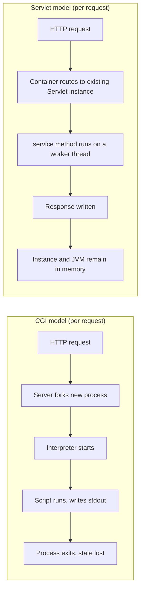

The container itself is the durable contribution. Tomcat, Jetty, and Undertow are independent implementations of the same Servlet contract, which means an application packaged as a WAR can in principle be redeployed across them without source changes. This portability is not incidental: it is the first concrete instance of the **inversion-of-control runtime** pattern in Java web development—application code declares what it wants to handle, and a separately-developed container decides when and how to invoke it. As later sections will show, this is the same conceptual posture that Spring's IoC container adopts at the application level. The Servlet container, far from being an obsolete substrate, persists almost unchanged in contract all the way into modern Spring Boot, where an embedded Tomcat, Jetty, or Undertow instance still hosts every HTTP request before the `DispatcherServlet` ever sees it.

## 2.2 The Servlet API and Container Architecture

The Servlet API is small enough to enumerate but consequential enough that its shape determines how every higher Java web framework expresses itself. Its core abstractions live in two packages—`javax.servlet` (renamed to `jakarta.servlet` in Tomcat 10+ and Jakarta EE 9+) and `javax.servlet.http`—and are organized around a clear separation between the contract a Servlet implements and the helpers the API provides for the common case of HTTP[^1][^2].

| API element | Kind | Role |
|-------------|------|------|
| `Servlet` | Interface | The most fundamental contract; defines `init`, `service`, `destroy`, `getServletConfig`, `getServletInfo`. All Servlets, directly or indirectly, must implement this interface[^1]. |
| `GenericServlet` | Abstract class | Implements `Servlet`, `ServletConfig`, and `Serializable`; provides default implementations for `init()`, `destroy()`, `getServletConfig()`, and `getServletInfo()`, but leaves `service()` abstract. Protocol-independent[^1]. |
| `HttpServlet` | Abstract class | Extends `GenericServlet` for HTTP; provides a `service()` that dispatches by HTTP method to `doGet`, `doPost`, `doPut`, `doDelete`, etc., which the developer overrides[^1][^2]. |
| `ServletRequest` / `ServletResponse` | Interfaces | Represent the client request and server response; subclassed as `HttpServletRequest` / `HttpServletResponse` for HTTP-specific data[^1]. |
| `ServletConfig` | Interface | Passed to `init()`; provides Servlet-specific initialization parameters and access to the `ServletContext`[^1]. |
| `ServletContext` | Interface | Application-wide; one per web application; used to communicate with the container and share resources or context-wide initialization parameters across all Servlets in the application[^1]. |

The division of labor that this API enforces is precisely the thing worth understanding. The **application** writes a class extending `HttpServlet`, overrides one or more `doXxx` methods, and reads from the supplied request object and writes to the supplied response object. The **container** is responsible for everything else: parsing the raw HTTP socket bytes into request objects, instantiating the Servlet, managing the thread pool that dispatches concurrent requests, applying any configured filters and listeners, and finally serializing the response object back onto the socket. This is what makes the Servlet model an inversion-of-control runtime: the Servlet does not pull requests, it is *handed* them; it does not own its lifecycle, it is *told* when to start and stop.

URL mapping—deciding which Servlet receives which request path—has historically taken two forms. The original mechanism was the **`web.xml` deployment descriptor**, an XML file inside `WEB-INF/` that declared `<servlet>` and `<servlet-mapping>` elements binding a Servlet class to one or more URL patterns[^2]. A representative descriptor maps `HelloServlet` to `/hello` like this:

```xml
<web-app xmlns="https://jakarta.ee/xml/ns/jakartaee"
         version="6.0">
  <servlet>
    <servlet-name>HelloServlet</servlet-name>
    <servlet-class>com.example.web.HelloServlet</servlet-class>
  </servlet>
  <servlet-mapping>
    <servlet-name>HelloServlet</servlet-name>
    <url-pattern>/hello</url-pattern>
  </servlet-mapping>
</web-app>
```

[^2]

Beginning with Servlet 3.0, the specification introduced an **annotation-driven model** that allowed configuration to live next to the code: `@WebServlet(name = "HelloServlet", urlPatterns = {"/hello"})` placed directly above an `HttpServlet` subclass declares the same mapping without any XML at all[^2]. Modern servlet code typically uses annotations, but `web.xml` remains supported and is still useful for environments where mappings need to be overridden without recompilation.

Two further extension points round out the pipeline. **Servlet Filters** wrap requests before and after they reach the target Servlet, and are the canonical place for cross-cutting behavior such as logging, authentication, compression, and CORS handling[^2]. **Listeners** observe lifecycle events—application startup and shutdown, session creation and destruction, attribute changes—and are typically used for metrics, resource management, and housekeeping[^2]. Together, filters and listeners give the container an extensible request-processing pipeline that prefigures Spring's own interceptor and event-publication mechanisms. The mental model worth carrying forward is therefore not "a Servlet handles a request" but "a container routes a request through a chain of filters into a Servlet, while listeners observe lifecycle transitions"—a model that Spring's `DispatcherServlet`, `HandlerInterceptor`, and `ApplicationListener` all rebuild at a higher level of abstraction.

## 2.3 The Servlet Lifecycle and the Single-Instance, Multi-Threaded Model

Every Servlet, regardless of what it does, passes through the same four lifecycle phases under the container's control: loading and instantiation, initialization, request handling, and destruction[^1]. Understanding when each is invoked—and, just as importantly, *how often*—is the key to writing correct Servlet code, and it is the model that Spring's singleton-bean execution silently inherits.

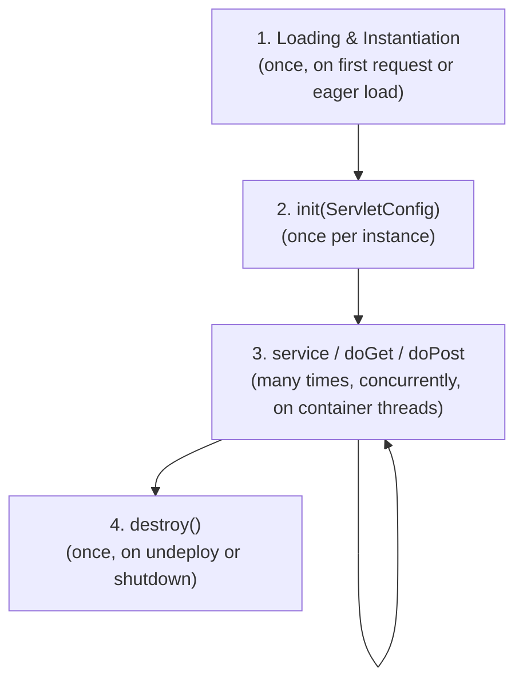

The first phase, **loading and instantiation**, occurs when the container creates a single instance of the Servlet class—typically lazily on the first request, although containers permit eager loading via a `<load-on-startup>` directive. The second phase, **initialization**, invokes `public void init(ServletConfig config) throws ServletException`, and the specification guarantees this method is called only once throughout the Servlet's lifetime[^1]. This is the place for one-time setup—reading configuration parameters, opening database connection pools, loading caches—and the `ServletConfig` argument provides access to Servlet-scoped initialization parameters and to the `ServletContext` shared across the application[^1].

The third phase, **request handling**, is where the Servlet earns its keep. For each client request the container creates a fresh `HttpServletRequest` and `HttpServletResponse` pair and invokes `service(req, res)`, which in `HttpServlet` dispatches to the appropriate `doGet`, `doPost`, `doPut`, or `doDelete` based on the HTTP method[^1][^2]. Critically, this method **can be called multiple times concurrently by different threads, each handling a separate request**[^1]. The fourth and final phase, **destruction**, invokes `destroy()` exactly once—when the application is undeployed, the container is shut down, or the Servlet is otherwise removed from service—and is the symmetric place to release whatever was acquired in `init`[^1].

The architectural commitment behind this lifecycle is the **single-instance, multi-threaded model**: for a given Servlet class, the web container typically creates only one instance within a web application, and that single instance handles all concurrent requests[^1]. Container vendors choose this design because it avoids the overhead of creating new Servlet objects for every request and allows expensive initialization to be amortized across the application's entire uptime. The trade-off is non-negotiable: anything stored in instance fields is **shared mutable state across all request threads**, and the developer is solely responsible for thread safety[^1][^2].

A minimal example, drawn from a published practitioner walkthrough, makes the hazard concrete[^1]:

```java
public class LifecycleDemoServlet extends HttpServlet {
    private int hitCount; // shared across all request threads — not thread-safe!

    @Override
    public void init(ServletConfig config) throws ServletException {
        super.init(config);
        hitCount = 0;
    }

    @Override
    protected void doGet(HttpServletRequest request, HttpServletResponse response)
            throws ServletException, IOException {
        hitCount++; // racy: read-modify-write under concurrent threads
        // ...write response...
    }
}
```

Under load, two threads can read the same value of `hitCount`, both increment it, and both write back—producing a single increment instead of two. The safe approaches are well established: avoid mutable instance fields, prefer local variables (which live on each thread's stack and are inherently thread-confined), and where shared state is genuinely required, use thread-safe collections, atomic types, or container-managed resources[^1][^2]. As one introductory guide summarizes the rule in plain language, "Servlets are multi-threaded by default. A single servlet instance serves many requests concurrently. Avoid shared mutable state in instance fields. Use local variables, thread-safe collections, or container managed resources to ensure thread safety."[^2]

This model is not a historical curiosity. **Spring's default singleton-scoped beans inherit exactly the same execution semantics**: one instance per bean, shared across all request threads, with the developer responsible for keeping the bean's state thread-safe. When a Spring developer encounters a race condition in a `@Service`-annotated class, the underlying explanation is the very same single-instance, multi-threaded contract first written into the Servlet specification. Mastering this model at the Servlet layer is therefore not optional background—it is the same model, one abstraction layer down.

## 2.4 HTTP Request/Response Handling and Session Management

The Servlet API exposes the HTTP protocol to application code through two paired objects, `HttpServletRequest` and `HttpServletResponse`, and a small family of scope-aware containers for state that needs to outlive a single request. Together these form the raw HTTP-handling vocabulary that every Spring annotation will eventually wrap.

On the request side, `HttpServletRequest` provides methods to read **parameters** (form fields and query-string values, via `getParameter`), **headers** (via `getHeader`), **cookies**, and the request body (via `getReader` or `getInputStream`)[^2]. On the response side, `HttpServletResponse` is used to set **status codes** (such as 200, 404, 500), **headers** (such as `Cache-Control` and `Content-Type`), and **cookies**, and to write the response body via `getWriter()` or `getOutputStream()`[^2]. A canonical `doGet` handler exhibits the entire shape of the contract:

```java
@WebServlet(name = "HelloServlet", urlPatterns = {"/hello"})
public class HelloServlet extends HttpServlet {
    @Override
    protected void doGet(HttpServletRequest request, HttpServletResponse response)
            throws ServletException, IOException {
        response.setContentType("text/html; charset=UTF-8");
        response.setStatus(HttpServletResponse.SC_OK);

        String name = request.getParameter("name");
        if (name == null || name.isBlank()) name = "World";

        try (PrintWriter out = response.getWriter()) {
            out.println("<!DOCTYPE html><html><body><h1>Hello, " + name + "!</h1></body></html>");
        }
    }
}
```

[^2]

Three things about this code reward attention. First, content type and character encoding are the developer's responsibility, and getting them wrong is a frequent source of mojibake; troubleshooting guides routinely flag `response.setContentType("text/html; charset=UTF-8")` as the canonical fix for garbled output[^2]. Second, the response body is constructed by writing strings into a `PrintWriter`—an experience that, as the next section will show, is precisely the friction that JSP was invented to eliminate. Third, the entire interaction is explicitly mapped to a URL path via `@WebServlet`, with no framework-level abstraction over routing.

HTTP is, by design, stateless: each request stands alone, with no built-in memory of what came before. To bridge requests belonging to the same user, the Servlet API introduces **`HttpSession`**, an object that stores user-specific data across multiple requests[^2]. Sessions are typically tracked using a session-identifier cookie issued by the container; on each subsequent request the container reads the cookie, looks up the corresponding session, and exposes it via `request.getSession()`. The classic example is authentication: after login, the Servlet stores the authenticated user object in the session, and subsequent requests can retrieve it without re-authenticating. Session cookies can—and in production should—be hardened with `HttpOnly` (preventing access from client-side JavaScript and thus mitigating XSS) and `Secure` (ensuring transmission only over HTTPS) flags[^2].

These mechanisms induce a hierarchy of **scopes** that the Servlet container exposes to application code, each with a different lifetime:

| Scope | Backing object | Lifetime | Typical use |
|-------|----------------|----------|-------------|
| `page` | `PageContext` (JSP only) | Single page rendering | JSP-local helpers and tag-library state |
| `request` | `HttpServletRequest` | One HTTP request, including any forwarded dispatches | Pass model data from controller Servlet to JSP view |
| `session` | `HttpSession` | One user across multiple requests | Authenticated principal, shopping cart, conversational state |
| `application` | `ServletContext` | Lifetime of the deployed web application | Application-wide configuration, shared caches |

[^1][^2]

This four-tier scope model—page, request, session, application—is the Servlet API's vocabulary for state, and it is faithfully preserved in Spring. When Spring exposes `@RequestScope`, `@SessionScope`, and `@ApplicationScope` for beans, or when Spring MVC injects values via `@RequestParam`, `@RequestHeader`, `@CookieValue`, `@SessionAttribute`, and `@RequestBody`, it is not inventing new state semantics; it is presenting the same Servlet-defined scopes through a more declarative surface. A Spring developer who understands `request.setAttribute` and `HttpSession` already understands what `@RequestAttribute` and `@SessionAttribute` are doing—and is in a position to reason about edge cases (session replication, request forwarding, attribute-name collisions) that the annotation surface cannot hide.

## 2.5 JSP and the Inversion of the Servlet Model

The Servlet API solved CGI's process-per-request problem, but it created a new ergonomic one. As the `HelloServlet` example above showed, generating HTML from inside a `doGet` method means writing endless `out.println("<html>...")` calls: layout designers cannot edit the template without recompiling Java, syntax highlighting in IDEs is fighting the language barrier, and any non-trivial page becomes an unreadable string-concatenation marathon. By the late 1990s, this friction was acute enough that competing platforms—Microsoft's Active Server Pages (ASP), the open-source PHP—were winning developer mindshare specifically because they let HTML stay HTML and only embedded scripting fragments where dynamism was required[^1].

**JavaServer Pages (JSP)**, released by Sun in 1999, was the Java platform's response[^1]. The reframing was an inversion of the Servlet model: rather than embedding HTML inside Java code, JSP allowed Java code (and predefined actions) to be interleaved with static web markup such as HTML, with the resulting page compiled and executed on the server to deliver a document[^1]. The architectural insight that makes this manageable is precise and worth quoting: "Architecturally, JSP may be viewed as a high-level abstraction of Jakarta Servlets. JSPs are translated into servlets at runtime, therefore JSP is a Servlet; each JSP servlet is cached and re-used until the original JSP is modified."[^1] In other words, JSP is not a competing technology to Servlets but a templating layer on top of them: the JSP compiler—usually embedded in the application server and run automatically the first time a JSP is accessed, though pages may also be precompiled[^1]—parses the `.jsp` file and emits an equivalent Servlet, which the container then loads and invokes exactly like any hand-written Servlet.

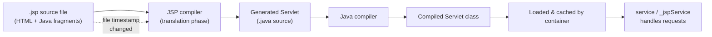

The page source itself uses several scripting delimiters[^1]:

| Delimiter | Purpose | Example |
|-----------|---------|---------|
| `<% ... %>` | **Scriptlet**: a fragment of Java code that runs when the user requests the page | `<% for (int i = 0; i < 5; i++) { %>...<% } %>` |
| `<%= ... %>` | **Expression**: scriptlet and delimiters are replaced with the result of evaluating the expression | `<%= user.getName() %>` |
| `<%@ ... %>` | **Directive**: page-level instruction such as imports or tag-library declarations | `<%@ page import="java.util.*" %>` |

[^1]

Because Java code in scriptlets is not required to be self-contained within a single block, control structures (`if`, `for`, `while`) opened in one scriptlet can be closed in a later one, with markup content in between subject to the surrounding control flow[^1]. This power, as the next section will argue, is also JSP's principal danger.

Beyond raw scripting, JSP standardized several higher-level constructs intended to encourage cleaner separation between markup and logic. **Standard JSP tags** use XML-style syntax and case-sensitive attributes[^1]. The `useBean` tag accesses or creates a JavaBean, with attributes such as `id` (the variable name), `class` (the package and class), and `scope` (one of `page`, `request`, `session`, or `application`, mapping respectively to `PageContext`, `HttpServletRequest`, `HttpSession`, and `ServletContext`)[^1]. The companion `getProperty` and `setProperty` tags read and write JavaBean properties on the bean identified by `name`, which must match the `id` from `useBean`[^1]. The web container also injects a set of **implicit objects**—`request`, `response`, `session`, `application`, `config`, `page`, `pageContext`, `out`, and `exception`—during the translation phase, sparing the page author from having to declare them[^1].

Two further additions matured the model. **Expression Language (EL)**, added in JSP 2.0 and folded into the Unified Expression Language in JSP 2.1, provides a compact `${...}` syntax for accessing data and functions in Java objects without writing scriptlets[^1]. The expression `${javabean.variable}`, for example, retrieves `variable` from the JavaBean named `javabean`[^1]. **JSP tag libraries** allow custom XML-like tags to be defined as extensions to the standard syntax, the most prominent being the **Jakarta Standard Tag Library (JSTL)**, whose core library—conventionally imported with the `c` prefix—supplies tags for iteration and conditionals (the equivalents of `for` and `if`)[^1]. Together, EL and JSTL gave JSP authors a path to write expressive, dynamic pages without ever writing raw Java in the markup, which is precisely the discipline that the next section will argue is the only sustainable way to use JSP.

The latest published version of the specification is **Jakarta Server Pages 4.0**, dated April 9, 2024, reflecting the post-Java-EE migration of the technology to the Eclipse Foundation under the Jakarta EE umbrella[^1]. JSP is therefore neither obsolete nor frozen, although as the next section will discuss, its strategic role has narrowed considerably.

## 2.6 Comparing Servlets and JSP: Roles, Trade-offs, and Anti-Patterns

Once both Servlets and JSP are on the table, the natural question is how they should be combined. The shortest accurate answer is: by responsibility. Servlets and JSP are not alternatives but complements, each best at one half of the work.

| Dimension | Servlets | JSP |
|-----------|---------|-----|
| Authoring surface | Java class extending `HttpServlet` | HTML-centric template with embedded Java/EL/JSTL |
| Compilation model | Standard Java compilation; deployed as `.class` in WAR[^2] | Translated to a Servlet at runtime by the JSP compiler, then compiled like any other Servlet; cached and re-used until the source `.jsp` is modified[^1] |
| Lifecycle | `init`, `service`/`doXxx`, `destroy` directly[^1] | Same lifecycle, but exposed through translated Servlet methods (`_jspService`); transparent to author[^1] |
| Performance characteristics | Direct, no translation phase | First-request translation cost, then equivalent to a Servlet because it *is* one[^1] |
| Natural responsibility | Request handling, control flow, business invocation | View rendering, presentation markup |
| Configuration | `@WebServlet` annotation or `web.xml` mapping[^2] | Auto-mapped by file path; directives configure imports, encoding, error pages |
| Failure mode | Verbose HTML in `out.println` strings | Scriptlet abuse — Java logic embedded inside the page |

The most consequential entry in this table is the last one. Because a JSP page allows arbitrary Java code in scriptlets, it is technically possible to put database queries, business rules, transaction control, and view rendering all inside a single `.jsp` file. This is precisely the failure mode that authoritative practitioner sources have warned against for two decades. As Murach and Urban argue in *Murach's Java Servlets and JSP*, "embedding Java code in JSP is generally bad practice. A better approach would be to migrate the back-end logic embedded in the JSP to the Java code in the `Servlet`. In this scenario, the `Servlet` is responsible for processing, and the JSP is responsible for displaying the HTML, maintaining a clear separation of concerns."[^1]

The same critical view extends to the technology's strategic role. Jason Hunter, author of *Java Servlet Programming*, in 2000 catalogued a number of "problems" with JavaServer Pages, conceding that while JSP might not be the "best solution for the Java Platform," it was "the Java solution that is most like the non-Java solution"—a reference to ASP—and therefore won adoption on familiarity rather than design merit; he later acknowledged JSP had improved but cited competitors such as Apache Velocity and the Tea template language[^1]. The Wikipedia summary of contemporary opinion is blunt: "Today, several alternatives and a number of JSP-oriented pages in larger web apps are considered to be technical debt."[^1]

Two consequences follow for any reader trying to use this technology stack today. First, the legitimate role of JSP is purely as a **view template**: HTML, EL expressions, and JSTL tags only, with all data already prepared and placed into request or session scope by the controller. The moment scriptlets appear, the page has begun absorbing responsibilities it cannot maintain, and the result is the well-documented decay—mixed concerns, untestable presentation logic, and merge conflicts between Java developers and front-end designers—that gives JSP its bad reputation. Second, the conclusion that follows is structural: the Java web ecosystem needs an architectural pattern that *enforces* the discipline Murach and Urban describe, rather than relying on developer goodwill. That pattern is Model 2 / MVC, and its codification is the subject of the next section.

## 2.7 The Model 2 (MVC) Pattern: Servlets as Controllers, JSP as Views

By the early 2000s, the Java web community had converged on a single architectural pattern that resolved the Servlet/JSP role question by construction. The pattern, known as the **Model 2 architecture**, applies the **Model–View–Controller** decomposition to web applications by assigning each role to the technology that does it best: Servlets serve as controllers, JavaBeans (or POJOs) serve as the model, and JSP renders the view, normally with intermediate frameworks such as Apache Struts taking on the controller role[^1]. The Wikipedia summary captures the canonical description: "Jakarta Server Pages can be used independently or as the view component of a server-side model–view–controller design, normally with JavaBeans as the model and Java servlets (or a framework such as Apache Struts) as the controller. This is a type of Model 2 architecture."[^1]

The end-to-end request flow under Model 2 is straightforward and instructive, because the same flow re-emerges essentially unchanged in Spring MVC, simply with the front-controller role consolidated into a single `DispatcherServlet`.

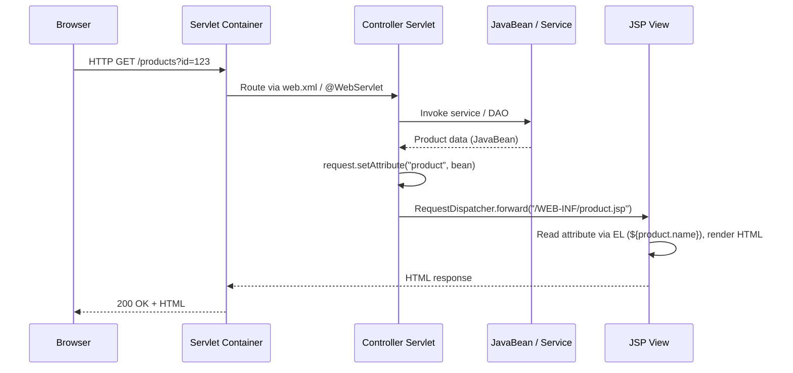

Five observations make this flow worth dwelling on. First, **the controller never writes HTML**: its sole job is to interpret the request, invoke domain logic on the model, and decide which view to dispatch to. Second, **data flows from controller to view through request scope**: `request.setAttribute("items", list)` populates a name in `HttpServletRequest`, and the JSP retrieves it through EL or the JSTL `<c:forEach>` tag[^1]. Third, the dispatch itself uses a `RequestDispatcher` *forward* (not a redirect), which keeps the request and response objects intact and the operation server-internal—no extra round trip to the browser. Fourth, JSP files are conventionally placed under `WEB-INF/` so they cannot be accessed directly by URL, forcing all entry points to go through the controller. Fifth, the JSP, having received a fully populated model, can confine itself to EL and JSTL—exactly the disciplined view-only role that the previous section argued was the sustainable use of the technology.

This is also the architectural moment at which several patterns that will later define Spring MVC are first established in the Java ecosystem. **URL-pattern-driven dispatch** to a controller class, **request-scoped model attributes** consumed by views, and **logical view names resolved to physical templates** are all Model 2 ideas. Apache Struts, the most influential of the early Model 2 frameworks, codified these ideas into a configuration-driven dispatcher, action classes, and a tag library for forms and validation, and its conventions visibly influenced the design of Spring MVC's `DispatcherServlet`, `@Controller`, and view resolvers. Understood this way, Spring MVC is not a break from Model 2 but its consolidation: the explicit controller Servlets that each application used to write are replaced by a single, framework-supplied `DispatcherServlet`, and the per-action configuration that Struts kept in `struts-config.xml` is replaced by annotations on handler methods—but the conceptual flow, controller→model→view-via-forward, is preserved exactly.

## 2.8 Limitations and Unresolved Frictions of the Servlet/JSP/MVC Stack

Model 2, despite being the right architectural answer to the Servlet/JSP role problem, did not eliminate the engineering frictions of the foundational stack. It localized them. Read against the analytical lens introduced in Chapter 1, the unresolved problems of the Servlet/JSP/MVC stack fall into six related clusters that, taken together, form the brief for the next two generations of Java web frameworks.

**Scriptlet abuse and view-layer maintainability decay.** Even with Model 2 in place, JSP's permissive syntax meant that any developer in a hurry could revert to embedding business logic in scriptlets. As authoritative practitioner critiques document, this is "generally bad practice"—the better approach is to migrate the back-end logic from the JSP into the Servlet, with the Servlet responsible for processing and the JSP responsible for displaying HTML[^1]. JSTL and EL existed precisely so that disciplined teams could avoid scriptlets, but the language did nothing to enforce the discipline, and the consequence is that "a number of JSP-oriented pages in larger web apps are considered to be technical debt."[^1]

**Tight coupling between controllers and views.** A Model 2 controller Servlet typically hard-codes the path of the JSP it forwards to (`/WEB-INF/product.jsp`), and a JSP hard-codes the names of the request attributes it expects. There is no central view-resolution layer, no content negotiation, and no clean way to swap an HTML view for a JSON view without rewriting the controller. Each new view technology (Velocity, FreeMarker, later Thymeleaf, still later JSON for REST) had to be wired in by hand.

**Configuration verbosity.** Pre-Servlet 3.0, every Servlet, filter, listener, and URL mapping had to be declared in `web.xml`, and complex applications accumulated hundreds of lines of XML deployment descriptor. The `@WebServlet` annotation introduced in Servlet 3.0 alleviated but did not eliminate the burden, because filters, listeners, security constraints, error pages, and welcome files still frequently lived in XML, and the descriptor remained the place where the container learned about the application's structure[^2].

**Absence of standardized dependency management and lifecycle.** The Servlet API gives each Servlet exactly one configuration object (`ServletConfig`) and one application-wide context (`ServletContext`), neither of which is a dependency-injection container. If a controller Servlet needs a service, a DAO, and a connection pool, the developer must locate them by hand—typically through JNDI lookups, static factories, or the increasingly notorious Service Locator pattern—each of which couples application code to its environment in ways that destroy testability.

**Difficulty of unit testing in isolation from the container.** Because Servlets depend on `HttpServletRequest`, `HttpServletResponse`, `ServletContext`, and `HttpSession`—all of them container-supplied interfaces—unit-testing a Servlet without spinning up Tomcat (or building substantial mocks) is genuinely awkward. The `init`/`service`/`destroy` lifecycle is also driven by the container, so testing initialization or destruction logic requires simulating the full lifecycle. This testability gap is a direct consequence of the inversion-of-control runtime that the Servlet model defines: the application does not own its lifecycle, so the application cannot easily exercise it from a test.

**Lack of declarative cross-cutting concerns.** Authentication, authorization, transaction management, input validation, logging, and error handling are all cross-cutting concerns that any non-trivial web application must address. The Servlet API offers only one extension point for them: filters[^2]. Filters work, but they operate at the level of raw `HttpServletRequest`/`HttpServletResponse` and have no access to typed handler methods, model objects, or business semantics. There is no declarative way to say "this controller method requires the `ADMIN` role" or "this method must run inside a database transaction"—every such concern has to be coded imperatively, either inside the controller itself or in a hand-written filter.

These six frictions explain why, by the early 2000s, the Java community did not stop at Model 2. The first response, examined in Chapter 3, was the J2EE / Enterprise JavaBeans (EJB) platform, which attempted to address dependency management, transactions, security, and distribution by wrapping the Servlet/JSP layer in a far heavier component container with declarative deployment descriptors and managed lifecycles. As the next chapter will show, EJB's solution to the foundational stack's limitations was so intrusive—so XML-laden, so demanding of inheritance from container interfaces, so hostile to plain unit testing—that it triggered a counter-revolution of its own, the Spring Framework. The narrative thread carries forward unbroken: the unresolved problems catalogued here are precisely the agenda that EJB tried, and substantially failed, to solve, and that Spring would eventually solve well.

# 3 From EJB Heaviness to the Spring Counter-Revolution

Chapter 2 closed with a brief: the Servlet/JSP/MVC stack had reached its architectural ceiling. Model 2 had clarified roles, but six unresolved frictions—scriptlet-prone view templates, controller/view coupling, configuration verbosity, the absence of a dependency-management container, untestable container-bound code, and the lack of a declarative way to apply cross-cutting concerns—remained as engineering debt. By the late 1990s, the industry had a candidate response in hand: the Java 2 Platform, Enterprise Edition (J2EE), and at its center the Enterprise JavaBeans (EJB) component model. EJB was a serious and ambitious attempt to lift transactions, security, persistence, and distribution out of application code and into a container that would deliver them declaratively. It was also, within five years of its mainstream adoption, the cautionary tale that produced the Spring Framework.

This chapter traces that double turn. It first reconstructs why J2EE/EJB looked, in 2000, like the right answer to the frictions Chapter 2 catalogued. It then dissects what an EJB 2.x bean actually demanded of its developer—home and component interfaces, lifecycle callbacks, primary-key classes, paired XML descriptors—drawing concrete artefacts from the JOnAS application server's EJB 2.1 Programmer's Guide to keep the analysis tangible[^3]. It surveys the genuinely valuable services the EJB container did deliver: declarative transaction attributes, role-based security, distributed transaction coordination, JNDI-mediated environment references, and Container-Managed Persistence with EJB-QL. It then catalogues the six clusters of pain that turned EJB from solution into burden, and shows how Rod Johnson's 2002 and 2004 books crystallized an alternative—POJO-centric, non-invasive, composition-over-inheritance—that became the Spring Framework[^4][^5][^6][^7]. The chapter closes by articulating the four founding principles that Spring carried forward, and by previewing how Spring's lightweight, modular IoC container set up both its rapid market penetration and the next round of frictions that Spring Boot would eventually have to resolve.

## 3.1 The J2EE Promise: Standardizing Enterprise Concerns

To understand why EJB seemed compelling, it helps to inhabit the engineering position of an enterprise Java team in 1999 or 2000. Such a team had probably written a Model 2 application in Servlets and JSP. It had probably hand-rolled a JDBC connection pool, or located one through JNDI from the application server. It had probably written its own service-locator helpers to find DAOs, and its own boilerplate around `Connection.setAutoCommit(false)`, `commit`, and `rollback` to make multi-statement updates atomic. It had probably implemented authorization checks by reading a session attribute at the top of every controller Servlet. And it had almost certainly discovered that as soon as a second JVM, a second database, or a second protocol entered the picture—say, a remote pricing service or a message queue—the home-grown plumbing started to fail in subtle ways: orphaned connections, transactions that committed on one resource but rolled back on another, security checks that silently fell out of sync between the web tier and the back end.

J2EE's response was a single architectural decision with far-reaching consequences. Rather than ask each application to solve transactions, security, persistence, and distribution by hand, the platform would standardize a **component contract**—the Enterprise JavaBean—and a **container** that implemented these enterprise services on the component's behalf. The web container (Tomcat-class) would continue to host Servlets and JSPs. A separate **EJB container**, running in the same or a different JVM, would host beans that encapsulated business logic and interact with the web tier through standardized lookup and invocation mechanisms. The bean developer would write business code; the container would weave in transactions, security, remoting, persistence, and pooling at deployment time, guided by deployment descriptors.

The EJB specification organized this ambition around three bean types, each addressing a distinct enterprise concern. **Session Beans** modelled units of business logic acting on behalf of a client; they came in two flavours, **stateless** (any instance interchangeable, suitable for high-throughput service-style operations) and **stateful** (associated with a specific client across a sequence of method calls, with the container responsible for passivating and activating instances as memory demanded)[^3]. **Entity Beans** modelled persistent business objects, with their state stored in a relational database and synchronized by the container; persistence could be **Bean-Managed** (the bean wrote its own JDBC) or **Container-Managed** (the container generated the data-access code from a mapping description in the deployment descriptor)[^3]. **Message-Driven Beans (MDBs)**, added in EJB 2.0 and refined in 2.1, played the role of a JMS `MessageListener`, processing asynchronous messages from a queue or topic with the same container-managed transactional and threading services as session beans, allowing "large volumes of messages to be processed concurrently"[^3].

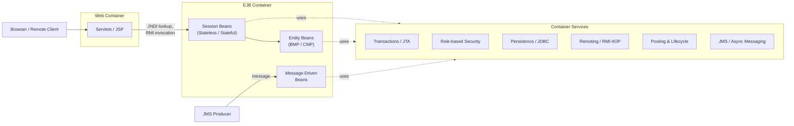

Two structural commitments are worth highlighting because they shape everything that follows. First, the bean's interaction with the container was mediated through a **set of explicit contracts**: a Home Interface for lifecycle operations (create, find, remove), a Component Interface for business methods, and lifecycle callbacks the bean implementation had to provide so that the container could pool, passivate, and activate instances on demand[^3]. Second, **cross-cutting concerns were to be declared, not coded**: transaction attributes, security roles, resource references, and persistence mappings all lived in the `ejb-jar.xml` deployment descriptor, and the container's deployment-time tooling would generate the necessary plumbing[^3]. This was, on paper, a direct answer to two of Chapter 2's most prominent unresolved frictions: the absence of a standardized dependency and lifecycle management surface in the Servlet API, and the absence of a declarative way to apply cross-cutting concerns. Whether it was a good answer is the subject of the next four sections.

## 3.2 Anatomy of the EJB 2.x Programming Model

The most efficient way to convey what EJB 2.x cost the developer is to enumerate, soberly, the artefacts a single conceptual bean required. The JOnAS EJB 2.1 Programmer's Guide is unusually candid here, because its purpose is documentary rather than promotional, and its enumeration matches the EJB 2.1 specification directly[^3].

A **Session Bean** consisted of four developer-authored artefacts plus a deployment descriptor[^3]:

1. A **Home Interface** extending `javax.ejb.EJBHome` (for remote use) or `javax.ejb.EJBLocalHome` (for in-JVM use), declaring `create(...)` methods that the container's home object would implement;
2. A **Component Interface** extending `javax.ejb.EJBObject` or `javax.ejb.EJBLocalObject`, declaring the business methods the client would invoke;
3. A **Bean Implementation Class** implementing `javax.ejb.SessionBean` and providing both the business methods (matching the component interface) and the four lifecycle callbacks the container required: `setSessionContext`, `ejbCreate`, `ejbActivate`, `ejbPassivate`, and `ejbRemove`[^3];
4. Optionally, for stateful beans participating in transactions, an implementation of `javax.ejb.SessionSynchronization` providing `afterBegin`, `beforeCompletion`, and `afterCompletion(boolean committed)` callbacks for transaction-boundary notifications[^3];
5. A standard `ejb-jar.xml` deployment descriptor, conforming to the EJB 2.1 schema, plus a vendor-specific descriptor (in JOnAS's case, `jonas-ejb-jar.xml`) for deployment information not standardized by the specification[^3].

The reference guide's own session-bean example—an `Op` bean tracking a running total—illustrates the texture. The remote home interface declares a single creation method:

```java
public interface OpHome extends EJBHome {
    Op create(String user) throws CreateException, RemoteException;
}
```

The remote component interface declares the business methods:

```java
public interface Op extends EJBObject {
    public void buy(int Shares) throws RemoteException;
    public int read() throws RemoteException;
}
```

And the bean implementation class is required to implement both `SessionBean` and, optionally, `SessionSynchronization`, providing matching `ejbCreate`, container-callback, and synchronization methods alongside the actual business logic[^3]. Even in this trivial case—a bean with two business methods—the developer wrote three classes and an XML descriptor before any business code was reached.

**Entity Beans** raised the cost again. In addition to the home interface, component interface, and implementation class, the entity model required[^3]:

- A **Primary Key class**, either a standard wrapper such as `java.lang.Integer` or a custom serializable class with `equals` and `hashCode` implementations conforming to specific rules (public fields, public default constructor, names matching container-managed fields);
- An implementation class implementing `javax.ejb.EntityBean`, public, and—for CMP 2.x—**abstract**, with abstract `get`/`set` accessor methods for every CMP and CMR (Container-Managed Relationship) field that the container would generate at deployment time;
- Lifecycle callbacks beyond those required of session beans: `setEntityContext`, `unsetEntityContext`, `ejbActivate`, `ejbPassivate`, `ejbRemove`, `ejbLoad`, `ejbStore`, plus `ejbCreate`/`ejbPostCreate` pairs for each creation overload, and `ejbFind...` methods for Bean-Managed Persistence (or EJB-QL queries in the descriptor for Container-Managed Persistence)[^3].

A minimal CMP 1.1 entity bean from the reference guide makes the boilerplate visible:

```java
public class AccountImplBean implements EntityBean {
    protected EntityContext entityContext;
    public Integer accno;
    public String customer;
    public double balance;

    public Integer ejbCreate(int val_accno, String val_customer, double val_balance) {
        accno = new Integer(val_accno);
        customer = val_customer;
        balance = val_balance;
        return null;
    }
    public void ejbPostCreate(int val_accno, String val_customer, double val_balance) {}
    public void ejbActivate() {}
    public void ejbLoad() {}
    public void ejbPassivate() {}
    public void ejbRemove() {}
    public void ejbStore() {}
    public void setEntityContext(EntityContext ctx) { entityContext = ctx; }
    public void unsetEntityContext() { entityContext = null; }
    // ... business methods getBalance, setBalance, etc. ...
}
```

Seven empty or near-empty lifecycle callbacks, one context field, a primary-key wrapper that ultimately just holds an integer—and only then do the actual business getters and setters appear[^3]. For CMP 2.x, the situation was different in detail but no lighter overall: the bean class itself became `abstract`, with the container generating subclasses at deployment time to implement the abstract `getCustomer`/`setCustomer`/`getBalance`/`setBalance` accessors that backed the persistent fields and relationships[^3].

**Message-Driven Beans** were structurally simpler—no home interface, no component interface, just a class implementing `javax.jms.MessageListener` and `javax.ejb.MessageDrivenBean` with `onMessage`, `setMessageDrivenContext`, `ejbCreate`, and `ejbRemove`[^3]—but they still required the same descriptor apparatus, the same JNDI-based destination lookup, and the same container-managed acknowledgment configuration.

The deployment descriptor's role in tying all of this together is hard to overstate. A medium-sized application's `ejb-jar.xml` was easily several hundred lines per bean once `<entity>` declarations, `<cmp-field>` lists, `<query>` blocks for EJB-QL finders, `<ejb-relation>` blocks for relationships, `<resource-ref>` and `<ejb-ref>` blocks for environment references, and `<container-transaction>` and `<method-permission>` blocks for transaction attributes and security roles were enumerated[^3]. The vendor-specific descriptor—`jonas-ejb-jar.xml` in JOnAS, with parallels in WebLogic, WebSphere, and JBoss—then bound the standard descriptor's logical names to actual JNDI names, datasource names, table names, column names, and tuning parameters such as `lock-policy`, `min-pool-size`, `max-cache-size`, `passivation-timeout`, and `read-timeout`[^3]. The result was a programming model in which a single conceptual entity—say, an `Account`—was spread across two interfaces, an abstract implementation class, a primary-key class, and two XML files, none of which could be understood without reference to the others. Rod Johnson's later observation that during the writing of his sample J2EE application he had encountered implementation hurdles that rendered EJB "absurdly complex" and impractical, and that it took him 13 months to complete the code alongside his writing, gains a great deal of credibility from a single look at an actual `ejb-jar.xml`[^7].

## 3.3 Container Services and Declarative Configuration

It would be unfair, however, to treat EJB only as a cautionary catalogue of boilerplate. The reason this programming model was tolerated for years is that the services the container delivered in exchange were, individually, genuine answers to the Servlet-era frictions Chapter 2 identified. This section examines those services on their own terms, before the next section turns to their cumulative cost.

**Declarative transaction management** was, and remains, EJB's most influential single contribution. Rather than ask the developer to call `commit` and `rollback` by hand, EJB introduced a small vocabulary of **transaction attributes** that could be declared per bean or per method in the deployment descriptor[^3]:

| Attribute | Behaviour with no client transaction | Behaviour with client transaction T1 |
|-----------|--------------------------------------|--------------------------------------|
| `NotSupported` | Method runs with no transaction | T1 is suspended for the duration of the method |
| `Required` | Container starts a new transaction T2; commits on return | Method runs in T1 |
| `RequiresNew` | Container starts a new transaction T2; commits on return | T1 is suspended; new T2 is started, completed, and then T1 is resumed |
| `Mandatory` | Container throws `TransactionRequired` exception | Method runs in T1 |
| `Supports` | Method runs with no transaction | Method runs in T1 |
| `Never` | Method runs with no transaction | Container throws `RemoteException` |

The descriptor syntax bound these attributes to method patterns at the bean and method level, with the more specific declaration overriding the broader one[^3]:

```xml
<assembly-descriptor>
  <container-transaction>
    <method><ejb-name>AccountImpl</ejb-name><method-name>*</method-name></method>
    <trans-attribute>Supports</trans-attribute>
  </container-transaction>
  <container-transaction>
    <method><ejb-name>AccountImpl</ejb-name><method-name>setBalance</method-name></method>
    <trans-attribute>Mandatory</trans-attribute>
  </container-transaction>
</assembly-descriptor>
```

The contrast with Servlet-era code is stark. Where a Model 2 controller had to thread JTA `UserTransaction` objects or JDBC `Connection` objects through every layer that needed transactional semantics, an EJB developer simply tagged a method `Required` and the container guaranteed atomic execution—suspending caller transactions when needed, joining them when appropriate, and coordinating two-phase commit across multiple resources when distributed transactions were involved[^3]. JOnAS's documentation goes out of its way to underline that "a transaction may involve beans located on several JOnAS servers and that the platform itself will handle management of the global transaction. It will perform the two-phase commit protocol between the different servers, and the bean programmer need do nothing"[^3]. This was a real engineering achievement and a real productivity gain: the kind of distributed transaction management that EJB exposed declaratively in 2000 had been the province of expensive, proprietary transaction monitors only a few years before.

**Role-based security** followed the same pattern. The application assembler defined `<security-role>` elements in the descriptor, and `<method-permission>` elements bound roles to methods of the bean's home and remote interfaces[^3]:

```xml
<assembly-descriptor>
  <security-role><role-name>tomcat</role-name></security-role>
  <method-permission>
    <role-name>tomcat</role-name>
    <method><ejb-name>Op</ejb-name><method-name>*</method-name></method>
  </method-permission>
</assembly-descriptor>
```

The container performed access checks before invoking the method, throwing the appropriate exception if the caller's principal lacked the required role[^3]. For finer-grained checks not expressible declaratively, `EJBContext` provided two programmatic methods, `getCallerPrincipal()` and `isCallerInRole(String roleName)`, and the bean's `<security-role-ref>` declarations linked role names used in code to actual roles defined elsewhere—an early form of the same indirection that Spring Security would later operationalize through SpEL expressions and `@PreAuthorize`[^3].

**JNDI-based environment references** addressed the dependency-management gap directly. Every bean declared its resources, references to other beans, and configuration values in the descriptor under names rooted at `java:comp/env/`, and the deployer mapped these logical names to actual resources at deployment time[^3]:

```java
InitialContext ictx = new InitialContext();
DataSource ds = (DataSource) ictx.lookup("java:comp/env/jdbc/AccountExplDs");
SS1Home home = (SS1Home) PortableRemoteObject.narrow(
    ictx.lookup("java:comp/env/ejb/ses1"), SS1Home.class);
```

This indirection was conceptually the same separation Spring would later push much further: the bean's source code referred to a logical name; the deployer wired the logical name to the concrete resource; the application stayed portable across environments[^3]. It also addressed, for the first time in the Java enterprise stack, the problem Chapter 2 identified as the absence of a standardized dependency-management surface in the Servlet API.

**Container-Managed Persistence (CMP)**, particularly in its 2.x incarnation, was the most ambitious of these services. The bean class became abstract; the container generated implementations of the abstract field accessors and a database-access layer at deployment time; the developer specified the mapping in the descriptor (or, in JOnAS, accepted a generated default mapping). EJB-QL, an object-oriented query language, replaced ad-hoc SQL embedded in finder methods[^3]:

```xml
<query>
  <query-method>
    <method-name>findLargeAccounts</method-name>
    <method-params><method-param>double</method-param></method-params>
  </query-method>
  <ejb-ql>SELECT OBJECT(o) FROM accountsample o WHERE o.balance > ?1</ejb-ql>
</query>
```

CMP also standardized **Container-Managed Relationships** (one-to-one, one-to-many, many-to-many; unidirectional or bidirectional), each with its own descriptor-driven mapping and foreign-key conventions[^3]. The breadth of cases the JOnAS guide enumerates—seven distinct combinations of cardinality and direction, each with its own table-mapping rules and default-value inference—conveys how seriously the specification took persistence as a first-class enterprise concern[^3]. As Chapter 5 will show, the same problem space, attacked with very different design assumptions, would later produce JdbcTemplate, the Spring transaction abstraction, and Spring Data's repository pattern.

Read in isolation, each of these services was a credible answer to a real problem. Declarative transactions removed boilerplate that every Servlet-era application had to write by hand. Role-based security replaced ad-hoc session-attribute checks. JNDI environment references gave deployers a knob to turn without recompiling the application. CMP, in principle, eliminated the JDBC plumbing that had plagued enterprise Java since its inception. The trouble was not that the services were unworthy; the trouble, as the next section examines, was the price the programming model exacted to deliver them.

## 3.4 The Cost of the Container: Pain Points of EJB 1.x/2.x

By the early 2000s, the gap between EJB's promised value and its delivered developer experience had become impossible to ignore. The pain organized itself into six interlocking clusters, each of which had a precise effect on how teams actually worked.

**1. Intrusive programming model.** Every EJB had to implement container-defined interfaces (`SessionBean`, `EntityBean`, `MessageDrivenBean`) and provide the lifecycle callbacks (`ejbCreate`, `ejbActivate`, `ejbPassivate`, `ejbRemove`, `ejbLoad`, `ejbStore`, `setEntityContext`, `unsetEntityContext`) the container would invoke[^3]. The bean was, in effect, no longer an object the developer owned; it was a fragment of code whose shape was dictated by the container's pooling, passivation, and synchronization requirements. Business logic was diluted by callbacks that, in the common case, had nothing to do with business at all—the JOnAS reference guide's session-bean example shows three lifecycle methods (`ejbActivate`, `ejbPassivate`, `ejbRemove`) with bodies that read, in their entirety, "Nothing to do for this simple example"[^3].

**2. XML configuration sprawl.** A complete EJB deployment required at minimum the standard `ejb-jar.xml` and its vendor-specific companion. Each bean's entry in `ejb-jar.xml` specified the bean's name, class, home and component interfaces (local and remote), bean type, persistence type, transaction type, primary-key class, CMP version, abstract schema name, list of CMP fields, primary-key field, EJB-QL queries for every finder, EJB references, resource references, security-role references, and concurrency settings; the assembly descriptor then enumerated transaction attributes and method permissions; a multi-bean application's relationships descriptor enumerated every CMR with its multiplicity and direction[^3]. The vendor descriptor on top added datasource names, table names, column names, foreign-key column names, lock policies, pool sizes, passivation timeouts, and isolation levels[^3]. The resulting XML files for a moderately complex application routinely ran to thousands of lines, and any change to the bean—a new field, a new finder, a new relationship—required coordinated edits to multiple descriptors, often across files that no single tool could verify holistically.

**3. Artefact multiplication.** A single conceptual entity—say, `Customer`—materialized in the codebase as: a remote home interface, a local home interface, a remote component interface, a local component interface, an abstract bean implementation class, an optional primary-key class, an entry in `ejb-jar.xml`, and an entry in the vendor descriptor[^3]. Adding a method meant editing at least three of these (interface, implementation, descriptor) and ensuring their signatures matched exactly. A typo or a minor signature drift would not surface until deployment-time tooling generated container code and either failed loudly or, worse, succeeded with wrong behaviour.

**4. Testability collapse.** The single most damaging consequence of the EJB programming model was that beans could not be exercised outside the container. The bean's behaviour depended on container-supplied `SessionContext` or `EntityContext` objects, on JNDI lookups that returned container-managed proxies, on transaction attributes interpreted by the container's interceptor stack, on CMP-generated subclasses that did not exist at compile time. Unit testing in the modern sense—instantiating the class, supplying mocks, exercising methods, asserting outcomes—was simply not available. The result was that EJB applications were tested largely through full-deployment integration tests, which were slow, fragile, and expensive to maintain. This was the friction that would most directly motivate Spring's design, and it is no accident that **testability became one of Spring's four founding principles**.

**5. Performance and scalability problems.** Entity Beans, in particular, suffered from a remote-interface-by-default design that imposed serialization and round-trip overhead on every business-method call, even when the caller was a Session Bean in the same JVM. EJB 2.0 introduced local interfaces to relieve this, but their adoption required additional descriptor work and was retrofitted onto an architecture that had been designed for distribution first[^3]. CMP's mapping flexibility and lock policies (the JOnAS guide enumerates seven, including `container-serialized`, `container-read-committed`, `container-read-uncommitted`, `database`, `read-only`, `container-read-write`, plus a lengthy list of tuning parameters such as `passivation-timeout`, `read-timeout`, `inactivity-timeout`, and `prefetch`) demanded careful tuning for any non-trivial production workload, and the wrong combination could quietly serialize all access to a hot entity through a single thread[^3]. Many teams reached a point where their EJB application was technically correct but operationally unsatisfactory, and the path to relief led through deeper engagement with the container's tuning surface rather than simpler application code.

**6. Vendor lock-in.** The standard `ejb-jar.xml` was portable in principle; the vendor descriptor that paired with it was not. JOnAS's `jonas-ejb-jar.xml`, WebLogic's `weblogic-ejb-jar.xml`, JBoss's `jboss.xml`, and WebSphere's IBM-specific descriptors all expressed the same conceptual binding—logical name to physical resource—in incompatible syntax, with vendor-specific tuning knobs that did not map cleanly across implementations[^3]. Migrating from one application server to another was, in practice, a project rather than a redeployment, and the deployment-time tooling (in JOnAS's case, GenIC, which generated container classes from descriptors) was equally vendor-specific[^3]. The portability that had been one of Java's strongest claims eroded sharply at the EJB layer.

The cumulative effect can be stated cleanly. Each pain point inverts a Servlet-era problem rather than resolving it. Servlet code had been low-overhead but cross-cuttingly under-served; EJB code was lavishly served by the container but high-overhead. Servlet code had lacked a dependency-management container; EJB had one, but the cost of using it was inheritance from container interfaces and obedience to a container-defined lifecycle. Servlet code was awkward to test because it depended on the container; EJB was *worse* to test because it depended on a much heavier container with services—transactions, persistence, security, distribution—that no in-memory mock could plausibly stand in for. The platform that was supposed to standardize enterprise concerns had standardized them, but in a form that made everything else harder. By 2002, the conditions were ripe for someone to publish a complete and credible alternative.

## 3.5 Rod Johnson's Critique and the Birth of Spring

The alternative arrived as a book. **Rod Johnson**, an Australian software engineer who had earned a PhD in musicology at the University of Sydney before relocating to London in the late 1990s and leading Java strategy at a Fortune 500 financial services firm, had spent the early 2000s as a J2EE consultant and architect, including a two-year project delivering a J2EE-based system for a major financial publication[^7]. His hands-on experience had given him, in his own later phrasing, a client-side perspective on J2EE's failures, and what he saw repeatedly was that the platform's complexity was not paying for itself in delivered value[^8][^7].

In November 2002 he published *Expert One-on-One J2EE Design and Development* (Wrox; ISBN 0-7645-4385-7), an 800-page treatise on building successful J2EE applications[^4]. The book's framing was unusually direct. Its publisher's summary records that "the results of using J2EE in practice are often disappointing: applications are often slow, unduly complex, and take too long to develop. Rod Johnson believes that the problem lies not in J2EE itself, but in that it is often used badly"[^4]. The book's stated aim was to "demystify J2EE development," "use J2EE technologies to reduce, rather than increase, complexity," and offer a "real-world, how-to guide on how you too can make J2EE work in practice"—taking a "practical, pragmatic approach, questioning J2EE orthodoxy where it has failed to deliver results in practice"[^4]. Critically, the book shipped with **approximately 30,000 lines of framework code** that demonstrated the alternative architecture in working form[^7]. That code, originally a companion to the book, became the seed of the Spring Framework.

The framework's public release followed quickly. Spring was published as an open-source project in **June 2003** under the Apache 2.0 licence, co-founded by Johnson alongside Juergen Hoeller and Yann Caroff, and **version 1.0** was released in **March 2004**[^7]. The name "Spring" was chosen deliberately, "symbolizing renewal after the 'winter' of traditional J2EE practices"[^7]. The framework's earliest features, all visible in the 2002 book's code, included an **Inversion of Control container** (via `BeanFactory` and `ApplicationContext` implementations), formalized **Dependency Injection** (the term itself was popularized in 2003), and abstractions such as **JdbcTemplate** for simplified data access, "all designed to reduce boilerplate and promote modularity without relying on EJB"[^7].

Eighteen months later, Johnson and Hoeller pressed the argument harder. *Expert One-on-One J2EE Development without EJB* (Wiley, June 2004; ISBN 0-7645-5831-3) made the case explicit in its title[^5][^6]. The book "begins by examining the limits of EJB technology — what it does well and not so well," and then "guide[s] you through alternatives to EJB that you can use to create higher quality applications faster and at lower cost — both agile methods as well as new classes of tools that have evolved over the past few years"[^5]. The technical content centred on the lightweight framework Johnson had pioneered—the same Spring code base, now released as open source on SourceForge—and on Hibernate as a credible alternative to Container-Managed Persistence[^5]. The chapter list reads as a point-by-point response to the EJB pain catalogue: "Why 'J2EE without EJB?'" (Chapter 1); "EJB, Five Years On" (Chapter 5); "Lightweight Containers and Inversion of Control" (Chapter 6); "Introducing the Spring Framework" (Chapter 7); "Declarative Middleware Using AOP Concepts" (Chapter 8); separate chapters on transaction management, persistence, remoting, web tier design, unit testing and testability, and performance and scalability[^6]. Reviewer responses captured the book's reception: it was "practical and deep," and "you have to read [it] if you have any interest in J2EE, with or without EJB"[^6].

The intellectual core of the critique can be reduced to a single proposition: **EJB's complexity was not necessary to deliver enterprise services**. Transactions, security, persistence, remoting, and pooling could be provided by a *lightweight* container that wrapped POJOs through configuration and proxies, rather than by a *heavyweight* application server that demanded inheritance from container types and a battery of XML descriptors. Declarative transaction management did not require Container-Managed Transactions; it required the *concept* of transaction attributes applied through an interceptor mechanism, which AOP could provide without any of the EJB programming-model commitments. Persistence did not require CMP; it required a clean abstraction over JDBC and ORM tools (JdbcTemplate, Hibernate integration) that handled connection pooling, exception translation, and transaction enrolment uniformly. Once those equivalences were demonstrated in working code, the burden of proof shifted: the question was no longer whether one *could* build enterprise applications without EJB, but whether one *should* build them with it.

The market answered that question over the next several years. Spring's adoption accelerated steadily through 2004–2006, propelled by the credibility of Johnson and Hoeller's books, by the visible productivity gains of teams that adopted JdbcTemplate and declarative transactions inside existing Servlet applications, and by the growing recognition—canonized in EJB 3.0's substantially redesigned, annotation-driven programming model—that the Spring critique had been correct. The next chapter examines the technical mechanisms that made this counter-revolution possible. The remainder of this chapter sets out the design principles and architectural decisions that organized those mechanisms.

## 3.6 Spring's Founding Philosophy: POJOs, Non-Invasiveness, and Composition

Four design principles, each a direct inversion of an EJB pain point, define what Spring set out to be. They are worth stating carefully because they have governed every subsequent generation of the framework, including Spring Boot, and they will be assumed throughout the rest of this report.

**1. POJO-centric development.** A "Plain Old Java Object" is a class that does not extend a framework superclass, does not implement a framework interface, and does not depend on any framework-specific annotations or types in order to be a valid object in the language. Spring's first commitment was that **business logic should live in POJOs**. A service class is just a class. A repository is just a class. A controller is just a class. Where EJB had required `extends EntityBean` and `implements SessionSynchronization`, Spring required nothing[^7]. Frameworks-of-record were inverted: in EJB, the framework imposed structure on the bean; in Spring, the framework adapted itself to whatever structure the developer wrote[^9]. This single decision was, in Johnson's later assessment, the most consequential of Spring's design choices, because it meant that **every other Spring feature had to be deliverable without modifying the developer's class**—and that constraint forced the entire framework into a posture of working through proxies, configuration, and convention rather than through inheritance.

**2. Non-invasiveness.** A direct corollary of POJO-centricity, non-invasiveness asserted that **application code should remain portable and unaware of the container at the source level**. A service class wired into a Spring `ApplicationContext` should be byte-for-byte identical to one used in an integration test that constructs it manually with `new`. Spring's configuration—initially XML, later annotations and Java configuration—lived outside the application class wherever possible, and where annotations did appear inside the class (`@Service`, `@Component`, later `@Autowired`), they were *metadata* that influenced container behaviour rather than *code* that demanded container infrastructure to compile or run[^7]. The contrast with EJB's `setSessionContext`, `ejbActivate`, and `ejbPassivate` callbacks—which had to be present for the class to be a valid bean at all—is the cleanest summary of what non-invasiveness meant in practice[^3].

**3. Separation of concerns through composition.** Cross-cutting behaviour—transactions, security, logging, caching, retry—did not belong inside business code. Spring's mechanism for keeping it out was not the EJB container's deployment-time code generation but **Aspect-Oriented Programming**, applied through proxy-based interception. A `@Transactional`-annotated method was not modified at the bytecode level; instead, the Spring container wrapped the bean in a proxy that intercepted invocations, started or joined a transaction, delegated to the real method, and committed or rolled back on exit. The transactional concern was **composed in** at runtime rather than baked into the source. This made it possible to apply, change, or remove the concern by editing configuration—or, later, an annotation—without touching the method's body, and it made it equally possible to test the method's body in isolation by simply not configuring the proxy in tests. AOP was, in Johnson's framing, "a proxy-based mechanism to handle cross-cutting concerns such as logging, security, and transactions without polluting business logic"[^7]; Chapter 4 dissects its mechanism in detail.

**4. Testability as a first-class design goal.** The fourth principle was both a consequence of the first three and an independent engineering commitment. Because Spring beans were POJOs with their dependencies injected from outside, **they could be instantiated and exercised in any test harness without a container**. A service class could be constructed with `new`, supplied with mock dependencies, and tested with JUnit. The full Spring `ApplicationContext` was available when integration testing was wanted; a pure unit test, where only logic was being verified, did not require it. As Spring matured, dedicated test infrastructure—introduced in **Spring 2.5 in 2007**—added the ability to load application contexts in tests without a full server bootstrap, allowing isolated testing of POJOs with mocked dependencies and contrasting "sharply with EJB's server-dependent testing requirements"[^7]. The principle is still legible in modern Spring Boot, where `@SpringBootTest` slices, `@WebMvcTest`, `@DataJpaTest`, and `@MockBean` exist precisely so that developers can choose how much of the container they want to bring into a given test.

Each principle is, as the section opening promised, a point-by-point inversion of an EJB pain point. Where EJB demanded inheritance from container types, Spring demanded nothing of the application class. Where EJB demanded XML for every wiring decision, Spring offered XML, then annotations, then Java configuration as alternatives, with the developer free to choose. Where EJB embedded cross-cutting concerns through container-generated code that the developer could not see, Spring composed them through proxies that the developer could trace, debug, and switch off. Where EJB beans could not be tested outside a container, Spring beans were just classes. The four principles are not separate features; they are aspects of a single design stance, namely that **the framework should adapt to the application, not the other way round**.

## 3.7 Lightweight Container and Modular Adoption

Spring's design principles dictated an architectural form that was as different from EJB's as the principles themselves implied. Where EJB lived inside a heavyweight application server and demanded an all-or-nothing deployment commitment, **Spring's IoC container was a library**: a JAR file that an application could include in its classpath and instantiate from `main`, from a Servlet, from a JUnit test, or from another framework's bootstrap code. This was not a minor packaging detail. It was the single decision that made gradual adoption possible, and gradual adoption was, in the 2003–2006 window, the route by which Spring penetrated the market.

The container's **lightness** had three operational consequences. First, **Spring ran inside any plain Servlet container**: a team running Tomcat or Jetty could add Spring to a Model 2 application without changing application servers. Second, **Spring bootstrap was a few lines of code or a single context-loader listener in `web.xml`**, with no deployment-time class generation, no GenIC-equivalent tooling step, and no vendor-specific descriptor. Third, **the container's footprint was small enough to instantiate in a unit test**: an `ApplicationContext` could be created in milliseconds, used to wire a small graph of beans, and discarded, making the container itself testable.

Above the container, Spring's source tree was deliberately **modular**. The 1.x and early 2.x release lines exposed a structure roughly as follows:

| Module | Purpose | Could be adopted independently? |
|--------|---------|--------------------------------|
| Core / Beans | The IoC container, `BeanFactory`, `ApplicationContext`, bean lifecycle, dependency resolution | Yes (foundation) |
| Context | Application context features, message resources, event publication, resource loading | Yes |
| AOP | Proxy-based aspect-oriented programming, advisors, pointcuts, interceptors | Yes |
| Transaction | The `PlatformTransactionManager` abstraction over JDBC, JTA, Hibernate, JDO | Yes — frequently the first module adopted in legacy applications |
| JDBC | `JdbcTemplate`, exception translation, named-parameter support | Yes — adoptable in any JDBC-using code, with or without Spring container |
| ORM | Integration with Hibernate, JDO, iBATIS; transaction enrolment; exception translation | Yes — drop-in replacement for hand-written DAO plumbing |
| Web / MVC | `DispatcherServlet`, controllers, view resolvers, multipart support | Yes — but typically adopted alongside Core and Context |

This modularity, combined with the lightweight container, created a path that EJB could not match: **Spring could be adopted feature by feature inside an existing application**. A team running a Servlet/JSP/EJB application that was suffering from JDBC boilerplate could pull in `spring-jdbc` and refactor a handful of DAOs to use `JdbcTemplate` without touching anything else. A team frustrated by hand-coded transaction management in a service layer could pull in `spring-tx`, configure a `PlatformTransactionManager`, and tag service methods with declarative transaction advice, again without rewriting the rest of the system. A team beginning to suspect that its EJB Session Beans were not earning their keep could move them, one at a time, into a Spring `ApplicationContext` as POJOs, leaving the remaining beans in place. There was no "Spring deployment" to commit to and no deployment descriptor to coordinate; there was only a JAR, a context, and a set of beans the team had chosen to manage there.

The contrast with EJB's all-or-nothing posture is striking. Adopting EJB had meant adopting an application server, learning its vendor descriptor, restructuring application code to extend container interfaces, and taking on a deployment toolchain. Adopting Spring meant adding a JAR. The asymmetry is what allowed Spring to penetrate the market not as a *replacement* for J2EE—a positioning that would have invited every vendor of an application server to fight back—but as a *companion* that lived inside whatever environment the team already had, and gradually replaced the container's services from the inside. By the time an application's transaction management, persistence, and dependency wiring were all going through Spring, the EJB container had been largely emptied of responsibility, and the move to a Servlet-only deployment was a small additional step rather than a leap. The strategic effect was decisive: between 2004 and 2006, Spring went from a companion library to a credible primary application framework, and the EJB 3.0 specification, released in 2006, openly absorbed Spring's POJO-centric, annotation-driven model—conceding, in effect, the architectural argument.

## 3.8 Paradigm Shift: From Container-Imposed Inheritance to Configuration-Driven Composition

Stepping back from the technical details, the EJB-to-Spring transition can be summarized as a single change in **how enterprise concerns are wired into applications**. In the EJB model, a bean *was* what the container made it: the developer wrote a fragment of code shaped by container interfaces, and the container, at deployment time, generated the surrounding apparatus that turned the fragment into a running component. Inheritance—from `SessionBean`, `EntityBean`, `MessageDrivenBean`, and the various lifecycle interfaces—was the structural mechanism by which the container's demands were communicated to the application[^3]. The developer accepted inheritance because the alternative was to lose the container's services.

Spring's posture was the inverse. **Beans were POJOs; the container shaped its behaviour to them, not the other way round.** Configuration—initially XML, later annotations and Java configuration—stood in the place that inheritance had occupied in EJB, declaring which classes were beans, which beans depended on which, which methods needed transactional advice, which methods needed security checks, which classes were repositories or services. The container read this configuration at startup, instantiated the beans, injected their dependencies, wrapped them in proxies for cross-cutting concerns, and made the resulting object graph available to the application. The structural mechanism was no longer inheritance but **composition**: the running application was a composition of POJOs and aspects, assembled at runtime from a description.

The two postures sit at opposite ends of a fundamental architectural axis. On one end, **container-imposed inheritance** asks the developer to fit the application to the container's expectations, with the benefit of strong defaults and the cost of intrusion. On the other end, **configuration-driven composition** asks the developer to describe the application's wiring explicitly, with the benefit of non-invasiveness and the cost of having to write—and maintain—the description. This is the axis along which every chapter of this report will continue to read the Java web stack, and it is the axis along which Spring's own subsequent evolution will be plotted.

Two implications follow that frame the next chapters. First, the technical machinery that operationalizes composition—**Inversion of Control, Dependency Injection, the `BeanFactory` and `ApplicationContext` containers, the bean lifecycle, `BeanPostProcessor` extension points, and Aspect-Oriented Programming through proxies**—is no longer optional context for understanding Spring. It is the substance of the framework, and Chapter 4 dissects each piece at the three levels (principle, mechanism, developer surface) that this report's methodology requires. Second, the **cost of explicit configuration** that Spring accepted as a deliberate trade-off in 2004 will, by 2013, have grown into a problem of its own. As Spring's modular reach expanded—Security, Integration, Batch, WebFlux, Cloud, each with its own configuration vocabulary—the XML and Java-configuration files that described a non-trivial Spring application began to approach, in volume and conceptual weight, the very `ejb-jar.xml` files Spring had been founded to abolish. The friction Johnson had documented in 2002 was reappearing, in a new dialect, in the framework that had been built to eliminate it. Spring Boot, the subject of Chapter 7, is the response to that recurrence; it answers the same question the present chapter has asked of EJB, applied this time to Spring itself.

Read forward, then, the chapter's argument is open-ended in the same way the report's overall argument is open-ended. Spring solved EJB's problems decisively and on the right principles. Its solution introduced new costs that, a decade later, would require their own counter-revolution, this time from inside the Spring community rather than against it. The principles—POJOs, non-invasiveness, composition over inheritance, testability—survive the next round, as the closing chapter will show; the implementation surface evolves to honour them under new constraints. The next chapter takes up that implementation surface where this chapter has left it: with the IoC container that turns configuration into running objects, and the AOP machinery that lets cross-cutting concerns be composed in without polluting POJOs.

# 5 Spring MVC, Data Access, and Transaction Management

Chapter 4 ended with an architectural promise: an IoC container that turns POJOs into a running application graph, plus an AOP machinery that lets cross-cutting concerns be composed in without touching the POJOs themselves. This chapter cashes the promise. It examines how Spring took those two foundations and rebuilt, on top of them, the two layers of Java enterprise development that had historically generated the most boilerplate—the web tier (controller Servlets, view dispatch, parameter parsing, content negotiation) and the persistence tier (JDBC plumbing, transaction management, vendor-specific error handling, ORM integration). The argument that runs through every section is that these two subsystems are not separate libraries that happen to live under the same brand. They are two applications of a single design posture: POJO programming model, annotation-driven configuration, proxy-based cross-cutting concerns, template-method abstractions that absorb resource management, and unified exception hierarchies that decouple application code from infrastructure. By the end of the chapter the same posture will be visible from `@RestController` at the HTTP boundary down to `JdbcTemplate` at the JDBC connection—and the chapter will close by surfacing the configuration sprawl that this expansive surface produced, which by the early 2010s had grown to rival the EJB descriptor sprawl Spring was founded to abolish, setting the agenda for Chapters 6 and 7.

## 5.1 Spring MVC Architecture and the DispatcherServlet Front Controller

Spring MVC is best read not as a fresh invention but as a **deliberate consolidation of the Model 2 pattern** that Chapter 2 traced. In a hand-written Model 2 application, every URL pattern was bound to a controller Servlet that mapped its own method dispatch, looked up its own services, populated request attributes, and forwarded to a hard-coded JSP path. Apache Struts had moved most of this configuration into `struts-config.xml`, but the underlying flow—route, dispatch, populate model, forward to view—remained the same. Spring MVC's contribution was to take this flow, generalize each step into a pluggable Spring bean, and unify entry through a single front controller, the **`DispatcherServlet`**. The result is a request-processing pipeline whose every component is configurable, swappable, and testable, because every component is itself a bean managed by the container Chapter 4 dissected.[^10]

The pipeline can be reconstructed in seven stages, each materialized as a distinct bean type or extension point.

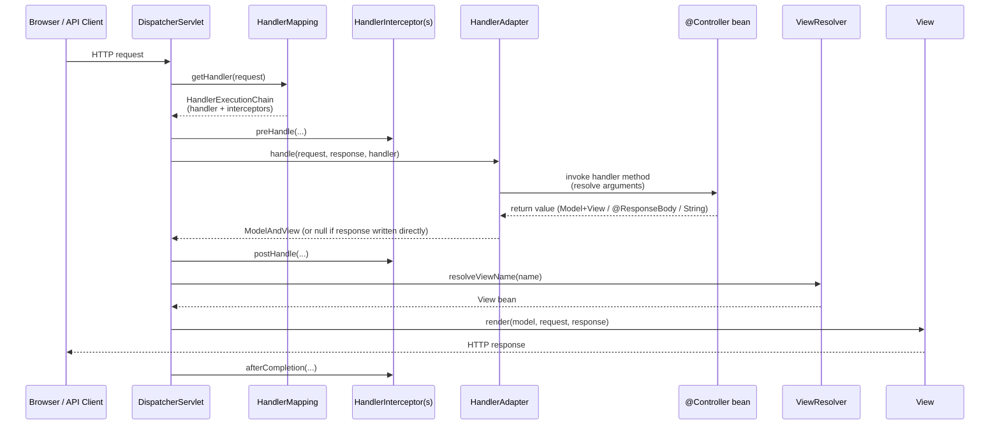

Each stage answers a Servlet-era pain point identified at the close of Chapter 2.

| Stage | Component | Servlet-era friction it resolves |
|-------|-----------|----------------------------------|
| Routing | `HandlerMapping` (e.g. `RequestMappingHandlerMapping`) | Per-Servlet `@WebServlet` / `web.xml` URL mapping; no central, declarative routing surface |
| Dispatch | `HandlerAdapter` (e.g. `RequestMappingHandlerAdapter`) | Hand-written `if/else` on HTTP method inside `service()`; no typed parameter binding |
| Cross-cutting hooks | `HandlerInterceptor` (`preHandle`, `postHandle`, `afterCompletion`) | Filter-only extension model with no access to typed handlers, models, or business semantics |
| Model carriage | `Model`, `ModelMap`, `ModelAndView` | Manual `request.setAttribute("name", value)` everywhere |
| View selection | `ViewResolver` chain | Hard-coded JSP path in `RequestDispatcher.forward("/WEB-INF/foo.jsp")` |
| View rendering | `View` (e.g. `JstlView`, `ThymeleafView`, JSON view) | View technology baked into controller; no content negotiation |
| Error handling | `HandlerExceptionResolver` | Try/catch in every Servlet; no global, declarative error mapping |

Several structural facts about this pipeline reward attention. First, the `DispatcherServlet` is itself a `Servlet` registered with the underlying container (Tomcat, Jetty, Undertow), so the entire Spring MVC apparatus runs **inside** the same Servlet contract dissected in Chapter 2. The `init`/`service`/`destroy` lifecycle, the single-instance multi-threaded execution model, and the `HttpServletRequest`/`HttpServletResponse` objects are still there—the framework simply funnels every request through a single Servlet that knows how to delegate intelligently.

Second, the pipeline is partitioned across **two cooperating `ApplicationContext`s** that together form the **WebApplicationContext hierarchy**: a *root* context, typically loaded by `ContextLoaderListener` and containing services, repositories, transaction managers, and other infrastructure beans shared across the whole application; and a *servlet-scoped* context, loaded by the `DispatcherServlet` itself and containing controllers, view resolvers, handler mappings, and message converters. The servlet context is a *child* of the root context, so controllers can inject services declared in the root, but root-context beans cannot see web-tier beans. This split is the structural mechanism by which Spring keeps web-tier configuration from polluting the rest of the application and is what makes the same root context simultaneously usable from a `DispatcherServlet`, a JMS listener, a scheduled job, or a unit test.

Third, every Spring MVC interview-grade concept—`HandlerMapping`, `HandlerAdapter`, `Controller`, `ViewResolver`, `HandlerInterceptor`, content negotiation, message converters—corresponds directly to a slot in this pipeline.[^10] Mastering Spring MVC is, in operational terms, mastering which bean fills which slot and what its contract is. The remainder of this section's siblings (5.2 through 5.5) walk those slots one by one.

## 5.2 Annotation-Driven Controllers and Request Mapping

The developer surface of the pipeline is the `@Controller` programming model. A controller in Spring MVC is, true to the founding philosophy of Chapter 3, a **POJO** annotated with `@Controller` (or `@RestController`, the shorthand for `@Controller` + `@ResponseBody` on every method). It implements no framework interface, extends no framework superclass, and—if its dependencies are constructor-injected—can be instantiated and tested with `new` outside any web container. Method-level mapping annotations (`@RequestMapping` and its HTTP-specific shortcuts `@GetMapping`, `@PostMapping`, `@PutMapping`, `@DeleteMapping`, `@PatchMapping`) declare which URL patterns and HTTP methods route to which method.[^10]

The richness of this model lies in **how method parameters and return values are bound**. Where a Servlet had to pull every value out of `HttpServletRequest` by hand, Spring MVC offers a typed, declarative re-spelling of every Servlet-era accessor:

| Annotation | Servlet-era equivalent | Purpose |
|-----------|------------------------|---------|
| `@PathVariable("id") Long id` | parsing path segment from `getRequestURI()` | URL path variable extraction |
| `@RequestParam("q") String q` | `request.getParameter("q")` | Query-string or form parameter |
| `@RequestHeader("Authorization") String auth` | `request.getHeader("Authorization")` | HTTP header value |
| `@CookieValue("JSESSIONID") String sid` | iterating `request.getCookies()` | Cookie value |
| `@RequestBody Order order` | reading and parsing request body | Deserialized payload (delegates to message converters, see §5.4) |
| `@ModelAttribute("form") OrderForm form` | manual `WebDataBinder` plumbing | Bound form / command object with validation |
| `@SessionAttribute("user") User u` | `request.getSession().getAttribute("user")` | Session-scoped attribute |
| `Model` / `ModelMap` parameter | `request.setAttribute(...)` | Model population for view rendering |
| `HttpServletRequest`, `HttpServletResponse` | direct objects | Escape hatch when typed binding is insufficient |

Return values are equally varied: a `String` is interpreted as a logical view name; a `ModelAndView` carries both; a `View` instance bypasses resolution; an `@ResponseBody`-tagged return value (or any return from an `@RestController`) is serialized through message converters; a `ResponseEntity<T>` provides fine-grained control over status code, headers, and body.[^10]

Internally, this flexibility is operationalized by two extension SPIs: `HandlerMethodArgumentResolver`, which the `RequestMappingHandlerAdapter` consults to resolve each method parameter (one resolver per annotation/type pair), and `HandlerMethodReturnValueHandler`, which the same adapter consults to process whatever the method returns. Both interfaces are open—custom resolvers and handlers can be registered through `WebMvcConfigurer.addArgumentResolvers` / `addReturnValueHandlers`—so the apparent magic of `@PathVariable` or `@RequestBody` is, mechanism-side, an ordered chain of strategy beans that each declare whether they support a given parameter or return type and, if so, how to resolve it. A representative controller pulls the model together:

```java
@RestController
@RequestMapping("/api/customers")
public class CustomerController {

    private final CustomerService customerService;

    public CustomerController(CustomerService customerService) {
        this.customerService = customerService;
    }

    @GetMapping("/{id}")
    public ResponseEntity<Customer> getCustomer(@PathVariable Long id) {
        return customerService.findById(id)
            .map(ResponseEntity::ok)
            .orElse(ResponseEntity.notFound().build());
    }

    @PostMapping
    public ResponseEntity<Customer> create(@Valid @RequestBody CustomerForm form) {
        Customer saved = customerService.create(form);
        URI location = URI.create("/api/customers/" + saved.getId());
        return ResponseEntity.created(location).body(saved);
    }
}
```

Three observations frame this code as the sustained execution of Spring's founding philosophy. First, the class is a POJO; the only Spring-touching surface is the metadata of annotations, none of which the class needs in order to compile or be tested. Second, the handler signature reads as a domain-level statement of intent—"given an `id`, return a `Customer` or 404"—with all of the Servlet-era plumbing pushed into argument resolvers and return-value handlers. Third, this annotation-driven model **replaced the earlier interface-based `Controller` hierarchy of Spring 2.x** (`AbstractController`, `MultiActionController`, `SimpleFormController`, etc.), which had required handlers to extend framework classes. The shift from inheritance to annotations is another instance of the same posture Chapter 3 identified: the framework adapts to the developer's class shape rather than imposing one. Modern Spring developers use annotations almost exclusively, and the older `Controller` interface, while still supported, is effectively a vestige.

## 5.3 View Resolution, Templating, and Content Negotiation

Once a handler method has run, the `DispatcherServlet` must turn whatever the controller produced into a rendered HTTP response body. For non-`@ResponseBody` returns, this is the job of the **`ViewResolver` chain**, which sits at the heart of Spring MVC's answer to one of the most stubborn frictions catalogued at the end of Chapter 2: the tight coupling between controller and view. The framework ships with a hierarchy of resolvers that together cover almost every server-side view technology in use.[^11]

| Resolver | Responsibility |
|----------|----------------|
| `AbstractCachingViewResolver` | Caches resolved `View` instances; subclasses inherit caching semantics; `cache` property and `removeFromCache(name, locale)` for runtime refresh[^11] |
| `UrlBasedViewResolver` | Direct logical-name-to-URL resolution without explicit mapping; the base for prefix/suffix-style resolvers[^11] |
| `InternalResourceViewResolver` | Subclass of `UrlBasedViewResolver` for `InternalResourceView` and `JstlView`—i.e., Servlets and JSPs—configured with prefix (e.g. `/WEB-INF/views/`) and suffix (e.g. `.jsp`)[^12][^11] |
| `FreeMarkerViewResolver`, `ThymeleafViewResolver`, etc. | Templating-engine-specific subclasses of `UrlBasedViewResolver`[^11] |
| `BeanNameViewResolver` | Treats the view name as a Spring bean name in the context, allowing `View` beans to be defined directly in configuration—useful for mixing view types[^11] |
| `ContentNegotiatingViewResolver` | Does not resolve views itself but delegates to other resolvers and selects the result whose `Content-Type` matches what the client requested via `Accept` header, file extension, or query parameter[^11] |

The **`InternalResourceViewResolver`** deserves a closer look because it is "perhaps the most iconic and frequently used view resolver in the history of the Spring Framework"[^12] and because its behaviour reveals a structural subtlety of the entire chain. Its job is to bridge logical view names returned by controllers and physical files in the web folder, typically JSPs under `/WEB-INF/views/`. A canonical Java configuration is concise:

```java
@Bean
public ViewResolver viewResolver() {
    InternalResourceViewResolver resolver = new InternalResourceViewResolver();
    resolver.setPrefix("/WEB-INF/jsp/");
    resolver.setSuffix(".jsp");
    resolver.setViewClass(org.springframework.web.servlet.view.JstlView.class);
    return resolver;
}
```

A controller returning the string `"welcome"` will, under this configuration, dispatch to `/WEB-INF/jsp/welcome.jsp`, with the `JstlView` class additionally exposing the localization context so that JSTL `<fmt:message>` tags can resolve against a configured `MessageSource` without any extra controller logic.[^12] Because JSPs sit under `/WEB-INF/`, they cannot be served directly to clients—only through a Spring controller, ensuring authentication, authorization, and model preparation always run first.[^12]

Two design points complete the picture. First, **resolvers can be chained**: each has an `order` property, and the `DispatcherServlet` iterates through them in ascending order. The contract of `ViewResolver` says it can return `null` if it cannot find a view, allowing the next resolver in the chain to try.[^11] But `InternalResourceViewResolver` is a special case: because it delegates through `RequestDispatcher` and the only way to determine whether a JSP exists is to actually attempt the dispatch, it cannot return `null`—it always claims the view name. Consequently, "`InternalResourceViewResolver` should almost always be the last one in the chain (highest order value). If it is placed first, it will consume the view name, and the subsequent resolvers will never be called."[^12][^11]

Second, **the `redirect:` and `forward:` prefixes** offer programmatic control over dispatch type without a separate `RedirectView` or `InternalResourceView` instance. A logical view name `redirect:/myapp/some/resource` performs a redirect relative to the current Servlet context, while `redirect:https://myhost.com/some/path` redirects to an absolute URL.[^11] The `forward:` prefix is equivalent to a `RequestDispatcher.forward()` and is useful when another view technology is in play but a server-side forward to a Servlet/JSP is still wanted.[^11]

When a single application must serve the same data as HTML for browsers, JSON for SPAs, and XML for legacy clients, the **`ContentNegotiatingViewResolver`** orchestrates the selection. It compares the request media types (drawn from the `Accept` header, a query parameter such as `?format=pdf`, or—historically—a file extension) against the `Content-Type` each candidate `View` declares it can produce, and returns the first compatible match. If no resolver in its delegate chain can satisfy the request, a configured list of `DefaultViews` provides a singleton fallback.[^11] Wildcards in the `Accept` header (e.g. `text/*`) are honored, matching any view whose `Content-Type` falls under the wildcard.[^11]

There is, however, a contemporary caveat. As one practitioner observed bluntly, "ContentNegotiation based on the Browser-Accept-Header is absolutely evil … just use separate URLs (e.g. via file extension) for separate content!"[^13] The complaint—echoed in extended community discussion—is that browsers send unpredictable `Accept` headers, and that mixing `ContentNegotiatingViewResolver` with `@ResponseBody`/`HttpMessageConverter` can produce surprising precedence between view-based and message-converter-based rendering paths.[^13] The practical resolution adopted by most modern teams is the one the next section describes: for REST endpoints, bypass view resolution entirely and let message converters handle representation directly, reserving the view-resolver chain for traditional server-rendered HTML.

## 5.4 Building REST APIs: Message Converters, @RequestBody, and @ResponseBody

By the late 2000s, the rise of single-page applications and mobile clients had made JSON over HTTP the dominant Java web workload, and Spring MVC's most consequential evolution was its adaptation of the same `DispatcherServlet` pipeline to support **non-view, payload-oriented endpoints**. The mechanism is the **`HttpMessageConverter`** abstraction: a strategy interface for marshalling and unmarshalling Java objects to and from HTTP request/response bodies in a particular format.[^14]

When `@RequestBody` is present on a parameter, the `RequestMappingHandlerAdapter` consults the registered converters, finds one whose `canRead` method returns `true` for the parameter type and the request's `Content-Type` header, and uses it to deserialize the body.[^14] When `@ResponseBody` is present on a return value (or implied by `@RestController`), the symmetric path runs: the adapter selects a converter whose `canWrite` returns `true` for the return type and one of the media types listed in the request's `Accept` header, and uses it to serialize the response. **No view resolver is consulted; the response is committed directly by the converter.**

Spring loads a baseline set of converters by default, with additional converters auto-registered when their underlying libraries are on the classpath:[^14]

| Converter | Format | Notes |
|-----------|--------|-------|
| `ByteArrayHttpMessageConverter` | `application/octet-stream` | Raw byte arrays |
| `StringHttpMessageConverter` | `text/plain` | String bodies |
| `ResourceHttpMessageConverter` | Any | `Resource` objects, supports byte-range requests |
| `SourceHttpMessageConverter` | XML | `javax.xml.transform.Source` |
| `FormHttpMessageConverter` | `application/x-www-form-urlencoded` | HTML form data |
| `MappingJackson2HttpMessageConverter` | `application/json` | Auto-registered when Jackson is on the classpath |
| `Jaxb2RootElementHttpMessageConverter` | `application/xml` | Auto-registered when JAXB is available |

The classpath-driven auto-registration—discussed by one practitioner guide as Spring picking up "the related library is in the classpath"[^14]—is the same kind of conditional bean registration that, once generalized in Spring Boot, becomes the entire foundation of auto-configuration (Chapter 7).

The flow that ties annotations and converters together is straightforward. As a published guide summarizes content negotiation:

1. With each new request, Spring uses the `Accept` header to determine the representation the client wants.
2. The `Content-Type` header indicates the media type of the request body.
3. These headers help the server (or client) select the correct converter.
4. Spring locates a converter that can read the request and write the response; if none matches, an exception is thrown.[^14]

A canonical pair of handlers makes the bidirectional contract concrete:

```java
@PostMapping(value = "/greeting")
public @ResponseBody void greeting(@RequestBody Customer customer) {
    // create customer
}

@GetMapping(value = "/greeting")
public @ResponseBody Customer greeting() {
    return new Customer(14, "Java Dev Journal");
}
```

A `POST` with `Content-Type: application/json` and the JSON body `{"id":"14","name":"Java Dev Journal"}` returns `200 OK`, with the JSON converter binding the body to the `Customer` parameter; a `GET` with `Accept: application/json` returns `{"id":14,"name":"Java Dev Journal"}`, with the same converter serializing the return value.[^14]

For finer control over status codes and headers, controllers return **`ResponseEntity<T>`**, a wrapper combining a body, headers, and an HTTP status. `ResponseEntity.created(uri).body(saved)` returns `201 Created` with a `Location` header; `ResponseEntity.notFound().build()` returns `404 Not Found` without a body; `ResponseEntity.status(HttpStatus.CONFLICT).body(error)` returns any explicit status. Customising the converter list is straightforward—`WebMvcConfigurer.configureMessageConverters` allows a custom converter to be registered in the chain. A practitioner example uses `MarshallingHttpMessageConverter` with an `XStreamMarshaller` to read and write XML, registering it explicitly so that an `Accept: application/xml` request is served from the same controller as `Accept: application/json`.[^14]

A higher-level extension worth noting in the REST context is **Spring HATEOAS**, a library that adds hypermedia discoverability to Spring MVC responses. The principle, in its own words, is that "the API should guide the client through the application by returning relevant information about the next potential steps, along with each response,"[^15] decoupling client from server URI structure. The library's three abstractions—`RepresentationModel`, `Link`, and `WebMvcLinkBuilder`—operate above the existing pipeline rather than altering it.[^15][^16] Resource classes extend `RepresentationModel` to inherit an `add(Link)` method, and links are built type-safely against controller methods rather than as hard-coded strings:

```java
Link selfLink = linkTo(CustomerController.class).slash(customerId).withSelfRel();
Link ordersLink = linkTo(methodOn(CustomerController.class)
    .getOrdersForCustomer(customerId)).withRel("allOrders");
customer.add(selfLink);
customer.add(ordersLink);
```

The `methodOn()` proxy makes a dummy invocation on a proxy controller to capture the method and path-variable bindings,[^15] so refactoring a controller's URL pattern automatically refactors every link that pointed at it. Responses are serialized in `application/hal+json` by default, with a `_links` JSON object whose property names are link relations and whose values are link objects containing `href`.[^16] For collections, `CollectionModel<T>` aggregates resources and provides the same `add(Link)` surface, while `RepresentationModelAssemblerSupport<E, M>` standardizes the conversion from JPA-style entities to representation models with `toModel()` and `toCollectionModel()`.[^16] HATEOAS is, in this report's framing, an instructive illustration that **Spring MVC's pipeline is open at every layer**: a sophisticated hypermedia capability can be layered on top without touching the dispatcher, the converters, or the controllers themselves.

## 5.5 Data Binding, Validation, and Exception Handling

Three concerns that the Servlet/JSP stack had forced into ad-hoc imperative code—data binding, validation, and exception handling—are unified in Spring MVC under a single declarative, AOP-aligned design pattern.

**Data binding** is the conversion of raw HTTP parameters and bodies into typed Java objects. The mechanism is the `WebDataBinder`, configured per-handler-method through `@InitBinder` callbacks, and the `ConversionService` (the modern replacement for the older `PropertyEditor` model) that converts string parameters to typed values such as `LocalDate`, `BigDecimal`, or custom domain types. When a parameter is annotated `@ModelAttribute` (or, by convention, when an unannotated complex type appears in the parameter list), the binder constructs the target, populates each property from the request, and reports any failures through a `BindingResult`. Because `BindingResult` is itself a method parameter—conventionally placed immediately after the bound object—the controller can inspect errors imperatively without exceptions being thrown:[^10]

```java
@PostMapping("/orders")
public String submit(@Valid @ModelAttribute("order") OrderForm form,
                     BindingResult result, Model model) {
    if (result.hasErrors()) {
        return "order-form";
    }
    // ...
}
```

**Validation** rides on top of binding. Spring integrates the **JSR-303 / JSR-380 Bean Validation** standard through the `@Valid` and `@Validated` annotations, which trigger validation of the bound object after binding completes; constraints are declared on the model class itself with annotations such as `@NotBlank`, `@Size`, `@Email`, `@Min`, and `@Max`.[^10] Custom validation that cannot be expressed with standard constraints is implemented through `ConstraintValidator<Annotation, Type>`, with validators registered as Spring beans so they can themselves participate in dependency injection.[^10] Validation errors flow into the same `BindingResult` as binding errors and, in REST contexts, into a `MethodArgumentNotValidException` that can be handled globally.

**Exception handling**, finally, completes the trio. Spring MVC offers a layered model whose three tiers mirror the levels at which exceptions naturally arise:

| Mechanism | Scope | Use |
|-----------|-------|-----|
| `@ExceptionHandler`-annotated method on a `@Controller` | Per-controller | Localized handling for exceptions raised inside that controller's handler methods[^10] |
| `@ControllerAdvice` / `@RestControllerAdvice` class with `@ExceptionHandler` methods | Application-wide (or filtered by package, annotation, or assignable type) | Cross-cutting, global error mapping[^10] |
| `ResponseStatusException`, `@ResponseStatus` on custom exceptions, `ResponseEntityExceptionHandler` base class | Specific exception types or HTTP status | Idiomatic mapping of exceptions to HTTP responses[^10] |

A representative `@RestControllerAdvice` consolidates global error handling for an API:

```java
@RestControllerAdvice
public class GlobalExceptionHandler {

    @ExceptionHandler(MethodArgumentNotValidException.class)
    public ResponseEntity<ErrorResponse> onValidation(MethodArgumentNotValidException ex) {
        // ... map field errors to ErrorResponse ...
        return ResponseEntity.badRequest().body(body);
    }

    @ExceptionHandler(EntityNotFoundException.class)
    @ResponseStatus(HttpStatus.NOT_FOUND)
    public ErrorResponse onNotFound(EntityNotFoundException ex) {
        return new ErrorResponse("not_found", ex.getMessage());
    }
}
```

Read in the report's lens, all three—binding, validation, exception handling—are instances of the same underlying pattern: **declarative metadata on POJOs is interpreted by an interceptor-style mechanism that wraps the developer's code**. The mechanism is the `RequestMappingHandlerAdapter` and its argument resolvers (for binding and validation) and the `HandlerExceptionResolver` chain (for exception handling); the metadata is `@Valid`, `@ModelAttribute`, `@ExceptionHandler`, `@ControllerAdvice`. The same posture that Chapter 4 dissected for `@Transactional` applies here: the controller method body remains a clean expression of business intent, and the cross-cutting concern is composed in by the framework. This pattern is what makes Spring MVC feel uniform from one project to the next, and it is also the pattern that the data-access half of the chapter, beginning in §5.6, will repeat one layer down.

## 5.6 From JDBC Boilerplate to JdbcTemplate

The persistence side of the chapter begins where every Java developer of the late 1990s began: with raw JDBC. Working directly against the JDBC API to read a single row required, at minimum, acquiring a `Connection` from a pool, creating a `PreparedStatement`, setting parameters by ordinal, executing the query, iterating the `ResultSet`, mapping each row to an object, closing the result set, closing the statement, closing the connection, and—crucially—doing all of this in `try`/`catch`/`finally` blocks that handled both `SQLException` and the cleanup paths for partial failures. A single read-and-map operation could easily run to thirty lines of which only two or three were domain-meaningful. Multiply this across an application's repositories, mix in the vendor-specific `SQLException` codes that varied between Oracle, DB2, PostgreSQL, and MySQL, and the result was the JDBC pain landscape that motivated EJB Container-Managed Persistence in the first place.

`JdbcTemplate`, introduced in Spring 1.0, is a textbook application of the **Template Method pattern** to this problem space. The fixed parts—connection acquisition and release, statement preparation, exception translation, resource cleanup on every code path—are absorbed into the template; the variable parts—the SQL string, parameter binding, and row mapping—are supplied by the developer as either inline arguments or strategy callbacks (`RowMapper<T>`, `ResultSetExtractor<T>`, `RowCallbackHandler`). The methods on the template form a small, regular vocabulary:

| Method family | Purpose |
|---------------|---------|
| `queryForObject(sql, RowMapper, args)` | Single-row, single-object read |
| `query(sql, RowMapper, args)` | Multi-row read returning `List<T>` |
| `query(sql, ResultSetExtractor, args)` | Custom aggregation across the result set |
| `update(sql, args)` | INSERT / UPDATE / DELETE returning affected row count |
| `batchUpdate(sql, BatchPreparedStatementSetter)` | Bulk update in a single round trip |
| `execute(sql)` | DDL or arbitrary statements |

A representative reading example collapses the thirty-line raw-JDBC routine to a single expression:

```java
Customer customer = jdbcTemplate.queryForObject(
    "SELECT id, name, company FROM customers WHERE id = ?",
    (rs, rowNum) -> new Customer(rs.getLong("id"),
                                 rs.getString("name"),
                                 rs.getString("company")),
    customerId);
```

The developer writes the SQL, the parameter, and the `RowMapper`. The template handles everything else, including release of the connection back to the pool on both success and failure paths and translation of any `SQLException` into a Spring `DataAccessException` (covered in §5.8).

Two ergonomic refinements address the sharper edges of the API. **`NamedParameterJdbcTemplate`** replaces ordinal `?` placeholders with named markers, eliminating the bug class where a developer adds a parameter in the SQL but forgets to shift the corresponding `setXxx(int, value)` call:

```java
Map<String, Object> params = Map.of("id", customerId);
namedJdbc.queryForObject(
    "SELECT id, name FROM customers WHERE id = :id",
    params, customerRowMapper);
```

**`SimpleJdbcInsert`** wraps the common case of inserting into a single table with auto-generated keys, inferring column names from a `Map<String,Object>` of input values and returning the generated key:

```java
SimpleJdbcInsert insert = new SimpleJdbcInsert(dataSource)
    .withTableName("customers")
    .usingGeneratedKeyColumns("id");
Number id = insert.executeAndReturnKey(Map.of(
    "name", "Jane",
    "company", "ABC"));
```

Read against the report's lens, `JdbcTemplate` is the **first concrete demonstration of Rod Johnson's claim from Chapter 3 that EJB Container-Managed Persistence was not necessary to deliver clean data access**. The same boilerplate that CMP eliminated through deployment-time code generation, abstract bean classes, and EJB-QL descriptors is here eliminated through a plain Java class that encapsulates the resource-management ritual and accepts strategy callbacks for the parts only the developer can supply. There are no abstract subclasses generated by tooling, no `<query>` blocks in XML, no home interfaces to write, and no application server to deploy into; there is a `DataSource` bean, a `JdbcTemplate` bean, and a repository class. The developer keeps full control over the SQL—a deliberate design choice, because Johnson's critique of CMP was precisely that hiding the SQL behind container-generated code obscured the place where most performance and correctness bugs lived—while losing every line of plumbing that did not contribute to the SQL. The same posture (template absorbs ritual, strategy supplies variation) recurs in `JmsTemplate`, `RestTemplate`, `RedisTemplate`, and, in spirit, the entire Spring template family.

## 5.7 Declarative Transaction Management

The most influential service the EJB container provided, as Chapter 3 documented, was declarative transaction management: tag a method `Required` and the container guarantees atomic execution. Spring's data-access stack would not have been credible without an equivalent. Its solution—delivered without any of EJB's programming-model intrusion—rests on two pieces: a portable transaction abstraction and an AOP-driven proxy that applies it.

The abstraction is **`PlatformTransactionManager`**, a small interface with three methods (`getTransaction`, `commit`, `rollback`) that Spring implements once per backing technology. The implementations form a unified facade over heterogeneous transactional resources:

| Implementation | Backing technology | Use |
|----------------|--------------------|-----|
| `DataSourceTransactionManager` | Plain JDBC `DataSource` | Most common; coordinates JDBC/JdbcTemplate transactions |
| `JpaTransactionManager` | JPA `EntityManagerFactory` | JPA / Hibernate-as-JPA-provider |
| `HibernateTransactionManager` | Native Hibernate `SessionFactory` | Native Hibernate without JPA |
| `JtaTransactionManager` | JTA `UserTransaction` / `TransactionManager` | XA / two-phase commit across multiple resources |

This is, structurally, the same indirection EJB used—delegate to a transaction manager—but delivered as a Spring bean injected into application configuration rather than a container service tied to an application server. Switching from local JDBC transactions to distributed XA transactions becomes a configuration change of which `PlatformTransactionManager` bean is registered; the application code is unchanged.

The developer surface is **`@Transactional`**. Placed on a service-layer method (or, less commonly, a class), the annotation declares that invocations of the method should run inside a transaction whose attributes—propagation, isolation, timeout, read-only flag, rollback rules—are taken from the annotation's parameters. At startup, Spring wraps the bean in an AOP proxy (the mechanism Chapter 4 dissected) whose interceptor logic, on each invocation, asks the `PlatformTransactionManager` to begin or join a transaction, calls through to the real method, and then asks the manager to commit or roll back depending on the outcome. The same `@Transactional` annotation drives the behaviour whether the underlying technology is JDBC, JPA, Hibernate, or JTA, because the proxy talks only to the abstraction.

The propagation vocabulary deliberately mirrors—and effectively absorbs—the EJB transaction-attribute vocabulary catalogued in §3.3, because the underlying conceptual problem (what to do when a transactional method is called from inside another transactional method) is the same:

| Propagation | Behaviour |
|-------------|-----------|
| `REQUIRED` (default) | Join existing transaction if present; otherwise start a new one |
| `REQUIRES_NEW` | Always start a new transaction; suspend any existing one |
| `NESTED` | Run inside a nested savepoint within the existing transaction |
| `SUPPORTS` | Run in the existing transaction if present; otherwise non-transactionally |
| `NOT_SUPPORTED` | Suspend any existing transaction; run non-transactionally |
| `MANDATORY` | Require an existing transaction; otherwise throw |
| `NEVER` | Require no existing transaction; otherwise throw |

Other parameters tune the same envelope: `isolation` selects the SQL isolation level, `timeout` aborts long-running work, `readOnly = true` allows the JPA provider and database driver to apply read-only optimizations, and `rollbackFor` / `noRollbackFor` override the default rollback rule.

That default rollback rule deserves explicit attention because it is one of the canonical pitfalls of the proxy mechanism. Spring rolls back **only on unchecked exceptions** (`RuntimeException` and `Error`) by default; checked exceptions thrown from a `@Transactional` method commit the transaction and propagate the exception to the caller. The rationale is historical—aligning with EJB's defaults—but the practical consequence is that a service method that throws a domain-level checked `BusinessRuleViolationException` after writing partial state will commit that partial state unless the annotation explicitly declares `rollbackFor = BusinessRuleViolationException.class`.

The second canonical pitfall is **self-invocation bypassing the proxy**. Because `@Transactional` is implemented by an external proxy that wraps the bean, the transactional behaviour applies only when the method is called *from outside* the bean, through the proxy. If a method within the same class invokes another `@Transactional` method on `this`, the call goes directly to the implementation, not through the proxy, and no transaction interception occurs. The same hazard applies to other proxy-based annotations such as `@Async` and `@Cacheable`. Workarounds include extracting the called method into a separate bean (so the call crosses a proxy boundary) or, in tightly constrained cases, using AspectJ-mode AOP weaving to instrument the class itself rather than wrapping it in a proxy. Mastery of this pitfall is one of the clearest indicators that a developer has internalised the proxy mechanism Chapter 4 introduced rather than treating annotations as magic.

## 5.8 Unified Exception Translation and ORM Integration

The third leg of Spring's data-access stool is the **`DataAccessException` hierarchy**, an unchecked, technology-agnostic exception model that unifies the wildly inconsistent native error vocabularies of different databases and ORMs. The motivation is that raw JDBC reports failures through `SQLException`, whose `errorCode` and `SQLState` values vary by vendor (an Oracle "duplicate key" is `ORA-00001`, MySQL's is `1062`, PostgreSQL's `SQLState` is `23505`); native Hibernate uses its own `HibernateException` hierarchy; JPA uses `PersistenceException`. Application code that wanted to react to "duplicate key" or "deadlock detected" or "data integrity violation" had to either embed vendor knowledge or wrap each call site in a try/catch ladder.

Spring's `SQLExceptionTranslator` (typically `SQLErrorCodeSQLExceptionTranslator`, configured with vendor-specific error-code mappings shipped in `sql-error-codes.xml`) maps native errors to a single hierarchy whose top-level branches—`DataAccessException`, with subclasses such as `DataIntegrityViolationException`, `DuplicateKeyException`, `DeadlockLoserDataAccessException`, `OptimisticLockingFailureException`, `CannotAcquireLockException`, `EmptyResultDataAccessException`—are vendor- and technology-neutral. `JdbcTemplate` performs this translation automatically on every call, so the application catches `DuplicateKeyException` regardless of whether the underlying database is Oracle, MySQL, or PostgreSQL.

Crucially, the same translation philosophy applies whether the underlying technology is plain JDBC, Hibernate, or JPA. Spring's ORM integration modules wrap their respective providers' exception types (`HibernateException`, `JPAException`) into the same `DataAccessException` hierarchy through a `PersistenceExceptionTranslator` SPI, with `@Repository`-annotated classes getting automatic exception translation through a `PersistenceExceptionTranslationPostProcessor` that wraps them in a translating proxy. The architectural consequence is significant: **a service method working through a Spring Data JPA repository, a `JdbcTemplate`, and a native Hibernate session will throw exceptions from a single, uniform hierarchy**, and a `@ControllerAdvice`-level handler can map a `DataIntegrityViolationException` to a `409 Conflict` response without caring which data-access path produced it.

ORM integration itself is wired into the same factory-bean and transaction-manager surface. A JPA application typically declares a `LocalContainerEntityManagerFactoryBean` (which builds the JPA `EntityManagerFactory` from a `DataSource`, a packages-to-scan list, and Hibernate properties), a `JpaTransactionManager` over that factory, and any number of repositories that inject `EntityManager` references via `@PersistenceContext`. A native Hibernate application uses `LocalSessionFactoryBean` and `HibernateTransactionManager` instead. Either way, the application's services see a consistent surface: `@Transactional` for transaction boundaries, `DataAccessException` subtypes for failures, repositories for data access. Historically the framework offered `HibernateTemplate` as a JdbcTemplate-style wrapper, but modern practice is to use the native `EntityManager` or `Session` directly, since the modern JPA/Hibernate APIs already expose a clean enough surface that an additional template layer is no longer necessary—the resource-management ritual that motivated `JdbcTemplate` simply does not exist at the JPA level, because the `EntityManager` itself is managed by the transaction-bound persistence context.

This unification is the deeper engineering reason Spring's data access felt consistent across stacks where EJB CMP had felt brittle. CMP delivered a single programming model but only inside its own deployment-descriptor-driven mapping framework, with no answer when teams needed to reach for native SQL, stored procedures, or third-party ORMs. Spring delivered a *family* of programming models—JdbcTemplate, JPA via repositories, native Hibernate, R2DBC, JDO—each idiomatic for its underlying technology, but stitched together by a common transaction abstraction and a common exception hierarchy. Mixing them in a single application is genuinely possible: a service method tagged `@Transactional` can read through a Spring Data JPA repository, write through a `JdbcTemplate.update`, and have both operations enrolled in the same database transaction, with any failure on either path translated into the same `DataAccessException` family.

## 5.9 Spring Data and Repository Abstractions

`JdbcTemplate` removed JDBC ritual. Spring Data, layered above it and JPA, removed *repository* ritual—the boilerplate of writing CRUD methods that almost always had the same shape across entities. Its central abstraction is the **repository pattern**, applied uniformly across heterogeneous stores through a hierarchy of generic interfaces:

```
Repository<T, ID>                              (marker)
   └── CrudRepository<T, ID>                   (CRUD)
         └── PagingAndSortingRepository<T, ID> (+ pagination/sorting)
               └── JpaRepository<T, ID>        (+ JPA-specific)
```

A developer using Spring Data JPA declares an interface, parameterized by entity and ID type, and gets a working repository at startup:

```java
public interface CustomerRepository extends JpaRepository<Customer, Long> {
    List<Customer> findByLastName(String lastName);
    List<Customer> findByLastNameAndAgeGreaterThan(String lastName, int age);
    Page<Customer> findByCompany(String company, Pageable pageable);
}
```

No implementation class is written. At application startup, Spring Data scans the classpath for repository interfaces, parses each method name into a derived query (`findByLastNameAndAgeGreaterThan` becomes `WHERE last_name = ?1 AND age > ?2`), and produces a **dynamic proxy** that implements the interface by delegating each method to either a derived-query executor or, for the inherited CRUD methods, the underlying `EntityManager`. The mechanism—proxy generation at startup, with method dispatch driven by metadata on the interface—is the same posture introduced for AOP in Chapter 4, applied to a different cross-cutting concern.

When method-name conventions are insufficient, **`@Query`** allows explicit JPQL or native SQL on the interface method:

```java
@Query("SELECT c FROM Customer c WHERE c.email LIKE %:domain")
List<Customer> findByEmailDomain(@Param("domain") String domain);
```

For programmatic, type-safe queries built at runtime, **JPA Criteria via `Specification<T>`** and **Querydsl via `QuerydslPredicateExecutor<T>`** integrate with the repository surface, allowing the same repository to serve both convention-driven and dynamic-query workloads. **`Pageable`** and **`Sort`** parameters provide standard pagination and ordering, and Spring MVC's `PageableHandlerMethodArgumentResolver` maps query-string parameters (`?page=2&size=20&sort=lastName,asc`) directly to `Pageable` arguments on controller methods, joining the web tier and data tier through a single declarative idiom.[^10]

The pattern's reach extends across the **Spring Data family** of modules, each adapted to a specific store:

| Module | Store paradigm |
|--------|----------------|
| Spring Data JPA | Relational via JPA |
| Spring Data JDBC | Relational via plain JDBC, no JPA |
| Spring Data MongoDB | Document |
| Spring Data Redis | Key-value / caches |
| Spring Data Cassandra | Wide-column |
| Spring Data Elasticsearch | Search |
| Spring Data R2DBC | Reactive relational |

Each module preserves the same programming model—`Repository` interfaces, derived query methods, `@Query` with the appropriate query language for the store, `Pageable`/`Sort`, custom implementation fragments—while exposing store-specific extensions (e.g. `@Document` for MongoDB, `@Indexed` for Redis, `Criteria` builders specific to each store). A team that has internalised the repository pattern in JPA can move to MongoDB with comparatively little new conceptual learning; what changes is the entity mapping and the query language, not the way repositories are written, scanned, and injected.

Auxiliary features extend the convention-driven surface further. **Auditing** (`@CreatedBy`, `@CreatedDate`, `@LastModifiedBy`, `@LastModifiedDate`) populates audit fields automatically when entities are persisted or updated, using an `AuditorAware` bean to supply the current user. **Projections**—either DTO interfaces with property accessors or class-based DTOs with constructor expressions—allow queries to return only the fields actually needed, sparing the cost of hydrating full entities. **Entity callbacks** (`@PrePersist`, `@PostLoad`, etc.) hook into entity lifecycle events for cross-cutting model behaviour. Each of these is a small declarative facility that, in the report's lens, plays the same role at the data layer that argument resolvers, validators, and exception handlers play at the web layer: a slot for cross-cutting concerns that the framework operationalises so the application can stay POJO-shaped.

## 5.10 Synthesis: A Consistent Design Pattern from HTTP to Database

Stepping back from the individual subsystems, the chapter's argument is best summarised by tracing a single end-to-end request and noting how the same design pattern recurs at each layer. Suppose a JSON `POST /api/orders` arrives at a Spring Boot service running embedded Tomcat:

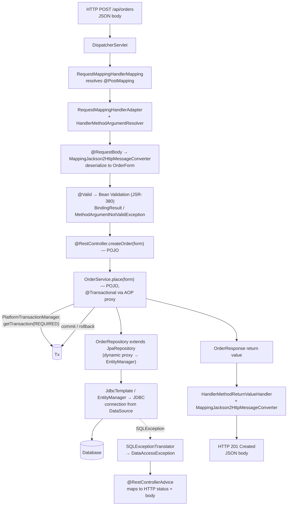

At every transition, the same playbook applies. The **POJO programming model** keeps the `OrderForm`, `Order`, `OrderService`, `OrderRepository`, and `OrderController` as plain Java classes, none of which implements a framework interface. **Annotation-driven configuration** (`@PostMapping`, `@RequestBody`, `@Valid`, `@Transactional`, `@RestControllerAdvice`) declares cross-cutting metadata without modifying class shape. **AOP proxies** intercept the `@Transactional` invocation to begin and commit a transaction, and would equally intercept `@PreAuthorize` for security or `@Cacheable` for caching if those were present. **Template-method abstractions**—`JdbcTemplate` for raw JDBC, the JPA `EntityManager` (managed by Spring's persistence-context machinery) for ORM, `MappingJackson2HttpMessageConverter` for JSON serialization—absorb resource management while accepting strategy callbacks (`RowMapper`, custom `Module` registrations) for variation. **Unified exception hierarchies** translate `SQLException`, `JPAException`, `MethodArgumentNotValidException`, and other heterogeneous failures into types that the controller-advice layer can map declaratively to HTTP responses.

The same pattern, applied seven times in sequence, is what gives a Spring application its characteristic feel: the controller is a few lines, the service is a few lines, the repository is an interface declaration, and the configuration is implicit in annotations. A developer familiar with one Spring application can read another with very little orientation, because every Spring application is the same playbook played on different domain nouns.

This consistency, however, comes with a cost that, by the early 2010s, had become impossible to ignore. **Each playbook slot requires configuration to fill it.** Assembling a non-trivial Spring application meant declaring, at minimum:

- A `DataSource` bean (driver class, URL, credentials, pool sizing);
- A `PlatformTransactionManager` bean wired to that `DataSource`;
- An `EntityManagerFactoryBean` (packages-to-scan, JPA properties, vendor adapter);
- `@EnableTransactionManagement`, `@EnableJpaRepositories(basePackages = ...)`, and corresponding `<tx:annotation-driven>` / `<jpa:repositories>` XML namespaces if XML was in use;
- A `DispatcherServlet` registration (in `web.xml` or a `WebApplicationInitializer`);
- A web `@Configuration` class extending `WebMvcConfigurerAdapter` (or implementing `WebMvcConfigurer`) to register message converters, argument resolvers, view resolvers, and interceptors;
- A `ViewResolver` chain (`InternalResourceViewResolver`, `ContentNegotiatingViewResolver`, etc.);
- A `MultipartResolver`, a `LocaleResolver`, a `MessageSource`;
- `@EnableWebMvc` (or `<mvc:annotation-driven>`) plus the corresponding XML namespaces or Java equivalents for any other Spring module in use—Security, AOP, Caching, Scheduling, JMS, Cloud—each with its own vocabulary;
- A Servlet container deployment (Tomcat or Jetty) configured separately, with the application packaged as a WAR.

A reasonable mid-2010 Spring application's `applicationContext.xml` and `dispatcher-servlet.xml` could together run to several hundred lines, and replacing XML with Java `@Configuration` classes—while gaining type safety—did not necessarily reduce the volume. Adding a new module (Spring Security, Spring Integration, Spring Batch, Spring Data MongoDB) meant absorbing a new namespace or a new family of `@Enable*` annotations, each with its own conventions for which beans to register and how. The friction Rod Johnson had documented in 2002 against EJB descriptors was reappearing in a new dialect inside the framework that had been built to abolish it: the *flexibility* that was Spring's greatest strength had become, in aggregate, a *configuration burden* that every team paid on every new project.

This is the agenda for the next two chapters. Chapter 6 surveys how Spring's modular philosophy expanded into a comprehensive ecosystem—Security, Integration, Batch, WebFlux, Cloud—each adding its own configuration vocabulary on top of the Core/MVC/Data foundations dissected here. Chapter 7 then traces how Spring Boot, applying the same problem→solution→new-problem lens to Spring itself, resolved the configuration burden through auto-configuration, starter dependencies, and embedded servers, completing the dialectical pattern this report has pursued from its opening pages.

# 6 The Spring Ecosystem: Security, Integration, Batch, Reactive, and Cloud

Chapter 5 closed by enumerating the configuration ledger that even a mid-sized Spring application of the early 2010s had to maintain: a `DataSource`, a `PlatformTransactionManager`, an `EntityManagerFactoryBean`, a `DispatcherServlet` registration, a `WebMvcConfigurer`, a `ViewResolver` chain, plus the namespaces or `@Enable*` annotations for every additional module pulled into the project. That ledger, however, was drawn up assuming an application that needed only the core triad of MVC, data access, and transactions. Real enterprise applications, by the mid-2010s, needed considerably more. They needed to authenticate users and enforce role- and method-level authorization. They needed to speak not only HTTP but also AMQP, JMS, Kafka, FTP, and SMTP, and to compose flows across these protocols. They needed to run nightly batch jobs over millions of rows with restartable transactions and skip-and-retry policies. They needed, increasingly, to scale to non-blocking workloads where one-thread-per-request was no longer acceptable. And they needed to operate as fleets of microservices with externalized configuration, service discovery, client-side load balancing, circuit breakers, and distributed tracing.

This chapter widens the lens to the portfolio of specialized Spring projects that grew up to address these domains: **Spring Security**, **Spring Integration**, **Spring Batch**, **Spring WebFlux**, and **Spring Cloud**. The argument that runs through each section is the same argument the report has built since Chapter 4: each module is an application of a single design posture—POJO programming model, annotation-driven configuration, AOP-proxied cross-cutting concerns, template-method abstractions, unified exception hierarchies—to a new problem domain. The coherence the developer feels when moving from Spring MVC to Spring Security or from Spring Data to Spring Integration is not a marketing achievement but the consequence of every module replaying the same five-pattern playbook. The chapter will document this replay across all five modules, then close by quantifying the *cumulative* configuration surface this expanding ecosystem produced—a surface so large that, by 2013, it had reached the threshold at which Spring's own flexibility had become its principal liability, setting the agenda for Spring Boot in Chapter 7.

## 6.1 Spring Security: Declarative Authentication, Authorization, and the Filter-Chain Model

The engineering frictions Spring Security was designed to absorb predate Spring itself. Authentication and authorization had been a Servlet-era pain point, addressed in Chapter 2 through ad-hoc session-attribute checks at the top of every controller Servlet, and only partially relieved by EJB's role-based `<method-permission>` declarations, which—as Chapter 3 noted—covered EJB methods but had nothing to say about the Servlet/JSP front end. The application security problem decomposes, as Spring Security's own architectural guide states plainly, into "two more or less independent problems: authentication (who are you?) and authorization (what are you allowed to do?)" — and Spring Security's design "is designed to separate authentication from authorization and has strategies and extension points for both."[^17]

The structural mechanism by which Spring Security operationalises this separation is a **filter chain** layered on top of the Servlet contract. As the architecture guide explains, "Spring Security in the web tier (for UIs and HTTP back ends) is based on Servlet `Filters`," and is itself "installed as a single `Filter` in the chain, and its concrete type is `FilterChainProxy`." In a Spring Boot application this filter is registered as a `@Bean` and applied to every request at a position defined by `SecurityProperties.DEFAULT_FILTER_ORDER`. Crucially, "From the point of view of the container, Spring Security is a single filter, but, inside of it, there are additional filters, each playing a special role"; the outer filter is usually a `DelegatingFilterProxy` that does not have to be a Spring `@Bean` itself, and that delegates to the `FilterChainProxy` bean conventionally named `springSecurityFilterChain`.[^17]

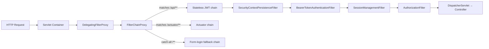

Inside the `FilterChainProxy`, multiple filter chains may coexist, each with its own request matcher, and "the Spring Security filter contains a list of filter chains and dispatches a request to the first chain that matches it" — a property which means "only one chain ever handles a request."[^17] A typical Spring Boot application without custom configuration has six chains by default, of which five exist only to ignore static-resource paths (`/css/**`, `/images/**`, `/error`); the sixth is the catch-all chain matching `/**` and contains, by default, eleven filters covering authentication, authorization, exception handling, session handling, and header writing.[^17] A practitioner-oriented summary catalogues the canonical phases:[^18]

| Phase | Filter / Component | Responsibility |
|-------|--------------------|----------------|
| 1 | `SecurityContextPersistenceFilter` | Load existing `SecurityContext` from session, or create a blank context |
| 2 | Authentication filter (`UsernamePasswordAuthenticationFilter`, `BearerTokenAuthenticationFilter`, etc.) | Attempt authentication based on credentials in the request |
| 3 | `SessionManagementFilter` / concurrency control | Apply session-fixation, concurrency, or stateless policy |
| 4 | `AuthorizationFilter` / `FilterSecurityInterceptor` | Enforce URL-level access rules |
| 5 | CSRF / CORS / header-writing filters | Enforce cross-site protections and security headers |
| 6 | Request reaches controller | Security context now holds an authenticated, authorized principal |

This decomposition of security into ordered, single-responsibility filters is the same architectural posture Spring MVC takes with `HandlerInterceptor`s and message converters, applied one layer further down the stack. Each filter is a Spring bean; each can be replaced or supplemented; the order is governed by explicit constants, with `@Bean`s of type `Filter` carrying `@Order` or implementing `Ordered` and possibly being wrapped in a `FilterRegistrationBean`.[^17]

**Authentication** is organised around a small interface, `AuthenticationManager`, whose single `authenticate()` method "can do one of 3 things … Return an `Authentication` (normally with `authenticated=true`) if it can verify that the input represents a valid principal," "Throw an `AuthenticationException` if it believes that the input represents an invalid principal," or "Return `null` if it cannot decide."[^17] The most commonly used implementation is `ProviderManager`, which delegates to a chain of `AuthenticationProvider` instances, each of which exposes an additional `supports()` method "to allow the caller to query whether it supports a given `Authentication` type," so that a single `ProviderManager` can support multiple authentication mechanisms—form login, LDAP, JWT, X.509—in one application by skipping providers whose `supports()` returns false.[^17] A `ProviderManager` may have a parent, consulted when all providers return null, "acting as a fallback for all providers."[^17]

The provider machinery is itself fed by two further abstractions that round out the day-to-day developer surface:[^19]

- **`UserDetailsService`** — a strategy interface for loading user records (username, encoded password, granted authorities) by username, with implementations such as `InMemoryUserDetailsManager` for testing, JDBC-backed managers for relational stores, and custom implementations that delegate to any user repository the application owns.
- **`PasswordEncoder`** — a strategy interface for hashing and verifying passwords, with `BCryptPasswordEncoder` as the default modern choice; the password encoder is wired into the `DaoAuthenticationProvider` so that submitted credentials are compared against stored hashes rather than plaintext.

A canonical configuration assembles these pieces explicitly:[^19]

```java
@Configuration
public class SecurityConfig {
    @Bean
    public SecurityFilterChain securityFilterChain(HttpSecurity http) throws Exception {
        http.csrf(csrf -> csrf.disable())
            .authorizeHttpRequests(auth -> auth
                .requestMatchers("/public/**").permitAll()
                .anyRequest().authenticated())
            .httpBasic();
        return http.build();
    }

    @Bean
    public PasswordEncoder passwordEncoder() {
        return new BCryptPasswordEncoder();
    }

    @Bean
    public UserDetailsService userDetailsService(PasswordEncoder encoder) {
        return new InMemoryUserDetailsManager(
            User.withUsername("john").password(encoder.encode("password")).roles("USER").build(),
            User.withUsername("admin").password(encoder.encode("admin123")).roles("ADMIN").build());
    }
}
```

Once authentication has succeeded, the resulting `Authentication` is stored on a thread-local `SecurityContext`, accessible through the static `SecurityContextHolder.getContext().getAuthentication()` and routinely consulted from controllers, services, and AOP advice.[^19] As the architecture guide notes, "Spring Security is fundamentally thread-bound, because it needs to make the current authenticated principal available to a wide variety of downstream consumers," and the `SecurityContextHolder` "manipulate[s] a `ThreadLocal`."[^17] This thread-local model interacts non-trivially with asynchronous and reactive execution: code that dispatches work to background threads through `@Async` must propagate the security context manually, for which Spring Security supplies wrappers for `Runnable` and `Callable` and an `AsyncConfigurer` integration point so that "the `Executor` is of the correct type."[^17] Mastery of this propagation rule is, in practice, one of the canonical sources of bugs in security-aware applications, and the rule itself reappears in Chapter 6.4's discussion of reactive web stacks.

**Authorization** is structurally parallel to authentication. Once a principal has been established, "the core strategy here is `AccessDecisionManager`. There are three implementations provided by the framework and all three delegate to a chain of `AccessDecisionVoter` instances, a bit like the `ProviderManager` delegates to `AuthenticationProviders`."[^17] An `AccessDecisionVoter` "considers an `Authentication` (representing a principal) and a secure `Object`, which has been decorated with `ConfigAttributes`," where the secure object "represents anything that a user might want to access (a web resource or a method in a Java class are the two most common cases)" and the `ConfigAttribute` strings encode "rules about who is allowed to access it."[^17] Most applications use the default `AffirmativeBased` manager—"if any voters return affirmatively, access is granted"—and customise the voters rather than the manager itself.[^17]

The `ConfigAttribute` vocabulary is dominated, in modern usage, by **Spring Expression Language (SpEL) expressions** such as `isFullyAuthenticated() && hasRole('user')`, evaluated by an `AccessDecisionVoter` that creates an evaluation context for them; extending the expression language requires a custom `SecurityExpressionRoot` and possibly a `SecurityExpressionHandler`.[^17] At the URL level this surfaces as the `authorizeHttpRequests` DSL inside `HttpSecurity` (`.requestMatchers("/admin/**").hasRole("ADMIN")`); at the method level it surfaces as **`@PreAuthorize`** and **`@PostAuthorize`** annotations placed on service methods, "which let you write expressions containing references to method parameters and return values, respectively."[^17] The implementation mechanism is the same AOP machinery dissected in Chapter 4: enabling method security causes Spring to wrap annotated beans in proxies whose interceptor "callers have to go through … before the method is actually executed. If access is denied, the caller gets an `AccessDeniedException` instead of the actual method result."[^17] A common pattern combines URL-level filtering with method-level checks: "the filter chain provides the user experience features, such as authentication and redirect to login pages and so on, and the method security provides protection at a more granular level."[^17]

The most consequential evolution of Spring Security in the 2010s and early 2020s was its embrace of **stateless, token-based authentication** for REST APIs, single-page applications, and microservices. Where session-based form login—"upon successful login, Spring Security stores authentication in an HTTP session, and wraps subsequent requests with `SecurityContext` automatically"—works "well for server-rendered apps where cookies and sessions are acceptable,"[^18] modern architectures typically reject server-side session state. The answer is the **OAuth2 Resource Server** module with built-in JWT validation. A minimal Spring Boot configuration binds the entire stack together in a few lines:[^18]

```java
@Configuration
@EnableWebSecurity
public class JwtSecurityConfig {
    @Bean
    public SecurityFilterChain securityFilterChain(HttpSecurity http) throws Exception {
        http.csrf(csrf -> csrf.disable())
            .sessionManagement(sm -> sm.sessionCreationPolicy(SessionCreationPolicy.STATELESS))
            .authorizeHttpRequests(auth -> auth
                .requestMatchers("/api/auth/**", "/api/public/**").permitAll()
                .anyRequest().authenticated())
            .oauth2ResourceServer(oauth2 -> oauth2.jwt(Customizer.withDefaults()));
        return http.build();
    }
}
```

Combined with the property `spring.security.oauth2.resourceserver.jwt.issuer-uri`, this configuration causes Spring Boot to "automatically configure itself to validate JWT-encoded Bearer Tokens" through "a deterministic discovery process" that queries the authorization server's Provider Configuration or Authorization Server Metadata endpoint for the `jwks_url`, fetches the supported algorithms, "configure[s] the validation strategy to query `jwks_url` for valid public keys," and validates each JWT's `iss` claim against the configured issuer.[^20] The `audiences` property similarly drives `aud` validation; together the two cover the canonical "who sent it" and "who was it sent to" checks, and "as the authorization server makes available new keys, Spring Security will automatically rotate the keys used to validate JWTs."[^20]

Architecturally, the JWT pipeline is a re-instantiation of the same authentication-manager pattern at a different protocol layer:[^20]

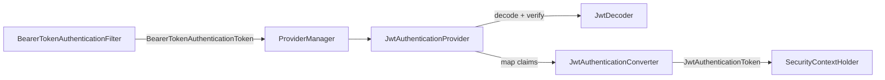

The `JwtAuthenticationProvider` is "an `AuthenticationProvider` implementation that leverages a `JwtDecoder` and `JwtAuthenticationConverter` to authenticate a JWT," delegating signature verification, `exp`/`nbf` validation, and `iss` validation to the decoder, then mapping each JWT scope to an authority "with the prefix `SCOPE_`" via the converter.[^20] The default `JwtAuthenticationConverter` can be customised either to read a different claim (`grantedAuthoritiesConverter.setAuthoritiesClaimName("authorities")`), to use a different prefix (`setAuthorityPrefix("ROLE_")`), or to be replaced wholesale by a `Converter<Jwt, AbstractAuthenticationToken>` implementation.[^20]

Authorization rules then read naturally against the resulting authorities. The DSL exposes a `hasScope(...)` helper that prefixes the scope appropriately:[^20]

```java
http.authorizeHttpRequests(auth -> auth
        .requestMatchers("/messages/**").access(hasScope("message:read"))
        .anyRequest().authenticated())
    .oauth2ResourceServer(oauth2 -> oauth2.jwt(Customizer.withDefaults()));
```

The same expressions can be lifted into method security, with `@PreAuthorize("hasAuthority('SCOPE_messages')")` on a service method delivering identical semantics through AOP interception.[^20]

For applications that operate as both authorization servers and resource servers, the **Spring Authorization Server** project (folded into Spring Security itself in version 7.0[^21]) provides the issuer side of the same protocol: a `RegisteredClientRepository` configures clients with grant types (`authorization_code`, `client_credentials`, `refresh_token`), client authentication methods, redirect URIs, scopes, and `TokenSettings`/`ClientSettings`; a `JdbcOAuth2AuthorizationService` persists issued authorizations; and a `JWKSource<SecurityContext>` provides the RSA signing key whose corresponding public key the resource server discovers via the JWK Set URI.[^22] When client and server are both implemented in Spring, the resulting end-to-end flow is fully declarative: the client's `application.yml` declares its `registration` and `provider` blocks, an `OAuth2AuthorizedClientManager` is configured with the desired authorization-grant providers, and a `WebClient` builder applies the `ServletOAuth2AuthorizedClientExchangeFilterFunction` to inject bearer tokens into outbound calls automatically.[^22]

**The new frictions Spring Security itself introduces.** As the report's lens demands, every solution surfaces new costs. Empirical study of real Spring applications has found "multiple misconfiguration anti-patterns — e.g. disabling CSRF, using weak password hashing — in real Spring apps, leading to serious vulnerabilities."[^18] A practitioner-oriented catalogue of recurring mistakes is sobering reading:[^18]

| Mistake | Consequence | Mitigation |
|---------|-------------|------------|
| Mixing session-based login and stateless JWT in a single filter chain | Conflicts, unexpected behavior, security holes | Separate `SecurityFilterChain` beans with distinct request matchers |
| Disabling CSRF without alternative protection for stateful flows | CSRF attacks against form-based endpoints | Disable CSRF only for genuinely stateless APIs |
| Weak password hashing (MD5/SHA-1) or plaintext storage | Credential leaks become trivially exploitable | Use `BCryptPasswordEncoder`, Argon2, or equivalent with salt |
| Incorrect JWT configuration (missing `iss`/`aud` validation, no key rotation) | Forged or eternally-valid tokens | Use the OAuth2 Resource Server config; enable signature, issuer, audience, key rotation |
| Insufficient testing of failure paths, expiration, revocation | Bugs and security holes reach production | Automated tests covering authentication, token handling, logout, refresh |

The community itself acknowledges a further friction: rapid API churn. As one developer put it in a community discussion, "Every Spring Security tutorial leads to deprecated code … even updated methods are already marked for removal."[^18] In practical terms this means Spring Security configuration written against Spring Security 5.x must be migrated for 6.x and again for 7.x, which—as the Spring Boot 4.0 release notes confirm—has "Spring Authorization Server included" directly in Spring Security itself, with new features such as multi-factor authentication, Password4j-based encoders, and modular security configuration.[^21] The very flexibility that lets Spring Security adapt to new standards and best practices means each major version's configuration surface evolves, and applications carry migration cost on every upgrade. This is the new problem that the broader configuration burden, examined cumulatively in §6.6, will inherit.

## 6.2 Spring Integration: Enterprise Integration Patterns as a POJO Programming Model

Spring Integration's reason for existing can be stated in a single Servlet-era observation: real applications rarely speak only HTTP. The same enterprise system that exposes a REST API typically also drains messages from a JMS queue, polls an SFTP directory for incoming files, publishes events to a Kafka topic, sends transactional email through SMTP, and consumes feeds from a partner over AMQP. In a hand-written Servlet-era codebase, each of these protocols arrived with its own client library, its own threading model, its own error semantics, and its own connection-management ritual; gluing them together produced the canonical "spaghetti integration" code that motivated Gregor Hohpe and Bobby Woolf's 2003 book *Enterprise Integration Patterns*. Spring Integration is the project that codifies those patterns as first-class Spring abstractions.

Its core abstractions are deliberately small and uniform. **Messages** carry a payload and headers. **Message channels** transport messages between components and come in pollable, subscribable, queueing, and publish-subscribe variants. **Endpoints** consume messages from channels and produce messages on channels, and the canonical endpoint vocabulary maps directly to the EIP catalogue: **transformers** rewrite the payload, **filters** discard messages that do not satisfy a predicate, **routers** forward to one of several output channels based on the message, **splitters** turn one message into many, **aggregators** turn many into one, and **service activators** invoke a POJO method whose return value (if any) becomes the next message. **Channel adapters** and **gateways** marshal between Spring Integration's internal message model and external protocols.

The framework's reach is broad. Spring Integration's Java DSL supports namespace factories for `Amqp`, `Feed`, `Jms`, `Files`, `(S)Ftp`, `Http`, `JPA`, `MongoDb`, `TCP/UDP`, `Mail`, `WebFlux`, and `Scripts`,[^23] with separate first-class support for Apache Kafka via dedicated inbound and outbound adapters,[^24] and for RabbitMQ AMQP 1.0 via the new `spring-integration-amqp` adapters added in Spring Integration 7.0.[^21] A representative AMQP-and-mail flow, expressed in the Java DSL, captures the texture:[^23]

```java
@Bean
public IntegrationFlow amqpFlow() {
    return IntegrationFlow.from(Amqp.inboundGateway(this.rabbitConnectionFactory, queue()))
        .transform("hello "::concat)
        .transform(String.class, String::toUpperCase)
        .get();
}

@Bean
public IntegrationFlow sendMailFlow() {
    return IntegrationFlow.from("sendMailChannel")
        .handle(Mail.outboundAdapter("localhost")
            .port(smtpPort)
            .credentials("user", "pw")
            .protocol("smtp")
            .javaMailProperties(p -> p.put("mail.debug", "true")),
            e -> e.id("sendMailEndpoint"))
        .get();
}
```

Three observations about this code reward attention. First, the *components* of the flow are POJOs—`String::toUpperCase`, `"hello "::concat`, the SMTP adapter—and the *composition* of those components into an integration is expressed as a Spring `@Bean` returning an `IntegrationFlow`. The flow itself is a Spring bean, registered in the `ApplicationContext` and benefiting from the same lifecycle, dependency injection, and AOP machinery as any other bean. Second, the framework makes a deliberate distinction between protocol-specific factories (the `Amqp` and `Mail` namespace factories used here) for which the Java DSL provides "first-class support," and arbitrary protocol adapters that may be configured "as generic beans and wired to the `IntegrationFlow`."[^23] As the documentation candidly notes, "the expectation is that the DSL is continually catching up with Spring Integration"[^23]—a frank acknowledgement that the universe of integration protocols is too large for any DSL to cover exhaustively, and that the framework chooses a pragmatic split between curated convenience and generic extensibility.

Third, the same flow could equally be written through the **XML namespace** configuration (`<int-amqp:inbound-gateway>`, `<int:transformer>`, etc.) or, where appropriate, through **annotations** (`@ServiceActivator`, `@Transformer`, `@Filter`, `@Router`, `@Splitter`, `@Aggregator`) placed on POJO methods that are then wired into channels. As with Spring MVC's three configuration surfaces (XML, Java config, annotations), the choice between Spring Integration's surfaces is largely a matter of team preference, with the Java DSL increasingly the default for new code because it carries IDE support, refactor-safety, and lambda-friendliness that XML cannot match.

The integration layer's reuse of Spring's broader machinery is what gives it its characteristic feel. Cross-cutting concerns are layered in through the same mechanisms used elsewhere in the framework. **Wire taps** allow non-invasive auditing of messages flowing through a channel:[^23]

```java
@Bean
public QueueChannelSpec wrongMessagesChannel() {
    return MessageChannels.queue().wireTap("wrongMessagesWireTapChannel");
}
```

**Logging handlers** can be inlined into a flow with `.log(LoggingHandler.Level.ERROR, "test.category", m -> m.getHeaders().getId())`,[^23] and **error channels** route exceptions to dedicated flows for retry, dead-lettering, or alerting. Transaction management uses the same `PlatformTransactionManager` abstraction as the rest of the framework, so a JMS-consuming flow that writes through a `JdbcTemplate` participates in a single local transaction—or, with a `JtaTransactionManager`, in an XA-coordinated one—without any change to the flow's expression. Retry behaviour, historically delivered by the `spring-retry` library, has in Spring Integration 7.0 (and the broader Spring Boot 4.0 release train) been folded into the Spring Core retry API, "adopted by AMQP, Kafka, Integration, and Batch."[^21]

The structural payoff is the same payoff Chapter 5 noted at the data layer: a `MessagingTemplate` that sits at the integration layer plays the same architectural role that `JdbcTemplate` plays at the JDBC layer and `RestTemplate`/`WebClient` plays at the HTTP-client layer—an absorber of resource-management ritual that lets the developer focus on the protocol-meaningful parts. Channel adapters and gateways are, structurally, the integration-layer analogues of `HandlerAdapter`s in Spring MVC: pluggable strategies that mediate between the framework's internal message model and an external transport. A Spring developer who has internalised the controller/template/adapter playbook from Chapters 4 and 5 can read a Spring Integration flow with very little new conceptual learning, because the framework is the same framework with a new set of nouns.

The new friction Spring Integration introduces is, predictably, configuration volume. A non-trivial flow involving three protocols, two transformers, a router, and two error channels routinely runs to fifty or more lines of DSL or several screens of XML, and managing flows across a microservice fleet—with each service owning some flows and consuming messages produced by others—pushes the configuration surface upward at the same rate it pushes the messaging capability upward. This is part of the cumulative ledger §6.6 will tally.

## 6.3 Spring Batch: Chunk-Oriented Processing for Large-Scale Data Workloads

Where Spring Integration addresses the *between-systems* concern, Spring Batch addresses an orthogonal *bulk-processing* concern that neither request-response web tiers nor message-driven flows are designed to handle: nightly ETL jobs, end-of-day financial reconciliation, monthly report generation, large-scale data migration, and any other workload whose unit of work is "process millions of records, restartably, with transactional commit boundaries and fault tolerance." A Servlet-era team typically wrote such jobs as standalone Java programs or `cron`-driven shell scripts, with each team reinventing its own restart mechanism, its own commit-batching strategy, its own logging of partial progress, and its own retry-on-transient-failure logic. Spring Batch is the project that replaces that reinvention with a uniform, Spring-managed framework.

The framework's domain model is a small, opinionated hierarchy. A **`Job`** is a logical batch process; a **`JobInstance`** is a particular logical run of that job (e.g. "the 2024-01-15 reconciliation"); a **`JobExecution`** is a particular physical attempt to run that instance; a **`Step`** is a phase within a job; and a **`StepExecution`** is a particular attempt at a step. State—what records have been processed, what the read/write counts are, what the last-committed position was—is held in the **`ExecutionContext`** and persisted by the **`JobRepository`**, a relational store the framework uses to make jobs restartable across JVM crashes. Read in the report's lens, the `JobRepository` plays for batch the role the `ApplicationContext` plays for ordinary Spring applications: it is the single piece of infrastructure that holds the framework's state and through which every other component is wired.

Steps come in two varieties. **`TaskletStep`** runs an arbitrary single-shot operation defined by a `Tasklet` implementation—useful for steps that don't fit the chunk model, such as "rename the staging table" or "send a completion notification." **Chunk-oriented steps** operationalise the canonical batch pattern: read N records into a buffer, optionally process each one, write the buffer to the output, and commit the transaction; repeat until the input is exhausted. The Spring Batch reference guide makes the configuration surface concrete:[^25]

```java
@Bean
public Step sampleStep(JobRepository jobRepository,
                       PlatformTransactionManager transactionManager) {
    return new StepBuilder("sampleStep", jobRepository)
        .<String, String>chunk(10, transactionManager)
        .reader(itemReader())
        .writer(itemWriter())
        .build();
}
```

The three required dependencies are precisely the ones the framework needs to deliver its guarantees: a `transactionManager` ("Spring's `PlatformTransactionManager` that begins and commits transactions during processing"), a `repository` (the `JobRepository` that "periodically stores the `StepExecution` and `ExecutionContext` during processing (just before committing)"), and a `chunk` size that "indicates that this is an item-based step and the number of items to be processed before the transaction is committed."[^25] The `ItemProcessor` is optional, "since the item could be directly passed from the reader to the writer."[^25] In Spring Boot, the `repository` defaults to `jobRepository` (provided through `@EnableBatchProcessing`) and the `transactionManager` defaults to the application's `transactionManager` bean—the same bean that drives `@Transactional` for service methods.[^25]

The vocabulary of out-of-the-box readers and writers is broad: `FlatFileItemReader`/`FlatFileItemWriter` for CSV and fixed-width files (with the `FieldSet` abstraction handling tokenisation and binding to domain objects[^25]), `JdbcCursorItemReader` and `JdbcPagingItemReader` for relational sources, `JpaItemWriter` and `JdbcBatchItemWriter` for relational destinations, and Kafka-aware readers and writers for streaming sources. Each reader implements `ItemReader<T>` and—where rewindable position tracking is required for restart—the `ItemStream` contract, which "the reader, processor, or writer needs to implement … to coordinate access to the file and to allow for restartability"; "any `ItemReader` that performs file or database I/O should consider implementing it" so that the framework can persist the cursor position to the `JobRepository` and resume at the right place on restart.[^25]

Fault tolerance is layered onto chunk-oriented steps through three orthogonal policies:

- **Skip policies** declare which exceptions on which records should cause the framework to skip the offending item rather than fail the step, with a configurable maximum skip count.
- **Retry policies** declare that a transient failure (a deadlock, a network blip) should be retried a specified number of times before being treated as a real failure or a skip.
- **Listeners** (`StepExecutionListener`, `ChunkListener`, `ItemReadListener`, `ItemProcessListener`, `ItemWriteListener`, `SkipListener`) provide hooks for cross-cutting observation and side-effects.

For workloads larger than a single thread can sustain, Spring Batch provides parallel and partitioned execution. **Multi-threaded steps** use a `TaskExecutor` to run the chunk loop on a thread pool; **parallel steps** run independent steps concurrently within a flow; **partitioned steps** divide the input into partitions and dispatch each to a worker step (in-JVM via threads, or remotely via integration adapters), aggregating results when all partitions complete. Each scaling strategy is opt-in, configured declaratively, and orthogonal to the chunk model itself.

The design payoff is the same payoff observed throughout this chapter: the developer writes POJO readers, processors, and writers, and the framework absorbs the surrounding ritual—transaction boundaries, repository updates, restart bookkeeping, fault-tolerance bookkeeping, parallel-execution plumbing. The same `JobRepository` that persists `StepExecution` rows for an in-memory test job persists them for a production job spanning eight hours and ten million records; the same `@Transactional`-aware `PlatformTransactionManager` that drives the chunk commit drives the service-layer transactions that the chunk's `ItemWriter` invokes. As Spring Boot 4.0's release notes record, recent batch evolution continues this pattern: in Spring Batch 6.0 "`Job` and `Step` are now `@FunctionalInterface`, making it possible to define simple jobs and steps as concise lambda expressions"; "`JobRepository` now extends `JobExplorer` and `JobOperator` now extends `JobLauncher`, significantly reducing the number of beans most applications need to declare and inject"; and JFR-based observability records "JobExecution and StepExecution lifecycle events … as JFR events, enabling low-overhead profiling and diagnostics of batch workloads with standard JDK tooling."[^21]

The new friction Spring Batch adds to the configuration ledger is the `JobRepository` and its associated infrastructure: a relational schema for the framework's tables, a transaction manager wired specifically for the batch context, and the `@EnableBatchProcessing` annotation (or its programmatic equivalents) that triggers the auto-registration of the framework's beans. As Spring Boot will demonstrate in Chapter 7, this is precisely the kind of repetitive, opinionated configuration that auto-configuration was designed to eliminate.

## 6.4 Spring WebFlux: Reactive Programming and the Non-Blocking Alternative to Spring MVC

Spring WebFlux is the most architecturally ambitious of the modules surveyed in this chapter, and—measured by the report's problem→solution→new-problem lens—the one whose new problems most clearly threaten to overshadow the problems it solved. Treating it accurately therefore requires holding two claims in mind at once. **WebFlux is not a successor to Spring MVC; it is a parallel stack** designed for a specific class of workload, and recent platform evolution has narrowed rather than widened the cases where its complexity is worth its cost.

The architectural shift WebFlux operationalises is the move from Spring MVC's **one-thread-per-request, blocking-I/O servlet model** to a **non-blocking, event-loop execution model** in which "a small, fixed-size event-loop thread pool" handles all concurrent requests, freeing a thread as soon as a request blocks on I/O so that thread can do other work in the meantime.[^26] WebFlux runs on Netty by default but can also run on Undertow or any Servlet 3.1+ container.[^26] The conceptual difference is summarised compactly in a published comparison: Spring MVC is "synchronous, blocking I/O … one request is bound to one thread … requires large thread pools under high concurrency," whereas WebFlux is "asynchronous, non-blocking I/O … uses a small, fixed-size event-loop thread pool."[^26]

WebFlux exposes two programming surfaces, both producing the same runtime behaviour. The **annotated controller surface** preserves the exact `@RestController`/`@GetMapping` vocabulary developers already know from Spring MVC, with the only change being that handler methods return reactive types (`Mono<T>` for at-most-one results, `Flux<T>` for streams):

```java
@RestController
public class UserController {
    @GetMapping("/users/{id}")
    public Mono<User> getUser(@PathVariable String id) { ... }
    @GetMapping("/users")
    public Flux<User> getAllUsers() { ... }
}
```

The **functional endpoint surface**, by contrast, builds routes from `RouterFunction` and `HandlerFunction` instances rather than annotations,[^27] turning the routing model itself into composable, lambda-friendly code:[^28]

```java
RouterFunction<ServerResponse> route = RouterFunctions
    .route(GET("/users/{id}"), handler::getUser)
    .andRoute(GET("/users"), handler::getAllUsers);
```

The two surfaces have equivalent runtime characteristics: as a Stack Overflow answer summarises, "there is no difference in the performance" between annotated controllers and `RouterFunction`s, and the choice "is absolutely based on individual preference."[^27] The one explicit difference noted by community discussion is filter scope: "the WebFlux framework provides two types of filters: `WebFilter`s and `HandlerFilterFunction`s. The main difference between them is that `WebFilter` implementations work for all endpoints and `HandlerFilterFunction` implementations will only work for Router-based ones."[^27] Beyond that, the two surfaces are equivalent expressions of the same dispatcher, message-converter, and reactive-pipeline machinery.

Outbound HTTP follows the same pattern through **`WebClient`**, the non-blocking counterpart to the deprecated `RestTemplate`. As the Spring documentation phrased the recommendation: "the general recommendation is to start using the Spring WebFlux WebClient. Besides the reactive and non-blocking nature of the `WebClient`, you can seamlessly include it to your existing (blocking) application."[^29] The configuration surface combines a `WebClient.Builder` (autoconfigured by Spring Boot[^29]), a base URL, default headers, timeouts (connect, read, write, response), and exchange filter functions for logging, authentication, and other cross-cutting concerns:[^30]

```java
@Bean
public WebClient webClient() {
    HttpClient httpClient = HttpClient.create()
        .option(ChannelOption.CONNECT_TIMEOUT_MILLIS, 5000)
        .responseTimeout(Duration.ofSeconds(10))
        .doOnConnected(conn -> conn
            .addHandlerLast(new ReadTimeoutHandler(10, TimeUnit.SECONDS))
            .addHandlerLast(new WriteTimeoutHandler(10, TimeUnit.SECONDS)));
    return WebClient.builder()
        .clientConnector(new ReactorClientHttpConnector(httpClient))
        .baseUrl("https://api.example.com")
        .build();
}
```

The most-asked WebClient question, which deserves an explicit answer because it is one of the canonical pitfalls of the API, is the choice between `retrieve()` and `exchange()`/`exchangeToMono()`. The official documentation explains that `retrieve()` "is a shortcut to using `exchange()` and decoding the response body through `ClientResponse`,"[^29] returning a `ResponseSpec` that decodes the body and "doesn't have a very nice api for handling exceptions."[^31] `exchange()` returns the full `ClientResponse` object "along with the response status and headers"[^31] but transfers the responsibility for body consumption to the caller: "Unlike `retrieve()`, when using `exchange()`, it is the responsibility of the application to consume any response content regardless of the scenario (success, error, unexpected data, etc). Not doing so can cause a memory leak."[^29] **As of Spring Framework 5.3, `exchange()` is deprecated** "due to potential memory and connection leaks," with `exchangeToMono()` and `exchangeToFlux()` as the supported replacements when fine-grained control is genuinely needed.[^29] The practical guidance is direct: "Always try to use the WebClient `.retrieve()`. If you need more fine-grain control, use the `.exchange()` method but understand your additional responsibilities of always releasing the body."[^29]

Error handling, retries, and parallel composition are expressed through the reactive operators rather than imperative control flow. `onStatus(...)` maps HTTP error codes to domain exceptions, `retryWhen(Retry.backoff(...))` supplies exponential backoff with jitter and exception filters for idempotent retries, `timeout(Duration)` aborts requests that exceed a deadline, and `Mono.zip(a, b, c)` runs three calls in parallel and combines their results.[^30] A typical aggregator wires the pattern together:[^30]

```java
public Mono<OrderDetails> getOrderDetails(String orderId, String userId) {
    Mono<User> userMono = userClient.get().uri("/users/{id}", userId)
        .retrieve().bodyToMono(User.class);
    Mono<Order> orderMono = orderClient.get().uri("/orders/{id}", orderId)
        .retrieve().bodyToMono(Order.class);
    Mono<PaymentInfo> paymentMono = paymentClient.get().uri("/payments/order/{id}", orderId)
        .retrieve().bodyToMono(PaymentInfo.class);
    return Mono.zip(userMono, orderMono, paymentMono)
        .map(t -> new OrderDetails(t.getT1(), t.getT2(), t.getT3()));
}
```

The reactive philosophy extends down through the persistence layer through the **Spring Data Reactive** projects. Reactive analogues of Spring Data's repository hierarchy—`ReactiveCrudRepository`, `ReactiveSortingRepository`—exist alongside the blocking versions, with NoSQL stores (MongoDB, Cassandra, Redis, Couchbase) treated as "first-class citizen[s] in the WebFlux world."[^32] Critically, "RDBMS support, such as JDBC and JPA are designated for blocking access [and] will not work under the new WebFlux applications,"[^32] which produced the **R2DBC (Reactive Relational Database Connectivity)** specification. Spring Data R2DBC supports H2, MariaDB, Microsoft SQL Server, MySQL, PostgreSQL, and Oracle through R2DBC drivers,[^33] exposing both a functional `R2dbcEntityTemplate` and reactive repositories with `@Query`-annotated methods and query derivation.[^33] RxJava 2 and RxJava 3 are supported alongside Reactor through `RxJava2CrudRepository`/`RxJava3CrudRepository` variants.[^32]

The honest assessment of WebFlux's value, however, is the most important part of this section, because the framework's own documentation is explicit that the choice between MVC and WebFlux is not a foregone conclusion. The official Spring guidance, summarised in a recent practitioner load test:[^26]

1. WebFlux does not yet support blocking drivers like traditional JDBC (e.g., MySQL).
2. WebFlux defaults to Netty.
3. Prefer MVC when it is sufficient.
4. Start small, test thoroughly, then expand usage.

Empirical load testing under IO-intensive workloads—the canonical case for which WebFlux was designed—produces a nuanced picture: throughput between MVC and WebFlux is "similar," but WebFlux has "lower response times," "uses fewer threads and less memory," and "the higher the latency, the more WebFlux's advantages stand out."[^26] An independent assessment phrases the same conclusion more cautiously: "with Spring WebFlux and a reactive datastore you will experience better throughput but it will be unlikely that the [improvement is dramatic]."[^34] WebFlux's core advantage, in other words, is not raw throughput but resource efficiency at high concurrency under high external latency.

The most consequential recent development reframes even this advantage. Java 21 introduced **virtual threads**, lightweight thread implementations whose blocking calls do not pin the underlying carrier thread, and Spring Boot 3.2 added first-class virtual-thread support for Spring MVC. The community consensus is that this materially narrows WebFlux's window of applicability. As one Reddit discussion summarised, "With virtual threads in Java 21, Spring Boot 3.2, the need for reactive will be greatly reduced,"[^35] and a more pointed practitioner observation puts it directly: "Virtual Threads don't replace WebFlux, but they make it unnecessary for most workloads. If your code is mostly I/O-bound and not streaming, [virtual threads serve you better]."[^36] Spring's official guidance is consistent with this: WebFlux is "not a replacement for Spring MVC. If Spring MVC already satisfies your requirements, switching to WebFlux is unnecessary and may increase complexity."[^26]

The new frictions WebFlux introduces—above and beyond the configuration ledger common to all modules—are therefore best read in context. The reactive programming model itself imposes a steep learning curve (operator composition, backpressure, debugging stack traces that no longer reflect call hierarchy), the JDBC/JPA exclusion forces a parallel reactive data-access stack with its own learning cost, and the deprecation of `exchange()` in favour of `exchangeToMono()`/`exchangeToFlux()` demonstrates that even the framework's own surface continues to churn as the team learns what works in production. With virtual threads now absorbing the resource-efficiency argument that justified WebFlux for many teams, the report's framing of WebFlux as a **specialised tool rather than a universal successor** is the position the evidence supports: WebFlux remains the right answer for streaming workloads, very-high-concurrency I/O-bound services with strict resource budgets, and applications that genuinely benefit from reactive composition end-to-end; for the typical CRUD-and-REST application, Spring MVC on virtual threads is now the simpler and increasingly recommended path.

## 6.5 Spring Cloud: From Monolith to Microservices Infrastructure

Spring Cloud is the layer of the ecosystem most concerned with the structural realities of running an application as a fleet of services rather than as a single deployed unit. Its modules collectively address the patterns that microservice architectures forced into the foreground in the early-to-mid 2010s: services need to be configured uniformly across many instances and many environments; instances need to discover each other without hard-coded URLs; clients need to balance load across the available instances; failures in downstream services need to be isolated through circuit breakers; ingress traffic needs to be shaped by an API gateway; HTTP calls between services need an idiom that hides the URL and load-balancer plumbing; failures need to be traceable across service boundaries; and configuration changes need to propagate to running instances without a redeploy.

The principal Spring Cloud modules, mapped to these concerns, form a familiar landscape:

| Concern | Module(s) | Role |
|---------|-----------|------|
| Externalized configuration | Spring Cloud Config | Centralized configuration server backed by Git (or Vault, JDBC, native filesystem); refresh semantics through `@RefreshScope` |
| Service discovery | Spring Cloud Netflix Eureka, alternatives (Consul, ZooKeeper, Kubernetes-native) | Service registry; clients register on startup, discover peers by logical service name |
| Client-side load balancing | Spring Cloud LoadBalancer (successor to Netflix Ribbon) | Selects a healthy instance from the registry for each outbound call |
| Resilience | Resilience4j (successor to Netflix Hystrix), now also Spring Cloud Commons Circuit Breaker | Circuit breakers, bulkheads, rate limiters, time limiters |
| API gateway | Spring Cloud Gateway (successor to Netflix Zuul) | Reactive, route-based gateway with filters, predicates, rate limiting; gateway 5.0 in the 2025.1 release train adds API versioning predicates aligned with Spring Framework 7's API versioning model[^21] |
| Declarative HTTP clients | Spring Cloud OpenFeign | `@FeignClient` interface annotation produces a load-balanced HTTP client implementation at runtime |
| Distributed tracing | Spring Cloud Sleuth (in older release trains), Micrometer Tracing | Trace and span propagation across service boundaries; OpenTelemetry interoperability |
| Message-driven microservices | Spring Cloud Stream | Binders for Kafka and RabbitMQ; declarative producers and consumers; per-binding configuration; consumer priority and KTable controls in 5.0[^21] |
| Cross-instance event broadcast | Spring Cloud Bus | Distributes configuration-refresh events and other broadcast messages across the service fleet |

Each module reuses Spring Boot's auto-configuration model (Chapter 7) and Spring's POJO/annotation/AOP playbook. A `@FeignClient`-annotated interface produces, at startup, a dynamic-proxy implementation that combines the load-balancer ("`lb://` URL scheme to specify load-balanced base URLs directly on Spring Interface Client declarations"[^21]), the circuit breaker ("built-in Circuit Breaker integration for annotated Spring Interface Clients (backed by RestClient or WebClient), enabling declarative resilience patterns without manual configuration"[^21]), and the configured HTTP client into a single declarative call surface. A `@RefreshScope`-annotated bean rebuilds itself when a configuration change is broadcast over Spring Cloud Bus. A `@LoadBalanced`-annotated `RestTemplate` or `WebClient` interceptor resolves logical service names to instance addresses through the configured discovery client.

The most operationally significant fact about Spring Cloud is not any single module but its **release-train versioning model and its Spring Boot compatibility matrix**. Spring Cloud releases are versioned by a "release train" name (older trains used London Underground stations alphabetically; modern trains use calendar-aligned version numbers), and **each release train is compatible only with specific Spring Boot lines**.[^37] The current and recent matrix is concrete:[^37]

| Spring Cloud release train | Compatible Spring Boot |
|----------------------------|------------------------|
| 2025.1 (Oakwood) | 4.0.x |
| 2025.0 (Northfields) | 3.5.x |
| 2024.0 (Moorgate) | 3.4.x |
| 2023.0 (Leyton) | 3.2.x, 3.3.x |
| 2022.0 (Kilburn) | 3.0.x, 3.1.x |
| 2021.0 (Jubilee) | 2.6.x, 2.7.x (after 2021.0.3) |
| 2020.0 (Ilford) | 2.4.x, 2.5.x (after 2020.0.3) |
| Hoxton.SR5+ | 2.2.x, 2.3.x |

The asymmetry between Spring Cloud and Spring Boot version cadences—Spring Cloud trains are released roughly annually and locked to specific Boot lines—is one of the most operationally consequential complexity sources in the entire ecosystem. As one practitioner answer to "Is there a compatibility matrix?" memorably observed, "in 2026 it's still a bit tedious to find the *exact latest matching versions* of Spring Boot and Spring Cloud,"[^37] and the documented procedure for finding compatible versions involves cross-referencing the Spring Cloud project page, the release-train release notes, and the Spring Boot release tags in sequence.[^37] Mixing incompatible versions produces failures that may not surface until application startup, with stack traces such as `NoClassDefFoundError: org/springframework/cloud/context/named/NamedContextFactory$Specification`[^37] that are diagnostic only to engineers who have already learned the matrix's structure.

The Spring Boot 4.0 / Spring Cloud 2025.1 release adds further evidence that the ecosystem is consolidating its microservice patterns into the core framework. **API versioning** is now built into Spring Framework 7.0 itself, with "version-aware request mapping, functional routing, deprecation notification, and client-side version setting in RestClient, WebClient, and HTTP interface clients,"[^21] and Spring Boot 4.0 provides "auto-configuration for API versioning with Spring MVC and WebFlux."[^21] The new `spring-boot-starter-opentelemetry` "brings everything needed to export metrics and traces over OTLP, and auto-configures the OpenTelemetry SDK with zero extra setup."[^21] **HTTP Service Clients**—annotated Java interface-based HTTP clients backed by `RestClient` or `WebClient`—are now auto-configured by Spring Boot itself, blurring the historical line between Spring Cloud's `@FeignClient` and the framework's core capabilities.[^21]

Read in the report's lens, Spring Cloud is the layer at which the ecosystem's configuration sprawl reaches its peak. A non-trivial microservice carries its own Spring Boot version, its own Spring Cloud release-train alignment, its own service-discovery client configuration, its own load-balancer and circuit-breaker configuration, its own distributed-tracing setup, its own message-binder configuration, its own gateway routing rules (if it sits behind one), and its own observability exporters. Multiply this by twenty or fifty microservices, and the configuration burden is no longer bounded by a single application's `application.yml`—it is a fleet-wide concern that demands its own infrastructure (Spring Cloud Config Server backed by Git, secret management, environment-specific profiles, schema-validated property files). The same friction that motivated Spring Boot's auto-configuration for a single application reasserts itself at the fleet level for microservice deployments, motivating both the platform-side responses (Kubernetes ConfigMaps, secret management, GitOps) and the framework-side responses (Spring Cloud Config, externalized configuration, native-image readiness) that Chapter 9 will revisit.

## 6.6 Synthesis: A Unified Platform Built on Recurring Design Patterns

Stepping back from the five modules, the chapter's central claim is best evidenced by a single tabulation. Each module instantiates the same five-pattern playbook the report has tracked since Chapter 4—POJO programming model, annotation-driven declarative configuration, AOP-proxied cross-cutting concerns, template-method abstractions over heterogeneous resources, and unified exception hierarchies—and the resulting structural symmetry is what makes "the Spring ecosystem" a coherent platform rather than a marketing umbrella over disjoint projects.

| Pattern | Spring Security | Spring Integration | Spring Batch | Spring WebFlux | Spring Cloud |
|---------|-----------------|--------------------|--------------|----------------|--------------|
| **POJO programming model** | `UserDetailsService`, `PasswordEncoder`, custom `AuthenticationProvider` are POJOs | Service activators, transformers, filters are POJO methods | `ItemReader`/`ItemProcessor`/`ItemWriter` are POJOs | Annotated controllers and `HandlerFunction`s are POJOs | `@FeignClient` interfaces, `@RefreshScope` beans are POJOs |
| **Annotation-driven configuration** | `@EnableWebSecurity`, `@PreAuthorize`, `@PostAuthorize`, `@Secured`[^17] | `@ServiceActivator`, `@Transformer`, `@Filter`, `@Router`, `@Splitter`, `@Aggregator` | `@EnableBatchProcessing`, `@StepScope`, `@JobScope` | `@EnableWebFlux` (when needed), `@RestController` returning `Mono`/`Flux` | `@EnableEurekaClient`, `@FeignClient`, `@LoadBalanced`, `@RefreshScope`, `@CircuitBreaker` |
| **AOP-proxied cross-cutting concerns** | Method-security proxies enforce `@PreAuthorize` at invocation;[^17] filter chain wraps every HTTP request | Retry, transactional message handling, error channels via interception | `@Transactional` on chunk boundaries; listener/skip/retry advice woven around the loop | `@PreAuthorize` carried into reactive flows via reactive context propagation | Circuit-breaker, load-balancer, retry interceptors composed onto declarative HTTP clients |
| **Template-method abstractions** | `HttpSecurity` DSL, `JwtDecoder`, `SecurityFilterChain` builder | `IntegrationFlow.from(...).handle(...).get()` DSL,[^23] `MessagingTemplate` | `StepBuilder`, `JobBuilder`,[^25] readers/writers as strategy callbacks | `WebClient.builder()...retrieve().bodyToMono(...)` DSL[^30] | Spring Cloud Gateway route DSL, Spring Cloud Stream binder configuration |
| **Unified exception hierarchies** | `AuthenticationException`, `AccessDeniedException` family[^17] | Spring's `MessagingException` family for integration-layer errors | `BatchException`, skip/retry-aware exception classification | Reactive `WebClientResponseException` family | Resilience4j-/Spring-Retry-based exception classification across service calls |

A developer who has internalised the playbook in one module pays a fraction of the learning cost in the next. A team that has mastered Spring MVC controllers, message converters, and `@ControllerAdvice` exception handling is already two-thirds of the way to mastering Spring Security's `SecurityFilterChain`, message-converter-style `JwtAuthenticationConverter`, and `AccessDeniedException` handling. A team that has internalised `JdbcTemplate` already understands the architectural role of `JobRepository`, `MessagingTemplate`, and `WebClient`. The portfolio's value, in this lens, is not the sum of its modules but the **return on cognitive investment** that the playbook produces.

The cumulative cost of this expanding portfolio, however, is precisely the friction the next chapter exists to absorb. A reasonable enterprise Spring application of the early 2010s—before Spring Boot—carried, in aggregate, a configuration ledger that combined every module's surface:

| Layer | Configuration surface | Example artefacts |
|-------|----------------------|-------------------|
| Build | Module coordinates and version coordination | One Maven/Gradle dependency per module, plus precise version compatibility (a Spring Cloud release train requires a specific Spring Boot line[^37]) |
| Core | IoC wiring, AOP enabling | `@Configuration` classes, `@ComponentScan(basePackages = ...)`, `@EnableAspectJAutoProxy` |
| Web | `DispatcherServlet`, MVC infrastructure | `web.xml` or `WebApplicationInitializer`, `@EnableWebMvc`, `WebMvcConfigurer`, view resolvers, message converters |
| Data | DataSource, transaction manager, JPA factory | `DataSource` bean, `PlatformTransactionManager`, `LocalContainerEntityManagerFactoryBean`, `@EnableTransactionManagement`, `@EnableJpaRepositories` |
| Security | Filter chains, providers, encoders | `SecurityFilterChain` beans per request matcher, `UserDetailsService`, `PasswordEncoder`, JWT decoder configuration |
| Integration | Channels, endpoints, adapters | `IntegrationFlow` beans, channel adapters, error channels, transactional channel configuration |
| Batch | Job repository, jobs, steps | Schema initialization, `JobRepository`, `JobLauncher`, job and step builders, listener wiring |
| Reactive (where used) | Reactive web, reactive data | `WebClient` builder, R2DBC ConnectionFactory, `ReactiveTransactionManager`, reactive repositories |
| Cloud (where used) | Discovery client, config client, gateway | `bootstrap.yml`/`bootstrap.properties` for Config Server, Eureka client config, `@EnableEurekaClient`, gateway routes, circuit-breaker configuration |
| Server | Embedded or external Tomcat/Jetty/Undertow | WAR packaging or programmatic server bootstrap, connector tuning, port binding, SSL configuration |
| Observability | Logging, metrics, tracing exporters | Logging framework configuration, Micrometer registry, OpenTelemetry exporter setup |

Even with judicious use of Java configuration in place of XML, the aggregate `@Configuration` classes for a non-trivial application could easily run to several thousand lines, and the cognitive cost of *finding* the right configuration (or the right `@Enable*` annotation, or the right namespace) across all of these modules became, by the early 2010s, the dominant friction in starting a new Spring project.

This is the friction Spring Boot was designed to eliminate. Auto-configuration, starter dependencies, embedded servers, sensible defaults, and externalized configuration through `application.yml` are not merely convenience features but the *dialectical resolution* of the configuration sprawl this chapter has documented. The aggregate burden across Security filter chains, Integration flows, Batch job repositories, WebFlux reactive infrastructure, and Cloud release-train coordination—rather than any single module's complexity—is precisely what makes auto-configuration's value proposition compelling. Chapter 7 takes up this resolution where this chapter has left it: with an ecosystem whose modules are individually well-designed and whose aggregate configuration surface had grown, by 2013, to rival the very `ejb-jar.xml` complexity that Spring was founded to abolish.

# 7 Spring Boot: From Configuration Burden to Convention Over Configuration

Chapter 6 closed by tabulating an uncomfortable truth: the aggregate configuration surface of a serious Spring application by the early 2010s—when Security filter chains, Integration flows, Batch job repositories, MVC infrastructure, data-access plumbing, and Cloud release-train coordination were combined—had grown to several thousand lines of `@Configuration` classes, sprawling across dozens of `@Enable*` annotations and namespace-specific dialects. The very flexibility that had been Spring's founding virtue in 2004 had, ten years later, reproduced the friction Rod Johnson's original critique had identified in EJB. This chapter completes the dialectical arc the report has pursued from its opening pages by applying the same problem→solution→new-problem lens to Spring itself. It reconstructs how the configuration burden recurred, traces Spring Boot's 2014 release as a deliberate counter-revolution from *inside* the Spring community rather than against it, dissects the four mechanisms by which Boot operationalises convention over configuration, examines the production-ready operational surface that made Boot fit for cloud-native deployment, and finally surfaces the new frictions—annotation opacity, startup latency, debugging difficulty, version churn—that, true to the report's framing, the current generation has produced and that Chapter 9 will examine in their forward-looking dimension.

## 7.1 The Recurrence of Configuration Sprawl in Spring Itself

The cumulative configuration ledger Chapter 6 closed with was not a hypothetical artefact. By 2012 it was the lived experience of every team starting a new Spring project. To launch a "hello world" REST service with persistence, security, and decent operational hygiene, a developer had to: choose Spring Framework, Spring MVC, Spring Data JPA, Spring Security, and Hibernate versions that were mutually compatible; write a `web.xml` (or a `WebApplicationInitializer`) that registered the `DispatcherServlet`, the `ContextLoaderListener`, character-encoding filters, and the Spring Security `DelegatingFilterProxy`; declare an `applicationContext.xml` (or a Java `@Configuration` class) that wired the `DataSource`, the `PlatformTransactionManager`, the `LocalContainerEntityManagerFactoryBean`, and `@EnableTransactionManagement`/`@EnableJpaRepositories`; write a separate `dispatcher-servlet.xml` (or `WebMvcConfigurer`) for view resolvers, message converters, and static-resource handlers; configure a `SecurityFilterChain`, a `UserDetailsService`, and a `PasswordEncoder`; install Tomcat or Jetty separately, configure its `server.xml` and `context.xml`, and learn its deployment idioms; package the application as a WAR and copy it into the server's `webapps/` directory.

The friction this produced was sharp enough to surface in mainstream developer commentary. One Hacker News practitioner crystallised it bluntly: "Spring before spring-boot was an unreadable sea of unique xml. Spring-boot is a guardrail that steers you into the correct usage of the spring framework. spring => configuration over conventions; spring-boot => conventions over configuration."[^38] Another retrospective on the evolution put the same observation in language that this report has used since Chapter 1: "my biggest gripe with old Spring was how far you had to go to get 'hello world' on the browser when starting from zero. I never would have thought embedding the whole application server would be a good idea but SpringBoot proved me wrong. That plus the annotation based config vs xml files is what made fast development with Spring possible … Have you ever counted the jar files included in a typical SpringBoot+Spring-Security+Spring-Data app?"[^38] A third comment was even more direct in its diagnosis: "The negativism towards [Spring] has two main points: First, that Spring it's bloated. Spring now has a wide extension of modules that you may or may not need."[^38]

The structural pattern is precisely the one this report has been tracking. **Each Servlet-era pain point identified in Chapter 2 had been answered by Spring's modular machinery dissected in Chapters 4 through 6. Each answer had introduced its own configuration surface. The aggregate of those surfaces had, by 2013, reached the threshold at which the friction Rod Johnson had documented against EJB descriptors was reappearing in a new dialect inside the framework that had been built to abolish it.** Six features of this recurrence are worth naming explicitly because they shape the agenda Spring Boot inherited:

| Friction | Manifestation in mid-2010s Spring | Echo of EJB-era pain point (Chapter 3) |
|---|---|---|
| Configuration verbosity | Hundreds-to-thousands of lines of XML or Java `@Configuration` per non-trivial app | `ejb-jar.xml` running into thousands of lines |
| Manual dependency version management | Spring Framework, Spring Security, Hibernate, Jackson, Tomcat, JDBC drivers each pinned by hand | Vendor-specific descriptors (`weblogic-ejb-jar.xml`, `jboss.xml`) coordinating across implementations |
| Onboarding cost | Days to assemble a working scaffold from scratch | Days to learn each container's vendor descriptor and tooling |
| Server installation and deployment | Install Tomcat/Jetty separately; configure `server.xml`; package WAR; deploy | Install application server; configure resources via JNDI; deploy EAR |
| Cross-cutting infrastructure repetition | Every project re-declared the same `DataSource`, `PlatformTransactionManager`, `DispatcherServlet`, view resolvers, message converters | Every project re-wrote the same lifecycle callbacks and resource references |
| No built-in operational endpoints | Health checks, metrics, log-level introspection had to be hand-rolled | EJB had no equivalent either; this was a new gap that cloud-era operations exposed |

The third column matters because it sharpens the argument. Spring's configuration sprawl was not merely "as bad as EJB's"; it was structurally analogous in the precise sense that **the framework was once again asking developers to repeat, project after project, the same opinionated infrastructure decisions that any reasonable application would make**. The community-grade observation that "Spring is too automagical, often breaks with new releases, eats incredible amounts of memory, requires too much time to deal with its problems, produces stacktraces longer than my program"[^38] was, at its heart, the same frustration Johnson had channelled in 2002, redirected at a different generation's incumbent. The framing the present chapter adopts therefore mirrors Chapter 3's framing of the EJB→Spring transition: **the conditions for an internal counter-revolution were present, and what was needed was a credible demonstration that the same enterprise capabilities could be delivered without the configuration tax**. That demonstration is Spring Boot.

## 7.2 The Birth of Spring Boot and the Convention-Over-Configuration Philosophy

Spring Boot's origin trail is precisely datable. The first JIRA-tracked discussion of the project appears on **2012-10-17**.[^39] The initial milestone, **Spring Boot 0.5.0.M1**, was released on **2013-08-06** under the authorship of Phil Webb and Dave Syer, accompanied by a Spring Blog post titled "Spring Boot — Simplifying Spring for Everyone."[^39] The General Availability release, **Spring Boot 1.0 GA**, followed on **2014-04-01**, again with Phil Webb leading the announcement.[^39] The framework's stated goal—rendered in the project's own historical documentation—was to enable developers to "develop standalone, production-grade Spring-based applications without the complex setup that traditionally accompanied Spring development."[^39]

The official feature list at GA crystallised the four mechanisms this chapter will dissect in turn:[^39]

- **Standalone Spring application creation** that runs from a single executable JAR;
- **Pre-configured starter components** that bundle commonly co-occurring dependencies;
- **Embedded WAS support** for Tomcat, Jetty, and Undertow, eliminating the external server install;
- **AutoConfiguration** that applies sensible defaults based on the classpath;
- **Production-ready features** including metrics, health checks, and externalized configuration;
- **Zero XML configuration**—nothing in Boot requires or generates XML.

The framework's own characterisation of its design stance was equally explicit. Spring Boot is **"Spring CoC (Convention-over-Configuration) Version,"** with its principal characteristics being "optimal Dependency (library, version) management," "default Bean configuration following convention provided in advance via `@Configuration`," "production-ready features (Actuator etc.)," and "optimisation for Micro Service (Application With Single Responsibility) implementation."[^39] The phrasing matters because it locates Boot precisely in the design-paradigm taxonomy the report has used since Chapter 3. **Where Spring Framework had positioned itself as configuration-over-convention—the developer describes wiring explicitly, with the framework adapting—Spring Boot inverted the polarity to convention-over-configuration: the framework infers wiring from sensible defaults, with the developer overriding only when defaults do not fit.**

The convention-over-configuration paradigm itself, as the report has noted in passing, is older than Boot. It was popularised by David Heinemeier Hansson in Ruby on Rails (released 2004), defined as a software-design paradigm "that seeks to minimize the number of decisions developers must make by establishing sensible defaults and conventions inferred from code structure, thereby reducing the need for explicit configuration files or settings in common scenarios."[^40] The principle was further described as "configuration by exception"—"the framework applies its default conventions unless explicitly overridden for cases where the standard assumptions do not apply."[^40] By 2014, Spring Boot extended this to Java enterprise development with auto-configuration based on classpath dependencies, reducing boilerplate XML setups.[^40]

The philosophical commitment is summarised concisely in a published practitioner guide: "Spring Boot isn't a replacement for Spring—it's an opinionated layer on top of it. Think of it as Spring with batteries included. The framework makes intelligent assumptions about what you need, provides sensible defaults, and gets out of your way when you want to customize things."[^41] Two structural commitments embedded in this stance deserve emphasis. First, **Boot is layered, not parallel**: it sits *on top of* the Spring Framework, the Spring Security filter chain, Spring Data's repository abstractions, and so on. The mechanisms dissected in Chapters 4 through 6 still execute; Boot simply replaces their explicit configuration with conditional defaults. Second, **the override path is preserved**: an opinionated default is, in principle, always replaceable by an explicit user-supplied bean, because the auto-configuration machinery the next section dissects is itself implemented through Spring's normal `@Conditional` apparatus, which yields to user beans wherever `@ConditionalOnMissingBean` is in play. The framing one practitioner used—"Spring Boot is a guardrail that steers you into the correct usage of the spring framework"[^38]—captures both halves of the commitment: a strong default path, with the underlying framework still accessible when the default does not fit.

It is worth pausing on the relationship between Spring and Spring Boot because the community observation that "There's a huge difference between 'Spring pre-Boot' and 'Spring post-Boot'"[^38] is more architecturally precise than it first appears. Boot did not change Spring's IoC container, AOP machinery, MVC dispatcher, or transaction abstraction. It changed which beans the developer had to declare. The dialectical arc therefore reaches its expected shape: just as Spring solved EJB's complexity *without abandoning* enterprise services, Boot solved Spring's configuration burden *without abandoning* Spring's flexibility. The four founding principles Chapter 3 articulated—POJO-centricity, non-invasiveness, composition over inheritance, testability—survive intact; what changes is the volume of explicit configuration the developer must write to participate in that architecture.

## 7.3 Auto-Configuration: Mechanism, Conditional Annotations, and the Evaluation Report

Auto-configuration is the central mechanism by which Spring Boot delivers its convention-over-configuration promise, and it deserves dissection at the three levels of depth this report's methodology requires. At the **principle** level, auto-configuration is a generalisation of the conditional bean registration introduced in Spring 4: the framework ships, in its own JARs, a large collection of `@Configuration` classes that *describe* every common infrastructural choice (a `DataSource`, an `EntityManagerFactory`, a `DispatcherServlet`, a `JwtDecoder`, a `RestTemplate`), and at startup it evaluates each class's conditions to decide whether the configuration applies. As one practitioner-grade explanation puts it, "AutoConfiguration is a mechanism that automatically registers Beans based on conditions such as the state of the classpath and property values. The reason all the necessary Beans are in place just by adding a dependency — without writing a single `@Bean` — is thanks to this mechanism."[^42]

At the **mechanism** level, auto-configuration's startup sequence is straightforward and worth tracing concretely. The general flow is:[^42]

1. `@EnableAutoConfiguration`—itself a meta-annotation included in `@SpringBootApplication`—acts as the trigger.
2. `AutoConfigurationImportSelector` loads the list of AutoConfiguration class candidates.
3. The `@Conditional` annotations on each candidate class are evaluated.
4. Only the beans from classes whose conditions are satisfied are actually registered.

The candidate list itself lives in metadata files inside JARs. **Up to Spring Boot 2.x**, the list was written in `META-INF/spring.factories` against the key `org.springframework.boot.autoconfigure.EnableAutoConfiguration`.[^42][^43] **From Spring Boot 3.x onward**, it migrated to a file named `META-INF/spring/org.springframework.boot.autoconfigure.AutoConfiguration.imports`, containing one fully-qualified class name per line.[^42] Both formats coexist in projects that have not yet migrated; for new Spring Boot 3.x code, the new format is recommended.[^42] If you unzip `spring-boot-autoconfigure.jar`, you find hundreds of AutoConfiguration classes registered there, each conceptually a small `@Configuration` class describing one piece of infrastructure.[^42]

The conditions themselves are expressed through a family of `@Conditional` annotations, each of which encodes a specific predicate the framework evaluates at startup. The most consequential are catalogued below:[^42][^43][^44]

| Annotation | Triggers when |
|---|---|
| `@ConditionalOnClass` | Specified class is on the classpath |
| `@ConditionalOnMissingClass` | Specified class is *not* on the classpath |
| `@ConditionalOnBean` | A bean of the specified type/name already exists in the context |
| `@ConditionalOnMissingBean` | No bean of the specified type/name has been registered yet |
| `@ConditionalOnProperty` | A property is set (optionally with a specific value); supports `prefix`, `name`, `havingValue`, `matchIfMissing` |
| `@ConditionalOnResource` | A specified resource is present on the classpath |
| `@ConditionalOnWebApplication` / `@ConditionalOnNotWebApplication` | Application is (or is not) running as a web application |
| `@ConditionalOnJava` | Specified Java version is in use |
| `@ConditionalOnExpression` | A SpEL expression evaluates to true |

When multiple `@Conditional` annotations are present on a class or bean method, **all conditions must be satisfied** (AND logic); if even one is unmet, registration is skipped.[^42]

A representative auto-configuration—`DataSourceAutoConfiguration`—shows how these primitives combine in practice:[^42]

```java
@AutoConfiguration
@ConditionalOnClass({ DataSource.class, EmbeddedDatabaseType.class })
@ConditionalOnMissingBean(type = "io.r2dbc.spi.ConnectionFactory")
@EnableConfigurationProperties(DataSourceProperties.class)
public class DataSourceAutoConfiguration {
    @Bean
    @ConditionalOnMissingBean
    public DataSource dataSource(DataSourceProperties properties) {
        // Create and return a DataSource
    }
}
```

Two structural commitments are visible here, and they are the architectural heart of why auto-configuration is non-intrusive. First, `@ConditionalOnClass(DataSource.class)` ensures the configuration runs only when a JDBC driver is on the classpath—Boot does not impose JDBC infrastructure on a non-database application. Second, the inner `@ConditionalOnMissingBean` on the `dataSource` method ensures that **if the developer has defined their own `DataSource`, Boot's auto-configured `DataSource` is silently skipped**.[^42] As the explanation puts it precisely: "Thanks to that second condition, if you define your own `DataSource`, the AutoConfiguration's `DataSource` is ignored. 'Your own configuration takes priority' is exactly how this mechanism works."[^42]

This `@ConditionalOnMissingBean` pattern is the single most important architectural feature of auto-configuration, because it formalises the convention-over-configuration paradigm's "configuration by exception" promise. The developer's explicit beans always win; the framework's conventions apply only to the gaps. A practitioner walkthrough makes the same point: auto-configuration is "designed to provide intelligent defaults based on an inspection of the application's classpath and environment," but "you can confidently override auto-configured beans. Simply define your own bean of the same type, and thanks to `@ConditionalOnMissingBean` (which is used extensively in Spring Boot's own auto-configurations), your custom bean will take precedence."[^44]

At the **developer surface** level, three operational competencies follow from the mechanism. First, the trigger annotation `@SpringBootApplication`—which a Boot application's main class typically carries—is a meta-annotation that includes `@EnableAutoConfiguration`, `@ComponentScan`, and `@SpringBootConfiguration`, and serves as the implicit entry point for the entire scanning and conditional-evaluation process.[^40] Second, **selective exclusion** is straightforward: the `exclude` attribute on `@SpringBootApplication` (or `@EnableAutoConfiguration`) names auto-configuration classes that should be skipped, useful when a particular default interferes with the application's needs:[^42][^44]

```java
@SpringBootApplication(exclude = { DataSourceAutoConfiguration.class })
public class MyApplication { ... }
```

Equivalently, the property `spring.autoconfigure.exclude` can list excluded classes by name in `application.properties`.[^42]

Third—and most consequentially for debugging—the **Conditions Evaluation Report** is the single most important diagnostic tool a Boot developer can wield. Setting `debug=true` in `application.properties` causes the report to be printed to the console at startup, partitioned into "Positive matches" (configurations that actually applied), "Negative matches" (configurations that were skipped, with the specific condition that failed), and "Exclusions" / "Unconditional classes."[^42][^43] A representative excerpt makes the texture concrete:[^42][^43]

```
============================
CONDITIONS EVALUATION REPORT
============================
Positive matches:
-----------------
   DataSourceAutoConfiguration matched:
      - @ConditionalOnClass found required classes 'jakarta.sql.DataSource' (OnClassCondition)

Negative matches:
-----------------
   MongoAutoConfiguration:
      Did not match:
         - @ConditionalOnClass did not find required class 'com.mongodb.MongoClient' (OnClassCondition)
```

The diagnostic value is direct: when a bean a developer expects is missing, or an unexpected bean has appeared, the **"Negative matches" section answers "why this Bean was not registered"** by naming the specific failed condition.[^42] As one guide summarises: "When something goes wrong, the quickest path is to first check the Conditions Evaluation Report with `debug=true`. Looking at `Negative matches` immediately tells you 'why a Bean wasn't registered.'"[^42] The same enabling flag—or `logging.level.org.springframework.boot.autoconfigure=DEBUG`, or running with the `--debug` CLI flag—is the canonical first step in diagnosing any auto-configuration mystery.[^44]

The mechanism's internal sophistication is not the point most working developers need to remember. The point is that **auto-configuration replaces the explicit `@Configuration` class declarations Chapter 6 catalogued—`@EnableWebMvc`, `@EnableTransactionManagement`, `@EnableJpaRepositories`, `@EnableWebSecurity`, and so on—with conditional defaults that trigger the moment the corresponding starter dependency is on the classpath**. The next section dissects the starter dependencies that drive those triggers.

## 7.4 Starter Dependencies and Curated Version Management

Auto-configuration answers the question "given a classpath, which beans should be registered." Starters answer the prior question: "given an application's stated needs, what should the classpath actually contain." A starter is a Maven or Gradle dependency that bundles, behind a single coordinate, the transitive set of libraries that a coherent capability requires—Spring infrastructure, third-party libraries, version-aligned auto-configuration JARs—so that the developer expresses an intent ("I want a web application") rather than enumerating a transitive closure of artefacts.[^40]

The Convention-over-Configuration encyclopedia entry summarises the pattern crisply: "Spring Boot applies it through starters like `spring-boot-starter-web`, which provide pre-configured dependencies and defaults for common web applications, managing versions and behaviors via a curated BOM (Bill of Materials)."[^40] The structural commitment is twofold. First, **dependency aggregation**: a single `spring-boot-starter-web` dependency pulls in Spring Web MVC, Jackson, Tomcat (as the embedded server), Logback, validation APIs, and the auto-configuration JAR that knows how to wire them. Second, **curated version management**: the parent `spring-boot-dependencies` BOM declares a single version for every library Boot supports, so that the application does not need to pin individual versions and—more importantly—does not need to worry that, say, a Jackson version compatible with Spring Web is also compatible with the JSON converters used by Spring Cloud OpenFeign.

Read against the friction Chapter 6 closed with—a cross-module compatibility matrix that practitioners had described, in 2026, as still "tedious to find the *exact latest matching versions*"—this curation is one of Boot's most consequential operational contributions. A representative starter set covers the common workloads:

| Starter | Captures |
|---|---|
| `spring-boot-starter-web` | Spring MVC, embedded Tomcat, Jackson, validation, static-resource handling |
| `spring-boot-starter-data-jpa` | Spring Data JPA, Hibernate, JDBC, transaction management, the data-access auto-configuration class set |
| `spring-boot-starter-security` | Spring Security, the security filter chain auto-configuration, default user provisioning |
| `spring-boot-starter-test` | JUnit 5, Mockito, AssertJ, Spring Test, JSONPath, Hamcrest |
| `spring-boot-starter-actuator` | The Actuator infrastructure dissected in §7.7 |
| `spring-boot-starter-webflux` | Spring WebFlux, embedded Netty, reactive Jackson, the reactive auto-configuration class set |
| `spring-boot-starter-oauth2-resource-server` | Spring Security OAuth2 Resource Server, JWT decoder support, the JWT auto-configuration |

The Spring Initializr web tool (`https://start.spring.io`) materialises this model directly: the developer ticks the capabilities desired, Initializr emits a Maven or Gradle project whose only Spring-related dependencies are the relevant starters, and a working scaffold is downloadable in seconds.[^41] As one practitioner walkthrough records the experience: "Head to Spring Initializr and configure: Download and extract the ZIP file."[^41]

Two operational consequences of starters reward attention because they connect back to the report's larger argument. First, **adding a starter is functionally equivalent to enabling a capability**. Where Chapter 6 documented an enterprise application's `@Configuration` ledger explicitly enabling MVC, transactions, JPA repositories, security, and so on, a Boot application achieves the same configuration through dependency declarations: pulling in `spring-boot-starter-data-jpa` brings the JPA infrastructure auto-configuration onto the classpath, and that auto-configuration then evaluates its `@ConditionalOnClass`/`@ConditionalOnMissingBean` predicates and registers the appropriate beans. The vocabulary of `@Enable*` annotations the developer used to write becomes, in Boot, the vocabulary of dependency coordinates.

Second, **starters compose**. A fully-functional Boot application that combines web, persistence, security, observability, and testing might list five starter coordinates in its `pom.xml`; the resulting auto-configuration set, evaluated together, registers a coherent set of beans whose interactions Spring has already validated through extensive integration testing of the curated version bundle. The community comment that "Spring Boot takes care of bundling libraries comprising the Spring universe into version compatible units. That is pretty much it"[^38] understates the achievement only because it treats version bundling as a small thing; in practice, the avoidance of version-compatibility pain alone is one of the most consequential developer-experience improvements the framework delivers.

A practitioner-grade practical example demonstrates the economy. Building a complete CRUD REST API with H2 persistence, JPA repositories, Lombok, and validation requires—beyond the starters themselves—a single entity class, a single `JpaRepository` interface declaration, a service class, a REST controller, and four lines of `application.properties` to configure the in-memory database:[^41]

```properties
spring.datasource.url=jdbc:h2:mem:tododb
spring.datasource.driverClassName=org.h2.Driver
spring.h2.console.enabled=true
spring.jpa.hibernate.ddl-auto=create-drop
```

The result is "a fully functional REST API with database persistence in under 100 lines of actual business logic."[^41] The contrast with Chapter 6's mid-2010s configuration ledger—several thousand lines for a comparable capability—is the operational measure of starters' contribution. The same comparison expressed at the design-philosophy level is the point on which §7.10 will end: the beans being registered, the conditions being evaluated, and the configurations being applied are no fewer than before; the developer simply does not have to write them.

## 7.5 Embedded Servers and the Executable JAR Deployment Model

The third mechanism Boot uses to operationalise convention over configuration is the embedded-server model, and it is the mechanism that most cleanly inverts a Servlet-era assumption Chapter 2 left in place. The Servlet specification, as Chapter 2 documented, posited a separate web container into which applications were *deployed* as WAR files; Tomcat, Jetty, and Undertow were the canonical containers, and their `server.xml`/`context.xml`/`web.xml` files were the deployment surface. Boot inverts the relationship: the application *embeds* the container as a library, and the resulting artefact is an ordinary executable JAR that runs directly from `java -jar app.jar` with no external server installation.[^41][^39]

The official Spring Boot feature list captures this commitment directly: among the framework's headline characteristics is "internal WAS (Tomcat, Jetty, Undertow)"—an embedded web application server.[^39] One of the four headline advantages a published practitioner guide identifies for Boot is precisely this: "**Standalone applications**: No need to deploy WAR files to external servers. Your application runs as a simple JAR with an embedded Tomcat, Jetty, or Undertow."[^41] The community comment quoted in §7.1 puts the same point in retrospective terms: "I never would have thought embedding the whole application server would be a good idea but SpringBoot proved me wrong."[^38]

The mechanism by which the embedded server is wired in is itself an instance of the auto-configuration playbook §7.3 dissected. When `spring-boot-starter-web` is on the classpath, an auto-configuration class with conditions roughly equivalent to `@ConditionalOnClass(Servlet.class) && @ConditionalOnWebApplication(SERVLET) && @ConditionalOnMissingBean(WebServerFactory.class)` registers a `TomcatServletWebServerFactory` (or, with `spring-boot-starter-jetty`/`spring-boot-starter-undertow`, the corresponding Jetty/Undertow factory). At application bootstrap, the factory creates an embedded server instance, registers the `DispatcherServlet` and any auto-configured filters into it, and starts the server on the configured port. The application's `main` method runs `SpringApplication.run(...)`, which performs the bootstrap; the `main` thread becomes the server thread, and the application's lifetime is the server's lifetime.

The deployment artefact this produces is an **executable fat JAR** (Boot's own term: a JAR containing the application's classes, all dependencies in nested JARs, and a special boot loader that knows how to expand and load them). The artefact is a single file. To run it requires a JVM; nothing else. To deploy it requires copying the file. To stop it requires sending the JVM SIGTERM. This deployment model has three operational consequences that connect directly to the cloud-native architectures §7.8 will examine:

| Operational property | Servlet/WAR-era practice | Boot executable-JAR practice |
|---|---|---|
| Server installation | Install Tomcat/Jetty separately; configure `server.xml` | None; the server is a library inside the JAR |
| Deployment unit | WAR copied into `webapps/` directory | Single JAR file |
| Startup invocation | Server's startup script discovers and loads WAR | `java -jar app.jar` |
| Configuration of server tuning | `server.xml`, `context.xml`, vendor-specific files | `server.port`, `server.tomcat.*`, `server.jetty.*` properties |
| Multiple-app-per-container coexistence | One Tomcat hosts many WARs | Each app is its own process; one app per container |
| Container packaging | WAR + Tomcat install scripts in Dockerfile | Single-file `COPY app.jar` + `ENTRYPOINT ["java","-jar","app.jar"]` |

The last row is the bridge to the cloud-native discussion. Where the WAR-and-server model encouraged a deployment paradigm in which one Tomcat instance hosted many applications—an artefact of the era when JVMs were expensive—the executable-JAR model produces deployments that fit naturally with **one process per container**, the canonical Twelve-Factor pattern that container orchestrators such as Kubernetes assume. A team that adopts Boot has, almost incidentally, adopted a deployment model that aligns with the operational expectations of the ecosystem its workload will increasingly run in.

The choice of which embedded server to use is itself a starter-level decision. `spring-boot-starter-web` defaults to Tomcat; `spring-boot-starter-jetty` and `spring-boot-starter-undertow` switch to Jetty or Undertow respectively, requiring only a Maven exclusion of the Tomcat dependency from `spring-boot-starter-web`. Tuning—port, connection pool, threading, SSL—is exposed through `server.*` properties in `application.yml` or `application.properties`, the externalized-configuration surface §7.6 dissects. The result is that an application's choice of web container becomes, operationally, no more committal than its choice of JSON serializer: it is a configuration decision rather than an installation one.

Two caveats on the embedded model deserve honest acknowledgement, because §7.10 will return to them. Hacker News practitioner discussion has noted that "Spring and the JVM (even modularized) is a huge sore for cloud ops due to container size … Docker memory requirements are in the 64m range and even that is probably a bit of overkill. I can run thousands of these on a raspberry pi 4. I can only run like 4 spring boot apps on it."[^38] The same discussion observed that "by default it wants around 100MB of RAM per instance," and that "with 6~7 applications on one host, the expenditure for the memory is sizable."[^38] The embedded-JVM model, in other words, trades deployment simplicity for per-instance memory cost—a trade that is favourable for many workloads and unfavourable for others. The native-image and reactive-stack responses to this cost are precisely the topic Chapter 9 takes up.

## 7.6 Externalized Configuration, Profiles, and Type-Safe Property Binding

Auto-configuration delivers default beans; starters deliver default classpaths; embedded servers deliver default deployment. The fourth mechanism Boot operationalises—and the one that closes the convention-over-configuration circle for the developer's day-to-day work—is **externalized configuration**: the surface through which the developer overrides defaults that do not fit, parameterises the application across environments, and binds runtime values into the bean graph in a type-safe way.

The principal vehicle is `application.properties` or `application.yml`, conventionally placed under `src/main/resources/`. Boot reads this file at startup, exposes its values through Spring's `Environment` abstraction, and uses those values both internally (to drive auto-configuration through `@ConditionalOnProperty` and `@EnableConfigurationProperties`) and externally (to populate `@Value` and `@ConfigurationProperties`-annotated beans). The same properties can be supplied through several alternative sources, with a strict precedence order: command-line arguments, environment variables, `application-{profile}.properties`/`application-{profile}.yml`, the base `application.properties`/`application.yml`, and finally framework defaults. This layering—a single property `spring.datasource.url` resolvable at any of those layers—is what makes the same JAR deployable across development, staging, and production environments without rebuild.

The published practitioner guide enumerates the canonical use case: **profiles**. A team creates `application-dev.properties` and `application-prod.properties` alongside the base `application.properties`, places environment-specific values in each, and activates the right profile at deployment time with `--spring.profiles.active=prod` (or the `SPRING_PROFILES_ACTIVE` environment variable).[^41] The same pattern lifts cleanly into Kubernetes: a ConfigMap supplies `application.yml`, environment-specific Secrets overlay sensitive values, and the same image runs in every environment.

The depth of the externalized-configuration surface is best appreciated through two complementary binding mechanisms. The first is **`@Value`**, which injects a single property into a bean field by name:

```java
@Component
public class Greeter {
    @Value("${app.greeting:Hello}")
    private String greeting;
}
```

The `:Hello` syntax supplies a default for the case where the property is not set. `@Value` is convenient for one-off injections but has well-known weaknesses: it carries no compile-time type checking on the property name, no IDE autocomplete, and no validation. The Hacker News thread captured the resulting pitfall as "the hazardous `@Value('some.vaule.oops')`"—a typo in a property name that will be silently rendered as the literal string `some.vaule.oops` in environments where the property is not set, with the bug surfacing only at runtime.[^38]

The second mechanism, **`@ConfigurationProperties`**, addresses precisely this fragility by binding a *group* of related properties to a typed POJO:[^38]

```java
@ConfigurationProperties(prefix = "app.mail")
public record MailProperties(String host, int port, String username, String password) {}
```

Combined with `@EnableConfigurationProperties(MailProperties.class)` (or a `@ConfigurationPropertiesScan`), this mechanism allows the application to declare its configuration as a typed contract. As the Hacker News commentary notes, "Don't overlook `@ConfigurationProperties` … as a way of strongly typing any configuration knobs that your application may require. That not only allows static typing to avoid the hazardous `@Value('some.vaule.oops')` but it also means that IJ will tab complete (with typechecks) in your application.{properties,json,yaml,whatever}."[^38] Validation annotations from Bean Validation (`@NotBlank`, `@Min`, `@Max`) are honoured, so misconfigured environments fail loudly at startup rather than producing subtle runtime bugs.

A third feature of the externalized-configuration surface deserves explicit mention because it is one of the most operationally consequential Boot features. **Conditional auto-configuration responds to externalized properties.** The `@ConditionalOnProperty` annotation §7.3 catalogued allows an entire auto-configuration class or bean method to be enabled or disabled by a single property, so that for example a feature can be turned on in production and off in tests by setting `myapp.feature.notifications.enabled=true`.[^44] Combined with profiles, this gives operators a powerful surface for shaping runtime behaviour without rebuild: feature flags, environment-specific subsystems, and conditional integrations all collapse to property-level decisions.

The practitioner-grade summary of how all four mechanisms interact is worth quoting because it states the overall architectural posture in operational terms: "Use profiles for different environments. Create separate property files: `application-dev.properties`, `application-prod.properties`. Activate with: `--spring.profiles.active=prod`."[^41] The four mechanisms—auto-configuration, starters, embedded servers, externalized configuration—taken together, are what convention over configuration *means* in the Spring Boot context. The next section turns to the operational complement that made Boot fit not just for development but for production deployment.

## 7.7 Spring Boot Actuator and Production-Ready Operations

A framework that simplifies development but ignores operations would solve only half the problem. Spring Boot's commitment to **production-readiness as a first-class concern** is one of its most consequential design decisions, and it is operationalised through a single dedicated module: **Spring Boot Actuator**. The official feature list places it among Boot's headline characteristics—"production-ready features" alongside auto-configuration, embedded servers, and starters[^39]—and a published practitioner guide phrases the same commitment plainly: "**Production-ready features**: Health checks, metrics, and monitoring come built-in through Spring Boot Actuator."[^41]

Adding the Actuator is a single starter dependency: `spring-boot-starter-actuator`. Once on the classpath, the auto-configuration apparatus dissected in §7.3 registers a family of HTTP endpoints (under `/actuator/` by default) that expose introspection and management capabilities for the running application. The two most universally relevant—and most universally enabled—are `/actuator/health` and `/actuator/metrics`, and the practitioner guide names them explicitly as the canonical first-tier surface: "Add the dependency and access `/actuator/health` and `/actuator/metrics` endpoints."[^41]

The operational role of these endpoints is what makes them more than a developer convenience. **`/actuator/health`** returns a JSON document indicating whether the application and its critical downstream dependencies (database connectivity, message broker reachability, disk space) are functioning. The default behaviour is to aggregate the results of all registered `HealthIndicator` beans into a single status; auto-configuration registers indicators for whatever infrastructure the application uses (a `DataSource`-aware `DataSourceHealthIndicator`, a `Mail`-aware mail health indicator, and so on). The endpoint integrates directly with container-orchestration platforms: a Kubernetes liveness probe pointing at `/actuator/health/liveness` and a readiness probe pointing at `/actuator/health/readiness` is the canonical pattern for letting the orchestrator decide whether to restart or route traffic to a pod.

**`/actuator/metrics`** exposes a Micrometer-backed registry of timers, counters, gauges, and distribution summaries describing JVM internals (heap and non-heap memory, GC pauses, thread counts), Tomcat or Jetty internals (active sessions, active connections, request counts), HTTP request statistics (counts and latencies per endpoint), data-source pool statistics (active connections, wait time), and any application-specific metrics the developer registers through Micrometer's API. Through Micrometer's vendor-neutral facade, these metrics are exportable to Prometheus, Datadog, New Relic, CloudWatch, and many other monitoring backends without code changes—the choice of backend is, again, a starter-level decision.

The breadth of the Actuator surface, however, extends well beyond health and metrics. Hacker News commentary captures the texture of what serious operators do with it: "you'll also enjoy the monster amount of introspection made available in the combination of the JVM and JMX exposed via the Spring actuator endpoints. We regularly adjust logging levels of *running* pods in order to sniff out errant behavior versus bouncing them to fiddle with some log level. I have yet to play with a software stack that is designed for as much in-flight tuning as Spring on the JVM."[^38] The endpoint that enables this—`/actuator/loggers`—exposes the logging configuration tree and accepts POST requests to change log levels at runtime, eliminating the need for redeploys to enable debug logging on a misbehaving production instance. Other endpoints expose the bean graph (`/actuator/beans`), the resolved configuration properties (`/actuator/configprops` and `/actuator/env`), the auto-configuration evaluation report (`/actuator/conditions`—the same report §7.3 introduced, now exposed as a runtime endpoint), thread dumps (`/actuator/threaddump`), heap dumps (`/actuator/heapdump`), and HTTP trace (`/actuator/httptrace`).

The architectural commitment behind the Actuator deserves explicit framing because it connects to the report's larger argument. Where Servlet-era and pre-Boot Spring applications had to hand-roll health endpoints, parse logs to derive metrics, and bounce instances to change log levels, Boot ships these capabilities as conventions—the same `@ConditionalOnMissingBean` mechanism §7.3 dissected ensures that custom indicators and metrics replace defaults rather than coexist with them. The history of the Actuator therefore parallels the history of auto-configuration: each is a generalisation of capabilities that competent teams had been building by hand for years, rendered as conventions so that the next team does not have to. The framework's own characterisation captures this directly: among Spring Boot's defining characteristics is "support for security and monitoring at the framework level."[^39]

The combination of `/actuator/health`, `/actuator/metrics`, and `/actuator/loggers`—plus the Micrometer integration that makes metrics exportable, plus the externalized-configuration surface §7.6 dissected that makes Actuator endpoints individually enableable, disableable, and securable—is what turns a Boot application from a deployable artefact into a *manageable* one. This is the layer at which the convention-over-configuration paradigm crosses from development into operations, and it is what makes Boot fit for the deployment models the next section examines.

## 7.8 Alignment with Microservices, Containers, and Cloud-Native Architectures

The four mechanisms dissected in §§7.3–7.7 were designed in response to the *internal* friction Spring's configuration sprawl had produced. Their cumulative effect, however, was to align Spring Boot with three external technological pressures that emerged in parallel: the rise of microservices as an architectural style, the standardisation of Linux containers (Docker, then Kubernetes) as a deployment substrate, and the migration of enterprise workloads to public cloud platforms. The alignment was not coincidental. As Spring Boot's own characterisation puts it, the framework is **"optimised for Micro Service (Application With Single Responsibility) implementation."**[^39]

The microservices fit can be enumerated point-by-point:

| Microservice requirement | Boot's answer |
|---|---|
| Independent deployment per service | Executable JAR; one process per service |
| Fast onboarding of new services | Spring Initializr + starter dependencies |
| Per-service configuration externalization | `application.yml` + profiles + environment variables |
| Per-service health and metrics | Actuator's `/actuator/health` and `/actuator/metrics` |
| Service-to-service HTTP | `RestTemplate`/`WebClient`/`RestClient`, with `@FeignClient` from Spring Cloud OpenFeign for declarative clients |
| Coordinated upgrades across many services | Curated dependency BOM; Spring Cloud release-train alignment |
| Declarative resilience | Spring Cloud Circuit Breaker integration, with auto-configuration triggered by classpath |
| Observability across service boundaries | Micrometer Tracing + OpenTelemetry; auto-configured exporters |

The Convention-over-Configuration encyclopedia entry makes the same observation in summary form: Spring Boot's auto-configuration "supports lightweight, containerized services by defaulting embedded servers and metrics."[^40]

The containerisation fit is structurally tighter still. The executable-JAR deployment model §7.5 dissected produces an artefact that maps almost trivially to a Docker image: a base image with a JVM, a `COPY app.jar /app.jar`, and an `ENTRYPOINT ["java","-jar","/app.jar"]`. The single-process-per-container pattern that Kubernetes assumes is a natural fit for Boot's bootstrap model. Health probes wired to Actuator endpoints let the orchestrator drive restart and traffic-routing decisions without bespoke health-check code. ConfigMaps and Secrets layer naturally over Boot's externalized-configuration surface, because every Boot configuration source ultimately resolves through the same `Environment` abstraction; whether a property arrived via `application.yml`, an environment variable, a command-line argument, or a Kubernetes-mounted file is invisible to the bean that consumes it. Graceful shutdown—Boot's first-class support for receiving SIGTERM, refusing new requests, draining in-flight requests, and exiting cleanly—integrates with Kubernetes' pod-termination lifecycle to deliver zero-downtime rolling deployments.

The cloud-platform fit, finally, is enabled at the ecosystem level. Practitioner-grade comparisons place Spring Boot's cloud support at parity with the major .NET stack: "**Cloud Support**: Excellent (AWS, Azure, GCP)" for Spring Boot, against "Excellent (especially Azure)" for ASP.NET Core.[^41] The Spring Cloud projects Chapter 6 surveyed (Spring Cloud Config, Spring Cloud Gateway, Spring Cloud OpenFeign, Spring Cloud Stream) layer atop Boot's auto-configuration model to deliver microservice-fleet capabilities; cloud-vendor-specific projects (Spring Cloud AWS, Spring Cloud Azure, Spring Cloud GCP) extend the same model to vendor services such as S3, SQS, Cosmos DB, and Cloud Pub/Sub. The Hacker News practitioner observation that "you can't go wrong choosing spring boot in 2023 if your intention is to ship in 2024"[^38] is, at the architectural level, a comment on this end-to-end alignment: from project scaffold to cloud deployment, the convention-over-configuration trajectory is unbroken.

The honest counter-current—and it is one §7.10 will return to—is that this alignment produces a per-instance memory footprint that is unfavourable for the most resource-constrained deployment patterns. The same Hacker News thread captures the trade-off precisely: "Another big downside to springboot is that by default it wants around 100MB of RAM per instance. With 6~7 applications on one host, the expenditure for the memory is sizable. Micronaut has a significant leg up here."[^38] For a fleet of large microservices each consuming significant CPU and memory regardless, this overhead is operationally negligible; for serverless functions, edge deployments, or very-fine-grained microservices where each instance handles modest load, the overhead is consequential, and it is precisely the friction that motivates Spring Native, GraalVM compilation, and the lighter-weight alternatives Chapter 9 examines.

## 7.9 Spring Boot as the De Facto Standard for Java Backend Development

By the late 2010s, the cumulative effect of the four mechanisms, the Actuator surface, and the alignment with cloud-native architectures was that Spring Boot had become **the default starting point for new Java backend development**. The community evidence on this point is direct and consistent. A published practitioner article titled "Spring Boot: Fast-Track Your Java Development" frames it without qualification: "Spring Boot removes the tedious parts of Spring development while keeping all the power. Whether you're building a quick prototype or a production microservice, it gets you from zero to deployed faster than almost any other JVM framework. The ecosystem is mature, the documentation is excellent, and the community is huge. **If you're doing Java development in 2025, Spring Boot should be in your toolkit.**"[^41]

The practitioner-side validation is consistent. The Hacker News thread on Spring's continued relevance captures the same point through multiple voices. "I have been building with Spring for over a decade. You won't regret it. It's just stable, and works and something you use to build things that last."[^38] "Java 17, Hibernate, JPA, Spring Boot - all the way! Excellent combo! Reliable, high developer productivity, excellent community support, stable - have been using it for more than 8+ years now and won't think of using any other framework if I am going to build something in Java. Very easy to design, build, deploy, troubleshoot, maintain REST API Services! You won't go wrong at all if you choose Spring Boot."[^38] "It's boring tech, which is a good thing IMHO."[^38] The aggregated sentiment—"You won't regret it. Huge community, great docs, good enough performance, great testability. Integrations for everything"[^38]—reads as the lived experience of teams whose institutional memory now includes both pre-Boot Spring and Boot itself, and who measure the difference operationally.

The competitive landscape further confirms Boot's positioning. Practitioner-grade comparisons place it at near-parity with ASP.NET Core, the principal non-JVM enterprise alternative, across nearly every dimension—language, runtime, dependency injection, web framework, ORM, configuration, packaging, cloud support, performance, ecosystem, licensing—and frame the choice between them in terms of ecosystem preference rather than capability gap:[^41]

| Dimension | Spring Boot | ASP.NET Core |
|---|---|---|
| Language | Java, Kotlin, Groovy | C#, F# |
| Runtime | JVM | .NET Runtime |
| Project setup | Spring Initializr | dotnet CLI / Visual Studio |
| DI | Built-in Spring Container | Built-in `IServiceCollection` |
| Web framework | Spring MVC / WebFlux | MVC / Minimal APIs |
| ORM | Hibernate (JPA), MyBatis | Entity Framework Core |
| Configuration | `application.properties` / YAML | `appsettings.json` |
| REST controller | `@RestController`, `@GetMapping` | `[ApiController]`, `[HttpGet]` |
| Packaging | JAR with embedded server | Self-contained executable or DLL |
| Cloud support | Excellent (AWS, Azure, GCP) | Excellent (especially Azure) |
| Performance | Very good, improving with GraalVM | Excellent, highly optimized |
| Ecosystem | Massive, open-source driven | Growing, Microsoft-backed |
| Licensing | Apache 2.0 (free) | MIT (free) |

The published bottom line: "Both are production-ready, enterprise-grade frameworks. Choose Spring Boot if you're invested in the JVM ecosystem or need maximum platform independence. Choose ASP.NET Core if you prefer C#, want tighter Microsoft integration, or need slightly better raw performance."[^41] Within the JVM ecosystem itself, Micronaut and Quarkus exist as credible alternatives—Quarkus, in particular, has driven Boot toward better startup-time performance and native-image support[^38]—but neither has displaced Boot as the default. The same Hacker News commentary captures the dynamic: "We personally use Quarkus and it's also pretty good. I think the Quarkus story has driven spring towards having a better story and both are pretty excellent stacks to go with."[^38]

The mechanism by which Boot achieves this dominance is, in retrospect, the same mechanism Chapter 3 documented for Spring's original ascent: **gradual adoption through low friction**. Just as Spring penetrated the EJB-dominated enterprise market by being a JAR a team could add to an existing application, Boot penetrated the Spring-dominated enterprise market by being a starter dependency that produced an immediately-runnable scaffold. The community comment that "if you're doing microservices with spring, spring security is enough to ensure your jwt in the request is valid"[^38]—made about a stack consisting of Boot starters—captures the operational reality: the time from "we need a new microservice" to "we have a JAR running locally that authenticates JWTs" is, in 2025, measured in minutes rather than days.

The strategic consequence for the report's argument is that Boot has, at the time of writing, occupied the same position EJB held around 2002 and Spring held around 2010: the de facto standard whose dominance is sufficient to invite the next round of dialectical scrutiny. The next section turns to the new frictions that scrutiny is uncovering.

## 7.10 New Frictions Introduced by Spring Boot

True to the report's framing, every solution introduces new costs, and Spring Boot is no exception. The dialectical lens demands that this chapter not close on a celebratory note but on an honest enumeration of the frictions Boot's own success has produced—frictions that, by the early 2020s, had become the agenda for the next generation of innovation Chapter 9 examines.

**1. Annotation opacity and the leaking abstraction.** The single most-discussed criticism of Boot is that auto-configuration's convenience comes at the cost of visibility. A practitioner observation captures the structural concern directly: "Annotations are great until something breaks. Fundamentally they are an abstraction over a rats nest of code (of a specific version), library dependencies and configuration. Gods help you when something breaks, the abstraction leaks and you are presented with a glimpse of the underlying complexity that is now yours to tinker with."[^38] The same commenter's elaboration is concrete: "Oh don't get me started when competing data source beans are defined. Which one will `@Repository` pick up? Which one will it use at runtime? Why is my stack trace 245 deep?"[^38]

The friction is real and well-documented. Hacker News threads on Spring observe that "Spring Boot is very productive but things can get very hairy when debugging auto configuration or understanding why a bean is missing from the context"[^38] and that "while some people say Spring Boot is convention over configuration, I don't really buy that, the configuration is done via annotations which is still configuration. My other gripe with Spring is that despite it all being annotations, when it breaks it can be opaque about why it broke, or why it didn't bind something."[^38] A dedicated genre of articles exists to diagnose this experience—"The Spring Boot Annotation Hell: Are We Over-Engineering Simple..."[^45] and "Escaping Annotation Hell: Your Survival Guide to Simplifying Spring..."[^46]—each making the same architectural point: the annotations exist "to reduce boilerplate and make code more declarative. Instead of writing configuration XML (shudders), we just sprinkle"[^45] them on, but the result is a system whose behaviour is determined by metadata interpreted at runtime, with the price paid in diagnostic difficulty when interpretation produces unexpected outcomes.

The Conditions Evaluation Report (§7.3) is the canonical antidote, and competent Boot developers learn to reach for `debug=true` early. But the broader observation stands: **Boot trades explicit configuration for implicit configuration, and implicit configuration is harder to trace when it goes wrong**. The same point reappears in a more sophisticated form in a community critique of Boot's reflection-heavy startup: "the runtime-reflection-heavy approach causes issues with debuggability, performance and also errors creeping into production that should by all accounts be preventable at compile-time."[^38]

**2. Stack-trace opacity.** A specific manifestation of the leaking-abstraction problem is the depth and cross-cutting nature of stack traces in Boot applications. The Hacker News thread captures the experience: "A stacktrace in a Spring app can be painful to see. Tons of Spring code inbetween layers of your own app. Sometimes it has made me wonder, what happened with just plain old method invocations? Granted, it can probably be helpful in many ways, but it comes at a price."[^38] The bon mot Andrew Back coined—"Java is a DSL for taking large XML files and converting them to stack traces"[^38]—was originally applied to pre-Boot Spring, but its spiritual successor for Boot applies equally: large auto-configuration class hierarchies + AOP proxies + reflection-heavy bean instantiation produce stack traces whose depth makes them harder to read than equivalent traces in simpler frameworks. The proxy mechanism Chapter 4 dissected is one structural cause: each `@Transactional`, `@Async`, `@Cacheable`, or `@PreAuthorize` call traverses a CGLIB or JDK proxy, multiplying the trace depth.

**3. Startup latency and memory footprint.** The cumulative cost of auto-configuration's classpath scanning, conditional evaluation, and bean instantiation is operationally visible at startup. Hacker News commentary captures the cost precisely: "Running Boot in a container is also not great due to the memory requirements needed for bootstrap (min 0.5 Gi). I know GraalVm makes this better but compile times are still too painful."[^38] The same thread elsewhere notes "**by default it wants around 100MB of RAM per instance. With 6~7 applications on one host, the expenditure for the memory is sizable.**"[^38] A more pointed practitioner observation extends the cost analysis: "Spring is too automagical, often breaks with new releases, eats incredible amounts of memory."[^38]

The framing the practitioner community has converged on is that startup time and memory are the price Boot pays for its convenience: "Spring boot has driven spring to be a lot simpler as well. Further other frameworks like Micronaut and Quarkus have driven spring boot to be better. There's been some real symbiosis among the backend frameworks that has caused them all to lift in quality."[^38] The mention of Micronaut and Quarkus is significant; both frameworks were designed explicitly to reduce the runtime-reflection cost that drives Boot's startup latency, by performing dependency-injection wiring and configuration evaluation at *compile time* rather than at runtime. The Spring response—Spring Native and GraalVM ahead-of-time compilation—is the topic Chapter 9 examines.

A second Hacker News observation makes the alternative explicit: "Spring and the JVM (even modularized) is a huge sore for cloud ops due to container size … Docker memory requirements are in the 64m range and even that is probably a bit of overkill. I can run thousands of these on a raspberry pi 4. I can only run like 4 spring boot apps on it."[^38] For deployment patterns where instance density matters—edge computing, serverless, very-fine-grained microservices—this cost asymmetry is the principal reason Boot is *not* the default and a lighter alternative is.

**4. Coupling and lock-in.** A more subtle friction is the architectural coupling Boot encourages by making its starters so convenient. A practitioner observation captures the point precisely: "Spring has large tentacles so that when you start using it all code is coupled to Spring Boot and it's dependencies. I.e., the code you write is useless without Spring Boot, it is difficult to separate your code from Spring Boot. Now when technology changes you will have major refactor work … It is possible to mitigate but takes advanced skills."[^38] The structural cause is that the convenience of `@SpringBootApplication`, `@RestController`, `@Service`, `@Repository`, and the dozens of `@EnableXxx` annotations is precisely what binds the application to the framework. The four founding principles Chapter 3 articulated—POJO-centricity, non-invasiveness, composition over inheritance, testability—survive in the *mechanism* (the bean classes themselves remain POJOs), but the practical reality of a real Boot codebase is that its annotations are everywhere, and "non-invasiveness" in the strict sense Johnson articulated in 2002 is honoured more in mechanism than in practice.

**5. Version churn and migration cost.** The flip side of Boot's curated dependency BOM is that Boot's own version cadence drives the cadence of every library it curates, and every major Boot release brings deprecations that applications must work through. The Hacker News commentary captures the lived experience: "The issue with Spring in my experience is that it has constant breaking upgrades with various dependencies … But this is more of an enterprise issue. Upgrade breaks a dependency, fixing that dependency will break another dependency, etc."[^38] Spring Security in particular has produced a sustained migration burden: "Every Spring Security tutorial leads to deprecated code … even updated methods are already marked for removal," as Chapter 6 noted. The Spring Cloud release-train compatibility matrix Chapter 6 enumerated is another instance: aligning Boot, Spring Cloud, Spring Security, and any vendor-specific cloud starters across major versions is a non-trivial maintenance task that recurs roughly annually.

**6. Magic, surprise, and the cognitive load of "what just happened."** The deepest friction is the one the convention-over-configuration encyclopedia entry itself names as a structural disadvantage of the paradigm: "Conventions can introduce hidden complexity by obscuring key decisions that would otherwise be explicit in configuration files, thereby complicating debugging efforts. The reliance on implicit 'magic' reduces traceability, as runtime behaviors derived from structural assumptions may not be immediately apparent, leading developers to overlook how components interact. Over-assumption risks arise when framework defaults mismatch the application's domain, potentially causing subtle bugs from unintended mappings or behaviors."[^40] A community discussion of these costs in working Spring code captures them concretely: "It's rather easy to make silly mistakes with Spring, such as confusing `@Configuration` and `@ConfigurationProperties` or writing tests that share the application context even though they require different configuration and suddenly stop working if they're executed in the wrong order."[^38]

The honest practitioner consensus is that Boot is, on balance, a strong default—but the frictions are real and well-known. As one careful summary phrases it: "Despite the all-in opinion in this particular thread, my take is a little more nuanced. The modern versions of Spring are a breath of fresh air (no pun) compared to the older ones. It still does have a bit of a kitchen sink feel when you build something non-trivial, and some of the magic of the boot approach can become hard to reason about. You may prefer a simpler worldview of an alternative runtime, and you can also benefit from shorter compiles/quicker startup, etc. That said, the downsides aren't really that bad. It's got a strong community, will obviously still be around in 5 years, and the JVM is seeing strong investment and modernization."[^38]

The dialectical pattern this report has tracked since Chapter 1 therefore reaches its expected shape one final time. **Spring Boot solved the configuration sprawl that had reproduced itself inside Spring, decisively and on the right principles—convention over configuration, classpath-driven defaults, override-by-explicit-bean. Its solution, ten years later, has produced its own catalogue of frictions: opacity of auto-configured behaviour, depth of stack traces, startup latency and memory cost, version-churn maintenance burden, and the soft lock-in that comes with being the default.** The principles that survived the EJB→Spring transition—POJOs, non-invasiveness, composition, testability—survive the Spring→Boot transition; the implementation surface continues to evolve to honour them under new constraints. The four frictions enumerated above are precisely the agenda for the responses this report's final two chapters examine: the comparative-synthesis exercise of Chapter 8, which consolidates the developer competencies that working Spring requires across the full evolutionary chain, and the forward-looking analysis of Chapter 9, which traces how Spring Native, virtual threads, Kubernetes-native patterns, and Spring AI continue the same dialectical pattern into the next round of platform evolution.

What this chapter has established is the architectural endpoint of the report's main argument. The journey from a 1996 Servlet handling raw HTTP requests to a 2020s Spring Boot service running inside a Kubernetes pod is best read as a sequence of disciplined responses to specific engineering frustrations, governed by a small number of enduring principles. Boot is the current expression of those principles, and—true to the report's consistent stance—it is not an endpoint but a contingent answer to the questions of its moment. The questions are already changing. The next chapters take up what the changes mean.

# 8 Comparative Synthesis and Essential Knowledge for Modern Spring Developers

Chapter 7 closed by acknowledging that Spring Boot, the current de facto standard for Java backend development, is not an endpoint but a contingent answer to the questions of its moment. The seven preceding chapters have traced, generation by generation, how each successive answer absorbed the frictions of its predecessor while seeding new ones. This chapter closes the retrospective half of the report by performing two complementary tasks. First, it lifts the analysis from within-generation dissection to **cross-generational comparison**, populating a multi-dimensional matrix that exposes the non-monotonic trajectory of the Java web stack and surfaces the two structural tensions—flexibility versus simplicity, standardization versus innovation—that have governed every transition. Second, it converts the dialectical narrative into a **practical competency map** for developers working with Spring today, organizing required knowledge into a layered roadmap whose every entry is anchored to the specific historical problem it solves. The chapter is the report's integrative bridge: it consolidates what the historical analysis has demonstrated, and it equips the reader with a structured account of what working competence in modern Spring development actually requires before Chapter 9 turns to the trends shaping the next round.

## 8.1 A Multi-Dimensional Comparative Framework Across Five Generations

The dialectical lens introduced in Chapter 1 operates within each generational transition: it asks what problems a predecessor left unresolved, how a successor addressed them, and what new frictions the solution itself produced. Comparing across five generations simultaneously requires a complementary instrument. The instrument this chapter adopts is a **seven-dimension evaluation matrix**, in which each row is a generation (Servlets, JSP, EJB, Spring, Spring Boot) and each column is an axis along which engineering trade-offs were made. The seven axes were not chosen arbitrarily; each corresponds directly to a category of friction the report has documented as decisive in at least one transition.

| Dimension | What it measures | Why it matters |
|---|---|---|
| **Developer productivity** | Lines of boilerplate per unit of business logic; time from "we need a service" to a deployable artefact | Rod Johnson's 2002 critique of EJB and the practitioner consensus on Spring Boot's appeal both centred on this axis |
| **Configuration overhead** | Volume of XML/annotations/Java config required to wire a non-trivial application | The single dimension on which both EJB→Spring and Spring→Boot transitions were most explicitly motivated |
| **Testability** | Ability to exercise application classes in isolation, with mocks, outside any container | Spring's founding principle (Chapter 3.6); the dimension on which EJB collapsed most catastrophically |
| **Deployment model** | Packaging, server installation, and process model of the deployed artefact | Drove the WAR-to-executable-JAR shift that aligned Boot with cloud-native architectures |
| **Performance & resource footprint** | Per-instance memory, startup latency, request throughput, threading model | Explains why Boot is not the universal default for resource-constrained workloads, and why WebFlux and virtual threads exist |
| **Architectural style** | The structural posture the framework imposes: container-imposed inheritance, configuration-driven composition, or convention-driven defaults | Captures the deepest design-philosophy axis, on which Chapter 3.8's "paradigm shift" was located |
| **Ecosystem maturity** | Breadth and integration of supporting projects: security, integration, batch, reactive, cloud | The cumulative measure of why a generation becomes a platform rather than a single framework |

These seven dimensions are deliberately chosen to be **orthogonal in principle** even though they interact in practice. A framework can score well on developer productivity while scoring poorly on debuggability (a sub-aspect of testability and architectural style); it can have a strong ecosystem while still imposing high configuration overhead; it can deliver excellent performance while producing high resource footprints. Reading the matrix in §8.2 across rows reveals each generation's character; reading it down columns reveals the trajectory of the field on each individual axis.

The framework operationalises the report's lens at the comparative level. Where the within-generation lens asks "what new friction did this solution create," the cross-generation matrix asks the sharper question: **on which dimensions was each generation an improvement, on which dimensions was it a regression, and on which dimensions did it merely shift the location of the cost?** This sharper framing surfaces the report's central empirical claim—that the trajectory of Java web development has been non-monotonic, with each generation winning on some axes while losing on others, and with the field's progress measured not by any single dimension but by the cumulative redistribution of trade-offs across all seven.

## 8.2 Generation-by-Generation Comparison: Servlets, JSP, EJB, Spring, Spring Boot

Populating the matrix from the technical material established in Chapters 2 through 7 yields the following synthesized view. The qualitative grades (Low / Medium / High, with directional notes) are deliberately imprecise; the value is in the *pattern* of regressions and improvements across rows.

| Dimension | Servlets (1996+) | JSP / Model 2 (1999+) | EJB 1.x/2.x (1998–2005) | Spring Framework (2003+) | Spring Boot (2014+) |
|---|---|---|---|---|---|
| **Developer productivity** | Low — `out.println` HTML, hand-rolled parameter parsing | Medium for views, Low for controllers — split improves view ergonomics, controllers still verbose | Very Low — multiple interfaces, lifecycle callbacks, paired XML descriptors per bean | Medium-High — POJOs, JdbcTemplate eliminates JDBC ritual; offset by configuration writing | High — starters, auto-configuration, scaffold from Spring Initializr in minutes |
| **Configuration overhead** | Low-Medium — `web.xml` per Servlet, eased by Servlet 3.0 `@WebServlet` | Low-Medium — JSP files mostly self-configuring; controller mappings still in `web.xml` | Very High — `ejb-jar.xml` and vendor descriptor running to thousands of lines per app | High — XML namespaces, then Java `@Configuration`; cumulative across modules grew to rival EJB | Low — `application.yml` for overrides; auto-config absorbs the rest |
| **Testability** | Medium — tests need mock `HttpServletRequest`/`Response` or Servlet container | Low — JSP scriptlets fundamentally untestable; only the controller half can be tested | Very Low — beans cannot be exercised outside the container; integration tests only | High — POJOs with injected dependencies; full `ApplicationContext` available when needed | High — `@SpringBootTest`, slice annotations (`@WebMvcTest`, `@DataJpaTest`), Testcontainers |
| **Deployment model** | WAR into Tomcat/Jetty/Undertow | WAR into Tomcat/Jetty/Undertow | EAR into application server (WebLogic, WebSphere, JBoss); vendor-specific tooling | WAR into any Servlet container; lighter than EJB | Executable JAR, embedded server, single `java -jar` invocation; container-friendly |
| **Performance & resource footprint** | Low overhead, single-instance multi-threaded | Same as Servlets after first-request translation | High overhead — remote-by-default Entity Beans, container interception on every call, heavy server JVM | Medium — proxies and reflection add cost vs. raw Servlets; far lighter than EJB | Medium-High footprint (~100MB/instance) but mitigatable; startup latency a known cost |
| **Architectural style** | Container inversion of control at HTTP layer; no application-level IoC | Same as Servlets, with view-layer inversion via templating | **Container-imposed inheritance**: bean is what container makes it | **Configuration-driven composition**: POJOs wired by external description | **Convention-driven composition**: defaults inferred from classpath, overrides explicit |
| **Ecosystem maturity** | Single specification; minimal portfolio | JSP + JSTL + EL; tag libraries; eventually Struts | Broad J2EE specs (JTA, JNDI, JMS, JPA, JCA, JAAS) but vendor-fragmented | Deep modular ecosystem: Security, Integration, Batch, Data, WebFlux, Cloud | Same ecosystem, made coherent through Boot starters and curated BOM |

Two patterns are visible across this matrix that the per-generation chapters did not surface as clearly.

**The non-monotonic trajectory.** Reading down the "Configuration overhead" column reveals a curve that rises sharply with EJB, falls partially with Spring, rises again as Spring's modular ecosystem expanded through the early 2010s (the cumulative ledger Chapter 6 closed with), and falls dramatically with Boot. Reading down the "Testability" column reveals a similar curve: Servlets sat at medium, JSP regressed, EJB collapsed, Spring leapt to high, and Boot consolidated the gain. The "Performance & resource footprint" column tells a different story: Servlets were lean, EJB was heavy, Spring was lighter than EJB but heavier than raw Servlets, and Boot is heavier still by virtue of its embedded-server-and-classpath-scanning model. **No generation dominated its predecessor on every dimension**; each transition redistributed costs rather than uniformly reducing them.

**The architectural-style column as the deepest signal.** The transition from "container-imposed inheritance" (EJB) to "configuration-driven composition" (Spring) to "convention-driven composition" (Boot) is the report's central architectural finding, and it is the column on which the field's progress has been most genuinely cumulative. Each of the four founding principles Chapter 3.6 articulated—POJO-centricity, non-invasiveness, composition over inheritance, testability—survives Boot intact, even strengthened. **The implementation surface evolves; the design stance compounds.** This is the single most important observation a developer can carry forward from the report's historical analysis.

A representative reading of the matrix at the two extremes makes the point concrete. An EJB 2.x application demanded high configuration, high developer cost, near-zero testability, and produced a deployment artefact tied to a specific application server—but it delivered, in exchange, container-managed transactions, role-based security, and distributed coordination that no other commodity stack of its era could match. A Spring Boot application of 2024 demands low configuration, very high developer productivity, excellent testability, and produces a portable executable JAR—but it carries a non-trivial per-instance memory footprint and exposes an annotation-driven surface whose behaviour is sometimes opaque to the developer who relies on it. **Each is a credible answer to its moment's questions; neither is an answer to all moments.**

## 8.3 Recurring Tensions: Flexibility vs. Simplicity, Standardization vs. Innovation

Two structural tensions can be extracted from the matrix that explain not only why each transition occurred but also why none of them resolved permanently into the field's terminal state. Recognizing these tensions equips developers to anticipate, rather than be surprised by, the next rebalancing.

**Tension 1: Flexibility versus simplicity.** Every generation in the matrix sits somewhere on a spectrum whose endpoints are *maximum flexibility* (the developer can express any wiring, override any default, choose any combination of components) and *maximum simplicity* (the developer expresses intent and accepts opinionated defaults for everything else). EJB 2.x sat near the simplicity end on cross-cutting services—declarative transactions, security roles, persistence mappings—but near the flexibility end on configuration: every binding had to be expressed in descriptors. Spring inverted both: maximum flexibility on configuration (XML, then Java config, then annotations, all coexisting), and explicit composition rather than container defaults. Spring Boot inverted Spring's posture: opinionated defaults via auto-configuration, with explicit overrides reserved for cases where the defaults do not fit.

The structural insight is that **the tension is not resolvable; it can only be rebalanced**. As the report has noted in Chapter 7, conventions can introduce hidden complexity by obscuring key decisions that would otherwise be explicit in configuration files, and over-assumption risks arise when framework defaults mismatch the application's domain. At the same time, maximum flexibility produces the configuration sprawl that reproduced inside Spring by 2013. Each generation chooses a point on the spectrum, the choice produces its own characteristic friction, and the next generation rebalances. A developer who internalises this dynamic recognises that the question is never "is the framework simple or flexible?" but "for which workloads is its current point on the spectrum the right one, and where do its frictions appear?"

**Tension 2: Standardization versus innovation.** Java enterprise development has been governed since the late 1990s by a sustained dialectic between **specification-driven standardization**—Servlet, J2EE, EJB, JPA, Jakarta EE, all governed by the Java Community Process—and **community-driven innovation** that operates outside or in parallel to the specification machinery. The Servlet specification standardized HTTP handling; J2EE/EJB standardized enterprise concerns; JPA standardized persistence. Each standardization delivered portability and interoperability. Each also moved at a cadence dictated by committee consensus rather than by the rate at which engineering practice was advancing.

Spring was the canonical instance of innovation-against-standard: Rod Johnson's 2002 critique was, structurally, a claim that the J2EE standardization had codified the wrong abstractions, and the framework that grew from it deliberately operated outside the JCP. The 2006 EJB 3.0 specification absorbed Spring's POJO-centric, annotation-driven model—a pattern that has recurred since (JPA's repository-style enhancements, Jakarta EE's adoption of annotation-driven configuration). Boot itself can be read as an in-community innovation against Spring's own configuration standardization: it operates above the framework, delivers conventions that the underlying Spring projects do not impose, and over time has driven elements of those conventions back into core Spring (auto-configured `RestClient`, API versioning in Framework 7, the OpenTelemetry starter aligned with Boot 4.0's release).

The same dialectic continues. Jakarta EE 9's `javax`-to-`jakarta` namespace migration, which Chapter 1 noted as a version-sensitive boundary in the report's scope, was a standardization act that Spring 6 and Boot 3 absorbed in lockstep. The arrival of virtual threads as a JDK-level capability is reshaping the WebFlux-versus-MVC debate that Chapter 6 surfaced. The standardization side of the tension delivers durability; the innovation side delivers responsiveness. **Neither pole dominates permanently.** A developer who recognises this dialectic understands why mastering both Spring and the underlying Servlet/Jakarta specifications—rather than treating one as legacy and the other as current—is the structural posture the field demands.

These two tensions, taken together, explain the matrix's non-monotonicity. Every generational transition is, in effect, a rebalancing along both axes simultaneously: a shift on the flexibility-simplicity spectrum, a shift on the standardization-innovation spectrum, or both. The trajectory looks linear only when read along the architectural-style column; on the other six dimensions, it is a sequence of trade-offs that working developers must continue to make for themselves on every project.

## 8.4 The Synthesized Evolutionary Timeline and Its Enduring Design Principles

The non-monotonic trajectory described in §8.2 and the structural tensions of §8.3 prompt a final synthesis question: **what survives across all five generations?** The answer is the small set of design principles Chapter 3.6 articulated as Spring's founding philosophy, augmented by the convention-over-configuration commitment Chapter 7.2 traced to Boot. Five principles in total form the stable substrate against which the implementation surface has continuously evolved.

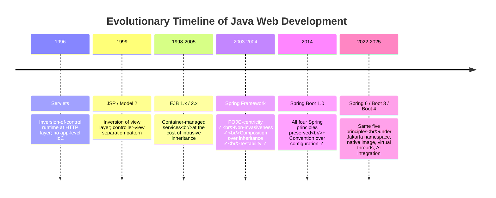

Each principle deserves a brief restatement at this synthetic level because the working developer's competency is best organised around them rather than around feature lists.

**POJO-centricity.** Business logic lives in plain Java classes that do not extend framework superclasses, do not implement framework interfaces, and remain valid Java objects independent of the container. This principle, the most consequential of Spring's founding choices, is what made every subsequent feature deliverable through proxies and configuration rather than through inheritance. Boot does not weaken it; in a Boot application, the `@Service`, `@RestController`, and `@Repository` classes remain POJOs in the strict sense, with annotations carrying metadata rather than imposing structural commitments.

**Non-invasiveness.** Application code remains portable and source-level unaware of the container. A service class wired into an `ApplicationContext` is byte-for-byte identical to one constructed with `new` in a unit test. This principle survives Boot intact; what has shifted is the *ergonomic* reality (annotations are now everywhere) rather than the *structural* claim (the underlying classes still compile and run without Spring on the classpath, when the annotations themselves are sourced from Jakarta or JSR-330 rather than from Spring proper).

**Composition over inheritance.** Cross-cutting concerns—transactions, security, caching, retry, asynchrony—are composed in at runtime through proxies rather than baked into source code through inheritance. The mechanism Chapter 4 dissected (BeanPostProcessors creating proxies that wrap target beans with advice chains) is the structural operationalisation of this principle, and it is the same mechanism that drives `@Transactional`, `@PreAuthorize`, `@Async`, `@Cacheable`, and `@Retryable` in modern Boot applications.

**Testability as a first-class design goal.** Because beans are POJOs with injected dependencies, they can be exercised in any test harness without a container. Boot has *amplified* this principle through its slice annotations (`@WebMvcTest`, `@DataJpaTest`, `@JsonTest`) that load only the part of the context relevant to a given test, through its embrace of Testcontainers for integration testing against real backing services, and through its tight integration with JUnit 5 and Mockito.

**Convention over configuration.** Sensible defaults inferred from the classpath and overridden only where they do not fit. This is Boot's contribution to the principle stack, and it rests on the prior four: only because beans are POJOs, only because configuration is non-invasive, only because cross-cutting concerns compose at runtime, can the framework infer wiring from the classpath without trapping developers in a system they cannot escape.

The five principles, taken together, form the **conceptual backbone around which the developer competencies of §§8.5–8.10 are organised**. A developer who has internalised them reads each new framework feature not as an isolated capability but as another instance of the same playbook: a POJO programming surface, an annotation-driven declarative configuration, an AOP-proxied cross-cutting concern, a template-method abstraction, a unified exception hierarchy, with sensible defaults and explicit overrides. The competency map that follows is structured to reinforce this reading.

## 8.5 Foundational Layer Competencies: Core Java, JVM, and Servlet/HTTP Fundamentals

Every higher-level Spring abstraction sits on three substrate layers that the working developer must understand at the level of mechanism, not merely usage. The foundational competency tier—**core Java, JVM internals, and the Servlet/HTTP contract**—is non-negotiable not because it is intellectually impressive but because every Spring failure mode the report has documented bottoms out, eventually, at one of these three layers.

**Core Java language features.** Spring's annotation surface and reactive APIs assume fluency with the modern Java language. A practitioner-grade enumeration of "important Java features" for Spring Boot development is concrete: "OOP concepts, Java Collections Framework, exception handling, generics, Lambda expressions, Streams API, and annotations, which are widely used in Spring Boot applications."[^47] A more recent and ambitious roadmap expands the same list to include modern features that the field's evolution has elevated to baseline: Records and sealed classes for data-class modelling, pattern matching (`instanceof`, `switch` patterns) for control flow, text blocks and string enhancements for readable literals, the Optional class for null-safety, and—crucially for §8.10's cloud-native discussion—virtual threads as the new concurrency primitive that reshapes the MVC-versus-WebFlux debate.[^48]

The mapping between language features and Spring abstractions is direct and worth making explicit. **Lambdas and functional interfaces** are the surface through which Spring Security's `SecurityFilterChain` DSL, Spring Integration's `IntegrationFlow` DSL, and Spring Boot's `WebClient` builder express composition. **Streams and Optional** are the surface through which Spring Data repositories and JPA `EntityManager` results are processed. **Records** have become the canonical type for `@ConfigurationProperties` POJOs, DTOs, and HTTP request bodies. **Annotations and reflection** are the substrate on which the entire Spring container, AOP machinery, and auto-configuration apparatus operate. The Coursera fundamentals curriculum makes the connection explicit by closing with a module on "modern Java features such as Lambda expressions, Streams API, Optional, multithreading, and annotations, which are widely used in Spring Boot development."[^47]

**JVM internals.** A Spring developer's relationship to the JVM is not optional. The report's repeated invocations of class loading (Chapter 2's container-loaded Servlet, Chapter 4's proxy generation, Chapter 7's auto-configuration class scanning), garbage collection (Chapter 7.10's per-instance memory commentary), and threading model (Chapter 2's single-instance multi-threaded execution, Chapter 6.4's WebFlux event loop) all bottom out at JVM behaviour. The structural map of the JVM that a working developer should hold is concise: the JVM "Loads code (classloader), executes code (stack-based bytecode), takes care of memory (GC), [and] manage[s] code for security."[^49]

Three sub-competencies within JVM internals deserve particular attention because they correspond to the most-debugged Spring problems. **Class loading and bytecode manipulation** explain how AOP proxies are generated at runtime (CGLib for class-based proxies, JDK dynamic proxies for interface-based proxies), why Spring's classpath scanning produces the auto-configuration triggering of Chapter 7.3, and why "easy ways of extending bytecodes Without 'brushing bytecodes': CGLib, Java Proxies, JavaAssist"[^49] underpin the framework's most consequential machinery. **Garbage collection** parameters—generational hypothesis, eden/survivor/old generation sizing, the choice of collector—directly determine the per-instance memory and pause-time behaviour that Chapter 7.10 noted as Boot's principal operational cost.[^49] **The thread model**—native threads with their stack and JIT-compiled code, the upcoming virtual threads that reshape blocking I/O semantics, and the `ThreadLocal` mechanism that underpins Spring Security's `SecurityContextHolder` and Spring's transaction synchronization—is the layer at which concurrency bugs are diagnosed.

**The Servlet/HTTP contract.** Chapter 2 dissected this layer in detail; the synthetic claim is that it remains the substrate of every Spring MVC and Boot application. The single-instance, multi-threaded execution model is the same whether the bean is a hand-written `HttpServlet` of 2003 or a `@RestController` of 2025. The four-tier scope model (page/request/session/application) is what `@RequestScope`, `@SessionScope`, and `@ApplicationScope` re-spell. The filter pipeline is the substrate on which Spring Security's `FilterChainProxy` operates. A representative practitioner observation captures the operational consequence directly: "Servlets are multi-threaded by default. A single servlet instance serves many requests concurrently. Avoid shared mutable state in instance fields. Use local variables, thread-safe collections, or container managed resources to ensure thread safety." The same rule applies, unchanged, to default-singleton Spring beans.

The structural justification for keeping these three layers as a single foundational tier is that every Spring failure that produces a long stack trace, a memory leak, a race condition, an unexpected session-scope behaviour, or a startup timeout traces back to one of them. A developer who can read a thread dump, recognise a `ThreadLocal` leak, identify a class-loader hierarchy, and map an `HttpServletRequest` parameter to a `@RequestParam` annotation has the substrate competence on which all the higher-tier competencies build.

## 8.6 Spring Core Competencies: IoC, DI, AOP, and Annotation-Driven Configuration

The second competency tier covers the framework-level mechanics that Chapter 4 dissected. The synthetic claim of this section is that **the IoC container, dependency injection, AOP, and the annotation vocabulary together form a single coherent system**, and competence consists in understanding how they interlock rather than in memorising each in isolation.

**IoC container mechanics and the bean lifecycle.** The container-as-library posture introduced in Chapter 3.7 is the foundational mental model: an `ApplicationContext` is a bean graph whose construction is described by configuration (XML, Java config, annotations) and whose lifecycle the container drives through `BeanFactoryPostProcessor`s, `BeanPostProcessor`s, instantiation, dependency resolution, `@PostConstruct`/`InitializingBean` callbacks, and `@PreDestroy`/`DisposableBean` shutdown hooks. Understanding the bean lifecycle is the prerequisite for diagnosing every "bean not found," "circular dependency," and "post-construction state inconsistency" bug.

**Dependency injection idioms.** Three flavours exist, and their trade-offs are well-established in practitioner discourse:

| Flavour | Mechanism | Strengths | Weaknesses |
|---|---|---|---|
| **Constructor injection** | Dependencies passed to constructor; field marked `final` | Mandatory dependencies enforced at compile time; immutable beans; trivial unit testing without a container | Verbose for many dependencies (mitigated by Lombok or records) |
| **Setter injection** | Dependencies set through setter methods | Optional dependencies; circular dependency resolution | Mutable beans; dependencies not guaranteed at construction time |
| **Field injection** | Dependencies injected directly into fields via `@Autowired` | Concise | Cannot use `final`; testability requires reflection or container; widely considered an anti-pattern in modern Spring |

The modern consensus, reinforced by Spring's own documentation since version 4.3, is that **constructor injection is the default**. Boot applications using Lombok's `@RequiredArgsConstructor` or Java records achieve constructor injection with no syntactic overhead, restoring the conciseness that field injection used to win on while preserving testability and immutability.

**Bean scopes.** The default `singleton` scope is the same single-instance multi-threaded model the Servlet contract imposes; `prototype` produces a new instance per request to the container; the web-aware scopes (`request`, `session`, `application`, `websocket`) re-expose the Servlet four-tier scope hierarchy; and Boot adds `@RefreshScope` (Spring Cloud) for beans that should rebuild on configuration refresh. The most consequential rule is that **scope mismatches produce subtle bugs**: injecting a request-scoped bean directly into a singleton bean captures only the first request's instance; the standard remedy is to inject through a `Provider`/`ObjectFactory` or to use Spring's scoped-proxy mechanism.

**The AOP proxy mechanism and its canonical pitfalls.** Chapter 4's detailed dissection bears one synthetic recapitulation: every annotation that triggers cross-cutting behaviour—`@Transactional`, `@PreAuthorize`, `@Async`, `@Cacheable`, `@Retryable`, `@Validated`—is implemented through a proxy that wraps the bean, intercepts invocations, and applies advice. Two pitfalls follow directly from this mechanism and account for a disproportionate share of debug time:

1. **Self-invocation bypasses the proxy.** A method `a()` calling another `@Transactional` method `b()` on `this` invokes the implementation directly, not through the proxy, so no transaction interception occurs. The remedy is to extract `b()` to a separate bean (so the call crosses a proxy boundary) or to use AspectJ-mode weaving.
2. **Default rollback rules apply only to unchecked exceptions.** A `@Transactional` method that throws a *checked* `BusinessException` after writing partial state will commit the partial state unless the annotation declares `rollbackFor = BusinessException.class`. The default exists for historical compatibility with EJB; the override is essential for any service that throws checked domain exceptions.

A developer who has internalised both pitfalls has crossed the threshold from "uses Spring annotations" to "understands what Spring annotations do."

**The annotation vocabulary.** Modern Spring development is annotation-driven, and the annotations cluster into a small number of conceptual families:

| Family | Members | Purpose |
|---|---|---|
| Component declaration | `@Component`, `@Service`, `@Repository`, `@Controller`, `@RestController` | Mark classes as candidate beans for component scanning |
| Configuration declaration | `@Configuration`, `@Bean`, `@Import`, `@ComponentScan` | Define beans programmatically in Java config classes |
| Conditional registration | `@Conditional`, `@ConditionalOnClass`, `@ConditionalOnMissingBean`, `@ConditionalOnProperty`, `@Profile` | Drive auto-configuration and environment-specific bean activation |
| Dependency injection | `@Autowired`, `@Qualifier`, `@Value`, `@Lazy`, `@Primary` | Wire dependencies and resolve ambiguity |
| Cross-cutting concerns | `@Transactional`, `@Async`, `@Cacheable`, `@Scheduled`, `@PreAuthorize`, `@PostAuthorize`, `@Validated` | Trigger AOP-proxied behaviour |
| Boot meta-annotations | `@SpringBootApplication`, `@EnableAutoConfiguration`, `@EnableWebMvc`, `@EnableTransactionManagement`, `@EnableJpaRepositories` | Composite annotations that activate framework subsystems |

Mastery of the vocabulary is not memorisation; it is recognising that each annotation is a declarative trigger for a mechanism the developer can name. Anchoring each annotation to its underlying mechanism (component scanning, conditional bean evaluation, proxy generation, classpath-driven auto-configuration) is the discipline that converts surface familiarity into deep competence.

## 8.7 Web Tier Competencies: Spring MVC, REST API Design, and View Technologies

The web tier competencies extend the IoC and AOP machinery into the request-handling pipeline Chapter 5 dissected. The synthetic structure is the **`DispatcherServlet` pipeline as a sequence of pluggable strategy beans**, with each pipeline stage being a competency in its own right.

**The DispatcherServlet pipeline and its extension points.** Six pluggable strategies form the pipeline, each represented as one or more beans in the WebApplicationContext: `HandlerMapping` (routing requests to handler methods), `HandlerAdapter` (invoking handlers and binding parameters), `HandlerInterceptor` (cross-cutting hooks before, after, and on completion), `ViewResolver` (turning logical view names into renderable views), `View` (the actual rendering implementation), and `HandlerExceptionResolver` (mapping exceptions to responses). A developer working with Spring MVC is, structurally, a developer who knows which pipeline slot fills which need.

**Annotation-driven controllers and parameter binding.** The annotation surface of `@Controller`, `@RestController`, `@RequestMapping`, and the HTTP-method-specific shortcuts is the developer-facing API; behind it lies the `RequestMappingHandlerAdapter` and its chain of `HandlerMethodArgumentResolver` and `HandlerMethodReturnValueHandler` strategies that Chapter 5.2 enumerated. Competence consists in knowing the binding annotations (`@PathVariable`, `@RequestParam`, `@RequestHeader`, `@CookieValue`, `@RequestBody`, `@ModelAttribute`, `@SessionAttribute`) and their Servlet-era equivalents, so that when binding fails the developer can reason about which Servlet-level access produced which bound value.

**REST API design.** The competency map here is concrete and well-established:

- **HttpMessageConverters**, particularly `MappingJackson2HttpMessageConverter` for JSON, are the strategies that turn `@RequestBody` parameters and `@ResponseBody` return values into and from HTTP payloads. Customising serialization (Jackson modules, `@JsonView`, custom serializers) is a frequent task.
- **`ResponseEntity<T>`** is the canonical return type for fine-grained control over status codes, headers, and bodies. A developer who knows when to return `ResponseEntity.ok(body)` versus `ResponseEntity.created(uri).body(body)` versus `ResponseEntity.notFound().build()` is operating at the right level of HTTP awareness.
- **Content negotiation** through the `Accept` header, file extensions, or query parameters routes requests to the converter producing the right media type. The pitfall noted in Chapter 5.3—that `Accept` header negotiation can produce surprises when mixed with view resolution—argues for cleanly separating REST endpoints (message-converter-driven) from server-rendered HTML (view-resolver-driven).
- **API versioning**, now elevated to a first-class concern in Spring Framework 7 and Boot 4 with auto-configuration support for version-aware request mapping, functional routing, and client-side version setting in `RestClient` and `WebClient`, is the discipline of evolving APIs without breaking clients.
- **HATEOAS**, through Spring HATEOAS, layers hypermedia links onto responses to decouple clients from URI structure. Competence here is optional but valuable for teams committed to the hypermedia constraint.

**Data binding, validation, and global exception handling.** The trio Chapter 5.5 unified is a single declarative pattern: `@Valid` triggers Bean Validation (JSR-380) on bound objects, errors flow into `BindingResult` or surface as `MethodArgumentNotValidException`, and `@RestControllerAdvice` classes with `@ExceptionHandler` methods provide application-wide mapping of exceptions to HTTP responses. A modern controller, in this idiom, is a thin layer of intent: the controller method states what to do, the binding/validation/exception-handling apparatus handles the surrounding contract.

**View technologies.** Although REST endpoints dominate modern Spring development, server-rendered views remain relevant for many applications. The competency surface includes JSP (now legacy but still supported, with the caveats Chapter 2.6 documented), Thymeleaf (the modern default for server-rendered HTML in Boot, with first-class layout dialects and Spring Security integration), FreeMarker and Mustache (alternative templating engines), and the `ContentNegotiatingViewResolver` for applications that genuinely need to render the same data in multiple representations. The structural rule from Chapter 5.3 is worth remembering: `InternalResourceViewResolver` "should almost always be the last one in the chain" because it cannot return null, and ordering view resolvers correctly is a subtle but consequential configuration competency.

The synthetic claim is that the web tier competency tier is **a refined re-instantiation of the foundational Servlet competencies of §8.5**. Every Spring MVC mechanism is the same underlying Servlet contract dressed in a more declarative surface, and a developer who can read the Servlet model can read the Spring MVC model with no conceptual leap.

## 8.8 Data Access and Transaction Management Competencies

The persistence-layer competencies form a coherent stack that Chapter 5.6 through 5.9 dissected. The synthetic claim is that **transaction management, JDBC abstraction, ORM integration, and repository abstractions are not four separate skills but one playbook applied at successive levels of abstraction**, and competence consists in knowing when to drop down a level and when to stay up.

**JdbcTemplate and the template-method pattern.** Even in JPA-dominated applications, raw JDBC has its place: complex reporting queries, performance-critical batch operations, integration with stored procedures, working with databases that JPA does not model well. `JdbcTemplate`, `NamedParameterJdbcTemplate`, and `SimpleJdbcInsert` together form the API surface; competence consists in knowing the `RowMapper`/`ResultSetExtractor`/`RowCallbackHandler` strategies and choosing the right one for a given query. The architectural payoff—template absorbs ritual, strategy supplies variation—is the same payoff `JmsTemplate`, `RestTemplate`/`WebClient`, and `RedisTemplate` deliver in their respective domains.

**Declarative transaction management.** The `@Transactional` annotation, the `PlatformTransactionManager` abstraction (and its reactive counterpart `ReactiveTransactionManager`), and the propagation/isolation/rollback-rule vocabulary form the single most operationally consequential competency in the persistence tier. The propagation table from Chapter 5.7 (`REQUIRED`, `REQUIRES_NEW`, `NESTED`, `SUPPORTS`, `NOT_SUPPORTED`, `MANDATORY`, `NEVER`) is worth memorising because the differences are subtle and the wrong choice produces silent data-integrity bugs. The two pitfalls noted in §8.6—self-invocation and checked-exception default rollback rules—apply with particular force to `@Transactional` and account for many production incidents.

**JPA, Hibernate, and the persistence-context lifecycle.** Modern Spring data access is JPA-dominated, with Hibernate as the default provider. The competency surface includes:

- **Entity mapping**: `@Entity`, `@Table`, `@Id`, `@GeneratedValue`, `@Column`, `@Transient`, and the relationship annotations (`@OneToOne`, `@OneToMany`, `@ManyToOne`, `@ManyToMany` with their `mappedBy`, `cascade`, `fetch`, and `orphanRemoval` attributes).[^48]
- **The persistence context lifecycle**: when entities are managed versus detached, when changes are flushed to the database, how dirty checking works, what `entityManager.flush()` and `entityManager.clear()` do, and—crucially—the LazyInitializationException pitfall when a lazy association is accessed outside the persistence context.
- **JPQL, Criteria API, and native queries**: the trade-offs between portability (JPQL), type-safety (Criteria, often with JPA Metamodel or Querydsl), and database-feature access (native SQL).
- **N+1 query problems and their mitigation**: through `@EntityGraph`, JPQL `JOIN FETCH`, batch fetching, and Spring Data's projection-based query result shaping.

**Spring Data repositories.** The repository pattern across stores—`JpaRepository`, `MongoRepository`, `RedisRepository`, `R2dbcRepository`, and the rest of the Spring Data family—is the highest-level abstraction in the persistence tier. Competence consists in knowing the derived-query naming conventions (`findBy`, `existsBy`, `countBy`, `deleteBy`, with property-path navigation and keyword combination), `@Query`-annotated explicit queries, `Specification<T>` and Querydsl integration for type-safe dynamic queries, `Pageable`/`Sort` arguments and their automatic binding from query strings via `PageableHandlerMethodArgumentResolver`, and the auditing and lifecycle-callback features (`@CreatedDate`, `@LastModifiedDate`, `@PrePersist`, `@PostLoad`).

**The unified DataAccessException hierarchy.** The vendor- and technology-neutral exception hierarchy is the single feature that decouples application code from JDBC, JPA, or store-specific error semantics. A `@RestControllerAdvice` that maps `DuplicateKeyException` to `409 Conflict` works regardless of whether the underlying database is Oracle, MySQL, or PostgreSQL, and regardless of whether the data-access path was `JdbcTemplate`, JPA repository, or native Hibernate. Competence here is knowing the hierarchy's structure (`DataAccessException` → `DataIntegrityViolationException` → `DuplicateKeyException`, and parallel branches for locking, optimistic concurrency, query syntax, and connection failures) so that exception-handling code can be written at the right level of generality.

## 8.9 Cross-Cutting Competencies: Security, Testing, Build Tooling, and Observability

Four cross-cutting competencies extend the within-application competencies into the operational disciplines a production developer must wield.

**Spring Security essentials.** Chapter 6.1's dissection of the filter chain, authentication and authorization model, and JWT/OAuth2 resource server should be internalised at the level of mechanism, not surface. The competency floor consists of: configuring `SecurityFilterChain` beans for distinct request matchers (typically separating stateless API chains from session-based form-login chains), choosing appropriate `PasswordEncoder` implementations (`BCryptPasswordEncoder` as the modern default), implementing a `UserDetailsService` against the team's user store, configuring CSRF and CORS appropriately for the threat model, and—most consequentially in modern microservice contexts—configuring the OAuth2 Resource Server with `spring.security.oauth2.resourceserver.jwt.issuer-uri` and customising the `JwtAuthenticationConverter` to map JWT claims to Spring authorities.

The catalogue of common misconfigurations from Chapter 6.1—mixing session and JWT chains, disabling CSRF without alternative protection, weak password hashing, incorrect JWT validation, insufficient testing of failure paths—is the operational checklist a security-aware developer applies to every application they touch. The version-churn cost is real (Spring Security's API has evolved significantly across versions 5, 6, and 7), and migration is a recurring maintenance discipline rather than a one-time event.

**The testing pyramid for Spring.** Modern Spring testing has a well-defined layered structure:

| Test type | Annotation / tool | Scope | Speed |
|---|---|---|---|
| Pure unit test | JUnit 5 + Mockito | Single class with mocked dependencies | Very fast |
| Web slice | `@WebMvcTest` + MockMvc | Controllers + their direct collaborators (mocked services) | Fast |
| Data slice | `@DataJpaTest` | Repositories + JPA infrastructure (in-memory or Testcontainers) | Fast |
| JSON slice | `@JsonTest` | Jackson serializers/deserializers | Very fast |
| Full integration | `@SpringBootTest` | Full application context, often with `webEnvironment = RANDOM_PORT` | Slower |
| End-to-end with real backing services | `@SpringBootTest` + Testcontainers | Full stack with real PostgreSQL, Kafka, Redis in Docker | Slowest |

Competence consists in choosing the right level of test for the property being verified. The Boot 4 / JUnit 6 release context has elevated testing to "non-negotiable from day one," and the recommended testing stack is now JUnit 6, Mockito, AssertJ, MockMvc/WebTestClient, Testcontainers for integration tests, and the `@SpringBootTest` slice family for context-aware testing.[^48]

**Build tooling: Maven and Gradle.** Competence in build tooling is not optional. The Spring Boot BOM (`spring-boot-dependencies` parent in Maven, the Spring Boot Gradle plugin for Gradle) is the curated dependency-management mechanism that resolves the version-compatibility friction Chapter 6 documented. A developer must know how to: declare starter dependencies, override individual dependency versions when necessary, use the `spring-boot-maven-plugin` or `bootJar` Gradle task to produce executable JARs, configure layered JARs for efficient Docker image caching, manage profiles (Maven profiles, Gradle source sets) for environment-specific builds, and—increasingly—integrate with native-image build tools for GraalVM compilation.

**Observability.** The Actuator-Micrometer-OpenTelemetry stack Chapter 7.7 introduced is the modern observability surface. The competency map includes:

- **Actuator endpoints**: `/actuator/health` (with composite indicators and Kubernetes-aware liveness/readiness groups), `/actuator/metrics`, `/actuator/loggers` (with runtime log-level adjustment), `/actuator/info`, `/actuator/env`, `/actuator/beans`, `/actuator/conditions`, `/actuator/threaddump`, `/actuator/heapdump`. Securing endpoints appropriately—exposing only what is needed, behind appropriate authentication—is a discipline distinct from enabling them.
- **Micrometer metrics**: registering custom timers, counters, and gauges; understanding metric tags and cardinality; choosing an appropriate registry (Prometheus, Datadog, CloudWatch) via the corresponding `micrometer-registry-*` dependency.
- **Distributed tracing via Micrometer Tracing**: trace propagation across HTTP and messaging boundaries, integration with OpenTelemetry exporters, the new Boot 4 `spring-boot-starter-opentelemetry` that "brings everything needed to export metrics and traces over OTLP, and auto-configures the OpenTelemetry SDK with zero extra setup."[^48]
- **Structured logging**: configuring Logback or Log4j2 for JSON output, including trace and span IDs in log records, integrating with log-aggregation backends (ELK, Splunk, Loki).

The synthetic claim is that observability is no longer a final-stage concern but a design constraint that shapes how services are built. A service whose health checks, metrics, and tracing are wired in from the first commit is operationally distinct from one whose observability is retrofitted, and modern Boot makes the "from the first commit" path the default through Actuator and Micrometer auto-configuration.

## 8.10 Cloud-Native and Microservices Competencies

The final competency tier covers the operational disciplines that the cloud-native era has made mandatory. The synthetic claim is that **cloud-native competence consists less in mastering individual tools than in understanding how Spring Boot's auto-configuration model, externalized configuration, embedded servers, and Spring Cloud's microservice toolkit interact with the deployment substrate**.

**Auto-configuration as a debugging discipline.** Reading the Conditions Evaluation Report (`debug=true` in `application.properties`, or `--debug` on the command line, or the `/actuator/conditions` endpoint at runtime) is the canonical first response to "why is this bean missing" or "why is this bean unexpectedly present." The Negative-matches section answers the question directly by naming the specific failed condition. Competence here is reflexive: when something is wrong in a Boot application, the Conditions Evaluation Report is the first instrument consulted, not the last.

**Externalized configuration patterns.** The four-tier precedence ladder (command line > environment variables > profile-specific files > base configuration > framework defaults) is the structural mechanism by which the same JAR runs across environments. Competence consists in:

- **Profile management**: `application-{profile}.yml` files, `spring.profiles.active`, profile-specific bean activation via `@Profile`, Boot 3's profile groups for composite environments.
- **Type-safe property binding**: `@ConfigurationProperties` POJOs (especially as records) with `@Validated` for startup-time validation, `@ConfigurationPropertiesScan` for automatic discovery, IDE autocomplete via the metadata processor.
- **Secret management**: avoiding plaintext secrets in property files, integrating with Vault (Spring Cloud Vault), Kubernetes Secrets (mounted as files or environment variables), or cloud-provider secret stores.
- **Configuration refresh**: `@RefreshScope` for beans that should rebuild on configuration changes, Spring Cloud Bus for fleet-wide refresh broadcast, the `/actuator/refresh` endpoint.

**Embedded server tuning and graceful shutdown.** The `server.*` property family exposes connection pools, thread pools, timeouts, compression, and SSL configuration; competence is knowing which knobs matter for which workloads (connection-pool size for high concurrency, request timeouts for SLA enforcement, compression for bandwidth-constrained clients). Graceful shutdown—`server.shutdown=graceful` and `spring.lifecycle.timeout-per-shutdown-phase`—is the integration point with Kubernetes' pod-termination lifecycle that delivers zero-downtime rolling deployments.

**Containerization patterns.** The executable-JAR-to-Docker-image pathway is straightforward but has subtleties:

- **Layered JARs**: Boot's layered JAR format (separating dependencies, snapshot dependencies, application classes, and resources into distinct Docker layers) maximises image-cache reuse, so that rebuilding the image after a code-only change touches only the application layer.
- **Buildpacks**: the `spring-boot-maven-plugin`'s `build-image` goal (and the Gradle equivalent) uses Cloud Native Buildpacks to produce optimized images without a Dockerfile, applying best practices (non-root user, JVM tuning, layered organisation) automatically.
- **JVM tuning for containers**: ensuring the JVM respects container memory limits (default behaviour since JDK 11+, but verifiable with `-XX:+PrintFlagsFinal`), choosing an appropriate base image (JRE-only, distroless, or full JDK depending on tooling needs), and—for the most resource-constrained workloads—ahead-of-time compilation via GraalVM Native Image (the topic Chapter 9 expands).

**Kubernetes integration patterns.** The integration surface is well-defined:

- **Liveness and readiness probes** wired to `/actuator/health/liveness` and `/actuator/health/readiness`, with the probes configured for appropriate timing (initial delay matching startup time, intervals matching SLA tolerances).
- **ConfigMaps and Secrets** mounted as files or projected as environment variables, with Boot's externalized configuration consuming them through its standard `Environment` abstraction—no Kubernetes-specific code in the application.
- **Horizontal pod autoscaling** driven by Actuator metrics exported to Prometheus via Micrometer, with scaling policies based on request latency, error rate, or custom application metrics.
- **Spring Cloud Kubernetes** as an alternative to Spring Cloud Netflix Eureka for service discovery and configuration when running on Kubernetes, leveraging Kubernetes' own service registry and ConfigMap watchers.

**The Spring Cloud microservices toolkit.** Chapter 6.5's enumeration is the operational map: Spring Cloud Config (centralized configuration), service discovery (Eureka, Consul, ZooKeeper, Kubernetes-native), Spring Cloud LoadBalancer (client-side load balancing), Resilience4j (circuit breakers, bulkheads, rate limiters), Spring Cloud Gateway (API gateway, with Boot 4 / Cloud 2025.1 adding API versioning predicates aligned with Framework 7), Spring Cloud OpenFeign (declarative HTTP clients), Micrometer Tracing (distributed tracing), and Spring Cloud Stream (messaging abstraction over Kafka and RabbitMQ).

**The version compatibility matrix as an operational discipline.** Chapter 6.5 catalogued the Spring Cloud release-train-to-Spring-Boot compatibility table, and the practitioner observation that "in 2026 it's still a bit tedious to find the *exact latest matching versions* of Spring Boot and Spring Cloud" remains accurate. Competence here is not memorising the matrix but knowing where to find it (the Spring Cloud project page, the release-train release notes), how to validate alignment (by checking the BOM versions resolved by the build), and how to coordinate upgrades across a microservice fleet (typically by upgrading shared parent POMs or Gradle convention plugins in lockstep).

## 8.11 A Layered Competency Map and Learning Roadmap for Modern Spring Developers

The preceding six sections enumerate competencies at the level of *what to know*. The synthetic question this final section answers is *how to learn it*—and, more importantly, in what sequence, so that competency acquisition reinforces the architectural intuition the report has been building rather than obscuring it.

The layered structure is a five-tier pyramid in which each tier presupposes the tiers below it. The pyramid is deliberately structured so that **the historical evolution traced in Chapters 2–7 maps onto a learning sequence**: the developer first masters the substrate the field began with, then climbs through each generation's contribution, reaching the convention-driven Boot surface only after the underlying mechanisms are intelligible.

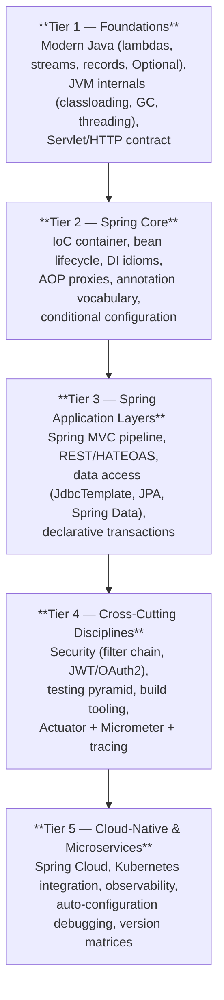

The tiers, with their historical anchoring and recommended depth of mastery, can be tabulated:

| Tier | Competency cluster | Historical anchor | Recommended depth |
|---|---|---|---|
| 1 | Modern Java, JVM, Servlet/HTTP | Chapter 2 — the substrate every Spring abstraction sits on | **Mechanism level**: read a thread dump, recognise a class-loader hierarchy, map an `HttpServletRequest` to a `@RequestParam` |
| 2 | IoC, DI, AOP, annotation vocabulary | Chapters 3–4 — Spring's core counter-revolution against EJB | **Mechanism level**: explain proxy generation, predict self-invocation pitfalls, read a bean-lifecycle trace |
| 3 | MVC, REST, data access, transactions | Chapter 5 — the application-layer playbook | **Idiomatic level**: write a controller, repository, service trio with appropriate transactional and exception-handling boundaries |
| 4 | Security, testing, build tooling, observability | Chapters 6 (Security) and 7 (Actuator) — cross-cutting production disciplines | **Operational level**: configure security correctly, choose appropriate test slices, read Actuator output |
| 5 | Spring Cloud, Kubernetes, auto-config debugging | Chapter 7 (Boot) and Chapter 6 (Cloud) — cloud-native era | **Diagnostic level**: read Conditions Evaluation Reports, manage version matrices, integrate with container orchestrators |

**The recommended learning sequence** respects the dialectical structure of the field. A developer beginning their Spring journey today is well-advised to:

1. **Start with foundations (Tier 1)**, even if doing so feels old-fashioned. A working knowledge of the Servlet contract, the JVM thread model, and the modern Java language features eliminates a class of bugs and confusions that no amount of annotation memorisation can address. This corresponds to phases 1–4 of recent practitioner roadmaps that emphasise "computational thinking" and "modern Java" before any framework introduction.[^48]
2. **Climb to Spring Core (Tier 2)** by *first understanding the EJB-era frictions* that Spring was designed to solve. Chapter 3's narrative is not historical decoration; it is the conceptual scaffolding that makes IoC, DI, and AOP intelligible as solutions rather than as arbitrary framework features. A developer who can articulate why constructor injection beats field injection in terms of testability—and can connect that to Chapter 3.6's testability principle—has crossed a threshold that no amount of Spring tutorial consumption can substitute for.
3. **Master Spring application layers (Tier 3)** by working through a non-trivial CRUD application, treating each annotation as a declarative trigger for a mechanism. Build the controller, the service, and the repository. Add `@Transactional`. Hit the self-invocation pitfall and resolve it. Add `@Valid` and `@RestControllerAdvice`. Each friction encountered in this exercise is a friction the report has documented historically, and recognising it is the connection between the abstract narrative and the concrete codebase.
4. **Acquire cross-cutting disciplines (Tier 4)** as design constraints rather than afterthoughts. Write tests from the first commit using the appropriate slice. Configure Spring Security correctly for the actual threat model rather than copying a tutorial that disables CSRF. Wire in Actuator and at least basic Prometheus metrics from the first deployment. The discipline of treating these as first-class concerns is what distinguishes a working Spring developer from a Spring tutorial graduate.
5. **Climb to cloud-native (Tier 5)** only when the deployment context demands it. Not every application needs Spring Cloud; not every application benefits from microservice decomposition. The competencies of this tier are essential for teams operating at scale in cloud environments and over-engineering for teams whose applications are smaller. Recognising which tier a workload actually needs is itself a meta-competency that the report's comparative analysis is designed to cultivate.

The roadmap a recent practitioner guide articulates—"Phase 0: Tools & Environment; Phase 1: Computational Thinking; Phase 2: Methods & Functions; Phase 3A/B: Core OOP / Advanced OOP; Phase 4: Modern Java; Phase 5: Data & Persistence; Phase 6: Spring Boot; Phase 7: Professional Practices"—maps onto this five-tier structure with phases 1–4 corresponding to Tier 1, phase 5 to portions of Tier 3, phase 6 spanning Tiers 2 through 4, and phase 7 covering Tiers 4 and 5.[^48] The structural agreement across independent practitioner roadmaps and the report's historically grounded analysis is itself evidence that the competency map captures durable rather than fashionable knowledge.

**Time investment** is real and worth being honest about. The same practitioner roadmap estimates "6–12 months of consistent practice. No shortcuts."[^48] A more conservative estimate, accounting for the depth this report's framing demands, is that **mechanism-level competence at Tier 2 takes most developers a year**, that **idiomatic competence at Tier 3 takes another year of project work**, and that **operational competence at Tiers 4 and 5 is a continuous discipline** that compounds over the developer's career rather than reaching a stable terminal state. The Spring Boot 4 / Spring Security 7 / Spring Cloud 2025.1 release cadence, with its accompanying API churn, ensures that even seasoned developers spend significant time each year migrating, learning new starters, and adapting to new defaults.

**The competency map as the foundation for forward-looking analysis.** This is the synthetic position the report has been building toward. The competencies enumerated here are not a static target; they are the **practical foundation against which Chapter 9's forward-looking trends will be evaluated**. Native compilation via Spring Native and GraalVM is intelligible only against the per-instance memory and startup-latency competencies of Tier 5. Project Loom's virtual threads reshape the MVC-versus-WebFlux trade-off that Tier 3 currently presents. Kubernetes-native deployment patterns extend the Tier 5 competencies further. Spring AI introduces a new application layer that must be integrated with the existing Tier 3 patterns. Each forward-looking trend can be located on the competency map and assessed for which existing competencies it amplifies, which it threatens to deprecate, and which new competencies it demands.

The deeper structural claim is that **the layered competency map is itself an instance of the report's design-principle thesis**. POJO-centricity, non-invasiveness, composition over inheritance, testability, and convention over configuration appear at every tier. A developer at Tier 1 writes POJOs because the language encourages them; at Tier 2 the IoC container preserves their POJO status while wiring them; at Tier 3 the MVC controller and repository remain POJOs decorated with metadata; at Tier 4 the testing infrastructure exercises them as POJOs; at Tier 5 the cloud-native deployment substrate preserves the executable-JAR-of-POJOs model. **The implementation surface evolves; the design stance compounds.** This is the sentence Chapter 8 has been building toward, and it is the foundation on which Chapter 9 will project the same dialectic forward.

Read against the report's overall argument, this chapter has performed the integration the introduction promised. The dialectical narrative of Chapters 2 through 7—Servlet to JSP to EJB to Spring to Boot, problem to solution to new problem at every transition—has been consolidated into a comparative matrix that exposes the non-monotonic trajectory of the field, into a pair of structural tensions that explain why the field has not stabilised on any single point, into a stable substrate of design principles that has survived every transition, and into a layered competency map that converts the historical analysis into actionable developer guidance. The report's reader, having reached this point, has not only a chronological understanding of how Java web development arrived at Spring Boot but a structural account of *why* it arrived where it did, and a practical roadmap for *what* to learn so that they can participate intelligently in whatever the field's next rebalancing turns out to be. The next chapter takes up that next rebalancing in its forward-looking dimension.

# 9 Future Outlook, Strategic Recommendations, and Conclusion

The eight chapters preceding this one have traced a continuous engineering argument: that the journey from the 1996 Servlet specification to a modern Spring Boot service is best read as a sequence of disciplined responses to specific engineering frustrations, governed throughout by a small number of enduring design principles. Chapter 8 closed by promising that the layered competency map it consolidated would serve as the practical foundation against which forward-looking trends could be evaluated. This chapter cashes that promise. It examines six emerging directions—native compilation via Spring Native and GraalVM, the rebalancing of the reactive-versus-imperative debate under Project Loom's virtual threads, Kubernetes-native deployment patterns, AI integration via Spring AI, the Jakarta EE namespace transition, and the cumulative ecosystem-level innovations that accompany them—and reads each through the same problem→solution→new-problem lens the report has used throughout. It then consolidates the report's central design-philosophy thesis, converts the analytical findings into role-specific recommendations for practitioners, and closes with a final reflection on what working competence in Java web development consists of in 2025 and beyond. The chapter's structural commitment is the report's structural commitment: no technology in the chain is treated as a terminal endpoint, every solution is shown to seed new frictions, and the reader is left equipped to participate in the next round of the dialectic rather than merely to absorb it.

## 9.1 Native Compilation: Spring Native, GraalVM, and the Resource-Efficiency Frontier

Chapter 7.10 catalogued Spring Boot's principal operational costs as per-instance memory footprint and startup latency. The community observation that "by default it wants around 100MB of RAM per instance" and that "Docker memory requirements are in the 64m range and even that is probably a bit of overkill. I can run thousands of these on a raspberry pi 4. I can only run like 4 spring boot apps on it" captured a genuine asymmetry between Boot's developer-productivity virtues and its runtime resource profile. Native compilation via Spring Native and GraalVM is the most architecturally consequential response to this asymmetry, and it deserves examination at the same three levels of depth—principle, mechanism, developer surface—the report has applied throughout.

At the **principle** level, native compilation inverts the JVM's traditional execution model. The conventional Spring Boot deployment relies on the Java runtime environment to load class libraries and application code, with Just-In-Time compilation translating bytecode to machine code as the application warms up; this loading and warmup process is what produces "long application launch times … especially for complex apps with lots of dependencies," with startup times that can range "from a few seconds to over a minute, depending on the complexity of the application."[^50] Native compilation, by contrast, performs the translation **ahead of time**: the GraalVM `native-image` tool processes all classes in a fixed classpath, performs static analysis to determine which code is reachable from the application's entry point, and compiles code and data into a single binary that includes the necessary runtime components and—replacing the HotSpot VM—GraalVM's Substrate VM.[^50][^51] The result is "a self-contained executable that runs without requiring a separate JRE installation," eliminating "JVM startup overhead and Just-In-Time (JIT) compilation," with consequent reductions in memory consumption and, in cloud-native environments, in cold-start latency.[^50]

The trajectory of Spring's GraalVM support is precisely datable and instructive in its own right. The earliest community work was the experimental `spring-graalvm-native` project initiated by Andy Clement to demonstrate that running a Spring Boot application as a GraalVM native image was possible at all.[^52] Through 2019 and 2020, Pivotal and the GraalVM teams pursued active joint work on improving support, with `spring-graalvm-native 0.6.0` released in April 2020 and `0.7.0` in June 2020 introducing the `@AutomaticFeature` mechanism that drove Spring-aware native configuration.[^52] In March 2021, the Spring team announced the **Spring Native beta**, with a detailed blog post and tooling integration that allowed Spring applications to be compiled to native executables via `mvn spring-boot:build-image`, `gradle bootBuildImage`, or the `native-image-maven-plugin`, with a sample application starting in 38 milliseconds.[^52] First-class native support was then folded directly into Spring Boot 3.0, marking a clean transition from experimental project to core framework capability.[^53] By the time of writing, the supported workflow places native compilation alongside JVM-mode execution as a deployment option in every Spring Boot 3.x and 4.x release.[^51]

At the **mechanism** level, the GraalVM-Spring integration involves a sequence of architectural adjustments that deserve concrete enumeration. A standard GraalVM native-image build "process[es] all classes in a fixed classpath" using the `native-image` binary, "performs static analysis," and "compile[s] code + data into a single binary," with **reachability metadata** supplied for any reflective access, JDK proxies, or resource lookups that static analysis cannot infer.[^51] Spring's adaptation to this model involves three additional stages. First, an **AOT processing phase** at build time generates "compiled sources" augmented by AOT-generated sources and GraalVM configuration; this phase performs a partial context refresh in which "only bean definitions are created, no bean instances," detecting the classpath, environment, and main class so that the runtime context-creation work can be substantially pre-computed.[^51] Second, the framework **generates functional configuration** that "skips the `@Configuration` model at runtime" by producing "available, debuggable source code" representing the same bean graph, achieving a "perfect fit with GraalVM native image static analysis."[^51] Third, **reachability metadata is generated as needed** for reflection, JDK proxies, and resources that the AOT phase identifies as required.[^51] The compilation flow is concrete:

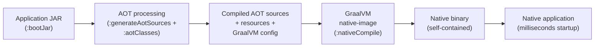

The empirical gains this delivers are documented and consistent. A representative load-test comparison at Trendyol Tech recorded that a Spring Boot 3.2 + Java 21 application running on the JVM had a startup time of 2,269 ms (without virtual threads) or 1,874 ms (with virtual threads enabled), with average memory consumption of 310 MB and 243 MB respectively under 100 concurrent users; the same application compiled as a native image started in **119 ms** (without virtual threads) or **112 ms** (with virtual threads), with average memory consumption dropping to **135 MB** and **100 MB**.[^53] Throughput characteristics were comparable across all variants in the lower-concurrency test (around 940–965 requests per second), confirming that the gains from native compilation accrue primarily on the resource-efficiency axis—startup latency and memory footprint—rather than on raw request throughput.[^53] An independent practitioner experiment building a reactive Spring Boot web application reported a memory footprint reduction "from around 500MB to 30MB" and a startup time drop "from 1.5 seconds to 0.08 seconds" using GraalVM native compilation,[^52] consistent with the broader claim that native binaries deliver "instant startup" measured in "milliseconds for native instead of seconds for the JVM," "no warmup" with "peak performance available immediately," and "low resource usage" through "lower memory footprint and no JIT compilation."[^51]

These gains, however, are paid for in three new categories of friction that the report's lens demands surfacing.

**Build-time cost and compilation latency.** The same authoritative source that catalogues GraalVM's advantages is candid about its trade-offs: "very slow compilation," with build times measured in "minutes instead of seconds."[^51] The practitioner walkthrough confirms the order of magnitude: "this takes some time depending on your hardware! On my late MBP 2017 this takes around 3-4 minutes for the example project."[^52] For continuous-integration pipelines and rapid iteration cycles, this asymmetry between fast JVM builds and slow native builds is operationally significant; the typical pattern that has emerged is to develop and test on the JVM, with native compilation reserved for release builds and integration tests.[^51]

**Closed-world assumptions and runtime flexibility constraints.** GraalVM's static analysis requires that the application's classpath be fixed at build time, which has consequences for several patterns Spring developers take for granted on the JVM. The official Spring guidance enumerates these directly: "Application Classpath is fixed at build time"; "Environment changes impacting the context are not supported," meaning that profiles "spring.some.feature.enabled=true" and "Spring profile changes that contribute new beans" cannot dynamically alter the bean graph; "Java agents are not supported (at runtime)"; and "Reading/manipulating bytecode: please don't."[^51] The closed-world assumption also means that "Bean conditions [are] fixed at build time"—the conditional auto-configuration evaluation that Chapter 7.3 dissected as Boot's central mechanism is, in the native model, performed at build time and frozen, not re-evaluated at runtime.[^51] The broader caveat is that "AOT compilation and closed-world assumption hinder dynamic class loading and reflection in traditional Java applications," with the consequence that "programmers may have to modify their coding habits to maximize Spring Native's features."[^50]

**Library compatibility and the metadata burden.** Static analysis cannot infer which classes a reflection-using library will need at runtime; this metadata must be supplied, either by the library itself or by a community-maintained registry. As the official Spring guidance notes, "Additional metadata required for reflection, proxies, resources" is one of the principal compatibility costs.[^51] To reduce the per-application burden, Oracle and Spring jointly drove the creation of a **reachability metadata repository** that "intends to fill the gap" by providing "Native image configuration for JVM libraries" with "automated testing via native build tools and dedicated CI infrastructure"; "the main goal remains direct inclusion in libraries," with the repository serving as a transitional measure while libraries adopt their own native support.[^51] The community-grade observation is consistent: "Not all GraalVM native images will work with Java libraries or frameworks, resulting in developers having to make changes or find alternatives," and "for JVM-backed developers who have embraced GraalVM for building native apps, the configuration debugging and the deployment process tend to become more complicated than with JVM."[^50]

The result is a deployment matrix in which native compilation is the right answer for some workloads and the wrong answer for others, and where the official guidance is correspondingly conditional.[^51]

| Use case | Verdict | Reasoning |
|---|---|---|
| Function-as-a-Service | **Recommended** | Cold-start latency reductions from seconds to milliseconds; FaaS billing rewards fast startup |
| Microservices needing scale-to-zero | **Recommended** | Low memory and CPU per instance; instant restart |
| Backoffices, container-image distribution, frequent deployment | **Recommended** | Compact packaging, reduced attack surface, smaller container images |
| Standard JVM application with steady traffic | **JVM likely better** | High traffic websites, big monolithic applications, agent-based observability stacks |
| Application using unsupported reflection-heavy library | **JVM likely better** | Metadata burden may exceed value |

A representative GraalVM Community Survey from 2022 reported that **Spring Boot received the highest usage percentage among respondents at 49%**, indicating the breadth of community engagement with the native-image path even before first-class Spring Boot 3.0 support arrived.[^50] The framing the report's lens demands, however, is more cautious than this adoption figure suggests. Native compilation is a credible, well-engineered response to the per-instance resource frictions Spring Boot's auto-configuration model produces, but it does not eliminate those frictions universally; it shifts them—from runtime memory and startup latency to build-time complexity, classpath rigidity, and library compatibility coordination. Read against Chapter 8.3's standardization-versus-innovation dialectic, native compilation is also notable for the architectural posture it adopts: rather than abandoning Spring's reflection-and-proxy machinery (the path Micronaut and Quarkus took), Spring Native preserves the framework's design surface and instead asks GraalVM to absorb the static-analysis cost. The four founding principles survive: POJOs remain POJOs in the native binary, non-invasiveness is preserved (the same source compiles for JVM and native), composition over inheritance is preserved (proxies are now generated at build time rather than runtime, but the composition model is unchanged), and testability is preserved through `mvn -PnativeTest test` / `gradle nativeTest` execution.[^51] The implementation surface evolves; the design stance compounds.

## 9.2 Project Loom and Virtual Threads: Rebalancing the Reactive-versus-Imperative Debate

If native compilation is the most architecturally consequential response to Boot's memory friction, **virtual threads** are the most architecturally consequential response to a different friction the report has tracked: the difficult trade-off between Spring MVC's synchronous, easier-to-reason-about programming model and Spring WebFlux's resource-efficient but cognitively demanding reactive stack. Chapter 6.4 surfaced this trade-off in detail, noting that the WebFlux value proposition—small, fixed-size event-loop thread pools handling many concurrent I/O-bound requests—came at the cost of a steep reactive-programming learning curve and a parallel reactive data-access ecosystem (R2DBC) for any application unwilling to leave the relational database. Project Loom, delivered as a fully released feature in **Java 21**, fundamentally changes this calculus.

At the JVM level, virtual threads are best understood by contrast to platform threads. Platform threads are OS-managed, heavyweight, with limited scalability, where blocking I/O blocks the entire OS thread; virtual threads are JVM-managed, lightweight, with high scalability, where blocking I/O is non-blocking at the OS level because the JVM unmounts the virtual thread from its underlying carrier thread when it blocks.[^53] The conceptual reframing—captured in a phrase Josh Long offered—is that virtual threads deliver "non-blocking IO, but looks and feels like blocking IO."[^53] A developer writes ordinary, synchronous, blocking-style code; the JVM ensures that the underlying OS thread is not actually blocked, freeing it to run other virtual threads while the original is suspended.

| Property | Platform Threads | Virtual Threads |
|---|---|---|
| Implementation | OS-managed | JVM-managed |
| Weight | Heavyweight | Lightweight |
| Scalability | Limited | High |
| Blocking impact | Blocks entire OS thread | Non-blocking (carrier thread released) |
| Maturity | Traditional approach | Stable in Java 21 (formerly Project Loom 'fibers') |

Spring Boot 3.2 made virtual threads "trivially easy to enable" through a single property in `application.properties` or `application.yml`:[^54][^53]

```properties
spring.threads.virtual.enabled=true
```

Once enabled, Tomcat's `StandardVirtualThreadExecutor` runs each request handler on a virtual thread, preserving Spring MVC's "Thread (Virtual one) per request model, but without blocking the underlying Platform Thread."[^53] The architectural consequence is significant: **the synchronous, controller-service-repository programming model that Chapters 5 and 8 dissected continues to work without code changes, while gaining the resource-efficiency profile that previously required WebFlux**.

The empirical evidence supporting this rebalancing is direct. The Trendyol Tech load-test comparison ran four configurations under 1,000 concurrent users for 30 seconds, holding application code constant while varying the runtime model.[^53] Three results from the same test suite, with `server.tomcat.threads` set to `min=200, max=1000`:

| Configuration | Throughput (RPS) | Avg memory | Failed requests |
|---|---|---|---|
| Spring Boot 3.2 + Java 21 (JVM, no virtual threads) | 9,479/s | 820 MB | 2.2% |
| Spring Boot 3.2 + Java 21 (JVM, virtual threads enabled) | **9,538/s** | 923 MB | 1.4% |
| Spring Boot 3.2 + Java 21 (native, no virtual threads) | 6,716/s | 432 MB | 4.2% |
| Spring Boot 3.2 + Java 21 (native, virtual threads enabled) | 6,847/s | 467 MB | 3.7% |

A second test, comparing platform threads with `min=100, max=500` against virtual threads with default `min=10, max=200`, showed virtual threads delivering 9,508 requests per second versus 4,936 for platform threads—nearly double the throughput with substantially fewer configured tomcat threads, at a memory cost (1,211 MB versus 368 MB) that reflected the larger working set virtual threads carry under high concurrency.[^53] The author's synthetic conclusions captured the rebalancing precisely: "Native compilation support is preferable for: faster startup time, low resource usage. Virtual Thread support is preferable for: scalability, resource utilization."[^53]

The community-level consequence of these results is the most important framing question of this section: **what becomes of WebFlux?** A representative practitioner observation, drawing the straightforward conclusion: "Project Loom (introduced fully in JDK 21 + Spring Boot 3.x) changes the game. It brings Virtual Threads, lightweight threads managed by the JVM."[^55] The published recommendation framework that Chapter 6.4 introduced takes this rebalancing as foundational. WebFlux retains its place for streaming workloads, very-high-concurrency reactive composition, and applications that genuinely benefit from end-to-end reactive pipelines (including reactive data stores). For the broader CRUD-and-REST workload class—which is to say, the majority of enterprise Spring applications—**Spring MVC on virtual threads is now the default recommendation**, delivering comparable resource efficiency without the reactive-programming cognitive surcharge.

This rebalancing introduces its own new frictions, true to the report's lens. Three deserve explicit naming, and a recent practitioner discussion of "Spring Boot + JPA + Virtual Threads (Java 21): Avoid N+1, OSIV..." surfaces them by their canonical names.[^54]

**Pinning hazards with `synchronized` blocks and JNI.** A virtual thread that blocks while holding a `synchronized` monitor (or while inside a JNI call) cannot unmount from its carrier thread; the carrier thread is therefore "pinned" for the duration of the block, defeating the resource-efficiency benefit. Some legacy JDBC drivers, connection pools, and locking-heavy library code use `synchronized` extensively, which means the throughput gains advertised in load tests may not materialize uniformly across all I/O paths until the underlying libraries migrate to `java.util.concurrent.locks.ReentrantLock` or other unmount-safe synchronization primitives.

**ThreadLocal-based context propagation.** Spring Security's `SecurityContextHolder`, MDC-based logging, and any other framework code that uses `ThreadLocal` for request-scoped state must propagate correctly across virtual-thread boundaries. The Spring Security architectural model Chapter 6.1 dissected is "fundamentally thread-bound," and virtual threads—by being far more numerous and short-lived than platform threads—stress this model. Spring's response includes context-propagation utilities and reactive-stream integration, but the migration from platform threads to virtual threads is not a free upgrade for security-sensitive code.

**OSIV and N+1 query interactions under high concurrency.** Open-Session-In-View (OSIV), the Hibernate pattern that keeps a JPA persistence context open throughout the HTTP request, has historically been a convenience that allowed lazy associations to be resolved during view rendering. Under virtual threads, where the per-request resource cost is dramatically lower, the OSIV pattern's hidden costs—long-held database connections from the pool, lazy-loading-driven N+1 query patterns that materialize at view-render time—become more acute, because the throughput ceiling that previously masked them is gone.[^54] The remedy, as practitioner guidance emphasizes, is the discipline of disabling OSIV (`spring.jpa.open-in-view=false`) and explicitly fetching required associations at the service layer, with `@EntityGraph`, JPQL `JOIN FETCH`, or batch fetching addressing N+1 patterns deterministically.[^54]

Read through the report's lens, virtual threads are a textbook example of **a platform-level innovation absorbing a problem that previously required a parallel framework stack**. WebFlux's existence was justified, in significant part, by the resource cost of one-thread-per-request under blocking I/O; with that cost largely eliminated by virtual threads, WebFlux's justification narrows to genuinely reactive workloads, and the broader Spring MVC ecosystem inherits much of WebFlux's resource profile without inheriting its programming-model complexity. The four founding principles survive intact: virtual-thread-enabled MVC controllers remain POJOs, the IoC container is unchanged, AOP proxies operate identically, and tests continue to exercise the same controller-service-repository graph. What changes is the runtime concurrency primitive—the same `@Transactional` service method, the same `JdbcTemplate.query` call, now executes on a virtual thread that releases its carrier when it blocks. The implementation surface evolves; the design stance compounds.

## 9.3 Kubernetes-Native Patterns and the Cloud-Native Endpoint

The third trend the chapter examines is the continued convergence of Spring Boot's deployment model with Kubernetes-native patterns. Chapter 7.8 catalogued the structural alignment that the executable-JAR model already delivered: one process per container, single-file deployment artefacts, externalized configuration through `application.yml` plus environment variables, health and readiness probes wired to Actuator endpoints. The trend the present chapter must surface is how this alignment continues to deepen, and what new frictions and operational disciplines accompany it.

The most consequential recent development is the **Spring Boot 4.0 / Spring Cloud 2025.1 release pair** that Chapter 6.5 introduced, whose features collectively reduce the remaining glue code between Spring applications and the Kubernetes substrate. **Auto-configured OpenTelemetry** is the headline contribution: the new `spring-boot-starter-opentelemetry` "brings everything needed to export metrics and traces over OTLP, and auto-configures the OpenTelemetry SDK with zero extra setup," replacing the bespoke configuration that had previously been required to integrate Spring Boot applications with cloud-native observability backends. **API versioning** is now a first-class capability of Spring Framework 7, with "version-aware request mapping, functional routing, deprecation notification, and client-side version setting in RestClient, WebClient, and HTTP interface clients," and Spring Boot 4 providing auto-configuration for the same. **HTTP Service Clients**—the annotated Java interface clients backed by `RestClient` or `WebClient`—are now auto-configured directly by Spring Boot, blurring the historical boundary between Spring Cloud's `@FeignClient` and the framework's core capabilities and reducing the migration surface that microservice teams previously had to manage.

Several open frictions remain, however, and reading them through the report's lens identifies them as continuations of, rather than departures from, the convention-over-configuration trajectory.

**Per-instance memory cost versus lightweight alternatives.** The community observation Chapter 7.10 quoted—that Spring Boot "by default it wants around 100MB of RAM per instance" while alternatives like Micronaut "have a significant leg up here"—remains operationally accurate for JVM-mode deployments. Native compilation (§9.1) and virtual threads (§9.2) substantially mitigate this cost, but neither eliminates it for the most resource-constrained deployment patterns. For workloads where instance density is the dominant cost driver (very-fine-grained microservices, edge deployments, serverless functions billed per invocation), the trade-off remains genuinely conditional: Spring Boot's developer-productivity advantages are paid for in per-instance footprint, and the choice between Spring and a lighter alternative is a workload-specific architecture decision rather than a universal one.

**The Spring Cloud release-train compatibility matrix.** Chapter 6.5 catalogued the matrix and the practitioner observation that "in 2026 it's still a bit tedious to find the *exact latest matching versions* of Spring Boot and Spring Cloud." The Boot 4 / Cloud 2025.1 release continues this pattern: each Spring Cloud release train remains pinned to specific Spring Boot lines, and managing version coordination across a microservice fleet—where each service's `pom.xml` or `build.gradle` declares Boot, Cloud, Security, and possibly cloud-vendor-specific starter versions—remains an operational discipline that recurs roughly annually. The Boot 4 trend toward absorbing more capabilities directly into the framework (auto-configured HTTP service clients, OpenTelemetry, API versioning) reduces the matrix's importance for some workloads but does not eliminate it for any application that uses the full Cloud toolkit (Config, Gateway, Stream, Bus).

**The tension between Spring's runtime-reflection model and immutable-infrastructure assumptions.** Modern platform engineering increasingly assumes that deployment artefacts are immutable: a container image, once built, runs identically wherever it is deployed, with all environment-specific behaviour driven through external configuration rather than runtime adaptation. Spring's traditional auto-configuration model performs significant decision-making at runtime, evaluating `@ConditionalOnClass`, `@ConditionalOnProperty`, and `@ConditionalOnMissingBean` predicates as the application bootstraps. Native compilation's AOT processing (§9.1) resolves much of this tension by moving the conditional evaluation to build time, producing a binary whose bean graph is determined; this is, in fact, one of the deeper architectural reasons native compilation aligns so well with Kubernetes-native deployment. The synthesis the report offers is that the platform-engineering pressure for immutability is one of the forces that has driven, and continues to drive, Spring's adoption of AOT-first patterns.

A representative practitioner perspective on the cumulative trajectory captures the competitive landscape with characteristic candour: "Spring boot has driven spring to be a lot simpler as well. Further other frameworks like Micronaut and Quarkus have driven spring boot to be better. There's been some real symbiosis among the backend frameworks that has caused them all to lift in quality." Read through the report's standardization-versus-innovation lens, this symbiosis is the dialectic working as intended: lighter alternatives surface frictions that the incumbent absorbs through framework evolution, the incumbent's developer-productivity advantages keep it dominant, and the field as a whole rises in quality. The Kubernetes-native endpoint Spring Boot continues to converge toward is therefore best understood not as a destination but as the current expression of an ongoing rebalancing, in which each pressure (memory cost, immutability, observability standardization, microservice fleet coordination) is met by a framework response that preserves the underlying principles—convention over configuration, POJO programming, declarative cross-cutting concerns—while extending the implementation surface to honour new constraints.

## 9.4 Spring AI: A New Application Layer Built on the Same Playbook

The fourth trend the chapter examines is Spring's expansion into AI and large-language-model integration through **Spring AI**, which reached **1.0 General Availability** after "a significant development period influenced by rapid advancements in the AI field."[^56] Spring AI is the most consequential new application-layer extension of the Spring ecosystem since the original Spring Cloud projects, and the framing this section adopts is that it is a **case study in how the report's recurring five-pattern playbook absorbs an entirely new problem domain**. The same five patterns—POJO programming model, annotation-driven configuration, AOP-proxied cross-cutting concerns, template-method abstractions, unified exception hierarchies—that Chapter 5 traced from HTTP to database and Chapter 6 traced across Security, Integration, Batch, WebFlux, and Cloud reappear in Spring AI with no architectural break.

The case for this framing is direct. As the Spring AI project lead's framing puts it: "Spring AI is a new project from the Spring team that gives you structured, declarative access to large language models, vector search, image generation, and more—directly from your Spring Boot apps."[^56] The strategic positioning is equally direct: "Java and Spring are in a prime spot to jump on this whole AI wave. Tons of companies are running their stuff on Spring Boot, which makes it super easy to plug AI into what they're already doing. You can basically link up your business logic and data right to those AI models without too much hassle."[^56]

The framework's core abstractions deserve enumeration because they map cleanly to the playbook the report has tracked.

| Spring AI abstraction | Role | Playbook pattern instance |
|---|---|---|
| `ChatModel` / `ChatClient` | Connection to a chat LLM (OpenAI, Ollama, Bedrock, Gemini, HuggingFace) | Template-method abstraction over heterogeneous providers |
| `EmbeddingModel` | Converts text to vectors for semantic search | Template-method abstraction over embedding providers |
| `VectorStore` | Stores and queries vector embeddings | Template-method abstraction over vector backends (MongoDB Atlas, Pinecone, Redis, etc.) |
| `Advisor` (e.g., `QuestionAnswerAdvisor`, `MessageChatMemoryAdvisor`) | Pre- and post-processes requests to the LLM | AOP-style interceptor; "Advisors are a Spring AI concept. Think of them as filters, or interceptors. They pre- and post-process requests made to the large language model."[^56] |
| Tool calling | Allows the model to invoke registered functions | POJO programming model: "you can expose specific functions that the model can invoke when necessary"[^56] |
| `@ConfigurationProperties`-bound provider settings | Externalized credentials and endpoints | Convention over configuration |
| Auto-configuration via Spring Initializr | One starter per provider; auto-wired beans | The Boot playbook applied to AI |
| Model Context Protocol (MCP) integration | Connects Spring AI applications to other MCP-enabled services | Integration patterns extended to AI workflows |

A canonical illustration of the playbook in action is the **RAG (Retrieval-Augmented Generation)** architecture, which addresses several inherent LLM limitations identified by the framework's design rationale. As the Spring AI design discussion enumerates them, "AI models are powerful but inherently limited in a few key areas":[^56] chat models are open-ended and prone to distraction (addressed by **system prompts** that "set[] the tone and context for all interactions"), models have no inherent memory (addressed by **memory mechanisms** that "correlate past and current messages"), models operate in isolated environments (addressed by **tool calling**), and models cannot access proprietary data (addressed by RAG, which retrieves "only the most relevant information" through vector search rather than stuffing the prompt).[^56]

The end-to-end flow of a Spring AI RAG application makes the playbook visible:

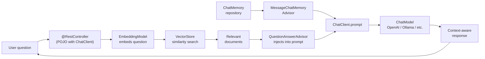

A representative integration with MongoDB Atlas Vector Search illustrates the convention-over-configuration treatment. The application's `application.properties` declares the providers and stores in characteristic Boot fashion:[^56]

```properties
spring.application.name=mongodb
spring.ai.openai.api-key=<credential>
spring.data.mongodb.uri=<connection-string>
spring.data.mongodb.database=rag
spring.ai.vectorstore.mongodb.collection-name=vector_store
spring.ai.vectorstore.mongodb.initialize-schema=true
spring.threads.virtual.enabled=true
management.endpoints.web.exposure.include=*
management.endpoint.health.show-details=always
```

Setting `spring.ai.vectorstore.mongodb.initialize-schema=true` tells "Spring AI to create the vector search index on our collection," with auto-configuration handling the rest.[^56] A controller built on this foundation reads as an ordinary Spring controller decorated with AI-specific advisors:[^56]

```java
@Controller
@ResponseBody
class AdoptionController {
    private final ChatClient ai;
    private final InMemoryChatMemoryRepository memoryRepository;

    AdoptionController(ChatClient.Builder ai, VectorStore vectorStore) {
        var system = """
            You are an AI-powered assistant to help people adopt a dog from
            the adoption agency named Pooch Palace ...
            """;
        this.memoryRepository = new InMemoryChatMemoryRepository();
        this.ai = ai
            .defaultSystem(system)
            .defaultAdvisors(new QuestionAnswerAdvisor(vectorStore))
            .build();
    }

    @GetMapping("/{user}/dogs/assistant")
    String inquire(@PathVariable String user, @RequestParam String question) {
        var memory = MessageWindowChatMemory.builder()
            .chatMemoryRepository(memoryRepository)
            .maxMessages(10)
            .build();
        var memoryAdvisor = MessageChatMemoryAdvisor.builder(memory).build();
        return this.ai.prompt()
            .user(question)
            .advisors(a -> a.advisors(memoryAdvisor)
                .param(ChatMemory.CONVERSATION_ID, user))
            .call()
            .content();
    }
}
```

The structural symmetry with everything else the report has documented is immediate. The class is a POJO with constructor injection. The `ChatClient.Builder` is auto-configured by Boot. The `QuestionAnswerAdvisor` is "a separate dependency we need to explicitly add to our `pom.xml`," following the same starter-per-capability pattern Chapter 7.4 documented.[^56] The `MessageChatMemoryAdvisor` provides the equivalent of session-scoped memory through an injected `InMemoryChatMemoryRepository` that itself follows the repository pattern.[^56] The whole composition reads as the same architectural playbook—POJO surface, declarative advisors, dependency-injected collaborators—applied to a domain that did not exist when the playbook was designed.

The integration with the existing competency stack from Chapter 8 is equally consequential. **Virtual threads** matter for Spring AI because every LLM call is a blocking I/O operation against an external service; enabling `spring.threads.virtual.enabled=true` allows AI-heavy applications to scale dramatically in concurrency without the WebFlux complexity tax.[^56] **Actuator and Micrometer** matter because "All requests to an LLM have a cost—at least one of complexity, if not dollars and cents," and "Spring Boot Actuator, powered by Micrometer, provides metrics out of the box. Access the metrics endpoint to monitor token usage and other key indicators."[^56] **GraalVM native images** matter because Spring AI "plays well with GraalVM and virtual threads, too, allowing you to build super fast and efficient AI applications that scale," with the same `./mvnw -DskipTests -Pnative native:compile` workflow that §9.1 dissected producing AI services that "start up in a fraction of the time that it did on the JVM" and consume "a very small fraction of the RAM."[^56] **Spring Security** matters because authenticated principals can drive conversation memory partitioning, with the practitioner guidance noting that "It's trivial to use Spring Security to lock down this web application. You could use the authenticated `Principal#getName` to use as the conversation ID too."[^56]

The new frictions Spring AI introduces are real but tractable. **Token cost** is a new category of operational concern that has no analogue in earlier Spring applications: every prompt sent to an LLM costs measurable money, and "the less data we send, the better."[^56] This drives architectural choices (RAG over prompt-stuffing) that have no precedent in the framework's prior design. **Hallucination and validation** are problems that Spring AI surfaces explicitly: "AI models can confidently produce incorrect information. Evaluation models can validate or cross-check responses to mitigate these hallucinations."[^56] **MCP integration** introduces a new protocol for cross-service AI workflows: "With Model Context Protocol (MCP), you can connect your Spring AI applications to other MCP-enabled services, regardless of language or platform, creating structured, goal-driven workflows."[^56] Each of these is a new operational discipline the AI-aware Spring developer must wield, and each will undoubtedly seed framework evolution as practice consolidates.

Read through the report's lens, Spring AI is the strongest available evidence for the central design-philosophy thesis Chapter 8.4 articulated: **the implementation surface evolves; the design stance compounds**. A new domain has appeared—one whose foundational concepts (vector embeddings, prompt engineering, token economics) did not exist in mainstream computing five years ago—and the framework's response has been to apply the same five-pattern playbook with no architectural break. A developer who has internalized the playbook from the preceding chapters can read Spring AI's documentation and write a working RAG application in hours; the cost of learning the new domain is bounded by the cost of learning its own concepts, not by the cost of learning a new framework idiom. This is the operational measure of design-stance compounding: as new domains are absorbed, the per-domain cognitive cost falls, because the architectural playbook is the same.

## 9.5 The Jakarta EE Namespace Transition and the Evolving Standardization Dialectic

The fifth trend the chapter must surface is structurally different from the first four: rather than a new capability, it is a **specification-level transition** that has reshaped the Java enterprise platform's foundations. The `javax`-to-`jakarta` namespace migration introduced by Jakarta EE 9 and absorbed by Spring 6 / Spring Boot 3 is the most consequential application of Chapter 8.3's standardization-versus-innovation dialectic in recent memory, and it deserves examination both for its operational implications and for what it reveals about the dialectic's continuing dynamics.

The historical context is straightforward. Java EE was transferred from Oracle to the Eclipse Foundation in 2017, with Oracle retaining the trademark "Java" in package names. The legal consequence was that Eclipse could continue evolving the platform but had to rename the foundational packages. **Jakarta EE 9**, finalized in late 2020, performed this rename across Servlet, JPA, JMS, Bean Validation, JAX-RS, and the rest of the platform's API surface, replacing the historical `javax.*` package roots with `jakarta.*`. The change was structurally simple—a mass package rename—but operationally consequential, because every line of application code, every library, every framework integration that referenced the affected APIs had to be updated in coordination.

Spring 6 and Spring Boot 3, both released in late 2022, absorbed this migration in lockstep. The Spring Boot 3.0 migration guide quoted in the supporting evidence makes the operational reality concrete: the migration "pre-steps" require teams first to "upgrade to the latest 2.7.x release (2.7.18)," then "upgrade to Java 17 at least (why not 21?)," then "check deprecations in code," "check deprecations in application properties (properties migrator)," and—critically—"if using Spring Security, upgrade to Spring Security 5.8 first," before finally moving to Spring Boot 3.0.[^51] The mandatory Java 17 baseline is itself part of the migration: Spring 6 and Boot 3 dropped support for Java 8 and 11, requiring teams to upgrade their JVM in coordination with the namespace transition. The recommended path for teams already on the new platform is then to "upgrade to the latest 3.0.x," with "each feature release" having "dedicated release notes" and "each major release" having "a specific migration guide," followed by sequential upgrades to 3.1.x, 3.2.x, and onward.[^51]

The architectural implications for the report's analysis are threefold and deserve explicit naming.

**The version-sensitivity that Chapter 1 promised has now become operationally non-negotiable.** Throughout the report, the distinction between Servlet 2.x and 3.0+, between EJB 1.x/2.x and 3.x, between Spring 2.x and 5.x and 6.x, and between Spring Boot 1.x through 4.x has been treated as material to developer practice. The Jakarta migration sharpens this discipline because it is no longer a matter of feature drift but of incompatible package roots: a library compiled against `javax.servlet.http.HttpServletRequest` cannot run inside a Tomcat 10+ container that exposes `jakarta.servlet.http.HttpServletRequest`, and vice versa. This is the most absolute version boundary in Spring's history, and it has consequences that ripple through dependency-management discipline, library-compatibility checking, and migration sequencing.

**Spring continues to absorb foundational specification changes in lockstep rather than fragmenting from them.** This is the dialectic's standardization side asserting itself. Spring could, in principle, have responded to the Jakarta migration by maintaining a long-lived `javax`-compatible branch, retaining customers on legacy infrastructure indefinitely. Instead, Spring 6 and Boot 3 made the namespace cut clean and required customers to follow. The community-grade observation is that this lockstep absorption is part of why the Spring ecosystem maintains coherence even as the underlying platform evolves: the framework treats foundational specifications as substrate to honour rather than as external dependencies to abstract over.

**The dialectic remains active and consequential.** Chapter 8.3 framed the standardization-versus-innovation tension as one of the two structural tensions that explain why the field has not stabilized on any terminal point. The Jakarta migration is the most recent and most consequential illustration, but it is not the last. Jakarta EE itself continues to evolve (Jakarta EE 10 added MicroProfile-style observability, Jakarta EE 11 brought further refinements), the JCP continues to govern Java language evolution (records, sealed classes, pattern matching, virtual threads), and Spring continues to absorb each round in its release cycle. The lesson for forward-looking analysis is that Spring's relationship to the standards process is not adversarial (as Rod Johnson's 2002 critique of EJB might have suggested) but absorptive: when standards solve a problem well, Spring adopts them; when they do not, Spring innovates and—as the EJB 3.0 case demonstrated—the standards eventually absorb the innovation back.

Read through the report's lens, the Jakarta migration is the clearest evidence that **the standardization side of the dialectic is not weakening as the field matures; it is reasserting itself in a form that demands ongoing operational discipline**. A developer entering the Spring ecosystem in 2025 inherits not only the framework's surface conventions but also the active version-coordination work that the Jakarta transition continues to drive. The migration is largely complete in the Spring 6 / Boot 3 release line, but the broader Java library ecosystem continues to converge, and projects with long-tail dependencies on legacy `javax`-rooted libraries continue to encounter friction. The four founding principles, again, survive the transition: POJO classes are unchanged in structure (only their imports change), non-invasiveness is preserved (the application remains valid Java independent of any particular Jakarta version), composition over inheritance is preserved (proxies are unchanged), and testability is preserved. The implementation surface evolves; the design stance compounds.

## 9.6 Synthesis of Enduring Design Principles Across the Evolutionary Chain

Having surveyed five forward-looking trends, the chapter is now positioned to consolidate the report's central design-philosophy thesis. Chapter 8.4 introduced the five enduring principles—POJO-centricity, non-invasiveness, composition over inheritance, testability, and convention over configuration—as the stable substrate against which the implementation surface has continuously evolved. The trend analysis of §§9.1–9.5 has now provided five additional confirmatory data points. This section consolidates the thesis explicitly and equips the reader to apply it to the next round of platform evolution.

The thesis can be stated cleanly. **Across thirty years of Java web development—from the 1996 Servlet contract through Spring Boot 4 in 2025—the implementation surface has continuously evolved while the design stance has compounded.** The implementation surface includes the wiring mechanism (XML to annotations to Java config to auto-configuration), the configuration model (explicit wiring to conditional defaults to AOT-resolved binding), the deployment artefact (WAR-on-server to executable JAR to native image to virtual-threaded service), the concurrency primitive (platform threads to event loops back to virtual threads), the application surface (HTTP request handling to messaging to batch to reactive to AI), and dozens of other axes the report has tracked. The design stance, by contrast, consists of just five principles, each of which has been preserved or strengthened by every successor generation.

Tracing each principle across the full evolutionary chain confirms the claim.

**POJO-centricity** was Spring's most consequential founding choice (Chapter 3.6), inverting EJB's container-imposed inheritance model so that "business logic should live in POJOs." The principle survived Spring's modular expansion (every Security `UserDetailsService`, every Integration service activator, every Batch `ItemReader`, every WebFlux controller, every Cloud `@FeignClient` interface is a POJO), survived Spring Boot's auto-configuration absorption (the auto-configured beans wrap POJOs without modifying them), survived native compilation (POJOs compile to native binaries without architectural change), survived virtual threads (POJOs execute on virtual threads identically to platform threads), and now survives Spring AI (the `AdoptionController` of §9.4 is a POJO with a constructor-injected `ChatClient`). The principle is not weakened by being so universally observed; it is strengthened.

**Non-invasiveness** asserts that application code should remain portable and source-level unaware of the container. The principle has weakened in the strict 2002 sense (annotations are now everywhere), but the structural claim—that classes compile and run without Spring on the classpath when annotations come from JSR-330 or Jakarta—remains operationally true. More importantly, the principle's *purpose*—that a class should be testable in isolation and migratable to a different runtime—is preserved by every successor generation. A Spring AI `AdoptionController` written against the JSR-330 `@Inject` instead of `@Autowired` would compile against any DI container; the practical pattern of preferring constructor injection over field injection is, in part, a discipline that keeps non-invasiveness operationally meaningful.

**Composition over inheritance** is the structural mechanism by which cross-cutting concerns are layered onto application code without modifying it. The proxy-based AOP machinery Chapter 4 dissected has been the framework's primary expression of this principle, and the principle has been strengthened by every successor. Spring Security's filter chain, Spring Integration's advisors, Spring Batch's listeners, Spring Cloud's circuit breakers, and Spring AI's advisors are all instances of the same compositional pattern. Native compilation actually *strengthens* the principle by moving proxy generation from runtime to build time, eliminating the runtime-reflection cost that was the principal practical objection to proxy-heavy designs. Virtual threads are orthogonal to the principle: a `@Transactional` method on a virtual thread is composed identically to one on a platform thread.

**Testability as a first-class design goal** has been amplified by every successor generation. Spring's original commitment—that POJOs with injected dependencies could be exercised in any test harness without a container—has been operationalized through Spring 2.5's test infrastructure, Spring Boot's slice annotations (`@WebMvcTest`, `@DataJpaTest`, `@JsonTest`), Testcontainers integration, Spring Boot 4's elevation of testing to "non-negotiable from day one" with JUnit 6 / Mockito / AssertJ / WebTestClient as the standard stack, and the explicit support for `mvn -PnativeTest test` and `gradle nativeTest` to run test suites in native images.[^51] The principle's trajectory is monotonic: testing in modern Spring is easier, more layered, and more fully integrated with the framework than it was in any previous generation.

**Convention over configuration** is Spring Boot's contribution to the principle stack, and it has been strengthened by every Boot release since 2014. Auto-configuration, starter dependencies, embedded servers, and `application.yml` externalization were the original vehicles; native compilation extends the principle by moving conditional evaluation to build time without disrupting the developer's experience of overriding through `@ConditionalOnMissingBean`; virtual threads extend it by reducing concurrency configuration to a single property; Spring AI extends it by making LLM and vector-store configuration follow the same `application.properties`-driven pattern; the Jakarta transition preserves it by ensuring that the namespace migration does not force application code into Jakarta-specific configuration patterns.

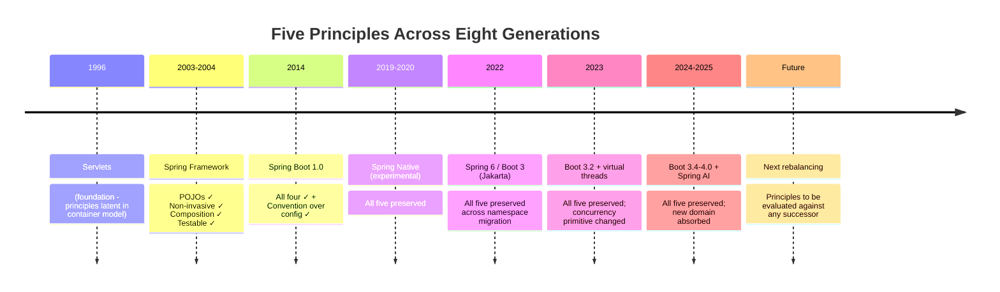

The synthetic claim this enables is that **the five principles are the durable substrate against which any future Java web technology should be evaluated**. A successor framework that abandons POJO-centricity for inheritance from container types is repeating EJB's mistake. A successor that requires application code to be aware of its container at the source level is sacrificing portability. A successor that bakes cross-cutting concerns into source code through inheritance is sacrificing flexibility. A successor that makes unit testing impossible without a container is sacrificing testability. A successor that requires explicit wiring of every infrastructural concern is sacrificing the productivity gains that auto-configuration delivered. Each of these failures has been made before, and each was corrected by a successor that re-honoured the principle the predecessor violated.

The reader who has internalized the principles is therefore equipped to **distinguish genuine architectural progress from mere surface novelty**. When the next framework arrives—whether it is a successor to Spring Boot, a competitor like Quarkus or Micronaut at a higher level of maturity, or a paradigm shift driven by AI-first development patterns—the evaluation framework is straightforward: how does the framework express each of the five principles, and what new costs does its expression introduce? Frameworks that honour the principles compound the field's progress; frameworks that violate them recapitulate failures the field has already seen. This evaluative discipline is the practical payoff of the report's design-philosophy thesis, and it is the foundation on which §9.7's strategic recommendations are built.

## 9.7 Strategic Recommendations for Developers, Architects, and Teams

The synthesis of §9.6 converts naturally into role-specific recommendations for practitioners making decisions in current and near-future Java projects. The recommendations are deliberately conditional rather than prescriptive, reflecting the report's consistent stance that no technology in the chain is a universal answer and that every choice is a workload-specific architecture decision. This section organizes recommendations by role—individual developers, architects, and teams—and grounds each in the historical reasoning the report has built.

### 9.7.1 For Individual Developers: Learning-Investment Strategy

The single most important recommendation for developers is that **competence must survive framework churn**, and the way to ensure this is to invest in the foundational layers of Chapter 8.11's competency map before climbing to the conventions on top. The Spring Boot 4 / Spring Security 7 / Spring Cloud 2025.1 release cadence ensures that surface-level fluency in current annotations and starters is, by itself, a perishable asset; the underlying mechanisms—Servlet contract, JVM threading, IoC container behaviour, AOP proxies, conditional bean evaluation—are not.

The actionable form of this recommendation is the layered learning sequence Chapter 8.11 prescribed:

1. **Master Tier 1 (foundations) at mechanism level.** Read a thread dump. Understand the `ThreadLocal` mechanism that underpins `SecurityContextHolder`. Map an `HttpServletRequest` parameter to a `@RequestParam`-annotated controller method and back. The Servlet contract Chapter 2 dissected is not historical context; it is the substrate every Spring abstraction sits on, and it is where every long stack trace eventually bottoms out. Modern Java features—lambdas, streams, records, Optional, virtual threads—are now part of this tier and must be similarly internalized.
2. **Climb to Tier 2 (Spring Core) via the EJB-era context.** The IoC container and AOP machinery are not arbitrary framework features; they are the operationalization of a deliberate design counter-revolution Chapter 3 documented. Understanding why constructor injection beats field injection in terms of testability, why the self-invocation pitfall exists, and why the default rollback rule covers only unchecked exceptions converts surface familiarity into deep competence.
3. **Master Tier 3 (application layers) by writing non-trivial CRUD applications.** Build the controller, the service, and the repository. Add `@Transactional`. Encounter the self-invocation pitfall and resolve it. Add `@Valid` and `@RestControllerAdvice`. Each friction encountered in this exercise is a friction the report has documented historically.
4. **Treat Tier 4 (cross-cutting disciplines) as design constraints, not afterthoughts.** Write tests from the first commit using the appropriate slice. Configure Spring Security correctly for the actual threat model rather than copying tutorials that disable CSRF. Wire in Actuator and basic Prometheus metrics from the first deployment.
5. **Climb to Tier 5 (cloud-native) only when the deployment context demands it.** Not every application needs Spring Cloud; not every application benefits from microservice decomposition.

For developers entering the field today, the supplementary recommendation is to **invest early in Java 21 and virtual-thread fluency**, because §9.2's rebalancing materially affects which competencies are durable. The reactive-programming surface (Reactor operators, backpressure, reactive context propagation) remains valuable for a narrowing set of workloads, but the synchronous controller-service-repository stack is the new default and is the path most Spring developers will follow for the foreseeable future. Investing in JPA fluency, transaction-management discipline, and N+1 mitigation pays larger dividends than investing in reactive operator chains for the typical CRUD-and-REST workload.

For developers already established in pre-Boot-3 Spring, the recommendation is to **complete the Jakarta migration deliberately** before pursuing other modernization, because §9.5's analysis identifies the namespace transition as the most absolute version boundary in the framework's history. The migration sequence specified by the Spring Boot 3.0 migration guide—2.7.18 first, Java 17 second, deprecation cleanup third, Spring Security 5.8 fourth, then Boot 3.0—should be treated as authoritative.[^51]

### 9.7.2 For Architects: Decision Frameworks

Architects making technology choices in current Java projects face a small number of consequential decisions, each of which the report's analysis equips them to make conditionally.

**Spring MVC on virtual threads versus Spring WebFlux.** The empirical evidence assembled in §9.2 supports a clear default: choose Spring MVC on virtual threads for the broader CRUD-and-REST workload class. The conditions under which WebFlux remains preferable are narrower than they were before Java 21:

- **Streaming workloads** where backpressure semantics are essential (server-sent events at scale, websocket fan-out, large-payload streaming).
- **Reactive end-to-end stacks** where the data store, integration partners, and downstream services are all reactive and the cost of mode-switching at boundaries would dominate.
- **Very-high-concurrency I/O-bound services** under tight resource budgets, where the resource-efficiency margin between virtual-threaded MVC and WebFlux is operationally meaningful.

The official Spring guidance is consistent: WebFlux is "not a replacement for Spring MVC. If Spring MVC already satisfies your requirements, switching to WebFlux is unnecessary and may increase complexity," and teams should "prefer MVC when it is sufficient" and "start small, test thoroughly, then expand usage."[^53]

**GraalVM native compilation versus JVM-mode deployment.** §9.1's matrix translates directly to architectural decisions:

| Workload | Recommendation |
|---|---|
| Function-as-a-Service / serverless | Native compilation |
| Microservices needing scale-to-zero | Native compilation |
| Microservices with frequent (multi-times-per-day) deployment | Assess; native compilation likely beneficial |
| Backoffices, container-image distribution priority | Recommended |
| High-traffic websites with steady JVM warmup amortization | JVM likely better |
| Big monolithic applications with heavy reflection | JVM likely better |
| Applications with agent-based observability | JVM likely better; verify native agent support |
| Applications with unsupported reflection-heavy library | JVM likely better unless metadata can be authored |

The architectural decision should weigh build-time cost, classpath rigidity, and library compatibility against the resource-efficiency gains, and should be revisited as the GraalVM ecosystem matures.[^51][^50]

**Spring Cloud microservice infrastructure versus simpler architectures.** The Spring Cloud release-train compatibility matrix and the per-service operational discipline it imposes are real costs. Architects should adopt the full Spring Cloud toolkit only when the application's shape genuinely demands it: a fleet of independent services with distinct deployment cadences, requiring service discovery, distributed configuration, client-side load balancing, circuit breakers, and gateway-level traffic shaping. Applications that can run as a single service or a small number of coupled services should prefer simpler architectures, because the Cloud toolkit's complexity is real and the migration cost between cadences is non-trivial.

**Spring AI integration: dedicated service versus embedded capability.** The pattern Spring AI enables—structured, declarative access to LLMs from within ordinary Spring controllers—works equally well as a dedicated AI service or as an embedded capability within a broader application. The architectural decision should consider: token-cost observability (easier to bound in a dedicated service), security context propagation (easier in an embedded capability), virtual-thread alignment (LLM calls are I/O-bound; virtual threads matter regardless), and observability (Actuator and Micrometer integration applies in both cases). For applications experimenting with AI features, the embedded path is typically simpler; for applications operating AI as a first-class capability with distinct scaling and security requirements, dedicated services are preferable.

**Version coordination across Spring Boot, Spring Cloud, Jakarta EE, and Java LTS.** This is the most operationally consequential ongoing architectural discipline, and it recurs roughly annually. Architects should establish, document, and enforce a **version-coordination playbook** that tracks: the current Spring Boot LTS line, the matching Spring Cloud release train, the Jakarta EE version implicitly absorbed, the Java LTS the team commits to, and the migration paths between them. Automated dependency-update tooling (Renovate, Dependabot) reduces but does not eliminate the need for this discipline; the coordination work is genuinely architectural rather than mechanical.

### 9.7.3 For Teams: Migration Playbooks

Teams undertaking specific migrations benefit from playbooks anchored in the historical reasoning the report has built. Four common transition paths deserve explicit treatment.

**Legacy WAR-on-Tomcat to executable-JAR Spring Boot.** The migration sequence is well-established: extract the application's web infrastructure (DispatcherServlet registration, filter chain, view resolvers) into a Spring Boot starter-driven equivalent; replace external Tomcat with embedded Tomcat; replace WAR packaging with executable JAR; replace `server.xml` and `context.xml` configuration with `server.*` properties in `application.yml`; configure Actuator endpoints for the operational concerns (health, metrics, logging) that were previously handled by external monitoring. The historical reasoning Chapter 7.5 documented—that the executable-JAR model aligns naturally with one-process-per-container deployment—becomes the operational payoff once the migration is complete.

**Spring Boot 2.x to 3.x with Jakarta migration.** The sequence specified in §9.5: upgrade to 2.7.18 first, then Java 17, then resolve deprecations, then Spring Security 5.8, then Boot 3.0; from 3.0, upgrade sequentially through 3.1.x, 3.2.x, and onward.[^51] The Jakarta namespace transition itself is the most significant chunk of work; teams should expect mass package-rename across application code, library compatibility coordination (replacing `javax`-rooted libraries with `jakarta`-rooted equivalents, or finding migration shims), and integration-test-driven validation that the migration is complete.

**MVC on platform threads to MVC on virtual threads.** The migration is among the simplest the report has examined: enable `spring.threads.virtual.enabled=true`, run the test suite, verify that no `synchronized` blocks pin carrier threads in critical I/O paths, and—as §9.2's frictions catalogue requires—revisit OSIV configuration and N+1 query patterns under the new concurrency profile.[^54][^53] The disciplined order is: enable virtual threads in development; run load tests; address any pinning issues found; address OSIV-and-N+1 patterns; promote to production. Teams using older JDBC drivers, connection pools, or library code with heavy `synchronized` use should validate carrier-thread pinning explicitly before promoting.

**JVM-deployed services to GraalVM-native services.** The migration is more involved. The Boot 3.x native-image workflow—`./mvnw -DskipTests -Pnative native:compile` or `./mvnw -DskipTests -Pnative spring-boot:build-image`—produces working native binaries for compatible applications, but the path to "compatible" frequently requires:[^56][^52]

- Auditing reflection usage in application and library code, and supplying reachability metadata where needed.
- Verifying that all libraries on the classpath have native support, either directly or through the GraalVM reachability metadata repository.
- Removing or refactoring patterns incompatible with closed-world assumptions: dynamic profile-driven beans, runtime classpath modification, Java agents, bytecode-manipulation libraries.
- Establishing a separate CI pipeline for native builds, given build times measured in minutes.
- Validating that AOT-resolved bean conditions match the runtime behaviour the team expects.

The recommendation for teams considering this migration is to start with a single non-critical service, accumulate operational experience with the build, deployment, and debugging surfaces, and only then extend to the broader application portfolio. The official guidance enumerates use cases where native compilation is recommended versus where the JVM is preferable, and respecting that guidance is the discipline that prevents migration efforts from being underestimated.[^51]

The recommendations across all three roles share a structural posture: **conditional rather than universal, anchored in the report's historical reasoning, and equipped with explicit failure modes**. The report's lens insists that every solution introduces new costs; the recommendations honour this by surfacing the costs explicitly so that practitioners can decide whether they are acceptable for the workload at hand.

## 9.8 Conclusion: An Open-Ended Dialectic and the Reader's Place in It

The report's central claim, restated as a single integrative statement, is this: **the journey from a 1996 Servlet handling raw HTTP requests to a 2025 Spring Boot service running natively-compiled with virtual threads inside a Kubernetes pod is best understood as a sequence of disciplined responses to specific engineering frustrations, governed throughout by a small number of enduring design principles that have survived every generational shift while the implementation surface has continuously evolved**. The eight chapters preceding this one have substantiated this claim across thirty years of Java web development; the present chapter has projected it forward into the trends shaping the field's near future. What remains is to articulate what the claim's truth means for the reader who has reached this final page.

The first implication is that **the chain does not terminate**. Spring Boot, like every predecessor in the chain, is a contingent answer to its moment's questions, and its dominance in 2025 is not evidence that the field has stabilized. The frictions Chapter 7.10 catalogued—annotation opacity, startup latency, per-instance memory footprint, version churn, soft lock-in—are already generating the pressures that the next generation of innovation must address. Native compilation is one response; virtual threads are another; deeper Kubernetes-native integration is a third; AI integration introduces an entirely new application layer; and the Jakarta dialectic continues to reassert the standardization side of the tension. None of these is a terminal endpoint either. Each will introduce new costs. Each will, in time, seed its own counter-revolution.

The second implication is that **the principles outlast the implementations**. POJO-centricity, non-invasiveness, composition over inheritance, testability, and convention over configuration are now thirty, twenty, ten, and ten years old respectively, and each has been preserved or strengthened by every successor. There is no architectural reason to believe this trajectory is about to break; the principles are not framework-specific, and they describe a posture toward enterprise software development that has compounded across multiple generations of platform engineers. A reader who has internalized them is equipped to evaluate any future framework—Spring's eventual successor, a competitor that achieves Spring-parity at lower resource cost, a paradigm shift driven by AI-first development—against criteria that survive the framework's specific surface choices.

The third implication is the most directly actionable. **Working competence in Java web development in 2025 and beyond consists not in memorization of framework features but in fluency in the architectural reasoning by which each generation's trade-offs can be located, evaluated, and—when the next rebalancing arrives—anticipated rather than merely absorbed.** The competency map of Chapter 8.11 is the practical structure for acquiring this fluency: master the foundations, climb to Spring Core via its design context, develop idiomatic competence at the application layers, treat cross-cutting disciplines as design constraints, and reach for cloud-native competencies only when the workload demands them. The strategic recommendations of §9.7 are the operational expression of this fluency: conditional decisions, anchored in historical reasoning, equipped with explicit failure modes.

The reader who has reached this final section therefore stands in a different position than they would after reading a feature-by-feature tour of Spring Boot. They have not merely learned what Spring Boot does; they have learned why it does what it does, what frictions it inherited from its predecessors, what new frictions it introduces, and what frame of reference equips them to make sense of the next iteration. They are, in the deepest sense the report has been working toward, equipped to **participate in the dialectic rather than merely consume its current output**.

A final reflection on what this position requires going forward. The pace of change in Java web development is not slowing. The next five years will see Spring Boot 5 (or its functional successor), continued Jakarta EE evolution, deepening integration with AI workloads, further refinement of the native-image and virtual-thread paths, and almost certainly platform pressures that cannot yet be named. Some of these will be absorbed by Spring without disrupting the design stance; others may force more substantial rebalancing. The reader who has internalized the report's lens—problem→solution→new-problem, principle→mechanism→developer-surface, the seven-dimension comparative matrix, the standardization-versus-innovation and flexibility-versus-simplicity tensions, and the five enduring principles—will be able to read each of these developments as another instance of the same dialectic and to locate their own work intelligently within it.

The journey from Servlets to Spring Boot is, in the end, a journey of disciplined engineering response to specific frustrations, and its lessons are durable precisely because the response has been disciplined. The implementation surface evolves; the design stance compounds. The next chapter of the dialectic is already being written, in conferences, in blog posts, in production incidents, in framework releases. The reader's place in it—as developer, as architect, as teammate, as eventual contributor to the next round of framework evolution—is the place every working engineer occupies in any field whose progress is genuine: equipped by what has come before, honest about its costs, and ready to participate in what comes next.

# 参考内容如下：
[^1]:[What is Servlet in Java? Ultimate Beginner's Guide 2026](https://www.youstable.com/blog/java-servlets)
[^2]:[[PDF] O'Reilly - JavaServer Pages 2nd Edition - elhacker.INFO](https://elhacker.info/manuales/OReilly%204%20GB%20Collection/O'Reilly%20-%20JavaServer%20Pages%202nd%20Edition.pdf)
[^3]:[EJB 2.1 Programmer's Guide - JOnAS](https://jonas.ow2.org/JONAS_5_2_2/doc/doc-en/html/ejb2_programmer_guide.html)
[^4]:[Expert One-On-One J2Ee Design and Development
by Johnson, Rod |
Paperback |
October 23, 2002 |
Wrox Pr Inc |
9780764543852 |
Biblio](https://www.biblio.com/book/expert-one-one-j2ee-design-development/d/1639978022?srsltid=AfmBOoqggGwsh-m9U-rHb0QmCcOa6Gj_GJb7KM-mWsQyGUKTdwarYaHe)
[^5]:[Expert One-on-One J2EE Development without EJB | Wiley](https://www.wiley.com/en-jp/Expert+One+on+One+J2EE+Development+without+EJB-p-9780764573903)
[^6]:[Expert One-on-One J2EE Development without EJB By Rod Johnson, 9780764558313| eBay](https://www.ebay.com/itm/317182764634)
[^7]:[Rod Johnson (programmer) — Grokipedia](https://grokipedia.com/page/Rod_Johnson_(programmer))
[^8]:[Speakers -> Rod Johnson](https://qconlondon.com/london-2011/qconlondon.com/london-2011/speaker/Rod+Johnson.html)
[^9]:[Rod Johnson - Home - ACM Digital Library](https://dl.acm.org/profile/81100453107)
[^10]:[Prime_Questions: #Spring_MVC](https://clouddose.blogspot.com/2020/11/spring-mvc.html)
[^11]:[View Resolution (View Resolution) | Spring Framework7.0.7-SNAPSHOT中文文档|Spring官方文档|SpringBoot 教程|Spring中文网](https://www.spring-doc.cn/spring-framework/7.0.7-SNAPSHOT/web_webmvc_mvc-servlet_viewresolver.en.html)
[^12]:[Spring MVC InternalResourceViewResolver](https://cosmiclearn.com/spring_framework/mvc_internal_resource_view.php)
[^13]:[Gunnar Hillert's Blog: REST with Spring - ContentNegotiatingViewResolver vs. HttpMessageConverter+ResponseBody Annotation](http://hillert.blogspot.com/2011/01/rest-with-spring-contentnegotiatingview.html)
[^14]:[Http Message Converters with the Spring | Java Development Journal](https://javadevjournal.com/spring/spring-http-message-converter/)
[^15]:[An Intro to Spring HATEOAS | Baeldung](https://www.baeldung.com/spring-hateoas-tutorial)
[^16]:[Spring Boot HATEOAS - Representation Model and Assembler](https://howtodoinjava.com/spring/spring-hateoas-tutorial/)
[^17]:[GitHub - spring-attic/top-spring-security-architecture: Spring Security Architecture:: Topical guide to Spring Security, how the bits fit together and how they interact with Spring Boot · GitHub](https://github.com/spring-attic/top-spring-security-architecture)
[^18]:[How Spring Security Works: Architecture, Authentication & Best Practices](https://www.penligent.ai/hackinglabs/how-spring-security-works-architecture-authentication-best-practices/)
[^19]:[Spring Security Architecture - GeeksforGeeks](https://www.geeksforgeeks.org/springboot/spring-security-architecture/)
[^20]:[OAuth 2.0 Resource Server JWT :: Spring Security](https://docs.spring.io/spring-security/reference/servlet/oauth2/resource-server/jwt.html)
[^21]:[Spring Boot 4.0 Release Highlights](https://spring.io/projects/release-highlights)
[^22]:[Using JWT with Spring Security OAuth2 - DEV Community](https://dev.to/relive27/using-jwt-with-spring-security-oauth2-41jp)
[^23]:[Using Protocol Adapters :: Spring Integration](https://docs.spring.io/spring-integration/reference/dsl/java-protocol-adapters.html)
[^24]:[Using Apache Kafka for Integration and Data Processing Pipelines ...](https://dzone.com/articles/using-apache-kafka-integration)
[^25]:[Configuring a Step :: Spring Batch Reference](https://docs.spring.io/spring-batch/reference/5.1/step/chunk-oriented-processing/configuring.html)
[^26]:[Performance Comparison: Spring MVC vs Spring WebFlux](https://blog.victoryhub.cc/en/posts/spring-mvc-vs-spring-webflux-performance)
[^27]:[spring mvc - What is the difference between Router and Annotated Controllers? - Stack Overflow](https://stackoverflow.com/questions/51786154/what-is-the-difference-between-router-and-annotated-controllers)
[^28]:[Functional Endpoints in Spring Boot | Javarevisited - Medium](https://medium.com/javarevisited/mastering-functional-endpoints-in-spring-boot-a-reactive-programming-approach-be0e718338b2)
[^29]:[Spring WebClient exchange vs. retrieve Comparison - rieckpil](https://rieckpil.de/spring-webclient-exchange-vs-retrieve-a-comparison/)
[^30]:[How to Build Reactive HTTP Clients with WebClient in Spring](https://oneuptime.com/blog/post/2026-01-25-reactive-http-clients-webclient-spring/view)
[^31]:[Spring boot Webclient's retrieve vs exchange - Stack Overflow](https://stackoverflow.com/questions/58410352/spring-boot-webclients-retrieve-vs-exchange)
[^32]:[An introduction to Spring Data(Reactive) | Spring Reactive Programming](https://hantsy.github.io/spring-reactive-sample/data/intro.html)
[^33]:[Spring Data R2DBC](https://spring.io/projects/spring-data-r2dbc)
[^34]:[Does Spring WebFlux perform better than Spring MVC? - Quora](https://www.quora.com/Does-Spring-WebFlux-perform-better-than-Spring-MVC)
[^35]:[Real-world use cases of Spring WebFlux (Mono and Flux)? - Reddit](https://www.reddit.com/r/java/comments/15l4wsm/realworld_use_cases_of_spring_webflux_mono_and/)
[^36]:[Spring Boot and Virtual Threads: Scaling Your APIs Without ...](https://febrihasan.medium.com/spring-boot-and-virtual-threads-scaling-your-apis-without-reactive-code-0b2c4621e91f)
[^37]:[Is there a compatibility matrix of Spring-boot and Spring-cloud? - Stack Overflow](https://stackoverflow.com/questions/42659920/is-there-a-compatibility-matrix-of-spring-boot-and-spring-cloud)
[^38]:[I keep reading negativity about spring. I got curious, am building the backend f...](https://news.ycombinator.com/item?id=37148931)
[^39]:[Spring Boot. — Atin](https://atin.tistory.com/645)
[^40]:[Convention over configuration — Grokipedia](https://grokipedia.com/page/Convention_over_configuration)
[^41]:[Spring Boot: Fast-Track Your Java Development](https://blog.edersonfernandes.com.br/spring-boot-fast-track-your-java-development/)
[^42]:[Understanding Spring Boot's Auto-Configuration Mechanism | Spring Boot 123](https://www.springboot-123.com/en/blog/spring-boot-autoconfiguration-mechanism-explained/)
[^43]:[How Spring Boot auto-configuration works | Java Development Journal](https://javadevjournal.com/spring-boot/how-spring-boot-auto-configuration-works/)
[^44]:[Demystifying Spring Boot’s Magic: A Deep Dive into Auto-Configuration and Conditional Annotations](https://medium.com/@mesfandiari77/demystifying-spring-boots-magic-a-deep-dive-into-auto-configuration-and-conditional-annotations-9880d8a7faa2)
[^45]:[The Spring Boot Annotation Hell: Are We Over-Engineering Simple ...](https://medium.com/@reyanshicodes/the-spring-boot-annotation-hell-are-we-over-engineering-simple-applications-f8bf610011b9)
[^46]:[Escaping Annotation Hell: Your Survival Guide to Simplifying Spring ...](https://blog.stackademic.com/escaping-annotation-hell-your-survival-guide-to-simplifying-spring-configurations-096f4f57ff49)
[^47]:[Java Programming Fundamentals for Spring Boot Development | Coursera](https://www.coursera.org/learn/core-java-foundations-for-spring-developers)
[^48]:[The Java Developer's Roadmap for 2026: From First Program to Production-Ready Professional - DEV Community](https://dev.to/dbc2201/the-java-developers-roadmap-for-2026-from-first-program-to-production-ready-professional-41ng)
[^49]:[Jvm internals | PDF](https://www.slideshare.net/slideshow/jvm-internals/12991639)
[^50]:[The Future of Spring Applications: Leveraging Native Execution ...](https://adria-bt.com/en/the-future-of-spring-applications-leveraging-native-execution-through-spring-native/)
[^51]:[[PDF] Native Support in Spring Boot 3 (Touraine Tech) - Stéphane Nicoll](https://snicoll.be/presentations/2024/touraine-tech/slides.pdf)
[^52]:[Compiling Spring Applications to GraalVM Native Images - Stack Overflow](https://stackoverflow.com/questions/50911552/compiling-spring-applications-to-graalvm-native-images)
[^53]:[[PDF] Spring Boot 3.2 + Java 21 | Ufuk Uzun](https://ufukuzun.wordpress.com/wp-content/uploads/2023/12/spring-boot-3.2-java-21.pdf)
[^54]:[Spring Boot + JPA + Virtual Threads (Java 21): Avoid N+1, OSIV ...](https://blog.devgenius.io/spring-boot-jpa-virtual-threads-java-21-avoid-n-1-osiv-pagination-pitfalls-0bde190da6bc)
[^55]:[Project Loom + Spring Boot 3.x: How Virtual Threads Will Transform ...](https://javascript.plainenglish.io/project-loom-spring-boot-3-x-how-virtual-threads-will-transform-your-microservices-in-2025-5f14001856f5)
[^56]:[Spring AI and MongoDB: How to Build RAG Applications - DEV Community](https://dev.to/mongodb/how-to-build-rag-applications-with-spring-ai-and-mongodb-5gaj)
