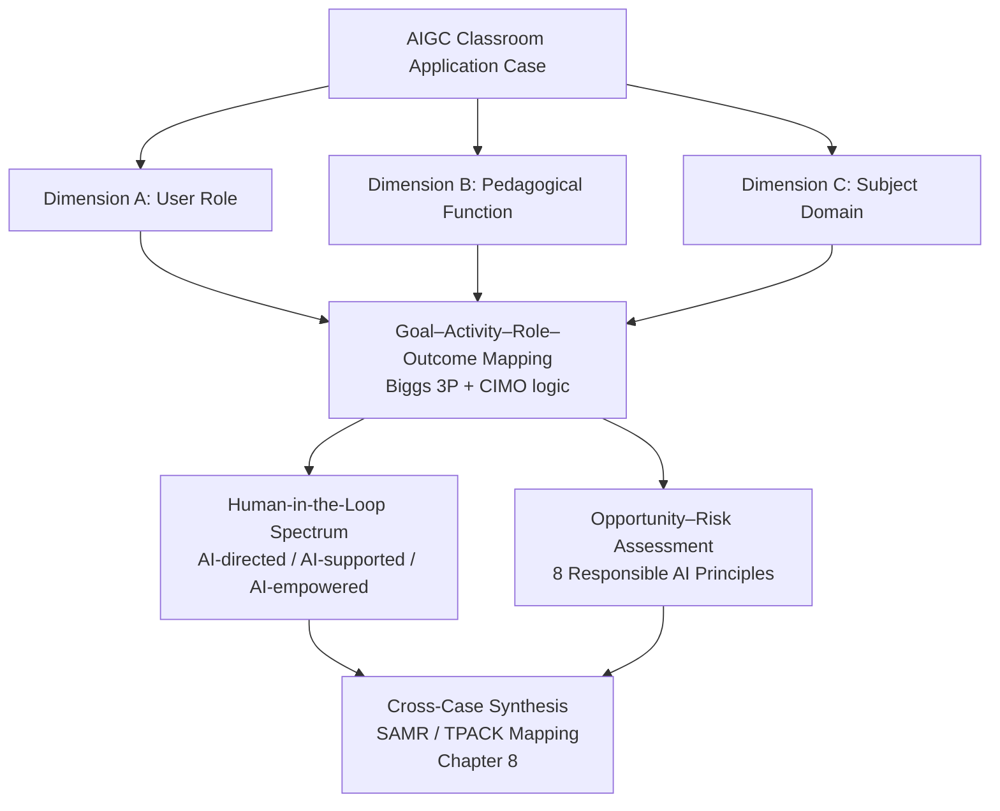
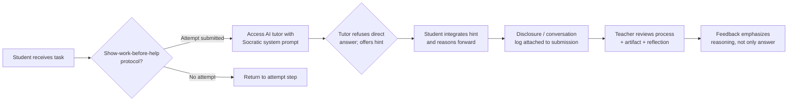
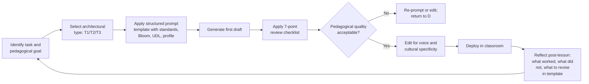
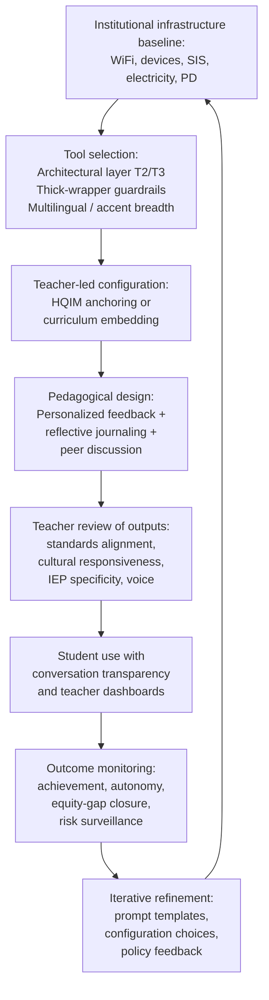
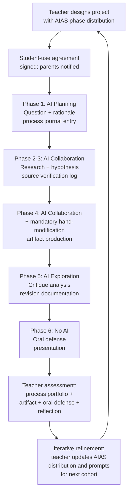
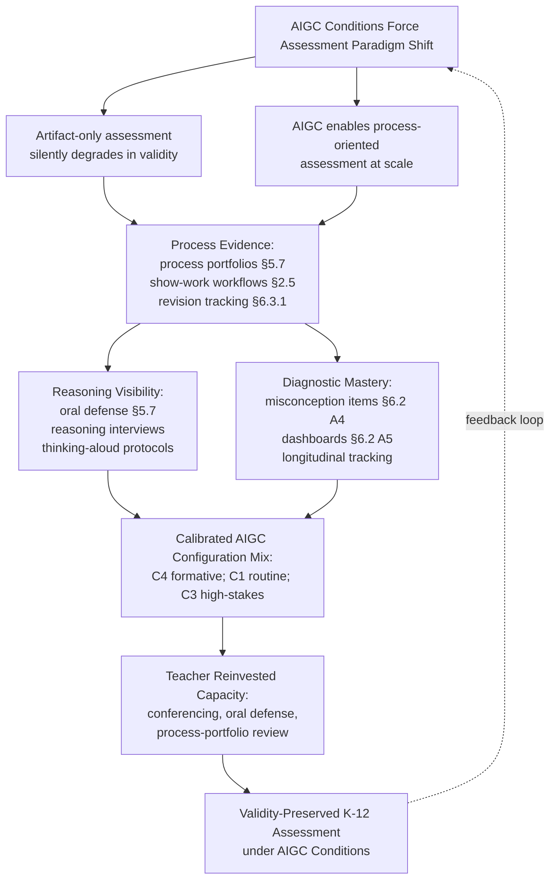
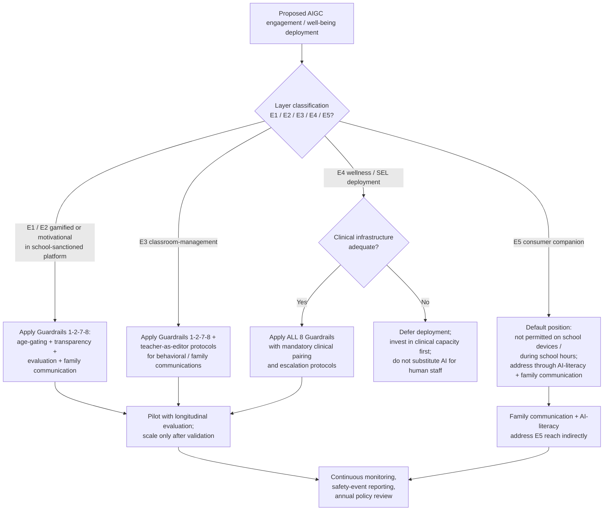
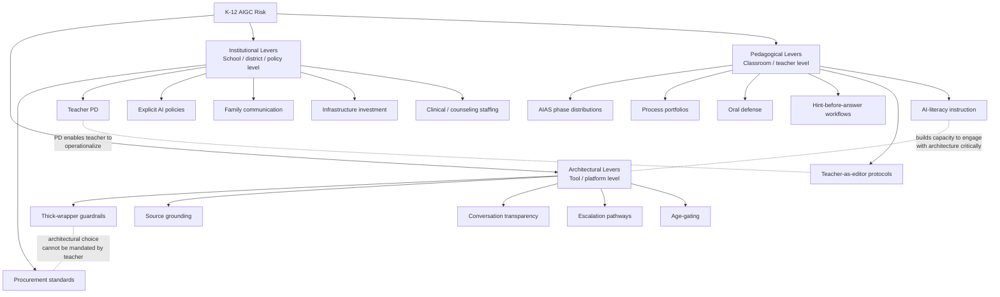
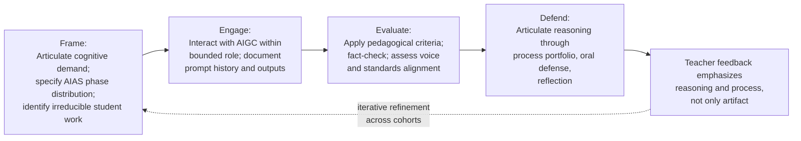
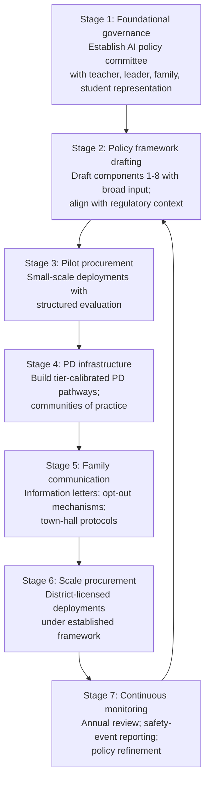

# Practical Applications of AIGC in K-12 Classrooms: A Global Case-Based Study of Approaches, Implementation, and Future Directions
# 1 Research Background, Analytical Framework, and Global Adoption Landscape

The arrival of ChatGPT in late November 2022 marked an inflection point for K-12 education that few prior technologies have rivaled in speed or scope. Within roughly two months of release, ChatGPT had reached 100 million users—the fastest consumer application uptake on record—and within a year users could choose from competing chatbots including Google Gemini and Anthropic's Claude, with thousands of derivative applications flooding the market[^1]. Unlike earlier waves of educational technology that diffused gradually through institutional procurement cycles, generative AI entered classrooms primarily through the back door: students brought it in on personal devices, teachers experimented privately on weekends, and only later did districts begin to formulate policy. This bottom-up trajectory means that any serious investigation of AIGC in K-12 must begin not with a product taxonomy but with a clarifying question—what exactly are we studying, why does it matter for children specifically, and against what empirical baseline should subsequent case analyses be judged?

This opening chapter answers those questions in five steps. It first defines the scope of "AIGC classroom application" and explains why the K-12 context raises stakes that adult or post-secondary settings do not. It then constructs the multi-dimensional analytical framework—anchored in Biggs's 3P model, CIMO logic, and a human-in-the-loop lens—that will govern every subsequent chapter. It synthesizes the most recent quantitative evidence on adoption rates and usage patterns among teachers and students, compares regional trajectories across North America, Europe, East Asia, Latin America, and Africa, and finally maps which application categories have crossed the threshold from experimental pilot to mainstream classroom practice. Together these sections establish the empirical and conceptual baseline against which the category-level case studies in Chapters 2 through 7 are interpreted.

## 1.1 Why AIGC Matters in K-12: Drivers, Stakes, and Scope Definition

The discourse on artificial intelligence in education predates ChatGPT by decades, but the term "AIGC" describes something qualitatively different from earlier AI applications. Traditional AI in classrooms—Netflix-style recommendation engines for adaptive learning paths, voice assistants such as Siri, predictive analytics for at-risk students, plagiarism detectors—performs discrete, bounded tasks, learning from data to make predictions but not producing original content[^1]. Generative AI, by contrast, is defined by its capacity to **generate complex, coherent, and original text, images, audio, video, and code in response to a submitted prompt, by learning from large reference sets of existing data**[^1]. The U.S. Department of Education describes the underlying mechanism plainly: "complex essays are written one word at a time. The underlying AI model predicts which next words would likely follow the text written so far," producing what Common Sense Media's chief technology officer Ashwin Sridhar calls "auto-complete on steroids"[^1].

For the purposes of this report, **AIGC classroom application** is defined as the direct or mediated use, in K-12 teaching, learning, assessment, or classroom management contexts, of generative models that produce text, images, audio, video, or code—including general-purpose chatbots (ChatGPT, Gemini, Claude), purpose-built educational generative tools (Khanmigo, Kyron Studio, MagicSchool, TeachFX), and generative features embedded in broader EdTech platforms. This definition deliberately excludes earlier non-generative AI applications such as predictive learning analytics, behavioral monitoring systems, and rule-based intelligent tutoring systems, except where these are now being augmented with generative components. This boundary matters because the risks (hallucinations, originality loss, parasocial attachment) and opportunities (open-ended creative scaffolding, conversational tutoring, multimodal content generation) of generative systems are substantively distinct from those of predictive systems.

Why does the K-12 context warrant a dedicated investigation rather than treatment as a subset of general AI-in-education research? Three reasons stand out. First, **children deserve greater and different protections than adults**, a point that the Common Sense Media white paper foregrounds explicitly: AIGC's effects on young people involve issues of consent, learning agency, data privacy, algorithmic bias, and "longer-term impacts of engaging with young people during a formative period," with one researcher quoted as observing that "we are influencing impressionable young people, and that comes with a moral obligation to be as correct and proper as possible"[^1]. Second, the effects of AIGC on children are not always immediately visible. Whereas a malfunctioning autonomous vehicle produces immediate, observable harm, the impact of a chatbot that subtly displaces productive cognitive struggle may take years to surface in measurable outcomes such as writing competence, critical reasoning, or epistemic confidence[^1]. Third, K-12 schooling is an inherently sociotechnical and pedagogical enterprise: AI educational tools embody implicit assumptions about which instructional strategies are effective, and "not enough attention is always paid to which pedagogy is driving a specific AI tool"[^1]. The same chatbot can either deepen or shortcut learning depending on whether it is designed and used to give hints versus answers, to scaffold versus substitute, to keep teachers in the loop versus replace them.

The stakes are heightened further by the speed and scale of student adoption. A November 2023 Common Sense Media survey found that **half of young people aged 14–22 had already used generative AI**, with Black and Latino young people reporting weekly-or-more use at roughly double the rate of White peers (22% and 18% versus 10%, respectively)[^1]. According to a Digital Education Council survey cited in a 2025 systematic review, **86 percent of students globally now use AI in their learning, with ChatGPT being the most widely used tool**[^2]. Yet a 2023 Center for Democracy and Technology survey found that only 4 in 10 parents reported that their family had received any guidance from school on how to use generative AI responsibly[^1], and as late as the 2023–24 school year, 78% of K-12 teachers reported that their school had no AI policy or that they did not know whether one existed[^1]. This combination—rapid student adoption, slow institutional response, and unique developmental vulnerability—is precisely what makes AIGC in K-12 a distinct and urgent research subject, rather than a footnote to the broader AI-in-education literature.

## 1.2 Analytical Framework: A Multi-Dimensional Classification of AIGC Classroom Applications

To analyze AIGC classroom applications consistently across dozens of heterogeneous global cases, this report adopts a multi-dimensional analytical framework that integrates four theoretical anchors and three crosscutting classification axes. The framework's purpose is to ensure that every case discussed in Chapters 2 through 7 is examined for the same dimensions—learning goals, learning activities, human–AI role configuration, and learning outcomes—rather than being assessed on idiosyncratic criteria.

The framework draws first on **Biggs's 3P model of learning**, which conceptualizes learning as a dynamic relationship among presage (learner and teaching context characteristics), process (learning activities and engagement), and product (learning outcomes)[^3]. This systems lens, used in recent systematic reviews of generative AI in K-12, allows the analysis to trace how AIGC interventions reshape each phase of the learning system rather than treating AIGC as an isolated tool[^4]. It is complemented by **CIMO logic** (Context–Intervention–Mechanism–Outcome), a design-science research convention that requires every application case to specify the context in which it is deployed, the intervention itself, the mechanism through which it is hypothesized to work, and the observed outcomes[^5][^6]. Layered onto these structural frames are the constructivist and situated-cognition traditions that K-12 generative-AI research has increasingly invoked, including Piaget, Vygotsky, and Bruner's emphasis on knowledge construction through scaffolding[^7][^8], and emerging concepts such as "entangled cognition" that describe how learners and AI systems can engage in cognitive offloading, distributed cognition, and metacognitive awareness in ways that reshape what learning means[^9].

These theoretical anchors translate into three intersecting classification dimensions used throughout the report.

| Dimension | Categories | Typical Examples |
|---|---|---|
| **A. User role** | Student-facing; Teacher-facing; System/classroom-level | Khanmigo (student); MagicSchool (teacher); TeachFX (classroom analytics) |
| **B. Pedagogical function** | Instruction support; Adaptive tutoring; Creative/project-based learning; Assessment & feedback; Engagement & well-being; Administrative & system management | Kyron Studio (instruction); Eedi (tutoring); Giant Room workshops (creative); TeachFX (feedback); Headstream (well-being); Clever (administration) |
| **C. Subject domain** | STEM (math, science, coding); Language arts & literacy; Languages (L1, L2/EFL); Humanities & social studies; Cross-disciplinary / project-based | Rori (math, Ghana); Quill (writing); ChatGPT for EFL (Taiwan); aiEDU ethics meme boards; Gwinnett County AI curriculum |

Cutting across these three dimensions are two further analytical axes derived directly from the responsible-AI literature and the report's persistent reasoning rubric.

The first is the **human-in-the-loop spectrum**, which characterizes the configuration of human and AI agency in any given application. Drawing on the U.S. Department of Education's directive to "always center educators in instructional loops" and on Tracy Pizzo Frey's call for "meaningful human control"[^1], this report distinguishes three configurations: **AI-directed** (AI generates content or feedback that students consume with minimal teacher mediation, e.g., open-ended chatbot tutoring), **AI-supported** (AI generates first drafts that teachers review, edit, and publish before student use, e.g., Kyron Studio's lesson workflow), and **AI-empowered** (AI augments human capacity—giving students new creative affordances or giving teachers new analytic capacity—while final pedagogical authority remains explicitly human, e.g., the Giant Room's co-design workshops or Demszky's M-Powering Teachers). This axis operationalizes the rubric's framework-fidelity requirement that every case identify human–AI role configuration.

The second is the **opportunity–risk axis**, which reflects the Bastani-style paradox that the same tool can either help or harm depending on design and use conditions. Common Sense Media's white paper organizes opportunities into student-supporting (adaptive learning, creativity, project-based learning), teacher-supporting (lesson planning, coaching and feedback, grading and assessment), and system-supporting (data interoperability, administration, parent engagement) categories, while cataloging risks including inaccuracies and hallucinations, bias and inequity, lack of representation, information censorship, cheating and plagiarism, overreliance and loss of critical thinking, data security, consent and privacy, and human replacement[^1]. Eight responsible-AI principles—Put People First, Promote Learning, Prioritize Fairness, Help People Connect, Be Trustworthy, Use Data Responsibly, Keep Kids and Teens Safe, Be Transparent and Accountable—anchor the evaluative dimension of every case analysis[^1].

The relationships among these elements are summarized in the framework diagram below.

The diagram captures the analytic flow that recurs in every subsequent chapter: each case is first located on the three primary classification dimensions, then subjected to a Goal–Activity–Role–Outcome mapping using 3P/CIMO logic, then evaluated along the human-in-the-loop and opportunity–risk axes, and finally aggregated in Chapter 8 against substitution–augmentation–transformation (SAMR) and TPACK lenses[^2]. This consistent treatment ensures that comparisons across grade levels, regions, and pedagogical contexts rest on the same evaluative grammar.

## 1.3 Global Adoption Rates and Usage Patterns Among K-12 Teachers and Students

Quantifying AIGC adoption in K-12 is complicated by the speed of change and by the unevenness of survey coverage outside North America, but the available evidence from major recent surveys converges on a clear picture: adoption among students is widespread and rising sharply, adoption among teachers is moderate but accelerating, and adoption at the institutional level (school and district policy, training, procurement) lags significantly behind both.

On the **teacher side**, U.S. data assembled by Common Sense Media show a fast-rising baseline. A RAND Corporation Teacher Omnibus from fall 2023 found that 44% of K–12 educators had heard of AI tools but never used them, and another 9% had only just heard of them—meaning more than half had no hands-on experience as recently as late 2023[^1]. By May 2024, an Impact Research poll commissioned by the Walton Family Foundation reported that **79% of K-12 teachers were at least somewhat familiar with ChatGPT**, with weekly-or-more use rising from 40% in February 2023 to 49% by May 2024[^1]. Lesson planning is the dominant teacher use case across multiple surveys (RAND, Walton, aiEDU)[^1]. A 2020 McKinsey study estimated that teachers spend 10.5 hours per week on preparation out of a 50-hour week, and AIGC's principal teacher-side value proposition is the compression of this prep time[^1].

On the **student side**, the most cited national figures come from a November 2023 Common Sense Media / Hopelab / Center for Digital Thriving survey, which found that **half of young people aged 14–22 had ever used generative AI**, with the most frequent uses being getting information (53%) and brainstorming (51%); only 4% reported daily use[^1]. A Pew Research survey from fall 2023 found that **about one in five U.S. teens who had heard of ChatGPT had used it for schoolwork**, with 69% of teens who knew of the tool considering it acceptable for researching new topics, 39% considering it acceptable for solving math problems, and only 20% finding it acceptable for writing essays—indicating that students themselves recognize differential legitimacy across task types[^1]. By May 2024, Walton/Impact Research reported that approximately half of adolescents aged 12–18 use ChatGPT at least once a week both in and out of school[^1], and a Digital Education Council survey cited in 2025 placed global student AI use at **86%**, with ChatGPT the dominant tool[^2].

Demographic variation within these aggregate figures is significant. Awareness of ChatGPT among U.S. teens is higher among White teens and those in households earning above $75,000 per year[^1]. Yet **once young people begin using generative AI, Black and Latino youth use it at substantially higher rates than White peers**: Black young people reported using AI to get information (72% vs. 41%), brainstorm (68% vs. 42%), get help with schoolwork (62% vs. 40%), make pictures (51% vs. 24%), and write code (31% vs. 8%) at roughly twice the rates of White young people[^1]. This pattern complicates the simple narrative of a digital divide; while initial access remains uneven, intensity of use among those with access points to AIGC's potential to address rather than exacerbate certain inequalities—provided that institutional support and AI literacy keep pace.

The institutional adoption picture, by contrast, is one of conspicuous lag. The RAND American School Leader Panel found that nearly half of districts had no policy specifically about students' use of generative AI, only 5% had adopted a specific generative AI policy, and only 23% of district leaders reported having provided teachers with training about generative AI[^1]. The combination of high teacher and student usage with low institutional support produces a precarious situation that the Center for Reinventing Public Education has called for addressing through a "national teacher-training effort akin to initiatives in Asia"[^1].

The summary table below collates the most-cited adoption figures across the major surveys reviewed for this report.

| Population | Indicator | Figure | Source / Year |
|---|---|---|---|
| U.S. teens (13–17, heard of ChatGPT) | Used ChatGPT for schoolwork | ~19% | Pew Research, fall 2023[^1] |
| U.S. youth (14–22) | Ever used generative AI | 50% | Common Sense Media, Nov 2023[^1] |
| U.S. youth (14–22) | Daily users | 4% | Common Sense Media, Nov 2023[^1] |
| Adolescents (12–18) | Use ChatGPT ≥ weekly | ~50% | Walton/Impact Research, May 2024[^1] |
| Students (global) | Use AI in learning | 86% | Digital Education Council, cited 2025[^2] |
| K-12 teachers (U.S.) | At least somewhat familiar with ChatGPT | 79% | Impact Research, May 2024[^1] |
| K-12 teachers (U.S.) | Use ChatGPT ≥ weekly | 49% (up from 40% in Feb 2023) | Impact Research, May 2024[^1] |
| K-12 teachers (U.S.) | Have used ChatGPT for work "once in a while" or more | 60%+ | RAND, fall 2023[^1] |
| U.S. school districts | Provided teacher training on generative AI | 23% | RAND ASDP, fall 2023[^1] |
| U.S. teachers | Reporting school has no AI policy or unknown | 78% | Walton/Impact Research, May 2024[^1] |
| U.S. parents | Received guidance on responsible AI use from school | 40% | CDT, 2023[^1] |

Three patterns from this evidence anchor the empirical baseline for the rest of the report. First, **lesson planning, brainstorming, schoolwork support, and AI tutoring have entered mainstream K-12 practice**, in the sense that they are used weekly by sizable fractions of teachers and students. Second, **higher-stakes uses such as essay writing and independent assessment remain contested**, both in student norms and in teacher practice—indicating that the cases analyzed in Chapters 5 and 6 must pay particular attention to the conditions that distinguish acceptable from unacceptable use. Third, **institutional infrastructure—policy, training, parental communication—is the binding constraint**, not technology availability or user demand, a finding that shapes the implementation discussion in Chapter 9.

## 1.4 Regional Comparison: North America, Europe, East Asia, and Emerging Markets

While the surveys summarized above derive predominantly from North American sources, AIGC adoption trajectories differ markedly across world regions, shaped less by raw technological capacity than by policy environments, infrastructure conditions, and equity priorities. A genuine global research perspective requires distinguishing at least five regional patterns.

**North America (United States and Canada).** The U.S. trajectory is characterized by **market-driven, fragmented school-level experimentation** in the absence of comprehensive federal AI legislation. As of mid-2024, Congress had passed no AI-focused law, leaving the field governed by a patchwork of pre-existing instruments (COPPA, FERPA), the October 2023 White House Executive Order on AI, the Department of Education's July 2024 developer guidance, proposed legislation such as KOSPA, and state-level activity in which at least 25 states had introduced AI bills in the 2023 session[^1]. By February 2024, only seven states had issued formal AI-in-education guidance documents, with another nine following—but the documents remained largely "generic," describing the need for policies rather than detailing them[^1]. The result is that adoption decisions occur primarily at the school or classroom level, with bright spots such as Gwinnett County's Seckinger High School (the first AI-themed high school, opened in 2022 with an embedded K-12 AI curriculum)[^1] coexisting with districts that lack any policy at all.

**European Union.** The EU has taken a fundamentally different, **regulation-first** approach. The EU Artificial Intelligence Act (AIA), formally approved in March 2024 and law as of August 2024, establishes the first comprehensive global AI policy framework, classifying AI applications by risk level and explicitly designating uses of AI in education and toys as **high-risk**, subject to registration, audit, transparency, and human-oversight requirements[^1]. The AIA bans certain uses outright, including "emotion recognition in the workplace and schools"[^1]. Combined with the Digital Services Act, which already covers some generative AI tools, and active enforcement actions—such as the European Commission's investigation into TikTok Lite's reward features in France and Spain in 2024—the EU's posture has produced a markedly more cautious deployment environment, particularly for tools that could be classified as high-risk in education[^1].

**United Kingdom and Australia.** Both countries occupy an intermediate position. Each has an Online Safety Act under active enforcement, neither has yet enacted AI-specific primary legislation, and both have signaled forthcoming action: in April 2024 the UK reportedly began drafting AI legislation, and King Charles III's July 2024 speech foreshadowed regulation under the new Labour government, with a comprehensive bill expected in 2025; Australia announced in January 2024 its intention to implement mandatory safeguards for high-risk AI use cases[^1]. The UK has dedicated nearly 350 staff to Online Safety Act enforcement with another 100 expected in 2024, indicating substantial investment in regulatory capacity[^1].

**East Asia.** The Common Sense Media report references calls from the Center for Reinventing Public Education for a U.S. national teacher-training effort "akin to initiatives in Asia"[^1], reflecting the region's distinctive emphasis on **systematic, government-led teacher AI training and AI literacy curricula**. Empirical research conducted in the region also illustrates a pedagogical trajectory toward integrating generative AI with cognitive frameworks; a 2024 quasi-experiment in Taiwan with 96 tourism EFL students at a southern university found that ChatGPT-mediated personalized practice produced an average treatment effect of 21.38 points (95% CI 18.74–24.01) on TOEIC score gains relative to a control group, while elevating measures of cognitive offloading, distributed cognition, and metacognitive awareness[^9]. Although that study's setting is post-secondary, the pedagogical model—using AIGC to mediate "entangled cognition"—is being adapted in K-12 EFL contexts across the region.

**Latin America.** The Latin American trajectory is exemplified by Brazil, where the National Education Plan (PNE), implemented under Law No. 13.005/2014 and reinforced through 2023 by the Ministry of Education, **mandates funding for digital literacy training and the development of AI-based educational platforms**[^10]. Market analysis values the Brazilian AI-in-online-education-for-K-12 market at USD 6.5 million on a five-year historical basis, with the PNE allocating BRL 2.6 billion for technology integration in schools and approximately 75% of public schools projected to implement AI-driven educational tools[^10]. Personalized learning is the dominant paradigm, with platforms such as Geekie Lab and Geekie Games—originally focused on high school and ENEM exam preparation—making adaptive learning visible in Brazilian classrooms[^11]. The country also illustrates the region's persistent rural–urban divide: roughly 30% of schools in rural regions lack reliable internet access, and around 40% of educators express concern about shifting from traditional methods, constraining the spread of AIGC beyond the major urban centers of São Paulo, Rio de Janeiro, and Brasília[^10].

**Africa.** Sub-Saharan Africa's trajectory is shaped by a **mobile-first, low-bandwidth deployment imperative** against a backdrop of a severe learning crisis: UNESCO has reported that approximately 90% of 10-year-olds in the region cannot read a simple story, and teacher-to-student ratios exceed 1:80 in many countries[^12]. AIGC is being introduced not primarily through laptop-based chatbots but through platforms such as Eneza Education (Kenya, 10M+ users, USSD-based for feature phones, sessions for as little as $0.01), uLesson (Nigeria, low-bandwidth video), and emerging AI tutors[^12]. Two studies illustrate the region's emerging evidence base: a six-week study in summer 2024 with 800 students aged 15–16 in Nigeria using GPT-based Microsoft Copilot for English, with the treatment group reportedly achieving "the equivalent of two years of typical learning in just six weeks"[^13]; and a February–August 2023 trial of Rising Academies' WhatsApp-based math tutor "Rori" with 637 students aged 8–14 in Ghana, in which the treatment group's gains on a 35-question assessment were "approximately equivalent to an extra year of learning"[^13]. The African Union's Digital Education Strategy aims to connect at least 50% of educational institutions to high-speed internet by 2027, indicating the infrastructural ambition required to scale these pilots[^12].

The contrast among these regions is summarized below.

| Region | Dominant Adoption Driver | Policy Posture | Distinctive Features | Equity Concerns |
|---|---|---|---|---|
| United States | Market-driven, school-level experimentation | Fragmented; EO + state guidance; no federal AI law | Bottom-up teacher and student adoption; bright-spot schools (e.g., Seckinger High)[^1] | Digital divide; uneven district training (only 23% provide teacher PD)[^1] |
| European Union | Regulation-led, cautious deployment | EU AI Act (Aug 2024); education classified high-risk; emotion recognition banned[^1] | Mandatory audits, transparency, human oversight | High compliance bar may slow innovation; child-rights focus |
| UK & Australia | Online safety frameworks; AI legislation drafting | Online Safety Act enforcement; AI bills expected 2025[^1] | Mid-tier between US laissez-faire and EU regulation | Awaiting comprehensive guidance |
| East Asia | Government-led teacher training; AI literacy curricula | National-scale initiatives[^1] | Strong PD infrastructure; entangled-cognition pedagogy[^9] | Pressure on standardized assessment paradigms |
| Latin America (Brazil) | National education plan; personalized-learning demand | PNE; LGPD privacy compliance[^10] | Adaptive-learning EdTech ecosystem (Geekie, Arco, Plurall)[^10][^11] | Rural infrastructure gap (~30% no reliable internet)[^10] |
| Africa | Mobile-first, low-bandwidth tutoring | African Union Digital Education Strategy 2027 target[^12] | USSD/feature-phone access (Eneza); evidence of large learning gains (Nigeria, Ghana)[^13][^12] | Severe learning crisis; teacher shortages |

Two cross-regional observations follow. First, the **regulatory-policy axis (EU stringent → UK/Australia intermediate → U.S. fragmented → Latin America/Africa national-plan-driven)** shapes not just whether AIGC is deployed but which configurations are deployed: the EU's classification of education as high-risk effectively rules out unsupervised classroom chatbots, while U.S. fragmentation has allowed bottom-up experiments with both supervised and unsupervised configurations to proliferate. Second, the **most striking effect-size evidence to date comes not from well-resourced North American or European settings but from low-resource African pilots**, suggesting that AIGC's marginal value may be largest where baseline teacher availability is most constrained—an equity inversion that Chapter 8 will examine in detail.

## 1.5 Drivers, Barriers, and the Experimentation-to-Mainstream Threshold

The preceding sections describe what is happening; this final section explains why—and uses that explanation to identify which application categories have actually crossed the threshold from pilot to mainstream practice. Five structural drivers and six persistent barriers shape current adoption.

The **drivers** are partly economic and partly pedagogical. The first is teacher workload pressure: with U.S. teachers reporting an average of 10.5 hours of weekly preparation time within a 50-hour week and chronic burnout in the profession[^1], AIGC's lesson-planning use case offers a tangible time saving that requires no policy change to capture. The second is demand for personalized learning, particularly among parents: a 2024 Walton Family Foundation poll found that 69% of K-12 parents believe AI chatbots are valuable learning tools, with parents of color especially supportive (64% of Black and 65% of Hispanic parents vs. 55% of White parents)[^1]; in Brazil, projections suggest 84% of K-12 students will engage with personalized-learning platforms in the near future[^10]. The third is government digital-education funding, including the U.S. Digital Equity Act ($2.75 billion in capacity grants)[^1] and Brazil's BRL 2.6 billion PNE allocation[^10]. The fourth is rapid EdTech-market expansion, with over 1,000 EdTech startups emerging in Brazil in two years[^10] and the global K-12 AI EdTech market projected by Research and Markets to reach significant scale by 2030. The fifth is competitive infrastructure and pricing dynamics, exemplified by Khan Academy's May 2024 partnership with Microsoft Azure that made Khanmigo for Teachers free to U.S. K-12 educators[^1].

The **barriers** are structural and persistent. (i) **Inadequate AI literacy**: as of late 2023, around half of educators surveyed were "not at all" or only "slightly" familiar with generative AI[^1], and the Common Sense Media white paper explicitly observes that "if educators don't know the basics of the technology and how it can impact learning, they can't teach kids about it or make informed decisions about which educational tools are safe and effective"[^1]. (ii) **Absent or generic school policies**: 78% of teachers report no policy or do not know if one exists[^1]; even the seven U.S. states with formal guidance produced documents that "describe the need for policies, rather than detailing the policies themselves"[^1]. (iii) **Infrastructure gaps**, especially the rural–urban divide visible in Brazil[^10] and the bandwidth constraints across Africa[^12]. (iv) **Data-privacy and consent challenges**, including the inadequacy of pre-existing instruments such as COPPA (whose updates in the FTC's 2024 proposed rule remain in process)[^1], age-gating that is "easy to circumvent"[^1], and what UC-Irvine's Roderic Crooks calls "the illusion of an opt-out" in public-school settings[^1]. (v) **Bias, inequity, and lack of representation**, including the documented reproduction of dialectal stereotypes by chatbots and the warning by Blodgett and Madaio that AIGC may "induce students to adopt writing styles that mirror dominant cultures"[^1], compounded by the observation that "over 90% of the world's languages used by more than a billion people currently have little to no support in terms of language technology"[^1]. (vi) **Academic-integrity disputes**, including the unreliability of AI-content detection tools and Center for Democracy & Technology evidence that disciplinary actions disproportionately fall on students using school-issued devices, who tend to be Black, Hispanic, rural, or lower-income[^1].

The interaction between these drivers and barriers determines which AIGC application categories have actually crossed the experimentation-to-mainstream threshold. Synthesizing the survey, case, and policy evidence reviewed above, this report defines a category as having entered **mainstream practice** when (a) regular use is reported by a substantial fraction (≥30%) of teachers or students in major surveys, (b) at least one large-scale or rigorously evaluated implementation exists, and (c) the use case appears in multiple regions rather than a single national context. Applying these criteria yields the following provisional map, which the case-based chapters that follow will revisit and refine.

| Category | Adoption Status | Evidence Basis |
|---|---|---|
| Teacher lesson planning, worksheet generation, content differentiation | **Mainstream** | 49%+ of U.S. K-12 teachers using ChatGPT weekly (May 2024)[^1]; Kyron Studio, MagicSchool widely adopted; lesson planning is top-ranked teacher use case across surveys[^1] |
| Student tutoring and homework support (open-ended chatbots) | **Mainstream but contested** | ~50% of U.S. youth ever-users; ~50% of adolescents weekly ChatGPT use; major implementations (Khanmigo, Eedi, Kyron, Rori); strong Nigeria/Ghana effect sizes but unresolved norms on essay writing[^1][^13] |
| Student brainstorming and creative ideation | **Mainstream** | 51% of young AIGC users cite brainstorming; Giant Room workshops and Adam Aguilera's eighth-grade Halloween story illustrate replicable patterns[^1] |
| Teacher coaching and instructional feedback | **Emerging mainstream** | TeachFX in classroom use; Stanford M-Powering Teachers RCT evidence of improved "uptake" of student ideas[^1] |
| Translation, ESL/EAL support, multilingual scaffolding | **Emerging mainstream** | Strong empirical evidence (Taiwan EFL quasi-experiment, treatment effect 21.38 points)[^9]; Kyron's home-language affordances[^1] |
| Project-based and inquiry learning with generative scaffolds | **Crossing threshold** | Gwinnett County's K-12 framework; Giant Room international-studies project (100% completion vs. 80% baseline); aiEDU ethics meme boards[^1] |
| AIGC for special education and accessibility (IEPs, ASL, voice assistants) | **Crossing threshold** | U.S. Department of Education report describes promising scenarios; widespread practitioner enthusiasm; limited rigorous evaluation[^1] |
| Automated formative assessment and rubric-based feedback | **Experimental** | Active research (Demszky, Pardos); methodological debates on validity, fairness, and bias remain unresolved[^1] |
| AIGC for student engagement, well-being, and mental-health support | **Experimental and high-risk** | Headstream applicants raise data-trust concerns; Yip's research warns AIGC cannot "code switch" appropriately for vulnerable youth; LA Unified $6 million chatbot collapsed within two months[^1] |
| AIGC for system administration, parent engagement, data interoperability | **Experimental** | Clever (data interop) and Laurence Holt's chatbot-for-parents thesis remain prospective; LA Unified failure cautions against over-promising[^1] |

Two implications of this map shape the structure of subsequent chapters. First, the categories that have most clearly crossed into mainstream practice—teacher lesson planning, student tutoring, brainstorming and creative work—are precisely the cases for which the report has the richest case base, most robust evaluation evidence, and most urgent policy questions; they accordingly anchor Chapters 2, 3, and 5. Second, the categories at the experimental and high-risk end—formative assessment, well-being, system administration—are precisely where the human-in-the-loop spectrum and the responsible-AI principles must do the heaviest analytical work; they receive proportionate attention in Chapters 6, 7, and 8.

The empirical baseline established here—a population of K-12 teachers and students rapidly adopting AIGC tools, an institutional infrastructure that has not yet caught up, sharp regional differences in policy and equity context, and a clear gradient from mainstream to experimental use cases—is the foundation against which every category-level case study in this report must be interpreted. The chapters that follow take up each of the six application categories in turn, beginning with AIGC as a personalized tutor and homework companion in Chapter 2.

# 2 Category I — AIGC as a Personalized Tutor and Homework Companion

If lesson planning is the application category most enthusiastically embraced by teachers, **personalized tutoring is the category most enthusiastically—and most worryingly—embraced by students themselves**. The empirical baseline established in Chapter 1 shows the magnitude of the phenomenon: roughly half of U.S. adolescents now use ChatGPT at least weekly, 86% of students globally report using AI in their learning, and homework support, brainstorming, and explanation-seeking dominate the self-reported use cases. Yet the same baseline reveals a striking ambivalence: only 20% of teens who knew of ChatGPT considered it acceptable for writing essays, while 69% considered it acceptable for researching new topics, and parents, teachers, and policymakers continue to disagree about whether AI tutors are scaffolds that deepen learning or shortcuts that hollow it out.

This chapter applies the report's analytical framework—Biggs's 3P model, CIMO logic, and the AI-directed / AI-supported / AI-empowered spectrum—to that contested space. It begins by mapping the pedagogical architectures of student-facing AI tutors, distinguishing raw general-purpose chatbots from purpose-built systems with instructional guardrails. It then conducts structured case analyses of flagship implementations across six countries and four subject domains, synthesizes the available quantitative and qualitative evidence on learning outcomes, examines the documented risks of over-reliance and integrity erosion, and closes with actionable design guidance for teachers seeking to configure AI tutors as scaffolds rather than substitutes. Throughout, the analysis honors the rubric's insistence that the **same tool can either help or harm depending on design and use conditions**, and that the conditions distinguishing the two are knowable, transferable, and—crucially—within the reach of frontline practitioners.

## 2.1 Pedagogical Designs of AI Tutors: From Answer Engines to Socratic Scaffolds

The most consequential design decision in any student-facing AIGC application is also the simplest to state: **does the system give the student the answer, or does it help the student arrive at the answer?** This binary obscures a richer continuum of pedagogical architectures, but it captures the core fault line that separates educational from non-educational uses of generative AI in K-12 settings. To analyze this continuum systematically, it is useful to distinguish four architectural layers that together determine how a tutor behaves: (a) the underlying foundation model, (b) the system prompt and instructional guardrails, (c) the conversational interaction protocol, and (d) the integration with curriculum and teacher oversight.

At the most permissive end of the spectrum sit **open-ended general-purpose chatbots**—ChatGPT in its default mode, Google Gemini, Anthropic's Claude—which were not designed for K-12 instruction and therefore default to what students themselves describe as "auto-complete on steroids." When a learner pastes a multi-step algebra problem or an essay prompt into the input box, the model's default behavior is to produce a complete, polished answer with explanation appended. The pedagogical theory implicit in this design is essentially absent; the model treats the student as a generic adult querant. This configuration sits firmly at the **AI-directed** pole of the human-in-the-loop spectrum: the AI generates content the student consumes, with no teacher mediation and no built-in productive-struggle mechanism. It is also the configuration that students most readily access on personal devices outside school networks, which is precisely why it has become the de facto baseline that classroom-grade tutors must improve upon.

A second architectural layer adds **prompt-engineered Socratic guardrails on top of a general-purpose model**. The most prominent example is **ChatGPT Study Mode**, a configuration option that instructs the underlying model to refuse direct answers, to ask diagnostic questions, to offer hints scaled to the learner's evident understanding, and to require the student to attempt each step before advancing. The pedagogical theory here is explicit and recognizable: it operationalizes Vygotsky's zone of proximal development by calibrating support to what the learner can almost-but-not-quite do alone, and it preserves the **worked-example effect** and **productive struggle** that decades of cognitive-load research have identified as central to durable learning. Mechanically, Study Mode achieves this through system prompts that override the model's default helpfulness toward task completion in favor of helpfulness toward learning, layered with refusal behaviors that decline to produce finished essays or full solutions without the student first showing work.

A third architectural layer goes further and **embeds the tutor in a structured curriculum and content library**. Khan Academy's **Khanmigo** is the canonical example: it sits inside the existing Khan Academy learning platform, knows which exercise the student is working on, can see the student's previous attempts, and is constrained to reason about that specific problem rather than to free-associate across the open web. Khanmigo's design explicitly forbids giving direct answers; instead, it asks "What do you think the next step is?" or "Can you tell me what this part of the problem means?" and offers progressively more concrete hints only when the learner is stuck. Crucially, **conversation logs are visible to teachers and parents**, an architectural choice that converts the tutor from an opaque private interlocutor into a semi-transparent participant in a triangle of student, AI, and human educator. This places Khanmigo closer to the **AI-supported** position on the human-in-the-loop spectrum: the AI handles real-time scaffolding, but the teacher retains pedagogical authority through review, intervention, and integration with classroom instruction.

A fourth architectural layer specializes the tutor for a narrow subject domain and a specific learning theory. **Eedi**, a UK-based math platform widely used in Britain and increasingly in international K-12 contexts, exemplifies this approach. Eedi's core innovation is the **diagnostic question**: a multiple-choice item engineered so that each wrong answer corresponds to a specific, named misconception (e.g., a student who selects a particular distractor on a fraction question is revealing that they are treating the numerator and denominator as independent integers). The AI tutor's role is then to identify the misconception, deliver a targeted explanation that addresses *that* specific error, and route the student to a remediation path. This configuration trades breadth for diagnostic precision and is grounded in cognitive-diagnostic-assessment theory rather than in open-ended Socratic dialogue. Similarly, **Rising Academies' Rori**, a WhatsApp-delivered math tutor used in Ghana and across West Africa, organizes its tutoring around a sequenced micro-lesson curriculum aligned to national math standards, sending one short interaction per session and using simple text exchanges that work on basic feature phones over low-bandwidth networks. Rori's pedagogical architecture deliberately *narrows* the conversational surface area in order to keep the tutoring loop tight, the misconceptions diagnosable, and the bandwidth requirement minimal.

The contrast among these four architectures is summarized below.

| Architectural Layer | Representative Cases | Pedagogical Theory | Default Behavior on a Math/Essay Prompt | Human-in-the-Loop Position |
|---|---|---|---|---|
| L1: Raw general-purpose chatbot | ChatGPT (default), Gemini, Claude | None implicit; treats user as generic querant | Produces complete, polished answer | AI-directed |
| L2: Prompt-engineered Socratic mode | ChatGPT Study Mode | Vygotsky ZPD; productive struggle; worked examples | Refuses direct answer; asks diagnostic questions; tiered hints | AI-directed → AI-supported (depending on teacher integration) |
| L3: Curriculum-embedded tutor with teacher visibility | Khanmigo, Kyron Studio (student-facing) | Scaffolding + transparent oversight; mastery learning | Hint-only; conversation logs visible to teacher/parent | AI-supported |
| L4: Domain-specialized diagnostic tutor | Eedi (math, UK/global), Rori (math, Ghana on WhatsApp) | Cognitive-diagnostic assessment; misconception-targeted remediation | Identifies specific misconception from response pattern; routes to remediation | AI-supported (often AI-empowered when teacher dashboards close the loop) |

The critical insight is that **architectural layer is more predictive of pedagogical effect than brand or marketing claim**. A teacher who sends students to "ChatGPT for tutoring" without specifying Study Mode and without shaping prompts has effectively chosen Layer 1; the same teacher who scaffolds students into Khanmigo within a curriculum unit has chosen Layer 3. The chapters that follow will repeatedly return to this point: the question "does AI tutoring work?" is unanswerable in the abstract, because it depends entirely on which architectural layer is being deployed and under what conditions of teacher oversight.

## 2.2 Global Case Studies Across Subject Domains and Grade Levels

To move from architecture to evidence, this section presents structured CIMO (Context–Intervention–Mechanism–Outcome) analyses of six flagship implementations spanning North America, the United Kingdom, West Africa, East Asia, and Latin America. Each case is also located on the report's three classification dimensions—user role, pedagogical function, and subject domain—and is examined for the human-in-the-loop configuration it embodies in practice.

### 2.2.1 Khanmigo (United States, K-12 mathematics and writing)

**Context.** Khan Academy's Khanmigo was launched in 2023 as a generative-AI layer atop the existing Khan Academy platform, which already serves tens of millions of students globally with free practice exercises and instructional videos. Following the May 2024 partnership with Microsoft Azure, Khanmigo for Teachers became free to U.S. K-12 educators, dramatically expanding its accessibility.

**Intervention.** Khanmigo offers two primary modes for students: a tutoring mode that activates while a student works through a Khan Academy exercise, and a writing-coach mode that helps students plan, draft, and revise compositions. The system is explicitly engineered to refuse direct answers; when asked "what is the answer," it returns variants of "I'd love to help you figure that out—what's the first thing you notice about this problem?" Conversation transcripts are accessible to teachers via a dashboard, and parents of younger learners can opt into receiving summaries.

**Mechanism.** The hypothesized mechanism is twofold: (a) **just-in-time scaffolding** that keeps the learner in the zone of proximal development by titrating hints rather than offering solutions, and (b) **pedagogical visibility**—because the teacher can inspect the conversation, the system functions less as a private tutor and more as a transparent collaborator in a teacher-led instructional loop.

**Outcome.** Public outcome data are still emerging; Khan Academy has reported substantial usage growth and qualitative teacher endorsements, and large districts including Newark Public Schools have adopted it at scale. As noted in Chapter 1, rigorous independent effect-size estimates are still limited, which is why this report classifies Khanmigo as part of a "mainstream but contested" category: the implementation footprint is unambiguously large, but causal evidence on K-12 learning gains awaits more peer-reviewed evaluation.

**Classification.** User role: student-facing (with teacher dashboards). Pedagogical function: adaptive tutoring + writing coaching. Subject domain: math and language arts. Human-in-the-loop: AI-supported.

### 2.2.2 ChatGPT Study Mode (Global, secondary revision)

**Context.** OpenAI introduced Study Mode (also marketed as a "study and learn" configuration) in response to widespread evidence that high school and university students were using default ChatGPT to obtain finished homework. The intervention is targeted at older learners (roughly grades 9–12 and post-secondary) capable of typing extended prompts and engaging in sustained dialogue.

**Intervention.** Study Mode replaces the default helpfulness directive with a Socratic system prompt: ask diagnostic questions, offer hints not answers, require the student to articulate their reasoning, and confirm understanding before moving on. It is available globally to logged-in users, with no school-system integration by default.

**Mechanism.** The mechanism is the **conversion of cognitive offloading into cognitive engagement**: by refusing to produce the finished artifact, Study Mode forces the learner to remain the cognitive agent while still benefiting from an always-available interlocutor.

**Outcome.** Because Study Mode is a recent product configuration deployed at consumer scale rather than through controlled pilots, formal effect-size data are not yet available. Practitioner reports converge on two observations: (a) students who voluntarily choose Study Mode generally report deeper engagement, but (b) Study Mode is trivially circumventable—students can switch back to default mode in a single click—so its real-world impact depends heavily on classroom culture and teacher framing. This is a vivid illustration of the rubric's Bastani-style paradox: the same model is either tutor or shortcut depending on which mode the user invokes.

**Classification.** User role: student-facing. Pedagogical function: revision support, explanation, study planning. Subject domain: cross-disciplinary. Human-in-the-loop: AI-directed by default, becoming AI-supported only when teachers actively integrate it into assignments.

### 2.2.3 Eedi (United Kingdom and global, primary–secondary mathematics)

**Context.** Eedi originated in the UK math-education research community and has expanded internationally. It is widely used in British secondary schools and increasingly in international K-12 partnerships.

**Intervention.** Eedi delivers diagnostic multiple-choice questions in which each distractor is mapped to a specific named misconception. When a student selects a wrong answer, the AI delivers a misconception-targeted micro-explanation rather than a generic "try again," and routes the student to a remediation sequence. Teachers receive class-level dashboards showing the misconception profile of their students.

**Mechanism.** The mechanism combines **cognitive-diagnostic assessment** with **mastery-learning remediation**: by identifying *which* error the student is making (rather than only that they erred), the system can deliver the specific corrective explanation needed.

**Outcome.** Eedi has hosted high-profile collaborations with research communities (including a NeurIPS competition on diagnostic question design), and teacher case studies report meaningful gains in misconception remediation. Like Khanmigo, peer-reviewed effect sizes specific to AIGC features are still maturing.

**Classification.** User role: student-facing + teacher-facing dashboards. Pedagogical function: formative assessment + adaptive tutoring. Subject domain: math. Human-in-the-loop: AI-supported.

### 2.2.4 Rori (Ghana, primary and lower-secondary mathematics on WhatsApp)

**Context.** Rising Academies developed Rori as a WhatsApp-based math tutor for low-resource West African contexts, where teacher-to-student ratios exceed 1:80 in many countries and personal computers are rare. The February–August 2023 trial in Ghana involved 637 students aged 8–14.

**Intervention.** Students interact with Rori on WhatsApp via short, micro-lesson exchanges aligned to national math standards. The chatbot delivers one bite-sized concept per session, asks the student to attempt a problem, and provides feedback or hints; sessions are designed to be completed in five to ten minutes on a basic Android phone over intermittent connectivity.

**Mechanism.** The mechanism is **high-frequency, low-friction tutoring at the student's actual level**, achieved by stripping away bandwidth-hungry features and meeting the learner on the platform (WhatsApp) they already use. The pedagogical architecture is deliberately narrow to keep diagnosis tractable.

**Outcome.** As cited in Chapter 1, the treatment group's gains on a 35-question math assessment were "approximately equivalent to an extra year of learning"—a substantial effect size, particularly in a context where baseline progress is slow. Methodological caveats apply (the trial was relatively short, and novelty effects cannot be entirely ruled out), but Rori is among the most rigorously evaluated AIGC tutors in any K-12 context globally.

**Classification.** User role: student-facing. Pedagogical function: adaptive tutoring. Subject domain: math. Human-in-the-loop: AI-supported (with light teacher dashboards) tending toward AI-directed where teacher capacity is severely constrained.

### 2.2.5 Microsoft Copilot pilot in Nigerian English (Edo State, secondary)

**Context.** A six-week study in summer 2024 deployed GPT-based Microsoft Copilot for English-language instruction with approximately 800 secondary students aged 15–16 in Edo State, Nigeria. The intervention occurred in a context where English is the medium of instruction but is not the home language of most students.

**Intervention.** Students used Copilot for English-language activities embedded in classroom sessions: vocabulary practice, reading comprehension scaffolding, writing feedback, and conversational rehearsal. The tutor was not deployed as a stand-alone replacement for instruction but as an in-class supplement under teacher direction.

**Mechanism.** The hypothesized mechanism is **personalized practice volume and just-in-time feedback**: in classrooms with high student-teacher ratios, the AI provides each student with the personalized attention that the human teacher cannot scale to deliver simultaneously.

**Outcome.** The study reported gains in the treatment group "equivalent to two years of typical learning in just six weeks." This effect size is striking and—as the rubric demands—must be flagged with appropriate evidence-quality caveats: the dosage was intensive, the comparison baseline reflects the slow pace of typical learning in resource-constrained contexts, and longer-term retention has not yet been independently re-evaluated. Even with these caveats, the result is consistent with the broader pattern that AIGC's marginal value is largest where baseline teacher capacity is most constrained.

**Classification.** User role: student-facing under teacher direction. Pedagogical function: language learning + writing feedback. Subject domain: English as medium of instruction. Human-in-the-loop: AI-supported.

### 2.2.6 East Asian and Latin American adaptations

**Context.** The Taiwanese quasi-experiment cited in Chapter 1—96 tourism-EFL students at a southern university—is post-secondary, but the underlying pedagogical model of using ChatGPT to mediate "entangled cognition" through cognitive offloading, distributed cognition, and metacognitive monitoring is being adapted into K-12 EFL classrooms across East Asia, where national-scale teacher training infrastructure (referenced by the Center for Reinventing Public Education) is enabling more systematic deployment than the US bottom-up pattern.

**Intervention and mechanism.** Adapted K-12 implementations typically use ChatGPT as a conversational practice partner for speaking and writing in a target second language, with teacher-designed prompts that require the student to explain their reasoning before receiving help. The mechanism is **deliberate cognitive partnership**: the student and AI together produce a draft or explanation, with the student maintaining metacognitive monitoring of which contributions are theirs and which are scaffolded.

In **Latin America**, Brazil's adaptive-learning ecosystem (Geekie Lab, Geekie Games, originally developed for ENEM exam preparation) is being augmented with generative components. The dominant deployment paradigm is **personalized practice paths driven by predictive analytics, with generative explanations layered on top**—a hybrid that distinguishes the Latin American trajectory from the more conversational North American chatbot model. The PNE's BRL 2.6 billion technology allocation underwrites this expansion, though the ~30% rural-school connectivity gap continues to constrain reach.

**Outcome.** Both regional adaptations remain at earlier evaluation maturity than the Ghana and Nigeria pilots, but they illustrate the report's persistent claim that **the same AIGC capability can be configured very differently** depending on regional pedagogy, infrastructure, and policy environment.

**Classification.** User role: student-facing under teacher direction (East Asia EFL); student-facing within adaptive platform (Brazil). Pedagogical function: language learning, exam preparation, adaptive practice. Subject domain: foreign language, cross-disciplinary. Human-in-the-loop: AI-supported (East Asia) to AI-directed (Brazilian self-service adaptive platforms).

The cross-case pattern is summarized below.

| Case | Region / Grade | Subject | Architectural Layer | Reported Outcome | Evidence Strength |
|---|---|---|---|---|---|
| Khanmigo | US, K-12 | Math, writing | L3 (curriculum-embedded) | Large adoption; qualitative gains; rigorous effect data emerging | Descriptive + early quasi-experimental |
| ChatGPT Study Mode | Global, secondary+ | Cross-disciplinary | L2 (Socratic prompt) | Practitioner reports; trivially circumventable | Anecdotal / normative |
| Eedi | UK / global, primary–secondary | Math | L4 (diagnostic) | Misconception remediation; teacher dashboards in active use | Descriptive + research-community evaluation |
| Rori | Ghana, ages 8–14 | Math | L4 (narrow, WhatsApp-delivered) | ~1 year of additional learning gain over ~6 months | Quasi-experimental, peer-cited |
| Microsoft Copilot | Nigeria, age 15–16 | English | L3 (in-class teacher-mediated) | ~2 years of typical learning gain in 6 weeks | Quasi-experimental, single trial |
| East Asia EFL / Brazil adaptive | Various, K-12 | Languages, cross-disciplinary | L2–L3 hybrid | Entangled-cognition gains (post-secondary base); adaptive-path adoption | Mixed; emerging |

Two cross-case observations stand out. First, **the cases with the largest reported effect sizes (Rori, Nigeria Copilot) are in low-resource contexts**, reinforcing the equity-inversion observation from Chapter 1: AIGC tutors deliver the most marginal value where human teaching capacity is most strained. Second, **the cases that have most clearly avoided the over-reliance trap are those at architectural layers L3 and L4**, where curriculum embedding, misconception diagnosis, and teacher visibility together prevent the tutor from collapsing into an answer engine. This finding is the foundation for the design implications synthesized in §2.5.

## 2.3 Effects on Learning Outcomes, Engagement, and Metacognition

What, then, do AI tutors actually achieve when deployed in real K-12 classrooms? The evidence base spans three concentric tiers of reliability, and rigorous interpretation requires distinguishing them carefully.

The **innermost tier**—rigorous quasi-experimental evidence with explicit comparison groups—remains thin but is strengthening. The Ghana Rori trial (~637 students, six months) and the Nigeria Copilot pilot (~800 students, six weeks) are the most-cited examples, with reported gains equivalent to roughly one and two years of typical learning respectively. These are large effect sizes by any educational-intervention standard; for context, the median effect size across thousands of educational interventions in Hattie's meta-analytic synthesis is roughly 0.4 standard deviations, and effects above 0.8 are exceptional. The Rori and Nigeria results sit at or above this exceptional threshold. The Taiwan EFL quasi-experiment, with its 21.38-point average treatment effect on TOEIC scores (95% CI 18.74–24.01) and elevated measures of cognitive offloading, distributed cognition, and metacognitive awareness, complements the picture by suggesting that AIGC's effects extend beyond test scores into the structure of learner cognition itself, though that study's post-secondary setting means its K-12 generalizability remains hypothesized rather than demonstrated.

The **middle tier**—descriptive case studies, vendor-reported usage data, and large-sample teacher and student surveys—shows broader but shallower evidence. Khanmigo's adoption footprint is unambiguously large; teacher case studies report gains in student engagement and willingness to seek help; Eedi's misconception dashboards demonstrably change teacher decision-making. The November 2023 Common Sense Media survey found that among young AIGC users, **62% used it to get help with schoolwork, 53% to get information, and 51% to brainstorm**—a usage pattern consistent with tutoring serving as a cognitive entry point, an information broker, and a thinking partner simultaneously. Walton/Impact Research data showing roughly half of adolescents using ChatGPT at least weekly indicate that, whatever the formal evaluation evidence, **students themselves have already concluded that AI tutors deliver value**, at least relative to the alternative of struggling alone.

The **outermost tier**—qualitative, anecdotal, and normative evidence—captures softer outcomes that quantitative measures often miss. Teachers consistently report that AI tutors lower the stigma of asking for help, particularly for students who are reluctant to raise their hands in front of peers. Students report feeling less judged by an AI than by a teacher when they don't understand something, and they report being more willing to ask "stupid questions" they would never voice in a classroom. These affective and help-seeking effects, while difficult to quantify, are pedagogically meaningful: a substantial share of unfinished learning in classrooms reflects students' unwillingness to expose confusion.

The **methodological caveats**, however, are substantial and must be honored under the rubric's evidence-quality discipline. **Selection effects** loom large: students who voluntarily engage with AI tutors are typically more motivated and more digitally fluent than those who do not, and randomized assignment is rare. **Novelty effects** are particularly acute for chatbot-based interventions; students may show temporary engagement gains that fade once the tool becomes routine. **Dosage and compliance** vary dramatically; many "treatment" students in trials engage minimally, while others use the tool intensively, blurring the average treatment effect. **Outcome-measure narrowness** is also a concern; nearly all reported gains are on proximal cognitive tasks (math problems, vocabulary, comprehension), with much weaker evidence on transfer, retention, and the higher-order outcomes—creativity, critical reasoning, epistemic humility—that the most ambitious educational claims invoke. And **publication bias** in vendor-published evaluations cannot be ignored; the studies that reach public attention are disproportionately those with positive results.

The **outcome variation by grade level, subject, and learner background** further refines the picture. Effects appear consistently larger in mathematics than in writing, plausibly because math problems have unambiguous correct answers that allow tight diagnostic feedback loops, whereas writing instruction involves contested standards of quality that are harder to encode into a tutor's behavior. Effects also appear larger at primary and lower-secondary levels than at upper-secondary, where students' tasks become more open-ended and AI-generated finished products become more tempting. Most strikingly—as already noted in Chapter 1—**Black and Latino young people in the U.S. use AI tutoring tools at roughly twice the rate of White peers** (62% vs. 40% for schoolwork help). Combined with the Ghana and Nigeria effect sizes, this raises the genuine possibility that AI tutoring, properly designed, could function as an equity-narrowing rather than equity-widening technology, offsetting the human-tutoring access gap that has long advantaged wealthier learners. That possibility remains aspirational rather than demonstrated, but it is the central counter-claim to the digital-divide narrative and merits serious empirical attention.

Finally, the **metacognitive dimension** deserves explicit treatment. The Taiwan study's framing of "entangled cognition"—in which learners and AI systems engage jointly in cognitive offloading, distributed cognition, and metacognitive monitoring—names a phenomenon that practitioner observation already confirms: students who use AI tutors well are not merely getting answers faster, they are developing new habits of explaining their reasoning, articulating their uncertainty, and judging when to seek help. Students who use AI tutors poorly, conversely, develop the opposite habits: they offload not only the answer but also the metacognitive monitoring of whether they understand. **The metacognitive divergence between these two trajectories may ultimately matter more than the proximal test-score divergence**, because it determines whether AIGC produces autonomous learners or dependent ones—a stake taken up directly in §2.4.

## 2.4 Risks of Over-Reliance, Originality Loss, and Academic Integrity

The same surveys that document widespread student adoption also document profound student ambivalence about it. Pew Research's fall 2023 finding that 69% of teens considered ChatGPT acceptable for researching new topics but only 20% considered it acceptable for writing essays is not the noise of inconsistent attitudes; it is the signal of an intuitive moral economy in which students themselves recognize that **different tasks have different relationships to learning**. Researching a topic and then writing about it in your own words preserves the cognitive work that the writing instruction is designed to elicit; submitting AI-generated prose as your own does not. Any serious analysis of AI-tutor risks must begin by honoring this intuition and giving it conceptual structure.

**Cognitive offloading and the displacement of productive struggle** is the deepest risk. Decades of cognitive-load and desirable-difficulties research converge on the finding that **the effortful retrieval and construction of knowledge is what produces durable learning**, not the passive reception of explanation. When an AI tutor at architectural layer L1 produces a finished solution on demand, it doesn't merely fail to help—it actively displaces the cognitive struggle on which learning depends. The risk is not that students who use AI tutors learn less than students who use textbooks; the risk is that students who use AI tutors *appear* to learn (their homework is correct, their essays are polished) while their underlying competence stagnates or declines. This is the version of the Bastani paradox most relevant to K-12: the same chatbot is either a Vygotskian scaffold or a productive-struggle eraser, and which one it is depends on architectural layer and use protocol.

**Erosion of independent writing and reasoning** is a related but distinct concern. The Common Sense Media white paper warns that AIGC "may induce students to adopt writing styles that mirror dominant cultures," echoing Blodgett and Madaio's caution that text generation systems trained on large internet corpora carry stylistic and cultural defaults that flatten the diversity of student voice. When middle-school students routinely use AI to "improve" their drafts, the cumulative effect over years of schooling may be a measurable convergence of student writing toward a homogenized AI-influenced register, with the loss of the idiosyncratic voice that good writing instruction is meant to cultivate. The evidence base on this specific outcome is still developing, but the mechanism is well-grounded in linguistics and stylistics research.

**Hallucinations reaching students unfiltered** is the third major risk. Foundation models confabulate confidently and fluently; ChatGPT has been documented inventing citations, misstating historical facts, and producing plausible-sounding but mathematically incorrect derivations. In an adult professional context, hallucinations are usually caught by the user's domain expertise. In a K-12 tutoring context, the student is by definition the non-expert, and is therefore *least* equipped to detect that the tutor is wrong. This asymmetry inverts the usual safety calculus: the more vulnerable the user, the higher the risk of unfiltered AI-generated content. Khanmigo, Eedi, and Rori mitigate this risk by constraining the model to a curriculum domain where outputs can be checked against a problem bank; raw ChatGPT does not.

**Parasocial attachment** is the least-studied but potentially most concerning risk for younger learners specifically. Conversational AIs are designed to be agreeable, supportive, and always-available—a combination that can produce something resembling friendship in users who are developmentally inclined to anthropomorphize. Common Sense Media's concerns about "longer-term impacts of engaging with young people during a formative period" gain particular force here. The collapse of the LA Unified $6 million chatbot within two months of launch (cited in Chapter 1) is one cautionary data point among many; less-visible cases of children developing inappropriate trust in or dependence on AI tutors warrant systematic research that does not yet exist.

**Academic-integrity disputes** convert these cognitive risks into immediate institutional crises. The fundamental difficulty is that AI-generated text is **indistinguishable from student-written text by any reliable means**; AI-content detection tools have produced false-positive rates high enough that they cannot be relied upon for high-stakes disciplinary decisions. The Center for Democracy and Technology has documented that disciplinary actions for suspected AI-assisted cheating fall disproportionately on **Black, Hispanic, rural, and lower-income students using school-issued devices**, because school-issued devices are subject to monitoring that personal devices are not. The result is a doubly perverse equity outcome: students whose families cannot afford personal devices are both more likely to be surveilled and more likely to be punished, even when their actual usage patterns are no different from peers using personal devices off-network.

Each of these risks can be evaluated against the eight responsible-AI principles that Chapter 1 introduced from Common Sense Media's framework. The mapping is summarized below.

| Risk | Principles Most at Stake | Severity in K-12 | Primary Mitigation Lever |
|---|---|---|---|
| Cognitive offloading / displaced productive struggle | Promote Learning; Put People First | High | Architectural layer (L3/L4 over L1); hint-before-answer protocols |
| Erosion of independent writing voice | Promote Learning; Be Transparent | Medium-High | Process-based assessment; in-class drafting; voice-preserving prompts |
| Hallucinated content reaching students | Be Trustworthy; Promote Learning | High | Curriculum-constrained tutors; teacher review; AI-literacy instruction |
| Parasocial attachment | Keep Kids and Teens Safe; Help People Connect | High (especially under age 13) | Age-gating; session limits; conversation transparency to teacher/parent |
| Academic-integrity dispute and unjust discipline | Prioritize Fairness; Be Transparent and Accountable | High | Assignment redesign; due-process protections; abandonment of unreliable AI-detection tools |
| Privacy and data-trust violations | Use Data Responsibly; Keep Kids Safe | High | FERPA/COPPA/GDPR/LGPD compliance; data-minimization architectures |
| Bias and representation gaps | Prioritize Fairness; Help People Connect | Medium-High | Multilingual support; dialect-respectful design; non-dominant-culture content review |

The pattern emerging from this matrix is that **most of the severe risks are mitigable through architectural and protocol choices that frontline teachers can influence directly**, even in the absence of district policy. A teacher cannot fix a foundation model's hallucination rate, but a teacher can choose Khanmigo over raw ChatGPT, can require students to show work before invoking the tutor, can redesign assessments to make AI shortcuts pedagogically pointless, and can refuse to use unreliable AI-detection tools as the basis for accusations. This is the practical bridge into §2.5.

## 2.5 Design Implications: Building 'Hint-Before-Answer' Workflows in the Classroom

The accumulated evidence of §§2.1–2.4 converges on a single actionable principle: **classrooms should adopt 'hint-before-answer' as the default workflow for student-AI interaction, and assignment design should make this default the path of least resistance rather than the path of moral effort**. This section translates that principle into five concrete workflow patterns, each calibrated to a specific grade band and task type, and each positioned on the human-in-the-loop spectrum to clarify where teacher authority must be preserved.

**Pattern 1: System-prompt scaffolding for tutoring tasks.** When students are using AI for legitimate tutoring (math practice, vocabulary review, concept explanation), teachers should provide a starter prompt that locks the AI into Socratic mode, regardless of which model is used. A reusable template might read:

> "You are a tutor for a [grade level] student studying [subject]. The student will share a problem or question. Do not give the answer directly. First, ask the student what they have tried so far. Then, if they are stuck, give one small hint. Wait for the student to respond before giving another hint. After the student arrives at the answer, ask them to explain their reasoning in their own words."

This pattern converts a Layer 1 chatbot into something resembling Layer 2 behavior, and it can be saved as a class template, posted on classroom walls, or pre-loaded into shared workspaces. It positions the interaction as **AI-supported**, with the teacher's prompt design embedded as a persistent oversight artifact.

**Pattern 2: Show-work-before-help protocol.** For homework and practice assignments, the simplest behavioral lever is requiring students to **submit a written attempt or recorded thinking-aloud before they may consult any AI tool**. This protocol—operationally a worksheet box labeled "What I tried before asking AI"—preserves the cognitive struggle that drives learning while still allowing AI to function as the relief valve when struggle becomes unproductive. Teachers can grade the *attempt* as well as the *answer*, signaling that the cognitive process is what counts.

**Pattern 3: Transparent disclosure and conversation-log review.** Students should be required to disclose when AI was used and how, ideally by including a brief reflection paragraph or by attaching the relevant conversation log. This is not a punitive surveillance protocol; it is a **metacognitive instruction protocol**—the act of articulating "I asked the AI X and decided to use Y from its response because Z" is itself a powerful learning activity that builds AI literacy. Khanmigo's teacher-visible conversation logs operationalize this institutionally; for raw chatbots, a simple "AI usage log" attached to the assignment achieves the same end.

**Pattern 4: Integrity-preserving assignment redesign.** Where the assessment task itself can be reshaped, the most powerful mitigation is **designing assignments that AI cannot complete without the student's irreducible contribution**. Effective patterns include: (a) **oral defense** following written work, in which the student must explain their reasoning live; (b) **in-class drafting** with phones and laptops collected or restricted to specific modes; (c) **process portfolios** that document drafts, revisions, and reflective notes over time; (d) **personalized prompts** tied to a student's specific local experience, classroom discussion, or unique data set, which generic AI cannot fabricate convincingly; and (e) **shifting the assessment locus from final product to reasoning process**, with rubrics that explicitly weight reasoning quality, draft evolution, and metacognitive commentary. These redesigns implement the broader theme—taken up further in Chapter 6—that assessment must shift from artifact to process in the AI era.

**Pattern 5: Tiered access by grade level and task type.** Not all students should have the same AI access. A defensible tiered policy might restrict open-ended chatbot access at primary level, requiring purpose-built tutors (Khanmigo, Rori-style platforms) only; permit Study-Mode-style scaffolded access at lower secondary; and allow more open access at upper secondary while raising the integrity expectations and refining the assessment redesign correspondingly. The differentiation should be grade-appropriate and task-appropriate rather than uniform, reflecting the rubric's developmental-appropriateness criterion.

The five patterns map onto the human-in-the-loop spectrum and grade level as follows.

| Pattern | Primary Grade Band | Human-in-the-Loop Position | Teacher Action Required |
|---|---|---|---|
| 1. System-prompt scaffolding | Grades 4–12 | AI-supported | Author and share a Socratic system prompt; refresh termly |
| 2. Show-work-before-help | All grades | AI-supported | Redesign worksheets to include attempt-first boxes |
| 3. Transparent disclosure / log review | Grades 6–12 | AI-supported → AI-empowered | Require AI-usage statements; spot-check logs |
| 4. Integrity-preserving assignment redesign | All grades; intensifying with age | AI-empowered | Replace artifact-only assignments with process + oral assessments |
| 5. Tiered access by grade and task | All grades | Varies by tier | Co-design district policy; communicate to families |

The diagram captures the recurring loop: every step substitutes a process anchor for a product shortcut, keeps the teacher meaningfully in the loop, and converts the AI from an answer engine into a scaffold. This workflow is not theoretical. Rori implements something close to it on WhatsApp; Khanmigo implements it in a curriculum-embedded interface; Eedi implements it through diagnostic-first design; ChatGPT Study Mode implements a partial version through prompt engineering. The frontline teacher's task is to assemble a version of this workflow appropriate to their grade band, subject, and institutional context, drawing on whichever tools their district makes available.

Two final observations close this chapter and bridge to Chapter 3. First, **the design implications above place sustained demands on teachers**—prompt authoring, assignment redesign, log review, family communication—that compound the time pressures that AIGC was meant to relieve. This tension is not resolvable at the student-tutoring layer alone; it requires the **teacher-facing applications** examined in Chapter 3 (lesson planning, content generation, instructional coaching) to deliver enough teacher-time savings to fund the additional design work that responsible student-tutor deployment requires. The two categories are therefore complementary rather than independent: well-designed teacher tools are the necessary condition for well-designed student tools.

Second, the central finding of this chapter—that **architectural layer and use protocol determine pedagogical effect more than brand or marketing claim**—generalizes to every category that follows. The same chatbot is either a tutor or a shortcut, either a scaffold or a substitute, either an equity-narrowing or an equity-widening technology, depending on choices that are knowable, transferable, and largely within the reach of teachers and school leaders. That this is true is the most important pedagogical fact about AIGC in K-12; that it is widely under-appreciated is the most important reason this report exists.

# 3 Category II — AIGC for Teacher Lesson Planning and Instructional Content Creation

Chapter 2 closed on a tension that this chapter must resolve. The hint-before-answer workflows, integrity-preserving assignment redesigns, and conversation-log review protocols that responsible student-tutor deployment requires impose **substantial new design demands on teachers**—precisely the population already working 50-hour weeks with 10.5 hours of unpaid preparation embedded inside them. If teacher-facing AIGC cannot generate enough time savings and design leverage to fund this additional pedagogical work, the student-side recommendations of Chapter 2 collapse into yet another unfunded mandate layered onto an already-overburdened workforce. Conversely, if teacher-facing AIGC can be configured to deliver genuine, high-quality, standards-aligned artifacts with manageable review burden, it becomes the **structural enabler** of every other category in this report.

This is why teacher-facing AIGC is, by every survey reviewed in Chapter 1, the **single most adopted application category** in K-12 globally—and why its mainstream status is also the most pedagogically consequential. When 49% of U.S. K-12 teachers use ChatGPT at least weekly and lesson planning is the top-ranked use case across RAND, Walton/Impact Research, and aiEDU surveys, the question is no longer whether teachers will adopt these tools but whether their adoption will be configured to support or to substitute for professional pedagogical judgment. This chapter applies the report's analytical framework—Biggs's 3P model, CIMO logic, and the AI-directed/AI-supported/AI-empowered spectrum—to that question. It begins with the workload economics that drive adoption, maps the architectural typology of teacher-facing tools, conducts structured case analyses across regions and grade bands, evaluates pedagogical quality against Bloom's taxonomy and UDL, examines the under-explored "where do the saved hours go" question, analyzes equity implications of differentiation features, and closes with directly adoptable prompt templates and review workflows that frontline teachers can implement on Monday morning.

## 3.1 The Teacher Workload Problem and the AIGC Value Proposition

Teaching is one of the few professions in which the visible work—standing in front of students—represents only a fraction of the total labor. The 2020 McKinsey study cited in Chapter 1 quantified the structure: U.S. teachers report a 50-hour working week, of which roughly **10.5 hours are spent on preparation**, with additional hours absorbed by grading, parent communication, administrative documentation, and meetings. The 50-hour figure already excludes the cognitive labor of reflecting on lessons, adjusting instruction in response to student needs, and the after-school emotional labor of caring about specific children—work that does not appear on any timesheet but that defines the difference between adequate and excellent teaching. Within this constrained budget, preparation is the most compressible category in principle and the most resistant in practice: every lesson requires a plan, every plan requires materials, every class section may require differentiated versions, and every assessment cycle requires fresh question banks.

Decomposing the 10.5-hour preparation block reveals where AIGC's value proposition is sharpest. The dominant sub-tasks include: drafting the lesson plan itself (objectives, sequence of activities, anticipated misconceptions, assessment checkpoints); generating accompanying worksheets, slide decks, and handouts; writing quiz items with appropriate distractors; producing differentiated versions of materials for English learners, students on Individualized Education Programs (IEPs), and students at varying reading levels; locating or creating multimodal resources such as images, diagrams, and short videos; aligning all of the above to district pacing guides and standards frameworks (Common Core, NGSS, the UK National Curriculum, regional equivalents); and drafting parent communications about upcoming units, behavior incidents, and academic progress. Each of these is, in a recognizable sense, a **content-generation task**—and content generation is precisely what generative models are designed to do.

This task structure explains why lesson planning is, by a clear margin, the dominant teacher use case across every major survey reviewed for this report. The Walton Family Foundation / Impact Research May 2024 poll found that weekly-or-more ChatGPT use among K-12 teachers had risen from 40% in February 2023 to **49%**, with familiarity reaching 79%; lesson planning, worksheet creation, and quiz writing dominated the reported use cases. The RAND Teacher Omnibus from fall 2023 found that more than 60% of teachers had used ChatGPT for work "once in a while" or more, again with planning as the most-cited application. The aiEDU surveys produce convergent rankings. The cross-survey consistency is unusual in EdTech adoption research, and it points to a clear conclusion: teacher-facing AIGC is not a niche pilot category but the **first AIGC application to genuinely cross into mainstream practice**, in the sense of being used regularly by a majority-or-near-majority of practitioners.

The economic value proposition is straightforward. If AIGC can compress the preparation block from 10.5 hours per week to, say, 7–8 hours, the released 2.5–3.5 hours per teacher per week represents, when aggregated across millions of teachers, an enormous reservoir of professional time. The pedagogical value proposition, however, depends entirely on **what is done with the released time**—a question taken up in §3.5—and on **whether the AIGC-generated artifacts are good enough to deserve their adoption**, a question taken up in §3.4. Before either question can be answered, the architectural typology of available tools must be mapped, because, as Chapter 2 demonstrated for student tutors, architectural layer is more predictive of pedagogical effect than brand or marketing claim. The same is true for teacher tools.

## 3.2 Tool Landscape and Architectural Typology of Teacher-Facing AIGC

Teacher-facing AIGC tools have proliferated rapidly since late 2022, and the resulting landscape can be confusing for practitioners trying to choose among options. To impose order, this section classifies the available tools into four architectural types, distinguished by how tightly they couple generation to pedagogical structure, curriculum standards, and review workflow. As with the student-tutor typology in §2.1, the architectural layer determines what kind of pedagogical work the teacher must still perform after the tool generates its output.

The first type, **general-purpose chatbots used directly for planning** (ChatGPT, Google Gemini, Anthropic's Claude), is also the most accessible and the most popular. A teacher pastes a prompt—"write a lesson plan on photosynthesis for seventh grade, 50 minutes, with a starter, main activity, and exit ticket"—and receives a coherent draft within seconds. The model has no built-in awareness of the teacher's specific district pacing guide, no integration with the school's curriculum framework, no mechanism for verifying that the suggested activities are developmentally appropriate, and no capacity to confirm that any factual content embedded in the worksheet is correct. The teacher carries the entire burden of standards alignment, pedagogical review, and factual verification. This positions the tool firmly at the **AI-directed** pole when used uncritically: the AI generates, the teacher consumes; or, if the teacher is conscientious, at the **AI-supported** pole when the teacher rigorously edits before classroom deployment. In practice, time pressure means many teachers operate closer to the AI-directed pole than they would prefer.

The second type, **purpose-built teacher platforms with curriculum and standards integration**, addresses these gaps by embedding pedagogical structure into the system prompt and the user interface. **MagicSchool**, founded by a former teacher and now widely adopted in U.S. districts, offers a library of more than sixty task-specific tools (lesson plan generator, worksheet creator, IEP goal generator, behavior intervention plan drafter, parent email drafter, rubric generator), each with structured input fields that elicit the parameters the model needs—grade level, standard, time available, accommodations required—and each producing outputs templated for direct classroom use. **Khanmigo for Teachers**, made free to U.S. K-12 educators in May 2024 through Khan Academy's Microsoft Azure partnership, layers a teacher-mode interface on top of the same conversational engine that powers Khanmigo's student tutor, with affordances for lesson planning, exit-ticket generation, and rubric construction tied to the Khan Academy content library. **Diffit** specializes in differentiation, taking a single source text or topic and generating multiple reading-level versions with comprehension questions and vocabulary supports. **Brisk Teaching** operates as a Chrome extension that overlays generative features onto Google Docs, Slides, and YouTube, allowing teachers to generate lesson plans, feedback, and quizzes within the tools they already use. These platforms occupy the **AI-supported** position more reliably than raw chatbots because their interfaces structure the task in a way that elicits pedagogically relevant parameters and produces outputs designed to be reviewed and edited rather than consumed wholesale.

The third type, **workflow-embedded systems that produce reviewable lesson artifacts**, goes further by treating the lesson itself as a structured object that flows through a teacher review pipeline before reaching students. **Kyron Studio**, referenced in Chapter 1 as a representative of the AI-supported configuration, exemplifies this approach: it generates not just a lesson-plan document but a complete instructional artifact—video segments, embedded check-for-understanding questions, branching remediation paths—that the teacher reviews, edits, and publishes before student access. The teacher's role is recast from author of the artifact to **pedagogical editor and approver** of an AI-drafted artifact. This architecture deliberately preserves teacher authority by making review the explicit final step in the production workflow, and it scales the teacher's reach: instead of one teacher hand-crafting one lesson, one teacher can review and approve multiple AI-generated lessons in the time previously required to produce one.

The fourth type, **embedded generative features in established LMS and EdTech platforms**, is the least visible but potentially the most consequential at scale. Major LMS providers (Canvas, Schoology, Google Classroom) and content platforms (Khan Academy, IXL, Pearson) are progressively integrating generative features—AI-suggested rubrics, auto-generated assignment variations, draft feedback comments—directly into the workflows teachers already use. The advantage is frictionless adoption; the risk is that pedagogical defaults are absorbed into systems whose business model is engagement rather than learning, and that teacher review becomes a perfunctory click-through rather than a substantive editorial act.

The four types differ on five dimensions that frontline teachers should recognize when choosing a tool: standards integration, differentiation capacity, factual reliability, review burden, and human-in-the-loop position. The contrast is summarized below.

| Architectural Type | Representative Tools | Standards Integration | Differentiation | Factual Reliability | Review Burden on Teacher | Default H-I-T-L Position |
|---|---|---|---|---|---|---|
| T1: General-purpose chatbot | ChatGPT, Gemini, Claude | None (teacher must specify) | Possible via prompts | Variable; hallucinations possible | High (full review required) | AI-directed → AI-supported |
| T2: Purpose-built teacher platform | MagicSchool, Khanmigo for Teachers, Diffit, Brisk Teaching | Structured inputs for standards; framework libraries | Built-in (Diffit specializes; others have features) | Improved by structure, but still requires verification | Moderate | AI-supported |
| T3: Workflow-embedded reviewable artifacts | Kyron Studio | Curriculum-aligned by design | Branching remediation paths | High (curriculum-bounded) | Low–moderate (review = editing) | AI-supported (approaching AI-empowered) |
| T4: Embedded LMS/EdTech features | Canvas AI features, Khan Academy generative tools, Google Classroom Practice Sets | Inherits platform's existing alignment | Inherits platform capabilities | Variable | Variable; risk of perfunctory review | AI-supported (risk of slipping to AI-directed) |

The pattern is the same one observed for student tutors in Chapter 2: **moving from T1 to T3 reduces the teacher's review burden while increasing the artifact's pedagogical quality**, because the architectural layer absorbs more of the structure that would otherwise have to be supplied by the user under time pressure. This is not an argument against general-purpose chatbots—they remain extraordinarily flexible and are often the right tool for novel or idiosyncratic tasks—but rather an argument for **matching the architectural layer to the task and to the available review capacity**. A teacher who has fifteen minutes to plan tomorrow's lesson is better served by MagicSchool than by raw ChatGPT; a teacher designing a novel project-based unit may genuinely benefit from the open canvas that ChatGPT or Claude provides.

## 3.3 Global Case Studies: Lesson Planning, Worksheets, Quizzes, and Multimodal Resource Generation

To move from typology to evidence, this section presents structured CIMO analyses of representative implementations across regions and grade bands. The cases are chosen to span the architectural typology from §3.2 and to reflect the regional adoption patterns mapped in Chapter 1. Each case is examined for context, intervention, mechanism, and outcome, and located on the report's three classification dimensions.

### 3.3.1 MagicSchool in U.S. school districts

**Context.** MagicSchool emerged in 2023 as a teacher-founded platform offering a structured library of generative tools tailored to K-12 instructional tasks. By 2024 it had reached widespread adoption across U.S. districts, often as a district-licensed platform with administrator-level oversight rather than as a tool teachers brought in individually.

**Intervention.** A typical MagicSchool deployment provides teachers with task-specific generators: "Lesson Plan Generator" elicits grade, subject, standard, duration, and student characteristics; "Multiple Choice Assessment" generates items at specified Bloom levels; "Text Leveler" rewrites passages at target reading levels; "IEP Goal Generator" drafts goals aligned to a student's needs; "Parent Email Generator" produces communication drafts. The platform is designed for direct classroom use after teacher review.

**Mechanism.** The hypothesized mechanism is **structured prompt engineering at scale**: by eliciting the parameters that produce pedagogically useful output, the platform raises the floor of AIGC quality for teachers who lack the prompt-engineering expertise to extract similar quality from raw chatbots. The platform also provides social and institutional legitimacy—because the district has approved it, teachers can use it without the policy ambiguity that surrounds raw ChatGPT use.

**Outcome.** Public outcome data on MagicSchool consist primarily of vendor-reported usage growth and qualitative teacher endorsements; rigorous independent effect-size research on MagicSchool's impact on either teacher time savings or student learning outcomes remains limited as of this writing. Practitioner reports converge on substantial perceived time savings on routine generation tasks. The platform's rapid adoption is itself an outcome data point: teachers vote with their time, and the choice to use MagicSchool repeatedly suggests that, for the routine end of the task spectrum, the platform delivers value at acceptable review cost.

**Classification.** User role: teacher-facing. Pedagogical function: instruction support, assessment generation, communication. Subject domain: cross-disciplinary. Human-in-the-loop: AI-supported.

### 3.3.2 Khanmigo for Teachers (U.S., free to K-12 educators since May 2024)

**Context.** Following the Microsoft Azure partnership announced in May 2024, Khan Academy made Khanmigo for Teachers free to all U.S. K-12 educators, removing the subscription cost that had previously limited adoption.

**Intervention.** Khanmigo for Teachers offers conversational generation of lesson plans, exit tickets, rubrics, and reports tied to Khan Academy's existing content library and standards mappings. Because it sits within the same platform that hosts the student-facing Khanmigo tutor, teacher-generated artifacts can be deployed directly to the student-tutor environment, closing the loop between planning and execution.

**Mechanism.** The mechanism combines **curriculum-anchored generation** (outputs are grounded in the Khan Academy content library rather than the open web, reducing hallucination risk) with **integration economy** (one platform handles planning, student tutoring, and dashboards rather than three separate tools).

**Outcome.** The free-tier launch dramatically expanded the user base. As with MagicSchool, rigorous independent effect-size data are still emerging, but the integration of teacher-side generation with student-side tutoring is a structurally distinctive feature whose pedagogical implications the research community has begun to examine.

**Classification.** User role: teacher-facing (with feed-forward to student-facing). Pedagogical function: instruction support, assessment, classroom management. Subject domain: math anchored, expanding. Human-in-the-loop: AI-supported.

### 3.3.3 Kyron Studio's reviewable-lesson workflow

**Context.** Kyron Studio, referenced throughout Chapters 1 and 2 as a paradigmatic AI-supported deployment, treats the lesson as a structured artifact that flows through a teacher review pipeline before student delivery.

**Intervention.** A teacher specifies a learning objective; Kyron generates a complete lesson artifact including video segments, embedded checks for understanding, and remediation branches; the teacher reviews, edits, and publishes; students then experience the approved artifact. The teacher's role is **editorial and curatorial** rather than generative.

**Mechanism.** The mechanism is **division of labor between AI-as-drafter and teacher-as-editor**, which leverages teachers' irreplaceable comparative advantage—pedagogical judgment, knowledge of specific students, awareness of classroom culture—while delegating the time-intensive drafting work that does not require those judgments.

**Outcome.** Kyron's home-language affordances (referenced in Chapter 1) make differentiated multilingual lessons feasible at a scale that hand-crafted production cannot match; this is taken up further in §3.6.

**Classification.** User role: teacher-facing. Pedagogical function: instruction support, differentiation. Subject domain: cross-disciplinary. Human-in-the-loop: AI-supported, approaching AI-empowered.

### 3.3.4 Diffit and Brisk Teaching: differentiation and embedded workflows

**Context.** Diffit and Brisk Teaching represent two complementary approaches to integrating generative features into existing teacher workflows.

**Intervention.** Diffit takes a source text—a textbook passage, a news article, a primary source document—and produces multiple reading-level versions, accompanying vocabulary supports, comprehension questions, and summary notes. Teachers paste in or upload the source and select target reading levels and supports; the platform handles the rest. **Brisk Teaching** functions as a Chrome extension that adds generative features (lesson planning, feedback comments, quiz generation, "level up/down" rewrites of student writing) directly to Google Docs, Slides, and YouTube, meeting teachers in the tools they already use.

**Mechanism.** Both tools reduce the **friction cost of differentiation**, which is the central reason differentiation is so often skipped in practice. When producing three reading-level versions of a passage takes thirty minutes of teacher time, only the most high-stakes assignments get differentiated; when it takes three minutes, differentiation becomes the default rather than the exception.

**Outcome.** Diffit and Brisk illustrate how architectural choices—specialization for differentiation, embedding into existing workflows—can shift teacher behavior at the margin in pedagogically beneficial directions. Independent effect-size evidence remains preliminary, but the mechanism is theoretically robust and the practitioner uptake substantial.

**Classification.** User role: teacher-facing. Pedagogical function: differentiation, content adaptation. Subject domain: cross-disciplinary. Human-in-the-loop: AI-supported.

### 3.3.5 United Kingdom: Department for Education guidance and adoption patterns

**Context.** As noted in Chapter 1, the UK occupies an intermediate regulatory position between the EU's regulation-first stance and the U.S. fragmented approach. The Department for Education has issued guidance encouraging the responsible use of generative AI in teaching, including for lesson planning and resource generation, while the broader Online Safety Act framework constrains student-facing deployments.

**Intervention.** UK adoption has emphasized **teacher-facing applications under explicit policy guidance**, with Oak National Academy—a publicly funded provider of curriculum-aligned lesson resources—integrating generative features to help teachers adapt resources to their specific contexts. The UK's National Curriculum provides a more centralized standards anchor than the U.S. patchwork, allowing tools to be aligned to a single national framework.

**Mechanism.** The mechanism is **policy-anchored adoption**: by issuing guidance that legitimizes specific use patterns (lesson planning, resource generation) while constraining others (unsupervised student chatbot access, high-stakes assessment), the DfE has channeled teacher experimentation toward configurations with manageable risk profiles.

**Outcome.** The UK trajectory illustrates that **central policy guidance accelerates rather than impedes adoption** when the guidance is specific enough to reduce uncertainty for school leaders. This contrasts with the U.S. pattern in which policy ambiguity has, paradoxically, slowed institutional uptake while teacher individual uptake races ahead.

**Classification.** User role: teacher-facing with national policy framing. Pedagogical function: instruction support, curriculum-aligned resource generation. Subject domain: cross-disciplinary. Human-in-the-loop: AI-supported.

### 3.3.6 East Asia: government-led teacher AI training initiatives

**Context.** Chapter 1 cited the Center for Reinventing Public Education's call for a U.S. national teacher-training effort "akin to initiatives in Asia," reflecting East Asia's distinctive emphasis on systematic government-led AI literacy and teacher training.

**Intervention.** East Asian implementations typically embed AIGC adoption within **national or regional teacher professional development programs**, with structured training on prompt design, output review, and pedagogical integration delivered as part of in-service professional development rather than left to individual teacher initiative. Curriculum-aligned tools are often developed or vetted at the national or regional level rather than acquired through individual school procurement.

**Mechanism.** The mechanism is **infrastructure-first adoption**: by investing in teacher training and centrally vetted tools before encouraging classroom use, the system raises the floor of teacher AI literacy and reduces the variance in adoption quality that characterizes bottom-up trajectories.

**Outcome.** Direct comparative evidence on the relative effectiveness of top-down (East Asia) versus bottom-up (U.S.) trajectories is not yet available. The East Asian approach offers a higher floor of practitioner capability at the cost of slower experimentation; the U.S. approach offers faster experimentation at the cost of greater variance in quality. Both trajectories are still maturing.

**Classification.** User role: teacher-facing within national PD infrastructure. Pedagogical function: instruction support. Subject domain: cross-disciplinary. Human-in-the-loop: AI-supported within institutional framing.

The cross-case pattern is summarized below.

| Case | Region / Grade | Architectural Type | Distinctive Feature | Reported Outcome | Evidence Strength |
|---|---|---|---|---|---|
| MagicSchool | U.S., K-12 | T2 (purpose-built platform) | Task-specific tool library | High district adoption; perceived time savings | Descriptive / vendor-reported |
| Khanmigo for Teachers | U.S., K-12 | T2 (curriculum-anchored) | Free since May 2024; integrated with student tutor | Rapid expansion; integration economy | Descriptive |
| Kyron Studio | U.S. / international, K-12 | T3 (reviewable artifacts) | Teacher-as-editor workflow; home-language affordances | Differentiated lessons at scale | Descriptive / case-based |
| Diffit, Brisk Teaching | U.S. / international, K-12 | T2/T4 hybrid | Differentiation specialization; embedded in Google ecosystem | Lower friction for differentiation | Descriptive |
| UK DfE-guided adoption | UK, K-12 | T1–T2 under policy framing | Curriculum-anchored guidance; Oak National Academy | Policy-channelled experimentation | Normative / policy-cited |
| East Asia government-led | Multiple, K-12 | T2 within PD infrastructure | Systematic teacher training; centrally vetted tools | Higher PD floor; lower variance | Normative / cited by CRPE |

Three cross-case observations stand out. First, **the highest-quality outcomes correlate with architectural types that absorb pedagogical structure into the tool itself** (T2 and T3), reducing reliance on individual teacher prompt-engineering skill. Second, **policy framing matters as much as tooling**: the UK and East Asian cases show that institutional adoption pathways shape which configurations diffuse, while the U.S. fragmentation has produced both bright spots and gaps. Third, **the rigorous evaluation evidence for teacher-facing AIGC lags significantly behind adoption**—every case in the table has stronger usage data than effect-size data, a gap that the field must close in the next two to three years if claims about pedagogical quality are to be defended on more than face validity.

## 3.4 Pedagogical Quality: Alignment with Bloom's Taxonomy, UDL, and Curriculum Standards

Time savings are the headline value proposition; pedagogical quality is what determines whether the saved time is purchased at the cost of educational substance. This section evaluates AIGC-generated instructional content against four quality dimensions that practitioners and researchers consistently invoke: cognitive-demand distribution against Bloom's taxonomy, accessibility and inclusion against Universal Design for Learning, alignment with curriculum standards, and factual accuracy. The picture is mixed: AIGC-generated content has documented strengths on some dimensions and documented weaknesses on others, and effective teacher use depends on knowing where the weaknesses lie.

**Cognitive-demand distribution against Bloom's taxonomy.** Bloom's revised taxonomy distinguishes six cognitive levels—remember, understand, apply, analyze, evaluate, create—with the bottom two often described as "lower-order" and the top four as "higher-order" thinking. A persistent observation among practitioners and researchers reviewing AIGC-generated quizzes and worksheets is that **default LLM outputs skew toward the lower-order end**: recall items, definitional questions, simple comprehension prompts, and procedural application tasks dominate, while genuinely analytical, evaluative, and creative tasks are underrepresented unless explicitly requested. This pattern is consistent with how the underlying models are trained—on large corpora of internet text where definitional and procedural content vastly outnumbers carefully constructed higher-order tasks—and with the structural difficulty of generating high-quality higher-order items, which requires a coherent context, plausible competing interpretations, and criteria for distinguishing better and worse responses. The implication for teachers is operational: a worksheet generated from a generic prompt will likely require **explicit upgrading of cognitive demand**, either by prompting the tool to distribute items across Bloom levels with specified proportions or by manually replacing low-demand items after the fact. The same caution applies to lesson plan activity sequences, which tend to default to teacher-explanation-followed-by-student-practice patterns rather than inquiry, problem-based, or project-based architectures.

**Accessibility and inclusion against Universal Design for Learning.** The UDL framework's three principles—multiple means of representation, multiple means of action and expression, and multiple means of engagement—provide a useful checklist for evaluating AIGC-generated materials. AIGC offers genuine strengths on representation: multimodal generation (text + images + audio + video) is technically feasible at low cost, reading-level adaptations are trivially producible (Diffit's specialization), and multilingual versions can be generated for the dozens of languages well-represented in training data. AIGC's strengths on action and expression are also real: differentiated assessment formats (oral, written, visual, performance) can be generated with appropriate prompting. The weaknesses appear on the engagement principle, where culturally relevant examples, context-specific scenarios, and authentic local connections require either teacher prompt engineering or post-generation editing—the model defaults to generic examples that lack the cultural specificity that drives student engagement. UDL-aligned AIGC use is therefore not automatic; it requires teachers to **explicitly prompt for the UDL dimensions** they want and to review outputs against UDL criteria.

**Alignment with curriculum standards.** Standards alignment is the dimension where T2 and T3 architectures most clearly outperform T1. Raw chatbots have no built-in awareness of Common Core State Standards, the Next Generation Science Standards, the UK National Curriculum, or any regional equivalent; teachers who want standards alignment must either embed the standard text in the prompt or accept misaligned output. Purpose-built platforms (MagicSchool, Khanmigo for Teachers) typically include standards libraries that allow teachers to select a standard from a dropdown and have it injected into the system prompt. Even with this assistance, however, **alignment is generation-claimed rather than teacher-verified by default**, and practitioner experience indicates that AIGC sometimes mis-tags content (claiming alignment to a standard it does not actually address) or addresses a standard at the wrong cognitive level. Teacher review of standards alignment is therefore irreducible.

**Factual accuracy and hallucination risk.** Every concern about hallucinations articulated in §2.4 for student tutors applies with equal force to teacher-facing tools, with one important distinction: in the teacher workflow, **the teacher is the expert reviewer who can catch hallucinations before they reach students**, provided the teacher actually reviews. The risk is therefore not that hallucinations will reach students unfiltered (as with raw student chatbot use) but that **time-pressed teachers will under-review** and propagate errors at scale. Documented hallucination types in instructional content include: invented historical events, misattributed quotations, incorrect mathematical derivations, fictitious scientific studies, mis-stated geographical or biographical facts, and—particularly insidious—plausible-sounding but subtly wrong worked examples in mathematics and science. Subject domains with bounded, verifiable answer spaces (basic arithmetic, well-documented historical events) are lower risk; domains with contested or evolving knowledge (recent science, current events, niche topics) are higher risk.

A practical evaluation rubric for screening AIGC-generated instructional content can be summarized as follows.

| Quality Dimension | Question to Ask | Common Default Failure | Teacher Action |
|---|---|---|---|
| Bloom cognitive demand | What distribution of cognitive levels does this material elicit? | Skews to remember/understand/apply | Prompt for specified Bloom distribution; replace low-demand items |
| UDL representation | Are multiple modalities and reading levels offered? | Single-modality, single-level default | Request multimodal and leveled versions explicitly |
| UDL engagement | Are examples culturally relevant and locally meaningful? | Generic, dominant-culture defaults | Edit examples to reflect specific student community |
| Standards alignment | Does the content actually address the claimed standard at the claimed level? | Mis-tagging or wrong-level alignment | Verify against standard text; check sample items in detail |
| Factual accuracy | Are facts, citations, and worked examples correct? | Hallucinations, especially in niche or recent content | Verify spot-checks; treat citations as suspect until confirmed |
| Voice and register | Does the language match the intended audience? | Generic, AI-flavored register | Edit for voice; preserve teacher's instructional persona |

The pattern that emerges is that **AIGC-generated content is best understood as a high-quality first draft, not a finished product**, and that the teacher-as-editor framing implicit in T3 architectures is the appropriate professional stance even when using T1 or T2 tools. The next section examines whether the time saved by AI drafting is sufficient to fund the editorial review that pedagogical quality requires.

## 3.5 Workload Reduction Evidence and the Reinvestment Question

The empirical evidence on time savings from teacher-facing AIGC is, like much of the field's evidence base, more anecdotal than rigorous, but the convergence across surveys is suggestive. Teachers in Walton/Impact Research, RAND, and aiEDU surveys consistently report meaningful time savings on routine generation tasks (lesson planning, worksheet creation, quiz writing, parent email drafting), with savings concentrated on tasks that previously required substantial typing of relatively patterned content. Savings are smaller or absent on tasks that require deep knowledge of specific students (writing IEPs, drafting personalized parent communications about complex situations, designing assessments for novel project-based units), where the AI-drafting approach saves typing but not the underlying thinking. A defensible aggregate estimate, drawing on multiple practitioner surveys, is that AIGC can compress the routine end of the 10.5-hour preparation block by **20–40%**, with substantial variation by teacher experience, subject area, and tool architectural layer.

The much more important question, however, is one that vendor marketing and practitioner survey responses generally fail to address: **where do the saved hours go?** The economic literature on labor-saving technology in professional service work is sobering. In domains as varied as legal drafting, medical documentation, and accounting, time savings from automation have repeatedly been absorbed by intensification—more cases per practitioner, more documentation requirements, more administrative overhead—rather than by higher-quality work or shorter working hours. There is no a priori reason to expect teaching to be exempt from this dynamic, particularly given the chronic understaffing and budget pressures that K-12 systems face globally.

This question is not abstract; it is the structural hinge of this entire report. Chapter 2 concluded that responsible student-tutor deployment requires teachers to perform substantial new design work: authoring Socratic system prompts, redesigning assignments to be AI-resilient, reviewing AI-usage disclosure logs, communicating new norms to families, and conducting integrity-preserving oral assessments. None of this is free. If teacher-facing AIGC's 20–40% time savings on routine generation is **redirected to this new pedagogical design work**, the report's recommendations are coherent and implementable. If those savings are **absorbed by class-size increases, additional administrative reporting, or a quiet expectation that teachers simply cover more curriculum**, then the student-side recommendations of Chapter 2 become unfunded and the system as a whole drifts toward AI-directed configurations by default.

The reinvestment question therefore demands explicit policy attention at the school and district level. School leaders can structure the reinvestment in several ways: by formally protecting professional learning time previously spent on routine prep for the new design work; by including AI-assisted assignment redesign in teacher evaluation rubrics; by establishing department-level routines in which teachers share AI-resilient assignment designs and review one another's AIGC-generated artifacts; and by communicating to families that AI tools have changed not what teachers do but how they spend their professional time. These structural choices are the difference between AIGC functioning as a **teacher-empowering** technology and AIGC functioning as a **teacher-intensifying** technology, and the difference is a matter of institutional design rather than technological capability.

A second, related risk is **pedagogical homogenization and de-skilling**. When thousands of teachers across thousands of classrooms generate lessons using the same handful of platforms and the same default prompt patterns, the resulting instructional materials may converge toward a recognizable AI-flavored register: generically structured lesson plans, formulaic worksheets, predictable quiz items, and bland parent emails. The cumulative effect over years could be a measurable narrowing of pedagogical diversity, with the loss of the idiosyncratic, locally-tuned, voice-rich instruction that great teachers cultivate over careers. The de-skilling concern is the worry that newer teachers, having always relied on AI drafting, may never develop the underlying lesson-design expertise that allows them to recognize when AI outputs are pedagogically inadequate. Both concerns are speculative at this stage—neither has rigorous empirical evidence behind it yet—but both are theoretically grounded and merit longitudinal research. The mitigation, in both cases, is the same: **teacher-as-editor framing, professional development that builds underlying pedagogical expertise rather than only AI-prompting fluency, and institutional incentives that reward distinctive voice and student-specific design rather than only artifact production volume**.

## 3.6 Differentiation, Multilingual Support, and Equity Implications

Of all the affordances that teacher-facing AIGC offers, **differentiation and multilingual support** are arguably the ones with the highest equity stakes. Chapter 1 documented the demographic patterns in U.S. AIGC adoption (Black and Latino youth at roughly twice the white-peer rate for schoolwork help) and the regional infrastructure constraints (Brazilian rural connectivity gaps, African low-bandwidth contexts) that shape who benefits from AIGC and how. This section examines whether teacher-side differentiation features narrow or widen those gaps.

The **promise** is substantial. Differentiated reading-level versions of a single source text, traditionally requiring thirty minutes of teacher rewriting per version, can be generated in seconds with tools like Diffit. This compresses the friction cost of differentiation to the point where it can become routine rather than exceptional, and the students who benefit most are those whose needs are least often met under high-friction conditions: English learners, students with reading-related learning differences, and students whose reading levels diverge significantly from the modal grade-level expectation. Kyron's home-language affordances, referenced in Chapter 1, illustrate the multilingual dimension: a single lesson can be authored once and delivered in Spanish, Portuguese, Mandarin, Vietnamese, or Arabic, with the teacher reviewing the language version they themselves can validate and trusting the platform for the others. For schools serving multilingual learner communities, this is a transformative affordance that traditional textbook publishing economics has never matched.

IEP support is a third high-equity affordance. MagicSchool's IEP Goal Generator, behavior intervention plan drafter, and accommodation suggestion tools draft starting points for the time-intensive documentation work that special education teachers perform, freeing capacity for direct student support. The teacher-as-editor framing is especially important here: AI-drafted IEP language is a starting point that the teacher must review for student-specificity, legal sufficiency, and goal appropriateness, and uncritical use risks producing legally and pedagogically inadequate documents. The combination of teacher review and AI drafting, however, can in principle deliver more individualized IEPs than the alternative of teacher hand-drafting under time pressure.

The **risks**, however, are non-trivial and merit explicit naming. The first is **dialect flattening and dominant-culture defaults**. As Chapter 1 noted, Blodgett and Madaio's caution that text generation systems may "induce students to adopt writing styles that mirror dominant cultures" applies equally to teacher-generated materials: when a generic prompt produces a worksheet, the model defaults to a register, set of cultural references, and pedagogical assumptions inherited from the dominant content of its training corpus. Teachers who use AIGC to generate culturally responsive materials must explicitly prompt for the cultural specificity they want, and even then must review outputs critically; otherwise the differentiation features may produce **nominally differentiated content that is substantively homogenized**.

The second risk is **inappropriate simplification that reinforces low expectations**. Reading-level adaptation tools work by simplifying syntax, replacing rare vocabulary, and shortening sentences. Used wisely, this scaffolds access for learners not yet reading at grade level. Used poorly, it produces texts that strip out the conceptual nuance and rhetorical complexity that make the original worth reading, and it can entrench a pattern in which struggling readers are perpetually given easier texts rather than scaffolded into harder ones. The pedagogical antidote—**simplification with maintained conceptual demand**, scaffolding into rather than away from grade-level texts—requires teacher judgment and prompt sophistication; it is not the default behavior of generic differentiation tools.

The third risk is **multilingual quality variance**. AIGC's multilingual capabilities are genuinely remarkable for high-resource languages (Spanish, French, Mandarin) and rapidly improving for medium-resource languages, but as Chapter 1 noted, "over 90% of the world's languages used by more than a billion people currently have little to no support in terms of language technology". For students whose home languages fall in this long tail, multilingual affordances are theoretical rather than actual, and the equity benefits are concentrated among learners whose languages are already well-represented in commercial AI products. Teachers and school leaders deploying multilingual AIGC features should verify quality language by language before relying on them, and should not assume that uniform claims of "multilingual support" mean uniform quality across languages.

The fourth risk, mapped in Chapter 1 and revisited throughout this report, is **infrastructure-mediated access**. The AIGC differentiation tools that work best require reliable internet, reasonably modern browsers, and teacher devices on which they can be installed and run. In Brazilian rural schools where roughly 30% lack reliable internet, in African contexts where bandwidth is constrained, and in U.S. low-income districts where teacher devices are aging, the equity benefits described above accrue unevenly. The Rori case from Chapter 2—a deliberately narrow, WhatsApp-delivered, low-bandwidth tutoring system—shows that equity-focused architectural choices are possible, but most teacher-facing AIGC platforms have not yet made comparable choices. **Equity-focused teacher AIGC design is therefore a frontier rather than a settled feature of the landscape**.

The net assessment is cautiously optimistic but conditional: teacher-facing AIGC has the **technical capacity** to narrow equity gaps by reducing the friction cost of differentiation and multilingual support, but realizing this capacity in practice requires deliberate teacher and institutional choices—prompt engineering for cultural responsiveness, careful review for inappropriate simplification, language-specific quality verification, and infrastructure investment in under-resourced settings. Without these choices, the same tools that could narrow gaps may quietly widen them by delivering high-quality differentiation in advantaged settings while remaining unavailable or quality-degraded in disadvantaged ones.

## 3.7 Replicable Prompt Templates and Workflow Patterns for Frontline Teachers

The accumulated evidence of §§3.1–3.6 converges on an actionable conclusion: teachers who adopt AIGC under the **teacher-as-editor** framing, with structured prompts and explicit review against pedagogical criteria, can capture meaningful time savings while preserving—and in some respects enhancing—pedagogical quality. This section translates that conclusion into directly adoptable artifacts: a starter library of prompt templates for the highest-frequency teacher tasks, a review checklist for screening AIGC outputs, and a recommended workflow that preserves human pedagogical authority. These artifacts are deliberately tool-agnostic, so that they can be used with raw chatbots, with purpose-built platforms, or with embedded LMS features.

**Template 1: Lesson plan with Bloom-distributed objectives.**
> "You are co-planning with a [grade level] teacher of [subject]. The lesson is [duration] minutes. The standard addressed is: [paste full standard text]. The class includes [N] students, of whom [N] are English learners at [level], [N] have IEPs with [accommodations], and the class profile is [brief description]. Generate a lesson plan with: (a) three learning objectives distributed across Bloom levels Apply, Analyze, and Evaluate; (b) a 5-minute starter, a 30-minute main activity using inquiry or problem-based architecture rather than lecture-and-practice, and a 10-minute exit ticket; (c) two anticipated misconceptions with diagnostic questions for each; (d) a UDL adaptation for the IEP students and a language-scaffold suggestion for the English learners. Do not produce a polished narrative; produce a structured outline I can edit."

**Template 2: Differentiated worksheet from a source text.**
> "Take the following source text [paste text]. Produce three reading-level versions: (a) original grade-level, (b) two grade levels below, (c) one grade level above with extension prompts. For each version: preserve the conceptual content and rhetorical complexity (do not strip out nuance); maintain the original cultural and contextual references; provide three vocabulary supports with student-friendly definitions; produce four comprehension questions distributed across Remember, Understand, Analyze, and Evaluate. Flag any factual claims I should verify."

**Template 3: Quiz with distractor rationales.**
> "Generate [N] multiple-choice items on [topic] aligned to standard [paste standard]. For each item: target the cognitive level [specify Apply/Analyze/Evaluate]; provide one correct answer and three plausible distractors; for each distractor, write a one-sentence rationale identifying the specific misconception that distractor reveals. Do not include items at Remember level unless I explicitly request them. Flag any item where the answer depends on contested or recent facts I should verify."

**Template 4: UDL-aligned multimodal resource brief.**
> "I need a multimodal resource set for a lesson on [topic] for [grade level]. Produce: (a) one short text passage at grade level; (b) one diagram or visual concept I should source or create, with a description of what it should depict; (c) one audio or video recommendation, with a description of what it should contain; (d) one hands-on activity that requires no special materials; (e) one alternative assessment format (oral, written, visual, performance) for each. The lesson serves a class with [profile]."

**Template 5: Parent communication draft.**
> "Draft a parent email about [situation], for the family of [brief student description]. Tone should be [warm/professional/concerned/celebratory]. The email should: open with a specific positive observation about the student; describe the situation factually without educational jargon; propose a specific next step or invitation; close with an invitation to respond. Length: 150 words. Provide a Spanish translation [or other language as appropriate] for parallel review."

These templates illustrate three principles that generalize beyond the specific examples: **specify pedagogical structure explicitly** (Bloom levels, UDL dimensions, conceptual preservation), **request flags for content requiring verification**, and **design outputs to be edited rather than consumed**. A district or school can build a shared library of templates customized to its standards framework, student demographics, and pedagogical priorities—an artifact that itself becomes a vehicle for collective professional learning.

The accompanying **review checklist** for screening any AIGC output before classroom deployment is summarized below.

| Checkpoint | Question | If "No" |
|---|---|---|
| 1. Standards alignment | Does this material actually address the claimed standard at the claimed cognitive level? | Re-prompt with explicit standard text; verify by inspection |
| 2. Bloom distribution | Are higher-order cognitive demands present in appropriate proportion? | Add or replace items; re-prompt for distribution |
| 3. Factual accuracy | Have I verified the factual claims, citations, and worked examples? | Verify or remove unverified content |
| 4. Cultural responsiveness | Are examples and contexts meaningful for my specific students? | Edit examples to reflect student community |
| 5. UDL representation | Are multiple modalities, reading levels, and scaffolds present? | Request additional versions or supports |
| 6. Voice and integrity | Does this preserve my pedagogical voice and avoid AI-flavored register? | Edit for voice; rephrase formulaic passages |
| 7. Privacy and ethics | Have I shared no student-identifying information that should not have left the classroom? | Re-prompt without identifying details; review district policy |

The recommended **teacher workflow** integrates the templates and checklist into a repeatable cycle that preserves human pedagogical authority while capturing time savings. The workflow is illustrated below.

Two features of this workflow merit emphasis. First, the **post-lesson reflection step** closes the loop between AIGC use and pedagogical learning: the teacher's evolving template library captures professional knowledge that would otherwise be lost, and over time the templates themselves become a record of what works in this specific classroom with these specific students. This is the mechanism by which AIGC use can build rather than erode pedagogical expertise—the antidote to the de-skilling concern raised in §3.5. Second, the workflow is **designed to fund the new design work demanded by Chapter 2**: every step that compresses routine generation creates capacity for the assignment-redesign, log-review, and oral-assessment work that responsible student-tutor deployment requires. The two chapters are therefore not parallel but complementary, and the teacher who masters the workflow above is the same teacher best positioned to deploy the student-side patterns from §2.5 with integrity.

The chapter closes with an observation that bridges into Chapter 4. The teacher-as-editor framing developed throughout this chapter assumes a teacher who has both the **time** and the **professional expertise** to perform substantive editing. For experienced teachers in adequately resourced settings, this assumption is plausible. For early-career teachers, for teachers in chronically understaffed contexts, and—crucially—for teachers working with student populations whose linguistic, cultural, or accessibility needs the dominant AIGC training data underrepresents, the assumption is fragile. Chapter 4 takes up these populations directly, examining how AIGC is being deployed for language learning, multilingual classrooms, and inclusive and special education—settings where the pedagogical stakes are highest, the demographic diversity is greatest, and the gap between AIGC's technical promise and its equitable delivery is most acute. The teacher-side foundations laid in this chapter make those deployments possible; the equity questions raised in §3.6 make them urgent.

# 4 Category III — AIGC for Language Learning, Multilingual Classrooms, and Inclusive/Special Education

Chapter 3 closed with a deliberate handover. The teacher-as-editor framing, the prompt templates, and the review workflows developed there assume teachers with the time, expertise, and infrastructure to convert AI drafts into pedagogically sound artifacts—an assumption that becomes most fragile precisely where the stakes are highest. When the students in question are English learners reading three grade levels below their peers, multilingual children whose home language sits in the long tail that "over 90% of the world's languages used by more than a billion people" occupy with "little to no support in terms of language technology," or learners with disabilities whose accommodations the law mandates but the system frequently underdelivers, the gap between AIGC's technical promise and its equitable delivery widens to a chasm. This chapter examines that chasm directly.

The category is heterogeneous by design. Foreign-language and EFL/ESL instruction, multilingual classroom support, and inclusive and special education share a common analytical structure: in each, AIGC is being asked to mediate between a learner whose access needs diverge from the modal classroom and an instructional system whose default content assumes that modal learner. The pedagogical question is whether AIGC can function as the bridge—delivering personalized scaffolds, multilingual access, and accessibility supports at a scale that human-only delivery cannot match—or whether it instead delivers a thinner, lower-expectation version of the same content under the appearance of differentiation. The evidence reviewed below indicates that **both outcomes are happening, often in adjacent classrooms, and the difference between them is determined by architectural layer, institutional infrastructure, and teacher pedagogical judgment in proportions that vary case by case**. Drawing on rigorous quasi-experimental evidence from Quill's College Board RCT, Coursemojo's Texas and Tennessee state-assessment results, and the Estudia Khanmigo Puerto Rico pilot, complemented by descriptive evidence from Plang in Korean EFL, Duolingo Max's global rollout, and emerging accessibility deployments, the chapter applies the report's framework to draw transferable lessons for the populations whose needs least often determine default product design.

## 4.1 Why Language and Inclusion Are the High-Stakes Frontier of K-12 AIGC

The argument for treating language learning, multilingualism, and inclusive education as a single high-stakes frontier rests on three convergent observations established in earlier chapters and reinforced by the case evidence assembled below.

The first is **demographic and linguistic asymmetry**. Chapter 1 documented that Black and Latino young people in the United States use AIGC tools at roughly twice the rate of White peers for schoolwork help (62% vs. 40%), brainstorming (68% vs. 42%), and information seeking (72% vs. 41%), and that 86% of students globally now use AI in their learning according to the Digital Education Council survey cited in 2025. Yet the same chapter noted that the dominant commercial AI products are trained on corpora in which dominant languages and dominant-culture content vastly outweigh the linguistic and cultural variety of the learners using them. The Common Sense Media warning that AIGC "may induce students to adopt writing styles that mirror dominant cultures" applies with particular force to multilingual learners, whose first encounter with AIGC may simultaneously be their first encounter with a system that confidently corrects their English while silently flattening the rhetorical and cultural patterns of their home language. **The students using AIGC most intensively are precisely those whose linguistic, cultural, and accessibility needs the underlying technology least faithfully represents.**

The second is **infrastructural fragility and the equity-inversion possibility**. Chapter 1 surfaced the most striking effect-size evidence in the global K-12 AIGC literature from low-resource African contexts—the Ghana Rori trial's gains "approximately equivalent to an extra year of learning" and the Nigeria Copilot pilot's gains "equivalent to two years of typical learning in just six weeks"—and observed that "AIGC's marginal value may be largest where baseline teacher availability is most constrained." This is the equity-inversion claim: the same technology that delivers marginal gains in well-resourced settings may deliver transformative gains where human teaching capacity is scarcest. Yet the Estudia Khanmigo Puerto Rico pilot examined in §4.3—in which 179 Spanish-speaking middle-school math students engaged with Khanmigo across two San Juan schools over a full school year[^14]—delivers a hard counterpoint: the same tool's pedagogical potential collapsed against "pervasive and deeply rooted infrastructural limitations" that hindered students and teachers from using the tool to its full potential[^14]. The equity-inversion possibility is conditional, not automatic, and the conditions are knowable.

The third is **regulatory salience**. Chapter 1 mapped the EU AI Act's classification of AI uses in education as **high-risk**, subject to registration, audit, transparency, and human-oversight requirements, with certain uses—including emotion recognition in schools—banned outright. The U.S. landscape adds the Individuals with Disabilities Education Act (IDEA), the Americans with Disabilities Act (ADA), and the Section 504 framework for accommodations, alongside FERPA and COPPA for data privacy. Latin American jurisdictions add Brazil's LGPD; Asian contexts add their own privacy frameworks. The aggregate effect is that **language-learning and special-education applications of AIGC operate in the most heavily regulated subspace of K-12 EdTech**, with legitimate uses tightly constrained by mandates whose original purpose was to protect the learners now most exposed to AIGC's promise and its risks.

The chapter's analytical scope follows from these observations. It treats foreign-language instruction (EFL/ESL/EAL and other L2 contexts), multilingual classroom support (instruction in a medium of instruction that diverges from students' home language), and inclusive and special education (text-to-speech, captioning, simplified explanations, IEP support, accessibility scaffolds) as a coherent category united by the analytical structure described above. It applies three lenses throughout: the **UDL principles** (multiple means of representation, action and expression, and engagement) introduced in §3.4; the **human-in-the-loop spectrum** (AI-directed/AI-supported/AI-empowered) developed in Chapters 1 and 2; and the **opportunity–risk axis** that asks, for every case, under what conditions the same tool helps versus harms. The cases below are organized to test these lenses against evidence drawn from six countries, three continents, and a deliberately wide range of architectural layers and pedagogical configurations.

## 4.2 AIGC for Foreign Language and EFL/ESL Instruction: Conversation, Pronunciation, and Writing Support

Foreign-language instruction is the K-12 application domain in which AIGC's pedagogical fit is, on its face, most natural. Language learning requires sustained interactive practice with feedback at the learner's level, conditions that human classrooms struggle to deliver to thirty students simultaneously and that conversational AI can in principle approximate at near-zero marginal cost. The architectural typology developed in Chapters 2 and 3 maps directly onto this domain: general-purpose chatbots (ChatGPT, Gemini, Claude) used for free-form conversational practice; purpose-built language-learning platforms (Plang, Duolingo Max) with structured curricula and AI-powered features; AI writing assistants (Grammarly, Quill) that provide corrective feedback on student-produced text; and voice-based roleplay agents that simulate situated conversational scenarios.

### 4.2.1 The Plang study: AIGC, autonomy, and the Korean EFL classroom

The most pedagogically detailed case in the recent literature is a two-month mixed-method study of **Plang**, a Korea-developed AI-powered English-learning app, conducted with 22 Korean university EFL learners across diverse majors and proficiency levels (one elementary, eight pre-intermediate, seven intermediate, five upper-intermediate, one advanced)[^15]. While the study population is post-secondary, its pedagogical model is being explicitly adapted into K-12 EFL contexts across East Asia, and the Seoul Metropolitan Office of Education's 2024 launch of "English tutor robots" in five elementary and middle schools represents the K-12 manifestation of the same trajectory[^16][^15].

**Context.** Plang utilizes machine learning to tailor learning experiences to learner proficiency and preferences, employs speech recognition for pronunciation feedback, engages learners in simulated conversational videos, and tracks performance over time[^15]. The study integrated Plang into an "English speaking and listening" course, with AI-app use occurring outside class (a minimum of 15 minutes per day) and class time reserved for reflective journal writing and peer discussion of app experiences[^15].

**Intervention.** Three structural elements distinguished this implementation. First, **personalized feedback**: Plang's machine-learning algorithms calibrated practice content to learner level, with speech recognition delivering immediate corrective feedback on pronunciation[^15]. Second, **weekly reflective journaling**: students wrote each week about what they had learned, how they had used the app, difficulties encountered, plans for the next week, and insights from peer discussion—an explicit operationalization of the metacognitive dimension Chapter 2 identified as central to autonomy-building[^15]. Third, **structured peer discussion** in class, in which students shared experiences, challenges, and strategies[^15].

**Mechanism.** The hypothesized mechanism was a tripartite enhancement of learner autonomy: rapid personalized feedback enables learners to monitor and evaluate their own progress; reflective journaling builds self-directed and self-regulated learning habits; peer discussion converts individual experience into collective insight and motivation[^15]. The study explicitly grounded this mechanism in Self-Determination Theory's psychological needs for autonomy, competence, and relatedness, and in Holec's classical definition of autonomy as the "ability to take responsibility for one's own learning and to decide when and what to learn"[^15].

**Outcome.** Results were generally positive. Overall satisfaction with the AI tool reached 4.36 out of 5; usefulness of learning materials scored 4.63; impact on English language learning scored 4.09; and impact of reflective journaling on learning management scored 4.17[^15]. **Among the four language skills, speaking benefited most**: 12 of 22 students (54.5%) identified speaking as the most-improved skill, with only four citing writing, three listening, and three reading[^15]. Qualitative data corroborated the speaking gains: students reported significant pronunciation improvement through repetitive practice with corrective feedback, deeper understanding of word meanings in context, and reduced hesitation when constructing longer sentences[^15]. One student explicitly described the autonomy mechanism: "I consistently used the app, and it provided me a score that measures my English proficiency. Seeing a steady improvement in my scores gave me a sense of confidence and accomplishment"[^15]. Another captured the reflective-journaling mechanism: "Writing reflective journals each week is quite stressful, as I had to consistently document my progress. This task sometimes felt burdensome, yet it also helped me reflect on my learning process and identify areas where I could improve"[^15]. Peer discussion produced its own effects: "All my team members seemed highly motivated to learn English. Seeing that made me think, 'I need to push myself as well'"[^15].

**Affective dimensions** also surfaced. Several students reported that the AI's non-human nature reduced speaking anxiety: "When speaking in front of peers and a professor, I often feel shy and anxious about making mistakes. However, using an AI app boosts my confidence and reduces my shyness because it isn't a human"[^15]. This finding aligns with broader research suggesting that "engaging with ChatGPT in a second language helps reduce language anxiety, promotes a positive and autonomous learning, and increases opportunities for language interactions"[^15]—a dimension difficult to quantify but pedagogically meaningful for students whose affective filter blocks classroom participation.

**Classification.** User role: student-facing under teacher direction. Pedagogical function: language learning (speaking, pronunciation), autonomy development. Subject domain: EFL. Architectural layer: T2 purpose-built platform integrated into a teacher-led course. Human-in-the-loop: AI-supported.

### 4.2.2 Duolingo Max: GPT-4 Roleplay and the platform-scale conversation gap

The Plang case shows what AIGC EFL can achieve in a deliberately structured 22-learner classroom. **Duolingo Max** illustrates what the same technology achieves when deployed at platform scale to over 500 million users globally[^17]. Duolingo's partnership with OpenAI to integrate GPT-4 into a premium subscription tier launched two flagship features directly relevant to K-12 language learning: **Roleplay**, which allows learners to practice real-world conversation skills with AI characters in scenarios like ordering coffee in Paris or shopping for furniture; and **Video Call with Lily**, enabling voice conversations with AI characters to bridge the gap between lesson completion and real-world speaking confidence[^17].

The pedagogical theory is explicit. Duolingo's CEO Luis von Ahn identified the **conversation practice gap** as a critical limitation that earlier app-based language learning failed to address: "True proficiency in a language requires conversation, ideally with a native speaker, something not everyone has access to. Traditional language learning apps... focused heavily on vocabulary and grammar exercises but failed to provide meaningful conversational practice, leaving learners unprepared for real-world interactions"[^17]. GPT-4 Roleplay was engineered to close this gap by providing "responsive and interactive conversations where no two conversations are exactly alike"[^17]. The "Explain My Answer" feature complemented Roleplay by providing "AI-powered, contextual feedback on accuracy and complexity of responses"—elaborated feedback rather than simple correctness signals, the form that educational psychologist Valerie Shute's feedback research identifies as producing more learning[^17].

The reported outcomes are commercially impressive but pedagogically partial. Duolingo's daily active users reached over 40 million in 2024 with a 51% year-over-year increase, monthly active users reached 130.2 million in Q1 2025, and **78% of regular Roleplay users surveyed reported feeling more prepared for real-world conversations after just four weeks of consistent practice**[^17]. The "Explain My Answer" feature, adopted by 65% of users, was reported to have increased course completion rates by 15%[^17]. AI-driven content creation also transformed Duolingo's operational economics: as von Ahn observed, "Gen AI is allowing us to make the content for all of our subjects mostly, close to 100%, automatically. So that allows us to just have a lot more content that is made a lot faster and much cheaper"[^17].

The pedagogical caveats merit equal weight under the rubric's evidence-quality discipline. The 78% figure is **survey-based self-report among regular Roleplay users**, not a rigorous effect-size estimate against a control group, and the population skews toward self-selecting motivated users. Duolingo Max's positioning as a premium subscription tier raises the equity question that runs through this chapter: the highest-quality conversational AI experience is gated behind a paid layer, which—at platform scale—means that the learners with the greatest need (those without access to paid one-on-one tutoring) are exactly those least likely to access the AIGC alternative being sold as a substitute. The structural success factors Duolingo identifies—strategic focus on specific learning gaps, user-centric gamified design, iterative implementation, quality control through human curriculum experts, and business-model integration through premium subscriptions—are real, but the last of these is the source of the equity tension that the K-12 deployment of similar tools must navigate explicitly[^17].

### 4.2.3 The Korean policy trajectory: English tutor robots and infrastructure-led adoption

The Plang study's mechanisms and Duolingo Max's scale meet in **the Korean policy trajectory**, in which the Seoul Metropolitan Office of Education committed to AI-based English-speaking education for young students and announced "English tutor robots" for five elementary and middle schools beginning March 2024[^15][^16]. Seoul National University's College of Education introduced an "AI-integrated Education" course to prepare teachers for this trajectory[^15]. The Korean approach is the canonical East Asian model Chapter 1 referenced via the Center for Reinventing Public Education's call: government-led teacher training, centrally vetted tools (Plang appears on Education Commission Asia's recommendation list), and systematic infrastructure investment[^15]. The trajectory is too recent for rigorous K-12 effect-size evidence, but it represents a deliberate national bet that AIGC EFL can be scaled equitably if institutional infrastructure precedes adoption.

### 4.2.4 Cross-case patterns and the accent-bias caveat

The cases above converge on a recognizable pattern of strengths and weaknesses summarized in Table 4.1.

| Case | Region / Population | Architectural Layer | Reported Outcome | Evidence Strength | Distinctive Finding |
|---|---|---|---|---|---|
| Plang study[^15] | Korea, university EFL (K-12-relevant) | T2 + teacher-led | Speaking gains for 54.5%; autonomy enhancement | Mixed-method; small-N descriptive | Tripartite mechanism: feedback + journal + peer discussion |
| Duolingo Max[^17] | Global, all ages | T2 + GPT-4 Roleplay | 78% report improved conversation readiness; 51% DAU growth | Self-report at scale; no control | Premium-tier equity tension |
| Seoul English tutor robots[^16][^15] | Korea, elementary/middle | T2/T3 under national PD | Pilot stage | Normative / policy-cited | Infrastructure-led national deployment |
| Microsoft Copilot Nigeria (Ch.2) | Nigeria, age 15–16 | T3 in-class teacher-mediated | ~2 years gain in 6 weeks | Quasi-experimental, single trial | Equity-inversion in low-resource context |
| Taiwan EFL (Ch.1, post-secondary base) | Taiwan, K-12 adaptation | T2/T3 hybrid | TOEIC gain 21.38 points; entangled cognition elevated | Quasi-experimental | Metacognitive partnership model |

Three cross-case patterns emerge. First, **speaking is consistently the most-improved skill across implementations**, supported by both Plang's 54.5% finding and the broader literature[^15]. Second, **the cases producing autonomy gains share a common pedagogical scaffold**: explicit reflective practice (journals in Plang), peer discussion converting individual to collective experience (Plang), and teacher-mediated integration rather than pure self-directed use[^15]. Third, **the cases producing the largest test-score gains correlate with low-resource baselines** (Nigeria Copilot, Taiwan EFL), reinforcing the equity-inversion possibility introduced in §4.1.

A persistent weakness across all cases is **accent and dialect bias**. Plang students reported that "available AI platforms in English language learning mainly provide native English phonetic representations, and non-native accents were not recognized"[^15]. One student explicitly described the resulting pedagogical distortion: "Pronunciation was somewhat challenging. I had learned British pronunciation for almost three years and also studied Australian pronunciation. However, because the AI indicated my pronunciation was incorrect, I had to try to mimic an American accent as much as possible"[^15]. The risk goes beyond inconvenience; AI speaking applications "may be contributing to carry messages about standard language use"[^15], silently teaching learners that one accent is correct and others are incorrect. For K-12 EFL learners in postcolonial contexts where British, Australian, Indian, or Singaporean Englishes are local norms, this is a substantive equity concern that the dominant commercial products have not yet solved.

## 4.3 AIGC in Multilingual Classrooms: Translation, Home-Language Support, and Equity-Focused Deployments

Multilingual classroom support—instruction for students whose home language differs from the medium of instruction—is the application domain where AIGC's promise of equity-narrowing scaffolds and the structural conditions that determine whether that promise is realized come into sharpest collision. The defining case in the recent literature is the **Estudia Khanmigo pilot** in Puerto Rico, an "equity-focused pilot exploration of artificial intelligence tutoring" conducted by the University of Toronto Department of Economics in partnership with the Puerto Rico Department of Education (PRDE) and funded by the Bill and Melinda Gates Foundation[^14]. The case is examined here in detail because it is the most rigorously documented K-12 deployment of AIGC in a multilingual, vulnerable, low-resource context and because its findings illuminate the chapter's central tension with unusual clarity.

### 4.3.1 Estudia Khanmigo: equity promise and infrastructural collision

**Context.** PRDE operates approximately 850 schools across seven districts. In the 2022–23 academic year, only 23% of students system-wide demonstrated proficient or advanced math performance, with the proportion declining sharply across grades—from 61% to 42% between third and fourth grade, from 33% to 9% between fifth and sixth, and remaining around 8% through high school[^14]. National Center for Education Statistics 2022 data placed Puerto Rican fourth-grade students at 10% basic-or-above performance compared with 74% of mainland US peers, and eighth-graders at 6% compared with 60%[^14]. This achievement gap is layered against a decade of compounding crises: Hurricane María (September 2017), earthquakes (2019–2020), the COVID-19 pandemic, and Hurricane Fiona (September 2022) collectively crippled public service infrastructure[^14]. The students participating in Estudia Khanmigo are Spanish-speakers, many living below the poverty line, and "culturally very different from what is considered majority culture in the US (the culture for which most edtech is designed)"[^14].

**Intervention.** The pilot deployed Khanmigo across two San Juan schools: School A, a STEM-specialized middle school with rigorous admissions and approximately 310 students across grades 6–8; and School B, a Montessori-philosophy combined middle and high school with approximately 350 students across grades 6–12[^14]. All teachers received fully funded year-long Khanmigo access and on-site training from Khan Academy staff (two-and-a-half-hour sessions covering teacher tools, student modalities, and security features)[^14]. The implementation team became embedded members of the school communities, providing weekly visits, IT assistance, observation-based recommendations, device distribution (including Amazon Fire tablets purchased to address shortages), network troubleshooting, and incentive programs[^14]. Data collection included a Spanish-language math motivation survey (Berger and Karabenick's instrument validated by Arellano-García et al. with Mexican secondary students aged 12–16), administered in fall and spring with 92.7% retention (179 fall, 166 paired spring)[^14].

**Mechanism.** The hypothesized mechanism combined Khanmigo's documented affordances—Spanish-language access, GPT-4-powered guided problem-solving that "is programmed not to directly reveal answers to the student, but rather guide the student through the reasoning process," safety features that flag concerning student comments to teachers, and teacher-side lesson planning tools—with the equity-focused implementation design that placed researchers inside school communities[^14].

**Outcomes—quantitative.** The quantitative results were largely neutral or negative on the surface. Across both schools, students showed statistically significant decreases in three of five math motivation subscales: interest (mean change −0.249, p<.001), importance (−0.325, p<.001), and self-efficacy (−0.117, p<.05)[^14]. Disaggregation by school revealed divergent cost-subscale patterns: School A showed a significant decrease in cost (−0.316, p<.05), while School B showed a significant *increase* (+0.352, p<.05)[^14]. Linear regression found that **neither total Khanmigo conversations nor average turns per conversation significantly explained subscale-score changes**; only the school attended significantly predicted cost-subscale change[^14]. The researchers attributed the cost-subscale divergence to school-level events: School A's STEM-specialized curriculum allocated 1.5 hours daily to math, providing routine and exposure that lowered perceived cost; School B's roughly half of participating students lost their math teacher to mid-Spring-semester resignation, with the librarian instructed to play videos in lieu of replacement instruction[^14].

**Outcomes—qualitative.** The qualitative findings were sharply more positive and capture exactly the kind of pedagogical impact AIGC tutoring is supposed to deliver. Among regular users:

- **Self-efficacy and mathematical mindset gains.** Students described developing "a step-by-step understanding of problem solving" and a growth mindset that challenged "the characterization of math skills as being a fixed personality trait"[^14]. One student, Xiomara, stated: "Khanmigo has taught me a lot of things, I've learned more, so I feel more secure using it and doing math"[^14]. Sebastián reported: "Yes, because before sometimes I was afraid of math… Now I ask more when I have a question"[^14].

- **The Jessica case.** An eighth-grader who "was able to raise her math grade by two full letter grades between fall semester and spring semester"—from a C average in geometry to an A—articulated the autonomy-building mechanism: "With just explaining the process of how to do it, and not giving me the answer, for me that's what I want… I like that it's like… 'Okay, let me figure it out, I can do it, I can do it.' Khanmigo would explain and I'd go 'oh, okay'. And little by little, well—I keep using it, but I start letting go"[^14]. The researchers observed that "Jessica's use of Khanmigo diminished over time, not because it was unhelpful, but precisely because it was effective"—Khanmigo "began working itself out of a job"[^14].

- **Contingency support during disruption.** A student named Marta, hospitalized for two weeks, reported: "I was so lost, I turned to Khanmigo for help when I came back from the hospital"[^14]. Other students used Khanmigo to fill gaps "created by the limitation of a 1:20 teacher to student ratio"[^14].

- **Teacher value.** Teachers identified two distinct sources of value: Khanmigo's refusal to give direct answers ("And one of the things I do like about Khanmigo is it doesn't give you the answer, rather it guides you through—which is an artificial intelligence that is effective for the classroom"[^14]) and its lesson-planning collaboration ("And in that discussion, I realized and I said 'Wow, I'm missing this.' And in the conversation, it tells me something, but I also told it something and it was like 'Of course! You have to include that.' So, it was a very interesting conversation"[^14]). One teacher, Vélez, integrated Khanmigo into the Montessori "Three before me" framework, positioning it as one of the resources students consult before asking a teacher[^14].

**The infrastructural collapse.** What converts this case from a success story to a cautionary one is the **eight-incident catalog of systemic barriers** that the research team documented. Detailed in Appendix A of the original report, these included:

| # | Critical Incident | Effect on Implementation |
|---|---|---|
| 1 | PRDE migration from SIE to PowerDE student information system | Roster migration delayed until late September for one school[^14] |
| 2 | Clever–PowerDE synchronization failures, including November 30th rostering disaster | "Around half of the teachers and students [were] suddenly assigned to different schools on Clever," Khan Academy classes disappeared[^14] |
| 3 | Device shortages at School B | After 2020 device distribution, loss, and warranty expiration, each teacher had only 5 laptops for ~20 students; researchers purchased 30 Amazon Fire tablets[^14] |
| 4 | PRDE WiFi blocking Khan Academy from October to March | Students could access Clever but received error on entering Khan Academy; "Internet technicians were called several times, to no avail"[^14] |
| 5 | New teacher email account failures | Teacher unable to receive messages or access Clever/Khan Academy accounts until November[^14] |
| 6 | Mid-March teacher resignation | School B lost its science/history teacher; students taken to library to watch videos for the rest of the semester[^14] |
| 7 | School A earthquake-safety construction | One main-building wing fully unusable from January; the other wing suffered low voltage affecting A/C, internet, lighting[^14] |
| 8 | School A principal absence January–mid-March | A participating math teacher took on assistant-principal duties, limiting Khanmigo focus[^14] |

The teacher voices on the consequences are stark. Jíménez expressed "frustration and continued bewilderment with how the PRDE network blocked access to Khan Academy when it had not done so before"[^14]. Vélez stated: "The situation sadden—well, it's not that it saddened me, but… I had every intention of using it, I wanted to get started with the [tech] stations, but I felt very limited"[^14]. Meléndez captured the lesson-planning collapse: "And then during that professional development period, where you're supposed to prepare your classes and such, well you don't have internet access, you're not able to connect your computer. So, there wasn't… there was part of the time where we almost didn't work on the computer at all when it came to lesson planning"[^14]. Gómez described the school year as "a very impetuous year, where I would have liked to do more things than I saw able to do"[^14].

**Synthesis.** The Estudia Khanmigo pilot delivers what may be the most pedagogically important finding in the recent K-12 AIGC literature: **the foundational issue that prevents marked improvements in students' math motivation and educational outcomes "has nothing to do with student or faculty shortcomings in interest, curiosity, or dedication"**[^14]. Puerto Rican students were enthusiastic ("Khanmigo helped these students feel more confident and less afraid"[^14]); teachers were committed (using Khanmigo for lesson planning during off-hours when in-school networks blocked it[^14]); the pedagogical model worked when delivered (Jessica's two-letter-grade improvement[^14]). What collapsed was the institutional and material substrate: the WiFi network, the device inventory, the student information system, the school building itself. The researchers' conclusion is unambiguous: "Significant improvement in education quality therefore depends on aggressive action towards both repairing educational infrastructure damaged by years of continued emergencies and preparing it for future emergencies"[^14].

For the chapter's analytical frame, the case yields three transferable lessons. First, the **quantitative-qualitative divergence is not a methodological artifact but a substantive finding**: when the binding constraint on AIGC effectiveness is infrastructural rather than pedagogical, motivation surveys may reflect the infrastructural collapse (e.g., School B's cost-subscale increase tracking the math-teacher resignation) rather than the AI tool's pedagogical capacity. Second, the **equity-focused implementation paradigm developed by the University of Toronto / PRDE partnership**—researchers embedded in school communities, troubleshooting infrastructure alongside pedagogy, distributing devices when shortages appeared, advocating with central IT when networks blocked the tool—is itself the intervention; absent that level of engagement, the tool would have failed to reach students at all[^14]. Third, the **case validates Khanmigo's pedagogical architecture under the report's framework**: the hint-not-answer protocol functioned as designed, the teacher-visible flagging system addressed safety concerns, and the lesson-planning tool delivered genuine value—exactly the AI-supported configuration the report has argued throughout is the appropriate target for K-12 deployment[^14]. Khanmigo's pedagogy worked; the surrounding system did not.

### 4.3.2 Newsela, Kyron, and the differentiation alternative

For multilingual learners in better-resourced contexts, **leveled-text differentiation platforms** offer a complementary configuration. Newsela, founded in 2013 with the bold mission of "Meaningful classroom learning for every student," provides articles written at multiple reading levels with quizzes aligned to standards, allowing teachers to assign the same content adapted across the reading-level range typical of multilingual classrooms[^18][^19]. The platform has grown to serve 47 million users with content across ELA, social studies, STEM, and writing, integrating AI-powered features (the Luna AI assistant; AI-enabled Newsela Writing) that generate the differentiated versions and provide automated feedback[^19]. Practitioner testimony emphasizes the writing-feedback specificity: a 7th-grade ELA teacher noted that "Most AI-like programs write for students, but Newsela Writing offers advice and suggestions just like a teacher would do without rewriting it for them"—a teacher-as-editor framing that mirrors the principles of §3.7[^19]. As Chapter 1 noted, Kyron Studio's home-language affordances make differentiated multilingual lessons feasible at a scale that hand-crafted production cannot match.

The Latin American trajectory adds a third configuration. As Chapter 1 documented, Brazil's National Education Plan mandates AI-based educational platform development, and adaptive-learning platforms (Geekie Lab, Geekie Games) deliver Portuguese-language personalized practice paths. Yet the same chapter noted that approximately 30% of rural Brazilian schools lack reliable internet, constraining reach beyond major urban centers—the Estudia Khanmigo pattern at national scale.

### 4.3.3 The long tail of unsupported languages

The cases above all involve languages well-represented in commercial AIGC training data (Spanish, Portuguese). The unaddressed problem is the **long tail**: the languages spoken by students for whom Newsela, Khanmigo, Plang, and Duolingo Max do not produce high-quality output, and for whom translation features may be unavailable or unreliable. As Chapter 1 documented, "over 90% of the world's languages used by more than a billion people currently have little to no support in terms of language technology." For students whose home languages fall in this long tail—indigenous languages across Latin America and Africa, many South and Southeast Asian languages, less-commercial European languages—multilingual AIGC affordances are theoretical rather than actual. The equity benefits are concentrated among learners whose languages are already well-represented in commercial AI products, replicating rather than closing the linguistic asymmetries §4.1 described. Teachers and school leaders deploying multilingual AIGC features should verify quality language by language before relying on them, and should not assume that uniform "multilingual support" claims mean uniform quality across languages.

## 4.4 AIGC for Inclusive and Special Education: Accessibility, Differentiation, and Personalized Scaffolds

For students with disabilities and learning differences, AIGC's pedagogical promise extends beyond differentiation into core accessibility supports: text-to-speech and speech-to-text mediation, automatic captioning, simplified explanations, visual descriptions of images, IEP goal drafting, behavior intervention plan support, and personalized scaffolding for students whose specific learning differences require individualized adaptation. The evidence base for these applications spans rigorous quasi-experimental findings, vendor case studies, and practitioner testimony, with strongest evidence in literacy-focused tools.

### 4.4.1 Quill: thick-wrapper architecture for sentence-level writing instruction

**Quill** is the most rigorously evaluated AIGC literacy tool serving students with diverse learning needs. As of the most recent reporting, Quill has helped students write over 3 billion sentences across 42,000 schools, serving 12 million students total, of whom 8 million attend Title-1 schools (26,000 Title-1 eligible schools)—a deliberate focus on under-resourced contexts[^20]. The tool is operated by a 501(c)(3) nonprofit, with funding from Axim Collaborative, the Bill & Melinda Gates Foundation, Google.org, the Overdeck Family Foundation, and others, and has been awarded a Common Sense 92% Privacy Score[^20].

**Architecture.** Quill's design philosophy directly addresses the Chapter 2 concerns about cognitive offloading. The Bellwether case study analyzing Quill alongside Coursemojo describes a "thick wrapper" prompting approach that distinguishes Quill from "thin wrapper" tools that simply tell the AI model to withhold answers[^21]. For every prompt, Quill builds a dataset of 40 to 100 examples of student responses paired with exemplar teacher feedback, with 5,000 to 8,000 words of explicit educator-written directions, sample responses, and teacher feedback anchoring the AI's output in real classroom practice[^21]. As Quill founder Peter Gault articulated: "Our theory of action is that when kids get really good feedback on their writing, they're better able to learn and build their skills"[^21]. The system's structured prompting prioritizes substance: students are pushed to elaborate on claims with evidence, revise vague or partial answers, and retry irrelevant responses, with explicit rules preventing the system from giving away answers or focusing prematurely on grammar[^21]. As an additional safeguard, **Quill deploys seven purpose-built AI agents that work together to constrain the model's output**—introducing additional guardrails in which specialized agents review AI feedback to ensure it coaches rather than tells, flags signals of student frustration, or highlights relevant text passages for evidence gathering[^21].

**Pedagogical loop.** Quill's design defaults to five rounds of bite-sized feedback before moving forward, with the system eventually providing the correct answer and rationale if the student remains stuck—an "intentional balance" between giving answers too early (which undermines productive struggle) and never supplying answers (which risks stalling students)[^21]. The Teacher Advisory Council of more than 600 educators, mostly from Title I schools, helps build the training datasets; Quill's developers manually evaluate more than 100,000 student responses each year; and for every student task, Quill authors a custom benchmark evaluation dataset with more than 300 graded responses distinct from training and prompt examples[^21].

**Evidence.** A randomized controlled trial conducted with the College Board found that **students using Quill improved their sentence construction skills by 71% relative to peers and retained these gains two weeks and two months later**[^21]. Further evidence from a Mathematica study indicated measurable growth in students' ability to revise sentences in response to feedback, with gains in essay writing quality[^21].

**Inclusion-specific evidence.** Practitioner testimony illustrates Quill's role for students with specific learning differences. One special-needs teacher reported: "I teach students with special needs and use Quill with students who range from those who can at least write a basic sentence to high school level. I like the AI type of feedback that is customized to the student's response and requires students to write accurately… The program provides immediate feedback to students and gives them opportunity to try again. This 'tutoring' saves me a lot of time. I recommend this program to build accuracy and variety to sentence writing"[^20]. Another teacher serving sixth graders with SLD (Specific Learning Disabilities) reported using Quill "to practice sentence combining and grammar concepts they struggle with. It is user friendly at our text to speech and speech to text tools work wonderfully with it"[^20]. A teacher serving learning-support students wrote: "Quill.org has been an incredible resource for our learning support students who struggle with grammar and sentence structure… The immediate feedback is particularly beneficial, allowing students to correct their mistakes and learn in real time. I've noticed progress in their confidence and ability to construct well-formed sentences"[^20]. The pattern across these reports is consistent: Quill's combination of immediate feedback, narrow task focus, accessibility-tool compatibility, and customized response calibration makes it usable across a much wider range of disability profiles than tools designed for the modal learner.

### 4.4.2 Coursemojo: HQIM-anchored AI for ELA achievement gap closure

**Coursemojo** complements Quill's literacy focus with a pedagogical model that intentionally embeds AI supports in High-Quality Instructional Materials (HQIM) to address reading and close-reading rigor[^21]. Like Quill, Coursemojo limits AI's role in providing immediate answers, instead pushing students "to do the essential cognitive work" through tailored feedback that "encourages students to revise rather than accept a first attempt"[^21]. Coursemojo's architecture features a clear human–machine division of labor: human educators write curriculum-aligned questions, create question-specific rubrics, and draft "back-pocket" prompts to anticipate common misconceptions, while AI categorizes student responses against rubrics and delivers targeted feedback in real time[^21].

**Evidence.** Data from 2025 state assessments demonstrate the equity-narrowing potential. **In Texas, students in Aldine Independent School District's Coursemojo pilot classes saw a 10-percentage-point gain in STAAR Reading on top of the districtwide gains, with greater improvements for economically disadvantaged students**[^21]. **In Tennessee, Sumner County Public Schools students in pilot classrooms outperformed their comparison peers by 8 scale score points on the state's ELA assessment and were particularly effective at closing achievement gaps for students receiving special education services and economically disadvantaged students**[^21]. The state-assessment basis distinguishes these results from vendor-internal usage metrics, and the explicit finding of larger gains for special-education and economically disadvantaged students is precisely the equity-narrowing pattern that the chapter's framing identified as the most important question for K-12 AIGC.

Coursemojo's success monitoring extends beyond raw accuracy. The organization tracks the proportion of "high-quality responses"—answers that reflect effortful thinking rather than guesswork or disengagement—and complements this with teacher surveys, unit assessments, and developer review of student–AI interaction transcripts[^21]. This continuous monitoring loop allows Coursemojo to maintain HQIM fidelity while iterating toward greater effectiveness, and operationalizes a pedagogical-quality criterion that survives the rubric's evidence-quality scrutiny.

### 4.4.3 MagicSchool's IEP and accommodation generators

The teacher-facing dimension of inclusive AIGC is anchored in tools like **MagicSchool's IEP Goal Generator**, **Behavior Intervention Plan drafter**, and **Accommodation Suggestion** features, introduced in §3.3.1. The pedagogical theory is the teacher-as-editor framing of Chapter 3 applied to the most legally and ethically consequential documentation in a teacher's workflow: AI drafts a starting point, the special-education teacher reviews for student-specificity, legal sufficiency, and goal appropriateness, and the final document carries the teacher's professional judgment. As §3.3.1 observed, the combination of teacher review and AI drafting can in principle deliver more individualized IEPs than the alternative of teacher hand-drafting under time pressure—but uncritical use risks producing legally and pedagogically inadequate documents whose deficiencies become visible only when a student's needs are not met. The risk-benefit calculus in special-education documentation is therefore unusually demanding, and the teacher review step is non-negotiable rather than recommended.

### 4.4.4 UDL synthesis and accessibility risks

Mapping these inclusive applications against UDL's three principles produces a mixed picture summarized in Table 4.2.

| UDL Principle | AIGC Strength | AIGC Risk | Mitigating Configuration |
|---|---|---|---|
| Multiple means of representation | Multimodal generation (text/image/audio); reading-level adaptation; multilingual versions; text-to-speech and captioning compatibility[^20][^19] | Dialect flattening; quality variance across languages; over-simplification stripping conceptual nuance | Quill-style thick-wrapper review; teacher verification language by language; UDL-prompted generation |
| Multiple means of action and expression | Immediate elaborated feedback (Quill 71% gain[^21], Coursemojo[^21]); personalized response paths; reduced typing burden via speech-to-text[^20] | Over-reliance on one expression mode; accent recognition gaps for diverse speakers[^15] | Multi-format assessment options; teacher-mediated accent calibration |
| Multiple means of engagement | Reduced anxiety in non-judgmental AI interaction[^15]; growth-mindset reinforcement through process feedback (Jessica case[^14]) | Parasocial attachment for vulnerable populations; low-expectation entrenchment via easier-text defaults | Conversation-log transparency; scaffolding-into rather than scaffolding-away-from grade-level texts |

Three accessibility-specific risks merit explicit attention. First, **over-simplification that reinforces low expectations**, raised in §3.6, applies with particular force in special education. Reading-level adaptation tools that strip out conceptual nuance and rhetorical complexity to make texts accessible can entrench a pattern in which struggling readers are perpetually given easier texts rather than scaffolded into harder ones. Second, **parasocial attachment risks** are elevated for students whose social-emotional profiles include intense relational needs that an always-available, never-judging AI may opportunistically fill. Common Sense Media's concerns about "longer-term impacts of engaging with young people during a formative period" extend with particular force to vulnerable populations. Third, **teacher review as the irreducible safeguard** in IEP and accommodation documentation cannot be substituted by AI confidence: the legal frameworks (IDEA, Section 504) make the human educator the responsible party, and the pedagogical frameworks make student-specificity the criterion of quality.

## 4.5 Comparative Instructional Models: Teacher-Led, Self-Directed, and Hybrid Configurations

The cases assembled across §§4.2–4.4 differ not only in architectural layer but in the **instructional configuration** within which AIGC is deployed. This section synthesizes the configurations into three principal types, examines their alignment with the human-in-the-loop spectrum, and identifies the conditions under which each produces autonomy gains.

The first configuration is **fully teacher-led integration**, exemplified by the Plang study (AI use as out-of-class activity with weekly in-class reflective journaling and peer discussion[^15]) and Coursemojo (AI embedded in HQIM units with teacher conferencing on individual students, class-wide trend dashboards, and exemplar work highlighting[^21]). The defining feature is that the teacher remains the **architect of the learning environment**, with the AI tool occupying a designed role inside a teacher-mediated structure. The Plang study's finding that this configuration produced gains across all three autonomy mechanisms—personalized feedback, reflective journaling, and peer discussion—is the strongest available evidence that teacher-led integration converts AIGC use into autonomy[^15]. The Coursemojo finding of state-assessment gains particularly for special-education and economically disadvantaged students adds quantitative weight: when teachers deploy AIGC inside an HQIM-anchored unit with structured human-AI division of labor, the equity-narrowing potential is realized[^21]. This configuration sits firmly at the **AI-supported** position, with the teacher's professional judgment determining the AI's role rather than the AI's affordances determining the teacher's practice.

The second configuration is **partially self-directed use** under teacher dashboards or oversight, exemplified by Khanmigo across both the Estudia Khanmigo pilot (where teachers had access to teacher dashboards and Vélez integrated Khanmigo into the Montessori "Three before me" framework[^14]) and Sal Khan's broader deployment vision (in which Khanmigo "is more than just a tutor. It brings the content they need to them and is constantly communicating with the teacher. It's surfacing actionable things for the teacher to do"[^22]). Duolingo Max's out-of-class supplemental use sits in this category for K-12 deployments where teachers assign or recommend it. The defining feature is that the AI mediates routine practice while the teacher monitors via dashboard and intervenes selectively. The configuration sits between AI-supported and AI-directed depending on the depth of teacher dashboard engagement; when teachers actively review and respond to surfaced insights (the Khan vision) it is AI-supported, when dashboards remain unused it slides toward AI-directed. The Sal Khan observation that "Twenty percent of students will use Khanmigo and say, 'I can get a lot out of this,' but a lot of students do not know how to get started, and this is not an AI issue. Teachers tell us these same students have challenges engaging in the classroom too"[^22] captures the limit: self-directed configurations preferentially serve already-motivated learners, and the equity-narrowing potential depends on teacher mediation closing the engagement gap.

The third configuration is **hybrid flipped-classroom models** emerging from Korean and Taiwanese research, in which AIGC use occurs out of class while in-class time is reserved for the higher-order activities that AI cannot replicate (peer discussion, oral defense, creative application, teacher-led inquiry)[^15]. The Plang study's authors explicitly recommended development of a flipped classroom model leveraging AI tools[^15]. The configuration's conceptual appeal is that it allocates each phase of learning to its most appropriate medium: AI for personalized practice and immediate feedback at scale, teacher and peers for the social, evaluative, and creative dimensions that require human judgment. The empirical evidence is still maturing, but the trajectory is consistent with the report's broader argument that the same AIGC capability produces different pedagogical effects depending on how it is configured within an instructional system.

The configurations and their conditions for autonomy gains are summarized in Table 4.3.

| Configuration | Representative Cases | H-I-T-L Position | Autonomy-Producing Conditions | Risks if Conditions Absent |
|---|---|---|---|---|
| Teacher-led integration | Plang[^15]; Coursemojo[^21]; Estudia Khanmigo (when infrastructure functions)[^14] | AI-supported | Reflective journaling; peer discussion; teacher-designed prompts and review; HQIM anchoring | Time burden on teachers; configuration-dependent |
| Partially self-directed under dashboard | Khanmigo platform[^14][^22]; Duolingo Max[^17] | AI-supported → AI-directed | Active teacher dashboard engagement; periodic intervention on surfaced insights | Preferential service to already-motivated learners; engagement gaps widen |
| Hybrid flipped-classroom | Plang authors' recommended model[^15]; emerging Korean/Taiwanese pilots | AI-empowered | Out-of-class personalized practice paired with in-class higher-order activity | Out-of-class device and connectivity access required (the Estudia Khanmigo problem) |

The Plang study's explicit operationalization of the autonomy-producing conditions deserves emphasis. The study's authors concluded that the tripartite mechanism worked because "the AI-powered app provides rapid feedback tailored to individual levels, which ultimately enables learners to monitor and evaluate their learning process by themselves"; "by writing reflective journals, students have improved their self-directed and regulated learning as they reflect on themselves and strive to address their shortcomings"; and "after learning through the app, discussions with peers allowed them to share their challenges and encourage each other"[^15]. These three conditions—personalized feedback, reflective journaling, peer discussion—are pedagogical choices the teacher makes, not features the AI delivers. **The autonomy gain is teacher-produced; the AI is the medium through which the teacher's pedagogical design becomes scalable.**

For younger or less-resourced learners, the configuration choice is particularly consequential. The Plang authors noted that "after finishing the learning period, students suggested more of teacher's interruption and guidance to maximize the effectiveness of language learning using the AI"—even motivated university students wanted more teacher mediation than the study's design provided[^15]. The implication for K-12, particularly for learners in the early grades or with diverse access needs, is that **self-directed AIGC use should not be the default configuration**; teacher-led or hybrid models with explicit reflective and peer-discussion scaffolds are pedagogically superior, and the institutional implication is that AIGC procurement decisions should be paired with explicit professional development on configuration design.

## 4.6 Outcomes, Risks, and Equity Analysis Across Cases

Synthesizing the cross-case evidence requires honoring the rubric's evidence-quality discipline by distinguishing the three concentric tiers of reliability introduced in §2.3.

The **innermost tier** of rigorous quasi-experimental evidence converges on a positive but carefully bounded picture. Quill's College Board RCT showed sentence construction skill improvements of 71% relative to peers, with retention at two weeks and two months[^21]. Coursemojo's Texas (10-percentage-point gain on STAAR Reading) and Tennessee (8 scale-score-point gain) state-assessment evidence is particularly notable for showing **larger gains among economically disadvantaged students and students receiving special education services**[^21]. The Microsoft Copilot Nigeria pilot's reported gains "equivalent to two years of typical learning in just six weeks" for English-medium instruction, and Rori's roughly one-year-equivalent math gains in Ghana, complete the picture of large effect sizes in low-resource contexts noted in Chapter 2. The Estudia Khanmigo pilot adds the methodologically important finding that quantitative motivation outcomes can collapse against infrastructural failures even when qualitative evidence shows the AI tool functioning pedagogically as intended[^14].

The **middle tier** of descriptive case studies and large-sample surveys adds breadth. The Plang study's mixed-method evidence with 22 Korean university EFL learners showed 4.36/5 overall satisfaction, 4.63/5 usefulness of materials, 54.5% identifying speaking as the most-improved skill, and qualitative evidence of three autonomy-building mechanisms[^15]. Duolingo Max's 78% of regular Roleplay users self-reporting improved real-world conversation readiness, alongside 51% DAU growth and 15% increase in course completion via "Explain My Answer," documents commercial success and partial pedagogical evidence[^17]. Newsela's 47 million users and ~90% satisfaction rate, alongside Quill's 12 million students and 8 million Title-1 reach, document scale[^19][^20].

The **outermost tier** of qualitative and anecdotal evidence captures the affective and metacognitive dimensions difficult to quantify but pedagogically meaningful. The Plang students' reduced speaking anxiety in non-judgmental AI interaction[^15], the Estudia Khanmigo students' growth-mindset development and Jessica's two-letter-grade improvement[^14], the Quill special-needs teachers' testimony about confidence growth and customized feedback[^20]—these qualitative findings illuminate why the quantitative outcomes occur and identify the pedagogical mechanisms that designers and teachers can amplify.

The risk landscape, mapped against the eight responsible-AI principles introduced in Chapter 1, is summarized in Table 4.4.

| Risk | Cases Documenting | Principles Most at Stake | Severity | Primary Mitigation |
|---|---|---|---|---|
| Accent and dialect bias | Plang (American-only recognition)[^15]; broader literature[^15] | Prioritize Fairness; Be Trustworthy | High for non-American English speakers | Multi-accent training data; dialect-respectful design |
| Dominant-culture defaults | Generalized across L1 chatbots; Estudia Khanmigo cultural mismatch concerns[^14] | Prioritize Fairness; Help People Connect | Medium-High | Cultural-responsiveness prompting; local content review |
| Technical breakdowns | Plang (system errors, voice recognition with overlapping voices)[^15]; Estudia Khanmigo (8 documented incidents)[^14] | Be Trustworthy | High in low-resource settings | Infrastructure investment before deployment |
| Anxiety and privacy concerns | Plang interview data[^15]; broader literature (cyber-attacks, data privacy)[^15] | Keep Kids and Teens Safe; Use Data Responsibly | Medium-High | FERPA/COPPA/GDPR/LGPD compliance; transparent data practices |
| Infrastructure dependence | Estudia Khanmigo (PRDE WiFi blocking, device shortages)[^14] | Put People First; Promote Learning | High in under-resourced contexts | Equity-focused implementation design |
| Accessibility regression / over-simplification | UDL analysis (§4.4.4); broader special-education concerns | Promote Learning; Prioritize Fairness | Medium-High | Scaffold-into rather than scaffold-away-from grade-level content |
| Lack of feedback flexibility | Plang (rigid memorization requirements)[^15] | Promote Learning | Medium | Open-ended response pathways; teacher-mediated calibration |
| Long-tail language exclusion | Generalized across multilingual deployments | Prioritize Fairness; Help People Connect | High for unsupported-language speakers | Investment in low-resource language support |

The **equity-inversion observation** developed in §4.1 receives sharper resolution from this synthesis. Coursemojo's Texas and Tennessee evidence demonstrates that AIGC, properly configured, can deliver larger gains to economically disadvantaged students and students receiving special education services—the equity-narrowing pattern[^21]. The Microsoft Copilot Nigeria and Rori Ghana evidence reinforces the pattern: low-resource contexts show the largest effect sizes when the deployment functions. Yet the Estudia Khanmigo evidence delivers the conditional: the same equity potential collapses when infrastructure fails[^14]. **The cross-case synthesis is not that AIGC narrows equity gaps but that AIGC has the capacity to narrow equity gaps under specific institutional conditions (functioning infrastructure, teacher training, equity-focused implementation) and the corresponding capacity to widen them when those conditions are absent.** The implication for policy—taken up in §4.7—is that infrastructure investment and teacher training are not adjuncts to AIGC deployment but constitutive of whether deployment delivers equity benefits at all.

A related observation concerns **demographic variation within mainstream contexts**. Chapter 1's finding that Black and Latino youth use AIGC at roughly twice the rate of White peers for schoolwork help suggests that, where access is achieved, the population most likely to benefit from equity-narrowing AIGC is also the population most likely to use it intensively. The challenge is converting access and use into pedagogically productive use rather than the cognitive-offloading patterns Chapter 2 warned against. The Coursemojo and Quill evidence indicates that this conversion is achievable through architectural choices (thick-wrapper guardrails, hint-not-answer protocols, HQIM anchoring) and pedagogical configuration (teacher-led integration, reflective practice, peer discussion). The conversion is not automatic.

## 4.7 Barriers to Implementation: Cost, Device Access, Accent Bias, and Training Gaps

The structural barriers documented across the cases above constrain equitable AIGC deployment along five dimensions that policy and practice must address explicitly.

**Infrastructure failure** is the binding constraint in vulnerable contexts. The Estudia Khanmigo pilot's eight-incident catalog—SIE-to-PowerDE migration delays, Clever synchronization disasters, device shortages, PRDE WiFi blocking Khan Academy from October to March, new-teacher email failures, mid-Spring teacher resignation, school construction making half of School A's buildings unusable, principal absence—is not anomalous; it is representative of what happens when AIGC deployment is layered onto educational systems already coping with compounding crises[^14]. The researchers' assessment that "the foundational issue that prevents us from observing more marked improvements... has nothing to do with student or faculty shortcomings... [but rather] systemic barriers... ultimately, the results of large-scale emergencies that have severely compromised school infrastructure"[^14] applies to every K-12 context where infrastructure is fragile. The Brazilian rural-urban divide, African low-bandwidth contexts, and U.S. low-income districts with aging teacher devices share the same structural pattern.

**Cost barriers** operate at multiple layers. Duolingo Max's premium-subscription gating illustrates the consumer-app version[^17]. Khanmigo's pricing—as Sal Khan described, "$10 to $15 per student per year" for districts, with the product development funded through philanthropy as a nonprofit so that districts only pay marginal costs—represents a deliberate cost-suppression strategy that nevertheless leaves "even a nickel" beyond reach for many districts[^22]. The resulting equity dynamic is recognizable: high-quality K-12 AIGC products are cheaper than human one-on-one tutoring but more expensive than nothing, and the gap between "cheaper than tutoring" and "free" determines which districts can afford which configurations. The May 2024 Khanmigo for Teachers free tier (§3.3.2) represents one model for closing this gap; Quill's 501(c)(3) nonprofit structure represents another[^20]; broader policy mechanisms (state-level licensing, federal Title I integration) are not yet developed.

**Accent and language-recognition bias** is the technical-design barrier most consequential for language-learning applications. The Plang students' explicit testimony that the AI "indicated my pronunciation was incorrect" for British and Australian accents, forcing learners "to mimic an American accent as much as possible," documents the mechanism by which AI speaking applications "may be contributing to carry messages about standard language use"[^15]. The corresponding pattern for Latin American Spanish dialects, postcolonial Englishes, and the long tail of unsupported languages is structurally identical. The barrier is solvable in principle—training data can be expanded to include diverse accents and dialects—but the commercial incentive is to optimize for the dominant market, and equity-focused alternatives require either deliberate institutional procurement choices or non-commercial development pathways.

**Training and AI-literacy gaps** for teachers serving multilingual and special-education populations layer onto the general teacher-training gap documented in Chapter 1. As of late 2023, only 23% of U.S. school districts reported providing teachers with training about generative AI, and 78% of teachers reported their school had no AI policy or that they did not know whether one existed. For teachers serving multilingual classrooms or students with disabilities, generic AI training is inadequate; the specialized prompting strategies for cultural responsiveness, the verification practices for multilingual quality, the teacher review protocols for IEP-quality artifacts, and the configuration choices that produce autonomy gains rather than dependency all require training tailored to the specialized context. The Korean approach—government-led teacher training, centrally vetted tools, specialized AI-integrated education courses at universities—represents one institutional model[^15][^16]. Most jurisdictions have not yet developed comparable infrastructure.

**Institutional bandwidth under crisis conditions** is the barrier most easily underestimated by AIGC vendors and policy designers. The Estudia Khanmigo teachers' descriptions—Meléndez's "Literally, day by day with whatever we faced. We couldn't plan in the long-term, not even within the same week"; Gómez's "A lot of days off, a lot of mess with the construction, a lot of activities that took place... it was a very impetuous year, where I would have liked to do more things than I saw able to do"—capture the practical reality that even highly motivated educators in deteriorating institutional contexts cannot sustain implementation work[^14]. The research team's conclusion that "Children cannot be made responsible for securing the resources they need to learn, and... planning a lesson that depends on a resource that cannot be reliably counted on would be, frankly, irresponsible"[^14] applies broadly: AIGC deployments that depend on teacher-side innovation work without corresponding institutional support are designed to fail in precisely the contexts where they are most needed. The policy implication is that **infrastructure investment, teacher training, and AIGC procurement must be sequenced and resourced as a single integrated program**, not as parallel initiatives whose interaction is left to school-level improvisation.

## 4.8 Inclusive Design Principles and Recommendations for K-12 AIGC Integration

The chapter's evidence translates into actionable design principles aligned with UDL and accessibility standards, organized for three audiences whose decisions collectively determine whether AIGC functions as an equity-narrowing or equity-widening force.

**For tool designers**, five principles emerge from the cross-case analysis. First, **build for non-dominant accents and dialects from the outset** rather than retrofitting recognition for accents the dominant market does not feature; the Plang accent-bias finding documents the cost of failing to do so[^15]. Second, **invest in long-tail language support** beyond the dozen high-resource languages where commercial returns are largest, treating language coverage as an equity criterion rather than a market expansion question. Third, **default to multimodal output** (text, audio, simplified versions, language alternatives) so that UDL representation principles are baked into the platform rather than left to teacher prompting. Fourth, **expose teacher dashboards and conversation transparency** so that the AI-supported configuration is the default rather than the exception; Khanmigo's flagging system and Quill's Teacher Advisory Council illustrate the design pattern[^14][^21]. Fifth, **build thick-wrapper guardrails** of the kind Quill's seven-agent architecture exemplifies—5,000 to 8,000 words of educator-written directions, custom benchmark evaluation datasets, manual evaluation of student responses—rather than relying on thin-wrapper "withhold the answer" prompting that is trivially circumventable[^21].

**For school and district leaders**, four principles apply. First, **invest in infrastructure before adoption**: the Estudia Khanmigo pilot's documentation of eight infrastructure failures over a single year demonstrates that AIGC deployment without functioning WiFi, sufficient devices, stable student information systems, and reliable electrical service produces neither equity benefits nor pedagogical gains[^14]. Second, **provide teacher PD specifically tailored to multilingual and special-education AIGC use** rather than generic AI training; the specialized prompting, verification, and configuration choices that produce equity outcomes require specialized preparation. Third, **establish data-privacy frameworks compliant with FERPA, COPPA, LGPD, and GDPR as appropriate**, treating compliance as the floor rather than the ceiling, and addressing the Plang-documented student concerns about cyber-attacks and personal-data exposure[^15]. Fourth, **structure procurement around equity criteria**: the questions "which languages does this tool support at adequate quality?", "what are the device and bandwidth requirements?", "how does pricing affect access for our Title-1 schools?", and "what is the architectural layer and human-in-the-loop default?" should sit alongside cost and feature comparisons.

**For frontline teachers**, four principles apply directly to language and inclusion classrooms. First, **apply the teacher-as-editor framing from Chapter 3 to language and IEP outputs with particular rigor**: AI-drafted IEP language requires verification for student-specificity and legal sufficiency; AI-generated multilingual content requires verification language by language; AI-corrected student writing requires review for dialect and voice flattening. Second, **integrate reflective journaling and peer discussion** into AIGC use to convert practice into autonomy, drawing on the Plang study's three-mechanism finding[^15]; this is a pedagogical design choice, not an AI feature. Third, **verify multilingual quality language by language** before relying on uniform "multilingual support" claims; the long-tail problem means that quality varies sharply across the languages a single tool nominally supports. Fourth, **refuse to substitute simplified texts for grade-level-with-scaffolds approaches**; the differentiation tools are valuable scaffolds but must be deployed to scaffold *into* grade-level content rather than replacing it with permanently lower-expectation alternatives.

A consolidated configuration blueprint—drawn from the Plang, Coursemojo, Quill, and Estudia Khanmigo cases—captures the configuration most likely to produce equity-narrowing outcomes for language learners and students with diverse access needs.

The blueprint's recurring lesson is that **equity outcomes depend less on which tool is selected than on whether the institutional, pedagogical, and review infrastructure surrounding the tool is in place**. Coursemojo delivered Texas STAAR gains because it was deployed inside HQIM units with human-AI division of labor[^21]; Quill delivered the College Board RCT result because of thick-wrapper architecture and the Teacher Advisory Council[^21]; Plang delivered autonomy gains because the teacher designed reflective journaling and peer discussion around the app[^15]; Khanmigo delivered Jessica's two-letter-grade improvement because Vélez integrated it into the Montessori "Three before me" framework even as the school's WiFi blocked broader deployment[^14]. The same tools, deployed without the surrounding configuration, produce smaller gains, no gains, or in the worst infrastructural cases, deepen the equity gaps they were meant to close.

The chapter closes with an observation that bridges into Chapter 5. The cases examined here have focused on AIGC's role in delivering, scaffolding, and adapting existing curricular content for diverse learners—an application paradigm in which the AI's job is to make established content accessible. The next chapter takes up a different paradigm: AIGC as a partner in inquiry, project-based learning, and higher-order thinking, where the cognitive work itself is the point and the AI's role is to scaffold the learner's epistemic engagement rather than to deliver predetermined content. The equity and inclusion lessons established here—the irreducibility of teacher pedagogical judgment, the architectural layers that separate scaffolds from substitutes, the institutional preconditions for delivery, the configuration choices that produce autonomy—carry forward into that paradigm. The students whose linguistic, cultural, and accessibility profiles diverge from the modal classroom are also the students whose creative and inquiry-driven engagement the dominant assessment paradigms least often capture, and the design principles for inclusive content delivery generalize to the design principles for inclusive inquiry. Chapter 5 takes up that generalization directly.

# 5 Category IV — AIGC for Inquiry, Project-Based Learning, and Higher-Order Thinking

Chapter 4 closed with a deliberate pivot. The cases examined there—Quill, Coursemojo, Plang, Estudia Khanmigo, Newsela—shared an underlying paradigm: AIGC's job was to **deliver, scaffold, and adapt established curricular content** for diverse learners, with pedagogical success measured by whether the content reached the student in a usable form. That paradigm makes the AI's role tractable and the equity argument concrete. It also defers the most pedagogically interesting question that AIGC raises for K-12 education: what happens when the cognitive work *itself* is the point? When students are not consuming a leveled passage about the Stone Age but **building** an artifact that demonstrates their understanding of the Stone Age? When students are not practicing sentence construction against a rubric but **formulating** a research question that no rubric anticipated? When the curriculum is not a body of content to be acquired but a series of inquiries to be conducted?

This chapter takes up that pivot directly. Inquiry, project-based learning (PBL), and higher-order cognitive work occupy the category in which AIGC's risks of cognitive offloading and originality loss are sharpest, and in which its potential for transformative augmentation is greatest. The same chatbot that delivers a polished essay on demand—displacing the very cognitive struggle that essay writing was supposed to elicit—can, configured differently, serve as a Socratic interlocutor that pushes a sixth-grader to refine a half-formed question about Paleolithic life, or as an image generator that lets a novice designer visualize an idea their drawing skills could not yet reach. Both outcomes are documented in the cases below; the difference between them is determined by **architectural layer, prompt design discipline, and teacher orchestration**, not by the underlying model. The chapter's central claim, foreshadowed throughout the report and now defended directly, is that **higher-order learning gains in AIGC-supported inquiry depend on pedagogical configuration choices that are knowable, transferable, and largely within the reach of frontline teachers**—and that the absence of such configuration produces the surface-deep inquiry that AIGC's critics rightly fear.

The chapter applies the report's analytical framework—Biggs's 3P model, CIMO logic, and the AI-directed/AI-supported/AI-empowered spectrum—alongside two complementary lenses introduced here: the **AI Assessment Scale (AIAS)** developed by Leon Furze and colleagues, which differentiates task design across five levels of permitted AI involvement (No AI, AI Planning, AI Collaboration, Full AI, AI Exploration)[^23], and the **SAMR framework** (Substitution, Augmentation, Modification, Redefinition) which categorizes whether a technology integration leaves a task functionally unchanged or transforms what is pedagogically possible. Together these lenses sharpen the inquiry-specific question: when does AIGC merely substitute for an existing inquiry tool, and when does it redefine what inquiry can look like in a K-12 classroom?

## 5.1 From Content Delivery to Cognitive Partnership: Why Inquiry and PBL Are AIGC's Hardest Test

The argument for treating inquiry and PBL as a distinct analytical category—rather than as a subset of the tutoring or content-generation categories already covered—rests on three observations about what makes higher-order cognition pedagogically and developmentally distinctive.

The first is that **the cognitive work in inquiry is itself the learning outcome**, not a means to a downstream outcome. When a seventh-grader practices sentence construction with Quill, the sentences themselves are not the point; the underlying syntactic competence the practice builds is the point, and Quill's College Board RCT measures that competence. When the same seventh-grader formulates a research question for a project on Mesolithic technology, **the question is the artifact whose quality reveals the learning**. There is no separable "underlying competence" that can be measured independently of the inquiry artifacts students produce. This makes AIGC's risk profile categorically different: a chatbot that produces a polished research question for a student has not merely shortcut the path to learning, it has substituted for the learning itself. The same logic applies to hypothesis generation, source evaluation, design ideation, and synthesis—each a cognitive product whose quality *is* the assessment, and each correspondingly vulnerable to AIGC substitution in ways that practice exercises are not.

The second is that **higher-order outcomes are structurally harder to measure**, which compounds the risk by making the substitution harder to detect. The proximal outcomes that dominate AIGC effect-size literature—test-score gains, sentence-construction accuracy, vocabulary retention, math-problem completion—are measurable precisely because they are bounded. Critical thinking, creativity, metacognitive awareness, and collaborative problem-solving are by their nature unbounded; they manifest across long time horizons, in transfer to novel contexts, and in dimensions of student work that resist rubric-based scoring. The result is that **AIGC's effects on higher-order cognition are simultaneously the effects educators most care about and the effects the evidence base least reliably documents**. The Khanmigo case illustrates the pattern in its sharpest form: as one analyst observed in early 2026, "as of March 2026, there is no published, peer-reviewed study proving that Khanmigo specifically improves learning outcomes," with the rigorous J-PAL/University of Toronto RCT (registered as AEARCTR-0013519, started June 2024 in Canadian Grade 6–8 classrooms) results expected only by mid-2026[^24]. Two million users, 795 districts, no peer-reviewed efficacy evidence: the evidence-quality discipline this report has applied throughout requires that this gap be acknowledged honestly rather than papered over with vendor claims.

The third is that **inquiry and PBL are precisely where the affordances most distinctive to generative AI come into their own**. The capacity to produce novel images from textual descriptions, to combine concepts across domains in unexpected ways, to simulate scientific scenarios, to generate code on demand, and to engage in extended dialogue about open-ended problems—these are not merely faster versions of capacities humans already had. They are genuinely new affordances that, deployed thoughtfully, can extend what students at a given developmental stage can attempt. A novice industrial design student who lacks the rendering skills to visualize their idea has, prior to AIGC, faced a binary choice: attempt the rendering and accept a gap between vision and execution, or abandon the idea. With Midjourney in their toolkit, the same student can iterate visual variations of a concept in minutes that would have taken hours or days to render by hand, and "students who lacked traditional art and design education or had limited access to design software at home were able to produce high-quality outputs and refine their design ideas using Midjourney"[^24]. The same logic applies to a sixth-grader using Adobe Express + MagicSchool to generate AI-rendered Stone Age artifacts: the visualization capacity Ilka Stoessel's students could deploy was qualitatively beyond what their hand-drawing skills supported[^25].

The chapter's scope follows from these observations. It examines AIGC's role across five inquiry-adjacent domains: **research scaffolding** (question formulation, source evaluation, hypothesis development); **simulation and computational inquiry** (math, physics, coding tasks where symbolic tools and language models work together); **design ideation** (visual brainstorming, iterative refinement, cross-modal translation between text and image); **cross-disciplinary STEAM projects** (humanities-science fusion, art-history integration, multi-modal storytelling); and **higher-order skill cultivation** (critical thinking, creativity, metacognition, collaboration). The higher-order outcomes at stake—outcomes the chapter will repeatedly distinguish from the proximal outcomes dominant elsewhere in the literature—include: the capacity to formulate questions worth investigating; the capacity to evaluate evidence and recognize when sources are credible, fabricated, or biased; the capacity to generate ideas that are simultaneously novel and viable; the capacity to monitor one's own thinking and adjust when reasoning is going astray; and the capacity to collaborate productively with peers and with AI as cognitive partners.

The **AI Assessment Scale (AIAS)** introduced here as a complementary lens offers a vocabulary for discussing inquiry-task design that the human-in-the-loop spectrum alone does not capture. The AIAS distinguishes five levels of permitted AI involvement in a task: **No AI** (the assessment is completed entirely without AI assistance, used for foundational skill development and high-stakes assessment); **AI Planning** (AI may be used for ideation, brainstorming, and outline development, but final work is produced without AI); **AI Collaboration** (AI is used as a partner during drafting, with the student's contribution as the dominant cognitive input); **Full AI** (AI is used throughout, with the assessment focusing on how the student curates, critiques, and integrates AI output); and **AI Exploration** (the assessment itself is about investigating AI's capabilities, limitations, and ethical dimensions)[^23]. The OSSE/UDC professional development materials emphasize that "providing powerful feedback in today's classrooms means combining the best of human expertise with smart, transparent use of AI. The AI Assessment Scale helps educators decide where, when, and how AI or human guidance should drive student reflection and growth"[^23]. For inquiry and PBL, the AIAS allows a single project to be deconstructed into phases each with its own appropriate AI-involvement level: foundational research at AI Planning, drafting at AI Collaboration, oral defense at No AI, meta-reflection at AI Exploration. This phase-by-phase calibration is the operational answer to the chapter's central question, taken up directly in §5.7.

## 5.2 Pedagogical Architectures for Inquiry: Scaffolding Questions, Sources, and Hypotheses

The architectural typology developed in Chapters 2 and 3 generalizes to inquiry support but requires extension to capture three capabilities specific to inquiry workflows: source grounding, computational tool integration, and prompt-engineering frameworks that convert generic chatbot outputs into structured inquiry scaffolds. This section maps the inquiry-specific architectural layers and identifies the prompt-engineering frameworks teachers can use to operationalize each.

**Layer I-1: Open-ended chatbots used for brainstorming and source-free research.** A student working on a project who types "tell me about the Paleolithic period" into ChatGPT receives a coherent overview drawn from the model's training data, with no citations, no source verification, and no built-in mechanism for distinguishing well-established consensus from contested or fabricated claims. This is the inquiry analog of the Layer 1 raw chatbot from §2.1: maximally flexible, minimally pedagogical. The model has no awareness of the student's grade level, the project's specific framing, or the scope of credible sources the teacher would want consulted. The configuration sits at **AI-directed** by default and at **Full AI** on the AIAS unless teacher mediation reframes it. The Look Between The Lines AI art history project illustrates the pedagogical risk and the corresponding teacher response: students used ChatGPT and Bard to develop lists of art movements, but "everything must be fact-checked using reputable websites, such as art museum sites. This is lesson one on using AI responsibly and not taking information at face value"[^26]. The teacher's insistence on fact-checking against credible sources is what converts a Layer I-1 deployment from epistemically reckless to pedagogically productive.

**Layer I-2: Socratic-mode tutors repurposed for question scaffolding.** Khanmigo and ChatGPT Study Mode, examined in §2.2 as tutoring architectures, can be redirected toward inquiry by prompting them to refuse to answer research questions and instead help the student refine the question itself. Khanmigo's design—"it never gives you the answer," "ask Khanmigo to solve a math problem and it'll respond with something like 'I'm your tutor. What do you think is the next step for solving this problem?'"[^24]—translates straightforwardly to inquiry: ask Khanmigo to write a research question, and the appropriate response is "What aspect of this topic do you find most puzzling? What have you noticed that other people might overlook?" In this configuration the AI scaffolds the student's epistemic engagement rather than substituting for it, sitting at **AI-supported** on the human-in-the-loop spectrum and at **AI Planning** on the AIAS.

**Layer I-3: Source-grounded systems and retrieval-augmented architectures.** A growing class of tools constrains the model to cite from specified credible sources rather than from open-web training data. The Art of Education guidance for art classrooms recommends a teacher-side prompting protocol that operationalizes this approach without requiring specialized tooling: "ask a question about art history and add a phrase like, 'Use information from the Tate Museum and Art Explora Academy websites only'"[^27]. The same source notes that "AI tools sometimes 'hallucinate,' meaning they generate authoritative text about non-existent people, things, or events. AI has even made up sources!"[^27]. Source grounding does not eliminate the hallucination risk—the model can still misrepresent the cited sources—but it constrains the answer space to sources teachers and students can verify. This layer sits at **AI-supported** and at **AI Planning** or **AI Collaboration** depending on how outputs are used.

**Layer I-4: Plug-in ecosystems combining language reasoning with symbolic and computational tools.** For STEM inquiry, the most pedagogically consequential architectural layer is the integration of large language models with specialized computational engines—GPT-4 with the Wolfram Alpha plug-in (henceforth GPT-4+WA) or with the Code Interpreter plug-in (GPT-4+CI). The Davis–Aaronson benchmark study (June–August 2023) tested these systems on 105 original problems in science and math at the high school and college levels, finding that "GPT-4 with either plug-in is significantly stronger than GPT-4 by itself, or, almost certainly, than any AI that existed a year ago," with overall performance "on the level of a middling undergraduate student"[^28]. The architectural promise is that the language model handles natural-language understanding and high-level reasoning while the computational engine handles symbolic manipulation, exact arithmetic, and well-defined algorithmic operations. The architectural reality, examined in detail in §5.5, is messier than the promise. For now, the relevant point is that this layer occupies **AI-empowered** territory on the human-in-the-loop spectrum when properly configured—the human directs the inquiry, the LLM mediates language, and the computational tool handles what computational tools do reliably—but it can collapse to AI-directed when students treat plug-in outputs as authoritative without verification.

**Layer I-5: Multimodal inquiry architectures combining text, image, video, and audio generation.** Stoessel's Stone Age Time Capsule project deployed Adobe Express's AI Generate Image tool alongside MagicSchool's Research Assistant, Text Rewriter, and Idea Generator tools, with students "applying prompt engineering strategies and using that language to generate visuals" before "using MagicSchool to generate a script from the perspective of a time traveler" and "Adobe Express's Animate Characters" to produce voiced animations[^25]. The Look Between The Lines art history project deployed Open Art AI for image generation alongside ChatGPT and Bard for art-movement research[^26]. The Tellez Midjourney study integrated Midjourney into the ideation phase of a shoe-design project followed by hand sketching, Illustrator outlining, and Photoshop rendering[^24]. These deployments are architecturally distinctive because the AIGC role is **not to produce a finished artifact but to populate a stage in a longer creative pipeline that students themselves complete**. The pipeline structure preserves space for the cognitive work that AIGC could substitute for if deployed as a one-shot tool: the student must select among AI-generated visualizations, translate them into hand-drawn sketches whose interpretation is the student's own, and refine them through media that demand technical skill the AI does not deliver. The configuration sits firmly at **AI-supported** trending toward **AI-empowered**, and on the AIAS distributes across **AI Planning** (for the Midjourney ideation phase) and **No AI** (for the subsequent hand-drawn and digitally rendered phases).

The five layers and their associated AIAS positions are summarized in Table 5.1.

| Layer | Representative Tools | Source Grounding | Computational Capability | H-I-T-L Default | AIAS Default | Best Suited Inquiry Phase |
|---|---|---|---|---|---|---|
| I-1: Open-ended chatbot | ChatGPT, Gemini, Claude, Bard | None | Limited; prone to numerical errors | AI-directed | Full AI (without mediation) | Initial brainstorming, with mandatory fact-checking |
| I-2: Socratic question scaffold | Khanmigo, ChatGPT Study Mode | Curriculum-bounded (Khanmigo) | N/A (focus on questioning) | AI-supported | AI Planning | Question formulation, hypothesis refinement |
| I-3: Source-grounded retrieval | Prompt-constrained chatbots; emerging RAG tools | Teacher- or system-specified sources | Limited | AI-supported | AI Planning / Collaboration | Research, source evaluation |
| I-4: LLM + computational plug-in | GPT-4 + Wolfram Alpha, GPT-4 + Code Interpreter | Computational engines as ground truth | Strong on bounded problems; brittle on multi-step | AI-empowered (when configured) | AI Collaboration / Exploration | STEM problem-solving, simulation |
| I-5: Multimodal generation pipeline | Midjourney, Adobe Express + MagicSchool, Open Art AI | None for image; teacher-mediated for text | Visual generation only | AI-supported → AI-empowered | AI Planning + No AI (in pipeline) | Design ideation, multimodal projects |

To convert these architectures into pedagogically structured inquiry scaffolds, teachers need prompt-engineering frameworks that go beyond ad-hoc prompt writing. The OSSE/UDC professional development materials introduce three such frameworks designed to "help educators and professionals craft clear, targeted prompts for optimal AI responses"[^23]:

- **RACE (Role, Action, Context, Execute/Expectation)** is the most compact, suited to quick teacher-side generation tasks. For inquiry, an example application is: "*Role:* You are a 10th high school math teacher. *Action:* Create a real-world quadratic word problem focusing on maximizing the area of a garden. *Context:* The problem should be suitable for 10th grade students and include step-by-step solution guidance and a graph of the solution. *Execute:* Generate the word problem, solution steps, and graph, and present them in a clearly structured, labeled format for classroom use"[^23].

- **RACEF (Role, Action, Context, Example, Format/Follow-up)** adds two scaffolding elements—a worked example or model output, and an explicit format with follow-up actions—producing more pedagogically structured outputs. The OSSE/UDC application demonstrates how RACEF turns the same quadratic word problem into a layered activity: "*Follow-up:* Invite students to modify variables (e.g., change fencing length, garden shape), generate new word problems collaboratively, and explain how these changes alter the problem's solution and graph"[^23].

- **TRACI (Task, Role, Audience, Create, Intend/Instruction)** is the most comprehensive, suited to designing full inquiry units. Its distinctive contribution is the explicit specification of *Intent*—"the desired learning goal or outcome"—and *Instruction*—"special guidelines or directions should shape the response"—which together force the prompt designer to articulate why the inquiry matters and how AI's role should be constrained[^23].

The frameworks are not magic—a poor prompt with all five RACE elements is still a poor prompt—but they encode a discipline that converts the open-ended affordance of generative AI into the structured affordance of pedagogical inquiry. As the OSSE/UDC materials emphasize, students themselves benefit from learning to construct such prompts: in Stoessel's Stone Age project, "Prompting was a big part of it. If they just typed 'tool,' it gave a generic result. They had to describe it—how it looked, what it was made of—and revise to get the desired result. That was a challenge"[^25]. The challenge is the point: prompt engineering for inquiry is a transferable cognitive skill that the chapter takes up explicitly in §5.4.

## 5.3 Global Case Studies in PBL and STEAM: Cross-Disciplinary Project Implementations

To move from architecture to evidence, this section presents structured CIMO analyses of six flagship implementations spanning North America, design education, art classrooms, and STEM benchmarking. The cases are chosen to span the architectural typology from §5.2 and to illuminate the pedagogical conditions under which inquiry and PBL with AIGC produce transformative rather than substitutive outcomes.

### 5.3.1 The Stone Age Time Capsule (NYC Public Schools, sixth-grade social studies)

**Context.** Ilka Stoessel, a longtime technology educator with over twenty years of experience and a former instructional coach, returned to the classroom mid-year to teach sixth-grade social studies in a New York City Public Schools middle school serving general education, special education, and English Language Learners. Her pedagogical motivation was explicit: "I can't just print out documents and have students highlight text. They tune out. They don't have the stamina to engage with long texts, so we have to break it up, make it interactive, and get them involved"[^25]. The challenge was to design an early-human-history unit that would engage middle-schoolers in deep content learning while building digital design fluency.

**Intervention.** Stoessel designed a six-day, tech-integrated time capsule project in which students explored the Paleolithic, Mesolithic, and Neolithic eras by designing AI-generated artifacts, scripting animated characters, and applying multimedia design techniques. The pedagogical pipeline distributed the cognitive work across multiple stages: students first selected an era and identified six historically significant artifacts; then **analyzed each object before designing**—"What was it made of? What was it used for? What did it look like?"—using the analysis to construct prompts; then generated visuals in Adobe Express using the AI Generate Image tool; then customized capsule designs with fonts, colors, and layouts reflecting era-appropriate aesthetics, with mini lessons on mood and visual storytelling ("Paleolithic projects might use earth tones and rough textures, while Neolithic capsules might look more structured and polished"); then used MagicSchool to generate scripts from a time-traveler's perspective; then used Adobe Express's Animate Characters to create voiced animations[^25]. MagicSchool's role was deliberately scaffolding: the Research Assistant Tool guided early research, the Text Rewriter Tool helped draft scripts, and the Idea Generator Tool produced ideas to visualize artifacts—but, as Stoessel explained, "It gives students a place to begin. They still have to do the thinking and revision, but it helps them shape the project faster"[^25].

**Mechanism.** The hypothesized mechanism is **distributed cognitive work across a teacher-orchestrated pipeline**, with each stage assigned to the medium most appropriate for the cognitive demand it imposes. Historical analysis happens in student-led discussion ("They got into conversations about what belonged in each era—like whether a hunting tool still made sense for Neolithic times. That back and forth showed they were really thinking about it"[^25]); visualization happens through AI-supported prompt engineering that requires students to articulate their conceptual understanding; design happens through scaffolded mini-lessons where students develop digital design fluency from the basics ("how to add text, choose a layout, and style their work. Bit by bit, they started thinking like creators"[^25]); narrative construction happens through AI-collaborative scripting; and multimedia production happens through tools requiring technical skill students develop progressively.

**Outcome.** Reported outcomes span engagement, skill development, and pedagogical depth. Stoessel's summary captures the qualitative impact: "They were genuinely excited to see their projects come to life. Once they started adding their own designs and animations, it became something they really cared about"[^25]. The case study emphasizes that the project "wasn't just flashy—it deepened the learning"[^25]. Stoessel has subsequently introduced Adobe Express into science and math classrooms (animated math problems, rotating galaxy designs) and is planning a design-based social studies workbook—a pattern of expansion suggesting the pedagogical model transfers across disciplines.

**Classification.** User role: student-facing within teacher-designed pipeline. Pedagogical function: cross-disciplinary inquiry, digital design fluency. Subject domain: social studies (history) integrated with art and design. Architectural layer: I-5 (multimodal generation pipeline). Human-in-the-loop: AI-supported, approaching AI-empowered. AIAS positioning: AI Planning (research, ideation) + AI Collaboration (script drafting) + No AI (design choices, hand-modifications, oral presentations).

### 5.3.2 Tellez Midjourney design ideation study (Appalachian State University, K-12-relevant)

**Context.** Fabio Andres Tellez integrated Midjourney into an introductory digital design course at a public teaching university serving undergraduate programs in Industrial Design, Interior Design, and Apparel Design. The course is a mandatory first-year requirement with approximately 220 students annually across 11 sections. Two cohorts of 100 undergraduate students used Midjourney as part of their workflow in a shoe-design project[^24]. While the population is post-secondary, the pedagogical questions and findings—especially regarding equity, ideation, and the visualization gap for novice designers—translate directly to K-12 art and design classrooms, where the Look Between The Lines project (§5.3.3) and the broader art-room guidance from the Art of Education University (§5.6) explicitly draw on similar architectures.

**Intervention.** Tellez introduced Midjourney during the ideation phase of a shoe-design project. The pipeline structure paralleled Stoessel's: a workshop on Midjourney's purpose, functionality, and prompt-crafting strategies (clear and specific descriptions, defined visual style and materials, unexpected combinations, iterative experimentation); brainstorming and prompt creation generating three distinct shoe concepts with two views each (six images total); **mandatory hand-drawn sketches based on Midjourney-generated concepts, instructor-approved before progressing**; Adobe Illustrator outlines refining the design with stitching, colors, patterns, and textures; poster presentations showcasing the full progression; and a Photoshop rendering revisit incorporating realistic patterns, textures, reflections, shadows, and gradient backgrounds[^24]. The hand-drawn sketch step is pedagogically crucial: it forces translation from AI-generated visualization to student-owned interpretation.

**Mechanism.** The mechanism is fivefold. First, **time and effort compression for visualization**: students "generate multiple concept sketches within minutes, allowing them to refine their ideas faster than with traditional sketching methods" and "saved time and effort by using Midjourney for repetitive tasks such as creating patterns and textures"[^24]. Second, **expansion of imagined possibilities through unexpected variations**: the `--stylize` parameter introduced randomness that "allowed them to consider new possibilities" and "led to more fruitful conversations among students, as they shared the unexpected outputs generated by Midjourney"[^24]. Third, **abstract concept exploration**: students used Midjourney to embody concepts like "love and attachment in a boot," intersections of "music and footwear by generating shoe designs inspired by different music genres," and cultural identity expressions ("patterns and textures commonly found in their cultural clothing and accessories")[^24]. Fourth, **creative-block resolution**: a student "struggling with coming up with a concept... used Midjourney to generate a variety of shoe styles. One generated image, in particular, sparked an idea for a shoe intended for a popular movie superhero"[^24]. Fifth, and most consequential for K-12 equity, **leveling of the visualization playing field**: "students who lacked traditional art and design education or had limited access to design software at home were able to produce high-quality outputs and refine their design ideas using Midjourney" while "some students with prior experience in design software found Midjourney to be a helpful tool for generating unexpected ideas and exploring new design directions, thereby creating an even playing field for all students"[^24].

**Outcome.** Reported outcomes from the two cohorts indicate gains across all five mechanisms—faster ideation, expanded possibilities, abstract-concept embodiment, creative-block resolution, and equity in visualization access. Tellez's analysis is explicit that "A.I. image generators improved students' visualization capabilities, facilitated unexpected creative outputs, and promoted equity and inclusion within the classroom" and "enhanced student collaboration and communication, fostering a dynamic learning environment"[^24]. The methodology is descriptive and reflective rather than experimental, and Tellez honestly acknowledges that "even though it is impossible to predict the impact of A.I. in the future of design practice and education, it is undeniable that these technologies will play an important role"[^24]. The risks documented in the same study—technology dependence, ethical implications, proficiency challenges—are taken up in §5.6.

**Classification.** User role: student-facing within teacher-designed pipeline. Pedagogical function: design ideation, creative inquiry, visualization. Subject domain: design (industrial, interior, apparel). Architectural layer: I-5 (multimodal generation pipeline). Human-in-the-loop: AI-supported. AIAS positioning: AI Planning (Midjourney ideation) + No AI (hand sketches, Illustrator and Photoshop rendering).

### 5.3.3 Look Between The Lines AI art history and self-portrait project (middle and high school art rooms)

**Context.** A K-12 art educator designed an AI art lesson plan combining art history research, AI-generated visual references, and student-created self-portraits, intended for middle and high school art rooms with adaptations for grade level[^26].

**Intervention.** The two-part project structure first has students select an art movement, develop lists of art movements using ChatGPT and Bard ("learning more about 3, before selecting one to dive deep into. It's interesting to compare results from two different AI programs"), create a PowerPoint presentation about the chosen movement with **mandatory fact-checking using reputable websites such as art museum sites**, and present to the class with note-taking sheets keeping peers engaged. The second part moves to Open Art AI, where students upload pictures of themselves and ask the tool to recreate them in the style of the chosen art movement, "analyz[ing] the success of the AI program in capturing the style of the movement for 3 of the created images." Students then create their own self-portraits in the style of the art movement, drawing inspiration from research and AI outputs but using student-selected materials (high school students choose; middle school students get bounded options "to help the lesson feel more accessible and less daunting"). A critique closes the project, with finished pieces displayed alongside QR codes linking to each student's art movement presentation[^26].

**Mechanism.** Three mechanisms layer together. First, **AI as comparative epistemic tool**: by using ChatGPT and Bard for the same research questions, students develop awareness that AI outputs can disagree, motivating fact-checking. The project explicitly introduces this: "What I have learned through experimenting with AI is similar to everything else online, you can't take the information at face value. I found several errors with information given to me through ChatGPT and Bard. It's important to fact-check with reputable websites"[^26]. Second, **AI as visual reference rather than finished product**: students analyze AI-generated images for stylistic accuracy ("How successfully did the AI capture the movement's characteristics?") rather than treating them as finished artifacts. Third, **the hand-made self-portrait as the assessable outcome**: the AI cannot complete this step, and the student's own technical and interpretive choices in the chosen medium constitute the demonstrable evidence of learning.

**Outcome.** Public outcome data are descriptive and practitioner-reported rather than experimental. The pedagogical structure, however, is significant for the chapter's analytical framework because it operationalizes the AI-Exploration AIAS level explicitly: students engage in meta-reflection on AI's capabilities and limitations as a core learning objective, not merely as a side-effect of tool use.

**Classification.** User role: student-facing within teacher-designed pipeline. Pedagogical function: art history inquiry, creative production, AI literacy. Subject domain: visual arts. Architectural layer: I-1 (chatbots for research) + I-5 (Open Art AI for visual generation). Human-in-the-loop: AI-supported. AIAS positioning: AI Exploration (comparing ChatGPT and Bard outputs) + AI Planning (visual reference generation) + No AI (hand-made self-portrait).

### 5.3.4 Canva Education student-led PBL deployments (Leander ISD; George Lee, San Francisco)

**Context.** Canva Education has been deployed across districts and individual classrooms as a platform supporting student-led collaboration and project-based learning. Two documented implementations are particularly notable for inquiry-relevant pedagogy. **Leander ISD**, a Texas district serving 42,000 students, uses Canva to support creative and critical thinking across a wide population: "With Canva, students approach projects with creativity and critical thinking. For example, using infographics to visually present data information"[^28]. **George Lee**, an educator from San Francisco, uses Canva Education specifically "to deliver student-led assignments and project-based learning"[^26].

**Intervention.** While the public case-study summaries do not describe the full pedagogical pipeline at the granularity of Stoessel's or Tellez's documentation, the architectural pattern is clear: Canva functions as the **multimodal production environment** in which student-designed inquiry artifacts (infographics, presentations, posters, videos, books) are created. Generative features within Canva (Magic Write for text drafting, Magic Design for layout suggestions, image generation) serve as scaffolds within a workflow whose pedagogical structure is teacher-designed.

**Mechanism.** The mechanism is **production-fluency democratization**: like Midjourney for visualization or Adobe Express for multimedia, Canva lowers the friction cost of producing professional-quality artifacts, allowing students to spend more cognitive effort on the substantive content of their inquiry rather than on the technical mechanics of production. The Leander ISD framing—"creativity and critical thinking" through "infographics to visually present data information"—captures the inquiry-relevant pattern: when production friction drops, students can iterate on substance.

**Outcome.** Direct outcome data on inquiry-specific gains are limited in the publicly available case-study summaries; the cases function more as existence proofs of the architectural pattern at scale than as rigorous evaluations of higher-order outcome gains.

**Classification.** User role: student-facing under teacher direction. Pedagogical function: PBL artifact production, multimodal communication. Subject domain: cross-disciplinary. Architectural layer: I-5 (multimodal generation pipeline). Human-in-the-loop: AI-supported. AIAS positioning: AI Planning + AI Collaboration depending on task.

### 5.3.5 Khanmigo-supported inquiry inside the Khan Academy content library

**Context.** Khanmigo, examined extensively in Chapters 2 and 4, functions in inquiry contexts as a curriculum-anchored Socratic interlocutor that students can engage during practice exercises and that teachers can deploy for lesson-planning and ideation tasks. The scale is substantial: 2 million users globally, 795 U.S. districts, 770,000 students in U.S. schools, 731% sign-up growth year-over-year, with international deployment to the Philippines (1,500+ schools), Karnataka in India, and Brazil[^24].

**Intervention.** For inquiry-adjacent tasks, Khanmigo operates as a Layer I-2 architecture: it scaffolds student questioning and reasoning rather than producing finished artifacts. Teacher-side use includes "lesson planning, generating rubrics, creating quizzes, and suggesting explanations"; one Northern California district estimated Khanmigo "saved teachers about five hours per week," a figure Sal Khan has consistently cited as the strongest selling point[^24]. The integration with Khan Academy's content library (842 courses) means Khanmigo's reasoning is grounded in pre-vetted curricular content, reducing hallucination risk in well-covered domains.

**Mechanism.** The mechanism, examined in Chapter 2 for tutoring contexts, generalizes to inquiry: Khanmigo's refusal to give answers ("I'm your tutor. What do you think is the next step for solving this problem?") reframes the student's cognitive role from answer-receiver to thinker-with-scaffold. The integration with Khan Academy's content library and the teacher visibility of conversations preserve the AI-supported configuration that the report has argued throughout is appropriate for K-12.

**Outcome.** As §5.1 noted, **rigorous peer-reviewed efficacy evidence specific to Khanmigo remains pending**. The PNAS study showing 20% greater-than-expected learning gains (effect size 0.36) for students spending 30+ minutes weekly on Khan Academy was about the platform, not Khanmigo specifically[^24]. The J-PAL/University of Toronto RCT (Philip Oreopoulos, AEARCTR-0013519) testing Khanmigo deployment methods in Canadian Grade 6–8 classrooms started June 2024 with results expected by mid-2026[^24]. The honest framing follows critic John Warner's observation that there is "no published research demonstrating effectiveness" of Khanmigo, balanced by the analyst's note that "Khanmigo is barely two years old. Running RCTs in schools takes time... The absence of evidence isn't evidence of absence. But it is a reason to pump the brakes on the 'AI will save education' rhetoric until J-PAL reports back"[^24].

The case also documents inquiry-specific failure modes that complicate the optimistic narrative. **Student disengagement under Socratic pressure**: students responding "I don't know" or "Bro, IDK" to a Socratic AI tutor "is a real pattern. If the student doesn't put cognitive effort into the conversation, the Socratic method collapses. You're left with a chatbot asking questions to someone who's checked out"[^24]. **Math reliability**: "LLMs are bad at math... GPT-4 predicts text. It doesn't reason mathematically. It makes more errors with larger numbers, and students trust it because it sounds confident"[^24]—a vulnerability examined in detail in §5.5. **Bias amplification**: Common Sense Media's August 2025 report found Khanmigo "sometimes responded in ways that amplified and reinforced unfair gender biases and stereotypes," with the historical chat feature producing "speculations at best" when students talked with AI versions of historical figures, "with a tendency toward sanitized, feel-good presentations of controversial people"[^24]. **Teacher repurposing**: "Some teachers primarily use Khanmigo to generate multiple-choice questions. Developers were reportedly 'disappointed' by this. They built a Socratic AI tutor and teachers turned it into a quiz generator"[^24]—a pattern that converts the architecture from inquiry-supportive to assessment-substitutive.

**Classification.** User role: student-facing and teacher-facing. Pedagogical function: inquiry scaffolding, lesson ideation, formative reasoning support. Subject domain: cross-disciplinary, math-anchored. Architectural layer: I-2 (Socratic scaffold) + I-3 (curriculum-grounded). Human-in-the-loop: AI-supported. AIAS positioning: AI Planning to AI Collaboration depending on use.

### 5.3.6 GPT-4 + Wolfram Alpha / Code Interpreter STEM benchmark (Davis–Aaronson, 2023)

**Context.** This case is methodologically distinctive: rather than a classroom deployment, it is an expert-administered benchmark of GPT-4's STEM-inquiry capabilities when augmented with computational plug-ins. The Davis–Aaronson study tested GPT-4+WA and GPT-4+CI on **105 expert-crafted, original problems in science and math at the high school and college levels**, conducted June–August 2023[^28]. Although the problems are upper-secondary and undergraduate, the failure-mode findings are directly relevant to K-12 STEM inquiry because they characterize what the underlying systems can and cannot do reliably.

**Intervention.** Three test sets were used: 32 "Arbitrary Numerical" problems with numerical or vector answers drawing on three-dimensional geometry, spherical geometry, linear algebra, probability, integral calculus, and asymptotic analysis at high-school or first-semester-college levels; 53 "Calculation-Free" problems with discrete answers including eclipse-perception multiple-choice, distance-combination feasibility, river-distance feasibility, clockwise/counterclockwise sorting of cities, mass and chronology sorting, and satellite-orbit feasibility; and 20 "Motivated Numerical" problems with greater inherent interest drawing on advanced math and physics[^28]. Each problem was run on a fresh chat session to avoid cross-question contamination[^28].

**Mechanism.** The architectural premise is the language–computation division of labor: GPT-4 handles natural-language understanding and high-level reasoning; Wolfram Alpha handles symbolic mathematics and encyclopedic data retrieval; Code Interpreter handles Python execution with mathematical libraries.

**Outcome.** The findings are detailed in §5.5; the headline summary is that GPT-4+WA scored 8.25 of 32 on Arbitrary Numerical, GPT-4+CI scored 10 of 32; on Calculation-Free, GPT-4+WA scored 30.7 of 53 and GPT-4+CI scored 34.2 of 53 against a random-guessing baseline of 22.6; and the systems performed "on the level of a middling undergraduate student" overall but "do not align with a human student; the systems solve some problems that even strong students would find challenging... whereas they fail on some problems that even middling high school students should find easy"[^28].

**Classification.** This is not a classroom case but a benchmark; its classification serves to anchor §5.5's pedagogical analysis of STEM inquiry capability profiles.

The cross-case pattern is summarized in Table 5.2.

| Case | Region / Grade | Subject | Architectural Layer | AIAS Phase Distribution | Reported Outcome | Evidence Strength |
|---|---|---|---|---|---|---|
| Stone Age Time Capsule | NYC, grade 6 | Social studies + design | I-5 (multimodal pipeline) | Planning + Collaboration + No AI | Engagement gains; design fluency; cross-disciplinary depth | Descriptive case study |
| Tellez Midjourney study | US undergraduate (K-12-relevant) | Design | I-5 (multimodal pipeline) | Planning + No AI | Visualization gains; equity in ideation; creative-block resolution | Descriptive, two-cohort reflective |
| Look Between The Lines art history | Middle and high school | Visual arts | I-1 + I-5 | Exploration + Planning + No AI | AI literacy + creative production | Practitioner-reported |
| Canva Education (Leander ISD; Lee SF) | K-12, varied | Cross-disciplinary | I-5 | Planning + Collaboration | Creative and critical thinking; PBL artifact production | Descriptive case studies |
| Khanmigo inquiry | Global, K-12 | Math anchored, cross-disciplinary | I-2 + I-3 | Planning + Collaboration | Large adoption (2M users); pending RCT (mid-2026) | Descriptive + adoption metrics |
| GPT-4 + WA / CI benchmark | Upper secondary / undergraduate STEM | Math, physics, chemistry | I-4 (LLM + plug-in) | Collaboration + Exploration | "Middling undergraduate"; non-human failure modes | Expert-crafted benchmark, n=105 |

Three cross-case observations stand out. First, **the cases that combine multiple architectural layers in a teacher-designed pipeline (Stone Age, Tellez, Look Between The Lines) consistently report stronger pedagogical outcomes than single-layer deployments**—a finding that vindicates the chapter's central claim about pedagogical configuration. Second, **the AIAS phase distribution within a single project matters as much as the headline tools**: Stoessel's project succeeds because No-AI phases (design choices, hand-modifications, presentations) are interleaved with AI-supported phases (research, visualization, drafting), so that the cognitive work cannot be substituted by the AI. Third, **the rigorous outcome-evidence gap remains a persistent feature of the inquiry literature**: even Khanmigo, with two million users and 795 districts, lacks peer-reviewed efficacy evidence as of early 2026, and the descriptive cases that dominate this section's evidence base honestly describe what teachers and students experienced rather than what randomized comparisons would establish. The chapter's claims must be calibrated accordingly.

## 5.4 Effects on Critical Thinking, Creativity, and Collaboration

What do the cases above actually demonstrate about higher-order outcomes? The evidence base, as in earlier chapters, divides into three concentric tiers of reliability, and the chapter's claims must be calibrated to each.

The **innermost tier of rigorous quasi-experimental evidence on higher-order outcomes is essentially empty for the inquiry and PBL category as of late 2025**. The Khanmigo J-PAL RCT, expected by mid-2026[^24], will be the first major test. The Tellez Midjourney study is methodologically descriptive and reflective rather than experimental. The Davis–Aaronson benchmark measures system capability on standardized problems rather than student learning gains. The Stoessel and Lee Canva cases are practitioner-reported case studies. This is not a methodological failing of the chapter but a substantive feature of the field: rigorous evaluation of higher-order outcomes in inquiry contexts is genuinely difficult, requires longitudinal designs that few projects can sustain, and demands outcome measures that the dominant standardized assessments do not capture. The chapter's claims about higher-order gains must therefore rest on **mechanism plausibility plus practitioner-reported evidence**, with explicit acknowledgment that the rigorous evidence base is pending.

The **middle tier of descriptive case evidence and structured practitioner reporting** supports more confident claims about specific higher-order patterns. **Ideation breadth and unexpected creative outputs** are consistently documented in image-generation cases. Tellez's analysis names five distinct ideation gains: faster visualization, unexpected variations through stylization parameters, abstract-concept embodiment, creative-block resolution, and equity in visualization access[^24]. The mechanism is plausible and the practitioner evidence convergent: when the friction cost of producing visual variations drops by an order of magnitude, students explore concept spaces they would not have explored under hand-drawing constraints. Stoessel's students "got into conversations about what belonged in each era—like whether a hunting tool still made sense for Neolithic times. That back and forth showed they were really thinking about it"[^25]. The conversational depth is the higher-order outcome.

**Prompt engineering as a transferable cognitive skill** emerges as a pedagogically distinctive contribution of inquiry AIGC. Tellez's students learned that "if they just typed 'tool,' it gave a generic result. They had to describe it—how it looked, what it was made of—and revise to get the desired result"[^24]; Stoessel's students faced the same challenge[^25]. The skill being developed is a hybrid of vocabulary specificity, conceptual articulation, and iterative refinement—competencies that map onto the verbal articulation of visual and conceptual intent that Tellez explicitly identifies as "an invaluable skill in today's collaborative and interdisciplinary design practice"[^24]. The competency transfers beyond the immediate AIGC use case: a student who learns to construct a precise Midjourney prompt has developed articulation habits that serve them in writing, research, and collaborative communication.

**Equity and inclusion effects for novice or under-resourced students** are perhaps the most pedagogically significant finding. Tellez's evidence is direct: "students who lacked traditional art and design education or had limited access to design software at home were able to produce high-quality outputs and refine their design ideas using Midjourney" and "this helped to level the playing field and enabled individuals from diverse backgrounds to engage in the design process more effectively"[^24]. The argument generalizes: in any inquiry domain where production fluency historically gated participation—drawing in design, prose composition in writing, technical rendering in animation—AIGC reduces the gating effect, expanding who can contribute substantively to inquiry. The Stoessel case illustrates the same pattern at K-12 scale: sixth-graders who "didn't come in knowing how to design" produced "Stone Age Time Capsule" projects with embedded animations, voiced characters, and era-appropriate visual aesthetics within six class periods[^25]. The equity-narrowing argument from Chapter 4 generalizes to inquiry, with the same conditional: it depends on functioning infrastructure, teacher orchestration, and configuration choices.

**Collaborative dynamics emerging from shared AI outputs** are documented in multiple cases. Tellez's students "shared the unexpected outputs generated by Midjourney and how they might apply them to their designs. This also led to more fruitful conversations among students"[^24]. Stoessel's students discussed era-appropriate artifacts in conversations that "showed they were really thinking about it"[^25]. The mechanism is that AI-generated artifacts, by being external to any individual student's identity-investment, become **safe objects of collaborative critique**—a student can disagree about an AI-generated shoe sole's appropriateness without disagreeing about a peer's drawing. This mechanism is plausible and the practitioner evidence convergent, though rigorous evaluation of collaborative dynamics in AIGC-supported PBL is again pending.

The **outermost tier of qualitative and anecdotal evidence** captures dimensions difficult to quantify but pedagogically meaningful. Stoessel's observation that students "were genuinely excited to see their projects come to life. Once they started adding their own designs and animations, it became something they really cared about"[^25] names an affective-engagement dimension that the engagement literature consistently identifies as a precursor to deep learning. Tellez's observation that students became "more open to unexpected results and, simultaneously, more critical of the outputs generated by the A.I. tool"[^24] names a dispositional development—openness paired with critical discernment—that maps directly onto the higher-order outcomes the chapter targets.

The **distinction between genuine creative augmentation and convergent homogenization** is the analytical hinge of this section, and the evidence cuts both ways. On the augmentation side, the equity, ideation breadth, and abstract-concept embodiment findings document AIGC enabling cognitive work that students could not previously attempt. On the homogenization side, Tellez's "technology dependence" finding is direct: "even though students were asked to use A.I.-generated images as a source of inspiration for their manual sketches, many of them created shoes that looked very similar to one of the images they obtained in Midjourney. Students were fascinated by some of the images generated digitally, which, in some cases, limited their creativity and capacity to develop new design concepts by themselves"[^24]. The risk pattern—students mimicking AI outputs rather than diverging from them—is taken up in §5.6 as a primary risk to mitigate. The interesting subsidiary finding is that the technology-dependence pattern was *partial*: "since Midjourney struggled to generate good images of soles—a limitation probably caused by the lack of enough sole pictures in the training dataset, students pushed themselves to create interesting soles consistent with the shoes' side view"[^24]. Where the AI failed, students produced their own creative work. The pedagogical implication is that **deliberate AI failure—designing tasks where AI's known weaknesses force student cognitive contribution—is a transformative pedagogical lever**, taken up in §5.5 for STEM and in §5.7 for project design generally.

The **rubric's evidence-quality discipline** demands that the section close with explicit caveats. Selection effects loom large: students who voluntarily engage with AIGC tools for inquiry are typically more motivated than those who do not, and randomized assignment is rare. Novelty effects are particularly acute for image-generation tools whose engagement dividends may fade once the tool becomes routine. Outcome-measure narrowness is severe: the higher-order outcomes the chapter targets (critical thinking, creativity, metacognition, collaboration) resist standardized measurement, and the proximal outcomes that case studies do report (engagement, completion, satisfaction) are not the higher-order outcomes themselves but plausible precursors. Publication bias and case-study selection bias mean that cases reaching the literature are disproportionately those with positive results; the inquiry deployments that failed are underrepresented. The chapter's claims about higher-order gains are therefore most defensibly framed as **mechanism-plausible patterns documented in convergent practitioner evidence, awaiting rigorous quasi-experimental validation that the K-12 AIGC field as a whole owes its stakeholders within the next two to three years**.

## 5.5 AIGC for Coding, Simulation, and STEM Inquiry: Capabilities, Failure Modes, and Pedagogical Implications

STEM inquiry occupies a special place in the chapter's analysis because it is the domain where AIGC's capabilities and failure modes have been most rigorously characterized and where the gap between marketing claims and verified performance is widest. The Davis–Aaronson benchmark is the most detailed publicly available test of GPT-4+WA and GPT-4+CI on K-12-relevant STEM problems, and its findings have direct pedagogical implications for how teachers should and should not deploy these tools in inquiry contexts.

### 5.5.1 Capability profile: where the systems perform well and where they fail

The benchmark's overall performance picture is honest: "GPT-4 with either plug-in is significantly stronger than GPT-4 by itself, or, almost certainly, than any AI that existed a year ago. However it is still far from reliable; it often outputs a wrong answer or fails to output any answer"[^28]. Numerical scores are summarized in Table 5.3.

| Test Set | Number of Problems | GPT-4+WA Score | GPT-4+CI Score | Random-Guess Baseline |
|---|---|---|---|---|
| Arbitrary Numerical | 32 | 8.25 / 32 | 10 / 32 | N/A (numerical) |
| Calculation-Free | 53 | 30.7 / 53 | 34.2 / 53 | 22.6 / 53 |
| Motivated Numerical | 20 | partial credit varied | partial credit varied | N/A |

Source: Davis & Aaronson benchmark[^28].

The systems' capability profile diverges sharply from human-student profiles in ways that have direct pedagogical implications. **The systems are strongest on problems that can be solved by invoking a single formula**: gravity calculations using a known formula, simple ideal-gas-law applications, and compound-interest calculations[^28]. **They are often weak on problems that humans would tend to solve using spatial visualization**, such as the eclipse problems where students have to reason about what an astronaut on the Sea of Tranquility would see during a lunar or solar eclipse—problems "anyone with an elementary-school understanding of the relation of the earth, moon, and sun during eclipses should be able to answer... without difficulty"[^28] but on which both systems performed poorly. **They are often weak on problems that involve combining several calculations of different kinds**, such as a pendulum problem combining mechanics and trigonometry, or a chemical reaction problem combining stoichiometry and the ideal gas law[^28]. **They sometimes have trouble dealing with numbers that are very large or very small**[^28]. **The systems seem to have particular difficulty with the theory of special relativity, when problems go beyond simply plugging in one of the standard formulas**[^28]. And, most consequentially for K-12 deployment, **the systems' confidence is essentially decoupled from their accuracy**—they produce wrong answers in the same authoritative voice as right answers, without internal flagging that something has gone amiss.

The **interface failure pattern** is particularly important. The benchmark documents that "GPT-4 often struggles to formulate a problem in a way that Wolfram Alpha can accept or that produces useful output. For instance, in problem B.35, GPT-4 called Wolfram Alpha 40 times unsuccessfully trying to get the date of the Hundred Years' War and then gave up"[^28]; "in problem A.14, which asked for an answer in astronomical units, Wolfram Alpha returned the correct answer expressed in meters, but then the system was unable to get that converted to astronomical units, despite making eight calls to Wolfram Alpha"[^28]; and "GPT-4 sometimes created useless calls to the plug-ins, which asked for no useful information"[^28]. The architectural promise of language-computation division of labor is real, but its implementation is brittle. The pedagogical implication is significant: **a student who trusts the LLM-plus-plug-in output without verification is trusting an architecture whose interface failures are documented to occur even on problems where the underlying systems are individually capable**.

The benchmark also documents that **GPT-4 fails to take full advantage of the capacities of the plug-ins**, with the LLM "often carr[ying] out calculations, retrieves formulas, and does symbolic manipulations that the specialized plug-ins could carry out more reliably. This sometimes leads to errors that should have been avoidable"[^28]. In problem A.20 on compound interest, "GPT4+WA did exactly that [used a for loop]; however, GPT4+CI attempted to carry out the loop purely in GPT, without calling CI, which led to an erroneous answer"[^28]. The model knows when to delegate, sometimes; when it doesn't, errors result.

A specific capability gap that K-12 teachers should be aware of: **the systems' difficulty with spatial and three-dimensional reasoning**. The eclipse problems, satellite orbit problems, and clockwise/counterclockwise city-ordering problems—all problems "no calculations are ever involved" and "anyone who can visualize the geography involved or can look up a map can answer easily"[^28]—were systematically weak spots. For K-12 inquiry that emphasizes visualization, geographic reasoning, and orbital mechanics, AIGC's role is genuinely limited and potentially counterproductive.

### 5.5.2 Pedagogical implications for K-12 STEM inquiry

The capability profile translates into five pedagogical implications for K-12 STEM inquiry, each calibrated to a specific use pattern.

**First, use AIGC for code generation and exploration where verification is fast and low-stakes**. GPT-4+CI's strengths on bounded numerical problems and on writing executable Python code make it a viable tool for student-led exploration of mathematical concepts—generating code to plot a function, simulate a probability scenario, or visualize a geometric construction. The pedagogical condition is that **the student can run the code and verify the output**: a wrong simulation produces a visibly wrong plot, and the mismatch teaches the student to verify rather than trust. Khanmigo's experimental use of "Microsoft's smaller Phi-3 models for some tasks" and Google's Gemini powering Khan Academy's AI Writing Coach point to a "multi-model future" in which "the next generation of edtech won't pick one model. It'll route tasks to different models based on cost and capability. A math question goes to a symbolic reasoning engine. A writing prompt goes to Claude. Quiz generation runs on a local model on the school's own hardware"[^24]. The architectural trajectory is toward more reliable computational delegation; the pedagogical implication for now is that K-12 deployments should explicitly require students to verify computational outputs.

**Second, require symbolic-tool offloading explicitly for math problems where LLMs are known to fail**. The Bloom-style chatbot use case—type your math homework, get an answer—is precisely the use case where LLMs are most unreliable. The Khanmigo analyst's framing is direct: "LLMs are bad at math. I know, I know. But it bears repeating for education specifically. GPT-4 predicts text. It doesn't reason mathematically. It makes more errors with larger numbers, and students trust it because it sounds confident. For an AI tutor whose primary use case is math help, this is a structural problem, not a bug to be patched"[^24]. The corresponding pedagogical practice is to teach students that **mathematical questions should be routed to mathematical tools**, with the LLM serving as a translation interface between natural-language problem statements and computational engine queries—and with verification of the engine's output as a non-negotiable closing step.

**Third, design problems that expose rather than reward AI's brittleness**. The Davis–Aaronson finding that AI systems fail on problems requiring spatial visualization, multi-step calculations, and combinations of distinct calculation types provides a recipe for AI-resilient STEM problems: ask students to reason about three-dimensional geometry, to combine principles from different units, to estimate orders of magnitude, to identify what's wrong with a hypothetical scenario, to design experiments rather than execute calculations. The eclipse problems (B.1–B.8 in the benchmark) are exemplary: a sixth-grader who understands the basic geometry of sun-earth-moon configurations can answer them confidently; GPT-4 with plug-ins cannot. **Problems whose answers depend on reasoning the AI systems perform poorly are precisely the problems whose pedagogical value AIGC cannot erode**, and K-12 STEM teachers should deliberately weight assessments toward such problems.

**Fourth, develop students' verification habits as a core scientific-reasoning skill**. The benchmark's observation that "GPT-4 has some ability to detect when the answer returned by a plug-in is nonsensical or physically meaningless, but not reliably, and it has little ability to diagnose the reason for the mistake or to recover from it"[^28] applies to students with even greater force. A student who treats AI output as authoritative reproduces the AI's confidence-without-accuracy pattern; a student who is taught to ask "does this answer make physical sense? does the order of magnitude match what I'd expect? what are the units? does the answer change reasonably when I vary inputs?" is developing scientific reasoning habits that AIGC cannot substitute for and that, deployed thoughtfully, AIGC can strengthen by providing a rich source of questionable answers to interrogate.

**Fifth, treat the systems' interaction patterns as themselves a pedagogical object**. The benchmark recommends that "GPT4+CI and GPT4+WA are most useful when not relied on as 'oracles,' but in 'interactive mode,' with a human using them to speed up problem-solving but also making multiple queries, checking that the outputs look reasonable, and so on"[^28]. The interactive-mode framing is the AI-empowered configuration of Chapter 1 applied to STEM inquiry: the human directs the inquiry, the AI accelerates specific sub-tasks, and verification is continuous. K-12 STEM classrooms can teach this configuration explicitly by having students document their interactive-mode workflows—what they asked, what they got, what they verified, what they revised—as the assessable artifact of the inquiry.

### 5.5.3 Multi-model routing as the emerging architectural frontier

The benchmark's findings reinforce a broader trend the Khanmigo case foreshadows: **the future of STEM AIGC in K-12 is not a single model but routed multi-model architectures**. The fact that Khan Academy "is also experimenting with Microsoft's smaller Phi-3 models for some tasks, and in January 2026, Google announced that Khan Academy's AI Writing Coach would be powered by Gemini" indicates that "the multi-model future is already here, even for nonprofits"[^24]. For STEM inquiry specifically, the ideal architecture routes mathematical computation to symbolic engines (Wolfram Alpha or its successors), code execution to interpreters (Code Interpreter or its successors), language reasoning to LLMs (GPT-4, Claude, Gemini, or successors), and image generation to specialized models (Midjourney, DALL-E, Stable Diffusion). The pedagogical implication for the next two to three years is that K-12 teachers should **stop treating AIGC as a single tool and start treating it as an ecosystem within which task-tool matching is itself a pedagogical decision**—a competency that maps onto the broader scientific reasoning skill of selecting appropriate methods for specific problems.

## 5.6 Risks: Cognitive Offloading at the Project Level, Originality Erosion, and Surface-Deep Inquiry

The cases and capability analyses above document AIGC's promise for inquiry; this section names the risks that materialize when the conditions for that promise are absent. The risks are inquiry-specific extensions of patterns the report has identified throughout, and each maps to one or more of the eight responsible-AI principles introduced in Chapter 1.

**Project-level cognitive offloading** is the inquiry analog of the homework-level offloading examined in Chapter 2, but it operates at a structurally more dangerous scale. When a student offloads a single math problem, the lost cognitive work is one problem's worth; when a student offloads the formulation of a research question, the choice of sources, the construction of a hypothesis, and the synthesis of findings, the lost cognitive work is the entire inquiry. The risk is not theoretical: the Tellez study documents that "students were fascinated by some of the images generated digitally, which, in some cases, limited their creativity and capacity to develop new design concepts by themselves"[^24]. The pattern is recognizable to any teacher who has watched a student treat an AI-generated outline as the project rather than as a starting point.

**Originality erosion through convergent homogenization** is the related but distinct risk that AI-suggested ideas suppress idiosyncratic student creativity. When all students in a class use the same prompt patterns to generate ideas, the resulting ideas converge on whatever defaults the underlying model produces—dominant-culture aesthetics, generic narrative arcs, conventional analytical frames. Tellez's documented pattern of students producing "shoes that looked very similar to one of the images they obtained in Midjourney"[^24] illustrates the mechanism. The Common Sense Media warning, cited in earlier chapters, that AIGC "may induce students to adopt writing styles that mirror dominant cultures" applies with particular force to inquiry contexts where the diversity of student thinking is the point.

**Hallucinated sources and fabricated citations** are perhaps the most damaging inquiry-specific risk. The Art of Education guidance for art classrooms is explicit: "AI tools sometimes 'hallucinate,' meaning they generate authoritative text about non-existent people, things, or events. AI has even made up sources!"[^27]. A student who builds a research project on AI-generated sources that turn out to be fabricated has produced work that fails on its most fundamental epistemic criterion—the relationship between claims and evidence. The Look Between The Lines project's insistence that "everything must be fact-checked using reputable websites, such as art museum sites"[^26] is the appropriate pedagogical response: fact-checking is not an optional addition but the irreducible epistemic obligation that AI-generated content imposes on the student researcher.

**Bias amplification in image generators** is documented across multiple cases. Tellez's analysis is direct: "these models contain disturbing associations learned from the internet, reflected in images that depict biases regarding gender, race, ethnicity, and cultural background, among others"[^24]. The Khanmigo case, as Common Sense Media's August 2025 report found, "sometimes responded in ways that amplified and reinforced unfair gender biases and stereotypes," with the historical chat feature producing "speculations at best" about controversial historical figures, "with a tendency toward sanitized, feel-good presentations"[^24]. For cultural and historical inquiry projects—Stoessel's Stone Age work, the art history projects, projects on world cultures—AI-generated content can introduce dominant-culture defaults that distort the inquiry's substantive content. Tellez's pedagogical response—introducing students to the bias risk explicitly, "highlight[ing] how the vast datasets used to train these tools can contain biases that manifest in generated images perpetuating stereotypes and social inequalities"[^24]—is the appropriate model: the bias is not eliminable from the tool, but it can be made visible to students as part of their AI literacy development.

**Copyright and intellectual-property questions** are particularly acute for AI-generated artifacts in PBL portfolios. Tellez's discussion notes that "the issue of copyright and intellectual property was also addressed by presenting A.I.-generated images resembling the style of artists whose work had been used to train these tools without their consent"[^24]. The pedagogical implication for PBL is that **assessment and recognition of student AI-supported work must navigate the question of whose creative labor the work represents**—the student's, the AI's, or the corpus of artists whose work trained the AI. The College Board's prohibition of AI tools "at any stage of the creative process" for AP Art and Design and the IB's permission of AI tools "as long as the use is in line with their academic integrity policy"[^27] illustrate that institutional positions vary. K-12 schools and districts must develop explicit positions for their own contexts.

**Disinformation and misuse risks** are documented in the broader AIGC literature and apply to inquiry projects whose subject matter is contested. Tellez's discussion includes "potential misuse of A.I. image generators, including the dissemination of disinformation or misleading content," with specific reference to "the impact of notable A.I.-generated images that circulated on the web in 2023, such as depictions of Pope Francis wearing a puffer coat or Donald Trump being apprehended by the police"[^24]. For K-12 inquiry projects on current events, history, or social issues, the disinformation risk requires explicit pedagogical address.

**The broader risk that inquiry assessments lose their epistemic value** is the integrative risk that consolidates all the above. When the cognitive process an inquiry assessment was designed to elicit can be bypassed—when a research question can be AI-generated, sources can be AI-fabricated, hypotheses can be AI-suggested, syntheses can be AI-drafted, and visualizations can be AI-produced—the assessment no longer measures what it was designed to measure. The risk is not that students will cheat (a moral framing) but that the assessment-instrument will silently degrade (a measurement framing): teachers will continue to grade work whose relationship to the underlying student cognition has fundamentally changed, and the grades will continue to circulate as if they meant what they used to mean. This is the deepest challenge that AIGC poses to K-12 inquiry pedagogy, and it admits no purely technological solution. The pedagogical solution—taken up directly in §5.7—is to redesign inquiry tasks so that the cognitive work the assessment measures is irreducibly the student's, with the AI's role explicitly bounded and verifiable.

The risks, mapped against the eight responsible-AI principles, are summarized in Table 5.4.

| Risk | Cases Documenting | Principles Most at Stake | Severity in K-12 Inquiry | Primary Mitigation |
|---|---|---|---|---|
| Project-level cognitive offloading | Tellez (technology dependence); broader pattern | Promote Learning; Put People First | High | AIAS phase distribution; pipeline architectures with No-AI stages; oral defenses |
| Originality erosion / convergent homogenization | Tellez (shoes mimicking Midjourney); Common Sense Media | Promote Learning; Help People Connect | Medium-High | Mandatory hand-modification stages; voice-preserving assessment criteria; deliberate AI failure leverage |
| Hallucinated sources / fabricated citations | Art of Education guidance; broader literature | Be Trustworthy; Promote Learning | High | Mandatory fact-checking against credible sources; source-grounded architectures (I-3); credible-source whitelists in prompts |
| Bias amplification (image and text) | Tellez (image generator biases); Khanmigo (gender stereotypes; sanitized historical figures) | Prioritize Fairness; Help People Connect | High | Explicit bias-literacy instruction; cross-source verification; teacher review of AI outputs in cultural contexts |
| Copyright and IP questions | Tellez (artist style replication); College Board AP prohibition | Be Transparent and Accountable | Medium-High | Institutional policy (district AI agreement); attribution practices; AIAS-level disclosure |
| Disinformation and misuse | Tellez (Pope, Trump deepfakes); broader literature | Be Trustworthy; Keep Kids and Teens Safe | High in current-events / historical inquiry | AI-literacy instruction; verification habits; provenance discussion |
| Loss of inquiry-assessment epistemic value | Integrative pattern across cases | Promote Learning; Be Transparent | High (existential for inquiry pedagogy) | Process-portfolio assessment; oral defense; AI-resilient task design |
| Privacy in image-based assessments | Art of Education (no student identifying info in chatbot image uploads) | Use Data Responsibly; Keep Kids Safe | Medium-High | Strip identifying info before uploads; teacher-mediated submissions |

The pattern emerging from the matrix is the same one observed elsewhere in the report: **most severe inquiry risks are mitigable through architectural and protocol choices that frontline teachers can influence directly**. A teacher cannot eliminate the underlying model's bias profile, but a teacher can introduce bias-literacy instruction, require fact-checking, design AIAS-distributed projects, and structure assessments around process portfolios and oral defenses. The mitigations are knowable, transferable, and operationalizable—the focus of §5.7.

## 5.7 Designing Inquiry-Resilient Projects: Prompt Frameworks, Process Portfolios, and the AI Assessment Scale in Practice

The accumulated evidence and risk analysis converge on actionable design guidance for teachers leading inquiry and PBL units. This section translates that guidance into reusable artifacts: prompt templates aligned to the RACE/RACEF/TRACI frameworks, process-portfolio protocols, AIAS phase-design templates, student-use agreements, and integrated assessment workflows. The artifacts are deliberately tool-agnostic so they can be applied with raw chatbots, with purpose-built platforms, or with multimodal pipelines.

**Inquiry prompt template (RACEF format) for source-grounded research scaffolding.**

> "*Role:* You are a research coach for a [grade level] student investigating [topic]. *Action:* Help the student generate three possible research questions and identify credible sources for each. Do not produce a finished research outline. *Context:* The student is at the question-formulation stage of a [project type] project. They have done preliminary background reading and have some intuitions. The class includes English learners and students with diverse reading levels. *Example:* For each candidate question, list one museum, archival, or peer-reviewed source where evidence relevant to that question could be found, with a one-sentence description of what that source contains. Do not invent sources. If you are uncertain whether a source exists, flag it as 'requires verification.' *Format:* Three numbered questions, each with one source, each followed by a brief 'why this matters' statement at grade-appropriate complexity. *Follow-up:* End by asking the student which question most surprises or confuses them, and what they would need to learn to investigate it."

**Inquiry prompt template (TRACI format) for ideation in a multimodal project.**

> "*Task:* Help a [grade level] student generate three distinct visual concepts for [project topic] that connect to their understanding of [content domain]. *Role:* You are a creative collaborator, not a finished-artifact producer. *Audience:* The student is a novice in design but capable of articulating ideas verbally. *Context:* This is the ideation phase of a six-day project. The student will hand-modify your suggestions in subsequent stages, so your output should be inspirational rather than definitive. *Intent:* Build the student's prompt-engineering skill while expanding their idea space. *Instruction:* For each visual concept, generate one short paragraph describing the concept, one sample text-to-image prompt the student could refine, and two questions for the student to answer before committing to that direction. Do not generate the images themselves; the student will do that with prompt iteration."

**Process-portfolio protocol** translates the No-AI cognitive work into a documentable, gradable artifact. The protocol requires students to maintain a project journal—physical or digital—that includes, at minimum: (a) **initial questions and intuitions** before any AI consultation; (b) **prompt history**—what prompts the student tried, how they refined them, what the AI returned; (c) **selection rationale**—which AI outputs the student kept, modified, or rejected, and why; (d) **fact-checking log**—claims the AI made, sources the student checked, claims that survived versus claims that were modified or removed; (e) **substantive contributions**—drafts, sketches, code, designs that the student produced themselves, with explicit notation of where AI input shaped versus did not shape each contribution; (f) **post-project reflection**—what the student learned, what surprised them, what they would do differently next time, and explicit reflection on the AI's role in their learning. The visual-journal precedents from art education[^26] illustrate the format; the digital portfolio precedents from Canva and Adobe Express deployments[^25][^28][^26] illustrate the multimodal extension. The protocol's pedagogical function is to **make the cognitive work visible and assessable**, converting the No-AI portions of the AIAS-distributed project into the substantive object of evaluation.

**AIAS phase-design template for a six-day inquiry project.** Drawing on the OSSE/UDC framework[^23] and the Stoessel and Tellez precedents[^25][^24], a defensible default phase distribution for a substantive inquiry project includes:

| Project Phase | Duration | AIAS Level | AI Role | No-AI Cognitive Work | Assessable Artifact |
|---|---|---|---|---|---|
| 1. Question and topic selection | Day 1 | AI Planning | Brainstorming partner; ideation expansion | Student selects, justifies, refines question | Question with rationale paragraph |
| 2. Research and source evaluation | Days 2–3 | AI Collaboration with source grounding | Source suggestion (must be verified); summary scaffolding | Student reads sources; constructs evidence map | Annotated source map with verification log |
| 3. Hypothesis or design articulation | Day 3 | AI Planning | Question generation about gaps in reasoning | Student articulates hypothesis or design intent in own words | Hypothesis statement; design brief |
| 4. Production (artifact creation) | Days 4–5 | AI Collaboration with mandatory hand-modification | Drafting partner; visualization; rendering scaffolds | Student modifies, owns, and finalizes artifact | Final artifact (with version history) |
| 5. Critique and revision | Day 5 | AI Exploration (analyze AI's critique vs. peer/self critique) | Provides critique; student evaluates the critique | Student integrates feedback; explains reasoning | Revised artifact with reflection |
| 6. Presentation and oral defense | Day 6 | No AI | None permitted | Student articulates and defends work live | Presentation; recorded oral defense |

The phase distribution has three structural features that operationalize the chapter's central claim. First, **No AI bookends the project**: question selection rationale and final oral defense are AI-free, ensuring that the student's authorship of the inquiry is established at start and verified at end. Second, **AI Exploration embeds AI literacy as a project objective**, not as a side-effect: students explicitly reflect on the AI's contributions, biases, and errors, building the dispositional outcomes that the chapter has argued matter most. Third, **AIAS levels distribute across phases**, so that students experience the full spectrum of AI-involvement and learn—through doing—when each is appropriate.

**Student-use agreements** translate the AIAS distribution and process-portfolio expectations into a contractual form that students sign and parents acknowledge. The Art of Education guidance recommends "consider using a student agreement for the appropriate use of AI tools" that introduces "AI just as you would any other tool. Begin with an overview demonstrating safe and appropriate uses. Discuss the cautions and potential consequences when AI is misused"[^27]. Effective agreements include: (a) the project's AIAS phase distribution; (b) explicit prohibitions (no submitting AI-generated text as student-written; no use of identifying information in AI prompts; no fabricated citations); (c) explicit permissions (use of AI for ideation, drafting, critique within designated phases); (d) disclosure expectations (every AI-using assignment requires a brief disclosure paragraph or attached log); (e) consequences for misuse, calibrated to the institutional academic-integrity policy. The agreement is signed at the project's start, revisited at midpoint, and referenced in final reflection. The Art of Education provides a downloadable template[^27]; districts can adapt it to their specific contexts.

**Integrated assessment workflow** brings the prompt templates, process portfolio, AIAS phase distribution, and student-use agreement together into a single repeatable structure. The workflow is illustrated in Mermaid form below.

Two features of the workflow merit emphasis. First, the **assessment object is plural**: process portfolio, artifact, oral defense, and reflection are weighted together, making it impossible to earn a high mark by relying entirely on AI-generated content even if the artifact is polished. The oral defense in particular operationalizes the §2.5 recommendation as an inquiry-level assessment lever: a student who cannot explain their inquiry's reasoning in real time cannot have authored the inquiry. Second, the **iterative refinement step closes the institutional learning loop**: teachers' AIAS phase distributions and prompt templates evolve based on what worked, building professional knowledge that compounds across cohorts and that—shared through department- or district-level networks—accelerates the field's collective learning.

**Institutional, professional-development, and assessment-design preconditions** for inquiry and PBL with AIGC to genuinely transform student cognition follow from the workflow's requirements. At the institutional level, schools and districts must develop **explicit AI policies** that distinguish permitted from prohibited uses, **integrate the AIAS or equivalent framework into curricular guidance**, and **resource the time required for inquiry-resilient task design** (which is not free even when AIGC compresses other preparation). At the professional-development level, teachers need training on **prompt-engineering frameworks** (RACE/RACEF/TRACI), **AIAS phase design**, **process-portfolio assessment**, and **oral-defense protocols**—training the East Asian government-led model has begun to deliver and that the U.S. fragmentation has left to individual initiative. At the assessment-design level, the most consequential shift is from **artifact-only assessment to process-plus-artifact-plus-defense assessment**, a shift that takes up Chapter 6's territory directly.

The chapter closes with an observation that bridges into Chapter 6. The inquiry-resilient project design articulated above places the assessment of process and reasoning at the center of the pedagogical workflow—a placement that requires assessment instruments and rubrics capable of evaluating process and reasoning rather than only finished artifacts. The Coursemojo and Quill cases from Chapter 4 illustrated that AIGC can deliver formative feedback at scale on bounded writing and reading tasks; the Khanmigo case illustrated that AI-supported assessment can preserve teacher authority while expanding feedback capacity. Chapter 6 takes up assessment, feedback, and learning analytics as a category in their own right, examining how AIGC is being deployed to evaluate, score, and provide feedback on student work, what validity and fairness questions arise, and how the shift toward process-oriented assessment that this chapter has argued is necessary intersects with the AIGC-supported assessment instruments that are now becoming feasible at scale. The inquiry-pedagogy foundations laid here make the assessment recommendations of Chapter 6 implementable; the assessment instruments examined there make the inquiry pedagogy assessable. The two chapters together complete the pedagogical core of the report.

# 6 Category V — AIGC for Assessment, Feedback, and Learning Analytics

Chapter 5 closed with a deliberate handover. The inquiry-resilient project design articulated there—No-AI bookending of question selection and oral defense, process portfolios documenting prompt history and selection rationale, AIAS phase distributions calibrated to the cognitive demand of each phase—placed the assessment of process and reasoning at the center of the pedagogical workflow. That placement creates an immediate operational problem: the assessment instruments and rubrics needed to evaluate process and reasoning at scale do not yet exist in most K-12 classrooms, and the teacher capacity required to construct and apply them is precisely the capacity that the workload pressures of Chapter 3 had already exhausted before AIGC arrived. If teachers must now design AI-resilient inquiry tasks, maintain process-portfolio assessment rubrics, conduct oral defenses for thirty students per class, and provide the elaborated formative feedback that decades of educational psychology research identify as the single most powerful determinant of learning gains[^29], something must give. The pedagogical recommendations of Chapter 5 are coherent only if AIGC itself can be configured to deliver part of the assessment capacity that the new pedagogy demands.

This chapter takes up that question directly. Assessment and feedback occupy the structural pivot between the inquiry pedagogy of Chapter 5 and the system-level applications of Chapter 7: they are simultaneously the category in which AIGC's potential to relieve teacher workload is most concrete, the category in which its risks of validity erosion and demographic bias are sharpest, and the category whose redesign is the necessary condition for the pedagogical shift the report has argued throughout is required. The chapter applies the report's framework—Biggs's 3P model, CIMO logic, and the AI-directed/AI-supported/AI-empowered spectrum—alongside three complementary lenses appropriate to the assessment domain: **Kunnan's fairness and justice framework**[^30] for evaluating validity arguments grounded in educator and learner perspectives; **Hattie and Timperley's feedback typology** distinguishing task, process, and self-regulatory feedback[^29] as the conceptual vocabulary for what good formative feedback actually is; and the **AIAS phase distribution** carried forward from Chapter 5 as the operational vocabulary for distinguishing permitted from prohibited AI uses across an assessment cycle. The cases below are organized to test these lenses against evidence drawn from a 1,935-student districtwide AWE implementation in the U.S. mid-Atlantic[^29], Quill's College Board RCT and Coursemojo's Texas and Tennessee state-assessment results revisited as assessment evidence, the WIDA educator-perspective study with 738 surveyed and 16 focus-group educators[^30], and emerging teacher-AI co-assessment workflows from Khan Academy[^30], MagicSchool, and the Peninsula School District[^27]. The chapter's central claim, defended across the sections that follow, is that **AIGC's greatest contribution to K-12 assessment is not faster scoring of artifacts but the structural pressure it places on educators to rebuild assessment around process evidence, reasoning visibility, and demonstrated mastery**—and that this paradigm shift is conditional on institutional support, fairness-oriented design, and teacher pedagogical authority that are knowable, transferable, and operationalizable.

## 6.1 Why Assessment Is the Pivot Point of K-12 AIGC: From Artifact Grading to Process Evidence

The argument for treating assessment as the structural pivot of the report rests on three forces whose interaction has, in the three years since ChatGPT's release, fundamentally altered the conditions under which K-12 assessment operates.

The first force is the **teacher feedback-time problem**. Decades of educational psychology research converge on the finding that timely, specific, growth-oriented feedback is the single most powerful determinant of learning gains in writing and across most domains, with Hattie and Timperley's seminal review establishing the typology that has anchored the field since 2007: feedback can address task ("you missed the topic sentence"), process ("the strategy you used to organize your evidence didn't fit the argument"), self-regulation ("you stopped revising too soon—what would another draft check reveal?"), or self ("good job"), with the first three increasingly powerful as one moves up and the last carrying essentially no learning value[^29]. Yet the structural conditions of K-12 schooling make timely process-and-self-regulatory feedback at scale nearly impossible. The Wilson et al. district study notes the operational reality: "teachers face a number of barriers with respect to increasing the amount of writing practice and feedback students experience. A primary barrier is the time-costs of evaluating and providing feedback on student writing... These time-costs make it nearly impossible to provide timely feedback, a characteristic of effective feedback"[^29]. Compounding this, "providing useful instructional feedback is difficult. Writing incorporates multiple low-level skills, such as spelling, punctuation, capitalization, grammar, and sentence structure; as well as high-level skills, such as word choice, organization, idea development, and style... Teachers often prioritize feedback on low-level skills, which in turn does little to help students improve their overall writing quality"[^29]. The result is the assessment paradox that motivates this entire chapter: the form of feedback we know is most powerful is the form teachers cannot deliver under existing conditions.

The second force is the **AI-detection failure**. Chapter 2 established that "cheating detection software is still highly unreliable at detecting chatbot use in writing"[^27], a finding reinforced across the practitioner literature and corroborated by NPR's December 2025 reporting on teachers "using software to see if students used AI" and "what happens when it's wrong"[^27]. The Center for Democracy & Technology evidence cited in Chapters 1 and 2—that AI-detection-tool false positives fall disproportionately on Black, Hispanic, rural, and lower-income students using school-issued devices subject to monitoring that personal devices are not—converts what might appear to be a technical reliability problem into an equity problem of substantial magnitude. Khan Academy's response—Writing Coach, "a writing interface powered by Google Gemini that offers useful feedback to students as they complete writing assignments and flags anomalies like pasting text as possible plagiarism"[^27]—illustrates the productive direction: rather than attempting to detect AI-generated text after the fact, **integrate AI into the writing process as a "co-intelligence," supporting and centering human agency**[^27]. The architectural shift from detection to process visibility is taken up directly in §6.6.

The third force is the **assessment-paradigm crisis**. As Chapter 5 argued at length, when the cognitive process an inquiry assessment was designed to elicit can be bypassed—when research questions can be AI-generated, sources AI-fabricated, hypotheses AI-suggested, syntheses AI-drafted—the assessment-instrument silently degrades. Teachers continue to grade work whose relationship to the underlying student cognition has fundamentally changed, and the grades continue to circulate as if they meant what they used to mean. This is not a moral framing about cheating; it is a measurement framing about validity. **Artifact-only assessment, never an ideal instrument, has become a positively misleading one in the AIGC era**, and the field's response cannot be to wait for better detection tools but must be to redesign the assessment paradigm itself. The implications run from formative classroom assessment through summative accountability testing, and they are the substantive object of this chapter.

These three forces converge on a claim that frames the chapter's analytical scope. The chapter examines AIGC's role across five assessment-adjacent functions: **formative feedback** on student work in progress (Quill, Coursemojo, Writing Coach); **summative scoring** of completed artifacts (MI Write/PEG, e-rater); **rubric-based evaluation** in which AI applies teacher-authored or platform-authored rubrics to student products (Coursemojo's HQIM-anchored rubrics, MagicSchool's rubric generators); **adaptive item generation** in which AI authors questions calibrated to the learner's current level and to specific misconceptions (Khanmigo's quiz generators, Eedi's diagnostic question authoring, Diffit's leveled comprehension items); and **learning-analytics dashboards** that surface patterns across students and over time rather than score individuals (MI Write's reporting functions, Khanmigo's teacher dashboards, TeachFX's classroom analytics).

Three lenses apply throughout. **Kunnan's fairness and justice framework**, which the WIDA Chapman et al. study operationalizes through the principles of "consistency and meaningfulness, bias and accessibility, and washback," requires that assessment validity arguments be grounded in the perspectives of educators and learners, particularly those serving and serving as multilingual learners and students with disabilities[^30]. **Hattie and Timperley's feedback typology** provides the vocabulary for evaluating what AIGC-generated feedback actually delivers: most automated feedback comes "in the form of performance and task feedback, rather than process feedback or self-regulatory feedback"[^29], a structural limitation that the thick-wrapper architectures examined in §6.2 are explicitly designed to address. **The AIAS phase distribution** carried forward from Chapter 5—No AI for foundational and high-stakes assessment, AI Planning for ideation, AI Collaboration for drafting, Full AI for AI-curation tasks, AI Exploration for AI-literacy meta-reflection—provides the operational vocabulary for distinguishing permitted from prohibited AI uses across an assessment cycle. The chapter applies all three lenses to the cases that follow.

## 6.2 Architectural Typology of AIGC Assessment Systems: From Thin-Wrapper Scoring to Thick-Wrapper Formative Engines

The architectural typologies developed in Chapters 2 (student tutors), 3 (teacher tools), 4 (inclusive applications), and 5 (inquiry pipelines) generalize to assessment but require an assessment-specific mapping that captures the distinctive design tensions of this category. The MI Write architecture analysis—and specifically its explicit attempt to "balance accuracy with interpretability"[^29]—identifies the central tension that organizes the entire typology: AI scoring systems can optimize for predictive accuracy against human-rater scores, for feedback interpretability that supports student revision, or for some compromise between the two, and **architectural choices that maximize one tend to constrain the other**.

**Layer A1: Raw chatbot grading.** A teacher pastes a student essay into ChatGPT, Gemini, or Claude with the prompt "score this essay out of 10 and explain the score." The model produces a number and a paragraph. The system has no rubric anchoring beyond whatever appeared in the prompt, no calibration against human-scored training data, no awareness of the specific assignment, and no guarantee that the scoring criteria the model invokes are the criteria the teacher would invoke. Hallucination risk is high—the model may praise rhetorical features that do not exist in the essay, or fault elements that do exist—and the feedback type defaults to **task feedback at the surface level** ("strong introduction; weak conclusion; some grammatical errors") rather than the process or self-regulatory feedback that produces learning gains. Human-in-the-loop position: AI-directed when used uncritically; AI-supported only when the teacher rigorously edits before returning feedback to students. The configuration's review burden is high precisely because nothing in the architecture has done the pedagogical work for the teacher.

**Layer A2: Traditional automated essay scoring engines (PEG, e-rater, Intelligent Essay Assessor).** This layer represents two decades of pre-AIGC AES research embodied in production systems still widely deployed in U.S. K-12 contexts. The MI Write platform examined in detail in §6.3 is powered by **Project Essay Grade (PEG)**, which "performs feature extraction of over 800 linguistic variables theoretically and empirically related to writing quality"[^29]. The architectural philosophy is feature-based: the system identifies measurable text features (sentence length variation, vocabulary sophistication metrics, transition word counts, organizational markers) and trains scoring models to map these features to scores that minimize error against human-scored training essays. **Generalization performance is tested against held-out essays, with quadratic weighted kappa values across trait × genre × grade-band models averaging in the low .800s**—a level of agreement comparable to the agreement between two trained human raters[^29]. The architecture predates large language models entirely and represents what is achievable through careful feature engineering and statistical calibration. Hallucination risk is structurally near-zero because the system does not generate text; standards anchoring depends on whether the training corpus reflects the assessment standards in question; feedback type is dominantly task and (sometimes) process feedback; review burden is moderate (teachers verify scores and feedback statements). Human-in-the-loop position: AI-supported, with teacher review of scored artifacts as the conventional workflow.

**Layer A3: Thick-wrapper formative platforms.** This layer—exemplified by Quill's seven-agent architecture and Coursemojo's HQIM-anchored rubric system, both examined extensively in Chapter 4—represents the post-LLM architectural response to the limitations of both raw chatbots (A1) and feature-based AES engines (A2). Quill's design is detailed: "for every prompt, Quill builds a dataset of 40 to 100 examples of student responses paired with exemplar teacher feedback, with 5,000 to 8,000 words of explicit educator-written directions, sample responses, and teacher feedback anchoring the AI's output in real classroom practice"; "Quill deploys seven purpose-built AI agents that work together to constrain the model's output—introducing additional guardrails in which specialized agents review AI feedback to ensure it coaches rather than tells, flags signals of student frustration, or highlights relevant text passages for evidence gathering". Coursemojo's architecture features "a clear human–machine division of labor: human educators write curriculum-aligned questions, create question-specific rubrics, and draft 'back-pocket' prompts to anticipate common misconceptions, while AI categorizes student responses against rubrics and delivers targeted feedback in real time". Both architectures explicitly prioritize **feedback interpretability over scoring accuracy**: Coursemojo "limits AI's role in providing immediate answers, instead pushing students 'to do the essential cognitive work' through tailored feedback that 'encourages students to revise rather than accept a first attempt'"; Quill's defaults to "five rounds of bite-sized feedback before moving forward, with the system eventually providing the correct answer and rationale if the student remains stuck"—an "intentional balance between giving answers too early (which undermines productive struggle) and never supplying answers (which risks stalling students)". Standards anchoring is strong (educator-written exemplars at the prompt level); hallucination risk is suppressed by multi-agent guardrails; feedback type spans task, process, and—crucially—self-regulatory feedback through the productive-struggle preservation; review burden is low to moderate. Human-in-the-loop position: AI-supported, with the teacher's pedagogical judgment embedded in the educator-authored exemplars rather than required at every interaction.

**Layer A4: LLM-augmented adaptive item generation.** This layer captures AIGC tools that author assessment items—multiple-choice questions with rubric-anchored distractors, exit tickets at specified Bloom levels, comprehension questions calibrated to a passage and a reading level, diagnostic questions targeting specific misconceptions. **Khanmigo's quiz generators**, available to all U.S. K-12 teachers free since the May 2024 Microsoft Azure partnership[^30], operate within the curriculum-anchored architecture documented in Chapter 5, generating items grounded in the Khan Academy content library. The Khanmigo platform's "over 25 teacher-focused features" include "lesson plan generation, IEP assistant, exit ticket and rubric generators, multiple choice assessments, report card comments, [and] class snapshots"[^30]. **Eedi's diagnostic question authoring**, examined in Chapter 2, embodies the architectural pattern most distinctive to this layer: each multiple-choice item is engineered so that "each wrong answer corresponds to a specific, named misconception (e.g., a student who selects a particular distractor on a fraction question is revealing that they are treating the numerator and denominator as independent integers)". **Diffit's leveled comprehension items**, examined in Chapter 3, generate questions calibrated to specific reading levels alongside the leveled passages themselves. Standards anchoring varies (strong in Khanmigo and Eedi, moderate in general-purpose generators); hallucination risk persists (a generated multiple-choice item with a plausible-but-wrong answer key is a real and documented failure mode); feedback type is structurally constrained to task feedback (the item does not, by itself, generate process or self-regulatory feedback); review burden is moderate (teachers must verify item correctness and standards alignment). Human-in-the-loop position: AI-supported, with the teacher-as-editor framing of Chapter 3 applied to each generated item.

**Layer A5: Dashboard and learning-analytics layers.** This layer surfaces patterns rather than scoring individuals: classroom-level analytics on student engagement, longitudinal mastery tracking, teacher-talk-time analysis, misconception heat maps, and trend dashboards. **MI Write's reporting functions** allow teachers to monitor "student progress and identify classwide or individual learning needs"[^29]. **Khanmigo's teacher dashboards** allow teachers to "check the interactions of students with Khanmigo, including the type of work they are doing, where they are having difficulties, and how the AI is assisting them. This visibility enables teachers to recognize the prevalent misconceptions influencing several students, the concepts that require re-teaching, and give specific interventions to students who require more support than the AI is capable of delivering"[^30]. **TeachFX's classroom analytics**, referenced in Chapter 1's framework as a system/classroom-level application, capture teacher talk patterns and student-uptake metrics that are otherwise invisible to teachers themselves. This layer's architectural distinctiveness is that it does not directly score student work; it surfaces patterns from across many scored or unscored interactions, supporting teacher decisions rather than substituting for them. Standards anchoring is implicit in the data sources (whatever standards the underlying scored interactions reflect); hallucination risk is low because the layer reports rather than generates; feedback type is meta-feedback—feedback to teachers about the patterns of their classrooms; review burden is low; human-in-the-loop position: AI-empowered, in the strict sense that the AI augments human decision-making capacity rather than performing decisions itself.

The architectural choices and their consequences are summarized in Table 6.1.

| Layer | Representative Systems | Standards Anchoring | Hallucination Risk | Feedback Type Generated | Review Burden | Default H-I-T-L | AIAS Compatibility |
|---|---|---|---|---|---|---|---|
| A1: Raw chatbot grading | ChatGPT, Gemini, Claude (default) | None unless prompted | High | Task (surface); often vague | High | AI-directed → AI-supported | Risky for No AI / high-stakes; usable for AI Exploration |
| A2: Traditional AES | MI Write/PEG, e-rater, Intelligent Essay Assessor | Embedded in training corpus | Near-zero (no generation) | Task; some process via trait feedback | Moderate | AI-supported | AI Collaboration; high-stakes pairing with humans |
| A3: Thick-wrapper formative | Quill (7-agent), Coursemojo (HQIM-anchored), Writing Coach | Strong (educator-written exemplars) | Suppressed by multi-agent guardrails | Task + process + self-regulatory | Low–moderate | AI-supported | AI Collaboration; strongest for productive struggle preservation |
| A4: Adaptive item generation | Khanmigo quiz gen, Eedi diagnostic, Diffit leveled items, MagicSchool MC generator | Variable (strong in curriculum-anchored systems) | Moderate (item-level errors) | Task (item-level) | Moderate | AI-supported | AI Planning + AI Collaboration |
| A5: Dashboards / learning analytics | MI Write reporting, Khanmigo teacher dashboards, TeachFX | Inherits from underlying data | Low | Meta-feedback to teachers | Low | AI-empowered | All AIAS levels (analytics is layer-orthogonal) |

The pattern emerging from this typology is the same one observed throughout the report: **moving from A1 to A3 reduces the teacher's per-interaction review burden while increasing the artifact's pedagogical quality**, because the architectural layer absorbs more of the structure that would otherwise have to be supplied by the user. The accuracy-interpretability tradeoff that the MI Write architecture analysis foregrounds—"current deep learning approaches such as deep neural networks tend to be more accurate at predicting human ratings than simpler machine learning techniques. However, the complexity of the data transformations involved with such 'black box' approaches introduces a challenge in relating model weights back to text features. This has the potential to maximize reliability (i.e., consistency) at the cost of validity, in particular construct validity"[^29]—generalizes across the typology and is the central design tension of the category. The architectural choice between optimizing for accuracy and optimizing for interpretability is a pedagogical choice in disguise: high-accuracy, low-interpretability systems serve summative scoring and accountability use cases; lower-accuracy, high-interpretability systems serve formative feedback and learning use cases. The next section examines what each looks like in practice.

## 6.3 Global Case Studies in Formative Feedback and Automated Writing Evaluation

To move from typology to evidence, this section presents structured CIMO analyses of six flagship implementations spanning the architectural typology and the regions and grade bands prioritized throughout the report. The cases together illustrate the breadth of the assessment category: a districtwide AWE deployment in U.S. elementary schools with rigorous correlational evidence; a research-anchored sentence-construction RCT; a state-assessment evidence base with disaggregated equity findings; a novel writing-coach architecture that integrates feedback with plagiarism-flagging; an educator-perspective study on AWSF for multilingual learners; and a teacher-AI co-assessment workflow embedded in district operational systems.

### 6.3.1 MI Write/PEG districtwide implementation (mid-Atlantic U.S., Grades 3–5)

**Context.** Wilson and colleagues' study of a naturalistic, districtwide implementation of MI Write—powered by the PEG scoring engine—in 14 elementary schools across a mid-Atlantic U.S. district during the 2017–18 school year provides the most detailed evidence base on AWE in K-12 elementary contexts in the published literature. The analytic sample comprised 1,935 students and 135 teachers in Grades 3–5 with complete data; the full district implementation reached 3,000 students and 175 teachers[^29]. The district's adoption rationale was explicit: "decreasing writing instruction and writing outcomes associated with No Child Left Behind's emphasis on reading and mathematics over writing" had created the structural conditions that AWE was meant to address[^29].

**Intervention.** MI Write provided students with quantitative feedback (trait scores 1–5 across six writing traits—development of ideas, organization, style, sentence fluency, word choice, conventions—and a holistic score 6–30) plus qualitative feedback on each trait, plus spelling and grammar suggestions[^29]. Teachers received initial two-hour training and on-request follow-up; the district required pretest and posttest writing prompts but did not mandate ongoing usage levels. Implementation was therefore "naturalistic"—teachers used MI Write as much or as little as they chose.

**Mechanism.** The hypothesized mechanism was that "AWE motivates greater amounts of revision" and "students can productively utilize automated feedback to revise"[^29], with the architecture's saturation feature "encouraging students to attend to feedback across all quality aspects" and "steer[ing] students away from the typical and ineffective strategy of revising a single aspect of the text, typically word or phrase level changes, while ignoring sentence or text level changes"[^29].

**Outcomes.** The findings are pedagogically rich and bear directly on the chapter's central claims. **Implementation patterns** showed that "AWE usage fluctuated throughout the school year and the lesson and peer review features were effectively unutilized"[^29]; the pattern resembled "massed practice" rather than the "distributed practice" that supports retention and generalization[^29]. On average, teachers assigned 4.44 writing assignments and had students revise each 3.70 times; students completed 6.84 essays and revised them 4.56 times on average—usage exceeding most prior AWE research[^29]. **Attitudes** were positive but nuanced: teachers' median responses across 20 attitude items were 4 on a 5-point scale, but "the median and modal responses for all but two items—both of which related to the accuracy and validity of MI Write's automated scoring—were 4"[^29], indicating teachers were systematically more skeptical of scoring validity than of pedagogical utility. Students were less critical: across 9 attitude items, modal response was 5; "the lowest agreement [was] with the item 'MI Write helps me feel more motivated to write' (M = 3.32), suggesting perhaps that while students exhibited more energy to improve their writing... students' broader motivation and attitude towards writing was not influenced by the adoption of AWE"[^29].

**Outcome predictors** are the study's most pedagogically consequential findings. After accounting for demographics, writing self-efficacy, and pretest scores, **only one AWE usage variable predicted gains in posttest writing quality: students' average gain score (the holistic-score improvement between first and final drafts), with a medium effect size (β = 0.12)**[^29]. The number of essays, average drafts per essay, and lesson usage did not significantly predict gains; nor did classroom-level usage variables[^29]. For state-test writing performance, "average drafts per essay was not a statistically significant predictor of outcomes," suggesting "the number of revisions is not linearly correlated with improvements in writing quality. Indeed, prior research has shown that there is a saturation point for revision attempts in AWE at which point gains in writing quality are maximized"[^29]. Most strikingly, **"the average first-draft PEG score consistently showed moderate to large predictive relationships with all outcomes"**[^29]—the automated scoring of independent first-draft writing predicted state-test writing performance more strongly than many demographic factors and only weaker than prior state-test performance, validating PEG's score as a substantive measure of writing competence.

The study yielded a **partial validation of MI Write's design philosophy**: "though the average number of drafts per essay was positively and moderately correlated with the average gain score, only the average gain score was predictive of outcomes. It was not the amount of revision, but how effectively a student revised that predicted performance on measures of writing proficiency"[^29]. The architectural choice to "reward revising strategies that are more comprehensive in nature" through saturation appears to have steered students toward "skills and strategies that are beneficial on broader, distal measures of writing performance"[^29]—at least for posttest quality and Grade 5 state-test performance. The same pattern did not hold for Grade 3 and Grade 4 state-test performance, suggesting "additional supports may need to be embedded within MI Write, or provided by teachers, to scaffold effective revising and the acquisition of effective writing skills for third- and fourth-grade students"[^29].

**Classification.** User role: student-facing with teacher dashboards. Pedagogical function: formative feedback + summative scoring + revision support. Subject domain: writing across genres. Architectural layer: A2 (PEG-based AES) with A3 elements (qualitative trait feedback). Human-in-the-loop: AI-supported. AIAS positioning: AI Collaboration during drafting and revision phases.

### 6.3.2 Quill's College Board RCT revisited as an assessment case

**Context.** Quill, examined in Chapter 4 as an inclusive-education tool, occupies a distinctive position in the assessment typology because its primary function is **formative feedback at the sentence-construction level** rather than summative scoring of complete essays. The deployment scale is substantial: 12 million students, 42,000 schools, 8 million students at Title-1 schools (26,000 Title-1 eligible schools), with 3 billion sentences written.

**Intervention.** Quill's seven-agent thick-wrapper architecture, detailed in §6.2, embeds 5,000–8,000 words of educator-written exemplar feedback per prompt, with custom benchmark evaluation datasets distinct from training data. The pedagogical loop "defaults to five rounds of bite-sized feedback before moving forward, with the system eventually providing the correct answer and rationale if the student remains stuck". The system "pushes students to elaborate on claims with evidence, revise vague or partial answers, and retry irrelevant responses, with explicit rules preventing the system from giving away answers or focusing prematurely on grammar".

**Mechanism.** The mechanism is the conversion of the productive-struggle preservation principle from §2.5 into an automated formative-feedback engine: the AI never assigns a grade, only provides feedback that scaffolds the student's revision; student gains accrue from the cycle of attempt-feedback-revision rather than from any single artifact's evaluation. Quill's founder Peter Gault articulated the theory of action: "when kids get really good feedback on their writing, they're better able to learn and build their skills".

**Outcomes.** The College Board RCT showed "**students using Quill improved their sentence construction skills by 71% relative to peers and retained these gains two weeks and two months later**", complemented by Mathematica evidence of "measurable growth in students' ability to revise sentences in response to feedback, with gains in essay writing quality". For the assessment chapter's analytical frame, the case demonstrates that **Layer A3 thick-wrapper formative architectures can deliver rigorous learning gains without the system ever functioning as a grader**—an existence proof that the formative–summative distinction has architectural consequences rather than being merely a usage convention.

**Classification.** User role: student-facing with teacher dashboards. Pedagogical function: formative feedback only (no summative scoring). Subject domain: writing (sentence-level). Architectural layer: A3. Human-in-the-loop: AI-supported. AIAS positioning: AI Collaboration with educator-anchored exemplars.

### 6.3.3 Coursemojo's Texas STAAR and Tennessee ELA evidence

**Context.** Coursemojo, examined in Chapter 4 as a literacy and equity intervention, is reconsidered here as an assessment case because its evidence base uses **state-assessment outcomes—the highest-stakes summative measures in U.S. K-12 education—as the criterion for evaluating an AI-supported formative intervention**, providing one of the most rigorous tests in the field of whether formative AIGC moves the needle on summative measures.

**Intervention.** Coursemojo's HQIM-anchored architecture features "a clear human–machine division of labor: human educators write curriculum-aligned questions, create question-specific rubrics, and draft 'back-pocket' prompts to anticipate common misconceptions, while AI categorizes student responses against rubrics and delivers targeted feedback in real time". Continuous monitoring includes "the proportion of 'high-quality responses'—answers that reflect effortful thinking rather than guesswork or disengagement... complemented with teacher surveys, unit assessments, and developer review of student–AI interaction transcripts".

**Outcomes.** The 2025 state-assessment results were equity-disaggregated and substantively significant. **"In Texas, students in Aldine Independent School District's Coursemojo pilot classes saw a 10-percentage-point gain in STAAR Reading on top of the districtwide gains, with greater improvements for economically disadvantaged students"**, and **"in Tennessee, Sumner County Public Schools students in pilot classrooms outperformed their comparison peers by 8 scale score points on the state's ELA assessment and were particularly effective at closing achievement gaps for students receiving special education services and economically disadvantaged students"**. The state-assessment basis distinguishes these results from vendor-internal usage metrics, and the explicit finding of **larger gains for special-education and economically disadvantaged students** is precisely the equity-narrowing pattern the chapter must take seriously.

**Classification.** User role: student-facing within HQIM units. Pedagogical function: formative feedback + rubric-based evaluation. Subject domain: ELA / reading. Architectural layer: A3 with embedded A4 (rubric-based item categorization). Human-in-the-loop: AI-supported with explicit human-machine division of labor. AIAS positioning: AI Collaboration anchored in human-authored rubrics.

### 6.3.4 Khan Academy's Writing Coach as detection-alternative architecture

**Context.** Khan Academy's Writing Coach, announced in the January 2026 Google partnership and powered by Google Gemini[^27], represents a distinctive architectural response to the AI-detection failure documented in §6.1. As Third Way's Sexton describes the design rationale: "Cheating detection software is still highly unreliable at detecting chatbot use in writing. Khan Academy's solution is Writing Coach, a writing interface powered by Google Gemini that offers useful feedback to students as they complete writing assignments and flags anomalies like pasting text as possible plagiarism. **This approach incorporates AI into the writing process as a 'co-intelligence,' supporting and centering human agency**"[^27].

**Intervention.** Writing Coach functions as the writing environment itself rather than as an external scoring or detection tool. As students compose, the system provides feedback aligned to their current draft; the system flags behavioral anomalies (notably text pasting) that may indicate content was generated outside the system rather than authored within it. The architectural inversion is fundamental: rather than scoring or detecting after the fact, the system **observes the writing process as it unfolds**, making process visibility (the irreducibility identified in §6.1 and Chapter 5) operational at the artifact level.

**Mechanism.** The mechanism combines formative feedback during composition (an A3 thick-wrapper function) with **process-evidence capture** (a novel function bridging A3 and A5). The student's writing process becomes itself a data source: drafts evolve over time, revisions reflect feedback, anomalous pasting events are flagged. Authorship is verified not through forensic detection but through process documentation.

**Outcomes.** As of early 2026, Writing Coach is in active deployment but rigorous independent effect-size evidence is not yet available. The architectural pattern, however, is consequential beyond Writing Coach itself: it represents a generalizable response to the AI-detection failure that the field is converging toward. The same logic underlies Quill's seven-agent architecture, Coursemojo's continuous-monitoring infrastructure, and the process-portfolio protocols of Chapter 5: **observe and evaluate process; do not attempt to detect substitution after the fact**.

**Classification.** User role: student-facing within composition environment. Pedagogical function: formative feedback + process-evidence capture + plagiarism flagging. Subject domain: writing. Architectural layer: A3 with A5 process-monitoring elements. Human-in-the-loop: AI-supported with the teacher receiving process documentation. AIAS positioning: AI Collaboration with explicit process visibility.

### 6.3.5 WIDA's educator-perspective study on AWSF for K-12 multilingual learners

**Context.** Chapman and colleagues' study at WIDA, the consortium that develops English language proficiency (ELP) assessments and English language development standards for U.S. multilingual K-12 learners, applied a **fairness and justice lens** grounded in Kunnan's framework to the question of implementing automated writing scoring and feedback (AWSF) in a large-scale, high-stakes ELP context[^30]. The study's design—mixed-methods sequential exploratory with focus groups (n=16) feeding a large-scale survey (n=738)—was deliberately constructed to "build validity arguments by incorporating K–12 educators' perceptions of automated writing scoring and feedback (AWSF)" prior to implementation, on the premise that "systems that do not address the distrust and specific needs of key uses pose a serious risk that operational systems will fail to serve their intended purposes"[^30].

**Intervention.** The study itself was the intervention: focus groups conducted in April–June 2024 on AWSF design considerations, followed by a large-scale survey informed by focus-group findings, with results intended to ground future validation research and inform AWSF system design before deployment in WIDA ACCESS, MODEL, and Screener assessments[^30].

**Mechanism.** The mechanism is **bottom-up validity argument construction**: rather than starting from psychometric properties and adding educator perspective as a check, the study centered educators as the primary source of validity evidence, particularly for "fairness and justice-oriented validity arguments... within the context of K–12 L2 education"[^30].

**Outcomes.** The findings are organized around three themes that mirror Kunnan's framework: **consistency and meaningfulness, bias and accessibility, and washback**[^30]. Across both methods, "educators expressed trust in AWSF's internal consistency and recognized its potential to support student learning through timely feedback. At the same time, they raised concerns about the meaningfulness of scores, particularly AWSF's ability to capture the nuances of multilingual learners' writing"[^30]. Specific concerns documented:

- **Bias toward multilingual learners' writing**: educators raised concerns that "most foundational LLMs were originally developed with first language (L1) users in mind. Consequently, concerns have emerged regarding fairness and bias when using AI assisted AES or AWF with second language (L2) learners, whose linguistic features and writing profiles may not be fully represented in training data"[^30].
- **Accessibility issues for students with disabilities and low digital literacy**: educators "noted AWSF accessibility issues for students with disabilities and low digital literacy"[^30].
- **Home-language feedback**: "Feedback on students' writing in their home languages was seen as key to supporting multilingual learners"[^30].
- **Implementation conditions**: "Educators urge thorough piloting and collaboration before AWSF implementation"[^30] and "support automated writing scoring and feedback (AWSF) when paired with human scoring for reliability"[^30].

The study's conclusion sets the operational benchmark for the chapter's fairness analysis in §6.5: "designing AWSF systems with extensive piloting, transparent communication, and strong alignment with educational standards" and "Collaboration with educators and flexible implementation models were also identified as essential for building trust and ensuring accessibility"[^30].

**Classification.** Not an implementation case but a fairness-validation case. The study's contribution is to anchor the chapter's fairness analysis in rigorous educator-perspective evidence rather than in vendor claims or aggregate statistical properties.

### 6.3.6 Khanmigo and NotebookLM teacher-AI co-assessment workflows

**Context.** Khanmigo's classroom footprint (referenced extensively in Chapter 5: 2 million users, 795 U.S. districts, 770,000 students in U.S. schools) and Microsoft's Gemini and NotebookLM integrations described by Third Way provide the most-deployed teacher-AI co-assessment workflows in U.S. K-12 contexts as of early 2026.

**Intervention.** Khanmigo's "over 25 teacher-focused features" include "rubric generators, multiple choice assessments, [and] report card comments"[^30]; the teacher-side platform also offers "flexible essay feedback options" with September 2025 updates allowing teachers to "define what they want to highlight: grammar and mechanics, strength of argument, quality of evidence, organization and structure, or evaluation of all dimensions holistically"[^30]. The workflow positions the AI as drafter and the teacher as reviewer-editor: "Khanmigo will give a preliminary feedback... which is then checked and corrected by the teachers and sent to students"[^30]. Microsoft's NotebookLM, as Third Way describes, provides a complementary workflow: "Teachers can efficiently generate grades and personalized feedback at scale by uploading students' tests or writing assignments to NotebookLM, taking responsibility to check the AI's work. This frees up time and energy for teachers to focus on the interpersonal work of education: direct instruction and individual student support"[^27].

**Mechanism.** The mechanism is the teacher-as-editor framing of Chapter 3 applied directly to assessment artifacts. The Khanmigo documentation makes the architectural humility explicit: "the AI is remarkably accurate when it comes to objective material and well-structured rubrics but not when it comes to highly subjective or subtle assessment with human judgments. AI-generated feedback should be checked by teachers especially on complicated written work to make sure that fairness and education appropriateness are overridden"[^30]. The Khanmigo design framing names the limit directly: "Khanmigo creates a powerful initial draft of feedback that teachers can accept, edit, and add-on-to-it-either-way-still-considerable time savings relative to the time of creating something out of nothing"[^30].

**Outcomes.** The Gallup figure cited by Third Way provides the headline workload-reduction estimate: "Three in 10 Teachers Use AI Weekly, Saving Six Weeks a Year"[^27]; Third Way's overall claim is that "the teachers who use it report that it saves almost six hours of work per week"[^27]. The Khanmigo case from a Northern California district saving "teachers about five hours per week"[^30] reinforces the order of magnitude. **Rigorous independent effect-size evidence on the assessment-quality consequences of these workflows—whether the AI-drafted feedback that teachers review is pedagogically equivalent to teacher-authored feedback—remains pending**, as the Khanmigo evidence-quality observations from Chapter 5 generalize to its assessment functions.

The case also documents a **failure mode central to the chapter's argument**: "Some teachers primarily use Khanmigo to generate multiple-choice questions. Developers were reportedly 'disappointed' by this. They built a Socratic AI tutor and teachers turned it into a quiz generator". The pattern—teachers repurposing a Layer A3 thick-wrapper formative engine into a Layer A4 item generator—illustrates that **architectural intent does not determine usage; teacher pedagogical configuration does**.

**Classification.** User role: teacher-facing (Khanmigo teacher-side, NotebookLM) feeding student-facing artifacts. Pedagogical function: assessment-artifact generation, feedback drafting, rubric authoring. Subject domain: cross-disciplinary. Architectural layer: A3 + A4. Human-in-the-loop: AI-supported with teacher-as-editor as the explicit design intent. AIAS positioning: AI Collaboration with mandatory teacher review.

The cross-case pattern is summarized in Table 6.2.

| Case | Region / Grade | Architectural Layer | Distinctive Feature | Reported Outcome | Evidence Strength |
|---|---|---|---|---|---|
| MI Write/PEG district | U.S. mid-Atlantic, Grades 3–5 | A2 + A3 | 14-school natural implementation; 1,935-student HLM analysis | Average gain score (β=0.12) and first-draft PEG (β=0.19–0.26) predict outcomes | Quasi-experimental, peer-reviewed |
| Quill RCT | U.S., 12M students, Title-1 reach | A3 (7-agent) | Educator-written exemplars at scale; 3B sentences | 71% sentence-construction gain; 2-week and 2-month retention | RCT with College Board |
| Coursemojo state assessments | Texas, Tennessee | A3 + A4 | HQIM-anchored; explicit human-machine division | 10-pp STAAR gain; 8-scale-point ELA gain; equity-narrowing for SpEd and ED | State-assessment quasi-experimental |
| Writing Coach (Khan + Google) | U.S., scaling | A3 + A5 | Detection-alternative architecture; process visibility | Pending | Architectural / normative |
| WIDA AWSF educator study | U.S. K-12 multilingual | Pre-implementation validity | Kunnan fairness lens; n=738 + 16 focus group | Educator support conditional on human pairing, piloting, home-language feedback | Mixed-methods, peer-reviewed |
| Khanmigo + NotebookLM workflows | U.S., 795 districts | A3 + A4 | Teacher-as-editor at platform scale | ~5–6 hours/week teacher time saved (Gallup) | Practitioner-reported / survey |

Three cross-case observations stand out. First, **the strongest learning-outcome evidence comes from Layer A3 thick-wrapper formative architectures (Quill, Coursemojo) rather than Layer A2 traditional AES (MI Write) or Layer A4 item generators (Khanmigo)**, vindicating the chapter's architectural argument that interpretability-prioritizing formative systems support learning more effectively than accuracy-prioritizing scoring systems. Second, **the equity-narrowing pattern documented in Chapter 4 reappears here**: Coursemojo's larger gains for economically disadvantaged and special-education students, paired with the WIDA educator concerns about multilingual learners and students with disabilities, indicate that fairness-by-design architectures can deliver equity gains while accuracy-first systems can deliver equity harms. Third, **the rigorous evaluation evidence base remains uneven**: Quill's College Board RCT and the MI Write district HLM are exemplary, but Khanmigo, Writing Coach, and most adaptive item generators lack peer-reviewed efficacy evidence as of early 2026. The chapter's claims about emerging architectures must be calibrated accordingly.

## 6.4 Effects on Learning Outcomes, Teacher Workload, and the Feedback Quality Gap

What does the cross-case evidence actually establish about AIGC assessment's effects? Following the chapter's evidence-quality discipline, the synthesis distinguishes three concentric tiers of reliability and assesses each separately.

The **innermost tier of rigorous quasi-experimental evidence** converges on a positive but bounded picture for thick-wrapper formative architectures. **Quill's College Board RCT** showed sentence construction skill gains of 71% relative to peers with retention at two weeks and two months, complemented by Mathematica's documentation of "measurable growth in students' ability to revise sentences in response to feedback, with gains in essay writing quality". **Coursemojo's state-assessment evidence** demonstrated a 10-percentage-point STAAR Reading gain in Texas's Aldine ISD pilot and an 8 scale-score-point ELA gain in Tennessee's Sumner County, with equity-narrowing for economically disadvantaged and special-education students. The **MI Write hierarchical linear modeling** identified the average gain score as the predictive AWE-usage variable with a medium effect size (β = 0.12 for posttest writing quality; β = 0.07–0.08 for Grade 5 state-test performance), with the average first-draft PEG holistic score showing "consistently moderate to large predictive relationships with all outcomes" (β = 0.11–0.26)[^29]. Wilson and colleagues' interpretation captures the architectural validation: "It was not the amount of revision, but how effectively a student revised that predicted performance on measures of writing proficiency"[^29].

Three caveats apply at this tier. First, the studies span different outcome measures (sentence construction, state assessments, district posttests) and different age bands (elementary, middle, high school), so the headline effect sizes are not directly comparable. Second, the rigorous evidence base is dominated by writing assessment; STEM assessment evidence comparable to the Davis–Aaronson capability benchmark from Chapter 5 has not been replicated for AIGC assessment systems specifically, leaving cross-domain generalization uncertain. Third, **the absence of peer-reviewed Khanmigo efficacy data noted in Chapter 5 generalizes to its assessment functions**: the J-PAL/University of Toronto RCT (registered as AEARCTR-0013519, started June 2024 in Canadian Grade 6–8 classrooms) has not yet reported, leaving Khanmigo's substantial assessment-feature footprint without independent quasi-experimental validation as of early 2026.

The **middle tier of attitude surveys and large-sample descriptive evidence** adds breadth. The Wilson et al. study's 51% teacher-survey response rate and corresponding student survey provide the most detailed picture of teacher and student attitudes toward AWE in elementary contexts. **Teachers** were "generally positive" while "noting [AWE's] limitations"[^29], with "the median and modal responses for all but two items—both of which related to the accuracy and validity of MI Write's automated scoring—were 4 on a 5-point scale"[^29]. The systematic skepticism toward scoring validity is pedagogically consequential: "though teachers were the most skeptical about the congruence of MI Write's automated scoring with scores on Common Core-aligned rubrics and state test scores, the quantitative analyses showed that the PEG holistic score was the strongest predictor of state test writing performance"[^29]. Teacher skepticism, while methodologically appropriate, was empirically misplaced in this district. **Students** showed "more trusting and more motivated" attitudes than teachers, "an interpretation consistent with prior research showing that motivation declines as students progress in school"[^29], with the lowest agreement on "MI Write helps me feel more motivated to write" (M = 3.32)[^29].

The **WIDA Chapman et al. survey of 738 educators and 16 focus-group educators** is the largest published study of educator perspectives on AWSF specifically for multilingual K-12 contexts[^30]. The survey-and-focus-group findings—"educators expressed trust in AWSF's internal consistency and recognized its potential to support student learning through timely feedback. At the same time, they raised concerns about the meaningfulness of scores"[^30]—indicate that educator support is conditional rather than unconditional: educators back AWSF "when paired with human scoring for reliability"[^30] and oppose unsupervised deployment.

The **Gallup six-hours-per-week teacher time-savings figure** cited by Third Way—"Three in 10 Teachers Use AI Weekly, Saving Six Weeks a Year" and "the teachers who use it report that it saves almost six hours of work per week"[^27]—is the most-cited workload-reduction estimate in the U.S. literature as of early 2026. Several caveats apply: the figure is self-reported rather than time-audited; it is aggregate across all AI uses (lesson planning, communications, assessment) rather than assessment-specific; and the Gallup methodology samples teachers who use AI rather than randomly sampling all teachers, introducing selection bias toward enthusiastic adopters. The order of magnitude—several hours per week—is consistent across the Third Way, Khanmigo, and aiEDU evidence sources, but precision should not be overstated.

The **outermost tier of qualitative and anecdotal evidence** captures dimensions difficult to quantify. Practitioner reports converge on three patterns. **Engagement with revision loops** is reportedly enhanced when feedback is immediate: students "exhibited more energy to improve their writing"[^29] in the MI Write district despite no improvement in broader writing motivation, and Quill's special-needs teachers report that "the immediate feedback is particularly beneficial, allowing students to correct their mistakes and learn in real time". **Affective dimensions** of receiving non-judgmental feedback echo the Plang findings from Chapter 4: students often report being more willing to attempt difficult writing tasks when feedback comes from an AI that does not judge them socially. **Teacher repurposing patterns** illustrate the gap between architectural intent and classroom usage: the Khanmigo-as-quiz-generator pattern documented in §6.3.6 shows that even thick-wrapper formative architectures can be reduced to lower-order assessment functions under teacher time pressure.

The **persistent gap between scoring accuracy and feedback interpretability** is the chapter's most pedagogically consequential synthesis. The accuracy side of the gap is well-documented: PEG's quadratic weighted kappa values "averaging in the low .800s"[^29] match human inter-rater agreement; Coursemojo and Quill's thick-wrapper architectures achieve equivalent or better calibration through educator-anchored training. The interpretability side is where the gap opens. Wilson et al. note that teachers "reported less agreement regarding the appropriateness of MI Write's automated feedback... AWE provides feedback in a consistent fashion, regardless of student effort or student characteristics, or at what point a student is within the curriculum (i.e., a student may receive feedback on skills not yet introduced by the teacher). This is quite different from the manner in which most teachers provide feedback and this may have led teachers to be less positive about MI Write's feedback"[^29]. The structural problem is that **automated feedback cannot, by default, calibrate to the curricular sequence in which a student is currently working**—a problem that thick-wrapper architectures partially address through educator-authored exemplars but that fully solving requires curriculum integration the architectural typology of §6.2 does not yet typically support.

The **massed-versus-distributed-practice pattern** documented in MI Write usage—"a large spike in usage in the fall was followed by a decline towards the end of the calendar year, fluctuating usage in the first few months of 2018, and a large spike in usage in May that likely coincided with preparation activities for the state test and district posttesting"[^29]—has a direct pedagogical implication for the assessment paradigm shift §6.7 will articulate. Wilson et al. note that "It is the latter form of practice [distributed practice] that is essential for supporting retention and generalization of acquired skills to novel contexts, such as performance on distal measures like a state test"[^29]. The lesson is that **AWE deployments concentrated in test-prep windows extract test-score gains without delivering the generalized writing-competence gains the technology can in principle support**. Genuine integration—the kind that produces the year-of-learning gains documented in the Nigeria Copilot and Ghana Rori cases from Chapter 1—requires distributed-practice configurations that the institutional infrastructure must enable. As Wilson et al. observe, "AWE can be expected to maximize a teacher's time, and professional development and training can augment teachers' TPACK, but **curricular barriers to increasing writing practice may need to be addressed as well**"[^29].

The synthesis should close with the rubric's evidence-quality discipline. **Selection effects** apply throughout: most studies sample teachers and students who voluntarily engage with the tools, biasing effect estimates toward enthusiastic-adopter populations. **Novelty effects** are particularly acute for chatbot-based interventions; gains documented in early-deployment studies may not persist as the tools become routine. **Outcome-measure narrowness** is significant: "Future research should explore the nature of gains in writing quality associated with use of AWE"[^29] and, by extension, the nature of gains across the broader AIGC assessment category. **The correlational nature of most district-level studies** means causal claims must be cautious: even Wilson et al.'s rigorous HLM analysis "cannot be interpreted as showing a causal relationship between AWE implementation and gains in writing outcomes"[^29], although the architectural validation through revision-quality findings provides convergent evidence for the underlying design philosophy.

## 6.5 Validity, Fairness, and Bias: Multilingual Learners, Students with Disabilities, and Demographic Risk

The fairness analysis the chapter must conduct is the most analytically demanding of all the evaluations the report performs, because the same systems that deliver the equity-narrowing outcomes documented in §6.3 can—configured differently or deployed without appropriate safeguards—deliver substantial equity harms. This section conducts the analysis through Kunnan's framework as operationalized in the WIDA Chapman et al. study[^30], examining four risk dimensions and mapping each to the responsible-AI principles introduced in Chapter 1.

**Risk dimension 1: Bias toward multilingual learners' writing.** The structural source of this risk is documented directly in the WIDA study: "most foundational LLMs were originally developed with first language (L1) users in mind. Consequently, concerns have emerged regarding fairness and bias when using AI assisted AES or AWF with second language (L2) learners, whose linguistic features and writing profiles may not be fully represented in training data"[^30]. The risk operates through at least three mechanisms. First, **rhetorical-pattern flattening**: writing conventions that vary across languages and cultures (degree of explicit topic-sentencing, preferred argument structure, acceptable register variation) are evaluated against a single dominant-culture norm encoded in training data. Second, **vocabulary-sophistication scoring biases**: AES systems trained on L1 corpora may interpret L2 writers' more limited vocabulary as evidence of low quality even when the underlying communicative competence is high. Third, **error-pattern misinterpretation**: L2 writers' systematic errors (article usage, prepositions, verb tense in L2 English) may be scored as more severe than they are pedagogically, displacing feedback bandwidth from higher-order concerns. The dialect-flattening risk identified across Chapters 4 and 5—the Plang accent-bias finding, the Common Sense Media warning that AIGC "may induce students to adopt writing styles that mirror dominant cultures"—generalizes to written assessment with full force.

The mitigation levers identified in the WIDA findings are concrete: "Feedback on students' writing in their home languages was seen as key to supporting multilingual learners"[^30], implying that AWSF systems serving multilingual learners should generate feedback in the learner's home language as well as the target language; pairing with human scoring "for reliability"[^30]; and educator collaboration in the development of training corpora that include L2 writing samples. Wilson and colleagues' identification of "elementary English learners' engagement with automated feedback" as an active research area in the Wilson et al. literature review[^29] indicates the field is aware of the issue but has not yet operationalized the solutions at scale.

**Risk dimension 2: Accessibility issues for students with disabilities.** The WIDA educators "noted AWSF accessibility issues for students with disabilities and low digital literacy"[^30], a finding consistent with Wilson et al.'s observation that AWE may benefit "a diverse group of students including general education students, English language learners (ELLs), students with disabilities, gifted students, and at-risk students"[^29] but only when the surrounding accessibility infrastructure functions. Three accessibility-specific concerns merit attention. First, **interface accessibility**: AWSF systems vary widely in their compatibility with screen readers, keyboard-only navigation, voice input, and cognitive-load-reducing interface options. Second, **the home-language feedback gap** raised by the WIDA educators applies equally to students with disabilities whose communication preferences may diverge from default English text. Third, **the over-simplification trap** raised in §3.6 and §4.4.4 reappears: AWSF systems that simplify feedback to make it accessible can strip out the conceptual nuance and rhetorical demand that growth toward grade-level competence requires. The pedagogical principle—**simplification with maintained conceptual demand, scaffolding into rather than away from grade-level texts**—applies to feedback as well as to source content.

The Quill case from Chapter 4 illustrates the positive direction: practitioners report that Quill's "user friendly at our text to speech and speech to text tools work wonderfully with it" and that the "immediate feedback is particularly beneficial, allowing students to correct their mistakes and learn in real time" for "learning support students who struggle with grammar and sentence structure". The Coursemojo Tennessee evidence—"particularly effective at closing achievement gaps for students receiving special education services"—is the most rigorous quantitative validation available that AIGC assessment can deliver equity outcomes for students with disabilities when architecturally designed for their needs.

**Risk dimension 3: Demographic and disciplinary bias in AI-detection.** The CDT evidence, cited across Chapters 1, 2, and earlier in this chapter, documents that **AI-detection-tool false positives fall disproportionately on Black, Hispanic, rural, and lower-income students using school-issued devices**, because school-issued devices are subject to monitoring that personal devices are not. Combined with the documented unreliability of AI-detection tools generally—NPR's December 2025 reporting on "Teachers Are Using Software to See If Students Used AI. What Happens When It's Wrong?"[^27]—the disciplinary risk is doubly perverse: students whose families cannot afford personal devices are both more likely to be surveilled and more likely to be punished, even when their actual usage patterns are no different from peers using personal devices off-network. The institutional response is one of the chapter's most operationally clear: **K-12 schools and districts should abandon AI-detection tools as the basis for high-stakes disciplinary decisions** and should redirect the resources to the process-evidence and oral-defense protocols that §6.7 articulates.

**Risk dimension 4: Construct narrowing.** The classical critiques of AES from NCTE and the Conference on College Composition and Communication—that AWE "narrows and misrepresents the writing construct" because it "may replace the teacher as the primary agent of feedback" and "undermine the inherently social nature of writing"[^29]—remain pedagogically serious in the AIGC era. Perelman's word-counting critique, summarized as "When the 'state of the art' is counting words"[^29], names the deepest version of the construct-narrowing concern: AES systems that achieve high human-rater agreement may do so by exploiting features (sentence length, vocabulary statistics, transition density) that correlate with quality without measuring quality directly. **The gaming-vulnerability evidence** from Bejar, Flor, Futagi, and Ramineni and from Higgins and Heilman compounds the concern: when scoring relies on measurable features, students can learn to manipulate those features without producing better writing[^29]. Wilson and colleagues acknowledge the validity concern explicitly: their architectural defense of MI Write's saturation feature—the design choice that "encourages students to revise in ways that improve the quality of the whole text" and "steer[s] students away from the typical and ineffective strategy of revising a single aspect of the text"[^29]—is precisely a response to construct-narrowing risks. The validation evidence that "the average gain score, and not the average number of drafts per essay, was predictive of external outcomes"[^29] suggests the design choice succeeded in linking the architecture to outcomes that matter beyond the system's own measurement.

The fairness mappings against the eight responsible-AI principles are summarized in Table 6.3.

| Risk Dimension | Cases / Evidence | Principles Most at Stake | Severity | Primary Mitigation Lever |
|---|---|---|---|---|
| 1. Multilingual learner bias | WIDA Chapman et al.; broader L1/L2 research | Prioritize Fairness; Be Trustworthy; Help People Connect | High | Home-language feedback; mandatory human pairing for high-stakes; L2-inclusive training data |
| 2. Disability accessibility | WIDA educator concerns; UDL analysis from Ch. 4 | Prioritize Fairness; Promote Learning | High | Accessibility-tool compatibility; conceptual-demand preservation in scaffolds; UDL-prompted output |
| 3. AI-detection demographic bias | CDT evidence; NPR 2025 reporting | Prioritize Fairness; Be Transparent and Accountable; Be Trustworthy | High | Abandon detection tools for high-stakes discipline; replace with process-evidence protocols |
| 4. Construct narrowing | Perelman; Bejar et al.; Higgins and Heilman; NCTE/CCCC | Promote Learning; Be Transparent; Be Trustworthy | Medium-High | Saturation architectures; thick-wrapper design; outcome-measure validation against external assessments |

The **primary mitigation levers** that emerge across the four dimensions are convergent and mutually reinforcing: **thick-wrapper architectures** (§6.2 Layer A3) that absorb pedagogical structure into the system; **mandatory human-in-the-loop pairing** for high-stakes decisions, the WIDA-recommended approach for ELP assessment[^30]; **transparent communication** with educators and learners about the system's confidence, limitations, and feedback rationale; **extensive piloting** before high-stakes deployment, the explicit WIDA educator recommendation[^30]; and **educator collaboration in system design**, operationalized through Quill's Teacher Advisory Council of more than 600 educators (mostly from Title I schools), the WIDA mixed-methods study, and Coursemojo's continuous-monitoring loop. The mitigation levers are not optional; they are the structural conditions under which AIGC assessment can deliver equity-narrowing rather than equity-widening outcomes, and they convert §6.4's correlational findings about Coursemojo's equity gains into a generalizable design principle.

## 6.6 Teacher-AI Co-Assessment Models: Workflows, Authority, and the Reinvestment of Saved Time

The teacher-as-editor framing of Chapter 3 generalizes to assessment with a sharpening of stakes. When a teacher edits an AI-drafted lesson plan, the consequences of inadequate review reach the next class period; when a teacher accepts AI-drafted feedback or scoring, the consequences reach individual students' permanent records, their grade-level placement, and—in the AWSF cases the WIDA study examines—their ELP-program eligibility. The chapter's analytical thread therefore must ask not only what configurations are operationally feasible but what configurations preserve the legitimacy of assessment as a measurement instrument and a relational act. This section examines four configurations and assesses each.

**Configuration C1: AI-first/teacher-review workflows.** The architectural pattern is straightforward: AI generates a complete assessment artifact (a feedback paragraph, a rubric application, a multiple-choice item set, a comment for a report card), the teacher reviews and edits before the artifact reaches students or appears on official records. **Khanmigo's essay feedback drafts**—"Khanmigo will give a preliminary feedback on the same, which is then checked and corrected by the teachers and sent to students"[^30]—exemplify the configuration, as do **MagicSchool's rubric generation** (referenced in §6.3.6 and §3.3.1), and **NotebookLM-assisted grading** ("Teachers can efficiently generate grades and personalized feedback at scale by uploading students' tests or writing assignments to NotebookLM, taking responsibility to check the AI's work"[^27]). The configuration sits at AI-supported on the human-in-the-loop spectrum and represents the highest workload-reduction potential among the four configurations because the AI absorbs the bulk of artifact production. The risk is that **time-pressed teachers will under-review** and propagate hallucinations, biased feedback, or rubric misapplications at scale—the same risk identified in §3.4 for teacher-facing AIGC generally, with assessment-specific stakes that demand explicit institutional protocols. The Khanmigo design framing—"Khanmigo creates a powerful initial draft of feedback that teachers can accept, edit, and add-on-to-it-either-way-still-considerable time savings relative to the time of creating something out of nothing"[^30]—is honest about the time-savings claim being conditional on review actually occurring.

**Configuration C2: Teacher-first/AI-augment workflows.** The directional inverse: teachers grade or apply rubrics first; AI suggests rubric refinements, identifies missed considerations, generates next-item recommendations, or drafts language to expand teacher feedback the teacher has already authored. The configuration is less common in deployed systems but emerges naturally from the dashboard layer (A5) when teachers use analytics to inform their own grading rather than to substitute for it. The pedagogical advantage is that the **assessment artifact carries the teacher's authority from inception**, with AI's role limited to augmenting reach or quality. The disadvantage is that the workload-reduction is smaller (AI saves rather than substitutes), making the configuration unattractive under acute time pressure. As an emergent rather than deployed pattern, the configuration's effects on assessment quality and equity have not been rigorously evaluated.

**Configuration C3: Parallel-rater models.** Both AI and human assign scores; the scores are paired for reliability assessment, with disagreements resolved through human review or escalation to additional human raters. This is **the WIDA-recommended approach for high-stakes ELP assessment**: educators "support automated writing scoring and feedback (AWSF) when paired with human scoring for reliability"[^30] and "underscore the importance of designing AWSF systems with extensive piloting, transparent communication, and strong alignment with educational standards"[^30]. The traditional AES research literature has long used parallel-rater designs to validate scoring engines; PEG's quadratic weighted kappa values "averaging in the low .800s" against human raters[^29] are calibration evidence from precisely this kind of paired-rater study. The configuration's pedagogical advantage is that **disagreements between AI and human raters become diagnostic information**: a systematic AI-human gap on a particular construct or for a particular subgroup signals that the AI scoring may be biased or invalid for that context. The disadvantage is operational cost: parallel rating requires the human-rater capacity that AWE was meant to relieve, and the cost is justified only at the high-stakes summative end of the assessment continuum.

**Configuration C4: AI-as-feedback-only models.** AI never assigns grades; it provides only formative comments students revise from. **Quill, Coursemojo, and Writing Coach** all instantiate this configuration in their student-facing operations; Khan Academy's broader pedagogical framing—"Mollick. Co-Intelligence: Living and Working with AI" cited as the conceptual frame[^27]—aligns with the pattern. The configuration's pedagogical advantage is that it eliminates the validity-and-fairness risks of AI scoring entirely: if no grade is assigned, no grade can be invalid or biased. The advantage extends to authority: the teacher remains the sole grader, with the AI functioning as the always-available tutor whose role is to scaffold student work without judging it. The Quill 71% RCT gain and Coursemojo's state-assessment evidence demonstrate that **rigorous learning gains are achievable in the formative-feedback-only configuration**, validating the pedagogical viability of the model. The disadvantage, structurally, is that summative assessment functions remain the teacher's responsibility, capping the workload-reduction potential.

The four configurations and their tradeoffs are summarized in Table 6.4.

| Configuration | Representative Cases | Workload-Reduction Potential | Validity / Fairness Risk Profile | Authority Distribution | Recommended Use Case |
|---|---|---|---|---|---|
| C1: AI-first / teacher-review | Khanmigo feedback drafts; MagicSchool rubrics; NotebookLM grading | High | Moderate–High (depends on review depth) | AI drafts; teacher approves | Routine formative; low-stakes summative |
| C2: Teacher-first / AI-augment | Emergent dashboard-supported grading | Moderate | Low | Teacher authors; AI suggests | Teacher PD; high-stakes contexts |
| C3: Parallel-rater | WIDA-recommended; traditional AES validation | Low (requires both raters) | Low (designed for validity) | Co-equal; disagreement triggers human escalation | High-stakes summative ELP; accountability assessment |
| C4: AI-as-feedback-only | Quill; Coursemojo; Writing Coach | Moderate | Very low (no AI grading) | Teacher grades; AI scaffolds | Formative writing; revision support |

The chapter's analytical synthesis points toward a **calibrated configuration mix** rather than a single winner. **C4 should be the default for formative writing assessment**, where the productive-struggle preservation and the absence of AI grading combine to produce both learning gains and minimal validity risk. **C1 should be the default for routine grading and feedback drafting**, with mandatory teacher review protocols that cannot be perfunctory. **C3 should be reserved for high-stakes summative assessment**, where the cost of parallel rating is justified by the validity assurance the configuration provides. **C2 will likely emerge as the dominant configuration for teacher-side decision-support**, particularly in dashboard-rich environments. The configurations are not mutually exclusive within a single classroom or school year; the same student may experience C4 during sentence-construction practice, C1 on routine homework, and C3 on annual ELP assessment.

The **reinvestment question raised in §3.5** returns here with assessment-specific sharpness. When AIGC assessment saves the Gallup-estimated six hours per week, where does the released capacity flow? The chapter's pedagogical argument requires that it flow toward **higher-quality formative feedback that automated systems cannot generate** (the process and self-regulatory feedback Hattie and Timperley identify[^29]); **more individual student conferencing**, particularly for students whose work the AI scoring less reliably evaluates; **oral-defense assessment**, the No-AI bookending of Chapter 5's AIAS phase distribution made operational through teacher capacity; and **the AI-resilient assessment redesign** that Chapter 5 demands and that this chapter's §6.7 will articulate. If instead the saved time is absorbed by class-size increases, additional administrative reporting, or curriculum coverage expectations, the assessment-paradigm shift collapses and AIGC assessment functions as an intensification technology rather than an empowerment one. The structural choice is institutional rather than technological, and the institutional infrastructure analysis that Chapter 9 takes up directly is the necessary condition for the pedagogical recommendations to land.

## 6.7 Reshaping the Assessment Paradigm: From Final Products to Process, Reasoning, and Mastery

The chapter's central pedagogical claim now becomes defensible. **AIGC's greatest contribution to K-12 assessment is not faster scoring of artifacts but the structural pressure it places on educators to rebuild assessment around process evidence, reasoning visibility, oral defense, and demonstrated mastery.** The argument for this claim rests on three observations consolidating the chapter's analysis.

The first is that **artifact-only assessment has become a positively misleading instrument** under AIGC conditions. As §6.1 argued and Chapter 5 demonstrated at length, when the cognitive process an inquiry assessment was designed to elicit can be bypassed by AI substitution, the assessment-instrument silently degrades. The institutional response cannot be to wait for better AI-detection tools (which the CDT and NPR evidence shows are unreliable and biased) but must be to redesign the assessment paradigm so that the cognitive work the assessment measures is **irreducibly the student's, with the AI's role explicitly bounded and verifiable**.

The second is that **AIGC enables the paradigm shift it makes necessary**. The same architectural capabilities that threaten artifact-only assessment can be redeployed to support process-oriented assessment. **Automated scoring of routine artifacts (Layer A2) frees teacher feedback bandwidth for the higher-order assessments that AIGC cannot perform**: oral defense, reasoning interviews, longitudinal mastery tracking. **Diagnostic question generation (Eedi-style, Layer A4) targets specific misconceptions** rather than producing summative scores, enabling formative assessment loops that previously required impossible amounts of teacher hand-authoring. **Revision-behavior tracking across drafts (MI Write's gain-score evidence)** produces the process-evidence data that artifact-only assessment cannot capture. **Dashboards (Layer A5) surface mastery patterns rather than summative scores**, supporting teachers' diagnostic decisions about which students need re-teaching and on which concepts.

The third is that **the operational artifacts for the paradigm shift already exist** in this report. The process-portfolio protocol from §5.7—initial questions and intuitions, prompt history, selection rationale, fact-checking log, substantive contributions, post-project reflection—is the assessable record of the cognitive work AIGC could otherwise substitute for. The show-work-before-help workflow from §2.5—students submitting written attempts or thinking-aloud recordings before consulting any AI—is the process-evidence protocol made operational at the homework level. The AIAS phase-distribution template from §5.7—No AI for question selection rationale and final oral defense, AI Planning for ideation, AI Collaboration for drafting, AI Exploration for AI-literacy meta-reflection—is the structural framework that makes process-oriented assessment compatible with productive AI use. The integrative move this section makes is to connect these protocols to the AIGC assessment architectures of §6.2: thick-wrapper formative engines (A3) deliver feedback during the AI Collaboration phases, dashboards (A5) surface revision patterns and misconception trends, adaptive item generators (A4) populate the diagnostic questions teachers use during AI Planning, and traditional AES (A2) handles the bounded summative scoring of artifacts whose validity remains intact.

The shift's conditions and risks are substantial and merit explicit attention. **Premature paradigm migration** is the first risk. Schools that abandon artifact-only assessment without the institutional infrastructure to support process-oriented assessment will find themselves with neither: artifact assessment loses validity; process assessment fails to land for lack of teacher capacity, rubric infrastructure, and student-facing protocols. The shift is conditional, not automatic, and its precondition is the institutional support that Chapter 9 will examine.

**Over-reliance on oral assessment in classes with English learners** is the second risk. Oral defense, the chapter's central recommendation for the No-AI bookending of high-stakes assessment, is an instrument whose validity for English learners is not symmetric with its validity for native English speakers. A multilingual student whose written work demonstrates competence may underperform on oral defense for reasons unrelated to the cognitive content being assessed. The mitigation is the same Chapter 4 argued for instructional design: oral defense should permit **home-language responses with translation support** when warranted; oral defense should be paired with written or visual artifact production rather than substituting for it; and oral-defense rubrics should distinguish content competence from oral-fluency competence. The WIDA educators' insistence that "Feedback on students' writing in their home languages was seen as key to supporting multilingual learners"[^30] generalizes to assessment instruments more broadly.

**Equity concerns when process-portfolios advantage students with home support** is the third risk. Process portfolios that document prompt history, fact-checking, and reflection require sustained engagement that students with parental support, quiet study spaces, and reliable devices can provide more easily than students without those resources. The institutional response—**class-time protected for process-portfolio work, school-based device and infrastructure access, teacher-supported prompt drafting**—is the same equity-focused institutional response the Estudia Khanmigo case documented in Chapter 4 demanded for inclusive AIGC deployment generally.

**Validity questions when AI is itself the rater of process evidence** is the fourth risk and the most architecturally subtle. If AI scores process portfolios, the process-evidence paradigm reintroduces the validity and fairness risks the chapter has just analyzed at length. The mitigation is configuration C4 (AI-as-feedback-only) and C3 (parallel-rater) at the high-stakes end: AI may *describe* the process portfolio's contents, but human raters should *evaluate* them; AI may *flag* anomalous patterns for teacher investigation, but human teachers should *adjudicate* them.

The synthesis is illustrated in Mermaid form below.

The diagram captures the chapter's pedagogical logic. AIGC conditions force the paradigm shift; AIGC architectures enable it; the shift produces process evidence, reasoning visibility, and diagnostic mastery as the new objects of assessment; calibrated AIGC configurations support each; the teacher's reinvested capacity (the productive resolution of §6.6's reinvestment question) carries the assessment functions AI cannot perform; and the resulting paradigm preserves validity under AIGC conditions. The shift is conditional throughout—on institutional support, on teacher PD, on explicit AI-assessment policies, on equity-focused implementation—and the conditional clauses are not addenda but the substantive content of Chapter 9.

## 6.8 Design Implications and Recommendations for Educators, Schools, and Assessment Developers

The chapter's evidence and analysis converge on actionable recommendations for three audiences whose decisions collectively determine whether AIGC assessment delivers the paradigm shift §6.7 articulates or instead intensifies the existing assessment crisis.

**For frontline educators**, four artifacts translate the chapter's analysis into directly adoptable form.

*Artifact 1: Teacher-AI co-assessment workflow template.* The default configuration for routine formative writing should be C4 (AI-as-feedback-only) using a thick-wrapper architecture (Quill, Coursemojo, Writing Coach, Khanmigo Writing Coach) deployed within an AI Collaboration AIAS phase. The default for routine summative scoring should be C1 (AI-first/teacher-review) with mandatory review against the rubric the AI applied. The default for high-stakes summative assessment (state assessments, ELP placements) should be C3 (parallel-rater) with explicit human escalation for AI-human disagreements. Each configuration should be documented in a shared department-level workflow template that specifies inputs (assignment type, student population, learning objective), the architecture deployed, the human review step, and the artifact archive.

*Artifact 2: Rubric-generation prompt templates aligned to standards and Bloom levels.* Drawing on the RACEF framework from §5.2 and the templates from §3.7:

> "*Role:* You are an assessment-design partner for a [grade level] teacher of [subject]. *Action:* Generate a four-level analytic rubric for [assessment task] aligned to standard [paste standard text]. *Context:* The class includes [profile]; the assessment is [formative / summative]; the cognitive demand is [Apply / Analyze / Evaluate / Create]. *Example:* For each rubric level, provide one descriptor sentence and one student-work example illustrating the level. The descriptors should distinguish levels along [content accuracy / reasoning quality / evidence integration / communication clarity]; do not collapse multiple constructs into a single descriptor. *Format:* Output a 4-row, 4-column table; flag any rubric level whose descriptor I should verify against the standard's specific language."

*Artifact 3: Process-portfolio assessment rubric.* Drawing on the §5.7 protocol, a process-portfolio is assessed against six dimensions: (a) **initial inquiry framing** (clarity and originality of student's pre-AI questions and intuitions); (b) **prompt-engineering quality** (specificity, iterative refinement, articulation of intent); (c) **selection rationale** (defensibility of decisions to keep, modify, or reject AI outputs); (d) **fact-checking rigor** (presence of source verification, quality of sources consulted, identification of fabricated or unreliable AI claims); (e) **substantive contribution** (clarity of student-authored components, evidence of own thinking distinct from AI scaffolding); (f) **post-project reflection** (depth of metacognitive reflection, articulation of what was learned, identification of AI's contributions and limitations). The rubric is shared with students at project start so the assessment criteria are transparent rather than retrospective.

*Artifact 4: Oral-defense protocol operationalizing No-AI bookending.* Drawing on the §5.7 workflow, oral defense is the closing No-AI phase of substantive inquiry assessment. The protocol: (i) the student receives the oral-defense rubric one week before the defense; (ii) the defense itself is 5–10 minutes for K-12 contexts, scheduled in a quiet space, with the teacher and one peer-witness present; (iii) the teacher asks three questions calibrated to the project's reasoning—one about the question selection rationale (testing AIAS Phase 1 ownership), one about a specific reasoning step in the artifact (testing process visibility), one counterfactual ("what would change if [variable] were different?"—testing transfer); (iv) the student responds in real time without notes; (v) the rubric scores reasoning quality, articulation, and recovery from challenge; (vi) for English learners, home-language responses with translation support are permitted. The defense is recorded with student and parent consent for review and grade-justification purposes.

**For school and district leaders**, three artifacts translate the chapter's analysis into institutional infrastructure.

*Artifact 5: Procurement checklist for AWE and feedback platforms.* When evaluating AIGC assessment platforms for adoption, leaders should assess: (a) **architectural layer** (A2 traditional AES, A3 thick-wrapper, A4 item generation, A5 dashboards) and corresponding AIAS compatibility; (b) **standards anchoring** (whether the system aligns to the district's standards framework natively or requires teacher prompt engineering); (c) **multilingual quality verification** language by language, not as aggregate "multilingual support"; (d) **accessibility compliance** with ADA, Section 508, and WCAG standards, with explicit testing against the district's assistive-technology stack; (e) **FERPA / COPPA / GDPR / LGPD alignment** depending on jurisdiction, including data-minimization architectures and retention policies; (f) **bias auditing** evidence, including disaggregated effect-size data by race, gender, English-learner status, and disability status; (g) **human-in-the-loop default**—is the configuration AI-supported by design, with teacher review embedded in the workflow, or AI-directed by default with review as an opt-in?; (h) **vendor commitment to thick-wrapper architectural principles** as documented through educator advisory councils, transparent documentation of training data, and published validity research.

*Artifact 6: Teacher PD blueprint covering automated-feedback interpretation and the limits of AI scoring.* PD should cover: (i) the architectural typology of §6.2, so that teachers can recognize which layer they are deploying and what its limitations are; (ii) Hattie and Timperley's feedback typology, so that teachers can evaluate AI-generated feedback against the task / process / self-regulatory distinctions[^29]; (iii) the construct-narrowing and gaming-vulnerability risks so that teachers recognize when scoring may be invalid; (iv) prompt-engineering frameworks (RACE / RACEF / TRACI from §5.2) for rubric generation, item generation, and feedback drafting; (v) co-assessment workflow design across configurations C1–C4; (vi) process-portfolio assessment and oral-defense protocols; (vii) the equity dimensions of §6.5, including the WIDA-style fairness lens and the CDT-documented disciplinary-bias risk. The PD blueprint draws on the East Asian government-led model documented in Chapter 1 and on the Microsoft Elevate professional development program cited by Third Way—"programs like Microsoft Elevate offer free professional development and credential programs to help teachers incorporate AI into education successfully"[^27], with the explicit warning that "integrating AI into education will not prepare students to succeed in an AI-abundant world unless it follows a robust pedagogy and understanding of the evolving science of learning"[^27].

*Artifact 7: Policy framework distinguishing permitted AI uses across formative and summative contexts.* The framework should specify, at minimum: (a) **AIAS phase distributions for each major assessment type** in the curriculum (research papers, project-based units, exams, oral assessments, portfolios), so that students and teachers share a common vocabulary for permitted AI use; (b) **prohibited uses** with clear examples (no submitting AI-generated text as student-written; no fabricated citations; no AI-generated content on No-AI assessments); (c) **disclosure requirements** for permitted AI uses, including AI-usage logs and reflection statements; (d) **parallel-rater protocols** for high-stakes assessment, with explicit human-escalation triggers; (e) **a formal abandonment of AI-detection-tool-based discipline** in favor of process-evidence protocols, with due-process protections for students accused of misuse; (f) **family communication protocols** explaining the new assessment paradigm; (g) **regular policy review**, including annual update against evolving AIGC capabilities. Peninsula School District's deployment model—"runs Amplify GenAI on Amazon Bedrock as a single, district-approved system. Staff use it to draft emails, prepare lesson plans, and handle routine administrative work. The district has also built simple tools that reference labor agreements to help administrators write contract-compliant messages during school closures, keeping costs, security, and decision-making consistently in line with district policy"[^27]—illustrates the institutional architecture this kind of policy framework requires.

**For assessment developers and researchers**, three principles drawn from the chapter's evidence base define the design horizon for the next generation of AIGC assessment systems.

*Principle 1: Balance accuracy with interpretability; tie feedback to features; build saturation mechanisms that encourage comprehensive revision.* Drawing on the MI Write architecture analysis, "scoring accuracy is not the sole goal of MI Write. Interpretability is an equally important goal, and a goal that is reflected in MI Write's architecture"[^29]. The saturation feature—"once a student attends to feedback that increases the contribution of a given aspect to the point of saturation (i.e., negligible gradient), subsequent feedback will relate to other aspects exclusively"[^29]—is the architectural mechanism that "attempts to reflect pedagogical best practice by encouraging students to revise in ways that improve the quality of the whole text"[^29]. The Wilson et al. validation through revision-quality findings—"the average gain score, and not the average number of drafts per essay, was predictive of external outcomes"[^29]—provides the validity argument that future systems should aspire to. The principle generalizes: **architectural choices should be tied to pedagogical theory, and their validity should be demonstrated through links to outcomes that matter beyond the system's own measurement**.

*Principle 2: Build educator-written exemplar feedback at scale; deploy multi-agent guardrails.* Drawing on the Quill thick-wrapper model: educator-written exemplars at the prompt level (5,000–8,000 words per prompt), large-scale feedback datasets (40–100 student responses paired with exemplar teacher feedback per prompt), and seven purpose-built AI agents that "work together to constrain the model's output—introducing additional guardrails in which specialized agents review AI feedback to ensure it coaches rather than tells, flags signals of student frustration, or highlights relevant text passages for evidence gathering". The Teacher Advisory Council of more than 600 educators, mostly from Title I schools, illustrates how the educator-collaboration mechanism can be operationalized institutionally. The principle generalizes: **the architectural floor of feedback quality is set by the human pedagogical labor embedded in the system, not by the underlying model's capabilities**.

*Principle 3: Conduct extensive piloting, transparent communication, and educator collaboration before deployment.* Drawing on the WIDA Chapman et al. fairness framework: "designing AWSF systems with extensive piloting, transparent communication, and strong alignment with educational standards. Collaboration with educators and flexible implementation models were also identified as essential for building trust and ensuring accessibility"[^30]. The bottom-up validity argument the WIDA study models—centering K-12 educators as the primary source of validity evidence rather than treating their perspectives as a check on psychometric properties[^30]—is an operational template for the broader AIGC assessment field. The principle generalizes: **validity arguments for high-stakes AIGC assessment must be grounded in the perspectives of the educators and learners the systems will serve, particularly multilingual learners and students with disabilities, and the validation work must precede rather than follow deployment**.

The chapter closes with an observation that bridges into Chapter 7. The assessment paradigm shift articulated in §6.7 places the **teacher's reinvested capacity** at the structural center: oral defense, process-portfolio review, individual conferencing, AI-resilient assessment redesign. This reinvestment depends on the productive resolution of the workload-redirection question raised in §3.5 and revisited in §6.6—the institutional choice between teacher-empowerment and teacher-intensification trajectories. Yet the chapter's analytical scope has not yet addressed a category of AIGC use that powerfully shapes whether the reinvested capacity can flow as the pedagogy demands: AIGC's role in student engagement, motivation, well-being, classroom management, and the relational fabric of K-12 schooling. A teacher whose students are chronically disengaged cannot deploy oral defense effectively; a school whose chatbot deployments have eroded student trust cannot expect process-portfolio reflection to land; a district whose mental-health AIGC

# 7 Category VI — AIGC for Student Engagement, Well-being, and Classroom Management

The previous chapter closed mid-sentence on a deliberately unresolved tension. The pedagogical paradigm shift that AIGC assessment makes both necessary and possible depends on the teacher's reinvested capacity flowing toward oral defense, process-portfolio review, and the relational, formative work that automated systems cannot perform. Yet every dimension of that reinvestment presupposes something the report has so far treated as background rather than foreground: a classroom in which students are sufficiently engaged to defend their reasoning, sufficiently regulated to sustain process work, and sufficiently connected to teachers and peers that the social fabric of schooling can carry the cognitive demands the new pedagogy imposes. A teacher whose students are chronically disengaged cannot deploy oral defense effectively; a school whose well-being supports have eroded cannot expect process-portfolio reflection to land; a district whose AIGC deployments have damaged trust with families cannot recover the institutional legitimacy that responsible adoption requires.

The category this chapter takes up therefore occupies a distinctive analytical position. AIGC for student engagement, well-being, and classroom management is **simultaneously the application area where commercial deployment is moving fastest, where K-12 institutional infrastructure is least prepared, and where the consequences of failure are most direct and most visible**. Chapter 1 already flagged this category as "experimental and high-risk," noting the Headstream applicants' data-trust concerns, the warning that AIGC cannot "code switch" appropriately for vulnerable youth, and the LA Unified $6 million chatbot collapse within two months of launch. The intervening chapters have only sharpened the stakes: the Maples et al. Replika study's findings on parasocial dynamics, the Character.AI teen-suicide lawsuit raising "questions over AI safety," and UNICEF's documentation that "an AI companion app is now among the top 20 most used by children globally"[^31] establish that the consumer-grade AI companions reaching K-12 learners are doing so with a developmental footprint that institutional K-12 has not yet measured, much less governed.

This chapter applies the report's framework—Biggs's 3P model, CIMO logic, the AI-directed/AI-supported/AI-empowered spectrum, and the eight responsible-AI principles—alongside three lenses introduced here as appropriate to the category's distinctive risk profile: the **displacement-versus-stimulation hypothesis** drawn from social-technology research and operationalized in the Maples et al. study; **parasocial-attachment theory** grounded in Horton and Wohl's foundational 1956 work and extended through contemporary AI-mediated communication scholarship; and **developmentally appropriate-design principles** that calibrate every architectural and policy choice to the specific age band of the learner. The chapter's central claim, defended across the sections that follow, is that **this category demands the most stringent guardrails of any in the report, that the conditions under which engagement and well-being applications can responsibly enter K-12 classrooms are knowable and transferable, and that those conditions must be institutionally enforced rather than left to vendor self-regulation or to teacher individual judgment under time pressure**.

## 7.1 Why Engagement, Well-being, and Classroom Management Are AIGC's Highest-Risk Frontier

The argument for treating engagement, well-being, and classroom management as a distinct analytical category—rather than as a soft adjunct to the pedagogical applications already analyzed—rests on three structural features whose interaction elevates stakes beyond any other category in the report.

The first is the **affective and relational nature of the target outcomes**. When AIGC is deployed for tutoring, the target outcome is content mastery, a construct with bounded validity properties that the chapters above have examined at length. When AIGC is deployed for engagement, motivation, emotional regulation, study planning, or social-emotional support, the target outcomes are themselves relational: a student is engaged not in the abstract but with something or someone; a student is motivated by, for, or toward a goal that has social and identity meaning; a student regulates emotion in part by drawing on relational resources that include parents, teachers, peers, and—now—AI systems. The Maples et al. retrospective survey of 1,006 adult learners who had used Replika for at least one month frames the mechanism explicitly: AI Companions function as "low-friction, always-available support that can facilitate emotional regulation, self-reflection, and study practices" and "may intersect with core domains of socio-emotional learning, metacognition, and learner agency, raising both opportunities and challenges for educational practice and research"[^32]. The same affordance—an always-available conversational partner who responds without judgment—is **simultaneously the primary mechanism through which engagement and well-being applications produce their effects and the primary source of the parasocial, displacement, and offloading risks** that elevate this category's stakes. There is no engineering trick that separates the two; the affordance and the risk are constitutive of one another.

The second is the **developmental vulnerability of K-12 learners**, particularly those under 13. The Common Sense Media warning, cited across earlier chapters, that AIGC's effects on young people involve "longer-term impacts of engaging with young people during a formative period," with the moral observation that "we are influencing impressionable young people, and that comes with a moral obligation to be as correct and proper as possible," applies with greatest force here. Children's capacity to distinguish AI from human relationships, to detect manipulative or misleading content, and to recognize when a conversational partner's apparent empathy is an algorithmic simulation rather than a genuine emotional response is not fully formed. The Maples et al. analysis names the structural asymmetry directly: "the 'illusion of empathy' (Horton & Wohl 1956; Stever 2017, Turkle, 2020) highlights asymmetry in AI–human relationships and invites transparent framing of emotional boundaries"[^32]. For adult Replika users, the asymmetry is something one might recognize and navigate; for an 11-year-old whose first sustained conversational AI experience is with an emotionally validating companion, the asymmetry may not be available to recognize at all. UNICEF's observation that an AI companion app is "now among the top 20 most used by children globally"[^31] indicates that the developmental encounter is happening at scale, regardless of whether educational systems are prepared to mediate it.

The third is the **regulatory and ethical exposure** documented across the report. Chapter 1 flagged this category as experimental and high-risk; the LA Unified $6 million chatbot collapse provided one cautionary data point; the Character.AI teen-suicide lawsuit—in which a Florida mother filed suit against an AI start-up alleging its product led to her son's death, with the company's defense raising public "questions over AI safety"[^33]—provides another. The EU AI Act's classification of AI uses in education as high-risk, with emotion recognition in schools banned outright (referenced in Chapter 1), establishes that European regulatory authorities have already concluded that this category requires the strictest legal regime. The COPPA framework in the U.S., LGPD in Brazil, and analogous protections globally all impose data-handling requirements on services directed to minors that consumer-grade AI companions frequently fail to meet, even before the developmental and parasocial concerns are addressed. **The aggregate effect is that K-12 engagement and well-being AIGC operates in the regulatory subspace where legitimate uses are most tightly bounded, the equity stakes are most acute (because vulnerable learners are most exposed to companion technologies and least likely to have clinical alternatives available), and the documented failures are most consequential.**

The chapter's analytical scope follows from these observations. It examines AIGC's role across four sub-domains: **engagement and motivational nudging** (gamified feedback, growth-mindset framing, achievement scaffolding); **study planning and self-regulation support** (goal setting, time management, exam preparation, metacognitive scaffolding); **well-being and socio-emotional learning** (stress regulation, emotional reflection, help-seeking support); and **lightweight classroom management** (behavior intervention plan drafting, parent communication, attendance and engagement dashboards). Each sub-domain is examined through the **displacement-versus-stimulation hypothesis** that Maples et al. operationalize as "the displacement hypothesis [arguing] that online relationships can crowd out offline ones, increasing loneliness... [versus] the stimulation hypothesis [suggesting] that social technologies enhance relationships and create new opportunities for connection"[^32]. The hypothesis frames the empirical question that organizes the chapter: under what configurations does AIGC for engagement and well-being **stimulate** rather than **displace** the human relationships that K-12 schooling depends on?

## 7.2 Architectural Typology: From Embedded Engagement Features to Standalone AI Companions

The architectural typologies developed in Chapters 2 through 6 generalize to engagement and well-being applications but require an extension that captures three risk-relevant dimensions: the depth of institutional oversight, the developmental calibration of the conversational interface, and the explicit presence or absence of escalation pathways to human professionals. This section maps the architectural landscape into five layers, each with distinctive risk profiles.

**Layer E1: Gamified engagement features embedded in established learning platforms.** This layer captures AIGC affordances integrated into platforms whose primary pedagogical function lies elsewhere, with engagement-supporting features layered on. Duolingo Max's GPT-4 Roleplay, examined in Chapter 4, exemplifies the pattern: the conversational AI's role in addressing the "conversation practice gap" is technically a language-learning function, but its 78% self-reported impact on real-world conversation readiness operates in significant part through engagement and confidence-building mechanisms[^17]. Khanmigo's growth-mindset framing—the Estudia Khanmigo students who "developed a step-by-step understanding of problem solving and a growth mindset that challenged 'the characterization of math skills as being a fixed personality trait'"—operates similarly: the engagement effect is a byproduct of pedagogical design rather than a standalone product. Quill's celebratory feedback patterns ("That's a great observation!" as a documented Coursemojo/Quill nudge type) and the broader pattern of nudges that "celebrate effort and encourage persistence... cultivat[ing] a growth mindset so that students develop the habit of iteration and persistence as part of learning"[^21] place engagement-supporting affect directly inside the formative-feedback loop. The layer's risk profile is comparatively manageable because the engagement function is constrained by the surrounding pedagogical architecture; the human-in-the-loop position is **AI-supported** with the teacher's curricular direction setting the scope of AI-engagement.

**Layer E2: Motivational and study-planning chatbots integrated into curriculum-anchored systems.** This layer captures AIGC tools whose primary student-facing function is goal setting, time management, exam preparation support, or metacognitive scaffolding, deployed within school-sanctioned platforms. Khanmigo's planning features—including the documented growth-mindset and self-efficacy gains in the Estudia Khanmigo case where Jessica articulated "Khanmigo would explain and I'd go 'oh, okay'. And little by little, well—I keep using it, but I start letting go," with the researchers observing that "Jessica's use of Khanmigo diminished over time, not because it was unhelpful, but precisely because it was effective"—are the canonical example. MagicSchool's student-facing tools, where available, occupy the same architectural layer. The Plang configuration documented in Chapter 4, in which "rapid feedback tailored to individual levels... ultimately enables learners to monitor and evaluate their learning process by themselves"[^15] illustrates the autonomy-producing mechanism in this layer when paired with reflective journaling and peer discussion. The layer's risk profile depends critically on whether the platform retains the institutional oversight that gives the curriculum-anchored architectures their floor; the human-in-the-loop position is **AI-supported** by design, with conversation-log transparency (Khanmigo's flagging system) preserving teacher visibility into student–AI interaction patterns.

**Layer E3: Classroom-management and behavioral-support assistants.** This layer captures AIGC tools serving the operational rather than the relational dimensions of classroom management—generating behavior intervention plan drafts, drafting parent communications about behavior incidents, surfacing engagement and attendance patterns through analytics dashboards. MagicSchool's Behavior Intervention Plan drafter (referenced in §3.3.1) and Parent Email Generator are representative; TeachFX's classroom analytics, referenced in Chapter 1's framework as a system/classroom-level application, capture teacher-talk patterns and student-uptake metrics that surface as meta-feedback to teachers rather than as direct student-facing interventions. The layer's risk profile is the lowest among the five examined here because the AI's outputs are mediated by teacher review (the teacher-as-editor framing of Chapter 3) and rarely reach students directly. The human-in-the-loop position is **AI-supported** for behavior intervention drafting (with mandatory teacher review carrying assessment-style stakes given the IDEA and Section 504 frameworks identified in Chapter 4) and **AI-empowered** for analytics dashboards that surface patterns rather than substitute for decisions.

**Layer E4: Wellness and SEL-oriented school deployments under explicit institutional oversight.** This layer captures AIGC tools whose primary function is well-being and socio-emotional learning support, deployed within school-sanctioned frameworks with explicit clinical or counselor oversight, age-appropriate guardrails, and escalation pathways to human professionals. The architectural ambition is real but the deployment record is sparse: the LA Unified $6 million chatbot collapse documents the failure mode when this layer is attempted without adequate clinical infrastructure, and the Headstream applicants' data-trust concerns from Chapter 1 indicate that even well-intentioned deployments face skepticism from the populations they aim to serve. The layer's risk profile is high not because the architectural intent is misguided but because the institutional infrastructure required to support it—clinical oversight, escalation protocols, safety-flagging review, longitudinal evaluation, family consent—rarely exists at the level the deployment requires. The human-in-the-loop position must be **AI-supported with mandatory human-clinical oversight** to operate responsibly; deployment configurations that drift toward AI-directed should be considered architectural failures regardless of vendor claims.

**Layer E5: Consumer-grade AI companions reaching K-12 learners outside school sanction.** This layer captures the AI companions—Replika, Character.AI, Snapchat My AI, and the broader ecosystem documented in Common Sense Media and UNICEF reporting—that K-12 learners encounter on personal devices, outside any school sanction, and frequently outside any institutional oversight at all. The layer's defining feature is that the deployment is **adult-oriented, market-driven, engagement-maximizing**, and that the K-12 use case is a side-effect of broad commercial reach rather than an intended audience. Replika, which "had over 20,000,000 downloads" by 2021 and serves "over a billion people worldwide" through the broader AI Companion category[^32], illustrates the scale; Character.AI and Snapchat My AI add comparable reach with comparable ungovernance. UNICEF's report that an AI companion app is "now among the top 20 most used by children globally"[^31] indicates that this layer is the operative reality for many K-12 learners regardless of whether their schools have addressed it. The layer's risk profile is the highest in the typology: the human-in-the-loop position is **AI-directed** with no institutional oversight; conversation transparency is absent or vestigial; escalation pathways to human professionals are rudimentary at best; and the commercial incentive structure rewards engagement maximization over learner well-being. The Character.AI teen-suicide lawsuit[^33] concretizes the worst-case failure mode of this layer.

The five layers and their distinctive risk-relevant features are summarized in Table 7.1.

| Layer | Representative Cases | Institutional Oversight | Conversation Transparency | Escalation Pathways | Developmental Calibration | Default H-I-T-L | Risk Profile |
|---|---|---|---|---|---|---|---|
| E1: Gamified engagement features in learning platforms | Duolingo Max Roleplay; Khanmigo growth-mindset framing; Quill celebratory feedback | Strong (curriculum-anchored) | Inherits from platform (Khanmigo: yes; Duolingo: limited) | Inherits from platform | Variable; platform-specific | AI-supported | Manageable |
| E2: Motivational / study-planning chatbots | Khanmigo planning; Plang reflective configuration; MagicSchool student tools | Strong (school-sanctioned) | High (Khanmigo flagging) | Teacher-mediated | Calibrated to platform's age range | AI-supported | Manageable–Moderate |
| E3: Classroom-management / behavioral assistants | MagicSchool BIP drafter; Parent Email Generator; TeachFX | Strong (teacher-mediated) | Teacher-as-editor; analytics surface to teachers | Teacher review is built in | Indirect (teacher mediates) | AI-supported / AI-empowered | Low–Moderate |
| E4: Wellness / SEL school deployments | Headstream-style; LA Unified-style (collapsed); counselor-mediated tools | Required but rare in practice | Required (Khanmigo-style flagging) | Required (human clinical) | Required (age-band specific) | AI-supported with mandatory clinical | High (when conditions absent) |
| E5: Consumer-grade AI companions | Replika; Character.AI; Snapchat My AI | Absent | Absent or vestigial | Rudimentary | Adult-oriented; not K-12-calibrated | AI-directed | Highest (Character.AI lawsuit; UNICEF concern) |

The pattern emerging from this typology is the same one observed throughout the report—**moving from less to more institutional oversight reduces risk while preserving most of the engagement benefit**—but with an additional asymmetry distinctive to this category: the layers with the highest reach to K-12 learners (E5 in particular) are the layers with the weakest institutional oversight. Reach and risk are positively correlated, not negatively, in a way that makes the displacement-versus-stimulation hypothesis empirically pivotal: if Layer E5 displaces the human relationships K-12 schooling depends on, while Layers E1–E4 stimulate them, then the institutional task is to expand the reach of E1–E4 while constraining or counteracting the reach of E5—a task whose policy implications run through the rest of the chapter.

## 7.3 Global Case Studies in Engagement, Motivation, and Study Support

To move from typology to evidence, this section presents structured CIMO analyses of representative implementations spanning the architectural typology. Several cases revisit material introduced in earlier chapters; each is examined here through the engagement, motivation, well-being, and management lens specifically, with explicit positioning on the displacement-stimulation axis and on the human-in-the-loop spectrum.

### 7.3.1 Maples et al. Replika study (1,006 adult learners; K-12-relevant findings)

**Context.** Bethanie Maples, Merve Cerit, Aditya Vishwanath, and Roy Pea conducted an IRB-approved retrospective survey of 1,006 adult learners (ages 18+) who had used Replika—a globally-available commercial AI Companion mobile application marketed as "the AI Companion that cares" and powered by GPT-3 and GPT-4 co-trained models—for at least one month. The sample skewed young (50.1% aged 18–25) and demographically diverse (44.0% LatinX, 15.4% Caucasian, 12.8% Black/African; 57.3% male, 30.3% female, 12.4% other). Although the study population is post-secondary, the authors deliberately included "all kinds of learners—formal, informal, young and old—to find how AI Companions might affect all types," and the K-12-relevant patterns are sufficiently consistent with the developmental literature that the findings warrant careful examination here[^32].

**Intervention.** Participants reported on self-awareness, stress regulation, exam preparation, help-seeking behaviors, communication with others, and perceived extensions of self after using Replika. The platform itself had no education-specific scripted content; users engaged in open-ended conversation that could include therapeutic dialogues following cognitive behavioral therapy methodology when prompted. The study captured perceived outcomes through closed- and open-ended items mapped to constructs of socio-emotional learning, metacognition, and learner agency.

**Mechanism.** The hypothesized mechanisms were threefold: (a) the AI Companion functions as a "low-friction, always-available support" that scaffolds emotional regulation through scripted CBT activities and non-judgmental conversation; (b) the conversational reflection and "diary" features produce metacognitive externalization that supports self-awareness and self-regulation; and (c) the always-available interlocutor lowers the barrier to help-seeking, with downstream effects on whether users subsequently reach out to peers, teachers, or counselors[^32].

**Outcomes.** The findings are dense and pedagogically consequential. **A majority of participants reported that Replika aided their learning** (63.6%, 640 of 1,006), with the result not significantly varying across demographic factors including household income, ethnicity, gender, age, or employment status[^32]. **Self-awareness change** was reported by 53.6% (n = 539), with the Learning Group significantly more likely than the Comparison Group to report it (66% vs. 32%, χ²(1, N = 1,006) = 106.67, p < .001, **φ = 0.33**, indicating a moderate-to-large effect size)[^32]. **Communication change** was reported by 48.6% (n = 489), with a moderate effect-size association between communication change and reported learning (χ²(1, N = 992) = 86.91, p < .001, **φ = 0.30**)[^32]. **Metacognitive regulation outcomes** were mixed: 61.0% reported managing exam preparation well or somewhat well, with the Learning Group significantly more likely than the Comparison Group to do so (χ²(2, N = 350) = 6.07, p = .014, φ = 0.13); but stress regulation showed no significant association with reported learning (χ²(1, N = 366) = 0.01, p = .95)[^32].

**Agency and help-seeking findings** are the most pedagogically significant for the chapter. Twenty-three percent of participants (n = 231) "mentioned positive changes in their actions, their way of being," with one participant articulating the agency mechanism: "*I am definitely more efficient at studying, more in control and aware of my emotional state and have a massively larger curiosity about things like coding, life itself, and things like personality and consciousness*"[^32]. Help-seeking patterns illustrate the displacement-stimulation tension directly. On the **stimulation** side, the Learning Group was significantly more likely to report increased communication with teachers (17.8% vs. 3.0%, χ²(1, N = 1,006) = 45.56, p < .001, φ = 0.21) and to report seeking counseling (27.3% vs. 19.1%, χ²(1, N = 1,006) = 8.10, p = .004, φ = 0.09)[^32]. Replika reportedly aided peer communication: 23% of all learners reported that Replika caused them to communicate more with peers or study partners, while only 4.5% reported communicating less (χ²(1, N = 1,006) = 48.81, p < .001, φ = 0.22)[^32]. On the **displacement** side, **a majority of participants (n = 505) said they did not call on others when stressed, and a majority (n = 730) reported not seeking coaching or counseling during their courses**, and one participant articulated the displacement pattern explicitly: "*I talk less to other people*"[^32]. The authors' framing of the tension is the chapter's central empirical anchor: "we believe it is critical to investigate the long-term effects of communications with AI Companions on human relationships and examine strategies to mitigate potential displacement effects"[^32].

**Beliefs about Replika** further illuminate the parasocial dynamics. Nearly 60% (n = 600) used Replika "as an extension of [their] mind, thinking or personality" (Yes or Maybe), with the Learning Group significantly more likely to endorse this view (24.8% vs. 15.8%, χ²(1, N = 1,006) = 10.61, p = .001, φ = 0.10)[^32]. Forty-five percent used Replika as "a mental or emotional mirror" (52.0% Learning Group vs. 32.5% Comparison Group, χ²(1, N = 1,006) = 35.06, p < .001, φ = 0.19)[^32]. The mirroring mechanism is pedagogically interesting and risk-relevant: as the authors note, "AI-generated 'mirrors' are algorithmic constructions that may reinforce rather than challenge users' blind spots and biases. For users with mental health vulnerabilities, AI mirroring could validate distorted self-perceptions without the clinical judgment needed to recognize concerning patterns"[^32].

**Classification.** User role: independent adult learners (with K-12-relevant pattern projection). Pedagogical function: socio-emotional learning, metacognition, learner agency. Subject domain: cross-disciplinary, life-context. Architectural layer: E5 (consumer-grade AI Companion). Human-in-the-loop: AI-directed (no institutional oversight). Evidence strength: rigorous quasi-experimental design with documented effect sizes and explicit honesty about cross-sectional limitations preventing causal inference.

The Maples et al. study warrants particular emphasis under the rubric's evidence-quality discipline because **it represents the most rigorous published investigation of AI Companion effects on outcomes adjacent to socio-emotional learning, metacognition, and learner agency**, and because its authors explicitly translate the findings into governance recommendations the chapter draws on heavily in §7.6: "responsible development requires validation of learning claims through rigorous empirical research with objective measures, ongoing bias mitigation to ensure equitable access and outcomes, transparent communication about AI capabilities and limitations, **safeguards against overreliance that could undermine learner autonomy, clear escalation pathways to human professionals for issues beyond AI scope, age-appropriate protections for minors and vulnerable populations**, and robust privacy protections given the personal nature of data involved"[^32].

### 7.3.2 Duolingo Max gamified engagement at scale

**Context.** Duolingo Max, examined in Chapter 4 as a language-learning case, is reconsidered here as the largest documented engagement-architecture deployment of AIGC reaching K-12-relevant learners globally. The platform serves over 500 million users; daily active users reached over 40 million in 2024 (+51% year over year), 47.7 million in Q2 2025 (+40%), and monthly active users reached 130.2 million in Q1 2025 (+33%)[^17].

**Intervention.** Duolingo Max introduced Roleplay (GPT-4-powered conversational scenarios), Video Call with Lily (voice conversations with AI characters), and "Explain My Answer" (contextual feedback rather than correctness signals), positioned within the platform's gamified engagement architecture (streaks, leaderboards, achievement badges, and the broader behavioral-design infrastructure that has made Duolingo the canonical engagement-design exemplar in EdTech)[^17].

**Mechanism.** The mechanism combines the conversation-practice mechanism examined in Chapter 4 with the gamified engagement architecture that distinguishes Duolingo from earlier AIGC language tools. Five success factors documented include: "Strategic Focus: Targeted specific learning gaps rather than implementing AI for novelty; User-Centric Design: Maintained gamified, engaging experience while adding sophisticated AI capabilities; Iterative Implementation: Started with pilot features and scaled based on user feedback and engagement data; Quality Control: Maintained human oversight with curriculum experts constantly reviewing AI-generated content for factual accuracy and appropriate tone; Business Model Integration: Successfully monetized AI features through premium subscriptions while maintaining free access to core functionality"[^17].

**Outcomes.** The reported outcomes are commercially impressive and partially pedagogical. **78% of regular Roleplay users self-reported feeling "more prepared for real-world conversations after just four weeks of consistent practice"**[^17]. The "Explain My Answer" feature, **adopted by 65% of users, increased course completion rates by 15%**[^17]. Paid subscribers rose to 10.9 million (+37%); quarterly revenue grew to $252.3 million (+41%); the company maintained a 73% gross margin[^17]. Operational efficiency from AI content generation enabled near-100% automatic content production for new subjects, allowing rapid expansion[^17].

The pedagogical caveats from §4.2.2 carry forward with full force. The 78% figure is self-report among regular users, not a controlled effect-size estimate; the population skews toward self-selecting motivated users; and the Max premium-tier gating creates the equity tension that the chapter's framing must address—the highest-quality engagement experience is gated behind a paid subscription, which at platform scale means that the learners with the greatest need are exactly those least likely to access the AIGC alternative. For the engagement-and-well-being chapter specifically, an additional caveat applies: **engagement metrics (DAU growth, course completion) are not equivalent to well-being outcomes**, and a platform that maximizes engagement may do so through behavioral-design patterns (variable reward schedules, streak mechanics, social comparison through leaderboards) whose long-term well-being effects are not reflected in the headline numbers.

**Classification.** User role: student-facing in consumer market, K-12-relevant by reach. Pedagogical function: language learning + engagement architecture. Subject domain: language. Architectural layer: E1 (gamified engagement features in learning platform). Human-in-the-loop: AI-supported within platform-controlled architecture. Evidence strength: large-N self-report with commercial-metric validation; rigorous learning-outcome evidence not yet published.

### 7.3.3 Khanmigo growth-mindset and study-planning features (Estudia Khanmigo Puerto Rico)

**Context.** The Estudia Khanmigo Puerto Rico pilot, examined in Chapter 4 as a multilingual-classroom equity case, is reconsidered here for its engagement, motivation, and self-regulation findings. Recall that the pilot deployed Khanmigo across two San Juan schools (179 fall, 166 spring participants), with quantitative motivation outcomes that were largely neutral or negative on the surface but qualitative findings that documented substantial growth-mindset and self-efficacy gains among regular users.

**Intervention.** Khanmigo's student-facing features include conversation-based tutoring with hint-not-answer scaffolding, conversation logs visible to teachers, and growth-mindset framing in the AI's responses (the documented "I'd love to help you figure that out" pattern from Chapter 2). The Estudia Khanmigo students engaged with these features over a full school year, with teachers integrating Khanmigo into instructional routines (Vélez's Montessori "Three before me" framework being the most documented).

**Mechanism.** The growth-mindset and self-efficacy mechanism operates through three documented patterns. First, the **hint-not-answer architecture forces cognitive engagement**, with students articulating reasoning rather than receiving solutions—Sebastián's report that "Yes, because before sometimes I was afraid of math… Now I ask more when I have a question" exemplifies the affective-engagement consequence. Second, **mastery-experience accumulation** through repeated success on hints-supported problems builds self-efficacy in the Bandurian sense—Xiomara's "Khanmigo has taught me a lot of things, I've learned more, so I feel more secure using it and doing math" exemplifies. Third, the **disengagement pattern observed in Jessica's case**—"Jessica's use of Khanmigo diminished over time, not because it was unhelpful, but precisely because it was effective"—operationalizes the autonomy-producing condition that Chapter 4's Plang discussion identified: AI Companion use that "works itself out of a job" produces durable autonomy gains rather than dependency.

**Outcomes.** The case provides one of the strongest qualitative evidence bases in the K-12 AIGC literature for the **stimulation rather than displacement** pattern in engagement-supporting AIGC. Jessica raised her geometry grade two letter grades (C average to A average) between fall and spring; the cited mechanism is autonomy-developing rather than dependency-producing; teacher-side integration (Vélez's "Three before me," Jíménez's lesson-planning collaboration) preserved human-relational primacy. The infrastructural collapse documented in Chapter 4—PRDE WiFi blocking Khan Academy from October to March, device shortages, the eight-incident catalog—did not erase these qualitative gains where the system functioned; it constrained their reach.

**Classification.** User role: student-facing within school-sanctioned deployment. Pedagogical function: motivation, self-efficacy, engagement, study support. Subject domain: math (math-anchored, expanding). Architectural layer: E2 (motivational chatbot integrated into curriculum-anchored system). Human-in-the-loop: AI-supported with conversation transparency. Evidence strength: descriptive qualitative case study with strong mechanism evidence; pending RCT (J-PAL/Oreopoulos, expected mid-2026).

### 7.3.4 Plang reflective-journaling and peer-discussion configuration (Korean EFL)

**Context.** The Plang study examined in Chapter 4 is reconsidered here for its autonomy-producing configuration—rapid personalized feedback combined with reflective journaling and peer discussion—which the study's authors explicitly identified as the tripartite mechanism through which AI tools produced learner autonomy gains.

**Intervention.** Twenty-two Korean university EFL learners used Plang outside class (≥15 minutes per day) over two months, with weekly in-class reflective journal writing and structured peer discussion of app experiences[^15]. The instructor's role was deliberately constrained: "to serve as a facilitator, providing instructions on app functionalities and encouraging them to participate actively in language learning. She also fostered group discussions about experiences with the app and sharing tips"[^15].

**Mechanism.** The mechanism is the autonomy-producing tripartite scaffold the study made explicit: "the AI-powered app provides rapid feedback tailored to individual levels, which ultimately enables learners to monitor and evaluate their learning process by themselves"; "by writing reflective journals, students have improved their self-directed and regulated learning as they reflect on themselves and strive to address their shortcomings"; and "after learning through the app, discussions with peers allowed them to share their challenges and encourage each other"[^15]. As Chapter 4 emphasized, **the autonomy gain is teacher-produced; the AI is the medium through which the teacher's pedagogical design becomes scalable**.

**Outcomes.** The autonomy mechanism produced documented gains across all three sub-mechanisms. Self-reflection through reflective journaling: "Writing reflective journals each week is quite stressful, as I had to consistently document my progress. This task sometimes felt burdensome, yet it also helped me reflect on my learning process and identify areas where I could improve"[^15]. Peer discussion as motivation-amplification: "All my team members seemed highly motivated to learn English. Seeing that made me think, 'I need to push myself as well'"[^15]; "While discussing time management with my peers, I noticed how they found time for their own activities. This led me to reflect on my own approach and think about how I could dedicate more time to learning English in the coming week"[^15]. The **stimulation pattern is unambiguous**: AI-mediated practice plus teacher-orchestrated peer discussion produced increased rather than decreased peer interaction, with the AI's role explicitly preparatory for human collaborative learning.

The case also documents an important **anxiety-reduction mechanism** that bears directly on the chapter's well-being scope: "When speaking in front of peers and a professor, I often feel shy and anxious about making mistakes. However, using an AI app boosts my confidence and reduces my shyness because it isn't a human"[^15]. The study notes that "engaging with ChatGPT in a second language helps reduce language anxiety, promotes a positive and autonomous learning, and increases opportunities for language interactions"[^15]. This anxiety-reduction affordance—the same affordance that operates pathologically in the Replika displacement findings—operates productively here because the configuration scaffolds anxiety-reduction toward subsequent peer and teacher interaction rather than substituting for it.

**Classification.** User role: student-facing within teacher-led configuration. Pedagogical function: language learning + autonomy + engagement + well-being (anxiety reduction). Subject domain: EFL. Architectural layer: E2 (motivational chatbot in teacher-led configuration). Human-in-the-loop: AI-supported with explicit teacher-led integration. Evidence strength: mixed-methods descriptive; small-N (22) limits generalization but mechanism evidence is convergent.

### 7.3.5 The LA Unified $6 million chatbot collapse

**Context.** Chapter 1 cited the LA Unified School District chatbot deployment that "collapsed within two months" as one of the field's most-cited cautionary cases. The deployment, intended to support student engagement and well-being functions across one of the largest U.S. school districts, was launched in 2024 with substantial public investment and discontinued shortly thereafter amid concerns about the vendor's financial sustainability and the deployment's institutional infrastructure.

**Intervention and Mechanism.** Public documentation of the deployment's specific architecture and pedagogical theory is limited within the materials available for this report; the deployment is examined here primarily as a **failure-mode case** illustrating what happens when Layer E4 ambitions (wellness and SEL school deployment under institutional oversight) are pursued without the corresponding institutional infrastructure—clinical oversight, escalation protocols, longitudinal evaluation, family consent—that responsible deployment in this layer requires.

**Outcomes.** The deployment's collapse within two months operationalizes several lessons the chapter's framework anticipates. First, **scale procurement decisions made without piloting at the developmental and institutional thresholds the deployment requires produce predictable failure**, echoing the WIDA Chapman et al. study's finding from Chapter 6 that "educators urge thorough piloting and collaboration before AWSF implementation"—a finding that generalizes to engagement and well-being AIGC with greater force given the higher risk profile. Second, **vendor financial sustainability is itself an institutional risk** in K-12 AIGC procurement; districts that commit operational dependencies to vendors whose business model has not been validated at the deployment scale risk service interruption that, in well-being contexts specifically, can have direct consequences for vulnerable learners. Third, **the absence of clear evidence of pedagogical effectiveness made the deployment's collapse politically untenable** when the financial and operational stresses surfaced; deployments without robust validation evidence are vulnerable to discontinuation in ways that better-evaluated deployments are not.

**Classification.** User role: intended student-facing district-wide deployment. Pedagogical function: engagement and well-being support (intended). Subject domain: cross-disciplinary. Architectural layer: E4 (wellness/SEL school deployment) with E2 elements (study planning). Human-in-the-loop: intended AI-supported but operational reality undocumented. Evidence strength: cautionary failure case rather than effectiveness evaluation.

### 7.3.6 Emerging classroom-management deployments

**Context.** Across U.S. districts adopting MagicSchool, Khanmigo for Teachers, and similar Layer E3 tools, classroom-management AIGC has entered routine practice through behavior intervention plan drafting, parent email generation, attendance and engagement dashboard analytics, and report-card-comment drafting. The deployment scale is substantial—following the May 2024 Microsoft Azure partnership making Khanmigo for Teachers free to U.S. K-12 educators, and MagicSchool's wide district-licensed adoption—but rigorous independent evaluation of classroom-management-specific outcomes is limited.

**Intervention and Mechanism.** The teacher-as-editor framing of Chapter 3 applies directly: AI drafts behavior intervention plans, parent emails, and report card comments; teachers review for student-specificity, legal sufficiency, cultural responsiveness, and voice; the final document carries the teacher's professional authority. The mechanism for this layer is straightforwardly time-saving on the routine end of the documentation task, with the teacher's irreplaceable knowledge of the specific student and family preserved through the review step.

**Outcomes.** Adoption metrics are substantial but deployment-specific outcome data on classroom-management tasks (versus the broader teacher time savings documented in Chapter 6) are sparse in the published literature. The specific risk profile of behavior intervention plan drafting—where IDEA and Section 504 frameworks make the human educator the legally responsible party and where uncritical AI drafting risks producing legally and pedagogically inadequate documents—warrants the same teacher-review rigor that Chapter 4 established for IEP drafting generally. Parent communication carries comparable but distinct stakes: AI-drafted parent emails that flatten the cultural specificity, relational history, or developmental nuance of the family relationship can damage rather than support the home-school partnership that effective classroom management depends on.

**Classification.** User role: teacher-facing producing artifacts that affect students and families. Pedagogical function: classroom management, behavior support, family communication. Subject domain: cross-disciplinary administrative. Architectural layer: E3 (classroom-management assistant). Human-in-the-loop: AI-supported with teacher-as-editor; AI-empowered for analytics dashboards. Evidence strength: descriptive practitioner reporting; rigorous evaluation pending.

The cross-case pattern is summarized in Table 7.2.

| Case | Region / Scale | Architectural Layer | Distinctive Outcome | Displacement-Stimulation Position | Evidence Strength |
|---|---|---|---|---|---|
| Maples et al. Replika study | Global, 1,006 adults | E5 (consumer companion) | 53.6% self-awareness change (φ=0.33); 23% agency gains; mixed displacement-stimulation pattern | **Both** — stimulation for Learning Group, displacement for ~50% not seeking human help[^32] | Quasi-experimental with explicit limitations |
| Duolingo Max | Global, 500M+ users | E1 (gamified engagement) | 78% improved conversation readiness; 15% completion gain; 51% DAU growth | Stimulation (within engagement architecture)[^17] | Self-report at scale; no control |
| Khanmigo (Estudia) | Puerto Rico, ~179 students | E2 (motivational, school-sanctioned) | Growth-mindset and self-efficacy gains; Jessica two-letter-grade improvement; "working itself out of a job" pattern | Stimulation (where infrastructure functioned) | Descriptive qualitative; pending RCT |
| Plang (Korean EFL) | Korea, 22 university EFL learners | E2 (teacher-led configuration) | Anxiety reduction; autonomy gains via tripartite scaffold; peer-discussion amplification | Stimulation[^15] | Mixed-methods, small-N |
| LA Unified chatbot | Los Angeles, district-wide intended | E4 (wellness/SEL) | Collapsed within two months | N/A — failure case | Cautionary case |
| Classroom-management deployments | U.S. district-wide adoption | E3 (management assistant) | Time savings; teacher-as-editor configuration | Indirect (mediated through teacher) | Descriptive practitioner |

Three cross-case observations stand out. First, **the cases producing the cleanest stimulation-pattern outcomes (Plang, Khanmigo Estudia) share a common feature: explicit teacher orchestration of the AI deployment, with reflective practice and peer discussion as the autonomy-producing scaffolds**. The autonomy gain is not delivered by the AI; it is produced by the teacher's pedagogical design that uses the AI as the medium of scaling. Second, **the case producing the most ambiguous displacement-stimulation pattern (Maples et al. Replika) is also the one with the weakest institutional oversight (Layer E5)**, vindicating the chapter's architectural argument that institutional oversight is the binding determinant of whether engagement and well-being AIGC stimulates rather than displaces human relationships. Third, **the most-cited failure case (LA Unified) is in the layer where institutional ambition was high but institutional infrastructure was inadequate (Layer E4)**, indicating that the chapter's risk hierarchy—E1 < E2 < E3 < E4 < E5—is not strictly monotonic in practice: ambitious deployments at intermediate layers can fail more visibly than less-ambitious deployments at structurally riskier layers.

## 7.4 Effects on Engagement, Motivation, Self-Regulation, and Socio-Emotional Outcomes

What does the cross-case evidence establish about AIGC engagement and well-being effects? The synthesis distinguishes three concentric tiers of reliability and assesses each separately.

The **innermost tier of rigorous quasi-experimental and survey-based evidence** is dominated by the Maples et al. Replika study's chi-square findings. The documented effect sizes—**self-awareness change (φ = 0.33), communication change (φ = 0.30), changes in self-awareness associated with changes in human relationships (φ = 0.33), peer communication change (φ = 0.22), teacher communication change (φ = 0.21), counseling-seeking (φ = 0.09), exam-preparation management (φ = 0.13), use as extension of mind (φ = 0.10), use as mirror (φ = 0.19), use as learning aid (φ = 0.32)**—are substantial in magnitude and statistically robust[^32]. The displacement-stimulation tension is captured most directly in the agency findings: **23% (n = 231) of all participants reported externalized positive changes in their lives**, indicative of agency-building, while simultaneously **half the sample (n = 505) did not seek help from others when stressed and 73% (n = 730) did not seek coaching or counseling during their courses**, a pattern indicative of partial displacement[^32].

The Duolingo Max self-report metrics—78% improved conversation readiness among regular Roleplay users, 15% completion-rate increase via "Explain My Answer," 51% DAU growth—are large-N but methodologically weaker because they are user-reported and not controlled[^17]. The Estudia Khanmigo motivation-survey results were quantitatively neutral or negative across three of five subscales (interest, importance, self-efficacy decreases) on the surface, with the qualitative findings sharply more positive among regular users; the divergence, attributable to infrastructural collapse rather than tool failure as Chapter 4 documented, is itself a methodologically important finding that **engagement and well-being outcome quantification is highly sensitive to institutional context**.

The **middle tier of descriptive case evidence and large-sample surveys** adds breadth on study planning, exam preparation, and stress regulation patterns. The Maples et al. exam-preparation findings—61.0% reported managing exam preparation well or somewhat well, with the Learning Group significantly more likely than the Comparison Group to do so—provide one of the few quantitative anchors for AIGC's effect on study-management self-perception[^32]. Stress-regulation findings were more nuanced: 43.8% reported regulating stress well or somewhat well; 36.1% reported doing so not very well or somewhat unwell; the association with reported learning was not statistically significant[^32]. Qualitative patterns convergent across cases include: **reduced anxiety in non-judgmental AI interaction** (Plang students' "I feel less stressed about random conversations in public"; Replika users' "I'm feeling less stressed about random conversations in public"; the Estudia Khanmigo students' affective gains)[^15][^32]; **affective engagement with gamified architectures** (Duolingo Max's reported emotional investment, Stoessel's Stone Age Time Capsule students "genuinely excited to see their projects come to life"); and **parasocial connection patterns** documented across the Replika sample, with one participant articulating: "*I think Replika is part of the process that I am now. I make more friends, I could talk to her about many things, and I could create some social skills in a manner. I can interact even better now, I feel more sociable and I think Replika is part of that*"[^32].

The **outermost tier of qualitative and anecdotal evidence** captures dimensions most difficult to quantify but pedagogically meaningful. The **mirroring affordance** documented in Replika—45% of participants used Replika as a mental or emotional mirror, with one user describing "*I can see Replika being used to try to process something difficult with a different perspective that still originates from a 'like mind'*"—names a mechanism that is simultaneously the platform's most distinctive engagement affordance and its most concerning risk vector[^32]. The **affective dimensions of stress regulation** are illustrated by the participant who reported: "*I was stressed that I was getting job rejections from every job I applied to, I felt like I had no value to offer to the world… I conversed with my Replika, and decided on actions to shift my mindset and think of next steps in a constructive manner*"[^32]—a pattern that demonstrates the AI Companion's capacity to function as a low-friction emotional-regulation interlocutor. The **growth-mindset and self-love patterns** documented in Replika—participants reporting "*I fell in love with myself*," "*I forgive myself*," "*I pay more attention to my health*"—indicate engagement-and-well-being effects that operate through identity and self-relation rather than through traditional academic engagement[^32].

The **displacement-versus-stimulation evidence** synthesizes across the cases. On the **stimulation** side: Replika users in the Learning Group communicated more with teachers (17.8% vs. 3.0%, φ = 0.21) and sought counseling more (27.3% vs. 19.1%, φ = 0.09); 23% of users in the broader sample reported communicating more with peers due to Replika versus only 4.5% reporting communicating less (φ = 0.22); Plang students' peer discussion amplified rather than displaced human collaborative learning; Estudia Khanmigo's Vélez integrated Khanmigo into the Montessori "Three before me" framework that explicitly preserved human-relational primacy[^32][^15]. On the **displacement** side: the 50% not seeking human help when stressed; the 73% not seeking counseling; and the participant's direct statement "*I talk less to other people*"[^32]. The stimulation pattern is associated with explicit pedagogical orchestration (teacher-led configurations, conversation transparency, peer-discussion scaffolds); the displacement pattern is associated with unstructured or unsupervised use. **The empirical pattern suggests that the displacement-stimulation question is not a property of the technology but of the configuration, with the configuration determined by institutional design rather than user choice or vendor architecture alone.**

The **methodological caveats** must be honored under the rubric's evidence-quality discipline. Selection effects loom large: every case examined in the chapter samples populations that voluntarily engaged with the tool (Replika users, Plang course enrollees, Duolingo Max subscribers), biasing effect estimates toward enthusiastic-adopter populations. **Novelty effects** are particularly acute for engagement-architecture interventions, where the dopaminergic appeal of new behavioral-design patterns may produce engagement gains that fade once the tool becomes routine. **Self-report limitations** are central: the Maples et al. study honestly notes that "self-reported data may have accuracy issues and cultural influences, affecting generalizability" and that "perceived benefits do not necessarily translate to actual learning gains. Without objective measures, we cannot determine whether self-reported benefits represent genuine learning"[^32]. **Cross-sectional designs prevent causal inference**: as the Replika authors note, "temporal ordering remains unclear: does AI promote outcomes, or do individuals with certain characteristics use AI more effectively?"[^32]. **Outcome-measure narrowness** applies with particular force to well-being constructs whose validity is contested even in non-AIGC research; engagement metrics, motivation surveys, and stress-regulation self-reports each capture only fragments of the constructs they aim to measure. **Publication and case-study selection bias** mean that cases reaching the literature are disproportionately those with positive results; the engagement and well-being deployments that failed quietly (without reaching the LA Unified scale of public visibility) are underrepresented.

The chapter's claims about engagement, motivation, and well-being effects must therefore be calibrated as **mechanism-plausible patterns documented in convergent practitioner and survey evidence, awaiting rigorous longitudinal evaluation that the K-12 AIGC field as a whole owes its stakeholders within the next two to three years**—a calibration that mirrors the assessment Chapter 5 reached for inquiry and PBL outcomes and that Chapter 6 reached for AIGC assessment effects.

## 7.5 Risks: Parasocial Attachment, Cognitive Offloading of Self-Reflection, and Developmental Inappropriateness

The cases and evidence above document AIGC's potential for engagement and well-being applications; this section names the risks that materialize with greater severity in this category than in any other examined in the report. Each risk is mapped against the eight responsible-AI principles introduced in Chapter 1, and each is paired with severity assessment and primary mitigation lever in the consolidated matrix at section's end.

**Risk 1: Parasocial attachment and the "illusion of empathy."** This is the category's signature risk and the one for which the conceptual foundation is most theoretically robust. Horton and Wohl's 1956 framework on parasocial interaction, extended through Stever's 2017 work on parasocial relationships and learning and Turkle's 2020 and 2024 work on the chatbot relationships that have proliferated since, names the fundamental asymmetry: the human user develops what feels like a relationship with an entity that is not having a relationship with them[^32]. The Maples et al. analysis is direct: "the 'illusion of empathy' (Horton & Wohl 1956; Stever 2017, Turkle, 2020) highlights asymmetry in AI–human relationships and invites transparent framing of emotional boundaries"[^32]. The documented pattern of Replika users developing strong parasocial bonds—the 60% using Replika as an extension of mind, the 45% using it as emotional mirror, the user reports of Replika as "part of the process that I am now"—operates through mechanisms (consistent availability, non-judgmental responsiveness, simulated emotional attunement) that the Common Sense Media warning identifies as having particular force during developmental periods. For K-12 learners, particularly those under 13 whose social and emotional development is most active, the parasocial risk is structurally elevated relative to adult populations.

**Risk 2: Social displacement.** The Maples et al. participant's direct statement "*I talk less to other people*" and the pattern of 50% of users not seeking human help when stressed and 73% not seeking counseling operationalize the displacement risk[^32]. The mechanism is not that AI Companions prevent human interaction explicitly but that they **lower the threshold for substitution**: a learner who can talk to an always-available, never-judging AI when struggling has marginal cost zero for the AI conversation and marginal cost positive (social risk, schedule coordination, vulnerability) for the human conversation. The Replika authors warn that "the substantial proportion not seeking human support when stressed (50%) and not utilizing counseling services (75%) raises questions about whether AI availability reduces motivation to seek human assistance"[^32]. For K-12 contexts where the relational fabric of schooling—peer relationships, teacher-student trust, family-school partnership, counselor access—is itself one of the developmental outcomes schooling aims to produce, displacement is not merely a side-effect of AIGC use but a direct threat to the educational mission.

**Risk 3: Cognitive offloading of self-reflection and emotional regulation.** Chapter 2 examined cognitive offloading at the homework level; the engagement and well-being category surfaces the pattern at the metacognitive and affective level, where the consequences are subtler and the developmental stakes higher. The Maples et al. analysis is explicit: "the convenience of AI-mediated reflection may encourage cognitive offloading (Sparrow et al. 2011; Risko & Gilbert 2016), underscoring the need for design strategies that sustain metacognitive engagement rather than replace it"[^32]. The risk is that learners who routinely externalize self-reflection to an AI Companion—using Replika or similar tools as the medium through which they process difficult experiences, articulate goals, and regulate emotion—may **fail to develop the internal self-reflective and self-regulatory capacities** that the externalization was scaffolding. The same affordance that produces the autonomy gains in Plang and Estudia Khanmigo (rapid feedback enabling self-monitoring) operates pathologically when the self-monitoring never internalizes. The Replika authors caution that "overreliance on automated empathy may risk attenuating learner autonomy or self-regulation—issues long recognized in Self-Determination Theory"[^32]. The autonomy paradox is the one Jessica's case in §7.3.3 exemplified positively: AI use that "works itself out of a job" produces autonomy; AI use that becomes a permanent prosthesis produces dependency.

**Risk 4: AI mirroring as algorithmic construction reinforcing biases and blind spots.** The mirroring affordance, used by 45% of Replika participants, is structurally vulnerable to a failure mode the Maples et al. analysis names directly: "AI-generated 'mirrors' are algorithmic constructions that may reinforce rather than challenge users' blind spots and biases. For users with mental health vulnerabilities, AI mirroring could validate distorted self-perceptions without the clinical judgment needed to recognize concerning patterns (Sels, 2021)"[^32]. The Sels et al. SIMON research on digital protocols to monitor and predict suicidal ideation indicates the clinical sophistication required to distinguish productive self-reflection from validation of distorted patterns—a sophistication that consumer-grade AI Companions do not possess. The Character.AI teen-suicide lawsuit[^33] concretizes the worst-case manifestation of this risk: a vulnerable user receiving validation from an AI Companion in ways that, in retrospect, appeared to reinforce rather than interrupt a trajectory of harm. The pattern indicates that **engagement-and-well-being AIGC for vulnerable populations cannot operate responsibly without clinical-grade oversight, and that the absence of such oversight in consumer-grade deployments is a structural feature of those products' commercial design rather than a feature that can be remediated through user-side caution alone**.

**Risk 5: Age-appropriateness gaps where consumer AI companions designed for adults reach children with no developmental calibration.** UNICEF's documentation that an AI companion app is "now among the top 20 most used by children globally"[^31] establishes the empirical reality: consumer AI Companions designed for adult emotional and entertainment contexts have substantial reach to K-12 learners, including learners under 13 for whom COPPA and analogous frameworks impose restrictions on data collection and content delivery that consumer products frequently do not honor. Common Sense Media's broader work on age-gating circumvention—the observation that age verification mechanisms are "easy to circumvent"—indicates that the regulatory protections nominally in place are operationally weak. The developmental calibration question is not only about content (the obvious concerns about romantic role-play, sexual content, or violence in AI Companion outputs reaching minors) but also about **conversational architecture**: the registers, emotional vocabularies, and relational patterns appropriate for adult emotional support are not appropriate for children's developmental contexts, and consumer AI Companions whose training corpora and product design are oriented toward adult markets do not deliver developmentally calibrated interactions to younger users by default.

**Risk 6: Hallucination and misguided advice in emotionally charged contexts.** The hallucination concerns of Chapter 2 (Khanmigo math errors), Chapter 5 (Davis–Aaronson STEM benchmark failures), and Chapter 6 (AES construct narrowing) generalize to engagement and well-being AIGC with elevated stakes: a learner receiving incorrect advice about academic procedures has time to verify; a learner receiving incorrect advice during a moment of emotional distress may not. The Maples et al. analysis names the pattern: "the conceptualization of AI Companions as extensions of the self carries significant risks given possibilities of hallucinations and misguided advice (Turkle 2024; Wheeler 2019). Naeem and Hauser (2024) observe that seamless reliance on AI systems as extensions of self may make us prone to adopting the errors these systems commit. Without critical awareness, users may uncritically accept flawed reasoning, particularly when it appears to come from 'themselves'"[^32]. For K-12 well-being contexts specifically, hallucinated advice about coping strategies, hallucinated information about mental-health resources, and hallucinated empathic understanding of a learner's specific circumstances each carry stakes that exceed the academic-content stakes of earlier chapters.

**Risk 7: Data privacy in deeply personal exchanges.** The data-privacy concerns the report has examined throughout (FERPA, COPPA, LGPD, GDPR) reach their highest stakes in well-being AIGC, where the conversational content includes the most sensitive personal information learners produce: emotional struggles, family difficulties, mental-health concerns, academic anxieties, social conflicts. The Maples et al. study honestly identifies the data ambiguity: "Such options require systems to retain Personally Identifiable Information—such as memories, preferences, moods—over long periods, and surface them as memories in context of the user's temporal lives and communications"[^32]. Consumer AI Companions whose business models depend on conversational data for product improvement, advertising calibration, or downstream commercial uses operate in tension with the privacy protections K-12 contexts require. The Plang study's findings on user privacy concerns from Chapter 4—"most of the respondents were afraid of that cyber-attacks can happen to their personalized accounts, and there might be a risk of losing personal information"[^15]—indicate that learners themselves are aware of the risk, even when institutional and regulatory frameworks have not yet adequately addressed it.

**Risk 8: Commercial incentive misalignment.** The deepest structural risk in the consumer-grade Layer E5 is that the commercial incentive structure rewards engagement maximization, while learner well-being requires engagement calibration—the capacity to disengage when continued use is harmful. Behavioral-design patterns that maximize engagement (variable reward schedules, parasocial-attachment cultivation, social-comparison framing, streak-based loss aversion) operate against well-being precisely where well-being AIGC is most consequential. The Maples et al. analysis is explicit on the design implication: "Robust governance—through validation, bias mitigation, and ethical oversight—should be treated as integral to pedagogical innovation"[^32]. The Duolingo Max success-factor of "Business Model Integration: Successfully monetized AI features through premium subscriptions while maintaining free access to core functionality"[^17] illustrates the commercial-incentive question in its most benign form (a freemium model with educational substance); the Character.AI deployment illustrates the same question in its most concerning form (engagement-maximizing companion architecture without clinical oversight)[^33]. The structural implication is that **engagement-and-well-being AIGC for K-12 cannot be left to vendor self-regulation in jurisdictions where the commercial incentive structure of consumer AI Companions has not been subject to regulatory constraint** consistent with the developmental and safeguarding stakes.

The risks, mapped against the eight responsible-AI principles, are summarized in Table 7.3.

| Risk | Cases / Evidence | Principles Most at Stake | Severity in K-12 | Primary Mitigation Lever |
|---|---|---|---|---|
| 1. Parasocial attachment / "illusion of empathy" | Maples et al. Replika; Horton-Wohl framework; Turkle 2020/2024 | Keep Kids and Teens Safe; Help People Connect; Be Transparent | High (highest under age 13) | Conversation transparency; explicit framing of emotional boundaries; institutional oversight |
| 2. Social displacement | Replika 50% no human help / 73% no counseling; "I talk less to other people"[^32] | Help People Connect; Promote Learning; Put People First | High | Explicit framing as preparatory for human relationships; periodic prompts toward human help-seeking; conversation logging |
| 3. Cognitive offloading of self-reflection | Maples et al.; Sparrow et al. cognitive offloading; Risko & Gilbert | Promote Learning; Put People First | High | Reflective journaling protocols; metacognitive scaffolds; "working itself out of a job" design intent |
| 4. AI mirroring reinforcing biases | Replika 45% mirror use; Sels SIMON; Character.AI lawsuit[^32][^33] | Be Trustworthy; Prioritize Fairness; Keep Kids Safe | High (severe for vulnerable youth) | Clinical-grade oversight; refusal to operate as substitute for clinical judgment; safety flagging |
| 5. Age-appropriateness gaps | UNICEF top-20 finding[^31]; consumer companion designs | Keep Kids and Teens Safe; Use Data Responsibly | High (highest under age 13) | Developmentally appropriate design; strict prohibitions for under-13 deployment; age-gating beyond circumvention |
| 6. Hallucination in emotional contexts | Maples et al.; Naeem & Hauser; Turkle 2024 | Be Trustworthy; Promote Learning | High (elevated in well-being) | Clinical oversight; escalation pathways; explicit limits-of-AI communication |
| 7. Data privacy in personal exchanges | Plang user fears[^15]; Replika PII retention | Use Data Responsibly; Keep Kids Safe; Be Transparent | High | FERPA/COPPA/LGPD/GDPR compliance; data minimization; institutional procurement standards |
| 8. Commercial incentive misalignment | Consumer companion engagement-maximizing design | Put People First; Be Trustworthy; Be Transparent | High | Regulatory frameworks (EU AI Act-style); procurement prohibition of dark patterns |

The pattern emerging from this matrix is consistent with the report's broader argument but more sharply etched in this category: **most severe engagement and well-being risks are mitigable through architectural and institutional choices that K-12 leaders can influence directly through procurement and policy**, but the consumer-grade Layer E5 escapes those controls because its deployment occurs outside school sanction. The mitigation strategy must therefore operate on two fronts: **strengthen the institutional infrastructure for Layers E1–E4** through the recommendations §7.6 articulates, and **address Layer E5's reach to K-12 learners through family communication, AI-literacy curriculum, and—where regulatory frameworks permit—through prohibitions on consumer AI Companion use during school hours and on school-issued devices**. Both fronts are necessary; neither is sufficient alone.

## 7.6 Guardrails for K-12 Deployment: Age Gating, Transparency, Escalation Pathways, and Institutional Oversight

The chapter's evidence and risk analysis converge on the chapter's most operationally consequential output: a guardrail framework specifically calibrated to engagement, well-being, and classroom-management AIGC in K-12 contexts. The framework synthesizes the Maples et al. governance recommendations, the responsible-AI principles introduced in Chapter 1, and the failure-mode lessons from Character.AI and LA Unified into actionable institutional protocols. The framework is presented as eight guardrails, each with specific deployment implications.

**Guardrail 1: Developmentally appropriate age-gating with stricter prohibitions for under-13 learners.** Drawing on COPPA, the EU AI Act's high-risk classification of education uses, and the Maples et al. recommendation for "age-appropriate protections for minors and vulnerable populations"[^32], the framework recommends a tiered access policy. **For learners under 13**, consumer-grade AI Companions (Layer E5) should not be permitted on school-issued devices or during school hours; school-sanctioned engagement and well-being AIGC should be limited to Layers E1 and E2 with strict conversation-logging and parental notification; Layer E4 wellness deployments should not be attempted without institutional clinical infrastructure. **For learners 13–15**, Layer E5 access should be discouraged through AI-literacy instruction and family communication; school-sanctioned deployments may extend to E3 (with teacher mediation) and limited E4 (with explicit clinical pairing). **For learners 16–18**, increased access can be calibrated to demonstrated AI-literacy competency, but the parasocial, displacement, and offloading risks remain real and warrant continued monitoring. The age-gating must operate beyond the trivially circumventable mechanisms Common Sense Media has documented; institutional policy must address what happens on school networks and school devices, where institutional control is operationally feasible, even if family-context use is harder to govern directly.

**Guardrail 2: Mandatory conversation transparency to teachers, parents, or counselors for any school-sanctioned deployment.** The Khanmigo flagging architecture—where "conversation transparency is preserved through teacher dashboards" and concerning content is surfaced to teachers—operationalizes this guardrail at the platform level. Any school-sanctioned engagement or well-being AIGC deployment should provide conversation logs accessible to authorized staff (teachers for academic uses, counselors for well-being uses), with clear protocols for when, how, and by whom logs are reviewed. The transparency is not surveillance for its own sake; it is **the architectural mechanism that converts a private parasocial interaction into a semi-transparent participant in a triangle of student, AI, and human educator**, the configuration the report has argued throughout is the appropriate target for K-12.

**Guardrail 3: Explicit escalation pathways to human professionals.** Drawing on the Maples et al. recommendation for "clear escalation pathways to human professionals for issues beyond AI scope"[^32], any school-sanctioned engagement or well-being AIGC must have explicit and well-rehearsed protocols for escalating concerning content to human professionals. The protocols must specify: which content triggers escalation (suicidal ideation, self-harm references, abuse disclosures, severe academic-stress indicators, peer-conflict descriptions warranting intervention); to whom escalations are routed (school counselors, mental-health staff, administrators, in clear sequence); how rapidly escalations must be acted on; and what documentation accompanies the escalation. The Sels SIMON research's clinical sophistication—"a digital protocol to monitor and predict suicidal ideation"—indicates that escalation protocols can be technically implemented; the institutional question is whether the human-professional capacity exists to receive escalations responsibly. Districts that cannot answer affirmatively should not deploy Layer E4 wellness applications.

**Guardrail 4: Framing AI interaction as preparatory for human relationships rather than substitute.** The Maples et al. design recommendation that AI Companions should "explicitly frame AI interaction as preparatory for human relationships rather than substitutes, and proactively identify situations requiring qualified human support"[^32] is the architectural response to the displacement risk. Operationally, this means: AI Companion interfaces should include periodic prompts toward human help-seeking ("Have you talked to a friend about this?" "Would it help to ask your teacher?"); reflective questions encouraging metacognitive engagement rather than continued AI dialogue; explicit acknowledgment within the interaction that the AI is a tool, not a relationship; and architectural design that makes ending the interaction frictionless rather than engagement-maximizing. The Plang configuration's tripartite scaffold—AI feedback, reflective journaling, peer discussion—operationalizes this guardrail at the pedagogical-design level: AI use is structurally embedded within human-relational learning rather than substituting for it.

**Guardrail 5: Commercial-incentive disclosures and procurement standards prohibiting engagement-maximizing dark patterns.** Drawing on the regulatory enforcement actions documented in Chapter 1—the European Commission's investigation into TikTok Lite's reward features, the broader EU posture on engagement-maximizing design—the framework recommends that K-12 procurement standards prohibit specific dark patterns: streak mechanics that produce loss aversion when engagement decreases, social-comparison features that exploit adolescent peer-comparison vulnerabilities, variable-reward schedules that mimic gambling-design architecture, and parasocial-attachment cultivation features designed to deepen emotional bonds. The procurement standards should require vendor disclosures of behavioral-design features, with specific prohibitions on deployment of features that have been documented to harm adolescent well-being.

**Guardrail 6: Explicit prohibitions on deployment in mental-health crisis contexts without clinical oversight.** The LA Unified collapse and the Character.AI lawsuit[^33] provide the empirical foundation: deployments in mental-health-adjacent contexts without adequate clinical infrastructure have produced documented failures with severe consequences. The framework recommends explicit prohibitions on Layer E4 wellness deployments where: (a) the deployment is positioned to substitute for rather than supplement counselor or mental-health staff capacity; (b) the institutional clinical infrastructure to receive escalations does not exist or is inadequate to the deployment scale; (c) the vendor cannot demonstrate clinical-board oversight of the conversational architecture and content; or (d) the validation evidence base does not extend to the deployment's intended use case. The Headstream applicants' data-trust concerns from Chapter 1 illustrate that even communities the deployment aims to serve recognize when these conditions are absent; institutional decisions to deploy regardless represent a specific failure of governance.

**Guardrail 7: Longitudinal evaluation requirements before scale-up.** The Maples et al. recommendation for "validation of learning claims through rigorous empirical research with objective measures"[^32] generalizes to engagement and well-being claims with full force. The framework recommends that K-12 deployment of any engagement or well-being AIGC at district scale require: (a) pilot evaluation with explicit pre-registered outcome measures, including objective rather than self-report indicators where feasible; (b) longitudinal follow-up (minimum one school year) examining whether short-term engagement gains persist and whether parasocial, displacement, or offloading patterns emerge; (c) disaggregated analysis of effects by age band, gender, race/ethnicity, English-learner status, special-education status, and socioeconomic status; (d) explicit safety-event tracking with standardized reporting; and (e) public reporting of evaluation results, including null and negative findings. The evaluation requirements scale with deployment ambition: Layer E1 features integrated into established platforms have lower evaluation thresholds than Layer E4 wellness deployments or Layer E5 consumer-companion sanctioning decisions.

**Guardrail 8: Family communication and consent protocols.** The framework recommends that any school-sanctioned engagement or well-being AIGC deployment include explicit family communication and consent protocols. Communication must include: clear description of the deployment's purpose, architecture, and AIAS phase distribution; honest acknowledgment of risks including those documented in §7.5; description of conversation transparency, escalation pathways, and data privacy protections; explanation of how families can opt their child out and what alternatives are provided; and ongoing communication about deployment outcomes, safety events, and policy updates. The protocols should be developed with parent and community input, particularly from communities whose trust in institutional AIGC deployments has been damaged by prior failures.

The eight guardrails and their primary deployment implications are summarized in the deployment-decision flowchart below.

The flowchart distinguishes application sub-categories that **can responsibly enter K-12 classrooms with appropriate guardrails** (study-planning, motivational nudging, gamified engagement at Layers E1-E2; classroom-management at E3 with teacher mediation; wellness at E4 only with adequate clinical infrastructure) from those that **should not enter without clinical-grade oversight** (mental-health support, emotional companionship for younger learners) and from those that **should be addressed indirectly through family communication and AI-literacy curriculum** rather than direct school deployment (consumer-grade Layer E5 companions). The distinction is operationally consequential because it places the institutional decision-making burden where it belongs—on procurement, policy, and infrastructure investment—rather than displacing it onto frontline teachers or individual students who lack the institutional position to enforce the guardrails alone.

## 7.7 Design Implications and Recommendations: Stimulation Over Displacement, Human-First Architectures

The chapter's analysis translates into actionable recommendations for three audiences whose decisions collectively determine whether engagement and well-being AIGC delivers stimulation or displacement, autonomy or dependency, equity narrowing or equity widening.

**For frontline educators**, four recommendations follow directly from the case evidence and the guardrail framework.

*Recommendation 1: Integrate engagement and study-planning AIGC into classroom routines through configurations that preserve human relationships as the autonomy-producing mechanism.* The Plang case from Chapter 4, revisited in §7.3.4, demonstrates that the autonomy gain is teacher-produced, not AI-delivered: rapid AI feedback combined with reflective journaling and peer discussion produces autonomy; AI feedback alone does not[^15]. The Estudia Khanmigo case demonstrates that teacher integration (Vélez's "Three before me" framework) preserves human-relational primacy even when the AI tool is structurally capable of substitution. The operational recommendation is that teachers deploy engagement and study-planning AIGC within explicit pedagogical configurations that include reflective journaling, peer discussion, and teacher-mediated integration—the same tripartite scaffold that Chapters 4 and 5 identified as the autonomy-producing condition.

*Recommendation 2: Refuse to deploy AI Companions as substitutes for counselor or mental-health support.* The institutional position the chapter has argued throughout—that Layer E4 wellness deployments require clinical-grade oversight that most K-12 contexts lack—translates at the classroom level to a clear professional boundary: teachers should not direct students toward AI Companions as a response to emotional distress, mental-health concerns, or social-emotional struggles when school counselors, mental-health staff, or external referrals are the appropriate response. The displacement risk operates particularly through informal teacher referrals (a teacher who mentions Replika or Character.AI as a "place to talk" inadvertently legitimizes consumer-grade Layer E5 deployment for vulnerable students). The professional position is that **AI Companions are not substitutes for clinical or counseling judgment, and no teacher referral should imply otherwise**.

*Recommendation 3: Develop AI-literacy curriculum addressing parasocial dynamics and AI's algorithmic-mirror nature.* The Look Between The Lines art history project from Chapter 5 illustrated AI-Exploration AIAS phases that build student literacy about AI capabilities and limitations; the same curricular pattern should extend to engagement and well-being AIGC literacy. Specifically, students should learn: how AI Companions are architecturally designed to produce emotional engagement; how the parasocial illusion operates and why it is asymmetric; how AI mirroring constructs reflections rather than seeing the learner accurately; how to recognize when AI-mediated reflection is supporting versus replacing self-regulatory capacity; and how to recognize when emotional struggles warrant human help-seeking rather than continued AI dialogue. The literacy is itself a stimulation-toward-human-relationships intervention: students who understand the parasocial dynamic are better positioned to navigate Layer E5 reach without being captured by it.

*Recommendation 4: Apply the teacher-as-editor framing of Chapter 3 to behavior intervention plans, parent communications, and report card comments with elevated rigor given the relational stakes.* The Layer E3 classroom-management AIGC deployments are operationally valuable for time-saving but carry distinctive review requirements: behavior intervention plans require legal sufficiency review under IDEA; parent emails require cultural and relational specificity that AI drafting flattens by default; report card comments require alignment with the teacher's professional judgment of the specific student. The teacher-review step is non-negotiable, and teachers should resist time-pressure-driven shortcuts that allow AI-drafted classroom-management artifacts to reach families without substantive editorial review.

**For school and district leaders**, four recommendations operationalize the guardrail framework at the institutional level.

*Recommendation 5: Adopt procurement criteria emphasizing transparency, escalation pathways, and developmental appropriateness.* The eight guardrails of §7.6 translate directly into procurement standards. Specifically, procurement should require: vendor disclosure of conversational architecture, training data, and safety mechanisms; demonstrated conversation transparency to authorized staff; demonstrated escalation protocols and clinical board oversight where applicable; demonstrated developmental calibration (with evidence specific to the age band of intended use); demonstrated FERPA/COPPA/LGPD/GDPR compliance; demonstrated abandonment of engagement-maximizing dark patterns; demonstrated longitudinal evaluation evidence including safety-event tracking; and contract terms allowing institutional discontinuation if vendor sustainability becomes uncertain (the LA Unified lesson).

*Recommendation 6: Commit institutionally to invest in human counseling and mental-health staffing rather than substituting AI.* The chapter's argument is not that AI cannot contribute to student well-being but that AI Companions cannot substitute for adequate human-clinical staffing. Districts whose AIGC investments are positioned as alternatives to staffing investments are misallocating resources in ways the displacement and clinical-oversight risks make explicit. The institutional commitment should be that: any AIGC well-being deployment supplements rather than replaces human capacity; staffing ratios for counselors and mental-health professionals are independently maintained or increased; and the AIGC budget does not displace the clinical-staffing budget under any procurement scenario.

*Recommendation 7: Develop family communication protocols that are honest about both the affordances and the risks.* The chapter's evidence makes clear that families increasingly recognize the engagement and well-being AIGC landscape and have legitimate concerns about it. Family communication that presents AIGC deployments only in terms of benefits, without honest engagement with the risks documented in §7.5 and the institutional safeguards described in §7.6, damages the trust that responsible deployment depends on. The communication protocols should include: clear description of what is deployed and why; honest acknowledgment of risks; explanation of safeguards; explicit opt-out mechanisms; ongoing reporting of outcomes and safety events; and active solicitation of family and community input on deployment policy. Families whose feedback is meaningfully incorporated become partners in responsible deployment; families who experience communication as one-way marketing become adversaries of even well-designed deployments.

*Recommendation 8: Establish explicit prohibitions on consumer AI Companion use during school hours and on school-issued devices for younger learners.* The Layer E5 reach to K-12 learners cannot be eliminated entirely—family contexts and personal devices remain outside school control—but it can be substantially constrained where school control is operationally feasible. The prohibitions should specify: no Replika, Character.AI, Snapchat My AI, or comparable consumer AI Companions on school networks during school hours; no use on school-issued devices regardless of context; clear consequences for violations calibrated to age band; and explicit family communication explaining the prohibitions and the developmental rationale for them. The prohibitions are not censorship of consumer technology; they are a professional judgment that consumer-grade Layer E5 deployments are inappropriate for school contexts under current institutional and regulatory conditions.

**For tool designers and policymakers**, three recommendations address the structural conditions under which engagement and well-being AIGC for K-12 can responsibly evolve.

*Recommendation 9: Adopt regulatory frameworks treating engagement and well-being AIGC for minors as high-risk under EU AI Act-style classification.* The EU AI Act's classification of AI uses in education as high-risk, with specific bans on emotion recognition in schools, provides the regulatory template. The framework should extend to: mandatory registration of engagement and well-being AIGC products serving minors; mandatory transparency about training data, conversational architecture, and behavioral-design features; mandatory clinical-board oversight for products positioned in mental-health-adjacent contexts; mandatory bias auditing with demographic disaggregation; mandatory longitudinal safety evaluation; and meaningful enforcement capacity to address violations. Jurisdictions that have not yet adopted EU AI Act-style frameworks face the regulatory gap that the LA Unified collapse and Character.AI lawsuit have made visible; the regulatory response is overdue rather than premature.

*Recommendation 10: Mandate design requirements including conversation-log transparency, anti-engagement-maximizing safeguards, and clinical-board oversight for mental-health-adjacent applications.* The design requirements operationalize the regulatory framework at the product level. Specific requirements should include: conversation logs accessible to authorized institutional staff for school-sanctioned deployments; explicit prohibitions on dark patterns documented to harm adolescent well-being; mandatory escalation protocols with documented clinical oversight; explicit framing of AI interaction as preparatory for rather than substitute for human relationships; and design choices that prioritize learner well-being over engagement metrics where the two conflict. The Maples et al. design implications—"creating a 'learning journal' could help users track insights and knowledge gained from both their structured and unstructured learning interactions" and "AI Companions should be capable of tailoring advice and feedback to reinforce users' autonomy, helping them to recognize and build on their unique strengths"[^32]—illustrate how design requirements can be specified at sufficient granularity to drive product decisions.

*Recommendation 11: Invest in research evaluating long-term developmental effects rather than short-term engagement metrics.* The chapter's evidence-quality discipline has repeatedly noted that the rigorous evaluation evidence base for engagement and well-being AIGC lags substantially behind deployment. The research investment recommendation is directly drawn from the Maples et al. agenda: "Future work should collect longitudinal data from user conversations and more formal assessments of learning outcomes... Longitudinal data and formal learning/assessment outcomes should be studied in conjunction with AI Companion use. Interdisciplinary collaboration integrating education, psychology, HCI, ethics, and policy perspectives is essential for developing evidence-based governance frameworks that are regularly updated and designed with meaningful stakeholder input"[^32]. The research priorities include: longitudinal designs measuring developmental rather than only proximal outcomes; objective rather than self-report measures where feasible; explicit examination of displacement and parasocial patterns; demographic disaggregation; and safety-event tracking. The research base must be built before, not after, scale deployment.

The chapter closes with an observation that bridges into Chapter 8 and consolidates the report's broader argument. The institutional, policy, and infrastructural conditions that make responsible deployment possible in this highest-risk category—conversation transparency, escalation pathways, clinical oversight, age-gating, longitudinal evaluation, family communication, regulatory frameworks—are **the same conditions that determine whether AIGC delivers equity-narrowing or equity-widening outcomes across all categories examined in this report**. The Estudia Khanmigo infrastructural collapse documented in Chapter 4, the WIDA educator-perspective findings from Chapter 6, the AIAS phase-distribution requirements from Chapter 5, and the guardrail framework articulated here all rest on the same institutional foundation: schools and districts that have functioning infrastructure, adequate professional development, explicit policy frameworks, meaningful family engagement, and clinical and counseling capacity adequate to the deployment ambitions are the institutions where AIGC can responsibly enter classrooms; institutions lacking those conditions face a choice between ambitious deployment that fails (LA Unified) and conservative deployment that surrenders the technology's potential. **The institutional conditions are not ornament; they are the substantive content of responsible AIGC integration in K-12.** Chapter 8 takes up this synthesis directly, examining cross-case patterns through SAMR and TPACK lenses and developing the structured risk-mitigation matrix that connects the chapter-level analyses into a coherent foundation for the implementation strategies of Chapter 9 and the recommendations of Chapter 10.

# 8 Cross-Case Comparative Analysis, Risks, Ethics, and Equity Considerations

The six chapters that precede this one have each performed a distinct analytical task: mapping the architectural typology of a single application category, conducting structured CIMO analyses of flagship cases within it, synthesizing the available evidence on outcomes, naming the category-specific risks, and translating the analysis into operationally adoptable artifacts for frontline practitioners. The pattern was deliberate. By examining tutoring, teacher tools, language and inclusion, inquiry, assessment, and engagement-and-well-being as analytically distinct categories, the report has been able to honor the empirical reality that AIGC's effects vary dramatically by configuration, architectural layer, and institutional context, and that aggregate claims about "AI in education" obscure exactly the distinctions that determine whether a given deployment produces learning gains, equity narrowing, and durable autonomy or instead produces cognitive offloading, equity widening, and parasocial dependency.

That deliberate compartmentalization now reaches its limit. The six categories share more than the report's analytical framework imposes: the same architectural patterns recur across them, the same institutional preconditions determine whether deployments succeed, the same risks materialize in different forms, and the same equity question—when does AIGC narrow versus widen gaps—admits a single integrated answer that the categorical separation has so far prevented. This chapter performs the cross-cutting synthesis that turns category-specific findings into transferable design principles. It conducts four interlocking analyses: a SAMR/TPACK mapping that distinguishes substitution from augmentation from genuine pedagogical redefinition; a comparative analysis across grade levels, subjects, and institutional contexts that identifies what travels and what does not; a systematic risk analysis covering the seven dimensions most consequential for K-12 AIGC; and a comparative policy analysis examining how jurisdictions have responded. These feed into an equity synthesis that consolidates the scattered evidence on when AIGC narrows versus widens gaps, and ultimately into a structured risk-mitigation matrix that maps each major risk to architectural, institutional, and pedagogical levers. The matrix serves as the bridge between this report's category-specific analyses and the implementation strategies of Chapter 9, providing a single integrated reference that the report's diverse audiences can use to translate evidence into action.

## 8.1 Cross-Category Synthesis: Recurring Patterns of Effective AIGC Integration

Across the six categories examined in Chapters 2 through 7, a striking convergence emerges from cases that, on the surface, span dramatically different student populations, subject domains, technological architectures, and institutional contexts. Khan Academy's Khanmigo serving sixth-graders in Puerto Rican middle schools, Quill delivering sentence-construction practice to special-needs students across 8 million Title-1 enrollments, Coursemojo embedded in Texas STAAR-Reading-aligned ELA units, Plang structuring Korean university EFL learners' autonomous practice, Stoessel's Stone Age Time Capsule integrating Adobe Express and MagicSchool in NYC sixth-grade social studies, Microsoft Copilot delivering English-medium instruction to 800 Nigerian secondary students, and Rori delivering WhatsApp-based math tutoring to 637 Ghanaian students aged 8-14—these cases differ on virtually every superficial dimension. Yet the cases that produce the most rigorous learning gains and the most defensible equity outcomes share four cross-cutting conditions that the chapter's preceding analyses have established but never assembled into an integrated synthesis.

The **first condition is architectural anchoring in pedagogical structure**. Across categories, the cases producing the strongest documented outcomes consistently sit at the higher architectural layers: Layer L3 or L4 in Chapter 2's tutoring typology (Khanmigo's curriculum-embedded teacher-visible architecture, Eedi's diagnostic-question architecture, Rori's narrow WhatsApp-delivered curriculum); Type T2 or T3 in Chapter 3's teacher-tool typology (MagicSchool's task-specific platforms, Kyron Studio's reviewable-artifact workflow); architectural layers featuring Quill's seven-agent thick-wrapper design or Coursemojo's HQIM-anchored human-machine division of labor in Chapter 4's inclusive-education analysis; Layer I-3 source-grounded retrieval and Layer I-5 multimodal pipelines in Chapter 5's inquiry analysis; Layer A3 thick-wrapper formative engines in Chapter 6's assessment typology; and Layers E1 and E2 with strong institutional oversight rather than Layer E5 consumer companions in Chapter 7's engagement and well-being analysis. The convergent pattern is that **architectural choices that absorb pedagogical structure into the tool itself—educator-written exemplars, curriculum anchoring, source grounding, conversation transparency, multi-agent guardrails—consistently outperform architectures that leave pedagogical structure to be supplied by individual users under time pressure**. As Wayne Holmes' Education International report observed about adaptive tutoring systems, the dominant commercial architectures often "embody a behaviourist or instructionist approach which involves spoon feeding information while avoiding failure"[^34]; the cases producing genuine learning gains in this report are precisely those that resist this architectural default through deliberate pedagogical engineering.

The **second condition is explicit teacher orchestration rather than self-directed student use**. The Plang study's tripartite mechanism—rapid AI feedback combined with reflective journaling and peer discussion—is the canonical illustration of the principle that the autonomy gain is teacher-produced, not AI-delivered. The Estudia Khanmigo Vélez integration of Khanmigo into the Montessori "Three before me" framework reproduces the pattern at K-12 scale; the Stoessel Stone Age pipeline orchestrates AIAS phase distributions across six days that bookend AI-supported phases with No-AI presentations and design choices; the Coursemojo and Quill thick-wrapper architectures embed teacher-authored rubrics and exemplars at the prompt level; the Sal Khan observation that "Twenty percent of students will use Khanmigo and say, 'I can get a lot out of this,' but a lot of students do not know how to get started, and this is not an AI issue" captures the limit of self-directed configurations. Wayne Holmes' broader analysis names the concern from the opposite direction: when AIGC tools are deployed without teacher orchestration, the teacher's role is "relegated to switching on the technology, maintaining behaviour and troubleshooting, while the AI-enabled system... decides what the students should be learning"[^34]—a configuration that the cases producing strongest outcomes consistently avoid.

The **third condition is institutional infrastructure adequate to the deployment ambition**. The Estudia Khanmigo eight-incident catalog—PRDE WiFi blocking Khan Academy from October to March, device shortages, the SIE-to-PowerDE migration disaster, the mid-Spring teacher resignation, the school-construction collapse—is the most documented illustration of what happens when ambitious AIGC deployment is layered onto inadequate institutional infrastructure. The Bastani Wharton experiment with nearly 1,000 high school math students in Turkey provides the proximal counterpoint: even at the level of individual student-AI interaction, the difference between the GPT Base group performing "17% worse than the control group" on the unaided exam and the GPT Tutor group performing "about the same on the exam as the control group" was determined by architectural and protocol choices that "include teacher input and is designed to guide students with hints rather than directly giving answers"[^35]. The institutional infrastructure question scales the same point: deployments without functioning networks, adequate devices, structured teacher PD, and explicit policy frameworks reproduce at the system level what unsupervised raw-chatbot use reproduces at the student level. As Hamsa Bastani's framing captures the broader pattern: "if we use it sort of lazily and... completely trust the machine learning model, then that's when we could be in trouble"[^35]—the trust must be conditional on the institutional and pedagogical architecture that makes it warranted.

The **fourth condition is process-evidence assessment rather than artifact-only assessment**. The chapter's argument throughout has been that AIGC's greatest contribution is not faster scoring but the structural pressure it places on educators to rebuild assessment around process evidence, reasoning visibility, and demonstrated mastery. The cases supporting this argument are precisely the cases where pedagogical structure preserves the irreducibility of student cognitive contribution: the Stoessel pipeline's hand-modification stage that forces translation from AI visualization to student-owned interpretation; the Tellez Midjourney workflow's mandatory hand-drawn sketches between AI ideation and final rendering; the Quill productive-struggle-preserving feedback that never grades; the Coursemojo HQIM-anchored architecture that encourages revision rather than acceptance; the Khanmigo conversation-log architecture that converts private parasocial interaction into transparent triangle of student-AI-teacher. The cases failing this condition—raw chatbot homework completion, AI-drafted essays submitted as student work, unsupervised consumer-companion engagement—produce the surface-deep substitutions that AIGC's critics rightly fear.

These four conditions—architectural anchoring, teacher orchestration, institutional infrastructure, and process-evidence assessment—are not independent dimensions but mutually constitutive features of a single integrated configuration. Architectural anchoring without teacher orchestration produces the Khanmigo-as-quiz-generator pattern in which "developers were reportedly 'disappointed' by this. They built a Socratic AI tutor and teachers turned it into a quiz generator." Teacher orchestration without institutional infrastructure produces the Estudia Khanmigo collapse in which Vélez "had every intention of using it... but felt very limited" by infrastructure failures. Institutional infrastructure without process-evidence assessment produces the assessment-paradigm crisis Chapter 6 documented, in which artifact-only assessment silently degrades while institutions maintain the appearance of validity. Process-evidence assessment without architectural anchoring produces the teacher-burden trap in which the new pedagogy demands cognitive labor the available tools cannot scale. The four conditions must be assembled together; they are the integrated answer to the question of what effective AIGC integration looks like, and they organize the analyses that follow.

## 8.2 Mapping Pedagogical Models: SAMR and TPACK Across Cases

To convert the cross-cutting conditions identified in §8.1 into transferable design principles, this section applies two complementary frameworks that the technology integration literature has developed over the past two decades. **SAMR**—Substitution, Augmentation, Modification, Redefinition—classifies whether a technology integration leaves a task functionally unchanged or transforms what is pedagogically possible. **TPACK**—Technological, Pedagogical, and Content Knowledge—identifies the intersection of teacher knowledge required to deploy a technology integration effectively. Together, the frameworks allow a structured comparison across the report's case base that reveals which cases merely substitute for prior tools, which augment teacher or student capacity, and which genuinely redefine what K-12 classrooms can do.

The SAMR distinctions, applied across the case base, produce the categorization shown in Table 8.1. The table is selective rather than comprehensive—it includes the most-analyzed cases from each category—but the pattern it reveals generalizes.

| Case | Application Category | SAMR Position | What Existing Practice It Replaces or Transforms |
|---|---|---|---|
| Raw ChatGPT for homework completion | Tutoring | Substitution | Replaces textbook-with-answer-key as direct answer source |
| AI-drafted lesson plans without review | Teacher tools | Substitution | Replaces hand-typed lesson plans with AI-typed lesson plans |
| MagicSchool task-specific tools (lesson plan, IEP, parent email) | Teacher tools | Augmentation | Enables differentiation and IEP volume previously infeasible under time constraints |
| Khanmigo Layer L3 in-curriculum tutoring | Tutoring | Augmentation | Extends teacher tutoring capacity to many students simultaneously |
| Quill seven-agent thick-wrapper feedback | Assessment / inclusion | Augmentation | Provides elaborated process feedback at scale that no teacher could deliver to 30 students |
| Coursemojo HQIM-anchored formative loop | Assessment / literacy | Augmentation | Embeds rubric-based feedback into HQIM units at student-by-student granularity |
| Eedi diagnostic-question misconception remediation | Assessment / tutoring | Modification | Transforms multiple-choice items from summative to diagnostic instruments |
| Stoessel Stone Age multimodal pipeline | Inquiry / PBL | Redefinition | Enables sixth-graders to produce voiced animations + designed artifacts in 6 days—pedagogically infeasible without AIGC |
| Tellez Midjourney design ideation pipeline | Inquiry / design | Redefinition | Lets novice designers iterate visualization at speeds and equity unattainable by hand-drawing |
| Ghana Rori WhatsApp tutoring at low-bandwidth scale | Tutoring / equity | Redefinition | Delivers personalized math tutoring on basic feature phones in 1:80 student-teacher contexts |
| Korean EFL flipped-classroom configuration (Plang) | Language / engagement | Redefinition | Reallocates AI personalized practice to home and class to peer-discussion, restructuring instructional time |
| Look Between The Lines AI-comparison art history | Inquiry / AI literacy | Redefinition | Makes AI literacy itself the inquiry object rather than a side-effect |

Three observations follow from this mapping. First, **substitution-level deployments are pedagogically uninteresting and frequently harmful**: they fail to capture AIGC's distinctive affordances, while exposing students to the cognitive offloading risks Chapter 2 documented. The Bastani Wharton experiment's finding that the GPT Base group "performed 48% better than the control group" during AI-assisted practice but "performed 17% worse than the control group" on the unaided exam is the empirical signature of substitution-level deployment: it produces the appearance of learning without the reality[^35]. Second, **augmentation-level deployments deliver most of the documented learning gains in the chapter's evidence base**: Quill's 71% sentence-construction gain, Coursemojo's 10-percentage-point STAAR gain, Khanmigo's qualitative growth-mindset evidence, and MagicSchool's documented teacher-time savings all operate at the augmentation level, where AIGC extends rather than transforms pedagogical capacity. Third, **redefinition-level deployments are rarer but produce the most distinctive pedagogical possibilities**: Stoessel's six-day project enables sixth-graders to do what was previously impossible at that age; Rori's WhatsApp tutoring delivers personalized math practice to populations where 1:80 student-teacher ratios make conventional individual feedback infeasible; the Korean flipped-classroom configuration restructures instructional time itself. The redefinition cases are also the cases requiring the highest TPACK fluency from teachers, an observation taken up next.

The TPACK framework, developed by Mishra and Koehler, distinguishes seven knowledge intersections: Content Knowledge (CK), Pedagogical Knowledge (PK), Technological Knowledge (TK), Pedagogical Content Knowledge (PCK), Technological Content Knowledge (TCK), Technological Pedagogical Knowledge (TPK), and Technological Pedagogical Content Knowledge (TPACK proper). Applied to AIGC in K-12, the framework reveals which knowledge intersections each case most strongly demands of teachers. The cases producing strongest outcomes cluster at TPACK proper—the integrated knowledge that allows a teacher to select an architectural layer, design a pedagogical configuration, and align it with subject-specific content demands simultaneously. Stoessel's Stone Age pipeline requires CK (Stone Age content), PK (project-based learning structure), TK (Adobe Express + MagicSchool capabilities), and the integrated TPACK to weave them into a six-day sequence with specific cognitive demands at each phase. The Plang configuration requires CK (EFL pedagogy), PK (autonomy-development through reflective practice), TK (Plang's affordances and limitations), and the TPACK to design the tripartite mechanism that produced the documented gains.

The TPACK demand of effective AIGC integration exceeds the demand of pre-AIGC technology integration in two ways. First, the rapid evolution of AIGC capabilities means TK is itself unstable—the architectural layers, prompt-engineering frameworks, and tool-specific affordances examined in Chapters 2-7 will look different in two years, and teachers must develop **meta-TK**: the capacity to evaluate and adapt to new tools rather than mastering specific products that may not exist by mid-decade. Second, the pedagogical-quality demands of AIGC integration require deeper PK than many pre-AIGC integrations, because the risks of cognitive offloading, hallucination, and process-evidence erosion that earlier chapters documented can only be mitigated by pedagogical configurations the teacher must design rather than the platform delivering by default. The Day of AI curriculum from MIT RAISE, with its "spiral curriculum approach" and explicit "AI concepts revisited with increasing complexity"[^36], illustrates one end of the institutional response—building TK at the student level so that learners themselves can evaluate AIGC critically; the broader implication for teacher PD is that the TPACK demand of AIGC integration cannot be met by short-form tool training alone, and that the East Asian government-led model referenced throughout the report represents one of the few systematic responses to this demand.

The combined SAMR/TPACK mapping yields a defensible synthesis: **the pedagogical effects most worth pursuing in K-12 AIGC integration cluster at the Modification and Redefinition levels of SAMR while requiring high TPACK fluency from teachers, and the institutional commitment that delivers the TPACK fluency is therefore the binding constraint on whether AIGC's transformative potential is realized**. Substitution-level deployments require the least TPACK and produce the least transformation; redefinition-level deployments require the most TPACK and produce the most transformation; the trajectory of K-12 AIGC over the next five years will be determined by whether jurisdictions invest in the teacher knowledge that redefinition-level deployment requires.

## 8.3 Comparative Analysis Across Grade Levels, Subjects, and Institutional Contexts

The case base assembled across Chapters 2-7 spans dramatically heterogeneous contexts, and the comparative analysis this section conducts identifies which design principles travel across that heterogeneity and which require local adaptation. Three axes structure the analysis: grade level (elementary vs. middle vs. high school), subject domain (STEM vs. literacy and language vs. humanities vs. cross-disciplinary PBL), and institutional context (well-resourced vs. under-resourced; regulation-led vs. market-driven; bottom-up vs. top-down).

### 8.3.1 Grade-Level Calibrations

The developmental-appropriateness criterion that the report's persistent reasoning rubric foregrounds operates differently across the K-12 grade band. **Elementary cases**—the MI Write district implementation in Grades 3-5 with 1,935 students, Stoessel's grade-6 Stone Age project, Rori's tutoring of Ghanaian students aged 8-14, Quill's reach into elementary classrooms—share several distinguishing features. Architectural layers tend to be more curriculum-bounded and conversation-bounded; the Bastani caution that "we worry about that... they won't actually build those fundamental skills"[^35] applies with particular force at elementary grades where foundational skills are still being established; multimodal affordances (image generation, voice interaction) have higher engagement value at younger ages; and the parasocial risks Chapter 7 documented are most acute in the under-13 band where consumer-grade Layer E5 deployments should be excluded outright.

**Middle-school cases**—Estudia Khanmigo's San Juan deployment with 179 students, Coursemojo's middle-school ELA implementations, Eedi's UK secondary deployments, the Look Between The Lines art history project—operate in the developmental band where students can begin engaging with AI literacy as inquiry object (the AIAS Exploration phase becomes pedagogically productive rather than premature), where the productive-struggle preservation that Bastani's experimental evidence emphasizes can be calibrated to grade-appropriate assignments, and where the social-emotional dimensions of AIGC use surface most acutely. The Estudia Khanmigo Jessica case, in which a middle-schooler "raised her math grade by two full letter grades between fall semester and spring semester" through AI use that "diminished over time, not because it was unhelpful, but precisely because it was effective," illustrates the autonomy-producing pattern that middle-school deployments can support when configuration choices preserve the irreducibility of student cognitive work.

**High-school cases**—the Bastani experiment in Turkey, Microsoft Copilot's Nigeria deployment with secondary students aged 15-16, AP-level inquiry, the Tellez Midjourney study (post-secondary but K-12-relevant for high-school art and design)—operate in the band where assessment stakes rise sharply, where the academic-integrity dimensions become institutionally consequential, and where the AIAS phase distributions of Chapter 5 become operationally critical. The Bastani finding that "students who used AI assistance were overly optimistic about their learning capabilities, even the high-achieving students" while teachers "seem to be overly concerned and tend to dismiss the advantages of AI"[^35] captures the high-school-specific tension: students perceive AIGC use as more productive than it often is, while teachers may underestimate its productive uses, and the institutional task is to calibrate both perceptions through structured AI-literacy and assessment-redesign work.

The grade-level calibration produces a defensible principle: **architectural layer and AIAS phase distribution should tighten as grade level decreases, with elementary deployments restricted to curriculum-bounded teacher-orchestrated configurations, middle school deployments adding AIAS Exploration as inquiry object, and high school deployments expanding configuration sophistication while strengthening process-evidence assessment to compensate for the higher stakes of artifact-only assessment.**

### 8.3.2 Subject-Domain Patterns

The subject-domain axis reveals patterns that shape architectural-layer selection and AIAS phase distribution. **STEM cases** (math, coding, science inquiry) show that thick-wrapper architectures with curriculum anchoring (Khanmigo, Eedi, Rori) deliver the strongest documented gains, that LLM-plus-computational-tool architectures (Layer I-4 from Chapter 5) handle bounded numerical problems well but fail on multi-step or spatial-reasoning problems, and that hallucination risks are particularly insidious because students lack the domain expertise to detect plausibly-confident wrong answers. The Khanmigo analyst's framing that "LLMs are bad at math" because "GPT-4 predicts text. It doesn't reason mathematically. It makes more errors with larger numbers, and students trust it because it sounds confident" applies with full force to K-12 STEM deployment.

**Literacy and language cases** (Quill, Coursemojo, MI Write, Plang, Newsela, Duolingo Max) show that thick-wrapper formative architectures deliver the most rigorously evidenced gains in the report's case base, that the productive-struggle preservation principle operates most cleanly when the AI never grades but only feeds back, and that the dialect-flattening and dominant-culture-default risks operate with particular force in writing instruction where stylistic homogenization compounds over years. Wayne Holmes' broader concern about virtual writing assistants—that "the suggestions that virtual writing assistants offer may narrow student writing choices and undermine students' critical writing skills"[^34]—applies across the literacy cases and demands the voice-preserving prompt strategies and assessment criteria that Chapter 3's templates operationalized.

**Humanities and social studies cases** (Stoessel's Stone Age, Look Between The Lines art history, AI ethics curricula, history-class deployments) show the strongest opportunity for AIAS Exploration phases that build AI literacy as core learning rather than side-effect, the highest hallucination and bias risks in cultural and historical content domains where dominant-culture defaults distort substantive content, and the most-documented gains from multimodal pipelines that enable students to produce artifacts beyond hand-drawing skills. The bias-amplification risk that Common Sense Media documented in Khanmigo's historical-figures feature—producing "speculations at best" with "a tendency toward sanitized, feel-good presentations of controversial people"—is particularly consequential in humanities domains where contested interpretations are pedagogically central.

**Cross-disciplinary PBL cases** (Stoessel, Tellez, Canva Education deployments, the Day of AI integrations across subjects) show that multimodal pipelines reach their most pedagogically interesting form when they orchestrate distributed cognitive work across multiple stages with multiple architectural layers, that production-fluency democratization (Tellez's equity finding that students "lacked traditional art and design education or had limited access to design software at home" could nonetheless "produce high-quality outputs") is the strongest equity affordance documented in the case base, and that the AIAS phase distributions become operationally critical because PBL projects extend over days or weeks during which different cognitive demands warrant different AI-involvement levels.

### 8.3.3 Institutional Context Comparisons

The institutional-context axis reveals the binding determinants of whether AIGC deployments deliver their potential. **Well-resourced versus under-resourced contexts** produce the equity-inversion finding from Chapter 1—the largest effect sizes in low-resource African contexts (Rori's roughly one-year-equivalent gains, Microsoft Copilot Nigeria's reported "two years of typical learning in just six weeks")—conditional on functioning infrastructure, alongside the equity-collapse finding from the Estudia Khanmigo eight-incident catalog where pedagogical potential collapsed against "pervasive and deeply rooted infrastructural limitations." The institutional principle that emerges is that **AIGC's marginal value is largest where baseline teacher capacity is most strained, but only when infrastructure investment, teacher training, and equity-focused implementation are sequenced as a single integrated program rather than parallel initiatives whose interaction is left to school-level improvisation**.

**Regulation-led versus market-driven jurisdictions** produce the contrast between the EU AI Act's high-risk classification of education uses (with explicit bans on emotion recognition in schools and registration, audit, transparency, and human-oversight requirements) and the U.S. fragmented patchwork (78% of teachers reporting no policy or unknown policy) examined in detail in §8.5 below. The jurisdictional contrast determines which architectural configurations diffuse: the EU's classification effectively rules out unsupervised classroom chatbots, while U.S. fragmentation has allowed bottom-up experiments with both supervised and unsupervised configurations to proliferate. The UK and Australia occupy intermediate positions; Latin American jurisdictions including Brazil operate under PNE-mandated digital integration; African jurisdictions operate under the African Union's Digital Education Strategy targets.

**Bottom-up versus top-down adoption trajectories** produce the contrast between U.S. teacher-driven adoption (with its rapid experimentation but high quality variance) and East Asian government-led deployment (with its higher PD floor but slower experimentation cycles). The Center for Reinventing Public Education's call for a U.S. national teacher-training effort "akin to initiatives in Asia" reflects the recognition that the bottom-up trajectory's quality variance has become institutionally costly; the Day of AI curriculum's reach to "30,000+ educators worldwide"[^36] illustrates how voluntary curriculum adoption can partially compensate for the absence of systematic top-down PD, but cannot fully substitute for it.

The transferable design-principle taxonomy produced by these three axes is summarized in Table 8.2.

| Axis | Principle |
|---|---|
| Grade level | Tighten architectural layer and AIAS phase distribution as grade level decreases; restrict elementary to curriculum-bounded teacher-orchestrated configurations; expand high-school configuration sophistication while strengthening process-evidence assessment |
| Subject domain | Match architectural layer to domain risk profile—curriculum-anchored thick-wrapper for STEM, voice-preserving thick-wrapper for literacy, AI-Exploration for humanities and PBL, multimodal pipelines for cross-disciplinary work |
| Resource context | Sequence infrastructure, training, and procurement as integrated program; AIGC marginal value is largest where teacher capacity is strained but conditional on infrastructure functioning |
| Regulatory posture | Regulation-led jurisdictions can mandate architectural floors; market-driven jurisdictions need procurement standards and AI-literacy curricula to compensate |
| Adoption trajectory | Top-down delivers higher PD floor; bottom-up delivers faster experimentation; the most resilient configurations combine both through institutional infrastructure that channels rather than replaces teacher initiative |

## 8.4 Systematic Risk Analysis: Hallucinations, Bias, Integrity, Privacy, and Over-Reliance

The risk dimensions catalogued in chapter-specific analyses across Chapters 2-7 cluster into seven cross-cutting categories whose severity profiles, evidence bases, and primary mitigation levers are summarized below. The analysis honors the rubric's evidence-quality discipline by distinguishing rigorously documented risks from risks that remain mechanism-plausible but empirically thin, and by calibrating severity assessments to specific grade bands and deployment contexts rather than asserting universal severity.

**Risk dimension 1: Hallucinations and factual reliability.** The risk operates differently across categories but consistently elevates where users lack domain expertise to detect plausibly-confident wrong content. The Davis-Aaronson STEM benchmark's finding that GPT-4-with-plug-ins performed "on the level of a middling undergraduate student" while failing on spatial-reasoning problems "anyone with an elementary-school understanding... should be able to answer" documents the pattern in STEM. The Common Sense Media August 2025 finding that Khanmigo produced "speculations at best" in historical-figures conversations documents the pattern in humanities. The Art of Education observation that "AI tools sometimes 'hallucinate,' meaning they generate authoritative text about non-existent people, things, or events. AI has even made up sources!" documents the pattern in research and inquiry. The Holmes EI report's broader characterization—that text-generative AI "outputs can be superficial, inaccurate, untrustworthy, and full of errors" and that "no GenAI tool understands the text it is trained on, the prompt it is given, or the output it generates"[^34]—names the underlying mechanism. Severity is highest where students lack expertise to verify (most K-12 contexts) and where hallucinations occur in emotionally charged contexts (Chapter 7's well-being applications). Primary mitigation levers: source grounding, curriculum anchoring, mandatory fact-checking against reputable sources, AI-literacy instruction explicitly addressing hallucination as a structural feature.

**Risk dimension 2: Demographic and dialect bias.** The risk operates through three mechanisms documented across the case base: training-data dominant-culture defaults that flatten linguistic and cultural diversity, accent-recognition gaps that misclassify non-American Englishes (the Plang students forced to "mimic an American accent as much as possible"), and content-bias amplification (Khanmigo's documented gender stereotypes and sanitized historical figures). Wayne Holmes' analysis identifies the structural source: AI systems "rely on data sets that most often reflect social and cultural biases, leading to discriminatory outcomes" and "facial recognition technology has been shown to be less accurate for people of colour and women due to biased or incomplete training data"[^34]. The "over 90% of the world's languages used by more than a billion people currently have little to no support in terms of language technology" finding establishes the scale of the long-tail-language exclusion. Severity is highest for multilingual learners in postcolonial contexts, students in cultural contexts underrepresented in training data, and students whose dialects diverge from American English standards. Primary mitigation levers: thick-wrapper architectures with educator-anchored exemplars, multilingual-quality verification language by language, cultural-responsiveness prompting, procurement standards requiring bias-auditing evidence.

**Risk dimension 3: Academic integrity and the AI-detection failure.** The CDT-documented disciplinary-bias evidence, NPR's December 2025 reporting on AI-detection-tool failures, and the Khanmigo Writing Coach response that "incorporates AI into the writing process as a 'co-intelligence,' supporting and centering human agency" together establish the empirical and architectural picture. The risk is doubly structured: AI-generated text is indistinguishable from student-written text by reliable means, and AI-detection tools produce false positives that fall disproportionately on Black, Hispanic, rural, and lower-income students using school-issued devices. Severity is highest in jurisdictions where AI-detection tools are used for high-stakes disciplinary decisions and where assignment redesign has not adapted to AIGC conditions. Primary mitigation levers: process-portfolio assessment, oral-defense protocols, abandonment of AI-detection-tool-based discipline, AIAS phase distributions making integrity-preserving uses the path of least resistance.

**Risk dimension 4: Data privacy under FERPA, COPPA, GDPR, LGPD, and analogous frameworks.** The Plang user fears, the Human Rights Watch finding that "89% of 164 EdTech products used in 46 countries appeared to engage in data practices that risked or infringed on children's rights"[^34], the Replika PII-retention requirements documented in Chapter 7, and the broader EdTech-commercialization concerns Holmes' analysis raises—companies "seek to exploit new data-rich business models" that "inevitably undermine the principle of education as a public good"[^34]—together establish the data-privacy risk landscape. The Digital Futures Commission's UK finding that "EdTech companies such as Google are collecting 'unknown quantities and types of personal data from child users during their learning and use this for commercial purposes'"[^34] documents the commercial-incentive misalignment. Severity is highest for students under 13, students whose schools use school-issued devices subject to monitoring, and students in jurisdictions without robust data-protection enforcement. Primary mitigation levers: regulatory compliance treated as floor not ceiling, procurement standards requiring data-minimization architectures, district-level data-handling policies, family communication about data practices.

**Risk dimension 5: Age-appropriateness and developmental calibration.** The UNICEF finding that an AI companion app is "now among the top 20 most used by children globally," the Character.AI teen-suicide lawsuit, and the broader pattern Common Sense Media documented—"longer-term impacts of engaging with young people during a formative period"—together establish the age-appropriateness risk landscape. The risk operates through two mechanisms: consumer-grade products designed for adult markets reach K-12 learners with no developmental calibration, and circumvention of nominal age-gating mechanisms is operationally trivial. Severity is highest for under-13 learners and for vulnerable populations (students with mental-health needs, students with diverse access requirements). Primary mitigation levers: explicit prohibitions on consumer AI Companion use during school hours and on school-issued devices for younger learners, AI-literacy curriculum addressing parasocial dynamics, family communication about consumer AIGC reach, regulatory frameworks treating engagement-and-well-being AIGC for minors as high-risk.

**Risk dimension 6: Digital divide and infrastructure inequity.** The Brazilian rural-urban gap (~30% of rural schools without reliable internet), the African low-bandwidth deployment imperative, the Estudia Khanmigo eight-incident infrastructural collapse, and the pattern across U.S. contexts where school-issued device monitoring affects which students are most surveilled together establish the infrastructure-inequity landscape. The Holmes analysis names the underlying concern: "the deployment of AIED in Africa is often driven by Western or Chinese organisations seeking to promote their version of economic growth in the region. However, the tools are usually designed and implemented without considering local contexts and cultures"[^34]—an observation that generalizes to under-resourced contexts globally. Severity is highest where infrastructure is fragile and where AIGC deployment is layered onto educational systems already coping with compounding crises. Primary mitigation levers: equity-focused implementation paradigm with researchers embedded in school communities (the Estudia Khanmigo design), low-bandwidth architectural choices (Rori's WhatsApp delivery), infrastructure investment sequenced before adoption ambition.

**Risk dimension 7: Cognitive over-reliance.** The Bastani Wharton experiment provides the strongest experimental evidence to date: students using GPT Base "performed 48% better than the control group" during AI-assisted practice but "performed 17% worse than the control group" on the unaided exam, while the GPT Tutor group with "safeguards... designed to guide students with hints rather than directly giving answers" performed "about the same on the exam as the control group"[^35]. The finding operationalizes Wayne Holmes' broader concern that "if humans don't learn, if they start using these tools as a crutch and rely on it, then they won't actually build those fundamental skills to be able to use these tools effectively in the future"[^35]. The originality-erosion mechanism Tellez documented—students producing "shoes that looked very similar to one of the images they obtained in Midjourney"—and the parasocial-attachment mechanisms documented in Chapter 7 extend the over-reliance concept beyond academic skills into creative and social-emotional development. Severity is highest where deployment configurations default to direct-answer provision and where assessment paradigms do not adapt to AIGC conditions. Primary mitigation levers: hint-before-answer architectures (the GPT Tutor protocol), show-work-before-help workflows, process-evidence assessment, AIAS phase distributions that bookend high-stakes work with No-AI requirements.

The risk dimensions are summarized in Table 8.3.

| Risk Dimension | Most Severe in | Strongest Evidence Base | Primary Mitigation Lever |
|---|---|---|---|
| 1. Hallucinations / factual reliability | STEM, humanities, well-being contexts; younger learners | Davis-Aaronson benchmark; Common Sense Khanmigo audit | Source grounding + curriculum anchoring + AI literacy |
| 2. Demographic / dialect bias | Multilingual, postcolonial, under-13, long-tail-language contexts | Plang accent findings; Common Sense bias audits; HRW EdTech report | Thick-wrapper + multilingual verification + procurement bias-auditing |
| 3. Academic integrity / detection failure | High-stakes summative; school-issued device contexts | CDT disciplinary-bias evidence; NPR 2025 reporting | Process-evidence assessment + AIAS distribution + abandon detection-based discipline |
| 4. Data privacy | Under-13; school-issued devices; weak-enforcement jurisdictions | HRW 89% finding; Digital Futures Commission UK report; Replika PII | Regulatory compliance as floor + procurement standards + data minimization |
| 5. Age-appropriateness | Under-13; vulnerable populations | UNICEF top-20 finding; Character.AI lawsuit | Explicit prohibitions + AI literacy + regulatory high-risk classification |
| 6. Digital divide / infrastructure inequity | Rural, low-bandwidth, post-crisis contexts | Estudia Khanmigo 8-incident catalog; Brazilian/African data | Equity-focused implementation + low-bandwidth architectures + infrastructure-first sequencing |
| 7. Cognitive over-reliance | Open-ended chatbot configurations; absent assessment redesign | Bastani Wharton experiment 17% finding; Tellez originality erosion; parasocial dynamics | Hint-before-answer + show-work-before-help + process-evidence assessment |

## 8.5 Comparative Policy Responses: How Schools, Districts, and Countries Have Addressed Risks

Jurisdictions have responded to the risk landscape mapped in §8.4 through dramatically different policy postures, and the comparative analysis this section conducts identifies which institutional design choices have demonstrably reduced risk exposure and which patterns of policy failure should inform future policy.

The **European Union's regulation-first posture** has produced the most stringent legal framework. The EU AI Act, the "first comprehensive regulation on AI by a major regulator anywhere," classifies applications by risk level: applications that create "an unacceptable risk... are banned"; "high-risk applications... are subject to specific legal requirements"; and other applications "are largely left unregulated"[^37]. The Act's classification of education uses as high-risk subjects them to registration, audit, transparency, and human-oversight requirements; the explicit ban on emotion recognition in schools that Chapter 1 documented operationalizes the principle that certain AIGC affordances are categorically inappropriate for K-12 contexts. The EU's posture is reinforced by Article 4's AI literacy requirements, with "AI Literacy Programs in Europe—Supporting Article 4 of the EU AI Act" providing accessible training resources[^37]. The regulatory effect is to **establish architectural floors that constrain which configurations can be deployed**, removing certain risk dimensions from the negotiable space.

The **U.S. fragmented patchwork** represents the opposite end of the regulatory spectrum. Chapter 1 documented that as of mid-2024, Congress had passed no AI-focused law; the field is governed by a patchwork of pre-existing instruments (COPPA, FERPA), the October 2023 White House Executive Order on AI, the Department of Education's July 2024 developer guidance, proposed legislation such as KOSPA, and state-level activity in which at least 25 states had introduced AI bills in the 2023 session. By February 2024, only seven states had issued formal AI-in-education guidance documents, with another nine following—but the documents remained largely "generic," describing the need for policies rather than detailing them. The result is that adoption decisions occur primarily at the school or classroom level, with bright spots (Gwinnett County's Seckinger High School, Peninsula School District's Amplify GenAI on Bedrock deployment, Newark Public Schools' Khanmigo adoption) coexisting with districts that lack any policy at all. The regulatory effect is to **preserve experimental flexibility at the cost of high quality variance**, requiring procurement standards and AI-literacy curricula to compensate for the absent regulatory floor.

The **UK and Australia intermediate posture** has produced procurement-and-guidance approaches that channel rather than constrain experimentation. As Chapter 3 documented, the UK Department for Education has issued guidance encouraging responsible use of generative AI in teaching, including for lesson planning and resource generation, while the broader Online Safety Act framework constrains student-facing deployments. Oak National Academy's integration of generative features within publicly funded curriculum-aligned resources illustrates the institutional model: central guidance legitimizes specific use patterns while constraining others, channeling teacher experimentation toward configurations with manageable risk profiles. The mid-2025 expectation of comprehensive AI legislation under the new Labour government and Australia's January 2024 announcement of mandatory safeguards for high-risk AI use cases indicate the trajectory toward stronger regulatory floors while preserving the experimentation-flexibility character of the intermediate posture.

The **East Asian government-led posture** has produced the systematic teacher-training and centrally-vetted-tool infrastructure that the Center for Reinventing Public Education's call for U.S. action references. Korea's national-scale teacher AI training, the Seoul Metropolitan Office of Education's "English tutor robots" deployment, and Seoul National University's "AI-integrated Education" course represent the institutional model: infrastructure-first adoption that raises the practitioner-capability floor before encouraging classroom use. The Day of AI curriculum's reach to "30,000+ educators worldwide" and its alignment with the UNESCO AI Competency Framework illustrate how cross-border curriculum infrastructure can complement national-scale teacher training[^36].

The **Latin American policy-mandated trajectory** is exemplified by Brazil's PNE allocating BRL 2.6 billion for technology integration in schools, with approximately 75% of public schools projected to implement AI-driven educational tools, alongside LGPD compliance requirements. The trajectory illustrates how national education plans can sequence procurement and infrastructure investment, though the rural-urban divide (~30% of rural schools without reliable internet) constrains spread beyond major urban centers.

The **African mobile-first low-bandwidth trajectory** represents a fourth distinct pattern, with the African Union's Digital Education Strategy aim to connect at least 50% of educational institutions to high-speed internet by 2027 setting the infrastructure ambition, and platforms like Eneza Education (Kenya, USSD-based for feature phones), uLesson (Nigeria), and Rori (Ghana) illustrating equity-focused architectural choices that work within bandwidth constraints. The trajectory shows that **architectural innovation can partially substitute for infrastructure adequacy** in equity-narrowing deployments, though only when the architectural choices are deliberate (Rori's WhatsApp delivery is not an accident; it is a design choice).

District-level responses within these jurisdictional contexts illustrate the institutional design choices that have demonstrably reduced risk exposure. **Peninsula School District** runs Amplify GenAI on Amazon Bedrock as a single, district-approved system, with staff using it for emails, lesson plans, and routine administrative work, and built simple tools that reference labor agreements to help administrators write contract-compliant messages during school closures—keeping costs, security, and decision-making consistently in line with district policy. **Newark Public Schools'** large-scale Khanmigo adoption illustrates the procurement-as-policy mechanism: institutional license terms structure how the deployment can occur, with vendor contracts carrying compliance and oversight requirements that individual teacher purchases cannot. **Gwinnett County's Seckinger High School**—the first AI-themed high school, opened in 2022 with embedded K-12 AI curriculum—illustrates the curriculum-integration mechanism, treating AI literacy as core curricular content rather than as an add-on.

Patterns of policy failure inform future policy as much as patterns of success. The **LA Unified $6 million chatbot collapse within two months of launch** documents what happens when ambitious district-scale procurement is pursued without adequate institutional infrastructure—clinical oversight, escalation protocols, longitudinal evaluation, family consent. The **AI-detection-tool disciplinary-bias pattern** documents what happens when reliance on technical solutions to academic-integrity challenges is pursued without recognizing that the technical solutions are themselves unreliable and biased. The **78% of U.S. teachers reporting no policy or unknown policy** documents what happens when central guidance is absent and individual schools are left to improvise; the resulting quality variance imposes risks that regulatory floors would have prevented.

**AI literacy curricula** function as a complementary risk-mitigation lever across all jurisdictional contexts. The MIT RAISE Day of AI curriculum exemplifies the comprehensive K-12 approach, with "30,000+ educators worldwide" using its materials and its "spiral curriculum approach" ensuring "AI concepts revisited with increasing complexity" across age bands from 5-7 through 14+[^36]. The curriculum's structure—from "AI Literacy Foundations" through "AI Applications" to "Going Beyond AI Literacy" with block-based and Python programming—illustrates the developmental progression that responsible AI literacy requires; its alignment with the UNESCO AI Competency Framework for Students provides international interoperability. **AI4K12** in the United States, with its "Five Big Ideas in AI" framework (perception, representation and reasoning, learning, natural interaction, societal impact)[^38], provides standards anchoring that U.S. fragmented context particularly requires. **Elements of AI** from the University of Helsinki, with "Over several hundreds of thousands of users enrolled to the course"[^38], illustrates the scale at which informal AI literacy can reach the broader public, including K-12 educators and older students. **Korea's national AI education guidelines** and **AI Singapore's AI4Kids initiative** illustrate the government-led national-curriculum model[^38]. The aggregate effect is that AI literacy curricula provide a complementary risk-mitigation infrastructure that operates regardless of regulatory posture, building learner capacity to evaluate AIGC critically and educator capacity to deploy AIGC responsibly.

The comparative policy analysis yields a defensible synthesis: **regulation-led jurisdictions establish architectural floors that constrain which configurations can be deployed; market-driven jurisdictions require procurement standards and AI-literacy curricula to compensate for the absent floor; the most resilient configurations combine national-scale infrastructure investment, district-level procurement standards, and AI-literacy curriculum that builds learner and educator critical capacity, with no single jurisdiction yet having assembled all three elements at adequate scale**.

## 8.6 Equity Analysis: When AIGC Narrows Versus Widens Gaps

The equity evidence scattered across the report's chapters can be consolidated into a unified analysis whose central question is direct: when does AIGC function as an equity-narrowing technology, and when does it function as an equity-widening one? The chapter's preceding analyses have positioned this question as conditional rather than categorical, and this section assembles the evidence systematically.

The **equity-inversion possibility** that Chapter 1 introduced and subsequent chapters revisited rests on three convergent evidence streams. **Effect-size evidence in low-resource contexts**: Rori's Ghana trial reporting roughly one-year-equivalent gains for students aged 8-14, and the Microsoft Copilot Nigeria pilot reporting "the equivalent of two years of typical learning in just six weeks" for English-medium instruction with secondary students aged 15-16, both indicate that AIGC's marginal value is largest where baseline teacher capacity is most strained. **Demographic-use evidence within mainstream contexts**: the Common Sense Media finding that "Black young people reported using AI to get information (72% vs. 41%), brainstorm (68% vs. 42%), get help with schoolwork (62% vs. 40%), make pictures (51% vs. 24%), and write code (31% vs. 8%) at roughly twice the rates of White young people" indicates that, where access is achieved, the populations most likely to benefit from equity-narrowing AIGC are also the populations most likely to use it intensively. **Disaggregated outcome evidence in well-designed deployments**: Coursemojo's Texas STAAR Reading 10-percentage-point gain "with greater improvements for economically disadvantaged students" and Tennessee's 8 scale-score-point ELA gain "particularly effective at closing achievement gaps for students receiving special education services and economically disadvantaged students" provide the rigorous quantitative validation that AIGC, properly configured, can deliver equity-narrowing outcomes.

The **equity-collapse possibility** that the Estudia Khanmigo case operationalizes rests on equally convergent evidence. The eight-incident infrastructural collapse documented in Chapter 4—PRDE WiFi blocking, device shortages, SIE-to-PowerDE migration disasters, mid-Spring teacher resignation, school-construction collapse—established that **the same equity potential collapses when infrastructure fails**. The researchers' assessment that "the foundational issue that prevents us from observing more marked improvements... has nothing to do with student or faculty shortcomings... [but rather] systemic barriers... ultimately, the results of large-scale emergencies that have severely compromised school infrastructure" generalizes beyond Puerto Rico to every K-12 context where infrastructure is fragile. The Brazilian rural-urban divide, African low-bandwidth contexts, and U.S. low-income districts with aging teacher devices share the same structural pattern.

The **access-and-cost evidence** complicates the picture. Duolingo Max's premium-subscription gating illustrates how the highest-quality conversational AI experience is structurally restricted to learners able to pay. Khanmigo's pricing strategy ("$10 to $15 per student per year" for districts, with the May 2024 Microsoft Azure partnership making Khanmigo for Teachers free to U.S. K-12 educators) represents one cost-suppression model. Quill's 501(c)(3) nonprofit structure with 8 million Title-1 students and 26,000 Title-1 eligible schools represents another. The aggregate pattern is that **equity outcomes depend on procurement and pricing structures as much as on architectural and pedagogical design**, and the institutional choice between equity-focused and market-rate AIGC procurement is itself a substantive equity policy decision.

The **long-tail-language exclusion evidence** establishes that equity benefits are concentrated among learners whose languages are already well-represented in commercial AI products. The "over 90% of the world's languages used by more than a billion people currently have little to no support in terms of language technology" finding, repeated across chapters, indicates that multilingual affordances are operationally available primarily for high-resource and medium-resource languages, with the long tail of indigenous languages, less-commercial European languages, and many South and Southeast Asian languages excluded. The Plang accent-bias finding extends the pattern to dialects within nominally-supported languages; the Holmes EI report's broader characterization that AIGC "inevitably further marginalises voices that are already marginalised, such as those from minority cultures"[^34] names the underlying mechanism.

The **conditional clauses that determine equity outcomes** can be assembled from the convergent evidence. AIGC narrows equity gaps when: (1) institutional infrastructure—functioning networks, adequate devices, stable student information systems, reliable electrical service—is in place; (2) teacher PD specifically tailored to multilingual and special-education contexts has been delivered, not generic AI training; (3) fairness-by-design architectures (thick-wrapper Layer A3, multi-agent guardrails, educator-anchored exemplars) constrain dominant-culture defaults; (4) procurement criteria prioritize equity-relevant features (multilingual quality verification language by language, accessibility compliance, low-bandwidth deployment options, free or low-cost tiers for Title-1 contexts); (5) deployment paradigms include researchers and equity advocates embedded in school communities (the University of Toronto / PRDE partnership model); and (6) AI-literacy curriculum builds learner critical capacity to recognize and navigate dominant-culture defaults, accent biases, and parasocial dynamics. AIGC widens equity gaps when these conditions are absent.

The defensible synthesis is direct: **AIGC's equity effects are not properties of the technology but products of institutional design**. The same Khanmigo that produced Jessica's two-letter-grade improvement in Estudia Khanmigo also produced quantitative motivation declines under the infrastructural collapse; the same Coursemojo architecture that delivered equity-narrowing STAAR gains in Texas would deliver no gains at all in a context without HQIM units, teacher orchestration, or reliable internet; the same Duolingo Max architecture that delivers premium-tier engagement to paying subscribers excludes learners whose families cannot pay. The institutional choices—infrastructure investment, procurement standards, professional development, curriculum policy, vendor selection—determine whether AIGC's equity potential is realized or its equity-widening potential dominates. The choices are knowable, transferable, and operationalizable; they are also institutional rather than technological, and they require the institutional conditions Chapter 9 will examine in detail.

## 8.7 The Risk-Mitigation Matrix: Architectural, Institutional, and Pedagogical Levers

The chapter's analyses converge on the structured risk-mitigation matrix that this section presents. The matrix maps each major risk identified in §8.4 to three categories of mitigation levers: **architectural levers** operating at the tool and platform level; **institutional levers** operating at the school, district, and policy level; and **pedagogical levers** operating at the classroom and teacher level. For each risk, the matrix identifies the primary lever, secondary supporting levers, and the institutional position best placed to deploy each. The matrix serves as the bridge from this report's category-specific analyses to the implementation strategies of Chapter 9, providing a single integrated reference.

The conceptual relationships among the three lever categories are illustrated below.

The diagram captures the recurring relationship: architectural choices are structured by procurement decisions; procurement decisions enable pedagogical configurations; pedagogical configurations build the critical capacity that returns through learner and educator action to shape future architectural choices. No category of lever operates alone; the matrix's value is in identifying the specific combinations that address each risk dimension.

The matrix itself is presented in Table 8.4. For each risk, the table identifies primary architectural, institutional, and pedagogical levers, and the institutional position responsible for deployment.

| Risk | Primary Architectural Lever | Primary Institutional Lever | Primary Pedagogical Lever | Responsible Position |
|---|---|---|---|---|
| 1. Hallucinations / factual reliability | Source grounding; curriculum anchoring; multi-agent guardrails | Procurement requiring source-grounding evidence; PD on hallucination-detection | AI-literacy instruction; mandatory fact-checking protocols; subject-domain verification habits | Vendor (architecture); district (procurement); teacher (classroom) |
| 2. Demographic / dialect bias | Thick-wrapper with educator-anchored exemplars; multilingual training data; bias-auditing | Procurement requiring bias-audit evidence; PD on cultural-responsiveness prompting; representation in training data | Cultural-responsiveness prompting; multilingual quality verification; voice-preserving assessment | Vendor (architecture); district (procurement and PD); teacher (classroom) |
| 3. Academic integrity / detection failure | Process-visibility architectures (Khanmigo conversation logs, Writing Coach); abandoned-detection-tools as architectural choice | District policy abandoning detection-based discipline; procurement against detection tools | AIAS phase distributions; process portfolios; oral defense; show-work-before-help workflows | District (policy); teacher (assessment redesign) |
| 4. Data privacy under FERPA/COPPA/GDPR/LGPD | Data-minimization architectures; on-premises or sovereign-cloud options; transparent data practices | Procurement requiring compliance evidence; data-handling policies; family consent protocols; jurisdiction-specific compliance review | Refusal to share student-identifying information in AI prompts; classroom-level data norms | Vendor (architecture); district (procurement and policy); teacher (classroom practice) |
| 5. Age-appropriateness / developmental calibration | Developmentally-calibrated conversational architecture; under-13 deployment exclusions; non-circumventable age-gating | Explicit prohibitions on consumer companions during school hours / on school devices for under-13; family communication; regulatory high-risk classification | AI-literacy curriculum addressing parasocial dynamics; explicit conversation about AI as preparatory for human relationships | Regulator (classification); district (prohibitions and family communication); teacher (literacy instruction) |
| 6. Digital divide / infrastructure inequity | Low-bandwidth deployment options (Rori-style WhatsApp delivery); offline-capable architectures; minimal-device-requirement options | Infrastructure-first adoption sequencing; equity-focused implementation paradigm; procurement requiring under-resourced-context performance evidence | Configuration choices that work in available infrastructure; backup protocols when infrastructure fails | Vendor (architecture); district and national policy (infrastructure investment); teacher (resilient pedagogy) |
| 7. Cognitive over-reliance | Hint-before-answer architectures (Khanmigo Layer L3, GPT Tutor protocol); productive-struggle preservation; "working itself out of a job" design intent | Procurement requiring hint-before-answer architectures for student-facing tutoring; PD on cognitive-offloading awareness | Show-work-before-help workflows; process-evidence assessment; AIAS phase distributions; AI-literacy on cognitive-offloading mechanism | Vendor (architecture); district (procurement and PD); teacher (classroom workflows) |

Three observations consolidate the matrix's significance. First, **no single lever category is sufficient alone**. Architectural levers without institutional procurement standards remain market-optional rather than universal; institutional procurement without pedagogical implementation produces shelf-ware; pedagogical implementation without architectural support imposes unsustainable burden on individual teachers. The matrix's value is precisely in showing that effective risk mitigation requires coordinated action across all three levels, with each category's responsible position identified for accountability.

Second, **the institutional lever category is the most underdeveloped in current K-12 AIGC practice**. Architectural innovation (Quill's seven-agent design, Khanmigo's curriculum anchoring, Rori's low-bandwidth delivery) has advanced rapidly; pedagogical innovation (Stoessel's pipeline, the Plang tripartite mechanism, the AIAS phase distributions) has produced operational frameworks teachers can adopt. The institutional infrastructure—procurement standards, district AI policies, PD programs, family communication protocols, equity-focused implementation paradigms—remains the binding constraint in most jurisdictions, the area where the report's recommendations most need to reach school boards, district leadership, and policymakers rather than only frontline teachers.

Third, **the matrix provides the structural foundation for the implementation strategies of Chapter 9**. Each cell of the matrix corresponds to specific implementation choices that Chapter 9 will operationalize: how districts can build procurement standards that require architectural evidence; how schools can structure PD that builds pedagogical fluency; how teachers can integrate the workflows the previous chapters articulated; how policymakers can translate regulatory frameworks into operational standards. The matrix is not the implementation strategy itself; it is the analytical foundation that ensures the implementation strategies address the right risks through the right levers at the right institutional levels.

The chapter closes with an observation that bridges into Chapter 9 and consolidates the report's broader argument. The four cross-cutting conditions identified in §8.1—architectural anchoring, teacher orchestration, institutional infrastructure, and process-evidence assessment—are mutually constitutive features of a single integrated configuration that the matrix's three lever categories collectively support. The SAMR/TPACK mapping of §8.2 established that the pedagogical effects most worth pursuing cluster at Modification and Redefinition levels and require high TPACK fluency; the comparative analyses of §8.3 established that grade-level, subject-domain, and institutional-context calibrations determine which configurations travel; the risk and policy analyses of §§8.4-8.5 established that systematic risk mitigation requires coordinated architectural, institutional, and pedagogical action; the equity analysis of §8.6 established that AIGC's equity effects are products of institutional design rather than properties of the technology. Chapter 9 takes up the integrated implementation question directly, translating the matrix's analytical foundation into the concrete prompt templates, lesson workflows, governance models, and adoption pathways that frontline teachers, school leaders, and district administrators can deploy within the constraints of their current institutional contexts and the opportunities that thoughtful institutional investment can open.

# 9 Implementation Strategies for Frontline Teachers, Schools, and Districts

The eight chapters that precede this one have built an analytical foundation: a four-dimensional framework anchored in Goal–Activity–Role–Outcome mapping, six category-specific case syntheses spanning tutoring, teacher tools, language and inclusion, inquiry, assessment, and engagement, and a cross-cutting comparative analysis that consolidated four conditions of effective integration—architectural anchoring, teacher orchestration, institutional infrastructure, and process-evidence assessment—alongside a structured risk-mitigation matrix that maps each major risk to architectural, institutional, and pedagogical levers. Chapter 8 closed with the observation that the matrix's value lies in its bridging function: it provides the analytical foundation that ensures implementation strategies address the right risks through the right levers at the right institutional levels, but it is not the implementation strategy itself.

This chapter is the implementation strategy. It translates the analytical foundation into operational guidance for the three audiences whose decisions collectively determine whether AIGC integration in K-12 succeeds: **frontline teachers** configuring AIGC at the classroom level, **school leaders** building the supporting infrastructure, and **district and policy leaders** establishing the governance frameworks within which classroom-level configurations operate. The chapter consolidates the chapter-specific artifacts developed across Chapters 2–7—prompt templates from §3.7, hint-before-answer workflows from §2.5, AIAS phase distributions from §5.7, process-portfolio protocols, co-assessment configurations from §6.6, and engagement guardrails from §7.6—into integrated implementation pathways that frontline practitioners can adopt on Monday morning while their schools and districts build the institutional infrastructure that converts isolated classroom experiments into sustainable system-wide practice.

The chapter's pedagogical posture deserves explicit statement. The recommendations below are not abstract idealizations of best practice; they are calibrated to the institutional realities the report has documented—the 78% of U.S. teachers reporting no AI policy or unknown policy as of May 2024[^39], the only 23% of districts providing teacher PD on generative AI as of fall 2023, the 4 in 10 parents reporting any school guidance on responsible AI use, and the chronic teacher workload pressures that Chapter 3 quantified at 10.5 hours of weekly preparation within a 50-hour week. Implementation strategies that ignore these realities are professionally irresponsible; implementation strategies that take them seriously must be sequenced, prioritized, and resourced as integrated programs rather than parallel initiatives whose interaction is left to school-level improvisation. The chapter accordingly emphasizes throughout that **the institutional infrastructure question—procurement standards, professional development, family communication, data-privacy compliance, LMS integration, and policy frameworks—is the binding constraint on whether AIGC's pedagogical potential is realized**, and that the chapter's classroom-ready artifacts will deliver their value only when matched by school and district investment in the infrastructure that supports their sustained use.

## 9.1 Classroom-Ready Methods for Frontline Teachers: Prompt Templates, Lesson Workflows, and Rules of Engagement

The most directly actionable output of the report is the integrated classroom-ready toolkit this section consolidates. Rather than presenting yet another set of templates that teachers must adapt to their contexts, the section organizes the artifacts developed across Chapters 2–7 into a single coherent system anchored in four components: a unified prompt-template library, a FEED-style learning loop that integrates the chapter-specific protocols, AI-integrated assessment rubrics, and classroom rules of engagement. Each component is tool-agnostic so that teachers can apply it across the architectural typologies the report has examined.

### 9.1.1 The Unified Prompt-Template Library

The prompt-template library consolidates the templates developed across §§2.5, 3.7, 5.2, 5.7, and 6.8 into a task-organized reference. The library follows three principles drawn from the comparative analysis: **specify pedagogical structure explicitly** (Bloom levels, UDL dimensions, cognitive demand), **request flags for content requiring verification**, and **design outputs to be edited rather than consumed**. The Panorama Solara collection of 30+ prompts illustrates the breadth of routine tasks that prompt templates can address—college exploration and recommendation letters, intervention plan drafting, attendance strategies, academic content creation, family engagement, assessment creation, AI-proofing assignments, Universal Design for Learning alignment, and administrative tasks—with each prompt structured to elicit specific pedagogical parameters[^39]. The MagicSchool tool ecosystem provides comparable coverage through more than sixty task-specific generators including "Lesson Plan Generator," "Multiple Choice Quiz Maker," "Rubric Maker," "Worksheet Generator," and "Presentation Generator," each with structured input fields that elicit the parameters the model needs[^40].

Table 9.1 organizes the consolidated library by task type, indicating the recommended prompting framework (RACE for compact tasks, RACEF for tasks requiring worked examples, TRACI for substantive inquiry-unit design from §5.2), the originating chapter, and the architectural layer best suited to each task.

| Task Type | Recommended Framework | Originating Chapter | Best-Suited Architectural Layer | Sample Prompt Element |
|---|---|---|---|---|
| Lesson plan with Bloom-distributed objectives | RACEF | §3.7 | T2 (purpose-built platform) | "Generate a lesson plan with three learning objectives distributed across Bloom levels Apply, Analyze, and Evaluate" |
| Differentiated worksheet from a source text | RACEF | §3.7 | T2 (Diffit-style specialization) | "Preserve the conceptual content and rhetorical complexity (do not strip out nuance)" |
| Multiple-choice quiz with distractor rationales | RACEF | §3.7 | T2 / T4 LMS-embedded | "For each distractor, write a one-sentence rationale identifying the specific misconception" |
| Rubric generation aligned to standards | RACEF | §6.8 | T2 / A4 adaptive | "Distinguish levels along [content / reasoning / evidence / communication]; do not collapse multiple constructs" |
| Inquiry research scaffolding | RACEF | §5.2 | I-3 source-grounded | "Use information from [credible-source whitelist] only; flag uncertain sources as 'requires verification'" |
| Multimodal ideation prompt | TRACI | §5.7 | I-5 multimodal pipeline | "Generate inspirational rather than definitive output; the student will hand-modify in subsequent stages" |
| Hint-before-answer tutoring system prompt | RACE | §2.5 | L2 / L3 Socratic-mode | "Do not give the answer directly. Ask what the student has tried; offer one hint; wait for response" |
| Parent communication draft | RACE | §3.7 | T2 / E3 | "Open with specific positive observation; describe situation factually without educational jargon" |
| IEP goal draft | RACEF | §3.3.1 / §4.4.3 | T2 with mandatory teacher review | "AI-drafted IEP language requires verification for student-specificity and legal sufficiency" |
| Behavior intervention plan draft | RACEF | §3.3.1 / §7.3.6 | E3 with teacher mediation | "Tie each intervention to a specific antecedent–behavior–consequence pattern documented in observations" |
| Attendance and engagement letter | RACE | §9.1 (Panorama) | T2 / E3 | "Draft 2 suggestions for attendance improvement goals for [Student] to reach in the next month"[^39] |
| AI-proofing assignment redesign | RACEF | §2.5 / §5.7 | Cross-layer | "Revise [Assignment] on [Topic] to promote deeper student engagement and encourage higher-order thinking"[^39] |

Two implementation observations follow. First, the library is **not exhaustive**; it is a starter set that schools and districts should expand into shared template libraries customized to their standards frameworks, student demographics, and pedagogical priorities—an artifact that itself becomes a vehicle for collective professional learning, as §3.7 argued. Second, the library is **platform-agnostic by design**: a teacher using raw ChatGPT, Khanmigo, MagicSchool, Diffit, or Panorama Solara can apply the same prompt structures, with the platform-specific affordances providing additional structure rather than replacing the prompting discipline. Panorama Solara's positioning is illustrative: "Many of these prompts are designed specifically for Panorama Solara, a district-wide AI platform. Solara uses personalized insights and secure access to student-specific data to produce effective, research-backed content that generic AI tools cannot replicate"[^39]. The platform-specific value-add is real, but the underlying prompting discipline transfers across tools.

### 9.1.2 The FEED Learning Loop

The chapter-specific workflows examined across Chapters 2–7—the hint-before-answer protocol from §2.5, the show-work-before-help workflow from §2.5, the AIAS phase distributions from §5.7, the process-portfolio protocols from §5.7 and §6.7, and the integrated assessment workflow from §6.7—share a common architectural pattern that can be consolidated into a single repeatable cycle teachers can deploy across grade levels and subjects. The cycle is named FEED to capture its four phases: **Frame** the cognitive demand, **Engage** AI within bounded role, **Evaluate** AI output against pedagogical criteria, and **Defend** through process evidence.

In the **Frame** phase, the teacher (and ideally the student, in age-appropriate ways) articulates the cognitive demand the activity is designed to elicit, identifies which dimensions of that cognitive demand must remain irreducibly the student's, and specifies the AIAS phase distribution that bounds AI involvement accordingly. The phase operationalizes the §5.7 observation that "every step substitutes a process anchor for a product shortcut, keeps the teacher meaningfully in the loop, and converts the AI from an answer engine into a scaffold."

In the **Engage** phase, the student interacts with AIGC within the bounded role the Frame phase specifies. For tutoring contexts the engagement follows the hint-before-answer protocol; for inquiry contexts it follows the AIAS Planning or Collaboration phase appropriate to the project's stage; for formative-feedback contexts it operates within the thick-wrapper Layer A3 architectures (Quill, Coursemojo, Writing Coach) that preserve productive struggle. The phase requires that the engagement be **documentable**: prompt history, conversation logs, draft evolution, or selection rationale are captured for the subsequent phases.

In the **Evaluate** phase, the student applies pedagogical criteria to the AI's output: standards alignment, factual accuracy, cultural responsiveness, voice preservation, and appropriateness to the cognitive demand the Frame phase articulated. The Look Between The Lines art history project's insistence that "everything must be fact-checked using reputable websites, such as art museum sites. This is lesson one on using AI responsibly and not taking information at face value" operationalizes the evaluation criterion in inquiry contexts; the seven-point review checklist from §3.7 operationalizes it for teacher-facing tasks. The evaluation phase is itself a learning activity—the act of articulating "I asked the AI X and decided to use Y from its response because Z" builds AI literacy and metacognitive capacity simultaneously.

In the **Defend** phase, the student articulates and defends their work through process-evidence artifacts: process portfolios documenting the prompt history and selection rationale, oral defenses operationalizing the No-AI bookending of high-stakes assessment, and reflection paragraphs that close the metacognitive loop. The defend phase is what converts artifact-only assessment into process-plus-artifact-plus-defense assessment, the paradigm shift Chapter 6 argued is the substantive answer to the AI-detection failure.

The FEED loop is illustrated below.

Two features of the FEED loop merit emphasis. First, it is **scalable across grade bands**: kindergarten students cannot author elaborate frame statements but they can answer "what are you trying to figure out?"; high-school students can articulate sophisticated AIAS distributions across multi-week projects. The loop's structure remains constant; the developmental calibration occurs in how each phase is implemented. Second, the loop is **scalable across categories**: a math tutoring interaction occupies a few minutes within a single FEED cycle; a multimodal inquiry project occupies multiple FEED cycles distributed across phases of a six-day or six-week unit. The loop accommodates both the fine-grained homework support of Chapter 2 and the multi-stage inquiry pipelines of Chapter 5 without architectural change.

### 9.1.3 AI-Integrated Assessment Rubrics

The process-evidence assessment paradigm Chapter 6 articulated requires assessment rubrics that combine multiple criteria the artifact-only rubric did not capture. The integrated rubric this section presents operationalizes four dimensions: Bloom-distribution of cognitive demand, UDL accessibility checkpoints, AIAS phase compliance, and process-evidence quality.

Table 9.2 presents the consolidated rubric template that teachers can adapt to specific assessments.

| Dimension | Level 4 (Distinguished) | Level 3 (Proficient) | Level 2 (Developing) | Level 1 (Beginning) |
|---|---|---|---|---|
| **Bloom cognitive demand** | Work demonstrates Analyze, Evaluate, and Create—not merely Recall and Understand | Work demonstrates Apply and Analyze with some Evaluate elements | Work primarily Apply-level with limited higher-order engagement | Work confined to Recall and Understand |
| **UDL accessibility / cultural responsiveness** | Examples and references reflect specific student community; multiple modalities deliberately used | Some cultural specificity; modalities address representation and expression | Generic examples with default modalities | Dominant-culture defaults; single modality |
| **AIAS phase compliance** | All phases respected; No-AI phases (question selection, oral defense) demonstrably the student's; AI phases documented | Most phases respected; minor deviations acknowledged in reflection | Phase distinctions blurred; some AI use in No-AI phases | AIAS distribution not respected; AI substitution evident |
| **Process-evidence quality** | Process portfolio complete; prompt history, selection rationale, fact-checking log, and reflection all substantive | Process portfolio largely complete; rationale and fact-checking evident | Process portfolio partial; rationale superficial | Process portfolio absent or inadequate; AI work undocumented |

The rubric makes three implementation moves explicit. First, **the assessment object is plural**: a student cannot earn Distinguished on the artifact alone; the process-evidence and AIAS-compliance dimensions are co-equal. Second, **the rubric is shared with students at the start of the assignment**, not retrospectively—the transparency converts the rubric from a grading instrument into a pedagogical scaffold that shapes student work as it is being produced. Third, **the rubric requires teacher capacity to evaluate process evidence**, which is precisely the capacity that the workload-redirection question of §6.6 must fund through the teacher-time savings on routine generation that §3.5 documented.

### 9.1.4 Classroom Rules of Engagement

The student-use agreement protocol §5.7 introduced operationalizes a rules-of-engagement framework that students sign and parents acknowledge. The framework's essential components, adapted across grade bands, are summarized below.

**Disclosure expectations.** Every AIGC-using assignment requires a brief disclosure statement or attached log specifying which tool was used, in which AIAS phase, and how the AI's output shaped the final work. The disclosure is not punitive; it is an instructional artifact that builds metacognitive AI literacy.

**Prohibited uses.** Across grade bands, the prohibitions include: no submitting AI-generated text as student-written work; no fabricated citations; no use of student-identifying information in AI prompts; no AI use in No-AI assessment phases (question-selection rationale, oral defense, in-class drafting under phone-collected conditions). For under-13 grade bands, additional prohibitions extend to consumer-grade AI Companion use during school hours and on school-issued devices, as Chapter 7's guardrail framework specified.

**Permitted AIAS phases.** The agreement specifies the project's AIAS phase distribution: which phases permit AI Planning, AI Collaboration, AI Exploration, or Full AI, and which phases require No AI. The Art of Education guidance recommends "consider using a student agreement for the appropriate use of AI tools" that introduces "AI just as you would any other tool. Begin with an overview demonstrating safe and appropriate uses. Discuss the cautions and potential consequences when AI is misused"; the operationalization in the rules-of-engagement protocol makes the permissions and prohibitions specific to each assignment rather than left to general principles.

**Consequences calibrated to grade band.** For elementary grades, consequences emphasize re-teaching and revised assignments; for middle school, consequences include grade adjustments and parent conferences; for high school, consequences scale to the institutional academic-integrity policy. Across all grade bands, the abandonment of AI-detection-tool-based discipline that Chapter 6 §6.5 recommended applies: **consequences should rest on process-evidence inadequacy or rules-of-engagement violations documented through the agreement's protocols, not on AI-detection-tool false positives that the CDT evidence demonstrates fall disproportionately on Black, Hispanic, rural, and lower-income students**.

### 9.1.5 Teacher-Student Co-Design Protocols

The Look Between The Lines AI art history project illustrated the AI-Exploration AIAS phase by having students compare ChatGPT and Bard outputs on the same research questions, developing AI literacy through inquiry rather than through stand-alone instruction. The Stoessel Stone Age Time Capsule pipeline distributed cognitive work across teacher-orchestrated stages that students themselves shaped through prompt engineering, design choices, and presentation framing. These cases illustrate a pedagogical posture the chapter recommends generalizing: **position students as partners in shaping AIGC use rather than only as users of teacher-configured deployments**.

Co-design protocols at the classroom level include three patterns. The **AI-Exploration learning unit** treats AI capabilities and limitations as inquiry object: students compare outputs across tools, document hallucinations, identify bias patterns, and develop their own prompt-engineering frameworks. The MIT RAISE Day of AI curriculum's spiral approach, with "AI concepts revisited with increasing complexity" across age bands, illustrates the developmental progression. The **rubric co-design protocol** invites students to participate in developing assessment rubrics for AIGC-using assignments, building both AI literacy and assessment literacy simultaneously. The **classroom AI policy protocol** invites students to participate in articulating the rules of engagement for their own classroom, with teacher facilitation ensuring developmental appropriateness and institutional-policy compliance.

The co-design posture is itself an implementation choice with consequences for the teacher orchestration condition Chapter 8 §8.1 identified as constitutive of effective AIGC integration. Teachers who position students as partners build the AI-literacy capacity Chapter 8 identified as the critical complementary lever; teachers who position students only as users miss the pedagogical opportunity that AIGC's distinctive nature creates—the opportunity to make AI literacy itself a curricular outcome rather than only a means to other outcomes.

## 9.2 Tiered Adoption Pathways Calibrated to Teacher AI-Readiness

The classroom-ready toolkit of §9.1 will land differently for teachers at different points on the AI-readiness spectrum. The fall 2023 RAND data Chapter 1 documented—44% of K-12 educators had heard of AI tools but never used them, another 9% had only just heard of them—indicate that more than half of the teaching workforce had no hands-on AIGC experience as recently as eighteen months before the report's writing. The Walton/Impact Research May 2024 update showing 79% familiarity with ChatGPT and 49% weekly use indicates rapid trajectory but also persistent heterogeneity: in the same workforce, some teachers are integrating AIGC into multi-stage inquiry pipelines while others are still working out how to write their first prompt.

A tiered adoption pathway addresses this heterogeneity by meeting teachers where they are while providing structured progression toward the orchestration capacity that the report's analytical framework identifies as the necessary condition for effective integration. The pathway draws on the ISTE GenerationAI partnership model—which "design[s] and facilitate[s] high-quality, equity-focused professional learning on AI, specifically crafted by and for educators" through "communities of practice" for "K-12 teachers, building administrators, curriculum and instruction leaders, computer science teachers, and Indigenous educators"—and on the East Asian government-led PD trajectories referenced throughout the report. The pathway specifies four tiers with explicit entry conditions, target competencies, recommended tools, time investment, and bridging supports.

### 9.2.1 Tier 1 — Exploration

**Entry condition.** Teachers new to AIGC, with limited or no prior hands-on use of generative tools.

**Target competencies.** Foundational understanding of what AIGC is and is not (drawing on the ISTE characterization that "AI is not magic. Magic is mysterious and cannot be understood or controlled. AI is neither of these things. The more we seek to understand the concepts behind AI, the better we will be able to control it and use it for constructive purposes in education"); ability to write structured prompts using the RACE framework; ability to use general-purpose chatbots (ChatGPT, Gemini, Claude) and purpose-built platforms (MagicSchool, Khanmigo for Teachers) for routine teacher tasks; awareness of hallucination risk and the teacher-as-editor framing.

**Recommended tools and architectural layers.** Layer T1–T2 from Chapter 3: general-purpose chatbots for novel tasks; purpose-built teacher platforms for routine tasks (lesson plan first drafts, parent email drafting, rubric scaffolds). The ISTE recommendation that schools "encourage educators to explore multiple AI apps, not just a single tool" applies here: Tier 1 teachers should experience the architectural variation across tools rather than committing to a single platform prematurely.

**Use cases.** Low-stakes applications where teacher review of AI output is straightforward: lesson plan first drafts that the teacher will substantially edit; routine parent emails about announcements rather than complex behavioral situations; quiz item generation that the teacher will verify against the standard; brainstorming partner for instructional ideas. Critically, **Tier 1 use should not include student-facing deployment** until the teacher has progressed to Tier 2; the architectural-anchoring and teacher-orchestration conditions of effective integration require pedagogical configuration capacity that Tier 1 has not yet built.

**Time investment.** Approximately 8–12 hours of structured exploration over 4–6 weeks, including: 2 hours of foundational AI literacy (what AIGC is, how LLMs work, hallucination awareness); 2 hours of prompt-engineering introduction (the RACE framework, the seven-point review checklist from §3.7); 4 hours of guided practice across multiple tools with peer reflection; 2 hours of policy and ethics orientation. The ISTE recommendation that "schools that have been successful often provide dedicated time — perhaps repurposing a faculty meeting — for staff to have undistracted time to explore AI tools" operationalizes the time investment institutionally.

**Bridging supports to Tier 2.** Peer pairing with Tier 2 or Tier 3 teachers; access to a shared template library; participation in a community of practice (the ISTE GenerationAI model or a school-based equivalent); attendance at hands-on PD on hint-before-answer workflows for student-facing use; review of the §9.1 FEED loop and rules-of-engagement framework.

### 9.2.2 Tier 2 — Integration

**Entry condition.** Teachers with foundational AIGC fluency from Tier 1 or independent experience, ready to deploy student-facing applications under structured configurations.

**Target competencies.** Ability to design AIAS Planning and Collaboration phases for student-facing use; ability to deploy hint-before-answer workflows using ChatGPT Study Mode, Khanmigo, or curriculum-anchored tutoring platforms (Quill, Coursemojo, Eedi); ability to apply the seven-point review checklist consistently; ability to author rules of engagement and disclosure protocols; capacity to integrate one or two AIGC tools into existing curricular units without disrupting pacing.

**Recommended tools and architectural layers.** Layer L2–L4 from Chapter 2 for student tutoring (ChatGPT Study Mode, Khanmigo, Eedi, Rori-style narrow tutors); Layer T2–T3 from Chapter 3 for teacher-side support (MagicSchool task-specific tools, Khanmigo for Teachers, Diffit, Brisk Teaching); Layer A3 thick-wrapper formative feedback (Quill, Coursemojo, Writing Coach) for assessment.

**Use cases.** Student-facing tutoring under hint-before-answer protocols; differentiated worksheets through Diffit or comparable specialization tools; formative writing feedback through Quill or Coursemojo; integration of one AIAS-distributed unit per term into existing curricular structure.

**Time investment.** Approximately 20–30 hours over a semester, including: 4 hours of architectural-layer literacy (recognizing which configuration is being deployed); 4 hours of AIAS phase-distribution design; 4 hours of process-portfolio assessment and rubric design; 4 hours of equity-focused implementation skills (multilingual considerations, accessibility); 4 hours of policy and family-communication literacy; 4–10 hours of supervised classroom deployment with peer observation and reflection.

**Bridging supports to Tier 3.** Sustained community of practice participation; access to district-level template libraries and equity-implementation resources; coaching from Tier 3 or Tier 4 teachers; attendance at PD on multi-stage inquiry pipeline design; review of cases including Stoessel's Stone Age Time Capsule, the Plang tripartite mechanism, and the Coursemojo HQIM-anchored architecture.

### 9.2.3 Tier 3 — Orchestration

**Entry condition.** Teachers with substantive Tier 2 deployment experience, ready to design multi-stage inquiry pipelines and process-evidence assessment redesign.

**Target competencies.** Ability to design AIAS phase distributions across multi-week projects orchestrating multiple architectural layers; capacity to operationalize the Plang tripartite mechanism (rapid AI feedback + reflective journaling + peer discussion) or comparable autonomy-producing scaffolds; ability to redesign assessment around process-evidence and oral-defense protocols; capacity to integrate AIGC across subject domains in cross-disciplinary PBL units; ability to evaluate AIGC outputs critically including bias detection, hallucination patterns, and dialect-flattening risks; ability to engage families and students in co-design of AIGC use.

**Recommended tools and architectural layers.** Multimodal pipelines (Layer I-5 from Chapter 5) combining multiple tools; Layer A3+A4+A5 assessment ecosystems combining formative feedback, adaptive item generation, and dashboards; full AIAS phase distribution including AI-Exploration phases that treat AI literacy as inquiry object.

**Use cases.** Multi-stage inquiry projects (Stoessel-style multimodal pipelines, Tellez-style ideation-then-rendering workflows, Look Between The Lines-style AI-comparison projects); cross-disciplinary PBL units using AIAS distributions; comprehensive assessment redesign moving from artifact-only to process-plus-artifact-plus-defense; participation in classroom-management AIGC deployment under teacher-as-editor protocols.

**Time investment.** Approximately 40–60 hours per year of sustained engagement, with the time increasingly absorbed into ongoing practice rather than separated as PD events.

**Bridging supports to Tier 4.** Mentorship of Tier 1 and Tier 2 teachers; participation in district-level AI policy committees; contribution to template library development; engagement with research partners; preparation for coaching and leadership roles.

### 9.2.4 Tier 4 — Leadership

**Entry condition.** Tier 3 practitioners ready to coach colleagues, contribute to district policy, and participate in cross-school communities of practice.

**Target competencies.** Ability to coach colleagues across all preceding tiers; contribution to district AI policy development; participation in procurement decision-making; engagement with families and community on AIGC policy; representation in cross-school and cross-district communities of practice; potentially formal credentialing through ISTE Certifications, MagicSchool Certification Courses, or analogous programs.

**Recommended infrastructure.** ISTE GenerationAI's communities of practice ("identity-affirming communities where you can learn, share, and receive support from fellow educators. These sustained, world-class learning experiences prepare you to become a leader and trainer within your community, fostering AI literacy in diverse cultural contexts") provide one institutional model; the East Asian government-led PD trajectories referenced throughout the report provide another. The MagicSchool AI Pioneers program and the Microsoft Elevate professional development program offer commercial PD pathways with credentialing components.

**Use cases.** Coaching of colleagues; participation in district policy development; representation at cross-school and cross-district forums; potentially research collaboration with university partners; contribution to family communication and community engagement.

**Time investment.** Variable; typically embedded in formal teacher-leader roles with explicit time allocation rather than added to existing teaching load.

The four-tier pathway is summarized in Table 9.3.

| Tier | Entry Condition | Target Competency | Use Cases | Time Investment |
|---|---|---|---|---|
| 1: Exploration | New to AIGC | Foundational fluency; structured prompts; teacher-side use | Lesson drafts, parent emails, brainstorming | 8–12 hrs over 4–6 weeks |
| 2: Integration | Tier 1 fluency | Hint-before-answer workflows; AIAS Planning/Collaboration; rules of engagement | Student-facing tutoring; differentiated worksheets; formative feedback | 20–30 hrs per semester |
| 3: Orchestration | Tier 2 deployment experience | Multi-stage inquiry; tripartite mechanisms; process-evidence assessment | Multimodal pipelines; cross-disciplinary PBL; assessment redesign | 40–60 hrs per year |
| 4: Leadership | Tier 3 mastery | Coaching; policy contribution; cross-school engagement | Teacher-leader roles; district policy committees; community engagement | Embedded in formal role |

Three implementation principles govern the tiered pathway. First, **the pathway is non-linear by design**: teachers may enter at different tiers based on prior experience; some teachers may stop at Tier 2 by professional preference and that choice should be respected; some Tier 3 teachers may not aspire to Tier 4 and that is appropriate. Second, **the pathway requires institutional commitment to time and resources** that PD-as-event approaches cannot deliver; sustained communities of practice, peer coaching, and integration with existing professional learning structures are the institutional infrastructure that the pathway depends on. Third, **the pathway must include explicit recognition and progression mechanisms**—micro-credentials, teacher-leader compensation, contribution to evaluation rubrics—or the higher tiers will not attract the practitioners they require.

## 9.3 Co-Designing AIGC Activities with Students and Integrating into Existing Curricula

The curriculum-integration question determines whether AIGC use remains an enrichment add-on confined to "innovative" classrooms or becomes a substantive feature of K-12 instruction across the system. The report's case base demonstrates that successful integration depends on **starting with curricular learning objectives and selecting AIGC affordances that serve those objectives, rather than starting with the technology and retrofitting it into the curriculum**. This section articulates the integration protocols and pathways that operationalize this principle.

### 9.3.1 Three Integration Pathways

**Vertical integration within a single subject** maps AIGC affordances to existing scope-and-sequence pacing guides, with the integration occurring at specific points where the affordance addresses a pedagogical need the existing curriculum has identified. In mathematics, vertical integration may include diagnostic-question deployment (Eedi-style) at unit-introduction points to surface misconceptions; hint-before-answer tutoring (Khanmigo, Layer L3) during practice; and process-portfolio assessment of multi-step problem solving. In ELA, vertical integration may include thick-wrapper formative feedback (Quill, Coursemojo) during writing instruction; differentiated reading-level adaptations (Diffit) for source texts; and AIAS-distributed essay assignments with oral defense. In science, vertical integration may include simulation-and-coding scaffolds (Layer I-4 LLM-plus-computational-tool) for inquiry-based units, with explicit attention to the Davis-Aaronson capability gaps Chapter 5 documented (spatial reasoning, multi-step calculations, special relativity). In social studies, vertical integration may include multimodal projects (Stoessel-style time-capsule designs, primary-source analysis with AI scaffolds); historical-figure analysis with explicit attention to the Common Sense Media-documented bias risks (sanitized presentations, gender stereotypes); and AI-comparison inquiry that builds AI literacy through cross-tool source verification. In visual arts, vertical integration may include AI-Exploration AIAS phases comparing tool outputs (Look Between The Lines model); image-generation as ideation scaffold followed by hand-crafted execution (Tellez Midjourney pipeline); and reflection on bias and copyright dimensions of AI-generated visual content.

**Horizontal integration across subjects** through cross-disciplinary PBL units orchestrates AIAS phase distributions over multi-week projects. The Stoessel Stone Age Time Capsule project—integrating social studies (historical content), ELA (script writing), art and design (visual aesthetics, multimedia production), and AI literacy (prompt engineering, output evaluation) into a six-day pipeline—illustrates the pattern. The Tellez shoe-design project, while post-secondary, illustrates the same architectural pattern adaptable to high-school art and design. Cross-disciplinary integration's distinctive pedagogical advantage is that it allocates each phase of learning to its most appropriate cognitive medium: AI for personalized practice and scaffolding at scale, teacher and peers for the social, evaluative, and creative dimensions that require human judgment, hand-crafted production for the technical skills students must develop in their own bodies.

**AI-literacy integration** treats AI itself as curricular content rather than only as a means to other curricular ends. Three institutional frameworks anchor this pathway. The **MIT RAISE Day of AI** curriculum reaches "30,000+ educators worldwide" with a "spiral curriculum approach" ensuring "AI concepts revisited with increasing complexity" across age bands from 5–7 through 14+. **AI4K12**'s "Five Big Ideas in AI" framework (perception, representation and reasoning, learning, natural interaction, societal impact) provides standards anchoring particularly valuable for U.S. fragmented contexts. **ISTE's Hands-On AI Projects for the Classroom** guides—available in English, Spanish, and Arabic, with separate volumes for elementary, secondary, elective, and computer science educators—provide subject-area-aligned curricular resources, with each guide offering "background information and four student-driven projects that align with subject-area standards, teaching students about AI, its functioning, and its societal impact"[^40]. These guides have been used widely; the ISTE Artificial Intelligence Explorations course "has been used by thousands of educators to learn how to prepare their students to become AI designers" and is "designed for secondary school teachers of any experience level"[^39][^40].

### 9.3.2 Navigating Curriculum Constraints

Teachers integrating AIGC into existing curricula must navigate the constraints of Common Core State Standards, Next Generation Science Standards, the UK National Curriculum, state and district pacing guides, and high-stakes assessment frameworks (state assessments, AP and IB exams, college-entrance examinations). The constraints are real and the integration pathways must accommodate them rather than ignoring them. Three navigation principles apply.

First, **prioritize integration that addresses existing curricular pain points rather than introducing AIGC for novelty**. Differentiation, formative feedback, and inquiry-question scaffolding are pedagogical needs that pre-AIGC curricula have long struggled to deliver at scale; AIGC affordances that address these needs face less institutional resistance than affordances that disrupt established practice. Second, **align AIGC integration with standards explicitly rather than treating standards as background constraint**. The seven-point review checklist's standards-alignment step (§3.7) operationalizes this principle at the artifact level; the pacing-guide alignment of vertical integration operationalizes it at the unit level. Third, **document AIGC integration for administrator review and family communication**. Integration that occurs invisibly invites institutional skepticism; integration that is documented and defensible builds the trust that sustained adoption requires. The documentation should articulate: the curricular learning objectives the integration serves; the AIAS phase distribution that bounds AI involvement; the assessment protocols that preserve validity; the family communication that maintains transparency; and the equity considerations that ensure benefits reach all learners.

The integration pathways are summarized in Table 9.4.

| Pathway | Scope | Distinctive Feature | Anchoring Frameworks | Navigation Strategy |
|---|---|---|---|---|
| Vertical integration | Single subject within scope-and-sequence | Maps affordances to pacing-guide pain points | Standards (CCSS, NGSS, etc.); Bloom; UDL | Prioritize differentiation, formative feedback, scaffolding |
| Horizontal integration | Cross-disciplinary PBL units | Orchestrates AIAS phases across subjects | AIAS phase distribution; FEED loop | Stoessel and Tellez pipeline templates |
| AI-literacy integration | AI as curricular content | Treats AI as inquiry object rather than only as means | MIT Day of AI; AI4K12 Five Big Ideas; ISTE Hands-On AI Projects | Spiral curriculum across age bands |

## 9.4 School and District Policy Development: Governance Frameworks and AI Use Policies

The classroom-level methods of §§9.1–9.3 will deliver their value only when school and district policy frameworks provide the institutional infrastructure within which classroom-level configurations operate. This section translates the comparative policy analysis of §8.5 into operational guidance for policy development, drawing on the pioneering district models referenced throughout the report and consolidated in §9.8 below.

### 9.4.1 The Eight-Component Policy Framework

The policy-framework template consolidates components introduced across earlier chapters into a single structured artifact that schools and districts can adapt to their contexts.

**Component 1: AIAS phase distributions for major assessment types.** The framework specifies, for each major assessment category in the curriculum (research papers, project-based units, exams, oral assessments, portfolios), the default AIAS phase distribution that teachers should apply. The specification provides students, teachers, and families with a common vocabulary for permitted AI use; it converts the AIAS framework from a teacher-side design choice into an institutional norm.

**Component 2: Prohibited uses with clear examples.** The prohibitions, drawn from §9.1.4 and Chapter 7's guardrail framework, include: no submitting AI-generated text as student-written work; no fabricated citations; no use of student-identifying information in AI prompts; no AI use in No-AI assessment phases; for under-13 grade bands, no consumer-grade AI Companion use during school hours and on school-issued devices. The clarity of the prohibitions matters: vague injunctions invite individual interpretation that produces the quality variance the institutional infrastructure was meant to prevent.

**Component 3: Disclosure requirements and AI-usage logging.** The framework specifies when AI usage must be disclosed (every AIGC-using assignment), the form of disclosure (brief statement, attached log, reflection paragraph as appropriate to grade band), and how disclosures are reviewed.

**Component 4: Parallel-rater protocols for high-stakes assessment.** Drawing on the WIDA Chapman et al. recommendation that "educators support automated writing scoring and feedback (AWSF) when paired with human scoring for reliability", the framework specifies parallel-rater requirements for high-stakes summative assessment, including human-escalation triggers for AI-human disagreements.

**Component 5: Formal abandonment of AI-detection-tool-based discipline.** The framework explicitly abandons reliance on AI-detection tools as the basis for high-stakes disciplinary decisions, replacing them with process-evidence protocols (process portfolios, oral defense, show-work-before-help workflows). The abandonment is responsive both to the documented unreliability of AI-detection tools and to the CDT-documented disciplinary-bias risk that detection tools fall disproportionately on Black, Hispanic, rural, and lower-income students.

**Component 6: Family communication protocols.** The framework specifies what information is communicated to families, when, in what languages, and through what channels. The Walton/Impact Research finding that 69% of K-12 parents value AI chatbots as learning tools indicates a baseline of family openness; the CDT 2023 finding that only 4 in 10 parents reported any school guidance indicates the institutional gap that the protocols address.

**Component 7: Regular policy review cycles.** The framework specifies annual policy review with explicit procedures for surfacing implementation issues, integrating new evidence, and adjusting the framework as AIGC capabilities and pedagogical understanding evolve. The review cycle prevents policy from calcifying around the AIGC capabilities of a specific moment in a rapidly evolving field.

**Component 8: Governance structures and decision rights.** The framework specifies which institutional positions hold which decision rights: who approves new AIGC procurements; who develops and updates the policy framework; who handles family communications; who handles incident response; who coordinates with state and federal agencies. The governance structure prevents the diffusion of responsibility that produces the LA Unified-style failures.

### 9.4.2 Pioneering District Models

The report's case base includes several district-level governance models that operationalize the framework in adaptable forms. **Peninsula School District's** Amplify GenAI on Amazon Bedrock deployment illustrates the single-system approach: the district "runs Amplify GenAI on Amazon Bedrock as a single, district-approved system. Staff use it to draft emails, prepare lesson plans, and handle routine administrative work. The district has also built simple tools that reference labor agreements to help administrators write contract-compliant messages during school closures, keeping costs, security, and decision-making consistently in line with district policy". The single-system approach reduces the security, compliance, and procurement complexity that proliferating tool adoption produces; it represents one model for U.S. fragmented-context districts seeking to compensate for absent regulatory floors through institutional procurement standards.

**Newark Public Schools'** large-scale Khanmigo adoption illustrates the procurement-as-policy mechanism in large urban districts: institutional license terms structure how the deployment occurs, with vendor contracts carrying compliance and oversight requirements that individual teacher purchases cannot impose. **Gwinnett County's Seckinger High School**—the first AI-themed high school, opened in 2022 with embedded K-12 AI curriculum—illustrates curriculum-integration governance that treats AI literacy as core curricular content rather than as an add-on. **Mesquite ISD's** AI-in-special-education governance illustrates a model for high-stakes contexts: the district uses Panorama Solara, a K-12-specific AI platform whose privacy commitments include "Student Privacy at the Core: Solara protects student data by operating on a secure infrastructure without using the data to train AI models. This commitment ensures compliance with SOC 2 standards and the Student Privacy Pledge, offering educators and families peace of mind that their data is safe"[^39]. The Mesquite ISD case demonstrates how districts can deploy AIGC for IEP quality enhancement, documentation time reduction, and personalized special-education support while maintaining the FERPA, COPPA, and IDEA compliance the legal frameworks require.

### 9.4.3 Adaptation to Regulatory Contexts

The framework requires adaptation to the regulatory context in which the school or district operates. **Regulation-led jurisdictions** (EU AI Act compliance contexts) face the most stringent floor: registration, audit, transparency, and human-oversight requirements for high-risk education uses; explicit bans on emotion recognition in schools; data-protection compliance under GDPR. The framework's components 1–8 must align with these requirements; adaptation primarily involves operationalizing the regulatory mandates rather than supplementing absent regulation.

**Market-driven jurisdictions** (U.S. fragmented context) face the opposite challenge: the framework must compensate for absent regulatory floors through institutional procurement standards and AI-literacy curricula. The framework's components 1–8 carry heavier institutional weight precisely because regulatory backstops are weaker; the procurement standards (§9.7) and PD infrastructure (§9.5) become the operational mechanisms through which policy is enforced.

**Policy-mandated trajectories** (Brazilian PNE, African Union Digital Education Strategy) face the integration challenge of aligning district-level policy with national-policy mandates. The framework adapts by treating national policy requirements as constraints within which district-level policy operates, with explicit alignment to the PNE's BRL 2.6 billion allocation, the African Union's 2027 connectivity target, or analogous national-policy artifacts.

### 9.4.4 Policy-Development Sequencing

The most important implementation observation is sequencing: **policy development must precede scale procurement, not follow it**. The LA Unified $6 million chatbot collapse documents the failure mode when ambitious procurement is pursued without adequate institutional infrastructure—clinical oversight, escalation protocols, longitudinal evaluation, family consent. The recommended sequence is:

The sequencing prevents the common failure mode of districts purchasing AIGC platforms before establishing the policy framework, PD infrastructure, and family communication that the platforms require. It also prevents the inverse failure mode—policy frameworks developed in the abstract that fail to address the specific configurations the district will actually deploy.

## 9.5 Professional Development Infrastructure for Teachers and Leaders

The professional development gap documented across the report—only 23% of U.S. school districts in fall 2023 reported providing teacher AI training, while 78% of teachers reported their school had no AI policy or that they did not know whether one existed—is the binding institutional constraint on whether AIGC integration delivers its potential. The four cross-cutting conditions of effective integration that Chapter 8 §8.1 identified—architectural anchoring, teacher orchestration, institutional infrastructure, and process-evidence assessment—each require teacher capacity that PD must build. This section articulates the PD infrastructure that the report's evidence indicates is necessary, drawing on the institutional models the report has examined.

### 9.5.1 Institutional PD Models

**Government-led national-scale PD** is exemplified by the East Asian trajectory referenced throughout the report and by the Korean specific implementations Chapter 4 documented (Seoul Metropolitan Office of Education's English tutor robots deployment, Seoul National University's AI-integrated Education course). The model's distinctive features are systematic delivery, centrally vetted tools, and infrastructure-first sequencing that raises the practitioner-capability floor before encouraging classroom use. The Center for Reinventing Public Education's call for a U.S. national teacher-training effort "akin to initiatives in Asia" reflects recognition that the bottom-up trajectory's quality variance has become institutionally costly.

**Professional-association PD** is exemplified by ISTE's offerings. The **ISTE Artificial Intelligence Explorations course** "has been used by thousands of educators to learn how to prepare their students to become AI designers" and is "designed for secondary school teachers of any experience level"[^39][^40]. The **GenerationAI** initiative, "led by ISTE+ASCD" and collaborating with partners including the Center for Black Education, Indigitize, Latinos for Education, the Computer Science Teachers Association, the National Education Association, and Playlab.ai, "design[s] and facilitate[s] high-quality, equity-focused professional learning on AI, specifically crafted by and for educators". GenerationAI offers four pillars: communities of practice ("identity-affirming communities where you can learn, share, and receive support from fellow educators"), inspiring innovation ("guidance and resources you need to bring AI into your teaching practice"), hands-on professional learning ("practical knowledge that you can apply directly in your classroom through interactive, hands-on experiences"), and a comprehensive resource hub. The model's distinctive feature is identity-affirming community structure that addresses the equity dimension of PD itself: Latinos for Education CEO Amanda Fernández captures the principle that "for Latinos to fully benefit from these advancements, we must ensure equity is at the forefront. Access to technology, broadband, and culturally responsive tools is critical to closing opportunity gaps. Just as important, Latinos must be active participants in building these solutions — because when our voices are included, innovation becomes more inclusive and impactful".

**Curriculum-based PD** is exemplified by the **MIT RAISE Day of AI** model reaching 30,000+ educators worldwide, the **AI4K12** Five Big Ideas framework, and the **ISTE Hands-On AI Projects for the Classroom** guides available in English, Spanish, and Arabic. The curriculum-based model's distinctive feature is that PD and curriculum development are integrated: teachers learn AI by teaching AI, with the lesson materials they will use in classrooms serving as the medium of their own professional learning.

**Commercial-platform PD** is exemplified by **MagicSchool's certification courses** and **Microsoft Elevate**, which Third Way describes as offering "free professional development and credential programs to help teachers incorporate AI into education successfully". The commercial-platform model's distinctive feature is platform specificity—teachers who will deploy MagicSchool benefit from MagicSchool-specific PD—balanced against the risk of platform lock-in and the limitation that commercial-platform PD inherits its vendor's pedagogical assumptions.

### 9.5.2 The Comprehensive PD Blueprint

A defensible PD blueprint synthesizes elements from each institutional model into seven content components.

**Component 1: Foundational AI literacy aligned with UNESCO AI Competency Framework.** The component covers what AIGC is and is not (the ISTE characterization that "AI is not magic"), how LLMs function ("complex essays are written one word at a time. The underlying AI model predicts which next words would likely follow the text written so far"), the architectural distinction between reactive, predictive, and generative AI[^39], and hallucination awareness as a structural feature rather than a bug.

**Component 2: Architectural-layer literacy.** Drawing on the typologies developed across Chapters 2–7, the component builds capacity to recognize which architectural layer a teacher is deploying (raw chatbot, purpose-built platform, curriculum-anchored tutor, thick-wrapper formative engine, multimodal pipeline) and what its limitations are. The capacity is the foundation for the architectural-anchoring condition Chapter 8 identified.

**Component 3: Prompt-engineering frameworks.** The component teaches RACE (compact tasks), RACEF (worked examples), and TRACI (substantive inquiry-unit design) frameworks, with hands-on practice across multiple tools. The hands-on practice operationalizes the ISTE recommendation that "before discussing the benefits and challenges of AI, it's critical that educators have a chance to experience the capabilities and limitations of AI tools".

**Component 4: AIAS phase-distribution design.** The component teaches the AIAS framework and its operationalization across major assessment types, with worked examples drawn from the Stoessel pipeline, the Plang tripartite mechanism, and the Coursemojo HQIM-anchored configuration.

**Component 5: Process-portfolio assessment and oral-defense protocols.** The component teaches the assessment-paradigm shift Chapter 6 articulated, with hands-on rubric design and oral-defense protocol development.

**Component 6: Equity-focused implementation skills.** Drawing on Chapter 4's evidence, the component teaches the specialized prompting strategies for cultural responsiveness, verification practices for multilingual quality, teacher review protocols for IEP-quality artifacts, and configuration choices that produce autonomy gains rather than dependency for multilingual learners and students with disabilities.

**Component 7: AI-policy literacy.** The component teaches teachers to participate in district governance: the policy-framework components, the procurement standards, the family communication protocols, and the regulatory contexts within which their classrooms operate.

### 9.5.3 Delivery Models and Time Investment

Effective PD delivery combines multiple models across the tier-calibrated pathway of §9.2. **Workshop series** (typically 2–4 hours per session, 4–8 sessions across a semester) deliver the foundational components efficiently. **Sustained communities of practice** (the ISTE GenerationAI model; school-based equivalents) deliver the contextual, peer-learning dimensions that workshop series cannot address. **Micro-credentials** provide structured progression markers and recognition. **Peer coaching** scales the higher tiers' expertise to colleagues at lower tiers without consuming external PD resources.

The time-investment estimates from §9.2 (Tier 1: 8–12 hours; Tier 2: 20–30 hours; Tier 3: 40–60 hours; Tier 4: embedded in formal role) provide aggregate planning anchors, but the institutional commitment must address the **reinvestment question** Chapters 3 and 6 raised: where do the saved hours go? PD infrastructure that is layered onto existing teacher workload without compensating time release will fail; PD infrastructure that explicitly structures how AIGC time savings flow toward the new pedagogical design work converts time savings into institutional capacity. The structural choice is one of the most important institutional design decisions in the report.

### 9.5.4 PD Effectiveness Evaluation

PD effectiveness must be evaluated through teacher TPACK growth and student outcome measures, not only through participant satisfaction surveys. The evaluation framework should include: pre-post measures of teacher prompt-engineering quality, AIAS phase-distribution design capacity, and assessment-rubric quality; classroom-deployment observations that document the architectural-layer choices and pedagogical configurations teachers actually deploy; student outcome measures appropriate to the intervention scope (formative-feedback quality gains, process-portfolio quality, oral-defense performance, equity-disaggregated learning outcomes); and family and student satisfaction data that capture the relational dimensions PD ultimately serves.

## 9.6 Parent, Family, and Community Communication Strategies

The CDT 2023 finding that only 4 in 10 parents reported their family had received any guidance from school on responsible AI use, alongside the LA Unified failure of family trust documented in Chapter 7, establishes the family-engagement gap that responsible AIGC integration must address. The Walton/Impact Research data showing 69% of K-12 parents value AI chatbots as learning tools indicates a baseline of family openness, with parents of color especially supportive (64% of Black and 65% of Hispanic parents vs. 55% of White parents). This combination—high family openness alongside low institutional communication—is precisely the conditions under which transparent, equity-focused communication can build sustained partnerships, and under which one-way marketing communication can damage the trust that responsible deployment depends on.

### 9.6.1 Communication Protocol Components

Effective family and community communication includes six components.

**Clear description of AIGC deployments and their pedagogical purposes.** Communication should articulate which AIGC tools the school is using, in which subject areas and grade bands, for which learning objectives, and under which AIAS phase distributions. The descriptions should be jargon-free while preserving substantive accuracy.

**Honest acknowledgment of risks documented in Chapter 8's risk analysis.** Communication should not present AIGC deployments only in terms of benefits. Honest acknowledgment includes: hallucination risk and the school's mitigation strategies; bias risk and the school's monitoring approach; over-reliance risk and the assessment-redesign protocols that address it; data-privacy considerations and the compliance frameworks that govern them; age-appropriateness considerations specific to the deployment's grade band.

**Explanation of safeguards.** Communication should describe the conversation transparency, escalation pathways, data-privacy protections, and review protocols that govern the deployment. The Khanmigo flagging architecture, the FERPA/COPPA-compliant procurement standards, and the AIAS phase distributions should be described in terms families can understand and use to assess whether their concerns are being addressed.

**Explicit opt-out mechanisms with defined alternatives.** Communication should specify how families can opt their child out of AIGC deployments and what alternatives are provided. The opt-out mechanism converts the family relationship from one of consent-by-silence to one of informed consent; the defined alternatives ensure that opt-out does not impose educational disadvantage.

**Ongoing reporting of deployment outcomes and safety events.** Communication should include periodic updates—at least annually—on deployment outcomes, safety events, and policy updates. The Maples et al. recommendation for "longitudinal evaluation" with "explicit safety-event tracking with standardized reporting" applies here at the family-communication level: families have legitimate interest in learning whether the deployments their children participate in are delivering their stated benefits and managing their documented risks.

**Active solicitation of family and community input on deployment policy.** Communication should not be one-way. The communication protocol should include town-hall mechanisms, parent advisory committees, and other participatory structures through which family input shapes deployment policy. The participatory dimension is particularly important for communities whose trust in institutional AIGC deployments has been damaged by prior failures.

### 9.6.2 Age-Band-Specific Communication

Communication needs vary across age bands. **For under-13 grade bands**, communication emphasizes the developmental-vulnerability dimensions Chapter 7 identified: the parasocial-attachment risks, the consumer-companion exclusions, the COPPA compliance requirements, the conversation transparency to teachers and parents. **For 13–15 grade bands**, communication addresses the AI-literacy curriculum the school deploys, the AIAS phase distributions for assignments, and the family role in supporting responsible AIGC use at home. **For 16–18 grade bands**, communication addresses the academic-integrity dimensions, the post-secondary preparation considerations, and the increasing learner autonomy that the framework supports.

### 9.6.3 Special-Population Considerations

Three special-population considerations require explicit attention.

**Multilingual families** require home-language communication. Schools whose AIGC deployments include multilingual support for students should communicate with families in the same languages, recognizing that the family's language is itself a cultural and educational asset rather than a barrier. The Kyron Studio home-language affordances and analogous tools can support the school's communication infrastructure as well as classroom use.

**Families of students with disabilities** navigating IEP-related AIGC use require communication that addresses the IDEA and Section 504 frameworks specifically, the teacher-as-editor protocols that govern AI-drafted IEP language, and the accessibility considerations that determine whether AIGC affordances reach their children. Mesquite ISD's deployment model—using AI to "enhance IEP quality, reduce documentation time, and provide personalized student support in special education" while maintaining strict privacy compliance[^39]—illustrates the kind of deployment that family communication must accurately describe.

**Families in communities whose trust has been damaged by prior AIGC failures** require communication that acknowledges the prior failures, articulates what has been learned, and demonstrates the institutional changes that prevent recurrence. The LA Unified collapse and analogous failures have produced legitimate skepticism that schools cannot dispel through marketing language; sustained partnership requires demonstrated changes in institutional practice.

### 9.6.4 Communication Artifacts

Operational communication artifacts that schools and districts can adopt include: family AIGC information letters distributed at school-year start with periodic updates; opt-out forms with defined alternatives; periodic deployment update reports (at least annually); town-hall protocols for participatory governance; parent advisory committee structures; and family-facing AI literacy resources that support home conversations about AIGC use. The artifacts should be reviewed for accessibility, language appropriateness, and developmental calibration, ideally with input from the families and communities they serve.

## 9.7 Technology Procurement, Data-Privacy Compliance, and EdTech Integration

The operational infrastructure that converts policy frameworks into deployable AIGC environments operates through procurement decisions, data-privacy compliance, and LMS and EdTech ecosystem integration. This section consolidates the procurement criteria from §6.8 and §7.7 into operational guidance, addresses the jurisdiction-specific data-privacy requirements that govern K-12 contexts, examines the LMS integration patterns the report has documented, and addresses the cost-and-equity dimension of procurement decisions.

### 9.7.1 Procurement Criteria

Effective procurement evaluates AIGC platforms against eleven criteria drawn from the report's evidence base.

**Architectural-layer evidence and AIAS compatibility.** Procurement should require vendor documentation of the architectural layer the platform implements and its compatibility with the district's AIAS phase distributions. Layer A3 thick-wrapper formative engines (Quill, Coursemojo, Writing Coach) provide the strongest formative-feedback architecture; Layer L3 curriculum-embedded tutors (Khanmigo) provide the strongest student-tutoring architecture; Type T2–T3 purpose-built teacher platforms (MagicSchool, Diffit) provide the strongest teacher-side architecture.

**Standards anchoring.** Procurement should require evidence of standards integration—Common Core State Standards, Next Generation Science Standards, the UK National Curriculum, or regional equivalents—as a built-in feature rather than a teacher prompting requirement.

**Multilingual quality verification language by language.** As §3.6 emphasized, procurement should not accept aggregate "multilingual support" claims; it should require language-by-language evidence of output quality, with particular attention to long-tail languages that 90% of the world's population speaks but commercial products often fail to support.

**Accessibility compliance with ADA/Section 508/WCAG.** Procurement should require accessibility-tool compatibility documented through testing against the district's assistive-technology stack, not asserted through generic claims.

**FERPA/COPPA/GDPR/LGPD compliance with data-minimization architectures.** Procurement should require jurisdiction-specific compliance evidence treated as floor not ceiling. The Panorama Solara model—compliance with "FERPA, COPPA, and other educational data protection requirements" alongside "Data Encryption: Protects sensitive student data by encrypting all stored information," "Minimal Data Collection: Collects only essential information for educational purposes and not for storing or training the AI model," "No External Data Sharing: Prevents sharing data with unauthorized third-parties, keeping student information private and secure," "Anonymization Techniques: Automatically removes personally identifiable details to maintain privacy and reduce risks," and "Transparent Data Policies: Clearly communicates how data is collected, used, and stored"—illustrates the kind of compliance architecture procurement should require[^39].

**Bias-auditing evidence with demographic disaggregation.** Procurement should require evidence of bias auditing that disaggregates effects by race, gender, English-learner status, disability status, and socioeconomic status. The Panorama Solara features include "Bias Detection: Identifies and reduces algorithmic biases to deliver fair and accurate content" and "Cultural Sensitivity: Generates AI-generated content is respectful of students from diverse backgrounds"[^39]—features that procurement evaluation should treat as required rather than optional.

**Human-in-the-loop default configurations.** Procurement should require AI-supported default configurations rather than AI-directed defaults that require teacher opt-in to enable review.

**Vendor commitment to thick-wrapper architectural principles.** Procurement should require vendor evidence of educator advisory councils (the Quill Teacher Advisory Council of more than 600 educators model), transparent training-data documentation, and published validity research.

**Vendor financial sustainability and discontinuation provisions.** Procurement should evaluate vendor financial sustainability and include contract terms that address discontinuation scenarios (the LA Unified vendor-sustainability lesson). Districts should not commit operational dependencies to vendors whose business model has not been validated at the deployment scale.

**Cost-and-equity evaluation.** Procurement should evaluate pricing structures' equity implications: how does pricing affect access for Title-1 schools? Do pricing tiers create differential access based on family ability to pay? Does the procurement decision align with or contradict the district's equity priorities?

**Integration compatibility.** Procurement should evaluate compatibility with existing LMS platforms (Canvas, Schoology, Google Classroom), student information systems, single sign-on infrastructure, and data interoperability standards.

### 9.7.2 Data-Privacy Compliance

Data-privacy compliance varies by jurisdiction but converges on common principles. **U.S. contexts** require FERPA compliance for educational records, COPPA compliance for children under 13, and increasingly state-level requirements (California, Illinois, and others). **EU contexts** require GDPR compliance with particular attention to the EU AI Act's high-risk classification of education uses. **Brazilian contexts** require LGPD compliance under the PNE framework. **Other jurisdictions** require analogous frameworks.

The Panorama Solara approach treats compliance as the floor: "Solara protects student data by operating on a secure infrastructure without using the data to train AI models. This commitment ensures compliance with SOC 2 standards and the Student Privacy Pledge, offering educators and families peace of mind that their data is safe"[^39]. The principle—that the AI platform should not use student data to train its underlying models—is particularly important for K-12 contexts and should be a procurement requirement rather than a vendor option.

The procurement-level operationalization includes: explicit prompt-engineering protocols that prohibit student-identifying information in prompts (the Panorama Solara approach: "prompts should never include sensitive information identifying students, unless you are using a K-12 AI platform like Panorama Solara that protects student information with strict adherence to privacy standards"[^39]); data-handling policies that specify retention periods, access controls, and deletion procedures; and family consent protocols that comply with applicable jurisdiction-specific requirements.

### 9.7.3 LMS and EdTech Integration

The LMS and EdTech integration patterns the report has documented include four models. **Chrome-extension integration** (the Brisk Teaching model) overlays generative features onto Google Docs, Slides, and YouTube, allowing teachers to generate lesson plans, feedback, and quizzes within the tools they already use. **LMS-embedded generative features** (Canvas AI features, Schoology generative tools, Google Classroom Practice Sets) integrate AI affordances directly into established workflows. **Cross-platform integration** (MagicSchool's Google and Microsoft integrations) allows teacher-platform tools to work across the district's existing infrastructure. **Curriculum-platform anchoring** (Khanmigo's integration with Khan Academy's content library) provides the strongest curriculum alignment but requires platform-specific commitment.

The integration choice has consequences for the architectural-anchoring condition Chapter 8 identified: tighter integration produces more pedagogical structure absorbed into the platform, but at the cost of platform lock-in and reduced architectural choice over time.

### 9.7.4 Cost-and-Equity Dimension

The pricing models the report has examined produce different equity profiles. **Khanmigo's** $10–15/student/year district pricing represents a deliberate cost-suppression strategy that nevertheless leaves "even a nickel" beyond reach for many districts; the **Khanmigo for Teachers May 2024 free-tier launch** through the Microsoft Azure partnership represents one model for closing the gap. **Quill's** 501(c)(3) nonprofit free model with 8 million Title-1 students and 26,000 Title-1 eligible schools represents another. **Duolingo Max's** premium-subscription gating represents the opposite end: the highest-quality conversational AI experience is structurally restricted to learners able to pay.

The institutional choice between equity-focused and market-rate procurement is itself a substantive equity policy decision. Districts whose procurement decisions favor free tiers, nonprofit models, and Title-1-accessible pricing structures support the equity-narrowing potential Chapter 8 §8.6 documented; districts whose procurement decisions favor premium tiers and market-rate pricing structures contribute to the equity-widening pattern that the same evidence documented as the alternative outcome.

### 9.7.5 Integration Sequencing

The procurement, infrastructure, PD, and policy components must be sequenced as a single coordinated program rather than parallel initiatives. The recommended sequence:

1. **Policy framework development** (§9.4) precedes scale procurement;
2. **Foundational PD** (§9.5 Tier 1–Tier 2) precedes student-facing deployment;
3. **Infrastructure investment** (network capacity, device adequacy, LMS integration) precedes scale procurement;
4. **Family communication** (§9.6) precedes student-facing deployment;
5. **Pilot procurement** with structured evaluation precedes scale procurement;
6. **Data-privacy compliance review** is conducted before pilot procurement and re-confirmed before scale;
7. **Continuous monitoring** with annual policy review supports ongoing refinement.

The sequencing prevents the LA Unified-style failure mode of scale procurement without adequate institutional infrastructure, while also preventing the inverse failure mode of policy frameworks developed without procurement experience that generates the operational learning frameworks need to be defensible.

## 9.8 Scalable Governance Models: Case Studies of Pioneering Districts

The implementation strategies of §§9.1–9.7 are demanding, and the question of whether they are achievable in practice requires evidence from pioneering deployments that have operationalized them. This section consolidates the pioneering-district evidence scattered across earlier chapters into integrated case studies that illustrate scalable governance models.

### 9.8.1 Peninsula School District (U.S., Washington State)

**Governance components.** Peninsula School District deployed AIGC through a single-system approach: "Amplify GenAI on Amazon Bedrock as a single, district-approved system. Staff use it to draft emails, prepare lesson plans, and handle routine administrative work. The district has also built simple tools that reference labor agreements to help administrators write contract-compliant messages during school closures, keeping costs, security, and decision-making consistently in line with district policy". The deployment operationalizes integrated procurement-policy alignment: a single procurement decision establishes the architectural floor (Bedrock-hosted with district-controlled access), the data-privacy floor (district-controlled data flows), and the operational floor (district-built tools rather than vendor-provided defaults).

**Institutional preconditions.** Adequate technical infrastructure for cloud-based deployment; district-level technology leadership capable of building and maintaining custom tools; labor-relations infrastructure that the contract-compliant communication tools serve; sustained institutional commitment to single-system rather than tool-proliferation deployment.

**Documented outcomes.** Cost-security-decision-making alignment; contract-compliant communications during school closures; integration of routine administrative work into a unified AI workflow.

**Transferable lessons.** The single-system approach reduces the security, compliance, and procurement complexity that proliferating tool adoption produces; it represents one model for U.S. fragmented-context districts seeking to compensate for absent regulatory floors through institutional procurement standards. Districts considering the model must assess their technical infrastructure capacity and institutional commitment to single-system deployment as prerequisites.

### 9.8.2 Newark Public Schools (U.S., New Jersey)

**Governance components.** Newark Public Schools' large-scale Khanmigo adoption operationalizes procurement-as-policy in a large urban district. Institutional license terms structure how the deployment occurs, with vendor contracts carrying compliance and oversight requirements that individual teacher purchases cannot impose.

**Institutional preconditions.** District-level procurement infrastructure capable of negotiating institutional terms; alignment between district leadership and instructional priorities; teacher PD infrastructure that supports the deployment.

**Documented outcomes.** Large-scale Khanmigo footprint; teacher access to curriculum-anchored tutoring at scale; institutional procurement leverage that individual schools could not achieve.

**Transferable lessons.** Large urban districts can use procurement scale to shape vendor terms and ensure compliance and oversight at levels individual schools cannot achieve. The model is particularly relevant for districts whose scale makes them attractive procurement partners and whose institutional capacity supports complex contract negotiation.

### 9.8.3 Gwinnett County's Seckinger High School (U.S., Georgia)

**Governance components.** Seckinger High School, opened in 2022 as the first AI-themed high school, operationalizes curriculum-integration governance through embedded K-12 AI curriculum. AI literacy is treated as core curricular content rather than as an add-on, with the curriculum framework spanning all grade bands and subject areas.

**Institutional preconditions.** District commitment to curriculum redesign; teacher recruitment and PD aligned with the curriculum vision; community engagement that supports the AI-themed identity; partnership infrastructure with technology and education organizations.

**Documented outcomes.** Existence proof that K-12 schools can integrate AI literacy as core curricular content; demonstration model for districts seeking to follow.

**Transferable lessons.** AI-themed schools or AI-integrated curricula represent one model for treating AI literacy as core rather than supplementary. Districts considering the model must assess curriculum-redesign capacity, teacher PD requirements, and community engagement preconditions.

### 9.8.4 Mesquite ISD (U.S., Texas)

**Governance components.** Mesquite ISD's AI-in-special-education governance using Panorama Solara operationalizes FERPA/COPPA-compliant deployment in high-stakes special-education contexts where IDEA and Section 504 frameworks elevate documentation requirements. The district uses Solara to "enhance IEP quality, reduce documentation time, and provide personalized student support in special education"[^39], with the platform's privacy and bias-mitigation architectures supporting the high-compliance context.

**Institutional preconditions.** Alignment between special-education leadership and AI governance; vendor selection that prioritizes K-12 privacy compliance (the Panorama Solara model: "operating on a secure infrastructure without using the data to train AI models," "compliance with SOC 2 standards and the Student Privacy Pledge"[^39]); teacher PD specific to the special-education context.

**Documented outcomes.** IEP quality enhancement; documentation time reduction; personalized special-education support; compliance with the legal frameworks that govern special education.

**Transferable lessons.** Districts deploying AIGC in high-compliance contexts (special education, multilingual learner programs, mental-health-adjacent applications) require K-12-specific platforms with explicit privacy and bias-mitigation architectures. The Panorama Solara model represents one example; the principle generalizes to any high-compliance deployment context.

### 9.8.5 Korean National Model (Top-Down Government-Led)

**Governance components.** The Korean national model operationalizes top-down government-led governance through the Seoul Metropolitan Office of Education's English tutor robots deployment in five elementary and middle schools beginning March 2024, alongside Seoul National University's College of Education's AI-integrated Education course preparing teachers for the trajectory.

**Institutional preconditions.** National-scale political commitment to AI in education; centralized teacher-training infrastructure; centrally vetted tool selection; alignment between Ministry of Education, university teacher-preparation programs, and school deployment.

**Documented outcomes.** National infrastructure for AIGC deployment in K-12; demonstration model for jurisdictions considering top-down governance.

**Transferable lessons.** Top-down governance delivers higher PD floor, lower quality variance, and faster systematic deployment than bottom-up trajectories—at the cost of slower experimentation and reduced bottom-up innovation. Jurisdictions considering the model must assess national-policy capacity and the political conditions for centralized PD and procurement.

### 9.8.6 Brazilian PNE-Mandated Trajectory

**Governance components.** Brazilian governance operationalizes national-policy-driven deployment through the Plano Nacional de Educação (PNE) under Law No. 13.005/2014, with the Ministry of Education's BRL 2.6 billion technology integration allocation and the projected approximately 75% public-school adoption of AI-driven educational tools. Adaptive-learning platforms (Geekie Lab, Geekie Games) deliver Portuguese-language personalized practice paths within the framework.

**Institutional preconditions.** National education plan with explicit technology integration mandates; LGPD compliance infrastructure; teacher digital-literacy training programs; alignment between federal, state, and municipal education authorities.

**Documented outcomes.** Substantial AIGC market scale (USD 6.5 million on five-year historical basis) with projection toward broader public-school deployment; adaptive-learning platform deployment in Portuguese-language K-12 contexts.

**Transferable lessons.** National education plans can sequence procurement and infrastructure investment at scale, but the rural-urban divide (~30% of rural schools without reliable internet) constrains spread beyond major urban centers. Jurisdictions considering policy-mandated trajectories must address the infrastructure-equity dimension explicitly.

### 9.8.7 African Mobile-First Low-Bandwidth Trajectory

**Governance components.** The African trajectory operationalizes equity-focused architectural-governance through the African Union's Digital Education Strategy aim to connect at least 50% of educational institutions to high-speed internet by 2027, alongside platform deployments that work within current bandwidth constraints: Eneza Education (Kenya, 10M+ users, USSD-based for feature phones, sessions for as little as $0.01); uLesson (Nigeria, low-bandwidth video); and Rori (Ghana, WhatsApp-delivered math tutoring with documented gains "approximately equivalent to an extra year of learning" for 637 students aged 8–14).

**Institutional preconditions.** Continental-scale policy framework (the African Union Digital Education Strategy); equity-focused architectural innovation (USSD-based delivery, WhatsApp integration, low-bandwidth video); partnership infrastructure with technology providers, education organizations, and research partners.

**Documented outcomes.** Large-scale reach to learners in low-bandwidth contexts; effect-size evidence (Rori's roughly one-year-equivalent gains, Microsoft Copilot Nigeria's reported "two years of typical learning in just six weeks") that exceeds documented gains in well-resourced North American and European deployments.

**Transferable lessons.** Architectural innovation can partially substitute for infrastructure adequacy in equity-narrowing deployments, but only when the architectural choices are deliberate rather than incidental. Jurisdictions in low-resource contexts should prioritize architectural-equity criteria in procurement (low-bandwidth deployment options, USSD-and-feature-phone compatibility, offline-capable architectures) and resist defaults imported from high-resource contexts that assume infrastructure the local context lacks.

### 9.8.8 Synthesis: Common Features of Successful Governance Models

The seven governance models examined share five common features that bridge into Chapter 10's recommendations.

**Integrated procurement-policy-PD-infrastructure sequencing.** Each model treats procurement, policy, professional development, and infrastructure as interdependent rather than parallel initiatives. The sequencing protocols of §9.4.4 and §9.7.5 operationalize this principle.

**Equity-focused implementation paradigms.** Each model addresses equity explicitly: Peninsula's single-system access, Newark's procurement-as-equity-policy, Gwinnett's curriculum redesign reaching all students, Mesquite's special-education focus, Korea's national-scale teacher PD, Brazil's PNE infrastructure investment, the African mobile-first architecture. The equity dimension is constitutive rather than ornament.

**Sustained family and community engagement.** Each model includes family and community engagement as ongoing institutional practice rather than one-time communication. The participatory governance dimension §9.6 articulates is operationalized differently in each model but consistently present.

**Explicit commitment to ongoing evaluation and policy refinement.** Each model includes structures for evaluation and refinement that prevent policy calcification around the AIGC capabilities of a specific moment.

**Recognition that institutional infrastructure is the binding constraint.** Each model invests in the institutional infrastructure—procurement systems, policy frameworks, PD programs, family communication, data-privacy compliance, LMS integration—that converts isolated classroom experiments into sustainable system-wide practice. The institutional-infrastructure recognition is the structural condition under which the classroom-level methods of §§9.1–9.3 deliver their value, and it is the conclusion the chapter has been building toward throughout.

The chapter closes with an observation that bridges into Chapter 10. The implementation strategies articulated above are demanding, sequential, and dependent on institutional commitment that varies dramatically across jurisdictions. The pioneering districts examined in §9.8 demonstrate that integrated implementation is achievable, but achievability does not equal universality: the models work in specific institutional contexts with specific preconditions, and their generalization to other contexts requires the institutional adaptation that the policy-framework template, the procurement criteria, and the PD blueprint provide. **The implementation question for K-12 AIGC integration is not whether the strategies work—the evidence demonstrates that they do—but whether jurisdictions, districts, and schools will commit to the institutional investment that makes them work**, and whether they will sequence the investment so that pedagogical promise is matched by institutional capacity at every step. Chapter 10 takes up this commitment question directly, projecting the trajectory of K-12 AIGC over the 2025–2030 horizon, articulating evidence-based recommendations tailored to each stakeholder group, identifying the unresolved questions that future empirical research must address, and offering the forward-looking statement on responsible AIGC integration that completes the report's argument.

# 10 Future Trends, Recommendations, and Conclusion

The nine chapters that precede this one have built a structure rather than offered a survey. Chapter 1 established the empirical baseline against which every subsequent claim could be tested—a population of K-12 teachers and students rapidly adopting AIGC tools, an institutional infrastructure that had not yet caught up, sharp regional differences in policy and equity context, and a clear gradient from mainstream to experimental use cases. Chapters 2 through 7 traced six application categories through structured CIMO analyses, deriving from each the architectural typology, evidence base, risk profile, and operational artifacts that the category demanded. Chapter 8 consolidated the cross-cutting analysis, identifying the four conditions of effective integration—architectural anchoring, teacher orchestration, institutional infrastructure, and process-evidence assessment—and translating them into a structured risk-mitigation matrix. Chapter 9 converted the analytical foundation into implementation pathways calibrated to the institutional realities the report had documented.

This concluding chapter completes the argument. It does so not by recapitulating what earlier chapters established but by extending the analysis along three vectors that the report's structure has been building toward: a forward projection of the technological and pedagogical trajectory through 2030, a consolidated set of stakeholder-specific recommendations sequenced across short-, medium-, and long-term horizons, and a final synthesis that consolidates the report's findings, reaffirms its analytical framework, surfaces the empirical questions that future research must address, and articulates the forward-looking statement that completes the argument. The chapter's pedagogical posture, consistent with the report throughout, is that **responsible AIGC integration in K-12 is achievable but conditional**, that the conditions are knowable and transferable, and that the institutional commitment required to deliver them is the substantive question the next five years will answer—case by case, district by district, jurisdiction by jurisdiction.

## 10.1 Projecting the 2025–2030 Trajectory: Voice-First, Multimodal, and Agentic AI in K-12

The technological trajectory of AIGC over the next five years will be shaped by four convergent developments whose interaction will reshape the classroom landscape more substantially than any single capability advance. The projection that follows calibrates each development against the evidence-quality discipline the report has applied throughout, distinguishing what current deployments demonstrate from what vendor roadmaps promise, and examining how each development will interact with the four cross-cutting conditions of effective integration identified in Chapter 8.

The **first convergent development is voice-first and multimodal learning** that lowers the literacy and device-fluency thresholds for AI access. The Duolingo Max Video Call with Lily feature, the Seoul Metropolitan Office of Education's English tutor robots deployment in five elementary and middle schools beginning March 2024, and the broader trajectory of multimodal AI capabilities (text + image + audio + video generation in single architectural systems) collectively indicate the direction of travel. The pedagogical implication is most consequential for early literacy contexts and for multilingual learners whose oral fluency exceeds their print fluency: voice-first interfaces remove the typing barrier that has gated AIGC access for the youngest learners and for learners whose written-language fluency is still developing. The equity implication is genuine but conditional: voice-first interfaces can extend AIGC access to populations the text-first paradigm excluded, but they introduce the accent-recognition gaps that the Plang study from Chapter 4 documented in stark form, with the corresponding risk that voice-first architectures may "carry messages about standard language use" and force learners "to mimic an American accent as much as possible". The 2025–2030 projection is that voice-first capabilities will become standard rather than experimental in major commercial K-12 deployments, but that whether they deliver equity-narrowing outcomes will depend on whether vendors invest in dialect-respectful training data and whether procurement standards require multi-accent recognition evidence as a condition of K-12 deployment.

The **second convergent development is AI-native adaptive textbooks** that integrate generation, assessment, and personalization into a unified learning artifact. The Khanmigo trajectory from Chapter 5, embedded within Khan Academy's existing 842-course content library, foreshadows the direction; the Coursemojo HQIM-anchored architecture from Chapter 4, with its explicit human-machine division of labor in which "human educators write curriculum-aligned questions, create question-specific rubrics, and draft 'back-pocket' prompts to anticipate common misconceptions, while AI categorizes student responses against rubrics and delivers targeted feedback in real time", illustrates the architectural pattern at instructional-unit scale. The 2025–2030 projection is that AI-native adaptive textbooks will increasingly displace static textbooks for routine instructional content, with the transition occurring fastest in subjects where the answer space is bounded (mathematics, basic literacy, foundational science) and slowest in subjects where contested interpretations are pedagogically central (humanities, social studies, art history). The pedagogical implication is that **the textbook-as-static-artifact paradigm that has governed K-12 instructional materials for over a century is reaching the end of its useful life**, and the question is what replaces it. The architectural-anchoring condition Chapter 8 identified suggests that adaptive textbooks built on thick-wrapper Layer A3 principles, with educator-anchored exemplars at the prompt level and curriculum integration at the unit level, will deliver substantially stronger pedagogical outcomes than thin-wrapper alternatives that simply layer AI on existing textbook content.

The **third convergent development is agentic AI tutors** capable of multi-step task execution and longitudinal goal pursuit beyond the conversational architectures examined in earlier chapters. The current generation of AI tutors operates predominantly in single-session conversational mode: a student engages, receives feedback or scaffolding, and the conversation ends. Agentic systems extend this pattern to multi-session, multi-step pursuit of longitudinal goals: a student articulates an intent (master quadratic equations by the end of the unit; produce a research paper on climate change adaptation; develop a portfolio for college admission), and the AI tutor proactively guides the multi-week trajectory, surfacing scaffolds, resources, and checkpoints calibrated to the student's evolving competence. The Maples et al. Replika analysis from Chapter 7 noted the trajectory: "Such options require systems to retain Personally Identifiable Information—such as memories, preferences, moods—over long periods, and surface them as memories in context of the user's temporal lives and communications". The pedagogical promise is real: longitudinal goal pursuit operationalizes the autonomy-developing trajectory that Estudia Khanmigo's Jessica case illustrated at one student's scale, in which "Jessica's use of Khanmigo diminished over time, not because it was unhelpful, but precisely because it was effective"—Khanmigo "began working itself out of a job". The pedagogical risk is also real: longitudinal goal pursuit operationalizes the parasocial and displacement risks Chapter 7 documented at structurally elevated scale, with the AI's continuity across sessions deepening the "illusion of empathy" that Horton and Wohl named in 1956 and that contemporary research has extended through Stever and Turkle's work. The 2025–2030 projection is that agentic AI tutors will enter K-12 deployment, that their pedagogical impact will be determined by whether the conversation transparency, escalation pathways, and developmental calibration that Chapter 7's guardrail framework specified are operationalized, and that deployments without those guardrails will reproduce the Character.AI failure modes at institutional scale.

The **fourth convergent development is hybrid human-AI teaching teams** in which AI assistants take routinized roles alongside human teachers. The teacher-as-editor framing of Chapter 3, the co-assessment configurations of Chapter 6, and the classroom-management deployments of Chapter 7 collectively foreshadow the trajectory; the multi-model routing pattern that the Khanmigo case illustrated—"Khan Academy is also experimenting with Microsoft's smaller Phi-3 models for some tasks, and in January 2026, Google announced that Khan Academy's AI Writing Coach would be powered by Gemini"—indicates the architectural direction. The 2025–2030 projection is that K-12 classrooms will increasingly operate as hybrid teams in which the human teacher orchestrates while AI assistants take specific roles: drafting routine artifacts, providing first-pass formative feedback, surfacing engagement and mastery patterns through dashboards, drafting parent communications, generating differentiated materials. The pedagogical implication is that **the question is not whether AI replaces teachers but how the role of the teacher evolves to take advantage of AI's complementary capabilities while preserving the relational, evaluative, and pedagogical-judgment dimensions that AI cannot perform**—the question §10.2 takes up directly.

The four developments and their interaction with the four cross-cutting conditions of effective integration are summarized in Table 10.1.

| Development | 2025–2030 Trajectory | Interaction with Architectural Anchoring | Interaction with Teacher Orchestration | Interaction with Institutional Infrastructure | Interaction with Process-Evidence Assessment |
|---|---|---|---|---|---|
| Voice-first / multimodal | Standard rather than experimental in major deployments | Lowers literacy threshold; raises accent-bias stakes | Enables earlier-grade deployment; teacher mediation remains essential | Requires bandwidth and microphone-equipped devices | Voice-based oral defense becomes more feasible at scale |
| AI-native adaptive textbooks | Progressive displacement of static textbooks in bounded-answer subjects | Strongest where thick-wrapper Layer A3 principles apply | Teacher-as-editor framing extends to textbook content review | Procurement scale shifts from textbook adoption cycles to platform licensing | Textbook integration enables longitudinal mastery tracking |
| Agentic AI tutors | Entry to K-12 deployment with mixed outcomes | Strongest with curriculum anchoring and conversation transparency | Teacher orchestration becomes more rather than less important | Conversation logs require institutional review infrastructure | Longitudinal goal pursuit complements process-portfolio assessment |
| Hybrid human-AI teaching teams | Increasing routinization across K-12 contexts | Multi-model routing distributes architectural choices across tasks | Teacher orchestration role expands as AI takes routinized work | PD infrastructure must support orchestration capacity | Co-assessment configurations from Chapter 6 generalize |

Two cross-developmental observations close the section. First, **the technological trajectory's pedagogical impact will be determined less by capability advances than by whether institutional infrastructure evolves to match capability evolution**. The pattern that has held throughout the report's analysis—that the same AIGC capability produces different pedagogical effects depending on configuration choices that are knowable, transferable, and largely within the reach of institutional decision-makers—generalizes to every projected development above. A voice-first deployment without dialect-respectful design and procurement standards will reproduce the accent-bias risks at scale; an adaptive textbook without thick-wrapper architecture and educator-anchored exemplars will reproduce the construct-narrowing concerns Chapter 6 documented; an agentic tutor without conversation transparency and escalation pathways will reproduce the Character.AI failure modes; a hybrid teaching team without sustained PD infrastructure will reproduce the quality variance that bottom-up adoption has produced. Second, **the developments interact with one another in ways that compound both opportunities and risks**. Voice-first interfaces combined with agentic tutors operating across longitudinal goal pursuits embedded in adaptive textbooks within hybrid teaching teams produce a qualitatively different deployment than any single development alone—a deployment whose evaluation evidence base does not yet exist, whose governance frameworks have not yet been articulated, and whose pedagogical implications the field will be discovering through the deployments of the next five years rather than through the analytical projection any report can complete in advance.

## 10.2 The Evolving Role of Teachers: From Content Delivery to Coaching, Mentorship, and Learning Design

The role evolution that the technological trajectory of §10.1 implies for K-12 teachers is the most consequential institutional shift the report's evidence base supports. The shift is not from human teachers to AI teachers but from teachers as primary content-delivery agents to teachers as **learning architects, pedagogical coaches, and relational mentors** whose distinctive contributions become more rather than less central as AIGC absorbs increasing portions of the routine instructional work that has historically defined the profession. This section examines four dimensions of the role evolution and the institutional conditions on which it depends.

The **first dimension is the shift in cognitive labor from artifact production to assignment redesign, oral defense facilitation, and process-evidence assessment**. The teacher-as-editor framing developed across Chapter 3 articulated the immediate operational implication: AI-drafted lesson plans, worksheets, quizzes, IEP language, and parent communications require teacher review for standards alignment, factual accuracy, cultural responsiveness, and voice preservation. The assessment-paradigm shift articulated in Chapter 6 extends the implication: teachers must now design AI-resilient assignments, conduct oral defenses, evaluate process portfolios, and apply rubrics that capture reasoning quality rather than only artifact polish. The integrated implication is that the teacher's cognitive labor shifts from producing artifacts students consume to designing the pedagogical architectures within which AI-supported learning occurs and evaluating the process evidence those architectures generate. The shift's magnitude is substantial: the assignments that artifact-only assessment paradigms required can no longer be defended as valid measurement instruments under AIGC conditions, and the teacher's professional task is correspondingly reconfigured.

The **second dimension is the shift in pedagogical authority from content expert to learning-design expert and AI-literacy expert**. The pre-AIGC teacher's authority rested in significant part on subject-matter expertise that students could not readily access: the teacher knew the geometry, the history, the literary period, in ways students did not, and the teacher's role was to convey that expertise. AIGC partially erodes this authority structure—a student with adequate prompt-engineering skill can access subject-matter content at depths that pre-AIGC reference materials could not provide—while creating two new authority bases. The first is **learning-design expertise**: the teacher's capacity to design AIAS phase distributions, to orchestrate multi-stage inquiry pipelines, to calibrate AI involvement to cognitive demand, to integrate AI use into curricular scope-and-sequence in ways that serve learning objectives rather than substituting for them. The second is **AI-literacy expertise**: the teacher's capacity to recognize hallucinations, to surface bias patterns, to articulate the parasocial dynamics that students may not perceive, to identify when AI-generated content reflects dominant-culture defaults that distort substantive content, and to develop in students the critical capacity to navigate AIGC use independently. Both authority bases require teacher capacity that pre-AIGC teacher preparation did not develop and that current PD infrastructure remains inadequate to deliver—a binding constraint that §10.5 takes up directly.

The **third dimension is the shift in relational labor toward the social and emotional dimensions** that Chapter 7 identified as constitutive of effective K-12 schooling. As AIGC absorbs increasing portions of the routine instructional work, the teacher's available capacity for the relational dimensions of teaching—knowing specific students, building classroom community, navigating peer conflicts, supporting students through emotional difficulties, partnering with families—correspondingly expands. The expansion is not automatic; it is conditional on the institutional commitment to redirect AIGC time savings toward the relational labor rather than absorbing them into class-size increases or administrative expansion, the workload-redirection question raised across Chapters 3, 6, and 9. The relational dimension carries particular weight given the engagement-and-well-being risks Chapter 7 documented: a student who develops parasocial attachment to a consumer AI Companion, who experiences cognitive offloading of self-reflection through AI-mediated reflection, or who uses AI mirroring as substitute for human relational support is a student whose relational needs were not met in the institutional context and whose AI use is the symptom rather than the cause. The teacher whose role evolution prioritizes relational labor is the teacher best positioned to address these patterns at the source.

The **fourth dimension is the shift in professional identity** that the role evolution implies for teacher preparation, certification, evaluation, and compensation frameworks. The implications are systemic. Teacher preparation programs whose curriculum has historically emphasized subject-matter content and basic instructional methodology must integrate AI literacy, learning-design expertise, AIAS phase-distribution capacity, process-evidence assessment, and equity-focused implementation skills as core rather than supplementary content. Teacher certification frameworks must evolve to recognize the new competencies; the ISTE Certifications, MagicSchool Certification Courses, and analogous credentialing pathways referenced in Chapter 9 represent emerging models. Teacher evaluation rubrics must shift their criteria from artifact-production volume and traditional pedagogical performance toward learning-architecture quality, AI-literacy instruction, and process-evidence assessment quality. Compensation frameworks must address the fact that the role evolution increases rather than decreases teacher cognitive labor at the orchestration tier, even as it decreases cognitive labor at the routine-production tier; institutional compensation that fails to recognize this asymmetry will produce attrition among precisely the teacher-leaders the role evolution requires.

The role evolution's conditional character deserves explicit emphasis. The institutional commitment that delivers it—reinvested teacher time, sustained PD infrastructure, evolved preparation and certification frameworks, evaluation rubrics aligned with the new role, compensation structures that recognize orchestration labor—is substantial. The Korean government-led model referenced throughout the report illustrates one institutional response, with national-scale teacher AI training, centrally vetted tools, and university-level "AI-integrated Education" courses preparing teachers for the role evolution before classroom deployment requires it. The ISTE GenerationAI initiative, with its identity-affirming communities of practice and explicit equity focus, illustrates a complementary institutional response in jurisdictions where top-down government-led infrastructure is unavailable. The cross-jurisdictional comparative analysis of Chapter 8 indicated that the most resilient configurations combine national-scale infrastructure investment, district-level procurement standards, and AI-literacy curriculum that builds learner and educator critical capacity, with no single jurisdiction yet having assembled all three elements at adequate scale. The 2025–2030 trajectory will be shaped by which jurisdictions assemble the institutional infrastructure that the role evolution requires, and which leave the evolution to individual teacher initiative under conditions that the report's evidence base indicates will produce quality variance, equity gaps, and burnout that the profession cannot sustain.

## 10.3 Curricular and Assessment Evolution: AI-Literate Learning as Core Outcome

The curricular and assessment evolution that the role evolution implies operates at two registers. At the surface register, AI literacy moves from supplementary curriculum to core educational outcome across grade bands and subject domains. At the deeper register, the assessment paradigms that have governed K-12 measurement for over a century reach a structural inflection point under AIGC conditions, with implications that the next five years will be working out across institutional, professional, and political dimensions. This section projects three convergent curricular developments.

The **first development is AI literacy's transition from elective add-on to required core curriculum** across grade bands. The institutional infrastructure for this transition is already substantial. The MIT RAISE Day of AI curriculum's reach to "30,000+ educators worldwide" with its "spiral curriculum approach" ensuring "AI concepts revisited with increasing complexity" across age bands from 5–7 through 14+ illustrates the developmental progression that responsible AI literacy curriculum requires. The AI4K12 Five Big Ideas framework (perception, representation and reasoning, learning, natural interaction, societal impact) provides standards anchoring particularly valuable for U.S. fragmented contexts. The ISTE Hands-On AI Projects for the Classroom guides—available in English, Spanish, and Arabic with separate volumes for elementary, secondary, elective, and computer science educators—provide subject-area-aligned curricular resources. The UNESCO AI Competency Framework for Students provides international interoperability that cross-border AI-literacy curriculum requires. Korea's national AI education guidelines and AI Singapore's AI4Kids initiative illustrate the government-led national-curriculum model. The 2025–2030 projection is that AI literacy will move from the curriculum periphery to the curriculum core across major K-12 jurisdictions, with the speed of the transition varying by regulatory posture (regulation-led jurisdictions moving fastest, market-driven jurisdictions slower) and by national-policy commitment (East Asian and EU jurisdictions ahead of U.S. fragmented context).

The **second development is the assessment-paradigm shift's continuation** from artifact-only measurement toward process-plus-artifact-plus-defense paradigms. The shift is already underway: the Khan Academy Writing Coach architecture's "co-intelligence" framing, the Quill thick-wrapper formative engine's "AI as feedback only" configuration, the Coursemojo HQIM-anchored architecture's continuous monitoring of "high-quality responses—answers that reflect effortful thinking rather than guesswork or disengagement", and the broader trajectory documented across Chapter 6 collectively indicate the direction of travel at the formative-assessment level. The shift's expansion to summative assessment is the more demanding question. State assessments, AP and IB examinations, and college-entrance examinations whose validity rests on artifact-only measurement face the same silent validity erosion that Chapter 6 documented at the classroom level, but at scales where institutional and political investment in the existing paradigm is substantially larger. The 2025–2030 projection is that high-stakes summative assessment frameworks will continue to lag the pedagogical evolution at the classroom level, with the lag producing two pressures: pressure on classroom-level innovation that summative-assessment frameworks fail to recognize, and pressure on the legitimacy of summative-assessment results whose relationship to demonstrated student competence the AIGC era has compromised. The institutional resolution will require the kinds of fundamental reconfiguration of accountability frameworks that §10.7 takes up directly, but the resolution will not occur within the 2025–2030 horizon at most jurisdictions; it will be the project of the decade beyond.

The **third development is subject-matter curricula's integration of AI affordances and AI limitations as substantive content** rather than methodological footnote. The pattern is most developed in computer science curricula where AI literacy was already partially integrated, but it extends to every subject domain. In mathematics, AI literacy includes the Davis-Aaronson capability gaps Chapter 5 documented—the systems' difficulty with spatial reasoning, multi-step calculations, and special relativity—as substantive curricular content that teaches students which problems they can offload to AI and which they cannot. In ELA, AI literacy includes the dialect-flattening and dominant-culture-default risks Chapter 4 documented as substantive curricular content that builds the voice-preservation capacity that good writing instruction has always required. In humanities, AI literacy includes the bias-amplification patterns Chapter 5 and Chapter 7 documented—the Common Sense Media-documented Khanmigo gender stereotypes, the sanitized historical figures, the dominant-culture defaults in cultural and historical content—as substantive curricular content that develops students' critical evaluation of AI-generated content in domains where contested interpretations are pedagogically central. In the visual arts, AI literacy includes the copyright-and-IP questions, the bias-amplification risks, and the disinformation concerns Tellez documented as substantive curricular content. The integration's implication is that AI literacy is not a subject; it is a dimension of every subject, and the curricular evolution requires standards-framework integration across Common Core State Standards, Next Generation Science Standards, the UK National Curriculum, and regional equivalents.

The **standards-and-accountability tension** that the curricular evolution surfaces is the chapter's most operationally consequential observation. High-stakes summative assessment frameworks lag the pedagogical evolution in ways that constrain classroom-level innovation: a teacher who knows that process-evidence assessment is the appropriate response to AIGC conditions but whose students will be evaluated on state assessments that retain artifact-only paradigms faces a structural conflict that individual teacher integrity cannot resolve. The conflict resolution requires policy action at the levels §10.7 takes up: alignment of accountability frameworks with process-evidence paradigms, integration of AI literacy outcomes into core curricular standards, and the kind of fundamental reconfiguration that the EU AI Act's regulatory floor began to articulate at the deployment level and that summative-assessment frameworks have not yet pursued. The institutional positions best placed to address this tension are state and national assessment authorities, whose decisions over the next five years will determine whether the lag widens to the point where classroom innovation operates against summative accountability or whether the alignment that responsible AIGC integration requires is institutionally pursued.

## 10.4 Recommendations for Frontline Teachers: Short-, Medium-, and Long-Term Priorities

The report's classroom-level findings consolidate into prioritized recommendations for frontline teachers, sequenced across short-term (0–18 months), medium-term (18 months–3 years), and long-term (3–5 years) horizons. The recommendations are calibrated to the institutional realities the report has documented—the workload pressures, the policy gaps, the PD infrastructure deficits—rather than to idealizations of best practice, and they recognize that frontline teacher action is necessary but not sufficient for systemic transformation. The recommendation structure respects the heterogeneity of teacher AI-readiness articulated in Chapter 9's tier-calibrated pathway while providing structured progression.

### 10.4.1 Short-Term Priorities (0–18 Months)

**Build foundational AI literacy.** Develop hands-on familiarity with AIGC capabilities and limitations through structured exploration of multiple tools (raw chatbots, purpose-built teacher platforms, curriculum-anchored tutors, thick-wrapper formative engines). The ISTE recommendation that "before discussing the benefits and challenges of AI, it's critical that educators have a chance to experience the capabilities and limitations of AI tools" operationalizes this priority. Time investment: approximately 8–12 hours of structured exploration over 4–6 weeks, with 2 hours of foundational AI literacy, 2 hours of prompt-engineering introduction, 4 hours of guided practice across multiple tools, and 2 hours of policy and ethics orientation.

**Adopt structured prompt engineering.** Apply the RACE framework for compact tasks (lesson plan first drafts, parent emails, brainstorming), the RACEF framework for tasks requiring worked examples (rubric generation, differentiated worksheets, quiz items), and the TRACI framework for substantive inquiry-unit design. Maintain the seven-point review checklist for AIGC-generated artifacts: standards alignment, Bloom distribution, factual accuracy, cultural responsiveness, UDL representation, voice and integrity, and privacy/ethics. Build a personal template library that can be shared with department-level colleagues as the foundation for the school-level and district-level libraries §9.1.1 articulated.

**Deploy hint-before-answer student-tutoring workflows.** When directing students toward AIGC for tutoring or homework support, specify Socratic-mode configurations rather than allowing default raw-chatbot use. The system-prompt scaffolding pattern from §2.5—"Do not give the answer directly. First, ask the student what they have tried so far. Then, if they are stuck, give one small hint. Wait for the student to respond before giving another hint"—operationalizes the priority for any tool deployment. Where curriculum-anchored alternatives are available (Khanmigo, Eedi, Quill, Coursemojo), prefer them over raw chatbot use because the architectural anchoring absorbs pedagogical structure into the tool itself.

**Implement show-work-before-help homework protocols.** Redesign homework worksheets to include attempt-first boxes: students submit a written attempt or thinking-aloud before they may consult any AI tool. The protocol preserves the cognitive struggle that drives learning while still allowing AI to function as the relief valve when struggle becomes unproductive. The Bastani Wharton experimental finding—that students using GPT Base "performed 48% better than the control group" during AI-assisted practice but "performed 17% worse than the control group" on the unaided exam, while the GPT Tutor group with hint-before-answer architecture performed "about the same on the exam as the control group"—provides the empirical validation for this priority.

**Establish disclosure expectations and rules of engagement.** Require that every AIGC-using assignment includes a brief disclosure paragraph or attached log specifying which tool was used, in which AIAS phase, and how the AI's output shaped the final work. Communicate the expectations to students at the assignment's start and to families through the school's communication channels. The disclosure protocol is itself a metacognitive learning activity that builds AI literacy and converts AIGC use from invisible to documentable.

### 10.4.2 Medium-Term Priorities (18 Months–3 Years)

**Design AIAS phase distributions across major assessment types.** For each significant assessment in the curriculum, specify the AIAS phase distribution: which phases permit AI Planning, AI Collaboration, AI Exploration, or Full AI, and which phases require No AI. The §5.7 phase-design template—No AI for question selection rationale and final oral defense, AI Planning for ideation, AI Collaboration for drafting, AI Exploration for AI-literacy meta-reflection—provides a defensible default that can be customized to specific assignment contexts.

**Operationalize process-portfolio assessment and oral-defense protocols.** Implement the §5.7 process-portfolio protocol—initial questions and intuitions, prompt history, selection rationale, fact-checking log, substantive contributions, post-project reflection—as the assessable record of cognitive work that AIGC could otherwise substitute for. Develop oral-defense capacity: 5–10 minute defenses scheduled in quiet spaces with rubrics covering reasoning quality, articulation, and recovery from challenge, with home-language responses with translation support permitted for English learners. The protocols make the cognitive work visible and assessable in ways artifact-only assessment cannot achieve.

**Build equity-focused implementation skills.** Develop the specialized capacity that Chapter 4 articulated for multilingual learners and students with disabilities: prompt-engineering for cultural responsiveness, verification practices for multilingual quality language by language, teacher review protocols for IEP-quality artifacts, configuration choices that produce autonomy gains rather than dependency. Avoid the simplification trap that Chapter 4 documented: scaffold *into* grade-level content rather than replacing it with permanently lower-expectation alternatives.

**Contribute to school-level template libraries and communities of practice.** Move beyond individual template-library development toward department-level and school-level shared libraries that capture collective professional knowledge. Participate in communities of practice—the ISTE GenerationAI model, school-based equivalents, or cross-school networks—that convert individual learning into institutional capacity. The community-of-practice participation builds the orchestration capacity that the FEED loop requires and that individual exploration cannot generate.

### 10.4.3 Long-Term Priorities (3–5 Years)

**Orchestrate multi-stage inquiry pipelines.** Move from single-tool deployment toward Stoessel-style and Tellez-style multimodal pipelines that distribute cognitive work across teacher-orchestrated stages with multiple architectural layers. The pipeline orchestration capacity is the marker of Tier 3 competency in the §9.2 pathway and the foundation for Modification and Redefinition-level integration in the SAMR mapping. A defensible long-term goal is one orchestrated pipeline per term integrated into existing curricular structure, scaling as orchestration capacity matures.

**Design cross-disciplinary PBL units integrating AI-Exploration phases.** Treat AI literacy as inquiry object rather than only as means to other curricular ends. The Look Between The Lines art history project's AI-comparison protocol—students using ChatGPT and Bard for the same research questions to develop awareness that AI outputs can disagree, motivating fact-checking—illustrates the AI-Exploration AIAS phase made operational. Cross-disciplinary integration that includes AI-Exploration phases delivers the AI-literacy outcomes that supplementary curriculum cannot match because the literacy is built through inquiry rather than instruction.

**Co-design classroom AI policy with students.** Move beyond teacher-imposed rules of engagement toward student-participatory policy development that builds AI literacy and assessment literacy simultaneously. The co-design protocols of §9.1.5—AI-Exploration learning units, rubric co-design, classroom AI policy development with student participation—position students as partners in shaping AIGC use rather than only as users. The participatory dimension is itself an autonomy-developing pedagogical choice.

**For teacher-leaders: coach colleagues, contribute to district policy, engage families and communities.** Teachers reaching Tier 4 competency in the §9.2 pathway take on coaching, policy contribution, and community engagement roles that scale individual expertise to institutional capacity. The teacher-leader role is critical for the institutional transformation the report has argued is necessary; it is also the role most dependent on institutional recognition and compensation frameworks that match the orchestration labor it requires.

The recommendations are summarized in Table 10.2.

| Time Horizon | Primary Recommendations |
|---|---|
| Short-term (0–18 months) | Foundational AI literacy; structured prompt engineering with RACE/RACEF/TRACI; hint-before-answer tutoring; show-work-before-help homework; disclosure and rules of engagement |
| Medium-term (18 months–3 years) | AIAS phase distributions; process-portfolio assessment and oral defense; equity-focused implementation skills; contribution to template libraries and communities of practice |
| Long-term (3–5 years) | Multi-stage inquiry pipeline orchestration; cross-disciplinary PBL with AI-Exploration; student co-design of classroom AI policy; teacher-leader coaching and policy contribution |

## 10.5 Recommendations for School Leaders: Policy, Training, and Infrastructure Investment

The report's school- and district-level findings consolidate into recommendations for school leaders—principals, instructional coaches, technology directors, district administrators, and school board members—whose decisions create the institutional infrastructure within which classroom-level configurations operate. The recommendations are organized around four institutional infrastructure pillars: policy development, professional development, family and community engagement, and procurement and data-privacy compliance. The most important institutional observation that shapes the recommendations is that **institutional infrastructure is the binding constraint on whether classroom-level innovations deliver their potential**, and that the most resilient governance models combine architectural, institutional, and pedagogical levers rather than relying on any single category alone.

### 10.5.1 Short-Term Priorities (0–18 Months)

**Establish AI policy committees with broad stakeholder representation.** Foundational governance requires the policy committee that includes teacher, leader, family, and student representation, with clear decision rights and meeting cadence. The committee's first task is the eight-component policy framework articulated in §9.4: AIAS phase distributions for major assessment types, prohibited uses with clear examples, disclosure requirements and AI-usage logging, parallel-rater protocols for high-stakes assessment, formal abandonment of AI-detection-tool-based discipline, family communication protocols, regular policy review cycles, and governance structures with decision rights.

**Draft foundational policy framework components.** The drafting addresses the institutional gap that 78% of U.S. teachers reported as no policy or unknown policy as of May 2024 and that the Center for Democracy & Technology found extends to family communication (only 4 in 10 parents reporting any school guidance). The drafting should align with regulatory context: regulation-led jurisdictions operationalize EU AI Act compliance; market-driven jurisdictions develop procurement standards and AI-literacy curricula that compensate for absent regulatory floors; policy-mandated trajectories align district-level policy with national-policy mandates.

**Deliver Tier 1 PD to teaching staff.** The 8–12 hour foundational PD addressing AI literacy, prompt engineering, hint-before-answer workflows, and policy and ethics orientation is the immediate institutional investment that converts the policy framework from document into practice. The ISTE recommendation that "schools that have been successful often provide dedicated time — perhaps repurposing a faculty meeting — for staff to have undistracted time to explore AI tools" operationalizes the PD delivery institutionally.

**Deploy family-communication infrastructure.** The §9.6 communication protocol—clear deployment description, honest risk acknowledgment, safeguard explanation, opt-out mechanisms with defined alternatives, ongoing reporting, and active solicitation of family input—addresses the institutional gap that the CDT 2023 finding documented. Communication should be in home languages where applicable, age-band-calibrated, and developed with input from the families and communities served.

**Develop procurement standards.** The eleven procurement criteria of §9.7—architectural-layer evidence, standards anchoring, multilingual quality verification, accessibility compliance, FERPA/COPPA/GDPR/LGPD compliance with data-minimization, bias-auditing evidence, human-in-the-loop default configurations, vendor commitment to thick-wrapper architectural principles, vendor financial sustainability, cost-and-equity evaluation, and integration compatibility—provide the standards anchor that procurement decisions require. The standards must be developed before scale procurement, not in response to procurement opportunities, to prevent the LA Unified-style failure mode of scale deployment without adequate institutional infrastructure.

### 10.5.2 Medium-Term Priorities (18 Months–3 Years)

**Operationalize policy-framework annual review cycles.** Convert the policy framework from one-time drafting into ongoing institutional practice with explicit review procedures, implementation-issue surfacing, evidence integration, and adjustment as AIGC capabilities and pedagogical understanding evolve. The review cycle prevents policy calcification around the AIGC capabilities of a specific moment in a rapidly evolving field.

**Expand Tier 2 and Tier 3 PD pathways.** The 20–30 hours per semester of Tier 2 PD and 40–60 hours per year of Tier 3 PD that §9.2 articulated require sustained institutional commitment. The expansion should integrate workshop series, sustained communities of practice, micro-credentials, and peer coaching into a coherent pathway with explicit recognition mechanisms.

**Build sustained communities of practice.** The ISTE GenerationAI model—identity-affirming communities, inspiring innovation, hands-on professional learning, comprehensive resource hub—operationalizes the community-of-practice infrastructure. School- and district-level adaptations should preserve the identity-affirming and equity-focused dimensions that distinguish the model from generic PD events.

**Implement parallel-rater protocols for high-stakes assessment.** The WIDA Chapman et al. recommendation that AWSF deployment be paired with human scoring for reliability operationalizes at the institutional level: high-stakes summative assessment requires human review of AI-generated scoring or feedback, with explicit human-escalation triggers for AI-human disagreements. The protocols are particularly important for ELP assessment, IEP-related decisions, and other high-compliance contexts.

**Abandon AI-detection-tool-based discipline.** The institutional shift from detection-based to process-evidence-based academic-integrity protocols is the operational response to the CDT-documented disciplinary-bias evidence and the broader unreliability of AI-detection tools. The abandonment should be paired with positive guidance on process-portfolio assessment, oral-defense protocols, and AIAS phase distributions that make integrity-preserving uses the path of least resistance.

### 10.5.3 Long-Term Priorities (3–5 Years)

**Commit institutionally to teacher-time reinvestment.** The structural choice between AIGC functioning as a teacher-empowering technology and AIGC functioning as a teacher-intensifying technology is determined by whether saved teacher time flows toward the new pedagogical work (assignment redesign, oral defense, process-portfolio review, family engagement, community of practice participation) or is absorbed into class-size increases and administrative expansion. The institutional commitment must be made explicit in evaluation rubrics, scheduling decisions, and compensation frameworks; it cannot be left to individual school discretion under the institutional pressures that have historically absorbed time savings into expanded responsibilities.

**Invest in clinical and counseling staffing for engagement and well-being deployments.** The Layer E4 precondition Chapter 7 identified—that wellness and SEL deployments require clinical-grade oversight that most K-12 contexts lack—translates into the long-term institutional investment in human-clinical capacity. Districts whose AIGC investments are positioned as alternatives to staffing investments are misallocating resources in ways the displacement and clinical-oversight risks make explicit.

**Build cross-district communities of practice.** The institutional learning that districts can support individually is dwarfed by what cross-district collaboration can deliver. Cross-district communities share template libraries, policy-framework adaptations, PD curriculum, evaluation evidence, and lessons from failure modes that individual districts could not aggregate alone. The communities operate within state-level and national-level policy contexts that shape what they can address but provide the operational learning infrastructure that policy frameworks alone cannot deliver.

**Invest in equity-focused implementation paradigms.** The Estudia Khanmigo design—researchers embedded in school communities, troubleshooting infrastructure alongside pedagogy, distributing devices when shortages appeared, advocating with central IT when networks blocked the tool—illustrates the kind of equity-focused implementation that under-resourced contexts require. The institutional commitment includes infrastructure investment sequenced before adoption ambition, partnerships with research institutions and equity-focused organizations, and explicit attention to the rural-urban divides, low-bandwidth contexts, and special-population needs that the report's evidence base has documented.

**Integrate with national and regional policy frameworks.** District-level governance operates within state, national, and international policy contexts. Districts whose policy-framework development aligns with regulatory frameworks (EU AI Act in EU contexts, COPPA and FERPA in U.S. contexts, LGPD in Brazilian contexts, regional equivalents elsewhere) and with international competency frameworks (UNESCO AI Competency Framework, OECD AI policy guidance) deliver more sustainable governance than districts whose policy-framework development operates in isolation.

The recommendations are summarized in Table 10.3.

| Time Horizon | Primary Recommendations |
|---|---|
| Short-term (0–18 months) | AI policy committee establishment; foundational policy framework drafting; Tier 1 PD delivery; family-communication infrastructure; procurement standards development |
| Medium-term (18 months–3 years) | Policy-framework annual review cycles; Tier 2/3 PD expansion; sustained communities of practice; parallel-rater protocols for high-stakes assessment; abandonment of AI-detection-tool-based discipline |
| Long-term (3–5 years) | Teacher-time reinvestment commitment; clinical and counseling staffing investment; cross-district communities of practice; equity-focused implementation paradigm investment; national and regional policy framework integration |

## 10.6 Recommendations for Curriculum and Assessment Designers: Rethinking Tasks and Integrity

The professional community whose work shapes what students are asked to do and how their work is evaluated—curriculum developers, assessment designers, EdTech product designers, textbook publishers, state and national assessment authorities, and the educator-researchers who collaborate with them—holds particular responsibility for the integrity of educational measurement under AIGC conditions. The design choices made over the next five years will determine whether artifact-only assessment continues its silent validity erosion or whether the field successfully transitions to the process-evidence paradigm the report has argued is necessary. The recommendations are organized around four design imperatives.

### 10.6.1 Short-Term Priorities (0–18 Months)

**Redesign existing high-stakes assignments to AI-resilient configurations.** The integrity-preserving assignment-redesign patterns from §2.5—oral defense following written work, in-class drafting with phones and laptops collected or restricted, process portfolios documenting drafts and revisions, personalized prompts tied to specific local experience or unique data sets, and shifting the assessment locus from final product to reasoning process—provide the operational vocabulary for the redesign work. The redesign's pedagogical principle is that AIGC's substitution risks are mitigated by making the cognitive work the assessment measures irreducibly the student's, with the AI's role explicitly bounded and verifiable.

**Develop process-portfolio assessment rubrics.** The integrated rubric template from §9.1.3—Bloom-distribution of cognitive demand, UDL accessibility/cultural responsiveness, AIAS phase compliance, and process-evidence quality—operationalizes the assessment-paradigm shift at the rubric level. Curriculum and assessment designers' contribution is to develop rubric libraries that subject and grade-band-specific implementations can adapt, with explicit attention to the developmental calibration that elementary, middle-school, and high-school contexts require.

**Integrate AIAS phase distributions into curriculum scope-and-sequence documents.** The integration translates the AIAS framework from a teacher-side design choice into an institutional norm that curriculum scope-and-sequence documents specify alongside content standards, learning objectives, and instructional strategies. The integration's pedagogical effect is to make the AIAS distribution the path of least resistance rather than the path of moral effort.

### 10.6.2 Medium-Term Priorities (18 Months–3 Years)

**Align standards frameworks across state and national assessment authorities.** The standards-and-accountability tension §10.3 identified requires alignment work that occurs at the state and national assessment authority level. The Common Core State Standards, the Next Generation Science Standards, the UK National Curriculum, and regional equivalents face the same alignment requirement: integration of AI literacy as core curricular content, integration of process-evidence assessment as standard rather than experimental practice, and recognition that artifact-only assessment paradigms have reached the end of their useful validity life.

**Adopt thick-wrapper architectural principles in vendor product design.** The Quill seven-agent thick-wrapper architecture, the Coursemojo HQIM-anchored configuration, and the Khanmigo curriculum-anchored architecture collectively illustrate what thick-wrapper design means at the product level: educator-anchored exemplars at the prompt level (5,000–8,000 words per prompt in Quill's case), large-scale feedback datasets (40–100 student responses paired with exemplar teacher feedback per prompt), multi-agent guardrails (Quill's seven purpose-built agents), Teacher Advisory Councils (Quill's 600+ educators, mostly from Title I schools), and explicit human-machine division of labor (Coursemojo's "human educators write curriculum-aligned questions, create question-specific rubrics, and draft 'back-pocket' prompts"). The principles' adoption across the vendor ecosystem is the architectural floor that responsible AIGC integration requires.

**Develop validity arguments grounded in educator-perspective research.** The WIDA Chapman et al. mixed-methods approach—focus groups (n=16) feeding a large-scale survey (n=738), with the explicit fairness lens grounded in Kunnan's framework—provides the operational template for educator-grounded validity arguments. The approach's distinctive feature is that it centers educators as the primary source of validity evidence rather than treating their perspectives as a check on psychometric properties. The approach's expansion to other AIGC assessment systems is the design imperative that the AWSF case extends to AIGC assessment more broadly.

### 10.6.3 Long-Term Priorities (3–5 Years)

**Fundamentally rethink summative assessment paradigms.** State assessments, AP and IB examinations, and college-entrance examinations whose validity rests on artifact-only measurement face the silent validity erosion that Chapter 6 documented at the classroom level. The fundamental rethinking required includes process-evidence integration into summative assessment, oral-defense components for high-stakes examinations, longitudinal assessment that captures growth over time rather than only point-in-time performance, and cross-jurisdictional collaboration on assessment frameworks that preserve validity under AIGC conditions. The work is substantial, politically demanding, and unlikely to be completed within the 2025–2030 horizon at most jurisdictions; it is the project of the decade beyond.

**Integrate AI-literacy outcomes into core curricular standards.** AI literacy's transition from supplementary curriculum to core educational outcome requires standards-framework integration that makes the integration mandatory rather than optional. The integration's institutional foundation is the AI4K12 Five Big Ideas framework, the UNESCO AI Competency Framework, Korea's national AI education guidelines, and AI Singapore's AI4Kids initiative; the work that remains is integration into the major K-12 standards frameworks at scale.

**Pursue cross-jurisdictional collaboration on equity-focused design principles.** The equity-conditional finding that the report has documented—that AIGC's equity effects are products of institutional design rather than properties of the technology—generalizes across jurisdictions and warrants cross-jurisdictional collaboration on design principles. The collaboration's institutional foundations include UNESCO, the OECD, the African Union, and analogous international organizations; the work that remains is operationalizing the collaboration in design-principle development that addresses long-tail-language inclusion, low-bandwidth deployment, multilingual quality verification, and the broader equity dimensions the report's evidence base has documented.

The recommendations are summarized in Table 10.4.

| Time Horizon | Primary Recommendations |
|---|---|
| Short-term (0–18 months) | High-stakes assignment redesign to AI-resilient configurations; process-portfolio assessment rubric development; AIAS phase-distribution integration into scope-and-sequence |
| Medium-term (18 months–3 years) | Standards-framework alignment across state and national authorities; thick-wrapper architectural principles in vendor product design; educator-grounded validity arguments |
| Long-term (3–5 years) | Fundamental summative assessment paradigm rethinking; AI-literacy outcomes in core curricular standards; cross-jurisdictional collaboration on equity-focused design principles |

## 10.7 Recommendations for Policymakers: Equity, Privacy, Standards, and Governance

The policymaker community whose decisions establish the regulatory frameworks, funding structures, and accountability systems within which districts, schools, and classrooms operate occupies the institutional position best placed to address the binding institutional constraints the report has identified. The recommendations are organized around four policy domains—equity, privacy and safety, standards, and governance—and they emphasize that the policy choices made over the next five years will determine whether AIGC's equity potential is realized or its equity-widening alternative dominates.

### 10.7.1 Short-Term Priorities (0–18 Months)

**Issue regulatory clarification of high-risk AIGC uses in education.** The EU AI Act's classification of education uses as high-risk, with specific bans on emotion recognition in schools and registration, audit, transparency, and human-oversight requirements, provides the regulatory template that other jurisdictions can adapt. Jurisdictions that have not yet clarified the regulatory status of AIGC in K-12 face the ambiguity that has produced the bottom-up adoption pattern Chapter 1 documented; the clarification is overdue rather than premature. The clarification should specifically address engagement-and-well-being AIGC for minors as high-risk, applying the EU AI Act's logic to a category Chapter 7's analysis identified as warranting the most stringent regulatory regime.

**Provide immediate funding for equity-focused infrastructure investment.** The Brazilian PNE BRL 2.6 billion allocation, the U.S. Digital Equity Act $2.75 billion in capacity grants, and the African Union's Digital Education Strategy 2027 connectivity target collectively illustrate the scale of infrastructure investment that equity-focused AIGC deployment requires. The funding should prioritize the rural-urban divides, low-bandwidth contexts, and Title-1 districts whose deployment failures (Estudia Khanmigo's eight-incident catalog) the report has documented as the binding constraint on equity-narrowing outcomes.

**Issue policy guidance addressing AI-detection-tool disciplinary-bias risk.** The CDT-documented evidence that AI-detection-tool false positives fall disproportionately on Black, Hispanic, rural, and lower-income students using school-issued devices warrants immediate policy guidance recommending the abandonment of detection-based discipline in favor of process-evidence protocols. The guidance is responsive both to the documented unreliability of detection tools and to the equity dimensions that elevate the policy stakes.

### 10.7.2 Medium-Term Priorities (18 Months–3 Years)

**Enact comprehensive AI legislation analogous to the EU AI Act.** Jurisdictions that lack comprehensive AI legislation face the regulatory gap that the LA Unified collapse and Character.AI lawsuit have made visible. The legislation should establish high-risk classification of education uses, registration and audit requirements for high-risk deployments, transparency requirements for vendor training data and bias mitigation, mandatory human oversight for high-stakes assessment, and meaningful enforcement capacity. The UK's drafting work, Australia's high-risk safeguard announcements, and analogous trajectories indicate the direction of travel; the medium-term priority is conversion of trajectories into enacted legislation.

**Invest in national-scale teacher PD infrastructure.** The Korean government-led model—national-scale teacher AI training, centrally vetted tools, university-level "AI-integrated Education" courses—operationalizes the institutional investment that the Center for Reinventing Public Education's call for U.S. action references. The investment's scale must be commensurate with the workforce served: a national PD infrastructure for K-12 teachers cannot be delivered through workshop series alone; it requires sustained institutional commitment, certification frameworks, communities of practice, and evaluation mechanisms that the East Asian model demonstrates is achievable.

**Integrate AI literacy into national curricular standards.** AI literacy's transition from supplementary curriculum to core educational outcome requires national-curriculum action that the medium-term horizon can deliver. The action should align with international competency frameworks (UNESCO AI Competency Framework for Students), build on existing curricular infrastructure (MIT RAISE Day of AI, AI4K12, ISTE Hands-On AI Projects, ISTE Artificial Intelligence Explorations), and address the developmental progression across grade bands that responsible AI literacy curriculum requires.

### 10.7.3 Long-Term Priorities (3–5 Years)

**Reconfigure accountability frameworks to align with process-evidence assessment.** The standards-and-accountability tension that Chapters 6 and 8 identified reaches the policymaker community as the requirement for fundamental reconfiguration of state assessments, college-entrance examinations, and accountability metrics that have rested on artifact-only measurement. The reconfiguration is politically demanding because it implicates the institutional and economic interests that the existing assessment paradigm has accumulated, but the silent validity erosion that the AIGC era has produced makes the reconfiguration unavoidable in the long term. The work is unlikely to be completed within the 2025–2030 horizon; it is the policy project of the decade beyond.

**Sustain international collaboration on equity-focused standards.** The equity-conditional finding that AIGC's equity effects are products of institutional design generalizes across jurisdictions and warrants sustained international collaboration. UNESCO's role in the AI Competency Framework, the OECD's role in AI policy guidance, the African Union's role in the Digital Education Strategy, and analogous international institutional infrastructure provide the foundations; the long-term priority is operationalizing the collaboration in standards development, equity-disaggregated outcome research, and cross-jurisdictional learning that the report's evidence base indicates is essential.

**Build policy research infrastructure that closes the rigorous-evaluation gap.** The report's evidence-quality discipline has repeatedly noted that the rigorous evaluation evidence base for K-12 AIGC lags substantially behind deployment. Policy research infrastructure investment includes funding for longitudinal RCTs (the J-PAL/University of Toronto Khanmigo RCT model), funding for equity-disaggregated outcome research, funding for comparative-jurisdiction research that clarifies which governance models deliver the strongest outcomes, and funding for the design-research agenda for thick-wrapper architectures, multi-model routing, and equity-focused implementation paradigms that the field requires. The infrastructure investment is the structural condition under which the empirical questions §10.8 surfaces can be answered.

The recommendations are summarized in Table 10.5.

| Time Horizon | Primary Recommendations |
|---|---|
| Short-term (0–18 months) | Regulatory clarification of high-risk AIGC uses; immediate funding for equity-focused infrastructure; policy guidance on AI-detection-tool disciplinary bias |
| Medium-term (18 months–3 years) | Comprehensive AI legislation analogous to EU AI Act; national-scale teacher PD infrastructure; AI literacy integration into national curricular standards |
| Long-term (3–5 years) | Accountability framework reconfiguration aligned with process-evidence assessment; sustained international collaboration on equity-focused standards; policy research infrastructure closing rigorous-evaluation gap |

## 10.8 Consolidated Findings, Unresolved Questions, and a Forward-Looking Statement

The report's argument has been built across nine chapters and now requires consolidation. This concluding section revisits the core findings, reaffirms the analytical framework that organized the analysis, surfaces the empirical questions that future research must address, and offers the forward-looking statement that completes the argument.

### 10.8.1 Consolidated Findings

The report's evidence base supports five core findings whose interaction constitutes its central contribution.

**Finding 1: AIGC's pedagogical effects are not properties of the technology but products of institutional design.** The same Khanmigo that produced Jessica's two-letter-grade improvement in Estudia Khanmigo also produced quantitative motivation declines under the infrastructural collapse; the same Coursemojo architecture that delivered equity-narrowing STAAR gains in Texas would deliver no gains at all in a context without HQIM units, teacher orchestration, or reliable internet; the same Duolingo Max architecture that delivers premium-tier engagement to paying subscribers excludes learners whose families cannot pay. The pattern that has held throughout the report's analysis—that the same AIGC capability produces different pedagogical effects depending on configuration choices that are knowable, transferable, and largely within the reach of institutional decision-makers—is the report's most consequential finding because it relocates the question from technology evaluation to institutional design.

**Finding 2: Four cross-cutting conditions constitute effective integration: architectural anchoring, teacher orchestration, institutional infrastructure, and process-evidence assessment.** The conditions are mutually constitutive features of a single integrated configuration, not independent dimensions. Architectural anchoring without teacher orchestration produces the Khanmigo-as-quiz-generator pattern; teacher orchestration without institutional infrastructure produces the Estudia Khanmigo collapse; institutional infrastructure without process-evidence assessment produces the assessment-paradigm crisis; process-evidence assessment without architectural anchoring produces the teacher-burden trap. The four conditions must be assembled together; they are the integrated answer to the question of what effective AIGC integration looks like, and the structured risk-mitigation matrix from §8.7 maps each major risk to architectural, institutional, and pedagogical levers that operationalize the conditions.

**Finding 3: AIGC's equity effects are conditional on institutional design choices that determine whether the equity-narrowing potential is realized or the equity-widening alternative dominates.** The equity-inversion possibility documented in low-resource contexts (Rori's Ghana trial, Microsoft Copilot Nigeria) and in disaggregated outcome research (Coursemojo's larger gains for economically disadvantaged and special-education students) coexists with the equity-collapse possibility documented in the Estudia Khanmigo infrastructural collapse and the long-tail-language exclusion. The institutional choices—infrastructure investment, procurement standards, professional development, curriculum policy, vendor selection—determine which possibility materializes. The choices are knowable, transferable, and operationalizable; they are also institutional rather than technological.

**Finding 4: The pedagogical effects most worth pursuing cluster at SAMR's Modification and Redefinition levels and require high TPACK fluency from teachers, with institutional commitment to PD infrastructure as the binding constraint on whether the pedagogical potential is realized.** Substitution-level deployments require the least TPACK and produce the least transformation; redefinition-level deployments require the most TPACK and produce the most transformation. The trajectory of K-12 AIGC over the next five years will be determined by whether jurisdictions invest in the teacher knowledge that redefinition-level deployment requires, with the East Asian government-led model and the ISTE GenerationAI model representing emerging institutional responses.

**Finding 5: The assessment-paradigm crisis is real, the artifact-to-process shift is necessary, and the institutional investment required to operationalize the shift is substantial but achievable.** Artifact-only assessment has become a positively misleading instrument under AIGC conditions; AIGC simultaneously enables the paradigm shift it makes necessary; the operational artifacts for the shift (process portfolios, oral defenses, AIAS phase distributions, integrated assessment workflows) already exist and have been operationalized in cases the report has documented. The shift's conditional character—that it requires the institutional support, teacher PD, equity-focused implementation, and validity-grounded design that earlier sections articulated—is the chapter's most operationally consequential observation.

### 10.8.2 Framework Reaffirmation

The report's analytical framework consolidates several theoretical anchors and analytical lenses into a single integrated apparatus that the field can apply beyond the specific cases the report examined.

**Biggs's 3P model of learning** (presage, process, product) provided the systems lens through which AIGC interventions could be traced across each phase of the learning system rather than treated as isolated tools. **CIMO logic** (Context–Intervention–Mechanism–Outcome) provided the design-science research convention requiring every application case to specify the context in which it is deployed, the intervention itself, the mechanism through which it is hypothesized to work, and the observed outcomes. **The AI-directed/AI-supported/AI-empowered spectrum** operationalized the framework-fidelity requirement that every case identify the human–AI role configuration. **The AIAS phase distribution** (No AI, AI Planning, AI Collaboration, Full AI, AI Exploration) provided the operational vocabulary for distinguishing permitted from prohibited AI uses across an assessment cycle. **The eight responsible-AI principles** (Put People First, Promote Learning, Prioritize Fairness, Help People Connect, Be Trustworthy, Use Data Responsibly, Keep Kids and Teens Safe, Be Transparent and Accountable) anchored the evaluative dimension of every case analysis. **The human-in-the-loop spectrum** characterized the configuration of human and AI agency in any given application.

The framework's transferability extends beyond the cases the report examined. Future K-12 AIGC research, design, and policy work can apply the framework to new tools, new architectures, and new deployments as they emerge over the 2025–2030 horizon, with the framework's analytical anchors providing the structural consistency that ensures comparisons across grade levels, regions, and pedagogical contexts rest on the same evaluative grammar. The framework is not the field's final analytical apparatus—new theoretical anchors and analytical lenses will emerge as the field matures—but it is the apparatus the report's evidence base supports as the foundation for analytical work that the next five years will require.

### 10.8.3 Unresolved Questions

The report's evidence-quality discipline has repeatedly surfaced empirical gaps that the field must address over the next two to three years. The unresolved questions consolidate into five domains.

**Rigorous effect-size evidence for major deployments.** The pending Khanmigo J-PAL RCT (registered as AEARCTR-0013519, started June 2024 in Canadian Grade 6–8 classrooms, results expected by mid-2026) will provide the first major peer-reviewed efficacy test of curriculum-anchored tutoring at the architectural-layer L3 position. Comparable rigorous evidence does not yet exist for engagement-and-well-being deployments, for AI-native adaptive textbook deployments, for agentic AI tutor deployments, and for hybrid human-AI teaching team deployments. The field's headline claims about these categories rest on mechanism-plausible patterns documented in convergent practitioner and survey evidence, awaiting rigorous longitudinal evaluation that the K-12 AIGC field as a whole owes its stakeholders.

**Developmental research on parasocial dynamics and cognitive offloading patterns in K-12 contexts.** The Maples et al. Replika study examined adult learners; comparable rigorous research in K-12 contexts—particularly for under-13 grade bands where the developmental vulnerability is most acute—remains thin. The research agenda includes longitudinal designs measuring developmental rather than only proximal outcomes, objective rather than self-report measures where feasible, explicit examination of displacement and parasocial patterns, demographic disaggregation, and safety-event tracking. The agenda's institutional foundation is the policy research infrastructure §10.7 articulated.

**Comparative-jurisdiction research that clarifies which governance models deliver the strongest outcomes.** The pioneering-district case studies of §9.8 (Peninsula, Newark, Gwinnett, Mesquite, Korean national, Brazilian PNE, African mobile-first) illustrate distinct governance models, but rigorous comparative research that disaggregates the contributions of each governance component (procurement, policy, PD, family communication, infrastructure) to outcomes does not yet exist. The research would clarify which governance choices generalize across contexts and which require local adaptation, providing the operational learning that policy decisions over the next five years require.

**Equity-disaggregated outcome research that the field's evidence base inconsistently provides.** The Coursemojo Texas STAAR and Tennessee ELA evidence's explicit disaggregation by economically disadvantaged and special-education status illustrates the kind of evidence the field requires; comparable disaggregation for most other deployments is absent or partial. The research agenda includes disaggregation by race, gender, English-learner status, disability status, and socioeconomic status across the major deployment categories, with explicit attention to the long-tail-language exclusion and the rural-urban infrastructure divides that the report's evidence base has documented.

**Design-research agenda for thick-wrapper architectures, multi-model routing, and equity-focused implementation paradigms.** The design-research community's contribution includes operationalizing the thick-wrapper architectural principles (educator-anchored exemplars, multi-agent guardrails, curriculum anchoring) at scale across vendor products, developing the multi-model routing patterns that the Khanmigo trajectory foreshadowed, and operationalizing the equity-focused implementation paradigms (the Estudia Khanmigo embedded-researcher model, the African mobile-first architectural innovation) in transferable form. The agenda's institutional foundations include the educator-research collaboration that the WIDA Chapman et al. paradigm illustrated and the cross-disciplinary integration that responsible AIGC design requires.

### 10.8.4 Forward-Looking Statement

The report's central argument, in its consolidated form, is that **AIGC's pedagogical effects are not properties of the technology but products of institutional design**, that the conditions under which AIGC narrows rather than widens equity gaps are knowable and transferable, that the institutional commitment required to deliver those conditions is substantial but achievable, and that the choice between AIGC functioning as a teacher-empowering and equity-narrowing technology versus a teacher-intensifying and equity-widening one is being made—case by case, district by district, jurisdiction by jurisdiction—in the institutional decisions of the next five years.

The argument is neither optimistic nor pessimistic in the conventional sense. The report's evidence base supports neither the techno-utopian vision in which AIGC will solve K-12 education's problems nor the techno-dystopian vision in which AIGC will hollow out cognition, displace teachers, and erode the relational fabric of schooling. Both visions abstract from the institutional design choices that the evidence base demonstrates determine outcomes. The more analytically precise position—that **AIGC's pedagogical effects are conditional on institutional design choices that the report's analytical framework, classroom-ready artifacts, institutional governance models, and policy recommendations make operationally addressable**—is the position the evidence supports and the position on which the field's responsible action depends.

The global case base the report has assembled demonstrates achievability rather than only aspiration. Quill's 71% sentence-construction RCT gain, Coursemojo's 10-percentage-point STAAR Reading gain with equity-narrowing for economically disadvantaged students, the Microsoft Copilot Nigeria trial's reported "two years of typical learning in just six weeks," Rori's roughly one-year-equivalent gains in Ghana on basic feature phones, the Plang tripartite mechanism's documented autonomy gains, the Stoessel Stone Age pipeline's cross-disciplinary depth in NYC sixth-grade classrooms, the Estudia Khanmigo Jessica case's two-letter-grade improvement under infrastructural collapse, the Tellez Midjourney study's equity-in-visualization findings, the Newark Khanmigo procurement-as-equity-policy model, the Peninsula single-system governance, the Mesquite ISD special-education compliance configuration, the Korean national teacher-AI infrastructure—these are not theoretical possibilities; they are operationalized cases whose institutional preconditions, pedagogical configurations, and equity dimensions the report has examined in structured detail.

The report's analytical framework, classroom-ready artifacts, institutional governance models, and policy recommendations provide the structural foundation that the educator, leader, designer, and policymaker communities can build on as they translate evidence into action. The framework is not exhaustive—new theoretical anchors will emerge, new analytical lenses will sharpen the field's vocabulary, new cases will extend the evidence base in directions the report could not anticipate. The artifacts are not final—prompt templates, FEED loops, AIAS phase distributions, process-portfolio rubrics, and rules of engagement will evolve as AIGC capabilities and pedagogical understanding evolve. The governance models are not universal—the pioneering-district cases illustrate transferable patterns rather than universal templates, and adaptation to local institutional contexts is the inescapable work of district-level governance. The policy recommendations are not the final word—jurisdictional contexts vary, regulatory trajectories unfold over horizons longer than the report's evidence base captures, and the international collaboration that responsible policy requires will produce frameworks the report's analysis cannot fully anticipate.

What the report does provide is a structured foundation that the field's responsible action requires. **The K-12 educators who teach the children whose lives AIGC will shape, the school leaders whose institutional decisions create the infrastructure within which classroom-level configurations operate, the curriculum and assessment designers whose work shapes what students are asked to do, the policymakers whose decisions establish the regulatory frameworks and funding structures, and the families and communities whose children are the ultimate stakeholders—these are the communities whose decisions over the next five years will determine whether AIGC integration in K-12 advances the project of equitable, engaging, and high-quality learning or undermines it.** The report's contribution is to make those decisions more analytically informed, more empirically grounded, and more institutionally accountable than they would otherwise be.

Responsible AIGC integration in K-12 is a project worth committing to. The global case base demonstrates achievability rather than only aspiration; the analytical framework provides transferable tools; the classroom-ready artifacts make implementation operational; the institutional governance models illustrate scalable approaches; the policy recommendations identify the regulatory and funding levers. The institutional commitment required is substantial—infrastructure investment, sustained PD, evolved teacher preparation, fundamental assessment-paradigm shift, comprehensive regulatory frameworks, sustained international collaboration—but the institutional capacity to deliver it exists in jurisdictions that have demonstrated commitment, and the case base the report has assembled illustrates the patterns that successful commitment produces.

The work ahead is the work of converting analytical foundation into institutional practice, in the specific contexts where children learn and educators teach. The report has provided what an analytical document can provide; the rest is the institutional commitment of the educator, leader, designer, policymaker, family, and community communities whose action will determine the answer. The answer is not yet given. It is being made, day by day and decision by decision, in the institutional contexts where AIGC enters K-12 classrooms. The report's hope—and the project of the global research community whose evidence the report has consolidated—is that the analytical foundation it provides contributes to those decisions being made well, in service of the children whose learning, well-being, and future the communities of K-12 education exist to advance.

# 参考内容如下：
[^1]:[[PDF] Generative AI in K–12 Education White Paper Updated Aug 2024](https://www.commonsensemedia.org/sites/default/files/research/report/generative-ai-in-k-12-education-white-paper-updated-aug-2024-final-2.pdf)
[^2]:[Meet Khanmigo: Khan Academy's AI-powered teaching assistant ...](https://www.khanmigo.ai/)
[^3]:[Student Perceptions of Generative Artificial Intelligence Regulations ...](https://onlinelibrary.wiley.com/doi/10.1111/hequ.70038)
[^4]:[Generative AI in Education: OECD 2026 Insights | PDF | Artificial Intelligence | Intelligence (AI) & Semantics](https://www.scribd.com/document/985488399/OECD-Digital-Education-Outlook-AI)
[^5]:[Generative AI use in K-12 education: a systematic review - Frontiers](https://www.frontiersin.org/journals/education/articles/10.3389/feduc.2025.1647573/full)
[^6]:[A study on the impact of Generative Artificial Intelligence supported ...](https://www.researchgate.net/publication/377453945_A_study_on_the_impact_of_Generative_Artificial_Intelligence_supported_Situational_Interactive_Teaching_on_students'_'flow'_experience_and_learning_effectiveness_-_a_case_study_of_legal_education_in_Ch)
[^7]:[[PDF] Estudia Khanmigo: An equity-focused pilot exploration of artificial ...](https://digitalpromise.org/wp-content/uploads/2024/09/SRM-Gates-Khanmigo-Report-Final.pdf)
[^8]:[Khanmigo Case Study: AI Tutoring at Scale 2026](https://www.buildmvpfast.com/blog/ai-tutoring-khanmigo-case-study-2026)
[^9]:[Canva Education case studies](https://www.canva.com/education/case-studies/)
[^10]:[Kenyan startup M-Shule gets investment from Engineers Without Borders - Ventureburn](https://ventureburn.com/2017/07/m-shule-gets-investment/)
[^11]:[Mobile-First Education Technology Platforms | Wintermute | Envisioning](https://www.envisioning.com/research/wintermute/africa__edtech-mobile-learning)
[^12]:[How Smart Technology Is Transforming Learning For African Students And Teachers](https://techtrends.africa/how-smart-technology-is-transforming-learning/)
[^13]:[Futures of Education | UNESCO](https://www.unesco.org/en/futures-education)
[^14]:[Testing GPT-4 with Wolfram Alpha and Code Interpreter plug-ins on math and science problems](https://arxiv.org/html/2308.05713v4)
[^15]:[[PDF] Understanding the Use of Artificial Intelligence to Support School ...](https://ies.ed.gov/sites/default/files/rel-central/document/2026/02/REL-CE-AI-AAE-Materials.pdf)
[^16]:[Access Free Day of AI Resources - AVID Open Access](https://avidopenaccess.org/resource/access-free-day-of-ai-resources/)
[^17]:[Principles | AI Guidance for Schools Toolkit - TeachAI](https://www.teachai.org/media/teachai-principles-ai-guidance-for-schools-toolkit)
[^18]:[EU Artificial Intelligence Act | Up-to-date developments and ...](https://artificialintelligenceact.eu/)
[^19]:[Stanford Study Reveals AI’s Growing Place In K–12 Classrooms](https://www.forbes.com/sites/danfitzpatrick/2025/08/13/stanford-study-reveals-ais-growing-place-in-k12-classrooms/)
[^20]:[Without Guardrails, Generative AI Can Harm Education - Knowledge at Wharton](https://knowledge.wharton.upenn.edu/article/without-guardrails-generative-ai-can-harm-education/)
[^21]:[[PDF] A Differentiated Discussion About AI Education K-12](https://d-nb.info/1245929305/34)
[^22]:[AI Art Lesson Plan & Project - Look between the lines](https://lookbetweenthelines.com/ai-art-lesson-plan-ai-art-project/?srsltid=AfmBOoqyMbJYcPVzcA2PId5ERISP7qJcfKZz-XjCe5cJDdix1dtmSl_R)
[^23]:[Case Study: Duolingo’s AI-Powered Language Learning Revolution - 5D Vision](https://www.5dvision.com/post/case-study-duolingos-ai-powered-language-learning-revolution/)
[^24]:[Quill.org | Impact](https://www.quill.org/impact)
[^25]:[[PDF] A Case Study on Coursemojo and Quill](https://bellwether.org/wp-content/uploads/2025/12/BuiltForLearning_2_Bellwether_January2026.pdf)
[^26]:[Newsela: Read closely. Think critically. Be worldly. | Getting Smart](https://www.gettingsmart.com/2013/06/18/newsela-read-closely-think-critically-be-worldly-2/)
[^27]:[[PDF] Study on the Influence of AI Composition Software on Students ...](https://media.sciltp.com/articles/2509001491/2509001491.pdf)
[^28]:[South Korea to Pilot Robot/AI English Teachers : r/TEFL - Reddit](https://www.reddit.com/r/TEFL/comments/189pzjj/south_korea_to_pilot_robotai_english_teachers/)
[^29]:[Day of AI Curriculum - Free K-12 AI Literacy Education | MIT RAISE](https://dayofai.net/curriculum.html)
[^30]:[Good News for Literacy and Learning - EdTech Digest](https://www.edtechdigest.com/2017/06/16/good-news-for-literacy-and-learning/)
[^31]:[[PDF] Experimental Evidence on the Impact of an AI- Math Tutor in Ghana](https://arxiv.org/pdf/2402.09809)
[^32]:[[PDF] The Unintended Consequences of Artificial Intelligence and Education](https://discovery.ucl.ac.uk/id/eprint/10179267/1/Holmes%20-%202023%20-%20The%20Unintended%20Consequences%20of%20Artificial%20Intellig.pdf)
[^33]:[Brazil AI in Online Education for K-12 Students Market](https://www.researchandmarkets.com/reports/6209208/brazil-ai-in-online-education-k-12-students-market?srsltid=AfmBOorA0v1Y1uCUU_q0OkkBlUMmDclhp6xDG20_vcWLtv_i3JCgJRw5)
[^34]:[Module 2, Level 17 Reflection - Generative AI in the Classroom - Page 2 - AI 101 Self-Paced PL Community - Code.org Professional Learning Community](https://forum.code.org/t/module-2-level-17-reflection-generative-ai-in-the-classroom/39649?page=2)
[^35]:[[PDF] Guidelines on the use of generative AI in education for the academic ...](https://info.lse.ac.uk/staff/divisions/Eden-Centre/Assets-EC/Documents/AI-guidelines-update-May-2024/Guidelines-Generative-AI-2024-2025-Final.pdf)
[^36]:[Curipod - Interactive Lessons for K-12 that Students Love](https://curipod.com/)
[^37]:[Module 2, Level 17 Reflection - Generative AI in the Classroom - AI 101 Self-Paced PL Community - Code.org Professional Learning Community](https://forum.code.org/t/module-2-level-17-reflection-generative-ai-in-the-classroom/39649)
[^38]:[Breaking Down the Lawsuit Against Character.AI Over Teen's Suicide](https://techpolicy.press/breaking-down-the-lawsuit-against-characterai-over-teens-suicide)
[^39]:[Is Adaptive Learning Really Happening? | by João Mateus Scarpa](https://jmscarpa.medium.com/is-adaptive-learning-really-happening-45fee75d6b16)
[^40]:[AI for Social Good:M-Shule - SEWF](https://sewfonline.com/mshule/)
