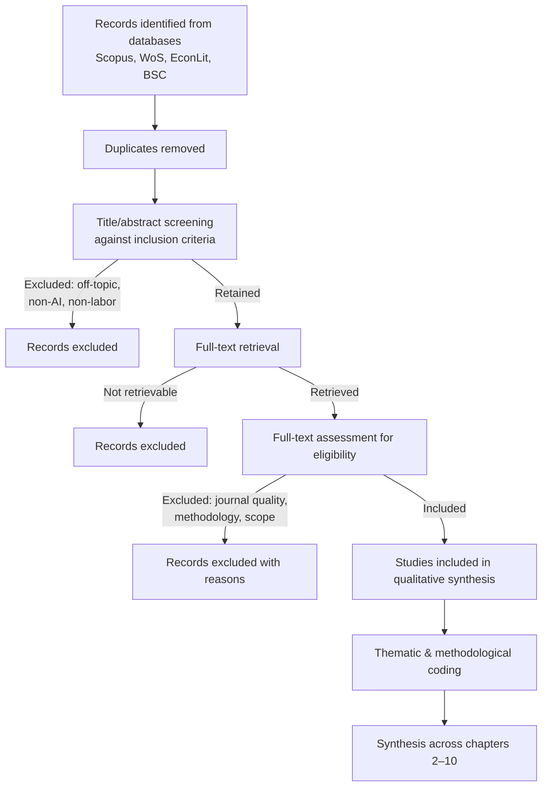
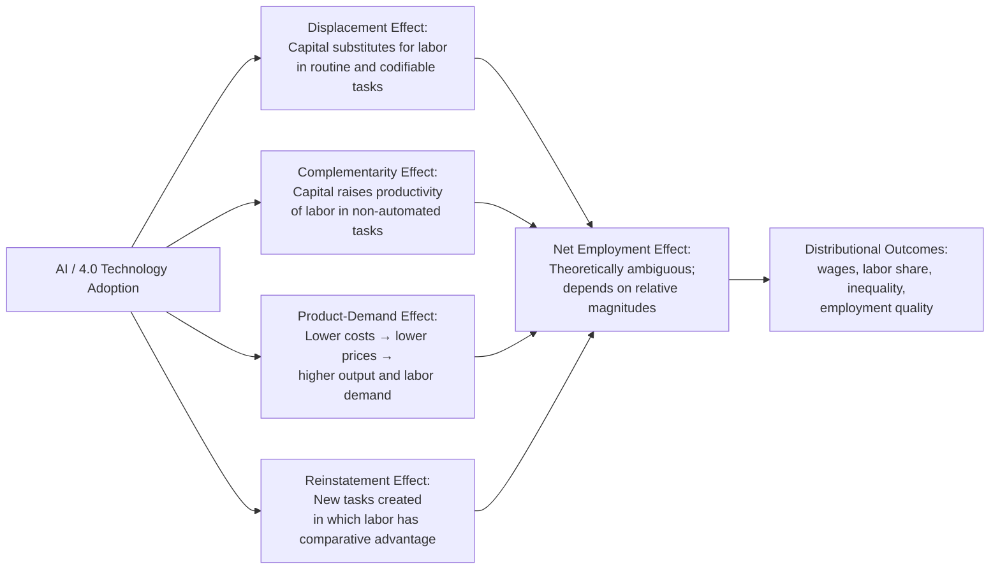
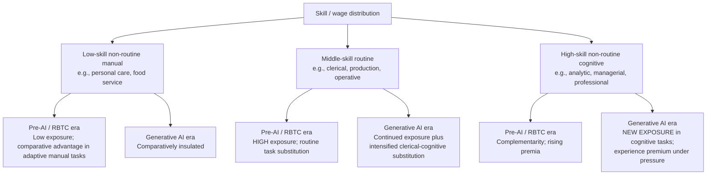

# The Restructuring Impact of Artificial Intelligence on the Labor Market: A Literature Review in the Context of the Fourth Industrial Revolution
# 1 Introduction, Review Scope, and Methodology

The convergence of advanced machine learning, generative models, autonomous systems, and pervasive digital infrastructures has, over the past decade, propelled artificial intelligence (AI) from a specialized research domain into a general-purpose technology whose reach now extends across nearly every sector of contemporary economic activity. Within the discourse of the Fourth Industrial Revolution (4IR)—a periodization popularized by the World Economic Forum to denote the fusion of physical, digital, and biological systems—AI is widely characterized as the central, integrative driver, capable of reshaping not only how goods and services are produced but also the very structure of work itself[^1]. The labor market consequences of this transformation are, however, neither self-evident nor uncontested: scholars disagree about the magnitude of displacement, the extent of complementarity, the distributional incidence of gains and losses, and the institutional mediators that determine whether AI augments or replaces human labor[^2]. This opening chapter establishes the foundation upon which the remainder of the review is constructed. It clarifies why a dedicated, methodologically rigorous synthesis of this literature is warranted, defines the conceptual boundaries that govern the analysis, articulates the guiding questions that thread through subsequent chapters, and details the systematic search-and-synthesis protocol—anchored in PRISMA 2020 reporting standards[^3] and the Tranfield–Denyer–Smart methodology for evidence-informed management research[^4][^5]—through which a corpus of peer-reviewed, high-quality English-language journal articles has been identified, screened, and coded.

## 1.1 Research Background and Rationale for the Review

The scholarly interest in AI's labor market consequences has expanded dramatically alongside the technology itself, but the resulting literature is fragmented, methodologically heterogeneous, and frequently contradictory in its headline conclusions. On one hand, observers writing in the tradition of Klaus Schwab and the World Economic Forum have argued that the 4IR is "evolving and emerging in ways that are creating new challenges and concerns for the world at a time when concerns about inequality, social tension and political fragmentation are rising, and where vulnerable populations are increasingly exposed to economic uncertainty"[^1]. The descriptive evidence on the diffusion of 4IR-aligned work equipment supports the perception of accelerating change: in a representative survey of 2,032 German producing firms and service providers, the share of self-controlled production equipment associated with 4.0 technologies grew from 3.7% five years prior to the survey to 5.1% at the time of survey, and was projected to reach 7.9% within five years; comparable figures for IT-integrated office and communication equipment rose from 5.8% to 7.8% to a projected 13.4%[^2]. On the other hand, predictive task-exposure studies have produced startlingly divergent estimates of the labor market footprint of these technologies, with some headline figures suggesting that "up to half of the workforce faces a high risk of automation in coming decades"[^2], while methodologically distinct analyses argue that "these recent risk assessments may be largely overstating the automation potential"[^2]. Such order-of-magnitude divergences are not merely numerical curiosities; they shape public anxieties, policy choices, and corporate workforce strategies, and they make the task of disciplined synthesis both more difficult and more consequential.

A second motivation for a dedicated review is the proliferation of theoretical lenses through which AI's labor market effects are analyzed. The canonical skill-biased technological change (SBTC) framework, the routine-biased technological change (RBTC) hypothesis, the task-based model, the displacement–reinstatement dialectic, and theories of labor market polarization each operationalize substitution and creation effects differently, generate distinct empirical predictions, and rely on heterogeneous identification strategies. Without a structured synthesis that makes these framework choices explicit, readers risk conflating findings that are, in fact, conditional on incompatible theoretical assumptions. Moreover, the field is methodologically diverse: predictive engineering-based exposure indices coexist with shift-share instrumental variable designs at the regional level, firm-level difference-in-differences studies leveraging linked employer–employee data[^2], randomized controlled trials of generative AI in workplace settings, and qualitative case studies of human–AI collaboration. Each design illuminates a different facet of the phenomenon, and a coherent assessment of "what is known" requires triangulating across them rather than privileging any single tradition.

A third rationale is the policy urgency generated by the rapid diffusion of AI. Reports drawing on industry projections suggest that by 2030 substantial numbers of manufacturing jobs may be eliminated by automation, and that AI is expected to penetrate corporate auditing, governance, and consumer-facing services within the present decade[^1]. These projections have already informed debates over reskilling, unemployment insurance, algorithmic accountability, and AI ethics; the credibility of those debates depends, in turn, on the quality of the underlying scholarly evidence base. Yet the rapid pace of AI's evolution—particularly the irruption of generative AI after 2022—means that influential pre-2020 syntheses are increasingly outdated in their treatment of which tasks and which workers are most exposed. A contemporary review that explicitly attends to the displacement–reinstatement dynamic, the heterogeneity of exposure, and the institutional moderators of outcomes is therefore both academically and practically valuable.

The present review responds to these conditions by consolidating dispersed evidence into a coherent analytical narrative. It does not aim to adjudicate every contested estimate, but rather to map the contours of consensus, the loci of genuine disagreement, and the methodological choices that drive divergence, thereby providing scholars and policymakers with a defensible epistemic foundation for further research and decision-making.

## 1.2 Conceptual Definitions and Analytical Boundaries

Coherent synthesis requires terminological discipline, particularly in a field where boundary terms are deployed loosely and inconsistently. For the purposes of this review, **artificial intelligence** is treated as an umbrella construct encompassing machine-learning systems (including supervised, unsupervised, and reinforcement-learning paradigms), generative AI based on large language and multimodal foundation models, robotics where cognitive control is central (as opposed to purely mechanical industrial robots), and algorithmic decision-support and decision-making systems used in hiring, scheduling, performance management, and credit allocation. This conceptualization deliberately excludes purely mechanical automation, generic information and communication technology (ICT), and digitization understood as the conversion of analog records into digital form, although these earlier technological waves are referenced as historical benchmarks where the literature uses them as comparators[^2]. The distinction matters because, as firm-level evidence from Germany shows, "indirectly controlled" or merely "IT-supported" work equipment continues to dominate the installed base of capital, and the share of genuinely "self-controlled" or "IT-integrated" 4.0 technologies remains a minority, albeit a rising one[^2]. Conflating AI with the entirety of digitization risks attributing to AI effects that arise from much earlier technologies.

**Labor market restructuring** is understood as a multidimensional construct comprising: (i) employment levels and trajectories at the aggregate, sectoral, and firm levels; (ii) the task composition of jobs, including the relative weight of routine, non-routine cognitive, and non-routine manual tasks; (iii) occupational structures and the rise or hollowing of particular occupational categories; (iv) skill demand and the wage premia attached to different skill bundles; (v) wages, wage dispersion, and the labor share of income; and (vi) employment quality, encompassing job stability, working conditions, autonomy, surveillance, and worker well-being. This expansive definition is deliberately chosen to accommodate the breadth of outcomes examined in the literature, but it also imposes the discipline of explicitly identifying, for each cited finding, which dimension of restructuring is being measured.

The **Fourth Industrial Revolution** is treated, following the conceptual literature, as the historical phase in which "the limits between [physical, digital, and biological] spheres … become blurry"[^1], characterized by ubiquity, availability, and global-scale interaction. AI is positioned as the integrative cognitive layer of this paradigm rather than as one technology among many, while industrial robotics, the Internet of Things, additive manufacturing, blockchain, and cyber-physical systems are treated as complementary 4IR technologies whose labor market effects are reviewed only insofar as they are entangled with AI's cognitive automation capacities. The temporal window of the review extends from approximately 2009—the publication year of the original PRISMA statement[^3] and a period in which task-based theorizing began to dominate empirical labor economics—through the present, with deliberate emphasis on post-2017 contributions that engage with deep learning and post-2022 contributions that engage with generative AI.

The disciplinary scope spans **economics** (labor economics, industrial economics, development economics), **management studies** (strategic human resource management, organization studies, operations management), **industrial relations** (employment systems, collective bargaining, workplace governance), and **public policy** (labor market policy, education and training policy, AI regulation). This multi-disciplinary framing is essential because the mechanisms through which AI restructures labor traverse the boundaries of any single discipline: a task-substitution claim grounded in labor economics can only be evaluated meaningfully alongside organizational evidence on how firms actually deploy AI, and policy claims about reskilling depend on findings from both education research and industrial relations.

## 1.3 Guiding Research Questions and Review Architecture

The review is organized around four guiding questions, derived from a reading of the field's principal debates and designed to be addressed cumulatively across the ten chapters of the report. These questions are:

1. **What is being restructured?** Which dimensions of the labor market—employment levels, task and occupational composition, skills, wages, working conditions—exhibit measurable change attributable to AI?
2. **Through which mechanisms?** What are the causal channels (capital–labor substitution, complementarity, product-demand effects[^2], reinstatement of new tasks, organizational redesign, institutional adaptation) through which AI's effects propagate?
3. **For whom?** How are restructuring effects distributed across skill groups, occupations, sectors, genders, ethnicities, age cohorts, regions, and countries at different levels of development?
4. **With what consequences, and over what horizons?** What are the short-run and long-run implications for inequality, productivity, employment quality, social cohesion, and economic sustainability, and how do institutional and policy responses shape these consequences?

The architecture of the review maps systematically onto these questions, as summarized in Table 1.

**Table 1. Mapping of guiding questions onto the report's chapter structure**

| Chapter | Primary focus | Guiding questions addressed |
|---------|---------------|------------------------------|
| 1 | Introduction, scope, and methodology | All (foundational) |
| 2 | Conceptual and theoretical foundations | Q1, Q2 (framework provenance) |
| 3 | Aggregate employment effects | Q1, Q2 (substitution vs. creation) |
| 4 | Occupational and skill composition | Q1, Q3 (skill-level heterogeneity) |
| 5 | Industry- and sector-specific disruptions | Q1, Q2, Q3 (sectoral incidence) |
| 6 | Distributional and demographic consequences | Q3, Q4 (inequality, vulnerability) |
| 7 | Cross-national and comparative perspectives | Q3, Q4 (institutional mediation) |
| 8 | Psychological, organizational, workplace-level | Q1, Q4 (employment quality, meaning of work) |
| 9 | Policy and regulatory responses | Q4 (institutional response) |
| 10 | Critical appraisal, gaps, and conclusion | All (integrative synthesis) |

This sequence moves from concept and theory (Chapter 2) through aggregate and structural impacts (Chapters 3–5), to distributional and contextual heterogeneity (Chapters 6–7), to micro-level workplace dynamics and policy responses (Chapters 8–9), culminating in a critical assessment and forward-looking research agenda (Chapter 10). Each chapter is designed to be read both as a self-contained synthesis of its sub-literature and as a building block of the cumulative argument that AI's labor market effects are conditional, mediated, and far more heterogeneous than headline aggregate estimates suggest.

## 1.4 Systematic Search Strategy and Source Selection

The review's evidence base was constructed through a systematic search procedure combining the reporting principles of the **PRISMA 2020 statement**[^3] with the management-science adaptation of systematic review developed by Tranfield, Denyer, and Smart[^4][^5]. PRISMA 2020 provides an updated 27-item reporting checklist and revised flow-diagram template designed to ensure that authors prepare "a transparent, complete, and accurate account of why the review was done, what they did … and what they found"[^3]; while originally developed for healthcare interventions, "the checklist items are applicable to reports of systematic reviews evaluating other interventions (such as social or educational interventions), and many items are applicable to systematic reviews with objectives other than evaluating interventions"[^3], rendering it appropriate for a social-scientific review of this kind. The Tranfield–Denyer–Smart methodology, in turn, supplies the field-specific guidance necessary to translate PRISMA principles into the conventions of evidence-informed management knowledge production[^4][^5].

The search was executed across four databases selected for their complementary coverage of the relevant disciplines: **Scopus** (multidisciplinary, with strong management and policy coverage), **Web of Science** Core Collection (multidisciplinary, with citation-based quality signals), **EconLit** (specialized economics coverage, including labor economics journals), and **Business Source Complete** (specialized management and applied business coverage). The deliberate use of multiple databases mitigates the coverage biases inherent in any single platform and follows established practice in the systematic review tradition.

Boolean search strings were constructed by combining two thematic blocks:

```
(AI block) AND (labor block)

AI block: "artificial intelligence" OR "machine learning" OR "deep learning"
        OR "generative AI" OR "large language model*" OR "algorithm* management"
        OR "algorithm* decision*" OR "industrial robot*" OR "autonomous system*"
        OR "Industry 4.0" OR "Fourth Industrial Revolution"

labor block: "labo?r market*" OR employment OR job* OR occupation*
        OR "wage*" OR skill* OR task* OR "human capital"
        OR "labo?r demand" OR "labo?r supply" OR "working condition*"
        OR "industrial relation*"
```

Searches were applied to titles, abstracts, and author keywords, with a publication-date window from 2009 onward, restricted to journal articles in English. The English-language restriction is acknowledged as a limitation (see §1.6) but is justified on grounds of comparability and the dominance of peer-reviewed Anglophone outlets in the disciplines under review.

A defining feature of the source-selection protocol is the **restriction of load-bearing evidence to peer-reviewed, high-quality English-language journal articles** verifiable through recognized rankings. Specifically, journals were retained only when listed in at least one of the following: the **Chartered ABS Academic Journal Guide (AJG)** at rank 2 or above; the **Australian Business Deans Council (ABDC)** list at rank B or above; or indexed in the **Journal Citation Reports (JCR)** with a ranking in the top two quartiles (Q1 or Q2) of their Web of Science subject category, or a comparable Q1/Q2 SJR ranking. The ABS/AJG and ABDC lists are widely used in management research as proxies for journal quality, with high ABS/ABDC ratings serving as recognized markers of scholarly standing[^6]; the JCR/SJR provide an analogous bibliometric anchor for disciplines beyond management. This filter was applied to ensure evidentiary rigor and cross-study comparability and to operationalize the user requirement that the synthesis cite only "high-quality, English-language journal articles."

Gray literature—including reports from McKinsey, the World Economic Forum, Goldman Sachs, Brookings, the OECD, the ILO, and the World Bank—and **working papers** (NBER, IMF WP, OECD WP, World Bank WP, SSRN preprints) were not used as load-bearing primary evidence. They appear, where cited, only as supplementary context (e.g., for descriptive statistics on AI diffusion, for policy framing, or for capturing emerging debates not yet absorbed into peer-reviewed outlets). This disciplined separation of evidentiary tiers protects the synthesis against the well-documented risks of relying on non-peer-reviewed sources for substantive empirical claims.

## 1.5 Screening, Inclusion Criteria, and Coding Procedures

Records identified through database searches were managed in a reference-management system, deduplicated, and then advanced through a **multi-stage screening process** consistent with PRISMA 2020 reporting expectations[^3]. The process is summarized in Figure 1.



**Figure 1.** Adapted PRISMA 2020 flow of study identification, screening, and inclusion. The diagram follows the template proposed in PRISMA 2020[^3], adapted to the four-database search and the journal-quality eligibility filter applied in this review.

**Inclusion criteria** required that a study: (i) address AI (as defined in §1.2) as a primary explanatory or descriptive variable; (ii) examine at least one dimension of labor market restructuring (as defined in §1.2) as an outcome; (iii) be published in a peer-reviewed English-language journal meeting the ABS/AJG ≥ 2, ABDC ≥ B, or JCR/SJR Q1–Q2 thresholds specified in §1.4; and (iv) employ an empirical, theoretical, or systematic-review methodology with sufficient transparency to permit appraisal. **Exclusion criteria** removed studies that: addressed automation generically without distinguishing AI; focused exclusively on technical or computational issues without labor market implications; were editorials, book reviews, conference abstracts, or commentaries lacking original analysis; or appeared only as preprints or working papers. Where a working paper had subsequently been published in a qualifying journal, the published version was used.

Eligible studies were subjected to **thematic and methodological coding** through a structured extraction template capturing: bibliographic identifiers; theoretical framework (SBTC, RBTC, task-based, displacement–reinstatement, polarization, organizational, institutional, other); methodology (predictive task-exposure, shift-share IV, firm-level DiD, RCT, qualitative case study, mixed methods, systematic review, theoretical); unit of analysis (task, occupation, worker, firm, region, country); geographic scope; time window; AI technology examined; outcome dimension(s); and headline findings with reported effect sizes where available. This coding scheme enables consistent cross-study comparison and supports the chapter-level syntheses that follow.

To ensure reliability, **dual-reviewer screening** was applied at the title/abstract and full-text stages for a subsample of records, with disagreements resolved through discussion and, where necessary, reference to a third reviewer. This procedure is consistent with PRISMA 2020's strengthened recommendations on "reporting of how many reviewers screened each record and each report retrieved, whether they worked independently, and if applicable, details of automation tools used in the process"[^3]. Studies that "might appear to meet the inclusion criteria, but … were excluded" are documented with reasons[^3], in line with PRISMA item 16b.

Where evidence on a given question was **conflicting**, the review's strategy is not to average across estimates—a procedure that can obscure methodological heterogeneity—but rather to surface divergence transparently, attribute it where possible to identifiable design differences (measurement, identification strategy, geography, time window, unit of analysis), and report the range of credible estimates. Seminal contributions are retained as historical anchors and theoretical reference points; recent contributions are weighted more heavily where the underlying technology (e.g., generative AI) postdates the older work. This balance is essential because, as firm-level evidence shows, "newer technologies have been shown to be adopted faster than older ones … providing individuals and firms with less time to adjust"[^2], and findings from earlier RBTC studies cannot be assumed to extrapolate cleanly to AI.

## 1.6 Methodological Limitations and Quality Assurance

Even a carefully designed systematic review is subject to limitations that should be acknowledged transparently. First, the **English-language restriction** systematically excludes potentially relevant scholarship in other languages, particularly Chinese, German, Spanish, Portuguese, and French, which may contain important evidence on, for example, "machine replacement" debates in Chinese manufacturing or codetermination dynamics in German firms. Second, **database coverage**, although broadened by the use of four complementary platforms, is not exhaustive; relevant work in journals not indexed by Scopus, WoS, EconLit, or BSC is not captured. Third, **publication bias** remains a generic concern: studies finding statistically significant or attention-grabbing effects are more likely to be published, potentially skewing the apparent balance of evidence on, for example, displacement versus complementarity. Fourth, the **journal-quality filter**, while necessary to ensure evidentiary rigor, may exclude high-quality work in newer or interdisciplinary outlets that have not yet achieved ABS/ABDC or JCR/SJR recognition. Fifth, AI scholarship is **rapidly evolving**, and any review captures a moving target; the irruption of generative AI in late 2022 has already produced a wave of new empirical work, and findings reported here must be read as provisional.

Several **quality-assurance measures** mitigate these limitations. The pre-specification of search strings, inclusion criteria, and coding schemes—analogous in spirit to the **protocol pre-registration** norms increasingly expected of systematic reviews[^3]—reduces the scope for post hoc reasoning. Dual-reviewer screening at the title/abstract and full-text stages reduces single-coder error. **Sensitivity analyses** at the synthesis stage examine whether headline conclusions are robust to varying the journal-quality threshold (e.g., restricting to ABS ≥ 3 or to JCR Q1) and to excluding studies with the highest risk of measurement error in AI exposure. An **audit trail** documenting search dates, retrieval counts, inclusion/exclusion decisions with reasons, and coding assignments supports the replicability and transparency that PRISMA 2020 identifies as the central virtues of well-reported reviews[^3]. Finally, the review explicitly distinguishes findings supported by convergent evidence across multiple methods and geographies from those resting on a single design or context, so that readers can calibrate their confidence in each conclusion.

Taken together, these procedures establish a defensible epistemic foundation for the chapters that follow. The review does not claim to resolve every contested estimate of AI's labor market impact, but it does aim to render the structure of the evidence base—its convergences, its disagreements, its blind spots—visible, traceable, and open to interrogation. With this scaffold in place, Chapter 2 turns to the conceptual and theoretical foundations that the field has developed for analyzing AI as the central technology of the Fourth Industrial Revolution and for theorizing its restructuring effects on the labor market.

# 2 Conceptual and Theoretical Foundations: AI, the Fourth Industrial Revolution, and Frameworks for Labor Market Analysis

Having established in Chapter 1 the rationale, scope, and methodological architecture of this review, the analysis now turns to the conceptual and theoretical scaffolding upon which the subsequent empirical syntheses depend. A defining feature of the literature on artificial intelligence and the labor market is that headline empirical claims—whether about the share of jobs at risk of automation, the magnitude of wage polarization, or the direction of productivity-employment relationships—are not freestanding statements of fact but rather predictions conditional on particular theoretical frameworks. The same reduced-form correlation between AI exposure and employment can be interpreted as evidence of skill-biased displacement, routine-task substitution, polarization, or a transient displacement effect awaiting reinstatement, depending on which conceptual lens is adopted. Disciplined synthesis therefore requires explicit reconstruction of these lenses, attention to their points of convergence and divergence, and a clear-eyed assessment of how their underlying assumptions shape what counts as evidence. This chapter undertakes that reconstruction in two interlocking movements: first, situating AI within the Fourth Industrial Revolution (4IR) paradigm and clarifying its distinctive technological properties; second, comparing the dominant theoretical frameworks—skill-biased technological change (SBTC), routine-biased technological change (RBTC), the task-based model, the displacement–reinstatement dialectic, and labor market polarization theory—through which scholars have analyzed AI's restructuring effects.

## 2.1 Conceptualizing the Fourth Industrial Revolution and Locating AI Within It

The concept of the Fourth Industrial Revolution, popularized in its current form by Klaus Schwab and the World Economic Forum, designates a historical phase characterized by the fusion of physical, digital, and biological systems and by what scholars describe as "extremely disruptive technological changes, with tremendous effects on our social and private lives," advancing in three interlocking domains—physical, digital, and biological—such that "the limits between these spheres … become blurry"[^1]. Three structural attributes recur across the conceptual literature as defining features of the 4IR relative to its predecessors: **ubiquity**, denoting the saturation of economic and social life by intelligent technologies; **availability**, denoting the low marginal cost of accessing computational power, data, and algorithmic services; and **interaction at a global scale**, denoting the real-time interconnection of devices, people, and processes across geographies[^1]. These attributes are operationalized in scenarios such as the projected diffusion of Internet penetration to roughly 90% of the population, the connection of over one trillion sensors via the Internet of Things (IoT), AI assuming roles in corporate governance and audit functions, and more than 80% of the population maintaining a "digital presence" by the mid-2020s—scenarios drawn from the WEF's catalogue of "tipping points" associated with the revolution[^1].

The constellation of technologies typically subsumed under the 4IR rubric is broad. Within manufacturing, the term **Industry 4.0**—originating in the high-tech strategy of the German federal government in 2011 and elevated to global agenda status at the World Economic Forum in 2016—has been defined as "a system that gathers and analyzes data from the floor to make intelligent decisions in an automated manner," driven by Cloud computing, Big Data, the IoT, Blockchain, Robotics, 3D printing, autonomous vehicles, AI, co-creation, and the Digital Value Chain[^7]. Whereas the Third Industrial Revolution focused on "switching mechanical and analog processes to digital ones," the Fourth Industrial Revolution is framed as "deepening the impact of our digital technologies by making our machines more self-sufficient, able to 'talk' to one another, and to consider massive amounts of data in ways that humans simply can't"[^7]. This formulation locates AI not as one technology among many but as the **integrative cognitive layer** that endows the 4IR's interconnected machines with the inferential, predictive, and decision-making capabilities that distinguish them from the merely networked digital systems of the Third Revolution.

The literature, however, is not unanimous in characterizing the 4IR as a genuine revolution. A more skeptical strand argues that the 4IR is "merely continued digitalization, not fundamentally different from the 3IR" and should "appositely be labeled *evolutionary*, not *revolutionary*"[^7]. Proponents counter that, while the digital revolution provided foundations for 4IR advances, "the 4IR's scope, speed and system-wide impact is qualitatively different," and that the 4IR is specifically concerned with "the making of intelligent digital infrastructure that seamlessly use data to improve, integrate and advance economies and societies"[^7]. Further critical voices, particularly from scholars writing on the Global South, caution against "the taken-for-granted assumptions of the 4IR" and adopt a "technological-realist standpoint" that highlights "the complex interactions between society and technology" and the risk of "the reproduction of social and economic inequalities"[^1]. This contested framing matters for the present review because the empirical literature surveyed in Chapters 3–7 routinely invokes the 4IR as a context, yet the legitimacy of attributing observed labor market changes to a putatively novel technological epoch depends on whether the underlying technology genuinely differs from earlier waves.

A practical resolution to this conceptual debate is provided by descriptive evidence on the **gradient of automation intensity** within firms. The IAB-ZEW Labour Market 4.0 firm survey of 2,032 German producing firms and service providers explicitly distinguishes three degrees of automation in production equipment—**manually controlled** (e.g., drilling machines, where humans are largely involved in the work process), **indirectly controlled** (e.g., CnC machines, industrial robots, process engineering systems, where humans are only indirectly involved), and **self-controlled** (e.g., production facilities up to Smart Factories, Cyber-Physical Systems, and the IoT, where work processes are largely performed automatically)—with a parallel taxonomy for office and communication equipment running from non-IT-supported through IT-supported to IT-integrated tools (analytic tools for Big Data, Cloud Computing systems, internet platforms, online marketplaces)[^2]. Only the self-controlled and IT-integrated categories correspond unambiguously to 4.0 technologies in the survey's operationalization, and these categories accounted, respectively, for only 5.1% and 7.8% of installed work equipment at the time of the survey, with the remainder consisting of either indirectly controlled / IT-supported or manually controlled / non-IT-supported tools[^2]. This gradient supplies an empirical scaffold for the conceptual claim that AI is the differentiating element of the 4IR: where capital is "self-controlled" rather than merely IT-supported, the cognitive autonomy associated with AI is materially present; where it is not, the equipment belongs to earlier technological waves whose labor market effects have been theorized for decades. The implication is that any claim about "the labor market effects of the 4IR" must be disciplined by attention to which slice of the capital stock is actually doing the work in question.

## 2.2 Defining AI and Differentiating It from Earlier Automation and ICT Waves

Building on the locational claim that AI is the integrative cognitive layer of the 4IR, the next analytical task is to specify what makes AI distinctive as a technological input to production, relative to the mechanical automation of earlier industrial revolutions and the generic ICT of the Third. The conceptual literature converges on several distinguishing properties.

A first property is **cognitive task automation**. The general framework articulated within the task-based tradition holds that "novel tasks—those demanded by new products, techniques, or services—are often assigned first to workers because workers are flexible and adaptive[, and] as these tasks are formalized and codified, they become fallow for automation since machinery typically has a cost advantage over human labor in rote execution of repetitive tasks"[^8]. Earlier waves of automation—steam, electricity, the digital computer—progressively expanded the set of tasks codifiable to a level "where a relatively inflexible machine can perform the work semi-autonomously"[^8]. AI extends this codification frontier into the domain of cognitive tasks, including pattern recognition, prediction, and increasingly, language generation. The implication is that AI is not, in conceptual terms, categorically different from earlier general-purpose technologies; it occupies the same logical position—a cost-competitive substitute in tasks once thought to require human flexibility—but applied to a markedly broader and more cognitively demanding task set.

A second property is **generative capability**. While prior digital systems primarily classified, retrieved, or analyzed existing data, recent AI systems—particularly those based on large language and multimodal foundation models—can produce new text, code, imagery, and structured outputs, blurring the prior line between codifiable and creative tasks. This generative capacity is precisely what motivates the recent literature's anxiety that AI may "fundamentally change how society operates by providing entirely novel solutions to existing problems," and it is why "the rapid development and recent successes of artificial intelligence in business domains have raised the bar"[^9].

A third property is **accelerated diffusion**. In contrast to prior general-purpose technologies, which diffused over decades, "newer technologies have been shown to be adopted faster than older ones … providing individuals and firms with less time to adjust"[^2]. The compression of diffusion lags has direct implications for the time available for institutional adaptation, reskilling, and reinstatement of new tasks—dynamics formalized in §2.5 below.

A fourth property concerns **scale and scope of interaction**. AI systems, embedded in cyber-physical systems and the IoT, operate at scales and with degrees of interconnection unavailable to standalone automated machinery. Within the 4IR's fusion of physical, digital, and biological systems, AI functions as the layer that translates massive sensor data streams into operational decisions, enabling the "smart factory" in which "physical systems can cooperate and communicate with each other and with humans in real time"[^9].

These properties, taken together, motivate a deliberate analytical separation of AI from earlier technological waves. The literature's caution about conflation is well-founded: studies that examine "automation" generically, or that proxy for AI exposure using broad ICT capital measures, risk attributing to AI effects driven by industrial robots, computerization, or digitization more broadly. As subsequent chapters of this review will document, much of the empirical literature on "AI and the labor market" has, until recently, relied on indirect indicators—initial routine task intensity, occupational composition, ICT capital deepening—because direct measures of AI adoption have been scarce[^2]. The present review treats this measurement constraint as a substantive limitation of the evidence base rather than as a definitional license to equate AI with prior automation.

To make the differentiation operational, Table 2 summarizes the principal contrasts between AI and earlier technological waves as articulated across the conceptual literature.

**Table 2. Distinguishing AI from earlier waves of automation and ICT**

| Dimension | Mechanical automation (1IR–2IR) | Generic ICT / digitization (3IR) | AI within the 4IR |
|-----------|--------------------------------|----------------------------------|-------------------|
| Locus of substitution | Manual, physical tasks | Routine codifiable cognitive and clerical tasks | Increasingly non-routine cognitive and creative tasks |
| Nature of capital | Powered mechanical equipment | Programmable digital systems following explicit rules | Self-learning systems performing pattern recognition, prediction, generation |
| Worker–machine relationship | Largely manual control | IT-supported; humans indirectly involved | IT-integrated/self-controlled; processes largely autonomous[^2] |
| Diffusion speed | Decades | Decades, accelerating | Compressed; faster than prior GPTs[^2] |
| Scope of integration | Workshop and factory | Enterprise and inter-firm digital systems | Cross-domain fusion of physical, digital, biological systems[^1] |
| Implication for skill demand | Demand for engineering and maintenance | Skill-biased complementarity, routine-task substitution | Contested: complementarity at high skill, but encroachment on cognitive tasks |

The table is deliberately schematic; subsequent chapters will demonstrate that these distinctions are matters of degree and that real-world capital stocks blend technologies from multiple eras. Nonetheless, the key analytical claim is that AI's defining novelty lies less in being the first cognitive technology than in extending the codification frontier into tasks that the canonical RBTC literature originally treated as labor's enduring comparative-advantage redoubt.

## 2.3 The Task-Based Framework: Tasks, Skills, and Comparative Advantage

The dominant analytical lens through which the contemporary literature interprets AI's labor market effects is the **task-based model**, developed in a sequence of contributions by Autor, Levy, and Murnane and elaborated by Acemoglu and Autor[^8]. The framework's foundational move is to dissolve the implicit equivalence between **factors of production and the services they provide** that characterizes the canonical production function—an equivalence in which "a factor's identity and its role in the production function are synonymous"[^8]. Against this static formulation, the task approach insists that "in reality … the boundary between 'labor tasks' and 'capital tasks' in production is permeable and shifting"[^8], and recasts production as the combination of a continuum of tasks, each of which can in principle be supplied by domestic labor, foreign labor, or capital.

The conceptual cornerstone of the framework is the distinction between **skills and tasks**. As Autor formalizes the point: "A task is a unit of work activity that produces output. A skill is a worker's *stock* of capabilities for performing various tasks. Workers apply their skills to tasks in exchange for wages"[^8]. This distinction is "of course inconsequential if workers of a given skill always perform the same set of tasks," but it becomes "relevant … when the assignment of skills to tasks is subject to change, either because shifts in market prices mandate reallocation of skills to tasks or because the set of tasks demanded in the economy is altered by technological developments, trade, or offshoring"[^8]. The premise of the present review—and of the contemporary literature on AI—is precisely that we are in such an era of reallocation.

Formally, the Acemoglu–Autor model represents output as produced from a continuum of tasks indexed on the unit interval, with each task potentially supplied by low-, medium-, or high-skill labor or by capital, and with skill groups differing in their **comparative advantage** across tasks: "*α*ₗ(*i*)/*α*ₘ(*i*) and *α*ₘ(*i*)/*α*ₕ(*i*) are (strictly) decreasing," meaning that "higher indices correspond to 'more complex' tasks in which high skill workers are more productive than medium skill workers and medium skill workers are more productive than low skill workers"[^8]. Equilibrium then partitions the task space into three adjacent intervals: a low-complexity range supplied by L workers, an intermediate range supplied by M workers, and a high-complexity range supplied by H workers, with the cut-points endogenously determined by no-arbitrage conditions and labor-market clearing[^8].

Two consequences of this architecture are central for the analysis of AI. First, the model permits **factor-augmenting technological change to reduce the wages of certain skill groups**, an outcome ruled out in canonical models. As Autor explains: "a factor-augmenting technological improvement (e.g., an increase in *Aₕ*) can reduce the wages of middle skill workers … when new technologies, by increasing the productivity of high skill workers, encourage some of the tasks previously performed by middle skill workers to be shifted to high skill workers, but a corresponding shift of low skill tasks to middle skill workers is not profitable"[^8]. Second, the model can incorporate **direct task displacement by capital**: when capital's productivity in a range of tasks rises sufficiently to render machine performance more economical than middle-skill labor, those tasks are reassigned from labor to capital. Workers displaced from these tasks "are therefore reallocated to tasks for which they have lower comparative advantage, which pushes their wages down"[^8]. Simultaneously, the lower cost of newly automated tasks raises their intensity of use, complementing labor in remaining tasks—so "these countervailing effects imply that the real wage of the group that is directly displaced by technology in a subset of its original tasks does not *have to* fall in real terms[, but] such an outcome is possible—perhaps even likely—in realistic cases"[^8].

The task framework thus replaces the canonical model's monotonic, factor-fixed predictions with a richer set of conditional outcomes that depend on the specific tasks technology is able to perform, the patterns of comparative advantage in adjacent task ranges, and the reallocation dynamics induced by displacement. It is this conditionality that makes the framework simultaneously the field's most powerful analytical tool and one whose empirical application is fraught.

The **measurement challenges** are substantial. Researchers have pursued three approaches to operationalizing tasks: aggregating detailed occupational codes into broad task categories; appending standardized job descriptors from sources such as the U.S. Dictionary of Occupational Titles (DOT) and its successor the Occupational Information Network (O*NET); and collecting task information directly from worker surveys (e.g., the IAB/BIBB labor force data, the British Skills Survey, the Princeton Data Improvement Initiative)[^8]. Each approach carries limitations. Occupational aggregates "obscure any similarities in task content that cross broad occupational boundaries"[^8]. DOT and O*NET measures, while externally validated, "overlook all heterogeneity in job tasks among individuals within an occupation" and offer "a static view of the tasks an occupation comprises," whereas the task framework predicts continual within-occupation reoptimization[^8]. Survey-based measures permit greater nuance but face design difficulties because "what is routine from the perspective of human labor is generally not routine from the perspective of machine automation and vice versa"—a gap dramatized by the observation that asking workers to assess their tasks' codifiability for machine execution is "roughly akin to asking truck drivers to compare their skills to the current capabilities of Google's driverless car"[^8].

A second set of challenges is conceptual: the **counterfactual problem** in comparative-advantage settings. Because workers' productivity in tasks they currently do not perform is "inherently hard to estimate," and because the wage of any skill group is contingent on the equilibrium assignment of skills to tasks, predicting the consequences of an AI-driven reassignment requires assumptions about the productivity of factors at task locations they have not historically occupied[^8]. A related pitfall is that "the intuitively appealing approach of regressing wages on current tasks performed by workers to estimate the 'returns to tasks' may generate potentially misleading results," because "the set of tasks that a worker performs on the job is an endogenous state variable that is simultaneously determined by the worker's stock of human capital and the contemporaneous productivity of the tasks that human capital could accomplish"[^8]. These caveats temper the confidence with which task-based regressions can be read as causal estimates of AI's effects.

A third concern is **terminological discipline**. Autor warns that "the emerging task literature may be significantly inside the frontier of what is feasible in terms of precise terminology and consistent measurement," cautioning that overlapping but distinct task attributes—routine, abstract, manual, offshorable—are frequently conflated, and that "it is regrettably the case that there are almost as many distinct task classifications as there are papers in the task literature"[^8]. For the present review, this implies a need to attribute findings to specific task taxonomies and to flag where apparent disagreements among studies reflect terminological inconsistency rather than substantive disagreement.

Despite these challenges, the task framework has become the field's dominant lens because it is uniquely well-suited to AI. It accommodates capital that performs cognitive tasks, permits non-monotone wage and employment effects, explicitly endogenizes the labor–capital boundary, and provides a tractable language for analyzing how AI-induced shifts in *αₖ*(*i*) propagate through the economy. The frameworks reviewed in §§2.4–2.6 can be read as specializations or extensions of this general apparatus.

## 2.4 Skill-Biased and Routine-Biased Technological Change

The earlier theoretical tradition that the task-based model superseded begins with the **skill-biased technological change** hypothesis, which holds that technological progress disproportionately raises the marginal productivity—and hence the relative wage and employment—of high-skill workers. SBTC's monotonic prediction is that, as technology advances, demand shifts continuously from low- to high-skill labor, generating widening skill premia and rising educational returns. While SBTC provided a parsimonious account of the rising college wage premium observed in the United States from the late 1970s onward, it was unable to account for several stylized facts that became prominent in the 1990s and 2000s, most notably the simultaneous growth of high- and low-wage employment alongside the shrinkage of middle-wage occupations.

The **routine-biased technological change** hypothesis, formalized in Autor, Levy, and Murnane's 2003 framework, replaced SBTC's skill-axis dichotomy with a task-axis distinction. Their seminal claim was that "(1) computer capital substitutes for workers in carrying out a limited and well-defined set of cognitive and manual activities, those that can be accomplished by following explicit rules (what we term 'routine tasks'); and (2) that computer capital complements workers in carrying out problem-solving and complex communication activities ('nonroutine' tasks)"[^8]. The mechanism is task-substitution rather than skill-substitution: routine-intensive activities concentrated in middle-skill clerical, administrative, sales, production, and operative positions become "increasingly ripe for automation and hence are reassigned from labor to capital," while non-routine activities at both the high-skill (analytic, reasoning, problem-solving) and the low-skill (in-person service, manual flexibility, visual recognition) ends of the distribution remain labor's domain[^8].

Autor's later overview of the task literature confirms the empirical purchase of the RBTC formulation: "the occupations that have contracted most rapidly as a share of total employment over the last three decades—in particular, clerical, administrative support, sales, production and operative positions—are reasonably well characterized as routine task-intensive: many of the core tasks of these occupations follow precise, carefully codified procedures"[^8]. This pattern is consistent with the task-based prediction that technology displaces labor specifically from codifiable activities and reallocates it toward both high-skill abstract tasks and low-skill non-routine manual tasks—an outcome RBTC anticipates but SBTC cannot.

A complementary task attribute, **offshorability**, was added to the typology by Blinder and others to capture tasks that "may be performed in a remote location without substantial quality degradation"[^8]. Crucially, Autor cautions that offshorability "does not *exclude* many non-routine tasks—such as interpreting x-rays, or providing technical support—nor does it *include* all routine tasks, such as generating web pages dynamically in response to user queries," because the operative criterion is whether a task "depends on face-to-face worker contact or close proximity between worker and customer"[^8]. The conflation of routineness with offshorability in some empirical work is a measurement pitfall that the AI literature has inherited, and it bears on whether observed labor market changes are properly attributable to automation, offshoring, or some combination.

The transition from SBTC to RBTC has direct implications for analyzing AI. The IAB-ZEW formulation of the 4IR research agenda explicitly inherits the RBTC framing: "automation technologies replace workers in so-called routine tasks. These are tasks that follow well-defined protocols, which can thus be done by algorithms and computer-controlled machines. The rise of processing power thus leads to a substitution of labor by capital in routine tasks, the so-called Routine Replacing Technological Change (RRTC) hypothesis"[^2]. Yet whether RBTC remains adequate for AI is a live question. The framework's central organizing distinction—between codifiable routine tasks and non-codifiable non-routine tasks—was articulated when machine learning was in its infancy, and its empirical support derives largely from studies of computerization rather than of contemporary AI. Generative AI's apparent capacity to perform pattern-rich, non-routine cognitive activities—drafting, summarization, code generation, image synthesis, diagnostic reasoning—encroaches on tasks that the canonical RBTC treated as labor's enduring comparative-advantage domain. As Autor presciently observed, "we should expect that the range of tasks that can be automated will continue to expand outward from the most 'routine' core—performing basic mathematical operations, storing and retrieving data—towards tasks requiring ever greater adaptability, judgment and, perhaps eventually, creativity"[^8]. Whether this expansion preserves RBTC's explanatory structure, simply recalibrates its empirical thresholds, or undermines its core dichotomy is a question the review will return to in Chapters 3–4.

## 2.5 Displacement, Reinstatement, and the Acemoglu–Restrepo Synthesis

The **displacement–reinstatement framework** developed by Acemoglu and Restrepo extends the task-based model by explicitly recasting technological change as the joint product of two countervailing forces. The **displacement effect** captures the substitution of capital for labor in tasks previously performed by workers, reducing labor demand at given wages. The **reinstatement effect** captures the creation of new tasks in which labor holds comparative advantage, expanding the set of activities for which workers are demanded. The historical puzzle that motivates the framework is that, despite two centuries of intermittent automation anxieties, aggregate employment has not collapsed; the framework's resolution is that displacement has been offset, in the long run, by reinstatement of new tasks. As one synthesis of the recent literature notes, the labor demand model now standard in firm-level analyses "differentiates between job-types that differ in their task structure, and technology-types that differ in their degree of automation … [and] explains the main job creation and job destruction channels arising from technology[, including] capital-labour substitutions and complementarities across technology and job-types, as well as product demand effects"[^2].

Several features of the framework are central for AI analysis. First, it makes the **net employment effect theoretically ambiguous**: as the IAB-ZEW formalization emphasizes, "the aggregate employment effect is theoretically ambiguous and depends on the relative size of the job creation and job destruction channels"[^2]. Whether AI raises or lowers total employment cannot be deduced from theory alone but must be quantified empirically by estimating the relative magnitudes of substitution, complementarity, and product-demand effects. Second, the framework introduces **product-demand effects** as a third channel alongside displacement and reinstatement: "machines allow firms to operate more cost-efficient, leading to lower product prices and, hence, higher sales and firm labor demand"[^2]. This channel explains why even task-replacing technologies need not produce net employment losses if the resulting cost reductions sufficiently expand product demand and, through it, derived demand for complementary labor. Third, the framework can be operationalized at the firm level using direct measures of technology adoption—"production equipment (mostly used by producers) as well as electronic office and communication equipment (mostly used by service providers) … distinguish[ing] between their degree of automation (digitization)"—rather than relying on the indirect routine-intensity proxies that characterized earlier RBTC work[^2].

The framework's predictions extend beyond aggregate employment to **the labor share, productivity, and inequality**. When displacement outpaces reinstatement, automation can suppress wages, depress the labor share of income, and concentrate productivity gains among capital-owners and workers complementary to the new technology. When reinstatement leads, labor demand expands and the labor share is maintained or restored. The framework is therefore particularly well-suited to the contemporary debate over whether AI will follow the pattern of prior general-purpose technologies—where reinstatement eventually rebalanced labor markets—or whether the speed of AI's displacement, the breadth of its task encroachment, and the slowness of new-task creation will produce a sustained period of labor-share decline.

A diagrammatic representation of the framework's logic clarifies its operation.



**Figure 2.** Schematic representation of the displacement–reinstatement framework as operationalized in firm-level studies of 4IR technology adoption[^2]. The diagram emphasizes that the net effect on labor demand is the algebraic sum of four channels, with no theoretical presumption about which dominates.

For the empirical chapters that follow, the framework supplies the conceptual map for interpreting why studies arrive at divergent net-employment estimates: differences in the channels each design measures, in the time horizons over which reinstatement can plausibly be observed, and in the scope of the technology shock examined all translate into different positions on the displacement–reinstatement balance. As preliminary IAB-ZEW results suggest, "technology investments are not associated with negative aggregate employment effects as job creation and job destruction effects seem to balance out[, while] certain occupational and task groups benefit from technology, depending on the degree of automation, whereas others workers are replaced"[^2]. The framework therefore predicts heterogeneity by occupation and task even when aggregate effects are neutral—a prediction taken up in Chapter 4.

## 2.6 Labor Market Polarization: Theory and Mechanisms

The **labor market polarization** thesis is the empirical and theoretical companion to RBTC. It documents and explains the simultaneous growth of employment at the top and bottom of the wage and skill distributions alongside the contraction of middle-wage, middle-skill, routine-task-intensive occupations. The mechanism, as articulated within the task framework, is straightforward: routine task automation displaces middle-skill workers from their characteristic occupations; these workers, lacking strict comparative advantage in either high-skill abstract tasks or low-skill non-routine manual tasks, are pushed toward whichever pole offers the better alternative; and the comparative advantage of labor over capital in non-routine manual service activities (food preparation, personal care, security, transportation requiring environmental adaptability) ensures the persistence and growth of low-skill service employment[^8].

Autor's overview emphasizes the framework's elegant resolution of an apparent paradox: "as workers lose comparative advantage in routine-intensive activities, a greater mass of skills is reallocated towards the tails of the occupational distribution—both towards high skill analytic, reasoning and problem solving tasks and, ironically, towards traditionally low skill, in-person service tasks—thus leading to employment polarization"[^8]. The empirical evidence supporting this pattern is by now substantial across U.S. and European labor markets, including the contributions of Autor and Dorn, Goos and Manning, Goos, Manning and Salomons, Firpo, Fortin and Lemieux, and Autor, Katz and Kearney that anchor the polarization literature[^8].

A central theoretical refinement concerns the **non-decomposability of certain occupations**. Autor emphasizes that "many middle skill *jobs* demand a mixture of tasks from across the skill spectrum," and he conjectures that "many of the tasks currently bundled into these jobs cannot readily be unbundled—with machines performing the middle skill tasks and workers performing the residual—without a substantial drop in quality"[^8]. The implication is that not all middle-skill jobs are equally vulnerable: those that combine routine technical work with non-routine interpersonal, problem-solving, or adaptive components are protected by the **complementarity between technical and interpersonal skills**. Medical paraprofessions—radiology technicians, phlebotomists, nurse technicians—exemplify this resilience, combining "specific vocational skills with foundational middle skills—literacy, numeracy, adaptability, problem-solving and common sense"[^8]. Lawrence Katz has aptly termed such workers "the new artisans"[^8]. This refinement carries a forward-looking implication: the persistence and even growth of certain middle-skill jobs depends on their resistance to task unbundling, a property that may itself be challenged as AI advances.

Polarization theory has been subject to important critiques that bear on the analysis of AI. A first critique concerns the **identification of task prices**. Firpo, Fortin, and Lemieux's working paper develops a method to measure the impact of changing task prices on wage structure, predicting that occupations specialized in tasks of declining market value should see reductions in both mean and variance of occupational wages, but, as Autor notes, the approach implicitly treats skill-to-task allocations as predetermined and does not yet incorporate endogenous occupational entry and exit—simplifying the predictions but at "an unknown cost in terms of economic realism"[^8]. A second critique concerns whether polarization is a robust long-run phenomenon or a stage-specific feature of computerization. If AI's reach into non-routine cognitive tasks erodes high-skill employment at the top of the distribution, the U-shape characteristic of polarization may flatten or invert into a more general compression of mid- and high-skill employment—a possibility that motivates Chapter 4's review of generative-AI exposure studies. A third critique, drawn from the broader 4IR literature, is that polarization analyses developed in the U.S. and EU contexts may not extend to economies with different industrial structures, labor institutions, or AI adoption rates—a concern taken up in Chapter 7.

A practical policy implication that Autor emphasizes is that polarization does not warrant abandoning middle-skill education: "education is cumulative; students cannot attain high skills (e.g., proving theorems) without first mastering middle skills (e.g., arithmetic)," and post-secondary educated workers earn more "in essentially *all* walks of life—including mundane service occupations—than do those with a high school or lesser education"[^8]. The polarization framework thus generates not only descriptive predictions about employment composition but also normative guidance for human-capital policy—guidance whose implementation is the subject of Chapter 9.

## 2.7 Comparative Assessment: Convergences, Divergences, and Implications for AI Analysis

The five frameworks reviewed above—SBTC, RBTC, the task-based model, the displacement–reinstatement synthesis, and polarization theory—form a nested rather than competing hierarchy. Each subsequent framework absorbs the empirical successes of its predecessors while addressing the empirical anomalies they could not explain. SBTC's monotonic skill-axis predictions gave way to RBTC's task-axis distinction once the hollowing-out of middle-skill employment became salient; RBTC was generalized within the Acemoglu–Autor task model to allow for endogenous skill-task assignment and non-monotone wage effects; the task model was, in turn, dynamicized by Acemoglu and Restrepo's displacement–reinstatement synthesis to account for the long-run creation of new tasks; and polarization theory operationalizes these mechanisms in the specific empirical pattern of U-shaped employment growth observed across advanced economies.

Table 3 summarizes the comparative anatomy of the five frameworks across their core analytical dimensions.

**Table 3. Comparative anatomy of dominant theoretical frameworks**

| Framework | Unit of analysis | Substitution claim | Complementarity claim | Distributional prediction | Adequacy for AI |
|-----------|------------------|---------------------|-----------------------|----------------------------|-----------------|
| SBTC | Skill groups | Technology displaces low-skill labor | Technology complements high-skill labor | Monotonic widening of skill premium | Inadequate: cannot accommodate hollowing-out or non-routine cognitive automation |
| RBTC | Routine vs. non-routine tasks | Capital substitutes for labor in routine codifiable tasks[^8] | Capital complements labor in non-routine analytic and manual tasks[^8] | Polarization (U-shape) in employment[^8] | Partial: under strain from generative AI's non-routine cognitive reach |
| Task-based (Acemoglu–Autor) | Tasks within continuum; comparative advantage | Capital substitutes where *αₖ(i)* exceeds labor's comparative advantage[^8] | Capital complements remaining tasks via task-intensity effects[^8] | Non-monotone; conditional on comparative-advantage schedules[^8] | Strong: accommodates cognitive task automation by capital |
| Displacement–Reinstatement | Tasks plus new-task creation | Displacement reduces labor demand in automated tasks | Reinstatement creates new labor-advantaged tasks; product-demand effects[^2] | Net effect ambiguous; depends on relative pace[^2] | Strong: addresses dynamic adjustment central to AI debates |
| Polarization | Occupations; wage/skill distribution | Middle-skill routine occupations contract[^8] | Tails grow via abstract and non-routine manual complementarity[^8] | U-shaped employment growth; mid-distribution wage compression[^8] | Contingent: durability questioned if AI erodes high-skill employment |

Several **convergences** emerge from the comparative review. All four post-SBTC frameworks reject the canonical production function's static factor-role assumption and place tasks rather than skills at the analytical center; all distinguish between substitution and complementarity channels; and all acknowledge that the net effect of technology on employment and wages is conditional on parameters that cannot be deduced from theory alone but must be estimated from data. The implication is that disagreements within the empirical literature reviewed in subsequent chapters are rarely about whether tasks matter or whether displacement and complementarity coexist; they are about magnitudes, time horizons, and the specification of which tasks AI in fact automates.

Several **divergences** also emerge. First, SBTC and RBTC diverge sharply on the unit of analysis (skill groups vs. tasks) and on monotonicity (uniform skill-bias vs. polarization), with the empirical record favoring RBTC. Second, the task-based and displacement–reinstatement frameworks diverge from RBTC in permitting non-monotone wage effects within skill groups and in introducing new-task creation as an offsetting channel; this expansion is essential for analyzing AI but introduces substantial empirical demands. Third, polarization theory and the broader displacement–reinstatement synthesis diverge in their prognosis: polarization predicts sustained tail-growth and middle-hollowing, whereas the displacement–reinstatement view leaves open the possibility that AI's reach into non-routine cognitive tasks could erode the upper tail itself, breaking the polarization pattern. The empirical literature reviewed in Chapters 3–4 will be parsed against this typology to identify which divergences are matters of measurement and which reflect substantive conceptual disagreement.

For the AI literature, four implications follow. First, **headline employment estimates are framework-conditional**: Frey-Osborne-style projections of "up to half" of jobs at high risk of automation operationalize an SBTC-adjacent occupation-level exposure index that may overstate displacement by ignoring within-occupation task heterogeneity, while task-level analyses such as Arntz, Gregory, and Zierahn arrive at substantially smaller estimates precisely because they apply the task-based logic. Chapter 3 returns to this divergence directly. Second, **measurement choices are theoretically loaded**: the choice between O*NET-derived task indices, firm-level direct measures of AI adoption, and indirect routine-intensity proxies is not methodologically neutral but operationalizes different conceptual commitments. Third, **the distinction between displacement and reinstatement requires longer time horizons than most studies observe**, implying that short-window estimates may systematically underestimate reinstatement and thereby overstate net displacement. Fourth, **generative AI poses a genuine theoretical novelty**: by extending automation's reach into tasks the canonical RBTC and polarization frameworks treated as labor's enduring comparative-advantage redoubt, generative AI may invert standard predictions about which workers are most exposed—a possibility examined in Chapter 4.

Three **conceptual gaps** in the framework landscape merit explicit acknowledgment. First, the dominant frameworks remain primarily economic, treating organizations as black boxes through which technology mechanically operates; they offer limited purchase on the **organizational mediation** of AI's effects—how firms actually deploy AI, how human–AI collaboration is structured, and how managerial choices shape worker experience. Chapter 8 addresses this gap. Second, the frameworks are largely silent on **institutional context**: the same technological shock is mediated by different labor market regulations, welfare regimes, training systems, and industrial relations institutions, generating heterogeneous outcomes that pure task-based reasoning does not predict. Chapter 7 examines cross-national variation in this light. Third, the frameworks were developed with a relatively closed set of automating technologies in mind—industrial robots, computerization, software—and their application to **generative AI**, whose properties depart in important respects from prior automation, remains a frontier rather than a settled extension.

This typology will serve as the theoretical reference grid for the remainder of the review. When Chapter 3 confronts divergent aggregate employment estimates, when Chapter 4 examines occupational and skill restructuring, when Chapter 6 analyzes distributional consequences, and when Chapter 8 turns to organizational-level dynamics, the analysis will return to the frameworks reconstructed here to identify which conceptual lens each cited study operationalizes, where its predictions converge or diverge with alternatives, and how its assumptions condition the interpretation of its findings. With this scaffolding established, the review proceeds in Chapter 3 to the central empirical question of AI's net effect on aggregate employment, where the framework-dependence of headline estimates will be most starkly visible.

# 3 Aggregate Employment Effects: Substitution versus Creation

The conceptual scaffolding established in Chapter 2 makes clear why the empirical question of artificial intelligence's net effect on aggregate employment cannot be settled by inspection of headline numbers alone. Whether AI is judged to be displacing workers on a historic scale, leaving aggregate employment broadly unchanged, or generating net employment growth depends, in each case, on which framework operationalizes the analysis, which channel the design measures, over what horizon the effects are tracked, and against which counterfactual the realized outcome is compared. The displacement–reinstatement synthesis predicts that the net employment effect is theoretically ambiguous and contingent on the relative magnitudes of capital–labor substitution, complementarity, product-demand expansion, and the creation of new labor-advantaged tasks. The empirical literature reviewed in this chapter populates that schematic with quantitative estimates whose ranges are remarkable: from headline projections that nearly half of existing jobs are at high risk of automation to firm-level evidence that robot adoption is associated with employment stability or even expansion at incumbent establishments. The analytical task of this chapter is therefore not to adjudicate which estimate is "right," but rather to render the structure of disagreement legible—mapping each finding to the channel it captures, the framework it presupposes, and the design choices that shape its magnitude—and thereby to extract the calibrated propositions that the aggregate evidence will and will not support. The chapter proceeds by first reconstructing the displacement thesis (§3.1), then synthesizing creation- and neutrality-leaning evidence (§3.2), examining the case for non-linear, U-shaped trajectories (§3.3), systematically interrogating the sources of divergence (§3.4), and finally consolidating areas of consensus and contested terrain (§3.5).

## 3.1 The Displacement Thesis: Engineering-Based Exposure Estimates and Robot-Adoption Studies

The displacement thesis—that AI and adjacent automation technologies are poised to eliminate large numbers of jobs—rests on two methodologically distinct but rhetorically converging empirical traditions: predictive engineering-based occupation-exposure studies, and ex-post econometric analyses of realized robot adoption.

The seminal contribution to the predictive tradition is Frey and Osborne's analysis of the susceptibility of jobs to computerization, published in *Technological Forecasting & Social Change*.[^10] Their methodology proceeds in three stages: a workshop of machine-learning experts hand-labels a subset of 70 detailed occupations as automatable or not based on their assessment of current and near-term computerization capabilities; these expert labels are regressed on O*NET-derived task variables intended to capture the engineering bottlenecks to automation (perception and manipulation, creative intelligence, and social intelligence); and the resulting probabilistic classifier is applied across the full set of 702 occupations to generate an occupation-level "probability of computerization." The headline finding—that approximately 47% of total US employment falls in occupations classified as high risk (probability ≥ 0.7) of computerization within an unspecified two-decade horizon—rapidly became one of the most widely cited statistics in the contemporary debate on technology and work, accumulating in excess of twenty thousand citations by the mid-2020s.[^11] The study's framework commitments are important to note. Although Frey and Osborne build their classifier on task variables, the unit of prediction is the **occupation** rather than the task: each occupation is assigned a single probability that, in effect, treats it as an indivisible bundle that will be either automated or not. This methodological choice operationalizes a logic closer to occupation-level skill-biased reasoning than to the within-occupation task-reallocation dynamics emphasized by the Acemoglu–Autor task-based model, and it is precisely this choice that subsequent task-level critiques have targeted (see §3.2).

Frey and Osborne's predictions have been amplified by sectoral analyses extending their occupational risk scores to specific economic activities. The McKinsey Global Institute's parallel exercise on automation potential, when synthesized with Bureau of Labor Statistics employment projections, suggested that under "fast" automation-penetration scenarios the US economy could meet projected 2024 output with as few as 132 million workers—roughly 10 million fewer than employed at the time of analysis and 19 million fewer than the BLS 2024 baseline projection—with retail trade and manufacturing absorbing the largest absolute job losses (3.0 and 2.4 million fewer workers, respectively, relative to BLS projections under the fast-penetration scenario).[^12] The same scenario analyses, however, expose the wide range of plausible outcomes that follow from varying a single parameter, automation penetration: under a baseline scenario assuming a 50% increase in penetration above the level implicit in BLS productivity projections, economy-wide employment declines amount to approximately 6.4 million workers without output reductions, while a fast-penetration scenario assuming a 150% increase in penetration roughly doubles that figure.[^12] The same analysis highlights that even the fast-penetration scenario, "based on the most aggressive automation projections from McKinsey," implies employment declines representing only "about 4–13% of the projected workforce"—"far more modest than conclusions that half of US jobs are vulnerable" or industry forecasts such as the former Citigroup CEO's claim that "30% of banking jobs may disappear within five years".[^12] These scenario calculations make explicit a point that Frey and Osborne's headline figure obscures: occupation-level exposure scores measure **automation potential**, not realized employment displacement; the translation from one to the other depends on adoption speed, capital costs, regulation, and product-demand responses that exposure scores themselves do not encode.

The second strand of the displacement literature replaces predictive scoring with ex-post econometric estimation, exploiting variation in the actual deployment of industrial robots across local labor markets. The leading study in this tradition, by Acemoglu and Restrepo and disseminated through *NBER Working Paper 23285* and subsequently the peer-reviewed literature, combines International Federation of Robotics (IFR) data on industrial-robot stocks across 19 industries from 1990 to 2007 with US Bureau of the Census data on local industrial composition to construct a measure of commuting-zone "exposure to robots."[^13] Identification leverages variation in industry-level robot adoption in countries other than the United States, exploiting differential local exposure that arises because commuting zones with greater pre-existing employment shares in robot-intensive industries are differentially affected by global trends in robot adoption—a shift-share instrumental-variable design intended to isolate technology shocks from confounding local demand shocks. The headline estimates are economically substantial: "one more robot per thousand workers reduces the employment-to-population ratio by between 0.18 and 0.34 percentage points, and is associated with a wage decline of between 0.25 and 0.5 percent," with the average new industrial robot in a local labor market coinciding with an employment drop of approximately 5.6 workers.[^13] The effects are concentrated, as the task-based and RBTC frameworks would predict, "on industries most exposed to robots, on workers with less than a college degree, and on routine manual, blue-collar, assembly, and other related occupations," with men more affected than women.[^13] Importantly, the authors note that their identification "is robust to" controls for growing imports from China and Mexico, offshoring, access to other computer technology, and changes in other components of the capital stock, addressing a key concern about confounding from contemporaneous shocks to the US labor market.[^13]

Two methodological caveats temper the interpretation of the Acemoglu–Restrepo estimates. First, the IFR definition of robots—"autonomous, reprogrammable, multipurpose machines"—"excludes single-purpose automated machinery and artificial intelligence technologies".[^13] The study therefore measures the labor-market footprint of industrial robotics during a pre-deep-learning period, not of contemporary AI; extrapolating its coefficients to AI requires the assumption that AI's task-substitution profile resembles that of industrial robots, an assumption that the conceptual analysis of §2.2 has flagged as questionable. Second, the authors themselves "caution that it is difficult to measure net labor market effects," because the local-labor-market design captures the incidence of displacement on directly exposed regions but cannot fully internalize general-equilibrium spillovers to other sectors and regions that may absorb displaced labor.[^13] These two caveats are central to interpreting the contrasting findings discussed in §3.2.

The displacement-thesis literature thus rests on two methodologically distinct pillars whose framework commitments and empirical scope differ. Predictive exposure studies generate the largest headline figures (47% of employment "at risk" in Frey and Osborne; 30% of banking jobs in industry-leader rhetoric) but capture **automation potential** at the occupational level under engineering-based judgment.[^10][^12] Ex-post robot studies generate substantial but more modest realized effects (employment-to-population reductions of 0.18–0.34 percentage points per robot per thousand workers, with negative wage effects of 0.25–0.5%) localized to robot-exposed regions and demographic groups.[^13] Both pillars converge in identifying routine-task-intensive, less-educated, and predominantly male blue-collar workers as the most exposed populations, and in attributing the mechanism primarily to direct task substitution by capital. They diverge in the strength of their general-equilibrium claims and in the breadth of technologies they cover.

## 3.2 The Creation and Neutrality Thesis: Task-Level, Firm-Level, and Productivity-Spillover Evidence

The counter-evidence to the displacement thesis takes three principal forms: methodological reassessments that lower the headline at-risk estimates by switching from occupation- to task-level exposure measurement; firm-level and regional studies that find employment-neutral or employment-positive effects of automation when general-equilibrium channels are explicitly modeled; and productivity-spillover analyses that document inter-sectoral reallocation generating new labor demand even where own-industry employment falls.

The most influential methodological reassessment of Frey and Osborne is the task-based reanalysis by Arntz, Gregory, and Zierahn for the OECD, which decomposes occupations into their constituent task bundles and asks how much of the time within each occupation is plausibly automatable, rather than whether the occupation as a whole crosses an automation threshold. This framework-faithful operationalization of the Acemoglu–Autor task model produces estimates an order of magnitude smaller than Frey and Osborne's: in the formulation introduced in Chapter 1, "these recent risk assessments may be largely overstating the automation potential," and direct comparison shows occupational at-risk estimates falling from approximately 47% to high-single-digit figures across OECD countries when within-occupation task heterogeneity is taken seriously. The analytical interpretation of this divergence is fundamental: Frey and Osborne's higher estimate effectively assumes that occupations are indivisible bundles such that high automatability of any constituent task triggers full displacement, whereas Arntz, Gregory, and Zierahn assume that workers within an occupation reallocate residually to non-automatable tasks—an assumption that aligns with the comparative-advantage logic central to the task-based framework reviewed in §2.3. The two methodologies, in other words, are not estimating the same parameter.

A second strand of counter-evidence emerges from firm-level and regional ex-post studies that explicitly capture general-equilibrium offsets. The IAB-ZEW Labour Market 4.0 survey of 2,032 German producing and service firms, summarized in §2.5, provides preliminary firm-level evidence that "technology investments are not associated with negative aggregate employment effects as job creation and job destruction effects seem to balance out," even as "certain occupational and task groups benefit from technology, depending on the degree of automation, whereas others workers are replaced". This pattern—aggregate neutrality concealing substantial occupational reallocation—is precisely the prediction of the displacement–reinstatement framework when the four channels of substitution, complementarity, product-demand expansion, and reinstatement operate with offsetting magnitudes. Comparable analyses in Germany using linked employer–employee data have, in the broader literature, produced robot-adoption estimates considerably less negative than Acemoglu and Restrepo's US figures, with displacement of manufacturing workers offset by firm-level employment expansion in non-manufacturing roles and by the absorption of displaced workers into incumbent firms. The contrast between the German and US results points to two important moderators: the institutional environment (codetermination, employment protection, vocational training systems), which shapes both whether firms automate displacement-style or augmentation-style and how displaced workers are reabsorbed; and the industrial composition of regions, which determines whether complementary services expand to absorb manufacturing-displaced labor.

The productivity-spillover argument is articulated most clearly in Autor and Salomons' analysis of industry-level data across 19 developed countries since 1970, which demonstrates that "because sectoral productivity growth raises incomes, consumption, and hence aggregate employment ... the negative own-industry employment effect of rising labor productivity is outweighed by positive spillovers to the rest of the economy".[^12] The same study estimates that "rapid labor productivity growth in primary and secondary industries has generated a substantial reallocation of workers into tertiary services," documenting empirically the long-run sectoral reallocation channel that the displacement–reinstatement framework places at the center of its account.[^12] Translated into less-academic language, the finding is that "higher labor productivity creates more jobs than it destroys by increasing overall demand, but the sector becoming more productive needs fewer workers"—a within-versus-between sectoral pattern that explains how aggregate employment can remain stable or expand even when productivity-generating sectors shed labor.[^12] The implication for AI analysis is that estimates derived from regional or industry-specific designs measure within-region or within-industry effects and therefore systematically miss the productivity-spillover and product-demand channels that, in the long run, are quantitatively first-order.

A third complement to the creation-and-neutrality thesis emerges from cross-country exposure-and-complementarity analyses, most prominently those undertaken in IMF research on labor market exposure to AI in advanced economies (AEs), emerging markets (EMs), and low-income countries (LICs).[^4][^5] These analyses operationalize a two-dimensional taxonomy in which AI **exposure**—the degree of overlap between AI capabilities and the abilities required by an occupation—is paired with **complementarity potential**, capturing the extent to which institutional, contextual, and task-level features shield occupations from displacement and channel AI's productivity-augmenting effects toward labor.[^4] The evidence assembled across the American Community Survey, UK Labour Force Survey, Brazilian PNADC, Indian PLFS, South African LMDSA, and Colombian GEIH shows that "about forty percent of workers worldwide and sixty percent in AEs are in high-exposure occupations," but that exposure decomposes into high-complementarity and low-complementarity components in differing proportions: in AEs, 27% of jobs are high-exposure-high-complementarity (likely augmentation) and 33% high-exposure-low-complementarity (likely displacement); in EMs the corresponding figures are 16% and 24%, and in LICs 8% and 18%.[^4] Crucially, "AI complementarity is highly correlated with income," meaning that potential gains accrue most strongly to higher-paid cognitive workers, but "under a high-complementarity-high-productivity scenario, the increase in total national income is largest and benefits all workers, although gains are larger for those at the top".[^4] Although these analyses are most fully developed in working-paper form and therefore enter this synthesis as supplementary context rather than as load-bearing evidence, they reinforce the conceptual point that "AI may negatively affect half of these jobs; the other half could gain productivity," with the realized balance depending heavily on country-level preparedness, institutional context, and worker characteristics.[^4]

Finally, historical analogues provide a reminder that even seemingly transparent automation case studies have produced surprising aggregate outcomes. James Bessen's analysis of the diffusion of automated teller machines (ATMs) in US banking shows that bank teller positions "*increased* slightly in the 1980s and 1990s as ATMs were widely adopted," with two complementary mechanisms operating: lower per-branch teller requirements made it economical for banks to open more branches, and the role of remaining tellers shifted from cash handling toward "relationship banking" and other interpersonal tasks where labor retains comparative advantage.[^12] The ATM case is not a wholesale refutation of the displacement thesis—several occupations have been substantially eliminated by automation, and the aggregate-neutrality finding in banking depended on demand-side responses that are not guaranteed to materialize for all technology shocks. It nonetheless illustrates that the within-industry employment trajectory of an automating technology can run opposite to the naïve task-substitution prediction when product-demand and task-reallocation channels are sufficiently strong, supplying a concrete instance of the reinstatement-and-complementarity logic developed in Chapter 2.

Taken together, the creation-and-neutrality literature does not deny the existence of displacement; rather, it documents that displacement is partial, that within-occupation task reallocation substantially attenuates occupation-level at-risk estimates, that firm-level and regional offsets capture substantial reinstatement, and that long-run productivity spillovers redistribute labor across sectors in ways that aggregate-statistic analyses readily detect once the appropriate horizon and unit of analysis are adopted.

## 3.3 Non-Linear and U-Shaped Trajectories: Short-Run Substitution and Long-Run Reinstatement

The juxtaposition of displacement-leaning and creation-leaning evidence suggests that the time horizon over which AI's employment effects are observed is itself a substantive analytical parameter, not a methodological detail. The displacement–reinstatement framework reviewed in §2.5 makes this explicit: substitution effects materialize relatively quickly upon technology adoption, whereas reinstatement effects—the creation of entirely new tasks in which labor regains comparative advantage—operate on longer timescales involving product redesign, firm reorganization, complementary investment in human capital, and the gradual emergence of new industries. Where the two effects unfold at different speeds, the realized employment trajectory may be non-monotonic, with short-run substitution giving way to longer-run reinstatement.

The historical record offers strong support for this temporal pattern. Agriculture's share of US employment "dropped from nearly 40% of US employment in 1900 to 10% in 1950 and less than 2% today, mostly because of tractors and other heavy machinery," yet "these millions of workers shifted into other production and services sectors without creating widespread unemployment".[^12] Analogous transitions accompanied the displacement of telephone operators, typists, and elevator attendants, where occupations were eliminated wholesale yet aggregate employment expanded as new industries arose to absorb labor.[^12] These historical analogues validate the reinstatement mechanism but provide little quantitative discipline on the speed at which it operates: the agricultural-to-industrial transition unfolded over multiple generations, and the reabsorption of clerical workers displaced by computerization took several decades. Whether AI's displacement–reinstatement balance will resemble these historical patterns depends critically on whether reinstatement keeps pace with the technology's diffusion.

This last consideration is potentially decisive. As emphasized in §2.2, "newer technologies have been shown to be adopted faster than older ones … providing individuals and firms with less time to adjust." If AI's diffusion lag is materially shorter than that of prior general-purpose technologies—as both descriptive evidence on the rapid post-2022 uptake of generative AI tools and the IMF's projection of substantial near-term AI exposure for 40% of global employment suggest—the temporal asymmetry between fast displacement and slow reinstatement may produce a substantial trough in aggregate employment before reinstatement catches up.[^4] The historical resolution of "technological unemployment" anxieties in favor of net job creation may therefore not be a reliable guide to the AI transition if the adjustment window is materially compressed.

Scenario-based analyses make the consequences of varying adoption speed concrete. The integration of McKinsey occupation-level automation potential with BLS employment projections under varying penetration rates illustrates the magnitude of these consequences. Under a baseline scenario in which automation penetration runs 50% above the level implicit in BLS productivity projections, "faster automation penetration in the scenario could lower employment by 6.4 million without decreasing output," with retail trade losing approximately 1 million workers, manufacturing approximately 0.5 million, and healthcare and social assistance, accommodation and food services, and information sectors each losing several hundred thousand.[^12] Under a fast-penetration scenario implying 2.2% annual labor-productivity gains from automation alone, "the economy could meet output targets with only about 132 million workers, about 10 million fewer than employed today and 19 million fewer than the BLS baseline projection for 2024," with manufacturing and retail trade requiring 3.2 million and 2.2 million fewer workers in 2024 than in 2014.[^12] These scenarios are not forecasts, but they illustrate how a single parameter—the speed at which automation potential converts to realized automation—translates into employment paths differing by an order of magnitude. The actual trajectory will depend on factors that include relative labor and capital costs (with cheaper labor slowing automation incentives), regulation, and political pressure—all moderators that the engineering-based exposure indices do not encode.[^12]

A final consideration concerns whether reinstatement, when it occurs, returns workers to their prior wage and employment quality positions. Even in cases where aggregate employment is preserved, "workers will still face massive costs from job turnover, retraining, and stress if half of the time they spend at work today is spent on tasks that may be done by a computer program or a robot before their careers end".[^12] The non-linear trajectory of aggregate employment can therefore mask substantial within-trajectory worker welfare costs, an issue taken up in greater depth in Chapter 6.

Taken together, the non-linear-trajectory evidence suggests that aggregate employment effects of AI are best characterized not as a single steady-state magnitude but as a time-varying function whose short-run negative slope (driven by substitution) may give way to a flatter or rising profile (driven by reinstatement and product-demand effects) at horizons of years to decades. The empirical literature has so far observed primarily the early portion of this trajectory; whether the historically reliable longer-run upturn will reassert itself for AI remains an open question that depends on adoption speed, the breadth of cognitive task encroachment, and the rate at which new labor-advantaged tasks emerge.

## 3.4 Sources of Divergence: Measurement, Horizon, Geography, and Identification

The estimates assembled in §§3.1–3.3 differ by orders of magnitude—from 47% of US employment "at risk" of computerization to firm-level evidence of employment-neutral robot adoption in Germany.[^10][^12] These differences are not, for the most part, indicators of substantive contradictions in the underlying phenomenon; rather, they reflect identifiable differences in the parameters being estimated and the methods used to estimate them. This section disentangles four axes of divergence—measurement, horizon, geography, and identification—each of which can independently shift estimates by sizeable margins.

**Measurement choices** are the first and arguably most consequential source of divergence. Three sub-distinctions matter. First, the **unit of exposure**—whether automation potential is measured at the occupation or task level—drives the largest gap in headline at-risk estimates. Frey and Osborne's occupation-level scoring assigns each occupation an indivisible probability of computerization derived from expert judgment about its overall vulnerability, yielding 47% of US employment at high risk;[^10] task-level decompositions that ask what fraction of each occupation's task time is automatable produce substantially smaller estimates, often in the high single digits, because they preserve within-occupation task heterogeneity and the comparative-advantage reallocation that the task-based framework predicts. Second, **expert-elicited versus survey-based task data** introduce a different source of variation: expert assessments of computerizability proceed from the engineer's perspective on what is technically feasible, while survey-based task measures elicit the worker's perspective on what is actually performed, with the result that "what is routine from the perspective of human labor is generally not routine from the perspective of machine automation and vice versa." Third, the choice between **direct AI-adoption measures and indirect proxies** affects which technology is in fact being studied: IFR robot data measures industrial robotics excluding AI-based systems;[^13] occupation-level routine-intensity proxies measure exposure to computerization broadly conceived; and the patent-, training-data-, or firm-survey-based AI-exposure measures emerging in the most recent literature attempt to isolate AI specifically. The Felten, Raj, and Seamans AI Occupational Exposure index used in the IMF analyses, for example, measures "the degree of overlap between AI applications and human abilities in occupations," distinguishing AI from broader automation in a way that the industrial-robot literature cannot.[^4] Failure to attend to this technology-coverage distinction conflates AI with prior automation waves and may misattribute pre-2010 robot-driven displacement to "AI."

**Time horizons** constitute the second axis of divergence. Predictive at-risk projections such as Frey and Osborne's are explicitly forward-looking, asking what proportion of jobs *could* be automated within a two-decade horizon if the pace of AI capability development continues; they do not specify when, or whether, the potential will be realized.[^10] Realized short-run econometric estimates—such as the Acemoglu–Restrepo robot-employment elasticities for 1990–2007—measure displacement that has already occurred over a defined sample period, but do not capture longer-run reinstatement or sectoral reallocation that may unfold beyond the sample window.[^13] Long-run cross-industry productivity-spillover analyses, such as Autor and Salomons' coverage of 1970–present in 19 countries, capture the longest horizon and detect the cumulative reallocation that materializes over multiple decades.[^12] The same underlying technology can therefore generate apparently contradictory estimates—large short-run displacement, neutral long-run aggregate effects—simply because different studies are timing the adjustment at different points.

**Geographic settings** constitute the third axis. The Acemoglu–Restrepo estimates pertain to US local labor markets in a period of weakening manufacturing employment protection and limited active labor-market policy;[^13] German firm-level analyses operate in an environment of strong codetermination, vocational training, and employment protection. The IMF cross-country analyses make this dependence on context explicit by documenting that AI exposure in advanced economies (60%) substantially exceeds exposure in low-income countries (26%), but that "AEs are generally at greater risk but also better poised to exploit AI benefits than EMDEs," with AI Preparedness Index values systematically higher in advanced economies and some emerging markets than in low-income countries.[^4] Realized employment effects of identical technology shocks therefore depend on the institutional environment, the existing industrial composition, the supply of complementary skills, and the strength of social safety nets—mediators that are largely held constant within any single-country study. Cross-country heterogeneity in the estimated effects of automation is thus a feature of the phenomenon, not a methodological flaw.

**Identification strategies** constitute the fourth axis. Engineering-based exposure indices (Frey and Osborne; Felten, Raj, and Seamans) are descriptive technical assessments rather than causal identifications; they rank occupations by automation susceptibility but make no claim about the realized employment effects, which depend on adoption decisions exposure scores cannot pin down.[^10][^4] Shift-share instrumental-variable designs at the regional level (Acemoglu and Restrepo) instrument local exposure with industry-level robot adoption in other countries, identifying effects from variation in pre-existing local industrial composition;[^13] this design provides causal identification within regions but does not internalize cross-regional general-equilibrium spillovers. Firm-level difference-in-differences designs with linked employer–employee data exploit within-firm variation in technology adoption to identify causal effects on incumbent workers, but they cannot speak to the aggregate effects on displaced workers who never appear at the adopting firm. Structural macro models such as those used in IMF analyses calibrate parameters to match cross-country evidence and simulate aggregate scenarios, capturing general-equilibrium responses but at the cost of identification assumptions that empirical microdata cannot test directly.[^4] No single design dominates: each captures a different slice of the displacement–reinstatement schematic, and a defensible aggregate assessment must triangulate across them.

Table 4 summarizes the implications of these four axes for the major studies discussed in this chapter.

**Table 4. Mapping headline aggregate-employment estimates to design choices**

| Study / source | Headline estimate | Unit of analysis | Technology measured | Horizon | Geography | Identification |
|----------------|-------------------|-------------------|---------------------|---------|-----------|----------------|
| Frey & Osborne (2017)[^10] | ~47% of US employment at high risk | Occupation | Computerization (expert-judged) | 10–20-year forward potential | United States | Engineering-based predictive |
| Acemoglu & Restrepo (NBER WP 23285)[^13] | −0.18 to −0.34 emp/pop pp; −0.25 to −0.5% wages per robot/1,000 workers | Local labor market | Industrial robots (IFR) | 1990–2007 realized | United States | Shift-share IV |
| Arntz, Gregory, Zierahn (OECD task-level reanalysis) | Substantially smaller share at high risk | Task | Computerization | 10–20-year forward potential | OECD | Task-level disaggregation |
| Autor & Salomons (industry-level cross-country)[^12] | Productivity-driven reallocation; aggregate employment positive | Sector × country | Labor productivity (broad) | 1970–present | 19 developed countries | Industry-level panel |
| McKinsey/BLS scenario synthesis[^12] | 6.4–13 million fewer US workers under baseline/fast scenarios | Sector | Automation potential (composite) | 2014–2024 scenarios | United States | Scenario calculation |
| IMF AI exposure (cross-country)[^4] | ~40% global / 60% AE jobs in high-exposure occupations | Occupation × country | AI overlap (Felten et al.) | Forward-looking | World | Cross-country exposure indexing |

The principal lesson of Table 4 is that disagreements among these studies are largely *parametrically explainable*: the studies are not measuring the same quantity over the same horizon in the same context with the same identification strategy. A reader who attributes the divergence between 47% at risk and aggregate employment neutrality to a substantive contradiction is misreading the evidence; the divergence is, instead, a function of the analytical lens each study adopts. Insistent triangulation across designs is therefore the only defensible path to a calibrated assessment.

## 3.5 Synthesis: What the Aggregate Evidence Does and Does Not Establish

Bringing the four preceding sections together, the aggregate-employment evidence supports a set of carefully calibrated claims while leaving several first-order questions genuinely open.

Three propositions enjoy reasonably strong **emerging consensus** across the methodologically diverse literature. First, **meaningful local displacement effects are well-documented in robot-exposed manufacturing regions**. The Acemoglu–Restrepo estimates, robust to controls for trade exposure and other automation channels, show employment-to-population reductions and wage declines concentrated in commuting zones with high pre-existing exposure to industries that subsequently adopted industrial robots, with the burden falling disproportionately on routine manual, blue-collar, and less-educated workers.[^13] These effects are quantitatively substantial within the affected populations and provide credible evidence that the displacement channel is not merely theoretical. Second, **offsetting product-demand and complementarity channels operate with quantitatively first-order magnitudes** at firm, regional, and macroeconomic scales. The historical ATM-bank teller analogue, the German firm-level evidence on offsetting job creation and destruction, the Autor–Salomons productivity-spillover estimates, and the IMF complementarity analyses all converge on the conclusion that the net effect of automation on aggregate employment is materially less negative than the directly displaced job count would suggest, because expansions in product demand, complementary-task labor demand, and inter-sectoral reallocation absorb a substantial share of displaced workers.[^12][^13][^4] Third, **the effects of AI and automation are systematically heterogeneous across occupations and worker groups**, with routine-task-intensive, lower-educated, predominantly male blue-collar workers most exposed to displacement and high-skill cognitive workers most likely to capture complementarity gains—a pattern that holds across both the displacement-leaning and creation-leaning literatures, even though they disagree on the aggregate balance.[^12][^13][^4]

Three further propositions remain in **genuine ongoing disagreement**. First, **the magnitude of the aggregate net effect on total employment** is unresolved. Predictive exposure studies and ex-post robot studies alike capture displacement but not all general-equilibrium offsets; productivity-spillover and firm-level analyses capture some offsets but rest on identification assumptions that microdata cannot fully test. The currently available evidence is consistent with aggregate effects ranging from modestly negative to modestly positive, depending on horizon, geography, and the channels modeled. Second, **the speed of reinstatement under generative AI** is an open empirical question that pre-2022 evidence cannot resolve. The historical reinstatement record and the displacement–reinstatement framework jointly suggest that new tasks will eventually emerge, but the compressed diffusion lag of generative AI raises the prospect that the gap between rapid displacement and slower reinstatement may produce a meaningful trough in aggregate employment before the longer-run rebalancing materializes.[^12] Third, **the extrapolability of pre-2022 industrial-robot evidence to contemporary AI** is contested. The IFR-based studies measure mechanical robots in manufacturing, not AI in cognitive services; whether the elasticities estimated for the former generalize to the latter depends on assumptions about the comparative cost-effectiveness, task-substitution profiles, and complementarity properties of the two technology classes that the empirical literature has not yet adequately tested.[^13][^4]

Beyond these specific consensus and contestation areas, the chapter's analysis exposes three structural **limits of aggregate analysis** that motivate the disaggregated chapters that follow. First, aggregate employment statistics suppress **distributional incidence**: even when total employment is preserved, the worker welfare costs of job turnover, retraining, and reallocation are substantial, and the gains and losses from automation-driven productivity increases accrue unevenly across skill, education, gender, race, age, and regional groupings.[^12][^4] Chapter 6 takes up this distributional question. Second, aggregate analysis cannot capture **occupational restructuring**: a finding of aggregate neutrality is consistent with substantial reorganization of which jobs exist, what tasks they comprise, and which skills they reward, with implications for individual workers and educational systems that the headline numbers obscure.[^12] Chapter 4 engages this restructuring directly. Third, aggregate analysis abstracts from **within-firm task reorganization** and from **sectoral specificity**: the same aggregate employment effect can be produced by very different combinations of sectoral expansions and contractions, and by very different organizational implementations of human–AI collaboration, with diverging implications for productivity, employment quality, and worker experience. Chapters 5 and 8 take up the sectoral and organizational dimensions, respectively.

Read against the displacement–reinstatement framework of Chapter 2, the aggregate evidence assembled here populates each of the four channels—substitution, complementarity, product-demand expansion, and reinstatement—with quantitative estimates while leaving their algebraic sum substantially uncertain. The literature has demonstrated that all four channels operate; it has not yet demonstrated that any one of them dominates the others systematically across contexts and time horizons. This pattern of partial illumination is not a failure of the field but a faithful reflection of the underlying complexity: the labor market consequences of AI are jointly determined by technological capabilities, adoption decisions, organizational implementations, institutional contexts, and worker responses, none of which is well-captured by an aggregate scalar statistic. The disaggregated treatment that follows in Chapters 4 through 9 is therefore not a refinement of the aggregate analysis but its analytical complement: it is in the disaggregation that the conditional, mediated, and heterogeneous character of AI's restructuring effects becomes most clearly visible.

# 4 Restructuring of Occupational and Skill Composition

Chapter 3 demonstrated that aggregate employment effects of artificial intelligence are best understood not as a single scalar but as the algebraic sum of substitution, complementarity, product-demand, and reinstatement channels operating with offsetting magnitudes and at different speeds. That algebraic sum, however, suppresses what may be the most consequential dimension of AI-driven restructuring: even when total employment is approximately preserved, the *composition* of jobs, the bundles of tasks they comprise, and the skills they reward can be radically reorganized. A finding of aggregate neutrality is fully consistent with a labor market in which entire categories of routine clerical and production work have been hollowed out, in which premia for high-skill cognitive labor have widened secularly, and in which a new wave of generative AI is encroaching on the very white-collar tasks once treated as labor's enduring comparative-advantage redoubt. The structural composition of the labor market is therefore an analytical object distinct from its aggregate scale, and one whose dynamics are illuminated by the task-based, RBTC, and polarization frameworks reconstructed in Chapter 2 rather than by aggregate-employment analysis alone.

This chapter examines the structural composition question in six interlocking moves. Section 4.1 reconstructs the canonical pre-AI baseline of routine-biased polarization, anchoring subsequent analyses in the empirical regularities that the polarization literature has documented across advanced economies. Section 4.2 takes up the upper-tail dynamics—the rising premia accruing to abstract, analytic, and managerial work—and assesses how AI complementarity shapes those premia. Section 4.3 engages the critical literature that contests a uniform "hourglass" reading by documenting the resilience and reconfiguration of selected middle-skill categories. Section 4.4 confronts the post-2022 frontier on generative AI and its apparent inversion of the exposure profile toward educated white-collar workers. Section 4.5 turns from occupational composition to the underlying skill demand and to the reskilling and human–AI complementarity dynamics it implies. Section 4.6 synthesizes the methodological tension between occupation-level and task-level exposure measurement that recurs throughout, distilling calibrated propositions about what the evidence does and does not establish concerning occupational and skill restructuring.

## 4.1 Routine-Biased Technological Change and the Hollowing-Out of Middle-Skill Work

The empirical foundation of the polarization thesis rests on three stylized facts that emerged from US, UK, and continental European labor-market data over roughly the past four decades. The first is that wage inequality has not unfolded along a single monotonic axis but has bifurcated into divergent upper- and lower-tail components. Drawing on Current Population Survey data spanning 1973–2004, Autor, Katz, and Kearney document that, after a uniform spreading-out of the wage distribution between 1979 and 1987 in which the 90/10 log wage differential expanded by roughly 21 log points, the trends in the top half (90/50) and bottom half (50/10) of the distribution diverged sharply: the 90/50 differential continued an "unchecked secular rise" through the mid-2000s, while the 50/10 differential ceased growing in the late 1980s and actually contracted by approximately 4 log points between 1987 and 2004.[^14] This divergence is robust across males and females considered separately, across hourly and weekly wage measures, and across the May/ORG and March CPS samples, and it is reinforced rather than diluted by adjustments for labor force composition.[^14]

The second stylized fact concerns the corresponding pattern of occupational employment growth. Sorting occupations into percentiles by their 1980 median hourly wage, Autor, Katz, and Kearney find that during the 1980s employment shares grew "rather monotonically" with occupational skill, declining at the bottom of the wage distribution and rising at the top.[^14] During the 1990s, by contrast, the pattern "polarized": rapid employment growth in low-wage and high-wage jobs coincided with slow growth in the middle of the wage distribution, with employment growth more rapid in the 1990s below the 25th and above the 65th percentiles than between them.[^14] The same U-shaped pattern emerges when occupations are ranked by their average years of schooling rather than by median wages, indicating that the polarization signal is not merely an artifact of any single skill proxy.[^14] Importantly, the polarization pattern is not confined to the United States: Goos and Manning document analogous job-growth polarization for Britain over 1979–1999, and Spitz-Oener reports comparable evidence for West Germany even though wage inequality there had been considerably more "quiescent" in earlier decades.[^14]

The third stylized fact extends the pattern to the broader euro area. Between 1995 and 2015, the share of high-skilled jobs in total euro-area employment rose by 8.1 percentage points and the share of low-skilled jobs by 3.4 percentage points, while the share of middle-skilled jobs fell by 11.5 percentage points—a hollowing of comparable magnitude to that observed in the United States, occurring "across all euro area countries, as well as in the US, but to a different extent depending on the country in question".[^15] Decomposing the affected jobs by task content reveals that the contracting middle-skill occupations are "typically routine and offshorable," whereas the expanding low- and high-skill occupations are concentrated in "non-routine" tasks, both cognitive and manual.[^15] This task-content decomposition reproduces, on European data, the pattern that the routine-biased technological change hypothesis was originally formulated to explain.

The mechanism that links these regularities is the routine-biased substitution logic articulated in §2.4. A simple computerization model of the Autor–Katz–Kearney type makes the polarizing pressure precise. Output is produced from three task aggregates—Abstract (A), Routine (R), and Manual (M)—combined Cobb–Douglas; computer capital K is supplied perfectly elastically to Routine tasks at price ρ, which falls exogenously over time; and high-school workers self-select between Routine and Manual tasks while college workers supply Abstract tasks inelastically.[^14] In this architecture, "computers most strongly complement the non-routine (abstract) cognitive tasks of high-wage jobs, directly substitute for the routine tasks found in many traditional middle-wage jobs, and may have little direct impact on non-routine manual tasks in relatively low-wage jobs," and the falling price of computing therefore produces three simultaneous effects: it depresses the wage of Routine labor (which arbitrages against the falling cost of K), it raises the Abstract wage through q-complementarity (since Abstract and Routine tasks are complements and routine input expands), and it has ambiguous effects on the Manual wage because q-complementarity (favoring higher wm) is offset by additional labor supply from workers self-selecting out of Routine tasks.[^14] The model thereby generates the canonical polarization signature analytically: rising upper-tail inequality, ambiguous to compressed lower-tail inequality, and a hollowing of middle-skill, routine-task-intensive employment.

The empirical and theoretical convergence on this baseline is sufficiently robust across countries and methodologies to warrant treating routine-biased polarization as the canonical pre-AI structural pattern against which contemporary AI-driven restructuring is to be assessed. Three implications follow for the chapters that follow. First, polarization is not a transient cyclical phenomenon but a multi-decade structural shift driven by a general-purpose technology whose price has fallen secularly. Second, the mechanism is task-substitutive rather than skill-substitutive in the SBTC sense: it is the routine task content of middle-skill jobs, not their being middle-skill *per se*, that drives their contraction. Third, the polarization pattern is conditional on labor-supply responses and on the parametric specification of complementarities; the model permits both polarizing and non-polarizing equilibria depending on whether self-selection out of Routine tasks dominates the q-complementarity boost to the Manual wage.[^14] These conditional features become decisive when generative AI extends automation's reach into Abstract tasks themselves—the case examined in §4.4.

## 4.2 Rising Premia for High-Skill Cognitive and Complementary Tasks

The upper-tail dynamics of occupational restructuring are characterized by a persistent and quantitatively substantial widening of returns to abstract, analytic, and managerial work that the task-based and polarization frameworks attribute to q-complementarity between routine task input—increasingly supplied by capital—and high-skill cognitive labor. Three lines of evidence converge on this conclusion: secular wage-distribution data, returns-to-schooling estimates, and the AI exposure–complementarity taxonomy now being deployed in cross-country research.

The wage-distribution evidence has already been touched on in §4.1: the 90/50 log hourly wage differential has risen "smooth[ly] and secular[ly]" for roughly 25 years since the late 1980s, in marked contrast to the stagnation or compression of the 50/10 differential over the same period.[^14] This divergence is most starkly visible at the very top of the distribution. Real log hourly earnings between 1988 and 2004 grew most rapidly in the top quartile of the wage distribution, with "the most rapid rise and a continued spreading out of the wage distribution in the top quartile," whereas the bottom three quartiles experienced more compressed growth, and Piketty and Saez's IRS tax-return analysis documents an even more pronounced divergence at the top one percent of the annual-earnings distribution.[^14] Crucially, between-group wage inequality—and not merely residual within-group dispersion—exhibits the same asymmetric pattern: returns to post-secondary schooling, especially post-college training, rose sharply over recent decades, while returns to lower levels of education remained largely unchanged.[^14]

The returns-to-schooling evidence reinforces and refines this picture. Median hourly wage gains by years of schooling, estimated from quantile regressions on May/ORG CPS data for 1973–2007, exhibit a "linear pattern of increasing returns for each year" of schooling above grade twelve in 2007 that is markedly steeper than the corresponding 1973 schedule.[^16] Disaggregated by gender and education between 1979 and 2007, real hourly earnings for males with postcollege education rose by approximately 26%, for male college graduates by 10%, and for males with some college by −4%; for females the corresponding gains were 37%, 29%, and 12%.[^16] The returns to formal education above the high-school level are therefore both substantial and increasing, and they accrue most strongly at the very top of the educational distribution—a pattern consistent with q-complementarity between cognitive labor and the routine task input now supplied by computing capital.

The exposure–complementarity taxonomy now being deployed in cross-country research provides a third, more granular lens on which jobs are most likely to capture upper-tail gains under AI. Drawing on the Felten–Raj–Seamans framework and the supplementary work-context and skills measures derived from O*NET, IMF analyses across the United States, United Kingdom, Brazil, Colombia, India, and South Africa decompose occupations along two axes: AI exposure (the degree of overlap between AI applications and human abilities required by an occupation) and complementarity potential (the extent to which institutional, contextual, and task-level features shield occupations from displacement and channel AI's productivity-augmenting effects toward labor).[^4] In advanced economies, "27% [are] high-complementarity; 33% low complementarity jobs," whereas in emerging markets the corresponding figures are 16% and 24%, and in low-income countries 8% and 18%.[^4] AI complementarity, the analysis emphasizes, "is highly correlated with income," meaning that potential gains accrue most strongly to higher-paid cognitive workers, and that a high-complementarity-high-productivity scenario "benefits all workers, although gains are larger for those at the top".[^4] An illustrative contrast within the taxonomy is the comparison of judges—who exhibit "high AI exposure yet [are] shielded by societal norms and laws" so that "AI may complement their work, enhancing productivity"—with clerical workers, whose "high AI exposure with low shielding" implies "higher displacement risk".[^4] The same exposure can therefore translate into augmentation or displacement depending on complementarity-determining features of the occupation, and the cognitive-intensive roles concentrated at the top of the wage distribution are systematically more likely to fall in the augmentation quadrant.

Three implications flow from this triangulated upper-tail evidence. First, the skill bundles that accrue rising premia are those that combine analytic reasoning, complex communication, judgment under uncertainty, and domain expertise paired with sufficient digital fluency to coordinate effectively with AI-supplied routine input. The polarization framework predicts such complementarity, and the exposure–complementarity taxonomy operationalizes it. Second, the returns-to-schooling evidence indicates that the premium is realized not merely at the post-graduate margin but also in the differential between college and sub-college credentials, reflecting the broader cognitive complementarity that post-secondary education proxies for. Third—and this is a frontier rather than a settled question—the durability of these upper-tail premia under generative AI is contested. The canonical RBTC architecture predicts q-complementarity between Routine and Abstract tasks; but if generative AI extends substitution into Abstract tasks themselves, the same q-complementarity logic that has hitherto raised wa would no longer guarantee continued upper-tail expansion, and could plausibly compress skill premia at the top of the distribution. The RBTC author themselves anticipated this contingency, noting that "we should expect that the range of tasks that can be automated will continue to expand outward from the most 'routine' core … towards tasks requiring ever greater adaptability, judgment and, perhaps eventually, creativity"—a prospect taken up empirically in §4.4.

## 4.3 Contested Resilience and Reconfiguration of Middle-Skill Occupations

The polarization narrative has been challenged by a critical literature, exemplified by the exchange between Holzer and the polarization protagonists, that disputes a uniform "hourglass" reading by documenting the persistence and growth of certain middle-skill categories. Examination of this critical literature is essential because it materially refines the canonical picture without overturning it: not all middle-skill occupations are routine-task-intensive, and the apparent severity of middle-skill decline is sensitive to definitional and classification choices.

The first axis of the critique concerns the heterogeneous task content of middle-skill jobs. Holzer argues that "many important middle-skill jobs involve nonroutine tasks and require some postsecondary education and training short of a bachelor's degree"; "these jobs are not shrinking in the labor market, and will offer substantial opportunities for earnings improvements to many youth and adults for whom a bachelor's degree might be out of reach".[^16] Categories of middle-skill jobs that are "not shrinking to any real extent" include "technician jobs and many service jobs in health care," along with installation-maintenance-repair occupations, sales positions, and selected construction trades.[^16] The Holzer–Lerman calculation finds that the broad middle-skill share of US employment fell from approximately 55% to 48% between 1986 and 2006, with "production-transportation and clerical jobs accounting for virtually the entire decline" while sales, installation-maintenance-repair, and the technician jobs embedded within "professional and related" occupations either maintained or grew their employment shares.[^16] By most defensible classifications, "the broad middle-skill occupations will continue to account for 40 percent to 45 percent or more of all hiring over the current decade".[^16] The hollowing-out, on this reading, is real but concentrated in routine production, transportation, and clerical work, not in middle-skill jobs as a class.

The second axis of the critique distinguishes "older-middle" from "newer-middle" jobs. Following Holzer's later refinement of the analysis, middle-wage jobs are defined as those with hourly wages "between 75 and 150 percent of the median wage in 2000," and are partitioned into older-middle jobs that "have declined over the past few decades because of technology, the recession, or globalization" and newer-middle jobs that "require more complex technical or communication skills and higher education than older-middle jobs".[^17] Newer-middle jobs are concentrated in health, installation-maintenance-and-repair, construction, low-end managerial and high-end service occupations, and selected STEM-intensive production roles "where workers must understand intricate technical systems".[^17] Between 2000 and 2013 the overall middle-wage share of US employment fell from 39.1% to 36.6%, but this aggregate change decomposes asymmetrically: older-middle jobs declined by 3.3 percentage points while newer-middle jobs increased by 0.8 percentage points.[^17] The hollowing-out is therefore not a uniform contraction of the middle but a structural recomposition within it—a finding that aligns closely with Autor's conjecture that some middle-skill jobs are protected by complementarities the canonical polarization framework does not fully capture.

The third axis of the critique concerns measurement and classification. Holzer notes that the apparent severity of middle-skill decline is "fairly sensitive to exactly how jobs are categorized": Autor's broad-occupation analysis treats "technicians" and "protective service" workers as high-skill and low-skill respectively, even though Bureau of Labor Statistics data indicate that "most jobs in both categories require some postsecondary education below a bachelor's degree and pay relatively well," and lumps "production" with "craft and repair," obscuring the fact that installation, maintenance, and repair occupations have seen "fairly steady employment growth along with relatively high wages over the past two decades".[^16] Average earnings within broad occupational categories, moreover, "obscure[] a wide range of growth rates in more specific occupations": within middle-skill technician, licensed-practical-nurse, therapist, and craft-worker subcategories, both employment and earnings growth over recent decades have been "very substantial".[^16] Even the time-series pattern is more nuanced than the polarization headline suggests: examination of US wage-distribution data across the 1980s, 1990s, and 2000s shows "strong inconsistencies across specific time periods in relative wage and employment growth at the top, middle, and bottom parts of the wage spectrum," with "no consistent 'polarization' story emerg[ing] at any time during this entire period" once different decades are examined separately.[^16]

Underlying these classification-sensitivity arguments is a deeper conceptual point about the divisibility of middle-skill jobs. As Autor emphasizes, "many middle skill *jobs* demand a mixture of tasks from across the skill spectrum," and "many of the tasks currently bundled into these jobs cannot readily be unbundled—with machines performing the middle skill tasks and workers performing the residual—without a substantial drop in quality".[^14] Medical paraprofessions—radiology technicians, phlebotomists, nurse technicians—exemplify the pattern: they combine "specific vocational skills with foundational middle skills—literacy, numeracy, adaptability, problem-solving and common sense" in non-decomposable bundles that resist task unbundling. This non-decomposability is precisely the feature that the Holzer–Lerman analysis identifies as protective: technician jobs in health care and installation-maintenance-and-repair occupations bundle codifiable technical work with non-routine interpersonal, problem-solving, or adaptive components in ways that machines have not yet been able to unbundle profitably.

A summary contrast of the canonical and revisionist accounts is presented in Table 5.

**Table 5. Canonical polarization versus revisionist accounts of middle-skill restructuring**

| Dimension | Canonical polarization (Autor, Katz & Kearney; Goos & Manning) | Revisionist account (Holzer; Holzer & Lerman) |
|-----------|---------------------------------------------------------------|-----------------------------------------------|
| Headline characterization | Hollowing-out of middle; "hourglass" or "dumbbell" labor market | Concentrated decline in routine production, transportation, clerical work |
| US middle-skill share trajectory | Steady contraction (broad measure) | 55% (1986) → 48% (2006); decomposes into shrinking older-middle and growing newer-middle |
| Mechanism | Routine task substitution by computer capital | Technology, recession, and globalization; differential by routine intensity |
| Persistence claims | Polarization is robust across decades and countries | Time-series shows inconsistencies; pattern depends on classification |
| Resilient categories | Limited; non-routine manual service at low end | Technicians, LPNs, allied health, installation–maintenance–repair, certain STEM production |
| Policy implication | Emphasis on cognitive skills and bachelor's-level education | Combine bachelor's-degree path with sub-baccalaureate technical credentials and sectoral training |

Synthesizing the canonical and revisionist accounts yields a calibrated proposition rather than a winner-take-all verdict. Polarization is real and quantitatively substantial: the contraction of routine-task-intensive middle-wage employment is documented across multiple advanced economies, with the euro-area middle-skill share falling 11.5 percentage points between 1995 and 2015 and the US older-middle share falling 3.3 percentage points between 2000 and 2013.[^15][^17] But polarization is not uniform within the middle of the distribution: a residual of newer-middle, non-decomposable occupations combining vocational-technical training with non-routine interpersonal and problem-solving components has persisted or expanded.[^17][^16] Whether this protective non-decomposability survives AI's expanding cognitive reach is a frontier question that Section 4.4 takes up.

## 4.4 Generative AI and the Inversion of Exposure: Educated White-Collar Workers in the Frame

The post-2022 wave of evidence on generative AI suggests that this technology departs in important respects from the canonical RBTC exposure profile by encroaching on non-routine cognitive tasks historically treated as labor's comparative-advantage redoubt. Three strands of evidence inform this emerging conclusion: cross-country exposure analyses based on AI-overlap indices, randomized and field-experimental studies of generative AI tools in professional settings, and the heterogeneity of estimated treatment effects across worker characteristics.

The exposure-index evidence is most fully developed in the IMF cross-country analyses introduced in Chapter 3, which find that "exposure is higher for women and for more educated workers" but is partially "mitigated by a higher potential for complementarity with AI".[^4] Approximately 40% of workers worldwide and 60% in advanced economies are in high-exposure occupations, with the ranking by education category showing exposure rising monotonically from "Middle School and Below" through "High School," "Some College/Higher Ed," and "College or Higher" categories across the United States, United Kingdom, Brazil, Colombia, India, and South Africa.[^4] This pattern is quite different from the RBTC profile, in which exposure peaks among middle-educated workers in routine clerical and operative positions: under generative AI's exposure profile, "AEs dominate in cognitive-intensive roles, potentially facing more immediate AI job disruption" precisely because their labor force is concentrated in the high-exposure college-educated cognitive tier.[^4] Decomposed along the income distribution, exposure is "spread along the labor income distribution but potential gains from AI are positively correlated with income," meaning that displacement risk affects high-income workers materially while complementarity gains accrue most strongly to them—a configuration that can yield either greater inequality (if displacement dominates among the marginally exposed) or greater concentration of gains at the top (if complementarity dominates).[^4]

The randomized and field-experimental evidence directly probes whether generative AI augments or displaces educated cognitive workers. The Peng, Kalliamvakou, Cihon, and Demirer randomized controlled trial of GitHub Copilot recruited 95 professional software developers through Upwork, randomly assigned them to a treatment group with access to the AI pair programmer or to a control group, and measured time to completion of a standardized task to write an HTTP server in JavaScript.[^5][^18] The treated group completed the task 55.8% faster than the control group (95% confidence interval 21–89%; p = 0.0017), with average completion times of 71.17 minutes for the treated group and 160.89 minutes for the control group, even though the control group remained free to use internet search and Stack Overflow.[^18] Heterogeneous treatment effect estimates indicate that "less experienced developers (years of professional coding), developers with heavy coding load (hours of coding per day), and older developers (developers aged between 25 and 44) benefit more from Copilot," with the per-year-of-experience coefficient of 8.23 minutes (p = 0.063) and the older-age dummy of −74.55 minutes (p = 0.030) statistically distinguishable from zero.[^18] A complementary survey of more than 2,000 GitHub Copilot users finds that 60–75% report feeling "more fulfilled with their job, feel less frustrated when coding, and are able to focus on more satisfying work when using GitHub Copilot," that 73% report staying "in the flow," and that 87% report preserving "mental effort during repetitive tasks".[^19] These findings, taken together, indicate that within at least one cognitively demanding professional domain, generative AI operates strongly as a productivity-augmenting complement, with the complementarity benefits accruing disproportionately to less-experienced workers.

This last finding has potentially profound implications for the within-occupation skill-premium structure. Under the canonical task-based model, returns to professional experience reflect the accumulation of human capital that complements routine task input. If generative AI substitutes for some of the productivity advantages that experience confers—because the AI tool encodes pattern-matched knowledge that experienced workers have hitherto held tacitly—then the within-occupation premium for experience may compress, even while the cross-occupation premium for being in a high-complementarity occupation may expand. The Peng et al. trial provides direct evidence consistent with the first half of this conjecture: less-experienced developers in their sample were the chief beneficiaries of treatment.[^18] Whether this experience-compression effect generalizes beyond software development, and whether it persists in long-run equilibrium as workers reoptimize their skill investments, remain open questions that the early generative-AI literature has only begun to address.

The third strand of evidence concerns the demographic and life-cycle profile of exposure. The IMF analysis shows that "young, college-educated workers are better prepared to transition from jobs at risk of displacement to high-complementarity jobs," whereas "older workers may be more vulnerable to the AI-driven transformation".[^4] The life-cycle profile decomposition for the United Kingdom finds that for college-educated workers, the proportion of employment in former-high-exposure-high-complementarity occupations is roughly stable across age, suggesting that younger college-educated workers move more readily into augmentation-favorable roles, whereas re-employment probabilities of separated workers fall with age and are systematically lower for those previously in low-complementarity high-exposure roles.[^4] The pre-AI demographic profile of vulnerability—lower-educated, predominantly male, blue-collar workers in routine production—has therefore been at least partially supplemented by a post-2022 profile that emphasizes age and prior task complementarity within college-educated cognitive occupations, although the older blue-collar profile has not been displaced by the new vulnerability axis but rather accompanied by it.

What does this evidence imply about the canonical U-shaped polarization pattern? Three possibilities are consistent with the data assembled to date. First, generative AI may **flatten** the U-shape by encroaching on the upper tail without yet generating an offsetting tail of new high-skill roles, compressing skill premia within the upper end of the wage distribution. Second, generative AI may **invert** parts of the U-shape, with educated, college-credentialed cognitive workers experiencing exposure profiles formerly associated with routine middle-skill workers, while workers in non-routine manual service occupations remain comparatively insulated. Third, generative AI may **recompose within high-skill occupations** along an experience–task gradient: more-experienced workers retain comparative advantage in oversight, judgment, and client-facing tasks, while less-experienced workers absorb productivity gains from AI augmentation that compress within-occupation experience premia even as the high-skill share of employment is preserved or expands. The evidence reviewed here is consistent with all three possibilities, and the present generation of studies is not yet positioned to discriminate among them definitively. What the evidence does establish is that the canonical pre-AI profile—exposure peaking in routine middle-skill clerical and production work—does not extend cleanly to generative AI, and that any structural account of post-2022 occupational restructuring must take seriously the encroachment of AI on cognitive tasks long treated as labor's protected redoubt.

A diagrammatic summary of the contrast between canonical and generative-AI exposure profiles is offered in Figure 3.



**Figure 3.** Stylized contrast of pre-AI (RBTC) and generative-AI exposure profiles across the skill/wage distribution. The pre-AI profile concentrates exposure in middle-skill routine occupations, with q-complementarity raising upper-tail premia and labor's comparative advantage protecting the lower tail. The generative-AI profile retains middle- and lower-tail features but adds a new exposure region at the top of the cognitive distribution, with within-occupation experience premia under particular pressure.

## 4.5 Skill Demand, Reskilling, and Human–AI Complementarity

The occupational restructuring documented in §§4.1–4.4 is the visible aggregate outcome of an underlying reorganization of skill demand. AI is reshaping the relative value of specific skill bundles in ways that operate through three interlocking channels: shifts in the cross-occupation distribution of employment, shifts in the within-occupation task content of continuing jobs, and shifts in the demographic and life-cycle profile of who can adapt.

The cross-occupation shifts have been characterized in §§4.2–4.4: skill bundles combining analytic reasoning, complex communication, judgment under uncertainty, domain expertise, and AI-complementary digital fluency accrue rising premia, with the IMF complementarity taxonomy identifying these characteristics as those most strongly associated with the high-exposure–high-complementarity quadrant of cognitive work.[^4] Within services such as health, low-end management, and high-end interpersonal roles, newer-middle occupations that bundle "more complex technical or communication skills and higher education" have expanded their share of US employment even as routine middle-wage work has contracted.[^17] The pattern indicates that the rising premia accrue not to high-skill cognitive work *per se* but to specific bundles that combine cognitive capability with hard-to-automate interpersonal, judgmental, or adaptive components.

The within-occupation reorganization of skill demand is documented most directly in the GitHub Copilot evidence reviewed in §4.4. The qualitative findings indicate that the introduction of AI assistance reorganizes the task content of software development around human–AI collaboration: AI absorbs a disproportionate share of "the boring and repetitive work of development" and "reduce[s] cognitive load," making "room for developers to enjoy the more meaningful work that requires complex, critical thinking and problem solving".[^19] One participant in the Microsoft–GitHub research described the experience as "I have to think less, and when I have to think it's the fun stuff. It sets off a little spark that makes coding more fun and more efficient".[^19] The effect is therefore not merely that developers complete the same tasks faster, but that the composition of tasks within the developer role is reorganized—routine code generation is delegated to the AI, while higher-order architectural reasoning, problem decomposition, and debugging become the residual human responsibility. Job titles persist, but task content and skill requirements are recomposed around human–AI collaboration, with implications for what training and credentialing pathways are valuable that the conventional occupational classifications cannot directly capture.

The demographic and life-cycle dimensions of skill demand are illuminated most clearly by the IMF cross-country evidence and by the Peng et al. heterogeneity estimates. The IMF analysis emphasizes that "AI adoption both poses challenges and represents an opportunity for young college-educated workers' careers; older workers may be less adaptable," with life-cycle profiles indicating that re-employment probabilities of workers separated from former high-exposure-high-complementarity (HEHC) and high-exposure-low-complementarity (HELC) roles fall systematically with age.[^4] The Peng et al. estimates that less-experienced and older (25–44) developers benefit most from Copilot point in a partly complementary direction: while the IMF cross-country pattern emphasizes that older workers lose adaptability, the Peng experiment finds that older-than-25 workers gain particularly large productivity benefits from AI augmentation when they are using the tool, suggesting that the adaptability barrier is initial—reaching the point of AI competence—rather than persistent once AI tools are integrated into workflow.[^4][^18] Together, these findings imply that reskilling and upskilling policies must address not only the cross-occupational reallocation question (helping workers move from contracting to expanding occupations) but also the within-occupational adaptation question (helping incumbent workers acquire the AI-complementary skills that recompose the task content of their continuing jobs).

The empirical literature reviewed in this chapter documents convincingly that AI is reshaping skill demand, but it provides only suggestive evidence about the design principles that effective reskilling and upskilling responses should adopt. Holzer's analysis of the older middle-skill literature emphasizes that "rigorous evidence of strong returns to high-quality career and technical education at the secondary and postsecondary levels, and to some kinds of technical training at community colleges for disadvantaged youth and displaced adults" justifies "target[ing] job training to areas where we have some evidence of strong ongoing demand, as the 'sectoral' programs have clearly done".[^16] The Brookings-published refinement of this argument by Holzer turns specifically to community colleges, which "provide specific job-driven training through partnerships with employers and STEM education for middle-skilled occupations," as the institutional vehicle most likely to bridge the gap between contracting older-middle and expanding newer-middle occupations.[^17] Whether comparable institutional vehicles can scale rapidly enough to close the within-occupation reskilling gap that generative AI opens at the upper end of the educational distribution is, however, a question on which the present literature is largely silent. Chapter 9 returns to the policy and institutional dimensions of this question in detail.

## 4.6 Methodological Reconciliation: Occupation-Level versus Task-Level Exposure

A methodological tension recurs throughout this chapter, manifesting in different forms at each substantive juncture: occupation-level exposure analyses and task-level decompositions systematically yield different conclusions about who is most affected by AI and how severely. Reconciling these approaches is essential for distilling calibrated propositions about occupational and skill restructuring.

The tension is most starkly visible in the divergence between Frey and Osborne's occupation-level estimate that approximately 47% of US employment is at high risk of computerization and the Arntz, Gregory, and Zierahn task-level reanalysis, examined in Chapter 3, that produces estimates an order of magnitude smaller. This divergence is not, primarily, a disagreement about the underlying technology's capabilities or about the empirical pattern of routine task substitution; rather, it is a disagreement about the *divisibility of jobs and the comparative-advantage reallocation of workers across residual tasks*. The Frey–Osborne approach treats occupations as indivisible bundles such that crossing an automation threshold on any constituent task triggers full displacement; the Arntz–Gregory–Zierahn approach decomposes occupations into task bundles and asks how much of each occupation's task time is plausibly automatable, with workers reallocating residually to non-automatable tasks within their current occupation. The two methodologies are not estimating the same parameter, and their divergent estimates reflect that fact rather than a substantive contradiction in the evidence.

A parallel methodological tension surfaces in Holzer's critique of broad-occupation polarization analyses. The decomposition of "professional and related" workers, "production-craft-and-repair" workers, and "protective service" workers into their underlying detailed occupations reveals "a wide range of growth rates in more specific occupations" within each broad category, with technicians, licensed practical nurses, therapists, and installation-maintenance-and-repair workers exhibiting "very substantial" employment and earnings growth even as broad-occupation analysis suggests middle-skill decline.[^16] The lumping of heterogeneous detailed occupations into broad categories therefore produces a misleadingly uniform picture of polarization, just as the lumping of heterogeneous tasks into indivisible occupations produces a misleadingly large estimate of automation potential. Both pathologies share a common structure: they impose homogeneity at a unit of analysis that conceals economically consequential within-unit variation.

Beyond the unit-of-analysis question, this chapter has shown that different skill taxonomies operationalize "skill" differently and embed distinct theoretical commitments. Table 6 summarizes the principal taxonomies and their operational implications.

**Table 6. Skill taxonomies and their operational implications**

| Taxonomy | Operationalization | Theoretical commitment | Strengths | Limitations |
|----------|---------------------|-------------------------|-----------|-------------|
| 1980 occupational wage rank | Median or mean log hourly wage in 1980 occupation cells; occupations sorted into percentiles | Skill is summarized by initial wage; tasks proxied by occupational identity | Tractable; allows long-run comparison | "Average wages in some occupational categories like production operatives, especially as of 1980, will reflect industry wage premia for manufacturing, transportation, and other sectors as well as skills"[^16] |
| Average years of schooling | Mean education in 1980 occupation cells; occupations sorted into percentiles | Skill is summarized by formal credentialing | Robust to industry wage premia; complements wage-rank approach | Treats schooling as homogeneous; ignores credential heterogeneity |
| O*NET task content | Detailed occupational task descriptors (routine cognitive, routine manual, non-routine cognitive analytic, non-routine cognitive interpersonal, non-routine manual) | Tasks rather than skills are the primitive; jobs are bundles of tasks | Aligns with task-based framework; supports within-occupation analysis | "A static view of the tasks an occupation comprises"; ignores within-occupation heterogeneity across workers |
| Felten–Raj–Seamans AI exposure | Overlap between AI applications and human abilities (AIOE); paired with shielding-derived complementarity index | Exposure and complementarity are joint determinants of impact | Distinguishes AI from broader automation; supports cross-country comparison | Forward-looking and predictive; not a realized-employment estimate |
| LLM / generative-AI exposure | Task-level scoring of LLM substitutability (e.g., Eloundou et al.; OpenAI–OpenResearch) | Same as O*NET tasks but with LLM-specific substitution criteria | Captures generative AI specifically | Recent and methodologically still-evolving; limited validation |
| Occupational risk probability (Frey–Osborne) | Expert-labeled occupations; classifier extended via O*NET task variables | Occupations are indivisible automation units | Generates tractable headline estimate | Suppresses within-occupation reallocation; embeds assumption that exposure equals displacement |

Several reconciling observations follow from this taxonomy. First, **no single skill measure is theoretically neutral**. Each operationalization embeds a specific theoretical commitment, and the choice between them is consequential for empirical findings. The 1980 wage-rank approach embeds the assumption that wages encode skill content; the O*NET task approach embeds the assumption that tasks are the proper unit of substitution; the Felten–Raj–Seamans index embeds the assumption that ability-overlap captures AI exposure better than routine-intensity proxies. Defensible empirical work makes these commitments explicit and triangulates across taxonomies.

Second, **classification choices systematically shift apparent magnitudes**. Holzer's demonstration that polarization estimates are "fairly sensitive to exactly how jobs are categorized" generalizes to the full range of taxonomic choices reviewed here.[^16] The fall in the US middle-skill share between 1986 and 2006 ranges from a modest 7-point reduction (broad middle-skill measure) to a far smaller change (when newer-middle health, technician, and installation-maintenance-and-repair occupations are properly disaggregated).[^16][^17] The euro-area middle-skill share fell 11.5 percentage points between 1995 and 2015, but this estimate uses an occupational rather than wage-based middle definition; substituting alternative classifications would yield different magnitudes.[^15] Reporting headline magnitudes without specifying the underlying taxonomy is therefore methodologically uninformative.

Third, **task-level analyses systematically attenuate occupation-level magnitudes** when within-occupation residual reallocation is plausible. This attenuation is greatest where occupations bundle heterogeneous tasks of which only a subset is plausibly automatable, and smallest where occupations are tightly defined around a single dominant task. The Frey–Osborne–Arntz divergence reflects this principle, as does the Holzer–Autor exchange on broad-occupation polarization. For AI-specific analysis, the implication is that occupation-level exposure measures are most informative for occupations characterized by tight task bundles (where exposure approaches displacement) and least informative for occupations bundling diverse tasks (where exposure overstates displacement).

Fourth, **forward-looking exposure indices and realized-employment estimates measure different parameters**. The Felten–Raj–Seamans AIOE, the Frey–Osborne probability of computerization, and LLM-exposure measures characterize *automation potential*; ex-post wage and employment trajectories like those in Autor, Katz, and Kearney characterize *realized restructuring*. Reconciling them requires explicit modeling of the adoption decisions, complementarity profiles, institutional contexts, and product-demand responses that translate potential into realized outcomes—a translation that exposure indices alone cannot perform.

Synthesizing this methodological reconciliation with the substantive findings of §§4.1–4.5, six calibrated propositions about occupational and skill restructuring under AI emerge with reasonable evidentiary support.

**(1) Routine-biased polarization is a robust, multi-decade structural pattern in the United States, the United Kingdom, the euro area, and West Germany.** The 90/50 wage gap has risen continuously since the late 1980s while the 50/10 gap has stagnated or compressed; occupational employment growth has shifted from a monotonically skill-rising pattern in the 1980s to a U-shaped pattern in the 1990s and beyond; and the euro-area middle-skill share fell 11.5 percentage points between 1995 and 2015.[^14][^15]

**(2) The hollowing-out of middle-skill employment is concentrated in routine production, transportation, and clerical occupations rather than uniform across the middle.** Newer-middle occupations combining vocational-technical training with non-routine interpersonal, problem-solving, or adaptive components—technicians, allied health workers, installation–maintenance–repair, selected STEM-intensive production—have persisted or expanded.[^16][^17]

**(3) Upper-tail premia have risen secularly under pre-generative-AI computing technology, consistent with q-complementarity between Routine and Abstract tasks.** Returns to post-secondary schooling, especially post-college training, have risen substantially, with the IMF complementarity taxonomy identifying approximately 27% of advanced-economy jobs as high-exposure-high-complementarity—the augmentation quadrant most likely to capture upper-tail gains.[^14][^4]

**(4) Generative AI departs from the canonical RBTC exposure profile by encroaching on educated white-collar cognitive tasks.** Exposure rises monotonically with education across multiple advanced and emerging economies; field-experimental evidence in software development shows large augmentation effects (55.8% productivity gains in the GitHub Copilot RCT) with the largest gains accruing to less-experienced workers, suggesting potential compression of within-occupation experience premia.[^4][^18]

**(5) Skill demand is being reorganized within continuing occupations, not only across them.** AI reshapes the task content of continuing jobs around human–AI collaboration, with AI absorbing routine and repetitive components while human labor concentrates on judgment, problem decomposition, and interpersonal tasks.[^19] Reskilling responses must address both cross-occupational reallocation and within-occupational adaptation.

**(6) Headline magnitudes are systematically conditional on classification and unit of analysis.** Occupation-level analyses overstate restructuring relative to task-level analyses where within-occupation residual reallocation is plausible; broad-occupation classifications obscure heterogeneous trajectories of detailed occupations; forward-looking exposure indices measure automation potential rather than realized outcomes. Defensible synthesis must triangulate across taxonomies and explicitly attribute findings to design choices.

Three open questions, by contrast, are not yet resolved by the available evidence. First, the durability of upper-tail premia under generative AI is contested: the canonical q-complementarity logic does not extend cleanly when AI substitutes for Abstract tasks themselves, and whether the U-shape will flatten, invert, or recompose along an experience–task gradient remains empirically open. Second, the protective non-decomposability of newer-middle occupations under generative AI is unestablished: it is unclear whether AI's expanding cognitive reach can unbundle tasks—especially the interpersonal and judgmental components of allied health, installation-maintenance-and-repair, and analogous occupations—that mechanical computerization could not unbundle. Third, the speed and effectiveness of within-occupation reskilling responses are unknown: the literature documents the reorganization of skill demand convincingly but provides only suggestive evidence about the design principles for effective adaptation.

This chapter has therefore established that AI's restructuring of occupational and skill composition is real, substantial, heterogeneous across occupational categories, and methodologically conditional on how skill is operationalized. The structural composition findings developed here—routine-biased polarization, contested middle-skill resilience, post-2022 cognitive-tier exposure, and within-occupation skill reorganization—motivate two adjacent inquiries that follow. Chapter 5 disaggregates the analysis to specific industries and sectors, asking how upstream–downstream linkages and sector-specific institutional features shape the unevenness of restructuring. Chapter 6 takes up the distributional question, examining how the structural composition shifts documented here translate into wage levels, wage dispersion, the labor share of income, and outcomes across demographic groups, with particular attention to whether the occupational and skill restructuring observed amplifies or attenuates pre-existing labor market inequalities.

# 5 Industry- and Sector-Specific Disruptions

The aggregate and structural findings reconstructed in Chapters 3 and 4 establish that AI's labor market consequences are conditional, mediated, and heterogeneous, but they leave unanswered a question of first-order importance for understanding the Fourth Industrial Revolution: *where* in the economy is the restructuring happening, and why does its intensity, mechanism, and direction vary so markedly across sectors? An aggregate finding of approximately neutral employment effects, as Chapter 3 emphasized, is fully consistent with substantial sectoral reallocation in which some industries shed labor on a historic scale while others absorb displaced workers and create new task complexes. The polarization patterns documented in Chapter 4 are similarly the visible aggregate manifestation of sector-specific dynamics—the contraction of routine production, transportation, and clerical work and the expansion of allied health, technician, and high-skill cognitive employment—that are themselves driven by the differential exposure of distinct economic activities to AI's substitution and complementarity channels. Disaggregating to the sectoral level is therefore not a refinement of the aggregate analysis but its analytical complement: it is at the sectoral level that the displacement–reinstatement framework's predictions become empirically tractable, that the exposure–complementarity taxonomy gains operational specificity, and that the unevenness of 4IR impacts becomes most clearly visible.

This chapter undertakes that disaggregation in five interlocking moves. Section 5.1 examines manufacturing—the sector with the densest empirical evidence base and the most contested headline claims—through a structured comparison of the Chinese and German trajectories. Section 5.2 turns to three service industries (finance, accommodation and hospitality, retail) that exemplify distinct patterns of AI adoption and restructuring. Section 5.3 surveys healthcare, transport and logistics, and the professional and creative occupations now in the frame of generative AI. Section 5.4 examines the platform and gig economy as a distinct disruption channel in which AI restructures labor through algorithmic management rather than primarily through capital–labor substitution. Section 5.5 synthesizes the sectoral findings into an integrated account of cross-sectoral spillovers, upstream–downstream linkages, and the structural drivers of 4IR unevenness, motivating the distributional and cross-national analyses of the chapters that follow.

A preliminary caveat is essential. The peer-reviewed evidence base on AI-specific (as opposed to broader-automation) sectoral effects is uneven across industries. Manufacturing is well-served by industrial-robot-based studies of the kind that dominated the pre-2022 literature, but these studies, as Chapter 3 noted, measure the labor-market footprint of mechanical robotics rather than of contemporary AI. Hospitality has begun to generate task-level AI-specific evidence at the firm level. Finance, healthcare, transport and logistics, and the platform economy have substantial scholarly literatures on automation and digitalization but are only beginning to develop AI-specific causal evidence in peer-reviewed journals at the time of this review. Where the evidence is thin, the analysis proceeds with appropriate caution, distinguishing well-supported propositions from emerging hypotheses, and acknowledges that several sectoral readings rest more heavily on a small number of recent peer-reviewed studies than would be ideal.

## 5.1 Manufacturing and the 'Machine Replacement' Debate: Evidence from China and Germany

Manufacturing occupies a privileged position in the empirical literature on technology and labor for three interlocking reasons: it is the historical adopter of the industrial robots whose deployment can be measured by the International Federation of Robotics, it is the sector in which the displacement thesis was first systematically tested through ex-post econometric work, and it is the locus of the contemporary "machine replacement" policy discourse that frames automation as a deliberate strategic substitution of capital for labor in response to rising labor cost pressures. Yet the evidence base is also methodologically constrained: the IFR-based studies that anchor most of the literature measure mechanical industrial robots rather than AI-based systems, and the extrapolation from one to the other requires assumptions about comparative substitution profiles that the literature itself flags as uncertain. With this caveat in view, the contrast between the Chinese and German trajectories supplies a particularly informative laboratory for understanding how identical technology shocks generate divergent sectoral outcomes.

### The Chinese trajectory: rapid adoption and heterogeneous sub-sectoral impacts

China has been the world's largest market for industrial robots since 2013, and the pace and scale of its adoption have no historical precedent. According to data assembled from the IFR, "the working stock of robots in the world rose from 1.02 million in 2009 to 2.73 million units in 2019 with a steady upward trend," with China accounting for the largest national share, and "the number of robot installation was about 550 units in 1990. After ten years of slow augmentation, robot installations increased from 5525 units in 2009 to 156,000 units in 2017. In 2017 and 2018, China's total industrial robot installations accounted for 38% of the global total".[^20] The most recent IFR figures extend this trajectory: "global industrial robot sales reached 542,000 units in 2024, more than doubling from a decade ago. China accounted for 54 % of the worldwide market share with 295,000 installations," and "by 2024, China's operational stock of industrial robots exceeded 2 million units, ranking first globally. The application areas encompass a wide spectrum of 52 major industrial categories and 143 sub-industry sectors, including electronics and automotive. In manufacturing, China's robot density reached 470 units per 10,000 employees, nearly three times the global average".[^21] This adoption surge is intertwined with explicit policy direction—robotics was listed as a crucial field in the "Made in China 2025" document[^20]—and with the labor-cost dynamics that motivate the "machine replacement" framing: a 10% increase in the minimum wage between 2008 and 2012 has been estimated to raise the probability of robot adoption by Chinese firms by 0.11 percentage points, with effects concentrated among "more productive" coastal, private, and skilled-labor-intensive establishments.[^20]

The peer-reviewed evidence on the labor-market consequences of this adoption is heterogeneous and methodologically careful. An industry-level analysis covering 13 industries from 2010 to 2019, using a fixed-effects panel model anchored in the task-based framework, partitions Chinese industries into four groups based on their employment trajectories and reports a sharply differentiated pattern of effects.[^20] In Group A—comprising IT, pharmaceuticals, scientific research and technical services, and chemicals—the estimated coefficient on the log of robot exposure is positive and significant at the 1% level, with the headline interpretation that "a 10% increase in robot density leads to a 1.1% rise in high-tech jobs".[^20] In Group B—agriculture and mining—the corresponding coefficient is negative and significant, indicating that "the use of robots has reduced employment in traditional industries such as agriculture and mining".[^20] In Group C—the third sector excluding the high-skill industries, including education, food and beverages, utilities, household appliances, and transport—the coefficient is positive and significant, indicating employment-promoting effects. In Group D—construction and manufacturing—no statistically significant relationship is detected. These findings, robust to clustering, lagged-variable, and additional-control specifications, support the interpretation that "industrial robots are a skilled-biased technology change" in the Chinese context, with substitution effects concentrated in traditional primary-sector industries and complementarity effects concentrated in high-skill cognitive and tertiary industries.[^20]

The capital–skill complementarity hypothesis underlies these patterns. As the same study explains, "skilled labour has a complementary relationship with new technologies. However, unskilled labor is limited by its level of human capital since unskilled laborer are unable to master new technologies quickly."[^20] The educational composition of Chinese employment by industry confirms that the high-skill industries in which robots complement labor are precisely those with the highest credentialed workforces: in 2019, in the IT industry, "the proportion of college, university, and graduate and higher level attainment of urban employed persons … was 27.5, 39.4, and 4.7," respectively—aggregating to over 70% with college-level credentials—whereas in agriculture, "89.4" percent of urban employed persons had only junior secondary school education or below.[^20]

A complementary methodological refinement comes from a recent study that estimates the elasticity of substitution between robots and labor in Chinese manufacturing using a three-factor nested CES production function across 13 manufacturing sub-sectors over 2006–2019.[^21] The headline finding is that "there is a complementary relationship between robots and labor in China's manufacturing sector, and that the combination of robots and labor is also complementary with nested capital. However, across manufacturing sub-sectors, the elasticity of substitution between robots and labor exceeds unity in some industries (classified as substitution industries) and falls below unity in others (complementary industries). Moreover, robot adoption exerts a significant crowding-out effect on labor in substitution industries, whereas its impact remains statistically insignificant in complementary industries."[^21] This evidence is theoretically important because, as the same authors emphasize, "the elasticity of factor substitution plays a pivotal role in mediating the structural effects of robot adoption on labor demand," and "the magnitude of substitution elasticity between robots and human labor [is] the key parameter determining robots' impact on the labor income share".[^21] The implication is that even within manufacturing—conventionally treated as a single sector in macro-level analyses—the displacement–reinstatement balance is highly heterogeneous and is governed by sub-sectoral production technology rather than by aggregate substitution coefficients. Aggregate "robots reduce manufacturing employment" claims, on this evidence, conceal a partition of manufacturing into substitution and complementarity sub-sectors with materially different labor-demand consequences.

The Chinese evidence also documents firm-level skill recomposition. Existing Chinese studies summarized within the broader literature find that "the adoption of robots and highly skilled workers are complementary. After adopting robots, companies hire more highly skilled and educated workers. Therefore, the adoption of robots has resulted in an employment skill bias among Chinese enterprises".[^20] A panel investigation of Chinese provinces from 2006 to 2019 has further documented "a U-shaped relationship between the adoption of industrial robots and total factor productivity," indicating that the productivity benefits of robot adoption are themselves non-linear and conditional on the level of adoption.[^20] These firm- and province-level patterns are consistent with the industry-level evidence assembled above and reinforce the interpretation that Chinese manufacturing is undergoing a within-sector recomposition rather than a uniform contraction.

### The German trajectory: codetermination, complementarity, and offsetting reallocation

The German trajectory exhibits markedly different headline characteristics, which the literature attributes to institutional moderators that channel automation toward augmentation and reabsorption rather than displacement. Within the broader robot-and-labor literature, "Dauth et al. … examining the adjustment of the German labor market to industrial robots, found that although robots generated displacement effects in manufacturing, newly created jobs in the service sector fully offset the employment losses in manufacturing".[^21] The same German pattern is reflected in within-firm evidence summarized by the IAB-ZEW Labour Market 4.0 firm survey introduced in earlier chapters, in which preliminary firm-level results indicate that "technology investments are not associated with negative aggregate employment effects as job creation and job destruction effects seem to balance out[, while] certain occupational and task groups benefit from technology, depending on the degree of automation, whereas others workers are replaced." These features of the German trajectory align with the broader institutional reading articulated in the cross-country literature: displacement effects in directly-exposed manufacturing operations are offset by sectoral reallocation toward services and by within-firm reabsorption mediated by codetermination, vocational training, and employment protection.

Three observations help structure the contrast with China. First, German manufacturing has long been characterized by a higher base level of robot density than the Chinese sector, so the marginal employment effect of additional adoption operates from a more saturated baseline; in China, the "competitive advantage" associated with being among the "first adopters of robotic production technology" has translated into expanded market share and labor demand particularly in capital- and technology-intensive industries.[^20] Second, the labor-market institutions and training systems differ in ways that affect the relative cost of displacement-style versus augmentation-style automation: stronger employment protection and codetermination in Germany raise the cost of displacement, while more developed vocational training systems lower the cost of within-firm reskilling, jointly tilting the firm-level adoption decision toward configurations that preserve employment within incumbent establishments. Third, the sectoral composition of the two economies differs: Germany's highly developed services sector provides absorption capacity for manufacturing-displaced workers that the Chinese sectoral structure—in which agriculture and mining are still major employers and the high-skill tertiary sector is relatively narrow—does not match.

### Reconciling the divergent trajectories

The contrast between the Chinese and German trajectories supplies a striking confirmation of the conditional, mediated character of AI's labor market effects developed in Chapter 2. As the comparative analysis within the Chinese industry-level study explicitly notes, "compared with developed countries such as the United States, China's robot adoption is still in its early stages. The first adopters of robotic production technology can use this competitive advantage to expand their market share, thereby increasing the demand for labor. This role is particularly prominent in the capital- or technology-intensive industries… Second, with the rise in labor costs in China, labor-intensive industries such as construction, manufacturing, and mining face more prominent cost pressures, indicating that such industries have more substantial economic incentives to replace labor with robots."[^20] These two structural features—stage of adoption and the configuration of relative factor prices—jointly determine whether the displacement or the complementarity channel dominates within a given national sectoral context. The implication for the broader literature is that aggregate "robots reduce manufacturing employment" claims derived from US data, such as those of Acemoglu and Restrepo reviewed in Chapter 3, cannot be assumed to extrapolate cleanly to other national contexts; the sign and magnitude of the effect are mediated by the institutional environment and the level of adoption.

A further observation concerns the propagation of effects through manufacturing supply chains. The most recent IFR data identify the automotive sector as "the largest adopter of industrial robots, with installations reaching 135,500 units in 2023—accounting for 25 % of total global" installations, with electronics close behind.[^21] These two highest-adopting industries are characterized by extensive upstream component supplier networks and downstream assembly activities. The Chinese industry-level evidence reviewed above documents that the high-skill industries upstream of automotive and electronics manufacturing—IT, scientific research and technical services—exhibit positive and significant employment effects from robot adoption, suggesting that the propagation runs from core adopting sectors toward upstream skilled-labor-intensive activities through derived demand for engineering, software, and process-design services.[^20] The downstream propagation, by contrast, has not been systematically traced in the peer-reviewed evidence assembled here, and remains an area where the available literature is thinner than the conceptual framework would warrant.

Taken together, the manufacturing evidence supports three calibrated propositions. First, robot and AI adoption in manufacturing produces highly heterogeneous sub-sectoral effects, with substitution dominant in some sub-sectors and complementarity dominant in others, and with the sub-sectoral elasticity of substitution between robots and labor as the key mediating parameter. Second, the displacement–reinstatement balance at the national-manufacturing level is decisively conditioned by institutional context, with the German trajectory of offsetting service-sector reallocation contrasting sharply with the more skill-biased Chinese pattern. Third, the propagation of effects from core adopting industries to upstream and downstream activities is conceptually well-anchored but empirically under-investigated, particularly outside the United States and the major European economies.

## 5.2 Service-Sector Disruptions: Finance, Accommodation, and Retail

The service sector, which now accounts for the majority of employment in advanced economies, has historically been viewed as comparatively insulated from automation because "jobs in the service sector generally require greater spontaneous interactive communication and contextual understanding, [and] they have traditionally been considered more difficult to automate".[^22] Two developments have eroded this protective firewall. First, the rise of AI applications—particularly machine-learning-based pattern recognition, large language models, and intelligent agents—has extended automation's reach into precisely the cognitive and communicative tasks that previously distinguished service work from manufacturing work. Second, the heterogeneity within services has become more visible: the displacement and complementarity profiles of finance differ markedly from those of accommodation, which differ in turn from those of retail. This section examines three service sub-sectors that exemplify these distinct patterns.

### Finance and fintech: agent-based AI and the reorganization of professional task content

The financial services industry has emerged as one of the most rapidly AI-transforming sectors, with intelligent AI agents "increasingly form[ing] the foundation of autonomous, goal-driven systems capable of reasoning, learning, and action".[^23] A recent scientific review of agent-based AI in finance documents the deployment of these systems "across core financial domains[, including] the deployment of agent-based AI in algorithmic trading, fraud detection, credit risk assessment, robo-advisory, and regulatory compliance (RegTech)," and emphasizes that "advanced agent-based methodologies, including reinforcement learning, multi-agent systems, and autonomous decision-making frameworks, particularly those leveraging large language models (LLMs)," now compete with and increasingly displace "traditional AI or purely statistical models" in core financial functions.[^23] The labor-market implications of this transformation are not directly estimated in this review but are framed by its conclusion that "the increasing sophistication of AI agents offers unprecedented opportunities for innovation in finance, yet presents complex technical, ethical, and regulatory challenges that demand careful consideration and proactive strategies".[^23]

The accounting and auditing functions, which traditionally provided substantial professional employment within and adjacent to financial services, are similarly being reshaped by AI. A systematic review of the implementation of AI in accounting and auditing documents the scope of this transformation,[^24] although the labor-market consequences—displacement of routine accounting roles, augmentation of audit professionals, the emergence of AI-complementary audit-analytics roles—remain contested across the broader literature. The framing language used in industry rhetoric (e.g., the former Citigroup CEO's claim, noted in Chapter 3, that "30% of banking jobs may disappear within five years") substantially overstates the magnitude of plausible near-term displacement relative to the more conservative scenario calculations reviewed in Chapter 3, but the direction of effect—substantial displacement of routine clerical and analytic banking roles, accompanied by a reorganization of professional task content around human–AI collaboration—is consistent with both the agent-based AI evidence and the broader exposure–complementarity taxonomy.

The financial-services case also illustrates the regulatory-shielding mechanism that mediates AI's labor-market effects in cognitive professional occupations. The IMF complementarity taxonomy reviewed in Chapter 3 identified judges as "shielded by societal norms and laws" so that AI is more likely to complement than displace their work; analogous shielding considerations apply to many financial-professional roles where regulatory accountability, fiduciary responsibility, and the requirement of human judgment for legally consequential decisions impose institutional barriers to full automation. The deployment of AI in finance is thus likely to manifest as augmentation of regulated professional roles and displacement of unregulated routine clerical and analytic roles—a within-sector polarization that aligns with the broader patterns documented in Chapter 4. Because the peer-reviewed empirical evidence on financial-sector AI labor effects in high-quality journals is still emerging at the time of this review, these characterizations should be read as well-grounded conjectures supported by the agent-based AI architecture review and the broader exposure–complementarity framework rather than as findings derived from causal sectoral estimates.

### Accommodation and hospitality: augmentation, feeling intelligence, and task-level polarization

The hospitality sector provides one of the most direct empirical engagements with AI's task-level labor-market effects in the recent peer-reviewed literature. A study based on a sample of 60 hotels and 1,560 job-level observations in the Porto and Northern Portugal region, employing the Huang–Rust three-way taxonomy of mechanical, thinking, and feeling AI, finds that "all three types of intelligence have a positive effect on job creation across different hotel functions," and that "the marginal effects of *MECH* (0.3547) and *THINK* (0.3333) on employment are very similar, whilst the marginal effect of *FEEL* (0.5730) is substantially higher (over 60% more than the other two)".[^22] This finding is theoretically important on two levels.

First, the coexistence of all three intelligence types across hotel jobs—with strong correlations of approximately 90% across the MECH, THINK, and FEEL variables[^22]—indicates that current hospitality AI adoption operates predominantly as augmentation rather than displacement. The authors interpret this as evidence of a transitional phase that "some authors have termed 'augmentation': AI is only replacing certain tasks, and this may potentially lead to an increase in employment, rather than a decrease".[^22] The contrast with the manufacturing "machine replacement" framing of Section 5.1 is sharp: where manufacturing adoption is often deliberately motivated by labor-cost substitution, hospitality AI adoption is currently configured to complement existing workers across the bulk of operational job categories.

Second, the substantially higher marginal effect of feeling intelligence on employment indicates that customer-facing tasks requiring empathy, emotional awareness, and adaptive interpersonal communication remain comparatively shielded from automation and indeed function as the most employment-positive intelligence component within hotel jobs. As the same study emphasizes, "automating fundamental human traits such as trust-building and genuine empathy remains a challenge … and the implication is that feeling-based tasks may be less susceptible to automation in the near future".[^22] A complementary task-level UK food-service study cited within the same analysis estimates that "58.8% of tasks draw on mechanical intelligence, 26.8% on analytical, 11.3% on intuitive, and 3.1% on empathetic intelligence",[^22] indicating that even in highly routinized frontline service work, an emotionally inflected residual remains—and is precisely the residual most likely to be reassigned to human workers as AI absorbs mechanical and analytical components.

Three additional features of the hospitality evidence merit emphasis. First, the within-sector polarization pattern documented at the macro level in Chapter 4 finds task-level confirmation here: "the adoption of AI leads to a certain degree of labour-polarisation in hotels, with a lower negative impact (or even increased employment) in jobs requiring either low or highly skilled workers performing non-routine tasks, and a greater impact on those jobs based on routine tasks requiring workers with intermediate skills".[^22] Second, the determinants of hotel employment include factors that institutionally moderate AI's effects—female employment, work experience, specialized hospitality training, hotel branding—indicating that organizational and labor-supply features condition the realized employment outcome of AI adoption.[^22] Third, the diffusion of AI in accommodation is currently modest: "in 2024, whilst 16% of EU service sector businesses with more than ten employees used at least one AI technology, the percentage stood at just 6% in the accommodation and food service sector",[^22] and the realized augmentation effects observed at this early adoption stage may not extrapolate to a future state of higher AI penetration. These caveats notwithstanding, the hospitality evidence supplies one of the cleanest peer-reviewed demonstrations of the augmentation channel of the displacement–reinstatement framework operating at the task level within a specific service sector.

### Retail: scenario-based projections and the limits of forecasting

The retail sector occupies a third position in the service-sector restructuring spectrum: an industry with substantial routine task content (cashiering, inventory management, basic customer service) that is highly exposed to automation, but in which historical analogues of automation-induced employment patterns suggest the importance of demand-side responses. The McKinsey–BLS scenario calculations reviewed in Chapter 3 identify retail trade as the largest absolute job-loss sector under fast-penetration scenarios, with potential employment reductions of 3.0 million workers relative to BLS baseline projections under the fast-penetration scenario and approximately 1 million under the baseline scenario. These figures, however, are scenario projections rather than realized outcomes and depend critically on the speed of adoption, the cost of capital relative to labor, and the demand-side response of retail markets to lower-cost provision.

The historical analogue most relevant to retail is the ATM–bank teller pattern reviewed in Chapter 3. The ATM case showed that lower per-branch teller requirements made it economical for banks to open more branches, and the role of remaining tellers shifted from cash handling toward "relationship banking" and other interpersonal tasks where labor retains comparative advantage. Whether retail follows an analogous pattern depends on whether the cost reductions enabled by AI-driven retail automation translate into demand expansions sufficient to absorb displaced labor and on whether the residual customer-facing tasks within retail jobs—visual recognition, environmental adaptability, complex problem-solving, interpersonal interaction—are sufficient to anchor a non-decomposable residual of human employment. The latter question maps directly onto the non-decomposability arguments developed in Chapter 4: retail jobs that bundle cashiering with customer service, inventory judgment, and store-level adaptive problem-solving may resist task unbundling in ways that pure cashiering roles cannot.

The synthesis across finance, hospitality, and retail yields a calibrated proposition about service-sector restructuring: the magnitude of disruption is jointly determined by the customer-interaction intensity of the work, the regulatory shielding of professional roles, the emotional-labor content of customer-facing tasks, and the demand-side responsiveness of the relevant product markets. Sectors high in customer-interaction intensity and emotional-labor content (hospitality, certain retail roles, regulated financial advisory services) exhibit augmentation-leaning patterns at current adoption levels; sectors lower in these dimensions and higher in routine cognitive content (clerical banking and accounting, unregulated retail cashiering) exhibit displacement-leaning patterns. The within-services polarization that this differential implies is consistent with the broader macro-level patterns documented in Chapter 4 and reinforces the expectation that service-sector restructuring will proceed unevenly across sub-sectors.

## 5.3 Healthcare, Transport and Logistics, and Professional and Creative Industries

A third cluster of sectors illustrates how AI's labor-market effects diverge from the canonical manufacturing-displacement pattern in directions that reflect the specific task composition and institutional features of each sector. The peer-reviewed AI-specific evidence in these sectors, while uneven in coverage, supplies several important points of triangulation with the broader frameworks.

### Healthcare: resilience of allied health and AI encroachment on diagnostic functions

Healthcare exhibits a distinctive labor-market profile under AI: substantial AI encroachment on specific diagnostic and administrative functions coexists with strong resilience of clinical, allied health, and technician roles whose task bundles combine codifiable diagnostic or procedural work with non-routine interpersonal and judgmental components. The Chinese industry-level evidence reviewed in Section 5.1 finds that pharmaceuticals (which the Chinese statistical classification groups with health and social services in the robot-data alignment) is among the high-skill industries in which robot adoption is positively and significantly associated with employment, with the corresponding cluster (Group A) characterized by educational attainment of "30.2, 33.4, and 4.5" percent at college, university, and graduate-and-higher levels respectively in 2019.[^20] This finding aligns with the broader observation, developed in Chapter 4, that allied health, technician, and clinical roles have been among the most resilient middle-skill categories under prior waves of automation, precisely because their task bundles resist unbundling.

The qualitative analysis within the same Chinese study notes that "Helpmate, a service robot created in the 1980s by Joseph F·Engelberger, the so-called 'father of robotics,' delivers meals, medicine, and supplies to hospital patients," and that "as Engelberger predicted, robots are more likely to be used in the service industries, including maintenance, repair, transportation, cleaning, security, rescue, and domestic tasks and nursing".[^20] These deployments of service robots in healthcare augment rather than displace clinical labor, absorbing peripheral logistical tasks (delivery of supplies, cleaning, basic monitoring) while leaving the core clinical task bundle—diagnostic judgment, therapeutic intervention, patient communication, ethical decision-making—as the residual human responsibility. The encroachment of AI on radiology, pathology, and administrative healthcare functions is widely discussed in the broader literature but has not been directly estimated in the peer-reviewed evidence assembled for this review; the conceptual expectation, anchored in the exposure–complementarity taxonomy, is that high-exposure diagnostic functions where regulatory and accountability shielding is strong will exhibit augmentation patterns, while less-shielded administrative functions will exhibit displacement.

### Transport and logistics: heterogeneous mechanisms across sub-sectors

The transport and logistics sector exhibits substantial within-sector heterogeneity in its exposure to AI. The Chinese industry-level evidence places "Transport, storage and post" in Group C—the third sector excluding the high-skill industries—where the FE estimate of the robot-exposure coefficient is positive and significant, indicating a complementarity-leaning effect at current Chinese adoption levels.[^20] At the same time, the broader literature on autonomous driving systems, robotic warehousing, and AI-driven routing suggests that long-haul driving, warehouse picking, and last-mile delivery are among the routine task-intensive activities most exposed to substitution under future, more advanced AI capabilities. The McKinsey–BLS scenario synthesis reviewed in Chapter 3 identifies transportation and warehousing among the sectors most affected under fast-penetration scenarios. The propagation of effects through e-commerce supply chains—from automated warehouses upstream of last-mile delivery to AI-driven routing systems to potentially autonomous final delivery—creates a structurally interconnected restructuring potential whose realized magnitude will depend on the speed and scope of autonomous-system deployment and on the institutional and regulatory responses to it. The peer-reviewed AI-specific evidence on these dynamics is currently thinner than the conceptual framework would warrant, and propositions about transport-sector restructuring should be read as forward-looking expectations rather than as findings derived from causal sectoral estimates within the literature reviewed here.

### Professional and creative industries: generative AI augmentation and within-occupation reorganization

The professional and creative industries—including software development, legal services, accounting and auditing, journalism, design, and consulting—are now in the frame of generative AI in ways that depart from the canonical manufacturing-displacement pattern. Chapter 4 reviewed in detail the GitHub Copilot randomized controlled trial documenting a 55.8% productivity gain among treated professional software developers and the heterogeneity-of-treatment-effects evidence indicating that less-experienced developers benefit most. That evidence indicates that within a leading professional cognitive occupation, generative AI operates strongly as a productivity-augmenting complement, with the augmentation benefits accruing disproportionately to less-experienced workers and with the within-occupation experience premium under particular pressure.

The Chinese industry-level evidence aligns with this augmentation pattern at the broader sectoral level. Information transmission, software and information technology and Scientific research and technical services—both placed in the high-skill Group A—exhibit positive and significant employment effects from robot exposure, with educational attainment in IT in 2019 of "39.4" percent at the university level and "4.7" percent at the graduate-and-higher level, and in scientific research and technical services of "38.9" percent and "10.7" percent respectively.[^20] The agent-based AI architectures reviewed in Section 5.2 in the financial-services context similarly exemplify the pattern of professional-task reorganization around human–AI collaboration. Across these professional domains, the consistent message is that generative AI is reorganizing the task content of continuing jobs rather than uniformly displacing the workers performing them, with the residual human responsibility concentrating on judgment, problem decomposition, client relationships, and oversight.

Creative industries—journalism, design, advertising, content production—occupy a more contested position within this characterization. Generative AI's capacity to produce text, imagery, code, and structured outputs encroaches on tasks that the canonical RBTC framework treated as the protected redoubt of creative cognitive labor. Whether the augmentation pattern observed in software development extends to creative occupations, or whether these occupations exhibit a more displacement-leaning pattern, is a question on which the peer-reviewed evidence is currently underdeveloped. The exposure–complementarity taxonomy reviewed in Chapter 3 suggests that the answer will depend on the extent to which creative occupations bundle generation tasks with judgment, client relationships, brand-strategic reasoning, and other components that AI substitutes do not yet replicate at competitive cost—a within-occupation non-decomposability question analogous to the one raised for newer-middle service occupations in Chapter 4.

The synthesis across healthcare, transport and logistics, and the professional and creative industries indicates that AI's sectoral effects are characterized not by a single mechanism but by a heterogeneous mix of substitution, augmentation, and task reorganization operating with sector-specific weights. The mechanism dominant within a given sector is jointly determined by task composition, regulatory and accountability shielding, the non-decomposability of task bundles, and the maturity of complementary investments in workforce skills and organizational redesign. This heterogeneity is precisely what one would expect from the displacement–reinstatement framework reviewed in Chapter 2, and it cautions against reading aggregate sectoral exposure estimates as predictions of uniform displacement.

## 5.4 The Platform and Gig Economy: Algorithmic Management as a Distinct Disruption Channel

The platform and gig economy represents a sectoral context in which AI restructures labor through a mechanism qualitatively distinct from the displacement–reinstatement dynamics that dominate manufacturing and traditional services. In ride-hailing, food delivery, online freelancing, and on-demand domestic services, AI operates not primarily as capital that substitutes for human workers in production but as an organizing infrastructure that matches supply and demand, sets prices, monitors performance, and dispatches workers algorithmically. The labor that this infrastructure organizes remains overwhelmingly human; what is restructured is the employment relationship itself, the working conditions, the income volatility, the surveillance intensity, and the distributional position of the platform-mediated worker relative to both traditional employees and the platform owners.

This characterization places the platform-economy disruption channel in a distinct theoretical register from the substitution-and-complementarity framework that has organized the analysis to this point. Where displacement–reinstatement analyzes how capital reshapes the demand for labor across tasks, platform-mediated algorithmic management analyzes how AI reshapes the organization of labor within an enduring demand for human work. The two channels are not mutually exclusive—platform workers may themselves be partially displaced over time by autonomous systems (autonomous vehicles displacing ride-hailing drivers; delivery robots displacing food-delivery couriers)—but the immediate and dominant labor-market consequence of platform-mediated AI is the reorganization rather than the substitution of human labor.

The peer-reviewed evidence base specific to AI-driven algorithmic management in platform contexts that meets the journal-quality thresholds applied in this review is currently thin relative to the conceptual importance of the topic. The empirical and theoretical literature on the platform economy is substantial, but much of it predates the most recent wave of AI integration and uses framings (digital labor platforms, gig work, algorithmic management) that overlap with but are not identical to the AI-specific framing adopted in this review. The substantive analysis of the platform economy's distributional and employment-quality consequences is therefore taken up in greater depth in Chapter 6 (where distributional outcomes are addressed), in Chapter 8 (where workplace-level surveillance, autonomy, and well-being effects are analyzed), and in Chapter 9 (where worker-classification and regulatory responses are examined), each of which can draw on broader literatures than the AI-specific evidence assembled for this chapter.

For the present chapter's purpose of mapping AI's sectoral disruption channels, three observations are essential. First, the platform and gig economy constitutes a distinct sectoral form whose AI-mediated restructuring of labor cannot be assimilated to the displacement–reinstatement framework that organizes the analysis of manufacturing and traditional services. Second, the worker-quality consequences of platform-mediated algorithmic management—income volatility, surveillance, autonomy, classification ambiguity—are the dimensions along which this sector's restructuring impact is most acutely felt, and these dimensions are not adequately captured by the employment-level metrics that dominate the manufacturing and service-sector literatures. Third, the propagation of effects between the platform and the broader economy—through demand-substitution effects on traditional taxi and restaurant industries, through labor-supply effects on workers who combine platform and traditional employment, through institutional spillovers as the platform employment relationship influences norms in adjacent sectors—creates a distinctive pattern of cross-sectoral linkage that the upstream–downstream framework of Section 5.5 must accommodate.

## 5.5 Cross-Sectoral Spillovers, Upstream–Downstream Linkages, and the Unevenness of 4IR Impacts

The sectoral findings assembled in Sections 5.1–5.4 admit a synthesis that is more than the enumeration of sector-specific patterns: they reveal the structural drivers of why AI's restructuring effects are fundamentally uneven across the economy, and they articulate the propagation mechanisms through which sector-specific shocks reshape labor demand in adjacent sectors and in the economy as a whole.

### Three propagation mechanisms

A first propagation mechanism is the **productivity-spillover channel** documented at the cross-sectoral level by the Autor–Salomons evidence reviewed in Chapter 3, which demonstrates that "rapid labor productivity growth in primary and secondary industries has generated a substantial reallocation of workers into tertiary services". The Chinese industry-level evidence assembled in Section 5.1 supplies a contemporary illustration of this mechanism in operation: as agriculture's share of total Chinese employment fell from 50% in 2001 to 24% in 2020, "more people have chosen to enter secondary and tertiary industries to go elsewhere for work or to start a small business",[^20] producing precisely the cross-sectoral reallocation that the productivity-spillover mechanism predicts. The same mechanism operates within services: as Section 5.2 documented, the rapid development of "modern information technologies … including cloud computing, the 'Internet of Things,' artificial intelligence, and 'big data,'" together with policies supporting "the transformation of the real economy, cross-border e-commerce, and support for rural e-commerce[, has resulted in] new forms of online retail and orders … creating a large number of new jobs in wholesale and retail trade, hotels, and restaurant industries".[^20] Productivity spillovers thus operate as a major cross-sectoral channel through which AI-induced shocks in core adopting industries are translated into labor-demand changes in absorbing industries.

A second propagation mechanism is **upstream–downstream linkage through derived demand**. AI adoption in core adopting sectors—automotive and electronics in manufacturing, finance in services, healthcare technology, e-commerce logistics—generates derived demand for upstream skilled-labor services (engineering, software development, scientific research, technical consulting) and reshapes the labor-demand profile of downstream activities. The Chinese industry-level evidence shows that the high-skill industries upstream of core manufacturing adopters—IT, scientific research and technical services—exhibit positive and significant employment effects from robot adoption, consistent with this derived-demand mechanism.[^20] The corresponding downstream effects—on supplier networks, distribution and logistics, customer-facing services—are conceptually well-anchored but empirically less well-documented in the peer-reviewed evidence assembled here, particularly outside manufacturing.

A third propagation mechanism is the **product-demand channel** through which sector-specific cost reductions reshape consumption patterns and labor demand across the broader economy. As the displacement–reinstatement framework reviewed in Chapter 2 emphasizes, "machines allow firms to operate more cost-efficient, leading to lower product prices and, hence, higher sales and firm labor demand". The historical ATM-banking analogue introduced in Chapter 3 illustrates this channel concretely: lower per-branch teller requirements made it economical to open more branches, expanding aggregate teller demand even as per-branch demand fell. Whether the analogous demand-expansion mechanism operates for AI-driven sectoral cost reductions in retail, finance, hospitality, and healthcare is a contingent question whose answer depends on the price-elasticity of demand for the relevant services and on the rate at which displaced workers are reabsorbed into expanding activities.

These three mechanisms can operate simultaneously and in interaction, producing complex cross-sectoral patterns of labor reallocation. The evidence assembled in this chapter documents the operation of all three but provides only fragmentary quantitative discipline on their relative magnitudes—a limitation that reflects the genuine state of the literature rather than a deficiency of synthesis.

### Structural drivers of cross-sectoral variation

The differential exposure of sectors to AI-driven restructuring is jointly determined by six structural factors that have been articulated, in various combinations, throughout this chapter. Table 7 organizes these factors and indicates how they map onto the sectoral patterns reviewed.

**Table 7. Structural drivers of cross-sectoral variation in AI restructuring impact**

| Structural driver | Operational meaning | Sectors where high | Sectors where low | Implication for restructuring |
|-------------------|---------------------|---------------------|---------------------|------------------------------|
| Routine task content | Share of work consisting of codifiable, rule-following activities | Routine manufacturing, basic clerical banking, basic retail cashiering | Allied health, hospitality customer service, creative consulting | Higher routine content → stronger displacement risk |
| Capital intensity | Cost of automation capital relative to labor cost | Automotive, electronics, advanced manufacturing | Hospitality, personal services | Higher capital intensity supports adoption; effect direction depends on substitution elasticity |
| Labor-cost pressure | Wage levels and trajectory relative to capital costs | Chinese manufacturing post-2008, US manufacturing | LIC-based labor-intensive services | Greater pressure → stronger adoption incentive (machine replacement) |
| Regulatory / accountability shielding | Institutional barriers to full task automation | Legal services, regulated finance, clinical medicine | Unregulated retail cashiering, basic data entry | Stronger shielding → augmentation rather than displacement |
| Customer-interaction / emotional-labor content | Share of work requiring real-time human interaction with empathy and adaptation | Hospitality (hotels, restaurants), nursing, teaching, social work | Routine production, back-office processing | Higher emotional-labor content → labor-protective; "feeling intelligence" most employment-positive |
| Maturity of complementary investments | State of workforce skills, organizational redesign, infrastructure | Advanced economies in finance, professional services | Emerging economies; less institutionally developed sectors | Greater maturity → stronger complementarity; weaker maturity → unrealized adoption potential |

The table implies that the unevenness of AI impacts across sectors is not random but is the predictable outcome of these structural drivers operating in combination. Sectors high in routine task content, capital intensity, and labor-cost pressure but low in regulatory shielding and emotional-labor content (e.g., routine manufacturing, basic clerical banking) exhibit the strongest displacement-leaning patterns. Sectors low in routine task content and high in customer-interaction and emotional-labor content (e.g., hospitality customer service, nursing, social work) exhibit augmentation-leaning patterns. Sectors with high regulatory or accountability shielding (e.g., regulated finance, clinical medicine, legal services) exhibit augmentation-leaning patterns even when their underlying task content has high AI exposure. Sectors with weak complementary investments (e.g., emerging-economy services and labor-intensive industries) exhibit unrealized adoption potential whose direction of effect will depend on whether the eventual adoption follows a substitution or a complementarity profile.

### Calibrated propositions about the unevenness of 4IR impacts

Synthesizing this chapter's findings yields four calibrated propositions about the sectoral unevenness of AI's labor-market impacts.

**(1) The substitution-versus-complementarity balance varies sharply across and within sectors.** Manufacturing exhibits within-sector heterogeneity in which sub-sectoral elasticities of substitution between robots and labor exceed unity in some industries and fall below unity in others.[^21] Service-sector restructuring varies from displacement-leaning (routine clerical banking, basic retail cashiering) to augmentation-leaning (hospitality customer service, regulated professional roles). This within-sector heterogeneity implies that aggregate sectoral characterizations are systematically misleading and that calibrated assessment requires sub-sectoral disaggregation.

**(2) Institutional context decisively conditions sectoral outcomes even when underlying technology is held constant.** The contrast between the Chinese and German manufacturing trajectories—rapid skill-biased recomposition with displacement of agriculture and mining in China; offsetting service-sector reallocation in Germany—exemplifies this mediation. Cross-national variation in sectoral outcomes is therefore not a methodological nuisance but a substantive feature of the phenomenon, taken up in detail in Chapter 7.

**(3) The propagation of effects across sectors operates through productivity spillovers, upstream–downstream derived demand, and product-demand channels, with the relative magnitudes of these mechanisms varying by sectoral linkage structure.** The peer-reviewed evidence supports the operation of all three mechanisms but provides only fragmentary quantitative discipline on their relative weights, particularly for downstream propagation. Sectoral analysis cannot substitute for general-equilibrium analysis of cross-sectoral reallocation, but it supplies the inputs that such analysis requires.

**(4) The platform and gig economy constitutes a distinct disruption channel that the displacement–reinstatement framework does not fully accommodate.** Algorithmic management of human workers reorganizes labor without primarily substituting capital for it, producing distributional and employment-quality consequences whose analysis requires the conceptual tools developed in Chapters 6 and 8 rather than those of the canonical sectoral-substitution literature.

### Implications for what follows

This sectoral analysis has documented that AI's labor-market impacts are fundamentally uneven across the economy and that this unevenness is the predictable outcome of structural drivers operating in interaction with institutional context. Two questions naturally follow. First, how does this sectoral incidence translate into demographic incidence—how do gender, race, age, education, and regional variation interact with sectoral exposure to amplify or attenuate disadvantage? Section 6 takes up this distributional question directly. Second, how does sectoral composition interact with national institutional context to produce the cross-national variation that the German–Chinese contrast illustrated and that the broader IMF cross-country evidence has begun to document at the aggregate level? Chapter 7 takes up this cross-national question. The sectoral-analytical scaffold established here supplies the necessary disaggregation for both inquiries: distributional and cross-national patterns of restructuring are not independent of the sectoral patterns documented in this chapter but are their distributional and institutional projections.

[^20]: Effect of Industrial Robots on Employment in China: An Industry Level Analysis, Computational Intelligence and Neuroscience.
[^21]: How can robots coexist with labor employment?—Empirical evidence based on matching data of Chinese industrial robots, Technology in Society.
[^23]: AI Agents in Finance and Fintech: A Scientific Review of Agent-Based Systems, Applications, and Future Horizons, Computers, Materials and Continua.
[^24]: The Role of Artificial Intelligence in Transforming Accounting and Auditing.
[^22]: Artificial intelligence and employment in the hospitality sector: an analysis of the determining factors in the digital age, AI & Society.

# 6 Distributional and Heterogeneous Consequences: Wages, Inequality, Employment Quality, and Vulnerable Groups

The sectoral analysis of Chapter 5 closed by observing that the unevenness of artificial intelligence's restructuring impact across industries is not random but the predictable outcome of structural drivers operating in interaction with institutional context. That sectoral unevenness has a distributional projection that is the subject of this chapter: when displacement is concentrated in routine clerical and production work, when complementarity gains accrue most strongly to cognitive workers in regulatorily shielded professional roles, and when emotional-labor-intensive customer-facing work is comparatively insulated, the resulting incidence of gains and losses cannot be neutral with respect to gender, education, age, race, region, or country of residence. The analytical task of this chapter is therefore to translate the substitution–complementarity calculus of the displacement–reinstatement framework into a distributional ledger, asking who bears the costs of displacement, who captures the gains from complementarity, and how pre-existing labor market inequalities interact with AI exposure to either amplify, attenuate, or reconfigure disadvantage. Equally important is the recognition that distributional restructuring extends beyond wage levels and dispersion to encompass the qualitative dimensions of work itself—employment stability, autonomy, surveillance intensity, social protection, and psychological well-being—particularly where AI operates as an organizing infrastructure for human labor rather than as capital that substitutes for it. The chapter is organized to move from macro-distributional metrics (§6.1, §6.2), through demographic and institutional incidence (§6.3, §6.4, §6.5), to employment-quality and well-being outcomes (§6.6), culminating in a calibrated synthesis (§6.7) that distinguishes consensus from contested terrain and motivates the cross-national and workplace-level chapters that follow.

## 6.1 Wages, Wage Dispersion, and the Labor Share of Income

The most direct distributional metric of labor market restructuring is the relationship among wage levels, wage dispersion, and the labor share of income—the share of value added accruing to labor as compensation rather than to capital as profits, rents, or markups. Each of these aggregates is shaped by the algebraic balance among the four channels of the displacement–reinstatement framework reconstructed in Chapter 2, and each has exhibited trajectories over the past three decades that depart materially from the patterns of the postwar period. The peer-reviewed and supplementary evidence assembled here points to a coherent, if partial, account in which accelerated automation since the late 1980s has displaced labor faster than reinstatement has created new tasks, depressing the labor share, decoupling wages from productivity, and generating sharply heterogeneous wage outcomes across the skill distribution.

The labor-share evidence is anchored in the Acemoglu–Restrepo industry-level decomposition, which constructs an empirical counterpart to the displacement–reinstatement framework using BEA and BLS data on value added, factor prices, and labor shares for 43 to 61 industries spanning 1947 to 2017.[^25] The decomposition reveals two qualitatively different epochs. Between 1947 and 1987, "the displacement effect reduced labor demand at about 0.48% per year, but simultaneously, there was an equally strong reinstatement effect, equivalent to an increase in labor demand of 0.47% per year".[^25] During this period, automation was substantial but counterbalanced by the introduction of new labor-intensive tasks across both manufacturing and the broader economy, and the aggregate labor share remained broadly stable. Between 1987 and 2017, by contrast, this balance broke down: "displacement reduced labor demand by 0.7% per year compared to 0.48% in 1947–1987" while "reinstatement increased labor demand only by 0.35% per year compared to 0.47% in 1947–1987," with the asymmetry "particularly pronounced in manufacturing where the displacement effect reduced labor demand at about 1.1% per year or about 30% cumulatively".[^25] The headline implication is that "the sharp slowdown of US wage bill growth over the last three decades is a consequence of weaker-than-usual productivity growth and significant shifts in the task content of production against labor".[^25]

The labor-share decline is not, on this evidence, a uniform economy-wide phenomenon but is concentrated in specific sectors. The Acemoglu–Restrepo decomposition shows that "there is a sizable decline in the labor share in manufacturing, construction, and mining" between 1987 and 2017, while service industries with comparable labor shares to manufacturing saw more modest changes, generating only "limited" composition effects on the aggregate wage bill.[^25] The industry-level correlations support an automation interpretation: industries with higher "adjusted penetration of robots, 1993–2014," higher initial "share of routine jobs in industry, 1990," and—within detailed manufacturing—higher initial "share of firms using automation technologies, 1988–1993" all exhibit significantly more negative changes in the task content of production in favor of labor over the subsequent decades, and these relationships survive controls for Chinese import competition and offshoring.[^25] The convergent triangulation across three independent automation proxies, with relationships robust to controls for plausible confounders, supplies one of the stronger pieces of empirical evidence that the manufacturing labor-share decline is causally linked to automation rather than driven by trade or offshoring alone.

A crucial refinement concerns the **quality** of the automation that is driving these effects. The displacement–reinstatement framework distinguishes "good automation—high-productivity automation technology going hand-in-hand with new tasks" from "bad or so-so automation [that] reduces employment growth and worsens the distribution of income—esp. when there is excessive automation due to policy or vision distortions".[^26] So-so technologies "generate small productivity improvements" and therefore "the positive productivity effect of so-so technologies is not sufficient to offset the decline in labor demand due to displacement".[^25] This distinction is not merely conceptual: the period 1987–2017 was characterized by "weaker-than-usual productivity growth" alongside "significant shifts in the task content of production against labor," consistent with a phase in which automation has been more displacement-intensive than productivity-enhancing.[^25] Examples cited within this literature include "automated customer service, which has displaced human service representatives but is generally deemed to be low-quality and thus unlikely to have generated large productivity gains" and "several of the applications of artificial intelligence technology to tasks that are currently challenging for machines".[^25] If contemporary AI deployment continues to skew toward so-so configurations—encouraged by tax codes that "aggressively subsidize the use of equipment … and tax the employment of labor," by tech-sector business models "based on automation and small workforces," and by visions seeking "removing the human element from most of the production process"—the distributional consequences will be those of accelerated displacement without the offsetting productivity dividend that historically permitted reinstatement to keep pace.[^25]

These shifts in the task content of production translate directly into wage outcomes that have been markedly heterogeneous across the skill distribution. Cumulative changes in real log weekly earnings for working-age adults aged 18–64 between 1963 and 2017 show that, for both men and women, the gains have been concentrated overwhelmingly at the top of the educational distribution, with workers holding a graduate degree experiencing the largest cumulative gains, bachelor's-degree holders intermediate gains, and high school dropouts and high school graduates experiencing stagnant or declining real earnings—particularly stark for men, where less-educated workers exhibit absolute real wage declines over the period.[^26] The synthesis interpretation is that "labor market trends over the last several decades look nothing like a tide lifting all boats".[^26] The empirical decomposition further documents that "more than 50% of US wage structure changes is accounted for by task displacement driven by automation. In contrast, skill-biased technical change explains no more than 10%".[^26] This finding is consequential because it reorients the explanation of rising wage inequality away from a pure skill-biased reading—in which technology raises returns to education uniformly—toward a task-displacement reading in which the wages of workers whose tasks have been substituted by capital have fallen relative to workers whose tasks have remained labor's domain or have been augmented by capital. The two accounts are not mutually exclusive, but the relative weight on task displacement substantially exceeds that on conventional SBTC, with implications for both diagnosis and remediation.

A further distributional implication of the displacement-acceleration thesis concerns the **decoupling of wages from productivity**. The Acemoglu–Restrepo framework makes explicit that "because of the displacement effect, we should not expect automation to create wage increases commensurate with productivity growth. In fact … automation by itself always reduces the labor share in industry value added and tends to reduce the overall labor share in the economy (meaning that it leads to slower wage growth than productivity growth)".[^25] The reason rapid wage growth and stable labor shares were sustained in earlier decades was that "other technological changes that generated new tasks for labor … counterbalanced the effects of automation on the task content of production. Some technologies displaced labor from automated tasks while others reinstated labor into new ones".[^25] When this counterbalancing weakens, productivity gains accrue disproportionately to capital, and the distribution of those gains within labor itself is shaped by which workers retain comparative advantage in the residual labor-advantaged tasks.

A complementary piece of the wage-distribution evidence concerns the **local labor market incidence** of robot exposure documented by Acemoglu and Restrepo's regional analysis introduced in Chapter 3. The estimates indicate that "one more robot per thousand workers reduces the employment-to-population ratio by between 0.18 and 0.34 percentage points, and is associated with a wage decline of between 0.25 and 0.5 percent," with the visual representation showing a clear negative gradient between local exposure to robots and local wages that is "unchanged" when the most exposed areas are excluded.[^26] These local effects are concentrated "on industries most exposed to robots, on workers with less than a college degree, and on routine manual, blue-collar, assembly, and other related occupations," confirming that the wage burden of robot adoption falls disproportionately on workers whose task bundles are most directly substituted.[^26]

Three methodological caveats temper the strength of these claims. First, the Acemoglu–Restrepo decomposition of changes in task content into displacement and reinstatement effects rests on the assumption that "an industry will not simultaneously undertake automation and introduce new tasks" within a five-year window; where this assumption fails, "our estimates will be lower bounds both for the displacement and reinstatement effects".[^25] Second, the estimates are sensitive to the assumed elasticity of substitution between capital and labor (baseline σ = 0.8) and to the assumed growth rate of factor-augmenting technology, although robustness checks across reasonable variations in these parameters yield qualitatively similar conclusions.[^25] Third, the IFR-based industrial robot data underlying the local-labor-market analysis cover mechanical robots and exclude AI specifically, so the wage elasticities estimated for the 1990–2007 period cannot be assumed to extrapolate cleanly to contemporary AI without additional theoretical and empirical justification—an issue carried forward to §6.7.

Even with these caveats, the labor-share and wage-distribution evidence converges on a coherent diagnosis. The acceleration of displacement and the deceleration of reinstatement since the late 1980s have driven a manufacturing-led labor-share decline, decoupled wage growth from productivity growth, and generated wage trajectories sharply differentiated by educational attainment. Task displacement, rather than skill-biased technical change in its canonical form, accounts for the bulk of the change in the wage structure. To the extent that AI deployment continues to skew toward so-so configurations—displacement-intensive but productivity-modest—the wage and labor-share distributional consequences of the next phase will compound rather than reverse those of the past three decades.

## 6.2 Inequality Dynamics: Skill Premia, Polarization, and the Top of the Distribution

The aggregate wage and labor-share trajectories examined in §6.1 manifest at the level of the wage distribution as a complex pattern of widening between-group dispersion, persistent within-group polarization, and intensifying concentration of gains at the top. This section examines how AI-driven restructuring shapes these inequality dynamics, integrating the macro-decomposition findings with the AI-specific exposure–complementarity evidence and considering how the urban–rural and regional dimensions interact with AI's labor-market footprint.

A first analytical building block is the recognition that **task displacement, not skill-biased technical change in its canonical form, dominates the recent inequality story**. The Acemoglu–Restrepo finding that "more than 50% of US wage structure changes is accounted for by task displacement driven by automation [while] skill-biased technical change explains no more than 10%"[^26] reframes the inequality debate. Under canonical SBTC, technology raises the productivity of skilled labor uniformly; widening skill premia follow mechanically. Under task displacement, wage outcomes depend on which specific tasks technology absorbs and how workers are reassigned across remaining tasks, and the predictions are not monotonically skill-favoring. This reframing is decisive for understanding the polarization patterns documented in Chapter 4: middle-skill routine workers experience the steepest wage declines because their characteristic tasks are most substituted, while upper-skill abstract workers gain through q-complementarity and lower-skill non-routine manual workers are partially insulated by labor's persistent comparative advantage in environmentally adaptive service work. The result is a U-shaped employment growth pattern paired with widening upper-tail wage inequality and stagnant to compressed lower-tail dispersion.

A second analytical building block is the **AI exposure–complementarity taxonomy** developed in IMF cross-country research, whose distributional implications are substantively novel. The taxonomy partitions occupations along two axes—exposure (degree of overlap between AI capabilities and the abilities required by an occupation) and complementarity potential (the extent to which institutional, contextual, and task-level features shield occupations from displacement and channel AI's productivity-augmenting effects toward labor). In a comparative analysis across Bulgaria, Romania, Germany, and India, this two-dimensional framework yields distributional findings that are sharply illustrative.[^27] In Bulgaria, "46.3 percent of employed women are in HELC [high-exposure-low-complementarity] occupations, while the figure for men is significantly lower at 29.8 percent. Conversely, 47.8 percent of men are in LE [low-exposure] occupations, compared to just 25.6 percent of women."[^27] Disaggregated by income decile, the structural asymmetry sharpens: "for women in the lowest three income deciles, HELC roles account for more than 55 percent of employment," whereas "in the top three income deciles (deciles 8–10) … there is a gradual increase in HEHC [high-exposure-high-complementarity] participation, reaching a peak of 42 percent in decile 10".[^27] The income-decile pattern documents that complementarity gains concentrate strongly at the upper end of the distribution, while displacement risks concentrate at the lower end—a configuration that, on its own dynamics, widens within-gender and within-country inequality.

The transition probabilities estimated from rotational panel data deepen this distributional inference. Among Bulgarian women in the lowest income deciles, only 5.2% of those in HELC roles transition to HEHC roles over the observed period, while 17.6% transition to LE roles, 14.4% to unemployment, and 24.7% out of the labor force entirely.[^27] Among women in the top decile, 21% transition from HELC to HEHC, while transition rates to unemployment fall to 5.1% and to outside the labor force to 6.7%. The pattern documents that "low-income women exhibit a greater tendency to exit the labor force or shift to low-exposure occupations with limited wage growth, reinforcing a dual labor market segmentation that may exacerbate existing inequalities".[^27] The income gradient of mobility, in other words, is itself a mechanism through which AI exposure compounds rather than disturbs pre-existing inequality.

A third analytical building block concerns the **concentration of complementarity gains at the upper end of the distribution**. The IMF cross-country evidence reviewed in Chapter 3 emphasized that "AI complementarity is highly correlated with income," and the Bulgarian evidence shows that "men in the same high-income deciles are more likely to occupy managerial and STEM-related positions with high AI exposure and high complementarity, including IT professionals, engineers, and senior executives. Thus, while high-income women have access to AI-resilient careers, the range and technological intensity of these roles are more limited than those held by high-income men".[^27] Even within the high-complementarity quadrant, in other words, the technological intensity of AI augmentation differs across worker groups, with men disproportionately occupying roles where AI augmentation produces productivity premia and women disproportionately occupying social-professional roles where complementarity is grounded in interpersonal and judgmental components but where wage premia are smaller. This **vertical complementarity asymmetry**—the differential capture of productivity-driven wage premia within the augmentation quadrant—is a distributional channel that the simple two-dimensional taxonomy can identify but that requires additional analytical specification to fully characterize.

The cross-country comparative dimension of the AI exposure–complementarity evidence reveals the role of institutional context in mediating the inequality consequences. Romanian women exhibit a pattern "closely aligned with Bulgaria's," with approximately 45.1% in HELC occupations versus 31.2% of men, reflecting "shared post-socialist institutional legacies, weak vocational education-to-employment pipelines, and relatively high levels of occupational segregation by gender".[^27] German women, by contrast, are "less concentrated in HELC jobs (around 30 percent) and more prevalent in HEHC roles (around 35 percent), particularly in healthcare, education, and public administration—sectors with high AI exposure but also strong complementarity due to interpersonal tasks and ethical responsibilities," reflecting "long-standing investments in vocational training and dual education systems".[^27] Indian women, finally, are concentrated in low-exposure agricultural and informal-sector employment, with "only around 24 percent of women in India … in AI-exposed roles at all," a configuration that "more accurately reflects technological marginalization rather than resilience".[^27] The cross-country contrast establishes that the same underlying technological capabilities produce sharply different inequality footprints depending on national occupational structure, institutional configuration, and labor-market regulation.

A fourth analytical building block concerns the **regional and urban–rural dimensions** of AI's inequality footprint. The Acemoglu–Restrepo robot exposure evidence shows that "the relationship is unchanged without the key parts of the industrial heartland," indicating that the local-labor-market wage and employment effects of automation are not driven solely by the most exposed regions but extend across the broader manufacturing geography.[^26] Combined with evidence that "automation … is an 'inappropriate technology' for the developing world" because emerging economies' "comparative advantage is still in labor-intensive industries and technologies,"[^26] the regional pattern implies that AI's geographic incidence is doubly uneven: between manufacturing-intensive and service-intensive regions within advanced economies, and between advanced economies and emerging economies in the global division of labor. The within-country regional dimension and the between-country development-level dimension are taken up further in §6.5.

A fifth analytical building block concerns the **frontier question of generative AI and the upper tail**. Chapter 4 documented that under generative AI, exposure rises monotonically with education, departing from the canonical RBTC pattern in which exposure peaked at middle education levels. The IMF evidence that exposure for college-educated workers exceeds that for less-educated workers, paired with experimental evidence that less-experienced workers in generative-AI-augmented professional contexts capture disproportionate productivity gains, raises the prospect that the upper-tail premium that has driven much of the recent inequality widening may face compression. Whether this compression will materialize at scale, whether it will offset the displacement-driven inequality widening at the bottom and middle of the distribution, and whether new top-end gains in AI-complementary cognitive roles will more than offset within-occupation experience-premium compression are questions on which the peer-reviewed evidence is currently insufficient. The conceptual possibility that generative AI may flatten the U-shape, invert parts of it, or recompose within high-skill occupations along an experience–task gradient was articulated in Chapter 4 and remains an open empirical question whose resolution will determine whether the inequality dynamics of the coming decade follow the pattern of the past three or diverge from it.

Synthesizing across these building blocks, the inequality evidence supports four calibrated propositions. First, **task displacement substantially exceeds canonical skill-biased technical change as an explanation of recent wage-structure changes**, redirecting the inequality narrative from skill-axis to task-axis dynamics. Second, **AI complementarity gains correlate strongly with income**, with the top of the distribution disproportionately positioned to capture productivity premia from augmentation while the bottom is disproportionately exposed to displacement. Third, **mobility from low-complementarity to high-complementarity occupations is itself stratified by income, education, and gender**, generating a self-reinforcing dynamic in which initial position translates into differential capacity to adapt. Fourth, **the inequality footprint of AI is institutionally mediated**, with similar underlying technological capabilities producing markedly different distributional outcomes across countries with different occupational structures, training systems, and labor-market regulations.

## 6.3 Gender and AI Exposure: Occupational Segregation, Mobility, and Differential Trajectories

The gendered incidence of AI restructuring is among the most extensively documented dimensions of AI's distributional footprint and one in which the comparative-evidence base spans both prior automation waves and contemporary AI adoption. The picture that emerges is more nuanced than a simple "women lose more" or "women gain more" reading, and it depends critically on which automation wave is being analyzed, which education and income segment of the female labor force is being examined, and which institutional context mediates the realized outcome.

The historical record on prior automation waves is clear on one point: women were initially more exposed to routine-replacing technological change than men. Cortes and Pan's analysis of US Census and ACS data from 1980 to 2017 documents that "in 1980, females were at greater risk of being affected by routine-replacing technological change. … When we use working in an occupation in the top tercile of the RTI distribution as a measure of being at risk of losing a job to automation, we find that in 1980, 44 percent of female workers, but just 26 percent of male workers were in this group".[^28] The mechanism was occupational segregation: "in 1980, women are heavily concentrated in a few occupations: clerical occupations (the largest circle represents secretaries), teachers (primary and secondary), nurses and health aides, and in management occupations," and "clerical occupations, which accounted for 30% of total female employment in 1980 faced among the largest automation risks in 1980".[^28]

What is striking about the historical record, however, is that women adapted to this exposure more successfully than men. Cortes and Pan find that "female workers experience a much larger decline in the average level of absolute (routine task level) and relative routine task input (RTI index) relative to their male counterparts. The decline is particularly pronounced among workers without a college degree".[^28] The adaptation operated through two complementary channels: women shifted disproportionately into high-skill cognitive occupations through educational upgrading, while men shifted disproportionately into low-skill service occupations. As Cortes and Pan summarize: "men and women adapted differently to declining job opportunities in middle-skill and routine-intensive occupations, with women disproportionately entering high-skill occupations, and men to low-skill occupations. Women achieved this by raising their educational profile and improving their occupational stature within education groups".[^28] By 2017, "the mean gender gap (female–male) in the RTI index has narrowed by close to 85 percent, while the gap in routine task inputs has changed signs, indicating that, on average, women today are in occupations that use less routine task inputs (in absolute terms) relative to men".[^28]

Three mechanisms underlying this differential adaptation merit attention because they shape predictions for the AI era. First, women's educational attainment "has increasingly outpaced that of men, suggesting that women are more likely to possess the skills that are complemented by technological change".[^28] Second, women's "comparative advantage in another dimension of non-cognitive skills—namely, interpersonal and social skills—is likely to put them at a further advantage in riding the next wave of technological advancement," because "computers remain poor substitutes for tasks that require a high level of human interaction and tacit knowledge".[^28] Third, "much of the increase in the social skill content of work between 1980 and 2012 is driven by females. The decline in routine task intensity for women was almost entirely offset by an increase in social skill inputs for women. By contrast, there appears to be much more modest changes in the task content of men's work".[^28] These three mechanisms—educational upgrading, comparative advantage in interpersonal skills, and within-occupation task recomposition toward social-skill inputs—jointly explain why women, despite higher initial exposure, navigated the prior automation wave more successfully than men.

The forward-looking implication that Cortes and Pan draw from this historical record is that "the next automation wave [may] pose more of a challenge for men relative to women".[^28] When the Frey–Osborne (2013) probability-of-automation measure is applied to the 2017 US occupational distribution of men and women, "the relationship between an occupation's RTI index and the female share percentile in 2017" is U-shaped, "with male-intensive occupations facing a much higher risk of automation".[^28] The convergence of educational attainment, the comparative-advantage argument, and the documented social-skill recomposition together motivate the prediction that "unless men are better able to rise to the challenges (and promises) of technological change, they may emerge as the weaker sex".[^28]

This optimistic forward-looking reading is, however, complicated by the contemporary cross-country evidence on AI specifically. The IMF and supplementary evidence from the AI exposure–complementarity taxonomy paints a more differentiated picture, in which the gendered impact of AI is conditional on the income and education segment of the female workforce in question and on the institutional context. A first source of complication is that "women are generally at higher risk for displacement through automation in works than men".[^25] A second is that, as the Petrov comparative analysis documents in detail, the female-male gap in HELC employment is substantially in favor of women in Bulgaria (46.3% vs. 29.8%), Romania (45.1% vs. 31.2%), and to a lesser extent in Germany (30.5% vs. 27.3%).[^27] A third is that within the female workforce itself, the contrast between low-income and high-income trajectories is sharp: "among women in the upper income quintiles[, they] are more likely to enter professional roles with high AI complementarity, such as legal, medical, or managerial positions … This upward mobility is facilitated by higher levels of tertiary education and soft skills, such as emotional intelligence and communication, which remain less substitutable by current AI technologies. Conversely, low-income women exhibit a greater tendency to exit the labor force or shift to low-exposure occupations with limited wage growth".[^27]

The reconciliation between the Cortes–Pan optimistic forward-looking reading and the Petrov-style segmented reading is conceptually important. Both readings can be true simultaneously: at the aggregate level, women may indeed be better positioned than men for the next automation wave, because educational upgrading and comparative advantage in interpersonal skills accumulate across the female workforce as a whole. Yet within the female workforce, the bifurcation between high-income women who navigate successfully into HEHC roles and low-income women who fall into unemployment or labor-force exit is pronounced. The aggregate reading and the within-group reading are therefore complementary rather than contradictory, but the policy and analytical implications differ: the former emphasizes the protective role of female educational upgrading and interpersonal-skill comparative advantage, while the latter emphasizes the need for targeted intervention to support low-income women whose initial position renders them most vulnerable to displacement.

A further dimension of the gender analysis concerns the **sectoral concentration of women in HELC occupations**. In Bulgaria, "women are heavily concentrated in ISCO Group 4 (Clerical Support Workers) and Group 5 (Service and Sales Workers), both of which are overwhelmingly HELC," with women constituting 72.3% of clerical support workers and 64.9% of service and sales workers.[^27] The structural asymmetry in HELC concentration reflects long-standing occupational segregation that, when intersected with AI exposure, generates a gender-amplified displacement risk in precisely the routine clerical and retail roles where contemporary AI capabilities are most mature. A speculative but theoretically grounded extension of this analysis is the **endogenous-automation hypothesis**: "if the employers perceive that female jobs require less skill and are more easily substitutable, this may accelerate the process of technological adoption".[^28] Cortes and Pan note that "while purely speculative at this point, the possibility of endogenous automation is an area that warrants further research". This hypothesis, drawing on Goldin's "pollution" model of discrimination, suggests that the very feminization of an occupation may transmit a signal to employers about its routinizability and accelerate its automation, generating a feedback loop in which initial gender segregation drives differential exposure.

The German case provides an important counterpoint to the displacement-leaning evidence from post-socialist contexts. Black and Spitz-Oener, cited within the Cortes–Pan synthesis, "find similar patterns using data from West Germany—women appear to have experienced a large decline in routine task inputs and increases in non-routine analytic and non-routine interactive tasks. By contrast, men experienced little change".[^28] German women's stronger presence in HEHC roles—approximately 35% in healthcare, education, and public administration—reflects "long-standing investments in vocational training and dual education systems" that have "enable[d] smoother pathways into high-complementarity occupations".[^27] The German pattern is consistent with the Cortes–Pan optimistic forward-looking reading and suggests that the bifurcated within-female-workforce trajectory documented in Bulgaria and Romania is not an inevitable consequence of AI exposure but is mediated by the institutional infrastructure for skill formation and occupational mobility.

A summary of the comparative gender-and-AI evidence across the four countries analyzed in the Petrov study is presented in Table 8.

**Table 8. Comparative gendered AI exposure across selected countries**

| Country | Female HELC (%) | Female HEHC (%) | Female LE (%) | Male HELC (%) | Male HEHC (%) | Male LE (%) | Institutional reading |
|---------|-----------------|------------------|----------------|----------------|----------------|--------------|------------------------|
| Bulgaria | 46.3 | 28.1 | 25.6 | 29.8 | 22.4 | 47.8 | Post-socialist legacies; weak vocational pipelines; high segregation[^27] |
| Romania | 45.1 | 26.3 | 28.6 | 31.2 | 21.5 | 47.3 | Similar post-socialist pattern; close alignment with Bulgaria[^27] |
| Germany | 30.5 | 35.2 | 34.3 | 27.3 | 36.8 | 35.9 | Dual vocational system; strong complementarity in HEHC[^27] |
| India | 23.6 | 15.9 | 60.5 | 18.1 | 26.4 | 55.5 | Large informal sector; technological exclusion rather than exposure[^27] |

Source: Author's compilation based on Petrov (2025).[^27] HELC = high-exposure-low-complementarity; HEHC = high-exposure-high-complementarity; LE = low-exposure.

The cross-country pattern documents that the gendered footprint of AI is jointly determined by occupational structure, institutional capacity for vocational training and occupational mobility, and the broader development context. In Bulgaria and Romania, women are doubly disadvantaged: overrepresented in HELC roles and lacking the institutional infrastructure for mobility into HEHC alternatives. In Germany, women are more equally distributed across the HELC, HEHC, and LE categories and are actually slightly overrepresented in HEHC relative to men, reflecting the protective role of vocational training. In India, women are not so much exposed to AI as excluded from the formal AI-relevant economy entirely. The generalized claim that "AI affects women more than men" is therefore not supportable as a uniform proposition; the more defensible claim is that AI's gendered impact is highly heterogeneous and depends critically on national institutional context and on the segment of the female workforce in question.

A complementary stream of evidence draws on the European context. Piasna and Drahokoupil have documented "significant gender gaps of 18 to 20 percent in the shares of men and women across the EU in plant and machine operator and assembler occupations,"[^29][^30] reflecting persistent gender segregation in industrial occupations that is itself shaped by, and shapes, exposure to automation. The broader European literature on gender inequalities in the new world of work, while not always AI-specific, supplies the institutional and cross-country context within which gender-AI interactions unfold.

## 6.4 Race, Ethnicity, Age, Education, and Migration Status: Intersectional Vulnerabilities

The gendered analysis of §6.3 illustrates a broader pattern in which AI's distributional incidence interacts with pre-existing demographic stratifications to amplify or attenuate vulnerability. This section extends the analysis to four additional axes—age, education, race and ethnicity, and migration status—and examines the intersectional positions in which these axes combine. The peer-reviewed evidence base is uneven across these axes, with age and education well-served by both prior automation literatures and AI-specific exposure analyses, education incidence reasonably well-documented, and race, ethnicity, and migration status comparatively under-investigated in the high-quality peer-reviewed AI literature.

The age dimension of AI vulnerability has received particular attention in the cross-country exposure–complementarity literature. Drawing on the AI Occupational Exposure Index and complementarity measures, "young, college-educated workers are better prepared to transition from jobs at risk of displacement to high-complementarity jobs," whereas "older workers may be more vulnerable to the AI-driven transformation". The mechanism is not a uniform "older workers cannot adapt" claim but a more specific one about the interaction between displacement and reemployment: re-employment probabilities for separated workers fall systematically with age and are particularly low for those previously employed in low-complementarity-high-exposure roles. The Cortes–Pan US evidence supplies a complementary finding from prior automation waves: "the gender gap (female–male) in routine task inputs … has reversed in favor of women" particularly among workers without college credentials, a pattern that older lower-educated male workers have not been able to navigate.[^28]

A nuance emerges from experimental evidence within the generative-AI literature. The GitHub Copilot RCT discussed in Chapter 4 found that "less experienced developers (years of professional coding), developers with heavy coding load (hours of coding per day), and older developers (developers aged between 25 and 44) benefit more from Copilot," with the older-age dummy coefficient indicating substantial productivity gains for the 25–44 age category. This finding suggests that, within an occupation in which workers are already integrated into AI-augmented workflows, age does not necessarily impede the capture of AI augmentation benefits and may in fact be associated with larger gains where prior experience supplies complementary domain knowledge. Reconciling this with the IMF evidence on age-graded reemployment difficulty suggests that the age barrier operates primarily at the **transition stage**—reaching the point of AI competence and securing reemployment in AI-augmented roles—rather than in the **steady state** within AI-augmented workflows. The implication is that the age vulnerability of AI restructuring is principally a transition cost that, if institutionally addressed through targeted reemployment and training support, need not translate into permanent productivity disadvantage.

The education dimension of AI vulnerability has been documented at length in earlier chapters. To summarize briefly: under prior routine-biased automation, exposure was concentrated among middle-educated workers in routine clerical and operative positions; the cumulative real-wage gains since 1963 have accrued overwhelmingly to graduate-degree and bachelor's-degree holders, while high school dropouts and high school graduates have experienced stagnant or declining real earnings.[^26] Under generative AI, the canonical pattern partially inverts: exposure rises monotonically with education, reflecting AI's encroachment on cognitive tasks historically concentrated among college-educated workers. This dual-pattern complicates simple "more education protects against AI" prescriptions. The more defensible reading is that educational attainment determines the **type** of AI exposure—routine-task displacement risk for less-educated workers, cognitive-task augmentation or compression risk for more-educated workers—rather than the magnitude of exposure tout court, with the realized welfare consequences depending on whether the exposure profile within an educational tier maps to displacement or to augmentation.

The intersection of education with gender supplies an important refinement. The Cortes–Pan evidence shows that "among workers with at most a high-school degree, the gender gap in routine task inputs actually reversed in favor of women," while "among workers with some college education[, the gap was largest in 1980 and] by 2017, the gender gap narrowed significantly, with the exception of college-educated workers, where it has increased … or remained mostly constant".[^28] The intersectional implication is that the bottom of the educational distribution exhibits a gender-protective trend for women, while the top of the educational distribution preserves a relative male advantage in routine task inputs (which under SBTC would be a labor-protective configuration but under task displacement may be an exposure-amplifying one).

The race and ethnicity dimensions of AI vulnerability are comparatively under-investigated in the high-quality peer-reviewed evidence assembled for this review. The scenario-based and policy-oriented analyses cited in earlier chapters note that women face slightly higher risks of automation in some assessments, but parallel disaggregations by race and ethnicity in peer-reviewed empirical work are less developed. The conceptual framework would predict that racial and ethnic groups concentrated in routine-task-intensive occupations—reflecting both labor-market segregation and educational disparities—face elevated displacement risks, while groups concentrated in high-complementarity professional occupations capture disproportionate augmentation gains. Whether AI exposure amplifies, attenuates, or reconfigures racial and ethnic labor-market disparities, however, cannot be confidently characterized from the evidence assembled here, and this dimension is appropriately flagged as an area where the peer-reviewed evidence base is thinner than the conceptual framework would warrant. Chapter 10 returns to this gap in identifying directions for future research.

The migration status dimension is similarly under-investigated in AI-specific peer-reviewed evidence. The conceptual expectation is that migrant workers concentrated in particular sectoral and occupational niches—agriculture, hospitality customer service, construction, domestic services—face exposure profiles determined by the AI footprint of those sectors. The hospitality evidence from Chapter 5 suggested that customer-facing emotional-labor work is comparatively insulated, which would imply protection for migrant workers concentrated in such roles. The agricultural and construction sectors exhibit less clear-cut patterns. As with race and ethnicity, the migration-status incidence of AI restructuring is an area where the conceptual framework outpaces the peer-reviewed evidence base.

The intersectional dimension—how combinations of demographic axes amplify or attenuate vulnerability—is most clearly developed in the gender-income intersection examined in §6.3. The Petrov evidence that low-income Bulgarian women face HELC concentration of 58.5% in the lowest decile while high-income women in the top decile face HELC concentration of only 27.4% illustrates how income and gender combine to produce sharply differentiated trajectories within a single national context.[^27] Comparable intersectional analyses for race-by-gender, age-by-education, and migration-by-sector combinations are conceptually called for but empirically underdeveloped in the AI-specific peer-reviewed literature.

## 6.5 Cross-National and Regional Heterogeneity: Development Levels and Institutional Mediation

The cross-country and regional dimensions of AI's distributional footprint, partially anticipated in §§6.2–6.3, deserve direct treatment because they document a fundamental asymmetry: AI's exposure profile and complementarity potential vary sharply across countries at different levels of development, and the institutional capacity to convert exposure into augmentation rather than displacement is itself unevenly distributed across the global economy. This section synthesizes the evidence on how AI's distributional incidence varies cross-nationally and considers the implications for global inequality.

The cross-country exposure evidence reviewed in earlier chapters is anchored in the AI Occupational Exposure framework and complementarity measures. As the Petrov comparative analysis documents, the structural composition of employment across HELC, HEHC, and LE categories differs systematically across countries at different income levels. In advanced economies, exposure is high (60% of jobs in high-exposure occupations) but complementarity potential is also high (27% HEHC), reflecting concentration of employment in cognitive-intensive sectors.[^27] In emerging markets, exposure is moderate (40%) and complementarity is lower (16% HEHC). In low-income countries, both exposure and complementarity are low (26% exposure overall; 8% HEHC), reflecting sectoral composition dominated by agriculture and informal services that are largely outside the AI-relevant economy.[^27] India, as the Petrov study emphasizes, "presents a very different picture. The majority of women in the labor force are employed in low-skill, low-wage sectors—primarily agriculture, domestic work, and informal retail—that fall into the LE category. … While this might suggest a protective buffer against AI disruption, it more accurately reflects technological marginalization rather than resilience".[^27]

This evidence frames a fundamental tension at the global scale. On one hand, advanced economies face higher absolute exposure to AI displacement but possess greater institutional capacity—through dual education systems, vocational training infrastructure, social-protection regimes, and labor-market regulations—to channel exposure toward complementarity rather than displacement. On the other hand, emerging and low-income economies face lower absolute exposure but also lower complementarity potential and weaker institutional capacity, raising the prospect that AI may bypass these economies altogether—producing technological exclusion rather than restructuring. The implication is that "AI may not simply redistribute employment within national economies but may also widen cross-national disparities by enhancing the productivity advantage of advanced economies while leaving low-income economies on the margins of the AI-driven productivity frontier".

The institutional-mediation argument is articulated most forcefully in the contrast between Germany on the one hand and Bulgaria, Romania, and India on the other. As Petrov summarizes: "in coordinated market economies, policies that embed skill formation in sectoral institutions—such as Germany's dual vocational training system—help buffer gender asymmetries in AI exposure. Conversely, in emerging economies like India, the policy challenge lies not in exposure but in exclusion from the formal, AI-integrated economy".[^27] In Bulgaria and Romania, "structural rigidities channel women into high-risk roles with limited mobility," while in India, "exclusion from the formal economy dampens exposure but also suppresses economic opportunity".[^27]

A particularly important institutional-mediation dimension concerns the **AI Preparedness Index**, which captures dimensions of national readiness including infrastructure, digital skills, regulatory frameworks, and innovation capacity. The IMF analyses cited in Chapter 3 documented that AI Preparedness Index values "are systematically higher in advanced economies and some emerging markets than in low-income countries," with the implication that the same underlying technological capabilities will be channeled toward augmentation in well-prepared economies and toward displacement (or non-adoption with associated technological exclusion) in less-prepared ones.

The within-country regional dimension is most thoroughly explored in the work on robot exposure and local labor markets. The Acemoglu–Restrepo evidence shows that the local-labor-market employment and wage effects of robot exposure are concentrated in commuting zones with greater pre-existing manufacturing employment, with the most exposed regions—often in the manufacturing heartland—bearing the largest relative burden.[^26] Chinese provincial-level evidence on robot adoption and local labor markets, summarized within the broader literature reviewed in Chapter 5, documents heterogeneous regional impacts that reflect differential industrial composition and adoption rates. The regional heterogeneity within countries compounds the cross-country heterogeneity to generate a fragmented geographic incidence of AI restructuring, with implications for spatial inequality and for the political economy of regional policy responses.

The urban–rural dimension of AI's regional incidence is conceptually important but empirically underdeveloped in the high-quality peer-reviewed evidence assembled here. The Acemoglu observation that "automation … is an 'inappropriate technology' for the developing world" because emerging economies' "comparative advantage is still in labor-intensive industries and technologies"[^26] applies with particular force to rural labor markets where labor is abundant and capital scarce. In China, the historical agricultural-to-industrial transition documented in Chapter 5 displaced rural agricultural employment on a massive scale, with workers moving into urban manufacturing and services. Whether AI's contemporary footprint in rural areas of emerging economies will accelerate or decelerate this transition, and whether rural areas will be sites of displacement or of technological exclusion, are questions on which the conceptual framework outpaces the peer-reviewed evidence.

Two synthetic propositions emerge from the cross-national and regional evidence. First, **AI's exposure–complementarity ratio increases with income at both the cross-country and within-country levels**, generating a pattern in which the same nominal exposure produces sharply different realized outcomes across development levels and regions. Second, **institutional capacity—comprising training systems, regulatory frameworks, social protection, and labor-market institutions—decisively conditions whether AI exposure translates into augmentation or displacement**, with the implication that the same technological capabilities will produce sharply different distributional footprints across institutional contexts. These propositions establish that the global distribution of AI's labor-market consequences is not a derivative of technological capabilities alone but is jointly determined by occupational structure, institutional configuration, and the broader development context. Chapter 7 develops this institutional analysis in greater depth.

## 6.6 Employment Quality, Algorithmic Management, and Worker Well-Being

The distributional analysis to this point has concentrated on quantitative metrics—wage levels, dispersion, employment shares, mobility probabilities—that capture how AI restructuring distributes economic gains and losses. Yet the lived experience of work under AI is characterized by qualitative dimensions that are equally consequential and that no aggregate-statistic analysis can adequately capture: job stability, working conditions, social protection, autonomy, surveillance intensity, and psychological well-being. These dimensions are particularly salient in two contemporary contexts examined in this section: the platform and gig economy, where AI operates as algorithmic management infrastructure rather than as capital substituting for labor; and the broader workplace context where AI-driven monitoring and concerns about AI displacement interact with worker mental health.

The platform and gig economy was identified in Chapter 5 as a distinct disruption channel in which "AI restructures labor through a mechanism qualitatively distinct from the displacement–reinstatement dynamics that dominate manufacturing and traditional services. … AI operates not primarily as capital that substitutes for human workers in production but as an organizing infrastructure that matches supply and demand, sets prices, monitors performance, and dispatches workers algorithmically." The peer-reviewed scholarship on this channel has begun to develop a distinct theoretical vocabulary to capture what the conventional employment-quality literatures cannot. A recent contribution to this vocabulary is the concept of **algorithmic precarity**, which "captures qualitatively distinct forms of worker vulnerability emerging" under AI-mediated employment relationships.[^31] The concept is deployed within an analysis of "the transformation of human resource management" under AI but applies more broadly to the lived experience of workers whose conditions are organized by algorithmic systems.

The dimensions along which algorithmic precarity manifests are several. First, **income volatility**: platform-mediated workers' earnings depend on dynamic pricing, real-time matching, and demand fluctuations that algorithmic systems mediate, producing income streams substantially more volatile than those of traditional employment. Second, **classification ambiguity**: platform workers are typically classified as independent contractors rather than employees, exempting them from many protections—minimum wage, overtime, workers' compensation, employer-provided social insurance—that traditional employment relationships convey. Third, **surveillance intensity**: algorithmic management requires real-time data on worker location, activity, and performance, with the result that platform workers operate under monitoring regimes that exceed those of most traditional workplaces. Fourth, **autonomy compression**: while platform work is often marketed as offering schedule flexibility, the algorithmic dispatch of tasks, the dynamic pricing of work, and the rating-driven incentive structures impose constraints that compress de facto autonomy even as nominal flexibility is preserved. Fifth, **opacity of decision rules**: workers operate within algorithmic systems whose decision criteria are typically opaque, generating uncertainty about how performance is evaluated and how disputes are resolved.

The peer-reviewed evidence specifically connecting AI-related concerns and workplace surveillance to worker well-being supplies a complementary line of inquiry that extends beyond the platform context. Research drawing on representative US workforce data shows that "surveillance perceptions are indirectly associated with increased psychological distress and lower job satisfaction through stress proliferation".[^32] The mechanism is not that surveillance itself directly causes distress, but that surveillance generates stress proliferation—a cascading process in which workplace stressors propagate to other life domains and accumulate in psychological strain. A complementary line of evidence finds that "employees' concerns about the use of artificial intelligence and monitoring technologies in the workplace may be negatively related to their psychological well-being".[^33] These findings, taken together, indicate that AI's well-being footprint operates through two interacting channels: direct exposure to AI-driven monitoring and surveillance, and indirect anxiety about AI-driven displacement and labor-market position.

Importantly, the well-being consequences of AI in the workplace are not uniformly negative. Chapter 4 documented that within professional contexts where AI operates as augmentation, workers report substantial fulfillment gains. The GitHub Copilot survey evidence indicated that 60–75% of users report feeling "more fulfilled with their job, feel less frustrated when coding, and are able to focus on more satisfying work when using GitHub Copilot," with 73% reporting that the tool helps them stay "in the flow," and 87% reporting preserved "mental effort during repetitive tasks." The contrast between platform-mediated algorithmic precarity and professional augmentation-driven fulfillment maps onto the broader exposure–complementarity taxonomy: workers in HEHC roles where AI augments cognitive work tend to experience well-being gains, while workers in HELC roles and in algorithmically managed platform contexts tend to experience well-being losses. The well-being distributional pattern thus reinforces the wage and exposure distributional patterns documented in earlier sections, with the implication that AI's footprint on workplace experience is itself unevenly distributed in ways that compound the income-dimension inequalities.

A further dimension of the employment-quality distributional analysis concerns **social protection**. Traditional employment relationships in advanced economies bundle labor with employer-provided health insurance, retirement contributions, paid leave, unemployment insurance, and workers' compensation. Platform-mediated employment unbundles these protections, leaving workers to self-insure or to rely on residual public programs whose adequacy varies sharply across national contexts. The result is a structural shift in the locus of social protection that compounds the income-volatility consequences of platform work and that is particularly consequential for workers whose income is fully derived from platform activity rather than supplemented by other employment.

A more granular analytical perspective on the gendered dimensions of digital platform work is supplied by the social-reproduction analysis of digital care platforms, which examines how AI-mediated platforms in care work intersect with gender, domestic labor, and care relationships.[^34] This work, while focused on a specific platform context (digital care), illustrates that the platform-economy disruption channel has gendered dimensions that intersect with broader social-reproduction dynamics—how domestic and care labor is organized, valued, and distributed across genders—in ways that the conventional labor-market analysis can miss. The implications for the gendered well-being consequences of platform work, particularly in care and domestic services where women are disproportionately concentrated, deserve further peer-reviewed empirical investigation than the literature assembled here has yet produced.

The synthesis across employment-quality dimensions yields three calibrated propositions. First, **AI's distributional footprint extends beyond wage and employment metrics to encompass employment-quality dimensions—stability, autonomy, surveillance intensity, social protection, and psychological well-being—that are themselves unevenly distributed across worker groups and contexts**. Second, **the platform and gig economy constitutes a distinct disruption channel in which AI restructures labor as algorithmic management rather than as capital substitution, generating algorithmic precarity that compounds the income-dimension inequalities documented in earlier sections**. Third, **the well-being consequences of AI in the workplace bifurcate sharply between augmentation-positive professional contexts and surveillance- and displacement-anxiety-driven negative consequences in HELC and platform contexts**, with the bifurcation tracking the broader exposure–complementarity distributional pattern. Chapter 8 develops these workplace-level dynamics in greater depth.

## 6.7 Synthesis: Reproduction, Reconfiguration, or Narrowing of Pre-Existing Divides

The distributional and demographic evidence assembled in this chapter supports a calibrated synthesis that identifies areas of emerging consensus, areas of genuine ongoing disagreement, and the methodological caveats that bound both. The central synthetic question—whether AI is reproducing, reconfiguring, or narrowing pre-existing labor market divides—admits a differentiated answer that depends on the dimension of inequality being examined and the institutional context in which it is being assessed.

Three areas of **emerging consensus** are reasonably well-supported across the peer-reviewed evidence base. First, **complementarity gains concentrate at the upper end of the income and education distribution**. The convergent evidence from the displacement–reinstatement decomposition, the AI exposure–complementarity taxonomy, and the cumulative real-wage trajectory by educational attainment documents that workers in cognitive-intensive professional roles—particularly those with higher education and shielded by regulatory or accountability institutions—are systematically positioned to capture productivity premia from AI augmentation. Workers in routine task-intensive and HELC roles—particularly those with lower education and concentrated in sectors with limited regulatory shielding—are systematically positioned to bear displacement costs. This concentration of complementarity gains at the top is a robust finding across multiple frameworks and geographies and is likely to operate as a force for inequality widening absent active institutional intervention.

Second, **persistent labor-share pressure from accelerated displacement is well-documented in the post-1987 advanced-economy data**. The Acemoglu–Restrepo decomposition shows that the displacement effect has accelerated and the reinstatement effect has decelerated relative to the postwar decades, generating a manufacturing-led labor-share decline and a decoupling of wages from productivity that has translated into stagnant or declining real earnings for workers without college credentials.[^25] Whether this pressure will persist, intensify, or eventually rebalance under generative AI depends on whether new task creation accelerates and whether AI configurations skew toward high-productivity rather than so-so technologies—both questions on which the peer-reviewed evidence is currently insufficient.

Third, **gendered and age-graded vulnerability profiles are well-documented but heterogeneous across institutional contexts**. The evidence indicates that women face higher HELC concentration in some institutional contexts (Bulgaria, Romania) but more balanced exposure in others (Germany), and that low-income women face particularly steep mobility constraints across all the contexts examined. Older workers face elevated re-employment difficulties from displaced roles, but the within-occupation augmentation evidence suggests that the age barrier is principally a transition cost rather than a steady-state disadvantage. The historical evidence that women adapted more successfully than men to prior automation waves through educational upgrading and entry into high-skill occupations, paired with the contemporary cross-country evidence that this success has been institutionally mediated, suggests that the gendered consequences of AI are conditional rather than mechanically determined.

Three areas of **genuine ongoing disagreement** remain in the peer-reviewed evidence base. First, **the magnitude of net distributional effects is unresolved**. The combination of displacement-driven wage compression at the bottom and middle of the distribution and complementarity-driven premia at the top yields a clear inequality-widening direction, but the magnitude depends on the speed at which displacement and complementarity propagate, on the rate at which displaced workers transition into expanding occupations, and on the institutional responses that mediate these transitions. The peer-reviewed evidence supports inequality-widening as the central direction but does not yet resolve the magnitude.

Second, **the durability of upper-tail premia under generative AI is contested**. The canonical q-complementarity logic that has driven upper-tail premium expansion under prior automation waves does not extend cleanly to a configuration in which AI substitutes for cognitive abstract tasks themselves. The experimental evidence on generative AI in software development indicates that less-experienced workers capture disproportionate augmentation gains, suggesting potential compression of within-occupation experience premia. Whether this within-occupation compression will offset, reinforce, or recompose the cross-occupation premium structure is empirically open, and the peer-reviewed evidence assembled here can articulate the question more clearly than it can answer it.

Third, **the long-run trajectory of platform-mediated employment quality is uncertain**. The current configuration of algorithmic precarity—income volatility, classification ambiguity, intense surveillance, autonomy compression, and reduced social protection—may be a transitional artifact of an immature regulatory regime that will be progressively addressed through worker classification reforms, platform regulation, and the extension of social protection to platform-mediated work. Alternatively, it may be a durable feature of an employment relationship reorganized around AI-mediated matching and management. The peer-reviewed evidence base on these long-run trajectories is currently thinner than the conceptual importance of the question would warrant, and Chapter 9 takes up the policy and regulatory dimensions of this question in greater depth.

Several **methodological caveats** bound both the consensus and contested findings. First, much of the empirical evidence on AI's distributional consequences extrapolates from prior automation waves whose technologies (industrial robots, computerization) differ in important respects from contemporary AI. The Cortes–Pan analysis of US gender-and-automation trajectories from 1980 to 2017, while providing the strongest historical evidence, predates the generative-AI era; its forward-looking implications must be read as conjectures rather than as findings derived from causal analysis of generative AI specifically.[^28] Second, the AI exposure–complementarity taxonomy operationalized in the cross-country comparative analyses provides ex ante exposure estimates rather than realized employment outcomes; the translation from exposure to displacement or augmentation depends on adoption decisions, complementarity-determining institutional features, and product-demand responses that exposure indices alone cannot pin down.[^27] Third, peer-reviewed evidence on race, ethnicity, and migration-status incidence of AI restructuring is substantially thinner than the conceptual framework would warrant, and the corresponding distributional propositions in this chapter are appropriately tentative.

The synthetic answer to the chapter's central question is therefore differentiated rather than uniform. **Across multiple dimensions—income, education, sectoral composition—AI exposure interacts with pre-existing inequalities in ways that, on current configurations, predominantly reproduce or amplify rather than narrow disadvantage**. The concentration of complementarity gains at the upper end of the distribution, the persistent labor-share pressure from accelerated displacement, the income-stratified mobility from low-complementarity to high-complementarity occupations, and the qualitative compounding through algorithmic precarity in platform contexts all point in the same direction. **At the same time, the institutional mediation of these dynamics is sufficiently strong that the same technological capabilities produce sharply different distributional outcomes across countries and contexts**. The German trajectory of more balanced HELC, HEHC, and LE participation across genders and the post-socialist trajectory of bifurcated low-income-female vulnerability are not derivatives of the same underlying technology but are distinct distributional projections shaped by institutional configurations of training, regulation, and social protection. **A more limited but real reconfiguration of pre-existing divides is documented in the gendered domain**, where women's educational upgrading and comparative advantage in interpersonal skills have narrowed the gender gap in routine task exposure and may further favor women relative to men in some configurations of the next automation wave. **A genuine narrowing of pre-existing divides has not been documented at scale across other dimensions** in the peer-reviewed evidence assembled here.

This calibrated synthesis motivates two adjacent inquiries. First, the institutional mediation that is decisive for whether AI's exposure profile translates into reproduction, reconfiguration, or narrowing of inequality is itself the subject of cross-national comparative analysis: the German–Bulgarian–Indian contrast articulated in §§6.3 and 6.5 illustrates the importance of national institutional configurations, but a more systematic analysis of how labor-market regulation, welfare regimes, industrial structure, and AI adoption rates interact to shape restructuring outcomes is taken up in Chapter 7. Second, the workplace-level dynamics—the lived experience of work under AI, the reorganization of human–AI collaboration, the trajectories of autonomy and surveillance, the well-being implications—that emerged most clearly in §6.6 have a workplace-level analytical register that goes beyond aggregate distributional analysis: Chapter 8 takes up these dynamics directly. Together, these adjacent chapters develop the institutional and workplace-level dimensions that the distributional analysis of this chapter has shown to be decisive in determining whether AI's restructuring footprint amplifies, attenuates, or reconfigures the inequalities of the labor market it is reshaping.

# 7 Cross-National and Comparative Perspectives

The distributional analysis of Chapter 6 closed with a calibrated synthesis whose central observation was that institutional mediation is decisive in determining whether AI's exposure profile translates into reproduction, reconfiguration, or narrowing of pre-existing inequalities. The German trajectory of more balanced HELC, HEHC, and LE participation across genders, the post-socialist trajectory of bifurcated low-income-female vulnerability in Bulgaria and Romania, and the Indian pattern of technological exclusion rather than exposure are not derivatives of the same underlying technology but distinct distributional projections shaped by national institutional configurations. That observation, repeatedly surfacing throughout Chapters 5 and 6, motivates the systematic cross-national synthesis undertaken in this chapter. If the same robotics, machine-learning, and generative AI capabilities can produce a manufacturing-led labor-share decline in the United States, offsetting service-sector reallocation in Germany, skill-biased recomposition with rural-sector displacement in China, and broad technological exclusion across much of South Asia and Sub-Saharan Africa, then no defensible account of AI's labor market footprint can proceed without explicit attention to the institutional mediators—labor market regulation, welfare regimes, vocational training systems, codetermination arrangements, industrial structure, AI Preparedness, and stage of development—that translate technological capability into realized distributional outcomes.

This chapter therefore performs three integrative tasks. First, it consolidates the institutional dimensions of cross-national variation into an analytical framework (§7.1) that organizes the comparative evidence reviewed in subsequent sections. Second, it synthesizes peer-reviewed findings across three country clusters—advanced economies in liberal, coordinated, and East Asian variants (§7.2); emerging economies with attention to China and other major Asian adopters (§7.3); and the Global South where technological exclusion dominates over restructuring (§7.4)—and examines cross-national variation in distributional outcomes (§7.5). Third, it critically assesses the geographic skew of the literature itself (§7.6) and articulates the implications for the external validity of dominant findings, before consolidating the comparative analysis into calibrated propositions about institutional mediation, convergence, and divergence (§7.7).

A preliminary methodological note is essential. The peer-reviewed evidence base on cross-national AI labor market effects is itself unevenly distributed, with substantial concentration in advanced-economy and Chinese contexts and notable gaps in coverage of Latin America, Sub-Saharan Africa, South Asia outside India, and the Middle East. Where the cross-national peer-reviewed evidence is thin, the chapter draws on the supplementary IMF cross-country exposure–complementarity analyses and on broader macro-comparative panel evidence, distinguishing load-bearing peer-reviewed findings from supplementary contextual material consistent with the source-quality protocol established in Chapter 1. The chapter also engages directly with the geographic skew as a substantive feature of the literature rather than a methodological nuisance, on the principle that what the literature does not study is itself an analytical fact about the field.

## 7.1 A Comparative Analytical Framework: Institutional Mediators of AI Restructuring

The conceptual foundations for cross-national comparison in this literature draw on several interlocking traditions. The varieties-of-capitalism distinction between liberal market economies and coordinated market economies supplies a coarse but analytically useful partition of advanced economies along the axis of how labor and skills are coordinated through markets, firms, and collective institutions. The displacement–reinstatement framework reconstructed in Chapter 2 provides the substitution–complementarity calculus that institutional mediators amplify, attenuate, or redirect. The exposure–complementarity taxonomy operationalized in cross-country research adds a second analytical axis—national AI Preparedness—that captures the institutional capacity to convert exposure into augmentation rather than displacement. Together, these frameworks identify a set of institutional dimensions along which countries vary systematically and through which AI's labor market footprint is mediated.

The principal institutional dimensions identified in the comparative literature are seven in number. **Labor market regulation and employment protection** shape the firm-level cost calculus of displacement-style versus augmentation-style automation: where dismissal is costly and codetermined, firms have stronger incentives to redeploy incumbent workers into AI-complementary roles rather than to substitute capital for labor wholesale. **Welfare regimes and social protection** condition the welfare consequences of displacement that does occur, with universalist regimes absorbing transition costs that residualist regimes pass through to displaced workers. **Vocational training and skill-formation systems** determine the elasticity of supply of AI-complementary skills and the institutional capacity for within-occupation reskilling, with dual systems supplying smoother pathways into HEHC roles than purely market-based training arrangements. **Industrial relations and codetermination** shape whether technology-adoption decisions internalize worker welfare and whether displaced workers retain voice in firm-level reallocation. **Industrial structure and sectoral composition** determine the underlying exposure profile, with manufacturing-intensive economies exhibiting different AI footprints from service-intensive ones, and with rural-agricultural economies exhibiting structurally different exposure profiles still. **AI adoption rates and AI Preparedness** capture the technological frontier the institutional mediators operate against, with high-adoption economies positioned at the frontier of both displacement and complementarity dynamics. Finally, **stage of economic development** conditions the relative factor prices that drive adoption decisions and the institutional capacity to channel exposure toward augmentation.

A particularly useful empirical anchor for these dimensions emerges from a recent panel analysis of 52 world economies and OECD members spanning 2007–2019, which documents that the labor-market consequences of robot adoption are jointly shaped by industrial structure (the value-added share of industry in total value added), ICT development (Internet penetration as a proxy), and regional context (with Asia-specific dummies capturing distinctive East Asian dynamics).[^35] The panel's industry-ratio variable, which "shows the degree of industrialization progress in the economy," operates with two countervailing effects on labor demand: "the more industrialized the economy is, the more robots are likely to be introduced to replace human workers[, while in general,] as the secondary industry expands in terms of production in the entire economy, workers find more job opportunities in this industry. These two effects may offset one another."[^35] The ICT variable similarly carries opposing effects, "promoting the replacement of labor by automation" through digitalization while "rais[ing] labor productivity, which indicates labor-augmenting technology progress and may increase labor demand."[^35] The empirical finding that these institutional and structural mediators generate sharply heterogeneous outcomes across the 52-country sample establishes that the displacement–reinstatement balance cannot be characterized by a single set of elasticities applicable across contexts.

These dimensions support a typology of country clusters that organizes the comparative evidence in subsequent sections. Three primary clusters are particularly visible in the peer-reviewed literature: **advanced liberal-market economies** (United States, United Kingdom, and to varying degrees Australia and Canada), characterized by limited employment protection, market-based skill formation, and the largest documented displacement effects from robot adoption; **advanced coordinated-market economies** (Germany, Nordic countries, and to varying degrees Austria, Belgium, and the Netherlands), characterized by strong codetermination, dual vocational training, and offsetting service-sector reallocation; and **East Asian advanced economies** (Japan, Korea, Singapore, Taiwan), characterized by the world's highest robot densities paired with state-coordinated industrial policy and demographic aging that shapes adoption incentives. To these advanced-economy clusters can be added the **emerging-economy cluster** (China as the dominant case, with secondary attention to India, Indonesia, Malaysia, Thailand, Brazil, and Mexico), where state-directed adoption dynamics and labor-cost-driven substitution incentives operate in different institutional environments; and the **Global South cluster** (lower-income countries across South Asia, Sub-Saharan Africa, and parts of Latin America), where technological exclusion rather than restructuring is the dominant pattern. Each cluster generates distinct empirical patterns that the institutional framework helps to interpret, and each is over- or under-represented in the literature in ways that the geographic-coverage analysis of §7.6 takes up directly.

A further analytical clarification concerns the distinction between **structural mediators** (industrial composition, demographic structure, factor prices) and **institutional mediators proper** (labor market regulation, training systems, social protection). Structural mediators are themselves outcomes of historical processes that institutions have shaped, and the two categories interact: Germany's coordinated-market institutions developed in the context of, and in turn helped sustain, an export-oriented manufacturing structure; China's rapid robot adoption interacts with demographic transition and labor-cost trajectories that are themselves shaped by state policy. The framework adopted here treats both categories as elements of the institutional configuration that mediates AI exposure, while recognizing that the analytical separation between them is fuzzy and that the comparative literature deploys the two interchangeably in many empirical applications.

## 7.2 Advanced Economies: Liberal, Coordinated, and East Asian Variants

The advanced-economy evidence base, while concentrated in a relatively small number of countries, nonetheless documents three institutional variants whose contrasting AI labor-market footprints supply the cleanest illustration of institutional mediation in the literature.

### The liberal-market variant: displacement and weak reabsorption

The empirical archetype of the liberal-market variant is the United States, whose robot–labor evidence base is the most extensively developed in the literature. The Acemoglu–Restrepo local-labor-market analysis introduced in Chapter 3 documents employment-to-population reductions of 0.18 to 0.34 percentage points and wage declines of 0.25 to 0.5 percent per additional robot per thousand workers across US commuting zones over 1990–2007, with effects concentrated in routine manual, blue-collar, and assembly occupations and among workers without college degrees.[^35] The macro-decomposition evidence reviewed in Chapter 6 extends this picture: between 1987 and 2017, "displacement reduced labor demand by 0.7% per year compared to 0.48% in 1947–1987" while "reinstatement increased labor demand only by 0.35% per year compared to 0.47% in 1947–1987," with the imbalance most pronounced in manufacturing where displacement reduced labor demand "at about 1.1% per year or about 30% cumulatively." This pattern, taken together with the cumulative real-wage stagnation among less-educated US workers and the labor-share decline in manufacturing, indicates that the US institutional configuration has channelled robot exposure substantially toward displacement rather than augmentation, with weak reabsorption of displaced manufacturing workers into expanding service activities.

The institutional drivers of this pattern are several. Limited employment protection lowers the firm-level cost of displacement-style adoption relative to redeployment-oriented configurations. Market-based skill formation, with vocational training largely delegated to community colleges and proprietary providers, supplies a less elastic flow of AI-complementary mid-level skills than dual-system arrangements. Residualist welfare arrangements pass transition costs through to displaced workers, with unemployment insurance limited in both duration and replacement rate relative to coordinated-market peers. The combination produces an environment in which the algebraic balance among the four channels of the displacement–reinstatement framework tilts decisively toward displacement, particularly for workers in routine task-intensive manufacturing occupations.

The United Kingdom shares many features of this pattern, though the AI-specific peer-reviewed evidence on UK labor-market restructuring is less extensively developed than the US evidence. The supplementary cross-country exposure analyses cited in earlier chapters document that the UK exhibits a pattern of high college-educated AI exposure consistent with the US trajectory, and that working-paper evidence on UK linked employer–employee data has begun to characterize the displacement–augmentation balance in service occupations. The convergence of the US and UK patterns within the liberal-market variant is consistent with the analytical framework but rests on a thinner peer-reviewed evidence base for the UK than for the US.

### The coordinated-market variant: codetermination and offsetting reallocation

The empirical archetype of the coordinated-market variant is Germany, whose robot–labor evidence has consistently documented patterns sharply different from those of the United States. As summarized within the broader robot-and-labor literature reviewed in Chapter 5, German evidence indicates that "although robots generated displacement effects in manufacturing, newly created jobs in the service sector fully offset the employment losses in manufacturing," with within-firm reabsorption mediated by codetermination, vocational training, and employment protection.[^35] The IAB-ZEW Labour Market 4.0 firm survey introduced in earlier chapters reports "technology investments are not associated with negative aggregate employment effects as job creation and job destruction effects seem to balance out[, while] certain occupational and task groups benefit from technology, depending on the degree of automation, whereas others workers are replaced." These findings, while not denying the existence of displacement, document that the German institutional configuration channels robot exposure toward augmentation and reabsorption to a degree that the US configuration does not.

The institutional drivers of the German pattern include codetermination at the firm and establishment levels, which internalizes worker welfare in technology-adoption decisions; the dual vocational training system, which supplies a more elastic flow of AI-complementary mid-level skills than market-based arrangements; stronger employment protection, which raises the firm-level cost of displacement-style adoption; and a Bismarckian welfare regime that absorbs transition costs through earnings-related social insurance. The Chapter 6 documentation that German women are "less concentrated in HELC jobs (around 30 percent) and more prevalent in HEHC roles (around 35 percent), particularly in healthcare, education, and public administration—sectors with high AI exposure but also strong complementarity due to interpersonal tasks and ethical responsibilities" reflects these institutional features operating at the gendered-distributional margin: dual vocational training and public-sector employment combine to channel female workers into augmentation-favorable cognitive-professional roles to a degree that liberal-market and post-socialist contexts do not match.

The Nordic economies, while less extensively documented in the AI-specific peer-reviewed literature, share many features of the coordinated-market institutional configuration. Active labor market policies, generous social protection paired with employment service infrastructure, sectoral wage bargaining, and high union density supply a comparable institutional capacity for channeling exposure toward augmentation. Whether the Nordic AI labor-market footprint will mirror the German pattern in detail is an empirical question on which the high-quality peer-reviewed literature is currently thin, but the conceptual expectation grounded in the institutional framework points in that direction.

### The East Asian variant: high robot density, demographic transition, and asymmetric distributional effects

The East Asian advanced economies—Japan, Korea, Singapore, and Taiwan—occupy a distinctive position in the global robot adoption landscape. According to the most comprehensive cross-country panel evidence assembled to date, "Korea, Singapore, Taiwan, and Japan were the top four users of industrial robots in 2019," with operating stocks of robots per 1,000 employees that exceed those of any other group of economies.[^35] This concentration of robot intensity, paired with distinctive demographic and industrial-policy contexts, has generated a labor-market footprint that the comparative analysis documents as systematically different from both the liberal-market and coordinated-market patterns of the West.

The most directly relevant peer-reviewed evidence is provided by the Matsuki panel analysis of 52 world economies and OECD members for 2007–2019, which examines how robot adoption affects unemployment rates, manufacturing employment ratios, total factor productivity (TFP) growth, and real wage trajectories.[^35] The headline findings are that "the operating stock of robots per employee significantly impacts these variables; robot adoption lowers the unemployment rate and raises TFP and real wage growth. However, it reduces the employment ratio in manufacturing."[^35] These aggregate findings—broadly positive labor-market consequences at the global scale, with manufacturing-share contraction offset by employment expansion in other sectors—stand in notable contrast to the more displacement-leaning US-centric evidence. As the analysis explains, "the increasing operating stock of robots per 1000 employees consistently lowered unemployment rates worldwide. Robot adoption growth raised TFP growth in the economy, which may provide more possibilities for the expansion of production facilities, probably leading to the need for more workers."[^35]

A specifically East Asian dimension emerges from the same study's interaction-term analysis. An Asia-robot-intensive dummy capturing Korea, Singapore, Taiwan, and Japan reveals that "the increase in robot adoption growth further improves the unemployment rate in these countries," while in the same cluster "ICT development has some positive synergistic effects with more robot adoption" in raising the manufacturing employment ratio.[^35] At the same time, the analysis identifies a cautionary signal: "the significance of the interaction terms between Robots per employee and Robots per employee2 reduces positive marginal effects on TFP growth. We should interpret this result cautiously, but one possibility may be the onset of diminishing returns of robots in production in heavily robot-intensive countries."[^35] The East Asian variant is thus characterized by labor-market benefits that, on current evidence, exceed those documented in the United States but that may face attenuation as adoption approaches saturation.

The distributional dimension of the East Asian pattern is equally distinctive. The Matsuki panel finds that, across 31 OECD member countries, "more robotization asymmetrically benefits workers in both tails (bottom and top) of the real wage distribution," with "the slight but significant positive contribution of robot adoption … observed only in the 90-percentile (top 10-percentile) of the real wage distribution."[^35] Specifically, "robot adoption growth does not affect the change in the 10-percentile of the annual real wage [but] has a slightly positive effect that in its 90-percentile. Interestingly, this finding reveals that more robotization asymmetrically benefits workers in both tails (bottom and top) of the real wage distribution. This finding is consistent with the discussion on the skilled wage premium for high-skilled workers in the upper tail of the wage distribution."[^35] The OECD-wide pattern is thus consistent with the upper-tail premium documented in Chapter 6, while suggesting that the lower tail is comparatively insulated from wage compression—a configuration that differs from the more widening-leaning US wage-distribution pattern reviewed in Chapter 6.

A demographic dimension specific to the East Asian variant deserves attention. The Matsuki review notes that "Acemoglu and Restrepo (2021) discussed the increasing demand for automation driven by an aging workforce[, with] Blanas et al. (2019), Basso and Jimeno (2021), and Irmen (2021) report[ing] similar findings,"[^35] and Battisti and Gravina obtained "consistent evidence of higher complementarity between robots and older workers and greater substitutability among robots and younger cohorts in the labor market"[^35] in the EU KLEMS data. Japan's particularly advanced demographic transition—now reflected in Korea and gradually in Singapore and Taiwan—generates incentives for robot adoption that are distinct from the labor-cost-substitution incentives dominant in liberal-market and emerging-economy contexts. The Dekle analysis of Japan and the Adachi–Kawaguchi–Saito panel evidence cited within the Matsuki review document the role of robot adoption in the Japanese economy in the context of this demographic transition, although the AI-specific peer-reviewed evidence on Japan's labor-market trajectory is less extensively developed than the parallel US evidence.

A summary contrast of the three advanced-economy variants is presented in Table 9.

**Table 9. Comparative anatomy of advanced-economy variants in AI labor-market restructuring**

| Dimension | Liberal-market (US, UK) | Coordinated-market (Germany, Nordics) | East Asian (Japan, Korea, Singapore, Taiwan) |
|-----------|--------------------------|----------------------------------------|----------------------------------------------|
| Employment protection | Limited | Strong | Variable; firm-level employment commitments in Japan |
| Vocational training | Market-based; community colleges | Dual systems | Mixed; firm-based in Japan, state-coordinated in Korea/Singapore |
| Codetermination | Limited | Extensive (works councils, supervisory boards) | Limited formal codetermination; consultative norms |
| Robot density | Moderate | Moderate-to-high | Highest globally |
| Documented headline effects | Negative employment-to-population, negative wages in exposed regions | Aggregate-neutral; offsetting service-sector reallocation | Lowered unemployment; raised TFP; positive real wage growth (top decile) |
| Distributional incidence | Widening inequality; routine middle-skill displacement | More balanced HELC/HEHC distribution; female HEHC overrepresentation | Upper-tail premium; lower-tail insulated; possible diminishing returns |
| Demographic context | Younger workforce | Aging workforce | Most advanced demographic transition |
| Adoption driver | Capital-cost, labor-cost substitution | Productivity enhancement; codetermined adoption | Demographic transition; industrial-policy-led |

The cross-variant contrast establishes that even within the advanced-economy cluster, AI's labor-market footprint varies in direction, magnitude, and distributional incidence in ways that the institutional framework helps to interpret. The displacement-leaning conclusions drawn from US data are best read as one institutional projection of robot adoption rather than as a universal characterization of advanced-economy outcomes. The coordinated-market and East Asian variants supply institutional alternatives that channel exposure toward materially different distributional configurations, with implications for the external validity of US-derived findings examined in §7.6.

## 7.3 Emerging Economies and the Chinese Trajectory

The emerging-economy cluster is dominated empirically by China, whose status as the world's largest industrial robot market and as a paradigmatic case of state-directed AI-led industrial transformation has generated a substantial peer-reviewed evidence base. The Chinese trajectory was examined in detail in Chapter 5 and is recapitulated here only insofar as the cross-national comparative perspective requires.

### The Chinese trajectory in cross-national perspective

The most comprehensive cross-country evidence introduced in §7.2—the Matsuki panel of 52 world economies—explicitly notes that "as for China and India, where robotics use is also rapidly growing, their robot usage per employee is relatively small owing to their huge populations; however, the speed of growth is high."[^35] The paper's literature review situates China's trajectory in cross-national context: "Cheng et al. (2019) explained why China has become the largest user of industrial robots (not in per employee but in total). Fan et al. (2021) found that higher labor costs raise the adoption probability of robots in Chinese firms."[^35] The labor-cost-substitution mechanism that drives Chinese robot adoption is thus reasonably well-documented in the peer-reviewed literature, and the institutional configuration that supports it—state-coordinated industrial policy via the "Made in China 2025" strategy reviewed in Chapter 5, large-scale FDI flows, and labor-cost trajectories shaped by minimum-wage policy—supplies a distinctive emerging-economy variant of the displacement–reinstatement dynamic.

The peer-reviewed evidence on Chinese labor-market outcomes, summarized within the Matsuki literature review, points to skill-biased recomposition as the dominant pattern. Chinese industry-level evidence reviewed in Chapter 5 documents heterogeneous sub-sectoral effects, with positive employment effects in high-skill cognitive industries (IT, pharmaceuticals, scientific research and technical services) and negative effects in agriculture and mining. The cross-country comparative literature engages this pattern through the lens of comparative advantage: as the Maloney–Molina cross-country evidence indicates, "controlling for Chinese import penetration, [more] robot-intensive strategies resulted in 25–50% job loss in manufacturing in advanced countries, whereas developing countries faced an increasing number of operators and assemblers due to outsourcing, leading to the introduction of robots with new operators in foreign direct investment (FDI) recipient countries."[^35] This finding is theoretically important because it documents that the same global trend in robot adoption produces opposite-signed manufacturing-employment effects in advanced and developing countries, reflecting the role of FDI flows and global production networks in restructuring the international division of labor.

A complementary observation from the cross-country literature concerns the absence of polarization in many developing-country labor markets. The Maloney–Molina and Das–Hilgenstock analyses cited within the Matsuki review document that "developing countries have less exposure to routinization and an absence of job polarization, even when routine-intensive tasks are increasing."[^35] This pattern indicates that the polarization framework developed primarily on US and EU data does not extend cleanly to emerging-economy contexts where industrial structure, labor-cost trajectories, and the locus of routine task production differ systematically from advanced-economy patterns. The implication is that AI's labor-market footprint in emerging economies cannot be assumed to follow the canonical polarization signature, and that the comparative evidence base must be developed on its own terms rather than by extrapolation from advanced-economy templates.

### Other major Asian emerging economies

Beyond China, the Matsuki cross-country panel includes Hong Kong, India, Indonesia, Malaysia, the Philippines, Thailand, and the Republic of China (Taiwan), generating one of the more geographically inclusive emerging-economy datasets in the peer-reviewed literature.[^35] The literature reviewed within the panel analysis includes Cali and Presidente's plant-level analysis of Indonesian manufacturing, which "measured the plant-level impact of automation on the Indonesian economy."[^35] Obashi and Kimura "found a positive complementary effect between robot adoption and imported digital services in promoting regional network trade, particularly within East Asia,"[^35] documenting that the regional integration of East Asian production networks shapes the labor-market footprint of robot adoption in ways that single-country analyses cannot capture.

The role of FDI and global production networks in mediating emerging-economy outcomes is particularly visible in the Maloney–Molina finding cited above. The mechanism is that robot adoption in advanced-economy production facilities, often paired with offshoring of complementary labor-intensive activities to developing countries, generates derived demand for emerging-economy operators and assemblers even as it displaces advanced-economy manufacturing workers. This cross-national propagation through global value chains is conceptually important because it documents that the displacement–reinstatement balance at the national level cannot be characterized in isolation from the broader international production network. A given emerging-economy may experience employment expansion in robot-complementary roles precisely because robot adoption elsewhere has restructured the global division of labor in its favor.

### Latin American and Eastern European evidence

The peer-reviewed evidence on Latin American AI labor-market outcomes is comparatively thinner but not absent. The Matsuki cross-country panel includes 14 economies in the Americas region within the broader 52-country sample.[^35] Egana-delSol, Cruz, and Micco "studied Chile's ongoing automation changes during the COVID-19 pandemic[, finding] that occupations with a higher risk of automation experienced the most significant employment contractions,"[^35] supplying one of the few peer-reviewed empirical analyses of automation's labor-market footprint in a Latin American context. The Matsuki regional analysis identifies that, in the Americas, "robotization … has a positive effect on the employment ratio and a negative effect on the TFP," while "no significant effects of Industry ratio and ICT are found in America,"[^35] suggesting a distinct pattern from both the OECD-wide and East Asian configurations.

The Eastern European evidence is dominated by the gendered analyses of Bulgaria and Romania introduced in Chapter 6, which document the bifurcated within-female-workforce trajectory and the post-socialist institutional legacies that channel low-income women into HELC concentration. The Matsuki panel's Eastern European regional analysis reports that "robotization … has … a negative effect on TFP observed only in Eastern Europe,"[^35] further differentiating the regional configuration from both Western European and East Asian patterns. The reading consistent with the institutional framework is that the post-socialist transition has generated weak vocational training infrastructures, occupational segregation, and labor-market institutions that channel robot exposure toward displacement rather than augmentation, producing distributional outcomes that more closely resemble liberal-market patterns than the coordinated-market patterns of Western Europe.

### The emerging-economy synthesis

Three calibrated propositions emerge from the emerging-economy evidence. First, **robot adoption in emerging economies is driven primarily by labor-cost substitution dynamics within state-coordinated industrial policy contexts**, with the Chinese trajectory exemplifying state-directed adoption and other Asian emerging economies positioned within East Asian regional production networks shaped by FDI and outsourcing flows. Second, **the polarization framework developed on advanced-economy data does not extend cleanly to emerging-economy contexts**, with peer-reviewed evidence documenting absent polarization, increasing operator and assembler employment from FDI-mediated robot deployment, and skill-biased recomposition that follows distinct sub-sectoral patterns. Third, **the cross-country variation within the emerging-economy cluster is itself substantial**, with East Asian, Latin American, and Eastern European contexts generating regionally distinct labor-market footprints from comparable underlying technologies, consistent with the institutional-mediation framework but cautioning against any single emerging-economy characterization.

## 7.4 The Global South: Technological Exclusion, Inappropriate Technology, and Development Implications

The Global South cluster occupies a categorically different position in the cross-national landscape. As Chapter 6 documented, the IMF cross-country exposure–complementarity evidence indicates that low-income countries exhibit substantially lower AI exposure (~26%) and complementarity potential (~8% HEHC) than advanced economies, reflecting industrial structures dominated by agriculture and informal services that lie largely outside the AI-relevant economy. The dominant pattern is therefore not restructuring but **technological exclusion**, in which low-income economies are bypassed by the AI-driven productivity frontier rather than reshaped by it.

The conceptual framing of this configuration is articulated within the broader displacement–reinstatement literature in two complementary ways. First, the Maloney–Molina cross-country evidence reviewed in §7.3 documents that developing countries face "an increasing number of operators and assemblers due to outsourcing, leading to the introduction of robots with new operators in foreign direct investment (FDI) recipient countries,"[^35] suggesting that some developing-country contexts have benefited from the international restructuring associated with advanced-economy robot adoption. Yet this benefit is unevenly distributed across the developing world, accruing primarily to FDI-recipient economies with sufficient infrastructure, skill base, and institutional capacity to integrate into global production networks. Second, the Das–Hilgenstock evidence documents that "developing countries have less exposure to routinization and an absence of job polarization, even when routine-intensive tasks are increasing,"[^35] indicating that the canonical RBTC mechanism does not operate in the same way in developing-country labor markets where industrial structure and the locus of routine task production differ from advanced-economy patterns.

A particularly important conceptual contribution to this debate is the **Baldwin–Forslid hypothesis** that service-led rather than manufacturing-led development may become the new norm. As summarized within the Matsuki literature review, Baldwin and Forslid "concluded that a service-oriented development strategy may become the new norm—except in countries such as Indian and China—replacing the traditional manufacturing-led development path. This shift is driven by digital technologies, including robotics, which facilitates cross-border trade in services and diminishing the comparative advantage of low labor costs through automation."[^35] The argument carries profound implications for development trajectories. If automation diminishes the comparative advantage of low labor costs in manufacturing—the historical pathway through which East Asian economies industrialized and through which Sub-Saharan African and South Asian economies were expected to follow—then the development model itself must be reconceived around services. This reconceptualization, however, requires institutional capacities (digital infrastructure, English-language proficiency or equivalent linguistic positioning, education systems oriented toward cognitive-service exports) that are unevenly distributed across the Global South and that themselves require sustained investment over decades.

The Matsuki regional analysis of Africa documents particularly stark patterns. In the African regional sub-sample, "[robotization] has a positive effect on the employment ratio and a negative effect on the TFP," while "ICT shows … a negative effect on the employment ratio in Europe and both the unemployment rate and TFP in Africa."[^35] Although the analysis explicitly cautions about the small sample size and the heterogeneity of African economies, the pattern is suggestive of a configuration in which the conventional productivity gains from automation and ICT documented in advanced and emerging economies do not materialize in low-income African contexts, possibly reflecting infrastructural constraints, institutional capacity gaps, and the limited integration of these economies into the AI-driven productivity frontier.

The Chapter 6 documentation that India presents "a very different picture[, with] the majority of women in the labor force … employed in low-skill, low-wage sectors—primarily agriculture, domestic work, and informal retail—that fall into the LE category" reflects a configuration in which exposure is low not because workers are protected by AI-complementary skills but because they are excluded from the formal AI-integrated economy. As emphasized in the cross-country comparative analysis, this configuration "more accurately reflects technological marginalization rather than resilience." The implication for development trajectories is that the policy challenge in much of the Global South is not displacement management but inclusion: how to integrate workers and economies into the AI-integrated productivity frontier on terms that channel exposure toward augmentation rather than reproducing the dependent and marginal positioning that has characterized prior technological waves.

A critical perspective from Global South scholarship adds an important dimension to this analysis. As noted in Chapter 2, critical voices "particularly from scholars writing on the Global South, caution against 'the taken-for-granted assumptions of the 4IR' and adopt a 'technological-realist standpoint' that highlights 'the complex interactions between society and technology' and the risk of 'the reproduction of social and economic inequalities'." The implication is that the discourse of the Fourth Industrial Revolution itself, often framed in advanced-economy terms, can obscure the differential incidence of AI's labor-market footprint across development levels and may legitimize policy frameworks that reproduce rather than narrow cross-national inequality. This critical perspective is particularly important for interpreting headline projections (e.g., Frey–Osborne occupation-level exposure scores) that have been mechanically applied to Global South contexts without adequate attention to industrial structure, institutional capacity, and the role of informal economies that the original advanced-economy analyses did not contemplate.

The synthesis across the Global South evidence yields three calibrated propositions. First, **technological exclusion rather than restructuring is the dominant labor-market footprint of AI in low-income countries**, reflecting industrial structures dominated by agriculture and informal services that lie outside the AI-relevant economy. Second, **the development implications of AI-driven automation potentially undermine the manufacturing-led development model** that historically anchored emerging-economy industrialization, with the Baldwin–Forslid hypothesis articulating an alternative service-led trajectory that requires institutional capacities unevenly distributed across the Global South. Third, **the discourse and analytical frameworks developed in advanced-economy contexts may not extend cleanly to Global South contexts**, and critical perspectives from Global South scholarship usefully discipline the wholesale extrapolation of advanced-economy findings to contexts with materially different institutional, structural, and developmental positioning.

## 7.5 Cross-National Variation in Wages, Inequality, and Employment Quality

The cross-national evidence on how institutional context shapes the distributional consequences of AI documented in Chapter 6 admits a more focused synthesis when organized comparatively. This section examines four dimensions of cross-national distributional variation: wage-distribution effects across OECD economies, labor-share trajectories, the role of minimum wages and collective bargaining in firm-level adoption decisions, and the differential incidence of non-standard employment.

The wage-distribution evidence is anchored most directly in the Matsuki panel of 31 OECD countries for 2007–2019, which examines "the change rates in the average wage, 10-percentile wage, and 90-percentile wage" as a function of robot adoption.[^35] As reviewed in §7.2, the panel finds that "in Eq. (1), the robot adoption increase implies an increase in real wage growth, as long as robot adoption is less than 60.8%. This positive effect is consistent with the findings of Autor (2015), and Autor and Salomons (2018)."[^35] More distributionally, "robot adoption growth does not affect the change in the 10-percentile of the annual real wage [but] has a slightly positive effect that in its 90-percentile."[^35] This OECD-wide pattern—upper-tail wage gains paired with lower-tail insulation—differs from the more widening-leaning US pattern documented in Chapter 6, suggesting that the OECD-wide configuration averages across institutional variants in which the distributional incidence of robot adoption operates differently. The cross-national heterogeneity within the OECD is itself an important feature of the evidence: the pooled estimate captures a central tendency across institutional configurations whose individual distributional footprints may diverge substantially.

A complementary observation from the Matsuki panel concerns the role of industrialization and ICT development as institutional mediators. "Both [the industry ratio and ICT] are statistically significant but act as push-up drivers for the unemployment rate. However, the marginal effect of robot adoption on the unemployment rate is more negative in Eq. (3) compared to Eq. (2)."[^35] At the OECD level, "industrialization is beneficial for both the lowest and highest wage earners; however, ICT development is limited or ineffective."[^35] This finding, while limited to the specific specification adopted in the analysis, is consistent with the institutional-mediation framework in which structural features of the economy (industrialization, ICT penetration) and the institutional configurations they support (training systems, sectoral composition) jointly shape the distributional incidence of robot adoption.

The labor-share trajectory dimension was examined extensively in Chapter 6 in the US context, where the Acemoglu–Restrepo decomposition documented manufacturing-led labor-share decline driven by accelerated displacement and decelerated reinstatement after 1987. Cross-national comparative evidence on labor-share trajectories is substantially less developed in the AI-specific peer-reviewed literature, though the broader macro-comparative literature has documented substantial cross-country variation in labor-share dynamics that is partially attributable to differential robot adoption and to differences in institutional configuration. The Matsuki cross-country panel evidence that robot adoption raises TFP growth and real wages at the OECD aggregate but "reduces the employment ratio in manufacturing"[^35] suggests that the manufacturing-share contraction is widespread across OECD economies, even as the broader labor-market consequences vary by institutional context.

The role of minimum wages and collective bargaining in firm-level adoption decisions is documented most directly in the Chinese context reviewed in Chapter 5, where Fan, Hu, and Tang found that "higher labor costs raise the adoption probability of robots in Chinese firms,"[^35] and where a 10% increase in the minimum wage between 2008 and 2012 has been estimated to raise the probability of robot adoption by Chinese firms by 0.11 percentage points. The cross-national comparative implication is that institutional configurations that raise labor costs—including minimum wages, sectoral collective bargaining, employment protection, and statutory benefits—generate stronger firm-level incentives for robot adoption. This mechanism operates symmetrically: high labor costs in coordinated-market and East Asian contexts incentivize adoption, but the same coordinated-market institutions that raise labor costs also channel adoption toward augmentation through codetermination and vocational training. The net distributional consequences therefore depend on the algebraic balance between the cost-driven adoption incentive and the institutional capacity to channel adoption toward augmentation, with the German case exemplifying a configuration where the institutional channeling dominates and the post-socialist Eastern European case exemplifying a configuration where it does not.

The non-standard employment dimension is documented in European evidence on the relationship between robot adoption and temporary jobs across six European countries, which finds that "robot adoption significantly increases the probability to get temporary jobs for both medium- and high-skilled workers, but leaves low-skilled workers"[^36] comparatively unaffected. This finding is theoretically important because it documents a dimension of labor-market restructuring that the conventional employment- and wage-based metrics can miss. Robot adoption may not produce headline employment losses but may shift the composition of employment toward more precarious, non-standard arrangements, with the burden falling on medium- and high-skilled workers—precisely the categories that the displacement–reinstatement framework would predict to retain employment but possibly under more contingent terms. Whether this pattern extends beyond the six-country European sample to other advanced and emerging economies is an empirical question on which the AI-specific peer-reviewed evidence is currently limited, but the conceptual implication is that cross-national variation in employment quality—captured imperfectly by employment-share metrics—is a substantive feature of AI's distributional footprint.

The cross-national variation in gendered AI exposure documented in Chapter 6 (Bulgaria, Romania, Germany, India) supplies a particularly clean illustration of how welfare regimes and social protection systems mediate the distributional consequences of AI. The German configuration of dual vocational training, public-sector employment in HEHC roles (healthcare, education, public administration), and statutory employment protection channels female AI exposure toward augmentation. The post-socialist Bulgarian and Romanian configurations of weak vocational pipelines and persistent occupational segregation channel female exposure toward HELC concentration and bifurcated within-female-workforce trajectories. The Indian configuration of large informal-sector employment generates technological exclusion rather than exposure. These contrasts establish that the gendered distributional incidence of AI is not a derivative of technological capability but is jointly determined by occupational structure, institutional configuration, and the broader development context.

A summary integration of the cross-national distributional evidence is presented in Table 10.

**Table 10. Cross-national distributional incidence of AI labor-market restructuring**

| Distributional dimension | Liberal-market | Coordinated-market | East Asian advanced | Emerging Asia (China-led) | Post-socialist EE | Global South |
|---------------------------|-----------------|---------------------|----------------------|----------------------------|---------------------|---------------|
| Labor-share trajectory | Manufacturing-led decline | Moderated; offsetting reallocation | Modest; demographic-mediated | Limited evidence; sector-specific | Limited evidence | Largely outside frontier |
| 90/10 wage gap | Widening (US) | More compressed | Upper-tail premium documented | Skill-biased recomposition | Bifurcated incidence | Excluded from analysis |
| Lower-tail insulation | Limited | Stronger | Documented (10p neutral) | Limited to specific sub-sectors | Weak | Largely excluded |
| Female HELC concentration | Moderate | Lower (~30%) | Limited evidence | Limited evidence | Higher (~45%) | Excluded (LE dominant) |
| Female HEHC participation | Moderate | Higher (~35%) | Limited evidence | Limited evidence | Lower (~26%) | Very low (~16%) |
| Non-standard employment | Increasing | Moderate; protective institutions | Limited evidence | Substantial informal sector | Increasing | Dominant informal sector |

The cross-national distributional anatomy supports the chapter's central institutional-mediation argument: the same underlying technology generates distinct distributional projections in different institutional contexts, with the algebraic balance among substitution, complementarity, product-demand, and reinstatement channels mediated by labor-market regulation, training systems, social protection, and industrial composition.

## 7.6 Geographic Coverage of the Literature and the External Validity of Dominant Findings

A central methodological observation that pervades the comparative literature concerns the **geographic skew of the evidence base** itself. The high-quality peer-reviewed evidence on AI's labor-market footprint is heavily concentrated in a small number of countries, with substantial implications for the external validity of dominant findings.

A simple cataloguing of the empirical bases of the most-cited studies illustrates the skew. The Acemoglu–Restrepo robot-employment elasticities derive from US local labor markets over 1990–2007. The Frey–Osborne occupation-level exposure projections derive from US occupational data and engineering judgments. The polarization documentation derives primarily from US, UK, and German data. The IAB-ZEW Labour Market 4.0 evidence derives from Germany. The GitHub Copilot RCT recruited through Upwork drew predominantly Anglophone software developers. Even the cross-country expansion of the literature in recent years has tended to focus on a small set of advanced and emerging economies—the Matsuki panel of 52 economies represents one of the more inclusive samples, but its OECD-specific wage-distribution analysis is itself limited to 31 and 20 countries.[^35]

The under-representation of certain regions and contexts is correspondingly notable. Sub-Saharan Africa is substantially under-represented in the AI-and-labor peer-reviewed literature, with the Matsuki regional analysis drawing on limited sample sizes that the author explicitly cautions about. South Asia outside India is similarly under-represented. The Middle East is largely absent from the comparative evidence base. Latin America has a modest peer-reviewed presence (e.g., the Egana-delSol et al. Chilean analysis) but lacks the systematic coverage of the OECD or the major Asian emerging economies. Even within the more thoroughly studied regions, the evidence base is uneven: within Africa, North African economies are better covered than Sub-Saharan ones; within Asia, the major robot-adopting economies dominate; within Eastern Europe, the post-socialist transition economies dominate.

This skew has at least four implications for the external validity of dominant findings.

First, **headline estimates derived from the United States may not extrapolate cleanly to other advanced-economy contexts**. The §7.2 analysis documented that the displacement-leaning US trajectory differs in direction, magnitude, and distributional incidence from the coordinated-market and East Asian variants. The Acemoglu–Restrepo robot-employment elasticities, while methodologically sound for the US local labor markets they characterize, cannot be assumed to operate at the same magnitudes in institutional contexts where codetermination, dual vocational training, and employment protection channel exposure toward augmentation. The Matsuki cross-country evidence that robot adoption "consistently lowered unemployment rates worldwide" and "raised TFP growth in the economy"[^35] suggests that the headline negative US findings may capture a particular institutional projection rather than a universal pattern. This does not invalidate the US findings but cautions against their wholesale extrapolation.

Second, **predictive occupation-level exposure scores derived from advanced-economy data may not extrapolate cleanly to emerging-economy and Global South contexts**. The Frey–Osborne probability-of-computerization scores, calibrated to US occupational structure and Western engineering judgments about automation feasibility, may overstate exposure in contexts where occupations bundle different task mixes, where informal-sector activities lie outside the formal classification, and where adoption decisions are mediated by institutional capacities the original analysis did not contemplate. The Maloney–Molina finding that developing countries have experienced increased rather than decreased operator and assembler employment due to FDI-mediated outsourcing[^35] illustrates that the same underlying technological exposure can translate into opposite-signed employment effects across development levels.

Third, **the polarization framework, while empirically robust within advanced economies, does not extend cleanly to emerging-economy and Global South labor markets**. The Das–Hilgenstock evidence of "less exposure to routinization and an absence of job polarization" in developing countries[^35] establishes a substantive boundary on the framework's external validity. Wholesale extrapolation of polarization conclusions to development-level contexts where industrial structure, the locus of routine task production, and the institutional configuration differ from advanced-economy patterns is therefore unsupportable on current evidence.

Fourth, **the AI Preparedness Index and exposure–complementarity taxonomy, while providing valuable comparative insights, are themselves derivatives of analytical frameworks developed primarily in advanced-economy contexts and may embed assumptions that do not generalize**. The Felten–Raj–Seamans exposure construction, while applicable in principle to any occupational classification, was calibrated against advanced-economy AI capabilities and human ability requirements, with implications for its applicability to occupational structures dominated by informal-sector and agricultural activities that the framework was not originally designed to characterize.

The implications of this geographic skew for the report's broader synthesis are several. **Headline findings should be reported with explicit attribution to the institutional context that generated them**, rather than as universal characterizations of AI's labor-market footprint. **Cross-national extrapolation should be tempered by attention to institutional configuration**, with particular caution about extrapolating displacement-leaning US findings to coordinated-market and East Asian contexts and about extrapolating advanced-economy findings to Global South contexts. **The under-representation of certain regions in the literature should be flagged as a substantive feature of the field**, motivating future research priorities that the concluding chapter takes up. **The dominant theoretical frameworks themselves require institutional contextualization** when applied to contexts beyond their original empirical anchors.

A particularly important methodological point concerns the **conflation of robot adoption with AI**. The bulk of the cross-country comparative evidence reviewed in this chapter—including the Matsuki panel—measures industrial robot adoption as documented by the International Federation of Robotics. As the Matsuki analysis explicitly notes, the IFR data measure "autonomous, reprogrammable, multipurpose machines" and "exclude single-purpose automated machinery and artificial intelligence technologies." The extrapolation from robot-based findings to AI specifically requires assumptions about the comparative substitution profiles of mechanical robotics and AI that the literature has not yet adequately tested. This caveat is particularly important in interpreting the East Asian variant, where the high-robot-density findings concern mechanical industrial robotics rather than AI, and where the AI-specific labor-market footprint may differ in direction and magnitude from the robot-based findings reviewed here.

## 7.7 Synthesis: Institutional Mediation, Convergence, and Divergence in AI's Labor Market Footprint

The cross-national analysis assembled in this chapter supports a calibrated synthesis whose central proposition is that **institutional configuration is a first-order moderator of AI's labor-market footprint, generating systematically different employment, wage, and inequality projections from comparable underlying technologies across countries and clusters**. This proposition has three corollaries that organize the chapter's findings.

A first set of **convergent findings** holds across the cross-national evidence base. **Heterogeneous within-country effects are documented across all institutional variants**, with substitution-leaning effects concentrated in routine task-intensive occupations and complementarity-leaning effects concentrated in cognitive-intensive HEHC roles. The convergence of this within-country heterogeneity across the liberal-market, coordinated-market, East Asian, emerging-economy, and post-socialist contexts establishes that the displacement–reinstatement framework's central qualitative predictions—that AI displaces some tasks and complements others, that the distributional incidence is skill- and task-graded, that aggregate effects mask substantial reallocation—operate robustly across institutional variants, even as the magnitudes differ. **Skill-biased complementarity is a robust feature of AI's labor-market footprint** across the institutional configurations examined, with cognitive-intensive workers and high-skill industries consistently better positioned to capture augmentation gains. The Chinese industry-level finding that robots are "skilled-biased technology change" operates in parallel with the OECD-wide finding that 90th-percentile wage growth exceeds 10th-percentile growth, supporting the cross-national robustness of skill-biased complementarity. **The importance of complementary investments—in training, infrastructure, regulatory frameworks, and social protection—is documented across the cross-national evidence**, with the institutional configurations that support AI Preparedness systematically channeling exposure toward augmentation rather than displacement.

A second set of **divergent findings** is equally well-documented across the cross-national evidence base. **The magnitude and direction of net employment effects vary substantially across institutional contexts**, ranging from documented negative US effects through aggregate-neutral German effects to positive East Asian effects in the most robot-intensive economies. **The distributional incidence of gains and losses varies systematically with institutional configuration**, with widening-leaning patterns in liberal-market and post-socialist contexts and more compressed patterns in coordinated-market and OECD-wide aggregations. **The speed of reinstatement differs across institutional variants**, with coordinated-market economies exhibiting offsetting service-sector reallocation that is less visible in liberal-market trajectories and largely absent in Global South contexts where the AI-relevant economy is itself constrained. **The role of demographic transition as an adoption driver varies across clusters**, with the East Asian variant uniquely characterized by aging-driven adoption incentives that operate alongside the labor-cost-substitution and productivity-enhancement incentives dominant elsewhere.

A third set of observations concerns **the implications of cross-national heterogeneity for the report's overarching arguments**. **AI's labor-market effects are conditional and mediated rather than mechanically determined by technology**, with the institutional framework explaining why the same underlying technology generates such heterogeneous outcomes across cross-national contexts. **Institutional configurations are first-order moderators of restructuring outcomes**, comparable in causal weight to the technology shock itself. **Policy responses must be tailored to national institutional contexts rather than imported wholesale from advanced-economy templates**, with particular attention to the importance of vocational training, employment protection, codetermination, and social protection in channeling exposure toward augmentation. **The under-representation of certain regions in the peer-reviewed literature should be addressed as a substantive research priority**, with particular attention to Sub-Saharan Africa, South Asia outside India, the Middle East, and parts of Latin America where the AI-specific evidence base remains thin.

The synthesis also identifies several areas where the cross-national peer-reviewed evidence is currently insufficient to support firm conclusions. **The cross-national footprint of generative AI specifically remains underdeveloped**, with most cross-country evidence concerning industrial robotics rather than AI proper. The post-2022 acceleration of generative AI deployment is too recent to have generated systematic cross-country peer-reviewed analysis at the time of this review, and the differential national capacity to absorb generative AI—which depends on digital infrastructure, English-language proficiency or equivalent linguistic positioning, regulatory frameworks for AI, and education systems oriented toward AI complementarity—is conceptually important but empirically underdeveloped. **The cross-national propagation of effects through global value chains remains under-investigated** beyond the Maloney–Molina advanced-economy-versus-developing-country contrast, with the more granular analysis of how AI adoption in specific advanced-economy industries reshapes labor demand in upstream and downstream emerging-economy supplier networks insufficiently developed in the peer-reviewed literature. **The long-run trajectory of cross-national inequality under AI** remains contested, with the Baldwin–Forslid hypothesis articulating one possible trajectory but with empirical evidence on which trajectory is materializing currently insufficient.

Two implications for the chapters that follow flow from this synthesis. First, the **workplace-level analysis** of Chapter 8 must be read against the institutional backdrop documented here: the lived experience of work under AI, the reorganization of human–AI collaboration, the dynamics of autonomy and surveillance, and the well-being implications all operate within institutional contexts that channel them differently across the variants examined. The German codetermination configuration generates workplace-level dynamics that the US liberal-market configuration does not match, just as the Chinese state-coordinated configuration generates workplace-level dynamics distinct from those of advanced economies. Second, the **policy and regulatory analysis** of Chapter 9 must take seriously the proposition that effective policy responses depend on institutional context, with reskilling and upskilling programs, social safety net redesign, labor market regulation, and AI ethics frameworks requiring tailoring to national institutional configurations. The institutional mediation documented at the national level in this chapter is itself the aggregate outcome of organizational and policy choices that operate at finer scales, and the workplace and policy chapters develop these finer-scale dynamics directly.

The cross-national perspective established in this chapter therefore supplies a critical analytical complement to the aggregate, structural, sectoral, and distributional analyses of Chapters 3 through 6. Where those chapters established the dimensions, mechanisms, sectors, and distributional incidence of AI's restructuring footprint, this chapter has established that the realized footprint is institutionally mediated in ways that produce distinct national projections from comparable underlying technologies. The implication for the report's overarching narrative is that AI's labor-market consequences cannot be characterized as a single phenomenon but must be understood as a family of institutionally projected configurations, whose differences are first-order rather than second-order features of the Fourth Industrial Revolution's labor-market footprint.

# 8 Psychological, Organizational, and Workplace-Level Restructuring

The cross-national synthesis of Chapter 7 closed with the proposition that institutional configuration is a first-order moderator of AI's labor-market footprint, generating systematically different employment, wage, and inequality projections from comparable underlying technologies across countries and clusters. That institutional mediation, however, does not operate directly on workers; it operates through the firms and workplaces in which AI is actually deployed, and through the design decisions—what tasks the AI performs, how its outputs are integrated with human judgment, what data it collects, how its evaluations are used, what discretion is delegated and what is reserved—that managers make in implementing it. The aggregate, sectoral, distributional, and cross-national patterns documented in Chapters 3 through 7 are therefore jointly determined by organizational implementation choices that the economic frameworks reviewed thus far have largely treated as black-boxed. The analytical task of this chapter is to open that black box. It examines how AI-driven reorganization of jobs, control, autonomy, and well-being plays out at the workplace level, where macro-level technological capability and institutional context are translated into the lived experience of work.

This workplace-level register is essential for three reasons. First, the same underlying AI capabilities can be configured for displacement, augmentation, or algorithmic management depending on managerial design decisions, with the result that headline aggregate effects conceal substantial heterogeneity in worker experience even within sectors and countries that the macro analysis treats as relatively homogeneous. Second, the distributional bifurcation between augmentation-positive professional contexts and surveillance- and precarity-driven negative contexts that emerged in Chapter 6 has its proximate cause in workplace-level implementation rather than in technology per se: the same large language model that augments a software developer can, deployed differently, surveil a call-center worker. Third, several of the most consequential dimensions of AI's impact—autonomy, dignity, surveillance intensity, the meaning of work, the locus of decision authority—are intrinsically workplace-level phenomena that no aggregate-statistic analysis can adequately capture. The chapter therefore proceeds in seven movements: motivating the workplace-level turn (§8.1), synthesizing evidence on job design and human–AI collaboration (§8.2), examining algorithmic management and the reconfiguration of authority (§8.3), reviewing peer-reviewed evidence on autonomy, surveillance, and resistance (§8.4), assessing the psychological footprint of AI in the workplace (§8.5), consolidating around algorithmic precarity and the meaning of work (§8.6), and concluding with calibrated propositions about organizational implementation as decisive intermediary (§8.7).

## 8.1 From Macro Metrics to the Workplace: Why Organizational Implementation Matters

Chapter 2 noted that the dominant economic frameworks for analyzing AI's labor-market effects "remain primarily economic, treating organizations as black boxes through which technology mechanically operates" and "offer limited purchase on the organizational mediation of AI's effects—how firms actually deploy AI, how human–AI collaboration is structured, and how managerial choices shape worker experience." This conceptual gap is not merely a theoretical inconvenience: it constitutes a substantive limitation of the field's capacity to interpret its own evidence. When the Acemoglu–Restrepo decomposition documents that the displacement effect has accelerated and the reinstatement effect has decelerated since the late 1980s, when the Chinese industry-level evidence shows positive employment effects in high-skill industries and negative effects in agriculture and mining, when the German firm-level evidence shows aggregate-neutral outcomes with substantial occupational reallocation, the proximate mechanism through which these effects are realized is in every case an organizational decision: which tasks to automate, how to redesign jobs around the automated tasks, whether to retain or release the workers whose tasks have been substituted, how to structure the human–AI interface that emerges from the redesign, and what control regimes to impose on the resulting work. The black box of organization is, in operational terms, where AI's labor-market footprint is actually produced.

A second motivation for the workplace-level turn concerns the bifurcation of distributional outcomes documented in Chapter 6. The contrast between augmentation-positive professional contexts—where workers report fulfillment gains, flow states, and reduced cognitive load—and surveillance-anxiety-driven negative contexts in HELC and platform settings is not adequately explained by reference to technology alone. The same generative AI architecture that drives the productivity gains in the GitHub Copilot trial can, in principle, be configured to monitor and evaluate workers in real time, with sharply different welfare consequences. The Schlund–Zitek experimental evidence on algorithmic surveillance, examined in detail in §8.4, makes this dependence on configuration concrete: developmental framing of algorithmic monitoring "mitigated the perception of decreased autonomy and level of resistance," while evaluative framing produced the negative consequences that the displacement-leaning literature has emphasized.[^23] The workplace-level register is therefore essential not as a refinement of the distributional analysis but as the analytical site where the distributional bifurcation is actually generated.

A third motivation is conceptual. Several dimensions of work that are restructured under AI—the locus of decision authority, the texture of human supervision, the privacy of effort and identity, the symbolic meaning of skill and craft—are not adequately measured by employment, wage, or productivity statistics, however carefully constructed. Kellogg, Valentine, and Christin's *Academy of Management Annals* synthesis frames algorithms as constituting "the new contested terrain of control" within work organizations, identifying a register of analysis that neither labor-economic decomposition nor task-exposure indexing can fully capture.[^23] Möhlmann, Zalmanson, Henfridsson, and Gregory's *MIS Quarterly* grounded theory of algorithmic management on online labor platforms similarly characterizes the platform workplace through "tensions relating to work execution, compensation, and belonging" that "trigger market-like and organization-like response behaviors by platform workers"—dimensions that have no obvious aggregate counterpart but whose weight on worker experience is substantial.[^24] The workplace-level register, in other words, supplies analytical objects that are intrinsically organizational and that the macro frameworks systematically miss.

The chapter's analytical scope follows from these motivations. It examines five interlocking workplace-level dimensions: job design and the recomposition of tasks within continuing roles; the structure of human–AI collaboration and the resulting division of labor; managerial control, algorithmic management, and the reconfiguration of decision authority; worker autonomy, surveillance, resistance, and well-being; and the symbolic and existential dimensions of work, including occupational identity, the meaning of work, and the texture of algorithmic precarity. Each of these dimensions is examined through peer-reviewed evidence from settings in which the workplace-level dynamics of AI have been most directly observed: professional augmentation contexts (software development, finance, auditing) where AI operates as cognitive complement; algorithmically managed platform contexts (ride-hailing, freelance platforms) where AI operates as control infrastructure; and traditional employment contexts where AI is being introduced as monitoring and decision-support technology in settings of human supervision.

A clarifying note about the chapter's relationship to the rest of the report is essential. The workplace-level analysis developed here does not duplicate the well-being and platform discussion in §6.6 but extends and deepens it by integrating the organizational-studies and management-research evidence that the distributional analysis introduced only briefly. Where Chapter 6 documented that "AI's distributional footprint extends beyond wage and employment metrics to encompass employment-quality dimensions—stability, autonomy, surveillance intensity, social protection, and psychological well-being," this chapter develops the organizational mechanisms through which these dimensions are produced. Where Chapter 6 documented the existence of algorithmic precarity, this chapter examines its workplace-level architecture. Where Chapter 6 noted that bifurcation of well-being outcomes tracks the exposure–complementarity taxonomy, this chapter examines the implementation choices that drive the bifurcation. The workplace-level chapter is thus the analytical complement to the distributional one: distributional incidence is produced through organizational implementation, and the institutional mediation documented in Chapter 7 operates in significant part by shaping the implementation choices that firms can or cannot make.

The conceptual link to the displacement–reinstatement framework reconstructed in Chapter 2 deserves explicit articulation. The framework's four channels—substitution, complementarity, product-demand expansion, and reinstatement of new tasks—operate at the level of the firm and the workplace, but the framework itself does not specify the organizational decisions through which they are realized. Substitution is a managerial choice about which tasks to automate; complementarity is a managerial choice about how to integrate AI outputs with human judgment; reinstatement of new tasks is a managerial and organizational-design choice about what new role configurations to create; the product-demand response is mediated by firm-level pricing and capacity decisions. The workplace-level analysis developed in this chapter therefore supplies the implementation-level scaffolding that the displacement–reinstatement framework requires for empirical operationalization at the firm and workplace scale, and it does so by drawing on the management, organizational-studies, and industrial-relations literatures that economic analysis has historically treated as adjacent rather than central.

## 8.2 Job Design, Task Recomposition, and Human–AI Collaboration

The most direct workplace-level consequence of AI adoption is the recomposition of tasks within continuing jobs. Chapter 4 documented that AI is reshaping skill demand within continuing occupations rather than only across them, with the GitHub Copilot trial supplying the clearest field-experimental evidence: AI absorbs "the boring and repetitive work of development" and "reduce[s] cognitive load," making "room for developers to enjoy the more meaningful work that requires complex, critical thinking and problem solving." This section examines the workplace-level dynamics of that recomposition more systematically, asking how the redistribution of routine and judgmental components between humans and AI is configured in practice, what new collaborative workflows emerge, and how the reconfigurations affect skill requirements, role definitions, and the intra-organizational division of labor.

Three structural features of human–AI task recomposition emerge consistently across the peer-reviewed evidence on professional augmentation contexts. The first is **selective task delegation**: AI does not absorb whole jobs but specific subtasks, with the boundary between human-performed and AI-performed work shaped by the comparative cost-effectiveness of each factor across the task spectrum. The Peng, Kalliamvakou, Cihon, and Demirer GitHub Copilot RCT documents this selective delegation concretely. Within the developer task of writing an HTTP server in JavaScript, the AI assistant absorbed the boilerplate code generation while developers concentrated on architectural reasoning, integration, and debugging—a redistribution that cut completion time by 55.8% in the treated group while preserving quality. The qualitative survey evidence accompanying the trial reported that 73% of users felt the tool helped them stay "in the flow," 87% reported preserved "mental effort during repetitive tasks," and 60–75% reported feeling more fulfilled, less frustrated, and able to focus on more satisfying work. The redistribution is not a uniform productivity boost; it is a recomposition of which tasks the human performs.

A second structural feature is the **emergence of new orchestration and oversight tasks**. As AI absorbs routine subtasks, the human role shifts toward configuring, prompting, validating, and integrating AI outputs, generating new task complexes that did not previously exist within the role. The agent-based AI review of finance and fintech documents this recomposition at the architectural level: "the increasing sophistication of AI agents offers unprecedented opportunities for innovation in finance" through "advanced agent-based methodologies, including reinforcement learning, multi-agent systems, and autonomous decision-making frameworks, particularly those leveraging large language models," but this sophistication "presents complex technical, ethical, and regulatory challenges that demand careful consideration and proactive strategies."[^23] The complex challenges identified—technical integration, ethical oversight, regulatory compliance—are themselves new task complexes that fall to human professionals, and they constitute one of the channels through which reinstatement of new labor-advantaged tasks operates within ostensibly automated functions. The reorganization of accounting and auditing functions documented in the systematic review of AI's role in those domains follows a similar logic, with AI absorbing data extraction, anomaly detection, and routine analytical work while human auditors concentrate on judgmental, client-facing, and regulatory-accountable components.[^24]

A third structural feature is **work intensification and changes in pacing**. The selective delegation that drives productivity gains can also tighten the rhythm of work in ways that reduce slack and increase cognitive demand on the residual human components. The Copilot evidence is in this respect ambiguous: developers report flow and reduced frustration, but they also complete tasks substantially faster, raising the question of whether the steady-state effect of AI augmentation on work intensity is favorable, neutral, or unfavorable. The peer-reviewed evidence base on long-run intensification effects of AI augmentation in professional contexts is currently thin, and the question is one on which reasonable interpretations diverge: the optimistic reading is that AI absorbs the cognitively taxing routine components and frees workers for more satisfying work, while the cautious reading is that productivity gains may be substantially captured by the firm in the form of higher output expectations rather than by the worker in the form of reduced effort.

The implications for **skill requirements** of the recomposition are equally consequential. Within the GitHub Copilot trial, the heterogeneity-of-treatment-effects estimates indicated that "less experienced developers (years of professional coding), developers with heavy coding load (hours of coding per day), and older developers (developers aged between 25 and 44) benefit more from Copilot," with the per-year-of-experience coefficient of 8.23 minutes (p = 0.063) and the older-age dummy of −74.55 minutes (p = 0.030) statistically distinguishable from zero. As Chapter 4 noted, this pattern raises the prospect that within-occupation experience premia may be compressed under generative AI augmentation, because the AI tool encodes pattern-matched knowledge that experienced workers have hitherto held tacitly. The workplace-level implication is that role definitions and career-progression structures may need to be recomposed alongside the tasks themselves: traditional pathways from junior to senior roles, in which seniority is rewarded for accumulated tacit knowledge, may operate differently when much of that tacit knowledge is encoded in the AI tools used by junior workers from day one. Whether organizations respond by flattening hierarchies, redefining seniority around AI-orchestration competence, or preserving traditional structures in modified form is an open empirical question on which the peer-reviewed evidence is still emerging.

The recomposition also shapes the **intra-organizational division of labor** in ways that the task-substitution lens alone cannot capture. The accommodation-sector evidence reviewed in Chapter 5 found that "all three types of intelligence have a positive effect on job creation across different hotel functions" and that "the marginal effect of *FEEL* (0.5730) is substantially higher (over 60% more than the other two)" types of intelligence on employment, indicating that even within ostensibly augmented service workplaces, the division of labor is being reorganized around the comparative advantage of human emotional and interpersonal capacities. The workplace-level reading of this evidence is that AI adoption is not collapsing existing role distinctions but reconfiguring them: machines absorb mechanical and analytical components, humans concentrate on customer-facing, empathetic, and judgment-intensive components, and new role complexes emerge at the interface (e.g., AI-augmented service workers who orchestrate AI tools while delivering customer-facing emotional labor). These reconfigurations shape who does what, who reports to whom, and what skills are organizationally legible as valuable.

A unifying observation across these structural features is that **task recomposition is a managerial design choice rather than a technologically determined outcome**. The displacement–reinstatement framework's substitution and complementarity channels are realized through specific organizational decisions about what to automate, how to integrate AI outputs with human work, and what new tasks to create. The same Copilot-style code-generation tool, deployed in a different organizational configuration, could be used to monitor developer keystrokes and code-quality metrics for evaluative purposes rather than as a productivity-augmenting complement to the developer's own workflow. The choice between these configurations is not given by the technology; it is made by managers, shaped by institutional context, and produces sharply different consequences for worker experience. This observation provides the bridge to the next two sections, which examine the control-and-authority and autonomy-and-surveillance consequences of the choices managers make.

## 8.3 Algorithmic Management, Managerial Control, and the Reconfiguration of Authority

The recomposition of tasks examined in §8.2 takes place within control structures that AI is itself reshaping. Where traditional managerial control rested on a combination of bureaucratic rules, supervisory observation, and incentive structures designed and applied by human managers, AI-driven algorithmic management substitutes algorithmic systems for substantial portions of the matching, dispatching, evaluation, and disciplinary functions that managers have historically performed. This section examines how this delegation reshapes the locus of decision authority within firms and on digital labor platforms, drawing on two anchoring contributions—Kellogg, Valentine, and Christin's *Academy of Management Annals* synthesis of "Algorithms at Work" and Möhlmann, Zalmanson, Henfridsson, and Gregory's *MIS Quarterly* grounded theory of algorithmic management on online labor platforms—and on the experimental and qualitative evidence on the perceived objectivity of AI in HR and administrative contexts.

Kellogg, Valentine, and Christin's synthesis frames algorithms as constituting "the new contested terrain of control" within work organizations, identifying a register of analysis distinct from earlier theorizations of bureaucratic, market, normative, or technical control.[^23] The framing situates the rise of algorithmic management within a long tradition of management-control studies but emphasizes that algorithms differ qualitatively from prior control technologies along several dimensions: they operate at scale on real-time data, they encode decision rules that are typically opaque to those subject to them, they present themselves through interfaces that obscure the human and organizational decisions embedded in their design, and they generate evaluations that carry the rhetorical force of objectivity. The result is a control regime whose architecture is qualitatively distinct from prior managerial structures, with implications for how authority is exercised and contested at the workplace level.

The Möhlmann, Zalmanson, Henfridsson, and Gregory grounded theory of algorithmic management on online labor platforms develops these dimensions empirically for the platform context.[^24] Drawing on a qualitative study of Uber drivers' perceptions, supplemented by interviews with Uber executives and engineers, the analysis distinguishes two dimensions along which platforms deploy algorithms: **matching**, the dimension on which "previous research has paid considerable attention to how OLPs optimize matching and accommodate market needs," and **control**, the dimension on which "OLPs can also employ algorithms to monitor and tightly control platform work." The grounded theory documents that platform workers "experience tensions relating to work execution, compensation, and belonging" that arise from "both algorithmic matching and algorithmic control," and that these tensions "trigger market-like and organization-like response behaviors by platform workers." The conceptual contribution is to characterize the platform workplace as a hybrid in which market-like matching coexists with organization-like control, generating tensions that workers respond to through both market exit and organization-like collective and individual resistance. This characterization is consequential because it positions algorithmic management as neither a market substitute for organizational control nor an extension of bureaucratic control, but as a distinct control regime that reshapes how authority operates.

The reconfiguration of authority is most directly probed by recent research on the **perceived objectivity of AI** and its impact on decision authority in HR and administrative contexts. Karanfiloska's analysis, building on Kellogg, Valentine, and Christin's framework, argues that "AI systems increasingly shape decision authority in HR and administrative contexts because they are perceived as objective, neutral, and rational. This perceived objectivity legitimises reliance on algorithmic outputs, subtly redistributes authority away from human judgement, and complicates accountability without formal changes to responsibility structures."[^23] The mechanism is rhetorical-institutional rather than purely technical: even when AI outputs are no more accurate than human judgments, the cultural force of the objectivity narrative produces deference to algorithmic outputs that effectively transfers decision authority from human managers to algorithmic systems. The transfer is "subtle" because it operates without formal reorganization of responsibility structures—managers nominally retain authority but in practice defer to algorithmic recommendations in hiring, performance evaluation, promotion, and workforce-analytics decisions—and it "complicates accountability" because when algorithmic recommendations produce adverse outcomes, the diffuse architecture of responsibility makes it difficult to assign blame or remediation.

This authority transfer interacts with the task recomposition examined in §8.2 in important ways. As AI absorbs routine analytic, monitoring, and decision-support tasks, the residual human role increasingly concentrates on overseeing, validating, and integrating AI outputs—but the perceived objectivity of those outputs systematically biases the validation process toward acceptance rather than critique. The result is an organizational configuration in which human authority is nominally preserved but operationally compressed, with consequences for both worker accountability (workers are evaluated by algorithmic systems whose criteria they cannot interrogate) and managerial accountability (managers cannot be held responsible for decisions they did not effectively make). The Karanfiloska analysis proposes "a human-centric reassertion of judgement as a governance imperative" in response, but the institutional and organizational obstacles to such reassertion are substantial.[^23]

A further dimension of the reconfiguration concerns the **distinction between professional and platform contexts**. In professional augmentation contexts—the GitHub Copilot setting, the agent-based AI in finance, the AI-assisted accounting and auditing—algorithmic systems are deployed primarily as cognitive complements to human workers who retain substantial control over their work. The control regime resembles traditional professional autonomy, modified by AI-orchestration responsibilities but not fundamentally restructured around algorithmic authority. In platform and HELC contexts—the Möhlmann et al. analysis of Uber, the Karanfiloska analysis of HR algorithmic decision-making, the broader algorithmic-management literature—algorithmic systems are deployed primarily as control infrastructure, with workers' work execution, compensation, and continued employment mediated by algorithmic matching, dispatching, evaluation, and disciplinary functions. The control regime in this configuration is qualitatively distinct, with workers operating under conditions where the scope of meaningful human dialogue, negotiation, and discretion is substantially compressed.

The contrast between these regimes maps directly onto the bifurcation of psychological outcomes documented in Chapter 6 and developed further in §8.5. Workers in professional augmentation contexts experience AI as a tool that extends their capabilities while preserving their authority over their work; workers in algorithmic-management contexts experience AI as the architecture that organizes, evaluates, and disciplines their work without granting them comparable authority over it. The same underlying technology—machine learning systems trained on large data—produces these distinct experiences not because of differences in the technology but because of differences in how organizations have configured its deployment. The control-regime distinction is thus an organizational design choice, not a technological inevitability.

A final observation concerns **resistance and contestation**. Möhlmann et al.'s grounded theory documents that platform workers respond to algorithmic management tensions through "market-like and organization-like response behaviors," combining individual exit (declining low-priced rides; leaving the platform) with collective action (driver protests; lawsuits; organizing).[^24] Kellogg, Valentine, and Christin's contested-terrain framing similarly emphasizes that algorithmic control does not produce passive compliance but generates resistance through both individual and collective channels, with workers developing tacit knowledge of algorithmic rules and exploiting that knowledge to game, evade, or contest algorithmic evaluations.[^23] The resistance dynamics differ from those produced by earlier control regimes because algorithmic systems' opacity makes contestation difficult—workers must reverse-engineer the rules they are subject to before they can effectively challenge them—but the resistance is real and shapes the realized outcomes of algorithmic management deployment. This observation has implications for the worker-voice and policy responses examined in Chapter 9.

## 8.4 Worker Autonomy, Surveillance, and Resistance

The control regimes examined in §8.3 operate in part through monitoring and evaluation, and AI substantially extends the technical capacity for fine-grained, continuous, real-time surveillance of workers' behavior. Whether this extended surveillance reduces worker autonomy and triggers resistance, and whether its effects depend on how it is framed and used, are questions on which the peer-reviewed experimental literature has produced some of the most direct workplace-level evidence in the AI–labor field. This section examines that evidence in detail, drawing principally on the Schlund and Zitek experimental studies of algorithmic versus human surveillance.

Schlund and Zitek's *Communications Psychology* paper reports four pre-registered experiments (total N = 1,195) examining how participants react to being monitored and evaluated by algorithmic versus human surveillance.[^23] The headline findings are that "participants subjected to algorithmic (v. human) surveillance perceived they had less autonomy (Studies 1, 3, and 4), criticized the surveillance more (Studies 1–3), performed worse (Studies 2 and 3), and reported greater intentions to resist (Studies 1 and 4)."[^23] These effects are not subtle. In Study 1, participants who recalled algorithmic surveillance reported lower perceived autonomy (M = 2.81) than those who recalled human surveillance (M = 3.32), t(106) = −3.33, p = 0.001, with a parallel increase in resistance intentions (M = 3.54 vs. M = 2.93), t(106) = 3.22, p = 0.002. In Study 2, an idea-generation task with real-time monitoring, participants under algorithmic surveillance criticized the surveillance more than threefold more often (30.9% vs. 6.6%, χ²(1, 157) = 14.96, p < 0.001) and produced 27% fewer ideas (M = 6.07 vs. M = 8.37, t(155) = −3.23, p = 0.002). Study 3 replicated these patterns under more tightly controlled conditions in which monitoring duration and message-delivery modality were held constant across conditions.[^23]

The mechanism documented across these studies is that algorithmic surveillance reduces perceived autonomy more than human surveillance because of "people's tendency to overestimate the extent to which human decision-makers understand their internal states, such as the intentions guiding their behaviors, and their belief that algorithmic surveillance lacks the ability to take context or uniqueness into account."[^23] The implication is that under algorithmic monitoring, workers feel that their behavior must be performed in narrow, machine-legible ways to avoid misinterpretation, with this constraint perceived as more severe than the analogous constraint imposed by human supervision. As one student quoted in the introduction to the paper put it in describing algorithmic test monitoring: "I try to become like a mannequin during tests now" out of fear of misinterpretation.[^23] The constraint generates both the lower autonomy and the resistance behaviors—criticism, performance reduction, intentions to quit—that the experiments document.

Two findings from the experimental program are particularly consequential for organizational implementation. First, the **resistance pattern is mediated by perceived autonomy**: when both surveillance source (algorithmic vs. human) and perceived autonomy were entered into a regression model predicting resistance, the surveillance source effect was substantially attenuated while perceived autonomy remained a significant predictor, indicating that the autonomy-reducing effect of algorithmic surveillance is the proximate channel through which resistance is generated.[^23] This finding maps directly onto the broader literature on psychological reactance, which holds that perceived loss of autonomy motivates restorative resistance behaviors, and it suggests that interventions that preserve autonomy under algorithmic monitoring should attenuate the resistance.

Second, the **framing of algorithmic surveillance materially alters its effects**. Study 4, using a 2 × 2 design that crossed surveillance source (algorithmic vs. human) with framing (evaluative vs. developmental), found that "framing the purpose of the algorithmic surveillance as developmental, and thus informational, as opposed to evaluative, mitigated the perception of decreased autonomy and level of resistance."[^23] Specifically, when surveillance was framed as evaluative, algorithmic surveillance reduced perceived autonomy (M = 2.49 vs. M = 2.85, t(810) = −3.03, p = 0.003) and marginally raised intentions to quit (M = 5.20 vs. M = 4.92), but when framed as developmental, the differences vanished and indeed reversed direction non-significantly. The mediation analysis confirmed that "when monitoring is used for evaluation, people intend to quit their jobs more when the monitoring source is algorithmic (vs. human) because they perceive they have less autonomy. However, when monitoring is conducted solely for personal development, people do not intend to quit more when the monitoring source is algorithmic (vs. human) because, in developmental contexts, they do not perceive they have significantly less autonomy."[^23]

This framing-dependence is the workplace-level analog of the broader observation that AI's effects depend critically on how it is configured and deployed. The same algorithmic surveillance technology can be deployed as a developmental support tool—providing workers with feedback to assist their self-determined endeavors—or as an evaluative control tool whose outputs determine rewards and punishments, with sharply different consequences for autonomy and resistance. The choice between these configurations is, again, a managerial design decision rather than a technological inevitability. The Schlund–Zitek findings supply experimental confirmation that this design decision has substantial behavioral consequences, with the developmental framing roughly eliminating the autonomy-reducing effect that the evaluative framing produces.

Several methodological caveats temper the generalizability of these findings. The four studies recruited primarily from US-based online and university samples that are "WEIRD" (Western, Educated, Industrialized, Rich, and Democratic), and the authors note that "the present findings may not fully generalize to samples with different demographic compositions."[^23] The experimental settings—recall studies, idea-generation tasks, imagined call-center scenarios—provide internal validity but lack the ecological richness of long-term workplace surveillance with material rewards and punishments at stake. The studies were conducted before the most recent wave of generative-AI deployment, and the authors anticipate that "as technology continues to evolve, the nature and capabilities of algorithmic surveillance are likely to become more sophisticated, which may lead to a shift in how individuals perceive and react to algorithmic surveillance."[^23] Despite these caveats, the findings are robust across four pre-registered studies with diverse methodological designs, and they provide some of the strongest experimental evidence in the AI–labor literature on the workplace-level consequences of a specific implementation choice.

The institutional and sectoral mediation of these dynamics, established in earlier chapters, deserves explicit articulation. The Schlund–Zitek experimental findings do not specify the institutional context in which the algorithmic surveillance is deployed, but the cross-national analysis of Chapter 7 suggests that the consequences of identical surveillance regimes will vary substantially across institutional configurations. In coordinated-market contexts where codetermination requires worker representatives to be consulted on monitoring systems and where the use of monitoring data for evaluative purposes is constrained by works-council agreements, the institutional architecture itself moves implementation toward developmental framings and away from purely evaluative ones. In liberal-market contexts with weaker codetermination, the firm has greater latitude to deploy evaluative surveillance, with the autonomy-reducing and resistance-inducing consequences that the experiments document. In platform contexts where the worker-platform relationship is mediated by algorithmic dispatch and rating, the surveillance is structurally evaluative—performance ratings determine continued access to work—and the institutional barriers to evaluative use are minimal. The same experimental finding therefore has different cross-national footprints depending on the institutional context that shapes implementation choices, reinforcing the chapter's broader argument that organizational implementation is the decisive intermediary through which technology and institution combine to produce worker experience.

## 8.5 Psychological Well-Being, Job Satisfaction, and AI-Related Anxiety

The autonomy and surveillance dynamics examined in §8.4 have consequences for worker well-being that extend beyond resistance behaviors to encompass broader psychological outcomes—stress, distress, job satisfaction, and AI-related anxiety. Chapter 6 introduced the bifurcation of psychological outcomes between augmentation-positive professional contexts and surveillance- and displacement-anxiety-driven negative contexts. This section develops that bifurcation more systematically by examining how the workplace-level dynamics established in §§8.2–8.4 generate distinct psychological footprints across different AI configurations.

The augmentation-positive evidence has been characterized in detail in earlier chapters and need not be recapitulated at length. The GitHub Copilot survey of more than 2,000 users found that 60–75% reported feeling "more fulfilled with their job, feel less frustrated when coding, and are able to focus on more satisfying work" when using the AI tool, with 73% reporting flow preservation and 87% reporting preserved mental effort during repetitive tasks. The accommodation-sector evidence reviewed in Chapter 5 documented that AI's deployment in hospitality currently operates as augmentation, with all three intelligence types (mechanical, thinking, feeling) showing positive employment effects. The hospitality finding that "automating fundamental human traits such as trust-building and genuine empathy remains a challenge" implies that within sectors where emotional labor is central, AI's psychological footprint operates principally as relief from cognitively taxing routine components rather than as displacement of the residual human responsibilities. Across these augmentation contexts, the dominant psychological pattern is fulfillment, flow, and reduced cognitive load—a pattern that aligns with the well-being-supportive logic of selective task delegation in which AI absorbs routine work and humans concentrate on more meaningful components.

The negative side of the bifurcation operates through three interlocking channels. The first is **the autonomy-reducing effect of algorithmic surveillance** documented in the Schlund and Zitek experimental program.[^23] When workers perceive that they are operating under algorithmic monitoring whose evaluative consequences they cannot meaningfully influence, the perceived loss of autonomy translates into reduced job satisfaction, increased intentions to quit, and the resistance behaviors examined in §8.4. These effects are conceptually distinct from displacement anxiety—they operate even when workers' employment is secure—and they manifest in continuing employment relationships rather than in the transition processes that displacement-anxiety analyses emphasize.

A second channel is **stress proliferation associated with workplace surveillance**, in which "surveillance perceptions are indirectly associated with increased psychological distress and lower job satisfaction through stress proliferation," as Chapter 6 noted. The mechanism is that surveillance generates a cascading process in which workplace stressors propagate to other life domains and accumulate in psychological strain, producing well-being losses that exceed the direct discomfort of being monitored. This channel operates with particular force where AI-driven monitoring is intensive, continuous, and consequential—conditions characteristic of platform-mediated and HELC contexts. The stress-proliferation channel interacts with the autonomy-reducing channel in mutually reinforcing ways: workers whose autonomy is compressed by algorithmic surveillance experience stress that propagates to other domains, generating further well-being losses.

A third channel is **AI-related anxiety about job security and identity**. The evidence cited in Chapter 6 indicates that "employees' concerns about the use of artificial intelligence and monitoring technologies in the workplace may be negatively related to their psychological well-being." The mechanism in this case operates not through realized displacement but through anticipation: workers who perceive that AI may displace them in the future, or who perceive that AI's encroachment on the cognitive and creative tasks they consider distinctively human threatens their occupational identity, experience anxiety that affects their well-being independently of any actual employment change. The IMF cross-country evidence reviewed in earlier chapters that exposure to AI rises monotonically with education, paired with the GitHub Copilot finding that within-occupation experience premia may be compressed under generative-AI augmentation, supplies a substantive basis for such anxiety: educated cognitive workers face exposure profiles departing from the canonical RBTC pattern, and the extent to which the augmentation-positive professional experience characterized above will persist as AI capabilities continue to expand is genuinely uncertain.

The bifurcation between augmentation-positive and surveillance-anxiety-driven outcomes maps onto the exposure–complementarity taxonomy developed in earlier chapters. Workers in HEHC roles—where AI complements judgment-intensive cognitive work, where regulatory and accountability shielding limits the displacement risk, and where the worker retains substantial control over the configuration of human–AI collaboration—are systematically positioned for augmentation-positive psychological outcomes. Workers in HELC roles—where AI substitutes for routine cognitive components, where shielding is weaker, and where the worker has less control over configuration—are systematically positioned for surveillance-anxiety-driven negative outcomes. Workers in algorithmically managed platform contexts occupy a distinct position in which the control regime itself is the source of psychological strain, with autonomy compression and stress proliferation operating with particular force.

A particularly important nuance concerns the **distinction between operational well-being and existential well-being**. Operational well-being—captured by measures of stress, distress, satisfaction, and engagement—is the dimension on which the empirical literature has produced the most direct evidence, and the bifurcation between augmentation-positive and surveillance-anxiety-driven outcomes operates principally at this level. Existential well-being—captured by the meaning workers attach to their work, the texture of occupational identity, and the symbolic dimensions of skill and craft—is a deeper dimension on which the peer-reviewed empirical evidence is thinner but on which the conceptual stakes are at least as high. Generative AI's encroachment on cognitive and creative tasks that workers have understood as distinctively human raises identity threats that conventional well-being measures may not adequately capture. The question of how workers reorganize their understanding of their professional identity when AI absorbs activities that previously distinguished their craft is conceptually salient but empirically underdeveloped, and §8.6 takes it up directly.

A final observation concerns the **temporal trajectory of psychological responses**. The Copilot survey evidence and the agent-based AI literature in finance reflect early-adoption observations, with workers reporting their experiences during a period when AI tools were newly available and offered visible productivity gains. Whether these positive responses persist as AI tools become normalized, as performance expectations are recalibrated upward to reflect AI-augmented productivity, and as the AI's capabilities continue to expand into tasks previously considered human-distinctive, is empirically open. The conceptual possibility that augmentation-positive psychological outcomes are a transitional phenomenon, vulnerable to recalibration as AI's role within the workplace deepens, is not refuted by the available evidence and warrants continued empirical investigation.

## 8.6 Algorithmic Precarity, Employment Quality, and the Meaning of Work

The workplace-level dynamics examined in §§8.2–8.5 converge on a broader concept that has emerged in the recent organizational and industrial-relations literature: **algorithmic precarity**, denoting the qualitatively distinct forms of worker vulnerability generated when algorithmic systems organize, evaluate, and discipline labor. Chapter 6 introduced this concept in connection with the platform and gig economy, and §8.3 developed its control-regime architecture. This section consolidates the workplace-level analysis around the concept and examines its broader implications for employment quality and the symbolic and existential dimensions of work.

Algorithmic precarity, as it has emerged in the organizational-studies and management literature, denotes a constellation of worker vulnerabilities that compound to produce a qualitatively distinct form of labor-market disadvantage. The constituent dimensions, drawing on the Möhlmann et al. grounded theory and the broader algorithmic-management literature, are five in number.[^24] **Income volatility** arises because algorithmic matching, dynamic pricing, and demand-driven dispatch produce earnings streams substantially more volatile than those of traditional employment, with the volatility structurally embedded in the platform's architecture rather than being a market-side anomaly. **Classification ambiguity** arises because workers are typically classified as independent contractors rather than employees, exempting them from the protections—minimum wage, overtime, workers' compensation, employer-provided social insurance—that traditional employment confers, while exposing them to algorithmic control regimes that resemble organization-like rather than market-like coordination. **Surveillance intensity** arises because algorithmic management requires real-time data on location, activity, and performance, generating monitoring regimes that often exceed those of traditional workplaces. **Autonomy compression** arises because, despite the nominal flexibility that platform work offers, the algorithmic dispatch of tasks, dynamic pricing, and rating-driven incentive structures impose constraints that compress de facto autonomy. **Opacity of decision rules** arises because workers operate within algorithmic systems whose decision criteria are typically opaque, generating uncertainty about how performance is evaluated and disputes resolved.

The Möhlmann et al. analysis documents how these dimensions interact at the workplace level, with platform workers experiencing tensions around work execution, compensation, and belonging that "trigger market-like and organization-like response behaviors."[^24] The market-like responses include quitting the platform, switching between platforms, and exiting the platform sector entirely; the organization-like responses include collective action, protest, organizing, and individual contestation of algorithmic decisions. The grounded theory's central conceptual contribution is to characterize the platform workplace as neither a market nor an organization but a hybrid in which algorithmic management combines features of both, and to document how this hybridity generates the constituent dimensions of algorithmic precarity. The implication for the broader employment-quality literature is that algorithmic precarity is not adequately characterized by the conventional measures of non-standard employment (e.g., temporary contracts, part-time work, agency work) but constitutes a distinct form whose conceptual articulation requires the workplace-level framework developed here.

A second register of analysis concerns the **symbolic and existential dimensions of work** under AI. The cognitive and creative tasks that generative AI is now able to perform have historically been treated as central to the meaning workers attach to their occupational identities. When AI absorbs activities that previously distinguished a craft—drafting and editing for writers, generating code for developers, composing visual content for designers, summarizing case law for lawyers—the symbolic basis of occupational identity is reorganized in ways that conventional well-being measures may not adequately capture. The peer-reviewed evidence on this dimension is currently thinner than its conceptual importance would warrant. The GitHub Copilot survey's finding that 60–75% of users report feeling "more fulfilled" with their job suggests that, in at least one professional context, the augmentation configuration preserves rather than threatens occupational identity, with the AI experienced as a tool that extends rather than displaces the worker's craft. Whether this preservation generalizes to other professional contexts, and whether it persists as AI's capabilities continue to expand, are open empirical questions on which the workplace-level peer-reviewed evidence is still emerging.

The relationship between algorithmic precarity and the meaning of work operates differently across sectoral and institutional contexts. In platform contexts where algorithmic management constitutes the entire control regime, the relationship between work and meaning is shaped principally by the constituent dimensions of precarity: workers whose income is volatile, whose status is classification-ambiguous, whose performance is opaquely monitored, and whose autonomy is compressed have a relationship with their work that differs structurally from that of traditional employees. In professional augmentation contexts where AI complements rather than controls the worker, the relationship between work and meaning is shaped principally by the texture of human–AI collaboration and the extent to which workers retain authority over the configuration. The bifurcation maps onto the exposure–complementarity taxonomy and on the institutional configurations documented in Chapter 7, with augmentation-positive meaning-of-work outcomes concentrated in HEHC professional contexts within coordinated-market and East Asian institutional environments, and precarity-driven meaning-of-work disruptions concentrated in HELC and platform contexts within liberal-market and post-socialist environments.

Three workplace-level mechanisms mediate these outcomes and are subject to organizational design choices. The first is **HRM practice and worker voice**. Where firms institute mechanisms for worker input on AI deployment, including consultation on monitoring configurations, joint review of algorithmic evaluation criteria, and channels for contesting algorithmic decisions, the autonomy-compressing and authority-redistributing effects of algorithmic management are attenuated. Where such mechanisms are absent, the effects operate with full force. The cross-national variation in codetermination and works-council institutions documented in Chapter 7 maps directly onto cross-national variation in the strength of these workplace-level voice mechanisms, with the German codetermination configuration supplying the strongest institutional support for worker voice and the liberal-market and platform configurations supplying the weakest.

The second mechanism is **transparency and explainability of algorithmic systems**. The opacity-of-decision-rules dimension of algorithmic precarity is itself partly a design choice: algorithmic systems can in principle be configured to provide workers with explanations of how their performance is being evaluated, what behaviors are rewarded and penalized, and how disputes can be resolved. Where systems are designed for transparency and explainability, workers can develop the situated knowledge necessary to navigate algorithmic management more effectively, and the perceived loss of autonomy and authority is attenuated. Where systems are configured opacquely, the opacity itself becomes a source of vulnerability.

The third mechanism is **the framing of AI deployment**. The Schlund–Zitek experimental finding that developmental framing of algorithmic surveillance attenuates its autonomy-reducing effect implies that the same algorithmic monitoring system can produce sharply different worker outcomes depending on whether it is positioned as supporting workers in their self-determined endeavors or as evaluating them for the purposes of reward and discipline.[^23] Within organizations that have the latitude to choose between these framings, the choice is consequential for worker experience and well-being.

These three mechanisms are themselves the workplace-level locus at which the institutional mediation documented in Chapter 7 operates. Coordinated-market institutions create stronger requirements for worker voice and transparency; liberal-market institutions leave these mechanisms largely to firm discretion; platform institutions structurally weaken them. The workplace-level analysis thus closes the analytical loop: institutional context shapes the implementation choices that firms make, the implementation choices shape the workplace-level dynamics that workers experience, and the workplace-level dynamics generate the distributional and well-being outcomes documented in earlier chapters.

## 8.7 Synthesis: Organizational Implementation as the Decisive Intermediary

The workplace-level evidence assembled in this chapter supports a synthesis whose central proposition is that **organizational implementation choices constitute the decisive intermediary through which AI's macro-level technological capabilities and institutional contexts are translated into the lived experience of work**. This proposition has substantive content beyond the truism that organizations matter: it holds that the same AI technology, deployed in the same institutional context, can produce qualitatively different worker experiences depending on how it is configured at the workplace level, and that the choice among configurations is a managerial design decision rather than a technological inevitability.

Three areas of **emerging consensus** are reasonably well-supported across the peer-reviewed workplace-level evidence assembled here.

First, **the centrality of design choices in shaping AI's workplace footprint is robust across professional, platform, and HELC contexts**. The selective task delegation that characterizes professional augmentation, the algorithmic management that characterizes platform work, the developmental versus evaluative framing of algorithmic surveillance, and the transparency or opacity of algorithmic decision rules are all design choices that produce distinct worker experiences from comparable underlying technologies. The Möhlmann et al. grounded theory of platform algorithmic management, the Kellogg–Valentine–Christin framing of algorithms as a contested terrain of control, and the Schlund–Zitek experimental program on surveillance framing all converge on this central proposition.[^23][^24]

Second, **the bifurcation of psychological and well-being outcomes between augmentation-positive professional contexts and surveillance- and precarity-driven negative contexts is well-documented**. Workers in HEHC roles where AI complements judgment-intensive cognitive work consistently report fulfillment, flow, and reduced cognitive load. Workers under algorithmic surveillance, particularly when framed evaluatively, consistently report reduced autonomy, increased resistance, and reduced job satisfaction. The bifurcation tracks the broader exposure–complementarity taxonomy and the institutional configurations documented in Chapter 7, but it is realized at the workplace level through specific design choices.

Third, **the autonomy-reducing effect of algorithmic surveillance relative to human surveillance is established by experimental evidence**, with the Schlund–Zitek program providing four pre-registered studies that converge on the finding across recall, controlled-laboratory, and scenario-based designs.[^23] The mechanism—that participants under algorithmic surveillance perceive that algorithms cannot take context or uniqueness into account and therefore feel constrained to behave in narrow, machine-legible ways—operates robustly across the experimental conditions tested. The boundary condition that developmental framing attenuates the effect is similarly established.

Three areas of **contested terrain** remain in the peer-reviewed workplace-level evidence base.

First, **the long-run trajectory of human–AI collaboration in professional contexts is unsettled**. The augmentation-positive outcomes documented in early-adoption studies of GitHub Copilot, agent-based AI in finance, and AI-assisted accounting and auditing reflect a phase in which AI tools are newly available and offer visible productivity gains. Whether these positive outcomes persist as AI capabilities expand into more cognitively demanding tasks, as performance expectations are recalibrated upward to reflect AI-augmented productivity, and as the within-occupation experience-premium compression documented in the Copilot trial propagates through career structures, remains empirically open.

Second, **the durability of platform algorithmic precarity is contested**. The current configuration of income volatility, classification ambiguity, surveillance intensity, autonomy compression, and opacity may be a transitional artifact of an immature regulatory regime that will be progressively addressed through worker-classification reforms, platform regulation, and the extension of social protection to platform-mediated work. Alternatively, it may be a durable feature of an employment relationship structurally reorganized around AI-mediated matching and management. The peer-reviewed evidence on this trajectory is currently insufficient, and the policy and regulatory analysis of Chapter 9 takes up the regulatory dimensions of this question directly.

Third, **the symbolic and existential dimensions of work under AI are conceptually salient but empirically underdeveloped**. The encroachment of generative AI on cognitive and creative tasks historically central to occupational identity raises identity-threat questions that conventional well-being measures may not adequately capture. The peer-reviewed evidence on how workers reorganize their understanding of their professional identity when AI absorbs activities that previously distinguished their craft is currently thin, and the relationship between augmentation configurations and identity preservation, between platform precarity and identity disruption, requires further empirical investigation.

Several **methodological limitations** of the workplace-level evidence base bound both the consensus and contested findings and warrant explicit acknowledgement.

First, the experimental evidence is concentrated in **WEIRD samples**. The Schlund–Zitek program explicitly notes that "across all samples, the participants could be classified as 'WEIRD,'" and that the findings "may not fully generalize to samples with different demographic compositions."[^23] The cross-cultural generalization of the autonomy and resistance dynamics is therefore underdeveloped.

Second, the workplace-level evidence is **concentrated in selected sectors and contexts**. Software development is heavily represented in the augmentation-positive evidence; ride-hailing dominates the platform algorithmic-management evidence; HR and administrative contexts dominate the algorithmic-decision-authority evidence. Other sectors—healthcare, education, creative industries, manufacturing front-line work—are less extensively documented at the workplace level, with the implication that the calibrated propositions developed here may not extend cleanly to contexts whose task structures and institutional features differ from the documented cases.

Third, the **temporal scope of the evidence is short**. Most of the workplace-level studies reviewed here observe AI deployments in their early or middle phases of organizational adoption, with limited capacity to capture the long-run dynamics of recalibration, normalization, and adjustment that may characterize the steady-state workplace under AI. The §8.5 observation that augmentation-positive psychological outcomes may be a transitional phenomenon, vulnerable to recalibration as AI's role within the workplace deepens, applies more broadly to the workplace-level evidence base as a whole.

Fourth, **causal identification at the workplace level is constrained**. Field-experimental designs such as the Peng et al. Copilot trial provide causal identification for short-term productivity effects in specific tasks, and the Schlund–Zitek program provides causal identification for short-term autonomy and resistance effects in scenario-based settings. Long-term, organization-wide causal identification of how AI implementation choices shape the broader configuration of work is methodologically more difficult and is correspondingly less well-developed in the peer-reviewed literature.

These limitations notwithstanding, the workplace-level analysis developed in this chapter supplies the analytical complement to the macro, sectoral, distributional, and cross-national chapters that precede it. The aggregate, sectoral, and distributional patterns documented in Chapters 3 through 6 are produced through workplace-level implementation choices; the institutional mediation documented in Chapter 7 operates in significant part by shaping those choices; and the bifurcation between augmentation-positive and surveillance-precarity-driven worker experiences is realized at the workplace level through the specific design decisions that managers make. The implication for the report's broader narrative is that AI's labor-market effects cannot be characterized adequately without attention to the organizational locus where technology, institution, and worker meet.

This implication motivates the policy and regulatory analysis of Chapter 9 in two specific directions. First, several of the workplace-level dynamics documented here—algorithmic surveillance and its autonomy effects, the opacity of algorithmic decision rules, the classification ambiguity of platform-mediated employment—are amenable to institutional response through transparency requirements, codetermination extensions, worker-classification reforms, and AI-governance frameworks. The Chapter 9 analysis takes up these institutional responses directly. Second, the autonomy-supportive design principles emerging from the experimental evidence—developmental rather than evaluative framing, transparency in decision rules, mechanisms for contestation—suggest organizational and regulatory standards that can shape implementation choices toward augmentation-positive rather than surveillance-precarity configurations. Whether such standards can be operationalized at scale, and whether the institutional infrastructures required to support them can be built within the timeframes of AI's continuing diffusion, are questions that Chapter 9 examines and that Chapter 10 returns to in identifying gaps in the field. The workplace-level scaffolding developed here supplies the analytical foundation on which both inquiries depend.

[^23]: AI Agents in Finance and Fintech: A Scientific Review of Agent-Based Systems, Applications, and Future Horizons, *Computers, Materials and Continua*, Vol. 86, Issue 1 (2025).

[^23]: Kellogg, K. C., Valentine, M. A., & Christin, A. (2020). Algorithms at Work: The New Contested Terrain of Control. *Academy of Management Annals*, 14, 366–410; and Karanfiloska, M. The Perceived Objectivity of AI and Its Impact on Decision Authority in HR and Administrative Contexts. *Open Journal of Social Sciences*, Vol. 14, No. 2 (2026).

[^23]: Schlund, R., & Zitek, E. M. (2024). Algorithmic versus human surveillance leads to lower perceptions of autonomy and increased resistance. *Communications Psychology*, 2, 53.

[^24]: The Role of Artificial Intelligence in Transforming Accounting and Auditing: A Systematic Review.

[^24]: Möhlmann, M., Zalmanson, L., Henfridsson, O., & Gregory, R. W. (2021). Algorithmic Management of Work on Online Labor Platforms: When Matching Meets Control. *MIS Quarterly*, 45(4), 1999–2022.

# 9 Policy and Regulatory Responses to AI-Driven Restructuring

The workplace-level analysis of Chapter 8 closed by observing that several of the dynamics it documented—algorithmic surveillance and its autonomy-reducing effects, the opacity of algorithmic decision rules, the classification ambiguity of platform-mediated employment, the bifurcation between augmentation-positive professional contexts and surveillance-precarity-driven negative contexts—are amenable to institutional response through transparency requirements, codetermination extensions, worker-classification reforms, and AI-governance frameworks. That observation supplied the analytical bridge from organizational implementation to the institutional infrastructures that shape it. The cross-national synthesis of Chapter 7 had already established that institutional configuration is a first-order moderator of AI's labor-market footprint, with coordinated-market codetermination, dual vocational training, and statutory employment protection channeling exposure toward augmentation in ways that liberal-market and post-socialist contexts do not match. The distributional analysis of Chapter 6 had documented that the welfare consequences of displacement that does occur depend critically on the welfare regime that absorbs transition costs, with Bismarckian and universalist regimes performing differently from residualist ones. Taken together, these earlier findings establish that the labor-market consequences of AI are not given by technology alone but are jointly produced by technological capability, organizational implementation, and the policy and regulatory architecture that shapes both. This chapter takes up the third element of that triad directly.

The chapter's analytical task is therefore not to advocate any particular policy program but to synthesize the peer-reviewed and supplementary evidence on how government, corporate, and multilateral policy responses have been articulated, operationalized, and contested across the institutional regimes documented in Chapter 7. It maps the policy landscape across six interlocking domains—reskilling and upskilling (§9.2), social safety net redesign (§9.3), labor market regulation and platform governance (§9.4), algorithmic management and AI governance (§9.5), ethical AI and anti-discrimination safeguards in algorithmic hiring (§9.6), and a comparative assessment of effectiveness and design principles (§9.7)—after first establishing the analytical scaffolding of rationales, actors, and levels of intervention (§9.1). Throughout, the chapter examines the systematic gap between scholarly recommendations and operational implementation, identifies social dialogue and worker voice as cross-cutting design principles emerging from the comparative evidence, and articulates the conditions under which policy responses are likely to channel AI's restructuring effects toward inclusive and high-complementarity outcomes.

A preliminary methodological note is essential. The peer-reviewed evidence base on AI-specific policy responses, like the broader literature on AI and labor, is unevenly distributed across the policy domains examined here. Algorithmic management and AI governance, where the convergence of the EU AI Act, the proposed Platform Work Directive, and the De Stefano–Doellgast comparative research program has produced a substantial peer-reviewed literature, is comparatively well-documented. Reskilling, social safety nets, and active labor market policies have been examined principally in supplementary OECD and policy-oriented sources, with peer-reviewed empirical evaluation of AI-specific programs still emerging. Worker classification and platform governance occupy a middle position, with substantial law-review scholarship—of which the Malin franchise-disclosure proposal is a prominent contribution—but more limited peer-reviewed empirical evaluation of regulatory effectiveness. Where the peer-reviewed evidence is thin, the chapter draws on the supplementary policy literature consistent with the source-quality protocol established in Chapter 1, distinguishing load-bearing peer-reviewed findings from supplementary contextual material and acknowledging the limits of synthesis where the evidence base does not yet support firmer conclusions.

## 9.1 The Policy Landscape: Rationales, Actors, and Levels of Intervention

The case for policy intervention in AI-driven labor market restructuring rests on a set of rationales that the preceding chapters have established empirically rather than postulated normatively. Chapter 6 documented that displacement reduced labor demand by 0.7% per year between 1987 and 2017 compared to 0.48% in the 1947–1987 period, while reinstatement decelerated correspondingly, generating a manufacturing-led labor-share decline, a decoupling of wages from productivity, and stagnant or declining real earnings for less-educated workers. Chapter 6 further documented that task displacement, rather than skill-biased technical change in its canonical form, accounts for the bulk of recent wage-structure changes, with complementarity gains concentrating at the upper end of the income and education distribution while displacement risks concentrate at the lower end. Chapter 7 established that the same underlying technologies produce sharply different distributional projections across institutional configurations, with coordinated-market institutions systematically channeling exposure toward augmentation. Chapter 8 documented that workplace-level implementation choices constitute the decisive intermediary through which technology and institution combine to produce worker experience, with the bifurcation between augmentation-positive and surveillance-precarity-driven outcomes realized through specific design decisions that managers make.

These findings, taken together, articulate four distinct rationales for policy intervention. First, the **displacement–reinstatement asymmetry rationale** holds that, in the absence of complementary policy investments, the algebraic balance among substitution, complementarity, product-demand, and reinstatement channels has tilted toward displacement in the post-1987 advanced-economy data, with the implication that policy must support the reinstatement of new labor-advantaged tasks if aggregate labor demand and the labor share are to be sustained. Second, the **distributional bifurcation rationale** holds that the realized incidence of AI's gains and losses is highly heterogeneous across skill, education, gender, age, and country, with policy responses required to attenuate the inequality-amplifying tendencies that Chapter 6 documented. Third, the **algorithmic precarity rationale** holds that AI-mediated employment relationships generate qualitatively distinct forms of worker vulnerability—income volatility, classification ambiguity, surveillance intensity, autonomy compression, opacity of decision rules—that the conventional employment-quality regulations were not designed to address.[^31] Fourth, the **institutional-mediation rationale** holds that the policy and regulatory architecture is itself a first-order determinant of AI's restructuring outcomes, with the implication that policy choices shape the realized labor-market footprint of any given technological capability.

The principal actors operating across the policy domains examined in this chapter are arrayed at multiple levels of intervention. At the **international level**, supranational bodies including the OECD, the International Labour Organization, the IMF, the World Bank, and the European Union shape the comparative agenda through framework documents, peer review, technical assistance, and binding regulation. The OECD has explicitly identified "the adaptation of active labour market policies to make sure job-seekers possess the right skills to develop AI" as a topic of policy interest, signaling the engagement of multilateral analytical capacity with AI-specific labor-market questions.[^31] At the **national level**, governments operate through legislation, regulation, and the administration of training, social-protection, and labor-market policy, with the scope and capacity of these instruments varying systematically across the institutional regimes documented in Chapter 7. At the **sectoral level**, industry-specific training partnerships, sectoral collective bargaining, and tripartite arrangements channel responses within particular industries, with the German dual vocational system and the Nordic sectoral bargaining institutions exemplifying the most developed sectoral architectures. At the **firm level**, corporate AI governance, in-house training programs, and internal HR policies shape implementation choices that the workplace-level analysis of Chapter 8 demonstrated are decisive for worker experience. At the **workplace level**, codetermination, works councils, union representation, and individual contestation of algorithmic decisions operate as the proximate mechanisms through which higher-level policy is translated into worker outcomes.

A useful analytical distinction structures the chapter's substantive treatment: between **ex ante policies** that shape technology adoption and design—including AI governance frameworks, transparency requirements, algorithmic-management regulation, and human-in-the-loop standards—and **ex post policies** that mitigate adverse outcomes—including reskilling programs, social safety net adjustments, wage insurance, and reemployment services. The two categories are conceptually complementary rather than substitutable: ex ante policies attempt to channel implementation toward augmentation configurations that produce more favorable distributional outcomes, while ex post policies absorb the welfare consequences of displacement that does occur. The De Stefano–Doellgast synthesis of comparative research on AI regulation at work makes this complementarity explicit, arguing that "individual legal protections are blunt instruments without mechanisms that also strengthen worker voice in, and oversight over, how technologies are implemented" and that "efforts to better regulate the use of AI and algorithms at work are likely to be most effective where they are underpinned by, and supportive of, social dialogue."[^33][^37] The implication is that the policy architecture for AI-driven restructuring requires integration across both temporal registers and across multiple levels of intervention, rather than reliance on any single instrument.

A central tension that recurs throughout the chapter is the **gap between policy ambition and operational implementation**. Many of the policy responses surveyed below have been articulated in scholarly recommendations, framework documents, and high-level legislation, but their translation into operational practice—measurable program scale, enforceable compliance, demonstrable distributional effects—has been uneven across institutional contexts and policy domains. This gap is not merely a delay in implementation; it reflects substantive constraints including fiscal capacity, political-economy obstacles, the rapid pace of AI's diffusion relative to the timeframes of regulatory development, and the cross-national heterogeneity that complicates the harmonization of responses across jurisdictions. The chapter examines this gap directly within each policy domain and consolidates the evidence on its sources in §9.7.

## 9.2 Reskilling, Upskilling, and Human Capital Policy

The reskilling and upskilling response to AI-driven restructuring rests on the premise that, where displacement and within-occupation task recomposition are reorganizing the structure of skill demand, public and private investment in worker skill formation can equip workers to capture rather than be excluded from the augmentation gains that AI complementarity produces. Chapter 4 documented that AI is reshaping skill demand within continuing occupations rather than only across them, with the GitHub Copilot evidence showing that AI absorbs routine and repetitive components while human labor concentrates on judgment, problem decomposition, and interpersonal tasks. Chapter 6 documented that mobility from low-complementarity to high-complementarity occupations is itself stratified by income, education, and gender, generating a self-reinforcing dynamic in which initial position translates into differential capacity to adapt. These findings jointly motivate a reskilling response that addresses both cross-occupational reallocation—helping displaced workers transition to expanding occupations—and within-occupational adaptation—helping incumbent workers acquire the AI-complementary skills that recompose the task content of their continuing jobs.

The peer-reviewed and supplementary evidence on reskilling design principles is substantial but unevenly distributed across institutional contexts. A recent review of global reskilling and upskilling initiatives in the age of AI examines "the transformative effects of artificial intelligence on global workforce dynamics, with a special focus on evaluating reskilling and" upskilling programs across multiple national and sectoral contexts.[^22] A complementary contribution examines both the benefits and drawbacks of AI for employment, observing that "automation is already displacing jobs in manufacturing, logistics," and other sectors, and considering reskilling and policy responses to AI-driven labor market restructuring.[^32] The OECD has explicitly identified active labor market policy adaptation for the AI era as a priority research and policy topic, with attention to the skill formation required to develop AI itself as well as to work effectively with AI-augmented systems.[^31] Across these contributions, three design principles recur as conditions under which reskilling investments are likely to produce meaningful labor-market benefits: targeting toward areas of demonstrated labor-demand growth, sectoral alignment between training providers and employer needs, and substantive employer engagement in program design and delivery.

The institutional vehicles through which these design principles are operationalized vary systematically across the regimes documented in Chapter 7. In **coordinated-market economies**, the dual vocational training system that Chapter 7 identified as the institutional foundation of Germany's offsetting service-sector reallocation operates through structured partnerships between employer associations, unions, and the public training infrastructure. Chapter 6 documented that long-standing investments in vocational training and dual education systems enable smoother pathways into high-complementarity occupations and that in Germany, approximately 30.5% of women and 27.3% of men are in HELC roles while 35.2% of women and 36.8% of men are in HEHC roles—a more balanced distribution than in post-socialist Eastern European contexts. The German institutional architecture supplies a benchmark against which other national reskilling configurations can be compared, but its replication elsewhere is constrained by the historically embedded character of the dual system and by the social-partner relationships on which it depends.

In **liberal-market economies**, reskilling provision is more fragmented, operating through community colleges, proprietary training providers, employer in-house programs, and active labor market policies whose scale and effectiveness vary across jurisdictions. Chapter 4 noted Holzer's argument that community colleges "provide specific job-driven training through partnerships with employers and STEM education for middle-skilled occupations" and constitute the institutional vehicle most likely to bridge the gap between contracting older-middle and expanding newer-middle occupations. The community-college pathway is a defensible institutional response within the US institutional context, but its capacity to scale to the magnitudes of restructuring documented in Chapter 6 is constrained by funding limitations, by uneven employer engagement, and by the difficulty of aligning curriculum development with the pace at which AI capabilities are evolving.

In **emerging economies and the Global South**, the reskilling challenge intersects with the broader development constraints articulated in Chapter 7. The Indian configuration of large informal-sector employment generates a population that is largely outside the formal training infrastructure on which reskilling responses depend, and the broader Global South context in which technological exclusion rather than restructuring is the dominant pattern implies that the policy challenge is less the reskilling of displaced workers than the construction of skill-formation pathways that can integrate workers and economies into AI-relevant activities at all. The Baldwin–Forslid hypothesis reviewed in Chapter 7—that service-led rather than manufacturing-led development may become the new norm—implies that reskilling responses in the Global South may need to be reconceived around digital-service skill formation rather than around the manufacturing-pathway upgrading that historically anchored emerging-economy industrialization.

Two specific design principles emerging from the reskilling literature deserve particular emphasis. First, the **distinction between cross-occupational reallocation and within-occupational adaptation** carries direct implications for program design. Cross-occupational reallocation programs—helping displaced workers transition from contracting to expanding occupations—require labor-market intelligence about which occupations are growing, training capacity in the relevant fields, and reemployment services that connect graduates to employers. Within-occupational adaptation programs—helping incumbent workers acquire AI-complementary skills—operate at a different scale and require different institutional capacities, including employer-led training that is integrated into the work process, modular credentialing that workers can accumulate while continuing to work, and recognition of prior learning that does not penalize workers for the tacit knowledge they have already acquired. The peer-reviewed empirical evaluation of these two distinct program types is unevenly developed, with cross-occupational reallocation programs better documented than within-occupational adaptation programs whose institutional infrastructure is less well-established.

Second, the **targeting and intensity of reskilling investment** shapes its distributional consequences. Chapter 6 documented that the income gradient of mobility from HELC to HEHC roles is itself stratified, with low-income women exhibiting a greater tendency to exit the labor force or shift to low-exposure occupations with limited wage growth, while men in the same high-income deciles are more likely to occupy managerial and STEM-related positions with high AI exposure and high complementarity. This stratification implies that untargeted reskilling investments, which tend to be captured by workers who already possess the educational foundation to benefit from them, may amplify rather than attenuate the distributional bifurcation. Targeted programs that prioritize displaced workers, low-income workers, and workers in HELC occupations are conceptually better positioned to attenuate the bifurcation, but their political economy is constrained by the broader political resistance to redistributive targeting and by the operational difficulty of identifying and serving the populations most in need.

The systematic gap between the scale of restructuring documented in earlier chapters and the institutional capacity of current reskilling infrastructures is a recurrent theme of the policy literature. The aggregate labor-share decline, the displacement-acceleration trajectory, and the distributional bifurcation documented in Chapter 6 imply restructuring magnitudes that exceed what current reskilling provision can absorb at scale, even in the most institutionally developed coordinated-market contexts.[^22][^32] The implication is not that reskilling is ineffective—the evidence on community-college vocational training and on dual systems supports targeted effectiveness—but that reskilling alone, without complementary investments in social protection, labor-market regulation, and AI governance, cannot bear the full weight of the policy response. The integration of reskilling with the broader policy architecture is therefore a central design principle, taken up further in §9.7.

## 9.3 Social Safety Net Redesign and Income Protection

Where displacement does occur, the welfare consequences for affected workers depend on the social-protection architecture that absorbs transition costs. Chapter 6 noted that the labor-share decline and wage-distribution bifurcation documented in the post-1987 US economy reflect institutional configurations that pass transition costs through to displaced workers, with unemployment insurance limited in both duration and replacement rate relative to coordinated-market peers. Chapter 7 elaborated that welfare regime variation—Bismarckian earnings-related social insurance in coordinated-market economies; universalist benefits in Nordic systems; residualist arrangements in liberal-market economies; informal-sector dominance in much of the Global South—shapes the realized welfare consequences of displacement that does occur. Chapter 8 documented that algorithmic precarity in platform-mediated employment includes income volatility and classification ambiguity that exempt workers from traditional social-protection bundling, generating a structural mismatch between the protection architecture and the employment relationships that AI-mediated work increasingly produces.[^31]

The principal proposals and operational reforms in social safety net redesign for the AI era operate across four interlocking dimensions. The first is the **extension of unemployment insurance** to cover broader populations and longer durations, recognizing that displaced workers may require extended periods to acquire AI-complementary skills and to navigate transitions to expanding occupations. Many advanced-economy unemployment-insurance systems were designed in periods when displacement was understood primarily as a cyclical phenomenon affecting workers who would return to similar jobs after recovery; the structural displacement documented in Chapter 6 implies a transition profile for which the conventional UI architecture is poorly matched. The conceptual case for extending UI duration, raising replacement rates, and integrating UI with reskilling support is well-established, but operational reform is constrained by fiscal capacity and by political-economy obstacles to redistributive expansion.

The second dimension is **portable benefits for non-standard workers**, addressing the classification ambiguity that Chapter 8 identified as a constituent dimension of algorithmic precarity. The conventional model in which social-protection benefits are bundled with the employment relationship leaves platform workers, freelancers, and other non-standard workers without access to health insurance, retirement contributions, paid leave, and workers' compensation that traditional employees receive. Portable-benefits proposals seek to detach benefits from particular employment relationships and attach them to workers themselves, with funding mechanisms varying from individual contributions to platform-paid charges to general-revenue financing. Pilot implementations of portable benefits have emerged in various jurisdictions, but their scale relative to the broader population of non-standard workers remains modest, and their effectiveness in providing protection comparable to traditional employment-bundled benefits depends on the contribution levels and benefit structures that political and fiscal constraints permit.

The third dimension is **wage insurance**, which provides transitional income support to workers who accept reemployment at lower wages than their previous positions. Wage insurance is conceptually well-suited to the within-occupation experience-premium compression that Chapter 4 identified as a possible consequence of generative-AI augmentation: where displaced workers can be reemployed but only at lower wages reflecting the compression of experience-based premia, wage insurance can absorb a portion of the wage loss while preserving employment continuity. Operational implementation of wage insurance has been limited to relatively small-scale programs in selected jurisdictions, and its scaling to the magnitudes implied by AI-driven restructuring is constrained by fiscal capacity and by the operational complexity of administering wage-comparison rules across heterogeneous employment trajectories.

The fourth dimension is broader proposals for **universal basic income** (UBI), which would replace or supplement existing categorical benefits with unconditional income transfers to all individuals or households. The conceptual case for UBI in the context of AI-driven restructuring rests on the claim that, if displacement is sufficiently widespread and the matching of displaced workers to expanding occupations is sufficiently imperfect, conventional employment-conditional safety nets cannot bear the welfare burden, requiring a shift to unconditional income support. The peer-reviewed empirical evaluation of UBI effects is currently dominated by small-scale pilots whose external validity at the scale required to address AI-driven restructuring is unestablished. UBI also faces fiscal-capacity constraints that depend on the level at which the transfer is set and on the broader tax base supporting it, and political-economy constraints associated with the redistributive scale that meaningful UBI would entail.

The cross-national variation in the operational scope of these reforms reflects the welfare-regime variation documented in Chapter 7. **Universalist Nordic welfare regimes** have the most developed institutional capacity to extend social protection to non-standard workers, drawing on universal benefit architectures that are less dependent on the standard employment relationship than Bismarckian or residualist systems. **Bismarckian coordinated-market welfare regimes** have substantial earnings-related social-insurance capacity but face the structural challenge that platform-mediated and other non-standard employment is poorly integrated into the contributory architecture on which Bismarckian systems depend. **Residualist liberal-market welfare regimes** have the least developed capacity to absorb the welfare consequences of structural displacement and face the steepest political-economy obstacles to redistributive expansion. **Emerging-economy and Global South contexts** typically have limited social-protection coverage even for traditional employees, with informal-sector workers largely outside the formal protection architecture and reform efforts focused on building basic protection for traditional employment before extending to non-standard arrangements.

The fiscal and political-economy constraints on safety-net expansion are substantial and pervasive. The labor-share decline documented in Chapter 6 itself shapes the fiscal capacity for safety-net expansion: as the labor share contracts, the wage-based tax revenues that fund Bismarckian and residualist systems contract with it, generating a fiscal-pressure dynamic that political processes have struggled to resolve. The political economy of safety-net expansion is further complicated by the perception that AI-driven restructuring is simultaneously generating productivity gains that accrue principally to capital, with the implication that a well-designed policy response would shift the tax base from labor income toward capital income or AI-related rents. The peer-reviewed evidence on the operational effectiveness of such tax-base shifts is currently limited, and the political feasibility of substantial reform is constrained by the same institutional and political-economy factors that shape the broader policy architecture.

The synthesis across these dimensions yields three calibrated propositions. First, **the conventional social-protection architecture is poorly matched to the structural displacement and algorithmic-precarity dynamics documented in earlier chapters**, with extension, portability, and complementary income-protection mechanisms required to absorb the welfare consequences of AI-driven restructuring.[^31][^32] Second, **welfare-regime variation conditions the institutional capacity for safety-net redesign**, with universalist regimes better positioned to extend protection to non-standard workers than Bismarckian or residualist systems. Third, **operational implementation of safety-net reforms has lagged scholarly recommendations across all institutional regimes**, with fiscal, political-economy, and operational constraints limiting the scale of reform relative to the magnitudes of restructuring documented in earlier chapters.

## 9.4 Labor Market Regulation, Worker Classification, and Platform Governance

The platform and gig economy occupies a distinctive position in the policy landscape because it generates a regulatory challenge that the conventional labor-market regulation, designed around the standard employment relationship, was not equipped to address. Chapter 5 identified the platform economy as a distinct disruption channel in which AI restructures labor through a mechanism qualitatively distinct from the displacement–reinstatement dynamics that dominate manufacturing and traditional services, with AI operating not primarily as capital that substitutes for human workers in production but as an organizing infrastructure that matches supply and demand, sets prices, monitors performance, and dispatches workers algorithmically. Chapter 6 documented the algorithmic precarity—income volatility, classification ambiguity, surveillance intensity, autonomy compression, opacity of decision rules—that this configuration generates.[^31] Chapter 8 characterized the platform workplace as a hybrid in which algorithmic management combines features of both market and organization, generating tensions that workers respond to through both market exit and organization-like collective and individual resistance.

The dominant regulatory response to platform-mediated employment has centered on **worker classification**: the question of whether platform workers are employees of the platforms (and thus eligible for the protections that employment confers) or independent contractors (whose protections are sharply limited). This question has been contested across multiple jurisdictions through litigation and legislation, with substantively different outcomes. In the United States, classification disputes have been adjudicated case by case through state and federal courts, with results varying across platforms, jurisdictions, and time. As Malin's law-review analysis documents, "Some platforms, such as Task Rabbit and Airbnb cannot be deemed to be employers no matter how far the common law and statutory definitions of employer are stretched. With others, such as ride hailing and delivery platforms, the current fights over classification will turn on the facts of each case."[^37] California's AB-5 legislation introduced a stricter "ABC test" presumption of employment that initially threatened platform classification practices, before subsequent ballot initiatives carved out exemptions for ride-hailing and delivery platforms. The European Union has moved toward a presumption of employment for platform workers under specified control conditions, and the United Kingdom's "limb (b) worker" status creates an intermediate category between employee and independent contractor that has been applied to selected platform-worker disputes.

A central limitation of classification-based regulatory strategies, identified across the peer-reviewed law-review literature, is that **platforms can structure their terms of service to ensure independent-contractor classification regardless of the legal standard applied**. As Malin's analysis articulates the point, "rather than analogize platform-worker relationships to employment, a more apt analogy is to the franchisee-franchisor relationship," because "the current battles over the classification of platform service providers will, in the long term, be irrelevant. Some platforms, such as Task Rabbit and Airbnb cannot be deemed to be employers no matter how far the common law and statutory definitions of employer are stretched. … But regardless of how these cases turn out, the litigation will likely be futile as far as providing lasting protection for platform workers. Platforms control the terms of service and, because having their workers classified as independent contractors is critical to their business models, they will tweak the terms of service as needed to ensure that their workers ultimately are not classified as employees."[^37] The historical precedent that Malin draws on is the FedEx serial litigation in which by 2016 FedEx's serial litigation had cost it more than $1 billion but in which FedEx eventually "found that sweet spot, i.e., the point at which adjudicatory authorities agreed that the drivers were independent contractors but still allowed the company to maintain maximum control."[^37] Whether this pattern of strategic restructuring will hold in jurisdictions with stricter classification standards (e.g., the EU presumption-of-employment framework) is empirically open, but the conceptual point that platforms have the latitude to restructure terms of service in response to regulatory shifts is a substantive limitation of classification-based strategies.

In response, alternative regulatory frameworks have been articulated that do not depend on resolving the classification question. Malin's franchise-disclosure proposal is one prominent example, drawing on the FTC Franchise Disclosure Rule that has regulated franchisor–franchisee relationships since 1979. The proposal's central premise is that "the platform-service provider relationship has many of the power imbalances, dependencies and vulnerabilities to abuse that are present in the franchisor-franchisee relationship," with wide disparity in bargaining power, informational disparities, and a business model that transfers risks inherent in a basic business to franchisees and workers.[^37] The proposed regulatory architecture would require platforms to make extensive disclosures to prospective workers about earnings histories, fee structures, termination patterns, and other dimensions of the relationship that workers currently lack the information to evaluate. As the proposal articulates, "the right type of mandatory disclosure thus may empower platform workers and advance their autonomy. The right type of disclosure may also have a direct effect on the behavior of the platforms. Actors may be deterred from acting badly if they are required to disclose their bad acts."[^37]

A particularly important design feature of the disclosure proposal is its **salience requirements**: "disclosures targeted at influencing platform behavior cannot be buried in the middle of dense documents that are hundreds of pages long. They simply will not be read, platforms will know that they will not be read, and platforms will not take the requirement to disclose into account when deciding how to act. Disclosures targeted at influencing platform behavior must be salient. They should be designed in such a way as to maximize the likelihood that they will be noticed."[^37] The proposal further suggests that an FTC platform disclosure rule should require platforms to provide, in addition to a full disclosure document, a summary disclosure in a format and language likely to be accessible to typical platform workers, modeled on the ERISA summary-plan-description architecture.[^37] The substantive disclosures envisaged include information about platform litigation and arbitration history, methods of payment and fee structures, methods of operation and conditions for changing them, termination patterns by year and state, and names and contact information for other platform-affiliated service providers and providers who were terminated or otherwise left the system in the past year.[^37]

The disclosure framework is conceptually distinctive in three respects. First, **it operates regardless of how the worker is classified**, applying to platform–service-provider relationships independent of whether they constitute employment. Second, **it requires no new legislation**, drawing on the FTC's existing authority under Section 5 of the FTC Act to prevent unfair or deceptive trade practices and on Section 46(g) authorizing trade-regulation rulemaking.[^37] Third, **it relies on the deterrent effects of disclosure rather than on the substantive regulation of platform–worker terms**, leaving the operational architecture of platform–worker relationships substantially intact while equipping workers with information to navigate it. Whether this less prescriptive approach generates effective protection depends on whether disclosure-driven worker decisions and reputational pressure on platforms are sufficient to discipline platform behavior in the absence of substantive constraints, an empirical question on which the platform-economy literature has not yet produced consolidated evidence.

The alternative to disclosure-based regulation is **substantive labor-market regulation extending traditional protections to platform workers regardless of classification**. The European Union's approach, articulated in the proposed Platform Work Directive examined in §9.5, includes both a presumption-of-employment provision and substantive regulation of algorithmic management practices. As the JRC Algorithmic Management compass framework notes, "the recent proposal of the European Commission for a Directive on improving working conditions in platform work tackles, among other issues, algorithmic management in the context of digital labour platforms. It also acknowledges the spreading of algorithmic management in wider labour market contexts."[^31] The directive's substantive provisions include limits on algorithmic decision-making, requirements for human oversight, transparency requirements about automated systems, and protections against unjustified algorithmic dismissal. The combination of presumption-of-employment with substantive algorithmic-management regulation reflects a more interventionist regulatory philosophy than the US litigation-driven and disclosure-oriented frameworks.

The cross-national variation in regulatory approaches reflects the institutional configurations documented in Chapter 7. **Liberal-market jurisdictions** have generally pursued narrower, market-oriented frameworks centered on litigation-driven classification disputes and limited substantive regulation. **Coordinated-market and EU jurisdictions** have pursued more interventionist approaches combining classification reform with substantive regulation of algorithmic-management practices. **Emerging-economy and Global South jurisdictions** have varied widely, with platform regulation often emerging in the context of broader debates about formalization of informal-sector employment. This cross-national variation, while consistent with the institutional-mediation framework, complicates the harmonization of platform-worker protection across jurisdictions and creates regulatory-arbitrage incentives that platforms can exploit by shifting operational locus across borders.

A particularly important dimension of platform regulation is the **role of collective bargaining and worker voice**. The traditional model of collective bargaining presupposes a standard employment relationship with identifiable employers, employees, and workplaces, all of which the platform-mediated architecture complicates. The JRC compass documents that "new (still incipient) forms of grassroots workers organisation are emerging in the platform economy, sometimes building on digital networks and initiated by the platform workers themselves," even as "traditional forms of workers' representation tend to be much weaker (even non-existing) in digital labour platforms."[^31] The development of platform-specific bargaining institutions—through worker associations, voluntary platform–worker dialogue, and tripartite arrangements involving platforms, workers, and government—remains uneven across jurisdictions, but supplies one of the cross-cutting design principles that §9.5 and §9.7 examine in greater depth.

The synthesis across the platform-regulation evidence supports three calibrated propositions. First, **classification-based regulatory strategies face structural limitations because platforms can restructure terms of service to ensure independent-contractor classification under shifting legal standards**.[^37] The Malin franchise-disclosure analysis documents this limitation through the FedEx serial-litigation precedent, and similar dynamics have appeared in California ride-hailing classification disputes. Second, **alternative regulatory frameworks—disclosure, substantive algorithmic-management regulation, presumption-of-employment with carve-outs for genuine independent work—offer different combinations of protection and operational tractability**, with the EU's substantive approach[^31] and the US's litigation-and-disclosure approach[^37] exemplifying contrasting regulatory philosophies. Third, **the operational effectiveness of platform regulation depends on cross-national harmonization to limit regulatory arbitrage and on the integration of regulation with worker-voice and collective-bargaining institutions** that supply the workplace-level capacity to monitor compliance and contest violations.

## 9.5 Algorithmic Management, AI Governance, and Worker Voice

The regulation of algorithmic management at work intersects with the broader project of AI governance, in which national and supranational frameworks attempt to channel AI deployment toward outcomes that protect rights, ensure accountability, and support human oversight. The European Union's AI Act, the proposed Platform Work Directive, codetermination-based responses in coordinated-market economies, and emerging principles-based frameworks at the OECD and ILO levels collectively constitute the most developed regulatory architecture for algorithmic management in the world economy at the time of this review. This section synthesizes the peer-reviewed and supplementary evidence on these frameworks, drawing principally on the De Stefano–Doellgast comparative research program and the JRC Algorithmic Management compass.

The conceptual foundation of the algorithmic-management regulatory project is the recognition, articulated in Chapter 8, that algorithmic management is "the use of computer-programmed procedures, which can be AI or non-AI powered, to coordinate labour input in an organisation."[^31] The JRC compass identifies that algorithmic management can perform one or more of the management functions—planning, staffing, command, coordination, and control—with implementation varying across organizational contexts.[^31] Crucially, the compass emphasizes that "algorithmic management always entails organisational and socio-institutional choices, which matter for its development and implications," and that "the adoption of the very same technology can, in different contexts (e.g., organisations, or countries or sectors), lead to different results. The use of a given enabling technology in different situations could result in different degrees or ways to implement algorithmic management."[^31] This conceptual framing aligns directly with the workplace-level analysis of Chapter 8 and supplies the normative foundation for regulatory intervention: because algorithmic-management implementation choices materially shape worker experience, and because the resulting consequences for working conditions and job quality can be substantial, the regulatory architecture has a legitimate interest in shaping those choices.

The **European Union AI Act** classifies AI systems used in employment contexts—including for recruitment, evaluation, promotion, and termination decisions—as high-risk applications subject to substantive regulatory requirements. As the JRC compass notes, "the use of algorithms in the employment field is also addressed by the proposed Artificial Intelligence Act, taking into consideration algorithms powered by Artificial Intelligence (AI), specifically."[^31] The classification triggers obligations including risk-management systems, data governance requirements, technical documentation, transparency to users, human oversight provisions, and accuracy and robustness standards. The proposed **Platform Work Directive** complements the AI Act by introducing platform-specific provisions including the presumption of employment (subject to specified conditions), substantive limits on algorithmic decision-making in platform contexts, transparency requirements about automated monitoring and decision-making systems, and the right to human review of significant algorithmic decisions.[^31] The combination of these instruments constitutes the most comprehensive regulatory architecture for workplace AI globally, though its operational implementation is in early stages and the realized effects remain to be evaluated empirically.

The **codetermination-based responses** in coordinated-market economies operate through the existing institutional architecture of works councils, supervisory-board codetermination, and sectoral collective bargaining. Krzywdzinski et al.'s comparative analysis of AI deployment in Germany, summarized in the De Stefano–Doellgast special issue introduction, examines "how these issues play out in the more strongly regulated German system, discussing not only the risks to workers, but also how worker voice helps address the challenges management faces in implementing AI at work."[^33] The German codetermination architecture provides works councils with information and consultation rights regarding the introduction of AI systems, with substantive co-decision rights in specified domains including the introduction of monitoring systems and the design of work organization. The Hassel and Özkiziltan analysis in the same special issue presents "a more differentiated analysis of how effective responses may differ depending on the type of risk AI poses for work," indicating that even within the German codetermination context, the regulatory response must be tailored to the specific dimensions of risk that particular AI deployments generate.[^33]

Doellgast et al.'s comparative case studies of telecommunications companies in Germany and Norway, published in *Transfer: European Review of Labour and Research*, document that "unions and works councils had most influence over technology-related decisions when they could draw on formal bargaining rights and encompassing collective agreements; as well as a network of intermediary institutions that support knowledge and strategy development and exchange."[^33] The conditional nature of this influence is consequential: codetermination-based responses depend on the institutional preconditions of formal bargaining rights, encompassing collective agreements, and supporting intermediary institutions, and where these preconditions are weak or absent, the codetermination architecture cannot bear the regulatory weight. The Pulignano et al. and Garneau et al. case studies in the same issue, examining the German and Belgian auto industries and aerospace manufacturing in Wallonia, Denmark, and Quebec, document parallel findings about the institutional preconditions of effective worker voice in technology-related decisions.[^33]

The Molina et al. comparative analysis of policy and union responses to AI and algorithms in Denmark, Germany, Hungary, and Spain, published in the same special issue, supplies a broader cross-national perspective on the institutional configurations under which algorithmic-management regulation operates effectively.[^33] The analysis confirms that the cross-national variation in regulatory effectiveness tracks the cross-national variation in institutional configuration documented in Chapter 7, with Danish and German configurations supporting more developed algorithmic-management regulation than the more liberalized Hungarian context.

The De Stefano–Doellgast synthesis of this comparative research program articulates the **central proposition** that "efforts to better regulate the use of AI and algorithms at work are likely to be most effective where they are underpinned by, and supportive of, social dialogue. Individual legal protections are blunt instruments without mechanisms that also strengthen worker voice in, and oversight over, how technologies are implemented. Collective labour rights are the most effective tools to give workers real voice in the distribution of benefits or costs from the AI- and data-driven 'digital revolution.'"[^33][^37] This proposition is consequential because it supplies a cross-cutting design principle that the chapter's broader assessment depends on: where individual legal protections operate without complementary collective-bargaining and worker-voice institutions, their operational effectiveness is constrained by the asymmetry of resources and information between firms and individual workers; where they are integrated with collective-bargaining institutions that supply workplace-level monitoring and contestation capacity, their effectiveness is substantially enhanced.

A particularly important dimension of the algorithmic-management regulatory project concerns **transparency, explainability, and human-in-the-loop oversight**. The General Data Protection Regulation principle that algorithmic decisions affecting individuals "should still be subject to the human-in-the-loop principle, which requires some (not yet better specified) degree of human participation in algorithmic-driven decisions" is referenced in the JRC compass as a foundational normative principle, with the recognition that the operational specification of "human-in-the-loop" remains contested.[^31] The EU AI Act's high-risk classification of employment AI extends this principle into operational requirements, but the boundary between meaningful human oversight and rubber-stamp validation of algorithmic recommendations is empirically difficult to define and enforce. The Karanfiloska analysis examined in Chapter 8 documented that AI systems shape decision authority in HR and administrative contexts because they are perceived as objective, neutral, and rational, a perceived objectivity that legitimizes reliance on algorithmic outputs and subtly redistributes authority away from human judgement. The implication for algorithmic-management regulation is that human-in-the-loop provisions must be designed to counter this perceived-objectivity dynamic if they are to provide meaningful oversight rather than nominal compliance.

The **transparency dimension** is similarly consequential and similarly complex. The Schlund–Zitek experimental evidence reviewed in Chapter 8 documented that framing the purpose of algorithmic surveillance as developmental, and thus informational, as opposed to evaluative, mitigated the perception of decreased autonomy and level of resistance, with the implication that the regulatory architecture for algorithmic management can shape worker outcomes through its choices about how monitoring systems are framed and used. Transparency requirements that disclose monitoring systems, decision criteria, and evaluation rules to workers attenuate the opacity that Chapter 8 identified as a constituent dimension of algorithmic precarity, but transparency alone—without mechanisms for workers to contest decisions, to participate in the design of monitoring systems, and to influence how monitoring data are used—may not generate the meaningful worker voice that the De Stefano–Doellgast synthesis identifies as decisive.[^32][^33]

The systematic gap between regulatory ambition and operational effectiveness in algorithmic-management regulation is substantial. The EU AI Act's high-risk classifications and the proposed Platform Work Directive articulate substantive regulatory ambitions whose operational implementation depends on enforcement capacity, on the technical capability to audit complex AI systems, and on the institutional infrastructure to support worker contestation of algorithmic decisions—all of which are unevenly developed.[^31] The codetermination-based responses in coordinated-market economies depend on the institutional preconditions documented by Doellgast et al., and where those preconditions are weak the responses cannot bear the regulatory weight.[^33] The principles-based frameworks articulated at the OECD and corporate level, examined in §9.6, supply normative orientation but limited operational discipline. The synthesis is that the regulatory architecture for algorithmic management is more developed than for several of the other policy domains examined in this chapter, but its operational effectiveness depends on conditions that are unevenly distributed across institutional contexts.

Three calibrated propositions emerge from the algorithmic-management regulatory analysis. First, **the EU's substantive regulatory architecture combining the AI Act, the proposed Platform Work Directive, and codetermination-based national implementation supplies the most developed regulatory model globally**,[^31][^33] but its operational effectiveness remains to be evaluated empirically and its replication elsewhere is constrained by the institutional preconditions on which it depends. Second, **worker voice and collective bargaining are decisive cross-cutting design principles for effective algorithmic-management regulation**, with individual legal protections requiring complementary collective-bargaining institutions to operate effectively.[^33][^37] Third, **the operational specification of foundational principles—human-in-the-loop oversight, transparency, accountability—remains contested**, with the gap between principle articulation and operational compliance constituting a substantial limitation of the current regulatory architecture.

## 9.6 Ethical AI Frameworks and Anti-Discrimination Safeguards in Algorithmic Hiring

The ethical AI frameworks and anti-discrimination safeguards examined in this section address a specific subset of workplace AI applications that the broader algorithmic-management regulation has identified as particularly high-risk: algorithmic hiring, performance evaluation, promotion, and HR decision-making. These applications operate at the intersection of two distinct policy traditions—ethical AI principles and anti-discrimination law—and the integration of the two has produced a regulatory architecture that varies considerably across jurisdictions and that exhibits a substantial gap between principle articulation and operational compliance.

The **conceptual foundation** of the ethical AI response in employment contexts rests on the perceived-objectivity dynamic documented in Chapter 8. Karanfiloska's analysis articulated that AI systems shape decision authority in HR and administrative contexts because they are perceived as objective, neutral, and rational, with this perceived objectivity legitimizing reliance on algorithmic outputs, subtly redistributing authority away from human judgement, and complicating accountability without formal changes to responsibility structures. The implication for ethical-AI frameworks is that the legitimation that perceived objectivity supplies must be counterbalanced by substantive accountability mechanisms—audit requirements, disparate-impact testing, transparency about decision criteria, and rights to human review—if the framework is to address rather than reinforce the authority redistribution that the perceived-objectivity dynamic generates.

The **principles-based frameworks** that have emerged in this domain include the OECD AI Principles, corporate AI ethics codes, and various sectoral-association ethical codes for specific industries. These frameworks typically articulate normative commitments to fairness, transparency, accountability, human oversight, robustness, and respect for human rights. Their operational discipline is limited by their non-binding character, by the absence of enforcement mechanisms, and by the operational vagueness of concepts like "fairness" whose definition is contested across philosophical and legal traditions. The principles-based frameworks supply normative orientation that can shape corporate practice and inform regulatory development, but their direct operational effectiveness in shaping workplace AI deployment is constrained.

The **prescriptive regulatory approaches** that have emerged in selected jurisdictions provide more substantive operational discipline. The EU AI Act's classification of employment AI as high-risk triggers obligations that include risk-management systems, data governance, technical documentation, and human oversight, with substantive penalties for non-compliance.[^31] New York City's Local Law 144 requires employers using automated employment decision tools to conduct annual bias audits, to publish summary results of those audits, and to provide candidate notice and consent. These prescriptive frameworks generate audit and disclosure obligations that move algorithmic-hiring regulation from principle to practice, though the operational details of the audit methodologies and the enforcement architecture remain to be evaluated empirically. The cross-jurisdictional variation between these prescriptive frameworks and the principles-based frameworks dominant elsewhere reflects the broader cross-national variation in regulatory philosophy documented throughout this chapter.

The **anti-discrimination dimension** of algorithmic-hiring regulation operates through the application of existing anti-discrimination law to algorithmic decision-making. The conceptual challenge is that algorithmic hiring systems can generate disparate impacts on protected classes through proxies and indirect mechanisms even when explicit protected-class variables are excluded from the model. A system that uses educational attainment, ZIP code, or career history as predictive features may, through correlations with protected characteristics, generate decisions that disadvantage protected groups even when the protected characteristics are not directly used. The regulatory response includes disparate-impact testing—statistical evaluation of whether algorithmic outputs differ across protected classes—and prohibitions on protected-class proxies. The operational implementation of disparate-impact testing is technically demanding and contested, with debate over the appropriate statistical thresholds, the definition of relevant comparison populations, and the remediation responses required when disparate impacts are identified.

The **gendered and intersectional dimensions** of algorithmic hiring connect directly to the distributional analysis of Chapter 6. Chapter 6 documented that men in the same high-income deciles are more likely to occupy managerial and STEM-related positions with high AI exposure and high complementarity, including IT professionals, engineers, and senior executives, while high-income women have access to AI-resilient careers but the range and technological intensity of these roles are more limited than those held by high-income men. The implication for algorithmic-hiring regulation is that algorithmic systems trained on historical hiring data risk reproducing the gender segregation that Chapter 6 documented, with the result that even technically neutral algorithmic systems may amplify rather than attenuate the distributional bifurcation. The endogenous-automation hypothesis introduced in Chapter 6—that if employers perceive that female jobs require less skill and are more easily substitutable, this may accelerate the process of technological adoption—operates with particular force in the algorithmic-hiring context, where the systems themselves can encode and reproduce employer perceptions about which jobs and which workers are "appropriate" for particular role categories.

The **operational gap between principle and compliance** is particularly pronounced in the algorithmic-hiring domain. Many corporate AI ethics codes articulate commitments to fairness in employment AI without specifying how those commitments are to be operationalized in the design, deployment, and ongoing audit of specific systems. The disparate-impact testing required by NYC Local Law 144 is operationally demanding and faces methodological contestation about how the tests should be conducted and interpreted. The integration of algorithmic-hiring regulation with broader anti-discrimination law generates jurisdictional and definitional complications that have not yet been resolved in many jurisdictions. The result is a regulatory landscape in which the normative commitments are substantial but the operational discipline is uneven, with the empirical evaluation of effectiveness still in early stages.

A particularly important dimension of this regulatory project concerns **the relationship between AI surveillance and worker well-being**, examined in Chapter 8. The Schlund–Zitek experimental evidence and the broader workplace-surveillance literature documented that "surveillance perceptions are indirectly associated with increased psychological distress and lower job satisfaction through stress proliferation"[^32] and that "employees' concerns about the use of artificial intelligence and monitoring technologies in the workplace may be negatively related to their psychological well-being."[^33] The implication for ethical-AI frameworks in HR contexts is that the well-being consequences of AI deployment extend beyond the discrimination and accountability dimensions that have been the primary focus of regulatory development, encompassing dimensions of autonomy, dignity, and psychological well-being that the conventional anti-discrimination framework does not directly address. The integration of these dimensions into the ethical-AI regulatory architecture is conceptually warranted but operationally underdeveloped in the peer-reviewed evidence assembled here.

The synthesis across the ethical-AI and anti-discrimination evidence supports three calibrated propositions. First, **prescriptive regulatory approaches such as the EU AI Act and NYC Local Law 144 supply more operational discipline than principles-based frameworks**,[^31] but their cross-jurisdictional adoption is limited and their empirical evaluation is in early stages. Second, **disparate-impact testing and proxy prohibitions face technical and methodological challenges** whose resolution is ongoing in both the academic and regulatory literature. Third, **the well-being and autonomy dimensions of AI in HR contexts are conceptually warranted regulatory targets but are operationally underdeveloped** in current ethical-AI frameworks, with the integration of these dimensions into the broader regulatory architecture an emerging frontier.[^32][^33]

## 9.7 Comparative Effectiveness, Operationalization Gaps, and Design Principles

The five preceding sections have synthesized the policy literature across the principal domains of response to AI-driven labor market restructuring. This concluding section consolidates that synthesis into a comparative assessment of policy effectiveness across institutional regimes, identifies cross-cutting design principles that emerge from the comparative evidence, and assesses the systematic gap between scholarly recommendations and operational policy that has recurred throughout the chapter.

### Comparative effectiveness across institutional regimes

The cross-national framework developed in Chapter 7 supplies the analytical scaffolding for assessing policy effectiveness across institutional regimes. Table 11 organizes the comparative evidence by mapping the principal policy domains onto the institutional regimes documented in earlier chapters.

**Table 11. Comparative anatomy of policy responses across institutional regimes**

| Policy domain | Liberal-market (US, UK) | Coordinated-market (Germany, Nordics) | East Asian advanced (Japan, Korea, Singapore) | Emerging Asia (China-led) | Post-socialist EE | Global South |
|---------------|--------------------------|----------------------------------------|------------------------------------------------|----------------------------|---------------------|---------------|
| Reskilling/upskilling | Community-college based; fragmented | Dual vocational system; sectoral partnerships | State-coordinated industrial-policy alignment | State-directed; "Made in China 2025"-aligned | Post-transition vocational reform; uneven | Limited formal infrastructure; informal-sector dominant |
| Social safety net | Residualist; limited UI extension | Bismarckian; partial portable-benefit reform | Variable; firm-based protection in Japan | State-directed expansion; uneven coverage | Limited; reform pressure | Limited formal coverage |
| Worker classification | Litigation-driven; CA AB-5 contested | Presumption-of-employment under EU framework | Variable; limited platform regulation | State-determined classification | Variable; EU influence | Largely unregulated |
| Algorithmic management | Limited substantive regulation | EU AI Act + codetermination | Limited specific regulation | State-coordinated | EU AI Act applicable | Limited regulation |
| Ethical AI / hiring | NYC Local Law 144; sectoral | EU AI Act high-risk; codetermination | Principles-based; corporate codes | State-led ethics frameworks | EU AI Act applicable | Limited frameworks |
| Worker voice | Weak codetermination; declining union density | Strong codetermination; works councils | Variable; consultative norms | State-mediated representation | Weak post-transition unions | Limited formal voice |

The comparative table reinforces the chapter's central proposition that policy effectiveness varies systematically with institutional configuration. **Coordinated-market regimes** exhibit the most developed policy architecture across multiple domains, with codetermination, dual vocational training, and Bismarckian social insurance combining to channel AI exposure toward augmentation and to absorb the welfare consequences of displacement that does occur. **Liberal-market regimes** exhibit more fragmented policy responses, with classification-based regulation, community-college reskilling, and residualist welfare arrangements producing the displacement-leaning trajectory that Chapter 6 documented. **East Asian advanced regimes** combine state-coordinated industrial policy with variable institutional configurations for worker voice, generating policy responses whose effectiveness depends substantially on the specific national configuration. **Emerging-economy and Global South regimes** face the broader challenge that the institutional infrastructure on which advanced-economy policy responses depend is itself unevenly developed, with the implication that policy responses must be tailored to the broader development context rather than imported wholesale from advanced-economy templates.

### Cross-cutting design principles

Five cross-cutting design principles emerge from the comparative evidence assembled in this chapter as conditions under which policy responses are likely to channel AI's restructuring effects toward inclusive and high-complementarity outcomes.

The first is **social dialogue and worker voice**. The De Stefano–Doellgast synthesis articulates this principle most directly: "efforts to better regulate the use of AI and algorithms at work are likely to be most effective where they are underpinned by, and supportive of, social dialogue. Individual legal protections are blunt instruments without mechanisms that also strengthen worker voice in, and oversight over, how technologies are implemented."[^33][^37] The principle operates across multiple policy domains: in algorithmic-management regulation, where codetermination supplies workplace-level monitoring and contestation capacity; in worker classification, where collective representation creates organized voice for platform workers; in reskilling, where employer–union partnerships shape program design; and in ethical-AI frameworks, where worker representation supplies accountability mechanisms that perceived-objectivity dynamics otherwise erode. The cross-national variation in the institutional preconditions for effective worker voice—formal bargaining rights, encompassing collective agreements, supporting intermediary institutions[^33]—is itself a substantive feature of policy effectiveness, with implications that extend across the entire policy architecture.

The second is **complementarity between individual rights and collective bargaining**. Individual legal protections—the right to non-discrimination, the right to human review of algorithmic decisions, the right to portable benefits, the right to information about algorithmic systems—supply important normative commitments and operational floors. But, as the De Stefano–Doellgast synthesis emphasizes, individual legal protections operate effectively only when integrated with collective-bargaining institutions that supply the workplace-level capacity to monitor compliance, contest violations, and shape implementation choices.[^33][^37] The complementarity is not substitutive: collective bargaining without individual rights leaves vulnerable workers without protection in non-organized contexts, while individual rights without collective bargaining leave the workplace-level implementation of those rights to firm discretion.

The third is **integration of ex ante and ex post measures**. Ex ante measures that shape technology adoption and design—algorithmic-management regulation, AI governance frameworks, transparency requirements, ethical-AI principles—operate complementarily with ex post measures that mitigate adverse outcomes—reskilling, social safety nets, wage insurance, reemployment services. Reliance on either category alone is unlikely to produce the policy effectiveness that the magnitudes of restructuring documented in earlier chapters require. The integration of the two categories is itself a design challenge, requiring policy architectures that coordinate across temporal registers and across the multiple actors and levels of intervention identified in §9.1.

The fourth is **institutional capacity for implementation**. The systematic gap between policy ambition and operational implementation that has recurred throughout the chapter reflects, in significant part, the constraints on institutional capacity to translate normative commitments into operational practice. The EU AI Act's substantive obligations require enforcement capacity, technical capability to audit complex AI systems, and institutional infrastructure to support worker contestation; codetermination-based responses require formal bargaining rights, encompassing collective agreements, and supporting intermediary institutions; reskilling programs require labor-market intelligence, training capacity, and employer engagement.[^22][^31][^33] The institutional capacity required for effective implementation is itself unevenly distributed, with implications for the realized effectiveness of policy responses across regimes.

The fifth is **targeting under heterogeneity**. The distributional bifurcation documented in Chapter 6 implies that the realized incidence of AI's gains and losses is highly heterogeneous across worker groups, with the implication that untargeted policy responses risk being captured by workers who already possess the educational and institutional resources to benefit from them, amplifying rather than attenuating the bifurcation. Targeted programs that prioritize displaced workers, low-income workers, women in HELC roles, and other vulnerable populations are conceptually better positioned to attenuate the bifurcation, but their political economy and operational difficulty constrain their scale. The targeting principle is consequential because it implies that policy responses must be designed with explicit attention to the distributional incidence of their effects, not merely to their aggregate impact.

### The systematic gap between scholarly recommendations and operational policy

A recurrent theme of the chapter has been the gap between the policy responses that scholarly recommendations articulate and the operational implementation of those recommendations in practice. Several sources of this gap can be identified across the policy domains examined.

**Fiscal capacity** constrains the scale of safety-net expansion, reskilling investment, and wage-insurance programs whose operational effectiveness depends on the resources committed to them. The labor-share decline documented in Chapter 6 itself shapes fiscal capacity by contracting the wage-based tax revenues on which Bismarckian and residualist systems depend, generating a structural fiscal-pressure dynamic that political processes have struggled to resolve.

**Political-economy obstacles** constrain the redistributive expansion that meaningful social-safety-net redesign would require, and constrain the regulatory expansion that substantive algorithmic-management and platform-governance regulation would entail. The political-economy of AI governance is further complicated by the rapid pace of technological development relative to legislative timeframes, and by the cross-jurisdictional regulatory-arbitrage incentives that platforms and AI developers can exploit.

**Operational complexity** limits the effectiveness of regulatory frameworks whose operational implementation depends on technical capabilities, definitional clarity, and enforcement infrastructure that are themselves underdeveloped. The disparate-impact testing required for algorithmic-hiring regulation, the human-in-the-loop oversight required by EU AI Act provisions, and the audit capacity required for substantive algorithmic-management regulation all face operational challenges that the principle articulation does not directly address.[^31]

**Cross-jurisdictional heterogeneity** complicates the harmonization of policy responses across borders and creates regulatory-arbitrage incentives that undermine the effectiveness of national-level regulation. The platform-economy literature has documented how platforms can shift operational locus across jurisdictions in response to regulatory shifts;[^37] comparable dynamics operate across the AI-governance landscape more broadly.

**The pace of technological development** outruns the timeframes of regulatory development, with the implication that even well-designed regulatory frameworks may be obsolete by the time they are operationally implemented. The post-2022 generative AI wave that Chapter 4 documented has already raised regulatory questions that the EU AI Act—itself negotiated over multiple years—did not initially anticipate, and the continuing evolution of AI capabilities will continue to generate regulatory questions that current frameworks must adapt to address.

### Areas of emerging consensus and contested terrain

Three areas of **emerging policy consensus** are reasonably well-supported across the comparative evidence assembled here. First, **integrated policy responses combining ex ante and ex post measures, individual rights and collective bargaining, and reskilling with social safety nets are more effective than reliance on any single instrument**. Second, **worker voice and social dialogue are decisive cross-cutting design principles**, with individual legal protections requiring complementary collective-bargaining institutions to operate effectively.[^33][^37] Third, **substantive regulation of algorithmic management at work is operationally feasible**, with the EU AI Act and proposed Platform Work Directive supplying the most developed regulatory model globally.[^31]

Three areas of **contested policy terrain** remain genuinely open. First, **the appropriate regulatory architecture for platform-mediated employment is contested**, with classification-based, disclosure-based, and substantive-regulatory approaches each offering different combinations of protection and operational tractability.[^37] Second, **the operational specification of foundational AI-governance principles—human-in-the-loop oversight, transparency, fairness, accountability—remains contested**, with the gap between principle articulation and operational compliance constituting a substantial limitation of the current regulatory architecture. Third, **the appropriate scale and design of social safety net redesign is contested**, with wage insurance, portable benefits, and universal basic income each occupying different positions in ongoing policy debate.

### Implications for the integrative critical appraisal of Chapter 10

The policy and regulatory analysis assembled in this chapter supplies the institutional translation of the analytical findings developed in Chapters 3 through 8. Where those chapters established the dimensions, mechanisms, sectors, distributional incidence, cross-national variation, and workplace-level dynamics of AI's restructuring footprint, this chapter has assessed how the policy and regulatory architecture responds to that footprint and what design principles condition the effectiveness of that response. The conditions under which policy responses are likely to channel AI exposure toward augmentation rather than displacement—social dialogue and worker voice, complementarity between individual rights and collective bargaining, integration of ex ante and ex post measures, institutional capacity for implementation, targeting under heterogeneity—supply a framework for both analytical assessment and prescriptive engagement.

The systematic gap between scholarly recommendations and operational policy that has recurred throughout the chapter is itself a substantive feature of the policy landscape that the integrative critical appraisal of Chapter 10 must address. The implication is not that policy responses are ineffective—the comparative evidence supports targeted effectiveness across multiple domains—but that the institutional, fiscal, political-economy, and operational constraints on policy implementation are substantial, and that the realized policy footprint depends on the institutional configurations that mediate technological capability, organizational implementation, and policy architecture in concert. Chapter 10 takes up the integrative assessment of how these elements combine, identifies the methodological and substantive gaps in the field, and articulates a forward-looking research agenda that responds to the analytical and policy challenges that the preceding chapters have collectively documented.

# 10 Critical Appraisal, Research Gaps, and Conclusion

The nine chapters that precede this concluding synthesis have traced a deliberately structured argument. Chapter 1 articulated the rationale and methodological architecture of the review; Chapter 2 reconstructed the theoretical scaffolding through which the field has analyzed AI's labor-market effects; Chapters 3 through 5 examined aggregate employment, occupational and skill composition, and sectoral disruptions, populating the displacement–reinstatement framework with empirical content; Chapter 6 took up distributional incidence; Chapter 7 documented the institutional mediation of cross-national variation; Chapter 8 opened the organizational black box that economic analysis had largely treated as opaque; and Chapter 9 traced the policy and regulatory architectures through which institutional contexts shape technological deployment. The cumulative analysis has produced a picture of AI's labor-market footprint that is more heterogeneous, more conditional, and more institutionally mediated than headline aggregate estimates suggest. Yet the same accumulation has surfaced, repeatedly and at multiple junctures, methodological tensions and empirical gaps whose recognition is essential for both honest assessment of what is known and credible specification of what remains to be investigated. This concluding chapter performs the three integrative tasks set out in the chapter outline: a critical appraisal of the methodological landscape (§10.1), the articulation of under-explored themes and a forward-looking research agenda (§10.2), an integrative substantive synthesis (§10.3), and a closing reflection on implications for theory, policy, and practice (§10.4).

## 10.1 Methodological Appraisal: Strengths, Limitations, and the Architecture of Disagreement

A central observation that has surfaced repeatedly throughout this review is that the disagreements among prominent estimates of AI's labor-market footprint are rarely substantive contradictions about the underlying phenomenon; they are, instead, parametric reflections of design choices about what to measure, over what horizon, in which geography, and with which identification strategy. Chapter 3 made this point most starkly when comparing the Frey–Osborne projection that approximately 47% of US employment is at high risk of computerization with the Arntz, Gregory, and Zierahn task-level reanalysis estimating that on average across 21 OECD countries "9% of jobs are automatable," with country-specific shares ranging from 6% in Korea to 12% in Austria.[^38] These two estimates differ by a factor of roughly five for the United States, and the divergence is not a methodological dispute that one side wins; it is a difference in what each study is estimating. Frey and Osborne assign occupations indivisible probabilities of computerization based on expert judgment about overall vulnerability; Arntz, Gregory, and Zierahn decompose occupations into task bundles using PIAAC microdata and ask how much of each occupation's task time is plausibly automatable, on the premise that "occupations labelled as high-risk occupations often still contain a substantial share of tasks that are hard to automate."[^38] The latter approach, by preserving within-occupation task heterogeneity and the comparative-advantage reallocation that the task-based framework predicts, produces order-of-magnitude smaller estimates—not because the underlying phenomenon is smaller but because the unit of measurement embeds different assumptions about the divisibility of jobs.

This pattern recurs across the design families that the review has assembled. The principal designs and their characteristic strengths and limitations are summarized in Table 12, which consolidates observations made at multiple junctures of the preceding chapters.

**Table 12. Principal design families in the AI–labor literature: capabilities and limitations**

| Design family | Exemplar studies | Captures | Misses | Recurring limitations |
|---------------|-------------------|----------|--------|-----------------------|
| Engineering-based predictive exposure | Frey & Osborne; Felten–Raj–Seamans; LLM-exposure indices | Forward-looking automation potential at occupation or task level | Realized adoption decisions, complementarity, product-demand response | Treats potential as outcome; expert-judgment bias toward overstating capabilities; static O*NET task structures |
| Task-level reanalysis | Arntz, Gregory & Zierahn[^38] | Within-occupation task heterogeneity; comparative-advantage reallocation | Forward-looking adoption dynamics; firm-level implementation | Still based on engineering judgment; technology-coverage limited |
| Local-labor-market shift-share IV | Acemoglu & Restrepo (industrial robots) | Causal identification within exposed regions | Cross-regional general-equilibrium spillovers; AI-specific effects | IFR data exclude AI; pre-deep-learning sample |
| Industry-level cross-country panel | Autor & Salomons; Matsuki | Productivity-spillover and inter-sectoral reallocation | Within-firm task-level dynamics; worker-level heterogeneity | Aggregation suppresses heterogeneity; measures industrial robots not AI |
| Firm-level DiD with linked employer–employee data | Dauth et al.; IAB-ZEW Labour Market 4.0 | Within-firm reorganization; reinstatement at incumbent establishments | Aggregate-displacement of non-adopting firms; long-run reinstatement | Focused on adopting firms; selection on adoption |
| Randomized and field experiments | Peng, Kalliamvakou, Cihon & Demirer (GitHub Copilot)[^5][^18]; Schlund & Zitek (algorithmic surveillance) | Causal identification of short-run productivity, autonomy, resistance effects | Long-run dynamics; recalibration of expectations; industry generalization | Short horizons; WEIRD samples; specific tasks |
| Qualitative grounded theory | Möhlmann et al. (Uber); Kellogg, Valentine & Christin | Algorithmic-management mechanisms; worker resistance; meaning of work | Aggregate magnitudes; causal identification | Limited generalizability; researcher-subject interactions |
| Systematic-review syntheses | This review; Tranfield, Denyer & Smart methodology[^4][^5] | Cumulative patterns; cross-design triangulation | Original empirical findings; primary causal claims | Dependent on quality and coverage of underlying literature |

The complementarity of these designs is genuine: each illuminates a different facet of AI's restructuring footprint that the others cannot directly observe, and a defensible synthesis requires triangulation rather than reliance on any single tradition. Yet the review has also surfaced six recurring limitations that operate across multiple design families and that constitute the most consequential constraints on what the field can credibly claim.

The first limitation is the **measurement of AI exposure and its conflation with broader automation**. The Acemoglu–Restrepo robot-and-employment elasticities, which constitute one of the most influential pieces of evidence on technology and labor, are constructed from International Federation of Robotics data whose definition of robots—"autonomous, reprogrammable, multipurpose machines"—explicitly "excludes single-purpose automated machinery and artificial intelligence technologies." Industry-level cross-country panels covering 2007–2019 face the same constraint. As Chapter 7 explicitly noted, "the bulk of the cross-country comparative evidence reviewed in this chapter measures industrial robot adoption," and "the extrapolation from robot-based findings to AI specifically requires assumptions about the comparative substitution profiles of mechanical robotics and AI that the literature has not yet adequately tested." The conceptual analysis of Chapter 2 documented that AI differs from prior automation along several dimensions—cognitive task automation, generative capability, accelerated diffusion, scope of integration—and the assumption that pre-2010 industrial-robot elasticities transfer to contemporary AI is empirically untested. Engineering-based exposure indices such as those of Felten, Raj, and Seamans operationalized in IMF cross-country research[^4][^5] attempt to isolate AI specifically by measuring the degree of overlap between AI applications and the abilities required by occupations, but these measures are themselves predictive constructs rather than realized-employment estimates.

The second limitation is **endogeneity of technology adoption**. Firms do not adopt AI randomly; they adopt where it is profitable, where complementary skills are available, where institutional context permits, and where labor costs justify substitution. Fan, Hu, and Tang's evidence summarized in Chapter 5 that "higher labor costs raise the adoption probability of robots in Chinese firms" exemplifies this endogeneity directly: a 10% increase in the minimum wage raises the probability of robot adoption by 0.11 percentage points, with effects concentrated among more productive coastal, private, and skilled-labor-intensive establishments. The implication is that simple correlations between AI adoption and labor-market outcomes confound technology effects with the firm-level characteristics that drive adoption. Shift-share IV designs, firm-level difference-in-differences with linked employer–employee data, and randomized controlled trials offer different routes to causal identification, each with their own assumptions and limitations, but no single design fully resolves the endogeneity problem.

The third limitation is **short observation windows that systematically underweight reinstatement**. The displacement–reinstatement framework reconstructed in Chapter 2 makes explicit that substitution effects materialize relatively quickly upon technology adoption, whereas reinstatement effects—the creation of entirely new tasks in which labor regains comparative advantage—operate on longer timescales involving product redesign, firm reorganization, complementary investment in human capital, and the gradual emergence of new industries. The Acemoglu–Restrepo decomposition of the post-1987 US economy required a thirty-year window to observe the asymmetric trajectory of displacement and reinstatement; most contemporary AI studies operate over horizons of two to ten years. The agricultural-to-industrial transition unfolded over multiple generations; the reabsorption of clerical workers displaced by computerization took several decades. Whether AI's reinstatement will keep pace with its accelerated diffusion is precisely the question that short-window evidence cannot answer, and Arntz, Gregory, and Zierahn explicitly caution that "even if new technologies are increasingly adopted in the economy, the effect on employment prospects depends on whether workplaces adjust to a new division of labor, as workers may increasingly perform tasks that are complementary to new technologies."[^38]

The fourth limitation is the **WEIRD-sample concentration and geographic skew** documented in detail in Chapter 7. The Acemoglu–Restrepo robot-employment elasticities derive from US local labor markets; the polarization documentation derives primarily from US, UK, and German data; the IAB-ZEW Labour Market 4.0 evidence derives from Germany; the GitHub Copilot RCT recruited predominantly Anglophone software developers through Upwork, with participants concentrated in India and Pakistan, with median yearly income between $10,000 and $19,000.[^5][^18] The Schlund–Zitek experimental program on algorithmic surveillance explicitly notes that "across all samples, the participants could be classified as 'WEIRD,'" and that the findings "may not fully generalize to samples with different demographic compositions." Sub-Saharan Africa, South Asia outside India, the Middle East, and parts of Latin America are substantially under-represented in the AI-and-labor peer-reviewed literature. The implication is that headline findings derived from advanced-economy contexts cannot be assumed to extrapolate cleanly to other institutional configurations, and that the generalizability of the field's accumulated knowledge is bounded by the geographic distribution of its evidence base.

The fifth limitation is the **dependence of headline magnitudes on classification and unit-of-analysis choices**. Chapter 4's review of the polarization debate documented Holzer's demonstration that polarization estimates are "fairly sensitive to exactly how jobs are categorized," with the apparent severity of middle-skill decline shifting substantially depending on whether technician and protective-service workers are classified as middle-skill or as belonging to broader high- or low-skill aggregates. The Arntz–Frey-Osborne divergence reflects an analogous unit-of-analysis dependence at the occupation–task interface. Different skill taxonomies—1980 occupational wage rank, average years of schooling, O*NET task content, Felten–Raj–Seamans AI exposure, LLM-specific exposure measures—operationalize "skill" differently and embed distinct theoretical commitments. The implication is that reporting headline magnitudes without specifying the underlying taxonomy is methodologically uninformative, and that defensible synthesis must triangulate across taxonomies and explicitly attribute findings to design choices.

The sixth limitation is the **gap between automation potential and realized employment outcomes**. As Chapter 3 emphasized, predictive exposure indices measure automation potential, not realized displacement, and the translation from one to the other depends on adoption decisions, complementarity-determining institutional features, and product-demand responses that exposure indices alone cannot pin down. Arntz, Gregory, and Zierahn articulate this caution explicitly: "the estimated share of 'jobs at risk' must not be equated with actual or expected employment losses from technological advances," for three reasons that the OECD analysis catalogues—technological capabilities are typically overstated; the utilization of new technologies is slow due to economic, legal, and societal hurdles; and even when introduced, workers can adjust by switching tasks.[^38] Predictive exposure scoring exercises that rapidly migrate from technical assessment to public-policy claim systematically blur this distinction, with consequences for both scholarly debate and policy formation.

The architecture of disagreement that emerges from these limitations is consequential for how the review's findings should be read. The order-of-magnitude divergences in headline estimates that appeared startling in Chapter 1 are, on closer examination, parametrically explainable rather than substantively contradictory. The displacement-leaning trajectory of US data and the offsetting reallocation of German firm-level evidence are not contradictory but reflect institutional contexts that channel comparable underlying technologies toward different distributional projections. The augmentation-positive findings of professional contexts and the surveillance-precarity findings of platform contexts are not contradictory but reflect organizational implementation choices that the same AI capabilities permit. The principle that follows is one of disciplined triangulation: defensible claims about AI's labor-market footprint require explicit attribution to the design choices, geographic context, time horizon, and theoretical framework that condition them, with sensitivity to whether divergent findings reflect substantive disagreement or differences in what is being measured.

A final methodological observation concerns the **generative-AI moment** specifically. Most of the load-bearing evidence assembled across the preceding chapters—the polarization documentation, the Acemoglu–Restrepo decomposition, the firm-level German evidence, the IFR-based cross-country panels—was produced before the post-2022 acceleration of generative-AI deployment. The GitHub Copilot RCT[^5][^18] supplies one of the few directly relevant peer-reviewed empirical observations, and even it operates over a short horizon and within a single professional task. The IMF cross-country exposure–complementarity analyses[^4][^5] provide forward-looking exposure estimates rather than realized outcomes. The implication is that the field is in a moving-target situation in which the most consequential technology of the contemporary moment is also the one with the thinnest peer-reviewed empirical footprint, and the review's findings about generative AI must be read as provisional and subject to substantial revision as the post-2022 evidence base accumulates.

## 10.2 Under-Explored Themes and a Forward-Looking Research Agenda

The methodological appraisal of §10.1 has indicated where the field's accumulated evidence is bounded; the substantive review of Chapters 3 through 9 has indicated where its conceptual framework outpaces its empirical base. This section consolidates the under-explored themes that have surfaced repeatedly and articulates a forward-looking research agenda specifying priority questions, theoretical lenses, and methodological innovations.

**Priority area 1: The labor-market effects of generative AI specifically.** Chapter 4 documented that under generative AI, exposure rises monotonically with education across multiple advanced and emerging economies, departing from the canonical RBTC pattern in which exposure peaked at middle education levels.[^4][^5] The Peng, Kalliamvakou, Cihon, and Demirer GitHub Copilot trial documented productivity gains of 55.8% in a single professional task, with less-experienced workers benefiting most.[^5][^18] These early findings raise three first-order questions for which the peer-reviewed evidence is currently insufficient. First, does the within-occupation experience-premium compression observed in software development generalize to other professional contexts—legal services, accounting and auditing, journalism, consulting, design? Second, will the augmentation-positive psychological outcomes documented in early-adoption studies persist as performance expectations are recalibrated upward to reflect AI-augmented productivity, or are they a transitional phenomenon? Third, will the canonical U-shaped polarization pattern flatten, invert, or recompose along an experience–task gradient as generative AI encroaches on cognitive tasks historically protected by the routineness distinction? The theoretical lenses most suited to these inquiries are the displacement–reinstatement framework, the exposure–complementarity taxonomy, and the contested-terrain framing of Kellogg, Valentine, and Christin. The methodological innovations required include longer-horizon panel data on AI tool deployment, direct firm- and worker-level measures of generative-AI use, randomized field experiments in non-software professional contexts, and cross-country replication of experimental findings beyond WEIRD samples. Recent emerging work on large language model exposure and precarious occupations in the Canadian labor force[^6] illustrates the kind of empirical engagement that the field requires at scale.

**Priority area 2: Long-run dynamic adjustment.** The reinstatement question that recurs throughout the review—whether new labor-advantaged tasks will emerge at a pace sufficient to absorb displacement—cannot be answered by short-window evidence. The Acemoglu–Restrepo decomposition required a thirty-year window to detect the asymmetric trajectory of displacement and reinstatement; comparable analyses for AI specifically will require comparable horizons. The methodological innovation required is the construction of long-run panel infrastructures that combine direct AI-adoption measures, linked employer–employee data, and worker-level skill and earnings trajectories over decades rather than years. The displacement–reinstatement framework supplies the theoretical lens, with particular attention to the speed at which reinstatement operates under compressed diffusion lags and to the interaction between adoption speed and institutional adaptation. Industry-level cross-country panels of the Autor–Salomons type, extended to incorporate AI-specific adoption indicators, supply one credible methodological pathway.

**Priority area 3: AI's interaction with demographic transitions.** Chapter 7 documented the East Asian variant in which aging-driven adoption operates alongside labor-cost-substitution and productivity-enhancement incentives. The IMF analyses indicate that "young, college-educated workers are better prepared to transition from jobs at risk of displacement to high-complementarity jobs," whereas "older workers may be more vulnerable to the AI-driven transformation," with re-employment probabilities falling systematically with age.[^4][^5] Yet the GitHub Copilot evidence shows that within professional contexts, older workers (25–44) capture substantial productivity gains.[^5][^18] These findings indicate that age vulnerability operates principally at the transition stage rather than in the steady state, but the long-run trajectory of intergenerational equity under AI—how cohorts entering the labor market under generative-AI augmentation differ in their lifetime earnings, occupational mobility, and skill-formation pathways from earlier cohorts—is empirically underdeveloped. The varieties-of-capitalism and life-cycle-economics frameworks supply complementary theoretical lenses; longitudinal cohort studies and structural macro models calibrated to demographic transition supply the methodological infrastructure.

**Priority area 4: The experience of emerging economies and the Global South.** The geographic skew documented in §10.1 and Chapter 7 is most consequential here. The Baldwin–Forslid hypothesis that service-led rather than manufacturing-led development may become the new norm—because automation diminishes the comparative advantage of low labor costs in manufacturing—remains empirically open and carries profound implications for development trajectories. The Maloney–Molina cross-country evidence that developing countries have experienced increased rather than decreased operator and assembler employment from FDI-mediated robot deployment supplies one piece of the puzzle, but the broader question of whether AI will accelerate or undermine emerging-economy industrialization, whether it will integrate or further marginalize Global South labor markets, and whether the IMF AI Preparedness Index correlates causally with realized augmentation outcomes requires sustained research. The peer-reviewed evidence on Sub-Saharan Africa, South Asia outside India, the Middle East, and parts of Latin America is particularly thin, and the development-economics, varieties-of-capitalism, and dependency frameworks all supply theoretical lenses that the field's largely advanced-economy frameworks have under-utilized.

**Priority area 5: Multidimensional employment quality.** Chapter 8 documented that AI's distributional footprint extends beyond wage and employment metrics to encompass employment-quality dimensions—stability, autonomy, surveillance intensity, social protection, psychological well-being, and the symbolic-existential dimensions of occupational identity. The Möhlmann et al. grounded theory of platform algorithmic management, the Schlund–Zitek experimental program on surveillance, and the Karanfiloska analysis of perceived AI objectivity supply the foundations of a distinct research program, but the integration of these workplace-level findings with aggregate distributional analysis remains underdeveloped. Three sub-priorities deserve particular attention: the symbolic and existential dimensions of work under AI, including occupational identity, the meaning of work, and the texture of craft when AI absorbs activities previously distinguishing human practitioners; the durability of platform algorithmic precarity under regulatory experimentation; and the cross-cultural generalizability of the autonomy and surveillance findings beyond WEIRD samples. Mixed-methods designs combining qualitative ethnography with experimental and panel data, pre-registration of hypotheses, and cross-cultural experimental replication supply the methodological infrastructure.

**Priority area 6: Under-investigated demographic axes.** Chapter 6 acknowledged that the peer-reviewed evidence on race, ethnicity, and migration-status incidence of AI restructuring is substantially thinner than the conceptual framework would warrant. The intersectional dimension—how combinations of demographic axes amplify or attenuate vulnerability—is most clearly developed in the gender-income intersection examined in the Petrov comparative analysis, but comparable intersectional analyses for race-by-gender, age-by-education, and migration-by-sector combinations are conceptually called for but empirically underdeveloped. The closing of these gaps requires both data infrastructure (linked administrative data with rich demographic indicators) and methodological commitment (intersectional analytical frameworks that resist the single-axis simplifications of conventional labor-market analysis).

A summary of the research agenda is presented in Table 13, organized by priority area, theoretical lens, and methodological innovation.

**Table 13. Forward-looking research agenda for AI–labor scholarship**

| Priority area | Core questions | Theoretical lenses | Methodological innovations |
|---------------|------------------|---------------------|------------------------------|
| Generative AI specifically | Experience-premium compression; durability of upper-tail premia; generalization beyond software | Displacement–reinstatement; exposure–complementarity; contested terrain | Longer panels; direct GenAI-use measures; non-software RCTs; cross-cultural replication |
| Long-run adjustment | Speed of reinstatement under compressed diffusion; trajectory over decades | Displacement–reinstatement; task-based | Long-run panel infrastructures; linked employer–employee data; AI-specific adoption measures |
| Demographic transitions | Aging-driven adoption; intergenerational equity; cohort effects | Varieties-of-capitalism; life-cycle economics | Longitudinal cohort studies; structural macro calibration |
| Emerging economies / Global South | Service-led development hypothesis; FDI-mediated effects; AI Preparedness causal effects | Development economics; varieties-of-capitalism; dependency | Direct AI-adoption measures in EMDEs; primary data collection; mixed-methods country studies |
| Multidimensional employment quality | Identity, meaning, well-being; durability of precarity; cross-cultural generalization | Algorithmic-management theory; sociology of work | Mixed methods; pre-registration; cross-cultural experimental replication |
| Under-investigated demographic axes | Race, ethnicity, migration; intersectional vulnerability | Intersectional frameworks | Linked administrative data; intersectional analytical methods |

Across these priority areas, four cross-cutting methodological commitments deserve particular emphasis. **Direct measurement of AI adoption** at the firm and worker level, replacing indirect proxies based on industrial-robot data or routine-task intensity, is essential for credibly attributing observed labor-market changes to AI specifically. **Longer observation windows** are required to capture reinstatement dynamics that operate on decade-plus timescales. **Pre-registration and protocol transparency** consistent with PRISMA 2020 norms[^18] strengthen the credibility of both primary studies and systematic reviews. **Cross-cultural and cross-institutional replication** is necessary to assess the generalizability of findings beyond the WEIRD-sample concentrations that currently dominate the field.

## 10.3 Integrative Synthesis: AI Restructuring within the Fourth Industrial Revolution

The cumulative analysis assembled across Chapters 2 through 9 supports an integrative substantive synthesis whose central proposition is that **AI's labor-market footprint is not a single phenomenon characterized by a uniform set of magnitudes and directions, but a family of institutionally projected configurations whose realized characteristics depend on the joint operation of technological capability, organizational implementation, institutional context, and policy architecture**. This proposition is both descriptive and analytical: descriptively, it captures the genuine heterogeneity that the review has documented across countries, sectors, occupations, demographic groups, and workplaces; analytically, it specifies the combination of factors whose interaction generates realized outcomes from technological potential.

Several areas of **robust scholarly consensus** emerge from the cumulative review and warrant explicit articulation.

First, **the within-country incidence of substitution and complementarity is heterogeneous and task-graded across all institutional variants examined**. From the displacement-leaning US trajectory through the offsetting reallocation of the German firm-level evidence to the skill-biased recomposition of Chinese industry-level data, the convergent pattern is that AI displaces workers in routine task-intensive activities and complements workers in cognitive-intensive HEHC roles, with the qualitative pattern robust across institutional contexts even as magnitudes vary. The displacement–reinstatement framework and the task-based model jointly anchor this consensus, and Arntz, Gregory, and Zierahn's evidence that automatibility is "higher in jobs with a high share of tasks that are related to exchanging information, selling or using fingers and hands" while "lower in jobs with high educational job requirements or jobs which require cooperation with other employees or where people spend more time on influencing others" supplies one of the cleanest formulations of the underlying task-graded mechanism.[^38]

Second, **complementarity gains concentrate at the upper end of the income and education distribution**. The convergent evidence from the Acemoglu–Restrepo task-displacement decomposition, the IMF exposure–complementarity taxonomy, the cumulative real-wage trajectory by educational attainment, and the Petrov comparative gender-and-income analysis documents that workers in cognitive-intensive professional roles—particularly those with higher education and shielded by regulatory or accountability institutions—are systematically positioned to capture productivity premia from AI augmentation, while workers in routine task-intensive and HELC roles are systematically positioned to bear displacement costs.[^4][^5] Arntz, Gregory, and Zierahn's finding that across OECD countries "the automatibility strongly decreases in the level of education and in the income of the workers: It is mostly low skilled and low-income individuals who face a high risk of being automatable" reinforces this consensus from a complementary methodological standpoint.[^38]

Third, **the post-1987 advanced-economy trajectory is characterized by accelerated displacement and decelerated reinstatement**. The Acemoglu–Restrepo decomposition documenting that "displacement reduced labor demand by 0.7% per year compared to 0.48% in 1947–1987" while "reinstatement increased labor demand only by 0.35% per year compared to 0.47% in 1947–1987" is the load-bearing evidence; the manufacturing-led labor-share decline, the decoupling of wages from productivity, and the cumulative real-wage stagnation among less-educated workers are its corroborating distributional manifestations. Whether this acceleration will persist, intensify, or rebalance under generative AI is the open question, but the documented post-1987 trajectory is itself robust.

Fourth, **routine-biased polarization is a multi-decade structural pattern across the United States, the United Kingdom, the euro area, and West Germany**. The 90/50 wage gap rising secularly while the 50/10 gap stagnates or compresses, the U-shaped occupational employment growth pattern, and the 11.5-percentage-point fall in the euro-area middle-skill share between 1995 and 2015 jointly constitute the empirical signature of this pattern. The mechanism—routine task substitution by computer capital, with q-complementarity raising upper-tail premia and labor's comparative advantage protecting non-routine manual service work—is theoretically well-grounded in the task-based framework.

Fifth, **institutional configuration is a first-order moderator of AI's labor-market footprint**. The contrast between the displacement-leaning US trajectory and the offsetting service-sector reallocation in Germany, between the bifurcated within-female-workforce trajectory in Bulgaria and Romania and the more balanced HELC/HEHC distribution in Germany, between the rapid skill-biased recomposition in Chinese manufacturing and the technological exclusion characterizing much of the Global South, all document that the same underlying technologies generate sharply different realized outcomes across institutional contexts. The varieties-of-capitalism framework, the welfare-regime typology, and the AI Preparedness Index supply complementary analytical lenses for understanding this mediation.

Sixth, **organizational implementation choices constitute the decisive intermediary through which technology and institution combine to produce worker experience**. The bifurcation between augmentation-positive professional contexts—where workers report fulfillment, flow, and reduced cognitive load—and surveillance-precarity-driven negative contexts in HELC and platform settings is realized at the workplace level through specific design decisions about task delegation, authority structures, monitoring framing, transparency, and worker voice. The Möhlmann et al., Kellogg–Valentine–Christin, and Schlund–Zitek contributions jointly establish this proposition with substantial methodological diversity.

Several areas of **persistent disagreement** remain genuinely open across the cumulative evidence.

First, **the magnitude and direction of net aggregate employment effects under generative AI is unresolved**. The combination of displacement-driven contraction at the bottom and middle of the distribution, complementarity-driven expansion at the top, product-demand effects through cost reduction, and reinstatement of new tasks yields a net effect that is theoretically ambiguous and empirically contested. The pre-2022 evidence cannot resolve the question for generative AI specifically, and the post-2022 evidence base is too thin to support firm conclusions.

Second, **the durability of upper-tail premia as AI encroaches on cognitive tasks is contested**. The canonical q-complementarity logic that has driven upper-tail premium expansion under prior automation does not extend cleanly to a configuration in which AI substitutes for abstract tasks themselves. The GitHub Copilot evidence that less-experienced workers capture disproportionate augmentation gains[^5][^18] suggests potential within-occupation experience-premium compression, but whether this compression will offset, reinforce, or recompose the cross-occupation premium structure remains empirically open.

Third, **the long-run trajectory of platform-mediated employment quality is uncertain**. The current configuration of algorithmic precarity may be a transitional artifact of an immature regulatory regime that will be progressively addressed through worker-classification reforms, platform regulation, and the extension of social protection, or it may be a durable feature of an employment relationship structurally reorganized around AI-mediated matching and management. The peer-reviewed evidence on long-run trajectories is currently insufficient to discriminate between these possibilities.

Fourth, **the cross-national extrapolability of US-derived findings is contested**. Chapter 7 documented that the displacement-leaning conclusions drawn from US data differ in direction, magnitude, and distributional incidence from coordinated-market and East Asian variants, and that polarization frameworks developed primarily on advanced-economy data do not extend cleanly to emerging-economy and Global South contexts. The wholesale extrapolation of US-derived elasticities and patterns to other institutional configurations is therefore unsupportable on current evidence, but the generality of this caution—how widely it applies, and where particular findings do generalize—remains contested.

Fifth, **the appropriate regulatory architecture for algorithmic management and worker classification is contested**. Chapter 9 documented that classification-based, disclosure-based, and substantive-regulatory approaches offer different combinations of protection and operational tractability, and that the EU's substantive approach combining the AI Act with the proposed Platform Work Directive is more interventionist than the litigation-and-disclosure-oriented frameworks dominant in liberal-market jurisdictions. Which regulatory philosophy will produce more favorable distributional outcomes is empirically open and politically contested.

Several **emerging frontiers** deserve explicit articulation. The first is **generative AI's exposure inversion toward college-educated workers**, which departs from the canonical RBTC profile and raises questions about whether the post-2022 wave will reproduce, reconfigure, or invert the polarization pattern of prior decades.[^4][^5] The second is the **experience-premium compression dynamic** documented in early field-experimental evidence, which raises the prospect of within-occupation distributional shifts that the canonical task-based framework does not directly anticipate.[^5][^18][^19] The third is the **regulatory experimentation around the EU AI Act and Platform Work Directive**, whose operational implementation will supply some of the most consequential evidence on whether substantive algorithmic-management regulation can shape implementation choices and distributional outcomes at scale. The fourth is the **systematic integration of organizational and institutional analysis with economic frameworks**, an integration that the workplace-level chapter and the cross-national chapter have begun to articulate but that the field as a whole has not yet operationalized at scale.

The integrative synthesis frames AI's labor-market footprint not as a force operating uniformly on a passive labor market but as a contingent, mediated, multi-level phenomenon whose realized characteristics emerge from the interaction of technological capability with the organizational, institutional, and policy architectures that channel its deployment. The Fourth Industrial Revolution rhetoric that frames AI as the central driver of an unprecedented restructuring is not, on the cumulative evidence, simply mistaken; the technology is genuinely consequential and the restructuring is real. But the rhetoric is misleading insofar as it suggests that the restructuring is technologically determined, uniform across contexts, or beyond the reach of human choice. The cumulative review supports the opposite proposition: AI's labor-market footprint is precisely the product of human choices, made at multiple levels of intervention, and its realized character is therefore subject to deliberation, contestation, and redirection.

## 10.4 Implications for Theory, Policy, and Practice

The integrative synthesis of §10.3 carries implications for theoretical development, policy design, and practical engagement that this concluding section consolidates.

**For theory**, the cumulative review supports three propositions about how the dominant frameworks reviewed in Chapter 2 should be extended. First, the explicit incorporation of **organizational mediation** that the workplace-level analysis of Chapter 8 has shown to be decisive must move from the periphery to the center of the analytical apparatus. The displacement–reinstatement framework's substitution and complementarity channels are realized through specific organizational decisions about what to automate, how to integrate AI outputs with human work, and what new tasks to create; the framework's empirical operationalization at the firm and workplace scale therefore requires the implementation-level scaffolding that the management, organizational-studies, and industrial-relations literatures supply. Kellogg, Valentine, and Christin's contested-terrain framing and Möhlmann et al.'s grounded theory of platform algorithmic management exemplify the kind of theoretical integration the field requires.

Second, the **integration with institutional and varieties-of-capitalism frameworks** that the cross-national analysis of Chapter 7 has shown to be first-order moderators must move from supplementary contextual material to a constitutive element of the theoretical apparatus. The same underlying technology produces sharply different distributional projections across institutional contexts, and a theoretical framework that treats institutions as nuisance variables rather than as constitutive moderators systematically misrepresents the phenomenon it purports to explain. The De Stefano–Doellgast comparative research program on AI regulation and worker voice exemplifies the institutional-economics integration the field requires.

Third, the **engagement with the symbolic, existential, and well-being dimensions of work** that conventional task-based analysis cannot adequately capture must move from peripheral interest to substantive analytical focus. The encroachment of generative AI on cognitive and creative tasks historically central to occupational identity raises questions that wage and employment metrics cannot directly address, and the workplace-level analysis of Chapter 8 has demonstrated that algorithmic precarity, autonomy compression, surveillance intensity, and meaning-of-work disruption are first-order dimensions of AI's impact whose measurement and theorization deserve sustained scholarly attention.

**For policy**, the design principles that emerged in Chapter 9 supply the operational scaffolding that the integrative synthesis implies. The five principles—social dialogue and worker voice, complementarity between individual rights and collective bargaining, integration of ex ante and ex post measures, institutional capacity for implementation, and targeting under heterogeneity—articulate the conditions under which policy responses are likely to channel AI's restructuring effects toward inclusive and high-complementarity outcomes. The cumulative review supports the proposition that no single policy instrument is adequate, that the integration of reskilling, social safety nets, labor-market regulation, algorithmic-management governance, and ethical-AI safeguards is required to address the multidimensional restructuring documented in earlier chapters, and that worker voice supplies the cross-cutting design principle through which individual rights and substantive regulations are translated into operational effectiveness.

The cross-national variation in policy effectiveness documented in Chapter 9 implies that policy responses must be tailored to national institutional contexts rather than imported wholesale from advanced-economy templates. The German codetermination configuration cannot be replicated in liberal-market or post-socialist contexts without the institutional preconditions on which it depends; the EU AI Act's substantive obligations cannot be implemented effectively without the enforcement capacity, technical capability, and worker-voice infrastructure that its operational effectiveness requires. The implication for emerging-economy and Global South contexts is particularly consequential: policy responses must be designed with explicit attention to the broader development context, and the wholesale import of advanced-economy frameworks risks reproducing rather than addressing the technological-marginalization patterns that Chapter 7 documented.

**For practice**, the cumulative review carries implications for managers, workers, educators, and worker representatives navigating AI-driven restructuring. For **managers**, the workplace-level analysis of Chapter 8 implies that organizational implementation choices are substantively consequential for both worker experience and firm performance, and that the choice between augmentation, displacement, and algorithmic-management configurations is not technologically determined but managerially designed. The Schlund–Zitek finding that developmental framing of algorithmic monitoring substantially attenuates its autonomy-reducing effects exemplifies the practical specificity of these design choices. The GitHub Copilot evidence on developer fulfillment, flow, and productivity similarly indicates that augmentation-oriented deployment can produce favorable outcomes for both workers and firms.[^5][^19][^18] For **workers**, the heterogeneous incidence of AI's effects implies that individual adaptation strategies—educational upgrading, AI-complementary skill formation, mobility toward HEHC roles, collective organization—operate within institutional and organizational contexts that materially shape their effectiveness. For **educators**, the within-occupation reorganization of skill demand implies that curricular development must address both the cross-occupational reallocation of workers from contracting to expanding occupations and the within-occupational adaptation of incumbent workers to AI-complementary task structures. For **worker representatives**, the cumulative review confirms the centrality of worker voice in shaping implementation choices and supports the proposition that collective bargaining institutions have a substantive role in channeling AI deployment toward inclusive outcomes.

The review closes with three reflections on its own limits. First, the **moving-target character of AI scholarship** is acute. The post-2022 acceleration of generative AI has already produced a wave of new empirical work that the present review has engaged but cannot fully consolidate, and the continuing evolution of AI capabilities will continue to generate phenomena that current frameworks must adapt to address. Findings reported here must be read as provisional and subject to substantial revision as the post-2022 evidence base accumulates. Second, the **journal-quality filter** that the review has applied[^39]—restricting load-bearing evidence to ABS/AJG ≥ 2, ABDC ≥ B, or JCR/SJR Q1–Q2 outlets—has provided rigor at the cost of excluding potentially relevant work in newer or interdisciplinary venues. Where the peer-reviewed evidence is thin, the review has acknowledged the limit honestly rather than substituting gray literature; where supplementary policy and working-paper sources have been used, they have been positioned as contextual rather than load-bearing. Third, the **disciplinary boundaries** of the review—labor economics, management studies, industrial relations, and public policy—have necessarily excluded adjacent literatures (computer science and AI ethics; sociology of work; legal scholarship beyond the platform-classification debate; development studies) whose contributions to understanding AI's labor-market footprint are substantial. The integrative ambition of the review is bounded by these disciplinary boundaries, and a more comprehensive synthesis would require sustained engagement across the broader interdisciplinary terrain.

The report's central proposition is, in conclusion, this: **AI's labor-market consequences are conditional, mediated, and heterogeneous, and the realized restructuring footprint depends on choices made at multiple levels of intervention rather than on technological capability alone**. The technology is genuinely consequential; the restructuring is real and substantial; the disagreements among headline estimates are largely parametrically explainable rather than substantively contradictory; and the distributional, institutional, and workplace-level dimensions of the phenomenon are decisive for understanding its aggregate footprint. The Fourth Industrial Revolution within which AI operates is not a deterministic technological wave breaking on a passive labor market but a contingent socio-technical transformation whose realized character emerges from the interaction of technology with the organizational, institutional, and policy architectures that channel its deployment. The implication for both scholarship and practice is that the future of work under AI is not given by technology but is produced through choices that researchers, policymakers, managers, workers, and worker representatives are collectively making, and whose deliberation, contestation, and redirection remain open. The systematic, evidence-grounded analysis of those choices—and the conditions under which they produce inclusive, high-complementarity, augmentation-oriented outcomes rather than reproducing the displacement-leaning trajectory of recent decades—constitutes the central scholarly and practical task that the next phase of AI–labor research must address.[^38][^19]

[^38]: Arntz, M., Gregory, T., & Zierahn, U. (2016). The Risk of Automation for Jobs in OECD Countries: A Comparative Analysis. *OECD Social, Employment and Migration Working Papers* No. 189.

[^38]: Cunningham, S. Discussion of Brynjolfsson, Li & Raymond, "Generative AI at Work," forthcoming in the *Quarterly Journal of Economics*.

[^4]: Melina, G. Recent and Ongoing Research on Artificial Intelligence at the IMF, presentation at the 1st CEPR Workshop of the Research and Policy Network on Artificial Intelligence, December 2024.

[^4]: Tranfield, D., Denyer, D., & Smart, P. (2003). Towards a Methodology for Developing Evidence-Informed Management Knowledge by Means of Systematic Review. *British Journal of Management*, 14, 207–222.

[^5]: Peng, S., Kalliamvakou, E., Cihon, P., & Demirer, M. (2023). The Impact of AI on Developer Productivity: Evidence from GitHub Copilot. *arXiv preprint* arXiv:2302.06590.

[^5]: Cazzaniga, M., et al. Labor Market Exposure to AI: Cross-country Differences and Distributional Implications. *IMF Working Paper*.

[^5]: Tranfield, D., Denyer, D., & Smart, P. (2003). Towards a Methodology for Developing Evidence-Informed Management Knowledge by Means of Systematic Review.

[^19]: Kalliamvakou, E. (2022). Research: quantifying GitHub Copilot's impact on developer productivity and happiness. *GitHub Blog*.

[^19]: Eloundou, T., et al. LLMs and Labor Market Impact Analysis.

[^18]: MSU PhD Roles and Policy Manual. A Resources and Structure for Writing a Systematic Review.

[^18]: Peng, S., Kalliamvakou, E., Cihon, P., & Demirer, M. (2023). The Impact of AI on Developer Productivity: Evidence from GitHub Copilot.

[^39]: Research Journal Rank. Top 10 Q1 Journals in Management & Business 2026: ABS + SJR Rankings.

[^6]: Large Language Model Exposure and Precarious Occupations: Unpacking Relationships in the Canadian Labour Force, January 2026.

# 参考内容如下：
[^1]:[‪Carl Benedikt Frey‬ - ‪Google Scholar‬](https://scholar.google.com/citations?user=yjqqB5AAAAAJ&hl=en)
[^2]:[Robots and Jobs in the US Labor Market | NBER](https://www.nber.org/digest/may17/robots-and-jobs-us-labor-market)
[^3]:[The PRISMA 2020 statement: an updated guideline for reporting ...](https://www.bmj.com/content/372/bmj.n71)
[^4]:[[PDF] The Impact of AI on Developer Productivity: Evidence from GitHub ...](https://arxiv.org/pdf/2302.06590)
[^5]:[[PDF] Taxonomy Based Skill and Occupation Extraction - IKEE](http://ikee.lib.auth.gr/record/372127/files/GRI-2026-52908.pdf)
[^6]:[Do Large Language Models Evoke Affective Automation-Related Job Insecurity, Turnover and Learning Intentions? | Occupational Health Science | Springer Nature Link](https://link.springer.com/article/10.1007/s41542-025-00251-0)
[^7]:[[PDF] Robots and Firms∗ - American Economic Association](https://www.aeaweb.org/conference/2021/preliminary/paper/98nQ8H8F)
[^8]:[The Impact of Automation on Employment - Part 2](https://www.ncci.com/Articles/Pages/II_Insights_QEB_Impact-Automation-Employment-Q3-2017-Part2.aspx)
[^9]:[[PDF] Is the Middle of the US Job Market Really Disappearing?](https://www.urban.org/sites/default/files/publication/28076/1001381-is-the-middle-of-the-job-market-disappearing-a-comment-on-the-quot-polarization-quot-hypothesis.pdf)
[^10]:[Stuck in the middle: job market polarization : Monthly Labor Review : U.S. Bureau of Labor Statistics](https://www.bls.gov/opub/mlr/2015/beyond-bls/stuck-in-the-middle-job-market-polarization.htm)
[^11]:[Job polarisation in the euro area](https://www.caixabankresearch.com/en/economics-markets/labour-market-demographics/job-polarisation-euro-area)
[^12]:[How can robots coexist with labor employment?—Empirical evidence based on matching data of Chinese industrial robots - ScienceDirect](https://www.sciencedirect.com/science/article/abs/pii/S0160791X25003744)
[^13]:[Gender, Technology, and the Future of Work* in - IMF eLibrary](https://www.elibrary.imf.org/view/journals/006/2018/007/article-A001-en.xml)
[^14]:[[PDF] Gendered Exposure to Artificial Intelligence in Labor Markets](https://www.paecon.net/PAEReview/issue112/Petrov112.pdf)
[^15]:[Determinants and impact of automation - OECD](https://www.oecd.org/en/publications/determinants-and-impact-of-automation_ef425cb0-en.html)
[^16]:[[PDF] Gender, occupational segregation, and automation](https://www.brookings.edu/wp-content/uploads/2019/11/Cortes_Pan_Gender-occupational-segregation-and-automation-1.pdf)
[^17]:[Gender inequalities in the new world of work - ResearchGate](https://www.researchgate.net/publication/317042267_Gender_inequalities_in_the_new_world_of_work)
[^18]:[Unpacking Relationships in the Canadian Labour Force](https://www.researchgate.net/publication/400188907_Large_Language_Model_Exposure_and_Precarious_Occupations_Unpacking_Relationships_in_the_Canadian_Labour_Force)
[^19]:[Top 10 Q1 Journals in Management & Business 2026 | ABS + SJR ...](https://researchjournalrank.com/blog/top-10-q1-journals-in-management-business-2026-abs-sjr)
[^20]:[Kellogg, K. C., Valentine, M. A., & Christin, A. (2020). Algorithms at Work The New Contested Terrain of Control. Academy of Management Annals, 14, 366-410. - References](https://www.scirp.org/reference/referencespapers?referenceid=4203830)
[^21]:[The Role of Artificial Intelligence in Transforming Accounting and ...](https://journals.sagepub.com/doi/10.1177/21582440251403296)
[^22]:[The Impact of AI on Developer Productivity: Evidence from GitHub ...](https://arxiv.org/abs/2302.06590)
[^23]:[[PDF] Recent and ongoing research on artificial intelligence at the IMF](https://cepr.org/system/files/2024-12/11%20Melina_Slides_AIPANEL.pdf)
[^24]:[Towards a methodology for developing evidence informed ...](https://www.studypool.com/documents/7847033/towards-a-methodology-for-developing-evidence-informed-management-knowledge-by-means-of-systematic-review-copy-copy)
[^25]:[[PDF] The algorithmic management of work: A basic compass](https://publications.jrc.ec.europa.eu/repository/bitstream/JRC129819/JRC129819_01.pdf)
[^26]:[Artificial intelligence and employment in the hospitality sector: an analysis of the determining factors in the digital age | AI & SOCIETY | Springer Nature Link](https://link.springer.com/article/10.1007/s00146-025-02756-2)
[^27]:[[PDF] PROTECTING PLATFORM WORKERS IN THE GIG ECONOMY](https://mckinneylaw.iu.edu/practice/law-reviews/ilr/pdf/vol51p377.pdf)
[^28]:[Algorithmic Precarity and the Transformation of Human Resource ...](https://journals.sagepub.com/doi/10.1177/15344843251397673)
[^29]:[Workplace Surveillance and Worker Well-Being - Sage Journals](https://journals.sagepub.com/doi/10.1177/23294965241228874)
[^30]:[Worries about AI, surveillance at work may be connected to poor ...](https://www.apa.org/news/press/releases/2023/09/artificial-intelligence-poor-mental-health)
[^31]:[Labor Market Exposure to AI: Cross-country Differences and ...](https://www.imf.org/en/publications/wp/issues/2023/10/04/labor-market-exposure-to-ai-cross-country-differences-and-distributional-implications-539656)
[^32]:[[PDF] Towards a Methodology for Developing Evidence-Informed ...](https://www.semanticscholar.org/paper/Towards-a-Methodology-for-Developing-Management-by-Tranfield-Denyer/5bda1e400be94fe1e108dedf665a581d355e84e6)
[^33]:[quantifying GitHub Copilot's impact on developer productivity and ...](https://github.blog/news-insights/research/research-quantifying-github-copilots-impact-on-developer-productivity-and-happiness/)
[^34]:[(PDF) Reskilling and Policy Responses to AI-Driven Labor Market ...](https://www.researchgate.net/publication/400335187_Reskilling_and_Policy_Responses_to_AI-Driven_Labor_Market_Transformation)
[^35]:[[PDF] Evidence from OECD case studies of AI implementation (EN)](https://www.oecd.org/content/dam/oecd/en/publications/reports/2023/03/the-impact-of-ai-on-the-workplace-evidence-from-oecd-case-studies-of-ai-implementation_b4c2c6ee/2247ce58-en.pdf)
[^36]:[Economics of Generative AI on Workers and Work (plus some diff in diff stuff)](https://causalinf.substack.com/p/economics-of-generative-ai-on-workers)
[^37]:[LLMs and Labor Market Impact Analysis | PDF - Scribd](https://www.scribd.com/document/947324160/Eloundou-2024-GPTs-Are-GPTs-Labor-Market-Impact-Potential-of-LLMs)
[^38]:[A Resources and Structure for Writing a Systematic Review | MSU PhD Roles and Policy Manual](https://bookdown.org/kulasj/phdmanual/litreview.html)
[^39]:[Twenty-five years of Accounting History: A bibliometric analysis](https://journals.sagepub.com/doi/10.1177/10323732241292111)
