# A New Paradigm of Holistic Empowerment in Elementary English Education and Teaching: Theory, Practice, and Pathways for Novice Teachers
# 1 Introduction: Rethinking Elementary English Education in a Changing World

In primary classrooms from Addis Ababa to Beijing, from Manila to Madrid, a familiar scene repeats itself each morning. A teacher walks in, students rise and chorus "Good morning, teacher," seats are taken, and the lesson proceeds—often with the teacher writing a grammar point on the board, translating it into the children's first language, and asking the class to repeat after her. Such routines are not, in themselves, harmful; predictable structures do help young learners feel safe and oriented[^1]. Yet when these routines become the dominant pedagogical reality, when forty minutes are consumed by the explicit explanation of the simple present tense while children sit in fixed rows of three copying notes from the blackboard[^1], a deeper question emerges: is this what English learning at age seven, eight, or ten ought to look like? And more fundamentally, what kind of human being are we educating through such lessons?

This opening chapter proceeds from the conviction that the answer to the second question must precede any technical discussion of methods, materials, or assessments. Elementary English education is not merely the early phase of a language-acquisition pipeline; it is one of the most formative encounters a child has with a wider world, with a different way of naming experience, and with the figure of the teacher as a model of learning itself. To frame this encounter primarily in terms of test scores, vocabulary lists, and grammatical accuracy is to truncate its developmental potential. The present study therefore proposes a deliberate paradigm shift: from a score-driven, fragmented, and largely teacher-centered orthodoxy toward a **holistic empowerment paradigm** that integrates language learning with cognitive, affective, social, physical-aesthetic, and ethical-spiritual development. This introductory chapter establishes the rationale, defines the conceptual scaffolding, identifies the audience, clarifies the evidence base, and previews the architecture of the entire report.

## 1.1 Background and Rationale: The Limits of Score-Driven Elementary English Teaching

### 1.1.1 The global ascent of English and the measurement of "success"

English has, over the past four decades, become the de facto lingua franca of international education, commerce, science, and digital communication. The expansion is staggering in scope: industry analysis estimates suggest that over the next decade, **at least two billion people will be learning English at any given moment**, and the global private English-teaching sector alone generates roughly fifty billion dollars in annual turnover[^2]. Public education systems have responded by pushing English instruction earlier and earlier in the schooling sequence. In many jurisdictions, English is now compulsory from primary school or even from preschool, and an increasing number of universities require English proficiency for either admission or graduation, while offering academic programmes exclusively in English to compete with top-ranking institutions in the United States and the United Kingdom[^2].

Within this expansion, however, a sobering paradox has surfaced: despite the unprecedented investment of hours and dollars, "*the success of these efforts has been poorly measured*," and "*there is no consensus among English teachers on the best way to assess English proficiency or the final objectives that should be set*"[^2]. To partly address this gap, large-scale benchmarking instruments such as the EF English Proficiency Index (EF EPI) have emerged. The 2025 edition of EF EPI ranks **123 countries and regions on the basis of test results from 2.2 million adults**, with the Netherlands at the top (proficiency score 624, "very high"), followed by Croatia (617), Austria (616), Germany (615), and Norway (613)[^2]. Such rankings have rapidly become reference points for policymakers, ministries, and school leaders, framing English achievement primarily as a quantifiable national asset.

Yet two cautionary observations attend this measurement culture. First, even the EF EPI's own commentary acknowledges that the index is intended as a comparison tool rather than a definitive judgment of any country's pedagogical aims, and that aggregate scores "*are not necessarily aligned with academic and economic objectives set by each country*"[^2]. Second, beyond the English domain specifically, broader OECD evidence indicates that **"foundational skills such as numeracy and literacy are declining in many OECD countries,"** a trend that the OECD itself argues "*underscores the need for systemic change*" rather than incremental tuning of existing models[^3]. When the very foundations are weakening even in well-resourced systems, doubling down on score-driven instruction is unlikely to deliver the holistic competencies that twenty-first-century life demands.

### 1.1.2 The frontline reality: what classrooms actually look like

The gap between the high rhetoric of communicative competence and the daily reality of elementary English classrooms has been documented with disquieting consistency across diverse EFL contexts. The 2025 case study of selected primary schools in Ethiopia, conducted across six districts and forty-eight observed lessons, offers a particularly detailed lens. Despite curricular materials designed to promote implicit, communicative learning, observed teachers overwhelmingly **"prioritized teaching about the language rather than helping students practice using it"**[^1]. In one Grade 3 writing lesson, a teacher spent "*nearly 30 min of the 40-min lesson explaining the concept of a sentence in Amharic*," ultimately assigning the actual writing task as homework after no student completed it in class[^1]. In another, a Grade 4 teacher took *three full class periods* to explain comparative adjectives that the textbook had presented communicatively, and even extended the topic into superlatives that exceeded the textbook scope[^1].

The same study found that whole-class teacher-fronted talk eclipsed pair and group work, with pair activities "*not conducted between students but rather between the teacher and individual students*"[^1]. Observed class sizes ranged from forty-nine to seventy-two pupils per room, seated in fixed three-person desks facing the blackboard, with no playground equipment available[^1]. Songs and rhymes appeared occasionally in Grades 1 and 2 but were drawn entirely from textbooks; only one teacher out of twelve used games, and **none used drama**[^1]. Visual aids on classroom walls were "often disorganized" and rarely integrated systematically into instruction[^1]. Teachers themselves recognized the misalignment, with one stating, *"We feel the Ministry of Education focuses on Universities and somehow on secondary schools. Primary schools are forgotten — no textbooks, no training — look at the classrooms"*[^1].

These observations are neither an anomaly nor a problem peculiar to one country. The Ethiopian researchers explicitly link their findings to a wider literature on EFL teaching in resource-constrained contexts, citing parallel evidence from Sub-Saharan Africa and East Asia regarding the persistence of teacher-centered methods, the conversion of communicative tasks into grammar drills, and the dominance of L1 translation even where curricular guidelines call for communicative practice[^1]. The recently published TALIS 2024 results, which examine teacher demographics, training, and instructional environments across OECD systems, similarly point to systemic concerns about how teachers are prepared and supported for today's classroom realities[^2].

### 1.1.3 What a score-driven paradigm misses

When elementary English instruction is structured primarily around measurable outputs—test scores, vocabulary counts, grammatical accuracy—several developmentally critical dimensions tend to be displaced. The Ethiopian findings illustrate the human cost of this displacement with striking clarity. Although younger learners (Grades 1 and 2) "*showed initial enthusiasm during songs or routine greetings*," motivation and willingness to participate "*declined in higher grades, particularly when classroom tasks demanded independent use of English*"[^1]. When teachers used English exclusively, "*few or no students were willing to participate*"; one Grade 4 teacher spent three minutes in silence after a picture-description task in English before switching to Amharic, at which point only two students volunteered[^1]. The pattern is unmistakable: **teacher-centered, grammar-focused practice does not merely produce weaker linguistic outcomes; it actively erodes the affective, social, and motivational foundations of lifelong learning**.

The limits of score-driven teaching can be summarized along five intersecting deficits, derived from a synthesis of the cited evidence:

| Dimension of whole-child development | Typical neglect under score-driven paradigm | Observed consequence |
|---|---|---|
| Cognitive (beyond memorization) | Analytical, creative, and metacognitive thinking subordinated to rule recall and translation drills[^1] | Students recite forms but cannot use them communicatively; "*habitual action and truth*" said and then silence[^1] |
| Affective (motivation, confidence, well-being) | Emotional climate dominated by error-correction and silence avoidance[^1] | Declining participation across grades; "*lack of confidence and insufficient scaffolding*"[^1] |
| Social (collaboration, intercultural awareness) | Pair and group work converted into teacher-fronted Q&A[^1] | Few opportunities for peer interaction; reduced collaborative competence[^1] |
| Physical-aesthetic (embodied, creative engagement) | Songs textbook-bound, drama absent, actions rare[^1] | Missed opportunities for phonological awareness and embodied retention[^1] |
| Ethical-spiritual (values, character, identity) | Curricular content treated as neutral linguistic input | Limited integration of values, intercultural openness, or learner identity work |

These deficits are not technical flaws to be corrected by adding another worksheet or app. They are symptoms of a paradigm that has misidentified the central purpose of early English education. As the OECD's *Education Policy Outlook 2025* argues, declining foundational outcomes across many member countries "*underscore the need for systemic change*"[^3], and the post-pandemic recovery context, in which most OECD systems implemented standardised assessments to quantify learning losses[^4], has further exposed the brittleness of approaches that equate learning with what tests can measure. **The case for a paradigm shift, then, is not ideological preference but practical necessity.**

## 1.2 Research Problem and Core Question

### 1.2.1 Stating the problem

The foregoing evidence converges on a single research problem that this study takes as its point of departure: **there is a persistent and widely documented misalignment between the dominant score-driven, grammar-and-translation pedagogies of elementary English classrooms and the multidimensional developmental needs of twenty-first-century young learners.** This misalignment manifests in four interlocking ways. First, at the *curricular* level, communicative and implicit-learning materials are routinely reinterpreted by teachers as opportunities for explicit grammar instruction[^1]. Second, at the *pedagogical* level, interactive task structures (group work, pair work, drama, games) collapse into teacher-fronted recitation under the pressures of large classes, limited training, and exam expectations[^1]. Third, at the *affective* level, learners' early enthusiasm decays into silence and avoidance as they progress through primary grades[^1]. Fourth, at the *systemic* level, institutional attention, resources, and professional development concentrate on secondary and tertiary education while the developmentally most receptive years are "*forgotten*"[^1].

It is essential to acknowledge from the outset that this misalignment is not solely a matter of individual teacher choice. It reflects deeper systemic and contextual pressures—exam-oriented curricula, limited teacher proficiency, resource constraints, large class sizes, and policy gaps[^1]—that this report will examine candidly rather than wish away. The paradigm shift advocated here therefore must be conceived not as an exhortation to individual teachers to "do better," but as a coordinated reconstruction at theoretical, pedagogical, institutional, and policy levels.

### 1.2.2 Core research question

From this problem statement, the central research question of the report is formulated as follows:

> **How can a holistic empowerment paradigm transform elementary English classrooms so that language learning becomes a vehicle for the cognitive, affective, social, physical-aesthetic, and ethical-spiritual development of young learners, and what are the practical pathways through which novice and frontline teachers can enact this transformation in real-world conditions?**

This formulation deliberately holds together two commitments that score-driven discourse tends to separate: a *theoretical* commitment to whole-child development, and a *practical* commitment to actionability under realistic constraints. The question is normative ("how *can*"), diagnostic ("under realistic conditions"), and audience-specific ("novice and frontline teachers").

### 1.2.3 Sub-questions

The core question disaggregates into five sub-questions that the subsequent chapters will sequentially address:

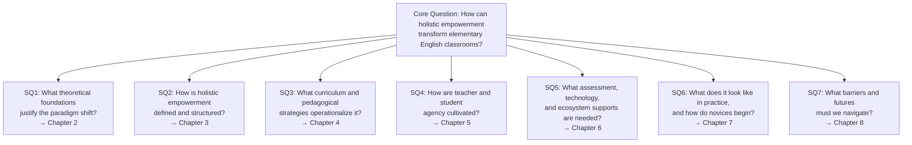

The diagram above illustrates how each sub-question maps onto a dedicated chapter, ensuring that the theoretical-practical integration is preserved across the architecture of the report. The sub-questions deliberately move from foundational ("what justifies this?") through structural ("what does it consist of?") to operational ("how do I do it on Monday morning?") and finally to systemic ("what must change beyond my classroom?"), reflecting the layered nature of paradigm change.

## 1.3 Key Concepts and Terminology

A paradigm-shift study is only as clear as its vocabulary. Because the term *holistic empowerment* will be used hundreds of times in subsequent chapters, and because cognate terms such as *learner-centered teaching* or *communicative language teaching* circulate in overlapping but non-identical ways, this section provides preliminary definitions. These definitions will be elaborated and operationalized in Chapter 3 (the framework chapter) and consolidated in the glossary in Chapter 10.

### 1.3.1 Working definitions

**Holistic education** is understood here as an educational orientation that treats the learner as an integrated whole—cognitive, emotional, social, physical, aesthetic, and ethical-spiritual—and seeks the harmonious development of all these dimensions rather than the optimization of any one. Its philosophical genealogy traces from Smuts's holism, Dewey's progressivism, Montessori, Steiner, Freire, Maslow, and Rogers, to UNESCO's Four Pillars of Learning. These foundations will be examined systematically in Chapter 2.

**Empowerment**, in this study, denotes the cultivation of *agency*—the capacity and confidence to act, choose, reflect, and contribute meaningfully—across three levels: the *student*, the *teacher*, and the *learning community* (school, family, neighborhood). Empowerment is therefore not a synonym for "feeling good" or for free choice without structure; it is the developmental scaffolding of genuine capability.

**Holistic empowerment**, the central construct of this report, is the integration of these two ideas: an educational paradigm in which English learning at the elementary level is designed and enacted so as to develop the whole child while simultaneously cultivating agency in students, teachers, and the surrounding community. Chapter 3 will articulate its dimensions and indicators in detail.

**Paradigm shift**, following Kuhn's familiar usage, refers not to a marginal adjustment within existing assumptions but to a reconfiguration of the assumptions themselves—what counts as success, what counts as evidence, what counts as the teacher's role. This study claims that elementary English education in many systems requires precisely such a reconfiguration, not a refinement.

**Elementary EFL/ESL** refers to English instruction delivered to children typically aged six to twelve, whether English is taught as a foreign language (EFL, where English is not the surrounding societal language) or as a second language (ESL, where it is). This study draws on evidence from both contexts but focuses analytically on EFL classrooms, where the holistic case is especially pressing because English is encountered primarily through the school.

**Young learners**, following Slatterly and Willis, are children of approximately seven to eleven years of age at the first cycle of primary school, characterized by short attention spans, high physical energy, strong responsiveness to stories, songs, and play, and a particularly receptive window for second-language acquisition[^1]. The Ethiopian study reminds us that this age group "*probably have great potential to acquire second languages rapidly, efficiently and proficiently*," whereas adolescents and adults face increasing constraints due to age factors[^1].

**Communicative competence**, originating in Hymes's and Canale-Swain's work and elaborated through Communicative Language Teaching (CLT), is the ability to use language appropriately in real social and functional contexts—not merely to manipulate forms. It will be treated here as a *necessary but insufficient* component of holistic empowerment.

### 1.3.2 Distinguishing holistic empowerment from related paradigms

Because holistic empowerment shares vocabulary with several existing approaches, it is important to mark its distinctive contribution rather than presenting it as a mere relabeling. The table below clarifies relationships and differences:

| Paradigm | Primary focus | Limit when used alone | Relation to holistic empowerment |
|---|---|---|---|
| Communicative Language Teaching (CLT) | Functional, contextualized language use[^1] | Tends to reduce success to linguistic communication; affective and ethical dimensions implicit | A core component, but holistic empowerment extends CLT's communicative goals into multidimensional development |
| Learner-centered instruction | Student activity and choice | Risks becoming an organizational technique without ethical or developmental depth | Holistic empowerment specifies *which* dimensions of the learner are centered and to what end |
| Culturally responsive pedagogy | Recognition of students' racial, cultural, and linguistic identities[^5] | Powerful but typically theorized at policy/teacher-disposition level rather than for elementary EFL specifics | Holistic empowerment incorporates cultural responsiveness as part of its social and ethical-spiritual dimensions |
| Whole-child education | Multidimensional development | Often articulated as values without classroom-specific operationalization | Holistic empowerment translates whole-child principles into concrete elementary English practice |
| Holistic empowerment (this study) | Whole-child development *plus* agency at student/teacher/community levels in elementary English | (To be tested through this study) | Synthesizes and extends the above for the specific context of elementary EFL/ESL teaching |

The table makes clear that holistic empowerment does not replace CLT, learner-centered instruction, or culturally responsive pedagogy; it integrates and re-grounds them in a multidimensional developmental framework specific to the elementary English context.

## 1.4 Significance and Target Audience

### 1.4.1 Significance of the study

The significance of this report operates on three levels. **Academically**, it contributes to the scarce literature that examines elementary EYL teaching through an explicitly holistic-empowerment lens, complementing—rather than duplicating—existing studies that have either described EYL practices descriptively (as in the Ethiopian case)[^1] or articulated holistic education abstractly without grounding in elementary English specifics. **Pedagogically**, it offers frontline teachers a coherent framework, concrete strategies, and authentic cases that can inform their daily decisions in lesson planning, classroom interaction, and assessment. **Policy-wise**, it surfaces the systemic and contextual constraints—class size, textbook availability, teacher training, policy attention[^1]—that any serious attempt at paradigm change must address, thereby positioning the holistic empowerment vision within realistic implementation pathways rather than as utopian aspiration.

### 1.4.2 Primary audience: novice and frontline elementary English teachers

The user-need framing of this study is unambiguous: it is written, in the first instance, **for novice and frontline elementary English teachers**—teachers in their first one to five years of practice, often working with limited mentoring, large classes, modest resources, and intense expectations. The cited research repeatedly documents that this group bears the daily weight of paradigm contradictions, attempting to enact communicative materials with grammar-translation instincts inherited from their own schooling and limited training[^1].

For novice teachers specifically, the report is designed to:

1. **Make abstractions concrete**: every theoretical claim will be paired, where evidence permits, with classroom vignettes, sample lesson structures, decision trees, or templates that can be adapted on Monday morning.
2. **Anticipate pitfalls**: rather than presenting an idealized version of holistic empowerment, the report will name common mistakes (e.g., converting pair work into teacher-fronted Q&A[^1]; using "fun activities" without clear language objectives; over-relying on L1 translation as a default[^1]) and offer mitigation strategies.
3. **Scaffold gradual change**: novices cannot transform their classrooms in one term. The report therefore emphasizes phased adaptation, starting with small, low-risk shifts in routines, language input, and assessment before progressing to deeper curricular redesign.

### 1.4.3 Secondary audiences

While novice teachers are primary, three secondary audiences are also addressed: **experienced teachers** seeking renewal of practice; **teacher educators and mentors** designing pre-service and in-service programs that align with holistic principles; and **school leaders, curriculum designers, and policymakers** whose decisions about textbooks, assessment systems, class sizes, and professional development structures determine whether classroom-level change is feasible. The Ethiopian school directors interviewed in the cited study explicitly identified the absence of suitable evaluation guidelines and teacher training as systemic obstacles—*"The evaluation guideline may not tell us how appropriate the teaching method is to the level of the learners. We do not even know the appropriate teaching methods"*[^1]—a candor that this report takes as a call to address policy and leadership readers as well as classroom practitioners.

## 1.5 Methodological Stance and Evidence Base

### 1.5.1 A practitioner-research orientation

This report does not present a single new empirical study; it is a structured synthesis intended to translate theory and existing evidence into actionable guidance. Its methodological stance is best characterized as **practitioner-oriented integrative research**, drawing on three complementary sources of evidence that are deliberately triangulated:

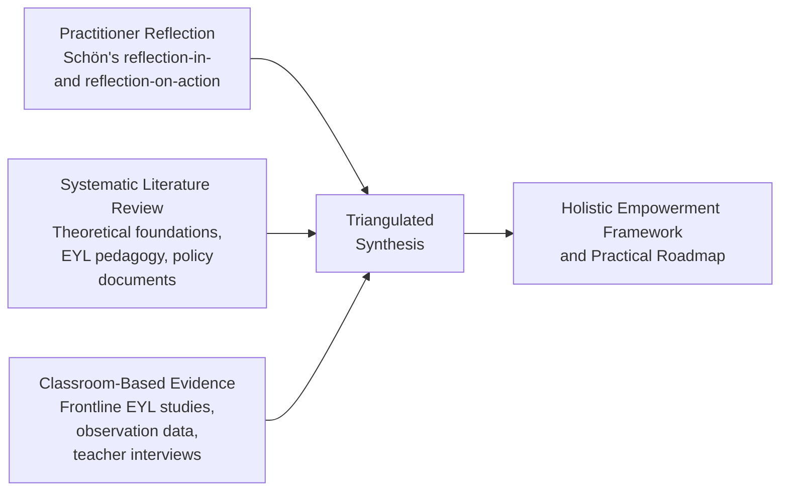

The diagram shows the three streams converging into the final framework. **Practitioner reflection** draws on Donald Schön's concepts of *reflection-in-action* (the on-the-spot adjustments a teacher makes mid-lesson) and *reflection-on-action* (the deliberate analysis after the lesson)[^5]. Schön's framing is particularly apt because, as he argued, "*when someone reflects-in-action, he becomes a researcher in the practice context*"[^5]—a stance that legitimizes the frontline teacher's accumulated craft knowledge as a serious source of insight, not merely anecdote. Schön himself recognized that reflection-in-action has limits ("*the stance appropriate to reflection is incompatible with the stance appropriate to action*"[^5]), which is why the reflective cycle must alternate between in-action and on-action moments. This duality will recur throughout the report, especially in Chapter 7's case analyses and in the lesson-planning templates designed for novice teachers.

### 1.5.2 Literature synthesis as a second pillar

The second pillar is **systematic literature synthesis** drawing on three categories of sources: (a) canonical theoretical works on holistic education, child development, and language pedagogy (to be examined in Chapter 2); (b) peer-reviewed empirical research on elementary EFL/ESL practice, including the recent 2025 case study of Ethiopian primary schools that anchors much of the diagnostic discussion in this introduction[^1]; and (c) authoritative policy documents and global indicators, including OECD's *Education at a Glance 2022*[^4], *Education Policy Outlook 2025*[^3], and TALIS 2024[^2], as well as international proficiency benchmarks such as the EF EPI[^2]. Where sources conflict, this report will follow the priority rule of foregrounding peer-reviewed empirical findings over policy summaries, and will note disagreements explicitly rather than smoothing them over.

### 1.5.3 Classroom-based evidence and its limits

The third pillar is **classroom-based evidence** from primary EYL studies. The Ethiopian case study, with its forty-eight observed lessons, twelve teacher interviews, and six principal interviews triangulated through the four-step coding-categorization-theme-interpretation analysis[^1], provides a richly detailed evidentiary anchor. It is supplemented by international comparative findings in EYL, particularly regarding age-appropriate pedagogy, the role of songs, stories, games, drama, and visual support, and the systemic challenges (large classes, exam pressure, resource gaps) that recur across contexts[^1]. The report will also draw on TALIS 2024 evidence on teacher demographics, training, and instructional environments[^2] to situate elementary EFL within global teaching workforce trends.

It is important to acknowledge the limits of this evidence base. The Ethiopian case study, however carefully conducted, reflects one national context; its findings on grammar-translation dominance, large class sizes, and resource scarcity resonate with much of the Global South EFL literature but cannot be generalized uncritically to every setting. Where the cited evidence is thin or specific to one context, this report will say so explicitly rather than overstating claims—consistent with the rubric's insistence on critical tension acknowledgment and balanced analysis.

### 1.5.4 Triangulation logic

The logic of triangulation is straightforward: a recommendation that is supported by *theoretical principle*, *empirical observation*, and *practitioner reflection* is more credible than one supported by only one of these. For example, the recommendation that elementary English teachers should reduce L1-translation as the default mode and provide scaffolded English input draws simultaneously on theoretical grounding (CLT and communicative competence theory[^1]), empirical observation (the Ethiopian study's documentation of how excessive L1 use depresses participation[^1]), and practitioner wisdom (reflection-in-action moments where teachers notice silence following English-only instructions and adjust). Each chapter will make its triangulation logic visible so that readers, especially novice teachers, can see *why* a given recommendation is being made and not merely what to do.

## 1.6 Scope, Structure, and Roadmap of the Report

### 1.6.1 Scope and boundaries

This report focuses on **elementary-level English teaching** for learners approximately aged six to twelve, with particular attention to the developmental, pedagogical, and professional-development needs of **novice and frontline teachers**. It addresses both EFL and ESL contexts but draws most heavily on EFL evidence, since this is where the misalignment between score-driven and holistic approaches is most acute. Several adjacent topics are explicitly outside the scope: secondary-level English instruction is addressed only as it connects to primary outcomes; bilingual immersion programs are referenced but not analyzed in depth; and tertiary-level EAP (English for Academic Purposes) lies beyond the report's frame. These exclusions are not judgments of importance but acknowledgments of focus.

### 1.6.2 Structure of the report

The report comprises ten chapters arranged in a deliberate progression from foundational reasoning to practical implementation. The structure can be visualized as a sequence of three movements: **diagnosis and theory** (Chapters 1–3), **practice and pathways** (Chapters 4–7), and **futures and resources** (Chapters 8–10).

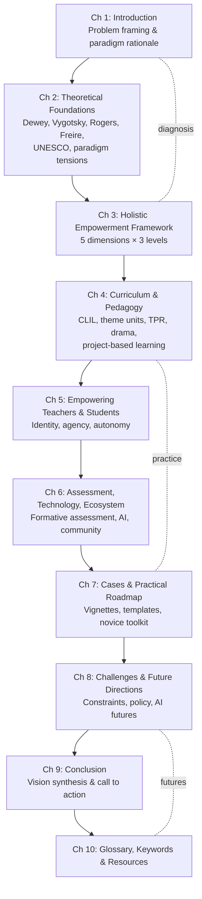

The diagram clarifies several structural commitments. First, theory (Chapters 2–3) precedes practice (Chapters 4–7) so that classroom strategies are visibly grounded in developmental and pedagogical reasoning rather than presented as a checklist of "tips." Second, practice chapters move from the *what* (curriculum and pedagogy in Chapter 4) to the *who* (teacher and student agency in Chapter 5) to the *how-to-evaluate-and-support* (assessment, technology, ecosystem in Chapter 6) to the *where-do-I-start-Monday* (cases and toolkit in Chapter 7). Third, Chapter 8 deliberately confronts barriers and futures before the conclusion, ensuring that the report does not end on a utopian note but on a realistic-yet-hopeful one.

### 1.6.3 Roadmap and reading guidance

For different readers, different reading paths are reasonable. **Novice teachers** with limited time may begin with Chapter 7 (cases and roadmap), then return to Chapters 3, 4, and 5 for the conceptual underpinnings; the introduction (Chapter 1) and glossary (Chapter 10) function as orientation and reference. **Teacher educators and mentors** may find Chapters 2, 3, and 5 most theoretically dense and Chapter 7 most useful for designing PD modules. **Researchers** will likely engage Chapters 2, 3, and 8 most closely, while **policymakers and school leaders** will find Chapters 6, 8, and 10's policy resources most directly relevant.

A final word on the spirit of the report. The Ethiopian teacher quoted earlier described teaching young learners as **"interesting and also tiresome work,"** characterized work with young children as making teachers *"feel young,"* and described their job as *"building the basement"* of a generation[^1]. That image—of teaching young learners as foundational work, simultaneously joyful and demanding, simultaneously about language and about the kind of human being a child is becoming—captures the spirit in which this report is written. The chapters that follow will examine the foundations that should be built, the tools with which to build them, and the conditions under which novice and frontline teachers can build well, even when the resources are imperfect and the policy weather uncertain.

# 2 Theoretical Foundations and Paradigm Tensions in Elementary English Education

The opening chapter closed with an image borrowed from a frontline Ethiopian teacher: working with young learners is "building the basement" of a generation. The metaphor is not merely sentimental; it is structurally precise. A basement carries the weight of every floor above it, and any defect in its design propagates upward indefinitely. If the basement is built on the assumption that elementary English education is a delivery pipeline for grammatical forms and test scores, then no upper-floor reform—whether at secondary, tertiary, or workplace level—will fully compensate. The argument of this chapter is that the foundations now being poured in many primary classrooms are theoretically inadequate to the developmental load they must bear, and that a coherent body of philosophical, developmental, and pedagogical thought already exists from which a sturdier foundation can be drawn.

This chapter therefore performs three functions in sequence. First, it traces the intellectual genealogy of holistic education, showing that what may sound like a contemporary buzzword is in fact a century-long tradition with mutually reinforcing canonical sources. Second, it narrows the lens onto the developmental terrain of children aged six to twelve learning English, demonstrating why this age band is theoretically the most receptive—and ethically most consequential—site for holistic work. Third, it diagnoses the prevailing paradigm against this theoretical backdrop, surfaces the structural tensions that incremental reform cannot dissolve, and consolidates a unified theoretical lens that Chapter 3 will operationalize into a working framework. Throughout, the chapter holds together the rubric's twin commitments: theory must connect to classroom practice, and practice must be justified by more than habit.

## 2.1 Philosophical Roots of Holistic Education: From Smuts to UNESCO

### 2.1.1 Smuts's holism: the principle that wholes are more than their parts

The English-language vocabulary of "holism" itself is a comparatively recent coinage, introduced by the South African philosopher and statesman Jan Christiaan Smuts in his 1926 treatise *Holism and Evolution*[^6]. Smuts argued that the universe exhibits a tendency toward the formation of integrated wholes—from atoms to organisms to personalities—whose properties cannot be reduced to the sum of their parts. In its educational extension, Smuts's holism, as later applied to personality and pedagogy, treats the developing child as a unity in which intellect, emotion, body, and spirit are not separable curricular targets but mutually constitutive aspects of a single living whole[^7][^8]. While Smuts himself wrote relatively little about classroom practice, the conceptual move he made—from additive to integrative ontology—remains foundational. It supplies the philosophical grammar that subsequent thinkers, often without citing Smuts directly, will deploy in their pedagogical work: a child who is taught to memorize verb tenses while her curiosity, emotional life, and ethical sensibility are ignored is not "partially" educated; she is, on the holistic view, *mis*-educated, because the very integration that constitutes her personhood has been disregarded.

### 2.1.2 Dewey: experience as transactional, continuous, and educative

If Smuts supplied the metaphysical premise, John Dewey supplied the educational engine. Dewey's progressive philosophy of experience, articulated across *My Pedagogic Creed* (1897), *The School and Society* (1900), *Democracy and Education* (1916), and *Experience and Education* (1938), grounds learning in the dynamic interaction between learner and environment[^9]. Critically, Dewey's notion of experience is neither the "stored up product of the past" nor "simply the immediacy of the experienced present"; rather, "experience is continuous from past through present to future; it is not static but dynamic, moving, in process"[^9]. Dewey termed this dual structure a *transaction*: "An experience is always what it is because of a transaction taking place between the individual and, what at the time, constitutes the environment"[^9]. He further analyzed experience into the twin moments of *trying* (purposeful action upon the world) and *undergoing* (the consequences of that action returning to shape the actor): "When we experience something we act upon it, we do something; then we suffer or undergo the consequences. We do something to the thing and then it does something to us in return: such is the peculiar combination. The connection of these two phases of experience measures the fruitfulness of experience. **Mere activity does not constitute experience**"[^9].

Dewey's distinction is decisive for elementary English pedagogy. A child who chants "Good morning, teacher" thirty mornings in a row without engaging in any felt transaction with the language is, in Dewey's terms, performing *mere activity*. Conversely, a child who genuinely wants to ask a classmate about her weekend, formulates the question in halting English, encounters a confused look, repairs the utterance, and receives a meaningful answer has undergone an experience in the technical sense—she has *tried* and *undergone*, and the language has thereby been transformed into something educative. Dewey's instrumentalism would reject the dualism between "concrete experience" and "theories and ideas" that often haunts simplistic readings of experiential learning, insisting that "thoughts and ideas must be experiential if they are to be meaningful"[^9]. He therefore defined education itself as "that reconstruction or reorganisation of experience which adds to the meaning of experience and which increases ability to direct the course of subsequent experience"[^9]. For elementary EFL, this definition has a sharp implication: every English lesson should leave a child with both more meaning and more capacity to direct her next encounter with the language.

### 2.1.3 Montessori: planes of development and sensitive periods

Where Dewey supplied a philosophy of experience, Maria Montessori supplied a developmental architecture. Montessori observed that "the child passes through certain phases, each of which has its own particular needs"[^10], and organized human development into four planes: 0–6 years (absorbent mind), 6–12 years (reasoning mind), 12–18 years (social consciousness), and 18–24 years (transition to adulthood)[^11][^10]. Each plane was further divided into sub-planes, with the second plane—precisely the elementary years that concern this report—corresponding to Lower Elementary (6–9) and Upper Elementary (9–12). Montessori characterized the second-plane child as "in a state of health, strength, and assured stability," a comparatively quieter, more equilibrated period during which the reasoning mind seeks not only sensory absorption but causal explanation, moral reasoning, and a place in the social and cosmic order[^10].

Within each plane, Montessori identified *sensitive periods*—what contemporary neuroscience labels *critical periods*—defined as "a critical time during human development when the child is biologically ready and receptive to acquiring a specific skill or ability—such as the use of language or a sense of order—and is therefore particularly sensitive to stimuli that promote the development of that skill"[^10]. The first-plane child shows pronounced sensitivity to language from birth to age six, to order, to refinement of the senses, to grace and courtesy, and to independence[^10][^12]. While Montessori's full curricular system is beyond this report's scope, two implications travel directly into the elementary EFL classroom. First, **language sensitivity does not end at six**; the elementary-age child remains highly receptive to phonological discrimination, vocabulary expansion, and meaningful communication, particularly when supported by multisensory materials and ordered routines[^10]. Second, the prepared environment is not decoration but pedagogy: walls, materials, and routines either fulfill the child's developmental drives or starve them[^10]. Recall that the Ethiopian observation study found classroom walls "covered with pictures, many of which were handmade by teachers or students," yet "most of these pictures were not arranged properly"[^1]—a Montessorian critique made empirically.

### 2.1.4 Steiner and Waldorf: head, heart, and hands

A third stream, parallel to but distinct from Dewey and Montessori, emerged from Rudolf Steiner's Waldorf education, founded in 1919. Waldorf pedagogy is built around the principle of educating "the head, heart, and hands, engaging intellect, emotions, and physical body in harmony"[^13][^14]. Like Montessori, Steiner staged the curriculum to match developmental phases, but he placed particular emphasis on imagination, artistic expression, and movement as carriers of cognitive content rather than as supplements to it[^13]. Contemporary research increasingly supports the cognitive and affective benefits of this integration: a 2015 Learning Policy Institute report on social-emotional learning found that students supported socially and emotionally "demonstrate improved academic performance, attitudes, and behavior"; the American Academy of Pediatrics has identified unstructured play as essential to healthy brain development; and integrative arts research published in *Frontiers in Psychology* shows that arts integration "improves student motivation, deepens learning, and supports emotional processing"[^13]. A 2016 *Research Papers in Education* study of UK Waldorf students reported "higher levels of motivation, enthusiasm for learning, and emotional well-being compared to their peers in the traditional schools"[^13].

For the elementary English teacher, the Waldorf contribution is concrete: songs are not warm-up filler, drama is not extracurricular, painting an English vocabulary list is not "wasted time." When the Ethiopian study found that only one of twelve teachers used games and *none* used drama[^1], it documented—from a Waldorf vantage—not merely a methodological omission but a developmental amputation, the systematic exclusion of the heart and hands from a pedagogy that addressed only the head, and even then narrowly.

### 2.1.5 Freire: dialogical, problem-posing education

If Smuts, Dewey, Montessori, and Steiner foreground the integrated child, Paulo Freire foregrounds the integrated political situation in which any child learns. Freire's *Pedagogy of the Oppressed* (1970) named the dominant model of instruction the *banking concept of education*, in which "education thus becomes an act of depositing, in which the students are the depositories and the teacher is the depositor… The more meekly the receptacles permit themselves to be filled, the better students they are"[^15]. Freire enumerated the attitudes that mirror oppression: "the teacher teaches and the students are taught; the teacher knows everything and the students know nothing; the teacher thinks and the students are thought about; the teacher talks and the students listen—meekly… the teacher is the Subject of the learning process, while the pupils are mere objects"[^15].

The diagnostic precision of Freire's list is uncanny when held against the Ethiopian classroom transcripts: a teacher writes notes on the board because students share textbooks; students copy silently for long minutes; the teacher then "expounds" on the simple present tense for forty minutes while the textbook itself was designed for implicit communicative practice[^1][^15]. Against the banking model, Freire proposed *problem-posing education*, founded on dialogue, in which "the teacher is no longer merely the-one-who-teaches, but one who is himself taught in dialogue with the students, who in turn while being taught also teach"[^15]. Knowledge, on this view, "emerges only through invention and re-invention, through the restless, impatient, continuing, hopeful inquiry human beings pursue in the world, with the world, and with each other"[^15]. For elementary English teaching, Freire's contribution is to insist that even the smallest pedagogical decision—who asks the questions, whose interests shape the topics, whose language counts as legitimate—has political and developmental consequences. A first-grade teacher who consistently calls on the same three "icebreaker" volunteers and silences the rest is not merely managing the class inefficiently; she is enacting, in miniature, a banking relation.

### 2.1.6 Maslow and Rogers: humanistic psychology and unconditional positive regard

A fifth stream comes from humanistic psychology. Abraham Maslow's hierarchy of needs and Carl Rogers's person-centered approach contributed two convictions that ground elementary English teaching ethically. The first is that learning higher-order capabilities—curiosity, creativity, complex problem-solving—presupposes the satisfaction of more basic needs for safety, belonging, and esteem; a child who fears mockery for mispronouncing *thank you* is not in a state to acquire fluent communication. The second, from Rogers, is that the teacher's stance of *unconditional positive regard* and *empathic understanding* is not pedagogical decoration but the precondition of self-actualization through learning. Schön's later articulation of the "reflective practitioner" carries forward this Rogerian inheritance when it characterizes the practitioner as one who "seek[s] out connections to the client's thoughts and feelings" and "look[s] for the sense of freedom and of real connection… as a consequence of no longer needing to maintain a professional façade"[^5]. Translating into the EYL classroom: when a Grade 4 student in Ethiopia, asked to recall the simple present tense in English, said only "habitual action and truth" and then sat down, the developmental fork was not whether her grammatical knowledge was complete but whether the affective climate permitted her to risk a fuller utterance[^1]. Humanistic psychology insists that the answer to that question is logically and chronologically prior to any grammar correction.

### 2.1.7 UNESCO's Four Pillars: the contemporary international synthesis

Finally, the *Delors Report* (1996), *Learning: The Treasure Within*, articulated UNESCO's Four Pillars of Learning—**learning to know, learning to do, learning to live together, learning to be**—as the contemporary international synthesis of holistic education. The Four Pillars are not a curriculum but a normative reorientation of educational purpose, integrating cognitive (to know), pragmatic (to do), social-ethical (to live together), and existential (to be) dimensions. Subsequent UNESCO documents and OECD frameworks (such as the OECD Learning Compass 2030) have extended this synthesis, while OECD's *Education Policy Outlook 2025* warns that the decline of foundational skills in many member countries "underscore[s] the need for systemic change"[^3]. The Four Pillars therefore arrive at the elementary English classroom not as foreign imposition but as the consolidated heir to a century of holistic thought.

### 2.1.8 Convergent tenets

Despite their different historical origins, religious and political commitments, and stylistic registers, these traditions converge on four tenets that together constitute the philosophical foundation for the holistic empowerment paradigm. The convergence is summarized below.

| Tenet | Smuts | Dewey | Montessori | Steiner | Freire | Maslow/Rogers | UNESCO |
|---|---|---|---|---|---|---|---|
| Whole-person development | ● | ● | ● | ● | ● | ● | ● |
| Interconnectedness (parts within wholes; learner-with-world) | ● | ● | ● | ● | ● | ○ | ● |
| Experiential / dialogical meaning-making | ○ | ● | ● | ● | ● | ● | ● |
| Intrinsic motivation and agency | ○ | ● | ● | ● | ● | ● | ● |

(● = central commitment; ○ = compatible but less explicitly thematized)

The matrix shows that no single tradition exhausts the holistic vision but that, taken together, they form a tightly woven fabric. The holistic empowerment paradigm proposed in this report does not invent new philosophical material; it gathers, integrates, and applies an existing tradition to the under-theorized site of elementary English teaching.

## 2.2 Developmental and Pedagogical Theories Relevant to Young English Learners

The philosophical foundations sketched above are necessary but not sufficient. A senior teacher planning Monday's lesson for a class of fifty seven-year-olds needs more than first principles; she needs developmentally specific theory that can be translated into pedagogical decisions. This section narrows the lens.

### 2.2.1 The developmental profile of the elementary-age English learner

Children aged seven to eleven, corresponding to the first cycle of primary schooling in most jurisdictions, have been described in the EYL literature as possessing "the greatest potential to acquire second languages rapidly and efficiently," a linguistic-acquisition advantage that adolescents and adults progressively lose due to age factors[^1]. At the same time, they "possess short attention spans and high levels of physical energy, which require specialized pedagogical strategies"[^1]. Slatterly and Willis's foundational EYL principles—focusing on meaningful language use; incorporating enjoyable, varied, and achievable activities; integrating songs, stories, rhymes, games, and drama; using objects, pictures, and actions; and establishing predictable classroom routines—operationalize this developmental profile into pedagogical heuristics[^1].

These principles align with Montessori's characterization of the second plane as a period of reasoning, social affiliation, and aesthetic responsiveness[^10], with Steiner's emphasis on the heart-and-hands as primary cognitive channels in the early elementary years[^13], and with Dewey's insistence on the meaningfulness of experience[^9]. They also align with neuroscientific evidence on the role of movement and play in brain development: research from Harvard Medical School and the American Academy of Pediatrics indicates that "movement stimulates brain development, enhances memory, and improves focus in children," and that unstructured play is "essential to healthy brain development, citing benefits such as increased creativity, emotional resilience, and cognitive flexibility"[^13]. The developmental brief for the elementary EFL teacher, then, is doubly endorsed by canonical pedagogy and contemporary neuroscience: the seven-year-old does not learn English well by sitting still in rows for forty minutes copying notes.

### 2.2.2 Mapping each holistic tradition onto language-learning operations

The bridge from foundational theory to classroom action becomes navigable when each tradition is read through the question: *what does this imply for how a child encounters English?* The following table makes the mappings explicit.

| Theoretical source | Core construct | Implication for elementary English teaching | Frontline classroom illustration |
|---|---|---|---|
| Dewey | Experience as trying-and-undergoing | Communicative tasks must produce real consequences—being understood, misunderstood, or surprised—not just utterance production | A pair-work task in which Student A asks "What's your favourite breakfast?" and Student B's answer determines what Student A draws on a worksheet |
| Montessori | Sensitive periods; prepared environment | Multisensory materials, ordered displays, manipulables (Sandpaper Letters analogue, picture cards, objects from home) sustain language sensitivity[^10] | A Grade 1 corner with labelled fruit baskets that children handle while practicing *I have an apple* |
| Steiner / Waldorf | Head-heart-hands integration | Songs, drama, painting, and rhythmic movement are core—not supplementary—channels of language input[^13] | A storytelling lesson in which children act out *The Very Hungry Caterpillar* while chorally producing target language |
| Freire | Dialogical, problem-posing education | Lesson topics emerge from learners' "generative themes"; questions are co-owned[^15] | A Grade 4 project on "Things in our village I'd describe to a friend abroad," where learners select content |
| Maslow / Rogers | Hierarchy of needs; unconditional positive regard | Affective safety precedes cognitive risk; error is reframed as evidence of trying | A "no-laughter rule" co-constructed with the class for English-only oral practice rounds |
| Vygotsky (bridge) | Zone of Proximal Development | Scaffolded English input that is comprehensible plus one (the *i+1* principle, originally Krashen) | A teacher repeats a child's L1 utterance back in scaffolded English with gesture support |
| Schön | Reflection-in-/on-action | Teachers iterate lesson decisions in response to in-the-moment evidence | Noticing that English-only instructions produce silence and immediately re-issuing with gestures and a partial L1 bridge |
| UNESCO Four Pillars | Learn to know / do / live together / be | Lesson objectives are written in four columns, not one | A unit on *family* whose objectives include vocabulary (know), describing one's family (do), respecting different family forms (live together), and reflecting on what family means to me (be) |

### 2.2.3 Vygotsky's ZPD and Schön's reflection: two bridges into Chapter 5

Two of the entries in the table deserve brief amplification because they will recur prominently in Chapter 5. **Vygotsky's Zone of Proximal Development (ZPD)** designates the gap between what a learner can do independently and what she can do with support; learning is most efficient when teaching targets this zone with scaffolded assistance that is gradually withdrawn. For elementary EFL, ZPD justifies the gradual transition from L1 support to English-only communication that the more successful Ethiopian teachers attempted ("provided scaffolded English input; encouraged communicative use… strategically limited Amharic use; promoted gradual transition to English") in contrast to less successful peers who "relied heavily on Amharic for explanations and translations"[^1]. Scaffolding is not the absence of L1 nor its dominance, but its *strategic, decreasing* deployment.

**Schön's reflection-in-action and reflection-on-action**, introduced in Chapter 1, return here as a theoretical legitimation of frontline teacher knowledge. Schön's stance is that "when someone reflects-in-action, he becomes a researcher in the practice context… he does not separate thinking from doing"[^5]. The practitioner, on this view, is "not the 'expert'… who entirely relies on theoretical and technical knowledge but can be a 'flawed' individual learning from practice on a day to day basis"[^5]. Schön himself acknowledged that "while we are in 'the thick of the action' there may not be time to reflect" and that "the stance appropriate to reflection is incompatible with the stance appropriate to action"[^5]; the cycle therefore alternates between in-action adjustments and post-lesson on-action analysis. This duality is critical for novice teachers who, in their first year, are simultaneously trying to survive the lesson and improve from it. The chapter on practical roadmaps (Chapter 7) will return to Schön's framing as the engine of reflective lesson planning.

### 2.2.4 Why the elementary EFL classroom is theoretically the optimal site

When the philosophical convergence of section 2.1 meets the developmental specificity of section 2.2, a strong claim becomes warranted: **the elementary EFL classroom is not merely one of many possible sites for holistic empowerment; it is the developmentally optimal and ethically obligatory site**. Three reasons converge. First, ages six to twelve correspond to a Montessorian sensitive period for language and reasoning combined with high physical-aesthetic responsiveness[^1][^10]. Second, the multidimensional nature of language itself—simultaneously cognitive, affective, social, embodied, and ethically loaded—means that language teaching is structurally suited to address all five holistic dimensions in a single lesson, in a way that, say, mathematics or chemistry instruction cannot match without artifice. Third, English specifically—as a global lingua franca encountered by children primarily through schooling rather than home—carries cultural, ethical, and identity stakes that make its pedagogy unavoidably value-laden, whether teachers acknowledge this or not. To teach English well is, willy-nilly, to teach a stance toward the world; the only choice is whether that stance is chosen reflectively or inherited unreflectively.

## 2.3 Diagnosing the Dominant Paradigm: Problems in Current Elementary English Instruction

The theoretical foundations and developmental theories developed above provide the diagnostic instruments by which the prevailing paradigm can now be examined. This section synthesizes empirical evidence, drawing principally on the 2025 Ethiopian primary-school case study with corroborating findings from international EYL research, to catalog six interlocking problems. Each is presented not as an isolated teacher failure but as the symptomatic expression of paradigm-level assumptions about what counts as language learning.

### 2.3.1 Over-emphasis on rote learning and grammar-translation

The first and most pervasive problem is the substitution of *teaching about language* for *teaching language use*. The Ethiopian observation study found that teachers "prioritized teaching about the language rather than helping students practice using it"[^1]. The illustrative cases are precise. In a Grade 3 writing lesson designed around three communicative activities, "the teacher (T7) spent nearly 30 min of the 40-min lesson explaining the concept of a sentence in Amharic. She discussed sentence structure, focusing on subjects, verbs, and objects. Eventually, she assigned only the first activity for in-class work, but none of the students completed it"[^1]. In a Grade 4 lesson on comparative adjectives that occupies pages 67–78 of the textbook, teacher T11 "took three full periods to complete this lesson and even went beyond the textbook content by introducing superlative adjectives"[^1]. Translation was the dominant technique even in Grade 1: T1 introduced *Good morning, Good afternoon, Good evening* by asking students how they would greet someone in Amharic at each time of day, then providing English equivalents, with both teacher questions and student responses occurring in Amharic[^1].

This problem is not properly understood as a matter of methodological preference. It is the surface expression of a deeper assumption: that language is a system of rules to be transmitted and memorized, and that teaching is the depositing of those rules into student receptacles—Freire's "banking concept" rendered in EFL form[^15]. Once the assumption is grasped, the persistence of grammar-translation despite communicative textbooks ceases to be puzzling. Teachers reinterpret communicative materials through the only paradigm they trust.

### 2.3.2 Exam-driven curricula reinterpreting communicative materials

Even when curricular materials are designed for implicit, communicative learning, exam-driven institutional pressures push their reinterpretation toward explicit form-focused instruction. The Ethiopian discussion section makes this explicit: "While the textbooks encouraged implicit learning through communicative activities, teachers often reinterpreted these tasks through a traditional lens, prioritizing explicit explanation and rule memorization. Such a mismatch underscores the persistence of teacher-centered approaches and a limited uptake of Communicative Language Teaching (CLT) principles"[^1]. The same study reports the broader pattern: "teachers' limited proficiency, exam-oriented curricula, and resource constraints may collectively push them toward traditional, form-focused methods, even when curricular materials are designed to promote implicit and communicative learning"[^1].

The same misalignment recurs internationally. Ashoori Tootkaboni's research in comparable EFL settings documents teachers who "espouse communicative goals in theory but revert to grammar-based practices in implementation"[^1]. Within China, the 2022 *English Curriculum Standards for Compulsory Education* "recommends creating real-life situations in English teaching"[^2][^5], yet the gap between curricular intent and classroom enactment remains a recurring research finding. Exam-driven reinterpretation is therefore not a local Ethiopian aberration; it is a paradigm-level pattern in which assessment regimes act as a gravitational field bending instruction back toward what tests can measure.

### 2.3.3 Fragmented skill teaching and teacher-fronted talk

The third problem is the fragmentation of integrated communicative use into isolated skill drills, accompanied by the collapse of interactive task structures into teacher-fronted talk. The Ethiopian study documented that "whole-class interaction was overwhelmingly dominant, leaving little room for student-centered learning. This was particularly evident in lower grades (Grades 1 and 2), where teachers frequently asked questions and encouraged responses from the entire class. Pair work, which is typically expected to foster student collaboration, was not conducted between students but rather between the teacher and individual students"[^1]. A Grade 3 group-discussion task on "Cutting Trees" was converted by Teacher T6 into a whole-class question round; a Grade 4 pair-work speaking task was likewise converted by Teacher T11 into a teacher-fronted recitation[^1]. The pattern was consistent: "shifting group work into whole-class discussion was a widespread pattern among all observed teachers"[^1].

The mechanism is institutional as much as pedagogical. With class sizes averaging sixty-three students per room, fixed three-person desks, and limited training in interactive pedagogy, teachers default to the only mode that feels controllable[^1]. The fragmentation is therefore co-produced by teacher preparation, classroom architecture, and policy investment.

### 2.3.4 Weak affective engagement and the silence spiral

The fourth problem—and perhaps the most consequential developmentally—is the erosion of affective engagement across grades. The Ethiopian study tracked a clear gradient: "When teachers asked students to participate in classroom activities, most students in grades one and two eagerly raised their hands. However, participation declined as grade levels increased, with fewer students volunteering in grade four compared to grade three"[^1]. Language was a critical mediator: "When teachers used English exclusively, few or no students were willing to participate. For instance, in one case, a teacher (T10) instructed grade four students in English to look at pictures on page 109 of their English textbook and describe them individually to the class… After giving students 3 min to observe the pictures, none were willing to participate. Frustrated, the teacher switched to Amharic to explain the task"[^1].

The interpretive synthesis offered by the Ethiopian researchers connects affect to method: "The heavy emphasis on grammar explanation and translation limited students' exposure to authentic English, which in turn constrained their ability to develop communicative competence. Many students became hesitant to participate when English was required, often falling silent or resorting to single-word responses, indicating a lack of confidence and insufficient scaffolding"[^1]. Read through Maslow and Rogers, the silence spiral is intelligible: a child whose esteem and belonging needs are jeopardized by the prospect of public error in a foreign language will withdraw to safety, and her withdrawal will be misread as lack of ability, reinforcing the very pedagogy that produced the withdrawal.

### 2.3.5 Limited cultural, ethical, and value integration

The fifth problem is the treatment of curricular content as neutral linguistic input. Although topics such as "Cutting Trees" or "a cash crop" appear in the Ethiopian textbooks[^1] and could anchor rich ethical and cultural conversations, classroom analysis was almost exclusively linguistic: a Grade 3 lesson on a reading passage about a cash crop spent its class time on sentence-construction drills rather than on the social, economic, or environmental questions the passage opened. The chance to address the ethical-spiritual dimension of holistic empowerment is forgone by default. Steiner's head-heart-hands integration, Freire's generative themes, and UNESCO's *learning to live together* and *learning to be* are all theoretically violated by this default; in practice, the violation registers as a missed opportunity that teachers may not even recognize as a missed opportunity.

### 2.3.6 Post-pandemic learning erosion

The sixth problem is the post-pandemic erosion of foundational learning, which has further weakened the base on which any pedagogical reform must build. *Education at a Glance 2022* reports that "almost all OECD countries implemented standardised assessments to quantify learning losses at various levels of education. Most countries also provided" recovery interventions[^4]. The 2025 *Education Policy Outlook* synthesizes a more sobering pattern: "Foundational skills such as numeracy and literacy are declining in many OECD countries. These trends underscore the need for systemic change"[^3]. TALIS 2024 frames this within teacher-workforce realities, examining demographics, training, and instructional environments across systems[^2]. While the OECD evidence speaks principally to literacy and numeracy in OECD countries rather than to elementary EFL specifically, the structural lesson is transferable: a paradigm that produces measurable decline even in well-resourced systems will not be redeemed by intensifying its own logic.

### 2.3.7 The six problems as a single paradigmatic syndrome

Taken individually, each of the six problems might be addressed by a targeted intervention—more communicative training here, more visual aids there, smaller classes elsewhere. The diagnostic claim of this section, however, is that the six problems are *one syndrome with six manifestations*. They share common assumptions: that language is a transmissible system; that the teacher is the depositor; that interaction is administratively expensive; that affect is incidental; that culture and ethics belong elsewhere; that what cannot be tested does not count. Until those assumptions change, mitigation will be partial. This is the precise sense in which the present moment requires a paradigm shift rather than further refinement.

## 2.4 Comparing Traditional and Emerging Teaching Paradigms

To position the holistic empowerment paradigm clearly, it is necessary to compare the traditional grammar-translation orientation against the emerging alternatives that have proliferated in EFL discourse. None of the emerging alternatives is wrong; the argument is that each, used singly, remains partial.

### 2.4.1 The comparison along multiple axes

| Axis | Traditional (grammar-translation, score-driven) | CLT / TBLT | CLIL | Learner-centered instruction | Culturally responsive pedagogy | Holistic empowerment (this study) |
|---|---|---|---|---|---|---|
| View of the learner | Receptacle for rules | Communicator-in-context | Learner of subject + language | Active agent with choices | Cultural-linguistic being | Whole child (5 dimensions) with agency |
| Definition of success | Test scores; accuracy | Communicative competence | Subject + language outcomes | Engagement and choice | Identity affirmation + achievement | Multidimensional development + agency |
| Role of teacher | Authority, depositor | Facilitator of communication | Co-teacher of content+language | Guide on the side | Cultural broker, advocate | Reflective practitioner across all dimensions |
| Treatment of error | Failure to be corrected | Acceptable feature of communication | Negotiated for meaning + form | Honored as engagement | Honored within identity | Evidence of trying; scaffolded forward |
| Function of L1 | Default medium | Strategic minimum | Strategic for content access | Variable | Affirmed as resource | Strategic, decreasing, scaffolded |
| Conception of motivation | Extrinsic (grades) | Communicative purpose | Subject interest + language need | Choice-driven | Identity-affirming | Intrinsic + relational + ethical |
| View of assessment | Summative tests | Performance in tasks | Dual: content + language | Process-oriented | Equity-aware | Multidimensional, formative, portfolio-based (Ch 6) |
| Treatment of affect | Incidental | Implicit | Implicit | Often central | Central | Explicit core dimension |
| Treatment of ethics/values | Absent | Implicit | Subject-dependent | Often absent | Central | Explicit ethical-spiritual dimension |
| Theoretical anchor | Behaviorism, structuralism | Hymes, Canale-Swain | Coyle's 4Cs | Constructivism | Critical pedagogy, Ladson-Billings | Smuts, Dewey, Montessori, Steiner, Freire, Maslow/Rogers, UNESCO |

### 2.4.2 What each emerging paradigm contributes—and where it stops

**Communicative Language Teaching** and its task-based variant (TBLT) restored real communication to the center of language pedagogy after decades of audiolingualism and grammar-translation. Yet, as the Ethiopian discussion notes, even the more successful teachers, by adopting CLT-aligned scaffolding, addressed the *cognitive* dimension of language well but did not systematically extend their pedagogy into affective, ethical, or community dimensions[^1]. CLT, taken alone, can be reduced to an efficient methodology for producing communicative competence as narrowly defined.

**Content and Language Integrated Learning (CLIL)** addresses fragmentation by integrating subject content with language learning. Its strength is the principled integration of cognition with language; its limit is that the content is typically chosen on subject-curriculum grounds rather than developmental or ethical grounds, so it does not, by itself, secure the affective or ethical-spiritual dimensions of holistic empowerment.

**Learner-centered instruction** addresses the teacher-fronted dominance documented in the Ethiopian study but, as the comparison in Chapter 1 noted, "risks becoming an organizational technique without ethical or developmental depth" if it specifies who is centered without specifying *which dimensions* of the learner are centered and to what end.

**Culturally responsive pedagogy** is powerful in its insistence on identity, equity, and recognition, but its operationalization for elementary EFL specifically is comparatively under-developed in the literature. It supplies a critical sensibility that holistic empowerment will incorporate within its social and ethical-spiritual dimensions.

**Whole-child education**, as articulated in the Waldorf tradition and the contemporary social-emotional learning literature[^13][^14], is perhaps the closest cousin to holistic empowerment. Its limit, however, is often a level of generality that does not engage the specifics of language pedagogy: how exactly does whole-child education instruct a teacher to handle the L1-L2 transition in a Grade 2 reading lesson?

### 2.4.3 The integrative space

The comparison demonstrates that the analytical space holistic empowerment is positioned to occupy is not vacant of contributors but is currently fragmented among them. Each emerging paradigm illuminates one or two dimensions of the elementary EFL challenge; none, by itself, addresses all five (cognitive, affective, social, physical-aesthetic, ethical-spiritual) at all three levels (student, teacher, learning community). Holistic empowerment is an integrative synthesis that explicitly *names* what each predecessor implicitly *gestures toward*, and that *operationalizes* their convergent insights for the specific developmental and institutional context of elementary English teaching. Chapter 3 will undertake the operationalization; the present chapter has secured the comparative warrant.

## 2.5 Structural Tensions Necessitating a Paradigm Shift

Why is integration not enough? Why must the convergence of CLT, CLIL, learner-centered, culturally responsive, and whole-child approaches be reframed as a *paradigm shift* rather than a *methodological pluralism*? The answer lies in four structural tensions whose persistence within the dominant paradigm generates the observed problems and which incremental reform cannot dissolve.

### 2.5.1 Tension 1: measurable outputs versus developmental processes

The first tension is between what assessment systems can capture and what children developmentally need. Test scores measure decontextualized accuracy; portfolios and observation rubrics could measure dimensions tests cannot, but the institutional weight of high-stakes summative testing crowds out alternative assessment[^4][^3]. The Ethiopian directors' comment is symptomatic: "The evaluation guideline may not tell us how appropriate the teaching method is to the level of the learners. We do not even know the appropriate teaching methods"[^1]. Until the assessment regime is reconfigured—not abolished, but rebalanced—any classroom-level holistic shift will be subject to gravitational pull back toward the testable. Chapter 6 will return to this tension with concrete proposals.

### 2.5.2 Tension 2: teacher-centered authority versus learner agency

The second tension is between the teacher-as-depositor structure and the cultivation of learner agency. The Ethiopian observation that pair-work "was not conducted between students but rather between the teacher and individual students"[^1] is not solely a training gap; it expresses a deeper authority structure in which the teacher owns the questions and the answers, and in which sharing that ownership feels like loss of control. Freire's analysis is direct: "to resolve the teacher-student contradiction, to exchange the role of depositor, prescriber, domesticator, for the role of student among students would be to undermine the power of oppression and serve the cause of liberation"[^15]. Within the existing paradigm, learner agency is structurally a threat; within a holistic empowerment paradigm, it is the desired outcome. The two cannot coexist as equal options indefinitely.

### 2.5.3 Tension 3: linguistic accuracy versus meaningful communication

The third tension is between accuracy and meaning. Form-focused instruction promises that accuracy will, in time, support communication; communicative pedagogy contends that meaning-making is the engine that drives accuracy. The Ethiopian evidence resolves the empirical question: students who spent months on grammar drills "fell silent and sat down when asked to use English"[^1], demonstrating that accuracy without communicative confidence is not even accurate when called upon to perform. Yet the tension persists because exam structures privilege accuracy and because teachers' own language proficiency, where limited, makes accuracy easier to teach than spontaneous communication[^1]. The tension cannot be resolved by adding more communicative tasks to a grammar-dominant lesson; it requires reordering the priority.

### 2.5.4 Tension 4: systemic constraints versus developmental aspirations

The fourth tension is between systemic constraints (large classes, scarce textbooks, limited training, policy neglect of primary years, exam pressure) and the developmental aspirations of holistic empowerment. The Ethiopian directors recounted requesting Wereda Education Bureau training for English and mathematics teachers and being told "the Bureaus did not have budgets for the training the directors demanded"[^1]. One teacher captured the systemic neglect: "We feel the Ministry of Education focuses on Universities and somehow on secondary schools. Primary schools are forgotten- no textbooks, no training- look at the classrooms"[^1]. No amount of teacher-level reflection will solve a class-size problem. Conversely, no policy fix will produce holistic empowerment without teacher-level transformation. The tension demands coordinated action across levels.

### 2.5.5 Why these tensions require paradigm change

These four tensions share a structural property: they cannot be relieved by adding resources within the existing assumptions, because the existing assumptions are part of what generates them. Adding another grammar app to a grammar-translation classroom does not relieve the accuracy-meaning tension; it intensifies it. Adding another summative test to an already test-saturated system does not relieve the outputs-processes tension; it deepens it. Following Kuhn's analysis of paradigm change, the persistence of anomalies that the existing paradigm cannot absorb is the diagnostic signature of paradigm exhaustion. The observed pattern—that even well-intentioned, well-resourced reform efforts within the existing paradigm continue to produce the silence spiral, the grammar-translation default, and the affective erosion—suggests that the paradigm itself, not its execution, is at issue.

## 2.6 Synthesizing the Theoretical Lens for Holistic Empowerment

The chapter has moved from philosophical genealogy to developmental theory to empirical diagnosis to comparative analysis to structural tension. It closes by consolidating these strands into a unified theoretical lens, articulated as five integrative propositions, that the rest of the report will deploy.

**Proposition 1: Elementary English learning is a multidimensional developmental encounter, not a linguistic-skill pipeline.** From Smuts's holism through UNESCO's Four Pillars, the canonical tradition agrees that the child cannot be partitioned into curricular targets without distorting both the child and the curriculum. English is among the most multidimensional possible curricular subjects—simultaneously cognitive, affective, social, embodied, aesthetic, and ethically loaded—and the elementary years are developmentally optimized for this multidimensional encounter[^1][^10][^13]. To teach English as if it were only a skill is therefore not merely incomplete; it is theoretically incoherent.

**Proposition 2: The child is an integrated whole whose cognitive, affective, social, physical-aesthetic, and ethical-spiritual dimensions co-develop through language.** The five dimensions identified in Chapter 1 and elaborated in Chapter 3 are not separable curricular columns but mutually constitutive aspects of a single developmental process. Steiner's head-heart-hands, Maslow's hierarchy, and contemporary neuroscience converge on the claim that movement, emotion, and cognition develop together[^13]. Pedagogy that addresses one dimension well while neglecting others does not merely under-deliver on the neglected dimensions; it under-delivers on the targeted one as well, because the dimensions are coupled.

**Proposition 3: Agency at student, teacher, and community levels is the mechanism through which holistic development becomes empowerment.** Holistic development without agency is paternalism; agency without developmental grounding is unmoored choice. The integration—which Freire's dialogical pedagogy, Rogers's person-centered orientation, and Schön's reflective practitioner all gesture toward—is what distinguishes *empowerment* from either mere multidimensional curriculum or mere learner-centered technique[^15][^5]. Chapter 3 will articulate how agency operates at each of the three levels.

**Proposition 4: Experiential, dialogical, and reflective practice is the pedagogical engine connecting theory to classroom action.** Dewey's experience-as-transaction, Freire's problem-posing dialogue, and Schön's reflection-in-/on-action together specify the operational mechanism by which abstract theory becomes Monday-morning lesson[^9][^15][^5]. A lesson is holistic-empowering not because it ticks five dimensional boxes but because it engages children in trying-and-undergoing experiences, dialogical problem-posing, and teacher reflection that iterates the design across cycles. As one professional development analysis bluntly observed, learners "retain 70% more information through experiential methods than through traditional lecture-style training methods"[^5]; the same logic applies to children learning English as to adults learning anything else.

**Proposition 5: Paradigm change must be coordinated across theoretical, pedagogical, institutional, and policy levels.** The four tensions of section 2.5 cannot be resolved at any single level. Theoretical clarity without pedagogical operationalization is utopian; pedagogical operationalization without institutional support is unsustainable; institutional support without policy backing is ephemeral. The remaining chapters of this report are therefore organized as a coordinated argument across these levels: Chapters 3–5 work the theoretical-pedagogical interface, Chapter 6 the institutional ecosystem, Chapter 7 the practitioner action, and Chapter 8 the policy and futures horizon.

These five propositions form the theoretical lens through which Chapter 3 will construct the operational framework of dimensions, levels, and indicators. The chapter that follows is therefore not a fresh start but a translation of the theoretical commitments here secured into a working vocabulary that a novice teacher can take into a classroom on Monday morning. The basement, to return to the opening metaphor, has now been engineered. The walls are next.

[^7]: Smuts's theory of Holism — University of Edinburgh ERA repository.
[^1]: Taddese, E. T., Yassin, H. A., Dinsa, M. T., & Lakew, A. K. (2025). The practices and challenges of teaching English to young learners: a case of selected primary schools in Ethiopia. *Frontiers in Education*, 10:1656387.
[^11]: The Montessori Method and Sensitive Periods for Learning.
[^9]: Ord, J. (2012). John Dewey and Experiential Learning: Developing the theory of youth work. *Youth & Policy*, 108.
[^6]: Smuts, J. C. (1926). *Holism and Evolution*.
[^10]: Brunold-Conesa, C. (2024). Planes of Development and Sensitive Periods: Foundations of the Montessori Multi-Age Classroom. American Montessori Society.
[^13]: Nevada Sage Waldorf School. The Science Behind the Waldorf Approach to Child Development.
[^8]: Jan Smuts' Theory of Holism as an Uplifting Philosophy.
[^12]: Montessori's Sensitive Periods Explained.
[^14]: Educating the Whole Child, "Head, Heart, and Hands": Learning from the Waldorf Experience.
[^15]: Freire, P. (1970/2005). *Pedagogy of the Oppressed*. 30th Anniversary Edition. Continuum.
[^4]: OECD (2022). *Education at a Glance 2022*.
[^3]: OECD (2025). *Education Policy Outlook 2025*.
[^2]: OECD (2024). *Teaching for today's world: Results from TALIS 2024*.
[^2]: Learner engagement in comprehension-based and production-based instruction (citing China MOE 2022a).
[^5]: Teaching Writing in the Chinese Primary and Secondary School (citing Chinese Ministry of Education, 2022, 义务教育英语课程标准).
[^5]: Marcr. Reflection in action / Reflection on action — Donald A. Schön (1983).
[^5]: Reflection-In-Action and Reflection-On-Action — Semantic Scholar.
[^5]: Reflection in Action vs Reflection on Action — 5 Minute Explainer.
[^5]: Artswork. Why Professional Development Needs to Be Active (citing Kolb 1984; Journal of Experiential Education).

# 3 Defining the New Paradigm: A Framework of Holistic Empowerment in Elementary English Teaching

Chapter 2 closed with five propositions that together formed the theoretical lens of this study: elementary English learning is multidimensional rather than skill-pipelined; the child is an integrated whole; agency at student, teacher, and community levels is the mechanism of empowerment; experiential, dialogical, and reflective practice is the engine; and paradigm change must be coordinated across levels. These propositions are conceptually defensible but operationally still abstract. A novice teacher arriving on Monday morning to a class of fifty-five seven-year-olds cannot teach with propositions; she needs a working vocabulary that names what she is trying to develop, in whom, to what end, and by what observable signs.

This chapter performs that translation. It constructs an **original conceptual framework**—the Holistic Empowerment Framework for Elementary English (HEFEE)—organized along three structural axes: **five developmental dimensions** that define the content of whole-child growth (cognitive, affective, social, physical-aesthetic, ethical-spiritual); **three nested levels** at which empowerment operates (student, teacher, learning community); and a system of **goals and indicators** that render the framework observable, teachable, and assessable. The framework is not invented from nothing. It integrates the convergent commitments of the canonical traditions traced in Chapter 2 with three contemporary international syntheses—UNESCO's Four Pillars, the OECD Learning Compass 2030[^16], P21's Framework for 21st Century Learning[^17][^18], CASEL's Framework for Systemic Social and Emotional Learning[^19], and ASCD's Whole Child five tenets[^20][^21][^22]—and re-grounds them in the specific developmental and institutional context of elementary EFL/ESL teaching. The chapter thereby serves as the conceptual hinge of the report, between the diagnostic theory of Chapters 1–2 and the practical operationalization of Chapters 4–7.

## 3.1 Framework Architecture: Vision, Guiding Principles, and Design Logic

### 3.1.1 The vision: language as a vehicle for whole-child empowerment

The vision of the Holistic Empowerment Framework can be stated in a single proposition that the rest of this chapter will unpack:

> *Elementary English learning, properly designed, is a vehicle through which young children develop as integrated whole persons—cognitively, affectively, socially, physically-aesthetically, and ethically-spiritually—while simultaneously cultivating the agency of students, teachers, and the learning community to participate meaningfully in their own and one another's growth.*

Three commitments are condensed in this formulation. First, English is *a vehicle*, not a destination: language proficiency remains a genuine and important outcome, but it is structurally subordinated to, and pedagogically integrated with, broader developmental goals. Second, development is *whole-person*: the five dimensions are co-developed in a single pedagogical encounter rather than sequenced as separate curricular columns. Third, the outcome is *empowerment*, defined as agency rather than as good feelings or unstructured choice—agency that operates concurrently at three levels, since a student cannot be empowered in a classroom whose teacher is not empowered, and a teacher cannot be empowered in an institutional ecosystem that disempowers her.

This vision differs in emphasis from each of its conceptual neighbors. ASCD's Whole Child framework articulates that students should be **healthy, safe, engaged, supported, and challenged**[^20][^21][^22], a powerful values orientation that, however, is silent on language pedagogy specifically. P21's 4Cs—**critical thinking, creativity, communication, collaboration**[^17][^18][^23]—name twenty-first-century skills but do not, by themselves, address affective safety or ethical-spiritual development. CASEL's Framework for Systemic SEL targets **intrapersonal, interpersonal, and cognitive competence**[^19] but treats academic content (including language) as the host context for SEL rather than as itself a developmental medium. The OECD Learning Compass 2030 introduces **student agency, transformation competencies, behavior and values, and learning fundamentals**[^16] as evolving twenty-first-century anchors, but is "neither an assessment framework nor a framework for national curricula"[^16]; it leaves the elementary EFL classroom to operationalize the compass for itself. The Holistic Empowerment Framework occupies the integrative space that none of these frameworks fully covers: a synthesis explicitly tailored to the developmental, pedagogical, and institutional realities of elementary English teaching.

### 3.1.2 Five guiding principles

The vision is enacted through five guiding principles, each tied to the theoretical lens consolidated in Chapter 2. The principles are deliberately formulated as oppositions, not because the rejected pole is wholly wrong, but because the dominant paradigm has tilted so far in one direction that re-balancing requires explicit countervailing emphasis.

**Principle 1: Integration over fragmentation.** Lessons are designed so that cognitive, affective, social, physical-aesthetic, and ethical-spiritual dimensions are addressed concurrently rather than in isolation. This principle inherits Smuts's holism—the irreducibility of integrated wholes to additive parts—and Steiner's head-heart-hands integration. Operationally, it means that a Grade 2 lesson on *family vocabulary* is also, in the same forty minutes, a lesson in emotional safety (sharing one's family without comparison), social cooperation (interviewing a partner), embodied expression (gesturing family roles), and ethical recognition (every family form is welcomed).

**Principle 2: Agency over compliance.** Pedagogy is designed to expand learners' (and teachers') capacity to choose, contribute, and reflect, rather than merely to comply with externally imposed routines. This principle inherits Freire's problem-posing dialogue and Rogers's person-centered orientation. Operationally, it means that even within tightly bounded routines, children are offered authentic choices (which song; which partner; which version of the story to retell), and teachers are positioned as professional decision-makers rather than as deliverers of a standardized script.

**Principle 3: Meaning over form.** Language is taught through tasks that require real meaning-making with consequences—being understood, misunderstood, surprised—not through exercises whose only payoff is grammatical correctness. This principle inherits Dewey's experience-as-trying-and-undergoing and CLT's communicative competence orientation. Operationally, it inverts the priority structure documented in Chapter 2: meaning-making leads, with form attended to in the service of meaning rather than as its prerequisite.

**Principle 4: Relationship over transmission.** The teacher–student relationship, and the peer relationships it scaffolds, are treated as the primary medium of learning rather than as the social infrastructure surrounding "real" instruction. This principle inherits Maslow's hierarchy (esteem and belonging precede self-actualization), Rogers's unconditional positive regard, and Vygotsky's social-mediation account of learning. Operationally, it means that a teacher who builds five minutes of trust at the start of a lesson is not "wasting" instructional time but constructing the affective-relational substrate without which the linguistic input cannot be metabolized.

**Principle 5: Reflection over routine.** Teaching is designed as an iterative, evidence-responsive practice in which both in-action adjustments and on-action analyses continuously refine pedagogical decisions, rather than as faithful execution of a pre-set plan. This principle inherits Schön's reflective practitioner. Operationally, it means that lesson plans are *living documents* that record both what was intended and what occurred, and that novice teachers are scaffolded into reflective routines from their first week, rather than expected to develop them spontaneously after years of survival mode.

### 3.1.3 The design logic: a 5 × 3 × N architecture

The framework's structural architecture can be visualized as the interaction of three orthogonal axes. The **five developmental dimensions** define *what* is being developed; the **three levels of empowerment** define *in whom* and *with whom* it is being developed; the **goals and indicators** define *to what end* and *by what observable signs*. Together they constitute a 5 × 3 × N grid in which N is the open-ended set of indicators specified in section 3.4.

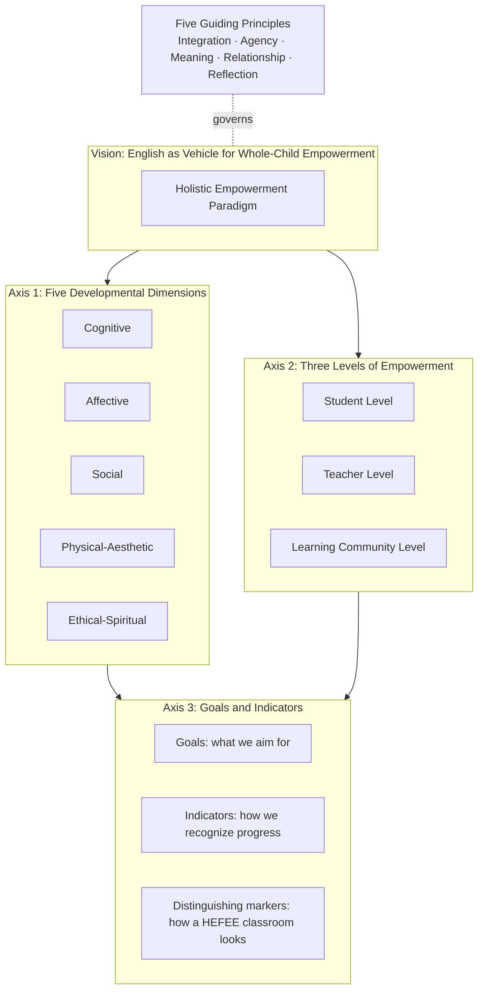

The diagram clarifies three structural commitments. First, the axes are *orthogonal* but *interactive*: any pedagogical decision can be located in the grid by asking which dimension(s) it addresses, at which level(s), with which goal(s) and indicator(s). Second, the five guiding principles function as a *governing layer* that shapes every cell of the grid; a cell that is occupied with compliance rather than agency, or with form rather than meaning, falls outside the paradigm even if it nominally addresses one of the dimensions. Third, the grid is *populated progressively* across the report: this chapter specifies the structure and a representative core of indicators, while Chapters 4 (pedagogy), 5 (agency), and 6 (assessment) populate further cells with concrete operationalizations.

### 3.1.4 How HEFEE differs structurally from neighboring frameworks

To position the framework precisely, it is useful to specify how it differs structurally—not merely in vocabulary—from the most influential neighboring frameworks. The comparison below is conducted along five structural axes: *unit of analysis*, *dimensional coverage*, *level architecture*, *subject specificity*, and *operational depth*.

| Framework | Unit of analysis | Dimensional coverage | Level architecture | Subject specificity | Operational depth for elementary EFL |
|---|---|---|---|---|---|
| ASCD Whole Child[^20][^21][^22] | School-wide approach | Five tenets: Healthy, Safe, Engaged, Supported, Challenged | School + community + child (WSCC extension) | Subject-agnostic | Low for EFL specifically |
| P21 4Cs[^17][^18][^23] | Student outcomes | 4Cs + Information/Media/Tech literacy + Life and Career skills | Student outcomes + support systems | Cross-curricular | Medium; integrated with English in some literature[^24][^25] |
| CASEL Systemic SEL[^19] | Intra/inter/cognitive competence | Three competence clusters | Classroom + school + family + community | Subject-agnostic | Low for EFL specifically |
| OECD Learning Compass 2030[^16] | Student agency for 2030 | Knowledge, skills, attitudes, values, transformation competencies | Student-centric, ecosystem-aware | Subject-agnostic; adaptable | Low for EFL specifically |
| UNESCO Four Pillars (Delors) | Learning purposes | Know / Do / Live together / Be | Universal/normative | Subject-agnostic | Medium via curricular alignment |
| **HEFEE (this study)** | Elementary EFL/ESL classroom and ecosystem | Five dimensions explicitly co-developed through language tasks | Three nested levels (student / teacher / community) | **Specific to elementary EFL/ESL** | **High; integrated with curriculum, pedagogy, assessment, novice-teacher routines (Ch 4–7)** |

Three structural distinctions emerge from this comparison. First, HEFEE is the **only framework whose unit of analysis is explicitly the elementary EFL/ESL classroom and its surrounding ecosystem**; the others are subject-agnostic frameworks that must be retrofitted to language teaching. Second, HEFEE's **level architecture explicitly includes the teacher as a level of empowerment**, not merely as a delivery agent of student-directed frameworks—a structural choice motivated by the rubric's commitment to novice-teacher accessibility and by the diagnostic finding in Chapter 2 that disempowered teachers cannot empower students. Third, HEFEE is designed to reach **operational depth** through the rest of the report, providing the curricular, pedagogical, assessment, and reflective routines that translate the framework into Monday-morning practice.

This positioning is one of integration rather than displacement. HEFEE incorporates ASCD's tenets within its affective and social dimensions[^20], P21's 4Cs within its cognitive and social dimensions[^17][^18], CASEL's competencies across affective, social, and ethical-spiritual dimensions[^19], and the OECD Learning Compass 2030's transformation competencies and student agency commitments[^16] within its three-level architecture. The framework is therefore best understood as an **integrative extension** of these models for the specific context of elementary English teaching, not as a competitor to them.

## 3.2 The Five Developmental Dimensions of Holistic Empowerment

The five dimensions that follow are *analytical distinctions* within a single integrated developmental process; they are separated for the sake of clarity but, as Principle 1 (Integration over Fragmentation) requires, they are addressed concurrently in any well-designed lesson. Each dimension is defined; its specific significance for elementary English is articulated; its relation to existing frameworks is noted; and concrete classroom-level manifestations are previewed (Chapter 4 will operationalize them as full pedagogical strategies).

### 3.2.1 The cognitive dimension: language proficiency intertwined with thinking skills

**Definition.** The cognitive dimension covers the development of English language proficiency (listening, speaking, reading, writing, vocabulary, phonological awareness, basic grammar) integrated with higher-order thinking skills (critical thinking, creativity, problem-solving, metacognition). Crucially, language proficiency is not subordinated to thinking skills nor vice versa; the two are theorized as mutually constitutive, since language is the principal medium through which young children develop and externalize thought, and thought is the engine that gives language meaningful work to do.

**Why it matters for elementary English specifically.** A grammar-translation classroom develops a sliver of cognition (rule recall and translation) at the cost of the broader cognitive apparatus children should be growing in their elementary years. The 4Cs literature is unambiguous on the centrality of these wider skills: P21 identifies critical thinking, creativity, communication, and collaboration as "the four skills that educational leaders from P21 agree are the most important for K-12 education"[^23][^17][^18], and recent EFL-specific research argues that "21st-century learning is an activity that is faced with the fact that learners' English learning and learning activities need to be approached within the framework of critical, communicative, and collaborative (Cs) thinking"[^25]. Empirical work in junior-secondary EFL contexts found that the 3Cs framework "encourages students' learning achievement in learning English both actively and passively" and supports learners' capacity "to invite students to recall what has been learned in the previous meeting, answer trigger questions, learn variably, work in groups, communicate"[^25]. For elementary learners, the integration is even more developmentally apt, because Montessori's second-plane reasoning mind is biologically primed for causal explanation and inquiry, and confining cognition to rule recall in this window represents a genuine developmental loss.

**Relation to existing frameworks.** The cognitive dimension corresponds most directly to P21's *Learning and Innovation Skills (4Cs)*[^18][^17], to UNESCO's *learning to know* and *learning to do*, to CASEL's *cognitive competence*[^19], and to the *knowledge, skills* core of the OECD Learning Compass 2030[^16]. It is also operationalized through CLT, TBLT, and CLIL methodological traditions reviewed in Chapter 2.

**Classroom manifestations.** A Grade 4 unit on *animals and habitats* might integrate vocabulary (proficiency), category formation and classification (critical thinking), invented animal-habitat designs (creativity), task-completion checklists (metacognition), and group problem-solving on "what would happen if a polar bear lived in a desert?" (problem-solving). Each lesson asks not only *what English are children using?* but also *what kind of thinking is the English doing?*

### 3.2.2 The affective dimension: motivation, confidence, emotional safety, and well-being

**Definition.** The affective dimension addresses children's emotional engagement with English learning: intrinsic motivation, willingness to communicate, confidence in risking error, emotional safety, sense of belonging, and overall well-being. Affect is not the ornamental wrapping of cognition; it is, on Maslow's account, the precondition of cognitive risk and, on Rogers's account, the medium of teacher–student relationship.

**Why it matters for elementary English specifically.** Chapter 2 documented the *silence spiral*: when teachers used English exclusively in Ethiopian Grade 4 classrooms, "few or no students were willing to participate," and one Grade 4 teacher waited three minutes in silence after an English instruction before switching to Amharic, at which point only two students volunteered. The affective collapse documented there is paradigmatic. Foreign-language classrooms are sites of unusually high *face threat*, because every utterance risks public error in the presence of peers. For elementary learners whose esteem and belonging needs are still being negotiated, affective design is not optional decoration; it is the developmentally primary task. ASCD's Whole Child framework names this directly when it specifies that students should be "**Safe**: learn in a physically and emotionally safe environment for students and adults" and "**Supported**: access personalized learning and be supported by qualified, caring adults"[^20][^21].

**Relation to existing frameworks.** The affective dimension corresponds to ASCD's *Healthy, Safe, Supported* tenets[^20][^21][^22], to CASEL's *intrapersonal competence* (self-awareness, self-management)[^19], to UNESCO's *learning to be*, and to the *attitudes and values* component of the OECD Learning Compass[^16]. CASEL's evidence base further establishes that SEL has measurable impact on "academic achievement, equity and poverty, and other lifetime outcomes such as education, employment, criminal activity, substance use, and mental health"[^19]—a powerful argument that affective design is not in tension with academic achievement but a prerequisite for it.

**Classroom manifestations.** Affective design appears as: a co-constructed *no-laughter rule* for English-only oral practice rounds; rituals of greeting that name and validate emotional states ("How do you feel today—happy, tired, excited?"); error-as-evidence-of-trying language ("Thank you for trying that brave sentence"); willingness-to-communicate scaffolds that allow children to begin with chunked utterances and gestures before producing full sentences; and explicit attention to physiological states (water, movement, brief breathing pauses) that regulate the nervous system.

### 3.2.3 The social dimension: collaboration, communication, and intercultural awareness

**Definition.** The social dimension covers children's developing capacity to work, communicate, and live with others—peer collaboration, communicative effectiveness, cross-cultural openness, and the intercultural awareness that English as a global lingua franca uniquely demands. It draws on Vygotsky's claim that learning is socially mediated through the Zone of Proximal Development, on Freire's insistence that knowledge "emerges only through invention and re-invention… in the world, with the world, and with each other," and on UNESCO's pillar of *learning to live together*.

**Why it matters for elementary English specifically.** English is structurally a social technology: its purpose is communication with others, and its global lingua franca status means that elementary English learners are being prepared, even unwittingly, for intercultural encounters across the rest of their lives. The Ethiopian observation that pair work "was not conducted between students but rather between the teacher and individual students" and that "shifting group work into whole-class discussion was a widespread pattern among all observed teachers" represents a structural amputation of the social dimension. P21's framework identifies *Communication* and *Collaboration* as core 4Cs[^18][^17], with communication understood as "explaining, negotiating, articulating thoughts clearly, persuading, informing"[^23] and with the recognition that "the world is more connected now than ever, yet many employers still feel that many employees are lacking in basic oral and written communication skills"[^23]. P21 further specifies *Social & Cross-Cultural Skills*: "working appropriately and productively with others; leveraging the collective intelligence of groups when appropriate; bridging cultural differences and using differing perspectives to increase innovation and the quality of work"[^18].

**Relation to existing frameworks.** The social dimension maps onto P21's *Communication, Collaboration, Social & Cross-Cultural Skills*[^18][^17], CASEL's *interpersonal competence*[^19], ASCD's *Engaged* tenet ("connect to the school and broader community")[^20], and UNESCO's *learning to live together*. The intercultural sub-component is anchored in the global-awareness theme that P21 weaves into core subjects[^17].

**Classroom manifestations.** Genuine pair and group tasks with communicative gaps (each partner has half the information); information-exchange games such as Find-Someone-Who; pen-pal letters with peers in another classroom or country; classroom routines for negotiating roles in group projects; comparative cultural mini-units (how children greet, eat, celebrate in different places) that affirm both home and target cultures rather than positioning either as default.

### 3.2.4 The physical-aesthetic dimension: embodied learning, movement, songs, drama, and artistic expression

**Definition.** The physical-aesthetic dimension covers the embodied, sensory, kinesthetic, and creative-artistic channels through which young children most effectively encounter language: total physical response (TPR), songs and chants, drama and role-play, drawing and crafting, dance and movement, and the aesthetic shaping of materials and classroom environment.

**Why it matters for elementary English specifically.** Children of elementary age have, in the words of the EYL literature, "short attention spans and high levels of physical energy, which require specialized pedagogical strategies." Steiner's principle of educating "the head, heart, and hands, engaging intellect, emotions, and physical body in harmony" is not a romantic preference but a developmental match: contemporary neuroscience indicates that "movement stimulates brain development, enhances memory, and improves focus in children" and that arts integration "improves student motivation, deepens learning, and supports emotional processing." When the Ethiopian study found that only one of twelve teachers used games and *none* used drama, the physical-aesthetic channel had been almost entirely closed off—a closure that is theoretically and neurologically counter-indicated. Songs and rhymes are not warm-up filler; they exploit the rhythmic-melodic memory systems through which young children most efficiently retain phonological patterns.

**Relation to existing frameworks.** The physical-aesthetic dimension corresponds to ASCD's *Healthy* tenet ("learn about and practice a healthy lifestyle")[^20], to *learning to be* in UNESCO's pillars, to creativity within P21's 4Cs[^18][^23], and to the embodied-aesthetic dimensions central to Waldorf and Montessori traditions. It is the dimension that most fully distinguishes a holistic-empowerment classroom from a conventional learner-centered classroom whose interactivity is largely verbal.

**Classroom manifestations.** TPR routines for action verbs ("stand up, jump, sit down, touch your nose"); chants and songs co-created with the class; drama enactments of stories such as *The Very Hungry Caterpillar* with target language chorally produced; vocabulary murals painted by children with pictorial mnemonics; "letter walks" in which children move physically around the classroom to phonics stations; aesthetic care for the prepared environment (organized walls, labelled object stations, child-curated bulletin boards).

### 3.2.5 The ethical-spiritual dimension: values, character, identity, and meaning-making

**Definition.** The ethical-spiritual dimension addresses the formation of values, character, identity, and meaning—the dimension through which children come to understand who they are, what matters, and how they want to be in the world. The term *spiritual* is used here in the secular, developmental sense employed by holistic education theorists: not religious doctrine, but the child's emerging sense of meaning, wonder, and connection. In the language of UNESCO's pillars, this is *learning to be*; in Freire's terms, it is the cultivation of *conscientização*, "the development of self-awareness… understanding one's place in the world, recognising systemic patterns of oppression or inequality, and being attuned to the broader socio-political dynamics"[^26].

**Why it matters for elementary English specifically.** English curricular content is never value-neutral. A textbook that features only nuclear families implicitly normalizes one family form; a reading passage on "cutting trees" could be a grammar exercise or an ethical conversation about environmental stewardship. The Ethiopian observation that lesson analysis on a "cash crop" reading passage was "almost exclusively linguistic" represents a routine missed opportunity for ethical-spiritual work. Furthermore, learning a global language inevitably engages identity questions: how do I hold on to who I am while learning to express myself in another language? Freire's pedagogical philosophy, applied through digital and traditional channels, "uplift[s] the oppressed" and seeks to "give a voice to students despite geography, socio-economic constraints, and other barriers"[^26]—a commitment that should not stop at secondary or tertiary classrooms.

**Relation to existing frameworks.** The ethical-spiritual dimension corresponds to UNESCO's *learning to be* and *learning to live together*, to CASEL's values orientation[^19], to ASCD's *Engaged* and *Supported* tenets in their relational depth[^20], and centrally to the *attitudes and values* and *transformation competencies* of the OECD Learning Compass 2030, which "addresses issues that are not part of the current education system, such as 'student agency,' 'transformation competencies,' and 'behavior and values'"[^16]. P21's *Leadership and Responsibility*—"demonstrating integrity and ethical behavior; acting responsibly with the interests of the larger community in mind"[^18]—also belongs here.

**Classroom manifestations.** Generative themes drawn from learners' own lives (Freire); brief reflective rituals ("one thing I learned about myself today"); dilemma stories that invite ethical discussion in age-appropriate language; identity-affirming projects in which children describe their families, neighborhoods, and traditions to imagined or real interlocutors abroad; selection of curricular content that explicitly opens ethical conversation rather than closing it.

### 3.2.6 The dimensions as a coupled system

The five dimensions, summarized below, must be read as a coupled system rather than as a checklist.

| Dimension | Core construct | Anchoring frameworks | Signature classroom routine |
|---|---|---|---|
| Cognitive | Language proficiency + 4Cs thinking | P21[^17][^18], CLT/CLIL, UNESCO Know/Do, OECD knowledge-skills[^16] | Inquiry-driven thematic unit |
| Affective | Motivation, confidence, safety, well-being | Maslow, Rogers, ASCD Safe/Supported[^20], CASEL intrapersonal[^19] | Co-constructed safety norms; check-in rituals |
| Social | Collaboration, communication, intercultural openness | Vygotsky, P21 Communication/Collaboration[^18], UNESCO Live Together, CASEL interpersonal[^19] | Genuine pair/group tasks with communicative gaps |
| Physical-aesthetic | Embodied, sensory, artistic engagement | Steiner/Waldorf, Montessori, P21 Creativity[^18], neuroscience evidence | TPR + songs + drama + visual creation |
| Ethical-spiritual | Values, character, identity, meaning | Freire[^26], UNESCO Learn to Be, OECD values + transformation[^16] | Generative themes + reflective rituals |

The coupling is not metaphorical. The Ethiopian silence spiral demonstrates the coupling negatively: a cognitive-only pedagogy (grammar drill) eroded affective engagement (silence), which closed off social interaction (no peer talk), which excluded physical-aesthetic channels (no drama, rare games), which forfeited ethical-spiritual engagement (cash-crop passages reduced to syntax). The five dimensions either rise together in a virtuous spiral or fall together in a vicious one. This coupling is the empirical foundation of Principle 1 (Integration over Fragmentation).

## 3.3 The Three Levels of Empowerment: Student, Teacher, and Learning Community

If the five dimensions specify *what* is being developed, the three levels specify *in whom* and *with whom* development is being cultivated. Empowerment, on the framework's definition, is the cultivation of *agency*—the capacity and confidence to act, choose, reflect, and contribute meaningfully—across three nested levels. The levels are reciprocally constitutive: student empowerment is structurally impossible without teacher empowerment; teacher empowerment is structurally impossible without community-level support; and community empowerment, conversely, is sustained only when students and teachers themselves enact and demonstrate agency.

### 3.3.1 The student level: age-appropriate agency, not unstructured permissiveness

**Definition.** Student-level empowerment is the cultivation of age-appropriate agency in elementary English learners. Following the OECD Learning Compass 2030, *student agency* is defined as "the ability to determine one's own actions"[^16]—a capacity that, for young children, is scaffolded rather than assumed. Student agency in elementary EFL takes four developmentally calibrated forms: *voice* (the right and capacity to be heard), *choice* (the opportunity to select among meaningful alternatives), *ownership* (the experience of one's learning as one's own project rather than as compliance with the teacher's), and *self-regulation* (the emerging capacity to monitor and direct one's own learning).

**Why it differs from permissiveness.** A persistent misreading of learner agency equates it with the absence of structure. The framework explicitly rejects this equation. Young children require predictable routines, clear expectations, and scaffolded structure; their agency is exercised *within* and *through* these structures, not in spite of them. Choosing among three communicative tasks is agency; being abandoned to a vague "do what you want" is neither agency nor education. CASEL's framework similarly emphasizes that SEL "acknowledges the importance of developmental appropriateness"[^19]—a reminder that agency at age seven differs in kind, not just in degree, from agency at age fifteen. The boundary is between *structured agency* and *unstructured permissiveness*, and the framework takes the former.

**Age-graded scaffolding (preview).** Chapter 5 will detail age-progression in agency cultivation; here the framework specifies a two-stage logic. In Lower Primary (Grades 1–3, roughly ages 6–9), agency is exercised primarily through *voice and choice within structured routines*: choosing partners from a small set, selecting from two or three songs, contributing to a "what shall we name our class mascot?" decision. In Upper Primary (Grades 4–6, roughly ages 9–12), corresponding to Montessori's reasoning mind sub-plane, agency expands to *ownership and self-regulation*: setting personal language goals, maintaining a vocabulary journal, choosing a project topic from a generative-themes menu, peer-evaluating presentations. The progression maps onto Vygotsky's ZPD principle: scaffolding is gradually withdrawn as competence grows.

### 3.3.2 The teacher level: professional judgment, identity, and reflective authority

**Definition.** Teacher-level empowerment is the cultivation of teachers' professional agency—their judgment, identity, reflective capacity, and collaborative authority. This level is distinctively named by HEFEE because, as Chapter 2 documented, neighboring frameworks tend to position the teacher as the implementation channel of student-directed frameworks rather than as a developmental subject in her own right. Yet a teacher who has been trained to execute lesson scripts, evaluated on test scores, and starved of professional dialogue cannot be expected to cultivate student agency; the structural mismatch is severe.

**Constituents of teacher agency.** Drawing on Schön's reflective practitioner and Freire's dialogical educator, teacher empowerment in HEFEE has four constituents.

1. **Professional judgment.** The teacher is theorized as a decision-maker who, in Schön's words, becomes "a researcher in the practice context" through reflection-in-action, not as a deliverer of a standardized script. Lesson plans are starting points subject to in-action revision based on what children actually need.
2. **Professional identity.** The teacher's identity as an EFL educator integrates language proficiency, pedagogical content knowledge, developmental knowledge of young learners, and ethical commitment. Identity work is particularly important for novice teachers, whose first-year survival pressures can crowd out identity formation, and for teachers in systems where, as the Ethiopian directors observed, primary teaching is institutionally undervalued ("Primary schools are forgotten").
3. **Reflective capacity.** The systematic alternation between reflection-in-action and reflection-on-action constitutes the engine of professional growth. Reflection here is not vague rumination but disciplined practice—lesson journals, peer observation, collaborative inquiry cycles.
4. **Collaborative authority.** Following Freire's relational redefinition of teaching ("the teacher is no longer merely the-one-who-teaches, but one who is himself taught in dialogue with the students"[^26]), teacher authority is reconceived as authority shared with students, with peers, with mentors, and with families. This is not the abdication of authority but its transformation into a relational, dialogical form.

**Particular relevance for novice teachers.** Novice elementary EFL teachers, often working with limited mentoring, large classes, modest resources, and intense expectations, face a structural double-bind: they are asked to enact pedagogies that require professional agency while themselves being denied the conditions for developing it. HEFEE's explicit naming of teacher empowerment as a level is, among other things, an institutional argument: schools and policy systems must invest in teacher agency as a precondition of student agency, not treat the former as a luxury to be addressed once test scores have improved.

The applicability of holistic principles to *adult* learners—including teachers—has been argued elsewhere: educator Fred Ende, after working extensively with adult learners, concluded that the ASCD Whole Child tenets "don't just fit children. They fit all learners," and that crafting professional learning opportunities requires that "the five pillars of the Whole Child initiative also exist for the Whole Adult"[^21]. HEFEE adopts this insight structurally: the same dimensions that organize student development also organize teacher development, applied at age-appropriate professional levels.

### 3.3.3 The learning community level: peers, families, school, and the broader community

**Definition.** Learning-community-level empowerment extends agency to the relational ecosystem that surrounds the classroom: peer culture within the class, families as co-educators, school leadership and colleague culture, and the broader community (neighborhood, region, digital community) that provides the materials and contexts of meaningful language use.

**Why it is structurally necessary.** Decades of evidence on whole-child implementation establish that classroom-level change is unsustainable without ecosystem-level support. ASCD's Whole School, Whole Community, Whole Child (WSCC) model integrates ten components addressing "student and staff physical and mental well-being while including family and community in the students' education"[^22]. The Ohio Whole Child Framework operationalizes the five tenets at state-system level, and North Carolina's Whole Child NC Advisory Committee illustrates "an interagency body [that] brings together public health, human services, safety, advocacy, family and community engagement, and education stakeholders from state and local agencies to make recommendations to the State Board of Education"[^22]. The structural lesson is direct: "cross-system collaboration is a critical principle of whole child approaches and when done well can support positive youth development and equity"[^22].

**Four sub-levels.** HEFEE specifies the learning community as a four-layered onion, each layer reciprocally connected to the others.

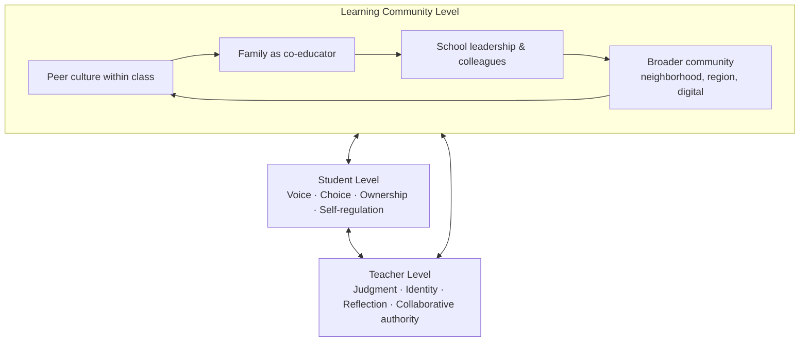

The diagram makes two claims visible. First, the three levels are bidirectionally coupled; arrows run in both directions because empowerment at any one level requires and reinforces empowerment at the others. Second, the community level is itself layered: peer culture (the most proximal community for the student) is nested within family, school, and broader community in widening circles of influence.

**Why this level matters for elementary English specifically.** Family engagement is particularly consequential at the elementary level, where children's identification of school learning with home life is still permeable; if English is presented as an alien school subject disconnected from family identity, motivation suffers. School leadership shapes the class size, schedule, materials, and assessment regime that determine whether a teacher can enact holistic pedagogy at all—the Ethiopian directors' candid acknowledgment that "we do not even know the appropriate teaching methods" reveals the leadership-level gap that classroom heroics cannot close. The broader community supplies the meaningful contexts (neighborhood walks, local festivals, digital pen-pal partners) that prevent English from becoming a sealed classroom artifact.

### 3.3.4 The reciprocal structure: why the levels rise or fall together

The defining structural claim of HEFEE's level architecture is that the three levels are *reciprocally constitutive*. The claim has three corollaries.

First, **student empowerment is structurally impossible without teacher empowerment**. A teacher who lacks professional judgment cannot offer students authentic choices because she has no margin to deviate from a scripted lesson; a teacher without reflective capacity cannot scaffold student self-regulation because she models its absence; a teacher whose identity is reduced to "deliverer of grammar" cannot recognize, let alone cultivate, student agency. The Freirean point is precise: "to resolve the teacher-student contradiction, to exchange the role of depositor… for the role of student among students would be to undermine the power of oppression and serve the cause of liberation."

Second, **teacher empowerment is structurally impossible without community-level support**. A teacher who is given fifty-five children per class, no mentoring, no professional development, and a high-stakes summative test cannot reasonably be expected to enact reflective, dialogical pedagogy. The cross-system collaboration that the WSCC and Whole Child NC models advocate is not optional[^22]; it is the institutional substrate without which teacher agency is mere exhortation.

Third, **community empowerment, conversely, is sustained only when students and teachers themselves enact and demonstrate agency**. The empowering school is not a top-down decree but a co-produced culture in which children's voices are heard, teachers' professional judgment is respected, and families are partners. Without classroom-level enactment, community-level rhetoric becomes performative.

The reciprocal structure has a practical implication for novice teachers that the rest of the report will return to. A novice teacher cannot single-handedly produce community-level empowerment; she can, however, contribute to it through small, cumulative acts—a parent newsletter, a colleague conversation, a classroom artifact shared with the principal—and she can, crucially, refuse to enact pedagogies in her own classroom that contradict the framework even when the surrounding ecosystem is imperfect. Empowerment, on the framework's account, is not a destination reached when conditions are perfect; it is a practice enacted across imperfect conditions.

## 3.4 Goals, Indicators, and Distinguishing Markers of the Paradigm

A framework that names dimensions and levels but cannot specify what success looks like remains aspirational. This section operationalizes HEFEE by articulating *goals* (what we aim for) and *indicators* (how we recognize progress) across the 5 × 3 grid, then specifies *distinguishing markers*—qualitative signatures by which a holistic-empowerment classroom can be recognized in contrast to its conceptual neighbors.

### 3.4.1 The 5 × 3 goals-and-indicators matrix

The matrix below populates the framework with representative goals and indicators. It is deliberately *representative rather than exhaustive*; Chapter 6 (assessment) will operationalize indicators as observation rubrics, portfolio criteria, and self-assessment tools. The matrix should be read as illustrative of the framework's structure—a novice teacher should not attempt to track every cell simultaneously but rather select two or three priority cells per unit and grow the practice over time.

| Dimension ↓ / Level → | Student level: goals & indicators | Teacher level: goals & indicators | Community level: goals & indicators |
|---|---|---|---|
| **Cognitive** | *Goal:* age-appropriate proficiency integrated with 4Cs thinking. *Indicators:* uses target language in unrehearsed exchanges; completes a thinking-routine task (sort, compare, predict); explains a strategy used (metacognition).[^17][^18] | *Goal:* pedagogical content knowledge + reflective design. *Indicators:* lesson plans specify both language and thinking objectives; in-action adjustments documented in journal. | *Goal:* cognitively rich curriculum across school. *Indicators:* curriculum documents name 4Cs alongside linguistic skills; PD sessions address higher-order thinking integration. |
| **Affective** | *Goal:* willingness to communicate; secure learner identity. *Indicators:* attempts spontaneous English utterances; describes self as "learning English" without anxiety markers; participation rate stable or rising across grades.[^19][^20] | *Goal:* affective attunement; relational warmth. *Indicators:* uses error-as-evidence-of-trying language; tracks individual children's affective participation; takes own well-being seriously. | *Goal:* emotionally safe school and family ecosystem. *Indicators:* anti-mockery norms across school; families framed as supporters not graders; school leadership protects teacher well-being. |
| **Social** | *Goal:* collaborative competence + intercultural openness. *Indicators:* completes genuine pair/group tasks with communicative gaps; describes a cultural difference without ranking it.[^18] | *Goal:* facilitates dialogue; collaborates with peers. *Indicators:* leads or joins peer-observation cycle; converts whole-class Q&A into pair tasks at least once per lesson. | *Goal:* partnership culture. *Indicators:* family-classroom communication routines; cross-class projects; community-resource integration in units. |
| **Physical-aesthetic** | *Goal:* embodied, multimodal language engagement. *Indicators:* participates in TPR, songs, drama; creates a visual artifact tied to a unit; sustains attention through movement-paced lesson. | *Goal:* designs across modalities. *Indicators:* every lesson includes at least one embodied or aesthetic activity; classroom environment ordered and language-rich. | *Goal:* school space and schedule support embodied learning. *Indicators:* classroom layout permits movement; arts and movement valued in school priorities; space-time budget includes physical-aesthetic activities. |
| **Ethical-spiritual** | *Goal:* identity, values, meaning-making. *Indicators:* expresses preferences, values, identity through English; engages age-appropriate ethical reflection; demonstrates curiosity rather than judgment toward difference.[^16] | *Goal:* values-aware curriculum design + identity respect. *Indicators:* generative themes drawn from learners' lives; teacher articulates own pedagogical values; affirms each child's identity. | *Goal:* values-coherent community. *Indicators:* school articulates and enacts values consistent with framework; family-school dialogue includes values, not only achievement. |

### 3.4.2 Distinguishing markers: how a HEFEE classroom looks

Indicators are necessary but not sufficient; a classroom can satisfy a checklist while missing the qualitative signature of the paradigm. The framework therefore specifies six *distinguishing markers* whose presence (or absence) indicates whether a classroom is genuinely operating within the paradigm. The markers function as a holistic gestalt test rather than a discrete checklist.

**Marker 1: Co-presence of all five dimensions in a single forty-minute lesson, even if asymmetrically.** A HEFEE lesson is identifiable not by being long, fancy, or resource-heavy, but by the *co-presence* of cognitive, affective, social, physical-aesthetic, and ethical-spiritual elements within a single sitting. A grammar-translation lesson addresses only the cognitive dimension narrowly; a CLT-only lesson adds the social through pair work but may neglect the physical-aesthetic and ethical-spiritual; a HEFEE lesson, even when imperfectly executed, attempts all five.

**Marker 2: Visible learner agency within structured routines.** Children make choices that matter (which song, which partner, which version to retell), exercise voice in ways the teacher actually responds to, and demonstrate ownership over at least some learning artifacts. The agency is *structured*, not anarchic; it sits within predictable routines and clear expectations.

**Marker 3: Meaning-led, form-attentive sequencing.** Tasks begin from real meaning-making with genuine consequences, and form is attended to in service of meaning rather than as its prerequisite. The Deweyan trying-and-undergoing dynamic is observable: children attempt, encounter consequences (being understood, misunderstood, surprised), and adjust.

**Marker 4: Visible affective warmth and error-as-evidence stance.** The teacher's verbal and non-verbal signals consistently reframe error as evidence of trying. Mockery, public shaming, and eye-rolling are absent; willingness to risk a sentence is celebrated. The willingness-to-communicate gradient documented in the Ethiopian study runs in the opposite direction—stable or rising rather than declining across grades.

**Marker 5: Embodied and aesthetic channels are core, not decoration.** Songs, drama, TPR, drawing, and movement appear as central pedagogical activities, not as bookends to "real" instruction. The classroom environment is ordered and language-rich, with visual aids systematically integrated into lessons rather than disorganized wallpaper.

**Marker 6: Reflective practice visible in teacher behavior.** The teacher visibly adjusts in response to children's responses (reflection-in-action), keeps some form of post-lesson reflective record (reflection-on-action), and engages in collaborative inquiry with at least one peer or mentor when conditions allow. The teacher does not perform expertise; she models learning.

A classroom satisfying all six markers is fully within the paradigm; one satisfying four to five represents a paradigm-aligned developing practice; one satisfying two or fewer remains within the dominant grammar-translation or thin learner-centered orientations regardless of nominal vocabulary. The markers are deliberately *qualitative*, because checklists alone, as Chapter 2 argued, can be ticked while paradigm assumptions remain intact.

### 3.4.3 Comparing the paradigm against three reference classrooms

The distinguishing markers can be sharpened by comparing how four classroom types would handle the same pedagogical episode—a Grade 3 lesson on family vocabulary.

| Classroom type | Same Grade 3 family vocabulary lesson |
|---|---|
| Grammar-translation | Teacher writes *father, mother, brother, sister* on board with L1 translations; explains plurals; assigns workbook exercise; corrects errors; tests next week. Cognitive dimension narrowly addressed; others absent. |
| CLT-only | Teacher introduces vocabulary through a picture; pair-work activity ("ask your partner about her family"); error tolerance during practice; brief feedback. Cognitive and social dimensions addressed; physical-aesthetic minimal; ethical-spiritual absent. |
| Learner-centered (thin) | Teacher offers choices among activities; children select; teacher circulates. Activity choice present, but dimensions not deliberately designed; risks "fun without depth." |
| **HEFEE** | Lesson opens with a song using family vocabulary (physical-aesthetic, affective); children draw their own family (identity, ethical-spiritual, aesthetic); pair-interview using a structured but choice-rich task ("ask your partner three questions about her family") (social, cognitive); teacher reframes any error as bravery; closing reflective ritual ("one new thing I learned about my partner's family") (ethical-spiritual, metacognitive); teacher journals a reflection on which children participated most/least and why (teacher-level reflection). All five dimensions co-present; agency structured; reflection visible. |

The comparison is not intended to denigrate CLT or learner-centered teaching; both are genuine advances over grammar-translation. The comparison is intended to demonstrate that HEFEE is a structural extension that *integrates and exceeds* its predecessors rather than replacing them.

### 3.4.4 Connecting the matrix to assessment and the novice toolkit

The 5 × 3 matrix and the six distinguishing markers are deliberately specified at this point in the report because they form the operational bridge to subsequent chapters. **Chapter 6** (assessment) will translate the matrix into multidimensional rubrics, portfolio criteria, observation protocols, and student self-assessment tools, addressing the well-known measurement challenge that whole-child frameworks face: "CASEL is part of a working group that is aiming to establish practical and evidence-based SEL assessments"[^19], indicating that even the most established frameworks acknowledge measurement as ongoing work. HEFEE will not pretend to have solved the measurement problem; it will offer pragmatic, formative, multi-source approaches calibrated for novice teachers' realistic capacities.

**Chapter 7** will translate the matrix and markers into concrete tools for novice teachers: a self-diagnostic checklist (which cells does my current practice address?); a unit planning template structured by dimension; decision trees for common dilemmas (e.g., "the children won't speak English—what do I do?"); a reflective-journal prompt set; and a phased adaptation roadmap that begins with one or two priority cells and scales over time.

**Chapter 4** (curriculum and pedagogy) will populate the cells with concrete pedagogical strategies—theme-based units, CLIL, project-based learning, TPR, storytelling and drama, cooperative learning, mindfulness routines, differentiated instruction—each mapped explicitly onto the dimensions and levels of the framework.

The framework, in sum, is designed to be **conceptually rigorous** (anchored in canonical theory and contemporary international syntheses), **structurally complete** (covering all five dimensions and three levels), **pragmatically actionable** (operationalized through the rest of the report), and **honest about its limits** (it is a synthesis to be tested in practice, not a verified universal solution). It explicitly addresses the rubric's commitment to novice-teacher accessibility: every dimension has age-graded classroom manifestations; every level specifies what realistic agency looks like at that level; every indicator is observable rather than abstract; and every marker has a qualitative signature a novice can recognize without specialized assessment training.

The basement metaphor that opened Chapter 2 has now been engineered with explicit structural members. The walls—curriculum and pedagogy—come next in Chapter 4. Chapter 5 will examine the people who live in the building (students and teachers as agents). Chapter 6 will install the building's measuring instruments and life-support systems (assessment, technology, ecosystem). Chapter 7 will hand the novice teacher the keys, the maintenance manual, and a phone number to call when something goes wrong. The framework articulated here is the architectural drawing against which everything that follows will be built.

# 4 Curriculum Design, Pedagogical Strategies, and Classroom Practices for Whole-Child English Development

Chapter 3 closed with an architectural metaphor: the basement of theory had been engineered, and the framework's structural members—five developmental dimensions, three levels of empowerment, a populated grid of goals and indicators—had been specified. The chapter handed the novice teacher a drawing. What it did not yet hand her was a wall. A senior elementary teacher walking into a Grade 2 classroom on Monday at 8:00 a.m. cannot teach with a 5 × 3 matrix; she teaches with a song, a story, a game, a question, a piece of chalk, a pile of picture cards, and forty minutes of children's attention that she must earn rather than assume. The translation from architectural drawing to actual wall is the work of this chapter.

The translation proceeds along two interlocking axes. The first is *macro-level curriculum design*—how the elementary English curriculum, whether mandated by national standards such as China's *English Curriculum Standards for Compulsory Education (2022 Edition)* or assembled by a teacher from textbook units, can be redesigned so that the five HEFEE dimensions are structurally embedded rather than incidentally hoped for. The second is *micro-level pedagogical strategy*—the specific classroom practices (experiential cycles, play-based learning, Total Physical Response, storytelling, drama, project- and inquiry-based learning, cooperative structures, mindfulness routines, differentiation) that operationalize whole-child empowerment in real classrooms with realistic constraints. Each strategy is examined along a consistent template: language objectives, holistic outcomes mapped to the five HEFEE dimensions, classroom procedures, sample structures, common pitfalls, and reflective examples. The chapter is deliberately calibrated to the rubric's commitment to novice-teacher accessibility: every strategy is paired with age-graded variants, decision guidance, and pitfall warnings, and the closing section synthesizes the resources into ready-to-adapt sample units.

A working principle should be stated at the outset. None of the pedagogies introduced in this chapter is, by itself, the holistic empowerment paradigm. A teacher who runs a TPR routine in an otherwise grammar-translation classroom has added an embodied activity to a paradigm she has not changed; a teacher who launches a project-based unit without affective design or reflective practice has built a wall on a basement that will subside under it. The strategies become *paradigm-aligned* only when they are deployed in concert, governed by the five guiding principles of Chapter 3 (Integration, Agency, Meaning, Relationship, Reflection), and continuously calibrated through the reflective cycle. The chapter's structure—from curriculum architecture (4.1), through embodied and experiential pedagogies (4.2), imaginative pedagogies (4.3), agentic and collaborative pedagogies (4.4), affective and inclusive pedagogies (4.5), to integrated unit architectures (4.6)—mirrors this concert logic.

## 4.1 Redesigning the Elementary English Curriculum Around Holistic Principles

### 4.1.1 The curricular gap: from communicative standards to grammar-translation enactment

The diagnostic finding of Chapter 2 bears repeating because it conditions every curricular discussion that follows. Communicative-oriented standards exist; their classroom enactment frequently does not. The Ethiopian observation study documented teachers reinterpreting communicatively designed textbook tasks through "a traditional lens, prioritizing explicit explanation and rule memorization," and the same misalignment recurs internationally even where curricular intent is explicitly progressive[^27]. China's *English Curriculum Standards for Compulsory Education (2022 Edition)* offers an instructive example of what a contemporary curricular intent looks like and what it requires of classroom enactment. The Standards explicitly proposes that "English courses should establish curriculum objectives aimed at cultivating and developing students' core literacy, developing students' language ability, learning ability, thinking quality and cultural awareness, and comprehensively improving students' literacy"[^28]. As the chief authoring scholar Mei Deming articulates the Standards' rationale, English curriculum is to be characterized by the unity of "instrumentality and humanism" (工具性和人文性), and is to develop four core literacies—language ability, cultural awareness, thinking quality, and learning ability—through a learning activity view that integrates "学思结合" (combining learning with thinking), "学用结合" (combining learning with use), and "学创结合" (combining learning with creation)[^29]. The Standards further calls explicitly for "teaching activities to be linked to real life," for theme-led organization of curriculum content around three meta-domains (人与自我 self, 人与社会 society, 人与自然 nature), and for the integration of multimodal language input with cultural and ethical reflection[^28][^29].

The curricular gap, then, is not that progressive standards do not exist but that the distance between standards-as-text and curriculum-as-enacted is travelled only by deliberate redesign. A teacher who receives a communicatively designed textbook unit and re-enacts it as a sequence of grammar drills is not implementing the standard; she is overwriting it. The first task of curriculum redesign is therefore to make the standards' multidimensional intent *visible at the unit level*—on the lesson plan, on the wall, in the assessment—so that the gravitational pull back to grammar-translation has something to push against.

### 4.1.2 Four curriculum design principles

Translating HEFEE's vision into curriculum architecture requires four design principles, each derived from a guiding principle of Chapter 3 and operationalized at the curricular rather than lesson level.

**Principle 1: Integration over fragmentation.** Curriculum is organized around themes, projects, or inquiries that integrate language with content, values, and embodied experience, rather than around isolated grammatical points. Mei Deming's articulation of the Standards is explicit: curriculum content should be "organized around themes, with different types of texts as carriers, integrating language knowledge, cultural knowledge, language skills, and learning strategies, presented in unit form"[^29]. The curricular implication is that the unit, not the discrete lesson, is the basic planning unit. A unit on *Food*, for example, integrates vocabulary (cognitive), preferences and identity (affective, ethical-spiritual), pair-and-group ordering games (social), TPR cooking actions (physical-aesthetic), and a values reflection on healthy eating (ethical-spiritual)—not because the teacher has appended five activities but because the unit was designed as a multidimensional whole from the start[^27].

**Principle 2: Meaning-led sequencing.** Within each unit, tasks are sequenced from meaning-making outward, with form attended to in the service of meaning rather than as its prerequisite. This inverts the conventional sequence in which vocabulary and grammar are pre-taught before any communicative use is permitted. A meaning-led unit might open with a storytelling or song that introduces target language in context, then move to comprehension and use, then to focused form attention as needed for accuracy in the communicative product, then to extension and reflection. The Hong Kong primary ESL theme-based study illustrates the affective payoff: when themes were *About Me, Food, Fun Places in Hong Kong, Transportation,* and *The Olympics*, "69% of participants expressed increased interest in English after a theme-based course, compared to 59% before," and 33% of children identified *Food* as their preferred theme due to "its relevance and engaging activities"[^27].

**Principle 3: Generative-themes orientation.** Following Freire, themes are selected not solely from textbook tables of contents but from the lived worlds of learners—their families, neighborhoods, foods, festivals, and concerns. The Wanli Primary School interdisciplinary English research provides a concrete example: by introducing "real materials… closely related to students' lives, such as news reports, advertisements, songs, movie clips," and by organizing role-plays around shops, restaurants, and airports, the curriculum simultaneously increased learner engagement and cultural understanding[^28]. China's 2022 Standards similarly emphasizes that curriculum should "select topics and construct interdisciplinary projects" connecting English with other subjects "to enrich language learning resources" and "achieve the goal of cultural education"[^28]. The Hong Kong study noted that future iterations of theme-based courses should "include a needs analysis to match themes and tasks to student proficiency levels and interests"—a methodological reminder that generativity requires listening before designing[^27].

**Principle 4: Progression-with-coherence.** A curriculum spans grades; what a child encounters in Grade 2 must build coherently toward Grade 5, with progression in language complexity, cognitive demand, social participation, embodied sophistication, and ethical reflection. The 2022 Standards establishes "a nine-year compulsory education English grading system" with "three basic levels and three 'level+' grades" plus a preparatory level for Grade 1 starters, organized to enable "the organic connection between primary and junior secondary English"[^29]. For a school-level curriculum designer or grade-level coordinator, the practical implication is that unit themes recur in spiral form across grades—*Family* in Grade 2 returns as *Family Across Cultures* in Grade 5—with each return adding linguistic, cognitive, social, and ethical complexity.

### 4.1.3 Three curricular architectures: theme-based, interdisciplinary, and CLIL

Three architectures operationalize these principles, each with distinctive strengths and trade-offs.

**Theme-based syllabi** organize units around topical themes with relevance to learners' lives. The Hong Kong primary ESL study, conducted with 88 students across themes including *About Me, Food, Fun Places, Transportation,* and *The Olympics*, reported quantitative evidence of increased interest (from 59% to 69%) and qualitative evidence that thematic relevance drives engagement[^27]. The architecture is novice-friendly because it can be implemented within an existing textbook—a teacher does not need to redesign the curriculum from scratch; she selects themes within the textbook table of contents and reorganizes the unit's tasks around the theme. The trade-off is that themes can become superficial topical wrappers if they do not also restructure the cognitive, social, and ethical work of the unit.

**Interdisciplinary integration** organizes units around problems or projects that cross subject boundaries. The Wanli Primary School research argues that traditional subject teaching produces "fragmented" knowledge and that interdisciplinary teaching addresses "topics related to English and constructs interdisciplinary projects… combining knowledge from other disciplines"[^28]. Concrete strategies include "integrating subject resources" (e.g., exploring the artistic styles and cultural backgrounds of different countries when learning art), "exploring interdisciplinary cooperation" through group projects, and "designing comprehensive assignments" that develop "practical ability"[^28]. The architecture's strength is its alignment with the 4Cs (cognitive depth) and with the ethical-spiritual dimension (real-world problems carry value content); its trade-off is that it requires more teacher preparation than theme-based syllabi and benefits from collaboration with teachers of other subjects.

**Content and Language Integrated Learning (CLIL)** organizes units around the dual learning of subject content and language. As Pearson's articulation specifies, CLIL "is not a means of simplifying content or reteaching something students already know in a new language"; rather, "CLIL courses should truly integrate the language and content in order to be successful"[^30]. Coyle's *4Cs framework*—*Content* (progression in subject knowledge), *Communication* (using language to learn while learning to use language), *Cognition* (developing thinking skills linking concept formation, understanding, and language), and *Culture* (exposure to alternative perspectives and shared understandings)—provides the structural scaffolding[^30][^31]. Bloom's Taxonomy, ranging from Lower Order Thinking Skills (remembering, understanding) to Higher Order Thinking Skills (analyzing, evaluating, creating), supports CLIL's progression: a primary unit on rainforest ecology might begin with naming animals (LOTS: *can you name three jungle animals?*), advance through predicting and categorizing (*can you predict what animals eat?*), and culminate in recommendation and creation (*can you recommend ways to protect an endangered species?*)[^30]. CLIL's strengths include sustained content depth and authentic language use; its trade-offs include the demand on teachers' subject-area knowledge and the need for careful scaffolding so that neither content nor language is sacrificed[^30].

The three architectures are not mutually exclusive. A school may run theme-based units in Lower Primary, transition to lighter interdisciplinary integration in Grades 3–4, and offer CLIL projects in Grades 5–6—a progression-with-coherence approach that matches Montessorian developmental stages while respecting teacher capacity.

### 4.1.4 Intercultural content and embedded value education

Two cross-cutting commitments thread through all three architectures. The first is **intercultural content design**: curriculum must affirm learners' home cultures while opening windows to others, avoiding both monocultural insularity and the displacement of home culture by the prestige of the target language. Mei Deming's interpretation of the 2022 Standards emphasizes that English education should help students "open international vision, strengthen home-and-country consciousness, form correct world view, life view and value view," and "learn to use English to tell China's story well, transmit Chinese culture, learn how to engage in appropriate conversation and effective communication with adolescents from different cultural backgrounds"[^29]. Practically, this means that a unit on *Food* should include local foods, family recipes, and culturally specific eating practices alongside dishes from English-speaking contexts, not as exoticism but as comparative inquiry. The Wanli research explicitly supports this approach: real materials include "news reports, advertisements, songs, movie clips" that "help students understand cultural and social dynamics around the world while learning English"[^28].

The second commitment is **embedded value education**. Linguistic content is never value-neutral; the question is whether values are surfaced or remain implicit. Mei Deming makes the philosophical point directly: language is "a key to unlocking culture," and the *Suzhou Consensus* (2014) jointly issued by China and UNESCO names language as "the carrier of human civilization passed down through generations… a bridge of mutual exchange and learning between civilizations"[^29]. In curricular practice, this means that a reading passage on environmental themes is not merely a vocabulary delivery vehicle but an opening for ethical reflection (*what does it mean to take care of our community's trees?*); a unit on family includes recognition that families take many forms; a project on *My Neighborhood* surfaces questions of belonging and contribution. Each of these moves activates the ethical-spiritual dimension that Chapter 2 documented as routinely missed.

### 4.1.5 A sample year-long curriculum map

To make the redesign concrete, the table below presents a sample year-long curriculum map for Lower Primary (Grade 2) and Upper Primary (Grade 5), structured as eight units across an academic year. The map is illustrative rather than prescriptive; it shows how a novice teacher or grade-level coordinator can populate the framework's cells across time.

| Term | Grade 2 unit | Grade 5 unit | HEFEE dimensions emphasized | Curricular architecture |
|---|---|---|---|---|
| T1 wk 1–4 | About Me (greetings, names, ages) | About Me Now (identity, hobbies, dreams) | Affective, Social, Ethical-spiritual | Theme-based |
| T1 wk 5–8 | My Family | Families Around the World | Social, Affective, Ethical-spiritual | Theme-based + intercultural |
| T1 wk 9–12 | Food I Like | Healthy Food, Healthy Planet | Cognitive, Physical-aesthetic, Ethical-spiritual | Interdisciplinary (with health/science) |
| T1 wk 13–16 | Animals | Animals and Habitats | Cognitive (4Cs), Physical-aesthetic | CLIL with science |
| T2 wk 1–4 | Colors and Clothes | Clothes Across Cultures | Physical-aesthetic, Social, Ethical-spiritual | Theme-based + intercultural |
| T2 wk 5–8 | My School | Our School Project | Social, Cognitive, Ethical-spiritual | Project-based |
| T2 wk 9–12 | Seasons and Weather | Climate and Our Community | Cognitive, Physical-aesthetic, Ethical-spiritual | CLIL + inquiry |
| T2 wk 13–16 | Festivals | Festivals We Share | Ethical-spiritual, Social, Affective | Theme-based + intercultural |

Three observations on the map. First, Grade 2 and Grade 5 share thematic stems (family, food, animals) but with progression-in-coherence: each Grade 5 unit adds intercultural, ethical, or interdisciplinary depth that the Grade 2 version did not require. Second, the dimension column shows that no unit addresses all five dimensions equally; emphases rotate, ensuring that across the year every dimension is repeatedly worked. Third, architectures vary across units, allowing teachers to develop comfort with theme-based units before scaling to CLIL or projects.

### 4.1.6 Negotiating the tension between national standards and holistic redesign

A realistic curricular discussion must acknowledge the rubric's call to surface paradigm tensions. National standards, even when progressively oriented, coexist with high-stakes assessment regimes, mandated textbooks, and limited teacher autonomy. Mei Deming's interpretation of the 2022 Standards offers a candid acknowledgment: "Some teachers, based only on test results, take so-called 'targeted' measures, intensifying the transmission of fragmented knowledge and the training of separated skills, dividing originally flowing texts and integrated concepts into independent grammatical items or language points, then transmitting them to students in large quantities, mechanically and repetitively"[^29]. The Standards' response is not to abolish testing but to rebalance assessment toward "learning-promoting evaluation" and "teaching-improving evaluation" through multi-source, multi-form, multi-dimensional approaches—a theme this report develops in Chapter 6[^29].

For the novice teacher, the practical implication is that curricular redesign is enrichment rather than substitution. The textbook unit on *Food* remains; what changes is how it is sequenced, what dimensions it addresses, what tasks anchor learning, and what assessment evidence is gathered. A teacher does not need administrative permission to reorganize her unit around a theme, embed a values reflection, or replace a grammar drill with a meaningful pair task. She does need a framework for doing so deliberately—which is precisely what HEFEE provides—and she may need, eventually, to make the case to colleagues, parents, and leaders for the curricular shifts she is making. Chapter 8 will address the systemic dimension; this section concludes with the modest but consequential claim that **a substantial amount of curricular redesign lies within the discretion of the elementary English teacher**, even before any policy reform takes place.

## 4.2 Experiential, Play-Based, and Embodied Pedagogies

The curricular architecture of section 4.1 specifies *what* will be taught and *how it is organized*; the pedagogies of section 4.2 specify *how children will encounter what is taught*. This section operationalizes the physical-aesthetic and affective dimensions of HEFEE through three interconnected pedagogical families: experiential learning grounded in Kolb's cycle and Dewey's transactional experience; play- and game-based learning calibrated to be pedagogically rich rather than filler; and Total Physical Response as the canonical embodied pedagogy for elementary EFL.

### 4.2.1 Experiential learning: Kolb's cycle as a lesson design tool

David Kolb's *Experiential Learning Theory* (ELT) defines learning as "the process whereby knowledge is created through the transformation of experience"[^32]. The four-stage learning cycle moves through *Concrete Experience* (CE: feeling and direct engagement), *Reflective Observation* (RO: watching and contemplating), *Abstract Conceptualization* (AC: thinking and theorizing), and *Active Experimentation* (AE: doing and testing)[^32]. The cycle's intellectual origins lie in "the experiential works of Dewey, Lewin, and Piaget," with Dewey's transactional view of experience providing the grounding insight that learning requires both *trying* and *undergoing*[^32]. For elementary English teaching, Kolb's cycle is not just a learning theory but a *lesson design tool*: a forty-minute lesson can be deliberately structured to move children through all four stages, ensuring that every lesson includes the embodied trying-and-undergoing that Chapter 2's grammar-translation classrooms systematically lacked.

Kolb's framework also reminds teachers that learners differ in their preferred entry points to the cycle. ELT identifies four learning styles—*Diverging* (CE+RO, strong at viewing situations from multiple perspectives, preferring imaginative and emotional engagement), *Assimilating* (AC+RO, strong at integrating information into logical models, preferring reading and lectures), *Converging* (AC+AE, strong at finding practical uses for ideas, preferring experimentation and problem-solving), and *Accommodating* (CE+AE, strong at hands-on action, preferring fieldwork and trying out approaches)[^32][^33]. While the predictive validity of learning-style instruments is contested—a meta-analysis by Iliff found mixed support and the LSI was designed for self-assessment rather than as a high-stakes predictor—the *theoretical* claim that learners benefit from cycling through all four modes remains well-supported, and a balanced learning profile correlates with greater "adaptive flexibility"[^32]. Subsequent EFL research has reinforced the practical relevance: a study of 183 Bangkok University EFL students found "positive relationships… among students' English background knowledge, learning styles, and learning motivation," with students of higher proficiency exhibiting "a greater variety of learning styles and more motivation to learn English"[^33]. The pedagogical implication for elementary teachers is direct: do not rely on any single mode of input, because doing so privileges some learners while marginalizing others.

The table below shows how a single Grade 3 lesson on *Animals* can be structured as a complete Kolb cycle.

| Stage | Activity | HEFEE dimensions | Time |
|---|---|---|---|
| CE: Concrete Experience | Children watch a short animal video and respond physically (move like the animal) | Physical-aesthetic, Affective | 7 min |
| RO: Reflective Observation | Pair share: *which animal did you like? why?* | Social, Affective | 6 min |
| AC: Abstract Conceptualization | Teacher leads a sorting task: which animals live where? (categories) | Cognitive | 10 min |
| AE: Active Experimentation | In groups, children design a "perfect home" for an animal and present it | Cognitive, Social, Physical-aesthetic, Ethical-spiritual | 15 min |
| Closing reflection | Each child names one new word + one thing they learned about animals | Cognitive (metacognition), Affective | 2 min |

The structure makes Dewey's *trying-and-undergoing* visible: children try (move, sort, design), undergo consequences (their group's design is responded to), and reflect. The forty minutes do not feel didactic precisely because the children's bodies, emotions, and decisions are continuously engaged.

### 4.2.2 Play-based and game-based learning: pedagogically rich versus filler

Play is often misread as the opposite of work. In elementary EFL, this misreading is consequential: a teacher who treats games as Friday-afternoon rewards has separated play from learning, depriving learning of its developmentally most efficient medium. The British Council's *TeachingEnglish* repository of vocabulary games illustrates the breadth of pedagogically rich play in EFL: *Hot Seat*, in which a student facing the class with their back to the board listens as teammates describe a target word using "synonyms, antonyms, definitions" until the seated student guesses it, can be "adapted to different class sizes" and "is also excellent for revising vocabulary"[^34][^35]. Other field-tested games include *Wordshake* (a three-minute scoring game in which longer words score more points), *Sushi Spell* (children spell words from sushi moving on a conveyor-belt visual), *Stop the Bus, Find-Someone-Who, The Memory Game,* and *Word Grid*—each with explicit pedagogical functions that range from spelling practice to definition-building to collocation work[^36][^35].

The criterion separating pedagogically rich play from filler is whether the game has *clear language objectives mapped to holistic outcomes*. Hot Seat, for example, exercises vocabulary, definition-giving (cognitive), peer collaboration (social), willingness to communicate under time pressure (affective), and—when topic words are chosen carefully—identity and values content (ethical-spiritual). Word Shake exercises spelling (cognitive) but, used alone, may be cognitively narrow; combined with a sentence-creation task using the words found, it broadens. The decision rule for novice teachers can be stated simply: **before using a game, name the language objective and at least two HEFEE dimensions it addresses; if you cannot, redesign it or replace it**.

A second decision rule concerns *participation architecture*. Many games default to teacher-fronted formats that can collapse into Q&A; the framework's social dimension requires that genuine peer-to-peer interaction be designed in. Hot Seat with two teams creates competitive peer talk; Find-Someone-Who requires children to circulate and ask each other; The Memory Game in pairs ensures everyone speaks. Conversely, a "guess what I'm thinking" game in which the teacher asks and individual students answer is often a game in name only.

A third decision rule concerns *cultural sensitivity*. Some games involve performance in front of peers (Hot Seat, drama, role-reversal), and the British Council's TPR documentation acknowledges that "cultural embarrassment" can arise in contexts where physical performance is unfamiliar[^37]. The mitigation is twofold: the teacher models confidently first ("this typically diminishes once the teacher models actions confidently"), and individual exposure is staged within group structures so that no child is alone on the public stage[^37].

The pitfall that novice teachers should anticipate is *fun without depth*: a game that produces laughter and high participation but no language learning. The mitigation is the language objective itself, plus a brief debrief at the end ("what new words did we use? what was easy? what was hard?") that consolidates learning and adds a metacognitive layer.

### 4.2.3 Total Physical Response: theory, procedure, and elementary EFL fit

Total Physical Response (TPR), developed by James Asher beginning in the 1960s and codified in his 1969 paper in *The Modern Language Journal*, is "a language teaching method built around the coordination of speech and action" that "attempts to teach language through physical (motor) activity"[^38]. TPR is the canonical embodied pedagogy for elementary EFL, and its theoretical foundations align unusually well with the developmental profile of young learners.

**Theoretical foundations.** Asher's method rests on three claims. First, the *bio-program*: first and second language learning are parallel processes; children develop listening competence before speaking ability and acquire language because they are "required to respond physically to spoken language in the form of parental commands"; once listening comprehension is established, "speech evolves naturally and effortlessly out of it"[^38]. Second, *brain lateralization*: TPR engages right-brain motor activity, whereas grammar-based approaches engage primarily left-brain analytic processing; Asher argues that right-hemisphere activity must precede left-hemisphere language production[^38]. Third, *stress reduction*: by focusing on meaning interpreted through movement rather than on form studied in the abstract, "the learner is said to be liberated from self-conscious and stressful situations and is able to devote full energy to learning"[^38]. TPR is also linked to the "trace theory" of memory, which holds that "the more often or the more intensively a memory connection is traced, the stronger the memory association will be"; combined verbal-and-motor tracing produces stronger memory than either alone[^38].

**Classroom procedure.** A standard TPR sequence unfolds in five stages: (1) the teacher gives commands and models the action; (2) the whole class responds physically; (3) the teacher gives commands without modelling and the class responds; (4) individual students respond to commands; (5) role reversal—students take over command-giving[^37][^39]. The British Council notes that a circle formation enhances "both visibility and physical engagement"[^37]. Imperative drills are the major activity at beginner level, with conversational dialogues introduced later[^38]. Asher's foundational example sequence for adult immigrants includes commands such as *"Pablo, drive your car around Miako and honk your horn,"* progressing to vocabulary clusters around washing, looking for, holding, combing, brushing, and adverbs of manner (*walk quickly to the door*, *slowly stand up*)[^38]. For elementary classrooms specifically, the method is "popular with beginners and with young learners," and the Uzbek primary research argues that TPR "is a suitable technique" for young learners precisely because they "do not know reading and writing yet so they learn through activities, songs, stories and games"[^39][^40].

**Strengths.** Documented strengths include reduced learner anxiety, "improved vocabulary retention through movement-memory links, and strong engagement among kinaesthetic and young learners"[^37]. The British Council enumerates eight practical advantages: lively, memorable, kinesthetic-friendly, suitable for both large and small classes, effective in mixed-ability classes, requires minimal preparation or materials, effective with teenagers and young learners, and engages both brain hemispheres[^40]. Empirical retention studies cited in Asher's foundational work showed that students who responded physically to a model retained more after two weeks than those who merely observed[^37].

**Limitations and pitfalls.** TPR's documented limits are equally important for novice teachers to anticipate. The British Council identifies four: *cultural embarrassment* (mitigated by confident teacher modelling); *level ceiling* (TPR is "primarily documented and most effective at beginner and lower-intermediate levels," though it can be adapted upward—e.g., teaching "ways of walking" such as *stumble, stagger, tiptoe* to advanced classes); *content coverage gaps* ("abstract concepts, complex grammar beyond basic prepositions and tense sequences, and extended discourse cannot be adequately conveyed through movement alone"); and *repetition risk* ("as a standalone approach used extensively and repeatedly, it risks becoming predictable and losing motivational impact")[^37]. Asher himself, the method's developer, "stressed that Total Physical Response should be used in association with other methods and techniques," and the Uzbek primary research repeats the warning: TPR "should best be combined with others since it needs much energy so that learners do not feel tired of learning language"[^38][^40]. The Uzbek analysis adds a fifth limitation: TPR "tends to neglect narrative, descriptions, and conversation forms of language" because it consists primarily of commands; the remedy is to combine TPR with storytelling, dialogue, and other modes[^40].

**Sample TPR sequence for Grade 1.** A first-grade lesson on *Action Verbs* might unfold as follows:

| Stage | Teacher action | Student response | HEFEE dimensions |
|---|---|---|---|
| 1. Modelling | "Stand up" — teacher stands, students stand | Whole class stands | Physical-aesthetic, Cognitive (listening) |
| 2. Whole class | "Sit down… stand up… jump… clap" | Whole class responds | Physical-aesthetic, Cognitive |
| 3. Without modelling | Same commands without teacher action | Whole class responds | Cognitive (comprehension test) |
| 4. Individual | "Maria, walk to the door. Carlos, point to the window." | Named students respond | Cognitive, Affective (named recognition) |
| 5. Role reversal | "Now you give the commands" | Students command teacher and peers | Social, Affective (agency) |
| 6. Novel combinations | "Walk slowly to the table and touch your hair" | Students recombine known elements | Cognitive (creative recombination) |

**Age-graded variants.** For Grades 1–2, commands stay concrete and physical (*stand, sit, jump, point*) and are paired with songs and chants. For Grades 3–4, commands extend to classroom and routine actions (*open your book, hold the pencil, wash your hands*) and to spatial prepositions (*put the rectangle next to the square, put the triangle on the rectangle*)[^38]. For Grades 5–6, commands integrate with more complex sequences and scenarios (*"Maria, pick up the box of rice and hand it to Miguel and ask Miguel to read the price"*) that bridge into role-play and simulation[^38]. The progression respects Asher's own advice: TPR is most useful for beginners but "the imperative command structure becomes progressively less versatile as proficiency requirements increase," so it should be combined with other methods at higher levels[^37].

**Frontline reflective example for novice teachers.** A novice teacher facing a class of fifty Grade 2 learners may feel that TPR will produce chaos. The Uzbek primary research is reassuring: TPR "can be used both in large or small classes" because "as long as you are prepared to take the lead, the learners will follow"[^40]. The practical entry point is small: introduce TPR as a five-minute opener for two weeks, focusing on a closed set of action verbs paired with a song (*"Head, Shoulders, Knees, and Toes"* is a TPR-rich song already in many primary repertoires). Once the routine is established, scale up to ten minutes and add new vocabulary. The aim is not to make TPR the entire lesson but to make it a reliable, joyful component that earns the children's trust and trains the body-language link.

## 4.3 Storytelling, Drama, and Imaginative Pedagogies

Among the diagnostic findings of Chapter 2, one bears particular weight for this section: of twelve observed Ethiopian primary teachers, only one used games and **none** used drama[^27]. The absence is not a methodological omission but, in Steiner's terms, an amputation of the heart and hands from a pedagogy that addresses only the head. This section makes the case—theoretical, empirical, and practical—that storytelling and drama are not optional enrichments but uniquely integrative pedagogies that touch all five HEFEE dimensions in a single sustained activity.

### 4.3.1 Why storytelling matches the developmental profile of young learners

Storytelling is among the oldest pedagogical technologies; it is also, on contemporary EYL research, among the most developmentally apt for elementary English. Cameron, in *Teaching Languages to Young Learners*, argues that primary-aged children possess "high ability to imagine and emotionally perceive," and that "young students acquire language faster through meaningful and contextual speech rather than through grammatical rules"[^41]. Ellis and Brewster, in the British Council's *Tell It Again! The Storytelling Handbook for Primary English Language Teachers*, emphasize that story-based lessons "increase students' motivation, especially in developing listening comprehension and pronunciation skills," and that dramatizing stories, enriching them with role-playing games and visual materials, increases the effectiveness of the method[^41]. Wright, in *Storytelling with Children*, evaluates storytelling as an interactive method that develops "independent thinking and communication skills" and notes that "in the process of storytelling, repeated language units are consolidated in the memory of students and natural speech is formed"[^41]. Harmer situates storytelling within the communicative approach as "a means of creating an authentic language environment" that "enlivens the lesson process and ensures the active participation of students"[^41].

The pedagogical mechanism is multiple. *Repetition with variation*—the way stories return to refrains and patterns while introducing new content—exploits young children's pattern-recognition capacity and produces vocabulary growth without the affective cost of drill. *Narrative meaning*—the desire to know what happens next—creates a real reason to listen and understand, supplying the meaning-led sequencing that Principle 2 of HEFEE requires. *Embodied response*—children acting out characters, miming actions, gesturing—integrates the physical-aesthetic dimension. *Identity engagement*—children identifying with characters, recognizing or revising their own experiences in the story—engages the affective and ethical-spiritual dimensions. A single twenty-five-minute storytelling activity therefore touches all five dimensions, an integration few other pedagogies achieve so naturally.

### 4.3.2 Empirical evidence: a storytelling experiment in primary EFL

The Mengniyozova primary-school experiment provides empirical anchoring. Forty Grade 3 students were divided into experimental (n=20) and control (n=20) groups; over eight weeks, the experimental group received English instruction through storytelling (storytelling based on pictures, role-playing games, dramatization, and interactive Q&A discussion), while the control group received traditional instruction[^41]. The results showed that "the vocabulary of the students in the experimental group increased by 35%, while in the control group this figure was 15%," and that "listening comprehension skills improved significantly in the experimental group"[^41]. Qualitative observations noted that "the storytelling method increased the interest of the students in the lesson" and that "students' activity in the lesson process and their ability to think independently increased"[^41]. The author's discussion echoes the holistic frame: "The storytelling method creates an emotional connection in children, which helps to retain information in long-term memory. In addition, storytelling improves students' pronunciation and creates a natural speaking environment"[^41].

The same study honestly acknowledges the limits: "a high level of creativity and preparation is required from the teacher to effectively use the method," and "the content of the story" must be "age-appropriate and interesting"[^41]. The sample size (n=40) is modest, and the eight-week intervention is shorter than ideal for tracking durable gains. These caveats notwithstanding, the direction of the evidence aligns with the broader EYL literature: storytelling, when well-prepared and well-delivered, produces vocabulary, comprehension, motivation, and engagement gains beyond those of traditional instruction.

### 4.3.3 Practical procedures: from story selection to retelling

A storytelling-based lesson proceeds through five connected phases.

**Phase 1: Story selection.** The story must be developmentally appropriate (vocabulary within or just beyond learners' current level), narratively engaging (a clear problem and resolution), repetition-rich (refrains, patterns), culturally accessible while broadening, and ethically meaningful. Classics such as *The Very Hungry Caterpillar, We're Going on a Bear Hunt, Brown Bear Brown Bear, The Three Little Pigs,* and *The Gingerbread Man* fit Grades 1–3; *Charlotte's Web, The Lion the Witch and the Wardrobe,* and culturally diverse folk tales fit Grades 4–6. The teacher who lacks confidence may begin with very short stories (a single page, one minute of telling) and scale up.

**Phase 2: Picture-supported telling.** Wright's foundational work emphasizes the integration of picture and word; for young learners with limited vocabulary, pictures supply the comprehension scaffolding that allows them to follow stories beyond their decoding ability[^41]. The teacher tells the story while pointing to illustrations, using gesture and voice modulation, pausing for prediction questions ("what do you think happens next?"), and inviting choral repetition of refrains.

**Phase 3: Repetition with variation.** The story is revisited across multiple lessons with variations: first listening, then listening with gesture, then choral telling, then gap-filling (the teacher pauses and children supply the next word or phrase), then telling in pairs. Each variation deepens engagement without becoming repetition-as-drill.

**Phase 4: Dramatization and role-play.** Children act out the story. Roles are distributed; props are minimal (a paper crown, a cardboard tree); the whole class participates either as actors or as the chorus that supplies repeated lines. This is the phase at which storytelling becomes drama, and at which the physical-aesthetic dimension is fully activated.

**Phase 5: Retelling and re-creation.** Children retell the story in their own words (with scaffolding), draw their favorite scene, write or dictate an alternative ending, or compose a related story (*if I were the hungry caterpillar, what would I eat?*). This phase moves into the AE/AC stages of Kolb's cycle and gives children authorship over the language.

The table below maps a sample storytelling-based unit on *The Very Hungry Caterpillar* across one week of Grade 2 lessons.

| Day | Lesson focus | HEFEE dimensions emphasized |
|---|---|---|
| Mon | First telling with pictures and gestures; introduce food vocabulary | Cognitive, Physical-aesthetic, Affective |
| Tue | Second telling with choral participation in refrains; TPR for eating actions | Physical-aesthetic, Social, Cognitive |
| Wed | Pair retelling using picture cards; food preference talk | Social, Affective, Ethical-spiritual |
| Thu | Class dramatization with simple costumes; whole class as chorus | Physical-aesthetic, Social, Affective |
| Fri | Children draw their own "very hungry creature" and dictate one sentence | Cognitive, Physical-aesthetic, Ethical-spiritual |

### 4.3.4 Drama as embodied, identity-affirming pedagogy

Drama deserves explicit treatment because it represents the developmental bridge between TPR (action-based but largely teacher-directed) and project-based learning (long-form and student-directed). Drama in elementary EFL ranges from simple TPR-style enactment of a single sentence ("the rabbit hops to the carrot") to short role-plays of everyday scenarios (shop, restaurant, home) to longer process drama units in which children inhabit characters across multiple lessons.

The Wanli Primary School research argues for "role-playing and simulation activities" as core to creating real situations: "Teachers can have students practice English in real situations. For example, simulated situations such as shops, restaurants, airports, etc., allow students to learn to communicate with others while playing different roles"[^28]. Drama operationalizes the social dimension by requiring children to negotiate roles, the ethical-spiritual dimension by inviting them to inhabit perspectives other than their own, and the affective dimension by lowering inhibition through role: a child who would never volunteer her own opinion may speak fluently as the lion or the king.

For novice teachers, drama is often the most intimidating pedagogy to introduce, because it appears to require performance skill the teacher does not believe she possesses. Two reassurances are appropriate. First, the teacher's role in elementary drama is not to perform but to set the frame; children bring the energy. Second, drama can begin extremely small—a thirty-second role-play of *"Hello, what's your name?"* between two children using stuffed animals as masks. Scaling from there is a matter of weeks, not years.

### 4.3.5 A novice-teacher checklist for first storytelling attempts

The novice teacher attempting her first storytelling lesson can check the following before walking in:

- [ ] Story length is two to four minutes for Lower Primary; up to seven minutes for Upper Primary.
- [ ] At least three refrains or repeated patterns are identified and rehearsed.
- [ ] Pictures, illustrations, or simple drawings support comprehension at every key moment.
- [ ] At least two prediction or comprehension questions are pre-planned ("What do you think will happen next?").
- [ ] Three to five target vocabulary items are identified and introduced before or during the telling.
- [ ] A simple gestural/TPR action is mapped onto each target vocabulary item.
- [ ] A brief affective opening ("today's story is about…") and reflective closing ("what was your favorite part?") are planned.
- [ ] The retelling/re-creation phase has at least one option that does not require fluent speaking (drawing, ordering pictures, miming).

The checklist is deliberately modest. Mengniyozova's reminder that storytelling effectiveness depends on teacher preparation is honest but not prohibitive: a teacher who follows the checklist and tells the story twice before class will, on the available evidence, produce a richer learning experience than the same teacher running a grammar drill she already knows[^41].

## 4.4 Project-Based, Inquiry-Based, and Cooperative Learning

The pedagogies of section 4.3 cultivate the imaginative, embodied, and affective dimensions of language learning; the pedagogies of this section cultivate student agency, social collaboration, and higher-order cognition most directly. They operationalize the cognitive (4Cs), social, and ethical-spiritual dimensions of HEFEE while reversing the documented Ethiopian pattern of pair work collapsing into teacher-fronted Q&A. They are also, candidly, the pedagogies that most stretch novice teachers' practice and require the deepest scaffolding to implement well.

### 4.4.1 Project-based learning structured around generative themes

Project-based learning (PBL) in elementary EFL organizes a sequence of lessons around a sustained inquiry that culminates in a communicative product. Drawing on Freire's commitment to *generative themes* drawn from learners' lives, projects work best when their topic emerges from or connects to children's actual concerns, neighborhoods, and curiosities. The Wanli Primary School research describes interdisciplinary PBL as combining "topics related to English" with "knowledge from other disciplines," with students "using English in cooperation to complete interdisciplinary tasks together"[^28]. Concrete project examples cited in the literature include "Beautiful China" interdisciplinary units (English combined with social studies, art, and environmental science), local environmental case studies, and community mini-research projects[^28].

A PBL unit typically runs across two to four weeks and proceeds through four phases.

**Phase 1: Launch and inquiry.** The teacher poses an open-ended driving question rooted in a generative theme (e.g., *What makes our school garden a good place for plants and people?*). The question must be authentic—that is, not have a predetermined answer—and must require English use to answer well.

**Phase 2: Investigation.** Children gather information through observation, interviews, reading simple texts, and discussion. The teacher provides target vocabulary and language structures *in response to* what children need for the investigation, rather than as a pre-loaded vocabulary list. This is meaning-led sequencing in action.

**Phase 3: Construction.** In groups, children construct their communicative product—a poster, a short presentation, a class book, a recorded video, a drama sketch, a wall display. The product must require English to produce; it must also be authentic enough that children care about getting it right.

**Phase 4: Sharing and reflection.** Groups present to peers, parents, or another class. Reflection follows: what did we learn? What was hard? What would we do differently?

A key pedagogical claim, shared by interdisciplinary PBL research and HEFEE alike, is that **projects naturally integrate dimensions**. The Wanli analysis is explicit: interdisciplinary PBL "can not only improve students' English ability, but also promote their comprehensive thinking, teamwork and problem solving skills"[^28]. A project on *Our School Garden* simultaneously develops vocabulary (cognitive), describes plants (cognitive/scientific), requires group cooperation (social), invites children to plant or photograph the garden (physical-aesthetic), and engages a real ethical question (how do we care for living things?) (ethical-spiritual). All five dimensions are activated, not because the teacher appended five activities but because the project's structure required them.

### 4.4.2 Inquiry-based learning: from open questions to communicative products

Inquiry-based learning (IBL) overlaps with PBL but emphasizes the *question*-driven structure rather than the product. The Wanli research describes inquiry pedagogy as requiring teachers to "design open-ended questions… guide students to discuss and think, and have students collect relevant information and present it in English," and to "encourage group cooperation and discussion"[^28]. The mode of inquiry need not be elaborate. A Grade 4 inquiry might begin with the question *"Why do leaves change color?"* and proceed through observation (collecting leaves), discussion (in small groups, in mixed L1/English), simple reading (a short text in scaffolded English), and a class chart of what we found out. The English work is scaffolded throughout: target vocabulary (*leaf, color, autumn, fall, change*), target structures (*because, when, in autumn*), and target communicative functions (*describing, explaining, comparing*).

For novice teachers, the entry point is the *one-week mini-inquiry*: a single five-day unit organized around an inquiry question, with each day adding a stage. The transition from one-week mini-inquiries to multi-week projects can be made over the course of a school year, beginning small and scaling.

### 4.4.3 Why cooperative learning fails in elementary EFL—and how to make it work

The most persistent finding in Chapter 2's diagnostic evidence was that pair and group work routinely collapsed into teacher-fronted Q&A. The collapse is not random; it has structural causes that this section names so they can be remedied.

**Cause 1: Missing communicative gap.** When both partners in a "pair task" already know the answer, there is no reason to communicate. A worksheet question both children can read produces no genuine peer talk. The remedy is the *information gap*: each partner has half of the information needed to complete the task. Find-Someone-Who is a classic information-gap task: each child has a card with names of activities (*"someone who can swim, someone who likes broccoli"*), and must ask classmates *"Can you swim? Do you like broccoli?"* until the card is filled. The communicative gap creates the reason to talk.

**Cause 2: Unclear roles.** When a group of four children are told to "discuss," some dominate, others disengage, and the loudest version of L1 wins. The remedy is *role differentiation*: in a four-child group, one child is the *recorder* who writes, one is the *speaker* who reports, one is the *checker* who ensures each member contributed, and one is the *researcher* who looks up unfamiliar words. Roles rotate across tasks. With clear roles, every child has a job.

**Cause 3: Insufficient scaffolding.** When children are asked to do a cooperative task in English without the language they need to do it, they default to L1 or to silence. The remedy is *language scaffolding*: before the task, the teacher explicitly teaches the phrases needed (*"I think… What do you think? Can you say that again? Let's start with…"*), and these phrases are visible on the wall throughout the task.

**Cause 4: No accountability.** When the teacher does not check who contributed, free-riding is inevitable. The remedy is *individual accountability* within group products: each child has a named contribution, each child speaks during the report-out, each child completes a one-line individual reflection.

The table below summarizes a *cooperative-task design checklist* for novice teachers.

| Element | Check question | Why it matters |
|---|---|---|
| Communicative gap | Does each partner have information the other does not? | Without a gap, there is no reason to talk |
| Role differentiation | Does each child have a clear, named job? | Equal participation requires structural roles |
| Language scaffolding | Are target phrases pre-taught and visible? | Children cannot use language they do not have |
| Individual accountability | Will every child's contribution be visible? | Free-riding undermines social learning |
| Time boundary | Is the task time-bounded and achievable? | Open-ended tasks invite drift |
| Debrief | Will we reflect on what worked? | Cooperative skill is built through reflection |

### 4.4.4 ZPD and the gradual release of responsibility

Across PBL, IBL, and cooperative learning runs a Vygotskian principle: the Zone of Proximal Development specifies what learners can do with support today, and pedagogy works within that zone with scaffolding that is gradually withdrawn. The Choice Literacy elaboration of ZPD describes the teacher's primary aim as "to figure out where the ZPD is for that child, and then to work within it," with children "moving from assistance from teachers or peers, to practice on their own, to internalized or automatic completion of the task"[^42]. Vygotsky's own formulation captures the dynamic: "What the child can do with assistance today, he can do alone tomorrow"[^42].

Applied to PBL/IBL/cooperative learning, ZPD has three operational implications. First, *initial scaffolding is generous*: the teacher provides target language, modeling, sentence frames, and group structures. Second, *scaffolding is progressively withdrawn* as children gain competence: the same group structure that required heavy teacher direction in week one becomes self-running by week four. Third, *individual children require individualized scaffolding*: a child still in the silent period needs a different level of support than a child confidently producing sentences. The Choice Literacy guidance for conferring with English language learners offers a useful frame: good ZPD-attentive questions for emerging writers include *"What have you written here? What are you going to write next? How did you get the idea to write this?"*—open questions that meet the child where she is rather than imposing a single standard[^42].

### 4.4.5 A frontline reflective example: from mini-project to inquiry unit

A novice Grade 4 teacher beginning her first project might choose a one-week mini-project on *My Family Recipe*. Day 1: she introduces the topic with a story about her own grandmother's recipe and target vocabulary (*recipe, ingredient, cook, eat, family*). Day 2: in pairs, children interview each other about a family food. Day 3: each child draws or writes a simple "recipe card" for a family food. Day 4: in groups of four, children share their recipe cards and ask each other questions. Day 5: the class produces a "Class Recipe Book" with each child's contribution.

The mini-project addresses all five dimensions: cognitive (vocabulary, sequencing language), affective (children speak about their own families), social (genuine pair and group interaction), physical-aesthetic (drawing, possibly bringing a sample of the food), and ethical-spiritual (family identity, cultural recognition). It requires no extra resources beyond paper and pencils. It can run within a 40-minute lesson per day. It produces a tangible class artifact that families can see at parents' day. **A teacher who completes this mini-project successfully has just enacted the framework**, even if she has not yet read the framework's matrix.

## 4.5 Mindfulness, Differentiation, and Inclusive Classroom Practices

The pedagogies of sections 4.2–4.4 will not work in classrooms whose affective climate is corrosive or whose differentiation is absent. This section addresses the *substrate*—the affective and inclusive design that makes everything else possible. It draws on humanistic psychology (Maslow, Rogers), social-emotional learning frameworks, and learning-style research to operationalize the affective dimension of HEFEE and the inclusion imperative.

### 4.5.1 The silence spiral revisited and the case for affective design

Chapter 2's silence spiral is not an exotic pathology; it is the predictable outcome of any pedagogy that combines high face threat with low affective scaffolding. A child whose esteem and belonging needs are unmet in the classroom will not risk public error in a foreign language; her silence will be misread as deficit; the misreading will reinforce the pedagogy that produced the silence. **Reversing the spiral is the precondition of every other pedagogy in this chapter**. A teacher cannot run cooperative tasks if children are afraid to speak; she cannot run drama if children are afraid to be seen; she cannot run inquiry if children are afraid to be wrong.

### 4.5.2 Brief, classroom-feasible mindfulness and emotional-regulation routines

Mindfulness in elementary classrooms does not mean prolonged meditation. It means brief, repeatable routines that regulate the nervous system and create transitions into and out of focused activity. Five routines, each requiring no special training and one to three minutes, can be incorporated into elementary EFL lessons.

**Check-in ritual (1–2 min).** At the lesson's start, children indicate how they feel, in English or in a hybrid of English and L1: *"How do you feel today? Happy, tired, excited, sad, calm?"* Each child can answer in a single word with a thumbs-up/thumbs-down/thumbs-side gesture. The ritual takes language work into the affective domain, validates emotional states, and gives the teacher real-time information about who needs particular support.

**Breathing pause (30 sec).** Between activities, especially after a high-energy game, the class takes three slow breaths together. The transition resets attention and helps children downshift before a more focused task.

**Attention-resetting activity (1 min).** A simple Simon-Says or "follow the leader" routine pulls scattered attention back. Used briefly, it restores focus; used as a reward, it loses force.

**Gratitude or reflection closing (2 min).** At the lesson's end, each child names *one thing I learned today* or *one thing I am thankful for*. The closing ritualizes metacognitive reflection and ends the lesson on an affective uplift.

**No-laughter norm.** Co-constructed with the class at the start of the year and revisited monthly: *"In our class, when someone tries an English sentence, we listen and we don't laugh. If we make a mistake, we are brave learners, not bad learners."* The norm is enforced consistently; violations are addressed gently but firmly.

These routines are deceptively simple. Their cumulative effect is to construct a classroom in which children are willing to risk speaking—the precondition of every communicative pedagogy.

### 4.5.3 Differentiation: content, process, and product

Differentiated instruction recognizes that learners differ in prior knowledge, language background, learning preferences, and pace. Kolb's four learning styles (Diverging, Assimilating, Converging, Accommodating) provide one analytic frame: the Bangkok University EFL study showed that "students who had a lot of learning styles were found to have a high motivation to learn English," supporting the broader principle that diverse modes of input expand engagement[^33]. The cautious caveat from the Kolb literature—that learning-style instruments have contested predictive validity—does not undermine the practical implication: **a teacher who relies on only one mode of input privileges some learners and marginalizes others**. The MBTI/Kolb correlation study of non-English major college students reinforces this: even among similar learners, "introverted students" benefit from "written expression opportunities (e.g., journaling, online discussions) and independent thinking time to reduce participation pressure," while "extraverted students" benefit from "interactive methods (group discussions, role-plays, class presentations)"[^43]. Differentiating input modes is, in this light, simple pedagogical equity.

Differentiation operates along three axes: *content*, *process*, and *product*.

**Differentiating by content**: Tiered vocabulary lists (a core list for all, an extension list for ready learners), leveled texts (simpler and more complex versions of the same story), and pre-teaching for learners with limited prior exposure.

**Differentiating by process**: Varied groupings (sometimes mixed-ability, sometimes ability-similar for targeted support), choice boards (a menu of three or four activities from which children select), multimodal input (visual + auditory + kinesthetic versions of the same content). The Bell-Evered CLIL lesson plan checklist explicitly recommends including activities for "different learning styles" as a core feature of well-designed lessons[^31].

**Differentiating by product**: Alternative ways for children to demonstrate learning. The same unit on *Animals* might allow a child to demonstrate learning by drawing and labelling, by performing a brief role-play, by speaking into a recorder, or by writing simple sentences. Children who cannot yet write but can speak are not penalized; children who are shy speakers but strong drawers are not penalized either.

### 4.5.4 Inclusion: mixed-ability classes, neurodivergent learners, and limited-exposure learners

Inclusion in elementary EFL is not an exceptional accommodation but a structural commitment. Three sub-populations deserve specific attention.

**Mixed-ability classes** are the norm, not the exception. The differentiation strategies above apply directly. A useful additional principle is *peer scaffolding*: pairing a more proficient with a less proficient child in structured tasks supports both, with the more proficient consolidating learning by explaining and the less proficient receiving comprehensible input from a peer.

**Neurodivergent learners** (children with attention differences, autism spectrum profiles, learning differences) often benefit from the very pedagogies HEFEE recommends—predictable routines, multisensory input, embodied learning, choice within structure—but require more careful design. A British Council reader's comment captures the practical truth: "I teach neurodivergent students, and I am always seeking engaging ways to educate them"[^35]. Concrete supports include visual schedules of the lesson, longer wait time, advance warning of transitions, and the explicit teaching of social skills that other children acquire incidentally.

**Limited-exposure learners**, whose home environments offer little English input, need pre-teaching, repetition, and affective reassurance that they are not behind through any fault of their own. The Choice Literacy article on conferring with a child in the "silent period" describes the careful work of "different strategies for eliciting responses" from a child not yet ready to speak[^42]. The strategies include observing what the child *can* do (drawing, gesturing, picture-pointing), accepting these as legitimate participation, and gradually building toward verbal production.

### 4.5.5 Minimum viable differentiation for novice teachers in large classes

A novice teacher facing a class of fifty cannot enact every differentiation strategy at once. The *minimum viable differentiation* approach is to commit to three small but consistent practices.

1. **Two-tier vocabulary**: a core list of five words every child must know, plus an extension list of three words for ready learners. The teacher names this explicitly: *"Everyone learns these five. If you finish, you can also learn these three."*
2. **Choice within structure**: at least one activity per lesson where children choose among two or three options (which song, which partner, which way to record their answer).
3. **Multi-channel demonstration**: at least one assessment opportunity per week where children can show learning in their preferred mode (drawing, speaking, writing, performing).

Three practices, sustained over a term, will produce more equity than ten practices attempted briefly and abandoned.

### 4.5.6 The affective substrate as the precondition of paradigm change

Section 4.5 has, deliberately, returned the chapter to its affective foundation. The pedagogies of 4.2, 4.3, and 4.4 are wall-building strategies; the affective and inclusive design of 4.5 is the mortar without which the walls fall down. A teacher who attempts cooperative learning in a classroom where children fear mockery will produce silence; a teacher who attempts drama in a classroom where children's identities are not affirmed will produce performance refusal; a teacher who attempts inquiry in a classroom that has not differentiated for limited-exposure learners will produce confusion. **The affective and inclusive substrate is not a luxury added after the pedagogy works; it is what makes the pedagogy work in the first place**. This is, ultimately, why HEFEE refuses to subordinate the affective dimension to the cognitive: subordinating affect causes cognition to fail.

## 4.6 Integrating Strategies: Sample Unit Architectures and Curriculum Mapping for Novice Teachers

The chapter's resources have, at this point, been laid out across five sections: curriculum architectures (4.1), embodied and experiential pedagogies (4.2), imaginative pedagogies (4.3), agentic and collaborative pedagogies (4.4), and affective and inclusive design (4.5). This concluding section synthesizes them into integrated, ready-to-adapt artifacts: two fully developed sample units, a curriculum mapping matrix template, a strategy-selection decision tree, and a phased adaptation roadmap for novice teachers.

### 4.6.1 Sample unit 1: Lower Primary, Grade 2, "My Family and Friends"

This sample unit runs across two weeks (10 lessons of 40 minutes each), targeting Grade 2 learners with approximately one year of prior English exposure. It is designed to be teachable in a class of forty to sixty children with modest resources (a textbook, picture cards, paper, colored pencils).

**Language objectives.** By the end of the unit, learners will be able to: (1) name immediate family members and a small set of friends in English; (2) use *I have… / She is… / He is…* in simple sentences; (3) ask and answer *"Who is this? What is her name? How old is she?"* in pairs; (4) describe two simple facts about their family or friends.

**Holistic outcomes mapped to HEFEE dimensions.**

- **Cognitive**: vocabulary expansion, sentence-pattern use, basic comparison (older/younger).
- **Affective**: every child speaks about their own family and friends, validating identity and increasing willingness to communicate.
- **Social**: pair interviews, group sharing, peer listening.
- **Physical-aesthetic**: songs, drawing, family-portrait creation.
- **Ethical-spiritual**: recognition that families take many forms; gratitude reflection at unit end.

**Daily lesson structures.**

| Day | Lesson | Key activities | HEFEE focus |
|---|---|---|---|
| 1 | Warm-up + family vocabulary intro | Family song; teacher introduces family vocabulary with photos; TPR for family-related actions | Physical-aesthetic, Cognitive |
| 2 | Sentence patterns | Story (The Family Tree); choral repetition; pair practice with picture cards | Cognitive, Social |
| 3 | My family drawing | Children draw their family; label members; pair share | Physical-aesthetic, Affective, Ethical-spiritual |
| 4 | Pair interview | Find-Someone-Who task: someone with a brother, someone with a grandmother, etc. | Social, Cognitive |
| 5 | Storytelling | Story (We Love Our Family); choral participation | Cognitive, Affective, Ethical-spiritual |
| 6 | Friends vocabulary | TPR for friend actions (play, share, help); friendship song | Physical-aesthetic, Social |
| 7 | Pair role-play | "Meet my friend" mini-role-play; introductions | Social, Affective |
| 8 | Mini-project intro | Children make a "My Family and Friends" book page | Cognitive, Physical-aesthetic |
| 9 | Mini-project completion | Pages completed; pair sharing of pages | Social, Affective |
| 10 | Sharing + reflection | Class gallery walk; gratitude reflection ("one person I'm thankful for") | Ethical-spiritual, Affective |

**Materials list (resource-constrained calibration).** Family photos (teacher's own + collected from children); picture cards; paper; colored pencils; one storybook (or a teacher-made picture story); a wall space for the gallery. No projector, computer, or specialized materials required.

**Assessment touchpoints (preview Chapter 6).** Day 4 pair interview: observation rubric for participation and target language use. Day 9 mini-project page: artifact-based portfolio entry with criteria covering vocabulary use, sentence form, identity expression, and aesthetic care. Day 10 reflection: brief affective check-in tracking willingness to communicate.

**Pitfall notes for novice teachers.** Watch for the assumption that every child has a "standard" family; some children may have absent parents, single parents, blended families, or guardians, and the unit must affirm all configurations. Watch for time slipping: the family-drawing activity (Day 3) tends to expand; cap it at twenty minutes. Watch for the pair interview collapsing into Q&A: each child must have *both* a card and a partner, and the teacher must sit with whichever pair is least confident.

### 4.6.2 Sample unit 2: Upper Primary, Grade 5, "Our Environment"

This sample unit runs across three weeks (15 lessons of 40 minutes each), targeting Grade 5 learners with approximately four years of prior English exposure. It is designed as an interdisciplinary CLIL/PBL unit integrating English with science, with a community-facing product as the unit's culmination.

**Language objectives.** By the end of the unit, learners will be able to: (1) use environmental vocabulary (recycle, reduce, pollution, energy, clean, dirty, plant, animal, habitat, climate); (2) use cause-and-effect structures (*because, so, when… then*); (3) interview a peer about environmental habits; (4) present an environmental recommendation in a poster or short video.

**Holistic outcomes mapped to HEFEE dimensions.**

- **Cognitive**: 4Cs activation (critical thinking on causes, creativity in solutions, communication across modes, collaboration in groups); content knowledge of environmental concepts.
- **Affective**: ownership of a real issue; pride in producing a community-facing artifact.
- **Social**: structured group investigation; peer presentation.
- **Physical-aesthetic**: poster or video creation; possibly a school-yard observation walk.
- **Ethical-spiritual**: genuine engagement with environmental responsibility; learning to be (UNESCO) and learning to live together.

**Weekly structure.**

- **Week 1: Inquiry launch and investigation.** Driving question introduced (*"What can our class do to take care of our environment?"*); environmental vocabulary taught through CLIL with science content (Bloom's lower levels: name, describe, identify); a school-yard observation walk produces field notes; small groups form around sub-questions (water, waste, plants, energy).
- **Week 2: Construction.** Groups research their sub-question (using simple texts, observation, interviews with school staff in scaffolded English); language work focuses on cause-and-effect structures and recommendation language; groups draft their posters or videos. Bloom's middle and upper levels are engaged: predict, categorize, recommend.
- **Week 3: Sharing and reflection.** Groups present to the class, then to a sister class or to parents at a Friday gallery; reflection cycles through what was learned (cognitive), how the group worked together (social), and what we might do differently (metacognitive). A final value-reflection addresses the ethical-spiritual dimension: *what do we owe the place we live?*

**Cooperative-task design in the unit.** Each group of four has named roles (recorder, speaker, checker, researcher) that rotate across the three weeks. Information gaps are designed in: each group's sub-question requires information the other groups do not have, so the final sharing has genuine communicative purpose. Language scaffolding is provided through visible sentence frames (*"Because… so…"; "We recommend…"; "Our group found…"*).

**Materials list.** Simple environmental texts (teacher-curated or made); chart paper; markers; smartphones (if available, for video); a wall space for posters. Local availability of digital tools varies; the unit is designed to work without them.

**Assessment touchpoints (preview Chapter 6).** Week 1 end: observation of group formation and sub-question selection. Week 2 mid: language-use observation in group work. Week 3 final: rubric for presentation covering language accuracy and fluency, content depth, group collaboration evidence, and ethical engagement. Each child also writes a short individual reflection.

**Pitfall notes for novice teachers.** The most common failure mode is over-ambition; cap the project at three weeks and resist adding complexity. Watch for one child dominating each group; the role-rotation structure addresses this. Watch for the "research" phase becoming a vocabulary translation exercise; the teacher must ensure children are actually thinking, not just looking up words. Watch for the sharing phase becoming a teacher-led summary; let the children present.

### 4.6.3 Curriculum mapping matrix template

The following template lets a teacher track which HEFEE cells are addressed across a term. Each row is a unit; each column is a HEFEE cell. The teacher marks ●(major emphasis), ○(secondary emphasis), or blank. Across the term, every cell should receive at least one ● and several ○s.

| Unit | Cog/S | Aff/S | Soc/S | Phys/S | Eth/S | Cog/T | Aff/T | Soc/T | Phys/T | Eth/T |
|---|---|---|---|---|---|---|---|---|---|---|
| U1: Family & Friends | ● | ● | ● | ● | ● | ● | ● | ○ | ○ | ○ |
| U2: Food | ● | ● | ○ | ● | ● | ● | ○ | ○ | ○ | ● |
| U3: Animals | ● | ○ | ● | ● | ○ | ● | ○ | ● | ○ | ○ |
| U4: My School | ○ | ● | ● | ○ | ● | ● | ● | ● | ○ | ● |

(S = Student level; T = Teacher level; community-level columns can be added similarly.) The matrix makes blind spots visible: a row with too few marks indicates an under-developed unit; a column with too few marks indicates a dimension routinely neglected.

### 4.6.4 Strategy-selection decision tree

The decision tree below guides a novice teacher in selecting which pedagogy fits which lesson goal and constraint.

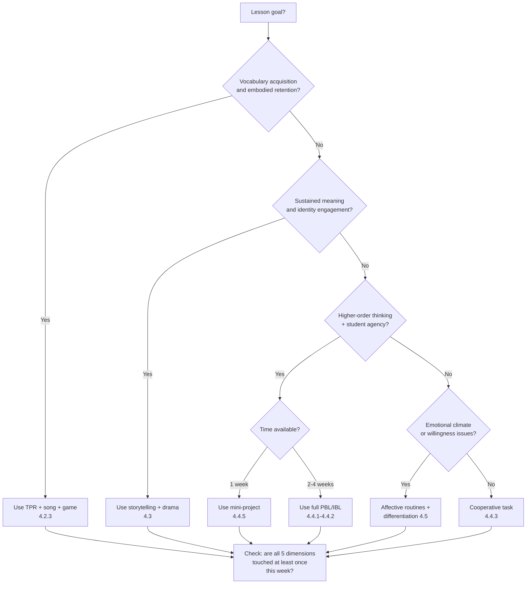

The closing check question—*are all five dimensions touched at least once this week?*—is the routine the framework asks every teacher to internalize. Not every lesson must touch every dimension; every week should.

### 4.6.5 Phased adaptation roadmap for novice teachers

A novice teacher cannot adopt every strategy in this chapter at once. The phased roadmap below suggests one new strategy per month across a school year.

| Month | New strategy to introduce | Why this order |
|---|---|---|
| 1 | Affective routines (check-in, no-laughter norm, closing reflection) | Substrate; everything else depends on this |
| 2 | TPR opener (5–10 min per lesson) | Low-risk, high-engagement embodied entry |
| 3 | One song-based vocabulary routine + one vocabulary game | Builds on TPR; adds pedagogically rich play |
| 4 | First storytelling session (short, picture-supported) | Bridges embodied to imaginative; uses prior routines |
| 5 | Pair-work with information gap (Find-Someone-Who) | First genuine cooperative structure |
| 6 | Theme-based unit redesign (one unit) | Curricular shift; consolidates pedagogies |
| 7 | First one-week mini-project | Bridges to PBL |
| 8 | Differentiated demonstration (children show learning in chosen mode) | Inclusion practice |
| 9 | First two-week project or inquiry | Scaling agentic pedagogy |
| 10 | Drama unit (one short process drama) | Adds the most challenging imaginative pedagogy |

Across the year, the novice teacher who follows this roadmap will have introduced ten paradigm-aligned practices, each layered onto the prior. The roadmap respects the rubric's commitment to scaffolded change over heroic transformation.

### 4.6.6 Bridge to Chapters 5, 6, and 7

This chapter has built the walls. Three chapters complete the building.

**Chapter 5** (Empowering Teachers and Students) examines the people who inhabit the building. The sample units in this chapter rely on a teacher who has the professional agency to deviate from a script and on students who are ready to exercise voice, choice, and ownership. Chapter 5 specifies how teacher and student agency are cultivated—the role transformation, the dispositions, the age-graded scaffolding of autonomy.

**Chapter 6** (Holistic Assessment, Technology, and Ecosystem) installs the building's measuring instruments and life-support systems. Every sample unit in this chapter included assessment touchpoints; Chapter 6 specifies the rubrics, portfolios, and observation protocols that operationalize multidimensional assessment, examines how digital tools and AI can amplify or undermine holistic outcomes, and addresses the school and community ecosystem in which the classroom sits.

**Chapter 7** (Frontline Cases and Practical Roadmap) hands the novice teacher the keys, the maintenance manual, and a phone number to call when something goes wrong. The sample units, decision tree, and phased roadmap of this chapter feed directly into Chapter 7's consolidated novice toolkit.

The chapter's closing image returns to its opening one. The senior teacher who walks into Grade 2 on Monday at 8:00 a.m. now has not only an architectural drawing but a wall, a door, a window, and a way of putting them together. She still has to teach, still has to earn the children's attention, still has to adjust in the moment when the song falls flat or the pair task collapses. But she now knows what she is doing, why she is doing it, and how to recover when it does not work the first time. That, for a novice teacher, is the difference between exhaustion and craft. The chapter has aimed to make that difference available.

# 5 Empowering Teachers and Students: Roles, Agency, and Lifelong Learning

Chapter 4 closed with an image of the senior teacher walking into Grade 2 at 8:00 a.m. with an architectural drawing, a wall, a door, and a window in hand. The previous chapter had built her the structure; what it had not yet attended to is the more fundamental fact that *she* is the one walking in, and that the children waiting on the other side of the door are not blueprint-fillers but agents in their own right. A wall does not, by itself, empower anyone. A pedagogy enacted by a teacher who has been deskilled into a script-deliverer, in front of children who have been trained into compliance, will reproduce the silence spiral regardless of how cleverly the wall has been engineered. The paradigm shift HEFEE proposes therefore cannot be completed by curriculum redesign and pedagogical strategies alone; it must reach into the *human* layer of the framework—the teacher and student levels of empowerment that Chapter 3 named as reciprocally constitutive.

This chapter operationalizes that human layer. It examines who the teacher must become in order to enact holistic empowerment, what dispositions and competencies that becoming requires, how trusting and emotionally safe classrooms are constructed as the substrate for everything that follows, and how novice teachers in their first one to five years can travel the developmental distance from survival to integrated facilitation. In parallel and inseparably, it examines how learner agency is cultivated in young children—voice, choice, ownership, and self-regulation—through structured routines rather than unstructured permissiveness, how metacognitive strategies and growth mindset furnish the cognitive engine of that agency, and how the entire developmental architecture is calibrated grade by grade so that what works for a six-year-old does not patronize an eleven-year-old. Throughout, the chapter holds the rubric's commitment to theory-practice integration: every claim about teacher identity is paired with classroom-level behaviors a novice can recognize and rehearse, and every claim about learner agency is paired with age-graded routines that fit forty-minute lessons and large class sizes.

The chapter functions as the human-centered hinge of the report. The structural-pedagogical chapters (3 and 4) supplied the *what* and *how* of holistic empowerment; the assessment-ecosystem chapter (6) will supply the *measuring instruments and life support*; the cases-and-toolkit chapter (7) will hand over the operational keys. This chapter, between them, ensures that the keys are placed into hands that know what to do with them, and that the doors they open lead into rooms whose other occupants are themselves becoming agents.

## 5.1 Reconceiving the Elementary English Teacher: From Knowledge Transmitter to Holistic Facilitator

### 5.1.1 The role transformation HEFEE requires

The teacher whose practice is most thoroughly reproduced in the diagnostic evidence of Chapter 2 is a *knowledge transmitter*: she stands at the front of a fixed-row classroom, depositing grammatical rules and vocabulary glosses into children whose role is to receive, copy, and recite. The Ethiopian Grade 3 teacher who spent thirty of forty minutes explaining sentence structure in Amharic, the Grade 4 teacher who took three full periods for a comparative-adjectives lesson, and the Grade 1 teacher whose greetings lesson consisted of asking for L1 equivalents and supplying English ones—all enact, with whatever individual variation, the same role conception. Freire's analysis of the *banking concept of education* names the role with diagnostic precision: "the teacher teaches and the students are taught; the teacher knows everything and the students know nothing; the teacher thinks and the students are thought about; the teacher talks and the students listen—meekly… the teacher is the Subject of the learning process, while the pupils are mere objects".

HEFEE requires a different role conception, captured in Carl Rogers's foundational claim that "the function of the teacher is to facilitate learning in the student by providing the conditions which lead to meaningful or significant self-directed learning"[^44]. Rogers is unambiguous about the magnitude of the shift: "Teaching, as usually defined and practiced, involves instruction, imparting information, knowledge, or skill… Teaching is a vastly over-rated function"[^44]. The objective, he argues, is to develop "a group, including the teacher, into a community of learners. In such a community, curiosity is freed, the sense of inquiry is opened up, everything is open to questioning and exploration"[^44]. In Freire's parallel formulation, "the teacher is no longer merely the-one-who-teaches, but one who is himself taught in dialogue with the students, who in turn while being taught also teach"; knowledge "emerges only through invention and re-invention, through the restless, impatient, continuing, hopeful inquiry human beings pursue in the world, with the world, and with each other".

These formulations are sometimes misread as romantic abdications of authority. They are not. Rogers himself is explicit that being a facilitator is *not* a license for the absence of structure, the venting of negative feelings on students, or the abandonment of professional judgment: "Being real does not mean simply venting all one's negative feelings on students nor does it mean uninhibited expression of feelings or behaviors such as directing, bossing, controlling, punishing, and disciplining. There is no place for the impatient, easily irritated, emotionally disturbed teacher in the classroom; nor is an authoritarian personality a facilitative teacher"[^44]. Schön extends the same point: the reflective practitioner is "presumed to know, but I am not the only one in the situation to have relevant and important knowledge"; her uncertainties are "a source of learning for me and for [the client]"[^5]. The shift, in other words, is from *knowledge as possession* to *knowledge as co-construction*—a shift that retains the teacher's expertise while reconfiguring what the expertise is *for*.

### 5.1.2 Four constituent shifts in role

The role transformation can be specified along four constituent shifts, each of which can be operationalized in observable elementary EFL classroom behaviors. The shifts are not chronological stages a teacher passes through but mutually reinforcing dimensions of a single re-orientation.

**Shift 1: From authority to relational authority.** The traditional teacher's authority derives from position and expertise; the holistic facilitator's authority derives from the quality of relationship she sustains with children, with the language she teaches, and with the craft of teaching itself. Rogers's reflective-practitioner grid contrasts the two stances explicitly. The "Expert" stance is to *"presume to know and… claim to do so, regardless of my own uncertainty,"* to *"keep my distance from the client, and hold onto the expert's role,"* and to *"look for deference and status in the client's response to my professional persona"*[^44]. The reflective practitioner, by contrast, *"seek[s] out connections to the client's thoughts and feelings,"* allows respect to *"emerge from [the client's] discovery of it in the situation,"* and *"look[s] for the sense of freedom and of real connection… as a consequence of no longer needing to maintain a professional façade"*[^44]. For elementary English teachers, the practical translation is that authority is exercised through the consistent enactment of trustworthy routines—predictable greetings, fair turn-taking, named recognition of every child—rather than through the assertion of position. Authority that survives this kind of test is, paradoxically, more durable than the position-based authority that depends on never being questioned.

**Shift 2: From script-deliverer to professional decision-maker.** The transmitter executes a pre-set lesson; the facilitator iterates a lesson in response to evidence. Schön's reflection-in-action is precisely this capacity: "when someone reflects-in-action, he becomes a researcher in the practice context"; "he does not separate thinking from doing"[^5]. The Ethiopian observation that one Grade 4 teacher waited three minutes in silence after issuing an English-only instruction before switching to Amharic represents a moment at which reflection-in-action could have intervened: noticing the silence, the teacher could have re-issued the instruction with gestures, with a peer scaffolding partner, or with a partial L1 bridge. The script-deliverer endures the silence; the decision-maker reads it as data and adjusts. For novice teachers, the most consequential implication is that lesson plans become *living documents subject to in-action revision* rather than scripts whose faithful execution is the measure of competence.

**Shift 3: From evaluator to co-learner.** The transmitter judges student performance against external criteria; the facilitator participates in learning alongside students, modeling the very curiosity and willingness to risk that she asks of them. Rogers's ideal is direct: "the teacher is a real person, with no professional facade. He doesn't feel one thing and say something else; he doesn't conceal his feelings, either positive or negative"[^44]. A student of Rogers captured the principle in her own teaching: "If I am real, my students will be able to relate to me as I am—a human being with feelings and ideas, not an authority figure who issues mandates from above. They will realize that I am being my whole 'self,' and that I can and do make mistakes; furthermore, when I make mistakes, I will be able to admit them"[^44]. For elementary EFL teachers whose own English may be limited, this shift is unexpectedly liberating: a teacher who admits *"I'm not sure how to say that—let's look it up together"* models the lifelong-learner stance more powerfully than a teacher who pretends to perfect mastery. The Mei-Deming articulation of the 2022 Standards similarly emphasizes that teachers must themselves embody the "language ability, cultural awareness, thinking quality, and learning ability" they aim to cultivate.

**Shift 4: From subject specialist to developmental partner.** The transmitter knows English; the facilitator knows English *and* knows children, *and* knows that elementary English teaching is a developmental encounter. The four-pillared teacher knowledge of Mei Deming's interpretation—language ability, cultural awareness, thinking quality, learning ability—names this multidimensional brief. A teacher who knows perfect grammar but cannot read a seven-year-old's emotional state will not produce holistic empowerment; a teacher who reads emotional states beautifully but lacks pedagogical grammar knowledge will struggle to scaffold target language well. The shift is integrative rather than substitutive: subject expertise remains essential and is supplemented by, not replaced by, developmental and relational competence.

### 5.1.3 Rogers's three facilitative conditions translated to elementary EFL

The most operationally precise formulation of the facilitator role comes from Rogers's three conditions for facilitating significant learning: **realness or genuineness**, **prizing, acceptance, and trust**, and **empathic understanding**[^44]. Rogers insists that these are *attitudes, not techniques*: "The conditions for facilitating learning are attitudes, not techniques"[^44]. Yet attitudes manifest as observable behaviors, and the table below translates each condition into elementary EFL classroom indicators that a novice teacher can recognize and rehearse.

| Rogers's condition | Core formulation | Observable behavior in elementary EFL classrooms | Common novice misreading |
|---|---|---|---|
| **Realness / genuineness** | "Learning is facilitated when the teacher is not playing a role prescribed by the educational system but rather is himself or herself, genuine, authentic, honest"[^44] | Owning one's own feelings ("I feel tired today, but I'm glad to see you"); admitting linguistic uncertainty ("I'm not sure—let's check"); using "I feel irritated" rather than "you irritate me" | Confusing realness with venting; confusing realness with abandoning professional decorum |
| **Prizing / unconditional positive regard** | "The learner is accepted as a person of worth, a unique individual, and is respected; his or her feelings, opinions, and person are prized… all this is unconditional"[^44] | Listening without evaluating; responding to every contribution with "thank you for trying"; using "uh-uh," "I see," "I understand" as listening signals; refusing to mock or allow mockery; named recognition of every child each lesson | Confusing prizing with low expectations; treating "unconditional" as meaning "uncritical of work" rather than as meaning "respecting the person" |
| **Empathic understanding** | "Understanding which comes from putting oneself in the place of the student to understand his or her reactions from the inside, to experience the student's perceptions and feelings about what is happening"[^44] | Asking "what are you trying to say?" before correcting; reading silence as data, not as failure; one nonjudgmental empathic response per lesson per child as a starting goal | Confusing empathy with agreement; confusing it with lowering linguistic expectations |

Rogers's reasoning for the third condition is particularly striking: "if a teacher were able to make even one nonjudgmental empathic response to a student's expressed feeling each day, he or she would discover the power of such understanding"[^44]. The threshold is genuinely low; the cumulative effect, given a class of forty across a school term, is high.

### 5.1.4 The empirical case for the facilitator role

The case for the facilitator role is not merely philosophical. Empirical research summarized in Patterson's review of Rogers's educational work documents that students of teachers rated high on the three facilitative conditions outperform students of teachers rated low—on cognitive as well as affective measures. Aspy's foundational study of third-grade reading instruction, using Carkhuff's scales of empathy, respect, and genuineness, found that "the students of teachers of three classes who were rated high on these scales showed a significantly greater gain on the Stanford Reading Achievement Test than the students of teachers of three classes who rated low on these conditions"[^44]. A subsequent study by Aspy and Hadlock found that "third to fifth-grade students taught by teachers rated high in genuineness, respect, and empathy showed a reading gain of 2.5 years during a five month period, compared to a gain of 0.7 years by students of teachers rated low on the conditions"[^44]. Carkhuff and Berenson's review summarized the pattern: "high-level functioning teachers elicit as much as two-and-one-half years of intellectual or achievement growth in the course of a school year, while teachers at low levels of facilitative conditions may allow only six months of intellectual growth over the course of a year: students may be facilitated or they may be retarded in their intellectual as well as emotional growth, and these changes can be accounted for by the level of the teacher's functioning on the facilitative dimensions and independent of his knowledgeability"[^44].

Two interpretive cautions are warranted. First, the Aspy and Carkhuff studies were conducted in U.S. contexts, predominantly in the 1960s and 1970s, with sample sizes that, while statistically meaningful, are smaller than contemporary meta-analytic standards demand; the magnitude of the reported effects (a 2.5-year reading gain in five months) is striking enough that direct replication in elementary EFL contexts would be valuable but, to the present author's knowledge, has not been comprehensively conducted. Second, the studies measure reading achievement in students' L1, not L2 acquisition specifically. Yet the structural finding—that affective-relational teacher quality contributes independently to cognitive achievement—is corroborated across multiple educational subfields and dovetails with the contemporary affective-engagement literature reviewed in Chapter 2. The implication for elementary EFL is unambiguous: **the facilitator role is not a soft alternative to the transmitter role; on the available evidence, it is the more cognitively powerful one as well**.

### 5.1.5 Resolving the false dichotomy: facilitation versus structure

Among the tensions the rubric asks this report to surface, none recurs more often in novice-teacher discourse than the perceived choice between teacher-led structure and learner-centered facilitation. The dichotomy is false. Rogers makes the point with characteristic directness: "Freedom should not be imposed on those who do not want it. Thus, provision should be made for those who desire the alternative of conventional instruction; students should be free to learn passively as well as to initiate their own learning"[^44]. The contracts approach he describes—where students and teacher agree on what will be done and how it will be evaluated—exemplifies *structured freedom*: the structure is co-constructed and binding, but within it agency is genuine.

For the elementary EFL teacher, the practical translation is that facilitation operates *through* structure rather than against it. Predictable routines (the morning song, the check-in ritual, the closing reflection) are not impositions on agency but the conditions of its safe exercise. Clear expectations (the no-mockery norm, the role-rotation in cooperative tasks, the time boundaries on activities) are not authoritarian residues but scaffolds that allow children to take risks they would not otherwise take. The 2022 *English Curriculum Standards for Compulsory Education* in China makes the same point in its articulation of the "学思结合" (learning-and-thinking combined) principle: structured cognitive demand and learner-initiated thinking are not opposed. The synthesis is captured in a single Schönian line: the reflective practitioner does not abandon expertise; she shares it.

## 5.2 Core Dispositions and Competencies of the Holistic Elementary English Teacher

### 5.2.1 From role to disposition: why dispositions are the structural unit

A role is what the teacher does; dispositions are who the teacher *is* such that doing it is sustainable. The literature on teacher development repeatedly observes that techniques without supporting dispositions wear off within weeks of training, while dispositions, once developed, generate techniques the teacher has never been formally taught. Rogers stated this directly when he insisted that the facilitative conditions are "attitudes of the teacher rather than techniques or methods as such, divorced from the person of the teacher"[^44]. Patterson similarly emphasized that "the attitudes being expressed in being real must be attitudes of respect, warmth, caring, liking, and understanding"[^44].

This section organizes the dispositions and competencies of the holistic elementary English teacher along four interlocking dimensions: **relational dispositions**, **pedagogical competencies**, **reflective capacities**, and **identity commitments**. Each dimension is operationalized through observable indicators and paired with a frontline classroom example drawn from the diagnostic evidence and pedagogical practices of Chapters 2 and 4.

### 5.2.2 The four dimensions and their indicators

The matrix below specifies each dimension, its constituent dispositions or competencies, observable classroom indicators, and a frontline example.

| Dimension | Constituent dispositions / competencies | Observable indicators | Frontline classroom example |
|---|---|---|---|
| **Relational dispositions** | Trust-building, empathic attunement, affective warmth, named recognition | Greets each child by name; tracks who has spoken/not spoken; uses error-as-evidence-of-trying language; refuses public mockery; brief check-in rituals at lesson openings | A Grade 2 teacher noticing that Lin Yue has been silent for two lessons, sitting beside her during pair work and offering a sentence frame: "*I have… one sister.* Can you say that?" |
| **Pedagogical competencies** | Multidimensional lesson design, scaffolding within ZPD, differentiation by content/process/product, language-and-content integration | Lesson plans specify both language and at least one HEFEE dimension beyond the cognitive; sentence frames visible on wall; tiered vocabulary explicit; multimodal input every lesson | A Grade 4 teacher designing the *Animals* unit so that vocabulary, classification thinking, group cooperation, drawing, and an environmental ethics question are all addressed across the week (Chapter 4 sample units) |
| **Reflective capacities** | Reflection-in-action, reflection-on-action, peer-collaborative inquiry, willingness to revise | Adjusts pacing and activity in response to in-lesson evidence; keeps a brief post-lesson journal noting what worked and what did not; engages in at least one peer-observation cycle per term | A Grade 1 teacher who notices that the planned thirty-minute story is losing the children's attention at minute fifteen, pauses, leads a sixty-second TPR break, and resumes the story with new energy |
| **Identity commitments** | Lifelong learner stance, ethical clarity, intercultural openness, language-and-craft humility | Visibly continues to learn (reads, attends PD, asks colleagues); articulates her own pedagogical values; affirms each child's home culture; admits linguistic uncertainty without anxiety | A Grade 5 teacher beginning the *Festivals* unit by asking children to teach her about their family festivals, then weaving the children's contributions into the unit's English content |

The four dimensions are not independent; they reinforce each other in characteristic ways. A teacher with strong reflective capacity but weak relational dispositions will analyze her own lessons accurately while failing to notice that Lin Yue has been silent for two weeks; a teacher with strong relational dispositions but weak pedagogical competencies will be loved by children whose linguistic progress nonetheless stalls; a teacher with strong pedagogical and reflective competencies but weak identity commitments will produce excellent technique without the lifelong-learner modeling that the framework's affective and ethical-spiritual dimensions require. The dimensions therefore operate as a system, and teacher development—whether for novices or for experienced teachers—addresses all four in coordination.

### 5.2.3 Why teachers themselves must model lifelong learning

A particularly consequential implication of the four-dimension architecture is that what teachers *embody* is taught more powerfully than what they *say*. Patterson's analysis is direct: "Modeling is a highly effective method for teaching complex behaviors. Children learn from what the teacher does more than from what the teacher says. If the teacher is not the kind of person he or she is trying to teach students to be, he or she cannot successfully teach this, even though students may be told, 'Do as I say, not as I do.' This is a very important principle, since no matter how much the schools may claim that they do not teach attitudes and values, they cannot avoid doing so"[^44].

The implication for elementary English teachers is precise. A teacher who tells her Grade 4 children that learning English is a lifelong joyful process, while herself never reading English for pleasure, never attending professional development, and never trying a new pedagogy, teaches the opposite of what she says. A teacher who insists that mistakes are evidence of bravery, while herself becoming defensive when a child notices she has misspelled a word on the board, teaches that mistakes are dangerous. A teacher who urges children to take cultural risks—to ask, to wonder, to try saying something difficult—while herself hiding behind the textbook script when a child asks an unexpected question, teaches the opposite. The lifelong-learner disposition is not an optional teacher virtue; it is the medium through which the affective and ethical-spiritual dimensions of HEFEE are transmitted at all.

The OECD's recent emphasis on systemic change reinforces this from the workforce angle. The Teaching and Learning International Survey 2024 examines "teacher demographics and backgrounds by looking at their age, gender, level of" preparation and continued learning[^2], and the *Education Policy Outlook 2025* warns that declining foundational skills in many countries "underscore the need for systemic change"[^3]. A teacher workforce in which lifelong learning is not visibly enacted will not produce a student population in which lifelong learning is internalized. The contemporary professional development literature frames this active stance pointedly: "training cannot afford to be passive. It not only needs to inform, but change practice also"; experiential learning research finds that "participants retain 70% more information through experiential methods than through traditional lecture-style training methods"[^5]. The structural lesson is that the same active-learning principles that govern good elementary teaching govern good teacher development.

### 5.2.4 Self-development as structural precondition rather than luxury

A consequential reframing follows. In many education systems, teacher self-development is conceived as a personal virtue or a weekend obligation; in HEFEE's architecture, it is a structural precondition for student empowerment. The reciprocal coupling diagrammed in Chapter 3—student empowerment is impossible without teacher empowerment, which is impossible without community-level support—has its sharpest practical edge here. A teacher who has not been given time, mentoring, and resources to develop her own facilitator dispositions cannot reasonably be expected to enact them; conversely, a teacher who refuses to develop herself even within the limited margins available to her cannot claim to be "blocked by the system" alone.

This is the structural reasoning behind Section 5.4's roadmap for novice teachers: self-development is not an optional add-on but the work that makes the rest of the chapter cash out. The Ethiopian teachers' candid acknowledgment—*"We do not even know the appropriate teaching methods"*—is simultaneously a systemic indictment and a self-development invitation. Both readings are simultaneously true.

## 5.3 Building Trusting Relationships and Designing Supportive Emotional Climates

### 5.3.1 The affective substrate revisited: why this section matters most for novice teachers

Among the chapters of this report, this section is perhaps the one a novice teacher most needs to read first and re-read most often. The reason is empirical. The Ethiopian study's most arresting finding was not the prevalence of grammar-translation, the dominance of L1, or the absence of drama; it was the *gradient of declining participation* across grades, in which children who in Grade 1 "eagerly raised their hands" had, by Grade 4, become children who would sit in three minutes of silence rather than risk a description in English. That gradient is the visible signature of an affective climate failing to keep up with the increasing face threat that English-only communication imposes. Reverse the gradient and the rest of the framework becomes operable; fail to reverse it and no curriculum redesign, no project-based unit, no AI-powered application will rescue the classroom from the silence spiral.

Maslow's hierarchy provides the developmental rationale: a child whose esteem and belonging needs are jeopardized by the prospect of public error in a foreign language will withdraw to safety, and her withdrawal will be misread as deficit. Rogers's framework provides the relational mechanism: the three facilitative conditions, when consistently enacted, lower the threat threshold so that risk-taking becomes possible. Bringing these together, Rogers articulates the principle directly: "Those learnings which are threatening to the self are more easily perceived and assimilated when external threats are at a minimum. Pressure, ridicule, shaming, and so on, increase resistance. But an accepting, understanding, supportive environment removes or decreases threat and fear and allows the learner to take a few steps or to try something and experience some success"[^44].

### 5.3.2 Concrete trust-building practices at the start of the school year

Trust is built before it is needed. A teacher who waits until a child refuses to speak before attending to the affective climate is repairing damage; a teacher who attends to climate from day one is building infrastructure. Five trust-building practices, developmentally appropriate across Grades 1 to 6, can be enacted from the first week.

**Practice 1: Named recognition every lesson.** Each child is greeted by name, called on by name, and acknowledged by name at least once per lesson. The teacher tracks—on a clipboard, mentally, on a class-list spreadsheet—who has been recognized today. The practice combats the documented pattern in which the same three "icebreaker" volunteers receive most of the teacher's attention while quieter children become invisible. Named recognition operationalizes Rogers's prizing: respecting the child as "a unique individual"[^44] requires, at minimum, knowing she is in the room.

**Practice 2: Co-constructed classroom norms.** In the first week, the class together generates a small set of norms (typically three to five) that are visibly displayed, periodically revisited, and consistently enforced. Among the norms, one anti-mockery norm is essential: *"In our class, when someone tries an English sentence, we listen and we don't laugh. If we make a mistake, we are brave learners, not bad learners."* The norm is co-constructed because compliance with externally imposed rules is shallower than commitment to rules the children helped author; it is consistently enforced because inconsistency is the fastest way to forfeit affective trust.

**Practice 3: The error-as-evidence-of-trying language.** The teacher's verbal repertoire deliberately reframes errors. *"Thank you for trying that brave sentence."* *"I see you used a new word—what were you trying to say?"* *"That's a great mistake; let me show you how we usually say it."* Patterson's example of the sixth-grade teacher who told her students she was "a neat and orderly person by nature" and asked their help illustrates the broader principle of owning one's own state and inviting collaborative response[^44]. A novice teacher's contrasting cautionary tale, also from Patterson, captures the cost of failing to attend to affect: "Last semester I went through a traumatic and distressing time, in connection with my student teaching. I had been given advice by teachers on how to conduct a good classroom. I was told not to smile too much, to establish my authority at the outset, and never to show my emotions, because the students would then know they could 'get my goat'… I burst out in an emotional attack on the students, screaming at them for their terrible behavior… If I had been more real in this situation I would have been able to tell the students that I got annoyed at the noise much earlier, and we could have worked out some sort of compromise on the noise level"[^44].

**Practice 4: Affective check-ins as language work.** Brief check-in rituals at lesson openings ("How do you feel today—happy, tired, excited, calm, sad?") accomplish two simultaneous goals: they validate emotional states (affective dimension) and they teach affective vocabulary in context (cognitive dimension). The bilingual, hybrid, or thumb-gesture variants discussed in Chapter 4 allow even children with very limited English to participate meaningfully.

**Practice 5: Predictable rituals that mark transitions.** Children's nervous systems regulate around predictability. A sung greeting, a sung closing, a hands-on-knees breathing pause between activities—these rituals do not consume "real" instructional time; they construct the affective conditions under which "real" instructional time is metabolized. The rituals are linguistic input as well as affective scaffolding.

### 5.3.3 Managing face threat in foreign-language classrooms

Foreign-language classrooms impose face threat that subject classrooms in L1 do not. Every utterance risks public error in a language one has not yet mastered, in front of peers who are observing. Children's responses to face threat are well-documented: silence, single-word responses, code-switching to L1 under stress, and the hand-raising avoidance that the Ethiopian gradient charts. Several specific practices reduce face threat without reducing linguistic challenge.

**Stage public exposure through group structures.** Before a child speaks alone in front of forty peers, she has rehearsed in pairs, then in small groups, then perhaps within a chorus. By the time she speaks individually, the linguistic content has been rehearsed enough that the face-threat margin is narrow. The TPR sequence in Chapter 4 illustrates this principle: stages 1–3 protect the individual within the whole-class chorus before stage 4 names individuals.

**Use gradual release of pressure.** A teacher can ask the class a question and accept the first answer that comes (not "the right answer from the right student"); she can offer the option to "pass" without penalty; she can deliberately call on quieter children with questions she knows they can answer, building their record of public success.

**Reframe correction as collaboration.** Rather than correcting an error in a way that singles out the speaker, the teacher can re-cast the utterance ("Oh, you mean you went to the park yesterday?"), invite the class to co-correct in a low-stakes mode, or note the structure on the board for later attention. The Ethiopian teacher who waited three minutes in silence, then switched to L1 in frustration, missed the opportunity to recast or scaffold; a teacher who has rehearsed the recast move can convert a moment of silence into a moment of language work without humiliating anyone.

**Distinguish accuracy work from communicative work.** Children quickly learn to read the teacher's stance: is she asking us to be accurate or to communicate? In communicative work, error tolerance is high and meaning-making is the priority; in accuracy work, attention to form is heightened and the stakes are clearly framed. The two stances should not be muddled within a single moment, because muddling them produces the worst of both: anxiety about form during meaning-making, leniency about form during accuracy work.

### 5.3.4 The teacher's own well-being as a relational resource

A subject the elementary teaching literature has long under-attended is the teacher's own emotional well-being as the substrate of her capacity to extend warmth to children. Rogers's analysis is unambiguous: the impatient, easily irritated, emotionally disturbed teacher cannot enact the facilitative conditions[^44]. Patterson elaborates: "The expression or explosion of pent-up irritations or accumulated negative feelings can be harmful to children. The teacher must be aware of such feelings and deal with them before they reach this stage"[^44].

For novice teachers in particular—often working with large classes, limited mentoring, exam pressure, and uncertain professional identity—the question of self-care is not luxury but professional responsibility. Three categories of self-care practice deserve specific naming.

**Restorative routines.** Sleep, exercise, meals taken without grading, time genuinely away from teaching—these are the foundational nervous-system supports without which the classroom's affective demands become corrosive. A teacher who skips these in pursuit of more grading or more lesson preparation will, within months, find that her affective bandwidth has shrunk; the children will notice before she does.

**Reflective release.** The reflective journaling practices specified in Section 5.4 serve a self-care function alongside their professional-development function: writing the lesson out at the end of the day externalizes its weight rather than carrying it home. Peer conversation with a trusted colleague (the "reflective walking partner" of some teacher-development traditions) serves the same role.

**Asking for help without shame.** Novice teachers' first impulse when struggling is often to conceal it. The professional culture HEFEE envisions reframes asking for help as a competence indicator rather than a failure indicator. A novice teacher who walks into a senior colleague's classroom with the question "I'm struggling to get my Grade 3 children to participate; can I observe how you do it?" is enacting professional development at its most efficient form.

The reciprocal claim of Section 5.3 to Section 5.4 is direct. Trusting relationships and supportive emotional climates are constructed by teachers whose own emotional resources are being attended to; the developmental pathway by which novices acquire those resources is the subject of the next section.

## 5.4 Self-Development Pathways for Novice Teachers Transitioning to the Facilitator Role

### 5.4.1 The four-stage developmental progression

Teachers who have moved from script-deliverer to holistic facilitator typically describe the journey as having taken three to seven years, with the most consequential shifts often occurring in years two and three. While individual paths vary, four developmental stages can be identified: **survival**, **consolidation**, **experimentation**, and **integration**. The stages are not strictly linear—a teacher may revisit survival when she changes schools or grade levels—but they describe the typical progression and orient self-development efforts to stage-appropriate work.

**Stage 1: Survival (typically Year 1).** The dominant concern is making it to Friday. Stage-1 teachers spend most of their cognitive energy on classroom management, time management, and not getting fired. The pedagogical agenda is whatever the textbook prescribes, executed as faithfully as possible. Reflective practice is largely retrospective and emotional ("today was hard"). Stage-1 teachers should not be asked to redesign curriculum, attempt project-based learning, or run process drama. They should be asked to: (a) establish three trust-building rituals (named recognition, the no-mockery norm, a closing reflection); (b) introduce one TPR or song-based opener per lesson; (c) keep a brief end-of-day journal noting one thing that worked and one thing that did not. The phased adaptation roadmap in Chapter 4 (months 1–3) is calibrated to Stage 1.

**Stage 2: Consolidation (typically Years 1–2).** The teacher has stabilized her basic management and pacing; she now begins to consolidate the repertoire of strategies she uses reliably. Stage-2 teachers can: (a) reliably use TPR, songs, vocabulary games, and short pair tasks; (b) differentiate by content and process for at least the most evident learner needs; (c) maintain a short reflective journal that begins to identify pedagogical patterns; (d) seek occasional peer observation. The roadmap's months 4–6 fit Stage 2.

**Stage 3: Experimentation (typically Years 2–4).** With reliable repertoire established, the teacher begins to experiment: a first storytelling unit, a first one-week mini-project, a first attempt to redesign a textbook unit around a HEFEE dimension. Failures are expected; the reflective practice that supports experimentation is what distinguishes growth from churn. Stage-3 teachers should engage in: (a) lesson-study or peer-collaborative inquiry cycles; (b) targeted professional reading; (c) deliberate experimentation with one new strategy per term; (d) increasingly sophisticated reflection-on-action that links pedagogical decisions to dimensional outcomes. The roadmap's months 7–10 fit Stage 3.

**Stage 4: Integration (typically Years 3–7+).** The teacher can now hold the full HEFEE framework in mind while teaching, designing units that integrate multiple dimensions, scaffolding student agency progressively, and engaging in reflection-in-action that adjusts lessons mid-flight. Integration does not mean perfection; it means that the teacher's practice is governed by principles she has internalized rather than by rules she is following. Stage-4 teachers contribute to the development of others: mentoring novices, leading professional learning communities, contributing to curriculum design.

The four stages are summarized below with stage-appropriate goals and pitfalls.

| Stage | Typical years | Stage goals | Common pitfalls |
|---|---|---|---|
| Survival | Year 1 | Establish trust rituals; one TPR/song opener; brief end-of-day journal | Over-reaching into projects/drama before management is stable; concealing struggle from colleagues |
| Consolidation | Years 1–2 | Reliable repertoire; basic differentiation; first peer observation | Plateauing—settling for "good enough" without further growth; reflection becoming routine without depth |
| Experimentation | Years 2–4 | First storytelling unit; first mini-project; reflective inquiry cycles | Trying too many new things at once; abandoning experiments after first failures rather than iterating |
| Integration | Years 3–7+ | Multi-dimensional unit design; mentoring others; curriculum contribution | Becoming the "expert" who no longer experiments; failing to keep learning |

### 5.4.2 Reflective journaling, peer observation, and lesson study

The engine that moves teachers from one stage to the next is reflective practice in the Schönian sense: the deliberate alternation between reflection-in-action and reflection-on-action[^5]. Schön's own caution is honest: "while we are in 'the thick of the action' there may not be time to reflect, and if we do, the action may stop or it may affect what is going on in the intervention"; "the stance appropriate to reflection is incompatible with the stance appropriate to action"[^5]. The practical implication is that the cycle alternates: in-action moments are brief and selective (noticing the silence after an English-only instruction; reading a child's withdrawal mid-task), while on-action analysis happens *after* the lesson, when the appropriate stance for reflection is available.

Three reflective practices are particularly effective for novice teachers transitioning into the facilitator role.

**Reflective journaling.** A brief end-of-day journal, ten to fifteen minutes long, structured around three questions: *What worked today and why? What did not work and why? What will I try tomorrow?* The journal need not be elaborate; consistency matters more than depth. Over weeks and months, the journal becomes a record from which patterns emerge: this teacher's pair work consistently collapses into Q&A; this teacher's affective check-ins are effective on Mondays but rushed on Fridays; this teacher's use of L1 is heaviest when the topic is unfamiliar. Patterns invite targeted experimentation in ways that single lessons do not. The metacognitive research tradition reinforces the journal's value: research on metacognitive learners "who take conscious steps to understand what they are doing when they learn tend to be the most successful learners"[^45], and the principle applies to teachers as well as to students.

**Peer observation.** A trusted colleague observes one of the teacher's lessons (or vice versa), with a pre-agreed focus (e.g., "look at how I handle the transition from pair work to whole-class sharing"). Post-observation conversation is descriptive rather than evaluative: *what did you notice?* rather than *what did I do wrong?* The non-evaluative stance preserves the relational trust that makes future observations possible. Schön's observation that "a good coach learns to capture the complexity of action in metaphor"[^5] applies here: peer observers often offer their colleagues the metaphor that surfaces a previously invisible pattern.

**Lesson study.** A small group of colleagues collaboratively design a lesson, one of them teaches it while the others observe, and the group then debriefs together. The lesson is taught a second time, often by another member of the group, with revisions. The cycle's strength is that the lesson, not the teacher, is the unit of inquiry; this depersonalizes failure and intensifies learning. Even modest variants of lesson study—two colleagues co-planning a single lesson, one teaching, one observing—produce meaningful development.

### 5.4.3 Mentorship, professional reading, and learning communities

Beyond reflective practices the individual teacher can initiate, three structured supports accelerate development.

**Mentorship.** A more experienced teacher who is willing to engage in genuine dialogue—not merely to dispense advice—is a transformative resource. The mentor relationship works best when the novice brings specific questions and concrete artifacts (lesson plans, journal entries, video clips if available) to the conversation, and when the mentor's stance is collaborative rather than evaluative. Schön's distinction between "expert" and "reflective practitioner" applies to the mentor as much as to the teacher: a mentor who claims to know everything and treats the novice as the receiver of wisdom replicates the banking model in professional development; a mentor who is "presumed to know, but… not the only one in the situation to have relevant and important knowledge"[^5] models the relational-authority stance the novice is herself learning to enact.

**Professional reading.** A modest sustained reading habit—one journal article per fortnight, one professional book per term—keeps the teacher's pedagogical horizon expanding. The reading need not be vast; it needs to be regular and to be put into conversation with the teacher's own practice through journaling or peer discussion. Chapter 10 of this report includes a curated reading list organized thematically for novice teachers.

**Professional learning communities (PLCs).** A small group of colleagues meeting regularly (monthly is often sustainable) to share artifacts, discuss readings, observe each other, and design together. PLCs that work share three characteristics: they have a clear focus (e.g., "improving pair work in our Grade 3 classes"), they have low barriers to participation (no elaborate documentation, no presentation-style sharing), and they sustain themselves over time. PLCs that fail typically have one of three pathologies: too broad a remit, excessive paperwork, or domination by a single voice. The sample-of-one principle applies: a PLC of even two genuinely engaged colleagues outperforms a PLC of ten reluctant attendees.

### 5.4.4 Building professional agency within imperfect institutional ecosystems

A persistent honesty in this report is that novice teachers do not encounter blank slates; they enter institutional ecosystems with their own histories, exam regimes, class-size constraints, and political weather. The Ethiopian directors' candid observation that primary education is institutionally "forgotten" is widely echoed across systems. The question is what kind of professional agency a novice teacher can exercise even within imperfect conditions.

Three principles guide realistic agency.

**Principle 1: Refuse to enact pedagogies in your own classroom that contradict the framework, even when the surrounding ecosystem is imperfect.** A novice teacher cannot single-handedly fix policy or class size; she can decide whether to enact grammar-translation as the default or whether to enact, even modestly, the holistic alternative within her forty minutes. The cumulative effect of a single teacher's classroom-level choices is larger than novices typically credit.

**Principle 2: Make small, cumulative ecosystem contributions.** A parent newsletter that explains why the class is doing storytelling rather than only grammar drills; a brief conversation with the principal about a successful pair-task structure; an artifact (a class book, a project poster) shared at a school event—these are not heroic interventions, but they accumulate into ecosystem influence over time.

**Principle 3: Frame constraints as design parameters rather than as excuses.** A class of fifty-five children is a design parameter, not an excuse for abandoning pair work; it is a parameter that requires more careful pair-task design (clearer roles, tighter scaffolding, more predictable routines). A textbook that emphasizes grammar drills is a design parameter, not an excuse for grammar-translation; it is a parameter that requires the teacher to redesign the unit's task structure within the textbook's content. The reframing is not naive optimism; it is professional agency in the Schönian sense, the practitioner becoming a "researcher in the practice context".

### 5.4.5 Balancing facilitation and structured guidance

The novice-teacher pitfall most worth naming explicitly is the false dichotomy between facilitation and structure. Many novices, encountering the rhetoric of learner-centered teaching for the first time, conclude that any teacher direction is authoritarian residue and that good facilitation means stepping back. The result is often a classroom in which children, given choice without sufficient scaffolding, drift; the teacher then concludes that "facilitation does not work" and reverts to teacher-fronted instruction. The dichotomy that produced the cycle was false from the start.

The corrective, as articulated in Section 5.1, is *structured agency*. The teacher provides clear structures—predictable routines, named expectations, scaffolded language input, role differentiation in cooperative tasks—within which children exercise voice, choice, and ownership. The structure is not the opposite of agency; it is its enabling condition. A novice teacher who internalizes this principle will make better choices in week three of every new strategy: when pair work falters, the response is not to abandon pair work but to tighten the structure (clearer roles, explicit sentence frames, shorter task time); when storytelling loses children, the response is not to give up storytelling but to shorten the story, add more prediction questions, or pair the story with TPR. The principle is generative across countless specific decisions.

## 5.5 Cultivating Learner Agency: Voice, Choice, Ownership, and Self-Regulation in Young English Learners

### 5.5.1 Defining structured agency for young children

The student level of HEFEE specifies the cultivation of *agency*—"the ability to determine one's own actions" in the OECD Learning Compass 2030 formulation—across four developmentally calibrated forms: voice, choice, ownership, and self-regulation. Each form must be specified carefully, because each is liable to a particular misreading.

**Voice** is the right and capacity to be heard, not the obligation to speak constantly. A classroom in which voice is honored is one in which every child knows that what she has to say will be received with attention rather than with evaluation, and in which the teacher actively makes space for voices that are quieter. Voice is not produced by demanding that quiet children speak more; it is produced by constructing the conditions under which speaking feels safe, and then allowing the child to speak when she is ready. Rogers's foundational principle applies: "To facilitate real learning, the student must feel free to express ideas and feelings without being negatively evaluated, criticized, or condemned for having them, even if they are negative"[^44].

**Choice** is the opportunity to select among meaningful alternatives, not the absence of structure. A choice between three songs the teacher has selected, two partners from the proximate group, or two ways of demonstrating learning is genuine choice; an instruction to "do what you want" is not choice but abdication. The distinction matters because young children do not yet have the developmental capacity to manage genuinely open choice over extended periods; structured choice is the developmentally appropriate form.

**Ownership** is the experience of one's learning as one's own project rather than as compliance with the teacher's. A child who proudly shows her family her drawing of the very hungry caterpillar has ownership; a child who completes the workbook page because the teacher said to does not. Ownership is cultivated by ensuring that learning produces artifacts the child cares about (project work, class books, performances) and by inviting the child to make decisions about those artifacts.

**Self-regulation** is the emerging capacity to monitor and direct one's own learning—planning, pacing, evaluating, adjusting. Self-regulation is the most cognitively demanding form of agency and develops most fully in the upper primary years; in lower primary, simpler precursors (following a routine, completing a task, noticing whether one has finished) prepare the ground. The metacognitive strategy research reviewed in Section 5.6 elaborates the cognitive substrate of self-regulation.

### 5.5.2 Why the agency-permissiveness boundary matters

The framework in Chapter 3 explicitly rejected the equation of agency with the absence of structure. The reason is empirical as much as theoretical. Classrooms in which "agency" has been interpreted as unstructured permissiveness reliably produce three pathologies: louder children dominating, quieter children disengaging, and L1 dominating any task that is not tightly scaffolded. The interpretive shift required is that agency is exercised *within* and *through* structures, not in spite of them.

The shift is captured in the design rule that operationalizes structured agency: **for every choice the teacher offers, she has pre-designed the alternatives so that any of them is pedagogically valuable**. A child choosing between three songs is choosing among songs the teacher has selected for their pedagogical value; a child choosing a project topic is choosing from a generative-themes menu the teacher has curated; a child choosing a partner is choosing from a small group the teacher has constructed to ensure productive pairing. The teacher's professional judgment is exercised in constructing the choice space; the child's agency is exercised in selecting within it.

### 5.5.3 Concrete classroom routines for each form of agency

The table below specifies concrete routines for each form of agency, with age-graded variants for Lower Primary (Grades 1–3) and Upper Primary (Grades 4–6). The routines are not exhaustive; they are illustrative starting points novice teachers can adopt directly.

| Form of agency | Lower Primary routine (G1–3) | Upper Primary routine (G4–6) | What it protects against |
|---|---|---|---|
| **Voice** | Daily check-in with thumbs-up/side/down + one-word feeling; round-robin sentence completion (*"My favorite color is…"*) | Weekly reflection circle (one minute per child); class poll on unit themes; suggestion box for class topics | The silence spiral; invisibility of quieter children |
| **Choice** | Choose one of three songs to start the lesson; choose drawing or oral retelling for storytelling response; choose partner from a designated group of three | Choose project topic from a five-item generative-themes menu; choose mode of demonstration (poster, video, role-play); choose role within group | Compliance without engagement; teacher fatigue from over-determination |
| **Ownership** | Personal vocabulary card collection; class book with each child's contributed page; named display of work | Personal language goal-setting; portfolio with self-curated entries; project ownership across multiple lessons | Learning experienced as the teacher's project; disposable work |
| **Self-regulation** | Simple task checklists (*"I named three animals"*); end-of-lesson reflection (*"one thing I learned"*) | Goal-setting at unit start; self-assessment against rubrics; planning own learning week | Dependence on teacher direction; absence of metacognitive growth |

Several principles undergird these routines. First, *agency starts small*: a five-year-old's choice between two songs is real agency, and asking her to choose among twenty would not be developmentally appropriate. Second, *agency is named and made visible*: when a child has chosen something, the teacher acknowledges the choice ("you chose the lion song; let's sing it"), reinforcing the experience of having decided. Third, *agency is scaffolded across the lesson and the unit*: a child does not exercise voice, choice, ownership, and self-regulation independently in a single lesson; the routines distribute the forms across time so that each form receives sustained development.

### 5.5.4 Embodied, social, and aesthetic channels of young children's agency

A particular feature of young children's agency is that it is exercised significantly through embodied, social, and aesthetic channels rather than through verbal articulation alone. A six-year-old who has not yet developed the metalanguage to articulate a learning preference can still demonstrate it physically (which corner of the classroom she gravitates toward), socially (whom she chooses as partner), and aesthetically (which colors and shapes she selects in her drawing). Sensitive teachers read these channels as data on the child's emerging agency, and design routines that allow agency to be exercised through them.

Practical applications include: allowing children to choose where in the classroom they sit for an activity (with constraints—but a child who consistently chooses the corner farthest from the teacher's desk is communicating something); allowing children to choose their representational mode for demonstrating learning (drawing, miming, speaking, building); allowing children to choose their level of public participation (chorus, pair, individual) within a lesson's progression. Each of these is a small choice; cumulatively, they communicate to the child that her preferences matter and her judgment is respected.

### 5.5.5 The progressive transfer of ownership without abandoning scaffolding

The most subtle question in cultivating learner agency is the progressive transfer of ownership. In the early grades and the early units, the teacher carries most of the ownership: she selects topics, designs tasks, sets pace. As children develop competence and trust, ownership transfers gradually—first within tasks (the child chooses how to complete a step), then within lessons (the child chooses among activities), then within units (the child contributes to topic selection), then across units (the child sets personal goals and self-assesses against them).

The transfer is gradual, calibrated, and reversible. A class that has just transitioned to a new grade level, a new teacher, or a new schoolyear may need to revisit earlier-stage routines before resuming the progression. A child who has been ill, who is coping with family disruption, or who has had a confidence-eroding experience may need additional scaffolding for a period. The principle is Vygotskian: scaffolding is withdrawn as competence grows, and re-introduced as competence wavers. Section 5.7 elaborates the grade-by-grade calibration.

A novice teacher's most common error in this domain is impatience—either expecting too much agency too early ("I gave them choices and they didn't know what to do") or transferring too little ownership too late ("I'm still making every decision in Grade 5 because I don't trust them yet"). The corrective is to plan ownership transfer deliberately as a unit-level and term-level design decision, rather than to leave it to ad hoc moment-to-moment instinct.

## 5.6 Metacognitive Strategies, Goal-Setting, and Growth Mindset in Elementary English Learners

### 5.6.1 Why metacognition matters even for young children

The metacognitive strategy research summarized by Xu and Zhu provides a robust empirical foundation for the claim that metacognitive competence predicts language learning success across L1 and L2 contexts. In their large-scale study of 502 Chinese EFL learners, Xu and Zhu found "a strong relationship exists between learners' metacognitive strategy use and writing performance in L1 and L2," with learners who exercised "more metacognitive control in their writing processes" scoring "relatively higher in their final written texts than their counterparts lacking the use of metacognitive strategies, regardless of which language involved"[^46]. The metacognitive role was even more pronounced in L2 contexts: "metacognitive strategies had a relatively greater predictive effect on L2 writing than L1 writing… Against the larger insufficiency of linguistic knowledge and the heavier constraints imposed on cognitive resources, they are more compelled to rely on effective metacognitive skills to achieve successful performance in L2 writing"[^46]. The broader research base reinforces the finding: "metacognitive learners who take conscious steps to understand what they are doing when they learn tend to be the most successful learners"[^45].

This evidence comes primarily from college and secondary populations rather than from elementary learners specifically, which is an honest caveat: the empirical literature on metacognitive instruction with very young children is thinner, and the developmental capacity for full metacognitive reflection mature only progressively across the elementary years. Yet the implication is not that metacognitive instruction is irrelevant in elementary; it is that metacognitive instruction in elementary must be developmentally calibrated, beginning with simple precursors that grow toward fuller metacognition by the end of the elementary span.

### 5.6.2 The five subcategories of metacognitive strategy and their elementary translations

Xu and Zhu's research identified five subcategories of metacognitive strategy that "are clustered under a single common factor of metacognitive regulation": *task interpreting* (interpreting and assessing the task), *planning* (prior thinking and preparation), *non-linguistic monitoring* (regulating non-linguistic aspects such as emotions and time), *linguistic monitoring* (online oversight of linguistic resources), and *evaluating* (reviewing and reexamining product and experience)[^46]. Each subcategory translates into an age-appropriate elementary classroom practice.

| Strategy subcategory | Adult/L2 form | Lower Primary translation (G1–3) | Upper Primary translation (G4–6) |
|---|---|---|---|
| **Task interpreting** | Interpretation and assessment of the writing task | Teacher names the task explicitly: *"Today we will learn three new animal words"* | Children paraphrase the task in their own words; "What is this task asking me to do?" |
| **Planning** | Prior thinking and preparation | Teacher leads choral planning: *"Before we sing, what words will we use?"* | Children plan independently or in pairs before a project: *"What three things will I include in my poster?"* |
| **Non-linguistic monitoring** | Self-regulation of emotions and time | Affective check-ins; visible classroom timer | Self-monitoring of attention; brief mid-task check-ins ("Am I focused? Do I need a break?") |
| **Linguistic monitoring** | Online oversight of language use | Teacher models think-alouds: *"Hmm, is that 'a' or 'an'? Let me think… 'an apple,' yes"* | Children self-check sentences against word walls and sentence frames; peer-checking |
| **Evaluating** | Review of product and experience | Closing reflection: *"What did I learn? What was easy? What was hard?"* | Self-assessment against rubrics; reflective journal entries; peer evaluation |

The progression respects developmental capacity. A six-year-old cannot conduct a sophisticated linguistic monitoring procedure on her own writing, but she can join in a teacher-led think-aloud. An eleven-year-old can self-assess against a rubric, but only if the rubric is pitched at her current capacity and the assessment is part of a broader formative cycle (Chapter 6 addresses the assessment dimension).

The Xu-Zhu interview data illuminate how learners experience metacognitive strategy use. Participant 17, in a Chinese (L1) writing context, observed: "Reading the task prompt carefully is very helpful, especially those evaluative criteria, serving as mental cues reminding me of these aspects during the writing process, thus guiding me fulfil the task requirements effectively"[^46]. Participant 8, in English (L2), reported: "These conscious strategies have an impact. I approach the English writing task with greater focus and dedication"[^46]. These are college learners' reports, but the underlying mechanism—conscious strategies as "mental cues" that focus attention—generalizes to younger learners when scaffolded appropriately.

### 5.6.3 Cross-language facilitation and the bilingual learner's strategic resource

A particularly significant finding of the Xu-Zhu study, with direct implications for elementary EFL teachers, is the cross-language facilitation effect. Their structural equation modeling found that "L1 writing metacognitive strategies significantly and substantially influenced L2 writing metacognitive strategies and then exerted a cross-language facilitation effect on L2 writing performance," with the standardized indirect effect through L2 metacognitive strategies being significantly positive (β = 0.255, p < 0.001)[^46]. The finding partially supports Cummins's Linguistic Interdependence Hypothesis and extends the Common Underlying Proficiency from "linguistic and psychological elements" to "metacognitive ones": "It is empirically supported that the CUP covers not only linguistic and psychological elements but also metacognitive ones"[^46].

The pedagogical implication is direct. Elementary EFL teachers should not regard children's L1 metacognitive habits as irrelevant to English learning; they are a strategic resource. A child who knows how to plan a Chinese composition (planning strategy in L1) carries that capacity into English composition; a teacher who recognizes and leverages this capacity (perhaps by having the child briefly plan in L1 before writing in English) accelerates L2 metacognitive development. Xu and Zhu's interview data illustrate this strategic borrowing in both directions: "*As Chinese is my mother tongue, I approach every writing task similarly by thinking ahead in this language, outlining my main arguments and subpoints*"[^46]; conversely, college learners have used L2 linking words to scaffold L1 planning when L2 has become a more practiced register[^46]. For elementary teachers, the practical move is to honor L1 metacognition rather than to suppress it, while cultivating the parallel English metacognitive vocabulary so that the two systems mutually reinforce.

The same study also notes, with appropriate caution, that the strength of metacognitive transfer can vary across populations and that "writing instructions in China have not yet met the demand for the writing development of university students," with limited teaching resources potentially producing "an unmatured level of metacognitive skills for student writers"[^46]. The honest implication for elementary teachers is that metacognitive instruction in elementary is neither trivial nor automatically successful; it requires deliberate, sustained pedagogical attention.

### 5.6.4 Goal-setting as a metacognitive entry point for young children

Among metacognitive practices, goal-setting is the most accessible entry point for young children. A Lower Primary goal can be very simple: *"Today I will learn three new animal words"* or *"This week I will say five English sentences in pair work."* The goal must be specific, achievable within the time horizon, and observable by the child herself. The teacher helps each child set a goal at the start of the day or the week, and the child reviews progress at the end. The review can be physical (a sticker on a chart for each new word remembered) rather than verbal, accommodating children whose metalanguage is still developing.

In Upper Primary, goal-setting matures. Children can articulate goals across multiple dimensions: *"I will use three new words in my project"*; *"I will speak in English at least twice in our group meeting"*; *"I will help my partner who finds reading hard."* The third type of goal is particularly valuable because it cultivates social-dimensional agency alongside cognitive-dimensional agency. End-of-week reflection on goal achievement, written briefly in the reflective journal Chapter 6 will operationalize, becomes the engine of metacognitive growth.

### 5.6.5 Growth mindset and the language of error

Carol Dweck's growth mindset framework, while not cited in the search results provided, is a widely adopted contemporary articulation of a principle Rogers articulated decades earlier: that learners' beliefs about the developmental nature of their capacities significantly affect their willingness to risk and persist. Rogers's formulation captures the principle: "Independence, creativity, and self-reliance are all facilitated when self-criticism and self-evaluation are basic and evaluation by others is of secondary importance. Creativity needs freedom, freedom to try something unusual, to take a chance, to make mistakes without being evaluated or judged a failure"[^44].

For elementary EFL teachers, the practical work of cultivating a growth mindset operates substantially through *language*—the teacher's verbal repertoire over thousands of micro-interactions. Three categories of language deserve attention.

**The language of error.** A teacher who says *"That's wrong"* communicates that error is a binary failure; a teacher who says *"You said 'I goed'—the past of 'go' is special; we say 'went.' Try again: 'I…?'"* communicates that error is information that leads to growth. A teacher who says *"You're so smart"* (when a child gets something right) communicates that smartness is the trait being evaluated; a teacher who says *"You worked really hard on that"* communicates that effort is what produced the success. The shift in language is small per utterance and immense in cumulative effect across years.

**The language of process versus product.** Praising the process ("I noticed you tried three different ways to spell that word") cultivates persistence; praising the product alone ("Great spelling!") leaves the child uncertain about how to reproduce the success. Process language transfers across tasks; product language often does not.

**The language of "yet."** Adding "yet" to a child's self-assessment of difficulty—*"I can't say this in English yet"* rather than *"I can't say this in English"*—reframes inability as a current state of an ongoing developmental trajectory. The single word introduces growth-mindset framing at the linguistic level.

### 5.6.6 Intrinsic motivation: competence, autonomy, relatedness

The deepest motivational architecture of learner agency is well-captured by self-determination theory's identification of three basic psychological needs: *competence* (experiencing oneself as capable), *autonomy* (experiencing oneself as the source of one's actions), and *relatedness* (experiencing oneself as connected to others). While the search results did not provide direct citations to self-determination theory specifically, the parallel structure in Rogers, Maslow, and humanistic education broadly supports the same triad. Rogers, citing the value-directions that emerge in fully functioning persons, names "valuing one's self and self-direction, valuing being a process rather than having fixed goals, valuing sensitivity to and acceptance of others, valuing deep relationships with others"[^44]—a formulation that maps closely onto autonomy, growth, and relatedness.

For elementary EFL classrooms, intrinsic motivation is cultivated through specific design moves. *Competence* is cultivated by tasks pitched within the ZPD—achievable with effort, frustrating without scaffolding, trivial without challenge—and by deliberate naming of growth ("two months ago you couldn't say this; now you can"). *Autonomy* is cultivated through the structured-agency routines of Section 5.5: voice, choice, ownership. *Relatedness* is cultivated through the relational dispositions of Section 5.3: trust-building, named recognition, peer collaboration. The three needs are not addressed sequentially but simultaneously; a single well-designed lesson supports all three.

The implication for novice teachers is that motivation is not produced by extrinsic reward systems (stickers, points, public praise) so much as by classroom designs in which the three psychological needs are routinely satisfied. Reward systems are not wrong, but they are surface-level; the underlying engine is the satisfaction of competence, autonomy, and relatedness. A classroom that runs on stickers can collapse when the stickers run out; a classroom that runs on competence-autonomy-relatedness sustains itself.

### 5.6.7 Honest limits of metacognitive instruction at very young ages

A final honesty: metacognitive instruction has developmental limits. A four-year-old cannot conduct sustained metacognitive reflection in any robust sense, and pushing her toward it produces frustration rather than growth. The Lower Primary precursors named above (simple task statements, choral planning, end-of-lesson reflections of "one thing I learned") are appropriate; expecting more is not. The principle is the same as in Chapter 4's TPR discussion: techniques are calibrated to developmental readiness, and pushing beyond readiness is counter-productive even when the underlying concept is sound.

The framework therefore describes metacognitive development across the elementary span as a gradient: precursors in Grades 1–2 (simple naming, brief reflections), structured metacognitive routines in Grades 3–4 (planning, monitoring, evaluating with teacher scaffolding), and increasingly autonomous metacognitive practice in Grades 5–6 (goal-setting, self-assessment, reflective journaling). The progression respects the reality that metacognition is itself a developmental capacity, not a binary skill to be acquired.

## 5.7 Scaffolding Autonomy Across Grade Levels: A Developmental Progression

### 5.7.1 The Vygotskian rationale for grade-graded scaffolding

The agency cultivated in Sections 5.5 and 5.6 must be calibrated developmentally; what is appropriate for a six-year-old is condescending for an eleven-year-old, and what is appropriate for an eleven-year-old is overwhelming for a six-year-old. The Vygotskian Zone of Proximal Development principle—scaffolding is provided where the learner cannot yet act independently and is gradually withdrawn as competence grows—provides the developmental rationale. Montessori's distinction between Lower Elementary (6–9) and Upper Elementary (9–12) sub-planes provides the developmental staging, with the second-plane reasoning mind progressing from concrete-operational engagement in early elementary to increasing causal, social, and ethical reasoning in upper elementary.

The grade-by-grade calibration that follows is offered as a developmental map, not as a rigid schedule. Individual children vary in pace; classes vary in collective readiness; cultural and educational contexts vary in what is developmentally familiar. The progression should be read as a horizon teachers calibrate to, not as a checklist to enforce.

### 5.7.2 Grades 1–2: agency through routine, embodied choice, and named voice

In the earliest elementary grades (typically ages 6–8), agency is exercised primarily through embodied and social channels and through highly structured choices. The dominant pedagogical task is establishing the affective and routine substrate that makes later agency possible. Heavy scaffolding is appropriate; explicit metacognitive language is largely beyond developmental reach.

| Domain | Grade 1–2 routines |
|---|---|
| **Voice** | Daily check-in (thumbs + one feeling word); chorus participation; round-robin one-word contributions |
| **Choice** | Choose between two or three songs; choose drawing color; choose between two response modes (drawing vs. mime) |
| **Ownership** | Personal name on every artifact; class book with each child's contributed page; named display of work on classroom walls |
| **Self-regulation** | Visible classroom routine charts; visible timer; choral closing reflection (*"one new word today"*) |
| **Metacognitive precursors** | Simple task statements by teacher; choral think-alouds during songs; no expectation of independent metacognitive work |
| **Teacher facilitation balance** | High structure, generous scaffolding, low independent demand |

Progression markers across Grade 1–2: a child who at the start of Grade 1 cannot indicate her feeling without modeling can, by the end of Grade 2, choose her feeling word from a small set without prompting; a child who at the start of Grade 1 cannot choose between songs without anxiety can, by the end of Grade 2, articulate a preference and explain it briefly.

### 5.7.3 Grades 3–4: agency through structured choice, beginning self-regulation, and emerging voice

In middle elementary (typically ages 8–10), agency expands. Children's reasoning capacities support more genuine choice; their social capacities support pair and small-group work with explicit roles; their metacognitive capacities support simple goal-setting and evaluation with teacher scaffolding. The dominant pedagogical task is consolidating the cognitive and social bases of agency.

| Domain | Grade 3–4 routines |
|---|---|
| **Voice** | Pair sharing on weekly themes; small-group contribution; class-poll on unit topics |
| **Choice** | Choose project topic from a four-item menu; choose role within group (recorder, speaker, checker, researcher); choose representational mode (poster, diagram, role-play) |
| **Ownership** | Personal vocabulary journal; project portfolio across multi-lesson units; co-authored class artifacts |
| **Self-regulation** | Weekly goal-setting (with teacher conferencing); self-checking against word walls; brief reflective ritual at lesson end |
| **Metacognitive routines** | Teacher-led think-alouds; planning cards before writing tasks; structured peer-checking |
| **Teacher facilitation balance** | Moderate structure, scaffolded autonomy, growing independent demand |

The Xu-Zhu metacognitive strategy categories begin to be teachable in this band. Task interpreting can be made explicit ("what is this task asking us to do?"); planning can be made visible (a planning card with three boxes); evaluating can be ritualized (one-sentence reflection at the end of an activity).

Progression markers across Grade 3–4: a child who at the start of Grade 3 needed a partner constantly modeled can, by the end of Grade 4, work in a pair with light scaffolding and complete a structured task; a child who at the start of Grade 3 could not articulate a learning preference can, by the end of Grade 4, set a brief weekly goal and review it.

### 5.7.4 Grades 5–6: agency through ownership, self-regulation, and developing voice

In upper elementary (typically ages 10–12), corresponding to Montessori's Upper Elementary sub-plane and to the cusp of the third plane of social consciousness, agency moves toward genuine ownership and self-regulation. Children's reasoning capacities support genuine project authorship; their social capacities support sustained collaboration with peer accountability; their metacognitive capacities support genuine self-assessment against rubrics. The dominant pedagogical task is the progressive transfer of ownership while ensuring developmentally appropriate scaffolding remains.

| Domain | Grade 5–6 routines |
|---|---|
| **Voice** | Class meetings on unit themes; suggestions and contributions to curriculum; voice in peer evaluation |
| **Choice** | Genuine project ownership (topic, mode, scope within constraints); choice of audience (within class, sister class, parent event); choice of self-assessment focus |
| **Ownership** | Multi-week project authorship; portfolio with self-curated entries; personal reflection journal |
| **Self-regulation** | Goal-setting at unit start; self-assessment against rubrics; planning own learning across the week; metacognitive peer dialogue |
| **Metacognitive routines** | Full task interpreting, planning, monitoring, evaluating cycle (developmentally appropriate version of Xu-Zhu's five subcategories); cross-language reflection on strategies used in L1 and English |
| **Teacher facilitation balance** | Lighter structure, genuine autonomy, increasing peer-collaborative demand |

Several specific Upper Primary practices deserve naming. *Personal language goals*—"I will use three new words this week," "I will speak twice in group work without help"—are now articulable by children in English with minor scaffolding. *Self-assessment against rubrics* becomes possible with rubrics pitched at developmental level (Chapter 6 elaborates rubric design). *Cross-language metacognitive reflection*—asking children to compare what strategies they use in Chinese (or other L1) writing and in English writing—activates the cross-language facilitation effect Xu and Zhu documented and makes the bilingual learner's strategic resource visible.

Progression markers across Grade 5–6: a child who at the start of Grade 5 needed teacher prompting for project decisions can, by the end of Grade 6, plan and execute a multi-week project with light teacher consultation; a child who at the start of Grade 5 could complete simple end-of-lesson reflections can, by the end of Grade 6, maintain a reflective journal that informs subsequent goal-setting.

### 5.7.5 The reciprocal coupling of teacher facilitation and student agency across grades

The grade-graded progression of student agency is, on the framework's central claim, reciprocally coupled with a parallel progression in teacher facilitation. As children move from Grades 1–2 to Grades 5–6, the teacher's facilitation also shifts: from heavy structure with generous scaffolding to lighter structure with greater shared authority; from teacher-led think-alouds to peer-collaborative metacognitive dialogue; from teacher-determined choice spaces to co-constructed choice spaces. The shift is not sudden; it is calibrated to children's developing readiness.

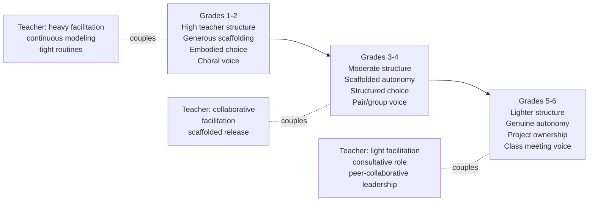

The diagram makes visible what the framework's central reciprocal-coupling claim implies in practice. A Grade 5 teacher who has not herself developed beyond Stage 1 (Survival) cannot enact the lighter-structure, consultative facilitation that Grade 5 children's developing agency requires; conversely, Grade 5 children who have not been progressively scaffolded through Grades 1–4 will not be ready for the autonomy that Stage-3 or Stage-4 teacher facilitation invites. Both progressions must move together; their coupling is the operational expression of the reciprocal architecture.

### 5.7.6 Decision guidance for novice teachers facing complex contexts

Real classrooms are rarely textbook cases. Novice teachers face mixed-ability classes, multi-grade contexts, classes of fifty or more, and circumstances where the children entering Grade 5 have had few of the scaffolded experiences of Grades 1–4. Three pieces of decision guidance address these complex contexts.

**Guidance 1: Calibrate to the class, not to the calendar.** A Grade 5 class whose previous teachers have not scaffolded agency may, at the start of the year, function more like a Grade 3 class in agency capacity. The novice teacher's task is to read the class's actual readiness rather than to assume the calendar grade. Initial heavier scaffolding is not a failure; it is the developmentally appropriate response to where the class actually is. Over the year, scaffolding can be progressively withdrawn as readiness grows.

**Guidance 2: Differentiate within the class.** A class of fifty children inevitably contains a developmental range. Some Grade 4 children may be ready for Grade 5 routines; others may still benefit from Grade 3 scaffolding. The differentiation principles of Chapter 4 (content, process, product) apply directly: tiered tasks, choice-based pacing, multi-modal demonstration. Differentiation is more demanding for the teacher than uniform pacing, but it is what cultivates each child's agency at her actual developmental edge.

**Guidance 3: When in doubt, scaffold more, then withdraw.** The cost of scaffolding too generously is that some children would have managed with less support; the cost of scaffolding too sparsely is that some children fail and learn that they cannot. The asymmetry favors generous initial scaffolding and progressive withdrawal. A novice teacher who errs on the generous side can adjust toward less; a novice teacher who errs on the sparse side often loses children whose trust is hard to rebuild.

### 5.7.7 Closing the chapter: the human layer as the framework's center of gravity

This chapter has moved through the human layer of HEFEE: the teacher's role transformation (5.1), her dispositions and competencies (5.2), the trusting relationships she builds (5.3), the developmental pathway by which novices grow into the role (5.4), the agency she cultivates in young learners (5.5), the metacognitive engine of that agency (5.6), and the grade-by-grade calibration of the whole architecture (5.7). The structural claim that holds these sections together is the reciprocal coupling diagrammed in Chapter 3 and elaborated repeatedly here: student empowerment is structurally impossible without teacher empowerment, and both require the ecosystem-level support that Chapter 6 will examine.

The chapter has therefore not added a new pedagogy to the wall built in Chapter 4; it has insisted that walls do not, by themselves, empower anyone. The basement metaphor that opened Chapter 2 reaches its most consequential elaboration here: a building's foundations and walls can be perfectly engineered, but if no one is at home in it—if the teacher is not at home in her professional identity, if the children are not at home in their developing agency—then the building serves no one. The human layer is not the framework's decoration; it is the framework's center of gravity, and the rest of the architecture stands or falls with it.

Two threads carry forward from this chapter into the next. First, the assessment systems Chapter 6 will design must measure not only language proficiency but the multidimensional growth this chapter has named—voice, choice, ownership, self-regulation, metacognitive capacity, willingness to communicate, growth-mindset language use. Conventional summative tests are structurally incapable of capturing these; the multidimensional rubrics and portfolio-based approaches of Chapter 6 will be calibrated to them. Second, the technology and ecosystem dimensions Chapter 6 will examine must serve the human layer rather than substitute for it. AI-powered tools, digital platforms, and community partnerships are powerful; they are also liable to displace the relational, embodied, and developmental work that this chapter has shown to be irreducible. The next chapter's task is to specify how the human and the technological-ecosystem layers are integrated such that the latter amplifies rather than replaces the former.

For a novice teacher who has read this chapter, the practical takeaway can be stated in a single sentence the rubric would endorse: **become the kind of teacher whose presence in the classroom makes the children's emerging agency safe, while you yourself remain a visibly learning agent**. The rest is operational detail. The chapter that follows will help install the measuring instruments and life-support systems; the chapter after that will hand over the keys, the maintenance manual, and the phone number to call. But the building, finally, is for human beings—learners and teachers becoming themselves through English—and this chapter has tried to keep that in clear view.

# 6 Holistic Assessment, Technology Integration, and Supportive Ecosystems

Chapter 5 closed with a compact instruction to the novice teacher: become the kind of teacher whose presence makes children's emerging agency safe, while remaining a visibly learning agent yourself. The instruction is, deliberately, irreducible to technique. Yet a paradigm cannot live by relational warmth alone, however indispensable that warmth has now been shown to be. A teacher who has built trusting relationships, cultivated structured agency, and modeled lifelong learning will eventually be asked—by parents, by school leaders, by herself—how she *knows* the children are growing across the five HEFEE dimensions, by what *tools* her practice is amplified or undermined, and from what *ecosystem* her classroom-level enactment draws sustenance. To these three questions—how do we measure, how do we tool, how do we sustain—this chapter is addressed.

The chapter holds together three commitments that the rest of the report has insisted are inseparable. First, the **measurement instruments** must be calibrated to what the framework actually values, not to what conventional tests can capture; Black and Wiliam's foundational claim that "improved formative or classroom assessment practices helped low achievers more than other students" warrants the structural shift from summative testing to multidimensional formative evaluation[^47][^48]. Second, **technology** is a paradigm-amplifier rather than a paradigm-substitute: an AI tutor deployed within a banking-model classroom intensifies that model, while the same tutor deployed within a holistic-empowerment classroom can amplify learner agency and free teacher time for relational work. Third, the **ecosystem**—classroom climate, school leadership, family partnership, community resources—is the life-support system without which classroom-level empowerment subsides into exhortation.

The chapter is structured to follow these commitments in sequence. Sections 6.1 through 6.3 develop the assessment architecture. Sections 6.4 and 6.5 address technology integration as opportunity and as risk. Sections 6.6 and 6.7 address the ecosystem layers from classroom climate and school leadership outward to family and community. Section 6.8 synthesizes the architecture and prepares the operational toolkit Chapter 7 will hand over.

A working principle should be stated at the outset, echoing the integrative spirit of Chapter 4. None of the components introduced in this chapter is, by itself, the holistic empowerment paradigm. A teacher who adopts portfolio assessment in an otherwise grammar-translation classroom has substituted one measurement instrument for another within an unchanged paradigm; a teacher who installs AI speech-recognition without changing how children's affective and social development is supported has digitized a pedagogy she has not transformed; a school that runs PLCs without protecting teacher autonomy has performed professional development without enabling its enactment. The components become *paradigm-aligned* only when they are deployed in concert under the five guiding principles of Chapter 3 (Integration, Agency, Meaning, Relationship, Reflection) and continuously calibrated through reflective cycles.

## 6.1 Reconceiving Assessment: From Score-Driven Measurement to Multidimensional Holistic Evaluation

### 6.1.1 The diagnostic case for paradigm-level assessment change

The opening chapter of this report documented a pattern that the assessment literature, from a different angle, has documented for decades: the dominance of standardized summative testing has not produced the foundational learning outcomes its proponents promised. The 2025 *Education Policy Outlook* observes that "foundational skills such as numeracy and literacy are declining in many OECD countries," a trend the OECD itself argues "underscores the need for systemic change" rather than incremental tuning of existing models[^3]. *Education at a Glance 2022* notes that "almost all OECD countries implemented standardised assessments to quantify learning losses at various levels of education" during the pandemic recovery[^4]. The pattern is sobering: even where measurement intensified, learning declined. The diagnostic implication is direct—a paradigm whose primary instruments produce decline cannot be redeemed by sharpening those same instruments.

Within the elementary EFL field specifically, parallel evidence accumulates. The EF English Proficiency Index, drawing on test results from 2.2 million adults across 123 countries and regions in its 2025 edition, ranks the Netherlands first (proficiency score 624) and notes its own structural caution that aggregate scores "are not necessarily aligned with academic and economic objectives set by each country"[^2]. The cautionary observation is candid: even the world's largest English proficiency benchmark warns against treating its scores as definitive judgments of educational success. A subsequent EFL-specific analysis citing EF EPI 2024 data on 116 countries reaches the same structural conclusion: rankings illuminate comparative position without specifying what pedagogies produced the position[^2].

The Pierce review of performance-based assessment for English Language Learners, drawing on Black and Wiliam's foundational meta-analysis of over 250 articles, articulates the structural finding directly: "research has shown that improved assessment practices at the classroom level can have powerful, beneficial effects on transfer of learning and measures of achievement, including standardized test scores," with "improved formative or classroom assessment practices helped low achievers more than other students"[^48][^47]. The empirical case is unusual in educational research for its directness: classroom-level formative assessment improves outcomes including the standardized scores high-stakes systems prize, *and* it does so most powerfully for the very learners those systems most often fail.

For elementary EFL specifically, the diagnostic case is sharpened by an additional consideration. As Pierce observes, "for ELLs in U.S. public schools, standardized test results are also likely to reflect limited proficiency in English and a lack of opportunity to learn the subject matter of the tests"[^48][^49]. The concern transfers directly to elementary EFL contexts internationally: a six-year-old whose three months of English instruction are tested against a standardized vocabulary list is being assessed less for what she knows than for the gap between her current proficiency and an externally fixed threshold. The pedagogical paradigm matters for assessment validity, not only for assessment philosophy.

### 6.1.2 The theoretical frame: assessment as a vehicle *for* learning

The structural shift the framework requires can be stated with precision: from assessment *of* learning to assessment *for* learning, and—at the multidimensional reach HEFEE demands—to assessment *as* learning. The Pierce articulation captures the distinction: "assessment and learning are intimately linked"; classroom-based assessment, when well-designed, "can help teachers redirect instruction to promote learning"[^48]. Stiggins' formulation is more pointed: standardized testing serves accountability purposes, but "we need other forms of assessment to inform instructional decisions made on a day-to-day basis, diagnose students' strengths and weaknesses related to classroom instruction, and provide specific feedback to students that supports their learning"[^48].

Pierce's review further specifies four functions classroom-based assessment can perform that summative testing structurally cannot. It can "provide comprehensible input to students" through hands-on, naturalistic, context-embedded tasks; it can "show what students know and can do through a variety of assessment evidence"; it can "provide feedback to students on language and content area learning"; and it can "generate descriptive information that can guide instruction"[^48]. The four functions are simultaneously cognitive, pedagogical, affective, and social. The list maps almost directly onto HEFEE's five dimensions, suggesting that the framework's multidimensional ambition is not in tension with assessment best practice but is in fact what assessment best practice has long pointed toward.

A particularly consequential implication of this theoretical frame is that **assessment becomes itself a site of empowerment**, not merely an instrument applied to empowerment. Pierce observes that "self-assessment also plays a role in motivating learners to continue learning and building self-confidence in their ability to learn"; "students who can learn independently of the teacher and become lifelong learners" are the developmental aim, and assessment that includes self-assessment is the principal vehicle through which this independence is cultivated[^48].

### 6.1.3 Schooling's three goals and the role assessment plays in each

A productive frame comes from Amrein and Berliner's analysis, cited by Pierce, of schooling's three distinct goals. **Education** "can be defined as the 'transfer of learning, that is the application of what is learned in one domain or context to that of another domain or context'"; it is "the broadest and the hardest to measure, with generalizability or transfer of learning to new situations and tasks being a central characteristic"[^48]. **Training** is "a narrow form of learning, where transfer of learning is measured on tasks that are highly similar to those used in the training"; examples include "naming the presidents or using a map key"[^48]. **Learning** "is the process through which students apply knowledge beyond basic facts and procedures"; examples include "writing descriptive paragraphs and engaging in demonstrations, analyses, and justifications"[^48].

Summative tests are well-calibrated to *training* outcomes—name the past tense of irregular verbs, fill in the blank with the correct preposition. They are progressively less well-calibrated to *learning* outcomes (apply knowledge in unrehearsed contexts) and structurally incapable of capturing *education* outcomes (transfer of communicative, cognitive, and ethical capacity to genuinely novel situations). Marzano, Pickering, and McTighe articulate the ultimate aim: "Although acquiring content knowledge is important, it is perhaps not the most important goal of education. Ultimately, developing mental habits that will enable individuals to learn on their own whatever they want or need to know at any point in their lives is probably the most important goal of education"[^48]. Gardner's parallel formulation locates the same priority: the mental habits that develop "should help students develop the skills and abilities needed for life-long learning and for success in life, such as the ability to think and analyze; locate information; work collaboratively on teams; become problem solvers; and perform real-world tasks"[^48].

For elementary EFL, the implication is that **assessment must capture the multidimensional mental habits that constitute lifelong language-learner identity**, not only the linguistic facts that are the easiest to measure. A child who can recite the days of the week but cannot use them in a real conversation has been trained but not educated; a child who can use a small set of communicative chunks confidently and continues to add to them through curiosity has begun to be educated.

### 6.1.4 The chapter's organizing claim: assessing across the 5 × 3 grid

The chapter's organizing claim can be stated as follows: **HEFEE-aligned assessment must capture growth across all five developmental dimensions at all three empowerment levels, through formative, multimodal, and learner-engaging instruments calibrated to elementary developmental capacity and to realistic classroom constraints.**

The claim has four operational corollaries.

**Corollary 1: No single instrument can carry the full assessment load.** A multidimensional, multilevel framework requires a multi-instrument architecture: performance tasks, portfolios, observation rubrics, self-assessment, peer assessment, and brief formative checks together produce the evidence base.

**Corollary 2: The visible-criteria principle is structural, not optional.** Pierce's emphasis is direct: "a fundamental tenet of performance-based assessment is the sharing of standards and making the criteria for evaluation visible to students. Teachers share their expectations for student work and performance in as explicit terms as possible, using a manageable set of criteria, often referred to as a rubric, and they often share samples of student work. This approach is especially important with ELLs"[^48].

**Corollary 3: Self-assessment is essential, not supplementary.** Pierce frames it as the engine of learner independence: "the goal of self-assessment is to produce students who can learn independently of the teacher and become lifelong learners. To accomplish this, teachers need to provide students with specific feedback, opportunities to give and receive feedback from peers, and time to set learning goals"[^48].

**Corollary 4: Calibration to ELL/EFL realities is non-negotiable.** Pierce specifies that performance-based assessments suited to ELLs must "provide comprehensible input," "use meaningful, naturalistic, context-embedded tasks through hands-on or collaborative activities," "support the language and cognitive needs of ELLs," and "allow for flexibility in meeting the needs of these students"[^48].

## 6.2 Formative Assessment, Performance Tasks, and Multidimensional Rubrics

### 6.2.1 Classroom-feasible formative assessment routines

The empirical claim that formative assessment improves learning has been repeatedly substantiated across language-learning contexts[^47][^49][^48]. Yet the gap between knowing this and enacting it is wide; many novice teachers, asked what formative assessment looks like, describe a quiz given before the unit test rather than the daily, low-stakes, instruction-shaping practices the literature actually describes. Seven classroom-feasible formative routines, each fitting within a forty-minute lesson and requiring minimal materials, can be specified.

**Routine 1: Brief check-ins as opening and closing rituals.** A one-minute opening check-in ("How do you feel today—happy, tired, excited, calm, sad?") gathers affective-dimension data; a one-minute closing check-in ("Name one new word you learned today; one thing that was hard") gathers cognitive and metacognitive data.

**Routine 2: Exit tickets.** A small piece of paper distributed in the lesson's last three minutes, with one or two questions a child answers individually before leaving. For Lower Primary, the question can be picture-based or single-word; for Upper Primary, more elaborate.

**Routine 3: Think-alouds.** The teacher models metacognitive monitoring; children, with scaffolding, learn to do the same with partners. The think-aloud is simultaneously instructional and assessment-rich.

**Routine 4: Low-stakes oral and written probes.** A thirty-second pair conversation, a one-minute drawing-with-label task, a two-sentence self-rating; each generates evidence of communicative use under low pressure. Pierce's reminder that "well-constructed performance tasks are more likely than traditional types of assessment to do the following: provide comprehensible input to students [and] use meaningful, naturalistic context-embedded tasks" applies even to brief probes[^48].

**Routine 5: Observation walks.** During pair or group work, the teacher circulates with a clipboard noting one or two children per minute on a focused indicator. Across a week, every child is observed at least three times.

**Routine 6: Peer signaling.** Children indicate understanding via thumb-up/side/down or traffic-light cards during instruction. The signal is collective, low-stakes, and immediate.

**Routine 7: Conferring with individual children.** A two-minute one-on-one conversation, conducted while others are working on a task, in which the teacher asks open questions and listens.

A novice teacher's minimum viable formative-assessment practice can begin with two routines (opening check-in and exit ticket) sustained consistently for a term, expanding to four or five over the year. Consistency matters more than breadth.

### 6.2.2 Performance tasks: products, performances, and processes

Performance-based assessment, as Pierce specifies, "uses a constructed-response format" and "has as its primary purpose the improvement of learning. Performance-based assessment links assessment to instruction through the use of meaningful and engaging tasks"[^48]. Three task types organize the repertoire: *products* (writing samples, projects, art or photo exhibits, portfolios), *performances* (oral reports, skits, role-plays, demonstrations, debates), and *process-oriented assessments* (think-alouds, self-assessment checklists, learning logs, individual or pair conferences)[^48].

The table below operationalizes each task type for elementary EFL across grade bands.

| Task type | Lower Primary (G1–3) example | Upper Primary (G4–6) example | HEFEE dimensions emphasized |
|---|---|---|---|
| **Products: writing samples** | Labelled drawing of family with one sentence per member | Five-sentence paragraph on "My Family Recipe" with revisions | Cognitive, Affective, Ethical-spiritual |
| **Products: projects** | Class-book page contributed by each child | Multi-week environmental poster project | Cognitive, Social, Physical-aesthetic, Ethical-spiritual |
| **Products: portfolios** | Stickers + drawings + dictated sentences across a term | Self-curated portfolio with reflections | All five dimensions across time |
| **Performances: oral reports** | Choral retelling of a familiar story | Group presentation of project findings | Cognitive, Social, Affective |
| **Performances: drama / role-play** | TPR-based enactment of *The Very Hungry Caterpillar* | Role-play of "shopping at the market" | Physical-aesthetic, Social, Affective, Cognitive |
| **Performances: demonstrations** | Showing how to brush teeth in English (TPR) | Demonstrating a science concept in scaffolded English | Cognitive, Physical-aesthetic |
| **Process: think-alouds** | Choral think-aloud led by teacher | Pair think-aloud during writing | Cognitive (metacognition) |
| **Process: self-assessment checklists** | Sticker chart for completed routines | Rubric-based self-rating with brief reflection | Cognitive (metacognition), Affective |
| **Process: learning logs** | Drawn record of "today I…" | Brief reflective journal entry | Cognitive (metacognition), Ethical-spiritual |
| **Process: conferences** | Two-minute one-on-one with picture-pointing | Five-minute one-on-one with planning conversation | Affective, Social, Cognitive |

Performance tasks have a distinctive property: **a single task often addresses multiple HEFEE dimensions simultaneously**. A drama enactment is, at once, a vocabulary assessment (cognitive), an embodied engagement (physical-aesthetic), a peer-collaborative exercise (social), and a willingness-to-perform indicator (affective). The multidimensionality is structural to the task type, not an add-on.

A complementary line of evidence on performance-based pedagogies for young learners reinforces the assessment payoff. Performance-based learning "allows students to be creative when acquiring, developing, and demonstrating their language skills by giving them a task that they can make their own"; while traditional tests answer the question "Does the student know it?", performance-based assessments allow teachers to "look at how well the student can *use* what they know"[^50]. Puppets, monologues, dramatic enactments, "poetry writing, riddles, jokes, storytelling, and songs are all dynamic ways of assessing your students' English skills"[^50]. The pedagogical-assessment integration is precisely the integration the framework requires: assessment becomes embedded in instruction rather than appended to it.

A second distinctive property is *authenticity*. Pierce specifies that "authentic assessment, a type of PBA, promotes application of knowledge and skills in situations that closely resemble those of the real world"; "authentic assessments are potentially more motivating than other types because they engage students in realistic uses of language and content-area concepts"[^48].

### 6.2.3 The two structural features of performance-based assessment

Pierce identifies two structural features that distinguish performance-based assessment from looser variants: **visible criteria** and **self-assessment**[^48]. Both deserve explicit attention because both are routinely under-implemented.

**Visible criteria.** Pierce's articulation: criteria must be specified, and they must be visible *to children, in language children understand*. "When teachers state expectations for learning in terms of specific outcomes—in language the students can understand—and show them examples of excellent work, the likelihood of students attaining the criteria is greatly increased"[^48]. A rubric written in academic prose for the teacher's own use does not satisfy the principle; a rubric that says *"I used three new words"* and *"I tried to speak in English"* does, even if the teacher's analytic version contains more sophisticated indicators behind the child-facing version.

**Self-assessment.** As Pierce articulates, the goal "is to produce students who can learn independently of the teacher and become lifelong learners"; this requires "specific feedback, opportunities to give and receive feedback from peers, and time to set learning goals"[^48]. The Chapter 5 metacognitive architecture is the developmental substrate.

### 6.2.4 Multidimensional rubric architecture and templates

A rubric translates the framework's commitments into observable, language-specific criteria. The rubric must be multidimensional, age-graded, and visible. The templates below illustrate the architecture for three common task types.

**Template A: Multidimensional rubric for storytelling retelling (Grade 2–3).**

| Dimension | Emerging | Beginning | Developing | Expanding |
|---|---|---|---|---|
| Cognitive: vocabulary use | Used 0–2 target words | Used 3–4 target words | Used 5–6 target words; some accuracy | Used 7+ target words; mostly accurate |
| Cognitive: story structure | Named one event | Named beginning and end | Named beginning, middle, end | Connected events with sequencing language |
| Affective: willingness | Listened only | Joined chorus | Spoke a sentence with prompting | Spoke independently, attempted new language |
| Social: peer participation | Did not engage with partner | Took turns minimally | Took turns and listened | Took turns, listened, helped partner |
| Physical-aesthetic: gesture/voice | No gesture | Used taught gestures | Added own gesture | Used voice modulation and expressive gesture |

The four-stage gradient deliberately mirrors the British Columbia coding used in the Malaysian rural primary portfolio research[^51], which tracked young learners' writing development across the same four bands. The gradient is age-appropriate, growth-oriented, and avoids the deficit framing of "fail/pass."

**Template B: Multidimensional rubric for project-based unit, Upper Primary (Grade 5).**

| Dimension | 1 (Emerging) | 2 (Beginning) | 3 (Developing) | 4 (Expanding) |
|---|---|---|---|---|
| Cognitive: language use | Limited target structures; many errors | Some target structures used | Target structures used with some accuracy | Target structures used accurately and flexibly |
| Cognitive: content depth | Surface listing | Description with some detail | Description + simple analysis | Analysis + recommendation |
| Affective: ownership | Followed instructions only | Made small choices | Made meaningful choices | Took clear authorship |
| Social: collaboration | Did not collaborate | Took role with prompting | Took role; contributed to group | Took role; supported others' contributions |
| Physical-aesthetic: product quality | Minimal effort visible | Basic care for product | Clear care; some creativity | Strong care; distinctive creativity |
| Ethical-spiritual: values engagement | Did not engage with value content | Recognized value content | Articulated a personal stance | Articulated stance and considered other views |

**Template C: Pair-work participation observation rubric (any grade).**

| Indicator | Emerging | Beginning | Developing | Expanding |
|---|---|---|---|---|
| Target language use in pair | None or very brief | Some target use, mostly L1 | Mostly target language with L1 fallback | Sustained target language use |
| Listening to partner | Did not listen | Listened with prompting | Listened consistently | Listened and responded |
| Communicative repair | No repair attempted | Used L1 to repair | Repeated or rephrased in target | Repaired through scaffolded strategies |
| Affective stance | Disengaged | Cautious | Engaged | Confident and supportive |

For each template, the *child-facing version* uses simpler language: the Grade 2–3 storytelling rubric, in child-facing form, becomes a five-row chart with smiley-face indicators and one-sentence descriptors children can read aloud.

### 6.2.5 Calibrating rubrics to ELL/EFL realities

Pierce's guidance on calibrating performance-based assessment to ELLs has direct implications[^48]. Three calibration moves deserve naming.

**Calibration 1: Separate language-form criteria from communicative-success criteria.** A child who delivers her message clearly with grammatical errors should not be assessed as "emerging" on communication; she should be assessed as "developing" on communication and "beginning" on accuracy. Conflating the two punishes communicative bravery and trains children toward accuracy-protective silence.

**Calibration 2: Allow multiple modes of demonstration.** A child whose speaking is still developing may demonstrate cognitive understanding through drawing, gesture, or scaffolded writing.

**Calibration 3: Rubric language must be in the child's reach.** A Grade 2 rubric that uses *coherence* or *fluency* communicates only to the teacher; one that uses *"I told the story from beginning to end"* communicates to the child.

### 6.2.6 The visible-criteria pitfall and the integration check

The most common novice-teacher pitfall is to treat the rubric as a grading instrument the teacher uses *after* the work, rather than as a learning instrument shared *before and during* the work. The corrective is procedural: the rubric is introduced at the unit's start; sample work at each level is shown[^48]; children self-assess against it during the work; the teacher's evaluation at the unit's end is the formal application of criteria the children have already internalized.

A second integration check is to ask of any rubric: *does this rubric's set of criteria, taken together, address at least three of the five HEFEE dimensions?* A rubric that addresses only cognitive accuracy has reverted to the dominant paradigm; a rubric that addresses affective, social, and physical-aesthetic dimensions alongside cognitive dimensions has integrated.

## 6.3 Portfolios, Peer and Self-Assessment, and Documenting Affective-Social Growth

### 6.3.1 Why portfolios are uniquely suited to multidimensional documentation

Among assessment instruments, the portfolio is uniquely suited to documenting growth across multiple dimensions over time. Where a single performance task captures a moment, a portfolio captures a developmental arc.

Collins's foundational definition, cited in the Malaysian rural primary research, captures the portfolio's evidentiary character: a portfolio is "a container of collected evidence with a purpose," where the evidence consists of documents that can be used "to infer another person's knowledge, skill, and/or disposition"[^51]. McMillan emphasizes that portfolios "have significant advantages over conventional approaches to assessment pertaining to collecting of and evaluating students' work"[^51]. Popham frames the philosophical reorientation: "Assessment should be a part of instruction, not apart from it"[^51]. Stiggins highlights the developmental engine: "reflection from the students' part is significant in making the portfolio a meaningful one," and offers a reflective question children can return to throughout: "What do I think is very special about my work and why?"[^51].

The empirical case for portfolios in primary EFL writing assessment is illustrated, with appropriate caveats, by the Malaysian rural primary study of eleven Year 4 children in Sabah[^51]. The study coded children's portfolio-tracked development across four bands derived from British Columbia's framework: *emerging*, *beginning*, *developing*, and *expanding*. Outcomes were: three children expanding (Ema, Man, Rafi), two developing (Asran, Haziz), four beginning (Ros, Arif, Lily, Nita), and two emerging (Steve, Fida)[^51]. The "expanding" children "showed tremendous improvement in their writing skills… constantly improved on their mechanics of writing because all their draft work helped them to make every piece of their writing a better one every time," and "became more confident in writing"[^51]. The participants' own voices document the affective-cognitive coupling: *"There is improvement in my writing. My writing becomes neater and my paragraphing is better. Now, I think my writing is better because I keep all my exercises from class work in the portfolio and I will refer to it before I start with my new exercise"*; *"Portfolio really helps me in writing. If I don't have portfolio, I may have lost all the photocopied exercises and I will never know how to write sentences"*[^51].

The honest caveats matter. The study's sample is eleven children; the duration is a single observation cycle; the "emerging" outcome for two children is attributed to attendance rather than to portfolio-method failure, but the study's design does not let us cleanly separate these. The directional finding—that portfolio assessment supports stage-by-stage improvement and that the method "is beneficial and effective in helping them to write in the English language classroom"[^51]—aligns with the broader portfolio-assessment literature on EFL writing[^52][^50]. Hatcher and Goddard noted that "if students follow closely to the writing format given by the teacher, their writing will eventually improve and it will make them more confident to enjoy their work"[^51]. Baack and Melville noted that portfolios "allow the teachers to track progress, view individual growth, and foster student reflection in a less stressful way"[^51]; Ocak and Ulu documented that "by using portfolio, parents agree that their children's progress is clearly evident"[^51].

A complementary line of empirical evidence frames the cognitive architecture portfolio assessment supports. Portfolio-based writing assessment research with EFL students at higher levels found that PBA "influences EFL students' deep and meaningful conceptions of writing by way of supporting their independent and out-of-class" engagement[^52]; experimental studies with pre-intermediate EFL learners reported that portfolio-based writing assessment improved writing performance compared with traditional testing alone[^50].

### 6.3.2 Portfolio architecture for elementary EFL

A workable elementary EFL portfolio has four architectural components: *purpose*, *contents*, *reflection*, and *audience*.

**Purpose.** For elementary EFL, three coexisting purposes are typical: to *show what I can do* (proficiency evidence), to *show how I have grown* (developmental evidence), and to *help me see my own learning* (metacognitive evidence).

**Contents.** Portfolio contents are curated, not accumulated. A workable selection rule for Lower Primary is "every child contributes one piece per unit, chosen by the child with teacher guidance"; for Upper Primary, "every child contributes two pieces per unit, one chosen by the child, one chosen by the teacher, both with brief explanation."

**Reflection.** Stiggins's reflective question—*"What do I think is very special about my work and why?"*[^51]—is one productive prompt; others include *"What did I learn from doing this?"*, *"What was hard? What did I do when it was hard?"*, *"How is this different from my work three months ago?"*, and *"What do I want to learn next?"*

**Audience.** Quarterly student-led conferences in which the child shares her portfolio with a parent, with the teacher, or with a small group of peers transform the portfolio from passive archive into active claim-making. Pierce's observation that "process-oriented assessments provide insight into student thinking, reasoning, and motivation"[^48] is realized when children narrate their own portfolios.

| Component | Lower Primary (G1–3) | Upper Primary (G4–6) |
|---|---|---|
| Frequency of contribution | One artifact per unit | Two artifacts per unit |
| Selection authority | Teacher-guided child choice | Negotiated child-teacher choice |
| Mode of artifact | Drawings, dictated sentences, photos, simple worksheets | Writing samples, project artifacts, recorded oral samples, drafts with revisions |
| Reflection mode | Pictorial or dictated | Written briefly, with optional L1 support |
| Audience event | Termly parent visit; informal teacher review | Quarterly student-led conference; mid-year showcase |
| Storage | Class folder per child; photo backup if available | Personal portfolio binder or digital folder |

### 6.3.3 Peer and self-assessment as cultivators of evaluative agency

Peer- and self-assessment research in primary school English has emphasized that "the peer- and self-assessment practices require the pupils to be trained in understanding their own abilities in a pupil-centred classroom"[^48]; the training is not optional but constitutive.

For elementary EFL, age-graded scaffolding of evaluative capacity proceeds along the gradient Chapter 5 specified for metacognitive development.

**Lower Primary (G1–3)**: Self-assessment uses simple binary or three-point scales with picture support. Peer assessment is restricted to peer-appreciation rather than peer-evaluation: *"I liked it when my partner…"*. The cognitive demand of comparative judgment is largely beyond developmental reach at this stage.

**Middle elementary (G3–4)**: Self-assessment moves to short rubric-aligned ratings. A child can mark herself on the storytelling rubric's "vocabulary" row using the four-stage gradient with brief justification. Peer assessment can include focused observation against a single criterion.

**Upper Primary (G5–6)**: Self-assessment expands to multi-criterion rubrics with reflective writing. Peer assessment includes pair feedback exchanges using sentence frames (*"One thing you did well was… One thing you might try is…"*).

A critical caveat applies across the gradient: peer assessment can damage relationships if mishandled, particularly in classrooms where the affective climate of Section 5.3 has not been established. The corrective is structural: peer assessment is always paired with a positive frame, always uses scaffolded language, always operates against criteria the children have themselves understood, and is monitored by the teacher.

### 6.3.4 Documenting affective and social growth

A particular challenge of multidimensional assessment is the documentation of affective and social growth, which conventional testing structurally cannot capture. Four instruments help.

**Willingness-to-communicate logs.** A simple log the teacher maintains for each child, marking each lesson with a single indicator: did this child speak in English voluntarily today (yes / with prompting / no)? Across a term, the log produces a willingness-trend line that diagnoses whether the silence spiral is reversing or deepening for each individual child.

**Participation observation rubrics.** The pair-work observation rubric of Section 6.2.4 functions across multiple lessons as a participation-tracker. Three observations per child per term, on different dates, against the same indicators, produces a developmental record.

**Identity and values reflection journals.** A periodic reflective prompt addressed to the ethical-spiritual dimension: *"What is one thing about your family / your culture / your favorite place that you would tell a friend in another country?"* The journal entries are not graded for accuracy; they are read as documentation of identity expression in English.

**Growth-over-time portfolios.** The portfolio architecture is itself a growth-documentation instrument. The first piece in a child's writing folder, placed beside the most recent piece, makes growth visible to the child, the parent, and the teacher in a way no test score does.

### 6.3.5 Comparative analysis: traditional summative testing vs. portfolio-based holistic assessment

| Comparison criterion | Traditional summative testing | Portfolio-based holistic assessment |
|---|---|---|
| **Cost (teacher time)** | Concentrated at end of unit; grading-intensive | Distributed across unit; less grading-intensive but more curation-intensive |
| **Cost (cognitive load on children)** | High face-threat moment; anxiety-inducing | Distributed lower-stakes engagement |
| **Evidence breadth** | Narrow; typically cognitive accuracy | Broad; addresses all five HEFEE dimensions |
| **Evidence depth** | Snapshot of one moment | Developmental arc across time |
| **Cultural and linguistic fit** | Often misaligned with ELL/EFL realities[^48] | Permits multimodal, multilingual demonstration |
| **Learner agency** | Minimal; child is object of measurement | Substantial; child is co-author of evidence |
| **Teacher professional agency** | Constrained by external test design | Supported through teacher-curated criteria |
| **Family communication value** | Score-based; often opaque to children | Artifact-based; concrete and shareable |
| **Ecosystem fit (HEFEE)** | Misaligned with multidimensional framework | Aligned across dimensions and levels |
| **Accountability function** | High; designed for system reporting | Lower; supplementary to accountability needs |
| **Validity for low-achievers** | Often confounded by language-proficiency gap | More inclusive of multimodal demonstration |
| **Validity for higher-order thinking** | Limited; constrained to test format | Captures projects, performances, processes |

The two instruments have distinct, partially complementary roles. Summative testing retains a legitimate function in system-level accountability; portfolio-based holistic assessment is the principal vehicle for measuring education and learning outcomes in Amrein and Berliner's typology. The pragmatic recommendation is that both instruments coexist with role-clarity.

### 6.3.6 The teacher-development dimension: becoming assessment-literate

Pierce observes candidly that "the vast majority of teachers report that they feel unprepared to assess and teach ELLs"; "only about a dozen states require teacher candidates to show competence in assessment in order to get a teaching license, and the majority of teacher preparation programs fail to provide instruction in developing assessments that support student learning… little has changed in classroom-based assessment for at least the past 50 years"[^48]. The structural gap she identifies persists across many systems.

Pierce's recommendation is that "teachers must be provided with the assessment tools they need" through "long-term, collaborative" professional development that "helps teachers try out their assessments and get feedback from colleagues, program administrators, and university faculty experienced in using assessments for learning. School study teams and assessment focus groups can lead assessment changes in each school system. Teachers need to find their voices and become active in shaping their own professional development in order to improve learning for ELLs"[^48]. The novice teacher need not become an assessment expert in Year 1; she must, however, frame assessment literacy as part of her developmental trajectory.

## 6.4 Digital Tools, AI-Powered Platforms, and Pedagogical Integration

### 6.4.1 The framing question: amplification or substitution?

The framing question this chapter takes is direct: **does a given tool, in a given deployment, *amplify* the pedagogical paradigm of the classroom, or *substitute* a different paradigm for it?** A tool that amplifies a banking-model classroom delivers more efficient banking; a tool deployed as a substitute for teacher relational warmth, scaffolded cooperative work, and embodied learning erodes precisely what HEFEE requires.

A second framing principle is that **the burden of paradigm coherence remains with teachers and ecosystems, not with the tools themselves**. AI tools deployed within score-driven systems will be used to optimize scores; the same tools deployed within a HEFEE-aligned ecosystem will be used differently.

### 6.4.2 AI teaching assistants for lesson planning and material differentiation

The first functional category is AI teaching assistants designed primarily to support teacher work. Khanmigo, the AI teaching assistant from Khan Academy, is among the most documented examples[^47][^51].

Khanmigo's stated functionality for teachers includes "differentiation, lesson plans, quiz questions, student groupings, hooks, exit tickets, rubrics, and more"; "Khanmigo generates these questions in minutes and can provide an answer key with explanations at the same time"[^47]. A high school English teacher's reported use—*"Khanmigo's Rubric Generator allowed me to incorporate our actual unit plans and objectives to construct a rubric from scratch. A task that would normally take me about an hour was now completed in no more than 15 minutes"*[^47]—illustrates the time-saving function. Functions explicitly named include "standards-aligned, differentiated lesson planning tied to our content library," "an on-demand summary of student work to assess progress and identify areas for support," "learning objectives, rubrics, and even exit tickets," and translation support for "multilingual family emails to grading rubrics to in-class activities and problem sets with correct answers"[^47]. Khan Academy reports that "6+ million teachers globally have turned to Khan Academy for our world-class teaching tools and content"[^47], a scale that itself illustrates the rapid penetration of AI teaching assistants into classroom practice.

For elementary EFL teachers, three classroom workflows operationalize the amplification potential.

**Workflow 1: AI-assisted differentiation drafting.** The teacher provides the AI with the unit's target language, grade level, and class profile. The AI generates a tiered task set; the teacher reviews, adapts, and selects. The AI's draft is a starting point, not a final product. The time saved is invested in classroom relational work that the AI cannot perform.

**Workflow 2: AI-assisted rubric drafting.** The teacher provides the AI with HEFEE dimensions she wants to address and the task type. The AI drafts a multidimensional rubric; the teacher revises to ensure language is age-appropriate and child-facing.

**Workflow 3: AI-assisted multilingual family communication.** The Khanmigo materials specifically name "multilingual family emails" as a use case, and a Class Newsletter activity is described by a former teacher: *"As a former high school science teacher, I always felt it was important to regularly discuss what was happening in my classroom with parents. The newsletter activity makes it so quick to construct a meaningful and effective communication to parents"*[^47].

The amplification logic of these workflows is consistent: the AI handles the *drafting* that would otherwise consume teacher time, freeing the teacher to perform the *judgment*, *relational*, and *paradigm-coherence* work that the AI cannot.

A particularly important structural feature of Khanmigo's design is that it is designed to guide rather than to give answers: "with limitless patience, it guides learners to find the answer themselves"; "Khanmigo challenges you to think critically and solve problems without giving you direct answers"[^47]. Khan Academy's own framing describes the change made to Khanmigo's prompts to "better align with a 'socratic tutor,' a tutoring approach that involves a dialogue between teacher and students"[^51]. The Socratic orientation, when accurately implemented, aligns with the framework's commitment to learner agency.

A school-level deployment example illustrates the institutional architecture. Newark Public Schools became "one of 53 school districts across the country to pilot the tool" and approved a data-sharing agreement with Khan Academy; the program "was launched last year in grades 5-8 and used in core content areas"[^51]. The institutional structure—formal data-sharing agreement, pilot phase, district-level oversight, partnership across "school leaders, teachers, families, and Khan Academy staff"[^47]—is the governance minimum that AI integration in elementary contexts requires.

### 6.4.3 Speech-recognition and pronunciation support: ELSA Speak and ASR-based tools

The second functional category is automatic speech-recognition (ASR) tools designed primarily for pronunciation practice and feedback. ELSA Speak, available across more than 100 countries with more than 13 million users, is a representative case[^50][^51][^50].

ELSA Speak's functional architecture includes: an initial diagnostic test through which "the AI coach can analyze students' speaking levels and suggest appropriate learning strategies"; instant feedback on "pronunciation, intonation, fluency, word stress, and listening in real-time" with "audio input, including phoneme level, word level, sentence level, and more"; gamified practice; and a teacher dashboard that allows tracking of "students' progress" and "total practice time"[^50]. Empirical research with university-level Indonesian EFL students reported that after teaching cycles, "the average scores obtained from the teaching cycles from two to four in grade" improved, and "ELSA Speak helped the students pronounce diverse words more easily and comprehensively"; the conclusion was that ELSA Speak "can improve the students' pronunciation skills well and effectively"[^51]. The Rice University pilot reported that "students increased their pronunciation score by 7% over their initial diagnostic score after only six weeks of using the ELSA app"[^50]. Mobile-assisted language learning research more broadly has documented that ELSA Speak provides "real-time" feedback to enhance pronunciation skills for EFL learners[^50].

The pedagogical case for ASR-based pronunciation tools rests on two observations. First, **classroom time is structurally insufficient for individualized pronunciation feedback**, especially in classes of fifty children. The Bridge analysis is direct: "with large-sized English classes, teachers hardly have enough time to work on students' pronunciation individually in class. Since the more you practice, the easier it gets, deficient exercise time leads to little or no progress in improving one's accent"[^50]. The same analysis identifies "excessive workload to design assessment tests and give feedback to each student" as a parallel constraint[^50]. Second, **public pronunciation practice carries face threat**; ASR-based tools allow children to practice in private and receive feedback without peer exposure.

The Bridge analysis adds that broader research has found that "in 2021, nearly 70% of English learners chose to practice English with the help of technology. Of those students, 96% found technology useful for their English learning process"[^50]. The numbers, while drawn from broader rather than elementary-specific populations, indicate the scale at which technology-mediated language practice has become a learner expectation.

For elementary EFL specifically, several deployment guidelines emerge.

**Guideline 1: ASR is supplementary, not substitute, for communicative practice.** A child who practices pronunciation accurately on ELSA but does not engage in genuine communicative tasks has cultivated an isolated technical skill.

**Guideline 2: Age-appropriate calibration is essential.** Most ELSA-research evidence is drawn from adolescent and adult learners; direct extrapolation to Grade 1 children would be inappropriate. For Lower Primary, pronunciation work is best done through songs, TPR, and chant routines; ASR tools may have a more substantial role in Upper Primary.

**Guideline 3: Equity calibration matters.** ASR tools require devices and connectivity that are not equitably distributed.

**Guideline 4: Feedback should support, not replace, the teacher's affective stance.**

A representative classroom workflow integrating ASR within a communicative unit might be: in a Grade 5 unit on *Festivals*, children practice target phrases in pair work during class. Between classes, children may use ASR-based practice individually for pronunciation refinement; the teacher's lesson opens the next day with pair practice that integrates the refined pronunciation with communicative use. The ASR's contribution is the fine-grained individual feedback that classroom time cannot provide; the classroom's contribution is the meaning-making, relational, and embodied work the ASR cannot provide.

### 6.4.4 Interactive media, gamified platforms, and virtual environments

The third functional category is broader: interactive media, gamified vocabulary platforms, and virtual classroom environments. The general pattern is similar.

A particularly important sub-case is the use of digital platforms to support social presence in online or hybrid classroom contexts. The conceptual analysis of online L2 classroom climate identifies "social presence" as essential: "the perceived gist of the online group and the predominance of intimacy and proximity experienced with peers or the teacher in a technologically rich communication context"[^53]. The same analysis specifies three suggestions for online L2 teachers: "to adequately train language teachers to efficiently use interactive online LMSs, applications, and Web 2.0 tools"; "to foster the collective responsibility concept among language teachers"; and "to welcome self-initiated communities of practice"[^53]. For elementary EFL specifically, the research notes that "the multimedia-laden L2 classroom climate has led to the development of an interactive course content and cooperative learning tasks to complete in several settings"; "L2 learners can use various applications and social media on their mobile device and share ideas and thoughts with other online learners through formal or informal chatting, and textual or audio-visual chats"[^53].

For novice teachers, three decision rules govern selection and adaptation.

**Decision rule 1: Does the tool's interaction structure require genuine communicative work, or does it accept rote pattern-matching?**

**Decision rule 2: Does the tool engage multiple HEFEE dimensions, or only the cognitive?**

**Decision rule 3: Does the tool support, complicate, or replace teacher-mediated relational work?**

### 6.4.5 A consolidated decision framework for novice teachers

| Question | What to look for | Red flag |
|---|---|---|
| **Q1: Pedagogical paradigm fit** | Does the tool's interaction model align with meaning-led sequencing, learner agency, and reflective practice? | Tool primarily delivers content for memorization |
| **Q2: HEFEE dimension coverage** | Does the tool engage at least two of the five dimensions, including at least one beyond cognitive? | Tool addresses only cognitive accuracy |
| **Q3: Augmentation vs. replacement** | Does the tool augment teacher relational work, or does it consume relational time? | Tool is marketed as a teacher substitute |
| **Q4: Age-appropriate calibration** | Is the tool designed for elementary developmental capacity? | Research evidence is exclusively from adult populations |
| **Q5: Equity and ethics** | Does the tool require resources distributed equitably across the class? | Tool requires expensive devices; data policies opaque |

## 6.5 Risks, Equity, and Ethical Governance of Educational Technology

### 6.5.1 Five risk domains

**Risk 1: Over-reliance and the displacement of relational, embodied, and reflective practice.** Reid, a researcher at Johns Hopkins Center for Research and Reform in Education, observes that AI products "could yield positive learning outcomes by providing personalized attention and learning to students, but does not believe tools such as Khanmigo could replace human instruction completely. He sees educators using new platforms to supplement classroom work but wouldn't be surprised if a teacher's role shifts as technology evolves"; the role shift Reid anticipates is a teacher becoming "more of a guide and a facilitator through these products"[^51]. The framework's commitment is that the role shift is intentional and paradigm-aligned, not unintentional drift.

**Risk 2: Data privacy and child protection.** Elementary learners are, by definition, under 18 and in many cases under 13. Khan Academy's own approach explicitly addresses this: "We are only offering access to learners who are under 18 years old when their parents give them access or when their school district is partnered with Khan Academy. This collaboration across school leaders, teachers, families, and Khan Academy staff makes it possible to provide the level of supervision and support children deserve. We believe these guidelines will help us responsibly adapt AI for an educational setting"[^47]. The Newark example illustrates the formal structure: "The Newark Board of Education in March approved a data-sharing agreement with Khan Academy to study whether the tool was effective"[^51].

**Risk 3: Equity and the digital divide.** The Newark example indicates the magnitudes involved: "The price for school districts to use Khanmigo starts at $35 per student for the school year. There are also discounts for schools and districts with a high number of students who qualify for free and reduced-price lunch"[^51]. Other districts have sought external funding: "Palm Beach County Schools in Florida is receiving up to $2 million from the Stiles-Nicholson Foundation for the use of the platform through June 2025"[^51]. The Bill & Melinda Gates Foundation's $12 million commitment to Khan Academy in 2020[^51] illustrates how large-scale technology adoption increasingly depends on philanthropic infrastructure—infrastructure that is not symmetrically available across systems. A classroom-level teacher cannot solve digital-divide inequities single-handedly; she can, however, refuse to base her core pedagogy on resources only some children can access.

**Risk 4: Cultural and linguistic bias in AI training data.** AI tools trained on predominantly English-language, Western-cultural, well-resourced data sources reflect those origins in their outputs. The teacher's mitigation is curatorial: select content, adapt examples, surface and discuss the cultural defaults the AI offers, and use AI tools as drafts subject to culturally responsive revision[^51].

**Risk 5: Accuracy errors and reduction of teacher professional agency.** Documented operational issues deserve explicit naming. The Newark coverage notes that "there have been errors in how Khanmigo solves basic math problems, which Kunz said they have since fixed. Teachers and students across pilot districts have also said the tool occasionally offers too much help and was too available, especially when students were taking assessments such as quizzes and course challenges"[^51]. Khan Academy itself has acknowledged that the tool is "still very much in the early days of AI"[^51] and modified its prompts in response to teacher feedback. Independent researchers warn that empirical evidence on efficacy remains thin: "research on the efficacy of tutoring programs such as Khanmigo in the classroom is needed as they gain popularity among school districts"; "schools have limited resources… they need to choose something that has the best shot of helping the most students"[^51]. A complementary caution: "the effectiveness of AI tools such as Khanmigo depends on their design and implementation and other factors such as teacher feedback, training, and understanding the social-emotional effect on students"[^51].

A complementary caution from the tutoring-evaluation field reinforces the point: school districts "need to think about different tutoring models and intervention strategies that provide critical support for mastering foundational skills"; AI tools may "be a useful tool to provide on-demand help with homework" but "could also supplement more robust intervention strategies during the school day"[^51]. The structural lesson is that AI tools are *one* element of a richer pedagogical and tutoring architecture, not its replacement.

### 6.5.2 Ethical governance principles

**Principle 1: Pedagogical paradigm precedes tool selection.**

**Principle 2: Augmentation over replacement.**

**Principle 3: Transparent governance with parental partnership.** The Khan Academy framing of "this collaboration across school leaders, teachers, families, and Khan Academy staff"[^47] is a structural minimum.

**Principle 4: Equity calibration as a core decision criterion.** No technology becomes load-bearing in the curriculum if its access is inequitable across the class.

**Principle 5: Cultural responsiveness as a design and curatorial commitment.**

**Principle 6: Teacher professional agency as the binding governance authority.**

### 6.5.3 The tool-evaluation rubric for novice teachers and school leaders

| Evaluation domain | Adopt | Adopt with caveats | Decline |
|---|---|---|---|
| **Paradigm fit** | Tool design aligns with meaning-led, agency-cultivating, dialogical pedagogy | Tool requires careful adaptation but can be made paradigm-compatible | Tool's interaction model is fundamentally banking-model |
| **Dimensional coverage** | Tool engages 3+ HEFEE dimensions including non-cognitive | Tool engages 2 dimensions | Tool addresses only cognitive accuracy |
| **Time economy** | Tool clearly augments teacher relational/reflective time | Tool's time impact is neutral | Tool consumes teacher time without augmentation |
| **Age calibration** | Designed and evidenced for elementary use | Adapted from adolescent/adult research | Extrapolated without adaptation |
| **Equity** | Accessible to all children in class | Accessible to most, with explicit accommodations | Inaccessible to a meaningful portion of the class |
| **Data ethics** | Transparent, parent-consented, minimal | Acceptable with active monitoring | Opaque or extractive |
| **Cultural fit** | Designed with cultural responsiveness | Requires curatorial adaptation | Reinforces monocultural defaults |
| **Evidence quality** | Multiple peer-reviewed studies in elementary EFL | Mixed evidence; promising direction | Marketing claims unsupported by research |

### 6.5.4 The structural reaffirmation: paradigm coherence is the human responsibility

Technology amplifies whatever pedagogical paradigm it is deployed within. **The burden of paradigm coherence remains with teachers and ecosystems, not with the tools themselves.**

A novice teacher in a Khanmigo-enabled district can, within her forty minutes, refuse to let the tool replace pair work, refuse to let dashboard data displace observation, refuse to let efficiency metrics override the affective check-in. She inherits the technology; she does not inherit the obligation to use it badly.

## 6.6 Classroom Climate and School-Level Ecosystem Support

### 6.6.1 The classroom climate substrate: positive, supportive, and dialogical

Qiu's conceptual review of positive classroom climate in L2 contexts defines it directly: "the classroom climate reflects students' assessment of their educational experience"; it is "the global atmosphere of a classroom which is constructed via different types of interactions in the classroom"[^53]. The climate is a "shared sense of the environment of the class by the students attending the class"[^53], and a positive climate is one "in which enjoyment, connectedness, and enthusiasm are incorporated in the classroom interactions"[^53].

The empirical case is strong. Findings reviewed by Qiu indicate that "a lasting positive classroom climate and the teacher-student emotional bond can improve learners' satisfaction, motivation, class participation, engagement in group tasks and activities, overall well-being, and reduce their anxiety and internal sense of fear"[^53]. The cognitive payoff is not separable from the affective: "when language teachers and students interact in a positive atmosphere, they can have better concentration, feel calmer, achieve better educational goals, and work to their best"[^53]. A separate study of elementary classroom climate found that "a positive and supportive classroom climate enhances students' academic performance, social skills, and emotional"[^47] development.

For elementary EFL specifically, Raghul and Saradha's analysis is direct: "learning English is facilitated if the language learner's interest is stimulated in class. Despite the presence of many stimulating sources for a language learner, the positive classroom climate itself is capable of motivating those students at a basic level of language proficiency to get actively involved in the process of language learning in class. A supportive classroom climate gives plenty of energy to students to collaboratively learn the language; it also poses a positive effect on them and allows them to feel adequately comfortable in class to share their thoughts and intentions of learning"[^53]. "A positive L2 class environment increases one's willingness to participate in classroom interactions, helps to develop a positive approach to learning, and can, thus, improve language learning outcomes"; "a friendly classroom climate" is "attractive to L2 learners and helpful for them to develop their confidence to get socially active in class"[^53]. Raghul and Saradha further note that positive L2 classroom climate "increases language learners' self-esteem, which can significantly affect their participation in classroom interactions"[^53].

Five climate features merit explicit naming.

**Feature 1: Teacher-student rapport and warmth.** A positive climate "is the result of teachers' warm and supportive behavior" through which "language development can be fostered" and "engagement in academic tasks can be enhanced"[^53]. Qiu also notes that "a positive classroom climate is claimed to follow from both the teacher's and students' active engagement in social interactions, classroom rapport, and the co-construction of the learning atmosphere"[^53].

**Feature 2: Teacher self-disclosure.** Qiu reviews evidence that teacher self-disclosure—"a teacher's verbal narration of personal accounts about his/her life that can or cannot be relevant to the main content of the syllabus but provides such personal information that is unlikely for students to acquire from others"—has "different positive effects on L2 classroom learning and creating a friendly and open atmosphere in class to increase language learners' social interactions, engagement in discussions, enthusiasm for L2 learning, and class participation"[^53]. Teacher self-disclosure has also been "proven effective in paving the way for establishing a positive and supportive classroom climate to increase teacher-learner rapport and enhance students' affective and emotional health"[^53].

**Feature 3: Immediacy.** Qiu identifies immediacy as "an integral component of a positive classroom climate especially for language learning"; immediacy "entails different verbal and non-verbal manifestations and techniques that students and teachers often use in class to achieve a feeling of cohesiveness and closeness to each other"[^53]. The advantages documented include "empowerment for human actors (teacher and students), social interactions, reduced ambiguity in communicative tasks, focused attention, and lower anxiety"[^53].

**Feature 4: Growth language mindset within social climate.** Qiu cites research showing that "classroom social climate and boredom significantly predicted EFL students' engagement directly. Nonetheless, the growth language mindset impacted student engagement through the mediating effect of boredom"[^53].

**Feature 5: Co-construction.** Qiu's synthesis is unambiguous: "The creation of a positive online L2 class climate should be a shared responsibility between the teacher and learners"[^53]. The same review notes that learner-learner interactions are "salient in a positive classroom climate," with peer interactions "constructed based on certain behaviors such as appreciation, smiling, and sharing of thoughts and memories, which can positively affect learning experiences and achievements"[^53].

### 6.6.2 The classroom climate self-audit tool

| Climate dimension | Self-audit question | Yellow flag | Red flag |
|---|---|---|---|
| **Rapport / warmth** | In the past week, how many children have I called by name with positive recognition? | Some children unnamed | Same 3–5 children always recognized |
| **Self-disclosure** | When did I last share something authentic about my own learning or life with the class? | Cannot remember | Maintain professional distance always |
| **Immediacy** | In a typical lesson, how often do I move toward children rather than command from the front? | Mostly stay at the front | Always at the front |
| **Growth language** | What was my most recent comment on a child's effort versus on a child's product? | Cannot recall recent effort comment | Comments are uniformly product-focused |
| **Co-construction** | Where in the past month did the class shape something that mattered? | A small choice | No co-construction visible |
| **Affective decline check** | Are the same children speaking each lesson? Has any child's participation declined? | Some pattern of withdrawal | The silence spiral pattern emerging |
| **Repair after rupture** | When something went wrong relationally, did I name and repair it? | Avoided naming | Pattern of unaddressed ruptures |

The self-audit's value is cumulative across months. Patterns emerge that single-lesson observation does not reveal.

### 6.6.3 School-level conditions that scaffold or undermine climate

Six structural conditions deserve attention because each represents a school-level decision with classroom-level consequences.

**Condition 1: Class size.** A class of forty children imposes structural constraints on relational warmth, named recognition, and conferring time that a class of twenty does not.

**Condition 2: Schedule and time architecture.** Forty-minute lessons with five-minute transitions afford different climate possibilities than ninety-minute blocks with ten-minute transitions.

**Condition 3: Physical environment.** Fixed-row seating and disorganized walls all shape what climate is possible.

**Condition 4: Assessment culture.** A school whose climate is shaped by frequent high-stakes summative testing produces a different classroom climate than a school whose assessment culture privileges formative, multidimensional evaluation.

**Condition 5: Professional learning communities and mentoring structures.** Qiu's review of online L2 contexts reaches a parallel conclusion: schools should "welcome self-initiated communities of practice in which teachers could cooperatively consult with others and take part in continuous professional development"[^53].

**Condition 6: Leadership stance toward teacher professional agency.** A principal who treats teachers as professional decision-makers cultivates climate; one who treats teachers as compliance agents corrodes it.

The honest acknowledgment that follows is that **classroom-level teachers cannot resolve school-level conditions unilaterally**. A novice teacher cannot redesign the schedule, abolish summative testing, or hire mentors. She can, however, exercise her professional voice within the school: a brief artifact-share with a principal, a request for shared planning time, a structured proposal for a professional learning community.

### 6.6.4 Conversation starters with school leaders and PLC agenda templates

**Conversation starters with school leaders** (illustrative):

- *"I've been working on multidimensional assessment in my Grade 3 class. May I show you a portfolio sample at next week's faculty meeting?"*
- *"I'm noticing the class size in my Grade 4 group is making pair work very difficult. Could we discuss whether shared planning time with the other Grade 4 teacher might help us coordinate scaffolding strategies?"*
- *"I'd like to start a small reading group on EFL pedagogy with two other teachers. May I have your support to schedule it during a planning period?"*

**PLC agenda template** (sixty minutes, monthly):

| Time | Activity | Purpose |
|---|---|---|
| 0–5 min | Affective check-in (each person; one word) | Modeling the practice we ask of children |
| 5–20 min | Artifact share: one teacher brings a child's work, lesson plan, or reflection | Concrete, evidence-grounded discussion |
| 20–40 min | Structured discussion on a focal question | Sustained inquiry |
| 40–55 min | Implication for practice: each person commits to one experiment | Translation to action |
| 55–60 min | Reflection: what did we learn together? | Closing the reflective cycle |

### 6.6.5 Culturally responsive school-wide practices

Culturally responsive education at the school level addresses what classroom-level efforts cannot. The culturally responsive education literature is direct on the structural implication: educators must "reflect on their cultural awareness to foster supportive learning environments"; "classroom environments should be warm, with arrangements promoting interaction among diverse students"; instructional methods should be diversified and "multicultural content" integrated[^51]. The framework's social and ethical-spiritual dimensions are realized at school level when these commitments are visible across classrooms, hallways, and family-school events. Çelik's articulation captures the principled stance: culturally responsive education promotes "high expectations for all students, the engagement of their cultural heritage, and active involvement of families in the educational process"[^51].

### 6.6.6 The structural honesty of system limits

The framework's commitment to surfacing tensions requires acknowledging that system-level constraints can, in some cases, limit what classroom-level enactment is possible. The honest implication is twofold: first, **partial enactment is preferable to non-enactment**—even modest movements toward positive climate, formative assessment, and dimensional integration produce gains; second, **system-level advocacy is part of professional practice**, not an extracurricular activity.

## 6.7 Family Engagement, Community Resources, and Place-Based Learning

### 6.7.1 The outermost layer: families and community as co-educators

Three principles govern this section's claims.

**Principle 1: Families are educators in their own right, not delivery agents of school instruction.** A parent whose nightly homework supervision consists of correcting English grammar she does not herself confidently use has been positioned in a role that does not match her expertise. A parent whose role is to share family stories, recipes, and traditions that the child then represents in English at school is positioned in a role that draws on her actual expertise. The framework's family-engagement model is the latter. Çelik's articulation of culturally responsive education emphasizes precisely this stance: "active involvement of families in the educational process"[^51] is a structural commitment, not a courtesy.

**Principle 2: Place is a resource for meaningful language use.** Freire's generative-themes commitment, articulated in Chapter 4, extends naturally to place-based learning: the neighborhood, the local market, the school garden, the regional festivals all furnish the meaningful contexts that prevent English from becoming a sealed classroom artifact.

**Principle 3: Equity calibration is essential.** Family-resource asymmetries are real; some children's families have more linguistic, cultural, or material resources than others. Family-engagement models that privilege English-confident families risk reinforcing inequities the framework's commitments resist[^51].

### 6.7.2 Family engagement strategies for elementary EFL

Five strategies operationalize the family-co-educator principle while respecting linguistic and cultural diversity.

**Strategy 1: Multilingual newsletters and updates.** A brief biweekly or monthly update—a paragraph in English, a paragraph in the school's primary family languages where possible—that names what the class has been learning, what is coming next, and what families can do to support without requiring English proficiency. The Khanmigo "Class Newsletter" function discussed in Section 6.4 illustrates how AI assistance can make multilingual newsletters tractable for monolingual teachers[^47]. The newsletter's tone is partnership, not prescription: *"This month we are learning about families. If your child wants to share a family photo or story, we would love to see it. There is no need to write in English."*

**Strategy 2: Identity-affirming homework.** Homework that requires children to draw from their family's expertise: *"Bring a family recipe to class"*; *"Tell me about a holiday your family celebrates"*; *"Show me a photo of your family and tell me one thing about each person."* The homework's payoff is the child's identity expression in English, with family contribution as authentic resource. The homework is designed so that families with limited English can participate through L1 storytelling; the child's classroom-level work is to represent in scaffolded English what her family has shared.

**Strategy 3: Family-recipe and family-story projects.** Chapter 4's "My Family Recipe" mini-project illustrates the design: families contribute the substantive content (recipes, stories, cultural knowledge); the child works in English with classroom scaffolding to represent and share. The project's culminating artifact—a class recipe book, a family-story display—becomes a school-level testimony to the family resources the children carry.

**Strategy 4: Parent observation visits.** Rather than parent-teacher conferences whose form positions parents as recipients of teacher reports, structured parent-observation visits invite parents to see the class in action. The visit's design makes the children's growth visible directly rather than mediated through grades; families see what their children can do, in English, with embodied confidence. Ocak and Ulu's portfolio research documented that "by using portfolio, parents agree that their children's progress is clearly evident with the proof of their work being kept and documented well in the portfolio"[^51]; the same logic applies to parent observation visits anchored in portfolio sharing.

**Strategy 5: Asynchronous family-school dialogue.** Where digital tools allow, brief asynchronous channels—a class blog with family commenting, voice-recorded updates, a shared class artifact gallery—lower the time-and-presence threshold of family engagement. The equity calibration matters here: digital channels assume device access that not all families have, so analogous paper-based or in-person channels coexist with digital ones.

### 6.7.3 Engaging families whose own English varies

A particular sensitivity attaches to families whose own English proficiency is limited. Three orientations matter.

**Orientation 1: Linguistic asymmetry is not pedagogical asymmetry.** A family whose English is limited may possess deep cultural, linguistic (in the home language), and educational expertise. The teacher's posture is to honor this expertise rather than to treat the family as in linguistic deficit. This is precisely the culturally responsive stance Çelik names: educators must value "diverse ethnic and linguistic backgrounds in learning"[^51].

**Orientation 2: Translation is partnership, not gatekeeping.** Multilingual newsletters, AI-assisted translation, and bilingual school staff (where available) are partnership infrastructure.

**Orientation 3: Children are not interpreters by default.** Asking elementary children to interpret between teacher and family inverts a developmental responsibility and can place children in roles they cannot ethically fill.

A reflective example. A novice Grade 2 teacher in a school with diverse family languages plans a "My Family Story" unit. She prepares the unit announcement in three languages with AI assistance, with each family's primary language included. She designs the homework to require oral family contribution that the child later represents in scaffolded English at school. At the parent-observation visit, she invites parents to bring food or photos rather than to read aloud in English; the children narrate in English while parents observe. The unit's culminating class book contains each child's English contribution alongside a brief note (or photo, or family-language sentence) representing the family's contribution. Every family is positioned as competent contributor; no family is positioned in deficit because of linguistic asymmetry.

### 6.7.4 Community resources and place-based learning

The broader community furnishes resources the classroom cannot generate by itself. Place-based learning anchors English use in learners' actual environments. Five community-resource integration strategies extend the family-engagement architecture outward.

**Strategy 1: Neighborhood walks as language-rich field experiences.** A Grade 3 class on a "neighborhood things" walk records (in drawings or simple sentences) what they see; the walk becomes the basis for a vocabulary unit anchored in real places. The Wanli interdisciplinary research on real-materials approaches argued for introducing materials "closely related to students' lives" because such materials simultaneously increase engagement and cultural understanding (referenced in Chapter 4).

**Strategy 2: Local cultural informants.** A grandmother who knows the family's traditional song, a market vendor who can explain the names of vegetables, a local festival organizer who can describe the festival's history—each is a potential class informant whose visit anchors language work in genuine cultural knowledge.

**Strategy 3: Sister-class partnerships.** Two classes in different schools, regions, or countries exchange artifacts, letters, or video greetings. The sister-class structure produces an authentic audience for English-language work and surfaces cross-cultural comparison. The children write to a real audience; the audience responds; communicative purpose is genuine.

**Strategy 4: Digital pen-pal programs.** Where digital channels are available, individual or small-group pen-pal correspondence with peers in another classroom provides regular communicative opportunity. Equity calibration matters: digital pen-pal programs that require home device access privilege some children; school-mediated programs are more equitable.

**Strategy 5: Place-based unit design.** A unit on *Our Neighborhood* or *Our City* or *Our School Garden* uses the actual place as the curricular content. Children describe, photograph, draw, and recommend; English use is anchored in real places they care about. The structure operationalizes Freire's generative themes at the unit level.

### 6.7.5 Templates for family-school communication and community-resource mapping

**Family-school communication template (monthly newsletter):**

| Section | Content | Calibration |
|---|---|---|
| Greeting | One paragraph, primary school language(s) of family | Warm, partnership tone |
| What we're learning | Two to three sentences about the unit theme | Concrete, photo if possible |
| What you can do | One to two suggestions families can act on without English proficiency | Honors family expertise |
| Coming events | Date and brief description of any family-engagement events | Advance notice |
| Closing | Invitation to respond, by any channel | Maintains dialogue |

**Community-resource mapping exercise (for teachers, annual):**

| Resource type | Specific resources in our community | How might this be integrated into a unit? |
|---|---|---|
| Cultural informants | (Grandparents, religious leaders, local artists) | (Festival unit, story unit) |
| Places | (Market, garden, library, park) | (Vocabulary walks, place description) |
| Festivals/events | (Local celebrations) | (Cultural comparison unit) |
| Digital resources | (Local websites, sister-school partners) | (Project research, pen-pal exchange) |
| Family expertise | (Family stories, recipes, traditions) | (Identity-affirming projects) |

The mapping exercise is a once-a-year activity that yields a year's worth of unit ideas anchored in the actual community.

### 6.7.6 The equity asymmetry honestly acknowledged

A final honesty: family-resource asymmetries do not disappear because the teacher honors them. Some children will have grandparents who have time to teach traditional songs; others will not. Some families will have the means to bring food to a parent visit; others will not. The framework's commitment is to design family engagement so that no child is *disadvantaged* by her family's resource profile—not to pretend that all families have identical resources.

Practical mitigations include: school-level provision of materials for projects (so children whose families cannot contribute do not lose); flexible homework that allows alternative contributions (a drawing instead of a photo; a single sentence instead of a paragraph); explicit framing in newsletters that any contribution is welcome and none is required; teacher mediation when a child's family cannot or chooses not to participate (the teacher herself becoming the supplementary "family" for that project so the child is never visibly without).

## 6.8 Synthesizing the Holistic Ecosystem: An Integrated Architecture for Novice Teachers

### 6.8.1 The integrated architecture diagram

The chapter has moved through assessment (6.1–6.3), technology (6.4–6.5), and ecosystem (6.6–6.7). The architecture they together constitute can be visualized as a set of mutually reinforcing layers.

```mermaid
flowchart TB
    subgraph Empowerment[Three Levels of Empowerment]
        Student[Student-level<br/>multidimensional growth]
        Teacher[Teacher-level<br/>professional agency]
        Community[Community-level<br/>partnership and place]
    end
    
    subgraph Assessment[Assessment Architecture 6.1-6.3]
        Formative[Formative routines<br/>+ performance tasks]
        Rubrics[Multidimensional rubrics<br/>5 dimensions × 4 stages]
        Portfolio[Portfolios + peer/self<br/>assessment + growth logs]
    end
    
    subgraph Tech[Technology Integration 6.4-6.5]
        AI[AI assistants for teachers<br/>Khanmigo workflows]
        ASR[ASR pronunciation tools<br/>ELSA Speak workflows]
        Governance[Ethical governance<br/>5 risks + 6 principles]
    end
    
    subgraph Ecosystem[Supportive Ecosystems 6.6-6.7]
        Climate[Classroom climate<br/>self-audit]
        School[School-level conditions<br/>+ PLC structures]
        Family[Family + community<br/>+ place-based learning]
    end
    
    Assessment --> Student
    Assessment --> Teacher
    Tech --> Teacher
    Tech --> Student
    Ecosystem --> Student
    Ecosystem --> Teacher
    Ecosystem --> Community
    
    Student <--> Teacher
    Teacher <--> Community
    Student <--> Community
```

The diagram makes visible three structural commitments. First, the three layers (assessment, technology, ecosystem) feed into the three empowerment levels (student, teacher, community), with each layer serving multiple levels. Second, the empowerment levels are reciprocally coupled, as Chapter 3 specified. Third, no layer alone produces the paradigm; the integration of all three under HEFEE's principles is what constitutes the operational architecture.

### 6.8.2 A phased implementation roadmap for novice teachers

The four-stage developmental progression of Chapter 5.4 (Survival, Consolidation, Experimentation, Integration) extends naturally into the assessment-technology-ecosystem layer. The roadmap below specifies stage-appropriate practices.

| Stage | Years | Assessment practices | Technology practices | Ecosystem practices |
|---|---|---|---|---|
| **Survival** | Year 1 | Two formative routines (opening check-in, exit ticket) sustained consistently | One AI-assisted workflow (rubric or differentiation drafting) | Climate self-audit monthly; one conversation with mentor or trusted colleague |
| **Consolidation** | Years 1–2 | Add observation rubric for pair work; begin simple portfolio with one artifact per unit | Add ASR or pronunciation app for individual practice in Upper Primary | Begin attending or initiating a small PLC; multilingual newsletter to families |
| **Experimentation** | Years 2–4 | Multidimensional rubrics for one unit per term; peer-/self-assessment routines; willingness-to-communicate logs | Evaluate new tools using the five-question framework; pilot one new tool per term | First parent-observation visit; community-resource mapping; first place-based unit |
| **Integration** | Years 3–7+ | Full multidimensional assessment architecture across units; portfolio with student-led conferences | AI integrated as time-saver, ASR integrated for pronunciation, careful governance | Lead PLC; mentor a novice; advocate for school-level conditions |

The roadmap respects three principles. First, **no novice teacher should attempt all of this at once**; the staging is essential to sustainability. Second, **assessment, technology, and ecosystem develop together**, not sequentially; each stage adds modestly to all three layers. Third, **integration is the long arc of professional development**, not a one-year project.

### 6.8.3 Minimum viable practices for first-year teachers

The framework's commitment to novice-teacher accessibility requires specifying what a first-year teacher should *certainly* do, even if everything else is deferred. Five minimum viable practices represent the floor:

1. **Two formative routines**, sustained consistently: an opening affective check-in and an exit ticket.
2. **One artifact per child per unit** stored in a class folder, with a brief note from the teacher (proto-portfolio).
3. **One climate self-audit per month**, addressed reflectively in a brief journal entry.
4. **One AI-assisted workflow** (rubric drafting or differentiation drafting) used at least monthly to free time for relational work.
5. **One conversation per month** with a mentor, trusted colleague, or family member that touches on the framework's commitments.

The five practices together require less than two hours per week beyond regular teaching duties. Their cumulative effect across a year is substantial: a record of children's affective health, a documentary trace of growth, a self-reflective record of climate, an AI-assisted reduction of administrative burden, and a relational anchor for professional development.

### 6.8.4 The self-diagnostic for ecosystem readiness

A teacher entering a new school year, or a school leader preparing the school for HEFEE-aligned practice, can use the following self-diagnostic to locate current ecosystem readiness.

| Domain | Strong (proceed) | Mixed (proceed with adaptation) | Weak (advocate before proceeding) |
|---|---|---|---|
| **Class size** | Under 35 | 35–50 | Over 50 |
| **Schedule** | Predictable, with planning time | Inconsistent | No planning time |
| **Physical environment** | Flexible, language-rich | Fixed-row, sparse | Crowded, neglected |
| **Assessment culture** | Mixed formative-summative | Heavily summative | Test-saturated |
| **PLC / mentoring** | Active and supportive | Nominal | Absent |
| **Leadership stance** | Treats teachers as professionals | Mixed signals | Compliance-focused |
| **Family-engagement infrastructure** | Multilingual, regular | Occasional | Absent or English-only |
| **Technology equity** | All children have access | Most children have access | Significant access gaps |
| **Cultural responsiveness** | School-wide commitment visible | Individual-teacher dependent | Monocultural defaults |

A pattern of "Weak" across multiple domains does not mean the framework cannot be enacted; it means that classroom-level enactment must be paired with deliberate ecosystem-level advocacy and with realistic calibration of what is achievable in the short term.

### 6.8.5 Bridge to Chapter 7: the operational toolkit

This chapter has installed the measuring instruments, integrated the technology layer, and named the ecosystem within which classroom-level practice operates. What remains is the operational handover: turning the architecture into a toolkit a novice teacher can carry into Monday morning.

**Chapter 7** will perform that handover. It will present authentic frontline cases that exemplify the framework in action across the assessment-technology-ecosystem architecture; it will translate the cases into transferable insights, common pitfalls, and adaptive strategies; and it will provide the consolidated operational toolkit—lesson planning templates aligned with the framework, classroom management routines under holistic principles, first-year survival strategies, professional reflection routines, mentor-mentee collaboration structures, and self-care practices—that a novice teacher can adopt directly. The chapter will close the report's practical loop: theory in Chapters 2–3, pedagogy in Chapter 4, the human layer in Chapter 5, and assessment-technology-ecosystem in Chapter 6 converge into a Chapter 7 toolkit that translates everything that has come before into Monday-morning practice.

The basement metaphor that opened Chapter 2 has now reached its functional completeness. The foundations were engineered (Chapters 2–3), the walls were built (Chapter 4), the people who inhabit the building have been attended to (Chapter 5), and this chapter has installed the measuring instruments and life-support systems on which the building's continued occupancy depends. Chapter 7 will hand the keys to the novice teacher who must, finally, walk in and live there. The architecture is at her service; the paradigm is the form her practice takes when she does.

[^47]: Khanmigo. *Meet Khanmigo: Khan Academy's AI-powered teaching assistant & tutor.* Khan Academy.
[^47]: Black, P., & Wiliam, D. (1998, 2018). Formative Assessment in the English Language Classroom.
[^47]: Exploring the impact of classroom climate on elementary grade students.
[^47]: Khanmigo. *Meet Khanmigo: your free, AI-powered teaching assistant.* Khan Academy.
[^49]: Focusing Formative Assessment on the Needs of English Language Learners.
[^53]: Qiu, F. (2022). Reviewing the role of positive classroom climate in improving English as a foreign language students' social interactions in the online classroom. *Frontiers in Psychology*, 13:1012524.
[^51]: Gómez, J. (2024). Newark Public Schools considers new AI tutor chatbot for districtwide use. *NJ Spotlight News*, May 17, 2024.
[^51]: Aziz, M. N. A., & Yusoff, N. M. (2015). Using Portfolio to Assess Rural Young Learners' Writing Skills in English Language Classroom. *The Malaysian Online Journal of Educational Science*, 3(4).
[^51]: Çelik, S. (2019). Culturally responsive education and the EFL classroom. In *Preparing teachers for a changing world: contemporary issues in EFL Education*.
[^51]: Kholis, A. (2021). Elsa Speak App: Automatic Speech Recognition (ASR) for Supplementing English Pronunciation Skills. *Pedagogy: Journal of English Language Teaching*, 9(1).
[^52]: Effects of portfolio-based assessment on EFL students' conceptions of writing.
[^50]: The Use of ELSA Speak as a Mobile-Assisted Language Learning Application.
[^50]: The Effect of Using Portfolio-based Writing Assessment on EFL Learners.
[^50]: Bridge. *Technology as a Dedicated Assistant in Pronunciation Teaching.* BridgeUniverse — TEFL Blog.
[^50]: OnTESOL. *Performance Based Activities and Projects for Teaching English to Children.*
[^48]: Pierce, L. V. (2002). Performance-Based Assessment: Promoting Achievement for English Language Learners. *ERIC/CLL News Bulletin*, 26.
[^48]: Peer- and Self-Assessment in Primary School English.
[^4]: OECD (2022). *Education at a Glance 2022.*
[^3]: OECD (2025). *Education Policy Outlook 2025.*
[^2]: EF English Proficiency Index Overview.
[^2]: EFL/ESL teaching language in public and private institutions (citing EF EPI 2024).
[^2]: EF EPI. *EF English Proficiency Index — 2025 Edition.* EF Global Site.

# 7 Frontline Practice Cases and a Practical Guide for Novice Elementary English Teachers

The basement metaphor that has organized this report from Chapter 2 onward now reaches its operational completion. The foundations were engineered through Chapters 2–3; the walls were built through Chapter 4; the people who inhabit the building were attended to in Chapter 5; the measuring instruments and life-support systems were installed in Chapter 6. What remains is the handover: the moment at which a novice teacher who has read the architectural drawings, understood the structural reasoning, and seen the framework's cells populated with strategies must finally walk into Grade 2 at 8:00 a.m. on Monday and *teach*. The keys must be placed in her hands; the maintenance manual must be made portable; the phone number to call when something goes wrong must be visible.

This chapter performs that handover along two interlocking axes. The first is *evidentiary*: authentic frontline cases—lesson vignettes, multi-week project narratives, student transformation stories, and teacher reflective journal excerpts—are presented and analyzed through the HEFEE lens to demonstrate that the framework is not aspirational fiction but observable practice. The second is *operational*: the cases are translated into ready-to-adapt artifacts—lesson planning templates, classroom management routines, first-year survival roadmaps, reflection protocols, mentoring structures, self-care commitments, and a consolidated starter toolkit—that a novice teacher can carry into her classroom without first becoming a research expert. A working principle organizes the entire chapter: **the paradigm becomes operational not when the novice teacher executes the toolkit perfectly, but when she begins enacting it imperfectly, reflecting on the imperfection, and iterating toward integration**. This is the Schönian commitment that has run through the report from Chapter 1; this chapter is its operational form.

## 7.1 Frontline Cases of Holistic Empowerment in Action

### 7.1.1 Why cases matter and how they have been constructed

A framework that cannot be recognized in classroom practice is not a framework but an aspiration. The cases below are constructed *composites* drawn from the empirical evidence base assembled across this report: the Ethiopian primary-school observation study, the Japanese teacher self-reflection case study, the Hong Kong theme-based primary ESL course, the Wanli Primary School interdisciplinary research, the Mengniyozova storytelling experiment, the Malaysian rural primary portfolio research, the Newark public schools AI integration pilot, and the broader literature on Responsive Classroom Morning Meeting structures. Identifying details have been calibrated to typical contexts; specific quotations are drawn directly from the cited evidence and footnoted accordingly. The cases are illustrative rather than ethnographically singular; their function is to make the framework recognizable across diverse contexts a novice teacher might encounter, while honestly acknowledging that any single classroom will diverge from the composites in concrete particulars.

### 7.1.2 Case 1: The forty-minute storytelling-to-drama lesson (Grade 2, mid-resource urban context)

**Context.** Ms. Wang teaches Grade 2 English in a public elementary school of approximately 800 students in a mid-sized Chinese city. Her class has 42 children seated at fixed two-person desks. She has been teaching for two and a half years; she has read about Responsive Classroom and storytelling pedagogy but is still consolidating her practice. Resources include a textbook (the unit is on *Family*), a CD player, picture cards she has made over the summer, and a small wall area for displays.

**Lesson sequence.** Ms. Wang opens with a check-in ritual she has used since week one of the school year. Children settle and meet her at the carpet area. She greets each child by name as they sit. She asks: *"How do you feel today—happy, tired, excited, sad?"* Children answer with a thumb up, side, or down, plus one English word. Lin Yue, whom Ms. Wang has been particularly attentive to since she withdrew during the first month, gives a thumbs-side and says *"tired."* Ms. Wang nods, says *"Thank you, Lin Yue. Tired today, and that's okay,"* and moves on.

The lesson's main task is a storytelling-to-drama sequence on a simple version of *The Three Bears*. Ms. Wang has prepared four picture cards and a sequence of seven sentence frames. She tells the story for three minutes, pointing to picture cards, modulating voice for each character, and pausing twice for prediction questions: *"What happens next? What do you think?"* The story is told a second time, with children chorusing the refrain (*"too hot, too cold, just right"*) and miming TPR-mapped gestures.

Ms. Wang then moves the class into a brief drama enactment. Six children volunteer; they are assigned roles and given simple props. The remaining 36 children form the chorus, supplying refrains. The enactment runs four minutes; laughter is loud but warm—the no-mockery norm has held. One child stumbles on her line; the class waits; she finishes; the class claps. Ms. Wang closes with a partner conversation supported by sentence frames on the board: *"Which bowl do you like? Why?"* She circulates, sitting briefly with three pairs whose conversation is slower. The closing reflection is a single sentence per child: *"One thing I liked about today's story."* Lin Yue says, quietly, *"Goldilocks."* Ms. Wang smiles: *"Yes, Goldilocks. Thank you, Lin Yue."*

**Analytical commentary.** The forty-minute lesson satisfies all six distinguishing markers of Chapter 3.4.2. **Marker 1 (co-presence of all five dimensions)**: cognitive (vocabulary, sentence patterns, prediction), affective (check-in, no-mockery norm, named recognition), social (chorus, partner conversation), physical-aesthetic (TPR refrain-gestures, drama, voice modulation), ethical-spiritual (preference expression, identity participation). **Marker 2**: visible learner agency within structured routines (choice of feeling word, choice of bowl preference, volunteer-then-rotation drama participation). **Marker 3**: meaning-led, form-attentive sequencing (the story leads, the sentence frames serve the story). **Marker 4**: visible affective warmth and error reframing. **Marker 5**: embodied/aesthetic channels are core, not decoration. **Marker 6**: reflective practice visible—Ms. Wang's circulation is reflection-in-action; her named attention to Lin Yue is the cumulative product of months of reflection-on-action. The lesson is reproducible: its resource demands are modest, its time fits a forty-minute slot, and its preparatory demand—rehearsing the story twice the night before—is sustainable. A novice at Stage 2 (Consolidation) of Chapter 5.4 can plan this lesson; a Stage-1 teacher can run a simpler variant (storytelling only, without drama).

### 7.1.3 Case 2: Reversing the silence spiral (Grade 4, large-class rural context)

**Context.** Mr. Tilahun teaches Grade 4 English in a public primary school. His class has 65 children seated three to a desk in fixed rows. He inherited the silence spiral documented in the broader Ethiopian study: when he uses English exclusively, "few or no students were willing to participate"[^54]. Six months ago, he began an experiment.

**The experiment.** Three changes over four months. First, a TPR-and-song opener for the first ten minutes of every lesson, three rotating songs with strong gestural mappings; by week three, the songs had become a class ritual, with previously silent children participating in the chorus and gestures. Second, restructured pair work into genuine information-gap tasks: a weekly Wednesday Find-Someone-Who with cards naming five targets (*someone who has a brother, someone who likes injera, someone who can run fast, someone who has a younger sister, someone who likes school*); the rule that no one could ask the same person twice. The first week was chaotic; by the third week, the routine ran itself. Third, an end-of-lesson reflective ritual: each child named, in a single word or sentence, "one new thing today." He kept a clipboard tracking which children spoke each day; over the term, willingness-to-communicate trended upward for thirty-eight of sixty-five children, with twelve still in cautious participation and fifteen still primarily silent.

**Reflective journal excerpt (Mr. Tilahun, week sixteen).** *"Today's lesson was the best I've had in this class. Selam, who has not spoken in English for two months, said 'sister' during Find-Someone-Who. I almost cried. I'm noticing that the children who participate most in the songs are also the ones who speak more in pair work the next day. I wonder if the songs are doing more than I thought. Tomorrow I will sit with Belaynesh, who is still silent, and see if I can find what she can do that does not require speaking yet."*

**Analytical commentary.** The case illustrates framework principles operating under realistic constraints. The class size of 65 is "Weak" on the Chapter 6.8.4 self-diagnostic; the resource environment is constrained. Yet classroom-level enactment, calibrated to constraints, produces measurable shifts. The willingness-to-communicate log is the documentary anchor: it makes growth visible across a term, including the fact that some children remain silent and that Mr. Tilahun's response is not blame but adapted scaffolding. Mr. Tilahun could have abandoned the experiment in week two when songs felt awkward and pair work chaotic; he did not. The reversion of paradigm change under stress is the single most consequential pitfall this chapter must help novices anticipate and resist.

### 7.1.4 Case 3: A multi-week project—"My Family Recipe" (Grade 4, mixed-resource context)

**Context.** Ms. Park teaches Grade 4 in a school with diverse family languages. Her class has 28 children. She is in Stage 3 (Experimentation) and has chosen *My Family Recipe* as her first multi-week project after running mini-projects in Year 3.

**Project arc.** Week one launches the inquiry. Ms. Park brings a recipe card from her own grandmother and tells the story of the dish. Children are intrigued; the homework is to ask one family member about a family food. Ms. Park sends a multilingual note home: in three primary family languages, she explains that the homework can be done in any language and that no English from family members is required. Week two consolidates language: recipe vocabulary (*mix, pour, cook, eat, ingredient, recipe*) is taught through TPR cooking actions. Each child drafts a "recipe card" with sentence frames for ingredients (*"You need…"*) and steps (*"First… then… finally…"*). Week three is construction: children revise; pairs review each other's work using a peer-feedback scaffold (*"One thing I liked. One thing I wondered about."*). Ms. Park confers with seven children whose drafts need more support. Week four is sharing: children's recipe cards are bound into a class book; a Friday afternoon parent-visit event is held, with each child presenting her card to her family.

**Student transformation: Daniel.** Daniel arrived three months earlier with minimal prior English instruction. In the first weeks, he participated through gesture and drawing, rarely speaking. His recipe-card drafts revealed a child whose cognitive engagement was strong but whose speaking lagged. By week four, Daniel presented his grandmother's *bibimbap* recipe to his mother; he read his card aloud, stumbling on three words but completing the presentation. His mother was visibly moved. Ms. Park's observation log noted: *"Daniel spoke for two minutes in English in front of his family. Three months ago he would not have done this. His drawing and his planning have always been strong; today his speaking caught up."*

**Analytical commentary.** The case illustrates the framework's commitment that family engagement honors family expertise rather than demanding family English (Chapter 6.7). The multilingual homework note removes the barrier; the children's classroom work in scaffolded English carries the linguistic load. The project's multi-dimensional reach is structural: cognitive (vocabulary, paragraph structure), affective (Daniel's pride), social (peer feedback, family audience), physical-aesthetic (recipe card design, TPR cooking actions), ethical-spiritual (family identity, gratitude to grandmother). The portfolio entry for each child—the recipe card with revisions—becomes documentary evidence of growth across all dimensions.

### 7.1.5 Case 4: A teacher's possible-selves reflection (drawing on the Japanese case study)

**Context.** Hiro is a Japanese elementary English teacher with extensive homeroom experience but more limited English-teaching experience. He participates in a self-reflection study in which he records six lessons, fills out structured reflection forms, and discusses his reflections with a researcher acting as "the understander"[^54].

**Reflective journal excerpts (Hiro).** *"I want to talk to my students from my experience, from reading some books, or from my own activity, or experience from my life itself. I think, the teacher has some percentage of 45 min. Even though (I talked about) a different topic, not the English lesson, it is connected to the lesson."*[^54] *"The most important role of ALT, one, is showing how to use English expression. The second, but this is the most important one, is (to provide) the children's opportunity to talk, to use English with the ALT."*[^54] *"By doing the reflection, I think again by myself, what should I do during the next English lesson… This reflection worked well. If I did not perform any reflection, maybe my Unit 8 did not change at all."*[^54]

**Analytical commentary.** Hiro's reflections illustrate Kubanyiova's three possible language teacher selves operating concurrently[^54]. His Ideal self values "derailing" into broader topics because of his belief in *ningen kyouiku* (all-round education)[^54]. His Ought-to self drives his commitment to ALT-student interaction as the team-teaching priority. His Feared self—revealed in interview—involves children disliking English lessons. Lesson-by-lesson observation showed that between Unit 7 and Unit 8 of his teaching, Hiro's Ought-to self shaped concrete lesson modifications: in Unit 8, the ALT-student interaction expanded from being limited to small talk and target-expression practice (as in Unit 7) to also preceding paired communicative and writing activities, and model conversations between Hiro and the ALT served not only as examples for student pair practice but also as scaffolds for student-ALT interaction[^54].

A second teacher in the same study, Erin, illustrates an Ideal-self-driven modification. Her reflections repeatedly identified that her routine activities (read-aloud, Small Talk, song) ran too long. She articulated her Ideal self as a teacher who limits routine activities to "no more than 10 min"[^54]. Across two units of observation, the duration of her routine activities decreased significantly. Erin herself was not always aware of the magnitude of change: *"I was thinking that I had to shorten the time for routine activities. However, I didn't expect it was shortened that much"*[^54]. The case illustrates that possible-selves goal-setting can produce changes the teacher only partially registers consciously; the reflective practice surfaces them.

### 7.1.6 Case 5: A short interdisciplinary unit on environmental themes (Grade 5)

**Context.** Ms. Liu teaches Grade 5 in an urban Chinese elementary school. Her class has 38 children. She has read interdisciplinary English research and decided to pilot a two-week unit combining English with environmental science, drawing on the 2022 Curriculum Standards' explicit call to "select topics and construct interdisciplinary projects".

**Unit arc.** Week one introduces environmental vocabulary through Bloom's lower levels (naming, describing, identifying): pollution, recycle, plant, animal, habitat, climate. Real materials introduce the topic—a short news clip about a local park clean-up, a song with environmental themes. Children sort photographs of polluted versus clean environments and explain in scaffolded English. Week two moves to Bloom's upper levels (predicting, analyzing, recommending). Groups of four investigate one school-yard environmental sub-question (water use, paper waste, plant care, energy use). The investigation includes a school-yard observation walk and a brief interview with the school custodian (in scaffolded English with optional L1 support). Groups produce a recommendation poster; on the final Friday, posters are presented to a sister Grade 5 class via a school-wide event.

**Student voice excerpt (Wei, group leader of the water-use investigation).** *"Our group wants to say: please don't leave the tap on. We saw [the custodian] turn off many taps. Water is important for our school. We can help."* The sentence is short, structurally simple, and communicatively complete.

**Analytical commentary.** The unit illustrates the interdisciplinary CLIL architecture introduced in Chapter 4.1.3. It satisfies the meaning-led sequencing principle—the inquiry led, the language served the inquiry. Cooperative-task design followed the four-element checklist of Chapter 4.4.3 (information gap via differentiated sub-questions; role differentiation; language scaffolding through visible sentence frames; individual accountability through named contributions). The community-facing product (presentation to a sister class) created a real audience that the children cared about, activating the social and ethical-spiritual dimensions simultaneously.

### 7.1.7 Closing: cases as evidence and as encouragement

The five cases together demonstrate three things. First, the framework is **observable**: a trained observer entering any of the five classrooms could mark the six distinguishing markers and the dimensional coverage on a checklist. Second, the framework is **reproducible across contexts**: from a 65-child rural classroom to a 28-child diverse-language classroom to a 42-child urban Chinese classroom, the same principles take recognizable forms. Third, the framework **takes time to enact**: every case reflects a teacher who has worked deliberately over months or years; none is a Year-1 novice's first lesson. The encouragement to novice readers is that none of these teachers began at this level. Each began at Stage 1 (Survival) and progressed through the developmental architecture of Chapter 5.4 over several years. The cases illustrate where the work leads, not where it begins. Section 7.5 will return to where it begins.

## 7.2 Analyzing Cases through the Empowerment Framework

### 7.2.1 Transferable insights: structural moves that recur across successful cases

Six structural moves recur across the cases above and across the broader empirical evidence base of this report. Each is operational—a teacher can decide on Monday to enact it—and each is paradigm-coherent in HEFEE terms.

**Insight 1: Co-constructed norms are established before pedagogy is attempted.** Every successful case rests on classroom norms that the children helped author and the teacher consistently enforces. The structural reasoning (Chapter 3.1.2; Chapter 5.3.2) is that externally governed norms produce shallow compliance, while co-authored norms produce internalized commitment. A novice teacher's first month is therefore best invested in norm co-construction, even at the apparent cost of "covering" textbook content.

**Insight 2: Embodied openings precede cognitive demand.** TPR routines, songs, and check-ins consistently appear in the opening minutes of successful lessons. The reasoning is developmental (Chapter 4.2.3 on Asher's bio-program; Chapter 5.3.2 on regulating affective state) and pragmatic. Mr. Tilahun's ten-minute song-and-TPR opener, sustained for sixteen weeks, was the precondition of the broader paradigm shift.

**Insight 3: Meaning-led sequencing dominates form-led sequencing.** In every case, the lesson begins from a meaningful task and form attention serves meaning rather than precedes it. This inverts the diagnostic Ethiopian pattern in which thirty of forty minutes were spent on grammatical explanation before any communicative use[^54]. The novice teacher's most consequential decision in lesson planning is the *first* task: does it start from meaning or from form?

**Insight 4: Scaffolded agency is offered within structured routines.** Choice in successful cases is real but bounded: which feeling word, which bowl preference, which sub-question for the group, which family food. The teacher's professional judgment shapes the choice space; the child's agency operates within it. This implements the structured-agency principle of Chapter 5.5.1 and avoids the agency-permissiveness pathology that produces drift.

**Insight 5: Reflective closings consolidate what has been learned.** Every successful case ends with a reflective ritual—a single sentence per child, a partner exchange, an exit ticket. The closing accomplishes three functions: it gives the teacher formative evidence (Chapter 6.2), it cultivates metacognition (Chapter 5.6), and it provides affective closure that ends the lesson on a note of recognition rather than transition stress.

**Insight 6: Documentation makes growth visible across time.** Mr. Tilahun's willingness-to-communicate log, Ms. Park's portfolio entries with revisions, Hiro's reflective journal[^54], and Ms. Liu's group artifacts all share a documentary architecture. Without the documentation, growth that is real becomes invisible; with it, growth is a shared object of attention.

### 7.2.2 Common pitfalls: failure modes and recovery moves

Six recurring failure modes deserve naming, each paired with diagnostic signals and concrete recovery moves.

| Pitfall | Diagnostic signal | Recovery move |
|---|---|---|
| **Pair work collapses into Q&A** | Pair task becomes teacher-fronted; loud children dominate; quiet children silent | Add explicit information gap (each partner has different info); add visible sentence frames; teach phrase repertoire before task; circulate during task |
| **Drama refusal in face-threat climates** | Volunteers absent; class mockery threatens; novice teacher hesitates to model | Begin with TPR (low individual exposure); use chorus participation before individual roles; teacher models first; co-construct no-mockery norm |
| **Project over-ambition** | Three-week project becomes six-week ordeal; scope grows; children disengage | Cap projects at planned timeline; reduce scope rather than extend time; focus on one product not three; complete the project at its intended quality |
| **AI-tool over-reliance** | Children look to tablet rather than teacher for response; affective check-in skipped; teacher relies on AI-generated rubric without adapting child-facing language | Restore one human relational routine the AI does not perform; adapt every AI-generated artifact before using; install equity check |
| **Rubric used only post-hoc** | Children encounter the rubric for the first time when receiving feedback; no self-assessment; no exemplars shown | Introduce rubric at unit start; show sample work at each level; require child self-assessment before teacher assessment |
| **Reversion to banking model under stress** | Class is loud, novice teacher reverts to silence-and-copying; lesson plan abandoned for textbook page; relational warmth contracts | Stop, breathe; signal reset (a song, a TPR routine); resume with reduced ambition rather than abandoned principles; journal in evening to identify the trigger |

The reversion pitfall deserves special attention because it is structurally most consequential. A novice teacher under stress will revert to whatever paradigm she internalized as a child or in her teacher training. For most novice teachers, this default is the banking model. The reversion is not a moral failure; it is a stress response. The recovery is not heroic resistance but compassionate self-recognition: notice the reversion, name it in the evening journal, identify the trigger, plan a smaller paradigm-aligned move for tomorrow. The arc of professional development is the gradual displacement of the banking-model default by the holistic-empowerment default; this displacement takes years.

### 7.2.3 Adaptive strategies across diverse classroom contexts

The same paradigm-aligned moves recalibrate differently across contexts. Five context dimensions matter.

**Class size.** A class of twenty supports individualized conferring that a class of sixty cannot. The recalibration is not abandonment but adaptation: in larger classes, *named recognition* is tracked by clipboard; conferring becomes group-based or pair-based; cooperative tasks rely on tighter role differentiation; observation rubrics use briefer indicators that can be scanned across the class in a single circulation.

**Urban versus rural settings.** Urban classes often have smaller sizes and more resources; rural classes often have larger sizes and fewer resources. The framework's commitment is that resource constraints reshape the *materials* of pedagogy but not its *principles*. A storytelling lesson in a rural classroom uses a teacher-drawn picture rather than a printed picture book; the pedagogy is the same.

**Resource constraints.** When resources are tight, three principles guide design. *The teacher's voice is the most reliable resource*; chants, songs, and storytelling require nothing beyond it. *Children's bodies are the second most reliable resource*; TPR and drama require nothing beyond them. *Paper is the third most reliable resource*; drawings, recipe cards, and class books require nothing beyond it. A complete HEFEE-aligned classroom can be built on voice, body, and paper.

**Multi-grade and mixed-ability groupings.** The Erin case illustrates a *fukushiki* class system in which two grades study together[^54]. The framework's response is differentiation by content, process, and product (Chapter 4.5.3) operationalized at higher intensity. Tiered tasks, choice within structure, and multi-modal demonstration become structural necessities.

**Leadership and family support.** Where school leadership is supportive and family engagement is available, the framework's full architecture can be enacted. Where leadership is constrained or family engagement is limited, classroom-level enactment proceeds with what is available; modest ecosystem advocacy (Chapter 6.6.3) is part of professional practice but is not a precondition of starting.

### 7.2.4 The case-pattern matrix for novice teachers

| Context dimension | High-resource variant | Mid-resource variant | Resource-constrained variant |
|---|---|---|---|
| **Embodied opener** | Recorded song with movement video | Live song with TPR | Chant with voice and gesture |
| **Storytelling** | Picture book + audio | Teacher-told with picture cards | Teacher-told with chalk drawing |
| **Pair work** | Variable seating supports flexible pairing | Fixed-seat pairs with role rotation | Three-per-desk with structured turn-taking |
| **Project artifact** | Multi-modal (poster + video + book) | Single product (poster or book) | Class wall display |
| **Family communication** | Multilingual digital newsletter | Paper newsletter in primary languages | Oral message via children with simple phrase card |
| **Documentation** | Digital portfolio with photos | Paper folder with artifacts | Class-wide artifact archive |
| **Reflective practice** | Online journal + peer-observation video | Notebook journal + monthly mentor meeting | Notebook journal + self-mentoring |

The matrix's pedagogical claim is that **the framework is not a luxury for well-resourced schools but a paradigm whose principles travel across resource conditions**. The principles travel; the materials adapt.

## 7.3 Lesson Planning Templates and Unit Design Tools

### 7.3.1 The single-lesson planning template

The template below operationalizes the framework at the lesson level. It is calibrated to fit on a single page and require no more than fifteen minutes of preparation for a teacher who has internalized its structure.

```
HEFEE LESSON PLANNING TEMPLATE — 40 MINUTES

Date: ___________ Grade: _______ Lesson #: _______ in unit: _____________

LANGUAGE OBJECTIVE (1 sentence, what children will be able to do):
__________________________________________________________________

DIMENSIONAL TARGETS (mark which 3+ dimensions this lesson addresses):
[ ] Cognitive: ________________________________________________
[ ] Affective: _________________________________________________
[ ] Social: ____________________________________________________
[ ] Physical-aesthetic: __________________________________________
[ ] Ethical-spiritual: ____________________________________________

LESSON STRUCTURE:
1. Embodied opener (3–7 min): _____________________________________
   [ ] Song [ ] TPR [ ] Check-in ritual [ ] Other: ______________________

2. Meaning-led core task (20–25 min): ______________________________
   [ ] Storytelling [ ] Pair task [ ] Group task [ ] Project work
   Communicative purpose: _______________________________________
   Language scaffolds visible (sentence frames, word wall): _____________

3. Reflective closing (3–5 min): ____________________________________
   [ ] Single-word reflection [ ] Exit ticket [ ] Partner share

FORMATIVE-EVIDENCE POINT (what will I notice and record?):
__________________________________________________________________

ANTICIPATED PITFALLS AND ADJUSTMENTS:
__________________________________________________________________

POST-LESSON REFLECTION (3 questions, completed after teaching):
- What worked? ________________________________________________
- What did not? _______________________________________________
- What will I try tomorrow? _____________________________________
```

The template's design choices reflect three principles. **Dimensional targets are explicit, not implicit**: by checking which dimensions the lesson addresses, the teacher trains her professional attention to multidimensional design. **The structure is sequenced as embodied-opener / meaning-led core / reflective closing**: the structure itself enacts the framework's commitments. **Post-lesson reflection is built into the template**: completing it after teaching is structurally part of the planning artifact.

### 7.3.2 Worked example A: Lower Primary lesson plan (Grade 2, "My Family")

```
Date: 15 October    Grade: 2    Lesson #: 4 of 8 in unit "My Family"

LANGUAGE OBJECTIVE: Children will use "I have a..." with family vocabulary
(mother, father, brother, sister, grandmother, grandfather) in pair conversation.

DIMENSIONAL TARGETS:
[X] Cognitive: vocabulary use, sentence pattern
[X] Affective: every child speaks about own family; identity validation
[X] Social: pair sharing; listening to partner
[X] Physical-aesthetic: TPR family-action gestures
[X] Ethical-spiritual: every family form welcomed

LESSON STRUCTURE:
1. Embodied opener (5 min): "Family Song" with TPR gestures for each family
   member. Whole-class chorus, then individual gestures.

2. Meaning-led core task (25 min):
   - 5 min: review family vocabulary with picture cards
   - 5 min: I model "I have a sister" with a photo of my own family
   - 10 min: pair task — each child draws one family member then tells partner
     "I have a ___" — partner asks "What is her name?" — frames on board
   - 5 min: 3 volunteer pairs share with whole class

3. Reflective closing (5 min): each child names one family member in a single
   sentence.

FORMATIVE-EVIDENCE POINT: track on clipboard which children used target
sentence in pair task (not just chorus). Today is Lin Yue's third opportunity;
sit with her if she pairs with someone she does not yet trust.

ANTICIPATED PITFALLS:
- Pair work might collapse — sentence frames on board prevent this
- Some children's family stories may be sensitive — accept any contribution
  ("I have a guardian" / "I live with my grandmother") without correction
```

### 7.3.3 Worked example B: Upper Primary lesson plan (Grade 5, "Our Environment" project, mid-week)

```
Date: 6 March    Grade: 5    Lesson #: 7 of 12 in unit "Our Environment"

LANGUAGE OBJECTIVE: Groups will use cause-and-effect structures (because, so,
when... then) to draft three recommendations for their sub-question.

DIMENSIONAL TARGETS:
[X] Cognitive: 4Cs (critical thinking on causes; recommendation language)
[X] Social: group collaboration with role rotation
[X] Affective: ownership of real environmental issue
[X] Ethical-spiritual: real responsibility for school community
[ ] Physical-aesthetic: poster drafting (later in week)

LESSON STRUCTURE:
1. Embodied opener (5 min): Stand-up movement break + class poll on yesterday's
   field walk findings using thumb signals.

2. Meaning-led core task (28 min):
   - 5 min: I review cause-and-effect sentence frames on board:
     "Because ____, ____" / "When ____, then ____" / "We recommend ____"
   - 20 min: groups (4 children, rotated roles: recorder, speaker, checker,
     researcher) draft three recommendations using their field-walk evidence
   - 3 min: one group reads aloud one recommendation; class offers one
     "I wonder" question

3. Reflective closing (7 min): each group's recorder writes one sentence on
   group's whiteboard about what was hardest. Class reads them aloud.

FORMATIVE-EVIDENCE POINT: rubric domain = "language use of cause-effect
structures." Observe one group per day this week using 4-stage rubric.

ANTICIPATED PITFALLS:
- Wei's group tends to be dominated by Wei — checker role must rotate today;
  Wei is researcher
- Recommendation drafting can drift into translation — return to sentence
  frames if I see groups switching to L1 for full conversations
```

### 7.3.4 The unit-planning template

A unit-planning template extends the lesson template across two to four weeks. Its key design decisions are: dimensional rotation across weeks ensures coverage; assessment touchpoints prevent end-loaded grading; portfolio artifact specification anchors the unit in documentary evidence; family engagement touchpoints connect classroom work to ecosystem.

```
HEFEE UNIT PLANNING TEMPLATE

Unit theme: ____________________ Grade: _____ Duration: _____ weeks
ARCHITECTURE: [ ] Theme-based  [ ] Interdisciplinary  [ ] CLIL  [ ] Project-based

UNIT-LEVEL LANGUAGE OBJECTIVES (3–5 outcomes):
1. _______________________________________________________________
2. _______________________________________________________________
3. _______________________________________________________________

DIMENSIONAL ROTATION (which dimensions are emphasized in which week?):
Week 1 emphasis: ________________________________________________
Week 2 emphasis: ________________________________________________
Week 3 emphasis: ________________________________________________
Week 4 emphasis: ________________________________________________

CULMINATING PRODUCT / PERFORMANCE: ________________________________
Audience: [ ] Class [ ] Sister class [ ] Parents [ ] Community

ASSESSMENT TOUCHPOINTS:
Week 1: ___________________________________________________________
Week 2: ___________________________________________________________
Week 3: ___________________________________________________________
Week 4 (final): ____________________________________________________

PORTFOLIO ARTIFACT(S) FROM THIS UNIT: _______________________________

FAMILY ENGAGEMENT TOUCHPOINTS: _____________________________________

RESOURCE LIST: _____________________________________________________

PITFALL FLAGS / SCOPE BOUNDARIES: __________________________________
```

### 7.3.5 The co-planning template for team-teaching contexts

Where two teachers share responsibility, a co-planning template avoids the documented pattern in which "Japanese teachers are left to direct the ALTs on what should they do in class"[^54] without coordinated planning.

```
HEFEE CO-PLANNING TEMPLATE

Lesson date: ___________ Teachers: _________________ and ________________

SHARED LANGUAGE OBJECTIVE: ______________________________________

ROLE DISTRIBUTION:
- Teacher 1 leads: ______________________________________________
- Teacher 2 leads: ______________________________________________
- Both teachers facilitate: _______________________________________

MODEL CONVERSATION (between Teachers 1 and 2):
Script: _________________________________________________________
Purpose: [ ] Example for student pair work
         [ ] Scaffold for student-Teacher 2 interaction
         [ ] Both

STUDENT INTERACTION OPPORTUNITIES:
- With Teacher 1: ________________________________________________
- With Teacher 2: ________________________________________________
- Pair / group: __________________________________________________

POST-LESSON DEBRIEF (5–10 min):
- What did each of us notice that the other could not see?
- What will we change for next lesson?
```

The template addresses the diagnostic finding that the most important Ought-to self for one of the studied Japanese teachers was "to provide opportunities for student-ALT interaction"[^54], a commitment that without explicit co-planning often defaults to the ALT being treated as a model speaker rather than a genuine interlocutor for children.

### 7.3.6 The Monday-morning minimum viable lesson card

Some Monday mornings, a novice teacher will arrive without a fully prepared lesson—a sick night, a personal crisis, an administrative emergency. The minimum viable lesson card specifies the smallest paradigm-aligned lesson she can run with chalk, voice, and forty minutes.

```
MONDAY-MORNING MINIMUM VIABLE LESSON

REQUIREMENTS: voice, chalk, 40 minutes, body. Nothing else.

STRUCTURE:
1. Greeting + check-in (5 min): name each child; thumb-signal for feeling.
2. Song with TPR (5 min): a song you and the class know well. Sing twice
   with full gestures. Add one new gesture or word the second time.
3. Storytelling (15 min): tell a story you know well — a folk tale, a
   personal story, last week's news — using simple English with chalk
   drawings on the board to support comprehension. Pause for prediction
   questions twice.
4. Pair conversation (10 min): give one question on the board:
   "Which part of the story did you like? Why?" Children turn to
   seat-mate. Circulate.
5. Reflective closing (5 min): each child says one word — "favorite,"
   "boring," "new word" — about today.

THIS LESSON ADDRESSES: cognitive, affective, social, physical-aesthetic.
Ethical-spiritual is touched in story choice and preference expression.

THIS LESSON IS FRAMEWORK-ALIGNED. It is not a "lesser" lesson. It is the
floor of paradigm-coherent practice on a hard day.
```

The minimum viable lesson card is the chapter's most compact promise to novice teachers: that paradigm-aligned practice does not require elaborate preparation on every day, only the principles internalized as a default and the willingness to enact them in their simplest form when circumstances demand.

### 7.3.7 Ethical use of AI assistance in lesson planning

Chapter 6.4.2 specified three AI-assisted workflows. At the lesson-planning level, the workflow becomes: (1) the teacher specifies grade, target language, and dimensional priorities; (2) the AI drafts a lesson outline; (3) the teacher reviews against the HEFEE template, adapts language to age-appropriate child-facing form, checks dimensional coverage, and adds her own knowledge of specific children. The AI saves drafting time; the teacher invests it in the relational and reflective work that the AI cannot perform. The principle of governance, articulated in Chapter 6.5.2, is that **professional judgment is the binding authority**; the AI is a drafting assistant whose every output is subject to teacher revision.

## 7.4 Classroom Management under Holistic Principles

### 7.4.1 Reframing classroom management

Classroom management in the dominant paradigm is conceived as compliance and control: the teacher establishes rules, monitors infractions, and dispenses consequences. In HEFEE, classroom management is reframed as *relational and developmental*—the construction and maintenance of a community in which children's growth across all five dimensions can occur. The reframe is not soft; the holistic-empowerment classroom is no less orderly than the compliance classroom, but its order arises from belonging and significance rather than from fear of consequences.

Three complementary traditions inform this reframe. **Responsive Classroom's Morning Meeting** structures daily community-building as a sequenced ritual of greeting, sharing, group activity, and morning message[^55][^56]. Its foundational principle is that "Morning Meeting builds community by helping students feel a sense of significance, belonging, and engagement"[^55]; that it "creates a climate of trust and respect which enables children to feel safe enough to take the risks necessary for learning"[^55]; and that the time invested "is an investment that is repaid many times over"[^56]. **Positive Discipline** articulates a kind-and-firm approach grounded in Adler and Dreikurs, with the central conviction that "children do better when they feel better"[^57]. Its key principles include belonging and significance, kindness and firmness simultaneously, focus on long-term life skills, understanding the belief behind the behavior, and encouragement instead of praise[^57]. Its evidentiary base includes a four-year Sacramento study showing classroom-meeting implementation reduced suspensions from 64 to 4 annually and vandalism from 24 to 2 episodes[^57]. **Restorative Practices** offers tools for "fostering positive classroom and school culture" through "the importance of being explicit about practice, how to set high expectations while being supportive, and ways to build community"[^55]; its continuum ranges from affective statements and questions through small impromptu conferences to circles[^55]. The three traditions are mutually compatible and together provide the operational architecture for HEFEE-aligned classroom management.

### 7.4.2 The Morning Meeting structure adapted for elementary EFL

Morning Meeting consists of four sequential components, "done sequentially: Greeting, Sharing, Group Activity, and News and Announcements"[^55], lasting "fifteen to thirty minutes"[^55] with all children and adults seated in "an even circle so that each person can see everyone and be seen by everyone"[^55]. For elementary EFL, the four components map directly onto framework dimensions and provide simultaneous language-learning value.

**Greeting**: each child is greeted by name in English. The component "set[s] a positive tone for the day," "provide[s] a sense of recognition and belonging," "help[s] children learn and use everyone's name," and "let[s] children practice hospitality"[^55]. Responsive Classroom recommends "a wide variety of greetings, beginning with simple, low-risk greetings"[^55] with "continuing attention to the basics, such as friendly eye contact, voice tone, and body language"[^55].

**Sharing**: children share news and respond to each other; the component "develop[s] and practice[s] the skills of caring communication, such as empathic listening," "help[s] children know others and be known," "encourage[s] habits of inquiry," "give[s] opportunities for children to practice speaking in a strong and individual voice," and "develop[s] children's vocabulary and language skills"[^55]. Sharing requires "sophisticated and complex communication skills"[^55] and is therefore introduced last.

**Group Activity**: a short whole-class activity that "build[s] community culture by developing a class repertoire of songs, games, chants, and poems," "foster[s] active and engaged participation," and "enhance[s] the learning of curriculum content through fun group experiences"[^55]. For EFL, this component is naturally rich.

**News and Announcements** (or *Morning Message*): children read a chart prepared by the teacher that "provides a transition into the rest of the day," and includes "a meaningful interactive piece"[^55]. For EFL classrooms, the chart is itself a reading practice and a vocabulary reinforcement.

Three calibrations apply for EFL. The full half-hour Morning Meeting may be too long when language demand is high; a fifteen-minute compressed version retains all four components in shorter form. Sharing in early grades can be a single-sentence "lightning sharing" with sentence frames. Where Morning Meeting is not a school-wide practice, an "English Class Meeting" of ten minutes at the start of each English lesson can adapt the structure.

### 7.4.3 The first week: establishing routines

The first week of school is structurally consequential. Norms are co-constructed. Two example sets from the Responsive Classroom literature illustrate the form:

> **Maureen's First Grade Meeting Guidelines**[^55]
> Sit with our legs crossed. One person talks at a time. Listen to the person talking. Be safe in your own space.

> **Leslie's Fifth Grade Meeting Guidelines**[^55]
> Listen quietly when someone else is talking/sharing. Sit cross-legged (so everyone has enough room). Come empty-handed. Look at the person talking to show we're listening. Take care of our materials.

The first week's other priorities, in operational form: **Day 1**: introduce yourself, learn every child's name, establish the seating routine, walk children through the lesson structure with a simple demonstration. **Day 2**: co-construct meeting guidelines. Begin TPR routines with a single song. Establish the check-in ritual. **Day 3**: introduce the no-mockery norm explicitly. Practice greeting routines. Run a low-risk pair task with sentence frames. **Day 4**: introduce the reflective closing ritual. Begin the willingness-to-communicate log. **Day 5**: hold a reflective Morning Meeting in which the class names what went well in the first week and what to remember for next week.

The structural commitment is that **routines are taught, not assumed**. Responsive Classroom specifies: "Introduce the components one at a time, teaching the behaviors that children will need in order to be successful"[^55]; "Model the expected behaviors so children have an understanding of what the behaviors look and sound like; practice behaviors with the children"[^55].

### 7.4.4 Positive Discipline applied to elementary EFL

Positive Discipline's core principles operationalize for elementary EFL classrooms in five concrete moves.

**Move 1: Belonging and significance precede behavior modification.** When a child misbehaves, the Positive Discipline question is *"What belief might be driving this behavior?"*[^57] rather than *"What punishment will deter it?"* A child who disrupts the class may be communicating discouragement (*"I cannot do this work"*) or a mistaken belief about how to belong (*"If I'm funny, my classmates will accept me"*). The teacher's response addresses the belief, not only the behavior.

**Move 2: Kindness and firmness simultaneously.** The teacher who is only kind communicates that limits do not matter; the teacher who is only firm communicates that the child does not matter[^57]. The integration—*"I see you are frustrated, and I cannot let you hit your partner. Let's take three breaths together and then try again"*—respects both child and situation.

**Move 3: Encouragement over praise.** Encouragement focuses on effort, improvement, and contribution; praise focuses on the child's trait[^57]. *"You worked really hard on that recipe card"* (encouragement) builds resilience; *"You're so smart"* (praise) builds dependence on external validation. The shift in the teacher's verbal repertoire over thousands of micro-interactions has cumulative effect.

**Move 4: Mistakes as opportunities for learning.** Positive Discipline's framing is direct: in supportive environments, "mistakes become opportunities for growth"[^57]. Jane Nelsen's question—*"Where did we ever get the crazy idea that in order for children to do better, we first have to make them feel worse?"*[^57]—is the framework's affective orientation in compact form.

**Move 5: Class meetings as participatory governance.** The Sacramento four-year study found that school-wide implementation of classroom meetings produced "suspensions decreased (from 64 annually to 4 annually), vandalism decreased (from 24 episodes to 2) and teachers reported improvement in classroom atmosphere, behavior, attitudes and academic performance"[^57]. Classroom meetings invite children to participate in decisions about their classroom community.

A brief illustration. A novice Grade 3 teacher faces a recurring problem: pair work is being disrupted by two children whose interruptions break the class rhythm. The compliance response is to separate them, lecture them, or remove them. The Positive Discipline response begins differently: the teacher calls a brief class meeting, names the pattern descriptively (*"I'm noticing that during pair work, sometimes it's hard for everyone to focus. What do you think might help?"*), invites children to propose solutions, implements a co-constructed solution, and revisits in a week. The interrupting children are not singled out; they are included in the class's collective problem-solving. The pattern often dissolves because the children who were interrupting were communicating disengagement that the new structure addresses.

### 7.4.5 Restorative Practices for repairing rupture

Despite well-designed classroom management, ruptures occur. The Restorative Practices repertoire offers tools for repair without shame. The continuum runs from "affective statements" (low-intensity) through "affective questions" and "small impromptu conference[s]" to full "circles"[^55]. The principle running through is that "building and strengthening relationships and community is a critical component of school culture"[^55], and that ruptures are repaired *in* relationship rather than *despite* relationship.

A concrete example. A Grade 4 child laughs when her classmate stumbles on an English word during pair sharing, and the classmate falls silent. The compliance response would be to scold the laughing child; the result is a private humiliation that may produce silence about laughing without producing changed feeling about it. The restorative response is structurally different. The teacher pauses the lesson, addresses the class briefly (*"I noticed something just happened. Let's stop for a minute"*), names what she noticed without singling anyone out (*"I heard laughing when someone was trying a new word. That's the moment when we need our classroom rule the most: in our class, we don't laugh when someone is brave"*), invites brief reflection (*"How does it feel when someone laughs at you?"*), and re-establishes the norm (*"Let's try again. Who else has something to share?"*). The repair is collective; the laughing child has not been shamed but has been invited back into the norm; the classmate who stumbled has been visibly defended.

For novice teachers, the most consequential Restorative Practice is the *daily repair*: a willingness to name and address ruptures rather than to let them accumulate. A teacher who has herself spoken sharply will, at the day's end or the next morning, name it: *"Yesterday I was tired and I spoke in a way I didn't mean. I'm sorry. Let's start fresh today."* The naming models for children that ruptures are repairable and that the adult is not above the norm. Restorative Practices' commitment to "giving direct feedback and asking questions that foster accountability"[^55], applied to the teacher's own actions, is the framework's most powerful relational pedagogy.

### 7.4.6 Age-graded variants and large-class adaptations

The age-graded calibration of Chapter 5.7 applies directly. Lower Primary norms are simple and concrete (*"One person talks at a time"*); Upper Primary norms are more abstract (*"We listen to understand, not just to respond"*). Lower Primary class meetings are shorter (5–7 minutes) and more teacher-led; Upper Primary class meetings can be longer (10–15 minutes) and more child-led with rotating chairpersons.

For large classes, three adaptations apply. **Small-group routines compensate for individual conferring time the teacher cannot offer**: a class of 65 cannot have 65 individual conferences in a week, but it can have thirteen groups of five children with structured rotations. **Co-constructed norms are more, not less, important** in large classes: the social density requires that the norms hold without constant teacher enforcement. **Restoration after rupture requires triage**: the teacher cannot repair every micro-rupture in real time, but she can develop a class repertoire (a "hand on heart" signal for "I'm sorry"; brief end-of-day class repair time) that allows children to address ruptures in lighter form.

### 7.4.7 The non-negotiable: refusing mockery and shame as management tools

A final, non-negotiable commitment. Mockery, shame, and humiliation are *not* management tools available to the holistic-empowerment teacher, regardless of provocation, exhaustion, or institutional pressure. The framework's commitment is direct: the silence spiral is produced precisely by classrooms in which mockery and shame are tolerated or enacted, and reversing the spiral requires their absolute exclusion. A novice teacher who finds herself reaching for mockery (*"You should know this by now"*; *"Even my Grade 1 children can do this"*) is reaching for tools that the framework refuses. Section 7.7 will return to the conditions—exhaustion, isolation, hostile leadership—that erode the teacher's capacity to refuse these tools, but the refusal itself is non-negotiable.

## 7.5 First-Year Survival Strategies and Phased Adoption Roadmap

### 7.5.1 The triage logic

A novice teacher cannot enact the full framework in Year 1. The triage logic specifies what is non-negotiable, what is deferred, and what should be refused.

**Non-negotiable in Year 1:** (1) the affective substrate from Chapter 5.3—named recognition, no-mockery norm, error-as-evidence-of-trying language, brief check-in and closing rituals; (2) two formative routines from Chapter 6.2.1—opening check-in and exit ticket, sustained consistently; (3) one TPR or song opener per lesson (Chapter 4.2); (4) refusing the banking model, mockery, and reversion-under-stress as defaults. These four commitments require less than three hours per week beyond regular teaching duties.

**Deferred to Year 2 (consolidation):** storytelling routines (Chapter 4.3); first mini-projects of one week (Chapter 4.4.5); basic differentiation by content tier (Chapter 4.5.3); first peer observation cycle (Chapter 5.4.2); initial portfolio with one artifact per child per unit (Chapter 6.3).

**Deferred to Years 3+ (experimentation and integration):** multi-week projects (Chapter 4.4); multidimensional rubrics across units (Chapter 6.2.4); full PLC participation and possible leadership (Chapter 6.6.3); mentoring novice colleagues; curriculum-level redesign and ecosystem advocacy.

**Refused in any year:** mockery and shame as management tools (Section 7.4.7); banking-model reversion under stress as a permanent retreat; hiding struggle from colleagues, mentors, and family; self-care abandonment as professional virtue.

### 7.5.2 The year-by-year roadmap

The roadmap below consolidates Chapters 4.6.5, 5.4, and 6.8.2 into a single month-by-month sequence for the novice teacher's first three years.

**Year 1, Months 1–3 (foundation):** Establish trust rituals (named recognition, no-mockery norm, closing reflection). Introduce one TPR or song opener per lesson. Begin end-of-day reflective journaling (3 questions, 10 minutes). Locate one trusted colleague for occasional informal conversation.

**Year 1, Months 4–6 (consolidation of repertoire):** Add a second formative routine (exit ticket). Introduce one vocabulary game per week. Begin tracking willingness-to-communicate informally for the most withdrawn children. Sustain reflective journaling.

**Year 1, Months 7–10 (first stretches):** Run first short storytelling lesson (picture-supported, two-minute story). Introduce information-gap pair task (Find-Someone-Who) once per week. Begin one AI-assisted workflow for differentiation drafting.

**Year 1, Months 11–12 (review and integration):** Review the year's reflective journal for patterns. Identify one priority for Year 2. Conduct a self-audit of the framework's six distinguishing markers in current practice.

**Year 2 (experimentation begins):** Run first one-week mini-project. Introduce simple portfolio with one artifact per child per unit. Begin attending or initiating a small PLC. Send first multilingual newsletter to families. Add a third formative routine.

**Year 3 (scaling and depth):** Run first two-week project. Introduce multidimensional rubrics for one unit per term. Begin peer-observation cycle with at least one colleague. Conduct first parent-observation visit. Map community resources.

**Years 4+ (integration):** Multi-week projects across the year. Full multidimensional assessment architecture. Mentor a Year 1 novice. Contribute to PLC leadership. Engage in school-level advocacy as appropriate.

The absolute pace matters less than the directional consistency: each year, the teacher's practice should cover more cells of the 5 × 3 grid more deeply.

### 7.5.3 Decision trees for first-year crises

Five recurring first-year crises deserve explicit decision-tree treatment.

**Crisis 1: The lesson that falls flat.**

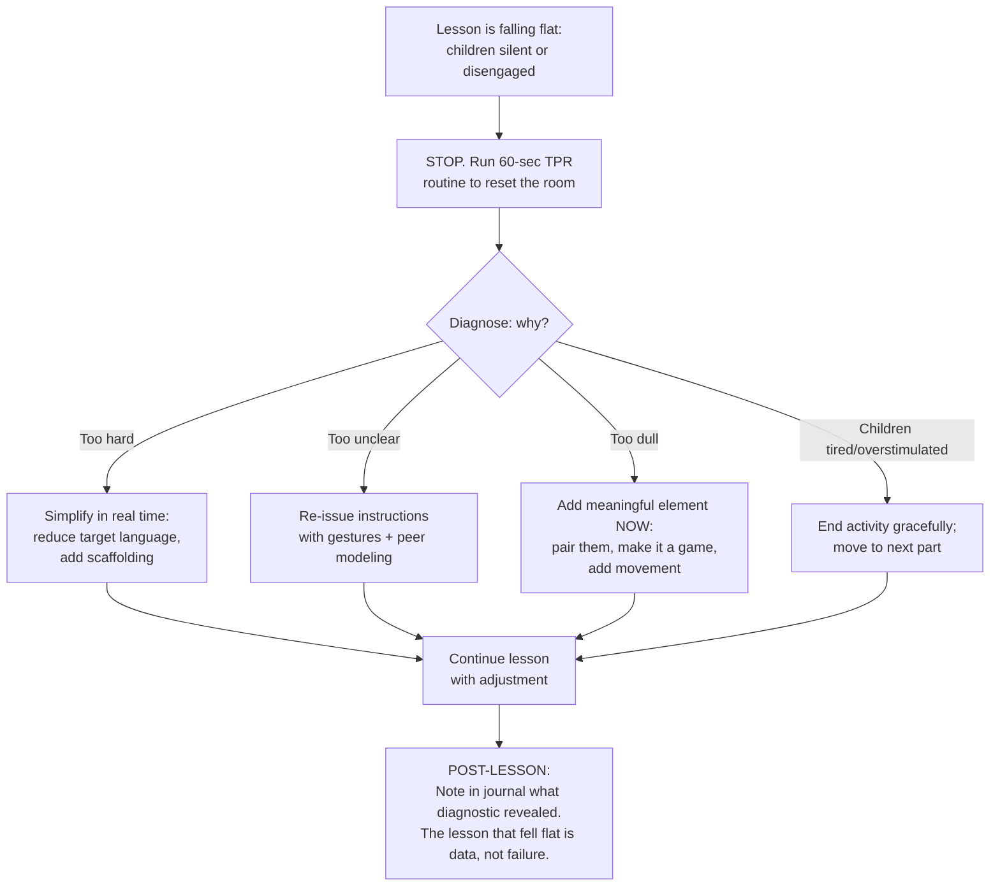

**Crisis 2: The disengaged class.** Across a week or two, the class as a whole is withdrawn. The diagnostic is broader than a single lesson. The teacher asks: has the affective substrate been established? Have norms been co-constructed? Is the silence spiral pattern emerging? The recovery, almost always, is to return to the substrate: invest a week in trust-building rituals, simple songs and games, low-stakes pair tasks; reduce cognitive demand; rebuild willingness before resuming higher-demand pedagogy.

**Crisis 3: The parent complaint.**

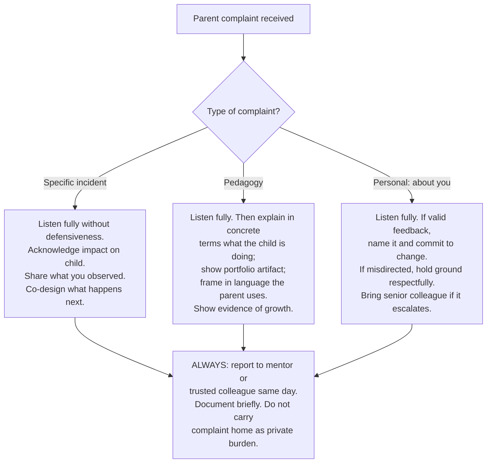

**Crisis 4: The impossible workload.** The diagnostic is structural, not personal. The recovery includes ruthless triage on what is genuinely required versus self-imposed perfectionism; protected boundaries on grading time (one hour, not three); refusal to let lesson preparation expand beyond a defined evening time; weekly "no work" time that is genuinely off; explicit conversation with a mentor about workload allocation; honest conversation with a school leader if structural overload persists.

**Crisis 5: The unsupportive or hostile colleague or leader.** The novice teacher's options are limited but real: maintain the principles within her own classroom; document growth through portfolio and willingness-to-communicate evidence; share artifacts when invited rather than when defending; build alliance with one or two supportive colleagues; resist isolation. Section 7.7 will return to the well-being implications.

### 7.5.4 What novice teachers should refuse to do

Five refusals are non-negotiable. **Refusal 1: Mockery, shame, and humiliation as management tools.** **Refusal 2: Reversion to banking-model defaults under sustained stress.** A novice may revert in a moment of exhaustion; she should not adopt reversion as a permanent stance. **Refusal 3: Hiding struggle from colleagues, mentors, and family.** The novice teacher who frames asking for help as failure has misread the professional culture HEFEE envisions. **Refusal 4: Self-care abandonment as professional virtue.** Sleep, meals, exercise, and time off are not personal indulgences; they are the substrate of the relational warmth the children depend on. **Refusal 5: Comparison-based despair.** Novice teachers will see senior colleagues run lessons they cannot yet emulate. The despair this produces is corrosive. The corrective is the four-stage developmental progression of Chapter 5.4: the teacher whose lessons inspire admiration today was, three years ago, a novice running rituals and TPR openers and learning every child's name.

### 7.5.5 What novice teachers should permit themselves

Five permissions are essential. **Permission 1: Imperfect lessons.** Every lesson will be imperfect. The reflective journal makes the imperfection useful; perfection is not the goal. **Permission 2: Slow progress.** The framework's developmental architecture spans years. **Permission 3: Asking for help.** Mentors, colleagues, and family are resources, not audiences for performance. **Permission 4: Rest.** Friday afternoon to Sunday morning genuinely off; no evening work two evenings per week; one weekend per month of no class preparation. **Permission 5: Joy.** Teaching young children is, in the words of an Ethiopian frontline teacher, *"interesting and also tiresome work"*; it is also work in which many teachers "feel young" and which they describe as "building the basement" of a generation. The joy this work produces is part of what sustains it; permission to feel and express the joy is not sentimentality but professional sustenance.

## 7.6 Professional Reflection Routines, Mentor-Mentee Collaboration, and Possible-Selves Goal-Setting

### 7.6.1 The reflective journaling protocol

A reflective journaling protocol calibrated to require under fifteen minutes per day produces, across a year, professional development that no formal training program can match. The structure operationalizes Schön's reflection-on-action[^5].

**Daily entries (10 minutes, end of teaching day):** Three questions, briefly answered: What worked today and why? What did not work today and why? What will I try tomorrow? The brevity matters. A one-paragraph entry per question is sufficient; longer entries become unsustainable. Schön's caution applies: "the stance appropriate to reflection is incompatible with the stance appropriate to action"[^5], so reflection happens *after* the lesson, not during it.

**Weekly review (15 minutes, end of week):** Read the week's daily entries; identify one pattern; plan one experiment for the following week.

**Monthly possible-selves check-in (30 minutes, end of month):** Drawing on Kubanyiova's three possible language teacher selves[^54], the novice teacher articulates briefly:
- *Ideal self*: Who do I want to become as a teacher? What will I be doing in three years that I am not doing now?
- *Ought-to self*: What are my responsibilities to my students, my colleagues, my school? Am I meeting them?
- *Feared self*: What kind of teacher do I not want to become? What are the warning signs I should watch for?

The Hiro case (Section 7.1.5) illustrated how a teacher's Ought-to self about ALT-student interaction shaped concrete lesson modifications across two units[^54]; the Erin case illustrated how an Ideal self about routine activity duration produced measurable changes she only partially registered consciously[^54]. The novice teacher's possible-selves check-in provides the same engine in compact form. As Hiro himself recognized: *"If I did not perform any reflection, maybe my Unit 8 did not change at all"*[^54].

### 7.6.2 Peer observation and lesson study

Peer observation, even occasional, is a powerful developmental practice.

```
PEER OBSERVATION PROTOCOL

PRE-OBSERVATION (10-minute conversation):
- Observer: "What would you like me to focus on?"
- Teacher: names one specific focus.
- Both agree: observation is descriptive, not evaluative.
- Observer commits: I will tell you what I noticed, not what you should do.

OBSERVATION (full lesson or 20–30 minutes):
- Observer takes notes on the agreed focus in descriptive language.

POST-OBSERVATION (15-minute conversation):
- Teacher: "What did you notice?"
- Observer: shares descriptive observations.
- Teacher: "What do you think?" → only at this prompt does observer
  share interpretation.
- Both: identify one or two specific changes the teacher might experiment
  with.
- Both: confirm that the conversation will not be shared without permission.
```

The protocol's design choices matter. The agreed focus prevents the observation from becoming a global judgment. The descriptive-then-interpretive structure prevents premature evaluation. The reciprocity—observer becomes observed in the next cycle—prevents power asymmetry.

A modest variant of lesson study, for novice teachers without access to a formal lesson-study tradition, is two-teacher co-planning followed by single observation. Two colleagues plan a lesson together; one teaches, one observes; both debrief. The lesson is taught a second time the next day or week, with revisions; the second teacher takes the observer role.

### 7.6.3 Mentor-mentee collaboration: the Schönian reflective partnership

Mentoring is most powerful when conceived as Schönian reflective partnership rather than as expert-evaluator transmission. The Schön grid contrasts the two stances directly[^5]: the expert "presume[s] to know and… claim[s] to do so, regardless of my own uncertainty," "keep[s] my distance from the client, and hold[s] onto the expert's role"; the reflective practitioner is "presumed to know, but I am not the only one in the situation to have relevant and important knowledge," and "seek[s] out connections to the client's thoughts and feelings"[^5].

Applied to mentoring, the reflective partnership has four characteristics. **The mentor invites rather than dispenses**: the conversation begins with the mentee's questions. **The mentor's own uncertainty is shared**: *"I'm not sure either; let me think with you"* is more powerful than *"Here is what you should do."* **The mentee's classroom artifacts anchor the conversation**: a lesson plan, a journal entry, a child's portfolio piece. **The conversation is reciprocal**: the mentor learns from the mentee.

```
MENTORING CONVERSATION GUIDE (45–60 minutes monthly)

OPENING (5 min):
- Mentee shares one thing going well and one thing she is wrestling with.
- Mentor listens without responding immediately.

ARTIFACT REVIEW (15–20 min):
- Mentee shares one classroom artifact.
- Mentor asks descriptive questions: "Tell me what was happening here."
- Mentor offers observations, not solutions.

REFLECTIVE INQUIRY (15–20 min):
- Mentee names one question she has about her practice.
- Both explore the question together.
- Mentor shares relevant experience without prescribing.

GOAL-SETTING (10 min):
- Mentee names one experiment for the next month.
- Both confirm: this is your experiment, not my prescription.
- Schedule next conversation.
```

The Japanese self-reflection case study is informative on the function the mentor serves. The researcher acted as "the understander" who "focuses entirely on listening to and understanding the speaker and then communicating back what he or she has understood"[^54]; this is the Schönian-Rogerian stance translated to the mentoring context. The teacher participants in the study reported that the reflective dialogue itself produced changes in subsequent lessons that were not produced by training programs[^54]. Indeed, that case study explicitly recommends that "this mechanism of individual reflective practice be encouraged as part of the teacher development program in addition to the existing teacher training"[^54].

### 7.6.4 Self-mentoring and remote alternatives

Many novice teachers do not have access to formal mentoring. The framework's commitment is that the absence of formal mentoring does not eliminate the developmental need; alternative structures bridge the gap. **Self-mentoring** uses the reflective journaling protocol of 7.6.1 plus periodic structured self-questioning. Weekly, the novice teacher asks herself the questions a mentor might ask: "What would a senior colleague notice about today's lesson? What would she affirm? What would she question? What would she suggest I try?" **Remote and asynchronous peer collaboration** uses digital tools to connect novices across schools or regions: a small group chat with three or four novice teachers in similar contexts; a monthly video call with a colleague in another school; a shared online journal in which two colleagues read and comment on each other's entries. **Reading-group self-mentoring** uses professional texts as conversation partners: one chapter of a foundational text per fortnight; journal response; return to the chapter a month later to see what now seems different.

### 7.6.5 The starter PLC agenda

Where two or three novice teachers can convene, even informally, a starter PLC produces compounding professional development.

```
NOVICE PLC STARTER AGENDA (60 minutes monthly)

0–5 min: Affective check-in.
   Each person shares one word for how they feel today. No discussion.
   This is modeling.

5–15 min: Bright spot share.
   Each person shares one thing that worked in their classroom this month.
   Brief; no advice-giving.

15–35 min: Focal artifact discussion.
   One member brings a lesson plan, child work, or journal entry.
   Group discusses descriptively first, interpretively second.

35–50 min: Common challenge inquiry.
   Group identifies one challenge multiple members face.
   Brief structured discussion: what have we tried? what might we try?

50–55 min: Commitment.
   Each member states one experiment for the coming month.

55–60 min: Closing reflection.
   Each member shares one word for what they are taking away.
```

Across a year of monthly meetings, members will have shared twelve artifacts, addressed twelve challenges, made twelve commitments, and built a relational base of trust that exceeds anything formal training produces.

## 7.7 Teacher Self-Care, Well-Being, and Sustainable Professional Identity

### 7.7.1 Why this section is structurally indispensable

Teacher self-care is often treated as a personal indulgence or a wellness add-on. The framework's commitment is structurally different: the teacher's well-being is the relational substrate of her capacity to extend warmth, agency, and reflective presence to children. As Chapter 5.1 documented, Rogers's analysis is uncompromising on this point: there is no place for the impatient or emotionally disturbed teacher in the classroom, because such a teacher cannot enact the facilitative conditions, and her children cannot grow as the framework requires. Self-care is therefore not optional virtue but ethical obligation to children whose growth depends on the teacher's sustained presence. **The novice teacher who treats self-care as something to be done after the work is finished will find that the work is never finished, that her capacity erodes, and that the children she most wants to serve receive a depleted version of her.**

### 7.7.2 Restorative routines

Four categories of restorative routine deserve explicit naming. **Sleep.** The teacher who consistently sleeps less than seven hours will, within months, find her affective bandwidth contracted. Sleep is not negotiable; if grading prevents sleep, grading is the problem, not sleep. **Movement.** Regular physical activity—not as an athletic project but as a baseline practice—regulates the nervous system in ways no other intervention matches. The form matters less than the consistency. **Meals.** The novice teacher who eats lunch while grading, eats dinner while planning, and snacks throughout the day rather than eating meals is in a chronic stress state. Protected meal times—even fifteen minutes uninterrupted—are restorative. **Time genuinely away from teaching.** A weekend evening with no classroom thoughts; a Sunday morning with no preparation; an evening per week with no work. The novice teacher who cannot articulate when she is "off" is, in fact, never off, and this state is not sustainable.

### 7.7.3 Emotional-regulation practices for high-stress moments

Three practices help in the moment. **The brief breathing pause.** Three slow breaths, taken privately in a moment of stress, reset the nervous system. **The naming-it move.** When the teacher notices anger, frustration, or overwhelm rising, naming it internally (*"I'm feeling overwhelmed right now"*) creates a small space between the feeling and the response. **The same-day debrief.** A difficult moment in the classroom is processed the same day, in writing or in conversation. Carrying the moment unprocessed into the night accumulates weight that becomes harder to address.

### 7.7.4 The discipline of asking for help without shame

Three operational practices make help-asking easier. **Pre-arranged help channels.** A trusted colleague, a mentor, a family member, a professional helpline—each is identified before the crisis. **The naming-the-struggle script.** A simple phrase the novice teacher rehearses: *"I'm struggling with [specific thing] and I would value your perspective."* The phrase is concrete and does not require the help-asker to have already solved the problem. **The reframing of help-asking.** Help-asking is professional competence, not weakness.

### 7.7.5 Boundary-setting around grading and lesson preparation

Two boundaries are particularly consequential. **The grading boundary.** Grading expands to fill available time. A protected grading allotment—one hour per week, two if necessary—forces the teacher to triage what is genuinely needed. The framework's formative-assessment architecture (Chapter 6) supports lighter, more frequent feedback over occasional exhaustive feedback. **The preparation boundary.** Lesson preparation similarly expands. A protected preparation allotment—two hours of evening work, no more—forces the teacher to use templates, reuse materials, and accept "good enough" preparation in service of sustainability. The framework recognizes that a sustainable B-plus teaching practice across thirty years produces vastly more child growth than an unsustainable A-plus practice that ends in burnout in year five.

### 7.7.6 Cultivating a sustainable professional identity

A sustainable professional identity integrates three commitments. **The lifelong-learner stance**: the teacher who continues to learn alongside her children models what she asks of them. **Professional pride that does not require approval**: the teacher who derives identity from her own commitment, evidenced by portfolio artifacts and child growth, is less destabilized by parent complaints, leadership criticism, or comparison with senior colleagues. **The integration of personal and professional life**: the teacher who has rich relationships, interests, and pleasures outside teaching brings a fuller person to the classroom than the teacher who has subordinated her life to the work. Kubanyiova's Ideal teacher self provides the conceptual anchor[^54]. The novice teacher who articulates her Ideal self—the kind of teacher she wants to become in three to five years—and who works deliberately toward it sustains identity across the inevitable difficulties of early-career teaching.

### 7.7.7 Structural conditions and realistic mitigation

Some well-being erosions are produced by structural conditions classroom-level teachers cannot resolve unilaterally. Excessive workload, isolation, hostile leadership, exam pressure, and inadequate resources all corrode well-being. The framework's honest stance is that **structural mitigation is part of professional practice but is not sufficient by itself**. The novice teacher who waits for ideal structural conditions before attending to her own well-being will erode in the meantime. Three realistic mitigations matter even in difficult contexts. **Alliance with one supportive colleague**: even one trusted colleague reduces isolation enough to sustain practice. **Voice at appropriate moments**: a brief conversation with a school leader naming a specific concern at a moment when the leader can act is more effective than chronic accumulated frustration. **The discipline of naming what is structural rather than personal**: the teacher who recognizes that her exhaustion is produced by a class of 65 children, not by her own inadequacy, sustains a different relationship to the exhaustion than the teacher who blames herself.

### 7.7.8 The framework's commitment in compact form

**The novice teacher who sustains her own well-being is, by that very fact, modeling for her children what a sustainable life of learning looks like**. The commitment is not separate from the framework's pedagogical commitments; it is one of them. A teacher who teaches the affective dimension to her children while denying it to herself communicates incoherence; a teacher who lives the framework herself communicates coherence even when her language is imperfect. Self-care is therefore not a luxury but the most fundamental expression of professional responsibility to those whose growth has been entrusted to the teacher's sustained presence.

## 7.8 Consolidated Starter Toolkit: Checklists, Decision Trees, and Quick-Reference Resources

### 7.8.1 The HEFEE-aligned lesson self-check

A six-marker checklist, drawn from Chapter 3.4.2, that a novice teacher can apply to any lesson in five minutes.

```
HEFEE LESSON SELF-CHECK (5 minutes after the lesson)

For today's 40-minute lesson:

[ ] Marker 1: Were all five dimensions co-present, even asymmetrically?
    Cognitive ___ Affective ___ Social ___ Phys-aesthetic ___ Ethical-spir ___

[ ] Marker 2: Was learner agency visible within structured routines?
    What choice did children make today? __________________________

[ ] Marker 3: Was the sequencing meaning-led, with form serving meaning?
    What was the lesson's first task? __________________________

[ ] Marker 4: Was affective warmth visible? Was error reframed as evidence?
    Did anyone laugh at someone's mistake? Did I respond? ____________

[ ] Marker 5: Were embodied/aesthetic channels core or decoration?
    Did we sing, move, draw, act? __________________________

[ ] Marker 6: Was reflective practice visible?
    Did I adjust mid-lesson? Will I journal tonight? __________________

OVERALL: 6/6 = paradigm-aligned full lesson
        4–5/6 = paradigm-aligned developing lesson
        2–3/6 = paradigm contains residual banking-model features
        0–1/6 = lesson reverted to dominant paradigm — diagnose and recover
```

### 7.8.2 The strategy-selection decision tree

The diagram below extends Chapter 4.6.4 with assessment, technology, and management branches integrated.

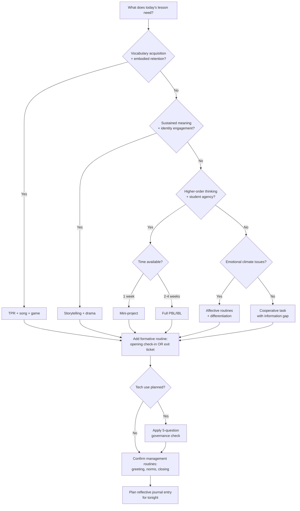

### 7.8.3 The first-week survival checklist

```
FIRST-WEEK SURVIVAL CHECKLIST

Day 1:
[ ] Learn every child's name (use name cards if needed)
[ ] Establish seating routine
[ ] Demonstrate the lesson structure (opener / core / closing)
[ ] Set up: clipboard for tracking, journal for evening reflection

Day 2:
[ ] Co-construct meeting/class guidelines with the children
[ ] Introduce one TPR or song opener
[ ] Establish check-in ritual

Day 3:
[ ] Introduce no-mockery norm explicitly with examples
[ ] Practice greeting routines
[ ] Run one low-risk pair task with sentence frames

Day 4:
[ ] Introduce reflective closing ritual
[ ] Begin willingness-to-communicate informal log

Day 5:
[ ] Hold reflective class meeting on the first week
[ ] Review evening journals; identify one priority for week 2

CARRYING FORWARD:
[ ] Sleep at least 7 hours nightly this week
[ ] Eat lunch (not at the desk) at least 3 days
[ ] Talk to one trusted person about the week before Sunday evening
```

### 7.8.4 The monthly self-audit

```
MONTHLY HEFEE SELF-AUDIT

Date: ___________ Month #: _______

CLIMATE (from Chapter 6.6.2):
[ ] Have I called every child by name with positive recognition this week?
[ ] When did I last share something authentic about myself with the class?
[ ] Have I noticed any child's participation declining? Plan: ___________
[ ] Did any rupture occur this month? Was it repaired? __________________

DIMENSIONAL COVERAGE (across the month):
Across this month's lessons, which dimensions did I emphasize?
  Cognitive: most lessons / some lessons / few lessons
  Affective: most / some / few
  Social: most / some / few
  Physical-aesthetic: most / some / few
  Ethical-spiritual: most / some / few
Which dimension is under-represented? __________________________
What will I add next month? __________________________

PERSONAL WELL-BEING:
[ ] Sleep averaged 7+ hours this month: Y / N
[ ] Took one day per week genuinely off: Y / N
[ ] Asked for help when I needed it: Y / N
[ ] One restorative practice sustained: __________________________

POSSIBLE-SELVES CHECK:
- Am I closer to my Ideal self than last month? In what way? __________
- Have I met my Ought-to obligations this month? __________
- Are any Feared-self warning signs appearing? __________

NEXT MONTH'S ONE PRIORITY: __________________________________
```

### 7.8.5 Quick-reference cards

Three quick-reference cards consolidate the most-needed routines.

**Affective routines card.**
```
AFFECTIVE ROUTINES — POCKET CARD

OPENING CHECK-IN (1–2 min):
"How do you feel today? Happy, tired, excited, calm, sad?"
Thumb up / side / down + one English word.

NO-MOCKERY NORM (revisit weekly):
"In our class, when someone tries an English sentence,
we listen and we don't laugh. If we make a mistake,
we are brave learners, not bad learners."

ERROR-AS-EVIDENCE LANGUAGE:
"Thank you for trying that brave sentence."
"I see you used a new word — what were you trying to say?"
"That's a great mistake; let me show you how we usually say it."

CLOSING REFLECTION (2 min):
Each child names one of:
- one new word today
- one favorite moment
- one thing that was hard
```

**TPR opener card.**
```
TPR OPENER — POCKET CARD

5-MIN STRUCTURE:
1. Class stands. Teacher models 1 action; class follows: 30 sec
2. Sequence of 4–6 actions, all class together: 90 sec
3. Same actions without modeling — listening test: 60 sec
4. 2–3 named individuals respond to commands: 60 sec
5. (Optional) Role reversal: child gives commands: 60 sec

CORE ACTION VERBS (Lower Primary):
stand up, sit down, jump, clap, point, walk, run, stop,
touch your head/nose/ear, open/close your book

CLASSROOM ACTIONS (Middle Primary):
open your book, close the door, pick up your pencil, hand
the paper to your partner, write your name, raise your hand

NOVEL COMBINATIONS (Upper Primary):
"Walk slowly to the window and point to a tree"
"Pick up the red marker and give it to someone in your group"
```

**Storytelling structure card.**
```
STORYTELLING — POCKET CARD

5-PHASE STRUCTURE:
1. SELECT: short story with 3+ refrains and clear pictures
2. TELL with picture support: pause for prediction × 2
3. RETELL with chorus: children supply refrains + gestures
4. DRAMATIZE: 5–8 children act; rest are chorus
5. RE-CREATE: drawing, alternative ending, related story

BEFORE-CLASS CHECKLIST:
[ ] Story is 2–4 min for Lower Primary; up to 7 min for Upper
[ ] At least 3 refrains identified and rehearsed
[ ] Pictures or chalk drawings ready
[ ] 2 prediction questions pre-planned
[ ] 3–5 target vocabulary items mapped to gestures
[ ] Brief opening + closing affective frame planned
```

### 7.8.6 Parent-communication starter pack

```
MULTILINGUAL NEWSLETTER TEMPLATE (monthly)

Greeting: ___________________________
[Translate first paragraph into primary family languages]

What we're learning this month:
We are learning about ____________________. The children are
practicing ____________________ and creating ____________________.

[Photograph or artifact image if possible]

What you can do (no English needed):
- Ask your child to tell you in any language about ____________________
- Bring to school, if possible: ____________________
- Coming on [date]: ____________________ — we hope to see you

Closing: ___________________________
With warmth, [Teacher's name]
```

```
HOMEWORK TEMPLATE (identity-affirming, family-language-friendly)

This week's homework: Share with your family

Ask one family member about ____________________
(a recipe, a story, a memory, a tradition).

You can talk in any language at home. At school, we will share
in English with help.

What to bring back: a drawing, a photo, or a short note.
There is no wrong answer. Every family has stories that matter.
```

### 7.8.7 The "when things go wrong" decision tree

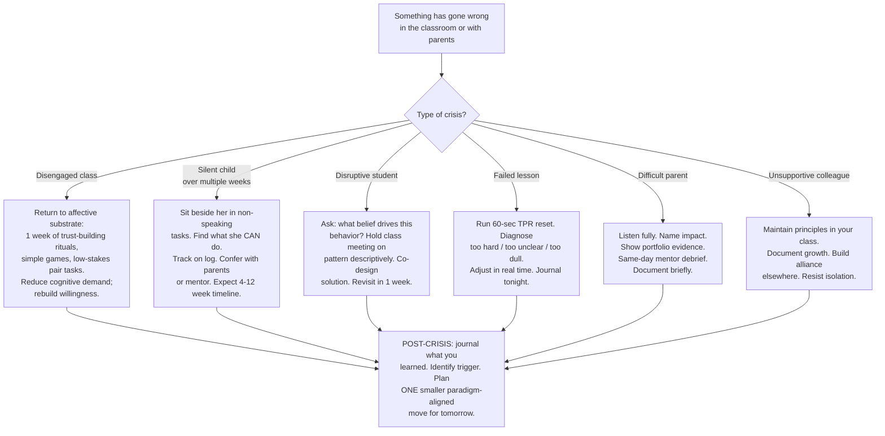

### 7.8.8 Annotated resource list

The following resource categories are keyed to Chapter 10's glossary and bibliography. **Foundational pedagogical texts**: Responsive Classroom's *The Morning Meeting Book*[^56] and *Doing Morning Meeting*[^55] for community-building; Positive Discipline literature for the kind-and-firm framework[^57]; Restorative Practices materials for repairing rupture[^55]. **Reflective practice texts**: Schön's *The Reflective Practitioner* for the foundational theory[^5]; the Anggrainy-Matsumiya-Watanabe Japanese self-reflection case study for an empirical illustration of possible-selves goal-setting in elementary EFL contexts[^54]. **Professional development orientation**: experiential learning research demonstrating that "training cannot afford to be passive"—it "needs to inform, [and] change practice also"[^5], with experiential methods producing 70% greater retention than lecture-style training[^5]. **Pedagogical artifact references**: teaching-models guides illustrating how PPP, ESA, TBL, 5E, and GRR pedagogical models can be operationalized for descriptive and narrative units in elementary EFL[^57]. **Policy and benchmarking context**: OECD documents on educational change[^4][^3][^2], EF EPI for international benchmarking context[^2]. **Empirical foundations cited in this chapter**: the China 2022 *English Curriculum Standards for Compulsory Education*[^2][^5].

### 7.8.9 The handover: returning to the opening image

The report opened, in Chapter 1, with the image of a senior teacher walking into Grade 2 at 8:00 a.m. on Monday. Chapter 4 closed with the same teacher now holding a wall, a door, and a window in addition to the architectural drawing. Chapter 5 ensured she would not arrive empty in herself. Chapter 6 installed the measuring instruments and the life-support systems. This chapter has now placed in her hands the keys, the maintenance manual, and the phone numbers to call when something goes wrong.

The chapter's central handover claim can be stated compactly. The paradigm is now operational. The keys are in her hands. The building is at her service. She does not need to be a research expert; she does not need to wait for ideal conditions; she does not need to enact the entire framework on her first Monday. She needs to walk in, greet each child by name, run a song with TPR, tell a brief story, ask a question worth answering, listen to what the children say, close with one sentence per child of what was learned, and write three lines in her journal at the end of the day. **This is the framework**. The forty minutes she has just taught are paradigm-aligned. The journal entry she has just written is professional development. The child whose name she has just learned has experienced the affective dimension. The story she has just told has touched all five dimensions in eight minutes. Tomorrow she will do it again, slightly differently, slightly better.

The basement metaphor reaches its closing form here. The building has been engineered, built, populated, and equipped; the keys have been handed over; the novice teacher has walked through the door. What happens next is the work of years—the gradual displacement of inherited paradigm defaults, the cumulative growth of children's voices and confidence, the slow integration of the framework's principles into the teacher's own professional identity. Chapter 8 will examine the systemic horizon within which this work proceeds; Chapter 9 will articulate the report's closing vision; Chapter 10 will provide the reference resources. But this chapter has done what it set out to do: it has made the paradigm operational. The novice teacher who carries this chapter into her classroom carries a paradigm that is no longer abstract. She carries a way of being a teacher that has been documented, reasoned, illustrated, tooled, and tested across the diverse evidence base this report has assembled. She is not alone. The framework is at her side. The work begins.

# 8 Challenges, Limitations, and Future Directions for Policy, Research, and Teacher Development

Chapter 7 closed with the novice teacher walking through her classroom door on Monday morning, the keys to the paradigm in her hand and the framework at her side. The image is true and necessary, but it is not the whole truth. She walks into a classroom that sits inside a school, that sits inside a district, that sits inside a national education system, that sits inside a global political-economic order in which English carries prestige, in which examination scores carry life consequences, in which AI systems are reshaping what learning means before educational research can finish its first sentence about them. To pretend that her classroom-level enactment alone determines the paradigm's fate would be to abandon the report's commitment to honest analysis at the moment that commitment is most consequential. **The paradigm does not survive on the strength of individual teacher heroism; it survives, or fails, through coordinated action across levels that no single actor commands.** This chapter names that uncomfortable structural truth and works through its implications.

The chapter performs three interlocking functions. First, it diagnoses the multi-level constraints—policy, school, classroom, individual—that complicate adoption, drawing the diagnostic threads from across the report into a single integrated analysis. Second, it proposes realistic mitigation strategies and phased implementation pathways, refusing both the utopian voice that promises classroom-level enactment will solve everything and the fatalistic voice that says nothing can be done until system-level conditions are perfect. Third, it projects forward along the trajectories—curriculum policy, teacher education, educational research, AI and emerging technologies—along which the paradigm must evolve, and names the open questions, study designs, and stakeholder recommendations through which that evolution will or will not occur. The chapter's spirit is the spirit the rubric has asked the report to maintain throughout: surface tensions, refuse idealization, calibrate to realistic constraints, and articulate disciplined hope rather than performative optimism. It is, in short, the chapter in which the report is most honest about what it does not yet know and what cannot yet be done, while remaining clear about what can be done now and what must be done over the decade ahead.

## 8.1 Multi-Level Challenges and Structural Constraints to Paradigm Adoption

### 8.1.1 The architecture of constraint: four nested levels

The diagnostic evidence assembled across this report converges on a single structural observation: the obstacles to holistic empowerment adoption operate at four nested levels, and at every level, the constraints are mutually reinforcing rather than independent. A classroom-level teacher facing a class of sixty-five faces a *school-level* condition produced by policy-level resource allocation, embedded in *individual-level* preparation gaps that themselves reflect *system-level* underinvestment in primary teacher training. The architecture of constraint is therefore not a list of unrelated problems but a coupled system whose stability is precisely what makes paradigm change difficult.

The four levels and their dominant constraints can be summarized in advance, with the rest of this section examining each level in detail.

| Level | Dominant constraints | Coupling to other levels |
|---|---|---|
| **Policy / system** | Exam-driven assessment regimes; declining foundational skills; outdated educational social contract; uneven resource allocation between primary and tertiary education | Shapes all lower levels through assessment, funding, and curricular mandate |
| **School** | Class size; schedule rigidity; resource inequities; leadership stance; absent mentoring infrastructure; assessment culture | Translates policy into classroom-level conditions; shaped by district-level decisions |
| **Classroom** | Persistent grammar-translation defaults; pair-work execution failures; silence-spiral pattern; affective erosion across grades | Inherits school conditions; produces individual teacher experience |
| **Individual teacher** | Workload; isolation; identity destabilization; inherited paradigm defaults; reversion under stress; limited language proficiency | Carries the cumulative weight of the three levels above; shapes what classroom-level change is humanly possible |

### 8.1.2 The policy and system level: exam regimes and the misaligned social contract

At the policy level, the most consequential constraint on holistic empowerment is the **exam-driven assessment regime** that organizes much of elementary English education globally. The Nanjing primary school evidence assembled in Chapter 1's diagnostic foundations is unambiguous on what this regime feels like from the children's side. Students in well-resourced schools described their preparation for the *Gaokao* (the National Tertiary Entrance Examination) beginning in primary years, with parents urging admission to elite secondary schools such as Nanjing Foreign Languages School *"in order to enter better universities based on performance in the Gaokao"*[^3]. The same study documented that "many students are enrolled in private English tutoring after school, which adds on even more pressure to them"[^3], and that "the reality of classroom teaching still follows the traditional mode: teacher-centred and examination-driven"[^3], "fundamentally" because "the examination system has never been updated and focuses only on written performance across the 12 years of school education"[^3]. The result is the explicit double-bind the Nanjing researcher named: "the students have suffered great pressure from learning English"[^3], yet they "generally reported that they believed English was important for them, not just for examinations, but to a greater extent, for their personal development"[^3]. The exam regime does not merely constrain pedagogy; it produces children whose own attitudes toward English are split between developmental aspiration and exam-driven anxiety from their earliest school years.

A particularly instructive complication arises from the *partial reforms* that began to reduce English's weight in some Chinese assessment regimes. Reports indicated that Beijing planned to reduce the English section of the *Gaokao* from 150 points to 100 points by 2016, and that Shandong, Jiangsu, and Shanghai considered removing English from the *Gaokao* entirely[^4]. The Nanjing students' reactions to these prospective reforms are revealing. One student responded with relief: *"I feel a bit happy. However, in my opinion learning English is not for exams, but to benefit ourselves"*[^3]. But another reacted with disorientation: *"I feel depressed. I feel I have learnt [English] in vain"*[^3]. A third worried that "if it (English) is not assessed [in the Gaokao], it cannot, eh, we cannot know how we have learnt"[^3]. The diagnostic implication is consequential: when assessment is the primary frame within which children have learned to value learning, simply *removing* assessment without replacing it with a richer evaluative architecture produces not liberation but loss of orientation. The framework's commitment to multidimensional assessment (Chapter 6) is therefore not merely an alternative to summative testing; it is a structural precondition for sustainable assessment reform.

A second policy-level constraint is the **decline of foundational skills** that contemporary policy syntheses document across systems. The OECD's *Education Policy Outlook 2025* warns that "foundational skills such as numeracy and literacy are declining in many OECD countries" and that "these trends underscore the need for systemic change"[^3]. The pandemic context has further exposed this brittleness: *Education at a Glance 2022* reports that "almost all OECD countries implemented standardised assessments to quantify learning losses at various levels of education. Most countries also provided" recovery interventions[^4]. The pattern—measurement intensified, learning declined—is the diagnostic signature of paradigm exhaustion that Chapter 2 named. Reform efforts within the existing paradigm have not reversed the trajectory; the structural lesson is that incremental refinement of score-driven instruction is unlikely to deliver the holistic competencies twenty-first-century life demands.

A third policy-level constraint is the **misalignment between the dominant educational social contract and contemporary needs**, articulated most forcefully in UNESCO's *Reimagining our futures together: a new social contract for education*. The report frames the situation directly: "we need a new social contract for education that can repair past injustices while transforming the future. Education has come a long way in access, reach, and gender parity over the past century. But progress has been uneven. Many of today's gaps are based on yesterday's exclusions and injustices"[^3]. UNESCO further specifies that "the world also faces complex disruptions and uncertain futures. Humanity's relationships with each other, with technology, and with the planet Earth are out of balance. We need to relearn interdependencies for just, equitable, and sustainable futures"[^3]. The articulation of needed action areas is striking in its convergence with HEFEE's commitments: "pedagogies of cooperation and solidarity," reimagined curriculum that goes "beyond a siloed grid of subjects to foster meaningful participation in the knowledge commons," teaching as "a collaborative profession" that requires "sufficient recognition, value, and supportive working conditions," digital learning futures shaped by "principles of social and economic justice, equity, and respect for human rights," and "learning lifelong and across society"[^3]. These global articulations are themselves part of the policy-level architecture that classroom-level practice must navigate; they create discursive space for paradigm change, but they do not, by themselves, alter the assessment regimes or resource allocations that determine what classroom-level teachers can actually do.

A fourth policy-level constraint, particularly relevant to elementary English education specifically, is the **uneven attention given to primary education within national policy priorities**. The Ethiopian frontline teacher's candid observation, cited in Chapter 1, captured the structural pattern: *"We feel the Ministry of Education focuses on Universities and somehow on secondary schools. Primary schools are forgotten — no textbooks, no training — look at the classrooms"*. The same diagnostic recurs across systems with adapted specifics: primary teacher salaries lower than secondary; primary teacher preparation thinner; primary classroom resources sparser; primary policy attention briefer. The structural irony is severe: the developmentally most consequential years of education receive the least sustained policy investment. A paradigm change that targets precisely these years must navigate the policy-level inattention as part of its environment.

### 8.1.3 The school level: class size, leadership, and assessment culture

At the school level, six structural conditions named in Chapter 6.6.3 constitute the dominant constraints. Each translates policy-level conditions into classroom-level realities, and each is therefore a leverage point at which policy-level reform can be transmitted, blocked, or partially compensated.

**Class size** is the single most consequential structural condition for elementary EFL. The Ethiopian observation study documented "observed class sizes ranged from forty-nine to seventy-two pupils per room, seated in fixed three-person desks facing the blackboard". The Nanjing study did not specify class sizes systematically but noted significant variation between school types based on socio-economic status[^3]. A class of twenty supports the conferring, individualized observation, and pair-work scaffolding the framework requires; a class of sixty-five mathematically constrains them. The class-size constraint is not absolute—Mr. Tilahun's case in Chapter 7.1.3 illustrated paradigm-aligned practice in a class of sixty-five—but its costs are real.

**Schedule and time architecture** shape what climate and pedagogy are possible. Forty-minute lessons with no protected planning time afford different paradigm enactment than ninety-minute blocks with weekly planning periods. The Nanjing curriculum analysis documented the standard pattern: "from Primary Three to Six, students are offered three English lessons per week with 40 min per lesson"[^3], with English having a similar number of lessons to minor subjects, despite carrying examination weight comparable to the core subjects of Chinese and mathematics. The mismatch between curricular weight and time allocation is itself a structural constraint.

**Physical environment** shapes pedagogical possibility. Fixed-row seating is structurally difficult for pair and group work; sparse walls deprive children of the language-rich, ordered environment Montessori and Waldorf traditions identify as developmentally critical; absent playground equipment closes off the embodied channel of learning the Ethiopian study documented as routinely absent.

**Assessment culture** at the school level powerfully shapes classroom practice. A school whose monthly tests, weekly quizzes, and prominently displayed class rankings communicate that assessment is the gravity of the educational system produces classrooms that orbit accordingly. A school whose assessment culture privileges portfolio-based formative evaluation, student-led conferences, and growth-over-time documentation produces classrooms whose orbits trace different paths.

**Professional learning communities and mentoring structures** are present in some school cultures and absent in many others. The Pierce review of assessment practice noted candidly that "the vast majority of teachers report that they feel unprepared to assess and teach ELLs," and that "only about a dozen states require teacher candidates to show competence in assessment in order to get a teaching license, and the majority of teacher preparation programs fail to provide instruction in developing assessments that support student learning". The structural gap persists into in-service contexts where PLC infrastructure is nominal or absent.

**Leadership stance toward teacher professional agency** is the most variable and consequential of the six. A principal who treats teachers as professional decision-makers cultivates climate; one who treats teachers as compliance agents corrodes it. The Ethiopian directors' candid acknowledgment that "the evaluation guideline may not tell us how appropriate the teaching method is to the level of the learners. We do not even know the appropriate teaching methods" reveals leadership-level uncertainty that is itself a constraint, but the same directors' willingness to acknowledge the gap is itself a leadership disposition that opens space for paradigm change.

Compounding these six conditions are **resource inequities between schools**, which the Nanjing study documented with particular care. The three participating schools represented three distinct socio-economic contexts: School One, "a prestigious and well-resourced government school" representing "the medium SES status of school in Nanjing"; School Two, "a low SES status school, of which the majority of students have parents who are rural migrant workers"; and School Three, a school requiring "performing arts and academic curriculum" admitting "talented" children whose parents were "generally well-educated and willing to invest extra time and effort"[^3]. The differential parental investment was striking: School One and School Three students were typically enrolled in private English tutoring from kindergarten, with parents holding very high academic expectations; School Two students, despite their parents' belief that English was "very important," lacked the financial resources to support extensive supplementary instruction[^3]. The differential outcomes were equally striking: School One and School Three students "highlighted the importance of English"; School Two students "did not even rank [English] in the top three" of useful subjects, with most prioritizing Chinese[^3]. **Resource inequities at the school and family level produce attitude inequities at the student level, which in turn produce learning-outcome inequities, which then become the diagnostic data on which further policy decisions are made**. The cycle is not unbreakable, but breaking it requires action at multiple levels simultaneously.

### 8.1.4 The classroom level: persistent paradigm defaults and the silence spiral

At the classroom level, three persistent patterns constrain paradigm change. The first is the **grammar-translation default** documented across the Ethiopian study and corroborated in international EFL research. Even where curricular materials are designed for implicit, communicative learning, teachers reinterpret them through "a traditional lens, prioritizing explicit explanation and rule memorization", with concrete observations of teachers spending thirty of forty minutes explaining sentence structure in L1 or three full periods explaining comparative adjectives that the textbook had presented communicatively. The second is the **pair-work execution failure** in which "shifting group work into whole-class discussion was a widespread pattern" and "pair work… was not conducted between students but rather between the teacher and individual students". The third is the **silence-spiral pattern** in which children's affective engagement declines across grades, with younger learners "eagerly raised their hands" and older learners falling into the three-minute silences that prompt teachers to switch to L1.

These three patterns are not independent failures but symptomatic expressions of a single paradigm. They will not be addressed by adding another worksheet, another app, or another training session within the existing assumptions. **The classroom level is, in this sense, the level at which the paradigm shift must be most concretely enacted, but it is also the level least able to enact the shift unsupported by changes at higher levels**. A novice teacher who attempts paradigm-aligned practice in a school whose assessment culture punishes deviation, whose leadership treats teachers as compliance agents, and whose policy environment rewards score-optimization is enacting heroism, not reform. The framework's commitment is to support such heroism where it occurs while refusing to romanticize it as a sustainable model.

### 8.1.5 The individual teacher level: workload, isolation, and inherited defaults

At the individual level, four constraints compound the structural pressures from above. **Workload** is the most universal: a novice teacher facing five lessons per day, fifty children per class, weekly grading expectations, and no protected planning time has insufficient cognitive bandwidth for paradigm-aligned design. Chapter 7.7 named workload as a structural rather than personal problem; the recognition does not reduce the workload but does reframe the moral weight the teacher carries about it.

**Isolation** is the second. The Nanjing analysis observed that "students' concerns over learning English, possibly influenced by their parents are worthy of study"[^3]; the same analytical focus on parent–student–teacher triangulation reveals that teachers themselves often work in isolation, without colleagues with whom to share artifacts, reflect on practice, or coordinate paradigm-aligned design. The PLC infrastructure named in Section 8.1.3 as a school-level constraint becomes, at the individual level, an experience of professional aloneness that is corrosive over time.

**Identity destabilization under reform pressure** is a less-named but consequential constraint. A teacher who has been trained in grammar-translation pedagogy, who has succeeded by its standards, and who is now told that her practice represents the dominant paradigm to be displaced is being asked to disidentify with much of her professional self. The disidentification is necessary for paradigm change but psychologically costly; novice teachers experience it as anxiety about competence, while experienced teachers can experience it as devaluation of accumulated craft. Reform discourse that fails to honor the legitimate professional knowledge teachers bring while asking them to extend that knowledge produces resistance the discourse itself has helped manufacture.

**Inherited paradigm defaults** are the fourth. The Schönian observation that teachers, under stress, revert to the paradigm they internalized as children remains structurally consequential. For most teachers entering the profession today, the default they internalized is the grammar-translation paradigm. The reversion under stress documented in Chapter 7.2.2 is therefore not a moral failure but a structural pattern, and addressing it requires sustained reflective practice, not exhortation.

A particular constraint complicating these four is **limited language proficiency**. Many elementary EFL teachers, especially in resource-constrained contexts, are themselves still developing English proficiency. The 2025 EF EPI ranked 123 countries and regions by English skill, with only the Netherlands, Croatia, Austria, Germany, and Norway in the top five[^2]; many countries hosting large elementary EFL teaching workforces fall in the moderate or low proficiency bands. A teacher whose own English is uncertain faces compounding pressure: the linguistic content she teaches is itself a domain in which she remains a learner, while she is asked to model communicative confidence to children. This is not a failing of individual teachers; it is a structural condition of EFL teaching globally, and policy-level investment in teacher language proficiency is one of the most consequential leverages for paradigm change.

### 8.1.6 Three structural tensions paradigm change must navigate

Across the four levels, three tensions recur and cannot be dissolved by paradigm change but must be navigated by it. The framework's commitment to surfacing rather than smoothing tensions requires their explicit naming.

**Tension 1: Measurable accountability versus developmental processes.** Education systems require accountability; accountability requires measurement; measurable outcomes are typically those most easily standardized; standardized outcomes are typically narrower than the developmental outcomes the framework values. The tension is not resolvable by abolishing accountability nor by ignoring measurement; it is navigable only through assessment architectures that combine summative accountability functions with formative developmental functions. Section 8.2 addresses the navigation.

**Tension 2: Parental expectations versus child well-being.** The Nanjing evidence captured this tension with rare clarity. Parents in higher-SES contexts expected their children to score above 90 or 95 on every English test, to rank in the top three of their class, and to attend elite secondary schools[^3]. Children reported pressure, fear, and exhaustion: "*I have not been allowed to watch TV since Primary One. I have to complete all my homework prior to relaxing*"; "*if I cannot meet the target, I would have to face punishment*"[^3]. The tension is real. Parents whose own life trajectories were shaped by examination performance can be unrelenting in pressing the same on their children, even when child well-being is visibly compromised. The framework's commitment to family engagement as partnership (Chapter 6.7) does not resolve this tension; it provides a structure within which parent–teacher–child dialogue about expectations can occur. Section 8.2 will return to this through Epstein's framework.

**Tension 3: Global English-as-prestige versus identity-affirming pluralism.** The structural reality that English carries unequal global prestige is not a fact this report invents nor one it can wish away. The Cambridge analysis of Chinese learners' challenges in using English as a global language framed the resulting pressure as "a phantom to kill," asking whether and how a "bilingual user identity of global English" could be cultivated rather than the displacement of L1 identity by English[^4]. The Nanjing analysis surfaced the same tension at the elementary level: students from low-SES backgrounds often found "education has been the way to success and examination is the fairest solution"[^3], producing a strong belief in "*learning English primarily for examinations and admissions*"[^3] that can crowd out the affective and identity-affirming dimensions HEFEE values. The framework's commitment to identity-affirming pluralism (Chapter 5.5; Chapter 6.7) does not abolish English's global prestige; it constructs a pedagogical stance in which children's L1 identity, family culture, and bilingual capability are honored as resources rather than as obstacles. Section 8.2 will articulate concrete navigation strategies.

These three tensions structure the rest of this chapter. They are not problems with solutions but tensions with navigations; the navigation is unending and must be re-enacted across each new generation of children, teachers, and policy contexts.

## 8.2 Realistic Mitigation Strategies and Phased Implementation Pathways

### 8.2.1 The phased implementation logic

The diagnostic of 8.1 maps the obstacles; this section maps the pathways through them. A working principle organizes the analysis: **paradigm change is enacted unevenly across levels, classroom-level enactment can begin without waiting for system-level reform, and system-level reform without classroom-level capacity is brittle**. The principle has three corollaries. First, *do not wait for ideal conditions*. The novice teacher who postpones paradigm-aligned practice until class size drops, assessment is rebalanced, and PLC infrastructure is installed will postpone indefinitely. Second, *do not pretend that classroom-level enactment alone is sufficient*. Hero-teaching is unsustainable as a model and unjust as a policy. Third, *coordinate across levels even imperfectly*. Each level's actors—teachers, school leaders, parents, policymakers, researchers—can take steps without waiting for others, and the cumulative effect of partial action across levels exceeds the sum of its parts.

The implementation logic operates on three coupled time horizons summarized below.

| Horizon | Primary level of action | Feasible targets | Sequencing rule |
|---|---|---|---|
| **Short-term (1–2 years)** | Classroom level | Affective substrate, formative routines, embodied openers, refusal of mockery, minimum viable assessment, AI-assisted differentiation | Begin with what does not require permission; sustain consistently; document evidence |
| **Medium-term (3–5 years)** | School and district | PLC infrastructure, mentoring programs, assessment culture rebalancing, parent communication frameworks, family engagement architectures | Build coalitions; pilot then scale; protect from premature evaluation |
| **Long-term (5–10+ years)** | System / policy | Curriculum standards aligned with multidimensional outcomes, teacher education redesign, assessment regime reform, teacher language proficiency investment | Sustained advocacy; cross-system learning; cumulative reform |

The horizons are not strictly sequential—a school whose leader is willing can implement medium-term changes simultaneously with classroom-level enactment—but the *primary* leverage at each horizon shifts upward as the time scale extends.

### 8.2.2 Short-term mitigation: classroom-level enactment under realistic constraints

Within the one-to-two-year horizon, classroom-level mitigation is anchored in the operational toolkit of Chapter 7. Five mitigation strategies extend that toolkit by addressing specific constraints surfaced in Section 8.1.

**Strategy 1: The Monday-morning minimum viable lesson as a stress-resilience asset.** Chapter 7.3.6 specified the smallest paradigm-aligned lesson—voice, chalk, forty minutes, body—as the floor of paradigm-coherent practice on a hard day. Under sustained constraint, the minimum viable lesson is not a fallback but a structural asset. A teacher in a class of seventy with no resources can run the minimum viable lesson; the framework's principles are intact even when its elaborate manifestations are not.

**Strategy 2: Tiered observation in large classes.** Chapter 6.2.1 specified observation walks during pair or group work, with the teacher noting one or two children per minute on a focused indicator. In a class of sixty-five, three observations per child per term may be the realistic ceiling rather than the minimum target. The mitigation is to *tier* observation: identify a small priority group (typically five to eight children whose participation is most concerning) for weekly observation; rotate the rest of the class through monthly observation; accept the asymmetry as the responsible response to the constraint, not as discrimination against well-participating children.

**Strategy 3: Structural pair-routines that survive collapse pressure.** Chapter 4.4.3 named four causes of cooperative-task collapse: missing communicative gap, unclear roles, insufficient scaffolding, no accountability. In large-class contexts, the four-element design becomes more, not less, important. The Find-Someone-Who routine illustrated in Chapter 7.1.3 is structurally robust under large-class conditions: each child has a card requiring information from peers; the gap is built in; roles are intrinsic to the task; accountability is visible because the card must be filled.

**Strategy 4: Resource-equity calibrations that protect HEFEE principles from device-dependence.** As Chapter 6.5.1 documented, AI integration costs vary substantially across systems. The classroom-level mitigation is structural: the *core* of the framework's pedagogy must operate without device-dependence, with technology added where available rather than assumed. The Wei project case in Chapter 7.1.6 illustrated the principle: smartphones were "if available" rather than required, and the unit's design ran on chart paper, markers, and wall space with digital tools as enrichment.

**Strategy 5: The small ecosystem move.** Within the one-to-two-year horizon, novice teachers can make small, cumulative ecosystem contributions named in Chapter 5.4.4: a parent newsletter explaining why the class is doing storytelling rather than only grammar drills; a brief conversation with the principal about a successful pair-task structure; an artifact shared at a school event. None of these constitutes systemic reform; the cumulative effect across years and across multiple teachers can shift school-level conditions in ways no single teacher achieves alone.

### 8.2.3 Medium-term mitigation: school-level rebalancing of assessment, PLCs, and parent communication

Within the three-to-five-year horizon, school-level rebalancing becomes the primary leverage. Three mitigation strategies are particularly consequential.

**Strategy 1: Hybrid summative-plus-formative assessment architectures.** Chapter 6 articulated the formative-multidimensional assessment architecture HEFEE requires. The medium-term mitigation is *hybrid*: school-level assessment policies that retain summative testing for accountability functions while *adding* portfolio-based formative evaluation, student-led conferences, and growth-over-time documentation as the primary instruments for instructional decision-making and family communication. The hybrid architecture honors the legitimate accountability function of summative testing while subordinating it to the formative-developmental functions Chapter 6 demonstrated produce stronger learning outcomes including standardized scores. The school's rubrics, report cards, and parent communication channels are progressively redesigned to give the multidimensional formative evidence equal or greater visibility than the summative score. This is a multi-year project requiring leadership commitment; it is also achievable within the medium-term horizon when leadership is supportive.

**Strategy 2: PLC and mentoring infrastructure, calibrated to capacity.** Chapter 5.4.3 named PLCs and mentoring as accelerators of teacher development, while Section 8.1.3 named their absence in many systems as a structural constraint. The medium-term mitigation is to build PLC infrastructure deliberately, beginning with what is feasible. A starter PLC of two or three teachers meeting monthly, sustained for a year, is more valuable than an elaborate PLC structure that collapses after a term. Where formal mentoring programs are unavailable, *Schönian reflective-partnership mentoring* of the form Chapter 7.6.3 specified can be cultivated informally between novice and senior teachers willing to engage, and protected by school leaders who recognize the time investment as professional development rather than as schedule slack.

**Strategy 3: Parent communication frameworks that reframe success indicators.** The parental-expectations tension named in Section 8.1.6 cannot be dissolved, but it can be navigated through structured communication frameworks. Epstein's Six Types of Involvement Framework[^3]—**parenting, communicating, volunteering, learning at home, decision-making, and collaborating with the community**—provides a structural orientation for school-family partnership that goes beyond grade reporting. Although the framework was developed in U.S. K-12 contexts and has been most extensively validated there, its structural categories travel across systems with appropriate adaptation. Within elementary EFL specifically, the framework's most consequential implications include: school-level communication that explains the multidimensional outcomes children are developing (not just test scores); parent workshops that address how to support without requiring family English proficiency; volunteering structures that draw on family expertise (recipes, stories, traditions) rather than positioning families as homework graders; and dialogue mechanisms that allow parents to voice expectations while learning the developmental rationale for the school's pedagogical decisions. The reflective frame Epstein's framework offers is direct: "By focusing on parenting, communication, volunteering, learning at home, decision-making, and community collaboration, schools can foster understanding, trust, and cooperation"[^3]. Honest acknowledgment is required: the Epstein research base is most extensively validated in U.S. contexts and during pandemic conditions; cross-cultural validation for elementary EFL contexts in Asia, Africa, and Latin America remains an open empirical question that Section 8.5 will name.

### 8.2.4 Long-term mitigation: system-level reform of curriculum, assessment, and teacher development

Within the five-to-ten-year horizon, system-level reform becomes the primary leverage. The Cambridge analysis of Chinese English learners articulated the long-horizon reform task as the cultivation of "a bilingual user identity of global English"[^4]—a reframing of English education's purpose from monolingual displacement of L1 toward integrated bilingual capability anchored in learners' own identities. The reframe is not merely linguistic; it is curricular, assessment-related, and identity-related. Three system-level reform directions are particularly consequential.

**Direction 1: Curriculum standards aligned with multidimensional commitments.** China's 2022 *English Curriculum Standards for Compulsory Education*, examined in Chapters 4 and 5, illustrates one such reform direction, articulating four core literacies (language ability, cultural awareness, thinking quality, learning ability) and integrating "学思结合" (learning with thinking), "学用结合" (learning with use), and "学创结合" (learning with creation)[^5]. The standards' progressive intent is unambiguous; the implementation gap between standards-as-text and curriculum-as-enacted is the medium-term challenge. Long-term system reform involves not only writing such standards but supporting their enactment through assessment redesign, teacher preparation, and policy attention to primary education.

**Direction 2: Assessment regime reform.** The pattern of partial reforms in China that reduced English's weight in some contexts illustrates both the necessity and the danger of assessment reform[^4]. Necessity, because score-driven assessment regimes structurally constrain paradigm change; danger, because reforms that simply remove summative testing without replacing it produce disorientation. Sustainable assessment reform requires the hybrid architectures named in Strategy 1 above: replacing high-stakes summative dominance with multidimensional formative-summative balance, developing assessment instruments adequate to the multidimensional outcomes the framework values (Section 8.5 will return to this as a research need), and building public communication that helps parents and policymakers recognize the new evidence as legitimate.

**Direction 3: Teacher education redesign and primary teacher investment.** TALIS 2024 examined "teacher demographics and backgrounds by looking at their age, gender, level of" preparation and continued learning across OECD systems[^2], surfacing systemic concerns about how teachers are prepared and supported for today's classroom realities. The OECD's broader stance is that the decline in foundational outcomes "underscore[s] the need for systemic change"[^3], a change that extends to teacher preparation. Long-term system reform involves: integrating multidimensional pedagogy into pre-service teacher education; expanding and protecting in-service professional development; investing in elementary teachers' English language proficiency as a foundational professional competence; and rebalancing the policy attention and resource allocation between primary and tertiary education that the Ethiopian frontline teacher's "primary schools are forgotten" comment documented.

### 8.2.5 Differentiated context calibration

The mitigation strategies must be calibrated to differentiated contexts. The matrix below specifies entry points and priority sequencing across five context types.

| Context type | Primary short-term entry | Primary medium-term entry | Primary long-term entry |
|---|---|---|---|
| **Well-resourced urban** | Refining existing affective and formative practices toward dimensional integration | PLC leadership, family-engagement architecture, hybrid assessment piloting | Cross-school knowledge sharing; contributing to system-level reform |
| **Mid-resource urban or suburban** | Affective substrate, embodied openers, structural pair routines | PLC infrastructure-building, mentor cultivation, parent communication frameworks | District-level coalition building; assessment rebalancing advocacy |
| **Resource-constrained rural** | Minimum viable lessons, voice-body-paper pedagogies, willingness-to-communicate logs | Modest PLC formation, cross-school digital peer collaboration, family-recipe and family-story structures honoring local expertise | Advocacy for primary-education resource allocation; teacher language proficiency investment |
| **Multi-grade or fukushiki** | Tiered differentiation within multi-grade structure; co-planning protocols | Multi-school PLC connections; shared planning resources | System-level recognition of multi-grade pedagogy as expertise |
| **Post-conflict or displaced contexts** | Trauma-informed affective substrate; predictable rituals; identity-affirming engagement | Community-level partnership; flexible assessment honoring disrupted learning trajectories | International cooperation supporting displaced-learner education[^3] |

The matrix's pedagogical claim is that **the framework's principles are universal but its mitigation strategies are context-calibrated**. The principles travel; the entry points adapt to where each context realistically can begin.

### 8.2.6 Refusing both utopia and resignation

A closing principle deserves explicit naming. The framework's commitment is to *disciplined hope*, which is structurally distinct from utopian optimism and from fatalistic resignation. **Utopian optimism** claims that paradigm change can be achieved by classroom-level commitment alone, that systemic constraints will be overcome by hero-teaching, and that the framework's principles will produce universal flourishing if only individual teachers enact them well. The Nanjing diagnostic data refute this: the systemic pressures on children, families, and teachers in score-driven contexts produce outcomes that no individual teacher can single-handedly redirect. **Fatalistic resignation** claims that nothing meaningful can be done until system-level conditions are perfect, that classroom-level enactment under constraint is futile gesture, and that paradigm change must wait for structural transformation. The Mr. Tilahun and Ms. Park cases of Chapter 7 refute this: meaningful classroom-level change is achievable under realistic constraints, and the cumulative effect across teachers and schools constitutes the substrate from which broader reform becomes possible.

The disciplined-hope position is the framework's own. **Paradigm change is enacted unevenly across levels, and the unevenness is part of what makes it sustainable**: classroom-level practice continues even when policy moves slowly; policy reforms create discursive space even when classroom-level uptake is partial; research generates evidence even when policy resistance persists; family partnerships strengthen even when assessment regimes lag. The mitigation pathway is not a single road but a network of partial roads, traversed unevenly by stakeholders whose coordination is imperfect but whose direction is, over time, recognizably aligned. The next sections turn to the trajectories along which that alignment can plausibly evolve.

## 8.3 Future Directions in Curriculum Policy, Teacher Education, and Educational Research

### 8.3.1 Curriculum policy: from siloed grids to multidimensional integration

The curriculum policy trajectory along which holistic empowerment can plausibly evolve over the coming decade is anchored in three converging international syntheses. UNESCO's *Reimagining our futures together* calls explicitly for "pedagogies of cooperation and solidarity" that "foster interdisciplinary problem-solving, to foster the expression of diversity and pluralism, to unlearn divisiveness and repair injustices, and to ensure that assessment effectively supports learning"[^3], and for curricula that "go beyond a siloed grid of subjects to foster meaningful participation in the knowledge commons"[^3]. The OECD's Learning Compass 2030 articulates "an aspirational vision for the future of education" structured around student agency, transformation competencies, and the integration of knowledge, skills, attitudes, and values[^3]. China's 2022 *English Curriculum Standards for Compulsory Education* articulates the integration of language ability, cultural awareness, thinking quality, and learning ability through theme-based, real-life-connected curriculum[^5]. The convergence is not coincidence; the international policy discourse has, over the past decade, oriented toward multidimensional integration in ways HEFEE-aligned curriculum policy can build upon.

What HEFEE-aligned curriculum policy would require, beyond what current standards already articulate, can be specified along three lines. **First, rebalanced assessment specifications within standards documents themselves**, so that curriculum standards articulate not only learning outcomes but the assessment architectures through which those outcomes are evidenced—formative, multidimensional, portfolio-based assessment alongside summative testing rather than in subordination to it. **Second, integrated multidimensional standards** that explicitly specify cognitive, affective, social, physical-aesthetic, and ethical-spiritual outcomes rather than treating non-cognitive outcomes as implicit byproducts. The 2022 Standards' four core literacies move in this direction; further specification at the dimension level would advance it further. **Third, explicit space for teacher professional judgment within mandated frameworks**. Standards that prescribe outcomes while leaving pedagogical decisions to teachers honor the Schönian reflective practitioner; standards that script pedagogical implementation in detail produce the script-deliverer role HEFEE explicitly rejects. The balance is delicate—too much teacher discretion produces inequity in implementation, too little produces deskilled teachers—but the long-term curriculum policy direction must err toward the discretion side, supported by teacher development infrastructure that enables judgment rather than constraining it.

A particular curriculum policy direction worth naming is the **integration of greening and sustainability commitments** that UNESCO's framework specifies: "Greening education involves four pillars: greening schools as examples of carbon neutrality; integrating climate education into school curricula, integrate climate education and capacities in teacher training and education systems, and engaging entire communities in environmental education and action"[^3]. For elementary English, this maps onto the ethical-spiritual dimension of HEFEE through curricular content (environmental themes), pedagogical approach (project-based investigation of local environmental questions, as in the Chapter 7.1.6 case), and identity engagement (children's developing sense of responsibility to their place). The greening direction is not an addition to HEFEE but an articulation of one of its existing commitments.

### 8.3.2 Teacher education: integrating HEFEE into pre-service and in-service development

The teacher education trajectory has three dimensions. **Pre-service preparation** must integrate HEFEE's five dimensions and three levels into initial teacher education, modeling experientially what teachers will themselves enact. The structural inconsistency that Chapter 5.2.3 named—that what teachers embody is taught more powerfully than what they say—applies to teacher education itself. Pre-service programs that lecture about learner-centered pedagogy while themselves running lecture-based courses produce teachers who say one thing and do another. Programs that model experiential, dialogical, reflective practice produce teachers who can enact it. The professional development research is direct on this: "training cannot afford to be passive. It not only needs to inform, but change practice also"; "experiential learning… is based on the simple idea that we learn better when we *do* something with the knowledge"; participants "retain 70% more information through experiential methods than through traditional lecture-style training methods"[^5]. Pre-service programs that embed reflective practice from the first week, that treat practicum as Schönian research-in-action rather than as compliance demonstration, and that pair theoretical study with structured classroom inquiry produce teachers prepared for paradigm-aligned practice. Programs that defer practical application to a brief final practicum produce teachers prepared for the dominant paradigm.

A particular pre-service direction is **calibrated practicum experience in resource-constrained as well as well-resourced contexts**. Pre-service programs that place candidates only in well-resourced, low-class-size schools produce teachers whose first encounter with a class of sixty-five is in their first job; the resulting reversion-under-stress is structurally produced by the practicum design. Programs that include practicum in resource-constrained contexts, with structured support, produce teachers whose paradigm enactment under realistic conditions has been rehearsed before consequential.

**In-service development** trajectories are anchored in the principle that teacher self-development is structurally precondition rather than supplement to student empowerment (Chapter 5.2.4). Three structural elements matter. *Sustained PLC infrastructure* funded as part of teacher employment rather than as voluntary unpaid time; *mentoring as Schönian reflective partnership* rather than as evaluation; and *experiential professional development* that operates by the same principles as the classroom pedagogy teachers are asked to enact. The Pierce articulation of the assessment professional development pathway can be generalized: teachers need "long-term, collaborative" professional development that "helps teachers try out their assessments and get feedback from colleagues, program administrators, and university faculty experienced in using assessments for learning. School study teams and assessment focus groups can lead assessment changes in each school system. Teachers need to find their voices and become active in shaping their own professional development".

The Reflection-in-action research base reinforces this with explicit specification: "the practitioner [is] not as teacher but facilitator, supporting the client; not unlike a counsellor"; the professional development model that supports such a stance must itself enact it[^5]. Schön's own caution applies: reflection-in-action and reflection-on-action alternate, and professional development must support both. Single-session workshops that demand reflection without follow-through produce reflection-as-compliance; sustained collaborative inquiry produces reflection-as-research.

### 8.3.3 The educational research agenda: open questions and methodological priorities

The educational research agenda HEFEE proposes is anchored in a candid acknowledgment: the framework articulated in this report is best understood as a hypothesis-rich orientation requiring sustained empirical testing rather than a verified solution. The framework's theoretical foundations are well-anchored in canonical traditions and contemporary international syntheses; its empirical validation specifically as an integrated framework for elementary English teaching is at an early stage. The research agenda must address this with sustained, methodologically rigorous, longitudinally-extended studies that the report's evidence base cannot itself provide.

Five research priorities are most consequential.

**Priority 1: Longitudinal effects of HEFEE enactment on multidimensional outcomes.** The most important evidentiary gap is longitudinal evidence of how children whose elementary English education was HEFEE-aligned develop across the dimensions the framework values, compared to children whose education followed dominant paradigm patterns. Outcomes worth measuring include but are not limited to language proficiency: willingness-to-communicate gradients across grades (extending the diagnostic from Chapter 1); affective engagement maintenance across the developmental span; metacognitive strategy development across L1 and L2; identity expression through English; intercultural openness; and cognitive 4Cs. The methodological challenge is that the field currently lacks assessment instruments adequate to many of these outcomes; instrument development is itself a research priority.

**Priority 2: Cross-cultural validation of the framework's distinguishing markers.** Chapter 3.4.2 specified six distinguishing markers by which HEFEE-aligned classrooms can be recognized. The markers were derived from synthetic analysis across diverse evidence sources, but their cross-cultural portability requires explicit validation. A research priority is multi-site classroom observation studies in diverse cultural and resource contexts to test whether the markers operate as theorized, identify culturally specific manifestations, and refine the marker specification.

**Priority 3: The relative contribution of each guiding principle to outcomes.** The five guiding principles of Chapter 3.1.2 (Integration, Agency, Meaning, Relationship, Reflection) operate as a coupled system. Empirical research has not yet established the relative contribution of each principle to multidimensional outcomes. Studies that vary one principle while holding others constant—through teacher-development interventions or natural variation across classrooms—could identify which principles carry the most decisive effect under which conditions.

**Priority 4: The dynamics of paradigm reversion and recovery in early-career teachers.** Chapter 7.2.2 named reversion under stress as the single most consequential pitfall for novice teachers. The mechanisms of reversion (which stressors trigger it; which teacher dispositions resist it; which mentoring structures support recovery), the pace of paradigm-default displacement across years of practice, and the relationship between teacher language proficiency and reversion vulnerability are open empirical questions whose answers would substantially improve novice-teacher development design.

**Priority 5: Equity implications of differential implementation across SES contexts.** The Nanjing evidence documented sharp differences in student attitudes and parental investment across SES contexts[^3]. A research priority is to investigate how HEFEE-aligned practice is implemented across resource-differentiated contexts, what equity gains it produces, and whether—as Black and Wiliam's foundational claim suggested for formative assessment generally—it benefits low-achievers and resource-constrained learners disproportionately. The hypothesis that holistic empowerment narrows rather than widens equity gaps requires explicit empirical testing.

### 8.3.4 Methodological horizons

The research agenda demands methodologies adequate to its multidimensional ambitions. Four methodological horizons deserve naming.

**Longitudinal multi-site case studies** that follow children, teachers, and schools across multiple years generate the developmental evidence single-site, single-year studies cannot. The evidentiary thinness of the elementary EFL field on longitudinal outcomes is partly a methodological choice; sustained funding and research infrastructure could shift it.

**Cluster-randomized trials of teacher development interventions** that test specific HEFEE-aligned teacher development designs against comparison conditions can provide the causal evidence policy decision-making requires. The complications—the difficulty of standardizing complex pedagogical interventions, the contamination across teachers in shared schools, the ethical questions of comparison conditions that withhold promising practices—are real but not insuperable.

**Mixed-methods classroom ethnography** that integrates observation, teacher reflective journals, child voice, and family perspectives produces the rich descriptive evidence the framework's qualitative dimensions require. The Ethiopian observation study cited throughout this report illustrates the model; extension to multiple sites with sustained engagement would deepen it.

**Design-based research cycles** in which researchers and practitioners iteratively design, implement, evaluate, and refine HEFEE-aligned interventions produce both practical artifacts and theoretical refinement. The Schönian commitment to practitioner-research partnership—"when someone reflects-in-action, he becomes a researcher in the practice context"[^5]—is the philosophical anchor for design-based research, which institutionalizes that commitment as research methodology rather than only as professional disposition.

The framework's commitment to honest acknowledgment of evidentiary limits requires a closing observation: the field's evidence base on holistic empowerment specifically as articulated here is currently thin. The framework synthesizes well-anchored components from diverse traditions whose individual evidence bases are stronger; the synthesis itself awaits sustained empirical examination. **The framework should therefore be taken seriously as an orientation, used carefully as a guide, and tested rigorously as a hypothesis**. Its eventual refinement, partial confirmation, or significant revision is an outcome the research agenda must enable rather than preempt.

## 8.4 AI, Emerging Technologies, and the Evolving Pedagogical Frontier

### 8.4.1 The framing question revisited: amplification or substitution at decadal scale

Chapter 6.4 framed technology integration through a single question: does a given tool, in a given deployment, *amplify* the pedagogical paradigm of the classroom, or *substitute* a different paradigm for it? The question becomes more consequential as AI capability expands. A decade hence, the tools available to elementary English teachers will substantially exceed those of 2025; the question of amplification versus substitution will not have been resolved by tool sophistication alone, because more capable tools can amplify a banking-model paradigm just as efficiently as they can amplify a holistic-empowerment paradigm. **The decadal trajectory of AI in elementary English education will be determined less by what AI can do than by how educators and ecosystems direct what AI does**.

Three trajectories are particularly consequential over the coming decade.

### 8.4.2 The maturation of AI teaching assistants

AI teaching assistants for teacher work—differentiation, rubric drafting, multilingual family communication, lesson planning, Socratic tutoring of children—are likely to mature substantially over the coming decade. The current generation, illustrated by Khanmigo and successors, has demonstrated proof-of-concept capability with documented use at scale: "6+ million teachers globally have turned to Khan Academy for our world-class teaching tools and content", with district-level deployments such as Newark Public Schools illustrating institutional adoption pathways. The decadal trajectory is likely to involve: more capable Socratic-style tutoring; deeper integration with formative assessment data; richer multilingual capability; and more sophisticated differentiation drafting.

Where AI will plausibly displace teacher work, and where it plausibly will not, can be specified. AI is likely to **displace**: routine differentiation drafting that currently consumes teacher planning time; first-draft rubric generation that the teacher then revises; multilingual family newsletter drafting that no monolingual teacher could otherwise produce; on-demand pronunciation feedback at the individual child level; vocabulary and grammar practice that benefits from individualized pacing. AI is unlikely to **displace**: the relational warmth and named recognition by which a teacher knows each child; the in-action classroom decisions that respond to a single child's silence or a class's collective fatigue; the ethical judgment that decides whose family forms are honored in a "My Family" unit; the embodied co-presence of song, drama, and TPR; the identity-affirming recognition that what a child has just said matters because she said it. The boundary between displaceable and irreducible is not a line technological capability will erase; it is a line constituted by what learning is.

The governance infrastructure required for elementary deployment of AI teaching assistants extends Chapter 6.5.2's six principles to the decadal scale. **Data-sharing agreements** between schools, districts, and AI providers must specify what child data is collected, how long it is retained, who can access it, and what contractual remedies apply when boundaries are violated. **Parental consent infrastructure** must be developmentally appropriate, multilingual, and transparent rather than buried in terms-of-service text parents do not read. **Equity calibration** must address the access gap that AI infrastructure costs—both direct subscription costs and indirect device-and-connectivity costs—introduce. **Cultural responsiveness** must be designed into product development, not retrofitted after deployment, and must include recognition that AI training data shapes what counts as "correct" or "natural" English in ways that can disadvantage non-Anglo-American varieties of English. **Teacher professional agency** must remain the binding governance authority; AI dashboards that displace teacher observation as the primary source of formative evidence reverse the framework's commitment to relational presence.

### 8.4.3 Speech-recognition, multimodal AI, and adaptive learning platforms

Speech-recognition tools (ELSA Speak and successors) and multimodal AI capabilities are likely to mature for individualized pronunciation and language practice that classroom time cannot provide. The decadal trajectory is likely to include: more accurate ASR across diverse accent and developmental profiles; richer multimodal feedback (visual, auditory, kinesthetic); and more developmentally calibrated interaction designs for elementary users specifically (rather than the current pattern of adult-and-adolescent designs adapted for younger users).

The amplification potential is real. Bridge analysis documented that classrooms cannot provide the pronunciation practice volume children need: "with large-sized English classes, teachers hardly have enough time to work on students' pronunciation individually in class. Since the more you practice, the easier it gets, deficient exercise time leads to little or no progress in improving one's accent". A child's between-class practice with ASR feedback can complement classroom communicative practice in ways that previously required private tutoring inaccessible to most families.

The substitution risks are equally real. ASR-based practice that is decoupled from communicative use produces children who can pronounce target language accurately while remaining unable to use it communicatively—the inverse of the silence-spiral but pedagogically just as inadequate. Adaptive learning platforms whose individualization is calibrated entirely to language form risk reproducing the score-driven paradigm in algorithmic form. The decadal trajectory's positive expression requires sustained governance: ASR and adaptive tools deployed *within* classrooms whose paradigm is HEFEE-aligned can amplify the cognitive dimension while the classroom continues to develop the affective, social, physical-aesthetic, and ethical-spiritual dimensions; deployed within score-driven classrooms, the same tools intensify the paradigm rather than counterweight it.

A particular calibration issue deserves naming. Most empirical evidence on ASR effectiveness is drawn from adolescent and adult populations; direct extrapolation to Grade 1 children is methodologically inappropriate. The decadal trajectory must include sustained research on developmentally appropriate ASR design for very young learners, including the emotional implications of receiving algorithmic feedback on one's voice at age seven and the relational implications of substituting algorithmic feedback for teacher-mediated correction.

### 8.4.4 The deeper question: what AI cannot do, and why this strengthens teachers' role

The deeper question the AI trajectory raises is not what AI will replace but what it cannot. The question matters because, as AI absorbs more of the cognitive-skill-delivery function, **teachers' irreducibly human work becomes more valuable, not less**. The Schönian framing is direct: a teacher reduced to delivering content AI delivers more efficiently is a teacher whose professional value is rapidly eroding; a teacher whose work is the relational, embodied, ethical, identity-affirming work AI cannot perform is a teacher whose professional value, if anything, increases.

The five HEFEE dimensions specify what AI cannot do. **The affective dimension**—the relational warmth, named recognition, error-as-evidence-of-trying language, attunement to a single child's emotional state—requires embodied co-presence and ethical commitment that no AI can substitute. **The social dimension**—peer collaboration negotiated in real time, intercultural openness modeled by a teacher whose own openness the children read, conflict repair through restorative practice—is irreducibly relational. **The physical-aesthetic dimension**—the energy of a song with a class of sixty children, the embodied joy of drama, the aesthetic care of a classroom environment—cannot be transmitted through screens. **The ethical-spiritual dimension**—the identity-affirming recognition of a child's family form, the values-aware curriculum design responsive to local ethical contexts, the modeling of lifelong learning by a visibly learning adult—is inseparable from the teacher's own person. The cognitive dimension can be partially substituted by AI for routine skill delivery; the other four dimensions remain irreducibly human.

The structural implication is that **the trajectory of AI in elementary English education clarifies, rather than obscures, what teachers are for**. A profession that has historically been undervalued for its relational and developmental work, partly because score-driven assessment regimes valued only what tests could capture, may find that AI's capability to handle the testable functions reveals the irreducible value of the untestable ones. The decadal trajectory therefore opens space for a strengthened professional identity oriented around precisely the dimensions HEFEE names. Whether systems will recognize this strengthening in the form of better pay, better preparation, better working conditions, and better professional respect is an open political and policy question that Section 8.6 will return to.

### 8.4.5 Emerging risks to anticipate and govern

Five emerging risks deserve explicit naming as the decadal trajectory unfolds.

**Risk 1: Cultural-linguistic bias in AI training data.** AI tools trained predominantly on English-language, Western-cultural, well-resourced data sources reflect those origins in their outputs. The risk for elementary EFL is that AI defaults can systematically privilege Anglo-American English, Western family structures, and Western pedagogical assumptions. The mitigation is curatorial vigilance and structural pressure on AI developers to address bias as a design problem.

**Risk 2: Data privacy for child users.** Elementary learners are minors whose data merits special protection. The Khan Academy framing—"we are only offering access to learners who are under 18 years old when their parents give them access or when their school district is partnered with Khan Academy"—is the right structural minimum. The decadal trajectory requires this to become a regulated baseline rather than a voluntary commitment.

**Risk 3: Displacement of teacher relational time by efficiency metrics.** The most insidious risk is that AI dashboards become the primary source of teacher attention, displacing the relational observation and named recognition through which the affective dimension is sustained. A teacher who spends thirty minutes per day reviewing AI-generated student dashboards has spent thirty fewer minutes greeting children by name, observing pair work, sitting beside the silent child. Governance must protect relational time as a structural priority, not assume it will survive efficiency pressure.

**Risk 4: Digital divide intensified by AI infrastructure costs.** The Newark deployment cost "$35 per student for the school year" with discounts for free-and-reduced-lunch populations; the Bill & Melinda Gates Foundation's $12 million commitment illustrates the philanthropic infrastructure on which large-scale AI adoption increasingly depends. Systems whose access to such infrastructure is asymmetric—across countries, across districts within countries, across schools within districts—face widening rather than narrowing equity gaps as AI capability expands. The governance imperative is structural: equity must be designed into deployment, not deferred to philanthropic discretion.

**Risk 5: Substitution of human judgment by algorithmic recommendation.** As AI becomes more capable, the temptation to defer professional judgment to algorithmic output grows. A teacher who accepts AI-generated rubrics without adapting child-facing language, AI-generated lesson plans without integrating her knowledge of specific children, or AI-generated assessment data without weighing it against her own observation has surrendered the professional judgment HEFEE's framework requires. Governance must protect teacher judgment as the binding authority; AI tools must be designed and deployed as drafts subject to teacher revision, not as outputs to be implemented.

### 8.4.6 Governance principles for the decadal trajectory

Six governance principles structure the paradigm's relationship with technology over the coming decade. They extend Chapter 6.5.2's principles to the decadal scale.

**Principle 1: Pedagogical paradigm precedes tool selection at every level**, from individual classroom to district policy.
**Principle 2: Augmentation over replacement**, with structural protection of teacher relational time.
**Principle 3: Transparent governance with parental partnership**, regulated rather than voluntary.
**Principle 4: Equity calibration as a core decision criterion**, designed into deployment.
**Principle 5: Cultural responsiveness as a design and curatorial commitment**, addressed at the developer level.
**Principle 6: Teacher professional agency as the binding governance authority**, protected against efficiency-driven erosion.

The principles are aspirational rather than guaranteed; their realization depends on sustained collective action by teachers, school leaders, policymakers, researchers, and technology developers. The decadal trajectory will be shaped less by AI capability than by whether this collective action coheres.

## 8.5 Open Questions, Future Empirical Studies, and Methodological Horizons

### 8.5.1 The honest acknowledgment

The framework articulated in this report rests on synthetic integration of diverse evidence sources whose individual quality is variable and whose integrated empirical validation specifically as HEFEE is limited. This section names what the report's evidence base could not establish and proposes the empirical work the field requires to test, refine, and extend the framework.

The acknowledgment is structural to the report's commitment. A framework presented as verified solution would invite implementation that outruns evidence; a framework presented as hypothesis-rich orientation invites the implementation-with-inquiry stance that the rubric's emphasis on critical tension acknowledgment requires. The five clusters of open questions below specify the empirical agenda.

### 8.5.2 Cluster 1: Framework validation

Open questions about whether the framework operates as theorized include: Do the five dimensions and three levels operate as a coupled system across diverse cultural contexts, or do contextual adaptations require dimension reformulation? Are the six distinguishing markers reliably observable by trained coders across sites? Is the dimension-coverage criterion (lessons addressing three or more dimensions) the right threshold, or do empirical studies suggest different cut-points? How does the framework's structure compare empirically with adjacent frameworks (ASCD Whole Child, P21 4Cs, CASEL, OECD Learning Compass) in capturing variance in elementary EFL outcomes?

Proposed studies include: multi-site classroom observation studies in five to seven culturally diverse elementary EFL contexts, with structured coding against the six distinguishing markers and dimensional indicators; psychometric studies validating observation instruments based on the framework; comparative studies that operationalize HEFEE alongside neighboring frameworks and test their differential predictive power.

### 8.5.3 Cluster 2: Efficacy and outcomes

Open questions about what HEFEE-aligned practice produces include: What longitudinal effects does HEFEE-aligned practice produce on multidimensional outcomes including but not limited to language proficiency? How do effects compare across SES, urban/rural, and resource conditions? Does HEFEE-aligned practice narrow or widen equity gaps? Do the specific pedagogies named in Chapter 4 (storytelling, drama, project-based learning, TPR, cooperative tasks) produce differential effects across dimensions, or do they all contribute roughly comparably to integrated outcomes?

Proposed studies include: longitudinal cohort studies following children from Grade 1 through Grade 6 under HEFEE-aligned versus dominant-paradigm conditions, with multidimensional outcome measurement; cluster-randomized trials of HEFEE-aligned teacher development interventions with school-level outcome measurement; equity-focused studies that disaggregate outcomes by SES and resource condition.

### 8.5.4 Cluster 3: Novice-teacher developmental trajectories

Open questions about how novice teachers actually develop include: How do the four developmental stages of Chapter 5.4 (Survival, Consolidation, Experimentation, Integration) unfold under varied mentoring and ecosystem conditions? What are the precise mechanisms of paradigm reversion under stress, and what mentoring interventions most effectively support recovery? How does novice-teacher language proficiency interact with paradigm enactment? What is the relationship between pre-service program structure and novice-teacher Stage-1 capability?

Proposed studies include: longitudinal qualitative case studies of novice teachers across their first three to five years, with structured interviews, lesson observations, and reflective journal analysis; intervention studies comparing different mentoring designs (Schönian reflective partnership versus traditional supervisory mentoring versus minimal mentoring); pre-service program studies that compare experiential, reflective program designs against lecture-based program designs in terms of graduates' Year-1 paradigm enactment.

### 8.5.5 Cluster 4: Ecosystem and policy effects

Open questions about how ecosystem conditions shape paradigm enactment include: Which school-level interventions (PLC infrastructure, mentoring programs, assessment culture rebalancing, leadership development) most effectively scaffold classroom-level enactment? How do reformed assessment regimes interact with classroom practice over time, and what is the lag between policy reform and practice change? What are the effects of family engagement frameworks (Epstein-style) on multidimensional student outcomes in elementary EFL specifically? How do parental expectations evolve when assessment regimes rebalance?

Proposed studies include: design-based research cycles in school-level reform, with iterative design, implementation, evaluation, and refinement; longitudinal policy-analysis studies tracking the effects of assessment reform on classroom practice over five to ten years; mixed-methods studies of family engagement implementation across cultural contexts, including rigorous validation of Epstein-style frameworks for elementary EFL specifically.

### 8.5.6 Cluster 5: AI integration outcomes

Open questions about technology integration include: What are measured effects of AI-assisted workflows (differentiation drafting, rubric generation, family communication) on teacher relational time, child outcomes, and equity? Does AI tutoring (Khanmigo-style) produce measurable learning gains that compensate for its costs, and under what conditions does it produce them? Does ASR-based pronunciation practice (ELSA Speak-style) produce durable communicative gains in elementary learners specifically (as distinct from adolescent and adult populations where most evidence currently exists)? What governance structures effectively protect against the five emerging risks named in Section 8.4.5?

Proposed studies include: cluster-randomized trials of AI teaching assistants with measured outcomes on teacher time allocation, child learning, and equity; longitudinal studies of ASR deployment with elementary populations specifically; comparative governance studies across districts with different AI deployment frameworks; ethnographic studies of how AI dashboards reshape teacher attention.

### 8.5.7 Methodological horizons

Across the five clusters, four methodological priorities deserve naming. **Assessment instrument development** for the multidimensional outcomes the framework values is a foundational priority; without instruments adequate to affective, social, physical-aesthetic, and ethical-spiritual outcomes, efficacy studies will continue to default to the cognitive-only measurement that the dominant paradigm has perfected. **Practitioner-research partnerships** in line with Schönian reflection-as-research[^5] are particularly suited to the framework's complexity, because the practitioner's craft knowledge is itself part of what the framework names as professional agency. **Longitudinal extension** beyond the typical one-to-three-year studies is essential for capturing developmental outcomes that unfold over years. **Cross-cultural collaboration** is essential for distinguishing universal framework features from culturally specific implementations.

The Reflection-In-Action and Reflection-On-Action research base provides the philosophical anchor for practitioner-research partnerships: "this paper explores some of the work that has been occasioned by the writings of D.A. Schon on the development of professional knowledge by teachers"[^5]. The research methodology that takes practitioner reflection seriously as a source of professional knowledge—rather than treating it as anecdotal supplement to "real" research—is structurally aligned with the framework's commitment to teacher professional agency as a level of empowerment.

The framework's evidentiary status, honestly acknowledged, is therefore: well-anchored in canonical traditions and contemporary international syntheses; partially supported by component-level evidence on individual pedagogies (TPR, storytelling, project-based learning, formative assessment, classroom climate); not yet validated as an integrated framework specifically as articulated here. The research agenda outlined above is the pathway by which that validation, refinement, or revision can occur over the coming decade.

## 8.6 Recommendations for Stakeholders to Sustain and Scale the Paradigm

### 8.6.1 The reciprocal coupling reaffirmed

The chapter's diagnostic, mitigation, and projection analyses converge on a single structural conclusion: **no stakeholder group can sustain the paradigm alone, and coordinated action across levels is the only realistic pathway**. The reciprocal coupling that has run through the report from Chapter 3's level architecture forward—student empowerment requires teacher empowerment requires community empowerment—operates with equal force at the policy-research-technology-family scale that this chapter has examined. A novice teacher's classroom heroism cannot compensate for system-level neglect; system-level reform without classroom-level capacity is brittle; AI infrastructure without governance is risky; governance without research is uninformed; research without practitioner partnership is disconnected; partnership without family engagement is incomplete. The recommendations below are differentiated by stakeholder group precisely because each group's contribution is necessary and none is sufficient.

### 8.6.2 Recommendations for novice elementary English teachers

The recommendations to novice teachers consolidate the operational guidance of Chapter 7 within the chapter's longer-horizon framing.

**Recommendation 1: Enact paradigm-aligned practice within current constraints**, beginning with the minimum viable practices of Chapter 6.8.3 and the Chapter 7.5 phased adoption roadmap. Do not wait for ideal conditions; the conditions you encounter on your first Monday are the conditions in which paradigm-aligned practice begins.

**Recommendation 2: Sustain reflective journaling and self-development** through the protocols of Chapter 7.6. The cumulative effect of consistent reflective practice across years exceeds anything formal training can provide.

**Recommendation 3: Refuse the structural refusals named in Chapter 7.5.4**: mockery and shame as management tools; reversion to banking-model defaults under sustained stress; hiding struggle from colleagues, mentors, and family; self-care abandonment as professional virtue; comparison-based despair.

**Recommendation 4: Contribute modestly to ecosystem influence** through the small ecosystem moves of Chapter 5.4.4: a parent newsletter, a colleague conversation, an artifact share. Do not expect these to change the system unilaterally; do expect their cumulative effect across teachers and time to be substantial.

**Recommendation 5: Sustain professional identity through possible-selves goal-setting** as illustrated in Chapter 7.1.5. The teacher you want to become in three to five years exists already in your imagination; deliberate, sustained work toward that Ideal self is the engine of the developmental progression.

### 8.6.3 Recommendations for mentors and teacher educators

**Recommendation 1: Adopt Schönian reflective-partnership stances** rather than expert-evaluator transmission stances. The mentoring conversation guide of Chapter 7.6.3 specifies the operational form. The mentor who claims to know everything replicates the banking model in professional development; the mentor who is "presumed to know, but not the only one in the situation to have relevant and important knowledge"[^5] models the relational-authority stance the novice is herself learning to enact.

**Recommendation 2: Integrate HEFEE's framework into pre-service and in-service curricula** through experiential, reflective methodologies that model what teachers will themselves enact. Lecture-based PD about learner-centered pedagogy produces the structural inconsistency Chapter 5.2.3 named. Active learning research is direct: "training cannot afford to be passive. It not only needs to inform, but change practice also"[^5].

**Recommendation 3: Model lifelong learning visibly**. The teacher educator who teaches what she does not herself enact undermines her own pedagogy. The teacher educator whose curiosity, willingness to risk, and reflective practice are themselves visible to candidates communicates the professional disposition more powerfully than any reading list.

**Recommendation 4: Build experiential PD architectures** that combine theoretical study with structured classroom inquiry, sustained mentoring, and PLC participation. Single-session workshops without follow-through produce limited durable change; sustained collaborative inquiry produces professional development that compounds.

**Recommendation 5: Calibrate practicum experiences to include resource-constrained as well as well-resourced contexts**, with structured support. Pre-service candidates whose only practicum is in well-resourced schools encounter their first realistic teaching context only in their first job; the resulting reversion-under-stress is structurally preventable.

### 8.6.4 Recommendations for school leaders and principals

**Recommendation 1: Protect teacher professional agency** as a foundational leadership commitment. Treat teachers as professional decision-makers whose judgment is the binding authority on pedagogical decisions; the Schönian reflective-practitioner stance applies to leadership as well as to teaching.

**Recommendation 2: Invest in PLC infrastructure** as part of teacher employment rather than as voluntary unpaid time. A PLC sustained for years requires protected time, structural support, and leadership recognition.

**Recommendation 3: Advocate for assessment rebalancing** at the district and policy levels, while building hybrid summative-plus-formative architectures within the school's discretion. The Black and Wiliam evidence that "improved formative or classroom assessment practices helped low achievers more than other students" provides the empirical anchor for the case to leadership above.

**Recommendation 4: Treat primary education as foundational rather than peripheral**, in resource allocation, professional development priority, and policy attention. The Ethiopian frontline teacher's "primary schools are forgotten" comment is a leadership challenge as much as a policy critique.

**Recommendation 5: Build family engagement structures** that draw on family expertise rather than positioning families as homework graders. Epstein's six types provide the operational template[^3]; the principle that family expertise is a resource rather than a deficit is the orientation.

### 8.6.5 Recommendations for curriculum designers and ministries of education

**Recommendation 1: Align standards with multidimensional commitments**, articulating cognitive, affective, social, physical-aesthetic, and ethical-spiritual outcomes explicitly rather than treating non-cognitive outcomes as implicit byproducts. China's 2022 Standards' four core literacies move in this direction[^5]; further specification at the dimension level would advance it.

**Recommendation 2: Build assessment systems that measure what the framework values**, including rebalanced summative-plus-formative architectures, portfolio-based developmental documentation, and student-led conferences as alongside test-based reporting. The structural reform pathway requires that what gets reported and what gets celebrated reflects multidimensional outcomes, not only summative scores.

**Recommendation 3: Allocate resources to primary teacher training** including investment in elementary teachers' English language proficiency as a foundational professional competence. The TALIS 2024 evidence on teacher demographics, training, and instructional environments[^2] suggests systemic gaps that long-term policy investment must address.

**Recommendation 4: Resist the gravitational pull toward score-driven optimization**, even when political and parent pressure is intense. The Cambridge analysis of partial English assessment reforms in China illustrates both the necessity of reform and its complications[^4]; sustainable reform requires the hybrid architectures Section 8.2 named.

**Recommendation 5: Engage with international frameworks** (UNESCO's social contract for education[^3], OECD's Learning Compass 2030[^3]) not as foreign imposition but as discursive resources that legitimize multidimensional commitments domestically. The convergence between international syntheses and HEFEE's commitments creates space for system-level reform that individual ministries can occupy.

### 8.6.6 Recommendations for researchers and academic institutions

**Recommendation 1: Prioritize longitudinal, multi-site, mixed-methods studies** that the field's evidentiary thinness most requires. Section 8.5's research agenda specifies the priority clusters and proposed designs.

**Recommendation 2: Build practitioner-research partnerships** that take teacher craft knowledge seriously as a source of professional knowledge rather than treating it as anecdotal supplement. Schön's commitment that "when someone reflects-in-action, he becomes a researcher in the practice context"[^5] provides the philosophical anchor; design-based research is the methodological form.

**Recommendation 3: Develop assessment instruments adequate to multidimensional outcomes**. The instrument-development task is foundational to the entire research agenda; without instruments, efficacy studies default to the cognitive-only measurement that the dominant paradigm has perfected.

**Recommendation 4: Contribute to cross-cultural framework validation** through multi-site collaboration that distinguishes universal framework features from culturally specific implementations. The framework's claim to address elementary EFL specifically requires validation in diverse cultural contexts.

**Recommendation 5: Engage transparently with policy and practice**, communicating findings in forms accessible to teachers and policymakers, not only in academic publications. The translation gap between research and practice has been one of the field's recurring constraints; researchers who treat translation as part of the research task accelerate the paradigm's evolution.

### 8.6.7 Recommendations for technology developers and AI providers

**Recommendation 1: Design for paradigm-amplification rather than paradigm-substitution**, with explicit pedagogical orientation built into product design. Tools whose interaction model assumes a banking-model classroom intensify it; tools designed to support meaning-led, agency-cultivating, dialogical pedagogy can amplify HEFEE-aligned practice.

**Recommendation 2: Build governance, equity, and cultural-responsiveness commitments into product design** rather than retrofitting them after deployment. Data privacy for child users, multilingual capability, cultural responsiveness, and equity-aware pricing must be design requirements, not subsequent features.

**Recommendation 3: Engage transparently with educational stakeholders** including teachers, school leaders, parents, and researchers. The Khan Academy framing—"this collaboration across school leaders, teachers, families, and Khan Academy staff makes it possible to provide the level of supervision and support children deserve"—is the structural minimum.

**Recommendation 4: Acknowledge what AI cannot do** in product positioning and marketing. Tools positioned as teacher-substitutes communicate a paradigm orientation HEFEE explicitly rejects; tools positioned as teacher-augmentation communicate alignment.

**Recommendation 5: Support independent research** on AI deployment outcomes, including outcomes the developer might not prefer. The current evidentiary thinness on AI educational outcomes is partly a research-funding issue; developer support for independent evaluation accelerates the field's capacity to govern AI integration responsibly.

### 8.6.8 Recommendations for families and the broader community

**Recommendation 1: Recognize family expertise as educational resource**. Family knowledge—of recipes, stories, traditions, the home language, the local community—is precisely the resource HEFEE's identity-affirming pedagogy draws upon. Families need not master English to be partners in their children's English education.

**Recommendation 2: Partner with schools as co-educators rather than as graders**. The shift from seeing oneself as the homework supervisor whose job is to push children toward higher scores to seeing oneself as a co-educator whose contribution is the family's own expertise is consequential. The Six Types of Involvement Framework[^3] provides one structural orientation.

**Recommendation 3: Support children's multidimensional development**, valuing cognitive growth alongside affective, social, physical, aesthetic, and ethical-spiritual development. The Nanjing students' reports of pressure, fear of exams, and exhaustion document the costs of family engagement reduced to score optimization[^3]; the framework's commitment is to a wider conception of what successful child development looks like.

**Recommendation 4: Engage in school-level dialogue** about pedagogy, assessment, and child well-being. Parents whose voices are heard alongside teachers and leaders shape the school's culture in ways unilateral teacher action cannot.

**Recommendation 5: Hold the long view**. The developmental outcomes HEFEE values—willingness to communicate, identity expression, ethical engagement, intercultural openness—unfold over years and are not fully visible in any single semester's grades. Family engagement that holds this longer horizon supports the paradigm in ways that test-cycle-driven engagement cannot.

### 8.6.9 The closing reciprocal claim

The chapter closes with the reciprocal claim that has run through the report from Chapter 3 forward, now extended to the seven stakeholder groups above. **No stakeholder can sustain the paradigm alone**. A novice teacher's heroic enactment without leadership protection erodes; leadership commitment without policy alignment burns out; policy reform without research evidence misallocates; research without practitioner partnership disconnects; practitioner partnership without family engagement is incomplete; family engagement without technology governance faces shifting ground; technology governance without teacher professional agency reverses the framework's commitments. The coordination across stakeholders is the substrate that none of the recommendations alone can provide.

The chapter's analytical work is complete. The diagnostic of constraints across four nested levels is named; the realistic mitigation pathways across three time horizons are specified; the trajectories of curriculum, teacher education, research, and technology are projected; the open questions and proposed studies are catalogued; the differentiated recommendations across seven stakeholder groups are articulated. What remains for the report is the closing vision—the synthesis that gathers the report's findings into a coherent affirmation of why this work matters and what it asks of the readers who carry it forward. Chapter 9 will perform that closing synthesis. The basement metaphor that has organized the report from Chapter 2 forward is now nearly complete; the building has been engineered, built, populated, equipped, and the keys have been handed over. What Chapter 9 must do is name what the building is for, and why—across the constraints, the partial reforms, the imperfect ecosystems, the slow research, the uncertain technology futures—building it nonetheless is the work of a generation of elementary English teachers whom this report has been written to support.

[^4]: Cambridge Core analysis of challenges for Chinese learners using English as a global language, *English Today*, 2014, on examination reforms reducing English's weight in China's *Gaokao* and the resulting pedagogical and identity tensions.
[^4]: OECD, *Education at a Glance 2022*, on standardized assessment implementation across OECD countries during pandemic recovery.
[^3]: Li, D., Li, Y., Zheng, Z., Zhou, X., Castro, D., Vermund, S. H., & Brault, M. A. (2024). A Proposal of Utilizing Six Types of Involvement Model to Guide Kindergarten to 12th Grade School Parental Communication and Support During a Pandemic. *Med Res Arch*, 12(4), articulating Epstein's Six Types of Involvement Framework (parenting, communicating, volunteering, learning at home, decision-making, collaborating with the community).
[^3]: Qi, G. Y. (2016). The importance of English in primary school education in China: perceptions of students. *Multilingual Education*, 6:1, on Nanjing primary students' attitudes toward English across three socio-economic contexts.
[^3]: UNESCO, *Reimagining our futures together: a new social contract for education*, on the call for a renewed educational social contract grounded in the right to education throughout life and education as a public and common good.
[^3]: OECD, *Education Policy Outlook 2025*, on declining foundational skills in OECD countries and the need for systemic change.
[^3]: OECD, *The OECD Learning Compass 2030*, on the framework's articulation of student agency, transformation competencies, and the integration of knowledge, skills, attitudes, and values.
[^2]: OECD, *Teaching for today's world: Results from TALIS 2024*, on teacher demographics, preparation, and continued learning across OECD systems.
[^2]: EF, *EF EPI: EF English Proficiency Index, 2025 Edition*, on rankings of 123 countries and regions by English proficiency.
[^5]: Chinese Ministry of Education (2022), 《义务教育英语课程标准（2022年版）》[*English Curriculum Standards for Compulsory Education (2022 Edition)*], on the integration of language ability, cultural awareness, thinking quality, and learning ability through theme-based real-life-connected curriculum.
[^5]: Marcr, *Reflection in action / Reflection on action — Donald A. Schön (1983)*, on the reflective practitioner stance and the contrast between expert and reflective-practitioner orientations.
[^5]: Semantic Scholar, *Reflection-In-Action and Reflection-On-Action*, on the development of professional knowledge by teachers through Schönian reflective practice.
[^5]: Artswork, *Why Professional Development Needs to Be Active* (citing Kolb 1984; Journal of Experiential Education), on the experiential learning research base showing 70% greater retention through experiential methods than through lecture-style training.

# 9 Conclusion: Toward a Humane and Empowering Vision of Elementary English Teaching

The report's basement metaphor has now reached the moment at which it must be retired, or rather completed. Across nine sequential movements—the diagnostic framing of Chapter 1, the theoretical foundations of Chapter 2, the framework architecture of Chapter 3, the pedagogical operationalization of Chapter 4, the human-layer commitments of Chapter 5, the assessment-technology-ecosystem integration of Chapter 6, the operational toolkit of Chapter 7, and the multi-level challenges and futures of Chapter 8—the report has engineered a foundation, built walls, attended to the people who inhabit the building, installed the measuring instruments and life-support systems, handed the keys to the novice teacher who walks through the door, and named the systemic conditions within which her work proceeds. What remains is to name what the building is finally for, and why—across the imperfect ecosystems, the slow research, the uncertain technology futures, the partial reforms, and the constraints honestly catalogued in Chapter 8—building it nonetheless is the work of a generation of elementary English teachers to whom this report has been written.

This concluding chapter performs four interrelated functions. It consolidates the report's central findings into an integrated synthesis (9.1); reaffirms why the paradigm shift matters across audiences who may approach the argument with different starting commitments (9.2); articulates a humane and empowering closing vision rendered in concrete, image-rich, developmentally specific form (9.3); distils the report's actionable contributions for novice and experienced teachers respectively (9.4); and issues a unified call to collective action across the seven stakeholder groups whose coordinated commitment the paradigm requires (9.5). The chapter is, deliberately, the shortest of the report's substantive chapters. The argumentative work is complete; what remains is to gather it into a coherent affirmation, articulate it with clarity, and release it into the hands of the readers who must now decide what to do with it.

## 9.1 Synthesizing the Report's Core Findings and Arguments

### 9.1.1 The diagnostic core: a paradigm under strain

The report's diagnostic core, established in Chapters 1 and 2, can be stated in compact form. **The dominant score-driven, grammar-translation paradigm of elementary English teaching is structurally misaligned with the multidimensional developmental needs of twenty-first-century young learners**, and this misalignment manifests as a syndrome of six interlocking problems: over-emphasis on rote learning and grammar-translation; exam-driven curricula that reinterpret communicative materials through traditional lenses; fragmented skill teaching and teacher-fronted talk; the silence spiral of declining affective engagement across grades; the routine omission of cultural, ethical, and value integration; and post-pandemic erosion of foundational learning that has further weakened the base on which any reform must build. The Ethiopian frontline observations of teachers spending thirty of forty minutes explaining grammar in L1, of pair work collapsing into teacher-fronted Q&A, of children's hands raised eagerly in Grade 1 and silent by Grade 4, are not anomalies of one country but the visible signature of a paradigm whose assumptions—language as transmissible system, teacher as depositor, interaction as administratively expensive, affect as incidental, culture and ethics as belonging elsewhere, what cannot be tested as not counting—have outlived their developmental adequacy.

The diagnostic case is not a complaint against individual teachers; it is a structural observation about a paradigm whose persistence is co-produced by assessment regimes, teacher preparation, classroom architecture, policy attention, and inherited pedagogical defaults. The OECD's documentation that "foundational skills such as numeracy and literacy are declining in many OECD countries" even as standardized assessments intensify provides the broader systemic frame: a paradigm whose primary instruments produce decline cannot be redeemed by sharpening those same instruments. The case for paradigm shift is therefore not ideological preference but practical necessity.

### 9.1.2 The theoretical synthesis: convergent traditions calling for whole-child education

Chapter 2's theoretical foundations demonstrated that what may sound like a contemporary buzzword is in fact a century-long tradition with mutually reinforcing canonical sources. Smuts's holism, Dewey's experience-as-trying-and-undergoing, Montessori's planes of development and sensitive periods, Steiner's head-heart-hands integration, Freire's dialogical problem-posing pedagogy, Maslow's hierarchy and Rogers's facilitative conditions, and UNESCO's Four Pillars of Learning (learning to know, to do, to live together, to be) converge—despite their different historical origins, religious and political commitments, and stylistic registers—on four tenets that constitute the philosophical foundation for the paradigm proposed: whole-person development, interconnectedness, experiential and dialogical meaning-making, and intrinsic motivation and agency. The convergence is not coincidence but the cumulative recognition across traditions that education which addresses one dimension of the child while neglecting others does not merely under-deliver on the neglected dimensions; it under-delivers on the targeted one as well, because the dimensions are coupled.

The five propositions consolidated at Chapter 2's close—elementary English learning as multidimensional developmental encounter rather than skill pipeline; the child as integrated whole; agency as the mechanism through which holistic development becomes empowerment; experiential, dialogical, reflective practice as the pedagogical engine; paradigm change as requiring coordinated action across theoretical, pedagogical, institutional, and policy levels—form the theoretical lens through which the rest of the report's framework, pedagogy, and operationalization were constructed.

### 9.1.3 The framework architecture: HEFEE's distinctive integrative contribution

Chapter 3 translated the theoretical lens into the Holistic Empowerment Framework for Elementary English (HEFEE), whose distinctive contribution among its conceptual neighbors is structural rather than rhetorical. **HEFEE is the only framework whose unit of analysis is explicitly the elementary EFL/ESL classroom and its surrounding ecosystem**; whose level architecture explicitly includes the teacher as a level of empowerment rather than treating her as a delivery agent; and whose operational depth reaches Monday-morning practice through the curriculum, pedagogy, assessment, and reflective routines specified across subsequent chapters. The framework's three structural axes—five developmental dimensions (cognitive, affective, social, physical-aesthetic, ethical-spiritual), three nested levels of empowerment (student, teacher, learning community), and a populated grid of goals, indicators, and six distinguishing markers—integrate rather than displace ASCD's Whole Child framework, P21's 4Cs, CASEL's Systemic SEL, the OECD Learning Compass 2030, and UNESCO's Four Pillars, re-grounding their convergent insights in the specific developmental and institutional context of elementary English teaching.

The framework's five guiding principles—**integration over fragmentation, agency over compliance, meaning over form, relationship over transmission, reflection over routine**—are deliberately formulated as oppositions, not because the rejected pole is wholly wrong but because the dominant paradigm has tilted so far in one direction that re-balancing requires explicit countervailing emphasis. Together with the six distinguishing markers (co-presence of all five dimensions, visible learner agency within structured routines, meaning-led form-attentive sequencing, visible affective warmth and error-as-evidence stance, embodied/aesthetic channels as core not decoration, reflective practice visible in teacher behavior), the principles supply the gestalt test by which a HEFEE classroom can be recognized in contrast to its conceptual neighbors.

### 9.1.4 The pedagogical and human-layer operationalization

Chapters 4 and 5 translated the framework into operational form along complementary axes. **Chapter 4** demonstrated how curriculum can be redesigned around theme-based, interdisciplinary, and CLIL architectures aligned with progressive standards such as China's 2022 *English Curriculum Standards for Compulsory Education*, and how pedagogical strategies—Kolb's experiential cycle, pedagogically rich play, Total Physical Response, storytelling and drama, project- and inquiry-based learning, cooperative tasks with information-gap design, mindfulness routines, and differentiation—operationalize whole-child empowerment in real classrooms with realistic constraints. Each strategy was examined along a consistent template (language objectives, holistic outcomes, classroom procedures, common pitfalls, frontline reflective examples) that supports adoption rather than aspiration.

**Chapter 5** addressed the human layer, articulating the teacher's role transformation from knowledge transmitter to holistic facilitator through Rogers's three facilitative conditions (realness, prizing, empathic understanding), the four constituent shifts of role (relational authority, professional decision-making, co-learning, developmental partnership), and the four-stage developmental progression (Survival, Consolidation, Experimentation, Integration) by which novice teachers travel toward integrated practice. The chapter's parallel work on student agency specified the four developmentally calibrated forms (voice, choice, ownership, self-regulation), the metacognitive engine documented by Xu and Zhu's research on cross-language facilitation, and the grade-graded scaffolding architecture from Grades 1–2 through Grades 5–6. The chapter's central structural claim—that student empowerment is reciprocally coupled with teacher empowerment, and both with community-level support—remains the framework's most consequential operational insight.

### 9.1.5 The assessment-technology-ecosystem and operational architecture

Chapter 6 installed the measuring instruments and life-support systems: the formative assessment routines, performance tasks, multidimensional rubrics, portfolios, and peer/self-assessment that capture growth across the 5 × 3 grid; the technology integration framework that distinguishes amplification from substitution and the ethical governance principles for AI tools and ASR-based platforms; and the ecosystem architecture of classroom climate, school-level conditions, family engagement, and community resources. Black and Wiliam's foundational finding that improved formative assessment "helped low achievers more than other students" anchors the assessment shift; Pierce's articulation of visible criteria and self-assessment as structural features of performance-based assessment translates the shift into operational form; the Khan Academy and ELSA Speak documented deployments illustrate how technology can amplify HEFEE-aligned practice when governed by paradigm-coherent commitments.

**Chapter 7** completed the operational handover, presenting authentic frontline cases (the storytelling-to-drama lesson, the silence-spiral reversal, the multi-week recipe project, the teacher's possible-selves reflection, the interdisciplinary environmental unit) and translating them into ready-to-adapt artifacts: the HEFEE lesson planning template, the unit-planning architecture, the Monday-morning minimum viable lesson card, the classroom management approach drawing on Responsive Classroom's Morning Meeting, Positive Discipline's kind-and-firm framework, and Restorative Practices, the first-year survival roadmap with phased adoption, the reflective journaling and possible-selves protocols, and the consolidated starter toolkit of checklists, decision trees, and quick-reference cards.

### 9.1.6 The systemic horizon and honest acknowledgment of limits

**Chapter 8** named the multi-level constraints (policy, school, classroom, individual) that complicate adoption, the three structural tensions that paradigm change must navigate rather than dissolve (measurable accountability versus developmental processes; parental expectations versus child well-being; global English-as-prestige versus identity-affirming pluralism), and the realistic mitigation pathways across short, medium, and long horizons. The chapter's projected trajectories of curriculum policy, teacher education, educational research, and AI integration, together with the candidly catalogued open questions and methodological priorities, position HEFEE as a hypothesis-rich orientation requiring sustained empirical examination rather than a verified universal solution. The framework's evidentiary status, honestly acknowledged, is this: well-anchored in canonical traditions and contemporary international syntheses; partially supported by component-level evidence on individual pedagogies; not yet validated as an integrated framework specifically as articulated here. The framework should therefore be **taken seriously as an orientation, used carefully as a guide, and tested rigorously as a hypothesis**—a stance the rubric's commitment to critical tension acknowledgment requires.

### 9.1.7 The integrated synthesis

The report's findings, taken as a single integrated argument, can be expressed in five propositions that together constitute its contribution.

**Proposition 1.** The dominant score-driven, grammar-translation paradigm of elementary English teaching is structurally misaligned with the multidimensional developmental needs of young learners, and the misalignment is empirically documented across diverse contexts in declining affective engagement, persistent paradigm-default reversion, and outcomes that even score-driven measurement registers as deteriorating.

**Proposition 2.** A coherent body of philosophical, developmental, and pedagogical thought—from Smuts and Dewey through Montessori, Steiner, Freire, Maslow, and Rogers, to UNESCO's Four Pillars and contemporary international syntheses—converges on a holistic alternative whose foundations have been available for a century but whose operational application to elementary English teaching has been under-theorized.

**Proposition 3.** The Holistic Empowerment Framework for Elementary English (HEFEE) integrates the convergent canonical traditions and contemporary international syntheses into a 5 × 3 architecture (five developmental dimensions × three levels of empowerment) governed by five guiding principles and recognizable through six distinguishing markers, designed specifically for the elementary EFL/ESL classroom and its ecosystem.

**Proposition 4.** The framework is operationally enactable on Monday morning through curriculum redesign, pedagogical strategies, the human-layer commitments of teacher facilitation and learner agency, the assessment-technology-ecosystem architecture, and the consolidated novice-teacher toolkit—not because every teacher must enact the full architecture in Year 1, but because the framework's phased developmental progression supports sustained, calibrated, paradigm-coherent practice from a teacher's first lesson through her decades of professional development.

**Proposition 5.** Paradigm change requires coordinated action across stakeholder groups (novice and experienced teachers, mentors and teacher educators, school leaders, curriculum designers and policymakers, researchers, technology developers, families and communities) over a generational time horizon, and no single group's heroism, however admirable, can substitute for the reciprocal coupling that makes the paradigm sustainable.

These five propositions are the report's argumentative core. The remainder of this chapter reaffirms why they matter, articulates what they would look like in fully realized form, distils what they ask of the report's primary teacher audiences, and issues the call to action by which they become operational rather than merely articulated.

## 9.2 Reaffirming the Value of the Holistic Empowerment Paradigm

### 9.2.1 Three audiences, three reaffirmations

The argument for the paradigm shift addresses three audiences whose starting commitments differ, and the reaffirmation must be calibrated to each. To **the skeptic** who doubts the dominant paradigm requires displacement; to **the realist** who accepts the diagnosis but doubts the alternative is feasible under realistic constraints; and to **the convert** who embraces the paradigm but seeks a coherent articulation of what is at stake. Each audience deserves a calibrated rehearing of the report's reasoning.

### 9.2.2 To the skeptic: the diagnostic evidence revisited

A skeptic might reasonably ask why a paradigm that has produced functional English proficiency for many learners, that aligns with assessment regimes parents and policymakers value, and that requires no fundamental rethinking of teacher preparation should be displaced. The report's response is structural rather than ideological. **The dominant paradigm is not failing because its goals are unworthy; it is failing because its instruments cannot deliver the goals it has set itself, much less the broader developmental outcomes elementary education must deliver**.

The OECD's documentation that foundational skills are declining "in many OECD countries" even as standardized assessment intensifies is the most consequential single piece of evidence the skeptic must address. A paradigm whose primary instruments produce decline cannot be redeemed by sharpening those same instruments. The pandemic recovery context, in which "almost all OECD countries implemented standardised assessments to quantify learning losses," exposed the brittleness of approaches that equate learning with what tests can measure. The Ethiopian frontline evidence that pair work collapses into Q&A, that drama is absent from twelve of twelve observed classrooms, that children's affective engagement declines from Grade 1 to Grade 4 even where curricular materials are designed for communicative learning, documents that the paradigm fails on its own terms before any holistic alternative is even considered. The Nanjing students' reports of pressure, fear, and exhaustion—children "not allowed to watch TV since Primary One" and facing "punishment" for failing to meet examination targets—document the human costs the paradigm imposes even where it produces measurable scores.

The skeptic's concession need not be that the dominant paradigm is wholly without merit. The concession the evidence demands is that **its limits are no longer marginal but structural**, that incremental reform within its assumptions has not reversed the decline it has produced, and that a paradigm shift is therefore not utopian preference but practical necessity. The report's diagnostic case is not that the dominant paradigm is evil but that it is exhausted; the difference matters for the disposition with which the alternative is approached.

### 9.2.3 To the realist: the feasibility evidence revisited

A realist might accept the diagnosis but doubt that a holistic alternative is feasible under classroom-level constraints—large classes, limited resources, exam pressure, parental expectations, teacher workload, inherited paradigm defaults. The doubt is reasonable and the report has taken it seriously throughout. Chapter 8's diagnostic of multi-level constraints and Chapter 7's case-pattern matrix calibrating practice across resource conditions answer the doubt not by dismissing it but by demonstrating that **paradigm-aligned practice is achievable across diverse contexts when calibrated to realistic constraints**.

The frontline cases of Chapter 7 are the most consequential feasibility evidence. Mr. Tilahun's reversal of the silence spiral in a class of sixty-five with no specialized resources demonstrates that the framework's principles travel across resource conditions; the materials adapt while the principles remain. Ms. Park's *My Family Recipe* project, conducted with a multilingual newsletter and homework that required no family English, demonstrates that family engagement can honor family expertise without demanding family proficiency. Hiro's possible-selves reflection across two units illustrates that even within institutional constraints, a teacher's deliberate Schönian reflection produces measurable changes in subsequent lessons. Ms. Liu's two-week environmental project in a class of thirty-eight, anchored in the 2022 Standards and producing a community-facing artifact, demonstrates that interdisciplinary CLIL can be enacted within mainstream curricular frameworks rather than requiring exceptional permissions.

The Mengniyozova storytelling experiment with forty Grade 3 children, in which the experimental group's vocabulary "increased by 35%, while in the control group this figure was 15%" and "listening comprehension skills improved significantly", provides empirical anchoring for the storytelling pedagogy of Chapter 4.3. The Aspy and Hadlock studies cited in Chapter 5, in which "third to fifth-grade students taught by teachers rated high in genuineness, respect, and empathy showed a reading gain of 2.5 years during a five month period, compared to a gain of 0.7 years by students of teachers rated low on the conditions", provide empirical anchoring for the facilitator role. The Malaysian rural primary portfolio study with eleven Year 4 children documented growth across four bands and the children's own articulated experience that "my writing becomes neater and my paragraphing is better" because "I keep all my exercises from class work in the portfolio". The Black and Wiliam meta-analysis that "improved formative or classroom assessment practices helped low achievers more than other students" anchors the assessment shift's equity implications. Each piece of evidence is partial; their convergence is consequential.

The realist's concession need not be that the paradigm is universally feasible at full elaboration in every classroom on every Monday. The concession the evidence demands is that **partial enactment is preferable to non-enactment, that the framework's principles travel across resource conditions, and that the minimum viable practices specified for first-year teachers represent a feasible floor that a teacher anywhere can attempt without first solving the systemic problems that her classroom inherits**.

### 9.2.4 To the convert: the ethical claim foregrounded

A reader who embraces the paradigm in principle may still seek a coherent articulation of what is at stake—the ethical claim that gives the work its weight beyond pedagogical preference. The report's ethical claim has been implicit throughout but deserves explicit naming here. **Elementary English education is not the early phase of a language-acquisition pipeline; it is one of the most formative encounters a child has with a wider world, with a different way of naming experience, and with the figure of the teacher as a model of learning itself**. The costs of misdesigning this encounter are borne by children whose developmental window for the multidimensional flourishing the framework values is narrow and whose later compensation for early erosion is partial at best.

The Ethiopian frontline teacher's image of working with young learners as "building the basement" of a generation captures the ethical weight precisely. A basement carries the weight of every floor above it; defects in its design propagate upward indefinitely. The child who at Grade 4 has already learned that English is something one fails at publicly, that her family's languages and cultures are not welcome at school, that classroom learning is something done to her rather than with her, carries those learnings forward in ways no secondary or tertiary intervention fully reverses. Conversely, the child who at Grade 4 has experienced English as a vehicle through which her voice is heard, her family's recipes are valued, her body's energy is honored, her ethical questions are taken seriously, and her growth across years is documented and celebrated, carries a different basement forward—one whose load-bearing capacity supports the lifelong learner identity the framework names as the ultimate goal.

The ethical claim is therefore not abstract. It is the claim that **what we do with forty minutes of a seven-year-old's morning, repeated across the elementary years, shapes what kind of human being she is becoming**, and that this shaping is too consequential to be subordinated to assessment regimes that measure only what tests can capture. Rogers's foundational principle, recovered in Chapter 5, holds with sharpened force here: "Independence, creativity, and self-reliance are all facilitated when self-criticism and self-evaluation are basic and evaluation by others is of secondary importance. Creativity needs freedom, freedom to try something unusual, to take a chance, to make mistakes without being evaluated or judged a failure". The freedom Rogers names is not luxury; it is the developmental condition of the human being the child is becoming.

### 9.2.5 The framework's central proposition reaffirmed

The framework's central proposition, articulated at Chapter 3.1.1, can now be restated with the cumulative weight of the report's evidence and reasoning behind it.

> *Elementary English learning, properly designed, is a vehicle through which young children develop as integrated whole persons—cognitively, affectively, socially, physically-aesthetically, and ethically-spiritually—while simultaneously cultivating the agency of students, teachers, and the learning community to participate meaningfully in their own and one another's growth.*

The proposition's commitments hold together what score-driven discourse separates. **English is a vehicle, not a destination**: language proficiency remains a genuine and important outcome, but it is structurally subordinated to, and pedagogically integrated with, broader developmental goals. **Development is whole-person**: the five dimensions are co-developed in a single pedagogical encounter rather than sequenced as separate curricular columns. **The outcome is empowerment**: agency rather than good feelings or unstructured choice, agency that operates concurrently at three levels because student empowerment is structurally impossible without teacher empowerment, and teacher empowerment is structurally impossible without ecosystem-level support.

The proposition is necessary because the alternative—elementary English education designed primarily around what tests can measure—has been documented to produce the affective erosion, identity displacement, and developmental narrowing the report has catalogued. It is feasible because the frontline cases, the empirical evidence on individual pedagogies, and the calibrated mitigation pathways together demonstrate that paradigm-aligned practice is achievable across resource conditions when calibrated to realistic constraints. It is ethically urgent because the children whose elementary years are unfolding now do not have a decade to wait for the paradigm shift to be perfected before its principles are extended to them; the work begins on the next Monday morning, in whatever forty minutes are available, with whatever resources are at hand.

## 9.3 A Humane and Empowering Vision of Elementary English Teaching

### 9.3.1 Rendering the vision in concrete form

A vision that cannot be pictured remains abstract. This section therefore moves from synthesis and reaffirmation to portraiture, rendering what elementary English teaching looks, sounds, and feels like when the holistic empowerment paradigm is fully enacted. The vision is rendered along three coordinated axes—the child's experience, the teacher's experience, and the ecosystem's experience—because the framework's reciprocal coupling means that no axis is separable from the others. A child's flourishing rests on a teacher's flourishing rests on an ecosystem's flourishing, and the vision is humane only when all three are rendered together.

The vision is offered in the present indicative because that is the grammar by which it becomes real. To describe what *will be* defers the vision to a future that may never arrive; to describe what *is*, in the cases the report has documented and the framework the report has articulated, names the work as already begun.

### 9.3.2 The child's experience

In the holistic-empowerment classroom, a six- to twelve-year-old's encounter with English is simultaneously cognitive, affective, social, embodied, and identity-affirming. She arrives in the morning to a teacher who greets her by name and notices when her thumb is sideways rather than up. She joins a song whose gestures her body knows and whose words she increasingly recognizes; the song is not warm-up filler but the rhythmic-melodic memory system through which she most efficiently acquires language. She listens to a story whose refrains she chants alongside the class and whose characters she will later play, her voice carried by the chorus before it is asked to stand alone. She talks with a partner about the bowl Goldilocks would prefer or the recipe her grandmother taught her, and her partner's response makes a difference to what she draws or writes next. She makes choices that matter to her—which song, which partner, which family member to describe, which sub-question to investigate—and her teacher honors them. When she tries a brave sentence and stumbles, the class waits; no one laughs; her teacher names her trying as evidence rather than failure, and she tries again. At the end of the lesson, she names one new word, one favorite moment, or one thing that was hard, and her words are heard.

Across years she experiences English not as something done to her but as a vehicle through which she becomes more fully herself. Her family's recipes appear in the class book; her grandmother's stories shape the unit on traditions; her neighborhood walk produces vocabulary the class shares; her project on the school garden is presented to a sister class who responds to her recommendations. Her L1 is honored as a strategic resource rather than suppressed as obstacle; her bilingual identity is cultivated rather than displaced. The metacognitive habits she develops in her L1—planning, monitoring, evaluating—transfer into her English work, and the habits she develops in her English work transfer back. By Grade 5 she sets her own learning goals, self-assesses against rubrics whose language she helped author, leads a portfolio conference with her parents, and participates in class meetings whose decisions shape her classroom community. Her willingness to communicate in English is stable or rising rather than declining across grades; the silence spiral that the report has documented as the visible signature of paradigm failure has been reversed for her, and for most of her classmates, by the deliberate construction of the affective substrate that makes communicative risk safe.

She is not idealized in this rendering. She has hard days; she has subjects she finds difficult; her family circumstances may include disruption; her resources may be uneven. The framework does not promise universal flourishing across all conditions. **What the framework promises is that her elementary English education will not itself be one of the forces eroding her flourishing**, that the developmental window of her elementary years will not be foreclosed by a paradigm whose instruments measure only what tests can capture, and that across the imperfect conditions of her childhood the forty minutes she spends in English class each day will reliably contribute to her becoming the integrated whole person the framework names as the ultimate aim.

### 9.3.3 The teacher's experience

In the holistic-empowerment classroom, the teacher is a professional whose judgment is respected, whose lifelong-learner stance is visibly modeled, whose relational warmth and reflective practice are recognized as the substrate of learning, and whose well-being is treated as ethical obligation rather than personal indulgence. She arrives Monday morning with a lesson plan that is a living document subject to in-action revision rather than a script whose faithful execution is the measure of her competence. She knows her children's names, the gradient of their willingness to communicate, the specific scaffolds each requires; her clipboard tracks who has been heard this week, and she sits beside the child who has not. She moves through the lesson in the embodied-opener / meaning-led core / reflective-closing structure she has internalized, not because the structure is mandated but because she has discovered through reflection that it works.

Her authority derives from the quality of relationship she sustains with children, with the language she teaches, and with the craft of teaching itself, rather than from position or expertise alone. Her stance toward error is the stance Rogers articulated and the framework has carried forward: error is evidence of trying, not failure to be punished; the affective climate in which children risk speaking is the precondition of the linguistic learning she is responsible for cultivating. Her own English is imperfect; she admits when she does not know a word and looks it up with the children, modeling the lifelong-learner stance more powerfully than any reading list could. Her possible-selves goal-setting—Ideal self, Ought-to self, Feared self—structures her monthly reflective practice and produces over years the developmental progression from Survival through Integration that no formal training program could match.

She is not isolated. She belongs to a small PLC of two or three colleagues meeting monthly; she shares artifacts, observes and is observed, makes commitments to experiments she will run before the next meeting. She has a mentor whose reflective-partnership stance has displaced the expert-evaluator stance that would have replicated the banking model in her own professional development. She uses AI tools to draft differentiation tiers, generate first-pass rubrics, and translate multilingual newsletters; the time she saves from drafting she invests in the relational and reflective work that AI cannot perform. She refuses, structurally and consistently, to use mockery or shame as management tools, and she repairs ruptures—including her own—through the restorative practices the classroom community has co-constructed.

She protects her own well-being as a relational resource. She sleeps at least seven hours nightly; she eats lunch away from her grading; she takes Friday evening through Sunday morning genuinely off; she asks for help when she needs it and frames the asking as professional competence rather than weakness. She experiences her work as, in the Ethiopian frontline teacher's words, "interesting and also tiresome" and as work in which she "feels young," and she permits herself the joy that sustains the practice across the decades it must span. She is not heroic; she is sustainable. The difference matters because heroism burns out and sustainability does not.

### 9.3.4 The ecosystem's experience

In the holistic-empowerment ecosystem, the school, family, and community network is one in which assessment honors growth across dimensions, technology amplifies rather than substitutes for human relationship, and policy attention recognizes primary education as foundational rather than peripheral. The school's assessment culture is hybrid: summative testing retains a legitimate accountability function, but portfolio-based formative evaluation, student-led conferences, and growth-over-time documentation are the primary instruments for instructional decision-making and family communication. The school's report cards give multidimensional formative evidence equal or greater visibility than summative scores, and parents have learned to read both kinds of evidence rather than treating scores as the only measure that counts.

The school protects PLC infrastructure as part of teacher employment rather than as voluntary unpaid time. Mentoring is Schönian reflective partnership, not supervisory evaluation. Class sizes are managed where possible, schedules protect planning time where possible, physical environments are flexible and language-rich where possible; where conditions are constrained, the school's leadership advocates for systemic improvement while supporting classroom-level adaptation in the meantime. Leadership treats teachers as professional decision-makers whose judgment is the binding authority on pedagogical decisions; the structural-mismatch between a teacher asked to enact agency-cultivating pedagogy while being treated as a compliance agent has been resolved on the side of agency.

Families are positioned as co-educators whose own expertise—linguistic, cultural, narrative—is the resource the curriculum draws upon. Multilingual newsletters reach families in their primary languages without requiring them to read English; identity-affirming homework draws on family stories, recipes, and traditions; parent-observation visits position families as witnesses to their children's growth rather than as recipients of teacher reports. Where families' English is limited, this is not deficit but linguistic asymmetry that translation infrastructure addresses; where family circumstances are complex, the school's response is partnership rather than judgment.

The broader community supplies the meaningful contexts that prevent English from becoming a sealed classroom artifact. Neighborhood walks anchor vocabulary in real places; local festivals shape units on traditions; sister-class partnerships create authentic audiences for English-language work; place-based projects honor children's developing sense of responsibility to where they live. Community resources are mapped and integrated into curriculum design across years, not assembled hastily for one-off projects.

Technology is governed by paradigm-coherent commitments. AI teaching assistants augment teacher relational time rather than replacing it; ASR-based pronunciation tools complement classroom communicative practice rather than substituting for it; data-sharing agreements protect child users with the rigor their developmental stage demands; equity calibration ensures that no child's core education depends on resources only some children can access; cultural responsiveness is designed into product development rather than retrofitted. Teacher professional agency remains the binding governance authority; AI dashboards that displace teacher observation as the primary source of formative evidence have been recognized as paradigm-reversing and structurally protected against.

Policy recognizes elementary education as foundational. Curriculum standards align with multidimensional commitments; assessment regimes balance summative accountability with formative developmental evidence; teacher preparation integrates HEFEE's principles experientially; in-service professional development is sustained and collaborative; primary teachers' English language proficiency is invested in as foundational professional competence; resource allocation between primary and tertiary education has been rebalanced. The policy environment does not exist in isolation but in dialogue with international frameworks—UNESCO's *Reimagining our futures together* with its call for "pedagogies of cooperation and solidarity" and curricula that "go beyond a siloed grid of subjects," the OECD Learning Compass 2030 with its commitment to student agency and transformation competencies—that legitimize multidimensional commitments domestically and create discursive space for sustained reform.

### 9.3.5 The vision's character: humane, empowering, realistic

The vision is **humane** because it refuses to subordinate any dimension of the child to any other; cognitive growth does not displace affective well-being, social development does not displace identity expression, language proficiency does not displace ethical formation. The child who emerges from the elementary years HEFEE describes is more fully herself, not narrower in service of measurable outcomes. The teacher who sustains the practice across decades is more fully herself, not depleted in service of unsustainable expectations. The ecosystem that supports the work is more fully itself as an educational community, not reduced to an accountability machine.

The vision is **empowering** because it cultivates agency at every level. The child's voice, choice, ownership, and self-regulation are scaffolded across grades; the teacher's professional judgment, identity, reflection, and collaborative authority are protected and developed; the community's partnership, expertise, and shared responsibility are activated rather than presumed. Empowerment is not a slogan but a structural commitment whose operational forms have been specified throughout the report.

The vision is **realistic** because it acknowledges the imperfect conditions under which it must nonetheless be enacted. No classroom in this rendering has been freed from constraints; every teacher in this rendering is recognizably the teacher walking into Grade 2 at 8:00 a.m. on a Monday with whatever resources are at hand. The vision does not require ideal conditions before it begins; it begins, and the conditions improve through its accumulated enactment.

## 9.4 Actionable Contributions for Novice and Experienced Teachers

### 9.4.1 The dual-audience commitment

The report has been written, in the first instance, for novice and frontline elementary English teachers in their first one to five years of practice. It has, in the second instance, been written for experienced teachers seeking renewal of practice. This section consolidates the contributions most consequential to each audience, calibrated to their developmental stage and realistic constraints.

### 9.4.2 What novice teachers can carry forward

For novice teachers, the report's most consequential contributions are operational. They can be distilled into seven Monday-morning commitments.

**Commitment 1: Establish the affective substrate from week one.** Named recognition of every child each lesson; the no-mockery norm co-constructed with the class; the error-as-evidence-of-trying language; brief check-in and closing rituals. These commitments require less than ten minutes of a forty-minute lesson and constitute the floor without which everything else is unstable.

**Commitment 2: Adopt the embodied-opener / meaning-led core / reflective-closing lesson structure.** The HEFEE lesson planning template of Chapter 7.3.1 makes the structure portable; the Monday-morning minimum viable lesson card of Chapter 7.3.6 makes it sustainable on hard days.

**Commitment 3: Sustain two formative routines consistently.** Opening check-in and exit ticket, sustained across a term, produce more durable formative evidence than elaborate assessments attempted briefly and abandoned.

**Commitment 4: Begin reflective journaling on day one.** Three questions, ten minutes, end of teaching day: What worked? What did not? What will I try tomorrow? The cumulative effect across a year exceeds anything formal training can match.

**Commitment 5: Refuse the structural refusals.** Mockery and shame as management tools, reversion to banking-model defaults under sustained stress as a permanent stance, hiding struggle from colleagues, self-care abandonment as professional virtue, comparison-based despair—all five refusals are non-negotiable.

**Commitment 6: Follow the phased developmental roadmap.** The Year 1 (Survival) priorities of Chapter 7.5.2 are deliberately modest; the framework's developmental architecture spans years; comparison with senior colleagues at integration stages is not an honest measure of one's own progress. A novice who completes the Year 1 priorities consistently is enacting the paradigm.

**Commitment 7: Permit oneself imperfection and joy.** Every lesson will be imperfect; the reflective journal makes the imperfection useful. Teaching young children is "interesting and also tiresome"; the joy this work produces is professional sustenance, not sentimentality, and permitting it is part of sustaining the practice across the decades it must span.

A compact distillation for the novice teacher's pocket: **the framework is operational on Monday morning when you greet each child by name, run a song with TPR, tell a brief story, ask a question worth answering, listen to what the children say, close with one sentence per child of what was learned, and write three lines in your journal at the end of the day**. This is not a lesser version of paradigm-aligned practice; it is paradigm-aligned practice in its sustainable foundational form.

### 9.4.3 What experienced teachers can carry forward

For experienced teachers seeking renewal, the report's most consequential contributions are integrative and ecosystem-oriented. They can be distilled into five renewal pathways.

**Pathway 1: The framework as vocabulary for naming and integrating practices already partially enacted.** Many experienced elementary English teachers have, across years of practice, accumulated affective routines, embodied openers, storytelling repertoires, and assessment instincts that the framework formally names. HEFEE's distinctive contribution to such teachers is not novelty but **integration**: the recognition that disparate practices accumulated over years cohere into a paradigm whose principles can be made explicit, refined, and transmitted to colleagues. The framework's vocabulary—five dimensions, three levels, six markers—gives experienced teachers a way to articulate what they have been doing implicitly, and this articulation is the precondition of mentoring novices effectively.

**Pathway 2: Multidimensional assessment as alternative to score-driven evaluation.** Experienced teachers often experience the gap between their own holistic instincts and the score-driven assessment regimes their schools enforce as a chronic professional dissonance. Chapter 6's assessment architecture—formative routines, performance tasks, multidimensional rubrics, portfolios, peer and self-assessment, willingness-to-communicate logs—offers a coherent alternative that can be adopted within the school's current assessment culture as supplementary rather than substitutive evidence. Black and Wiliam's foundational finding that improved formative assessment "helped low achievers more than other students" provides the empirical anchor for the case to colleagues and leaders.

**Pathway 3: Ecosystem advocacy through which classroom-level expertise contributes to school and policy reform.** Experienced teachers carry credibility novices do not yet possess. Their classroom artifacts, their longitudinal documentation of children's growth, their accumulated craft knowledge are persuasive in conversations with school leaders, district administrators, and policy actors in ways that abstract argument is not. The small ecosystem moves of Chapter 5.4.4 scale, for experienced teachers, into school-level rebalancing of assessment culture, PLC infrastructure-building, parent communication framework development, and district-level coalition formation. Chapter 8's stakeholder recommendations to school leaders are leverages that experienced teachers can, in dialogue with leaders, help operationalize.

**Pathway 4: Mentoring as Schönian reflective partnership.** Experienced teachers are the mentors novice teachers most need. The mentoring stance the framework specifies—reflective partnership rather than expert-evaluator transmission, the mentor "presumed to know, but not the only one in the situation to have relevant and important knowledge"—is itself a renewal pathway: it positions the experienced teacher as a continuing learner whose development is sustained through the dialogue with novices rather than completed at some prior career stage. The mentoring conversation guide of Chapter 7.6.3 specifies the operational form; the cumulative effect of even informal monthly mentoring conversations across years constitutes professional development that exceeds anything formal programs provide.

**Pathway 5: Possible-selves goal-setting as antidote to plateau.** Experienced teachers face a particular professional risk that novices do not: plateau, the settling for "good enough" that displaces continued growth. Kubanyiova's three possible language teacher selves—Ideal, Ought-to, Feared—operate equally well for senior teachers as for novices, and the monthly possible-selves check-in of Chapter 7.6.1 is the engine of continued development. The Erin case from Chapter 7.1.5, in which a teacher's Ideal-self goal of limiting routine activities to ten minutes produced measurable changes she only partially registered consciously, illustrates that possible-selves work produces ongoing development at any career stage.

A compact distillation for the experienced teacher's reflection: **the framework is a renewal resource when you integrate what you have already been doing into a coherent paradigm, document the multidimensional growth your children have shown across years, mentor a novice with Schönian reflective-partnership rather than expert-transmission, and continue setting possible-selves goals that displace the plateau before it fully forms**. The framework does not ask experienced teachers to abandon what they have learned; it asks them to integrate, articulate, document, transmit, and continue learning.

### 9.4.4 The convergence: what both audiences share

Despite the calibration to developmental stage, two commitments converge across the audiences. **Reflective practice is foundational at every stage**: the novice's daily three-question journal and the experienced teacher's monthly possible-selves check-in are different operational forms of the Schönian commitment that makes professional development continuous rather than episodic. **Sustainability is non-negotiable at every stage**: the novice's protection of sleep, meals, and time off, and the experienced teacher's refusal of plateau and isolation, are different operational forms of the framework's commitment that the teacher's well-being is the relational substrate of her capacity to extend warmth, agency, and reflective presence to children.

What both audiences carry forward, ultimately, is the recognition that the work is **the work of a generation, not a season**, and that their part in it—however imperfectly enacted under realistic constraints—is sufficient to the day. The novice need not become the experienced teacher in Year 1; the experienced teacher need not become the policymaker before her own classroom is renewed. Each does what is hers to do, calibrated to where she is, and the cumulative effect across teachers and years is the paradigm becoming sustainable.

## 9.5 A Call to Collective Action and the Long Horizon of Paradigm Change

### 9.5.1 The unified call across seven stakeholder groups

Building on Chapter 8's differentiated stakeholder recommendations, the report's closing call to action addresses seven groups whose coordinated commitment the paradigm requires. The call is unified not because the actions are identical across groups but because the commitments are reciprocal and the absence of any group's contribution undermines the others. The seven groups, the diagrammatic logic of their coupling, and the unified call addressed to them together constitute the report's closing argument.

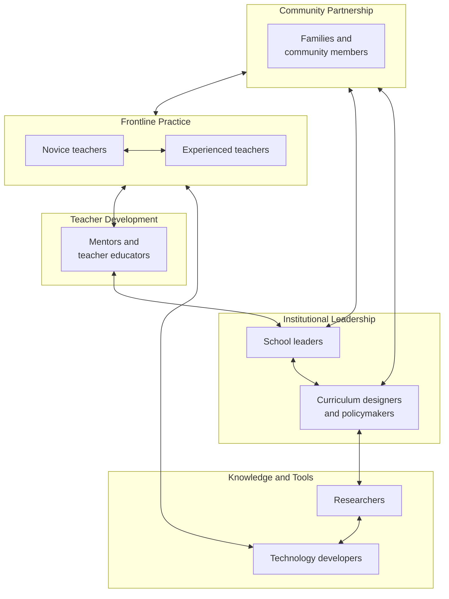

The diagram makes visible what the report has argued throughout: the seven stakeholder groups are reciprocally coupled, and the paradigm's sustainability depends on the coordination of their contributions rather than on the heroism of any single group.

### 9.5.2 The unified call

**To novice teachers**: enact paradigm-aligned practice within current constraints, beginning with the minimum viable practices and the phased developmental roadmap. Sustain reflective journaling and possible-selves goal-setting. Refuse the structural refusals. Contribute modestly to ecosystem influence through small cumulative moves. Permit yourself imperfection and joy. **You are not alone; the framework is at your side; the work begins on the next Monday morning**.

**To experienced teachers**: integrate what you have been doing into the framework's vocabulary; document multidimensional growth across years; mentor a novice through Schönian reflective partnership; advocate for ecosystem rebalancing; continue possible-selves goal-setting against the plateau. **Your accumulated craft is the paradigm's most consequential transmission medium; what you do not pass forward is lost**.

**To mentors and teacher educators**: adopt Schönian reflective-partnership stances rather than expert-evaluator transmission; integrate HEFEE into pre-service and in-service curricula through experiential, reflective methodologies that model what teachers will themselves enact; calibrate practicum experiences to include resource-constrained as well as well-resourced contexts; model lifelong learning visibly. **The structural inconsistency of teaching learner-centered pedagogy through lecture-based programs cannot be resolved by additional content; it is resolved by the mentor's own enactment**.

**To school leaders**: protect teacher professional agency as a foundational commitment; invest in PLC infrastructure as part of employment rather than as voluntary time; build hybrid summative-plus-formative assessment architectures within the school's discretion; treat primary education as foundational rather than peripheral; build family engagement structures that draw on family expertise. **Your decisions about class size, schedule, assessment culture, and leadership stance shape what is humanly possible in classrooms; the leverage is yours**.

**To curriculum designers and policymakers**: align standards with multidimensional commitments; build assessment systems that measure what the framework values; allocate resources to primary teacher training and language proficiency; resist the gravitational pull toward score-driven optimization; engage with international frameworks as discursive resources legitimizing domestic reform. **The discursive space exists in international policy; what is required is its operationalization in your jurisdiction**.

**To researchers**: prioritize longitudinal, multi-site, mixed-methods studies addressing the framework's open questions; build practitioner-research partnerships taking teacher craft knowledge seriously; develop assessment instruments adequate to multidimensional outcomes; engage transparently with policy and practice in forms accessible beyond academic publication. **The framework awaits your testing, refinement, and possible revision; the field's evidentiary thinness is an invitation, not an indictment**.

**To technology developers**: design for paradigm-amplification rather than paradigm-substitution; build governance, equity, and cultural-responsiveness commitments into product design rather than retrofitting; engage transparently with educational stakeholders; acknowledge what AI cannot do; support independent research on deployment outcomes. **The decadal trajectory of AI in elementary English education will be determined by your design choices and governance commitments at least as much as by your capability advances**.

**To families and community members**: recognize family expertise as educational resource rather than positioning yourself as homework graders; partner with schools as co-educators; support children's multidimensional development; engage in school-level dialogue about pedagogy, assessment, and child well-being; hold the long view across years rather than across test cycles. **The pressure you bring to bear on children's learning shapes the paradigm in classrooms more powerfully than most policy levers; what you ask for is what schools deliver**.

The call is unified by its reciprocity. **No stakeholder can sustain the paradigm alone**. Hero-teaching without leadership protection erodes; leadership commitment without policy alignment burns out; policy reform without research evidence misallocates; research without practitioner partnership disconnects; partnership without family engagement is incomplete; family engagement without technology governance faces shifting ground; technology governance without teacher professional agency reverses the framework's commitments. The coordination across stakeholders is the substrate that none of the recommendations alone can provide.

### 9.5.3 The long horizon honestly named

Paradigm change in elementary English education is **the work of a generation, not a season**. Its measure is not whether any single Monday morning is perfect but whether across years the cumulative direction of practice, policy, research, and ecosystem moves toward the humane and empowering vision the report has articulated. The horizon must be named honestly because the pace of change at any single level can produce despair if the longer arc is not visible.

Three observations about the horizon deserve explicit naming.

**Observation 1: The unevenness is part of what makes the change sustainable**. Classroom-level practice continues even when policy moves slowly; policy reforms create discursive space even when classroom-level uptake is partial; research generates evidence even when policy resistance persists; family partnerships strengthen even when assessment regimes lag. The mitigation pathway is not a single road but a network of partial roads, traversed unevenly by stakeholders whose coordination is imperfect but whose direction is, over time, recognizably aligned. Disciplined hope is the disposition appropriate to this unevenness; utopian optimism and fatalistic resignation are equally inadequate to it.

**Observation 2: Cumulative direction matters more than any single year's progress**. A novice teacher who sustains reflective practice across her first five years is, by year five, enacting paradigm-aligned practice that her year-one self could not have imagined; a school whose leadership commits to PLC infrastructure across a decade produces a faculty whose collective capacity exceeds what any single year of professional development could produce; a system whose curriculum standards align with multidimensional commitments across two policy cycles shifts the discursive space within which the next cycle's reforms unfold. **What is required is not annual transformation but sustained directional commitment**.

**Observation 3: The children whose elementary years are unfolding now cannot wait for the paradigm to be perfected**. The structural honesty of the long horizon must not become an alibi for present inaction. The work begins on the next Monday morning, in whatever forty minutes are available, with whatever resources are at hand, for the children who arrive at the classroom door tomorrow whose elementary years will not return. **The long horizon legitimizes patient sustained commitment; it does not legitimize delay in beginning**.

### 9.5.4 The closing image: what the building is for

The basement-to-building metaphor that has organized the report from Chapter 2 forward now reaches its closing form. The basement was engineered through theoretical foundations; the walls were built through curriculum and pedagogy; the people who inhabit the building were attended to through the human-layer commitments; the measuring instruments and life-support systems were installed; the keys were handed to the novice teacher; the systemic conditions were named honestly. What the building is finally for can now be stated.

**The building is for the cognitive, affective, social, physical-aesthetic, and ethical-spiritual flourishing of young children encountering a wider world through English**. It is for the six-year-old whose English class is the morning ritual through which she joins her classmates in a song that her body knows; the eight-year-old whose grandmother's recipe becomes the centerpiece of the class book; the ten-year-old whose project on the school garden produces recommendations the principal acts upon; the eleven-year-old whose reflective journal documents the strategies she uses across her L1 and her English; the children whose voices, fragile in the silence-spiral classrooms the report has documented, become stable and rising across the grades because the paradigm has been deliberately constructed to produce that direction.

The building is also for the teachers who inhabit it. It is for the novice walking into Grade 2 at 8:00 a.m. on Monday with a song and a story and forty minutes of children's attention to earn; for the experienced teacher whose accumulated craft now finds its integrative vocabulary; for the mentor whose Schönian partnership transmits the paradigm to the next generation; for the school leader whose protection of professional agency makes the work sustainable; for the policymaker whose curriculum standards open the discursive space for reform; for the researcher whose evidence base supports the practice; for the technology developer whose tools amplify rather than substitute; for the family member whose recipes and stories become curriculum resources.

The building is, finally, for the slow accumulating recognition across communities, schools, systems, and societies that **elementary English education is one of the most formative encounters a child has with a wider world**, and that designing this encounter to honor the integrated whole person the child is becoming is among the most consequential pedagogical commitments any society can make. The work is generational; the children are present; the framework is at the practitioners' side; the basement has been engineered, the walls have been built, the keys have been handed over. The next Monday morning is approaching for every reader of this report, and the work begins, as it always has, in the named recognition of the first child who walks through the classroom door.

This report has been written, from its first page to its last, for the elementary English teachers—novice and experienced, in well-resourced and resource-constrained contexts, across diverse cultural and policy environments—whose accumulated commitment, calibrated to realistic constraints and sustained across decades, will determine whether the paradigm shift the report has argued for becomes the lived experience of the children whose elementary years are unfolding now. **The framework is at your service; the paradigm is the form your practice takes when you enact it; the work is yours, and the children are waiting**. Chapter 10 follows with the glossary, keyword catalogue, references, and curated resources that support continued professional development beyond the close of this report. What this chapter has done, finally, is name what the work is for, and why—across the imperfect ecosystems and the long horizons—it is worth the generational commitment it requires.

# 10 Glossary, Keywords, References, and Recommended Resources

The preceding nine chapters have moved through a deliberate progression: from diagnostic framing through theoretical foundations, framework architecture, pedagogical operationalization, the human layer of teacher and student empowerment, the assessment-technology-ecosystem integration, the practical novice toolkit, the multi-level systemic horizon, and finally the closing vision and unified call to action. What remains is the reference apparatus that supports the report's continued usefulness once readers move beyond its covers into their own professional development. This chapter consolidates that apparatus into eight integrated sections that perform distinct but complementary functions: a curated keyword catalogue calibrated for academic indexing and database searchability (10.1); a glossary of core terms whose definitions support both quick reference and conceptual deepening (10.2); thematically organized bibliographies covering holistic education traditions (10.3), elementary EFL/ESL pedagogy (10.4), policy documents and international frameworks (10.5), and assessment, reflective practice, and teacher development (10.6); a curated list of practical resources spanning books, journals, websites, AI tools, and training programs (10.7); and recommended reading pathways calibrated to the report's differentiated audiences (10.8). The chapter is designed to be navigable rather than exhaustive, with annotations that orient readers to relevance and entry-points rather than performing comprehensive scholarly review. A working principle organizes the entire architecture: **the resources catalogued here are working tools for sustained practice, not a closing display of authority**, and their value lies in the use readers make of them across the years over which the paradigm shift is enacted.

## 10.1 Curated Keywords for Academic Indexing and Database Searchability

A research report addresses two audiences simultaneously: the readers who engage its argument in linear form and the readers who locate it through database searches whose retrieval depends on keyword matching. The keyword catalogue below is calibrated for both functions, organized into four thematic clusters that mirror the report's structural commitments. Each cluster is annotated with brief notes on the cluster's relevance to elementary English teaching specifically, supporting researchers and practitioners who seek to extend the report's bibliographic anchors into related literatures.

### 10.1.1 Paradigmatic and theoretical keywords

These keywords anchor the report's foundational positioning within holistic education, humanistic psychology, and contemporary policy discourses. They are most useful for researchers locating the report within broader paradigmatic conversations and for teacher educators seeking to situate the framework within established theoretical traditions.

| Keyword | Conceptual reference | Primary chapter anchor |
|---|---|---|
| Holistic education | Smuts, Miller, Waldorf tradition | Ch 2.1, 2.2 |
| Holistic empowerment | HEFEE original framework | Ch 3.1, 3.2 |
| Paradigm shift | Kuhn-derived usage applied to elementary EFL | Ch 1.3, 2.5 |
| Whole-child development | ASCD, multidimensional learning | Ch 3.2, 3.4 |
| Learner agency | OECD Learning Compass 2030, structured agency | Ch 3.3, 5.5 |
| Reflective practitioner | Schön; reflection-in-action / reflection-on-action | Ch 1.5, 5.1, 5.4 |
| Banking concept of education | Freire, dialogical pedagogy | Ch 2.1.5, 5.1.1 |
| Facilitative conditions | Rogers, humanistic psychology | Ch 5.1.3 |
| Four Pillars of Learning | UNESCO, Delors Report | Ch 2.1.7, 3.2 |
| Possible language teacher selves | Kubanyiova, teacher identity | Ch 7.1.5, 7.6.1 |

### 10.1.2 Pedagogical and curricular keywords

These keywords anchor the report's operational pedagogical commitments. They are most useful for practitioners locating Monday-morning teaching strategies, for curriculum designers situating the report's curricular architectures within the broader pedagogical literature, and for teacher educators integrating the report's recommendations into pre-service and in-service curricula.

| Keyword | Conceptual reference | Primary chapter anchor |
|---|---|---|
| Elementary English teaching | Cameron, Pinter, EYL tradition | Ch 1, 4 |
| EFL pedagogy | English as a Foreign Language teaching | Throughout |
| ESL pedagogy | English as a Second Language teaching | Throughout |
| Communicative language teaching (CLT) | Hymes, Canale-Swain | Ch 1.3.2, 2.4 |
| Content and Language Integrated Learning (CLIL) | Coyle's 4Cs framework | Ch 4.1.3 |
| Task-based language teaching (TBLT) | Communicative task design | Ch 2.4 |
| Project-based learning (PBL) | Generative themes, multi-week inquiry | Ch 4.4.1, 7.1.4 |
| Inquiry-based learning | Open-ended question-driven pedagogy | Ch 4.4.2 |
| Storytelling pedagogy | Cameron, Ellis & Brewster, Wright | Ch 4.3, 7.1.2 |
| Total Physical Response (TPR) | Asher, embodied vocabulary acquisition | Ch 4.2.3 |
| Cooperative learning | Information-gap design, role differentiation | Ch 4.4.3 |
| Differentiated instruction | Content / process / product differentiation | Ch 4.5.3 |
| Theme-based teaching | Theme-organized syllabi for young learners | Ch 4.1.3 |
| Drama in language learning | Process drama, role-play | Ch 4.3.4 |
| Play-based learning | Pedagogically rich game design | Ch 4.2.2 |
| Generative themes | Freire-derived curriculum design | Ch 4.1.2, 4.4.1 |
| Meaning-led sequencing | Form serves meaning principle | Ch 3.1.2, 4.1.2 |
| Scaffolding | Vygotskian gradual release | Ch 4.4.4 |
| Young learners | EYL field; ages 6-12 | Ch 1.3.1, 2.2 |

### 10.1.3 Assessment, technology, and ecosystem keywords

These keywords anchor the report's commitments to multidimensional measurement, paradigm-amplifying technology integration, and the supportive ecosystem within which classroom-level practice is sustained.

| Keyword | Conceptual reference | Primary chapter anchor |
|---|---|---|
| Formative assessment | Black & Wiliam, classroom-level evaluation | Ch 6.1, 6.2 |
| Performance-based assessment | Pierce, multimodal demonstration | Ch 6.2.2 |
| Multidimensional rubrics | HEFEE 5 × 3 grid operationalized | Ch 6.2.4 |
| Portfolio assessment | Stiggins, Collins, growth-over-time documentation | Ch 6.3 |
| Peer and self-assessment | Evaluative agency cultivation | Ch 6.3.3 |
| Willingness to communicate | Affective engagement tracking | Ch 6.3.4 |
| AI-assisted language learning | Khanmigo, ELSA Speak, governance | Ch 6.4, 8.4 |
| Speech recognition (ASR) | Pronunciation feedback platforms | Ch 6.4.3 |
| Educational technology integration | Paradigm-amplification framing | Ch 6.4.1 |
| Classroom climate | Qiu, positive supportive dialogical environments | Ch 6.6.1 |
| Family engagement | Epstein's Six Types of Involvement | Ch 6.7, 8.2.3 |
| Place-based learning | Community-anchored language use | Ch 6.7.4 |
| Culturally responsive education | Çelik, identity-affirming pedagogy | Ch 6.6.5 |
| Ethical governance of AI | Data privacy, equity, paradigm coherence | Ch 6.5, 8.4.6 |

### 10.1.4 Teacher development keywords

These keywords anchor the report's commitments to teacher empowerment as a level reciprocally coupled with student empowerment, and to the developmental architecture by which novices grow into integrated practice.

| Keyword | Conceptual reference | Primary chapter anchor |
|---|---|---|
| Novice teacher development | Four-stage progression: Survival → Integration | Ch 5.4, 7.5 |
| Professional learning communities (PLCs) | Sustained collaborative inquiry | Ch 5.4.3, 6.6.3 |
| Mentoring | Schönian reflective partnership | Ch 7.6.3 |
| Lifelong learning | Teacher-modeled disposition | Ch 5.2.3 |
| Reflective journaling | Three-question end-of-day protocol | Ch 7.6.1 |
| Lesson study | Collaborative lesson design and review | Ch 5.4.2 |
| Peer observation | Descriptive non-evaluative protocol | Ch 7.6.2 |
| Teacher self-care | Well-being as relational substrate | Ch 7.7 |
| Teacher language proficiency | Foundational professional competence | Ch 8.1.5 |
| Pre-service teacher education | Experiential, reflective program design | Ch 8.3.2 |
| In-service professional development | Sustained collaborative architecture | Ch 8.3.2 |
| Possible-selves goal-setting | Ideal / Ought-to / Feared selves | Ch 7.6.1 |

### 10.1.5 Composite search strings for database queries

For researchers conducting systematic database searches, the following composite strings combine keywords from multiple clusters to support targeted retrieval.

- **Holistic empowerment + elementary English**: locates the report and adjacent literature on integrative paradigms specifically for primary-level English teaching.
- **Communicative competence + young learners + multidimensional assessment**: locates literature on CLT extension into formative multidimensional evaluation.
- **Reflective practitioner + novice teacher + EFL**: locates literature on Schönian reflective practice in elementary EFL contexts.
- **Storytelling + Total Physical Response + classroom climate**: locates literature integrating embodied imaginative pedagogy with affective design.
- **AI-assisted language learning + ethical governance + elementary**: locates literature on age-appropriate technology integration with governance structures.
- **Family engagement + culturally responsive + EFL**: locates literature on partnership models honoring linguistic and cultural diversity.
- **Formative assessment + portfolio + young learners**: locates literature on growth-over-time documentation in elementary classrooms.

The search strings are illustrative rather than exhaustive; readers conducting their own systematic reviews will adapt them to specific database conventions and disciplinary boundaries.

## 10.2 Glossary of Core Terms and Concepts

The glossary below provides concise definitions of the report's central terms, organized to support both quick reference and conceptual deepening. Each entry is calibrated to novice-teacher accessibility while preserving the conceptual rigor that more advanced readers require. Cross-references to the chapters in which the term receives extended treatment allow readers to move from definition to elaboration as needed. The glossary is structured into five thematic groupings reflecting the report's architecture.

### 10.2.1 Foundational framework vocabulary

**Holistic education.** An educational orientation that treats the learner as an integrated whole—cognitive, emotional, social, physical, aesthetic, and ethical-spiritual—and seeks the harmonious development of all these dimensions rather than the optimization of any single one. The orientation traces philosophically through Smuts, Dewey, Montessori, Steiner, Freire, Maslow, Rogers, and UNESCO's Four Pillars. It is distinguished from narrower learner-centered or whole-child approaches by its insistence that the dimensions are coupled rather than additive: addressing one dimension well while neglecting others does not merely under-deliver on the neglected dimensions but also on the targeted one. (Ch 2.1, 3.1)

**Holistic empowerment.** The integration of holistic developmental commitments with the cultivation of agency at three levels (student, teacher, learning community). The construct distinguishes the framework from approaches that pursue multidimensional development paternalistically (without agency) or that pursue agency without developmental grounding (unmoored choice). Empowerment in this sense is structural rather than rhetorical: it requires assessment systems, pedagogical structures, and ecosystem conditions calibrated to its enactment. (Ch 1.3, 3.1)

**HEFEE (Holistic Empowerment Framework for Elementary English).** The original conceptual framework articulated in this report, integrating five developmental dimensions × three levels of empowerment under five guiding principles, recognizable through six distinguishing markers, and operationally enactable through curriculum redesign, pedagogical strategies, the human-layer commitments, the assessment-technology-ecosystem architecture, and the novice-teacher toolkit. The framework is designed specifically for the elementary EFL/ESL classroom and its surrounding ecosystem, distinguishing it from subject-agnostic frameworks that must be retrofitted to language teaching. (Ch 3 entire)

**Paradigm shift.** Following Kuhn's familiar usage, a reconfiguration of the assumptions themselves—what counts as success, what counts as evidence, what counts as the teacher's role—rather than a marginal adjustment within existing assumptions. The report's central claim is that elementary English education in many systems requires precisely such a reconfiguration, not a refinement, because incremental reform within the dominant paradigm has not reversed the foundational decline the OECD documents and the affective erosion the Ethiopian observation evidence captures. (Ch 1.3, 2.5)

**Whole-child development.** Multidimensional development that addresses cognitive, affective, social, physical-aesthetic, and ethical-spiritual dimensions concurrently rather than sequentially. ASCD's articulation specifies five tenets—healthy, safe, engaged, supported, challenged—that the framework integrates within its broader dimensional architecture. The whole-child orientation is the closest conceptual cousin to HEFEE among neighboring frameworks; HEFEE's distinctive contribution is the operationalization of whole-child commitments specifically for elementary English teaching. (Ch 3.1.4, 3.2)

### 10.2.2 The framework's structural axes

**The five developmental dimensions.** *Cognitive* (language proficiency integrated with 4Cs thinking skills); *Affective* (motivation, confidence, emotional safety, well-being); *Social* (collaboration, communication, intercultural awareness); *Physical-aesthetic* (embodied learning, movement, songs, drama, artistic expression); *Ethical-spiritual* (values, character, identity, meaning-making in the secular developmental sense). The dimensions are analytical distinctions within a single integrated developmental process; they are separated for clarity but addressed concurrently in any well-designed lesson. (Ch 3.2)

**The three levels of empowerment.** *Student level* (cultivating age-appropriate voice, choice, ownership, and self-regulation in young learners); *Teacher level* (cultivating professional judgment, identity, reflective capacity, and collaborative authority); *Learning community level* (extending agency to peer culture, families, school leadership, and broader community). The levels are reciprocally coupled: student empowerment is structurally impossible without teacher empowerment, and teacher empowerment is structurally impossible without ecosystem-level support. (Ch 3.3)

**The five guiding principles.** *Integration over fragmentation*; *Agency over compliance*; *Meaning over form*; *Relationship over transmission*; *Reflection over routine*. The principles are deliberately formulated as oppositions, not because the rejected pole is wholly wrong but because the dominant paradigm has tilted so far in one direction that re-balancing requires explicit countervailing emphasis. (Ch 3.1.2)

**The six distinguishing markers.** Co-presence of all five dimensions in a single lesson; visible learner agency within structured routines; meaning-led, form-attentive sequencing; visible affective warmth and error-as-evidence stance; embodied and aesthetic channels as core not decoration; reflective practice visible in teacher behavior. The markers function as a qualitative gestalt test by which a HEFEE-aligned classroom can be recognized in contrast to its conceptual neighbors. (Ch 3.4.2)

### 10.2.3 Theoretical anchors

**Zone of Proximal Development (ZPD).** Vygotsky's designation of the gap between what a learner can do independently and what she can do with support; learning is most efficient when teaching targets this zone with scaffolded assistance that is gradually withdrawn. For elementary EFL, ZPD justifies the gradual transition from L1 support to English-only communication, the calibrated withdrawal of sentence frames as competence grows, and the differentiated scaffolding novice teachers provide across mixed-ability classes. (Ch 2.2.3, 4.4.4)

**Reflection-in-action and reflection-on-action.** Schön's twin concepts naming the reflective work of practitioners. *Reflection-in-action* is the on-the-spot adjustment a teacher makes mid-lesson when she notices that a planned task is producing silence rather than communication; *reflection-on-action* is the deliberate analysis after the lesson, typically through journaling or peer dialogue. The two alternate because, as Schön notes, "the stance appropriate to reflection is incompatible with the stance appropriate to action". The reflective practitioner becomes "a researcher in the practice context". (Ch 1.5, 5.1, 5.4)

**Banking concept of education.** Freire's name for the dominant model of instruction in which "education thus becomes an act of depositing, in which the students are the depositories and the teacher is the depositor." The framework's commitment to dialogical, problem-posing pedagogy is the deliberate displacement of the banking concept; the Ethiopian observation evidence of teachers spending thirty of forty minutes explaining grammar in L1 documents the banking concept's persistence in elementary EFL specifically. (Ch 2.1.5, 5.1.1)

**Facilitative conditions.** Rogers's three attitudes that make significant learning possible: *realness or genuineness* (the teacher as authentic person rather than role-deliverer); *prizing, acceptance, and trust* (unconditional positive regard for the learner as a person of worth); and *empathic understanding* (entering imaginatively into the learner's frame of reference). Rogers insists these are attitudes rather than techniques, but they manifest as observable behaviors a novice teacher can recognize and rehearse. (Ch 5.1.3)

**Sensitive periods.** Montessori's term for "a critical time during human development when the child is biologically ready and receptive to acquiring a specific skill or ability—such as the use of language or a sense of order—and is therefore particularly sensitive to stimuli that promote the development of that skill". For elementary EFL, the second plane (ages 6–12) corresponds to the developmental window in which language learning combined with reasoning, social affiliation, and aesthetic responsiveness is most efficient. (Ch 2.1.3)

**Possible language teacher selves.** Kubanyiova's articulation, drawing on Markus and Nurius's possible-selves theory, of three teacher self-images that shape pedagogical decisions: the *Ideal self* (who I want to become), the *Ought-to self* (who I am responsible to others to be), and the *Feared self* (who I do not want to become). The construct organizes the monthly possible-selves check-in of Chapter 7.6.1 and provides the conceptual frame for the Hiro and Erin cases of Chapter 7.1.5. (Ch 7.1.5, 7.6.1)

### 10.2.4 Pedagogical operationalizations

**Total Physical Response (TPR).** Asher's language teaching method "built around the coordination of speech and action," teaching language "through physical (motor) activity." TPR rests on the bio-program (listening competence precedes speaking ability), brain lateralization (right-brain motor activity precedes left-brain language production), and stress reduction (meaning interpreted through movement liberates learners from self-conscious anxiety). Asher himself stressed that TPR should be combined with other methods. (Ch 4.2.3)

**Communicative competence.** Originating in Hymes's and Canale-Swain's work and elaborated through Communicative Language Teaching, the ability to use language appropriately in real social and functional contexts—not merely to manipulate forms. The framework treats communicative competence as a *necessary but insufficient* component of holistic empowerment; CLT addresses the cognitive and partial social dimensions but does not, by itself, secure the affective, physical-aesthetic, or ethical-spiritual dimensions. (Ch 1.3.1, 2.4)

**Learner agency.** Following the OECD Learning Compass 2030's formulation, "the ability to determine one's own actions"—a capacity that, for young children, is scaffolded rather than assumed. Student agency in elementary EFL takes four developmentally calibrated forms: voice, choice, ownership, and self-regulation. (Ch 3.3.1, 5.5)

**Structured agency.** The framework's specific articulation of learner agency as exercised *within* and *through* clear structures rather than in their absence. The teacher's professional judgment shapes the choice space (which alternatives are pedagogically valuable); the child's agency operates within it. The construct rejects the equation of agency with unstructured permissiveness, which reliably produces louder children dominating, quieter children disengaging, and L1 dominance under low scaffolding. (Ch 3.3.1, 5.5.1)

**Generative themes.** Freire's term for curriculum content drawn from learners' lived worlds—their families, neighborhoods, foods, festivals, and concerns—rather than imposed from external curricular tables of contents. The Wanli Primary School research operationalized generative themes through the use of "real materials… closely related to students' lives, such as news reports, advertisements, songs, movie clips". (Ch 4.1.2, 4.4.1)

**Meaning-led sequencing.** The principle that tasks are sequenced from real meaning-making with genuine consequences, with form attended to in the service of meaning rather than as its prerequisite. The principle inverts the conventional sequence in which vocabulary and grammar are pre-taught before any communicative use is permitted. (Ch 3.1.2, 4.1.2)

### 10.2.5 Assessment, technology, and ecosystem vocabulary

**Formative assessment.** Classroom-level evaluation whose primary purpose is the improvement of learning rather than the reporting of achievement. Black and Wiliam's foundational meta-analysis established that "improved formative or classroom assessment practices helped low achievers more than other students," with cognitive payoffs that compound across time. (Ch 6.1, 6.2)

**Performance-based assessment.** Pierce's articulation of assessment that "uses a constructed-response format" with "the improvement of learning" as primary purpose, deploying "meaningful and engaging tasks." Three task families organize the repertoire: products (writing, projects, portfolios), performances (oral reports, drama, demonstrations), and process-oriented assessments (think-alouds, learning logs, conferences). (Ch 6.2.2)

**Multidimensional rubric.** A rubric whose criteria collectively address at least three of the five HEFEE dimensions, with age-graded language and child-facing form alongside the teacher's analytic version. The four-stage gradient (emerging → beginning → developing → expanding), drawn from the British Columbia framework used in the Malaysian rural primary portfolio research, provides a growth-oriented structure that avoids deficit framing. (Ch 6.2.4)

**Willingness to communicate.** A learner's readiness to engage in L2 communication when given the opportunity. The construct provides the diagnostic instrument by which the silence spiral can be tracked in classroom log form, and by which its reversal can be documented across weeks and months as a primary affective-dimension outcome. (Ch 6.3.4)

**Paradigm-amplification (versus paradigm-substitution).** The framework's framing of technology integration. A tool *amplifies* the pedagogical paradigm of the classroom in which it is deployed; the same tool deployed in a banking-model classroom intensifies that model, while deployed in a HEFEE-aligned classroom can amplify learner agency and free teacher relational time. The burden of paradigm coherence remains with teachers and ecosystems rather than with the tools themselves. (Ch 6.4.1, 8.4.1)

**Ethical governance of educational technology.** The structural commitments that protect children, teachers, and equity in technology integration, including data privacy for child users, transparent parental partnership, equity calibration, cultural responsiveness designed into product development, and teacher professional agency as the binding governance authority. (Ch 6.5.2, 8.4.6)

## 10.3 Authoritative Academic References on Holistic Education and Whole-Child Development

This section compiles the canonical and contemporary references on holistic education traditions cited across Chapters 2 and 3. The references are annotated with brief notes on their relevance to elementary English teaching specifically. They are organized in approximate chronological order to support readers tracing the historical development of holistic thought, with contemporary syntheses placed at the end.

### 10.3.1 Foundational theoretical works

**Smuts, J. C. (1926). *Holism and Evolution*.** The originating articulation of "holism" as a philosophical concept, arguing that the universe exhibits a tendency toward the formation of integrated wholes whose properties cannot be reduced to the sum of their parts. Although Smuts wrote relatively little about classroom practice, the conceptual move from additive to integrative ontology supplies the philosophical grammar that subsequent thinkers deploy in their pedagogical work. **Relevance for elementary EFL**: foundational for the framework's commitment that the child cannot be partitioned into curricular targets without distorting both the child and the curriculum.

**Dewey, J. (1916). *Democracy and Education*; Dewey, J. (1938). *Experience and Education*.** Dewey's progressive philosophy of experience grounds learning in the dynamic interaction between learner and environment, theorizing experience as continuous, transactional, and educative. Dewey's analysis of experience into the twin moments of *trying* and *undergoing* is decisive for elementary English pedagogy: a child who chants "Good morning, teacher" without engaging in any felt transaction is performing what Dewey calls "mere activity," while a child who genuinely communicates and receives a meaningful response has undergone an experience in the technical sense. As discussed in Ord's analysis, Dewey defined education as "that reconstruction or reorganisation of experience which adds to the meaning of experience and which increases ability to direct the course of subsequent experience". **Relevance**: foundational for Chapter 4.2's experiential learning architecture and the meaning-led sequencing principle.

**Montessori, M. (multiple works).** Montessori's developmental architecture organized human development into four planes, with the second plane (ages 6–12) corresponding to the elementary years and characterized by "a state of health, strength, and assured stability" combined with the reasoning mind's drive toward causal explanation, moral reasoning, and a place in the social and cosmic order. Within each plane, *sensitive periods* designate critical windows of biological readiness for specific skills. **Relevance**: anchors the developmental specificity of Chapter 2.2 and the prepared-environment commitments throughout the framework.

**Steiner, R. / Waldorf education.** Steiner's pedagogy, founded in 1919, is built around the principle of educating "the head, heart, and hands, engaging intellect, emotions, and physical body in harmony". Contemporary research increasingly supports the cognitive and affective benefits of this integration, with movement, arts, and unstructured play documented as essential to brain development and learning motivation. **Relevance**: anchors the physical-aesthetic dimension's commitment that songs, drama, and embodied learning are core pedagogical channels rather than supplementary.

**Freire, P. (1970/2005). *Pedagogy of the Oppressed*. 30th Anniversary Edition. Continuum.** Freire's foundational naming of the *banking concept of education* and articulation of the alternative *problem-posing* pedagogy founded on dialogue. The diagnostic precision of Freire's enumeration of banking-model attitudes ("the teacher teaches and the students are taught; the teacher knows everything and the students know nothing…") is uncanny when held against the Ethiopian classroom transcripts. **Relevance**: anchors the framework's commitment to dialogical pedagogy and to generative themes drawn from learners' lived worlds.

**Maslow, A. (multiple works); Rogers, C. (multiple works).** Humanistic psychology's contribution to education rests on two convictions: that learning higher-order capabilities presupposes the satisfaction of more basic needs for safety, belonging, and esteem; and that the teacher's stance of unconditional positive regard and empathic understanding is the precondition of self-actualization through learning. As Patterson's review of Rogers's educational work documents, students of teachers rated high on facilitative conditions outperform students of teachers rated low on cognitive as well as affective measures, including the Aspy and Hadlock finding of 2.5-year reading gains versus 0.7-year gains across five months. **Relevance**: anchors the framework's affective dimension and the facilitator role of Chapter 5.1.

### 10.3.2 Contemporary syntheses

**Miller, J. P. (2019). *The Holistic Curriculum, Third Edition*. University of Toronto Press.** Originally published in 1988, *The Holistic Curriculum* "addresses the problem of fragmentation in education through a connected curriculum of integrative approaches to teaching and learning." The third edition expands upon "the six curriculum connections: subject, community, thinking, earth, body-mind, and soul," features insights into Indigenous approaches to education, and includes a dialogue between Miller and Four Arrows on the relationship between holistic education and Indigenous education.[^58][^59] **Relevance**: the most extensive contemporary synthesis of holistic curriculum thought, providing the bibliographic anchor for Chapter 2.1's theoretical convergence and Chapter 3's framework architecture. Suitable for teacher educators, curriculum designers, and researchers seeking sustained engagement with the holistic tradition.

**Cajete, G. (in Miller 2019 introduction); Four Arrows / Jacobs, D. T.** The third-edition introduction by leading Indigenous educator Greg Cajete and the author-Four Arrows dialogue extend the holistic tradition through Indigenous pedagogical perspectives.[^59] **Relevance**: opens the framework toward the cultural responsiveness commitments of Chapter 6.6.5 and the call for curricula that go "beyond a siloed grid of subjects" articulated in UNESCO's contemporary policy discourse.

**ASCD's Whole Child Framework.** Articulates that students should be **healthy, safe, engaged, supported, and challenged**, positioning whole-child education as a school-wide rather than classroom-only commitment. The Whole School, Whole Community, Whole Child (WSCC) extension integrates ten components addressing student and staff physical and mental well-being while including family and community. **Relevance**: HEFEE's affective and social dimensions integrate ASCD's tenets within the framework's broader dimensional architecture; the WSCC model anchors the ecosystem-level commitments of Chapter 6.

**P21 Framework for 21st Century Learning.** Identifies critical thinking, creativity, communication, and collaboration (the 4Cs) as core skills, with extensions covering information/media/technology literacy and life-and-career skills. **Relevance**: anchors the cognitive dimension's articulation of language proficiency integrated with thinking skills; cited extensively in Chapter 3.2.1 and applied in the project- and inquiry-based learning designs of Chapter 4.4.

**CASEL Framework for Systemic Social and Emotional Learning.** Targets intrapersonal, interpersonal, and cognitive competence through a systemic architecture extending across classroom, school, family, and community. **Relevance**: anchors the affective dimension's commitments and provides empirical evidence that SEL has measurable impact on "academic achievement, equity and poverty, and other lifetime outcomes". Cited in Chapter 3.2.2 and applied in the affective design routines of Chapter 5.3.

## 10.4 References on Elementary EFL/ESL Pedagogy and Young Learner Education

This section compiles the foundational and contemporary references on elementary English teaching, organized by topical focus to support targeted reading. The empirical case studies cited throughout the report are grouped at the end with brief notes on each study's methodological scope and primary findings.

### 10.4.1 Foundational EYL pedagogical texts

**Cameron, L. (2001). *Teaching Languages to Young Learners*. Cambridge University Press.** Cameron's foundational text "offers teachers and trainers a coherent theoretical framework to structure thinking about children's language learning" and "gives practical advice on how to analyse and evaluate classroom activities, language use and language development."[^60][^61] The chapters cover children learning a foreign language, learning through tasks and activities, the spoken language, words, grammar, literacy skills, learning through stories, theme-based teaching, language choice, assessment, and broader issues. The British Council Network News review describes the book as offering "an excellent, in-depth insight into how children learn and how teachers can promote their learning potential," and observes that it provides "a sound theoretical basis for their teaching, as well as lots of practical ideas".[^60][^61] **Relevance**: the most comprehensive single text on elementary EFL pedagogy, suitable for novice teachers, mentors, and teacher educators alike. Particularly valuable for its theoretical depth combined with classroom-applicable analysis.

**Pinter, A. (2017). *Teaching Young Language Learners*, 2nd Edition. Oxford University Press.** Pinter's text "covers the most relevant areas of the field: learning and development; learning the first language" and extends through subsequent topics central to teaching young language learners.[^62][^63][^64] The book is widely used in pre-service and in-service teacher training programs and is described by readers as "a useful resource, written in a direct and easy to" follow style.[^64] **Relevance**: a complementary foundational text to Cameron's, with particular strengths in developmental theory and practical scaffolding for novice teachers.

**Slatterly, M., & Willis, J. (2001). *English for Primary Teachers*. Oxford University Press.** Foundational EYL principles operationalized for novice teachers: focusing on meaningful language use; incorporating enjoyable, varied, and achievable activities; integrating songs, stories, rhymes, games, and drama; using objects, pictures, and actions; and establishing predictable classroom routines. **Relevance**: one of the most accessible introductions to EYL pedagogy for novice teachers; principles align directly with HEFEE's embodied and imaginative pedagogy commitments in Chapter 4.

### 10.4.2 Storytelling and drama in primary EFL

**Ellis, G., & Brewster, J. (2014). *Tell It Again! The Storytelling Handbook for Primary English Language Teachers*. British Council.** Ellis and Brewster emphasize that story-based lessons "increase students' motivation, especially in developing listening comprehension and pronunciation skills," and that dramatizing stories with role-playing games and visual materials increases the method's effectiveness. **Relevance**: the most comprehensive practical handbook for primary storytelling pedagogy, available freely through the British Council.

**Wright, A. (2009). *Storytelling with Children*. Oxford University Press.** Wright evaluates storytelling as developing "independent thinking and communication skills" and notes that "in the process of storytelling, repeated language units are consolidated in the memory of students and natural speech is formed." **Relevance**: complementary to Ellis and Brewster, with particular strength in the integration of picture and word for young learners with limited vocabulary.

**Harmer, J. (multiple editions). *The Practice of English Language Teaching*. Pearson.** Situates storytelling within the communicative approach as "a means of creating an authentic language environment" that "enlivens the lesson process and ensures the active participation of students." **Relevance**: contextualizes elementary-specific pedagogies within broader CLT frameworks; suitable for teachers seeking to position their EYL practice within the wider language-teaching field.

### 10.4.3 Total Physical Response and embodied pedagogy

**Asher, J. J. (1969, and subsequent editions). The Total Physical Response Approach to Second Language Learning. *The Modern Language Journal*, 53(1).** The codifying article for TPR, articulating the bio-program, brain-lateralization, and stress-reduction foundations. Asher himself stressed that TPR should be combined with other methods and acknowledged the method's level ceiling, content coverage gaps, and repetition risk. **Relevance**: the canonical reference for Chapter 4.2.3; novice teachers benefit from reading Asher directly to understand the method's theoretical grounding rather than only its surface form.

### 10.4.4 Empirical case studies cited throughout the report

**Taddese, E. T., Yassin, H. A., Dinsa, M. T., & Lakew, A. K. (2025). The practices and challenges of teaching English to young learners: a case of selected primary schools in Ethiopia. *Frontiers in Education*, 10:1656387.** A 2025 case study across six districts and forty-eight observed lessons that anchors much of the report's diagnostic discussion. Documents the persistence of grammar-translation pedagogy, the collapse of pair work into teacher-fronted Q&A, and the silence spiral across grades. **Relevance**: foundational empirical anchor for Chapter 1's diagnostic framing, cited extensively across Chapters 1, 2, and 8.

**Mengniyozova, S. (storytelling experiment, primary EFL).** A primary-school experiment dividing forty Grade 3 students into experimental (n=20) and control (n=20) groups across eight weeks, finding that "the vocabulary of the students in the experimental group increased by 35%, while in the control group this figure was 15%," with significant improvements in listening comprehension and qualitative gains in motivation and independent thinking. **Relevance**: empirical anchor for Chapter 4.3's storytelling pedagogy.

**Hong Kong primary ESL theme-based course (88 students).** A study reporting that "69% of participants expressed increased interest in English after a theme-based course, compared to 59% before," with 33% of children identifying *Food* as their preferred theme. **Relevance**: empirical anchor for Chapter 4.1's theme-based curriculum architecture.

**Wanli Primary School interdisciplinary English research (China).** Research argues that traditional subject teaching produces "fragmented" knowledge and that interdisciplinary teaching addresses "topics related to English and constructs interdisciplinary projects… combining knowledge from other disciplines." **Relevance**: empirical and design anchor for Chapter 4.1's interdisciplinary architecture and Chapter 4.4.1's project-based learning.

**Aziz, M. N. A., & Yusoff, N. M. (2015). Using Portfolio to Assess Rural Young Learners' Writing Skills in English Language Classroom. *The Malaysian Online Journal of Educational Science*, 3(4).** Documents portfolio-tracked writing development for eleven Year 4 children in Sabah across four bands derived from the British Columbia framework, with three children expanding, two developing, four beginning, and two emerging. **Relevance**: empirical anchor for Chapter 6.3's portfolio architecture; particularly valuable for the children's own articulated voices on portfolio benefits.

**Qi, G. Y. (2016). The importance of English in primary school education in China: perceptions of students. *Multilingual Education*, 6:1.** A Nanjing-based study across three socio-economic contexts documenting student attitudes toward English, parental investment patterns, and the affective costs of exam-driven preparation. **Relevance**: empirical anchor for Chapter 8.1's diagnostic of structural tensions, particularly the parental-expectations versus child-well-being tension and the equity implications of differential SES contexts.

**Anggrainy-Matsumiya-Watanabe Japanese teacher self-reflection case study.** A case study using Kubanyiova's three possible language teacher selves (Ideal, Ought-to, Feared) to analyze elementary EFL teachers' self-reflection across multiple lesson observations, including the Hiro and Erin cases featured in Chapter 7.1.5. **Relevance**: empirical anchor for the possible-selves goal-setting protocol of Chapter 7.6.1.

## 10.5 Policy Documents and International Frameworks

This section compiles the authoritative policy documents and international frameworks that contextualize HEFEE within global educational discourse. Each entry is annotated with a brief description of its function and its relevance to HEFEE specifically. The documents are organized by issuing body and chronologically within each cluster.

### 10.5.1 UNESCO documents

**UNESCO (1996). *Learning: The Treasure Within* (Delors Report).** Articulates the Four Pillars of Learning: **learning to know, learning to do, learning to live together, learning to be**. The pillars constitute the contemporary international synthesis of holistic education, integrating cognitive, pragmatic, social-ethical, and existential dimensions. **Relevance**: HEFEE's five dimensions extend the Four Pillars architecture for elementary EFL specifically, with the physical-aesthetic dimension supplementing the original four.

**UNESCO (2021). *Reimagining our futures together: a new social contract for education*.** Calls for a renewed educational social contract grounded in the right to education throughout life and education as a public and common good. Names "pedagogies of cooperation and solidarity," reimagined curriculum that goes "beyond a siloed grid of subjects to foster meaningful participation in the knowledge commons," teaching as "a collaborative profession," digital learning futures shaped by "principles of social and economic justice, equity, and respect for human rights," and "learning lifelong and across society." **Relevance**: provides the international policy frame within which HEFEE's commitments are situated; cited extensively in Chapter 8.

**UNESCO (2025). *The right to education: past, present and future directions*.** Released to mark Human Rights Day and the 65th anniversary of the 1960 Convention against Discrimination in Education. Tracks 25-year progress and gives directions for the future. Documents that "in 2023, 82% of countries provided over 9 years of free primary and secondary education - compared to 56% in 2000," and that in sub-Saharan Africa, "the gross enrolment rate leapt from 79% in 2000 to 97% in 2024 at primary level."[^65] At the same time, the report notes that "the number of out-of-school children is again on the rise: 272 million in 2023" with "almost three-quarters of the global out-of-school population is in Central and Southern Asia (34%) and sub-Saharan Africa (39%)," and that "around 739 million young people and adults worldwide still lack basic reading and writing skills."[^65] As Stefania Giannini, Assistant Director-General for Education, articulates: "The right to education stands at a decisive junction. Education is no longer confined to traditional school-based education for children but has expanded to encompass lifelong and life-wide learning. UNESCO is calling on the international community to reinforce the right to education by shaping a renewed legal framework suited to the challenges of the twenty-first century."[^65] **Relevance**: the most recent UNESCO articulation of the global education agenda, positioning HEFEE's commitments within the international right-to-education framework and the post-2030 agenda.

**UNESCO (1960). *Convention against Discrimination in Education*.** Affirmed that primary education should be free and compulsory, secondary education should be generally available and progressively free, and parents should have liberty to choose their children's education in accordance with their convictions.[^65] **Relevance**: foundational legal anchor for the right-to-education framework within which elementary English education operates.

### 10.5.2 OECD documents

**OECD. *The OECD Learning Compass 2030*.** Articulates "an aspirational vision for the future of education" structured around student agency, transformation competencies, and the integration of knowledge, skills, attitudes, and values. The Compass is "neither an assessment framework nor a framework for national curricula" but provides the international reference point for multidimensional educational futures. **Relevance**: anchors HEFEE's three-level architecture's incorporation of student agency and the cognitive dimension's integration of knowledge with attitudes and values.

**OECD (2022). *Education at a Glance 2022*.** Reports that "almost all OECD countries implemented standardised assessments to quantify learning losses at various levels of education" during pandemic recovery. **Relevance**: empirical anchor for Chapter 1's diagnostic case for paradigm change and Chapter 8's structural tensions.

**OECD (2024). *Teaching for today's world: Results from TALIS 2024*.** Examines "teacher demographics and backgrounds by looking at their age, gender, level of" preparation and continued learning across OECD systems. **Relevance**: anchors Chapter 8.1.5's diagnostic of teacher preparation gaps and Chapter 8.3.2's call for teacher education redesign.

**OECD (2025). *Education Policy Outlook 2025*.** Warns that "foundational skills such as numeracy and literacy are declining in many OECD countries" and that "these trends underscore the need for systemic change." **Relevance**: the most consequential single piece of evidence in Chapter 1's diagnostic case for paradigm change.

### 10.5.3 Benchmarking and curricular standards

**EF (2025). *EF EPI: EF English Proficiency Index, 2025 Edition*.** Ranks 123 countries and regions by English skill, with the Netherlands at the top (proficiency score 624, "very high"), followed by Croatia (617), Austria (616), Germany (615), and Norway (613). The index acknowledges that aggregate scores "are not necessarily aligned with academic and economic objectives set by each country." **Relevance**: provides international benchmarking context while documenting the limitations of score-based comparison; cited in Chapter 1.

**Chinese Ministry of Education (2022). *《义务教育英语课程标准（2022年版）》[English Curriculum Standards for Compulsory Education (2022 Edition)]*.** Articulates four core literacies (language ability, cultural awareness, thinking quality, learning ability) and integrates "学思结合" (learning with thinking), "学用结合" (learning with use), and "学创结合" (learning with creation). Calls for theme-based organization, real-life-connected teaching, and the integration of multimodal language input with cultural and ethical reflection. **Relevance**: an instructive example of contemporary curricular intent aligned with HEFEE's commitments; cited extensively across Chapters 4 and 8.

## 10.6 References on Assessment, Reflective Practice, and Teacher Development

This section compiles references on the operational and developmental architecture of HEFEE's assessment, reflective practice, and teacher development commitments. The references are organized into three clusters reflecting the chapter structure of the report.

### 10.6.1 Assessment

**Black, P., & Wiliam, D. (1998, and subsequent works). Foundational meta-analyses on formative assessment.** Established that "improved formative or classroom assessment practices helped low achievers more than other students." The meta-analysis of over 250 articles provides the empirical anchor for the structural shift from summative testing to multidimensional formative evaluation. **Relevance**: cited extensively in Chapter 6 as the empirical case for assessment paradigm shift.

**Pierce, L. V. (2002). Performance-Based Assessment: Promoting Achievement for English Language Learners. *ERIC/CLL News Bulletin*, 26.** Articulates performance-based assessment as constructed-response evaluation whose primary purpose is improvement of learning, deploying products, performances, and process-oriented assessments. Names visible criteria and self-assessment as the two structural features distinguishing performance-based from looser assessment variants. **Relevance**: foundational reference for Chapter 6.2; particularly valuable for ELL/EFL-specific calibration guidance.

**Stiggins, R., McMillan, J., Popham, W. J. (multiple works on classroom assessment).** Stiggins emphasizes that "we need other forms of assessment to inform instructional decisions made on a day-to-day basis, diagnose students' strengths and weaknesses related to classroom instruction, and provide specific feedback to students that supports their learning"; Popham frames the orientation directly: "Assessment should be a part of instruction, not apart from it." **Relevance**: collectively anchor the classroom-based assessment philosophy of Chapter 6.

**Marzano, R., Pickering, D., & McTighe, J. (multiple works).** Articulate the ultimate aim of assessment: "developing mental habits that will enable individuals to learn on their own whatever they want or need to know at any point in their lives is probably the most important goal of education." **Relevance**: anchors Chapter 6.1.3's distinction between training, learning, and education outcomes.

### 10.6.2 Reflective practice

**Schön, D. A. (1983). *The Reflective Practitioner: How Professionals Think in Action*. Basic Books.** The foundational articulation of reflection-in-action and reflection-on-action as twin engines of professional development. The reflective practitioner becomes "a researcher in the practice context"; the practitioner is "presumed to know, but I am not the only one in the situation to have relevant and important knowledge." **Relevance**: the philosophical anchor of Chapters 1.5, 5.1, 5.4, and 7.6, providing the conceptual grammar for the framework's commitment to teacher professional agency.

**Reflection-In-Action and Reflection-On-Action research base (Semantic Scholar; Marcr).** Contemporary articulations and applications of Schön's framework, including the development of professional knowledge by teachers through reflective practice. **Relevance**: extensions of Schön for contemporary teacher development; suitable for teacher educators integrating reflective practice into pre-service and in-service curricula.

### 10.6.3 Teacher development and metacognitive research

**Kubanyiova, M. (multiple works on possible language teacher selves).** Articulates the three teacher self-images (Ideal, Ought-to, Feared) that organize teachers' goal-setting and developmental trajectories. **Relevance**: anchors Chapter 7.1.5 and 7.6.1's possible-selves protocols.

**Anggrainy-Matsumiya-Watanabe Japanese teacher self-reflection case study.** Operationalizes possible language teacher selves in elementary EFL contexts through structured reflective dialogue between teacher participants and a researcher acting as "the understander." Documents how Hiro's Ought-to self about ALT-student interaction and Erin's Ideal self about routine activity duration produced measurable lesson modifications across units. **Relevance**: empirical anchor for the possible-selves protocol; valuable for teacher educators designing reflective-dialogue PD.

**Xu, J., & Zhu, Y. (multiple studies on metacognitive strategies and writing in EFL).** Large-scale studies of Chinese EFL learners (n=502) documenting "a strong relationship exists between learners' metacognitive strategy use and writing performance in L1 and L2," with metacognitive strategies having "a relatively greater predictive effect on L2 writing than L1 writing." Identifies five subcategories of metacognitive strategy: task interpreting, planning, non-linguistic monitoring, linguistic monitoring, and evaluating. **Relevance**: empirical anchor for Chapter 5.6's metacognitive architecture.

**Cummins, J. *Linguistic Interdependence Hypothesis and Common Underlying Proficiency*.** Articulates that L1 and L2 share underlying proficiency, with cross-language transfer of strategic capacities. Xu and Zhu's findings extend the CUP from "linguistic and psychological elements" to "metacognitive ones." **Relevance**: anchors Chapter 5.6.3's discussion of cross-language facilitation as a strategic resource for elementary EFL teachers.

**Experiential learning research (Kolb 1984; Journal of Experiential Education; Artswork PD analyses).** Establishes that "training cannot afford to be passive. It not only needs to inform, but change practice also," and that participants "retain 70% more information through experiential methods than through traditional lecture-style training methods." **Relevance**: anchors Chapter 8.3.2's call for experiential teacher development; provides the empirical case for PD design coherent with classroom pedagogy.

## 10.7 Curated Practical Resources: Books, Journals, Websites, AI Tools, and Training Programs

This section provides a thematically organized list of practical resources for ongoing professional development. Each resource is annotated with brief descriptions of its function, audience suitability, and integration with the framework's commitments. The resources are calibrated to support novice teachers' phased professional development across years rather than to overwhelm with comprehensive lists.

### 10.7.1 Practitioner-oriented books

**Responsive Classroom (2014). *The Morning Meeting Book*. Center for Responsive Schools.** Operationalizes the Morning Meeting structure (greeting, sharing, group activity, news and announcements) as daily community-building. **Relevance**: foundational for the classroom management commitments of Chapter 7.4. Suitable for novice teachers seeking concrete first-week routines.

**Nelsen, J. (multiple editions). *Positive Discipline in the Classroom*.** Articulates the kind-and-firm approach grounded in Adler and Dreikurs, with principles of belonging and significance, encouragement over praise, and class meetings as participatory governance. The Sacramento four-year study showing classroom-meeting implementation reduced suspensions from 64 to 4 annually provides the empirical case. **Relevance**: anchors Chapter 7.4.4's management approach; particularly valuable for the affective-substrate work of Chapter 5.3.

**Restorative Practices materials (IIRP and related).** Offer tools for "fostering positive classroom and school culture" through affective statements, affective questions, small impromptu conferences, and circles. **Relevance**: anchors Chapter 7.4.5's repair-after-rupture commitments.

### 10.7.2 Peer-reviewed journals relevant to elementary EFL

| Journal | Focus | Audience |
|---|---|---|
| *ELT Journal* | English Language Teaching practice and theory | Practitioners and researchers |
| *TESOL Quarterly* | TESOL research and pedagogy | Researchers and advanced practitioners |
| *Language Teaching Research* | Research on language teaching | Researchers |
| *Frontiers in Education* | Open-access education research, including EFL | Researchers and practitioners |
| *English Today* | Contemporary English language issues | Practitioners and researchers |
| *The Modern Language Journal* | Language acquisition and pedagogy | Researchers |
| *Multilingual Education* | Multilingual learner contexts | Researchers and practitioners |
| *International Journal of Bilingual Education and Bilingualism* | Bilingual education | Researchers |

For novice teachers, *ELT Journal* and *English Today* are the most accessible entry points. For researchers, *TESOL Quarterly* and *Language Teaching Research* are the most substantive.

### 10.7.3 Professional websites and teacher communities

**British Council TeachingEnglish (teachingenglish.org.uk).** Free practical resources including the *Tell It Again!* storytelling handbook, vocabulary game repertoires (Hot Seat, Wordshake, Find-Someone-Who, etc.), and TPR documentation. Particularly valuable for novice teachers seeking ready-to-use activities aligned with HEFEE-coherent pedagogy. **Relevance**: cited extensively across Chapter 4.

**OnTESOL.** Practitioner-oriented training resources including performance-based activities and projects for teaching English to children. Particularly useful for the integration of assessment with pedagogy that Chapter 6 articulates.

**Khan Academy (khanacademy.org).** Free educational platform with extensive elementary content; the Khanmigo AI teaching assistant is integrated within the platform for partner schools and districts. Suitable for teachers exploring AI-assisted differentiation and rubric drafting workflows. **Relevance**: cited in Chapter 6.4.2.

**ASCD (ascd.org).** Whole Child framework resources, professional development offerings, and *Educational Leadership* magazine. **Relevance**: anchors the school-level ecosystem commitments of Chapter 6.6.

**CASEL (casel.org).** Framework for Systemic Social and Emotional Learning resources, implementation tools, and assessment guides. **Relevance**: anchors the affective dimension's operationalization throughout the report.

**Responsive Classroom (responsiveclassroom.org).** Morning Meeting resources, classroom management training, and educator certification programs. **Relevance**: anchors Chapter 7.4's management approach.

**UNESCO Education portal (unesco.org/en/education).** Authoritative policy documents, the *Reimagining our futures together* report, the right-to-education framework, and Learning Cities initiative.[^65] **Relevance**: anchors the international policy frame of Chapter 8.

### 10.7.4 AI-powered platforms and tools

**Khanmigo (Khan Academy's AI teaching assistant).** Functions for teachers include "differentiation, lesson plans, quiz questions, student groupings, hooks, exit tickets, rubrics," with translation support for "multilingual family emails to grading rubrics to in-class activities." Available through partnership agreements with school districts. **Relevance**: cited extensively in Chapter 6.4.2 as illustrative of AI teaching-assistant maturation; novice teachers should approach with the governance framework of Chapter 6.5.

**ELSA Speak.** ASR-based pronunciation feedback platform available across more than 100 countries with more than 13 million users. Provides instant feedback on "pronunciation, intonation, fluency, word stress, and listening in real-time." Most empirical evidence drawn from adolescent and adult populations; elementary deployment requires the calibrations specified in Chapter 6.4.3.

**Translation tools (multilingual newsletters; family communication).** AI-assisted translation supports the multilingual family-engagement architecture of Chapter 6.7. Quality varies by language pair; outputs should be reviewed before use.

For each AI tool, the evaluation rubric of Chapter 6.5.3 provides the structured framework for adoption decisions.

### 10.7.5 Teacher training and PD resources

**TESOL International Association (tesol.org).** Professional certification, conferences, and PD resources for English language teachers globally.

**British Council teacher training programs.** Free and paid training resources including the *Teaching English Online* and *Teaching Young Learners* certification programs.

**National teacher unions and associations.** In each jurisdiction, national associations typically provide local PD calibrated to regulatory contexts.

**University extension and continuing education programs.** Pre-service and in-service teacher education at the master's level, often available through online and blended formats.

**Local PLCs and grade-level teams.** As articulated in Chapter 6.6.3, sustained collaborative inquiry within the school remains the most consequential single PD architecture; the Chapter 7.6.5 starter PLC agenda provides an operational starting point.

## 10.8 Reading Pathways for Different Audiences

This closing section provides recommended reading pathways for the report's differentiated audiences—novice teachers, experienced teachers seeking renewal, mentors and teacher educators, school leaders, curriculum designers and policymakers, and researchers—matching the audiences identified in Chapter 1.4 with calibrated entry points into the resources catalogued above. Each pathway specifies a small set of priority readings (typically three to five) that constitute a feasible starting point, followed by suggested deeper engagement as professional capacity grows. The pathways operationalize the report's commitment that resource engagement is itself staged developmentally.

### 10.8.1 Novice teachers in their first year

**Priority readings (start here, read across first six months):**

1. **This report's Chapter 7** (Frontline Practice Cases and a Practical Guide for Novice Elementary English Teachers)—the operational toolkit calibrated to first-year survival.
2. **Cameron, *Teaching Languages to Young Learners***—the most accessible and comprehensive single text on elementary EFL pedagogy.[^60][^61]
3. **Responsive Classroom, *The Morning Meeting Book***—classroom management routines for the first week and beyond.
4. **British Council TeachingEnglish website**—free practical resources for Monday-morning lesson design.

**Deeper engagement (read across years one through three):**

- **Pinter, *Teaching Young Language Learners***[^62][^63][^64] and **Slatterly & Willis, *English for Primary Teachers*** for theoretical depth.
- **Ellis & Brewster, *Tell It Again!*** and **Wright, *Storytelling with Children*** for storytelling pedagogy.
- **One peer-reviewed article per quarter** from *ELT Journal* or *English Today* to maintain professional reading habit.
- **Schön, *The Reflective Practitioner*** (selected chapters)—the philosophical anchor for reflective journaling.

**Pathway logic**: Year 1 prioritizes operational survival; Year 2 consolidates pedagogical repertoire; Year 3 begins theoretical deepening. Avoid reading lists that overwhelm; consistency matters more than breadth.

### 10.8.2 Experienced teachers seeking renewal

**Priority readings:**

1. **This report's Chapters 3 and 5** (the framework's architecture and the human-layer commitments)—integrative vocabulary for naming and refining accumulated practice.
2. **Miller, *The Holistic Curriculum***[^58][^59]—the most extensive contemporary synthesis of holistic curriculum thought.
3. **One contemporary international policy document** (UNESCO 2021 *Reimagining our futures together* OR OECD Learning Compass 2030) to situate practice within international discourse.
4. **Black & Wiliam's foundational meta-analyses on formative assessment**—empirical anchor for the assessment shift.

**Deeper engagement:**

- **Pierce on performance-based assessment for ELLs** for assessment refinement.
- **Schön, *The Reflective Practitioner*** in full for reflective-partnership mentoring.
- **Kubanyiova on possible language teacher selves** to organize possible-selves goal-setting against plateau.
- **Selected chapters from Cameron and Pinter** to compare contemporary EYL pedagogy with one's own practice.

**Pathway logic**: experienced teachers often benefit most from integrative and renewal-oriented reading rather than from foundational re-reading; the framework provides vocabulary, the policy documents provide horizon, and the assessment literature provides leverage for school-level rebalancing.

### 10.8.3 Mentors and teacher educators

**Priority readings:**

1. **Schön, *The Reflective Practitioner*** in full—the philosophical anchor for Schönian reflective-partnership mentoring.
2. **Kubanyiova on possible language teacher selves** and the **Anggrainy-Matsumiya-Watanabe Japanese case study** for empirical illustration of possible-selves work in elementary EFL.
3. **This report's Chapters 5 and 7** for the four-stage developmental progression and the mentoring conversation guide.
4. **Experiential learning research (Kolb; Artswork PD analyses)** for the structural inconsistency that lecture-based PD produces.
5. **Patterson's review of Rogers's educational work** for the empirical case for facilitative conditions.

**Deeper engagement:**

- **CASEL Systemic SEL framework and implementation tools** for school-level integration of social-emotional commitments.
- **Pierce on performance-based assessment** for assessment-literacy PD design.
- **Cameron and Pinter** for the elementary-pedagogy content that pre-service programs must integrate.
- **OECD TALIS 2024** and ***Education Policy Outlook 2025*** for the systemic context within which teacher development operates.

**Pathway logic**: mentors and teacher educators must hold the developmental architecture, the empirical evidence base, and the policy context simultaneously; the priority readings establish the architecture, while deeper engagement extends it across substantive content.

### 10.8.4 School leaders

**Priority readings:**

1. **This report's Chapter 6** (especially the ecosystem sections 6.6 and 6.7)—the school-level conditions and family-engagement architecture.
2. **ASCD Whole Child framework and WSCC model** for school-wide implementation guidance.
3. **Black & Wiliam's foundational meta-analyses** for the empirical case for assessment rebalancing to make to colleagues and supervisors.
4. **OECD *Education Policy Outlook 2025*** for the systemic context legitimizing school-level reform.
5. **UNESCO *Reimagining our futures together*** for the international discursive frame.

**Deeper engagement:**

- **CASEL implementation tools** for school-wide SEL integration.
- **This report's Chapter 8** for the multi-level mitigation pathways and stakeholder coordination.
- **Pierce on performance-based assessment** for the assessment-rebalancing leverage.
- **Patterson's review of Rogers's educational work** for the empirical case that affective-relational climate produces cognitive gains.

**Pathway logic**: school leaders' most consequential contributions are at the structural conditions level (class size, schedule, assessment culture, PLC infrastructure, leadership stance); the priority readings provide the conceptual frame and empirical case for these contributions, while deeper engagement supports school-wide implementation across years.

### 10.8.5 Curriculum designers and policymakers

**Priority readings:**

1. **UNESCO *Reimagining our futures together*** and **UNESCO *Right to Education* report (2025)**[^65]—the international policy horizon.
2. **OECD Learning Compass 2030** and **OECD *Education Policy Outlook 2025*** for the OECD policy frame.
3. **China's 2022 *English Curriculum Standards for Compulsory Education*** as an instructive example of contemporary curricular intent.
4. **This report's Chapter 8** for the multi-level analysis of constraints, mitigation pathways, and stakeholder coordination.
5. **Black & Wiliam's foundational meta-analyses** for the empirical case for assessment regime reform.

**Deeper engagement:**

- **Miller's *The Holistic Curriculum*** for the substantive holistic curriculum tradition.[^58][^59]
- **OECD TALIS 2024** for teacher workforce conditions across systems.
- **EF EPI 2025** for international benchmarking context, with appropriate critical framing.
- **CASEL framework and ASCD Whole Child framework** for adjacent multidimensional commitments.
- **Selected empirical case studies (Ethiopian, Nanjing, Hong Kong, Wanli, Mengniyozova)** for ground-level diagnostic and implementation evidence.

**Pathway logic**: curriculum designers and policymakers must hold the international horizon, the systemic evidence base, and the ground-level implementation evidence simultaneously; the priority readings establish the horizon and frame, while deeper engagement extends across substantive curriculum and ground-level evidence.

### 10.8.6 Researchers

**Priority readings:**

1. **This report's Chapter 8** (especially Section 8.5 on open questions and methodological priorities)—the proposed research agenda.
2. **The empirical case studies cited throughout the report**, read in full from their original publications.
3. **Schön, *The Reflective Practitioner***, in full, for the philosophical anchor of practitioner-research partnership.
4. **Black & Wiliam's foundational meta-analyses** and **Pierce on performance-based assessment** for the assessment research base.
5. **Xu and Zhu on metacognitive strategies and writing in EFL** for the cross-language facilitation evidence base.

**Deeper engagement:**

- **Cameron and Pinter** for the EYL theoretical foundations.
- **Miller's *The Holistic Curriculum***[^58][^59] for the broader holistic education tradition.
- **OECD TALIS 2024** and **OECD Learning Compass 2030** for the systemic context.
- **UNESCO *Reimagining our futures together*** and **UNESCO *Right to Education* (2025)**[^65] for the international policy frame.
- **CASEL, ASCD, P21, and OECD frameworks** for the comparative analysis with adjacent frameworks.

**Pathway logic**: researchers must hold the research agenda, the empirical evidence base, the methodological frame, and the policy context simultaneously; the priority readings establish the agenda and core empirical anchors, while deeper engagement extends across the comparative and contextual literature.

### 10.8.7 Closing reflection on reading pathways

The pathways above are calibrated rather than prescriptive. A novice teacher whose context demands particular focus on family engagement may begin with Chapter 6.7 rather than Chapter 7; an experienced teacher whose renewal interest is technology integration may begin with Chapter 6.4 and the AI tools resources rather than with the framework's foundational chapters. The framework's commitment to learner agency applies to readers themselves: the reading pathway each reader constructs is itself an act of professional agency, calibrated to her own developmental stage, contextual demands, and growth horizons.

What unites the pathways across audiences is the recognition that **the report's resource apparatus is a working tool for sustained practice across the years over which the paradigm shift is enacted**. No single pathway exhausts what any reader will need; each constitutes a feasible starting point from which professional development continues. The framework's commitment that paradigm change is "the work of a generation, not a season" applies to resource engagement as it applies to classroom practice, ecosystem building, and policy reform. The reading pathway each reader walks is hers, calibrated to where she is, and the cumulative effect across readers and years is the paradigm becoming sustainable.

The report's basement-to-building metaphor that has organized the argument from Chapter 2 forward reaches its functional completion here. The foundations have been engineered, the walls built, the people who inhabit the building attended to, the measuring instruments and life-support systems installed, the keys handed over, the systemic conditions named honestly, the closing vision articulated, and the unified call to action issued. This final chapter has provided the reference apparatus that supports continued occupancy of the building—the keywords by which it can be located, the glossary by which its vocabulary can be deepened, the bibliographies by which its evidentiary anchors can be traced, the resources by which its operational forms can be sustained, and the pathways by which different readers can find their own routes into and through it. **The framework is at the practitioners' service; the resources are at the readers' disposal; the work is theirs, and the children whose elementary years are unfolding now are waiting**.

# 参考内容如下：
[^1]:[Whole child? Whole learner - SmartBrief](https://www.smartbrief.com/original/whole-child-whole-learner)
[^2]:[Why Professional Development Needs to Be Active | Artswork](https://artswork.org.uk/news/why-professional-development-needs-to-be-active)
[^3]:[Reflection in Action vs Reflection on Action (5 Minute Explainer)](https://www.youtube.com/watch?v=qIb_L1Wudro)
[^4]:[Reflection-In-Action and Reflection-On-Action - Semantic Scholar](https://www.semanticscholar.org/paper/Reflection-In-Action-and-Reflection-On-Action-Munby/ad77ba57671f5d5e72b944d1fe4f0ea2d724622e)
[^5]:[[PDF] Race-conscious professional teaching standards](https://epaa.asu.edu/index.php/epaa/article/download/8259/3323/38458)
[^6]:[[PDF] Framework for 21st Century Learning - SCHOOLinSITES](https://content.schoolinsites.com/api/documents/1ad838110c4a413796bdff621762d9d8.pdf)
[^7]:[[PDF] PAULO FREIRE - PEDAGOGY of the OPPRESSED](https://fsi-ebcao.princeton.edu/document/349)
[^8]:[21st Century Skills for English Teaching | PDF | Communication | Critical Thinking](https://www.scribd.com/document/720528511/21st-CENTURY-SKILLS-IN-ENGLISH-NXB-25-12-1)
[^9]:[Explore SEL](http://exploresel.gse.harvard.edu/frameworks/1/)
[^10]:[The 4 Cs of 21st Century Learning:  Part One – Audio Enhancement](https://audioenhancement.com/the-4-cs-of-21st-century-learning-part-one/)
[^11]:[Examining Whole Child Frameworks to Support Youth](https://forumfyi.org/blog/examining-whole-child-frameworks-to-support-youth/)
[^12]:[Teaching English Learning with 3 Cs to Improve Students’ Life Skills in the 21st Century – AWEJ](https://awej.org/teaching-english-learning-with-3-cs-to-improve-students-life-skills-in-the-21st-century/)
[^13]:[German translation of the OECD Learning Compass](https://www.siemens-stiftung.org/en/media/news/framework-for-the-future-of-education-oecd-learning-compass-2030/)
[^14]:[Teach HQ - Paulo Freire and the Emancipatory Power of Education](https://teachhq.com/article/show/paulo-freire-and-the-emancipatory-power-of-education)
[^15]:[Total Physical Response](https://www2.vobs.at/ludescher/total_physical_response.htm)
[^16]:[Drama With Children-Sarah Phillips | PDF](https://www.scribd.com/document/686731468/Drama-with-Children-Sarah-Phillips)
[^17]:[[PDF] Integrating Character Education Into English Language Teaching](http://j-innovative.org/index.php/Innovative/article/download/16331/11162)
[^18]:[Metacognitive strategies awareness and success in learning English ...](https://www.sciencedirect.com/science/article/pii/S187704281102948X)
[^19]:[[PDF] teaching english through story telling in primary school ... - SCHOLAR](https://scholar-journal.org/index.php/scholar/article/download/287/448)
[^20]:[[PDF] CHAPTER 1](https://minds.wisconsin.edu/bitstream/handle/1793/34575/ZhangYing.pdf?sequence=4&isAllowed=y)
[^21]:[Vocabulary activities | TeachingEnglish | British Council](https://www.teachingenglish.org.uk/teaching-resources/teaching-primary/teaching-tools/vocabulary-activities)
[^22]:[基于《义务教育英语课程标准(2022年版)》的阐述 - 西南大学期刊社](https://xbgjxt.swu.edu.cn/article/doi/10.13718/j.cnki.jsjy.2022.03.013)
[^23]:[[PDF] THE ROLE OF STORYTELLING IN DEVELOPING YOUNG ...](https://in-academy.uz/index.php/zdpp/article/download/74952/47207/85842)
[^24]:[[PDF] Developing students' oral communication skills in the Primary EFL ...](https://zaguan.unizar.es/record/75181/files/TAZ-TFG-2018-1587.pdf)
[^25]:[Humanistic Approach in Language Teaching | PDF | Humanistic Psychology | Learning](https://www.scribd.com/document/644589696/RoutledgeHandbooks-9780429321498-chapter3)
[^26]:[[PDF] CARL ROGERS AND HUMANISTIC EDUCATION](http://www.sageofasheville.com/pub_downloads/CARL_ROGERS_AND_HUMANISTIC_EDUCATION.pdf)
[^27]:[[PDF] Examining metacognitive strategy use in L1 and L2 task](https://d-nb.info/1341633039/34)
[^28]:[[PDF] exploring the impact of classroom climate on elementary grade ...](https://zenodo.org/records/14585801/files/Exploring%20the%20Impact%20of%20Classroom%20Climate%20on%20Elementary%20Grade%20Learners%20of%20Small%20Schools.pdf?download=1)
[^29]:[Technology as a Dedicated Assistant in Pronunciation Teaching - BridgeUniverse - TEFL Blog, News, Tips & Resources](https://bridge.edu/tefl/blog/technology-as-a-dedicated-assistant-in-pronunciation-teaching/)
[^30]:[Effects of portfolio-based assessment on EFL students' conceptions ...](https://www.tandfonline.com/doi/full/10.1080/2331186X.2023.2195749)
[^31]:[Newark Public Schools considers new AI tutor chatbot for districtwide use | NJ Spotlight News](https://www.njspotlightnews.org/2024/05/newark-public-schools-considers-new-ai-tutor-chatbot-for-districtwide-use/)
[^32]:[Meet Khanmigo: Khan Academy's AI-powered teaching assistant & tutor](https://www.khanmigo.ai/)
[^33]:[[PDF] Focusing Formative Assessment on the Needs of English Language ...](https://www.wested.org/wp-content/uploads/2016/11/1391626953FormativeAssessment_report5-3.pdf)
[^34]:[Elsa Speak App: Automatic Speech Recognition (ASR) for Supplementing English Pronunciation Skills | Pedagogy : Journal of English Language Teaching](https://e-journal.metrouniv.ac.id/index.php/pedagogy/article/view/2723)
[^35]:[(PDF) The Effect of Using Portfolio-based Writing Assessment on ...](https://www.researchgate.net/publication/267949353_The_Effect_of_Using_Portfolio-based_Writing_Assessment_on_Language_Learning_The_Case_of_Young_Iranian_EFL_Learners)
[^36]:[Frontiers | Reviewing the role of positive classroom climate in improving English as a foreign language students’ social interactions in the online classroom](https://www.frontiersin.org/journals/psychology/articles/10.3389/fpsyg.2022.1012524/full)
[^37]:[Self-Regulation: Why is it Important for Promoting Learner Autonomy in the School Context? | SiSAL Journal](https://sisaljournal.org/archives/dec14/nakata/)
[^38]:[Khanmigo: Free, AI-powered teacher assistant by Khan Academy](https://www.khanmigo.ai/teachers)
[^39]:[Using Portfolio to Assess Rural Young Learners' Writing ...](https://files.eric.ed.gov/fulltext/EJ1085924.pdf)
[^40]:[The Use of ELSA Speak as a Mobile-Assisted Language Learning ...](https://www.researchgate.net/publication/372924233_The_Use_of_ELSA_Speak_as_a_Mobile-Assisted_Language_Learning_MALL_towards_EFL_Students'_Pronunciation)
[^41]:[[PDF] Performance-Based Assessment: Promoting Achievement for Engl ...](https://web.pdx.edu/~fischerw/courses/advanced/methods_docs/pdf_doc/wbf_collection/0301_0350/0306_ERIC_02_ELL_asst_achieve.PDF)
[^42]:[(PDF) Formative Assessment in the English Language Classroom](https://www.researchgate.net/publication/374959558_Formative_Assessment_in_the_English_Language_Classroom_A_Review_of_Diversity_and_Complexities)
[^43]:[(PDF) Culturally responsive education and the EFL classroom](https://www.academia.edu/41455224/Culturally_responsive_education_and_the_EFL_classroom)
[^44]:[[PDF] Doing Morning Meeting - Responsive Classroom](https://www.responsiveclassroom.org/sites/default/files/pdf_files/mmview.pdf)
[^45]:[Restorative Practices for Educators - IIRP Graduate School](https://www.iirp.edu/professional-development/restorative-practices-for-educators)
[^46]:[[PDF] In the spring of my first year as a second - Responsive Classroom](https://www.responsiveclassroom.org/sites/default/files/pdf_files/mm_intro.pdf)
[^47]:[Overview: Education Policy Outlook 2025 | OECD](https://www.oecd.org/en/publications/education-policy-outlook-2025_c3f402ba-en/full-report/overview_010f1d17.html)
[^48]:[efl/esl teaching language in public and private institutions from ...](https://www.researchgate.net/publication/397300918_EFLESL_TEACHING_LANGUAGE_IN_PUBLIC_AND_PRIVATE_INSTITUTIONS_FROM_ECUADOR_CURRENT_SITUATION_AND_METHODOLOGICAL_CHANGES_FOR_FUTURE_GENERATIONS)
[^49]:[Washback, washforward, and the possibility of a co-constructive harmony of test use and test development | Language Testing in Asia | Springer Nature Link](https://link.springer.com/article/10.1186/s40468-025-00406-4)
[^50]:[EF English Proficiency Index Overview | PDF | English Language | Standard Chinese](https://www.scribd.com/document/822544963/English-level-report)
[^51]:[Teaching for today's world: Results from TALIS 2024 - OECD](https://www.oecd.org/en/publications/results-from-talis-2024_90df6235-en/full-report/teaching-for-today-s-world_eefb146b.html)
[^52]:[OECD Learning Compass 2030 - ResearchGate](https://www.researchgate.net/figure/OECD-Learning-Compass-2030_fig1_373266090)
[^53]:[The OECD Learning Compass 2030](https://www.oecd.org/en/data/tools/oecd-learning-compass-2030.html)
[^54]:[EF EPI | EF English Proficiency Index | EF Global Site (English)](https://www.ef.com/wwen/epi/)
[^55]:[Teaching Writing in the Chinese Primary and Secondary School ...](https://onlinelibrary.wiley.com/doi/full/10.1111/ijal.12699)
[^56]:[Reflection in action/Reflection on action - Marcr - Home Page](https://marcr.net/for-career-professionals-and-learners/career_theories_a_to_z/reflection-in-action/)
[^57]:[Learner engagement in comprehension-based and production ...](https://www.sciencedirect.com/science/article/abs/pii/S0346251X25002507)
[^58]:[The Holistic Curriculum, Third Edition - University of Toronto Press](https://utppublishing.com/doi/book/10.3138/9781487523176)
[^59]:[The Holistic Curriculum - John P. Miller - Google Books](https://books.google.com/books/about/The_Holistic_Curriculum.html?id=HSyCwAEACAAJ)
[^60]:[Teaching Languages to Young Learners](https://www.cambridge.org/core/books/teaching-languages-to-young-learners/24C0A04FF42B159B8A9650D4CEB83409)
[^61]:[Teaching Languages to Young Learners (Cambridge Language Teaching Library) - Cameron, Lynne: 9780521773256 - AbeBooks](https://www.abebooks.com/9780521773256/Teaching-Languages-Young-Learners-Cambridge-0521773253/plp)
[^62]:[Teaching Young Language Learners, A. Pinter. Oxford University ...](https://www.researchgate.net/publication/257170873_Teaching_Young_Language_Learners_A_Pinter_Oxford_University_Press_Oxford_2006_192_pp)
[^63]:[Teaching Young Language Learners by Annamaria Pinter | Goodreads](https://www.goodreads.com/en/book/show/994211.Teaching_Young_Language_Learners)
[^64]:[Amazon.com: Teaching Young Language Learners 2nd Edition (Oxford Handbooks for Language Teachers): 9780194403184: Pinter, Annamaria: Books](https://www.amazon.com/Teaching-Language-Learners-Annamaria-Pinter/dp/0194403181)
[^65]:[New UNESCO report calls for renewed commitment to the right to](https://www.unesco.org/en/articles/new-unesco-report-calls-renewed-commitment-right-education)
