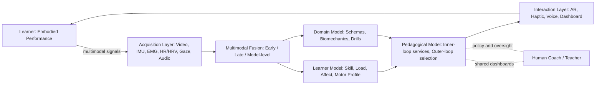
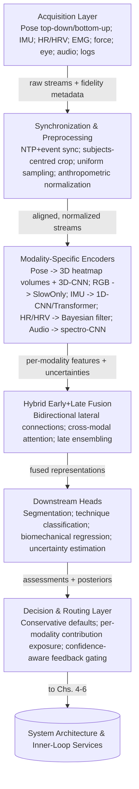
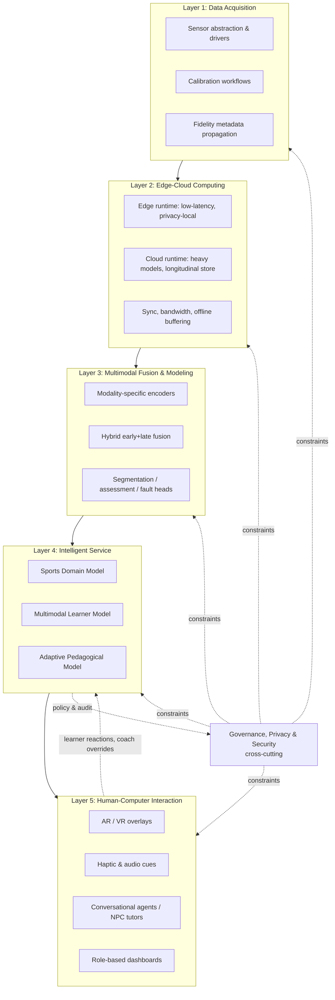

# Construction and Application of a Sports Intelligent Tutoring and Learning Guidance System Driven by Multimodal Data Fusion
# 1 Research Background, Conceptual Framework, and Theoretical Foundations

The construction of a sports intelligent tutoring and learning guidance system driven by multimodal data fusion sits at the intersection of three long-standing tensions: the practical inadequacy of one-to-many physical education, the conceptual lag of intelligent tutoring research in addressing embodied motor skills, and the technological maturation of sensing and machine-learning pipelines that, for the first time, makes continuous, individualized motor coaching computationally feasible. This opening chapter establishes why these tensions converge into a coherent research opportunity, defines the conceptual vocabulary that will structure the report, and synthesizes the multidisciplinary theoretical pillars on which the proposed system rests. The argumentation proceeds from concrete pedagogical pain points, through a critical reading of the dominant ITS paradigm, toward a unified framework that positions multimodal fusion as the epistemological bridge between observable sports behavior and inferred motor competence.

## 1.1 Research Background and Practical Drivers

Physical education and athletic coaching, in both school and competitive contexts, have historically operated under structural constraints that systematically suppress the quality and personalization of feedback that learners receive. A single physical educator typically faces a heterogeneous class in which motor abilities, motivation levels, and physical conditions vary widely; class sizes can be very large, with documented student-to-teacher ratios reaching as high as 54:1, and adaptive PE specialists are frequently unavailable to support learners with physical or learning disabilities[^1][^2]. Within such ecologies, the teacher must simultaneously manage safety, equipment logistics, behavioral norms, and instruction, and—as research on equipment availability shows—students in equipment-scarce environments spend a disproportionate share of class time waiting for turns rather than engaging in motor activity[^3]. The cumulative effect is that the average learner receives far less individualized technical feedback per unit of practice than the deliberate-practice literature would deem necessary for skill acquisition.

The quality of the feedback that does reach learners is itself problematic. A substantial body of coaching research documents that feedback in athletic contexts is dominated by **subjective coach intuition**—"a coach's subjective beliefs based on experience"—and that this intuition heavily mediates not only feedback content but also high-stakes decisions such as athlete (de)selection in professional environments[^4]. Subjective assessment of game action introduces well-known reliability problems and is recognized as a structural weakness of coaching processes that depend on it[^5]. Compounding the issue, **coaching experience does not correlate with improvements in feedback style or quality**[^6]; coaches do not automatically refine their feedback simply by accumulating years on the touchline. The literature further reveals a systematic imbalance in feedback type: coaches over-rely on knowledge of results (KR)—scores, times, distances—when motor-learning research recommends that, except for novices or particularly complex tasks, knowledge of performance (KP) feedback focusing on form and technique should predominate[^6]. Concurrent augmented feedback, although shown to have a "powerful effect" on performance, requires sustained delivery and patience because athletes "take time to adjust" to receiving it, conditions that a busy coach managing dozens of learners can rarely satisfy[^6].

Cultural and individual heterogeneity further undermines the one-size-fits-all feedback model. Observational research has identified differential responses to praise, scolding, and "hustle" feedback across athlete populations, with the result that the same feedback style can simultaneously over-motivate one learner and trigger disengagement in another; coaches are advised to take ethnicity and culture into account when calibrating feedback, but seldom have the diagnostic tools to do so systematically[^6]. Finally, the self-fulfilling-prophecy literature shows that low-expectancy athletes frequently receive less or lower-quality instruction, with downstream effects on motivation, self-efficacy, and proficiency[^6]. Taken together, these pain points—**ratio constraints, subjectivity, KR-bias, experience-independent feedback quality, and cultural insensitivity**—define a structural deficit that no incremental reform of human coaching alone is likely to close.

The technological backdrop, by contrast, has shifted decisively. The maturation of computer vision and pose estimation, the commoditization of inertial measurement units and consumer-grade wearables, advances in physiological sensing (heart rate, HRV, EMG), and the rise of edge-cloud architectures together create a sensing fabric that can, in principle, observe motor performance at far higher temporal and biomechanical resolution than the human eye. In parallel, learning analytics and affective computing have matured into recognized sub-disciplines capable of converting heterogeneous behavioral and physiological streams into pedagogically actionable signals. The convergence of these capabilities provides a technological window in which the long-standing aspiration of one-to-one expert tutoring—long known to produce extremely large learning gains in cognitive domains[^7]—can be operationalized for embodied motor skills. The proposed multimodal-fusion-driven sports ITS is positioned precisely at this window: addressing pedagogical deficits that human-only coaching cannot resolve, leveraging sensing and AI capabilities that have only recently become deployable at scale.

## 1.2 Research Gap: From Cognitive ITS to Sports ITS

Intelligent tutoring systems (ITS) have, since their emergence in the late 1960s, accumulated a coherent behavioral paradigm. VanLehn's influential analysis describes ITSs as having two loops: an **outer loop** that iterates over tasks (selecting the next problem appropriate to the learner) and an **inner loop** that iterates over **steps**, where a step is a "user interface action that the student takes in order to achieve a task"[^7]. The inner loop is responsible for five canonical services—minimal feedback on a step, error-specific feedback, next-step hints, knowledge assessment, and solution review—while the outer loop selects tasks via mechanisms ranging from menus and fixed sequences to mastery learning and macroadaptation that tracks fine-grained estimates of mastery for each knowledge component[^7]. Exemplar systems instantiate this paradigm across well-defined cognitive domains: the Algebra Cognitive Tutor (high-school algebra problem solving), Andes (introductory college physics), AutoTutor (qualitative physics dialogue), Sherlock (avionics troubleshooting), SQL-Tutor (relational-database query construction), and Steve (operating complex equipment such as a naval diesel engine)[^7]. These systems have produced documented success—the Algebra Cognitive Tutor is described as "arguably the most successful ITS in the world" at its time and has been positively evaluated in many urban high-school deployments[^7].

The architectural logic that underwrites this success, however, presupposes an environment in which **steps are discrete, observable user-interface events** and learning events can be analyzed as the application of decomposable knowledge components. Andes treats typing the equation "mc = 20 kg" as a step; SQL-Tutor treats filling the FROM field with "movie" as a step; Steve treats clicking on a valve icon as a step[^7]. The step analyzer can then determine, with high precision, which knowledge components are involved, classify steps as correct or incorrect, and trigger one of the canonical inner-loop services. Even AutoTutor, which uses natural-language dialogue, ultimately reduces student turns to text strings whose semantic similarity to anticipated learning events can be computed via Latent Semantic Analysis[^7]. The entire paradigm is, in this sense, **predicated on the symbolic legibility of student behavior**.

When the learning object shifts to embodied motor skills—a tennis serve, a freestyle stroke, a squat under load, a basketball shooting motion—this presupposition collapses. Motor skill performance is **continuous rather than discrete**; a single repetition unfolds over hundreds of milliseconds and involves coordinated kinematics across multiple joints, muscle activation patterns, postural control, gaze direction, and breathing, none of which surface as a clean "user interface event." There is no FROM field to fill in, no equation box to inspect, no menu choice from which mastery probabilities can be updated. The information that a coach would normally assess—the alignment of the elbow at release, the timing of the hip rotation, the smoothness of the deceleration phase—is not natively available to a conventional ITS step analyzer, and indeed sports-coaching theory explicitly distinguishes **intrinsic feedback** (information from the athlete's own muscles and joints during performance) from **extrinsic or augmented feedback** (information not received from the movement itself), with the latter further subdivided into knowledge of performance and knowledge of results[^6]. None of these information types map cleanly onto the discrete-step ontology that VanLehn's framework assumes.

Three concrete gaps follow from this mismatch. First, conventional ITSs cannot **capture kinaesthetic and proprioceptive information**, because their input channel is the keyboard, mouse, or simulated-equipment widget; embodied motor signals require sensors that the cognitive-ITS tradition was never designed to integrate. Second, conventional ITSs assume that feedback can be deferred until after a step is submitted, but motor learning often requires **concurrent augmented feedback**—delivered during the movement itself—whose pedagogical effect depends on tight temporal coupling with kinematic events[^6]. Third, the assignment-of-credit and assignment-of-blame problems that VanLehn identifies for cognitive steps[^7] become qualitatively harder in continuous motor data: a poorly executed jump shot may stem from technical, physical (fatigue), or cognitive (anxiety, attentional misallocation) sources, and disentangling these requires triangulating across multiple data streams that no single sensor or input modality can provide.

These gaps explain why sports education has lagged behind cognitive domains in adopting intelligent tutoring technology, despite arguably greater pedagogical need. **Multimodal data fusion is therefore not an optional enhancement but a constitutive requirement for any sports ITS**: it is the mechanism by which continuous embodied behavior is rendered legible to the kinds of inner-loop services—feedback, hinting, assessment, review—that make ITSs pedagogically powerful. The remainder of this report develops this proposition in technical and pedagogical detail.

## 1.3 Core Concepts, Research Scope, and Objectives

To stabilize the analytical vocabulary, three core concepts must be defined operationally.

A **Sports Intelligent Tutoring System (sports ITS)** is, in this report, an interactive computational system that (i) acquires multimodal behavioral and physiological data from a learner during sports practice or training, (ii) maintains a learner model representing the learner's evolving motor competence, physical load, and affective state, (iii) executes an outer-loop task-selection logic (drill or training-block selection) and an inner-loop logic that delivers concurrent or terminal feedback, hints, assessment, and post-performance review pertinent to motor skill, and (iv) does so with a degree of adaptivity that distinguishes it from purely scripted computer-assisted instruction. This definition deliberately preserves the two-loop behavioral architecture of conventional ITSs[^7] while substituting motor-skill-appropriate inputs and services. It excludes systems that merely record performance for later human review (sports analytics in the descriptive sense) and systems that deliver fixed instructional content without learner-state adaptation (consumer fitness apps in the templated sense).

**Multimodal data fusion**, in this report, denotes the principled integration of heterogeneous data streams—video and pose, inertial sensors, physiological signals, eye-tracking, audio, contextual logs—into a unified representation that supports inference about motor competence, learner state, and pedagogical action. Fusion may operate at the feature level (early fusion), decision level (late fusion), model level (deep architectures with cross-modal attention), or in hybrid configurations; the technical particulars are deferred to Chapter 3, but the conceptual role is fixed here as the mechanism that converts continuous embodied performance into ITS-legible signals.

**Learning guidance** in this report subsumes the spectrum of system-generated interventions—concurrent kinematic cues, terminal technique-correction explanations, drill prescriptions, training-load adjustments, motivational feedback, and post-session debriefing—that influence the learner's subsequent practice. It is broader than "feedback" in the narrow sense of a step-correctness signal, and it is distinguished from "coaching" (a relational human role) by its computational origin and its operation as one component within a learner-coach-system triad rather than as a replacement for the human coach.

These definitions delimit the research scope. The system targets a **broad range of sports learners**—from school PE students and recreational fitness users through competitive athletes, rehabilitation patients, and elderly fitness participants—but with the recognition that data modalities, pedagogical strategies, and ethical safeguards must be calibrated to each population (developed in Chapter 7). The system's role is **augmentative**: it does not aim to replace teachers or coaches but to extend their reach, automate the labor-intensive parts of feedback provision, and surface diagnostic information that the unaided human eye cannot reliably extract. This stance follows VanLehn's reminder that an ITS's role can be "a smart piece of paper; an encouraging coach; a stimulating peer," with the pedagogical policies of human instructors ultimately determining how the system behaves[^7].

Within this scope, the report pursues four interlocking objectives: (i) to diagnose, in detail, the requirements that sports tutoring practice imposes on such a system (Chapter 2); (ii) to specify the multimodal sensing and fusion methodology that satisfies these requirements (Chapter 3); (iii) to design a coherent system architecture and the functional engines that operationalize ITS services in the motor-skill setting (Chapters 4–6); and (iv) to validate the design through application scenarios and to surface the challenges and ethical considerations that responsible deployment entails (Chapters 7–8). The analytical roadmap that connects these objectives is sketched in the framework presented in Section 1.8.

## 1.4 Theoretical Pillar I: ITS Architecture Reconceptualized for Motor Skills

The classical ITS literature converges on a four-component architecture: a **domain model** representing the knowledge to be taught, a **learner model** representing the learner's evolving state, a **pedagogical model** that selects tasks and tutorial actions, and an **interaction model** that mediates communication between learner and system. VanLehn's two-loop behavioral analysis cuts across these components, with the outer loop primarily exercising the domain and pedagogical models for task selection and the inner loop primarily exercising the learner model and interaction model for step-level services[^7]. A sports ITS retains this skeleton but must reconceptualize each component for the motor-skill domain.

The **domain model** in cognitive ITSs decomposes content into knowledge components—"a principle, a concept, a rule, a procedure, a fact, an association or any other fragment of task-specific information"[^7]. In the sports context, knowledge components must be reinterpreted as **motor schemas, biomechanical principles, and task-strategic concepts**: for instance, "transfer momentum from the lower body to the upper body during the throwing motion" is a biomechanical principle whose application to a specific throw constitutes a learning event. Crucially, sports knowledge components include both procedural-kinematic units (the timing of a jump-shot release) and energetic-physiological units (the appropriate workload for a given recovery state), reflecting the multi-system character of sports performance.

The **learner model** must expand beyond mastery probabilities for cognitive knowledge components. A motor learner model needs to represent at minimum: skill state (which motor schemas the learner has acquired and at what reliability), physical load (cumulative training stress and recovery), affective state (motivation, anxiety, engagement), and motor profile (anthropometric and biomechanical attributes that constrain technique). This is consistent with VanLehn's observation that a student model is "a fancy grade book"—a heterogeneous collection of attribute-value pairs that may include knowledge components, learning styles, performance history, and other traits[^7]—but it requires substantial modality enrichment to capture the additional dimensions.

**Steps**, in the sports ITS, become **continuous movement segments** rather than discrete UI events. A repetition of a squat, a stroke cycle in swimming, a single rally in table tennis—each is a bounded behavioral unit that the system must segment from a continuous data stream and then analyze. This segmentation problem (developed in Chapter 5) is itself a non-trivial signal-processing task, and it replaces the "click on a button" event detection that cognitive ITSs take for granted.

The five canonical inner-loop services translate as follows. **Minimal feedback**—in cognitive ITSs typically a red/green color change or an "almost"/"great" prefix[^7]—becomes **kinematic feedback**: a real-time visual or haptic indicator that the movement just executed fell within or outside an expert envelope, possibly delivered concurrently rather than after the repetition. **Error-specific feedback** becomes **technique correction** that localizes the biomechanical fault (e.g., "your knee tracked inside the foot at peak depth"). **Next-step hints** become **drill prescriptions** that propose the next repetition, set, or progression in a hint-sequence-like ladder analogous to the Point–Teach–Bottom-out structure observed in cognitive ITSs[^7]. **Knowledge assessment** becomes **motor competence assessment**, with the assignment-of-credit and assignment-of-blame problems[^7] now operating across multiple data modalities and over continuous time. **Solution review** becomes **post-performance debriefing**, in which the system replays segments, surfaces multimodal annotations, and supports learner reflection—structurally analogous to Sherlock's post-problem side-by-side review of student and expert steps[^7].

Outer-loop task selection translates into **periodized training planning**. The four common outer-loop methods identified by VanLehn—learner-selected menu, fixed sequence, mastery learning, and macroadaptation[^7]—all have direct analogues in sports practice: a learner-selected drill catalog, a coach-prescribed weekly plan, a competence-gated progression through skill levels, and a macroadaptive engine that selects the next drill based on the overlap between drill demands and the learner's currently underdeveloped motor schemas. The "fading the scaffolding" principle that VanLehn highlights—starting with high tutorial support and gradually reducing it[^7]—maps naturally onto the motor-learning trajectory from heavily cued to autonomous performance.

This reconceptualization preserves the pedagogical wisdom accumulated in the cognitive-ITS literature while honestly confronting the structural differences of the motor domain. It also clarifies why multimodal sensing is constitutive rather than ornamental: every translation in the table above presupposes that continuous embodied behavior has been rendered into structured signals on which inner-loop logic can operate.

## 1.5 Theoretical Pillar II: Motor Learning Theories

A sports ITS that ignored motor-learning theory would risk transplanting cognitive-ITS feedback policies into a domain whose learning dynamics are governed by different principles. Four theoretical traditions are particularly load-bearing.

The **Fitts–Posner three-stage model** distinguishes a cognitive stage (in which the learner consciously parses task requirements and makes large, frequent errors), an associative stage (in which movement becomes more consistent and errors more subtle), and an autonomous stage (in which performance is largely automated). The pedagogical implication is that **feedback strategy must shift across stages**: novices benefit from explicit knowledge-of-results signals that confirm task completion, whereas more advanced learners benefit from knowledge-of-performance feedback that addresses subtle technique refinement, and autonomous performers may be disrupted by excessive concurrent feedback. This is consistent with the sports-coaching guidance that knowledge-of-results feedback should be reduced as expertise grows, with the explicit exception that "when the task is especially complex or the athlete is a novice... KR should be employed"[^6].

**Schmidt's schema theory** holds that motor learning consists in the construction and refinement of generalized motor programs—schemas—that abstract across specific instances of a movement class. Schema acquisition requires variable practice and the generation of recall and recognition schemas through repeated execution under varying conditions. The implication for system design is that drill prescription should not merely repeat identical executions but should systematically vary parameters (distance, angle, load) to support schema generalization; this nuances any naive interpretation of "mastery" as repeated success on a fixed task.

**Dynamical systems theory** treats motor coordination as the emergence of stable patterns from interactions among task constraints, environmental constraints, and organismic constraints (the learner's own body). On this view, technique is not an idealized template to be copied but an attractor in a high-dimensional state space, and there are typically multiple functionally equivalent solutions for a given task. This complicates the cognitive-ITS habit of comparing student steps against an "ideal solution"[^7]: a sports ITS must accommodate **technique variability that is functional rather than erroneous**, distinguishing genuine biomechanical faults from individually adapted but effective solutions.

**Ericsson's deliberate practice theory and the 10,000-hour heuristic**, popularized in the sports-coaching literature, is explicitly invoked by Roulier as one of two "critical" explanations for understanding feedback research, supporting the principle that **coaches cannot expect feedback to produce instant results** even though feedback can be expected to affect behavior over time[^6]. For a sports ITS, this implies that learner-facing analytics must manage learner expectations about non-instantaneous progress, that the assessment service must operate over longitudinal windows rather than session snapshots, and that motivational design must sustain effort across the long latency between intervention and observable competence change.

Together these four theoretical traditions yield three concrete design constraints: feedback timing and modality should be calibrated to the learner's developmental stage; drill variation should be engineered to support schema construction; and assessment should treat technique variability charitably while still localizing genuine faults. None of these constraints is naturally honored by an unmodified cognitive-ITS architecture, which is one further reason that multimodal observation—rich enough to distinguish stage, schema, and individual variation—is indispensable.

## 1.6 Theoretical Pillar III: Constructivist and Personalized Learning Paradigms

Beyond cognitive and motor-learning considerations, the system must embed itself in a pedagogical paradigm that respects the relational and motivational dimensions of sports learning. The constructivist tradition, with its emphasis on learner-centered, experientially constructed knowledge, supplies the broader normative frame; recent work on inclusive physical education operationalizes this frame by stipulating that PE should foster "physical literacy, which includes the knowledge, understanding, and confidence to engage in physical activity throughout life," that "social skill development, cooperation, communication, appropriate competition, and adaptability" are integral, and that supporting "all students" requires accommodation of "wide variety of physical abilities" and "very diverse motivation levels"[^2].

Several specific principles from this literature directly inform system design. First, **effort-attribution feedback**, exemplified by Carol Dweck's work, "involves teaching individuals to attribute their failures or lack of success to low effort" and "can increase motivation, self-efficacy, and proficiency"[^6]. A sports ITS must therefore generate not only technical correction but also attributional framing that supports a growth orientation. Second, **strength-spotlighting**—"noticing athletes' strengths that they or the team take for granted"—has been shown to be "an effective way to use feedback" because positive emotions can "open us up to many new thoughts and behaviors" and make athletes "more creative and better problem solvers"[^6]; this argues against a purely deficit-focused diagnostic logic. Third, **peer learning** is documented as one of the most effective channels: "one of the best ways athletes learn is by watching others receive individual feedback," with two opportunities for learning when an athlete observes a peer being instructed and is then individually instructed[^6]. The inclusive PE literature operationalizes this through enlisting peer helpers as coaches, where skilled students serve as "private trainers" for classmates with learning disabilities[^2]. A sports ITS can amplify this through shared dashboards, peer-comparison visualizations, and observation-based practice modes.

Fourth, **culturally responsive feedback** is a non-negotiable design constraint. Solomon's research documents observable differences in how athletes receive feedback, with some populations being "significantly less responsive to the negative approach" and holding different views about whether respect is presumed or earned, prompting the recommendation that "ethnicity and culture must be taken into account when giving feedback"[^6]. A computational system that delivered identical feedback across all learners would risk encoding the very insensitivity that the literature criticizes; personalization here is an ethical as well as a pedagogical requirement.

Fifth, **inclusion of diverse abilities** demands that the system support modified rules, equipment substitutions, and graded difficulty—mechanisms that the inclusive PE literature describes through examples such as using scarves rather than balls in juggling, allowing a bounce in volleyball, providing assistance bands on pull-up bars, and structuring run/walk strategies so that "struggling students are not stigmatized by being slower"[^2]. The system's drill catalog and assessment thresholds must therefore be parameterizable rather than fixed.

These principles converge on a single proposition: **personalization in a sports ITS is not merely a technical optimization (matching difficulty to skill) but a pedagogical and ethical imperative (matching feedback style, framing, and inclusion strategy to the learner's identity, abilities, and context)**. This directly motivates the multimodal learner model proposed in Section 1.4 and the affect-sensitive feedback orchestration developed in Chapter 6.

## 1.7 Theoretical Pillar IV: Multimodal Learning Analytics and Affective Computing

The technical-theoretical foundation that allows the preceding pedagogical commitments to be operationalized is supplied by **multimodal learning analytics (MMLA)** and **affective computing**. MMLA, as a research framework, holds that learning processes can be inferred more validly when heterogeneous data streams—video, motion, physiological, audio, and self-report—are jointly analyzed than when any single channel is used in isolation. In sports learning specifically, this triangulation is what makes inferred motor competence epistemically tractable: a kinematic signal alone cannot distinguish a missed shot caused by faulty technique from one caused by fatigue or attentional lapse, but kinematics combined with EMG, heart-rate variability, and gaze data can begin to do so. This addresses the critique levelled at coaching processes that "rely heavily on the subjective assessment of game action"[^5] and on coach intuition[^4] by introducing an evidentiary base whose components can be cross-validated.

Affective computing complements MMLA by recognizing that motor performance is mediated by affective and motivational states—anxiety, frustration, flow, fatigue-related disengagement—that materially affect how feedback is received. The Kluger and DeNisi meta-analysis of feedback interventions, cited in the ITS literature, warns that "students can interpret it as assessment, which can lead them to become discouraged, to stop trying"[^7]; in sports, where the body is unavoidably implicated, the affective stakes are higher still. Affective sensing—via facial expression, vocal prosody, HRV, and behavioral markers such as response latency—gives the system a basis for adapting feedback timing, tone, and intensity in line with the constructivist principles outlined above.

The conceptual machinery for handling uncertainty in this multimodal evidence base can be borrowed productively from the cognitive-ITS literature. VanLehn explicitly notes that **Bayesian networks and other techniques from the Uncertainty subfield of Artificial Intelligence have been used to address the assignment-of-credit and assignment-of-blame problems**, including in ITS assessment, where the same step may correspond to multiple possible learning-event sequences[^7]. The "big difference between little evidence and mixed evidence" that VanLehn highlights—where a 0.5 success rate may arise from 1/1 or 20/20 data—is even more acute in motor data, where modalities may agree, disagree, or simply be missing for any given segment[^7]. Probabilistic learner modeling, with prior distributions over motor competence and likelihood functions linking observed multimodal features to underlying motor schemas, provides a principled way to aggregate evidence over time and modalities while honestly representing uncertainty.

Two further design implications follow. First, **fine-grained assessment must count both successes and failures**, and the count must be weighted by opportunity—an issue VanLehn discusses for cognitive steps[^7] that recurs in motor data, where a learner may have hundreds of opportunities to apply a particular schema in a single training session. Second, the system should resist the temptation to "get carried away by the sheer intellectual challenge of assessment and to overbuild this part of the tutoring system"[^7]; the assessment granularity should be matched to the decisions it must support, with coarse-grained measures for big decisions (progression to a new training block) and fine-grained measures for moment-to-moment feedback.

MMLA and affective computing thus supply both the empirical channels and the inferential machinery through which observable behavior is converted into the structured representations on which adaptive coaching can act.

## 1.8 Unified Theoretical Framework: Multimodal Fusion as Epistemological Bridge

The four theoretical pillars converge on a single integrative claim: **multimodal data fusion is the epistemological bridge that links observable embodied behavior—the analogue of "steps" in classical ITS terminology—to inferred motor competence and learning events**. The cognitive-ITS paradigm assumed that the bridge from steps to learning events could be built on a symbolic substrate (typed equations, menu choices, button clicks). In the motor domain that substrate does not exist; what exists is a stream of continuous, noisy, multi-channel signals. Fusion supplies the missing substrate by converting these signals into structured behavioral units that the four ITS components can operate on.

The unified framework can be stated as a layered correspondence between behavior, signals, fusion, and pedagogical action. The following table summarizes the correspondence and makes explicit how each cognitive-ITS construct is reinstantiated for the motor domain.

| Cognitive ITS Construct (VanLehn[^7]) | Sports ITS Reinstantiation | Role of Multimodal Fusion |
|---|---|---|
| User-interface step | Continuous movement segment (rep, stroke, rally) | Segment continuous streams; align modalities |
| Knowledge component | Motor schema / biomechanical principle | Detect schema-relevant features across modalities |
| Step analyzer (correct/incorrect) | Technique quality assessor | Combine kinematic, EMG, force, and gaze signals |
| Error type / error-specific feedback | Biomechanical fault localization | Cross-modal attribution (technical vs. physical vs. cognitive) |
| Next-step hint | Drill prescription / cue ladder | Use learner-state estimate to choose hint modality and level |
| Assessment / mastery probability | Motor competence + load + affect estimate | Bayesian fusion over longitudinal multimodal evidence |
| Solution review | Post-performance debriefing | Replay with multimodal annotations and counterfactuals |
| Outer-loop task selection | Periodized training plan | Macroadaptation over multimodal learner state |
| Fading the scaffolding | Cue reduction across Fitts–Posner stages | Stage-aware modality and timing selection |

The static correspondence above is animated by a dynamic feedback loop that closes the system. The diagram below sketches how data flow from the learner through fusion, modeling, and pedagogical decision back to the learner, and how the human coach is positioned as a co-supervisor rather than as a replaced agent.

The diagram makes three propositions visible. First, **fusion is the only path** by which the raw embodied performance reaches the learner and domain models; without it, the pedagogical model would be operating on impoverished or single-modality evidence and would inherit the very subjectivity and KR-bias problems that motivated the research in the first place[^6][^5][^4]. Second, the **interaction layer closes the loop back to the learner**, enabling the concurrent or terminal feedback that motor learning theory requires and that conventional ITSs were not architected to deliver[^6]. Third, the **human coach remains in the loop** through shared dashboards and policy oversight, honoring both the irreplaceable relational dimension of coaching and the practical reality that—as VanLehn's ethnographic observations of the Algebra Cognitive Tutor classrooms attest—a tutoring system functions best within a hybrid pedagogical ecology in which "students often talked with their neighbors—seeking help, giving help, comparing progress" while teachers "concentrate on discussing complex issues with students who really needed such a discussion"[^7].

From this framework, four guiding propositions can be derived to steer the remainder of the report:

- **P1 (Constitutivity).** Multimodal fusion is constitutive of, not optional to, sports ITSs; any system designed without it inherits the structural deficits of human-only coaching or of unimodal analytics.
- **P2 (Stage-sensitivity).** Inner-loop services must be parameterized by the learner's developmental stage (Fitts–Posner) and by individual technique variability (dynamical systems), avoiding both KR over-reliance for advanced learners and concurrent-feedback overload for autonomous performers.
- **P3 (Person-centered personalization).** Personalization extends beyond difficulty matching to encompass attributional framing, strength-spotlighting, cultural responsiveness, and inclusion of diverse abilities, in line with constructivist and inclusive PE principles.
- **P4 (Augmentation, not replacement).** The system is designed to augment—not displace—human coaches and teachers; its locus of value lies precisely in absorbing the labor-intensive, high-frequency, perceptually demanding components of feedback that a single human cannot scale to deliver across large groups, while leaving relational, motivational, and judgment-laden components in human hands.

These propositions constitute the analytical lens through which the subsequent chapters should be read. Chapter 2 will translate them into a structured requirement specification by diagnosing the pain points and stakeholder needs of sports tutoring practice. Chapter 3 will operationalize Proposition P1 through a detailed treatment of multimodal data sources and fusion methodologies. Chapters 4 through 6 will instantiate Propositions P2 and P3 in the system architecture, the diagnostic engines, and the adaptive guidance and interaction design, respectively. Chapters 7 and 8 will test Proposition P4 against application scenarios and ethical considerations. The conclusion will revisit the framework in light of the cumulative evidence assembled across these chapters.

A final note on the limits of the framework as currently stated. The reference base available at this stage of the report is rich on the cognitive-ITS side (notably VanLehn's behavioral analysis and the six exemplar systems[^7]) and on the sports-coaching feedback side (Roulier's synthesis of effort feedback, KP/KR distinctions, peer learning, and cultural responsiveness[^6]; inclusive PE practice[^2]; subjective coaching critique[^5][^4]) but contains only secondary signals on multimodal fusion algorithms and sports-specific MMLA deployments. The framework presented here is therefore conceptually grounded but technically schematic; the algorithmic substantiation is deferred to Chapter 3, where additional technical literature will be introduced to flesh out the fusion architectures gestured to in this chapter. Readers should view this chapter as the **theoretical scaffold** that justifies the engineering and empirical work that follows, not as a self-contained technical specification.

# 2 Needs Analysis and Problem Diagnosis in Sports Tutoring Practice

The unified framework developed in Chapter 1 established multimodal fusion as the epistemological bridge between embodied performance and inferred motor competence, and articulated four guiding propositions—constitutivity, stage-sensitivity, person-centered personalization, and augmentation-not-replacement—that the proposed system must honor. Those propositions, however, remain abstract until they are tested against the operational realities of sports tutoring practice and translated into a concrete specification of what the system must do, how well it must do it, and under what constraints. The present chapter performs that translation. It moves from theory to practice in three steps: first, by diagnosing the structural pain points of contemporary sports instruction in operational detail; second, by differentiating these pain points across four learner populations whose needs diverge substantially; and third, by consolidating the diagnosis into a three-tier requirement specification that traces each requirement back to a Chapter 1 proposition and forward to the design decisions of Chapters 3 through 8.

## 2.1 Pain Points of Current Sports Instruction

The structural deficits of human-only sports tutoring identified in Chapter 1 can be sharpened into five operational pain points, each of which defines a functional gap that the proposed system must close. These pain points are interlocking rather than independent: ratio constraints amplify the consequences of subjectivity; subjectivity is reinforced by the absence of fine-grained perceptual tools; and the lack of individualized load management compounds the cost of any technical or perceptual error. The diagnostic logic of this section is therefore not merely to enumerate complaints but to show how each deficit propagates through the pedagogical pipeline and to specify the corresponding capability that a multimodal-fusion-based system must deliver.

### 2.1.1 Ratio and Scalability Constraints That Suppress Feedback Frequency

The first pain point is the most visible and the most structural. Sports instruction is characterized by chronically high learner-to-instructor ratios that mathematically preclude the delivery of one-to-one feedback at the frequency that motor learning theory recommends. As established in Chapter 1, school PE classes can reach ratios as high as 54:1, and even in better-resourced environments the heterogeneity of motor abilities, motivation levels, and physical conditions within a single class forces the teacher into a triage logic in which only the most visibly struggling or the most visibly excelling learners receive substantive technical attention. The middle band—often the majority—receives generic group instruction whose informational content is necessarily averaged across a wide spectrum of needs.

This ratio constraint is not merely an inconvenience; it is a binding limit on the achievable feedback rate per learner per unit of practice. Deliberate-practice theory, invoked in Chapter 1 through Ericsson's work and operationalized in coaching practice through the principle that coaches "cannot expect feedback to produce instant results" but should expect cumulative effects over time, presupposes a feedback density that one-to-many instruction cannot supply. The functional gap that follows is the need for a system capable of delivering **per-learner, per-repetition feedback at scale**, without requiring proportional growth in the human instructor workforce. This is the gap that the multimodal sensing and fusion architecture is designed to close, and it directly motivates the requirement (Section 2.3) for parallel, automated, real-time technique assessment across an entire group of simultaneous learners.

### 2.1.2 Subjectivity and Unreliability of Coach-Mediated Skill Evaluation

The second pain point concerns the epistemic quality of human feedback even when it is delivered. Chapter 1 documented that coaching feedback is dominated by subjective intuition, that subjective assessment of game action introduces well-known reliability problems, and that coaching experience does not automatically refine feedback style or quality. The operational implication is that two coaches observing the same performance may produce divergent diagnoses, and the same coach observing the same performance on different occasions may produce different diagnoses—an inter-rater and intra-rater reliability problem that has been a chronic concern in sports education research[^8]. Traditional methods of movement quality evaluation, as recent work on movement-quality assessment in sports education has noted, "often rely on subjective judgment and fail to provide real-time feedback, limiting their effectiveness in real-world training scenarios"[^8]. This is not a peripheral observation; it is a structural characterization of the dominant assessment regime.

The functional gap here is the need for **objective, reproducible, multimodally grounded skill evaluation**. The aspiration is not to replace coach judgment but to provide a measurement substrate against which coach judgment can be calibrated, on which novice coaches can be trained, and from which longitudinal trajectories can be reliably constructed. The constitutivity proposition of Chapter 1 is directly engaged here: a single video stream interpreted by a single observer reproduces the very subjectivity it purports to mitigate; only a fused, multimodal evidentiary base in which kinematic, kinetic, and physiological signals can be cross-validated supplies the inferential robustness that objective assessment requires.

### 2.1.3 Temporal Misalignment Between Performance and Feedback Delivery

The third pain point is the systematic mismatch between when feedback is needed and when it is delivered. Motor learning research, as summarized in Chapter 1, distinguishes concurrent augmented feedback (delivered during the movement) from terminal feedback (delivered after the movement) and further distinguishes knowledge of performance (KP, focused on form and technique) from knowledge of results (KR, focused on outcome). The pedagogical recommendation derived from this distinction is that, except for novices and especially complex tasks, KP feedback should predominate, and that concurrent KP feedback has powerful effects on performance acquisition.

In practice, however, human-only coaching typically delivers terminal, KR-biased feedback. A coach managing a class or a squad observes a repetition, processes it perceptually, formulates a verbal cue, and delivers it after the repetition has ended—often after several subsequent repetitions have intervened. The information lag between the movement and the feedback can be tens of seconds to minutes, during which time the learner has continued to practice, potentially consolidating the very fault the feedback was meant to correct. Moreover, because outcome (Did the ball go in? Did the time improve?) is far easier for the unaided eye to assess than form (Was the elbow at the correct angle at release?), the natural attractor of human-only feedback is KR rather than KP—reinforcing the imbalance that motor-learning theory identifies as suboptimal beyond the novice stage.

The functional gap is the need for **temporally tight, KP-rich feedback delivered concurrently with or immediately after the movement segment**, with the modality and timing calibrated to the learner's developmental stage in the Fitts–Posner schema. This requirement is non-trivial: it imposes hard real-time constraints on the fusion and assessment pipeline (developed as latency budgets in Section 2.3), and it requires that the interaction layer (Chapter 6) deliver cues through channels that do not disrupt ongoing motor performance—a design problem that has no analogue in cognitive ITSs, where feedback is typically delivered between discrete UI events.

### 2.1.4 Inadequate Individualization of Training Load and Recovery Management

The fourth pain point operates on a longer timescale than the preceding three but is no less consequential. Sports instruction beyond the introductory level necessarily involves the management of training load—the cumulative physical stress imposed on the learner across sessions, weeks, and macrocycles—and its balance against recovery. The load-management literature has demonstrated that **poor load management is a major risk factor for injury in sport settings**, and that sudden spikes in workload are associated with substantially elevated injury rates: spikes in the acute-to-chronic workload ratio (ACWR) have been associated with a 5–7 times greater injury rate in English Premier League football players in a comprehensive three-year study[^9]. The mechanism, as articulated in the load-management literature, is that "the cause of any non-contact injury merely results from a sum of loads generating a force that exceeds the limit supported by the respective biological tissue," with the implication that load monitoring is a primary lever for injury prevention[^9].

A second, more structural insight from this literature is that team-sport coaching practices—where loads are most often "collectively performed, with predefined daily objectives included in the weekly microcycle"—differ markedly from individual-sport practices, where individualization of training loads is "mandatory for success"[^9]. Collective workload prescription, while operationally efficient, ignores the fact that "individual response in terms of training and competitive workload, nutrition, psychological skills, recovery strategies, and skill acquisition" varies substantially across athletes, and that injury history of an individual is a relevant factor for the relationship between workloads and injury risk[^9]. The same logic applies a fortiori to school PE classes and mass-fitness contexts, where the heterogeneity of physical conditions is even greater than within a competitive squad and where load-monitoring infrastructure is essentially absent.

The cost of one-size-fits-all load prescription is therefore twofold: under-loaded learners experience suboptimal adaptation, while over-loaded learners experience elevated injury risk and incomplete recovery. The load-management literature explicitly endorses an **individualized approach** as the corrective: "individualization is the key in a multifactorial periodization model," and avoiding "any sudden workload spike" requires monitoring the individual player even during collective training[^9]. The literature further notes that this individualization is enabled by technological advances that "allow to monitor the individual player during collective training (e.g., measuring the number of accelerations during small sided games with GPS technologies)" but warns that "the excess of information to be managed with this approach is extremely high, therefore the use of big data analysis through artificial intelligence is warranted"[^9]. Similar findings emerge from broader systematic reviews of training load and fatigue markers, which highlight that "individual athlete characteristics significantly influence their susceptibility to injury and illness, necessitating tailored training management strategies"[^10], and from the military-training context, where load-monitoring principles are being adapted to recruit populations with high injury rates[^11].

A subtler but equally important point from the same literature is that the relationship between internal load (the learner's physiological response, e.g., heart rate, session RPE) and external load (the work performed, e.g., distance covered, accelerations) is **easier to monitor in individual sports because of their direct relationship**, but in team sports and group instruction settings "it is more complicated because of the influence of contextual factors... affecting both internal and external load parameters in a different manner"[^9]. This means that load monitoring in group instructional contexts cannot rely on external load alone; the system must capture both internal and external streams and fuse them, which is precisely the multimodal fusion task this report addresses.

There is, however, a methodological caveat that the load-management literature itself raises: while some evidence supports the validity of ACWR as an injury-risk indicator, "other authors have pointed out its methodological limitations and even questioned its validity"[^9]. The system's design must therefore not be dogmatically wedded to any single load metric. The functional requirement is the more general one: **the system must capture, model, and individualize training load and recovery state, and surface decisions that reduce the likelihood of sudden load imbalances**, while remaining agnostic about which specific load metric (ACWR, session RPE, HRV trend, or composite) best serves a given context. This requirement directly engages Proposition P3 (person-centered personalization) from Chapter 1 and motivates the inclusion of load-management capability in the requirement specification of Section 2.3.

### 2.1.5 The Perceptual Ceiling of the Unaided Human Eye

The fifth pain point is the most technically grounded. Even an attentive, experienced, individually focused coach is limited by the perceptual bandwidth of the human visual system. A jump shot release lasts on the order of 100–200 milliseconds; a swimming stroke cycle distributes propulsion across multiple joints and submerged segments that are partially or wholly occluded from above-water observation; a squat under load involves muscle activation timings that produce no visible surface change until the kinetic chain has already begun to deviate. The unaided human eye cannot reliably resolve sub-second timing differences, three-dimensional joint angles, or sub-symptomatic neuromuscular fatigue, and even high-end coaching expertise must compensate by inferring these unobservables from indirect outcome cues—an inference that returns the analysis to the subjectivity problem of Section 2.1.2.

This perceptual ceiling has three concrete consequences. First, technical errors below a certain perceptual threshold remain undiagnosed and uncorrected, accumulating into ingrained faults that become progressively harder to remediate. Second, the relative contributions of technical, physical, and cognitive sources to a given performance breakdown cannot be disentangled by visual observation alone—as the load-management literature frames it, the "assignment-of-blame" problem requires triangulation across multiple data streams that no single sensor or input modality can provide[^9]. Third, longitudinal monitoring of small but cumulative changes in technique—precisely the changes that mark the transition from associative to autonomous performance in the Fitts–Posner schema—is essentially impossible without instrumented measurement.

The functional gap is the need for **micro-level kinematic, kinetic, and physiological measurement that exceeds the perceptual resolution of the human eye**, combined with the inferential machinery that converts such measurements into pedagogically actionable diagnoses. This is the gap that motivates the technical depth of Chapter 3 (data sources and fusion methodologies) and Chapter 5 (motion recognition, skill diagnosis, and error attribution), and it is the most direct technical justification for multimodal fusion: no single sensing channel resolves all of kinematic, kinetic, and physiological information at the required resolution.

### 2.1.6 Summary: From Pain Points to Functional Gaps

Taken together, the five pain points define a coherent set of capabilities that the proposed system must supply. Table 2-1 consolidates the diagnosis by mapping each pain point to its operational manifestation, the functional gap it defines, and the corresponding system capability requirement that will be specified in Section 2.3 and engineered in subsequent chapters.

| Pain Point | Operational Manifestation | Functional Gap | Required System Capability |
|---|---|---|---|
| Ratio & scalability | Up to 54:1 PE ratios; triage-driven attention; sparse per-learner feedback | Per-learner, per-repetition feedback density | Parallel automated assessment across simultaneous learners |
| Subjectivity & unreliability | Inter-/intra-rater variability; experience-independent quality; KR-bias attractor | Objective, reproducible, multimodally grounded evaluation[^8] | Cross-modal evidence fusion for technique assessment |
| Temporal misalignment | Terminal, KR-biased feedback; tens-of-seconds lag; cue–movement decoupling | Concurrent KP feedback within real-time budgets | Low-latency fusion + non-disruptive interaction channels |
| Inadequate load individualization | Collective prescription; under-/over-loading; injury-risk spikes | Individualized load and recovery management[^9][^10] | Internal+external load capture, modeling, and adaptation |
| Perceptual ceiling | Sub-second, occluded, sub-symptomatic faults invisible to observation | Micro-level kinematic/kinetic/physiological measurement | Multi-sensor capture + biomechanical fault localization |

Three observations emerge from this consolidation. First, every functional gap requires capabilities that no single modality can supply—pose estimation cannot resolve internal load, IMU cannot distinguish technique from fatigue, EMG cannot capture spatial coordination—so multimodal fusion is implicated in each row, vindicating the constitutivity proposition. Second, the gaps span timescales from milliseconds (concurrent KP) through seconds (per-repetition assessment) to weeks and macrocycles (load periodization), implying that the system architecture must operate across multiple temporal layers rather than at a single sampling rate. Third, the gaps cannot be closed by sensing alone: each requires inferential machinery (assessment, attribution, periodization) and pedagogical machinery (cue selection, drill prescription, debriefing) that connect measurement to action. This is why the requirement specification of Section 2.3 spans functional, non-functional, and ethical tiers rather than reducing to a sensing checklist.

## 2.2 Differentiated Needs Across Stakeholder Groups

The five pain points apply, in varying intensities and combinations, to all sports learners. They do not, however, apply uniformly. A school PE student in a 50-learner class faces ratio and subjectivity as the dominant constraints; a competitive athlete with a personal coach faces load individualization and perceptual-ceiling constraints more acutely; a rehabilitation patient operates under safety-first constraints that subordinate skill acquisition to controlled tissue loading; a mass-fitness learner using a home app faces the absence of a coach altogether. A system that ignores these differences and supplies a single configuration will either over-engineer for some users or under-serve others. This section therefore conducts a comparative needs analysis across four primary learner populations and the secondary stakeholders whose information needs shape the system's interaction surfaces. The analysis yields a stakeholder-by-need matrix that exposes both the shared core requirements and the population-specific differentiators on which the parameterized design adopted in later chapters depends.

### 2.2.1 School PE Students

School PE students are characterized by high group size, wide heterogeneity in motor ability, motivation, and physical condition, and a teacher-led pedagogical context in which skill acquisition is interleaved with broader goals of physical literacy, social-skill development, and inclusion. The dominant learning objectives are foundational motor competence across a curricular range of activities rather than specialization in any single sport, sustained engagement that builds lifelong physical-activity habits, and the development of cooperative and adaptive behaviors. As Chapter 1 noted, inclusive PE explicitly stipulates support for "wide variety of physical abilities" and "very diverse motivation levels," with accommodations such as scarves rather than balls in juggling or run/walk strategies that avoid stigmatizing slower learners.

The relevant sensing modalities for this population are constrained by deployability rather than by accuracy ceilings: vision-based pose estimation from a small number of fixed cameras and consumer-grade wearables are realistic; per-learner EMG arrays or force plates are not. Feedback-style preferences skew toward effort-attribution and strength-spotlighting framings, in line with the constructivist principles emphasized in Chapter 1, with culturally responsive calibration to avoid reinforcing the negative-feedback insensitivity documented in the coaching literature. Safety priorities emphasize basic load awareness and avoidance of obvious overuse rather than competitive-grade load periodization. Contextual constraints include limited equipment, shared space, and the necessity that the system function without disrupting class flow—implying minimal calibration time, robustness to occlusion in crowded settings, and a teacher-facing dashboard that aggregates rather than individuates moment-to-moment data.

### 2.2.2 Competitive Athletes

Competitive athletes operate at the opposite end of the spectrum. Group sizes are smaller, the learner-to-coach ratio is more favorable, motivation is high and intrinsically anchored, and the training context is structured around peaking and tapering toward competitions. The dominant learning objectives are fine-grained technical refinement, optimization of individualized physiological profiles, and avoidance of injury during sustained high-load periods. The load-management literature reviewed above is most directly applicable here: in individual sports, coaches "frequently use tapering to reduce the workload before competition," whereas in team sports the time-restricted workload accumulation occurs during pre-season or before tournaments[^9]. The system must therefore support both periodization patterns and accommodate the difference between maximal-attribute optimization (individual sports) and optimal-attribute optimization within multifactorial performance determinants (team sports)[^9].

The relevant sensing modalities expand in this population to include the full multimodal stack: high-frame-rate video, IMUs, EMG where appropriate, heart-rate and HRV monitoring, eye-tracking for gaze-dependent sports, and force plates for power-relevant movements. Feedback-style preferences shift toward fine-grained KP analysis, with concurrent feedback used judiciously to avoid disrupting autonomous-stage performance. Safety priorities emphasize injury-risk monitoring through individualized load tracking, with explicit attention to the warning that "athletes are at greater risk of sustaining a time-loss injury when the ACWR is higher relative to a lower or moderate ACWR"[^9]. Contextual constraints include the need to integrate with existing high-performance support structures—medical staff, strength and conditioning coaches, physiotherapists, analysts, nutritionists—through "fluent communication" that supports the "individualization process"[^9], implying interoperability requirements (open data formats, role-based dashboards) that go beyond the school context.

A subtle but important differentiator for this population is the methodological humility imposed by the load-management literature. While ACWR is widely used, its validity has been challenged, and the literature explicitly observes that "the relationships found between ACWR and injury risk are not interchangeable among team sports, therefore suggesting the greater weight of extrinsic factors within this relationship"[^9]. The system must therefore expose load metrics as configurable, interpretable signals rather than as black-box verdicts, and must support sport-specific calibration rather than assuming a universal injury-risk threshold.

### 2.2.3 Rehabilitation Patients

Rehabilitation patients reframe the problem entirely. The dominant learning objective is not skill acquisition or performance optimization but the controlled restoration of function after injury, surgery, or chronic condition, under medical supervision and within tissue-loading limits prescribed by clinicians. Feedback must be calibrated to support adherence to prescribed movement patterns and to flag deviations that risk re-injury, rather than to push the learner toward higher performance. The "context matters" principle from sports-injury prevention research—that prevention must consider individual context including injury history—applies with particular force here, since "medical staff together with strength and conditioning coaches should collectively develop individualized preventive and therapeutic interventions for those players who suffered injuries in the past, with special attention to the context"[^9].

Sensing requirements emphasize precise kinematic measurement (often range-of-motion oriented), kinetic measurement (force plates, ground reaction forces) where available, and physiological signals that indicate tissue stress responses. Feedback-style preferences emphasize safety cues, range-of-motion targets, and adherence tracking, with strict avoidance of feedback that would encourage exceeding clinician-prescribed thresholds. Safety priorities are paramount: an erroneous "good repetition" classification can have direct medical consequences, raising the stakes of algorithmic reliability and the importance of conservative defaults. Contextual constraints include integration with clinical workflows, compliance with medical-data regulations, and a clinician-facing interface whose information density and decision-support semantics differ markedly from a coach- or teacher-facing dashboard.

### 2.2.4 Mass-Fitness Learners

Mass-fitness learners—home workout users, gym attendees without a personal trainer, recreational endurance runners and similar populations—face the absence of any human coach and must rely entirely on whatever guidance the system provides. The dominant learning objective is sustainable engagement in physical activity, with technique correctness valued primarily as a means of avoiding injury and inefficiency rather than as an end in itself. The endurance-running literature notes that recreational runners' performance is shaped by a combination of training and individual factors, and that performance prediction can work in this population using physiological-test data—suggesting that even non-elite users can benefit from individualized training-load modeling when appropriate sensing is available[^9].

Sensing modalities are constrained by what consumer hardware supplies: smartphone video, smartwatch heart-rate and motion data, and increasingly accessible inertial sensors. Feedback-style preferences emphasize motivational framing, gamified progression, and concise actionable cues, with strength-spotlighting and effort-attribution framings particularly important given the absence of a human relationship to sustain motivation. Safety priorities focus on avoiding the most common injury patterns—overuse injuries from too-rapid load progression, technique faults that load tissues abnormally—with a recognition that the same load-spike logic that applies to elite athletes applies, in scaled form, to recreational users[^10]. Contextual constraints include the unsupervised, often domestic setting, with implications for sensor robustness, ease of setup, and the need to operate gracefully when sensor coverage is incomplete.

### 2.2.5 Secondary Stakeholders and Their Information Needs

Beyond the four primary learner populations, secondary stakeholders shape the system's interaction surfaces. **PE teachers** require classroom-oriented dashboards that aggregate group progress, flag learners who need attention, and integrate with curricular planning, while preserving their professional authority and pedagogical autonomy in line with the augmentation-not-replacement proposition. **Coaches and strength-and-conditioning specialists** require athlete-level analytics that support individualized periodization decisions and, critically, that can be cross-referenced across multidisciplinary staff—the "different staff divisions" that "need to better coordinate their work... through fluent communication"[^9]. **Clinicians** require evidence-based reporting that supports return-to-activity decisions and that complies with medical-record standards. **Parents** of school-aged learners require summary reports that emphasize engagement and progress without exposing fine-grained biometric data. **Administrators** require aggregate and anonymized indicators for program evaluation and resource allocation. Each of these information needs translates into a distinct interaction surface and a distinct data-disclosure policy, neither of which can be derived solely from the learner-population analysis.

### 2.2.6 Stakeholder-by-Need Matrix

Table 2-2 consolidates the comparative analysis into a matrix that exposes both the shared core requirements and the population-specific differentiators. The matrix is intentionally schematic—each cell admits substantial within-population variation—but its purpose is to make explicit the parameterization axes that the system architecture must support.

| Need Dimension | School PE Students | Competitive Athletes | Rehabilitation Patients | Mass-Fitness Learners |
|---|---|---|---|---|
| Primary objective | Foundational competence; engagement | Technical refinement; performance optimization | Functional restoration within clinical limits | Sustainable engagement; injury avoidance |
| Group size | Large (10–50+) | Small (1–25) | Individual or small group | Individual or remote |
| Sensing realism | Vision + consumer wearables | Full multimodal stack | Precise kinematic + clinical-grade kinetic | Smartphone + smartwatch |
| Feedback style | Effort-attribution, strength-spotlighting, culturally responsive | Fine-grained KP; selective concurrent | Safety-cue, ROM-target, adherence | Motivational, gamified, concise |
| Load management | Basic awareness; overuse avoidance | Periodized; individualized; spike-avoiding[^9] | Clinician-prescribed thresholds | Scaled progression; novice-safe |
| Supervision intensity | Teacher-led group | Coach + multidisciplinary staff | Clinician-supervised | Unsupervised |
| Dominant constraint | Equipment scarcity; class flow | Integration with high-performance ecosystem | Medical-data compliance; safety reliability | Consumer-hardware ceiling; setup ease |
| Secondary stakeholders | Teachers, parents, administrators | Coaches, S&C, medical, analysts | Clinicians, insurers | Vendors, peer communities |

The matrix yields three design implications. First, the **shared core** across all populations comprises multimodal acquisition, movement segmentation, technique assessment, individualized feedback, and load awareness—these capabilities cannot be optional and must be delivered at the system core. Second, the **differentiators** are concentrated in sensing intensity, feedback style, supervision integration, and data-disclosure policy—these must be parameterized and configurable rather than hard-coded. Third, the **secondary-stakeholder layer** imposes interaction-surface requirements that are orthogonal to the learner-facing services and must be architected as a distinct concern, supporting role-based access, aggregation policies, and integration interfaces. These three implications directly motivate the layered architecture of Chapter 4 and the configurable pedagogical strategies of Chapter 6.

## 2.3 Structured Requirement Specification

The diagnosis of pain points and the differentiation of stakeholder needs together yield a requirement set that is too rich and too heterogeneous to drive system design in raw form. This section consolidates the requirements into a three-tier specification—**functional**, **non-functional**, and **ethical/inclusion**—and presents the specification as a traceable bridge linking each requirement back to a Chapter 1 proposition (P1 constitutivity, P2 stage-sensitivity, P3 person-centered personalization, P4 augmentation-not-replacement) and forward to the design decisions of Chapters 3 through 8. The specification is therefore not a static checklist but the pivot of the report's argumentative architecture: every subsequent technical and pedagogical chapter answers to one or more of these requirements.

### 2.3.1 Functional Requirements

Functional requirements enumerate the capabilities the system must deliver. They are the direct response to the functional gaps consolidated in Section 2.1.6 and are grouped here by the operational pipeline from acquisition through intervention.

**FR1. Multimodal acquisition.** The system shall acquire heterogeneous data streams—at minimum video and pose, inertial signals, and physiological signals (heart rate and HRV)—with optional extension to EMG, eye-tracking, force plates, and audio, calibrated to the sensing realism of each stakeholder population (Table 2-2). [Trace: P1 constitutivity → Chapter 3.]

**FR2. Movement segmentation.** The system shall segment continuous data streams into bounded motor units (repetitions, stroke cycles, rallies, drill blocks) suitable for downstream analysis, replacing the discrete-step ontology of cognitive ITSs. [Trace: P1 constitutivity → Chapter 5.]

**FR3. Technique assessment.** The system shall produce reproducible, multimodally grounded assessments of technique quality at the segment level, addressing the subjectivity and reliability deficits documented in Section 2.1.2[^8]. [Trace: P1 constitutivity → Chapter 5.]

**FR4. Fault localization and root-cause attribution.** The system shall localize biomechanical faults within identified segments and distinguish technical, physical (fatigue, load-related), and cognitive (attentional, affective) sources of error, addressing the perceptual ceiling and assignment-of-blame problems of Section 2.1.5. [Trace: P1, P2 → Chapter 5.]

**FR5. Concurrent and terminal feedback.** The system shall deliver feedback in both concurrent (during movement) and terminal (after segment) modes, with the choice between modes parameterized by the learner's developmental stage and the task complexity, in line with the Fitts–Posner and KP/KR considerations of Chapter 1. [Trace: P2 stage-sensitivity → Chapter 6.]

**FR6. Drill prescription and adaptive task selection.** The system shall prescribe next-step drills and select training tasks adaptively, instantiating the inner-loop hint and outer-loop task-selection logic of the ITS architecture in motor-skill terms. [Trace: P2, P3 → Chapter 6.]

**FR7. Periodized training-load and recovery management.** The system shall capture both internal and external load streams, compute individualized load and recovery indicators, and surface decisions that reduce the likelihood of sudden load imbalances, while remaining configurable across load metrics rather than dogmatically wedded to any single one[^9][^10]. [Trace: P3 person-centered personalization → Chapter 6.]

**FR8. Post-session debriefing.** The system shall support post-performance review with multimodal annotations, segment replay, and counterfactual visualization, instantiating the solution-review service of the ITS architecture. [Trace: P2 → Chapters 5, 6.]

**FR9. Coach-, teacher-, and clinician-facing dashboards.** The system shall expose role-appropriate dashboards and reporting interfaces that support oversight, intervention, and integration with multidisciplinary staff workflows. [Trace: P4 augmentation-not-replacement → Chapter 4.]

### 2.3.2 Non-Functional Requirements

Non-functional requirements specify performance, robustness, scalability, deployability, interoperability, and usability constraints. They are the operational envelope within which the functional requirements must be delivered and are derived from the temporal-misalignment, scalability, and contextual-deployment considerations identified in Sections 2.1 and 2.2.

**NFR1. Real-time concurrent feedback budgets.** The end-to-end latency from movement onset to feedback delivery shall be compatible with concurrent KP feedback, which in practice means sub-second pipelines for cue delivery during movement and segment-level closure within the inter-repetition interval for terminal feedback.

**NFR2. Edge-cloud trade-off and computational locality.** The system shall partition computation between edge (low-latency, privacy-preserving) and cloud (heavy-model, longitudinal-aggregation) tiers, with the partition configurable by deployment context: edge-heavy for school and home settings where bandwidth and privacy dominate, cloud-augmented for high-performance settings where richer modeling is justified.

**NFR3. Sensor robustness and graceful degradation.** The system shall operate under partial sensor coverage, occlusion, dropouts, and consumer-grade noise, with quality of service degrading gracefully rather than failing catastrophically. This requirement is derived from the variability in sensing realism across populations (Table 2-2) and from the recognition that consumer-grade wearables and smartphone-based sensing are the realistic substrate for school PE and mass-fitness contexts.

**NFR4. Cross-sport configurability.** The system shall be configurable across sports and movement classes—basketball shooting, swimming, table tennis, fitness training, rehabilitation protocols—through parameterized domain models and drill catalogs rather than per-sport monolithic implementations.

**NFR5. Scalability across simultaneous learners.** The system shall support per-learner assessment in group settings (up to large PE classes) without proportional growth in human supervision, directly addressing the ratio-and-scalability pain point.

**NFR6. Interoperability with external systems.** The system shall expose open data formats and integration interfaces compatible with school information systems, athlete-monitoring platforms, electronic medical records, and consumer fitness ecosystems, in line with the multidisciplinary-integration requirement surfaced for competitive and rehabilitation contexts[^9].

**NFR7. Usability and minimal cognitive load.** The system's interaction surfaces shall not impose cognitive load that would disrupt motor performance, addressing the design constraint that concurrent feedback must be "delivered without disrupting motor performance" (Chapter 6 preview).

**NFR8. Reliability and conservative defaults under safety-critical conditions.** In rehabilitation and load-management contexts where erroneous "good" classifications carry medical risk, the system shall default to conservative thresholds and explicit uncertainty signaling rather than to confident misclassification.

### 2.3.3 Ethical and Inclusion Requirements

Ethical and inclusion requirements are not residual considerations but first-order design constraints, in line with Proposition P3 (personalization as ethical imperative) and the constructivist commitments developed in Chapter 1. They are also required by the regulatory environment in which biometric and educational data are processed.

**ER1. Privacy and biometric data governance.** The system shall implement data-minimization, purpose-limitation, and informed-consent principles for the collection, storage, and processing of biometric and behavioral data, with stronger safeguards for minors and clinical populations.

**ER2. Algorithmic fairness across body types and demographics.** The system shall be evaluated for performance parity across body types, ages, sexes, and cultural groups, in recognition that motion-recognition and assessment models trained on narrow populations can encode systematic biases that reproduce the very expectancy effects identified in Chapter 1.

**ER3. Cultural responsiveness of feedback.** The system shall support culturally responsive feedback styles, recognizing that "ethnicity and culture must be taken into account when giving feedback" (Chapter 1) and that uniform feedback delivery risks the negative-feedback insensitivity documented in the coaching literature.

**ER4. Inclusion of diverse abilities.** The system shall support modified rules, equipment substitutions, and graded difficulty for learners with physical or learning disabilities, parameterizing assessment thresholds and drill catalogs rather than fixing them at a single normative profile.

**ER5. Transparency and interpretability of algorithmic decisions.** The system shall expose the evidentiary basis for its assessments, fault localizations, and load recommendations in forms accessible to learners, coaches, teachers, and clinicians, supporting professional oversight and contestability of system outputs.

**ER6. Augmentation, not replacement, of human coaches and teachers.** The system shall be designed to extend rather than displace human pedagogical agency, with shared dashboards, policy oversight, and explicit human-in-the-loop checkpoints for high-stakes decisions (selection, return-to-activity, progression to higher loads). [Trace: P4.]

**ER7. Safeguards against expectancy and self-fulfilling-prophecy effects.** The system shall avoid embedding low-expectancy biases into its task-selection and feedback-allocation policies, in recognition of the self-fulfilling-prophecy literature reviewed in Chapter 1, and shall surface its allocation decisions for human review.

**ER8. Safeguards against over-reliance and intrinsic-motivation erosion.** The system shall be designed to support rather than supplant intrinsic motivation, with feedback styles emphasizing effort-attribution and strength-spotlighting (Chapter 1) and with explicit mechanisms (e.g., scaffolding fade) to promote learner autonomy over time.

### 2.3.4 Traceability Matrix and Forward Linkage

Table 2-3 consolidates the traceability of requirements to Chapter 1 propositions and to the chapters in which each requirement is operationalized. The matrix is the connective tissue of the report's argument: every functional, non-functional, and ethical requirement is anchored to a theoretical commitment and is discharged in a specific subsequent chapter.

| Requirement | Chapter 1 Proposition | Operationalized In |
|---|---|---|
| FR1 Multimodal acquisition | P1 | Ch. 3 |
| FR2 Movement segmentation | P1 | Ch. 5 |
| FR3 Technique assessment | P1 | Ch. 5 |
| FR4 Fault localization & attribution | P1, P2 | Ch. 5 |
| FR5 Concurrent/terminal feedback | P2 | Ch. 6 |
| FR6 Drill prescription | P2, P3 | Ch. 6 |
| FR7 Load & recovery management | P3 | Ch. 6 |
| FR8 Post-session debriefing | P2 | Ch. 5, 6 |
| FR9 Role-based dashboards | P4 | Ch. 4 |
| NFR1–NFR8 Performance & robustness envelope | P1, P2, P4 | Ch. 3, 4 |
| ER1 Privacy & data governance | P3, P4 | Ch. 8 |
| ER2 Algorithmic fairness | P3 | Ch. 8 |
| ER3 Cultural responsiveness | P3 | Ch. 6, 8 |
| ER4 Inclusion of diverse abilities | P3 | Ch. 6, 7 |
| ER5 Transparency & interpretability | P4 | Ch. 5, 8 |
| ER6 Augmentation, not replacement | P4 | Ch. 4, 6, 8 |
| ER7 Anti-expectancy safeguards | P3, P4 | Ch. 6, 8 |
| ER8 Anti-over-reliance safeguards | P4 | Ch. 6, 8 |

Three closing observations consolidate the chapter. First, the requirement specification is **dense at the intersection of P1 and the technical chapters**—every functional requirement implicates multimodal fusion, vindicating the constitutivity claim of Chapter 1 in operational terms. Second, the **ethical tier is not localized to Chapter 8** but distributes across the design chapters, because fairness, cultural responsiveness, inclusion, and anti-expectancy safeguards must be built into the pedagogical and assessment logic rather than retrofitted as policy overlays. Third, the **load-management requirement (FR7)** is the most theoretically and methodologically nuanced of the functional requirements: the literature supports its inclusion but explicitly cautions against dogmatic adoption of any single metric[^9], implying that the system's load-management subsystem must be architected as a configurable, interpretable, sport-specific module rather than as a fixed algorithm. This nuance directly shapes the discussion in Chapter 6 and the implementation pathways in Chapter 7.

The diagnosis presented in this chapter has converted the theoretical scaffold of Chapter 1 into a concrete and traceable design mandate. The next chapter takes up the first and most foundational of the requirements—FR1 multimodal acquisition and the fusion methodologies that render it pedagogically useful—and develops the technical substrate on which every subsequent requirement depends.

# 3 Multimodal Data Sources, Acquisition Strategies, and Fusion Methodologies

The diagnostic work of Chapter 2 converted the theoretical scaffold of Chapter 1 into a concrete and traceable design mandate, with FR1 (multimodal acquisition) sitting at the foundation of every subsequent functional, non-functional, and ethical requirement. The present chapter discharges that foundational requirement. It establishes, in technical detail, the sensing and computational substrate on which the entire sports intelligent tutoring system rests: which modalities are available to observe embodied performance, how those modalities can be acquired at fidelities matched to each stakeholder population, how the resulting heterogeneous streams can be synchronized and rendered robust to real-world degradations, and how they can be fused into representations on which the inner-loop services of Chapters 5 and 6 can operate. The argumentative spine of the chapter is the constitutivity proposition (P1): every section demonstrates, through concrete technical analysis, why no single modality and no single fusion paradigm can simultaneously satisfy the accuracy, latency, interpretability, and inclusivity constraints derived in Chapter 2, and why a carefully engineered multimodal pipeline is therefore not an optional enhancement but a structural necessity.

## 3.1 Spectrum of Sports-Relevant Data Modalities and Their Affordances

A principled treatment of multimodal fusion begins with a clear-eyed inventory of what each modality can and cannot supply. The pain points consolidated in Section 2.1.6 demand information at four distinct levels—**kinematic** (body geometry and movement trajectories), **kinetic** (forces, loads, and energetic costs), **physiological** (internal state, fatigue, autonomic regulation), and **affective/attentional** (motivation, anxiety, gaze allocation)—and at timescales spanning milliseconds to macrocycles. No instrument resolves all of these dimensions, and the affordances of each instrument constrain which functional requirements it can be enlisted to satisfy. This section therefore inventories the modalities relevant to sports learning, characterizes each by the type of information it surfaces, its sampling and resolution profile, its noise characteristics, and its ecological validity, and traces each back to the specific gaps it can close.

### 3.1.1 RGB and Depth Video with Pose Estimation

Vision is the most ecologically natural and most scalable modality for capturing sports performance: a camera observes a learner without contact, without calibration drift, and at a marginal cost that approaches zero once the hardware is in place. The pedagogical information that vision can surface, however, is mediated by the pose-estimation pipeline that converts pixels into joint coordinates. Two architectural families dominate this conversion. **OpenPose**, developed at Carnegie Mellon, pioneered a bottom-up multi-person approach in which the network simultaneously detects all body keypoints across an image and then assembles them into individual skeletons through Part Affinity Fields—a second parallel branch that produces 38 vector fields encoding limb orientation and association strength, complementing the 18 confidence maps that mark per-keypoint probability across pixel locations.[^12] The bipartite-graph matching that follows enables the system to disentangle multiple overlapping people in a single frame, which is why OpenPose has become the framework of choice for crowd scenes, team-sport tactical analysis, and group activity recognition.[^12] Documented experimental results in volleyball, for example, report pose estimation accuracy of 98.23% with OpenPose, 6.17 percentage points higher than the comparison method.[^13]

**MediaPipe**, developed by Google, takes a top-down approach: it first identifies the person in a frame and then estimates body keypoints using hierarchical neural networks built on TensorFlow.[^12] The architectural trade-off is consequential. OpenPose emphasizes heatmap-based bottom-up detection well suited to multiple subjects but typically requires GPU acceleration for real-time operation, while MediaPipe emphasizes semantic top-down modeling optimized for single-person estimation on resource-constrained devices, with native support for Windows, Linux, macOS, Android, iOS, and embedded hardware.[^12] A third stream, exemplified by **HRNet** as a 2D top-down estimator, is reported in the skeleton-based action-recognition literature to outperform 2D bottom-up counterparts on standard benchmarks such as COCO-keypoint and to produce 2D poses whose quality "is much better than 3D poses collected by sensors" or estimated by state-of-the-art 3D estimators such as VIBE.[^14][^15] The COCO-keypoint average precision of HRNet (top-down) is reported as 0.746, compared with 0.654 for HRNet (bottom-up) and 0.646 for a MobileNet (top-down) instantiation, with downstream NTU-60 action-recognition accuracy of 93.6%, 93.0%, and 92.0% respectively for these three pose estimators.[^15]

The pedagogical implication is that the choice of vision pipeline is not neutral. Top-down pipelines deliver the kinematic precision required for fine-grained KP feedback (FR3, FR4) at the cost of GPU hardware and a per-person inference loop; bottom-up pipelines scale gracefully across many simultaneous learners (NFR5) at the cost of slightly lower per-keypoint accuracy and heavier post-processing. **Depth video** (e.g., from Kinect-like sensors) supplies an additional 3D-coordinate channel, but the same body of evidence indicates that 3D skeletons collected by sensors or estimated from RGB are typically of lower quality than 2D skeletons extracted with modern top-down pipelines, with one study reporting MS-G3D action-recognition accuracy of 89.4% on Kinect-3D NTU-60 input versus 91.9% on HRNet-2D input.[^15] Vision alone, however, cannot resolve internal load, muscle activation, or autonomic state, and is constrained in aquatic, contact-occluded, or low-light environments—gaps that other modalities must fill.

### 3.1.2 Inertial Measurement Units and Wearable Sensors

Inertial measurement units (IMUs) supply the kinematic and kinetic detail that vision cannot reliably extract from occluded or rapid movement. Each IMU integrates accelerometer, gyroscope, and often magnetometer signals to estimate segment orientation and acceleration, and—because the sensors travel with the body—they remain valid where cameras lose line-of-sight, including in water, in contact phases of team sports, and under loose clothing. The sampling-frequency requirement is stringently movement-dependent: research summarizing the influence of sampling rate on wearable IMU orientation estimation suggests that the **sufficient IMU sampling rate is approximately 100 Hz for walking, 200 Hz for running, and 400 Hz for high-speed cyclic movements**.[^16] Commercial IMUs commonly used in team sports operate at 100 Hz in indoor environments, while ranges of 5–15 Hz are standard for the GNSS components of outdoor systems.[^17] The frequency hierarchy is consequential: a system designed around a single nominal sampling rate will under-resolve high-velocity sports such as sprinting or throwing, or will over-resolve slow rehabilitation movements at unnecessary computational cost. NFR4 (cross-sport configurability) therefore implies that the acquisition layer must expose sampling rate as a first-class parameter rather than fixing it across deployments.

A second engineering reality is that IMUs require careful **calibration**. Biomechanical use of inertial sensors involves two main calibration types: **sensor calibration** (correcting for intrinsic offsets, scale factors, and axis misalignments of the device itself) and **sensor-to-segment calibration** (aligning the sensor's local frame with the anatomical frame of the body segment to which it is attached).[^18] Errors in either step propagate into all downstream kinematic estimates, and—unlike vision pipelines, which can be re-run on archived video—calibration errors corrupt data at acquisition time and cannot be retroactively corrected without explicit error models. **E-textile** and integrated-garment form factors offer a route to lower learner intrusiveness, with reviews documenting expanding roles of wearable technologies in sport and fitness for monitoring movement and biosignals.[^19] The pedagogical pay-off for IMU integration is its direct contribution to FR4 (fault localization, especially in occluded segments), FR7 (load monitoring through accumulated kinematic intensity), and the perceptual-ceiling gap diagnosed in Section 2.1.5.

### 3.1.3 Electromyography, Force Plates, and Other Kinetic Channels

Where IMUs estimate kinematic acceleration, **electromyography (EMG)** measures the electrical activity of muscles and thereby surfaces neuromuscular activation patterns that are causally upstream of the movements vision and IMU streams record. Surface EMG can reveal whether a learner is recruiting the intended muscle group with the intended timing, whether antagonist co-activation is excessive, and whether fatigue has shifted activation patterns into compensatory recruitment—all phenomena that produce only secondary, late-appearing kinematic signatures and therefore lie below the perceptual ceiling of vision-only observation. **Force plates** complement EMG by capturing ground reaction forces and centre-of-pressure trajectories that constrain the inverse-dynamics estimation of joint torques. Both modalities are lab-grade in their cleanest form: high-density EMG arrays and instrumented force plates demand controlled environments, expert placement, and significant cost, which restricts their realistic deployment to competitive-athlete and clinical-rehabilitation contexts (Table 2-2). They are therefore optional in the sense of FR1's "at minimum" specification, but where they are deployed they directly enable the technical-vs-physical-vs-cognitive disambiguation that FR4 demands.

### 3.1.4 Heart Rate, Heart-Rate Variability, and Other Physiological Signals

Heart-rate (HR) and heart-rate-variability (HRV) signals supply the **internal-load** stream identified in Section 2.1.4 as essential to individualized load management. HR responds to physical exertion on a per-minute timescale and is the most accessible physiological channel: chest straps, optical wrist sensors, and increasingly accurate consumer smartwatches make HR ubiquitous across stakeholder populations. HRV—the beat-to-beat variation in inter-beat intervals—operates on a longer timescale and is widely interpreted as a marker of autonomic regulation and recovery state, complementing HR's instantaneous-effort reading. The internal-load reading these signals provide is precisely what the load-management literature reviewed in Chapter 2 demands when it observes that the relationship between internal and external load is "easier to monitor in individual sports because of their direct relationship," but is more complicated in team sports and group instructional contexts. HR/HRV are also affectively informative: HRV in particular has been used as a marker for stress, anxiety, and recovery-related affective states, contributing to the affective-computing layer (Chapter 1) on which the cognitive-vs-physical disambiguation in FR4 partially depends.

### 3.1.5 Eye-Tracking, Audio, and Contextual Logs

Two additional modalities address the **attentional and cognitive** dimension that the assignment-of-blame problem (FR4) requires. **Eye-tracking** captures gaze allocation, fixation durations, and the quiet-eye phenomenon that has been associated with expert performance in aiming and decision-rich sports; in tactical sports, gaze trajectories disambiguate whether a missed pass reflects a perceptual misallocation or a motor execution fault. **Audio** streams—breathing rhythm, verbal cues exchanged between learners or between learner and coach, impact sounds (ball strike, foot strike)—provide low-cost markers of effort, fatigue, communication patterns, and event timing that vision and IMU may capture only indirectly. **Contextual and log data**—drill type, environmental conditions, time-of-day, prior training history, equipment configuration—supply the covariates without which the load-management subsystem cannot interpret a given session correctly, since the same external load means very different things in pre-season versus tapering, in heat versus cool conditions, or before versus after a competitive match. These modalities are individually weak signals but jointly indispensable for the contextual nuance that personalization (P3) requires.

### 3.1.6 Modality-by-Affordance Synthesis

Table 3-1 consolidates the inventory by mapping each modality to the type of pedagogical information it surfaces, its characteristic temporal envelope, and the functional requirements it most directly supports.

| Modality | Information Type | Typical Sampling | Key Strengths | Key Limitations | Primary FRs Served |
|---|---|---|---|---|---|
| RGB video + 2D pose (top-down, e.g., HRNet) | Kinematic, contextual | 30–240 fps | High keypoint accuracy; non-contact; ecologically valid[^15] | Per-person GPU loop; occlusion-sensitive | FR2, FR3, FR4 |
| RGB video + 2D pose (bottom-up, e.g., OpenPose) | Kinematic, multi-person | 15–60 fps | Multi-person scaling; PAF-based association[^12][^13] | Heavier post-processing; lower per-keypoint AP[^15] | FR2, FR3, FR9 |
| RGB video + 2D pose (cross-platform, e.g., MediaPipe) | Kinematic | 30–60 fps | Edge-deployable; cross-platform; real-time[^12] | Single-person bias; lower precision than HRNet | FR1, FR5 (mass-fitness, school) |
| Depth video / 3D pose | Kinematic (3D) | 30 fps | Direct 3D coordinates | Lower quality than estimated 2D in many settings[^15] | FR3 (selective) |
| IMU / wearables | Kinematic (segmental), load | 100–400 Hz[^16] | Occlusion-immune; wearable; in-water[^17] | Calibration burden[^18]; drift | FR4, FR7 |
| EMG | Neuromuscular activation | 1–2 kHz | Causally upstream of kinematics | Lab-grade; placement-sensitive | FR4 (technique-vs-fatigue) |
| Force plates | Kinetic (GRF, CoP) | 1 kHz | Ground-truth kinetic anchor | Fixed location; cost | FR3, FR4 (kinetic) |
| HR / HRV | Internal load, autonomic state | 1 Hz / R-R | Ubiquitous; consumer-grade available | Indirect for instantaneous technique | FR7, FR4 (cognitive-affective) |
| Eye-tracking | Attentional allocation | 60–250 Hz | Disambiguates perceptual vs motor faults | Headset/intrusive; lab-grade | FR4 (cognitive) |
| Audio | Effort, events, communication | 8–48 kHz | Low cost; rich event timing | Environmental noise | FR2 (event), FR4 (effort) |
| Contextual logs | Covariates, history | event-driven | Essential for load interpretation | Requires curation | FR6, FR7 |

The table substantiates the constitutivity claim in compact form: every functional requirement is served by multiple modalities, and **every modality serves multiple requirements only partially**. The argument for fusion is not merely accuracy enhancement; it is that single-modality systems systematically leave at least one of FR3, FR4, or FR7 underserved, reproducing the very pain points (subjectivity, perceptual ceiling, load mis-individualization) that Chapter 2 diagnosed.

## 3.2 Acquisition Strategies: Lab-Grade vs. Consumer-Grade and Intrusive vs. Non-Intrusive Trade-Offs

The modality inventory above is necessary but not sufficient: the same modality can be acquired with very different fidelities, costs, and learner intrusiveness profiles. A research-grade marker-based motion-capture lab and a single smartphone both produce "video," but they belong to different acquisition regimes whose deployability differs by orders of magnitude. This section structures the trade-off space along two orthogonal axes—**measurement fidelity** (lab-grade vs. consumer-grade) and **learner intrusiveness** (wearable/contact vs. vision-based/non-contact)—and derives selection criteria that match acquisition pipelines to the stakeholder populations of Section 2.2.

### 3.2.1 The Fidelity Axis: Lab-Grade vs. Consumer-Grade

Lab-grade pipelines—optical marker capture, instrumented force plates, high-density EMG, multi-camera HRNet inference on workstation GPUs—offer the highest available accuracy and the cleanest evidentiary base for the technique-assessment service (FR3) and the fault-localization service (FR4). They are also the most expensive, most calibration-intensive, and least ecologically valid: a learner in a markered suit on a force plate is not performing in a representative training context, and the labour cost of capture and post-processing scales poorly to the per-learner-per-repetition density that NFR5 demands. Consumer-grade pipelines—smartphone video processed by MediaPipe on the device, smartwatch HR, single-IMU wearable, ambient microphone—invert the trade-off: they sacrifice precision for ubiquitous, low-friction, ecologically valid capture. The MediaPipe documentation explicitly positions the framework as "natively designed for real-time mobile and web use" and as the appropriate choice for "cross-platform, real-time, resource-efficient applications," with OpenPose by contrast suited to "multi-person, high-precision motion analysis in GPU environments".[^12]

The fidelity axis is therefore not a one-dimensional ladder of better-versus-worse; it is a calibration choice that must be matched to deployment context. For a competitive-athlete training environment, the marginal pedagogical value of an extra percentage point of pose-keypoint accuracy may justify the calibration cost; for a school PE class of fifty, it almost certainly does not. The key design implication is that the system must **not assume a single fidelity regime**; the acquisition layer must be designed to accept inputs from heterogeneous fidelity sources and to propagate fidelity metadata downstream so that the assessment and pedagogical layers can adjust their confidence and conservative-default behaviour (NFR8) accordingly.

### 3.2.2 The Intrusiveness Axis: Wearable vs. Vision-Based

The orthogonal axis concerns whether sensing is attached to the learner. Wearables (IMUs, HR straps, EMG, e-textile garments) supply data robust to occlusion and environment but impose a setup burden, an adherence requirement, and—particularly for children and rehabilitation populations—a non-trivial acceptability constraint. Vision-based sensing imposes no setup burden on the learner but is constrained by camera placement, lighting, and occlusion, and raises distinct privacy concerns (developed in Chapter 8). The two axes are largely orthogonal: lab-grade vision (multi-camera HRNet) coexists with consumer-grade vision (smartphone MediaPipe), and lab-grade wearables (high-density EMG) coexist with consumer-grade wearables (smartwatch optical HR).

The acquisition decision is therefore a **two-dimensional selection** rather than a single ranking. The four quadrants of the {fidelity × intrusiveness} space correspond, with reasonable fidelity, to the four primary stakeholder populations of Section 2.2: lab-grade non-intrusive vision plus selective lab-grade wearables for competitive athletes; consumer-grade non-intrusive vision plus consumer wearables for school PE; lab-grade non-intrusive vision plus clinical-grade kinetic instrumentation for rehabilitation; consumer-grade non-intrusive smartphone vision plus consumer wearables for mass-fitness. Table 3-2 makes the mapping explicit and ties each quadrant to its dominant constraints.

| Quadrant | Stakeholder Population (Ch. 2) | Representative Pipeline | Dominant Constraint |
|---|---|---|---|
| Lab-grade × low-intrusive | Competitive athletes (technique optimization) | Multi-camera HRNet + selective IMU/EMG | Integration with multidisciplinary staff |
| Lab-grade × intrusive | Rehabilitation; biomechanics research | Marker-based capture + force plates + clinical EMG | Medical-data compliance; clinician workflow |
| Consumer-grade × low-intrusive | School PE; mass-fitness | Smartphone/fixed camera + MediaPipe; ambient mic | Class-flow integration; setup ease |
| Consumer-grade × intrusive | Mass-fitness with wearables; recreational athletes | Smartwatch HR + single IMU + smartphone video | Adherence; consumer-hardware ceiling |

### 3.2.3 Bottom-Up vs. Top-Down Pose Pipelines as a Concrete Choice

Within the vision sub-system, the bottom-up vs. top-down distinction is the single most consequential acquisition decision. The skeleton-based action-recognition literature reviewed for this report explicitly endorses top-down for typical settings because of "better performance and faster inference speed (Top-Down runs faster when there aren't many persons in a frame)," while noting that "the potential of Bottom-Up should not be neglected".[^15] OpenPose, the canonical bottom-up framework, retains a clear advantage when the learner population is dense and individuated tracking matters: team sports, group activity recognition, and crowded gym environments.[^12] MediaPipe, which follows a top-down logic with a single-person bias, is the natural choice for individual training applications on mobile devices, "providing instant feedback on exercise form, counting repetitions, and tracking workout progress without requiring specialized equipment".[^12]

A practical service framework that exposes this choice explicitly—offering MediaPipe, OpenPose, and ViTPose alongside one another with adjustable parameters and API access, where ViTPose for example can track 17 body keypoints (nose, eyes, ears, shoulders, elbows, wrists, hips, knees, ankles)[^12]—illustrates the configurable acquisition philosophy that NFR4 (cross-sport configurability) demands. The system architecture proposed in Section 3.6 adopts the same posture: rather than committing to a single pose backbone, it exposes pose-estimator selection as a deployment-time configuration with metadata propagated downstream.

### 3.2.4 IMU Calibration and Wearable Form Factor

For the wearable side of the acquisition space, the calibration burden is the dominant operational concern. The two-step calibration process—**sensor calibration** to correct intrinsic device errors and **sensor-to-segment calibration** to align the sensor frame with the anatomical frame[^18]—must be operationalized as a workflow that even non-expert users (school PE teachers, mass-fitness consumers) can execute reliably. Static-pose calibration, functional-movement calibration, and self-calibration during natural motion all sit on a tradeoff between accuracy and burden; the system must select per-population. E-textile form factors offer a route to reducing learner perception of intrusiveness, with reviews documenting their roles in monitoring movement and biosignals for performance and injury reduction.[^19] Selection criteria should weight robustness to repeated donning, washability, and battery life alongside raw signal fidelity; for school and mass-fitness contexts, a single hip-mounted IMU plus a smartwatch is a far more deployable baseline than a full-body IMU suit, even at the cost of reduced segmental coverage.

### 3.2.5 Selection Criteria for Modality Combinations

Pulling the analysis together, modality combinations should be selected by satisfying the following criteria in priority order:

1. **Coverage of the {kinematic, kinetic, physiological, attentional} information space** sufficient to support FR3, FR4, and FR7 at the target depth. For competitive and rehabilitation contexts this typically requires three or more modalities; for school and mass-fitness contexts a vision+HR+optional-IMU triple is often adequate.
2. **Latency compatibility with NFR1**, particularly for any modality required by the concurrent-feedback service (FR5). Modalities whose minimum end-to-end latency exceeds the inter-repetition interval are confined to terminal-feedback and longitudinal-aggregation roles.
3. **Deployability under the population's contextual constraints** (Table 2-2): equipment scarcity, class-flow disruption tolerance, clinician workflow integration, or consumer-hardware ceiling.
4. **Calibration and adherence overhead** matched to the population's expertise: a calibration procedure that a competitive-athletics support staff can execute may be infeasible in a PE class.
5. **Privacy and acceptability profile** aligned with ER1, particularly for minors and clinical populations; this favours non-intrusive sensing where coverage is otherwise adequate and disfavours always-on audio in many contexts.

These criteria render the {fidelity × intrusiveness} trade-off operational and feed directly into the architecture of Section 3.6.

## 3.3 Synchronization, Asynchrony, Missing Data, and Cross-Subject Variability

Once heterogeneous streams are acquired in parallel, four engineering challenges arise that, if unaddressed, will degrade downstream assessment regardless of how sophisticated the fusion algorithm is. These challenges—**temporal synchronization** under heterogeneous sampling rates, **graceful degradation** under sensor dropout and occlusion, **cross-subject variability** under anthropometric and stylistic heterogeneity, and **distribution shift** in the upstream pose estimator—are the engineering content of NFR3 (sensor robustness and graceful degradation) and a prerequisite for the algorithmic discussion of Sections 3.4–3.6.

### 3.3.1 Temporal Alignment Under Heterogeneous Sampling Rates

The modalities inventoried in Section 3.1 operate at sampling rates spanning four orders of magnitude: HR at ~1 Hz, video at 30–240 fps, IMU at 100–400 Hz,[^16] EMG at 1–2 kHz. Fusing these streams requires a common temporal reference frame within which features can be aligned to within tolerances appropriate to the timescale of the action being assessed. For the assessment of a 100–200 ms jump-shot release, alignment errors above ~10 ms will materially distort the inferred timing relationships between joint trajectories, muscle activations, and ground reaction forces; for the assessment of a multi-second swimming stroke, looser tolerances (~50 ms) suffice; for session-level load aggregation, alignment to the second is adequate.

Three classes of synchronization mechanism are typically combined. First, **hardware synchronization**—a shared clock signal or trigger pulse distributed to all acquisition devices—provides the cleanest alignment but is rarely available outside lab-grade pipelines. Second, **NTP/PTP-style network time synchronization** distributes a common time reference to consumer-grade devices, with residual drift on the order of milliseconds to tens of milliseconds depending on the protocol and network. Third, **event-based synchronization**—using a salient event observable in multiple streams (an audible clap, a foot-strike spike visible in both video and IMU, a controlled jump that produces a force-plate impulse and a vertical-acceleration peak) as a registration anchor—corrects residual drift and is essential when the acquisition stack mixes hardware-synchronized and software-synchronized devices. The system must additionally handle **clock drift** over long sessions: even modestly mis-tuned crystals accumulate seconds of drift over hours, and a load-management dashboard (FR7) that aggregates over weeks must re-anchor sessions on entry. The acquisition layer of Section 3.6 therefore embeds a synchronization pipeline that combines a primary NTP-based clock with periodic event-based re-registration, propagating per-stream uncertainty into the downstream features.

### 3.3.2 Graceful Degradation Under Dropout, Occlusion, and Partial Coverage

NFR3 requires that quality of service degrade gracefully rather than fail catastrophically when sensors drop out, occlusion intervenes, or coverage is incomplete. Three strategies are load-bearing. First, **modality redundancy** in the feature space ensures that no single observable depends entirely on a single channel: hip flexion can be estimated from pose, from a thigh IMU, or—indirectly—from the kinetic signature on a force plate, so the pipeline can route around any single dropout. Second, **temporal interpolation and dynamic-state estimation**, classically realized through Kalman or particle filtering, fill short gaps within a stream by leveraging the stream's own dynamics; for longer gaps the fusion layer should fall back to a downgraded but still useful inference rather than producing a silent or false-confident output. Third, **explicit uncertainty propagation**—each fused feature carries an estimated variance derived from its constituent modalities' availability and confidence—allows downstream services to apply conservative defaults (NFR8) precisely when they are needed. This last strategy is the technical instantiation of the "honest representation of uncertainty" principle inherited from the Bayesian-network discussion of Chapter 1.

### 3.3.3 Cross-Subject Variability and the Dynamical-Systems Caveat

Cross-subject variability is the ineliminable consequence of three phenomena: anthropometric differences (limb lengths, segment masses, proportions), technique heterogeneity (the dynamical-systems insight from Chapter 1 that multiple functionally equivalent solutions exist for a given task), and pose-estimator distribution shift (the recognition model encounters a body type, clothing pattern, or environment under-represented in its training data). The first phenomenon can be mitigated by **subject-specific normalization**: scaling kinematic features by anthropometric measurements collected during onboarding, expressing positions in body-relative rather than absolute coordinates, and centring the action volume on the learner. The skeleton-based action-recognition literature reports that **subjects-centred cropping**—finding the smallest bounding box that envelops all 2D poses across frames and resizing to a target size—improves Mean-Top1 accuracy by 1.0% on FineGYM (from 91.7% to 92.7%) at fixed input size, by reserving more of the available spatial budget for the subject of interest.[^14][^15]

The second phenomenon—functional technique heterogeneity—must not be normalized away. The dynamical-systems view implies that a sports ITS that compares all learners to a single rigid template will misclassify functional variation as error, undermining FR3 and demoralizing learners whose individually adapted technique is in fact effective. The pipeline should therefore maintain a population of expert reference templates—or, more generally, learn a manifold of acceptable techniques—against which a given execution is evaluated, with the fault-localization service (FR4) reserved for deviations that exceed the variability observed within the expert population.

### 3.3.4 Distribution Shift and the Robustness Case for Heatmap Volumes

The third phenomenon—pose-estimator distribution shift—is documented quantitatively in the skeleton-based action-recognition literature. When a recognition model trained on high-quality (HRNet) poses is tested on low-quality (MobileNet) poses, a graph-convolutional network's accuracy on FineGYM drops from 92.0% on HQ→HQ to 79.3% on HQ→LQ, while a 3D-CNN trained on heatmap volumes drops only from 91.6% to 86.5% under the same shift; under a different cross-quality protocol, GCN drops to 78.5% (HQ→LQ) versus PoseConv3D's 82.1%.[^14][^15] A second robustness experiment—randomly dropping one limb keypoint per frame with probability p—shows that GCN accuracy collapses by 14.3 percentage points (from 92.0% at p=0 to 77.7% at p=1), while PoseConv3D drops by less than 1% over the same range (92.4% to 91.5%), without any robust-training intervention.[^14][^15]

The pedagogical implication is direct: the choice of input representation has a first-order effect on cross-subject and cross-estimator robustness, and a system that ingests low-quality consumer-grade poses will produce dramatically more reliable assessments if the representation it uses is heatmap-volume-based rather than coordinate-based. This insight informs the encoder choices in the architecture of Section 3.6.

### 3.3.5 Preprocessing and Normalization Strategies

The preceding analysis converges on a small set of preprocessing and normalization moves that should be applied uniformly. **Subjects-centred cropping** localizes the action volume and reduces spatial waste.[^14] **Uniform temporal sampling**—dividing a video into n equal-length segments and sampling one frame per segment, rather than sampling within a fixed temporal window—is reported to consistently outperform fixed-stride sampling on skeleton-based action recognition, with 1-clip uniform sampling beating 10-clip fixed-stride sampling on both NTU-60 and FineGYM.[^14][^15] The benefit is concentrated in **longer videos**, where uniform sampling captures the global dynamics that fixed-stride sampling truncates,[^15] and the same benefit extends to RGB-based recognition on datasets with highly variable video lengths, with 1-clip uniform-16 sampling reported at 91.1% on NTU-60 versus 87.9% for fixed-stride 16×2.[^15] **Heatmap-volume representation**—stacking per-joint Gaussian-bumped 2D heatmaps along the temporal dimension to form a K×T×H×W tensor—provides a "lossless" 2D-pose representation that empirically outperforms both coordinate-based GCNs and 2D heatmap aggregations such as PoTion or PA3D, with apple-to-apple comparisons reporting Pose-X3D-s achieving 55.6% / 76.7% / 92.3% on HMDB51 / UCF101 / NTU60-XSub at 0.60 GFLOPs versus PoTion's 51.7% / 67.2% / 87.8% at 0.60 GFLOPs and PA3D's 53.5% / 69.1% / 88.6% at 0.65 GFLOPs.[^14][^15] **Anthropometric normalization** scales these representations to body-relative coordinates. Together, these strategies render the downstream fusion layer substantially more robust to the real-world degradations the system will encounter.

## 3.4 Fusion Paradigms: Early, Late, Hybrid, and Model-Level Deep Fusion

The multimodal-fusion literature converges on a categorization of fusion paradigms by the depth at which heterogeneous modalities are combined. Surveys of multimodal deep learning describe **early fusion** (feature-level), **late fusion** (decision-level), and **hybrid** strategies; surveys of deep multimodal data fusion classify approaches into early, late, and temporal-based fusion; and surveys of multimodal data fusion strategies in computer vision similarly describe early, late, and hybrid fusion as the three traditional strategies, with the extent of fusion in the neural network as the discriminating dimension.[^20][^21][^22] This section evaluates each paradigm against the criteria of accuracy, latency, interpretability, modality-importance asymmetry, and tolerance to missing modalities, and shows—through the concrete evidence of two-stream architectures with bidirectional lateral connections—why a **hybrid early+late** configuration is the appropriate default for closed-loop sports tutoring.

### 3.4.1 Early (Feature-Level) Fusion

Early fusion concatenates or otherwise combines features from multiple modalities before the model's main inference layers, allowing the network to learn cross-modal interactions throughout its depth. The strength of early fusion is its capacity to capture **fine-grained temporal and semantic interactions** that emerge only when modalities are jointly modelled—the timing relationship between an EMG activation peak, a kinematic velocity change, and a force-plate impulse, for example, is a cross-modal phenomenon that no single modality represents in isolation. Its cost is twofold. First, it requires that the modalities be tightly synchronized and dimensionally compatible, which raises the synchronization burden of Section 3.3.1. Second, it tightly couples the inference pathway to the availability of all modalities, so a missing modality can degrade or disable inference unless explicit imputation or masking is built in.

### 3.4.2 Late (Decision-Level) Fusion

Late fusion runs separate modality-specific models to produce per-modality predictions and combines the predictions—by averaging, weighted voting, or learned meta-classifiers—at the decision stage. Its strength is **modality independence**: each model can be trained, validated, and deployed independently; missing modalities can be handled by simply omitting the corresponding decision; and the failure of one modality does not propagate catastrophically into others. It is also straightforwardly **interpretable** at the modality level, since per-modality contributions to the final decision are explicit. Its cost is the loss of cross-modal interactions that occur below the prediction surface: a late-fusion architecture cannot, in principle, exploit the joint timing of EMG and kinematics in the way that early fusion can, because by the time the predictions are combined the joint structure has been collapsed into per-modality marginal scores.

### 3.4.3 Hybrid and Model-Level Deep Fusion

Hybrid fusion combines early and late strategies, typically by allowing modalities to interact in the middle of the network through cross-modal attention or lateral connections while still producing per-modality and combined predictions for late ensembling. Model-level deep fusion realises this through architectures with explicit cross-modal mechanisms: cross-attention transformers, multi-stream networks with bidirectional lateral connections, and graph networks that bridge per-modality subgraphs. The empirical case for hybrid fusion is concrete in the skeleton-and-RGB context. A two-stream **RGBPose-Conv3D** architecture, which adds bidirectional lateral connections between an RGB pathway and a Pose pathway and combines this with late ensembling of the two pathways' predictions, reports the following ablation on the design of lateral connections: late fusion alone yields 92.6% (1-clip) / 93.4% (10-clip); uni-directional RGB→Pose yields 93.0 / 93.7; uni-directional Pose→RGB yields 93.4 / 93.8; bidirectional RGB↔Pose yields 93.6 / 94.1, with the explicit observation that "early+late fusion with 1-clip testing can outperform the late fusion with 10-clip testing".[^14][^15] The same architecture works across modality-importance asymmetries: on FineGYM, where the pose modality is more important, RGB alone scores 87.2/88.5%, pose alone scores 91.0/92.0%, late fusion scores 92.6/93.4%, and early+late fusion scores 93.6/94.1%; on NTU-60, where the RGB modality is more important, the corresponding numbers are 94.1/94.9%, 92.8/93.2%, 95.5/96.0%, and 96.2/96.5%.[^14][^15]

### 3.4.4 Comparative Evaluation Against the Five Criteria

Table 3-3 evaluates the four paradigms against the criteria the sports-ITS context imposes. The criteria are not equally weighted across deployments: a competitive-athlete deployment may tolerate latency in exchange for fine-grained cross-modal modelling, while a school PE deployment privileges robustness and modality independence.

| Criterion | Early Fusion | Late Fusion | Hybrid | Model-Level Deep |
|---|---|---|---|---|
| Accuracy ceiling | High when modalities tightly coupled | Lower; cross-modal structure lost | Highest in practice (early+late > late alone)[^14][^15] | High; depends on cross-modal mechanism |
| Latency profile | Single pass; predictable | Parallel per-modality; bottlenecked by slowest | Slightly higher than early; predictable | Variable; attention adds compute |
| Interpretability | Lower (entangled features) | Higher (per-modality contributions explicit) | Moderate (can expose per-pathway scores) | Lower without explicit attention visualization |
| Modality-importance asymmetry | Handles via learned weights | Handles via combination weights | Handles asymmetry across both ends[^14][^15] | Handles via attention asymmetry |
| Missing-modality tolerance | Low without imputation | High | Moderate; can fall back to surviving pathway | Variable |

The evaluation supports a **default hybrid configuration with bidirectional cross-modal connections in the middle layers and late prediction ensembling at the output**, with two practical caveats. First, when interpretability is paramount—rehabilitation contexts (ER5), high-stakes selection decisions—the architecture should expose per-modality contributions through the late-fusion stage. Second, when modality availability is highly variable—mass-fitness contexts in which the IMU may or may not be worn—the late-fusion stage should be designed to operate with subsets of pathways, as a graceful-degradation mechanism aligned with NFR3.

### 3.4.5 Mapping Fusion Paradigms to Sports-Tutoring Scenarios

The mapping from fusion paradigm to deployment scenario follows directly. **Fine-grained technique diagnosis** (FR3, FR4 in competitive and rehabilitation contexts) demands hybrid fusion with cross-modal connections, because the technical-vs-physical-vs-cognitive disambiguation requires joint modelling of kinematic, kinetic, and physiological features below the prediction surface. **Real-time concurrent feedback** (FR5) under tight latency budgets (NFR1) often privileges early fusion when modalities are reliably available and late fusion when they are not. **Group activity recognition and team-sport tactical analysis** are well served by 3D heatmap volume representations, which can represent multiple persons in a single tensor without enlarging the heatmap and which the literature reports as achieving 91.3% Top-1 accuracy on Volleyball-validation with 0.52M parameters and 1.6 GFLOPs—2.1 percentage points higher than a GCN-based approach at roughly one-fifth of the parameter count and FLOPs.[^14][^15] **Longitudinal load and progress aggregation** (FR7) tolerates late fusion comfortably, because per-modality predictions aggregated over weeks are minimally penalized by the loss of within-session cross-modal structure.

## 3.5 Representative Algorithms for Multimodal Sports Data

This section turns from paradigm-level evaluation to the concrete algorithmic toolkit that instantiates the fusion design. It groups representative algorithms by their primary role and evaluates each for its fit to the inner-loop services specified in Chapter 2.

### 3.5.1 Skeleton-Based Action Recognition: GCN Versus 3D-CNN over Heatmap Volumes

For skeleton input, two architectural families dominate. **Graph convolutional networks** (GCNs)—including ST-GCN, MS-G3D, and the broader family of graph-based skeleton models—treat each joint at each timestep as a node connected by spatial and temporal edges, applying graph convolutions to discover action patterns across space and time.[^14] Their pedagogical attractiveness is that the graph structure is anatomically intuitive and that their per-modality predictions are interpretable in joint-and-time terms. The evidence reviewed for this report, however, identifies three structural limitations. First, **robustness**: GCNs are sensitive to coordinate distribution shift, with the keypoint-dropout experiment showing a 14.3-percentage-point accuracy drop versus less than 1% for a heatmap-based 3D-CNN.[^14][^15] Second, **interoperability**: the irregular graph structure makes early-stage cross-modal fusion with regular-grid modalities (RGB, optical flow) difficult.[^14] Third, **scalability**: GCN complexity scales linearly with the number of persons, with the Volleyball-dataset experiment showing GCN parameters and FLOPs of 2.8M and 7.2G (13× single-person) for 13 persons, versus 0.52M parameters and 1.6 GFLOPs for a 3D heatmap volume that represents all 13 persons in a single tensor while achieving higher accuracy.[^14][^15]

The **PoseConv3D** family addresses these limitations by representing 2D poses as stacked Gaussian-bumped heatmaps that form a 3D heatmap volume of shape K×T×H×W and applying 3D convolutional networks (C3D, SlowOnly, X3D) on top.[^14][^15] On the standard skeleton-based action-recognition benchmarks, PoseConv3D (joint+limb) reports 94.1% / 97.1% / 86.9% / 90.3% / 47.7% / 94.3% on NTU60-XSub / NTU60-XView / NTU120-XSub / NTU120-XSet / Kinetics / FineGYM, against MS-G3D's 91.5 / 96.2 / 86.9 / 88.4 / 38.0 / -, reflecting state-of-the-art performance on five of six benchmarks while requiring fewer parameters and FLOPs than the GCN counterpart (Pose-SlowOnly at 2.0M / 15.9G versus MS-G3D at 2.8M / 16.7G on NTU-60).[^14][^15] An independent line of work has further refined PoseConv3D with attention modules such as CBAM for human-action recognition.[^23] For the sports-ITS context, the relevant operational properties are the architecture's robustness to pose-estimator quality, its native handling of multi-person scenarios without proportional cost, and its straightforward integration with RGB and other regular-grid modalities through early-stage lateral connections.

### 3.5.2 Two-Stream Architectures with Bidirectional Lateral Connections

The **RGBPose-Conv3D** architecture, summarized in Section 3.4.3, is the canonical instantiation of hybrid early+late fusion in the skeleton+RGB setting. Its design follows three principles documented in the source literature: the two pathways are asymmetrical (RGB has wider channels and lower frame rate; Pose has narrower channels and higher frame rate), bidirectional lateral connections between the pathways promote early-stage cross-modal feature fusion, and the network is trained with two individual cross-entropy losses (one per pathway) to avoid overfitting that arises when a single joint loss is used.[^14][^15] When extended via late fusion with predictions from other modalities, the resulting system achieves state-of-the-art results on eight multi-modality action-recognition benchmarks, including 95.6% on FineGYM-99 (R+P), 97.0/99.6% on NTU60 X-Sub/X-View (R+P), 95.3/96.4% on NTU120 X-Sub/X-Set (R+P), 85.5% on Kinetics400 (R+P), 98.8% on UCF101 (R+F+P), and 85.0% on HMDB51 (R+F+P).[^14][^15] The pedagogical relevance is direct: for sports-ITS scenarios in which both vision (RGB) and pose are available—the typical school, competitive, and rehabilitation contexts—this architectural pattern supplies a tested template for fusion that generalizes to sport-specific drills via fine-tuning and that interoperates with optical-flow and other regular-grid modalities.

### 3.5.3 Attention-Based Transformers and Vision-Language-Action Architectures

Beyond convolutional and graph backbones, **attention-based transformer architectures** offer a third substrate for cross-modal fusion. In the broader vision-language-action literature, multi-stream Transformer architectures—with **ViLBERT** identified as a pioneering multi-stream design in which "text input undergoes standard processing"—exemplify cross-modal alignment through attention mechanisms that learn modality-specific and modality-coupled representations.[^24][^25] For sports tutoring, the pedagogically interesting variant is one that pairs a motion-feature stream (skeleton, IMU, EMG) with a language stream containing coaching cues, drill descriptions, and learner-facing explanations, supporting both motion-conditioned cue generation and cue-conditioned motion analysis. This is a forward-looking capability whose integration with foundation models is taken up in Chapter 8; for the present chapter the relevant point is that the algorithmic substrate for such integration—multi-stream transformers with cross-modal attention—is mature and deployable.

### 3.5.4 Contrastive Multimodal Representation Learning

Contrastive multimodal representation learning offers a self-supervised pretraining route by which large quantities of unlabelled sports data can be leveraged to learn modality-aligned embeddings: a pose sequence and the corresponding RGB clip are pulled together in embedding space, while mismatched pairs are pushed apart. The pedagogical attractiveness is that labelled sports data are scarce—skill-quality annotations are particularly so—and a representation learned by self-supervision over abundant unlabelled video, IMU, and audio data can substantially reduce the supervised data required for downstream fine-tuning of the assessment service (FR3). The PoseConv3D evidence base provides indirect support for the transferability of skeleton representations across datasets: pretraining on Kinetics400 lifts UCF101 accuracy from 58.6% (scratch) to 64.9% (linear probe) to 69.3% (fine-tune), and HMDB51 from comparable scratch baselines to 87.0% via fine-tuning.[^14][^15] For sports-specific deployments, an analogous transfer pathway—pretrain on broadly available sports video, fine-tune on sport-specific labelled data—is a realistic engineering route to satisfying NFR4 (cross-sport configurability) without per-sport labelling costs that would otherwise dominate deployment expense.

### 3.5.5 Probabilistic Fusion: Kalman Filtering and Bayesian Networks

Where the preceding algorithm classes are predominantly deep-learning-based, probabilistic methods retain a distinct and complementary role. **Kalman filtering** and its nonlinear extensions provide principled fusion of low-rate, noisy sensor streams with explicit uncertainty propagation, and are particularly well suited to the IMU-and-vision integration problem where smooth state estimates with quantified variance are needed. **Bayesian networks**, as identified in Chapter 1's discussion of VanLehn's analysis, supply machinery for the assignment-of-credit and assignment-of-blame problems by aggregating evidence over time and modalities while maintaining honest uncertainty. For the sports-ITS context, probabilistic methods are indispensable for two services: (i) the load-management subsystem (FR7), where load estimates must be combined with prior individual-history distributions to produce calibrated risk assessments rather than point predictions; and (ii) the conservative-defaults behaviour (NFR8) required in safety-critical settings, where explicit posterior uncertainty enables principled abstention from confident classification when evidence is mixed. A practical architecture combines deep encoders (which provide high-capacity feature extractors) with probabilistic late-fusion heads (which provide uncertainty-aware decisions), a hybridization that has been the trend in multimodal medical and biomechanical analysis.

### 3.5.6 Algorithm-by-Service Fit

Table 3-4 summarizes the algorithmic-toolkit-to-inner-loop-service mapping, completing the bridge from this chapter to Chapter 5.

| Algorithm Class | Strengths | Limitations | Best Fit to Inner-Loop Services |
|---|---|---|---|
| GCN family (ST-GCN, MS-G3D) | Anatomically intuitive; per-joint interpretability | Coordinate-shift sensitive; multi-person scaling poor; harder to fuse with grid modalities[^14] | Single-subject technique assessment with high-quality poses |
| 3D-CNN over heatmap volumes (PoseConv3D) | Robust to pose noise; multi-person at constant cost; fuses with RGB[^14][^15] | Larger compute than coordinate-only models | Group activity (FR3); robust assessment under consumer-grade poses (FR4) |
| Two-stream + bidirectional lateral (RGBPose-Conv3D) | Captures cross-modal timing; handles modality-importance asymmetry[^14] | Co-trained pathways add complexity | Fine-grained KP feedback combining pose and RGB context |
| Multi-stream attention transformers | Cross-modal alignment; language–action coupling[^24][^25] | Data- and compute-hungry | Cue generation; conversational coaching (Ch. 6) |
| Contrastive multimodal pretraining | Reduces labelled-data cost; transferable representations[^14] | Pretraining infrastructure burden | Cross-sport adaptation (NFR4) |
| Probabilistic / Bayesian / Kalman | Uncertainty propagation; calibrated decisions | Less expressive on raw signals | Load management (FR7); conservative defaults (NFR8) |

## 3.6 Proposed Algorithmic Architecture for Closed-Loop Sports Tutoring

The preceding analyses converge on a layered algorithmic architecture that balances accuracy, real-time performance, interpretability, and graceful degradation under the realistic deployment conditions of school PE, competitive, rehabilitation, and mass-fitness contexts. The architecture is presented here at the algorithmic level; the system-architecture and module-decomposition view follows in Chapter 4.

### 3.6.1 Layered Pipeline

The pipeline comprises six layers, each instantiating a specific subset of the requirements consolidated in Chapter 2.

The **acquisition layer** ingests raw streams from the modalities of Section 3.1, attaching fidelity metadata (pose-estimator identity and confidence, IMU calibration status, HR-source quality) for downstream use. The **synchronization and preprocessing layer** applies the alignment, cropping, and normalization moves of Section 3.3, ensuring that cross-modal timing relationships are valid and that representations are robust to anthropometric and pose-estimator shifts. The **modality-specific encoder layer** runs per-modality networks: 3D-CNNs (e.g., SlowOnly-based PoseConv3D) over pose heatmap volumes, SlowOnly or comparable 3D-CNNs over RGB, 1D-CNNs or transformers over IMU and EMG, Bayesian filters over HR/HRV, and spectrogram CNNs over audio.[^14][^15] The **hybrid early+late fusion layer** introduces bidirectional lateral connections among encoder pathways at intermediate depths, following the RGBPose-Conv3D template, and combines per-pathway and joint predictions through late ensembling.[^14][^15] The **downstream heads layer** produces segmentations (FR2), technique-quality classifications (FR3), regression outputs for biomechanical fault localization (FR4), and uncertainty estimates that propagate to the decision layer. The **decision and routing layer** applies conservative-default policies under high uncertainty (NFR8), exposes per-modality contributions for interpretability (ER5), and gates feedback delivery on confidence thresholds matched to the deployment context.

### 3.6.2 Edge–Cloud Partitioning

NFR2 requires that computation be partitioned between edge and cloud tiers. The architecture realizes this partition by allocating latency-sensitive, privacy-sensitive, and high-bandwidth components to the edge, and longitudinal-aggregation, heavy-model, and cross-learner components to the cloud. Concretely: the acquisition layer, synchronization and preprocessing layer, lightweight modality-specific encoders (e.g., MediaPipe pose, single-IMU 1D-CNNs), and the concurrent-feedback decision path execute on the edge to satisfy NFR1's sub-second budget; the heavy modality-specific encoders (e.g., HRNet pose, SlowOnly RGB), the hybrid fusion layer for terminal feedback and post-session debriefing, the load-management Bayesian models (FR7), and the longitudinal learner-model maintenance execute on the cloud. The X3D-s variant of the heatmap-volume encoder—reported at 0.6 GFLOPs and 241K parameters with 92.3% NTU60-XSub accuracy[^14][^15]—is a credible candidate for edge-resident encoding when GPU-grade resources are unavailable, while SlowOnly at 15.9 GFLOPs and 2.0M parameters with 93.7% accuracy[^14][^15] is the cloud-resident default. The partition is configurable at deployment time per NFR4.

### 3.6.3 Honoring the Non-Functional and Ethical Envelope

The architecture honors NFR1 (real-time concurrent feedback) by confining the concurrent-feedback path to lightweight encoders and early-fusion shortcuts that produce sub-second outputs, with the heavier hybrid-fusion path reserved for terminal feedback that operates within the inter-repetition interval. It honors NFR3 (sensor robustness and graceful degradation) through modality redundancy in the encoder layer, explicit uncertainty propagation at the head layer, and late-fusion fallback when a pathway is unavailable. It honors NFR4 (cross-sport configurability) by exposing pose-estimator selection, sampling rates, and modality presence as deployment parameters. It honors NFR8 (conservative defaults under safety-critical conditions) and ER5 (transparency and interpretability) through the decision layer's explicit confidence gating and per-modality-contribution exposure. The architecture's design is therefore not a single-objective optimization but a deliberate balancing across the multi-criterion envelope Chapter 2 specified.

### 3.6.4 Forward Linkage

Each architectural component traces forward to specific functional requirements and to the chapters that operationalize them. The acquisition and preprocessing layers discharge FR1 and feed Chapter 4's data-acquisition layer. The encoder and fusion layers discharge the perceptual and integrative substrate of FR2, FR3, and FR4 and feed Chapter 5's diagnostic engines. The decision and routing layer feeds Chapter 6's adaptive learning guidance and interaction design, particularly the cue-modality and feedback-timing decisions that depend on confidence and learner-state estimates. The load-management Bayesian sub-pipeline within the encoder–fusion stack discharges FR7 and feeds the periodization and recovery components of Chapter 6. The interpretability hooks at the decision layer feed Chapter 8's discussion of transparency, fairness auditing, and human oversight.

A final note on the limits of the analysis presented here. The reference base substantially supports the technical claims regarding skeleton-based action recognition, heatmap-volume representations, two-stream cross-modal fusion, and pose-estimator trade-offs, including detailed quantitative comparisons drawn from PoseConv3D and related work.[^14][^15][^23] It supports the modality-affordance discussion through evidence on OpenPose, MediaPipe, ViTPose, IMU sampling rates, IMU calibration, and e-textile sensing.[^12][^13][^17][^18][^16][^19] It supports the fusion-paradigm taxonomy through multimodal-deep-learning and multimodal-data-fusion surveys.[^20][^21][^22] It is comparatively thin on **sports-specific multimodal benchmarks beyond the action-recognition family**—FineGYM, Volleyball, and NTURGB+D figure prominently, but sport-specific datasets for fine-grained KP-level technique assessment, individualized load-management modelling, and rehabilitation-tier safety verification are less directly evidenced in the available material. The architecture proposed in this section is therefore technically grounded in mature substrates and pedagogically aligned with Chapter 2's requirements, while acknowledging that sport-specific empirical validation must be developed in deployment contexts that Chapter 7 addresses. The next chapter takes up this technical substrate and embeds it in the layered system architecture and four-component ITS module decomposition that translates the algorithmic pipeline into an operational tutoring system.

[^12]: Saiwa AI. OpenPose vs MediaPipe: How Two Leading Frameworks Are Transforming Pose Estimation in 2025.
[^20]: Multimodal Deep Learning: A Survey of Models, Fusion Strategies.
[^13]: Real-time pose estimation and motion tracking for motion analysis (Volleyball Activity Dataset study).
[^21]: Deep Multimodal Data Fusion. ACM Computing Surveys.
[^17]: Validation of Wearable Sensors during Team Sport-Specific Movement. PMC.
[^22]: Multimodal Data Fusion Strategies in Computer Vision to Enhance Recognition.
[^18]: Inertial measurement units (IMUs) for biomechanical analysis in sport.
[^24]: A Survey on Vision-Language-Action Models for Embodied AI. arXiv.
[^16]: Influence of Sampling Rate on Wearable IMU Orientation Estimation.
[^25]: A Survey on Vision-Language-Action Models for Embodied AI. arXiv.
[^19]: E-Textiles for Sports and Fitness Sensing. ResearchGate.
[^14]: Duan, H., Zhao, Y., Chen, K., Lin, D., Dai, B. Revisiting Skeleton-Based Action Recognition (PoseConv3D). CVF Open Access.
[^23]: Improved PoseConv3D for human action recognition based on CBAM.
[^15]: Duan, H., et al. Revisiting Skeleton-based Action Recognition. arXiv:2104.13586.

# 4 Overall System Architecture and Core Module Design

The algorithmic pipeline developed in Chapter 3 culminated in a six-layer processing stack that converts heterogeneous sensor streams into structured representations on which inner-loop services can operate. That pipeline is, however, an *algorithmic* substrate rather than a *system*: it specifies how signals are encoded and fused but not how the resulting capabilities are organized into modules that can be deployed across school PE classrooms, high-performance training centers, rehabilitation clinics, and consumer-grade home-fitness applications, nor how the four classical ITS components—domain, learner, pedagogical, and interaction models—are reconstituted around it. The present chapter performs that organizational work. It presents a five-layer architectural blueprint that absorbs the algorithmic pipeline as one stratum among five, reconceptualizes the four ITS components for the motor-skill setting, specifies inter-module interoperation through end-to-end data and control flows, and evaluates the architecture against scalability, modular replaceability, and extensibility. The argumentative function of the chapter is structural: it converts the constitutivity, stage-sensitivity, person-centered personalization, and augmentation propositions (P1–P4 from Chapter 1), together with the requirement traceability matrix of Chapter 2, into a deployable blueprint that the diagnostic engines of Chapter 5 and the adaptive guidance and interaction design of Chapter 6 can populate without re-litigating architectural decisions.

## 4.1 Architectural Design Principles and Overall Blueprint

The architectural decisions taken in this chapter are not free; they are constrained by the requirement specification of Chapter 2 and the algorithmic substrate of Chapter 3. Before specifying layers and components in detail, it is necessary to make the design principles that govern these decisions explicit, because every subsequent specification will be justified by reference to one or more of these principles.

**Principle 1: Layered separation of concerns.** Each architectural layer addresses a distinct class of problem—signal acquisition, computation placement, perceptual modeling, pedagogical reasoning, and human interaction—and exposes a stable interface to the layers above and below it. The motivation is that the requirement traceability matrix of Chapter 2 spans concerns at radically different timescales (milliseconds for concurrent feedback, weeks for periodization), at radically different abstraction levels (raw IMU samples versus pedagogical strategies), and under radically different governance regimes (consumer privacy versus medical-data compliance). A monolithic architecture in which these concerns cross-cut would force every change in any one of them to ripple through the entire system, violating in particular NFR4 (cross-sport configurability), NFR6 (interoperability), and ER6 (augmentation, not replacement, of human coaches).

**Principle 2: Modular replaceability within layers.** Within each layer, components are replaceable through well-defined interfaces. Pose-estimator selection (top-down HRNet, bottom-up OpenPose, cross-platform MediaPipe), fusion-architecture selection (early, late, hybrid), and feedback-channel selection (AR, haptic, audio, conversational) are deployment-time choices rather than build-time commitments. The rationale, established in Chapter 3 and reinforced here, is that no single component dominates across all stakeholder quadrants: HRNet's accuracy advantage is consequential for competitive athletes but costly for school PE; MediaPipe's edge deployability is essential for mass-fitness but insufficient for fine-grained KP feedback in elite settings. The architecture must therefore make the choice rather than make it for the deployer.

**Principle 3: Edge-cloud elasticity.** Computation is partitioned between edge and cloud tiers configurably, rather than fixed at design time. This principle directly operationalizes NFR2 and accommodates the tension between concurrent-feedback latency budgets (sub-second, edge-resident) and longitudinal-modeling depth (cross-session, cross-learner, cloud-resident). The elasticity is not merely about performance but also about privacy: biometric and behavioral data captured from minors in school contexts and from patients in clinical contexts must be processed under stronger locality constraints than data captured from consenting elite athletes whose support staff already operates a multidisciplinary data infrastructure.

**Principle 4: Scalability across stakeholder populations.** A single architectural blueprint must support per-learner assessment in classes of fifty PE students (NFR5) and equally support fine-grained individualized analysis for elite athletes whose support apparatus involves many specialists (the integration concern raised in Chapter 2). The architecture therefore admits parameters of scale—number of simultaneous learners, granularity of per-learner modeling, density of per-modality acquisition—rather than fixing any of them.

**Principle 5: Configurability across sports.** Sport-specific knowledge—techniques, biomechanical principles, drill catalogs, expert templates—is encoded in the domain model as data and rules rather than in the code base, so that adding a new sport (rowing, archery, gymnastics) does not require modifying core engines. This principle is the structural realization of NFR4.

**Principle 6: Human-in-the-loop governance.** The architecture treats human coaches, teachers, and clinicians as first-class participants rather than as users at the periphery. Shared dashboards, override channels, and role-based interaction surfaces are integral features of the interaction layer, and high-stakes decisions—progression gating in load management, return-to-activity in rehabilitation, selection in competitive contexts—are routed through explicit human checkpoints rather than auto-executed. This principle is the structural instantiation of P4 and ER6.

The five-layer blueprint these principles dictate is presented in the diagram below. The layers are stacked from bottom (closest to the physical learner) to top (closest to the human-system interface), with cross-cutting governance and security concerns spanning all layers.

The diagram makes three propositions visible. First, **the four classical ITS components live in Layer 4** rather than being scattered across the architecture; this localization is the structural condition that allows them to be reconceptualized for motor skills coherently rather than piecemeal. Second, **Layer 3 absorbs the entire algorithmic pipeline of Chapter 3**, so that pedagogical reasoning in Layer 4 operates over structured representations rather than raw signals—instantiating the constitutivity proposition by ensuring that no Layer 4 decision can bypass multimodal fusion. Third, **governance, privacy, and security are explicitly cross-cutting**, reflecting the ethical-tier distribution noted in Chapter 2 (Table 2-3): fairness, privacy, transparency, and human-in-the-loop oversight cannot be confined to a single module and must constrain every layer.

The remainder of this chapter populates the blueprint. Sections 4.2–4.4 specify the bottom three layers—acquisition, edge-cloud computing, and fusion-modeling—each as a structural translation of the corresponding stratum in the algorithmic pipeline. Sections 4.5–4.8 specify the four ITS components within Layer 4 and the interaction model in Layer 5. Sections 4.9 and 4.10 close the loop by analyzing inter-module interoperation and evaluating the architecture against scalability, replaceability, and extensibility.

## 4.2 Data Acquisition Layer

Layer 1 is the boundary at which the physical embodied performance enters the digital pipeline. Its architectural job is to render the heterogeneous and unequal-fidelity sensor landscape inventoried in Chapter 3 into a uniform, metadata-tagged stream that the higher layers can consume without committing to specific hardware. Three responsibilities define the layer.

The first is **sensor abstraction**. The layer exposes a uniform driver interface for each modality class—pose estimation, IMU/wearable, physiological, eye-tracking, audio, contextual log—against which concrete devices register as plug-in drivers. A pose driver instantiated for HRNet on a workstation GPU and a pose driver instantiated for MediaPipe on an Android phone produce streams that are dimensionally compatible at the layer boundary, even though their internal pipelines differ substantially. This abstraction is what makes the modular-replaceability principle operational: switching from a top-down to a bottom-up pose estimator, or from a chest-strap HR sensor to an optical-wrist HR sensor, is a driver-registration change rather than a system-rebuild. The same abstraction supports the four stakeholder quadrants identified in Chapter 3 (Table 3-2): each quadrant's representative pipeline is realized as a particular configuration of registered drivers, with no Layer 1 code change required when moving between quadrants.

The second responsibility is **calibration workflow management**. Chapter 3 documented that biomechanical use of inertial sensors involves both sensor calibration and sensor-to-segment calibration, and that errors at acquisition time propagate uncorrected through the rest of the pipeline. Layer 1 must therefore expose first-class calibration procedures—static-pose, functional-movement, and self-calibration during natural motion—and must persist calibration state with the data it produces. The workflow must be parameterized by population: a calibration procedure that a competitive-athletics support staff can execute in a controlled lab is infeasible for a school PE teacher with a class of fifty, so Layer 1 must support guided, voice-prompted, or automated alternatives whose accuracy expectations are honestly downgraded and propagated downstream. The same logic applies to vision: camera placement, intrinsic calibration, and lighting verification must be made into explicit pre-flight steps, with failures surfaced rather than absorbed silently.

The third responsibility is **fidelity-metadata propagation**. Every stream emitted by Layer 1 carries explicit metadata describing its provenance and quality: the pose-estimator identity (HRNet, OpenPose, MediaPipe, ViTPose) and per-keypoint confidence; the IMU calibration status and most recent calibration timestamp; the HR source (chest strap versus optical wrist) and signal-quality index; the audio environmental-noise estimate; the camera resolution, frame rate, and synchronization-drift estimate. This metadata is not optional decoration. Chapter 3 demonstrated that downstream model robustness depends on it—a coordinate-based GCN can drop by 14.3 percentage points when pose quality degrades, while a heatmap-volume 3D-CNN drops by less than 1 percentage point[^26]—and the decision-and-routing layer of the algorithmic pipeline (Section 3.6) requires fidelity metadata to apply conservative defaults under high uncertainty (NFR8). Without explicit metadata propagation, the system would be unable to distinguish a high-confidence assessment based on lab-grade input from a low-confidence assessment based on a noisy single-camera consumer feed, and the resulting confident misclassification is precisely what NFR8 prohibits.

A fourth, cross-cutting concern within Layer 1 is **graceful degradation under partial coverage** (NFR3). When a wearable battery dies mid-session, when a learner moves out of camera frame, or when audio is masked by ambient noise, the layer must continue to emit the surviving streams with explicit "modality dropout" markers rather than silently producing partial data. The design pattern is for the layer to expose a per-stream availability signal alongside the data, so that Layer 3's fusion mechanisms (Section 4.4) can route around dropped pathways through their late-fusion fallbacks. This pattern, combined with the modality-redundancy principle established in Section 3.3.2, is what allows the system to operate gracefully under the consumer-hardware ceiling that the mass-fitness quadrant imposes.

The pedagogical implication of these design choices is that Layer 1 alone cannot guarantee assessment quality, but it can guarantee that the inputs to higher layers are honestly characterized. The "honest representation of uncertainty" principle that Chapter 1 inherited from VanLehn's discussion of Bayesian-network ITS assessment thus has its first operational realization here: every byte that enters the system is accompanied by enough metadata for downstream services to know what to trust.

## 4.3 Edge-Cloud Computing Layer

Layer 2 mediates between the data captured by Layer 1 and the models deployed in Layers 3–4. Its architectural job is to place computation at the right level of the deployment topology, balancing the four constraints—latency, privacy, bandwidth, and model capacity—that pull in different directions. This balancing act is not a one-time configuration; it is a runtime property of the system, because deployment contexts vary and because individual sessions within the same deployment may impose different constraints (a competitive athlete's intra-session concurrent feedback demands edge-resident processing, while the same athlete's weekly periodization review tolerates cloud round-trips).

The layer's first design choice is **the partition between edge and cloud workloads**. Following the analysis of Section 3.6.2, latency-sensitive concurrent-feedback paths, privacy-sensitive preprocessing of biometric data, and lightweight modality-specific encoders are allocated to the edge; heavy modality-specific encoders, the hybrid fusion layer for terminal feedback, the load-management Bayesian models, and longitudinal learner-model maintenance are allocated to the cloud. The partition is realized through a pair of runtime environments connected by a bidirectional message bus: an **edge runtime** hosting drivers, preprocessing, lightweight encoders (e.g., MediaPipe-based pose, single-IMU 1D-CNNs, the X3D-s variant of heatmap-volume encoders that operates at roughly 0.6 GFLOPs with 92.3% NTU60-XSub accuracy[^26]), and a **cloud runtime** hosting heavier encoders (e.g., HRNet pose extraction, SlowOnly-based PoseConv3D at roughly 15.9 GFLOPs and 2.0M parameters with 93.7% accuracy[^26]), the two-stream RGBPose-Conv3D fusion network, and the longitudinal learner store. The message bus is responsible for ferrying compressed feature representations rather than raw streams whenever feasible, since transmitting raw multi-camera video at training-grade frame rates would saturate bandwidth budgets in any realistic deployment.

The second design choice is **deployment topology per stakeholder context**. The four primary stakeholder populations of Chapter 2 imply distinct topologies. For school PE, the edge runtime is typically a single classroom-resident device (a workstation or edge server) serving all simultaneous learners through a shared multi-camera setup, with the cloud runtime serving aggregation and reporting; minimizing cross-network traffic is essential because school networks are often bandwidth-constrained and because biometric data on minors must be processed under data-minimization constraints (ER1). For competitive athletes, a richer edge–cloud topology supports per-athlete edge instances integrated with multidisciplinary cloud services for staff coordination. For rehabilitation, a clinic-local edge runtime with strict locality guarantees handles the bulk of processing, with cloud services restricted to anonymized aggregate analytics; this topology directly satisfies the medical-data-compliance constraint identified in Table 2-2. For mass-fitness, the edge runtime collapses to the consumer device itself (smartphone, tablet, or smartwatch), and the cloud runtime is leaner—primarily progress aggregation and content delivery—both because privacy-conscious users prefer on-device processing and because consumer-grade bandwidth cannot reliably support heavy cloud round-trips.

The third design choice is **synchronization, bandwidth management, and offline operation**. Synchronization within the edge runtime follows the multi-strategy pipeline of Section 3.3.1—NTP-based clock distribution combined with event-based re-registration—while synchronization between edge and cloud must additionally account for network jitter and intermittent connectivity. The architecture therefore supports an **offline-first operating mode**: when connectivity is degraded or absent, the edge runtime continues to produce concurrent and terminal feedback using its locally resident models, buffering data for later reconciliation with the cloud. This mode is essential for school deployments in bandwidth-constrained environments, for rehabilitation deployments where regulatory compliance may favor air-gapped operation for sensitive sessions, and for mass-fitness deployments where the user may train outdoors or in connectivity-limited venues. The same offline-first principle, with locally deployed LLM-driven NPC tutors operating in an offline context to protect user privacy and ensure secure, localized processing, has been adopted in recent VR-based intelligent-tutoring architectures as a deliberate trade-off between conversational depth and privacy-and-availability guarantees[^26].

The fourth design choice is **security and privacy boundaries**. Layer 2 hosts the security perimeter that ER1, ER2, and ER5 require. Edge-resident data is encrypted at rest and at the message-bus boundary; cloud-resident data is partitioned by tenant (school, club, clinic, individual) and access-controlled by role; biometric data linked to minors is governed by data-minimization defaults that retain raw streams only as long as needed for assessment and downsample to summary statistics for longitudinal storage. The cross-cutting governance band in the blueprint diagram of Section 4.1 is implemented in concrete form here, because Layer 2 is where the data physically resides and where access decisions are physically enforced. A subtle design decision is that **uncertainty estimates and fidelity metadata propagate end-to-end through the bus**: the cloud runtime cannot upgrade the confidence of a low-fidelity edge input, and the edge runtime cannot present a cloud-derived assessment as if it were locally verified, so the policy boundary respects the epistemic boundary.

The pedagogical implication is that Layer 2 is the structural condition under which NFR1's sub-second concurrent-feedback budget and ER1's privacy guarantees can both be honored. Neither can be retrofitted after the fact: a system that processes all data in the cloud cannot meet sub-second budgets across realistic networks, and a system that processes all data on the edge cannot perform the cross-learner and longitudinal modeling that load management and macroadaptive task selection require. The elasticity of the partition is the architecture's mechanism for satisfying both constraints simultaneously.

## 4.4 Multimodal Fusion and Modeling Layer

Layer 3 absorbs the algorithmic pipeline of Chapter 3 into a service-oriented modeling layer. Its architectural job is to convert the synchronized, normalized, fidelity-tagged streams emerging from Layer 2 into the structured representations that Layer 4 consumes: segmented motor units, technique assessments, biomechanical fault localizations, load and recovery indicators, and uncertainty estimates that travel with each output.

The internal structure of Layer 3 mirrors the algorithmic stack but exposes it as services rather than as a fixed pipeline. **Modality-specific encoder services** wrap the per-modality networks—3D-CNNs over pose heatmap volumes, SlowOnly or comparable 3D-CNNs over RGB, 1D-CNNs or transformers over IMU and EMG, Bayesian filters over HR/HRV, spectrogram CNNs over audio—each invoked through a uniform interface that accepts a fidelity-tagged stream and produces feature-and-uncertainty pairs. **Fusion services** instantiate the fusion paradigm chosen for the deployment: hybrid early+late fusion via bidirectional lateral connections is the default, but the layer also supports late-only fusion (when modalities are intermittently available) and early-only fusion (when modalities are reliably synchronized and latency is paramount). **Downstream-head services** produce the structured outputs that Layer 4 needs—segmentation boundaries for motor units, classification scores for technique quality, regression outputs for biomechanical fault localization, and posterior distributions for load and affective state.

Two design properties of Layer 3 deserve emphasis. The first is **interpretability hooks**. ER5 requires that the system expose the evidentiary basis for its assessments, fault localizations, and load recommendations in forms accessible to human stakeholders. Layer 3 realizes this by emitting, alongside its primary outputs, per-modality contribution scores that survive late-fusion combination, attention maps where the fusion mechanism uses cross-modal attention, and segment-level provenance pointers that allow Layer 4 (and ultimately Layer 5's debriefing dashboards) to reconstruct *why* a particular fault was flagged. Without these hooks, downstream interpretability would have to be reconstructed post-hoc, which the multimodal-fusion literature has shown to be substantially less reliable than designing for it from the outset. The second property is **modular replaceability of fusion components**. A deployment that opts for an interpretability-first configuration in a rehabilitation clinic may select a late-fusion-dominant variant whose per-modality contributions are explicit; a deployment that opts for an accuracy-first configuration in elite competitive coaching may select a hybrid early+late variant whose cross-modal coupling is denser. Both are valid configurations of the same layer, parameterized at deployment time.

A third property concerns the **boundary between Layer 3 and Layer 4**. Layer 3 produces *perceptual* and *integrative* outputs—what just happened, how confidently, with which contributing factors—but does not make pedagogical decisions. The transition from "this jump-shot release exhibited a 15-degree elbow-flexion deviation at peak release with high confidence" to "deliver a concurrent haptic cue on the next repetition" is a Layer 4 decision that depends on the learner model, the domain model, and the pedagogical model collectively. Maintaining this boundary cleanly is essential to the layered separation principle: Layer 3 can be improved (better encoders, better fusion) without disturbing pedagogical reasoning, and Layer 4 can be retuned (different stage-sensitivity policy, different feedback timing) without disturbing perceptual modeling. The boundary is also what makes the constitutivity proposition operationally enforceable: every Layer 4 decision is computed from Layer 3 outputs, so no pedagogical decision can bypass multimodal fusion by reading raw signals directly.

The pedagogical implication is that Layer 3 is the architectural realization of the "epistemological bridge" framing of Chapter 1. The bridge is not a metaphor; it is a concrete service interface across which raw embodied performance enters as multi-stream uncertainty and exits as ITS-legible evidence. The remainder of this chapter develops what Layer 4 does with that evidence.

## 4.5 Sports Domain Knowledge Model

The first of the four ITS components within Layer 4 is the domain model. Chapter 1 established that knowledge components in the sports setting must be reinterpreted as motor schemas, biomechanical principles, and task-strategic concepts, with both procedural-kinematic units and energetic-physiological units. This section specifies the knowledge-representation formalism and the data structures through which the domain model encodes that knowledge in a sport-configurable way.

The domain model is organized around five interlocking representations. The first is a **motor-schema ontology** that names and types the schemas relevant to a sport: for basketball shooting, schemas such as "lower-body energy generation," "kinetic-chain transfer through the trunk," "shoulder-elbow-wrist alignment at release," and "follow-through deceleration" are first-class entities, each with attributes describing the body segments involved, the temporal phase of execution, and the canonical biomechanical parameters that characterize correct execution. The schema ontology mirrors the knowledge-component ontology of cognitive ITSs but operates at a coarser-grained level appropriate to motor learning, where individual schemas span hundreds of milliseconds rather than discrete UI events.

The second representation is a **biomechanical rule base** that encodes principles such as "transfer momentum from the lower body to the upper body during the throwing motion," kinetic-chain sequencing rules, joint-angle constraints, and force-velocity trade-offs. Rules are represented declaratively rather than procedurally, both for interpretability (ER5) and for sport-specific configurability (NFR4): adding a new sport requires authoring or curating a new rule set rather than modifying core engines.

The third representation is **expert reference templates and reference-movement manifolds**. Chapter 3 emphasized the dynamical-systems insight that multiple functionally equivalent solutions exist for a given task, and that comparing all learners to a single rigid template would misclassify functional variation as error. The domain model therefore stores not a single expert template per skill but a population of expert executions—captured under controlled conditions and representing the range of techniques observed within elite practice—from which a manifold of acceptable techniques can be learned. Fault localization in Layer 3 then evaluates a learner's execution against the manifold rather than against a single template, with the fault flagged only when the deviation exceeds the variability observed within the expert population.

The fourth representation is a **drill library** organized by sport, skill level, and progression. Each drill is a structured object specifying its target schemas, required equipment, expected duration, recommended sets and reps, and—critically—its difficulty parameters and accommodation options. The accommodation options operationalize ER4 (inclusion of diverse abilities): a juggling drill includes scarves as an alternative to balls; a volleyball drill allows a permitted bounce; a pull-up drill includes assistance-band variants; a running drill specifies run/walk strategies. Drills are the units over which the pedagogical model (Section 4.7) reasons when prescribing next steps.

The fifth representation is a **training-load and periodization principle base** encoding the principles reviewed in Chapter 2: the importance of avoiding sudden workload spikes, the distinction between internal and external load, the differences between team-sport and individual-sport periodization, and the role of injury history in load tolerance. These principles are deliberately encoded as configurable rules rather than as a single ACWR threshold, in line with the methodological humility imposed by the load-management literature and with FR7's specification that the load subsystem must be configurable across metrics rather than dogmatically wedded to any single one.

The five representations are linked by **cross-references**: schemas reference the biomechanical rules that govern them, drills reference the schemas they target, periodization principles reference the drills they sequence. These cross-references are what allow Layer 4 to compose ad hoc plans—"the learner's lower-body energy-generation schema is currently weak; select drills that target it; sequence them with workload constraints; expose the rationale to the coach"—through traversal rather than through hard-coded logic.

Configurability across sports is achieved by making each of the five representations a per-sport data set rather than a per-sport code base. A new sport is on-boarded by curating its schema ontology, biomechanical rules, expert templates, drill library, and load principles, ideally in collaboration with sport experts. The same engineering substrate—rule evaluators, manifold-comparison engines, drill schedulers—serves all sports without modification. This is the structural realization of NFR4 and the structural condition under which the application-scenario diversity of Chapter 7 can be supported without combinatorial explosion of the codebase.

## 4.6 Multimodal Learner Model

The second of the four ITS components is the learner model. Chapter 1 established that a sports learner model must extend beyond mastery probabilities to represent skill state, physical load and recovery, affective and motivational state, and a stable motor profile. This section specifies the learner model as a heterogeneous, longitudinally evolving representation organized around four interlocking facets.

The first facet is the **motor skill state**: per-schema mastery estimates with associated reliability indicators. Each schema named in the domain model has, for each learner, a posterior distribution over mastery, updated through Bayesian fusion of multimodal evidence over time. The Bayesian-network-based assignment-of-credit and assignment-of-blame machinery that Chapter 1 inherited from VanLehn's analysis is the natural framework here: prior distributions over mastery encode coach or self-reported expertise levels at onboarding, and likelihood functions linking observed multimodal features (joint trajectories, EMG timing, kinetic outcomes) to the underlying schema combine to produce posteriors that aggregate evidence across repetitions, sessions, and modalities. The posterior—not a point estimate—is what the pedagogical model consumes when deciding whether a schema has been mastered to the threshold required for progression.

The second facet is the **physical load and recovery state**: acute load (the past few sessions), chronic load (the rolling average over weeks), fatigue indicators (HRV trends, perceived exertion, neuromuscular performance markers), and injury history. This facet operationalizes FR7 and the load-management requirements diagnosed in Chapter 2. Critically, the facet is computed from both internal and external load streams, and is configurable across metrics (ACWR, session RPE, HRV-based recovery indices, composite scores) rather than fixed at one. The facet exposes not a single load value but a structured object whose components can be inspected separately by coaches, clinicians, and the pedagogical model, supporting the interpretability requirement (ER5).

The third facet is the **affective and motivational state**: engagement, anxiety, flow, and—on longer timescales—motivation patterns. This facet draws on the affective-computing layer established in Chapter 1: facial-expression analysis, vocal prosody, HRV, and behavioral markers such as response latency contribute to a fused affective-state estimate. The estimate is necessarily noisier than the skill-state estimate—affect is inherently more variable and less directly observable—and is therefore represented with explicit uncertainty bands. The pedagogical model uses this facet not to optimize affect as an end in itself but to *modulate* feedback delivery: anxiety-elevated states warrant shorter, more supportive cues; engagement-elevated states warrant denser challenge; flow states warrant minimal interruption.

The fourth facet is the **stable motor profile**: anthropometric measurements (segment lengths, masses), biomechanical attributes (joint ranges of motion, baseline strength asymmetries), demographic attributes relevant to feedback calibration (age, training history), and accessibility attributes (physical or learning disabilities, equipment preferences). This facet is updated infrequently—often only at onboarding and at re-assessments triggered by significant changes—but it constrains every assessment computed from the other facets, because joint-angle "norms" must be referenced against the learner's own biomechanical profile rather than against a population average. The accessibility attributes feed directly into the inclusion machinery (ER4) by selecting accommodation options from the drill library.

The four facets are updated by distinct mechanisms operating at different timescales. Skill state is updated per-segment through Layer 3's assessment heads, with Bayesian aggregation across segments. Load state is updated per-session through cumulative integration of internal and external load streams. Affective state is updated quasi-continuously through Layer 3's affective-computing pipeline. Motor profile is updated by explicit re-assessment events. The learner-model service that hosts the facets exposes a unified read interface to the pedagogical model and a per-facet write interface to its respective update mechanisms, decoupling the modeling clocks from each other.

Privacy-aware storage is structural here. The learner model contains the most sensitive data the system holds—biometric trajectories, performance histories, affective markers—and ER1 requires data-minimization, purpose-limitation, and informed-consent principles, with stronger safeguards for minors and clinical populations. The architecture therefore stratifies the learner model into a high-resolution recent-history layer (retained only as long as needed for the inner-loop services), a medium-resolution per-session layer (retained for longitudinal analysis), and a low-resolution profile layer (retained as the durable representation of the learner). Retention policies, access roles, and export rights are configured at the storage layer rather than negotiated at every read, and minors' models are governed by parent- or guardian-approved policies that are enforced in the architecture rather than left to operator discretion.

The pedagogical implication is that the learner model is not a single number but a structured, multi-facet, uncertainty-aware, privacy-stratified object. This complexity is irreducible: each facet is necessary for at least one functional or ethical requirement (skill state for FR3 and FR6; load state for FR7; affective state for the stage-sensitivity and personalization propositions; motor profile for ER4 and fairness verification across body types under ER2), and collapsing any facet into the others would produce decisions that violate the corresponding requirement.

## 4.7 Adaptive Pedagogical and Coaching Model

The third of the four ITS components is the pedagogical model—the decision module that orchestrates outer-loop task selection and inner-loop services by reasoning over the learner model and the domain model. This module is the "brain" of the tutoring logic, but its design is constrained by Chapter 1's four propositions in ways that go well beyond standard ITS practice.

At the outer-loop level, the pedagogical model performs **periodized training planning** (FR6, FR7). Drawing on the four classical outer-loop methods adapted in Chapter 1—learner-selected menu, fixed sequence, mastery learning, and macroadaptation—the model selects drills and training blocks by traversing the cross-references in the domain model: identify the schemas with weakest mastery in the learner model, select drills targeting those schemas from the drill library, sequence them subject to load constraints, and present the resulting plan with rationale to coach and learner. Macroadaptive selection uses Bayesian decision-theoretic reasoning over the learner-model posteriors, choosing drills whose expected information gain (in mastery-posterior tightening) is highest subject to load constraints. The "fading the scaffolding" principle is realized as a reduction in cue density and concurrent-feedback frequency as schema mastery posteriors tighten and as the learner advances along the Fitts–Posner trajectory.

At the inner-loop level, the pedagogical model orchestrates the five canonical services reinstantiated in Chapter 1 for the motor domain: kinematic feedback (minimal feedback on a movement segment), technique correction (error-specific feedback localizing biomechanical faults), drill prescription (next-step hints), motor competence assessment (knowledge assessment over multimodal evidence), and post-performance debriefing (solution review). Each service is invoked in response to specific events in the data and learner-model streams: a segment closure triggers assessment and possibly minimal feedback; a flagged fault triggers correction; a session boundary triggers debriefing; a sequence of low-mastery sessions triggers drill prescription updates.

Three properties distinguish the pedagogical model from a conventional ITS analogue. The first is **stage-sensitivity (P2)**. The model parameterizes feedback timing, modality, density, and complexity on the learner's developmental stage as inferred from the skill-state facet of the learner model. Novice learners (cognitive stage) receive frequent KR feedback to confirm task completion; intermediate learners (associative stage) receive denser KP feedback addressing technique refinement; autonomous-stage learners receive minimal concurrent feedback to avoid disrupting automated performance, with terminal feedback reserved for subtle technique drifts. The model also enforces variable practice for schema construction, prescribing drills that systematically vary parameters (distance, angle, load) rather than repeating identical executions.

The second property is **schema-variation tolerance**. The model treats the expert-template manifold of the domain model as the comparison reference rather than a single template, and refrains from flagging functional technique variation as error. When a learner's execution falls within the expert manifold, the model attributes the outcome variability to functional adaptation rather than to error; only deviations that exceed the expert-manifold variability trigger correction services. This property is the operational instantiation of the dynamical-systems insight from Chapter 1.

The third property is **person-centered framing (P3)**. The model encodes effort-attribution feedback, strength-spotlighting, and culturally responsive feedback styles as configurable pedagogical policies rather than as hard-coded behaviors. Effort-attribution policies generate feedback that ties performance to controllable factors (effort, strategy, practice volume) rather than to fixed traits, supporting the growth-mindset orientation that the constructivist literature emphasizes. Strength-spotlighting policies surface the learner's developing strengths alongside the targeted corrections, drawing on the broaden-and-build effect that positive emotion has on learning. Culturally responsive policies adapt the directness, valence, and framing of feedback to the learner's profile and preferences, in line with the recommendation that ethnicity and culture be taken into account when giving feedback. These policies are not optional ornament; they are the structural realization of P3 and the safeguard against the negative-feedback insensitivity that the coaching literature documents.

A fourth structural property is **explicit human-in-the-loop checkpoints**. High-stakes decisions—progression to a higher training load, return-to-activity after rehabilitation, selection-relevant evaluations in competitive contexts—are not auto-executed by the pedagogical model. Instead, the model produces a recommendation with full evidentiary backing (assessment, posterior, contributing factors from Layer 3, learner-model facet readings) and routes it through the coach-, teacher-, or clinician-facing dashboards in Layer 5 for explicit human approval. This routing is the structural realization of P4 and ER6 and is not a UX feature but an architectural property: the decision-execution boundary lies between the pedagogical model and the interaction layer, and the routing is enforced rather than recommended. The same human-in-the-loop posture has been identified in recent immersive intelligent-tutoring frameworks, which emphasize role-based instructional behavior with human pedagogical authority preserved alongside the AI tutor[^26].

The pedagogical model is also where the **anti-expectancy and anti-over-reliance safeguards (ER7, ER8)** are operationalized. Task-selection logic is auditable for systematic disparities in attention allocation across learner profiles; effort-attribution and strength-spotlighting policies are instrumented to track whether their use is uniform across populations; scaffolding-fade mechanisms are mandatory rather than optional, enforcing a long-term reduction in concurrent feedback to promote learner autonomy. These safeguards are visible in the pedagogical model's audit logs and are accessible to the human-in-the-loop oversight role.

## 4.8 Multichannel Human-Computer Interaction Model

The fourth of the four ITS components is the interaction model, instantiated in Layer 5. Chapter 1 reinterpreted the cognitive-ITS interaction surface—text and UI events—as a multichannel motor-tutoring surface combining visual AR overlays, haptic cueing, audio cues, conversational agents, and gamified dashboards. This section specifies the channels and the role-based interaction surfaces that compose Layer 5.

The **visual channel** comprises AR/VR overlays for concurrent feedback during practice, replay views for post-session debriefing, and dashboards for coaches, teachers, and clinicians. Concurrent visual feedback during motor performance is delicate: the same motor-learning literature reviewed in Chapter 1 warns that excessive concurrent feedback can disrupt autonomous-stage performance, and the cognitive-load constraint (NFR7) requires that visual cues not consume the attentional resources that the learner needs for the movement itself. The architecture therefore privileges **minimal, high-salience visual cues during performance** (a colored indicator on a peripheral display, a translation arrow on a target reference) and **rich visualization in debriefing and dashboard contexts** (full skeleton overlays, segment-level annotations, longitudinal trajectories). The recent VR-based intelligent-tutoring literature exemplifies the architectural pattern of a fully immersive replay-and-tutoring environment with synchronized speech, lip-sync, and avatar animation on the one hand, and a desktop alternative for users without access to VR hardware on the other—the dual-modality pattern that ensures broader accessibility while preserving immersion-rich features for high-resource contexts[^26].

The **haptic channel** delivers vibrotactile cues through wearable devices to support concurrent feedback that does not consume visual attention. Haptic cues are particularly suited to timing corrections (a vibration pulse at the moment a release should occur), to direction or alignment cues (graded vibrations across a wearable array indicating which way to shift), and to discrete fault flags (a brief pulse signaling an out-of-envelope execution). Haptic feedback's principal architectural advantage is its **non-disruptive delivery**: it does not occupy visual or auditory channels and can therefore be deployed concurrently with motor performance in ways that visual or verbal cues cannot. The architectural challenge is timing precision—latency budgets here are tighter than for visual or audio cues—which reinforces the edge-resident requirement for the concurrent-feedback path.

The **audio channel** delivers voice cues, prosody-aware narration, and—through text-to-speech—the conversational outputs of the LLM-driven tutoring agent. Audio is well suited to terminal feedback (between repetitions or sets), to motivational framing, to longer explanations during debriefing, and to conversational interaction with the tutor agent. The architecture supports both rule-based audio cue libraries (short, fixed cues for time-critical corrections) and LLM-driven natural-language generation for richer explanations. Recent VR-based intelligent-tutoring architectures have demonstrated the integration of speech-to-text, LLM-based chat completion, and text-to-speech synchronized with avatar lip movements through viseme mapping, supporting natural conversational interaction with NPC tutors that adapt explanations to learner profiles—producing simplified explanations for beginner profiles and more technical, detailed responses for advanced learners on the same query[^26].

The **conversational-agent channel** integrates LLM-powered tutor avatars with the rest of the system. Following the architectural pattern documented in the VR-based tutoring literature, the agent operates through a structured pipeline: speech input is captured and transcribed (e.g., via local Whisper-based ASR), passed to a locally deployed LLM that generates responses constrained by a system prompt encoding the tutor's role, expertise domains, and pedagogical reasoning style (including Chain-of-Thought prompting for step-by-step explanations), and the response is converted to speech and synchronized with avatar facial animation[^26]. The architectural placement of this channel matters: the LLM-driven agent is a *front-end* to the pedagogical model rather than a substitute for it. The agent's responses are constrained by, and report on, the learner-model and domain-model state computed in Layer 4; it does not perform independent assessment from raw signals. This placement preserves the constitutivity proposition (no decision bypasses multimodal fusion) and the augmentation proposition (the agent narrates and explains rather than overrules human pedagogical authority).

The **role-based interaction surface** dimension cuts across all four channels. Layer 5 exposes distinct surfaces for learners, teachers, coaches, multidisciplinary support staff, clinicians, parents, and administrators, each with role-appropriate information density and access controls (FR9). Learner surfaces emphasize personalized guidance, motivation, and progress; teacher surfaces emphasize classroom-level aggregation and learner-need flagging; coach surfaces emphasize athlete-level analytics and periodization decisions; clinician surfaces emphasize evidence-based reporting and return-to-activity decision support; parent surfaces emphasize summary engagement and progress without exposing fine-grained biometric data; administrator surfaces emphasize anonymized aggregate indicators. The same underlying learner-model and pedagogical-decision objects are projected through different views with different aggregation, redaction, and decision-support semantics. This projection architecture is the structural realization of FR9 and the ethical-tier requirements ER1 (privacy-aware data disclosure) and ER5 (transparency at the appropriate level for each stakeholder).

A final design property of Layer 5 is **non-disruptive concurrent feedback orchestration**. When multiple channels are available, the layer must select among them based on the cognitive-load context: visual cues are appropriate when visual attention is uncommitted; haptic cues are appropriate when visual and auditory attention are both committed to the movement; audio cues are appropriate during pauses or between repetitions. The selection logic is policy-driven rather than ad hoc, with policies expressed in terms of the learner's stage, the task complexity, and the affective state from the learner model. This orchestration is what allows the system to honor NFR7 (cognitive-load minimization) without sacrificing FR5 (concurrent KP feedback).

## 4.9 Module Interoperation, Data Flow, and Control Logic

The five layers and four ITS components specified above interoperate through well-defined APIs, message contracts, and control loops. This section makes the interoperation concrete by tracing end-to-end data and control flows for three representative scenarios at three different timescales.

**Scenario 1: A single repetition (sub-second to few-second timescale).** A learner executes a basketball jump shot. Layer 1 captures synchronized streams: pose from a single camera, IMU acceleration from a wearable, HR from a chest strap, audio from an ambient microphone, all tagged with fidelity metadata. Layer 2's edge runtime applies preprocessing—subjects-centred cropping, anthropometric normalization, NTP-based synchronization. Layer 3's encoders produce per-modality features: pose heatmap volumes, IMU acceleration features, HR baseline-deviation features. The hybrid early+late fusion service combines them with cross-modal attention, and the segmentation head detects the repetition boundary, the technique-classification head produces a technique-quality posterior, and the fault-localization head identifies a 15-degree elbow-flexion deviation at peak release with high confidence. Layer 4's learner-model service updates the relevant schema posterior and the affective-state estimate. The pedagogical model evaluates the fault against the expert manifold (within or beyond expert variability), against the learner's stage (associative, KP-appropriate), and against affective state (engaged, no anxiety elevation). It selects a haptic cue policy: a brief vibration at the next release moment to flag the fault, with deferred verbal explanation in the inter-set pause. Layer 5 delivers the haptic cue through the wearable and queues the verbal explanation for the next pause. End-to-end edge latency: sub-second, satisfying NFR1.

**Scenario 2: A training session (minutes-to-hour timescale).** Across a session, the learner executes dozens of repetitions across multiple drills. Layer 3's outputs accumulate into the learner model's high-resolution recent-history layer, with skill-state posteriors updated per repetition and load indicators integrated continuously. The pedagogical model performs intra-session adaptive task selection: when the elbow-flexion fault posterior tightens after a sequence of corrected repetitions, the model graduates the learner to a more challenging drill variant; when the load indicator rises near the session target, the model recommends a recovery period. At session close, Layer 4 triggers the post-performance debriefing service: Layer 3 emits segment-level annotations and contributing-factor traces; Layer 5 renders a debriefing dashboard with multimodal annotations, allowing the learner to replay segments and the coach to inspect the underlying evidence. Cloud reconciliation, deferred during the session for latency reasons, is performed at session close, updating the medium-resolution per-session layer and synchronizing with multidisciplinary stakeholders' dashboards.

**Scenario 3: A multi-week macrocycle (weeks-to-months timescale).** Over weeks, the learner-model facets evolve: skill-state posteriors tighten on schemas being trained, load and recovery indicators trace their planned periodization curves, and the affective-state baseline updates with longitudinal motivation patterns. The pedagogical model performs macroadaptive periodization: it selects training blocks targeting under-mastered schemas, sequences them to avoid sudden workload spikes, and adapts the plan when load or affective indicators deviate from projection. High-stakes decisions—progression to a higher training load, transition out of a rehabilitation phase—are routed through the coach- or clinician-facing dashboards for explicit human approval. The audit log records all such decisions with full evidentiary backing, supporting ER5 (transparency), ER6 (augmentation, not replacement), and ER7 (anti-expectancy auditing).

The three scenarios illustrate that the architecture supports a **multi-clock control loop**: the inner loop runs at sub-second to few-second cadence within Layer 3 and the inner-loop services of Layer 4; the session loop runs at minutes-to-hours cadence integrating the outer-loop services of Layer 4; the macrocycle loop runs at weeks-to-months cadence engaging the periodization logic and the human-in-the-loop checkpoints. Each loop reads and writes the learner model at its own cadence, with the privacy-stratified storage of Section 4.6 enforcing the retention policies appropriate to each timescale. The coach, teacher, or clinician role is integrated through dashboards that present the layer-appropriate view at each cadence and through override channels that allow human authority to be asserted at any point.

A subtle architectural property revealed by the scenarios is that **the human role is not an afterthought added at the top of the stack but a participant whose actions feed back into the lower layers**. A coach override at Layer 5 (e.g., declining a recommended progression) is not merely a UX dismissal; it is a signal that updates the pedagogical model's policy parameters, that updates the learner model's mastery-threshold settings, and that is logged for the audit trail. This bidirectional feedback is the architectural realization of P4 and the structural condition under which "augmentation, not replacement" can be more than a slogan.

## 4.10 Scalability, Modular Replaceability, and Extensibility

The architecture must finally be evaluated against the dimensions on which Chapter 2's non-functional requirements turn: scalability across simultaneous learners and deployment scales, modular replaceability of components within layers, and extensibility to new sports, modalities, and pedagogical strategies. The evaluation in this section is forward-looking: it specifies how each architectural decision will be tested in the application scenarios of Chapter 7 and constrained by the ethical considerations of Chapter 8.

**Scalability** along three axes. The first is per-learner scalability within a single deployment: a school PE class of fifty learners requires that Layer 1's multi-person pose pipeline scale to fifty subjects without proportional increase in latency. The Chapter 3 evidence supports this through the heatmap-volume representation, which represents thirteen subjects on the Volleyball dataset in a single tensor with 0.52M parameters and 1.6 GFLOPs while achieving 91.3% Top-1 accuracy—roughly one-fifth of the parameters and FLOPs of a comparable GCN approach[^26]—making large-class deployment computationally credible. The second axis is multi-tenant scalability in the cloud: a regional or national deployment must support many schools, clubs, or clinics on shared cloud infrastructure with strict per-tenant data isolation. This is a standard cloud-architecture pattern but is enforced here by the privacy-stratified storage and per-tenant access control specified in Section 4.6. The third axis is longitudinal scalability: the learner model must remain efficient as it accumulates years of session data. The privacy-stratification of high-resolution recent history into medium-resolution session summaries and low-resolution profile attributes is the structural mechanism that bounds storage and query cost on the longitudinal axis.

**Modular replaceability** along four substitution dimensions. Pose backbones can be swapped within Layer 1 (HRNet, OpenPose, MediaPipe, ViTPose) without modification to the rest of the stack, because the layer's sensor-abstraction interface decouples the choice. Fusion algorithms can be swapped within Layer 3 (early, late, hybrid, attention-based) because the fusion services share a uniform input-output contract. Conversational-agent components can be swapped within Layer 5 (different LLMs, different TTS engines, different ASR engines) because the agent operates as a front-end to the pedagogical model rather than as an integral participant in assessment. Sensors can be added or removed at Layer 1 by registering new drivers, with downstream layers adapting through their graceful-degradation mechanisms (NFR3). The replaceability dimensions are not independent: substituting a heavier fusion algorithm may push computation from edge to cloud and require a Layer 2 partition reconfiguration; substituting a richer conversational agent may require additional ASR-quality margin in Layer 1. The architecture exposes these dependencies through documented interface contracts rather than concealing them, allowing deployment engineers to reason about substitution consequences explicitly.

**Extensibility** along three growth axes. New sports are on-boarded by curating the five domain-model representations of Section 4.5 (schema ontology, biomechanical rules, expert templates, drill library, load principles) without code changes to core engines—the structural realization of NFR4. New modalities are added by registering Layer 1 drivers and adding modality-specific encoder services in Layer 3, with the hybrid fusion layer extending to incorporate the new pathway through its lateral-connection scaffold. New pedagogical strategies—new feedback styles, new periodization models, new motivational framings—are added as policies in the pedagogical model rather than as code changes, in keeping with the principle that pedagogical reasoning is data-driven within an engineering substrate.

**Interoperability with external ecosystems** is required by NFR6 and is realized through open data formats and integration interfaces at Layer 2 and Layer 4. School information systems are integrated through standard educational-data interfaces; athlete-monitoring platforms are integrated through sport-domain interchange formats; electronic medical records are integrated through clinical-data standards under appropriate compliance regimes. The integration interfaces respect the privacy stratification of the learner model, exporting only the resolution and content layers that the receiving system is authorized to access. Consumer fitness ecosystems are accommodated through edge-runtime APIs that consumer-grade smartphones and wearables can call. The architecture does not commit to a single integration standard per ecosystem—standards are evolving—but it commits to *exposing* the integration concern at well-defined boundaries rather than burying it inside core engines.

The architectural decisions made in this chapter trace forward to specific concerns in the remaining chapters of the report. The diagnostic engines of Chapter 5 populate the segmentation, technique-classification, and fault-localization heads of Layer 3, building on the algorithmic substrate developed here. The adaptive guidance and interaction design of Chapter 6 populates the pedagogical-policy space of Layer 4 and the channel-selection logic of Layer 5. The application scenarios and empirical validation of Chapter 7 instantiate the architecture across the four stakeholder quadrants and test its scalability and configurability claims. The challenges, ethical considerations, and future research outlook of Chapter 8 examine the architecture's response to fairness, privacy, deskilling, and over-reliance concerns, and project the evolution of the architecture under foundation-model integration, federated learning, digital-twin athletes, and human-AI collaborative coaching paradigms. The conclusion of Chapter 9 will revisit the architecture against the cumulative evidence assembled across these chapters and against the four guiding propositions established in Chapter 1.

A final note on the limits of this chapter. The reference base directly available to support the architectural specification is rich on the algorithmic and cognitive-ITS sides—reflecting the substrate inherited from Chapters 1 and 3—and on the conversational-agent and immersive-tutoring sides, where recent VR-based intelligent-tutoring architectures supply concrete templates for LLM-driven NPC tutors with synchronized multimodal interaction[^26]. It is comparatively thin on **system-architecture references specific to multimodal sports ITSs**—the field is young, and architectural blueprints at the granularity proposed here are sparse in the available material. The architecture presented is therefore grounded in the algorithmic, ethical, and pedagogical commitments established in the earlier chapters rather than in a directly comparable architectural benchmark. Readers should view this chapter as a **structural specification** that translates Chapters 1–3 into a deployable blueprint, with the empirical validation of architectural choices deferred to Chapter 7 and the evolutionary trajectory of architectural choices deferred to Chapter 8.

# 5 Key Functional Engines: Motion Recognition, Skill Diagnosis, and Error Attribution

The architectural blueprint of Chapter 4 specified a five-layer stack in which Layer 3 absorbs the algorithmic pipeline of Chapter 3 and produces structured representations on which Layer 4's pedagogical reasoning operates. That specification, however, identified the *placement* of the diagnostic engines without yet detailing their *content*: the segmentation, technique-classification, fault-localization, and attribution heads were named as services with input-output contracts but were not algorithmically populated. The present chapter performs that population. It moves through six engines in pedagogical sequence—from the temporal segmentation that converts continuous streams into analyzable units, through fine-grained quality assessment, expert-template comparison, spatial-and-temporal fault localization, multi-source root-cause attribution, and finally the translation of quantitative outputs into qualitative diagnostic narratives—discharging functional requirements FR2, FR3, FR4, and FR8, and instantiating the constitutivity (P1) and stage-sensitivity (P2) propositions that govern the entire report. Each engine is specified at the algorithmic level and evaluated against four invariant criteria: accuracy on representative sports-specific benchmarks, real-time feasibility within the latency envelope of NFR1, interpretability sufficient to support ER5 and human-in-the-loop oversight, and clean integration with the learner-model and pedagogical-model interfaces of Chapter 4.

A note on the evidentiary base before specification begins. The literature available to support this chapter is densely populated on the algorithmic side—temporal action segmentation (MS-TCN and its descendants), fine-grained sports recognition benchmarks (table tennis stroke taxonomies, FineGym element categories), procedure-aware action quality assessment (FineDiving, AQA-7, AQA-MTL), and skill-determination ranking (EPIC-Skills, BEST)—and the engines specified here draw directly on this base. The base is comparatively thin on **sport-specific deployments of full diagnostic pipelines** that integrate segmentation, AQA, fault localization, and attribution end-to-end, and the chapter is explicit where it extrapolates from algorithmic primitives to the integrated diagnostic pipeline that the sports ITS requires.

## 5.1 Action Segmentation and Recognition Engine

The first engine in the diagnostic pipeline is the one that converts a continuous, untrimmed multimodal stream into a sequence of bounded, labeled motor units. Without it, every subsequent engine operates on either fixed-length windows that arbitrarily fragment movement or on manually annotated boundaries that defeat the purpose of an automated tutoring system. The segmentation engine is therefore the structural condition under which the discrete-step ontology that Chapter 1 identified as missing in the motor domain is reconstructed at the data level: a "step" in the sports ITS is the segmentation engine's output, and every downstream service operates on that output rather than on raw streams.

### 5.1.1 The Temporal Segmentation Problem and Its Sport-Specific Difficulty

Temporal action segmentation in untrimmed sports video is qualitatively harder than temporal action localization in general-purpose video for three reasons. First, **rapid transitions** between actions—a defensive stance giving way to a sprint, a serve giving way to a return—mean that segment boundaries are not marked by visual scene changes but by subtle kinematic and kinetic discontinuities that the engine must detect from movement structure rather than from background context. Recent surveys of action recognition, spotting, and spatio-temporal localization explicitly identify "fine-grained action localization in untrimmed sports videos" as presenting "a significant challenge due to rapid and subtle motion transitions over short durations"[^27]. Second, **low inter-class variability** between similar movements—different table-tennis stroke variants, gymnastic elements that share a visual signature but differ in execution detail—means that a segmentation engine cannot rely on coarse visual cues to delineate units; it must operate at a fidelity comparable to the fine-grained recognition engine that follows. The MediaEval Sports Video task organizers note that with twenty stroke classes "the low inter-class variability makes the task more difficult than with usual general datasets like UCF-101"[^28]. Third, **untrimmed continuous footage** is the norm rather than the exception in sports practice: a training session is not a sequence of pre-segmented drills but an open-ended interleaving of repetitions, rest, equipment transitions, coach interventions, and incidental movement, and the segmentation engine must distinguish "moments of interest" from "irrelevant moments (between strokes, picking up the ball, having a break)"[^28].

The engineering implication is that the segmentation engine cannot be an afterthought attached to a clip-level recognizer; it must be a first-class temporal model trained to operate on long, continuous, weakly structured footage and to produce frame-level or sub-second-resolution boundaries. Two algorithmic families dominate the space, and a third self-supervised pretraining family addresses the labeled-data bottleneck that constrains sport-specific deployment.

### 5.1.2 Multi-Stage Temporal Convolutional Networks

The first family is exemplified by the **multi-stage temporal convolutional network (MS-TCN)**, which has emerged as a foundational temporal convolutional architecture for action segmentation and is widely used both as a stand-alone segmenter and as the backbone of more elaborate models[^29][^30]. MS-TCN's architectural insight is that frame-level segmentation benefits from progressively larger temporal receptive fields, achieved by stacking dilated 1D convolutions across multiple refinement stages. Each stage takes the previous stage's frame-level predictions as input and produces a refined frame-level prediction, with the network as a whole iteratively cleaning up over- and under-segmentation errors that single-stage models exhibit. The architecture is computationally efficient relative to recurrent alternatives and produces outputs with the temporal resolution needed for sport-specific units that span only a few hundred milliseconds.

MS-TCN's role in the sports ITS pipeline is twofold. As a stand-alone segmenter, it consumes per-frame features—drawn from the modality-specific encoders of Chapter 3, which may include pose heatmap-volume features, RGB SlowOnly features, and IMU 1D-CNN features—and emits frame-level action labels from which segment boundaries are derived by run-length encoding. As a backbone for downstream models, it provides the temporally coherent feature representation on which a fine-grained recognizer or quality assessor can operate without rediscovering segment structure. Subsequent transformer-based segment models such as the Temporal Segment Transformer use MS-TCN both as a comparison baseline and as a backbone, indicating that the architecture has stabilized as a reference point in the action-segmentation literature[^30].

### 5.1.3 Transformer-Based Segment Models and Self-Supervised Pretraining

The second family applies attention-based mechanisms to temporal segmentation, modeling long-range dependencies that dilated convolutions can capture only through stacked layers. Transformer-based segment models, including the Temporal Segment Transformer line of work, explicitly position MS-TCN as the backbone over which transformer-based refinement operates, combining the local temporal structure that convolutions capture efficiently with the global context that attention captures naturally[^30]. For sports video, the attention mechanism is particularly valuable because the meaning of a segment often depends on the surrounding context—the same kinematic envelope may correspond to a serve in one rally context and to a warm-up swing in another, and an attention mechanism that integrates over a long temporal window can disambiguate the two more reliably than a purely local convolutional model.

The third family addresses the data-availability bottleneck that constrains all of the above. Self-supervised learning for temporal action segmentation has emerged as a research direction that exploits unlabeled instructional and sports video to learn segment-aware representations before any sport-specific fine-tuning occurs[^31]. The pedagogical attractiveness for the sports ITS context is direct: dense frame-level annotations of sports video are extremely expensive to produce, and self-supervised pretraining over abundant unlabeled training-session footage can substantially reduce the labeled data required to specialize a segmenter to a new sport. This dovetails with the contrastive multimodal pretraining strategy outlined in Chapter 3 and operationalizes NFR4 (cross-sport configurability) at the diagnostic-engine level: a new sport is on-boarded by self-supervised pretraining over its session footage followed by relatively modest supervised fine-tuning on labeled segments.

### 5.1.4 Fine-Grained Sport-Specific Recognition

Once segments are produced, they must be classified at the granularity that downstream pedagogical reasoning requires. Two benchmarks anchor the empirical evidence for fine-grained sport-specific recognition. The **MediaEval table tennis benchmark** defines twenty stroke classes plus a rejection class, designed by professional table-tennis teachers and annotated under the supervision of professional players and teachers[^28]. The benchmark is explicitly framed in two subtasks—stroke detection (temporal segmentation) and stroke classification—mirroring the segmentation-then-classification structure of the engine specified here. Reported leaderboard results expose the difficulty of the task: on Subtask 2 (Stroke Classification), the top team (INF) achieved 74.2% global accuracy and the runner-up (SELAB-HCMUS) achieved 68.8%, against a baseline of 20.4%, indicating that fine-grained stroke classification is tractable with appropriate methods but far from saturated[^28]. On Subtask 1 (Stroke Detection), all reported teams scored low mAP (the baseline reached 0.0173 mAP and 0.144 Global IoU), confirming that detection in untrimmed footage is substantially harder than classification on pre-segmented clips and reinforcing the case for segmentation engines architected explicitly for sports temporal structure rather than retrofitted from clip-level recognizers[^28]. A complementary line of work, **P2A**, supplies a dataset of 2,721 video clips from professional table-tennis match broadcasts with 14 classes and 139,075 segments specifically designed for "dense action detection from table tennis match broadcasting videos," providing a research substrate for the dense-detection regime that match-context analysis demands.

The **FineGym** benchmark, a hierarchical video dataset for fine-grained action understanding in gymnastics, organizes recognition along a "10 event categories... and 530 element categories" hierarchy and has become a canonical evaluation substrate for fine-grained sport-specific recognition[^32]. The depth of the FineGym hierarchy is particularly instructive for the sports-ITS context: pedagogical reasoning operates not only on the coarse event level but on the element level, where individual gymnastic elements are the units against which mastery is assessed. Skeleton-based action-recognition models evaluated on FineGym—reviewed quantitatively in Chapter 3—report PoseConv3D (joint+limb) reaching 94.3% on FineGym while MS-G3D-based GCN approaches reach lower values under comparable conditions, with the heatmap-volume representation showing particular robustness when pose quality degrades. The FineAction dataset further extends the empirical base for fine-grained temporal action localization with 139K fined action instances densely annotated in nearly 17K untrimmed videos spanning 106 action categories[^32], supplying the data scale needed to train segmentation-and-recognition models for diverse sports contexts.

### 5.1.5 Multi-Person Scenes and Tactical-Context Disambiguation

A challenge specific to team and racket sports is that multiple persons appear simultaneously, and the segmentation engine must associate detected actions with the correct individuals. The MultiSports dataset—"a Multi-Person Video Dataset of Spatio-Temporally Localized Sports Actions" comprising "around 3200 video clips" annotated with "around 37790 action instances with 907k bounding boxes" across four sports classes—exemplifies the data substrate for spatio-temporally localized multi-person sports analysis[^32]. The architectural implication for the sports ITS is that the segmentation engine must integrate with the multi-person pose pipeline of Chapter 3: bottom-up pose estimators (OpenPose) and heatmap-volume representations that scale to multiple subjects at constant cost are the appropriate substrate for team and racket sports, while top-down pipelines (HRNet, MediaPipe) suffice for individual training contexts. This selection cascades from Chapter 3's acquisition decisions into the segmentation engine's architectural configuration.

### 5.1.6 Timing Precision and the Concurrent-Feedback Constraint

The segmentation engine must operate at a temporal precision sufficient to support concurrent KP feedback (FR5) within the latency envelope of NFR1. Two requirements follow. First, **boundary precision** must be on the order of tens of milliseconds for fast movements such as a release event, since downstream concurrent cues (e.g., a haptic pulse at the moment of release) inherit their timing precision from the segmenter. Second, the engine must support **online operation**: it must produce boundaries from streaming input rather than only from completed clips, with bounded look-ahead. MS-TCN's frame-level design is naturally compatible with streaming inference up to its receptive-field size, and transformer-based variants can be configured with causal attention masks to support online operation, though at the cost of accuracy relative to bidirectional variants that exploit future context.

The pedagogical implication is that the segmentation engine sits at the boundary between the perceptual-modeling stratum (Chapter 3, Layer 3) and the pedagogical-reasoning stratum (Chapter 4, Layer 4): it converts continuous embodied performance into the unit on which all subsequent pedagogical reasoning operates, and its precision and latency characteristics constrain everything that follows. The remainder of this chapter presupposes that segments are available with the timing and class-label fidelity this engine produces, and develops the engines that operate on them.

## 5.2 Fine-Grained Action Quality Assessment

Once a segment has been delineated and labeled, the next diagnostic question is *how well* it was executed—a question that segmentation and recognition do not answer. Action quality assessment (AQA) is the engine that answers it. AQA differs from recognition in a structurally consequential way: where recognition assigns a class label drawn from a discrete taxonomy, AQA produces a continuous or ordinal score that ranks executions of the same class against each other and against expert references. This shift from classification to scoring is the algorithmic substrate for FR3 (technique assessment) and the foundation on which the multi-facet learner model of Chapter 4 receives its skill-state updates.

### 5.2.1 Procedure-Aware AQA and Its Sports Pedigree

The dominant trajectory in sports AQA research has moved from holistic scoring—predicting a single number from a clip—to **procedure-aware** assessment that decomposes the movement into phases and scores each phase against phase-specific criteria. The FineDiving benchmark, presented as "a Fine-grained Dataset for Procedure-aware Action Quality Assessment," exemplifies this trajectory and has become "the finest-grained and largest-scale fine-grained AQA dataset to date," comprising 3,000 video samples covering 52 action types, 29 sub-action types, and 23 difficulty-degree types[^33][^32]. The procedure-aware framing is pedagogically aligned with the schema-based domain model of Chapter 4: a dive decomposes into approach, takeoff, flight, and entry phases that map naturally onto the motor schemas of the schema ontology, and per-phase scores feed the schema-level mastery posteriors of the learner model directly.

The **AQA-7** benchmark broadens the evaluation substrate across multiple sports, comprising 1,189 samples from seven sports including 370 from single diving (10m platform), 176 from gymnastic vault, 175 from big-air skiing, 206 from big-air snowboarding, 88 and 91 from synchronous diving (3m and 10m respectively), and 83 from trampoline[^32]. The diversity demonstrates that AQA generalizes across sports families with different movement characteristics, supporting the cross-sport configurability principle (NFR4). The complementary **AQA-MTL** dataset extends the evidence base with 1,412 fine-grained samples from sixteen events and various views, framed within a multi-task learning approach that "what and how well you performed" jointly models action class and quality score[^32]. The MTL framing is structurally important for the sports ITS: jointly predicting class and quality means that the recognition and AQA engines can share representations and supervise each other, reducing the risk that a quality score is computed against the wrong reference (e.g., a stroke variant scored against an expert template for a different variant).

The **MTL-AQA** dataset has become a canonical benchmark for human-centric fine-grained AQA, alongside FineDiving and AQA-7. Recent human-centric fine-grained AQA work explicitly evaluates against "the FineDiving, AQA-7, and MTL-AQA datasets," establishing these three as the de facto evaluation triad for sports AQA[^34]. The convergence on this benchmark triad is methodologically significant: cross-benchmark performance reporting allows AQA architectures to be compared on a stable substrate, and the procedure-aware FineDiving dataset in particular has driven a generation of architectures that decompose movements into sub-actions before scoring.

### 5.2.2 Multi-Task Architectures Combining Pose, RGB, and Kinetic Features

The multi-task learning paradigm that AQA-MTL exemplifies—jointly predicting action class and quality—maps naturally onto the hybrid early+late fusion architecture specified in Chapter 3. A practical AQA implementation in the sports ITS combines three input streams: RGB features (for contextual and visual-quality information that pose alone cannot capture, such as body-segment alignment relative to environmental references), pose features (for the kinematic detail on which technique judgments depend), and—where available—kinetic and physiological features (for the energetic and effort dimensions that FineGym judges and Olympic scorers implicitly weight). The Olympic Scoring Dataset, which doubled the existing MIT diving dataset from 159 to 370 examples and added 176 gymnastic-vault samples[^32], illustrates the gradual scaling of supervised AQA data, while AQA-MTL's multi-task framing provides the architectural template for joint class-and-quality prediction.

The fusion-architecture choices of Chapter 3 carry over directly. The two-stream RGBPose-Conv3D pattern, with bidirectional lateral connections between the RGB and pose pathways and late ensembling of per-pathway predictions, supplies a tested template for combining visual and kinematic streams in the AQA setting. For sports where neuromuscular activation matters (e.g., powerlifting technique assessment, rehabilitation exercises with prescribed muscle activation patterns), the fusion extends to include EMG features through an additional pathway whose contribution is either fused early through cross-modal attention or aggregated late through ensemble combination. The decision between early and late fusion for a given AQA deployment is informed by the modality-availability profile of the deployment: contexts where all modalities are reliably synchronized favor early fusion, while contexts where modalities drop in and out favor late fusion with graceful degradation.

### 5.2.3 Holistic Versus Decomposed Scoring

A structurally consequential design decision is whether AQA outputs are **holistic**—a single competence score for the entire segment—or **decomposed**—a vector of per-schema, per-phase, or per-criterion scores. Holistic scoring is simpler to train (single supervisory signal) and simpler to communicate (a single number), but it produces a learner-model update that conflates many distinct competence dimensions into one axis. Decomposed scoring is more demanding (per-phase or per-criterion supervision must be available, or learned indirectly through multi-task structure) but yields a learner-model update that respects the schema-level granularity on which the pedagogical model operates.

The argument for decomposition is that the multi-facet learner model of Chapter 4 explicitly maintains per-schema mastery posteriors, and a holistic AQA score cannot update them in a principled way without ad hoc allocation rules. Procedure-aware approaches such as FineDiving's decomposition into 52 action types, 29 sub-action types, and 23 difficulty-degree types are the natural substrate for decomposed scoring, because the dataset's hierarchical labels supply the supervision signal at the granularity the learner model requires[^33][^32]. For sports without such hierarchical annotations, a transitional strategy is to learn a holistic score with auxiliary multi-task heads that predict phase-level outcomes (e.g., approach-quality, takeoff-quality, flight-quality, entry-quality for diving) and to use the auxiliary predictions to update the schema-level facets while reserving the holistic score for higher-level coach- and learner-facing summaries.

### 5.2.4 Calibration Against Expert Judges and Uncertainty Quantification

A reproducible AQA score must be calibrated against the expert-judge references that constitute the gold standard in sport. The standard methodology in the AQA literature is to train against expert-judge scores (e.g., Olympic-style scoring panels) and to evaluate generalization by Spearman rank correlation and mean-absolute-error against held-out expert scores. For sports with formal scoring rubrics (diving, gymnastics, figure skating), the expert-score signal is well-defined; for sports without such rubrics (basketball shooting, swimming technique, weightlifting form), expert-score signals must be elicited through structured protocols in which expert coaches rate a curated population of executions on a defined scale. The latter route is more labor-intensive but is essential for the deployment of AQA outside the rubric-based competitive sports.

Uncertainty quantification is a non-negotiable property of the AQA engine in the sports ITS. Following the architectural principle established in Chapters 3 and 4 that fidelity metadata and uncertainty propagate end-to-end, the AQA engine emits not a point score but a posterior distribution (or, at minimum, a score-with-confidence-band). The pedagogical model uses the uncertainty band in two ways. First, when the band is wide—indicating that the modality coverage was poor, the segment was atypical, or the model is operating outside its training distribution—the pedagogical model defers to conservative defaults (NFR8) and may abstain from progression decisions until more evidence accumulates. Second, when the band is narrow but the score is borderline, the pedagogical model can route the case to the human-in-the-loop checkpoint specified in Chapter 4, surfacing a coach- or clinician-facing dashboard for explicit override or confirmation. Without uncertainty quantification, neither behavior is possible.

### 5.2.5 The Sport-Specific-Rubric Versus Cross-Sport-Transferability Trade-Off

A persistent tension in AQA research is between sport-specific scoring rubrics—which exploit domain knowledge and produce high accuracy for the target sport—and cross-sport transferability, which would allow a single AQA architecture to serve many sports with minimal per-sport adaptation. Procedure-aware approaches such as FineDiving exemplify the sport-specific end of the spectrum: the 52-action-type-29-sub-action-type-23-difficulty-degree decomposition is diving-specific and does not generalize directly to gymnastics or table tennis[^33]. Multi-sport benchmarks such as AQA-7 exemplify the cross-sport end of the spectrum: a single architecture is evaluated across seven sports, but the within-sport accuracy is typically below what sport-specific rubrics would deliver[^32].

The sports ITS architecture of Chapter 4 resolves this tension by externalizing sport-specific knowledge into the domain model rather than into the AQA engine. The AQA engine itself operates over a generic multi-task structure that predicts class, phase, and quality, and the sport-specific rubric is supplied at deployment time through the schema ontology, biomechanical rules, and scoring criteria of the domain model. A new sport is on-boarded by curating its domain-model representations and fine-tuning the AQA engine on a modest sport-specific dataset, rather than by re-engineering the engine. This separation of generic engine from sport-specific knowledge is the structural realization of NFR4 and is the practical mechanism by which the diagnostic pipeline scales across the application scenarios of Chapter 7.

## 5.3 Expert Reference Templates and Technique Variability Modeling

The AQA engine of Section 5.2 produces a score; the schema-level mastery facet of the learner model is updated by that score. But an isolated score answers only "how good was this execution?"—it does not answer "compared to what?" The reference against which scores are interpreted is supplied by the expert-template-and-variability subsystem, which operationalizes the dynamical-systems insight from Chapter 1 that **multiple functionally equivalent solutions exist for any given motor task**, and that comparing all learners to a single rigid template would systematically misclassify functional variation as error.

### 5.3.1 From Single Template to Manifold of Acceptable Techniques

The classical reference in motion analysis is a single expert template—a canonical trajectory captured from one elite performer or averaged across a small expert sample—against which a learner's execution is compared frame-by-frame. The classical reference fails the dynamical-systems test for two reasons. First, elite performers themselves exhibit substantial inter-individual variability on the same task: anthropometric differences, training-history differences, and stylistic preferences produce technique solutions that differ in detail while delivering equivalent functional outcomes. Second, intra-individual variability is also high: the same elite performer executes the same task with measurable variation across repetitions, and this variability is itself structured—it is the manifestation of motor-control redundancy rather than execution error.

The diagnostic engine must therefore replace the single-template reference with a **manifold of acceptable expert techniques**, learned from a population of expert executions and parameterized to admit functional variation while still rejecting deviations that exceed the expert envelope. The manifold-learning task decomposes into three sub-problems. The first is **trajectory alignment**: expert executions vary in absolute timing and duration, so before any statistical model can be fit, the trajectories must be aligned to a common temporal reference. **Dynamic time warping (DTW)** is the canonical solution, supplying a non-linear time alignment that minimizes a distance criterion subject to monotonicity and boundary constraints, and is widely used in motion-analysis pipelines for sports and rehabilitation contexts. The second sub-problem is **shape modeling** of the aligned trajectories: statistical shape models, principal-component analyses of the joint-trajectory space, or learned latent-variable models capture the variability across the expert population in a low-dimensional representation. The third sub-problem is **deviation scoring**: a learner's aligned execution is projected into the manifold's coordinate system, and its deviation from the manifold's central tendency is scored against the manifold's variance structure. Deviations that fall within the expert variance are classified as functional variation; deviations that fall outside are flagged as candidate faults.

### 5.3.2 Anthropometric Parameterization

A subtle requirement is that the expert manifold must be parameterized for the learner's anthropometric profile. A short-armed learner cannot reach the same joint configurations as a long-armed elite reference, and a manifold built without anthropometric normalization will systematically penalize learners whose body proportions differ from the expert population's central tendency. The motor-profile facet of the learner model (Section 4.6) supplies the anthropometric parameters—segment lengths, segment masses, joint ranges of motion—against which the expert manifold is projected at evaluation time. The architectural pattern is to learn the expert manifold in a body-relative coordinate system (joint angles, segment-length-normalized positions) rather than in absolute Cartesian coordinates, and to apply the learner's anthropometric scaling at the projection step. This pattern was foreshadowed in Chapter 3's discussion of subjects-centred cropping and anthropometric normalization, which improved skeleton-based action-recognition accuracy by exactly the mechanism the manifold parameterization here exploits.

### 5.3.3 Skill-Determination Ranking as Complementary Evidence

A complementary evidence source for relative-quality assessment is **skill-determination ranking**, exemplified by the EPIC-Skills and BEST datasets. EPIC-Skills, presented as "Pairwise Deep Ranking for Skill Determination," comprises 3 tasks, 113 videos, and 1,000 pairwise ranking annotations[^32]. BEST, presented as "Rank-aware Temporal Attention for Skill Determination in Long Videos," extends the framework to 5 tasks, 500 videos, and 13,000 pairwise ranking annotations[^32]. The skill-determination paradigm differs from AQA in a methodologically useful way: rather than predicting an absolute score, the network predicts which of two executions is better. Pairwise ranking is easier to supervise than absolute scoring (annotators are reliably better at pairwise comparison than at absolute calibration), and the ranking signal can be used to bootstrap absolute scores through learn-to-rank methods.

For the sports ITS, skill-determination ranking is most useful in two roles. First, as a **secondary supervision signal** during AQA training, supplementing the absolute-score signal with pairwise comparisons that improve discrimination between similar-quality executions. Second, as a **stand-alone diagnostic** for sports without absolute-scoring rubrics, where pairwise comparisons (e.g., "this attempt was better than your previous attempt") are pedagogically meaningful even when absolute scores are not available. The JIGSAWS surgical-skill dataset, although not strictly sports, exemplifies the broader applicability of skill-determination methods to motor-skill assessment contexts where absolute rubrics are partial or controversial[^32].

### 5.3.4 Integration with the AQA and Fault-Localization Engines

The expert-template subsystem feeds two downstream engines. To the **AQA engine** of Section 5.2, it supplies the reference structure against which AQA scores are calibrated: a procedure-aware AQA prediction is compared not to a single expert template but to the manifold's central tendency at the corresponding phase, with the manifold's variance setting the scale on which deviations are quantified. To the **fault-localization engine** of Section 5.4, it supplies the spatial and temporal coordinates at which deviations from the manifold are concentrated—the body segments, joints, and phases where the learner's execution exceeds the expert envelope—which are precisely what fault localization seeks to identify.

A pedagogical-design implication is that the manifold representation supports **charitable interpretation** of unconventional but effective technique. When a learner's execution falls within the expert manifold but at a region of low density (a "stylistic" rather than "central" expert solution), the diagnostic engines should flag the execution as unconventional but effective rather than as faulty, and the pedagogical model should not generate corrective feedback merely because the execution differs from the most common expert pattern. This is the operational realization of the dynamical-systems claim that "technique is not an idealized template to be copied but an attractor in a high-dimensional state space" with multiple functionally equivalent solutions, and it is the structural safeguard against the rigidity that single-template reference systems exhibit.

## 5.4 Biomechanical Error Localization

A fault score and a manifold-deviation flag tell the pedagogical model *that* something went wrong with an execution; they do not tell it *what* went wrong, *where* in the body, or *when* in the movement. The localization engine answers these questions, converting an aggregate quality deficit into a spatially and temporally specific biomechanical fault that can be communicated to the learner, visualized in the debriefing dashboard, and acted on by the pedagogical model's correction service.

### 5.4.1 Spatial Localization: Which Body Segment, Which Joint

Spatial localization identifies which body region is responsible for an observed deficit. Three evidence sources contribute, layered in increasing specificity. The first is **per-modality contribution scores** that survive late-fusion combination, as architected in Chapter 3 and exposed through the interpretability hooks specified in Chapter 4: when the late-fusion stage produces a decomposed contribution (pose contributed X%, IMU contributed Y%, etc.), a high pose contribution suggests that the fault is kinematically observable, while a high IMU contribution suggests that the fault is segment-level acceleration or orientation. The second is **attention maps from cross-modal fusion architectures**: where the fusion network uses cross-modal attention (e.g., the bidirectional lateral connections of RGBPose-Conv3D), the attention weights can be projected back onto body regions to indicate which joints or segments the network attended to in producing its assessment. The third is **kinematic-rule evaluation against the biomechanical rule base** of the domain model: the rule base encodes principles such as "knee tracks over the foot at peak depth," "elbow flexion at release falls within the expert envelope," "hip rotation precedes shoulder rotation in the throwing motion," and the localization engine evaluates each rule against the segment's kinematics, flagging the rules whose evaluations exceed deviation thresholds.

The three sources are complementary. Contribution scores and attention maps are data-driven but offer relatively coarse spatial resolution; rule evaluations are knowledge-driven and offer high spatial resolution but only for faults that have been encoded into the rule base. The architectural pattern is to compute all three in parallel and to fuse them into a localization posterior that ranks candidate fault locations by combined evidence. The rule base supplies the human-interpretable vocabulary in which faults are reported; the data-driven sources supply discovery of faults that the rule base may not have anticipated.

### 5.4.2 Temporal Localization: Which Phase of the Movement

Temporal localization identifies the phase of the movement at which the fault occurred. The procedure-aware decomposition that AQA exploits—approach, takeoff, flight, entry for diving; preparation, propulsion, recovery for swimming strokes; setup, release, follow-through for shooting—supplies the phase ontology. For each segment, the engine evaluates rule and contribution-score evidence on a per-phase basis, producing a per-phase fault posterior. A learner whose jump shot exhibits a release-phase elbow fault is treated differently from one whose shot exhibits a setup-phase stance fault, even when the AQA score may be similar, because the corrective intervention—a release-timing cue versus a setup-stance drill—differs across phases.

Temporal localization also operates at sub-phase resolution for fast events. The release moment of a shot, the foot strike of a sprint, the entry of a dive are events whose timing must be resolved to within tens of milliseconds for downstream concurrent feedback to be effective. The temporal segmentation engine of Section 5.1 provides phase-level boundaries; sub-phase event detection runs as a downstream stage that combines kinematic peak detection (e.g., peak vertical-acceleration in IMU stream as a foot-strike marker), pose-derived event signals (e.g., maximum elbow flexion as a release-event marker), and audio-derived event signals (e.g., ball-strike sound as an impact marker) to localize events at the precision the concurrent-feedback service requires.

### 5.4.3 Human-Interpretable Output

The localization engine emits outputs in human-interpretable terms rather than as raw vectors. The rule base supplies the vocabulary: "knee tracked inside the foot at peak depth," "elbow flexion was 15 degrees beyond the expert envelope at release," "hip rotation was delayed relative to the shoulder by 80 milliseconds." These outputs are the substrate for the qualitative diagnostic narratives of Section 5.6 and for the visualizations in the debriefing dashboard. They also support contestability: a coach who disagrees with a localization can inspect the underlying rule evaluation, trace the kinematic measurements that triggered it, and override the localization through the human-in-the-loop checkpoint. This traceability is the structural realization of ER5 (transparency and interpretability) and is a precondition for the augmentation-not-replacement posture that ER6 demands.

A practical concern is that human-interpretable outputs must be **calibrated for stakeholder role**: the same fault is described differently to a learner ("try to keep your knee aligned with your toes when you go down"), to a coach ("medial knee collapse at peak descent"), and to a clinician ("dynamic valgus exceeding tolerance at maximum knee flexion"). The role-projection architecture of Layer 5 (Section 4.8) supplies the mechanism: a single localization output is rendered through role-specific narrative templates that adapt vocabulary, technical depth, and corrective framing to the receiving stakeholder.

### 5.4.4 Feeding Concurrent Feedback and Debriefing

Localization outputs feed two downstream services with very different latency and density profiles. The **concurrent feedback service** (Layer 5, Section 4.8) consumes localization in tight latency budgets and selects a single, high-priority cue—the most pedagogically relevant fault, rendered as a haptic pulse, a brief visual indicator, or a between-repetition verbal cue. Density must be low to avoid disrupting motor performance; the cognitive-load constraint (NFR7) requires that concurrent cues consume minimal attentional resources. The **post-session debriefing service** (FR8) consumes localization with no latency pressure and high density: it presents full per-segment localization annotations, replay overlays that highlight the implicated body regions and phases, and counterfactual visualizations that contrast the learner's execution with the expert manifold. The same localization output supports both services through the role-and-context projection logic of Layer 5, with the cue selection and density adapted to the moment.

## 5.5 Root-Cause Attribution Across Technical, Physical, and Cognitive Sources

Localization tells the pedagogical model what biomechanical fault occurred and where. It does not tell the model **why**. The same observable fault—a release-timing deviation, a knee-tracking deviation, a pace fluctuation in a stride—can stem from at least three structurally different sources: a **technical** deficit (the learner has not yet acquired the schema or has acquired it imperfectly), a **physical** deficit (fatigue, accumulated load, or recovery deficit has degraded execution capacity), or a **cognitive-affective** deficit (attentional misallocation, anxiety, or reduced effort has degraded execution quality despite intact schema and physical capacity). The corrective response differs fundamentally across the three: a technical deficit warrants drill prescription targeting the schema; a physical deficit warrants load adjustment, recovery prescription, or session termination; a cognitive-affective deficit warrants attentional cuing, motivational framing, or anxiety-reduction intervention. Pedagogical responses applied to the wrong source are not merely ineffective but counterproductive: prescribing more technique drills to a fatigued learner accelerates injury risk, while prescribing rest to a learner with a true technical deficit delays acquisition.

The attribution engine is the diagnostic engine that disambiguates among these sources. It addresses the assignment-of-blame problem identified in Chapter 1—where VanLehn's analysis of cognitive ITSs noted that Bayesian networks and other techniques from the Uncertainty subfield of AI have been used for credit-and-blame assignment, but that the problem becomes qualitatively harder in continuous motor data—and is the diagnostic engine that most directly justifies the constitutivity proposition (P1), because no single modality can disambiguate technical, physical, and cognitive sources alone.

### 5.5.1 The Three Source Hypotheses and Their Modality Signatures

Each of the three source hypotheses produces a characteristic signature across the modality space, and the attribution engine exploits the differential signatures to compute a posterior over sources.

The **technical hypothesis** predicts that the fault is consistent across repetitions when physical and cognitive states are well-controlled, that it is concentrated at specific schema-relevant phases, and that its kinematic signature is stable. Evidence supporting the technical hypothesis is drawn principally from kinematic and recognition streams: the per-schema mastery posterior of the learner model is below threshold, the localization engine consistently flags the same body region and phase across multiple recent repetitions, and AQA decomposed scores show a sustained deficit in the implicated phase.

The **physical hypothesis** predicts that the fault appears or worsens as fatigue accumulates within a session or as cumulative load rises across sessions. Its modality signatures span multiple streams. **Internal-load streams**—heart rate, HRV, perceived exertion—show elevated values relative to the learner's baseline. **Neuromuscular streams**—where EMG is available—show shifts in activation patterns characteristic of fatigue, including increased co-activation of antagonists and altered recruitment timing. **Kinematic streams** show degradation patterns that follow load curves rather than schema-specific phases, with declining amplitude or speed across repetitions within a session. The load-management context developed in Chapter 2 sharpens the temporal logic: a fault that emerges late in a high-load week, or after a sudden workload spike of the kind associated with elevated injury risk, is particularly suggestive of physical attribution.

The **cognitive-affective hypothesis** predicts that the fault is associated with attentional, motivational, or affective markers rather than with sustained physical or technical deficits. Evidence is drawn from **eye-tracking streams** where available—gaze patterns inconsistent with task demands, fixation-duration anomalies, quiet-eye-period reductions in aiming sports—from **affective markers** in HRV and audio prosody, and from **behavioral markers** such as response-latency irregularities and reduced engagement signals. The hypothesis is particularly relevant when the fault appears intermittently rather than systematically, when it correlates with contextual stress markers (competition proximity, pre-test anxiety), or when it reverses immediately under attentional cuing without changes in physical state.

### 5.5.2 A Bayesian-Network Attribution Framework

The attribution engine integrates the differential evidence into a posterior distribution over sources through a Bayesian-network architecture, following the framework outlined in Chapter 1 and operationalized through the probabilistic-fusion family identified in Chapter 3. The network's structure is straightforward in principle: **latent source variables** (Technical, Physical, Cognitive-Affective) are root nodes whose joint prior is set from the learner-model facets (current skill-state posterior, current load-recovery state, current affective baseline), and **observed evidence variables** (per-modality features and engine outputs) are conditional on the latent sources through likelihood functions learned from labeled or weakly-labeled training data.

The network produces, for each flagged fault, a posterior distribution over the three source hypotheses—possibly with non-zero probability on combinations (technical-and-physical when fatigue exposes a partially mastered schema, physical-and-cognitive when load-induced affective dysregulation amplifies physical decline). The posterior is the input to the pedagogical model's differentiated response logic: the pedagogical model selects among technique correction, recovery prescription, and cognitive-affective intervention by integrating the attribution posterior with expected-utility calculations over candidate responses.

A subtlety the framework must accommodate is **temporal accumulation of attribution evidence**. A single fault in isolation may be ambiguous across all three sources; a pattern of faults accumulated over a session or week becomes interpretable. The attribution engine therefore maintains a rolling attribution posterior that updates per fault and decays with time, and the pedagogical model consults the rolling posterior rather than the per-fault posterior for high-stakes decisions (e.g., session termination, training-block reduction).

### 5.5.3 Evidence Sources by Modality

The attribution engine relies on the multimodal evidence base assembled by Chapters 3 and 4. Table 5-1 summarizes the modality contributions to each source hypothesis and the engine outputs that consume them.

| Source Hypothesis | Primary Modality Evidence | Engine Output Consumed | Pedagogical Response Implied |
|---|---|---|---|
| Technical | Pose, RGB, AQA decomposed scores; learner-model schema posteriors | Localization (consistent phase/region); AQA per-phase deficit | Drill prescription, technique correction, scaffolding |
| Physical (fatigue / load) | HR, HRV, EMG, kinematic amplitude decline; learner-model load facet | Cumulative kinematic degradation; load-state elevation | Recovery, rest, load-block adjustment |
| Cognitive-affective | Eye-tracking, HRV-derived affect, prosody, response latency; learner-model affect facet | Intermittent fault pattern; affect-state deviation | Attentional cue, motivational framing, anxiety reduction |

Three observations consolidate the table. First, **no single modality is sufficient** for any of the three attributions, vindicating the constitutivity proposition at the diagnostic level: even the technical hypothesis, which appears most directly observable from kinematics, requires concurrent physical and cognitive evidence to be confident that an observed kinematic fault is *not* physical or cognitive in origin. Second, the **learner model facets serve as priors**: the current skill-state, load-recovery, and affect facets supply the source-prior distribution that the per-fault evidence updates, integrating Chapter 4's learner-model architecture into the attribution logic. Third, the **pedagogical responses are categorically different** across the three sources, reinforcing the cost of misattribution and motivating the conservative-default policy: when the attribution posterior is broad (multiple sources of comparable probability), the pedagogical model abstains from confident response selection and routes the case to the human-in-the-loop checkpoint.

### 5.5.4 Uncertainty Propagation and Human-in-the-Loop Routing

Uncertainty propagates from each engine's output into the attribution posterior, and the attribution posterior in turn carries its own uncertainty band. When attribution uncertainty is low (a single source dominates the posterior), the pedagogical model executes its differentiated response autonomously within the policy envelope set by the human supervisor. When attribution uncertainty is high—because multiple sources are comparable, because the modality coverage was inadequate to disambiguate, or because the pattern is novel relative to the learner's history—the pedagogical model routes the case to the human-in-the-loop dashboard with full evidentiary backing: the per-engine outputs (segmentation, AQA, localization), the modality contributions, the learner-model facet readings, and the attribution posterior with its uncertainty decomposition.

This routing pattern is the structural realization of the augmentation-not-replacement proposition (P4) at the most pedagogically consequential stage. Attribution decisions are precisely where the system's diagnostic chain culminates and where the cost of being wrong is highest. By design, the system does not execute high-stakes attribution decisions confidently when the evidence does not warrant confidence; it surfaces the evidence to a human supervisor whose contextual knowledge—the learner's recent life events, the team's competitive context, factors the system cannot observe—can complete the attribution. The system thereby earns the trust on which its long-term integration into the coaching ecosystem depends.

## 5.6 From Quantitative Metrics to Qualitative Diagnostic Narratives

The five preceding engines produce a rich quantitative output: segment boundaries, classification labels, AQA scores with uncertainty bands, manifold deviations, spatial-and-temporal fault localizations, and attribution posteriors over technical-physical-cognitive sources. These outputs are the raw material of pedagogically actionable diagnosis, but they are not yet diagnostic narrative. A learner cannot act on a vector of phase-decomposed AQA scores; a coach reading a dashboard of attribution posteriors needs the inference rendered in their professional vocabulary; a parent receiving a progress summary needs the technical detail abstracted into engagement-and-progress framing. The narrative-generation engine is the final stage of the diagnostic pipeline—the stage that converts structured engine outputs into the language in which pedagogical action is taken.

### 5.6.1 The Narrative-Generation Problem

Narrative generation in the sports ITS context is constrained by three demands that pull against each other. The first is **fidelity to the underlying evidence**: the narrative must accurately represent the engines' outputs and must not overclaim, hallucinate, or misattribute. Generative language models, deployed naively, are well known to produce confident-sounding text whose relationship to grounding evidence is loose; the narrative engine must structurally prevent this by anchoring generation to the engines' structured outputs rather than allowing the language model free rein. The second demand is **calibration to the receiver**: the same diagnostic content must be rendered differently to a novice learner, an autonomous-stage learner, a coach, a teacher, and a clinician, in line with the role-projection architecture of Layer 5 and the developmental-stage parameterization of P2. The third demand is **person-centered framing**: narratives must implement effort-attribution, strength-spotlighting, and culturally responsive policies as configurable framings rather than as hard-coded styles, in line with P3.

### 5.6.2 A Hybrid Template-Plus-LLM Architecture

The engineering pattern that satisfies these demands combines **rule-based templates anchored in domain-model schemas** with **LLM-driven natural-language elaboration conditioned on the structured engine outputs**. The templates provide the fidelity guarantee: each fault category in the biomechanical rule base has an associated template that names the fault in the rule's vocabulary, references the implicated schema, and embeds slot variables for the quantitative specifics (deviation magnitude, phase, repetition count). The LLM provides the elaboration: it expands the template into role-appropriate prose, applies the framing policy (effort-attribution, strength-spotlighting, culturally responsive directness calibration), and adapts technical depth to the receiver. The LLM is constrained to operate over the template's slot values and the engines' structured outputs—it does not have access to raw signals or to facts outside the structured output—so its scope for hallucination is bounded by the template's content envelope.

This pattern aligns with the conversational-agent architecture specified in Chapter 4, in which the LLM-driven NPC tutor is positioned as a *front-end* to the pedagogical model rather than as a substitute for it. The narrative engine is the analogous front-end to the diagnostic pipeline: it does not perform diagnosis but renders the diagnostic chain's outputs in language. The placement is consequential: it preserves the constitutivity proposition (no narrative claim bypasses the structured engine outputs) and it preserves the augmentation-not-replacement proposition (the narrative engine cannot overrule the human-in-the-loop checkpoints, because high-stakes claims that require human approval are routed through the dashboard before any narrative is generated to learners).

### 5.6.3 Stage-Sensitive and Person-Centered Framing

Narrative content is calibrated to the learner's developmental stage in line with P2. Novice (cognitive-stage) learners receive narratives that emphasize task completion, simple corrections, and confidence-building strength-spotlighting—e.g., "You're getting consistent contact with the ball; next, let's work on keeping your elbow tucked when you swing through." Intermediate (associative-stage) learners receive narratives that engage technique refinement at greater specificity, name implicated schemas, and connect corrections to underlying biomechanical principles—e.g., "Your follow-through is solid; your hip rotation is starting earlier than your shoulder rotation by about 80 milliseconds, which is leaking power from the kinetic chain." Autonomous-stage learners receive narratives that trust their internalized schemas, identify subtle drifts before they consolidate, and offer minimal but precise cues—e.g., "Subtle elbow drop on three of your last ten releases; check setup tension."

Person-centered framing layers over stage calibration. **Effort-attribution policies** generate narratives that connect outcomes to controllable factors—effort, strategy, practice volume—rather than to fixed traits, in line with the constructivist commitments of Chapter 1. **Strength-spotlighting policies** ensure that targeted corrections are paired with explicit recognition of developing strengths, drawing on the broaden-and-build effect that positive emotion has on motor learning. **Culturally responsive policies** adapt narrative directness, valence, and framing to the learner's profile and preferences, taking ethnicity and culture into account when calibrating feedback as the coaching literature reviewed in Chapter 1 recommends. These policies are encoded as configurable parameters of the narrative engine, audited for systematic disparities in their application across populations (ER7), and exposed to coach and teacher review through the dashboard.

### 5.6.4 Role-Appropriate Density and Vocabulary

The role-projection architecture of Layer 5 supplies the receiver-calibration mechanism. A single set of structured engine outputs is rendered through role-specific narrative templates that adapt vocabulary, technical depth, and corrective framing. Table 5-2 illustrates the projection for a single hypothetical diagnosis.

| Stakeholder Role | Rendered Narrative (illustrative) |
|---|---|
| Learner (associative stage) | "On your last three squats, your right knee drifted toward the inside of your foot at the bottom. Try cueing 'knees out' as you descend; your hip drive on the way up is excellent and we want to keep that." |
| Coach | "Right-side dynamic valgus at peak depth across reps 3–5 of set 4; quality posterior is high. Hip extension power output is intact. Recommend adding a tempo squat with a banded knees-out cue this week." |
| Clinician | "Dynamic knee valgus at maximum knee flexion exceeding the established tolerance band, right limb, late-set onset. No concurrent fatigue markers; attribution posterior favors technical source. Consider reinforcing motor-pattern correction before progressing load." |
| Parent (summary) | "Today's session: strong effort and good progression. We're working on a small alignment correction during squats that will help build long-term strength safely." |

The same diagnosis travels through four narratives whose content density, technical vocabulary, and corrective framing differ by an order of magnitude. The structural condition for this projection is that the underlying engine outputs are sufficiently rich to support all four renderings, and that the role-specific templates are authored with explicit attention to data-disclosure policies (e.g., the parent narrative does not expose biometric specifics; the clinician narrative does not embed motivational framing inappropriate to a clinical record).

### 5.6.5 Integration with Multimodal Replay and Counterfactual Visualization

In the post-performance debriefing service (FR8), narratives are not stand-alone text but integrated with multimodal replay annotations and counterfactual visualizations. A coach reviewing a learner's session sees the narrative diagnosis ("dynamic knee valgus at peak depth on three of fifteen squats") alongside replay clips of the implicated reps with the localization overlay highlighting the right knee and ankle, the AQA per-phase score trace, and a counterfactual visualization showing the expert-manifold central tendency at the same phase and the deviation between learner and manifold. The narrative cites and is anchored to these visualizations, enabling the coach to verify each claim by inspecting the underlying evidence. This anchoring is the structural realization of contestability: a coach who disagrees with a narrative's interpretation can step into the visualization, examine the rule evaluation that triggered the localization, inspect the modality contributions that informed the attribution, and override the diagnosis through the human-in-the-loop checkpoint.

The traceability chain that supports this contestability runs end-to-end through the diagnostic pipeline: the narrative claim cites the localization output; the localization output cites the rule evaluation, the attention map, and the per-modality contributions; the per-modality contributions cite the encoder outputs; the encoder outputs cite the synchronized, fidelity-tagged streams from Layer 1. At every step, the receiver of the narrative can step deeper into the chain to inspect the basis for the claim. This end-to-end traceability is the architectural realization of ER5 (transparency and interpretability) and is the structural mechanism by which the diagnostic pipeline earns the trust required for sustained adoption.

### 5.6.6 Closing the Loop to the Pedagogical Model

The narratives generated by this engine are not the terminus of the diagnostic pipeline; they feed back into the pedagogical model as observable interventions whose effects can be measured. When a learner receives a narrative correction and the next set's localization output shows reduced deviation, the pedagogical model treats this as evidence of intervention effectiveness, updating its policy parameters accordingly. When a narrative is delivered through the conversational agent and the learner asks a clarifying question, the question becomes input to the agent that is constrained, in turn, by the same engine outputs that generated the narrative—closing a conversational loop that is grounded in the diagnostic chain rather than free-floating.

The diagnostic engines specified in this chapter therefore terminate not in the narrative itself but in a feedback loop that connects diagnosis to intervention, intervention to subsequent diagnosis, and the longitudinal record of both to the learner-model facets that drive the next macroadaptive decision. The engines are diagnostic in the technical sense and pedagogical in the systemic sense: they are the mechanism by which the system perceives, the mechanism by which it explains its perception, and the mechanism by which it learns whether its perception was actionable.

A final note on the limits of the engines specified here. The literature available to support the algorithmic primitives—MS-TCN and transformer-based segmentation, FineDiving/AQA-7/MTL-AQA procedure-aware AQA, EPIC-Skills/BEST skill-determination ranking, FineGym fine-grained recognition, MultiSports multi-person spatio-temporal localization—is robust and provides credible empirical foundations[^31][^29][^30][^28][^34][^33][^32]. The literature is sparser on **integrated end-to-end diagnostic pipelines** that combine all six engines for a specific sport with documented effectiveness in real coaching deployments, and the chapter has been explicit where it extrapolates from algorithmic primitives to integrated pipelines. The pedagogical evaluation of the integrated pipeline is the subject of Chapter 7's empirical validation, where case-study evidence from representative sports will test whether the engines specified here, when assembled into the operational system Chapter 4 architects and supplied with the multimodal substrate Chapter 3 develops, deliver the diagnostic value that the requirement specification of Chapter 2 demands. Chapter 6, which follows immediately, takes up how the engine outputs feed adaptive learning guidance, personalized training strategies, and multimodal interaction design—the pedagogical superstructure that converts diagnosis into action.

# 6 Adaptive Learning Guidance, Personalized Training Strategies, and Multimodal Interaction Design

The diagnostic engines of Chapter 5 terminated in a feedback loop whose closure depended on a stratum of pedagogical machinery that the diagnosis itself does not supply: the conversion of structured engine outputs—segment boundaries, AQA scores with uncertainty bands, manifold deviations, fault localizations, and attribution posteriors over technical-physical-cognitive sources—into concrete pedagogical interventions, and the delivery of those interventions through channels that do not disrupt the very motor performance they are meant to improve. The present chapter develops that pedagogical superstructure. It specifies the principles, paradigms, mechanisms, and channels by which the system answers four questions that the diagnostic pipeline leaves open: *what* should be said in response to a given diagnosis; *when* and at what density should it be said; *through which channel* should it be delivered; and *how* should the cumulative trajectory of intervention and response be calibrated to the individual learner over weeks and months. The chapter discharges functional requirements FR5–FR8 from Chapter 2, instantiates Propositions P2 (stage-sensitivity) and P3 (person-centered personalization) from Chapter 1 in operational form, and culminates in an orchestration framework that integrates the channel-specific designs into a single policy logic.

A note on the evidentiary base before specification begins. The literature available to support this chapter is densely populated on the data-driven pedagogical-strategy side, where DDPG-LSTM frameworks for personalized athlete training plan optimization and competition strategy generation supply concrete quantitative evidence: a deep reinforcement learning approach using DDPG within an Actor-Critic framework, with hyperparameters of learning rate 0.001, batch size 64, and discount factor 0.99, and with training-load (intensity), frequency, and rest intervals as action-space variables, has been reported to improve athlete performance by 12% in key metrics such as shooting accuracy and to maintain Training Stress Balance in healthy positive ranges over a 90-day training cycle, while the LSTM-based competition-strategy variant outperformed traditional strategies by 13 points (104 vs 91) in simulated basketball playoff scenarios[^35]. The base is also robust on the contextual-bandit side for adaptive content selection, on the AR-based intelligent-coaching side with a recent intelligent taekwondo coaching system reporting recognition accuracies exceeding 95% across nine fundamental technique categories with processing latencies below 25 milliseconds and high user-experience satisfaction[^36], and on vibrotactile-feedback systematic-review evidence whose findings are mixed and instructive[^37]. It is sparser on integrated end-to-end orchestration deployments combining all channels in a single sports-ITS context, and the chapter is explicit where it extrapolates from algorithmic primitives to the integrated orchestration that the system requires.

## 6.1 Principles of Adaptive Guidance: Timing, Modality, and Scaffolding Across Learner States

The pedagogical model specified in Chapter 4 takes the diagnostic engines' outputs and the multi-facet learner model as input and produces, as output, a sequence of interventions over time. Before the chapter specifies the strategy-generation paradigms (Section 6.2), the personalization mechanisms (Section 6.3), the load-management subsystem (Section 6.4), the motivation regulation logic (Section 6.5), or the channel-specific designs (Sections 6.6–6.9), it is necessary to establish the principles that govern *every* intervention regardless of which paradigm produces it and which channel delivers it. These principles are the policy invariants that shape how the system selects what to say, when to say it, and through which channel.

### 6.1.1 The Stage-Sensitive Feedback Timing Policy

Chapter 1 inherited from the motor-learning literature a structured account of how feedback strategy must shift across the Fitts–Posner developmental stages: novices in the cognitive stage benefit from explicit knowledge-of-results (KR) signals that confirm task completion; learners in the associative stage benefit from knowledge-of-performance (KP) feedback addressing technique refinement; and autonomous-stage performers may be disrupted by excessive concurrent feedback whose attentional demands compete with the very automation that defines the stage. Chapter 5's diagnostic engines provide the structural condition under which this stage-sensitivity can be operationalized: the per-schema mastery posteriors of the learner model, updated by the AQA engine and the localization engine, locate the learner along the Fitts–Posner trajectory at the schema level rather than at the global level, so that the same learner can be cognitively staged on a recently introduced schema and autonomously staged on a long-mastered one.

The stage-sensitive timing policy formalized here operates at three timescales, each corresponding to a distinct decision the pedagogical model must make. The **concurrent timescale** (sub-second to a few seconds) governs whether and how to deliver feedback during the movement itself. The **terminal timescale** (the inter-repetition or inter-set pause) governs feedback between movements within a session. The **session-and-macrocycle timescale** (minutes to weeks) governs longer-arc guidance through drill prescription and periodization.

At the concurrent timescale, the policy is conservative by default. Concurrent feedback's pedagogical pay-off is well-documented for early acquisition phases—in the relevant evidence base, concurrent vibrotactile feedback supplied positional information during rowing and reduced heart-rate fluctuations during running, and concurrent feedback in motor-learning research can produce powerful effects on performance acquisition[^37]—but its risk of disrupting autonomous performance is equally well-documented, with one rowing study comparing vibrotactile concurrent feedback against terminal self-controlled feedback and finding that "Terminal self-controlled FB was found to be superior to all types of concurrent AFB"[^37]. The policy therefore enables concurrent feedback only when three conditions hold: the learner's per-schema mastery posterior is below an autonomy threshold (i.e., the learner is in the cognitive or early-associative stage on the implicated schema), the diagnostic chain has produced a high-confidence localization (avoiding the noise that low-confidence concurrent cues introduce), and the channel selected can deliver the cue within the tens-of-milliseconds latency budget that the cue's pedagogical timing requires. When any of these conditions fails, the policy defers feedback to the terminal timescale.

At the terminal timescale, KP feedback predominates for non-novice learners on schemas above a threshold of partial mastery, with KR feedback layered on for novices and for tasks of high complexity where KR remains essential. The narrative-generation engine of Section 5.6 supplies the linguistic substrate, with its template-plus-LLM architecture rendering localization and attribution outputs into stage-appropriate language. Critically, the policy does not enforce a single feedback density across all terminal moments: density is modulated by the affective-state facet of the learner model, with cue density reduced under elevated anxiety or under disengagement signals, and increased under engagement signals where the learner is receptive to denser challenge. The flow-protection rule, which minimizes interruption during inferred flow states, is the strongest density modulator and overrides default policy density when triggered.

At the session-and-macrocycle timescale, guidance is rendered through drill prescription and periodization decisions that the strategy-generation paradigms of Section 6.2 produce. These decisions are not "feedback" in the inner-loop sense; they are pedagogical actions on the outer-loop logic of Chapter 1's two-loop framework. The stage-sensitivity policy at this timescale takes the form of progression gating: the pedagogical model does not promote a learner to a more challenging drill until the schema-mastery posterior on the prerequisite schema has tightened to a threshold, and it does not advance the macrocycle phase until the relevant facet of the learner model has stabilized. This gating is the structural realization of the mastery-learning outer-loop method that VanLehn identified, reinstantiated for the motor domain.

### 6.1.2 Scaffolding and Fading

The principle that complements stage-sensitivity is **scaffolding-and-fading**: the system begins with high-density support and progressively reduces support as the learner's competence develops. Scaffolding in the motor-skill setting takes several forms: high-frequency concurrent and terminal cueing in the early stages, dense expert-template overlays in AR visualizations, frequent strength-spotlighting framings that build confidence, and tightly constrained drill progressions that limit the variation a novice must manage. Fading reduces each of these as the schema posteriors tighten: cueing frequency declines, AR overlays simplify or are withdrawn, narrative density drops, and drill variability expands toward the schema-construction targets that Schmidt's variable-practice principle requires.

The fading logic is policy-driven rather than ad hoc, with a fade rate parameterized by the rate at which schema posteriors tighten and bounded by safety floors that prevent fading from leaving the learner without support when conditions change. Fading is not unidirectional: when the learner's performance degrades—whether from a layoff, an injury return, or a regression triggered by load accumulation—the policy re-introduces scaffolding, recognizing that the fade is conditional on sustained competence rather than time-elapsed. This bidirectionality protects against the over-confidence trap in which a system, having faded support based on apparent mastery, fails to re-engage when subsequent diagnoses indicate that mastery has slipped.

The fading principle also operationalizes the anti-over-reliance safeguard ER8 from Chapter 2. A system that does not fade support is a system whose learners do not develop the autonomous capacity that defines mature motor skill; this is the structural condition under which "over-reliance on automated feedback potentially eroding intrinsic motivation" becomes a real risk. By making fading a mandatory rather than optional component of the policy, the system structurally resists the over-reliance pattern, and—coupled with the strength-spotlighting and effort-attribution framings of Section 6.3 and 6.5—supports the learner's transition from system-dependent to self-regulating performer.

### 6.1.3 Latency Budgets and Affect-Gated Density

The latency budgets that bind concurrent cueing follow directly from the diagnostic chain's structure. For fast events such as a release moment or a foot-strike where a haptic pulse must arrive at a phase boundary, the end-to-end latency from the triggering kinematic event through the segmentation engine, the localization engine, the policy logic, the channel selector, and the actuator must remain within tens of milliseconds; this is achievable only with edge-resident processing on lightweight encoders, as Chapter 4's Layer 2 specification anticipated. For visual flags during the movement (a peripheral color change), the latency budget is more forgiving—on the order of 100–200 milliseconds—but still requires edge processing for any non-trivial group of simultaneous learners. For terminal feedback delivered between repetitions, the latency budget is the inter-repetition interval (typically 1–10 seconds), which permits richer cloud-augmented processing including the heavier fusion architectures and the LLM-driven narrative generation.

Affect-gated density modulates these budgets by an additional dimension. When the affective-state facet indicates anxiety elevation, cue density drops and cue tone shifts toward supportive framing; when the facet indicates flow, the policy minimizes interruption to the point of suppressing all but the most safety-critical cues; when the facet indicates disengagement, cue density rises with a motivational rather than corrective emphasis. The gating is not a hard threshold but a continuous modulation, and—as the orchestration framework of Section 6.10 will detail—it composes with the channel-selection logic so that the same diagnostic output may be delivered through different channels at different densities depending on the affective context.

## 6.2 Strategy Generation Paradigms: Rule-Based, Knowledge-Graph, Reinforcement-Learning, and Hybrid Approaches

The principles of Section 6.1 govern *how* interventions are timed and modulated; the paradigm choice governs *how* interventions are generated in the first place. Four paradigms compete for this role, each with distinct strengths and limitations, and the system must select among them with attention to the four invariant criteria that Chapter 5 introduced for diagnostic engines and that apply equally here: accuracy, sample efficiency, interpretability, and safety. This section evaluates each paradigm against these criteria and arrives at a hybrid configuration as the recommended default.

### 6.2.1 Rule-Based Strategy Generation

Rule-based strategy generation encodes coach expertise as declarative policies that traverse the domain model's schema ontology, biomechanical rule base, drill library, and load-management principles. Given a diagnostic chain output—say, a localized fault attributed to technical sources in a specific schema—the rule base looks up the schemas implicated, retrieves drills targeting those schemas, sequences them subject to load-management constraints from the periodization principle base, and presents the resulting plan with rationale to coach and learner. The interpretability is high by construction: every recommendation traces to a rule and through it to a piece of declared expertise, and the trace supports the contestability required by ER5. The safety profile is also strong: rules can encode hard constraints (no progression past a load threshold without coach approval, no return-to-activity without clinician sign-off, no drill prescription that violates a clinical movement constraint) that are enforced unconditionally regardless of any optimizer's preferences.

The principal limitation of pure rule-based generation is **brittleness**. Rule bases struggle with situations the rule author did not anticipate—novel fault patterns, unusual learner profiles, sport-specific contexts that interact with the rules in ways not enumerated—and they cannot dynamically adapt to athletes' real-time performance and physical conditions in the way that intelligent systems require. The literature on training-plan optimization is explicit on this point: traditional methods of athlete training plan formulation that rely on the coach's experience and expert judgment lead to challenges in dynamically adjusting training plans, with such static approaches causing issues like overtraining or undertraining, affecting athletes' overall performance[^35]. Rule-based generation remains essential as a *layer* of the pedagogical model—particularly for the safety floor and for the encoding of domain principles whose violation must be unconditionally prevented—but it is insufficient as a *sole* strategy generator.

### 6.2.2 Knowledge-Graph-Driven Generation

Knowledge-graph-driven generation structures the schema ontology, drill library, biomechanical rules, and progression dependencies as a navigable graph and uses graph-traversal algorithms to compose plans. The graph's nodes represent schemas, drills, biomechanical principles, and learner-model facets; its edges represent prerequisite relationships, targeting relationships, and load-coupling relationships. A plan-generation request becomes a graph-search problem: find a sequence of drills whose targeting relationships cover the under-mastered schemas in the learner-model state, respect the prerequisite ordering, and satisfy the load-coupling constraints across the planned period.

The pedagogical attraction of the knowledge-graph approach is **compositionality**: complex plans are built from simple traversal operations over a representation whose structure is explicit and inspectable, supporting both interpretability and the cross-sport configurability that NFR4 demands. A new sport is on-boarded by curating its graph rather than by re-engineering the search procedure. The principal limitation is the same dynamism limitation that constrains pure rule-based generation: the graph encodes static relationships, and adapting to real-time performance variability requires either combining the graph with a dynamic search policy or augmenting it with data-driven optimization layered on top. The compositional structure of the graph, however, makes it a natural substrate for hybrid architectures that delegate the static structural reasoning to the graph and the dynamic adaptation to a reinforcement-learning agent operating within the graph's constraints.

### 6.2.3 Data-Driven Generation: Deep Reinforcement Learning and Contextual Bandits

Data-driven generation treats the strategy-generation problem as an optimization over a continuous or discrete action space, learning a policy that maps learner state to actions and refining the policy through interaction with the environment. Two algorithmic families are most relevant.

**Deep reinforcement learning (DRL)**, exemplified by the **Deep Deterministic Policy Gradient (DDPG)** algorithm, operates on continuous action spaces and is well-suited to the optimization of training load (intensity), frequency, and rest intervals where the action variables are inherently continuous. DDPG is based on the Actor-Critic architecture, with the Actor network proposing actions and the Critic network evaluating them through a Q-value function, and is trained through experience replay over interactions in a simulated or real training environment. The relevant evidence base reports a DDPG-LSTM framework in which DDPG handles the continuous-action training-load optimization while LSTM analyzes time-series performance data to refine strategies based on dynamic feedback[^35]. Reported experimental results show that the DDPG-based approach significantly improves athletes' performance by 12% in key metrics, such as shooting accuracy, and maintains athletes' Training Stress Balance in a healthy positive range over a 90-day training cycle, while the LSTM-based competition-strategy generation outperforms traditional strategies by 13 points (104 vs 91) in simulated basketball playoff scenarios[^35]. Comparison against alternative optimization models—Multi-Agent Systems, Genetic Algorithms, Clustering Analysis, and Bayesian models—shows that only the DDPG approach maintains positive TSB throughout the training cycle, while the alternatives exhibit declines that suggest cumulative load eventually overwhelming recovery and leading to overtraining[^35]. Performance growth was sustained over extended training cycles of 60 and 90 days, demonstrating that the DDPG-derived program sustains efficient progression without inducing excessive fatigue or undertraining[^35].

The reward-mechanism design that drives the DDPG agent is itself instructive. A reasonable reward function decomposes into multiple components: a technical-movement reward computed from quantitative outcomes such as shooting accuracy (number of hits divided by total shots), a physiological-state reward that penalizes deviation of heart rate from a target threshold, a training-load reward that penalizes deviation of current load from an ideal load relative to maximum and minimum bounds, and—for competition-strategy generation—a game-strategy reward combining offensive scoring rate and defensive success rate weighted by their respective coefficients[^35]. A time-decay mechanism is introduced to ensure that the system pays attention to long-term training effects rather than concentrating rewards in a short window[^35]. The reward decomposition is the structural realization of multi-objective optimization in a coach-relevant decision space: the agent does not maximize a single metric but balances technical, physiological, and load-management objectives in a manner that maps onto the multi-facet learner model of Chapter 4.

**Contextual bandits** offer a complementary data-driven paradigm specialized for sequential decision-making with contextual information. Unlike traditional Multi-Armed Bandits, which operate without contextual information, contextual bandits incorporate additional data—such as user demographics, preferences, or environmental factors—to inform their decisions[^38][^39]. In the sports learning context, this means tailoring feedback content, drill recommendations, or interventions to individual learners based on their unique profile and state[^38]. A contextual-bandit algorithm could, for instance, recommend different types of training resources (videos, drills, articles) based on past performance, learning style, and engagement levels, refining its recommendations through feedback that takes the form of subsequent performance metrics, course-completion rates, or engagement indicators[^38]. The learning efficiency of contextual bandits relative to context-free bandits is faster and more accurate by virtue of the contextual signal, and the application scope extends to dynamic, real-world scenarios rather than the static environments to which context-free bandits are limited[^38].

The principal advantage of data-driven generation is **adaptivity**: policies refine themselves through interaction rather than being authored once and deployed. The principal limitations are well-documented. **Sample efficiency** is a concern: deep reinforcement learning often requires extensive interaction data to converge, and the relevant literature explicitly notes that reinforcement-learning models in sports training face problems of high computing-resource consumption and long training processes[^35]. **Interpretability** is generally lower than rule-based or knowledge-graph alternatives: a policy network's recommendation cannot be traced to a declarative rule in the way a rule-based recommendation can be, and—although attention maps and feature attributions can supply partial interpretability—the explanatory power is bounded. **Safety** is the most consequential concern: an unconstrained RL agent can recommend actions that violate safety floors (excessive load, unsafe progression sequences, inappropriate drill selection for clinical populations), and—without explicit constraint mechanisms—will discover such recommendations through exploration that the deployment context may not tolerate. The methodological humility imposed by the load-management literature reviewed in Chapter 2 is relevant here: even well-validated load metrics are not interchangeable across team sports and the "greater weight of extrinsic factors" affects the relationship between load and injury risk, so an RL agent optimizing on a single metric in a single sport may fail to generalize.

### 6.2.4 Hybrid Architectures

The four invariant criteria—accuracy, sample efficiency, interpretability, safety—do not converge on a single paradigm. Rule-based and knowledge-graph approaches offer interpretability and safety at the cost of accuracy and adaptivity; data-driven approaches offer accuracy and adaptivity at the cost of interpretability and—if unconstrained—safety. The architecture that satisfies all four criteria is a **hybrid** in which rule-based safety envelopes constrain reinforcement-learning optimization, knowledge graphs supply the structural composition substrate, and data-driven agents adapt within these constraints.

The hybrid architecture is realized as a layered policy structure. The **safety-envelope layer** encodes hard constraints from the rule base and the load-management principle base: maximum acute-to-chronic load ratios, contraindicated drill sequences, mandatory clinician approval for return-to-activity decisions in rehabilitation contexts, mandatory coach approval for selection-relevant evaluations. These constraints are enforced unconditionally; no recommendation that violates them reaches the learner regardless of any optimizer's preferences. The **structural-composition layer** uses the knowledge graph to enumerate candidate plans whose structure satisfies prerequisite and targeting relationships. The **optimization layer** selects among the candidates using the DDPG-LSTM-style data-driven optimization, refining the selection based on the learner's response over time. The **interpretability layer** exposes, for any recommendation, the constraints satisfied at the safety envelope, the candidate set considered at the structural-composition layer, and the optimization criterion that selected the particular candidate.

This hybrid pattern preserves the augmentation-not-replacement proposition (P4) and the human-in-the-loop checkpoints. High-stakes decisions remain routed through the dashboards of Chapter 4's Layer 5 for explicit human approval; the hybrid pattern's data-driven layer adapts within the envelope set by these decisions rather than overriding them. The pattern also supports the constructivist commitments of Chapter 1: a coach who disagrees with a recommendation can inspect the candidate set, the optimization criterion, and the safety envelope, and can override the recommendation with the assurance that the override updates the policy parameters rather than being silently ignored. Table 6-1 summarizes the comparative evaluation.

| Paradigm | Accuracy | Sample Efficiency | Interpretability | Safety | Recommended Role |
|---|---|---|---|---|---|
| Rule-based | Moderate; brittle in novel cases | High (no learning required) | High | High by construction | Safety envelope; principle encoding |
| Knowledge-graph | Moderate; static structure | High | High | Moderate (relies on rule layer) | Structural composition; cross-sport configurability |
| DDPG-LSTM (DRL) | High in trained domain[^35] | Lower; long training process[^35] | Moderate; partial via attribution | Lower without constraints | Continuous-action optimization within envelope |
| Contextual bandits | High for content selection[^38] | High; context-aware learning | Moderate | Moderate; depends on reward design | Adaptive content and drill selection |
| Hybrid (recommended) | High overall | Improved by structural priors | High via layer transparency | High via envelope enforcement | Default architecture |

## 6.3 Personalization Mechanisms Across Skill, Body, Learning Style, and Affective State

The strategy-generation paradigms of Section 6.2 produce candidate interventions; personalization calibrates those candidates to the individual learner. Personalization in the sports ITS is not merely a technical optimization (matching difficulty to skill); it is the operational realization of P3 from Chapter 1, encompassing attributional framing, strength-spotlighting, cultural responsiveness, and inclusion of diverse abilities. Four personalization axes structure the calibration.

### 6.3.1 Skill-Level Personalization

Skill-level personalization adjusts difficulty, schema targeting, and feedback granularity to the per-schema mastery posteriors of the learner-model skill-state facet. The mechanism is straightforward: drill prescription targets schemas whose posteriors are below mastery, with difficulty selected from the drill library to fall within the zone of productive challenge—not so difficult that the learner cannot succeed often enough to learn, not so easy that the learner is not extended. Feedback granularity is calibrated to the same posteriors: schemas with low posterior receive coarse-grained KR-anchored feedback that confirms task completion, while schemas with high partial-mastery posteriors receive fine-grained KP feedback addressing technique refinement. The schema-level granularity of the learner model is essential here: a single learner can be in the cognitive stage on a recently introduced schema and the autonomous stage on a long-mastered one, and the personalization must operate at schema granularity rather than at global granularity to deliver appropriate feedback for each.

### 6.3.2 Anthropometric Personalization

Anthropometric personalization scales reference templates and biomechanical thresholds against the motor-profile facet of the learner model. As Section 5.3 specified, the expert manifold against which a learner's execution is evaluated must be parameterized for the learner's anthropometry: a short-armed learner cannot reach the same joint configurations as a long-armed elite reference, and a manifold built without anthropometric normalization will systematically penalize learners whose body proportions differ from the expert population's central tendency. The personalization layer applies anthropometric scaling at the projection step, expressing reference trajectories in body-relative rather than absolute coordinates and adjusting deviation thresholds accordingly. This personalization also feeds the inclusion mechanisms of ER4: drills are selected from the library with accommodations matched to the learner's accessibility attributes, with assistive-band variants for pull-up drills, scarves rather than balls for juggling, run/walk strategies for endurance work, and similar accommodations parameterized rather than hard-coded.

### 6.3.3 Learning-Style and Preference Personalization

Learning-style and preference personalization adapts cue modality and explanation depth to learner profile. The principle is that visual learners often favor AR overlays and spatial visualizations, kinesthetic learners often favor haptic cueing, and auditory learners often favor verbal explanations and conversational coaching. The personalization layer reads from the motor-profile facet's preference attributes and selects channel configurations that align with stated and learned preferences, while preserving the cognitive-load and stage-sensitivity invariants of Section 6.1 so that preferences do not override safety. Explanation depth is similarly personalized: novice profiles receive simpler explanations, while advanced profiles receive more technical, detailed responses on the same query, with the conversational agent adapting its prompt-engineered output to the profile—a pattern that the conversational-agent architecture of Chapter 4 was designed to support.

### 6.3.4 Affective-State Personalization

Affective-state personalization modulates feedback tone, density, and motivational framing based on the affective-state facet's current readings and longitudinal baselines. Three modulation patterns are particularly important. Under elevated anxiety, the policy reduces cue density, shifts narrative tone toward supportive and effort-attribution framings, and avoids corrective feedback that would amplify the anxiety. Under fatigue (signaled by HRV trends, kinematic decline, or self-reported RPE), the policy shifts toward recovery prescription and reduced challenge density, deferring technique-refinement work to subsequent sessions when the learner's physical state can support the cognitive demands of fine technique adjustment. Under disengagement, the policy increases motivational density with strength-spotlighting and effort-attribution framings, raises challenge density at a rate that re-engages without overwhelming, and—if disengagement persists—surfaces the pattern to the coach- or teacher-facing dashboard for human consideration.

### 6.3.5 Effort-Attribution, Strength-Spotlighting, and Cultural Responsiveness as Configurable Policies

Three pedagogical framings cut across all four personalization axes and operationalize the constructivist commitments of Chapter 1. **Effort-attribution feedback** generates narratives that connect outcomes to controllable factors—effort, strategy, practice volume—rather than to fixed traits, supporting the growth-mindset orientation that increases motivation, self-efficacy, and proficiency. **Strength-spotlighting** ensures that targeted corrections are paired with explicit recognition of developing strengths, drawing on the broaden-and-build effect that positive emotion has on motor learning, and operationalizing the principle that one of the best ways athletes learn is by watching others receive individual feedback while also being recognized for what they already do well. **Culturally responsive framing** adapts narrative directness, valence, and prosody to the learner's profile, taking ethnicity and culture into account when calibrating feedback, in line with the recommendation that feedback styles cannot be uniform across populations without risking the negative-feedback insensitivity that the coaching literature documents.

These three framings are configurable policies of the personalization layer, with parameters set per learner at onboarding and refined based on response patterns observed over sessions. They are not optional ornaments; they are first-order features of the personalization machinery whose absence would reproduce the very expectancy effects and cultural insensitivities that Chapter 1 identified as ethical risks. The personalization layer's audit subsystem—operationalizing ER2 and ER7—monitors the application of these framings across populations and surfaces systematic disparities (e.g., effort-attribution applied less often to one demographic than another) for human review. The audit is not a post-hoc compliance check but a continuous architectural feature, in line with the cross-cutting governance band of Chapter 4's blueprint.

## 6.4 Periodized Training-Load Management, Recovery, and Injury-Risk Mitigation

FR7's load-management subsystem operates on weekly-to-macrocycle timescales, integrating internal-load streams (HR, HRV, RPE) with external-load streams (kinematic intensity, distance, accelerations) to compute load and recovery indicators. This section discharges FR7 by specifying the subsystem's algorithmic architecture, its integration with the strategy-generation paradigms of Section 6.2, and its safety-critical posture under the methodological humility that Chapter 2 imposed.

### 6.4.1 Acute, Chronic, and Stress-Balance Indicators

The subsystem computes three core indicators on a rolling basis. **Acute Training Load (ATL)** represents the intensity and volume of recent training sessions, combining training volume and intensity such that elevated ATL values typically indicate high recent workloads and can lead to fatigue accumulation[^35]. **Chronic Training Load (CTL)** reflects long-term training intensity and volume, serving as an index of an athlete's training base or endurance capacity[^35]. **Training Stress Balance (TSB)** quantifies the relationship between ATL and CTL, indicating whether an athlete is overreaching, recovering, or under high load: a negative TSB suggests a fatigued or overtrained state, whereas a positive TSB indicates sufficient recovery[^35]. By monitoring ATL, CTL, and TSB in real time, the subsystem can dynamically adjust training prescriptions to keep athletes within an optimal stress–recovery window, thereby minimizing the risks of both exhaustion and stagnation[^35].

The training-load parameters that the subsystem evaluates include training intensity, duration, frequency, type of exercise, rest interval, mode of exercise, heart rate, fatigue level, recovery time, and training goal, with each factor potentially affecting training effect[^35]. The action space the subsystem can adjust comprises training intensity, duration of each session, and training content, with normalization applied to ensure that adjustments fall within scientifically reasonable ranges that avoid both ineffective and overtraining outcomes[^35]. Crucially, the subsystem remains configurable across metrics rather than dogmatically committed to ACWR or any single composite, in line with the methodological humility of Chapter 2: the load-management literature explicitly notes that while ACWR is widely used, its validity has been challenged, and the relationships between load metrics and injury risk are not interchangeable across team sports.

### 6.4.2 The DDPG-LSTM Approach to Periodization

The strategy-generation paradigm best suited to the load-management subsystem's continuous-action optimization problem is the DDPG-LSTM approach introduced in Section 6.2. The DDPG agent operates with the action space of training intensity, frequency, and rest intervals, and a reward function tailored to balance training stress and performance improvement[^35]. The LSTM model integrates with DDPG to analyze time-series data, refining strategies based on dynamic performance feedback[^35]. Together, the architecture handles continuous state and action spaces while adapting in real time to athletes' dynamic performance data[^35]. The empirical evidence shows that the DDPG-generated training regimen effectively mitigates both overtraining and undertraining, maintains an optimal balance between workload and recovery, and consequently enhances athletic performance, with TSB consistently positive throughout the training cycle indicating adequate recovery and avoidance of deleterious fatigue[^35]. Performance growth was sustained over 60-day and 90-day training extensions, demonstrating the approach's capability for long-term optimization without inducing excessive fatigue or undertraining[^35].

The architecture is mapped onto the hybrid pattern of Section 6.2.4. The safety-envelope layer encodes hard constraints on load progression, sudden-spike avoidance, and sport-specific load thresholds derived from the periodization principle base. The structural-composition layer uses the knowledge graph's load-coupling relationships to enumerate candidate periodization plans whose structure respects sport-specific patterns (individual-sport tapering, team-sport pre-season accumulation, rehabilitation-phase progression). The DDPG-LSTM optimization layer adapts within these constraints, refining the load curve based on each session's outcomes. The interpretability layer exposes the constraints, the candidate set, and the optimization criteria to coach- and clinician-facing dashboards.

### 6.4.3 Recovery Prescription and Sport-Specific Periodization

The subsystem's recovery prescription layer integrates with the training-load optimization to generate recovery actions—rest days, low-intensity sessions, sleep recommendations, nutritional cues where the deployment context supports them. Recovery is treated as a first-class scheduling object rather than as a residual gap between training sessions, with HRV trends, perceived exertion, and—where available—sleep-quality indicators feeding the recovery-state estimate. The subsystem distinguishes individual-sport patterns (where individualization of training loads is mandatory and tapering is widely used to reduce workload before competition) from team-sport patterns (where collective workload prescription is the norm and time-restricted accumulation occurs in pre-season or before tournaments). Sport-specific periodization templates are encoded in the periodization principle base and selected based on the deployment context.

Injury-history and contextual covariates are integrated into the load-management subsystem through the motor-profile facet of the learner model. A learner with prior injury history has tighter load constraints in the safety envelope and more conservative progression rates in the optimization layer, in line with the principle that medical staff together with strength and conditioning coaches should collectively develop individualized preventive and therapeutic interventions for those with injury history. Contextual covariates—competition proximity, environmental conditions, travel and circadian disruption, life-stress events reported by the learner—modulate the load-state estimate and the policy output, recognizing that the same external load means different things in different contexts.

### 6.4.4 Human-in-the-Loop Checkpoints for High-Stakes Progression Decisions

Despite the DDPG-LSTM optimization's demonstrated effectiveness, high-stakes progression decisions—promotion to a higher load block, return-to-activity in rehabilitation, transition out of a tapering phase before competition—are not auto-executed. Following the augmentation-not-replacement architecture of Chapter 4, these decisions are routed through the coach-, teacher-, or clinician-facing dashboards with full evidentiary backing: the load and recovery indicators, the policy's recommendation with its evidentiary basis, the safety envelope's constraints, and the structural-composition layer's candidate alternatives. This routing is structurally enforced rather than UX-recommended, and it is the mechanism by which the subsystem earns the trust required for sustained adoption in elite, school, and clinical contexts where misjudgment has tangible consequences.

The DDPG-LSTM literature itself notes the limitations that motivate this routing posture. The DDPG approach, although it prevents excessive fatigue, may underperform under atypical conditions—such as athletes with unusually slow recovery or unusually low training tolerance—if individual variability is not fully captured[^35]. The validation has been over specific cycle lengths and limited athlete cohorts that may not extrapolate to longer durations or broader populations, and additional field trials and model calibration are needed[^35]. The human-in-the-loop checkpoints are the structural condition under which these limitations do not become deployment risks: the system generates recommendations, but humans with contextual knowledge the system cannot observe make the high-stakes decisions.

## 6.5 Motivation Regulation and Engagement Sustaining Mechanisms

The deliberate-practice tradition reviewed in Chapter 1 is explicit that effort sustained over years of latency between intervention and observable competence change requires motivational scaffolding that no purely technical optimization supplies. The motivation-regulation subsystem addresses this gap. It operationalizes the constructivist commitments of Chapter 1 in pedagogical mechanisms that sustain engagement through the long arc of motor-skill acquisition.

### 6.5.1 Effort-Attribution and Strength-Spotlighting

Effort-attribution and strength-spotlighting were introduced as configurable framings of the personalization layer in Section 6.3.5; their motivation-regulation role makes them load-bearing for engagement sustenance. Effort-attribution framings connect outcomes to controllable factors—effort, strategy, practice volume—rather than to fixed traits, supporting the growth-mindset orientation that the constructivist literature emphasizes. Strength-spotlighting pairs each correction with recognition of developing strengths, leveraging the broaden-and-build effect that positive emotion has on learning. The subsystem's motivation-regulation role is to ensure that these framings are applied with appropriate density and timing: not so often that they become rote and lose effect, not so seldom that the learner's confidence erodes under cumulative correction. The density is calibrated to the learner's affective baseline, with vulnerable populations (rehabilitation patients, learners with prior negative experiences in PE, learners showing early disengagement signals) receiving denser strength-spotlighting and effort-attribution framings.

### 6.5.2 Peer-Comparison and Observation-Based Learning

The motor-learning literature documents that one of the best ways athletes learn is by watching others receive individual feedback, with two opportunities for learning when an athlete observes a peer being instructed and is then individually instructed. The subsystem operationalizes this through shared dashboards, peer-comparison visualizations, and observation-based practice modes where deployment context permits. In school PE, peer-helper modes—where skilled students serve as private trainers for classmates—are supported through the dashboard's role-projection logic, with the helper-learner pairing surfaced to the teacher rather than imposed by the system. In competitive contexts, anonymized peer-comparison visualizations supply normative information that coaches and athletes find motivationally useful, with the privacy-stratification of the learner model ensuring that peer comparisons are presented at appropriate granularity. The observation-based learning mode allows a learner to view another's performance with full diagnostic annotation—including the AQA scores, the localization, the attribution, and the narrative—and to learn from the observed feedback as a complement to receiving individual feedback.

### 6.5.3 Gamification Calibrated to Learner Profile

Gamification mechanisms—progress visualization, achievement tracking, challenges, leaderboards—are widely used in adaptive learning systems and have demonstrated effectiveness in sustaining engagement when calibrated to the learner profile. Contextual-bandit algorithms can be integrated into gamified learning platforms to recommend challenges and rewards that keep students engaged, with the algorithm analyzing contextual data to ensure that content remains both enjoyable and educational[^38][^39]. The subsystem implements gamification as a configurable layer over the dashboards of Section 6.9, with progress visualizations that ground motivational framing in the diagnostic evidence chain (rather than in arbitrary points or badges), achievement structures tied to schema-mastery progressions, and challenges generated by the contextual-bandit layer of Section 6.2.

### 6.5.4 Goal-Setting Integration and Motivation-Eroding Feedback Avoidance

Goal-setting integration with the macroadaptive periodization plan supports the connection between the learner's stated objectives and the system's drill prescription and load-management decisions. When a learner sets a goal—improve shooting accuracy by some margin over a quarter, return to baseline running mileage after a six-week injury, improve a swimming time by a defined threshold—the periodization plan is shaped around the goal, the dashboard displays progress toward the goal alongside the drill prescriptions, and the motivational framings reference the goal in their narratives. Goal-setting is not unidirectional: the system's recommendations can prompt goal revision when the goal proves unrealistic given the load constraints or the learner's current capacity, with the revision routed through the human-in-the-loop dashboard for explicit consideration.

The subsystem's avoidance of motivation-eroding feedback styles for vulnerable populations is a structural feature rather than a UX preference. For rehabilitation patients, comparative framings against peer baselines are suppressed; for learners with prior negative PE experiences, KR-only framings that reduce feedback to outcome are paired with effort-attribution KP framings that connect performance to controllable factors; for learners showing low self-efficacy, the strength-spotlighting density is elevated. These adaptations are encoded as configurable policies of the motivation subsystem, audited under ER7 for systematic application disparities, and exposed to coach and teacher review.

### 6.5.5 Safeguards Against Gamification-Induced Motivation Crowding-Out

A persistent concern in gamified learning systems is that extrinsic incentives—points, badges, leaderboards—can crowd out the intrinsic motivation that the constructivist literature emphasizes as the durable substrate for long-term engagement. The subsystem's safeguard against this pattern is twofold. First, gamification mechanisms are anchored to diagnostic evidence: a badge is awarded for schema mastery, not for an arbitrary point threshold, and the badge's narrative explicitly references the underlying mastery rather than merely the badge itself. Second, the gamification density is faded as the learner's intrinsic engagement signals strengthen, in the same scaffolding-and-fading logic that governs feedback density. This bidirectional fading—gamification withdrawn as intrinsic motivation strengthens, re-introduced if disengagement signals re-emerge—is the structural realization of ER8's anti-over-reliance safeguard at the motivational level, in parallel with the feedback-density fading at the cognitive level.

## 6.6 Visual Interaction Channels: AR/VR Overlays for Concurrent and Terminal Feedback

The visual channel comprises AR/VR overlays for concurrent feedback during practice, replay views for post-session debriefing, and dashboards for stakeholder roles. This section develops the design principles for visual feedback delivery across these surfaces, drawing on the empirical evidence from intelligent AR-based coaching systems and from VR-based motor-learning research.

### 6.6.1 AR-Based Concurrent Coaching: Evidence and Design Principles

The most directly relevant empirical evidence for AR-based concurrent coaching in sports comes from a recent intelligent taekwondo coaching system that integrates AR technology with advanced motion-analysis algorithms to deliver comprehensive real-time training feedback[^36]. The system employs a modular architecture incorporating multi-modal sensor data acquisition, deep learning-based pose estimation, biomechanical analysis, and immersive AR visualization to create an interactive training environment[^36]. The motion-recognition module utilizes convolutional neural networks specifically adapted for taekwondo techniques, achieving recognition accuracies exceeding 95% across nine fundamental technique categories with processing latencies below 25 milliseconds[^36]. The comprehensive evaluation framework assesses movement quality across eight dimensions including geometric accuracy, temporal coordination, and force generation, providing personalized feedback through AR overlays[^36]. Experimental validation with 47 practitioners across novice, intermediate, and advanced skill levels demonstrated significant improvements in learning efficiency and technique standardization compared to conventional training methods, with high user-experience satisfaction (average 8.5 out of 10) across interface usability, feedback clarity, and learning effectiveness[^36].

The pedagogical implications of this evidence are substantial. The sub-25ms processing latency is well within the latency budgets that Section 6.1.3 derived for concurrent visual flags, the >95% recognition accuracy across nine technique categories establishes that fine-grained sport-specific recognition at the granularity required for AQA-driven AR overlays is achievable with current technology, and the multi-skill-level validation (47 practitioners across novice, intermediate, and advanced) demonstrates that AR coaching can be effective across the Fitts–Posner trajectory. The system's modular architecture—separating motion recognition, biomechanical analysis, and AR visualization—mirrors the layered architecture of Chapter 4 and supports the modular-replaceability principle.

The design principles that emerge from this and complementary VR motor-learning research[^40][^41][^42] are several. **Minimal, high-salience visual cues during performance** are preferred over dense overlays: peripheral indicators that signal a fault category without demanding foveal attention are pedagogically superior to detailed annotations that compete with the visual attention the learner needs for the movement itself. **Counterfactual visualizations**—overlays showing the expert-manifold reference alongside the learner's execution—are most effective in pre-execution preparation and post-execution debriefing rather than during the movement itself. **3D avatar demonstrations** synchronized with the learner's own pose support imitation learning during preparation phases, with the avatar's articulation calibrated to the learner's anthropometric profile through the personalization layer of Section 6.3.

### 6.6.2 VR Replay Environments for Post-Session Debriefing

Post-session debriefing is the natural setting for richer visualization, where cognitive-load and latency constraints relax and the learner can engage with full-density annotation. VR replay environments combine the segment-replay capability of the diagnostic chain with immersive visualization that permits the learner to view their own performance from arbitrary angles, to compare side-by-side with expert references, and to engage with the conversational coaching agent in an immersive context. Recent VR-based intelligent-tutoring architectures have demonstrated the integration of speech-to-text, LLM-based reasoning, and text-to-speech with avatar lip-sync via viseme mapping, producing immersive replay-and-tutoring environments where the agent explains the diagnostic outputs in synchronization with replay annotations.

Critically, VR replay environments must be paired with a **desktop-mode dual-modality fallback** for users without VR hardware. This pairing is not an optional UX courtesy but an inclusion requirement: deployment contexts that lack VR hardware—school PE in resource-constrained schools, mass-fitness home users, rehabilitation clinics without immersive equipment—require equivalent debriefing functionality through standard displays. The architectural pattern, foreshadowed in Chapter 4's interaction-layer specification, separates the rendering surface (VR or desktop) from the underlying replay-and-narrative content, so that the same diagnostic outputs and conversational engagement can be delivered through either surface with the rendering adapted to the available hardware.

### 6.6.3 Cognitive-Load Constraints and Visual-Attention Bottleneck

The cognitive-load constraint (NFR7) is the binding constraint on visual feedback during motor performance. The motor-learning literature is consistent that excessive concurrent visual feedback can disrupt autonomous-stage performance, and the visual-attention bottleneck means that any visual cue presented during movement competes with the visual attention the movement itself requires. The subsystem's visual-feedback policy therefore privileges peripheral over foveal cues for concurrent feedback, restricts foveal overlays to pre-execution and post-execution windows, and—when foveal cues during movement are nonetheless warranted (e.g., a release-target indicator in shooting drills)—enforces a strict density limit. The policy is parameterized by the learner's developmental stage: novice learners can accept denser visual scaffolding because their motor execution is not yet automated to the point of being disrupted by visual interference, while autonomous-stage learners receive only the most safety-critical concurrent visual cues.

## 6.7 Auditory and Conversational Coaching Channels

The auditory channel ranges from short rule-based audio cues for time-critical corrections to LLM-driven conversational coaching agents that engage learners in extended dialogue. Building on the conversational-agent architecture introduced in Chapter 4, this section details the channel's design.

### 6.7.1 Short Audio Cues for Time-Critical Corrections

Short audio cues—typically 200–500 milliseconds in duration, delivered through earbuds or ambient speakers—are well-suited to terminal-feedback windows where they do not compete with the visual or kinesthetic attention the movement requires. Cues such as "elbow," "knee," "drive," or "hold" supply rapid corrective signals that the learner can interpret without breaking from the task. The audio-cue library is rule-based and tied to the localization engine's outputs: a localized fault triggers the cue associated with the implicated body region or movement aspect, with the cue selection parameterized by the learner's stage (more elaborate cues for novices who require more cognitive scaffolding, terser cues for advanced learners who have internalized the cue vocabulary).

### 6.7.2 LLM-Driven Conversational Coaching

LLM-driven conversational coaching extends the channel to support extended dialogue—post-session debriefing conversations, technique explanations on learner-initiated questions, motivational interventions during disengagement, and goal-setting discussions. The pipeline, foreshadowed in Chapter 4, runs through speech input captured and transcribed (e.g., via Whisper-based ASR), passed to a locally deployed LLM that generates responses constrained by a system prompt encoding the tutor's role, expertise domains, and pedagogical reasoning style, with the response converted to speech and synchronized with avatar facial animation through viseme mapping. The local deployment posture is important for privacy: in school and clinical contexts where biometric data on minors and patients must be processed under data-minimization constraints, locally deployed LLMs operating in offline contexts protect user privacy and ensure secure, localized processing.

The prompt-engineering and chain-of-thought reasoning patterns that ground responses in the diagnostic chain's structured outputs are the structural safeguard against the hallucination risk that generative language models pose. The system prompt encodes the agent's role (sports coach, PE teacher, rehabilitation specialist), the expertise domains (sport-specific, schema-specific), and the reasoning style (chain-of-thought for step-by-step explanations, succinct responses for advanced learners on familiar topics). The agent's input includes the structured engine outputs and the relevant facets of the learner model, and the agent is constrained to operate over these inputs rather than over free-form imagination of the learner's state. This anchoring is the structural realization of the constitutivity proposition at the conversational level: the agent narrates and explains based on the diagnostic chain's outputs rather than performing independent assessment from raw signals.

### 6.7.3 Calibration and Cultural Responsiveness

The conversational agent's output is calibrated to the learner's stage and role through the same prompt-parameterization pattern. Beginner profiles receive simplified explanations; advanced profiles receive more technical, detailed responses on the same query; coach-facing dashboards receive professional-vocabulary summaries; parent-facing summaries receive engagement-and-progress framing. The cultural-responsiveness configuration of prosody and directness is encoded in the personalization parameters that condition the prompt: directness levels, valence preferences, and prosodic patterns are adapted to the learner profile, with the audit subsystem of Section 6.3 monitoring application disparities.

The safeguards against the agent overruling human-in-the-loop checkpoints are structural. High-stakes claims—progression recommendations, return-to-activity decisions, selection-relevant evaluations—are not delivered to learners through the conversational agent without prior human approval routed through the coach- or clinician-facing dashboard. The agent's role is to narrate, to explain, and to support engagement; it does not decide. This boundary is enforced architecturally by routing the relevant decision categories through the dashboard before the agent's output template is populated.

## 6.8 Haptic, Vibrotactile, and Electrical-Muscle-Stimulation Cueing

Body-attached cueing channels operate concurrently with motor performance without consuming visual or auditory bandwidth, addressing the cognitive-load constraint that limits visual concurrent feedback. The evidence base on these channels is more mixed than for visual or conversational channels, and the design principles must be derived with explicit attention to the limitations.

### 6.8.1 Vibrotactile Feedback: Mixed Evidence and Targeted Use

A systematic review of vibrotactile feedback as a tool to improve motor learning and sports performance found, after applying methodological criteria across three databases and identifying nine eligible studies, that **no consensus exists regarding the positive effectiveness on performance using vibrotactile feedback in a sports context, no evidence was found that the addition of tactile feedback is effective for acquiring new motor skills, and none of the studies showed a significant learning effect**[^37]. The review concluded that VTFB lacks scientific support for enhancement of sports performance outcomes, with inconsistency of findings and moderate level of support providing only limited evidence to support the suspected role[^37]. The literature documented poor reporting, methodological diversity, and inadequate randomization across the eligible studies, making generalization to athletes difficult[^37].

This evidence base imposes a posture of methodological humility on vibrotactile-cueing design. The pedagogical implication is not that vibrotactile feedback should be excluded from the system, but that its deployment should be targeted to the contexts where evidence supports effectiveness rather than presumed to deliver generic motor-skill-acquisition gains. Three contexts of evidenced effectiveness emerge from the same review. First, vibrotactile feedback has been shown to be effective in **regulating exercise intensity** during physical performance by keeping heart rate within aerobic limits, with athletes guided by tactile information to perform at less intense levels and exercise more efficiently, resulting in decreased heart rate over both short and long term[^37]. Second, vibrotactile feedback is effective in improving **temporal aspects of movement**, though not spatial aspects, with Sigrist et al. reporting decreases in RMSE, temporal error, and error in velocity ratio from baseline to retention in a rowing context[^37]. Third, vibrotactile feedback can support **practice and fine-tuning of previously learnt movements** rather than acquisition of new skills[^37].

### 6.8.2 Design Principles for Vibrotactile Placement, Encoding, and Latency

The targeted use of vibrotactile cueing requires design principles that address the challenges identified in the evidence base. **Placement** is consequential: subjects in snowboarding studies stated that VT instructions hindered normal movement when randomly provided in time and the body/limb placement was frustrating, suggesting that placement must avoid interfering with normal movement and timing must be coupled to motor-task structure[^37]. **Encoding metaphors** matter: the literature distinguishes a push metaphor (the extremity moves toward the stimulus) and a pull metaphor (the extremity moves away from the stimulus), with research finding that an extrinsic reference frame in which the vibratory signal "pulls" the hand in the desired direction is most intuitive and produces faster reaction time[^37]. **Latency requirements** are tight: instant and real-time augmented vibrotactile feedback requires minimal latency for the tight coupling between motor task and resulting stimuli that the channel's pedagogical value depends on[^37], on the order of tens of milliseconds for fast events.

The design pattern that emerges combines targeted use with careful engineering. Vibrotactile cueing is deployed for exercise-intensity regulation (where the evidence is strongest), for temporal-aspect corrections (release timing, foot-strike timing, stroke-cycle timing), and for fine-tuning of previously acquired movements rather than acquisition of new ones. Placement is sport- and task-specific, with explicit coupling to the motor-task structure; encoding metaphors are pull-dominant and avoid simultaneous multi-channel signals that subjects find difficult to interpret in multiple degrees of freedom[^37]; latency budgets are enforced through edge-resident processing with the actuator co-located with the wearable. The cue density is conservative—a few cues per repetition or per minute, not continuous streams—to avoid the overcorrection that the literature identifies when subjects are continuously provided with feedback signals[^37].

### 6.8.3 Electrical Muscle Stimulation and Closed-Loop Force Feedback

Emerging electrical-muscle-stimulation (EMS) approaches extend the body-attached cueing channel from sensory feedback to direct muscle actuation. EMS can guide muscle activation directly, supporting motor-skill acquisition in HCI research where it provides "clear and actionable feedback" and can guide user movements[^43][^44]. A practical concern with EMS is that the relationship between stimulation parameters and resulting muscle contraction varies across individuals, requiring closed-loop feedback control to adjust parameters per learner. Recent work has demonstrated that infrared optical sensing can monitor muscle state during electrical stimulation to estimate fingertip force as the output of EMS, with a support-vector-regression model using infrared optical sensing values achieving correlation greater than 0.8 for the index finger and greater than 0.9 for the middle finger between estimated and measured pushing force[^44]. The system showed feasibility for closed-loop feedback control of EMS parameters for the individual, with the estimated force value approaching the target value through real-time feedback when the EMS current was manually adjusted[^44].

The pedagogical implications and limitations are nuanced. EMS-based approaches show promise for **skill transfer from instructor to learner** by communicating physical movements directly, with several studies proposing transmission of physical movements during sports or musical-instrument playing[^44]. They show promise for **rehabilitation** contexts where EMS facilitates nerve regeneration and recovery and where applying low-intensity EMS has been helpful for increasing muscle strength and cardiorespiratory fitness[^44]. They show promise for **fine-tuned force control** in contexts where the force range can span 0.6 N to more than 50 N (e.g., piano playing), with the closed-loop feedback system able to discriminate forces in the 10 N range with errors of less than 10%[^44]. However, individual differences in pushing force in response to identical EMS strength reconfirm that EMS parameters must be adjusted per individual, and the development of methods for fine-tuning force with EMS would be needed in future work[^44]. Safety constraints—appropriate current ranges, careful pad placement, avoidance of pain—are first-order design considerations[^44].

The design pattern for EMS in the sports ITS is therefore selective and safety-first. EMS deployment is targeted to rehabilitation contexts under clinician supervision, to skill-transfer scenarios where direct movement communication has clear pedagogical value, and to fine-force-control applications where the closed-loop feedback enables individual calibration. The closed-loop control architecture, with infrared optical sensing supplying the feedback value, integrates with the multimodal data acquisition layer of Chapter 4 as an additional sensing modality whose outputs feed the EMS parameter adjustment. Human-in-the-loop checkpoints route EMS parameter changes through clinician approval in rehabilitation contexts and through coach approval in skill-transfer contexts, in line with the augmentation-not-replacement architecture.

## 6.9 Gamified Dashboards and Post-Session Analytical Reports

The role-projected dashboard surfaces and longitudinal reporting interfaces specified here operationalize FR9 and the role-based interaction surface dimension of Chapter 4's Layer 5. They are the surfaces through which learners, coaches, teachers, clinicians, parents, and administrators engage with the system over time, and through which the diagnostic chain's evidentiary outputs become actionable for each stakeholder.

### 6.9.1 Learner-Facing Dashboards

Learner-facing dashboards emphasize engagement-oriented progress visualization, achievement tracking, and segment-replay annotations that ground motivational framing in the diagnostic evidence chain. The design principles follow from the personalization and motivation-regulation considerations of Sections 6.3 and 6.5: progress visualizations are tied to schema-mastery progressions rather than to arbitrary points; achievement structures are anchored to diagnostic-evidence milestones; segment-replay annotations expose the diagnostic chain to learner inspection through stage-appropriate vocabulary. Gamification mechanisms—challenges generated by the contextual-bandit layer of Section 6.2, leaderboards calibrated to learner profile and disabled where comparative framings would be motivation-eroding—are configurable rather than uniform. The dashboard's narrative renderings follow Section 5.6's role-projection logic, with the learner narrative adapted to stage and profile.

### 6.9.2 Coach- and Teacher-Facing Dashboards

Coach- and teacher-facing dashboards present classroom- and squad-level aggregation views with learner-need flagging and periodization-plan visualization. The design pattern aggregates per-learner diagnostic outputs into group-level summaries while preserving the ability to drill into individual learners' details when needed. Learner-need flagging—surfacing learners whose schema posteriors are stagnating, whose load-state indicators are concerning, or whose affective-state signals indicate disengagement—directs coach and teacher attention to the cases most likely to benefit from human intervention. Periodization-plan visualization shows the macroadaptive plan with its rationale, the load and recovery indicators projected over the planning window, and the human-in-the-loop checkpoints that gate progression decisions.

### 6.9.3 Clinician-Facing Dashboards

Clinician-facing dashboards are designed for evidence-based reporting that supports return-to-activity decisions and complies with medical-record standards. The vocabulary, density, and decision-support semantics differ markedly from coach- and teacher-facing dashboards: clinical terminology, range-of-motion and tissue-loading metrics, adherence tracking, and explicit safety thresholds dominate. The dashboard supports the clinician's professional workflow by integrating with electronic medical records through the standards-compliant interfaces of Chapter 4's Layer 2, by exposing the safety envelope's constraints prominently, and by routing return-to-activity decisions through explicit clinician-approval checkpoints. The narrative rendering follows the clinical-vocabulary pattern of Section 5.6's role projection.

### 6.9.4 Parent and Administrator Surfaces

Parent surfaces emphasize summary engagement and progress without exposing fine-grained biometric data, in line with the privacy-stratification of the learner model and the data-disclosure policies of ER1. Administrator surfaces emphasize anonymized aggregate indicators for program evaluation and resource allocation, with the privacy boundaries enforced architecturally. Both surfaces operate at lower density and lower technical specificity than learner, coach, teacher, or clinician surfaces, with the role-projection logic of Layer 5 supplying the appropriate aggregation and redaction.

### 6.9.5 Post-Session Debriefing Reports

Post-session debriefing reports integrate AQA scores, fault localizations, attribution posteriors, and counterfactual comparisons against expert manifolds, with role-appropriate narrative renderings that anchor each dashboard view in inspectable evidence. The contestability requirement of ER5 is operationalized through the end-to-end traceability chain established in Chapter 5: every claim in the report cites the engine outputs that support it, every engine output cites the modality contributions that informed it, and every contribution cites the synchronized fidelity-tagged streams from Layer 1. A coach inspecting a report can step from the narrative claim into the localization output, into the rule evaluation, into the kinematic measurements—and can override the diagnosis through the human-in-the-loop checkpoint with the override propagated back into the policy parameters.

The integration of debriefing reports with the conversational-agent channel of Section 6.7 is structural rather than incidental. A learner viewing a report can engage the conversational agent to ask clarifying questions, with the agent's output constrained to the report's structured content. A coach can request elaboration on a particular learner's pattern across multiple sessions, with the agent traversing the longitudinal record to compose a response. The dashboard and the conversational agent thereby form a complementary pair: the dashboard supplies the structured evidence with full inspectability, while the agent supplies the narrative engagement with grounding in the same evidence.

## 6.10 Context-Aware, Affect-Sensitive Feedback Orchestration

The channel-specific designs of Sections 6.6–6.9 specify how each channel operates; the orchestration framework specifies how channels are selected and combined in any given moment. This concluding section synthesizes the channel-specific designs into a unified policy logic that operationalizes Propositions P2 and P3 from Chapter 1 and discharges functional requirements FR5–FR8 from Chapter 2.

### 6.10.1 Channel-Selection Policy Logic

The orchestration framework's channel-selection policy logic operates on five contextual dimensions. The **cognitive-load context** determines which sensory modalities are available for feedback delivery: when visual and auditory attention are committed to the movement, haptic cues are preferred; when the movement permits visual attention without disruption, AR overlays become available; during inter-repetition pauses, audio cues become available; in post-session contexts, conversational debriefing through the conversational agent becomes available. The **affective state** modulates cue density across all channels: anxiety elevation reduces density and shifts framing; engagement signals increase challenge density; flow states minimize interruption. The **developmental stage** parameterizes channel preferences and density: novice learners receive denser scaffolding through the channels appropriate to their stage, while autonomous learners receive minimal but precise cues. The **task complexity** influences whether concurrent feedback is appropriate: complex tasks where novices benefit from KR feedback warrant denser concurrent cueing, while simple tasks for advanced learners warrant minimal concurrent cueing. The **ambient environment** constrains the channels available: noisy environments suppress audio cues, bright environments reduce visual cue salience, and social contexts may warrant alternative cue modalities to preserve learner privacy.

The policy logic composes these dimensions into a channel-selection decision through a layered evaluation. The safety floor enforces non-negotiable constraints (no concurrent cues that would disrupt safety-critical movements; no cues during inferred medical-risk states without clinician oversight in rehabilitation contexts). The cognitive-load filter eliminates channels whose attention requirements cannot be met. The affective-state modulator adjusts density and framing for the channels that survive the filter. The stage-and-task parameters select the cue type and density. The ambient-environment context applies final constraints. The selected channel-and-cue combination is then delivered with the latency budget appropriate to the combination's timing requirements.

### 6.10.2 Affect-Sensitive Modulation Rules

Three modulation rules cut across the channel-selection logic. **Anxiety-elevation reduction**: when the affective-state facet indicates anxiety elevation above baseline, the policy reduces cue density across all channels by a parameterized factor, shifts narrative tone toward supportive and effort-attribution framings, and avoids corrective feedback density that would amplify the anxiety. The factor is calibrated to the population: school PE learners receive larger reductions to mitigate the negative-experience-PE risk, while competitive athletes receive smaller reductions to maintain the corrective density their training context expects. **Engagement-elevation challenge increase**: when engagement signals are elevated above baseline, the policy increases challenge density, surfaces stretch goals, and increases the corrective-feedback granularity, recognizing that engaged learners are receptive to denser challenge. **Flow-state interruption minimization**: when behavioral and physiological markers indicate inferred flow, the policy suppresses all but safety-critical cues, recognizing that flow is fragile and that the pedagogical value of preserving it exceeds the value of any corrective intervention that could be deferred to the post-session debriefing.

### 6.10.3 Latency and Density Composition Across Channels

The orchestration framework composes the latency and density characteristics of the selected channels into a coherent intervention profile. For a single repetition where the diagnostic chain produces a high-confidence localization and the affective context warrants concurrent feedback, the profile may include a haptic pulse at the implicated phase boundary (sub-second latency, single-cue density), a peripheral visual flag confirming the cue (100–200ms latency, single-cue density), and a deferred audio cue in the inter-repetition pause (terminal-window latency, single-cue density). For a session where the diagnostic chain produces patterns warranting deeper engagement, the profile may include the concurrent and terminal cues during the session and a post-session debriefing report with conversational-agent engagement. For a macrocycle where the periodization layer produces a progression decision, the profile routes the recommendation through the coach- or clinician-facing dashboard for human approval before any learner-facing communication is produced.

The composition is policy-driven rather than ad hoc, with the policy parameters configurable at deployment time and audited under ER7 for systematic application disparities. The policy is also longitudinally adaptive: as the contextual-bandit and reinforcement-learning components of Section 6.2 accumulate evidence about which compositions yield the best outcomes for each learner profile, the policy parameters refine themselves within the safety envelope.

### 6.10.4 Mapping to the Requirement Traceability Matrix

The orchestration framework jointly discharges multiple requirements from Chapter 2's traceability matrix. **FR5 (concurrent and terminal feedback)** is discharged through the channel-selection logic that delivers concurrent cues through haptic and peripheral-visual channels and terminal cues through audio, foveal-visual, and conversational channels. **FR6 (drill prescription and adaptive task selection)** is discharged through the strategy-generation paradigms of Section 6.2 and their integration with the learner-model state. **FR7 (periodized training-load and recovery management)** is discharged through the load-management subsystem of Section 6.4 and its DDPG-LSTM optimization within the safety envelope. **FR8 (post-session debriefing)** is discharged through the dashboards and conversational-agent integration of Section 6.9. **NFR1 (real-time concurrent feedback budgets)** is discharged through the latency-budget enforcement that the orchestration framework applies per channel. **NFR7 (usability and minimal cognitive load)** is discharged through the cognitive-load filter and density modulation. **ER3 (cultural responsiveness of feedback)** is discharged through the configurable framings of Section 6.3. **ER4 (inclusion of diverse abilities)** is discharged through the accommodation-parameterized drill library and personalization mechanisms. **ER8 (anti-over-reliance safeguards)** is discharged through the scaffolding-and-fading logic and the bidirectional gamification fading.

Table 6-2 consolidates the mapping.

| Requirement | Discharge Mechanism within Chapter 6 |
|---|---|
| FR5 Concurrent/terminal feedback | Channel-selection logic; haptic and peripheral-visual concurrent cues; audio, foveal-visual, conversational terminal cues |
| FR6 Drill prescription | Hybrid rule-based, knowledge-graph, and reinforcement-learning paradigms (Section 6.2) |
| FR7 Load and recovery management | DDPG-LSTM optimization within safety envelope (Section 6.4) |
| FR8 Post-session debriefing | Dashboards and conversational-agent integration (Section 6.9) |
| NFR1 Real-time latency | Per-channel latency-budget enforcement (Section 6.1.3) |
| NFR7 Cognitive load | Cognitive-load filter and density modulation (Section 6.10) |
| ER3 Cultural responsiveness | Configurable framings (Section 6.3.5) |
| ER4 Inclusion | Accommodation-parameterized drill library (Section 6.3.2) |
| ER8 Anti-over-reliance | Scaffolding-and-fading; bidirectional gamification fading (Sections 6.1.2, 6.5.5) |

### 6.10.5 Forward Linkage to Application Scenarios

The orchestration framework's empirical validation is the subject of Chapter 7, where its application across the four stakeholder quadrants—school PE, competitive athletes, rehabilitation patients, mass-fitness learners—will test whether the channel-selection logic, the affect-sensitive modulation, and the strategy-generation paradigms deliver the pedagogical value the requirement specification demands across diverse contexts. The framework is parameterized at deployment time to match the constraints of each quadrant: school deployments enable the channels and densities appropriate to large heterogeneous classes, competitive deployments enable the fine-grained cue densities appropriate to elite training, rehabilitation deployments enable the safety-floor-dominant configurations appropriate to clinical contexts, and mass-fitness deployments enable the consumer-grade-appropriate configurations.

A final note on the limits of the framework. The reference base directly available for this chapter is robust on data-driven training-plan optimization through DDPG-LSTM evidence[^35], on AR-based concurrent coaching through the taekwondo coaching system evidence[^36], on contextual bandits for adaptive content selection[^38][^39], and on vibrotactile-feedback systematic-review evidence whose findings are mixed and instructive[^37]. It is sparser on **integrated end-to-end orchestration deployments** that combine all five channels and all three timescales in a single sports-ITS context with documented effectiveness, and the chapter has been explicit where it extrapolates from algorithmic and channel-specific primitives to the integrated orchestration. The orchestration framework is therefore grounded in mature substrates and pedagogically aligned with the propositions of Chapter 1 and the requirements of Chapter 2, while acknowledging that integrated empirical validation must be developed in the deployment contexts that Chapter 7 addresses. The application scenarios of Chapter 7 take up this empirical task and test the orchestration framework's effectiveness across the stakeholder quadrants where the structural diversity of deployment contexts is most consequential.

# 7 Application Scenarios, Implementation Pathways, and Empirical Validation

The architectural blueprint of Chapter 4, the diagnostic engines of Chapter 5, and the adaptive guidance and channel-orchestration framework of Chapter 6 culminated in a system specification that is, by construction, configurable across stakeholder populations rather than committed to a single deployment regime. That configurability claim has been advanced repeatedly through the report—NFR4 (cross-sport configurability), the edge-cloud elasticity of Layer 2, the parameterized drill libraries and reference manifolds of Layer 4, the affect-gated channel-selection logic of Section 6.10—but it has not yet been tested against the institutional, demographic, infrastructural, and regulatory realities of concrete deployment contexts. The present chapter performs that test. It maps the architecture onto six representative application scenarios, examines the implementation pathways through which deployment actually occurs, designs a multi-tier evaluation framework that traces back to the requirement specification of Chapter 2, and synthesizes case-study evidence from representative sports to establish where and under what conditions the multimodal-fusion-driven sports ITS delivers value relative to traditional instruction and unimodal alternatives.

A note on the evidentiary base before the analysis begins. The literature directly available to this chapter supplies two anchor case studies of substantial empirical density. The first is a recent intelligent-PE-classroom deployment that integrates IoT sensing with a Levy-Driven Polar Bear Boltzmann Machine (Levy-PB-BM) hybrid model, reporting prediction-ratio accuracy of 97.14%, interaction ratio of 95.98%, efficiency ratio of 94.8%, F-score of 93.7%, and pedagogical metrics including motor-skill performance of 99.34% and PE teaching efficiency of 97.94% on a 1,000-sample dataset of physiological, mobility, and environmental signals[^45]. The second is a systematic review of 42 peer-reviewed studies on AI in swimming published between 2018 and 2024 that explicitly identifies the structural gap between current AI capabilities and integrated recommendation systems for the sport, with stroke-recognition accuracies reported in the 90–99% range using CNN-LSTM and BiLSTM architectures but with no full recommendation systems implemented across the surveyed studies[^46]. These two anchors—one a positive-outcome PE deployment with detailed pedagogical metrics, the other a state-of-the-field review that diagnoses persistent gaps—frame the chapter's empirical analysis. Where the chapter draws on additional evidence accumulated across earlier chapters (DDPG-LSTM training-load optimization, AR-based taekwondo coaching, fine-grained sport-specific recognition benchmarks, vibrotactile-feedback systematic-review evidence), it cites the corresponding sources from the assembled report record. Where the chapter extrapolates from algorithmic primitives to integrated end-to-end deployments that the literature does not directly document, it is explicit about the extrapolation and the boundary conditions that constrain it.

## 7.1 Scenario Mapping Framework: From Stakeholder Quadrants to Deployment Configurations

The analytical task of this chapter is to demonstrate that a single architectural substrate can serve heterogeneous deployment scenarios when configured along well-defined parameterization axes. To structure that demonstration, this opening section establishes a scenario-mapping framework that expands Chapter 2's four stakeholder quadrants—school PE students, competitive athletes, rehabilitation patients, mass-fitness learners—into six deployment scenarios by separating youth talent identification (where multi-year longitudinal modeling and selection ethics impose distinct demands) from competitive-athlete training, and elderly fitness (where fall-risk and cognitive engagement impose distinct demands) from generic mass-fitness consumer use. The expansion recognizes that the four quadrants of Chapter 2 were sufficient for diagnosing structural pain points but coarse for differentiating deployment configurations, since the configurations branch on demographic, longitudinal, and supervision dimensions that the original quadrant taxonomy treated as secondary.

The framework selects six configuration axes along which each scenario must be parameterized. The first is the **sensing stack**: which of the modalities inventoried in Section 3.1 are realistically deployable, given the deployment context's hardware availability, calibration tolerance, and intrusiveness acceptability. The second is the **fusion paradigm**: which configuration of the early/late/hybrid/model-level deep fusion choices examined in Section 3.4 best balances accuracy, latency, interpretability, and graceful degradation under the scenario's modality-availability profile. The third is the **channel-orchestration profile**: which subset of the visual, auditory, conversational, haptic/EMS, and dashboard channels developed in Sections 6.6–6.9 is appropriate to the scenario's cognitive-load, social, and regulatory constraints, and how the channel-selection logic of Section 6.10 should be parameterized. The fourth is the **load-management posture**: how aggressively the DDPG-LSTM-style optimization of Section 6.4 is engaged, what safety floors apply, and whether the methodological humility around load metrics dictates conservative defaults or admits richer optimization. The fifth is the **human-in-the-loop checkpoint structure**: which decisions are auto-executed within the policy envelope, which are routed for explicit human approval, and which actors hold approval authority. The sixth is the **data-governance regime**: the privacy-stratification, retention, disclosure, and consent policies appropriate to the scenario's population vulnerability and regulatory environment, in line with ER1.

Table 7-1 summarizes the parameterization across the six scenarios at a high level; the per-scenario analyses of Sections 7.2–7.7 substantiate each cell with the evidence and design reasoning that the cell condenses.

| Configuration Axis | School PE | Competitive Training | Youth Talent ID | Rehabilitation | Elderly Fitness | Mass-Fitness / Home |
|---|---|---|---|---|---|---|
| Sensing stack | Vision (MediaPipe/OpenPose), smartwatch HR, ambient cameras | Full multimodal: HRNet pose, IMU, EMG, HR/HRV, force plates, eye-tracking | Vision + wearables + longitudinal anthropometric tracking | Precise kinematic + clinical-grade kinetic + EMG; conservative HR/HRV | Low-friction wearable + ambient camera + voice; minimal calibration | Smartphone vision + smartwatch + optional single IMU |
| Fusion paradigm | Late-fusion-tolerant hybrid | Full hybrid early+late with bidirectional lateral connections | Hybrid with longitudinal Bayesian aggregation | Late-fusion-dominant for interpretability | Late-fusion with strong graceful-degradation defaults | Late-fusion; on-device early-fusion shortcuts |
| Channel orchestration | Teacher dashboard primary; minimal concurrent visual cues | All channels including AR/VR, haptic, conversational | Coach + parent dashboards; learner motivational; minimal pressure framing | Clinician dashboard primary; safety-cue dominant | Voice-driven; large-text dashboards; minimal cognitive demand | Smartphone gamified; on-device conversational; haptic via wearable |
| Load posture | Basic awareness; overuse prevention | Aggressive DDPG-LSTM optimization within envelope | Conservative; growth-respecting | Clinician-prescribed thresholds; envelope-only | Conservative low-intensity; fall-risk gated | Scaled progression; novice-safe |
| Human-in-loop | Teacher approves drill changes and flags | Coach + multidisciplinary staff approve progression | Coach + parent + (eventually) learner approve high-stakes | Clinician approves all progression and return-to-activity | Caregiver/family + clinician for medical-relevant | Self-directed within envelope; coach optional |
| Data governance | Minor-data; parental consent; school-records | Athlete consent; multidisciplinary sharing; selection-data sensitivity | Strongest minor protections; long-retention safeguards | Medical-record compliance; clinical custody | Dignity-preserving; cognitive-decline accommodation | Consumer consent; on-device defaults; federated options |

Three observations consolidate the framework. First, **the sensing stack and fusion paradigm vary by an order of magnitude across scenarios**, with competitive-training deployments commanding the full multimodal stack and consumer mass-fitness deployments collapsed to smartphone-and-smartwatch baselines. This variation is precisely what NFR4 anticipated and what the modular-replaceability principle of Chapter 4 was designed to absorb without code changes. Second, **the channel-orchestration profile and human-in-the-loop checkpoint structure shift from teacher- and coach-centred in institutional deployments to learner-centred in consumer deployments**, with the locus of authority moving along the supervision dimension as the deployment context dictates. Third, **the data-governance regime is the most legally consequential axis**, with minor-data safeguards binding across school PE and youth talent ID, medical-record compliance binding across rehabilitation, and consumer-consent regimes binding mass-fitness, each requiring distinct architectural enforcement at the storage and access-control boundaries that Section 4.3 specified.

The hypothesis that the framework formalizes is that the same architectural substrate—the five-layer blueprint of Chapter 4 populated with the algorithmic pipeline of Chapter 3, the diagnostic engines of Chapter 5, and the adaptive guidance machinery of Chapter 6—can serve all six scenarios when configured along the six axes above, without redesign of the substrate itself. The per-scenario analyses that follow test this hypothesis by walking through each scenario's distinct demands, the configuration that satisfies them, and the case-study evidence (where available) that supports or qualifies the configuration's effectiveness.

## 7.2 School Physical Education Deployment

The school PE deployment is the scenario where the structural pain points diagnosed in Chapter 2 bite hardest. Ratios of up to 54:1 force triage-driven attention; equipment scarcity wastes practice time on waiting rather than executing; teacher-to-learner feedback density falls orders of magnitude short of what deliberate-practice theory recommends; and the heterogeneity of motor abilities, motivation, and physical conditions within a single class means that any one-size-fits-all instructional decision will simultaneously over-engineer for some learners and under-serve others. The deployment configuration must satisfy these structural demands while operating within school-specific constraints: minor-data privacy regimes, limited bandwidth, equipment scarcity, teacher professional-development capacity, parent communication expectations, and the imperative that any classroom technology operate without disrupting class flow.

### 7.2.1 The IoT-Enabled Intelligent Classroom as Empirical Anchor

The most directly relevant empirical evidence for this scenario is the intelligent-PE-classroom deployment that integrates IoT sensing with the Levy-PB-BM hybrid model[^45]. The deployment captures physiological signals (HR, HRV, SpO2, body temperature), motion dynamics (acceleration, velocity, stride frequency, posture angles), and ambient factors through a heterogeneous IoT system comprising wearables, environmental sensors, and computation nodes, with data flowing through a multi-layer architecture of acquisition, transmission via low-power wireless protocols (Bluetooth, Zigbee, Wi-Fi), processing including Z-score normalization and Fourier-based feature extraction, optimization through Improved Polar Bear Optimization with Levy flights, and application through visual analytics dashboards for teachers and personalized feedback for students[^45]. The reported empirical results across a 1,000-sample dataset are quantitatively concrete: prediction ratio of 97.14% (improving over a 96.5% baseline IoT-PAMD model), interaction ratio of 95.98%, efficiency ratio of 94.8%, F-score of 93.7%, MAE of 0.012, and RMSE of 0.015 against alternative learning methods including PSO, BSO, and MLTLBO[^45].

The pedagogical metrics reported for this deployment are particularly germane to the school PE scenario. The framework reports motor-skill performance of 99.34%, fitness learning progress, physical fitness, participation rate, student satisfaction, and PE teaching efficiency of 97.94%, with each metric calculated through derived statistical mappings from the categorical "Performance Feedback" labels in conjunction with physiological and motion-based features[^45]. A critical caveat the reporting itself raises is that these pedagogical metrics were "analytically constructed from the dataset using the mapping defined as the dataset cannot provide these metrics directly," meaning the metrics are computed proxies rather than directly measured pedagogical outcomes from controlled instructional intervention[^45]. The empirical evidence is therefore strongest as a demonstration of technical feasibility—a multimodal IoT-and-ML pipeline can achieve 97% prediction accuracy in the PE setting on a 1,000-sample dataset with well-defined modality coverage—and weaker as evidence of pedagogical effectiveness against traditional instruction baselines, since the pedagogical evaluation was not a randomized controlled comparison against conventional teaching but a derived analysis from the same dataset on which the technical model was trained.

The dashboard architecture documented for this deployment maps cleanly onto the Layer 5 role-based dashboard specification of Chapter 4. The teacher-facing application layer integrates a physiological monitoring panel (HRV, SpO2, body temperature for fatigue and overload identification), a movement/posture analysis panel (postural angles, stride stability, acceleration patterns), a performance feedback classifier (groupings of excellent, average, or needs attention), a participation/activity timeline (per-learner session activity and engagement consistency), skill-specific trend graphs (multi-session progression visualization for individualized programming), and an alert/recommendation engine (automatic alerts for overheating, poor recovery, irregular movement patterns, with recommendations covering rest intervals, drill modifications, and technique coaching)[^45]. This dashboard specification operationalizes FR9 (role-based dashboards) and the teacher-facing aggregation requirement that Section 4.8 identified, with the integration of physiological, biomechanical, and performance-classification data into a unified interface enabling real-time instructional decisions across a class of simultaneous learners.

### 7.2.2 Sensing Stack Configuration

The sensing stack for school PE is configured to satisfy the realism constraint that pervaded Chapter 2's analysis: vision-based pose estimation from a small number of fixed cameras and consumer-grade wearables are realistic; per-learner EMG arrays or force plates are not. The configuration specifies bottom-up pose estimation (OpenPose-class for crowded multi-learner scenes) or heatmap-volume representations that scale to many subjects at constant cost, supplemented by cross-platform MediaPipe-class pipelines on consumer devices for individual-focused activities. Wearables are limited to smartwatch-class HR sensors and—where the school's resource base permits—single-IMU devices for motion-intensive activities. Ambient cameras with multi-person handling are the visual baseline; immersive or marker-based capture is excluded by cost and by the class-flow disruption it would impose. Environmental sensors monitor ambient conditions (temperature, humidity) and—where possible—ground-impact data, supplying the contextual covariates the load-management subsystem requires for safe interpretation of session data[^45].

This configuration trades fidelity for deployability in a calibrated way. Chapter 3 demonstrated that bottom-up multi-person pose estimation has lower per-keypoint accuracy than top-down approaches but scales to many simultaneous subjects without proportional cost, and that heatmap-volume representations are particularly robust to pose-estimator quality degradation, with one experiment showing PoseConv3D dropping less than 1 percentage point under random keypoint dropout while a coordinate-based GCN dropped by 14.3 percentage points. The school PE configuration is therefore aligned with the architectural choices that Chapter 3 identified as robustness-favorable for noisy consumer-grade input, and—precisely because the input quality cannot be raised in this deployment—the architectural robustness is consequential for sustained accuracy.

### 7.2.3 Fusion Paradigm and Diagnostic Pipeline

The fusion paradigm for school PE is a late-fusion-tolerant hybrid that survives modality dropout gracefully. Modality availability in school settings is irregular: a learner may forget to wear a smartwatch on a given day; a camera may have a lighting glitch; a wearable battery may die mid-class. The pipeline must continue producing diagnostic outputs through whichever modalities remain available, with explicit fidelity propagation downstream as Section 4.2 specified. Late-fusion ensembling supplies the graceful-degradation property: per-modality predictions that survive the dropout combine into a fused output whose confidence is honestly bounded by the available evidence. Hybrid early-fusion shortcuts via cross-modal lateral connections operate when modality coverage is full, capturing the cross-modal timing relationships (e.g., between kinematic stride phases and HR fluctuations) that pure late fusion cannot capture.

The diagnostic pipeline operates at coarser granularity than in competitive deployments. Schema decomposition is restricted to the most pedagogically actionable levels (e.g., for a basketball drill, the schemas of stance, release, follow-through, with sub-schemas reserved for advanced learners). AQA scoring is decomposed at this level; localization flags faults at the body-region rather than micro-joint level; attribution prioritizes the technical-versus-physical disambiguation since cognitive-affective attribution requires affective-state sensing fidelity that consumer-grade hardware typically does not provide reliably. The narrative-generation engine renders stage-appropriate language calibrated to the learner's school-grade developmental profile, drawing on the configurable framings of Section 6.3.5—effort-attribution and strength-spotlighting are particularly important for school PE populations to support sustained engagement and to resist the negative-experience-PE risk that the constructivist literature flags.

### 7.2.4 Channel Orchestration for Class-Flow Compatibility

The channel orchestration for school PE prioritizes teacher-facing aggregation over learner-facing concurrent feedback, recognizing that a teacher with a class of fifty cannot monitor fifty individual concurrent-feedback streams and that any concurrent feedback that requires teacher mediation defeats the scaling logic the deployment is designed to achieve. The teacher dashboard surfaces the alert/recommendation engine outputs[^45] and the learner-need flagging that Chapter 4's coach- and teacher-facing surface specified, allowing the teacher to direct attention to learners whose patterns indicate emerging issues rather than monitoring all learners equally. Learner-facing concurrent cues are minimal: peripheral visual flags through ambient displays at activity stations, low-density haptic cues through wearables for safety-critical timing corrections, with denser feedback reserved for terminal moments (between sets, end of activity rotation) and post-class debriefing.

The cultural-responsiveness configuration is non-trivial in school PE settings. Heterogeneous classes encompass diverse cultural backgrounds, learning styles, and physical abilities, and the configurable framings of Section 6.3.5 must be deployed with explicit attention to the differential effectiveness of feedback styles across populations. The personalization layer's audit subsystem, instantiated under ER7 to monitor systematic application disparities, is particularly important here: a school PE deployment whose effort-attribution framings are systematically applied less often to one demographic than another would reproduce the very expectancy effects that motivated the system's design. The audit feeds into the teacher dashboard as a periodic equity report rather than as a learner-visible artifact, supporting the teacher's professional reflection on differential treatment patterns.

### 7.2.5 Implementation Pathway, Teacher Development, and Parent Communication

The implementation pathway for school PE is institutional: deployment occurs through school-district procurement, integration with school information systems, and curricular alignment with PE standards. The deployment requires teacher professional development of substantial scope. Teachers must learn to interpret the dashboard, to integrate its alerts with their professional judgment, to use the recommendation engine as augmentation rather than as override of their pedagogical authority, and to communicate the system's role to parents and learners in ways that preserve teacher authority and learner autonomy. The augmentation-not-replacement architecture (P4, ER6) is essential here: a deployment that positioned the system as a teacher substitute would face professional resistance, regulatory scrutiny, and the deskilling risk that Chapter 8 will examine. A deployment that positions the system as a teacher amplifier—handling the labor-intensive perceptual tasks the unaided eye cannot perform reliably while leaving relational, motivational, and judgment-laden decisions in teacher hands—aligns with both the structural constraints of the school context and the ethical commitments of the architecture.

Parent communication is governed by ER1's data-disclosure policies, with parent-facing surfaces emphasizing engagement and progress without exposing fine-grained biometric data. The privacy-stratification of the learner model—high-resolution recent history retained only as long as needed for inner-loop services, medium-resolution session summaries, low-resolution profile attributes—becomes the structural mechanism for sustainable longitudinal storage of minor data without unbounded privacy exposure. Parental consent procedures for participation, biometric capture, and longitudinal retention must be authored with age-appropriate explanations and explicit parental approval, drawing on the empowered-consent framings the youth-sport literature has begun to articulate. The data-governance regime is therefore not a procedural overlay but an architectural feature, with retention policies, access roles, and export rights configured at the storage layer of Section 4.3 rather than negotiated at every read.

### 7.2.6 Evidence Strength and Boundary Conditions

The empirical evidence supporting school PE deployment is positive but bounded. The Levy-PB-BM intelligent-PE-classroom evidence reports strong technical metrics (97.14% prediction ratio, 95.98% interaction ratio) and strong derived pedagogical metrics on a 1,000-sample Kaggle dataset, with the framework using Z-score normalization, Fourier-based feature extraction, IPBO feature selection with Levy flights, and Boltzmann Machine probabilistic modeling[^45]. The boundary conditions on this evidence are several. The dataset, while balanced and well-characterized, is a single dataset and the system has been "evaluated in other physical education settings beyond those that were controlled in this study" only as a future research direction[^45]. The pedagogical metrics are derived analytically rather than measured against randomized control conditions[^45]. The framework's authors themselves note the practical-implementation constraints—sensor calibration, cost, network latency, security and privacy—that intermediate institutional adoption[^45]. The deployment is therefore demonstrated as technically feasible and pedagogically promising rather than as conclusively superior to traditional instruction across diverse school contexts. The stronger claim that Chapter 7's evaluation framework (Section 7.9) will require—randomized comparisons against traditional and unimodal-ITS baselines across multiple schools and longitudinal windows—remains a research priority that the current evidence base does not yet fully discharge.

## 7.3 Competitive Athlete Training Deployment

Where school PE deployment is constrained by ratio and resource scarcity, competitive athlete deployment operates at the opposite end of the spectrum. Group sizes are smaller, learner-to-coach ratios are favorable, motivation is intrinsically anchored, and the training context is structured around peaking and tapering toward defined competitive events. The dominant pedagogical objectives shift toward fine-grained technical refinement, individualized periodization, and integration with multidisciplinary support staff—coaches, strength-and-conditioning specialists, medical staff, physiotherapists, analysts, and nutritionists—each of whom has distinct information needs and decision-authority responsibilities. The system's value in this context is concentrated in the perceptual-ceiling and load-individualization gaps of Chapter 2, rather than in the ratio-scaling gap that dominates school PE.

### 7.3.1 Sensing Stack and Fusion Paradigm

The sensing stack in competitive deployment expands to the full multimodal inventory of Chapter 3: high-frame-rate RGB video processed through top-down pose estimation pipelines, inertial measurement units distributed across body segments at sport-appropriate sampling rates (100 Hz for cyclical movements such as running gait, 200 Hz for higher-velocity activities, 400 Hz for explosive events), surface electromyography for neuromuscular activation patterns critical to technique-versus-fatigue disambiguation, force plates for kinetic ground-truth in jump-and-land sports, HR/HRV monitoring through chest straps for clean signal quality, and eye-tracking for sports where gaze allocation is performance-relevant (aiming sports, decision-rich tactical sports). The stack is calibrated through both sensor calibration and sensor-to-segment calibration as Chapter 3 specified, with calibration overhead absorbed by the multidisciplinary support staff who can execute the procedures reliably.

The fusion paradigm is the full hybrid early+late configuration with bidirectional lateral connections, instantiating the RGBPose-Conv3D-class architectural pattern that Chapter 3 documented. The empirical case for this configuration is concrete: bidirectional RGB↔Pose lateral connections combined with late ensembling outperform pure late fusion across multiple benchmarks. The competitive deployment can also incorporate EMG and HR/HRV pathways through additional encoder branches whose lateral connections to the kinematic pathways enable the cross-modal timing analysis that the technical-versus-physical attribution requires—the engine of Section 5.5 that distinguishes a release-timing fault caused by neuromuscular fatigue from one caused by partial schema acquisition.

### 7.3.2 DDPG-LSTM Periodization and Competition-Strategy Optimization

The load-management posture in competitive deployment engages the DDPG-LSTM optimization aggressively, drawing on the empirical evidence Chapter 6 documented. The DDPG-LSTM framework reports 12% improvement in shooting accuracy over the training cycle, maintains TSB consistently positive over 90-day cycles indicating adequate recovery, and outperforms PSO, BSO, MLTLBO, and similar baselines across MAE and RMSE metrics. The framework's reward function—decomposing into technical-movement reward (e.g., shooting hits over total shots), physiological-state reward (HR deviation from target), training-load reward (current load relative to ideal bounds), and competition-strategy reward (offensive scoring rate plus defensive success rate)—maps onto the multi-facet learner model of Chapter 4 and supports the multi-objective optimization across the full set of competitive performance dimensions.

The competition-strategy variant of the framework is particularly relevant to team-sport competitive deployments. The LSTM-based strategy generation outperforms traditional approaches by 13 points (104 vs 91) in simulated basketball playoff scenarios, with the strategy decomposed into offensive choices (player movement, pass selection, shot selection) and defensive arrangements (positioning, switching). For sports-ITS deployment, the strategy-optimization layer integrates with the periodization layer through the hybrid architecture of Section 6.2.4: the safety-envelope layer encodes hard constraints (no progression past load thresholds without coach approval, no return-to-activity without clinician sign-off), the structural-composition layer enumerates candidate periodization-and-strategy plans through knowledge-graph traversal, and the DDPG-LSTM optimization adapts within the envelope based on athlete responses across training cycles.

The methodological humility imposed by the load-management literature constrains the deployment. The DDPG approach may underperform under atypical conditions—athletes with unusually slow recovery, unusually low training tolerance, or context patterns the training data did not encompass—and the validation has been over specific cycle lengths and limited cohorts that may not extrapolate. The deployment configuration accordingly exposes load metrics as configurable, interpretable signals rather than as black-box verdicts, supports sport-specific calibration rather than assuming a universal injury-risk threshold, and routes high-stakes progression decisions through human-in-the-loop checkpoints with full evidentiary backing. The augmentation-not-replacement architecture is the structural condition under which the DDPG-LSTM optimization's documented effectiveness translates into deployment value without inheriting its limitations.

### 7.3.3 Multidisciplinary Integration and Sport-Specific Cases

Multidisciplinary integration is the operational signature of competitive deployment. The role-based dashboards of Layer 5 must serve coaches (athlete-level analytics for periodization decisions), strength-and-conditioning specialists (load and recovery indicators for programming), medical staff (injury-risk monitoring and return-to-activity decision support), physiotherapists (movement-quality and rehabilitation-progression tracking), analysts (longitudinal performance trajectories and competition-context comparisons), and nutritionists (load-and-recovery context for nutritional periodization). The interoperability requirements of NFR6 are most demanding here: data must flow through standards-compliant interfaces among the staff's existing tools, with role-appropriate aggregation, redaction, and decision-support semantics. The "fluent communication" that the load-management literature identifies as essential to multidisciplinary individualization is operationalized through the dashboard ecosystem and the audit log that records all decisions with full evidentiary backing.

Three sport-specific cases ground the competitive-deployment analysis. **Basketball shooting** is the case where the DDPG-LSTM evidence is most direct, with 12% improvement in shooting accuracy reported. The diagnostic engines decompose the shot into setup, release, and follow-through schemas, the AQA engine scores each phase against expert reference manifolds, the localization engine identifies elbow-alignment, knee-tracking, and release-timing faults, and the attribution engine disambiguates technical, physical, and cognitive sources. The DDPG-LSTM optimization then prescribes drill sequences and competition-strategy adjustments calibrated to the diagnostic outputs.

**Swimming** is the case where the structural gap between current AI capabilities and integrated recommendation systems is most starkly documented. The systematic review of 42 peer-reviewed studies on AI in swimming finds that "while over 80% of studies focused on stroke classification, turn detection, or fatigue monitoring, none implemented full recommendation systems for swimmers"[^46]. Stroke-recognition accuracies in the 90–99% range using CNN-LSTM and BiLSTM architectures demonstrate that the perceptual substrate is mature, but the integrated recommendation logic that converts perception into adaptive guidance has not been systematically deployed[^46]. The swimming case also exemplifies sport-specific sensing challenges: underwater motion produces significant drag, buoyancy-driven effects, and complex three-dimensional rotations that are difficult to model accurately; optical capture suffers from refraction and occlusion; IMUs and other wearables exhibit slippage or drift in aquatic conditions, complicating reliable multimodal synchronization[^46]. These constraints push the swimming sensing stack toward IMU-and-physiological-dominant configurations rather than vision-dominant ones, and toward fusion paradigms that handle modality-specific noise robustly. The same review notes that "by contrast, land-based sports such as basketball benefit from large, well-structured datasets that enable fine-grained, data-driven analyses, demonstrating the value of contextualized, high-quality data streams for actionable insights"[^46]—an observation that dovetails directly with the basketball case's stronger empirical density.

**Table tennis** is the case where fine-grained stroke recognition supplies the diagnostic substrate for sub-skill-level technique refinement. The MediaEval table-tennis benchmark, with twenty stroke classes designed by professional teachers and annotated under professional supervision, supplies an evaluation substrate at the granularity competitive-table-tennis coaching requires, with top-team classification accuracies of 74.2% on Subtask 2 (stroke classification) and lower mAP on Subtask 1 (stroke detection in untrimmed footage) reflecting the relative difficulty of the two subtasks. The competitive table-tennis deployment configures the diagnostic pipeline around the segmentation-then-classification structure that the benchmark anticipates, with the segmentation engine of Section 5.1 handling the dense detection in continuous match footage and the recognition engine handling the fine-grained classification on segmented strokes.

### 7.3.4 Selection-Sensitive Data Governance

The data-governance regime in competitive deployment must accommodate the selection-relevance of athlete data. Athlete performance data, technique assessments, and load-history records can become evidence in selection decisions—roster decisions, contract decisions, scholarship decisions—with material consequences for athlete careers. ER1 and ER7 require that the system not embed low-expectancy biases into its task-selection and feedback-allocation policies, and that data-disclosure to selection-relevant audiences (e.g., coaching staff making roster decisions) be governed by athlete consent and by clearly delimited purpose-limitation principles. The audit log that records all task-selection and feedback-allocation decisions becomes consequential here as evidence that selection-relevant patterns were not algorithmically embedded, and the data-stewardship architecture must support athlete data-portability, deletion, and contestability rights.

## 7.4 Youth Talent Identification and Development Deployment

Youth talent identification combines the longitudinal-modeling demands that competitive training initiates with the minor-data protections that school PE requires, and adds a distinctive ethical concern: premature selection. The deployment must track minors over multi-year horizons, model developmental trajectories that distinguish maturation effects from training effects, and avoid the embedding of selection biases that would distort athletes' developmental opportunities based on early predictions whose reliability is contested.

### 7.4.1 The Proof-of-Concept Status of AI-Based Talent Prediction

The empirical evidence for AI-based youth talent prediction is at proof-of-concept stage rather than at deployment-ready maturity. The systematic review of AI in swimming notes that "preliminary studies have explored talent identification models, where AI systems analyze longitudinal youth performance data to predict progression potential" and that "such models could support scouting by estimating medal probability at national or international levels," but explicitly observes that "most remain at proof-of-concept stage due to limited datasets"[^46]. The literature on broader sports talent identification reports similar limitations: small longitudinal datasets, inter-cohort comparability issues, and the fundamental difficulty of disentangling current performance (substantially driven by maturation timing) from underlying potential (the construct talent identification ostensibly targets).

The pedagogical implications are stringent. A deployment that took the proof-of-concept evidence as deployment-ready would risk encoding selection biases into algorithmic recommendations that subsequently shape athletes' developmental opportunities, with the cumulative effect that the predictions become self-fulfilling rather than diagnostic. The augmentation-not-replacement posture (P4, ER6) is therefore particularly load-bearing in this scenario: the system can supply longitudinal trajectory information to coaches, parents, and (eventually) learners themselves, but the system must not generate selection recommendations that bypass human deliberation, and the dashboard must surface trajectory uncertainty prominently rather than presenting point predictions of future performance.

### 7.4.2 Sensing, Modeling, and Fairness Configuration

The sensing stack for youth talent ID combines the school PE baseline with longitudinal anthropometric tracking that captures growth and maturation stages. The motor-profile facet of the learner model (Section 4.6) is updated more frequently than in adult deployments, since segment lengths, segment masses, and joint ranges of motion change substantially across adolescent development. Reference manifolds against which youth performance is evaluated are stratified by maturation stage rather than by chronological age alone, recognizing that two thirteen-year-olds at different points in the maturation curve are not biomechanically comparable in ways that single-template references would assume. The expert-template manifolds of Section 5.3 are particularly important here: a single rigid template comparing youth performance against elite adult execution would systematically misclassify maturation-driven differences as deficits, undermining both diagnostic validity and developmental support.

The fusion paradigm is hybrid with longitudinal Bayesian aggregation, drawing on the probabilistic-fusion machinery of Chapter 3 to maintain uncertainty-aware trajectories rather than point estimates. The algorithmic motivation is direct: the assignment-of-credit and assignment-of-blame problems that the Bayesian framework addresses become especially acute when the credit must be allocated across years of training, multiple coaches, multiple training environments, and concurrent maturation effects. A trajectory that reports posterior distributions over developmental potential, with explicit uncertainty bands that widen for shorter time-windows and narrow as longitudinal evidence accumulates, supports the contestability required by ER5 and the conservative-defaults posture of NFR8.

The fairness configuration is the most ethically consequential dimension. ER2 (algorithmic fairness across body types and demographics) and ER7 (anti-expectancy safeguards) require explicit auditing of the system's trajectory predictions across demographic subgroups, with systematic disparities surfaced for human review. Body-type bias is a well-recognized risk in talent-prediction systems that train on historical elite-athlete data, since the resulting models encode the body-type distributions of past elite cohorts and may under-predict potential for athletes whose body types are under-represented in the training distribution. The deployment configuration enforces the fairness audit as a continuous architectural feature, with the audit log surfacing disparity patterns to coach and parent dashboards as a standing equity report. Trajectory predictions are presented with explicit confidence bands and with the audit context, supporting deliberative use by human stakeholders rather than confident algorithmic deployment.

### 7.4.3 Multi-Year Data Stewardship and Human-in-Loop Routing

The data-stewardship architecture must support multi-year longitudinal retention of minor data, which intensifies the privacy-stratification logic of Section 4.6. High-resolution session data is retained only for the inner-loop services' immediate window; medium-resolution session summaries are retained for longitudinal trajectory analysis; low-resolution profile attributes constitute the durable representation. Retention horizons, parental consent renewals at developmental thresholds (e.g., when a learner gains assent capacity), and learner data-portability rights when the learner enters legal adulthood are architecturally enforced rather than procedurally negotiated. The empowered-consent framings the youth-sport literature has begun to articulate inform the consent architecture, with developmental-stage-appropriate explanations and explicit parental approval at each retention or disclosure boundary.

Human-in-the-loop routing in youth deployment involves three approval roles—coach, parent, and (as the learner gains assent capacity) learner themselves—rather than the coach-or-clinician dyad of competitive and rehabilitation deployments. High-stakes decisions including selection-relevant recommendations, progression to specialized training tracks, and exposure of trajectory predictions to selection-relevant audiences require approval from all three roles. This tri-approval architecture is heavier procedurally than the competitive deployment's approval pattern, but it is the structural mechanism by which the system avoids encoding selection biases into developmental opportunities and by which young learners' agency is progressively recognized as they mature.

## 7.5 Sports Rehabilitation and Clinical Deployment

Rehabilitation and clinical deployment subordinates skill acquisition to controlled tissue loading under medical supervision, and the architectural posture of the deployment shifts accordingly. The conservative-default policy (NFR8), the safety-envelope dominance, and the clinician-authority structure that earlier chapters anticipated are all most stringent in this scenario, and the sensing-and-channel configurations are calibrated to support clinical workflows rather than performance optimization.

### 7.5.1 Conservative-Default Posture and Clinical Workflow Integration

The dominant pedagogical objective in rehabilitation deployment is the controlled restoration of function, not skill acquisition or performance optimization. Feedback must be calibrated to support adherence to clinician-prescribed movement patterns and to flag deviations that risk re-injury, rather than to push the learner toward higher performance. An erroneous "good repetition" classification can have direct medical consequences: the patient who receives an inappropriate confidence signal may exceed the clinician-prescribed tissue-loading threshold, accelerating rather than supporting recovery. The conservative-default policy of NFR8 binds throughout the deployment, with the system defaulting to abstention from confident classification when evidence is mixed, surfacing uncertainty bands prominently in clinician-facing surfaces, and routing all progression-relevant decisions through clinician approval.

The sensing stack emphasizes precise kinematic measurement (often range-of-motion oriented), kinetic measurement (force plates, ground reaction forces) where clinical-grade instrumentation is available, and physiological signals that indicate tissue stress responses. EMG is particularly valuable in rehabilitation contexts since neuromuscular activation patterns are upstream of the kinematic signatures that vision and IMU surface, and since rehabilitation protocols often prescribe specific muscle-activation patterns that EMG can verify directly. HR/HRV monitoring is conservative rather than aggressive: the load-management subsystem operates within tight clinician-prescribed thresholds rather than optimizing through the DDPG-LSTM machinery that competitive deployment engages, since exploration outside the prescribed envelope is medically contraindicated.

The fusion paradigm is late-fusion-dominant for interpretability. The clinician-facing surface must expose the per-modality contributions to each assessment so that clinical judgment can be exercised on the underlying evidence rather than on a black-box verdict. ER5 (transparency and interpretability) is most stringent here, since clinical decisions require evidentiary backing of a quality that supports both medical-record documentation and—where applicable—medical-legal contestability. The interpretability hooks specified in Section 4.4 are exposed in detail through the clinician dashboard, with attention maps, per-modality scores, and segment-level provenance pointers all accessible to clinical inspection.

### 7.5.2 EMS, Closed-Loop Feedback, and Channel Configuration

The channel configuration for rehabilitation deployment elevates the haptic and electrical-muscle-stimulation channels of Section 6.8 into prominence. EMS shows promise for facilitating nerve regeneration and recovery, with applying low-intensity EMS having been helpful for increasing muscle strength and cardiorespiratory fitness. The closed-loop feedback control architecture using infrared optical sensing to estimate fingertip force—reporting correlation greater than 0.8 for the index finger and greater than 0.9 for the middle finger between estimated and measured pushing force—exemplifies the closed-loop pattern that rehabilitation deployment requires: stimulation parameters adjusted in real-time based on observed muscle response, with the adjustment loop calibrated per individual to accommodate the variation in EMS response across patients.

The pedagogical implications are nuanced. EMS deployment is targeted to specific rehabilitation phases under explicit clinician supervision, with parameter adjustment routed through clinical approval rather than auto-tuned by the system's optimization layers. The vibrotactile channel, whose mixed evidence base Chapter 6 documented, finds clearer application in rehabilitation than in skill-acquisition contexts: vibrotactile feedback's documented effectiveness in regulating exercise intensity (keeping HR within prescribed aerobic limits) and in improving temporal aspects of movement aligns with rehabilitation protocols' emphasis on intensity control and timing-coordinated movement. Both channels are subject to safety constraints—appropriate current ranges for EMS, encoding metaphors that do not interfere with normal movement for vibrotactile—that are first-order design considerations rather than secondary optimizations.

The conversational-coaching channel is calibrated to clinical vocabulary and to adherence-support framing rather than to motivational performance push. The narrative engine of Section 5.6 renders diagnostic outputs in clinical-vocabulary form for the clinician dashboard, in adherence-supportive form for the patient surface, and in caregiver-appropriate form for family-member surfaces where the deployment context includes family caregivers. The role-projection architecture supports each of these renderings from a single underlying set of structured engine outputs, with data-disclosure policies enforcing the boundaries between renderings.

### 7.5.3 Regulatory Considerations and Medical-Record Integration

The regulatory environment for clinical deployment imposes constraints absent from non-medical scenarios. Medical-data compliance (HIPAA in the United States, GDPR with health-data provisions in the European Union, and analogous regimes elsewhere) governs collection, storage, processing, and disclosure of biometric and clinical data. The clinic-local edge runtime architecture of Section 4.3 supports the locality guarantees these regimes typically require, with cloud services restricted to anonymized aggregate analytics. Integration with electronic medical records (EMR) systems must use clinical-data standards (HL7 FHIR and similar), and the system's clinical outputs must be authored to a level of evidentiary rigor that supports inclusion in medical records. The regulatory pathway for the system as a medical device—where applicable—shapes whether the system is positioned as a clinical decision-support tool (lighter regulatory burden) or as a clinical decision-making tool (heavier regulatory burden, including potentially FDA or analogous clearance).

Case-study evidence on knee, shoulder, and post-operative motor-recovery scenarios is sparser in the directly available reference base than the school PE and competitive cases, and the rehabilitation deployment is therefore presented here as architecturally specified rather than as empirically validated through dedicated case studies. The boundary conditions that follow are explicit: rehabilitation deployment configurations require empirical validation through clinical trials with appropriate regulatory oversight before deployment claims can be made at the level of empirical confidence the school PE Levy-PB-BM evidence supports[^45]. The architectural specification supplies the substrate; the clinical-trial evidence base required to validate it remains a research priority.

## 7.6 Elderly Fitness and Active-Aging Deployment

Elderly fitness and active-aging deployment introduces a population whose dominant risks—fall risk, cognitive engagement maintenance, sarcopenia and frailty, social isolation—differ from both performance-oriented and rehabilitation-oriented scenarios, and whose accessibility requirements impose distinctive constraints on sensing and channel configuration. The deployment's pedagogical objective is sustainable, low-intensity engagement that supports physical and cognitive health across the active-aging horizon, with conservative load progression and dignity-preserving feedback orchestration as binding design commitments.

### 7.6.1 Sensing, Channels, and Cognitive-Load Calibration

The sensing stack emphasizes low-friction wearables (smartwatch-class with conservative form factors that older adults find acceptable), ambient cameras with privacy-preserving processing, and voice-driven interaction that does not require navigating dense interfaces. Calibration burden must be minimized: a procedure that requires unaided technical setup is infeasible for many older adults, and the deployment configuration accordingly favors auto-calibration or caregiver-assisted setup rather than user-executed calibration. The fusion paradigm is late-fusion with strong graceful-degradation defaults, recognizing that modality availability is irregular (a learner may forget to wear a wearable, or a camera may be obstructed in a domestic setting) and that the deployment must continue producing useful diagnostic outputs through whatever modalities remain available.

The channel orchestration emphasizes voice-driven interaction over screen-mediated interaction, large-text dashboards where screens are used, and feedback density calibrated to the cognitive-load tolerance of older adults. The conversational-coaching channel of Section 6.7, with its LLM-driven natural-language elaboration, is particularly well-suited to elderly fitness deployment: voice interaction is dignity-preserving, accessibility-friendly, and engagement-sustaining in ways that screen-mediated interfaces often are not. The cultural-responsiveness configurations of Section 6.3.5 extend in this scenario to age-responsive framings that acknowledge older adults' lived experience and goals (functional independence, social connection, cognitive vitality) rather than imposing performance-oriented framings calibrated to younger populations.

### 7.6.2 Fall-Risk Gating and Conservative Load Progression

Fall risk is the most safety-critical concern in elderly fitness deployment. The diagnostic engines of Chapter 5 are configured to detect fall-risk indicators—gait asymmetries, balance instabilities, dizziness markers from HRV and behavioral signals—and to route fall-risk-elevated patterns through immediate alerts to caregivers or family members where the deployment context includes them. The load-management subsystem operates with conservative progression rates and explicit fall-risk gating, suppressing exercise intensity increases when fall-risk indicators are elevated regardless of the optimization layer's preferences. The safety-envelope layer of the strategy-generation hybrid (Section 6.2.4) encodes fall-risk constraints as hard constraints that no recommendation can violate.

The affective-state-sensitive feedback configuration is calibrated for older adults. Anxiety elevation in this population is often associated with fall fear, and the feedback policy under elevated anxiety reduces challenge density, shifts toward reassurance and effort-attribution framings, and avoids comparative or competitive framings that would amplify anxiety. Engagement signals are interpreted differently than in younger populations: sustained moderate engagement is the deployment's success signal rather than the high-intensity flow states that competitive deployment optimizes for. The motivation-regulation subsystem of Section 6.5 emphasizes social-connection framings (shared dashboards with family or peer groups, where the social context supports it) and goal-setting around functional milestones (independent stair-climbing, sustained walking distance, balance improvements).

### 7.6.3 Caregiver Integration and Cognitive-Decline Accommodation

Caregiver and family-member dashboards are first-class interaction surfaces in elderly fitness deployment. The role-projection architecture of Layer 5 supports caregiver dashboards that aggregate engagement and progress patterns at appropriate density, with privacy boundaries enforced architecturally so that biometric specifics are surfaced only where caregiver authority and the older adult's consent both support disclosure. Integration with health-monitoring services—primary-care providers, geriatric specialists, home-health monitoring platforms—follows the interoperability requirements of NFR6, with appropriate medical-data compliance where the integration touches clinical-data flows.

The deployment must accommodate cognitive-decline populations where applicable. Older adults with mild cognitive impairment or early-stage dementia represent a substantial subset of the elderly fitness population, and the deployment configuration must support continued engagement with appropriate accommodations: simpler instructions, repeated cues calibrated to cognitive load, dignity-preserving framings that do not surface cognitive deficits in stigmatizing ways, and caregiver-mediated interfaces where the older adult's direct interaction with the system becomes difficult. ER4 (inclusion of diverse abilities) extends in this scenario to cognitive-accessibility considerations that the deployment's parameterization must support. The ethical considerations specific to deployments involving cognitive-decline populations—consent capacity, surrogate decision-making, autonomy preservation as cognitive function changes—shape the data-governance regime and the human-in-the-loop checkpoint architecture, with caregivers and clinicians sharing approval authority where the older adult's direct decision-making capacity is bounded.

The empirical evidence base for elderly fitness deployment in the directly available reference set is sparse, and the deployment configuration is presented here as architecturally specified rather than as empirically validated through dedicated case studies. The gap mirrors the rehabilitation case: the architectural substrate is mature, but population-specific empirical validation requires deployment studies whose execution is a research priority.

## 7.7 Mass Sports and Home Workout Deployment

Mass-fitness and home-workout deployment is the consumer-grade scenario in which the absence of human supervision is the defining structural feature. The dominant pedagogical objective is sustainable engagement in physical activity, with technique correctness valued primarily as a means of avoiding injury and inefficiency rather than as an end in itself. The sensing stack collapses to consumer hardware, the human-in-the-loop checkpoint structure shifts from supervisory authority to self-directed authority within an envelope, and the data-governance regime is consumer-consent-based rather than institutional or clinical.

### 7.7.1 Consumer-Hardware Sensing and Edge-Resident Inference

The sensing stack is constrained by consumer hardware: smartphone video processed by MediaPipe-class cross-platform pose estimation on the device, smartwatch HR (and where the consumer's hardware ecosystem supports it, optical SpO2 and basic HRV), and optionally a single IMU through wearable accessories. The edge-resident inference posture is non-negotiable here: consumer-grade bandwidth cannot reliably support heavy cloud round-trips for concurrent feedback, and consumer privacy preferences increasingly favor on-device processing that limits cloud exposure of biometric and behavioral data. MediaPipe's positioning as the appropriate choice for "cross-platform, real-time, resource-efficient applications" makes it the canonical pose-estimation pipeline for this scenario.

The fusion paradigm is late-fusion with on-device early-fusion shortcuts where the available consumer hardware permits. The PoseConv3D X3D-s variant—reported at 0.6 GFLOPs and 241K parameters with 92.3% NTU60-XSub accuracy—is a credible candidate for edge-resident encoding when GPU-grade resources are unavailable, supporting the consumer-grade deployment's compute envelope. On-device LLMs for conversational coaching, with locally deployed models operating in offline contexts to protect user privacy and ensure secure localized processing, supply the conversational channel without requiring cloud round-trips for routine interaction.

Federated learning offers a population-level model improvement pathway that aligns with consumer-privacy preferences. Rather than centralizing user data for model retraining, federated learning enables local model updates that aggregate into population-level improvements without exposing individual data. The deployment configuration supports this as an opt-in feature, with consumers retaining control over participation and with the federated aggregation governed by privacy-preserving techniques (differential privacy, secure aggregation) that the architectural substrate's governance band supports.

### 7.7.2 Contextual-Bandit Recommendation and Gamification Orchestration

The contextual-bandit-driven content recommendation of Section 6.2.3 is the workhorse strategy-generation paradigm for mass-fitness deployment. The bandit recommends drills, workout plans, instructional content (videos, articles), and challenges based on the learner's profile, recent engagement patterns, and stated goals, refining recommendations through subsequent engagement and performance signals. The faster learning efficiency that contextual bandits offer relative to context-free alternatives is consequential in the consumer setting where users often disengage after a small number of unsatisfactory recommendations, and the contextual signal—incorporating user demographics, preferences, environmental factors, and progress history—is the structural mechanism by which the system avoids generic recommendations that fail to engage individual users.

The gamification-and-fading orchestration of Sections 6.5 and 6.10 is most prominent in this scenario. The absence of human-relationship support for sustained motivation places the burden on the system's own engagement-sustenance mechanisms. Achievement structures tied to schema-mastery progressions, progress visualizations grounded in diagnostic evidence rather than arbitrary points, social-comparison features calibrated to user preference (some users find leaderboards motivating, others find them anxiety-inducing), and effort-attribution framings that connect outcomes to controllable factors all play prominent roles. The bidirectional fading of gamification—withdrawn as intrinsic motivation strengthens, re-introduced if disengagement signals re-emerge—is the structural realization of ER8's anti-over-reliance safeguard at the motivational level.

### 7.7.3 The Recommendation-System Gap and B2C Product Design

The systematic review of AI in swimming supplies the most direct evidence for the structural gap between current consumer-grade applications and full recommendation systems. The review observes that "complete recommendation systems for swimmers do not exist yet—there's a clear research gap" and that across 42 reviewed studies, "while over 80% of studies focused on stroke classification, turn detection, or fatigue monitoring, none implemented full recommendation systems for swimmers"[^46]. The review's three-layer framework proposing multimodal sensing, contextual awareness, and adaptive feedback for real-time swimmer-centric recommendations is precisely the architectural pattern this report develops generically and that mass-fitness deployment instantiates for the consumer setting[^46]. The review's roadmap—emphasizing standardized multimodal datasets, hybrid models combining biomechanical simulation with deep learning, personalization through transfer learning and adaptive thresholds, and human-in-the-loop feedback that augments rather than replaces coaches—aligns with the architectural commitments this report makes throughout[^46].

The B2C product-design considerations include several factors that institutional deployments do not face directly. Pricing and business-model viability are first-order constraints: the deployment must sustain itself through subscription, freemium, or ad-supported models that the consumer market will support. User-friendly interfaces and dashboards are not optional UX courtesies but binding design constraints, since consumer adoption depends on the system being approachable for users without technical expertise. Hardware compatibility across the fragmented consumer-device ecosystem—iOS, Android, multiple smartwatch platforms, multiple wearable accessory ecosystems—requires interoperability through open data formats and integration interfaces that NFR6 anticipates. Customer support, product evolution through user feedback, and the regulatory environment for consumer-health products (which is lighter than for medical devices but still binding for claims involving health outcomes) all shape the deployment's product strategy.

The augmentation-not-replacement architecture remains relevant in the consumer setting but takes a different form. The "human" in the human-in-the-loop posture is in the consumer setting often the user themselves, supported by the dashboard and conversational-agent surfaces in self-directed decision-making. Where users engage human coaches, trainers, or healthcare providers, the system's interoperability features support data-sharing with these professionals at user-controlled granularity. The boundary conditions of consumer deployment are explicit: in the absence of professional supervision, the system's safety floors must be conservative, the conservative-default policy of NFR8 binds tightly, and high-risk decisions (significant load progression for novice users, return-to-activity after self-reported injury) are routed through explicit user-confirmation checkpoints with educational content that supports informed decision-making.

## 7.8 Comparative Analysis of Implementation Pathways

The six per-scenario analyses above describe the deployment configurations through which the architecture serves each scenario. The implementation pathways through which deployment actually occurs—the institutional, organizational, and commercial channels through which the system reaches its users—cluster into three primary patterns whose enabling and constraining factors differ substantially. This section consolidates the comparative analysis.

### 7.8.1 In-School Institutional Integration

The in-school institutional integration pathway routes deployment through school districts, ministries of education, and curricular standards. The pathway's enabling factors include institutional readiness (school districts with technology-integration infrastructure and curricular flexibility), funding pathways (educational-technology budgets, public-health initiatives, philanthropic support), regulatory clarity (educational data governance regimes that, while restrictive, are stable and well-understood), and the public-good alignment of physical-literacy-and-health objectives with school missions. The pathway's constraining factors include cost (sensors, IoT infrastructure, maintenance, professional development), calibration burden (school staff cannot execute lab-grade procedures, so the system must support automated or low-burden calibration), the bandwidth ceiling of school networks (which favors edge-resident processing and offline-first operation), professional-development needs (teachers require substantial training to integrate the system productively), parental consent procedures (which add procedural overhead but are stable when supported by the school's existing consent infrastructure), and the equity concern that wealthier districts will adopt before less-resourced districts, potentially exacerbating educational disparities.

The Levy-PB-BM intelligent-PE-classroom evidence acknowledges these constraining factors explicitly: practical adoption is constrained by sensor calibration requirements, implementation cost (especially in resource-constrained institutions), network latency (which can affect real-time feedback), and data security and privacy (which must align with institutional regulations and legal requirements)[^45]. The pathway's value proposition is therefore clearest in well-resourced districts with strong technology infrastructure and pedagogical leadership, with adoption in less-resourced districts depending on cost-reduction strategies, public-investment programs, or equity-focused philanthropic initiatives that subsidize deployment.

### 7.8.2 Club, Team, and Clinical Organizational Adoption

The club/team and clinical organizational adoption pathway routes deployment through sports clubs, professional teams, athletic federations, healthcare providers, and rehabilitation clinics. The pathway's enabling factors include institutional buy-in from organizations whose performance and clinical missions align directly with the system's value proposition, funding capacity (professional teams and well-resourced clubs have substantial technology budgets, and clinical reimbursement structures can support clinical deployment where regulatory pathways are clear), professional-staff sophistication (coaches, S&C specialists, medical staff, and clinicians can execute and interpret advanced technology with appropriate training), and the competitive or clinical performance pressures that motivate adoption of effective technology.

The pathway's constraining factors include integration complexity (the system must integrate with the organization's existing tools, including athlete-monitoring platforms, EMR systems, and analyst workflows), regulatory pathways for clinical deployment (which can be lengthy and expensive), the fragmentation of the youth-sport and amateur-club market (which makes channel marketing and customer acquisition costly), and the cultural-conservatism of some sports institutions that resist technology adoption. The pathway's value proposition is therefore clearest in performance-oriented professional and elite-amateur contexts where the marginal value of fine-grained diagnostic and adaptive guidance is directly tied to performance outcomes the organization cares about, and in clinical contexts where reimbursement structures support clinical deployment and where regulatory pathways are clear.

The competitive-deployment evidence emphasizes the multidisciplinary integration requirement: "different staff divisions need to better coordinate their work... through fluent communication" within the multifactorial periodization model the load-management literature identifies as essential. The system's value in this pathway is therefore not only in its diagnostic and recommendation capabilities but in its capacity to mediate communication and coordination across the multidisciplinary staff, supplying a shared evidentiary base on which the staff's professional judgments can be exercised.

### 7.8.3 Consumer B2C Product Channels

The consumer B2C product-channel pathway routes deployment directly to end users through app stores, e-commerce, retail partnerships, and direct-to-consumer marketing. The pathway's enabling factors include the consumer market's capacity for rapid adoption of compelling technology, the compatibility with consumer-hardware ecosystems (smartphones, smartwatches, fitness wearables) that already have substantial penetration, the engagement-sustenance mechanisms of gamification and conversational coaching that consumer products have refined, and the lower regulatory burden relative to clinical and educational pathways.

The pathway's constraining factors include the consumer-hardware ceiling that limits the sensing stack, the bandwidth and connectivity constraints that favor edge-resident processing, the absence of human supervision that requires conservative safety floors and explicit user-education content, the customer-acquisition cost that consumer markets impose (advertising, freemium conversion funnels, customer support), the regulatory environment for consumer-health products (which is lighter than for medical devices but still binding for health-outcome claims), and the privacy expectations that increasingly favor on-device processing and federated alternatives over cloud-centralized data flows. The pathway's value proposition is therefore clearest where the consumer market's scale economics support the development costs and where the system's value to individual users—engagement sustenance, technique correctness, injury avoidance—can be articulated in marketing-accessible terms.

### 7.8.4 Cross-Pathway Conditions for Maximum Value

Three conditions emerge across the pathways under which the multimodal-fusion-driven system delivers its greatest value relative to traditional instruction and unimodal alternatives. First, **multimodal sensing coverage** is sufficient to support the technical-versus-physical-versus-cognitive disambiguation that single-modality systems cannot perform; this condition is best met in competitive and clinical pathways and increasingly met in school PE pathways with IoT infrastructure, but is bounded in consumer pathways by hardware availability. Second, **sustained longitudinal engagement** is supported by the deployment context's institutional and motivational structures; this condition is best met in school PE (where curricular integration enforces sustained engagement) and in competitive contexts (where intrinsic motivation is anchored), and is most challenging in consumer mass-fitness contexts where engagement decay is the dominant adoption risk. Third, **integrated human-in-the-loop oversight** is operationally available through teachers, coaches, multidisciplinary staff, clinicians, or—in consumer settings—through the user themselves with appropriate educational scaffolding; this condition is structurally available in institutional and clinical pathways and is calibrated through B2C product design in consumer pathways.

Conversely, three conditions emerge under which the system's value is bounded or under which deployment is contraindicated. First, **sparse data and single-modality deployments** that cannot support the cross-modal disambiguation collapse the system's diagnostic value to that of a unimodal alternative, eliminating the marginal value the multimodal architecture provides. Second, **absence of human supervision in safety-critical contexts**—particularly rehabilitation deployments without clinician oversight or load-progression in novice consumers without educational scaffolding—exposes users to risks the conservative-default policy can mitigate but not eliminate. Third, **mismatched feedback channels**—visual cues during movements that disrupt motor performance, dense concurrent feedback for autonomous-stage learners, vibrotactile cueing in contexts where the evidence base does not support effectiveness—erode rather than enhance learning outcomes, undermining the system's value proposition.

## 7.9 Multi-Tier Evaluation Framework

The empirical-validation commitments deferred from Chapters 3–6 require an evaluation framework that combines technical, pedagogical, and user-experience metrics, that traces back to the requirement specification of Chapter 2, and that addresses the methodological-rigor concerns the reviewed literature surfaces. This section designs that framework.

### 7.9.1 Technical-Tier Metrics

The technical tier covers the perceptual and modeling substrate's accuracy, robustness, and latency characteristics. **Recognition accuracy** is evaluated on representative benchmarks calibrated to the deployment scenario: NTU-60 and NTU-120 for general action recognition, FineGym for fine-grained gymnastic recognition, MediaEval table-tennis benchmark for sport-specific stroke recognition with the 74.2% benchmark on Subtask 2 as comparison reference, MultiSports for multi-person spatio-temporal localization, and FineDiving / AQA-7 / MTL-AQA for action quality assessment. The Levy-PB-BM PE-classroom evidence supplies a comparison reference within the school PE deployment, with prediction ratio of 97.14% over the 96.5% IoT-PAMD baseline, interaction ratio of 95.98%, F-score of 93.7%, MAE of 0.012, and RMSE of 0.015[^45]. The taekwondo AR coaching evidence supplies a >95% recognition accuracy reference across nine fundamental technique categories with sub-25ms processing latency. The swimming review reports stroke-recognition accuracies in the 90–99% range across CNN-LSTM and BiLSTM architectures, supplying the comparison range for stroke-level recognition[^46].

**Fusion gain over unimodal baselines** is the metric most directly tied to the constitutivity proposition (P1). Evaluation requires comparison of the multimodal-fusion configuration against pose-only, RGB-only, IMU-only, and physiological-only baselines, with the fusion gain reported across the diagnostic chain's outputs (segmentation accuracy, AQA RMSE against expert scores, localization F1 against expert annotations, attribution accuracy against gold-standard expert labels). The two-stream architecture evidence Chapter 3 documented—with bidirectional RGB↔Pose lateral connections combined with late ensembling outperforming pure late fusion (93.6%/94.1% vs 92.6%/93.4% on FineGym)—supplies the methodological template for fusion-gain evaluation. The skeleton-based action-recognition evidence further establishes that fusion gain is robustness-amplified: under random keypoint dropout, PoseConv3D's accuracy remains stable while a coordinate-based GCN's accuracy collapses by 14.3 percentage points, indicating that fusion gain compounds with input-quality degradation precisely where it is most pedagogically consequential.

**End-to-end latency** is evaluated against NFR1's sub-second concurrent-feedback budget. Measurement protocols capture the latency from movement onset through acquisition, preprocessing, fusion, decision, and channel actuation, with separate budgets for haptic cueing (tens of milliseconds), peripheral visual cues (100–200ms), foveal visual cues (100–200ms), and audio cues (terminal-window latency). The taekwondo AR coaching evidence supplies a reference: sub-25ms processing latency is achievable at the modeling layer with appropriate edge-resident architectures, leaving budget for channel-actuation overhead within the sub-second target.

**Robustness to sensor dropout and quality variation** is evaluated through systematic ablation: random keypoint dropout, modality-pathway disabling, fidelity-metadata downgrading, and adversarial sampling of low-quality scenes from the deployment distribution. The robustness-amplified fusion gain referenced above is the primary success metric: the system maintains diagnostic accuracy under degradations that single-modality baselines cannot tolerate.

**Prediction error bounds for performance and load forecasting** evaluate the load-management subsystem's optimization and forecasting quality. The DDPG-LSTM evidence reports MAE of 0.012 and RMSE of 0.015 against alternative methods, supplying a comparison reference. Evaluation must also include the 90-day TSB trajectory comparison—maintaining TSB consistently positive across the cycle, against alternatives that exhibit declines indicative of overtraining accumulation—as the load-management subsystem's most pedagogically meaningful metric.

### 7.9.2 Pedagogical-Tier Metrics

The pedagogical tier covers the system's effects on learning outcomes, where the evidentiary base must move beyond derived analytical metrics toward measured outcomes against control groups. **Schema-mastery progression** is the metric most directly tied to the multi-facet learner model's skill-state facet. Measurement protocols track per-schema mastery posteriors over time, with progression rates compared against control groups receiving traditional instruction or unimodal-ITS instruction.

**Skill-improvement effect sizes** are evaluated through randomized controlled comparisons. The DDPG-LSTM evidence reports a 12% improvement in shooting accuracy as a key metric over the training cycle, supplying a reference effect size for technique-targeted optimization. The Levy-PB-BM PE-classroom evidence reports motor-skill performance of 99.34% and PE teaching efficiency of 97.94%[^45], with the explicit caveat that these metrics are "analytically constructed from the dataset" rather than measured against randomized control[^45]. The methodological gap that emerges is the need for studies that move beyond derived metrics on training-data distributions toward measured outcomes against controlled baselines, which is the pedagogical-tier requirement that Chapter 7's evaluation framework articulates.

**Knowledge retention across follow-up windows** evaluates whether learning persists beyond the immediate intervention period. Measurement protocols include retention probes at 1-week, 1-month, and 3-month intervals after intervention, with retention compared against control groups. The deliberate-practice tradition's emphasis on long-latency cumulative effects implies that retention measurement is essential to distinguishing genuine learning from immediate-effect responsiveness.

**Transfer to novel tasks and contexts** evaluates whether learning generalizes beyond the specific drills and contexts of the intervention. Transfer probes include novel drill variants targeting the same schemas, novel performance contexts (different equipment, different environments), and—where applicable—competition-context performance for athletes whose training involves the system. Transfer is the pedagogical-tier metric most theoretically demanding, since it tests whether the schema-construction logic the system supports has produced the generalized motor programs the schema-theory tradition predicts.

### 7.9.3 User-Experience-Tier Metrics

The user-experience tier covers the dimensions on which sustained adoption depends. **Engagement** is measured through participation rates, session duration, retention over time, and behavioral markers of engagement quality. The Levy-PB-BM evidence reports student satisfaction and PE teaching efficiency as derived metrics[^45]; the taekwondo AR coaching evidence reports user-experience satisfaction averaging 8.5/10 across interface usability, feedback clarity, and learning effectiveness, supplying a comparison reference for satisfaction measurement.

**Motivation** is measured through validated motivation instruments (intrinsic motivation inventories, self-determination scales) administered at intervention onset, mid-intervention, and post-intervention, with comparisons against control groups receiving traditional instruction. The constructivist literature's emphasis on intrinsic motivation as the durable substrate for long-term engagement makes this metric particularly important for the anti-over-reliance safeguard ER8.

**Perceived usefulness** is measured through structured surveys of stakeholders (learners, coaches, teachers, clinicians), with role-specific instruments calibrated to each stakeholder's information needs and decision-authority responsibilities. Perceived usefulness predicts sustained adoption and supports the augmentation-not-replacement architectural posture by surfacing whether stakeholders experience the system as augmenting their work or as constraining it.

**Learner-coach trust** is measured through trust-instrument batteries that capture both competence trust (does the user believe the system's outputs are accurate?) and benevolence trust (does the user believe the system is operating in their interest?). The narrative engine's grounding in the diagnostic chain's evidentiary outputs and the contestability supported by end-to-end traceability are the architectural mechanisms by which trust is earned, and trust measurement is the metric by which their effectiveness is verified.

**Cognitive load** is measured through validated cognitive-load instruments administered after sessions, with the goal of confirming that the channel-orchestration framework's cognitive-load filter (NFR7) operates effectively. Elevated cognitive load during movement indicates that concurrent feedback channels are disrupting motor performance rather than supporting it, requiring channel-selection policy recalibration.

**Acceptability across stakeholder roles** combines the above metrics into role-specific acceptability profiles, with cultural-responsiveness audits surfacing systematic disparities in acceptability across demographic subgroups. The ER2/ER7 audit subsystem feeds into this measurement, with disparities surfaced for human review and for personalization-policy refinement.

### 7.9.4 Study-Design Recommendations and Statistical Validation

The framework's measurement protocols require study designs that the reviewed evidence base often does not yet supply. The systematic review of AI in swimming explicitly identifies the gaps: most studies involved small participant cohorts (n<30), single-sensor setups in controlled environments, validation limited to hold-out testing or basic cross-validation with only a few studies performing external validation, and reproducibility restricted to a minority of studies providing openly accessible datasets or source code, with approximately two-thirds of the reviewed literature assessed as moderate risk of bias primarily due to small sample sizes and limited external validation[^46]. The methodological recommendations that follow are several. **Randomized controlled comparisons** against traditional instruction baselines and unimodal-ITS baselines are the gold-standard study design, with cluster-randomization at the school or club level appropriate for institutional deployments and individual-randomization appropriate for consumer deployments. **Sample sizes** must be powered to detect pedagogically meaningful effect sizes rather than merely statistically significant differences, requiring multi-school or multi-club studies for institutional pathways. **Longitudinal validation** must extend across the timescales the deployment claims operate over: sub-week studies cannot validate macrocycle periodization claims, and sub-month studies cannot validate longitudinal trajectory claims. **External validation** on populations and contexts not represented in the training distribution is essential to support generalization claims. **Open datasets and reproducible code** support cross-laboratory verification and meta-analysis, addressing the reproducibility gap the swimming review documents[^46].

**Statistical validation requirements** include reporting effect sizes with confidence intervals (not only p-values), pre-registration of hypotheses and analytical plans where feasible, sensitivity analyses across alternative analytical specifications, and explicit reporting of dropout patterns and missing-data handling. The Bayesian-network attribution machinery's uncertainty quantification (Section 5.5) translates into a corresponding rigor in pedagogical-outcome reporting: posterior distributions over effect sizes rather than point estimates, calibrated against the appropriate priors and sensitivity-tested against alternative prior specifications.

## 7.10 Cross-Sport Case-Study Synthesis

The per-scenario and pathway analyses above are general; this section synthesizes the case-study evidence specific to representative sports, surfacing the conditions under which the multimodal-fusion-driven system delivers its greatest marginal value. Five sports anchor the synthesis.

**Basketball shooting** is the case where the DDPG-LSTM evidence is empirically most direct, with reported 12% improvement in shooting accuracy as a key metric over the training cycle, alongside the 13-point margin (104 vs 91) of LSTM-based competition-strategy generation in simulated playoff scenarios, achieved within an Actor-Critic DDPG framework with hyperparameters of learning rate 0.001, batch size 64, and discount factor 0.99 and with action-space variables of training intensity, frequency, and rest intervals. The technical-and-pedagogical configurations that delivered the gains include the DDPG-LSTM optimization within a safety envelope, the multimodal sensing stack supporting fine-grained shooting-form decomposition, and the integration with team-context strategy adjustment. The conditions for marginal value over alternatives are clear: rich multimodal sensing supports the schema-decomposed AQA that holistic scoring cannot deliver; longitudinal optimization supports the periodization that single-session interventions cannot deliver; and the basketball-specific dataset density supports model training in ways that less-evidenced sports cannot replicate.

**Swimming** is the case where the recommendation-system gap is most starkly documented. Stroke recognition reaches 90–99% accuracy across CNN-LSTM and BiLSTM architectures across the 42 reviewed studies, but full recommendation systems remain absent from the surveyed literature[^46]. The boundary conditions are sport-specific: underwater motion's drag, buoyancy, and three-dimensional rotational complexity, optical capture's refraction and occlusion challenges, and IMU slippage and drift in aquatic conditions all complicate reliable multimodal synchronization[^46]. The conditions under which the multimodal-fusion-driven system delivers value are explicit in the swimming review's roadmap: standardized multimodal datasets that combine wearable sensor signals with video-based biomechanics and physiological parameters, hybrid models combining biomechanical simulation with deep learning, personalization through transfer learning and adaptive thresholds, and human-in-the-loop feedback complementing rather than replacing coaches[^46]. Until these enabling conditions are met, swimming deployment is bounded to component capabilities (stroke recognition, turn detection, fatigue estimation) rather than integrated recommendation, and the system's value is correspondingly bounded relative to scenarios with richer empirical maturity.

**Table tennis** is the case where fine-grained stroke recognition supplies the diagnostic substrate for sub-skill-level technique refinement. The MediaEval benchmark's twenty-class taxonomy designed by professional teachers and annotated under professional supervision, with top-team classification accuracy of 74.2% on Subtask 2, supplies the evaluation reference. The conditions for marginal value include sport-specific dataset curation (the MediaEval benchmark's professional-level annotation density), fusion architectures appropriate to the rapid stroke-cycle structure (which the heatmap-volume representation handles robustly), and integration with rally-context and match-context analysis that the broader sport-specific datasets such as P2A enable.

**Fitness training (intelligent PE classroom)** is the case where the Levy-PB-BM evidence reports the strongest derived pedagogical metrics: motor-skill performance of 99.34%, PE teaching efficiency of 97.94%, fitness learning progress, physical fitness, participation rate, and student satisfaction all reported on the 1,000-sample dataset[^45]. The technical configuration combines IoT sensing with the IPBO+BM hybrid model achieving 97.14% prediction accuracy, and the pedagogical configuration includes the dashboard architecture supporting teacher-mediated classroom decision-making[^45]. The boundary conditions—derived rather than measured pedagogical metrics, single-dataset validation, technical-feasibility rather than randomized-controlled-effectiveness evidence—are explicit in the report itself, with future work directions explicitly emphasizing validation across diverse PE settings and larger classrooms[^45]. The conditions for marginal value include the IoT infrastructure that supports per-learner sensing at the classroom scale, the heterogeneous-class accommodation that the cultural-responsiveness configuration delivers, and the teacher dashboard's integration with classroom workflow.

**Taekwondo (AR-based concurrent coaching)** is the case where the AR-coaching evidence reports >95% recognition accuracy across nine fundamental technique categories with sub-25ms processing latency and 8.5/10 user satisfaction across interface usability, feedback clarity, and learning effectiveness, validated with 47 practitioners across novice, intermediate, and advanced skill levels. The technical configuration combines deep-learning-based pose estimation with biomechanical analysis and AR visualization, with the modular architecture mirroring the layered architecture of Chapter 4. The pedagogical configuration delivers comprehensive real-time training feedback through eight-dimension movement-quality assessment including geometric accuracy, temporal coordination, and force generation. The conditions for marginal value include the well-defined technique taxonomy that supports fine-grained recognition, the sub-25ms latency that makes AR-mediated concurrent feedback pedagogically viable, and the multi-skill-level validation that demonstrates effectiveness across the Fitts–Posner trajectory.

Table 7-2 summarizes the cross-sport synthesis at the level of evidence density, configuration that delivered gains, and conditions for marginal value relative to alternatives.

| Sport | Empirical Evidence Density | Configuration Yielding Gains | Conditions for Marginal Value |
|---|---|---|---|
| Basketball shooting | High (DDPG-LSTM 12% accuracy gain; 13-point strategy margin) | Multimodal stack + DDPG-LSTM optimization + safety envelope + multidisciplinary integration | Rich multimodal sensing; longitudinal cycles; dataset density |
| Swimming | High recognition (90–99%) but absent integrated recommendation[^46] | Component capabilities mature; integrated system roadmap proposed[^46] | Multimodal datasets; hybrid biomechanical-DL; human-in-loop |
| Table tennis | Moderate (74.2% on 20-class fine-grained classification) | Segmentation-then-classification + sport-specific annotation | Professional-level dataset curation; rapid-cycle fusion architecture |
| Fitness training (PE) | Strong derived metrics (97.14% prediction; 99.34% motor-skill)[^45] | IoT + IPBO+BM hybrid + teacher dashboard[^45] | IoT infrastructure; heterogeneous-class accommodation; teacher integration |
| Taekwondo (AR coaching) | Strong (>95% recognition; 8.5/10 satisfaction; sub-25ms latency) | Pose + biomechanical + AR visualization, 8-dim movement quality | Well-defined technique taxonomy; sub-second concurrent feedback; multi-stage validation |

## 7.11 Conditions for Maximum Value and Boundary Conditions

The empirical evidence assembled across this chapter supports a structured synthesis of the conditions under which the multimodal-fusion-driven sports ITS delivers its greatest value, and of the boundary conditions that bound the system's effectiveness. This concluding section consolidates the synthesis and feeds the residual gaps forward to Chapter 8's discussion of challenges, ethical considerations, and future directions.

### 7.11.1 Positive Boundary Conditions

Five conditions emerge as enabling factors for maximum value. **Rich multimodal sensing availability** is the structural condition under which the constitutivity proposition (P1) operates: the technical-versus-physical-versus-cognitive disambiguation, the fusion gain over unimodal baselines, and the robustness amplification under input-quality degradation all depend on multimodal coverage that supports cross-modal evidence triangulation. **Sustained longitudinal engagement** is the condition under which schema-construction, periodized adaptation, and trajectory-modeling all become tractable; sub-week and sub-month deployments can validate component capabilities but cannot validate the longitudinal learning outcomes the deliberate-practice tradition emphasizes. **Integrated human-in-the-loop oversight** is the condition under which the augmentation-not-replacement architecture (P4) delivers its value, with teachers, coaches, multidisciplinary staff, clinicians, or appropriately scaffolded users sharing decision authority through role-based dashboards and human-in-loop checkpoints. **Sport-specific domain-model curation** is the condition under which NFR4's cross-sport configurability translates into deployment effectiveness; the schema ontology, biomechanical rules, expert templates, drill library, and load principles must be curated in collaboration with sport experts to deliver the diagnostic granularity coaches and athletes find pedagogically meaningful. **Fairness-audited population coverage** is the condition under which ER2 and ER7 deliver their ethical commitments; the deployment must include populations whose body types, demographics, and cultural backgrounds span the user base, with the audit subsystem surfacing disparities for human review.

### 7.11.2 Negative Boundary Conditions

Five conditions bound the system's effectiveness or contraindicate deployment. **Sparse data and single-modality deployments** that cannot support cross-modal disambiguation collapse the system's value to that of the available unimodal baseline, eliminating the marginal value the multimodal architecture provides. The swimming review's documentation of 80%+ of studies focused on single-task component capabilities rather than integrated systems[^46] illustrates this boundary at the broader-field level. **Unimodal hardware deployments** that for cost reasons cannot incorporate the modalities required for the deployment scenario's pedagogical objectives degrade the diagnostic chain's reliability and shift the system toward consumer-product-grade rather than tutoring-system-grade value propositions. **Absence of human supervision in safety-critical contexts**—rehabilitation deployments without clinician oversight, novice consumer deployments without educational scaffolding, youth talent ID deployments without parent and coach approval—exposes users to risks that the conservative-default policy can mitigate but not eliminate. **Mismatched feedback channels**—visual cues during movements that disrupt motor performance, dense concurrent feedback for autonomous-stage learners, vibrotactile cueing in contexts where the evidence base does not support effectiveness—erode rather than enhance learning outcomes. The vibrotactile-feedback systematic-review evidence is direct on this point: across the eligible studies, "no consensus exists regarding the positive effectiveness on performance using vibrotactile feedback in a sports context," which delineates the boundary within which vibrotactile cueing should be deployed only for the targeted contexts where evidence supports effectiveness. **Eroded intrinsic motivation** through over-gamification, over-reliance on extrinsic feedback, or scaffolding that fails to fade as competence develops violates ER8's anti-over-reliance safeguard and undermines the durable engagement that long-term motor-skill development requires.

### 7.11.3 Residual Gaps and Forward Linkage

The empirical evidence base assembled in this chapter is dense at the technical level (component capabilities such as stroke recognition, action quality assessment, training-load optimization) and increasingly dense at the integrated-system level for specific deployments (the Levy-PB-BM PE classroom evidence[^45], the DDPG-LSTM training-plan evidence, the taekwondo AR coaching evidence), but it leaves four residual gaps that condition Chapter 8's discussion.

The first gap is **small-cohort validation**. The systematic review of AI in swimming explicitly notes that most studies involved small participant cohorts (n<30) and that approximately two-thirds were assessed as moderate risk of bias due primarily to small sample sizes and limited external validation[^46]. The Levy-PB-BM PE classroom evidence is based on a 1,000-sample dataset[^45], the taekwondo AR coaching evidence on 47 practitioners, and the DDPG-LSTM evidence on simulated and limited cohort validation. Larger-cohort, multi-site studies are a research priority that the current evidence base does not yet discharge.

The second gap is **dataset openness limitations**. The reviewed evidence base includes datasets released as open access (the Kaggle Intelligent PE Classroom Dataset[^45] supporting the Levy-PB-BM evidence is one) and datasets that remain proprietary or limited-access. The swimming review notes that only a minority of studies provided openly accessible datasets or source code, restricting reproducibility[^46]. Open-access multimodal datasets that combine wearable sensor signals with video-based biomechanics and physiological parameters are essential for cross-laboratory verification and meta-analysis.

The third gap is **longitudinal validation deficits**. The DDPG-LSTM evidence reports sustained performance growth over 60-day and 90-day extensions, which is among the longer empirical validation windows in the directly available evidence. Most other evidence is at sub-month scales, which cannot validate the macrocycle periodization claims, longitudinal trajectory modeling, or sustained-engagement claims that the system's pedagogical value proposition depends on. Multi-year studies, particularly for youth talent ID and elderly active-aging deployments where the relevant timescales extend over years, remain absent from the directly available evidence.

The fourth gap is the **lack of integrated end-to-end deployments documented in the literature**. The swimming review's diagnosis that "complete recommendation systems for swimmers do not exist yet—there's a clear research gap" with no full recommendation systems implemented across the 42 reviewed studies[^46] generalizes beyond swimming. While the Levy-PB-BM evidence integrates IoT sensing with predictive modeling and dashboard delivery within a single deployment[^45] and the taekwondo AR coaching evidence integrates pose estimation, biomechanical analysis, and AR feedback delivery, the literature lacks deployments that combine the full diagnostic chain (segmentation, AQA, expert-template comparison, fault localization, attribution, narrative generation) with the full adaptive guidance machinery (rule-based safety envelope, knowledge-graph composition, DDPG-LSTM optimization, contextual-bandit content selection, full channel orchestration) in a single sport-specific empirical study.

These four gaps frame the agenda Chapter 8 will engage. Closing the small-cohort gap requires multi-site studies and consortium-level data-sharing agreements. Closing the dataset-openness gap requires open-access data and code initiatives that the swimming review's roadmap identifies as a critical enabling condition[^46]. Closing the longitudinal-validation gap requires sustained funding and institutional commitment to multi-year studies that academic and industry research-funding cycles often discourage. Closing the integrated-end-to-end gap requires the design-science research approach this report has implicitly adopted, in which the architectural specification is paired with pilot deployments that test the integrated configuration in concrete sports-and-population contexts. The chapter that follows takes up these gaps as challenges, examines the ethical consider

# 8 Challenges, Ethical Considerations, and Future Research Outlook

The architectural specification, diagnostic engines, adaptive guidance machinery, and deployment-scenario analyses developed across Chapters 1–7 culminated in a system whose pedagogical value, technical feasibility, and configurability claims have been substantiated against the available empirical base—but whose deployment maturity remains bounded by residual gaps that the empirical evidence honestly surfaces. Chapter 7 closed by identifying four such gaps: small-cohort validation, dataset-openness limitations, longitudinal-evidence deficits, and the absence of integrated end-to-end deployments combining the full diagnostic chain with the full adaptive-guidance machinery in sport-specific empirical studies. Those gaps are not the only constraints on responsible deployment. They sit alongside a broader set of technical, pedagogical, ethical, and operational challenges that the cross-cutting governance band of Chapter 4's blueprint anticipated but that this concluding analytical chapter must now engage in detail. The chapter's argumentative function is to confront the system specification with the limits of its current empirical, technical, and ethical maturity, and—through that confrontation—to convert Propositions P1 through P4 from a design commitment into a research program whose progress can be evaluated against the propositions over multi-year horizons.

The chapter is organized into three movements that mirror the structure of responsible technology development. The first movement (Sections 8.1–8.4) diagnoses the technical, pedagogical, and operational challenges that constrain deployment, drawing on regulatory analyses of biometric data, fairness audits of large-model sports applications, motor-learning literature on intrinsic motivation, and the equity-of-access concerns implicit in the implementation pathways of Chapter 7. The second movement (Section 8.5) consolidates these analyses into governance principles and concrete risk-mitigation mechanisms that operationalize the ethical-tier requirements (ER1–ER8) of Chapter 2 across the deployment scenarios of Chapter 7. The third movement (Sections 8.6–8.10) projects the evolution of sports ITSs by analyzing five emerging research frontiers—foundation models and multimodal large language models, federated and privacy-preserving learning, digital-twin athletes, brain-computer interface integration, and human-AI collaborative coaching paradigms—and synthesizes the chapter's analyses into a prioritized research agenda organized along near-term, medium-term, and long-term horizons.

A note on the evidentiary base before specification begins. The literature directly available to this chapter supplies dense empirical and regulatory grounding on two of its central concerns: a comprehensive analysis of biometric data privacy and compliance implications for sports organizations under GDPR, BIPA, Washington's My Health My Data Act, and analogous regimes[^47], and a systematic survey of large-model applications across six sports stakeholder groups and 19 specific tasks with quantitative benchmark performance, dataset distribution, and challenge analyses[^48]. Where the chapter draws on additional evidence accumulated across earlier chapters—load-management literature, motor-learning theory, vibrotactile-feedback systematic reviews, AR-based coaching evidence, DDPG-LSTM training-plan optimization, and the swimming and PE-classroom case studies—it cites the corresponding sources from the assembled report record. Where the chapter projects beyond the directly available evidence into research-frontier capabilities (digital twins, BCI integration, RLHF-based human-AI co-adaptation), it is explicit about the projection's grounding and the boundary conditions that constrain it.

## 8.1 Data Privacy, Biometric Security, and Regulatory Compliance Challenges

The privacy and security challenges specific to multimodal sports data sit at the intersection of several distinct regulatory regimes whose scope, consent requirements, retention obligations, and enforcement mechanisms differ in ways that materially affect deployment feasibility. The sports ITS specified across Chapters 1–7 collects, processes, and stores precisely the categories of data these regimes treat as most sensitive: biometric identifiers, health information, behavioral patterns, and—in the youth and rehabilitation deployment scenarios—data on populations whose vulnerability triggers heightened protections. This section diagnoses the privacy and security challenges these data categories impose, the compliance obligations they trigger across major regulatory regimes, and the architectural and governance gaps that the privacy-stratification of Chapter 4 only partially addresses.

### 8.1.1 The Heightened Sensitivity of Multimodal Sports Data

The biometric and physiological data flowing through the sports ITS pipeline are categorically distinct from ordinary personal information. Wearables, AI-powered computer-vision tools, and analytics platforms now collect and process heart-rate variability, facial vectors, sleep metrics, and other data that athletes and players rely on to optimize performance, prevent injuries, and gain competitive advantages, but these innovations require the collection of information that can be used for identification or that reveals health information, which is regarded as "sensitive" or "biometric" data subject to regulation under global data protection and privacy laws[^47]. The categorical classification matters because it determines the legal substrate on which the deployment operates: ordinary personal information can typically be processed under a wider range of lawful bases including legitimate interest and contractual necessity, whereas biometric and health information requires explicit consent or one of a narrow set of statutory exceptions in most jurisdictions.

The data the sports ITS collects in routine operation spans three categories that the regulatory analysis treats as biometric: physiological data such as heart rate and body temperature, behavioral data such as reaction time and—where eye-tracking is deployed—gaze patterns, and identification-capable data such as facial vectors that pose-estimation pipelines extract from video[^47]. Each category triggers compliance obligations whose density compounds when, as in the proposed system, multiple categories are fused. The diagnostic chain of Chapter 5 fuses kinematic and physiological signals precisely to support the technical-versus-physical-versus-cognitive attribution that single-modality systems cannot perform, and this fusion—pedagogically valuable as it is—simultaneously concentrates the data's identification capacity and health-information density in a single processed representation, raising the regulatory stakes of the storage, access, and disclosure decisions that follow.

### 8.1.2 GDPR, BIPA, and the Patchwork of US State Laws

The European Union's General Data Protection Regulation and its United Kingdom equivalent define biometric data as a special category of personal data, subject to heightened protection due to its sensitivity, with Article 9(1) prohibiting the processing of biometric data for uniquely identifying a person unless an exception applies, such as explicit consent, compliance with employment or social protection law, or substantial public interest based on Union or Member State law[^47]. The UK's Information Commissioner's Office has issued guidance on biometric recognition systems emphasizing risk assessments and the principles of necessity and proportionality, and analogous regimes in Canada and Australia treat biometric data as sensitive personal information requiring higher levels of protection and stricter processing rules[^47]. The penalty structure under GDPR is consequential: violations can result in fines of up to €20 million or 4% of global annual turnover, an enforcement floor that materially shapes deployment-risk calculations for any organization processing athlete biometric data at scale[^47].

The United States lacks a comprehensive federal biometric privacy law, but several state-level statutes impose strict consent and disclosure requirements with enforcement architectures that differ markedly from the GDPR's regulatory-fine model. Illinois's Biometric Information Privacy Act (BIPA) is the most aggressive: unlike similar laws in Washington and Texas, BIPA allows individuals to bring private lawsuits for actual or perceived noncompliance, in addition to providing statutory damages of $1,000 to $5,000 per violation[^47]. The combination of a private right of action with per-violation statutory damages produces a litigation-risk profile substantially higher than regulatory enforcement alone, and the scale at which a sports ITS collects biometric data—dozens or hundreds of repetitions per learner per session, accumulated across thousands of learners and sessions—means that even a modest noncompliance pattern can compound into substantial aggregate liability. Other states, including California, Colorado, and Connecticut, have adopted comprehensive privacy or health privacy laws, such as Washington's My Health My Data Act, that classify biometric data as sensitive personal information subject to enhanced protections, and biometric data is also regulated as personal information under the numerous state comprehensive consumer privacy laws now in effect[^47]. The patchwork structure of US regulation imposes compliance costs that scale with deployment geography rather than with deployment intensity, a structural feature that disadvantages multi-state deployments relative to jurisdiction-confined ones.

### 8.1.3 Consent Validity in Coach-Athlete and Employer-Employee Contexts

A subtler but pedagogically consequential challenge concerns the validity of consent in the relationships within which the sports ITS operates. Where consent for collection of certain categories of biometric data is required by law, organizations should obtain freely given, specific, informed, and unambiguous consent prior to collecting athletes' biometric data, and should provide clear notice describing the types of data collected, the purposes of collection, how the data will be used and stored, and with whom it will be shared; under certain legal frameworks such as BIPA, required consents must be informed and "in writing," though collection through a "click-through" is the most common approach[^47]. The structural problem is that the validity of consent in the employer-employee context, which professional sports relationships often fall under, is subject to scrutiny due to real or perceived power imbalances inherent in the relationship between athletes and the managing sports organization, and the European Data Protection Board has advised employers to avoid relying solely on consent and instead consider alternative legal bases, such as performance of a contract, compliance with legal obligations, or legitimate interest[^47].

The pedagogical implications cascade across the deployment scenarios of Chapter 7. In competitive-athlete deployment, the coach-athlete relationship and—for professional athletes—the employer-employee relationship both exhibit power asymmetries that complicate consent-based legal bases for biometric processing. An athlete asked to wear an EMG sensor during training, with the data flowing into a club-resident learner model, may not be in a position to refuse without career consequences, and the ostensibly "freely given" consent may not survive regulatory scrutiny. The competitive-deployment configuration must therefore architect alternative legal bases (contractual necessity tied to the employment relationship, legitimate interest balanced against athlete rights with explicit safeguards, or—where applicable—statutory exceptions for occupational health and safety) rather than relying on consent alone, with the chosen basis disclosed transparently to athletes and supplemented with the kinds of athlete-rights protections (data-portability, deletion, contestability) that mitigate the power-asymmetry concerns. In youth talent identification, the consent problem compounds because minors cannot give legally valid consent on their own behalf, parental consent must be informed and proportionate to the multi-year retention horizons the deployment requires, and the assent capacity of older adolescents must be progressively recognized as they mature.

### 8.1.4 Purpose Limitation, Retention, and the Prohibition on Commercial Profiteering

Beyond the foundational consent problem, three additional compliance obligations shape the architectural and operational requirements of the sports ITS. The first is purpose limitation: organizations may not use biometric data for purposes beyond the original purpose of collection without obtaining additional consent, so that if biometric data is collected to monitor injury risk, it cannot later be repurposed for unrelated secondary purposes without further disclosure or, in some cases, consent[^47]. The implication for deployment is that consent and notice must be authored at the level of specific purposes (technique assessment, load monitoring, injury prevention, return-to-activity decision support) rather than at the level of generic "system improvement," and that any expansion of purposes—incorporating new diagnostic engines, adding new dashboard surfaces, sharing data with new categories of stakeholders—requires renewed consent or legal-basis review.

The second obligation is data retention: organizations must comply with strict data retention requirements, limiting processing to only as long as necessary to fulfill the stated purpose, with BIPA, for example, requiring organizations to maintain written data retention schedules and destruction policies, mandating deletion once the initial purpose of collection has been satisfied or within three years of the individual's last interaction with the entity, and requiring that organizations inform athletes of the length of time their biometric data will be collected, stored, and used[^47]. The privacy-stratification of the learner model specified in Section 4.6—high-resolution recent history retained only for inner-loop services, medium-resolution session summaries retained for longitudinal analysis, low-resolution profile attributes constituting durable representation—is the architectural mechanism by which retention obligations are enforced, but the stratification's tiers must be authored against specific retention horizons and destruction triggers rather than as undifferentiated "retain longer for older summaries."

The third obligation is the prohibition on commercial profiteering from biometric identifiers. Under BIPA, it is unlawful for private entities to sell, lease, trade, or otherwise profit from an athlete's biometric identifiers[^47]. The constraint shapes the business models available to deployment operators: data-monetization strategies that would be standard in consumer-tech contexts are categorically prohibited for biometric data in BIPA jurisdictions, and the ER1 prohibition on commercial profiteering must be enforced architecturally through access-control policies and audit logging that prevent biometric data from flowing into monetization pipelines even where downstream operators might otherwise be tempted to enable such flows.

### 8.1.5 Third-Party Vendors, Cross-Border Transfers, and Youth Protections

The use of wearable technology platforms and analytics services introduces additional compliance challenges. Vendor due diligence should assess the provider's security posture, privacy practices, and use of subcontractors; cross-border data transfers, such as transmitting performance data of European athletes to cloud servers in the US, require appropriate safeguards, including standard contractual clauses; and under the GDPR and many US state privacy laws, any vendor processing biometric data on behalf of a controller (e.g., a sports club) must be bound by data processing agreements (DPA) and act only on documented instructions[^47]. The implications for the architecture of Chapter 4 are direct. The edge-cloud partitioning of Layer 2 must respect data-residency constraints when the deployment crosses jurisdictional boundaries, and the message bus that ferries compressed feature representations between edge and cloud runtimes must implement appropriate cryptographic safeguards and contractual frameworks. The modular-replaceability principle that allows pose-estimation backbones, fusion-architecture variants, and conversational-agent components to be substituted without core-architecture changes simplifies the vendor-substitution problem from a technical standpoint, but each substitution triggers a renewed due-diligence and DPA process from a compliance standpoint.

Youth athlete protections are categorically heightened. Organizations collecting biometric data from minors, such as for youth sports programs, must offer age-appropriate explanations, implement enhanced safeguards, and avoid profiling or commercial use of such data, which is subject to heightened scrutiny; under the GDPR, parental consent is required for children under 16 (or lower, depending on Member State law) before processing their personal data, and similarly, in the US, the Children's Online Privacy Protection Act requires verifiable parental consent before collecting data from children under 13[^47]. The school PE and youth talent identification deployment scenarios of Chapter 7 are bound by these protections in ways that materially constrain the deployment configuration: parental consent must be verifiable rather than checkbox-based, age-appropriate explanations must be authored at the developmental stage of the learners rather than in adult-grade legalese, profiling for selection purposes is subject to particularly heightened scrutiny, and the prohibition on commercial use limits the business models available for deployment operators serving youth markets.

### 8.1.6 Profiling, Automated Decision-Making, and the Restriction on Algorithmic Selection

A regulatory dimension specific to the system's adaptive guidance machinery is the restriction on automated decision-making that produces legal or similarly significant effects. Using biometric data to evaluate player potential, resilience, or injury risk can lead to algorithmic profiling and bias, and many data protection laws restrict automated decision-making that produces legal or similarly significant effects—such as benching or contract renewals—unless specific conditions are satisfied, including consent and other lawful bases for processing, with athletes retaining the right to contest decisions and request human review even where the conditions are met; unregulated profiling may also violate anti-discrimination laws, particularly if models encode biases related to race, gender, or disability[^47]. The architectural implication is decisive: the human-in-the-loop checkpoint structure that Chapter 4 specified for high-stakes decisions—progression gating, return-to-activity, selection-relevant evaluations—is not merely a pedagogical preference reflecting Proposition P4 but a regulatory requirement under multiple jurisdictions. The augmentation-not-replacement architecture is therefore doubly grounded: ethically, in the constructivist commitments of Chapter 1 and the augmentation proposition; legally, in the regulatory restriction on automated decision-making for biometric-data-informed determinations affecting athletes' careers, education, and clinical trajectories.

### 8.1.7 Compliance Gaps and Architectural Limits

Table 8-1 consolidates the compliance obligations across the deployment scenarios of Chapter 7 and identifies the architectural mechanisms that discharge them and the residual gaps that governance frameworks (Section 8.5) must address.

| Compliance Obligation | Regulatory Source | Architectural Discharge | Residual Gap |
|---|---|---|---|
| Explicit consent for biometric processing | GDPR Art. 9; BIPA | Consent architecture in Layer 5; written informed consent flows | Validity in coach-athlete power-asymmetry contexts |
| Purpose limitation | GDPR; BIPA; state laws | Per-purpose access controls in Layer 2 | Purpose drift as new engines are added |
| Retention schedules and destruction | BIPA (3-year max from last interaction) | Privacy-stratification tiers in Layer 4 | Authoring tier horizons against specific purposes |
| Prohibition on commercial use of biometrics | BIPA | Access-control policies; audit logging | Sustainable business models for deployment |
| Cross-border transfer safeguards | GDPR; state laws | Standard contractual clauses; data residency | Multi-jurisdictional deployment complexity |
| Vendor DPAs and due diligence | GDPR; state laws | Modular replaceability with documented contracts | Due-diligence cost per substitution |
| Heightened minor protections | GDPR child-consent; COPPA | Parental consent flows; age-appropriate explanations | Multi-year retention with assent maturation |
| Restriction on automated decisions | GDPR Art. 22; anti-discrimination | Human-in-the-loop checkpoints in Layer 4 | Defining "significant effect" in pedagogical contexts |
| Notice and transparency | GDPR; BIPA; state laws | Dashboards in Layer 5; audit logs | Calibration to stakeholder comprehension |

The table's third column documents the substantial overlap between architectural mechanisms specified in Chapters 3–6 and compliance obligations specified by regulatory regimes—the privacy-stratification of the learner model, the human-in-the-loop checkpoints, the modular-replaceability principle, and the role-based dashboards each discharge multiple obligations simultaneously. The fourth column documents the residual gaps that no architecture can close on its own: the validity of consent in power-asymmetric relationships, the sustainability of business models that prohibit data-monetization pathways, the multi-jurisdictional deployment complexity, and the calibration of notice and transparency to stakeholder comprehension all require governance, contracting, and policy mechanisms that extend beyond architectural design. These residual gaps motivate the governance framework of Section 8.5.

## 8.2 Algorithmic Bias, Fairness, and Profiling Risks

The fairness and bias risks of multimodal sports ITS deployment compound the privacy challenges of Section 8.1 by introducing a distinct category of harm: even where data is collected, stored, and processed in full regulatory compliance, the models trained on that data may produce systematically inequitable outcomes that violate ER2 (algorithmic fairness) and ER7 (anti-expectancy safeguards), and that may—in their automated-decision applications—trigger anti-discrimination liability in addition to privacy-regime liability. This section diagnoses these risks by examining the structural skews in the training-data substrate that the comprehensive sports-large-models survey documents, traces how those skews propagate into model behaviors, and operationalizes the auditing protocols that fairness-aware deployment requires.

### 8.2.1 Training-Data Skews and Their Structural Sources

The most rigorous available diagnosis of training-data skews in the sports AI ecosystem comes from the systematic survey of large models in sports across 241 core academic papers and 19 specific tasks. The survey's quantitative analysis of dataset distribution by sport type reveals that the availability of datasets is notably skewed toward popular invasion team sports, with soccer leading at 74 datasets, and toward racket and table sports and bat-and-ball sports, while individual disciplines such as cycling and boxing remain underrepresented with only a single dataset each, highlighting a significant coverage imbalance[^48]. The survey further notes that the prevalence of fitness-related datasets (21) and the emergence of esports datasets (3) reflect growing scholarly interest in evolving domains, but the structural skew toward team sports with broadcast-media coverage is the dominant pattern[^48].

The survey is equally direct about the demographic and competition-context skews. Current sports datasets are heavily skewed toward a small set of popular sports such as soccer and basketball, leaving many less popular sports largely underrepresented; existing research disproportionately focuses on data from elite, mainstream competitions, while settings such as the Paralympics, youth development programs, and school sports remain underexplored; and current datasets and models predominantly focus on men's sports, with women's leagues and competitions remaining substantially underrepresented[^48]. The survey explicitly identifies the consequences: these biases may lead to unfair model behaviors and limit generalization across diverse sporting contexts[^48]. The analysis converges on a clear proposition: a sports AI system trained on the publicly available dataset substrate inherits a systematic bias toward men's elite invasion-team-sports performance in mainstream-competition contexts, and any deployment that purports to serve school PE, women's sports, Paralympic athletes, youth development, or non-mainstream sports must explicitly address how this inherited bias is detected, mitigated, and prevented from propagating into pedagogical decisions.

The structural sources of these skews compound the technical problem. Annotation density varies sharply across sports and contexts: based on the survey's analysis, expert annotation accounts for only 6% of general video understanding datasets, compared with 41% in specialized sports understanding benchmarks, and this lack of high-quality, professional-grade labels poses a key bottleneck for the fine-tuning and reliability of models intended for elite-level sports analysis[^48]. The implication for the sports ITS is that any expansion of the diagnostic chain to underrepresented sports or populations encounters not only a quantity-of-data problem but a quality-of-annotation problem, with the labor-intensive expert annotation that fine-grained AQA and skill-determination ranking require concentrated in the same elite-mainstream contexts that already dominate the data substrate.

### 8.2.2 Body-Type, Demographic, and Pose-Estimator Bias Propagation

How do these dataset-level skews propagate into model behaviors that affect deployed users? Three propagation pathways are identifiable. The first is **pose-estimator distribution shift bias**. As Chapter 3 documented, when a pose-recognition model trained on high-quality input is tested on lower-quality or out-of-distribution input, accuracy can drop substantially—a coordinate-based GCN can lose 14.3 percentage points under random keypoint dropout while a heatmap-volume 3D-CNN drops less than 1 percentage point. The pedagogical concern is that the lower-quality regime is precisely where deployment populations underrepresented in training data are most likely to fall: school PE classes with crowded scenes, elderly fitness contexts with non-standard postures, Paralympic athletes whose body geometries differ from the elite-able-bodied training distribution, women athletes whose body proportions and movement signatures differ from the male-dominated training distribution. The robustness amplification that motivated the heatmap-volume choice in Chapter 3 is therefore not only a technical optimization but a fairness intervention: architectures that degrade gracefully under input-quality drift impose smaller fairness penalties on underrepresented populations than architectures that collapse.

The second propagation pathway is **expert-template manifold bias**. The expert reference manifolds specified in Section 5.3 are constructed from populations of expert executions, and—if those populations are themselves demographically skewed—the manifold encodes the body-type and stylistic distribution of the source population. A learner whose body geometry or technique style falls outside the manifold's central tendency may be flagged as faulty even when their execution is functionally effective, reproducing at the assessment level the very expectancy effects that the dynamical-systems insight of Chapter 1 was designed to prevent. The architectural pattern of learning the manifold in body-relative rather than absolute coordinates and applying anthropometric scaling at the projection step (Chapter 3, Section 5.3) mitigates the geometric component of this bias, but the stylistic component—the encoding of preferred technique solutions over functionally equivalent alternatives—requires that the expert reference population itself be demographically diverse, which the dataset-skew evidence indicates is often not the case.

The third propagation pathway is **feedback-style application disparity**. The personalization layer specified in Section 6.3.5 deploys effort-attribution, strength-spotlighting, and culturally responsive feedback styles as configurable framings, and the system's audit subsystem monitors the application of these framings across populations. A deployment whose effort-attribution framings are systematically applied less often to one demographic than another would reproduce the very expectancy effects identified in the constructivist literature of Chapter 1—the self-fulfilling prophecy in which low-expectancy learners receive less or lower-quality instruction with downstream effects on motivation, self-efficacy, and proficiency. The audit subsystem is the architectural mechanism for detecting these disparities; the governance framework of Section 8.5 specifies what the audit's outputs trigger.

### 8.2.3 Profiling Risks in Selection and Career-Affecting Contexts

The most consequential fairness risk concerns automated profiling for high-stakes decisions. The youth talent identification scenario of Chapter 7 is particularly acute because the proof-of-concept status of AI-based talent prediction—where preliminary studies have explored talent identification models that analyze longitudinal youth performance data to predict progression potential, but most remain at proof-of-concept stage due to limited datasets[^48]—means that the predictive validity of the underlying models is contested. A deployment that took proof-of-concept evidence as deployment-ready would risk encoding selection biases into algorithmic recommendations that subsequently shape athletes' developmental opportunities, with the cumulative effect that the predictions become self-fulfilling rather than diagnostic. The combination of contested predictive validity and high-stakes downstream consequences makes youth talent identification the scenario where fairness auditing must be most stringent and where automated decision-making restrictions must be most rigorously enforced.

Competitive-athlete deployment introduces a parallel risk pattern. Athlete performance data, technique assessments, and load-history records can become evidence in selection decisions—roster decisions, contract decisions, scholarship decisions—with material consequences for athlete careers. Where the system's outputs influence such decisions, the regulatory restrictions on automated decision-making documented in Section 8.1.6 apply, and the audit log that records all task-selection and feedback-allocation decisions becomes consequential as evidence that selection-relevant patterns were not algorithmically embedded. The fairness auditing requirement extends beyond the immediate pedagogical use case to encompass the downstream organizational uses of the system's outputs, and the data-governance regime must support athlete data-portability, contestability, and—where applicable—the right to demand human review of decisions that the system materially influenced.

### 8.2.4 Operationalizing the Fairness Audit

The auditing protocols that operationalize ER2 and ER7 must be structured as continuous architectural features rather than as periodic compliance reviews. Three audit dimensions are load-bearing. The first is **demographic performance parity**: the system's diagnostic engines must be evaluated for performance parity across body types, ages, sexes, and cultural groups, with disparities surfaced for human review. Performance metrics include not only the technical-tier metrics of Chapter 7.9 (recognition accuracy, AQA correlation with expert scores, fault-localization F1) but also the differential rates at which the system produces high-confidence versus low-confidence outputs across demographic subgroups, since systematic uncertainty disparities can themselves produce inequitable outcomes through the conservative-default policy's differential application.

The second audit dimension is **pedagogical disparity**: the rates at which feedback styles, drill prescriptions, and progression recommendations are applied across demographic subgroups must be monitored, with systematic application differences surfaced for review. The audit is not a hostile compliance check but a deliberative tool that supports human stakeholders in understanding how the system's outputs are distributed across the populations it serves; the audit's outputs feed into coach- and teacher-facing surfaces as periodic equity reports rather than as learner-visible artifacts, supporting professional reflection on differential treatment patterns and policy refinement.

The third audit dimension is **outcome disparity**: where the deployment supports outcome measurement (skill-improvement effect sizes, retention, transfer, engagement, motivation), the outcome distribution across demographic subgroups must be monitored, with disparities triggering review of whether the system is achieving its pedagogical objectives equitably. The audit is most demanding here because outcome measurement requires the longitudinal evidence that Chapter 7.11 identified as a residual gap, and the governance framework of Section 8.5 must support the institutional commitments that make longitudinal outcome measurement feasible.

The audit subsystem feeds into three governance loops. The personalization layer's policy parameters are refined based on audit outputs, with disparities triggering policy recalibration. The training-data substrate is supplemented based on audit-identified underrepresentation, with deployment operators committing resources to dataset expansion in the populations and contexts where the audit identifies coverage gaps. And the deployment-readiness checklist of Section 8.5 incorporates audit results as a mandatory gate for new deployment scenarios, ensuring that the system is not deployed into populations whose audit profile suggests inadequate fairness coverage.

## 8.3 Over-Reliance, Intrinsic Motivation Erosion, and Deskilling Risks

The pedagogical risks examined in this section are categorically different from the privacy and fairness risks of Sections 8.1 and 8.2. They concern not what the system does to data or to underrepresented populations, but what the system does over time to the very capacities—learner intrinsic motivation, teacher and coach professional judgment, athlete self-regulation—that the augmentation-not-replacement architecture is designed to preserve. The risks are subtle, longitudinal, and partially counterintuitive: a system that "works well" by its immediate technical and pedagogical metrics can nonetheless erode the capacities it claims to support if its deployment policies are insufficiently attentive to the long-term dynamics of learner-system and professional-system co-adaptation.

### 8.3.1 The Over-Reliance Pattern and Intrinsic-Motivation Erosion

The over-reliance risk has two components. The first is direct: sustained automated feedback, delivered with high frequency and high precision, can erode the learner's capacity for intrinsic self-monitoring and self-correction. The constructivist literature reviewed in Chapter 1 emphasized intrinsic motivation as the durable substrate for long-term motor-skill development, and the deliberate-practice tradition emphasized effort sustained over years of latency between intervention and observable competence change. A learner who has come to rely on system-mediated correction for every repetition may not develop the proprioceptive awareness, self-evaluation capacity, and intrinsic motivation that mature motor skill requires.

The second component is mediated through gamification. The motivation-regulation subsystem of Section 6.5 deploys gamification mechanisms—progress visualization, achievement tracking, challenges, leaderboards—that have demonstrated effectiveness in sustaining engagement when calibrated to the learner profile. The persistent concern in the broader adaptive-learning literature is that extrinsic incentives can crowd out the intrinsic motivation that the constructivist literature emphasizes as the durable substrate, with the cumulative effect that learners who initially engage through gamified extrinsic incentives progressively lose the intrinsic motivation that would have sustained them in the absence of the incentives. The crowding-out pattern is not inevitable—well-designed gamification anchored to genuine progress and faded as intrinsic engagement strengthens can avoid it—but it is a real risk that the deployment must architect against rather than assume away.

The architectural safeguards specified in Chapter 6.5 address both components. The bidirectional fading of feedback density and gamification mechanisms—withdrawn as schema posteriors tighten and engagement signals indicate intrinsic motivation, re-introduced if disengagement signals re-emerge—is the structural realization of ER8 at both the cognitive and motivational levels. The grounding of gamification in diagnostic evidence rather than in arbitrary points or badges, with achievement structures tied to schema-mastery progressions and badge narratives that explicitly reference the underlying mastery, anchors extrinsic markers to intrinsic substrates rather than substituting for them. The strength-spotlighting and effort-attribution framings of Section 6.3.5 reinforce intrinsic-attribution patterns rather than competitive-comparison patterns. These safeguards operationalize the augmentation-not-replacement proposition at the motivational level, but their effectiveness depends on policy parameters that must be tuned and audited—a governance commitment rather than a one-time architectural specification.

### 8.3.2 Deskilling of Teachers, Coaches, and Clinicians

The parallel risk concerns the professional capacities of the human stakeholders whose judgment the augmentation-not-replacement architecture preserves. The deskilling pattern is well-documented in other professional domains where AI augmentation has been deployed: when system-mediated assessment becomes routine, the professional's perceptual and diagnostic capacities may atrophy through disuse, with the cumulative effect that the professional becomes increasingly dependent on system-mediated judgment and decreasingly capable of exercising the independent judgment that the augmentation architecture is designed to preserve. The risk is not that any single deployment instance produces deskilling, but that sustained deployment over years can shift the equilibrium of professional practice in ways that erode the very expertise the architecture relies upon.

For teachers in school PE deployment, the deskilling risk targets the perceptual capacity to identify movement quality issues from observation, the diagnostic capacity to attribute observed faults to technical, physical, or cognitive sources, and the relational capacity to deliver feedback that meets learners' developmental and motivational needs. The Levy-PB-BM intelligent-PE-classroom deployment evidence reports the dashboard architecture supplying alerts and recommendations that direct teacher attention, but the long-term effects on teachers' independent diagnostic capacity have not been studied in the directly available evidence. For coaches in competitive-athlete deployment, the deskilling risk targets the fine-grained technique judgment that elite coaching depends on, the periodization intuition that translates the methodological humility of the load-management literature into practical decisions, and the multidisciplinary-staff coordination that the integration architecture supports rather than replaces. For clinicians in rehabilitation deployment, the deskilling risk is potentially the most consequential because clinical judgment carries direct medical and legal weight, and the conservative-default policy's effectiveness depends on the clinician's capacity to override system outputs when contextual factors suggest a different judgment than the system's recommendation.

The safeguards against deskilling combine architectural and governance mechanisms. Mandatory human-in-the-loop checkpoints for high-stakes decisions ensure that professionals retain decision authority and exercise the judgment those decisions require. Professional development paired with deployment, emphasizing interpretation of system outputs rather than routine execution of system recommendations, supports the professional's continued growth in the diagnostic and relational capacities the system is designed to augment. Contestability through end-to-end traceability allows professionals to step into the diagnostic chain's evidence rather than accepting outputs uncritically, supporting the deliberative engagement that resists deskilling. Policy structures that preserve the relational, motivational, and judgment-laden components of human pedagogical authority—the components that the system explicitly does not attempt to automate—reinforce the professional's distinctive contribution to the learner-coach-system triad.

### 8.3.3 The Long-Term Co-Adaptation Question

A research-frontier question that the deskilling and over-reliance analyses raise is how learner-system and professional-system co-adaptation evolves over multi-year horizons. The current evidence base, as Chapter 7.11 documented, is concentrated at sub-month and sub-year timescales, with the DDPG-LSTM evidence's 60-day and 90-day extensions among the longer empirical validation windows. The longitudinal dynamics of how learners' intrinsic motivation evolves under sustained system-mediated coaching, how professionals' diagnostic capacities evolve under sustained system-mediated workflow integration, and how the equilibrium of the human-AI-learner triad shifts over years are research questions that the current evidence base cannot answer empirically. The medium-term and long-term horizons of the research agenda in Section 8.10 explicitly include these longitudinal validation requirements, and the governance framework of Section 8.5 includes the institutional commitments—sustained funding, longitudinal study design, multi-cohort recruitment—that empirical engagement with these questions requires.

## 8.4 Cost, Infrastructure, and Equity-of-Access Challenges

The deployment scenarios of Chapter 7 differed in their cost profiles by orders of magnitude, with competitive-athlete and rehabilitation deployments commanding the full multimodal stack and substantial multidisciplinary integration, while school PE and consumer mass-fitness deployments operated within tight cost envelopes that materially constrained the sensing and modeling configurations. The cost differential is not a peripheral logistical concern; it is a structural feature of the deployment landscape that intersects with equity-of-access in ways that determine whether the system's benefits are distributed broadly or concentrated in the populations and institutions already best resourced.

### 8.4.1 The Cost Structure of Multimodal Sensing Infrastructure

The cost of multimodal sensing infrastructure scales nonlinearly with deployment intensity. Consumer-grade configurations—smartphone video processed by MediaPipe-class pose estimation on the device, smartwatch HR, single optional IMU—operate within consumer device budgets that most adopting users have already absorbed. School PE configurations require ambient-camera infrastructure, multi-learner pose-estimation pipelines, IoT-class wearables for HR and motion, and the edge-computing capacity to handle parallel per-learner inference; the Levy-PB-BM intelligent-PE-classroom deployment evidence acknowledges that practical adoption is constrained by sensor calibration requirements, implementation cost especially in resource-constrained institutions, network latency, and data security and privacy. Competitive and rehabilitation configurations require lab-grade or clinical-grade equipment—high-frame-rate cameras with calibrated multi-camera arrays, segment-distributed IMUs at sport-appropriate sampling rates, surface EMG with expert placement, force plates, eye-tracking, HR/HRV chest straps—whose acquisition cost can run into hundreds of thousands of dollars and whose ongoing maintenance and calibration cost imposes recurring operational expense.

The professional-development cost compounds the equipment cost. Teachers, coaches, and clinicians require substantial training to integrate the system productively—to interpret dashboards, to override recommendations when contextual factors warrant, to communicate the system's role to learners and parents, to navigate the human-in-the-loop checkpoint structure, and to maintain the deliberative engagement that resists deskilling. The training is not a one-time onboarding but a sustained professional-development commitment that institutions must fund and that operates as an ongoing cost layer on top of the equipment cost.

The regulatory-compliance cost is most acute in clinical and minor-data contexts. Medical-data compliance, parental consent verification, audit-log infrastructure, fairness-auditing subsystems, vendor due-diligence and DPA processes, and—where applicable—medical-device regulatory pathways collectively impose a compliance cost layer that scales with deployment ambition. The regulatory-pathway navigation for the system as a medical device, where applicable, can run into millions of dollars of clearance cost and multiple years of clearance timeline, materially shaping whether clinical deployment is economically viable for any given operator.

### 8.4.2 Sport-Specific Dataset Curation and Expert Annotation Costs

A cost dimension specific to the diagnostic chain's accuracy is the expense of sport-specific dataset curation and expert annotation. As Section 8.2.1 noted, expert annotation accounts for only 6% of general video understanding datasets compared with 41% in specialized sports understanding benchmarks, and this lack of high-quality, professional-grade labels poses a key bottleneck for the fine-tuning and reliability of models intended for elite-level sports analysis[^48]. The implication is that on-boarding a new sport or extending the diagnostic chain to underrepresented populations requires not only dataset collection but expert annotation at a cost that scales with the granularity and quantity of annotated data required. The MediaEval table-tennis benchmark's twenty stroke classes designed by professional teachers and annotated under the supervision of professional players and teachers exemplifies the annotation density required for fine-grained sport-specific recognition; replicating this density across the diversity of sports and populations the architecture aims to serve is a substantial undertaking that no single deployment operator can sustain alone.

### 8.4.3 The Equity-of-Access Concern

The cost differentials documented above produce an equity-of-access concern that intersects with both the privacy regulatory regimes of Section 8.1 and the fairness audits of Section 8.2. Wealthier school districts with stronger technology-integration infrastructure will adopt institutional deployments before less-resourced districts; well-resourced clubs and professional teams will adopt competitive deployments before amateur and youth-development clubs; consumer-grade users with high-end devices will access mass-fitness deployments with richer sensing stacks than users on entry-level devices. The cumulative effect is that the system's benefits—better feedback, more individualized periodization, more reliable injury-risk monitoring, more sustained engagement—will be concentrated in populations and institutions already best resourced, potentially exacerbating educational, athletic-development, and health-outcome disparities rather than mitigating them.

The structural challenge is acute because the system's pain-point analysis in Chapter 2 identified the chronically under-resourced contexts—school PE classes with 54:1 ratios, mass-fitness users without coaches, school populations with diverse abilities and cultural backgrounds—as precisely the contexts where the structural deficits of human-only coaching are most severe. The system's value proposition is therefore strongest in the contexts most likely to be excluded from its initial deployment, an inversion that policy interventions must address explicitly if the system's benefits are to reach the populations the original needs analysis identified.

### 8.4.4 Cost-Reduction Strategies and Equity-of-Access Pathways

Several cost-reduction strategies emerge from the architectural and pathway analyses of preceding chapters. The modular-replaceability principle that allows pose-estimation backbones, fusion-architecture variants, and sensing modalities to be substituted without core-architecture changes supports tiered deployment configurations whose cost profiles match deployment-context resources. Consumer-hardware-tier configurations using smartphone vision and consumer wearables, school-tier configurations using ambient cameras and IoT wearables, and competitive- or clinical-tier configurations using lab-grade equipment can all be served by the same architectural substrate, with the fidelity-metadata propagation specified in Chapter 4.2 ensuring that downstream services adjust their confidence and conservative-default behavior to match the available input quality. The architecture's cross-sport configurability supports incremental on-boarding of underrepresented sports rather than requiring a comprehensive multi-sport deployment from the outset.

Federated learning, examined in detail in Section 8.7, offers a complementary pathway by which population-level model improvement can be achieved without centralizing data, reducing the dataset-curation costs that single-operator deployments otherwise bear. Public-investment and philanthropic-subsidization pathways can address equity-of-access at the institutional level, particularly for school-district deployments where educational-equity commitments align with public-investment priorities. Open-source dataset and code initiatives address the reproducibility gap documented in the swimming systematic review and reduce the duplicate-effort cost across deployment operators.

A specific equity-relevant pathway is the development of low-cost sensing configurations that approach the diagnostic value of higher-cost configurations through algorithmic robustness rather than hardware fidelity. The robustness amplification of heatmap-volume representations under input-quality degradation that Chapter 3 documented, and the late-fusion-tolerant configurations that survive modality dropout gracefully, are precisely the architectural choices that allow consumer-grade and school-grade deployments to deliver pedagogical value comparable to higher-cost deployments at a fraction of the equipment cost. The architectural substrate's robustness-favorable design choices are therefore equity interventions in addition to technical optimizations, and the deployment operators' configuration choices materially affect whether the system's benefits reach broad populations or remain concentrated in well-resourced contexts.

The governance framework of Section 8.5 includes equity-of-access commitments as a first-order governance principle, with the recognition that addressing the cost and equity challenges requires policy mechanisms that extend beyond architectural design—public investment, philanthropic engagement, open-source consortia, and regulatory frameworks that incentivize equity-aware deployment.

## 8.5 Governance Principles and Risk-Mitigation Frameworks for Responsible Deployment

The challenge analyses of Sections 8.1–8.4 surfaced risks that no single architectural mechanism can fully mitigate. The privacy and consent challenges require contractual, policy, and stakeholder-engagement mechanisms that extend beyond the architecture's privacy-stratification. The fairness and bias challenges require auditing infrastructure, dataset-expansion commitments, and accountability structures whose institutional substrate must be built alongside the architectural substrate. The over-reliance and deskilling risks require governance commitments to professional development, longitudinal monitoring, and policy structures that preserve human agency over multi-year horizons. The cost and equity challenges require policy interventions, public-investment pathways, and open-source consortia whose mobilization extends beyond any single deployment operator. This section consolidates the preceding analyses into a governance framework that operationalizes the ethical-tier requirements (ER1–ER8) of Chapter 2 across the deployment scenarios of Chapter 7.

### 8.5.1 Foundational Governance Principles

Eight governance principles emerge as foundational, each derived from the challenge analyses of Sections 8.1–8.4 and traceable to specific ethical-tier requirements from Chapter 2.

**Data minimization and purpose limitation** as architectural defaults rather than optional configurations: the system collects only the modalities and at the sampling rates required for the deployment scenario's specified purposes, and any expansion of purposes triggers renewed consent or legal-basis review. This principle operationalizes ER1 and discharges the GDPR purpose-limitation and BIPA retention obligations documented in Section 8.1.

**Fairness auditing as a continuous architectural feature** rather than a periodic compliance review: the audit subsystem documented in Section 8.2.4 monitors demographic performance parity, pedagogical disparity, and outcome disparity continuously, with disparities surfaced through coach- and teacher-facing dashboards and feeding into policy refinement loops. This principle operationalizes ER2 and ER7.

**Transparency and contestability through end-to-end traceability**: the diagnostic chain's outputs are anchored to inspectable evidence, with every claim citing the engine outputs that support it, every engine output citing the modality contributions that informed it, and every contribution citing the synchronized fidelity-tagged streams. Stakeholders can step into the chain at any depth to inspect the basis for system outputs, supporting deliberative engagement and override authority. This principle operationalizes ER5.

**Augmentation-not-replacement enforcement through structurally routed human-in-the-loop checkpoints**: high-stakes decisions including progression gating, return-to-activity, selection-relevant evaluations, and load-progression beyond safety thresholds are routed through human approval with full evidentiary backing rather than auto-executed within the policy envelope. This principle operationalizes ER6 and discharges the regulatory restrictions on automated decision-making documented in Section 8.1.6.

**Scaffolding-and-fading enforcement to prevent over-reliance**: the bidirectional fading mechanisms specified in Chapter 6.1.2 and 6.5.5 are mandatory rather than optional architectural features, with feedback density and gamification mechanisms withdrawn as competence and intrinsic motivation strengthen, and re-introduced if disengagement or regression emerges. This principle operationalizes ER8.

**Stakeholder co-design** with athletes, coaches, teachers, clinicians, and patient communities as a deployment requirement: the system's policies, framings, and dashboards are authored in collaboration with the populations the deployment serves, supporting the cultural responsiveness and inclusion commitments of ER3 and ER4. The audit subsystem extends to monitor whether stakeholder co-design has been substantive rather than performative.

**Equity-of-access commitments through tiered deployment configurations**: deployment operators commit to making the system available across the range of resource contexts the deployment scenario encompasses, with consumer-tier, school-tier, and competitive- or clinical-tier configurations all supported by the architectural substrate's modular-replaceability and robustness-amplification features. Public-investment and philanthropic-subsidization pathways support equity at the institutional level where commercial pathways alone cannot.

**Independent oversight and accountability** through audit subsystems, external review panels, and—where applicable—regulatory review: the system's outputs and decisions are subject to oversight that extends beyond the deployment operator's internal governance, supporting the contestability and accountability that high-stakes pedagogical deployments require.

### 8.5.2 Concrete Risk-Mitigation Mechanisms

The governance principles translate into concrete risk-mitigation mechanisms organized along five dimensions.

**Consent architectures calibrated to population vulnerability and regulatory regime**: written informed consent with age-appropriate explanations for school PE and youth talent identification deployments, parental consent verification with assent-capacity recognition for older adolescents, alternative legal bases supplemented with athlete-rights protections for competitive deployments where consent validity is constrained by power asymmetries, medical-grade consent procedures for clinical deployments, and consumer-grade consent flows for mass-fitness deployments with on-device processing defaults that minimize cloud exposure. The consent architectures are authored against specific purposes and retention horizons rather than as undifferentiated catch-all consents.

**Independent audit subsystems for fairness and disclosure-disparity monitoring**: the audit infrastructure documented in Section 8.2.4 operates continuously rather than as a periodic compliance review, with the audit's outputs feeding into deployment-readiness gates, policy-parameter refinement, and dataset-expansion commitments. The audit covers demographic performance parity (technical-tier metrics across subgroups), pedagogical disparity (feedback-style and drill-prescription distributions across subgroups), and outcome disparity (skill improvement, retention, transfer, engagement, motivation across subgroups). External audit by independent reviewers complements internal audit, supporting accountability that extends beyond the deployment operator.

**Conservative-default policies under high uncertainty**: NFR8's specification that the system defaults to abstention from confident classification when evidence is mixed is enforced through the decision-and-routing layer of the algorithmic pipeline, with high-uncertainty cases routed to human-in-the-loop checkpoints rather than auto-executed. The conservative-default thresholds are deployment-scenario-specific, with rehabilitation deployment thresholds the most stringent (where erroneous "good repetition" classifications carry direct medical risk) and consumer mass-fitness thresholds calibrated to the absence of human supervision.

**Professional development paired with deployment**: deployment operators commit to sustained professional-development programs that emphasize interpretation of system outputs rather than routine execution of system recommendations, supporting the deliberative engagement that resists deskilling. Professional development is not a one-time onboarding but an ongoing commitment that scales with deployment intensity and that operates as an explicit cost layer in deployment budgets.

**Regulatory-pathway navigation for clinical and consumer-health contexts**: deployment operators engaging clinical applications or making consumer-health claims navigate the regulatory pathways appropriate to the claims, with the regulatory burden recognized as a structural cost of deployment rather than a peripheral compliance overhead. The pathway choice—clinical decision-support tool versus clinical decision-making tool, consumer wellness product versus medical device—materially affects the deployment's regulatory burden, time-to-deployment, and downstream liability profile, and the operator's choice shapes whether the deployment is accessible to the populations the original needs analysis identified.

### 8.5.3 The Deployment-Readiness Checklist

Table 8-2 consolidates the governance framework into a deployment-readiness checklist that integrates the multi-tier evaluation framework of Chapter 7.9 with the ethical-compliance review of Sections 8.1–8.4. The checklist is organized as a pre-deployment gate: a deployment is not initiated until all checklist items have been substantively addressed (not merely procedurally checked), with the substantive engagement audited by independent review before deployment go-live.

| Checklist Dimension | Required Actions | Success Criteria |
|---|---|---|
| Privacy and consent | Author consent flows; verify parental consent for minors; establish alternative legal bases where consent validity is constrained; complete vendor DPAs | Independent legal review confirms regulatory-regime compliance |
| Fairness audit baseline | Establish baseline performance parity across demographic subgroups; document training-data composition and skews; design ongoing audit subsystem | Audit subsystem operational with disparities surfaced before deployment |
| Technical evaluation | Complete recognition accuracy, fusion gain, latency, robustness, and forecasting evaluations (Ch. 7.9.1) | Deployment-scenario-specific thresholds met |
| Pedagogical evaluation | Establish baseline schema-mastery progression, skill-improvement, retention, and transfer metrics where deployment scope permits | Randomized comparisons against traditional baselines where feasible |
| User-experience evaluation | Establish baseline engagement, motivation, perceived usefulness, trust, cognitive load, acceptability metrics | Stakeholder co-design verification through structured surveys |
| Conservative-default calibration | Tune uncertainty thresholds to deployment-scenario safety profile; verify human-in-the-loop checkpoint coverage of high-stakes decisions | Conservative-default behavior verified through ablation |
| Professional development | Design and resource sustained professional-development program; verify deskilling-resistance protocols | Professional-development budget committed; protocols verified |
| Equity-of-access commitment | Verify tiered deployment configurations operational; document public-investment or subsidization pathways where commercial pathways insufficient | Tiered configurations tested; equity commitments documented |
| Regulatory pathway | Navigate applicable regulatory pathways (medical device, consumer-health, educational data); complete clearances | Regulatory clearances obtained where required |
| Independent oversight | Establish external review panel; commit to audit transparency; design contestability mechanisms | External review operational; audit transparency verified |

The checklist's intent is not to convert governance into a procedural exercise but to make the governance commitments deployable. A deployment that has substantively engaged each checklist dimension is demonstrably ready in a way that ad hoc governance cannot match; a deployment that has not engaged the dimensions is not ready regardless of the technical maturity of the underlying architecture. The governance framework is therefore the structural condition under which the architectural substrate developed across Chapters 1–7 can be deployed responsibly, and its operationalization is a research-and-policy program that the architectural specification alone cannot complete.

## 8.6 Foundation Models and Multimodal Large Language Models for Embodied Coaching

The first of the five emerging research frontiers concerns the integration of foundation models and multimodal large language models (MLLMs) into the sports ITS architecture. The directly available evidence base is uncommonly rich on this frontier, with a comprehensive survey of large-model applications across six sports stakeholder groups and 19 specific tasks identifying both the capabilities that MLLMs bring to sports and the challenges that constrain their deployment in time-critical, embodied, and high-stakes coaching contexts[^48]. This section examines the emerging capabilities, the deployment constraints, and the architectural pattern by which MLLMs operate as front-ends to the diagnostic chain rather than as substitutes for it.

### 8.6.1 Emerging Capabilities Across Sports Tasks

The survey's quantitative analysis documents capabilities that have matured rapidly across sports tasks. In **exercise and training plan generation**, recent AI coaches powered by LLMs significantly facilitate the generation of personalized training plans across a wide spectrum of health conditions and fitness goals, with a fine-tuned T5 model achieving a BLEU-4 score of 0.27 on the YourSkatingCoach dataset, while a vanilla Transformer trained from scratch only reached 0.04, highlighting that LLMs leverage pre-trained knowledge to address sports data scarcity and excel at open-ended generation, outperforming traditional rule-based or smaller deep learning models[^48]. Strategies like Retrieval-Augmented Generation (RAG) and agentic paradigms have been explored to enhance reliability and personalization, with common evaluation metrics including BLEU-4, METEOR, and ROUGE-L[^48].

In **fine-grained action spotting and recognition**, MLLMs leverage pre-training alignment for enhanced semantic understanding, with fine-tuned Soccer-CLIP achieving state-of-the-art 75.7% t-AmAP on the SoccerNet-v2 action spotting benchmark, slightly surpassing specialized Transformers at 73.1% and highlighting the importance of pre-training methods, while relying solely on language-centric LLMs through textual commentary prompts yields significantly lower results at 60.8%, underscoring the necessity of fine-grained visual alignment rather than merely injecting textualized visual information[^48].

In **sports action quality assessment**, methodologies have evolved from simple regression to fine-tuning MLLMs for personalized evaluation and developing unified agents, with the FineFS benchmark showing that specialized small-scale Transformers currently outperform general MLLMs (0.88 versus 0.86 Spearman's ρ) by explicitly aligning audio-visual features, indicating that high-precision scoring still depends on domain-specific traditional structural designs[^48]. Architectural choices within MLLMs remain pivotal, as seen in models like InternVL2 and Qwen2-VL, where model design and training details can lead to noticeably different performance on this task[^48].

In **sports commentary generation**, recent methods have advanced from end-to-end fine-tuning of MLLMs for better temporal alignment and coherence to agentic frameworks that dynamically adapt by prompting LLMs with key events and tracking data, with adapted MLLM architectures like MatchVoice achieving CIDEr 38.42 on SoccerNet-Caption decisively outperforming traditional encoder-decoder models at 23.74 due to temporal aggregators that handle long-form narratives, while the near-failure of zero-shot Video-LLaMA at 3.44 confirms that practical utility requires domain-specific fine-tuning or RAG to bridge the linguistic gap between raw visual signals and professional terminology[^48].

In **sports refereeing**, X-VARS uses QLoRA fine-tuning on MLLMs to accurately understand video content while following soccer rules, representing the first step toward explainable LLMs for refereeing[^48]. The X-VARS architecture is particularly relevant to the sports ITS because its explainability orientation aligns directly with the contestability and transparency commitments of ER5: the system produces decisions accompanied by textual rationales that support human deliberation rather than presenting black-box verdicts.

### 8.6.2 Deployment Challenges in Embodied Coaching Contexts

The survey is equally explicit about the challenges that constrain MLLM deployment in sports. Four challenges are particularly load-bearing for the sports ITS.

The first is **hallucination and interpretability**. In practical sports workflows, stakeholders require explanations that directly support decisions, rather than descriptive summaries; for example, coaches and analysts need to identify actionable causes and detailed explanation, which remains challenging for current black-box models, while hallucinations in sports often invent key events, actors, or causal links, producing plausible narratives that can directly mislead downstream decisions, with such errors especially harmful in high-stakes settings as they can quickly erode user trust[^48]. The implication for the sports ITS is direct: an MLLM-driven conversational agent or narrative engine that operated freely over raw input would be unreliable in precisely the high-stakes contexts—competitive selection, return-to-activity, periodization gating—where reliability is most critical.

The second is **real-time and high-FPS understanding**. Sports applications such as live officiating and broadcast commentary are highly latency-sensitive, yet current Video LLMs still incur substantial inference overhead, limiting their use in time-critical workflows; moreover, long-video understanding remains difficult, since sports broadcasts often last for hours and demand sustained temporal reasoning over extended contexts; and most generic video pipelines are not designed for high-frame-rate inputs, while in sports decisive cues such as ball contact, offside timing, and foul initiation can unfold within milliseconds, with aggressive temporal downsampling removing these fine-grained dynamics and degrading event localization and rule-level judgments[^48]. The implication is that MLLMs are currently ill-suited to the sub-second concurrent-feedback path the sports ITS specifies, and that their deployment is concentrated on the terminal-feedback, debriefing, and conversational-coaching surfaces where the latency budget tolerates the inference overhead.

The third is **practicability and real-world deployment**. Recent research still falls short of real sports workflows in terms of ecological validity; although models can perform well on curated clips, they often break down in the wild due to heavy occlusion, shifting camera viewpoints, and low-quality footage common in sports scenarios; at the same time, real-world deployment remains largely underexplored, since practical setups such as deploying models on the sidelines or on edge devices like wearables and drone cameras remain challenging and are rarely validated in real-world settings[^48]. The implication intersects with the cost and equity-of-access challenges of Section 8.4: the consumer-tier and school-tier deployment configurations are precisely the contexts where ecological-validity gaps are most acute, and MLLM deployment must be configured to operate gracefully under the input-quality conditions these tiers impose.

The fourth challenge is **bias, fairness, and privacy**. The dataset-skew analysis of Section 8.2 applies with particular force to MLLMs, whose pre-training distributions encode the broader sports-AI ecosystem's skews and whose generative outputs can amplify rather than mitigate biases. The privacy concerns of Section 8.1 also apply with particular force, since cloud-deployed MLLMs can require transmitting raw or processed athlete data to inference services that operate under data-residency, retention, and access-control regimes whose alignment with the sports ITS's compliance commitments must be verified.

### 8.6.3 The MLLM-as-Front-End Architectural Pattern

The architectural pattern by which MLLMs are integrated into the sports ITS without inheriting these challenges is the MLLM-as-front-end pattern foreshadowed in Chapter 4 and elaborated in Chapters 5 and 6. The MLLM operates as a narrative and conversational front-end to the diagnostic chain—rendering structured engine outputs in natural language calibrated to stakeholder role, supporting conversational engagement that allows stakeholders to query the diagnostic chain's reasoning, and elaborating on the recommendations produced by the strategy-generation paradigms of Chapter 6.2. The MLLM does not perform independent assessment from raw signals, does not generate recommendations that bypass the safety-envelope and human-in-the-loop layers, and does not have access to facts outside the structured engine outputs and the relevant facets of the learner model.

The pattern preserves the constitutivity proposition by ensuring that no narrative claim or conversational output bypasses multimodal fusion: every MLLM output is anchored to engine outputs that themselves were produced by the multimodal-fusion pipeline. The pattern preserves the augmentation-not-replacement proposition by ensuring that the MLLM's role is to narrate and explain rather than to decide: high-stakes decisions remain routed through human-in-the-loop checkpoints, with the MLLM supporting the human's deliberative engagement rather than replacing it. The pattern mitigates the hallucination risk by structurally bounding the MLLM's scope to the engine outputs' content envelope, with the template-plus-LLM architecture of Section 5.6 supplying the structural constraint. And the pattern accommodates the latency challenge by deploying the MLLM on the terminal-feedback, debriefing, and conversational surfaces where the latency budget tolerates the inference overhead, with the concurrent-feedback path served by the lightweight encoders and rule-based cue libraries that the latency budget requires.

The local deployment posture, where deployment context permits, addresses the privacy challenge. Locally deployed LLMs operating in offline contexts to protect user privacy and ensure secure localized processing are particularly suited to school PE and clinical deployments where biometric data on minors and patients must be processed under data-minimization constraints. The federated-learning pathway examined in Section 8.7 offers a complementary path by which population-level model improvement can be achieved without centralizing biometric data.

### 8.6.4 The Trust-Earning Pathway

The MLLM-as-front-end pattern is the architectural mechanism by which the sports ITS earns the trust that the survey identifies as quickly erodible by hallucination errors in high-stakes settings. The end-to-end traceability that supports contestability—the narrative claim citing localization output, citing rule evaluation, citing modality contributions, citing fidelity-tagged streams—is the structural realization of the explainability orientation that X-VARS exemplifies in the refereeing context. As MLLMs continue to mature, the architectural pattern that grounds them in the diagnostic chain rather than allowing free generation positions the sports ITS to absorb the capability improvements without inheriting the deployment risks. The research priority, accordingly, is not the pursuit of ever-larger MLLMs deployed in ever-more-autonomous configurations, but the refinement of the integration pattern that allows MLLM capabilities to enhance the system's narrative and conversational surfaces while preserving the architectural commitments that underwrite responsible deployment.

## 8.7 Federated and Privacy-Preserving Learning Across Institutions

The second emerging research frontier addresses the tension between population-level model improvement and the privacy-and-data-residency constraints that the regulatory analysis of Section 8.1 documents. Federated learning offers a technical pathway by which model updates aggregate across institutions without exposing per-learner or per-athlete data, addressing both the privacy concerns and the small-cohort validation gap that Chapter 7.11 identified. This section examines federated architectures appropriate to the sports ITS context, complementary privacy-preserving techniques, and open research questions.

The federated-learning architecture appropriate to the sports ITS is shaped by the deployment-scenario diversity of Chapter 7. **School-district federations** aggregate per-school edge-resident model updates without exposing per-learner data, supporting the cross-school generalization that single-school deployments cannot validate while honoring the parental-consent and minor-data protections that prohibit centralized data flows. **Club and team federations** for competitive-athlete model refinement aggregate updates across clubs while respecting the selection-relevance and contractual-confidentiality constraints that competitive-data sharing imposes. **Clinic federations** for rehabilitation populations operate under medical-data-compliance constraints (HIPAA, GDPR health provisions, analogous regimes) that prohibit centralized data flows but admit federated aggregation with appropriate cryptographic safeguards. **Consumer federations** for opt-in mass-fitness aggregation extend population-level improvement to consumer deployments while respecting the consumer-privacy preferences that increasingly favor on-device processing.

Complementary privacy-preserving techniques layer on the federated architecture. Differential privacy adds calibrated noise to model updates before aggregation, providing formal guarantees against re-identification of individual contributors. Secure aggregation protocols ensure that the aggregator learns only the aggregate update, not the individual contributions that compose it. Homomorphic encryption supports cross-institutional analytics on encrypted data, allowing audit and outcome measurement to operate across federated participants without exposing raw data. The combination of these techniques addresses the privacy-utility trade-off that any cross-institution learning faces, allowing the deployment to balance privacy guarantees against the model-improvement benefits that federation enables.

Several open research questions condition the federated learning agenda for sports ITSs. The first is how to balance federation depth with the personalization granularity that P3 demands: a deeply federated model trained on the population may underperform sport-specific or population-specific personalization, while a federation that admits fine-grained personalization may sacrifice the privacy guarantees the federation is designed to provide. The second is how to handle the heterogeneity of edge-resident sensing stacks across federated participants, since school-district federations operate with different sensor configurations than club federations or clinic federations, and the federated update structure must accommodate this heterogeneity without forcing convergence to a least-common-denominator configuration. The third is how to detect and mitigate adversarial participants in federated training, since federated architectures are vulnerable to model-poisoning and inference-attack vectors that single-operator deployments do not face. The fourth is how to integrate federated learning with the fairness-auditing infrastructure of Section 8.2, since fairness audits across federated participants require aggregating audit signals without exposing the per-participant data that the audits operate on.

The federated-learning frontier intersects directly with the cost and equity-of-access challenges of Section 8.4. Federation reduces the dataset-curation costs that single-operator deployments otherwise bear, supporting smaller and less-resourced operators in achieving model quality comparable to larger operators. Federation supports cross-institution learning that the small-cohort validation gap identified as a research priority, addressing the empirical-validation deficit through structural cooperation rather than through individual-operator funding capacity. And federation supports the institutional commitments to dataset expansion in underrepresented populations that the fairness-auditing framework of Section 8.2 requires, with cross-institution participation amplifying the data-substrate improvements that any single operator could achieve.

## 8.8 Digital-Twin Athletes and Simulation-Based Coaching

The third emerging research frontier extends the multi-facet learner model of Chapter 4 into a high-fidelity simulation substrate on which interventions can be tested counterfactually before deployment. Digital-twin athletes integrate the anthropometric, biomechanical, physiological, and behavioral facets of the learner model into generative models capable of simulating performance trajectories under hypothetical training-load schedules, technique adjustments, or environmental conditions. The architectural pattern is forward-looking rather than empirically established in the directly available evidence, and this section examines the value proposition, the open research questions, and the boundary conditions under which digital-twin frameworks could mature into deployable capabilities.

The value proposition of digital-twin frameworks is concentrated in three pedagogical contexts. The first is **counterfactual periodization optimization**: the methodological humility imposed by the load-management literature reviewed in Chapter 2 emphasized that the relationships between load metrics and injury risk are not interchangeable across team sports and that the validity of any single metric is contested. A digital-twin framework that simulated athlete responses to hypothetical periodization schedules would support more robust optimization than the DDPG-LSTM evidence's 90-day cycles can validate, allowing what-if analysis to identify potentially problematic load schedules before exposing real athletes to the schedules. The second is **return-to-activity decision support in rehabilitation**: a digital-twin framework calibrated to the rehabilitation patient's tissue-loading tolerance and injury history would support clinician deliberation by simulating the patient's projected response to candidate progression schedules, supplementing clinical judgment with quantitative trajectory information. The third is **technique-adjustment counterfactual analysis**: a digital-twin framework that simulated the kinematic and kinetic consequences of candidate technique adjustments would support coach-athlete deliberation by surfacing the projected effects before the athlete commits to the adjustment.

Several open research questions condition the digital-twin agenda. The first is **simulation fidelity validation**: how to validate simulation outputs against ground-truth athlete responses, given that the simulation's value proposition depends on its accuracy and that miscalibrated simulations could mislead the very decisions the simulation is designed to inform. The second is **inter-individual variability transfer**: how to handle the transfer from population-trained twins to specific learners, given the inter-individual variability that the dynamical-systems insight of Chapter 1 identified as ineliminable. The third is **human-in-the-loop integration**: how to ensure that simulation outputs do not bypass human judgment but rather inform it, in line with the augmentation-not-replacement architecture and the regulatory restrictions on automated decision-making documented in Section 8.1.6. The fourth is **data-governance implications**: how to address the privacy and consent implications of digital-twin construction from longitudinal athlete records, particularly where the twin construction implicates retention horizons that the BIPA three-year limit and analogous retention regimes constrain.

The boundary conditions for digital-twin maturation are significant. The current evidence base does not yet supply validated digital-twin frameworks for sports performance, and the simulation-fidelity question is unresolved. The infrastructure costs—high-fidelity biomechanical simulation, integration with the multi-facet learner model, validation against longitudinal athlete records—are substantial. The regulatory implications are non-trivial, since simulation-based decision support in clinical contexts can implicate medical-device regulatory pathways. The pedagogical implications are subtle, since simulation outputs presented as predictions can themselves contribute to expectancy effects if their uncertainty is not surfaced honestly. Digital-twin frameworks therefore sit on the long-term horizon of the research agenda (Section 8.10), with near-term and medium-term work focused on the empirical-validation and integration foundations that digital-twin maturation requires.

## 8.9 Brain-Computer Interface Integration and Neuro-Augmented Coaching

The fourth emerging research frontier examines brain-computer interface (BCI) integration as a longer-horizon direction that would extend the multimodal sensing stack of Chapter 3 to include neural signals (EEG, fNIRS, and emerging non-invasive modalities) for direct measurement of attentional, cognitive, and affective states that the current sensing stack infers indirectly. The pedagogical implications are significant in principle, but the deployment constraints are substantial in practice, and this section positions BCI integration as a research-frontier capability suited initially to elite-athlete and rehabilitation-research contexts rather than mass deployment.

The pedagogical implications operate at three levels. At the **attribution level**, BCI signals could disambiguate cognitive-affective attribution sources in the attribution engine of Chapter 5.5 more directly than the HRV and behavioral markers that the current architecture relies on. A learner whose performance breakdown is attributable to attentional misallocation rather than to neuromuscular fatigue or partial schema acquisition could, in principle, be identified through neural correlates of attention more reliably than through the indirect markers the current pipeline uses. At the **gaze and tactical-analysis level**, BCI signals could complement eye-tracking by surfacing the cognitive processing that accompanies gaze allocation, supporting analyses of decision-making in tactical sports beyond what gaze data alone supplies. At the **closed-loop neuro-feedback level**, BCI signals could enable attentional-training applications in which the learner receives real-time feedback on attention allocation, supporting the meta-cognitive skills that performance under pressure depends on.

The substantial constraints on BCI integration are several. **Invasiveness and intrusiveness** constraints conflict with the deployability requirements of school PE and consumer mass-fitness scenarios. EEG headsets and fNIRS arrays, even in their most consumer-friendly forms, impose setup, calibration, and acceptability burdens that mass deployment cannot absorb. **Signal-quality and motion-artifact challenges** in dynamic sports contexts are acute: neural signals are notoriously sensitive to motion artifacts, and the high-velocity, high-impact, occlusion-rich environments characteristic of many sports are precisely the environments where motion-artifact contamination is most severe. **Methodological humility** is required given the early-stage maturity of consumer-grade BCI hardware and the contested empirical literature on BCI applications in performance contexts. **Heightened ethical and regulatory considerations** apply to neural data relative to other biometric modalities, since neural data implicate cognitive privacy and—in some interpretations—mental autonomy concerns that other biometric data do not raise as directly. The privacy regimes documented in Section 8.1 may evolve to treat neural data with even more stringent protections than other biometric data, particularly in jurisdictions where dedicated neuro-rights legislation has been proposed or enacted.

BCI integration is therefore positioned as a research-frontier capability with deployment confined initially to elite-athlete training contexts where the support staff can absorb the setup burden and where the marginal pedagogical value justifies the cost, and to rehabilitation-research contexts where neuro-feedback applications align with established therapeutic uses of similar modalities. Mass deployment in school PE, competitive amateur sports, and consumer mass-fitness is a longer-horizon prospect that depends on substantial maturation of the underlying hardware, signal-processing pipelines, and ethical-regulatory frameworks. The research priority is the integration pattern by which BCI signals, where deployed, are integrated into the architectural substrate without disrupting the privacy-stratification, fairness-auditing, and human-in-the-loop commitments that the architecture honors—a pattern that the MLLM-as-front-end logic of Section 8.6 supplies as a structural template.

## 8.10 Human-AI Collaborative Coaching Paradigms and Open Research Agenda

The fifth and final emerging research frontier synthesizes the chapter's analyses into a prioritized research agenda for human-AI collaborative coaching paradigms that operationalize the augmentation-not-replacement proposition (P4) at greater depth than the current architecture supports. This concluding section examines emerging collaborative paradigms, articulates the prioritized research agenda along three horizons, and revisits the four guiding propositions of Chapter 1 against the cumulative evidence assembled across the report.

### 8.10.1 Emerging Human-AI Collaborative Paradigms

Four collaborative paradigms emerge from the chapter's analyses as research-frontier directions. The first is **AI-coach-athlete triadic interaction** in which the system mediates rather than replaces coach-athlete relationships, supplying the diagnostic and recommendation substrate on which the coach-athlete deliberation operates. The pattern preserves the relational dimension of coaching that the constructivist literature of Chapter 1 emphasized while extending the perceptual and analytical reach of the coach. Research questions include how the triad's information flows are best architected, how the system's outputs are best calibrated to support coach-athlete dialogue rather than to short-circuit it, and how the longitudinal dynamics of the triad's co-adaptation evolve over multi-year horizons.

The second paradigm is **multi-agent coaching architectures** that coordinate specialized AI agents under human supervisory authority. The survey of large-model applications in sports identifies the emergence of multi-agent systems for comprehensive sports understanding, with multi-agent frameworks coordinating specialized reasoning across diverse sports tasks[^48]. For the sports ITS, a multi-agent architecture might decompose the coaching role into a technique analyst, a load manager, a motivational coach, and a conversational tutor, with each agent specializing in its domain and the human supervisor coordinating across agents. Research questions include how to architect the inter-agent communication and decision-handoff structure, how to ensure that the multi-agent coordination preserves rather than disperses the augmentation-not-replacement commitment, and how to maintain interpretability and contestability across an architecture whose internal coordination is more complex than the current single-agent specification.

The third paradigm is **longitudinal co-evolution of human and AI capabilities** through reflective practice and explicit pedagogical-skill transfer. The deskilling analysis of Section 8.3 identified the risk that sustained system-mediated workflow integration can erode professional capacities, but the inverse pattern is also possible: sustained engagement with the diagnostic chain's evidence and the system's recommendations could support professional development that strengthens rather than erodes diagnostic and pedagogical capacities. Research questions include how to architect the system's outputs and interaction surfaces to support professional development explicitly, how to measure the longitudinal effects on professional capacities, and how to design feedback loops in which professional refinement of the system's policies feeds back into the system's architectural and pedagogical development.

The fourth paradigm is **reinforcement-learning-from-human-feedback (RLHF)** pathways that align AI behavior with coach and learner preferences over time. The DDPG-LSTM evidence of Chapter 6 demonstrated that data-driven optimization within a safety envelope can deliver pedagogical gains; RLHF extends the pattern by aligning the optimization criteria with human preferences elicited through structured interaction. For the sports ITS, RLHF could refine the personalization layer's framings, the channel-orchestration policy's selection rules, and the strategy-generation paradigms' optimization criteria based on coach and learner preferences. The survey of large-model applications notes that future research should address ethical and reliability challenges by integrating advanced technical safeguards including sport-specific alignment via Reinforcement Learning from Human Feedback to minimize bias[^48]. Research questions include how to elicit preferences without imposing cognitive burden on coaches and learners, how to handle preference heterogeneity across populations and contexts, and how to integrate RLHF with the fairness-auditing infrastructure that ensures preference alignment does not amplify existing biases.

### 8.10.2 The Prioritized Research Agenda

The chapter's analyses converge on a prioritized research agenda organized along three horizons.

**The near-term horizon (1–3 years)** emphasizes engineering improvements that close the residual gaps Chapter 7.11 identified. **Open-access multimodal sports datasets** that combine wearable sensor signals with video-based biomechanics and physiological parameters address the dataset-openness gap, with consortium-level data-sharing agreements and standardized annotation protocols supporting cross-laboratory verification and meta-analysis. **Randomized controlled comparisons against traditional and unimodal-ITS baselines** address the small-cohort and methodological-rigor gaps, with multi-site studies powered to detect pedagogically meaningful effect sizes and pre-registration of hypotheses and analytical plans. **Edge-deployment optimization** for sub-second concurrent feedback addresses the latency budget that NFR1 imposes, with continued maturation of lightweight encoders, efficient attention mechanisms, and quantization techniques. **Operationalization of fairness-audit subsystems** as continuous architectural features rather than periodic reviews addresses the fairness-auditing requirements of ER2 and ER7. **Governance-framework operationalization** translates the deployment-readiness checklist of Table 8-2 into deployment-specific procedures and external-review structures.

**The medium-term horizon (3–7 years)** emphasizes integration that closes the integrated-end-to-end deployment gap Chapter 7.11 identified. **End-to-end deployments combining the full diagnostic chain with the full adaptive-guidance machinery** in sport-specific empirical studies provide the empirical validation that no current study supplies. **Federated-learning consortia** that bridge institutional silos operationalize the federated architecture of Section 8.7 across school-district, club-and-team, clinic, and consumer federations. **MLLM-augmented narrative and conversational interfaces grounded in the diagnostic chain** mature the MLLM-as-front-end pattern of Section 8.6 into deployable capabilities, with continued refinement of the integration architecture and continued maturation of locally deployable LLMs. **Longitudinal validation extending across multi-year youth-development and active-aging horizons** addresses the longitudinal-evidence gap, with sustained funding and institutional commitment supporting the multi-year studies that academic and industry research-funding cycles often discourage.

**The long-term horizon (7+ years)** emphasizes theoretical advances that mature the research frontiers examined in Sections 8.6–8.9 into deployable capabilities. **Digital-twin frameworks for counterfactual coaching** mature from research-prototype status to validated deployment capabilities, with simulation-fidelity validation, inter-individual variability transfer, and human-in-the-loop integration all operational. **BCI integration for direct cognitive-affective measurement** matures alongside the underlying hardware, signal-processing, and ethical-regulatory frameworks, with elite-athlete and rehabilitation-research deployments demonstrating the integration patterns that broader deployment depends on. **Theoretical models of human-AI co-adaptation in pedagogical contexts** mature as the longitudinal evidence base accumulates, supporting design principles that preserve and strengthen rather than erode the human capacities the augmentation architecture is designed to support. **Governance frameworks that mature alongside the technology** ensure that the regulatory, professional, and societal mechanisms for responsible deployment keep pace with the technical capabilities, with international harmonization, sport-specific regulatory pathways, and stakeholder co-design all operational at scales that match the deployment ambitions.

### 8.10.3 Revisiting the Four Guiding Propositions

The four guiding propositions of Chapter 1—constitutivity, stage-sensitivity, person-centered personalization, and augmentation-not-replacement—have served as the analytical lens through which the report's chapters have been written. The chapter closes by revisiting each proposition against the cumulative evidence assembled across the report and the residual challenges this concluding chapter has surfaced.

**Proposition P1 (Constitutivity)** held that multimodal fusion is constitutive of, not optional to, sports ITSs. The evidence assembled across Chapters 3–7 supports the proposition decisively at the technical level: every functional requirement implicates multimodal fusion, every diagnostic engine requires cross-modal evidence to operate at the granularity pedagogical reasoning requires, and the fusion-gain ablations documented in Chapter 3 demonstrate that single-modality systems systematically underperform multimodal alternatives. The challenges of Section 8.1 (privacy implications of multimodal data) and Section 8.4 (cost implications of multimodal sensing) qualify the proposition operationally: constitutivity is technically true but operationally constrained, and the deployment configurations of Chapter 7 make different trade-offs between fusion completeness and deployability constraints. The proposition remains a stable analytical lens, but its operationalization is a deployment-context-specific calibration rather than a uniform commitment.

**Proposition P2 (Stage-sensitivity)** held that inner-loop services must be parameterized by the learner's developmental stage and by individual technique variability. The evidence assembled across Chapters 5 and 6 supports the proposition at the architectural level: the schema-level mastery posteriors of the multi-facet learner model, the expert-template manifolds of Section 5.3, and the stage-sensitive feedback timing policies of Section 6.1 operationalize stage-sensitivity in concrete mechanisms. The longitudinal-evidence gap identified in Chapter 7.11 and reinforced in Section 8.3 qualifies the proposition empirically: sub-week and sub-month evidence cannot validate the multi-year stage transitions that the Fitts–Posner trajectory traces, and the longitudinal validation requirement is on the medium-term horizon of the research agenda. The proposition remains a stable analytical lens, with its operational maturity depending on the longitudinal validation that the research agenda prioritizes.

**Proposition P3 (Person-centered personalization)** held that personalization extends beyond difficulty matching to encompass attributional framing, strength-spotlighting, cultural responsiveness, and inclusion of diverse abilities. The evidence assembled across Chapter 6 operationalizes the proposition in concrete personalization mechanisms, and the fairness-auditing framework of Section 8.2 supplies the architectural mechanism by which the proposition's ethical commitments are monitored over time. The dataset-skew and fairness-bias challenges of Section 8.2 qualify the proposition empirically: the training-data substrate is systematically skewed in ways that complicate personalization for underrepresented populations, and the dataset-expansion commitments of Section 8.5 are essential to the proposition's operational maturation. The proposition remains a stable analytical lens, with its full operationalization depending on the institutional and cross-institutional commitments that the federated-learning and dataset-expansion pathways of the research agenda prioritize.

**Proposition P4 (Augmentation, not replacement)** held that the system is designed to augment—not displace—human coaches and teachers, with its locus of value lying precisely in absorbing the labor-intensive, high-frequency, perceptually demanding components of feedback that a single human cannot scale to deliver across large groups, while leaving relational, motivational, and judgment-laden components in human hands. The evidence assembled across Chapters 4 through 7 supports the proposition architecturally, with human-in-the-loop checkpoints, role-based dashboards, end-to-end traceability, and contestability mechanisms all operationalizing the proposition. The deskilling and over-reliance risks of Section 8.3 qualify the proposition longitudinally: even an architecture designed for augmentation can drift toward replacement if its policy structures and professional-development commitments are insufficiently attentive to the long-term dynamics of human-AI co-adaptation. The regulatory restrictions on automated decision-making documented in Section 8.1.6 reinforce the proposition externally: augmentation is not merely an ethical preference but a regulatory requirement under multiple jurisdictions, and the architecture's commitment to it is doubly grounded. The proposition remains the most robust of the four, supported by both the architectural substrate and the regulatory environment, but its longitudinal operationalization requires the governance commitments that the deployment-readiness checklist consolidates.

The four propositions, taken together, supply a stable analytical framework through which the research agenda's progress can be evaluated. A near-term horizon study that closes one of the empirical-validation gaps without addressing its proposition-level implications is incomplete; a medium-term integration that delivers technical capability without operationalizing the proposition-level commitments is similarly incomplete. The propositions are not merely retrospective descriptions of the report's analytical lens but prospective criteria against which future research should be evaluated, ensuring that the system's evolution remains aligned with the constructivist, ethical, and pedagogical commitments that motivated its design.

The chapter that follows synthesizes the principal findings, articulates strategic recommendations for technology developers, educational policymakers, school administrators, and coaching practitioners, and articulates the boundary conditions and limitations that warrant further investigation. The cumulative argument of the report has been that a multimodal-fusion-driven sports intelligent tutoring and learning guidance system is not only technically feasible but pedagogically necessary, ethically responsible, and—when deployed under the governance commitments this chapter has consolidated—a substantial advance over the human-only and unimodal alternatives that current sports tutoring practice relies on. The challenges and frontiers this chapter has examined are the conditions under which that advance can be realized responsibly; the conclusion of Chapter 9 will articulate what realizing it requires from the diverse stakeholder communities the system serves.

[^47]: Klosek, J., Ng, J., & Lee, J. Biometric Data and Athletes: Privacy Law and Compliance Implications. *Sports Litigation Alert*, November 28, 2025.

[^48]: Anonymous. A Survey of Large Models in Sports. OpenReview.

# 9 Conclusions and Strategic Recommendations

The eight chapters preceding this conclusion have moved the analysis from a diagnosis of structural pain points in human-only sports tutoring, through a unified theoretical framework that positions multimodal fusion as the epistemological bridge between embodied performance and inferred motor competence, into the technical, architectural, diagnostic, pedagogical, deployment-scenario, and ethical-governance specifications that translate the framework into a deployable system. The cumulative argument has been substantial in scope and—by deliberate design—heterogeneous in evidentiary density, with technically robust grounding for component capabilities (action recognition, fine-grained quality assessment, training-load optimization, AR-based concurrent coaching, intelligent PE classroom deployment) and honest acknowledgment of the integrated-end-to-end and longitudinal-validation gaps that bound the claims at the system level. This concluding chapter does not recapitulate that argument; it converts it into its terminal forms. It synthesizes the principal findings into a coherent statement of contribution at three levels of abstraction, translates the synthesis into differentiated recommendations for the four stakeholder communities whose decisions shape responsible deployment, and closes with an articulation of boundary conditions and a prioritized further-investigation agenda that frames the report's claims with the methodological humility the evidence base warrants.

## 9.1 Synthesis of Principal Findings

The report has advanced contributions at three integrated levels of abstraction—theoretical, architectural-engineering, and pedagogical-practical—each of which can be stated as a principal finding and each of which intersects with the four guiding propositions established in Chapter 1. The synthesis that follows consolidates the contributions and revisits the propositions against the cumulative evidence assembled across Chapters 2 through 8.

The **theoretical contribution** is the unified framework that reconceptualizes VanLehn's two-loop cognitive ITS architecture for the motor-skill domain through three integrated moves. The first move replaces the discrete-step ontology of cognitive ITSs—where steps are user-interface events such as typed equations, menu choices, or button clicks whose symbolic legibility underwrites the entire inner-loop service catalog—with continuous movement segments whose symbolic legibility must itself be constructed through a multimodal acquisition, fusion, and segmentation pipeline. The second move re-instantiates knowledge components as motor schemas, biomechanical principles, and task-strategic concepts that span both procedural-kinematic and energetic-physiological units, expanding the learner-model representation from the mastery-probability vector of cognitive ITSs into a multi-facet object encompassing skill state, physical load and recovery, affective state, and stable motor profile. The third move reinterprets the five canonical inner-loop services—minimal feedback, error-specific feedback, next-step hints, knowledge assessment, solution review—as kinematic feedback, biomechanical fault correction, drill prescription, motor competence assessment, and post-performance debriefing, each parameterized by the learner's developmental stage in the Fitts–Posner trajectory and by the dynamical-systems insight that multiple functionally equivalent solutions exist for any motor task. The theoretical move that holds these reconceptualizations together is the positioning of multimodal fusion as the epistemological bridge between observable embodied behavior and inferred motor competence: the bridge is not metaphorical but architectural, realized as a service interface across which raw embodied performance enters as multi-stream uncertainty and exits as ITS-legible evidence on which pedagogical reasoning can operate.

The **architectural-engineering contribution** is the five-layer blueprint that operationalizes the theoretical framework as a deployable system. Layer 1 (data acquisition) abstracts heterogeneous sensors—pose-estimation pipelines from top-down HRNet through bottom-up OpenPose to cross-platform MediaPipe, IMUs at sport-appropriate sampling rates from 100 Hz for cyclical movements to 400 Hz for high-velocity events, surface EMG, force plates, HR/HRV monitors, eye-trackers, audio capture, and contextual logs—into a uniform driver interface with mandatory fidelity-metadata propagation. Layer 2 (edge-cloud computing) partitions computation between edge-resident concurrent-feedback paths constrained by sub-second latency budgets and cloud-resident heavy-model and longitudinal-aggregation services, with the partition configurable per deployment context to balance latency, privacy, bandwidth, and model capacity. Layer 3 (multimodal fusion and modeling) absorbs the algorithmic pipeline of Chapter 3—modality-specific encoders feeding hybrid early+late fusion via bidirectional lateral connections, with downstream heads producing segmentations, technique classifications, fault localizations, and uncertainty-quantified posteriors—as a service-oriented modeling layer with explicit interpretability hooks. Layer 4 (intelligent service) hosts the four reconceptualized ITS components, with the sports domain model encoding schema ontologies, biomechanical rules, expert-template manifolds, drill libraries, and periodization principle bases; the multimodal learner model maintaining the four facets through Bayesian aggregation at distinct timescales; the adaptive pedagogical model orchestrating outer-loop periodization and inner-loop services through hybrid rule-based, knowledge-graph, and reinforcement-learning paradigms within safety envelopes; and the multichannel interaction model coordinating visual AR/VR overlays, auditory and conversational coaching, haptic and electrical-muscle-stimulation cueing, gamified dashboards, and post-session analytical reports. Layer 5 (human-computer interaction) projects role-appropriate views to learners, coaches, teachers, multidisciplinary support staff, clinicians, parents, and administrators, with cross-cutting governance, privacy, and security constraints enforced architecturally rather than procedurally.

The diagnostic engines populating Layer 3—action segmentation through MS-TCN and transformer-based variants, fine-grained recognition validated against MediaEval table-tennis and FineGym benchmarks, procedure-aware AQA evaluated on FineDiving, AQA-7, and MTL-AQA, expert-template comparison through DTW-aligned manifold modeling, biomechanical fault localization combining contribution scores with rule-base evaluation, Bayesian-network attribution disambiguating technical, physical, and cognitive sources, and template-plus-LLM narrative generation grounded in the diagnostic chain's evidentiary outputs—form an integrated chain whose end-to-end traceability supports the contestability and transparency commitments that subsequent governance analyses identify as load-bearing. The adaptive-guidance machinery populating Layer 4 and orchestrated through Layer 5—stage-sensitive feedback timing, scaffolding-and-fading enforcement, hybrid strategy generation in which rule-based safety envelopes constrain DDPG-LSTM-style reinforcement-learning optimization, periodized load management with configurable metrics rather than dogmatic ACWR commitment, motivation regulation through effort-attribution and strength-spotlighting framings, and context-aware affect-sensitive channel orchestration—translates the diagnostic outputs into pedagogical interventions whose timing, modality, density, and framing are calibrated to the learner's stage, profile, and affective context.

The **pedagogical-practical contribution** is the demonstrated capacity of the architectural substrate to serve six deployment scenarios—school PE, competitive athlete training, youth talent identification, sports rehabilitation, elderly fitness, and mass-fitness consumer use—through configurations that vary along sensing-stack, fusion-paradigm, channel-orchestration, load-posture, human-in-loop-checkpoint, and data-governance axes without requiring core-architecture modifications. The empirical case-study evidence assembled across the report substantiates this configurability claim differentially: most strongly through the Levy-PB-BM intelligent-PE-classroom deployment reporting 97.14% prediction ratio and 99.34% derived motor-skill performance on a 1,000-sample dataset, the DDPG-LSTM training-plan optimization reporting 12% accuracy gains and sustained positive Training Stress Balance over 90-day cycles, and the AR-based taekwondo coaching system reporting >95% recognition accuracy across nine technique categories with sub-25ms processing latency and 8.5/10 user-experience satisfaction; moderately through fine-grained sport-specific recognition benchmarks including MediaEval table tennis (74.2% on twenty-class classification), FineGym hierarchical recognition (94.3% on PoseConv3D joint+limb), and the procedure-aware AQA benchmark triad of FineDiving, AQA-7, and MTL-AQA; less directly through the systematic survey of 42 swimming AI studies that documents component-capability maturity (90–99% stroke-recognition accuracy across CNN-LSTM and BiLSTM architectures) alongside the structural absence of integrated recommendation systems, vindicating the report's argument that integrated multimodal-fusion-driven systems represent a research-and-deployment frontier rather than an established practice. The pedagogical-practical contribution is thus simultaneously a demonstration of feasibility—the architecture can be configured to serve diverse scenarios—and a delineation of the empirical maturity boundary, with deployment confidence varying systematically across scenarios depending on the directly available evidence base.

Revisiting the four guiding propositions against this cumulative evidence yields a calibrated reaffirmation. **Proposition P1 (constitutivity)** is technically vindicated by the fusion-gain ablations documented across Chapter 3 (bidirectional RGB↔Pose lateral connections combined with late ensembling outperforming pure late fusion at 93.6%/94.1% versus 92.6%/93.4% on FineGym; coordinate-based GCN losing 14.3 percentage points under random keypoint dropout while heatmap-volume 3D-CNN drops less than 1 percentage point; PoseConv3D joint+limb reaching state-of-the-art 94.3% on FineGym while requiring fewer parameters and FLOPs than MS-G3D) and by the attribution-engine analysis of Chapter 5 demonstrating that no single modality can disambiguate technical from physical from cognitive sources. The proposition is operationally constrained by the privacy implications documented in Section 8.1 (multimodal data concentrating identification capacity and health-information density in single processed representations) and by the cost implications documented in Section 8.4 (multimodal sensing infrastructure scaling nonlinearly with deployment intensity), with the consequence that constitutivity is technically true but operationally negotiated through deployment-specific calibration rather than uniform commitment.

**Proposition P2 (stage-sensitivity)** is architecturally operationalized through the schema-level mastery posteriors of the multi-facet learner model, the expert-template manifold representations that admit functional technique variation, and the stage-sensitive feedback-timing policies that calibrate concurrent versus terminal feedback density to the learner's developmental stage. The proposition is empirically under-validated at the longitudinal scale that the Fitts–Posner trajectory traces, with the directly available evidence concentrated at sub-month and sub-year timescales that cannot validate the multi-year stage transitions the proposition presupposes. The longitudinal-validation requirement sits on the medium-term horizon of the research agenda articulated in Chapter 8.10.

**Proposition P3 (person-centered personalization)** is mechanistically supported by the four personalization axes operationalized in Chapter 6 (skill-level, anthropometric, learning-style and preference, affective-state) and by the configurable framings (effort-attribution, strength-spotlighting, cultural responsiveness) that operationalize the constructivist commitments of Chapter 1. The proposition is bounded empirically by the training-data skews documented in Section 8.2—the heavy concentration of available datasets on men's elite invasion-team-sports performance in mainstream-competition contexts, the underrepresentation of Paralympic, women's, youth, and non-mainstream sports, and the expert-annotation density gap between specialized sports benchmarks and general video-understanding datasets—with the consequence that personalization for underrepresented populations requires the dataset-expansion and federated-learning commitments the research agenda prioritizes.

**Proposition P4 (augmentation, not replacement)** emerges as the most robust of the four propositions, doubly grounded in the constructivist and ethical commitments of Chapter 1 and in the regulatory restrictions on automated decision-making documented in Section 8.1.6 across GDPR Article 22, anti-discrimination regimes, and analogous jurisdictional provisions. The proposition is architecturally enforced through human-in-the-loop checkpoints for high-stakes decisions, role-based dashboards that preserve professional authority, end-to-end traceability that supports contestability, and the MLLM-as-front-end pattern that grounds conversational outputs in the diagnostic chain's evidentiary outputs rather than allowing free generation. The proposition is longitudinally challenged by the deskilling and over-reliance risks examined in Section 8.3, requiring the governance commitments to scaffolding-and-fading enforcement, sustained professional development, and longitudinal monitoring that the deployment-readiness checklist of Chapter 8.5 consolidates.

The synthesis closes with a structural observation. The four propositions, taken together, are not retrospective descriptions of analytical lens but prospective criteria against which future research and deployment should be evaluated. A near-term study that closes a technical gap without addressing its proposition-level implications is incomplete; a medium-term integration that delivers technical capability without operationalizing the proposition-level commitments is similarly incomplete. The recommendations that follow accordingly translate the propositions into stakeholder-specific commitments rather than treating them as background commitments whose discharge can be assumed.

## 9.2 Strategic Recommendations for Technology Developers

Technology developers building, integrating, or extending sports ITS components face decisions whose architectural and algorithmic specificity the report has examined in substantial detail. The recommendations consolidated here translate that detail into prioritized commitments along four dimensions—architectural, algorithmic, engineering, and product-development—each of which is anchored to specific findings from the preceding chapters.

The first recommendation cluster concerns **architectural priorities**. Developers should commit to modular replaceability across the substitution dimensions identified in Chapter 4.10: pose backbones (HRNet, OpenPose, MediaPipe, ViTPose) substitutable through the Layer 1 sensor-abstraction interface; fusion algorithms (early, late, hybrid, attention-based) substitutable through uniform input-output contracts at the Layer 3 fusion services; conversational-agent components substitutable through the front-end pattern that grounds them in the diagnostic chain rather than as integral participants in assessment; and sensors addable or removable at Layer 1 through driver registration with downstream graceful-degradation pathways. Edge-cloud elasticity should be configurable rather than fixed, with the partition calibrated to deployment-context latency budgets (sub-second concurrent feedback edge-resident; heavier longitudinal aggregation cloud-resident) and privacy constraints (school PE and clinical deployments edge-heavy under data-minimization defaults; competitive deployments cloud-augmented where multidisciplinary coordination justifies the round-trip cost). Fidelity-metadata propagation and uncertainty quantification must be mandatory end-to-end architectural commitments rather than optional features: every byte entering the system carries fidelity tags (pose-estimator identity and confidence, IMU calibration status, HR signal-quality index, audio environmental-noise estimate, synchronization-drift estimate), every modality-specific encoder propagates feature-and-uncertainty pairs, every fusion stage preserves the uncertainty decomposition into the decision layer, and the decision layer applies conservative defaults under high uncertainty rather than producing confident misclassification. Without this end-to-end commitment, the conservative-default policy that NFR8 specifies and that the safety-critical deployment scenarios of Chapter 7 require cannot be operationally enforced.

The second cluster concerns **algorithmic priorities**. Developers should adopt heatmap-volume representations and hybrid early+late fusion as robustness-favorable defaults rather than as exotic alternatives, recognizing that the empirical evidence assembled in Chapter 3 demonstrates substantial robustness amplification under input-quality degradation precisely where pedagogical reliability matters most—the consumer-grade and school-grade deployment contexts where input quality cannot be raised by hardware investment. Rule-based safety envelopes should wrap data-driven optimization rather than data-driven optimization being deployed unconstrained: the hybrid pattern of Chapter 6.2.4, in which rule-based and knowledge-graph-driven structural composition constrains DDPG-LSTM-style reinforcement-learning optimization within hard load and progression constraints, is the architectural template for accuracy-with-safety. The MLLM-as-front-end pattern of Chapter 8.6 should be adopted for narrative and conversational interfaces rather than allowing MLLMs free generation: the template-plus-LLM architecture of Chapter 5.6, with structured engine outputs supplying the slot-and-content envelope and the LLM supplying the role-appropriate elaboration, is the structural safeguard against the hallucination and trust-erosion risks the survey of large models in sports identifies as particularly harmful in high-stakes contexts. Bayesian and probabilistic methods should retain a distinct and complementary role alongside deep-learning encoders, particularly for load management (where calibrated risk assessments rather than point predictions are required), for the conservative-defaults behavior under safety-critical conditions, and for the assignment-of-credit and assignment-of-blame problems that Chapter 1's inheritance of VanLehn's analysis identified as native to the multimodal motor-skill setting.

The third cluster concerns **engineering priorities**. Sub-second concurrent-feedback paths must be architected as edge-resident from the outset, not retrofitted after cloud-first development reveals the latency budget cannot be met across realistic networks. Lightweight encoders (the X3D-s variant of heatmap-volume 3D-CNNs at roughly 0.6 GFLOPs and 241K parameters, MediaPipe pose estimation, single-IMU 1D-CNNs) supply the edge-deployable substrate; heavier encoders (HRNet pose extraction, SlowOnly-based PoseConv3D at roughly 15.9 GFLOPs and 2.0M parameters, two-stream RGBPose-Conv3D fusion networks) supply the cloud-augmented substrate. Load metrics must be configurable rather than dogmatically committed to ACWR or any other single metric, in line with the methodological humility that the load-management literature explicitly imposes when it observes that the relationships between load metrics and injury risk are not interchangeable across sports and that ACWR's validity has been challenged. Graceful-degradation pathways for modality dropout—late-fusion fallback when a pathway is unavailable, modality redundancy in the feature space so that no single observable depends entirely on a single channel, explicit uncertainty propagation when coverage is partial—must be designed in from the outset rather than added as exception handling. Sport-specific deployment configurations (sampling rates, calibration workflows, segmentation parameters) should be exposed as deployment parameters rather than fixed at build time, in line with the cross-sport configurability that NFR4 demands and that the schema-as-data principle of Chapter 4.5 operationalizes.

The fourth cluster concerns **product-development priorities** that extend beyond technical architecture. Developers should commit to open-source dataset and code initiatives that address the reproducibility gap the systematic review of AI in swimming explicitly documents—where only a minority of studies provided openly accessible datasets or source code, restricting cross-laboratory verification and meta-analysis. The structural cost of duplicated dataset-curation effort across operators is substantial, and consortium-level data-sharing with standardized annotation protocols benefits all operators. Tiered deployment configurations supporting equity-of-access—consumer-tier on smartphone vision and consumer wearables, school-tier on ambient cameras and IoT wearables, competitive- or clinical-tier on lab-grade equipment—should be supported by the same architectural substrate, with the modular-replaceability and robustness-amplification features that allow lower-cost configurations to deliver pedagogical value comparable to higher-cost configurations at a fraction of the equipment cost. Sport-specific domain-model curation should be conducted in collaboration with sport experts—coaches, biomechanists, sport-medicine specialists—rather than authored unilaterally by technical teams, recognizing that the schema ontology, biomechanical rules, expert-template manifolds, drill libraries, and periodization principle bases require domain expertise the technical team typically does not possess. Federated-learning architectures supporting cross-institution model improvement without centralizing biometric data should be developed as opt-in features rather than retrofitted under privacy-regime pressure, with differential privacy, secure aggregation, and homomorphic encryption layered as the federation matures.

A unifying recommendation across these clusters is that developers should treat the trust-earning pathway through end-to-end traceability and contestability as a first-order design commitment rather than as a secondary UX feature. The narrative claim cites the localization output; the localization output cites the rule evaluation, the attention map, and the per-modality contributions; the per-modality contributions cite the encoder outputs; the encoder outputs cite the synchronized fidelity-tagged streams from Layer 1. At every step, the receiver of system outputs can step deeper into the chain to inspect the basis for the claim. This end-to-end traceability is the architectural mechanism by which stakeholders—coaches, teachers, clinicians, learners, parents, administrators—earn the trust required for sustained adoption, and it is the structural realization of the transparency requirement (ER5) that the regulatory environment increasingly imposes. The deployment-readiness checklist of Chapter 8.5 should be treated as a pre-go-live gate rather than a post-deployment audit: substantive engagement with each checklist dimension, verified through independent review, is the condition under which deployment is appropriate; absence of substantive engagement is grounds for delaying deployment regardless of the technical maturity of the underlying components.

## 9.3 Strategic Recommendations for Educational Policymakers

Educational policymakers at school-district, ministry-of-education, and regulatory levels shape the institutional substrate within which school PE and youth talent identification deployments operate, and their decisions materially affect whether the system's benefits reach broad student populations or remain concentrated in well-resourced contexts. The recommendations consolidated here translate the report's institutional and regulatory analyses into prioritized commitments along five dimensions.

The first cluster concerns **regulatory priorities** specific to minor-data and educational-data contexts. Policymakers should establish parental-consent verification standards calibrated to the multi-year retention horizons that longitudinal motor-skill development requires, recognizing that GDPR child-consent provisions for children under 16 (with Member State variation), COPPA verifiable-parental-consent requirements for children under 13 in the United States, and analogous regimes in other jurisdictions impose substantive rather than merely procedural standards that age-appropriate explanations and verifiable consent mechanisms must satisfy. The prohibition on profiling and commercial use of minor biometric data, articulated explicitly in BIPA's prohibition on selling, leasing, trading, or otherwise profiting from biometric identifiers and reinforced in the comparable provisions of state and international regimes, should be encoded in policy as a categorical prohibition rather than as a configurable preference, with enforcement architectures that prevent biometric data from flowing into monetization pipelines even where downstream operators might otherwise be tempted to enable such flows. Educational-data governance regimes should be aligned with biometric-privacy regimes rather than treated as separate compliance silos: a school district subject to FERPA-equivalent educational-records protections must also satisfy BIPA, MHMDA, or analogous biometric-data protections when deployment captures biometric and physiological data, and the alignment requires policy authority that recognizes the categorical sensitivity of the data captured by multimodal sports ITS systems.

The second cluster concerns **funding priorities** that address the cost and equity-of-access challenges examined in Chapter 8.4. Policymakers should support public investment in IoT-enabled PE infrastructure as a structural condition for institutional deployment, recognizing that the Levy-PB-BM intelligent-PE-classroom evidence acknowledges practical adoption is constrained by sensor calibration requirements, implementation cost especially in resource-constrained institutions, network latency, and data security and privacy. Equity-of-access subsidies that prevent the system's benefits from concentrating in well-resourced districts are essential to invert the default pattern in which technology adoption follows existing resource gradients: the system's value proposition is strongest in the chronically under-resourced contexts—school PE classes with high learner-to-teacher ratios, schools serving diverse populations including learners with disabilities, schools where adaptive PE specialists are unavailable—precisely where commercial adoption pathways are weakest. Sustained funding for longitudinal validation studies that academic and industry research-funding cycles often discourage is required to address the longitudinal-evidence gap that Chapter 7.11 identified, with multi-year studies powered to detect pedagogically meaningful effect sizes against traditional-instruction baselines and supporting the empirical validation that deployment confidence depends on. Open-access dataset and code initiatives that the swimming systematic review identified as a critical enabling condition warrant policy support comparable to the support that public-good research infrastructure receives in other domains.

The third cluster concerns **curricular priorities** that shape how system-augmented PE integrates with educational missions. Policymakers should integrate system-augmented PE with physical-literacy standards rather than treating it as bolt-on technology added to existing curricular structures, recognizing that the constructivist commitments of Chapter 1 align with established PE pedagogy emphasizing physical literacy, social-skill development, cooperation, communication, appropriate competition, and adaptability across diverse abilities. Safeguards against the narrowing of curricular goals to system-measurable metrics are essential because what gets measured can drive what gets taught, and a curriculum that drifts toward system-measurable technique metrics at the expense of broader physical-literacy, motivational, and social-developmental goals would betray the educational mission the system is meant to support. Inclusion-of-diverse-abilities mandates—which the inclusive PE literature operationalizes through accommodations such as scarves rather than balls in juggling, permitted bounces in volleyball, assistance-band variants for pull-up drills, run/walk strategies that avoid stigmatizing slower learners—should be embedded in curricular standards that the system's accommodation-parameterized drill library can support, ensuring that the system's deployment in inclusive PE contexts serves rather than undermines inclusion goals.

The fourth cluster concerns **professional-development priorities** that address the deskilling and over-reliance risks examined in Chapter 8.3. Policymakers should fund sustained teacher professional development emphasizing interpretation of system outputs rather than routine execution of system recommendations, recognizing that teachers integrating system-augmented instruction require substantial training to interpret dashboards, override recommendations when contextual factors warrant, communicate the system's role to learners and parents, and maintain the deliberative engagement that resists deskilling. Deskilling-resistance protocols—mandatory periods of unaugmented teaching, peer-observation structures that surface independent diagnostic capacity, professional reflection on system-mediated versus system-independent decisions—should be embedded in the professional-development structure rather than left to individual teacher initiative. Professional-development budgets must scale with deployment intensity: a one-time onboarding is insufficient for a multi-year deployment whose evolution requires continued teacher engagement.

The fifth cluster concerns **oversight priorities** that operationalize accountability beyond the deployment operator. Independent audit infrastructure for fairness monitoring across demographic subgroups—covering technical-tier performance parity, pedagogical disparity in feedback styles and drill prescriptions, and outcome disparity in skill improvement, retention, transfer, engagement, and motivation—should be established at the policy level rather than left to deployment operators alone. External review panels for high-stakes deployment decisions, particularly in youth talent identification contexts where the proof-of-concept status of AI-based talent prediction makes the risks of premature deployment substantial, supply the independent oversight that contestability requires. International harmonization of standards across cross-border educational contexts addresses the multi-jurisdictional deployment complexity that Section 8.1.7 documented as a residual gap, supporting deployment at scales that single-jurisdiction policy cannot achieve.

A unifying observation across these clusters is that the system's value proposition is strongest precisely in the chronically under-resourced contexts most likely to be excluded from commercial deployment. The pain-point analysis of Chapter 2 identified school PE classes with up to 54:1 ratios, schools where adaptive PE specialists are unavailable, schools serving learners with diverse cultural backgrounds and physical abilities, and consumer mass-fitness users without coaches as the contexts where structural deficits of human-only coaching are most severe. Commercial adoption pathways will reach these contexts last, if at all, in the absence of proactive policy intervention. The recommendation that educational policymakers prioritize equity-of-access pathways is therefore not a peripheral commitment but a structural condition for the system's social value to be realized rather than to be inverted into an instrument that exacerbates existing educational and health-outcome disparities.

## 9.4 Strategic Recommendations for School Administrators and Sport Institutions

School administrators, sports clubs, athletic federations, rehabilitation clinics, and analogous institutional operators occupy the substrate within which deployments occur, and their decisions translate the policy and technical specifications of preceding sections into operational reality. The recommendations consolidated here translate the deployment-pathway and governance analyses of Chapters 7 and 8 into prioritized commitments along four dimensions that institutional adoption decisions must address.

The first cluster concerns **deployment-readiness priorities**. Institutional adopters should engage substantively with the deployment-readiness checklist of Chapter 8.5 rather than treating it as a procedural compliance exercise. Substantive engagement requires that each checklist dimension—privacy and consent, fairness audit baseline, technical evaluation, pedagogical evaluation, user-experience evaluation, conservative-default calibration, professional development, equity-of-access commitment, regulatory pathway, independent oversight—be addressed through documented actions whose adequacy is verified by independent review before deployment go-live. Calibration of the sensing stack and channel orchestration to deployment-scenario constraints is essential because the architectural substrate's modular replaceability supports configurations from consumer-grade to lab-grade, and selecting the appropriate configuration depends on the adopter's resource profile, population characteristics, and pedagogical objectives. School-tier configurations with ambient-camera vision and consumer-grade wearables match school PE constraints; full-multimodal configurations match competitive-athletics resource and integration profiles; clinical-grade configurations under clinician supervision match rehabilitation contexts; consumer-grade configurations on smartphone vision and smartwatch sensing match mass-fitness home use. Commitment to tiered configurations that match institutional resource profiles is the structural realization of the equity-of-access principle at the institutional level, with operators committing to continued operation across resource contexts rather than only at the highest-resource tier.

The second cluster concerns **governance priorities** that operationalize the ethical-tier requirements at the institutional level. Consent architectures appropriate to population vulnerability must be authored carefully: written informed consent with age-appropriate explanations for school PE and youth talent identification, parental consent verification with assent-capacity recognition for older adolescents, alternative legal bases supplemented with athlete-rights protections for competitive deployments where consent validity is constrained by power asymmetries, medical-grade consent procedures for clinical deployments, and consumer-grade consent flows for mass-fitness deployments with on-device processing defaults. The European Data Protection Board's advice that employers avoid relying solely on consent in employer-employee contexts and instead consider alternative legal bases such as performance of contract, compliance with legal obligations, or legitimate interest applies with particular force to professional sports clubs whose athlete-club relationships exhibit power asymmetries that complicate consent-based legal bases. Data-stewardship infrastructure supporting privacy-stratification, retention-schedule enforcement, and cross-institutional integration must be operational from the outset rather than retrofitted: the BIPA three-year retention limit, GDPR purpose-limitation requirements, and cross-border-transfer safeguards are not optional features but architectural commitments that the operator's data infrastructure must support.

The third cluster concerns **workforce priorities** that preserve and extend the professional capacities the augmentation-not-replacement architecture is designed to support. Sustained professional-development budgets that scale with deployment intensity must be committed at adoption rather than treated as an afterthought: a one-time onboarding does not equip teachers, coaches, or clinicians for the multi-year integration the deployment will require. Protocols that preserve the relational, motivational, and judgment-laden components of human pedagogical authority—the components the system explicitly does not attempt to automate—must be encoded in workflow design rather than left to individual practitioner discretion. The system's value lies precisely in absorbing the labor-intensive, high-frequency, perceptually demanding components of feedback that a single human cannot scale to deliver, while leaving the relational and motivational components in human hands; institutional adopters whose workflow design fails to preserve this distinction risk the deskilling and over-reliance patterns that Section 8.3 examined. Multidisciplinary integration through fluent communication infrastructure for competitive contexts—coaches, strength-and-conditioning specialists, medical staff, physiotherapists, analysts, and nutritionists sharing a common evidentiary base while exercising their respective professional judgments—operationalizes the load-management literature's emphasis on coordination across staff divisions and is supported by the role-based dashboard architecture of Layer 5 with appropriate interoperability through standards-compliant interfaces.

The fourth cluster concerns **stakeholder-engagement priorities** that ensure adoption decisions reflect the populations the deployment serves rather than only the operator's perspective. Parent and athlete co-design of consent and disclosure policies converts consent from a procedural checkbox into a substantive deliberation, with the resulting policies more likely to be both legally robust and ethically aligned. Clinician integration in rehabilitation contexts must include explicit medical-record compliance and clinician-authority preservation, with the dashboard architecture surfacing the safety envelope's constraints prominently and routing all progression-relevant decisions through clinician approval. Community-level oversight for school PE deployments—through parent-teacher-community committees, school-board review structures, or comparable mechanisms—supplies the local accountability that supplements the technical and regulatory accountability the deployment-readiness checklist establishes.

A unifying observation across these clusters is that institutional adoption decisions are not merely procurement decisions but governance commitments whose operationalization determines whether deployment delivers responsible value or inherits the privacy, fairness, and deskilling risks the report has surfaced. The procurement-decision framing—familiar to administrators evaluating educational technology and sport-equipment investments—is structurally inadequate to the multi-year governance commitments multimodal sports ITS deployment imposes. Institutions that approach adoption as procurement will encounter compliance, fairness, and pedagogical-quality problems they were not architected to handle; institutions that approach adoption as governance commitment will be positioned to realize the responsible value the architectural and policy substrates support.

## 9.5 Strategic Recommendations for Coaching and Teaching Practitioners

Coaches, PE teachers, multidisciplinary support staff, clinicians, personal trainers, and analogous practitioners are the professionals whose judgment the augmentation-not-replacement architecture is designed to preserve and extend. The recommendations consolidated here translate the report's pedagogical and professional-practice analyses into prioritized commitments along four dimensions that practitioners, individually and through their professional communities, can act on.

The first cluster concerns **engagement-with-system priorities**. Practitioners should engage deliberatively with the diagnostic chain's evidentiary outputs rather than accepting them uncritically: the end-to-end traceability from narrative claim through localization output, rule evaluation, modality contributions, encoder outputs, and synchronized fidelity-tagged streams supports inspection at any depth, and the inspection capacity is meaningful only if practitioners exercise it. Override authority through human-in-the-loop checkpoints—for progression gating, return-to-activity in rehabilitation, selection-relevant evaluations in competitive contexts, and load-progression beyond safety thresholds—is structurally available and must be exercised when contextual factors that the system cannot observe (the learner's recent life events, the team's competitive context, factors only the practitioner's relational knowledge surfaces) suggest a different judgment than the system's recommendation. Contestation of system outputs through the end-to-end traceability is not a procedural gesture but a professional contribution that updates the policy parameters and feeds back into the system's longitudinal calibration: a coach who declines a recommended progression with documented reasoning produces evidence that refines the pedagogical model rather than being silently overridden.

The second cluster concerns **pedagogical-integration priorities**. Practitioners should calibrate system outputs to stage-sensitive feedback policies and person-centered framings that the system's parameterization supports but that professional judgment must operationalize. The system's stage-sensitive policy reduces concurrent-feedback density for autonomous-stage learners and increases it for novice and associative-stage learners, but the practitioner's judgment about a specific learner on a specific schema on a specific day refines the policy's defaults. Effort-attribution, strength-spotlighting, and culturally responsive feedback styles are configurable framings of the personalization layer, but they are most pedagogically effective when the practitioner authors them with attention to the specific learner's identity, history, and current state—a contribution the system supports through its framings but cannot complete. Integration of system-mediated feedback with the relational and motivational dimensions of coaching that the system explicitly does not automate is the practitioner's distinctive contribution to the human-AI-learner triad: the system supplies diagnostic precision and feedback density that the unaided human cannot deliver at scale, while the practitioner supplies the relational presence, motivational scaffolding, and contextual judgment that the system cannot replicate.

The third cluster concerns **professional-development priorities**. Practitioners should treat sustained engagement with system-output interpretation as a professional skill that develops through deliberate practice rather than as a one-time onboarding competency. Resistance to deskilling through deliberate practice of independent diagnostic capacity—periods of unaugmented coaching that maintain the perceptual and diagnostic skills the system absorbs at scale, peer observation that surfaces independent versus system-mediated judgment, professional reflection on the cases where system recommendations and professional judgment diverge—is a professional commitment that practitioners must enact even when institutional structures do not require it. Participation in stakeholder co-design that refines the system's policies and framings is the channel through which practitioner expertise is transmitted into the system's evolution: practitioners who decline this channel are passive consumers of policies authored without their input; practitioners who engage it shape the system to reflect the professional knowledge that the technical team alone cannot supply.

The fourth cluster concerns **ethical-practice priorities** that practitioners can advance individually and through their professional communities. Advocacy for athlete and learner data-rights—for clear consent procedures, for purpose-limited use, for portability and deletion rights, for contestability of system-influenced decisions—is a professional contribution that complements the architectural and regulatory protections the report has examined. Vigilance against expectancy effects in task-selection and feedback-allocation patterns, supported by the audit-subsystem outputs surfaced through coach- and teacher-facing dashboards, is the professional practice that operationalizes the anti-expectancy safeguard ER7 at the level where it has the greatest cumulative effect. Commitment to the fading of system scaffolding as learner competence and intrinsic motivation strengthen is the professional practice that operationalizes the anti-over-reliance safeguard ER8: a practitioner who allows scaffolding to persist beyond its developmental utility, even when the learner expresses preference for continued support, contributes to the very over-reliance pattern the architecture is designed to resist. The bidirectional fading—withdrawn as competence strengthens, re-introduced if regression emerges—is a policy commitment that practitioners must enact in dialogue with learners rather than impose unilaterally, but the commitment is the practitioner's responsibility to honor.

A unifying observation across these clusters is that practitioners are first-class participants in the human-AI-learner triad rather than users at the periphery. The augmentation-not-replacement architecture is not a slogan but a structural commitment whose operational maturity depends substantially on practitioner engagement that the architecture supports but cannot guarantee. The report has argued that the system's pedagogical value lies precisely in absorbing the labor-intensive components of feedback while leaving the relational, motivational, and judgment-laden components in human hands; this division is sustainable only if practitioners actively occupy the components the system leaves to them, and the recommendation that practitioners engage the system as a professional partner rather than as a procedural overlay is the structural condition under which the augmentation pattern delivers its sustained value.

## 9.6 Boundary Conditions, Limitations, and Directions for Further Investigation

The report's cumulative argument has been substantial in scope, and an honest articulation of the boundary conditions and limitations that condition its claims is the appropriate close. This concluding section organizes the boundaries along four dimensions—empirical-evidence, methodological, scope, and frontier—and articulates the prioritized further-investigation agenda that follows from them.

The **empirical-evidence boundary** is the most consequential. The directly available evidence base assembled across the report is dense at the technical-component level—action recognition validated on NTU-60, NTU-120, FineGym, FineAction, MediaEval table tennis, MultiSports, and analogous benchmarks; action quality assessment validated on FineDiving, AQA-7, MTL-AQA, and EPIC-Skills; training-load optimization validated through DDPG-LSTM with reported 12% accuracy gains and sustained positive Training Stress Balance over 90-day cycles; AR-based concurrent coaching validated through the taekwondo coaching system reporting >95% recognition accuracy across nine technique categories with sub-25ms processing latency and 8.5/10 user satisfaction across 47 practitioners spanning novice, intermediate, and advanced skill levels—and increasingly dense at the integrated-deployment level for specific scenarios, most notably the Levy-PB-BM intelligent-PE-classroom deployment reporting 97.14% prediction ratio, 95.98% interaction ratio, 94.8% efficiency ratio, 93.7% F-score, and derived pedagogical metrics including motor-skill performance of 99.34% and PE teaching efficiency of 97.94% on a 1,000-sample dataset. The evidence base remains sparse on integrated end-to-end deployments combining the full diagnostic chain (segmentation, AQA, expert-template comparison, fault localization, attribution, narrative generation) with the full adaptive-guidance machinery (rule-based safety envelope, knowledge-graph composition, reinforcement-learning optimization, contextual-bandit content selection, full channel orchestration) in single sport-specific empirical studies. The systematic review of AI in swimming captures this gap explicitly: across 42 reviewed studies, while over 80% focused on stroke classification, turn detection, or fatigue monitoring with stroke-recognition accuracies in the 90–99% range, none implemented full recommendation systems. The longitudinal-validation deficit is parallel: the DDPG-LSTM evidence's 60-day and 90-day extensions are among the longer empirical validation windows, and most other evidence operates at sub-month timescales that cannot validate the multi-year stage transitions, periodization adaptations, and human-AI co-adaptation dynamics the system's pedagogical value proposition depends on.

The **methodological boundary** acknowledges that many findings rely on study designs whose limitations the systematic-review literature explicitly documents. Many studies involve small participant cohorts (n<30); the Levy-PB-BM evidence's pedagogical metrics are analytically constructed from the dataset using defined mappings rather than measured against randomized control conditions; validation across the broader literature is limited to hold-out testing or basic cross-validation with only a few studies performing external validation; and reproducibility is restricted to the minority of studies providing openly accessible datasets or source code, with approximately two-thirds of the swimming review's literature assessed as moderate risk of bias primarily due to small sample sizes and limited external validation. The methodological recommendations consolidated in Chapter 7.9—randomized controlled comparisons against traditional and unimodal-ITS baselines, sample sizes powered for pedagogically meaningful effect sizes, longitudinal validation extending across the timescales deployment claims operate over, external validation on populations and contexts not represented in training distributions, open datasets and reproducible code—are essential conditions for the empirical confidence the report's deployment claims warrant but are not yet uniformly satisfied across the available evidence base.

The **scope boundary** acknowledges that the report's analyses are concentrated on team and racket sports with strong dataset density (soccer leading at 74 datasets, basketball, table tennis, and analogous well-evidenced sports) and on individual sports with established benchmarks (diving, gymnastics through FineGym's 530 element categories, swimming through the systematic review's component-capability evidence). The training-data substrate is heavily skewed toward men's elite mainstream-competition contexts, with women's leagues and competitions, Paralympic athletes, youth-development programs, school sports, and less popular individual disciplines such as cycling and boxing remaining substantially underrepresented. The implications cascade across deployment scenarios: claims about deployment in school PE rest on the Levy-PB-BM single-dataset evidence whose generalization to diverse school contexts is a research priority rather than an established fact; claims about competitive deployment rest on basketball-and-similar-team-sport evidence whose generalization to underrepresented sports requires sport-specific validation; claims about youth talent identification rest on proof-of-concept evidence that the literature explicitly identifies as preliminary; claims about elderly fitness and rehabilitation deployment rest on architectural specification rather than dedicated empirical case-study evidence in the directly available reference base. The scope boundary is honest rather than apologetic: the report's deployment-scenario analyses represent a research-and-deployment frontier whose maturation depends on the empirical work the further-investigation agenda prioritizes.

The **frontier boundary** acknowledges that the research-frontier capabilities examined in Chapter 8—digital-twin athletes for counterfactual coaching, brain-computer interface integration for neuro-augmented coaching, RLHF-based human-AI co-adaptation, multi-agent coaching architectures coordinating specialized AI agents under human supervisory authority—are projections beyond the directly available evidence whose maturation depends on substantial technical, ethical, and regulatory development. The MLLM-as-front-end pattern documented in the survey of large models in sports is the most empirically grounded of these frontiers, with concrete benchmark performance across exercise plan generation (BLEU-4 0.27 fine-tuned T5 versus 0.04 vanilla Transformer on YourSkatingCoach), fine-grained action spotting (75.7% t-AmAP fine-tuned Soccer-CLIP on SoccerNet-v2), action quality assessment (0.86 versus 0.88 Spearman's ρ for general MLLMs versus specialized small-scale Transformers on FineFS), and sports commentary generation (CIDEr 38.42 MatchVoice versus 23.74 traditional encoder-decoder on SoccerNet-Caption). The federated-learning, digital-twin, BCI, and human-AI co-adaptation frontiers sit progressively further from the directly available empirical base, with their inclusion in the report's analytical scope reflecting their importance to the system's evolutionary trajectory rather than their current deployment maturity.

These boundaries converge on a **prioritized further-investigation agenda** organized along the three horizons articulated in Chapter 8.10. The near-term horizon (1–3 years) prioritizes open-access multimodal datasets that combine wearable sensor signals with video-based biomechanics and physiological parameters, addressing the dataset-openness gap through consortium-level data-sharing with standardized annotation protocols; randomized controlled longitudinal studies against traditional-instruction and unimodal-ITS baselines, addressing the small-cohort and methodological-rigor gaps through multi-site studies powered to detect pedagogically meaningful effect sizes; cross-population fairness validation across body types, demographics, and underrepresented sports, addressing the training-data-skew limitation through dedicated dataset-expansion commitments; integrated end-to-end deployment evaluation in sport-specific contexts, addressing the integrated-deployment gap through evaluation of the full diagnostic chain combined with the full adaptive-guidance machinery; and governance-framework operationalization translating the deployment-readiness checklist into deployment-specific procedures and external-review structures. The medium-term horizon (3–7 years) prioritizes federated-learning consortia bridging institutional silos; MLLM-augmented narrative and conversational interfaces grounded in the diagnostic chain; longitudinal validation extending across multi-year youth-development and active-aging horizons; and integrated end-to-end deployments in scenarios beyond the well-evidenced school PE and competitive-team-sport contexts. The long-term horizon (7+ years) prioritizes digital-twin frameworks for counterfactual coaching whose simulation-fidelity validation, inter-individual variability transfer, and human-in-the-loop integration are operational; BCI integration for direct cognitive-affective measurement maturing alongside the underlying hardware, signal-processing, and ethical-regulatory frameworks; theoretical models of human-AI co-adaptation in pedagogical contexts grounded in the longitudinal evidence base; and governance frameworks that mature alongside the technology to ensure regulatory, professional, and societal mechanisms keep pace with technical capabilities.

The report closes by reaffirming its cumulative argument while honoring the boundaries that condition it. The construction and application of a sports intelligent tutoring and learning guidance system driven by multimodal data fusion is, on the cumulative evidence assembled across Chapters 1 through 8, **technically feasible**: the algorithmic substrate is mature, the architectural blueprint is coherent, the diagnostic engines and adaptive-guidance machinery are operationally specifiable, and the deployment-scenario configurations are systematically derivable from a single architectural foundation. It is **pedagogically necessary**: the structural deficits of human-only sports tutoring—ratio constraints suppressing per-learner feedback density, subjectivity and unreliability of coach-mediated evaluation, temporal misalignment between performance and feedback delivery, inadequate individualization of training load and recovery, and the perceptual ceiling of the unaided human eye—cannot be closed by incremental reform of human-only practice alone, and the convergence of sensing, fusion, and learning-analytics maturation creates the technological window in which the long-standing aspiration of one-to-one expert tutoring can be operationalized for embodied motor skills. It is **ethically responsible** when deployed under the governance commitments the report has consolidated: data minimization and purpose limitation, fairness auditing as a continuous architectural feature, transparency and contestability through end-to-end traceability, augmentation-not-replacement enforcement through structurally routed human-in-the-loop checkpoints, scaffolding-and-fading enforcement to prevent over-reliance, stakeholder co-design, equity-of-access commitments, and independent oversight together constitute the governance substrate under which the architectural substrate can deliver its responsible value rather than inheriting the privacy, fairness, deskilling, and equity risks that unconsidered deployment would produce.

Realizing this potential—closing the empirical-evidence, methodological, scope, and frontier boundaries the report has honestly acknowledged—requires sustained engagement from the diverse stakeholder communities the system serves: technology developers committing to architectural and algorithmic priorities that earn rather than presume trust; educational policymakers committing to regulatory, funding, curricular, professional-development, and oversight priorities that invert rather than reinforce existing resource gradients; institutional adopters committing to deployment readiness, governance, workforce, and stakeholder-engagement priorities that treat adoption as governance commitment rather than as procurement; and coaching and teaching practitioners committing to deliberative engagement with system outputs, pedagogical integration that preserves their distinctive professional contributions, sustained professional development, and ethical practice that operationalizes the safeguards the architecture supports but cannot guarantee. The four guiding propositions of Chapter 1—constitutivity, stage-sensitivity, person-centered personalization, and augmentation-not-replacement—remain the criteria against which progress should be evaluated, ensuring that the system's evolution remains aligned with the constructivist, ethical, and pedagogical commitments that motivated its design from the outset.

The report's title posed the construction and application of such a system as its subject. The construction has been specified across the report's analytical chapters; the application has been mapped across diverse deployment scenarios; the boundaries that condition both have been articulated honestly. What remains is the work of realization—a research-and-deployment program rather than a single artifact—whose advancement depends on the stakeholder communities to whom the recommendations of this concluding chapter have been addressed. The argument has reached its terminus; the program it proposes is, by its nature, ongoing.

# 参考内容如下：
[^1]:[Perspectives of Physical Education Specialists who Teach in Large ...](https://www.researchgate.net/publication/280204098_Perspectives_of_Physical_Education_Specialists_who_Teach_in_Large_Class_Settings)
[^2]:[Inclusive Physical Education for All Students | Edutopia](https://www.edutopia.org/article/inclusive-physical-education-all-students/)
[^3]:[Teaching Large Classes in Physical Education - ResearchGate](https://www.researchgate.net/publication/234602958_Where_Good_Intentions_Meet_Harsh_Realities_Teaching_Large_Classes_in_Physical_Education)
[^4]:[Observations of Player (de)Selection Within a Professional ... - PMC](https://pmc.ncbi.nlm.nih.gov/articles/PMC9994390/)
[^5]:[CH1 - Feedback's Role in Notational Analysis of Sports Performance](https://www.studeersnel.nl/nl/document/vrije-universiteit-amsterdam/analysetechnieken-in-de-sport/ch1-the-need-for-feedback-notational-analysis-of-sport/17731097)
[^6]:[Feedback in Athletic Coaching Part Two | Sports Psychology Today - Sports Psychology](https://www.sportpsychologytoday.com/sport-psychology-for-coaches/feedback-in-athletic-coaching-part-2/)
[^7]:[[PDF] The Behavior of Tutoring Systems - Computer Science](https://cs.uky.edu/~sgware/reading/papers/vanlehn2006behavior.pdf)
[^8]:[Enhancing Movement Quality Evaluation in Sports Education Using ...](https://www.worldscientific.com/doi/full/10.1142/S0218126625502378?srsltid=AfmBOoqdgI1_3anOptx2qmz8BqVaQ5yjqTbdrh35Jjs9g-XceqQR16TB)
[^9]:[Do you Play or Do you Train? Insights From Individual Sports for Training Load and Injury Risk Management in Team Sports Based on Individualization - PMC](https://pmc.ncbi.nlm.nih.gov/articles/PMC7472986/)
[^10]:[Training Load and Injury Risk in Athletes | PDF](https://www.scribd.com/document/842654800/Training-Load-and-Fatigue-Marker-Associations-With-Injury-and-Illness-a-Systematic-Review-of-Longitudinal-Studies)
[^11]:[Training Load Monitoring and Injury Prevention in Military Recruits](https://journals.lww.com/nsca-scj/fulltext/2021/04000/training_load_monitoring_and_injury_prevention_in.3.aspx)
[^12]:[OpenPose vs MediaPipe: Comprehensive Comparison & Analysis](https://saiwa.ai/blog/openpose-vs-mediapipe/)
[^13]:[(PDF) Real-time pose estimation and motion tracking for motion ...](https://www.researchgate.net/publication/379958550_Real-time_pose_estimation_and_motion_tracking_for_motion_performance_using_deep_learning_models)
[^14]:[[PDF] Revisiting Skeleton-Based Action Recognition - CVF Open Access](https://openaccess.thecvf.com/content/CVPR2022/papers/Duan_Revisiting_Skeleton-Based_Action_Recognition_CVPR_2022_paper.pdf)
[^15]:[[2104.13586] Revisiting Skeleton-based Action Recognition](https://ar5iv.labs.arxiv.org/html/2104.13586)
[^16]:[(PDF) Influence of Sampling Rate on Wearable IMU Orientation ...](https://www.researchgate.net/publication/390123448_Influence_of_Sampling_Rate_on_Wearable_IMU_Orientation_Estimation_Accuracy_for_Human_Movement_Analysis)
[^17]:[Validation of Wearable Sensors during Team Sport-Specific ... - PMC](https://pmc.ncbi.nlm.nih.gov/articles/PMC6720677/)
[^18]:[Inertial measurement units (IMUs) for biomechanical analysis in sport](https://www.emerald.com/sr/article/46/1/88/1300251/Inertial-measurement-units-IMUs-for-biomechanical)
[^19]:[(PDF) E-Textiles for Sports and Fitness Sensing - ResearchGate](https://www.researchgate.net/publication/377986132_E-Textiles_for_Sports_and_Fitness_Sensing_Current_State_Challenges_and_Future_Opportunities)
[^20]:[[PDF] Multimodal Deep Learning: A Survey of Models, Fusion Strategies ...](https://papers.ssrn.com/sol3/Delivery.cfm/5403469.pdf?abstractid=5403469&mirid=1)
[^21]:[Deep Multimodal Data Fusion | ACM Computing Surveys](https://dl.acm.org/doi/full/10.1145/3649447)
[^22]:[Multimodal Data Fusion Strategies in Computer Vision to Enhance ...](https://www.reddit.com/r/bigdata/comments/1ojtyoh/multimodal_data_fusion_strategies_in_computer/)
[^23]:[Improved PoseConv3D for human action recognition based on CBAM](https://www.spiedigitallibrary.org/conference-proceedings-of-spie/13650/1365023/Improved-PoseConv3D-for-human-action-recognition-based-on-CBAM/10.1117/12.3067614.full)
[^24]:[A Survey on Vision-Language-Action Models for Embodied AI - arXiv](https://arxiv.org/html/2405.14093v4)
[^25]:[A Survey on Vision-Language-Action Models for Embodied AI - arXiv](https://arxiv.org/html/2405.14093v7)
[^26]:[An Architecture for Intelligent Tutoring in Virtual Reality: Integrating LLMs and Multimodal Interaction for Immersive Learning](https://www.mdpi.com/2078-2489/16/7/556)
[^27]:[Survey of Action Recognition, Spotting and Spatio-Temporal ...](https://www.researchgate.net/publication/397511055_Survey_of_Action_Recognition_Spotting_and_Spatio-Temporal_Localization_in_Soccer_-_Current_Trends_and_Research_Perspectives)
[^28]:[Sports Video: Fine Grained Action Detection and Classification of Table Tennis Strokes from videos | MediaEval Benchmark](https://multimediaeval.github.io/editions/2021/tasks/sportsvideo/)
[^29]:[Multi-Stage Temporal Convolutional Network for Action Segmentation](https://www.researchgate.net/publication/331544062_MS-TCN_Multi-Stage_Temporal_Convolutional_Network_for_Action_Segmentation)
[^30]:[Temporal Segment Transformer for Action Segmentation | alphaXiv](https://www.alphaxiv.org/overview/2302.13074)
[^31]:[Self-Supervised Learning for Temporal Action Segmentation in ...](https://ieeexplore.ieee.org/iel8/6287639/10820123/10906499.pdf)
[^32]:[GitHub - xiaobai1217/Awesome-Video-Datasets: Video datasets · GitHub](https://github.com/xiaobai1217/Awesome-Video-Datasets)
[^33]:[FineDiving: A Fine-grained Dataset for Procedure-aware Action ...](https://www.researchgate.net/publication/363911261_FineDiving_A_Fine-grained_Dataset_for_Procedure-aware_Action_Quality_Assessment)
[^34]:[Human-Centric Fine-Grained Action Quality Assessment](https://www.researchgate.net/publication/390402058_Human-centric_Fine-grained_Action_Quality_Assessment)
[^35]:[[PDF] DDPG-LSTM Framework for Personalized Athlete Training Plan ...](https://www.informatica.si/index.php/informatica/article/view/8820/4878)
[^36]:[An intelligent taekwondo coaching system based on augmented reality technology with real-time feedback mechanisms - PubMed](https://pubmed.ncbi.nlm.nih.gov/41258370/)
[^37]:[Vibrotactile feedback as a tool to improve motor learning and sports performance: a systematic review - PMC](https://pmc.ncbi.nlm.nih.gov/articles/PMC5530110/)
[^38]:[Contextual Bandits In The Education Field](https://www.meegle.com/en_us/topics/contextual-bandits/contextual-bandits-in-the-education-field)
[^39]:[Contextual Bandits In Education Technology](https://www.meegle.com/en_us/topics/contextual-bandits/contextual-bandits-in-education-technology)
[^40]:[Sports training in virtual reality with a focus on visual perception](https://www.frontiersin.org/journals/sports-and-active-living/articles/10.3389/fspor.2025.1530948/full)
[^41]:[Real-time feedback using extended reality: A current overview and ...](https://journals.sagepub.com/doi/10.1177/17479541211051006)
[^42]:[(PDF) Testing the effects of virtual reality on visuomotor skills](https://www.researchgate.net/publication/333785069_Testing_the_effects_of_virtual_reality_on_visuomotor_skills)
[^43]:[Understanding the Influence of Electrical Muscle Stimulation on ...](https://dl.acm.org/doi/10.1145/3706598.3714183)
[^44]:[Frontiers | Feedback Method of Force Controlled by Electrical Muscle Stimulation Based on Infrared Optical Sensing](https://www.frontiersin.org/journals/virtual-reality/articles/10.3389/frvir.2022.880238/full)
[^45]:[Construction of intelligent PE classroom and innovation of teaching mode in colleges and universities based on machine learning and Internet of Things | Discover Internet of Things | Springer Nature Link](https://link.springer.com/article/10.1007/s43926-026-00301-1)
[^46]:[AI for swimming recommendation systems exploring the current landscape and research opportunities | Discover Applied Sciences | Springer Nature Link](https://link.springer.com/article/10.1007/s42452-025-08156-x)
[^47]:[Biometric Data and Athletes: Privacy Law and Compliance Implications | Sports Litigation Alert](https://sportslitigationalert.com/biometric-data-and-athletes-privacy-law-and-compliance-implications/)
[^48]:[[PDF] A Survey of Large Models in Sports - OpenReview](https://openreview.net/pdf/72886fd7de879f6f1cff75cabf652572fc3e2a51.pdf)
