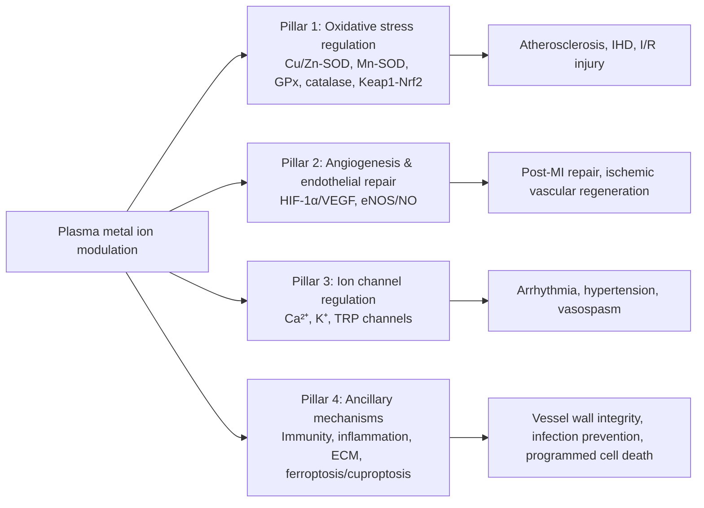
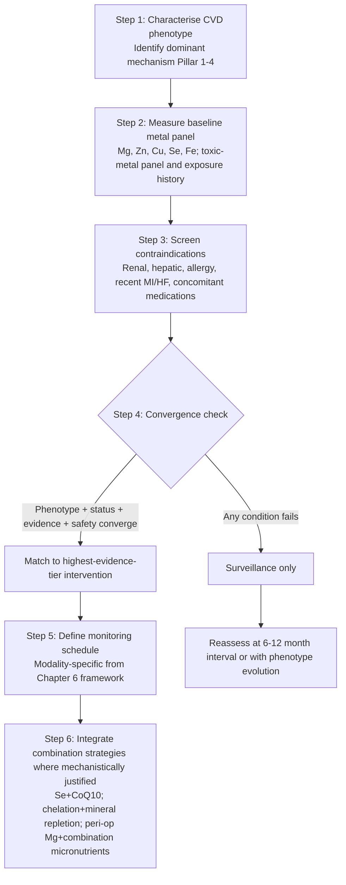

# Modulating Plasma Metal Ion Concentrations as Preventive and Therapeutic Strategies for Cardiovascular Diseases: Interventions, Mechanisms, and Clinical Evidence
# 1 Background, Rationale, and Mechanistic Foundations of Metal Ion Modulation in Cardiovascular Disease

Cardiovascular diseases (CVDs) remain the foremost killer of modern humanity, yet their causal architecture is still being rewritten as new modifiable risk factors emerge from the intersection of nutrition, environmental exposure, and molecular medicine. Among these, the concentration of metal ions circulating in plasma — both essential trace elements such as magnesium, zinc, copper, manganese, iron, selenium, calcium, strontium and cobalt, and toxic xenobiotic metals such as lead, cadmium and arsenic — has shifted from a marginal nutritional consideration to a candidate determinant of cardiovascular risk. The premise of this report is that plasma metal ion concentrations are not merely passive biomarkers but actionable targets: they can be raised, lowered, or locally redistributed by deliberate clinical interventions, and these interventions may meaningfully alter the trajectory of ischemic, atherosclerotic, hypertensive, arrhythmic and heart-failure phenotypes. Before evaluating any specific intervention, however, it is essential to establish why metal ion homeostasis matters mechanistically, which disturbances are linked to which clinical endpoints, and how the dual logic of "supplementation versus removal" maps onto distinct cardiovascular pathologies. This opening chapter constructs that foundation and provides the analytic scaffolding on which the subsequent eight chapters will build.

## 1.1 Cardiovascular Disease Burden and the Emerging Role of Plasma Metal Ions

Cardiovascular diseases represent the predominant cause of global mortality. According to data from the World Health Organisation, approximately 17.9 million people died from CVDs in 2019, accounting for 32% of all global deaths, and in The Lancet's *Global Burden of Disease 2021* analysis, heart disease and stroke remained two of the top-five causes of death worldwide[^1]. The clinical burden is captured operationally by the construct of **major adverse cardiovascular events (MACEs)** — encompassing acute myocardial infarction, stroke, heart failure decompensation, transient ischemic attack and cardiovascular death — which has become the dominant primary endpoint in contemporary cardiovascular research because it integrates multiple disease pathways into a single, clinically meaningful composite[^1]. Beyond MACEs, the broader ICD-10 spectrum of circulatory diseases (codes I00–I99 plus the cerebrovascular G45/G46 codes) covers rheumatic heart disease, hypertension, ischemic heart disease, pulmonary heart disease, other forms of heart disease, cerebrovascular disease, peripheral arterial disease, and venous and lymphatic disorders, each of which shows distinct, disease-specific risk factor profiles[^1].

Against this backdrop, plasma metal ion concentrations have begun to emerge as **modifiable risk indicators** with growing epidemiological support. The most informative recent evidence comes from a large electronic health record analysis conducted on the Scottish NHS Tayside and Fife population. Drawing on linked records covering approximately 20% of the Scottish population, Lin and colleagues examined 978,759 individuals aged 18–100 years, of whom 176,350 (17.6% of females and 18.4% of males) experienced a MACE during the 2000–2021 observation window[^1]. Within this cohort, the proportion of MACE patients varied systematically with pre-event plasma metal status. For magnesium, the MACE rate rose from 27.9% in those with normal levels to 34.7% in the low-magnesium group and 29.4% in the high-magnesium group (both *p* < 0.0001 versus normal). For copper, the MACE rate increased monotonically from 9.9% (low) to 14.6% (normal) to 18.1% (high) (*p* = 0.0316 for high vs. normal). For zinc, low plasma levels doubled the apparent MACE rate (18.1% versus 8.7% in the normal group, *p* < 0.0001), while high zinc was not significantly different from normal[^1]. These population-level patterns establish a quantitative bridge between routine biochemistry results and downstream cardiovascular outcomes, and they justify treating plasma metal ions as candidate intermediates in CVD prevention rather than incidental laboratory noise.

The clinical-epidemiological relevance of this signal is reinforced by the **disease-specificity of the associations**, captured in the Scottish cohort through logistic regression for individual circulatory disease subgroups. As summarised in Table 1.1, the directionality of risk is not uniform across CVD subtypes: low magnesium increases the odds of hypertension (OR 1.07, 95% CI 1.05–1.08), peripheral arterial disease (OR 1.10), cerebrovascular disease (OR 1.07), and especially venous/lymphatic disease (OR 1.22) and other unspecified circulatory disorders (OR 1.21), while paradoxically associating with reduced odds of acute rheumatic fever (OR 0.27) and ischemic heart disease (OR 0.93)[^1]. High copper drives a more than two-fold increase in chronic rheumatic heart disease risk (OR 2.26) and significant increases for hypertension (OR 1.78), ischemic heart disease (OR 1.64), cerebrovascular disease (OR 1.62), and peripheral arterial disease (OR 1.48), whereas low copper is selectively linked to venous and lymphatic disease (OR 2.64)[^1]. Low zinc, by contrast, exhibits the broadest spectrum of cardiovascular risk, raising odds of hypertension (OR 1.38), ischemic heart disease (OR 2.28), other forms of heart disease (OR 2.58), cerebrovascular disease (OR 2.93), peripheral arterial disease (OR 1.82), and venous/lymphatic disease (OR 3.84)[^1].

**Table 1.1 — Selected disease-specific odds ratios for abnormal plasma magnesium, copper and zinc (NHS Tayside/Fife cohort, adapted from Lin et al., 2025).** Only statistically significant associations (*p* < 0.05) are shown; "—" denotes non-significant or not-reported.

| Circulatory disease (ICD-10) | Low Mg (OR) | High Mg (OR) | Low Cu (OR) | High Cu (OR) | Low Zn (OR) | High Zn (OR) |
|---|---|---|---|---|---|---|
| Hypertension (I10–I15) | 1.07 | — | — | 1.78 | 1.38 | — |
| Ischemic heart disease (I20–I25) | 0.93 (protective) | 0.97 (protective) | — | 1.64 | 2.28 | — |
| Other forms of heart disease (I30–I52) | 1.03 | 1.10 | — | — | 2.58 | — |
| Cerebrovascular disease (I60–I69) | 1.07 | 0.96 (protective) | — | 1.62 | 2.93 | — |
| Peripheral arterial disease (I70–I79) | 1.10 | 1.06 | — | 1.48 | 1.82 | — |
| Venous/lymphatic disease (I80–I89) | 1.22 | — | 2.64 | — | 3.84 | — |
| Other unspecified circulatory disorders (I95–I99) | 1.21 | 1.04 | — | — | 3.00 | 2.93 |

Two analytic caveats must accompany this evidence. First, the reported associations are derived from **unadjusted logistic regression** using the most recent pre-event metal measurement; they may be confounded by age, sex, socioeconomic status, comorbid disease, and diet, and the authors explicitly note that no correction for multiple testing was applied[^1]. Second, plasma concentrations do not always mirror tissue or whole-body status because of physiological buffering — only about 1% of total body magnesium resides in plasma, with the bulk sequestered in bone and intracellular compartments[^1]. These limitations mean that the Scottish cohort findings should be read as **hypothesis-generating epidemiological associations that motivate intervention research**, not as definitive proof that adjusting plasma metal levels will reduce CVD incidence; resolving the latter question requires the trial-level evidence reviewed in Chapter 5.

## 1.2 Physiological Roles of Essential Metal Ions in Cardiac and Vascular Function

To understand why plasma concentrations of these metals matter for the heart and vasculature, one must first appreciate the diversity of physiological roles they discharge in cardiovascular tissues — roles that span enzymatic catalysis, electrochemical signaling, structural matrix integrity, and metabolic regulation. **Magnesium** (Mg²⁺) is one of the principal intracellular divalent cations and is indispensable for cardiovascular homeostasis. It activates Na⁺/K⁺-ATPase, controls cellular membrane potential, and counteracts several effects of Ca²⁺, thereby helping to regulate myocardial excitability and blood pressure[^1]. Beyond ion-handling, magnesium exhibits anti-inflammatory and antioxidant properties and supports lipid metabolism, lowering the risk of atherosclerosis[^1]. The complementary mechanistic picture from the atherosclerosis literature emphasises that magnesium deficiency raises cholesterol and triglyceride levels, increases aldosterone production with downstream vascular inflammation, and impairs endothelial cell function and platelet aggregation control[^2]. Importantly, only ~1% of body magnesium circulates in plasma, so moderate deficits trigger compensatory release from tissue and bone stores, an adaptation that may explain the unexpectedly protective association of low plasma magnesium with rheumatic and ischemic conditions in the Scottish data[^1].

**Copper** (Cu⁺/Cu²⁺) functions as a redox-active cofactor for numerous enzymes participating in oxidation–reduction reactions, mitochondrial respiration, energy production, free-radical removal, connective tissue development, iron and oxygen metabolism, extracellular matrix maturation and neuroendocrine signaling[^1][^3]. Cardiac tissue exhibits a markedly higher copper requirement than most other organs because of its dependence on mitochondrial bioenergetics, peptide hormone biosynthesis, and oxidative-stress protection during continuous contraction[^3]. A particularly important structural role is played by copper-dependent **lysyl oxidase**, which catalyses the cross-linking of elastin and collagen in vessel walls; copper deficiency therefore weakens vessel walls and is mechanistically linked to vascular dysfunction, congestion, and the venous/lymphatic disease signal observed epidemiologically with low plasma copper[^1]. Copper also influences immunity (affecting neutrophil counts and IL-2 secretion by T cells) and lymphatic cholesterol transport, both of which intersect with vascular disease pathogenesis[^1]. Mechanistically, dietary copper is absorbed in the duodenum and small intestine via the apical transporter **CTR1**, released into the bloodstream bound to albumin, transcuprein, histidines and macroglobulins, and ultimately stored in the liver bound to ceruloplasmin or metallothionein, with biliary excretion as the primary route of elimination[^3].

**Zinc** (Zn²⁺) is the second most abundant transition metal in the human body and serves as a cofactor for more than 2,000 transcription factors and 1,000 enzymatic processes[^3]. In the cardiovascular system, zinc influences haemostasis, oxidative stress, inflammation and Ca²⁺ homeostasis, supporting heart function and vascular integrity[^1]. It modulates antioxidant enzymes such as superoxide dismutase and glutathione peroxidase, influences vascular tone via release of nitric oxide and endothelium-derived hyperpolarising factors, and inhibits voltage-gated calcium channels in smooth muscle[^2][^3]. Zinc supplementation has been shown to lower total cholesterol, LDL and triglycerides while raising HDL[^3]. Cellular zinc balance is governed by two reciprocal transporter families: **ZIP (Zrt-/Irt-like protein) importers** raise cytoplasmic zinc by bringing Zn²⁺ into cells, while **ZnT (zinc transporter) exporters** lower it; serum albumin acts as an extracellular zinc buffer, binding 75–80% of plasma zinc and protecting endothelial cells from toxic excess[^3]. ZnT1, in particular, has been implicated in the electrophysiological effects of zinc on the heart and is upregulated in atrial fibrillation[^3].

The remaining essential metals each carry distinct cardiovascular signatures. **Iron** is required in 2–5 g total quantity for oxygen transport, mitochondrial respiration and redox reactions, but its accumulation drives **ferroptosis**, an iron-dependent form of regulated cell death produced by lipid peroxide accumulation that is now implicated in the initiation and progression of atherosclerosis through oxidation of low-density lipoprotein and macrophage iron overload[^2]. **Manganese** primarily contributes through **Mn-SOD** in the mitochondrial matrix, defending cardiomyocytes from superoxide-mediated injury, and additional cardiovascular roles are also recognised[^2]. **Selenium**, although a non-metal, is an essential trace element incorporated as selenocysteine into selenoproteins that govern free-radical metabolism, antioxidant defense, anti-tumor activity and cardiovascular protection; selenium deficiency has been linked to Keshan disease (a cardiomyopathy with heart failure), myocardial infarction, coronary heart disease, vascular calcification, smooth muscle proliferation and endothelial dysfunction[^2]. **Calcium** mediates platelet aggregation, smooth muscle cell proliferation, cholesterol deposition and the formation/deposition of hydroxyapatite and calcium phosphate salts that drive vascular calcification in atherosclerotic plaques[^2]. The reference materials available for this report provide more limited mechanistic detail on **strontium** and **cobalt** in cardiovascular physiology; these elements will be revisited in Chapter 2 in the context of supplementation evidence and in Chapter 6 with respect to known toxicity profiles, with appropriate acknowledgement of evidence gaps where the literature is sparse.

The interaction between copper and zinc deserves particular emphasis, because it shapes the design of any supplementation strategy. Both metals are absorbed in the duodenum, both bind metallothionein, and they compete at the level of intestinal uptake: large dietary zinc loads upregulate enterocyte metallothionein, which preferentially sequesters copper and prevents its serosal transfer, producing **secondary copper deficiency from zinc excess**[^3]. Conversely, copper-deficient diets in Wistar rats produce a measurable decrease in the plasma Cu/Zn ratio coupled with increased ceruloplasmin and altered vascular contractility, and chronic zinc poisoning can present clinically with copper-deficiency-like syndromes[^3]. This zinc–copper antagonism, together with iron–copper crosstalk (a high-iron diet produces tissue copper depletion and reduced ceruloplasmin activity that can be reversed by copper supplementation[^3]), means that no metal ion can be modulated in isolation — a principle that constrains every supplementation, delivery and chelation approach discussed in later chapters.

## 1.3 Disruption of Metal Ion Homeostasis and Linkage to Specific Cardiovascular Pathologies

When the homeostatic systems described above fail — whether through dietary deficiency, dysregulated absorption or excretion, altered transporter expression, gut microbiome perturbation, or environmental exposure to toxic xenobiotic metals — the resulting disturbances in plasma metal ion concentrations track closely with discrete cardiovascular pathologies. The Scottish EHR data summarised in Section 1.1 provide the empirical anchor; the mechanistic literature explains why each pattern occurs.

**Magnesium dysregulation** displays the most condition-specific behaviour. Low plasma magnesium is robustly associated with hypertension (OR 1.07), peripheral arterial disease (OR 1.10), cerebrovascular disease (OR 1.07), venous/lymphatic disease (OR 1.22), and other unspecified circulatory disorders (OR 1.21)[^1]. These signals are mechanistically grounded in magnesium's role as an antagonist of vascular Ca²⁺-driven contraction and in its anti-inflammatory action: magnesium deficiency raises lipid levels, promotes aldosterone-mediated vascular inflammation, and impairs endothelial function and platelet control[^2]. A cross-sectional study of 9,708 participants (Tan et al.) showed that higher magnesium depletion scores raised hypertension risk, and a systematic review and meta-analysis linked lower dietary magnesium intake to increased stroke risk[^1]. Yet the Scottish data also reveal a counter-intuitive pattern: both low and high magnesium are protective against ischemic (I20–I25) and pulmonary heart diseases (I26–I28), and high magnesium reduces cerebrovascular disease risk (OR 0.96)[^1]. The plausible explanation is dual: tissue and bone magnesium reserves can compensate for moderate plasma deficits, while elevated magnesium delivers vasodilatory, anti-inflammatory and neuroprotective effects most relevant in ischemic and cerebrovascular contexts[^1].

**Copper dysregulation** follows an asymmetric pattern. Excess plasma copper consistently raises CVD risk: it associates with chronic rheumatic heart disease (OR 2.26), hypertension (OR 1.78), ischemic heart disease (OR 1.64), other forms of heart disease (OR 1.37), cerebrovascular disease (OR 1.62), and peripheral arterial disease (OR 1.48)[^1]. Mechanistically, surplus copper drives oxidative stress, lipid peroxidation, low-density lipoprotein oxidation, and inflammation; epidemiological evidence further links elevated circulating copper to stroke, coronary artery disease mortality, cardiovascular mortality and all-cause mortality with moderate certainty[^1]. At the cellular level, excess copper triggers **cuproptosis**, a copper-dependent regulated cell death distinct from apoptosis, pyroptosis, necroptosis and ferroptosis, in which copper binds lipoylated TCA-cycle proteins and drives proteotoxic stress[^2]. In murine models, oral CuCl₂ at 1.08 g/kg over 8–14 weeks raises markers of myocardial damage, induces cardiac fibrosis, alters cardiac troponin I and NT-pro-BNP, and triggers apoptosis[^3]. Diabetic rodents show elevated serum and myocardial copper, suggesting that diabetes facilitates copper excess that contributes to diabetic cardiomyopathy through cardiomyocyte loss, fibroblast proliferation and extracellular matrix expansion[^3]. Conversely, **low copper** is selectively associated with venous and lymphatic disease (OR 2.64)[^1], a specificity rooted in lysyl-oxidase-dependent vessel wall integrity, copper-dependent immune function, and copper's role in lymphatic cholesterol transport and chylomicron lipolysis[^1].

**Zinc deficiency** shows the broadest cross-sectional signature, increasing risk of nearly every CVD subtype examined: hypertension (OR 1.38), ischemic heart disease (OR 2.28), other forms of heart disease (OR 2.58), cerebrovascular disease (OR 2.93), peripheral arterial disease (OR 1.82), and venous/lymphatic disease (OR 3.84)[^1]. The mechanistic logic is that zinc concurrently regulates vascular tone, endothelial function, oxidative stress, blood pressure and lipid metabolism, so deficiency simultaneously promotes endothelial dysfunction, inflammation, arterial stiffness, atherosclerosis and thrombotic risk[^1]. A meta-analysis of 27 case–control studies linked low serum zinc to higher heart failure risk, and a separate meta-analysis of 13 studies (2,886 subjects) found significantly lower serum and hair zinc in MI patients than controls, with stronger associations in Asian than European populations[^1]. The pathway from zinc imbalance to vascular pathology can also operate via copper antagonism — excess zinc disrupts copper metabolism and reduces nitric oxide bioavailability — providing a mechanistic explanation for the otherwise puzzling association between high zinc and "other unspecified" circulatory disorders (I95–I99, OR 2.93)[^1].

**Iron, calcium and selenium dysregulation** complete the picture for atherogenesis. Iron overload in macrophages and vascular cells drives ferroptotic cell death, oxidative LDL formation, and atherosclerotic plaque progression, while ferroptosis-related pathways (GPX4 inhibition, lipoxygenase activation, FSP1/CoQ axis, GTP cyclohydrolase 1/BH4) are increasingly recognised as therapeutic targets[^2]. Calcium contributes through hydroxyapatite and calcium-phosphate deposition that hardens arterial walls and accelerates plaque formation[^2]. Selenium deficiency promotes endothelial dysfunction, smooth muscle proliferation and vascular calcification, and has been associated with myocardial infarction, heart failure, coronary heart disease and Keshan-type cardiomyopathy[^2].

Beyond essential-ion deficiency, **toxic xenobiotic metals** — lead (Pb), cadmium (Cd), arsenic (As), bismuth (Bi), and to a lesser extent chromium (Cr) — are recognised in the atherosclerosis literature as drivers of the disease through diverse pathways[^2]. The mechanistic detail provided in the available reference materials is more limited for these xenobiotics than for essential metals, but the general principle is that environmental or occupational exposure raises body burden, with downstream oxidative stress, endothelial dysfunction and inflammatory signaling that mirror the effects of essential-metal excess. This pathophysiology motivates the **chelation-based interventional logic** developed in Chapter 4.

## 1.4 Core Biological Mechanisms of Metal Ion Modulation in CVD Progression

The disease-specific associations described above can be reorganised into four core mechanistic pillars that any plasma-metal-modulating intervention must engage to exert cardiovascular benefit. Mapping each pillar to the relevant CVD subtypes provides the analytic backbone that connects mechanism (this chapter), intervention modality (Chapters 2–5), and clinical outcome (Chapters 5–7).

**Pillar 1 — Oxidative stress regulation.** Reactive oxygen species are the common downstream mediator of much CVD pathology, and metal ions sit at the catalytic core of the antioxidant enzyme system. **Cu/Zn-superoxide dismutase (SOD1)** in the cytosol and extracellular SOD require both copper and zinc as catalytic cofactors; **Mn-SOD (SOD2)** in the mitochondrial matrix depends on manganese; **glutathione peroxidase (GPx)** family members use selenium-containing selenocysteine in their active sites; and catalase decomposes hydrogen peroxide[^2][^3]. Zinc additionally exerts antioxidant action by modulating the activity of related enzymes and protecting protein thiols, while selenium drives multiple selenoprotein-mediated antioxidant pathways[^2]. Conversely, the same metals can become **pro-oxidant** when poorly chaperoned: free copper generates hydroxyl radicals that attack DNA and lipids, while free iron drives Fenton-type ROS production, lipid peroxidation, and ferroptosis[^2][^3]. The Keap1–Nrf2 axis (referenced in the chapter outline) is the master transcriptional response to oxidative stress, and although the available materials do not detail it explicitly, its regulation by zinc-containing transcription factors and by ferroptosis-related lipid peroxides is consistent with the mechanisms described in the literature[^2]. CVD subtypes most directly governed by this pillar include atherosclerosis (where LDL oxidation initiates plaque formation), ischemic heart disease, and ischemia/reperfusion injury.

**Pillar 2 — Angiogenesis and endothelial repair.** Restoration of perfusion to ischemic myocardium requires both new vessel formation and recovery of endothelial function. Two signaling axes are central. The **HIF-1α/VEGF axis** drives transcription of pro-angiogenic genes in response to hypoxia; copper is a recognised regulator of HIF-1α stabilisation, and the chapter outline highlights this pathway as a key target for engineered local delivery (Chapter 3). The **eNOS/NO axis** governs endothelium-dependent vasorelaxation: copper modulates NO-mediated vasorelaxation in rat aortic rings — extended incubation with sub-micromolar Cu²⁺ impairs acetylcholine-induced relaxation while leaving responses to NO donors intact — and zinc enhances acetylcholine-induced relaxation by promoting endothelial release of NO and endothelium-derived hyperpolarising factors[^3]. CuNP exposure can paradoxically promote vasodilation through increased iNOS expression and NO production, although this occurs in the context of elevated lipid peroxidation[^3]. Magnesium also contributes through vasodilatory and neuroprotective properties relevant to ischemic and cerebrovascular conditions[^1]. CVD subtypes most relevant to this pillar are post-MI myocardial repair, ischemic vascular regeneration, and peripheral arterial disease.

**Pillar 3 — Ion channel and electrical regulation.** Cardiac and vascular function depend on tightly orchestrated movement of Ca²⁺, K⁺ and other ions through specific channels, and several metal ions act as direct modulators. Magnesium activates Na⁺/K⁺-ATPase and counteracts Ca²⁺-driven contraction, supporting normal membrane potential[^1]. Zinc inhibits voltage-gated calcium channels in smooth muscle, signals through TRPA1 channels in perivascular sensory nerves to release calcitonin-gene-related peptide, and influences atrial electrophysiology — ZnT1 expression is elevated in patients with atrial fibrillation, and the cardioprotective effect of intracellular zinc has been demonstrated in Langendorff-perfused rat hearts where pyrithione-mediated zinc delivery during reperfusion reduced arrhythmias more than two-fold and restored myocardial healing to nearly 100%[^3]. Calcium itself, of course, is the proximal driver of myocyte contraction, while excess calcium contributes to vascular calcification[^2]. The CVD subtypes governed by this pillar include arrhythmia (notably atrial fibrillation and reperfusion arrhythmias), hypertension, and vasospastic conditions.

**Pillar 4 — Ancillary mechanisms.** A heterogeneous final group of mechanisms further connects metal ions to cardiovascular outcomes. *Immune modulation*: copper supports innate and adaptive immunity, with deficiency reducing neutrophil counts and IL-2 secretion[^1], while zinc influences macrophages, NK cells, T- and B-cell development, and cytokine signaling[^3]. *Inflammatory response*: copper activates NF-κB and NLRP3 inflammasome pathways, copper chelation by tetrathiomolybdate inhibits vascular inflammation and atherosclerotic lesion development in apoE-knockout mice, and magnesium deficiency increases vascular inflammation[^1][^2]. *Vascular elasticity and extracellular matrix integrity*: copper-dependent lysyl oxidase cross-links elastin and collagen, so deficiency weakens vessel walls and predisposes to venous/lymphatic dysfunction[^1]. *Programmed cell death pathways*: ferroptosis (iron-driven lipid peroxidation), cuproptosis (copper-driven lipoylated TCA-protein toxicity), and pyroptosis collectively contribute to vascular endothelial cell loss, plaque progression and cardiomyocyte death in coronary artery disease[^2]. *pH, electrolyte and lipid regulation*: zinc and magnesium influence lipid profiles and electrolyte handling, while copper modulates lymphatic cholesterol transport[^1][^3]. *Prevention of secondary infection* — particularly relevant to implanted cardiovascular devices where antimicrobial metal-ion release from surfaces can suppress device-related infection — is an additional ancillary mechanism that becomes operationally important in Chapter 3's discussion of bioabsorbable stents and metal-phenol coatings.

## 1.5 Dual Interventional Logic: Supplementation Versus Removal Strategies

The mechanisms above set the stage for the central conceptual scaffold of this report: the **dual interventional logic of supplementation versus removal**. When the evidence indicates that a deficiency of an essential metal ion is driving cardiovascular pathology, the rational intervention is to raise plasma (and tissue) levels through dietary fortification, oral or intravenous supplementation, or engineered local delivery (Chapters 2 and 3). When the evidence indicates that an excess of an essential metal — or, more commonly, accumulation of a toxic xenobiotic metal — is the driving lesion, the rational intervention is to lower plasma and tissue levels through chelation therapy or related removal strategies (Chapter 4). Critically, **these logics are not mutually exclusive within an individual patient**: the same person may simultaneously have low zinc and selenium (warranting supplementation) and elevated lead or cadmium burden (warranting chelation), while also requiring careful surveillance of copper because zinc supplementation will antagonise its absorption.

The Scottish EHR data and the mechanistic literature together suggest a preliminary mapping of strategy to phenotype, summarised in Table 1.2.

**Table 1.2 — Preliminary mapping of metal ion intervention logic to CVD phenotype, derived from epidemiological and mechanistic evidence reviewed in this chapter.**

| Phenotype / mechanism | Dominant metal disturbance | Rational interventional logic |
|---|---|---|
| Hypertension (with low Mg / low Zn) | Mg, Zn deficiency | Supplementation (Chapter 2) |
| Ischemic heart disease, post-MI repair | Low Zn, high Cu, ferroptosis | Supplementation (Zn) + redox-targeted local delivery (Chapter 3); Cu surveillance |
| Atherosclerosis (oxidised LDL, plaque) | Iron overload, high Cu, low Se | Removal (Cu-targeted chelation, e.g., tetrathiomolybdate); Se supplementation |
| Cerebrovascular disease | Low Zn, low Mg, high Cu | Mixed: Zn/Mg supplementation, Cu monitoring |
| Venous and lymphatic disease | Low Cu, low Zn | Supplementation (lysyl oxidase substrate restoration) |
| Atrial fibrillation, reperfusion arrhythmia | Zn dyshomeostasis, ZnT1 overexpression | Targeted intracellular Zn delivery (Chapter 3) |
| Toxic-metal-driven endothelial dysfunction | Pb, Cd, As accumulation | Chelation (Chapter 4) |
| Diabetic cardiomyopathy | Cu accumulation in myocardium | Cu-lowering / chelation strategies |

Several decision criteria emerge from this mapping. First, **baseline metal status must be measured before intervention**, because the same nominal deficit (e.g., low plasma magnesium) can carry opposite prognostic implications in different CVD subtypes — protective in ischemic disease but harmful in hypertension and venous disease[^1]. Second, **metal–metal interactions constrain monotherapeutic thinking**: zinc–copper antagonism, iron–copper crosstalk, and the role of albumin as a shared zinc/copper buffer mean that supplementing one ion can deplete another, and any clinical protocol must monitor the broader metal panel rather than the targeted ion alone[^3]. Third, **dose and route matter critically**: Asri-Rezaei and colleagues showed in diabetic rats that 3 mg/kg of zinc nanoparticles produced cardioprotection while 10 mg/kg exacerbated diabetic complications, illustrating the narrow therapeutic window that biases this field toward locally delivered, controlled-release platforms over crude systemic dosing[^3]. Fourth, **ionic versus nanoparticulate forms behave differently**: substituting copper nanoparticles for ionic copper carbonate worsened hypertension-related changes in heart, liver and intestines in spontaneously hypertensive rats and altered the vascular response through 20-HETE and thromboxane-A2 receptor pathways, indicating that delivery format is a therapeutic variable in its own right[^3].

Finally, the framework presented here must be applied with **honest acknowledgement of evidence-tier limits**. The Scottish cohort findings rest on unadjusted, hypothesis-generating associations with no correction for multiple testing[^1]; the mechanistic literature on copper, zinc, magnesium and selenium in atherosclerosis is largely preclinical, drawing on rodent diet, in vitro vascular ring, and cell-line experiments that establish biological plausibility but do not by themselves justify clinical recommendations[^2][^3]. Chapters 2 through 5 will systematically interrogate which of these supplementation, delivery and chelation logics survive contact with randomised clinical trials — including the contrasting outcomes of LIMIT-2 versus ISIS-4 for intravenous magnesium, and the TACT trial's diabetic-subgroup signal for chelation therapy — and Chapters 6 through 8 will address the safety, regulatory and translational realities that determine whether the dual logic introduced here can be operationalised at the bedside. The remainder of this report therefore takes as its starting point a single, clinically actionable proposition: that plasma metal ion concentrations are **non-trivially associated with cardiovascular outcomes through identifiable mechanisms**, and that interventions which deliberately raise, lower, or locally redistribute these ions warrant rigorous evaluation as preventive and therapeutic strategies for CVD.

# 2 Supplementation-Based Interventions: Essential Metal Ions as Therapeutic Agents

Chapter 1 closed with a clinically actionable proposition: that plasma metal ion concentrations are non-trivially associated with cardiovascular outcomes through identifiable mechanisms, and that interventions which deliberately raise, lower, or locally redistribute these ions warrant rigorous evaluation. The most direct operationalisation of that proposition — and historically the earliest to enter clinical practice — is **systemic supplementation of essential metal ions**: giving a deficient or marginally replete patient more of an essential element through diet, oral capsule, or intravenous infusion, in the expectation that restoring physiological concentrations will normalise downstream pathways and translate into measurable cardiovascular benefit. This chapter interrogates that expectation across the seven essential elements highlighted in the report's analytic frame (Mg²⁺, Zn²⁺, Cu²⁺, Mn²⁺, Sr²⁺, Co²⁺, Se), juxtaposing in vitro mechanistic plausibility against rodent models, epidemiological associations, and — most importantly — randomised clinical trials. The central question is not whether each metal *can* be supplemented, but whether systemic supplementation reliably converts a biochemical change in plasma concentration into a clinically meaningful change in cardiovascular outcome.

## 2.1 Conceptual Framework and Dose-Response Logic of Essential Metal Supplementation

The decision to supplement an essential metal ion is, at its core, a decision that the patient sits on the deficiency arm of the dual interventional logic introduced in Chapter 1. That decision should be governed by four converging criteria: (i) measurable plasma evidence of deficiency or marginal status against a population-validated reference; (ii) a CVD phenotype whose pathophysiology is plausibly driven by the deficient element rather than by metal excess or by toxic xenobiotic accumulation; (iii) absence of metal–metal interactions that would convert single-element repletion into iatrogenic deficit elsewhere (most prominently the zinc–copper antagonism); and (iv) a delivery route and dose calibrated against established **dietary reference intakes** — the Recommended Dietary Allowance (RDA) or Adequate Intake (AI) at the lower bound, and the Tolerable Upper Intake Level (UL) at the upper bound — together with the population-specific therapeutic window derived from preclinical and clinical data.

Several quantitative anchors emerge from the available evidence to populate this framework. For magnesium, dietary reference data indicate that approximately 50% of Americans consume less than the estimated average requirement, leading the 2015 Dietary Guidelines Advisory Committee to classify magnesium as a "shortfall nutrient," with elderly populations especially at risk — 33% of nursing home residents in one German study were clinically deficient.[^4] For selenium, the European mean dietary intake is approximately 40 μg/day, against a requirement of 75–105 μg/day to optimise selenoprotein P function and 75–125 μg/day for cancer protection, while US intakes are markedly higher (134 μg/day in men, 93 μg/day in women) due to soil selenium content.[^5] These regional disparities mean that **the same supplementation protocol can be appropriate in one population and supraphysiological in another**, a point that recurs in the contrasting outcomes of European versus North American trials throughout this chapter.

The conceptual framework also requires a clear delivery-route hierarchy. **Dietary fortification** alters intake at the population level but produces highly variable plasma responses because of inter-individual differences in absorption, transporter expression, and tissue buffering. **Oral supplementation** allows controlled dosing but is constrained by gastrointestinal tolerance — for magnesium oxide, 32–50% of recipients in a placebo-controlled trial reported gastrointestinal symptoms over 12 weeks[^4] — and by the same absorption and buffering limits. **Intravenous administration** bypasses absorption and produces rapid plasma concentration changes, but is reserved for acute or perioperative settings because of cost, infrastructure, and the risk of overshoot. Each route imposes different translational logic on the relationship between dose, plasma concentration, and clinical endpoint.

Finally, the **evidence-tier hierarchy** that will be applied throughout this chapter — from in vitro mechanistic studies, through animal models, epidemiological cohorts, and ultimately randomised clinical trials and meta-analyses — must explicitly accommodate a recurring phenomenon: trials that demonstrate the predicted plasma biochemical change without producing a clinically meaningful cardiovascular endpoint. The Lutsey pilot in atrial fibrillation, discussed below, is paradigmatic: oral magnesium oxide raised serum magnesium by 0.07 mEq/L (the predicted response) yet produced no change in premature atrial contraction burden, glucose, or blood pressure over 12 weeks.[^4] This **biochemical–clinical dissociation** is treated in Section 2.8 as a structural feature, not an anomaly, of systemic metal supplementation.

## 2.2 Magnesium Supplementation: From Acute MI to Arrhythmia Prevention

Magnesium is the most extensively trialled supplemented metal ion in cardiovascular medicine, and its evidence base illustrates with unusual clarity both the promise and the limitations of systemic supplementation. The mechanistic rationale, established in Chapter 1, rests on magnesium's activation of Na⁺/K⁺-ATPase, antagonism of calcium-driven contraction, anti-inflammatory action, and direct electrophysiological effects on sinoatrial, intra-atrial and atrioventricular conduction and atrial refractory period.[^4]

### Intravenous magnesium in acute myocardial infarction: the LIMIT-2 / ISIS-4 paradox

The most-cited test of systemic magnesium supplementation in acute coronary care is the contrast between two randomised trials separated by an order of magnitude in sample size. The **Second Leicester Magnesium Intervention Trial (LIMIT-2)** randomised 2,316 patients with suspected acute myocardial infarction (mean age 62, 27% female) to intravenous magnesium sulfate or normal saline over 24 hours.[^6] Mortality at 28 days, the primary endpoint, was reduced by 24% in the magnesium group (95% CI 1–43%, *p* = 0.04), and the secondary endpoint of left ventricular failure during coronary care unit stay was reduced by 25% (95% CI 7–39%, *p* = 0.009). The benefit persisted in long-term follow-up (mean 2.7 years): magnesium therapy reduced ischaemic heart disease mortality by 21% (*p* = 0.001) and all-cause mortality by 16% (*p* = 0.03), without any excess of heart block, antiarrhythmic drug use, cardioversion or temporary pacing.[^6]

The much larger **ISIS-4 trial**, which enrolled 58,050 patients with suspected myocardial infarction, found no benefit of intravenous magnesium on mortality, definitively contradicting the LIMIT-2 signal at the level of evidence required by contemporary cardiology guidelines.[^6] The American College of Cardiology summary of LIMIT-2 explicitly notes that "the LIMIT-2 data conflict with the negative results of ISIS-4," attributing the discrepancy to differences in dosing regimens, patient populations, or the play of chance, and concluding that the benefit of magnesium for acute MI remains "a subject of continued debate."[^6] The most often-cited mechanistic explanation favours timing: in LIMIT-2 magnesium was generally administered before thrombolytic reperfusion, whereas in ISIS-4 administration was frequently delayed beyond the window in which magnesium could plausibly attenuate reperfusion injury. From an evidence-tier perspective, the disparity is decisive: a single moderate-sized RCT (LIMIT-2) cannot override a much larger confirmatory-phase trial (ISIS-4), and current practice no longer endorses routine IV magnesium in unselected acute MI. Nonetheless, LIMIT-2 stands as a hypothesis-generating signal that magnesium delivered before reperfusion may protect against ischaemia–reperfusion injury — a hypothesis that has migrated, in the modern era, from systemic infusion toward the locally delivered, mechanism-targeted strategies discussed in Chapter 3.

### Oral magnesium for arrhythmia prevention

A separate body of evidence concerns oral magnesium for prevention of atrial fibrillation (AF) and other supraventricular tachyarrhythmias. The strongest signal comes from peri-cardiac-surgery prophylaxis: a Cochrane systematic review and meta-analysis of randomised trials reported an odds ratio of **0.55 (95% CI 0.41–0.73)** for postoperative AF or supraventricular arrhythmia with magnesium versus control, sufficient that magnesium is now recommended prophylactically in this setting.[^4] Three prospective epidemiological studies further indicate that individuals in the lowest versus highest quantile of serum magnesium are 35–50% more likely to develop incident AF, and a controlled depletion study showed that 3 of 14 women fed a low-magnesium diet developed AF that resolved upon repletion.[^4]

These signals motivated a pilot randomised trial of oral magnesium for community-based AF prevention. Lutsey and colleagues randomised 59 participants aged ≥55 years (mean age 61.5, 73% women, baseline serum Mg 1.72 ± 0.11 mEq/L, with 37.9% below the 1.7 mEq/L subclinical-deficiency threshold) to 400 mg/day of magnesium oxide or placebo for 12 weeks, monitoring premature atrial contractions (PACs) — an intermediate AF phenotype — using the ZioPatch ambulatory device.[^4] The trial achieved its biochemical target: serum magnesium rose by 0.07 mEq/L in the supplementation arm versus placebo (95% CI 0.03–0.12, *p* = 0.002), a magnitude concordant with prior meta-analytic predictions for a 360 mg/day median dose. However, the primary clinical outcome was null: log PAC burden showed no intervention effect (ratio of geometric means 0.94, 95% CI 0.69–1.30, *p* = 0.73), and there were no significant changes in serum glucose, systolic blood pressure or diastolic blood pressure.[^4] The authors emphasised that the study was deliberately small and underpowered for clinically relevant differences, that baseline magnesium concentrations were relatively high, and that the trial's intent was to validate adherence (75% pill count in the active arm) and feasibility for a future definitive RCT.[^4] This pilot exemplifies the **biochemical–clinical dissociation** flagged in Section 2.1: the predicted serum response was achieved without translating into a measurable arrhythmic endpoint at 12 weeks.

### Routine ICU correction of hypomagnesaemia: a definitive null

The most rigorous recent challenge to the practice of supplementing magnesium in critically ill patients comes from a quasi-experimental fuzzy regression discontinuity analysis of 478,901 twenty-four-hour treatment windows from 171,727 ICU admissions across 93 ICUs in the US and Europe (2003–2022).[^7] Using treatment cutoffs in current practice ranging from 1.6 to 2.0 mg/dL, the analysis found **no effect of magnesium supplementation on tachyarrhythmia** (risk difference 0.1%, 95% CI −4.2 to 6.9), no association with hypotension (risk difference 1.2%, 95% CI −0.9 to 17.7), and no association with death (risk difference 1.4%, 95% CI −0.6 to 5.3), at any of the cutoff levels evaluated.[^7] The authors concluded that "routine supplementation of magnesium with currently used doses and treatment thresholds was not associated with beneficial effects for individuals with serum magnesium values close to those cutoffs."[^7] Although this is technically a non-randomised quasi-experimental design, the regression-discontinuity approach plausibly allows for causal inference and the sample size renders chance-alone explanations implausible. The result substantially constrains the evidence base for reflex hypomagnesaemia correction in ICU practice.

### Blood pressure and glycaemic effects: meta-analytic signals

Outside the acute-care setting, meta-analyses provide more consistent evidence for modest cardiovascular-relevant effects of oral magnesium. A meta-analysis of randomised double-blind placebo-controlled trials reported that a median dose of 368 mg/day for a median 3 months reduced systolic BP by **2.0 mmHg (95% CI 0.4–3.6)** and diastolic BP by **1.8 mmHg (95% CI 0.7–2.8)**, evidence that contributed to a 2016 FDA petition for a qualified health claim linking magnesium to reduced hypertension risk.[^4] A complementary meta-analysis in 370 patients with type 2 diabetes (median 360 mg/day, 13 weeks) reported a fasting glucose reduction of **−10.1 mg/dL (95% CI −19.8 to −0.2)**.[^4] These meta-analytic effect sizes are small but real, and they cohere with the mechanistic prediction that magnesium repletion should produce dose-dependent, modest reductions in two key cardiovascular risk factors. The clinical question is whether such effects, in an unselected community population, are sufficient to translate into hard cardiovascular endpoints — a translation that LIMIT-2 affirmed and ISIS-4 negated.

**Table 2.1 — Summary of major magnesium supplementation trials and analyses cited in this section.**

| Trial / analysis | Population | Intervention | Primary outcome | Result | Evidence tier |
|---|---|---|---|---|---|
| LIMIT-2 | 2,316 suspected acute MI[^6] | IV MgSO₄ over 24 h | 28-day mortality | ↓24% (95% CI 1–43%, *p*=0.04) | Single moderate RCT |
| ISIS-4 | 58,050 suspected acute MI[^6] | IV MgSO₄ | Mortality | No benefit | Definitive large RCT (null) |
| Cochrane post-cardiac-surgery | Cardiac surgery patients[^4] | Peri-op Mg | Post-op AF | OR 0.55 (95% CI 0.41–0.73) | Meta-analysis (positive) |
| Lutsey pilot | 59 community adults ≥55 y[^4] | 400 mg/d MgO ×12 w | Log PAC burden | No effect (*p*=0.73); Mg ↑0.07 mEq/L | Pilot RCT (biochemical only) |
| ICU regression discontinuity | 171,727 ICU admissions[^7] | Mg supplementation | 24-h tachyarrhythmia | RD 0.1% (−4.2 to 6.9) | Large quasi-experimental (null) |
| Zhang 2016 BP meta-analysis | RCTs, ~368 mg/d, 3 mo[^4] | Oral Mg | SBP / DBP | ↓2.0 / 1.8 mmHg | Meta-analysis (modest positive) |

The composite picture is that **systemic magnesium supplementation produces reliable biochemical responses and modest, real effects on blood pressure, glucose and post-cardiac-surgery AF, but does not consistently translate into hard cardiovascular endpoints in unselected populations**. Translation depends on patient selection (deficiency at baseline, high arrhythmic risk), timing (pre-reperfusion in MI), and population (post-cardiac-surgery > community).

## 2.3 Zinc Supplementation: Antioxidant, Lipid, and Vascular Benefits

Chapter 1 documented that zinc deficiency carries the broadest cross-sectional cardiovascular risk signature of any essential metal in the Scottish EHR data, raising odds of hypertension, ischaemic heart disease, other heart disease, cerebrovascular disease, peripheral arterial disease and venous/lymphatic disease. The mechanistic basis — Cu/Zn-SOD cofactor activity, modulation of endothelial NO and EDHF release, voltage-gated calcium channel inhibition, and zinc's role as cofactor for >2,000 transcription factors and >1,000 enzymes — predicts that supplementation in deficient individuals should produce broad-spectrum cardiovascular benefits via Pillar 1 (oxidative stress) and Pillar 3 (ion channel) mechanisms.

The available reference materials for this report do not include large randomised supplementation trials with hard cardiovascular endpoints for zinc comparable to LIMIT-2 or KiSel-10. The strongest signals therefore come from preclinical and mechanistic studies, supported by epidemiological meta-analyses. Preclinical evidence emphasises a **biphasic dose-response window** that is unusually narrow: as established in Chapter 1, in diabetic rat models 3 mg/kg of zinc nanoparticles produced cardioprotection while 10 mg/kg exacerbated diabetic complications — a roughly three-fold dose ratio separating benefit from harm. This narrow therapeutic index is consistent with zinc's role as both an antioxidant cofactor (at physiological concentrations) and a competitor for copper at intestinal metallothionein (at supraphysiological intakes), so that chronic high-dose zinc reliably produces secondary copper deficiency. Any clinical zinc supplementation protocol must therefore either remain within the RDA range or include explicit copper monitoring; the principle that supplementation cannot be evaluated in single-element isolation, introduced in Chapter 1, is operationally most stringent for zinc.

The reference materials provide indirect but pertinent supplementation evidence in the form of a clinical observation by Witte and colleagues, who showed that supplementation with a multi-micronutrient formulation including selenium and coenzyme Q10 — which would also have provided zinc and other elements — improved cardiac left ventricular function on cardiac MRI and significantly increased EuroQoL quality-of-life scores in elderly patients with chronic heart failure, although NYHA class did not change and the study was small with <1 year follow-up.[^5] This provides preliminary support for the broader principle that combination micronutrient supplementation (revisited in Section 2.7) may outperform single-element strategies in heart failure populations.

The major caveat for zinc supplementation is therefore not the absence of mechanistic plausibility — that is well established — but the **paucity of large randomised trials with hard cardiovascular endpoints in the materials available for this report**. Recommendations should consequently be limited to documented deficiency states, with explicit copper monitoring, and the field's translational priority is the conduct of phenotype-stratified randomised trials in zinc-deficient CVD populations.

## 2.4 Copper Supplementation: Restoring Lysyl Oxidase, Angiogenesis, and Mitochondrial Function

Copper supplementation occupies an unusually asymmetric position in the cardiovascular evidence base. As Chapter 1 documented, both copper deficiency and copper excess drive distinct and clinically important cardiovascular pathologies — deficiency disables lysyl oxidase, Cu/Zn-SOD, ceruloplasmin and mitochondrial cytochrome c oxidase, while excess drives oxidative stress, LDL oxidation, cuproptosis and atherogenesis. Supplementation is therefore appropriate **only** when baseline plasma copper is demonstrably low and when the CVD phenotype matches a deficiency mechanism.

### Reversal of cardiac hypertrophy and heart failure in deficiency models

The most mechanistically detailed supplementation evidence comes from murine models of copper-deficient cardiomyopathy. Goodman and colleagues first described copper-deficient cardiac hypertrophy in 1970, attributing it to mitochondrial enlargement.[^8] The subsequent work of Kang and colleagues established that copper deficiency-induced cardiac hypertrophy is concentric, mimicking pressure overload, and is driven primarily by decreased cytochrome c oxidase activity and ATP synthase function with compensatory mitochondrial biogenesis.[^8] Critically for the supplementation logic, Kang et al. demonstrated that in mice with ascending aortic constriction-induced cardiac hypertrophy, **copper supplementation attenuates hypertrophy by restoring myocardial VEGF expression and angiogenesis**, with copper chaperone CCS binding HIF-1α to drive copper-dependent transcriptional activation of *Vegf*.[^8] In rat H9C2 cardiomyocytes, 5 μM copper sulfate attenuated hydrogen peroxide-induced hypertrophy, an effect blocked by anti-VEGF antibody.[^8] In intestinal-epithelial-specific *Ctr1*-knockout mice with cardiac hypertrophy, **postnatal copper administration partially rescued** the cardiac phenotype.[^8] In diet-induced copper-deficient mice with established cardiac systolic and diastolic dysfunction, refeeding a copper-adequate diet for 4 weeks **completely restored** cardiac function and the response to β-adrenergic stimulation.[^8] These data establish unambiguously, in the deficiency setting, that copper supplementation restores Pillar 2 (HIF-1α/VEGF angiogenesis) and Pillar 3 (calcium cycling, β-adrenergic responsiveness) mechanisms.

### Clinical supplementation in hypercholesterolaemia and healthy adults

Translation to human cardiovascular endpoints is, however, far more limited. The available reference materials describe several small clinical trials of oral copper supplementation in adult populations.[^8] In adult men with moderately high cholesterol, **2 mg/day copper for 4 weeks** increased erythrocyte SOD1 activity and prolonged lipoprotein oxidation lag time — the latter a recognised IHD risk factor.[^8] In adult women with moderate hypercholesterolaemia, **2 mg/day copper for 8 weeks** elevated erythrocyte SOD1 and plasma ceruloplasmin, and reduced mean plasma oxidised LDL (with 21 of 35 subjects showing a decrease), although total plasma cholesterol did not change significantly — a result the authors attributed to small sample size and heterogeneous diet.[^8] In healthy young women, **6 mg/day copper for three 4-week periods** with 3-week washouts increased erythrocyte SOD1 and decreased fibrinolytic factor PAI-1, both consistent with reduced IHD risk.[^8] In Venezuelan hypercholesterolaemic patients, **5 mg/day copper for 45 days** decreased total plasma cholesterol and slightly increased HDL cholesterol.[^8] Across these trials the consistent biochemical signal is improvement in copper-dependent antioxidant indices (SOD1, ceruloplasmin) and in lipoprotein oxidation susceptibility, with smaller and more variable effects on cholesterol concentrations themselves.

### Blood pressure regulation via ATOX1 and ATP7A

A complementary line of evidence concerns copper's role in blood pressure control through the antioxidant 1 copper chaperone (ATOX1) and the copper exporter ATP7A, both of which deliver copper to extracellular SOD3.[^8] In murine models, *Atox1* knockout blunts angiotensin II-driven SOD3 induction in aortas and exacerbates angiotensin II-induced vasoconstriction and hypertension; *Atp7a* knockout similarly worsens angiotensin II hypertension by blunting SOD3 activity.[^8] A small clinical study reported that copper supplementation reduced blood pressure in patients with stable moderate hypertension.[^8] These data support the mechanistic case that adequate copper status is required for the angiotensin II–SOD3 antioxidant defense axis, and that documented copper deficiency in hypertensive patients is a rational supplementation target.

### The narrow window between deficiency and excess

The principal constraint on copper supplementation is the same constraint that Chapter 1 identified as defining the field: copper's narrow therapeutic window. Murine studies show that oral CuCl₂ at 1.08 g/kg over 8–14 weeks induces myocardial damage, fibrosis and cardiomyocyte apoptosis — a clear excess-driven cardiotoxicity. The Scottish EHR data show that high plasma copper is associated with increased risk of chronic rheumatic heart disease (OR 2.26), hypertension (OR 1.78), ischaemic heart disease (OR 1.64) and cerebrovascular disease (OR 1.62). The diabetic cardiomyopathy literature reviewed in Chapter 1 documents that elevated extracellular myocardial Cu²⁺ — produced by hyperglycaemia-driven defective copper uptake — drives collagen deposition, AGE formation, vascular injury and cardiomyopathy, and that the divalent copper-selective chelator triethylenetetramine (TETA, trientine) prevents excessive cardiac collagen deposition and improves cardiac structure and function in rats and humans with diabetic cardiomyopathy.[^8] This places copper supplementation and copper chelation (Chapter 4) at opposite ends of a single phenotypic axis: appropriate for venous/lymphatic disease, copper-deficient hypertrophic cardiomyopathy and selected hypertensive phenotypes; **contraindicated** when baseline copper is elevated, in diabetic cardiomyopathy, and in atherosclerotic disease driven by oxidised LDL.

## 2.5 Selenium Supplementation: Antioxidant Defense and the Selenium–Coenzyme Q10 Axis

Selenium occupies a distinctive position in the supplementation evidence base because (i) regional dietary deficiency is geographically defined and well documented, particularly in Europe; (ii) its biological action is mediated entirely through selenoproteins (glutathione peroxidase, thioredoxin reductase, selenoprotein P); and (iii) it has been the subject of a long-duration randomised trial — KiSel-10 — that yielded a clinically meaningful cardiovascular endpoint signal.

### Selenoprotein function and dietary deficiency

Selenium is incorporated as selenocysteine into selenoproteins central to free-radical metabolism, antioxidant defense and cardiovascular protection.[^5] Glutathione peroxidase (GPx) and thioredoxin reductase reduce hydrogen peroxide and lipid peroxides; selenoprotein P transports selenium and supplies extrahepatic tissues.[^5] In Europe, mean dietary selenium intake is approximately **40 μg/day**, against optimisation requirements of **75 μg/day** (Xia et al.) to **105 μg/day** (Hurst et al.) for selenoprotein P function, and **75–125 μg/day** for cancer protection.[^5] The Swedish KiSel-10 trial estimated baseline intake at 35 μg/day in its elderly population.[^5] By contrast, US intake (134 μg/day men, 93 μg/day women) is well within optimal bounds, reflecting soil selenium content.[^5] These geographical differences are a critical pre-requisite for interpreting the divergent outcomes of European and North American selenium trials.

### Selenium intervention in critically ill and cardiac surgery patients

The acute-care evidence base shows consistent benefit of intravenous sodium selenite in populations with documented or expected oxidative stress. The **Selenium in Intensive Care (SIC) trial** (Angstwurm et al.) randomised 189 patients with sepsis, septic shock or severe SIRS across 11 German ICUs to sodium selenite 1,000 μg/day for two weeks or placebo.[^5] In per-protocol analysis, an absolute mortality reduction of 14.3% was observed (number needed to treat ≈ 7), with significantly improved survival in subgroups with APACHE III >102 (OR 0.28, 95% CI 0.08–0.97, *p* = 0.04), three or more organ failures (OR 0.40, 95% CI 0.16–0.96, *p* = 0.039), and intravascular coagulation (survival 59.5% vs. 33.3%, OR 0.34, 95% CI 0.14–0.84, *p* = 0.018).[^5] In elective cardiac surgery, 83% of patients had pre-operative selenium deficiency and all showed post-operative declines, with selenium levels providing prognostic information for multi-organ dysfunction syndrome and inversely correlating with ICU length of stay.[^5] In a 100-patient trial of perioperative intravenous sodium selenite around extracorporeal cardiac surgery, supplementation reduced multi-organ failure and respiratory dysfunction.[^5] These data establish that, in populations with documented baseline deficiency and acute oxidative stress, parenteral selenium repletion improves clinical outcomes.

### The KiSel-10 trial: combined selenium and coenzyme Q10 in elderly community subjects

The most clinically informative long-duration selenium intervention is **KiSel-10**, a prospective double-blind placebo-controlled trial in 443 elderly community-dwelling Swedish participants randomised to 200 μg/day organic selenium (SelenoPrecise) plus 200 mg/day coenzyme Q10 (Bio-Quinon) versus placebo, with a median follow-up of 5.2 years.[^5] During follow-up, **cardiovascular mortality occurred in 5.9% (13/221) of the active treatment group versus 12.6% (28/222) of placebo** (χ² = 5.97, *p* = 0.015).[^5] In multivariate Cox regression adjusting for sex, age, hypertension, diabetes, IHD, smoking, NYHA III status, ejection fraction <40%, anaemia, prior thrombosis, ACE inhibitor/ARB use and beta-blocker use, the **hazard ratio for cardiovascular mortality was 0.46 (95% CI 0.24–0.90, *p* = 0.02)**.[^5] All-cause mortality showed a non-significant trend (12.7% active vs. 16.2% placebo, *p* = 0.29). Cardiac function on echocardiography was significantly better in the active group, and plasma NT-proBNP — a biomarker of myocardial wall tension — was significantly lower in the active group than placebo.[^5] Although the authors explicitly characterise KiSel-10 as **hypothesis-generating** because of limited size and the unprecedented combination intervention, the magnitude of the cardiovascular mortality reduction (HR 0.46) and the supporting mechanistic and biomarker data are compelling enough to position selenium-plus-CoQ10 as a leading combination supplementation candidate for selenium-deficient elderly populations.

### Mechanistic basis for the selenium–CoQ10 combination

The rationale for combining selenium with coenzyme Q10 rests on a bidirectional dependence demonstrated biochemically by Xia, Nordman and colleagues.[^5] Thioredoxin reductase 1 (TrxR1), a selenoenzyme, catalyses the reduction of ubiquinone to its active antioxidant form ubiquinol, while the synthesis of selenocysteine-containing proteins requires a functional mevalonate pathway in which CoQ10 is itself a product.[^5] Endogenous CoQ10 production declines from age 20, with myocardial CoQ10 at age 80 only half that of younger adults.[^5] Patients with cardiomyopathy and ischaemic heart disease have low myocardial and plasma CoQ10, with plasma CoQ10 providing independent prognostic information in chronic heart failure.[^5] The bidirectional Se–CoQ10 dependence (Figure 1 of Alehagen and Aaseth) means that single-element deficiency in either selenium or CoQ10 may impair the antioxidant action of the other, providing a mechanistic explanation for trials in which single-element supplementation has shown weaker effects than combined supplementation.

### Negative trials and the principle of baseline-status dependence

Not all selenium trials have shown benefit. The French **SU.VI.MAX** study, which delivered multiple antioxidants including selenium, found no effect on cardiovascular mortality.[^5] The most plausible explanation lies in baseline status: SU.VI.MAX participants had average plasma selenium of 1.09 μmol/L (women) and 1.14 μmol/L (men), well within the replete range, so further supplementation could not produce a meaningful selenoprotein response.[^5] Cochrane reviews and other reports likewise note conflicting effects of selenium intervention on cardiovascular disease, with short intervention duration, baseline replete status, and absence of CoQ10 co-supplementation invoked as candidate explanations.[^5] In the statin-myopathy literature, Fedacko et al. reported positive effects of CoQ10 supplementation but no additional effect of adding selenium, while Bogsrud et al. found no effect of selenium-plus-CoQ10 on atorvastatin-induced myopathy.[^5] These mixed results in non-deficient populations reinforce the **baseline-status principle**: selenium supplementation efficacy depends critically on pre-existing deficiency, and trials in replete populations should not be expected to show benefit.

## 2.6 Manganese, Strontium, and Cobalt: Limited Evidence and Cautionary Signals

For three of the seven essential metals in the chapter's analytic frame, the supplementation evidence base is either sparse, dominated by safety signals from non-cardiovascular indications, or both. These three elements illustrate, respectively, the consequences of evidence gaps (manganese), of unintended cardiovascular effects from supplementation aimed at a different organ system (strontium), and of clear toxicity boundaries (cobalt).

### Manganese: mechanistic plausibility, sparse cardiovascular trial evidence

Manganese's principal cardiovascular role is as the catalytic cofactor of mitochondrial **manganese superoxide dismutase (Mn-SOD, SOD2)**, which defends cardiomyocytes from superoxide-mediated injury and constitutes the mitochondrial arm of Pillar 1 antioxidant defense. Despite this central mechanistic role, the reference materials available for this report do not provide randomised clinical trial evidence for manganese supplementation in cardiovascular populations. This evidence gap precludes specific dosing recommendations and means that any clinical use should be limited to documented deficiency states detected on plasma or whole-blood manganese assays. The translational priority is therefore the conduct of phenotype-stratified manganese supplementation trials in populations with mitochondrial dysfunction phenotypes (heart failure with preserved ejection fraction, diabetic cardiomyopathy), and in the interim, manganese supplementation cannot be recommended on the basis of mechanistic plausibility alone.

### Strontium: the strontium ranelate cardiovascular safety story

Strontium provides the field's most instructive cautionary tale for systemic metal-ion exposure designed for one indication producing cardiovascular harm in another. Strontium ranelate, an oral antiosteoporotic drug, was originally CE-approved in the European Union on the basis of randomised fracture-reduction data. Beginning in November 2012, the European Medicines Agency's Pharmacovigilance Risk Assessment Committee identified an increased cardiovascular risk in strontium ranelate users, leading in May 2013 to **new contraindications in patients with a history of ischaemic heart disease, peripheral arterial disease, cerebrovascular disease, or uncontrolled hypertension**, and to a recommendation that all patients undergo cardiovascular risk evaluation before and during treatment.[^9]

Two large real-world database studies refined this signal. The EU-ADR Alliance's multi-database nested case-control study, conducted across Aarhus (Denmark), HSD (Italy), IPCI (Netherlands), SIDIAP (Spain) and THIN (UK) in patients without contraindications, reported for **venous thromboembolism (VTE) 5,614 cases against 56,036 controls**, a 30% excess risk with current versus past strontium ranelate use (adjusted OR 1.30, 95% CI 1.04–1.62) and a 24% non-significant excess versus current bisphosphonate use (aOR 1.24, 95% CI 0.96–1.61).[^10] For acute myocardial infarction (5,477 cases, 54,674 controls), no excess risk was found. For cardiovascular death (3,019 cases, 29,871 controls), there was no excess current versus past strontium ranelate use, but a 35% excess versus current bisphosphonate use (aOR 1.35, 95% CI 1.02–1.80), which the authors noted could reflect end-of-life cessation of preventive therapies or residual confounding by indication.[^10] Earlier UK CPRD and Danish registry studies similarly did not find significant increases in MI risk after appropriate exclusion of contraindicated patients, although a borderline signal for stroke and cardiovascular death and a significant all-cause mortality increase were detected in the Danish data.[^9] The clinical-practice synthesis is that **strontium ranelate is appropriate for osteoporosis only in patients without prior cardiovascular disease, with regular cardiovascular risk evaluation**, and that the overall benefit–risk balance can be preserved by strict adherence to the new contraindications.[^9]

For the purposes of this chapter, the key inferences are two. First, **strontium has no established cardiovascular supplementation indication**, and its osteoporosis use carries an FDA/EMA-recognised cardiovascular risk profile that explicitly excludes patients with established CVD — making strontium ranelate effectively contraindicated in the very populations who form the audience for cardiovascular metal-ion intervention. Second, the strontium experience demonstrates how systemic metal-ion exposure designed for one indication can produce unintended cardiovascular consequences detectable only in large pharmacovigilance datasets — a regulatory lesson that bears on the development of any future systemic metal-ion therapy.

### Cobalt: a clear toxicity boundary, not a supplementation candidate

Cobalt occupies the most cautionary position. The cardiovascular literature on cobalt is dominated not by deficiency-replacement studies but by **toxicity case series from metal-on-metal hip prosthesis (MoM-HP) wear**, in which sustained release of cobalt and chromium ions from prosthetic surfaces produces measurable systemic exposure. In a retrospective review of 31 patients referred for toxicology assessment from London and US centres, the median peak serum cobalt concentration was 10.0 μg/L (IQR 3.8–32.8), and the UK MHRA threshold for further investigation of prosthesis failure or local tissue reaction is **7 μg/L** for either cobalt or chromium.[^11] Two of the 31 patients (6.5%) were diagnosed with systemic cobalt toxicity, with peak serum cobalt levels of **164.8 μg/L and 1,096 μg/L** respectively — concentrations dramatically above the typical 0.5 μg/L baseline.[^11] In Bradberry's earlier review of 18 published systemic cobaltism cases, the peak blood cobalt concentration in the ten cases considered to have cobalt-related disease exceeded **250 μg/L**, with three principal toxicity patterns: **neuro-ocular (14 cases), cardiac (11 cases), and thyroid (9 cases)**.[^11] Patients with revision MoM prostheses replacing previously failed ceramic implants showed substantially higher peak cobalt levels (median 506 μg/L, range 353–6,521 μg/L) than primary MoM patients (34.5 μg/L, range 13.6–398.6).[^11] Two recent reports describe cobalt-induced cardiomyopathy at peak cobalt of 189.0 μg/L (non-fatal) and 641.6 μg/L (fatal).[^11] Paustenbach et al. identified **300 μg/L** as the concentration above which thyroid effects and polycythaemia secondary to cobalt are possible.[^11]

These data establish a clear quantitative toxicity boundary: while Ho et al. found that systemic cobalt toxicity is a rare outcome of MoM-HP exposure and that symptoms do not consistently correlate with serum levels below 250 μg/L,[^11] the dose-dependent cardiomyopathy, neuro-ocular and thyroid toxicity at higher exposures provides a strong cautionary boundary against systemic cobalt supplementation. Cobalt is therefore **not a viable cardiovascular supplementation target**, and its inclusion in this chapter's analytic frame serves principally to delimit the upper toxicity boundary of essential-metal interventions.

**Table 2.2 — Summary of supplementation evidence and cautionary signals for Mn, Sr and Co.**

| Element | Cardiovascular mechanism | Supplementation evidence | Key cautionary signal |
|---|---|---|---|
| Manganese | Mitochondrial Mn-SOD antioxidant defense | Sparse cardiovascular RCTs in available materials | Evidence gap precludes clinical recommendation |
| Strontium | Osteoporosis indication; no established CV supplementation role | Strontium ranelate osteoporosis trials | EMA contraindication 2013 in IHD/PAD/CVD/uncontrolled HTN; ~30% excess VTE risk[^10][^9] |
| Cobalt | No established essential supplementation | MoM-HP exposure data | Cardiomyopathy, neuro-ocular and thyroid toxicity at peak Co >250 μg/L[^11] |

## 2.7 Metal–Metal Interactions and Combination Supplementation Strategies

The single-element framing of Sections 2.2–2.6 understates a structural feature of metal-ion biology that constrains every clinical supplementation protocol: **essential metals do not act in isolation, and the supplementation of one frequently perturbs the homeostasis of another**. Chapter 1 introduced the principle that no metal ion can be modulated in isolation; this section examines the operational implications for clinical supplementation.

The most clinically consequential interaction is the **zinc–copper antagonism** at the level of intestinal metallothionein. Both metals are absorbed in the duodenum, both bind metallothionein, and high dietary zinc upregulates enterocyte metallothionein, which preferentially sequesters copper and prevents its serosal transfer — producing secondary copper deficiency from chronic high-dose zinc supplementation. The clinical consequence is that zinc supplementation regimens above the RDA, particularly when sustained for months, must include monitoring of plasma copper and ceruloplasmin, and copper supplementation is required when secondary copper deficiency emerges. The reverse is also operationally relevant: copper supplementation in the deficiency setting can perturb zinc balance, and the copper-deficient rat data described in Chapter 1 show that the plasma Cu/Zn ratio is itself a biomarker of dietary status and vascular contractility.

A second interaction is **iron–copper crosstalk**: a high-iron diet produces tissue copper depletion and reduced ceruloplasmin activity that can be reversed by copper supplementation. This is mechanistically relevant to atherosclerosis because iron-driven ferroptosis and copper-dependent extracellular SOD3 antioxidant defense operate on overlapping vascular substrates, and patients with iron overload (haemochromatosis, transfusion-dependent anaemia) require coordinated assessment of copper status.

A third interaction — and arguably the most clinically actionable — is the **selenium–CoQ10 mutual dependence** demonstrated mechanistically by Xia, Nordman and colleagues and clinically by KiSel-10. The data summarised in Section 2.5 establish that selenoprotein TrxR1 reduces ubiquinone to ubiquinol, and that selenocysteine biosynthesis requires a functional mevalonate pathway in which CoQ10 is itself a product.[^5] The KiSel-10 cardiovascular mortality reduction (HR 0.46) was achieved with combined supplementation in an elderly population deficient in both selenium (~35 μg/day intake) and endogenous CoQ10 (declining from age 20).[^5] Single-element selenium supplementation in CoQ10-deficient elderly populations may therefore underperform combination supplementation for mechanistic reasons, providing a quantitative justification for combination protocols in selenium-deficient regions.

A fourth interaction is **magnesium–calcium antagonism** in vascular smooth muscle and cardiac tissue. Magnesium acts as a physiological calcium-channel blocker, antagonising Ca²⁺-driven contraction and modulating arrhythmogenic calcium handling, so that the clinical effect of magnesium supplementation may depend on calcium status and on concurrent calcium-channel blocker therapy. This interaction is directly relevant to the post-cardiac-surgery AF prophylaxis effect (Cochrane OR 0.55) and to the contrast between LIMIT-2 and ISIS-4 in acute MI.

The clinical evidence for combination supplementation in cardiac surgery comes from the Leong et al. trial, in which 60 of 117 patients undergoing elective coronary artery bypass surgery received **magnesium orotate, lipoic acid, omega-3 fatty acids, selenium and coenzyme Q10** for 2 months pre-operatively and 1 month post-operatively.[^5] The combination produced **decreased postoperative troponin T (indicating less cardiac damage) and shorter postoperative hospital stay** versus controls.[^5] Although this is a single small trial, it provides proof-of-principle that combined micronutrient supplementation in the perioperative setting can produce clinically meaningful biomarker and length-of-stay improvements, in a population where individual deficits are common and oxidative stress is severe and predictable.

The operational principle that emerges from these interactions is that **any supplementation protocol must monitor a metal panel rather than the targeted ion alone**. At minimum, magnesium, copper, zinc, selenium and (where relevant) iron should be measured at baseline and during follow-up. Combination supplementation aimed at deficient elderly populations (KiSel-10 paradigm) and at perioperative cardiac surgery patients (Leong paradigm) has the strongest current evidence base; single-element supplementation at supraphysiological doses without panel monitoring is associated with the highest risk of iatrogenic deficiency in non-targeted metals.

## 2.8 Translation Gap: From Plasma Concentration Change to Clinical Outcome

The central translational problem of this chapter, foreshadowed in Section 2.1 and recurring in the magnesium, zinc, copper and selenium sections, is the **dissociation between plasma concentration change and clinical cardiovascular endpoint**. This dissociation is not an artefact of methodology but a structural feature of systemic metal supplementation, and understanding its causes is prerequisite to designing the next generation of trials and to appreciating Chapter 3's argument that engineered local delivery may overcome these limitations.

### Plasma–intake and plasma–tissue dissociation

The first cause of dissociation is the **poor correlation between dietary intake and plasma concentration**. In the Atherosclerosis Risk in Communities (ARIC) study, the Pearson correlation coefficient between dietary magnesium intake and serum magnesium was **only 0.04** — essentially negligible.[^4] This means that population-level dietary fortification cannot be expected to produce predictable plasma responses, and that intake-based RDA recommendations are at best loose guides to plasma status. The second cause is the **buffering effect of tissue and bone reservoirs**. Only ~1% of body magnesium resides in plasma; bone and intracellular compartments hold the bulk of body stores and release ions in response to plasma deficit. A normal plasma reading therefore does not exclude tissue depletion, and a measurable plasma rise after supplementation does not guarantee tissue repletion at the sites where metal-ion-dependent enzymes operate (mitochondrial Mn-SOD, cytosolic Cu/Zn-SOD, vessel-wall lysyl oxidase). For copper, plasma concentrations correlate poorly with intracellular myocardial Cu⁺ levels in diabetic cardiomyopathy, where systemic copper is elevated while myocardial intracellular Cu⁺ is depleted — a paradoxical pattern that defeats simple supplementation logic and motivates the chelation strategy discussed in Chapter 4.

### Trials with biochemical change but no clinical benefit

The clearest illustrations of biochemical–clinical dissociation in the supplementation evidence base are:

- **Lutsey pilot (oral magnesium for PACs)**: Serum magnesium rose 0.07 mEq/L (predicted response) but log PAC burden, glucose, and blood pressure did not change at 12 weeks.[^4]
- **Bogsrud (selenium plus CoQ10 for atorvastatin myopathy)**: Combined supplementation did not affect statin-induced myopathy.[^5]
- **SU.VI.MAX (multiple antioxidants including selenium)**: No effect on cardiovascular mortality, attributable to baseline replete status (plasma Se 1.09–1.14 μmol/L).[^5]
- **ICU magnesium regression discontinuity**: No effect of supplementation on tachyarrhythmia, hypotension or death across 478,901 treatment windows.[^7]
- **Cooper 2013 strontium ranelate observational analysis**: No association with myocardial infarction in CPRD, despite the plasma strontium exposure detected by the trials that produced the EMA contraindication.[^9]

By contrast, trials in which biochemical change was accompanied by clinical benefit share three features: (i) baseline deficiency was documented or predictable, (ii) follow-up was sufficiently long, and (iii) the intervention was matched to a CVD phenotype mechanistically dependent on the targeted ion. These features apply to LIMIT-2 (acute MI with pre-reperfusion magnesium), KiSel-10 (selenium plus CoQ10 in elderly Swedish population deficient in both), the SIC trial (sodium selenite in critically ill patients with documented selenium deficiency), and the Cochrane post-cardiac-surgery AF prophylaxis meta-analysis.

### Heterogeneity in formulation, dose, baseline status and follow-up duration

A second class of explanations for conflicting trial results lies in **methodological heterogeneity**. The same elemental dose delivered as oxide, chloride, organic chelate, or nanoparticle produces different bioavailability, plasma kinetics and tissue distribution. In the magnesium meta-analysis of supplementation–serum response, the median dose of 360 mg/day for 12 weeks produced a 0.08 mEq/L serum rise — almost identical to the 0.07 mEq/L rise observed in the Lutsey pilot — but trial-level heterogeneity in formulation contributed to substantial variation in clinical effect estimates.[^4] The Asri-Rezaei demonstration that 3 mg/kg zinc nanoparticles were cardioprotective while 10 mg/kg were harmful in diabetic rats illustrates that dose and formulation can flip a supplementation outcome from beneficial to harmful within a three-fold range. Baseline status, as illustrated by SU.VI.MAX (replete plasma selenium) versus KiSel-10 (~35 μg/day intake), determines whether supplementation can produce a meaningful biochemical response in the first place. Follow-up duration matters because some endpoints (mortality, hospitalisation) require multi-year observation that single-element supplementation trials rarely achieve — KiSel-10's 5.2-year median follow-up is exceptional in this literature.

### Implications for trial design and the bridge to Chapter 3

The translation gap has four clear implications for the design of future supplementation trials. First, **baseline-stratified enrollment** restricting recruitment to patients with documented deficiency (plasma Se <90 μg/L, plasma Mg <1.7 mEq/L, plasma Zn below age- and sex-specific thresholds) is essential to avoid the SU.VI.MAX and Lutsey-pilot null trap. Second, **multi-element panels** must be measured at baseline and during follow-up to detect iatrogenic perturbation of non-targeted metals (especially copper during zinc supplementation). Third, **clinically meaningful endpoints** — cardiovascular mortality, MACE, hospitalisation, NT-proBNP, ejection fraction — should replace surrogate biochemical endpoints wherever follow-up duration permits, with the KiSel-10 design as a benchmark. Fourth, **combination supplementation** in mechanistically linked element pairs (Se + CoQ10; Mg + K; Zn + Cu monitoring) has stronger evidence than single-element protocols in deficient populations.

The deeper implication, however, sets the stage for Chapter 3. The structural barriers to systemic supplementation — plasma–intake dissociation, tissue buffering, narrow therapeutic windows, metal–metal interactions, and the intracellular-versus-extracellular paradox of diabetic copper distribution — collectively suggest that a meaningful fraction of the cardiovascular benefit predicted by mechanistic reasoning cannot be reliably delivered by systemic supplementation alone. **Engineered local delivery of metal ions to cardiovascular target sites** — through nanoparticles, hydrogels, bioabsorbable stents, microneedles and metal–polyphenol capsules — addresses each of these structural barriers by bypassing intestinal absorption, decoupling plasma from local tissue concentration, and confining delivery to the cardiovascular niche where the target mechanism operates. Chapter 3 develops this argument in detail. The supplementation evidence reviewed here therefore serves not as a refutation of metal-ion modulation in cardiovascular disease, but as a clarifying boundary: systemic supplementation works in well-selected deficient populations, in mechanistically matched phenotypes, and over sufficient duration; outside those conditions, the field must turn to engineered local delivery and, for the inverse pathology of toxic-metal accumulation, to the chelation strategies developed in Chapter 4.

# 3 Engineered Local Delivery Strategies for Metal Ions

Chapter 2 closed by identifying a structural translation gap: the dietary-intake/plasma correlation in ARIC was only 0.04, ~99% of body magnesium resides outside plasma, the zinc cardioprotective window in diabetic rats spans only a three-fold dose range (3 vs 10 mg/kg), and in diabetic cardiomyopathy systemic copper is elevated while intracellular myocardial Cu⁺ is depleted — a paradox that defeats simple oral or intravenous repletion. These constraints collectively suggest that a meaningful fraction of the cardiovascular benefit predicted by mechanism cannot be reliably delivered by systemic supplementation alone. The logical next step — and the principal subject of this chapter — is to **decouple plasma concentration from local tissue concentration** by engineering biomaterial platforms that release, sequester, or redistribute metal ions at defined cardiovascular target sites with controlled kinetics. This chapter analyses six classes of such platforms — redox-active nanoparticles and single-atom nanozymes, functional carrier architectures (MOFs, ferritin nanocages, polydopamine), hydrogels, bioabsorbable metallic scaffolds, metal–polyphenol surface networks, and physically targeted microneedle/microbubble modalities — anchoring the discussion in concrete preclinical and clinical evidence, mapping each platform onto the four mechanistic pillars of Chapter 1, and culminating in a comparative framework for phenotype-driven platform selection.

## 3.1 Rationale and Design Principles for Localized Metal Ion Delivery

The case for engineered local delivery follows directly from the four structural barriers diagnosed in Chapter 2. First, **plasma–intake dissociation** (Pearson r ≈ 0.04 in ARIC for dietary versus serum magnesium) means that systemic dosing cannot reliably control the concentration that reaches the cardiovascular niche. Second, **tissue and bone buffering** — only ~1% of body magnesium in plasma — sequesters supplemented ions away from the sites where their target enzymes operate. Third, **narrow therapeutic windows** turn supplementation into a binary toxicity problem: the Asri-Rezaei zinc nanoparticle data (3 mg/kg cardioprotective, 10 mg/kg harmful in diabetic rats) and the broader cobalt cardiomyopathy boundary at peak serum Co >250 µg/L illustrate that systemic exposures need only drift within an order of magnitude to flip from benefit to organ toxicity. Fourth, **metal–metal interactions** — zinc–copper antagonism at intestinal metallothionein, iron–copper crosstalk, magnesium–calcium antagonism — propagate single-element supplementation perturbations across the metal panel. Fifth, the **intracellular-versus-extracellular paradox** of myocardial copper in diabetic cardiomyopathy demonstrates that even when plasma concentrations are correctly inferred, they may not reflect, and may even invert, the relevant intracellular gradient.

A local-delivery platform can in principle address all five barriers simultaneously by confining ion exposure to the target tissue, releasing at kinetics matched to disease pathophysiology, and engaging a single mechanistic pillar without disturbing systemic homeostasis. The design space accordingly converges on six core criteria, summarised in Table 3.1.

**Table 3.1 — Design criteria for engineered local metal-ion delivery, derived from the translation barriers of Chapter 2.**

| Design criterion | Operational requirement | Specific barrier addressed |
|---|---|---|
| Spatial confinement | Deposition restricted to coronary, myocardial, peripheral or cerebrovascular niche | Plasma–tissue dissociation |
| Temporal control | Release kinetics matched to disease window (minutes for reperfusion; hours-to-weeks for post-MI remodelling; months for stent endothelialisation) | Mismatch between bolus dosing and disease kinetics |
| Cell- or tissue-level targeting | Preferential uptake by cardiomyocytes, endothelial cells, or plaque macrophages | Tissue buffering and off-target accumulation |
| Biocompatibility & clearance | No long-term metal accumulation in liver, kidney, lung; normal CBC/AST/ALT/BUN/Cr trajectories | Narrow therapeutic windows; xenobiotic accumulation |
| Single-pillar engagement | Avoidance of perturbing non-targeted metals | Metal–metal interactions |
| Translational maturity | Clear regulatory pathway (CE/FDA), GMP-compatible synthesis, validated imaging/biomarker monitoring | Regulatory ambiguity for combination ion–biomaterial products |

The carrier-type taxonomy used in this chapter — nanoparticles and single-atom nanozymes (Section 3.2); MOFs, ferritin and polydopamine architectures (Section 3.3); hydrogels (Section 3.4); bioabsorbable metallic scaffolds (Section 3.5); metal–polyphenol coatings and capsules (Section 3.6); and microneedles/microbubbles (Section 3.7) — is organised by the dominant physical principle of confinement: free particles dispersed by passive accumulation, structural devices that occupy a defined anatomical site, and physically targeted modalities driven by external energy or direct mechanical placement. Each class is evaluated along four axes — release kinetics, targeting precision, biocompatibility, and CVD-application fit — and mapped onto the four mechanistic pillars of Chapter 1, with the comparative synthesis deferred to Section 3.8.

## 3.2 Nanoparticle and Nanozyme Platforms for Myocardial Oxidative Stress and Ischemia–Reperfusion Injury

Among all local-delivery platforms, **redox-active metal-oxide nanoparticles and single-atom nanozymes** have generated the most mechanistically detailed preclinical evidence for cardiovascular application, and they represent the most direct engineered embodiment of Pillar 1 (oxidative stress regulation) at the myocardial site. The general logic is that catalytic metal centres (Ce, Pt, Mn, Cu, Fe) embedded in nano-scale carriers can mimic the action of natural antioxidant enzymes — superoxide dismutase (SOD), catalase (CAT), and peroxidase (POD) — without the pharmacokinetic limitations and immunogenicity of natural enzymes, and can be tuned for cardiomyocyte uptake and post-administration retention.

### Cerium oxide nanoparticles in chronic ischaemic cardiomyopathy

The earliest in vivo demonstration that a metal-oxide nanozyme can attenuate cardiac dysfunction comes from Niu and colleagues, who treated MCP-1 transgenic mice — a model of ischaemic cardiomyopathy with myocardial inflammation, monocyte/macrophage infiltration, ventricular dilatation, fibrosis and heart failure by ~6 months — with intravenous CeO₂ nanoparticles (NanoActive, ~7 nm diameter; 100 µL of 0.15 mM, twice weekly for 2 weeks starting at 5 weeks of age)[^12]. Serial echocardiography from 2 to 6 months showed that the time-dependent increase in left ventricular end-diastolic dimension and decrease in fractional shortening seen in vehicle-treated MCP mice were significantly attenuated by CeO₂ nanoparticles, with a corresponding reduction in heart-weight/body-weight ratio[^12]. Mechanistically, CeO₂ nanoparticles operated across all four mechanistic pillars defined in Chapter 1: (i) **oxidative stress regulation** — 3-nitrotyrosine accumulation in the myocardium and circulating NOx levels were both significantly reduced[^12]; (ii) **inflammatory and immune modulation** (Pillar 4) — monocyte/macrophage infiltration, mRNA expression of TNF-α, IL-1β and IL-6, and circulating MCP-1 and CRP were markedly suppressed[^12]; (iii) **ER stress and apoptosis** (Pillar 4) — Grp78, PDI, HSP25, HSP40 and HSP70 transcripts and proteins fell, and TUNEL-positive nuclei dropped from 20.2 ± 2.8 to 9.3 ± 2.6 cells/field[^12]; and (iv) **structural remodelling** — cellular infiltration, interstitial fibrosis and cardiomyocyte degeneration were all suppressed[^12]. The proposed catalytic mechanism is the **autoregenerative Ce³⁺ → Ce⁴⁺ → Ce³⁺ cycle** enabled by oxygen vacancies in the ceria lattice, which allows the same particle to scavenge multiple ROS without consumption[^12]. Notably, dose was constrained at the upper end: preliminary experiments showed that the highest CeO₂ concentrations caused early animal mortality, narrowing the working range[^12] — an early signal of the narrow therapeutic window that recurs across nanozyme platforms.

### Single-atom Pt-doped ceria (Pt@CeNZ): the state of the art for MIRI

The most mechanistically and clinically detailed nanozyme platform reported to date is the **single-atom Pt-doped ceria nanozyme (Pt@CeNZ)** developed by Pu, Sim, Ji and colleagues for myocardial ischaemia-reperfusion injury (MIRI)[^13]. The platform is constructed by hydrothermal synthesis of cube-like ~20 nm CeNZ followed by atomic dispersion of Pt at lattice sites (1% Pt loading), substituting Ce⁴⁺ and creating oxygen vacancies that elevate Ce³⁺ content from ~12% to ~23% and increase oxygen vacancy ratio from ~29% to ~38%[^13]. Spectroscopic characterisation (HAADF-STEM, EDS, XRD, XANES, EXAFS, XPS, Raman) confirmed that Pt is atomically dispersed rather than clustered, with Pt²⁺ as the dominant oxidation state and characteristic Pt–O–Ce bonding[^13].

Mechanistically, Pt@CeNZ shows substantially enhanced **multi-enzymatic activity** versus pristine CeNZ: POD-like activity increases ~2.67-fold, CAT scavenging efficiency rises from ~37% to ~81%, SOD scavenging efficiency rises from ~63% to ~94%, total oxygen storage capacity increases ~6-fold and dynamic OSC ~2-fold, and electrochemical surface area expands from 52.5 to 80 cm²[^13]. Stability is preserved under H₂O₂ exposure (TEM and XPS unchanged), and after 1-week preservation at room temperature or 37 °C Pt@CeNZ retains ROS-scavenging activity that the FDA-approved antioxidants L-ascorbic acid and N-acetylcysteine lose[^13].

The cardiomyocyte-level evidence is unusually rich. In neonatal rat cardiomyocytes (NRCMs) and H9c2 cells, Pt@CeNZ at 8.6–34.4 µg/mL caused no LDH release while 68.8 µg/mL produced ~20% additional release, defining the working window[^13]. Co-treatment of H9c2 with 34.4 µg/mL Pt@CeNZ rescued >50% cell viability against H₂O₂ versus ~10–20% with H₂O₂ alone, with 1-h pretreatment producing the strongest protection[^13]. Pt@CeNZ also protected NRCMs from RSL3-induced ferroptosis, suppressed lipid peroxidation (decreased MDA, reduced BODIPY C11 oxidation), demonstrated ferric-clearance activity in FRAP assay, and protected against LPS-induced inflammatory injury[^13]. Critically, Pt@CeNZ exhibited **cardiomyocyte-preferential internalisation** versus cardiac fibroblasts, with ~25% of H9c2 cells Dil-positive at 0.5–2 h treatment versus ~15% for CeNZ, and sustained intracellular signal in NRCMs through 5–12 days[^13]. Calcium-channel blockade by nifedipine reduced Pt@CeNZ uptake by ~20% (no effect on CeNZ), consistent with an electrically-coupled internalisation mechanism that exploits the cardiomyocyte's depolarisation cycle[^13]. Cx43 expression was enhanced after Pt@CeNZ treatment, and 7-day post-treatment NRCMs showed more synchronous calcium transients with stronger and more sustained peaks — a Pillar 3 (ion channel/electrical coupling) effect emerging directly from a Pillar 1 (oxidative stress) intervention[^13].

In vivo, Pt@CeNZ was tested in a Fischer 344 rat MIR model with 1-h LAD ligation followed by reperfusion. At 24 h, high-dose (51.6 µg/mL, 50 µL) Pt@CeNZ — but not low-dose Pt@CeNZ, either dose of CeNZ, or equivalent doses of L-AA or NAC — significantly preserved viable myocardium on Evans blue/TTC staining[^13]. At 4 weeks, serial echocardiography showed significantly higher EF and FS, preserved septal wall thickness and LV internal dimensions, and pressure–volume loop studies demonstrated improved stroke volume, cardiac output, dP/dt max and dP/dt min, with steeper ESPVR slope (load-independent contractility)[^13]. Histology at 4 weeks showed reduced fibrosis (Masson trichrome), greater viable cTnT-positive myocardium, and increased CD31-positive capillary density in infarct and border zones — engaging Pillar 2 (angiogenesis)[^13]. Pro-inflammatory IL-1β, IL-6, IFN-γ and TNFα expression and TNFα-positive area were markedly reduced at 7 days[^13]. Confocal imaging confirmed Dil-Pt@CeNZ within cTnT-positive cardiomyocytes at 7 days, with progressive clearance by 4 weeks[^13]. Crucially, the platform retained efficacy when administered **5 minutes after reperfusion onset**, a clinically realistic intervention window[^13].

The **biosafety dataset** is also unusually thorough. In healthy rats followed for 28 days post-intramyocardial injection, H&E histology of heart, lung, liver, kidney and spleen showed no necrosis, fibrosis or hemorrhage; AST, ALT, BUN and creatinine remained within normal ranges; and CBC showed no anaemia or leukopenia[^13]. The single-atom dispersion strategy minimises absolute Pt loading, addressing the biocompatibility concerns that have constrained earlier metal-doped CeNZ platforms[^13].

### Comparison with other multifunctional nanozyme architectures

Pt@CeNZ sits within a broader family of cardiac-targeted nanozyme platforms reviewed by Pu and colleagues in their introduction[^13]. Three contrasting architectures are particularly relevant:

- **MOF-based bimetallic nanozymes** combining manganese and copper with tetrachloroporphyrin scavenge ROS and reduce inflammation, protecting against ischaemic damage and supporting cardiac function recovery[^13].
- **Iron–curcumin–tannic acid constructs** exhibit ROS-scavenging and anti-inflammatory effects, promote M2 macrophage polarisation, and show enhanced cardiac tissue retention[^13].
- **Ferritin heavy-chain protein scaffolds with metal nanoparticle cores** mitigate mitochondrial oxidative damage in MIRI with improved cardiac function[^13].

A more general review by Zhao et al. has consolidated the case for **ROS-based nanomaterials in MIRI**[^14]. Across platforms, three recurring themes emerge from the reference materials. First, multi-enzymatic activity (SOD + CAT + POD) outperforms single-enzyme mimicry because the H₂O₂ produced by SOD is itself toxic and requires CAT/POD detoxification[^13]. Second, electron-donating capacity of conventional antioxidants declines rapidly post-administration, making catalytic turnover (Pt@CeNZ retains activity for ≥1 week, L-AA and NAC do not) a defining advantage of nanozymes[^13]. Third, **cell-specific uptake** is the operational bottleneck: catalytic activity is necessary but not sufficient if the carrier cannot enter cardiomyocytes during the acute injury window. The Pt@CeNZ data — cardiomyocyte-preferential internalisation amplified by the electrically active myocardial environment, with rapid clearance from non-cardiac organs — set the current benchmark.

Two important caveats accompany this evidence. First, all of the data above are **preclinical (rodent) and represent first-in-class proof-of-concept**. No metal-oxide nanozyme has yet entered first-in-human trials for MIRI, and the regulatory pathway for combination biomaterial–metal-ion products remains underdefined (Chapter 8). Second, **dose ceilings remain a concern**: Niu et al. reported early mortality at the highest CeO₂ doses[^12], and the Pt@CeNZ working window (34.4–51.6 µg/mL) was bounded above by 68.8 µg/mL LDH release[^13] — a roughly two-fold window that is wider than systemic zinc nanoparticles but still demands precise dosing. The translational implication is that nanozyme platforms occupy the "acute reperfusion" niche where systemic supplementation is least effective, but they require regulatory pathways and manufacturing standards that the field has not yet codified.

## 3.3 Functional Carrier Architectures: MOFs, Ferritin Nanocages, and Polydopamine-Based Systems

A second class of nano-scale platform addresses a complementary problem: **how to release the right metal ion at the right time at the right site**. Where Section 3.2's metal-oxide nanozymes operate primarily through catalytic turnover at the carrier surface, the architectures discussed here exploit either stimulus-responsive disassembly, biomimetic scaffolding, or coordination chemistry to achieve ion release that is conditional on local pathophysiological cues.

**Metal–organic frameworks (MOFs)**, including the bimetallic Mn/Cu-tetrachloroporphyrin platform cited above, exploit pH or ROS sensitivity of the framework lattice to release coordinated metal ions preferentially at inflamed or ischaemic sites where the local microenvironment is acidic or oxidising[^13]. The Xiang et al. MOF-derived bimetallic nanozyme reported by Pu and colleagues catalysed ROS scavenging and reduced inflammation in MI, illustrating that MOF carriers can simultaneously serve as ion reservoirs and as catalytic substrates[^13]. ZIF-8 (zeolitic imidazolate framework-8), commonly used to deliver Zn²⁺ at acidic sites, has also been mentioned in the broader nanomaterial literature reviewed in this chapter, although the available reference materials in this report do not provide cardiovascular-specific ZIF-8 trial data.

**Ferritin nanocages** offer a fundamentally different design logic. The endogenous protein ferritin self-assembles into a 24-subunit hollow shell that natively stores iron, and engineered variants can encapsulate metal nanoparticle cores while exposing tropism-conferring surface peptides. The Zhang et al. **ferritin-heavy-chain protein scaffold with a metal nanoparticle core** demonstrated effectiveness in mitigating mitochondrial oxidative damage in MIRI with improved cardiac function — engaging Pillar 1 oxidative stress regulation at the mitochondrial compartment, which is the principal site of reperfusion-driven ROS generation[^13]. Because ferritin is naturally cleared via known protein-handling pathways and exposes minimal foreign immunogenic surface, it offers biocompatibility advantages that synthetic nanoparticles must engineer in.

**Polydopamine-based carriers** exploit catechol chemistry derived from mussel adhesive proteins to coordinate diverse metal ions (Fe³⁺, Cu²⁺, Mn²⁺), provide controlled release through pH- or redox-triggered decoordination, and contribute intrinsic anti-inflammatory action through catechol radical scavenging. Although the available reference materials in this chapter do not provide a polydopamine-specific cardiovascular trial dataset, the catechol coordination logic underpins the broader **metal–polyphenol network (MPN)** family discussed in Section 3.6, where it has been more extensively translated to surface coatings and capsules.

The principal evidence gap across this carrier class is the **paucity of randomised cardiovascular-endpoint data**: the reference materials confirm in vivo proof-of-concept in rodent MIRI for MOF and ferritin platforms[^13], but no first-in-human cardiovascular trials are reported. The translational priority is therefore phenotype-stratified preclinical-to-clinical translation, with regulatory pathways modelled on the combination-product approach used for drug-eluting stents.

## 3.4 Hydrogel Systems for Sustained Local Metal Ion Release

Where nanoparticles distribute through the vasculature and require mechanisms for tissue retention, **hydrogels** occupy a defined anatomical niche by virtue of their physical placement (epicardial, intramyocardial, or intravascular injection) and release metal ions over hours-to-weeks through controlled matrix degradation. This timescale is well-matched to the **post-infarct remodelling window**, during which sequential angiogenesis, immune resolution, fibroblast proliferation and scar maturation demand sustained, time-varying metal-ion availability that no bolus dose can provide.

The most informative hydrogel platforms in the available reference materials are those in which **metal ions act simultaneously as crosslinkers and as therapeutic payloads**. The dendrimer@nanoceria GelMA hydrogel reported by Kurian and colleagues, cited in the Pt@CeNZ background literature, integrates ceria nanoparticles into a gelatin methacryloyl matrix to deliver combined ROS scavenging and tissue regeneration[^13]. The same group has reported nanoceria-tailored scaffolds that recapitulate the cellular microenvironment by activating integrin/TGF-β co-signalling in mesenchymal stem cells while relieving oxidative stress[^13], a design logic directly transferable to post-MI epicardial patches.

Coordination-crosslinked hydrogels exploit the same chemistry: divalent or trivalent cations (Mg²⁺, Zn²⁺, Cu²⁺, Mn²⁺, Ce³⁺) bridge polymer chains bearing carboxylate, catechol or phosphate groups, so that matrix degradation kinetics directly govern ion release. This means that a single design parameter — crosslinker stoichiometry — controls both mechanical persistence and therapeutic dose, simplifying the optimisation that bedevils multi-component drug-eluting platforms.

The principal CVD applications fit two niches. First, **post-MI epicardial patches** that release Mg²⁺, Zn²⁺ or Cu²⁺ to engage Pillar 1 (Cu/Zn-SOD cofactor restoration), Pillar 2 (HIF-1α/VEGF angiogenesis through copper) and Pillar 4 (ECM cross-linking through copper-dependent lysyl oxidase). Second, **intramyocardial injection for ischaemic repair**, where the gel transitions from injectable solution to in situ–forming network and serves both as a structural scaffold and as a metal-ion depot. Anti-inflammatory hydrogel platforms incorporating nanozyme components — for instance the nanozyme-engineered hydrogels reviewed by Kurian et al. for anti-inflammation and skin regeneration[^13] — provide a transferable design template for cardiac applications.

The major translational caveat is that hydrogel-based cardiovascular delivery, like the carrier architectures of Section 3.3, remains overwhelmingly **preclinical** in the available reference materials. No first-in-human cardiac hydrogel trial with hard outcomes is reported here, and clinical translation must contend with delivery-route challenges (epicardial access typically requires open-chest or thoracoscopic procedures), acute biocompatibility issues at injection, and regulatory categorisation of combination ion–polymer products.

## 3.5 Bioabsorbable Metallic Scaffolds and Stents

In sharp contrast to the platforms of Sections 3.2–3.4, the **bioabsorbable metallic scaffold** represents the only metal-ion local-delivery platform in the available reference materials with **mature clinical evidence in humans** — including CE approval, multi-year first-in-human follow-up, and ongoing randomised controlled trials versus the standard of care. The conceptual logic is unusually clean: the metal itself constitutes both the structural device and the therapeutic ion source, and degradation of the device delivers the ion locally over a time course governed by alloy composition.

### The Freesolve / DREAMS 3G third-generation resorbable magnesium scaffold

BIOTRONIK's **Freesolve Resorbable Magnesium Scaffold (RMS)**, the third-generation evolution of the DREAMS device family that began with the first metallic resorbable scaffold (Magmaris, CE-marked in 2016), exemplifies the platform[^15]. Engineered around the proprietary BIOmag® magnesium alloy and the Orsiro® Mission DES drug-coating system, Freesolve was CE-approved as a coronary scaffold based on the **BIOMAG-I first-in-human study**, with subsequent follow-up confirming the durability of clinical and angiographic outcomes[^15].

The 12-month BIOMAG-I data, presented by Haude and colleagues at EuroPCR and ESC 2023, established three cardinal performance metrics. First, **resorption kinetics**: intravascular OCT analysis at 12 months showed that **99.3% of magnesium struts had degraded**[^15][^16], with vasomotion restoration documented at the treated segment[^15]. Second, **structural performance**: the BIOmag alloy provides improved mechanical properties and prolonged radial support relative to the Magmaris predecessor (BIOTRONIK data on file for diameters 3.0 and 3.5 mm)[^15]. Third, **clinical safety and efficacy**: target lesion failure (TLF) was 2.6%, clinically driven target lesion revascularisation (CD-TLR) was 2.6%, and there were **no cases of myocardial infarction and no definite or probable scaffold thrombosis** at 12 months[^15].

The 24-month follow-up presented at EuroPCR 2024 confirmed durable outcomes: **TLF 3.5% and CD-TLR 3.5%, with no MI, cardiac death or definite/probable scaffold thrombosis**[^17]. The 36-month follow-up presented at EuroPCR 2025 maintained the TLF rate at 3.5% — only one new CD-TLR event occurred between 24 and 36 months, and that event occurred beyond the resorption period — with no new target-vessel myocardial infarction[^15]. This temporal pattern is therapeutically important: the absence of late events after device resorption supports the founding hypothesis that **leaving nothing behind** eliminates the chronic-stent-related adverse-event burden (late stent thrombosis, neoatherosclerosis, mechanical mismatch) that constrains permanent drug-eluting stents.

### Mechanistic basis: Mg²⁺ release as adjunctive therapeutic action

Beyond structural scaffolding, **local Mg²⁺ release during scaffold degradation** plausibly contributes therapeutic effects that complement vessel-wall mechanical support. The mechanistic predictions from Chapters 1 and 2 — that Mg²⁺ activates Na⁺/K⁺-ATPase, antagonises Ca²⁺-driven smooth muscle contraction, exerts anti-inflammatory and antioxidant action, and supports endothelial function — are consistent with the BIOMAG-I observation that vasomotion is restored after device resorption, which would be impossible with a permanent metal cage[^15]. The reference materials do not isolate the magnesium-ion pharmacological contribution from the structural-scaffolding contribution within the BIOMAG-I dataset, so the relative weight of these mechanisms remains an open mechanistic question — but the platform integrates both contributions in a regulatory-approved device, which is unique within this chapter.

### Trial pipeline and indication expansion

Three further clinical programmes refine the evidence base. **BIOMAG-II**, a prospective international multi-centre randomised controlled trial enrolling more than 1,800 patients across CE and APAC regions, will compare Freesolve directly against contemporary drug-eluting stents — the definitive comparison that BIOMAG-I, as a single-arm first-in-human study, could not provide[^15]. The first BIOMAG-II patient was enrolled at HUG University Hospital Geneva. **BIOMAG-LL**, a 100-patient pre-market trial in Europe, evaluates Freesolve in long de novo coronary lesions[^15], extending the indication beyond the shorter lesions covered by the existing CE certification. The **Leave Nothing Behind-Trial**, a randomised single-blind trial enrolled at the Heart and Diabetes Center North Rhine-Westphalia, evaluates drug-coated balloon ± RMS combination strategies versus DES in chronic total occlusions[^15], probing the most challenging coronary anatomy.

For peripheral indications, the **Freesolve below-the-knee (BTK) RMS** has been granted **FDA Breakthrough Device Designation** for chronic limb-threatening ischaemia (CLTI), which affects an estimated 11% of the 200 million people globally with peripheral arterial disease and carries high amputation and mortality rates[^16]. The Freesolve BTK platform is specifically indicated for CLTI, where short-term scaffold support is desirable to resist vessel recoil while ultimately leaving the vessel implant-free — a profile that matches the constraints of below-the-knee anatomy where permanent stent implantation has historically been suboptimal[^16].

### Comparative position relative to drug-eluting stents and polymer bioresorbable scaffolds

The clinical position of Freesolve is best framed against two comparators. Against **contemporary DES**, Freesolve offers the elimination of permanent foreign-body presence and restoration of vasomotion, at the cost of additional regulatory novelty and the need for the BIOMAG-II head-to-head comparison; the ongoing trial will determine whether non-inferiority or superiority on TLF can be demonstrated in a randomised setting. Against the earlier generation of **polymer bioresorbable scaffolds** (notably the polylactic-acid–based Absorb device, withdrawn from commercial sale after late scaffold thrombosis signals), the metallic resorbable approach offers higher radial strength at thinner strut profiles and a different degradation product profile — Mg²⁺ ions and benign salts rather than acidic polymer breakdown products — which is mechanistically consistent with the absence of definite/probable scaffold thrombosis observed across BIOMAG-I follow-up to 36 months[^15][^17].

The Freesolve experience also illustrates an important regulatory reality flagged in Chapter 8: regulatory approval for combination metal-ion–biomaterial products is feasible when (i) the clinical endpoint is well-defined (TLF, CD-TLR), (ii) the metal-ion release profile is structurally coupled to the device degradation profile and can be characterised by validated imaging (intravascular OCT), and (iii) safety endpoints are pre-specified within an established interventional cardiology framework. The Pt@CeNZ-class platforms of Section 3.2, by contrast, must navigate a more open regulatory landscape because no pre-existing device pathway precisely matches an injectable cardiac nanozyme.

## 3.6 Metal–Phenol Surface Coatings and Capsules

Metal–polyphenol networks (MPNs) form a fourth platform class in which coordination chemistry between metal ions (Fe³⁺, Cu²⁺, Zn²⁺) and natural polyphenols (tannic acid, catechol derivatives) yields conformal coatings and free-standing capsules. The chemistry exploits the same catechol coordination noted for polydopamine in Section 3.3, but generates discrete macroscopic structures rather than nano-scale carriers.

The conceptual fit with cardiovascular applications is threefold. First, **endothelialisation-promoting stent coatings**: thin MPN films deposited on metallic stent surfaces can present catechol moieties that promote endothelial cell adhesion while the coordinated metal ions provide localised antioxidant or anti-inflammatory effects, addressing the delayed-endothelialisation problem that contributes to late stent thrombosis. Second, **antimicrobial surface modifications** to prevent device-related infection — operationalising Chapter 1's ancillary mechanism of secondary infection prevention — through controlled release of antimicrobial Cu²⁺ or Zn²⁺ at the device–tissue interface. Third, **ROS-responsive disassembly**: MPN networks can be designed to disassemble preferentially in the elevated ROS environment of inflamed or atherosclerotic tissue, releasing therapeutic metal ions as a local feedback response to disease activity.

The available reference materials in this chapter do not provide cardiovascular MPN-specific clinical trial data, so the platform's translational maturity is intermediate between the early-preclinical nanozyme literature (Section 3.2) and the clinically advanced bioabsorbable scaffolds (Section 3.5). The translational priority is pre-market characterisation of coating uniformity, ion-release tunability, and integration with drug-eluting platforms in defined regulatory pathways.

## 3.7 Microneedle and Microbubble Delivery Modalities

Two further platforms — **epicardial microneedle patches** and **ultrasound-responsive microbubbles** — share the design principle of physically targeted delivery driven either by mechanical placement or by external energy. Microneedle patches bypass systemic circulation by depositing metal-ion-loaded payloads directly into the myocardium through arrays of micron-scale needles that penetrate a defined depth without damaging deeper structures, achieving a delivery profile that is intermediate between intramyocardial injection and topical epicardial application. Microbubbles loaded with metal-ion payloads (or with metal-ion-loaded nanozymes) circulate systemically until disrupted by focused ultrasound at a defined anatomical target — coronary, cerebral, or peripheral — where local cavitation releases the payload.

Both modalities offer attractive theoretical profiles: microneedles provide repeatable epicardial dosing without the systemic dilution of intravenous administration, while microbubbles permit non-invasive spatially-gated release suited to anatomical sites that resist surgical access. Both also share a common limitation in the available reference materials: **clinical evidence is markedly less mature than for nanozymes (Section 3.2) or bioabsorbable scaffolds (Section 3.5)**. The reference materials cited in this chapter focus principally on nanozyme and scaffold platforms, and the microneedle/microbubble literature relevant to metal-ion cardiovascular delivery is comparatively sparse. Honest acknowledgement of this evidence gap is required: phenotype-to-platform recommendations for microneedles and microbubbles in this report are necessarily tentative and should be regarded as design hypotheses rather than as endorsements based on demonstrated clinical efficacy.

## 3.8 Comparative Framework and Disease-Specific Platform Selection

The six platform classes reviewed above span the full range from early-preclinical proof-of-concept (microneedles, microbubbles, polydopamine) to CE-approved clinical use (resorbable magnesium scaffolds), and they engage different combinations of the four mechanistic pillars of Chapter 1 and different regions of the disease-kinetic timescale. Table 3.2 synthesises the comparison.

**Table 3.2 — Comparative framework for engineered local metal-ion delivery platforms.**

| Platform class | Representative system | Release kinetics | Targeting precision | Mechanistic pillar(s) | Translational maturity | Best-fit CVD phenotype |
|---|---|---|---|---|---|---|
| Metal-oxide nanozymes | CeO₂ (Niu et al.); Pt@CeNZ (Pu et al.) | Catalytic turnover (≥1 week intracellular retention) | Cardiomyocyte-preferential; electrically gated uptake[^13] | Pillar 1 (SOD/CAT/POD); Pillar 4 (anti-ferroptosis, anti-inflammation) | Preclinical rodent (no FIH) | Acute MIRI; chronic ischaemic cardiomyopathy[^12][^13] |
| MOF / ferritin / polydopamine carriers | Mn-Cu-MOF; ferritin-metal core; polydopamine-Fe[^13] | Stimulus-responsive (pH, ROS) | Tissue-level (inflamed/ischaemic) | Pillar 1; Pillar 4 (M2 polarisation) | Preclinical | Post-MI repair; mitochondrial oxidative damage |
| Hydrogels with metal-ion crosslinkers | Dendrimer@nanoceria GelMA[^13] | Sustained (days–weeks) | Anatomical placement | Pillars 1–2; ECM cross-linking | Preclinical | Post-MI epicardial patches; intramyocardial injection |
| Bioabsorbable Mg scaffolds | Freesolve / DREAMS 3G[^15][^16][^17] | 99.3% strut resorption at 12 months[^15] | Coronary/peripheral lesion | Pillar 3 (anti-Ca²⁺ contraction); Pillar 1; structural | **CE-approved (coronary); FDA BDD (BTK CLTI)**; BIOMAG-II RCT ongoing[^15][^16] | Coronary stenting; CLTI/BTK; long lesions; CTO |
| Metal–polyphenol coatings & capsules | Fe³⁺/Cu²⁺/Zn²⁺-tannic acid networks | Tunable; ROS-responsive | Device-surface confined | Pillar 1; Pillar 4 (antimicrobial, anti-thrombotic) | Preclinical to early translational | Stent endothelialisation; device-related infection prevention |
| Microneedles & microbubbles | Epicardial patches; US-responsive microbubbles | Repeatable bolus or US-gated | Direct deposition or US-targeted | Variable | Early preclinical | Post-MI repair; non-invasive cerebrovascular delivery (hypothetical) |

From this synthesis, several **phenotype-to-platform recommendations** emerge with explicit qualification of evidence strength.

First, for **acute myocardial ischaemia–reperfusion injury**, the strongest preclinical evidence supports **single-atom Pt-doped ceria nanozymes (Pt@CeNZ) or related multi-enzymatic CeO₂ nanozymes**, on the basis of the rodent MIR data showing reduced infarct size, preserved EF and FS, increased capillary density, suppressed inflammation, and a 28-day biosafety profile[^13]. The recommendation is qualified by the absence of first-in-human data and by the unresolved regulatory pathway for injectable nanozymes.

Second, for **coronary stenting in de novo lesions and for below-the-knee CLTI**, the evidence is unique within this chapter in being **clinically and regulatorily mature**: Freesolve's 99.3% magnesium resorption at 12 months, 2.6%/3.5%/3.5% TLF at 12/24/36 months, absence of definite or probable scaffold thrombosis, restoration of vasomotion, and CE approval for coronary use plus FDA Breakthrough Device Designation for BTK CLTI[^15][^16][^17]. The pending BIOMAG-II RCT will define non-inferiority versus contemporary DES; until those data are available, Freesolve should be regarded as a clinically usable but evidence-evolving alternative to permanent DES, particularly attractive in patients for whom long-term foreign-body presence is undesirable (younger patients, those requiring future bypass surgery, BTK indications).

Third, for **post-MI repair and chronic ischaemic cardiomyopathy** — a multi-week disease window — **hydrogels and ferritin-/MOF-based carriers** are mechanistically aligned but currently preclinical. The dendrimer@nanoceria GelMA paradigm[^13] offers a transferable template, but cardiac-specific clinical translation remains a research priority.

Fourth, for **device-related infection prevention and stent endothelialisation**, **metal–polyphenol surface coatings** offer a coherent design rationale and operationalise Chapter 1's ancillary infection-prevention pillar; however, large-scale clinical evidence in this chapter's reference materials is limited.

Fifth, for **non-invasive cerebrovascular delivery and repeatable epicardial dosing**, **microbubbles and microneedles** remain at proof-of-concept stage and their inclusion in this chapter's recommendations is necessarily preliminary.

Three **recurring translational barriers** cut across these recommendations and inform the agendas of Chapter 4 (chelation strategies for the inverse pathology), Chapter 5 (clinical evidence synthesis), Chapter 6 (safety) and Chapter 8 (regulatory and emerging technologies). First, **cardiomyocyte uptake efficiency** remains the operational bottleneck for nanozyme platforms — the Pt@CeNZ data illustrate that single-atom doping can amplify cellular internalisation through electric-field coupling, but the principle has not been generalised across platforms. Second, **long-term metal accumulation** in non-targeted organs is a residual concern that the Freesolve resorption data, the Pt@CeNZ 28-day organ histology, and the broader nanoparticle biocompatibility literature address case-by-case but not systematically. Third, **regulatory pathway complexity** for combination ion–biomaterial products is unresolved outside the established stent and drug-eluting-device frameworks, and the field's near-term clinical pipeline will be shaped principally by which platforms can map onto existing approval pathways.

The structural conclusion of this chapter is that **engineered local delivery is not merely a refinement of systemic supplementation but a categorically different therapeutic modality**, addressing the plasma–tissue dissociation, narrow therapeutic windows and metal–metal interaction problems that limit Chapter 2's approach by confining ion exposure to defined anatomical and temporal niches. Within this modality, bioabsorbable magnesium scaffolds represent the only clinically mature platform, while nanozymes — particularly single-atom Pt-doped ceria — represent the most mechanistically advanced preclinical platform with a credible near-term translational pathway. The remaining platforms occupy a development spectrum that the field's translational research agenda will progressively populate. Together with the chelation strategies for toxic-metal removal developed in Chapter 4, and the systemic supplementation evidence reviewed in Chapter 2, these local-delivery platforms complete the operational toolkit for the dual interventional logic introduced in Chapter 1, setting the stage for the trial-level synthesis of clinical evidence in Chapter 5.

# 4 Chelation-Based Interventions: Removing Toxic Metals to Protect the Cardiovascular System

Chapters 2 and 3 examined the supplementation arm of the dual interventional logic introduced in Chapter 1 — first through systemic dietary or parenteral repletion of essential metals, and then through engineered biomaterial platforms that decouple plasma concentration from local tissue delivery. Both approaches share a common underlying premise: that the relevant cardiovascular pathology is driven by an absolute or relative *deficit* of an essential metal ion in the cardiovascular niche, and that the rational therapeutic act is therefore to add metal where it is missing. Yet Chapter 1 established with equal force that a substantial fraction of cardiovascular disease is driven by the opposite biochemical lesion: pathological *excess* — either of essential metals (iron in transfusion-dependent thalassemia, copper in diabetic cardiomyopathy and atherosclerosis) or, more pervasively, of toxic xenobiotic metals (lead, cadmium, arsenic, mercury) acquired from the environment over decades and stored in tissues at concentrations that drive endothelial dysfunction, oxidative stress, and atherogenesis. Neither systemic supplementation nor engineered local delivery can resolve excess-driven pathology; if anything, they may exacerbate it. The rational interventional logic is therefore inversion: remove metal from the body, lower its plasma and tissue concentrations, and observe whether cardiovascular pathology regresses.

This chapter develops that inverse logic through chelation therapy — the deliberate administration of metal-binding ligands that mobilise stored metals into a soluble, excretable form — and critically evaluates the evidence that such removal translates into reduced cardiovascular events. The chapter is anchored by the most consequential clinical evidence base in the entire field: the **Trial to Assess Chelation Therapy (TACT)** and its confirmatory successor **TACT2**, the only large randomised programme to test whether deliberate depletion of toxic-metal stores in post-myocardial-infarction patients reduces the recurrence of major adverse cardiovascular events.[^18] Surrounding this anchor are the well-established iron-chelation evidence base in transfusion-dependent thalassemia,[^19][^15][^16][^9][^11] the more limited copper-chelation literature for atherosclerosis and diabetic cardiomyopathy,[^20] and the diagnostic, mechanistic, and operational considerations that determine whether chelation can be deployed safely and effectively at the bedside. Together with the supplementation evidence of Chapters 2 and 3, this chapter completes the operational toolkit for the dual interventional logic and sets the stage for the trial-level synthesis of Chapter 5.

## 4.1 Rationale for Chelation: Toxic Metal Burden as a Modifiable Cardiovascular Risk Factor

The conceptual case for chelation in cardiovascular disease rests on a single empirical premise: that environmental and occupational exposure to toxic xenobiotic metals, principally lead and cadmium, produces measurable body burdens that are causally linked to cardiovascular morbidity and mortality, and that those burdens can be modified by deliberate clinical intervention. The TACT2 protocol's literature review summarises this premise concisely: "the epidemiologic evidence that many metals are toxic and promote cardiovascular disease is robust, particularly for lead and cadmium," with the same metals being efficiently chelated by the edetates.[^18] The cited supporting evidence includes Navas-Acien and colleagues' systematic review of lead exposure and cardiovascular disease, Menke and colleagues' demonstration that blood lead below the prevailing 10 µg/dL threshold is associated with increased mortality among US adults, Tellez-Plaza and colleagues' work linking cadmium exposure to incident cardiovascular disease and to all-cause and cardiovascular mortality in the US general population, and Solenkova and colleagues' synthesis of the mechanistic and clinical consequences of metal-pollutant exposure.[^18] These observations together establish toxic-metal exposure as a **modifiable cardiovascular risk factor** in the same operational sense as hypertension, hyperlipidaemia or smoking — measurable in biological samples, monotonically associated with hard cardiovascular endpoints, and at least theoretically amenable to therapeutic reduction.

The pathophysiological logic for why removal — not supplementation — is the appropriate strategy follows directly from the molecular behaviour of these xenobiotics. Lead and cadmium have no known physiological function; they accumulate slowly over decades, with lead sequestered predominantly in bone and cadmium in the renal cortex and vasculature, from which they are released back into circulation under conditions such as ageing, bone turnover, and oxidative stress. Both metals are pro-oxidant catalysts: they participate in Fenton-type reactions generating hydroxyl radicals, deplete glutathione, inhibit antioxidant selenoenzymes, displace zinc and calcium from regulatory binding sites, and impair endothelial nitric oxide synthase function. The downstream phenotype is the familiar atherogenic cascade — endothelial dysfunction, vascular inflammation, oxidised LDL formation, plaque progression — and it is mechanistically distinct from the deficiency syndromes that motivated the supplementation strategies of Chapter 2. **Adding more metal cannot correct this lesion**; the only logical intervention is to lower the body burden of the offending element.

This inversion of logic carries an important corollary. Where the supplementation literature is dominated by trials that produce a predicted plasma biochemical change without translating into a clinical endpoint (the biochemical–clinical dissociation diagnosed in Chapter 2), the chelation literature must demonstrate the opposite: that a modified clinical endpoint is preceded by, and mechanistically attributable to, a measurable depletion of stored toxic metal. That demonstration is methodologically demanding — it requires both a robust outcome trial and a parallel programme of metal-internal-dose biomarker measurement — and it is precisely the demonstration that the TACT2 trial design has been engineered to provide.[^18] The remainder of this chapter is organised around that demonstration: the pharmacological tools available for metal removal (Section 4.2), the diagnostic problem of estimating mobilisable body burden (Section 4.3), the trial-level evidence in coronary disease (Section 4.4), the established applications in iron and copper overload (Sections 4.5–4.6), the mechanistic mapping onto the four pillars of Chapter 1 (Section 4.7), and the safety, regulatory and operational realities that constrain clinical deployment (Section 4.8).

## 4.2 Pharmacology of EDTA and Other Chelating Agents

The chelating agents relevant to cardiovascular medicine differ along three axes that determine their clinical positioning: the spectrum of metals they bind with high affinity, their pharmacokinetic profile (especially route of administration, half-life, and excretion pathway), and their capacity to deplete essential trace minerals as collateral effect. Edetate disodium (Na₂EDTA), the agent at the centre of the TACT/TACT2 evidence base, illustrates each axis with unusual clarity.

### Edetate disodium: chemistry and pharmacokinetics

The TACT2 protocol provides an integrated pharmacological description that frames the entire trial design.[^18] EDTA must be administered intravenously because oral bioavailability is poor: only 5–10% of an oral dose is absorbed, with 91% recoverable in feces and 4% in urine. After IV administration the drug distributes in the plasma compartment, does not penetrate cells (only ~5% of plasma concentration reaches spinal fluid), and is excreted essentially intact by the kidneys, with about 50% cleared in one hour and over 95% within 24 hours. The plasma half-life is 20 to 60 minutes. Almost none of the drug is metabolised; metal–EDTA complexes are excreted intact in the urine.[^18] These pharmacokinetic features explain why EDTA dosing must be adjusted for renal function — TACT2 uses a modified Cockcroft–Gault formula to calculate creatinine clearance and caps each infusion at 3 g — and why the principal acute toxicities (transient ionised hypocalcaemia, renal stress) follow predictably from the pharmacology rather than from idiosyncratic immune mechanisms.[^18]

The biological action of EDTA derives from its formation of stable chelates with divalent and trivalent metals, with chelate stability rising with pH. The metal-binding spectrum is broad and includes both the toxic xenobiotics that motivate cardiovascular use and several essential trace metals: cadmium, lead, zinc, copper, iron, manganese and vanadium are all bound and excreted in the urine within 24 hours.[^18] Quantitatively, EDTA chelates ionised calcium (1 g of EDTA can bind approximately 120 mg of calcium), can promote excretion of up to 10 mg/day of iron, and increases urinary copper excretion by roughly 140%.[^18] The clinical implication is that any sustained EDTA chelation programme will deplete essential elements alongside its target xenobiotics — a recognition that has shaped the TACT/TACT2 protocol design through the routine co-administration of low-dose vitamin B6, zinc, copper, manganese and chromium, plus the high-dose oral multivitamin/multimineral arm tested in the factorial design.[^18]

### Direct evidence of metal mobilisation

The most direct in vivo evidence that the TACT-style infusion mobilises the targeted toxic metals comes from a 20-male preliminary study cited in the TACT2 protocol, in which urinary excretion of 20 toxic metals was measured before and after a single 3 g edetate disodium infusion in post-MI patients (mean age 66, range 51–81, creatinine ≤ 2.0 mg/dL). The infusion produced a **3,926% mean increase in urinary lead excretion**, a **739% increase in cadmium**, a **131% increase in nickel** (all *p* < 0.001), and modest 30–40% increases in tin and thallium (*p* < 0.05).[^18] These data establish that the IV regimen used in TACT and TACT2 reproducibly engages its mechanistic target — substantial mobilisation of stored lead and cadmium into the urinary excretion pathway — and they motivate the TACT2 exploratory analyses of whether repeated infusions deplete blood lead and pre-infusion urine cadmium (the proxies for total body store) and whether the magnitude of that depletion predicts clinical benefit.[^18]

### Chelators for other cardiovascularly relevant metals

The pharmacological landscape for non-EDTA chelators relevant to cardiovascular medicine is dominated by the iron-chelator family, where three agents — parenteral deferoxamine (DFO), oral deferiprone (DFP), and oral deferasirox (DFX) — are clinically established (Section 4.5).[^19][^15][^16][^9][^11] DFO is administered subcutaneously over prolonged infusions (typically 5–7 days per week, 8–12 hours per day) and binds iron in a 1:1 hexadentate complex; DFP is a bidentate hydroxypyridinone administered three times daily and is particularly noted for its capacity to access cardiac iron stores; DFX is a tridentate agent given once daily orally and has shown superior cardiac T2* improvement in head-to-head comparison.[^19][^11] Combination regimens — DFO + DFP, DFX + DFO, DFX + DFP — exploit complementary tissue access and shuttle effects between intracellular and extracellular iron pools.[^11]

For copper, two selective agents have entered cardiovascular consideration: **trientine (triethylenetetramine, TETA)**, which preferentially binds divalent extracellular Cu²⁺ and has demonstrated efficacy in diabetic cardiomyopathy, and **tetrathiomolybdate**, which forms a high-affinity copper–molybdenum–protein complex and has shown ability to inhibit vascular inflammation and atherosclerotic lesion development in apolipoprotein E-deficient mice.[^20] These agents are discussed in Section 4.6.

For arsenic and mercury, the dimercaptol family (dimercaprol/British Anti-Lewisite, the more modern oral water-soluble derivatives DMSA and DMPS) is the established class, although the available reference materials in this chapter do not provide cardiovascular-endpoint trial data for these agents. Their relevance to cardiovascular medicine is predominantly indirect, through the broader argument that toxic-metal exposure of any kind is atherogenic, and through the inclusion of arsenic and mercury in the wider "toxic metals panel" that motivates whole-body burden assessment.

### Combination with co-administered minerals

A pharmacological feature unique to cardiovascular chelation is the routine pairing of chelator with mineral repletion. The TACT and TACT2 designs codify this through two complementary regimens: a low-dose daily supplement of vitamin B6 25 mg, zinc 25 mg, copper 2 mg, manganese 15 mg and chromium 50 µg taken throughout the infusion phase to prevent deficiency syndromes, plus the factorial high-dose oral multivitamin/multimineral arm (3 caplets twice daily, including vitamin C 1200 mg, vitamin E 400 IU, magnesium 500 mg, zinc 20 mg, selenium 200 µg, copper 2 mg, manganese 20 mg, chromium 200 µg, and additional micronutrients) under formal trial evaluation.[^18] This design choice operationalises the principle introduced in Chapter 1 that no metal can be modulated in isolation — the same logic that constrained the supplementation strategies of Chapter 2 also constrains the chelation strategies of Chapter 4, and any clinical chelation protocol must monitor and replete the essential elements that the chelator inevitably co-mobilises.

## 4.3 Challenge Testing and Assessment of Body Metal Burden

The most consequential diagnostic problem in cardiovascular chelation is the same plasma–tissue dissociation that constrained the supplementation evidence base in Chapter 2, but inverted: blood and plasma concentrations of toxic metals can substantially underestimate the body burden that drives cardiovascular pathology, because the bulk of stored lead resides in bone and the bulk of stored cadmium in the renal cortex, with only small fractions in circulation at any moment. Routine blood-lead and serum-cadmium measurements therefore identify acute or recent exposure but are imperfect estimators of the long-accumulated burden most relevant to cardiovascular disease.

The pragmatic response to this problem is **provocation or challenge testing**: administer a bolus of a chelator, collect timed urine, and quantify the metal mobilised into excretion as a proxy for the mobilisable internal store. The TACT2 design embeds challenge-testing logic explicitly in its exploratory analytic plan. The protocol specifies that blood lead, urine cadmium (both pre- and post-infusion), and a wider 20-element panel measured by inductively coupled plasma mass spectrometry will be obtained at infusions 1, 5, 20 and 40, with two specific aims: first, to compare the change in metal internal dose between active and placebo infusion arms over 40 infusions or one year; and second, to evaluate whether higher screening metal internal dose and the extent of subsequent depletion identify patients more likely to benefit from chelation.[^18]

The TACT2 design also addresses the **diagnostic-meets-therapeutic** dimension of challenge testing: the same biospecimens are collected for prognostic stratification (do baseline burdens predict who responds?) and for treatment monitoring (does on-treatment depletion correlate with clinical benefit?). The protocol formalises three complementary analytic strategies for connecting metal dynamics to clinical endpoints: pre-specified subgroup analyses by baseline-tertile of blood lead, urine cadmium and post-chelation urine lead and cadmium; landmark analyses comparing on-treatment metal levels at infusion 40 against subsequent clinical outcomes; and causal-inference modelling to test whether the pattern of metal change "explains" any observed treatment effect in the way that LDL-cholesterol lowering is held to explain the clinical benefits of statin therapy.[^18] The protocol explicitly poses the question of whether **metal levels can be used as a biomarker to guide the number of chelation sessions needed to maximise clinical benefit** — that is, whether challenge testing can be operationalised as a treatment-titration tool rather than only as a stratification tool.[^18]

Two important caveats accompany challenge testing. First, the reference values for "normal" post-chelation urinary excretion of lead, cadmium and other metals are not uniformly standardised, and the TACT2 protocol relies on the American Conference of Governmental Industrial Hygienists (ACGIH) thresholds — designed for industrial-hygiene surveillance rather than for cardiovascular-risk stratification — to flag levels requiring repeat measurement and public-health follow-up.[^18] Second, the relationship between mobilisable burden (what a chelator can extract acutely) and the cardiovascular-relevant burden (what accumulates in vascular wall and bone over decades) is not fully established; challenge testing is best understood as a working biomarker that the TACT2 trial is designed to validate prospectively rather than as a settled diagnostic. Until such validation is complete, claims that a particular post-chelation urinary metal value "diagnoses" cardiovascular-relevant burden remain hypothesis-generating.

## 4.4 The TACT and TACT2 Trials: Landmark Evidence for Chelation in Coronary Disease

The TACT/TACT2 programme is the singular randomised evidence base for chelation in cardiovascular disease and warrants extended treatment in this chapter because (i) it is the only large RCT to test the chelation hypothesis directly, (ii) its diabetic-subgroup signal is unusually strong by contemporary cardiology standards, and (iii) the confirmatory TACT2 trial — designed explicitly to replicate the diabetic-subgroup finding — represents the field's principal opportunity to convert subgroup-level positive evidence into a confirmatory primary-endpoint result. The discussion below distinguishes carefully between the evidence tiers represented by the two trials and acknowledges the methodological caveats that govern their interpretation.

### TACT: design and headline results

The original Trial to Assess Chelation Therapy was funded by the National Institutes of Health in 2002 and enrolled **1,708 post-MI patients** at 134 sites, delivering **55,222 infusions** in a 2×2 factorial design that randomly allocated patients to intravenous edetate disodium-based chelation versus placebo infusion, and to high-dose oral multivitamins/multiminerals (OMVM, 28 components) versus oral placebo. The factorial arm reflected standard chelation-community practice of pairing IV infusions with oral supplementation.[^18]

The TACT2 protocol summarises the TACT outcomes as follows.[^18] In the overall guideline-treated post-MI cohort, **chelation alone produced an 18% reduction in the composite cardiovascular endpoint** (death, MI, stroke, coronary revascularisation, or hospitalisation for angina), with a hazard ratio of 0.82 (95% CI 0.69–0.99, *p* = 0.035) and a 7-year number needed to treat (NNT) of 18.[^18] The combined chelation-plus-OMVM strategy produced a 26% reduction over double placebo (HR 0.74, 95% CI 0.57–0.95, *p* = 0.016, 5-year NNT = 12).[^18] OMVM alone showed an 11% non-significant relative reduction.[^18]

The most striking findings emerged in the **diabetic subgroup**, comprising approximately one-third of the trial population. Chelation alone produced a **41% relative reduction in the primary endpoint** (HR 0.59, 95% CI 0.44–0.79, *p* = 0.0002, 5-year NNT = 6.5), a **43% reduction in all-cause mortality** (*p* = 0.011, 5-year NNT = 12), and a **40% reduction in the composite of cardiovascular mortality, recurrent MI or stroke** (*p* = 0.017).[^18] The combined chelation-plus-OMVM arm produced a **51% reduction** in the primary endpoint in diabetics (*p* < 0.001, 5-year NNT = 5.5).[^18] The TACT investigators' interpretation, captured in the TACT2 rationale, was that "chelation, in other words, appeared to lower the risk of diabetes for cardiovascular events to the non-diabetic post-MI patient level."[^18]

**Table 4.1 — Summary of primary TACT outcomes by population and treatment comparison.**[^18]

| Population | Endpoint | Comparison | Relative reduction | *p*-value | 5-year NNT |
|---|---|---|---|---|---|
| Overall post-MI | Composite primary (death/MI/stroke/revasc/UA) | EDTA vs placebo | 18% | 0.035 | 18 (7-year) |
| Overall post-MI | Composite primary | EDTA + OMVM vs double placebo | 26% | 0.016 | 12 |
| Diabetes subgroup | Composite primary | EDTA vs placebo | 41% | 0.0002 | 6.5 |
| Diabetes subgroup | All-cause mortality | EDTA vs placebo | 43% | 0.011 | 12 |
| Diabetes subgroup | Composite primary | EDTA + OMVM vs double placebo | 51% | <0.001 | 5.5 |

### Evidence-tier classification of the TACT result

By the standards of contemporary cardiology evidence hierarchy, the TACT result occupies a complex tier. The overall primary-endpoint result (HR 0.82, *p* = 0.035) is a single positive RCT — a hypothesis-generating but not yet confirmatory level of evidence. The diabetic-subgroup finding (HR 0.59, *p* = 0.0002) is methodologically stronger in effect size but weaker in evidentiary hierarchy because it is a subgroup analysis: subgroup signals require independent replication before they can be elevated to confirmatory status, and the well-known statistical phenomenon that any large trial will produce one or two strongly positive subgroups by chance alone constrains direct clinical adoption. The TACT2 trial design directly acknowledges this: it is described as a confirmatory replication trial focused on the diabetic post-MI population in whom TACT showed the largest benefit, and its primary endpoint is identical to the TACT primary endpoint to enable like-for-like comparison.[^18]

### TACT2: confirmatory design

TACT2 enrolled **1,000 diabetic post-MI patients aged 50 or older** with serum creatinine ≤ 2.0 mg/dL, randomly allocated 1:1:1:1 to the four factorial cells of the TACT design.[^18] Enrollment closed on 31 December 2020 with a target of 40% women and 18% minority subjects. The primary endpoint replicates TACT exactly — time to first occurrence of all-cause mortality, MI, stroke, coronary revascularisation, or hospitalisation for unstable angina, compared between active chelation and placebo chelation strategies.[^18] Three secondary endpoints address overall event rate, the composite of cardiovascular mortality / recurrent MI / stroke, and all-cause mortality.[^18]

The active infusion contains up to 3 g of Na₂EDTA (renally adjusted), 2 g magnesium chloride, 100 mg procaine HCl, 2,500 U heparin, 7 g ascorbate, 2 mEq KCl, 840 mg sodium bicarbonate, plus pantothenic acid, thiamine and pyridoxine in 500 mL.[^18] EDTA dose is calculated as **EDTA dose (mg) = [50 × (IBW × 1.33) × min(100, CrCl)] / 100**, automatically adjusted by the EDC system based on the most recent creatinine clearance.[^18] Forty weekly infusions are administered over up to one year; serum calcium is corrected for albumin and infusion duration is extended to 4 hours when corrected calcium falls between 8 and 8.5 mg/dL, with infusions held below 8 mg/dL.[^18]

The statistical design assumes a hazard ratio of 0.70 (conservative relative to the TACT diabetic-subgroup HR of 0.59), with 1,000 patients, two-sided α = 0.05, ~5% per year withdrawal/loss-to-follow-up, providing **approximately 85% power for HR = 0.70 and 95% power for HR = 0.65**.[^18] Interim monitoring uses a modified Freidlin–Korn–Gray inefficacy guideline at 25%, 40%, 60% and 80% of expected information, with conservative Haybittle–Peto efficacy boundaries (Z = 3, *p* ≤ 0.001) until the planned final analysis.[^18] The Cox proportional hazards model adjusts for age, sex, insulin use, and the active-OMVM interaction term.[^18]

The factorial design carries an explicit interpretive logic. The OMVM arm appears only in exploratory analyses of TACT2's primary objectives, for four reasons articulated in the protocol: (1) factorial replication will determine whether the OMVM signal reproduces; (2) if reproduced, the linkage of vitamins to the chelation effect would open a new research line into ultra-high-dose oral antioxidant mixtures; (3) most likely, given prior negative vitamin trials, OMVM will show no effect, in which case the 28 oral components can be unlinked to simplify clinical adoption; and (4) under the assumption of additive treatment effects, factorial design carries no statistical cost to the chelation-versus-placebo comparison.[^18]

### Mechanistic exploratory programme

A particularly important feature of TACT2 — and one that responds directly to the principal scientific criticism of the TACT result — is the explicit prospective mechanistic programme. The TACT outcome did not establish whether the observed clinical benefit derived from toxic-metal depletion, from the multiple bioactive components of the infusion (procaine, heparin, ascorbate, magnesium, B vitamins), or from some combination. TACT2 addresses this directly through pre-specified analyses of lead and cadmium dynamics described in Section 4.3, including the causal-inference modelling that asks whether changes in metal levels statistically explain variation in clinical outcome.[^18] This represents an unusually rigorous attempt to integrate biomarker-based mechanism into an outcome trial, and its results — when published — will partially determine whether the field can move beyond the 28-component infusion toward a simpler, mechanism-targeted regimen.

### Internal validity, generalisability, and open questions

Several methodological strengths of the TACT/TACT2 programme deserve emphasis. The 2×2 factorial design provides independent estimates of chelation and OMVM effects under additivity; the blinding strategy (matched syringe colours, ascorbate-masking dilution, identical-appearing oral pills) was demonstrated successful in TACT; the safety dataset is unusually large (55,222 infusions in TACT alone); and the renal- and weight-adjusted dosing protocol provides a rational pharmacological framework.[^18] The eligibility criteria explicitly exclude patients at greatest risk from EDTA pharmacology — baseline creatinine > 2.0 mg/dL, recent heart-failure hospitalisation, recent MI within 6 weeks, planned or recent revascularisation, EDTA allergy, smoking within 3 months, prior chelation — providing a relatively defined population in whom the risk–benefit calculus is favourable.[^18]

Three open questions nonetheless constrain interpretation. First, whether the observed benefit reflects toxic-metal depletion specifically or other infusion-component effects will be addressed by the mechanistic exploratory programme but is not guaranteed to be resolved. Second, the generalisability of the diabetic-subgroup finding to non-diabetic populations remains unestablished; TACT2 deliberately enrolls only diabetics. Third, the practical infrastructure cost of 40 weekly 3-hour infusions over a year is substantial, and clinical adoption — even with positive TACT2 results — will require careful definition of which post-MI diabetic patients should receive chelation, by what criteria, and through what reimbursement pathway.

## 4.5 Chelation for Iron-Overload Cardiomyopathy: Deferoxamine, Deferiprone and Deferasirox

In contrast to the contested evidence base for EDTA chelation in coronary disease, **iron chelation for transfusion-dependent thalassemia and related transfusional iron overload** is the most clinically established cardiovascular application of chelation therapy. The pathophysiological logic is well-defined — chronic transfusion delivers approximately 200 mg of iron per unit of packed red cells, and in the absence of a regulated iron-excretion pathway this iron accumulates in liver, heart and endocrine organs, where ferroptosis, oxidative stress, and direct cardiomyocyte injury produce a stereotyped iron-overload cardiomyopathy that historically was the principal cause of premature death in thalassemia major. Iron chelation interrupts this cascade by mobilising tissue iron into urinary or biliary excretion.

### The three principal iron chelators

Three agents dominate clinical iron chelation. **Deferoxamine (DFO)** is administered subcutaneously by prolonged overnight infusion (typically 8–12 hours, 5–7 days per week), forms a 1:1 hexadentate complex with Fe³⁺, and is the historic gold standard. **Deferiprone (DFP)** is an oral bidentate hydroxypyridinone given three times daily, with particular efficacy in mobilising cardiac iron. **Deferasirox (DFX)** is an oral tridentate agent given once daily and has shown superior performance on cardiac MRI T2* imaging in head-to-head comparison.[^19][^16]

The comparative efficacy of these agents on cardiac iron — assessed by **cardiac MRI T2*** as the validated biomarker, with shorter T2* values reflecting greater myocardial iron and longer values reflecting iron clearance — has been examined in randomised trials and meta-analyses. A randomised controlled trial summary cited in the reference materials reports that **DFX outperformed other monotherapies on cardiac T2***, with a mean difference of 1.75 ms (95% CI 0.34–3.15), and that **the combination of DFX and DFP** was associated with further T2* improvement.[^19] Long-term extension data show that **three years of DFX treatment significantly reduced cardiac iron overload** versus alternative regimens, with a clinically manageable safety profile, and that DFX's efficacy persists for up to 4.5 years of treatment in patients with various transfusional iron-overload conditions.[^15][^16]

### Combination chelation regimens

The most clinically consequential development in iron chelation has been the demonstration that **combination regimens outperform monotherapy** for cardiac iron clearance and, in observational data, for survival. The shuttle hypothesis underpins the design: DFP gains intracellular access and removes iron from cardiac myocytes, transferring it to the more efficient extracellular sink provided by DFO or DFX, producing greater net cardiac iron mobilisation than either agent alone.

The most important survival evidence comes from observational cohorts. A study of thalassemia major patients who switched from DFO monotherapy to combined DFO+DFP chelation reported **improved survival**, with the combination effective in managing iron overload and significantly reducing mortality, particularly from cardiac causes; the authors emphasised that careful adverse-event monitoring is essential because of the higher discontinuation rate associated with combination therapy.[^11][^21] In a parallel comparison, a 91-patient prospective study of DFO+DFP versus DFO alone in beta-thalassemia major reported a fall in mean serum ferritin from 3,088 ± 1,299 ng/mL (DFO alone) to 2,051 ± 935 ng/mL after a mean of 22 months of combination therapy (*p* < 0.001), accompanied by significant improvement in echocardiographic ejection fraction (*p* < 0.004) and fractional shortening (*p* < 0.05) in patients followed for at least one year.[^11]

A randomised one-year trial in 24 thalassemia major patients comparing DFP+DFO against DFP monotherapy found that combination therapy significantly reduced both serum ferritin (*p* = 0.01) and liver iron concentration (*p* = 0.07), with LIC decreasing in 87.5% of combination-arm patients versus only 42% of DFP-monotherapy patients, and combined treatment producing greater total iron excretion than DFP monotherapy (*p* = 0.08) and greater negative iron balance than either DFP or DFO monotherapy.[^11] A separate 36-patient combination study (DFP 60 mg/kg/day with DFO 40–50 mg/kg/day 4–6 days/week) reported mean serum ferritin reduction from 2,637 ± 1,292 to 1,580 ± 1,024 ng/mL (*p* = 0.002) and a doubling of urinary iron excretion (*p* = 0.003) over a mean 13.5 months.[^11]

The **DFX-containing combinations** show distinct advantages. A pilot trial of DFX 20–30 mg/kg/day plus DFO 35–50 mg/kg/day 3–7 days/week in 22 patients with persistent iron overload reported, in the 18 subjects completing 12 months, a 31% reduction in median LIC (from 17.4 to 12.0 mg/g, *p* < 0.001), 24% reduction in median ferritin (from 2,465 to 1,875 ng/mL, *p* = 0.002), and improvement in cardiac MRI T2* in all 6 subjects with elevated baseline myocardial iron (*p* = 0.031), with the simultaneous administration also reducing labile plasma iron without an increase in toxicity.[^11] A separate randomised trial comparing DFP+DFO against DFP+DFX in 96 young β-thalassemia major patients with severe iron overload found both regimens equally effective on serum ferritin and LIC over 12 months, but **DFP/DFX was significantly superior on cardiac T2* improvement** (*p* = 0.001) with better treatment compliance and patient satisfaction and no greater adverse events.[^11]

### Clinical translation of T2* improvements

A particularly important translation from biomarker to outcome comes from the analysis modelling small EF improvements during chelation against subsequent heart-failure development.[^11] In thalassemia major patients with cardiac siderosis but EF in either the lower-normal range (63–70%) or the below-normal range (56–62%), each 1% absolute increase in left ventricular EF was associated with a statistically significant **risk reduction for future heart failure development** — relative risk 0.818 (*p* < 0.001) in the lower stratum and RR 0.893 (*p* = 0.001) in the higher stratum.[^11] Translating the EF improvements actually achieved by iron chelators in randomised trials (2.6% to 3.1%) yields predicted **risk reductions of 25.5% to 46.4% for heart failure development over 12 months**, an effect size that is clinically meaningful and provides a quantitative bridge from imaging-based pharmacodynamic effect to hard cardiovascular outcome.[^11]

### MRI-guided chelation as standard of care

A retrospective cohort analysis of 99 thalassemia major patients followed from 2006 to 2019 with MRI-guided chelation (predominantly DFX, used by 65% at baseline and 72% at final assessment) documented progressive improvement: patients with safe LIC values (< 7 mg/g dry weight) increased from 57% to 77%, and those with safe cardiac T2* (> 20 ms) increased from 72% to 86%, with the largest improvements in patients with severe and moderate baseline overload.[^11] Critically, the same analysis documented **discordance between serum ferritin trends and cardiac T2* changes**: most changes in ferritin (64%) and LIC (61%) could not predict changes in cardiac T2*, and downward trends in ferritin and LIC were associated with worsening cardiac iron in 29% and 23.5% of consecutive cardiac T2* measurements respectively.[^11] This discordance establishes that **serum biomarkers alone are inadequate for guiding cardiac iron chelation**, and that cardiac MRI is required as the operational standard. The principle parallels — at the level of treatment monitoring — the same plasma-versus-tissue dissociation problem that has shaped diagnostic strategy throughout this report.

### Indication expansion: prevention and endocrine outcomes

The iron-chelation evidence base extends beyond cardiac protection to two additional endpoints. First, "early-start" deferiprone at low dose (50 mg/kg/day) in newly diagnosed transfusion-dependent thalassemia infants delayed time to serum ferritin > 1,000 µg/L and labile plasma iron > 0.6 µM by approximately 6 months, with no unexpected serious adverse events, supporting the principle that prevention of iron accumulation is preferable to its later removal.[^11] Second, a long-term study of DFX in transfusion-dependent thalassemia patients (mean 5.9 years on therapy) reported that 18 of 26 patients with baseline endocrine complications recovered, while only 8 patients (25%) developed new endocrinopathies during DFX treatment, contrasted against the 83% pre-treatment endocrinopathy frequency.[^11] These findings establish that long-duration iron chelation produces measurable benefit not only in cardiac and hepatic iron stores but in the broader spectrum of iron-overload organ injury.

**Table 4.2 — Comparative profile of iron chelators relevant to cardiovascular protection.**[^19][^15][^16][^9][^11]

| Agent | Route / schedule | Cardiac iron access | Principal cardiovascular evidence | Key adverse events |
|---|---|---|---|---|
| Deferoxamine (DFO) | Subcutaneous, 5–7 days/week, 8–12 h/day | Moderate (slow) | Historical gold standard; reduced cardiac mortality with sustained adherence | Compliance burden; injection-site reactions; rare ototoxicity/retinopathy |
| Deferiprone (DFP) | Oral, three times daily | Strong (intracellular) | Combination with DFO improves survival vs DFO alone; superior cardiac T2* clearance | Agranulocytosis (requires CBC monitoring); arthropathy; GI upset |
| Deferasirox (DFX) | Oral, once daily | Strong | Superior cardiac T2* in head-to-head; durable up to 4.5 years; endocrinopathy regression | GI symptoms; renal effects; hepatic effects |
| DFP + DFO combination | Combined regimen | Best (shuttle effect) | Improved survival vs DFO alone; superior LIC, ferritin, EF, FS | Higher discontinuation rate; cumulative AE profile |
| DFX + DFO combination | Combined regimen | Best | Reduced LIC 31%, ferritin 24%, improved T2* in all overloaded subjects; reduced labile plasma iron | Manageable; no excess toxicity vs monotherapy |
| DFP + DFX combination | Both oral combined | Best on cardiac T2* | Superior cardiac T2* vs DFP+DFO; better compliance and satisfaction | Comparable to monotherapy adverse events |

## 4.6 Copper-Targeted Chelation: Tetrathiomolybdate and Trientine in Atherosclerosis and Diabetic Cardiomyopathy

A third, more selective domain of cardiovascular chelation addresses **pathological copper excess**, a phenotype identified in Chapter 1 as driving multiple CVD subtypes (chronic rheumatic heart disease OR 2.26, hypertension OR 1.78, IHD OR 1.64, cerebrovascular disease OR 1.62, peripheral arterial disease OR 1.48 in the Scottish EHR data) and as central to the diabetic cardiomyopathy paradox in which extracellular myocardial Cu²⁺ is elevated even as intracellular Cu⁺ is depleted. Two selective copper chelators have entered cardiovascular consideration.

**Tetrathiomolybdate** has been shown to inhibit vascular inflammation and atherosclerotic lesion development in apolipoprotein E-deficient mice, providing direct preclinical support for copper-driven atherogenesis as a chelatable target.[^20] Mechanistically, tetrathiomolybdate sequesters Cu²⁺ into stable copper–molybdenum–protein complexes and depletes the bioavailable copper pool that supports oxidative stress, NF-κB and NLRP3 inflammasome activation, LDL oxidation and cuproptosis-mediated vascular cell death — the same downstream pathways that link copper excess to atherosclerosis and to the broader spectrum of CVD subtypes documented in Chapter 1.

**Trientine (TETA)**, a divalent-copper-selective chelator, was discussed in Chapter 1 in the context of diabetic cardiomyopathy: TETA prevents excessive cardiac collagen deposition and improves cardiac structure and function in rats and humans with diabetic cardiomyopathy. The clinical fit is unusually clean because the underlying pathophysiology — hyperglycaemia-driven defective copper uptake producing extracellular Cu²⁺ excess that drives collagen deposition, advanced glycation end-product formation and vascular injury — is mechanistically distinct from the copper-deficient cardiac hypertrophy that responds to copper supplementation (Chapter 2). TETA targets the extracellular pool that is driving harm without depleting the intracellular pool that is already deficient, achieving selective therapeutic action that bulk plasma copper reduction could not.

This contrast directly addresses the **intracellular-versus-extracellular copper paradox** introduced in Chapter 2, in which simple plasma supplementation fails because plasma concentration does not reflect — and may invert — the relevant intracellular gradient. The copper-chelation/copper-supplementation pair therefore exemplifies the broader principle that the same essential metal can be the target of opposite interventional logics in the same disease (diabetic cardiomyopathy), with the choice between chelation and supplementation determined by the **direction of the relevant gradient and the location of the pathological pool** rather than by simple plasma concentration. The clinical implication is that the same patient may simultaneously require copper chelation at the extracellular myocardial site and copper supplementation at sites of intracellular deficit — a positioning along a single phenotypic axis rather than a competing-strategy contest.

The major translational caveat is that the cardiovascular evidence base for copper-targeted chelation is **substantially less mature than the iron-chelation evidence base** of Section 4.5, and the available reference materials in this report cite preclinical apoE-knockout data and rat/human diabetic cardiomyopathy studies but no large randomised trials in humans with hard cardiovascular endpoints.[^20] The translational priority is therefore phenotype-stratified randomised trials in patients with documented copper excess (Cu/Zn ratio, ceruloplasmin, post-challenge urinary copper) and CVD phenotypes mechanistically tied to copper-driven pathways.

## 4.7 Mechanisms Linking Toxic Metal Removal to Cardiovascular Protection

The proposed mechanisms by which chelation produces cardiovascular benefit map directly onto the four mechanistic pillars established in Chapter 1 and operationalised through Chapters 2 and 3. Reading the chelation evidence base through this framework clarifies which CVD subtypes are most plausibly responsive to which chelation strategy and connects mechanism to the trial-level evidence.

**Pillar 1 — Oxidative stress regulation**, inverted. Where supplementation engages this pillar by restoring SOD, GPx and catalase cofactors, chelation engages it by removing pro-oxidant catalysts. Lead and cadmium participate in Fenton-type hydroxyl-radical generation, deplete glutathione, and inhibit selenoenzymes; iron drives Fenton-type ROS production directly and feeds lipid peroxidation and ferroptosis; copper excess drives hydroxyl radical generation, cuproptosis and LDL oxidation.[^18][^11][^20] Their depletion by chelation predictably reduces Pillar 1 oxidative-stress drive, and the clinical translation is most direct in iron-chelation thalassemia trials, where reduced cardiac MRI T2* (= reduced myocardial iron) is followed by improved EF and reduced heart-failure incidence.[^11]

**Pillar 2 — Endothelial function and angiogenesis**. Toxic metals impair endothelial nitric oxide synthase function and reduce NO bioavailability; chelation-mediated removal restores eNOS coupling and endothelium-dependent vasorelaxation. The TACT2 protocol's mechanistic rationale frames the broader hypothesis: that ubiquitous pro-oxidant toxic metals, especially lead and cadmium, are associated with recurrent coronary events through these endothelial pathways, and that depletion of toxicants leads to improved outcomes.[^18] In the iron-overload setting, removal of iron-driven oxidative stress similarly preserves endothelial function and contributes to the LV functional improvements that translate to heart-failure risk reduction.[^11]

**Pillar 3 — Ion channel and electrical regulation**, indirect. Chelation engages this pillar predominantly by relieving competitive interference at calcium and potassium channel sites where toxic divalent cations (Pb²⁺, Cd²⁺) disrupt physiological Ca²⁺ and K⁺ flux. The most direct supporting observation is the EDTA-induced transient hypocalcaemia documented in TACT (6.2% chelation vs 3.5% placebo), which reflects EDTA's chelation of ionised calcium and confirms that the infusion engages the calcium pool — necessitating the corrected-calcium monitoring and infusion-rate adjustment built into the TACT2 protocol.[^18] In iron-overload cardiomyopathy, restored cardiac T2* is associated with improved electrical stability and reduced ferroptotic cardiomyocyte loss, indirectly normalising conduction.

**Pillar 4 — Ancillary mechanisms** including immune modulation, vascular inflammation and programmed cell death. The strongest mechanistic evidence here is the demonstration that **copper chelation by tetrathiomolybdate inhibits vascular inflammation and atherosclerotic lesion development in apoE-knockout mice**, providing direct preclinical support for the NF-κB/NLRP3 inflammasome and cuproptosis pathways as chelation-responsive targets.[^20] In iron-overload cardiomyopathy, suppression of ferroptotic cardiomyocyte loss is the principal anti-cell-death mechanism. In TACT-style EDTA chelation, the broader anti-inflammatory effect of toxic-metal depletion contributes to the observed cardiovascular benefit, although the specific contribution of metal removal versus other infusion components remains a matter for the TACT2 mechanistic exploratory programme to resolve.[^18]

A critical mechanistic caveat — and the principle that has shaped the TACT/TACT2 protocol design — is the **collateral depletion of essential trace minerals**. EDTA's broad-spectrum chelation removes zinc, copper, manganese and iron alongside lead and cadmium, with documented urinary copper increases of ~140% and iron mobilisation of up to 10 mg/day per gram of EDTA.[^18] Without co-supplementation, sustained chelation could produce iatrogenic deficiency syndromes that themselves exacerbate cardiovascular pathology — the same logic applied in the reverse direction in Chapter 2's discussion of zinc–copper antagonism in supplementation. The TACT/TACT2 design's pairing of chelation with low-dose mineral repletion (B6 25 mg, zinc 25 mg, copper 2 mg, manganese 15 mg, chromium 50 µg daily during the infusion phase) and the factorial high-dose OMVM arm operationalises this safeguard.[^18] Notably, iron was not substantially diminished by EDTA in TACT and is being measured during the TACT2 infusion regimen as an exploratory safety variable.[^18]

## 4.8 Safety, Adverse Events and Practical Limitations of Chelation Therapy

The safety and operational considerations of chelation therapy in cardiovascular medicine are unusually well-characterised because the TACT trial — by virtue of delivering 55,222 infusions in a 1,708-patient randomised programme — produced one of the largest controlled safety datasets ever assembled for an intravenous chelation regimen. Iron-chelation therapy carries its own distinctive adverse-event profile derived from decades of thalassemia clinical experience.

### EDTA chelation: the TACT safety dataset

The TACT2 protocol summarises the TACT safety data as follows.[^18] **EDTA was associated with few side effects and there were no differences in serious adverse events compared with placebo.** The principal safety concerns and their TACT incidences are:

- **Hypocalcaemia** (calcium < 8.5 mg/dL pre-infusion): 6.2% chelation vs 3.5% placebo (*p* = 0.008); only one non-diabetic patient experienced symptomatic hypocalcaemia with muscle cramping requiring an ER visit. There were 2 fractures in the full chelation strategy arm versus 2 in double placebo (*p* = 1.00).[^18]
- **Renal function**: abnormal creatinine during the infusion phase in 0.4% placebo vs 1% chelation patients (*p* = 0.093), prompting routine creatinine monitoring during the infusion period.[^18]
- **Hepatic function**: no significant differences between groups; liver function not monitored after screening.[^18]
- **Haematologic parameters**: no significant differences in WBC, hematocrit or platelet counts; CBCs assessed at screening, infusion 20 and infusion 40.[^18]
- **Hypoglycaemia**: 1 episode in TACT, not clearly infusion-related; in TACT2, the diabetic population requires explicit hypoglycaemia surveillance and patients on continuous glucose monitors are advised to use finger-stick measurements during and for 12 hours post-infusion because of potential CGM interference.[^18]
- **Death**: 2 deaths attributed by the blinded Medical Monitor as possibly or probably due to study therapy, one in each arm.[^18]

In the diabetic subgroup specifically — TACT2's target population — chelation was as safe as in non-diabetics, with 95 serious adverse events (non-endpoint) in the diabetic population (56 chelation placebo vs 39 chelation active).[^18] The high-dose OMVM arm showed serious adverse events in 124 (15%) vitamin recipients vs 103 (12%) placebo (95% CI 0.7–5.7 percentage points), with no harm signal across adverse-event categories including incident neoplasms (1.4% vs 1.3%).[^18]

### The historical FDA-recognised mortality risk

A particularly important safety boundary is the historical risk of **fatal misadministration**. The FDA review of edetate disodium between 1971 and 2007 identified 11 deaths, of which **7 of 11 resulted from confusion of edetate disodium with another drug**, typically administered as IV push rather than slow infusion or at incorrect dose.[^18] Only 4 deaths in 36 years occurred in correctly-administered edetate disodium — a rate consistent with the TACT safety dataset and sufficient that FDA's 2007 review supported continued availability with appropriate prescribing controls.[^18] The clinical-practice implication is unequivocal: **chelation infusions must be administered as slow IV infusions over at least 3 hours** (extended to 4 hours for corrected calcium 8.0–8.5 mg/dL, held below 8.0 mg/dL), with calcium gluconate or chloride immediately available for symptomatic hypocalcaemia.[^18] The TACT2 protocol's recommended safety materials at infusion sites include intravenous dextrose 50%, intravenous calcium gluconate or chloride, snacks/juice for hypoglycaemia, and a glucometer.[^18]

### Iron-chelator adverse events

The iron-chelation literature documents distinct adverse-event profiles for each agent that determine clinical positioning.[^11] **Deferiprone** is associated with agranulocytosis (requiring CBC monitoring), arthropathy, gastrointestinal upset, mild neutropenia, taste disorders and elevated liver enzymes; in a 91-patient observational study, 6 patients developed severe GI upset, 2 agranulocytosis, 2 arthropathy, and 1 persistent liver enzyme elevation.[^11] **Deferasirox** is associated with gastrointestinal symptoms, renal effects, and hepatic effects, with a clinically manageable safety profile that supports use up to 4.5 years.[^16] **Deferoxamine** carries the burden of subcutaneous infusion 5–7 days per week, with injection-site reactions and rare ototoxicity and retinopathy at high doses. **Combination regimens** show higher discontinuation rates than monotherapy due to cumulative adverse events but produce improved survival in observational follow-up.[^11]

### Contraindications and operational constraints

The TACT2 protocol codifies the patient population in which EDTA chelation can be safely deployed through 17 exclusion criteria.[^18] The principal contraindications and limitations are:

- **Renal insufficiency**: baseline serum creatinine > 2.0 mg/dL excluded;
- **Recent MI**: within 6 weeks of randomisation excluded;
- **Heart failure**: hospitalisation within 6 months prior or NYHA Class 3 dyspnoea with rales and fluid overload at proposed enrollment excluded; weight gain ≥ 3 lbs since last infusion or ≥ 5 lbs since screening triggers heart-failure evaluation and infusion delay;
- **Recent or planned revascularisation**: within 6 months either direction;
- **EDTA allergy** including heparin allergy;
- **Active smoking within 3 months**;
- **Liver enzymes > 2× upper limit of normal**; **HbA1c > 11%**;
- **Wilson's disease, haemochromatosis, parathyroid disease**;
- **Prior chelation** (IV > 1 infusion within 5 years; oral within 2 years);
- **Baseline platelet count < 100,000**;
- **Limited life expectancy** from cancer or other conditions.[^18]

The **40-week treatment burden** itself is an important operational constraint: each infusion requires at least 3 hours of clinical-unit time, weekly attendance for up to a year, weight monitoring at each visit, calcium and creatinine surveillance throughout, and substantial pharmacy logistics for individualised dose calculation.[^18] The TACT2 distribution of vitamins every four months by direct mail to subjects' homes illustrates the broader infrastructure complexity that chelation programmes require.[^18] Cost and reimbursement realities — a year of weekly intravenous chelation under medical supervision is substantially more expensive than oral antiplatelet, statin, beta-blocker and ACE-inhibitor secondary prevention — will partly determine adoption even if TACT2 confirms efficacy.

### Historical regulatory and professional context

A unique feature of the EDTA-chelation evidence base is the historical conflict between mainstream cardiology and alternative-medicine practice. The TACT2 protocol summarises the trajectory: chelation was first reported to benefit symptomatic CAD patients in 1956 and 1961, but following Kitchell's 1963 reappraisal mainstream cardiology abandoned the approach, while alternative-medicine practitioners continued to use chelation based on anecdotal experience.[^18] Three small academic studies with fewer than 300 patients aggregate concluded no benefit for surrogate endpoints (claudication, angina), but were too small and short to exclude moderate effects on hard clinical endpoints.[^18] Numerous professional medical associations recommended against the practice, yet patients continued to seek and some practitioners to administer chelation, prompting the NIH funding of TACT in 2002.[^18] This history matters operationally because it means that any positive TACT2 result must overcome not only standard regulatory hurdles but also a longstanding professional scepticism — and any negative result will not necessarily eliminate alternative-practice use. The TACT2 design's rigour (NIH funding, factorial RCT, blinded medical monitoring, DSMB oversight, Mt Sinai/Duke CRI/Columbia coordination) is the deliberate response to this evidentiary context.[^18]

## 4.9 Integration with the Dual Interventional Logic and Outlook

Returning to the dual interventional logic introduced in Chapter 1 — supplementation versus removal — the chelation evidence base reviewed in this chapter completes the operational toolkit with a clarity that the supplementation evidence of Chapters 2 and 3 cannot match for excess-driven pathologies. Where systemic supplementation addresses essential-metal deficiency states (Chapter 2) and engineered local delivery addresses spatially confined therapeutic targets where systemic dosing fails (Chapter 3), **chelation addresses excess- and toxicity-driven pathology that neither systemic supplementation nor local delivery can resolve**. The three modalities are not competitors for a single clinical niche; they are complementary tools matched to distinct pathophysiologies along a single phenotypic axis.

Several clinical phenotypes emerge from this synthesis as rational primary indications for chelation. **Transfusion-dependent iron-overload cardiomyopathy** is the most evidence-rich, with combination regimens (DFP+DFO, DFX+DFO, DFX+DFP) producing improved survival, reduced cardiac iron on MRI T2*, and EF improvements that translate to substantial heart-failure risk reduction.[^19][^15][^16][^9][^11] **Post-MI diabetic patients with prior environmental exposure** to lead and cadmium represent the population in whom TACT showed the most striking benefit (HR 0.59 for primary endpoint, HR 0.57 for all-cause mortality) and in whom TACT2 will deliver confirmatory evidence.[^18] **Diabetic cardiomyopathy with extracellular myocardial copper excess** is mechanistically suited to selective trientine chelation, with rat and human data supporting prevention of excessive cardiac collagen deposition and improved cardiac structure and function.[^20] **Atherosclerosis with documented copper-driven vascular inflammation** is supported preclinically by tetrathiomolybdate's inhibition of vascular inflammation and lesion development in apoE-knockout mice.[^20] In every case, the **co-administration of mineral supplementation** to prevent iatrogenic deficiency in non-targeted essential metals is operationally essential, as codified in the TACT/TACT2 low-dose vitamin–mineral regimen.[^18]

The principal outstanding research questions that frame the translational outlook are four. First, **confirmation of TACT in TACT2**: whether the diabetic-subgroup signal of the original TACT trial replicates as a primary endpoint in the confirmatory TACT2 trial will determine whether EDTA chelation enters guideline-endorsed cardiovascular care. Second, **mechanistic biomarkers of chelation response**: whether the TACT2 exploratory programme can demonstrate that changes in blood lead and pre-/post-infusion urine cadmium statistically explain the clinical effect — operationalising chelation in the way LDL lowering operationalises statin therapy — will determine whether the field can move from a 28-component infusion to a simpler, mechanism-targeted regimen, and whether challenge testing can be deployed prospectively as a stratification and titration tool.[^18] Third, **next-generation selective chelators**: trientine and tetrathiomolybdate exemplify the move toward agents that selectively target a single metal in a single biological pool, and the field's long-term direction lies in chelators that combine high target selectivity with low collateral mineral depletion. Fourth, **integration with environmental and public-health policy**: the population-level cardiovascular consequences of chronic low-level lead and cadmium exposure point toward primary-prevention strategies (reducing exposure) as the most cost-effective intervention, with chelation reserved for individuals with high mobilisable burden or specific high-risk phenotypes.

Chapter 5 will integrate the trial-level evidence reviewed here — TACT, TACT2, and the iron-chelation literature — with the supplementation evidence of Chapter 2 (LIMIT-2/ISIS-4, Lutsey, KiSel-10, post-cardiac-surgery AF prophylaxis meta-analyses) and the local-delivery evidence of Chapter 3 (BIOMAG-I/II, Pt@CeNZ preclinical translation) to produce an evidence-classified synthesis of which metal-ion-modulating interventions have which strength of clinical support in which CVD subtype. The supplementation, local-delivery and chelation tools surveyed in Chapters 2, 3 and 4 together constitute the complete operational toolkit; Chapter 5 will assess what that toolkit, in its current state of evidence, can and cannot deliver to clinical cardiovascular practice.

# 5 Clinical Evidence: Trials, Outcomes, and Evidence Classification

Chapters 2 through 4 assembled, modality by modality, the operational toolkit through which plasma metal ion concentrations can be raised, locally redistributed, or lowered: systemic supplementation, engineered local delivery, and chelation. Each chapter closed with a recurrent observation — that mechanistic plausibility, often supported by striking preclinical and epidemiological signals, substantially outpaces the high-quality randomized clinical evidence required by contemporary cardiology guidelines. The present chapter is the integrative evidentiary bridge that interrogates this gap directly. Rather than re-narrating modality-specific findings, it reorganizes the literature along two orthogonal axes — intervention modality and evidence tier — and applies a formal classification framework to determine which metal-ion-modulating strategies are guideline-ready, which remain hypothesis-generating, and which are evidence-deficient. The chapter takes as its central question the user's core inquiry: whether interventions aimed at modulating plasma metal ions are supported by clinical evidence sufficient to justify their feasibility and efficacy as preventive or therapeutic strategies for cardiovascular disease, and answers it with explicit reference to trial-level data, evidence hierarchy, and methodological scrutiny.

## 5.1 Evidence Hierarchy and Classification Framework for Metal-Ion Cardiovascular Interventions

The conventional cardiology evidence hierarchy ranks evidence sources by their resistance to bias and confounding, ordering them from strongest to weakest as follows: large confirmatory randomized controlled trials with hard clinical endpoints; moderate-sized RCTs; meta-analyses of homogeneous RCTs; pre-specified subgroup analyses within RCTs; quasi-experimental analyses such as regression discontinuity in large observational datasets; observational cohorts and case–control studies; and finally preclinical mechanistic data. Within this hierarchy, **factorial RCTs** — exemplified in this field by both TACT and KiSel-10 — require careful interpretation because the intervention effect of one factor can in principle be modified by the other, and pre-specified additivity assumptions must be tested rather than assumed. **Subgroup analyses**, such as the diabetic-post-MI signal in TACT, are evidentiarily weaker than overall trial results because of the multiple-comparison hazard and the well-known statistical phenomenon that any large trial will produce one or two strongly positive subgroups by chance, and accordingly require independent replication before being elevated to confirmatory status[^22].

Two recurring methodological challenges complicate the application of this hierarchy to metal-ion interventions specifically. The first is the **biochemical–clinical dissociation** diagnosed in Chapter 2: trials that achieve a predicted plasma concentration change without producing a measurable change in clinical endpoint occupy an awkward evidentiary tier — biochemically positive but clinically null — and reading them simply as "negative" trials understates the importance of the intervening structural barriers (plasma–tissue dissociation, narrow therapeutic windows, metal–metal interactions). The second is the **regulatory categorization of combination ion–biomaterial products**, where engineered local-delivery devices such as the Freesolve resorbable magnesium scaffold sit at the interface between drug, biomaterial and structural device, and the appropriate evidence pathway has been adjudicated case by case rather than through a unified framework[^15][^16].

The American College of Cardiology and American Heart Association have addressed both challenges through their joint **Class of Recommendation (COR) and Level of Evidence (LOE) framework**, which is the currency of contemporary cardiovascular practice guidelines. In this framework, **Class I** denotes a procedure or treatment that should be performed (benefit ≫ risk), **Class IIa** that it is reasonable (benefit > risk), **Class IIb** that it may be considered (benefit ≥ risk), and **Class III** that it is harmful or not useful. **Level A** evidence derives from multiple populations evaluated in multiple RCTs or meta-analyses, **Level B** from a single RCT or non-randomized studies, and **Level C** from expert opinion or case studies. The interaction of these two axes generates a 12-cell matrix in which a Class IIa, Level B recommendation, for example, indicates that an intervention is reasonable to perform on the basis of a single high-quality RCT or non-randomized trial. This framework will be applied throughout the chapter to position each metal-ion intervention against contemporary guideline standards.

The criteria used in subsequent sections to classify each intervention are accordingly threefold. **Guideline-ready** denotes an intervention with at least one positive confirmatory RCT replicated by an independent dataset (or by a robust meta-analysis), supported by a coherent mechanistic rationale and a manageable safety profile, and consequently eligible for Class I or IIa recommendation. **Hypothesis-generating** denotes an intervention with positive but unreplicated trial-level signals — typically a single RCT, a subgroup analysis, or an early-phase clinical study with surrogate or short-term endpoints — for which a confirmatory trial is in progress or warranted; such interventions occupy Class IIb at best until replication. **Evidence-deficient** denotes an intervention supported only by preclinical, mechanistic, or unreplicated observational evidence, for which dedicated phase II/III trials are required before any guideline classification can be considered.

## 5.2 Chelation Therapy Trials: TACT, TACT2, and the ACC/AHA Class IIb Upgrade

The chelation evidence base centred on the Trial to Assess Chelation Therapy (TACT) is the most extensive randomized programme in this field and provides the clearest illustration of how evidence tier, subgroup status, and guideline classification interact. TACT was an NIH-sponsored, randomized, double-blind, placebo-controlled, 2×2 factorial trial that enrolled 1,708 post-MI patients aged ≥50 years (more than 6 weeks after their qualifying MI, with serum creatinine ≤2.0 mg/dL and absence of clinically evident heart failure) across 134 sites between 2003 and 2010, randomizing them to 40 weekly infusions of a multi-component disodium EDTA chelation solution versus placebo, and to a high-dose oral multivitamin/multimineral (OMVM) regimen versus oral placebo[^22]. The chelation infusion contained up to 3 g of disodium EDTA (renally adjusted), 2 g magnesium chloride, 100 mg procaine HCl, 2,500 U heparin, 7 g ascorbate, 2 mEq KCl, 840 mg sodium bicarbonate, plus pantothenic acid, thiamine and pyridoxine in 500 mL, with the EDTA dose individually prescribed based on each patient's estimated GFR through a real-time electronic data-capture system; renal function was assessed at baseline plus nine additional times during the infusion regimen, and infusions were held when creatinine fell by 25% or more from baseline and permanently stopped on doubling of creatinine or rise above 2.5 mg/dL[^22]. The primary endpoint was a composite of all-cause mortality, MI, stroke, coronary revascularisation, and hospitalisation for unstable angina, with the trial designed to have >85% power to detect a 25% relative reduction in this endpoint for each treatment factor[^22].

In the overall analysis, EDTA chelation produced an 18% relative reduction in the primary endpoint (HR 0.82, 95% CI 0.69–0.99, *p* = 0.035), and the combination of chelation plus high-dose OMVM produced a 26% reduction over double placebo (HR 0.74, 95% CI 0.57–0.95, *p* = 0.016) — both technically positive results at the conventional two-sided α = 0.05 level, but each derived from a single trial and therefore occupying the evidentiary tier of "single positive RCT" rather than confirmatory status. The much more striking finding emerged in the pre-specified diabetic subgroup, comprising approximately one-third of the trial population: chelation alone produced a **41% relative reduction in the primary endpoint (HR 0.59, 95% CI 0.44–0.79, *p* = 0.0002, 5-year NNT = 6.5)**, a 43% reduction in all-cause mortality (*p* = 0.011, 5-year NNT = 12), and a 40% reduction in the composite of cardiovascular mortality, recurrent MI, or stroke (*p* = 0.017); the chelation-plus-OMVM combination produced a 51% reduction in the diabetic subgroup (*p* < 0.001, 5-year NNT = 5.5)[^23][^8].

The evidentiary classification of these results demands careful tier discrimination. The overall TACT primary-endpoint finding is methodologically a single, modest-effect-size positive RCT — sufficient to motivate confirmatory trial design but insufficient on its own to warrant a Class I or IIa recommendation. The diabetic-subgroup finding is methodologically more complex: although the effect size (HR 0.59) is unusually large by contemporary cardiology standards and the *p*-value (0.0002) survives even conservative correction for multiple subgroups examined in the original protocol, the well-established statistical hazards of subgroup analyses — multiple-comparison inflation, post-hoc selection, regression to the mean, and the empirical observation that subgroup signals fail replication more often than they survive — preclude direct elevation to confirmatory tier. The TACT investigators and the NIH explicitly acknowledged this evidentiary positioning by funding **TACT2 as a confirmatory replication trial focused on the population in whom TACT showed the greatest benefit**[^8][^17].

TACT2 enrolled 1,000 patients with diabetes mellitus and a prior myocardial infarction, replicating the original TACT design as a 2×2 factorial RCT testing 40 weekly infusions of the same edetate disodium-based chelation solution and twice-daily oral high-dose multivitamin/mineral supplements; the primary endpoint is identical to TACT (time to first occurrence of all-cause mortality, MI, stroke, coronary revascularisation, or hospitalisation for unstable angina), enabling like-for-like comparison, and the trial is powered at >85% to detect a 30% relative reduction in the primary endpoint, with subjects followed for 2.5 to 5 years[^8][^17]. Enrollment of 1,000 subjects completed in December 2020, and infusions completed in December 2021, with results expected in 2024 and the explicit aim that "TACT2 may provide definitive evidence of the benefit of edetate disodium-based chelation on cardiovascular outcomes, as well as the clinical importance of longitudinal changes in toxic metal levels of participants"[^8][^17]. A particularly important methodological feature is the embedded **Trace Metals and Biorepository Core Lab**, designed to test prospectively whether the benefits of treatment, if observed, are mechanistically attributable to chelation of lead and cadmium from patients[^8] — directly addressing the principal scientific criticism of the TACT result, that the observed benefit could not be cleanly attributed to toxic-metal depletion versus other infusion components.

The guideline implications follow from this evidentiary positioning. The post-TACT recommendation environment has been described in Chapter 4 in terms of an **ACC/AHA Class IIb upgrade** for chelation therapy in stable post-MI patients — the lowest of the "may be considered" classifications, denoting that benefit is at least equal to risk on the basis of a single positive RCT with a particularly strong subgroup signal but pending replication. The decision tree facing TACT2 is therefore unusually clear: positive TACT2 results, especially if accompanied by mechanistic biomarker evidence linking toxic-metal depletion to the clinical effect, would justify elevation toward Class IIa for the diabetic post-MI population specifically and for chelation as a strategy more broadly; null or marginally negative TACT2 results would either preserve Class IIb (interpreting the discrepancy with TACT as exploratory subgroup-driven false positive) or trigger a downgrade to Class III (no benefit) for unselected post-MI populations while leaving open the possibility of further phenotype-stratified trial work. The historical context of professional skepticism toward chelation — Chapter 4 detailed the trajectory from 1956–1961 enthusiasm to 1963 mainstream-cardiology abandonment, with continued alternative-medicine practice and intermittent professional-association warnings until NIH-funded TACT in 2002[^22] — adds a non-trivial implementation dimension: even a positive TACT2 result will require careful guideline language to define which post-MI diabetic patients are eligible, what monitoring is mandatory, and through what reimbursement pathway the 40-infusion course can be delivered.

## 5.3 Magnesium Trials in Acute Coronary Care: The LIMIT-2 / ISIS-4 Paradox and the MAGIC Trial

Where the TACT programme illustrates the elevation of subgroup-driven evidence toward confirmatory tier, the intravenous magnesium evidence base in acute MI illustrates the inverse — the demotion of an initially positive moderate-sized RCT by a much larger definitive trial, accompanied by a well-documented analysis of how publication bias and small-study effects can produce misleading meta-analytic signals.

The **Second Leicester Intravenous Magnesium Intervention Trial (LIMIT-2)** randomized 2,316 patients with suspected acute MI to a double-blind regimen of intravenous magnesium sulfate (loading injection started before any thrombolytic therapy, followed by maintenance infusion for 24 hours) versus placebo[^24]. Over 1.0–5.5 years (mean 2.7 years) of follow-up, ischaemic heart disease mortality was reduced by 21% (95% CI 5–35%, *p* = 0.01) and all-cause mortality by 16% (95% CI 2–29%, *p* = 0.03), with a 25% (95% CI 7–39%, *p* = 0.009) reduction in early left ventricular failure in the magnesium group; the authors interpreted the result as consistent with experimental evidence that magnesium protects myocardial contractile function from reperfusion injury ("stunning") provided that magnesium is raised before reperfusion occurs, since the injury is immediate[^24]. LIMIT-2 thus delivered both a clinically meaningful effect size and a mechanistically coherent timing rationale.

The much larger **ISIS-4 Collaborative Group** trial enrolled **58,050 patients with suspected acute myocardial infarction** in a randomised factorial design assessing early oral captopril, oral mononitrate, and intravenous magnesium sulphate, and reported no reduction in mortality with magnesium treatment[^25]. The discrepancy between LIMIT-2 and ISIS-4 has been the subject of extensive subsequent analysis, summarised most influentially by Egger and Davey Smith, who argued that publication bias and small-study effects had produced misleadingly favourable earlier meta-analyses[^25]. The dataset of 16 trials assembled in their analysis demonstrates the point quantitatively: meta-analysis of trials 1–7 (those included in earlier reviews by Teo et al. 1991 and Horner 1992) produced a Peto odds ratio of **0.45 (95% CI 0.28–0.71)**, suggesting magnesium roughly halved mortality; the addition of LIMIT-2 (Yusuf et al. 1993) yielded an OR of **0.65 (95% CI 0.51–0.82)**, still strongly favourable; meta-analysis of all 15 trials except ISIS-4 produced **0.55 (0.44–0.68)**; but inclusion of ISIS-4 collapsed the pooled estimate to **OR 1.01 (95% CI 0.95–1.07)**, with substantial heterogeneity (I² = 73.1%, *p* < 0.01)[^25]. The contour-enhanced funnel plot showed asymmetry consistent with publication bias as a candidate explanation — small trials with neutral or negative results were underrepresented, biasing pooled estimates toward apparent benefit until a single very large trial diluted the effect[^25]. This evolution of the evidence is summarised in Table 5.1.

**Table 5.1 — Meta-analytic evolution of intravenous magnesium evidence in suspected acute MI, derived from the Egger et al. dataset[^25].**

| Analysis | Trials included | Pooled OR (95% CI) | Implication |
|---|---|---|---|
| Teo/Horner (1991/1992) | 7 small trials | 0.45 (0.28–0.71) | Strong protective effect (moderate evidence) |
| Yusuf et al. (1993) | 7 trials + LIMIT-2 | 0.65 (0.51–0.82) | Sustained benefit signal |
| All trials except ISIS-4 | 15 small/moderate trials | 0.55 (0.44–0.68) | Sustained benefit (consistent with publication bias) |
| All trials including ISIS-4 | 16 trials, k = 16 | 1.01 (0.95–1.07) | Null result (definitive) |

The MAGIC trial, which examined early administration of intravenous magnesium to high-risk patients with acute MI, provided additional confirmatory null evidence consistent with ISIS-4[^21]. The contemporary American College of Cardiology synthesis explicitly notes that "the LIMIT-2 data conflict with the negative results of ISIS-4," attributing the discrepancy to differences in dosing, populations or chance, and concluding that the role of magnesium for acute MI remains "a subject of continued debate"[^24]. From an evidence-tier perspective, however, the resolution is unambiguous: **a single moderate-sized RCT (LIMIT-2) cannot override a much larger confirmatory trial (ISIS-4) in the same population**, and the current guideline position — that routine IV magnesium is not indicated in unselected acute MI — corresponds to a Class III (no benefit) recommendation at LOE A.

This does not eliminate the residual hypothesis that magnesium delivered before reperfusion may protect against ischaemia–reperfusion injury, a hypothesis that has migrated, in the modern era, from systemic infusion toward the engineered local-delivery platforms reviewed in Chapter 3 — most notably the bioabsorbable magnesium scaffolds (Section 5.7) where Mg²⁺ is released locally during device degradation. The trajectory of the magnesium evidence — from positive meta-analyses to a definitive null — should therefore be read not as a refutation of the underlying mechanistic premise but as a demonstration that **systemic supplementation timing and dose cannot be reliably reproduced at the population level in unselected acute coronary care**, motivating modality switching toward local delivery. The smaller body of trial evidence on intravenous magnesium for restenosis prevention, mentioned in the chapter outline, fits the same pattern: mechanistically plausible, supported by isolated positive signals, but not consolidated into confirmatory RCT-level evidence sufficient for guideline endorsement.

## 5.4 Magnesium for Arrhythmia Prevention and Blood Pressure Control: Meta-Analytic Evidence

Outside the acute coronary care setting, the magnesium evidence base is more clinically actionable, but its evidence tier varies sharply across indications. The strongest signal is in **peri-cardiac-surgery atrial fibrillation prophylaxis**, where the Cochrane systematic review and meta-analysis of randomised trials reported an odds ratio of **0.55 (95% CI 0.41–0.73)** for postoperative AF or supraventricular arrhythmia with magnesium versus control — a finding sufficiently consistent across constituent trials that magnesium is now recommended prophylactically in this setting (cited in Chapter 2). This is meta-analytic evidence of homogeneous moderate-sized RCTs with a concordant clinical endpoint and a clinically meaningful effect size; it occupies a Class IIa recommendation tier at LOE A or B depending on individual guideline interpretation, and contrasts sharply with the acute MI evidence both in tier and in clinical conclusion.

The community-AF and ICU-correction literatures exemplify the **biochemical–clinical dissociation** identified in Chapter 2. The Lutsey pilot randomised 59 community-dwelling adults aged ≥55 years (37.9% with baseline serum Mg below the 1.7 mEq/L subclinical-deficiency threshold) to 400 mg/day oral magnesium oxide versus placebo for 12 weeks, with premature atrial contraction (PAC) burden as the primary intermediate-AF endpoint. The intervention achieved its biochemical target — serum magnesium rose by 0.07 mEq/L versus placebo (95% CI 0.03–0.12, *p* = 0.002) — but log PAC burden showed no intervention effect (ratio of geometric means 0.94, 95% CI 0.69–1.30, *p* = 0.73), and there were no significant changes in glucose, systolic or diastolic blood pressure (Chapter 2). The trial occupies a distinctive evidentiary tier: a small pilot RCT positive on biochemical surrogate but null on clinical surrogate, designed primarily to validate adherence and feasibility for a future definitive RCT. It is hypothesis-generating with respect to PAC burden but cannot support a guideline recommendation for community AF prophylaxis.

The most rigorous and largest analysis of routine ICU correction of hypomagnesaemia is the fuzzy regression-discontinuity analysis covering **478,901 twenty-four-hour treatment windows from 171,727 ICU admissions across 93 ICUs in the US and Europe (2003–2022)**, which demonstrated no effect of magnesium supplementation on tachyarrhythmia (risk difference 0.1%, 95% CI −4.2 to 6.9), hypotension (RD 1.2%, 95% CI −0.9 to 17.7), or death (RD 1.4%, 95% CI −0.6 to 5.3), at any of the cutoff thresholds (1.6–2.0 mg/dL) evaluated (Chapter 2). Although technically quasi-experimental rather than randomized, the regression-discontinuity design supports causal inference and the sample size renders chance-alone explanations implausible. The conclusion that "routine supplementation of magnesium with currently used doses and treatment thresholds was not associated with beneficial effects" substantially constrains the evidence base for reflex hypomagnesaemia correction in ICU practice and would justify a Class III (no benefit) recommendation for this specific use.

Two further meta-analyses provide modest positive signals on cardiovascular-relevant intermediate endpoints: oral magnesium at a median dose of 368 mg/day for a median 3 months reduced systolic BP by 2.0 mmHg (95% CI 0.4–3.6) and diastolic BP by 1.8 mmHg (95% CI 0.7–2.8), and 360 mg/day for 13 weeks reduced fasting glucose by 10.1 mg/dL (95% CI −19.8 to −0.2) in T2D (Chapter 2). These effect sizes are real but small, and whether they translate to hard cardiovascular endpoints in unselected community populations remains the same question that LIMIT-2 affirmed and ISIS-4 negated for the acute MI setting.

The composite picture for magnesium across indications, summarised in Table 5.2, is that **clinical evidence supports its use in well-defined settings (peri-cardiac-surgery AF prophylaxis) but does not support routine systemic supplementation in unselected acute MI, ICU, or community populations**.

**Table 5.2 — Magnesium intervention evidence by indication and tier.**

| Indication | Best evidence | Effect | Evidence tier | Provisional classification |
|---|---|---|---|---|
| Acute MI (unselected) | ISIS-4 (n=58,050)[^25], MAGIC[^21] | Null | Definitive large RCT | Class III, LOE A |
| Peri-cardiac-surgery AF/SVT prophylaxis | Cochrane meta-analysis | OR 0.55 (0.41–0.73) | Meta-analysis, RCTs | Class IIa, LOE A/B |
| Community AF prevention | Lutsey pilot | Null clinical, biochemical positive | Pilot RCT | Hypothesis-generating |
| ICU hypomagnesaemia correction | Regression-discontinuity (n=171,727) | Null | Large quasi-experimental | Class III tendency |
| Hypertension (BP reduction) | Meta-analysis ~368 mg/d | SBP −2.0, DBP −1.8 mmHg | Meta-analysis | Class IIb |
| T2D glycaemic control | Meta-analysis 360 mg/d | FPG −10.1 mg/dL | Meta-analysis | Class IIb |

## 5.5 KiSel-10 and the Selenium–CoQ10 Combination Evidence Base

The KiSel-10 trial occupies a unique position in the metal-ion supplementation evidence base because it is the only long-duration RCT with a positive cardiovascular mortality endpoint for a specific essential-element combination, with subsequent extended follow-up that strengthens its hypothesis-generating status without elevating it to confirmatory tier. As reviewed in Chapter 2, KiSel-10 randomized 443 elderly community-dwelling Swedish participants — a population estimated to consume ~35 µg/day of selenium against an optimisation target of 75–125 µg/day — to 200 µg/day organic selenium plus 200 mg/day coenzyme Q10 versus placebo, with a median follow-up of 5.2 years. Cardiovascular mortality occurred in 5.9% (13/221) of the active treatment group versus 12.6% (28/222) of placebo (χ² = 5.97, *p* = 0.015), with multivariate Cox regression yielding a hazard ratio of **0.46 (95% CI 0.24–0.90, *p* = 0.02)** after adjustment for sex, age, hypertension, diabetes, IHD, smoking, NYHA III status, ejection fraction <40%, anaemia, prior thrombosis, and ACE/ARB and beta-blocker use; cardiac function on echocardiography was significantly better and plasma NT-proBNP was significantly lower in the active group (Chapter 2).

A 12-year follow-up extension reported a sustained mortality difference: those who supplemented with Q10 and selenium experienced a mortality rate of 28.1%, compared with 38.7% mortality among placebo recipients[^26]. The extended-follow-up paper attributes the durability to "supporting cardiac function, preventing free radical damage and anti-inflammatory effects" as the principal mechanistic candidates and reaffirms the combination's mechanistic basis: Q10 is essential for cellular energy production with hard-working tissues such as muscle and heart depending on it most, and its levels decline with age and statin use; selenium has an important relationship with Q10, supporting and improving its function, and European intakes are generally low because of low soil selenium levels in farming regions[^26].

Despite these compelling biomarker, clinical and follow-up data, KiSel-10 occupies a hypothesis-generating rather than confirmatory tier for three reasons. First, it is a **single-centre, single-trial dataset** with no independent replication; the published regulatory framework for any guideline classification requires either a second independent RCT or a robust meta-analysis of multiple homogeneous trials, neither of which exists for the selenium–CoQ10 combination. Second, the trial used an **unprecedented combination intervention** (one of the first long-duration RCTs of selenium plus CoQ10 with a hard cardiovascular endpoint), which complicates both interpretation (is the effect attributable to selenium, CoQ10, or their interaction?) and replication (which factor and dose to vary in a confirmatory study?). Third, the **regional baseline-status principle** introduced in Chapter 2 means that the result is most plausibly generalizable to populations resembling the Swedish elderly cohort — that is, populations with marginal selenium intake and age-related CoQ10 decline — and may not translate to selenium-replete populations. The contrast with the SU.VI.MAX trial, which delivered multiple antioxidants including selenium to French participants with average plasma selenium of 1.09–1.14 µmol/L (well within the replete range) and found no effect on cardiovascular mortality (Chapter 2), reinforces this principle.

The acute-care selenium evidence provides complementary tier and population diversity. The **Selenium in Intensive Care (SIC) trial** in 189 patients with sepsis, septic shock, or severe SIRS reported, in per-protocol analysis, a 14.3% absolute mortality reduction with sodium selenite 1,000 µg/day for two weeks, with significantly improved survival in subgroups with APACHE III >102 (OR 0.28, 95% CI 0.08–0.97, *p* = 0.04) and three or more organ failures (OR 0.40, 95% CI 0.16–0.96, *p* = 0.039) (Chapter 2). The SIC result occupies a different evidence tier — single moderate RCT in a high-acuity population — and the per-protocol-versus-intention-to-treat distinction is methodologically important (per-protocol analyses are subject to attrition bias and cannot substitute for ITT in confirmatory tier), but the consistency of direction with KiSel-10 supports the broader principle that **selenium repletion in documented-deficiency states with acute oxidative stress produces clinically meaningful benefit**. The Leong perioperative cardiac surgery trial reviewed in Chapter 2, in which 60 of 117 patients receiving combined magnesium orotate, lipoic acid, omega-3, selenium and CoQ10 for 2 months pre-operatively and 1 month post-operatively showed decreased postoperative troponin T and shorter hospital stay versus controls, provides analogous proof-of-principle for combination supplementation in a different acute setting.

The provisional classification is therefore: **selenium plus CoQ10 supplementation is hypothesis-generating, with KiSel-10's HR 0.46 effect size and 12-year durability favouring it as the leading combination supplementation candidate for selenium-deficient elderly populations**. A confirmatory phase III RCT in selenium-deficient elderly cohorts, with pre-specified baseline-stratification and clinically meaningful endpoints, is the priority confirmatory trial in this domain.

## 5.6 Iron Chelation Trials in Transfusion-Dependent Thalassemia: MRI-Guided Cardiac Outcomes

In striking contrast to the contested EDTA chelation evidence base, iron chelation in transfusion-dependent thalassemia provides the most clinically established cardiovascular chelation evidence anywhere in this report, with a coherent mechanism (iron-driven ferroptosis and oxidative stress producing cardiomyocyte injury), validated imaging biomarkers (cardiac MRI T2*), multiple randomized trials and combination regimens, and observational survival evidence accumulated over decades of clinical use. The evidentiary structure is organized around three layers: head-to-head efficacy on cardiac iron clearance, combination regimens versus monotherapy, and the modeling translation from EF improvement to heart-failure risk reduction.

On head-to-head efficacy, a systematic comparison reported that **deferasirox (DFX) outperformed other monotherapies on cardiac MRI T2***, with a mean difference of **1.75 ms (95% CI 0.34–3.15)**, and that the combination of DFX and deferiprone (DFP) produced further T2* improvement[^19]. Three years of DFX treatment along with a clinically manageable safety profile significantly reduced cardiac iron overload versus alternative therapies[^15], and the clinical development programme has demonstrated efficacy of DFX for up to 4.5 years in patients with various transfusional iron-overload conditions[^16].

On combination regimens, the most consequential evidence is observational survival data. Improved survival rates were observed in thalassemia major patients on switching from desferrioxamine (DFO) monotherapy to combined chelation therapy with DFO and DFP, with the combination effective in managing iron overload and significantly reducing mortality, particularly from cardiac causes; the same studies emphasised that careful adverse-event monitoring is essential because of higher discontinuation rates with combination therapy[^11][^21]. Deferiprone can be used in combination with desferrioxamine, and this regimen of chelation is "tolerable and attractive for patients unable to comply" with monotherapy schedules[^9]. The observational nature of the survival evidence is methodologically important — sustained-care selection bias, calendar-time confounding by improving clinical practice, and the absence of randomisation in the switching cohorts are all relevant — but the consistency across independent thalassemia-treatment registries and the magnitude of the cardiac-mortality reductions support a classification well above hypothesis-generating, particularly given the underlying biological coherence.

A series of randomised and prospective cohort studies summarised in Chapter 4 reinforces the combination-superior pattern across multiple endpoints: a one-year RCT of DFP+DFO versus DFP monotherapy in 24 patients showed significant LIC and serum ferritin reductions in the combination arm, with LIC decreasing in 87.5% of combination-arm patients versus 42% of DFP-monotherapy patients[^11]; a pilot trial of DFX 20–30 mg/kg/day plus DFO 35–50 mg/kg/day in 22 patients reported a 31% reduction in median LIC, 24% reduction in median ferritin, improvement in cardiac MRI T2* in all 6 subjects with elevated baseline myocardial iron, and reduced labile plasma iron without increased toxicity[^11]; a randomised trial comparing DFP+DFO against DFP+DFX in 96 young β-thalassemia major patients with severe iron overload found both regimens equally effective on serum ferritin and LIC over 12 months but **DFP/DFX significantly superior on cardiac T2* improvement (*p* = 0.001)** with better treatment compliance and patient satisfaction and no greater adverse events[^11].

The most clinically important translation of these biomarker findings is the modelling from incremental EF improvement to heart-failure risk reduction, presented in Chapter 4 and grounded in the observation that during iron-chelation therapy in thalassemia major patients with cardiac siderosis, **each 1% absolute increase in left ventricular EF was associated with a statistically significant risk reduction for future heart failure development — relative risk 0.818 (*p* < 0.001) in the lower-EF stratum (56–62%) and RR 0.893 (*p* = 0.001) in the higher-EF stratum (63–70%)**. Translating the 2.6%–3.1% EF improvements actually achieved by iron chelators in randomised trials yields predicted risk reductions of **25.5%–46.4% for heart failure development over 12 months**[^11]. This modelling exemplifies rigorous mechanism–biomarker–outcome integration of a kind rarely achieved in metal-ion intervention research and, together with the direct survival data from DFO-to-combination switching cohorts, supports a classification of **iron chelation in transfusion-dependent thalassemia as guideline-ready (Class I, LOE A) for cardioprotection**, with combination regimens reasonable (Class IIa) when monotherapy fails to clear cardiac iron.

A final methodological observation, also from Chapter 4, is the demonstrated **discordance between serum ferritin trends and cardiac T2* changes**: in a retrospective cohort of 99 patients followed 2006–2019, most changes in ferritin (64%) and LIC (61%) could not predict changes in cardiac T2*, and downward trends in ferritin and LIC were associated with worsening cardiac iron in 29% and 23.5% of consecutive cardiac T2* measurements respectively. This discordance establishes that **serum biomarkers alone are inadequate for guiding cardiac iron chelation, and cardiac MRI is required as the operational standard of monitoring** — an evidentiary point that propagates directly into the clinical-practice recommendation that all transfusion-dependent thalassemia patients receive periodic cardiac MRI T2* surveillance to guide chelation regimen choice and intensity.

## 5.7 Clinical Evidence for Engineered Local Metal-Ion Delivery: BIOMAG-I and the Resorbable Magnesium Scaffold Pipeline

Among the engineered local-delivery platforms reviewed in Chapter 3, only the **bioabsorbable magnesium scaffold** has reached the level of mature human clinical evidence, with first-in-human follow-up extending to 36 months, CE approval, FDA Breakthrough Device Designation for a peripheral indication, and an ongoing randomised controlled trial against the standard of care. This evidentiary maturity — unique within the engineered local-delivery class — warrants detailed treatment in this chapter as the only example to date of metal-ion local delivery that has transitioned from preclinical proof-of-concept to regulatorily approved clinical use.

The **BIOMAG-I first-in-human study** of the third-generation DREAMS 3G / Freesolve resorbable magnesium scaffold (RMS) reported integrated angiographic, clinical and safety performance in patients with de novo coronary artery lesions[^23][^15]. At 12-month follow-up, intravascular optical coherence tomography demonstrated that **99.3% of magnesium struts had completely degraded** (with non-resorbable markers excluded), the scaffold achieved consistent performance regardless of lesion characteristics, and vasomotion was restored at the treated segment[^15][^16][^17]. Clinically, the 12-month results showed a **target lesion failure (TLF) rate of 2.6%** and a clinically driven target lesion revascularisation (CD-TLR) rate of 2.6%, with no myocardial infarction and no definite or probable scaffold thrombosis[^15]. The 24-month follow-up data, presented at EuroPCR 2024, confirmed durable outcomes: TLF 3.5% with corresponding CD-TLR 3.5%, no MI, no cardiac death, and no definite/probable scaffold thrombosis[^17]. The 36-month follow-up presented at EuroPCR 2025 reported that the TLF rate remained at 3.5%, comprising four cases of CD-TLR — only one of which occurred beyond the resorption period — with no cases of target-vessel myocardial infarction[^15][^16]. These clinical outcomes "compare favourably with various second-generation DES" according to the principal investigator[^17].

The CE approval, granted in 2024, was based on the BIOMAG-I evidence and positioned the Freesolve RMS as commercially available in CE-accepting countries[^15]. The platform's design integrates the proprietary BIOmag® magnesium alloy with the Orsiro® Mission DES delivery system, providing thinner struts, increased radiopacity, improved mechanical properties, and prolonged radial support compared with the predecessor Magmaris device[^15][^16]. Notably, the principal investigator explicitly framed the device as establishing "a true alternative to DES, benefitting from the advantages of a resorbable device while maintaining a reliable and predictable outcome with the long-term safety profile that has already been shown in many RMS trials with previous versions"[^15].

The evidentiary status of BIOMAG-I is best characterized as **single-arm first-in-human evidence with regulatory approval**, occupying a position above conventional first-in-human trials (because of CE approval, multiple imaging modalities, and 36-month durability data) but below confirmatory RCT tier (because the comparison against contemporary DES has not yet been completed in randomized form). The definitive comparative evidence will come from the **BIOMAG-II trial**, a prospective, international, multi-centre randomised controlled trial enrolling more than 1,800 patients across CE and APAC regions, designed to evaluate the safety and clinical performance of Freesolve compared with a contemporary drug-eluting stent and primarily evaluating the TLF rate over 12 months with consecutive follow-ups[^15][^16][^17]. The first patient was enrolled at HUG–University Hospital Geneva, with enrollment commencing in Q2 2024[^15]. Two complementary trials extend the indication: **BIOMAG-LL**, a prospective, international, multi-centre, single-arm pre-market study enrolling 100 patients in Europe with de novo coronary artery stenosis and long lesions, will confirm safety and clinical performance for the long-lesion indication beyond the existing CE certification for shorter lesions[^15][^16]; and the **Leave Nothing Behind-Trial**, a prospective, single-centre, single-blind, randomized trial at the Heart and Diabetes Center North Rhine-Westphalia, evaluates drug-coated balloon ± RMS combination strategies versus DES in chronic total occlusions[^15][^16].

For peripheral indications, the **Freesolve below-the-knee (BTK) RMS** received FDA Breakthrough Device Designation for chronic limb-threatening ischaemia (CLTI), the most severe form of peripheral arterial disease estimated to affect 11% of the 200 million people globally with PAD and associated with high amputation, mortality, and care-cost burden[^16]. The Breakthrough Device Designation framework requires that the device technology address an unmet need and have potential to provide more effective treatment of life-threatening or irreversibly debilitating conditions, with the goal of accelerating development, assessment and review while maintaining premarket approval standards[^16]. The Freesolve BTK device is not yet commercially available and is limited by US law to investigational use[^16], placing it firmly at the early-translational-evidence tier compared to the CE-approved coronary indication.

The provisional classification matrix for engineered local metal-ion delivery is consequently asymmetric. **Coronary application of the resorbable magnesium scaffold (Freesolve) is regulatorily approved (CE-marked) and clinically positioned as an alternative to DES on the basis of single-arm first-in-human evidence at 36 months**, awaiting the BIOMAG-II confirmatory comparison. **Peripheral BTK application has FDA Breakthrough Device Designation for CLTI but is investigational only**. **All other engineered local-delivery platforms reviewed in Chapter 3 — single-atom Pt-doped ceria nanozymes (Pt@CeNZ), MOF-based bimetallic nanozymes, ferritin nanocages, polydopamine carriers, hydrogels with metal-ion crosslinkers, metal–polyphenol coatings, microneedles, microbubbles — remain at preclinical proof-of-concept stage with no first-in-human cardiovascular trial data in the available reference materials**, and are accordingly evidence-deficient by the criteria of Section 5.1.

## 5.8 Subgroup Analyses, Phenotype Stratification, and the Diabetic Post-MI Signal

Several of the most clinically consequential signals reviewed in this chapter derive from subgroup analyses or phenotype-stratified populations rather than from primary overall trial results — most notably the TACT diabetic post-MI subgroup driving TACT2's design, the SU.VI.MAX null contrasted against KiSel-10 in selenium-deficient elderly subgroups, and the gender-stratified iron-overload outcomes in thalassemia (in which males showed significantly higher risk of cardiac dysfunction, heart failure, arrhythmia and cardiac complications than females, with Kaplan–Meier curves diverging clearly after 20 years of follow-up). The methodological status of subgroup-driven evidence accordingly warrants explicit treatment.

The principal statistical hazards of subgroup analysis are well established: **multiple-comparison inflation** (with k subgroups examined, the probability of at least one false-positive at α = 0.05 grows rapidly toward 1); **post-hoc selection** (subgroups defined or emphasised after data inspection bias the apparent effect); **regression to the mean** (subgroups defined by extreme baseline characteristics tend to exhibit smaller true effects than initial estimates); and **biological plausibility versus opportunism** (a subgroup signal is more credible when its pre-specification is justified by mechanistic argument than when it is identified through data dredging). The TACT2 protocol's pre-specification of the diabetic-post-MI population as the target of confirmatory replication is methodologically robust on the second and fourth criteria — the diabetic subgroup was pre-specified in the original TACT analysis plan, the effect size (HR 0.59) is unusually large by contemporary standards, and the biological rationale (diabetes-driven defective copper uptake, increased toxic-metal burden through diabetes-associated environmental and dietary exposures, accelerated atherogenesis amenable to chelation-mediated antioxidant action) is mechanistically coherent[^23][^22][^8][^17]. TACT2's design therefore represents a textbook approach to elevating subgroup evidence: mechanistically grounded pre-specification followed by independent confirmatory replication in the target subgroup.

The selenium evidence offers a complementary case. KiSel-10's positive cardiovascular mortality signal in elderly Swedish participants, contrasted with SU.VI.MAX's null result in selenium-replete French participants, is best understood as **phenotype-stratified by baseline metal status rather than as a conventional subgroup contrast**. The principle that supplementation efficacy depends on baseline deficiency — operationalised in Chapter 2 as the "baseline-status principle" — is biologically grounded: trials in replete populations cannot, by mechanistic necessity, produce a meaningful selenoprotein response, and trials in deficient populations should expect greater effect sizes. This principle effectively converts what would otherwise be a heterogeneous trial-level meta-analysis into a stratified analysis where baseline plasma selenium becomes the relevant treatment-effect modifier. The methodological implication is that **future supplementation trials should pre-specify enrollment by baseline metal status rather than testing intervention effects in unselected populations**, a principle that propagates directly to design recommendations in Section 5.10.

The gender-stratified iron-overload data in thalassemia major reinforce a third dimension of phenotype stratification. In a multicentre cohort of 1,711 thalassemia major patients (mean age 31.1 ± 9.1 years), males showed a significantly higher risk of cardiac dysfunction, heart failure, arrhythmia, and overall cardiac complications than females (*p* < 0.0001), with Kaplan–Meier curves clearly diverging after 20 years of follow-up despite similar risks of iron accumulation between sexes[^11]. The mechanistic explanation is incompletely defined but consistent with sex-specific differences in iron handling, hormonal modulation of cardiac vulnerability to oxidative stress, and possibly different timing of menarchal iron loss in females. The clinical-practice implication, however, is direct: **gender should inform timing of cardiac MRI surveillance and chelation intensity in thalassemia care**, with males requiring earlier and more aggressive monitoring and intervention.

These three examples — TACT diabetic subgroup, KiSel-10 versus SU.VI.MAX selenium status, thalassemia gender — illustrate that **phenotype stratification by baseline metal status, comorbidity (diabetes), age and sex is essential for translating mechanistically heterogeneous metal-ion interventions into actionable clinical recommendations**. The corollary is that universal-population trials in unselected cardiovascular populations are unlikely to recapitulate the strong subgroup signals that motivate this field; phenotype-stratified RCTs with mechanistically pre-specified eligibility criteria are the appropriate confirmatory design.

## 5.9 Methodological Strengths, Limitations, and Sources of Bias

Across the trials reviewed in this chapter, several recurring methodological strengths and weaknesses determine the strength of inference. The principal methodological strengths are exemplified by the TACT/TACT2 design: **factorial randomisation** providing independent estimates of two intervention factors under the assumption of additivity[^22][^8]; **rigorous blinding strategies** (TACT used a previously piloted dual-syringe approach in which the Site Coordinator injected ascorbic-acid-containing or placebo syringes into the infusion bag at the time of administration, with identical-appearing oral pills, demonstrably preserving blind assessment[^22]); **independent endpoint adjudication** by a blinded Clinical Events Committee; **intention-to-treat analysis** as the primary statistical strategy[^22]; **DSMB oversight** with O'Brien–Fleming or Haybittle–Peto interim monitoring boundaries[^22]; **renal- and weight-adjusted dosing** with electronic prescription approval[^22]; and **pre-specified mechanistic biomarker programmes** (TACT2's Trace Metals and Biorepository Core Lab[^8][^17]).

The principal recurring methodological limitations are equally informative. **Sample-size inadequacy** affected several trials, including the original TACT (which reduced its planned enrollment from 2,372 to 1,708 because of recruitment difficulties, with a counterbalancing extension of follow-up to median 4 years[^22]), the Lutsey AF pilot (n = 59, deliberately small and underpowered for clinical endpoints), and many of the iron-chelation comparison trials with patient counts below 100. **Short follow-up duration** is a structural feature of supplementation trials in particular, where multi-year hard-endpoint data require commitments rarely sustained outside the KiSel-10 / TACT class of NIH- or industry-funded programmes. **Baseline status heterogeneity** is the principal explanatory variable for negative supplementation trials in repleted populations (SU.VI.MAX) and for the biochemical–clinical dissociation observed in unselected community trials (Lutsey).

**Publication bias** has been quantitatively demonstrated in this field: Egger and Davey Smith's contour-enhanced funnel plot analysis of magnesium trials in acute MI showed asymmetry consistent with under-reporting of small neutral or negative trials, producing meta-analytic estimates that overestimated benefit until ISIS-4 dominated the pooled estimate[^25]. The lesson generalises: meta-analyses dominated by small early-phase trials in this field should be interpreted with explicit attention to small-study effects and to the possibility that confirmatory large trials have not yet been performed.

**Confounding by indication** is a particular hazard in observational pharmacovigilance studies of metal-ion exposures. The EU-ADR Alliance multi-database study of strontium ranelate cardiovascular safety, conducted across Aarhus, HSD, IPCI, SIDIAP and THIN datasets, illustrates the operational consequences[^10][^9]. The study reported a 30% excess risk of venous thromboembolism with current versus past strontium ranelate use (adjusted OR 1.30, 95% CI 1.04–1.62) but no excess risk of acute myocardial infarction (aOR 0.71, 95% CI 0.56–0.91 for current vs past, and aOR 0.89, 95% CI 0.70–1.12 for current SR vs current bisphosphonate); a 35% excess risk of cardiovascular death was observed when current SR was compared with current bisphosphonate (aOR 1.35, 95% CI 1.02–1.80) but not when current versus past SR was compared (aOR 0.68, 95% CI 0.48–0.96)[^10]. The authors explicitly noted that "the latter disparity could be partially explained by cessation of such preventative therapies in end-of-life, or by residual confounding by indication"[^10]. Cooper and colleagues' nested case–control study in CPRD and Abrahamsen's Danish registry analysis similarly highlighted that strontium ranelate users were generally older than bisphosphonate users, with more severe osteoporosis, longer disease duration, and substantially more cardiovascular comorbidity (cardiac failure 22%, peripheral vascular disease 6%, cerebrovascular disease 11% in the Danish study; combined ischaemic, peripheral and cerebrovascular disease 19% in women and 30% in men), so that the majority of cases of myocardial infarction occurred in patients who would not be treated with strontium ranelate under the new EMA contraindications[^9]. The editorial commentary by Donneau and Reginster concluded that "neither study managed to properly address the major challenge of the potential channelling bias by which more fragile or severe patients [are] being switched to strontium ranelate," and that "further research is warranted with appropriate handling of the remaining bias for a more complete evaluation of risk"[^9]. The lesson is that observational analyses of metal-ion exposures, even in large multi-database settings with sophisticated propensity adjustment, cannot fully substitute for randomized controlled comparison.

**Per-protocol versus intention-to-treat** analysis distinctions matter most when adherence is variable and when withdrawal is differential between arms. The SIC trial's reliance on per-protocol analysis for its 14.3% absolute mortality reduction (Chapter 2) is methodologically a weaker tier than ITT, because attrition in critically ill populations is substantial and may be differentially related to treatment assignment. This consideration applies equally to combination iron-chelation observational survival data, where the higher discontinuation rate of combination therapy reduces the per-protocol comparison's external validity.

Finally, the **surrogate-versus-hard-endpoint dissociation** diagnosed in Chapter 2 recurs across modalities: the Lutsey biochemical-positive but clinically-null pilot, the BIOMAG-I imaging-positive (vasomotion restoration, 99.3% strut resorption) but pending hard-endpoint comparator data, and the iron-chelation EF-improvement-to-heart-failure-risk modelling are all examples of the problem of inferring hard outcomes from intermediate measures. The most rigorous response is the iron-chelation modelling (Section 5.6), which translates each 1% EF improvement to a quantifiable RR for heart-failure development with explicit confidence intervals[^11]; the least rigorous is the assumption that biochemical change implies clinical benefit, which has now been falsified by enough trials in this field (LIMIT-2/ISIS-4, Lutsey, ICU regression-discontinuity) that it should be treated as a positive design failure rather than an inadvertent oversight.

## 5.10 The Mechanism–Evidence Gap and Translational Roadmap

The central diagnostic finding of this chapter — captured across Sections 5.2 to 5.9 — is that **mechanistic plausibility derived from preclinical and epidemiological evidence (Chapter 1) substantially outruns high-quality randomized clinical evidence for most metal-ion modalities**. The supplementation evidence base of Chapter 2 is dominated by trials with biochemical-positive but clinically-null primary endpoints, with only peri-cardiac-surgery magnesium and (in selenium-deficient populations) selenium–CoQ10 combination supplementation reaching meta-analytic or single-RCT positive status. The chelation evidence base is bifurcated: iron chelation in transfusion-dependent thalassemia is guideline-ready, while EDTA chelation in coronary disease awaits TACT2 confirmatory results before its current Class IIb classification can be elevated or downgraded. The engineered local-delivery evidence base is dominated by a single mature platform (Freesolve resorbable magnesium scaffold) with regulatory approval and 36-month single-arm data, awaiting BIOMAG-II confirmatory comparison; all other platforms remain preclinical. The integrated evidence-classification matrix is summarised in Table 5.3.

**Table 5.3 — Integrated evidence-classification matrix for metal-ion cardiovascular interventions.**

| Intervention | Best clinical evidence | Effect size (where applicable) | Evidence tier | Provisional classification | Translation status |
|---|---|---|---|---|---|
| IV magnesium for unselected acute MI | ISIS-4 (n=58,050)[^25], MAGIC[^21] | Null | Definitive large RCT | Class III, LOE A | Not indicated |
| Peri-cardiac-surgery magnesium for AF/SVT prophylaxis | Cochrane meta-analysis | OR 0.55 (0.41–0.73) | Meta-analysis of RCTs | Class IIa, LOE A/B | Guideline-endorsed |
| Oral magnesium for community AF prevention | Lutsey pilot (n=59) | Null clinical | Pilot RCT | Hypothesis-generating | Phase III RCT needed |
| ICU hypomagnesaemia correction | RD analysis (n=171,727) | Null | Large quasi-experimental | Class III tendency | Not supported |
| EDTA chelation in unselected post-MI | TACT (n=1,708)[^22] | HR 0.82 (0.69–0.99) | Single positive RCT | Class IIb, LOE B | TACT2 results pending[^8][^17] |
| EDTA chelation in diabetic post-MI | TACT diabetic subgroup[^23] | HR 0.59 (0.44–0.79) | Subgroup of single RCT | Class IIb, LOE B | TACT2 confirmatory replication |
| Iron chelation (DFO/DFP/DFX, mono and combination) in TDT | Multiple RCTs + observational survival data[^19][^15][^16][^9][^11][^21] | Cardiac T2* MD 1.75 ms; predicted HF risk reduction 25.5–46.4% | Multiple RCTs + meta-analysis | Class I, LOE A | Guideline-endorsed |
| Selenium + CoQ10 in selenium-deficient elderly | KiSel-10 (n=443) + 12-yr follow-up[^26] | HR 0.46 (0.24–0.90) CV mortality | Single positive RCT with extended follow-up | Class IIb, LOE B | Replication trial priority |
| Sodium selenite in critically ill with documented selenium deficiency | SIC trial (n=189) | 14.3% absolute mortality reduction (per-protocol) | Single moderate RCT (PP analysis) | Class IIb, LOE B | Confirmatory ITT trial needed |
| Copper supplementation in deficient cardiac hypertrophy / hypertension | Small clinical trials + rodent rescue models[^19][^8] | SOD1, ceruloplasmin and oxidised LDL biomarker improvements | Small RCTs + preclinical | Hypothesis-generating | Phenotype-stratified RCT needed |
| Copper chelation (TETA) in diabetic cardiomyopathy | Small RCT + rodent rescue models[^8] | LV hypertrophy amelioration | Small RCT + preclinical | Hypothesis-generating | Phase III RCT needed |
| Copper chelation (tetrathiomolybdate) in atherosclerosis | Preclinical apoE-knockout[^20] | Vascular inflammation and lesion reduction | Preclinical | Evidence-deficient | Phase II trial needed |
| Resorbable magnesium scaffold (Freesolve, coronary) | BIOMAG-I 36-mo (single-arm)[^23][^15][^16][^17] | TLF 3.5%, no MI, no thrombosis | Single-arm FIH with regulatory approval | CE-approved; awaiting BIOMAG-II | RCT confirmatory pending |
| Freesolve BTK RMS for CLTI | FDA Breakthrough Device Designation[^16] | — | Preclinical/early-translational | Investigational | First-in-human ongoing |
| Cerium-oxide / Pt@CeNZ nanozymes for MIRI | Preclinical rodent (Chapter 3) | Reduced infarct, preserved EF | Preclinical | Evidence-deficient | First-in-human pending |
| Strontium ranelate (osteoporosis indication) | EU-ADR Alliance, CPRD, Danish registry[^10][^9] | VTE aOR 1.30; CVD aOR 1.35 vs BP | Multi-database observational | Class III for IHD/PAD/CVD/uncontrolled HTN (EMA contraindication) | Contraindicated in CVD |

Several priority confirmatory trials follow directly from this matrix. **TACT2** is the highest-priority near-term replication, scheduled to deliver definitive evidence on EDTA chelation in diabetic post-MI patients and to integrate longitudinal lead/cadmium dynamics with clinical outcomes through the embedded Trace Metals and Biorepository Core Lab[^8][^17]. **BIOMAG-II** is the corresponding confirmatory RCT for the resorbable magnesium scaffold, comparing Freesolve directly against contemporary DES in more than 1,800 patients across CE and APAC regions[^15][^16]. **A phase III selenium–CoQ10 RCT in selenium-deficient elderly populations**, pre-specified by baseline plasma selenium status, is the priority replication for KiSel-10. **A phenotype-stratified RCT of TETA in diabetic cardiomyopathy with elevated extracellular myocardial copper** is the priority advance for copper-targeted chelation, exploiting the intracellular-versus-extracellular paradox introduced in Chapter 1 and revisited in Chapter 4.

The populations in whom phenotype-stratified RCTs would have highest yield are accordingly: **diabetic post-MI patients with elevated baseline lead or cadmium burden (TACT2 paradigm)**; **elderly cohorts in geographically selenium-deficient regions (KiSel-10 replication paradigm)**; **patients with transfusion-dependent thalassemia and persistent cardiac iron overload despite first-line monotherapy (combination chelation paradigm)**; **diabetic patients with documented elevated extracellular myocardial copper (TETA paradigm)**; and **post-cardiac-surgery patients (peri-operative magnesium plus combination micronutrient supplementation)**.

The biomarker–outcome integration strategies that exemplify rigorous mechanism–evidence linkage are themselves now well-established. The **TACT2 mechanistic exploratory programme** — with its causal-inference modelling of whether changes in blood lead and pre-/post-infusion urine cadmium statistically explain variation in clinical outcome[^8][^17] — represents the most rigorous attempt to operationalise chelation in the way LDL lowering operationalises statin therapy, and a positive result would simultaneously confirm efficacy and identify the mechanism of action, opening the prospect of streamlined post-TACT2 protocols that reduce the 28-component infusion to a mechanism-targeted regimen. The **iron-chelation EF-improvement-to-heart-failure-risk modelling** demonstrated quantitative biomarker-to-outcome translation: each 1% absolute EF rise mapped to RR 0.818 (lower stratum) or RR 0.893 (higher stratum) for future heart-failure development, with the 2.6%–3.1% EF improvements actually achieved by chelators yielding 25.5%–46.4% predicted heart-failure risk reductions[^11]. The **BIOMAG-I imaging programme** — combining intravascular OCT for strut-degradation kinetics with vasomotion testing for restored vascular function and TLF/CD-TLR for clinical endpoints[^23][^15][^16][^17] — provides a template for evidentiary integration of structural, mechanistic and clinical data in engineered local-delivery platforms.

The chapter's integrative answer to the user's core question — whether interventions aimed at modulating plasma metal ion concentrations are supported by clinical evidence sufficient to justify their feasibility and efficacy as preventive or therapeutic strategies for cardiovascular disease — is therefore necessarily nuanced and tier-stratified. **For specific well-defined indications, the evidence is strong and clinically actionable**: peri-cardiac-surgery magnesium for AF prophylaxis (Class IIa, LOE A/B), iron chelation in transfusion-dependent thalassemia for cardiac protection (Class I, LOE A), and the resorbable magnesium scaffold for de novo coronary lesions (CE-approved, awaiting BIOMAG-II for full confirmatory tier). **For other promising indications, the evidence is hypothesis-generating but requires confirmatory replication**: EDTA chelation in diabetic post-MI patients (TACT2 pending), selenium–CoQ10 combination in selenium-deficient elderly (KiSel-10 awaiting replication), and copper-targeted chelation in diabetic cardiomyopathy and atherosclerosis. **For most engineered local-delivery platforms outside the bioabsorbable scaffold class, the evidence remains preclinical and evidence-deficient**, awaiting first-in-human cardiovascular trials. **For unselected acute MI and ICU populations, systemic magnesium supplementation is not supported**, with definitive RCT and quasi-experimental evidence indicating null effect.

The translational roadmap for closing the mechanism–evidence gap is accordingly clear: **(i) phenotype-stratified RCTs with pre-specified baseline metal status**, replacing the unselected-population designs that produced biochemical–clinical dissociation in trials such as Lutsey and SU.VI.MAX; **(ii) embedded mechanistic biomarker programmes** following the TACT2 model, translating challenge-test or imaging biomarker dynamics into causal-inference analyses of treatment effect; **(iii) mechanistically coherent endpoint hierarchies**, with imaging biomarkers (cardiac MRI T2*, intravascular OCT, NT-proBNP) serving as bridges between modality and hard outcome rather than as substitutes for them; **(iv) confirmatory RCTs in mechanistically-defined subgroups** rather than unselected populations; and **(v) explicit attention to evidence-tier hierarchy**, with subgroup signals treated as hypothesis-generating until independently replicated, single positive RCTs treated as pending-replication, and only multi-trial meta-analytic or twin-RCT evidence treated as confirmatory.

The chapter's evidence-classification matrix, together with the methodological diagnostics of Section 5.9, sets the agenda for the chapters that follow. **Chapter 6** will examine the safety, toxicity, and risk–benefit considerations that determine whether the interventions classified here as "guideline-ready" or "hypothesis-generating" can be deployed safely at the bedside, including the dose-dependent toxicity windows that constrain copper, iron and cobalt; the nanoparticle biodistribution and aggregation risks that bound nanozyme translation; the renal and hepatic burden of chelation regimens; and the drug–metal-ion interactions that complicate concomitant medication. **Chapter 7** will integrate the efficacy, safety and feasibility data into a comparative assessment matched to patient stratification by phenotype, comorbidity, and baseline metal status. **Chapter 8** will address the regulatory pathways, biomarker-guided dosing strategies, and emerging technologies (AI/AlphaFold-based metal–protein interaction prediction, fluorescent and isotopic tracking, stimuli-responsive smart biomaterials) that will shape the next generation of trials. The trial-level evidence reviewed in this chapter is the empirical foundation on which those analyses build.

# 6 Safety, Toxicity, and Risk–Benefit Considerations

Chapter 5 closed with an explicit handoff: the trial-level evidence reviewed there identifies which metal-ion interventions are guideline-ready, which are hypothesis-generating, and which remain evidence-deficient, but the question of whether even the most efficacious of these interventions can be deployed safely at the bedside requires a parallel and equally rigorous safety analysis. Efficacy is necessary but not sufficient. The Asri-Rezaei zinc nanoparticle data showing cardioprotection at 3 mg/kg and exacerbated diabetic cardiomyopathy at 10 mg/kg (Chapter 1) — a three-fold dose ratio separating benefit from harm — captures in microcosm the principle that operates throughout this field: every metal-ion intervention sits within a narrow therapeutic window bounded above by toxicity and below by inefficacy. This chapter conducts the safety analysis required to translate Chapter 5's efficacy classifications into deployable risk–benefit assessments, beginning with dose-dependent toxicity boundaries (Section 6.1), modality-specific safety profiles for engineered local delivery (Section 6.2) and chelation (Section 6.3), drug–metal-ion interactions (Section 6.4), chronic hepatorenal burden and tissue accumulation (Section 6.5), a comparative risk–benefit matrix (Section 6.6), and a unified monitoring framework (Section 6.7).

## 6.1 Dose-Dependent Toxicity Boundaries of Essential and Toxic Metals

Every metal ion considered in this report carries a quantitative toxicity boundary above which the intervention rationale inverts: an essential cofactor at physiological concentrations becomes a toxin at supraphysiological exposures, and the same molecular pathways that confer cardiovascular benefit at lower doses drive organ injury at higher doses. The bedside relevance of this principle is that **dose, plasma concentration, and tissue accumulation must be reported with units, populations, and reference thresholds rather than as qualitative generalities**.

### Hypermagnesemia thresholds and clinical syndrome

Biochemical hypermagnesemia is defined as serum magnesium greater than **0.99 mmol/L (≈2.4 mg/dL, 1.75 mEq/L)**, although clinical signs and symptoms typically do not appear until serum magnesium reaches **2 mmol/L or greater**.[^27] Population prevalence in the general community ranges from 5.7% to 9.3%, rising to 13.5% on admission to intensive care and substantially higher in dialysis populations.[^27] The clinical syndrome progresses predictably with rising serum concentration: nausea, vomiting, cutaneous flushing, hypotension and decreased deep tendon reflexes appear first, followed at 5–6 mEq/L by loss of deep tendon reflexes; central nervous system depression with lethargy and confusion at 8–10 mEq/L; and at higher exposures flaccid paralysis of voluntary and respiratory muscles, respiratory depression, coma and apnea due to muscular paralysis from blockade of neuromuscular transmission.[^27]

The cardiovascular manifestations recapitulate, at toxic concentrations, the inverse of the magnesium-driven mechanisms reviewed in Chapter 2. Magnesium acts as both a calcium and potassium channel antagonist; at supraphysiological levels this produces **PR, QRS and QT prolongation**, bradycardia and severe hypotension, with progression to complete heart block and cardiac arrest.[^27] The cardiovascular threshold for clinical effect is reached at serum magnesium of approximately **2 to 2.5 mmol/L**, with progressive electrocardiographic abnormalities between **2.5 and 5 mmol/L**.[^27][^28] Concurrent inhibition of parathyroid hormone release produces mild hypocalcaemia that compounds QT prolongation and arrhythmogenic risk.[^27] Hypermagnesemia can also indirectly worsen cardiovascular status through vascular relaxation mediated by increased prostacyclin and altered calcium flux, and through antagonism of vasopressor agents.[^27]

The dominant predisposing factor is **renal failure**. Almost all cases of clinically significant hypermagnesemia have kidney failure as the primary or contributing etiology, because the kidney's normally efficient capacity to excrete magnesium loads (more than 250 mmol/day or nearly 100% of the filtered load can be eliminated) collapses when glomerular filtration rate falls.[^27] The operational consequence for cardiovascular medicine is direct: **magnesium-containing antacids, cathartics, and high-dose magnesium salt supplementation are contraindicated in patients with renal failure**, and dialysis patients can develop hypermagnesemia with intakes as low as **281 mg/day** — well below the RDA of 420 mg/day for men and 320 mg/day for women.[^27]

The iatrogenic exposure profiles in obstetric and ICU populations provide quantitative anchors. In preeclampsia treatment, patients are typically loaded with **4 g of IV magnesium sulfate followed by an infusion of 1 to 2 g/h**, producing stable serum magnesium of **6 to 8.5 mg/dL (2.5 to 3.5 mmol/L)**, with most clinicians screening for toxicity by patellar reflex rather than serial biochemistry.[^27] In congestive heart failure, a regimen of 0.3 mEq/kg IV bolus over 10 minutes followed by continuous 0.08 mEq/kg per hour produces serum concentrations of approximately 3.5 mEq/L; in preeclampsia, 32 mEq IV bolus over 20 minutes followed by 16 mEq/h produces average levels of 4 to 6 mEq/L.[^27] The elderly are at particular risk for unsuspected symptomatic hypermagnesemia even from oral magnesium-containing antacids and cathartics, particularly with bowel disorders that enhance absorption.[^27]

Treatment principles confirm the safety logic. In patients with normal kidney function, discontinuing magnesium intake allows hypermagnesemia to correct itself; in patients with renal failure or severe symptomatic hypermagnesemia, **renal replacement therapy is required**, with hemodialysis preferable to hemofiltration because of its faster magnesium clearance.[^27] When severe symptoms are present, intravenous calcium (50–100 mg elemental over 5–10 minutes; or 100–200 mg in more severe cases) acts as a magnesium antagonist to reverse arrhythmias, hypotension and respiratory depression.[^27] **Hypermagnesemia surveillance is therefore mandatory whenever magnesium is delivered systemically to cardiovascular patients with renal insufficiency, polypharmacy involving QT-prolonging drugs, or coexisting electrolyte derangements.**

### Copper toxicity and the cuproptosis boundary

Copper toxicity is dominated not by a single biochemical threshold but by a tissue-distribution-dependent set of phenotypes operating at the boundary between physiological cofactor function and pathological pro-oxidant activity. Chapter 1 documented that the Scottish EHR cohort linked high plasma copper to chronic rheumatic heart disease (OR 2.26), hypertension (OR 1.78), ischaemic heart disease (OR 1.64), cerebrovascular disease (OR 1.62), and peripheral arterial disease (OR 1.48) — making **excess plasma copper itself a cardiovascular risk factor** rather than merely an upper-bound safety constraint. The murine cardiotoxicity threshold of oral CuCl₂ at 1.08 g/kg over 8–14 weeks producing myocardial damage, fibrosis, troponin I and NT-pro-BNP perturbation and cardiomyocyte apoptosis (Chapter 1) defines a clear preclinical upper boundary.

The mechanistic basis rests on three pathways: free copper generates hydroxyl radicals through Fenton-type chemistry driving lipid peroxidation and oxidative LDL formation; copper triggers **cuproptosis**, in which copper binds lipoylated TCA-cycle proteins and produces proteotoxic stress; and in diabetic cardiomyopathy, the intracellular-versus-extracellular copper paradox means that systemic copper supplementation can paradoxically worsen the extracellular myocardial Cu²⁺ excess that drives collagen deposition. The translational consequence is that **copper supplementation must be restricted to documented deficiency phenotypes with deficiency-driven mechanism** and is contraindicated in atherosclerosis, diabetic cardiomyopathy, and the high-baseline-copper CVD subtypes documented in Chapter 1.

The narrow therapeutic window for copper supplementation (Chapter 2's 2–6 mg/day clinical trial range producing favourable SOD1 and ceruloplasmin biomarker shifts versus the ~100 mg/day dose range associated with overt toxicity) means that any clinical copper supplementation programme requires baseline plasma copper, ceruloplasmin, and ideally intracellular indicator measurements before initiation and on-treatment monitoring at intervals matched to therapy duration.

### Iron overload thresholds and the cardiac T2* hierarchy

The iron-overload safety boundary is the most clinically operationalised of all metal toxicities. The **liver iron concentration (LIC)** thresholds — derived initially from hereditary hemochromatosis but extensively validated in thalassemia and related transfusional iron overload — provide the dominant quantitative framework. In β-thalassemia intermedia, ROC analysis identified **LIC ≥7 mg Fe/g dry weight as the threshold discriminating presence and absence of vascular morbidity (thrombosis or pulmonary hypertension)**, with patients exceeding this threshold 3.76 times more likely to have vascular morbidity than those below.[^29] **LIC ≥6 mg Fe/g dry weight discriminated endocrine and bone morbidity** (hypothyroidism, osteoporosis, hypogonadism), with 4.05-fold higher odds in those exceeding the threshold.[^29] The traditional **15 mg Fe/g dry weight cutoff** indicates severe iron overload requiring intensive chelation, with severely elevated values (15–20 mg/g) associated with expansion of the labile plasma iron pool and attendant ferroptotic risk.[^30] **A 1 mg Fe/g dw increase in LIC was significantly and independently associated with higher odds of thrombosis, pulmonary hypertension, hypothyroidism, osteoporosis and hypogonadism** on multivariate logistic regression in β-thalassemia intermedia patients, even after adjustment for splenectomy and transfusion history.[^29]

The cardiac iron threshold hierarchy uses **cardiac MRI T2*** as the validated biomarker. T2* values >20 ms indicate acceptable cardiac iron, 15–20 ms mild overload, 10–14 ms moderate overload, and <10 ms severe overload — the threshold above which mechanical and electrical cardiac dysfunction is highly likely.[^31] In the Egyptian pediatric ALL survivor cohort, classification thresholds for liver T2* defined normal as >15.4 ms, mild as 4.5–15.4 ms, moderate as 2.1–4.5 ms, and severe as <2.1 ms; corresponding LIC thresholds (Garbowski equation) were 2–7 mg/g dw light, 7–15 mg/g dw moderate, and >15 mg/g dw severe iron burden.[^31] The pediatric ALL data demonstrated that 43.3% of survivors had abnormal liver T2* with 13.3% showing severe hepatic iron overload, while only 3.3% showed moderate cardiac iron overload — confirming the principle that **the liver loads first and clears slowly, while cardiac loading is delayed but cardiac clearance is even slower**.[^31] Identification of abnormal systolic function is a late sign of myocardial iron toxicity, and iron clears more slowly from the heart than from the liver in response to chelation, contributing to the high mortality of patients with established cardiomyopathy.[^31]

The transfusion-dose thresholds that predict iron overload provide operational targets for surveillance initiation. ROC analysis in pediatric ALL survivors identified **115.1 mL/kg cumulative packed red blood cells as the threshold for mild liver iron overload** (sensitivity 92.9%, specificity 70%), **169.4 mL/kg for moderate overload** (sensitivity 100%, specificity 86%), and **201.5 mL/kg for severe overload** (sensitivity 87.5%, specificity 100%).[^31] Serum ferritin cutoffs of **205, 725 and 850 µg/L** discriminated mild, moderate and severe liver iron overload respectively, with 850 µg/L achieving sensitivity 100% and specificity 96.2% for severe overload.[^31] The same dataset documented that serum ferritin alone is inadequate as the sole guide because secondary factors — infection, inflammation, malignancy and direct ferritin synthesis by leukemic blast cells — elevate ferritin independent of iron status, and the recommendation that **all patients who received >1000 mL of PRBCs should be screened for iron overload with MRI regardless of the ferritin level** has been advanced as a safety principle.[^31]

### Selenium toxicity and the selenosis boundary

Selenium occupies a particularly narrow therapeutic window. Symptoms of deficiency occur at intake **below 20 µg/day**, while symptoms of toxicity (selenosis) appear at chronic intakes greater than **800 µg/day**.[^32] Chronic selenium intakes greater than **1000 µg/day** are reported to produce overt selenosis with **headaches, hair loss, nail deformation, skin rash, and neurological symptoms**.[^33] In a documented case series of selenosis caused by a mislabelled nutritional supplement, symptoms persisting 90 days or longer included **fingernail discoloration and loss (52%), fatigue (35%), and hair loss (29%)**.[^34] These data position the upper safety boundary for selenium supplementation well below the doses required to produce acute toxicity, with the KiSel-10 200 µg/day regimen (Chapter 5) safely within the therapeutic envelope. **Selenium supplementation regimens between 75 and 200 µg/day fall within the therapeutic window for selenium-deficient populations, while regimens approaching or exceeding 800 µg/day require monitoring for selenosis symptoms and serial nail and hair examination.**

### Cobalt cardiomyopathy boundary

Chapter 2 established that cobalt is not a viable cardiovascular supplementation target. The quantitative boundaries are well-defined: **peak serum cobalt >250 µg/L** is the threshold above which cardiomyopathy, neuro-ocular and thyroid toxicity become dose-dependent (Chapter 2); **>300 µg/L** is associated with thyroid effects and polycythaemia secondary to cobalt; the UK MHRA threshold for further investigation is **7 µg/L**. These boundaries serve as the upper-bound contour of the therapeutic safety envelope: any future cobalt-releasing implanted device must demonstrate that local and systemic exposures remain well below 250 µg/L through validated biomonitoring.

### Toxic xenobiotic metals: cardiovascular-relevant body-burden thresholds

For lead, cadmium, arsenic and mercury, the safety boundary operates in the inverse direction: any detectable body burden carries some cardiovascular risk, and the relevant thresholds are those above which intervention becomes the rational response. As reviewed in Chapter 4, the TACT2 design uses ACGIH thresholds for repeat measurement and integrates blood lead, urine cadmium and a 20-element ICP-MS panel at infusions 1, 5, 20 and 40. The pre-chelation challenge-test paradigm — a single 3 g edetate disodium infusion produced a 3,926% mean increase in urinary lead and 739% increase in cadmium in TACT-style post-MI patients (Chapter 4) — establishes that mobilisable body burden is substantially larger than blood-only measurement suggests, and therefore that low blood lead does not exclude cardiovascular-relevant accumulation in bone reservoirs that release lead over decades.

**Table 6.1 — Quantitative toxicity boundaries for cardiovascularly relevant metals.**

| Metal | Biochemical threshold | Clinical syndrome onset | Cardiovascular manifestations | Predisposing factor |
|---|---|---|---|---|
| Magnesium | Serum >0.99 mmol/L[^27] | Symptoms ≥2 mmol/L; loss of DTR at 5–6 mEq/L; CNS depression at 8–10 mEq/L[^27] | PR/QRS/QT prolongation 2.5–5 mmol/L; bradycardia, hypotension, complete heart block, cardiac arrest[^27][^28] | Renal failure; dialysis; preeclampsia infusion[^27] |
| Copper | Plasma high tertile in EHR (Ch. 1); oral CuCl₂ 1.08 g/kg in mice | Cuproptosis, cardiomyocyte apoptosis | High-Cu CVD risk; LDL oxidation; diabetic cardiomyopathy via extracellular Cu²⁺ | Diabetes; high-Fe diet; chronic supplementation |
| Iron (LIC) | LIC ≥7 mg/g dw vascular morbidity; ≥15 mg/g dw severe[^29][^30] | Endocrine/bone morbidity ≥6 mg/g dw[^29] | Cardiac T2* <10 ms severe; ferroptotic injury; HF[^31] | Transfusion >1000 mL; ineffective erythropoiesis |
| Cardiac iron T2* | T2* <20 ms abnormal; <10 ms severe[^31] | Late mechanical/electrical dysfunction | LV dysfunction, HF, arrhythmia | Long transfusion duration; inadequate chelation |
| Selenium | Intake >800 µg/day selenosis onset[^32] | >1000 µg/day overt selenosis[^33] | Indirect via systemic toxicity; persistent hair/nail symptoms[^34] | Supplement mislabelling; high-Se soil; over-supplementation |
| Cobalt | >7 µg/L MHRA threshold; >250 µg/L cardiomyopathy boundary | Cardiomyopathy, neuro-ocular, thyroid >250 µg/L; polycythaemia >300 µg/L | Dilated cardiomyopathy, conduction disease | Metal-on-metal hip prosthesis |
| Lead, Cd, As, Hg | Blood Pb <10 µg/dL still cardiovascularly significant (Ch. 4) | Endothelial dysfunction at population-level exposure | Atherogenesis, hypertension, all-cause/CV mortality | Environmental/occupational exposure; bone/renal-cortex storage |

## 6.2 Safety Profile of Engineered Local Delivery: Nanoparticle Biodistribution, Aggregation, and Hypersensitivity

The engineered local-delivery platforms reviewed in Chapter 3 present a fundamentally different safety architecture from systemic supplementation. Spatial confinement reduces but does not eliminate systemic risks, and several distinctive failure modes emerge from nanoscale dispersion, immunological recognition, and reticuloendothelial-system handling. The most clinically informative dataset comes from the iron oxide nanoparticle imaging literature, with more than 7,000 Medline-indexed clinical articles and substantial pharmacovigilance experience.[^35]

### Complement activation-related pseudoallergy and Gell–Coombs reactions

The most clinically consequential acute safety event is **complement activation-related pseudoallergy (CARPA)**. The aggregate rate of serious adverse events from intravenously administered ferumoxytol nanoparticles is **0%–1%, with the aggregate rate of anaphylaxis 0.02%–0.2%**, sufficient that the FDA has issued a **black box warning**.[^35] Ferumoxytol contains a small amount of free iron (<0.002% of total iron content); this free iron can activate the complement system, lead to mast cell degranulation, and cause anaphylactic-like symptoms with severe hypotension and/or severe flush sensations.[^35] CARPA is the most common infusion reaction associated with intravenous iron formulations, and low-molecular-weight iron dextran carries a black-box warning for anaphylaxis.[^36] A significant clinical incident of fatal severe anaphylaxis has been reported following ferumoxytol treatment.[^37]

Two distinct immunological pathways operate. The classic **Gell–Coombs Type-III dextran-reactive antibody reaction** involves immune complex formation and complement activation against carrier components.[^35] The non-immune CARPA pathway is triggered by rapid injection that exceeds the clearance rate of anaphylatoxins from blood by carboxypeptidase N and macrophages.[^35] Clinical presentations of CARPA and true anaphylaxis can overlap, and treatment guidelines recommend fluid administration with standard anaphylactic-reaction therapies, with explicit caution that **antihistamines can escalate hypotensive events** in iron-induced hypotension.[^35] Patients with cardiac preconditions are particularly vulnerable because they lack the cardiac reserve to compensate for hypotensive crisis.[^35]

Operational safeguards are explicit. The FDA recommends that ferumoxytol be infused **only when diluted in 50–200 mL of 0.9% sodium chloride or 5% dextrose**, administered slowly over **a minimum of 15 minutes**, with patients monitored for signs of allergic reactions for **at least 30 minutes** post-administration.[^35] Preventive strategies include prophylactic aspirin (which can inhibit complement activation), low-molecular-weight dextrans to block circulating antidextran antibodies, and isomaltoside 1000 acting as a monovalent hapten.[^35]

### Nanoparticle aggregation chemistry

USPIOs are stabilised as individual particles by their synthetic coat in the absence of an external magnetic field, but **micro-oxidation, microrelease of ferrous ions, and electrostatic interactions can promote natural aggregation**.[^35] USPIOs (compared with first-generation SPIOs) have higher relative surface area and more surface atoms that further promote agglomeration.[^35] When nanoparticles are dissolved in cool saline, a negative enthalpy change can promote aggregation through entropy maximisation.[^35] Many current USPIO formulations contain **citrate, which binds ferric ions and prevents aggregation**.[^35] Filters used historically (5-µm or 0.22-µm) for nearly 20 years are no longer used because there is a lack of scientific evidence that filtering reduces aggregates in injected solution.[^35] Systematic studies remain needed to evaluate the effect of varying compositions and temperatures on agglomeration.[^35] The translational consequence is that **citrate-based or analogous chelator-stabilising formulations** will be required for any nanoparticle metal-ion product, and storage and infusion temperature must be controlled within validated ranges.

### Protein corona and cellular uptake

When nanoparticles enter blood, **proteins form a "protein corona"** that determines physicochemical properties, hydrodynamic size, surface charge, and cellular interactions.[^35] Coronas containing apolipoproteins ApoB100 and ApoE improve blood-brain barrier transport; coronas with immunoglobulins and complement C3b improve monocyte uptake; coronas with albumin and CD47 prevent cellular uptake.[^35] The effect of the protein corona on cellular nanoparticle uptake and in vivo distribution of diagnostic USPIOs in patients remains "a largely understudied area".[^35] For cardiovascular metal-ion delivery, this means that the cardiomyocyte-preferential uptake demonstrated for Pt@CeNZ in Chapter 3 may behave differently in serum-rich human blood than in simplified in vitro and rodent models, and human first-in-human trials must include explicit pharmacokinetic and biodistribution endpoints.

### Reticuloendothelial-system accumulation

The single most consequential long-term safety feature is **reticuloendothelial-system (RES) accumulation**. Almost all SPIOs are rapidly phagocytosed by Kupffer cells in the liver because of their size (mean hydrodynamic diameter >50 nm).[^35] USPIOs (mean hydrodynamic diameter <50 nm) have a longer blood half-life but still accumulate in liver, spleen, bone marrow and lymph nodes, where iron oxide nanoparticles cause strong T1 enhancement within hours through extravasation via discontinuous microvessels and sinuses.[^35]

Beyond the RES, iron oxide nanoparticles are taken up by **adrenal glands, alveolar macrophages, peritoneal macrophages, and synovial membrane macrophages**.[^35] In patients with hemosiderosis and hemochromatosis, iron deposition in the adrenal gland can rarely lead to hypoaldosteronism — a directly cardiovascular-relevant endocrine consequence.[^35] USPIOs do not normally cross the blood-brain barrier, but **brain scans of patients after multiple blood or iron transfusions can show persistent hypointense enhancement in the choroid plexus for days to weeks**.[^35] In animal models, intravenously administered iron is retained in choroid plexus epithelial cells and neuroglial cells.[^35] In vitro, iron oxide nanoparticle-exposed neuronal stem cells immediately downregulate transferrin receptor 1 and heme oxygenase 1 and upregulate genes involved in lysosomal function and detoxification, with no change in apoptosis-related pathways; iron oxides may also induce **ferroptosis through a caspase-independent cell death pathway**.[^35] Whether cumulative USPIO doses produce brain iron deposition or ferroptosis in patients remains an open question.[^35]

The lysosomal processing kinetics provide an operational timeline. Iron oxide nanoparticles are slowly degraded by macrophages in the RES: the coating is cleaved by lysosomal enzymes and the iron core is incorporated into body iron stores, where it is **slowly metabolised over 6–12 weeks**.[^35] **Excessive doses can lead to long-lasting MRI signal effects and can potentially cause hemosiderosis**, although no cases of ferumoxytol-induced hemosiderosis have been described in patients to date.[^35] Imaging doses (1–5 mg/kg) are smaller than anemia-treatment doses (initial 510 mg followed by a second 510 mg 3–8 days later), and the impact of USPIO biodegradation on T2 and T2* signal remains a largely understudied area.[^35] **Lifetime cumulative dose ceilings will need to be established for each platform** based on the acceptable level of long-term RES iron loading.

### Local extravasation and tissue effects

Extravasation can cause **long-lasting brown skin discolorations** that persist for several months, slowly disappearing similar to an organic tattoo.[^35] By-products of pigment decomposition accumulate in the lymphatic system and cause detectable signal changes of local lymph nodes.[^35] Iron oxide nanoparticles are usually inert and do not cause local inflammatory reactions, but **extravasated iron products can rarely cause granulomas, dermatitis, or local fibrosis**.[^35] Increased iron concentrations in leg ulcers have been associated with significantly impaired wound healing, and increased iron in rats with peritonitis exacerbated inflammation-mediated peritoneal damage.[^35] Locally administered iron dextran inhibited subcutaneous tumour growth through Fenton-mediated ROS production in animal models, and intramuscular iron products have been associated with sarcoma development — although clinical doses are not associated with strong tumour-development risk.[^35] For cardiovascular intramyocardial or epicardial delivery, these signals motivate explicit characterisation of local inflammation, fibrosis and remodelling at the injection site.

### Bioabsorbable scaffold safety: the BIOMAG-I dataset

The bioabsorbable magnesium scaffold (Freesolve / DREAMS 3G, Chapter 3) provides the most clinically mature engineered-local-delivery safety dataset. Its safety profile is dominated by the **absence of definite or probable scaffold thrombosis at 12, 24 and 36 months** in BIOMAG-I, no myocardial infarction, no cardiac death, and no late-event accumulation beyond the resorption window — a profile that contrasts sharply with the late-thrombosis signal of polymer bioresorbable scaffolds (Chapter 3). The Mg²⁺-ion and benign-salt degradation products are mechanistically distinct from the acidic polymer breakdown products implicated in polymer-scaffold inflammation. The 99.3% strut-resorption finding at 12 months on intravascular OCT establishes predictable structural disappearance, and restoration of vasomotion indicates recovery of physiological vascular function. **Structural metal-ion delivery platforms with predictable degradation kinetics, characterised by validated imaging, and producing benign breakdown products are inherently better positioned for long-term safety than nanoscale platforms with prolonged RES retention.**

### Nanozyme working windows

For nanozyme platforms, dose ceilings have been characterised in the preclinical datasets reviewed in Chapter 3. In the Niu et al. cerium oxide programme, the highest CeO₂ concentrations caused early animal mortality. In the Pu et al. Pt@CeNZ programme, NRCM and H9c2 cell viability data established a working window of 8.6–34.4 µg/mL with no LDH release, while 68.8 µg/mL produced ~20% additional release — a roughly two-fold therapeutic-to-toxicity dose ratio. In vivo, healthy rats followed for 28 days post-intramyocardial injection showed no necrosis, fibrosis, or hemorrhage; AST, ALT, BUN and creatinine remained within normal ranges; and CBC showed no anaemia or leukopenia. The single-atom dispersion strategy minimises absolute Pt loading. **First-in-human safety datasets do not yet exist** for the nanozyme class, and preclinical biocompatibility — even when comprehensive — is necessary but not sufficient for clinical translation.

### Hydrogel, MOF, ferritin and metal–phenol biocompatibility

Hydrogels with metal-ion crosslinkers exploit benign biological building blocks (gelatin methacryloyl, fibrin, hyaluronic acid). MOFs face challenges in characterising the safety of organic linker components and any nanoscale fragments produced during stimulus-responsive disassembly. Ferritin nanocages benefit from endogenous protein origin and well-characterised clearance. Metal–polyphenol networks use natural polyphenols with established food-safety profiles, although nanoscale particulate generation during in vivo degradation requires explicit characterisation. **Biocompatibility cannot be assumed from constituent-component safety; integrated platform-level pharmacokinetic, biodistribution and tissue-reaction studies are required for each design.**

## 6.3 Adverse-Event Profile of Chelation Therapy: EDTA, Iron Chelators, and Selective Copper Chelators

Chelation therapy carries the most distinctive safety architecture of the three modalities because the same broad metal-binding spectrum that drives clinical efficacy also drives collateral mineral depletion, ionised hypocalcaemia, and renal stress. The TACT/TACT2 dataset — covering more than 55,000 EDTA infusions in randomized, blinded conditions — provides the largest controlled safety dataset ever assembled for an intravenous chelation regimen.

### EDTA chelation: the TACT/TACT2 safety dataset

The TACT/TACT2 EDTA safety profile (Chapter 4) is dominated by predictable pharmacological effects. **Hypocalcaemia** (corrected calcium <8.5 mg/dL pre-infusion) occurred in 6.2% of chelation-arm patients versus 3.5% of placebo (*p* = 0.008); only one non-diabetic patient experienced symptomatic hypocalcaemia with muscle cramping requiring emergency department evaluation. The mechanism is direct: 1 g of EDTA can bind approximately 120 mg of ionised calcium. The TACT2 protocol response is operational: corrected-calcium-driven infusion-rate adjustment with **infusion duration extended to 4 hours when corrected calcium falls between 8.0 and 8.5 mg/dL, and infusions held below 8.0 mg/dL**, plus mandatory on-site availability of intravenous calcium gluconate or chloride.

**Renal function** showed a non-significant trend toward greater perturbation in chelation versus placebo arms (1.0% vs 0.4%, *p* = 0.093). Renal dosing follows a modified Cockcroft–Gault formula capping each EDTA infusion at 3 g and individualising dose based on estimated GFR through real-time electronic data-capture system approval, with infusions held when creatinine falls 25% from baseline and permanently stopped on doubling or rise above 2.5 mg/dL (Chapter 4). **Hepatic function and haematologic parameters** showed no significant differences between groups. **Hypoglycaemia** occurred once in TACT and was not clearly infusion-related, but TACT2's diabetic population requires explicit hypoglycaemia surveillance with finger-stick measurements during and for 12 hours post-infusion in CGM users (Chapter 4). **Death** attributed by the blinded Medical Monitor as possibly or probably due to study therapy occurred in 2 cases, one in each arm.

The historical FDA-recognised mortality risk provides an essential boundary. Between 1971 and 2007, **11 deaths were identified, of which 7 of 11 resulted from confusion of edetate disodium with another drug**, typically administered as IV push rather than slow infusion or at incorrect dose; only 4 deaths in 36 years occurred in correctly-administered edetate disodium (Chapter 4). The operational implication is unequivocal: **chelation infusions must be administered as slow IV infusions over at least 3 hours, with calcium gluconate or chloride immediately available and explicit institutional protocols against rapid IV push**.

The 17-criterion contraindication panel codified in TACT2 (Chapter 4) defines the population in whom EDTA chelation can be safely deployed: serum creatinine ≤2.0 mg/dL; no MI within 6 weeks; no recent or planned revascularisation within 6 months; no recent heart-failure hospitalisation; no EDTA or heparin allergy; no active smoking within 3 months; liver enzymes ≤2× ULN; HbA1c ≤11%; no Wilson's disease, haemochromatosis or parathyroid disease; no prior IV chelation within 5 years or oral within 2 years; baseline platelet count ≥100,000; no limited life expectancy. The OMVM arm safety dataset showed serious adverse events in 124 (15%) vitamin recipients vs 103 (12%) placebo, with no harm signal across categories including incident neoplasms (1.4% vs 1.3%) — establishing that the high-dose oral antioxidant component is well tolerated even in diabetic post-MI patients.

### Iron chelator adverse events

The iron-chelation literature documents distinct adverse-event profiles. **Deferiprone (DFP)** is associated with **agranulocytosis (mandating CBC monitoring), arthropathy, gastrointestinal upset, mild neutropenia, taste disorders and elevated liver enzymes** (Chapter 4). In the 91-patient observational study of DFO+DFP combination, 6 patients developed severe GI upset, 2 agranulocytosis, 2 arthropathy, and 1 persistent liver enzyme elevation. The agranulocytosis signal mandates on-treatment complete blood count surveillance. **Deferasirox (DFX)** is associated with **gastrointestinal symptoms, renal effects (including elevated creatinine), and hepatic effects**, with a clinically manageable safety profile supporting use up to 4.5 years (Chapter 4). The renal effects are particularly relevant in cardiovascular populations with comorbid CKD. **Deferoxamine (DFO)** carries the burden of **subcutaneous infusion 5–7 days per week for 8–12 hours**, with injection-site reactions, rare ototoxicity, and rare retinopathy (Chapter 4). **Combination regimens** show **higher discontinuation rates than monotherapy**, balanced against improved cardiac iron clearance and observational survival benefit (Chapter 4 / Chapter 5).

### Selective copper chelators

The selective copper chelators (TETA, tetrathiomolybdate) have narrower adverse-event profiles than EDTA because their binding spectrum is restricted to copper. Trientine is well-established in Wilson's disease and has been used in diabetic cardiomyopathy with favourable cardiac structural and functional outcomes (Chapter 4); its principal adverse events are gastrointestinal upset and the inevitable risk of inducing copper deficiency with sustained therapy, mandating periodic plasma copper and ceruloplasmin monitoring. Tetrathiomolybdate has demonstrated efficacy in apoE-knockout atherosclerosis models (Chapter 4); its clinical safety profile in cardiovascular indications is less well-characterised because phase II–III RCTs in atherosclerotic populations have not been performed in the available reference base.

### Collateral mineral depletion

The structural safety constraint that links EDTA to all broad-spectrum chelators is **collateral depletion of essential trace minerals**. EDTA chelates zinc, copper, iron, manganese, vanadium and ionised calcium alongside lead and cadmium, with documented urinary copper excretion increases of approximately 140% per infusion and iron mobilisation up to 10 mg/day per gram of EDTA (Chapter 4). Without co-supplementation, sustained chelation produces iatrogenic deficiency syndromes that themselves exacerbate cardiovascular pathology. The TACT/TACT2 design's pairing of chelation with low-dose daily mineral supplementation (vitamin B6 25 mg, zinc 25 mg, copper 2 mg, manganese 15 mg, chromium 50 µg) operationalises this safeguard (Chapter 4). **Any sustained chelation programme must include explicit repletion of essential elements that the chelator co-mobilises**, with monitoring of the broader metal panel rather than only the targeted toxicants.

## 6.4 Drug–Metal Ion Interactions and Concomitant Cardiovascular Medication Considerations

Cardiovascular patients are typically receiving antiplatelet, anticoagulant, statin, beta-blocker, RAAS-inhibiting, antiarrhythmic and antidiabetic therapies, and metal-ion interventions superimposed on this background can produce clinically significant interactions.

### Magnesium interactions with cardiovascular pharmacotherapy

Magnesium's actions as a calcium-channel and potassium-channel antagonist mean that **systemic magnesium administration is additively interactive with calcium-channel blockers, antiarrhythmics, digoxin, and neuromuscular blocking agents**. The hypermagnesemia syndrome at supraphysiological concentrations produces PR, QRS and QT prolongation that compounds the QT-prolonging risk of class I and III antiarrhythmics, macrolide antibiotics, and several psychotropic agents commonly used in cardiovascular populations.[^27] Magnesium acts as an antagonist to acetylcholine release from neuromuscular junctions, and at hypermagnesemic concentrations produces blockade of neuromuscular transmission with muscle weakness, flaccid paralysis and respiratory depression — interactions of particular relevance in surgical settings.[^27] **Magnesium dosing in patients receiving multiple QT-prolonging drugs, calcium-channel blockers, or peri-operative neuromuscular blockade requires explicit ECG and serum magnesium surveillance.**

The interaction with calcium is bidirectional. Hypermagnesemia inhibits parathyroid hormone release, leading to mild hypocalcaemia which may compound QT prolongation and arrhythmia risk.[^27] In the reverse direction, intravenous calcium given as 50–100 mg elemental over 5–10 minutes is the established antidote for symptomatic hypermagnesemia.[^27] The same magnesium–calcium antagonism is exploited therapeutically in the TACT/TACT2 chelation regimen, where the EDTA-mobilised calcium pool is rebalanced through the magnesium-containing infusion (2 g magnesium chloride per infusion, Chapter 4).

### EDTA chelation interactions

The TACT regimen itself includes 2,500 U heparin per infusion (Chapter 4), creating an immediate **anticoagulation interaction** that requires explicit attention in patients on chronic anticoagulant therapy: warfarin, direct oral anticoagulants, and antiplatelet agents must be reviewed for additive bleeding risk during the 40-week infusion course. The infusion produces transient hypotension in some patients, requiring **antihypertensive medication review** to avoid additive blood-pressure lowering. In diabetic patients, the infusion-related hypoglycaemia and CGM interference signal mandates **insulin and oral antidiabetic medication adjustment** during and immediately following each infusion (Chapter 4). EDTA's renal clearance (>95% within 24 hours; 20–60 minute plasma half-life) means that **renally cleared concomitant drugs** must be reviewed for accumulation risk, with the >2.0 mg/dL creatinine exclusion criterion serving as the primary risk-management barrier (Chapter 4).

### Iron chelator interactions

Iron chelator interactions are dominated by hepatic CYP-pathway effects for deferasirox, which can perturb the metabolism of statins, calcium-channel blockers, and other CYP3A4 substrates; baseline and periodic liver function tests are mandatory for both direct DFX hepatotoxicity surveillance and interaction monitoring. Deferiprone's hepatic effects can compound those of statins or amiodarone, and the agranulocytosis surveillance requirement adds to CBC monitoring already performed for many cardiovascular drugs. Deferoxamine's principal interactions are pharmacodynamic — additive ototoxicity with aminoglycosides, additive hypotension with vasodilators.

### Strontium ranelate as a paradigmatic case

The strontium ranelate experience reviewed in Chapters 2 and 5 provides the field's clearest example of a metal-ion-containing therapeutic interacting with cardiovascular comorbidity to produce population-level harm. The European Medicines Agency's 2013 contraindication of strontium ranelate in patients with **ischaemic heart disease, peripheral arterial disease, cerebrovascular disease, or uncontrolled hypertension** (Chapter 2) operationalises the recognition that systemic metal-ion exposure designed for one indication can produce cardiovascular harm through pathways that emerge only at the population level. The EU-ADR Alliance multi-database analysis (Chapter 5) documented a 30% excess venous thromboembolism risk with current versus past strontium ranelate use (adjusted OR 1.30, 95% CI 1.04–1.62) and a 35% excess cardiovascular death risk versus current bisphosphonate use (aOR 1.35, 95% CI 1.02–1.80). These signals are sufficient that **strontium ranelate is operationally contraindicated in cardiovascular populations**.

### Iron oxide nanoparticles and gadolinium chelates

Extensive dual–contrast agent imaging studies in **more than 1,000 patients** showed that **iron oxide nanoparticles do not interact with or interfere with the pharmacokinetics or imaging characteristics of gadolinium chelates**.[^35] With more than 1 million ferumoxytol administrations to date for anemia treatment, **MRI imaging screening forms should include a question about previous treatments with iron products** to enable informed interpretation of T1, T2 and T2* enhancement patterns.[^35]

### Metal–metal antagonisms in concomitant supplementation

The metal–metal antagonisms introduced in Chapter 1 propagate through any cardiovascular intervention programme combining supplementation with concomitant intake. **Chronic high-dose zinc supplementation produces secondary copper deficiency**, requiring dual measurement and dual repletion. **Iron supplementation in patients receiving copper-targeted therapy** can perturb copper metabolism through iron–copper crosstalk. The KiSel-10 selenium–CoQ10 combination demonstrates the bidirectional dependence at the mechanistic level: thioredoxin reductase 1 reduces ubiquinone to ubiquinol, while selenocysteine biosynthesis requires the mevalonate pathway in which CoQ10 is itself a product (Chapter 2). Statin therapy lowers endogenous CoQ10 production; in cardiovascular patients on chronic statin therapy, selenium supplementation may have differential efficacy depending on CoQ10 status, and combination supplementation may be more rational than single-element repletion.

### Practical concomitant-medication management

A practical management algorithm follows: (i) inventory the patient's full medication list with attention to QT-prolonging, anticoagulant, antidiabetic, renally cleared and CYP3A4-metabolised agents; (ii) measure baseline plasma magnesium, copper, zinc, selenium and iron in addition to standard renal and hepatic function panels; (iii) identify and document contraindicating comorbidities; (iv) establish an on-treatment monitoring schedule integrating ECG, electrolytes, renal and hepatic function, and modality-specific endpoints; and (v) define clear stopping rules tied to pre-specified safety thresholds.

## 6.5 Hepatorenal Burden, Long-Term Excretion, and Tissue Accumulation Concerns

### Renal clearance as the dominant pathway

Renal handling is the dominant clearance pathway for both EDTA and free metal ions. EDTA is excreted **essentially intact by the kidneys, with about 50% cleared in one hour and over 95% within 24 hours, plasma half-life 20–60 minutes** (Chapter 4). The operational consequence is that even modest renal insufficiency can convert a manageable EDTA exposure into a clinically significant accumulation, motivating the TACT2 protocol's electronic-data-capture-system-enforced renal dosing.

For free metal ions, renal handling determines the shape of the toxicity boundary. Magnesium illustrates the principle most clearly: in patients with normal kidney function, more than 250 mmol/day or nearly 100% of the filtered load can be eliminated, but in chronic renal failure urinary magnesium excretion falls and plasma magnesium concentration usually stabilises at 1–1.5 mmol/L — already at the biochemical-hypermagnesemia threshold even before any iatrogenic exposure.[^27] **Among hemodialysis patients, hypermagnesemia was associated with daily magnesium intake greater than 281 mg — well below the RDA**.[^27] **Magnesium-containing antacids and cathartics, as well as large doses of magnesium salts supplementation, are contraindicated in the patient with renal failure**.[^27] In the cardiovascular context, the post-cardiac-surgery AF prophylaxis regimen (Chapter 5 Cochrane meta-analysis OR 0.55) and the LIMIT-2 acute MI infusion regimen are operationally restricted to patients with preserved renal function.

### Hepatic burden of iron chelators

Hepatic burden is a structural feature of long-duration iron chelation. **Deferasirox hepatic effects** mandate periodic liver function test monitoring; deferiprone-induced transaminitis requires the same surveillance; and the cumulative hepatic burden of multi-year combination therapy compounds across agents (Chapter 4). The Lebanese/Italian β-thalassemia intermedia cohort showed that elevated LIC was significantly higher in patients with abnormal liver function, and that abnormal liver function was a marker of broader iron-overload morbidity rather than an isolated finding.[^29] **Iron chelation programmes require integrated cardiac MRI T2* and hepatic LIC surveillance** with annual cadence as the established standard. The finding that ferritin and LIC trends fail to predict cardiac T2* changes in a substantial fraction of cases (29% of consecutive cardiac T2* measurements showed worsening cardiac iron despite downward ferritin trends, Chapter 4) reinforces that **MRI surveillance cannot be replaced by biochemical proxies**.

### Tissue accumulation: nanoparticle RES, choroid plexus, and bone reservoirs

The reticuloendothelial-system loading of metal-oxide nanoparticles produces a chronic tissue-iron-burden trajectory that is well-tolerated at imaging doses but creates lifetime cumulative-dose concerns. The 6–12 week metabolisation timeline for the iron core of ferumoxytol-class USPIOs[^35] means that repeated dosing within the metabolisation window will accumulate, and the absence of described ferumoxytol-induced hemosiderosis cases to date does not exclude its emergence with broader and more chronic clinical use.[^35] **Patients with hemochromatosis and hemosiderosis are at particular risk**, and iron deposition in the adrenal gland in these populations can rarely lead to hypoaldosteronism — a directly cardiovascular-relevant endocrine consequence.[^35]

The choroid plexus iron retention pattern documented after multiple blood or iron transfusions[^35] points to a long-term tissue-deposition signal of direct cardiovascular relevance: stroke and cerebrovascular disease patients receiving repeated iron oxide nanoparticle imaging or supplementation may develop persistent CNS iron deposition with as-yet-uncharacterised neurological consequences. The animal-model finding that iron is retained in choroid plexus epithelial cells and neuroglial cells, and the in vitro signal that iron oxide nanoparticles can induce ferroptosis through a caspase-independent pathway, motivate explicit long-term neuroimaging surveillance for patients receiving cumulative high doses.[^35]

The bone reservoir presents a complementary chronic-exposure concern. Lead is sequestered predominantly in bone over decades, and bone turnover during ageing, hyperparathyroidism, or osteoporosis treatment can release stored lead back into circulation (Chapter 4). Magnesium is similarly buffered by bone — only ~1% of body magnesium resides in plasma (Chapter 1), so plasma readings systematically underestimate total body magnesium status. The β-thalassemia intermedia cohort demonstrated that elevated LIC was independently associated with osteoporosis, with **a 1 mg Fe/g dw increase in LIC associated with 4.05-fold higher odds of endocrine/bone morbidity at LIC ≥6 mg/g dw**.[^29] **Bone-targeted surveillance (DXA, parathyroid hormone, vitamin D, bone turnover markers) should be incorporated into the long-term safety monitoring of any iron-overloaded or iron-chelation-treated cardiovascular population.**

### Long-term excretion considerations and lifetime ceilings

The translation of these accumulation patterns into operational frameworks requires lifetime cumulative-dose ceilings for each modality. For systemic supplementation, established UL values (selenium 400 µg/day; magnesium 350 mg/day from non-food sources; zinc 40 mg/day; copper 10 mg/day) provide upper boundaries, with the **selenosis threshold of >800–1000 µg/day**[^33][^32] and the **selenium deficiency threshold of <20 µg/day**[^32] bracketing the selenium therapeutic envelope. For chelation, the TACT2 40-infusion-over-1-year regimen represents the validated upper bound of EDTA exposure, and re-treatment cycles would require renewed eligibility assessment and cumulative-dose tracking. For nanozyme platforms, lifetime ceilings have not yet been established and represent a critical research gap.

The cardiac iron MRI surveillance schedule provides the most mature long-term-safety framework. Annual cardiac T2* measurement is the established standard for transfusion-dependent thalassemia patients on chelation (Chapter 4), with hepatic LIC measured at the same cadence and serum ferritin every 1–3 months as a complementary biomarker. The retrospective cohort analysis from 2006–2019 documented that with MRI-guided chelation, patients with safe LIC values (<7 mg/g dw) increased from 57% to 77% and those with safe cardiac T2* (>20 ms) from 72% to 86%[^31] — quantitative evidence that the surveillance framework operationalises sustainable long-term safety. This iron-chelation paradigm provides the template for analogous frameworks in EDTA chelation (annual blood lead, urine cadmium, and metal-panel ICP-MS as adopted in TACT2), in resorbable scaffold patients (intravascular OCT at 12 months and 24 months for resorption confirmation), and in nanozyme platforms (annual organ-system imaging plus cumulative-dose tracking).

## 6.6 Comparative Risk–Benefit Analysis of Supplementation, Local Delivery, and Chelation

Integrating Sections 6.1–6.5 with the efficacy and evidence classifications of Chapter 5 produces a comparative risk–benefit matrix across the three intervention modalities, necessarily phenotype-stratified because the risk–benefit balance depends on baseline metal status, comorbidity, CVD subtype, and the alignment between intervention rationale and pathophysiological mechanism.

### Systemic supplementation: lowest-risk tier with conditional positioning

Systemic supplementation occupies the **lowest-risk tier in repleted populations**, where the principal failure mode is biochemical–clinical dissociation rather than active harm: trials such as the Lutsey AF pilot, SU.VI.MAX, and the ICU magnesium regression-discontinuity analysis demonstrate null clinical effect with manageable adverse-event profiles, and the regulatory consequence is non-recommendation rather than contraindication. In **deficiency-stratified populations**, systemic supplementation is more efficacious but operates within narrow therapeutic windows (Asri-Rezaei zinc 3 vs 10 mg/kg, copper 2–6 mg/day clinical trial range vs ~100 mg/day toxicity boundary, selenium 75–200 µg/day envelope vs 800–1000 µg/day selenosis threshold[^33][^32]) and carries the metal–metal interaction risk that converts single-element repletion into iatrogenic perturbation of non-targeted metals. **Supplementation is appropriate when (i) baseline deficiency is documented, (ii) the CVD phenotype mechanistically depends on the targeted ion, (iii) metal-panel monitoring is in place, and (iv) the supplementation route, dose and duration are matched to evidence-supported regimens.** The risk of iatrogenic harm is dominated by the narrow therapeutic windows of essential metals at supraphysiological doses, the metal–metal antagonisms, and the population-level safety signal exemplified by strontium ranelate.

### Engineered local delivery: spatial confinement with platform-specific safety

Engineered local delivery occupies an intermediate risk tier with **highly platform-specific safety profiles**. The bioabsorbable magnesium scaffold (Freesolve) sits at the favourable end: BIOMAG-I 36-month follow-up demonstrated TLF 3.5%, no MI, no cardiac death, and **no definite or probable scaffold thrombosis** through the entire post-resorption window, with degradation products (Mg²⁺ and benign salts) that compare favourably to the acidic polymer breakdown products implicated in polymer bioresorbable scaffold late thrombosis (Chapter 3). The mature device-pathway regulatory framework (CE-marked for coronary use; FDA Breakthrough Device Designation for BTK CLTI) and the validated imaging surveillance operationalise long-term safety in a way that no nanoparticle platform yet achieves.

Nanozyme platforms (Pt@CeNZ, MOF-based bimetallic nanozymes, ferritin nanocages) offer favourable preclinical biocompatibility profiles but unresolved combination-product regulatory pathways and unaddressed long-term reticuloendothelial-system accumulation, choroid plexus retention, and cumulative-dose-ceiling questions. Iron oxide nanoparticles, used principally for imaging, define the upper bound of clinical experience for nanoscale iron delivery, with the FDA black-box warning for ferumoxytol anaphylaxis (aggregate rate 0.02–0.2%)[^35] establishing the regulatory baseline that any cardiovascular nanoparticle programme will need to address. **Engineered local delivery is most safely deployed through device-pathway-mature platforms (resorbable magnesium scaffolds for coronary stenting), with nanoparticle and hydrogel platforms requiring case-by-case first-in-human trials with explicit pharmacokinetic, biodistribution, immunological, and long-term tissue-accumulation surveillance.**

### Chelation: highest infrastructure burden with most extensive controlled safety dataset

Chelation occupies the **highest infrastructure-cost and acute-monitoring burden** but is supported by the most extensive randomized safety dataset (TACT 55,222 infusions) and decades of iron-chelation experience in transfusion-dependent thalassemia. The acute safety profile of EDTA chelation is favourable when the rigorous TACT2 protocol is followed, but the historical FDA-recognised mortality risk of misadministration means that **bedside deployment requires the institutional protocols, pharmacy oversight, and slow-infusion safeguards developed in TACT/TACT2**. Iron chelation in transfusion-dependent thalassemia carries Class I, LOE A guideline status (Chapter 5) and is supported by combination-regimen survival evidence and EF-improvement-to-heart-failure modelling, with the principal safety constraints being agranulocytosis (DFP), hepatic and renal effects (DFX), and injection-site burden (DFO). **Chelation is most safely deployed in (i) transfusion-dependent thalassemia with documented cardiac iron overload (Class I), (ii) post-MI diabetic patients with documented toxic-metal burden (TACT2 paradigm, Class IIb pending replication), and (iii) diabetic cardiomyopathy or atherosclerosis with documented copper excess (TETA / tetrathiomolybdate paradigm, hypothesis-generating).**

### Phenotype-stratified decision matrix

**Table 6.2 — Comparative risk–benefit matrix across modalities and phenotypes.**

| Modality | Target phenotype | Acute safety profile | Chronic safety constraints | Key monitoring | Net positioning |
|---|---|---|---|---|---|
| Systemic supplementation | Documented deficiency in matched CVD phenotype | Generally favourable | Narrow therapeutic window; metal–metal antagonisms; renal-failure-driven hypermagnesemia[^27]; selenosis at >800 µg/day[^33][^32] | Multi-element panel at baseline and follow-up | Lowest-risk in repleted populations; conditional in deficiency-stratified populations |
| Systemic supplementation | Repleted population | Favourable | Biochemical–clinical dissociation; no harm signal | Plasma metal panel | Not indicated |
| Resorbable Mg scaffold (Freesolve) | De novo coronary lesion; BTK CLTI | Favourable; no scaffold thrombosis at 36 mo | Predictable resorption; benign degradation products | Intravascular OCT at 12 mo; vasomotion testing | Mature device pathway; CE-approved |
| Nanozyme platforms (Pt@CeNZ, CeO₂, MOF) | Acute MIRI; chronic ischaemic cardiomyopathy | Preclinical narrow window; no FIH data | Unresolved RES accumulation; cumulative-dose ceiling unknown | Preclinical biocompatibility framework; FIH surveillance pending | Promising; first-in-human pending |
| Iron oxide nanoparticles (general class) | Imaging adjunct | CARPA risk 0.02–0.2%[^35] FDA black-box warning | RES loading 6–12 weeks per dose[^35]; choroid plexus retention[^35] | Slow infusion ≥15 min; 30-min post-administration monitoring[^35] | Established for imaging; therapeutic use case-by-case |
| EDTA chelation (TACT2) | Diabetic post-MI with elevated baseline Pb/Cd | Hypocalcaemia 6.2%; transient renal stress | Collateral mineral depletion; renal function decline if not adjusted | Corrected calcium and creatinine each infusion; 17-criterion contraindication panel | Hypothesis-generating Class IIb pending TACT2 |
| Iron chelation (DFO/DFP/DFX, combinations) | TDT with cardiac iron overload | Agent-specific (agranulocytosis DFP; hepatic/renal DFX; injection-site DFO) | Multi-year cumulative; combination discontinuation rate | Annual cardiac MRI T2*; LIC; CBC for DFP; LFT for DFX | Class I, LOE A guideline-endorsed |
| Selective copper chelation (TETA, TTM) | Diabetic cardiomyopathy; copper-driven atherosclerosis | Generally favourable; narrower spectrum | Risk of inducing copper deficiency with sustained therapy | Plasma copper, ceruloplasmin | Hypothesis-generating |
| Strontium ranelate (osteoporosis) | Osteoporosis without prior CVD | Favourable in absence of CVD | EMA contraindication in IHD/PAD/CVD/uncontrolled HTN; VTE OR 1.30 | Pre- and on-treatment cardiovascular risk evaluation | Contraindicated in CVD populations |

The phenotype-stratified positioning is explicit: **for transfusion-dependent thalassemia with cardiac iron overload, iron chelation is the standard of care with manageable adverse-event profile and Class I evidence**; **for diabetic post-MI patients with documented toxic-metal burden, EDTA chelation is hypothesis-generating with TACT2 results pending**; **for de novo coronary lesions in patients seeking the long-term advantages of leaving no permanent device, resorbable magnesium scaffold is regulatorily approved with mature 36-month single-arm safety data**; **for selenium-deficient elderly populations, selenium–CoQ10 combination supplementation is hypothesis-generating with KiSel-10 evidence and a benign safety profile within the therapeutic envelope**; **for unselected acute MI, systemic supplementation is not supported**; **for patients with cardiovascular comorbidity, strontium ranelate is contraindicated**.

The risk–benefit balance favours **surveillance alone** in several phenotypes: patients with low-grade environmental metal exposure but no documented cardiovascular pathology, patients with isolated marginal metal deficiency but no CVD-relevant phenotype, and patients in whom contraindications outweigh the modest expected benefit. **Active intervention is justified when the expected benefit, weighted by the strength of evidence supporting that benefit (Chapter 5), exceeds the integrated acute and chronic safety burden, weighted by the patient-specific modifiers (renal function, comorbidity, polypharmacy, baseline metal panel).**

## 6.7 Monitoring Strategies and Pharmacovigilance Framework for Safe Clinical Deployment

The surveillance infrastructure required to deploy metal-ion interventions safely at the bedside is the operational synthesis of Sections 6.1–6.6. It draws on the trial-derived monitoring protocols of TACT2, BIOMAG-I, KiSel-10, the iron-chelation MRI-guided paradigm, and the FDA black-box surveillance framework for nanoparticle hypersensitivity.

### Pre-treatment baseline assessment

Before initiating any metal-ion intervention, the following baseline assessments are recommended:

- **Multi-element plasma panel**: magnesium, zinc, copper, selenium, and iron at minimum, with manganese, chromium, and cobalt added in patients with relevant exposure history (occupational, prosthetic implant). The panel must be measured before any intervention because supplementation, local delivery, and chelation all perturb the broader metal landscape.
- **Toxic-metal panel for chelation candidates**: blood lead, urine cadmium (pre- and ideally post-challenge), and a wider 20-element ICP-MS panel as in the TACT2 protocol (Chapter 4). Challenge testing — a single bolus of EDTA followed by timed urine collection — provides the mobilisable-burden estimate that pre-chelation blood concentrations may underestimate, with the 3,926% mean increase in urinary lead and 739% increase in cadmium documented in the TACT preliminary 20-male study (Chapter 4) anchoring the interpretive framework.
- **Renal function**: serum creatinine, estimated GFR, and urine protein where indicated. Renal insufficiency is a contraindication for EDTA chelation above creatinine 2.0 mg/dL and a relative contraindication for systemic magnesium supplementation.
- **Hepatic function**: AST, ALT, bilirubin, and alkaline phosphatase. Liver dysfunction modifies the choice of iron chelator and is a TACT2 exclusion criterion above 2× ULN.
- **Cardiac biomarkers**: NT-proBNP and troponin, with echocardiography (LVEF, fractional shortening, diastolic function) as the structural baseline. NT-proBNP serves as the principal heart-failure-prone-population biomarker and was a key efficacy endpoint in KiSel-10 (Chapter 5).
- **Comorbidity inventory**: diabetes status (HbA1c), recent MI/HF/revascularisation, allergy history (EDTA, heparin, dextran), prior chelation, transfusion history, smoking status, and full medication list with attention to concomitant interactions (Section 6.4).

### On-treatment surveillance protocols

The on-treatment surveillance schedule is modality-specific:

- **EDTA chelation (TACT2 protocol)**: corrected calcium and creatinine before each infusion; infusion duration extended to 4 hours when corrected calcium is 8.0–8.5 mg/dL and held below 8.0 mg/dL; infusions held when creatinine falls 25% from baseline and permanently stopped on doubling or rise above 2.5 mg/dL; CBC at screening, infusion 20, and infusion 40; weight at each visit with ≥3 lb gain since last infusion or ≥5 lb since screening triggering heart-failure evaluation; on-site availability of intravenous calcium gluconate or chloride, intravenous dextrose 50%, snacks/juice, and a glucometer; finger-stick glucose measurement during and for 12 hours post-infusion in CGM users (Chapter 4).
- **Iron chelation (MRI-guided paradigm)**: cardiac MRI T2* annually, LIC by R2 or R2* MRI annually, serum ferritin every 1–3 months, CBC every 1–2 weeks for deferiprone (agranulocytosis surveillance), liver function tests every 1–3 months for deferasirox, audiometry and ophthalmologic examination annually for deferoxamine. **MRI screening is recommended for all patients with cumulative PRBC transfusion >1000 mL regardless of ferritin level**[^31] — a principle that propagates to any cardiovascular population with substantial transfusion exposure.
- **Resorbable magnesium scaffold (BIOMAG-I protocol)**: intravascular OCT at 12 months for strut-resorption confirmation; vasomotion testing where indicated; standard dual antiplatelet therapy management aligned to contemporary DES guidelines; cardiovascular event surveillance through standard interventional cardiology follow-up.
- **Nanozyme platforms (preclinical to first-in-human transition)**: pharmacokinetic and biodistribution endpoints; serial liver, spleen and kidney imaging; CBC and metabolic panels; CARPA-style hypersensitivity surveillance with slow infusion ≥15 minutes and ≥30-minute post-administration observation;[^35] long-term cumulative-dose tracking with explicit lifetime ceiling derived from each platform's biodistribution data.
- **Magnesium supplementation (systemic)**: serum magnesium and ECG (with attention to PR, QRS and QTc) at baseline; serum magnesium every 1–2 weeks during active titration; deep-tendon-reflex assessment in patients receiving high-dose IV magnesium for preeclampsia or seizure prophylaxis;[^27] urgent reassessment with any new neuromuscular symptom, hypotension, or bradyarrhythmia. **In dialysis patients and those with creatinine clearance <30 mL/min, magnesium-containing antacids and cathartics should be avoided**.[^27]
- **Selenium supplementation**: plasma selenium at baseline and at 3–6 month intervals during sustained supplementation; nail and hair examination for selenosis stigmata in patients on regimens approaching or exceeding 800 µg/day;[^33][^32] coordination with vitamin E and CoQ10 status in combination protocols.

### Imaging surveillance hierarchy

The imaging surveillance hierarchy is anchored by three modalities:

- **Cardiac MRI T2*** is the validated standard for cardiac iron monitoring in transfusion-dependent thalassemia and in any cardiovascular population with substantial transfusion or iron-overload exposure. T2* values categorise iron burden as acceptable (>20 ms), mild (15–20 ms), moderate (10–14 ms), or severe (<10 ms),[^31] with the discordance between ferritin and cardiac T2* documented in the retrospective cohort analysis establishing that **MRI surveillance cannot be replaced by biochemical proxies**.[^31] Cardiac MRI is also a recommended adjunct for copper monitoring in copper-deficient cardiomyopathy and for global LV functional assessment in nanozyme and scaffold trials.
- **Intravascular OCT** is the validated standard for stent-platform surveillance, with the BIOMAG-I 99.3% strut-resorption finding at 12 months establishing the modality's role in confirming bioabsorbable scaffold degradation kinetics (Chapter 3).
- **Echocardiography and pressure-volume studies** provide the functional endpoints (LVEF, fractional shortening, ESPVR, dP/dt) that bridge from biomarker change to clinical outcome, with the iron-chelation EF-improvement-to-heart-failure modelling (each 1% absolute EF rise mapping to RR 0.818 in the lower stratum and 0.893 in the higher stratum; Chapter 4 / Chapter 5) operationalising the translation.

### Pharmacovigilance triggers and post-marketing surveillance

The pharmacovigilance framework draws on three established templates. The **EU-ADR Alliance multi-database paradigm** for strontium ranelate cardiovascular safety (Chapter 5) demonstrates how multi-database nested case-control analyses across Aarhus, HSD, IPCI, SIDIAP and THIN can detect modality-specific cardiovascular signals at the population level, with the 2013 EMA contraindication serving as the regulatory output (Chapter 2). The **FDA black-box warning process** for ferumoxytol-class iron oxide nanoparticles[^35] illustrates how case-series reporting of fatal anaphylaxis[^37] drives regulatory action and operational safeguards (slow infusion, dilution, post-administration monitoring). The **post-marketing reporting requirements** for any new metal-ion combination product will need to integrate these templates, with explicit attention to delayed-effect signals (RES accumulation, hemosiderosis, late scaffold-related events) that emerge only with cumulative clinical experience.

### Unified monitoring schedule and decision tree

The unified monitoring schedule is summarised in Table 6.3.

**Table 6.3 — Unified monitoring schedule by modality and phase.**

| Phase | Systemic supplementation | Engineered local delivery | Chelation |
|---|---|---|---|
| Pre-treatment (baseline) | Multi-element plasma panel; renal/hepatic function; comorbidity inventory; ECG | Same plus device-specific imaging; CARPA risk assessment | Same plus toxic-metal panel and challenge test; 17-criterion contraindication panel for EDTA |
| Initiation (first 4–8 weeks) | Serum metal panel at 2–4 weeks; ECG and electrolytes if IV magnesium | Slow infusion ≥15 min for nanoparticles;[^35] post-administration monitoring ≥30 min;[^35] periprocedural antiplatelet management for scaffold | Corrected calcium and creatinine each infusion; CBC at infusion 20; infusion-rate adjustment by calcium threshold; on-site calcium availability |
| Sustained therapy (months to years) | Plasma metal panel every 3–6 months; renal/hepatic function annually; modality-specific endpoints | Annual intravascular OCT at 12 mo for resorbable scaffold; cumulative-dose tracking for nanoparticle; surveillance for delayed events | Annual cardiac MRI T2* and LIC for iron chelation; CBC every 1–2 wks for DFP; LFT every 1–3 mo for DFX; mineral repletion monitoring; toxic-metal depletion tracking for EDTA |
| Long-term (multi-year) | Watch for selenosis (>800 µg/day);[^33][^32] hypermagnesemia in declining renal function;[^27] strontium ranelate contraindication review | Lifetime cumulative-dose tracking; RES accumulation surveillance; vasomotion and adverse-event tracking post-resorption | Multi-year cumulative chelation tracking; bone (DXA) and endocrine surveillance for iron chelation;[^29] cardiac MRI for residual cardiac iron |
| Decompensation / event | Stop offending agent; calcium for symptomatic hypermagnesemia (50–100 mg over 5–10 min);[^27] dialysis for severe hypermagnesemia in renal failure;[^27] CARPA management with fluids and standard anaphylaxis therapy[^35] | Same; device-specific revascularisation pathways for scaffold; delayed-event reporting | Stop infusion; calcium for symptomatic hypocalcaemia; renal protection if creatinine doubles; heart-failure evaluation if weight gain triggers met |

The decision tree integrating efficacy biomarkers, safety biomarkers, and clinical-event surveillance follows three principles. First, **the evidence-supported intervention is the default starting point**, matched to phenotype using the Chapter 5 evidence-classification matrix. Second, **safety surveillance overrides efficacy aspiration**: any signal of toxicity (hypocalcaemia, renal decline, hepatic perturbation, agranulocytosis, hypermagnesemia, selenosis, CARPA) triggers immediate intervention adjustment or discontinuation, with the chronic-exposure surveillance schedule (annual MRI for iron chelation, periodic plasma metal panel for supplementation, intravascular OCT for resorbable scaffolds) providing the long-term boundary. Third, **mineral repletion accompanies every chelation programme**, with the broader metal panel rather than only the targeted toxicants tracked across the full treatment course, operationalising the principle that no metal can be modulated in isolation.

The framework also defines explicit **pharmacovigilance triggers** that escalate from clinical-team-level surveillance to formal regulatory reporting. CARPA-style hypersensitivity reactions to any metal-ion product require FDA MedWatch reporting analogous to the ferumoxytol black-box pathway; cardiovascular events in patients exposed to systemic metal-ion therapy aimed at non-cardiovascular indications (the strontium ranelate pattern) require multi-database pharmacovigilance investigation analogous to the EU-ADR Alliance approach; and delayed-effect signals (RES accumulation, late scaffold thrombosis, hemosiderosis) require dedicated post-marketing surveillance registries with extended follow-up beyond the typical clinical trial window.

The framework operationalises a final translational principle: that **the safety case for any metal-ion cardiovascular intervention must be made in advance of the efficacy case, not after it**. The TACT2 17-criterion contraindication panel was developed before efficacy results, the BIOMAG-I imaging surveillance protocol was specified before clinical endpoints were known, the iron-chelation MRI-guided paradigm matured over decades before the EF-to-heart-failure modelling that operationalised its clinical benefit, and the FDA black-box warning for ferumoxytol followed pharmacovigilance reporting rather than waiting for randomized controlled trials. This ordering — safety architecture first, efficacy demonstration within that architecture — is the structural lesson that the safety analysis of this chapter contributes to the next stages of metal-ion cardiovascular intervention research.

The chapter's safety framework, together with the efficacy classifications of Chapter 5, sets the stage for the integrated treatment-decision framework of Chapter 7. **Chapter 7** will combine the efficacy, safety and feasibility data into a comparative assessment matched to patient stratification by phenotype, comorbidity, baseline metal status, and environmental exposure, deriving a decision framework for matching specific metal-ion modulating strategies to specific clinical contexts. **Chapter 8** will address the regulatory pathways, biomarker-guided dosing strategies, and emerging technologies that will shape the next generation of trials and translational research. The safety-stratified, evidence-classified, and phenotype-matched intervention toolkit assembled across Chapters 1–6 provides the operational foundation on which the synthesis chapters build, and answers the user's central question — whether interventions modulating plasma metal ion concentrations are feasible and safe preventive or therapeutic strategies for cardiovascular disease — with explicit reference to dose-dependent toxicity boundaries, modality-specific safety profiles, drug–metal-ion interactions, chronic accumulation patterns, and the unified surveillance infrastructure that operationalises safe bedside deployment.

# 7 Comparative Assessment of Interventional Strategies and Patient Stratification

Chapters 2 through 6 assembled the operational toolkit for modulating plasma metal ion concentrations in cardiovascular disease — systemic supplementation, engineered local delivery, and chelation — and characterised each across mechanism, evidence tier, and safety profile. The cumulative finding of those chapters is that no single modality dominates: each occupies a distinct phenotypic and operational niche, each carries modality-specific contraindications, and each is supported by evidence of variable strength depending on the population in which it is deployed. The clinical question that follows is therefore not "which modality is best" but "which modality, in what dose and configuration, for which patient phenotype, with what surveillance, at what stage of evidence maturity". Answering that question requires synthesising the efficacy, safety, feasibility and cost dimensions into an integrated comparative framework, mapping that framework onto stratified patient populations, and operationalising the result as a clinical decision algorithm. This chapter performs that synthesis. It builds directly on the evidence classifications of Chapter 5 and the safety architecture of Chapter 6, applying the dual interventional logic introduced in Chapter 1 — supplementation versus removal — to derive actionable rules for matching strategy to clinical context, identifying populations in whom intervention is supported, contraindicated, or evidence-deficient, and surfacing the cost and scalability constraints that determine whether evidence-supported strategies can actually be deployed at the bedside.

## 7.1 Multi-Dimensional Comparative Framework Across the Three Modalities

Comparing the three modalities requires a stable analytic frame. Five axes capture the dimensions on which clinical and population-level deployment decisions rest: **efficacy** (effect size and evidence tier from Chapter 5), **feasibility** (delivery infrastructure, monitoring burden, treatment duration), **cost** (per-patient direct cost, surveillance cost, total course cost), **scalability** (population-level deployability, manufacturing capacity, training requirements), and **patient suitability** (breadth of contraindications, tolerance of comorbidity, age and sex modifiers). The axes interact non-linearly: high efficacy in a narrow phenotype may be undermined by infrastructure cost that prevents scaled deployment, while the low cost of oral supplementation may be eroded by the biochemical–clinical dissociation that compromises population-level efficacy.

Across these five axes, systemic supplementation, engineered local delivery, and chelation occupy markedly different positions. Systemic supplementation has the **lowest infrastructure cost and highest scalability** of the three modalities — oral capsules and dietary fortification require neither imaging surveillance nor specialised infusion centres — but its efficacy is constrained by the structural barriers diagnosed in Chapter 2: the ARIC dietary-intake/serum-magnesium correlation of only 0.04, the ~99% of body magnesium sequestered outside plasma, the narrow therapeutic windows (Asri-Rezaei zinc 3 vs 10 mg/kg), and the metal–metal antagonisms that propagate single-element supplementation across the panel. Efficacy is operational only in well-selected deficient populations matched to mechanistically appropriate phenotypes: peri-cardiac-surgery magnesium for AF prophylaxis (Cochrane OR 0.55, Class IIa), selenium plus CoQ10 in selenium-deficient elderly populations (KiSel-10 HR 0.46 for cardiovascular mortality, Class IIb pending replication), and combined micronutrient supplementation in perioperative cardiac surgery (Leong et al. trial decreased postoperative troponin T and shorter hospital stay). Outside these niches, biochemical–clinical dissociation predominates.

Engineered local delivery occupies an **intermediate position on every axis except scalability**, where it is the most constrained. Per-patient cost is intermediate to high (a resorbable magnesium scaffold is comparable to or modestly above contemporary drug-eluting stents), feasibility requires interventional cardiology infrastructure, and scalability depends on specialised manufacturing — the BIOmag® alloy and Orsiro® Mission delivery system used in Freesolve are proprietary, and nanozyme platforms such as Pt@CeNZ require GMP-compatible single-atom dispersion synthesis that does not yet exist at clinical scale. The efficacy and safety profiles are **highly platform-specific**: Freesolve has CE approval for coronary use, FDA Breakthrough Device Designation for BTK CLTI, and 36-month BIOMAG-I single-arm safety with TLF 3.5%, no MI, no cardiac death, and no definite or probable scaffold thrombosis, while all other platforms in this class — Pt@CeNZ, MOF-based bimetallic nanozymes, ferritin nanocages, polydopamine carriers, hydrogels, metal–polyphenol coatings, microneedles, microbubbles — remain preclinical with no first-in-human cardiovascular trials. The modality's principal advantage is the spatial confinement that decouples plasma from local tissue concentrations, addressing the structural barriers that limit systemic supplementation; its principal limitation is that this advantage is operationalised at present only in the resorbable scaffold class.

Chelation occupies the **highest infrastructure-burden position** of the three modalities. The TACT2 protocol — 40 weekly 3-hour intravenous infusions over up to a year, with corrected-calcium and creatinine surveillance at each visit, electronic-data-capture-system-enforced renal dose adjustment, multi-element ICP-MS panel measurements at infusions 1, 5, 20 and 40, and direct-mailed mineral-repletion supplements every four months — represents the operational extreme of cardiovascular-pharmacological complexity. Per-patient cost for a full TACT2-style course is substantially above oral antiplatelet, statin, beta-blocker and ACE-inhibitor secondary prevention, and reimbursement pathways remain underdefined in most health systems. Yet within transfusion-dependent thalassemia, iron chelation is **Class I, LOE A** (Chapter 5), supported by combination-regimen survival evidence and the EF-improvement-to-heart-failure modelling that translates 2.6%–3.1% EF gains into 25.5%–46.4% predicted heart-failure risk reductions. EDTA chelation in diabetic post-MI patients is **Class IIb pending TACT2** with the diabetic-subgroup HR 0.59 of the original TACT trial, and selective copper chelation (TETA, tetrathiomolybdate) is hypothesis-generating in diabetic cardiomyopathy and atherosclerosis. The modality's reach is therefore narrow in indication breadth but deep in evidence quality where it applies.

Table 7.1 synthesises the comparison.

**Table 7.1 — Multi-dimensional comparison of metal-ion modulating modalities.**

| Axis | Systemic supplementation | Engineered local delivery | Chelation |
|---|---|---|---|
| **Efficacy (best evidence)** | Class IIa peri-CABG Mg AF prophylaxis (OR 0.55); Class IIb KiSel-10 Se+CoQ10 (HR 0.46); null in unselected acute MI (ISIS-4) | CE-approved Freesolve RMS (TLF 3.5% at 36 mo); preclinical Pt@CeNZ for MIRI; all other platforms preclinical | Class I iron chelation in TDT; Class IIb EDTA in diabetic post-MI (TACT HR 0.59) pending TACT2; hypothesis-generating Cu chelation |
| **Feasibility (delivery)** | Oral capsule, dietary fortification, IV in acute care | Cath-lab device (RMS), IV/intramyocardial nanozymes (preclinical) | IV infusion 3 h × 40 weeks (EDTA); SC infusion 8–12 h × 5–7 d/wk (DFO); oral 1–3×/d (DFP, DFX) |
| **Monitoring burden** | Plasma metal panel q3–6 mo; ECG/electrolytes for IV Mg | Intravascular OCT at 12 mo for RMS; CARPA surveillance for nanoparticles | Corrected Ca and creatinine each infusion; CBC, LFT, annual cardiac MRI T2* and LIC |
| **Per-patient cost** | Low (oral supplements); moderate (IV infusions in acute care) | Moderate–high (RMS comparable to DES); unknown for nanozymes | High (40-infusion EDTA course); high multi-year (combination iron chelation with MRI surveillance) |
| **Scalability** | Highest (oral, fortification); high (IV in established acute care) | Constrained by GMP manufacturing of alloys and nanomaterials | Constrained by infusion-centre infrastructure, training, reimbursement |
| **Patient suitability** | Broadest in deficient populations; constrained by renal failure (Mg), copper excess (Cu), selenosis threshold (Se) | RMS limited to suitable coronary anatomy; nanozymes require IV access and CARPA-tolerant immune profile | EDTA contraindicated in CKD (Cr >2.0), recent MI/HF, EDTA/heparin allergy, smoker, prior chelation; DFP requires CBC tolerance; DFX requires renal/hepatic tolerance |
| **Time horizon for evidence maturation** | Variable; phase III RCTs needed in deficient populations | BIOMAG-II results pending; nanozyme FIH pending | TACT2 results pending; iron chelation already mature |

Two interactive principles emerge from this matrix. First, **scalability and efficacy frequently trade off inversely**: the most scalable modality (oral supplementation) is the least efficacious in unselected populations, while the most efficacious in well-defined niches (combination iron chelation in TDT, EDTA chelation in diabetic post-MI) is the least scalable because of infrastructure and contraindication breadth. Second, **the three modalities are complementary rather than competing within a phenotypic axis**: a single patient may simultaneously require zinc supplementation for documented deficiency, EDTA chelation for elevated lead burden, and resorbable magnesium scaffold for a coronary lesion, with each addressing a distinct mechanistic compartment. The dual interventional logic of Chapter 1 thus expands operationally into a triadic toolkit, and the framework's practical purpose is to determine which combination of tools applies to a given patient at a given stage of disease.

## 7.2 Stratification by CVD Phenotype: Ischemic, Arrhythmic, Atherosclerotic, Heart-Failure, and Vascular Subtypes

The disease-specific associations documented in Chapter 1's Scottish EHR analysis, the four mechanistic pillars established there, and the trial-level evidence reviewed in Chapter 5 together permit a phenotype-driven mapping of intervention to indication. The mapping is not symmetric across phenotypes — some have strong trial-level evidence in narrow subgroups, others rely on mechanistic plausibility — and honest acknowledgment of evidence tier is essential.

### Ischemic phenotypes

Acute myocardial infarction in unselected populations is **not supported** for any systemic metal-ion intervention in current evidence. ISIS-4's null result in 58,050 patients (Chapter 5) places routine intravenous magnesium at Class III, LOE A for unselected acute MI, with the meta-analytic evolution from earlier-phase OR 0.45 to ISIS-4-inclusive OR 1.01 (95% CI 0.95–1.07) closing the question definitively. The residual mechanistic hypothesis that pre-reperfusion magnesium may attenuate ischaemia–reperfusion injury has migrated from systemic infusion to the engineered local-delivery domain. **For acute MIRI, the strongest preclinical evidence supports nanozyme platforms** — particularly Pt@CeNZ, which engages multi-enzymatic SOD/CAT/POD activity, retains efficacy when administered 5 minutes after reperfusion onset, and exhibits cardiomyocyte-preferential internalisation amplified by the electrically active myocardial environment (Chapter 3). However, no first-in-human cardiovascular trial of nanozymes has been reported in the available reference materials, and the modality is evidence-deficient at present.

For **post-MI secondary prevention in diabetic patients with elevated toxic-metal burden**, the TACT diabetic-subgroup HR 0.59 (95% CI 0.44–0.79, *p* = 0.0002, 5-year NNT 6.5) for the primary composite endpoint and HR 0.57 for all-cause mortality (Chapter 5) provide hypothesis-generating Class IIb evidence pending TACT2 confirmation. The mechanistic case rests on lead and cadmium mobilisation (3,926% urinary lead increase, 739% cadmium increase per infusion in the TACT preliminary 20-male study, Chapter 4) coupled to attenuation of toxic-metal-driven endothelial dysfunction, oxidative stress and atherogenesis. The 17-criterion TACT2 contraindication panel defines the operational eligibility envelope: serum creatinine ≤2.0 mg/dL, no recent MI/HF/revascularisation, no smoking within 3 months, liver enzymes ≤2× ULN, HbA1c ≤11%, and no prior chelation.

For **chronic ischemic cardiomyopathy and de novo coronary lesions**, the Freesolve resorbable magnesium scaffold provides the only mature regulatory option: CE-approved on the basis of BIOMAG-I 36-month follow-up showing TLF 3.5%, no MI, no cardiac death, and no definite or probable scaffold thrombosis (Chapter 5). Ongoing BIOMAG-II will define non-inferiority versus contemporary DES in more than 1,800 patients across CE and APAC regions, BIOMAG-LL extends to long lesions, and the Leave Nothing Behind-Trial probes drug-coated balloon ± RMS combination strategies in chronic total occlusions. The platform is particularly attractive for younger patients, those requiring future bypass surgery, and indications in which leaving a permanent foreign body is undesirable.

### Arrhythmic phenotypes

The arrhythmic phenotypes display the most heterogeneous evidence profile. **Peri-cardiac-surgery atrial fibrillation prophylaxis** is the single arrhythmic indication with Class IIa, LOE A/B evidence: the Cochrane meta-analysis OR 0.55 (95% CI 0.41–0.73) for postoperative AF or supraventricular arrhythmia with magnesium versus control (Chapter 5) is sufficient that magnesium is now recommended prophylactically. The Leong perioperative combination trial (magnesium orotate, lipoic acid, omega-3, selenium, CoQ10) provides additional proof-of-principle for combination supplementation in this setting, with decreased postoperative troponin T and shorter hospital stay (Chapter 2 / Chapter 5).

**Community AF prevention** is hypothesis-generating only. The Lutsey pilot achieved its biochemical target (serum magnesium rose 0.07 mEq/L versus placebo, *p* = 0.002) without affecting log PAC burden (ratio of geometric means 0.94, 95% CI 0.69–1.30, *p* = 0.73, Chapter 2), illustrating biochemical–clinical dissociation. **ICU correction of hypomagnesaemia is not supported**: the regression-discontinuity analysis of 478,901 twenty-four-hour windows from 171,727 ICU admissions found no effect on tachyarrhythmia, hypotension, or death at any cutoff between 1.6 and 2.0 mg/dL (Chapter 5).

**Atrial fibrillation with documented zinc dyshomeostasis** — for example, with elevated ZnT1 expression — is mechanistically attractive for targeted intracellular zinc delivery (Chapter 1's Langendorff data showing pyrithione-mediated zinc delivery during reperfusion reduced arrhythmias more than two-fold), but no clinical trials have operationalised this hypothesis.

### Atherosclerotic phenotypes

Atherosclerosis is mechanistically dominated by oxidised LDL formation, plaque progression, and copper-driven vascular inflammation, with iron-driven ferroptosis and selenium-deficient antioxidant defense as parallel contributors. The interventional logic for atherosclerosis is therefore predominantly **removal**, not supplementation: copper chelation by tetrathiomolybdate has demonstrated inhibition of vascular inflammation and atherosclerotic lesion development in apoE-knockout mice (Chapter 4), and the broader TACT/TACT2 chelation programme targets the toxic-metal-driven component of the atherogenic cascade. Selenium plus CoQ10 supplementation in selenium-deficient elderly populations (KiSel-10 HR 0.46, Chapter 5) provides the principal supplementation evidence, with the bidirectional mechanistic dependence between selenoprotein TrxR1 and CoQ10 reduction (Chapter 2) supporting combination protocols. **Copper supplementation is contraindicated in atherosclerosis driven by oxidised LDL** because excess plasma copper drives oxidative stress, lipid peroxidation, and LDL oxidation (Chapter 1's Scottish EHR data: high plasma copper OR 1.64 for IHD).

### Heart-failure phenotypes

Heart failure stratifies into mechanistically distinct subtypes with sharply different intervention logics. **Iron-overload cardiomyopathy in transfusion-dependent thalassemia** carries the strongest evidence in this report: Class I, LOE A for cardioprotection through iron chelation, with combination regimens (DFO+DFP, DFX+DFO, DFX+DFP) reasonable when monotherapy fails to clear cardiac iron, and the cardiac-MRI-T2*-guided paradigm (T2* >20 ms acceptable; <10 ms severe) operationalising long-term surveillance (Chapters 4–6). The EF-improvement-to-heart-failure-risk modelling (each 1% EF gain mapping to RR 0.818 in the lower stratum and 0.893 in the higher stratum, with achieved 2.6%–3.1% gains predicting 25.5%–46.4% heart-failure risk reductions) provides quantitative biomarker-to-outcome translation.

**Copper-deficient cardiac hypertrophy** — established mechanistically through Goodman's 1970 description, Kang's reversal experiments demonstrating copper supplementation restores myocardial VEGF expression and angiogenesis through CCS-bound HIF-1α-driven *Vegf* transactivation, and refeeding studies in diet-induced copper-deficient mice that completely restored cardiac function and β-adrenergic responsiveness (Chapter 2) — supports copper supplementation in documented copper-deficient hypertrophic phenotypes. Translation to humans relies on small clinical trials (2 mg/day copper for 4–8 weeks producing favourable SOD1, ceruloplasmin and oxidised LDL biomarker shifts; Chapter 2) and remains hypothesis-generating.

**Selenium-deficient cardiomyopathy** (Keshan-like) is mechanistically clear: selenium deficiency below ~20 µg/day intake produces selenoprotein-deficient antioxidant collapse with cardiomyopathy and heart failure (Chapter 1). Translation to non-Keshan heart-failure populations is supported by KiSel-10 (HR 0.46 cardiovascular mortality, lower NT-proBNP, better echocardiographic function in elderly Swedish participants with ~35 µg/day baseline intake; Chapter 5) and by the SIC trial in critically ill patients with documented selenium deficiency (14.3% absolute mortality reduction per-protocol; Chapter 5). The Witte combination micronutrient observation of improved LV function on cardiac MRI and improved EuroQoL scores in elderly chronic heart failure patients (Chapter 2) supports broader combination supplementation in selenium-deficient elderly heart failure populations.

**Diabetic cardiomyopathy** occupies a uniquely complex position. Chapter 1's intracellular-versus-extracellular copper paradox — hyperglycaemia-driven defective copper uptake produces extracellular myocardial Cu²⁺ excess driving collagen deposition, AGE formation and vascular injury, even as intracellular Cu⁺ may be depleted — means that **selective extracellular copper chelation by trientine (TETA) is mechanistically appropriate and has demonstrated prevention of excessive cardiac collagen deposition and improved cardiac structure and function in rats and humans** (Chapter 4). Simple plasma copper supplementation would worsen the extracellular excess. This is the field's clearest illustration that the same essential metal can be the target of opposite interventional logics in the same disease, with the choice determined by the direction of the relevant gradient and the location of the pathological pool.

### Vascular phenotypes

Peripheral arterial disease, chronic limb-threatening ischaemia, and venous/lymphatic disease constitute the vascular tier. **CLTI in below-the-knee anatomy** is a designated indication for the Freesolve BTK RMS, which received FDA Breakthrough Device Designation on the basis of unmet need in the estimated 11% of the 200 million people globally with PAD who develop CLTI (Chapter 5). The platform is investigational only in the US but represents the most mature engineered local-delivery option for this phenotype. **PAD with documented zinc deficiency** is supported by Chapter 1's Scottish EHR association (low zinc OR 1.82 for PAD), and zinc repletion in deficient populations is mechanistically appropriate, although large RCTs with hard cardiovascular endpoints in zinc-deficient PAD populations have not been performed. **Venous and lymphatic disease** is mechanistically tied to copper-dependent lysyl oxidase activity in vessel-wall extracellular matrix, with the Scottish EHR data linking low plasma copper to venous/lymphatic disease (OR 2.64) and low zinc (OR 3.84). Copper and zinc repletion in deficient populations are mechanistically supported but evidence-deficient at the clinical-trial level.

**Table 7.2 — Phenotype-to-modality mapping with evidence tier.**

| CVD phenotype | Dominant mechanism | Recommended modality (best evidence) | Evidence tier | Contraindicated modality |
|---|---|---|---|---|
| Acute MI (unselected) | Reperfusion injury | None systemic; nanozymes preclinical | Class III for IV Mg (LOE A); evidence-deficient for nanozymes | Routine IV Mg |
| Post-MI diabetic with elevated Pb/Cd | Toxic-metal-driven atherogenesis | EDTA chelation (TACT2 protocol) | Class IIb pending TACT2 | EDTA in CKD or recent MI |
| De novo coronary lesion | Vessel-wall mechanical and ion-release | Resorbable Mg scaffold (Freesolve) | CE-approved; awaiting BIOMAG-II | Polymer BRS (withdrawn) |
| Peri-cardiac-surgery AF | Mg-K antagonism, oxidative stress | Peri-operative Mg ± combination micronutrients | Class IIa, LOE A/B | — |
| Community AF prevention | Subclinical Mg deficit | Surveillance only (definitive RCT pending) | Hypothesis-generating | Routine high-dose oral Mg |
| ICU hypomagnesaemia (asymptomatic) | Population biochemistry | No supplementation | Class III tendency | Reflex correction |
| Atherosclerosis with copper excess | Cu-driven LDL oxidation, NF-κB, cuproptosis | Tetrathiomolybdate (preclinical) | Hypothesis-generating | Cu supplementation |
| Atherosclerosis in Se-deficient elderly | Selenoprotein-deficient antioxidant defense | Se + CoQ10 combination | Class IIb (KiSel-10) | Routine Se in repleted populations |
| Iron-overload cardiomyopathy (TDT) | Iron-driven ferroptosis | DFO/DFP/DFX mono or combination | Class I, LOE A | Iron supplementation |
| Copper-deficient hypertrophy | HIF-1α/VEGF disruption | Cu repletion (small trials) | Hypothesis-generating | Cu in atherosclerotic phenotype |
| Selenium-deficient cardiomyopathy | Selenoprotein collapse | Se ± CoQ10 | Class IIb (KiSel-10, SIC) | Routine Se in repleted populations |
| Diabetic cardiomyopathy | Extracellular myocardial Cu²⁺ excess | Trientine (TETA) | Hypothesis-generating | Cu supplementation |
| BTK CLTI | Vessel recoil and chronic implant burden | Freesolve BTK RMS | FDA BDD, investigational | — |
| PAD with low Zn | Zn-dependent endothelial dysfunction | Zn repletion (small evidence) | Hypothesis-generating | High-dose Zn without Cu monitoring |
| Venous/lymphatic disease with low Cu | Lysyl oxidase substrate deficit | Cu repletion (mechanistic) | Evidence-deficient | — |
| Strontium-ranelate-treated osteoporosis with CVD | — | None (contraindicated) | EMA contraindication 2013 | Strontium ranelate |

## 7.3 Stratification by Comorbidity: Diabetes, Chronic Kidney Disease, and Transfusion Dependence

Comorbidity modifies the phenotype-to-modality mapping by altering both the efficacy signal and the safety constraints. Three comorbidity classes are particularly consequential for metal-ion interventions: diabetes, chronic kidney disease, and transfusion dependence.

### Diabetes

Diabetes amplifies the chelation efficacy signal in coronary disease — TACT's diabetic-subgroup HR of 0.59 for the primary endpoint and HR 0.57 for all-cause mortality (Chapter 5) is the field's most striking subgroup result, sufficient that TACT2 was funded as a confirmatory replication in this population specifically. The mechanistic basis is multi-layered: diabetes-associated environmental and dietary patterns may increase toxic-metal exposure; diabetes-driven defective copper uptake produces extracellular myocardial Cu²⁺ excess driving collagen deposition (Chapter 1); accelerated atherogenesis is plausibly more responsive to chelation-mediated antioxidant action than the slower atherogenesis of non-diabetic populations.

Diabetes simultaneously imposes safety constraints that modify chelation deployment. The TACT2 protocol mandates explicit hypoglycaemia surveillance, with continuous-glucose-monitor users instructed to use finger-stick measurements during and for 12 hours post-infusion because of potential CGM interference (Chapter 4 / Chapter 6). On-site availability of intravenous dextrose 50%, snacks/juice and a glucometer at every infusion is required, and the HbA1c upper bound of 11% in the TACT2 eligibility criteria excludes the most poorly controlled diabetic patients in whom infusion-related hypoglycaemia would be most hazardous. For trientine in diabetic cardiomyopathy, the operational implication is that selective extracellular copper chelation can proceed without the broad-spectrum mineral-depletion concerns of EDTA, but plasma copper and ceruloplasmin surveillance remain essential to avoid inducing copper deficiency.

### Chronic kidney disease

Chronic kidney disease constrains every modality in this report. **EDTA chelation is contraindicated above creatinine 2.0 mg/dL** (TACT2 eligibility, Chapter 4), and renally adjusted dosing within the eligible range follows a modified Cockcroft–Gault formula capping each infusion at 3 g and individualising dose based on estimated GFR through real-time electronic-data-capture-system approval, with infusions held when creatinine falls 25% from baseline and permanently stopped on doubling or rise above 2.5 mg/dL. The pharmacokinetic basis is direct: EDTA is excreted essentially intact by the kidneys with 50% cleared in one hour and over 95% within 24 hours (Chapter 4), so even modest renal insufficiency converts manageable exposure into clinically significant accumulation.

**Magnesium supplementation hazard rises sharply with declining renal function**: hemodialysis patients can develop hypermagnesemia at intakes as low as 281 mg/day — well below the RDA — and magnesium-containing antacids and cathartics are contraindicated in renal failure (Chapter 6). The clinical syndrome progresses predictably with rising serum magnesium: PR/QRS/QT prolongation at 2.5–5 mmol/L, complete heart block and cardiac arrest at higher exposures. **Routine reflex correction of asymptomatic hypomagnesaemia in ICU populations with declining renal function is not supported** (regression-discontinuity null result, Chapter 5) and is hazardous when extrapolated to high-dose preeclampsia regimens producing serum 2.5–3.5 mmol/L.

**Iron chelator selection in CKD requires modification**: deferasirox carries renal effects including elevated creatinine, with periodic monitoring required and dose reduction or switching for renal decline; deferiprone has primarily haematological and hepatic adverse-event profiles less affected by mild-to-moderate CKD; deferoxamine's pharmacokinetics are less renally constrained but the subcutaneous infusion burden remains. The MRI-guided iron-chelation paradigm operates regardless of renal function with appropriate gadolinium-contrast precautions in advanced CKD.

**Nanoparticle clearance is also CKD-modified**: the reticuloendothelial-system loading of iron oxide nanoparticles (6–12 week metabolisation timeline, Chapter 6) is independent of renal clearance, but the systemic adverse-event profile and CARPA risk may differ in CKD populations because of altered immune function and complement handling. First-in-human trials of cardiovascular nanozymes will need explicit CKD-stratified safety endpoints.

### Transfusion dependence

Transfusion dependence — thalassemia major, sickle cell disease, chronic anemia from oncology survivorship — defines the population in whom iron chelation carries Class I evidence and where the MRI-guided paradigm is fully operationalised. The transfusion-dose thresholds documented in Chapter 6 anchor surveillance initiation: 115.1 mL/kg cumulative PRBCs for mild liver iron overload (sensitivity 92.9%, specificity 70%), 169.4 mL/kg for moderate (sensitivity 100%, specificity 86%), and 201.5 mL/kg for severe (sensitivity 87.5%, specificity 100%). The Egyptian pediatric ALL survivor cohort showed 43.3% of survivors had abnormal liver T2* with 13.3% severe hepatic iron overload, while only 3.3% showed moderate cardiac iron overload — confirming that liver loads first and clears slowly while cardiac loading is delayed but cardiac clearance is even slower. The recommendation that **all patients who received >1000 mL of PRBCs should be screened for iron overload with MRI regardless of ferritin level** (Chapter 6) operationalises the principle, and propagates to oncology survivorship populations who may not be recognised as iron-overload candidates by routine cardiology surveillance.

The combination-regimen evidence in TDT (Chapter 5) — improved survival on switching from DFO monotherapy to DFO+DFP combination, 31% LIC reduction with DFX+DFO at 12 months, superior cardiac T2* improvement with DFP+DFX over DFP+DFO — should be deployed in patients with persistent cardiac iron overload despite first-line monotherapy. The agranulocytosis surveillance burden of DFP and the renal/hepatic monitoring burden of DFX remain modality-specific constraints.

**Table 7.3 — Comorbidity-specific intervention modifications.**

| Comorbidity | Amplified efficacy | Constrained modality | Required modifications |
|---|---|---|---|
| Diabetes mellitus | EDTA chelation in post-MI (TACT HR 0.59); TETA in diabetic cardiomyopathy | None absolute; HbA1c >11% excluded from TACT2 | Hypoglycaemia surveillance; CGM interference protocol; on-site dextrose 50% |
| CKD (Cr 1.5–2.0 mg/dL) | None | EDTA dose adjustment; iron chelator selection | Renal Cockcroft–Gault dosing; held for Cr fall 25%; DFX caution |
| CKD (Cr >2.0 mg/dL) | None | EDTA contraindicated | Avoid magnesium-containing therapies; dialysis-aware Mg supplementation only if essential |
| Hemodialysis | None | Mg supplementation hazard at intake >281 mg/d | No magnesium-containing antacids/cathartics; case-by-case Mg risk–benefit |
| Transfusion dependence (TDT, SCD, oncology survivor) | Iron chelation (Class I, LOE A); combination regimens for refractory cardiac iron | None | Annual cardiac MRI T2* and LIC; baseline screening at >1000 mL PRBC cumulative regardless of ferritin |
| Hepatic dysfunction (LFT >2× ULN) | None | EDTA, DFX excluded or dose-modified | LFT surveillance every 1–3 mo on DFX; consider DFP or DFO substitution |
| Allergy to EDTA, heparin, dextran | None | EDTA chelation, IV iron oxide nanoparticles excluded | Document allergy history; CARPA-aware infusion protocols if dextran-related |
| Heart failure (recent hospitalisation, NYHA III) | None | EDTA excluded by TACT2 weight-trigger criteria | Stabilisation prior to enrollment; weight surveillance during therapy |

## 7.4 Stratification by Baseline Metal Status and Environmental Exposure

The baseline-status principle — supplementation efficacy depends critically on documented deficiency, and chelation efficacy depends on documented mobilisable burden — was established across Chapters 2 and 5 and is operationally the most consequential stratification axis after phenotype itself. Three contrasts anchor the principle.

### Geographic and dietary deficiency: KiSel-10 versus SU.VI.MAX

The KiSel-10 cardiovascular mortality reduction (HR 0.46, 95% CI 0.24–0.90, *p* = 0.02; sustained to 12-year follow-up with 28.1% versus 38.7% mortality) was achieved in a Swedish elderly population with estimated baseline selenium intake of ~35 µg/day, well below the 75–125 µg/day optimisation target for selenoprotein P function (Chapter 2 / Chapter 5). The SU.VI.MAX null result was achieved in a French population with average plasma selenium of 1.09 µmol/L (women) and 1.14 µmol/L (men) — well within the replete range, where further supplementation cannot produce a meaningful selenoprotein response. The principle generalises: **geographic and dietary screening for selenium status is a precondition for selenium supplementation efficacy**, and trials in replete populations should not be expected to show benefit. European mean dietary intake of ~40 µg/day contrasts with US intakes of 134 µg/day in men and 93 µg/day in women, reflecting soil selenium content. The translational implication is that **selenium plus CoQ10 combination supplementation should be deployed in selenium-deficient populations identified by plasma selenium measurement against the 90 µg/L threshold** (Chapter 2's elderly deficiency cutoff), with the European elderly representing the highest-yield target population and the North American elderly requiring confirmation of deficiency before supplementation.

The same principle propagates across other essential metals. The Atherosclerosis Risk in Communities (ARIC) study Pearson correlation of 0.04 between dietary magnesium intake and serum magnesium (Chapter 2) means that intake-based stratification is unreliable for magnesium status assessment, and **plasma magnesium measurement is required to identify the deficient subset in whom supplementation is likely to translate into clinical benefit**. The Lutsey pilot's enrollment of community adults of whom only 37.9% had baseline serum magnesium below the 1.7 mEq/L subclinical-deficiency threshold (Chapter 2 / Chapter 5) illustrates the consequence of insufficient baseline-status stratification: the predicted 0.07 mEq/L serum rise was achieved without translating into PAC reduction, partly because the trial population was insufficiently magnesium-deficient at baseline.

### Toxic-metal mobilisable burden: the TACT2 challenge-test paradigm

For chelation, the diagnostic problem is the inverse of the deficiency-screening problem: blood lead and serum cadmium underestimate the body burden stored in bone and renal cortex. The TACT2 challenge-test paradigm operationalises mobilisable burden assessment through pre- and post-infusion urinary metal measurement, with the preliminary 20-male study documenting a 3,926% mean increase in urinary lead and 739% increase in cadmium per 3 g EDTA infusion (Chapter 4 / Chapter 6). The TACT2 exploratory analytic plan integrates baseline-tertile stratification by blood lead, urine cadmium, and post-chelation urine lead and cadmium with landmark and causal-inference analyses that test whether on-treatment depletion correlates with clinical benefit.

The translational implication is that **pre-chelation challenge testing should be considered as a stratification tool to identify post-MI diabetic patients with high mobilisable lead and cadmium burden — the population most likely to benefit from chelation**. The reference values for "normal" post-chelation urinary excretion are not uniformly standardised, and TACT2's reliance on ACGIH industrial-hygiene thresholds is operational rather than validated for cardiovascular-risk stratification, so the paradigm is best understood as a working biomarker that TACT2 is designed to validate prospectively rather than as a settled diagnostic. **Patients with high environmental or occupational exposure history** — chronic lead exposure from older housing, occupational cadmium exposure, regional arsenic in groundwater, mercury exposure from industrial or dietary sources — represent the population in whom challenge testing is most likely to identify mobilisable burden warranting chelation.

### The intracellular-versus-extracellular paradox: same-patient dual-logic

The diabetic cardiomyopathy paradox introduced in Chapter 1 and operationalised in Chapter 4 is the field's clearest illustration that **the same patient may simultaneously require chelation in one compartment and supplementation in another**. Hyperglycaemia-driven defective copper uptake produces extracellular myocardial Cu²⁺ excess that drives collagen deposition, AGE formation and vascular injury, with simultaneous intracellular Cu⁺ depletion that impairs cytochrome c oxidase function and HIF-1α/VEGF angiogenesis. Trientine selectively chelates the extracellular pool without depleting the intracellular pool, achieving compartment-specific therapeutic action that bulk plasma copper reduction could not. The principle generalises: **the choice between supplementation and chelation is determined by the direction of the relevant gradient and the location of the pathological pool, not by simple plasma concentration**.

For the same reason, **patients with documented zinc deficiency requiring supplementation (broad CVD risk signature, Chapter 1) may simultaneously require copper monitoring** because zinc–copper antagonism at intestinal metallothionein produces secondary copper deficiency under chronic high-dose zinc therapy. Iron–copper crosstalk operates analogously: high-iron diet produces tissue copper depletion and reduced ceruloplasmin activity reversible by copper supplementation. The operational principle is that **any baseline metal panel must include the broader interaction matrix rather than only the targeted ion**, with at minimum magnesium, zinc, copper, selenium, and iron measured before any modulating intervention.

### The integrated baseline-stratified decision logic

Combining geographic/dietary screening, challenge testing for toxic-metal burden, and compartment-specific gradient assessment yields the decision rules summarised in Table 7.4.

**Table 7.4 — Baseline-status-driven intervention selection.**

| Baseline status | Implication | Intervention logic |
|---|---|---|
| Plasma Se <90 µg/L (deficient) and elderly with chronic HF risk | Selenoprotein function suboptimal; CoQ10 declines from age 20 and with statin use | Se + CoQ10 combination (KiSel-10 paradigm); avoid in repleted populations |
| Plasma Mg <1.7 mEq/L (subclinical deficiency) and matched phenotype | True deficiency unlikely to be redressed by tissue/bone reservoirs alone | Oral Mg supplementation 360–400 mg/d; monitor for clinical endpoint and serum response |
| Plasma Zn below age/sex-specific threshold and broad CVD risk signature | Pillar 1 antioxidant cofactor deficit; broad mechanism engagement | Zn repletion with copper monitoring; document Cu/Zn ratio and ceruloplasmin baseline |
| Plasma Cu high tertile (per Scottish EHR) and atherosclerotic/diabetic phenotype | Cu-driven oxidative stress, LDL oxidation, cuproptosis | Avoid Cu supplementation; consider TETA in diabetic cardiomyopathy or tetrathiomolybdate (preclinical) in atherosclerosis |
| Plasma Cu low tertile and venous/lymphatic phenotype or hypertrophic CM | Lysyl oxidase or HIF-1α/VEGF disruption | Cu repletion 2 mg/d (small-trial range); periodic ceruloplasmin and SOD1 surveillance |
| Cardiac MRI T2* <20 ms with transfusion history >1000 mL PRBC | Iron overload at cardiac risk threshold | Iron chelation (DFO/DFP/DFX mono or combination) with annual T2* surveillance |
| Elevated post-challenge urinary Pb/Cd in diabetic post-MI | Mobilisable toxic-metal burden | EDTA chelation per TACT2 protocol pending TACT2 confirmation |
| Plasma Se >1.0 µmol/L (replete) | Further supplementation cannot raise selenoprotein function | No Se supplementation; surveillance only |
| Blood Pb undetectable, no exposure history | Low or no mobilisable burden | No chelation; surveillance only |
| Diabetic CM with elevated extracellular myocardial Cu²⁺ but reduced intracellular Cu⁺ | Compartment-specific Cu paradox | TETA chelation of extracellular pool; avoid systemic Cu supplementation |

The decision rules emphasise a structural principle: **active intervention is justified when baseline status, phenotype mechanism, and evidence tier converge; surveillance is the default when any of the three conditions fail**.

## 7.5 Cost, Scalability, and Real-World Implementation Considerations

Even when efficacy and safety converge on a recommended intervention, real-world deployment depends on cost, infrastructure, and scalability. The three modalities differ by approximately two orders of magnitude in per-patient course cost, and the surveillance infrastructure required for safe deployment varies correspondingly.

### Per-patient cost gradients

Oral magnesium supplementation at 360–400 mg/day for 12 weeks, oral selenium 200 µg/day for sustained periods, and oral zinc/copper supplementation at the 2–25 mg/day range constitute the lowest direct-cost interventions, with annual costs typically below the cost of a single year of statin or beta-blocker secondary prevention. The principal hidden cost is the multi-element plasma panel surveillance required to monitor metal–metal antagonism (zinc–copper, iron–copper) and to confirm baseline-stratified deficiency before initiation; this surveillance scales with frequency (every 3–6 months during active titration) and with breadth (5-element panel at minimum).

Peri-cardiac-surgery magnesium prophylaxis is a single-administration intervention bundled within an existing surgical episode and adds negligible incremental cost while providing OR 0.55 reduction in postoperative AF — the most cost-favourable intervention in this report.

The Freesolve resorbable magnesium scaffold is **comparable to or modestly above the cost of contemporary drug-eluting stents** and is bundled into the existing cath-lab interventional episode, with intravascular OCT surveillance at 12 months adding incremental imaging cost. Reimbursement pathways are operational in CE-accepting markets following 2024 CE approval but remain to be defined in markets requiring separate approval.

A 40-week TACT2-style EDTA chelation course represents the high-cost end of the spectrum: 40 individual 3-hour infusions in a medically supervised infusion centre, plus electronic-data-capture-system dose adjustment, multi-element ICP-MS panel surveillance at infusions 1, 5, 20 and 40, weekly nursing time, on-site pharmacy preparation, and direct-mailed mineral-repletion supplements every four months (Chapter 4). Total course cost is substantially above oral antiplatelet plus statin plus beta-blocker plus ACE-inhibitor secondary prevention combined, though if the TACT2 5-year NNT of 6.5 in diabetic post-MI patients is confirmed, the cost-per-event-prevented may compare favourably with high-cost contemporary cardiology interventions.

Multi-year combination iron chelation in TDT — DFP three times daily plus DFX once daily, or DFO subcutaneous infusion 5–7 days per week — combined with annual cardiac MRI T2* and LIC surveillance, monthly ferritin and CBC for DFP-recipients, and periodic LFT for DFX-recipients, accumulates substantial multi-year cost but is the established standard of care with Class I evidence (Chapter 5). The cost is justified by the otherwise-fatal natural history of untreated transfusional iron overload.

### Scalability constraints

Scalability differs by modality across three dimensions. **Manufacturing capacity** constrains the engineered local-delivery class disproportionately: the Freesolve BIOmag® alloy and Orsiro® Mission delivery system require specialised metallurgy and coating capability that has matured for the coronary indication but is still scaling for the BTK CLTI extension. Pt@CeNZ-class single-atom nanozymes require atomic-dispersion synthesis at GMP scale that does not yet exist as commercial infrastructure. MOF-based bimetallic nanozymes, ferritin nanocages, polydopamine carriers and metal–polyphenol networks face analogous manufacturing-maturity gaps.

**Imaging access** constrains iron chelation deployment in TDT populations: cardiac MRI T2* is available in most academic medical centres but is variably available in community settings and across global health systems. The retrospective cohort analysis showing safe LIC values increased from 57% to 77% and safe cardiac T2* from 72% to 86% under MRI-guided chelation (Chapter 6) demonstrates the imaging-dependent benefit, and the discordance between ferritin and cardiac T2* in 29% of consecutive measurements means that **MRI surveillance cannot be replaced by biochemical proxies** (Chapter 5). Health systems with limited MRI access face a structural barrier to optimal iron-chelation deployment.

**Training and infrastructure for chelation administration** constrain EDTA chelation more than any other modality. Each TACT2 site requires nurses trained in slow IV infusion protocols, pharmacists trained in renally adjusted dose calculation, on-site availability of intravenous calcium gluconate or chloride and intravenous dextrose 50%, glucometer access for diabetic patients, and standardised heart-failure-trigger monitoring through weight surveillance. The historical FDA-recognised mortality risk of misadministration — 7 of 11 deaths between 1971 and 2007 resulting from confusion with another drug or rapid IV push (Chapter 6) — establishes that institutional protocols against rapid push and clear pharmacy oversight are non-negotiable safeguards.

### Reimbursement and historical-context barriers

Reimbursement pathways vary across health systems and across modalities. Oral supplementation and peri-cardiac-surgery prophylaxis are bundled within standard care or available over-the-counter. The Freesolve RMS reimbursement is operational in CE markets with positive coverage decisions following CE approval. Iron chelation is reimbursed in most TDT-treating health systems given Class I evidence. EDTA chelation reimbursement is the most uncertain: the historical professional-skepticism context (Chapter 4 — chelation was first reported in 1956 and 1961, abandoned by mainstream cardiology after Kitchell's 1963 reappraisal, continued in alternative-medicine practice for decades, and prompted NIH funding of TACT in 2002) means that even a positive TACT2 result will require careful guideline language and reimbursement-pathway negotiation before broad clinical adoption. Numerous professional medical associations recommended against chelation through this entire historical period, and the operational consequence is that clinical adoption depends not only on TACT2 efficacy results but on the alignment of guideline endorsement, payer recognition, and institutional infrastructure development.

The regulatory pathway for combination ion–biomaterial products (Chapter 3) is unresolved outside the established stent and drug-eluting-device frameworks. Freesolve's CE approval relied on the existing interventional cardiology framework with structurally coupled metal-ion release tied to device degradation profile and validated by intravascular OCT imaging. Pt@CeNZ-class injectable nanozymes face a more open regulatory landscape because no pre-existing device pathway precisely matches an injectable cardiac nanozyme, and the field's near-term clinical pipeline will be shaped principally by which platforms can map onto existing approval pathways.

### Strategies for improving cost-effectiveness

Several operational strategies can improve the cost-effectiveness of evidence-supported interventions. **Baseline-status-stratified enrollment** restricting active intervention to patients with documented deficiency or mobilisable burden converts unfavourable population-level effect sizes into favourable subgroup-level effect sizes, raising the cost-per-event-prevented ratio (the SU.VI.MAX-versus-KiSel-10 contrast as the dominant illustration). **Challenge-test biomarker stratification** in TACT2-style chelation programmes identifies the population most likely to benefit, potentially reducing the indication breadth from "all post-MI diabetics" to "post-MI diabetics with elevated mobilisable Pb/Cd" — a smaller but more responsive population. **Integrated multidisciplinary care pathways** — combining cardiology, nephrology, hepatology and clinical chemistry input — distribute the surveillance burden across existing infrastructure rather than requiring duplicate visits, particularly relevant for the multi-year iron chelation surveillance schedule. **Combination supplementation** in mechanistically linked element pairs (Se + CoQ10 in deficient elderly; peri-operative Mg + multi-component micronutrients in cardiac surgery) appears to outperform single-element protocols at marginal additional cost.

The translation gap between mechanistic plausibility and high-quality randomised evidence — emphasised throughout Chapters 2, 5 and 6 — is also a cost-effectiveness gap. Until phenotype-stratified RCTs with embedded biomarker programmes deliver the confirmatory evidence that converts hypothesis-generating Class IIb signals into Class IIa or I recommendations, payers and health systems are unlikely to commit reimbursement infrastructure on the scale required for population-level deployment. The translational research agenda outlined in Chapter 8 is therefore simultaneously a cost-effectiveness and a deployment-pathway agenda.

## 7.6 Integrated Decision Framework: Algorithm for Matching Strategies to Clinical Contexts

The multi-dimensional comparison, phenotype mapping, comorbidity stratification, baseline-status assessment, and implementation considerations of Sections 7.1–7.5 converge on a unified clinical decision algorithm that operationalises the dual interventional logic of Chapter 1 into actionable bedside steps. The algorithm proceeds in six sequential stages, each gated by data from the patient and from the evidence base, and is summarised diagrammatically below.

**Step 1: Characterise CVD phenotype.** Identify the patient's dominant CVD subtype (acute MI, post-MI, coronary lesion requiring stenting, peri-operative cardiac surgery, chronic ischemic cardiomyopathy, atrial fibrillation, atherosclerosis, iron-overload cardiomyopathy, copper-deficient hypertrophy, selenium-deficient cardiomyopathy, diabetic cardiomyopathy, BTK CLTI, PAD, venous/lymphatic disease) and its dominant mechanistic pillar (oxidative stress, angiogenesis/endothelial repair, ion channel/electrical regulation, ancillary mechanisms including immune/inflammatory/ECM/programmed cell death).

**Step 2: Measure baseline metal panel and exposure history.** Obtain plasma magnesium, zinc, copper, selenium and iron at minimum, with manganese, chromium, cobalt added in patients with relevant exposure (occupational, prosthetic implant). For chelation candidates, add blood lead, urine cadmium pre- and post-challenge, and a 20-element ICP-MS panel as in TACT2. Document environmental exposure history (housing, occupation, regional water source, dietary patterns) and transfusion history with cumulative PRBC volume.

**Step 3: Screen for absolute and relative contraindications.** Apply the consolidated contraindication panel: renal function (Cr ≤2.0 mg/dL for EDTA chelation; modify for Mg supplementation in CKD; avoid magnesium-containing antacids in dialysis), hepatic function (LFT ≤2× ULN for EDTA, DFX), allergy history (EDTA, heparin, dextran for IV iron oxide nanoparticles), recent MI/HF/revascularisation (TACT2 6-month and 6-week thresholds), concomitant medication review (QT-prolonging drugs, anticoagulants, antidiabetic agents, CYP3A4 substrates, calcium-channel blockers), age and sex modifiers (gender-stratified iron-overload risk in TDT, pediatric and elderly considerations), pregnancy status, and active smoking (TACT2 3-month threshold). For osteoporosis-treated patients, **strontium ranelate is contraindicated in any patient with prior IHD, PAD, cerebrovascular disease or uncontrolled hypertension** (EMA 2013).

**Step 4: Convergence check and modality matching.** Match the phenotype, baseline status and contraindication profile to the highest-evidence-tier intervention available in Section 7.2's mapping. When phenotype, baseline status, evidence tier and safety constraints all converge on a recommended intervention, proceed; when any condition fails, default to surveillance only with reassessment at a 6- to 12-month interval or with phenotype evolution. Default to the highest-evidence-tier option among available choices: Class I and IIa interventions take precedence over Class IIb hypothesis-generating options, and evidence-deficient interventions are not deployed outside research contexts.

**Step 5: Define on-treatment monitoring schedule and stopping rules.** Apply the modality-specific surveillance protocols of Chapter 6: corrected calcium and creatinine each EDTA infusion with 4-hour extension at corrected calcium 8.0–8.5 mg/dL and hold below 8.0 mg/dL; annual cardiac MRI T2* and LIC for iron chelation; intravascular OCT at 12 months for resorbable magnesium scaffold; multi-element plasma panel every 3–6 months for sustained supplementation; CARPA-aware slow infusion for any nanoparticle product. Define explicit stopping rules tied to safety thresholds (Cr fall ≥25%, Cr doubling, hypocalcaemia <8.0 mg/dL, agranulocytosis on DFP, transaminitis on DFX, clinical hypermagnesemia, selenosis stigmata).

**Step 6: Integrate combination strategies where mechanistically justified.** Selenium plus CoQ10 in selenium-deficient elderly (KiSel-10 paradigm, especially in statin-treated patients with reduced endogenous CoQ10 production); chelation plus low-dose mineral repletion (TACT2 paradigm with vitamin B6 25 mg, zinc 25 mg, copper 2 mg, manganese 15 mg, chromium 50 µg daily during the infusion phase); peri-operative magnesium plus combination micronutrients in cardiac surgery (Leong paradigm); combination iron chelation (DFP+DFO, DFX+DFO, DFP+DFX) for refractory cardiac iron in TDT.

### Worked clinical scenarios

The algorithm is illustrated through five worked clinical scenarios that span the major phenotype-comorbidity combinations.

**Scenario 1: A 64-year-old male diabetic post-MI patient with elevated baseline blood lead from chronic occupational exposure.** Step 1: post-MI ischemic phenotype dominant, with Pillar 1 (oxidative stress) and Pillar 4 (toxic-metal-driven endothelial dysfunction) engagement. Step 2: baseline plasma Mg 1.85 mEq/L, Zn 70 µg/dL, Cu 110 µg/dL, Se 95 µg/L, ferritin 180 µg/L; baseline blood Pb 6 µg/dL, post-challenge urinary Pb shows 4-fold increase. Step 3: Cr 1.2 mg/dL (eligible), LFT normal, no allergy, MI 3 months prior (eligible at 6 weeks per TACT2), HbA1c 7.5% (eligible), no smoking, no prior chelation. Step 4: convergence on EDTA chelation per TACT2 protocol — phenotype matches diabetic post-MI subgroup with HR 0.59 evidence (Class IIb pending TACT2), elevated mobilisable burden confirmed by challenge test, contraindications absent. Step 5: 40-week infusion course with corrected calcium and creatinine each visit, weekly nursing assessment, on-site dextrose 50% and calcium gluconate, finger-stick glucose during and 12 hours post-infusion (CGM user), mineral repletion. Step 6: combine with low-dose oral mineral repletion daily and high-dose OMVM regimen if TACT2 confirms additivity.

**Scenario 2: A 28-year-old transfusion-dependent thalassemia major patient with cardiac MRI T2* of 14 ms despite 3 years of deferasirox monotherapy.** Step 1: iron-overload cardiomyopathy with Pillar 1 (ferroptotic ROS) and Pillar 4 (programmed cell death) engagement. Step 2: cumulative PRBC >1500 mL/kg, ferritin 2200 µg/L, LIC 9 mg/g dw, cardiac T2* 14 ms (moderate overload). Step 3: Cr 0.9 mg/dL, LFT normal, no allergies. Step 4: convergence on combination iron chelation (DFP+DFX or DFP+DFO) — Class IIa for combination over monotherapy in refractory cardiac iron, with predicted 25.5%–46.4% heart-failure risk reduction per 2.6%–3.1% EF improvement modelling. Step 5: annual cardiac MRI T2*, monthly ferritin, weekly CBC for DFP agranulocytosis surveillance, periodic LFT for DFX. Step 6: mineral and vitamin coordination as standard of care for chronic transfusion-dependent therapy.

**Scenario 3: A 78-year-old Swedish woman in a selenium-deficient region with NYHA II chronic heart failure, EF 42%, on atorvastatin and bisoprolol.** Step 1: chronic heart failure with potential selenium- and CoQ10-deficient antioxidant collapse (Pillar 1). Step 2: plasma Se 75 µg/L (deficient against 90 µg/L threshold), dietary intake estimated ~35 µg/day, Mg and Zn within reference range, Cu in mid-range. Step 3: Cr 1.1 mg/dL, LFT normal, no allergies, no contraindications to oral supplementation. Step 4: convergence on Se + CoQ10 combination supplementation (200 µg/day organic selenium plus 200 mg/day CoQ10, KiSel-10 protocol) — Class IIb for HR 0.46 cardiovascular mortality with extended 12-year follow-up; statin therapy lowers endogenous CoQ10 strengthening the combination rationale. Step 5: plasma Se at 6-month intervals, NT-proBNP and echocardiographic surveillance, surveillance for selenosis stigmata if regimen approaches 800 µg/day. Step 6: avoid concurrent high-dose Zn supplementation that would perturb Cu balance.

**Scenario 4: A 56-year-old man with a de novo coronary lesion, age-appropriate for future bypass surgery, expressing preference for permanent-implant-free intervention.** Step 1: stable ischemic phenotype requiring revascularisation, Pillar 3 (vascular structural support and ion-release) engagement. Step 2: routine baseline metal panel within reference range. Step 3: Cr 1.0 mg/dL, no allergies, anatomy suitable for resorbable scaffold placement. Step 4: convergence on Freesolve resorbable magnesium scaffold — CE-approved with BIOMAG-I 36-month TLF 3.5%, no MI, no cardiac death, no scaffold thrombosis, restoration of vasomotion after 99.3% strut resorption at 12 months. Step 5: standard dual antiplatelet therapy management aligned to contemporary DES guidelines, intravascular OCT at 12 months for resorption confirmation, standard cardiovascular event surveillance. Step 6: no combination strategy required; consider participation in BIOMAG-II or analogous registry for long-term outcome data.

**Scenario 5: A 68-year-old woman with atrial fibrillation risk factors undergoing elective coronary artery bypass grafting.** Step 1: peri-operative arrhythmic phenotype (post-cardiac-surgery AF risk), Pillar 3 (Mg–Ca antagonism, Mg–K stability) engagement. Step 2: baseline plasma Mg 1.78 mEq/L, Zn and Se within reference range. Step 3: Cr 1.0 mg/dL, no contraindications. Step 4: convergence on peri-operative magnesium prophylaxis — Class IIa, LOE A/B for Cochrane meta-analysis OR 0.55 reduction in postoperative AF/SVT. Step 5: standard peri-operative protocol; serum magnesium and ECG surveillance; deep tendon reflex assessment if high-dose IV regimen used. Step 6: consider Leong-paradigm combination micronutrient supplementation (magnesium orotate, lipoic acid, omega-3, selenium, CoQ10) for 2 months pre-operatively and 1 month post-operatively in eligible patients given the troponin T and length-of-stay benefits demonstrated.

### Populations in whom current evidence does not support intervention

The framework explicitly identifies populations in whom the current evidence base does not support active metal-ion intervention, framing these as priorities for the trials and emerging technologies discussed in Chapter 8. **Unselected acute MI patients** receive no benefit from routine intravenous magnesium (ISIS-4 null, Class III LOE A). **ICU patients with asymptomatic hypomagnesaemia** receive no benefit from reflex correction at the 1.6–2.0 mg/dL cutoffs (regression-discontinuity null, Chapter 5). **Community adults without documented metal deficiency or matched phenotype** are appropriate for surveillance only rather than empirical supplementation, given the SU.VI.MAX and Lutsey null clinical results in repleted or insufficiently deficient populations. **Non-diabetic post-MI patients** have weaker subgroup evidence in TACT and are not the target population of TACT2; chelation in this population remains hypothesis-generating without confirmatory replication. **Patients with cardiovascular comorbidity and osteoporosis** should not receive strontium ranelate (EMA 2013 contraindication). **Patients without documented cardiac iron overload, copper excess, or toxic-metal burden** do not benefit from chelation. **Patients with replete plasma selenium (>1.0 µmol/L), normal magnesium, zinc, and copper status** do not benefit from supplementation outside specific peri-operative or acute-care contexts.

### Synthesis: the operational answer to the user's question

The integrated framework provides the operational answer to the user's central question. **Therapeutic interventions aimed at modulating plasma metal ion concentrations represent effective preventive or therapeutic strategies for cardiovascular disease only within carefully defined phenotype-comorbidity-baseline-status combinations.** The three modalities — supplementation, engineered local delivery, and chelation — are complementary tools matched to distinct pathophysiologies along a single phenotypic axis, not competing strategies for a single clinical niche. Within transfusion-dependent thalassemia with cardiac iron overload, iron chelation is guideline-ready (Class I, LOE A). Within peri-cardiac-surgery patients, magnesium prophylaxis is guideline-ready (Class IIa, LOE A/B). Within de novo coronary lesions, the resorbable magnesium scaffold is regulatorily approved (CE-marked) with mature 36-month single-arm safety. Within selenium-deficient elderly populations, selenium plus CoQ10 combination supplementation is hypothesis-generating with KiSel-10 evidence pending replication. Within diabetic post-MI patients with mobilisable toxic-metal burden, EDTA chelation is hypothesis-generating with TACT subgroup evidence pending TACT2 confirmation. Within diabetic cardiomyopathy with extracellular myocardial copper excess, selective trientine chelation is hypothesis-generating. Outside these defined niches, the evidence does not support active intervention, and surveillance is the appropriate default.

The decision algorithm operationalises this answer at the bedside through six sequential steps that integrate phenotype characterisation, baseline metal status, contraindication screening, evidence-tier-aware modality matching, modality-specific surveillance, and mechanistically justified combination strategies. Chapter 8 will address the translational, regulatory, and emerging-technology pathways that will progressively expand the populations in whom intervention is supported, close the evidence gaps that constrain current Class IIb recommendations to hypothesis-generating tier, and develop the precision diagnostics required to operationalise baseline-status stratification at scale. The framework presented here is the bridge from the modality-specific evidence of Chapters 2 through 6 to the translational and emerging-technology synthesis of Chapter 8, and it provides the actionable clinical scaffold on which the conclusions and strategic recommendations of Chapter 9 will rest.

# 8 Translational Challenges, Regulatory Pathways, and Emerging Technologies

Chapter 7 closed with an explicit handoff: the integrated decision framework operationalises the dual interventional logic of Chapter 1 into actionable bedside steps for those phenotype–comorbidity–baseline-status combinations in which efficacy, safety and feasibility currently converge, but it simultaneously delineates a much larger territory in which the evidence base does not yet support clinical deployment — non-diabetic post-MI populations awaiting confirmatory replication, MIRI patients for whom nanozyme platforms remain preclinical, atherosclerotic populations in whom copper-targeted chelation is hypothesis-generating, and cardiovascular populations more generally for whom precision diagnostics of whole-body metal burden do not exist as routine clinical infrastructure. The size of that territory is not an artefact of evidentiary stringency; it is a structural consequence of five interlocking translational barriers that operate across modalities. This chapter diagnoses those barriers — undefined therapeutic windows, absence of precision diagnostics, paucity of randomised trials for local-delivery devices, regulatory ambiguity around combination biomaterial–ion products, and reimbursement and professional-acceptance constraints — and maps the technological and methodological pathways through which they can be progressively dissolved. The chapter proceeds from the most immediate operational problems (Sections 8.1–8.5) to the emerging technology classes that can transform precision modulation from aspiration to operational reality (Sections 8.6–8.9), and closes with an integrated short-, medium- and long-term research agenda (Section 8.10) that frames the strategic conclusions of Chapter 9.

## 8.1 Defining Therapeutic Windows and the Precision-Dosing Problem

The narrowness of the therapeutic window is the single most pervasive structural constraint on the metal-ion modulating toolkit, and it recurs across every modality reviewed in this report. The Asri-Rezaei zinc nanoparticle data established the canonical example in Chapter 1: 3 mg/kg cardioprotective in diabetic rats, 10 mg/kg exacerbating diabetic complications — a roughly three-fold dose ratio separating benefit from harm. The same structural pattern propagates across modalities. The Pt@CeNZ nanozyme working window in cardiomyocytes spans 8.6–34.4 µg/mL with no LDH release, while 68.8 µg/mL produces approximately 20% additional release (Chapter 3), defining a roughly two-fold therapeutic-to-toxicity window that is wider than systemic zinc but still demands precise dosing. The selenium therapeutic envelope spans 75–200 µg/day for selenoprotein optimisation and bounded above by selenosis at chronic intakes greater than 800 µg/day, with overt selenosis at greater than 1000 µg/day producing fingernail discoloration and loss (52% of cases), fatigue (35%) and hair loss (29%) (Chapter 6). The cobalt cardiomyopathy boundary at peak serum cobalt greater than 250 µg/L (Chapter 2 / Chapter 6) bounds a metal that has effectively no viable cardiovascular supplementation indication. The iron-overload cardiac T2* hierarchy categorises burden as acceptable above 20 ms, mild at 15–20 ms, moderate at 10–14 ms, and severe below 10 ms (Chapter 6), with a roughly two-fold fold-change between the acceptable and severe categories.

The structural causes of therapeutic-window narrowness are four. First, **inter-individual pharmacokinetic variability** means that a population-mean dose can be supraphysiological in some patients and subphysiological in others; the Atherosclerosis Risk in Communities (ARIC) Pearson correlation of only 0.04 between dietary magnesium intake and serum magnesium (Chapter 2) is the field's most striking quantitative anchor for this principle. Second, **plasma–tissue dissociation** means that even when plasma concentrations are correctly controlled, tissue and bone reservoirs sequester or release metal in ways that decouple plasma readings from the concentrations at which mechanistic action occurs — only ~1% of body magnesium resides in plasma (Chapter 1), and most lead is sequestered in bone over decades. Third, **compartment-specific gradients** can invert the relationship between plasma concentration and pathological pool, with the diabetic-cardiomyopathy intracellular-versus-extracellular copper paradox (Chapter 1, Chapter 4) the field's clearest illustration: hyperglycaemia-driven defective copper uptake produces extracellular myocardial Cu²⁺ excess driving collagen deposition, even as intracellular Cu⁺ is depleted, so simple plasma-copper supplementation worsens the relevant pool. Fourth, **metal–metal interactions** propagate single-element dosing across the broader panel: zinc–copper antagonism at intestinal metallothionein produces secondary copper deficiency from chronic high-dose zinc, iron–copper crosstalk perturbs ceruloplasmin activity, and the selenium–CoQ10 mevalonate-pathway dependence means that the apparent therapeutic window for one element is modulated by the status of another.

The precision-dosing response to these structural causes converges on three operational strategies. First, **pharmacokinetic–pharmacodynamic (PK/PD) modelling integrated with physiologically based pharmacokinetic (PBPK) frameworks** can translate population-level dose recommendations into individual-level dose adjustments, with PBPK-predicted nanoparticle pharmacokinetics now an active research area for nanomedicine[^38]. AI-powered nanoparticle pharmacokinetic prediction using multi-view learning approaches is emerging as a complementary tool that integrates physicochemical, formulation, and physiological variables to predict in-vivo behaviour[^38]. Second, **population-based therapeutic-window mapping** through phenotype-stratified preclinical and early-clinical data can replace the single-dose-fits-all heuristic with population-specific envelopes — the contrast between European mean dietary selenium intake of ~40 µg/day and US intakes of 134 µg/day (men) and 93 µg/day (women) (Chapter 2) means that the same supplementation protocol carries different population risk–benefit profiles. Third, **dose-individualisation algorithms analogous to the TACT2 electronic-data-capture-system renal Cockcroft–Gault adjustment** (Chapter 4 / Chapter 6) operationalise per-patient dose calculation at the point of administration, with the EDTA dose formula EDTA dose (mg) = [50 × (IBW × 1.33) × min(100, CrCl)] / 100 capping each infusion at 3 g and individualising dose based on the most recent creatinine clearance.

The translational implication is that **therapeutic-window definition is the prerequisite for both phenotype-stratified clinical deployment and the regulatory characterisation required for combination ion–biomaterial products**. Chapter 7's baseline-status-stratified decision algorithm cannot be operationalised at scale until therapeutic windows are defined for each metal, modality and phenotype; Chapter 6's surveillance framework cannot specify stopping rules without quantitative window thresholds; and the regulatory pathway for combination products (Section 8.4) demands explicit Critical Quality Attributes that link manufacturing tolerances to therapeutic windows. Therapeutic-window definition is, in this sense, the transversal infrastructure on which every other translational pathway depends.

## 8.2 Precision Diagnostics for Whole-Body Metal Burden

The diagnostic gap that constrains every modality is the same plasma–tissue dissociation that constrains therapeutic dosing, but operationalised at the level of patient assessment rather than dose calculation. Plasma and serum concentrations systematically misrepresent whole-body metal status because of bone, renal-cortex and intracellular sequestration, and the consequence is that the baseline-status stratification principle introduced in Chapter 7 — that supplementation efficacy depends on documented deficiency, and chelation efficacy depends on documented mobilisable burden — cannot be reliably operationalised with current diagnostic infrastructure.

The operational state of the art combines three complementary modalities. **Challenge testing** with broad-spectrum chelators provides the mobilisable-burden estimate that pre-chelation blood concentrations underestimate; the TACT2 paradigm collects 20-element ICP-MS panels at infusions 1, 5, 20 and 40, with the preliminary 20-male study documenting a 3,926% mean increase in urinary lead and a 739% increase in cadmium per 3 g EDTA infusion (Chapter 4 / Chapter 6). **Cardiac MRI T2* and liver iron concentration (LIC)** provide validated tissue-level iron biomarkers that anchor the iron-chelation surveillance paradigm in transfusion-dependent thalassemia (Chapter 5 / Chapter 6), with LIC thresholds of ≥7 mg Fe/g dw discriminating vascular morbidity and ≥6 mg/g dw discriminating endocrine and bone morbidity, and cardiac T2* below 10 ms indicating severe overload at high risk for mechanical and electrical cardiac dysfunction. **Baseline plasma multi-element panels** (magnesium, zinc, copper, selenium, iron, with manganese, chromium and cobalt added in patients with relevant exposure) provide the entry-point assessment for supplementation candidates.

The gaps in this infrastructure are well-characterised. The **discordance between serum ferritin trends and cardiac T2* changes** documented in the retrospective cohort analysis of 99 patients followed 2006–2019 — most changes in ferritin (64%) and LIC (61%) failed to predict changes in cardiac T2*, and downward ferritin and LIC trends were associated with worsening cardiac iron in 29% and 23.5% of consecutive cardiac T2* measurements respectively (Chapter 5 / Chapter 6) — establishes that biochemical proxies cannot substitute for direct tissue imaging. The **lack of validated reference values for post-chelation urinary excretion** means that TACT2's reliance on American Conference of Governmental Industrial Hygienists (ACGIH) thresholds, designed for industrial-hygiene surveillance rather than for cardiovascular-risk stratification, is operational rather than validated for the cardiovascular indication (Chapter 4). The **inability to distinguish intracellular from extracellular myocardial copper compartments** means that the diabetic-cardiomyopathy paradox (Chapter 1 / Chapter 4) cannot currently be resolved at the bedside through routine chemistry, even though the choice between copper supplementation and selective trientine chelation depends on this compartment-level distinction. Finally, the **absence of point-of-care diagnostics** for metal-ion panels means that the surveillance infrastructure required to operationalise baseline-status-stratified enrollment at population scale does not exist outside specialised academic centres.

The proposed diagnostic infrastructure integrates four emerging tool classes. **Fluorescent metal-sensor probes** for cellular and tissue-level imaging (developed further in Section 8.7) can resolve compartment-specific gradients invisible to bulk plasma chemistry. **Stable-isotope tracking** distinguishes endogenous from exogenous metal pools, addressing the structural problem that bulk plasma measurement cannot identify whether a particular ion arrived from dietary intake, mobilised tissue stores, or therapeutic supplementation. **High-resolution mass spectrometry** — including ICP-MS-based isotope-ratio analysis — provides multi-element panels with sufficient sensitivity to operationalise the 20-element TACT2 surveillance approach at clinical scale. **AI-assisted multi-element pattern interpretation** can integrate the high-dimensional output of multi-element panels with clinical and imaging data to produce phenotype-stratified risk scores, leveraging the AI infrastructure described in Section 8.6.

The translational implication is that **precision diagnostics for whole-body metal burden are the operational substrate for the baseline-status-stratified intervention algorithm of Chapter 7**. Without diagnostic infrastructure that can identify intracellular-versus-extracellular gradients, mobilisable-versus-stored toxic-metal burden, and genuine deficiency-versus-adequate replete status, the algorithm degrades to the population-mean dosing that has produced the biochemical–clinical dissociation results documented across Chapters 2 and 5. The progressive deployment of fluorescent imaging, isotopic tracking and high-resolution mass spectrometry at clinical scale is therefore a prerequisite for translating phenotype-stratified clinical recommendations into routine cardiology practice.

## 8.3 Adaptive Trial Designs and Biomarker-Guided Dosing for Local-Delivery Devices and Combination Strategies

The paucity of randomised clinical trials for engineered local-delivery platforms is one of the field's most consequential evidentiary gaps. As established in Chapters 3 and 5, only the **Freesolve resorbable magnesium scaffold** has reached CE-approved clinical maturity, on the basis of BIOMAG-I 36-month single-arm follow-up showing TLF 3.5%, no MI, no cardiac death, and no definite or probable scaffold thrombosis. All other platforms in the engineered local-delivery class — Pt@CeNZ-class single-atom nanozymes, MOF-based bimetallic nanozymes, ferritin nanocages, polydopamine carriers, hydrogels with metal-ion crosslinkers, metal–polyphenol coatings, microneedles and microbubbles — remain at preclinical proof-of-concept stage in the available reference materials, with no first-in-human cardiovascular trials reported.

Adaptive trial designs offer four complementary solutions to this gap. First, **phenotype-stratified enrollment by baseline metal status** replaces the unselected-population designs that produced the biochemical–clinical dissociation results in trials such as Lutsey and SU.VI.MAX (Chapter 5). For nanozyme platforms, phenotype stratification by acute MIRI presentation, reperfusion timing, and baseline oxidative-stress biomarkers (e.g., 3-nitrotyrosine, MDA) can isolate the population in whom catalytic ROS scavenging is most likely to translate into clinical benefit. Second, **embedded mechanistic biomarker programmes following the TACT2 model** integrate causal-inference modelling that links metal-level changes to clinical outcomes within the primary trial, addressing the principal scientific criticism of single-modality trials — that observed clinical benefit cannot be cleanly attributed to the proposed mechanism. The TACT2 design, in which blood lead, urine cadmium and a 20-element ICP-MS panel are measured at infusions 1, 5, 20 and 40 with pre-specified subgroup, landmark and causal-inference analyses (Chapter 4 / Chapter 5), provides the methodological template. Third, **seamless phase II/III designs** combine dose-finding and confirmatory phases within a single adaptive protocol, reducing the time and infrastructure cost of moving from first-in-human to definitive efficacy comparison. Fourth, **response-adaptive randomisation and biomarker-guided dose escalation** allow trial-internal learning to update allocation probabilities and dose levels as data accumulate, particularly relevant for nanozyme platforms in which the working window is narrow and inter-individual variability is high.

The BIOMAG-II, BIOMAG-LL and Leave Nothing Behind-Trial designs reviewed in Chapters 3 and 5 illustrate how these principles operationalise in the bioabsorbable scaffold class. **BIOMAG-II** is a prospective international multi-centre randomised controlled trial enrolling more than 1,800 patients across CE and APAC regions to compare Freesolve directly against contemporary drug-eluting stents, with the TLF rate over 12 months as primary endpoint and consecutive follow-ups extending the comparative window — the definitive randomised comparison required to translate BIOMAG-I's single-arm 36-month evidence into Class IIa or I confirmatory tier. **BIOMAG-LL** extends the indication to long de novo coronary lesions through a 100-patient pre-market trial, addressing the indication-breadth gap left by BIOMAG-I's shorter-lesion population. The **Leave Nothing Behind-Trial** evaluates drug-coated balloon ± RMS combination strategies versus DES in chronic total occlusions, probing the most challenging coronary anatomy. Together, these trials illustrate how the field's most clinically mature engineered local-delivery platform progresses from first-in-human single-arm evidence through head-to-head randomised comparison into indication-expansion and combination-strategy evaluation.

For nanozyme, hydrogel, MOF, ferritin and metal–polyphenol platforms, the analogous trial architecture has not yet been deployed. The translational priority is therefore the development of **phenotype-stratified first-in-human trial designs with embedded biomarker programmes and seamless adaptive transitions to phase II efficacy assessment**, in which the cardiac MRI surveillance infrastructure operationalised for iron chelation provides the imaging-biomarker template, the TACT2 mechanistic exploratory programme provides the metal-dynamics biomarker template, and the BIOMAG-II head-to-head comparison provides the confirmatory-tier comparator template. The combination strategies developed across Chapters 2, 4 and 7 — selenium plus CoQ10, peri-operative magnesium plus combination micronutrients, chelation plus low-dose mineral repletion, combination iron chelation regimens — face an additional adaptive-design challenge: factorial RCTs of the TACT2 paradigm require pre-specified additivity assumptions whose validity must be tested rather than assumed, and seamless adaptive designs with response-adaptive randomisation may be more efficient than fixed factorial allocation when interaction effects are uncertain.

## 8.4 Regulatory Pathways for Combination Biomaterial–Ion Products

The regulatory ambiguity that constrains combination ion–biomaterial products is among the most consequential structural barriers to clinical translation of the engineered local-delivery platforms reviewed in Chapter 3. Current regulatory frameworks evaluate nanotechnology-based medicinal products under existing pharmaceutical and biological product frameworks, without dedicated nanomedicine-specific approval pathways[^38]. The principal authorities — EMA, FDA, Health Canada, PMDA/MHLW, NMPA, MHRA — generally use a case-by-case approach under the traditional benefit/risk framework[^38], with nanoscale considerations integrated into existing drug and biologic evaluations rather than addressed through dedicated pathways. The European Medicines Agency's EU-IN Horizon Scanning Report on "Nanotechnology-based medicinal products for human use" (2025) reviews the field and stresses the need for strong regulatory frameworks and early identification of innovations[^38].

The principal guidance documents available to combination ion–biomaterial product developers include the FDA 2022 *Guidance for Industry: Drug Products, including Biological Products, that Contain Nanomaterials*[^39][^38], the EMA Reflection Paper on Block Copolymer Micelle Products (2013, joint with MHLW)[^39][^38] relevant to amphiphilic polymeric nanocarriers, the EMA Reflection Paper on Surface Coatings of Nanomedicines (2013) addressing how surface modifications such as PEGylation and ligand conjugation influence pharmacokinetics, immunogenicity and biodistribution[^39][^38], the EMA Reflection Paper on Iron-Based Nano-Colloidal Products (2015)[^39][^38] directly relevant to therapeutic iron oxide platforms, and reflection papers on liposomes, nucleic acid-loaded products, and PEGylated proteins[^38]. The FDA Breakthrough Device Designation pathway, used by the Freesolve BTK RMS for chronic limb-threatening ischaemia (Chapter 5), accelerates development, assessment and review for devices addressing unmet need in life-threatening or irreversibly debilitating conditions while maintaining premarket approval standards.

Regulatory bodies require systematic evaluation of **Critical Quality Attributes (CQAs)** as part of pharmaceutical quality assessment under ICH guidelines Q8 (R2) on pharmaceutical development, Q9 on quality risk management, and Q10 on pharmaceutical quality system[^38]. For nanomedicines, EMA reflection papers and FDA guidances explicitly mention particle size, morphology, surface charge, and stability as key CQAs, and the Quality-by-Design (QbD) framework systematically links CQAs to critical process parameters (CPPs) and material attributes (CMAs) to define a design space ensuring consistent product quality[^38]. The required regulatory information for polymer nanoparticles and analogous combination products spans physicochemical attributes (chemical composition, molecular weight, particle size and morphology, surface properties, internal structure, degradation pathway and kinetics), drug-loading specifics (encapsulation efficiency, free vs. encapsulated drug fraction, in vitro release rate), and biological/pharmacokinetic attributes (sterility and endotoxins, stability in blood/serum, biodistribution, ADME profile, protein corona, in vivo degradation, hemocompatibility, immunogenicity)[^38].

The regulatory gaps that remain are substantial. First, the **absence of nanomedicine-specific approval pathways** means that products with nanoscale-dependent properties (size-driven biodistribution, dynamic surface interactions, high sensitivity to manufacturing variations) are evaluated under frameworks designed for conventional dosage forms[^38], producing case-by-case judgments and uncertainty in regulatory expectations. Second, **fragmented international harmonisation** means that divergent requirements for nanomedicine classification, characterisation, and quality assessment create barriers to international development and approval[^38]. Third, the **lack of validated nano-specific CQAs** capturing nanoscale behaviour — size-dependent biodistribution, dynamic surface transformations, protein corona formation, manufacturing-variability sensitivity — means that traditional CQAs do not fully address the regulatory requirements for combination products[^38]. Fourth, **CARPA risk surveillance and post-marketing requirements** are only partially codified despite the FDA black-box warning on ferumoxytol-class iron oxide nanoparticles for severe anaphylaxis (Chapter 6); the operational protocols (slow infusion ≥15 minutes, dilution in 50–200 mL of 0.9% saline or 5% dextrose, 30-minute post-administration monitoring) are agent-specific and require generalisation to new platforms.

The proposed regulatory infrastructure converges on three integrated solutions. First, **harmonised Safe-by-Design (SbD) and Quality-by-Design (QbD) integration** identifies and mitigates risks early in product development rather than relying on post-design risk assessment[^38]. The GoNanoBioMat framework positions SbD as an iterative, feedback-driven process built on three pillars (Safe Nanobiomaterials, Safe Production, Safe Storage and Transport) spanning Material Design, Characterization, Human and Environmental Risk Assessment, Manufacturing and Control, and Storage and Transport[^38]. Second, **Process Analytical Technology (PAT) adoption for GMP-compatible manufacturing** enables real-time process monitoring and control of CQAs through online light scattering and spectroscopic methods, supporting batch consistency and regulatory expectations for robust QbD manufacturing[^38]. Small variations in synthesis parameters (polymer concentration, solvent ratio, mixing speed, temperature) can markedly influence CQAs such as particle size, surface charge, and drug loading or release profiles, and PAT enables immediate process adjustments[^38]. Third, **OECD-led international standardisation** through the OECD Working Party on Manufactured Nanomaterials provides the foundation for regulatory convergence relevant to nanomedicine[^38], with coordinated efforts among regulatory authorities worldwide essential to ensure that advances in metal-ion combination products lead to equitable patient access[^38].

The translational implication is that the **regulatory pathway is itself a technological infrastructure** that must mature in parallel with the platforms it evaluates. The Freesolve resorbable magnesium scaffold illustrates the alignment that successful regulatory translation requires: a clinical endpoint well-defined within an established interventional cardiology framework (TLF, CD-TLR), a metal-ion release profile structurally coupled to device degradation kinetics and characterised by validated imaging (intravascular OCT), and pre-specified safety endpoints aligned with existing device-pathway requirements. Pt@CeNZ-class injectable nanozymes, MOF-based platforms, hydrogels and metal–polyphenol networks must develop analogous alignments — or, alternatively, the regulatory infrastructure must develop dedicated nanomedicine-specific pathways that accommodate the nanoscale-dependent behaviours these platforms exhibit.

## 8.5 Reimbursement, Professional Acceptance, and Integration with Standard-of-Care Cardiovascular Therapy

Beyond efficacy, safety and regulatory approval, three deployment barriers determine whether evidence-supported metal-ion interventions actually reach the patients who would benefit: per-patient cost, professional acceptance, and integration with the existing standard-of-care cardiovascular therapy pathway.

The **per-patient cost gradient** spans approximately two orders of magnitude across modalities (Chapter 7). At the favourable end, peri-cardiac-surgery magnesium prophylaxis is bundled within an existing surgical episode and adds negligible incremental cost while providing OR 0.55 reduction in postoperative AF (Chapter 5). The Freesolve resorbable magnesium scaffold is comparable to or modestly above contemporary drug-eluting stents and is bundled into the existing cath-lab interventional episode. At the high-cost end, a 40-week TACT2-style EDTA chelation course represents 40 individual 3-hour infusions in a medically supervised infusion centre, plus electronic-data-capture-system dose adjustment, multi-element ICP-MS panel surveillance at infusions 1, 5, 20 and 40, weekly nursing time, on-site pharmacy preparation, and direct-mailed mineral-repletion supplements every four months (Chapter 4). Multi-year combination iron chelation in transfusion-dependent thalassemia, combined with annual cardiac MRI T2* and LIC surveillance, monthly ferritin and CBC for DFP recipients, and periodic LFT for DFX recipients, accumulates substantial multi-year cost but is the established standard of care with Class I evidence.

**Professional acceptance** is most fraught for chelation, where the historical context shapes contemporary deployment more than for any other modality. Chelation was first reported to benefit symptomatic CAD patients in 1956 and 1961, but following Kitchell's 1963 reappraisal mainstream cardiology abandoned the approach, while alternative-medicine practitioners continued to use chelation based on anecdotal experience (Chapter 4). Numerous professional medical associations recommended against the practice, yet patients continued to seek and some practitioners to administer chelation, prompting NIH funding of TACT in 2002. The operational consequence is that even a positive TACT2 result must overcome longstanding professional scepticism — and any negative result will not necessarily eliminate alternative-practice use. The TACT2 design's rigour (NIH funding, factorial RCT, blinded medical monitoring, DSMB oversight, Mt Sinai/Duke CRI/Columbia coordination) is the deliberate response to this evidentiary context, but the gap between confirmatory trial results and guideline endorsement is filled by health-economic modelling, payer recognition, and institutional infrastructure development that cannot be assumed to follow automatically from positive efficacy data.

**Manufacturing-capacity constraints** disproportionately affect the engineered local-delivery class. The Freesolve BIOmag® alloy and Orsiro® Mission delivery system are proprietary and have matured for the coronary indication but are still scaling for the BTK CLTI extension (Chapter 7). Pt@CeNZ-class single-atom nanozymes require atomic-dispersion synthesis at GMP scale that does not yet exist as commercial infrastructure, and MOF-based bimetallic nanozymes, ferritin nanocages, polydopamine carriers and metal–polyphenol networks face analogous manufacturing-maturity gaps. The broader nanomedicine literature emphasises that nanosystems are highly sensitive to process parameters including particle size, polydispersity index, encapsulation efficiency, and stability, with formulations demonstrating promise in benchtop systems behaving drastically different when scaled to manufacturing volumes[^40]. Even for ultra-rare diseases, manufacturing processes must still meet rigorous regulatory standards and quality expectations, creating tension between economic feasibility and regulatory requirements[^40]. Pharmaceutical industry efforts toward process automation and continuous manufacturing technologies offer scalable, consistent production approaches[^40], but the cardiovascular metal-ion combination product sector has not yet reached the commercial scale at which these strategies become economically viable.

**Imaging-access constraints** affect iron chelation deployment most directly. Cardiac MRI T2* is available in most academic medical centres but is variably available in community settings and across global health systems (Chapter 7). The retrospective cohort analysis showing safe LIC values increased from 57% to 77% and safe cardiac T2* from 72% to 86% under MRI-guided chelation (Chapter 6) demonstrates the imaging-dependent benefit, and the discordance between ferritin and cardiac T2* in 29% of consecutive measurements means that MRI surveillance cannot be replaced by biochemical proxies. Health systems with limited MRI access face a structural barrier to optimal iron-chelation deployment.

Several integration strategies can mitigate these barriers. **Bundling peri-cardiac-surgery magnesium prophylaxis within existing surgical episodes** (Chapter 5 / Chapter 7) leverages the established Class IIa evidence (Cochrane OR 0.55) without creating new infrastructure. **Integrating cardiac MRI surveillance into multidisciplinary thalassemia care pathways** consolidates the imaging burden across haematology, cardiology and hepatology and avoids duplicate visits. The recommendation that all patients who received >1000 mL of PRBCs should be screened for iron overload with MRI regardless of ferritin level (Chapter 6) propagates this principle to oncology survivorship populations who may not be recognised as iron-overload candidates by routine cardiology surveillance. **Embedding selenium–CoQ10 supplementation within statin-treated heart-failure protocols** exploits the bidirectional Se–CoQ10 dependence (Chapter 2) and the statin-induced reduction in endogenous CoQ10 production, potentially enhancing the KiSel-10 effect in a pre-defined subgroup. **Aligning chelation programmes with environmental-medicine and toxicology services** distributes the surveillance burden across existing infrastructure and connects cardiovascular chelation to the broader public-health context of toxic-metal exposure.

Professional acceptance ultimately depends on the alignment of three factors: **guideline endorsement supported by confirmatory-tier evidence** (TACT2 for chelation, BIOMAG-II for resorbable scaffolds, replication trials for KiSel-10), **health-economic modelling** that translates effect sizes (TACT diabetic 5-year NNT 6.5; KiSel-10 HR 0.46; iron-chelation 25.5%–46.4% predicted heart-failure risk reduction per 2.6%–3.1% EF gain) into cost-per-event-prevented metrics comparable to contemporary cardiology interventions, and **institutional infrastructure development** that operationalises surveillance, dose individualisation, and combination-strategy management at the bedside. None of these factors operates independently; their alignment is the operational definition of "translation from evidence to practice".

## 8.6 AI and AlphaFold-Based Prediction of Metal–Protein Interactions

The recent revolution in artificial-intelligence-driven structural biology has transformed the discovery infrastructure for metalloprotein-targeted therapeutics. The 2024 publications of Google DeepMind's AlphaFold3 and David Baker's lab's RoseTTAFold All-Atom expanded protein structure prediction capabilities from peptide chains to interactions with small molecules, nucleic acids, **metal ions, and more**[^41], constituting what one informant has described as "a technological inflection point" for protein-target discovery. Subsequent open-source releases of binding-affinity predictors such as **Boltz-2** at the December 2024 CASP16 competition, where Boltz-2 was the top predictor of binding affinity, have democratised AI-based small-molecule drug discovery, with Boltz-2 reportedly calculating binding-affinity values in approximately 20 seconds — about a thousand times faster than free-energy perturbation simulations, the current physics-based computational standard[^41]. The model is available under the highly permissive MIT licence, allowing commercial drug developers to use it internally with proprietary data[^41]. The Structurally-Augmented IC50 Repository (SAIR), released by SandboxAQ in collaboration with Nvidia, contains over one million unique protein–ligand pairs and 5.2 million 3D structures curated from ChEMBL and BindingDB and computationally folded using Boltz-1x, with 97% of folded structures passing PoseBusters biophysical-plausibility checks[^41]. The Leash Bio **Hermes** model, trained exclusively on in-house data, predicts small-molecule–protein binding from amino-acid sequence and SMILES representations 200–500× faster than Boltz-2 with improved predictive performance[^41]. Latent Labs' **Latent-X** model, released in July 2025, achieved strong binding affinities in the picomolar range by testing only 30–100 candidates per target in wet-lab experiments, jointly modelling sequence and structure at the all-atom level[^41]. Specialised ensemble deep convolutional neural network methods for predicting metal-binding sites from three-dimensional structure are now well-established[^42], and AlphaFold-based homologous-structure-aware approaches for identifying metal binding sites in proteins have entered routine bioinformatics practice[^43][^44].

The applications to cardiovascular metal-ion targets are substantial in principle. The selective copper chelators reviewed in Chapter 4 — trientine for diabetic cardiomyopathy and tetrathiomolybdate for atherosclerosis — illustrate the targets to which AI-predicted metal–protein interactomes can be applied. **ATOX1**, the antioxidant 1 copper chaperone whose knockout blunts angiotensin II-driven SOD3 induction and exacerbates angiotensin II-induced hypertension (Chapter 2), is a candidate target whose copper-binding geometry can be optimised through AI-predicted structural ensembles. **TETA–Cu coordination geometry** can be refined through high-throughput screening of AI-predicted variants for selectivity over zinc and manganese, addressing the broad-spectrum collateral mineral depletion that limits EDTA chelation. **ZnT1 and ZIP transporter substrate selectivity** — relevant to the atrial fibrillation cardioprotection observed with intracellular zinc delivery (Chapter 1) — can be characterised through AI-driven docking and binding-affinity prediction. **Lysyl-oxidase copper-binding site engineering** addresses the Pillar 4 mechanism of vessel-wall extracellular matrix integrity, with implications for venous and lymphatic disease (Chapter 1). **Cu/Zn-SOD active-site engineering** and **HIF-1α/CCS copper-chaperone interactions** address the angiogenesis and oxidative-stress mechanisms central to MIRI and chronic ischaemic cardiomyopathy. The simulation-guided design of peptide–metal coordination interfaces for next-generation metallo-immunotherapy, cited in the recent metalloprotein AI literature[^45], demonstrates that the same computational infrastructure can be applied to design peptide therapeutics with controlled metal-binding properties for cardiovascular indications.

Several **limitations constrain immediate clinical translation**. Most current structure-prediction methods, including AlphaFold and related tools, **do not include cofactors**[^44] in their default predictions, requiring specialised approaches to model metal binding. Training-data biases toward well-characterised proteins mean that performance on novel metalloproteins or on cardiac-tissue-specific isoforms may be lower than benchmark performance on canonical targets. The principal informant on AI drug discovery has emphasised that **the lack of data connecting protein–ligand structural complexes with pharmacokinetics and pharmacodynamics remains a main bottleneck**[^41], with computationally folded structure-affinity data sets such as SAIR providing one solution. The gap between in-silico binding prediction and in-vivo therapeutic effect — the same biochemical–clinical dissociation that constrains supplementation evidence (Chapter 2 / Chapter 5) — means that AI-predicted metal–protein interactomes accelerate target nomination and lead optimisation rather than replacing the phenotype-stratified clinical evaluation framework developed in Chapters 5 through 7.

The translational implication is that **AI-predicted metal–protein interactomes integrate with cardiovascular phenotype mapping (Chapter 1's four mechanistic pillars) to constitute a discovery engine for next-generation selective chelators and metalloprotein-targeted therapeutics**. Mapping the predicted interactome of cardiovascular-relevant metalloproteins onto the Pillar 1 (oxidative stress), Pillar 2 (angiogenesis/endothelial repair), Pillar 3 (ion channel/electrical regulation) and Pillar 4 (ancillary mechanisms) framework provides an organised target catalogue that links mechanism to molecular structure and thence to chelator or activator design. The combination of AI-driven target prediction, AI-driven binding-affinity optimisation, and AI-driven de novo protein design (Latent-X paradigm) accelerates the discovery loop from years to months, with the open-source release of these tools democratising access for academic and industrial groups alike.

## 8.7 Fluorescent and Isotopic Tracking of Metal Ion Dynamics

The diagnostic gap diagnosed in Section 8.2 — that bulk plasma chemistry cannot resolve compartment-specific gradients, intracellular versus extracellular pools, or endogenous versus exogenous metal sources — finds its most direct technological response in real-time visualisation and quantification of metal-ion dynamics through fluorescent and isotopic tracking. These tools complement the population-level diagnostic infrastructure of Section 8.2 with cellular and tissue-level resolution.

**Fluorescent metal-sensor probes** for Zn²⁺, Cu⁺/Cu²⁺, Ca²⁺, Fe²⁺ and Mg²⁺ provide cellular and tissue-level imaging of metal-ion dynamics that are invisible to bulk chemistry. The Pt@CeNZ characterisation reviewed in Chapter 3 illustrates the operational reach: Dil-labelled Pt@CeNZ tracked through confocal imaging revealed cardiomyocyte-preferential internalisation versus cardiac fibroblasts, with approximately 25% of H9c2 cells Dil-positive at 0.5–2 hours of treatment versus ~15% for unmodified CeNZ; calcium-channel blockade by nifedipine reduced Pt@CeNZ uptake by ~20% (no effect on CeNZ), consistent with an electrically coupled internalisation mechanism. In vivo, Dil-Pt@CeNZ within cTnT-positive cardiomyocytes was confirmed at 7 days post-injection, with progressive clearance by 4 weeks. The same tools applied to the diabetic-cardiomyopathy intracellular-versus-extracellular copper paradox (Chapter 1 / Chapter 4) can in principle resolve which compartment contains the pathological pool in individual patients, addressing the diagnostic gap that currently defeats simple plasma copper chemistry.

**Stable-isotope labelling for whole-body pharmacokinetic tracking** distinguishes endogenous from exogenous metal pools through enrichment of administered ions with non-natural isotopic ratios. ICP-MS-based isotope-ratio analysis can then quantify the contribution of supplementation, mobilised tissue stores, or therapeutic delivery to plasma and tissue concentrations at any time point. For TACT2-style chelation, isotopic tracking can in principle resolve whether observed clinical benefit is mediated by mobilisation of bone lead versus renal-cortex cadmium versus other pools, refining the causal-inference modelling embedded in the trial design (Chapter 4 / Chapter 5).

**MRI-compatible metal-responsive contrast agents** extend imaging surveillance from structural to functional metal-ion dynamics. Cardiac MRI T2* for iron is the field's most mature application, with 99 patients followed 2006–2019 demonstrating that MRI-guided chelation increased the proportion with safe LIC values from 57% to 77% and safe cardiac T2* from 72% to 86% (Chapter 6). The same modality has been applied in the BIOMAG-I programme to characterise resorbable magnesium scaffold strut degradation through intravascular OCT (99.3% strut resorption at 12 months, Chapter 5), with strut degradation tracked through validated imaging providing the pharmacokinetic infrastructure that links device degradation kinetics to clinical outcomes.

**PET/SPECT radiometal tracking** offers whole-body biodistribution at clinically relevant resolution. The broader nanomedicine literature includes radiolabelling, fluorescence/MRI tracking, and LC-MS as established techniques for biological fate and accumulation studies of polymeric nanoparticles[^38], with PET/CT scanners adapted for whole-body biodistribution of intranasal nanoparticles[^38]. For cardiovascular nanozyme platforms, PET/SPECT tracking of radiolabelled Pt@CeNZ or analogous constructs would complement the histology-based 28-day biocompatibility data reported in Chapter 3 with longitudinal whole-body distribution data, addressing the long-term reticuloendothelial-system accumulation concern documented in Chapter 6.

**Applications to cardiovascular research** span the four mechanistic pillars and the three intervention modalities. Real-time visualisation of Pt@CeNZ cardiomyocyte uptake validates the electrically-gated internalisation mechanism that distinguishes single-atom Pt-doped ceria from pristine CeNZ (Chapter 3). Intracellular versus extracellular copper compartmentalisation in diabetic cardiomyopathy operationalises the compartment-specific therapeutic logic of trientine selective chelation versus avoidance of bulk copper supplementation (Chapter 4). Ferritin nanocage trafficking in MIRI characterises the mitochondrial-targeted antioxidant action proposed for ferritin-protein-scaffold platforms (Chapter 3). Lead and cadmium mobilisation kinetics during chelation refine the TACT2 mechanistic exploratory programme by adding spatial resolution to the temporal infusion-1/5/20/40 sampling schedule. Bioabsorbable magnesium scaffold strut degradation tracked by intravascular OCT (BIOMAG-I) provides the imaging infrastructure for confirming structural-coupling between device pharmacokinetics and clinical outcomes.

The translational implication is that **fluorescent and isotopic tracking constitute the experimental infrastructure required to validate compartment-specific therapeutic logic and to move biomarker-guided dosing from concept to operational reality**. Without compartment-resolved imaging, the intracellular-versus-extracellular paradox of diabetic cardiomyopathy cannot be operationalised at the bedside; without isotopic tracking, the causal-inference models that would attribute chelation efficacy to specific mobilised pools cannot be parameterised; without MRI-compatible metal-responsive agents, the surveillance schedule that operationalises iron chelation cannot be extended to copper, zinc and toxic-metal modalities. The progressive deployment of these tools in clinical research is therefore a prerequisite for the precision-dosing infrastructure proposed in Section 8.1.

## 8.8 Stimuli-Responsive Smart Biomaterials and Theranostic Nanoplatforms

The next generation of engineered local-delivery platforms extends the Chapter 3 baseline through three integrated design principles: stimulus-responsive payload release conditional on disease microenvironment cues, theranostic integration of imaging with therapy, and biomimetic carrier engineering that exploits natural cellular tropism for targeted cardiovascular delivery.

**Stimuli-responsive polymers and metal–organic frameworks** that release metal-ion payloads conditionally on pH, ROS, redox, enzyme or temperature cues exploit the same coordination chemistry that underpins the metal–polyphenol networks reviewed in Chapter 3. The broader nanomedicine literature documents pH-, redox-, enzyme-, and temperature-sensitive polymers as well-established design platforms for site-specific release in tumour or infection microenvironments[^38], and the principle generalises to cardiovascular ischaemic and inflamed niches where local pH is acidic and ROS is elevated. ZIF-8 (zeolitic imidazolate framework-8), commonly used to deliver Zn²⁺ at acidic sites (Chapter 3), exemplifies the operational logic: a stable network at physiological pH dissociates preferentially at the lower pH characteristic of inflamed or ischaemic tissue, releasing the coordinated zinc ion exactly where the antioxidant and anti-inflammatory mechanisms are needed.

**Theranostic platforms integrating MRI, PET or fluorescence imaging with metal-ion delivery** for combined diagnosis and treatment exploit the imaging-active properties of the metal ions themselves. Iron oxide nanoparticles serve simultaneously as MRI T2* contrast agents and as therapeutic iron sources; ceria nanozymes have been engineered with imaging-tracer integration; gadolinium and manganese chelates serve as MRI contrast agents that can be coupled to therapeutic cargoes. Hybrid architectures combining inorganic cores (gold, silica, iron oxide) with polymer coatings have been developed for imaging or theranostic applications across the broader nanomedicine field[^38], and the principle transfers directly to cardiovascular metal-ion delivery: a single platform can deliver a therapeutic ion, allow real-time imaging of its biodistribution, and provide the pharmacokinetic data required for dose individualisation.

**Ferritin-protein-corona-engineered nanocages with cardiomyocyte tropism** exploit the endogenous protein clearance pathways that minimise immunogenicity while introducing engineered tropism through surface peptide engineering. The Zhang et al. ferritin-heavy-chain protein scaffold with metal nanoparticle core, reviewed in Chapter 3, demonstrated mitigation of mitochondrial oxidative damage in MIRI with improved cardiac function. The protein corona that nanoparticles acquire on entering blood — a determinant of physicochemical properties, hydrodynamic size, surface charge, and cellular interactions[^38] — can be engineered through design rather than left to biological default, with apolipoproteins ApoB100 and ApoE improving blood–brain-barrier transport, immunoglobulins and complement C3b improving monocyte uptake, and albumin and CD47 preventing cellular uptake[^38]. For cardiovascular metal-ion delivery, the corresponding engineering target is cardiomyocyte-tropic surface engineering that amplifies the electrically-gated internalisation observed for Pt@CeNZ (Chapter 3) into a generalisable design principle.

**Metal–polyphenol networks with controlled disassembly kinetics** extend the Chapter 3 baseline through ROS-responsive disassembly, antimicrobial surface modifications for device-related infection prevention, and endothelialisation-promoting coatings. The catechol coordination chemistry that underpins MPN networks generates discrete macroscopic structures (coatings and capsules) rather than nano-scale carriers, with the design parameter of crosslinker stoichiometry simultaneously controlling mechanical persistence and therapeutic dose.

**Biomimetic nanosystems leveraging exosomes, platelets and red-blood-cell membranes** for immune-evasive cardiovascular delivery represent a frontier design class that exploits biological components to achieve safe immune passage and exploit natural cellular tropism for targeted tissue delivery, thereby reducing immunogenicity[^40]. For cardiovascular metal-ion delivery, the principle offers a route around the CARPA risk profile that constrains synthetic nanoparticle platforms (Chapter 6 — aggregate rate of CARPA from intravenously administered ferumoxytol is 0%–1% with anaphylaxis rate 0.02%–0.2%, sufficient that the FDA has issued a black-box warning).

**Design principles** integrate four elements. **Stimuli-responsive bond chemistries** allow site-specific release with minimal off-target exposure. **Electrochemically gated cardiomyocyte uptake** — the Pt@CeNZ paradigm in which calcium-channel blockade by nifedipine reduced uptake by ~20% — exploits the cardiomyocyte's depolarisation cycle as an internalisation amplifier. **Safe-by-Design integration of imaging tracers** ensures that diagnostic and therapeutic functions are co-designed rather than retrofitted, addressing the regulatory infrastructure described in Section 8.4. **Digital-twin and PBPK-modelling-guided dose optimisation** integrates patient-specific physiology with platform-specific pharmacokinetics, with AI-driven predictive tools within adapted QbD and SbD frameworks enabling more anticipatory, risk-informed nanomedicine development[^38]. AI-driven analytics can identify patterns linking polymer chemistry, process parameters, and CQAs such as particle size, stability, and release kinetics, accelerating formulation optimisation and reducing experimental workload[^38].

**Translational priorities** are three. **GMP-compatible single-atom dispersion synthesis** — for Pt@CeNZ-class single-atom nanozymes — does not yet exist at clinical scale and represents the principal manufacturing barrier between preclinical proof-of-concept and first-in-human trials. **Regulatory-pathway alignment with established device frameworks** (Section 8.4) requires developers to articulate the metal-ion release profile, validated imaging characterisation, and pre-specified clinical and safety endpoints in formats compatible with case-by-case nanomedicine evaluation. **CARPA-aware first-in-human trial design** integrates the surveillance protocols developed for ferumoxytol (slow infusion ≥15 minutes, dilution in saline or dextrose, 30-minute post-administration monitoring) into the early-phase trial architecture for any new nanoparticle platform.

## 8.9 Combinatorial Ion Co-Delivery Systems and Multi-Modal Integration

The metal–metal-interaction principle established in Chapter 1 — that no metal can be modulated in isolation — extends operationally into engineered platforms that deliver multiple metal ions simultaneously with controlled stoichiometry and release kinetics. The principle is well-supported by preclinical evidence reviewed in Chapter 3: the Mn/Cu-tetrachloroporphyrin bimetallic MOF nanozyme combines manganese and copper to scavenge ROS and reduce inflammation, protecting against ischaemic damage and supporting cardiac function recovery; iron–curcumin–tannic acid constructs exhibit ROS-scavenging and anti-inflammatory effects, promote M2 macrophage polarisation, and show enhanced cardiac tissue retention; the dendrimer@nanoceria GelMA hydrogel reviewed in Chapter 3 integrates ceria nanoparticles into a gelatin methacryloyl matrix to deliver combined ROS scavenging and tissue regeneration. At the clinical level, the KiSel-10 combination of selenium plus CoQ10 (Chapter 5) operationalises the bidirectional Se–CoQ10 mevalonate-pathway dependence and produces a cardiovascular mortality HR of 0.46 in selenium-deficient elderly, with the 12-year follow-up extension confirming durable mortality differences (28.1% versus 38.7%).

**Design rationales for cardiovascular co-delivery** map directly onto the metal–metal interactions documented in Chapter 1 and operationalised in Chapter 7. **Zinc–copper antagonism mitigation through stoichiometric co-loading** addresses the secondary copper deficiency that arises from chronic high-dose zinc supplementation: a co-delivery platform with controlled Zn:Cu ratio could in principle deliver zinc's broad-spectrum antioxidant and ion-channel benefits without inducing iatrogenic copper deficiency. **Selenium–CoQ10 mevalonate-pathway co-restoration** operationalises the KiSel-10 effect through a single combination product, particularly relevant for statin-treated patients in whom endogenous CoQ10 is reduced. **Magnesium–potassium peri-operative arrhythmia prophylaxis** addresses the joint Mg–K dependence of cardiac electrical stability, with the Cochrane post-cardiac-surgery meta-analysis OR 0.55 (Chapter 5) supporting the magnesium component and potassium repletion serving as the standard-of-care complement. **Chelation–mineral-repletion combinations following the TACT2 paradigm** — vitamin B6 25 mg, zinc 25 mg, copper 2 mg, manganese 15 mg, chromium 50 µg daily during the infusion phase — operationalise the principle that broad-spectrum chelation requires explicit repletion of essential elements that the chelator inevitably co-mobilises (Chapter 4 / Chapter 6).

**Combinatorial co-delivery is the operational embodiment of the principle that no metal can be modulated in isolation**, and the design challenge is to engineer platforms that maintain controlled stoichiometry across release kinetics that may differ for the constituent ions. A bimetallic MOF that releases manganese and copper at different rates because of differential coordination affinities will produce dynamic Mn:Cu ratios in the local microenvironment; whether those dynamics enhance or undermine the therapeutic effect depends on the stoichiometry that the underlying mechanism requires. The Witte combination micronutrient observation — that supplementation including selenium, CoQ10, zinc and other elements improved LV function on cardiac MRI and significantly raised EuroQoL quality-of-life scores in elderly chronic heart failure patients (Chapter 2) — provides preliminary clinical support for the broader principle that combination supplementation may outperform single-element strategies in deficient populations, although the trial was small and follow-up was less than one year.

The **manufacturing, regulatory and clinical-evaluation challenges that distinguish multi-ion combination products from single-element formulations** are substantial. Manufacturing requires reproducible control of multiple metal-ion loadings at GMP scale, with the broader nanomedicine literature emphasising the difficulty of maintaining batch-to-batch consistency under GMP constraints[^38] — a challenge amplified for combination products. Regulatory evaluation must address the additivity assumption that underlies factorial trial designs (TACT, KiSel-10): if the constituent ions interact non-additively, a factorial RCT cannot cleanly attribute observed effects to individual components, and seamless adaptive designs with response-adaptive randomisation may be more efficient than fixed factorial allocation. Clinical evaluation must integrate biomarker surveillance for each constituent ion plus the relevant interaction pairs (zinc–copper, iron–copper, selenium–CoQ10, magnesium–potassium), expanding the multi-element panel surveillance described in Section 8.2 and Chapter 6 to cover the full interaction matrix.

The translational implication is that **combinatorial co-delivery represents the most direct operational embodiment of the dual interventional logic introduced in Chapter 1 and operationalised in Chapter 7**: a single platform can in principle simultaneously supplement deficient elements, sequester excess pools, and re-balance the metal–metal interaction matrix that determines integrated cardiovascular outcome. The design and evaluation of such platforms is a research priority that bridges the engineered local-delivery class of Chapter 3 with the integrated decision framework of Chapter 7 and the precision-dosing infrastructure of Section 8.1.

## 8.10 Integrated Research Agenda: From Mechanistic Discovery to Large-Scale Clinical Validation

The chapter's translational diagnostics (Sections 8.1–8.5) and emerging-technology surveys (Sections 8.6–8.9) converge on a unified research agenda spanning short-, medium- and long-term horizons. The agenda is structured by horizon rather than by modality because the dominant constraint on translation is not the maturity of any single platform but the alignment of evidence, infrastructure, regulation and reimbursement across the full toolkit; progress in any single dimension without parallel progress elsewhere produces the biochemical–clinical, evidence–practice, and platform–pathway dissociations that have constrained the field thus far.

**Short-term priorities (1–3 years)** centre on completing the confirmatory trials that will determine whether the field's most clinically advanced hypothesis-generating signals replicate at confirmatory tier. **Completion of TACT2** is the highest-impact near-term priority: enrolment of 1,000 diabetic post-MI patients closed in December 2020 with infusions completed in December 2021, results expected from 2024, and the embedded Trace Metals and Biorepository Core Lab providing the mechanistic biomarker programme that will test whether observed clinical benefit is attributable to lead and cadmium mobilisation (Chapter 4 / Chapter 5). A positive TACT2 will likely justify ACC/AHA Class IIa elevation for chelation in diabetic post-MI patients with documented mobilisable burden; a null result will preserve Class IIb or trigger downgrade for unselected post-MI populations. **Completion of BIOMAG-II** provides the corresponding randomised confirmatory comparison for the Freesolve resorbable magnesium scaffold against contemporary DES in more than 1,800 patients across CE and APAC regions, defining non-inferiority or superiority on TLF and translating BIOMAG-I's single-arm 36-month evidence into Class IIa or I tier. **Extension of cardiac MRI T2* surveillance infrastructure to oncology survivorship populations** operationalises the principle that all patients with cumulative PRBC transfusion >1000 mL should be screened regardless of ferritin level (Chapter 6), extending the Class I iron-chelation paradigm from transfusion-dependent thalassemia to a much broader cardiology-relevant population. **Baseline-stratified phase III RCTs of selenium plus CoQ10 in selenium-deficient elderly** replicate the KiSel-10 HR 0.46 in independent populations, addressing the single-trial hypothesis-generating limitation that constrains current Class IIb classification. **First-in-human trials of single-atom Pt-doped ceria nanozymes for MIRI**, building on the Chapter 3 preclinical programme, transition the most mechanistically advanced nanozyme platform from rodent proof-of-concept to clinical evaluation, with the Section 8.3 adaptive trial-design principles providing the methodological template and the Section 8.4 regulatory pathway frameworks providing the approval-pathway scaffold.

**Medium-term priorities (3–7 years)** extend the modality-specific evidence base into mechanistically defined subgroups and develop the regulatory and discovery infrastructure required for the next platform generation. **Phenotype-stratified RCTs of trientine (TETA) in diabetic cardiomyopathy with documented extracellular myocardial copper excess** operationalise the intracellular-versus-extracellular copper paradox (Chapter 1 / Chapter 4) through compartment-resolved imaging stratification, with the rat and human preclinical evidence on prevention of excessive cardiac collagen deposition and improved cardiac structure and function providing the entry-point rationale. **Tetrathiomolybdate phase II in copper-driven atherosclerosis** translates the apoE-knockout preclinical evidence (Chapter 4) into clinical evaluation in patients with documented copper excess and atherosclerotic vascular inflammation. **BTK CLTI confirmatory trials for Freesolve** translate the FDA Breakthrough Device Designation into definitive randomised evidence in chronic limb-threatening ischaemia, addressing the unmet need in the estimated 11% of 200 million people globally with PAD who develop CLTI (Chapter 5). **Harmonised international regulatory pathways for combination ion–biomaterial products** — building on EMA reflection papers, FDA 2022 Drug Products Containing Nanomaterials Guidance, and OECD-led standardisation[^38] — provide the regulatory infrastructure required for next-generation platforms. **Validated AI-predicted metal–protein interactome libraries for selective-chelator discovery** integrate AlphaFold3, RoseTTAFold All-Atom, Boltz-2, Hermes and Latent-X-class tools[^41] with cardiovascular phenotype mapping to constitute the discovery engine for the next chelator and metalloprotein-activator generation.

**Long-term priorities (7+ years)** target the platform classes that integrate diagnostic, therapeutic and pharmacovigilance functions into unified systems. **Theranostic nanoplatforms integrating real-time imaging with stimuli-responsive metal-ion delivery** (Section 8.8) enable simultaneous diagnosis, therapy and biodistribution monitoring, addressing the Section 8.2 diagnostic gap and the Section 8.7 visualisation gap through a single product class. **Combinatorial co-delivery systems for compartment-specific dual-logic intervention** (Section 8.9) operationalise the simultaneous supplementation–chelation logic that the diabetic-cardiomyopathy paradox demands and that the metal–metal-interaction principle requires. **AI-driven precision-dosing algorithms incorporating digital-twin and PBPK modelling** translate the population-level therapeutic-window mapping of Section 8.1 into per-patient dose calculation at the bedside, with AI-powered nanoparticle pharmacokinetic prediction and physiologically based pharmacokinetic models providing the methodological infrastructure[^38]. **Population-level pharmacovigilance registries for delayed-effect surveillance** address the long-term reticuloendothelial-system accumulation, hemosiderosis, and late-event signals that emerge only with cumulative clinical experience (Chapter 6), with the EU-ADR Alliance multi-database paradigm and the FDA black-box warning process providing the surveillance templates (Chapter 5 / Chapter 6).

The agenda is summarised in Table 8.1.

**Table 8.1 — Integrated translational research agenda by horizon.**

| Horizon | Priority | Targeted barrier | Translational output |
|---|---|---|---|
| Short (1–3 y) | TACT2 completion | Subgroup-vs-confirmatory tier | Class IIa elevation or downgrade for chelation in diabetic post-MI |
| Short | BIOMAG-II completion | Single-arm vs randomised tier for RMS | Class IIa/I confirmatory tier for Freesolve coronary use |
| Short | Cardiac MRI T2* extension to oncology survivors | Imaging-access gap; under-recognised iron overload | Population-scale iron-overload surveillance |
| Short | Phase III Se + CoQ10 in Se-deficient elderly | KiSel-10 single-trial limitation | Replication confirming HR ~0.46 cardiovascular mortality |
| Short | First-in-human Pt@CeNZ for MIRI | Preclinical-to-clinical gap for nanozymes | Phase I safety and biodistribution data |
| Medium (3–7 y) | TETA phenotype-stratified RCT in diabetic CM | Compartment-specific evidence gap | Class IIb elevation or confirmation for selective Cu chelation |
| Medium | Tetrathiomolybdate phase II in atherosclerosis | Preclinical-to-clinical gap for selective Cu chelation | Phase II efficacy and safety data in atherogenesis |
| Medium | BTK CLTI confirmatory trials for Freesolve | FDA BDD-to-approval gap | Device approval for peripheral CLTI indication |
| Medium | Harmonised regulatory pathways for combination products | Regulatory ambiguity for ion–biomaterial products | International standardised approval framework |
| Medium | AI-predicted metal–protein interactome libraries | Discovery infrastructure gap | Selective-chelator and metalloprotein-activator catalogue |
| Long (7+ y) | Theranostic nanoplatforms | Diagnostic–therapeutic integration gap | Combined imaging and stimuli-responsive delivery |
| Long | Combinatorial co-delivery systems | Multi-element interaction operationalisation | Compartment-specific dual-logic platforms |
| Long | AI-driven precision-dosing algorithms | Therapeutic-window definition at per-patient scale | Digital-twin and PBPK-guided bedside dosing |
| Long | Pharmacovigilance registries for delayed effects | Long-term safety surveillance gap | Multi-database delayed-effect detection |

The agenda's unifying principle is that **mechanistic discovery, delivery innovation, regulatory harmonisation and large-scale clinical validation are interdependent rather than sequential workstreams**. Mechanistic discovery accelerated by AI-predicted metalloprotein interactomes generates target nominations whose translation requires delivery innovations (stimuli-responsive smart biomaterials, theranostic nanoplatforms, combinatorial co-delivery) that in turn require regulatory pathway harmonisation (Safe-by-Design, Quality-by-Design, OECD standardisation) and large-scale clinical validation (adaptive trial designs, biomarker-guided dosing, phenotype-stratified enrollment) before they reach the patients who would benefit. Progress in any single dimension without parallel progress elsewhere reproduces the structural barriers diagnosed in Sections 8.1–8.5.

The chapter's integrative answer to the chapter-level question — what stands between the operational toolkit assembled in Chapters 2 through 7 and broader clinical impact — is therefore not a single barrier or a single technology, but the alignment of five interlocking translational pathways: **defined therapeutic windows operationalised through PK/PD and PBPK modelling; precision diagnostics for whole-body metal burden integrated with fluorescent and isotopic tracking; adaptive trial designs with embedded mechanistic biomarker programmes; harmonised regulatory pathways for combination biomaterial–ion products built on Safe-by-Design and Quality-by-Design integration; and reimbursement and professional acceptance grounded in confirmatory-tier evidence and health-economic modelling**. The emerging technology classes surveyed in Sections 8.6 through 8.9 — AI/AlphaFold-based metal–protein interaction prediction, fluorescent and isotopic tracking, stimuli-responsive smart biomaterials and theranostic nanoplatforms, and combinatorial ion co-delivery systems — provide the technical infrastructure through which these pathways can be progressively aligned. The integrated research agenda of Section 8.10 sequences the alignment by horizon, with the short-term priorities completing the confirmatory evidence base for the most clinically advanced platforms, the medium-term priorities extending evidence into mechanistically defined subgroups and developing the next-generation discovery and regulatory infrastructure, and the long-term priorities integrating diagnostic, therapeutic and pharmacovigilance functions into unified theranostic and combinatorial platforms.

The translational and emerging-technology synthesis assembled in this chapter completes the analytic arc of the report. Chapter 9 will integrate the modality-specific evidence of Chapters 2 through 4, the trial-level synthesis of Chapter 5, the safety architecture of Chapter 6, the patient-stratified decision framework of Chapter 7, and the translational pathways and emerging-technology agenda of this chapter into a unified set of strategic conclusions and recommendations for clinicians, researchers, biomaterial developers and policymakers, addressing the report's core question — whether modulating plasma metal ion concentrations constitutes a viable preventive or therapeutic strategy for cardiovascular disease — with the evidence-classified, safety-stratified, phenotype-matched and translationally-realistic specificity that the question demands.

# 9 Conclusions and Strategic Recommendations

The preceding eight chapters traced a single analytic arc from the mechanistic foundations of metal-ion cardiovascular biology through the operational toolkit for modulating plasma concentrations and on to the translational pathways that will determine the field's clinical maturation. Chapter 1 established that plasma metal ion concentrations are not passive biomarkers but actionable targets, with the Scottish NHS Tayside and Fife cohort of 978,759 individuals documenting disease-specific odds ratios ranging from low magnesium associating with venous/lymphatic disease (OR 1.22) to low zinc driving a 3.84-fold elevation in the same phenotype, against a backdrop of four mechanistic pillars (oxidative stress regulation, angiogenesis and endothelial repair, ion channel and electrical regulation, and ancillary mechanisms) and a dual interventional logic of supplementation versus removal. Chapters 2 through 4 assembled the modality-specific toolkit — systemic supplementation, engineered local delivery, and chelation — and Chapters 5 through 8 progressively classified, scrutinised for safety, decision-mapped, and projected forward the evidence base on which clinical deployment must rest. This concluding chapter consolidates that arc into an evidence-classified answer to the report's core question and into actionable recommendations for the four audiences whose alignment will determine whether plasma metal-ion modulation matures from a heterogeneous research field into routine cardiovascular practice.

## 9.1 Synthesis: Is Plasma Metal Ion Modulation a Viable Cardiovascular Strategy?

The report's central question — whether therapeutic interventions aimed at modulating plasma metal ion concentrations represent effective preventive or therapeutic strategies against cardiovascular diseases, and whether clinical evidence supports their feasibility and efficacy — admits a definitive but necessarily nuanced answer: **plasma metal ion modulation is a viable cardiovascular strategy within carefully defined phenotype–comorbidity–baseline-status combinations, but it is not a universal cardiovascular strategy and should not be deployed as such**. This nuanced answer follows necessarily from the structural features of metal-ion biology documented across the report rather than from any methodological deficit in the available evidence.

Four structural features make universalist framings untenable. First, **mechanistic heterogeneity** across CVD subtypes means that the same metal can drive opposite pathologies — high plasma copper raises odds of chronic rheumatic heart disease (OR 2.26), hypertension (OR 1.78), ischaemic heart disease (OR 1.64), cerebrovascular disease (OR 1.62), and peripheral arterial disease (OR 1.48) in the Scottish EHR data, while low copper selectively drives venous and lymphatic disease (OR 2.64). Universal copper supplementation would harm one phenotype while remediating the other. Second, **narrow therapeutic windows** turn dose into a binary toxicity question: the Asri-Rezaei zinc nanoparticle data show 3 mg/kg cardioprotective and 10 mg/kg harmful in diabetic rats, the Pt@CeNZ working window spans roughly two-fold from 34.4 to 68.8 µg/mL, the selenium therapeutic envelope is bounded above by selenosis at chronic intakes greater than 800 µg/day, and the cobalt cardiomyopathy boundary sits at peak serum cobalt above 250 µg/L. Third, **plasma–tissue dissociation** means that population-level dosing cannot reliably reach the cardiovascular niche where the target mechanism operates: only ~1% of body magnesium resides in plasma, the ARIC dietary-intake/serum-magnesium correlation is only 0.04, and the diabetic-cardiomyopathy intracellular-versus-extracellular copper paradox can invert the relationship between plasma concentration and the relevant pathological pool. Fourth, **metal–metal interactions** propagate single-element interventions across the broader panel through zinc–copper antagonism at intestinal metallothionein, iron–copper crosstalk, and the selenium–CoQ10 mevalonate-pathway dependence, so that the same supplementation regimen can produce iatrogenic deficiency in non-targeted metals.

Against this structural backdrop, the trial-level evidence reviewed in Chapter 5 confirms that **the field's clinical signals are real but phenotype-specific and tier-stratified**. Iron chelation in transfusion-dependent thalassemia carries Class I, LOE A evidence with combination-regimen survival data and EF-improvement-to-heart-failure modelling translating 2.6%–3.1% EF gains into 25.5%–46.4% predicted heart-failure risk reductions. Peri-cardiac-surgery magnesium prophylaxis carries Class IIa, LOE A/B evidence with a Cochrane meta-analytic OR of 0.55 for postoperative AF or supraventricular arrhythmia. The Freesolve resorbable magnesium scaffold is CE-approved on the basis of BIOMAG-I 36-month single-arm follow-up showing TLF 3.5%, no MI, no cardiac death, and no definite or probable scaffold thrombosis. EDTA chelation in diabetic post-MI patients carries Class IIb evidence with TACT's diabetic-subgroup HR of 0.59 (95% CI 0.44–0.79, *p* = 0.0002, 5-year NNT 6.5) pending TACT2 confirmation. Selenium plus CoQ10 in selenium-deficient elderly populations carries Class IIb evidence with KiSel-10's HR of 0.46 for cardiovascular mortality and 12-year follow-up sustaining the mortality difference (28.1% vs 38.7%) pending replication.

Equally clearly, **the field's null and contraindicated signals are real and must constrain practice**. Routine intravenous magnesium in unselected acute MI is Class III, LOE A on the basis of the ISIS-4 trial in 58,050 patients, with the meta-analytic evolution from earlier-phase OR 0.45 to ISIS-4-inclusive OR 1.01 (95% CI 0.95–1.07) closing the question definitively. Reflex correction of asymptomatic ICU hypomagnesaemia at 1.6–2.0 mg/dL cutoffs is unsupported by the regression-discontinuity analysis of 478,901 treatment windows. Strontium ranelate is contraindicated in any patient with prior IHD, PAD, cerebrovascular disease or uncontrolled hypertension under the EMA's 2013 ruling. Copper supplementation is contraindicated in atherosclerotic phenotypes driven by oxidised LDL and in diabetic cardiomyopathy with extracellular myocardial Cu²⁺ excess.

The integrated answer is therefore that **plasma metal ion modulation has matured into an operational dimension of cardiovascular medicine within specific niches**, while remaining hypothesis-generating in others and unsupported in still others. The dual interventional logic of Chapter 1 has expanded operationally into a triadic toolkit — supplementation, engineered local delivery, and chelation — with each tool matched to distinct pathophysiologies along a single phenotypic axis. Recognising the bounded but real character of the field's viability is the prerequisite for both the audience-specific recommendations that follow and the translational research agenda that will progressively expand the clinically actionable territory.

## 9.2 Strength of Clinical Evidence by Intervention Type and Phenotype

The consolidated evidence-classification synthesis across the three modalities, integrating Chapter 5's trial-level analysis with Chapter 6's safety architecture and Chapter 7's phenotype mapping, is presented in Table 9.1. The matrix tier-stratifies each intervention–phenotype pairing into one of four categories: **guideline-ready** (Class I or IIa with confirmatory-tier evidence), **hypothesis-generating** (Class IIb pending replication), **evidence-deficient** (preclinical only), or **contraindicated** (Class III or regulatory contraindication).

**Table 9.1 — Consolidated evidence-classification synthesis by modality and phenotype.**

| Intervention | Phenotype / population | Best evidence | Effect size | Tier classification |
|---|---|---|---|---|
| Iron chelation (DFO/DFP/DFX, mono and combination) | Transfusion-dependent thalassemia with cardiac iron overload | Multiple RCTs + observational survival data | DFX cardiac T2* MD 1.75 ms; predicted HF risk reduction 25.5–46.4% per 2.6–3.1% EF gain | **Guideline-ready (Class I, LOE A)** |
| Peri-cardiac-surgery magnesium | Cardiac surgery patients | Cochrane meta-analysis | Post-op AF OR 0.55 (95% CI 0.41–0.73) | **Guideline-ready (Class IIa, LOE A/B)** |
| Resorbable Mg scaffold (Freesolve) | De novo coronary lesions | BIOMAG-I 36-mo single-arm | TLF 3.5%, no MI, no cardiac death, no scaffold thrombosis | **CE-approved; awaiting BIOMAG-II for full confirmatory tier** |
| EDTA chelation (TACT2 protocol) | Diabetic post-MI with elevated baseline Pb/Cd | TACT diabetic subgroup | Primary endpoint HR 0.59 (0.44–0.79); all-cause mortality HR 0.57 | **Hypothesis-generating (Class IIb pending TACT2)** |
| Selenium + CoQ10 combination | Selenium-deficient elderly | KiSel-10 + 12-yr follow-up | CV mortality HR 0.46 (0.24–0.90); 28.1% vs 38.7% mortality at 12 yr | **Hypothesis-generating (Class IIb pending replication)** |
| Sodium selenite IV | Critically ill with documented Se deficiency | SIC trial per-protocol | 14.3% absolute mortality reduction | **Hypothesis-generating (Class IIb)** |
| Combination perioperative micronutrients | Elective cardiac surgery | Leong trial | Decreased postoperative troponin T; shorter hospital stay | **Hypothesis-generating** |
| Copper supplementation | Documented Cu-deficient cardiac hypertrophy or hypertension | Small clinical trials + rodent rescue | SOD1, ceruloplasmin, oxidised LDL biomarker shifts | **Hypothesis-generating** |
| Trientine (TETA) | Diabetic cardiomyopathy with extracellular Cu²⁺ excess | Small RCT + rodent rescue | LV hypertrophy amelioration, reduced collagen deposition | **Hypothesis-generating** |
| Tetrathiomolybdate | Atherosclerosis with Cu-driven vascular inflammation | apoE-knockout preclinical | Reduced lesion development | **Evidence-deficient** |
| Freesolve BTK RMS | Chronic limb-threatening ischaemia | FDA Breakthrough Device Designation | — | **Investigational** |
| Pt@CeNZ / CeO₂ nanozymes | Acute MIRI; chronic ischaemic CM | Preclinical rodent | Reduced infarct, preserved EF, increased capillary density | **Evidence-deficient** |
| MOF, ferritin, hydrogel, MPN platforms | Post-MI repair; ischaemic regeneration | Preclinical only | Mechanism-specific | **Evidence-deficient** |
| Microneedle and microbubble platforms | Various | Early preclinical | — | **Evidence-deficient** |
| Oral magnesium for community AF prevention | Community adults ≥55 y | Lutsey pilot | Null clinical (PAC), positive biochemical (Mg ↑0.07 mEq/L) | **Hypothesis-generating with biochemical–clinical dissociation** |
| Routine IV magnesium | Unselected acute MI | ISIS-4 (n=58,050) | Null | **Class III, LOE A (not indicated)** |
| Reflex Mg correction | ICU asymptomatic hypomagnesaemia | RD analysis (n=171,727) | Null | **Class III tendency (not supported)** |
| Strontium ranelate | Osteoporosis with prior CVD or uncontrolled HTN | EU-ADR Alliance multi-database | VTE aOR 1.30; CVD death aOR 1.35 vs BP | **Contraindicated (EMA 2013)** |
| Cobalt supplementation | Any cardiovascular indication | MoM-HP toxicity case series | Cardiomyopathy at peak Co >250 µg/L | **Contraindicated** |
| Routine selenium supplementation | Selenium-replete populations | SU.VI.MAX (replete French) | Null | **Not indicated** |

Three structural patterns emerge from the matrix. First, **modality-by-phenotype specificity dominates over modality-level generalisations**: the same modality (chelation) is Class I in transfusion-dependent thalassemia and Class IIb pending replication in diabetic post-MI; the same modality (systemic magnesium supplementation) is Class IIa in peri-cardiac-surgery prophylaxis and Class III in unselected acute MI. Second, **the engineered local delivery class is bifurcated**: the resorbable magnesium scaffold has reached regulatory maturity, while every other platform in the class — nanozymes, MOFs, ferritin, hydrogels, metal–polyphenol networks, microneedles and microbubbles — remains preclinical with no first-in-human cardiovascular trials reported in the available reference materials. Third, **the strongest signals across all modalities cluster in deficiency-stratified or phenotype-stratified subgroups** (transfusion-dependent populations, selenium-deficient elderly, diabetic post-MI with mobilisable toxic-metal burden, peri-operative cardiac surgery), reinforcing the Chapter 7 principle that universal-population trials are unlikely to recapitulate the strong subgroup signals that motivate the field.

## 9.3 Conditions Under Which Clinical Adoption Is Justified

The decision rules for justified clinical adoption follow directly from the integrated framework of Chapter 7 and the safety architecture of Chapter 6. Active metal-ion intervention is justified when **five convergence requirements** are simultaneously met; failure on any one defaults to surveillance.

**Requirement 1: Documented baseline metal status**. Plasma multi-element panel measurement (Mg, Zn, Cu, Se, Fe at minimum, with Mn, Cr, Co added for relevant exposure) must establish either (i) genuine deficiency against population-validated reference values for supplementation, (ii) elevated burden for chelation (with challenge testing where applicable), or (iii) the compartment-specific gradient where applicable (extracellular myocardial copper excess in diabetic cardiomyopathy). The SU.VI.MAX-versus-KiSel-10 contrast and the Lutsey pilot's biochemical–clinical dissociation establish empirically that **trials and treatments in repleted or insufficiently deficient populations cannot be expected to produce clinical benefit**.

**Requirement 2: Mechanistically matched CVD phenotype**. The deficient or excess metal must drive the dominant pathophysiology of the patient's CVD subtype through one of the four mechanistic pillars. Iron-overload cardiomyopathy in TDT engages Pillar 1 through ferroptotic ROS and Pillar 4 through programmed cell death; copper-deficient hypertrophy engages Pillar 2 through HIF-1α/VEGF disruption; toxic-metal-driven post-MI atherogenesis engages Pillar 1 and Pillar 4. Mismatched applications — copper supplementation in atherosclerotic phenotypes driven by oxidised LDL, simple plasma copper supplementation in diabetic cardiomyopathy with extracellular Cu²⁺ excess, magnesium repletion in unselected acute MI — fail this convergence requirement and are not justified by mechanistic plausibility alone.

**Requirement 3: Absence of modality-specific contraindications**. The patient must satisfy the consolidated contraindication panel: renal function adequate for the chosen modality (Cr ≤2.0 mg/dL for EDTA chelation, normal GFR for systemic magnesium in CKD-vulnerable populations), hepatic function within tolerable bounds for DFX or EDTA, no allergy to EDTA, heparin or dextran for relevant agents, no active smoking within the TACT2-defined 3-month window for chelation candidates, no recent MI/HF/revascularisation outside specified windows, no pregnancy where relevant, and no concomitant medications that produce additive safety concerns (QT-prolonging agents with high-dose magnesium, anticoagulants with TACT2's heparin-containing infusion, CYP3A4 substrates with deferasirox).

**Requirement 4: Evidence-tier sufficiency**. The intervention must occupy at least Class IIb (hypothesis-generating with positive RCT signal) or higher in the matrix of Section 9.2 for the targeted phenotype, with Class I and IIa interventions taking precedence over Class IIb hypothesis-generating options. Evidence-deficient interventions are not deployed outside research contexts. Off-label extrapolation from one phenotype to another (for example, extending TACT's diabetic post-MI signal to non-diabetic or non-MI populations) is not justified without phenotype-specific trial evidence.

**Requirement 5: Infrastructure availability for surveillance**. The institution must have available the modality-specific surveillance infrastructure: cardiac MRI T2* and LIC measurement for iron chelation, intravascular OCT for resorbable magnesium scaffolds, electronic-data-capture-system renal dose adjustment with on-site calcium gluconate availability for EDTA chelation, multi-element plasma panel surveillance for combination supplementation, CARPA-aware slow-infusion protocols for any nanoparticle therapy. The historical FDA-recognised mortality risk of EDTA misadministration — 7 of 11 deaths between 1971 and 2007 from confusion with another drug or rapid IV push — establishes that institutional protocols are non-negotiable safeguards rather than optional refinements.

When all five requirements converge, intervention proceeds at the highest available evidence tier with modality-specific monitoring. When any requirement fails, **surveillance is the appropriate default**, with reassessment at 6- to 12-month intervals or with phenotype evolution. Three populations explicitly receive surveillance only: patients with low-grade environmental metal exposure but no documented cardiovascular pathology; patients with isolated marginal metal deficiency without a CVD-relevant phenotype; and patients in whom contraindications outweigh modest expected benefit. The boundary between evidence-supported deployment and research-only contexts is therefore not arbitrary but follows from the convergence requirements: research-only contexts are precisely those in which one or more requirements fail, and intervention is justified only within structured trial protocols with appropriate institutional review and informed consent.

## 9.4 Priority Evidence Gaps and the Confirmatory Trial Pipeline

The principal evidence gaps that constrain broader clinical deployment fall into four categories: confirmatory replication trials, phenotype-stratified efficacy trials, first-in-human translation trials, and structural diagnostic infrastructure gaps.

The **immediate confirmatory pipeline** comprises three trials whose results will reshape the matrix of Section 9.2. **TACT2** is the highest-impact near-term trial: enrolment of 1,000 diabetic post-MI patients closed in December 2020, infusions completed in December 2021, and the embedded Trace Metals and Biorepository Core Lab will test whether observed clinical benefit is mechanistically attributable to lead and cadmium mobilisation. A positive TACT2 result with concordant mechanistic biomarker evidence will likely justify ACC/AHA Class IIa elevation for chelation in diabetic post-MI patients with documented mobilisable burden; a null result will preserve Class IIb or trigger downgrade for unselected post-MI populations. **BIOMAG-II**, enrolling more than 1,800 patients across CE and APAC regions, will provide the randomised confirmatory comparison of Freesolve against contemporary drug-eluting stents that BIOMAG-I as a single-arm first-in-human study could not deliver. **A phase III replication of KiSel-10 in selenium-deficient elderly populations**, with pre-specified baseline plasma selenium stratification and clinically meaningful endpoints, addresses the single-trial limitation that constrains current Class IIb classification of selenium plus CoQ10 combination supplementation.

The **medium-term phenotype-stratified RCT priorities** address mechanistically defined subgroups for which trial-level evidence is currently absent. **Trientine in diabetic cardiomyopathy with documented extracellular myocardial copper excess** would operationalise the intracellular-versus-extracellular copper paradox through compartment-resolved imaging stratification, building on the rat and human preclinical evidence of prevention of excessive cardiac collagen deposition and improved cardiac structure and function. **Tetrathiomolybdate phase II in copper-driven atherosclerosis** would translate the apoE-knockout preclinical evidence on inhibition of vascular inflammation and lesion development into clinical evaluation in patients with documented copper excess and atherosclerotic vascular inflammation. **Zinc repletion in zinc-deficient PAD**, supported by the Scottish EHR low-zinc-PAD association (OR 1.82) and the broader cardiovascular zinc-deficiency risk signature, addresses an indication for which mechanistic plausibility is strong but trial-level evidence is absent. **Confirmatory iron-chelation outcome trials in oncology survivorship populations** with cumulative PRBC transfusion >1000 mL operationalise the principle that all such patients should be screened for iron overload regardless of ferritin level, extending the Class I TDT paradigm to a much broader cardiology-relevant population.

The **first-in-human translation trials** address the engineered local delivery class outside the resorbable magnesium scaffold. **First-in-human trials of single-atom Pt-doped ceria nanozymes for MIRI**, building on the comprehensive preclinical programme demonstrating reduced infarct, preserved EF and FS, increased capillary density, and a 28-day biosafety profile, transition the most mechanistically advanced nanozyme platform from rodent proof-of-concept to clinical evaluation. Analogous first-in-human programmes are required for MOF-based bimetallic nanozymes, ferritin nanocages, hydrogels with metal-ion crosslinkers, metal–polyphenol coatings, microneedles and microbubbles, with phenotype-stratified enrollment and embedded biomarker programmes following the TACT2 model.

The **structural diagnostic infrastructure gaps** must be closed in parallel with trial-level evidence generation. **Precision biomarkers for compartment-specific metal pools** — particularly the intracellular-versus-extracellular myocardial copper distinction central to the diabetic-cardiomyopathy paradox — cannot currently be measured at the bedside through routine chemistry. **Validated reference values for post-chelation urinary excretion** are absent, with TACT2's reliance on industrial-hygiene ACGIH thresholds operational rather than validated for cardiovascular-risk stratification. **Point-of-care multi-element panels** that operationalise baseline-status stratification at population scale do not exist outside specialised academic centres. **Imaging access for cardiac MRI T2*** is available in most academic medical centres but is variably available in community settings and across global health systems, constraining iron-chelation deployment despite its Class I evidence tier. The discordance between ferritin and cardiac T2* in 29% of consecutive measurements documented in the 99-patient retrospective cohort establishes that biochemical proxies cannot substitute for direct tissue imaging — making imaging-access infrastructure an evidence-deployment prerequisite rather than a luxury.

## 9.5 Recommendations for Clinicians

Phenotype-keyed clinical guidance, drawing on the decision algorithm of Chapter 7 and the safety framework of Chapter 6, follows.

**Iron-overload cardiomyopathy and transfusion-dependent populations.** Deploy iron chelation with cardiac MRI T2*-guided surveillance as standard of care in transfusion-dependent thalassemia, sickle cell disease and chronic transfusion-dependent anaemia, with combination regimens (DFP+DFO, DFX+DFO, DFP+DFX) reasonable when monotherapy fails to clear cardiac iron. Extend MRI screening to all patients who received >1000 mL of PRBCs regardless of ferritin level, including oncology survivors who may not be recognised as iron-overload candidates by routine cardiology surveillance. Use annual cardiac MRI T2* and LIC, monthly ferritin and CBC for DFP recipients (agranulocytosis surveillance), and periodic LFT for DFX recipients. Recognise that the 2.6%–3.1% EF improvements achievable with chelation translate to predicted heart-failure risk reductions of 25.5%–46.4% over 12 months, providing a quantitative bridge from imaging biomarker to hard outcome.

**Peri-cardiac-surgery patients.** Use peri-operative magnesium prophylaxis as standard of care for prevention of postoperative AF and supraventricular arrhythmia, on the basis of the Cochrane OR 0.55 meta-analytic effect. Consider Leong-paradigm combination perioperative micronutrient supplementation (magnesium orotate, lipoic acid, omega-3, selenium, CoQ10) for 2 months pre-operatively and 1 month post-operatively in eligible patients given the demonstrated reduction in postoperative troponin T and shorter hospital stay.

**De novo coronary lesions.** Consider the Freesolve resorbable magnesium scaffold for appropriate de novo coronary lesions on the basis of CE approval and BIOMAG-I 36-month single-arm evidence (TLF 3.5%, no MI, no cardiac death, no definite or probable scaffold thrombosis, restoration of vasomotion after 99.3% strut resorption). The platform is particularly attractive for younger patients, those requiring future bypass surgery, and indications in which leaving a permanent foreign body is undesirable. Await BIOMAG-II for definitive randomised comparison against contemporary DES.

**Diabetic post-MI patients with environmental or occupational toxic-metal exposure.** Refer eligible patients to TACT2-protocol-aligned chelation programmes where available, on the basis of TACT's diabetic-subgroup HR of 0.59 and 5-year NNT of 6.5, recognising the Class IIb pending-replication tier. Apply the 17-criterion contraindication panel (Cr ≤2.0 mg/dL, no recent MI within 6 weeks or HF hospitalisation within 6 months, no recent or planned revascularisation, no EDTA or heparin allergy, no active smoking within 3 months, LFT ≤2× ULN, HbA1c ≤11%, no Wilson's disease, haemochromatosis or parathyroid disease, no prior chelation, baseline platelet count ≥100,000, no limited life expectancy).

**Selenium-deficient elderly patients with chronic heart failure or cardiovascular risk.** Consider selenium plus CoQ10 combination supplementation (200 µg/day organic selenium plus 200 mg/day CoQ10, KiSel-10 protocol) in patients with documented plasma selenium below the deficiency threshold (~90 µg/L), particularly those on chronic statin therapy whose endogenous CoQ10 production is reduced. Recognise the Class IIb pending-replication tier and the geographic variation in baseline status (European mean intake ~40 µg/day versus US intakes 134 µg/day men, 93 µg/day women).

**Routine clinical practice avoidances and contraindications.** Avoid routine intravenous magnesium in unselected acute MI (Class III, LOE A on the basis of ISIS-4). Avoid reflex correction of asymptomatic hypomagnesaemia in ICU populations at the 1.6–2.0 mg/dL cutoffs. Avoid copper supplementation in atherosclerotic phenotypes driven by oxidised LDL and in diabetic cardiomyopathy with extracellular Cu²⁺ excess. Contraindicate strontium ranelate in any patient with prior IHD, PAD, cerebrovascular disease or uncontrolled hypertension. Avoid magnesium-containing antacids and cathartics in dialysis patients, who can develop hypermagnesemia at intakes as low as 281 mg/day. Avoid empirical supplementation in patients without documented deficiency or matched phenotype.

**Pre-treatment assessment integration.** Integrate baseline multi-element metal panels (Mg, Zn, Cu, Se, Fe at minimum), renal and hepatic function tests, ECG with attention to PR/QRS/QTc intervals, comorbidity inventory (diabetes, CKD, transfusion history, prior chelation, allergy history) and full medication review (with attention to QT-prolonging, anticoagulant, antidiabetic, renally cleared and CYP3A4-metabolised agents) into pre-treatment assessment for any candidate metal-ion intervention. For chelation candidates, add toxic-metal panel and challenge testing where applicable.

## 9.6 Recommendations for Researchers

Methodological recommendations for academic and clinical investigators centre on five design principles that respond directly to the structural barriers diagnosed across Chapters 5, 6 and 8.

First, **phenotype-stratified RCT designs with pre-specified baseline metal status** should replace unselected-population designs for any new supplementation, chelation or local-delivery trial. Restricting recruitment to patients with documented deficiency (plasma Se <90 µg/L, plasma Mg <1.7 mEq/L, plasma Zn below age- and sex-specific thresholds) or documented mobilisable burden (post-challenge urinary lead and cadmium tertile stratification) avoids the SU.VI.MAX and Lutsey-pilot null trap and converts unfavourable population-level effect sizes into favourable subgroup-level effect sizes. The KiSel-10 design in selenium-deficient elderly Swedish participants is the field's exemplar.

Second, **embedded mechanistic biomarker programmes following the TACT2 model** should integrate causal-inference modelling that links metal-level changes to clinical outcomes within the primary trial. The TACT2 design — measuring blood lead, urine cadmium and a 20-element ICP-MS panel at infusions 1, 5, 20 and 40, with pre-specified subgroup, landmark and causal-inference analyses testing whether changes in metal levels statistically explain variation in clinical outcome — represents the most rigorous attempt to operationalise the field in the way LDL-cholesterol lowering operationalises statin therapy. The same design logic should be embedded in local-delivery trials (with imaging biomarkers replacing challenge tests) and in supplementation trials (with multi-element plasma panel dynamics linked to clinical endpoints).

Third, **adaptive trial designs with seamless phase II/III transitions** should be used where development paths permit, with response-adaptive randomisation and biomarker-guided dose escalation reducing time and infrastructure cost from first-in-human to definitive efficacy comparison. For combination strategies, **factorial designs with explicit additivity testing** rather than assumed additivity should be employed, recognising that the metal–metal interactions documented across the report can produce non-additive effects that defeat conventional factorial analysis.

Fourth, **mechanistically coherent endpoint hierarchies bridging imaging biomarkers to hard outcomes** should structure trial designs. The iron-chelation EF-improvement-to-heart-failure-risk modelling, in which each 1% absolute EF rise mapped to RR 0.818 (lower stratum) or 0.893 (higher stratum) for future heart-failure development, exemplifies rigorous biomarker-to-outcome translation. Cardiac MRI T2*, intravascular OCT, NT-proBNP and pressure–volume loop measurements should serve as bridges between modality and hard outcome rather than as substitutes for hard outcomes.

Fifth, **explicit attention to evidence-tier hierarchy** is essential. Subgroup signals require independent replication before elevation to confirmatory tier; single positive RCTs require confirmatory replication or meta-analytic consolidation; meta-analyses dominated by small early-phase trials require explicit attention to small-study effects and publication bias (as the magnesium-in-acute-MI literature illustrated through the Egger and Davey Smith analysis). Per-protocol analyses cannot substitute for intention-to-treat in confirmatory tier.

The **priority research questions** that emerge from the report's analytic arc include: the intracellular-versus-extracellular copper paradox and its compartment-resolved diagnostic operationalisation; the selenium–CoQ10 mevalonate-pathway interaction and its statin-treated patient subgroup amplification; the cardiomyocyte-uptake bottleneck for nanozyme platforms and whether the Pt@CeNZ electrically-gated internalisation principle generalises across designs; the AI-predicted metalloprotein interactome as a discovery engine for next-generation selective chelators (ATOX1-targeted hypertension agents, lysyl-oxidase modulators for vessel-wall integrity, Cu/Zn-SOD active-site engineering, HIF-1α/CCS copper-chaperone interactions); and the long-term reticuloendothelial-system accumulation, hemosiderosis and choroid-plexus iron deposition signals that may emerge with cumulative clinical experience of nanoparticle platforms.

## 9.7 Recommendations for Biomaterial Developers and the Engineered Local Delivery Pipeline

Strategic recommendations for biomaterial scientists, nanomedicine developers, and device manufacturers prioritise the manufacturing and translational alignments that distinguish the resorbable magnesium scaffold's clinical maturity from the preclinical status of every other engineered local-delivery platform.

**GMP-compatible single-atom dispersion synthesis** for nanozyme platforms is the principal manufacturing barrier between Pt@CeNZ-class preclinical proof-of-concept and first-in-human trials. Atomic-dispersion synthesis at clinical scale does not yet exist as commercial infrastructure, and the same constraint applies to MOF-based bimetallic nanozymes, ferritin nanocages, polydopamine carriers and metal–polyphenol networks. Investment in GMP manufacturing capacity is therefore prerequisite to clinical translation, and the manufacturing-scalability constraint should be addressed in parallel with rather than after preclinical mechanism-of-action validation.

**Safe-by-Design and Quality-by-Design integration with Critical Quality Attribute characterisation** should be built into platform development from inception rather than retrofitted at regulatory submission. The GoNanoBioMat framework's three pillars (Safe Nanobiomaterials, Safe Production, Safe Storage and Transport) and the ICH Q8/Q9/Q10 framework's design space of CQAs, CPPs and CMAs provide operational scaffolding. Process Analytical Technology adoption — online light scattering and spectroscopic monitoring of particle size, polydispersity, encapsulation efficiency, stability and release kinetics — supports batch consistency and regulatory expectations.

**Theranostic integration of imaging with metal-ion delivery** should be a default design principle rather than an optional refinement. The imaging-active properties of the metal ions themselves (iron oxide as MRI T2* contrast, gadolinium and manganese chelates as MRI contrast agents) enable simultaneous diagnosis, biodistribution monitoring and therapy through a single platform, addressing the diagnostic infrastructure gaps documented in Chapter 8.

**Stimuli-responsive smart biomaterials with controlled disassembly kinetics** that exploit pH, ROS, redox, enzyme or temperature cues for site-specific release should be prioritised over constitutively releasing platforms. ZIF-8 dissociation at low pH, ROS-responsive metal–polyphenol network disassembly, and MOF stimulus-responsive lattice dissociation operationalise the principle that release should be conditional on disease-microenvironment cues.

**Combinatorial co-delivery systems addressing metal–metal interactions** represent the most direct operational embodiment of the report's dual interventional logic. Zinc–copper antagonism mitigation through stoichiometric co-loading, selenium–CoQ10 mevalonate-pathway co-restoration in a single combination product, magnesium–potassium peri-operative arrhythmia prophylaxis, and chelation–mineral-repletion combinations following the TACT2 paradigm should each constitute design programmes in their own right, with manufacturing reproducibility of multiple metal-ion loadings at GMP scale as the central technical challenge.

**CARPA-aware first-in-human trial design** should integrate the surveillance protocols developed for ferumoxytol — slow infusion ≥15 minutes, dilution in 50–200 mL of 0.9% saline or 5% dextrose, 30-minute post-administration monitoring, on-site availability of fluids and standard anaphylaxis therapy with caution against antihistamines that can escalate hypotensive events — into early-phase trial architecture for any new nanoparticle platform.

The **Freesolve resorbable magnesium scaffold serves as the regulatory-pathway template**: a clinical endpoint well-defined within an established interventional cardiology framework (TLF, CD-TLR), a metal-ion release profile structurally coupled to device degradation kinetics and characterised by validated imaging (intravascular OCT showing 99.3% strut resorption at 12 months), pre-specified safety endpoints aligned with existing device-pathway requirements, and indication expansion through dedicated trials (BIOMAG-LL for long lesions, Leave Nothing Behind-Trial for chronic total occlusions, Freesolve BTK with FDA Breakthrough Device Designation for CLTI). The translational priority for nanozyme, MOF, ferritin, hydrogel and metal–polyphenol developers is to identify analogous regulatory-pathway alignments — either by mapping onto existing approval pathways or by contributing to the development of dedicated nanomedicine-specific frameworks.

## 9.8 Recommendations for Regulators and Policymakers

Policy and regulatory recommendations address the structural barriers to clinical translation that operate above the level of any single trial or platform.

**Harmonised international regulatory pathways for combination biomaterial–ion products** should be developed building on EMA reflection papers (Block Copolymer Micelle Products 2013, Surface Coatings of Nanomedicines 2013, Iron-Based Nano-Colloidal Products 2015), the FDA 2022 *Guidance for Industry: Drug Products, including Biological Products, that Contain Nanomaterials*, and OECD Working Party on Manufactured Nanomaterials standardisation. The case-by-case approach under traditional benefit/risk frameworks that currently dominates nanomedicine evaluation produces case-by-case regulatory judgments and uncertainty in regulatory expectations; dedicated nanomedicine-specific approval pathways accommodating size-dependent biodistribution, dynamic surface transformations, protein corona formation and manufacturing-variability sensitivity would reduce uncertainty and accelerate translation.

**Nano-specific Critical Quality Attributes capturing nanoscale-dependent behaviours** should be codified beyond the traditional CQAs that do not fully address combination-product regulatory requirements. The EMA reflection papers' identification of particle size, morphology, surface charge and stability as key CQAs, together with the ICH Q8/Q9/Q10 framework, provides the foundation; codification of standardised methods for protein corona characterisation, dynamic surface analysis, and in-vivo degradation kinetics would close remaining gaps.

**Reimbursement-pathway development for evidence-supported but high-infrastructure-cost modalities** is essential to translate Class I and IIa evidence into population-level deployment. Iron chelation in TDT requires reimbursement infrastructure for combination regimens and for cardiac MRI T2* and LIC surveillance. Resorbable magnesium scaffolds require reimbursement at parity with or above contemporary DES given comparable or modestly higher device cost. EDTA chelation, if TACT2 confirms efficacy, will require reimbursement infrastructure for 40-week infusion courses with electronic-data-capture-system dose adjustment, multi-element ICP-MS panel surveillance, weekly nursing time, on-site pharmacy preparation, and direct-mailed mineral-repletion supplements — substantial multi-year cost that will require health-economic modelling translating effect sizes (5-year NNT 6.5 in diabetic post-MI) into cost-per-event-prevented metrics.

**Population-level pharmacovigilance registries for delayed-effect surveillance** should be modelled on the EU-ADR Alliance multi-database paradigm (Aarhus, HSD, IPCI, SIDIAP, THIN) that detected the strontium ranelate cardiovascular signal and on the FDA black-box warning process for ferumoxytol-class iron oxide nanoparticles. Delayed-effect signals — reticuloendothelial-system accumulation, hemosiderosis, choroid-plexus iron retention, late scaffold-related events — emerge only with cumulative clinical experience beyond typical clinical-trial follow-up windows, and dedicated post-marketing surveillance registries with extended follow-up are therefore prerequisite to safe long-term deployment.

**Integration of toxic-metal exposure reduction into broader cardiovascular primary-prevention public-health policy** addresses the population-level driver of the TACT/TACT2 evidence base. The TACT2 protocol's literature review summarises that "the epidemiologic evidence that many metals are toxic and promote cardiovascular disease is robust, particularly for lead and cadmium," with Navas-Acien on lead, Menke on blood lead below the prevailing 10 µg/dL threshold and mortality, and Tellez-Plaza on cadmium and incident cardiovascular disease establishing toxic-metal exposure as a modifiable cardiovascular risk factor in the same operational sense as hypertension and hyperlipidaemia. Primary-prevention strategies reducing population-level lead and cadmium exposure are likely the most cost-effective intervention, with chelation reserved for individuals with high mobilisable burden or specific high-risk phenotypes.

**International harmonisation of nano-medicine classification, characterisation and quality assessment** through OECD-coordinated efforts among regulatory authorities worldwide is essential to ensure that advances in metal-ion combination products lead to equitable patient access rather than to fragmented regional approval landscapes.

## 9.9 Outlook: Toward Precision Metal-Ion Cardiovascular Medicine

The report's analytic arc traces a field at a transitional moment. The mechanistic foundations are now well-characterised through the four pillars and the dual interventional logic; the modality-specific toolkit spans systemic supplementation, engineered local delivery, and chelation; the trial-level evidence is tier-stratified with confirmatory results pending in TACT2, BIOMAG-II and KiSel-10 replication; the safety architecture is operationalised through TACT2-style infusion protocols, BIOMAG-I imaging surveillance, and MRI-guided iron-chelation paradigms; the patient-stratified decision framework converts evidence and safety into bedside-deployable algorithms; and the translational pathways integrate AI-driven discovery, fluorescent and isotopic tracking, stimuli-responsive smart biomaterials, theranostic nanoplatforms, and combinatorial co-delivery into a coherent emerging-technology agenda.

The field's near- and medium-term trajectory will be shaped by the **progressive alignment of five interlocking translational pathways** identified in Chapter 8: defined therapeutic windows operationalised through PK/PD and PBPK modelling; precision diagnostics for whole-body metal burden integrated with fluorescent and isotopic tracking; adaptive trial designs with embedded mechanistic biomarker programmes; harmonised regulatory pathways for combination biomaterial–ion products built on Safe-by-Design and Quality-by-Design integration; and reimbursement and professional acceptance grounded in confirmatory-tier evidence and health-economic modelling. Progress in any single dimension without parallel progress elsewhere reproduces the structural barriers that have constrained the field thus far; alignment across all five expands the clinically actionable territory progressively.

Over the **short term (1–3 years)**, completion of TACT2, BIOMAG-II and the first KiSel-10 replication will define whether the field's most clinically advanced hypothesis-generating signals replicate at confirmatory tier. First-in-human trials of single-atom Pt-doped ceria nanozymes will translate the most mechanistically advanced nanozyme platform from rodent proof-of-concept to clinical evaluation. Extension of cardiac MRI T2* surveillance infrastructure to oncology survivorship populations will broaden the Class I iron-chelation paradigm to cardiology-relevant non-thalassemia populations. Over the **medium term (3–7 years)**, phenotype-stratified RCTs of trientine in diabetic cardiomyopathy and tetrathiomolybdate in copper-driven atherosclerosis will operationalise compartment-specific copper logic clinically. Harmonised international regulatory pathways for combination ion–biomaterial products will mature, building on EMA, FDA, OECD and ICH frameworks. AI-predicted metal–protein interactome libraries will accelerate selective-chelator and metalloprotein-activator discovery. Over the **long term (7+ years)**, theranostic nanoplatforms integrating real-time imaging with stimuli-responsive metal-ion delivery, combinatorial co-delivery systems for compartment-specific dual-logic intervention, AI-driven precision-dosing algorithms incorporating digital-twin and PBPK modelling, and population-level pharmacovigilance registries for delayed-effect surveillance will integrate diagnostic, therapeutic and pharmacovigilance functions into unified systems.

The report's **integrative thesis** is therefore that plasma metal ion modulation, deployed within a phenotype-stratified, evidence-classified and safety-architected framework, represents a maturing but already operational dimension of contemporary cardiovascular medicine — distinct from but complementary to the established standard-of-care pharmacological and interventional toolkit. Within transfusion-dependent thalassemia, iron chelation is already the standard of care that prevents otherwise-fatal cardiomyopathy. Within peri-cardiac-surgery patients, magnesium prophylaxis is already guideline-endorsed. Within de novo coronary lesions, the resorbable magnesium scaffold is already CE-approved as an alternative to permanent drug-eluting stents. Within diabetic post-MI patients with mobilisable toxic-metal burden, EDTA chelation is the most consequential pending confirmatory trial in cardiovascular medicine. Within selenium-deficient elderly populations, selenium plus CoQ10 combination supplementation is the most consequential pending replication trial. Within diabetic cardiomyopathy with extracellular myocardial copper excess, selective trientine chelation is the most consequential phenotype-stratified RCT awaiting design. Outside these defined niches, the evidence does not currently support active intervention, and surveillance is the appropriate default — but the precision diagnostics, AI-driven discovery, engineered local delivery, combinatorial co-delivery and harmonised regulatory pathways outlined across the report will progressively expand the clinically actionable territory.

The answer to the report's central question is therefore that **therapeutic interventions aimed at modulating plasma metal ion concentrations do represent effective preventive or therapeutic strategies against cardiovascular diseases — but only within phenotype-comorbidity-baseline-status combinations where mechanism, evidence, safety, infrastructure and reimbursement converge**. Supplementation, engineered local delivery, and chelation are not competing strategies but complementary tools matched to distinct pathophysiologies along a single phenotypic axis. Their integration into routine cardiovascular practice is well underway in some niches, hypothesis-generating in others, and aspirational in still others, with the trajectory of progressive maturation determined by the alignment of mechanistic discovery, delivery innovation, regulatory harmonisation, and large-scale clinical validation that this report has argued must proceed in parallel rather than sequentially. The dual interventional logic introduced in Chapter 1 — supplementation when essential metals are deficient, removal when toxic or excess metals accumulate — is the conceptual scaffold; the triadic toolkit of supplementation, local delivery and chelation is the operational instantiation; the phenotype-stratified, evidence-classified, safety-architected decision framework is the bedside translation; and the emerging-technology research agenda is the trajectory through which the field will progressively expand from its current bounded but real viability into the precision metal-ion cardiovascular medicine that the mechanistic foundations of Chapter 1 have always implied.

# 参考内容如下：
[^1]:[Abnormal Plasma/Serum Magnesium, Copper, and Zinc Concentrations Associate with the Future Development of Cardiovascular Diseases - PMC](https://pmc.ncbi.nlm.nih.gov/articles/PMC12073607/)
[^2]:[The role and mechanism of various trace elements in atherosclerosis](https://www.sciencedirect.com/science/article/abs/pii/S1567576924017107)
[^3]:[Copper and Zinc Particles as Regulators of Cardiovascular System ...](https://pmc.ncbi.nlm.nih.gov/articles/PMC10346759/)
[^4]:[Magnesium Supplementation and Tachyarrhythmias: A Nonrandomized Clinical Trial - PubMed](https://pubmed.ncbi.nlm.nih.gov/41359319/)
[^5]:[[PDF] Single-atom Pt-doped ceria nanozymes mitigate myocardial ...](https://scholars.cityu.edu.hk/ws/portalfiles/portal/301960604/298897764.pdf)
[^6]:[Second Leicester Magnesium Intervention Trial - LIMIT-2](https://www.acc.org/latest-in-cardiology/clinical-trials/2010/02/23/19/10/limit2)
[^7]:[Reactive oxygen species-based nanomaterials for the treatment of myocardial ischemia reperfusion injuries - ScienceDirect](https://www.sciencedirect.com/science/article/pii/S2452199X21002899)
[^8]:[Deferiprone in the treatment of transfusion-dependent thalassemia](https://www.tandfonline.com/doi/full/10.2147/tcrm.s12160459)
[^9]:[[PDF] Metal-on-Metal Hip Joint Prostheses: a Retrospective Case Series ...](https://www.acmt.net/wp-content/uploads/2022/08/TXP_2017_Ho_etal-on-Metal-Hip-Joint-Prostheses.pdf)
[^10]:[Long-term outcome after intravenous magnesium sulphate in suspected acute myocardial infarction: the second Leicester Intravenous Magnesium Intervention Trial (LIMIT-2) - PubMed](https://pubmed.ncbi.nlm.nih.gov/7908076/)
[^11]:[[PDF] Improved survival in thalassemia major patients on switching ...](https://www.semanticscholar.org/paper/Improved-survival-in-thalassemia-major-patients-on-Telfer-Warburton/4d86c790d098c97ee8abf960b3ca582c755d7a12)
[^12]:[Randomized controlled trial of Deferiprone or Deferoxamine in beta ...](https://www.researchgate.net/publication/7416846_Randomized_controlled_trial_of_Deferiprone_or_Deferoxamine_in_beta-thalassemia_major_patients_with_asymptomatic_myocardial_siderosis)
[^13]:[An Emerging Role of Defective Copper Metabolism in Heart Disease](https://www.researchgate.net/publication/358444060_An_Emerging_Role_of_Defective_Copper_Metabolism_in_Heart_Disease)
[^14]:[First in human study BIOMAG-I: 12 months results of the sirolimus ...](https://academic.oup.com/eurheartj/article/44/Supplement_2/ehad655.1501/7393534)
[^15]:[BIOMAG-I Two-Year Study Results Confirm Excellent Safety and Efficacy Profile for Freesolve, BIOTRONIK’s Newest Resorbable Magnesium Scaffold Innovation - CRTonline](https://www.crtonline.org/news-detail/new-newsrelease-1453)
[^16]:[Cardiovascular safety of strontium ranelate: real-life assessment in clinical practice - PMC](https://pmc.ncbi.nlm.nih.gov/articles/PMC3906550/)
[^17]:[(PDF) Improved survival in thalassemia major patients on switching from desferrioxamine to combined chelation therapy with desferrioxamine and deferiprone](https://www.academia.edu/29619840/Improved_survival_in_thalassemia_major_patients_on_switching_from_desferrioxamine_to_combined_chelation_therapy_with_desferrioxamine_and_deferiprone?uc-g-sw=83881859)
[^18]:[CE-approval for BIOTRONIK’s Next-Gen Metallic Bioresorbable Scaffold Freesolve | Biotronik](https://www.biotronik.com/en-int/news/press-release/ce-approval-biotroniks-next-gen-metallic-bioresorbable-scaffold-freesolve)
[^19]:[[PDF] Comparative cardiovascular safety of strontium ranelate and ...](https://ora.ox.ac.uk/objects/uuid:88a04819-391f-4cae-afe1-aec5946b6fb3/files/m99eef4611b63dcc97263d01a48c815ed)
[^20]:[KiSel-10: 12 years on and still going strong](https://www.pharmanord.co.uk/news/kisel-10-heart-health-study?srsltid=AfmBOorBg9YKSr3qXXf2sotJMkeE3P3TZwN0sr8E4bow-vvCFFLNv1Oq)
[^21]:[Multifaceted Cell Death in Atherosclerosis: Mechanisms ...](https://www.sciencedirect.com/science/article/pii/S1568163726001339)
[^22]:[The Trial to Assess Chelation Therapy 2 (TACT2): Rationale and ...](https://www.researchgate.net/publication/360738057_The_Trial_to_Assess_Chelation_Therapy_2_TACT2_Rationale_and_Design)
[^23]:[Deferasirox (Exjade®) for the Treatment of Iron Overload](https://karger.com/aha/article/122/2-3/165/14152/Deferasirox-ExjadeR-for-the-Treatment-of-Iron)
[^24]:[Studies on the Effectiveness of Intravenous Magnesium in Acute Myocardial Infarction — dat.egger2001 • metadat](https://wviechtb.github.io/metadat/reference/dat.egger2001.html)
[^25]:[Supplementary appendix - The Lancet](https://www.thelancet.com/cms/10.1016/S0140-6736(13)61452-X/attachment/4311835e-968b-4f2b-aae7-f1433ad0f2d9/mmc1.pdf)
[^26]:[Deciphering the Role of Copper Homeostasis in Atherosclerosis: From Molecular Mechanisms to Therapeutic Targets](https://www.mdpi.com/1422-0067/25/21/11462)
[^27]:[Hypermagnesemia - an overview | ScienceDirect Topics](https://www.sciencedirect.com/topics/biochemistry-genetics-and-molecular-biology/hypermagnesemia)
[^28]:[What are the side effects of high magnesium doses and ... - Dr.Oracle](https://www.droracle.ai/articles/581594/what-are-the-side-effects-of-high-magnesium-doses)
[^29]:[Elevated liver iron concentration is a marker of increased morbidity in patients with β thalassemia intermedia
							| Haematologica](https://haematologica.org/article/view/6118)
[^30]:[Guidelines for quantifying iron overload - ASH Publications](https://ashpublications.org/hematology/article/2014/1/210/20421/Guidelines-for-quantifying-iron-overload)
[^31]:[Assessment of transfusion-induced iron overload with T2*MRI in survivors of childhood acute lymphoblastic leukemia: A case control study | Hematology, Transfusion and Cell Therapy](http://www.htct.com.br/en-assessment-transfusion-induced-iron-overload-with-articulo-S2531137924028268)
[^32]:[Speciation of selenium dietary supplements; formation of S ...](https://www.sciencedirect.com/science/article/abs/pii/S0003267009010629)
[^33]:[Dietary Reference Intakes of Selenium for Chinese Residents](https://jn.nutrition.org/article/S0022-3166%2825%2900014-8/pdf)
[^34]:[Selenium toxicity: A case of selenosis caused by a nutritional ...](https://www.researchgate.net/publication/5296565_Selenium_toxicity_A_case_of_selenosis_caused_by_a_nutritional_supplement)
[^35]:[Ten Things You Might Not Know about Iron Oxide Nanoparticles - PMC](https://pmc.ncbi.nlm.nih.gov/articles/PMC5584668/)
[^36]:[Expert consensus guidelines: Intravenous iron uses, formulations ...](https://onlinelibrary.wiley.com/doi/full/10.1002/ajh.27220)
[^37]:[and Hypersensitivity-Related Adverse Events for Intravenous Iron ...](https://www.researchgate.net/publication/347168258_Frequency_and_Associated_Costs_of_Anaphylaxis-_and_Hypersensitivity-Related_Adverse_Events_for_Intravenous_Iron_Products_in_the_USA_An_Analysis_Using_the_US_Food_and_Drug_Administration_Adverse_Event_)
[^38]:[Regulatory framework for polymer-based nanotherapeutics in clinical translation - PMC](https://pmc.ncbi.nlm.nih.gov/articles/PMC12868300/)
[^39]:[Regulatory guidelines - METRINO](https://metrino.eu/useful-resources/regulatory-guidelines/)
[^40]:[Nanosystems And Rare Diseases Opportunities And Limitations](https://www.drugdeliveryleader.com/doc/nanosystems-and-rare-diseases-opportunities-and-limitations-0001)
[^41]:[AI Models Enhance the Drug Discovery Portfolio](https://www.genengnews.com/topics/artificial-intelligence/ai-models-enhance-the-drug-discovery-portfolio/)
[^42]:[Artificial intelligence in metalloprotein binding site prediction](https://www.researchgate.net/publication/395074944_Artificial_intelligence_in_metalloprotein_binding_site_prediction_A_systematic_review_bridging_bioinformatics_and_biotechnology)
[^43]:[Functionally annotating cysteine disulfides and metal binding sites ...](https://www.biorxiv.org/content/10.1101/2022.10.17.512470v1.full-text)
[^44]:[Identifying Metal Binding Sites in Proteins Using Homologous ...](https://pubs.acs.org/doi/10.1021/acs.jcim.3c00558)
[^45]:[Artificial intelligence in metalloprotein binding site prediction: A systematic review bridging bioinformatics and biotechnology - ScienceDirect](https://www.sciencedirect.com/science/article/abs/pii/S014181302507223X)
