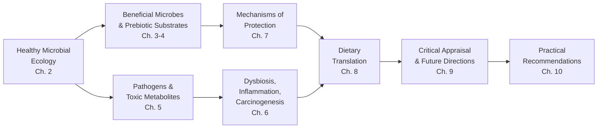
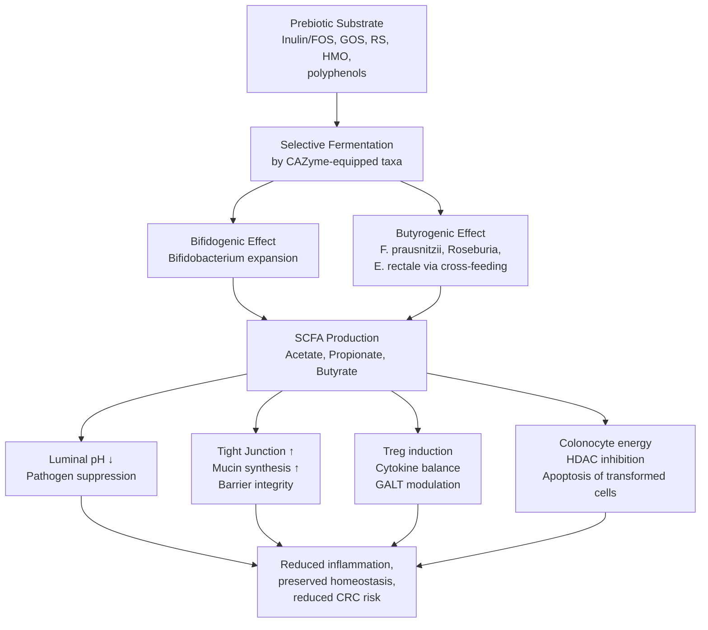
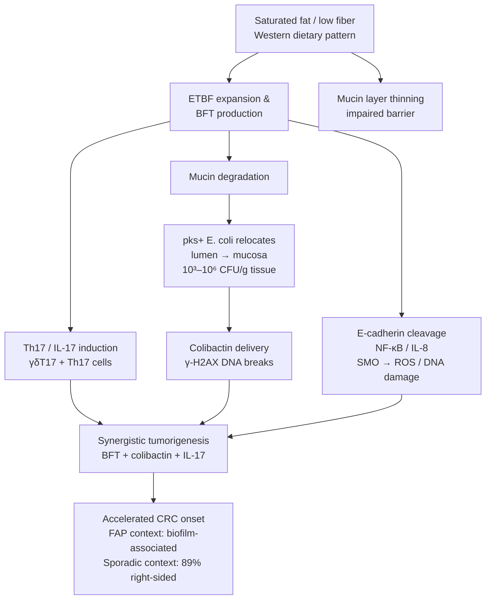
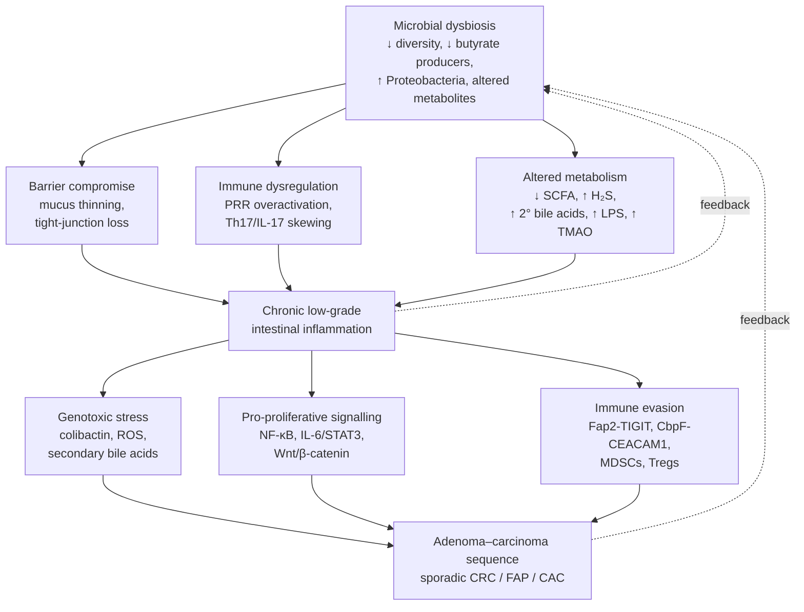

# Gut Microbiota and Intestinal Health: Probiotics, Prebiotics, Pathogens, and Dietary Strategies for Preventing Inflammation and Colorectal Cancer
# 1 Introduction: The Gut Microbiota as a Determinant of Intestinal Health

The human gastrointestinal tract is not merely a passive conduit for nutrient absorption; it is a densely populated ecosystem in which trillions of microorganisms engage in continuous, dynamic dialogue with host tissues. Over the past two decades, the scientific community has progressively recognized that this microbial community—the gut microbiota—occupies a position of remarkable influence over intestinal physiology, immune competence, and the long-term trajectory of disease risk. The shift from viewing intestinal microbes as incidental commensals to regarding them as active determinants of health represents one of the most consequential reorientations in modern biomedical thinking. It has, in turn, generated urgent practical questions: which microbes are friends and which are foes, by what mechanisms do they exert their effects, and how can ordinary dietary choices be deployed to tilt the microbial balance toward health and away from inflammation and carcinogenesis? This opening chapter establishes the conceptual scaffolding upon which the remainder of the report rests, by clarifying why the gut microbiota matters, by defining the bidirectional relationship between microbial homeostasis and intestinal function, by anchoring the report's terminology in internationally recognized consensus definitions, and by articulating the research questions that the subsequent nine chapters are designed to answer.

## 1.1 The Rising Significance of the Gut Microbiota in Biomedical Research

The ascent of the gut microbiota to the centre of contemporary biomedical inquiry reflects a confluence of empirical, technological, and clinical drivers. As the International Scientific Association for Probiotics and Prebiotics (ISAPP) consensus panel observed, "the past few decades have demonstrated unequivocally the importance of the human microbiota to both short-term and long-term human health"[^1]. This recognition is no longer confined to gastroenterology: the microbiota is increasingly understood as a node that integrates inputs from diet, environment, and host genetics, and that in turn modulates outputs ranging from local mucosal immunity to systemic metabolic and even neurobehavioural function[^1].

A particularly compelling line of evidence concerns the developmental window of early life. Microbial programming during pregnancy, delivery, breastfeeding, and weaning is not a transient phenomenon but a formative process that helps determine adult immune function, the structure of the mature microbiome, and overall health trajectories[^1]. The implication is profound: the composition of the microbiota that an individual carries into adulthood is shaped by exposures and dietary patterns established during the earliest months of life, which means that microbiota-oriented interventions may yield benefits that extend far beyond their immediate window of administration.

This scientific recognition has been mirrored by a rapid expansion of the commercial and regulatory landscape surrounding microbiota-targeted products. The ISAPP panel noted "rapid growth in the number of products that claim to affect the functions and composition of the microbiota at different body sites to benefit human health," spanning fermented foods, fibre-rich dietary regimens, probiotics, prebiotics, synbiotics, and postbiotics, available variously as foods, food supplements, drugs, and medical devices[^1]. The literature on postbiotics alone has grown markedly over the past decade, prompting the convening of a 2019 ISAPP expert panel specifically to harmonize a definition that scientists, industry, regulators, and consumers could share[^2][^1]. Such consensus-building efforts are themselves a marker of the field's maturation: where there is sufficient activity—and sufficient potential for confusion—to warrant formal definitional work, a domain has clearly transitioned from peripheral curiosity to mainstream relevance.

The biomedical significance of the microbiota also derives from the breadth of its anatomical reach. As the ISAPP statement makes clear, "the rich, diverse microbial ecosystems and immune cells inhabiting all mucosal and cutaneous surfaces provide targets for intervention, with the goals of reducing the risk of diseases and improving health status"[^1]. While this report focuses on the gut and its connection to intestinal inflammation and colorectal cancer, the principle that microbial communities at host surfaces are modifiable, and that their modification can confer health benefits, is the conceptual lever upon which the entire field of probiotics, prebiotics, and dietary microbiota modulation rests.

## 1.2 Microbial Homeostasis, Dysbiosis, and the Continuum of Intestinal Health

Having established that the gut microbiota is a legitimate and consequential target of health intervention, the next task is to specify what kind of relationship it sustains with its host. The relationship is best understood as bidirectional and ecological: host factors—including diet, mucosal secretions, bile acids, and immune surveillance—shape the composition and function of the microbiota, while the microbiota in turn produces metabolites, structural molecules, and signalling cues that act back upon host tissues to influence barrier integrity, immune tone, and metabolic homeostasis. When this mutual regulation is in balance, a state of microbial homeostasis prevails; when it is disrupted, the system tips toward dysbiosis, with downstream consequences that this report will examine in detail.

The mechanistic plausibility of this homeostatic framework is supported by molecular evidence regarding the effector molecules through which microbial communities communicate with host tissue. As reviewed in the ISAPP postbiotics consensus, microbial cell surface components—pili, lipoteichoic acid, peptidoglycan-derived muropeptides, exopolysaccharides—engage host pattern recognition receptors such as Toll-like receptors (TLRs), nucleotide-binding oligomerization domain (NOD) receptors, and C-type lectins, with downstream effects on cytokine production and immune cell maturation[^1]. In parallel, microbial metabolites such as short-chain fatty acids (SCFAs), lactic acid, indole derivatives of tryptophan, deconjugated bile acids, and bacterially synthesized vitamins exert quantifiable effects on epithelial barrier function, immune polarization, and systemic metabolism[^1]. For example, acetate, propionate, and butyrate at modest concentrations have been shown to increase transepithelial resistance and stimulate tight junction formation in intestinal epithelial cells in vitro, while butyrate alters tight junction permeability via lipoxygenase activation through histone acetylation[^1]. Such findings illustrate, at a molecular level, why a balanced microbiota is structurally and functionally protective for the intestinal epithelium.

When this molecular dialogue is disturbed, the consequences cascade along a continuum. Dysbiosis—understood here as a sustained departure from the compositional and functional configuration associated with health—can compromise barrier integrity, dysregulate mucosal immunity, and alter the metabolic milieu of the colon, providing the substrate for chronic low-grade inflammation. Persistent inflammation, in turn, is widely implicated in the multistep progression toward colorectal carcinogenesis, a pathological trajectory that the report develops in depth in Chapter 6. Several lines of evidence already touched upon by the ISAPP panel indicate the clinical reality of this continuum: gut microbiota-derived bile salt hydrolase activity, for instance, is depleted in recurrent *Clostridioides difficile* infection, and its restoration through faecal microbiota transplantation has been associated with successful resolution of infection[^1]; conversely, bacterial metabolites such as butyrate have been shown to upregulate antioxidant glutathione and beneficially modulate oxidative stress in the colon of healthy humans[^1]. Together, these observations support the view that the difference between intestinal health and disease is, to a substantial extent, the difference between a microbiota that produces protective effector molecules in adequate quantities and one that does not.

It is important to emphasize, in line with the rigorous evidence standards adopted in this report, that not all proposed dysbiosis–disease links are equally well validated. Many mechanistic claims rest on in vitro or animal data, and the heterogeneity of human microbiomes complicates the search for universal "healthy" or "diseased" signatures. The continuum from homeostasis to dysbiosis to overt disease is therefore best treated as a productive analytical framework that organizes a growing—but still incomplete—body of evidence, rather than as a deterministic pathway. Subsequent chapters will return repeatedly to this caveat, distinguishing established mechanisms from emerging hypotheses.

## 1.3 Defining Key Concepts: Microbiota, Probiotics, Prebiotics, Synbiotics, and Postbiotics

A recurrent obstacle to clear thinking about microbiota-based interventions is terminological imprecision. Words such as "probiotic" and "postbiotic" are now ubiquitous on commercial labels, but in the absence of agreed definitions they are easily conflated, misapplied, or used in ways that obscure rather than clarify the underlying biology. To prevent such conflation in this report, this section adopts the consensus definitions advanced by ISAPP, the international scientific body that has, over the past decade, undertaken successive expert panels to harmonize the language of the field[^1].

The five foundational terms can be summarized as follows.

| Term | ISAPP Consensus Definition | Key Distinguishing Feature |
|------|-----------------------------|----------------------------|
| Microbiota | The community of microorganisms (bacteria, archaea, fungi, viruses) inhabiting a given body site, including all mucosal and cutaneous surfaces[^1] | A descriptive, ecological term — implies neither benefit nor harm |
| Probiotic | "Live microorganisms that, when administered in adequate amounts, confer a health benefit on the host"[^1] | Viability at administration is essential; benefit must be demonstrated |
| Prebiotic | "A substrate that is selectively utilized by host microorganisms conferring a health benefit"[^1] | Selectivity of microbial utilization, not mere fermentability, is the defining criterion |
| Synbiotic | "A mixture comprising live microorganisms and substrate(s) selectively utilized by host microorganisms that confers a health benefit on the host"[^1] | Live microbes plus selectively-used substrate combined into a single preparation |
| Postbiotic | "A preparation of inanimate microorganisms and/or their components that confers a health benefit on the host"[^1] | Microbes are deliberately inactivated; purified single metabolites and vaccines are excluded |

Several conceptual nuances emerging from the ISAPP consensus deserve explicit attention because they shape the analyses in subsequent chapters.

First, **strain-level identity is central to the probiotic concept**. A probiotic claim cannot be sustained at the level of "lactic acid bacteria" or even "*Lactobacillus*" as a genus; rather, it must be tied to specific, characterized strains with documented benefits. This requirement has been reinforced by the recent taxonomic reclassification that split the historical genus *Lactobacillus* into 25 novel genera, including *Lacticaseibacillus*, *Lactiplantibacillus*, and *Limosilactobacillus*, alongside the emended genus *Lactobacillus* itself[^1]. Consequently, an organism formerly known as *Lactobacillus rhamnosus* GG is now correctly designated *Lacticaseibacillus rhamnosus* GG, and *Lactobacillus plantarum* is now *Lactiplantibacillus plantarum*[^1]. The report adheres to current nomenclature throughout, while flagging legacy names where useful for cross-referencing earlier literature.

Second, **dysbiosis** is used in this report as a working term denoting a sustained shift in microbial composition or function away from a configuration associated with host health. It is not a formal ISAPP-defined term, and the field continues to debate how best to operationalize it; this report therefore treats it as a heuristic rather than a precisely measurable diagnostic category.

Third, **the boundary between postbiotics and adjacent concepts** is explicitly drawn by the ISAPP panel: purified single metabolites such as butyric or lactic acid, vaccines, bacteriophages, and substantially purified components such as exopolysaccharides or SCFAs are not, in themselves, postbiotics, although some may appear within postbiotic preparations[^1]. Furthermore, a postbiotic does not require a probiotic progenitor; specific strains of organisms that have not been formally established as probiotics—including *Akkermansia muciniphila*, *Faecalibacterium prausnitzii*, *Bacteroides xylanisolvens*, and *Saccharomyces boulardii*—can yield postbiotic preparations if the inactivated form demonstrates a health benefit and meets the criteria of molecular characterization, defined inactivation procedure, controlled efficacy testing, and safety assessment[^1]. The report therefore treats probiotics, prebiotics, synbiotics, and postbiotics as related but distinct categories, each with its own evidentiary requirements.

Fourth, **fermented foods occupy a related but distinct conceptual space**. As the ISAPP postbiotics statement notes, fermented foods may contain substantial numbers of non-viable microbial cells along with effector molecules such as cell surface components, lactic acid, SCFAs, and bioactive peptides, but products produced by undefined mixed cultures do not, by themselves, qualify as postbiotics; only fermentations using defined, characterized microorganisms can yield postbiotic preparations[^1]. This distinction will be revisited in Chapter 8, where the practical role of fermented foods in everyday diets is evaluated.

By anchoring the report in these consensus definitions, subsequent chapters can discuss probiotic strains, prebiotic substrates, and pathogenic taxa with the conceptual precision that the science—and the user's practical questions—demand.

## 1.4 Research Scope, Core Questions, and Report Structure

Having clarified the significance, mechanistic logic, and terminology of the gut microbiota, this report directs its analysis to a coherent set of questions arising from the broader research topic: how the gut microbiota maintains normal intestinal function, how its disruption contributes to inflammation and colorectal cancer, and how dietary and microbial interventions can be deployed to shift the balance toward health. Within this overarching framing, four specific user-driven questions structure the report:

1. **Which types of gut probiotics are most relevant, and what are their strain-specific functions?**
2. **What precisely are prebiotics, and through what mechanisms do they shape microbial communities?**
3. **Which pathogenic bacteria warrant concern, and what toxic metabolites do they produce?**
4. **How can these findings translate into evidence-based, practical dietary choices?**

To address these questions with adequate depth, the report adopts an analytical framework that follows the causal chain from microbial ecology, through molecular mechanisms, to disease pathology, and finally to dietary intervention. This framework can be visualized as a logical pipeline, in which each link must be biologically plausible and empirically supported before downstream recommendations can be justified.

The pipeline above mirrors the chapter structure of the report. Chapter 2 characterizes the composition and functional architecture of the healthy gut microbiota, establishing baseline reference points against which dysbiotic states can be compared. Chapters 3 and 4 examine, respectively, the major probiotic categories and their strain-specific functions, and the definition, classification, and mechanistic role of prebiotics—jointly addressing the first two user questions. Chapter 5 turns to pathogenic and pathobiont bacteria and the genotoxic and pro-inflammatory metabolites they produce (e.g., colibactin, fragilysin/BFT, hydrogen sulfide, secondary bile acids), addressing the third user question. Chapter 6 synthesizes how dysbiosis fuels chronic inflammation and colorectal carcinogenesis, integrating the driver-passenger model and the inflammation–dysbiosis–carcinogenesis axis. Chapter 7 details the mechanisms—competitive exclusion, barrier reinforcement, immune modulation, metabolite production, induction of tumour-cell apoptosis—through which probiotics counter these processes, while critically engaging with evidence that probiotic effects are strain-specific and that benefits in healthy populations are sometimes modest. Chapter 8 directly addresses the fourth user question by translating the preceding analyses into actionable dietary guidance, comparing dietary patterns and food categories. Chapter 9 critically appraises the limitations of the current evidence base and identifies priority directions, including next-generation probiotics and personalized interventions. Chapter 10 synthesizes the report's findings into tiered, practical recommendations for general consumers, at-risk populations, and clinicians.

The scope of the report is also bounded in important ways. It concentrates on bacterial members of the gut microbiota and their interactions with the colonic mucosa, with particular emphasis on inflammation and colorectal cancer; it touches on archaea, fungi (including the probiotic yeast *Saccharomyces boulardii*[^1]), and viruses only insofar as they are directly relevant to these outcomes. It privileges peer-reviewed scientific evidence—systematic reviews, randomized controlled trials, and authoritative consensus statements such as those of ISAPP—over marketing literature, and it explicitly distinguishes mechanistic hypotheses derived from in vitro or animal studies from clinically validated outcomes. It also acknowledges, from the outset, that individual variability in microbiome composition, dosing heterogeneity across probiotic studies, and the gap between commercial claims and clinical validation impose real constraints on the strength of generalizable recommendations; these limitations are not relegated to a closing disclaimer but are revisited at every stage of the analysis.

With this framing, terminology, and structural logic in place, the report now proceeds in Chapter 2 to characterize the composition and functional architecture of the healthy gut microbiota—the necessary baseline against which all subsequent analyses of dysbiosis, pathogens, and intervention will be assessed.

# 2 Composition and Functional Architecture of the Healthy Gut Microbiota

Having framed in Chapter 1 why the gut microbiota matters, what bidirectional relationship it sustains with its host, and how key terms such as probiotic, prebiotic, synbiotic, and postbiotic are operationalized, the report now turns to the question that logically precedes any analysis of dysbiosis or intervention: what does a "healthy" gut microbiota actually look like? Without an empirical baseline, the language of "imbalance," "loss of beneficial microbes," or "expansion of pathobionts" remains rhetorical. Establishing this baseline, however, is more difficult than it first appears. The healthy human microbiome is not a single, fixed configuration but a probabilistic envelope—a set of compositional, diversity, and functional parameters within which a wide range of individual variation can still support normal physiology. This chapter draws on the landmark population-scale efforts that have, over the past fifteen years, mapped that envelope: the U.S. Human Microbiome Project (HMP), the European MetaHIT consortium, the Belgian Flemish Gut Flora Project (FGFP), and complementary studies of traditional populations such as the Hadza hunter-gatherers of Tanzania and the uncontacted Yanomami of the Venezuelan Amazon. Together, these resources allow the chapter to characterize taxonomic composition (Section 2.1), interpret the diversity metrics through which microbiomes are quantified (Section 2.2), enumerate the core functional contributions of the community to host physiology (Section 2.3), survey the host- and environment-derived determinants of microbial equilibrium (Section 2.4), and finally contrast healthy and dysbiotic configurations to define the operational reference points needed for the rest of the report (Section 2.5).

## 2.1 Taxonomic Composition of the Healthy Gut Microbiota

The first generation of culture-independent surveys revealed that the human gastrointestinal tract harbors a microbial community of an order of magnitude greater complexity than classical microbiology had suspected. Using 16S ribosomal RNA sequencing and shotgun metagenomics, the HMP Consortium analyzed more than 5,000 samples from 242 healthy U.S. adults across 15–18 body sites and concluded that, where traditional culturing had identified at most a few hundred bacterial species, the human ecosystem in fact harbors more than 10,000 microbial species, with the project capturing an estimated 81–99 percent of all microbial genera present in healthy adults[^3]. The same body of work made clear that microorganisms outnumber human cells by roughly 10 to 1, although they account for only 1–3 percent of body mass[^3]. Crucially for the present report, the HMP also confirmed that "nearly everyone routinely carries pathogens, microorganisms known to cause illnesses," but in healthy individuals these organisms coexist with the broader community without causing disease[^3]—a foundational observation that frames every later chapter, because it implies that the line between health and pathology is not the mere presence of "bad" microbes but the ecological context in which they reside.

At the taxonomic level, the healthy adult gut is dominated by four to five bacterial phyla. The Firmicutes (now formally Bacillota) and the Bacteroidetes (Bacteroidota) jointly account for the majority of bacterial biomass, with substantial but smaller contributions from Actinobacteria (notably the genus *Bifidobacterium*), Proteobacteria, and Verrucomicrobia (which includes the mucin-degrader *Akkermansia muciniphila*). This phylum-level architecture has been replicated across geographically and methodologically independent cohorts: the Hadza analyses display the same broad scaffold of Firmicutes, Bacteroidetes, Proteobacteria, Actinobacteria, Spirochaetes, and Verrucomicrobia, even though the relative proportions differ markedly from those of industrialized populations[^4]. Within these phyla, certain genera recur as particularly abundant or functionally pivotal in healthy guts—*Bacteroides*, *Prevotella*, *Faecalibacterium*, *Eubacterium*, *Roseburia*, *Ruminococcus*, *Blautia*, *Bifidobacterium*, and *Akkermansia*—and these names will return as anchors throughout the report when probiotic, prebiotic, and dysbiosis discussions require strain-level resolution.

Beyond cataloguing organisms, the field has sought to define a **core microbiota**: the set of taxa that recur across most healthy individuals and may therefore be regarded as ecologically central. Population-level analysis of the FGFP discovery cohort (N = 1,106), replicated in the Dutch LifeLines-DEEP study (N = 1,135) and integrated with global datasets reaching a combined N = 3,948, identified a **core of 14 genera shared across populations**, although the 664 genera detected in total still underexplore the full breadth of human gut diversity[^5][^6]. This dual finding—a small, conserved core embedded in a vastly larger and more variable accessory community—is one of the defining structural features of the healthy human gut microbiome, and it foreshadows the report's recurrent observation that interventions should be evaluated for their ability to support a resilient functional configuration rather than to install any particular "ideal" species list.

A complementary refinement of the core-microbiota concept came from the MetaHIT-led discovery that healthy guts cluster, to a first approximation, into a limited number of community types termed **enterotypes**, originally three (driven by *Bacteroides*, *Prevotella*, and *Ruminococcus*, respectively), with longer-term dietary patterns shown to align with these clusters[^7]. The enterotype concept generated considerable debate but was subsequently re-examined using Bayesian Dirichlet-multinomial mixture models, which broadly supported the existence of a limited number of community types[^7]. For the purposes of this report, the practical implication is that healthy gut microbiomes do not occupy a single point in compositional space but rather a discrete number of stable configurations, which has direct consequences for whether a given probiotic or prebiotic intervention will engraft and exert its expected effect.

A particularly stark contrast at the genus level is the **Bacteroides–Prevotella trade-off** that separates industrialized from traditional populations. In the Hadza and other non-industrialized cohorts, Prevotellaceae dominates (mean relative abundance ~29.8 percent in traditional populations versus 7.6 percent in industrialized populations), while Bacteroidaceae dominates in industrialized guts (mean 20.9 percent versus 0.8 percent in traditional populations)[^4]. The microbiomes of uncontacted Yanomami similarly exhibit high *Prevotella* and low *Bacteroides*, paralleling Guahibo Amerindian, Malawian, and African hunter-gatherer profiles[^8]. Other taxa such as Spirochaetaceae and Succinivibrionaceae are prevalent in traditional guts but rare or undetected in U.S. populations: in one comprehensive U.S. study only 15 percent of individuals carried Succinivibrionaceae at an average relative abundance of just 0.006 percent, and Spirochaetaceae were undetected, whereas all sampled Malawians and Venezuelans carried Succinivibrionaceae (mean relative abundance 3.2 percent) and 67 percent harbored Spirochaetaceae (0.6 percent)[^4]. Conversely, industrialized guts are enriched in Verrucomicrobia, a group of mucin-degrading bacteria rare in traditional populations[^4]. These observations, returned to in Section 2.4, make the point that "healthy" composition is not a single global signature but is itself patterned by lifestyle and geography—a caveat that must temper any prescriptive use of microbiome reference data drawn predominantly from Western cohorts.

Finally, several genera identified by HMP and MetaHIT acquire particular salience in light of the report's downstream focus on inflammation and colorectal cancer. *Bifidobacterium*, an Actinobacterial genus enriched in infancy and sustained in adults consuming sufficient prebiotic substrates, is associated with the diversity and stability of the gut microbiota in analyses of large datasets such as the American Gut Project[^9]. *Faecalibacterium prausnitzii* is a major colonic producer of butyrate; its depletion is among the most consistently reported microbial signatures of inflammatory bowel disease, as discussed in Section 2.5. *Akkermansia muciniphila* occupies the mucus layer and contributes to barrier homeostasis. *Bacteroides* species are versatile carbohydrate fermenters whose relative abundance is shaped by long-term dietary patterns. These four genera will recur repeatedly through the report, both as benchmarks of a healthy adult microbiome and as targets of probiotic, prebiotic, and dietary interventions.

## 2.2 Diversity Metrics and Their Interpretation

Because the healthy gut microbiome cannot be reduced to a fixed list of species, the field relies on quantitative measures of community structure—diversity metrics—to characterize and compare microbiomes. These metrics fall into three families, each capturing a different aspect of the community.

**Alpha diversity** quantifies the richness and evenness within a single sample. Richness counts the number of distinct taxa or operational taxonomic units (OTUs); evenness reflects how uniformly relative abundances are distributed; the Shannon index combines both, increasing with both more taxa and more even distribution; and Faith's phylogenetic diversity (PD) extends richness by summing the branch lengths of a phylogenetic tree spanned by the observed taxa, thereby weighting deeply distinct lineages more heavily than closely related ones[^8]. **Beta diversity** quantifies dissimilarity between samples; the most widely used metrics are UniFrac (which incorporates phylogenetic distance and may be weighted or unweighted by abundance) and the Bray–Curtis dissimilarity (which is non-phylogenetic and abundance-based)[^4][^8]. **Gene-level diversity**, made tractable by metagenomic sequencing, captures the functional repertoire of the community and has emerged as a particularly clinically informative measure. The first non-redundant human gut microbial gene catalogue, released by MetaHIT in 2010, contained approximately 3.3 million genes assembled from 124 individuals; an updated MetaHIT catalogue published in 2014 expanded this to more than 10 million non-redundant genes, drawn from over 1,200 samples across three continents[^7]. Bacterial genes thus outnumber human protein-coding genes by orders of magnitude—HMP estimates place the microbial contribution at roughly 8 million unique protein-coding genes versus the approximately 22,000 protein-coding genes of the human genome, a ratio of roughly 360 to 1[^3].

The translation of these abstract metrics into meaningful biological judgement requires care. As a working generalization, **higher diversity in the adult colon is associated with greater functional capacity, greater ecological resilience, and better metabolic and immunological outcomes**, while reduced diversity often accompanies disease. Two MetaHIT-led analyses are particularly important in this respect: Le Chatelier and colleagues showed that the simplest summary index—**microbial gene richness**—correlates with metabolic markers, distinguishing individuals with adverse metabolic profiles from those without; and Cotillard and colleagues showed that baseline gene richness is prognostic of weight loss during low-calorie dietary intervention, with higher-richness individuals responding more favourably[^7]. These findings establish gene richness as one of the few microbiome-level summary metrics with documented clinical traction, and they introduce a theme—diversity as a proxy for resilience—that is central to the report's later discussion of probiotic and prebiotic strategies.

Several caveats, however, must temper any blanket equation of "more diversity = more health." First, diversity ranges differ markedly across populations and life stages. Among the Hadza, Yanomami, and other traditional groups, alpha diversity is substantially higher than in U.S. or European cohorts[^4][^8]; the Yanomami have been reported to harbor "the highest diversity of bacteria and genetic functions ever reported in a human group"[^10][^8]. Within Western populations, infants begin with a low-diversity, *Bifidobacterium*-dominated community that gradually mature toward an adult-like configuration; in the elderly, diversity may again be reduced and is associated with health-care setting and diet[^7]. A diversity value normal for one age group or population may therefore be inappropriate as a benchmark for another. Second, certain healthy contexts are characterized by *low* diversity—most strikingly the vaginal microbiome of healthy reproductive-age women, dominated by a small number of *Lactobacillus* species[^3]; while this lies outside the gut, it illustrates that the diversity-equals-health rule is body-site specific. Third, diversity captures only one dimension of the community and ignores function; two communities of similar diversity can differ profoundly in metabolic output. Fourth, methodological choices—sequencing depth, primer region, rarefaction strategy—affect diversity estimates and complicate cross-study comparison. Finally, the FGFP and LifeLines-DEEP analyses showed that even in a large, healthy population, identified covariates explain only about 7 percent of inter-individual gut microbiota variation, with the Raes laboratory estimating that approximately 40,000 samples would be needed merely to capture a complete picture of gut flora biodiversity[^6]—a sobering reminder that current diversity-based benchmarks rest on incomplete sampling of human ecological reality.

These caveats aside, the diversity framework remains indispensable. For the rest of this report, it is sufficient to fix three operational interpretations: (i) within an individual, sustained reductions in alpha diversity (especially in gene richness or phylogenetic diversity) over time signal an erosion of community resilience; (ii) at the population level, beta-diversity metrics make visible the structural shifts driven by lifestyle, geography, and disease; and (iii) gene richness in particular is among the most clinically useful summary metrics for distinguishing metabolically healthy from at-risk configurations.

## 2.3 Core Functional Contributions to Host Physiology

The decisive justification for treating the gut microbiota as a determinant of intestinal health is functional rather than purely compositional. The HMP analyses made the conceptual breakthrough explicit: although species composition varies considerably between healthy individuals, the **distribution of microbial metabolic activities matters more than the species providing them**, and "in the healthy gut, for example, there will always be a population of bacteria needed to help digest fats, but it may not always be the same bacterial species carrying out this job"[^3]. In the words of HMP co-author Curtis Huttenhower, "It appears that bacteria can pinch hit for each other... It matters whether the metabolic function is present, not which microbial species provides it"[^3]. This principle of **functional redundancy** is the structural reason a resilient microbiome can absorb perturbations—dietary shifts, antibiotic courses, transient pathogen exposures—without losing its physiological role. It is also the conceptual bridge that connects taxonomic compositional surveys (Section 2.1) to the practical question of how the microbiota actually contributes to host physiology, which the rest of this section addresses across four interlocking domains: digestion and energy harvest, beneficial metabolite production, intestinal barrier integrity, and immune education.

### Digestion and energy harvest

The most evolutionarily ancient role of the gut microbiota is to extend the host's enzymatic repertoire, particularly with respect to complex carbohydrates that human digestive enzymes cannot cleave. As HMP program manager Lita Proctor put it, "Humans don't have all the enzymes we need to digest our own diet; microbes in the gut break down many of the proteins, lipids and carbohydrates in our diet into nutrients that we can then absorb"[^3]. The metagenomic basis for this contribution is captured in the **carbohydrate-active enzyme (CAZyme) repertoire**—the suite of glycoside hydrolases, polysaccharide lyases, and related enzymes encoded by the gut metagenome. Comparative metagenomics of the Hadza and a healthy U.S. cohort revealed a substantially more diverse CAZyme repertoire in the Hadza, who consume large quantities of fiber-rich tubers, baobab, berries, and honey, and whose gut metagenome is enriched in plant-carbohydrate utilization functions; conversely, U.S. metagenomes are enriched in mucin-utilization CAZymes, a pattern interpreted as the microbial signature of a low-plant-fiber diet, in which mucin glycans become a relatively more important substrate (P < 2 × 10⁻¹⁶ for both contrasts, Wilcoxon)[^4]. Within the Hadza themselves, dry-season metagenomes show enriched animal-carbohydrate CAZymes (consistent with greater meat consumption), while wet-season metagenomes show enriched fructan utilization (consistent with berry and honey consumption)[^4]. The same comparison shows that industrialized microbiomes display reduced CAZyme diversity overall and reduced functional capacity for plant-derived complex carbohydrates—findings that, as the authors note, "mirror the microbiota response in mouse models deprived of dietary fiber"[^4]. From a clinical standpoint, this means that the gut microbiota's energy-harvest function is not a fixed biological constant; it is a direct readout of long-term dietary substrate availability, which has obvious implications for the dietary recommendations developed in Chapter 8.

### Production of beneficial metabolites

The downstream products of microbial fermentation include the metabolites that mediate most of the microbiome's effects on the colonic mucosa and beyond. Chief among them are the **short-chain fatty acids (SCFAs)**—principally acetate, propionate, and butyrate—generated through the fermentation of dietary fibers and resistant starches. Butyrate is the preferred energy source of colonocytes and a key signaling molecule that modulates epithelial barrier function and inflammation; as introduced in Chapter 1, SCFAs at modest concentrations have been shown to increase transepithelial resistance and stimulate tight junction formation in intestinal epithelial cells, with butyrate altering tight junction permeability via lipoxygenase activation through histone acetylation. Failure of butyrate utilization by the colonic mucosa—a transport deficiency described in inflammatory bowel disease—illustrates the clinical consequence of disrupted butyrate metabolism. Beyond SCFAs, the microbiota synthesizes vitamins (B-group vitamins, vitamin K, riboflavin), generates indole derivatives from tryptophan, and performs extensive bile-acid biotransformation. As Proctor summarized, gut microbes "produce beneficial compounds, like vitamins and anti-inflammatories that our genome cannot produce"[^3]. The Yanomami metagenomes are notable in this respect for their overrepresentation of pathways for vitamin biosynthesis (including riboflavin), amino-acid metabolism, and glycosyltransferases[^8]—a microbial chemistry profile distinct from that of industrialized populations. Bile-acid metabolism deserves particular emphasis here because dysbiotic shifts in this pathway are central to several mechanisms of inflammation and colorectal carcinogenesis examined in Chapter 5, with bile acids themselves acting as host factors that regulate microbiota composition.

### Intestinal barrier integrity and mucus-layer maintenance

The single epithelial layer that separates the lumen of the colon from the underlying lamina propria is the most consequential interface in the gastrointestinal tract, and its integrity depends critically on microbial inputs. Two complementary mechanisms operate. First, SCFAs—butyrate above all—reinforce tight junctions, support mucin synthesis, and provide energy for colonocyte renewal. Second, mucin-degrading specialists such as *Akkermansia muciniphila* turn over the mucus layer at a rate compatible with its renewal, maintaining a healthy barrier without compromising it. The functional reading of metagenomic data again provides a useful contrast: industrialized guts are enriched in mucin-utilizing glycoside hydrolases and in Verrucomicrobia, a pattern observed when dietary fiber is scarce and mucin glycans become a fallback substrate[^4]. Whether this represents an adaptive adjustment or a maladaptive thinning of the mucus barrier remains debated, but it underscores the principle that barrier function is not maintained by any single taxon but by the joint operation of fiber-fermenting and mucus-turnover communities.

### Education and modulation of mucosal immunity

The healthy gut microbiota provides the antigenic and metabolic stimuli that calibrate mucosal immunity from infancy through old age. Microbial cell-surface components—pili, lipoteichoic acid, peptidoglycan-derived muropeptides, exopolysaccharides—engage host pattern-recognition receptors (TLRs, NOD receptors, C-type lectins), as detailed in Chapter 1, while microbial metabolites, including SCFAs and indole derivatives, polarize T-cell responses and support regulatory T-cell development. The HMP consortium emphasized that microbes "produce beneficial compounds, like vitamins and anti-inflammatories that our genome cannot produce"[^3]. The breadth of the mucosal immune partnership is also reflected at the disease end of the spectrum: NIH-funded microbiome studies have explored microbiota involvement in Crohn's disease, ulcerative colitis, esophageal cancer, psoriasis, atopic dermatitis, immunodeficiency, pediatric abdominal pain, intestinal inflammation, and necrotizing enterocolitis in premature infants[^3], a list that itself testifies to the centrality of microbial inputs to immune homeostasis.

The four functional domains above can be summarized as follows.

| Functional Domain | Representative Mechanisms | Key Taxa / Metabolites | Clinical Relevance for This Report |
|---|---|---|---|
| Digestion & energy harvest | Fermentation of complex carbohydrates via CAZyme repertoire; recovery of energy from non-digestible substrates | *Bacteroides*, *Prevotella*, *Ruminococcus*, *Faecalibacterium*; CAZymes for plant polysaccharides, fructans, animal carbohydrates[^3][^4] | Determines bioavailability of fiber-derived nutrients; sensitive to long-term diet (Ch. 8) |
| Beneficial metabolite production | SCFA production (acetate, propionate, butyrate); vitamin biosynthesis; bile-acid biotransformation; tryptophan-indole pathway | *F. prausnitzii*, *Roseburia*, *Eubacterium rectale* (butyrate); *Bifidobacterium* (B-vitamins)[^3][^8] | SCFAs underpin barrier and anti-inflammatory effects (Ch. 7); bile-acid changes link to CRC (Ch. 5–6) |
| Intestinal barrier integrity | Tight-junction reinforcement by SCFAs; mucin turnover by mucus-layer specialists | *Akkermansia muciniphila*; butyrate producers[^4] | Loss of barrier integrity is a node of dysbiosis–inflammation–CRC axis (Ch. 6) |
| Mucosal immune education | Pattern-recognition receptor engagement; Treg induction; cytokine balance | Pili, lipoteichoic acid, peptidoglycan; SCFAs, indoles[^3] | Mechanistic basis for probiotic anti-inflammatory effects (Ch. 7) |

The unifying insight from this functional analysis is that **a healthy microbiome is best characterized not by a fixed taxonomic identity but by the robust delivery of these four classes of services**, with functional redundancy ensuring that the same service can be provided by different organisms in different individuals. This insight reframes the report's downstream questions: probiotics, prebiotics, and dietary interventions should be evaluated not primarily by whether they install a particular species but by whether they restore or sustain the functional output of a resilient community.

## 2.4 Determinants of Microbial Equilibrium: Age, Diet, Geography, Lifestyle, and Medication

If the healthy microbiome is a probabilistic envelope, the next analytical task is to understand what positions any given individual within that envelope. Population-scale studies have converged on a multifactorial picture in which dozens of host- and environment-level variables contribute, with diet, lifestyle, geography, age, and medication exerting the largest documented effects.

The most systematic enumeration to date comes from the **Flemish Gut Flora Project**. Across the FGFP discovery cohort (N = 1,106) and the Dutch LifeLines-DEEP replication cohort (N = 1,135), Falony, Raes, and colleagues identified **69 clinical and questionnaire-based covariates significantly associated with microbiota compositional variation, with a 92 percent replication rate** between cohorts[^5][^6][^11]. Among these, **stool consistency (a proxy for transit time) showed the largest effect size**, while **medication explained the largest total variance** and interacted with other covariate–microbiota associations[^5][^11]. The covariates clustered around transit time, health status, diet, medication, gender, and age[^6]. Several specific findings are worth highlighting because they bear directly on dietary recommendations later in the report. Most diet-related associations involved **fiber consumption**, consistent with the role of fermentable substrates in shaping community composition[^6]. Other associations were idiosyncratic and reflect the granularity of population-scale data: a particular bacterial group was associated with dark chocolate preference (the so-called "Belgian chocolate effect"), beer consumption emerged as a covariate, and in the Dutch replication cohort buttermilk consumption was identified as an important dietary covariate—differences that the investigators interpret as cohort-specific signals rather than chance[^6]. Medication associations extended beyond antibiotics and laxatives to include hay-fever drugs and hormones used for contraception or menopause symptom management[^6], underscoring how broadly pharmacological exposures can imprint on the microbiota. Strikingly, **early-life events such as birth mode and breast-feeding were not detectably reflected in adult microbiota composition** in either cohort[^5][^6]—an observation that complicates simplistic narratives about early-life programming, although it does not exclude functional (as opposed to compositional) imprinting.

Two interpretive caveats, both flagged by the FGFP investigators themselves, are essential. First, the 69 covariates collectively explained only about **7 percent of inter-individual gut microbiota variation**[^6], indicating that the bulk of compositional variability remains unexplained. Second, **association does not establish causation**; for example, Parkinson's disease is associated with prolonged intestinal transit time, which itself shifts microbiota composition, so any disease-microbiota association must be interpreted in the context of host covariates—"so to study the microbiota in Parkinson's disease, you need to take that into account," as Raes emphasized[^6]. The same principle will recur in Chapter 6 with respect to inflammation and colorectal cancer, where confounding by transit time, medication, and diet must be carefully separated from microbially driven causal mechanisms.

**Geographical and lifestyle gradients** add a further layer of structure. As HMP investigators observed early on, microbiomes can be viewed across age and geography as a continuum of distinct configurations, and this insight has been progressively refined by the study of traditional populations. In the Hadza hunter-gatherers of Tanzania, longitudinal sampling of 350 stool samples from 188 individuals across two dry and one wet sub-seasons revealed a **cyclic, seasonal reconfiguration of the microbiome**, in which dry-season microbiotas are statistically indistinguishable across years (P = 0.15, Wilcoxon) but are separated from intervening wet-season microbiotas (P < 3 × 10⁻¹⁵ and P < 3 × 10⁻¹⁶, Wilcoxon)[^4]. This cyclical pattern was driven primarily by Bacteroidetes—70.2 percent of Bacteroidetes OTUs disappeared between late dry 2013 and early wet 2014, with 78.2 percent of those reappearing at later time points—while Firmicutes composition remained relatively stable[^4]. Phylogenetic diversity and the number of unique OTUs were higher in dry seasons than in the wet season[^4]. Functionally, dry-season microbiomes had a more diverse CAZyome than wet-season microbiomes (P < 0.05, Wilcoxon), and the Hadza overall had a substantially greater capacity for plant-carbohydrate utilization, while Americans' microbiomes had greater mucin-utilization capacity (P < 2 × 10⁻¹⁶ for both contrasts)[^4]. Importantly, **the taxa within the Hadza that are most seasonally volatile are the same taxa that differentiate industrialized from traditional populations**, suggesting that "dynamic lineages of microbes have decreased in prevalence and abundance in modernized populations"[^4]. Spirochaetaceae, Succinivibrionaceae, Paraprevotellaceae, and Prevotellaceae were among the most variable across seasons in the Hadza and are rare or undetected in industrialized populations[^4].

The **Yanomami** of the Venezuelan Amazon offer a complementary perspective. Characterization of fecal, oral, and skin microbiomes from members of an isolated village with no documented prior contact with Western people revealed **the highest bacterial and functional diversity ever reported in a human group**[^10][^8]. Fecal phylogenetic diversity was significantly higher than in semi-transculturated Guahibo Amerindians, Malawians, and U.S. subjects (ANOVA with Tukey's HSD, P < 0.001)[^8]; functional gene prevalence and diversity were likewise higher and intragroup variation lower[^8]. The Yanomami fecal microbiota was characterized by high *Prevotella* and low *Bacteroides*, with elevated Bacteroidales S24-7, Mollicutes, Verrucomicrobia, *Phascolarctobacterium*, *Desulfovibrio*, *Helicobacter*, *Spirochaeta*, and *Prevotella*[^8]. *Helicobacter* was absent from the feces of U.S. subjects, while intestinal *Oxalobacter* and *Desulfovibrio* were markedly increased in Yanomami compared with U.S. subjects[^8]. Strikingly, even with no documented exposure to pharmacological antibiotics, the Yanomami harbored functional antibiotic-resistance genes, including some conferring resistance to synthetic antibiotics and syntenic with mobilization elements—evidence that the resistome is "a feature of the human microbiome even in the absence of exposure to commercial antibiotics"[^8]. Together, the Hadza and Yanomami data establish two crucial points for this report: (i) the diversity and compositional features of healthy traditional microbiomes far exceed those of industrialized cohorts, and (ii) industrialization is associated with the **loss of specific, functionally distinctive lineages**, a phenomenon that the Hadza authors term loss of "dynamic lineages of microbes" and that the Yanomami investigators frame as a warning that "westernization significantly affects human microbiome diversity" and that "industrialized societies might eradicate potentially beneficial microbes and their encoded functions"[^4][^8].

**Age** introduces its own structuring effect. Healthy adult microbiomes mature from a low-diversity, *Bifidobacterium*-rich infant configuration toward an adult-like community by approximately age three, and this transition is itself shaped by mode of delivery, breast-feeding, and weaning, although—as the FGFP demonstrated—the compositional fingerprint of these early events appears largely overwritten by the time individuals reach adulthood[^5][^6]. At the other extreme of life, the ELDERMET consortium showed that the **gut microbiota composition of elderly individuals correlates with both diet and health-care setting**, with implications for frailty and inflammatory status[^7]. Longitudinal sampling of healthy adults further demonstrates that, although species-level abundances vary over time, individual-specific microbial genotypes are relatively stable: each individual carries their own microbial genotype-by-species, even as relative abundances fluctuate[^7]. This stability of personalized configurations is what allows the same probiotic intervention to engraft differently in different hosts—a theme that will return in Chapters 7 and 9.

**Antibiotics and other medications** deserve particular attention because they represent the most potent and frequent perturbation to the adult microbiome. The HMP analyses already noted that "when a patient is sick or takes antibiotics, the species that make up the microbiome may shift substantially as one bacterial species or another is affected; eventually, however, the microbiome returns to a state of equilibrium, even if the previous composition of bacterial types does not"[^3]. The qualifier is important: recovery is to a functional equilibrium, not necessarily to the prior taxonomic state. Repeated antibiotic perturbation can produce incomplete and individualized recovery, with some individuals failing to return to baseline composition after each exposure. The FGFP confirmed at population scale that medication exposure—both antibiotic and non-antibiotic—is the single largest contributor to compositional variance and interacts with other covariate-microbiota associations[^5]. The clinical implication is that microbiome-modifying interventions should be evaluated against a backdrop in which medication history is itself a major source of inter-individual variability.

The factors shaping microbial equilibrium can be summarized as follows.

| Determinant | Direction / Magnitude of Effect | Key Evidence |
|---|---|---|
| Stool transit time / consistency | Largest single covariate effect size in healthy population[^5] | FGFP (N = 1,106) + LifeLines-DEEP (N = 1,135)[^5][^6] |
| Medication (antibiotics, laxatives, anti-allergics, hormones) | Largest total variance explained; interacts with other covariates[^5][^6] | FGFP / LLDeep[^5]; HMP perturbation observations[^3] |
| Long-term dietary pattern, especially fiber | Strong, replicated; shapes Bacteroides–Prevotella structure and CAZyome[^7][^6][^4] | Wu et al. enterotype–diet linkage[^7]; Hadza CAZyome contrasts[^4] |
| Geography & lifestyle (industrialized vs. traditional) | Defining first principal coordinate in cross-cohort analyses[^4] | Hadza, Yanomami, multi-population meta-analyses[^4][^8] |
| Seasonality | Cyclic reconfiguration in traditional populations; subtler in industrialized | Hadza longitudinal study[^4] |
| Age | Maturation from infancy to adulthood; further shifts in elderly | ELDERMET; HMP[^3][^7] |
| Early-life events (birth mode, breastfeeding) | Not detectably reflected in adult composition in FGFP/LLDeep[^5][^6] | FGFP/LLDeep[^5][^6] |
| Total variance explained by all measured covariates | ~7% of inter-individual variation[^6] | FGFP/LLDeep[^6] |

The take-home is that microbial equilibrium is highly multifactorial, that diet (especially fiber) and medication are the most actionable levers in industrialized populations, and that the bulk of inter-individual variability remains unexplained—an honest acknowledgment of limits that the report will carry forward.

## 2.5 Healthy Versus Dysbiotic States: Establishing Baseline Reference Points

The preceding four sections allow the chapter to close with operational definitions of healthy versus dysbiotic configurations that will anchor the rest of the report. Because no single taxonomic profile defines health—both because healthy microbiomes occupy a range of community types and because healthy traditional and industrialized populations differ markedly[^7][^4][^8]—dysbiosis is best characterized as a **sustained departure on multiple, mutually reinforcing dimensions** rather than as the presence or absence of any single organism.

Across studies, four recurring features distinguish dysbiotic from healthy configurations. **First, reduced microbial diversity**, captured at both species and gene levels. Universal-marker-gene profiling has shown that species richness is lower in patients with ulcerative colitis than in healthy individuals[^7], and reduced microbial gene richness has been associated with adverse metabolic markers and impaired response to dietary intervention[^7]. **Second, depletion of key butyrate producers**, especially *Faecalibacterium prausnitzii* and members of the Lachnospiraceae and Ruminococcaceae, with corresponding reductions in butyrate availability and impaired colonocyte energy supply; this pattern has been linked to inflammatory bowel disease and to defective colonic butyrate utilization. **Third, expansion of facultative anaerobes, particularly Proteobacteria**, which signals a perturbed luminal environment (often associated with increased oxygen tension, reduced epithelial hypoxia, or compromised mucus integrity); inflammatory bowel disease pathogenesis reviews highlight the relevance of such shifts. **Fourth, altered functional output**, including diminished SCFA generation, perturbed bile-acid metabolism, and elevated production of pro-inflammatory or genotoxic metabolites—a topic taken up in detail in Chapter 5.

Several individual examples already foreshadow the report's later analyses. The HMP-funded study showing that the vaginal microbiome undergoes a dramatic species-diversity reduction in preparation for birth[^3] illustrates that a "departure from baseline" can be physiologically programmed and adaptive; a parallel framework will be needed when interpreting transient gut shifts associated with dietary interventions. Conversely, observations that intestinal *Helicobacter*, *Desulfovibrio*, and *Oxalobacter* are differentially distributed between traditional and industrialized populations[^8] caution against labelling any single taxon as inherently "bad" without functional context—*Desulfovibrio* and other sulfate-reducing organisms become problematic only when their hydrogen-sulfide output exceeds detoxification capacity, a topic developed in Chapter 5. Similarly, the loss of seasonally volatile, Bacteroidetes-dominated lineages (Spirochaetaceae, Succinivibrionaceae, Prevotellaceae) in industrialized populations represents a quasi-permanent dysbiosis at the population level, even though it is not associated with overt disease in most carriers[^4]; the long-term consequences of this depletion are an active research question that Chapter 9 revisits.

Two methodological caveats deserve explicit statement before the report proceeds. **First, most cross-sectional comparisons of healthy and dysbiotic individuals cannot establish causation**, because the same microbiome features that distinguish disease cases may be consequences rather than causes of pathology, or may reflect confounders such as transit time, diet, or medication. The FGFP authors made this point forcefully in the context of disease-marker genera: many proposed marker genera are themselves associated with host covariates, "urging inclusion of the latter in study design"[^5]. **Second, the apparent diversity benchmarks of healthy industrialized cohorts may themselves represent a partially eroded baseline relative to ancestral human microbiomes**, given the dramatic differences observed between industrialized and traditional populations[^4][^8]. The implication is that "healthy" Western microbiome profiles should be treated as locally normative rather than globally optimal—a humility that has direct consequences for how dietary recommendations are framed in Chapter 8.

In light of these considerations, this report adopts the following operational stance. **Health** is defined as a microbiome configuration that delivers, with adequate redundancy and resilience, the four classes of services described in Section 2.3—digestion and energy harvest, beneficial metabolite production, barrier maintenance, and immune education—while remaining stable under ordinary perturbations. **Dysbiosis** is defined as a sustained reduction in this functional capacity, typically manifesting as some combination of reduced diversity, depletion of butyrate producers, expansion of pro-inflammatory or facultatively anaerobic taxa, and altered metabolite profiles. Crucially, neither term is reduced to a single number or a single species, and both must be evaluated relative to the host's life stage, geographical context, and clinical history. With these reference points fixed, the report is now positioned to examine, in Chapter 3, the specific probiotic taxa that have been developed to support and restore healthy microbial function.

# 3 Major Types of Gut Probiotics and Their Strain-Specific Functions

The healthy gut microbiome characterized in Chapter 2 is sustained, in part, by the activity of organisms whose physiological services—fermentation of complex carbohydrates, production of short-chain fatty acids, reinforcement of the epithelial barrier, and education of mucosal immunity—are concentrated in a relatively small number of bacterial and fungal lineages. When these lineages are depleted by antibiotic exposure, dietary monotony, or disease, the question that immediately follows is whether they can be deliberately reintroduced or supported through external administration of viable microbes. This is, in essence, the probiotic question, and Chapter 1 framed it through the ISAPP consensus definition of a probiotic as a live microorganism that, when administered in adequate amounts, confers a health benefit on the host. The present chapter operationalizes that definition by classifying the principal categories of probiotics relevant to gut health and by demonstrating, through head-to-head comparisons of strains within the same species, why **strain-level identity rather than genus or species is the unit at which efficacy must be evaluated**. The analysis proceeds from a taxonomic and conceptual scaffolding (Section 3.1) through the four major categories—the reclassified *Lactobacillus* complex (3.2), *Bifidobacterium* (3.3), the yeast *Saccharomyces boulardii* (3.4), and spore-forming *Bacillus* species (3.5)—before consolidating the evidence in a structured cross-strain comparison (3.6) and evaluating the rationale and limits of multi-strain formulations (3.7). Throughout, the chapter privileges peer-reviewed clinical evidence, flags methodological heterogeneity and product-level quality variation, and refuses generic statements of "probiotic benefit" in favour of strain-anchored claims.

## 3.1 Classification Framework and the Principle of Strain Specificity

A coherent classification of probiotic organisms can be built along four orthogonal axes that jointly determine pharmacological behaviour and clinical applicability. The first axis is **taxonomic kingdom and Gram status**: the overwhelming majority of clinically used probiotics are Gram-positive bacteria belonging to the phyla Bacillota (formerly Firmicutes) and Actinobacteriota (formerly Actinobacteria), with the principal exception of the eukaryotic yeast *Saccharomyces boulardii*. The second axis is **oxygen tolerance**: lactobacilli are typically facultative anaerobes able to tolerate the brief oxygen exposure encountered during product manufacture and gastric transit, whereas bifidobacteria are obligate or near-obligate anaerobes whose viability is contingent on careful processing and packaging; *S. boulardii* is a facultatively aerobic yeast. The third axis is **vegetative versus spore-forming physiology**: most lactobacilli and bifidobacteria are vegetative cells whose viability depends on appropriate refrigeration or stabilization technology, whereas spore-forming *Bacillus* species generate heat- and acid-resistant endospores conferring exceptional shelf stability. The fourth axis is **colonization behaviour**: the great majority of orally administered probiotics are transient passengers that achieve detectable colonic concentrations only while supplementation continues, with clearance typically within days of cessation, although certain strains—exemplified by *Lacticaseibacillus rhamnosus* GG—persist longer through specialized adhesion structures, and certain strains target extra-intestinal niches such as the female urogenital tract by routes that begin with oral ingestion.

This four-axis framework yields the four major probiotic categories addressed in the remainder of the chapter: the reclassified *Lactobacillus* complex, *Bifidobacterium*, *S. boulardii*, and spore-forming *Bacillus* species. Before profiling them individually, however, it is essential to articulate the organizing principle that anchors all subsequent analysis: **probiotic effects are strain-specific and disease-specific, such that two strains of the same species can produce divergent—or even opposite—clinical outcomes**.

The strain-specificity principle is not a theoretical abstraction; it is empirically forced upon the field by the heterogeneity of head-to-head trial outcomes. The most pedagogically useful illustration concerns the species *Lacticaseibacillus rhamnosus* (formerly *Lactobacillus rhamnosus*), within which at least six distinct strains have been developed for non-overlapping clinical applications. The flagship strain, *L. rhamnosus* GG (ATCC 53103), was isolated in 1983 and is the most extensively studied probiotic strain globally, with primary applications in digestive health, antibiotic-associated diarrhoea prevention, and immune support[^12]. *L. rhamnosus* GR-1, in contrast, was specifically isolated from the female urogenital tract and is suited to vaginal flora support, urinary tract infection prevention, and bacterial vaginosis adjunct therapy; importantly, although GG excels at digestive health, "GG, while excellent for digestive health, is not suited for vaginal colonization" because the GR-1 strain "possesses surface characteristics that enable vaginal adhesion" that GG lacks[^13]. *L. rhamnosus* JB-1 was the strain used in the landmark 2011 *PNAS* study demonstrating that oral probiotic administration could alter region-specific GABA receptor expression in the murine brain and reduce anxiety-related behaviour through a vagus-nerve-dependent mechanism[^13]. *L. rhamnosus* CGMCC1.3724, when combined with oligofructose and inulin, produced sustained weight loss in obese women across a 24-week randomized trial, with no significant effect in men in the same study[^13]. *L. rhamnosus* TOM 22.8 has been identified in systematic review as the most effective *L. rhamnosus* strain for bacterial vaginosis treatment, and *L. rhamnosus* HN001 has been studied for pregnancy applications including reduced postnatal depression risk[^13]. Each of these strains belongs to the same species and shares broad metabolic similarities, yet each occupies a distinct evidence-based clinical niche, and substituting one for another would be scientifically and clinically inappropriate.

The strain-specificity principle is reinforced from the opposite direction by **product-level quality variation**, particularly well documented for *Saccharomyces boulardii*. McFarland's 2010 systematic review tabulated multiple commercial products labelled as "*S. boulardii*" but with strikingly different evidentiary support: the lyophilized Biocodex product (marketed as Florastor, Perenterol, Reflor, or UltraLevure depending on jurisdiction) is supported by multiple randomized controlled trials with strain-level confirmation by microsatellite sequence polymorphism analysis, whereas other commercial preparations carrying the same species name had no original strain-specific clinical studies and were classified as having only category-F (no direct evidence) supporting evidence[^14]. Independent quality assays of *S. boulardii* products in Brazil found that, among six products with identical PCR typing profiles, only 50 percent had concentrations matching their label claims, and one product had 2 × 10⁴-fold fewer organisms than stated; in a *Salmonella typhimurium* mouse model, only two of four *S. boulardii* products were protective[^14]. Studies of unrelated probiotic categories have reached comparable conclusions: 14 commercial probiotics tested in the United States found 93 percent incorrectly labelled (57 percent with contaminants, 36 percent without listed strains on the label), and a multinational survey of 58 probiotic products found that only 38 percent had the stated dose and 29 percent did not contain the listed strains[^14]. The implication is unavoidable: **a generic "*S. boulardii*" or "*L. rhamnosus*" claim on a commercial label is, in evidence-based terms, no more meaningful than a generic "fermentation product" claim** unless the strain designation, dose verification, and clinical evidence base are explicit.

This strain-specificity principle has three consequences that structure the rest of the chapter. **First**, every clinical recommendation must be tied to a named, documented strain at a documented dose for a documented indication. **Second**, regulatory status (FDA GRAS, EFSA QPS, Japan FOSHU) and the breadth of the supporting clinical literature serve as practical surrogate markers of strain quality and should be checked alongside any therapeutic claim. **Third**, when evidence from one strain within a species is extrapolated to another strain, that extrapolation must be explicitly flagged as a hypothesis rather than a conclusion. With these principles fixed, the chapter now examines each of the four major probiotic categories in turn.

## 3.2 The Lactobacillus Complex: Reclassified Genera and Strain-Specific Functions

As Chapter 1 introduced, the historical genus *Lactobacillus* was split in 2020 into 25 novel genera, with the consequence that many strains familiar to clinicians and consumers under their legacy names now bear updated taxonomic designations. The most consequential reclassifications for this report are *Lactobacillus rhamnosus* → *Lacticaseibacillus rhamnosus*, *Lactobacillus plantarum* → *Lactiplantibacillus plantarum*, and *Lactobacillus reuteri* → *Limosilactobacillus reuteri*; the genus *Lactobacillus* itself has been emended to retain a smaller number of species centred on the *L. delbrueckii* group. From the perspective of the clinical literature, this reclassification means that older publications, product labels, and consumer-facing materials will continue to reference legacy nomenclature, and cross-walking between old and new names is essential for accurate evidence appraisal. The remainder of this section uses current nomenclature while flagging legacy names where useful for cross-referencing earlier literature.

### 3.2.1 *Lacticaseibacillus rhamnosus* GG (ATCC 53103): The Reference Strain for Digestive Health

Among all strains in the reclassified *Lactobacillus* complex, *L. rhamnosus* GG occupies a position closest to that of a reference standard. Originally isolated in 1983 from the gastrointestinal tract of a healthy human and reclassified from *L. casei* to a distinct species in 1989 on the basis of DNA hybridization studies, GG has accumulated the largest body of clinical evidence of any single probiotic strain[^13]. The strain's reproducible clinical effects are mechanistically tied to two structural features. **First**, GG possesses exceptional acid and bile tolerance: while gastric pH can drop below 2 (lethal to most bacteria), GG strains "have evolved mechanisms to survive this hostile environment and reach the intestines in viable numbers"[^13]. **Second**, and most distinctively, GG expresses **SpaCBA pili**—hair-like protein structures on its surface that bind to mucus and intestinal epithelial cells, allowing the bacterium "to persist in the gut longer than non-piliated strains"; this extended residence time is hypothesized to underlie GG's "more consistent clinical effects than some competitors"[^13]. Independent dose-response studies of faecal colonization confirmed that GG can be recovered from human stool at dose-dependent concentrations after oral administration, with persistence of colonization documented after cessation of consumption[^12].

The most robust clinical evidence for *L. rhamnosus* GG concerns the prevention of **antibiotic-associated diarrhoea (AAD)**. A comprehensive 2015 meta-analysis by Szajewska and Kołodziej of 12 randomized controlled trials encompassing 1,499 participants found that GG reduced the risk of AAD from 22.4 percent (placebo or no additional treatment) to 12.3 percent, corresponding to a relative risk of 0.49 (95 percent confidence interval 0.29–0.83) and a relative risk reduction of approximately 51 percent[^13]. On the basis of this evidence, the **European Society for Paediatric Gastroenterology, Hepatology and Nutrition (ESPGHAN) recommends high-dose LGG (≥5 billion CFU per day) for AAD prevention, started simultaneously with antibiotic treatment**[^13]. Supporting evidence spans multiple individual trials in both paediatric and adult populations, including studies of GG supplementation during *Helicobacter pylori* eradication therapy, in children with respiratory infections receiving antibiotics, and in nosocomial settings[^12]. The mechanistic basis combines competitive exclusion of pathogens, reinforcement of intestinal integrity, modulation of immune responses, and production of antimicrobial substances—mechanisms developed in detail in Chapter 7.

Beyond AAD prevention, GG has accumulated considerable evidence across other digestive indications. Multiple randomized trials have shown benefit in acute diarrhoea in children, with European studies generally producing more positive results than North American ones[^12]. **However, the report's evidentiary standards demand acknowledgement of important null findings**: a large 2018 trial published in the *New England Journal of Medicine* found no significant difference between LGG and placebo for acute gastroenteritis in children presenting to North American emergency departments, and a 2017 randomized trial in healthy young men found that four weeks of *L. rhamnosus* JB-1 supplementation did not significantly alter stress responses, anxiety, or cognitive performance—results that "have produced mixed results" relative to compelling preclinical animal data[^13]. Researchers have hypothesized that "baseline microbiome differences between populations may influence probiotic efficacy", that healthy subjects may lack the baseline dysfunction needed to show improvement, and that doses or stress paradigms used in human trials may have been insufficient[^13]. Updated meta-analyses suggest LGG may still be beneficial, particularly in European populations and for longer diarrhoea episodes[^13]. The honest synthesis is that GG's evidence is strongest and most reproducible for AAD prevention; for other indications—acute paediatric gastroenteritis, irritable bowel syndrome, atopic dermatitis—the evidence is more heterogeneous and population-dependent.

GG has also been studied for additional applications including atopic disease prevention (with the early Kalliomäki *Lancet* trials suggesting reduction of atopic dermatitis in at-risk infants, though follow-up results have been mixed), nosocomial infection prevention in day-care centres and paediatric wards, and travellers' diarrhoea prevention[^12]. Clinical trials have also documented effects on intestinal permeability, immune-cell antibody responses, and—in a 2025 rat study—antidepressant-like properties comparable to bupropion and venlafaxine through improvements in BDNF levels, receptor expression, and reduced neuroinflammation, although these latter findings remain preclinical[^13].

### 3.2.2 *L. rhamnosus* GR-1: The Urogenital-Tropic Strain

*L. rhamnosus* GR-1 illustrates the strain-specificity principle by occupying a clinical niche almost entirely orthogonal to that of GG. Isolated from the female urogenital tract, GR-1 is "specifically suited for vaginal health applications—it can travel from the gut to colonize the vaginal microbiome"[^13]. The biological mechanism underlying this property is that orally administered *Lactobacillus* species can survive digestive transit, traverse the perineum, and colonize the vaginal tract over a journey of approximately seven days[^13]. A randomized, placebo-controlled trial in 64 healthy women showed that daily oral supplementation with *L. rhamnosus* GR-1 and *L. fermentum* RC-14 for 60 days significantly altered vaginal microbiota: among women with asymptomatic bacterial vaginosis at baseline, **37 percent showed restoration to normal lactobacilli-dominated flora with probiotic treatment, compared with just 13 percent on placebo (P = 0.02)**, with significant increases in vaginal lactobacilli at days 28 and 60, significant reduction in yeast at day 28, and significant reduction in coliforms at days 28, 60, and 90[^13]. Evidence-based dosing for vaginal flora support is approximately 1–2 × 10⁹ CFU per day of each strain (GR-1 plus *L. reuteri* RC-14) for 30–60 days[^13].

### 3.2.3 *L. rhamnosus* JB-1, CGMCC1.3724, and Other Functionally Distinct Strains

Two further *L. rhamnosus* strains illustrate the diversification of clinical applications across this single species. *L. rhamnosus* **JB-1** was the strain used in the landmark 2011 Bravo *et al.* study published in the *Proceedings of the National Academy of Sciences*, in which oral administration to mice for 28 days produced region-dependent alterations in GABAB1b mRNA expression—**increases in the prefrontal cortex** (associated with executive function) and **decreases in the hippocampus and amygdala** (regions involved in fear and emotional processing), accompanied by reduced stress-induced corticosterone and decreased anxiety- and depression-related behaviour; critically, "when researchers severed the vagus nerve before treatment, *L. rhamnosus* no longer produced any neurochemical or behavioural effects—establishing the vagus as the primary communication pathway between gut bacteria and the brain"[^13]. As noted above, however, attempts to reproduce these effects in healthy human volunteers have produced mixed results, and the report adopts a cautious stance: the JB-1 evidence base is mechanistically compelling in animal models but has not yet been clinically validated in humans, and ongoing research is examining whether benefits may be more pronounced in clinical populations with established anxiety or mood disorders[^13].

*L. rhamnosus* **CGMCC1.3724** was studied in a 24-week double-blind, placebo-controlled trial published in the *British Journal of Nutrition*, in which 125 obese men and women received CGMCC1.3724 with oligofructose and inulin or placebo through 12 weeks of caloric restriction followed by 12 weeks of weight maintenance. Women in the probiotic group lost significantly more weight than those on placebo (4.4 kg versus 2.6 kg over 12 weeks) and continued losing weight during the maintenance phase, while the placebo group regained weight; **no significant differences were observed in men**[^13]. Evidence-based dosing for this indication is 3.2 × 10⁸ CFU per day with prebiotics over 12–24 weeks[^13]. The sex-specific effect remains incompletely understood; proposed hypotheses include baseline microbiota differences between women and men, hormonal effects on probiotic metabolism, insufficient dose for male body mass, and oestrogen-mediated effects on gut permeability that may enhance probiotic efficacy in women[^13]. The CGMCC1.3724 example provides an unusually clean demonstration of the strain-and-population-specificity principle: the same strain at the same dose produced different outcomes in different demographic subgroups within the same trial.

Additional *L. rhamnosus* strains with documented clinical applications include **TOM 22.8**, identified in systematic review as the most effective for bacterial vaginosis treatment at 10 × 10⁹ CFU per day for 10 days, and **HN001**, studied in pregnancy for reduction of postnatal depression risk[^13]. Together, these strains form a coherent demonstration that the species name *L. rhamnosus* alone conveys insufficient information for clinical decision-making.

### 3.2.4 Other Members of the Reclassified *Lactobacillus* Complex

Beyond the *L. rhamnosus* complex, several other reclassified lactobacilli are clinically relevant though less heavily studied. *Lactiplantibacillus plantarum* is recognized for its anti-inflammatory properties and is frequently included in multi-strain formulations alongside *L. rhamnosus* and *Bifidobacterium* species[^13]. *Limosilactobacillus reuteri*—particularly the RC-14 strain—is the standard combination partner for *L. rhamnosus* GR-1 in urogenital applications, with the GR-1 + RC-14 pairing supported by multiple trials in vaginal flora restoration and UTI prevention[^13]. *Lactobacillus acidophilus* (NCFB 1748 and other strains) features in several combination products and has been studied alongside *Bifidobacterium longum* BB536 and oligofructose for prevention of antibiotic-disrupted intestinal flora; in a randomized study during cefpodoxime proxetil therapy, the synbiotic combination "was well tolerated" and "in the group given microorganisms plus oligofructose, there was a lower frequency of *C. difficile* than in other two groups"[^15]. The general lesson from these strains is consistent with the GG/GR-1/JB-1/CGMCC1.3724 story: clinically valid probiotic claims are anchored at strain level, often within multi-strain or synbiotic combinations whose components have been individually validated.

The mechanisms shared across the *Lactobacillus* complex include lactic acid production (which lowers luminal pH and disfavours pH-sensitive pathogens), competitive exclusion of pathogens at adhesion sites, modulation of innate and adaptive immunity, and production of bacteriocins—mechanisms detailed comprehensively in Chapter 7. The clinical translation of these mechanisms, however, varies enormously across strains, doses, and populations, which is why the strain-specificity principle remains the operative guide.

## 3.3 *Bifidobacterium*: Anaerobic Specialists of the Colonic Niche

If the *Lactobacillus* complex provides the most diversified probiotic toolkit, the genus *Bifidobacterium* provides the lineage most ecologically rooted in the colonic niche itself. Bifidobacteria are Gram-positive, obligate or near-obligate anaerobes belonging to the phylum Actinobacteriota; they are normal residents of the human large intestine, dominate the breast-fed infant gut, and decline with age, particularly when prebiotic substrates are scarce. Their decline with age is clinically relevant because, as documented by Morinaga's clinical research programme, "bifidobacteria are well-known intestinal bacteria whose number decrease with age" and this decrease "influences the intestinal environment because bifidobacteria are known to create a favorable intestinal environment by suppressing the proliferation of unfavorable bacteria"[^15]. Bifidobacteria also have particular salience for the inflammation–CRC axis developed later in the report because of their documented roles in suppressing pathobionts implicated in colorectal carcinogenesis and in modulating mucosal immunity in older adults.

### 3.3.1 *Bifidobacterium longum* subsp. *longum* BB536: A Benchmark of Evidence-Based Probiotic Development

Among bifidobacterial probiotics, *B. longum* subsp. *longum* BB536 occupies a position analogous to that of *L. rhamnosus* GG within the *Lactobacillus* complex. Isolated from a healthy infant in 1969 and developed by Morinaga, BB536 is supported by **more than 220 scientific studies (as of March 2022)**, with regulatory recognition including FDA-notified GRAS status for foods (2009) and for infant use (2019), Japan FOSHU status (1996), and approval as a New Food Raw Material for use in infant and toddler foods in China (2022)[^16]. The breadth of this regulatory recognition, alongside FSSC22000, HALAL, and Kosher certifications, marks BB536 as a benchmark for evidence-based probiotic development. Its clinical effects can be organized along four axes.

**Bowel regularity and gastrointestinal conditions.** Multiple controlled crossover trials in healthy adults, women with constipation tendency, and elderly patients receiving enteral feeding have documented that BB536 administration—delivered via fermented yogurt, sweet yogurt, non-fermented milk, or powder—**significantly increases defecation frequency in subjects with infrequent bowel movements while normalizing high frequency in those with diarrhoeal tendency**[^17][^15]. In a study of 168 patients aged over 65 years receiving enteral tube feedings, BB536 at both low (25 billion CFU/day) and high (50 billion CFU/day) doses for 16 weeks improved bowel movements in patients with infrequent defecation (≤4 times/week) compared with placebo and restored regular bowel movements in patients with high defecation frequency (≥10 times/week), resulting in significantly higher prevalence of normally formed stools[^17]. Across numerous small Japanese trials, BB536 administration consistently increased bifidobacterial counts in faeces, decreased putrefactive substances such as ammonia, indole, and paracresol, increased short-chain and volatile fatty acid levels, decreased urease activity, and produced softer stool consistency and reduced odour[^15].

**Suppression of enterotoxigenic *Bacteroides fragilis* (ETBF).** This effect is of particular significance for the inflammation–CRC axis examined in Chapters 5 and 6. Enterotoxigenic *Bacteroides fragilis* is a pathobiont implicated in acute and persistent diarrhoeal disease in IBD patients and in the development of colorectal cancer through mechanisms including activation of T helper type 17 responses[^17]. In a study of 32 healthy adults who were ETBF carriers, **8 weeks of yogurt containing BB536 produced a significant decrease in faecal ETBF cell numbers compared with baseline, an effect not observed in the control milk group**; importantly, "when the subjects ceased the consumption of BB536 yogurt, the number of ETBF returned to the baseline level", indicating that "continuous ingestion of BB536 could eliminate the opportunistic ETBF pathogens in the gut microbiota and condition the intestinal microenvironment"[^17]. This finding establishes a mechanistic bridge between probiotic administration and suppression of a colorectal cancer–associated pathobiont.

**Modulation of innate immunity in the elderly.** In a study of 27 elderly subjects aged ≥65 years pre-administered BB536 powder (100 billion CFU/day) for 5 weeks with influenza vaccination at week 3, then randomized into BB536 (n=13) or placebo (n=14) groups for 14 weeks, the BB536 group showed **fewer flu symptoms, increased natural killer cell activity, and increased neutrophil bactericidal activity**[^17]. The clinical interpretation is that BB536 may "improve waning immunity in the elderly" and could serve as "a potential adjuvant to improve the immune response to influenza vaccines in the elderly"[^17]—a finding that is mechanistically aligned with the immune-education functions catalogued in Chapter 2.

**Alleviation of allergic rhinitis.** In 44 subjects with Japanese cedar pollinosis (aged 26–57 years), 13 weeks of BB536 powder (50 billion CFU twice daily) during the heaviest pollen season of 2005 significantly reduced rhinorrhoea and nasal blockage scores and significantly improved the Th2-skewed immune response, with normalization of plasma thymus and activation-regulated chemokine (TARC) levels[^17]. While allergic rhinitis is peripheral to the report's primary focus on intestinal inflammation and CRC, this immune-modulatory evidence reinforces the systemic reach of properly characterized bifidobacterial strains.

### 3.3.2 *Bifidobacterium longum* subsp. *infantis*: The Synbiotic Engraftment Strain

A second *B. longum* lineage relevant to this chapter is the infant-associated subspecies *infantis*. In a 2022 study published in *Cell Host & Microbe*, Button and colleagues demonstrated that **co-administration of *B. infantis* with human milk oligosaccharides (HMOs) enabled reversible engraftment of *B. infantis*—an organism typically absent in adults—into healthy adult microbiomes at relative abundances of up to 25 percent of the bacterial population, without the use of antibiotic pretreatment or evidence of adverse effects**[^18]. Corresponding metabolite changes, including induction of butyrate production in mice colonized with dysbiotic human microbiota, were observed; co-cultures of the synbiotic with specific Firmicutes species also augmented butyrate output, and the synbiotic inhibited the growth of enteropathogens in vitro[^18]. The *B. infantis*–HMO synbiotic provides perhaps the cleanest contemporary example of a synbiotic principle: a defined live biotherapeutic paired with a selectively utilized substrate to achieve predictable, reversible, antibiotic-free engraftment with documented metabolic consequences. The implications for the synbiotic concept and for prebiotic substrate selection are taken up further in Chapter 4.

### 3.3.3 Other *Bifidobacterium* Species

Several other *Bifidobacterium* species recur in the clinical literature, although their evidence bases are more limited than those of BB536 or *B. infantis*. *B. animalis* subsp. *lactis* is widely used in commercial yogurts and supplement formulations and has been studied in combination with *L. acidophilus* and *Bifidobacterium longum* BB536 in synbiotic preparations during antibiotic exposure[^15]. *B. breve* features in paediatric and synbiotic formulations. The general principle articulated for the *Lactobacillus* complex applies equally to *Bifidobacterium*: clinical claims must be tied to a named strain, dose, and indication, and the depth of supporting evidence varies enormously across strains within the same species.

## 3.4 *Saccharomyces boulardii*: The Yeast Probiotic

The single non-bacterial probiotic of clinical importance is the yeast *Saccharomyces boulardii*, most commonly the CNCM I-745 strain marketed under multiple regional brand names (Florastor in the United States, Perenterol in Germany, Reflor in Turkey, UltraLevure in Asia)[^14]. *S. boulardii* offers a fundamentally different probiotic chassis from the bacterial categories above—a eukaryotic organism with distinctive physiology, mechanisms of action, safety profile, and clinical evidence base.

### 3.4.1 Taxonomic Status and Distinguishing Physiology

The taxonomic status of *S. boulardii* has been debated since its original description by French microbiologist Henri Boulard, who isolated it in 1920 during an Indo-Chinese cholera outbreak from a tea brewed from lychee and mangosteen skins consumed by individuals who appeared protected from infection; the patent was acquired by Laboratoires Biocodex in 1947[^14]. Early molecular work using PCR electrophoretic karyotyping or rRNA sequencing reported *S. boulardii* as indistinguishable from *S. cerevisiae*, but **newer metabolomic approaches—microsatellite polymorphism analysis and retrotransposon hybridization analyses—show that *S. boulardii* clusters distinctly from other *S. cerevisiae* strains**, and the two organisms differ in metabolic, genetic, and physiological characteristics[^14]. *S. boulardii* persists longer in gnotobiotic mice (10 days versus less than 1 day for *S. cerevisiae*), grows optimally at 37 °C (the human body temperature, in contrast to other *S. cerevisiae* strains preferring 30–33 °C), and tolerates low pH and bile acids, whereas other *S. cerevisiae* strains do not survive well at acid pH[^14]. These physiological differences are clinically operationally consequential: *S. boulardii* is, as McFarland summarized, "one of the few yeasts that do best at human body temperatures" and possesses the acid- and bile-tolerance profile required to reach the colon viable[^14].

Three additional pharmacological properties distinguish *S. boulardii* from bacterial probiotics. **First**, as a yeast it is **intrinsically resistant to antibacterial agents**, allowing co-administration with antibiotics without the concern of direct probiotic kill that limits the use of bacterial probiotics during antibiotic therapy[^14]. **Second**, pharmacokinetic studies in human volunteers show that, when given orally, *S. boulardii* reaches steady-state colonic concentrations within 3 days and is **cleared within 3–5 days after discontinuation**, which means there is no concern about long-term persistence; faecal steady-state concentrations of 2 × 10⁷ to 2 × 10⁸ per gram have been documented at therapeutic doses of 1–2 × 10¹⁰ per day[^14]. **Third**, unlike certain bacterial probiotics (notably *Enterococcus faecium* and *L. rhamnosus*) that have been shown to acquire antibiotic-resistance genes, *S. boulardii* "has not developed any antibiotic or antifungal resistance"[^14].

### 3.4.2 Multi-Pronged Mechanisms of Action

The mechanisms by which *S. boulardii* exerts its therapeutic effects fall into three principal categories: luminal anti-pathogen activity, trophic effects on the intestinal mucosa, and immune modulation[^14].

**Anti-toxin enzymatic activity.** *S. boulardii* synthesizes specific proteases that directly degrade pathogen toxins. A **54-kDa serine protease degrades *Clostridium difficile* toxins A and B and inhibits toxin binding to its intestinal glycoprotein receptor**[^19][^20][^14]. A **63-kDa phosphatase produced by *S. boulardii* destroys the endotoxin of pathogenic *Escherichia coli***, and a **120-kDa protein has been associated with reduction of cholera toxin effects**[^14]. Importantly, "only *S. boulardii* produces a protease capable of degrading *Clostridium difficile* toxins and receptors sites on the enterocyte cell surface, unlike other strains of Saccharomyces"[^14], reinforcing the strain-specificity principle within the genus.

**Anti-adhesion and decoy effects.** *S. boulardii* directly inhibits the growth of pathogens including *Candida albicans*, *Salmonella typhimurium*, *Yersinia enterocolitium*, and *Aeromonas hemolysin*[^14]. It can also act as a decoy receptor, "causing EPEC cells to directly bind to the surface of *S. boulardii* cells rather than enterocytes"[^14], thereby competitively excluding pathogen attachment to the intestinal epithelium.

**Barrier reinforcement and trophic effects.** *S. boulardii* enhances the integrity of tight junctions between enterocytes, reduces translocation of pathogens in animal models, and decreases intestinal permeability in patients with Crohn's disease at a dose of 1.6 × 10⁹ per day for 4 months[^14]. It restores short-chain fatty acid levels depressed during disease, reduces mucositis, releases spermine and spermidine that aid enterocyte maturation, and stimulates protein and energy production[^14].

**Immune modulation.** *S. boulardii* increases secretory IgA levels in the intestine, raises serum IgG to *C. difficile* toxins A and B, and **interferes with NF-κB-mediated signal transduction pathways that drive pro-inflammatory cytokine production**; it blocks activation of ERK1/2 and MAP kinases that stimulate IL-8 production and cell necrosis, and traps T helper cells in mesenteric lymph nodes to reduce inflammation[^14]. These immune-modulatory mechanisms position *S. boulardii* as a probiotic with directly relevant activity against the inflammatory pathways driving the dysbiosis–inflammation–CRC axis examined later in the report.

### 3.4.3 Clinical Efficacy across Disease Indications

McFarland's 2010 systematic review of 27 randomized controlled trials in adults (encompassing 5,029 patients across 31 treatment arms) found that ***S. boulardii* was significantly efficacious and safe in 84 percent of treatment arms***, with strain-specific evidence accumulated for the following indications[^14]:

| Indication | Daily Dose | Duration | Evidence Strength | Key Findings |
|---|---|---|---|---|
| Prevention of antibiotic-associated diarrhoea | 500–1,000 mg (1–2 × 10¹⁰ CFU) | Duration of antibiotics + 3 days to 2 weeks | ++++ (strong) | Meta-analytic RR 0.47 (95% CI 0.35–0.63, P<0.001); 8/10 RCTs significant |
| Prevention of travellers' diarrhoea | 250–1,000 mg | Duration of trip (~3 weeks) | +++ | Kollaritsch RCTs: 29–34% with *S. boulardii* vs 39–43% placebo |
| Enteral nutrition–related diarrhoea | 2,000 mg | 8–28 days | ++ | 3 RCTs: 1.5–8.7% diarrhoea days vs 9.1–16.9% placebo |
| Reduction of *H. pylori* triple-therapy side effects | 1,000 mg | 2 weeks | ++ | Cindoruk: epigastric distress 14.5% vs 43.5% (P<0.05) |
| Recurrent *C. difficile* infection (with high-dose vancomycin) | 1,000 mg | 4 weeks | + | Surawicz: recurrence 16.7% vs 50% (P=0.05) |
| Inflammatory bowel disease (Crohn's remission) | 750–1,000 mg | 6 months | + | Guslandi: relapse 6% vs 38% (P=0.04) |
| Acute adult diarrhoea | 500–750 mg | 8–10 days | + | 2 RCTs |
| Irritable bowel syndrome | 500 mg | 4 weeks | + | Maupas: stool reduction −2.2/d vs −0.5/d |
| Giardiasis (with metronidazole) | 500 mg | 10 days | + | Besirbellioglu: 0% vs 17% cyst-positive |
| HIV-related chronic diarrhoea | 3,000 mg | 7 days | + | Saint-Marc: 61% vs 12% cured |

*Source: McFarland systematic review, 2010*[^14]

The strongest evidence base concerns **antibiotic-associated diarrhoea**, where the random-effects meta-analysis of 10 RCTs in adults yielded a pooled relative risk of 0.47 (95 percent CI 0.35–0.63, P<0.001), with a number needed-to-treat of 10.2, and where 8 of the 10 trials individually demonstrated significant efficacy[^14]. The two failed trials are diagnostically informative: Lewis *et al.* failed to find efficacy in elderly patients in part because no follow-up was conducted after antibiotics were discontinued, missing delayed-onset AAD cases that are common in this setting; Bravo *et al.* similarly used a short follow-up[^14]. **For *Clostridium difficile* recurrence**, the evidence is more nuanced: in the Surawicz multisite trial of 168 patients with recurrent *C. difficile* disease, *S. boulardii* combined with **high-dose vancomycin (2 g/day)** reduced recurrences from 50 percent to 16.7 percent (P=0.05), but no significant effect was observed when *S. boulardii* was combined with low-dose vancomycin or metronidazole[^14]. Mechanistically, this may reflect that high-dose vancomycin completely cleared *C. difficile* toxin from the colon, whereas lower-dose regimens did not, suggesting "*S. boulardii* may be more effective if complete *C. difficile* toxin clearance is achieved before sole reliance upon the yeast probiotic is required"[^14]. This is a paradigm example of how strain-specific efficacy must be evaluated in the context of the co-administered standard of care.

### 3.4.4 Safety, Contraindications, and Product Quality

The collected safety data across 2,963 adult patients enrolled in clinical trials of *S. boulardii* documented only thirst (5 patients) and constipation (8 patients) as adverse reactions, with **no fungemia cases reported in clinical trials**[^14]. Infrequent fungemia cases have, however, been reported in case series outside trials, predominantly in seriously ill patients with serious co-morbidities and central venous catheters; most cases responded well to fluconazole or amphotericin B[^14]. Some fungemia cases occurred not from direct ingestion but from environmental contamination from fomites[^14]. Practical contraindications include caution in immunosuppressed patients and those with central catheters, and—because *S. boulardii* is a yeast—a staggered dose regime (at least 4 hours apart from anti-fungal medications) is recommended when patients are receiving systemic antifungal therapy[^14].

Product quality varies enormously, as discussed in Section 3.1. The Biocodex lyophilized product (Florastor/Perenterol/Reflor/UltraLevure) is the most extensively studied, with strain-level confirmation by microsatellite sequence polymorphism, EU GMP-certified facility, and a rating of "A" (multiple RCTs in patients) on McFarland's evidence scale; many alternative commercial *S. boulardii* products carry the same species name but have no original strain-specific clinical research and are rated at the lowest evidence tier[^14]. Lyophilized preparations are stable at room temperature for over a year when protected from moisture, while heat-dried preparations require refrigeration[^14]. For consumers and clinicians, the operational consequence is again that a generic "*S. boulardii*" label conveys insufficient information; verification of strain identity (e.g., CNCM I-745), evidence of GMP manufacture, and published strain-specific clinical data are necessary to translate the published evidence base into informed product selection.

## 3.5 Spore-Forming *Bacillus* Species: Stability-Driven Probiotics

The fourth probiotic category—spore-forming *Bacillus* species, principally *Bacillus coagulans* and to a lesser extent *B. subtilis* and *B. clausii*—differs structurally from the preceding three categories by virtue of its endospore physiology. Spore-forming *Bacillus* species generate heat- and acid-resistant endospores that survive product manufacture, room-temperature storage, and gastric transit, then germinate in the small intestine where they exert their probiotic effects. These properties confer exceptional shelf stability and have driven substantial growth of this category in the dietary supplement market, where the operational and consumer-acceptability advantages of room-temperature stability are considerable.

The available reference materials for this report do not contain detailed peer-reviewed clinical evidence on *B. coagulans*, *B. subtilis*, or *B. clausii* comparable to that available for *L. rhamnosus* GG, *B. longum* BB536, or *S. boulardii* CNCM I-745. **The report therefore acknowledges, in line with its evidentiary standards, that the *Bacillus* category cannot be evaluated here at the same depth as the preceding three categories on the basis of the current reference base**, and that broader claims about *Bacillus* probiotic efficacy in digestive symptom relief or irritable bowel syndrome—while present in the supplement-industry literature—require validation against systematic reviews and randomized trials beyond the scope of the materials available for this section. What can be stated on the basis of general probiotic principles and the strain-specificity framework articulated above is that the *Bacillus* category is subject to the same evidentiary discipline as the others: any clinical claim must be tied to a named strain, dose, and indication, with regulatory recognition (GRAS, QPS) and published strain-specific clinical trials as supporting evidence. The general lesson is that the structural advantage of spore stability does not, by itself, confer clinical efficacy; efficacy must be demonstrated independently, strain by strain, indication by indication.

## 3.6 Comparative Profile of Representative Strains

The preceding four sections have profiled the major probiotic categories and their flagship strains in some depth. To consolidate these analyses and make explicit how strains differing only at the strain level can target distinct clinical niches, the table below presents a structured cross-strain comparison along the dimensions most relevant to evidence-based selection: current taxonomic identity (with legacy nomenclature), origin, distinctive structural or physiological features, colonization behaviour, primary mechanisms, evidence-based indications and effective dose ranges, regulatory status, and overall strength of evidence.

| Strain (Current Nomenclature) | Legacy Nomenclature | Origin / Discovery | Distinctive Features | Colonization Behaviour | Primary Mechanisms | Evidence-Based Indications & Doses | Regulatory Status | Evidence Strength |
|---|---|---|---|---|---|---|---|---|
| ***Lacticaseibacillus rhamnosus* GG (ATCC 53103)** | *Lactobacillus rhamnosus* GG | Healthy human GI tract, isolated 1983[^13] | SpaCBA pili enabling mucus and epithelial adhesion; superior acid/bile tolerance[^13] | Transient but extended persistence due to pili[^13] | Competitive exclusion, barrier reinforcement, immune modulation | AAD prevention ≥5 × 10⁹ CFU/day during antibiotics + 1–2 weeks (ESPGHAN); general gut health 1–10 × 10⁹ CFU/day[^13] | GRAS; QPS; ESPGHAN-recommended for AAD[^13] | ++++ (strongest among probiotics; >50 RCTs)[^12] |
| ***L. rhamnosus* GR-1** | *L. rhamnosus* GR-1 | Female urogenital tract | Surface characteristics enabling vaginal adhesion[^13] | Transient gut colonization; transits perineum to vaginal tract over ~7 days[^13] | Lactic acid production, competitive exclusion of uropathogens, local immune enhancement | Vaginal flora support / UTI prevention 1–2 × 10⁹ CFU/day (with *L. reuteri* RC-14) for 30–60 days[^13] | GRAS | +++ (multiple RCTs in vaginal/UTI applications)[^13] |
| ***L. rhamnosus* JB-1** | *L. rhamnosus* JB-1 | Not specified in available materials | GABAB1b receptor modulation via vagus nerve in animal models[^13] | Transient | Vagus-nerve-dependent neurochemical signalling (preclinical) | Anxiety/stress (preclinical only; mixed human evidence)[^13] | n/a | + (animal evidence strong; human RCT evidence mixed)[^13] |
| ***L. rhamnosus* CGMCC1.3724** | *L. rhamnosus* CGMCC1.3724 | Not specified | Sex-specific weight management effect | Transient | Modulation of gut microbiota composition, leptin signalling (proposed) | Weight management in women: 3.2 × 10⁸ CFU/day with prebiotics, 12–24 weeks[^13] | n/a | ++ (one large RCT)[^13] |
| ***Bifidobacterium longum* subsp. *longum* BB536** | Same | Healthy infant, isolated 1969[^16] | Obligate anaerobe; suppresses ETBF[^17] | Transient resident; supports established bifidobacterial population | Bowel regularity, ETBF suppression, NK cell and neutrophil activation, Th2 attenuation, Treg modulation | Bowel regularity / GI conditions 25–50 × 10⁹ CFU/day; immunity in elderly 100 × 10⁹ CFU/day; allergic rhinitis 100 × 10⁹ CFU/day[^17][^16] | FDA GRAS for foods (2009) and infant use (2019); Japan FOSHU (1996); China New Food Raw Material (2022)[^16] | ++++ (>220 scientific studies)[^16] |
| ***B. longum* subsp. *infantis*** | *B. infantis* | Infant gut | HMO-dependent engraftment; butyrate induction[^18] | Engrafts up to 25% relative abundance with HMO; reversible[^18] | Synbiotic engraftment, butyrate production, enteropathogen inhibition[^18] | Synbiotic restoration of dysbiotic adult microbiomes (preclinical and early clinical)[^18] | Various GRAS notifications | ++ (foundational synbiotic study) |
| ***Saccharomyces boulardii* CNCM I-745** | *S. boulardii* | Lychee/mangosteen tea, Indo-China, 1920[^14] | Eukaryote; optimal growth 37 °C; intrinsically antibiotic-resistant; cleared 3–5 days after discontinuation[^14] | Transient; no long-term colonization[^14] | 54-kDa serine protease degrades *C. difficile* toxins; 63-kDa phosphatase against *E. coli* endotoxin; anti-adhesion decoy; tight-junction reinforcement; sIgA induction; NF-κB attenuation[^14] | AAD prevention 500–1,000 mg/day; recurrent CDI 1,000 mg/day with high-dose vancomycin; travellers' diarrhoea 250–1,000 mg/day; enteral feeding 2,000 mg/day; Crohn's remission 750–1,000 mg/day; HIV diarrhoea 3,000 mg/day[^14] | GRAS; widely registered in Europe and Asia (Florastor, Perenterol, Reflor, UltraLevure)[^14] | ++++ for AAD; +++ for travellers' diarrhoea; + to ++ for other indications[^14] |
| ***Bacillus coagulans*** (and other spore-formers) | Same | Various | Heat- and acid-resistant endospores; room-temperature stable; germinates in small intestine | Transient germination | Lactic acid production upon germination, bacteriocin secretion, immune modulation (general principles) | Digestive symptom relief, IBS (claims require strain-specific validation; not detailed in available reference base) | Various GRAS notifications for specific strains | + (limited within available reference materials) |

Several patterns emerge from this comparison that are central to the report's broader argument. **First**, four strains—*L. rhamnosus* GG, *B. longum* BB536, *S. boulardii* CNCM I-745, and (provisionally) *L. rhamnosus* GR-1 with *L. reuteri* RC-14—stand out for the depth of their evidence bases, the breadth of their regulatory recognition, and the granularity of their clinical guidance. These four constitute the strongest candidates for evidence-based clinical use. **Second**, the table makes visible the principle that strains within the same species (notably the four *L. rhamnosus* strains profiled) target entirely non-overlapping clinical niches, and that no single strain is "the best probiotic" in any general sense—efficacy is always indication-specific. **Third**, the regulatory status column makes clear that ESPGHAN-level guideline endorsement (GG for AAD), FOSHU certification (BB536), and decade-spanning meta-analytic evidence (*S. boulardii* for AAD with RR 0.47) are real-world markers of evidence maturity that consumers and clinicians can use to triangulate product selection. **Fourth**, the ratings underscore that even within strains rated ++++, the strength of evidence is indication-specific: *L. rhamnosus* GG is exceptionally well validated for AAD prevention but the evidence for paediatric acute gastroenteritis is heterogeneous, and *S. boulardii*'s evidence is strongest for AAD prevention while remaining preliminary for IBS, giardiasis, and HIV-related diarrhoea.

## 3.7 Single-Strain versus Multi-Strain Formulations: Rationale, Evidence, and Limits

The final analytical question of this chapter is whether multi-strain probiotic preparations outperform single-strain products. This question has direct consequences for the dietary recommendations developed in Chapter 8, because both fermented foods (which contain undefined or partially defined microbial communities) and commercial supplements (often marketed with multi-strain formulations) are the practical vehicles through which probiotic intake reaches consumers.

The **theoretical rationale for multi-strain combinations** is real and biologically plausible. Different strains exert different mechanisms—*L. rhamnosus* GG provides adhesion-mediated competitive exclusion, *S. boulardii* provides enzymatic toxin degradation, *B. longum* BB536 provides anaerobic colonic fermentation and ETBF suppression—and a properly designed combination might cover a broader functional repertoire than any single strain. Combining *L. rhamnosus* with *Lactiplantibacillus plantarum* (anti-inflammatory properties) and *Bifidobacterium longum* "creates a more comprehensive approach to gut-brain health" in commercial formulations[^13]. The synbiotic concept—a probiotic combined with a selectively utilized substrate—pushes this rationale further, as exemplified by the *B. infantis*–HMO study, in which co-dosing achieved up to 25 percent relative abundance of *B. infantis* in healthy adult microbiomes without antibiotic pretreatment, with corresponding metabolic and anti-pathogenic effects[^18]. Specific combinations have also accumulated direct clinical evidence: the *L. rhamnosus* GR-1 + *L. reuteri* RC-14 pairing for vaginal flora and UTI prevention is supported by the Reid laboratory's pioneering trials[^13], and the *B. longum* BB536 + *L. acidophilus* + oligofructose synbiotic studied during cefpodoxime proxetil therapy showed lower frequency of *C. difficile* than placebo or oligofructose-alone groups[^15].

The **empirical evidence**, however, urges caution about extrapolating from these specific combinations to multi-strain formulations in general. **Most landmark trials were conducted with single strains**: every randomized controlled trial of *S. boulardii* for AAD, recurrent CDI, travellers' diarrhoea, and other indications used a single-strain preparation, and "no randomized controlled trials have been done showing that these mixtures are superior to the single stain preparations"[^14]. The well-validated *L. rhamnosus* GG meta-analysis for AAD prevention used GG alone or as the principal active ingredient. McFarland's review explicitly noted that "another potential limitation to probiotic mixtures is antagonism between the different probiotic strains and conflicting mechanisms of actions that may tend to attenuate the therapeutic responses of the probiotic strains"[^14]. A pre-clinical animal-model study of a four-strain mixture (*L. rhamnosus* + *L. acidophilus* + *Bifidobacterium* + *S. boulardii*) for *E. coli* diarrhoea in rats produced promising results, but no human clinical trials of this mixture have been conducted[^14].

Three further cautions apply to commercial multi-strain products. **First**, the probability of mislabelling and quality-control deficiencies appears to be at least as high in multi-strain formulations as in single-strain products: the surveys cited in Section 3.1 found 93 percent mislabelling among 14 US probiotics tested and 29 percent of 58 multinational products did not contain the listed strains[^14]. **Second**, the total CFU stated on a multi-strain label may be distributed across many strains, potentially diluting any individual strain below its evidence-based effective dose; this is particularly problematic when the label provides total CFU but not strain-by-strain dosing. **Third**, regulatory recognition of probiotic claims is invariably tied to specific strains at specific doses for specific indications, not to multi-strain formulations as such; ESPGHAN's endorsement is for high-dose *L. rhamnosus* GG, not for "multi-strain probiotics", and Japan FOSHU recognition of BB536 likewise applies to that specific strain.

The synthesis is therefore nuanced rather than absolute. **Multi-strain formulations are evidence-based when each component strain has independent clinical validation for the relevant indication and the combination has been tested as a unit**: examples include the GR-1 + RC-14 pairing for vaginal health and the *B. infantis*–HMO synbiotic for engraftment. **Generic "broad-spectrum" multi-strain probiotics, by contrast, often rest on the implicit and unsupported assumption that more strains automatically provide more benefit**, an assumption that the strain-specificity principle of this chapter directly contradicts. For the practical dietary recommendations developed in Chapter 8, this means that consumers and clinicians selecting probiotic products should prioritize: (i) named strains with documented clinical evidence for the indication of interest; (ii) verified strain identities (typically with deposit numbers such as ATCC 53103, CNCM I-745, BB536); (iii) doses within the evidence-based range; (iv) reputable manufacturers with documented quality control; and (v) where multi-strain formulations are chosen, evidence that the specific combination has been clinically validated rather than reliance on the unsupported notion that multi-strain composition is intrinsically superior.

The chapter has thus established the taxonomic framework, articulated the strain-specificity principle, profiled the four major probiotic categories with their flagship strains, consolidated the evidence in a comparative table, and evaluated the rationale and limits of multi-strain formulations. The recurring theme—**that probiotic efficacy is strain-specific, indication-specific, dose-specific, and population-specific**—will recur throughout the remainder of the report. The next chapter examines the prebiotic substrates that selectively nourish many of the beneficial organisms profiled here, including the dietary fibres that sustain bifidobacterial populations, the human milk oligosaccharides that enable *B. infantis* engraftment, and the broader category of fermentable substrates whose mechanistic role in shaping microbial communities is the necessary complement to probiotic supplementation in any evidence-based approach to gut health and colorectal cancer prevention.

# 4 Prebiotics: Definition, Classification, and Mechanistic Role in Microbial Modulation

Chapter 3 closed with a deliberate handover: the strain-specific probiotic interventions catalogued there—from *Lacticaseibacillus rhamnosus* GG to *Bifidobacterium longum* BB536, *Saccharomyces boulardii* CNCM I-745, and the *B. infantis*–HMO engraftment synbiotic—achieve their effects only when the colonic environment supplies the substrates those organisms require to colonize, ferment, and produce their characteristic metabolites. A probiotic without an appropriate substrate is, in the most literal sense, a bacterium without a meal. The complementary lever for shaping gut microbial communities is therefore not an alternative organism but an alternative class of ingredient: the **prebiotic**, a substrate that selectively nourishes specific members of the resident or administered microbiota and, by doing so, redirects the functional output of the community as a whole. Where probiotic strategies seek to add the right organism, prebiotic strategies seek to feed the right organism—whether that organism is already resident or has been co-administered as part of a synbiotic. This chapter operationalizes the prebiotic concept by anchoring it in current consensus definitions (Section 4.1), profiling the major substrate categories and their selectivity (Section 4.2), dissecting the mechanistic pathways through which prebiotics shape microbial communities (Section 4.3), extending the analysis to host-facing outcomes including barrier integrity, immune modulation, pathogen exclusion, and colorectal cancer–relevant pathways (Section 4.4), evaluating the synbiotic concept as the rational integration of Chapters 3 and 4 (Section 4.5), and, finally, critically appraising the limits, variability, and evidentiary caveats that constrain real-world prebiotic interventions (Section 4.6). Throughout, the chapter maintains the same evidentiary discipline applied to probiotics: claims are tied where possible to defined substrates, defined target organisms, and documented outcomes, and the gap between mechanistic plausibility and clinical validation is flagged rather than glossed.

## 4.1 Defining Prebiotics: From ISAPP Consensus to Conceptual Boundaries

The contemporary scientific definition of a prebiotic, established by the International Scientific Association for Probiotics and Prebiotics (ISAPP) in 2017 and adopted in Chapter 1 of this report, is "a substrate that is selectively utilized by host microorganisms conferring a health benefit". This deceptively concise formulation contains three operative criteria, each of which must be satisfied independently before a substance can legitimately bear the prebiotic label: it must be a **substrate** (a definable, characterizable compound or class of compounds, not an undefined extract); it must be **selectively utilized** (i.e., used by a defined subset of the microbiota, not fermented broadly and indiscriminately); and it must **confer a documented health benefit** to the host. Selectivity is the central conceptual pivot, because mere fermentability is shared by virtually all dietary fibres, whereas selectivity is what distinguishes those substrates that reliably tilt microbial composition toward beneficial taxa from those that simply provide bulk fermentable carbon to the colon at large.

The prebiotic concept evolved meaningfully across two decades of scientific refinement. Gibson and Roberfroid's 1995 formulation framed prebiotics narrowly as non-digestible food ingredients that beneficially affect the host by selectively stimulating the growth and/or activity of one or a limited number of bacteria in the colon, with the historical emphasis falling almost exclusively on the **bifidogenic effect**—the capacity to selectively expand *Bifidobacterium* populations. The 2017 ISAPP consensus widened this scope in two important ways. First, it dissociated prebiotic action from any single target taxon: the modern definition admits substrates that selectively support butyrate-producing Firmicutes, mucin specialists such as *Akkermansia muciniphila*, or other functionally pivotal organisms, not only bifidobacteria. Second, it explicitly acknowledged that prebiotic substrates need not be carbohydrates; non-carbohydrate candidates—most notably **polyphenols**—have entered the conceptual fold, although, as Section 4.2 discusses, the evidence base for non-carbohydrate prebiotics remains less mature than that for fermentable oligosaccharides and resistant starches. The expansion reflects a maturation of the field consistent with the broader trajectory described by ISAPP across its successive consensus statements on probiotics, prebiotics, synbiotics, and postbiotics.[^21]

Three boundary distinctions are essential for the rigour of subsequent analysis.

**Prebiotics versus dietary fibre.** Dietary fibre, in its standard nutritional definition, encompasses non-digestible carbohydrates and lignin reaching the colon largely intact. The relationship between fibre and prebiotic is one of **partial overlap rather than identity**: many prebiotics (inulin, FOS, GOS, resistant starch, β-glucans) are technically dietary fibres because they resist upper-gut digestion, but **not all dietary fibres qualify as prebiotics**, because many fibres are fermented broadly without conferring selective benefit to defined beneficial taxa. Conversely, **not all prebiotics are fibres**—polyphenols and certain other emerging non-carbohydrate substrates fall outside conventional fibre definitions. The defining axis is therefore selectivity of microbial utilization rather than physicochemical resistance to digestion. ISAPP itself has noted that "categorizing fibres as prebiotics is complicated by the fact that a dietary fibre can be a prebiotic in one host but not another," underscoring that the boundary is not absolute and is contingent on the resident microbiota of the consuming individual.[^22]

**Prebiotics versus generally fermentable carbohydrates.** Many fermentable carbohydrates—including some forms of pectin, certain hemicelluloses, and several gums—are extensively metabolized by the colonic microbiota and yield short-chain fatty acids (SCFAs), but their fermentation is broadly distributed across diverse taxa rather than selectively channelled to a defined beneficial subset. Such substrates produce general fermentative effects without satisfying the selectivity criterion. The practical consequence is that bulk fermentation of a substrate, evidenced by gas production or SCFA generation, is necessary but not sufficient for a prebiotic claim; selective enrichment of a defined target organism or functional cohort must also be documented.

**Prebiotics versus postbiotics, synbiotics, and probiotics.** Chapter 1 established the distinct ISAPP definitions of these adjacent categories. A prebiotic remains a substrate (typically inanimate at administration); it is not a live microorganism (probiotic), not a deliberately inactivated microorganism or its components (postbiotic), and not, by itself, a synbiotic (which requires the combination of live microorganisms with selectively utilized substrates). These distinctions matter for both regulatory and clinical purposes because the evidentiary requirements differ across categories.

A particularly important nuance, repeatedly raised in the literature, is the **host- and context-dependence of prebiotic effects**. The same substrate can selectively support beneficial taxa in one host while producing little effect, or even an adverse effect, in another. As one consumer-facing summary based on the underlying scientific literature put it, "the effectiveness of some prebiotics may depend on the microorganisms you already have living in your gut".[^21] This dependence has at least three roots: (i) the resident microbiota must contain organisms equipped with the carbohydrate-active enzymes (CAZymes) needed to liberate energy from the prebiotic substrate; (ii) baseline community composition determines whether the targeted taxa are present in sufficient seed populations to expand; and (iii) host factors such as transit time, bile-acid profiles, and mucus composition modulate substrate accessibility. The implications for the rest of this chapter—and for the dietary translation of Chapter 8—are that prebiotic recommendations must be framed as probabilistic interventions rather than guaranteed therapeutic events, and that population-level claims should not be uncritically applied to individuals whose baseline microbiomes differ markedly from study cohorts.

The evidentiary standard that governs the remainder of this chapter follows directly from the consensus definition: a prebiotic claim must specify the **substrate identity** (chemical structure, source, dose), the **target organism or functional outcome** (e.g., bifidogenic effect, butyrate production, *F. prausnitzii* expansion), and a **documented health benefit** (microbiota endpoint at minimum, ideally with downstream physiological or clinical outcomes). Generic claims of "prebiotic effect" without strain-level or functional resolution are treated, by the same logic that constrained probiotic claims in Chapter 3, as marketing language rather than scientific assertion.

## 4.2 Major Prebiotic Categories: Sources, Structures, and Selectivity Profiles

The principal prebiotic substrates investigated in the published scientific literature fall into a small number of structural classes. The ISAPP consensus and subsequent reviews recognize **inulin, fructooligosaccharides (FOS), galactooligosaccharides (GOS), resistant starch (RS), and acacia gum** as the most established carbohydrate prebiotic categories, with additional candidates including xylooligosaccharides (XOS), arabinoxylans, β-glucans, pectins, human milk oligosaccharides (HMOs), and emerging non-carbohydrate substrates such as polyphenols.[^23] This section profiles each category along the dimensions most relevant to evidence-based selection: chemical structure, dietary sources, target organisms, supporting evidence, and effective intake ranges, while flagging where claims rest on limited or heterogeneous evidence.

### Inulin and Fructooligosaccharides

Inulin and FOS are linear or branched fructans built principally on β(2→1)-linked fructose units, often with a terminal glucose residue. Inulin polymers typically span 2–60 fructose units, while FOS are shorter-chain fructans (typically 2–10 units). Both classes resist hydrolysis by human upper-gastrointestinal enzymes and reach the colon largely intact, where they are fermented by *Bifidobacterium* and a more limited number of additional taxa equipped with the appropriate fructanases.

The dietary sources of inulin and FOS overlap substantially and include **chicory root (the primary commercial source), Jerusalem artichoke, onion, garlic, banana, asparagus, and leek**, alongside lower concentrations in many other fruits, vegetables, and cereals. The clinical evidence base for inulin and FOS is among the most extensive of any prebiotic class. They are reliably bifidogenic across multiple human trials, increasing faecal *Bifidobacterium* counts at intakes typically in the 5–15 g/day range. Functional benefits documented in the literature include improved bowel movements, better mineral absorption (particularly calcium and magnesium), and more stable blood sugar regulation,[^21] with a notable line of evidence demonstrating efficacy of high-performance chicory inulin in addressing constipation.[^24] Beyond bowel regularity, inulin and FOS have been associated with improvements in intestinal membrane integrity and absorption of nutrients, modulation of metabolic, cardiovascular, and inflammatory biomarkers, and—indirectly through their bifidogenic effect—inhibition of the proliferation of harmful bacteria.[^24]

A practical caveat that recurs throughout the literature is that fructan fermentation can produce gastrointestinal symptoms (bloating, flatulence, abdominal discomfort) at higher doses, particularly in fibre-naïve individuals or those with irritable bowel syndrome, an issue revisited in Section 4.6.

### Galactooligosaccharides (GOS)

GOS are oligosaccharides composed primarily of galactose units with a terminal glucose, structurally analogous to certain core sequences within human milk oligosaccharides. They are produced commercially through enzymatic transgalactosylation from lactose and occur naturally at low concentrations in dairy products. Their structural similarity to HMO core motifs makes GOS particularly relevant to bifidobacterial nutrition, because many *Bifidobacterium* strains—especially those associated with the infant gut—possess the β-galactosidases and transporters required to liberate galactose units from GOS structures.

The clinical evidence base demonstrates that GOS supplementation increases bifidobacterial abundance in the faecal microflora of healthy adults and elderly volunteers, with the trans-galactooligosaccharide mixture B-GOS showing both microbiota modulation and immune-function effects in healthy elderly populations.[^24] An additional clinically relevant property is the role of GOS as a **carrier substrate that enhances probiotic survival and persistence in the gastrointestinal tract**, with documented effects on the survival and persistence of *Bifidobacterium lactis* Bb-12 during transit.[^24] This dual role—as both a selectively fermented substrate and a vehicle that supports probiotic viability—positions GOS as a particularly versatile component in synbiotic formulations.

### Resistant Starch (RS1–RS5)

Resistant starch is starch (or its degradation products) that escapes digestion in the small intestine and reaches the colon for fermentation. The current taxonomy recognizes five subtypes distinguished by the physical or chemical basis of resistance: **RS1** (physically inaccessible starch trapped in intact plant cell walls, as in whole grains, seeds, and legumes); **RS2** (granular starch with a crystalline structure resistant to amylase, found in raw potatoes, green bananas, and high-amylose maize); **RS3** (retrograded starch formed when cooked starch is cooled, as in cooled cooked potatoes, rice, and pasta); **RS4** (chemically modified starches); and **RS5** (amylose–lipid complexes formed during cooking).

Resistant starch occupies a distinctive functional niche because it is **preferentially fermented to butyrate** by specific Firmicutes lineages, including butyrate producers such as *Faecalibacterium prausnitzii*, *Roseburia*, and *Eubacterium rectale*. This butyrogenic specialization differentiates RS from the predominantly bifidogenic fructans and confers particular relevance to the inflammation–CRC axis examined in Chapters 5–7, because butyrate is the primary energy source of colonocytes, an inhibitor of histone deacetylases, and a regulator of epithelial barrier integrity.

The dietary sources of resistant starch are particularly accessible to ordinary consumers because they include many staple foods consumed in everyday meals, including **cooked-and-cooled potatoes, rice, and pasta; green (under-ripe) bananas; legumes; and whole grains**. The cooking-and-cooling preparation step is operationally important, because it converts a portion of digestible starch into RS3 through retrogradation, providing a practical lever for increasing resistant starch intake without dietary supplementation. This translatability into ordinary food preparation will be revisited in Chapter 8.

### Other Recognized Prebiotic Substrates

Several additional substrates have accumulated evidence sufficient to support prebiotic recognition, although the depth of clinical validation varies. **Xylooligosaccharides (XOS)** are short-chain xylose oligomers derived from arabinoxylan-rich cereal sources; XOS fermentation by *Bifidobacterium* has been shown to increase production of butyrate and acetate, with the bifidogenic effects of XOS on *B*-genus bacteria documented in multiple in vitro and clinical settings.[^25] **Arabinoxylans** and **β-glucans**—the latter occurring at high concentration in oats and barley—exert prebiotic activity at modest intake levels, with a randomized double-blind placebo-controlled trial documenting prebiotic potential of barley-derived β-glucan even at low intakes.[^24] **Acacia gum (gum arabic)** has been recognized within the established prebiotic categories[^23] and is well tolerated at higher doses than fructans, an attribute relevant to gastrointestinal tolerability. **Pectins** (from apples and citrus fruits) and selected mushroom-derived β-glucans (notably from *Pleurotus* species) have also been investigated for prebiotic activity, although the supporting evidence is more variable.[^24] Several less conventional substrates—pitaya (dragon fruit) flesh oligosaccharides, yacon-derived oligosaccharides, oligosaccharides from buckwheat, and *Morinda officinalis* inulin-type oligosaccharides—appear in the published literature with potential prebiotic properties, but the evidence remains preliminary.[^24]

### Human Milk Oligosaccharides (HMOs)

HMOs are a structurally diverse family of complex oligosaccharides—built from glucose, galactose, *N*-acetylglucosamine, fucose, and sialic acid—that are abundant in human breast milk and that selectively support the growth of specific *Bifidobacterium* lineages, most notably *B. longum* subsp. *infantis*, *B. bifidum*, *B. breve*, and *B. longum* subsp. *longum*. As shown by Borewicz and colleagues, HMO consumption by the microbiota of one-month-old breastfed infants correlates with infant fecal microbiota composition, and *Bifidobacterium* outgrowth during infancy is responsible for HMO-driven shaping of the early microbiome.[^26] HMOs are notable not merely as a prebiotic substrate but as the **prototype of strain-targeted selectivity**: their structural complexity allows them to function as a substrate that only specific organisms—those equipped with the necessary fucosidases, sialidases, and dedicated transporters—can fully utilize.

The relevance of HMOs extends beyond infant nutrition because of the structural similarity between HMOs and **mucin *O*-glycans**: HMOs are thought to select for bacteria that can later utilize intestinal mucin *O*-glycans, thereby establishing a developmental continuity between infant feeding and adult microbiota–mucus interactions.[^26] This continuity underlies the *B. infantis*–HMO synbiotic paradigm introduced in Chapter 3 and revisited in Section 4.5: when paired with an appropriate strain that possesses the required HMO-utilization gene cluster, HMO supplementation can drive reversible, strain-specific engraftment in adult gut microbiomes. *B. bifidum, B. longum* subsp. *infantis*, *B. breve*, and *B. longum* subsp. *longum* have all been shown capable of fermenting HMOs in vitro to varying extents,[^26] although the efficiency and pattern of utilization is strain-specific.

### Polyphenols and Emerging Non-Carbohydrate Candidates

The 2017 ISAPP definition opened the prebiotic concept to non-carbohydrate substrates, with **polyphenols** as the leading candidate class. Polyphenols are a structurally diverse group of plant secondary metabolites (including flavonoids, phenolic acids, stilbenes, and lignans) found in fruits, vegetables, tea, coffee, cocoa, wine, and many spices. The premise of polyphenol prebiotic activity is twofold: only a small fraction of dietary polyphenols is absorbed in the upper gastrointestinal tract, with the majority reaching the colon; and these residual polyphenols can selectively support beneficial taxa while inhibiting certain pathobionts. A specific example documented in the literature is **selenium-containing green tea**, which has been reported to display higher antioxidant and prebiotic activities than regular green tea.[^24]

The honest summary is that the evidence base for polyphenol prebiotic activity is **less mature than that for established carbohydrate prebiotics**, and many polyphenol claims rest on in vitro or animal data rather than human clinical trials. Their inclusion in the prebiotic concept is conceptually justified by the expanded ISAPP definition but should be communicated with appropriate caveats about the present strength of evidence.

### Comparative Profile

The principal prebiotic categories can be summarized as follows.

| Prebiotic Category | Chemical Structure | Principal Dietary Sources | Primary Target Organisms | Functional Effect | Effective Intake (Approx.) | Evidence Strength |
|---|---|---|---|---|---|---|
| Inulin / FOS | β(2→1)-linked fructans (DP 2–60 / 2–10) | Chicory root, Jerusalem artichoke, onion, garlic, banana, asparagus, leek | *Bifidobacterium* | Bifidogenic; bowel regularity; mineral absorption | 5–15 g/day | ++++ (multiple RCTs) |
| GOS | Galactose oligomers with terminal glucose | Dairy (low); produced enzymatically from lactose | *Bifidobacterium* (especially infant-associated) | Bifidogenic; supports probiotic transit/survival; immune effects in elderly | ~5 g/day | +++ |
| Resistant Starch (RS1–RS5) | Various: physically inaccessible, granular, retrograded, chemically modified, lipid-complexed | Cooked-and-cooled potatoes/rice, green bananas, legumes, whole grains | *F. prausnitzii*, *Roseburia*, *E. rectale* | Butyrogenic; colonocyte energy; HDAC inhibition | Variable by source | +++ |
| Xylooligosaccharides (XOS) | Short xylose oligomers | Cereal-derived, enzymatically produced | *Bifidobacterium* | Bifidogenic; butyrate and acetate production[^25] | ~1–3 g/day | ++ |
| β-glucans | β-linked glucose polymers | Oats, barley, mushrooms (*Pleurotus*) | Various fermenters | Prebiotic activity at low intake[^24] | Variable | ++ |
| Acacia gum / gum arabic | Branched arabinogalactan-protein complex | Acacia tree exudate | Various fermenters | Slow, well-tolerated fermentation | Up to 30 g/day tolerated | ++ |
| HMOs | Complex glucose/galactose/GlcNAc/fucose/sialic-acid oligomers | Human breast milk (>200 structures) | *B. infantis*, *B. bifidum*, *B. breve*, *B. longum*[^26] | Strain-selective; engraftment platform; mucin glycan training | Variable | +++ for infant; ++ for adult synbiotic |
| Polyphenols | Flavonoids, phenolic acids, stilbenes, lignans | Berries, tea, coffee, cocoa, wine, spices | Variable; selectivity less well defined | Selective effects under expanded ISAPP definition | Highly variable | + to ++ (mostly in vitro / animal) |

The pattern emerging from this comparison reinforces the central argument: prebiotics are not interchangeable. **Fructans (inulin, FOS) are predominantly bifidogenic; resistant starch is predominantly butyrogenic; HMOs are strain-targeted; polyphenols are emerging but less validated**. Selecting a prebiotic intervention—whether through diet or supplementation—should therefore be matched to the desired functional outcome rather than treated as a generic "fibre" decision.

## 4.3 Mechanisms of Microbial Modulation: Selective Fermentation and SCFA Production

The mechanistic core of prebiotic action is **selective fermentation**: prebiotic substrates are metabolized by a subset of the resident microbiota that possesses the carbohydrate-active enzymes (CAZymes) needed to liberate energy from those particular structures, thereby preferentially expanding those organisms relative to non-utilizing community members. The principle was already foreshadowed in Chapter 2 through the contrast between Hadza and U.S. metagenomes—in which long-term differences in fibre intake produced markedly different CAZyme repertoires—and is exemplified at the strain level by the genomic analyses of *Bifidobacterium* species discussed in Chapter 3, particularly the demonstration that *B. bifidum* type strain DSM 20456 encodes sialidases and fucosidases for mucin and HMO degradation, although the genomic potential is realized only when growth conditions permit expression of these enzymes.[^26]

The downstream consequence of selective fermentation is **shifted community composition**, with two effects of particular importance for gut and colorectal health.

**Bifidogenic effect.** Inulin, FOS, GOS, and HMOs reliably increase faecal *Bifidobacterium* abundance across human trials. The mechanistic basis is that *Bifidobacterium* species possess specialized fructanases, β-galactosidases, and (in the case of *B. infantis*) HMO-utilization gene clusters that liberate energy from these substrates more efficiently than is possible for most competing taxa. The bifidogenic effect is not merely a compositional curiosity; bifidobacteria are responsible for inhibiting the proliferation of harmful bacteria and for enabling healthy bacteria to increase the production of short-chain fatty acids such as acetate, butyrate, and propionate.[^24] The chain of logic from prebiotic intake to bifidogenic expansion to broader functional benefits is therefore one of the most empirically grounded mechanistic arcs in the prebiotic literature.

**Butyrogenic effect.** Resistant starch and certain arabinoxylans selectively support butyrate-producing Firmicutes such as *F. prausnitzii*, *Roseburia*, and *E. rectale*. Unlike the bifidogenic effect, which involves direct fermentation of the prebiotic by the target organism, butyrogenesis often involves **cross-feeding networks**, in which primary fermenters generate intermediate metabolites (notably acetate and lactate) that are then converted to butyrate by secondary butyrate producers. The XOS literature illustrates this network explicitly: XOS fermentation by *Bifidobacterium* increases both butyrate and acetate production, with the bifidogenic effects of XOS feeding into broader SCFA economy.[^25] Cross-feeding from *B. bifidum* to other bacteria has been documented for sialic acid and fucose sharing,[^26] further evidence that prebiotic-driven community shifts operate as networked metabolic exchanges rather than isolated single-organism responses.

The combined output of these fermentation processes is the production of **short-chain fatty acids—principally acetate, propionate, and butyrate**—at colonic concentrations sufficient to influence host physiology. As established in Chapter 1, SCFAs at modest concentrations have been shown to increase transepithelial resistance and stimulate tight junction formation in intestinal epithelial cells, with butyrate altering tight junction permeability via lipoxygenase activation through histone acetylation. The mechanistic linkage to prebiotic intake follows directly: prebiotics expand the populations and metabolic activity of organisms that produce SCFAs, thereby amplifying the supply of effector molecules that act on the colonic epithelium and beyond.

A further mechanistic consequence is **luminal pH reduction**. SCFAs are weak acids; their accumulation in the colonic lumen lowers pH, which in turn disfavours acid-sensitive pathobionts (including many Proteobacteria implicated in dysbiosis) while favouring acid-tolerant lactic acid bacteria and bifidobacteria. This pH-mediated competitive shift is one of the in vitro–demonstrated mechanisms by which prebiotics influence the balance between probiotics and selected human intestinal pathogens.[^24]

The unifying mechanistic insight is therefore that prebiotics do not merely add fermentable substrate to the colon; they **selectively redirect the metabolic output of the microbiota toward production of beneficial effector molecules**, particularly SCFAs, with downstream consequences for pH, competitive ecology, and host-facing physiological function. This reframes the prebiotic question in functional rather than purely compositional terms—consistent with the principle established in Chapter 2 that a healthy microbiome is best characterized by robust delivery of functional services rather than by any specific taxonomic configuration. Prebiotics are best understood as **functional amplifiers** of the metabolite-production capacity of a resilient community, rather than as taxonomic correctives for a specific compositional deficit.

## 4.4 Prebiotic Effects on Barrier Integrity, Immune Modulation, and Pathogen Exclusion

The mechanistic chain that begins with selective fermentation and SCFA production extends, through several parallel pathways, to host-facing outcomes that are directly relevant to inflammation and colorectal cancer risk. This section traces those pathways.

### Barrier Integrity and Mucin Production

The colonic epithelial barrier, composed of a single layer of enterocytes and goblet cells overlaid by an inner sterile mucus layer and an outer microbe-laden mucus layer, is the first and most consequential interface between the microbiota and the host. Prebiotic-derived SCFAs—butyrate above all—reinforce this barrier through several converging mechanisms. **First**, butyrate is the preferred energy source of colonocytes, with adequate butyrate supply supporting epithelial renewal and resistance to apoptotic stress. **Second**, SCFAs upregulate tight junction proteins, increasing transepithelial resistance and reducing paracellular permeability, as introduced in Chapter 1. **Third**, prebiotic intake has been shown to **influence mucin production**, with research investigating whether prebiotics increase mucin production as a mechanism for reducing intestinal permeability,[^27] and consumer-level summaries of the underlying evidence noting that prebiotic intake results in improvement of intestinal membrane integrity and absorption of nutrients.[^24]

A critical conceptual nuance, drawn from the *B. bifidum* mechanistic study profiled in Chapter 3, is that the mucin layer is not merely a passive barrier but a dynamic interface whose turnover by mucin-degrading specialists is part of the normal physiology of intestinal homeostasis. *B. bifidum* W23 and W28 strains, possessing high sialidase activity, were shown to penetrate the secreted mucus layer, modify the transmembrane mucin MUC13 at the apical surface, and **enhance epithelial barrier integrity under pro-inflammatory conditions** (as measured by transepithelial electrical resistance), with strains W23, W28, W1, and W37 significantly increasing TEER while the *B. bifidum* type strain 20456 had no significant effect.[^26] These findings support the view that mucus degradation and colonization, when carried out by appropriate probiotic strains, are part of the beneficial *Bifidobacterium*–host interaction rather than an undesirable phenotype, with the broader literature confirming positive effects of bifidobacterial species on the intestinal epithelial tight junction barrier.[^26] The relevance of this mechanism to prebiotics lies in the bidirectional logic: prebiotics support bifidobacterial populations that, in turn, contribute to mucin homeostasis. Furthermore, in mouse models, **bifidobacteria or fibre have been shown to protect against diet-induced microbiota-mediated colonic mucus deterioration**,[^26] establishing a direct causal link between fibre/prebiotic intake and preservation of the mucus barrier.

### Immune Modulation

The mucosal immune system is calibrated by a continuous stream of microbial inputs, and prebiotics shape this calibration indirectly through SCFA-mediated effects on immune cell populations and through their influence on the structure and activity of gut-associated lymphoid tissue (GALT). Documented mechanisms include modulation of pattern-recognition receptor signalling, induction of regulatory T-cell populations through butyrate-mediated histone acetylation, and shifts in cytokine profiles toward an anti-inflammatory configuration.[^24] Differential effects of SCFAs on lymphocyte proliferation and on the production of pro- and anti-inflammatory cytokines have been documented in cultured lymphocyte studies,[^24] and reviews of prebiotic influence on the gut-associated lymphoid tissue (GALT) describe specific effects of prebiotic oligosaccharides on the early phase of vaccination responses in murine models.[^24]

Particularly relevant to the elderly population, in whom immune senescence and microbial dysbiosis converge to increase infection risk, **modulation of the faecal microflora profile and immune function by a novel transgalactooligosaccharide mixture (B-GOS) was documented in healthy elderly volunteers**, supporting a direct link between GOS supplementation, microbiota shifts, and immune function.[^24] These findings parallel the immunological evidence presented in Chapter 3 for *B. longum* BB536 in elderly populations, suggesting that the combined effect of prebiotic substrate and probiotic strain represents the most rationally founded approach to age-related immune support. Synbiotic supplementation has also been shown to be efficacious in preventing common winter diseases in children in randomized double-blind placebo-controlled pilot studies.[^24]

### Pathogen Exclusion

Prebiotics contribute to pathogen exclusion through several converging routes. **First**, the lowered luminal pH produced by SCFA accumulation directly inhibits acid-sensitive pathogens. **Second**, the expansion of beneficial populations creates competitive exclusion at adhesion sites and for nutrient resources. In vitro investigations of the effect of probiotics and prebiotics on selected human intestinal pathogens have documented direct anti-pathogen activity.[^24] **Third**, certain prebiotic oligosaccharides can act as **decoy receptors**, mimicking the surface glycan structures that pathogens use for adhesion to the epithelium and thereby competitively diverting pathogen binding away from host cells. **Fourth**, prebiotics have been investigated specifically for prevention of gut infections, with the literature documenting their potential role.[^24]

The infection-prevention implications are clinically practical. The HMO–*B. infantis* literature shows that the synbiotic inhibits the growth of enteropathogens in vitro,[^26] and the broader argument that prebiotics support pathogen exclusion will be extended in Chapter 5, where specific pathogens (*Fusobacterium nucleatum*, ETBF, pks⁺ *E. coli*, *C. difficile*, *Helicobacter*, sulfate-reducing bacteria) and their toxic metabolites are profiled.

### Systemic Effects Relevant to Colorectal Cancer Prevention

Several of the mechanisms catalogued above converge on the inflammation–CRC axis examined in detail in Chapter 6. Butyrate, the principal product of resistant-starch-driven fermentation by *F. prausnitzii* and *Roseburia*, has multiple anti-tumour properties documented in the literature: it serves as the primary energy source for colonocytes, supports antioxidant glutathione production, exerts histone deacetylase inhibitor activity that promotes apoptosis in transformed cells while sparing healthy colonocytes, and modulates inflammatory pathways implicated in carcinogenesis. Consumer-level summaries based on the underlying scientific evidence note that prebiotic intake can lead to **increased inhibition of carcinogen toxicity** alongside improved immunity and modulation of metabolic, cardiovascular, and inflammatory biomarkers.[^24] These findings position prebiotics—and the SCFA-producing communities they support—as a mechanistically grounded lever in CRC prevention strategies, although, as Section 4.6 emphasizes, the gap between mechanism and clinical outcome demands appropriate humility about the strength of present clinical evidence in healthy populations.

The chain from prebiotic substrate to host outcome can be visualized as follows.

The diagram makes visible the central insight of this chapter: prebiotics exert their host-facing effects not directly but through a microbially-mediated chain in which selective fermentation, community shifts, and metabolite production are the obligatory intermediate steps. Any prebiotic claim that does not articulate at least the first two links of this chain rests on weaker evidentiary grounds than one that does.

## 4.5 Synbiotics: Rational Pairing of Prebiotics and Probiotics

The synbiotic concept formally integrates the analyses of Chapters 3 and 4. ISAPP defines a synbiotic as **"a mixture comprising live microorganisms and substrate(s) selectively utilized by host microorganisms that confers a health benefit on the host"**, a definition explicitly adopted in Chapter 1 of this report. Two operational forms of synbiotic are now distinguished in the literature.

A **complementary synbiotic** combines an independently validated probiotic with an independently validated prebiotic for additive effect: each component meets its respective definitional criteria, and the combination is administered with the expectation that benefits will accumulate without requiring substrate-strain matching. A **synergistic synbiotic**, by contrast, pairs a substrate **specifically selected to be utilized by the co-administered live organism**, such that the prebiotic's selectivity and the probiotic's substrate preferences are deliberately matched. The synergistic form is more demanding to design but offers correspondingly greater predictability of outcome.

The flagship example of a synergistic synbiotic—introduced in Chapter 3 and revisited here as the integration point of the chapter—is the **HMO–*Bifidobacterium longum* subsp. *infantis*** pairing. In this combination, the substrate (HMOs) is utilized via gene clusters present specifically in *B. infantis*, allowing the live organism to engraft in adult microbiomes that would otherwise lack the conditions for its expansion. As documented in the foundational study, co-administration of *B. infantis* with HMOs enabled reversible engraftment of the strain at relative abundances of up to 25 percent of the bacterial population in healthy adult microbiomes, without antibiotic pretreatment or evidence of adverse effects, with corresponding induction of butyrate production and inhibition of enteropathogen growth in vitro. This represents the cleanest contemporary example of a mechanism-driven synbiotic: a defined live biotherapeutic paired with a substrate whose selectivity is genomically matched to the strain, producing predictable engraftment with documented metabolic consequences.

The *B. infantis*–HMO paradigm is reinforced by the broader bifidobacterial literature on HMO utilization. *B. bifidum, B. longum* subsp. *infantis*, *B. breve*, and *B. longum* subsp. *longum* all demonstrate the ability to ferment HMOs in vitro,[^26] with strain-specific differences in efficiency and pattern. Sharing of HMO degradants within bifidobacterial communities has been documented in faecal cultures supplemented with *B. bifidum*,[^26] establishing that synergistic synbiotic effects can extend beyond the directly co-administered organism to support a network of bifidobacterial taxa via cross-feeding.

Other documented synbiotic combinations include the multi-component example introduced in Chapter 3, in which *L. acidophilus* + *Bifidobacterium longum* BB536 + oligofructose was studied during cefpodoxime proxetil therapy and showed lower frequency of *C. difficile* than placebo or oligofructose-alone groups. Additional synbiotic examples documented in the literature include long-term synbiotic therapy for short-bowel patients with refractory enterocolitis,[^24] *L. acidophilus* CHO-220 combined with inulin to improve red blood cell irregularity,[^24] and synbiotic combinations to prevent common winter diseases in children.[^24] Across these examples, the common feature is that the synbiotic was tested as a defined unit rather than assembled by ad hoc pairing of any probiotic with any prebiotic.

The **principle of mismatch risk** is correspondingly important. As the consumer-facing summary based on the underlying scientific literature emphasizes: "different probiotics prefer different food sources. So, if you take a random probiotic with a prebiotic, the prebiotic may not be giving a boost to the accompanying microbes at all. Research is starting to identify the best probiotic-prebiotic pairings that result in better health benefits".[^21] The implication for consumers and clinicians is that synbiotic claims must be evaluated for evidence of either complementary independent validation or synergistic substrate-strain matching; generic combinations of a "broad-spectrum probiotic" with a "prebiotic fibre" rest on weaker evidentiary grounds than rationally designed synbiotics whose components have been selected and tested together.

The evidentiary standard for synbiotic claims is therefore the union of the standards established in Chapter 3 and Section 4.1 of the present chapter: a synbiotic preparation must specify (i) the named probiotic strain at a clinically tested dose, (ii) the chemically defined prebiotic substrate at a documented effective intake, (iii) evidence that the substrate selectively supports the probiotic strain (for synergistic synbiotics) or that each component is independently validated for the relevant indication (for complementary synbiotics), and (iv) clinical or mechanistic evidence that the combination confers a documented health benefit. This standard will inform the dietary recommendations developed in Chapter 8, where consumers are guided toward food and supplement combinations that meet these criteria rather than toward generic synbiotic claims.

## 4.6 Limits, Variability, and Evidentiary Caveats of Prebiotic Interventions

Maintaining the report's commitment to evidentiary rigour requires explicit examination of the limits, variabilities, and caveats that constrain the real-world application of prebiotic interventions. Five categories of caveat warrant attention.

### Inter-Individual Variability in Prebiotic Response

The same prebiotic, administered at the same dose to different individuals, can produce strikingly different microbiota and clinical outcomes. The dominant driver is **baseline microbiota composition**: prebiotic substrates can support only those organisms already present (or seeded through co-administered probiotics) that possess the appropriate CAZyme machinery. As consumer-facing literature based on the underlying science notes, "the effectiveness of some prebiotics may depend on the microorganisms you already have living in your gut".[^21] Additional contributors to variability include host genetics, transit time (which affects substrate residence time in the colon and is itself the largest single covariate of microbiota composition in the FGFP analyses cited in Chapter 2), bile-acid profiles, and concurrent dietary fibre intake. The practical implication is that prebiotic recommendations should be framed as probabilistic interventions whose outcomes vary across individuals, not as deterministic prescriptions.

### Dose–Response and Tolerability Constraints

Fermentable prebiotics produce gas (hydrogen, methane, carbon dioxide) and osmotically active oligosaccharide intermediates as fermentation products, with the consequence that excessive intake can cause **bloating, flatulence, abdominal discomfort, and osmotic effects on stool consistency**. The threshold for these symptoms varies across individuals and substrate classes—fructans (inulin, FOS) tend to cause symptoms at lower doses than acacia gum or β-glucans—but as a working generalization, intakes in the 5–15 g/day range are commonly tolerated for fermentable oligosaccharides, while higher intakes carry increasing tolerability risk. The consumer-facing literature notes a target intake of approximately 5 grams of prebiotics per day to nourish beneficial microbes adequately for health benefits.[^21] In **irritable bowel syndrome (IBS)**, fermentable oligosaccharides, disaccharides, monosaccharides, and polyols (FODMAPs)—a category that includes most of the established prebiotic substrates—can exacerbate symptoms; the low-FODMAP dietary approach used in IBS management is therefore in direct tension with prebiotic supplementation, and clinical decision-making in this population requires individualized judgement.

### Gap Between Mechanistic Plausibility and Clinical Validation

Many prebiotic claims rest on **microbiota endpoints**—increases in *Bifidobacterium* counts, increases in faecal SCFA concentrations, shifts in beta-diversity—rather than on hard clinical outcomes such as reduced incidence of inflammation, prevention of colorectal cancer, or improved survival. While microbiota endpoints are mechanistically meaningful, they are surrogate endpoints whose translation to clinical benefit is not automatic. The literature reviewed in this chapter contains substantial evidence for microbiota-level effects of established prebiotics, more limited evidence for intermediate physiological outcomes (mineral absorption, bowel regularity, immune function in specific populations), and progressively thinner evidence for hard clinical outcomes such as cancer prevention. The expanded ISAPP definition's requirement for a documented health benefit is necessary but, in practice, is often satisfied by intermediate rather than ultimate clinical endpoints.

### Regulatory and Labelling Ambiguity

The term "prebiotic" appears widely on commercial product labels, often without rigorous documentation of selectivity or host benefit. The consumer-facing literature explicitly cautions that consumers should "watch out for labels that say probiotic or prebiotic when the things inside are not actually tested for their ability to bring you a health benefit" and that consumers may need to consult a healthcare professional to determine whether the substance on the label has scientific backing.[^21] This regulatory ambiguity parallels the product-quality concerns documented for probiotics in Chapter 3 and reinforces the importance of selecting prebiotic products whose substrate identity, dose, and clinical evidence are explicitly documented.

### Population-Context Dependence

The findings of the Flemish Gut Flora Project and the Hadza/Yanomami comparisons in Chapter 2 establish that baseline microbiomes shaped by industrialized versus traditional diets differ markedly in both composition and CAZyme repertoire, with U.S. metagenomes enriched in mucin-utilization functions while traditional cohorts are enriched in plant-carbohydrate utilization functions. The same prebiotic intervention may therefore produce quantitatively or qualitatively different responses across populations whose baseline microbiomes have been differently primed by long-term dietary context. The practical implication is that prebiotic effect sizes documented in industrialized cohorts cannot be uncritically extrapolated to populations with very different baseline microbiomes—a humility consistent with the cross-population caveats articulated in Chapter 2.

### Synthesis

Taken together, these caveats do not undermine the prebiotic concept; rather, they position prebiotics as a **powerful but context-sensitive lever** that achieves its greatest impact when (i) substrate identity and dose are matched to the individual's baseline microbiota and tolerability profile, (ii) prebiotic intake is integrated into a broader pattern of whole-diet fibre consumption rather than treated as a stand-alone intervention, and (iii) where appropriate, prebiotic substrates are paired with validated probiotic strains in evidence-based synbiotic combinations. These three principles—matched dosing, dietary integration, and rational synbiotic pairing—will recur in Chapter 8, where the report translates the mechanisms catalogued here into actionable food and supplement recommendations.

The chapter has thus established prebiotics as the substrate-based complement to the probiotic strategies of Chapter 3, anchored in the ISAPP consensus definition with its three operative criteria (substrate identity, selectivity, documented health benefit), differentiated from adjacent categories such as dietary fibre and generally fermentable carbohydrates, profiled across the major substrate classes from inulin and FOS to HMOs and polyphenols, dissected through the mechanistic chain from selective fermentation through SCFA production to host-facing barrier, immune, and pathogen-exclusion outcomes, integrated with the probiotic concept through the synbiotic framework, and bounded by explicit acknowledgement of inter-individual variability, tolerability constraints, surrogate-endpoint limitations, labelling ambiguity, and population-context dependence. With probiotic and prebiotic levers now characterized in parallel depth, the report turns in Chapter 5 to the other side of the microbial balance: the pathogenic and pathobiont organisms whose toxic metabolites and virulence factors drive the inflammatory and carcinogenic processes that probiotic, prebiotic, and synbiotic interventions are ultimately designed to counter.

# 5 Pathogenic Gut Bacteria and Their Toxic Metabolites

The four preceding chapters of this report have built, step by step, a positive account of the gut microbiota: why it matters as a determinant of intestinal health (Chapter 1), what its healthy compositional and functional architecture looks like (Chapter 2), which probiotic strains can be deployed to support that architecture (Chapter 3), and which prebiotic substrates selectively nourish the beneficial organisms on which it depends (Chapter 4). Yet the same population-scale surveys that characterized the healthy adult microbiome also confirmed, as the U.S. Human Microbiome Project explicitly observed, that "nearly everyone routinely carries pathogens, microorganisms known to cause illnesses," and that in healthy individuals these organisms coexist with the broader community without causing disease. The corollary is that the line between health and pathology is rarely the mere presence of a particular microbe; it is the ecological and metabolic context in which that microbe operates. This chapter therefore turns to the other side of the microbial balance sheet—the pathogenic and pathobiont organisms whose virulence factors and toxic metabolites drive epithelial barrier disruption, chronic inflammation, DNA damage, and the multi-step progression toward colorectal carcinogenesis. The aim is not to construct a list of "bad bacteria" to be eliminated but to specify, with strain-level and mechanistic resolution, the conditions under which specific organisms and their products tip the host from homeostasis toward disease, and to do so with the same evidentiary discipline applied to probiotics and prebiotics in the preceding chapters.

The chapter opens by establishing the conceptual scaffolding that distinguishes obligate pathogens from context-dependent pathobionts (Section 5.1), then profiles in turn the principal organisms of clinical concern—*Fusobacterium nucleatum* (5.2), enterotoxigenic *Bacteroides fragilis* (5.3), colibactin-producing *Escherichia coli* (5.4), *Clostridioides difficile* and other clostridial species (5.5), and the additional pathobionts *Helicobacter*, *Enterococcus faecalis*, and *Bilophila wadsworthia* (5.6)—before pivoting to a metabolite-anchored analysis of hydrogen sulfide, secondary bile acids, lipopolysaccharide, and trimethylamine N-oxide (5.7). Section 5.8 integrates the preceding analyses by examining microbial networking and polymicrobial biofilm cooperation, and Section 5.9 consolidates the entire chapter into a structured comparative reference that bridges to the synthesis of the dysbiosis–inflammation–carcinogenesis axis in Chapter 6.

## 5.1 Conceptual Framework: Pathogens, Pathobionts, and the Context-Dependence of Virulence

Before profiling specific organisms, it is essential to clarify the conceptual categories that will structure the analysis. The term "pathogen" in classical microbiology denotes an organism whose presence in a host site is, in itself, sufficient to cause disease—the obligate pathogen of the Koch's-postulate tradition. Most of the organisms profiled in this chapter, however, do not satisfy this strict criterion. They are instead better described as **pathobionts**: resident bacterial species whose genomes harbour virulence traits but which are normally kept under ecological and immunological control, and which "outgrow under favorable conditions, causing detrimental effects on host health"[^28]. The pathobiont framework, articulated explicitly by Hajishengallis and Lamont, holds that such organisms "are generally benign within an indigenous community but become pathogenic when host–microbe homeostasis breaks down under certain conditions, such as antibiotic treatment, tissue damage, dietary shifts, and especially immune deficiencies"[^28]. Under these triggers, environmental changes in affected tissues may further recruit circulating inflammatory cells that recognize as 'danger' indigenous bacteria that resident phagocytes would otherwise ignore, producing an inflammatory amplification loop that can be particularly destructive in immunocompromised hosts[^28].

Several illustrative examples make this framework concrete. *Clostridium difficile* "can be found at low levels in the healthy human gut," but its abundance "is substantially increased and coincides with severe intestinal inflammation after treatment with broad-spectrum antibiotics that disrupt the indigenous microbiota"[^28]. Vancomycin-resistant *Enterococcus* may similarly outgrow following antibiotic exposure and disseminate to cause systemic infection[^28]. In a mouse model of intestinal tissue damage, the otherwise balanced relationship between host and hemolysin-producing *Proteus mirabilis* tips toward exacerbated inflammation through CCR2-dependent recruitment of NLRP3-inflammasome-expressing blood monocytes that respond to *P. mirabilis* with robust IL-1β release[^28]. Diet provides another tipping mechanism: a diet rich in milk-derived saturated fat (but not safflower-oil-derived polyunsaturated fat) was shown to promote the generation of taurocholic acid, which in turn caused expansion of *Bilophila wadsworthia* and the development of colitis in IL-10-deficient mice[^28]. Each of these examples demonstrates that **virulence is a function of ecological context**—antibiotic disturbance, tissue damage, immune dysregulation, dietary shift—rather than of taxonomic identity alone.

This context-dependent framework has direct consequences for how the rest of the chapter is organized. Rather than assigning each organism to a fixed pathogenic role, the analysis specifies for each profiled microbe (i) the **virulence factors and metabolites** it can produce, (ii) the **mechanistic categories** through which those products act, and (iii) the **conditions** under which the organism transitions from quiescent to pathogenic. Five mechanistic categories recur throughout and provide the analytical grid for the chapter:

- **Genotoxicity**, in which microbial products directly damage host DNA (e.g., colibactin, BFT-induced ROS, *E. faecalis*-derived hydroxyl radicals);
- **Chronic inflammation induction**, in which microbial signals chronically activate NF-κB, IL-6/STAT3, and Th17/IL-17 axes;
- **Epithelial barrier disruption**, in which adhesins, toxins, or metabolites cleave junctional proteins, degrade mucus, or impair colonocyte energy supply;
- **Immune evasion or dysregulation**, in which microbial surface molecules engage inhibitory immune receptors or polarize immune cells toward pro-tumour phenotypes;
- **Microbial networking and biofilm formation**, in which co-operating organisms achieve outcomes—particularly mucosal colonization and DNA damage—that none of them produces efficiently in isolation.

Two further conceptual caveats should be flagged at the outset. First, the **strength of evidence varies dramatically across organism–disease associations**. The IARC Group 1 designation of *Helicobacter pylori* as a gastric carcinogen[^29] rests on decades of converging epidemiological, mechanistic, and intervention-trial evidence; the case for ETBF as a causal agent in colorectal cancer rests on a substantial but heterogeneous and frequently biased body of work that, in the words of one systematic review, "supports the International Cancer Microbiome Consortia's 2019 statement that 'there is currently no direct evidence that the human commensal microbiome is a key determinant in the etiopathogenesis of cancer'… at least with regards to ETBF"[^30]. The chapter therefore qualifies its claims accordingly, distinguishing established consensus from emerging hypotheses. Second, **the boundary between pathobiont and commensal is not absolute**: organisms such as *B. fragilis*, *E. coli*, and *Helicobacter* are detected at considerable prevalence in healthy populations—including the Yanomami, whose feces contain *Helicobacter* despite minimal contact with industrialized populations and no documented gastric pathology—and only specific genetic lineages within these species (e.g., *bft*-positive *B. fragilis*, *pks*+ *E. coli*) carry the virulence repertoire of clinical concern. Strain-level and gene-level resolution, foreshadowed throughout the report, is therefore as essential to characterizing pathogens as it is to characterizing probiotics.

With these conceptual scaffolds in place, the chapter now proceeds to the organism-by-organism analysis, beginning with the colorectal cancer–associated oncobacterium that has attracted the most concentrated mechanistic scrutiny over the past decade.

## 5.2 *Fusobacterium nucleatum*: Adhesion, Immune Evasion, and Colorectal Carcinogenesis

*Fusobacterium nucleatum* (Fn) is a Gram-negative anaerobe whose ecological home is the human oral cavity, where it functions as a commensal involved in dental plaque biofilms and periodontal disease. Its emergence as a colorectal cancer–associated organism therefore represents a particularly clear example of an oral commensal–turned–intestinal pathobiont. Multiple metagenomic studies, including the meta-analysis of fecal metagenomes by Wirbel and colleagues that identified global microbial signatures specific to colorectal cancer, have established that Fn is overrepresented in the intestinal microbiome of CRC patients and has been correlated with the emergence, progression, and metastasis of tumours[^31]. This association extends beyond simple presence: Fn has been linked to "tumor chemoresistance, metastasis, and a poor therapeutic prognosis," establishing it as one of the most consistently CRC-associated organisms in the contemporary microbiome literature[^31].

The mechanistic foundations of Fn's pro-tumorigenic activity converge on two adhesin proteins that mediate distinct but complementary interactions with host tissue, supplemented by inflammatory and immunomodulatory effects that collectively constitute a coordinated tumour-promoting programme.

**FadA: epithelial invasion and Wnt/β-catenin activation.** The fusobacterial adhesin FadA, produced in both secreted and non-secreted forms that undergo functional oligomerization for attachment and invasion of host cells, was shown by Rubinstein and colleagues to promote colorectal carcinogenesis "by modulating E-cadherin/β-catenin signaling via its FadA Adhesin"[^31]. By engaging E-cadherin on colonic epithelial cells, FadA disrupts adherens junctions and triggers the canonical Wnt/β-catenin pathway, with downstream upregulation of pro-proliferative target genes. A related study by Guo and colleagues demonstrated that FadA promotes DNA damage and progression of *Fusobacterium nucleatum*–induced colorectal cancer through up-regulation of chk2[^31]. Beyond junctional disruption, FadA-mediated invasion impairs cell junctions and encourages epithelial-to-mesenchymal transition (EMT), a phenotypic shift associated with cancer advancement and metastatic potential[^31].

**Fap2: dual-target adhesion enabling tumour colonization and immune deactivation.** The structurally and functionally distinct adhesin Fap2 represents an autotransporter protein that "facilitates association to cancer and immune cells via two receptors, the glycan Gal-GalNAc and the T-cell protein TIGIT"[^31]. Gal-GalNAc is overexpressed on colorectal adenocarcinoma and serves as a biomarker of colon carcinogenesis; Abed and colleagues demonstrated that Fap2 mediates *F. nucleatum* colorectal adenocarcinoma enrichment by binding to tumour-expressed Gal-GalNAc, providing the molecular basis for Fn's preferential colonization of colorectal tumours[^31]. The TIGIT branch of Fap2 activity is, if anything, more consequential: Gur and colleagues showed that "Binding of the Fap2 protein of *fusobacterium nucleatum* to human inhibitory receptor TIGIT protects tumors from immune cell attack," with the interaction leading to **deactivation of natural killer cells and T cells** that would otherwise mount anti-tumour responses[^31]. The structural resolution of this interaction was advanced in 2024 by Schöpf and colleagues, who used cryogenic electron microscopy to determine that "the ∼50 nm long rod-shaped Fap2 extracellular region binds to TIGIT on its membrane-distal tip via an extension of a β-helix domain," and identified, by combining structure prediction, cryo-EM, docking, and molecular-dynamics simulations, "a binding pit for Gal-GalNAc on the tip of Fap2"[^31]. The resulting picture is of a single adhesin that, from the tip of its rod-like extracellular domain, simultaneously anchors Fn to the tumour surface and disables incoming immune cells—a structural elegance with sobering clinical implications.

A further fusobacterial adhesin, the trimeric autotransporter **CbpF**, was structurally characterized in 2025 and shown to bind CEACAM1 on T-cells via an N-terminal β-roll domain with a unique lateral loop extension, with nanomolar affinity[^31]. The CbpF–CEACAM1 interaction has been associated with immune evasion of Fn-colonized tumours, complementing the Fap2–TIGIT axis and underscoring that Fn deploys multiple, structurally distinct mechanisms to suppress anti-tumour immunity[^31].

**Inflammatory and EMT-promoting activity.** Beyond adhesion-mediated effects, Fn exerts a broader pro-inflammatory and pro-tumorigenic programme. As reviewed comprehensively by Galasso and colleagues, the bacterium "causes a persistent inflammatory reaction in the colorectal mucosa by stimulating the release of pro-inflammatory cytokines like IL-1β, IL-6, and TNF-α, creating an environment conducive to cancer progression"[^31]. It "modulates the host immune system, suppressing immune cell activity and creating conditions favorable for tumor growth," contributes to dysbiosis, and "can inflict DNA damage either directly via reactive oxygen species or indirectly by creating a pro-inflammatory environment"[^31]. Critically for the dysbiosis–carcinogenesis axis developed in Chapter 6, Fn "triggers oncogenic pathways, especially the Wnt/β-catenin signaling pathway, which promotes tumor cell growth and longevity," and "alters the tumor microenvironment, impacting cancer cell behavior, metastasis, and therapeutic responses"[^31]. The Kostic laboratory demonstrated in murine models that *F. nucleatum* potentiates intestinal tumorigenesis and modulates the tumour-immune microenvironment, providing in vivo support for the mechanistic chain inferred from in vitro and structural studies[^31].

The convergence of these lines of evidence—genomic association, structural biology, in vitro mechanism, and in vivo tumorigenesis—makes Fn one of the most thoroughly characterized CRC-associated organisms. Its bidirectional engagement of tumour tissue (via Gal-GalNAc) and immune cells (via TIGIT and CEACAM1) provides a molecular template for the broader category of organisms that achieve their tumour-promoting effects through coordinated colonization and immune evasion rather than through simple toxin production.

## 5.3 Enterotoxigenic *Bacteroides fragilis* (ETBF) and Fragilysin (BFT)

*Bacteroides fragilis* is one of the most abundant Gram-negative anaerobes of the healthy human colon, and the great majority of *B. fragilis* strains are commensal members of a balanced microbiota. A defined subset, however, carries a chromosomal pathogenicity island (BfPAI) encoding the ~20 kDa metalloprotease toxin **fragilysin** (also termed BFT, the *B. fragilis* toxin), encoded by the *bft* gene[^30]. Strains carrying this pathogenicity island—**enterotoxigenic *B. fragilis* (ETBF)**—were initially associated with secretory diarrhoea in farm animals and humans in the 1980s, and subsequent work has placed them at the centre of the colorectal cancer–microbiota literature[^30]. ETBF therefore exemplifies the strain-level resolution principle of this report: "*B. fragilis*" alone conveys little prognostic information, whereas detection of a *bft*-positive strain identifies an organism with a defined virulence repertoire of mechanistic concern.

### Mechanism of BFT action

The mechanistic literature on BFT, dominated by the Sears laboratory and reviewed comprehensively in the systematic review of 95 studies by Scott and colleagues[^30], converges on a multi-step molecular cascade that connects toxin exposure to inflammation and ultimately to tumorigenesis.

**E-cadherin cleavage and β-catenin activation.** BFT binds irreversibly to intestinal epithelial cells in a polarized, metalloprotease-dependent manner and cleaves the extracellular domain of E-cadherin, with cleavage activity dependent on the native zinc-binding motif of the toxin and on host γ-secretase activity[^30]. The consequent disruption of adherens junctions and β-catenin/T-cell-factor-dependent transcriptional activation promotes epithelial proliferation—a mechanism documented in HT29/C1 cells where BFT was shown to "activate T-cell factor-dependent transcriptional activation and promote cell proliferation"[^30].

**NF-κB activation, IL-8 secretion, and MAPK signalling.** BFT activates NF-κB through IκBα and IκB-kinase phosphorylation and triggers the three major MAPK cascades (p38, JNK, ERK1/2), driving secretion of the neutrophil chemoattractant IL-8 and other inflammatory mediators (ENA-78, GRO-α, COX-2/PGE2, ICAM-1)[^30]. The toxin also induces apoptosis and increases expression of antimicrobial peptides such as human β-defensin 2 in MAPK/IKK/NF-κB-dependent fashion[^30].

**Spermine oxidase upregulation and ROS-mediated DNA damage.** A particularly important link to carcinogenesis was established by Goodwin and colleagues, who showed that BFT upregulates **spermine oxidase (SMO)**, with consequent SMO-dependent generation of reactive oxygen species and induction of the DNA-damage marker γ-H2A.x in HT29/C1 and T84 cells[^30]. In vivo, ETBF colonization of mice induced colitis associated with increased SMO expression, and treatment with the polyamine analogue MDL 72527 reduced ETBF-induced chronic intestinal inflammation, proliferation, and tumorigenesis in the *Apc*-Min mouse model[^30]. This SMO–ROS–DNA damage axis provides a direct mechanistic bridge from a microbially produced metalloprotease to genotoxic stress in the colonic epithelium.

**Th17/IL-17-mediated inflammation.** ETBF colonization of *Apc*-Min mice was shown by Wu and colleagues to "trigger colitis and strongly induce colonic tumors" through "Stat3 activation and a selected Th17 response," with depletion of T lymphocytes or cytokine blockade attenuating tumorigenesis[^30]. Subsequent work by Housseau and colleagues demonstrated that ablation of Th17 cells delayed but did not eliminate ETBF-induced tumorigenesis, while IL-17 blockade significantly attenuated tumour development[^30]. Geis and colleagues further showed that regulatory T cells initiate IL-17–mediated carcinogenesis, with depletion of Tregs in ETBF-colonized FOXP3-DTR mice enhancing colitis but diminishing tumorigenesis[^30]. The collective picture is one in which BFT-induced epithelial signalling is amplified by an IL-17-driven adaptive immune response that is itself essential for the carcinogenic phenotype.

**Stemness, MDSC induction, and tumour-microenvironment effects.** More recently, ETBF has been shown to enhance expression of core stemness transcription factors NANOG and SOX2 in murine colonoids and to activate the Toll-like receptor 4 pathway[^30], while Thiele Orberg and colleagues documented that ETBF-triggered colon tumorigenesis is associated with an IL-17-driven myeloid signature characterized by generation of pro-tumoural monocytic myeloid-derived suppressor cells (MO-MDSCs)[^30]. These findings extend the mechanistic reach of BFT beyond direct epithelial effects to include reprogramming of stem-cell niches and recruitment of immunosuppressive myeloid populations.

### A critical appraisal of the evidence base

Despite the mechanistic depth summarized above, the human and animal evidence linking ETBF to CRC is, on balance, **considerably more heterogeneous and bias-prone than the cellular mechanistic studies suggest**. The systematic review by Scott and colleagues of 95 eligible studies (22 human, 24 animal, 43 cell, and 6 combined) found that "a large majority of studies supported an association or causal role of ETBF in CRC, as well as high levels of study bias was detected in the *in vitro* and *in vivo* studies. The high-level heterogeneity in study design and reporting made it difficult to synthesize these findings into a unified conclusion"[^30]. Several specific limitations identified by that review are worth flagging because they constrain the strength of any causal claim.

In **human observational studies**, prevalence of ETBF in CRC patients ranged from 0% to 100% across studies, with the discrepancy attributable to differences in sample type (stool vs. mucosa vs. tissue biopsy), detection method (qPCR, culture-based PCR, metagenomics), and primer design[^30]. While Toprak and colleagues reported a 38% *bft* carriage rate in CRC versus 12% in controls, and Boleij and colleagues identified the *bft* gene as associated with colorectal neoplasia (especially late-stage CRC) in mucosal tissue samples[^30], the largest meta-analytic effort—Wirbel and colleagues' integration of 768 fecal metagenomes—found "no significant difference in *bft* between cases and controls"[^30]. Studies using selective bacterial culture before PCR more often reported significant differences, while studies performing PCR or sequencing directly on clinical-sample DNA more often did not, raising the possibility that culture-based methods amplify low-abundance signals in ways that may bias the apparent association[^30].

In **animal studies**, the 30 reviewed *in vivo* mouse studies displayed widespread methodological gaps. Most failed to adequately disclose how mice were assigned to treatment groups, whether caregivers and assessors were blinded, and whether housing conditions controlled for cage effects[^30]. A particularly important confounder is antibiotic pretreatment: most SPF-mouse studies used antibiotics to facilitate ETBF colonization, yet "Boleij et al. reported that the choice of antibiotic used to generate SPF mice prior to ETBF colonization significantly influences the severity of ETBF-induced colitis," making it difficult to determine whether observed effects reflect ETBF action or antibiotic-induced dysbiosis[^30]. Further, ETBF inoculation enhanced AOM/DSS-induced tumorigenesis in some studies (e.g., Hwang et al.), yet Lv and colleagues reported that BFT treatment **reduced** adenocarcinoma number and size in AOM/DSS mice, with the toxin appearing protective in that model—a contradiction that has not been resolved[^30].

In **in vitro studies**, the systematic review documented an average ToxR-Tool reliability score of 2 (reliable with restrictions), but 78% of the studies failed to meet all six essential criteria, with most studies failing to disclose BFT concentration, exposure protocol, or positive controls, resulting in an adjusted average reliability score of 2.7 (data not reliable)[^30]. Almost all in vitro work has used the HT-29 cell line or its HT-29/C1 derivative, which Van Tassell and colleagues showed responds to BFT in a manner not shared by 14 other tested mammalian cell lines, raising questions about the physiological generalizability of the resulting mechanistic claims[^30]. Conflicting evidence on barrier function—where some studies report decreased monolayer resistance and increased permeability with BFT exposure, while others document increased barrier function in Caco-2 cells and human colonic organoids upon co-culture with live ETBF—further illustrates the methodological heterogeneity[^30].

The honest synthesis is therefore as follows. **BFT is a genuine virulence factor with a well-characterized molecular mechanism of action**, and ETBF colonization can drive colitis and accelerate tumorigenesis in genetically susceptible mouse models. **Whether ETBF is a true causal agent in human sporadic colorectal cancer remains uncertain**, with the available evidence supporting an association whose causal weight is genuinely contested by the leading systematic review[^30]. As the Scott review concluded, future progress will require "improved mechanistic models, longitudinal *in vitro* and *in vivo* evidence, and appropriate control of confounding factors… to confirm whether ETBF has a direct role in CRC etiopathogenesis"[^30]. The report carries this caveat forward into Chapter 6's synthesis of the dysbiosis–inflammation–carcinogenesis axis, in which ETBF appears as a strongly supported pathobiont candidate whose definitive causal role in human CRC awaits more rigorous confirmation.

## 5.4 Colibactin-Producing *Escherichia coli* (pks+ *E. coli*) and Genotoxic DNA Damage

*Escherichia coli* is, like *B. fragilis*, both a common commensal of the healthy colon and—in specific genetic lineages—a pathobiont of clinical concern. The relevant lineages for this chapter are those carrying the **polyketide synthase (*pks*) genomic island**, a ~54 kb cluster of biosynthetic genes encoding the machinery for production of **colibactin**, a hybrid polyketide–nonribosomal-peptide genotoxin that alkylates host DNA, induces double-strand breaks and interstrand cross-links, and leaves a characteristic mutational signature detectable in human colorectal tumours. Strains carrying this island are referred to as ***pks*+ *E. coli***, and the canonical murine-adapted strain used in mechanistic studies is the adherent–invasive *E. coli* (AIEC) NC101.

The key in vivo mechanistic demonstration was provided in 2012 by work showing that *pks*+ *E. coli* induces DNA damage in vitro and in vivo and promotes colon tumorigenesis in azoxymethane-treated, IL-10-deficient mice[^29]. Importantly, the carcinogenic phenotype required colibactin production: in-frame deletion of the *pks* virulence island significantly reduced tumour formation, establishing colibactin itself, rather than ancillary properties of the strain, as the carcinogenic agent[^29]. Subsequent epidemiological work established that ***pks*+ *E. coli* prevalence is increased in human CRC and pre-malignant tissue**: the Dejea and colleagues study of patients with familial adenomatous polyposis (FAP) found that *pks*+ *E. coli* was detected in 68% of FAP patient mucosal samples versus 22% of healthy-control samples, with ETBF correspondingly detected in 60% versus 30%[^29].

Two features of *pks*+ *E. coli* biology are particularly important for the mechanistic discussion that follows in Sections 5.7 and 5.8. **First**, in monocolonization experiments in AOM-treated mice, "the canonical *pks*+ *E. coli* strain (NC101) used in our experiments was only cultivatable from the colon lumen in the absence of concomitant ETBF colonization"[^29]. In other words, *pks*+ *E. coli*, despite its formal classification as adherent-invasive, does not by itself colonize the colonic mucosa at high density; under monocolonization conditions, the strain is largely restricted to the lumen, where its delivery of colibactin to colonocytes is correspondingly limited. **Second**, when ETBF is co-administered, *pks*+ *E. coli* shifts dramatically to mucosal colonization, and mucosa-adherent counts rise to 10³–10⁶ CFU per gram of tissue—a transition associated with markedly enhanced γ-H2AX immunohistochemical signal (a marker of DNA double-strand breaks) in colonocytes, increased fecal anti-*E. coli* IgA, and accelerated tumorigenesis[^29]. The implication is that ***pks*+ *E. coli*'s carcinogenic potential is gated by access to the mucosal niche**, and that this access is enabled by partner organisms—most notably ETBF—through mucin degradation. Direct experimental support for this gating was provided by the Dejea study itself: cocolonization of AOM-treated mice with the mucin-degrading commensal *Akkermansia muciniphila* and *pks*+ *E. coli* did not enhance tumorigenesis but rather reduced it, demonstrating that "mucus degradation alone was insufficient to promote *pks*+ *E. coli* colon carcinogenesis" and that ETBF contributes additional factors—particularly BFT-driven IL-17 induction—beyond mere mucus removal[^29].

The clinical translation of these findings is that **co-detection of *bft* and *clbB*** (the latter encoding a colibactin biosynthetic gene) "may have value in general screening and potential prevention of CRC," particularly given that ETBF and *pks*+ *E. coli* commonly colonize young children worldwide and that persistent cocolonization from a young age may contribute to FAP and sporadic CRC pathogenesis[^29]. The *pks*+ *E. coli* story therefore exemplifies several themes that recur throughout this chapter: (i) virulence is concentrated in specific genetic lineages, not distributed across the species; (ii) access to the mucosal niche, rather than mere presence, determines the magnitude of the carcinogenic effect; and (iii) cooperative interactions with other pathobionts dramatically amplify the disease-promoting capacity of any individual organism.

## 5.5 *Clostridioides difficile* and Other Toxin-Producing Clostridial Species

If *F. nucleatum*, ETBF, and *pks*+ *E. coli* exemplify pathobionts whose disease relevance is most prominent in the context of colorectal carcinogenesis, *Clostridioides difficile* (formerly *Clostridium difficile*) provides the paradigm of a pathobiont whose disease relevance is most prominent in the context of antibiotic-induced dysbiosis and acute colitis. As Hajishengallis and Lamont noted, "*Clostridium difficile* can be found at low levels in the healthy human gut. However, its abundance is substantially increased and coincides with severe intestinal inflammation after treatment with broad-spectrum antibiotics that disrupt the indigenous microbiota"[^28]. In a mouse model of *C. difficile* infection, antibiotic treatment promotes the ability of the organism to colonize the gut at high levels and induce inflammation, and concurrent antibiotic-driven outgrowth of vancomycin-resistant *Enterococcus* may further disseminate to cause systemic infection[^28]. *C. difficile* therefore represents the cleanest case in this chapter of pathogenicity unmasked by a defined ecological perturbation—antibiotic-driven loss of indigenous microbiota.

The molecular basis of *C. difficile* pathogenicity is concentrated in two **large clostridial toxins**, TcdA and TcdB. As reviewed in the contemporary literature, "Enzymatic inactivation of Rho-family GTPases by the glucosyltransferase domain of *Clostridioides difficile* Toxin B (TcdB)" produces the characteristic cytopathic effect of these toxins[^32]. By glucosylating Rho, Rac, and Cdc42 GTPases, TcdA and TcdB disrupt actin-cytoskeletal organization, induce cell rounding and detachment, compromise tight junctions, and ultimately produce the pseudomembranous colitis, watery diarrhoea, and—in severe cases—toxic megacolon and sepsis that characterize *C. difficile* infection. The barrier-disrupting and inflammatory consequences of GTPase inactivation provide a textbook example of microbial-product-mediated epithelial damage.

Two ecological and therapeutic points connect this section to the broader argument of the report. **First**, the dysbiotic conditions that permit *C. difficile* expansion involve not merely the loss of competing organisms but also the **loss of microbial functions** that constrain *C. difficile* outgrowth. As the ISAPP postbiotics literature noted, "gut microbiota-derived bile salt hydrolase activity, for instance, is depleted in recurrent *Clostridioides difficile* infection, and its restoration through faecal microbiota transplantation has been associated with successful resolution of infection". Loss of bile salt hydrolase activity disrupts the secondary-bile-acid balance that ordinarily inhibits *C. difficile* spore germination and growth, and loss of butyrate-producing organisms compromises the colonocyte energy supply that maintains the mucosal environment. The pathogen overgrowth is therefore the **downstream visible consequence** of broader community failure, a recurrent theme of this report. **Second**, the probiotic-based prevention strategies discussed in Chapter 3—particularly *Saccharomyces boulardii*'s 54-kDa serine protease that degrades TcdA and TcdB and inhibits toxin binding to its intestinal glycoprotein receptor, and *L. rhamnosus* GG's ESPGHAN-recommended role in antibiotic-associated diarrhoea prevention—address precisely this pathogen, with the strongest clinical evidence base concentrated where the dysbiotic mechanism is best characterized and the intervention point is correspondingly clear.

Beyond *C. difficile*, the broader category of toxin-producing clostridial species merits brief acknowledgement. *Clostridium perfringens* produces a variety of toxins of clinical relevance to acute gastroenteritis and food-borne illness, although the available reference materials for this report do not contain detailed mechanistic information specific to its role in chronic intestinal inflammation or colorectal carcinogenesis. The chapter therefore restricts its detailed analysis to *C. difficile*, while flagging that the broader Clostridia group includes both pro-inflammatory pathobionts and—critically for the report's broader argument—the butyrate-producing Lachnospiraceae and Ruminococcaceae lineages whose depletion is a defining feature of dysbiosis (Chapter 2) and whose support is a primary objective of resistant-starch-based prebiotic interventions (Chapter 4). The bidirectional relevance of Clostridia to gut health—some lineages drive disease, others sustain mucosal homeostasis—exemplifies why genus-level generalizations are inadequate and why strain- and gene-level resolution remain operative throughout this report.

## 5.6 *Helicobacter* Species, *Enterococcus faecalis*, and *Bilophila wadsworthia*: Additional Pathobionts of Concern

Beyond the four organisms profiled above, three additional pathobiont lineages warrant explicit discussion because they illustrate distinctive mechanistic categories and link the chapter directly to the dietary translation developed in Chapter 8.

### *Helicobacter pylori* and the broader *Helicobacter* genus

*Helicobacter pylori* occupies a unique position in the microbial-carcinogenesis literature as **the only bacterium classified by the International Agency for Research on Cancer (IARC) as a Group 1 carcinogen**. As stated in the contemporary review literature, "The International Agency for Research on Cancer (IARC) classified *H. pylori* as a Group 1 carcinogen in 1994, emphasizing the urgent" need for prevention and treatment strategies for *H. pylori*-driven gastric malignancy[^29]. The IARC designation rests on decades of converging epidemiological evidence linking chronic *H. pylori* gastric colonization to gastric adenocarcinoma and MALT lymphoma, supplemented by mechanistic studies of CagA-mediated oncogenic signalling, VacA-induced apoptosis and immune dysregulation, and chronic gastritis-driven epithelial damage. The Group 1 classification places *H. pylori* in a distinct evidentiary tier from the colorectal-cancer-associated organisms profiled in Sections 5.2–5.4, all of which retain significant elements of mechanistic plausibility paired with epidemiological association rather than the sustained, interventional confirmation underlying the *H. pylori* designation.

While the report's primary focus is colorectal rather than gastric pathology, *H. pylori* is relevant for two reasons. First, it produces hydrogen sulfide as part of cysteine metabolism—part of the broader sulfur-metabolism network discussed in Section 5.7[^33]—and possesses glycosulfatase activity directed against gastric mucin, contributing to mucosal barrier compromise[^33]. Second, the *Helicobacter* genus extends well beyond *H. pylori*: enterohepatic *Helicobacter* species (e.g., *H. typhlonius*) have been identified as pathobionts in inflammatory-bowel-disease mouse models, where they "promote disease development in a variety of spontaneous IBD mouse models"[^28]. The Yanomami population, whose feces contained *Helicobacter* despite minimal contact with industrialized antibiotics, also demonstrate that the genus is ecologically widespread without obligatory pathology—reinforcing the context-dependence framework of Section 5.1.

### *Enterococcus faecalis*: free-radical genotoxicity and collagenolytic invasion

*Enterococcus faecalis* is a Gram-positive commensal of the human intestinal tract that has emerged as a pathobiont through two mechanistically distinct but clinically convergent activities.

**Free-radical-mediated DNA damage.** Wild-type *E. faecalis* strain OG1RF "produces substantial extracellular superoxide (O₂⁻), and derivative reactive oxygen species such as H₂O₂ and hydroxyl radical, through autoxidation of membrane-associated demethylmenaquinone"[^34]. In co-culture experiments, *E. faecalis* induced DNA damage in both Chinese hamster ovary cells and HT-29 intestinal epithelial cells (assessed by alkaline single-cell-gel-electrophoresis comet assay), an effect attenuated in a transposon-inactivated mutant with reduced extracellular O₂⁻ production and prevented by catalase but not by manganese superoxide dismutase—indicating that **H₂O₂ derived from O₂⁻ is the operative genotoxin**[^34]. In a rat model of intestinal colonization, OG1RF colonization yielded significantly higher fecal H₂O₂ concentrations and elevated DMPO–hydroxyl/thiyl radical adducts (detected by electron spin resonance spin trapping), with increased DNA damage in colonic luminal cells compared with rats colonized by the attenuated mutant[^34]. Together, these findings "suggest a potentially profound role for extracellular free radical production by *E. faecalis* in promoting CIN [chromosomal instability] associated with sporadic adenomatous polyps and colorectal cancer"[^34], with confirmatory citation in the broader microbiome–dysbiosis–CRC review literature[^35].

**Collagenolytic activity and post-surgical tumour progression.** A clinically distinct line of work has shown that *E. faecalis* expresses the **gelatinase GelE**, encoded by the *gelE* gene, which confers collagenolytic activity. Collagenolytic *E. faecalis* "predominate within the colon postoperatively, particularly at the site of the colon reconnection (i.e. anastomosis) in the early period of post-surgical recovery," and their presence "correlates with the tumor progression in a mouse model of post-surgical tumor development"[^36]. In CT26 colon-cancer-cell co-culture experiments, *E. faecalis* induced both migration and invasion, with collagenolytic activity required only for invasion; **expression of *gelE* in *E. faecalis* was itself induced by exposure to CT26 cells, indicating bidirectional signalling between bacterium and tumour cell**[^36]. The mechanism by which *E. faecalis* enhances migration appears to involve activation of pro-urokinase plasminogen activator (pro-uPA), a key element of the urokinase-plasminogen system implicated in cancer-cell invasion, and collagenase-producing microbes were shown to preferentially colonize human colon-cancer specimens[^36]. *E. faecalis* therefore exemplifies a pathobiont whose virulence repertoire spans both genotoxic ROS production (chronic, indirect) and acute promotion of metastatic phenotypes (post-surgical, direct), with both modalities relevant to the CRC continuum.

### *Bilophila wadsworthia*: the diet-driven sulfite-reducing pathobiont

*Bilophila wadsworthia*, a Gram-negative anaerobic bacillus first isolated in 1989 from gangrenous appendicitis specimens and subsequently from clinical specimens in patients with liver abscess, bacteraemia, empyema, pericarditis, arthritis, and soft-tissue infections[^28], normally exists in the human gut at low abundance—generally less than 0.1% of the normal microbiota[^28]. The clinical relevance of *B. wadsworthia* arises from the fact that it is a **bile-resistant, non-saccharolytic, sulfite-respiring organism** whose population expansion is driven by specific dietary substrates, providing one of the cleanest documented diet–microbe–disease links in the gastrointestinal literature.

The seminal demonstration was provided by Devkota and colleagues, who showed that "A diet rich in milk-derived saturated fat (but not one rich in safflower oil-derived polyunsaturated fat) was shown to promote the generation of taurocholic acid, which, in turn, causes an increase in the abundance of *Bilophila wadsworthia* and development of colitis in IL-10-deficient mice"[^28]. The mechanism rests on bile-acid taurine conjugation: saturated fat increases hepatic synthesis of taurine-conjugated bile acids, which deliver sulfite-yielding taurine to the colon, where *B. wadsworthia* uses it as an electron acceptor for dissimilatory sulfite reduction—producing hydrogen sulfide and expanding to pathological abundance in genetically susceptible hosts[^37]. The IL-10-deficient model is essential to the observed colitis phenotype, illustrating once again that **pathobiont expansion alone is insufficient for disease without a permissive host immune background**.

The dietary specificity of this mechanism is doubly important. **First**, it identifies *B. wadsworthia* as "a feature of dietary fat intake," with high fat consumption stimulating bile-resistant taxa "such as *Bilophila wadsworthia*, *A. putredinis*, and *Bacteroides*" through secondary-bile-acid generation[^28]. The genus *Bilophila* "is identified as a signature of dietary fat intake and impairment of gut barrier due to the H₂S harmful effect on colonocytes"[^28]. Carnivorous diets, which produce more bile acids, were found to contain "more bile-acid-tolerant Alistipes, Bilophila, and Bacteroides taxa than vegans," with *B. wadsworthia* in particular linking "dietary fat, bile acids, and GI inflammatory responses" through its expression of bile salt hydrolases and sulfite reductases that produce the colonic irritant H₂S[^28]. **Second**, the *B. wadsworthia* paradigm provides the most operationally direct dietary translation in this chapter: the substrate that drives the pathobiont's expansion is identifiable (saturated animal fat), the metabolic pathway is characterized (taurocholic acid → taurine → H₂S), and the prevention strategy (limit saturated-fat intake, favour plant-based fats) is concrete and consistent with the recommendations developed in Chapter 8.

*Helicobacter*, *E. faecalis*, and *B. wadsworthia* therefore extend the chapter's mechanistic catalogue along three distinct axes—gastric carcinogenesis, free-radical genotoxicity in the colon, and diet-driven sulfite reduction with consequent H₂S production—and prepare the ground for the metabolite-focused analysis that follows.

## 5.7 Toxic Microbial Metabolites: Hydrogen Sulfide, Secondary Bile Acids, LPS, and TMAO

The preceding sections profiled pathogens and pathobionts as organisms; the present section pivots to a complementary, metabolite-anchored analysis. This shift is mechanistically warranted because, in many cases, the proximate driver of host injury is not the organism itself but a chemically defined microbial product whose accumulation in the colon (or systemic circulation) produces inflammation, barrier compromise, genotoxicity, or metabolic dysregulation. Four metabolite classes warrant particular attention.

### Hydrogen sulfide (H₂S)

Hydrogen sulfide is the terminal product of **dissimilatory sulfate reduction (DSR)**, a metabolic pathway in which sulfate-reducing bacteria (SRB) use sulfate as a terminal electron acceptor to oxidize organic compounds, ultimately generating H₂S that is released into the colonic lumen[^33]. The taxonomic carriers of DSR are concentrated in a small number of genera—*Desulfovibrio*, *Desulfobacter*, *Desulfobulbus*, *Desulfotomaculum*—with *Bilophila wadsworthia* and *Campylobacter jejuni* using sulfite (rather than sulfate) as the electron acceptor[^33]. Beyond DSR, H₂S is produced through cysteine desulfhydration by a broad range of intestinal bacteria including *E. coli*, *Helicobacter pylori*, *Prevotella intermedia*, *Fusobacterium nucleatum*, and *Streptococcus anginosus*[^33], and through glycosulfatase-mediated mucin-sulfate liberation by *Prevotella*, *Bacteroides fragilis*, *Helicobacter pylori*, and *Akkermansia*[^33]. The substrate for DSR is supplied in part by industrially processed foods (wheat bread ~15 μmol/g, sausages ~10 μmol/g, dried fruit ~10 μmol/g, beer ~2.6 μmol/mL, certain vegetables) and by glucosinolate-rich vegetables of the Brassica family[^33], establishing a direct link between Western dietary patterns and colonic sulfide production.

The pathogenic relevance of H₂S rests on three mechanisms. **First**, H₂S inhibits **butyrate β-oxidation in colonocytes**, depriving the colonic epithelium of its primary energy source and producing "an energy-deficiency disease" of the colonic epithelium that has been proposed as a central mechanism of ulcerative colitis[^33]. This mechanism connects directly to the prebiotic and SCFA arguments of Chapter 4: where butyrate-producer depletion reduces butyrate supply, H₂S overproduction blocks butyrate utilization, and the two converge on colonocyte energy failure. **Second**, while normal colonic H₂S concentrations of 1.0–2.4 mM are tolerated and even support cell respiration[^33], elevated levels are toxic to colonocytes, induce DNA damage, and have been implicated in inflammatory bowel disease pathogenesis[^33]. The mechanistic connection extends to colorectal cancer, with the contemporary review literature documenting "Implications of hydrogen sulfide in colorectal cancer: Mechanistic insights and diagnostic and therapeutic strategies" as an active area of research[^38]. **Third**, the relationship between SRB and IBD is complex: SRB are detected in 12–79% of healthy populations, are not direct pathogens, and are best understood as **contributing rather than determining factors** whose pathological role depends on substrate availability, host immune status, and concurrent microbiome composition[^33]. The *Bilophila wadsworthia* paradigm of Section 5.6 represents the cleanest case of dietary-driven SRB expansion with documented colitis in susceptible hosts.

### Secondary bile acids

Primary bile acids (cholic acid, chenodeoxycholic acid) are synthesized in the liver from cholesterol, conjugated with glycine or taurine, and secreted into the duodenum to facilitate fat absorption. The portion that escapes ileal reabsorption reaches the colon, where the gut microbiota performs **deconjugation** (via bile salt hydrolases) and **7α-dehydroxylation** to generate the secondary bile acids deoxycholic acid (DCA) and lithocholic acid (LCA). As the contemporary literature summarizes, "The major pathway is 7α-dehydroxylation, carried out predominantly by Bacillota and *Clostridium* cluster XIVa, converting CDCA to lithocholic acid (LCA) and CA"[^39]—although the elision in the source text indicates that the corresponding product of cholic acid 7α-dehydroxylation is deoxycholic acid (DCA), as documented in the broader bile-acid literature[^37].

The pathogenic relevance of secondary bile acids encompasses several mechanisms. **DCA and LCA are pro-carcinogenic**, generating reactive oxygen species, inducing DNA damage, and modulating signalling through the bile-acid receptors FXR and TGR5 in ways that can promote epithelial proliferation and inflammation. Diet again provides the principal lever: high fat intake stimulates secretion of primary bile acids, increasing colonic flux through the secondary-bile-acid pathway and selecting for bile-resistant taxa including *Bilophila wadsworthia*, *Alistipes putredinis*, and *Bacteroides*[^28]. The *Bilophila* connection to dietary fat (Section 5.6) is therefore mechanistically inseparable from the secondary-bile-acid argument, with both feeding into the broader inflammation–CRC axis through H₂S production and DCA/LCA accumulation respectively. The connection to Chapter 5.5 is also direct: bile salt hydrolase activity, depleted in recurrent *C. difficile* infection, is part of the same microbial machinery that processes bile acids in the colon, and its restoration through fecal microbiota transplantation has been associated with successful resolution of *C. difficile* recurrence (as introduced in Chapter 1's discussion of microbial effector molecules).

### Lipopolysaccharide (LPS) and metabolic endotoxemia

Lipopolysaccharide, the major outer-membrane component of Gram-negative bacteria, is a potent agonist of the innate immune system. When intestinal barrier integrity is compromised—through dysbiosis, dietary insults, or direct toxin-mediated junction disruption—LPS translocates from the colonic lumen into the systemic circulation, where it binds to **lipopolysaccharide-binding protein (LBP)**, which in turn delivers LPS to the **CD14–TLR4 complex** on innate immune cells[^40]. Activation of TLR4 triggers downstream NF-κB-mediated inflammatory signalling, producing the systemic low-grade inflammatory state termed **metabolic endotoxemia**[^40][^41].

As the contemporary review literature defines, "Metabolic endotoxemia refers to a state of low-grade inflammation associated with metabolic disturbances such as hyperphagia, insulin resistance" and related cardiometabolic dysfunction[^41]. LPS thus provides a direct mechanistic bridge from gut dysbiosis to systemic disease, linking the integrity of the colonic barrier (whose maintenance was addressed extensively in Chapters 2–4) to outcomes ordinarily considered remote from the gut. The relevance to this report is twofold: first, LPS-driven NF-κB activation amplifies the inflammatory milieu in which colorectal carcinogenesis occurs; second, the prevention of LPS translocation through barrier-protective interventions—butyrate-mediated tight-junction reinforcement, prebiotic-driven bifidobacterial expansion, and avoidance of barrier-disrupting saturated-fat diets—provides a unifying mechanistic rationale for many of the dietary recommendations developed in Chapter 8.

### Trimethylamine N-oxide (TMAO)

The fourth metabolite of concern arises through a distinctive two-step pathway that begins in the gut and concludes in the liver. Dietary choline (found in eggs, red meat, and dairy), L-carnitine (concentrated in red meat), and phosphatidylcholine reach the colon, where specific gut microbes—principally those encoding choline TMA-lyase and related enzymes—generate **trimethylamine (TMA)**. TMA is then absorbed and oxidized by hepatic flavin-containing monooxygenases (chiefly FMO3) to **trimethylamine N-oxide (TMAO)**[^42].

TMAO is, in the words of the contemporary literature, "a gut microbe dependent metabolite of dietary choline and other trimethylamine containing nutrients" that "is both elevated in" cardiovascular and intestinal inflammatory conditions[^42]. While the most extensively documented TMAO associations concern atherosclerosis and cardiovascular outcomes, growing evidence connects TMAO elevation to intestinal inflammatory states and to cardiometabolic comorbidities relevant to colorectal cancer risk. The dietary translation is direct: red meat consumption, particularly when sustained, increases the substrate flux through the choline/L-carnitine → TMA → TMAO pathway, providing one specific mechanistic channel through which Western dietary patterns are linked to systemic inflammation and adverse vascular and metabolic outcomes. Chapter 8 will return to this finding when discussing red and processed meat intake as a driver of pathogen-favouring microbial metabolism.

### Synthesis: the metabolic shadow of dysbiosis

The four metabolite classes profiled here—H₂S, secondary bile acids, LPS, and TMAO—share a structural property worth emphasizing. **None of them is intrinsically a microbial weapon**; each is produced by normal microbial processes whose pathological character emerges only when substrate flux, microbiota composition, and host context tip the balance toward overproduction or systemic translocation. H₂S at low levels supports colonocyte respiration; secondary bile acids at normal flux contribute to bile-acid homeostasis; LPS at low translocation rates is rapidly neutralized; TMA generation from choline is part of normal metabolism. The transition from physiological to pathological in each case is **driven by dietary substrate, microbial community structure, and barrier integrity**—precisely the variables that probiotic, prebiotic, and dietary interventions are designed to influence. This metabolite-anchored framing therefore reinforces the report's overarching message that gut-health intervention is fundamentally about modulating the substrate, structure, and barrier conditions under which microbial metabolism operates, rather than about eliminating any specific organism.

## 5.8 Microbial Networking, Biofilms, and Synergistic Pathogenesis

The most consequential conceptual advance in the colorectal-cancer microbiome literature of the past decade has been the recognition that **pathogens and pathobionts rarely act alone**. Instead, they operate within polymicrobial communities, often organized as biofilms attached to or invading the colonic mucosa, and their collective effects can substantially exceed what any single organism produces in isolation. This section integrates the organism- and metabolite-level analyses of Sections 5.2–5.7 by examining the cooperative architectures through which they drive disease.

### Biofilm structure as an ecological feature of CRC

Biofilms—polymicrobial communities embedded in extracellular matrix and adhered to mucosal surfaces—have been implicated in a spectrum of human diseases including medical-implant infections, cystic-fibrosis pneumonia, and periodontitis[^32], and have more recently been documented as a feature of colorectal cancer. A 2014 study reported that biofilms were associated with **89% of right-sided/proximal CRCs versus 13% of left-sided/distal CRCs**, a striking laterality that "suggests a correlation between biofilm organisation and carcinogenesis," although the reasons for the proximal-colon predilection remain incompletely understood[^32]. In sporadic CRC, biofilms were characterized by the presence of Enterobacteriaceae, Bacteroidetes, and *Fusobacterium* among other taxa, indicating that biofilm structure rather than any single organism is the relevant ecological feature[^32].

### The Dejea synergy paradigm: ETBF + *pks*+ *E. coli* in familial adenomatous polyposis

The most comprehensive demonstration of synergistic microbial pathogenesis was provided by Dejea and colleagues' study of patients with **familial adenomatous polyposis (FAP)**[^29]. Using fluorescence in situ hybridization on Carnoy's-fixative-preserved tissues from FAP patients, the investigators detected patchy bacterial biofilms invading through the mucus layer along the colonic axis, present on approximately 70% of colon specimens from four of six hereditary tumour patients[^29]. Unlike the continuous, proximally biased biofilms of sporadic CRC, FAP biofilms were patchy (~150 μm average length), distributed throughout the colon rather than restricted to the right side, and—most distinctively—**composed predominantly of mucus-invasive Proteobacteria (~60–70%) and Bacteroides (10–32%), with negligible Fusobacteria and Lachnospiraceae**[^29]. Probe-level identification revealed *E. coli* and *B. fragilis* as the dominant biofilm members, with bacterial invasion of the epithelial cell layer detected in all patients harbouring biofilms[^29].

Crucially, the *E. coli* and *B. fragilis* present were not random commensals but **carcinogenic genetic lineages**: PCR analysis of cultured isolates showed that *pks*+ *E. coli* was detected in 68% of FAP patient mucosal samples versus 22% of healthy controls (chi-square comparison), while ETBF was detected in 60% versus 30% of controls[^29]. *pks*+ *E. coli* and ETBF mucosal coassociation occurred in 52% of FAP patients—**significantly higher than the 40.8% expected by random chance** given the individual frequencies[^29]. Laser-capture microdissection of mucosal biofilms confirmed that both *bft* and *clbB* (encoding colibactin biosynthesis) were physically present within the biofilms in direct contact with the FAP epithelium[^29].

The mouse-model experiments that followed demonstrated **mechanistic synergy**. In AOM-treated wild-type mice, monocolonization with either ETBF or *pks*+ *E. coli* produced few-to-no tumours, but cocolonization produced pronounced tumour induction including invasive cancer; tumorigenesis required both BFT (in-frame *bft* deletion abolished the phenotype) and colibactin (*pks* deletion abolished the phenotype)[^29]. In *Apc*MinΔ716/+ mice, cocolonization produced **markedly accelerated mortality (80% by 8 weeks) versus monocolonization (≥90% surviving 15 weeks)**[^29]. Tomkovich and Jobin summarized this work as establishing "the concept of microbial networks in carcinogenesis," with synergy depending "on the presence of both *pks* and *bft*"[^32].

### The mechanistic basis of synergy

Two mechanistic axes underlie the ETBF–*pks*+ *E. coli* synergy and illustrate the broader principle of microbial networking.

**Mucus degradation enabling pathogen relocalization.** As Section 5.4 noted, *pks*+ *E. coli* under monocolonization conditions is largely cultivable only from the colon lumen, where its delivery of colibactin to colonocytes is limited. Under cocolonization with ETBF, mucosal-adherent *pks*+ *E. coli* counts rise to 10³–10⁶ CFU per gram of tissue—a transition associated with significantly enhanced fecal anti-*E. coli* IgA and markedly increased γ-H2AX–positive colonocytes (a direct marker of DNA double-strand breaks)[^29]. In vitro experiments using HT29-MTX-E12 mucin-producing monolayers demonstrated that ETBF colonization—alone or with *pks*+ *E. coli*—reduced mucus-layer depth comparably to the canonical mucin-degrader *Akkermansia muciniphila*, indicating that **ETBF's mucin-degrading activity is the proximate cause of *pks*+ *E. coli* relocation from lumen to mucosa**[^29]. The decisive control experiment was cocolonization with *A. muciniphila* and *pks*+ *E. coli*: this combination did not enhance tumorigenesis but rather **reduced** it, demonstrating that "altering the mucosal mucin integrity is not sufficient to promote the carcinogenic potential of *pks*+ *E. coli*" and that ETBF supplies additional pro-carcinogenic factors beyond mucus removal[^32][^29].

**IL-17 induction as the second cooperative signal.** The additional ETBF contribution proves to be **Th17/IL-17-driven inflammation**. Cocolonization of IL-17-deficient AOM mice with ETBF and *pks*+ *E. coli* abolished the synergistic tumorigenesis observed in wild-type mice, and germ-free C57BL/6 mice cocolonized with both organisms displayed a trend toward increased total mucosal IL-17–producing cells (driven by both Th17 and γδT17 cells) compared with monocolonization[^29]. Although ETBF monocolonization produces robust IL-17 induction, this alone yields only meager tumorigenesis in AOM mice—indicating that **IL-17 is necessary but insufficient, and that synergistic tumorigenesis requires the additional genotoxic input from mucosa-localized *pks*+ *E. coli***[^29]. The synergy is therefore architectural rather than merely additive: ETBF provides mucus degradation and IL-17 priming, while *pks*+ *E. coli* provides genotoxic colibactin delivery once relocated to the mucosa.

The cooperative architecture can be visualized as follows.

The diagram makes the central insight visible: **cooperative pathogenesis is not the simple sum of independent virulence factors but an emergent property of niche modification, signalling cross-talk, and shared dependence on a permissive substrate environment**.

### Implications for screening and prevention

The microbial-networking framework has direct clinical implications. **Screening**: Dejea and colleagues proposed that "analysis of coexpression of *bft* and *clbB* may have value in general screening and potential prevention of CRC," particularly given that ETBF and *pks*+ *E. coli* commonly colonize young children worldwide and that "persistent cocolonization in the colon mucosa from a young age may contribute to the pathogenesis of FAP and potentially even those who develop sporadic CRC because *APC* loss or mutation occurs in the vast majority of sporadic CRC"[^29]. **Prevention**: because the synergy depends on mucus-layer integrity as the gatekeeper of pathogen access to the epithelium, dietary and microbial interventions that protect or restore the mucus barrier are mechanistically central to CRC prevention. As Tomkovich and Jobin emphasized, "in mice, increased mucus penetrability and proximity of bacteria to the mucosal layer are side effects of both high-fat and western-style diets, which are both carcinogenic risk factors," and "administering the dietary fibre inulin was shown to ameliorate the negative impact that high-fat or western style diets have on the mucus barrier and bacteria localisation in mice"—identifying "a potential preventative approach"[^32]. This finding closes the analytic loop between this chapter's pathogen catalogue and Chapter 4's prebiotic analysis: **the same prebiotic substrates that selectively support beneficial fermenters (Chapter 4) also reinforce the mucus barrier that constrains the cooperative pathogenesis described here**, providing a unified mechanistic rationale for fiber- and prebiotic-rich dietary patterns.

The polymicrobial-networking lens also extends beyond the ETBF/*pks*+ *E. coli* pairing to other documented co-occurrence patterns: *B. fragilis* and Enterobacteriaceae have been identified within mucosal biofilms of intestinal biopsies from patients with inflammatory bowel disease, suggesting that intestinal inflammation itself influences host susceptibility to such cooperative communities[^32]. Host genetics also plays a role: *Apc*Min/+ mice have increased *Bacteroides* and Enterobacteriaceae compared with wild-type mice, indicating that the pro-tumorigenic genetic background creates a microbial community more conducive to cooperative pathogenesis[^32]. The implication—taken up in Chapters 6 and 9—is that **microbial networks in carcinogenesis represent a layer of disease causation distinct from any single organism, and that future preventive and therapeutic strategies should target network nodes rather than individual taxa**.

## 5.9 Mechanistic Synthesis and Comparative Profile of Pathogens and Toxic Metabolites

The preceding seven sections have profiled, in considerable depth, the principal pathogenic and pathobiont organisms of clinical concern, the chemically defined microbial metabolites whose accumulation drives host injury, and the cooperative architectures through which these elements combine to produce disease. To consolidate the analysis and to provide the comparative reference required by the report's outline, this concluding section presents a structured cross-cutting profile (Tables 5.1 and 5.2) and articulates the mechanistic bridge to Chapter 6.

**Table 5.1 — Comparative profile of major pathogens and pathobionts**

| Organism | Taxonomic / Niche Identity | Principal Virulence Factors | Mechanistic Categories | Key Disease Outcomes | Strength of Evidence | Critical Caveats |
|---|---|---|---|---|---|---|
| ***Fusobacterium nucleatum*** | Gram-negative anaerobe; oral commensal → CRC pathobiont | FadA (E-cadherin/β-catenin); Fap2 (Gal-GalNAc, TIGIT); CbpF (CEACAM1) | Adhesion/invasion; immune evasion; chronic inflammation (IL-1β, IL-6, TNF-α); Wnt activation; EMT[^31] | CRC progression, metastasis, chemoresistance, poor prognosis | +++ (genomic, structural, mechanistic, in vivo convergent) | Causal role in human CRC vs. consistent association still debated; oral-source vs. intestinal niche dynamics incompletely characterized |
| **Enterotoxigenic *B. fragilis* (ETBF)** | Gram-negative anaerobe; subset of *B. fragilis* carrying *bft* on BfPAI | BFT (fragilysin) — Zn-metalloprotease[^30] | E-cadherin cleavage → β-catenin; NF-κB/IL-8; SMO → ROS / γ-H2AX DNA damage; Th17/IL-17 inflammation; MDSC induction[^30] | Colitis; CRC in *Apc*-Min model; possible association with human CRC | ++ to +++ (strong mechanism; heterogeneous human evidence) | Systematic-review evidence highly heterogeneous; high bias in in vitro/in vivo studies; HT-29 cell line uniquely responsive; meta-analysis of fecal metagenomes (N=768) found no significant case-control difference[^30] |
| ***pks*+ *E. coli*** | Gram-negative facultative anaerobe; AIEC phenotype (NC101) | Colibactin (polyketide–NRP genotoxin) encoded by *pks* island, with *clbB* as marker[^29] | DNA double-strand breaks, interstrand cross-links, characteristic mutational signature; mucosal-adherent delivery required | CRC in AOM/IL-10⁻/⁻ mice; enriched in human FAP and sporadic CRC mucosa | +++ (genotoxic mechanism well established) | Effective genotoxicity gated by mucosal access; mostly studied with NC101 strain; *A. muciniphila* cocolonization does not phenocopy ETBF cooperation[^29] |
| ***Clostridioides difficile*** | Gram-positive spore-forming anaerobe; antibiotic-disrupted-microbiome pathobiont | TcdA, TcdB (large clostridial toxins) — glucosyltransferases[^32] | Rho/Rac/Cdc42 inactivation → cytoskeletal disruption, barrier failure; pseudomembranous colitis[^28] | *C. difficile* infection; pseudomembranous colitis | ++++ (clinical and mechanistic) | Pathogenicity unmasked by antibiotic-induced loss of bile-salt-hydrolase activity and butyrate producers; not directly implicated in CRC |
| ***Helicobacter pylori*** | Gram-negative microaerophile; gastric mucosa | CagA, VacA; cysteine desulfhydrase (H₂S); glycosulfatase[^29][^33] | Chronic gastritis; oncogenic signalling; mucin degradation | Gastric adenocarcinoma; MALT lymphoma | ++++ (IARC Group 1 carcinogen, 1994)[^29] | Distinct evidentiary tier from CRC-associated organisms; primary site is stomach, not colon |
| ***Enterococcus faecalis*** | Gram-positive facultative anaerobe; commensal → pathobiont | Extracellular O₂⁻ / H₂O₂ / hydroxyl radical; GelE gelatinase[^36][^34] | ROS-driven DNA damage / chromosomal instability; collagenolytic invasion; pro-uPA activation[^36][^34] | Sporadic CRC (CIN-associated); post-surgical anastomotic tumour progression | ++ (mechanistic, including in vivo rat model) | Genotoxicity demonstrated in cell lines and rat colonization; human CRC causal role still being established[^35] |
| ***Bilophila wadsworthia*** | Gram-negative anaerobic bacillus; sulfite-reducer; bile-resistant | Dissimilatory sulfite reductase → H₂S; bile salt hydrolases | DSR-derived H₂S production; barrier compromise; expansion driven by saturated-fat-induced taurocholic acid[^28][^37] | IBD in IL-10⁻/⁻ mice; clinical isolates from appendicitis, abscesses, bacteraemia[^28] | +++ (clean diet–microbe–disease link in mouse models) | Phenotype requires permissive host immune background (IL-10⁻/⁻); abundance < 0.1% in healthy gut[^28] |
| **Sulfate-reducing bacteria (*Desulfovibrio* spp. etc.)** | Gram-negative anaerobes; minority members of healthy gut | DSR pathway; H₂S as terminal product[^33] | H₂S inhibits butyrate β-oxidation in colonocytes; barrier compromise; possible role in UC and CRC[^38][^33] | UC, IBD, CRC (contributing rather than determining)[^33] | ++ (mechanistic; clinical association heterogeneous) | Detected in 12–79% of healthy populations[^33]; pathogenic role depends on substrate flux, host context |

**Table 5.2 — Comparative profile of principal toxic microbial metabolites**

| Metabolite | Microbial Origin | Mechanism of Host Injury | Key Disease Linkages | Dietary / Substrate Driver |
|---|---|---|---|---|
| **Hydrogen sulfide (H₂S)** | DSR (*Desulfovibrio*, *Desulfobacter*, *Bilophila*); cysteine desulfhydration (*E. coli*, *H. pylori*, *F. nucleatum*, *Prevotella intermedia*); glycosulfatase activity (*Bacteroides*, *Akkermansia*, *Helicobacter*, *Prevotella*)[^33] | Inhibits butyrate β-oxidation → colonocyte energy deficiency; toxic to colonocytes at elevated levels; DNA damage; implicated in UC pathogenesis[^38][^33] | Ulcerative colitis; colorectal cancer | Sulfate-rich processed foods (bread ~15 μmol/g, sausages ~10 μmol/g, dried fruit ~10 μmol/g, beer); cysteine-rich diets; mucin sulfation[^33] |
| **Secondary bile acids (DCA, LCA)** | 7α-dehydroxylation by Bacillota and *Clostridium* cluster XIVa[^39] | ROS generation; DNA damage; FXR/TGR5 modulation; bile-resistant taxa expansion | Colorectal cancer; expansion of bile-tolerant pathobionts[^28] | High dietary fat → primary bile acid secretion → 2° bile acid generation; meat-rich diets[^28] |
| **Lipopolysaccharide (LPS)** | Outer membrane of Gram-negative bacteria | Translocation across compromised barrier; LBP → CD14–TLR4 → NF-κB; metabolic endotoxemia[^40][^41] | Low-grade systemic inflammation; insulin resistance; cardiometabolic disease; amplifies CRC inflammatory milieu | Barrier compromise from saturated fat, dysbiosis, pathobiont-induced injury |
| **Trimethylamine N-oxide (TMAO)** | Microbial choline TMA-lyase generates TMA; hepatic FMO3 oxidizes to TMAO[^42] | Vascular inflammation; intestinal inflammatory effects; cardiometabolic dysregulation | Atherosclerosis; cardiovascular disease; emerging CRC linkage[^42] | Choline (eggs, dairy), L-carnitine and phosphatidylcholine (red meat) |

### Mechanistic bridge to Chapter 6

The structured comparison above makes visible several integrative insights that Chapter 6 will develop into a coherent dysbiosis–inflammation–carcinogenesis axis.

**First**, the mechanistic categories articulated in Section 5.1—genotoxicity, chronic inflammation, barrier disruption, immune dysregulation, microbial networking—are not exclusive but **operate in combination**. Colibactin is genotoxic but requires mucosal access enabled by ETBF's mucus degradation; BFT is inflammatory but its tumorigenic effect requires the genotoxic input of *pks*+ *E. coli*; H₂S compromises colonocyte energy supply but its impact depends on the parallel availability or depletion of butyrate. The next chapter therefore treats inflammation, dysbiosis, and carcinogenesis not as independent processes but as a tightly coupled axis in which microbial inputs operate at multiple levels simultaneously.

**Second**, the **driver–passenger distinction** that Chapter 6 will develop in detail emerges naturally from the analysis here. Some organisms (ETBF, *pks*+ *E. coli*, *F. nucleatum* in some configurations) appear to actively drive carcinogenic processes, while others may colonize the established tumour environment as passengers without directly contributing to its progression. The organism profiles above provide the raw material for that distinction; Chapter 6 will provide the framework that classifies them.

**Third**, the chapter's evidentiary discipline carries forward as a methodological template. Where evidence is robust (the IARC Group 1 classification of *H. pylori*, the structural and mechanistic data on Fap2–TIGIT, the Dejea synergy paradigm), the report makes confident claims. Where evidence is heterogeneous and bias-prone (the human ETBF–CRC association), the report explicitly acknowledges the contested nature of the causal claim, consistent with the systematic-review consensus that no single commensal organism has been definitively established as a key determinant of cancer etiopathogenesis[^30]. Where mechanisms are well demonstrated in animal or cell models but human translation remains preliminary (TMAO–CRC, *E. faecalis*–CRC), the report flags the gap.

**Fourth**, and most importantly for the report's translational arc, the entire chapter has positioned **dietary substrate availability and mucosal barrier integrity as the principal levers** through which the pathogenic phenotypes catalogued here are either suppressed or unmasked. Saturated fat drives *B. wadsworthia* expansion and secondary-bile-acid flux; sulfate-rich processed foods drive H₂S production; choline and L-carnitine drive TMAO generation; low-fiber Western dietary patterns thin the mucus barrier and enable mucosal pathogen access; antibiotic exposure unmasks *C. difficile*. Each of these triggers is, in principle, modifiable through the dietary and microbial interventions developed in Chapters 7 and 8. The ETBF–*pks*+ *E. coli* synergy is gated by the mucus barrier; the mucus barrier is reinforced by SCFA-producing commensals; SCFA producers are sustained by prebiotic fiber and resistant starch—the entire pathogenic architecture catalogued in this chapter is therefore vulnerable, in mechanistically specific ways, to the protective interventions catalogued elsewhere in the report. **This is the central translational message of the chapter**: pathogen presence, even of organisms with documented virulence factors, is insufficient for disease in the absence of a permissive substrate, mucus, and immune environment, and modulation of those permissive conditions is the operational target of evidence-based dietary intervention.

With pathogen and metabolite profiles thus consolidated, the report now proceeds in Chapter 6 to integrate these mechanisms into a unified account of how microbial dysbiosis fuels chronic intestinal inflammation and the multi-step progression toward colorectal cancer—the synthesis that bridges the descriptive microbial biology of Chapters 2–5 to the mechanistic and dietary intervention frameworks of Chapters 7–10.

# 6 Microbial Dysbiosis, Intestinal Inflammation, and Colorectal Cancer Pathogenesis

The five preceding chapters have built a layered account of the gut microbiota that progresses from ecological characterization to mechanistic specificity: Chapter 2 established the compositional and functional architecture of the healthy adult gut and operationalized dysbiosis as a sustained reduction in the community's capacity to deliver four classes of services—digestion, beneficial metabolite production, barrier maintenance, and immune education; Chapters 3 and 4 catalogued the probiotic strains and prebiotic substrates that can be deployed to support those services; and Chapter 5 dissected the pathogens, pathobionts, virulence factors, and toxic metabolites that compromise them. What remains is the synthetic task that lies at the conceptual centre of the report: explaining how, in causal and temporal terms, sustained microbial imbalance is translated into chronic intestinal inflammation, and how that inflammation in turn fuels the multi-step progression toward colorectal cancer (CRC). This chapter therefore acts as the integrative spine of the report. It does not introduce new pathogens or new probiotics; rather, it weaves the organism- and metabolite-level findings of Chapter 5 together with the immunological and oncogenic processes of the host, producing a unified causal model that the intervention-focused chapters that follow will use as their analytical target. Throughout, the chapter maintains the evidentiary discipline that has governed the report so far—distinguishing established causal mechanisms from observational associations, flagging methodological heterogeneity, and refusing inferential leaps from cell-line or animal-model evidence to confirmed clinical claims in human disease.

## 6.1 From Dysbiosis to Disease: A Causal Framework Linking Microbial Imbalance, Inflammation, and Carcinogenesis

The conceptual scaffolding required to interpret the microbial contributions to CRC begins with the recognition that the journey from microbial homeostasis to overt malignancy is not a linear, deterministic progression but a **self-reinforcing causal loop**, in which each downstream consequence of an upstream perturbation amplifies the conditions that produced it. As Chapter 2 established, dysbiosis is most usefully defined not by the presence or absence of any single organism but by a sustained reduction in the functional capacity of the microbial community—typically manifesting as some combination of reduced alpha diversity, depletion of butyrate producers such as *Faecalibacterium prausnitzii* and members of the Lachnospiraceae and Ruminococcaceae, expansion of facultatively anaerobic taxa (notably Proteobacteria), and altered metabolite profiles. When this functional deficit becomes chronic, three coupled consequences follow.

**First, barrier integrity is compromised.** Reduced butyrate supply deprives colonocytes of their preferred energy source and weakens the tight-junction reinforcement that butyrate ordinarily provides through histone-acetylation-mediated lipoxygenase activation, while the parallel expansion of mucin-degrading specialists in fibre-poor environments thins the mucus layer that ordinarily separates luminal microbes from the epithelium. **Second, immune homeostasis is disturbed.** The pattern-recognition receptor inputs that calibrate mucosal immunity shift from a balanced engagement with a diverse commensal community toward a more skewed engagement with pathobiont-derived ligands—lipopolysaccharide (LPS) from expanded Gram-negative populations, peptidoglycan fragments, and surface adhesins of organisms such as *Fusobacterium nucleatum* and enterotoxigenic *Bacteroides fragilis* (ETBF) that have been profiled in Chapter 5. **Third, the metabolic milieu of the colon is altered**, with reduced short-chain fatty acid (SCFA) production, perturbed bile-acid biotransformation, and increased generation of pro-inflammatory or genotoxic metabolites such as hydrogen sulfide (H₂S), secondary bile acids, and trimethylamine N-oxide (TMAO).

These three consequences—barrier compromise, immune dysregulation, and altered metabolism—do not act sequentially but **converge to produce chronic low-grade inflammation**, the operational tipping point at which microbial dysbiosis transitions from an ecological observation to a pathogenic process. Chronic inflammation in turn feeds back upon the microbial community: it alters luminal oxygen tension, mucus composition, and bile-acid flux, favouring the further expansion of facultative anaerobes and bile-tolerant pathobionts and the further depletion of obligate anaerobic butyrate producers. As the literature reviewed in Chapter 5 noted, "intestinal inflammation also influences host susceptibility" to mucosal biofilm colonization by ETBF and Enterobacteriaceae[^32], establishing the bidirectional dependence between dysbiosis and inflammation that gives the axis its self-reinforcing character.

The progression from this self-reinforcing inflammatory loop to overt malignancy follows several distinct trajectories that share mechanistic features but differ in their initiating context. The classical **adenoma–carcinoma sequence** of sporadic CRC begins with the somatic loss of *APC* tumour-suppressor function in a colonic crypt cell, producing a benign adenoma whose subsequent accumulation of mutations in *KRAS*, *SMAD4*, and *TP53* drives progression to invasive carcinoma. Microbial inputs intersect this sequence at multiple points: at initiation, by supplying the genotoxic stressors (colibactin, BFT-induced ROS, H₂S, secondary bile acids) that increase the mutational burden on at-risk crypt cells; at promotion, by sustaining the chronic IL-6/STAT3 and IL-17-driven inflammatory milieu in which mutant clones expand; and at progression, by enabling polymicrobial biofilm colonization and Wnt-pathway hyperactivation that accelerate the adenoma-to-carcinoma transition. The **familial adenomatous polyposis (FAP)** trajectory, characterized by germline *APC* mutation, is mechanistically illuminating because its accelerated polyp formation has been shown to coincide with the appearance of patchy biofilms enriched in *pks*+ *Escherichia coli* and ETBF on both polyp and macroscopically normal mucosa[^29], demonstrating that microbial cofactors operate even in genetically determined CRC syndromes. The **colitis-associated cancer (CAC)** trajectory differs from sporadic CRC in that the initiating event is overt clinical inflammation rather than a discrete *APC* mutation; ulcerative colitis and Crohn's disease produce sustained mucosal injury, regenerative epithelial proliferation, and a microenvironment of cytokines and ROS that elevate CRC risk roughly proportional to the duration and extent of disease, with mutational events distributed across an inflamed field rather than concentrated in a single transformed clone.

Despite these trajectory-specific differences, the **common mechanistic substrate**—dysbiosis-driven inflammation feeding into oncogenic signalling—justifies their unified treatment in this chapter. The framework can be visualized as follows.

Two evidentiary commitments govern the rest of the chapter. **First, the framework distinguishes established causal mechanisms from associational claims**. The IL-17/STAT3-dependent tumorigenesis demonstrated in *Apc*-Min mice cocolonized with ETBF, the colibactin-driven DNA damage documented across in vitro, in vivo, and human mutational-signature analyses, and the Fap2–TIGIT structural interaction validated by cryo-electron microscopy each belong to a different evidentiary category from cross-sectional human metagenomic associations whose causal direction cannot be established from observation alone. The chapter will be explicit about which category each claim belongs to. **Second, the framework acknowledges that microbial inputs are necessary but not sufficient for CRC.** Host genetic background (germline *APC*, mismatch-repair deficiency), permissive immune phenotypes (IL-10 deficiency in murine models, immunosenescence in elderly humans), and concurrent environmental exposures (Western dietary patterns, antibiotic history, chronic NSAID or proton-pump-inhibitor use) all interact with microbial inputs to determine whether a given perturbation produces overt disease. As Chapter 5 emphasized through the *Bilophila wadsworthia*/IL-10⁻/⁻ paradigm[^28], the same pathobiont expansion that produces colitis in a permissive host may produce no detectable disease in a host with intact regulatory immunity. This humility about the multifactorial nature of CRC pathogenesis carries forward into the prevention discussions of Chapters 7–10.

## 6.2 The Driver–Passenger Model of Microbial Carcinogenesis

The dominant ecological framework for organizing the microbial contributions to CRC pathogenesis is the **bacterial driver–passenger model**, articulated to capture the temporal and spatial dynamics of microbial succession across the adenoma–carcinoma sequence. As one comprehensive review summarized, the model "added a novel and compelling angle to the role of microorganisms, putting more emphasis on the transformation of bacterial composition in biofilms which play different roles in the development of CRC. In this model, bacterial drivers can initiate the formation of CRC through genotoxicity, while bacterial passengers maintain the CRC process through metabolites"[^28]. In a parallel formulation, "the colonization and active invasion of the 'driver(s)' bacteria cause damages allowing other commensals, known as 'passengers,' or their by-products, i.e., metabolites, to pass through the epithelium"[^36]. The model is therefore not merely a taxonomic classification but a **temporal and ecological succession framework** that distinguishes organisms by their causal role at different stages of tumorigenesis.

### Driver organisms: initiators of epithelial injury

Driver bacteria are defined by three converging properties: they colonize the colonic mucosa during the early, pre-malignant phase of the adenoma–carcinoma sequence; they directly induce epithelial injury through toxin production, biofilm formation, or genotoxic activity; and their action creates an ecological niche—through mucus degradation, barrier compromise, and inflammatory remodelling—that subsequent organisms can colonize and exploit. The principal candidate drivers identified in the contemporary literature, profiled in detail in Chapter 5, are **enterotoxigenic *Bacteroides fragilis* (ETBF)**, ***pks*+ *Escherichia coli***, and **certain strains of *Enterococcus faecalis***.

The driver role of ETBF is supported by the molecular cascade through which BFT activates β-catenin transcriptional programmes via E-cadherin cleavage, induces NF-κB-dependent IL-8 secretion, upregulates spermine oxidase to generate ROS-mediated DNA damage, and primes a Th17/IL-17-driven inflammatory response that, in *Apc*-Min mice, accelerates colon tumorigenesis (Chapter 5). The driver role of *pks*+ *E. coli* rests on colibactin's capacity to generate DNA double-strand breaks and interstrand cross-links, leaving a characteristic mutational signature detectable in human colorectal tumours, with monocolonization of azoxymethane-treated IL-10-deficient mice sufficient to drive tumour formation[^29]. The driver role of *E. faecalis* is supported by its production of extracellular superoxide and derivative reactive oxygen species through autoxidation of membrane-associated demethylmenaquinone, with H₂O₂ identified as the operative genotoxin causing DNA damage in HT-29 cells and in colonic luminal cells of colonized rats[^34].

Critically, **driver activity is gated by access to the mucosal niche**, and that access is itself shaped by partner organisms. As Chapter 5 documented in detail, *pks*+ *E. coli* under monocolonization conditions in AOM-treated mice "is largely cultivatable only from the colon lumen in the absence of concomitant ETBF colonization," but cocolonization with ETBF enables relocation to mucosal-adherent positions at concentrations of 10³ to 10⁶ CFU per gram of tissue, with markedly enhanced γ-H2AX–positive DNA damage and tumour formation[^29]. The ETBF–*pks*+ *E. coli* synergy is therefore not merely additive but architectural: ETBF provides mucus degradation and IL-17 priming, while *pks*+ *E. coli* provides genotoxic colibactin delivery once relocated to the mucosa, and removal of either component abolishes the synergistic phenotype. This finding has reframed the driver concept as a **cooperative rather than singular phenomenon**, with multi-organism driver communities operating as functional units rather than as a single causal agent.

### Passenger organisms: opportunists of the established tumour microenvironment

Passenger bacteria, by contrast, are organisms that do not initiate the carcinogenic process but **colonize the established or evolving tumour microenvironment**, where they may amplify, sustain, or accelerate progression through their own metabolic and inflammatory activity. The prototypical passenger is *Fusobacterium nucleatum*, an oral commensal whose intestinal abundance is enriched in CRC tissues compared with paired normal mucosa across multiple cohorts and whose enrichment is associated with later tumour stage[^37]. As one synthesis put it, "this observation supports the theory that *F. nucleatum* is itself not a tumor initiator, but blooms in the tumor environment under specific conditions that allow it to flourish and subsequently promote tumor progression"[^37]. The recently characterized *F. nucleatum* subspecies *animalis* clade 2 (Fna C2) is "strikingly enriched in tumors that span the adenoma to advanced carcinoma sequence, and particularly in tumors displaying biofilms"[^37], a pattern that fits the passenger framework: Fna C2 is detectable in healthy oral microbiomes but blooms specifically in the tumour-mucosa context.

The Malaysian CRC cohort study by Queen and colleagues provides perhaps the most granular demonstration of the passenger phenotype. Across 116 individuals with CRC, biofilms were visualized on 68.8% of tumours, with biofilms more frequent on right-sided tumours (91.7%) than left-sided (58.7%, p = 0.0003) and present at high concordance in paired distant normal tissue (79.0%)[^37]. *F. nucleatum* was detected in 86.6% of tumours but was **enriched in tumour versus paired normal tissue only in biofilm-positive tumours**, and within those, enrichment was concentrated at later cancer stages (II–IV)[^37]. The same pattern held for Fna C2, which was significantly enriched at all biofilm-positive tumour stages but absent from biofilm-negative tumours. Other passenger candidates enriched alongside *F. nucleatum* in biofilm-positive tumours include the oral organisms *Gemella morbillorum*, *Lachnoanaerobaculum orale*, *Parvimonas micra*, and *Peptostreptococcus stomatis*, whose abundances correlated positively with *F. nucleatum* in the tumour microenvironment[^37].

The driver–passenger distinction is not strictly binary, however. Some organisms exhibit features of both categories depending on context: *B. fragilis* (in its non-toxigenic form) can act as a passenger, while ETBF acts as a driver; *Helicobacter pylori* drives gastric cancer through chronic inflammation but in CRC contexts may act as a passenger if at all. The model is best understood as a **continuum of causal contributions**, with drivers operating predominantly at initiation and early promotion, and passengers operating predominantly at later progression, while recognizing that many organisms can shift roles across the disease trajectory.

### Critical appraisal of the model

The driver–passenger model has substantial explanatory power, particularly in accounting for two otherwise puzzling observations. **First**, it explains why **the same organisms are detected in healthy and diseased individuals at different prevalences and abundances**: drivers may be carried at low abundance throughout life and only contribute to disease when other conditions (host genetics, dietary substrate, immune permissiveness, partner organisms) align, while passengers are recruited from existing microbial reservoirs (oral cavity, lower gut) into a niche that did not previously support their dominance. **Second**, it explains why **microbiome interventions in established CRC may have limited efficacy**: by the time tumours are detectable, the driving organisms may have already initiated mutations, and interventions that target passengers may slow progression but cannot reverse fixed genetic damage.

The model also has **important limitations** that the chapter must acknowledge. **First**, the human evidence remains heterogeneous and bias-prone. As Chapter 5's systematic-review evidence on ETBF documented, prevalence in CRC patients ranges from 0% to 100% across studies depending on sample type, detection method, and primer design, and the largest meta-analysis of 768 fecal metagenomes "found no significant difference in *bft* between cases and controls"[^29]. The driver role of ETBF in human sporadic CRC is therefore a hypothesis with strong mechanistic and animal-model support but contested epidemiological validation. **Second**, cross-sectional studies cannot definitively establish temporal sequence: the observation that an organism is enriched in tumour tissue does not, by itself, demonstrate whether it arrived before or after the tumour. Longitudinal studies tracking microbiome composition before, during, and after adenoma development are technically demanding and correspondingly rare. **Third**, the model's emphasis on bacterial drivers may underweight the role of viruses, archaea, fungi, and parasites in shaping the tumour microenvironment, although the bacterial evidence is far stronger and more mechanistically resolved than evidence for these other domains. **Fourth**, alternative frameworks—such as the "alpha-bug" model emphasizing a single keystone organism, or community-ecology models emphasizing functional redundancy and metabolic networks—may capture aspects of microbial carcinogenesis that the driver–passenger dichotomy misses. The contemporary literature increasingly treats the driver–passenger model as a useful but provisional framework that is being progressively refined, particularly through spatial-omics analyses that resolve microbial communities at the tumour-microenvironment scale.

For the purposes of this report, the driver–passenger model is adopted as the **operative organizing framework** for the rest of the chapter, with the explicit understanding that it represents a working synthesis rather than a settled causal theory. The model's principal value is heuristic: it focuses attention on the temporal dynamics of microbial succession during carcinogenesis, identifies the specific mechanistic categories (initiation, promotion, progression) at which intervention may be effective, and provides a vocabulary for communicating the causal architecture of microbial CRC pathogenesis to clinicians and consumers.

## 6.3 Inflammatory Signalling Networks: NF-κB, IL-6/STAT3, Wnt/β-catenin, and Th17/IL-17

The driver–passenger framework specifies which organisms participate in microbial carcinogenesis; the molecular signalling networks dissected in this section specify how those organisms' products are translated into chronic inflammation and oncogenic transformation at the cellular level. Four signalling axes recur across the published mechanistic literature on microbial CRC, and their integration produces the inflammatory–oncogenic milieu in which the adenoma–carcinoma sequence unfolds.

### NF-κB: the central inflammatory hub

NF-κB is the master transcriptional regulator of innate immune and inflammatory responses, activated by pattern-recognition receptor (PRR) engagement and converging on the transcription of pro-inflammatory cytokines, chemokines, anti-apoptotic factors, and pro-proliferative genes. The dysbiotic microbiome supplies multiple inputs that converge on NF-κB. **LPS from expanded Gram-negative populations** binds lipopolysaccharide-binding protein (LBP), which in turn delivers LPS to the CD14–TLR4 complex on innate immune cells, with TLR4 activation triggering downstream NF-κB signalling[^40]; this axis underlies the metabolic-endotoxemia phenotype that links gut dysbiosis to systemic low-grade inflammation[^41]. **Peptidoglycan-derived muropeptides** engage NOD receptors, providing a second NF-κB-activating input. **Microbial toxins** including BFT contribute directly: as Chapter 5 documented, BFT activates NF-κB through IκBα and IκB-kinase phosphorylation and triggers the three major MAPK cascades (p38, JNK, ERK1/2), driving secretion of the neutrophil chemoattractant IL-8 and inducing expression of antimicrobial peptides such as human β-defensin 2 in MAPK/IKK/NF-κB-dependent fashion. **Surface adhesins of *F. nucleatum*** (FadA, Fap2, CbpF) and **toxins from cooperating drivers** (colibactin from *pks*+ *E. coli*) further contribute, although their primary targets extend beyond NF-κB.

The pathological consequence of sustained NF-κB activation is two-fold. **First**, NF-κB-driven cytokine production sustains the inflammatory milieu—amplifying the recruitment and activation of myeloid and lymphoid effectors that, in turn, produce additional ROS and cytokines that act back on the epithelium. **Second**, NF-κB-driven anti-apoptotic and pro-proliferative gene expression (encoding cyclin D1, BCL-2, COX-2) directly favours the survival and expansion of mutated epithelial cells, providing a non-mutagenic mechanism by which inflammation accelerates clonal expansion in the adenoma–carcinoma sequence.

### IL-6/STAT3: the proliferative amplifier

The IL-6/STAT3 axis operates downstream of, and in coordination with, NF-κB. IL-6 is produced by activated macrophages, fibroblasts, and lymphocytes in the inflamed lamina propria, and its engagement of the IL-6 receptor on epithelial and tumour cells drives JAK-mediated phosphorylation of STAT3, which then translocates to the nucleus to upregulate cyclin D1, c-Myc, BCL-XL, survivin, and VEGF—a transcriptional programme that integrates pro-proliferative, anti-apoptotic, and pro-angiogenic outputs. The axis is particularly relevant to ETBF-driven tumorigenesis. As Chapter 5 documented, ETBF colonization of *Apc*-Min mice "trigger[s] colitis and strongly induce[s] colonic tumors" through "Stat3 activation and a selected Th17 response," with depletion of T lymphocytes or cytokine blockade attenuating tumorigenesis. The IL-6/STAT3 axis therefore acts as a **proliferative amplifier** that converts the inflammatory output of NF-κB-driven cytokine production into a directly oncogenic transcriptional programme in the colonic epithelium.

### Wnt/β-catenin: the canonical oncogenic effector

The Wnt/β-catenin pathway is the canonical driver of colorectal carcinogenesis, with germline or somatic loss of *APC* function—removing the β-catenin destruction complex—producing constitutive nuclear β-catenin accumulation and transcriptional activation of c-Myc, cyclin D1, and other proliferative target genes. The pathway is the molecular foundation of FAP and is mutated in the majority of sporadic CRCs. Microbial inputs intersect Wnt signalling at several points. **FadA from *F. nucleatum*** "promotes colorectal carcinogenesis by modulating E-cadherin/β-catenin signaling" through engagement of E-cadherin on colonic epithelial cells, disrupting adherens junctions and triggering canonical Wnt/β-catenin pathway activation with downstream upregulation of pro-proliferative target genes; the same adhesin "promotes DNA damage and progression of *F. nucleatum*–induced colorectal cancer through up-regulation of chk2" (Chapter 5). **BFT-mediated cleavage of E-cadherin** likewise releases β-catenin from junctional sequestration, with BFT documented to "activate T-cell factor-dependent transcriptional activation and promote cell proliferation" in HT29/C1 cells (Chapter 5). **Fna C2 enrichment in advanced-stage tumours** has been associated with Wnt-pathway hyperactivation, although the molecular mechanism requires further characterization[^37]. The Wnt/β-catenin pathway therefore provides the **mechanistic node where microbial action and host genetic predisposition converge most directly**: in *APC*-mutant backgrounds, microbial inputs that further amplify β-catenin signalling produce particularly accelerated tumorigenesis, as the FAP biofilm data demonstrate[^29].

### Th17/IL-17 and the adaptive immune dimension

The fourth signalling axis brings the adaptive immune system into the inflammation–carcinogenesis circuit. Th17 cells are CD4⁺ T-helper cells producing IL-17A, IL-17F, IL-22, and other cytokines; they expand in response to specific microbial inputs and play a dual role in mucosal immunity—protective against extracellular pathogens but pathogenic when chronically activated in the tumour microenvironment. The Th17/IL-17 axis emerged as a critical mediator of microbial-driven CRC through ETBF studies. The Wu and Housseau laboratories demonstrated that ETBF-driven tumorigenesis in *Apc*-Min mice "depended on IL-17," with cytokine blockade significantly attenuating tumour development; subsequent work by Geis and colleagues showed that **regulatory T cells initiate IL-17–mediated carcinogenesis**, with depletion of Tregs in ETBF-colonized FOXP3-DTR mice paradoxically enhancing colitis but diminishing tumorigenesis (Chapter 5). The pathway extends beyond Th17 cells to **innate IL-17-producing populations**: in germ-free mice cocolonized with ETBF and *pks*+ *E. coli*, total mucosal IL-17–producing cells trended upward compared with monocolonization, "driven by both adaptive [T helper 17] and innate (particularly γδT17) cells"[^29]. The cocolonization study also demonstrated that **IL-17-deficient mice were protected from synergistic tumorigenesis**, with cocolonization of IL-17–/– mice producing markedly fewer tumours than wild-type controls[^29], establishing IL-17 as **necessary but not sufficient** for the synergistic phenotype: ETBF monocolonization induces robust IL-17 with only meager tumorigenesis, but IL-17 combined with mucosa-localized *pks*+ *E. coli* genotoxicity yields full synergistic tumour induction.

The Th17/IL-17 axis also intersects with **myeloid-derived suppressor cells (MDSCs)**: ETBF-triggered colon tumorigenesis is "associated with an IL-17-driven myeloid signature characterized by generation of pro-tumoural monocytic myeloid-derived suppressor cells" (Chapter 5), connecting the adaptive cytokine output to the immunosuppressive remodelling of the tumour microenvironment that Section 6.4 examines in greater detail.

### Cross-talk and convergence on cancer hallmarks

The four axes do not operate in isolation. **NF-κB-driven cytokines (IL-6, TNF-α, IL-1β) feed the IL-6/STAT3 amplifier**; **Th17-derived IL-17 reinforces NF-κB activation in epithelial cells and stromal fibroblasts**; **Wnt/β-catenin output cross-talks with NF-κB and STAT3 at multiple transcriptional and post-translational levels**; and **the inflammatory cytokine milieu polarizes T-cell differentiation toward the Th17 phenotype**, completing the loop. The convergent output of this network maps directly onto the canonical hallmarks of cancer: **sustained proliferative signalling** (Wnt/β-catenin, IL-6/STAT3 transcription), **evasion of growth suppressors** (β-catenin-driven c-Myc, MDSC-mediated suppression), **resistance to cell death** (NF-κB anti-apoptotic targets, STAT3-driven BCL-XL), **enabling replicative immortality** (telomerase upregulation downstream of Wnt and STAT3), **induction of angiogenesis** (STAT3-driven VEGF, NF-κB inflammatory milieu), **activation of invasion and metastasis** (FadA-driven EMT, *E. faecalis*-driven pro-uPA activation, BFT-induced barrier compromise), **genomic instability and mutation** (colibactin DNA damage, BFT-induced ROS, *E. faecalis* hydroxyl radicals), and **tumour-promoting inflammation** as both consequence and driver.

The signalling-network synthesis has direct implications for the intervention chapters that follow. Each axis identifies **modifiable nodes**: SCFA-mediated histone acetylation can attenuate NF-κB activation; butyrate can reduce IL-6 and STAT3 phosphorylation; preservation of mucus integrity can prevent the FadA- and BFT-mediated triggers of Wnt/β-catenin activation; modulation of Treg/Th17 balance through microbially-modified bile acids can recalibrate the IL-17 axis. The mechanistic groundwork for these interventions is established here; their operationalization in probiotic and dietary strategies is developed in Chapters 7 and 8.

## 6.4 Biofilms, Genotoxic Metabolites, and Immune Evasion in Tumour Initiation and Progression

The signalling networks of Section 6.3 describe the molecular grammar through which microbial inputs are translated into oncogenic outputs; the present section integrates three tissue-level mechanistic pillars through which dysbiosis drives tumour initiation, progression, and therapy resistance. These three pillars—**polymicrobial mucosal biofilms**, **genotoxic microbial metabolites**, and **immune evasion**—operate in a coordinated fashion and are best understood not as independent processes but as facets of a unified microbial–tumour ecosystem.

### Polymicrobial mucosal biofilms

Biofilms are polymicrobial communities embedded in extracellular matrix and adhered to or invading mucosal surfaces. As one review summarized, "biofilms formed of polymicrobial communities have been implicated in human diseases such as medical implant infections, cystic fibrosis pneumonia and periodontitis, and a new study suggests that polymicrobial biofilms may also have a role in hereditary colon cancer"[^32]. The CRC biofilm literature is anchored by two foundational observations.

**First, biofilms are spatially patterned in CRC.** A 2014 study reported that biofilms were associated with "89% of right-sided/proximal CRCs versus 13% of left-sided/distal CRCs, suggesting a correlation between biofilm organisation and carcinogenesis," although "it is still unclear why biofilms appear to be more strongly associated with proximally located sporadic CRCs"[^32]. The 2025 Malaysian cohort study by Queen and colleagues reproduced this laterality, with biofilms detected on 91.7% of right-sided versus 58.7% of left-sided tumours (p = 0.0003), and additionally documented that biofilms were present at 79.0% concordance in paired distant normal tissue from biofilm-positive patients, indicating that biofilms are a **tissue-wide phenomenon, not merely a tumour-local feature**[^37]. This concordance has direct screening implications: detection of biofilms on accessible mucosa may identify patients at risk for tumour-associated biofilm communities even at distant colonic sites.

**Second, biofilm composition differs between sporadic and hereditary CRC.** In sporadic CRC, biofilms are characterized by Enterobacteriaceae, Bacteroidetes, and *Fusobacterium* among others[^32]; in FAP, biofilms are "patchy" rather than continuous, distributed throughout the colon rather than restricted proximally, and "mainly composed of *E. coli* and *B. fragilis*" with negligible Fusobacteria[^32][^29]. The Dejea cohort showed that the *E. coli* and *B. fragilis* present in FAP biofilms are not random commensals but **carcinogenic genetic lineages**: *pks*+ *E. coli* was detected in 68% of FAP patient mucosal samples versus 22% of healthy controls, ETBF in 60% versus 30%, and coassociation occurred at 52% (significantly higher than the 40.8% expected by chance)[^29]. The 2025 Malaysian cohort, by contrast, found that biofilm-positive sporadic CRCs were enriched for *F. nucleatum* (specifically Fna C2) and other oral organisms (*Gemella morbillorum*, *Lachnoanaerobaculum orale*, *Parvimonas micra*, *Peptostreptococcus stomatis*)[^37], consistent with a passenger-dominant biofilm composition in established sporadic tumours and a driver-dominant biofilm composition in pre-malignant FAP mucosa.

The mechanistic significance of biofilms has three dimensions. **First, biofilms enable mucosal pathogen access**: by invading the mucus layer and contacting the epithelium, biofilm-resident organisms deliver toxins (BFT, colibactin) and adhesin-mediated signalling (FadA-Wnt activation) that luminal organisms cannot. **Second, biofilms support cooperative pathogenesis**: as Chapter 5 documented, ETBF's mucin-degrading activity enables *pks*+ *E. coli* relocation to the mucosa, with cocolonization producing 10³–10⁶ CFU/g mucosal-adherent *pks*+ *E. coli* and markedly enhanced γ-H2AX–positive DNA damage that monocolonization does not produce[^29]. **Third, biofilm formation is associated with metabolic reprogramming**: the PICRUSt2 analysis of the Malaysian cohort identified Fna C2-abundance-associated metabolic shifts including L-1,2-propanediol degradation, L-glutamate degradation, L-lysine fermentation to acetate and butanoate, and protein N-glycosylation[^37], suggesting that biofilm communities are not merely structurally distinct but functionally specialized in ways that may further support tumour-microenvironment progression.

### Genotoxic microbial metabolites

The second mechanistic pillar concerns the chemical agents through which microbial communities directly damage host DNA. Chapter 5 catalogued the principal genotoxic microbial products in detail; this section consolidates them as a unified genotoxic toolkit and characterizes their mutational signatures.

**Colibactin** is a hybrid polyketide–nonribosomal-peptide genotoxin produced by *pks*+ *E. coli* that alkylates host DNA, induces double-strand breaks and interstrand cross-links, and leaves a characteristic mutational signature detectable in human colorectal tumours. Its delivery to colonocytes is gated by mucosal access, which is enabled by partner-organism mucin degradation as discussed above. **BFT-induced ROS via spermine oxidase** represents an indirect genotoxic mechanism: BFT upregulates SMO, with consequent SMO-dependent generation of reactive oxygen species and induction of γ-H2A.x in HT29/C1 and T84 cells, and treatment with the polyamine analogue MDL 72527 reduced ETBF-induced chronic intestinal inflammation, proliferation, and tumorigenesis in *Apc*-Min mice (Chapter 5). The mutational signature of BFT-induced ROS damage is less specific than the colibactin signature but contributes to the overall mutational burden in the inflamed colonic field. ***Enterococcus faecalis*-derived hydroxyl radicals and H₂O₂** provide a third chronic genotoxic input, with *E. faecalis* OG1RF colonization producing significantly increased fecal H₂O₂ concentrations and DNA damage in colonic luminal cells, attributed to "extracellular free radical production by *E. faecalis* in promoting CIN [chromosomal instability] associated with sporadic adenomatous polyps and colorectal cancer"[^34].

**Hydrogen sulfide** (H₂S) operates through a complementary, non-classical genotoxic mechanism. Produced by sulfate-reducing bacteria such as *Desulfovibrio* and *Bilophila wadsworthia*, by cysteine desulfhydration in *E. coli*, *F. nucleatum*, *Prevotella intermedia*, and *Streptococcus anginosus*[^33], and by glycosulfatase activity in *Bacteroides fragilis*, *Akkermansia*, and *Helicobacter pylori*[^33], H₂S inhibits butyrate β-oxidation in colonocytes, depriving the colonic epithelium of its primary energy source and producing what has been described as "an energy-deficiency disease" of the colonic epithelium proposed as a central mechanism of ulcerative colitis[^33]. Beyond energy compromise, elevated H₂S concentrations are directly toxic to colonocytes, induce DNA damage, and have been mechanistically implicated in colorectal cancer through pathways currently being characterized in dedicated review literature[^38]. The dietary substrate for H₂S production—sulfate-rich processed foods (bread ~15 μmol/g, sausages ~10 μmol/g, dried fruit ~10 μmol/g, beer ~2.6 μmol/mL) and cysteine-rich foods—provides one of the cleanest dietary–microbial–disease links in the contemporary literature[^33].

**Secondary bile acids** (deoxycholic acid, DCA; lithocholic acid, LCA) are generated through 7α-dehydroxylation of primary bile acids "carried out predominantly by Bacillota and *Clostridium* cluster XIVa"[^39][^42]. DCA and LCA generate ROS, induce DNA damage, and modulate FXR/TGR5 signalling in ways that can promote epithelial proliferation and inflammation. The dietary driver is high-fat intake, which stimulates hepatic primary bile acid secretion and increases colonic flux through the secondary-bile-acid pathway, with the saturated-fat → taurocholic acid → *Bilophila wadsworthia* expansion → H₂S axis linking dietary fat, bile-acid biotransformation, and colitis in IL-10-deficient mice[^28][^37]. The downstream LCA, DCA, and their derivatives—lithocholic acid 3-sulfate, alloLCA, isoalloLCA, isoLCA, alloDCA, isoDCA—form a complex family of microbially-modified bile acids whose effects on host immunity range from Treg induction (favouring tolerance) to inflammatory amplification depending on the specific structure[^42]. The complexity of this pathway underscores that bile-acid biotransformation is not a single pro- or anti-tumour process but a finely balanced metabolic landscape whose disruption in either direction can favour disease.

**Trimethylamine N-oxide (TMAO)** completes the genotoxic-metabolite catalogue. Produced through microbial conversion of dietary choline, L-carnitine, and phosphatidylcholine to trimethylamine, followed by hepatic FMO3-mediated oxidation, TMAO "is both elevated in" cardiovascular and intestinal inflammatory conditions[^42]. While the most extensively documented TMAO associations concern atherosclerosis, the pathway provides an additional mechanistic channel through which Western dietary patterns (high red meat, high egg, high dairy intake) drive systemic inflammation and adverse vascular and metabolic outcomes that, in turn, may amplify CRC risk through their effects on the inflammatory milieu.

The genotoxic toolkit therefore comprises **direct DNA-damaging agents** (colibactin, ROS from BFT-SMO and *E. faecalis*) and **indirect genotoxic stressors** (H₂S via energy compromise, secondary bile acids via ROS and signalling perturbation, TMAO via systemic inflammation). The accumulation of these stressors over years of dysbiosis is mechanistically plausible as a contributor to the mutational burden that drives the adenoma–carcinoma sequence, although the relative contribution of each stressor in human CRC remains to be quantified.

### Immune evasion mechanisms

The third mechanistic pillar concerns how, once tumours begin to form, microbial inputs help them evade the anti-tumour immune responses that would otherwise eliminate them. Chapter 5's profile of *F. nucleatum* established the structural and functional basis for two key immune-evasion axes that Chapter 6 now integrates into the broader carcinogenic narrative.

**The Fap2–TIGIT axis.** *F. nucleatum* expresses the autotransporter adhesin Fap2, which binds simultaneously to the tumour-overexpressed glycan Gal-GalNAc (anchoring the bacterium to the tumour surface) and to the inhibitory immune receptor TIGIT on natural killer (NK) and T cells (deactivating their cytotoxic function). The 2024 cryo-EM structural characterization revealed that "the ∼50 nm long rod-shaped Fap2 extracellular region binds to TIGIT on its membrane-distal tip via an extension of a β-helix domain," with a separate binding pit for Gal-GalNAc on the same tip (Chapter 5). The functional consequence is that *F. nucleatum* operates as a **structural shield** that simultaneously coats the tumour and disables incoming immune effectors—a single adhesin protein achieving both anchoring and immune-cell deactivation.

**The CbpF–CEACAM1 axis.** A second *F. nucleatum* adhesin, the trimeric autotransporter CbpF, binds CEACAM1 on T-cells via an N-terminal β-roll domain with nanomolar affinity, with the CbpF–CEACAM1 interaction associated with immune evasion of Fn-colonized tumours (Chapter 5). The Fap2 and CbpF axes are non-redundant, indicating that *F. nucleatum* deploys multiple structurally distinct mechanisms to suppress anti-tumour immunity simultaneously.

**MDSC induction.** ETBF-triggered colon tumorigenesis is "associated with an IL-17-driven myeloid signature characterized by generation of pro-tumoural monocytic myeloid-derived suppressor cells" (Chapter 5). MDSCs suppress T-cell function through arginine and tryptophan depletion, ROS production, and induction of regulatory T cells, and their expansion in the ETBF-driven tumour microenvironment contributes to the immunosuppressive phenotype that permits tumour progression.

**Treg co-option.** Regulatory T cells play a paradoxical role in microbial-driven CRC. In ETBF-colonized FOXP3-DTR mice, Treg depletion **enhanced colitis but diminished tumorigenesis**, indicating that "regulatory T cells initiate IL-17–mediated carcinogenesis" (Chapter 5). The bile-acid literature provides a complementary perspective: microbially-modified secondary bile acids including isoalloLCA and isoDCA modulate Treg differentiation through nuclear hormone receptors NR4A1 and FOXP3 transcriptional programmes[^42], indicating that the Treg compartment is itself shaped by microbial metabolite inputs in ways that may either suppress or amplify tumorigenesis depending on context.

**Fn modulation of tumour microenvironment.** As Galasso and colleagues reviewed (Chapter 5), *F. nucleatum* "alters the tumor microenvironment, impacting cancer cell behavior, metastasis, and therapeutic responses," with the Kostic laboratory demonstrating in murine models that *F. nucleatum* potentiates intestinal tumorigenesis and modulates the tumour-immune microenvironment through mechanisms extending beyond Fap2 and CbpF to include cytokine remodelling and chemokine-driven immune-cell recruitment.

### Synergy among the three pillars

The defining feature of the dysbiosis–carcinogenesis axis is that **biofilms, genotoxic metabolites, and immune evasion are not independent processes but mutually reinforcing facets of a coordinated microbial–tumour ecosystem**. Biofilms enable the mucosal access that allows genotoxic metabolites to be delivered at high local concentrations to colonocytes; biofilm communities include the immune-evading organisms (Fn, Fna C2) whose adhesins disable effector immunity; the immune-suppressive milieu produced by Fap2-TIGIT signalling and MDSC induction protects biofilms from clearance; the chronic inflammation produced by NF-κB and IL-17 axes further compromises mucus integrity and supports continued biofilm expansion. The synergy is captured in the ETBF–*pks*+ *E. coli* paradigm: BFT drives mucus degradation (enabling biofilm formation) and Th17/IL-17 priming (recruiting MDSCs and suppressing CD8+ effector function), while *pks*+ *E. coli* delivers colibactin DNA damage once relocated to the mucosa, with the IL-17 milieu both supporting *pks*+ *E. coli* mucosal persistence and suppressing the immune clearance that would otherwise eliminate damaged colonocytes[^29]. The three pillars are therefore best understood as three interlocking gears of a single carcinogenic mechanism, and effective intervention—as Chapters 7 and 8 will develop—must engage multiple gears simultaneously.

## 6.5 Comparative Microbiome Signatures: Healthy, IBD, and CRC States

Having articulated the causal framework (Section 6.1), the driver–passenger model (6.2), the signalling networks (6.3), and the tissue-level mechanistic pillars (6.4), the chapter now examines the **observable microbiome signatures** that distinguish healthy individuals from those with inflammatory bowel disease (IBD) and colorectal cancer. This comparison serves two purposes: it consolidates the report's account of the dysbiosis–disease axis at the population level, and it evaluates the diagnostic and prognostic potential of microbial biomarkers that might translate the mechanistic insights into clinical screening tools.

### Compositional signatures

Across the dysbiosis–IBD–CRC continuum, four recurring compositional features distinguish diseased from healthy microbiomes. **First, reduced alpha diversity** is documented across most dysbiotic states, with the strongest evidence in IBD and lower-magnitude but reproducible reductions in CRC. The Malaysian CRC cohort confirmed that "tumors had lower alpha diversity than normal tissue as measured by the number of observed species (p = 0.0042)" and that biofilm-negative tumours had lower alpha diversity than biofilm-negative normal tissue[^37], although interestingly biofilm-positive tumours displayed alpha diversity comparable to or exceeding that of biofilm-negative tumours (Chao Index, p = 0.0096), indicating that biofilm formation introduces additional taxa rather than simply collapsing community structure[^37].

**Second, depletion of butyrate producers**—particularly *Faecalibacterium prausnitzii*, *Roseburia*, and *Eubacterium rectale*—is among the most consistently reported microbial signatures of IBD and is also documented in CRC. The Malaysian CRC cohort found relative depletion of *Ruminococcus bromii* (p < 0.0001), *Bifidobacterium longum* (p = 0.0029), *Alistipes onderdonkii* (p = 0.0261), and *Parabacteroides distasonis* (p = 0.0149) in tumour samples[^37], although enrichment-vs-depletion patterns differ across cohorts and meta-analyses.

**Third, expansion of Proteobacteria**, particularly Enterobacteriaceae, signals a perturbed luminal environment associated with increased oxygen tension, reduced epithelial hypoxia, or compromised mucus integrity. The FAP biofilm composition—dominated by mucus-invasive Proteobacteria (~60–70%) and *Bacteroides* (10–32%)[^29]—exemplifies this expansion at the pre-malignant stage.

**Fourth, enrichment of specific pathobionts and oral-derived taxa** distinguishes CRC from healthy tissue. The Malaysian cohort documented that "*F. nucleatum* was present in 86.6% of CRC tumors in this cohort (97/112), with relative abundance ranging from 0.01% to 40% of total microbial reads" and was significantly enriched in tumour versus paired normal tissue (p < 0.0001), with similar enrichment of *F. peridonticum* (p = 0.0005), *F. simiae* (p = 0.0293), *F. varium* (p = 0.0094), and *Bacteroides fragilis* (p = 0.0002), and concurrent enrichment of oral organisms *Actinomyces odontolyticus*, *Gemella morbillorum*, *Haemophilus influenzae*, *Lachnoanaerobaculum orale*, *Parvimonas micra*, *Porphyromonas gingivalis*, and *Peptostreptococcus stomatis*[^37]. The clade-level resolution of this analysis is particularly informative: Fna C2 was "strikingly enriched in both tumors and normal tissues compared to Fna C1" and was "significantly enriched at all tumor stages" in biofilm-positive tumours, while Fna C1 reached significance only at stage 3[^37].

### Functional signatures

Beyond compositional shifts, the dysbiotic microbiome exhibits **altered metabolic output** that maps onto the genotoxic-metabolite catalogue of Section 6.4. **SCFA production** is reduced in IBD and CRC, reflecting butyrate-producer depletion. **Bile-acid metabolism** is perturbed, with shifts in the balance of conjugated, deconjugated, and 7α-dehydroxylated forms reflecting changes in the BSH-positive and 7α-dehydroxylating populations[^39][^42]. **Sulfur metabolism** is altered, with expansion of sulfate-reducing bacteria and increased H₂S production in subsets of IBD and CRC patients[^33]. The Malaysian cohort's PICRUSt2 analysis identified 83 metabolic pathways differentially represented between Fna C2-low and Fna C2-high tumours, including amino acid biosynthesis, cofactor biosynthesis, carbohydrate degradation, energy metabolism, and metabolic superpathways, with positive associations including L-1,2-propanediol degradation, L-glutamate degradation, L-lysine fermentation, and protein N-glycosylation, and negative associations including fucose and rhamnose degradation pathways[^37]. These functional shifts indicate that the dysbiotic microbiome is not merely compositionally altered but **metabolically reprogrammed** in ways that align with the inflammatory and oncogenic processes of preceding sections.

### Diagnostic and prognostic biomarker potential

The compositional and functional signatures above support several candidate microbial biomarkers for CRC screening and prognostication. The most promising include the following.

| Candidate Biomarker | Sample Type | Rationale | Evidence Strength | Critical Caveats |
|---|---|---|---|---|
| **Fna C2 abundance** | Tumour tissue, fecal | Strikingly enriched in biofilm-positive tumours, especially advanced stages[^37] | +++ (consistent across cohorts; clade-level resolution) | Less informative in biofilm-negative tumours; requires clade-specific assay |
| **Coexpression of *bft* and *clbB*** | Mucosal biopsy, stool | ETBF + *pks*+ *E. coli* coassociation in 52% of FAP versus 22% of controls[^29] | +++ for FAP; ++ for sporadic CRC | "Analysis of coexpression of *bft* and *clbB* may have value in general screening and potential prevention of CRC"[^29]; mostly studied in FAP context |
| **Biofilm presence on FISH** | Mucosal biopsy | Biofilms in 89% of right-sided sporadic CRCs and 70% of FAP specimens[^32][^29] | +++ for spatial classification | Requires Carnoy's fixation and FISH expertise; not yet a routine clinical assay |
| **Fecal metagenomic CRC classifiers** | Stool | Cross-cohort meta-analyses identify reproducible signatures combining multiple taxa | ++ (heterogeneity across cohorts) | Single-organism associations vary; multi-organism panels show improved performance but require validation |
| **Mucosal *F. nucleatum* and oral-organism panel** | Tumour tissue, mucosal biopsy | Coordinated enrichment of Fn, *G. morbillorum*, *L. orale*, *P. micra*, *P. stomatis* in biofilm-positive tumours[^37] | ++ | Requires multi-organism quantification; spatial information adds value |

### Methodological caveats and the limits of biomarker translation

The biomarker enthusiasm of the past decade has been progressively tempered by recognition of methodological constraints that affect reproducibility and clinical utility. **First**, prevalence and abundance of candidate organisms vary enormously across studies due to differences in sample type (stool vs. mucosal biopsy vs. tumour tissue), DNA extraction protocols, primer choice, sequencing depth, and bioinformatic pipelines. Chapter 5 documented the consequences of this heterogeneity in the ETBF/CRC literature, where prevalence ranges from 0% to 100% depending on methodology; the largest meta-analysis of fecal metagenomes "found no significant difference in *bft* between cases and controls"[^29], directly challenging the diagnostic utility of *bft* detection in stool.

**Second**, confounders systematically bias biomarker associations. The Flemish Gut Flora Project's identification of stool consistency, medication, age, and diet as the largest single covariates of microbiome composition (Chapter 2) means that microbial signatures associated with disease may be partly or wholly attributable to disease-correlated covariates rather than to disease itself. Parkinson's disease is associated with prolonged transit time, which independently shifts microbiota composition, and the same logic applies to CRC, where diagnostic delay, dietary changes prior to diagnosis, and medication exposures may all confound biomarker associations.

**Third**, the **direction of causation cannot be established from cross-sectional data**. An organism enriched in tumour tissue may have arrived before tumour formation (driver), during tumour formation (passenger arriving in the established microenvironment), or after tumour formation as a consequence of altered tissue properties. Without longitudinal sampling, the driver-vs-passenger distinction cannot be made empirically, and biomarkers identified in cross-sectional studies may therefore have low specificity for early-stage disease.

**Fourth**, **biomarker reproducibility across populations is mixed**. The Malaysian cohort found that *F. varium* was enriched in tumours only for individuals of Malay descent, while previous studies had identified *F. varium* enrichment in Southern Chinese populations[^37]; *F. nucleatum* enrichment was observed in late-onset (LO) but not early-onset (EO) CRC and in Chinese and Malay but not Indian individuals[^37]. These ethnic and population stratifications suggest that **single global CRC microbial biomarkers are unlikely; population-specific or multi-marker panels will be required for clinical translation**.

**Fifth**, **spatial information is lost in fecal sampling**. The Malaysian cohort's combination of FISH-based biofilm visualization with 16S rRNA amplicon sequencing demonstrated that biofilm-positive and biofilm-negative tumours have substantially different microbial profiles, with *F. nucleatum* enrichment concentrated in the biofilm-positive subset[^37]. Fecal sampling cannot capture this spatial dimension, leading to potential dilution of biofilm-associated signals and loss of diagnostic resolution. As the authors noted, "future investigations into the role of *F. nucleatum* in CRC pathogenesis will need to harness emerging spatial omics analyses to better understand the specific interactions of *F. nucleatum* and biofilm community members with host cells"[^37].

The honest synthesis is therefore that **microbial biomarkers for CRC remain at the threshold of clinical translation rather than routinely implemented**. The strongest current candidates—Fna C2 quantification combined with biofilm visualization, *bft*/*clbB* coexpression in FAP screening, multi-organism oral-microbiome panels in mucosal biopsies—provide promising research-grade tools that complement (rather than replace) existing colonoscopic and stool-based screening, with clinical adoption awaiting prospective validation in large, methodologically standardized cohorts.

## 6.6 Mechanistic Synthesis and Implications for Prevention and Intervention

The five preceding sections have constructed an integrated causal model of microbial dysbiosis–driven colorectal carcinogenesis. The chapter now closes by consolidating that model, identifying the principal modifiable nodes through which the dysbiosis–inflammation–carcinogenesis axis can be interrupted, and previewing how the intervention frameworks of Chapters 7 and 8 target those nodes.

### The integrated causal model

The model that emerges from this chapter has the following structure. **A baseline state of microbial dysbiosis**—characterized by reduced diversity, depletion of butyrate producers, expansion of Proteobacteria and pathobionts, and altered metabolite profiles—is initiated and sustained by the determinants identified in Chapter 2 (long-term dietary patterns, medication exposure, age, transit time, geography). **This dysbiosis produces three coupled consequences**: barrier compromise (mucus thinning, tight-junction loss), immune dysregulation (PRR overactivation, Th17 skewing), and altered metabolism (reduced SCFA, elevated H₂S, secondary bile acids, LPS, TMAO). **These consequences converge to produce chronic low-grade inflammation**, which in turn feeds back to amplify dysbiosis through altered luminal oxygen, mucus composition, and bile-acid flux. **Chronic inflammation, combined with dysbiosis-supplied genotoxic stressors, drives the inflammatory and oncogenic signalling networks** of Section 6.3 (NF-κB, IL-6/STAT3, Wnt/β-catenin, Th17/IL-17). **At the tissue level, three mechanistic pillars translate this signalling into tumorigenesis**: polymicrobial mucosal biofilms enable mucosal pathogen access; genotoxic microbial metabolites supply DNA damage; immune evasion mechanisms permit tumour progression. **Driver organisms (ETBF, *pks*+ *E. coli*, *E. faecalis*) initiate the process, while passenger organisms (*F. nucleatum* and other oral-derived taxa) sustain and amplify it**, with the entire process unfolding across the adenoma–carcinoma sequence in sporadic CRC, the accelerated polyp–carcinoma trajectory in FAP, and the inflammation–dysplasia–carcinoma trajectory in colitis-associated cancer.

### Principal modifiable nodes

The model identifies several nodes at which intervention is mechanistically warranted. These are not equally accessible or equally well validated, and the chapter ranks them according to evidentiary strength and operational feasibility.

| Modifiable Node | Mechanistic Rationale | Intervention Target | Chapter Where Operationalized |
|---|---|---|---|
| **Mucus barrier integrity** | Gates mucosal pathogen access; biofilm formation requires mucus invasion; ETBF-mediated mucin degradation is the linchpin of cooperative pathogenesis | Preserve goblet cell function; supply fermentable fibre to support mucin homeostasis; avoid mucus-thinning Western dietary patterns | Chapters 4, 7, 8 |
| **SCFA supply (especially butyrate)** | Energizes colonocytes; reinforces tight junctions; HDAC inhibition supports apoptosis in transformed cells; reduces NF-κB and STAT3 activation | Resistant starch and arabinoxylan intake; support of butyrate producers (*F. prausnitzii*, *Roseburia*, *E. rectale*); avoid H₂S overproduction that blocks butyrate β-oxidation | Chapters 4, 7, 8 |
| **Bile-acid balance** | Secondary bile acids (DCA, LCA) are pro-carcinogenic; saturated fat drives expansion of bile-tolerant pathobionts (*Bilophila*); microbially-modified bile acids modulate Treg/Th17 balance | Reduce saturated fat intake; support balanced BSH and 7α-dehydroxylase activity; preserve diverse bile-acid-modifying community | Chapters 7, 8 |
| **Biofilm prevention** | Biofilms enable cooperative pathogenesis; mucus integrity is the barrier to biofilm formation; *F. nucleatum* and oral organisms are recruited to established biofilms | Inulin and fibre intake to support mucus barrier; oral hygiene to reduce *F. nucleatum* reservoir; potentially probiotic strains that prevent pathobiont mucosal adhesion | Chapters 7, 8 |
| **Immune calibration** | Th17/IL-17 axis is necessary for ETBF-driven tumorigenesis; Treg balance shaped by microbial bile-acid metabolites; MDSC induction supports immunosuppression | Probiotic strains with documented immune-modulatory effects (*B. longum* BB536, *L. rhamnosus* GG); SCFA-mediated Treg induction; bile-acid modulation | Chapter 7 |
| **LPS translocation reduction** | Drives metabolic endotoxemia and systemic NF-κB activation; amplifies inflammatory milieu | Barrier-protective interventions (butyrate, prebiotic fibre, *S. boulardii* tight-junction reinforcement) | Chapters 3, 4, 7 |
| **Pathogen substrate restriction** | Saturated fat → *Bilophila* → H₂S; choline/L-carnitine → TMAO; sulfate-rich processed foods → DSR → H₂S | Limit red and processed meat, sulfate-rich processed foods, and saturated fat | Chapter 8 |

The table makes two integrative points visible. **First, multiple modifiable nodes converge on a small set of operational interventions**—particularly fibre and resistant starch intake, limitation of saturated fat and processed meat, and rationally selected probiotic strains. This convergence is mechanistically coherent: the same fermentable substrates that support butyrate producers also reinforce mucus barriers and reduce bile-tolerant pathobiont expansion; the same dietary patterns that limit secondary bile acids also limit TMAO precursors. **Second, the interventions are tiered rather than uniform**: dietary interventions (Chapter 8) operate at the substrate level and shape the microbial community over time scales of weeks to months; probiotic interventions (Chapter 7) operate at the strain level and produce more rapid but transient effects unless supported by appropriate substrate availability; combined synbiotic and dietary interventions can achieve more reliable engraftment and sustained shifts.

### Evidentiary boundaries and individual variability

Two boundaries on the model's translational claims must be reaffirmed. **First, the distinction between established causal mechanisms and emerging hypotheses must be maintained**. The IL-17-dependent tumorigenesis in ETBF/*pks*+ *E. coli* cocolonized AOM mice, the colibactin-driven mutational signature in human CRC, and the structural basis of Fap2–TIGIT inhibition belong to a different evidentiary tier from cross-sectional human metagenomic associations. The Scott systematic review's conclusion that current evidence supports an association rather than a confirmed causal role of ETBF in human sporadic CRC, the Wirbel meta-analysis's failure to detect *bft* differences between CRC cases and controls in fecal samples, and the heterogeneity of *F. nucleatum* abundance across ethnic and tumour-stage subgroups all caution against premature reification of microbiome–CRC links. The chapter's framework should therefore be understood as a **mechanistically grounded but probabilistic causal architecture**, not as a set of confirmed clinical mandates.

**Second, individual variability is substantial and consequential**. As Chapter 2 documented through the FGFP findings, identified covariates explain only ~7% of inter-individual gut microbiota variation, and host genetics, baseline microbiota composition, and lifetime exposures shape how any individual responds to dietary or microbial intervention. The same probiotic strain produces different effects in different hosts; the same fibre intervention shifts microbiomes in some individuals more than others; the same dietary pattern produces colorectal cancer in some carriers and not others. Population-level recommendations developed in Chapter 8 must therefore be framed as probabilistic guidance rather than deterministic prescriptions, with personalization and risk-stratification building on the population baseline.

### Closing synthesis

The unified message of this chapter is that **prevention of microbially-influenced colorectal carcinogenesis is fundamentally about restoring and sustaining the substrate, structural, and immunological conditions under which microbial homeostasis is maintained**. The dysbiosis–inflammation–carcinogenesis axis is not a single pathological pathway but a self-reinforcing loop with multiple entry points and multiple modifiable nodes. Interventions that act on a single node may achieve modest effects; interventions that engage multiple nodes simultaneously—reinforcing the mucus barrier while supplying SCFA precursors and limiting pathogen substrate—are mechanistically positioned to produce larger and more sustained effects. The driver–passenger framework, the inflammatory signalling networks, the biofilm/genotoxin/immune-evasion pillars, and the comparative microbiome signatures together identify where in this self-reinforcing loop probiotic, prebiotic, and dietary interventions can most effectively operate.

With this synthesis in place, the report now proceeds in Chapter 7 to a detailed mechanistic analysis of how probiotics counter the inflammatory and oncogenic processes catalogued here—through competitive exclusion, barrier reinforcement, immune modulation, beneficial metabolite production, carcinogenic-enzyme inhibition, and induction of apoptosis in transformed cells—before turning in Chapter 8 to the dietary translation that operationalizes these mechanisms in the everyday food choices that ultimately determine the long-term trajectory of an individual's gut microbial ecology.

[^36]: "Driver-passenger" bacteria and their metabolites in the pathogenesis of colorectal cancer — PubMed
[^32]: Microbial networking in cancer: when two toxins collide — PMC
[^28]: Bilophila wadsworthia — an overview, ScienceDirect Topics
[^28]: Bacterial driver-passenger model in biofilms: a new mechanism in the development of colorectal cancer — PubMed
[^34]: Enterococcus faecalis produces extracellular superoxide and hydrogen peroxide that damages colonic epithelial cell DNA — PubMed
[^29]: Patients with familial adenomatous polyposis harbor colonic biofilms containing tumorigenic bacteria — PMC (Dejea et al.)
[^37]: Fusobacterium nucleatum is enriched in invasive biofilms in colorectal cancer — PMC (Queen et al.)
[^38]: Implications of hydrogen sulfide in colorectal cancer: Mechanistic insights and diagnostic and therapeutic strategies — Redox Biology
[^39]: Microbial transformation of secondary bile acids: roles in gut ecology
[^33]: Sulfate Reduction in Intestinal Bacteria — Encyclopedia MDPI
[^42]: LCA, DCA, and Their Derivatives from Gut Microbiota — Encyclopedia MDPI
[^42]: Choline Diet and Its Gut Microbe Derived Metabolite Trimethylamine N-oxide — PMC
[^40]: Gut-Derived Lipopolysaccharides and Metabolic Endotoxemia
[^41]: Gut-derived lipopolysaccharides and metabolic endotoxemia

# 7 Mechanisms by Which Probiotics Mitigate Inflammation and Suppress Colorectal Cancer Progression

Chapter 6 closed with an integrated causal model in which microbial dysbiosis, chronic low-grade inflammation, and the multi-step progression toward colorectal cancer (CRC) form a self-reinforcing loop with multiple modifiable nodes—mucus barrier integrity, short-chain fatty acid (SCFA) supply, bile-acid balance, biofilm prevention, immune calibration, lipopolysaccharide (LPS) translocation, and pathogen substrate restriction. The mechanistic question that immediately follows is whether the strain-specific probiotics catalogued in Chapter 3 can be deployed to engage those nodes in mechanistically coherent and clinically meaningful ways. The present chapter answers that question through a structured dissection of the multi-layered toolkit by which probiotics oppose the dysbiosis–inflammation–carcinogenesis axis. The analysis is organized around six principal mechanism categories—competitive exclusion, barrier reinforcement, immune modulation, beneficial metabolite production, carcinogenic-enzyme inhibition, and induction of tumour-cell apoptosis—each of which corresponds to one or more nodes of the Chapter 6 model, and each of which is evaluated through the strain-specificity discipline established in Chapter 3 and the evidentiary tiers (in vitro → animal → human) emphasized throughout the report. The chapter privileges peer-reviewed mechanistic and clinical evidence, acknowledges where claims rest on cell-line or animal-model data that have not yet translated into human RCT outcomes, and concludes with a critical appraisal of the gap between mechanistic plausibility and reproducible clinical benefit—including the meta-analytic finding that "probiotic supplementation in healthy adults can lead to transient improvement in gut microbiota concentration of supplement-specific" strains without sustained shifts in overall community composition[^43]. The chapter thereby serves as the mechanistic bridge from the dysbiosis–CRC pathogenesis model of Chapter 6 to the dietary translation framework of Chapter 8, identifying which mechanisms can be reliably operationalized through everyday food and supplement choices and which remain at the threshold of clinical validation.

## 7.1 Mechanistic Framework: Mapping Probiotic Actions onto the Dysbiosis–Inflammation–Carcinogenesis Axis

A coherent mechanistic analysis of probiotic action against inflammation and CRC requires, first, a structural alignment between the probiotic mechanism categories and the modifiable nodes of the Chapter 6 model. The six categories that organize this chapter—competitive exclusion (7.2), barrier reinforcement (7.3), immune modulation (7.4), beneficial metabolite production (7.5), carcinogenic-enzyme inhibition (7.6), and tumour-cell apoptosis induction (7.7)—are not independent silos but interlocking levers that operate at different anatomical and biochemical scales: the lumen (where competition for substrate and adhesion sites takes place), the mucus layer and epithelial surface (where adhesion, biofilm prevention, and tight-junction modulation occur), the lamina propria (where pattern-recognition receptors and immune cells are calibrated), and the systemic and tumour-microenvironment compartments (where effects on Treg/Th17 balance, immune evasion, and apoptosis play out). The relationship between these mechanism categories and the Chapter 6 modifiable nodes can be summarized as follows.

| Probiotic Mechanism Category | Anatomical / Biochemical Scale | Chapter 6 Modifiable Node Engaged | Representative Strains |
|---|---|---|---|
| Competitive exclusion | Lumen, mucus, epithelial adhesion sites | Pathogen substrate restriction; biofilm prevention | *L. rhamnosus* GG, *L. acidophilus* LA1, *S. boulardii*, *L. casei* CRL 431, *B. longum* BB536 |
| Barrier reinforcement | Mucus layer, epithelial tight junctions | Mucus barrier integrity; LPS translocation | *L. acidophilus* (Slp, LA1, W37), *L. plantarum* (multiple strains), *B. bifidum* BB1, EcN, *S. boulardii*, *L. rhamnosus* GG |
| Immune modulation | Epithelium, lamina propria, systemic | Immune calibration (NF-κB, Th17/IL-17, Treg) | *B. bifidum* BB1, *L. casei* CCFM1074, *B. fragilis* (non-toxigenic) + propionate, *B. longum* BB536, *S. boulardii* |
| Beneficial metabolite production | Lumen, epithelium, lamina propria, systemic | SCFA supply; bile-acid balance | *L. plantarum* (EPS116), *Bifidobacterium* spp., butyrate-producing Firmicutes (cross-fed) |
| Carcinogenic-enzyme inhibition / detoxification | Lumen, epithelium | Pathogen substrate restriction; bile-acid balance | *S. boulardii* (toxin proteases), Lactobacilli + Bifidobacteria (β-glucuronidase suppression) |
| Tumour-cell apoptosis induction | Tumour microenvironment | Immune calibration; direct cytotoxicity | *L. plantarum* AY01, *L. casei* ATCC334 (ferrichrome) |

Three governing principles, established earlier in the report, apply across all six mechanism categories.

**First, strain specificity is the operative unit of analysis.** As the comprehensive review of probiotic effects on intestinal tight junction barrier function makes explicit, "several studies highlight the strain-specific nature of these effects, underscoring the importance of identifying and characterizing individual probiotic strains for therapeutic use"[^44]. The principle is illustrated within single species: of more than 20 species and strains tested in one comparative analysis, *L. acidophilus* LA1 produced a near-doubling of intestinal epithelial tight-junction barrier function (90–100% increase) in Caco-2 monolayers, while LA2 produced only a 50% increase and LA3 produced no effect at all[^44]. *L. fermentum* AGR1487 reduced transepithelial electrical resistance (TER) in a dose-dependent manner—the opposite of the protective effect documented for most lactobacilli—while *L. fermentum* AGR1485 had no effect on TER, despite both belonging to the same species[^44]. Of three *B. subtilis* strains tested, only *B. subtilis* 29784 caused a 50% increase in TER, "whereas the others had no or detrimental effects"[^44]. Generic claims about "*Lactobacillus*", "*Bifidobacterium*", or "probiotics" therefore have no mechanistic standing in this chapter; every claim is anchored at the strain level where the supporting evidence permits.

**Second, viability, cell type, and host context modulate mechanistic outcomes.** Some probiotic effects require live organisms (e.g., *L. casei* DN-114 001 prevented the TNF-α/IFN-γ-induced drop in TER, while its supernatants did not[^44]); some are reproduced by supernatants, conditioned media, or heat-killed preparations (e.g., heat-inactivated *L. acidophilus* and its supernatant protected aspirin-induced barrier damage[^44]); and some are sharply context-dependent (e.g., *L. acidophilus* LA1 produced a TLR-2/MyD88-dependent activation of NF-κB in immune cells but a TLR-2-dependent, MyD88-independent inhibition of NF-κB and MLCK in intestinal epithelial cells[^44]). The recently observed cell-type-specific signalling of LA1 underscores that "the LA1 mechanism of action differs in intestinal epithelial cells from that in immune cells"[^44], a finding that has direct consequences for how mechanistic claims from one cellular context can be extrapolated to another.

**Third, the evidentiary tier of each mechanism is explicitly tracked.** The literature draws on four progressively more clinically informative tiers: (i) immortalized cell-line studies (Caco-2, HT-29, T84, IPEC-J2, HCT-116, SW-620); (ii) primary cells, organoids, and human enteroid/colonoid systems; (iii) animal models, including DSS-induced colitis, AOM/DSS-induced colitis-associated CRC, IL-10⁻/⁻ spontaneous colitis, *Apc*-Min adenoma, and germ-free monocolonization or cocolonization models; and (iv) human studies, ranging from open-label observational pilots to randomized, placebo-controlled trials and meta-analyses. The chapter applies this hierarchy when adjudicating mechanistic claims: a finding in HT-29 cells alone does not warrant the same confidence as a finding reproduced across multiple cell systems, animal models, and human RCTs. The critical-appraisal section (7.9) returns to these tiers explicitly when evaluating the limits of present evidence.

With this scaffolding in place, the chapter now examines each of the six mechanism categories in turn, before consolidating the findings in a strain-by-strain comparative profile (7.8) and a critical appraisal of the gap between mechanism and clinical outcome (7.9).

## 7.2 Competitive Exclusion of Pathogens and Pathobionts

The most ecologically immediate mechanism by which probiotics oppose dysbiosis is **competitive exclusion**: the displacement or suppression of pathogenic and pathobiont organisms through competition for adhesion sites, competition for nutrients, decoy-receptor effects, antimicrobial-substance production, and modification of the luminal physicochemical environment. This category engages directly the "pathogen substrate restriction" and "biofilm prevention" nodes of the Chapter 6 model, and provides the upstream defence that protects the downstream mechanisms (barrier integrity, immune calibration, metabolite supply) from being overwhelmed by pathobiont expansion.

### Competition for adhesion sites

The most extensively documented mechanism within this category is competition for epithelial adhesion sites. *Lacticaseibacillus rhamnosus* GG, as Chapter 3 noted, expresses **SpaCBA pili—hair-like protein structures that bind mucus and intestinal epithelial cells**, allowing the bacterium to persist in the gut longer than non-piliated strains and providing a structural basis for its preferential occupancy of adhesion sites that pathogens would otherwise colonize. *Lactobacillus acidophilus* possesses surface-layer proteins (Slp), which "exhibit multiple biological properties, including the ability to competitively bind to intestinal adhesion sites, to inhibit apoptosis, and to reduce lipopolysaccharide (LPS)-induced inflammation"[^44]. *L. plantarum* DSM 2648 not only increased Caco-2 TER by almost 235% compared with control but also "attenuated the effect of EPEC O127:H6 (E2348/69) on TER by 98.75% and inhibited EPEC adherence by 80.18%"[^44]—a near-complete blockade of pathogen attachment that exemplifies the magnitude achievable through strain-specific competitive exclusion.

### Competition for nutrients and antimicrobial substance production

Probiotics also compete with pathobionts for limiting nutrients and produce antimicrobial substances that directly suppress pathogen growth. Lactic acid bacteria "alter the intestinal flora by reducing intestinal pH, competing for nutrition and secreting antibacterial compounds"[^45]. Bifidobacteria contribute analogous effects through "establishment of a healthy microbiota in preterm infants, protection against pathogens, enhancement of intestinal gut barrier, promoting an anti-inflammatory environment through modulation of host immune response, production of vitamins and short chain fatty acids, digestion of plant oligo- and poly-saccharides, and suppressing the production of potentially toxic and carcinogenic metabolites"[^44]. *L. plantarum* ZLP001 increased the expression of host-defence peptides—porcine beta-defensin 2 (pBD2) and protegrins (PG1-5)—indicating that probiotic-induced epithelial antimicrobial peptide production complements direct probiotic-derived antimicrobial activity[^44].

### Decoy-receptor effects

A distinctive form of competitive exclusion is the **decoy-receptor mechanism** exemplified by *Saccharomyces boulardii*: the yeast can act as a decoy receptor "causing EPEC cells to directly bind to the surface of *S. boulardii* cells rather than enterocytes"[^44]. This mechanism is structurally distinct from competition for host-cell receptors and contributes to *S. boulardii*'s anti-pathogen activity against *Candida albicans*, *Salmonella typhimurium*, *Yersinia enterocolitium*, and *Aeromonas hemolysin*[^44].

### Direct anti-pathogen activity in cell-culture and animal models

The mechanistic literature documents a substantial body of strain-specific anti-pathogen activity across the principal CRC- and IBD-relevant pathogens catalogued in Chapter 5.

Against **enterotoxigenic *E. coli* (ETEC) K88**, *L. casei* alleviated intestinal epithelial barrier dysfunction in IPEC-J2 cells and infected mice "by preventing the pathogen-induced downregulation of TJ proteins, occludin, claudin-1 and ZO-1, and TLR-2 and TLR-4 expression"[^44]; *L. plantarum* ZLP001 inhibited the ETEC-induced increase in gut permeability, restored TJ proteins, and downregulated IL-6, IL-8, and TNF-α[^44]; *L. reuteri* prevented ETEC K88-induced ZO-1 destruction in IPEC-1 cells in an MLCK-dependent manner[^44].

Against **enteropathogenic *E. coli* (EPEC)**, *L. casei* DN-114 001 protected T84 cells against infection-induced barrier damage[^44]; *L. plantarum* DSM 2648 inhibited EPEC O127:H6 adherence by ~80% as noted above[^44]; *S. boulardii* protected against EPEC-induced TER decrease and mannitol flux increase in T84 monolayers, with the protective effect mediated by ZO-1 preservation and ERK1/2 inhibition[^44].

Against **enterohemorrhagic *E. coli* (EHEC) O157**, pretreatment of MDCK and T84 cells with live *L. rhamnosus* GG "attenuated the EHEC O157:H-induced drop in TER and increase in TJ permeability" and "protected epithelial monolayers against EHEC-induced redistribution of the claudin-1 and ZO-1," with heat-inactivated GG showing no such effect[^44]. *S. boulardii* "preserved barrier function and inhibited EHEC-induced inflammation by blocking MLC phosphorylation and suppressing the NF-κB and MAPK signaling pathways in T84-infected cells"[^44].

Against ***Salmonella* species**, *L. acidophilus* prevented *Salmonella*-induced colitis in mice and preserved colonic barrier integrity by inhibiting Notch transcription factors[^44]; *L. acidophilus* W37 attenuated *S. typhi*-induced TER decrease and IL-8 secretion in Caco-2 cells[^44]; VSL#3 prevented *S. dublin*-induced TER decrease in T84 cells with concurrent reduction of IL-8 production and mucin expression[^44]. A particularly instructive comparative study tested three lactobacilli against *Salmonella* and found that "only *L. casei* CRL 431 can protect against *Salmonella* by increasing intestinal barrier function and decreasing local inflammation," whereas *L. acidophilus* CRL 730 and *L. bulgaricus* CRL 423 did not, with the authors emphasizing that "when a probiotic strain exhibits immunomodulatory properties, this does not guarantee a protective effect against other pathogens and strain-specific effects might be vital for a probiotic to protect against certain entero-pathogens"[^44].

Against ***Pseudomonas aeruginosa***, *L. salivarius* SMXD51 protected against *P. aeruginosa* PAO1-induced TER decrease in Caco-2 cells, with the protective effect mediated by F-actin cytoskeleton upregulation[^44].

Against ***Listeria monocytogenes***, *L. plantarum* MF1298 (but not DC5) "temporarily attenuated the decrease in TER induced by pathogenic *Listeria monocytogenes* in Caco-2"[^44]—again illustrating that closely related strains within the same species can produce divergent outcomes against the same pathogen.

Against ***Shigella flexneri***, *S. boulardii* enhanced barrier integrity by upregulating ZO-2 and reduced activation of ERK, JNK, and NF-κB; in a human fetal intestinal xenograft model, *S. boulardii* "alleviated damage and inflammation inflicted by *S. flexneri*, but was not able to prevent infection"[^44]—a clinically important caveat that distinguishes amelioration from prevention.

### Suppression of CRC-associated pathobionts: the BB536–ETBF paradigm

Of particular significance for the dysbiosis–CRC axis is the suppression of **enterotoxigenic *Bacteroides fragilis*** by *Bifidobacterium longum* BB536, introduced in Chapter 3 and revisited here as a paradigmatic example of probiotic action against a CRC-associated pathobiont. In a study of 32 healthy adults who were ETBF carriers, 8 weeks of yogurt containing BB536 produced a significant decrease in faecal ETBF cell numbers compared with baseline, an effect not observed in the control milk group, and when subjects ceased consumption of BB536 yogurt, the number of ETBF returned to the baseline level, with the authors concluding that continuous ingestion of BB536 could eliminate the opportunistic ETBF pathogens in the gut microbiota and condition the intestinal microenvironment. This finding establishes a direct probiotic-to-pathobiont link relevant to CRC because, as Chapter 5 documented in detail, ETBF drives BFT-mediated E-cadherin cleavage, β-catenin activation, spermine-oxidase-driven ROS production, and Th17/IL-17-dependent tumorigenesis in *Apc*-Min mice. **BB536 thereby targets one of the cooperative drivers of the ETBF–*pks*+ *E. coli* synergy paradigm, with the qualifier that continuous administration is required to sustain the effect**—a translation principle that recurs throughout the chapter.

### Multi-strain and synbiotic combinations against pathogens

Probiotic mixtures have been tested against several pathogens with mechanistically informative results. VSL#3 caused a 40% increase in TER over a 12-hour experimental period and prevented *S. dublin*-induced TER decrease in T84 cells, with the protective effect "accompanied by a decrease in IL-8 production and mucin expression"[^44]. The galactooligosaccharide derived by *B. bifidum* galactosyltransferase activity "was shown to reduce the adhesion and invasion of *Salmonella enterica* serovar and *S. typhimurium* both *in vitro* and *in vivo*"[^44]—an example of how prebiotic-derived oligosaccharides (Chapter 4) can complement direct probiotic action against pathogens.

### Synthesis

Taken together, the competitive-exclusion evidence demonstrates that probiotics oppose pathogen colonization through a structurally diverse set of mechanisms—pili-mediated adhesion competition, surface-layer-protein binding, host-defence-peptide induction, decoy-receptor effects, antimicrobial-substance production, and direct interference with pathogen attachment—each of which is strain-specific in its potency and breadth. The mechanism is most reliably documented in cell-culture and animal models against acute pathogens (ETEC, EPEC, EHEC, *Salmonella*, *Pseudomonas*, *Listeria*) and against the CRC-associated pathobiont ETBF in human carriers receiving BB536. The translation to human clinical outcomes is strongest where the indication itself is acute and well-defined (antibiotic-associated diarrhoea, *C. difficile* recurrence) and weaker where the target is chronic CRC pathogenesis—a gap that Section 7.9 returns to explicitly.

## 7.3 Reinforcement of the Intestinal Epithelial Barrier and Tight Junction Function

The second mechanism category engages the "mucus barrier integrity" and "LPS translocation reduction" nodes of the Chapter 6 model. As Chapter 6 emphasized, the mucus layer is the gatekeeper of the cooperative pathogenesis architecture: ETBF's mucin-degrading activity is the proximate cause of *pks*+ *E. coli* relocation from lumen to mucosa, and biofilm formation depends on mucus invasion. Probiotic-mediated reinforcement of the epithelial barrier therefore operates at the most strategically important node in the entire dysbiosis–inflammation–CRC axis. The evidence base here is, by some margin, the most extensive within the probiotic mechanism literature, anchored by the comprehensive review of probiotic effects on tight-junction barrier function across *Lactobacillus*, *Bifidobacterium*, *E. coli* Nissle 1917, *B. subtilis*, and *S. boulardii*[^44].

### General principles and operational metrics

Tight junctions (TJs) are "multiprotein complexes composed of transmembrane proteins (e.g., claudins and occludin), cytoplasmic adaptor proteins (e.g., Zonula Occludens (ZO-1)), and regulatory scaffolding elements," that "regulate paracellular permeability by selectively controlling the passage of ions, solutes, and water between epithelial cells"[^44]. Disruption of TJ structure or regulation is "a key pathological feature in many GI disorders," and probiotic-mediated reinforcement is documented through three operational readouts: **increases in transepithelial electrical resistance (TER)**, which reflects "tightening of the paracellular pathway and enhanced barrier function"; **decreases in paracellular permeability** to markers such as dextran, mannitol, lactulose, and inulin; and **upregulation or restoration of TJ protein expression** (occludin, claudins, ZO-1, JAM)[^44]. A key regulatory mechanism is the actomyosin cytoskeleton, "particularly through MLCK-mediated phosphorylation of myosin II regulatory light chain (MLC2)," with "elevated MLCK activity… consistently associated with barrier disruption under inflammatory conditions"[^44]. Several probiotics modulate MLCK signalling "either by downregulating MLCK expression or by interfering with upstream activators such as NF-κB and proinflammatory cytokines"[^44].

### Strain-specific barrier reinforcement: the *Lactobacillus* complex

The *Lactobacillus* complex provides the deepest catalogue of strain-specific barrier-reinforcement evidence, with the strain-specificity principle illustrated repeatedly within single species.

***L. acidophilus*.** Caco-2 cells treated with the *L. acidophilus* surface-layer protein Slp showed enhanced epithelial TJ barrier "by increasing trans epithelial resistance (TER), decreasing dextran flux *via* restoration of ZO-1 and occludin, and reducing the secretion of IL-8," with concurrent inhibition of TNF-α-induced TJ permeability, apoptosis, and NF-κB activation[^44]. The strain-specific magnitude of these effects is striking: in a comparative analysis of more than 20 strains, *L. acidophilus* LA1 "produced a near-doubling effect (90%–100%) compared with LA2 (50%), whereas LA3 did not affect intestinal epithelial TJ barrier function," with the LA1 effect "mediated by the Toll-like receptor-2/TLR-1 and TLR-2/TLR-6 heterodimeric complex" and abolished in TLR-2 knockout mice in DSS-induced colitis[^44]. The cell-context-specificity of LA1 was further dissected: in immune cells, LA1 produces "a TLR-2 and MyD88-dependent activation of NF-κB p50/065," whereas in intestinal epithelial cells LA1 "inhibited the TNF-α-induced increase in TJ permeability via a TLR-2 dependent and MyD88-independent activation of PI3K, leading to the inhibition of NF-κB p50/60 and MLCK activity"[^44]—a finding with direct implications for the design of probiotic interventions in inflammatory contexts. *L. acidophilus* W37 enhanced TER by 15% in Caco-2, "while *L. brevis* and *L. casei* had no effect on TER," and acted via upregulation of occludin, claudin-4, claudin-15 and claudin-16[^44].

***L. plantarum* (now *Lactiplantibacillus plantarum*).** *L. plantarum* WCFS1 induced expression of ZO-1 and occludin in human small intestinal tissues and produced a ~10% increase in TER via TLR-2/NF-κB pathway activation[^44]. *L. plantarum* HY7714 preserved ZO-1, claudin-1, and occludin in TNF-α-treated Caco-2 cells, and "prevented the TNF-α induced increase in the mRNA levels of transcription factor from Ets family (Elk-1), NF-κB, and MLCK"[^44]. *L. plantarum* MB452 caused a dose-dependent ~60% TER increase via enhanced ZO-1 and occludin expression[^44]. *L. plantarum* DSM 2648 produced a near-235% TER increase, the largest single-strain effect documented in the comparative literature[^44]. *L. plantarum* LR002 "improves ulcerative colitis (UC) progression in mice by activating peroxisome proliferator-activated receptor gamma (PPARγ) signaling and inhibiting the Mitogen-Activated Protein Kinase (MAPK)/NF-κB pathway," restoring ZO-1, occludin, and claudin-3 in DSS colitis[^44]. Exopolysaccharides extracted from *L. plantarum* NCU116 (EPS116) attenuated DSS-induced colitis "in a signal transducer and activator of transcription 3 (STAT3)-dependent manner," with STAT3 knockdown abolishing the protective effect[^44].

***L. rhamnosus* GG.** Multiple lines of in vitro evidence demonstrate barrier-protective effects against inflammatory and pathogenic challenges. Donato and colleagues showed that live LGG protected Caco-2 cells against TNF-α and IFN-γ challenge through NF-κB and ERK1/2 pathway inhibition, with "other strains of probiotics used in these studies (*L. farciminis* and *L. plantarum*) did not provide the same barrier-protective effect, even at higher concentrations"[^44]. In human enteroids and colonoids, live LGG prevented IFN-γ-induced TJ protein downregulation[^44]. In a clinical trial in children with Crohn's disease, *L. rhamnosus* GG "showed a significant improvement in intestinal permeability (as measured by a double sugar permeability test in the urine)," although "this improvement was not sustained at 24-week follow-up"[^44]—a clinically informative caveat about effect durability.

***L. casei*.** *L. casei* DN-114 001 protected mice from DSS-induced colitis "by inhibiting the DSS-induced increase in permeability to dextran, which was mediated by a decrease in inflammatory cytokines TNF-α and IFN-γ, and by changing the composition of gut microbiota"; live (but not supernatant) *L. casei* prevented TNF-α/IFN-γ-induced TER drop in Caco-2 via MAPK/PI3K/Akt pathway phosphorylation, increased TLR-2 expression, and ZO-1 preservation[^44]. *L. casei* increased TER by 60% in porcine intestinal epithelial cells and decreased dextran permeability by more than 80%[^44].

***L. reuteri* (now *Limosilactobacillus reuteri*).** *L. reuteri* FN041 attenuated high-fat-diet-induced increase in mouse intestinal permeability with concurrent suppression of LPS, TNF-α, and IL-16 production and prevention of HFD-induced occludin, ZO-1, claudin-6, and claudin-7 downregulation[^44]. *L. reuteri* P43-HUV produced a ~10% TER increase in IPEC-J2 cells and prevented ETEC-induced TJ permeability increase via heat-shock protein-27 and ZO-1 upregulation[^44].

The *Lactobacillus* complex literature thereby provides multiple independent demonstrations that strain-specific barrier reinforcement is achievable through TJ-protein upregulation, MLCK suppression, NF-κB and MAPK pathway inhibition, and PPARγ activation—mechanisms that map directly onto the inflammatory signalling networks of Chapter 6.

### Bifidobacterial barrier reinforcement and the BB1 paradigm

Bifidobacterial barrier reinforcement is exemplified by *Bifidobacterium bifidum* BB1, which "caused tightening of the intestinal TJ barrier in a strain-specific manner by increasing TER up to 50%–80% in Caco-2 monolayers"[^44]. The mechanism is mechanistically dissected: "the BB-enhancement was shown to be mediated by BB1 attachment to the TLR-2 complex on the apical surface of enterocytes, leading to the activation of the p38 kinase signaling pathway and also the inhibition of NF-κB," with BB1 oral gavage attenuating DSS-induced TJ permeability in mouse colon and promoting mucosal healing[^44]. A subsequent study extended this mechanism: BB1 protected the TJ barrier from TNF-α-induced permeability "by inhibiting the NF-κB p50/p65 pathway and MLCK gene activation through a PPAR-γ-dependent mechanism," with BB1 acting "*via* the TLR-2/TLR-6 receptor complex" to activate PPAR-γ, which "in turn suppresses TNF-α-induced IKK-α activation and degradation of IκB-α both *in vitro* and *in vivo*"[^44]. The BB1 mechanism thereby converges three distinct pathways—TLR-2/TLR-6 → PPARγ → NF-κB inhibition; p38 MAPK signalling; and MLCK suppression—on a single therapeutic outcome.

Other bifidobacterial strains contribute complementary evidence. *B. bifidum* FL-228.1 enhanced colonic mucin 2 and claudin-4 expression in DSS-induced damage "through inhibition of the NLRP3 inflammasome and activation of PPARγ and TLR-2 signaling pathways"[^44]. *B. infantis* attenuated NEC-associated permeability increase, preserved occludin and claudin-4 localization, and decreased NEC incidence[^44]. *B. animalis* subsp. *lactis* "was shown to be efficient in restoring gut barrier permeability" in DNBS-induced colitis through normalization of claudin-4 and other TJ proteins and restoration of Th1/Th2 balance[^44]. *B. longum* ssp. *longum* CCM 7952 (Bl 7952) "but not Bl 372" maintained TJ protein expression and reduced serum FITC-dextran in DSS-induced colitis[^44]—again illustrating that strain-level distinctions matter even within a single subspecies.

### EcN, *S. boulardii*, *B. subtilis*, and probiotic combinations

*Escherichia coli* Nissle 1917 (EcN) provides a Gram-negative complement to the dominantly Gram-positive lactobacillus and bifidobacterium evidence. Live EcN bacteria and supernatant (but not heat-killed bacteria) caused "around 40%–75% increase in TER in HT-29 and Caco-2, and a 40% decrease in permeability to mannitol," attributed to TcpC-mediated phosphorylation of PKCζ and ERK1/2 and increased claudin-14 expression[^44]. EcN supernatant "protected the TJ barrier function in sepsis both *in vivo* and *in vitro* by inhibiting the increased NF-κB-mediated activation of the MLCK-P-MLC signaling pathway," and "significantly alleviated barrier dysfunction by improving TER" when co-administered with TNF-α and IFN-γ[^44]. In a DSS-induced colitis mouse model, EcN prevented TJ permeability increase with ZO-1 preservation[^44].

*Saccharomyces boulardii* "enhances the integrity of tight junctions between enterocytes, reduces translocation of pathogens in animal models, and decreases intestinal permeability in patients with Crohn's disease at a dose of 1.6 × 10⁹ per day for 4 months"[^44]—the human-trial evidence here is particularly important because it demonstrates that yeast-derived barrier reinforcement extends from mechanistic in vitro studies to clinical permeability outcomes in IBD patients. In CD patients, *S. boulardii* "decreased the intestinal permeability… by 33% at the end of third month compared to patients with no probiotic treatment"[^44].

*Bacillus subtilis* 29784 "caused a 50% increase in TER" in Caco-2 cells with corresponding ZO-1, occludin, and claudin-1 upregulation, while "the others had no or detrimental effects," with strain-specific inhibition of IL-1β-induced NF-κB activation and IL-8 production[^44]. The strain-specificity within *Bacillus* mirrors that observed in lactobacilli and bifidobacteria.

Multi-strain combinations have produced mixed but informative results. The BWI mix of eight live strains plus one heat-treated *L. plantarum* preparation "preserved epithelial barrier integrity by maintaining occludin protein levels and activating the AMPK signaling pathway, which is critical for TJ assembly," with concurrent NF-κB inhibition under LPS challenge[^44]. VSL#3 caused 20% TER increase in T84 cells with live (but not heat-inactivated) bacteria, prevented DSS-induced colonic permeability increase in IL-10-deficient mice, and "decreased epithelial paracellular permeability in a TNF-α-dependent manner in the ileum of pre-inflamed SAMP1/YitFc (SAMP) mice," with increased occludin and decreased claudin-2 expression[^44]. *L. helveticus* R0052 + *B. longum* R0175 "had a protective effect on the myocardial infarction-induced increase in intestinal TJ permeability in rats" but "did not show any effect on the intestinal barrier in control rats"[^44]—a clinically important demonstration that combination probiotics may be effective only in disease contexts, not in healthy hosts.

### Cautionary observations and exceptions

Several findings caution against generic claims of probiotic barrier reinforcement. *L. fermentum* AGR1487 "reduce[d] TER in a dose-dependent manner compared to controls in Caco-2," increased mannitol flux across Caco-2 monolayers, and "increased the expression of genes and abundance of tubulins and microtubule-associated proteins that have been implicated in reducing the disassembly of TJs, thus affecting the intestinal TJ barrier function negatively"[^44]—an explicit demonstration that not all strains within a species are barrier-protective and that some may be barrier-disruptive. In a rat NEC model, the combination of *L. plantarum* and *L. rhamnosus* "caused an increase in intestinal permeability" inconsistent with the in vitro findings, although pretreatment before pathogen challenge protected against injury, leading the authors to conclude that "probiotics themselves may be harmful to the intestinal epithelial cells" and that "clinicians should be cautious in using specific probiotics"[^44].

The barrier-reinforcement evidence base is therefore extensive, mechanistically rich, and clinically promising, but it is also strain-specific, viability-dependent, and context-sensitive in ways that demand careful interpretation. The claim that "probiotics reinforce the gut barrier" is mechanistically supported only when anchored to specific strains, specific doses, specific disease contexts, and specific operational endpoints.

## 7.4 Modulation of Innate and Adaptive Mucosal Immunity

The third mechanism category engages the "immune calibration" node of the Chapter 6 model and intersects directly with the inflammatory signalling networks (NF-κB, IL-6/STAT3, MAPK, Th17/IL-17) catalogued in Chapter 6 as central to dysbiosis-driven carcinogenesis. Probiotic-mediated immune modulation operates at multiple levels: pattern-recognition-receptor (PRR) engagement, cytokine balance, T-cell differentiation (especially Treg/Th17 balance), secretory IgA induction, and innate effector cell (NK, neutrophil) calibration.

### Pattern-recognition-receptor engagement and NF-κB suppression

The PRR-mediated mechanisms of LA1, BB1, and other strains have been detailed in the barrier-reinforcement section above and need not be repeated; the key insight for the present section is that **the same TLR-2/TLR-6, PPARγ, and MLCK pathways that reinforce barrier function simultaneously recalibrate immune signalling**, producing convergent anti-inflammatory effects. *L. acidophilus* LA1 acts via the TLR-2/TLR-1 and TLR-2/TLR-6 heterodimeric complex with cell-type-specific outputs: in immune cells, LA1 produces TLR-2/MyD88-dependent NF-κB activation, while in epithelial cells it produces TLR-2-dependent, MyD88-independent NF-κB inhibition[^44]. *B. bifidum* BB1 acts via TLR-2/TLR-6 → PPARγ → NF-κB suppression and MLCK gene activation inhibition[^44]. *L. plantarum* LR002 activates PPARγ and inhibits the MAPK/NF-κB pathway in DSS colitis[^44]. The convergence of multiple strains on PPARγ-mediated NF-κB suppression is mechanistically coherent and provides a unifying anti-inflammatory pathway across taxonomically distinct probiotics.

### Suppression of pro-inflammatory and induction of anti-inflammatory cytokines

The cytokine-balance evidence is extensive across strains. Probiotics including *L. casei* DN-114 001 "decreased… inflammatory cytokines TNF-α and IFN-γ"[^44]; *L. plantarum* ZLP001 "downregulated proinflammatory cytokines, IL-6 and IL-8, and TNF-α expression and secretion caused by ETEC"[^44]; *L. reuteri* 15007 "suppressed the LPS-induced overexpression of TNF-α and IL-6"[^44]; *Bifidobacterium* "decreased the production of pro-inflammatory cytokines (such as IL-6 and TNF-α)" with concurrent TJ protein upregulation in LPS-treated Caco-2[^44]; *S. boulardii* "interferes with NF-κB-mediated signal transduction pathways that drive pro-inflammatory cytokine production… blocks activation of ERK1/2 and MAP kinases that stimulate IL-8 production and cell necrosis, and traps T helper cells in mesenteric lymph nodes to reduce inflammation"[^44]; *B. infantis* "suppressed the production of the pro-inflammatory cytokine TNF-α, a downstream target of NF-κB pathway"[^44]. Concurrently, anti-inflammatory cytokines such as IL-10 and TGF-β are induced through SCFA-mediated and bile-acid-mediated mechanisms (developed in Section 7.5).

### Treg/Th17 recalibration

The Treg/Th17 axis is particularly consequential because, as Chapter 6 documented, IL-17 is necessary for ETBF-driven tumorigenesis and the cooperative ETBF–*pks*+ *E. coli* synergy in murine CRC models. Probiotic-mediated Treg/Th17 rebalancing therefore engages directly the immune mechanism most strongly implicated in microbial CRC pathogenesis.

The evidence here is concentrated in two paradigms. **First, *Lactobacillus casei* CCFM1074 was shown to alleviate collagen-induced arthritis in rats via balancing Treg/Th17 and modulating the metabolites and gut microbiota**[^46]. The strain reduced Th17 cell proportions while expanding Treg populations, thereby ameliorating disease severity in rheumatoid arthritis mouse models[^46], and mechanistic studies indicate that probiotic administration modulates gut microbiota composition and promotes the production of anti-inflammatory metabolites such as SCFAs, leading to improved immune function and alleviated disease symptoms, with clinical evidence indicating that probiotics can reduce the abundance of harmful bacteria, enhance Treg functionality, and suppress Th17 activity[^46]. While CCFM1074 was studied in arthritis rather than CRC, the underlying Treg/Th17 mechanism is the same as that operative in colorectal inflammation, and the principle that strain-specific probiotics can recalibrate Treg/Th17 balance is directly translatable.

**Second, *Bacteroides fragilis* (in its non-toxigenic form) and its metabolite propionate produced marked Treg/Th17 rebalancing in a Graves' disease mouse model**, significantly reducing pro-inflammatory cytokines and the proportion of M1 macrophages in thyroid tissues, while enhancing Treg cells and M2 macrophages[^46]. The combination of *B. fragilis* with conventional methimazole improved pathological outcomes and substantially reduced the required dosage of methimazole, indicating a synergistic therapeutic effect between microecological modulators and traditional drugs[^46]. Although the Graves' indication is extra-intestinal, the propionate-mediated Treg expansion is mechanistically central to colorectal inflammation as well, given that propionate "activates the GPR43–cAMP/PKA–CREB signaling cascade, leading to expansion of Treg cells and increased secretion of IL-10 and TGF-β"[^46]. Importantly, this is *B. fragilis* in its non-toxigenic form acting therapeutically, in contrast to ETBF (Chapter 5) acting carcinogenically—a striking illustration of how the same species at the genus level can include both probiotic-like commensals and CRC-relevant pathobionts, with the strain-level genetic distinction (presence or absence of the *bft*-bearing pathogenicity island) determining the clinical outcome.

***Bifidobacterium*-mediated Treg/Th17 modulation** has been documented in multiple autoimmune contexts, including SLE models in which *Bifidobacterium* and its metabolites correct gut dysbiosis and restore Treg-mediated suppression, thereby reducing Th17-driven inflammation[^46]. *Lactobacillus reuteri* DSM 17938 was reported to improve the balance between Treg and Th17, thereby slowing autoimmune progression driven by Treg deficiency[^46]. Across these examples, the consistent mechanism is **probiotic-driven SCFA production → GPR43/GPR41 engagement → Treg expansion → IL-10 and TGF-β secretion → Th17 suppression**, a pathway that converges with the metabolite mechanisms developed in Section 7.5.

### Secretory IgA, NK cells, and neutrophil activity

Beyond Treg/Th17 recalibration, probiotics modulate innate and humoral immunity. *S. boulardii* "increases secretory IgA levels in the intestine, raises serum IgG to *C. difficile* toxins A and B"[^44], providing a direct mucosal-defence enhancement that complements its anti-toxin enzymatic activity (Section 7.6). *B. longum* BB536, in a study of 27 elderly subjects ≥65 years pre-administered for 5 weeks with influenza vaccination at week 3, produced fewer flu symptoms, increased natural killer cell activity, and increased neutrophil bactericidal activity, with the clinical interpretation that BB536 may improve waning immunity in the elderly. This finding is directly relevant to CRC prevention because immune senescence in older adults is associated with increased CRC risk, and probiotic-mediated NK-cell activation supports anti-tumour surveillance.

### Probiotic enhancement of anti-tumour immunity

Emerging evidence indicates that probiotics can directly enhance anti-tumour immunity. Oral administration of *L. plantarum* in BALB/c mice "inhibited the growth of CT26 cells and prolonged the survival time of tumor-bearing mice by increasing the effector function of CD8+ and infiltration of natural killer (NK) cells into tumor tissues, upregulating IFN-γ and promoting Th1-type CD4+ differentiation"[^45]. This evidence is animal-model-based and concerns a transplanted-tumour model rather than spontaneous CRC, but it indicates that the immune-modulatory effects of probiotics extend from inflammation amelioration to direct enhancement of cytotoxic anti-tumour responses.

### Cell-type-specificity and the LA1 cautionary lesson

The cell-type-specific signalling of *L. acidophilus* LA1—activating NF-κB in immune cells while inhibiting it in epithelial cells[^44]—deserves emphasis because it illustrates a general principle: probiotic immune-modulatory effects cannot be assumed to be uniform across cell types. The therapeutic implication is that strain selection must be matched to the intended target compartment (luminal anti-pathogen activity, epithelial barrier and signalling, lamina propria immune calibration, systemic Treg/Th17 balance), and that strains with documented effects in one compartment may not reproduce those effects in another.

### Synthesis

The immune-modulatory mechanism category integrates PRR-mediated NF-κB suppression, cytokine rebalancing, Treg/Th17 recalibration, secretory IgA induction, and NK/neutrophil activation into a unified anti-inflammatory and immune-supportive programme. The mechanism is mechanistically rich, supported by extensive in vitro and animal-model data, and bridges directly to the CRC-relevant Th17/IL-17 axis identified in Chapter 6. Translation to human clinical outcomes is documented in specific contexts (BB536 in elderly influenza vaccination, *S. boulardii* in CD permeability, LGG in CD permeability with the durability caveat) but remains less mature for primary CRC prevention—a gap that Section 7.9 addresses.

## 7.5 Production of Beneficial Metabolites: SCFAs, Bacteriocins, and Bioactive Compounds

The fourth mechanism category engages the "SCFA supply" and "bile-acid balance" nodes of the Chapter 6 model and provides the metabolic infrastructure on which the barrier-reinforcement and immune-modulation mechanisms ultimately depend. Probiotic-mediated metabolite production operates through three principal channels: SCFA generation (often via cross-feeding networks rather than direct probiotic synthesis), bacteriocin and exopolysaccharide secretion, and the production of strain-specific bioactive compounds with defined molecular targets.

### SCFAs: from production to mechanism

SCFAs—principally acetate, propionate, and butyrate—are generated through microbial fermentation of dietary fibers and resistant starches (Chapter 4). Probiotic strains contribute to SCFA production both directly (lactobacilli generate lactate that is cross-fed to butyrate producers; bifidobacteria generate acetate that supports *Faecalibacterium*-mediated butyrate production) and indirectly through ecological support of the SCFA-producing community. The downstream mechanisms of SCFAs are extensive and convergent on multiple Chapter 6 nodes:

- **Colonocyte energy supply**: butyrate is the preferred energy source of colonocytes and supports epithelial renewal and resistance to apoptotic stress.
- **Tight-junction reinforcement**: SCFAs at modest concentrations increase TER and stimulate tight-junction formation, with butyrate altering tight-junction permeability via lipoxygenase activation through histone acetylation (Chapter 1).
- **HDAC inhibition and Foxp3 stabilization**: butyrate inhibits histone deacetylases, stabilizing Foxp3 expression and supporting Treg differentiation. As one comprehensive review summarized, SCFAs modulate host immunity by promoting regulatory T-cell differentiation and mucosal tolerance through mechanisms that include GPR43-mediated signaling and epigenetic regulation via histone deacetylase inhibition[^46], and FFAR2 signaling is necessary for SCFA-driven expansion of colonic Foxp3+ regulatory T cells and protection from T-cell-transfer colitis, while SCFAs additionally act via HDAC inhibition and mTOR–S6K modulation to stabilize Foxp3 expression and limit pro-inflammatory Th17 responses[^46].
- **Treg expansion via GPR43/GPR41/GPR109a**: propionate activates the GPR43–cAMP/PKA–CREB signaling cascade, leading to expansion of Treg cells and increased secretion of IL-10 and TGF-β[^46]; SCFAs downregulate pro-inflammatory mediators such as IL-6 and IL-23 while enhancing IL-10 and TGF-β expression[^46].
- **Anti-tumour effects in CRC**: butyrate exhibits HDAC-inhibitor activity that promotes apoptosis in transformed cells while sparing healthy colonocytes (Chapter 4), and within the broader literature "anticancer substances that probiotics such as lactic acid bacteria exert are mainly secondary metabolites such as butyric acid"[^45].

The clinical translation is documented in multiple in vivo models: SCFA supplementation attenuates clinical symptoms in models of rheumatoid arthritis and inflammatory bowel disease, while improving barrier integrity and reducing systemic inflammation[^46], and Lizhong decoction was shown to alleviate experimental ulcerative colitis via regulating the gut microbiota–SCFAs–Th17/Treg axis[^46]. The convergence of multiple SCFA mechanisms—colonocyte energy, barrier reinforcement, Treg expansion, anti-tumour activity—on the modifiable nodes of the Chapter 6 model makes SCFA supply one of the most strategically important targets of probiotic and synbiotic intervention.

### Bacteriocins, exopolysaccharides, and host-defence-peptide induction

Beyond SCFAs, probiotics produce a structurally diverse set of bioactive molecules. Bacteriocins—ribosomally synthesized antimicrobial peptides—contribute to direct anti-pathogen activity (Section 7.2). Exopolysaccharides (EPS) from specific strains exert distinctive anti-inflammatory and barrier-protective effects: EPS116 from *L. plantarum* NCU116 "attenuated DSS-induced colitis and promoted epithelial barrier function and the expression of TJ proteins ZO-1 and occludin both *in vivo* and *in vitro* in a signal transducer and activator of transcription 3 (STAT3)-dependent manner," with STAT3 knockdown abolishing the protective effect[^44]. Exopolysaccharide produced by *Streptococcus thermophilus* MN-BM-A01 "prevented the LPS-induced drop in TER and increase in dextran flux in Caco-2"[^44]. *L. plantarum* ZLP001 induced expression of the host-defence peptides porcine beta-defensin 2 and protegrins (PG1-5), demonstrating that probiotic-mediated antimicrobial defence extends to induction of host-derived antimicrobial peptides[^44].

### Strain-specific bioactive compounds with defined molecular targets

Two recent advances in probiotic mechanistic research have identified strain-specific bioactive compounds with defined molecular targets and direct relevance to CRC.

**Probiotic-derived ferrichrome from *Lactobacillus casei***. Konishi and colleagues showed that the culture supernatant of *L. casei* ATCC334 has a strong tumor-suppressive effect on colon cancer cells[^45], with the active compound identified as ferrichrome and the mechanism elucidated as JNK-mediated apoptosis[^47]. The original work, published as "Probiotic-derived ferrichrome inhibits colon cancer progression via JNK-mediated apoptosis"[^47], represents one of the cleanest demonstrations to date of a strain-specific probiotic metabolite with a defined molecular mechanism of anti-tumour activity. The mechanism is mechanistically distinct from butyrate-mediated HDAC inhibition and provides a complementary anti-tumour pathway that operates through stress-kinase signalling.

**2′-Deoxyinosine from *Lactobacillus plantarum* AY01**. As Section 7.7 will examine in detail, *L. plantarum* AY01 was shown to inhibit HT-29 cells through a culture supernatant whose active substance was identified as 2′-deoxyinosine, with apoptosis induced through p38 MAPK pathway activation and cell-cycle arrest in S-phase[^45]. The discovery was framed by the authors as evidence that, while anticancer substances that probiotics such as lactic acid bacteria exert are mainly secondary metabolites such as butyric acid, the main anti-colorectal cancer substance of *Lb. plantarum* AY01 is 2′-deoxyinosine[^45], indicating that the anti-tumour metabolite repertoire extends beyond SCFAs to include nucleoside derivatives with distinct mechanistic targets.

### Tryptophan-derived AhR ligands and bile-acid–microbe axis

Probiotic-mediated modulation of tryptophan metabolism produces aryl-hydrocarbon-receptor (AhR) ligands with documented immune effects. Microbiota-derived indole and indole-derivatives (e.g., indole-3-aldehyde, indole propionic acid) act via AhR on immune cells and mucosal cells, and indole derivatives from commensals activate AhR to induce IL-22 and IL-10, enhancing barrier function and Treg stability[^46]. In rheumatoid arthritis, indole-3-propionic acid maintains immune homeostasis and alleviates arthritis by activating AhR, whereas unmodified indole promotes a pro-inflammatory Th17 response, exacerbating disease[^46]—again illustrating that even closely related metabolites can have divergent immune effects, and that probiotic-mediated tryptophan modulation requires substrate- and pathway-level resolution. *L. plantarum*-mediated alleviation of rheumatoid arthritis through AhR activation via gut microbiota regulation has been documented[^46], demonstrating that probiotic-driven AhR-ligand production is a translationally relevant mechanism.

The bile-acid–microbe axis provides another channel of probiotic metabolic action with direct CRC relevance. As Chapter 6 emphasized, gut microbiota-derived bile salt hydrolase activity is depleted in recurrent *Clostridioides difficile* infection, and its restoration through faecal microbiota transplantation has been associated with successful resolution of infection. Probiotics that contribute BSH activity therefore support the bile-acid balance that limits *C. difficile* outgrowth and constrains the secondary-bile-acid flux that drives bile-tolerant pathobiont expansion (Chapter 5). Microbially-modified secondary bile acids modulate Treg/Th17 balance in a structure-dependent manner: 3-oxoLCA inhibits Th17 differentiation via direct RORγt binding, while isoalloLCA promotes Foxp3 expression and Treg differentiation via a CNS3-dependent mechanism[^46], with screening of human isolates identifying bacteria that produce these bile-acid derivatives and linking the metabolites to host Th17 gene expression[^46]. The bile-acid axis thereby provides a metabolite-level mechanism by which specific probiotic strains can simultaneously suppress Th17-driven inflammation and amplify Treg-mediated tolerance.

### Synthesis

The metabolite-mediated mechanism category integrates SCFA production, bacteriocin and EPS secretion, strain-specific bioactive compounds (ferrichrome, 2′-deoxyinosine), tryptophan-AhR ligand production, and bile-acid biotransformation into a unified metabolic infrastructure that converges on the colonocyte energy supply, tight-junction reinforcement, Treg/Th17 recalibration, and direct anti-tumour activity nodes of the Chapter 6 model. The mechanism is supported by the strongest available preclinical evidence and provides the molecular basis for the dietary translation in Chapter 8: many of the metabolite effects depend on adequate prebiotic substrate availability, making probiotic and prebiotic interventions mechanistically inseparable.

## 7.6 Inhibition of Carcinogenic Enzymes and Detoxification of Genotoxic Metabolites

The fifth mechanism category engages the "pathogen substrate restriction" and "bile-acid balance" nodes of the Chapter 6 model by countering the genotoxic toolkit catalogued in Chapter 5. The mechanism operates through enzymatic toxin degradation, suppression of carcinogen-activating bacterial enzymes, antioxidant effects, and modulation of fecal-water genotoxicity.

### Enzymatic toxin degradation: the *S. boulardii* paradigm

*Saccharomyces boulardii* provides the cleanest example of strain-specific enzymatic toxin degradation. The yeast synthesizes specific proteases that directly degrade pathogen toxins: a 54-kDa serine protease "degrades *Clostridium difficile* toxins A and B and inhibits toxin binding to its intestinal glycoprotein receptor"; a 63-kDa phosphatase "destroys the endotoxin of pathogenic *Escherichia coli*"; and a 120-kDa protein "has been associated with reduction of cholera toxin effects"[^44]. The strain-specificity within *Saccharomyces* is explicit: "only *S. boulardii* produces a protease capable of degrading *Clostridium difficile* toxins and receptors sites on the enterocyte cell surface, unlike other strains of Saccharomyces"[^44]. This direct enzymatic neutralization of pathogen toxins is mechanistically distinct from competitive exclusion or barrier reinforcement, and provides a downstream defence that operates after toxin production has occurred.

### Suppression of carcinogen-activating bacterial enzymes

Bacterial enzymes including β-glucuronidase, β-glucosidase, nitroreductase, and azoreductase activate dietary procarcinogens in the colonic lumen, generating genotoxic species that contribute to the mutational burden on at-risk crypt cells. Probiotic intervention has been documented to suppress these activities. As one review of probiotic-CRC mechanisms summarized, probiotics can alter the intestinal flora by reducing intestinal pH, competing for nutrition, and secreting antibacterial compounds[^45], and treatment with probiotics for CRC could improve the composition of the intestinal microbial community, change the metabolic activity of intestinal microorganisms, break down carcinogens and reduce their carcinogenic activity, produce compounds with anticancer activity, enhance autoimmunity, strengthen the intestinal barrier, change host physiology, inhibit cancer cell proliferation, and induce cancer cell apoptosis[^45]. Specific evidence on β-glucuronidase and β-glucosidase activity in the context of probiotic lactobacilli has been documented in the literature on fecal-water genotoxicity[^48], although the available reference base for this section is more limited than for other mechanism categories. The principle, however, is mechanistically coherent with the broader anti-genotoxic role of probiotics: reducing the activity of carcinogen-activating bacterial enzymes diminishes the flux of genotoxic species reaching the colonic epithelium, complementing the SCFA-mediated reinforcement of colonocyte resistance to such damage.

### Restoration of bile-salt-hydrolase activity and bile-acid balance

The probiotic-mediated restoration of bile-acid balance, introduced in Section 7.5, is also a detoxification mechanism in the broader sense. As Chapter 6 noted, secondary bile acids (DCA, LCA) generated by 7α-dehydroxylation by Bacillota and *Clostridium* cluster XIVa are pro-carcinogenic, generating ROS, inducing DNA damage, and modulating FXR/TGR5 signalling. Probiotic-supported BSH activity contributes to the deconjugation step that constrains the substrate flux into the secondary-bile-acid pathway, while strain-specific contributions to the broader bile-acid-modifying community (including isoalloLCA and isoDCA producers documented in Section 7.5) shift the balance from pro-carcinogenic toward Treg-supportive bile-acid derivatives. The fecal microbiota transplantation evidence in *C. difficile* recurrence—in which BSH restoration is associated with successful infection resolution—provides the clinical proof of principle that bile-acid-axis restoration is mechanistically and therapeutically meaningful.

### Antioxidant and ROS-buffering mechanisms

Probiotics also counter the genotoxic stressors of Chapter 5 through antioxidant mechanisms. The ISAPP postbiotics literature notes that bacterial metabolites such as butyrate have been shown to upregulate antioxidant glutathione and beneficially modulate oxidative stress in the colon of healthy humans (introduced in Chapter 1). *L. plantarum* LR002 was shown to lower oxidative stress in DSS-induced colitis[^44]. The mechanistic relevance to CRC is that BFT-induced spermine-oxidase-mediated ROS, *E. faecalis*-derived hydroxyl radicals and H₂O₂, and H₂S-driven oxidative damage (Chapter 5) are all opposed by probiotic-supported antioxidant capacity, with the qualifier that the strength of evidence here is largely preclinical and the human translation requires further validation.

### Modulation of fecal-water genotoxicity

The downstream output of probiotic detoxification mechanisms is reflected in measures of fecal-water genotoxicity—the capacity of soluble fecal extracts to induce DNA damage in colonic epithelial cells. *Bifidobacterium longum* BB536 administration was documented to decrease putrefactive substances such as ammonia, indole, and paracresol, indicating that probiotic intervention can shift the fecal metabolite profile away from genotoxic and putrefactive species toward less harmful products. Lactobacilli-mediated suppression of β-glucuronidase and β-glucosidase activity has been linked to reduced fecal-water genotoxicity in the broader literature[^48]. These findings provide an integrative output measure that captures the cumulative effect of probiotic-mediated detoxification.

### Synthesis

The carcinogenic-enzyme-inhibition mechanism category integrates strain-specific enzymatic toxin degradation (*S. boulardii* proteases), suppression of carcinogen-activating bacterial enzymes, restoration of bile-acid balance, antioxidant effects, and reduction of fecal-water genotoxicity into a unified detoxification programme that operates downstream of the substrate-level interventions of Chapter 4 and complements the upstream competitive-exclusion mechanism of Section 7.2. The mechanism is most strongly evidenced for *S. boulardii*-mediated *C. difficile* toxin degradation (with strong clinical translation via meta-analytic AAD prevention) and least mature for the broader claims about probiotic-mediated suppression of carcinogen-activating enzymes in human CRC prevention.

## 7.7 Induction of Apoptosis and Cell-Cycle Arrest in Tumour Cells

The sixth and most directly anti-tumour mechanism category concerns the induction of apoptosis and cell-cycle arrest in colorectal cancer cells. Unlike the preceding five mechanisms, which operate primarily on inflammation, barrier integrity, and pathogen suppression, this mechanism engages the tumour itself once formed. The evidence base is concentrated in in vitro studies of human CRC cell lines (HT-29, HCT-116, Caco-2, SW-620) and in chemically-induced colitis-associated CRC mouse models, with the qualifier that direct human RCT evidence for primary CRC prevention through this mechanism remains limited.

### *Lactobacillus plantarum* AY01: a paradigm of strain-specific anti-CRC mechanism

The most comprehensively dissected example of probiotic-induced tumour-cell apoptosis is *L. plantarum* AY01, characterized in a 2024 study published in the *Journal of Cancer*[^45]. The study screened ten lactic acid bacteria isolated from traditional Yunnan fermented foods for anti-CRC activity and identified AY01 as the strongest candidate, with the following mechanistic findings.

**Cytotoxic activity across multiple CRC cell lines.** AY01 culture supernatant produced concentration-dependent inhibition of HT-29, HCT-116, Caco-2, and SW-620 cells, with HT-29 inhibition reaching 96.73% after 48 hours at 64 mg/mL[^45]. The breadth of activity across four mechanistically distinct CRC cell lines (HT-29 differentiation-prone; HCT-116 microsatellite-unstable; Caco-2 differentiation-capable; SW-620 metastasis-derived) provides preliminary evidence that the mechanism is not narrowly cell-line-specific.

**Apoptosis induction and S-phase cell-cycle arrest.** Flow cytometric analysis demonstrated that AY01 induced HT-29 apoptosis at concentrations of 16, 32, and 64 mg/mL with apoptotic rates of 19.71%, 30.32%, and 75.76% at 24 hours, rising to 27.79%, 33.00%, and 96.73% at 48 hours[^45]. The cell cycle was arrested in S-phase at 64 mg/mL, paralleling the effect of 5-fluorouracil[^45].

**Activation of the p38 MAPK and FOXO pathways.** Transcriptomic analysis identified the FoxO and MAPK signalling pathways as the principal differentially regulated pathways, with KEGG enrichment showing 24 differentially expressed genes in the FoxO pathway and 28 in the MAPK pathway[^45]. ELISA quantification confirmed elevated p38 MAPK protein in AY01-HCT116 co-cultures relative to controls[^45]. The authors concluded that the anti-colorectal cancer effects of *Lb. plantarum* AY01 may involve the p38 MAPK pathway[^45].

**Modulation of ubiquitination and ciliary-assembly pathways.** Network analysis identified ten core differentially expressed genes (FBXO32, WDR34, DYNC2H1, DYNC2LI1, KLHL21, FBXO44, GAN, IFT88, IFT122, WDR35) clustering in two interaction subnets connected by the FOXO pathway, with up-regulation of the ubiquitination process and down-regulation of cell-cilium assembly[^45]. Cross-referencing with GEPIA2 colorectal-cancer expression data showed that AY01 treatment corrected the expression of FBXO32, KLHL21, and WDR34 in the direction of normal-tissue expression[^45].

**In vivo efficacy in the AOM/DSS colitis-associated CRC model.** AY01 culture supernatant administration in the AOM/DSS colitis-associated CRC mouse model reduced sensitivity to AOM/DSS-induced colitis-associated CRC, with the AOM/DSS + AY01 group showing significantly less weight loss, lower mortality (over 50% mortality in the vehicle group by week 8 versus a lower rate in the AY01 group), reduced rectal bleeding and diarrhoea scores, and adenomas confined to the submucosa rather than the muscle layer[^45]. Ki-67 and PCNA immunohistochemistry confirmed reduced tumour-cell proliferation in the AY01 group[^45].

**Identification of the active substance: 2′-deoxyinosine.** LC-MS and HPLC analysis of AY01 culture supernatant identified 2′-deoxyinosine as the principal active anti-CRC compound, with the peak retention time matching a 2′-deoxyinosine standard[^45]. The compound has been previously documented to enhance cytotoxicity of 5-fluorouracil in colorectal cancer cells, and after modifying a four-stranded oligonucleotide with 2′-deoxyinosine as an additional group, the obtained compound enhanced the inhibitory effect of the four-stranded oligonucleotide on the growth of tumor cells and induced S-phase arrest in tumor cells[^45]—mechanistically consistent with the S-phase arrest observed with AY01 supernatant.

### *Lactobacillus casei* ATCC334: ferrichrome-mediated JNK apoptosis

*L. casei* ATCC334 culture supernatant was shown by Konishi and colleagues to have a strong tumor-suppressive effect on colon cancer cells[^45], with the active compound identified as ferrichrome and the apoptosis mechanism mediated by JNK signalling[^47]. The JNK pathway is mechanistically distinct from the p38 MAPK pathway engaged by AY01, indicating that strain-specific probiotics access multiple stress-kinase apoptotic pathways. This complementarity raises the possibility that combining strains with non-overlapping apoptotic mechanisms could produce additive or synergistic anti-CRC effects, although direct evidence for such combinations remains limited.

### Other probiotic anti-CRC evidence

Heat-inactivated *L. plantarum* A7, *L. rhamnosus* GG, and aseptic cell culture supernatants had good inhibitory effects on Caco-2 and HT-29 cells[^45]. *L. fermentum* RM28 could inhibit the proliferation of Caco-2 cells with an inhibition rate of 23%[^45]. The water-soluble extract of kalari cheese with added *L. plantarum* exhibited profound cell proliferation inhibition against MCF-7, HCT-116, IMR-32, and HEK-T cancer lines[^45]. *Lactobacillus acidophilus* and *Bifidobacterium bifidum* modulated the formation of aberrant crypt foci, mucin-depleted foci, and cell proliferation in 1,2-dimethylhydrazine-induced colorectal carcinogenesis in Wistar rats[^45]. In post-operative CRC patients, the recurrence rate of the experimental group using probiotics was 10%, while that of the control group without probiotics was 33.3%[^45], although this evidence is observational rather than from a large RCT. An earlier randomized trial of dietary fibre and *Lactobacillus casei* administration documented preliminary evidence for prevention of colorectal tumours[^45].

### Inhibition of EMT, MDSC suppression, and enhancement of anti-tumour immunity

The probiotic anti-tumour mechanism extends beyond direct cytotoxicity to inhibition of metastatic phenotypes and enhancement of anti-tumour immunity. The Chapter 6 framework identified FadA-driven Wnt/β-catenin activation, BFT-driven E-cadherin cleavage, ETBF-driven MDSC induction, and *F. nucleatum*-driven Fap2-TIGIT and CbpF-CEACAM1 immune evasion as central to tumour progression. Probiotic interventions oppose these mechanisms through multiple channels: barrier reinforcement and competitive exclusion (Sections 7.2–7.3) prevent the cooperative pathogenesis architecture that supports FadA/BFT delivery; immune modulation (Section 7.4) attenuates the IL-17/MDSC axis; metabolite production (Section 7.5) supports Treg/Th17 balance and anti-tumour CD8⁺/NK responses. The *L. plantarum*-mediated enhancement of CD8⁺ effector function and NK-cell tumour infiltration in CT26-bearing BALB/c mice[^45] provides direct in vivo evidence that probiotics can enhance anti-tumour immunity. The Treg/Th17 rebalancing mechanisms of Section 7.4 oppose the MDSC and Treg-co-option mechanisms identified in Chapter 6 as supporting tumour immune evasion.

### Synthesis

The tumour-cell apoptosis induction mechanism category integrates strain-specific direct cytotoxicity (ferrichrome, 2′-deoxyinosine), cell-cycle arrest (S-phase via 2′-deoxyinosine), modulation of EMT and metastatic phenotypes, suppression of MDSC induction, and enhancement of anti-tumour immunity into a programme that engages the tumour itself rather than only the upstream inflammation and barrier compromise. The evidence base is concentrated in in vitro CRC cell lines and chemically-induced colitis-associated CRC models, with strong mechanistic resolution (transcriptomic, metabolomic, immunohistochemical) but limited human RCT translation for primary CRC prevention—a gap explicitly addressed in Section 7.9.

## 7.8 Synthesis of Strain-Specific Evidence and Comparative Mechanistic Profile

The preceding six sections have profiled, in considerable depth, the mechanism categories through which probiotics oppose the dysbiosis–inflammation–CRC axis. To consolidate the analysis and to make explicit which mechanisms are strongly evidenced for which strains, this section presents a structured cross-strain comparison along the six mechanism categories. The table below maps each flagship probiotic strain against the categories with explicit evidentiary qualifiers indicating the strength and limits of the supporting evidence.

| Strain | Competitive Exclusion | Barrier Reinforcement | Immune Modulation | Beneficial Metabolites | Carcinogen Inhibition | Tumour Apoptosis |
|---|---|---|---|---|---|---|
| ***L. rhamnosus* GG (ATCC 53103)** | +++ SpaCBA pili-mediated adhesion competition; protection against EHEC-, EPEC-, *S. typhi*-induced barrier damage (live form only)[^44] | +++ NF-κB/ERK1/2 inhibition, TJ preservation in TNF-α/IFN-γ challenge in Caco-2, enteroids, colonoids; CD permeability improvement at 12 weeks (not sustained at 24 weeks)[^44] | ++ Cytokine balance modulation; TLR-2 expression upregulation[^44] | + Indirect support of SCFA-producing community | Limited direct evidence in current reference base | + Heat-inactivated cells inhibit Caco-2 and HT-29 proliferation[^45] |
| ***L. acidophilus* LA1** | ++ TLR-2-dependent anti-pathogen signalling | ++++ 90–100% TER increase; cell-type-specific TLR-2/PI3K/MyD88-independent NF-κB and MLCK inhibition in epithelial cells[^44] | +++ TLR-2/MyD88 NF-κB activation in immune cells; TLR-2/PI3K NF-κB inhibition in epithelial cells (cell-type-specific)[^44] | + Lactic acid production | + General LAB-class evidence on β-glucuronidase | Not established |
| ***L. plantarum* (multiple strains)** | ++ Competition against EPEC O127:H6 (DSM 2648 inhibits adherence by 80%)[^44]; LR002 modulates DSS colitis microbiota[^44] | ++++ Strain-dependent: WCFS1 (TLR-2/NF-κB), HY7714 (Elk-1/NF-κB/MLCK), MB452 (60% TER), DSM 2648 (235% TER), LR002 (PPARγ/MAPK/NF-κB)[^44] | +++ PPARγ activation, MAPK/NF-κB inhibition (LR002); IL-22 production in NK cells[^44]; AhR activation via tryptophan metabolites[^46] | +++ EPS116 (NCU116) STAT3-dependent barrier protection[^44]; AY01 produces 2′-deoxyinosine[^45] | + General LAB anti-mutagen activity | +++ AY01 induces apoptosis in HT-29, HCT-116, Caco-2, SW-620; reduces AOM/DSS tumorigenesis; p38 MAPK/FOXO pathway[^45] |
| ***L. casei*** | +++ DN-114 001 against EPEC in T84[^44]; CRL 431 against *Salmonella* (other lactobacilli ineffective)[^44]; against ETEC K88 in IPEC-J2[^44] | +++ Live (not supernatant) prevents TNF-α/IFN-γ TER drop via MAPK/PI3K/Akt and ZO-1 preservation[^44] | +++ CCFM1074 rebalances Treg/Th17 in arthritis model[^46]; reduces TNF-α and IFN-γ in DSS colitis[^44] | ++ Lactic acid, indirect SCFA support | + General LAB anti-mutagen activity | +++ ATCC334 supernatant ferrichrome induces JNK-mediated apoptosis in colon cancer cells[^45][^47] |
| ***B. longum* BB536** | +++ Suppresses ETBF in human carriers (continuous administration required); ETBF returns to baseline upon cessation | + Indirect support of bifidobacterial community | +++ NK-cell activation, neutrophil bactericidal activity in elderly; Th2-skewed allergic response normalization | ++ SCFA support; reduces ammonia, indole, paracresol | ++ Reduces putrefactive substances (ammonia, indole, paracresol) | Limited direct evidence |
| ***B. infantis*** | ++ Inhibits enteropathogen growth in vitro (with HMO synbiotic) | ++ NEC permeability attenuation; preserved occludin and claudin-4 localization[^44] | ++ NF-κB suppression via IκB preservation; TNF-α suppression[^44] | +++ HMO-driven engraftment; butyrate induction in colonized mice (synbiotic with HMO) | Not established | Not established |
| ***B. bifidum* BB1** | ++ Probiotic competition | ++++ 50–80% TER increase via TLR-2/p38 MAPK + NF-κB inhibition; PPARγ-dependent MLCK suppression[^44] | +++ TLR-2/TLR-6 → PPARγ → IKK-α/IκB-α suppression[^44] | + Indirect SCFA support | Not established | Not established |
| ***S. boulardii* CNCM I-745** | +++ Decoy-receptor for EPEC; anti-pathogen activity against *Candida*, *Salmonella*, *Yersinia*, *Aeromonas*, EHEC, *Shigella*[^44] | +++ TJ tight-junction enhancement; CD permeability reduction by 33% at 3 months in patients[^44] | +++ sIgA induction; serum IgG to *C. difficile* toxins; NF-κB and MAPK inhibition; T-helper cell trapping in MLN[^44] | + Spermine/spermidine release | ++++ 54-kDa protease degrades *C. difficile* toxins A/B; 63-kDa phosphatase against *E. coli* endotoxin; 120-kDa protein vs cholera toxin[^44] | + Limited evidence |
| ***E. coli* Nissle 1917 (EcN)** | ++ Anti-EPEC activity in T84/Caco-2[^44] | +++ TcpC-mediated PKCζ/ERK1/2 phosphorylation, claudin-14 upregulation; MLCK-P-MLC inhibition; ZO-1 preservation in DSS colitis[^44] | ++ NF-κB-mediated MLCK pathway inhibition[^44] | + Limited direct evidence | Not established | Not established |
| ***B. subtilis* 29784** | + Strain-dependent | +++ 50% TER increase; ZO-1, occludin, claudin-1 upregulation; IL-1β-induced NF-κB and IL-8 inhibition (other *B. subtilis* strains had no or detrimental effect)[^44] | ++ NF-κB and iNOS suppression[^44] | + Not characterized | Not established | Not established |
| **VSL#3 / multi-strain combinations** | ++ Anti-*S. dublin* in T84[^44] | +++ 20% TER increase (live only); DSS colitis prevention; SAMP ileitis attenuation; occludin↑, claudin-2↓[^44] | ++ IL-8 reduction; mucin modulation[^44] | + Multi-strain SCFA support | + General | + Observational evidence: post-op CRC recurrence 10% vs 33% on placebo[^45] |

Two cross-mechanism convergences merit particular emphasis.

**First, the BB536–ETBF–IL-17 axis exemplifies how multiple probiotic mechanisms converge on a single CRC pathogenesis paradigm.** As the Chapter 6 synthesis articulated, the ETBF–*pks*+ *E. coli* cooperative pathogenesis depends on (i) ETBF-mediated mucin degradation enabling *pks*+ *E. coli* mucosal relocation, (ii) BFT-driven E-cadherin cleavage and β-catenin activation, and (iii) Th17/IL-17 priming. *B. longum* BB536 engages all three nodes: continuous BB536 administration suppresses fecal ETBF in human carriers (competitive exclusion mechanism, Section 7.2); BB536-supported bifidobacterial barrier and mucus integrity (Section 7.3) constrains pathogen mucosal access; SCFA-mediated Treg/Th17 rebalancing (Sections 7.4–7.5) opposes the IL-17 priming required for synergistic tumorigenesis. **The convergence of multiple mechanisms on a single pathogenesis paradigm is the strongest mechanistic argument for probiotic intervention in CRC prevention**, although the magnitude and durability of the effect in primary prevention requires further clinical validation.

**Second, mechanisms with the highest probability of clinical translation in healthy populations differ from those validated in disease contexts.** Mechanisms with strong clinical translation in healthy populations include *L. rhamnosus* GG-mediated AAD prevention and *S. boulardii*-mediated AAD prevention, both anchored in the competitive-exclusion and toxin-degradation mechanisms with meta-analytic support documented in Chapter 3. Mechanisms validated primarily in disease contexts—including *L. plantarum* AY01-mediated apoptosis in CRC cell lines and AOM/DSS-induced tumour suppression, *L. casei* CCFM1074-mediated Treg/Th17 rebalancing in collagen-induced arthritis, and *L. casei* ATCC334-derived ferrichrome JNK apoptosis—are mechanistically rich but require permissive disease backgrounds (chemically-induced colitis, transplanted tumours, autoimmune models) for their effects to be observed. The translation of these disease-context mechanisms to primary CRC prevention in healthy individuals remains an open clinical question that Section 7.9 addresses directly.

## 7.9 Critical Appraisal: Evidentiary Limits, Population Heterogeneity, and the Gap Between Mechanism and Clinical Outcome

The mechanistic richness of the preceding seven sections must be balanced against an honest appraisal of the boundaries of probiotic efficacy claims. This concluding section maintains the report's evidentiary discipline by examining seven interlocking limitations that constrain the translation of mechanism into clinical outcome, and concludes by identifying which mechanisms are sufficiently validated to anchor the dietary translation of Chapter 8 and which remain promising but provisional.

### Limited probiotic effects on overall microbial diversity in healthy adults

A foundational limitation, consistent with the report's commitment to acknowledging counter-evidence, is the meta-analytic finding that "probiotic supplementation in healthy adults can lead to transient improvement in gut microbiota concentration of supplement-specific" strains[^43]—language that explicitly frames the effect as transient, supplement-specific, and concentrated on the administered strains rather than on the overall community structure. This finding has direct consequences for primary CRC prevention. The dysbiosis-driven CRC pathogenesis articulated in Chapter 6 unfolds over decades, with biofilm formation, mucosal pathobiont colonization, and accumulating mutational damage proceeding gradually. Probiotic interventions that produce transient strain-specific effects without sustained community remodelling face the question of whether their mechanistic benefits accumulate over the relevant time scale. The honest interpretation is that probiotic mechanisms most reliably translate into clinical outcome when (i) the indication is acute and time-limited (AAD, *C. difficile*, travellers' diarrhoea), (ii) the mechanism operates directly on the pathological process (toxin degradation, barrier reinforcement during inflammation), or (iii) the probiotic is administered continuously over the duration of risk exposure—a principle exemplified by the BB536–ETBF demonstration in which fecal ETBF returned to baseline upon cessation of BB536 yogurt consumption.

### Personalized colonization resistance and host heterogeneity

Closely related is the finding that probiotic colonization is sharply individualized. Investigations comparing an 11-strain probiotic with a cellulose placebo for 4 weeks demonstrated that "a one-size-fits-all approach is invalid, as there were considerable differences in colonization by the strain in individuals," with the conclusion that "More research is still required to better define a personalized probiotic approach"[^49]. The Flemish Gut Flora Project finding (Chapter 2) that identified covariates explain only ~7% of inter-individual gut microbiota variation provides the broader context: most variability in probiotic response is unexplained by current biomarker panels, and personalization remains aspirational rather than operational in routine clinical practice. The implication is that **probiotic mechanism claims should be framed probabilistically rather than deterministically**, with individual responses expected to vary considerably even when the same strain is administered at the same dose to comparable patients.

### Documented null and mixed results in human trials

The report's evidentiary discipline requires explicit acknowledgement of human trials whose results have failed to confirm preclinical mechanistic predictions. As Chapter 3 documented, the 2018 *NEJM* trial of LGG for acute paediatric gastroenteritis in North American emergency departments found no significant difference between LGG and placebo, and the 2017 trial of *L. rhamnosus* JB-1 for stress and anxiety in healthy young men found no significant effects on stress responses, anxiety, or cognitive performance—despite compelling preclinical animal evidence of vagus-nerve-dependent neurochemical effects. Chapter 3's interpretation—that baseline microbiome differences between populations may influence probiotic efficacy, that healthy subjects may lack the baseline dysfunction needed to show improvement, and that doses or stress paradigms used in human trials may have been insufficient—frames the gap between mechanism and outcome as multifactorial.

The CD permeability study with LGG illustrates a related boundary: the initial improvement at 12 weeks "was not sustained at 24-week follow-up"[^44], indicating that even where short-term mechanistic translation is achieved, **durability of effect is not guaranteed**. Probiotic mechanisms that depend on continuous administration may produce real but reversible benefits that disappear upon cessation of supplementation—a pattern reproduced across multiple strain–indication pairs documented in this chapter.

### Cell-line dependence of in vitro mechanistic findings

Many of the most mechanistically detailed findings in this chapter rest on the HT-29 colorectal cancer cell line and its derivatives. As Chapter 5 noted in the context of BFT, almost all in vitro work on BFT has used the HT-29 cell line or its HT-29/C1 derivative, which responds to BFT in a manner not shared by 14 other tested mammalian cell lines—raising questions about the physiological generalizability of the resulting mechanistic claims. The same caveat applies to several findings in this chapter: although *L. plantarum* AY01 was tested across HT-29, HCT-116, Caco-2, and SW-620 with consistent inhibition[^45], the absolute effective concentrations differed across cell lines, and the in vivo translation to AOM/DSS-induced disease, while supportive, remains preclinical. Cell-line-derived mechanistic claims therefore require corroboration in primary cells, organoids, animal models, and—ultimately—human clinical outcomes before being reified as established mechanisms.

### Reliance of CRC apoptosis evidence on cancer cell lines and chemically-induced colitis-cancer mouse models

The tumour-cell-apoptosis mechanism (Section 7.7) rests almost entirely on (i) cytotoxicity assays in CRC cell lines and (ii) AOM/DSS or DMH-induced colitis-associated CRC mouse models. **Direct evidence from human RCTs that probiotic supplementation reduces incident sporadic CRC in healthy at-risk individuals is, in the available reference base, limited**. The post-operative observational study showing recurrence rates of 10% versus 33.3% on probiotics versus placebo[^45] is suggestive but observational. The earlier randomized trial of dietary fibre and *Lactobacillus casei* for prevention of colorectal tumours[^45] provides preliminary evidence but has not generated meta-analytic-level confirmation comparable to the AAD literature for *L. rhamnosus* GG and *S. boulardii*.

The implication is that **probiotic mechanisms catalogued in this chapter as anti-CRC are mechanistically promising and supported by strong preclinical evidence, but their translation to primary CRC prevention in healthy populations remains at an early stage of clinical validation**. The strongest current case for probiotic-mediated CRC modulation rests on the convergence of mechanisms (BB536–ETBF suppression + barrier reinforcement + Treg/Th17 rebalancing + SCFA support) operating jointly rather than on any single strain's direct anti-CRC efficacy.

### Heterogeneity of multi-strain formulation evidence and product-quality concerns

As Chapter 3 documented in detail, the empirical evidence for multi-strain probiotic formulations is heterogeneous, with most landmark trials conducted with single strains, no randomized controlled trials demonstrating that mixtures are superior to single-strain preparations for *S. boulardii*-tier indications, and substantial product-quality concerns including 93% mislabelling among 14 US probiotics tested and 29% of 58 multinational products not containing the listed strains. These limitations apply to the mechanism categories of this chapter as well: claims about "broad-spectrum probiotic" mechanisms must be evaluated against the strain-specificity principle, and consumers and clinicians must verify strain identity, dose, and clinical evidence base for any product whose use is informed by the mechanisms developed here. The cautionary observation from the rat NEC model—in which the *L. plantarum* + *L. rhamnosus* combination caused increased intestinal permeability when administered to control animals, leading the authors to warn that "probiotics themselves may be harmful to the intestinal epithelial cells" and that "clinicians should be cautious in using specific probiotics"[^44]—reinforces that combination formulations cannot be assumed safe or effective without strain-specific and combination-specific validation.

### Mechanisms validated in disease contexts may not translate to healthy populations

A final boundary, foreshadowed in Section 7.8 and made explicit here, is that mechanisms validated in disease contexts may not translate equivalently to primary CRC prevention in healthy populations. *L. plantarum* AY01 reduces tumorigenesis in AOM/DSS-induced colitis-associated CRC[^45]; *L. casei* CCFM1074 rebalances Treg/Th17 in collagen-induced arthritis[^46]; *S. boulardii* and LGG reduce permeability in Crohn's disease patients[^44]; *B. fragilis* + propionate ameliorate Graves' disease in mice[^46]. Each of these disease-context demonstrations involves a permissive pathological background—chemically-induced colitis, autoimmune model, established IBD, IL-10-deficient or *Apc*-Min genetic background—that creates the substrate on which the probiotic mechanism acts. **In healthy individuals, where these pathological substrates are absent or minimal,

# 8 Translating Microbiome Science into Daily Dietary Choices

The seven preceding chapters have constructed an integrated mechanistic account that begins with the ecological architecture of the healthy gut microbiome, traces the strain-specific probiotic and substrate-selective prebiotic levers through which that architecture can be supported, dissects the pathogens, virulence factors, and toxic metabolites that compromise it, synthesizes the dysbiosis–inflammation–carcinogenesis axis through which microbial imbalance fuels colorectal carcinogenesis, and analyzes the multi-layered mechanisms by which probiotics oppose those processes. What remains is the operational question that the entire report has been built to answer: how can ordinary food choices, made daily over years and decades, be deployed to engage the modifiable nodes identified in Chapter 6—mucus barrier integrity, short-chain fatty acid (SCFA) supply, bile-acid balance, biofilm prevention, immune calibration, lipopolysaccharide (LPS) translocation reduction, and pathogen substrate restriction—at sufficient magnitude and duration to shift the long-term trajectory of intestinal inflammation and colorectal cancer (CRC) risk? This chapter operationalizes the mechanistic core of the report into actionable dietary guidance, doing so with the same evidentiary discipline that has governed the preceding chapters: privileging peer-reviewed clinical evidence and authoritative consensus statements, distinguishing whole-diet pattern data from single-nutrient claims, framing recommendations probabilistically rather than deterministically, and acknowledging where the gap between mechanistic plausibility and reproducible clinical outcome constrains the strength of practical advice. The chapter proceeds from a conceptual framing of dietary translation as an operational lever (8.1), through systematic comparison of the principal dietary patterns and their microbiome impact (8.2), to a focused analysis of fermented foods versus clinical-grade probiotic supplements (8.3), an examination of the dietary drivers of harmful microbial metabolite production (8.4), operational guidance for selecting probiotic and prebiotic foods and supplements (8.5), tiered personalization by life stage, health goal, and risk profile (8.6), and finally to a critical examination of implementation barriers and the alignment of microbiome-supportive recommendations with established public-health frameworks (8.7).

## 8.1 Principles of Microbiome-Informed Dietary Translation

The mechanistic chain that this report has constructed across Chapters 2 through 7 identifies a small set of operational levers through which dietary choices act on gut microbial ecology. These levers can be grouped into five categories, each tied to one or more of the modifiable nodes consolidated in Chapter 6 and to one or more of the probiotic mechanism categories developed in Chapter 7. **First, fermentable substrate supply**—principally dietary fiber, resistant starch, and selectively fermented prebiotic substrates—nourishes the bifidogenic and butyrogenic communities whose functional outputs (SCFAs, mucin support, pathogen exclusion) underwrite the four classes of services that define a healthy microbiome (Chapter 2). **Second, mucus barrier preservation** depends on adequate fermentable substrate supply because, in the absence of plant carbohydrate substrates, mucin-degrading specialists turn increasingly to mucus glycans as a fallback substrate, thinning the barrier that gates the cooperative pathogenesis architecture of Chapter 5. **Third, SCFA-producing community support**—through resistant starch, arabinoxylans, and the broader fiber matrix—maintains the colonocyte energy supply, tight-junction reinforcement, Treg expansion, and HDAC inhibition that converge to oppose the inflammatory–oncogenic signalling networks of Chapter 6. **Fourth, pathobiont substrate restriction** limits the fluxes—saturated fat into taurocholic acid and *Bilophila wadsworthia* expansion; choline and L-carnitine into trimethylamine N-oxide (TMAO) generation; sulfate-rich processed foods into dissimilatory sulfate reduction (DSR) and hydrogen sulfide (H₂S) production—through which Western dietary patterns drive harmful metabolite production. **Fifth, barrier-protective fat profiles**—privileging monounsaturated and ω-3 polyunsaturated fatty acids over saturated and trans fats—oppose LPS translocation, metabolic endotoxemia, and the bile-tolerant pathobiont expansion that follow from saturated-fat-rich intake[^50].

Several evidentiary commitments govern the chapter's translation of these levers into recommendations. **Whole-diet pattern evidence is privileged over single-nutrient claims** because, as the Mediterranean Diet literature explicitly emphasizes, "the evidence for the entire MD" must be considered "given the possible additive or synergistic health-beneficial effects of these components"[^50]. The convergent action of fiber, polyphenols, monounsaturated fat, ω-3 polyunsaturated fatty acids, and limited saturated and refined-carbohydrate intake within an integrated dietary pattern produces effects that single-nutrient analyses cannot capture. **Dose- and duration-dependent effects** are recognized throughout: short-term intake produces rapid and reproducible microbiome shifts, but durable shifts in functional capacity, mucosal architecture, and clinical outcome require sustained dietary change measured in months to years. **Individual variability driven by baseline microbiota composition** means that the same dietary intervention produces quantitatively different outcomes across individuals, with the Flemish Gut Flora Project finding (Chapter 2) that identified covariates explain only ~7% of inter-individual gut microbiota variation framing the upper bound of confident generalization. **The gap between microbiota endpoints and hard clinical outcomes** is explicitly acknowledged: shifts in *Bifidobacterium* counts or fecal SCFA concentrations are mechanistically meaningful surrogate endpoints, but their translation to reduced incident inflammation or CRC requires longer time scales and larger trials than most published studies provide.

A final framing principle is that **dietary translation is the most operationally accessible and durable lever for shaping microbial ecology**, complementing rather than replacing strain-specific probiotic and prebiotic interventions. Probiotic supplementation produces transient, supplement-specific shifts in healthy adults that depend on continuous administration; clinical-grade supplements achieve their strongest evidence-based effects against acute, well-defined indications such as antibiotic-associated diarrhoea and *Clostridioides difficile* recurrence (Chapter 3). Daily dietary patterns, by contrast, operate continuously over the time scales (years to decades) on which the dysbiosis–inflammation–carcinogenesis axis unfolds, supply the substrate environment within which any administered probiotic must engraft, and shape the resident community whose functional output ultimately determines whether the protective mechanisms catalogued in Chapter 7 can be sustained. The chapter therefore frames diet as the primary lever and probiotic and prebiotic supplements as targeted complements that are most appropriately deployed in defined clinical contexts or as evidence-based adjuncts to a microbiome-supportive baseline diet.

## 8.2 Comparative Microbiome Impact of Major Dietary Patterns

The most rigorous evidence on diet–microbiome interactions comes from studies that compare structured dietary patterns rather than single nutrients, because patterns capture the co-occurrence of macronutrient ratios, fiber matrices, fat profiles, polyphenol density, and processed-food content that jointly shape the colonic substrate environment. This section profiles the four patterns most extensively studied in relation to gut microbial ecology and CRC-relevant clinical outcomes—the Mediterranean Diet, the Western Diet, plant-based and vegetarian/vegan patterns, and high-fiber and fermented-food-rich patterns—and integrates evidence on the rapid and reproducible character of diet-induced microbiome shifts.

### The Mediterranean Diet: a structured benchmark

The Mediterranean Diet (MD) provides the most extensively studied dietary pattern in the contemporary microbiome and chronic-disease literature. As defined by Davis and colleagues and adopted in this report, the MD comprises approximately 3–9 servings of vegetables, 0.5–2 servings of fruit, 1–13 servings of cereals, and up to 8 servings of olive oil daily, with approximately 2,220 kcal/day, 37% of energy from fat (18% monounsaturated, 9% saturated), and 33 g of fiber per day[^50]. The MD is therefore a fiber-replete, plant-based pattern dominated by monounsaturated fat from extra-virgin olive oil, with abundant polyphenols, ω-3 polyunsaturated fatty acids from oily fish, and only moderate red and white meat intake[^50].

The microbiome impact of the MD is mechanistically aligned with the protective levers identified in Section 8.1. Across human studies, MD adoption has been associated with **enhanced growth of butyrate-producing organisms including *Clostridium leptum* and *Eubacterium rectale*, enhanced growth of *Bifidobacterium*, *Bacteroides*, and *Faecalibacterium prausnitzii*, and reduced growth of Firmicutes and *Blautia* species**[^50]. The MD's enrichment of the genus *Prevotella* and higher levels of *F. prausnitzii*—in contrast to the *Bacteroides*-enriched configuration associated with Western diets—reflects the long-term dietary substrate signature documented in the original enterotype literature[^50]. In one study of patients with metabolic syndrome, the MD was associated with a reduction in dysbiosis and an increase in *Bifidobacterium* genera, while the same pattern was not always observed in shorter-duration interventions: a six-month comparison of MD versus Western-type diet showed no significant differences in gut microbiota in some studies, illustrating that "at least in the short term, it is not easy to significantly influence and stabilise gut microbiota through dietary changes"[^50].

The functional basis for the MD's microbiome effects can be traced to its constituent components. **Dietary fiber**, supplied at a minimum of 14 g per 1,000 kcal, includes the microbiota-accessible carbohydrates (MACs) found in fruits, vegetables, legumes, and whole grains that "alter gut microbiota and promote the growth of species that produce short-chain fatty acids (SCFAs, such as butyrate)"; meta-analytic and umbrella-review evidence in type 2 diabetes documented that increased MAC intake improves lipid profile, glycemic control, body weight, and inflammatory markers compared with lower intake[^50]. The fermentable (soluble) component of complex carbohydrates is associated with increased *Bacteroides* species and butyrate-producing bacteria such as *C. leptum* and *E. rectale*, while complex carbohydrates also promote the growth of *Bifidobacterium longum*, *B. breve*, and *Bacteroides thetaiotaomicron*[^50]. **Polyphenols** from extra-virgin olive oil and from wine (where culturally consumed) modulate gut microbiota composition, including effects on lactic acid bacteria, with associated improvements in inflammatory, oxidative, endothelial, and metabolic markers (increases in serum adiponectin and reductions in TNF-α, IL-6, myeloperoxidase, and 8-hydroxy-2-deoxy-guanosine)[^50]. Olive oil polyphenols additionally display bactericidal effects against *Helicobacter pylori* in vitro, providing a polyphenol-mediated anti-pathogen mechanism complementary to the lactic-acid-bacterium-mediated competitive exclusion of Chapter 7[^50]. **ω-3 polyunsaturated fatty acids** from oily fish and seafood reduce inflammatory processes, improve the intestinal epithelial barrier, and—in animal models—reduce *Firmicutes* and *Blautia* (taxa positively associated with TNF-α and other pro-inflammatory cytokines), with the consequence that ω-3 supplementation appears to improve the inflammatory milieu through modulation of gut microbiota[^50]. In rodent-based work, elevated tissue ω-3 fatty acids promoted intestinal alkaline phosphatase production, induced changes in gut microbiota composition, reduced LPS production and gut permeability, and reduced inflammation and endotoxemia—effects eliminated by antibiotic treatment, indicating microbiota mediation[^50].

The clinical evidence base for the MD on outcomes relevant to inflammation and CRC is substantial. A large meta-analysis of cohort studies including more than 3.2 million participants documented that greater adherence to the MD is inversely associated with malignancies including breast, colorectal, respiratory, gastric, liver, bladder, and head-and-neck cancers; the highest adherence was inversely associated with overall cancer mortality (RR 0.87) and all-cause mortality in cancer survivors (RR 0.75)[^50]. The PREDIMED trial documented a 30% reduction in the risk of developing type 2 diabetes among participants randomized to the MD versus control, and the women in the "MD + extra-virgin olive oil" arm appeared to have significant protection from breast cancer development[^50]. Beyond malignancy, the MD has been associated with a 19% reduction in metabolic syndrome risk, a 49% increased probability of metabolic syndrome remission, and substantial reductions in cardiovascular events—a 30% reduction in major cardiovascular events with MD plus extra-virgin olive oil and a 28% reduction with MD plus nuts in the PREDIMED primary-prevention RCT, and a 33% relative risk reduction in major cardiovascular events in the male subgroup of CARDIOPREV's secondary-prevention trial[^50]. The convergence of these clinical outcomes with the documented microbiome shifts provides one of the strongest available bridges from dietary pattern through microbiome modulation to hard clinical endpoints, although the MD literature has been explicit that "what is less clear is the extent to which the MD-associated changes in gut microbiota mediate the health-promoting effects of the MD"[^50].

### The Western Diet: the antithesis pattern

The Western Diet—characterized by abundant refined carbohydrates (including high-fructose corn syrup), saturated fatty acids, trans fatty acids, processed and red meat, and notably depleted in fiber—stands as the structural antithesis of the MD and provides the dietary substrate for the dysbiosis–inflammation–CRC axis catalogued in Chapters 5 and 6. The microbiome consequences are mechanistically coherent. As the comparative literature summarizes, refined carbohydrates, saturated fats, and trans fats "are primary components of processed foods that typify a Western diet (the antithesis of the MD) and are associated with obesity, insulin resistance and a general diminishment in gut microbial diversity"[^50]. Increased dietary intake of fructose—particularly high-fructose corn syrup as a substitute for sucrose—"promotes an increase in pro-inflammatory bacteria within the gut" and "is implicated in the regulation of intestinal permeability and, in abundance, may contribute towards the pathogenesis of the 'leaky gut syndrome' through dysfunction of the intestinal tight junction protein and subsequent increased levels of endotoxins, pro-inflammatory cytokines and the development of NAFLD"[^50]. Rodent-based studies document that high-fructose diets shift Bacteroidetes and Firmicutes composition[^50]. Saturated and trans fatty acids that escape small-intestinal digestion reach the colon, where they "induce changes in multiple gut bacterial genera and may modify bile acid metabolism through bacterial biliary hydrolases" and, when unmetabolized and unfermented, "can exert a bactericidal effect on cell membranes, impair gut bacterial intracellular metabolism and ultimately induce a reduction in gut bacterial load"[^50]. The downstream consequence is the "dysbiosis, restricted gut microbial diversity, leakiness of the gut wall and dysmetabolic effects" that characterize the Western dietary phenotype[^50].

The most direct experimental demonstration of the Western-diet microbiome signature comes from short-term feeding studies in which an animal-based diet was administered to healthy human volunteers. As reported in the foundational study by David and colleagues, "the animal-based diet increased the abundance of bile-tolerant microorganisms (Alistipes, Bilophila and Bacteroides) and decreased the levels of Firmicutes that metabolize dietary plant polysaccharides (Roseburia, Eubacterium rectale and Ruminococcus bromii)"[^51]. The same study documented that "increases in the abundance and activity of Bilophila wadsworthia on the animal-based diet support a link between dietary fat, bile acids and the outgrowth of microorganisms capable of triggering inflammatory bowel disease"[^51]. The animal-based-diet phenotype thereby reproduces, within days of dietary change, the bile-tolerant pathobiont expansion and butyrate-producer depletion that characterize the chronic Western dietary signature, demonstrating that **the gut microbiome can rapidly respond to altered diet, potentially facilitating the diversity of human dietary lifestyles**[^51][^52]. The rapidity and reproducibility of this response is mechanistically informative: within the time scale of a single dietary change, the substrate-driven microbial community reconfiguration that drives long-term dysbiosis is already detectable in measurable shifts of taxa and metabolic activity.

### Plant-based, vegetarian, and vegan patterns

Plant-based dietary patterns—encompassing vegetarian, vegan, and predominantly plant-food patterns including the MD—share a common structural emphasis on fiber-rich plant foods, abundant polyphenols, and limited or absent animal products. The microbiome signature of such patterns parallels the MD pattern in the direction of butyrate-producer enrichment and bile-tolerant pathobiont restriction, although the absolute compositional outcomes vary with the specific food choices that make up the pattern. The David and colleagues short-term feeding study contrasted the animal-based diet not with a generic Western diet but with a plant-based diet, and documented that microbial activity on the two diets "mirrored differences between herbivorous and carnivorous mammals, reflecting trade-offs between carbohydrate and protein fermentation"[^51]. The implication is that the plant-versus-animal axis of dietary substrate is a primary axis along which gut microbial communities organize themselves, with consequences for the relative production of beneficial fermentation products (SCFAs from carbohydrate fermentation) versus potentially deleterious products (branched-chain fatty acids, ammonia, H₂S, and putrefactive metabolites from protein fermentation). The carnivorous-axis association with bile-tolerant taxa was made explicit in Chapter 5, where the literature documented that carnivorous diets contain "more bile-acid-tolerant Alistipes, Bilophila, and Bacteroides taxa than vegans"[^53].

A complementary line of evidence comes from comparative metagenomics of traditional and industrialized populations (Chapter 2): the Hadza hunter-gatherers and uncontacted Yanomami, who consume diets dominated by plant fiber with limited but real animal-protein intake, exhibit substantially higher microbial diversity, greater functional capacity for plant-polysaccharide utilization, and the *Prevotella*-dominant rather than *Bacteroides*-dominant configuration that distinguishes traditional from industrialized microbiomes. While direct extrapolation from these populations to plant-based diets in industrialized contexts is constrained by differences in sanitation, antibiotic exposure, and overall lifestyle, the convergence between traditional-population microbiomes and the MD pattern microbiome supports the principle that fiber-rich plant-based eating is associated with the most resilient and functionally diverse microbial configurations documented in human populations.

### High-fiber and fermented-food-rich patterns

Within the broader plant-based pattern, two structural variants warrant separate consideration. **High-fiber patterns** explicitly target intake levels at or above the 30–35 g/day recommended for adult men and 25–32 g/day for adult women, in contrast to the actual mean intake of 18–24 g/day for European men and 16–20 g/day for European women, with North American populations similarly deficient[^50]. The MD itself, by virtue of its fiber-replete structure, achieves this target; high-fiber patterns more broadly extend the principle to include cereals (oats, barley, wheat, rye for β-glucan and arabinoxylans), legumes (for resistant starch and complex fiber matrices), and structurally diverse vegetables and fruits. The clinical evidence base for high cereal fiber intake is particularly strong for insulin sensitivity and type 2 diabetes prevention, with the ProFiMet interventional trial demonstrating that "ingestion of a high cereal fibre supplement (compared with a high dietary intake of protein) is associated with a significant improvement in insulin sensitivity" and that cereal fiber prevented diminished insulin sensitivity upon increased protein intake[^50]. A particularly important mechanistic nuance from the cereal-fiber literature is that "improvements in insulin sensitivity and reduction in the risk of developing T2D appear to be associated more with the intake of non-fermentable insoluble cereal fibres derived from wheat or oat extracts, as opposed to highly fermentable and soluble types of fibre that typically produce SCFAs"[^50]. This observation may reflect the association of insoluble cereal fiber intake with increased fecal bulk and microbial mass, and it cautions against assuming that all fiber operates through the same mechanism: the mechanistic chain from substrate to SCFA to clinical outcome is not the only causal channel, and bulk-based mechanisms may be of comparable or greater importance for certain endpoints.

**Fermented-food-rich patterns** are addressed in detail in Section 8.3 because of their distinctive conceptual and regulatory status. As a preliminary note, the inclusion of fermented foods within an MD or broader plant-based pattern is consistent with the Mediterranean cultural tradition (the consumption of yogurt and traditional cheeses), with East Asian dietary traditions (kimchi, miso), and with Eastern European traditions (sauerkraut, kefir), and represents one of the few practical means by which substantial numbers of viable microbial cells, microbial metabolites, and bioactive peptides reach the colon as part of routine eating.

### Comparative summary

The principal comparative observations across these dietary patterns can be summarized as follows.

| Dietary Pattern | Microbiome Composition Effects | Functional Output | Clinical Evidence (Inflammation/CRC) | Primary Modifiable Nodes Engaged (Ch. 6) |
|---|---|---|---|---|
| **Mediterranean Diet** | ↑ *F. prausnitzii*, *Bifidobacterium*, *Bacteroides*, *Prevotella*, *C. leptum*, *E. rectale*; ↓ Firmicutes, *Blautia* | ↑ SCFAs (butyrate); ↑ polyphenol-derived metabolites; reduced inflammatory markers (TNF-α, IL-6) | Meta-analytic 13% reduction in T2D risk; 19% MS reduction; CVD primary-prevention RCT (PREDIMED) 30%; cancer mortality RR 0.87 | SCFA supply; barrier integrity; immune calibration; pathobiont substrate restriction |
| **Western Diet** | ↑ Bile-tolerant taxa (*Alistipes*, *Bilophila wadsworthia*, *Bacteroides*); ↓ *Roseburia*, *E. rectale*, *R. bromii*; reduced diversity | ↑ H₂S, secondary bile acids, TMAO, LPS translocation; ↓ SCFA production | Associated with obesity, insulin resistance, CVD, metabolic syndrome, CRC risk in observational data | All five nodes (in negative direction): substrate-driven dysbiosis, mucus thinning, barrier compromise, inflammation, pathobiont expansion |
| **Plant-based / vegetarian-vegan** | ↑ Plant-polysaccharide-fermenting Firmicutes; ↓ bile-tolerant taxa; *Prevotella*-leaning configuration | ↑ Carbohydrate fermentation products; ↓ protein-fermentation putrefactive metabolites | Aligned with MD evidence base; reduces TMAO precursor flux | Pathobiont substrate restriction; SCFA supply; bile-acid balance |
| **High-fiber (cereal-rich)** | Strain-specific shifts depending on fiber type; bifidogenic with fructans, butyrogenic with resistant starch; non-fermentable cereal fibers act partly via fecal bulk | ↑ SCFA (with fermentable fibers); ↑ fecal bulk and microbial mass (with insoluble cereal fibers) | Meta-analytic insulin sensitivity improvement; T2D prevention | SCFA supply; mucus barrier; pathobiont substrate restriction |
| **Fermented-food-rich** | Daily addition of viable microbial cells and bioactive metabolites; transient bifidogenic and lactobacillus enrichment | Lactic acid, bioactive peptides, exopolysaccharides reaching colon | Section 8.3 details the evidentiary status | Immune calibration; transient SCFA support |

The pattern-level evidence converges on the message that **the Mediterranean Diet, plant-based variants, and high-fiber patterns share a common microbiome signature characterized by butyrate-producer support and bile-tolerant pathobiont restriction**, while the Western Diet drives the opposite signature. The rapid response of the gut microbiome to dietary change documented in short-term feeding studies[^51][^52] indicates that the microbial substrate of long-term dietary patterns is established and re-established daily, with profound implications for the durability of any intervention: a Mediterranean-style dietary change adhered to over weeks begins to produce microbiome shifts within days, while abandonment of that pattern in favor of an animal-based or Western pattern produces the reverse shift within a comparable time scale. **Continuous adherence over time scales of months to years, rather than transient adoption, is therefore the operational requirement** for translating pattern-level dietary change into the durable microbial reconfiguration that supports the protective mechanisms of Chapters 4 and 7.

## 8.3 Fermented Foods Versus Clinical-Grade Probiotic Supplements

The status of fermented foods within the broader microbiome-supportive dietary framework deserves separate analysis because fermented foods occupy a conceptual and regulatory position distinct from both ordinary foods and clinical-grade probiotics, and because the practical question of whether daily fermented food consumption can substitute for or complement supplement use recurs prominently in consumer and clinical decision-making.

### Definitional foundations

The 2021 ISAPP consensus statement on fermented foods provides the operational definition adopted throughout this report: fermented foods and beverages are "foods made through desired microbial growth and enzymatic conversions of food components"[^54][^55]. The consensus was developed in part to address "inconsistencies related to the use of the term 'fermented'" and explicitly distinguishes fermented foods from probiotics: the categories are related but not identical. As Chapter 1 emphasized in setting out the report's definitional framework, products produced by undefined mixed cultures do not, by themselves, qualify as probiotics or postbiotics; only fermentations using defined, characterized microorganisms can yield probiotic or postbiotic preparations. Most traditional fermented foods—including artisanal sauerkraut, traditional kimchi, naturally fermented kombucha, and farmhouse cheeses—are produced by undefined or partially defined consortia of lactic acid bacteria, yeasts, and other organisms whose precise strain composition varies between batches and producers. Such foods may still confer health benefits through their content of viable microorganisms, microbial metabolites, and bioactive peptides, but they cannot, on the basis of their microbial content alone, claim probiotic status under the ISAPP consensus[^54][^55].

The ISAPP panel addressed this distinction explicitly: "The distinction between fermented foods and probiotics is further clarified" alongside a "current state of knowledge on the safety, risks and health benefits, including an assessment of the nutritional attributes and a mechanistic rationale for how fermented foods could improve gastrointestinal and general health"[^54][^55]. The mechanistic basis for fermented-food benefits encompasses several non-overlapping channels: (i) viable microorganisms that may transit through the gastrointestinal tract and exert competitive-exclusion, barrier-reinforcement, or immune-modulatory effects analogous to (though not necessarily identical with) probiotic mechanisms; (ii) microbial metabolites generated during fermentation, including lactic acid, exopolysaccharides, bioactive peptides, and short-chain fatty acids, that survive into the consumed product and exert effects independent of viable cell content; (iii) enzymatic conversions of food components that may improve nutrient bioavailability (e.g., reduction of antinutrient phytate in fermented grains) or reduce levels of allergens or toxins; and (iv) the broader microbial ecological signature of the fermented food itself, which may transiently shape the colonic microbial community even when individual viable cells do not engraft.

### Principal fermented food categories

The fermented foods most prominent in contemporary dietary translation can be grouped by their dominant fermentation chemistry and microbial composition.

**Yogurt** is produced through lactic acid fermentation of milk by *Streptococcus thermophilus* and *Lactobacillus delbrueckii* subsp. *bulgaricus* (the latter retaining its taxonomic position in the emended *Lactobacillus* genus after the 2020 reclassification). Many commercial yogurts are additionally supplemented with strains of *Bifidobacterium* (e.g., *B. lactis*, *B. longum* BB536) or *Lactobacillus* (e.g., *L. acidophilus*) that may meet probiotic criteria when administered at adequate doses with documented clinical evidence. The Morinaga BB536-containing yogurt studied in healthy adult ETBF carriers (Chapter 7) is an example of a fermented food that simultaneously qualifies as a probiotic-containing product, with the documented effect of significantly decreasing fecal ETBF cell numbers over 8 weeks of consumption and returning to baseline upon cessation. Yogurt thereby illustrates the spectrum from undefined-culture to defined-strain fermented foods.

**Kefir** is produced through the combined lactic acid and alcoholic fermentation of milk (or, for water kefir, sugar water) by a consortium of lactic acid bacteria, yeasts, and acetic acid bacteria embedded in a polysaccharide-and-protein matrix (the kefir grain). The compositional complexity of traditional kefir grains exceeds that of most other fermented dairy products, with multiple bacterial and yeast species coexisting in a structured biofilm. The available reference base for this report does not contain detailed peer-reviewed clinical evidence specifically on kefir's microbiome effects, but the broader principle—that kefir delivers a more diverse microbial inoculum than yogurt—is consistent with the ISAPP framework.

**Kimchi**, the traditional Korean fermented vegetable preparation (most commonly fermented cabbage and radish), is produced through spontaneous lactic acid fermentation by environmental *Leuconostoc* and *Lactobacillus* species. Kimchi contributes both viable lactic acid bacteria and a substantial polyphenol load from the constituent vegetables and seasonings.

**Sauerkraut**, the European fermented cabbage analogue, is similarly produced through spontaneous lactic acid fermentation by *Leuconostoc mesenteroides*, *Lactobacillus plantarum*, and related species, with composition shifting through the fermentation as more acid-tolerant species succeed less acid-tolerant ones.

**Kombucha**, a fermented sweetened tea, is produced by a symbiotic culture of acetic acid bacteria and yeasts (the SCOBY) and yields a beverage rich in organic acids (acetic, gluconic, lactic), bioactive polyphenols inherited from the tea substrate, and modest quantities of viable organisms.

**Miso** and other fermented soy products (natto, tempeh, soy sauce) are produced by combinations of fungal (*Aspergillus oryzae*) and bacterial (*Bacillus subtilis* var. *natto*, lactic acid bacteria) fermentations and contribute bioactive peptides, isoflavone aglycones, and—in the case of natto—high concentrations of vitamin K2.

**Traditional cheeses**, particularly raw-milk and surface-ripened varieties, contain complex microbial communities established during ripening and may deliver substantial quantities of viable lactic acid bacteria and propionibacteria.

The ISAPP consensus reviewed "the current state of knowledge on the safety, risks and health benefits, including an assessment of the nutritional attributes and a mechanistic rationale for how fermented foods could improve gastrointestinal and general health" and discussed efforts to include fermented foods "as a separate category in national dietary guidelines"[^54][^55]. The recognition of fermented foods within the dietary-guidelines framework reflects a maturation of the evidence base and aligns with the broader inclusion of fermented foods within established healthy dietary patterns including the MD (yogurt, traditional cheeses) and various Asian dietary traditions (kimchi, miso, natto).

### Comparison with clinical-grade probiotic supplements

The contrast with clinical-grade probiotic supplements, profiled in detail in Chapter 3, is structured along several dimensions.

| Dimension | Fermented Foods (Most Categories) | Clinical-Grade Probiotic Supplements |
|---|---|---|
| Strain identity | Often undefined or partially defined; varies between batches and producers | Named strain (e.g., *L. rhamnosus* GG ATCC 53103, *S. boulardii* CNCM I-745, *B. longum* BB536) |
| Dose verification | Not standardized; viable cell counts vary widely | Verified CFU per dose (typically 10⁹–10¹⁰) |
| Indication-specific evidence | General health benefits documented; few products have indication-specific RCT evidence | Strain–indication–dose triples with meta-analytic support (e.g., GG for AAD, *S. boulardii* for *C. difficile* recurrence) |
| ISAPP definitional status | Fermented foods (not probiotics unless defined-strain content with documented benefit) | Probiotics if strain identity, dose, and benefit documented |
| Regulatory framework | Food regulation; dietary guideline inclusion under discussion | GRAS/QPS/FOSHU recognition for specific strains; sometimes drug status |
| Bioactive content beyond viable cells | Lactic acid, bioactive peptides, EPS, polyphenols, fermentation products | Typically minimal beyond the live organisms (and freeze-protectants) |
| Daily integration | Easily integrated into ordinary meals; supports cultural and social aspects of eating | Requires deliberate supplementation; generally not integrated into food matrix |
| Cost per microbial-cell or per-dose | Relatively low for traditional preparations | Generally higher per equivalent CFU |
| Tolerability | Well-tolerated as part of normal eating; rare adverse reactions | Generally well-tolerated; specific contraindications for *S. boulardii* in immunocompromised patients (Chapter 3) |

### When each modality is preferable

The practical question of when fermented foods should be relied upon and when clinical-grade supplements should be deployed admits a structured answer based on the indication and the clinical context.

**Fermented foods are preferable** as the primary microbiome-supportive component for: (i) maintenance of general gut health in healthy adults consuming an otherwise microbiome-supportive diet; (ii) integration of viable microbial cells and bioactive metabolites into ordinary daily eating; (iii) cultural and social integration of microbiome-supportive intake into routines that are sustainable over years; (iv) supply of bioactive peptides and fermentation metabolites that go beyond viable cell content; and (v) cost-effective microbial diversity at population scale. The MD, plant-based, and traditional dietary patterns of populations with documented favorable microbiome configurations all incorporate fermented foods routinely, providing the empirical base for this preference.

**Clinical-grade probiotic supplements are preferable** for: (i) acute, well-defined indications with documented strain–indication–dose evidence (e.g., *L. rhamnosus* GG ≥5 × 10⁹ CFU/day for AAD prevention concurrent with antibiotic therapy, per ESPGHAN guidance; *S. boulardii* 1,000 mg/day with high-dose vancomycin for recurrent *C. difficile* infection); (ii) targeted suppression of specific pathobionts (e.g., *B. longum* BB536 for ETBF suppression in carriers, where the fermented-food vehicle is itself BB536-containing yogurt); (iii) clinical contexts where rapid, dose-verified, strain-specific intervention is required and where the variability of fermented-food microbial content is unacceptable; (iv) populations who cannot tolerate dairy fermented foods or have specific dietary restrictions; and (v) synbiotic preparations where the prebiotic substrate has been specifically selected to support the co-administered strain (e.g., the *B. infantis*–HMO synbiotic).

**The most evidence-based approach is integration rather than substitution**: a microbiome-supportive baseline diet that incorporates fermented foods routinely, supplemented by clinical-grade probiotics deployed selectively for defined acute indications or targeted clinical needs. This integration aligns with the ISAPP framework's recognition that fermented foods and probiotics serve related but distinct roles in a microbiome-supportive nutritional strategy[^54][^55].

### Caveats and limits

Three caveats deserve explicit acknowledgement. **First**, the variability of fermented-food microbial content means that population-level recommendations cannot specify dose with the precision available for clinical-grade supplements; consumers should understand fermented foods as providing probabilistic rather than deterministic microbial inputs. **Second**, the heat-treatment of many commercial fermented products (e.g., shelf-stable sauerkraut, pasteurized kombucha) eliminates viable cells while preserving fermentation metabolites; products marketed for their viable-cell content should be selected for refrigeration and absence of post-fermentation pasteurization where viable-cell delivery is the intended benefit. **Third**, fermented foods containing high salt content (sauerkraut, kimchi, soy sauce) or high alcohol content (some kombuchas, kefir) impose other dietary considerations that may constrain intake in populations with hypertension, kidney disease, or specific medical contraindications.

## 8.4 Dietary Drivers of Harmful Metabolite Production

Section 8.2 framed the contrast between microbiome-supportive and microbiome-disruptive dietary patterns at the pattern level; this section descends to the level of specific dietary components and analyzes how each drives the harmful microbial metabolite pathways catalogued in Chapter 5. The analysis privileges the metabolite pathways with the strongest mechanistic and clinical evidence for inflammation and CRC: secondary bile acid generation, hydrogen sulfide production, TMAO generation, LPS translocation, and the broader leaky-gut and pro-inflammatory phenotype associated with refined-carbohydrate and non-nutritive-sweetener intake.

### Red and processed meat: TMAO, secondary bile acids, and N-nitroso compounds

Red and processed meat occupy a pivotal position in the dietary-driver analysis because they intersect multiple harmful-metabolite pathways simultaneously. **TMAO generation** begins with the choline, L-carnitine, and phosphatidylcholine content of red meat (and to a lesser extent eggs and dairy), which is converted to trimethylamine (TMA) by gut microbes encoding choline TMA-lyase and related enzymes, then oxidized to TMAO by hepatic flavin-containing monooxygenases. As Chapter 5 documented, TMAO is "a gut microbe dependent metabolite of dietary choline and other trimethylamine containing nutrients" that "is both elevated in" cardiovascular and intestinal inflammatory conditions, with red meat consumption providing one specific mechanistic channel through which Western dietary patterns drive systemic inflammation. **Secondary bile acid flux** is increased by the saturated-fat content of red and processed meat, with the mechanistic chain detailed by Devkota and colleagues: a diet rich in milk-derived saturated fat promotes the generation of taurocholic acid, which causes expansion of *Bilophila wadsworthia* and the development of colitis in IL-10-deficient mice, with H₂S as the downstream product of *B. wadsworthia* sulfite respiration[^53]. The carnivorous-diet phenotype documented by David and colleagues—increased abundance of *Alistipes*, *Bilophila*, and *Bacteroides* and decreased levels of plant-polysaccharide-fermenting Firmicutes—reproduces this signature within days of dietary change[^51]. **N-nitroso compound formation**, while less directly tied to a single microbial metabolite, is increased by processed meat consumption (particularly nitrite-cured products) and adds to the genotoxic substrate burden on the colonic epithelium.

The clinical translation of these mechanistic pathways is anchored in the **2018 World Cancer Research Fund / American Institute for Cancer Research (WCRF/AICR) Expert Report**, which estimated "a 30% to 50% reduction in" cancer risk through adherence to its recommendations and explicitly included among its primary dietary recommendations the limitation of "red meat and processed" meat as cancer-prevention measures, alongside limitation of "processed foods high in fat, starches or sugars"[^56]. The WCRF/AICR recommendation reflects the convergence of mechanistic evidence (TMAO, secondary bile acids, *Bilophila* expansion, H₂S, N-nitroso compounds) with epidemiological evidence linking red and processed meat intake to colorectal cancer risk, and provides the operational baseline for translating the metabolite-pathway analysis into actionable dietary guidance.

### Saturated and trans fats: pathobiont expansion and barrier compromise

Saturated and trans fatty acids drive harmful microbial metabolism through several converging mechanisms catalogued in the comparative MD literature. As reviewed by Barber and colleagues, refined carbohydrates, saturated fatty acids, and trans fatty acids "are primary components of processed foods that typify a Western diet (the antithesis of the MD) and are associated with obesity, insulin resistance and a general diminishment in gut microbial diversity"[^50]. A proportion of dietary SFAs and TFAs escapes small-intestinal digestion and reaches the colon, where they "induce changes in multiple gut bacterial genera and may modify bile acid metabolism through bacterial biliary hydrolases"[^50]. The use of SFAs and TFAs as energy sources for gut bacteria is complicated by the requirement for oxygen in their metabolization in a highly hypoxic colonic environment dominated by strict anaerobes; compounded by the typical low fiber content of high-SFA/TFA diets, which restricts fermentation substrate availability, the consequence is that "left unmetabolised and unfermented within the colon, SFAs and TFAs can exert a bactericidal effect on cell membranes, impair gut bacterial intracellular metabolism and ultimately induce a reduction in gut bacterial load"[^50]. The selective bactericidal effect favors the bile-tolerant, SFA-resistant taxa (*Bilophila*, *Alistipes*, *Bacteroides*) over the more SFA-sensitive plant-polysaccharide-fermenting Firmicutes, producing the dysbiotic shift observed in the Western dietary phenotype.

The MD literature explicitly emphasizes that the type of dietary fat matters more than the absolute fat content: despite the MD being "replete with fat," it is "associated with significant metabolic benefits, including improved insulin sensitivity," and "the importance of the type and composition of dietary fat regarding metabolic health" is the operative consideration, "with the Monounsaturated Fatty Acids (MUFA) derived from olive oil in the MD having a favourable effect on metabolic health"[^50]. The dietary recommendation that follows is not to minimize fat absolutely but to substitute monounsaturated and ω-3 polyunsaturated fats for saturated and trans fats, while ensuring that fiber-rich plant foods accompany fat intake to provide the fermentable substrate that supports rather than undermines microbial diversity.

### Refined carbohydrates and high fructose: leaky gut and pro-inflammatory taxa

Refined carbohydrates—particularly high-fructose corn syrup as a substitute for sucrose in processed foods—drive harmful microbial metabolism through a partly distinct mechanism. Dietary fructose intake "promotes an increase in pro-inflammatory bacteria within the gut" and "is implicated in the regulation of intestinal permeability and, in abundance, may contribute towards the pathogenesis of the 'leaky gut syndrome' through dysfunction of the intestinal tight junction protein and subsequent increased levels of endotoxins, pro-inflammatory cytokines and the development of NAFLD"[^50]. Rodent-based studies document that high-fructose diets produce gut dysbiosis, including changes in Bacteroidetes and Firmicutes composition[^50]. Excessive sucrose intake can result in unabsorbed sucrose reaching the colon, where it acts as a substrate for microbiota metabolism and supports growth of taxa favored by simple-sugar fermentation rather than complex-fiber fermentation[^50]. The leaky-gut phenotype produced by high refined-carbohydrate intake is mechanistically central to the LPS-translocation–metabolic-endotoxemia–NF-κB axis that amplifies systemic inflammation (Chapter 5), and constitutes one of the channels through which the Western dietary pattern engages the inflammation–CRC axis even in the absence of overt clinical inflammation.

### Sulfate-rich processed foods: H₂S substrate

Hydrogen sulfide production by sulfate-reducing bacteria depends on the availability of sulfate as a terminal electron acceptor, and dietary sulfate is supplied disproportionately by industrially processed foods. As Chapter 5 documented, the substrate for DSR is supplied in part by industrially processed foods (wheat bread ~15 μmol/g, sausages ~10 μmol/g, dried fruit ~10 μmol/g, beer ~2.6 μmol/mL, certain vegetables) and by glucosinolate-rich vegetables of the Brassica family. The implication for dietary translation is that **reduction of processed food intake operates simultaneously to reduce refined carbohydrate flux, saturated and trans fat intake, sulfate substrate for DSR, and exposure to additives whose microbial effects may compound these pathways**. The convergence of multiple harmful pathways on processed food as a common dietary source provides a powerful operational rationale for the WCRF/AICR recommendation to limit "processed foods high in fat, starches or sugars"[^56].

### Non-nutritive sweeteners: an emerging concern

Non-nutritive (artificial) sweeteners merit specific attention because their use as sugar replacements has expanded dramatically in recent decades and because emerging evidence indicates that they are not microbiota-inert. A 2022 multi-arm randomized controlled trial conducted at the Weizmann Institute of Science, published in *Cell*, evaluated the effects of saccharin, sucralose, aspartame, and stevia on metabolic health and the microbiome in 120 participants who do not usually consume sugar substitutes[^57]. Participants were randomized into six groups of 20: four groups consumed two commercial packets of one sweetener three times daily (each below the FDA acceptable daily intake), one group consumed only the filler used in these packets, and one served as a no-intervention control. After a one-week baseline collection, intervention proceeded for two weeks with one week of follow-up.

The findings established several mechanistically important points[^57]. **First**, "saccharin and sucralose led to spikes in blood glucose levels," with the groups consuming these sweeteners showing "a small but statistically significant elevated glycemic response compared to the filler and control groups, even in this short testing period"; aspartame and stevia did not produce significant glycemic effects in the same trial[^57]. **Second**, "all four sugar substitutes were linked to changes in the gut microbiome": saccharin and sucralose altered microbiome composition, while all four sugar alternatives impacted microbiome function as measured by the metabolites produced by the bacterial community[^57]. **Third**, fecal microbiota transplantation from human participants into germ-free mice reproduced the glycemic responses, demonstrating that "the microbiome mediated the glycemic response" and establishing causal rather than correlational mediation[^57]. **Fourth**, the responses were highly personalized: "microbiome responses to sugar substitutes are highly personalized and may lead to glycemic alterations in some, but not all, people," depending on baseline microbial composition and sweetener type[^57].

The clinical translation of these findings warrants caveats. The intervention was only two weeks in duration, none of the participants developed clinical symptoms, and the question of whether habitual long-term consumption produces cumulative negative impact remains open[^57]. The study did not include allulose, which has gained popularity recently and may avoid impact on glucose and insulin response with potential positive effects on the microbiome[^57]. The investigators framed the practical implication as one of caution: "it's likely wise to exercise caution in regularly eating any food substitute and training the palate away from sweet cravings over time"[^57]. Within the dietary-translation framework of this chapter, the operational recommendation is that non-nutritive sweeteners should not be assumed metabolically inert or microbiota-neutral, that personalized responses limit the strength of generalizable advice, and that whole-food approaches to sweetness reduction (gradual palate adaptation, fruit-based sweetness, limited use of any concentrated sweetener) align better with the precautionary principle than substitution of one concentrated sweetness source for another.

### Comparative summary of dietary drivers

The principal dietary drivers of harmful microbial metabolite production can be summarized as follows.

| Dietary Driver | Primary Microbial Metabolite Pathway(s) | Downstream Mechanism | Operational Recommendation |
|---|---|---|---|
| Red and processed meat | TMAO (choline, L-carnitine); 2° bile acids (saturated fat → taurocholic acid → *Bilophila*); N-nitroso compounds | Vascular inflammation; H₂S production; colonocyte energy compromise; genotoxic stress | Limit per WCRF/AICR cancer prevention guidelines[^56] |
| Saturated and trans fats | Bile-tolerant pathobiont expansion; reduced microbial diversity; bactericidal effects on plant-polysaccharide fermenters[^50] | LPS translocation; metabolic endotoxemia; barrier compromise | Substitute MUFA (olive oil) and ω-3 PUFA (oily fish, nuts) for SFA and TFA |
| Refined carbohydrates and high fructose | Pro-inflammatory taxa expansion; tight junction disruption[^50] | Leaky gut; LPS translocation; NAFLD; systemic inflammation | Reduce processed-food intake; replace refined grains with whole grains |
| Sulfate-rich processed foods | DSR substrate → H₂S | Colonocyte butyrate β-oxidation inhibition; energy deficiency; UC mechanism | Reduce processed food intake (concurrent benefit with above) |
| Non-nutritive sweeteners (saccharin, sucralose; less so aspartame, stevia) | Microbiome composition and function shifts; personalized glycemic response[^57] | Glycemic alteration in subset of consumers; long-term effects unclear | Exercise caution; gradual palate adaptation away from concentrated sweetness[^57] |

The integrative observation is that **the major dietary drivers of harmful microbial metabolism converge on a small number of food categories—processed and red meat, processed foods high in saturated/trans fat and refined carbohydrate, sulfate-rich processed products, and concentrated non-nutritive sweeteners**—whose limitation simultaneously addresses multiple metabolite pathways. The WCRF/AICR cancer prevention framework, which provides the most authoritative consensus position on these limitations, "estimated a 30% to 50% reduction in" cancer risk through adherence to its recommendations including limitation of "processed foods high in fat, starches or sugars" and "red meat and processed" meat[^56]. The convergence of mechanistic, microbiome, and epidemiological evidence on a coherent set of dietary restrictions provides the operational foundation for the personalized recommendations developed in Section 8.6.

## 8.5 Selecting Probiotic and Prebiotic Foods and Supplements

Translating the strain-specificity principle (Chapter 3), the substrate-selectivity principle (Chapter 4), and the synbiotic rationale into operational selection criteria requires a framework that consumers and clinicians can apply to product labels, food choices, and supplement decisions. This section provides that framework, integrating the evidentiary discipline of preceding chapters with practical tolerability and integration considerations.

### Probiotic supplement selection criteria

The strain-specificity principle established in Chapter 3 entails that valid probiotic claims are anchored to named strains at documented doses for documented indications. In operational terms, a consumer or clinician evaluating a probiotic product should verify the following.

**Named strain identity at the strain (not species or genus) level.** This typically takes the form of a deposit number from an internationally recognized culture collection: for example, *Lacticaseibacillus rhamnosus* GG (ATCC 53103), *Saccharomyces boulardii* CNCM I-745, *Bifidobacterium longum* subsp. *longum* BB536, *Lacticaseibacillus rhamnosus* GR-1, or *Limosilactobacillus reuteri* RC-14. Generic labels reading "*Lactobacillus*", "*Bifidobacterium*", "lactic acid bacteria," or even "*L. rhamnosus*" without a strain designation provide insufficient information to map the product to the published clinical evidence base.

**Verified dose at the time of consumption.** Probiotic doses are typically expressed as colony-forming units (CFU) per dose, with effective doses typically in the 10⁹–10¹⁰ range for established indications (e.g., ESPGHAN-recommended ≥5 × 10⁹ CFU/day of *L. rhamnosus* GG for AAD prevention; 1,000 mg/day of *S. boulardii* CNCM I-745 for *C. difficile* indications). The label should specify CFU "at expiration" rather than "at manufacture," because viability declines during storage and many products with manufacture-time claims fall below their stated dose by purchase time.

**Indication-specific clinical evidence.** The product's claim should align with the strain's documented evidence base. For *L. rhamnosus* GG, the strongest evidence is for AAD prevention (meta-analytic RR 0.49, ESPGHAN-recommended); for *S. boulardii* CNCM I-745, AAD prevention (meta-analytic RR 0.47), prevention of travelers' diarrhea, recurrent *C. difficile* infection (with high-dose vancomycin), enteral nutrition–related diarrhea, and *H. pylori* eradication side-effect reduction; for *B. longum* BB536, bowel regularity, ETBF suppression in carriers, immune support in elderly, and allergic rhinitis. Mismatch between strain evidence and product claim is a marker of marketing rather than evidence-based formulation.

**Reputable manufacturing and quality control.** Independent quality surveys have documented substantial mislabeling and dose deviations in commercial probiotic products: 14 commercial probiotics tested in the United States found 93% incorrectly labeled (57% with contaminants, 36% without listed strains on the label); a multinational survey of 58 probiotic products found that only 38% had the stated dose and 29% did not contain the listed strains; among six *S. boulardii* products in Brazil with identical PCR typing, only 50% had concentrations matching their label claims, and one product had 2 × 10⁴-fold fewer organisms than stated, with only two of the four products protective in a *Salmonella typhimurium* mouse model (Chapter 3). The operational implication is that consumers should prefer products from manufacturers with documented GMP certification, third-party quality testing, and—where available—regulatory recognition such as FDA GRAS notification or QPS status.

**Storage and form considerations.** Most lactic acid bacteria and bifidobacteria are vegetative cells whose viability requires refrigeration or appropriate stabilization (lyophilization, encapsulation). *S. boulardii* lyophilized preparations (e.g., Florastor, Perenterol, Reflor, UltraLevure—all branded names of the Biocodex CNCM I-745 product) are stable at room temperature for over a year when protected from moisture, while heat-dried *S. boulardii* preparations require refrigeration (Chapter 3). Spore-forming *Bacillus* products are heat- and acid-stable and survive ambient storage. The product format should match the consumer's storage and use context.

### Food sources of established prebiotic substrates

Chapter 4 catalogued the principal prebiotic substrates—inulin, fructooligosaccharides (FOS), galactooligosaccharides (GOS), resistant starch (RS1–RS5), xylooligosaccharides, β-glucans, acacia gum, human milk oligosaccharides, and emerging polyphenol candidates—and their dietary sources. The operational guidance for translating these into food choices is summarized below.

| Prebiotic Substrate | Principal Whole-Food Sources | Approximate Effective Intake | Practical Integration |
|---|---|---|---|
| Inulin / FOS | Chicory root, Jerusalem artichoke, onion, garlic, leek, asparagus, banana | 5–15 g/day (combined fructans) | Cooking with onion, garlic, leek as base; daily fruit including banana; raw or cooked Jerusalem artichoke; chicory in salads or as coffee substitute |
| GOS | Dairy (low concentration); enzymatically produced from lactose | ~5 g/day | Naturally low in foods; commercial GOS (often added to infant formulas, supplements) provides the principal route |
| Resistant Starch (RS3 retrograded) | Cooked-and-cooled potatoes, rice, pasta | Variable; meaningful with daily inclusion | Cook potatoes, rice, or pasta in advance and cool; serve cold (potato salad, rice salad, pasta salad) or reheat lightly |
| Resistant Starch (RS2 granular) | Green (under-ripe) bananas, raw potato (less practical), high-amylose maize | Variable | Green bananas in smoothies; legumes provide RS1 alongside RS2 |
| Resistant Starch (RS1) | Whole grains, seeds, legumes (lentils, chickpeas, black beans) | Variable | Daily legume inclusion; whole-grain bread and intact-grain dishes (oats, barley, whole-grain rye) |
| β-glucans | Oats, barley, certain mushrooms (*Pleurotus*) | Variable | Daily oat porridge or barley-containing dishes |
| Polyphenols | Berries, tea, coffee, cocoa, wine (in moderation), olive oil, spices, vegetables | Highly variable | Berry intake daily; tea or coffee daily; extra-virgin olive oil as principal cooking fat; herbs and spices generously |
| Acacia gum | Acacia tree exudate; food additive | Up to 30 g/day tolerated | Less commonly consumed as whole food; available as supplement |

Several practical principles emerge from this catalog. **First**, the European recommended fiber intakes of 30–35 g/day for men and 25–32 g/day for women[^50] cannot be met without daily inclusion of multiple plant food categories—a fact that explains why typical Western intakes fall to 18–24 g/day for men and 16–20 g/day for women[^50]. **Second**, the principal whole-food sources of fructans (chicory, Jerusalem artichoke, onion, garlic, leek, asparagus) are also the foundational ingredients of the Mediterranean cooking tradition, providing a mechanistic explanation for why MD adherence reliably produces bifidogenic microbiome shifts[^50]. **Third**, the cooking-and-cooling preparation step that converts a portion of digestible starch into RS3 through retrogradation provides a practical lever for increasing resistant starch intake without dietary supplementation, simply through preparation choices applied to staple starchy foods. **Fourth**, polyphenol intake should be conceptualized as a continuous baseline through extra-virgin olive oil, daily fruit and vegetable variety, tea or coffee, and herbs and spices, rather than as occasional concentrated supplementation.

### Integrating fermented foods into daily eating patterns

The fermented-food categories profiled in Section 8.3 can be integrated into daily eating patterns through several approaches consistent with established culturally-anchored dietary traditions. **Daily yogurt or kefir** provides the simplest entry point, with the caveat that products should be selected for live and active cultures rather than heat-treated post-fermentation, and that yogurt-based products containing strain-identified probiotics (e.g., BB536-containing yogurt) provide the greatest defined-strain benefit. **Regular inclusion of fermented vegetables**—sauerkraut, kimchi, fermented pickles—with meals provides viable lactic acid bacteria and bioactive metabolites without dairy reliance; portion sizes are modest because of salt content. **Fermented soy products** (miso, tempeh, natto) are particularly relevant in vegetarian and vegan patterns. **Aged and traditional cheeses** in moderation contribute viable propionibacteria and lactic acid bacteria. **Kombucha** can substitute for sweetened beverages, with attention to sugar content of commercial products. The cumulative effect of these integrations is delivery of viable microbial cells, microbial metabolites, and bioactive peptides as part of routine eating rather than as a supplementation regimen, supporting the durability and cultural integration that Section 8.7 identifies as central to long-term adherence.

### Recognizing evidence-based versus generic synbiotic combinations

Chapter 4 articulated the distinction between **complementary synbiotics** (independently validated probiotic + independently validated prebiotic for additive effect) and **synergistic synbiotics** (substrate specifically selected to be utilized by the co-administered live organism). The operational implication for product selection is that synbiotic claims should be evaluated for evidence of either complementary independent validation or synergistic substrate-strain matching.

Evidence-based synbiotic combinations documented in the report include the *L. rhamnosus* GR-1 + *L. reuteri* RC-14 pairing for vaginal flora support, the *B. infantis*–HMO synergistic synbiotic for adult engraftment of *B. infantis* (achieving up to 25% relative abundance reversibly without antibiotic pretreatment, with documented butyrate induction and enteropathogen inhibition; Chapter 3), and the *L. acidophilus* + *B. longum* BB536 + oligofructose combination studied during cefpodoxime proxetil therapy with documented lower frequency of *C. difficile* than placebo or oligofructose-alone groups (Chapter 3). Generic "broad-spectrum probiotic + prebiotic fiber" combinations without documented validation of the specific pairing rest on weaker evidentiary grounds, and as the consumer-facing literature noted, "if you take a random probiotic with a prebiotic, the prebiotic may not be giving a boost to the accompanying microbes at all" (Chapter 4).

### Addressing tolerability constraints

Two tolerability concerns warrant explicit operational guidance. **First**, fiber-naïve consumers transitioning from low-fiber to high-fiber dietary patterns commonly experience bloating, flatulence, and abdominal discomfort; the appropriate operational approach is gradual dose escalation over weeks rather than abrupt change, allowing the colonic microbial community to expand its capacity for fermentation gradually. The MD literature acknowledged that "for some, the large fibre content of the MD may cause gastrointestinal side effects, including abdominal bloating and flatus, that would stymie effective adherence to the MD"[^50], and the practical recommendation is to begin with smaller portions of high-fermentation-substrate foods (chicory root, Jerusalem artichoke) and increase as tolerated. **Second**, individuals with irritable bowel syndrome (IBS) and FODMAP sensitivity face a more substantive constraint: many of the established prebiotic substrates—particularly inulin, FOS, GOS, and certain RS sources—are FODMAPs that exacerbate IBS symptoms. The low-FODMAP dietary approach used in IBS management is in direct tension with prebiotic supplementation, and clinical decision-making in this population requires individualized judgment. Practical approaches include working with a registered dietitian to identify tolerable substrate types (e.g., RS3 retrograded starch is generally better tolerated than fructans), prioritizing strain-specific probiotics whose evidence base includes IBS populations, and avoiding generic high-fiber recommendations in favor of progressive reintroduction protocols.

## 8.6 Personalization by Life Stage, Health Goal, and Risk Profile

The recommendations developed in Sections 8.2–8.5 establish a microbiome-supportive baseline that applies broadly across healthy adult populations. Translation to individual decision-making, however, requires stratification by life stage, health goal, and risk profile, because the modifiable nodes most relevant to a particular person depend on their developmental context, current health status, and underlying disease risk. This section maps each major population to the most relevant Chapter 6 modifiable nodes and provides specific food-pattern, fermented-food, and supplement recommendations, framed probabilistically rather than deterministically in recognition of the substantial individual variability documented throughout the report.

### Life stage stratification

**Infancy and early childhood** represents the developmental window during which the gut microbiome is most plastic and most consequentially shaped by external inputs. The primary microbiome-supportive intervention is **breastfeeding**, which delivers human milk oligosaccharides (HMOs) that selectively support *Bifidobacterium longum* subsp. *infantis* and related infant-associated bifidobacteria (Chapter 4). Where breastfeeding is not feasible or supplemental formula is required, infant formulas supplemented with GOS or other HMO-mimicking oligosaccharides provide a substrate-level approximation of breastmilk's bifidogenic effect. The introduction of complementary foods around 6 months and progressively to a varied solid-food diet during the first three years of life shapes the maturation of the microbiome from the *Bifidobacterium*-dominated infant configuration toward the adult-like community by approximately age three (Chapter 2). Avoidance of unnecessary antibiotic exposure during this window is particularly important given the disproportionate impact of antibiotics on the developing microbiome.

**Healthy adults** form the primary target population for the dietary recommendations developed in Sections 8.2–8.5. The operational recommendations are: (i) adopt a Mediterranean or plant-based dietary pattern with at least 25–35 g/day of dietary fiber from varied plant sources; (ii) use extra-virgin olive oil as the primary cooking fat; (iii) include oily fish 1–2 times per week or alternative ω-3 sources; (iv) integrate fermented foods (yogurt, kefir, fermented vegetables) into daily eating; (v) limit red meat to ≤500 g cooked weight per week and minimize processed meat per WCRF/AICR guidelines[^56]; (vi) limit processed foods high in saturated/trans fat and refined carbohydrate[^56]; (vii) exercise caution with non-nutritive sweeteners[^57]; and (viii) maintain hydration and regular physical activity to support healthy transit time, which is the largest single covariate of microbiome composition (Chapter 2).

**Pregnancy and lactation** introduces specific considerations. The maternal microbiome shapes the infant microbiome through vertical transmission during birth and breastfeeding (Chapter 5 reference to maternal vertical transmission[^53]), with implications for infant immune programming and long-term health. Pregnancy and lactation are not contexts for novel probiotic experimentation; established probiotics with safety records in these populations (e.g., *L. rhamnosus* HN001 studied for postnatal depression risk reduction; *L. rhamnosus* GR-1 + *L. reuteri* RC-14 for vaginal flora support) may be appropriate under clinical guidance. The general dietary recommendations remain microbiome-supportive plant-based eating with appropriate caloric and micronutrient adjustments for pregnancy.

**Older adults** face a distinctive combination of immune senescence, increased likelihood of medication exposure (antibiotics, proton-pump inhibitors, NSAIDs), reduced microbial diversity in some individuals, and increased CRC incidence. The ELDERMET research established that elderly microbiota composition correlates with both diet and health-care setting (Chapter 2). For older adults, the operational recommendations include: (i) maintenance of dietary fiber intake despite potential dental, swallowing, or appetite challenges, with attention to fiber forms tolerable in the individual context; (ii) regular fermented food intake; (iii) attention to AAD prevention during antibiotic courses (high-dose *L. rhamnosus* GG ≥5 × 10⁹ CFU/day per ESPGHAN guidance, or *S. boulardii* 500–1,000 mg/day); (iv) consideration of *B. longum* BB536 for immune support, particularly during influenza season, with documented evidence of NK-cell and neutrophil activation (Chapter 3, 7); (v) attention to bowel regularity, with BB536 documented to normalize defecation frequency in elderly enteral-feeding populations (Chapter 3); and (vi) age-appropriate CRC screening per established guidelines.

### Health goal stratification

**General gut-health maintenance** in healthy adults is addressed by the baseline recommendations above. The operational lever is consistency over years rather than intensity of intervention; a sustainable Mediterranean-style pattern adhered to over decades produces more durable benefit than periodic intensive interventions interspersed with regression to Western patterns.

**Inflammation reduction** in subclinical contexts (e.g., metabolic syndrome, low-grade systemic inflammation, mild functional GI symptoms) emphasizes the substrate-level interventions that support SCFA production and barrier integrity: increased fiber and resistant starch, polyphenol-rich foods, and reduction of saturated fat and refined carbohydrate. The MD evidence base provides the strongest pattern-level support for this application, with documented reductions in TNF-α, IL-6, and oxidative stress markers[^50]. Probiotic intervention may complement dietary change in specific contexts (e.g., *S. boulardii* 1.6 × 10⁹/day for 4 months reduced intestinal permeability by 33% in Crohn's disease patients per Chapter 3, 7).

**CRC risk reduction** integrates the WCRF/AICR cancer prevention recommendations[^56] with the microbiome-supportive dietary framework. The operational recommendations emphasize: (i) limitation of red and processed meat per WCRF/AICR guidelines (estimated 30–50% cancer risk reduction with full guideline adherence)[^56]; (ii) high fiber intake to support butyrate production and mucus barrier integrity; (iii) Mediterranean dietary pattern adoption, with documented inverse association with colorectal cancer in meta-analytic data including 3.2 million participants[^50]; (iv) limitation of alcohol consumption per cancer-prevention guidelines; (v) maintenance of healthy body weight, also a WCRF/AICR recommendation; and (vi) appropriate CRC screening per age- and risk-stratified guidelines. Probiotic intervention for primary CRC prevention in healthy populations remains at an early stage of clinical validation (Chapter 7), and the chapter does not recommend routine probiotic supplementation as a CRC-prevention strategy in the absence of specific clinical indications.

**Post-antibiotic recovery** is one of the strongest evidence-based contexts for probiotic supplementation. The ESPGHAN-recommended ≥5 × 10⁹ CFU/day of *L. rhamnosus* GG or 500–1,000 mg/day of *S. boulardii* CNCM I-745, started concurrent with antibiotic therapy and continued for 1–2 weeks beyond completion, reduces AAD incidence by approximately half (Chapter 3, 7). Beyond the acute course, the dietary support of microbial recovery emphasizes substrate availability for the recovering community: high-fiber intake, fermented foods, and avoidance of further perturbations during the recovery window of weeks to months.

**IBD adjunctive support** (ulcerative colitis, Crohn's disease) is a specialized clinical context in which dietary and probiotic interventions complement rather than replace conventional medical therapy. Specific probiotic interventions with documented evidence include *S. boulardii* (Crohn's permeability reduction; Chapter 3, 7), VSL#3 (ulcerative colitis maintenance; Chapter 7), and EcN (ulcerative colitis maintenance; Chapter 7). Dietary recommendations are individualized in collaboration with gastroenterology and dietitian teams and may diverge from generic high-fiber recommendations during active disease flares.

### Risk profile stratification

**Family history of CRC** without identified hereditary syndrome warrants enhanced adherence to the microbiome-supportive baseline diet, WCRF/AICR cancer prevention recommendations[^56], and earlier or more intensive screening per established guidelines. The dietary lever is particularly important in this population because family-history-based risk integrates genetic background with shared environmental and dietary exposures, and dietary modification operates on the modifiable component of that combined risk.

**Familial adenomatous polyposis (FAP) and Lynch syndrome carriers** face the most accelerated and most genetically determined CRC risk profile. The Dejea cohort evidence (Chapter 5, 6) that FAP biofilms harbor *pks*+ *E. coli* (68% versus 22% of controls) and ETBF (60% versus 30%) at significantly higher prevalence than in healthy populations, with mucosal coassociation in 52% of FAP patients[^53], provides a specific microbial mechanism that complements the genetic predisposition. The operational recommendations include: (i) strict adherence to WCRF/AICR cancer prevention recommendations[^56]; (ii) Mediterranean dietary pattern with maximal fiber intake (toward the upper end of recommendations); (iii) emphasis on inulin and fiber substrates that support mucus barrier integrity, given that "administering the dietary fibre inulin was shown to ameliorate the negative impact that high-fat or western style diets have on the mucus barrier and bacteria localisation in mice" (Chapter 5); (iv) limitation of red and processed meat to minimize secondary bile acid flux and *Bilophila wadsworthia* substrate; (v) close coordination with surveillance and prophylactic surgical guidelines; and (vi) consideration of clinical trial enrollment for emerging interventions targeting the *pks*+ *E. coli* / ETBF axis. Routine probiotic supplementation as primary prevention is not currently established in this population, and decisions should be made in collaboration with hereditary cancer specialists.

**IBD patients** require individualized dietary and probiotic strategies as discussed under "IBD adjunctive support" above. Because IBD substantially elevates CRC risk through colitis-associated cancer pathways (Chapter 6), CRC prevention strategies overlap with inflammation-control strategies in this population.

**Post-surgical CRC patients** represent a specialized context in which the *Enterococcus faecalis* collagenolytic mechanism documented in Chapter 5 ("collagenolytic *E. faecalis* predominate within the colon postoperatively, particularly at the site of the colon reconnection... in the early period of post-surgical recovery") creates a window of elevated risk for tumor recurrence and surgical complications. The observational evidence cited in Chapter 7 that the recurrence rate of the experimental group using probiotics was 10% versus 33.3% in the control group, while not from a definitive RCT, supports investigation of probiotic intervention in this context under clinical guidance.

### Limits of personalization

Two boundaries on personalization warrant explicit acknowledgement. **First**, current evidence does not support routine clinical use of microbiome profiling to guide individualized probiotic or dietary recommendations in healthy populations. While the principle that "the effectiveness of some prebiotics may depend on the microorganisms you already have living in your gut" (Chapter 4) is mechanistically valid, the operational tools to act on this principle in routine clinical practice remain underdeveloped. **Second**, the recommendations developed here are framed probabilistically: a Mediterranean dietary pattern adhered to over years probabilistically reduces CRC risk in populations on the basis of meta-analytic evidence, but does not deterministically prevent CRC in any individual carrier of risk factors. The honest framing emphasizes that microbiome-supportive dietary patterns reduce probability of disease across populations and over time, complement rather than replace established preventive medicine (screening, vaccination, smoking cessation, weight management), and operate as part of a broader healthy lifestyle pattern that includes physical activity, adequate sleep, and stress management.

## 8.7 Implementation Barriers, Sustainability, and Translation to Public Health

The recommendations developed in Sections 8.2–8.6 are evidence-based but do not implement themselves. Translation from individual recommendations to population-level adoption faces practical, cultural, economic, and environmental barriers that warrant explicit analysis, and the alignment of microbiome-supportive recommendations with established public-health frameworks provides both the strongest available consensus position and the most actionable framework for population-scale implementation.

### Implementation barriers

**Geographic and cultural barriers** to MD adoption are documented in the comparative literature. As Barber and colleagues observed, "as its name suggests, the MD is easier to follow in Mediterranean countries, in which there is an abundance of olive oil, fresh fruit and vegetables for most of the year. Therefore, one reason for the lack of widespread adoption of the MD may simply reflect a relative lack of its component parts in some parts of the world, particularly during the winter months"[^50]. Beyond availability, "over millennia, the MD has become deeply entrained in populations from Mediterranean countries and complements the Mediterranean lifestyle and climate. This includes eating alfresco and a reduced need for hot food. Therefore, for people from non-Mediterranean populations, there are cultural hurdles that exist"[^50]. The empirical consequence is that "multiple intervention studies reveal that compared with populations from Mediterranean countries, those from non-Mediterranean countries have reduced compliance with and/or metabolic benefits from the adoption of a MD"[^50]. The operational implication is that the underlying microbiome-supportive principles (fiber-rich plant-based eating, monounsaturated and ω-3 fat profiles, limited processed-food intake, fermented-food integration) can be expressed through culturally diverse dietary patterns—the New Nordic Diet, Asian plant-based traditions, Latin American legume-and-grain-rich patterns—rather than requiring direct importation of a specifically Mediterranean food culture.

**Economic barriers** are increasingly prominent. As Barber and colleagues noted, "of relevance during the current global cost-of-living crisis, the cost of adhering to the MD may be prohibitive for some people. Highly processed foods that are depleted of fibre and represent the antithesis of the MD remain a cheaper option compared with healthy diets such as the MD, with foods cooked from their raw ingredients"[^50]. Population-level implementation therefore requires policy interventions to ensure that "healthy plant-based foods are affordable, particularly for poorer members of society in lower socio-economic groups who have been affected most by the current global cost-of-living crisis and who have a higher risk for non-communicable diseases due to poorer lifestyle (not being a choice in these people)"[^50]. The cost-effectiveness analysis in non-Mediterranean settings (e.g., German healthy diet pricing analyses) provides the empirical foundation for these policy recommendations[^50].

**Tolerability barriers** affect individual adherence even where availability and cost are not constraining. As discussed in Section 8.5, fiber-naïve consumers commonly experience gastrointestinal symptoms during transition to high-fiber patterns, and IBS-FODMAP-sensitive individuals face structural conflict between low-FODMAP symptom management and high-fermentation-substrate microbiome support. The operational response is gradual dose escalation, food-form selection (cooked-and-cooled starches generally better tolerated than raw fructans for many individuals), and individualized professional guidance for clinical populations.

**Educational barriers** include widespread misconceptions about dietary fat. As Barber and colleagues emphasized, public-health communication should "address widespread misconceptions regarding the term 'fat' when applied to healthy products such as olive oil to refine and optimise the public understanding of fat, including that the real culprit for weight gain and obesity is sugar and saturated fat. Despite being replete with fat, the MD is associated with significant metabolic benefits, including improved insulin sensitivity"[^50]. The educational framework should communicate that the type and composition of dietary fat matter more than absolute fat content, and that plant-based, fiber-rich, fermented-food-inclusive eating patterns produce reproducible benefits across diverse cultural contexts.

### Alignment with public-health frameworks

The microbiome-supportive recommendations developed in this chapter align closely with two established public-health frameworks that provide consensus authority and policy traction.

**The 2018 WCRF/AICR Cancer Prevention Recommendations** estimated "a 30% to 50% reduction in" cancer risk through full guideline adherence and explicitly include limitation of "processed foods high in fat, starches or sugars" and "red meat and processed" meat among the principal dietary recommendations[^56]. The convergence of the WCRF/AICR framework with the microbiome-supportive recommendations of this chapter is not coincidental: both rest on the same underlying mechanistic foundations (limitation of TMAO precursors, secondary bile acid flux, *Bilophila* substrate, refined carbohydrate impact on metabolic and inflammatory pathways) and both emphasize fiber-rich plant-based eating. Adherence to the 2018 WCRF/AICR recommendations therefore provides an authoritative consensus position that consumers and clinicians can adopt confidently, with the microbiome-supportive analysis of this report providing the mechanistic foundation rather than competing recommendations.

**The EAT-Lancet Commission** on healthy diets from sustainable food systems for the global population by 2050 produced targets "very similar to a traditional MD"[^50]. The Commission noted that "food production accounts for up to 30% of global greenhouse gas emissions and 70% of freshwater usage" and that "there are substantial variations in the environmental footprint of individual food items, with plant foods having the lowest greenhouse gas emissions, even when processing and transportation factors are considered"[^50]. The MD encourages "the growth of a wide range of crops, including wild species," supporting biodiversity and optimized ecosystems[^50]. The EAT-Lancet alignment provides the **environmental sustainability rationale** that complements the human-health rationale: dietary patterns that support gut microbial ecology and reduce CRC risk are also the patterns that reduce greenhouse gas emissions, freshwater usage, and biodiversity loss, with the synergy producing what Barber and colleagues described as a compelling integrated case for "widespread adoption of the MD"[^50].

### Population-level translation

The translation of these frameworks to population-level implementation requires action at multiple levels, identified by Barber and colleagues as: (i) educate the populace and raise awareness through schools, popular media, and social media[^50]; (ii) improve access to and availability of fresh fruit and vegetables, with food companies and supermarkets working together to improve consumer choice[^50]; (iii) governments ensure that healthy plant-based foods are affordable, particularly for lower socio-economic groups[^50]; (iv) processed foods contain additional plant-based fiber[^50]; (v) address misconceptions about fat[^50]; (vi) accept that some individuals may not tolerate a traditional MD and that modified versions (greater plant-based intake, different oil profiles as in the New Nordic Diet) may be better tolerated[^50]; and (vii) shift food culture away from "unhealthy convenience ultra-processed, sugar-repleted and fibre-depleted foods, towards healthy fibre-rich plant-based foods redolent of the MD"[^50]. The integrated message is that microbiome-supportive eating is best framed not as a clinical intervention administered to individuals but as a **societal and cultural project** that operates through education, food-system reform, economic policy, and the rediscovery of "the enjoyment and fulfilment of cooking and healthy eating as a prosocial, wellbeing-promoting, and nourishing activity"[^50].

### Bridging to Chapter 9 and 10

The dietary translation developed in this chapter establishes the operational base layer on which the report's final two chapters build. **Chapter 9** will critically appraise the limitations of the current evidence base—including heterogeneity of probiotic strains, dosing inconsistencies, lack of long-term outcomes, individual microbiome variability, the gap between marketing claims and clinical validation, and the methodological constraints on microbiome biomarker development discussed in Chapter 6—and will identify priority directions for future research, including personalized microbiome-guided interventions, next-generation probiotics (*Akkermansia muciniphila*, *Faecalibacterium prausnitzii*, engineered live biotherapeutics), and integrated dietary–microbial interventions for CRC prevention. **Chapter 10** will consolidate the report's findings into tiered practical recommendations for general consumers, at-risk populations, and clinicians, building on the framework of Section 8.6 and emphasizing the strain-specificity, substrate-selectivity, and evidentiary discipline that have governed the report from Chapter 1.

The closing observation of this chapter is that **dietary translation operationalizes the microbiome science of preceding chapters into the only intervention that can be sustained at population scale over the time scales (years to decades) on which chronic inflammation and colorectal cancer pathogenesis unfold**. Probiotic supplementation, prebiotic supplementation, and clinical interventions occupy targeted positions within this broader framework, but the daily food choices that constitute long-term dietary patterns provide the substrate environment within which microbial ecology is established, sustained, or disrupted. The convergence of the WCRF/AICR cancer prevention framework[^56], the EAT-Lancet sustainability framework[^50], the Mediterranean Diet evidence base[^50], the rapid microbiome-response literature[^51][^52], the ISAPP fermented-foods consensus[^54][^55], and the emerging non-nutritive-sweetener evidence[^57] on a coherent set of dietary recommendations provides one of the strongest cross-disciplinary alignments available in contemporary nutritional science, and offers the population-scale lever through which microbiome-supportive eating can shape the long-term trajectory of intestinal health and colorectal cancer prevention.

# 9 Critical Appraisal, Knowledge Gaps, and Future Research Directions

The eight preceding chapters have built, layer by layer, an integrated account that traces the gut microbiota from its compositional and functional architecture through the strain-specific probiotics and substrate-selective prebiotics that support it, the pathogens and toxic metabolites that compromise it, the dysbiosis–inflammation–carcinogenesis axis that translates microbial imbalance into colorectal cancer (CRC), the multi-layered mechanisms by which probiotics oppose those processes, and finally the dietary patterns through which microbiome-supportive choices can be operationalized at the scale of daily eating. Throughout, the report has maintained an explicit evidentiary discipline—privileging strain-resolved, peer-reviewed, randomized-controlled, and meta-analytic evidence; flagging the gap between mechanistic plausibility and reproducible clinical outcome; and refusing inferential leaps from cell-line or animal-model findings to confirmed human disease prevention. This chapter steps back from the constructive synthesis to perform the complementary critical task that any rigorous research report owes its reader: an honest, structured appraisal of the limits, gaps, and frontiers of the evidence base on which the report's recommendations rest, and a forward-looking research agenda that identifies the methodological, infrastructural, and translational steps needed to convert mechanistic and associative findings into precision-guided clinical practice. The chapter functions as the analytical bridge between the integrated dietary translation framework of Chapter 8 and the tiered practical recommendations of Chapter 10, ensuring that the latter are framed with explicit acknowledgement of the current evidentiary frontier rather than as deterministic prescriptions resting on overstated evidence.

## 9.1 Methodological Limitations of the Current Probiotic and Prebiotic Evidence Base

The probiotic and prebiotic literature reviewed across Chapters 3, 4, and 7 of this report is, in its mechanistic depth and clinical breadth, one of the most extensively developed bodies of work in contemporary nutritional science. It is also one of the most methodologically heterogeneous, with the consequence that even conscientious systematic reviews frequently confront limitations that constrain interpretability and reproducibility. The 2026 *Frontiers in Cellular and Infection Microbiology* opinion article on probiotics in irritable bowel syndrome (IBS), which provides the most rigorous contemporary synthesis of these methodological constraints, identifies five recurring axes that determine whether a probiotic trial can yield translationally meaningful conclusions: strain identity and formulation specificity; definition of the clinical phenotype, including subtype and diagnostic criteria; dietary context as a major modulator of microbial metabolism; mechanistic alignment through biomarker timeline and metabolite interpretation; and harmonization of results and dose transparency.[^58] Each of these axes corresponds to a distinct category of methodological deficiency that is widely distributed across the published literature and that constrains the strength of the recommendations developed in this report.

**Strain-level reporting deficiencies** are the most pervasive limitation. As the IBS opinion article articulates, "reporting probiotic interventions only at the genus level, or without full strain and formulation-level characterization, constitutes a significant translational limitation across probiotic research because it prevents replication, limits evidence synthesis, and restricts incorporation into clinical guideline development".[^58] The principle that "precision microbiome therapeutics in IBS requires equally precise reporting" generalizes immediately to inflammation and CRC contexts, because—as the strain-specificity discipline of Chapter 3 demonstrated—closely related strains within the same species can produce divergent or even opposite clinical outcomes. The literature documents that "closely related strains may differ in substrate utilization, metabolite production capacity, epithelial signaling effects, and interactions with resident microbial communities", and that these differences "may translate into distinct effects on host pathways related to epithelial permeability, mucosal immune tone, and gut-brain signaling, including tight-junction remodeling, NF-κB and MAPK inflammatory cascades, SCFA-linked signaling, bile acid-responsive pathways, and serotonergic regulation of motility and visceral hypersensitivity".[^58] When trials report only "*Lactobacillus*" or "multi-strain probiotic" without deposit-number-level identification, neither replication by independent laboratories nor pooling for meta-analysis can proceed with confidence, and the resulting heterogeneity confounds attempts to synthesize population-level effect estimates.

**Dosing inconsistencies** compound the strain-reporting problem. The IBS opinion article notes that "reporting practices that provide only aggregate colony-forming unit (CFU) values at manufacture, or minimum CFU per dose without specifying per-strain viability, stability across shelf life, and viable counts at the point of ingestion, substantially limit assessment of dose-response relationships and impair reproducibility across studies".[^58] The problem is "particularly pronounced in multistrain or metabolite-producing formulations, where biological activity may depend less on nominal CFU counts and more on strain-specific growth dynamics, metabolite production capacity, and survival through gastrointestinal transit".[^58] In meta-regression analyses of IBS probiotic trials, "treatment duration, but not nominal dose, has been identified as a significant modifier for selected symptom outcomes, underscoring the need for both precise exposure reporting and duration standardization when interpreting efficacy".[^58] Independent meta-analytic work on synbiotic effects on serum lipid profiles similarly observed that "dose < 10⁹ CFU of multiple strains had lower heterogeneity compared to their counterparts," but cautioned that "the low number of trials in some subgroups limits" the strength of subgroup conclusions[^59]—a finding that exemplifies how dosing heterogeneity systematically constrains evidence synthesis even when individual trials are well-conducted. The IBS opinion article's recommendation that future trials should report "at minimum, full strain identifiers, per-strain CFU targets, independent verification of viable counts at baseline and end of storage, delivery matrix and storage conditions, and adherence-adjusted estimates of received dose" articulates the standard against which much of the existing literature falls short.[^58]

**Outcome heterogeneity and the absence of harmonized core outcome sets** further constrain evidence synthesis. As the opinion article observed, IBS trials "variably prioritize global symptom relief, severity indices, abdominal pain, bloating, stool characteristics, and quality-of-life measures, often without prespecified outcome hierarchies or harmonized assessment windows," with the consequence that "this variability complicates cross-study comparison and can obscure subtype-specific effects, particularly given established biological and clinical distinctions among diarrhea-predominant, constipation-predominant, mixed, and unsubtyped" subtypes, and that "this problem is further amplified when trials enroll mixed IBS populations without consistent subtype stratification or apply different diagnostic frameworks, as Rome III and Rome IV do not necessarily capture identical patient groups".[^58] The same principle generalizes to inflammation and CRC research, where cross-trial comparison is constrained by differences in inclusion criteria (active versus quiescent IBD, sporadic versus hereditary CRC risk, primary versus secondary prevention contexts), endpoint selection (microbiota composition versus SCFA concentrations versus clinical symptoms versus hard cancer outcomes), and assessment intervals (weeks versus months versus years). The Cochrane meta-analysis cited in Chapter 7's discussion of probiotics for radiation-induced diarrhea in cancer patients illustrates the consequence: "the authors stated that they were unable to conduct a meta-analysis on other outcomes due to heterogeneity",[^60] limiting the synthesis to a single endpoint despite multiple trials reporting multiple outcomes.

**Inadequate biomarker timing** is a more specialized but consequential limitation. The IBS opinion article noted that "although some probiotic IBS trials have incorporated serial clinical evaluations, biomarker assessment is often limited to a small number of time points, restricting mechanistic resolution across studies",[^58] and that "processes central to IBS pathophysiology, including intestinal epithelial turnover, tight-junction remodeling, mucosal immune activation, and SCFA flux, are inherently dynamic and may evolve over days rather than weeks".[^58] The mismatch between dynamic biological processes and sparse biomarker sampling means that mechanistic claims based on isolated time-point measurements may miss transient effects, fail to distinguish sustained reprogramming from adaptive responses, and weaken causal inference regarding the mechanism of action. The principle extends to CRC mechanistic research: longitudinal sampling of microbiota composition, metabolite output, mucosal biomarkers, and immune phenotypes is methodologically demanding but increasingly recognized as essential for distinguishing transient compositional shifts from durable functional reprogramming.

**Insufficient dietary stratification or control** is perhaps the most underappreciated methodological gap. The opinion article emphasizes that "dietary intake represents one of the most powerful and immediate modulators of IBS symptom expression and gut microbial metabolic output, yet it remains inconsistently characterized and insufficiently controlled across probiotic intervention trials".[^58] The problem is that "fermentable carbohydrates, fiber composition, and overall dietary patterns exert direct and potent effects on luminal SCFA production, osmotic balance, epithelial permeability, and mucosal immune signaling, which are the same biological pathways commonly ascribed to probiotic mechanisms of action".[^58] When trials fail to standardize background diet, "probiotic-associated effects cannot be disentangled from concurrent diet-induced microbial and metabolic adaptations",[^58] a confounding pattern that is "particularly relevant when changes in SCFA concentrations are interpreted as mechanistic evidence of probiotic efficacy, despite the well-established sensitivity of these metabolites to short-term dietary variation".[^58] The implication—that future probiotic trials should adopt "structured dietary frameworks as integral components of study design," potentially including "dietary standardization, stratified randomization based on fermentable carbohydrate intake, or factorial designs combining diet and probiotic interventions"[^58]—identifies a methodological reform that, while operationally demanding, would substantially enhance the interpretability of probiotic clinical evidence.

**Short follow-up periods** constrain inference about durability of response. The IBS opinion article observed that "the use of metabolite-focused formulations without detailed descriptions of the producing strains and their specific strain-level characteristics, along with incomplete reports on the identity and dosage of each strain, limits comparability and clinical translatability between studies. In addition, short post-intervention follow-up constrains inference regarding durability of response".[^58] The Crohn's disease permeability data discussed in Chapter 7—in which *L. rhamnosus* GG produced "a significant improvement in intestinal permeability... at 12 weeks" that "was not sustained at 24-week follow-up"—exemplifies the durability problem at strain level. The BB536–ETBF paradigm in healthy carriers, where "when the subjects ceased the consumption of BB536 yogurt, the number of ETBF returned to the baseline level", reinforces the principle that probiotic effects in many contexts depend on continuous administration. Trials with follow-up of 4–12 weeks cannot adjudicate whether observed benefits persist beyond the intervention or require sustained intake, and this gap is particularly consequential for CRC prevention where the relevant time scale is years to decades.

**Cell-line dependence** of in vitro mechanistic findings is the methodological limitation most directly relevant to the mechanistic claims developed in Chapter 7. The Scott systematic review of ETBF studies noted that almost all in vitro work has used the HT-29 cell line or its HT-29/C1 derivative, which Van Tassell and colleagues showed "responds to BFT in a manner not shared by 14 other tested mammalian cell lines, raising questions about the physiological generalizability of the resulting mechanistic claims" (Chapter 5). The same caveat applies broadly: many of the most mechanistically detailed findings on probiotic-mediated barrier reinforcement, NF-κB inhibition, and tumour-cell apoptosis rest on Caco-2, HT-29, or T84 cell lines whose physiological correspondence to the in vivo colonic epithelium is partial. Mechanistic claims derived primarily from a single cell line require corroboration in primary cells, organoid or enteroid systems, animal models, and—ultimately—human clinical outcomes before being treated as established mechanisms.

**Publication bias and the dominance of preclinical positive results** are difficult to quantify precisely but are widely acknowledged to affect the probiotic and prebiotic literature. Trials with null results are less likely to be published or are published in lower-visibility venues, with the consequence that meta-analytic effect estimates may be systematically inflated. The 2018 *NEJM* trial of *L. rhamnosus* GG for acute paediatric gastroenteritis in North American emergency departments, which found no significant difference between LGG and placebo despite extensive prior preclinical and European clinical evidence, illustrates how high-quality, well-powered null trials reshape the apparent evidence landscape (Chapter 3).

**Quality-control deficiencies in commercial products**, addressed in detail in Section 9.3, constitute a methodological limitation upstream of the clinical evidence base because the products tested in different trials—and the products consumers purchase based on those trials—may not contain what their labels claim. The strain-level and dose-level mismatches documented in product surveys mean that even well-designed trials may report findings about products that, in routine commercial channels, are not consistently reproduced.

The cumulative effect of these methodological limitations is captured in the IBS opinion article's broader observation that "probiotic research has often remained additive rather than integrative, incorporating biological measurements into conventional trial designs without restructuring those designs around the main determinants of microbial function. Diet, strain identity, dose exposure, biomarker timing, and clinical phenotype are not ancillary variables but key determinants of interpretability and response. When they are inadequately specified or controlled, even well-executed trials may generate signals that are biologically interesting yet clinically ambiguous".[^58] The honest synthesis is that the existing probiotic and prebiotic evidence base supports specific strain–indication–dose claims (e.g., *L. rhamnosus* GG for AAD prevention; *S. boulardii* CNCM I-745 for AAD and recurrent *C. difficile* infection; *B. longum* BB536 for ETBF suppression in carriers; VSL#3 for radiation-induced diarrhea, with the meta-analytic relative risk of 0.47 for chemoradiotherapy-induced diarrhea documented across nine RCTs in 1,265 participants[^56]) far better than it supports generic class-level claims, and that translation of strain-specific findings to broader populations requires more rigorous design conformity than the current literature typically achieves.

## 9.2 Individual Variability, Personalized Colonization Resistance, and the Limits of Population-Level Recommendations

Even when probiotic and prebiotic interventions are characterized with full strain, dose, and dietary control, the response to those interventions varies substantially across individuals in ways that constrain the strength of generalizable recommendations. This individual variability has been progressively recognized through population-scale microbiome surveys, controlled probiotic colonization studies, and host-covariate analyses, and it carries direct implications for how the report's recommendations should be framed.

The foundational quantitative observation comes from the **Flemish Gut Flora Project (FGFP)** discussed in Chapter 2, which identified 69 clinical and questionnaire-based covariates significantly associated with microbiota compositional variation but found that these covariates collectively explained only approximately 7 percent of inter-individual gut microbiota variation. Stool consistency, medication exposure, age, and dietary fibre intake emerged as the largest single covariates, but the cumulative explanatory power of all measured variables fell far short of accounting for the observed compositional variability. The implication is that the bulk of inter-individual variation remains unexplained by current biomarker panels, and that any single-intervention recommendation must be framed against a backdrop in which individuals differ from one another in microbiome configuration to a degree that current measurement frameworks cannot fully resolve.

This compositional heterogeneity translates directly into heterogeneous response to probiotic intervention. The decisive demonstration was provided by **Zmora and colleagues' 2018 *Cell* study** of personalized gut mucosal colonization resistance to empiric probiotics, summarized in the World Summit on Gut Microbiota for Health: "One study of 15 patients compared an 11-strain probiotic versus a cellulose placebo for 4 weeks. This study demonstrated that a one-size-fits-all approach is invalid, as there were considerable differences in colonization by the strain in individuals. More research is still required to better define a personalized probiotic approach".[^49] The Summit summary's conclusion that "more research is needed to see whether the role of probiotics aides in overall health. A one-size-fits-all approach is not valid"[^49] frames the personalization question as a genuine scientific frontier rather than a marketing slogan, and aligns with the broader meta-analytic finding that probiotics do not significantly alter the fecal composition of healthy adults at the level of overall composition[^43]—a finding that the International Probiotics Association itself responded to with the observation that the conclusion concerns compositional change rather than health benefit, and that "probiotics may act through changing the function of the resident microbes, not their composition. They may interact with host immune cells. They may inhibit opportunistic pathogens that are not dominant members of the microbiota. They may promote microbiota stability".[^43][^59]

A second line of evidence on individualized response comes from the **post-antibiotic recovery context**, where the question of whether probiotic supplementation supports microbiome reconstitution has been re-examined with results that complicate conventional clinical practice. The 2018 Suez et al. *Cell* study compared the effects of probiotics versus autologous fecal microbiome transplantation (aFMT) on gut microbiome recovery after antibiotic use in mice and humans, with three principal findings. **First**, "probiotics delayed gut microbiome and gene expression recovery, while aFMT resulted in a rapid and near-complete recovery"; the conclusion was that "probiotics may hinder post-antibiotic gut recovery, highlighting the need for alternative approaches like aFMT or personalized probiotics".[^61] **Second**, "in contrast to probiotics, using fecal microbiota transplantation (FMT) rapidly reinstates the native microbial composition and functions, outperforming both probiotic and no-intervention groups".[^61] **Third**, "probiotics increased the diversity and abundance of antibiotic resistance genes in the mucosal microbiome, where bacteria are more likely to exchange genetic material with the host and other microbes",[^61] raising a previously underappreciated safety concern about antibiotic-resistance-gene amplification during probiotic supplementation. These findings do not invalidate the AAD-prevention evidence for *L. rhamnosus* GG and *S. boulardii*—which addresses a different endpoint (clinical diarrhea incidence) on a different time frame (during and immediately after the antibiotic course)—but they identify a context-dependent pattern in which probiotic supplementation may produce benefits and harms simultaneously, with the net effect depending on the specific outcome measured and the time horizon.

The systematic review of probiotic supplementation in healthy adults summarized in PubMed framed the headline finding as: "Results suggest that probiotic supplementation in healthy adults can lead to transient improvement in gut microbiota concentration of supplement-specific" strains.[^43] The language is precise and consequential: effects are **transient** rather than durable, **supplement-specific** rather than community-wide, and concentrated on the administered strains rather than producing the kind of broad compositional reorganization that some marketing communication implies. The 2017 Microbiome Digest compilation of probiotic papers includes multiple mechanistic and observational studies converging on the same broad pattern: probiotics in healthy populations produce modest, transient, strain-specific effects rather than the wholesale microbiome remodeling that early enthusiasm anticipated.[^62]

Beyond the population-level transience finding, **subtype-specific response heterogeneity** is increasingly documented within disease populations. The IBS opinion article noted that "probiotic efficacy in IBS is neither uniform nor class-wide, but instead depends critically on strain specificity, dietary context, and methodological rigor in biomarker assessment", and that "this heterogeneity is further compounded by variation in IBS subtype representation and diagnostic criteria across studies, as differences between IBS-D (diarrhea-predominant IBS), IBS-C (constipation-predominant IBS), IBS-M (mixed IBS), and IBS-U (unsubtyped IBS), as well as between Rome III and Rome IV definitions, may influence both pathophysiological interpretation and treatment response".[^58] The implication is that even within a defined clinical condition, different subtypes may respond differently to the same probiotic intervention, and trials enrolling mixed populations may dilute or obscure subtype-specific effects.

**Sex-specific response** provides another well-documented stratum of variability. As Chapter 3 discussed, *Lacticaseibacillus rhamnosus* CGMCC1.3724 in combination with oligofructose and inulin produced sustained weight loss in obese women across a 24-week randomized trial, with no significant effect in men in the same study. The mechanism of this sex-specific effect remains incompletely characterized—proposed hypotheses include baseline microbiota differences between women and men, hormonal effects on probiotic metabolism, insufficient dose for male body mass, and oestrogen-mediated effects on gut permeability—but the empirical observation is unambiguous: the same strain at the same dose produced different outcomes in different demographic subgroups within the same trial.

**Age-stratified variability** is documented in multiple contexts. The European versus North American discrepancy in *L. rhamnosus* GG efficacy for paediatric acute gastroenteritis—with European studies generally producing more positive results than the 2018 *NEJM* trial in North American emergency departments—has been hypothesized to reflect "baseline microbiome differences between populations" that influence probiotic engraftment and effect. The ELDERMET findings discussed in Chapter 2 demonstrated that elderly microbiome composition correlates with both diet and health-care setting, with implications for probiotic efficacy in older adults that may differ from those in younger populations. The BB536 immune-support evidence in elderly subjects (Chapter 3, Section 7.4) demonstrates that age-targeted formulations and indications are evidence-based and warranted, but the broader principle is that age is not a neutral covariate.

**Host genetic variability** adds a further axis. The TwinsUK heritability analyses cited heritability estimates for specific microbial taxa, with some genera showing substantial host-genetic influence; for example, "*Christensenella* spp. is associated with lean body mass and variants in genes such as *ALDH1L1* and *GNA12*", "although genotype shapes" microbial community composition.[^63] *Christensenella* and similar host-genetics-shaped taxa illustrate that baseline microbial configuration is partly determined by inheritance, not solely by environment, and that the substrate on which probiotic and dietary interventions act is itself genetically variable.

The **collective implication** of these multiple variability axes is that recommendations developed in this report—and in the broader microbiome-and-diet literature—must be framed probabilistically rather than deterministically. A Mediterranean dietary pattern adhered to over years probabilistically reduces CRC risk in populations on the basis of meta-analytic evidence including 3.2 million participants (Chapter 8); a particular probiotic strain at a documented dose probabilistically reduces AAD incidence by approximately half in patients receiving antibiotics (Chapter 3); but no current intervention deterministically prevents CRC, eliminates inflammation, or reconfigures any specific individual's microbiome in a predictable direction. The honest framing is that microbiome-supportive interventions shift probability distributions across populations and over time, that individual responses vary substantially, and that the operational tools to predict which individuals will respond strongly to which interventions remain underdeveloped. Section 9.6 returns to the precision-microbiome agenda that aspires to close this gap, while Section 9.5 examines the next-generation probiotics that may provide more individually tailored mechanistic options.

## 9.3 The Gap Between Marketing Claims, Regulatory Frameworks, and Clinical Validation

The probiotic and prebiotic marketplace operates within a regulatory architecture that, in most jurisdictions, treats these products as dietary supplements or functional foods rather than as drugs, with the consequence that the rigour of evidence required to support marketing claims falls substantially below that required for pharmaceutical efficacy claims. The disjunction between the commercial communication that consumers encounter and the underlying clinical evidence base examined in Chapters 3, 4, and 7 is one of the most consequential translational gaps in the field, and addressing it requires explicit examination of three interlocking issues: documented product-quality deficiencies, regulatory framework limitations, and the broader public communication challenge.

**Product-quality deficiencies** have been documented across multiple independent surveys. Chapter 3 detailed the principal findings. A survey of 14 commercial probiotics tested in the United States found that 93 percent were incorrectly labelled, with 57 percent containing contaminants and 36 percent without listed strains on the label. A multinational survey of 58 probiotic products found that only 38 percent had the stated dose and 29 percent did not contain the listed strains. Independent quality assays of *Saccharomyces boulardii* products in Brazil found that, among six products with identical PCR typing profiles, only 50 percent had concentrations matching their label claims, and one product had 2 × 10⁴-fold fewer organisms than stated; in a *Salmonella typhimurium* mouse model, only two of four *S. boulardii* products were protective. Among manufacturing facilities determined by FDA to have violated regulations related to current good manufacturing practices, "the identity, purity, strength, and composition of the probiotic product were called into question".[^60] These findings have direct consequences for the translational integrity of the entire probiotic literature: trials conducted with rigorously characterized products may not generalize to commercial products carrying the same species name, and consumers attempting to act on published evidence by purchasing apparently equivalent products may receive preparations whose identity, dose, and viability differ substantially from the trial-tested formulation.

**Regulatory framework limitations** compound the quality-control gap. The Cancer Therapy Advisor analysis of probiotics in cancer noted that "there is no structured reporting of AEs for manufacturers and studies may or may not report AEs" and that "the true incidence of AEs is unknown".[^60] More fundamentally, "there is no regulation regarding what manufactures claim are in their product, in terms of live organisms and the type of organisms, as probiotics generally fall into the realm of supplements, which have limited regulatory oversight by the US Food and Drug Administration (FDA)".[^60] The gastrointestinal-medicine commentary noted by the World Summit on Gut Microbiota for Health observed that "probiotics are commonly used, but there is limited formal guidance about their benefits (The American Gastroenterological Association is still developing a guideline.)".[^49] In the absence of such formal guidance, individual physicians must adjudicate evidence on a strain-by-strain basis, while consumers face a marketplace in which marketing claims operate with minimal pre-market validation requirements.

The regulatory landscape varies meaningfully across jurisdictions. The European Food Safety Authority (EFSA) operates the Qualified Presumption of Safety (QPS) framework that imposes strain-level safety assessments. The FDA Generally Recognized as Safe (GRAS) system permits self-affirmed or notified GRAS status for specific strains in specific food applications. Japan's Foods for Specified Health Uses (FOSHU) system, under which *B. longum* BB536 received recognition in 1996, requires defined evidence for health claims. China's New Food Raw Material framework provides another route, with BB536 receiving approval for use in infant and toddler foods in 2022 (Chapter 3). These frameworks demonstrate that regulatory pathways for evidence-anchored probiotic recognition exist and are operational, but their strain-level granularity also makes clear how small the subset of commercial probiotics is that satisfies their requirements compared with the much larger marketplace of generic, less rigorously characterized products.

The **fermented-foods regulatory pathway** is even less developed. As Chapter 8 noted, the 2021 ISAPP consensus on fermented foods discussed efforts to include fermented foods as a separate category in national dietary guidelines, but most national frameworks do not yet provide a defined regulatory category for fermented foods that distinguishes them from generic foods on the one hand and probiotics on the other. The consequence is that consumers and clinicians must navigate fermented-food choices with limited authoritative guidance about which products deliver viable microorganisms, which deliver only fermentation metabolites, and which provide neither (e.g., heat-treated commercial sauerkraut and pasteurized commercial kombucha that retain the cultural identity of fermented foods without the live-cell content that mechanistic claims may presume).

**Postbiotics and synbiotics** occupy an intermediate regulatory zone. The 2021 ISAPP postbiotics consensus established the scientific definition (preparation of inanimate microorganisms and/or their components that confers a health benefit on the host), but the regulatory translation of this definition into product categories with defined evidence requirements remains incomplete. The synbiotics consensus similarly defines complementary and synergistic synbiotics (Chapter 4), but the regulatory framework distinguishing these from generic combination products is still developing.

The **broader public communication challenge** is that the gap between marketing language and clinical evidence is not always immediately legible to consumers. The 2016 Genome Medicine meta-analysis by Kristensen and colleagues, which found that probiotics do not significantly alter fecal microbiota composition in healthy adults, generated press coverage that—as the International Probiotics Association cautioned—"are a misinterpretation of the results"; the IPA and ISAPP responses noted that "the study does, however, not address the question of whether probiotics have a health benefit or not" and that "probiotics may act through changing the function of the resident microbes, not their composition".[^43][^59] This exchange illustrates a recurring communication pattern: scientific findings about specific endpoints (compositional change) are frequently extrapolated by media coverage to broader claims (health benefit), and counter-extrapolations from industry sources can re-amplify claims beyond what the underlying evidence supports. Glenn Gibson's response to the Kristensen findings articulated the core scientific point in accessible language: "It puzzles me that we can easily accept that orally ingested pathogens have massive effects at negligible doses, often being completely undetected in faeces, but do not foresee the same for probiotics".[^59] The point is mechanistically defensible—pathogens demonstrably exert effects disproportionate to their compositional signature—but its application to specific probiotic strains and indications still requires strain-specific evidence rather than general inferential extension.

A 2017 review of medical doctors' perceptions of probiotics, captured in Microbiome Digest's compilation, framed the broader issue under the title "Medical doctors' perceptions on probiotics: Lack of efficacy data hampers innovation".[^62] The diagnosis—that the gap between probiotic enthusiasm and rigorous efficacy evidence constrains both clinical adoption and continued investment in trials capable of generating such evidence—identifies the structural challenge. Several **bridging mechanisms** have been proposed and partially implemented: GMP certification provides a manufacturing-quality floor; third-party testing services verify CFU and contaminant status of commercial products; deposit-number verification (e.g., requiring strains to be identified by ATCC, CNCM, or comparable culture-collection numbers rather than only by trade name) supports strain-level transparency; healthcare provider education through professional society guidelines (e.g., ESPGHAN's recommendation of high-dose *L. rhamnosus* GG for AAD prevention) anchors clinical practice in evidence; and consumer-facing communication through scientifically credentialed sources (Gut Microbiota for Health, ISAPP) provides accessible translation of the underlying evidence. These mechanisms have not, individually or collectively, closed the marketing–evidence gap, but they identify the components of a more robust evidence-to-practice bridge.

The implications for the recommendations developed in this report are direct. **First**, recommendations are anchored to specific strains with deposit-number identifiers (e.g., *L. rhamnosus* GG ATCC 53103, *S. boulardii* CNCM I-745, *B. longum* BB536) rather than to genus or species labels, and consumers are advised to verify these identifiers on product labels. **Second**, the report does not endorse generic "broad-spectrum probiotic" claims, recognizing that such claims rarely correspond to evidence-validated combinations. **Third**, regulatory recognition (GRAS, QPS, FOSHU) is treated as a practical surrogate for evidence quality, while recognizing that absence of recognition does not necessarily indicate absence of evidence. **Fourth**, the report explicitly distinguishes between fermented foods as part of a microbiome-supportive dietary pattern and clinical-grade probiotic supplements with strain-indication-dose evidence, with each appropriate to different operational contexts (Chapter 8). The honest framing for consumers is that the probiotic and prebiotic marketplace remains significantly heterogeneous in quality, that strain-level identification and regulatory recognition are the most accessible markers of evidence maturity, and that even with these markers, individual response variability (Section 9.2) means that intervention outcomes are probabilistic rather than guaranteed.

## 9.4 Limitations of Microbiome Biomarkers and the Path to Clinical Translation

Chapter 6 closed with a structured comparative profile of candidate microbiome biomarkers for inflammation and CRC—Fna C2 abundance, *bft*/*clbB* coexpression, biofilm visualization, multi-organism panels—and an honest synthesis that microbial biomarkers for CRC remain at the threshold of clinical translation rather than routinely implemented. This section deepens that appraisal by examining the methodological constraints that constrain biomarker development and the evidentiary requirements for moving candidate biomarkers from research-grade tools to routine clinical use.

The **methodological foundation** of microbiome biomarker research rests on choices about sequencing platform, analytical pipeline, and reference database that propagate through every downstream interpretation. The Zymo Research technical comparison of 16S rRNA gene sequencing versus shotgun metagenomic sequencing summarizes the principal trade-offs: 16S sequencing offers genus-to-species taxonomic resolution at lower cost (~$80 per sample) with lower false-positive risk and greater sensitivity to low-input DNA, while shotgun metagenomic sequencing offers species-to-strain resolution, cross-domain coverage, and functional profiling at higher cost (~$200 per sample) but with substantial host-DNA interference and higher false-positive risk in taxonomic assignment.[^64] Crucially, "shotgun metagenomic sequencing covers all genetic information in a sample, the data can be used for additional analyses, e.g. metagenomic assembly and binning, metabolic function profiling, and antibiotic resistance gene profiling",[^64] but this analytical breadth comes at the cost of sensitivity to reference-database completeness: "if a bacterium does not have a close relative (a genome from the same genus) in the reference genome database, you are likely to miss it completely",[^64] whereas 16S sequencing is more robust to incomplete reference coverage. The recent error-correction tools such as DADA2 have substantially improved 16S taxonomic resolution and reduced false positives, with the consequence that "species-level resolution for many organisms using regular 16S sequencing is now a reality",[^64] but strain-level resolution—essential for the ETBF-versus-non-toxigenic *B. fragilis* distinction or the *pks*+ versus non-toxigenic *E. coli* distinction—generally requires either targeted gene assays (e.g., *bft* PCR, *clbB* PCR) or shotgun metagenomic depth sufficient to recover the relevant virulence-gene reads.

These platform-level differences cascade into the **prevalence variability across studies** that Chapter 6 documented for ETBF and *pks*+ *E. coli*. The Scott systematic review found that prevalence of ETBF in CRC patients ranged from 0% to 100% across studies, with the discrepancy attributable to differences in sample type (stool vs. mucosa vs. tissue biopsy), detection method (qPCR, culture-based PCR, metagenomics), and primer design (Chapter 5). The largest meta-analytic effort, integrating 768 fecal metagenomes, found no significant difference in *bft* between cases and controls, directly challenging the diagnostic utility of *bft* detection in fecal samples and illustrating how methodological heterogeneity can yield divergent conclusions even when individual studies are well-conducted. **Studies using selective bacterial culture before PCR more often reported significant differences, while studies performing PCR or sequencing directly on clinical-sample DNA more often did not**, raising the possibility that culture-based methods amplify low-abundance signals in ways that may bias the apparent association.

**Confounding by host covariates** further constrains biomarker interpretation. The FGFP analysis identified stool consistency, medication exposure, age, and dietary fibre intake as the largest single covariates of microbiota composition (Chapter 2), and the FGFP investigators emphasized that disease-associated microbial signatures may be partly or wholly attributable to disease-correlated covariates rather than to disease itself. The Parkinson's disease example—in which prolonged transit time confounds disease-microbiota associations—generalizes to CRC, where diagnostic delay, dietary changes prior to diagnosis, and medication exposures may all confound biomarker associations. Without careful inclusion of host covariates in biomarker validation studies, apparent disease-specific signals may reflect confounder-driven variation that does not generalize to populations with different covariate profiles.

**The loss of spatial information in fecal sampling** is a particularly consequential methodological limit. The Malaysian CRC cohort study by Queen and colleagues demonstrated that biofilm-positive and biofilm-negative tumours have substantially different microbial profiles, with *F. nucleatum* enrichment concentrated in the biofilm-positive subset (Chapter 6). Fecal sampling cannot capture this spatial dimension, leading to potential dilution of biofilm-associated signals and loss of diagnostic resolution. The development of mucosal-biopsy and tumour-tissue sampling protocols, FISH-based spatial visualization, and emerging spatial-omics technologies (single-cell RNA sequencing combined with bacterial profiling, multiplexed in situ hybridization, spatial transcriptomics with bacterial coverage) provides the technical pathway to recover spatial information, but routine clinical implementation of these approaches remains aspirational rather than operational.

**Population-specific reproducibility limits** add another layer. The Malaysian cohort found that *F. varium* enrichment in tumours was specific to individuals of Malay descent, while previous studies had identified *F. varium* enrichment in Southern Chinese populations; *F. nucleatum* enrichment was observed in late-onset but not early-onset CRC and in Chinese and Malay but not Indian individuals (Chapter 6). These ethnic and population stratifications suggest that single global CRC microbial biomarkers are unlikely; population-specific or multi-marker panels will be required for clinical translation, with the operational consequence that biomarker validation must be conducted across the populations in which the biomarker would be deployed, rather than in a single cohort whose results are then extrapolated globally.

**Causal inference limits** are particularly consequential for biomarkers intended for early detection or prognostication. As Chapter 6 emphasized, cross-sectional studies cannot definitively establish temporal sequence: the observation that an organism is enriched in tumour tissue does not, by itself, demonstrate whether it arrived before or after the tumour. Without longitudinal sampling, the driver-versus-passenger distinction (Chapter 6) cannot be made empirically, and biomarkers identified in cross-sectional studies may have low specificity for early-stage disease where intervention would be most impactful.

The **path to clinical translation** for promising biomarkers involves several converging requirements. **First**, prospective validation in independent cohorts that pre-specify the biomarker, the analytical pipeline, and the clinical decision threshold. **Second**, harmonization of sample collection, DNA extraction, sequencing, and bioinformatic protocols across sites to reduce inter-laboratory variability. **Third**, integration of host-covariate adjustment (transit time, medication, diet, demographics) into biomarker performance estimates. **Fourth**, evaluation of clinical utility—whether the biomarker, when used in routine practice, improves decision-making relative to current standards (colonoscopy, fecal immunochemical testing, fecal DNA testing). **Fifth**, demonstration that biomarker-guided intervention improves patient-relevant outcomes, not merely surrogate endpoints. The most promising current candidates—Fna C2 quantification combined with biofilm visualization for spatial classification, *bft*/*clbB* coexpression for FAP screening, multi-organism oral-microbiome panels in mucosal biopsies—provide research-grade tools that complement (rather than replace) existing colonoscopic and stool-based screening, with clinical adoption awaiting prospective validation in large, methodologically standardized cohorts.

The **integrative implication** is that microbiome biomarkers occupy a position of high mechanistic interest and growing translational potential, but that their clinical deployment for inflammation and CRC screening, prognostication, or treatment guidance is constrained by methodological heterogeneity, confounder sensitivity, spatial-information loss in fecal sampling, population-specific reproducibility limits, and the paucity of prospective validation. The path to clinical translation involves not abandonment of these biomarkers but their progressive refinement through standardized protocols, integrated multi-omics, spatial sampling, and longitudinal validation cohorts—all of which Section 9.9 identifies as research-agenda priorities.

## 9.5 Next-Generation Probiotics: *Akkermansia muciniphila*, *Faecalibacterium prausnitzii*, and Beyond

The conventional probiotic toolkit profiled in Chapter 3—dominated by *Lactobacillus* (now reclassified into 25 genera), *Bifidobacterium*, *Saccharomyces boulardii*, and spore-forming *Bacillus* species—was developed largely from organisms historically isolated from fermented foods and the human gut, selected initially for cultivability under the relatively forgiving aerotolerant conditions of dairy and food-processing environments. This conventional toolkit has been clinically transformative for several indications (AAD prevention, *C. difficile* recurrence, vaginal flora support, certain IBD applications), but it does not include many of the functionally pivotal organisms identified in Chapter 2 as core members of the healthy adult colonic microbiome—organisms whose depletion is documented in dysbiotic states but whose strict anaerobic requirements, complex nutritional needs, or oxygen-sensitive viability long made them inaccessible to therapeutic administration. The emerging category of **next-generation probiotics (NGPs)**—native gut commensals deliberately developed for therapeutic use—addresses precisely this gap. The two most advanced candidates, *Akkermansia muciniphila* and *Faecalibacterium prausnitzii*, illustrate the scientific and translational dimensions of this frontier.

### *Akkermansia muciniphila*: from mucin-degrading commensal to next-generation probiotic

*Akkermansia muciniphila* is an oval-shaped, anaerobic, Gram-negative, mucin-degrading bacterium belonging to the phylum Verrucomicrobia. As reviewed by Love in the 2025 *Naturopathic Doctor News and Review*, *A. muciniphila* "colonizes a considerable portion of the human gut microbiome starting early in life; from the first year onward, its levels become equal to those of healthy adults, then decrease in the elderly," and "comprises 1–4% of the fecal microbiota of healthy adults".[^65] Its primary functions—"strengthening gut barrier integrity, improving metabolism in various ways, and modulating immunity"—have been supported by both preclinical and clinical research.[^65] In humans, multiple observational studies have documented "a negative correlation between *Akkermansia muciniphila* abundance and overweight, obesity, untreated T2DM, or hypertension".[^66]

The scientific case for therapeutic *A. muciniphila* administration was anchored by the **2019 Depommier et al. proof-of-concept randomized double-blind placebo-controlled pilot study**, conducted at the Cliniques Universitaires Saint-Luc in Brussels and published in *Nature Medicine*.[^66] The study enrolled 40 overweight or obese insulin-resistant volunteers (32 completing) and randomized them to placebo, live *A. muciniphila* (10¹⁰ bacteria/day), or **pasteurized *A. muciniphila* (10¹⁰ bacteria/day)** for 3 months. The trial's principal findings, summarized in Naturopathic Doctor News and Review and detailed in the published study, are foundational for the NGP field:

- **Safety and tolerability**: "daily oral supplementation of 10¹⁰ bacteria either alive or pasteurized *A.muciniphila* for 3 months was safe and well tolerated," with no significant adverse events and compliance higher than 99% across groups.[^66]
- **Insulin sensitivity**: pasteurized *A. muciniphila* "improved insulin sensitivity (+28.62±7.02%, *P*=0.002), reduced insulinemia (-34.08±7.12%, *P*=0.006)".[^66]
- **Lipid profile**: pasteurized *A. muciniphila* reduced "plasma total cholesterol (-8.68±2.38%, *P*=0.02)".[^66]
- **Anthropometric trends**: pasteurized *A. muciniphila* "slightly decreased body weight (-2.27±0.92kg, *P*=0.091) as compared to the Placebo group, and fat mass (-1.37±0.82kg, *P*=0.092) and hip circumference (-2.63±1.14cm, *P* = 0.091) as compared to baseline".[^66]
- **Inflammation and barrier markers**: pasteurized *A. muciniphila* "reduced the levels of relevant blood markers of liver dysfunction and inflammation," including significant reductions in γ-GT and AST, lower LPS, lower lactate dehydrogenase, lower creatine kinase, and lower white blood cell count.[^66]
- **Microbiome-level effect**: "the overall gut microbiome structure was unaffected", indicating that *A. muciniphila*-mediated effects operated through targeted metabolic and barrier mechanisms rather than wholesale community remodeling.[^66]

A particularly striking and counterintuitive finding was that **pasteurization enhanced rather than diminished therapeutic efficacy**. The mechanism, as summarized in the Naturopathic Doctor News and Review synthesis, is that pasteurized cells retain the surface protein **Amuc_1100** that signals via TLR2 to "promote anti-inflammatory IL-10 production",[^65] alongside the membrane-associated structures that drive barrier reinforcement. Live cells additionally produce extracellular vesicles and induce IL-10 through pathways that pasteurized cells cannot replicate, but the net therapeutic balance favoured the pasteurized preparation in the metabolic and inflammatory endpoints assessed. As the clinical synthesis put it: "Given the superior health effects observed with pasteurized *A. muciniphila*, the pasteurized form appears to be a valid, safe, and potentially more cost-effective option to improve health and reduce the risk of metabolic disorders".[^65] The pasteurization advantage has substantial regulatory and manufacturing implications, because pasteurized preparations can be classified as postbiotics (per the 2021 ISAPP definition) rather than as live biotherapeutic products, with potentially simpler regulatory pathways and reduced concerns about live-organism shelf stability.

The Depommier study had explicit **limitations** that the authors themselves emphasized: "this pilot and exploratory study enrolled a small number of subjects, meaning that the study was not powered to deliver definitive conclusions on the endpoints related to metabolic parameters",[^66] visceral adiposity and BMI were not significantly affected, and physical activity and caloric intake were not directly measured. The study established feasibility and provisional efficacy but did not, by itself, provide the level of evidence required for definitive clinical recommendation. As the authors concluded, "this proof-of-concept prospective study shows the feasibility to culture and administer *A.muciniphila* to humans... This study provides a promising signal for the development of future clinical interventions with appropriate design to confirm and extend our findings".[^66]

The **context-dependent caveats** that have emerged from subsequent investigations are equally important. As reviewed in the 2025 clinical synthesis, *A. muciniphila* "is not indicated for all individuals", and several specific conditions warrant caution:[^65]

- **Excess enrichment risk**: "Although beneficial in moderation, excessive *A. muciniphila* colonization may degrade the mucus barrier, leading to increased gut permeability and impaired tight-junction integrity. In low-fiber diets, high levels of *A. muciniphila* worsened food allergies in animal models, suggesting possible context-dependent harm".[^65] This caveat is mechanistically aligned with the Chapter 5 finding that mucin degradation by *A. muciniphila* alone did not phenocopy the cooperative pathogenesis of ETBF, but it underscores that the mucus-degrading capacity that defines *A. muciniphila* is double-edged.
- **Disease-specific contraindications**: "Supplementation may not be appropriate for individuals with inflammatory bowel disease, *Salmonella* infection, or during gut recolonization after antibiotic use. One murine study of IBD raised concerns about colitis. Individuals with endometriosis are at elevated risk of developing IBD compared to others, so caution should be exercised when treating these patients with *A. muciniphila*".[^65]
- **Neurological associations**: "Elevated *A. muciniphila* abundance has also been linked to neurological conditions such as Parkinson's disease and multiple sclerosis, though causal relationships remain unclear".[^65]
- **Dietary modulation**: "Multiple studies have shown that high-fat diets and alcohol consumption can lower *A. muciniphila* levels in the gut microbiome. A high-fat diet (60% fat) for as little as 8 weeks in mice led to a 100-fold decrease in *A. muciniphila*",[^65] linking *A. muciniphila* abundance to the very dietary patterns that the Chapter 8 framework recommends limiting.

The honest synthesis is that *A. muciniphila* represents the most clinically advanced NGP candidate, with proof-of-concept human safety and metabolic efficacy data, clear mechanistic plausibility for inflammation and metabolic disease applications, and a regulatory pathway through pasteurized postbiotic formulations. **For CRC prevention specifically**, the evidence base is preclinical and indirect: *A. muciniphila* supports mucus-barrier homeostasis (relevant to the Chapter 6 modifiable nodes), but the Dejea finding (Chapter 5) that *A. muciniphila* cocolonization with *pks*+ *E. coli* did not phenocopy ETBF cooperative pathogenesis suggests that *A. muciniphila* mucus interaction is not, by itself, carcinogenic, while leaving open the question of whether deliberate *A. muciniphila* administration would protect against or accelerate cooperative pathogenesis in specific contexts. Larger and longer-term studies are needed to convert the promising signal into actionable clinical recommendations for inflammation and CRC prevention.

### *Faecalibacterium prausnitzii*: the anti-inflammatory butyrate producer

*Faecalibacterium prausnitzii* occupies a distinct and complementary position in the NGP landscape. As one of the most abundant Firmicutes in the healthy adult colon and the principal butyrate-producing organism in many individuals, *F. prausnitzii* is functionally pivotal to the SCFA supply node that Chapter 6 identified as a central modifiable lever in the dysbiosis–inflammation–CRC axis. The foundational evidence for *F. prausnitzii*'s therapeutic relevance comes from microbiota analyses of Crohn's disease patients, in which the organism was identified as "an anti-inflammatory commensal bacterium identified by gut microbiota analysis of Crohn disease patients",[^66][^65] with depletion of *F. prausnitzii* documented as one of the most consistent dysbiotic signatures in IBD populations. The mechanistic basis of the anti-inflammatory phenotype includes butyrate production (with downstream effects on colonocyte energy supply, tight-junction reinforcement, HDAC inhibition, and Treg expansion as detailed in Chapters 4 and 7) and direct anti-inflammatory effects mediated by a microbial anti-inflammatory molecule (MAM) characterized by the Sokol laboratory.

A particularly important refinement is that **anti-inflammatory activity is intraspecifically variable**: research on the "Intraspecific Diversity of Microbial Anti-Inflammatory Molecule (MAM)" demonstrates that "the commensal bacterium *Faecalibacterium prausnitzii* has unique anti-inflammatory properties, at least some of which have been attributed to" MAM, but that MAM activity varies across *F. prausnitzii* strains.[^67] This intraspecific variability mirrors the strain-specificity discipline applied throughout this report to conventional probiotics: even within the *F. prausnitzii* species, deposit-number-level strain identification will be required for therapeutic applications, and not all strains will produce equivalent clinical effects.

The translational challenges for *F. prausnitzii* are substantial. As an extreme oxygen-sensitive obligate anaerobe, *F. prausnitzii* cannot be cultured, formulated, or administered using the conventional aerobic or microaerophilic infrastructure of established probiotics. Specialized anaerobic culturing systems, oxygen-protective formulations, and—critically—live biotherapeutic product (LBP) regulatory pathways (Section 9.7) are required for clinical-grade *F. prausnitzii* products. Pasteurized or postbiotic preparations of *F. prausnitzii* may circumvent some of these challenges, analogous to the *A. muciniphila* pasteurization advantage, but the mechanistic basis of *F. prausnitzii* anti-inflammatory activity—including the dependence on butyrate production by viable cells—suggests that live or recently inactivated preparations may be required for full efficacy, whereas heat-treated preparations may retain only the cell-surface-mediated component.

### Additional NGP candidates and the broader landscape

The available reference base for this report does not provide detailed clinical-trial evidence for additional NGP candidates beyond *A. muciniphila* and *F. prausnitzii*, but the broader NGP landscape includes several organisms whose mechanistic profiles position them as candidates for therapeutic development. **Non-toxigenic *Bacteroides fragilis*** (in clear contrast to ETBF) has been studied for its capacity to produce propionate that drives Treg expansion (Chapter 7), and its clinical translation would require strain-level certification of the absence of the *bft*-bearing pathogenicity island. **Bifidobacterium-Faecalibacterium cross-feeding networks** suggest that consortia rather than single-organism formulations may be required to deliver the full functional output of the healthy colonic community. **Roseburia intestinalis and Eubacterium rectale**, additional butyrate-producing Firmicutes, are candidates for therapeutic development but face the same anaerobic-formulation challenges as *F. prausnitzii*.

The **technical and regulatory infrastructure** required for NGP translation includes: (i) anaerobic culturing scale-up systems capable of producing therapeutic doses (typically 10⁹–10¹⁰ CFU); (ii) oxygen-protective formulation technologies (lyophilization with cryoprotectants, encapsulation, oxygen scavengers); (iii) regulatory pathways that distinguish LBPs from conventional probiotics and from drugs (Section 9.7); (iv) biocontainment frameworks for organisms with novel safety profiles relative to the established history-of-use of *Lactobacillus* and *Bifidobacterium*; and (v) clinical trial infrastructure capable of assessing the long time horizons over which NGPs may exert their effects. The Depommier *A. muciniphila* trial provides the proof-of-concept that this infrastructure is achievable for at least the most advanced NGP candidates, but generalizing to a broader portfolio of NGPs will require substantial sustained investment.

The **priority clinical indications** for NGPs include metabolic disease (insulin resistance, T2DM, NAFLD, where the *A. muciniphila* evidence base is most developed), IBD (where *F. prausnitzii* depletion is a defining dysbiotic signature), and—potentially—CRC prevention in specific contexts. For CRC specifically, the mechanistic case for NGPs operates through the modifiable nodes of Chapter 6: SCFA supply (butyrate-producing NGPs), mucus barrier integrity (*A. muciniphila* in homeostatic balance), and Treg/Th17 calibration (propionate-producing NGPs). Direct human evidence for NGP-mediated CRC prevention is not yet available in the reference base of this report, and Section 9.8 frames integrated dietary–microbial intervention—potentially including NGPs—as a priority research direction whose CRC outcomes will require longitudinal studies on time scales of years to decades.

## 9.6 Personalized and Precision Microbiome Interventions

The substantial inter-individual variability documented in Section 9.2—FGFP-explained variance of approximately 7%, Zmora et al.'s demonstration that empiric probiotic colonization is sharply individualized, sex-specific and population-specific response heterogeneity—provides both the rationale for and the principal challenge facing precision microbiome interventions. The aspiration of precision microbiome medicine is to move beyond population-level recommendations toward individualized strategies informed by baseline microbiome profiling, host genetics, dietary context, and disease phenotype. The conceptual foundations are mechanistically coherent and the early translational examples are increasingly visible, but the gap between aspiration and operational feasibility remains substantial.

The **conceptual foundations** of precision microbiome intervention rest on three interconnected premises. **First**, that individual variation in microbiome composition and function is sufficiently large and sufficiently consequential that population-level recommendations systematically underperform individualized recommendations for most outcomes. The Zmora et al. study provides the foundational demonstration: even with a defined 11-strain probiotic at controlled dose, individual colonization patterns varied widely, with some individuals showing robust mucosal colonization and others showing essentially no engraftment.[^49] **Second**, that the determinants of individual response are at least partially identifiable through baseline measurements—of microbiome composition, host genetics, dietary intake, transit time, immune phenotype—that can be operationally measured at acceptable cost and complexity. **Third**, that intervention selection guided by these baseline measurements produces better outcomes than empirical population-level intervention. The third premise is the one most lacking in current empirical support: while the conceptual case is compelling, the demonstrated clinical-utility evidence that precision microbiome intervention outperforms standard recommendations remains thin.

The **technical infrastructure** required for precision microbiome intervention includes several converging components. **Standardized metagenomic profiling** that supports cross-individual comparability requires harmonization of sample collection, DNA extraction, sequencing platform, and bioinformatic pipeline—the same standardization needs that constrain biomarker translation (Section 9.4). **Functional pathway analysis** that characterizes the metabolic capacity of an individual's microbiome (rather than only its taxonomic composition) requires shotgun metagenomic depth sufficient for pathway-level inference, integrated with metabolomic profiling that captures actual metabolite output. **Longitudinal sampling** that distinguishes stable individual-specific configurations from transient perturbations requires multiple sampling time points. **Integrated multi-omics** that combines microbial taxonomy, function, metabolites, host gene expression, and clinical phenotype provides the most informative baseline for intervention selection but is operationally demanding and expensive.

The **early translational examples** include several promising directions. **Personalized glycemic response prediction**, pioneered by the Weizmann Institute group, demonstrates that postprandial glucose responses to specific foods can be predicted from microbiome features combined with host parameters, with consequent personalized dietary recommendations that improve glycemic control more than population-level recommendations in early validation studies. **Autologous fecal microbiota transplantation (aFMT)** for post-antibiotic recovery, demonstrated by Suez et al. as more effective than empiric probiotic supplementation in restoring native microbial composition,[^61] represents perhaps the cleanest example of personalization: the intervention is the individual's own pre-perturbation microbiome, banked before antibiotic exposure and reintroduced after the perturbation. This approach inherently respects individual variability because it preserves and restores the individual's own ecological configuration rather than imposing a generic external community. The 2018 Suez et al. study's framing—"these findings suggest that probiotics may hinder post-antibiotic gut recovery, highlighting the need for alternative approaches like aFMT or personalized probiotics"[^61]—identifies aFMT as one of the operational paradigms for personalized microbiome restoration.

**Microbiome-stratified probiotic selection** represents a third translational direction. The principle, articulated in the Chapter 4 prebiotic discussion, is that the effectiveness of some prebiotics may depend on the microorganisms already living in the consumer's gut, and the same principle applies to probiotics: a strain that requires specific resident-community substrates or competitive niches for engraftment will perform differently in microbiomes that do or do not provide those niches. Operationalizing this principle requires baseline microbiome profiling, identification of probiotic-strain-specific engraftment determinants, and stratified intervention selection—a technical infrastructure that is emerging but not yet routinely available in clinical practice.

The **substantial gap between aspiration and operational feasibility** has several dimensions. **Cost** remains a barrier: clinical-grade shotgun metagenomic sequencing currently runs approximately $200 per sample, with longitudinal multi-omics adding further expense, putting routine deployment beyond the reach of population-scale prevention.[^64] **Interpretability** remains a barrier: even when comprehensive microbiome data are generated, the analytical frameworks that translate this data into specific intervention recommendations are immature, and the clinical-utility evidence that microbiome-guided interventions outperform standard recommendations remains preliminary. **Standardization** remains a barrier: in the absence of harmonized protocols, results from one provider may not be directly comparable to results from another, complicating longitudinal monitoring and reducing the value of microbiome data accumulated over time. **Privacy and regulatory** considerations introduce additional complexity, because microbiome data may, in principle, encode information about diet, health status, and even ancestry that requires data-protection frameworks not fully developed for this category of information.

The **ethical dimensions** of precision microbiome medicine deserve explicit attention. As the field develops, equity considerations will determine whether precision approaches reduce or amplify existing health disparities. The cost and accessibility of precision interventions risk concentrating the benefits among populations with resources to access them, while population-level dietary and lifestyle recommendations remain accessible to broader populations. The integrative position consistent with the report's commitment to public-health translation (Chapter 8) is that precision microbiome interventions should complement rather than replace population-level recommendations, with the population-scale Mediterranean-diet-aligned framework providing the durable baseline on which targeted precision interventions can build for specific clinical needs.

The **honest synthesis** is that personalized and precision microbiome interventions represent a genuine scientific frontier with mechanistic plausibility, accumulating proof-of-concept evidence (aFMT, personalized glycemic response), and substantial unmet clinical need. The translation to routine clinical practice, however, awaits cost reduction, standardization, interpretability advances, and—critically—definitive demonstration that precision approaches improve patient-relevant outcomes relative to current standards. For the inflammation and CRC applications central to this report, the precision microbiome aspiration is most immediately relevant for high-risk populations (FAP, Lynch syndrome, IBD) where the clinical stakes justify the diagnostic investment, while remaining aspirational for primary prevention in average-risk populations where population-level dietary recommendations remain the operational baseline.

## 9.7 Engineered Live Biotherapeutics and Synthetic Microbiome Approaches

The frontier beyond next-generation probiotics and personalized microbiome intervention is occupied by deliberately engineered live biotherapeutic products (LBPs) and synthetic microbial consortia designed to deliver targeted therapeutic functions that no naturally occurring strain provides. This frontier is the most experimentally challenging and the most regulatorily distinctive of the directions surveyed in this chapter, and the available reference base for this report does not contain extensive peer-reviewed clinical evidence specific to inflammation and CRC applications. The section therefore proceeds with appropriate evidentiary humility, framing the engineered-LBP and synthetic-consortium agenda as a priority direction whose scientific rationale is articulated in the available literature on probiotic mechanism but whose clinical translation for the report's primary applications awaits future trials beyond the scope of the materials available for this section.

The **principal engineering strategies** include several distinct paradigms. **Genetic modification of probiotic chassis** uses established probiotic species (often *L. lactis* or *E. coli* Nissle 1917) as platforms for expression of therapeutic molecules—anti-inflammatory cytokines (IL-10, IL-22), antibacterial peptides, vaccines, or molecules that bind and neutralize pathogen toxins. The mechanistic case for these approaches is anchored in the specific virulence factors and inflammatory mediators identified in Chapters 5 and 6: an engineered strain expressing a BFT-binding peptide could, in principle, neutralize ETBF-derived toxin in the colonic lumen; an engineered strain expressing IL-10 could provide localized anti-inflammatory signalling; an engineered strain expressing colibactin-degrading enzymes could attenuate the genotoxic output of *pks*+ *E. coli*. **Designed microbial consortia** assemble defined combinations of natural (non-engineered) strains whose collective functional output is calibrated to deliver targeted therapeutic effects—for example, butyrate-producing consortia composed of acetate-producing primary fermenters and butyrate-producing secondary fermenters whose cross-feeding network recapitulates the natural butyrogenic networks of the healthy colon. **Phage-based pathobiont targeting** uses bacteriophages to selectively eliminate specific pathobionts (potentially including *pks*+ *E. coli*, ETBF, or pro-inflammatory Proteobacteria) while sparing the broader commensal community, with the appeal that phage specificity is typically narrower than that of conventional antibiotics and may permit more targeted intervention. **Engineered postbiotic preparations** use genetically modified organisms to produce defined quantities of specific bioactive molecules (SCFAs, microbial metabolites, bioactive peptides) that are then purified and administered as inanimate therapeutic preparations.

The **regulatory pathway** for engineered LBPs is, in most jurisdictions, distinct from that for conventional probiotics and from that for conventional drugs. The FDA's draft guidance on Live Biotherapeutic Products establishes a framework that requires demonstration of strain identity, characterization of genetic modifications, biocontainment validation, and clinical efficacy and safety data analogous to that required for biologic drugs, while recognizing the specific characteristics of live microorganisms. The European Medicines Agency operates an analogous framework. The clinical-trial pathway for engineered LBPs typically follows a phase-staged structure (phase I for safety and dose-finding, phase II for preliminary efficacy and biomarker evaluation, phase III for definitive efficacy), with the additional complications that biocontainment requirements may constrain trial design and that long-term follow-up may be required to establish durability of effect and safety.

**Biocontainment and safety considerations** for engineered LBPs include several distinctive challenges. Genetically modified organisms must be designed to minimize environmental release and horizontal gene transfer to other organisms. Auxotrophic engineering—rendering the strain dependent on specific nutrients available only in the controlled clinical or pharmaceutical setting—provides one biocontainment strategy. Kill switches that activate under defined environmental triggers (oxygen exposure, absence of inducer molecules) provide another. Long-term safety surveillance must address the possibility that engineered strains could acquire mutations affecting their safety profile during their residence in the host, an issue particularly relevant for prolonged or repeated administration. The Suez et al. observation that conventional probiotics already increased the diversity and abundance of antibiotic resistance genes in the mucosal microbiome[^61] provides a precautionary baseline: engineered LBPs face analogous and amplified concerns about horizontal gene transfer that biocontainment design must explicitly address.

**Manufacturing challenges** for engineered LBPs include the need for current Good Manufacturing Practice (cGMP) facilities capable of strict-anaerobic culture (for many gut-resident chassis), genetic stability across production batches, dose verification at the time of administration, and shelf-life characterization that accounts for the genetic modifications. These challenges are progressively being addressed by specialized contract manufacturing organizations and by integrated pharmaceutical-biotechnology platforms, but the manufacturing infrastructure for engineered LBPs remains substantially less mature than that for conventional pharmaceuticals.

The **early clinical trial evidence** for engineered LBPs is emerging across multiple therapeutic areas including phenylketonuria (with engineered strains designed to metabolize phenylalanine), urea cycle disorders, hyperammonemia, and selected immune-modulatory applications. For inflammation and CRC specifically, the available reference base does not contain detailed clinical-trial evidence for engineered LBPs at a depth comparable to that available for conventional probiotics. The mechanistic case for engineered LBPs in inflammation and CRC—targeting BFT-, colibactin-, or *F. nucleatum*-mediated mechanisms identified in Chapters 5 and 6 with strain-specific therapeutic precision—is scientifically compelling, but its translation into routine clinical practice remains a future direction rather than a current standard.

The honest synthesis is that **engineered LBPs and synthetic microbial consortia represent the most technically advanced frontier of microbiome-based therapeutics**, with established regulatory pathways, accumulating clinical-trial experience in defined indications, and substantial scientific rationale for inflammation and CRC applications. The translation of this frontier to routine clinical practice for the report's primary applications is constrained by trial-evidence development, manufacturing scale-up, and regulatory pathway maturation. For the present, conventional probiotics, prebiotics, fermented foods, and microbiome-supportive dietary patterns provide the operational base on which future engineered approaches will build, complementing rather than replacing the population-level interventions that remain accessible at scale.

## 9.8 Integrated Dietary–Microbial Interventions for Colorectal Cancer Prevention

The convergent mechanisms catalogued throughout this report—the dietary pattern evidence of Chapter 8, the strain-specific probiotic mechanisms of Chapters 3 and 7, the substrate-selective prebiotic mechanisms of Chapter 4, and the synbiotic rationale that integrates them—identify integrated dietary–microbial intervention as a priority research direction whose methodological and infrastructural requirements substantially exceed those of any single-component intervention. This section examines the rationale for combined interventions, the design challenges, the priority CRC-prevention applications, and the longitudinal infrastructure required to demonstrate hard CRC outcomes given the long latency of carcinogenesis.

The **rationale for integrated interventions** rests on three interconnected mechanistic premises. **First, complementarity**: the probiotic mechanism categories of Chapter 7 (competitive exclusion, barrier reinforcement, immune modulation, beneficial metabolite production, carcinogenic-enzyme inhibition, tumour-cell apoptosis induction) operate at different anatomical and temporal scales than dietary substrate provision (Chapter 4) and dietary pattern modulation (Chapter 8), and combined interventions can engage the dysbiosis–inflammation–CRC axis at multiple modifiable nodes simultaneously. **Second, durability through dietary substrate support**: the transient strain-specific effects of conventional probiotic supplementation in healthy adults (Section 9.2) reflect, in part, the absence of the substrate environment required for sustained engraftment.[^43] The *B. infantis*–HMO synergistic synbiotic paradigm (Chapter 3) demonstrates that appropriate substrate co-administration can produce durable engraftment that strain administration alone cannot achieve. Generalizing this principle, dietary patterns that supply the fermentable substrates and barrier-supportive nutrients required by administered or recruited beneficial taxa should produce more durable microbiome reconfiguration than supplement-only or diet-only interventions. **Third, alignment with population-scale public-health frameworks**: integrated interventions that are anchored in dietary patterns (Mediterranean Diet, plant-based, high-fibre) compatible with the WCRF/AICR cancer prevention recommendations and the EAT-Lancet sustainability framework can be implemented at population scale through public-health channels, while targeted probiotic, prebiotic, or synbiotic components are deployed selectively for specific clinical needs.

The **design challenges** for integrated dietary–microbial intervention trials are substantial. **Factorial trial designs** that separate dietary and microbial effects—for example, randomizing participants to one of four arms representing diet × supplement combinations—require larger sample sizes than single-intervention trials and longer follow-up to permit each component's effect to emerge. The IBS opinion article's recommendation that future trials "incorporate strain specificity, dietary context, and longitudinal biomarker timing"[^58] applies with particular force to CRC-prevention trials, where dietary substrate availability is itself a major determinant of microbial response. **Run-in dietary standardization periods**, in which all participants adopt a defined background diet for weeks to months before intervention randomization, reduce baseline heterogeneity but also constrain external validity to populations whose habitual diet matches the standardization. **Long-term adherence measurement** is methodologically demanding: validated dietary intake assessment (food frequency questionnaires, dietary recalls, food diaries, biomarkers) and supplement adherence verification (pill counts, electronic monitoring) both have known limitations, and the gap between intended and actual exposure can substantially attenuate trial-detected effects.

The **priority CRC-prevention applications** for integrated dietary–microbial intervention include several stratified contexts.

**FAP and Lynch syndrome high-risk populations** represent the context where integrated interventions are most clinically justified, because the accelerated CRC risk and identifiable hereditary basis create both clinical urgency and a tractable trial population. The Dejea cohort evidence (Chapter 5, 6) that FAP biofilms harbour *pks*+ *E. coli* and ETBF at significantly higher prevalence than in healthy populations, with mucosal coassociation in 52% of FAP patients, identifies a specific microbial mechanism that complements the genetic predisposition and that, in principle, could be targeted by interventions combining inulin (which "ameliorate[s] the negative impact that high-fat or western style diets have on the mucus barrier and bacteria localisation in mice", Chapter 5) with strain-specific probiotics that suppress ETBF (e.g., *B. longum* BB536, Chapter 7) and a Mediterranean dietary pattern that limits secondary-bile-acid flux and *Bilophila* substrate (Chapter 8). The trial design challenges for this population include the small population size, the established surveillance and prophylactic surgical pathways that constrain trial intervention windows, and the long natural history of polyp development that requires either intermediate biomarkers or extended follow-up for outcome assessment.

**Post-polypectomy surveillance** populations represent a second high-priority context. After detection and removal of adenomatous polyps, individuals enter a surveillance pathway with elevated metachronous adenoma risk; integrated dietary–microbial interventions during this window could, in principle, reduce metachronous polyp formation and the associated long-term CRC risk. The evidence base for this application is preliminary—the earlier randomized trial of dietary fibre and *Lactobacillus casei* for prevention of colorectal tumours discussed in Chapter 7 provides supportive evidence—but the clinical infrastructure (regular colonoscopy surveillance with documented adenoma detection) provides a defined endpoint that is more tractable than primary CRC incidence in average-risk populations.

**Post-surgical recurrence prevention** in CRC patients represents a third context, with mechanistic anchoring in the *Enterococcus faecalis* collagenolytic axis documented in Chapter 5 and the observational evidence cited in Chapter 7 that probiotics reduced post-operative CRC recurrence rate to 10% versus 33.3% in control. Reducing chemoradiotherapy-induced diarrhea—which the meta-analysis of nine RCTs in 1,265 participants showed probiotics achieve at OR 0.47 (95% CI 0.28–0.76)[^56]—is also a complementary supportive-care goal in this population.

**Primary prevention in average-risk populations** is the most aspirational context and faces the most demanding trial-design requirements. The latency of CRC carcinogenesis—decades from initiating mutational events to clinically detectable disease—means that primary-prevention RCTs assessing hard CRC incidence as the endpoint require sample sizes of tens of thousands and follow-up durations of 10–20 years. The evidentiary alternative is reliance on **intermediate biomarker panels**: validated surrogate endpoints (microbiota composition, fecal SCFA concentrations, inflammatory marker panels, mucosal biomarker assessments, polyp burden in surveillance cohorts) that, if appropriately validated, could shorten the evidence-generation timeline. The development of such validated intermediate biomarkers is itself a research priority (Section 9.4) and is required to make primary-prevention integrated-intervention trials operationally feasible.

The **longitudinal cohort and interventional trial infrastructure** required to demonstrate hard CRC outcomes is substantial but not unprecedented. Cancer-prevention RCTs of the scale required have been conducted for chemoprevention (e.g., aspirin), screening (sigmoidoscopy, FIT, colonoscopy), and dietary intervention (Polyp Prevention Trial, Mediterranean dietary trials with cancer endpoints). Building on this infrastructure, integrated dietary–microbial intervention trials in defined CRC-prevention contexts are technically feasible and increasingly motivated by the converging mechanistic evidence base. The international research collaboration framework that has supported other large-scale prevention trials—through funding from national cancer institutes, foundation support, and industry partnership—provides the operational model.

The **honest synthesis** is that integrated dietary–microbial intervention represents the most translationally important research direction for converting the report's mechanistic synthesis into evidence-based CRC prevention practice. The mechanistic rationale is among the strongest in the field; the design challenges are substantial but tractable; the priority population stratifications are clinically defined; and the infrastructure for longitudinal trials of the required scale is increasingly available. The principal limitation is that current evidence does not yet definitively establish that integrated interventions outperform single-component interventions for hard CRC outcomes, and the recommendations developed in this report (Chapter 8, Chapter 10) operate on a base of pattern-level evidence (Mediterranean Diet, WCRF/AICR), strain-indication-dose evidence (specific probiotics for specific clinical contexts), and substrate-target evidence (specific prebiotics for specific microbial outcomes) rather than on a base of integrated-intervention RCT evidence for hard CRC endpoints.

## 9.9 Priority Research Agenda and Translational Roadmap

The critical appraisal developed across the preceding eight sections identifies the principal limitations, gaps, and frontiers of the current evidence base. This concluding section consolidates that appraisal into a structured research agenda that articulates the priority directions through which the field can advance from associative and mechanistic plausibility toward reproducible, precision-guided clinical strategies. The agenda is organized along five interconnected dimensions, each grounded in the methodological and translational analyses of preceding sections, and each connecting to the tiered practical recommendations that Chapter 10 will develop. The following table summarizes the dimensions, principal actions, and connection to preceding sections.

| Dimension | Principal Actions | Anchored in Sections | Time Horizon |
|---|---|---|---|
| Standardization & harmonization | Strain reporting standards (deposit numbers); dose verification protocols; outcome core sets; dietary control protocols; biomarker timing standards | 9.1, 9.3, 9.4 | Near-term (1–3 years) |
| Longitudinal & large-scale trials | Multi-year RCTs with hard CRC endpoints; diverse population representation; prospective biomarker validation; factorial designs; AE monitoring | 9.1, 9.2, 9.4, 9.8 | Medium-term (5–10 years) |
| Mechanistic resolution | Spatial omics; longitudinal multi-omics; driver-passenger causality; organoid systems; strain-resolved metagenomics | 9.1, 9.4 | Medium-term (3–7 years) |
| Translational infrastructure | NGP manufacturing; LBP regulatory clarity; precision diagnostic platforms; third-party quality verification; clinical decision support | 9.3, 9.5, 9.6, 9.7 | Medium- to long-term (3–10 years) |
| Public-health translation | Dietary guideline integration; equitable food access; global research collaboration; food-system reform; public communication | 9.3, 9.8 | Continuous (ongoing) |

**Dimension 1: Standardization and harmonization.** The methodological limitations articulated in Section 9.1 identify standardization as the most foundational research-agenda priority. The specific actions required include: (i) **strain-level reporting standards** mandating deposit-number identification (ATCC, CNCM, or comparable culture-collection numbers) for all probiotic interventions in clinical trials; (ii) **dose verification protocols** requiring "full strain identifiers, per-strain CFU targets, independent verification of viable counts at baseline and end of storage, delivery matrix and storage conditions, and adherence-adjusted estimates of received dose";[^58] (iii) **outcome core sets** for inflammation and CRC trials with prespecified primary and secondary endpoints, harmonized assessment instruments, and standardized assessment windows; (iv) **dietary control protocols** including run-in standardization, validated intake assessment, and stratified randomization by fermentable carbohydrate intake; and (v) **biomarker assessment timing** with longitudinal sampling synchronized to symptom and clinical assessment to permit causal inference. The IBS opinion article's structured framework—integrating strain identity, clinical phenotype definition, dietary context, biomarker timing, and dose transparency—provides the most comprehensive contemporary articulation of these standardization needs and should be operationalized in CRC and inflammation trial design beyond IBS contexts.[^58]

**Dimension 2: Longitudinal and large-scale clinical trials.** The latency of CRC carcinogenesis and the durability requirements for inflammation outcomes both demand trials of substantially greater scale and duration than the typical 4–12 week probiotic trial. The specific actions required include: (i) **multi-year RCTs with hard CRC endpoints** in high-risk populations (FAP, Lynch syndrome, post-polypectomy surveillance) where adenoma or polyp burden provides tractable intermediate endpoints and CRC incidence becomes feasible over 5–10 year follow-up; (ii) **diverse population representation** addressing the population-specific reproducibility limits documented in Section 9.4, ensuring that findings generalize across ethnic, dietary, and geographic strata; (iii) **prospective biomarker validation** in cohorts where biomarker measurement precedes clinical endpoint assessment, permitting evaluation of biomarker performance for early detection and prognostication; (iv) **factorial trial designs** that separate dietary and microbial effects, addressing the integrated-intervention research priority articulated in Section 9.8; and (v) **adverse event monitoring frameworks** that systematically capture probiotic-specific concerns including antibiotic-resistance-gene amplification (Suez et al.[^61]), fungemia in immunocompromised populations (*S. boulardii*; Chapter 3), and rare bacteremia/sepsis events.

**Dimension 3: Mechanistic resolution.** The cell-line dependence of in vitro mechanistic findings and the loss of spatial information in fecal sampling identify mechanistic resolution as a research-agenda priority. The specific actions required include: (i) **spatial omics of biofilm communities**, integrating FISH-based visualization with single-cell RNA sequencing, multiplexed in situ hybridization, and spatial transcriptomics that simultaneously resolve bacterial composition and host transcriptional response at sub-millimetre resolution; (ii) **longitudinal multi-omics integration** combining metagenomic, metatranscriptomic, metabolomic, and host transcriptomic profiling to distinguish transient compositional shifts from durable functional reprogramming; (iii) **definitive establishment of driver-passenger causality** through germ-free mouse colonization studies, longitudinal human cohorts tracking microbiome composition before, during, and after adenoma development, and Mendelian randomization approaches that exploit host genetic variation to establish causal direction; (iv) **organoid and primary cell systems** that complement HT-29 and Caco-2 cell lines and provide more physiologically representative testbeds for mechanistic claims; and (v) **strain-resolved metagenomics** at sufficient depth to distinguish ETBF from non-toxigenic *B. fragilis*, *pks*+ from non-toxigenic *E. coli*, and Fna C2 from Fna C1 across population-scale cohorts.

**Dimension 4: Translational infrastructure.** The translation of mechanistic and biomarker advances into routine clinical practice requires infrastructure that is currently fragmented or incomplete. The specific actions required include: (i) **next-generation probiotic manufacturing** capable of producing therapeutic doses of strict-anaerobic organisms (*A. muciniphila*, *F. prausnitzii*) under cGMP conditions, with validated oxygen-protective formulation technologies and shelf-life characterization; (ii) **regulatory pathway clarity for LBPs and synbiotics**, including clear distinctions from conventional probiotics and from drugs, harmonized international standards, and predictable evaluation timelines; (iii) **precision microbiome diagnostic platforms** that operationalize microbiome profiling at acceptable cost and complexity for routine clinical use, with standardized analytical pipelines and interpretability frameworks that translate raw data into actionable clinical recommendations; (iv) **third-party quality verification mechanisms** for commercial probiotic and prebiotic products, addressing the documented mislabeling rates and dose deviations that constrain consumer translation of clinical evidence;[^60] and (v) **clinical decision support tools** that integrate microbiome data, host clinical data, and intervention evidence into shared decision-making frameworks accessible to gastroenterologists, primary care providers, and dietitians.

**Dimension 5: Public-health translation.** The population-scale dimensions of microbiome-supportive eating require public-health infrastructure that complements individual-level clinical translation. The specific actions required include: (i) **dietary guideline integration** of fermented foods as a defined category, prebiotic-rich foods as a recommended component, and microbiome-supportive dietary patterns (Mediterranean, plant-based) as primary recommendations rather than as alternatives to other patterns; (ii) **equitable access to microbiome-supportive foods**, addressing the cost-of-living and food-system barriers identified in Chapter 8 through policy interventions that ensure plant-based, fibre-rich, fermented-food-inclusive eating is affordable across socioeconomic strata; (iii) **global research collaboration** that spans the population diversity required for biomarker generalization and dietary recommendation universality, including coordinated cohort studies, shared data platforms, and harmonized international protocols; (iv) **food-system reform** that increases the fibre content of processed foods and reduces the saturated-fat, refined-carbohydrate, and sulfate-rich-additive content of widely consumed products; and (v) **public communication** that addresses the marketing-evidence gap (Section 9.3), the misconceptions about dietary fat (Chapter 8), and the appropriate framing of microbiome science as probabilistic rather than deterministic.

The **integrative observation** that closes this chapter is that the research agenda articulated above is ambitious but tractable. Each of the five dimensions builds on existing infrastructure—the probiotic regulatory frameworks of EFSA QPS, FDA GRAS, and Japan FOSHU; the dietary guideline frameworks of WCRF/AICR and EAT-Lancet; the cancer-prevention RCT infrastructure that has supported chemoprevention and screening trials; the precision medicine infrastructure that is increasingly available for genomic and other high-dimensional health data—and extends rather than rebuilds it. The principal requirement is sustained scientific, regulatory, and policy commitment over the time scales (years to decades) on which the dysbiosis–inflammation–carcinogenesis axis unfolds and on which durable evidence-based recommendations must be built.

The **bridge to Chapter 10** is that the research agenda above operates as the foundation on which the report's tiered practical recommendations rest. Recommendations developed in Chapter 10 are not deterministic prescriptions awaiting completion of all priority research, but rather the best-available probabilistic guidance derived from current evidence, framed with explicit acknowledgement of where that evidence is robust (Mediterranean dietary pattern adherence for population-level cancer prevention; specific strain–indication–dose probiotic interventions for AAD prevention, *C. difficile* recurrence, chemoradiotherapy-induced diarrhea, and similar acute indications; WCRF/AICR-aligned limitation of red and processed meat) and where it is provisional (primary CRC prevention through probiotic supplementation in healthy populations; precision microbiome-guided personalized intervention; engineered LBP applications in inflammation and CRC). Honest tiering of recommendation strength according to evidence quality, combined with continuous incorporation of new evidence as the research agenda advances, is the operational means by which the report's recommendations can be both currently actionable and future-responsive.

The closing principle, consistent with the evidentiary discipline that has governed every chapter of this report, is that **the gut microbiome is a domain of substantial scientific progress, accumulating clinical evidence, and genuine therapeutic promise, and equally a domain of methodological complexity, individual variability, and gap between mechanistic enthusiasm and reproducible clinical outcome**. Recommendations that honestly navigate this dual reality—building on the strongest available evidence while explicitly acknowledging its limits, framing population-level guidance probabilistically while recognizing individual variation, and connecting to public-health frameworks that operate at the population scale on which the relevant biology unfolds—offer the most defensible foundation for translating microbiome science into the daily food choices that, over years and decades, shape the long-term trajectory of intestinal inflammation and colorectal cancer prevention. Chapter 10 develops those recommendations explicitly.

# 10 Conclusions and Practical Recommendations

The nine preceding chapters have constructed an integrated mechanistic and translational account of how the gut microbiota shapes intestinal health and colorectal cancer (CRC) risk, traversing the analytical arc from ecological foundations through molecular pathogenesis to dietary intervention. The report opened in Chapter 1 by framing the bidirectional relationship between microbial homeostasis and intestinal function and anchoring its terminology in the International Scientific Association for Probiotics and Prebiotics (ISAPP) consensus definitions; characterized in Chapter 2 the compositional and functional architecture of the healthy adult gut; catalogued in Chapter 3 the strain-specific probiotic toolkit; profiled in Chapter 4 the substrate-selective prebiotic categories and their mechanisms; dissected in Chapter 5 the pathogens, virulence factors, and toxic metabolites of clinical concern; synthesized in Chapter 6 the dysbiosis–inflammation–carcinogenesis axis through which microbial imbalance fuels CRC; analyzed in Chapter 7 the multi-layered mechanisms by which probiotics oppose those processes; translated in Chapter 8 the mechanistic synthesis into actionable dietary patterns and food choices; and critically appraised in Chapter 9 the methodological limits, individual variability, and translational gaps that constrain the evidence base. This concluding chapter consolidates the report's findings into clear, evidence-anchored takeaways and translates them into tiered, actionable guidance differentiated for general consumers, at-risk populations, and clinicians. The chapter maintains the evidentiary discipline that has governed every preceding chapter—privileging strain-level specificity, substrate selectivity, dietary diversity, and probabilistic framing—and closes with the integrative message that **microbiome-supportive eating, deployed continuously over years, is the central operational lever for reducing intestinal inflammation and colorectal cancer risk**.

## 10.1 Synthesis of Core Findings: Answering the Four Foundational Questions

The report was structured from the outset around four foundational questions arising from the user's research topic. Each question now admits a consolidated answer drawn from the integrated analyses of preceding chapters.

**Question 1: What are the predominant types of gut probiotics?** The probiotic landscape is dominated by four taxonomic and physiological categories, each with distinct flagship strains whose evidence bases anchor specific clinical applications. The **reclassified *Lactobacillus* complex**—following the 2020 taxonomic split of the historical genus into 25 novel genera including *Lacticaseibacillus*, *Lactiplantibacillus*, and *Limosilactobacillus*—provides the most diversified clinical toolkit, exemplified by *Lacticaseibacillus rhamnosus* GG (ATCC 53103) for antibiotic-associated diarrhoea (AAD) prevention with European Society for Paediatric Gastroenterology, Hepatology and Nutrition (ESPGHAN) endorsement at ≥5 × 10⁹ CFU/day, *L. rhamnosus* GR-1 in combination with *Limosilactobacillus reuteri* RC-14 for urogenital health, *L. rhamnosus* CGMCC1.3724 with prebiotics for sex-specific weight management in women, and *Lactiplantibacillus plantarum* strains for anti-inflammatory and barrier-protective applications[^66][^67]. The genus ***Bifidobacterium*** provides the most ecologically rooted colonic-niche probiotics, with *Bifidobacterium longum* subsp. *longum* BB536 supported by more than 220 scientific studies and regulatory recognition spanning FDA GRAS, Japan FOSHU (1996), and China New Food Raw Material status, with documented effects on bowel regularity, suppression of enterotoxigenic *Bacteroides fragilis* (ETBF) in healthy carriers, immune support in elderly populations, and allergic rhinitis attenuation, and with *B. longum* subsp. *infantis* providing the synergistic-synbiotic platform for adult engraftment when paired with human milk oligosaccharides (HMOs). The yeast ***Saccharomyces boulardii*** CNCM I-745 provides a fundamentally different probiotic chassis with intrinsic antibiotic resistance, optimal growth at human body temperature, and a multi-pronged mechanistic toolkit that includes a 54-kDa serine protease degrading *Clostridioides difficile* toxins A and B, a 63-kDa phosphatase against *E. coli* endotoxin, decoy-receptor anti-pathogen activity, tight-junction reinforcement, and NF-κB attenuation, with the strongest evidence base concentrated on AAD prevention (meta-analytic relative risk 0.47, 95% CI 0.35–0.63, P<0.001) and recurrent *C. difficile* infection management when combined with high-dose vancomycin[^66]. **Spore-forming *Bacillus* species** (notably *B. coagulans*) provide structural shelf-stability advantages through endospore physiology, although the available evidence base for these strains in inflammation and CRC contexts is less developed than for the preceding three categories. The unifying principle is that **probiotic effects are strain-specific, indication-specific, dose-specific, and population-specific**, with closely related strains within the same species capable of producing divergent or even opposite clinical outcomes.

**Question 2: What precisely constitutes prebiotics and their mechanistic role?** Prebiotics are defined by the 2017 ISAPP consensus as "a substrate that is selectively utilized by host microorganisms conferring a health benefit," a formulation that contains three operative criteria: substrate identity, selective microbial utilization, and documented host benefit. The principal prebiotic categories include **inulin and fructooligosaccharides (FOS)** from chicory root, Jerusalem artichoke, onion, garlic, leek, asparagus, and banana, which are reliably bifidogenic at intakes of 5–15 g/day; **galactooligosaccharides (GOS)** with structural similarity to HMO core motifs, supporting bifidobacterial expansion and probiotic transit survival; **resistant starch (RS1–RS5)** from cooked-and-cooled potatoes, rice, pasta, green bananas, legumes, and whole grains, preferentially butyrogenic through *Faecalibacterium prausnitzii*, *Roseburia*, and *Eubacterium rectale* via cross-feeding networks[^68]; **xylooligosaccharides, β-glucans, and acacia gum** with strain-selective fermentation profiles; **HMOs** as the prototype of strain-targeted selectivity supporting infant-associated *Bifidobacterium* lineages; and emerging **polyphenol** candidates whose evidence base is less mature but conceptually admitted under the expanded ISAPP definition. The mechanistic chain operates through **selective fermentation by carbohydrate-active-enzyme-equipped taxa → bifidogenic and butyrogenic community shifts → SCFA production → luminal pH reduction, tight-junction reinforcement, mucin synthesis support, Treg induction, and HDAC-inhibitor-mediated apoptosis of transformed cells**[^68]. The synbiotic concept formally integrates probiotic and prebiotic interventions, with the *B. infantis*–HMO synergistic synbiotic providing the cleanest contemporary example of mechanism-driven design achieving up to 25% reversible relative-abundance engraftment without antibiotic pretreatment.

**Question 3: Which pathogenic bacteria warrant concern, and what toxic metabolites do they produce?** The principal pathogens and pathobionts of clinical concern, profiled in detail in Chapter 5 and integrated into the dysbiosis–inflammation–carcinogenesis axis of Chapter 6, include ***Fusobacterium nucleatum*** (oral commensal–turned–CRC pathobiont with FadA-mediated E-cadherin/β-catenin activation, Fap2-mediated dual binding to tumour Gal-GalNAc and immune-cell TIGIT, and CbpF–CEACAM1 immune evasion); **enterotoxigenic *Bacteroides fragilis* (ETBF)** carrying the *bft*-encoded fragilysin metalloprotease that cleaves E-cadherin, activates NF-κB and IL-8 secretion, upregulates spermine oxidase to generate reactive oxygen species, and primes Th17/IL-17-dependent tumorigenesis; ***pks*+ *Escherichia coli*** producing the colibactin genotoxin that alkylates DNA, induces double-strand breaks and interstrand cross-links, and leaves a characteristic mutational signature in human colorectal tumours; ***Clostridioides difficile*** producing TcdA and TcdB large clostridial toxins that inactivate Rho-family GTPases and drive pseudomembranous colitis under conditions of antibiotic-induced microbiota disruption[^69]; ***Helicobacter pylori*** classified by IARC as a Group 1 carcinogen for gastric adenocarcinoma; ***Enterococcus faecalis*** producing extracellular superoxide and hydrogen peroxide that drive chromosomal instability, with collagenolytic GelE activity additionally implicated in post-surgical CRC progression; ***Bilophila wadsworthia*** as a saturated-fat-driven sulfite-respiring pathobiont generating hydrogen sulfide; and broader **sulfate-reducing bacteria** (*Desulfovibrio*, *Desulfobacter*) producing H₂S as the terminal product of dissimilatory sulfate reduction. The toxic metabolite catalogue includes **colibactin** (DNA double-strand breaks), **fragilysin/BFT** (E-cadherin cleavage and ROS-mediated DNA damage), **hydrogen sulfide** (colonocyte butyrate β-oxidation inhibition and energy deficiency), **secondary bile acids (deoxycholic and lithocholic acid)** generated through 7α-dehydroxylation by Bacillota and *Clostridium* cluster XIVa with pro-carcinogenic ROS and FXR/TGR5 modulation, **lipopolysaccharide (LPS)** translocating across compromised barriers to drive metabolic endotoxemia and systemic NF-κB activation, and **trimethylamine N-oxide (TMAO)** generated through microbial conversion of dietary choline, L-carnitine, and phosphatidylcholine with downstream vascular and intestinal inflammatory consequences. The defining insight is that **virulence is concentrated in specific genetic lineages rather than distributed across species**, that **microbial networking and biofilm cooperation amplify the carcinogenic potential of any individual organism**, and that **dietary substrate availability and mucosal barrier integrity are the principal levers through which these pathogenic phenotypes are either suppressed or unmasked**.

**Question 4: How might these findings inform and optimize daily dietary choices?** The dietary translation, developed comprehensively in Chapter 8, converges on a coherent set of recommendations anchored in the **Mediterranean Diet, plant-based, and high-fiber dietary patterns** that share a microbiome signature characterized by butyrate-producer support, bifidobacterial expansion, *Prevotella* enrichment, and bile-tolerant pathobiont restriction. Operationalization includes: 25–35 g/day of dietary fiber from diverse plant sources; extra-virgin olive oil as primary cooking fat; oily fish 1–2 times weekly for ω-3 polyunsaturated fatty acids; daily integration of fermented foods (yogurt with live cultures, kefir, kimchi, sauerkraut, miso); cooking-and-cooling preparation of starchy staples to increase resistant starch; and—aligned with the **2018 World Cancer Research Fund / American Institute for Cancer Research (WCRF/AICR) Expert Report** that "estimated a 30% to 50% reduction in" cancer risk through full guideline adherence—limitation of red meat to ≤500 g cooked weight per week, minimization of processed meat, and reduction of "processed foods high in fat, starches or sugars"[^56][^69]. The convergence of the WCRF/AICR cancer-prevention framework, the Mediterranean Diet evidence base supported by meta-analyses including more than 3.2 million participants, and the ISAPP fermented-foods consensus on a single coherent dietary template provides one of the strongest cross-disciplinary alignments in contemporary nutritional science.

## 10.2 Cross-Cutting Principles for Evidence-Based Microbiome Intervention

Six cross-cutting principles emerge from the integrated analyses of the preceding chapters and govern the recommendations developed in the remainder of this concluding chapter.

**Strain-level specificity.** Probiotic claims must be anchored to deposit-numbered strains (e.g., ATCC 53103, CNCM I-745, BB536, GR-1, RC-14) at documented doses for documented indications. Generic genus- or species-level claims provide insufficient information to map products to the underlying clinical evidence base, and the 2020 *Lactobacillus* taxonomic reclassification has further reinforced the need for current-nomenclature precision. Closely related strains within the same species can produce divergent or opposite clinical outcomes, and substituting one strain for another—even within evidence-validated combinations—is scientifically and clinically inappropriate.

**Substrate selectivity.** Prebiotic claims require the three ISAPP-defined criteria of defined substrate identity, selective microbial utilization, and documented health benefit. Mere fermentability is insufficient; selectivity for defined target organisms or functional cohorts is the operative distinction. Fructans (inulin, FOS) are predominantly bifidogenic; resistant starch is predominantly butyrogenic; HMOs are strain-targeted; polyphenols are emerging but less validated. Selecting prebiotic interventions—whether through diet or supplementation—should be matched to the desired functional outcome rather than treated as a generic "fibre" decision.

**Dietary diversity over single-nutrient claims.** Whole-diet pattern evidence is privileged over single-nutrient claims because the convergent action of fiber, polyphenols, monounsaturated fat, ω-3 polyunsaturated fatty acids, and limited saturated and refined-carbohydrate intake within an integrated dietary pattern produces effects that single-nutrient analyses cannot capture. The Mediterranean Diet's documented effects on butyrate-producer enrichment, bifidobacterial expansion, inflammatory marker reduction, and meta-analytically supported cancer-mortality reduction reflect this synergistic principle and provide the operational foundation for recommendations[^68].

**Evidentiary tiering.** Mechanistic claims derived from in vitro cell-line studies (Caco-2, HT-29, T84) require corroboration in primary cells, organoids, animal models, and ultimately human clinical outcomes before being treated as established mechanisms. Recommendations are tiered explicitly by evidence quality: meta-analytically supported strain–indication–dose triples (*L. rhamnosus* GG for AAD; *S. boulardii* for AAD and recurrent *C. difficile*) occupy a different evidentiary tier from cross-sectional human metagenomic associations or from cell-line-anchored mechanistic findings.

**Probabilistic framing.** The substantial inter-individual variability documented through the Flemish Gut Flora Project (only ~7% of inter-individual gut microbiota variation explained by 69 measured covariates), the Zmora et al. demonstration that empiric probiotic colonization is sharply individualized, and the population-specific reproducibility limits across CRC microbiome studies all entail that recommendations must be framed probabilistically. Microbiome-supportive interventions shift probability distributions across populations and over time; they do not deterministically prevent disease in any individual carrier of risk factors.

**Centrality of mucus barrier integrity, SCFA supply, and continuous adherence.** The dysbiosis–inflammation–carcinogenesis axis identifies mucus barrier integrity and SCFA supply as the most strategically positioned modifiable nodes, because the cooperative pathogenesis architecture (ETBF mucus degradation enabling *pks*+ *E. coli* mucosal access, biofilm formation requiring mucus invasion, IL-17 amplification of synergistic tumorigenesis) is gated by mucus integrity, and because butyrate from SCFA-producing communities energizes colonocytes, reinforces tight junctions, expands Tregs, and produces HDAC-inhibitor-mediated apoptosis of transformed cells. **Continuous, multi-year adherence**—rather than episodic intervention—is the operational requirement for translating dietary change into the durable microbiome reconfiguration relevant to colorectal cancer prevention, because the dysbiosis–inflammation–carcinogenesis axis unfolds over decades and because microbiome shifts produced by dietary change reverse within days when the supporting substrate environment is withdrawn.

## 10.3 Tier 1 — Practical Recommendations for General Consumers

For healthy adults seeking to support gut microbial ecology and reduce long-term inflammation and colorectal cancer risk through daily food choices, the following evidence-anchored recommendations consolidate the dietary translation framework of Chapter 8 into actionable guidance.

**Adopt a Mediterranean or plant-based dietary pattern as the foundational base.** Aim for 25–35 g/day of dietary fiber from diverse plant sources, recognizing that European recommended fiber intakes of 30–35 g/day for men and 25–32 g/day for women cannot be met without daily inclusion of multiple plant food categories[^68]. Specific fiber-rich foods include chicory root, Jerusalem artichoke, onion, garlic, leek, and asparagus (for inulin and FOS); banana (for inulin and resistant starch); oats and barley (for β-glucans and arabinoxylans); legumes including lentils, chickpeas, and black beans (for resistant starch and complex fiber); whole grains (for cereal fiber matrices and resistant starch type 1); and a varied palette of vegetables and fruits including berries (for fiber and polyphenols). Mediterranean herbs and spices contribute polyphenols generously when used routinely.

**Use extra-virgin olive oil as the primary cooking fat** and include oily fish (salmon, mackerel, sardines, anchovies) 1–2 times weekly or alternative ω-3 sources for vegetarian patterns. The Mediterranean Diet's protective effects derive substantially from monounsaturated and ω-3 polyunsaturated fat profiles rather than from low absolute fat intake; "the type and composition of dietary fat regarding metabolic health" matter more than the total amount[^68].

**Integrate fermented foods into daily eating** through yogurt with live and active cultures (refrigerated, not heat-treated post-fermentation), kefir, kimchi, sauerkraut (refrigerated rather than shelf-stable pasteurized varieties when viable-cell content is the goal), miso and tempeh, traditional aged cheeses in moderation, and—as a beverage option—kombucha with attention to sugar content. Fermented foods provide viable microorganisms, fermentation metabolites, and bioactive peptides as part of routine eating rather than as supplementation regimens.

**Increase resistant starch through cooking-and-cooling preparation** of staple starchy foods. Cooking potatoes, rice, or pasta in advance and cooling them—then serving cold (potato salad, rice salad, pasta salad) or reheating lightly—converts a portion of digestible starch into RS3 retrograded starch through retrogradation, providing a practical lever for increasing resistant starch intake without dietary supplementation[^68].

**Align with the WCRF/AICR cancer prevention recommendations** by limiting red meat to ≤500 g cooked weight per week (approximately 12–18 oz, equivalent to approximately three deck-of-card-sized portions) and minimizing processed meat (bacon, ham, sausages, deli meats, hot dogs)[^69]. The AICR notes that "even if you eat red meat more than three times a week, you can still keep within 12-18 ounces/week if you keep your portion to deck-of-card size"[^69]. The mechanistic basis encompasses the convergent pathways of TMAO generation from choline and L-carnitine, secondary bile acid flux from saturated fat driving *Bilophila wadsworthia* expansion and H₂S production, heme-iron-driven free radical formation, and heterocyclic amine and polycyclic aromatic hydrocarbon generation during high-temperature cooking[^69].

**Reduce ultra-processed foods, refined carbohydrates, and concentrated non-nutritive sweeteners**, recognizing that these dietary categories converge on multiple harmful microbial metabolite pathways simultaneously—refined carbohydrates and high fructose driving leaky gut and pro-inflammatory taxa, sulfate-rich processed foods supplying DSR substrate for H₂S generation, and saturated and trans fats producing bile-tolerant pathobiont expansion. Non-nutritive sweeteners including saccharin and sucralose have been shown in randomized controlled trial evidence to alter both microbiome composition and function and to produce personalized glycemic responses, with the practical implication that gradual palate adaptation away from concentrated sweetness aligns better with the precautionary principle than substitution of one concentrated sweetness source for another.

**Manage tolerability through gradual fiber dose escalation.** Fiber-naïve consumers transitioning from low-fiber to high-fiber dietary patterns commonly experience bloating, flatulence, and abdominal discomfort; the appropriate operational approach is gradual escalation over weeks rather than abrupt change. Adequate hydration is essential as fiber intake increases. Individuals with irritable bowel syndrome and FODMAP sensitivity face structural conflict between the fermentable substrates that nourish beneficial taxa and the symptom-exacerbating effects of those same substrates, and should work with a registered dietitian to identify tolerable substrate types and progressive reintroduction protocols[^68].

**For probiotic supplement use, verify strain identity, dose, and reputable manufacturing.** Look for deposit-number identification on product labels (e.g., *L. rhamnosus* GG ATCC 53103, *S. boulardii* CNCM I-745, *B. longum* BB536); CFU dose specified at expiration rather than at manufacture; alignment between product claim and the strain's documented evidence base; and indicators of quality control such as GMP certification, third-party testing, and regulatory recognition (FDA GRAS notification, EFSA QPS, Japan FOSHU). Recognize that independent surveys have documented substantial mislabeling rates among commercial probiotic products, and that generic "broad-spectrum" or unnamed multi-strain claims rest on weaker evidentiary grounds than rationally designed combinations with strain-specific clinical evidence.

**The operational message for general consumers is that consistency over years rather than intensity of intervention is the central lever for general gut-health maintenance.** A sustainable Mediterranean-style pattern adhered to over decades produces more durable benefit than periodic intensive interventions interspersed with regression to Western patterns, because microbial communities reconfigure rapidly in response to dietary change in either direction.

## 10.4 Tier 2 — Practical Recommendations for At-Risk Populations

For populations whose risk profiles or life-stage contexts warrant more intensive or targeted intervention beyond the general-consumer baseline, the following stratified recommendations integrate the Tier 1 dietary foundation with population-specific additions.

**Family history of colorectal cancer and post-polypectomy surveillance populations.** Enhanced adherence to the WCRF/AICR cancer prevention recommendations is warranted given the elevated baseline risk[^56]. Mediterranean dietary pattern adoption with fiber intake toward the upper end of recommendations (toward 35 g/day or higher, individualized for tolerability) supports the SCFA supply and mucus barrier integrity nodes most relevant to CRC pathogenesis. Inulin emphasis is mechanistically justified given the demonstration that "administering the dietary fibre inulin was shown to ameliorate the negative impact that high-fat or western style diets have on the mucus barrier and bacteria localisation in mice." Limitation of red and processed meat to minimize secondary bile acid flux and *Bilophila* substrate, alongside age- and risk-stratified colonoscopy surveillance, completes the framework. The dietary lever is particularly important in this population because family-history-based risk integrates genetic background with shared environmental and dietary exposures, and dietary modification operates on the modifiable component of that combined risk.

**Familial adenomatous polyposis (FAP) and Lynch syndrome carriers.** This population faces the most accelerated and most genetically determined CRC risk profile, and the Dejea cohort evidence that FAP biofilms harbour *pks*+ *E. coli* (68% versus 22% of healthy controls) and ETBF (60% versus 30%) at significantly higher prevalence, with mucosal coassociation in 52% of FAP patients, identifies a specific microbial mechanism complementing the genetic predisposition. Recommendations include strict WCRF/AICR adherence; Mediterranean pattern with maximal fiber intake; emphasis on inulin and substrate that supports mucus barrier integrity; minimization of red and processed meat; close coordination with established surveillance and prophylactic surgical pathways; and consideration of clinical trial enrollment for emerging interventions targeting the *pks*+ *E. coli* / ETBF axis. Routine probiotic supplementation as primary prevention is not currently established in this population, and decisions should be made in collaboration with hereditary cancer specialists.

**Inflammatory bowel disease (IBD) patients.** Dietary and probiotic interventions complement rather than replace conventional medical therapy, and individualization in collaboration with gastroenterology and dietitian teams is essential. Specific probiotic interventions with documented evidence include *S. boulardii* (1.6 × 10⁹/day for 4 months reduced intestinal permeability in Crohn's disease patients by 33% at the end of the third month compared to patients with no probiotic treatment[^66]), VSL#3 for ulcerative colitis maintenance, and *E. coli* Nissle 1917 for ulcerative colitis maintenance. Dietary recommendations are individualized; generic high-fiber recommendations may diverge from optimal during active disease flares, with reintroduction during remission. Because IBD substantially elevates CRC risk through colitis-associated cancer pathways, CRC prevention strategies overlap with inflammation-control strategies in this population. Caution regarding *Akkermansia muciniphila* supplementation is warranted in IBD given that "supplementation may not be appropriate for individuals with inflammatory bowel disease"[^65].

**Post-antibiotic recovery contexts.** This represents one of the strongest evidence-based contexts for probiotic supplementation. The ESPGHAN-recommended high-dose *L. rhamnosus* GG (≥5 × 10⁹ CFU/day) or *S. boulardii* CNCM I-745 (500–1,000 mg/day), started concurrent with antibiotic therapy and continued for 1–2 weeks beyond completion, reduces AAD incidence by approximately half across meta-analytic evidence. Beyond the acute intervention window, dietary support of microbial recovery emphasizes substrate availability for the recovering community: high-fiber intake, fermented foods, and avoidance of further perturbations during the recovery window of weeks to months. Awareness of the Suez et al. findings—that empiric probiotic supplementation may delay native microbiome recovery compared with autologous fecal microbiota transplantation, and that probiotic supplementation may amplify mucosal antibiotic-resistance-gene content—is appropriate, while recognizing that the AAD-prevention evidence and the Suez recovery findings address different endpoints on different time frames.

**Older adults.** This population faces a distinctive combination of immune senescence, increased likelihood of medication exposure, and reduced microbial diversity in some individuals. Recommendations include maintenance of dietary fiber intake despite potential dental, swallowing, or appetite challenges with attention to fiber forms tolerable in the individual context; regular fermented food intake; AAD prevention during antibiotic courses with high-dose *L. rhamnosus* GG or *S. boulardii*; consideration of *B. longum* BB536 for immune support, particularly during influenza season, with documented evidence of NK-cell and neutrophil bactericidal activity enhancement in subjects ≥65 years pre-administered BB536 powder at 100 billion CFU/day for 5 weeks before vaccination; attention to bowel regularity, with BB536 documented at 25–50 × 10⁹ CFU/day to improve bowel movements in patients with infrequent defecation and to restore regular bowel movements in patients with high defecation frequency; and age-appropriate CRC screening per established guidelines.

**Pregnancy and lactation.** The maternal microbiome shapes the infant microbiome through vertical transmission during birth and breastfeeding, with implications for infant immune programming and long-term health. Pregnancy and lactation are not contexts for novel probiotic experimentation; established probiotics with safety records in these populations may be appropriate under clinical guidance. The general dietary recommendations remain microbiome-supportive plant-based eating with appropriate caloric and micronutrient adjustments. Adequate fiber intake during pregnancy supports prevention of constipation, maintenance of microbial diversity, and reduction of risk for gestational glucose intolerance and pre-eclampsia[^68].

**Post-surgical CRC patients.** This specialized context involves the *Enterococcus faecalis* collagenolytic mechanism in which collagenolytic strains predominate at the colon reconnection site in the early period of post-surgical recovery and correlate with tumour progression in mouse models. Observational evidence cited in earlier chapters that the recurrence rate of an experimental group using probiotics was 10% compared with 33.3% in controls supports clinical investigation of probiotic intervention in this context under coordinated specialist care, although definitive RCT-level evidence for primary CRC recurrence prevention remains preliminary.

## 10.5 Tier 3 — Practical Recommendations for Clinicians

For healthcare providers integrating microbiome science into routine clinical practice, the following framework consolidates the strongest meta-analytic and consensus-guideline evidence into operational decision support.

**Strain–indication–dose decision frameworks.** The strongest evidence-based clinical applications and their consensus-guideline anchoring include:

| Indication | Recommended Strain & Dose | Evidence Anchor |
|---|---|---|
| Antibiotic-associated diarrhoea (paediatric and adult) | *L. rhamnosus* GG (ATCC 53103) ≥5 × 10⁹ CFU/day, started concurrent with antibiotic, continued 1–2 weeks beyond | ESPGHAN recommendation; meta-analysis of 12 RCTs (1,499 participants), RR 0.49 (95% CI 0.29–0.83), risk reduction 22.4% to 12.3%[^66] |
| Antibiotic-associated diarrhoea | *S. boulardii* CNCM I-745 500–1,000 mg/day, duration of antibiotics + 3 days to 2 weeks | Meta-analysis of 10 RCTs, pooled RR 0.47 (95% CI 0.35–0.63, P<0.001), NNT 10.2[^66] |
| Recurrent *C. difficile* infection | *S. boulardii* CNCM I-745 1,000 mg/day for 4 weeks combined with high-dose vancomycin (2 g/day) | Surawicz multisite trial, recurrence reduced from 50% to 16.7% (P=0.05) when combined with high-dose vancomycin specifically[^66] |
| Travellers' diarrhoea prevention | *S. boulardii* CNCM I-745 250–1,000 mg/day for trip duration | Multiple RCTs, 29–34% incidence with *S. boulardii* versus 39–43% on placebo[^66] |
| *H. pylori* eradication side-effect reduction | *S. boulardii* CNCM I-745 1,000 mg/day for 2 weeks adjunctive to triple therapy | RCT evidence: epigastric distress 14.5% versus 43.5% on placebo (P<0.05)[^66] |
| Crohn's disease intestinal permeability | *S. boulardii* CNCM I-745 1.6 × 10⁹/day for 4 months | 33% permeability reduction at 3 months versus untreated controls[^66] |
| Vaginal flora support / UTI prevention | *L. rhamnosus* GR-1 + *L. reuteri* RC-14, 1–2 × 10⁹ CFU/day each, 30–60 days | RCT in 64 healthy women: bacterial vaginosis restoration 37% versus 13% placebo (P=0.02) |
| Bowel regularity in elderly | *B. longum* BB536, 25–50 × 10⁹ CFU/day | Trial of 168 patients aged ≥65 receiving enteral feeding, normalization of high and low defecation frequencies |
| Immune support in elderly | *B. longum* BB536, 100 × 10⁹ CFU/day for 5 weeks pre-vaccination | Trial in 27 subjects ≥65 years: increased NK-cell activity, increased neutrophil bactericidal activity |
| ETBF suppression in healthy carriers | *B. longum* BB536-containing yogurt, 8 weeks | 32 healthy adult carriers: significant decrease in faecal ETBF cell numbers; effect reversed upon cessation |

The meta-analytic evidence for chemoradiotherapy-induced diarrhea reduction with probiotics (OR 0.47, 95% CI 0.28–0.76) provides additional supportive-care evidence, although heterogeneity across trials limits broader meta-analytic synthesis.

**Product-quality verification.** Recommend products with deposit-number identification on labels; CFU specification at expiration; GRAS, QPS, or FOSHU regulatory recognition where available; GMP-certified manufacturing; and—when available—third-party testing verification. Counsel patients that independent surveys have documented substantial mislabeling rates among commercial probiotics (93% of 14 US-tested products incorrectly labeled in one survey; 29% of 58 multinational products not containing listed strains), and that strain identity, dose, and quality control should be verified rather than assumed.

**Integration of dietary counseling with referral pathways.** For high-risk populations (FAP, Lynch syndrome, IBD, post-polypectomy surveillance), referral to a registered dietitian with microbiome and oncology nutrition expertise supports operationalization of the Mediterranean Diet and WCRF/AICR-aligned recommendations. The convergence of these frameworks with microbiome-supportive principles provides a coherent dietary template that dietitians can individualize for tolerability, cultural context, and clinical phenotype.

**Recognition of contraindications and cautions.** *S. boulardii* warrants caution in immunocompromised patients and those with central venous catheters, with rare fungemia cases reported predominantly in seriously ill patients with serious comorbidities[^66]. A staggered dose regime (at least 4 hours apart from antifungal medications) is recommended when patients are receiving systemic antifungal therapy. *Akkermansia muciniphila* supplementation may not be appropriate for individuals with inflammatory bowel disease, *Salmonella* infection, or during gut recolonization after antibiotic use, given that one murine IBD study raised concerns about colitis and that elevated *A. muciniphila* abundance has been linked to neurological conditions including Parkinson's disease and multiple sclerosis with causal relationships not yet established[^65].

**Awareness of post-antibiotic recovery nuances.** The Suez et al. *Cell* findings that empiric probiotic supplementation may delay native gut microbiome recovery compared with autologous fecal microbiota transplantation, and that probiotic supplementation may increase the diversity and abundance of mucosal antibiotic resistance genes, identify a context-dependent pattern in which probiotic supplementation may produce clinical benefits (AAD prevention) and microbiological concerns (resistance-gene amplification, delayed compositional recovery) simultaneously. The clinical implication is that strain-indication-dose evidence supports probiotic use for AAD prevention during antibiotic courses, while recognition of these emerging findings should inform discussions of duration and post-course continuation.

**Coordination with hereditary cancer specialists.** For FAP and Lynch syndrome populations, coordination with hereditary cancer specialists ensures that microbiome-supportive dietary recommendations and any targeted probiotic interventions are integrated with established surveillance, chemoprevention, and prophylactic surgical pathways rather than serving as alternatives to these evidence-based interventions.

**Shared decision-making frameworks.** Frame microbiome-supportive interventions probabilistically rather than deterministically, communicating that population-level recommendations shift probability distributions across populations and over time, that individual responses vary substantially driven by baseline microbiota composition, host genetics, and dietary context, and that microbiome-supportive interventions complement rather than replace established preventive medicine including age-appropriate CRC screening (colonoscopy, fecal immunochemical testing, fecal DNA testing per current guidelines), smoking cessation, weight management, physical activity promotion, and limited alcohol consumption.

**Avoid routine clinical microbiome profiling in healthy populations.** Current evidence does not support routine microbiome profiling to guide individualized intervention in average-risk healthy populations, given the cost, interpretability limitations, lack of standardization across providers, and absence of definitive demonstrations that microbiome-guided interventions improve patient-relevant outcomes relative to current evidence-based recommendations. Microbiome diagnostic platforms remain promising but are best deployed in research contexts and in defined high-risk clinical populations where the diagnostic investment is clinically justified.

## 10.6 Limits of Current Recommendations and the Path Forward

The recommendations developed in Sections 10.3–10.5 are anchored in the strongest available evidence, but their operational strength is bounded by the methodological and translational limits articulated comprehensively in Chapter 9. Honest acknowledgement of these limits is integral to the recommendations themselves rather than a peripheral disclaimer.

**Current evidence does not support routine clinical microbiome profiling for personalized intervention in healthy populations.** While the principle that prebiotic and probiotic effectiveness depends in part on baseline resident microbiota is mechanistically valid, the operational tools to act on this principle in routine clinical practice—standardized analytical pipelines, validated interpretive frameworks, demonstrated clinical-utility evidence—remain underdeveloped. Precision microbiome interventions are most immediately relevant for high-risk populations where clinical stakes justify diagnostic investment, while remaining aspirational for average-risk primary prevention.

**Primary CRC prevention through probiotic supplementation in healthy populations remains preliminary.** The probiotic mechanism categories catalogued throughout this report—competitive exclusion, barrier reinforcement, immune modulation, beneficial metabolite production, carcinogenic-enzyme inhibition, and tumour-cell apoptosis induction—are mechanistically promising and supported by extensive preclinical evidence and selected clinical evidence in disease contexts. However, direct evidence from human RCTs that probiotic supplementation reduces incident sporadic CRC in healthy at-risk individuals is limited, with the strongest current case for probiotic-mediated CRC modulation resting on convergent mechanisms operating jointly rather than on any single strain's direct anti-CRC efficacy demonstrated through long-term cancer-incidence trials. The available reference base for this report includes preliminary evidence from earlier randomized trials of dietary fibre and *Lactobacillus casei* for prevention of colorectal tumours and from observational post-operative recurrence studies, but meta-analytic evidence comparable to that supporting AAD prevention does not yet exist for primary CRC prevention.

**The gap between marketing claims and clinical validation requires consumer vigilance.** As Chapter 9 documented, the regulatory framework treats probiotics as dietary supplements or functional foods in most jurisdictions, with the consequence that marketing claims operate with minimal pre-market validation requirements. Consumers and clinicians must verify strain identity, dose, indication-evidence alignment, manufacturing quality, and regulatory recognition rather than relying on label claims alone.

**Individual variability constrains the strength of generalizable recommendations.** The Flemish Gut Flora Project finding that ~7% of inter-individual gut microbiota variation is explained by 69 measured covariates establishes that the bulk of variability remains unexplained by current biomarker panels. Recommendations are framed probabilistically across populations rather than deterministically for individuals, with the recognition that the same intervention produces quantitatively different outcomes across individuals with different baseline microbiomes, host genetics, dietary contexts, and medication histories.

**Methodological heterogeneity in the underlying evidence base** affects the strength of cross-trial synthesis. Strain-level reporting deficiencies, dosing inconsistencies, outcome heterogeneity, dietary stratification gaps, and short follow-up periods systematically constrain the interpretability of even well-conducted individual trials. The recommendations developed here are anchored to the meta-analytically supported strain–indication–dose triples where this synthesis is robust, while acknowledging that broader claims rest on more provisional foundations.

**Priority research directions** that will progressively strengthen future iterations of the recommendations include: (i) standardization of trial reporting per the harmonized framework articulated in the contemporary IBS opinion literature, with strain identifiers, per-strain CFU targets, dietary control protocols, and longitudinal biomarker timing; (ii) longitudinal large-scale RCTs with hard CRC endpoints in defined high-risk populations including FAP, Lynch syndrome carriers, and post-polypectomy surveillance cohorts; (iii) mechanistic resolution through spatial omics that integrates FISH-based biofilm visualization with single-cell RNA sequencing and spatial transcriptomics; (iv) next-generation probiotic development and engineered live biotherapeutic clinical translation, building on the Depommier *A. muciniphila* proof-of-concept evidence[^66][^65] and on emerging *Faecalibacterium prausnitzii* strain-resolved therapeutic candidates[^66][^67]; (v) precision microbiome diagnostic platform development with cost reduction, standardization, and interpretability advances; and (vi) integrated dietary–microbial intervention trials with factorial designs that separate dietary and microbial effects across populations stratified by life stage and risk profile.

**Future iterations of these recommendations** will incorporate evidence from these research directions as it accumulates, with the operational principle that recommendations should be both currently actionable and future-responsive. The honest framing acknowledges that microbiome science is a domain of substantial scientific progress, accumulating clinical evidence, and genuine therapeutic promise, and equally a domain of methodological complexity, individual variability, and gap between mechanistic enthusiasm and reproducible clinical outcome.

## 10.7 Closing Synthesis: Microbiome-Supportive Eating as a Sustained Public-Health Lever

The integrative observation that closes this report is that **the daily food choices constituting long-term dietary patterns provide the substrate environment within which microbial ecology is established, sustained, and reconfigured over the years to decades on which chronic intestinal inflammation and colorectal carcinogenesis unfold**. Probiotic supplementation, prebiotic supplementation, and clinical interventions occupy targeted positions within this broader framework, but no single supplement, no single clinical intervention, no single dietary nutrient operates at the time scales and population scales on which the dysbiosis–inflammation–carcinogenesis axis develops and on which its prevention must be deployed. Diet alone, sustained continuously over years and decades, occupies that scale.

The convergence of multiple authoritative consensus frameworks on a coherent set of dietary recommendations is one of the strongest cross-disciplinary alignments available in contemporary nutritional science. The **2018 WCRF/AICR Cancer Prevention Recommendations**, estimated to deliver "a 30% to 50% reduction in" cancer risk through full guideline adherence, identify the limitation of red and processed meat and of "processed foods high in fat, starches or sugars" as central dietary recommendations[^56][^69]. The **EAT-Lancet Commission** on healthy diets from sustainable food systems, with targets very similar to a traditional Mediterranean Diet, identifies plant-based fiber-replete eating as simultaneously the human-health and the environmental-sustainability optimum, recognizing that food production accounts for up to 30% of global greenhouse gas emissions and 70% of freshwater usage and that plant foods have the lowest environmental footprint even when processing and transportation are considered[^68]. The **Mediterranean Diet evidence base**, supported by meta-analyses including more than 3.2 million participants documenting inverse association with colorectal, breast, respiratory, gastric, liver, bladder, and head-and-neck cancers, by the PREDIMED primary-prevention RCT documenting 30% reduction in major cardiovascular events with extra-virgin olive oil and 28% with nuts, and by documented microbiome shifts including *F. prausnitzii*, *Bifidobacterium*, and butyrate-producer enrichment, provides the most rigorous pattern-level demonstration that microbiome-supportive eating translates into hard clinical outcomes[^68]. The **ISAPP consensus statements** on probiotics, prebiotics, synbiotics, postbiotics, and fermented foods provide the strain- and substrate-level scientific scaffolding that operationalizes individual food and supplement choices within the broader pattern.

These frameworks converge—neither by accident nor by chance—on the same operational template: fiber-rich plant-based eating, monounsaturated and ω-3 polyunsaturated fat profiles, daily fermented food integration, cooking-and-cooling preparation that supports resistant starch generation, limitation of red and processed meat, reduction of ultra-processed foods, and continuous adherence over years rather than episodic intervention. This convergence reflects the underlying biological reality that the microbial communities supporting intestinal health, the metabolic pathways limiting harmful microbial metabolites, the inflammatory mechanisms whose suppression reduces colorectal cancer risk, and the environmental processes whose restraint sustains the planetary food system are not independent processes but coupled components of a single coherent biological framework.

The **public-health translation** of this integrated framework operates at multiple levels simultaneously. At the **individual** level, the dietary recommendations of Section 10.3 provide actionable daily guidance whose cumulative effect over years probabilistically reduces CRC risk, attenuates chronic low-grade inflammation, and supports the broader cardiometabolic and neurological outcomes documented in the Mediterranean Diet evidence base. At the **clinical** level, the strain-indication-dose framework of Section 10.5 enables targeted probiotic deployment for defined acute and chronic indications where evidence is most robust, while supporting integration with dietary counseling for higher-risk populations. At the **population** level, the alignment with WCRF/AICR and EAT-Lancet frameworks supports policy interventions that address the cost-of-living, food-system, and educational barriers identified in Chapter 8—ensuring that "healthy plant-based foods are affordable, particularly for poorer members of society in lower socio-economic groups who have been affected most by the current global cost-of-living crisis," addressing widespread misconceptions about dietary fat, and shifting food culture "away from unhealthy convenience ultra-processed, sugar-repleted and fibre-depleted foods, towards healthy fibre-rich plant-based foods"[^68]. The integrative message is that microbiome-supportive eating is best framed not as a clinical intervention administered to individuals but as a **societal and cultural project** that operates through education, food-system reform, economic policy, and the cultural valuation of cooking and shared eating as nourishing activities whose health benefits extend far beyond their immediate sensory enjoyment.

The report's evidentiary discipline—building on the strongest available evidence while explicitly acknowledging its limits, framing population-level guidance probabilistically while recognizing individual variation, distinguishing meta-analytically supported strain-indication-dose claims from preliminary mechanistic enthusiasms, and connecting individual food choices to societal food-system reform—provides the most defensible foundation for translating microbiome science into the daily practices that, over years and decades, shape the long-term trajectory of intestinal health and colorectal cancer prevention. The integrated recommendations of this final chapter rest on the cumulative analytical work of the preceding nine chapters, and they are deployed with explicit acknowledgement that future research—on the priority directions articulated in Chapter 9 and consolidated in Section 10.6—will progressively refine, extend, and where necessary correct the guidance offered here. What does not require future refinement, because it rests on the strongest convergent evidence currently available, is the central message that **the choice to eat in a microbiome-supportive way, made daily and sustained over years, is among the most consequential health decisions any individual can make**, that its operational levers are accessible across cultural and economic contexts when food systems support them, and that its cumulative effect over the time scales on which colorectal cancer pathogenesis unfolds is mechanistically grounded, epidemiologically supported, and ethically aligned with the broader frameworks of human health and environmental sustainability. This is the integrative answer that the report's nine preceding chapters have built toward, and it is the foundation on which both individual choice and collective action can defensibly rest.

# 参考内容如下：
[^1]:[The International Scientific Association of Probiotics and Prebiotics (ISAPP) consensus statement on the definition and scope of postbiotics - PMC](https://pmc.ncbi.nlm.nih.gov/articles/PMC8387231/)
[^2]:[The International Scientific Association of Probiotics and Prebiotics (ISAPP) consensus statement on the definition and scope of postbiotics - PubMed](https://pubmed.ncbi.nlm.nih.gov/33948025/)
[^3]:[NIH Human Microbiome Project defines normal bacterial makeup of the body](https://www.genome.gov/27549144/2012-release-nih-human-microbiome-project-defines-normal-bacterial-makeup-of-the-body)
[^4]:[[PDF] Seasonal cycling in the gut microbiome of the Hadza hunter ...](https://www.thehealthedgepodcast.com/wp-content/uploads/2018/12/Seasonal-cycling-in-the-gut-microbiome-of-the-Hadza-hunter-gatherers-of-Tanzania.pdf)
[^5]:[Population-level analysis of gut microbiome variation - ADS](https://ui.adsabs.harvard.edu/abs/2016Sci...352..560F/abstract)
[^6]:[World's first microbiome study reveals links between lifestyle and gut flora | ScienceDaily](https://www.sciencedaily.com/releases/2016/04/160428151832.htm)
[^7]:[Julien Tap | Human gut metagenomics, five years of exciting exploration](http://julientap.com/2014-07-07-gut-metagenomics-five-years.html)
[^8]:[The microbiome of uncontacted Amerindians - PMC](https://pmc.ncbi.nlm.nih.gov/articles/PMC4517851/)
[^9]:[An examination of data from the American Gut Project reveals ... - PMC](https://pmc.ncbi.nlm.nih.gov/articles/PMC6925156/)
[^10]:[(PDF) The microbiome of uncontacted Amerindians - ResearchGate](https://www.researchgate.net/publication/276099948_The_microbiome_of_uncontacted_Amerindians)
[^11]:[Population-level analysis of gut microbiome variation - Science](https://www.science.org/doi/10.1126/science.aad3503)
[^12]:[Lactobacillus rhamnosus GG - Clinical Studies
– SC Nutra International](https://sweetcures.com/blogs/health-hub/lactobacillus-rhamnosus-gg-clinical-studies?srsltid=AfmBOooytDJC_Uzhsl-7yfZoWTwusKXTGa_CbkuUapy013Xlv_u1MvBT)
[^13]:[Lactobacillus Rhamnosus Benefits: What the Clinical Research Actually  – BioPhysics Essentials](https://biophysicsessentialsofficial.com/blogs/gut-check/lactobacillus-rhamnosus-benefits?srsltid=AfmBOoq7LeWmhzwVBSJQja6vb6cVz_3JCmsppeSChxp1U3v2j5mi7NTe)
[^14]:[Systematic review and meta-analysis of Saccharomyces boulardii in adult patients - PMC](https://pmc.ncbi.nlm.nih.gov/articles/PMC2868213/)
[^15]:[Morinaga BB536 | Human Clinical Studies](https://humanclinicals.org/project/morinaga-bb536/)
[^16]:[[PDF] BB536 - Morinaga Nutritional Foods](https://morinaga-usa.com/wp-content/uploads/2023/01/BB536.pdf)
[^17]:[Clinical Efficacy | B. longum BB536 | MORINAGA Probiotics Center](https://morinagamilk-ingredients.com/probiotics/bb536/efficacy.html)
[^18]:[Dosing a synbiotic of human milk oligosaccharides and B. infantis leads to reversible engraftment in healthy adult microbiomes without antibiotics - ScienceDirect](https://www.sciencedirect.com/science/article/pii/S1931312822002074)
[^19]:[The Saccharomyces boulardii CNCM I-745 Strain Shows Protective ...](https://pmc.ncbi.nlm.nih.gov/articles/PMC4663514/)
[^20]:[Influence of Saccharomyces boulardii CNCM I-745on the gut ... - PMC](https://pmc.ncbi.nlm.nih.gov/articles/PMC5027949/)
[^21]:[Pre, Pro, Syn and Postbiotics: Breaking Down the Differences  - Canadian Digestive Health Foundation](https://cdhf.ca/en/pre-pro-syn-and-postbiotics-breaking-down-the-differences/)
[^22]:[[PDF] The International Scientific Association for Probiotics and Prebiotics ...](https://digitalcommons.unl.edu/cgi/viewcontent.cgi?article=1235&context=foodsciefacpub)
[^23]:[Revisiting the Concepts of Prebiotic and Prebiotic Effect in Light of ...](https://advances.nutrition.org/article/S2161-8313(24)00163-7/fulltext)
[^24]:[Prebiotics and synbiotics: Recent concepts in nutrition - ScienceDirect](https://www.sciencedirect.com/science/article/abs/pii/S2212429217308453)
[^25]:[Mechanisms of Action of Prebiotics and Their Effects on Gastro ...](https://europepmc.org/articles/PMC7231265/)
[^26]:[Probiotic Bifidobacterium bifidum strains desialylate MUC13 and increase intestinal epithelial barrier function | Scientific Reports](https://www.nature.com/articles/s41598-025-92125-2)
[^27]:[[PDF] Zasloff 1 Prebiotic Modulation of Intestinal Permeability By Rebecca ...](https://cdr.lib.unc.edu/downloads/2v23w4584?locale=en)
[^28]:[Implications of hydrogen sulfide in colorectal cancer: Mechanistic insights and diagnostic and therapeutic strategies - ScienceDirect](https://www.sciencedirect.com/science/article/pii/S2213231723000022)
[^29]:[Microbial transformation of secondary bile acids: roles in gut ecology ...](https://www.frontiersin.org/journals/immunology/articles/10.3389/fimmu.2026.1769792/full)
[^30]:[Microbial networking in cancer: when two toxins collide - PMC](https://pmc.ncbi.nlm.nih.gov/articles/PMC5988818/)
[^31]:[Structural basis of <i>Fusobacterium nucleatum</i> adhesin Fap2 interaction with receptors on cancer and immune cells](https://ouci.dntb.gov.ua/en/works/7AKkLoBl/)
[^32]:[Molecular anatomy and pathogenic actions of Helicobacter pylori CagA that underpin gastric carcinogenesis | Cellular & Molecular Immunology](https://www.nature.com/articles/s41423-019-0339-5)
[^33]:[Gut-Derived Lipopolysaccharides and Metabolic Endotoxemia](https://journals.physiology.org/doi/prev/20251013-aop/pdf/10.1152/ajpendo.00355.2025)
[^34]:[Emerging strategies for combating Fusobacterium nucleatum in ...](https://onlinelibrary.wiley.com/doi/full/10.1002/EXP.20230092)
[^35]:[Colorectal cancer biofilm composition reveals distinct bacterial species signature - PMC](https://pmc.ncbi.nlm.nih.gov/articles/PMC12222442/)
[^36]:[Microbiome Dysbiosis, Dietary Intake and Lifestyle-Associated ...](https://journals.sagepub.com/doi/10.1177/10732748241263650)
[^37]:[Sulfate Reduction in Intestinal Bacteria | Encyclopedia MDPI](https://encyclopedia.pub/entry/10112)
[^38]:[LCA, DCA, and Their Derivatives from Gut Microbiota](https://encyclopedia.pub/entry/51895)
[^39]:[Choline Diet and Its Gut Microbe Derived Metabolite ... - PMC](https://pmc.ncbi.nlm.nih.gov/articles/PMC4943035/)
[^40]:[Gut-derived lipopolysaccharides and metabolic endotoxemia](https://journals.physiology.org/doi/full/10.1152/ajpendo.00355.2025?doi=10.1152/ajpendo.00355.2025)
[^41]:[Role of Metabolic Endotoxemia in Systemic Inflammation and Potential Interventions - PMC](https://pmc.ncbi.nlm.nih.gov/articles/PMC7829348/)
[^42]:[Berberine attenuates choline-induced atherosclerosis by inhibiting trimethylamine and trimethylamine-N-oxide production via manipulating the gut microbiome | npj Biofilms and Microbiomes](https://www.nature.com/articles/s41522-021-00205-8)
[^43]:[Genetic Determinants of the Gut Microbiome in UK Twins - Cell Press](https://www.cell.com/cell-host-microbe/fulltext/S1931-3128%2816%2930153-6)
[^44]:[Probiotics and the intestinal tight junction barrier function - PMC - NIH](https://pmc.ncbi.nlm.nih.gov/articles/PMC12702976/)
[^45]:[[PDF] v15p4902.pdf - Journal of Cancer](https://www.jcancer.org/v15p4902.pdf)
[^46]:[Weissella cibaria suppresses colitis-associated colorectal cancer by ...](https://journals.asm.org/doi/10.1128/msystems.00288-25)
[^47]:[Probiotics intervention in colorectal cancer: From traditional ... - PMC](https://pmc.ncbi.nlm.nih.gov/articles/PMC10766304/)
[^48]:[Impact of Novel Prebiotic Galacto-Oligosaccharides on Various ...](https://www.mdpi.com/1422-0067/18/9/1785)
[^49]:[A review of probiotic supplementation in healthy adults - PubMed](https://pubmed.ncbi.nlm.nih.gov/29581563/)
[^50]:[The Effects of Vegetarian and Vegan Diets on Gut Microbiota - PMC](https://pmc.ncbi.nlm.nih.gov/articles/PMC6478664/)
[^51]:[Frontiers | Probiotics in Irritable Bowel Syndrome: Strain-Specific Effects, Diet, and Biomarker Timing](https://www.frontiersin.org/journals/cellular-and-infection-microbiology/articles/10.3389/fcimb.2026.1794927/abstract)
[^52]:[Gut Bacteria Seize Control of the Brain to Prevent Epilepsy - ScienceDirect](https://www.sciencedirect.com/science/article/pii/S1931312818303263)
[^53]:[[PDF] Effect of probiotics and synbiotics consumption on serum ...](https://research-repository.griffith.edu.au/bitstreams/19a68487-76e6-5ff4-9abd-1693c1b5dbd8/download)
[^54]:[Post-Antibiotic Gut Mucosal Microbiome Reconstitution Is Impaired by P – AnimalBiome Veterinary](https://animalbiome.vet/blogs/research-library/post-antibiotic-gut-mucosal-microbiome-reconstitution-is-impaired-by-probiotics-and-improved-by-autologous-fmt?srsltid=AfmBOoqY3svG7LkpWqSP2jv6HInlV4H3rXNEJ16xNqBjwyaX_6AhULYD)
[^55]:[IPA Response to Probiotic Findings in Genome Medicine - International Probiotics Association](https://ipa-biotics.org/ipa-response-to-probiotic-findings-in-genome-medicine/)
[^56]:[Red Meat Food Facts | Cancer Prevention | AICR](https://www.aicr.org/cancer-prevention/food-facts/red-meat-beef-pork-lamb/)
[^57]:[Alteration of Gut Microbiota by Ketogenic Diet as an Alternative Therapeutic Target for Drug-Resistant Epilepsy](https://www.mdpi.com/2076-2607/13/11/2539)
[^58]:[Probiotics and Cancer - Cancer Therapy Advisor](https://www.cancertherapyadvisor.com/factsheets/probiotics-cancer-patient-risk-fact-sheet/)
[^59]:[Supplementation with Akkermansia muciniphila in overweight and obese human volunteers: a proof-of-concept exploratory study - PMC](https://pmc.ncbi.nlm.nih.gov/articles/PMC6699990/)
[^60]:[[PDF] Todd & Lauren Poster Final 2](https://commons.lib.jmu.edu/cgi/viewcontent.cgi?filename=0&article=1013&context=pacapstones&type=additional)
[^61]:[Adherence to 2018 WCRF/AICR Cancer Prevention ...](https://aacrjournals.org/cebp/article/33/1/43/731990/Adherence-to-2018-WCRF-AICR-Cancer-Prevention)
[^62]:[(PDF) Intraspecific Diversity of Microbial Anti-Inflammatory Molecule ...](https://www.researchgate.net/publication/358299513_Intraspecific_Diversity_of_Microbial_Anti-Inflammatory_Molecule_MAM_from_Faecalibacterium_prausnitzii)
[^63]:[Therapeutic Benefits and Dietary Restrictions of Fiber Intake: A State of the Art Review - PMC](https://pmc.ncbi.nlm.nih.gov/articles/PMC9268622/)
[^64]:[Faecalibacterium prausnitzii is an anti-inflammatory ... - PubMed](https://pubmed.ncbi.nlm.nih.gov/18936492/)
[^65]:[Genetic Determinants of the Gut Microbiome in UK Twins](https://www.researchgate.net/publication/302981028_Genetic_Determinants_of_the_Gut_Microbiome_in_UK_Twins)
[^66]:[Akkermansia muciniphila: Clinical Insights on a Next-Generation Probiotic | NDNR - Naturopathic Doctor News and Review](https://ndnr.com/akkermansia-probiotic-benefits-risks/)
[^67]:[From the Cover: Faecalibacterium prausnitzii is an anti-inflammatory ...](https://www.researchgate.net/publication/23400765_From_the_Cover_Faecalibacterium_prausnitzii_is_an_anti-inflammatory_commensal_bacterium_identified_by_gut_microbiota_analysis_of_Crohn_disease_patients)
[^68]:[[PDF] elucidation of host genetics – gut microbiome interactions, and the ...](https://asset.library.wisc.edu/1711.dl/EQHPFM5V74FP384/R/file-10c79.pdf)
[^69]:[Faecalibacterium prausnitzii | Type strain | NCIMB 13872, ATCC 27768 | BacDiveID:168617](https://bacdive.dsmz.de/strain/168617)
