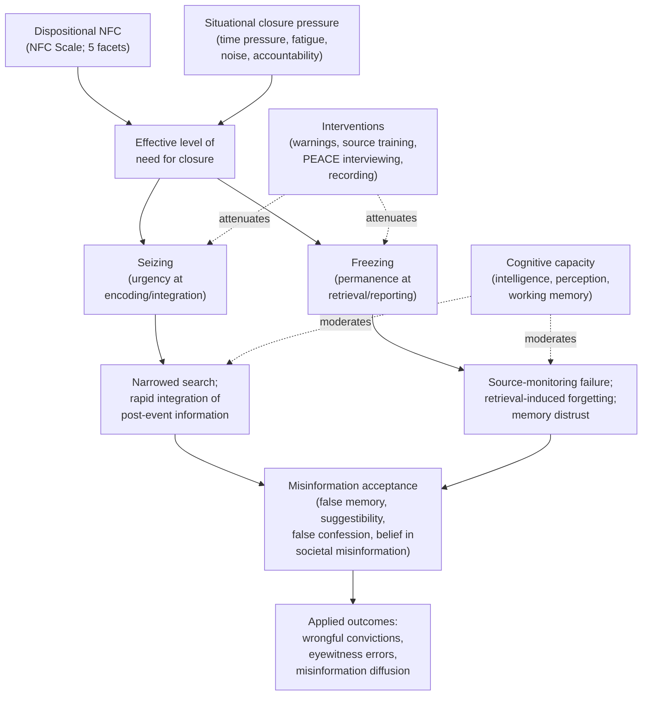
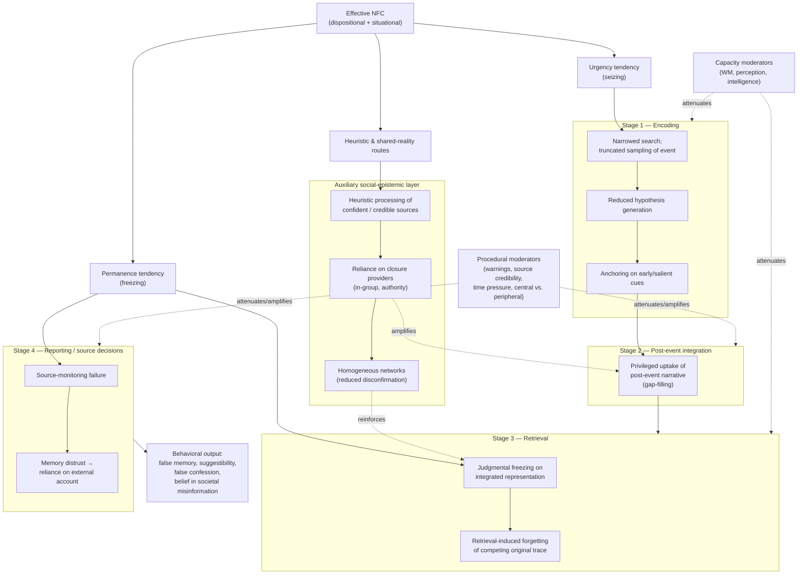

# The Role of Need for Closure in Misinformation Acceptance: Mechanisms, Evidence, and Applied Implications
# 1 Introduction and Research Framework

## 1.1 Research Background and Problem Statement

The question of why ordinary, well-intentioned people come to remember events that never happened, confess to crimes they did not commit, or believe demonstrably false stories about politics, public health, and current affairs has become one of the most consequential puzzles in contemporary cognitive and social psychology. The stakes are no longer purely academic. Within the data base of the Innocence Project, false confessions have been a contributing factor in over 25% of DNA-based wrongful-conviction cases in the United States, all of them involving rapes and murders; in the broader National Registry of Exonerations, which captures non-DNA cases, false confessions still figure in roughly 13% of wrongful convictions, with the proportion peaking in homicides where sentencing consequences are most severe[^1]. Eyewitness memory, long treated by jurors and judges as a near-canonical form of evidence, has been shown to be systematically vulnerable to post-event suggestion, with classic three-stage paradigms demonstrating that misinformation can be incorporated into otherwise vivid recollections, sometimes with great confidence in their veracity[^2]. Beyond the courtroom, the same memory and judgment systems are now embedded in an information environment saturated with rumor, conspiratorial narratives, and politically motivated falsehoods, where the speed of dissemination far outpaces the speed of correction.

Against this backdrop, a long tradition of cognitive research has identified a stable set of *capacity-based* correlates of misinformation acceptance—lower intelligence, weaker working memory, poorer perceptual discrimination, and inferior face judgement—each of which has been shown to predict susceptibility to the classic misinformation effect among normal adults[^2]. In a large sample of Chinese college students (N = 436), for example, robust false memories were significantly and negatively correlated with Raven's Advanced Progressive Matrices, the WAIS performance scale, motor-free visual perception, change blindness, tone discrimination, working memory, and face recognition, with intelligence and perception making unique contributions in regression analyses[^2]. Yet capacity accounts leave a critical explanatory gap. They cannot easily explain why two individuals of comparable cognitive ability differ markedly in their willingness to accept post-event suggestions, why the same person resists misinformation in one context but seizes upon it in another, or why suspects of normal intelligence sometimes generate emotionally vivid false confessions to crimes they did not commit. These residual phenomena point to a *motivated* layer of cognition—an epistemic disposition that governs how aggressively individuals search for information, when they freeze on a tentative answer, and how readily they treat any plausible account as preferable to ongoing uncertainty.

It is precisely this motivational layer that the construct of Need for Closure (NFC) was developed to capture. Defined by Kruglanski as the desire for "*an* answer on a given topic, *any* answer … compared to confusion and ambiguity," NFC varies along a continuum ranging from a strong need to attain closure to a high need to avoid it, and is conceptualized both as a stable individual disposition and as a state that situations such as noise, fatigue, or time pressure can temporarily inflate[^3]. Forensic and applied work has begun to converge on the view that this epistemic motivation is directly relevant to misinformation acceptance: in two recent experiments adapting the Kassin–Kiechel false-confession paradigm and the Polczyk misinformation schema, a positive correlation emerged between NFC and susceptibility to misinformation, and high NFC was associated with a greater tendency to make false confessions[^4][^5]. Reviewed alongside Gudjonsson's clinical evidence that compliant and suggestible suspects are disproportionately represented among false confessors[^1], these findings suggest that NFC is not merely one personality variable among many but a candidate mechanism that integrates cognitive, motivational, and situational determinants of misinformation acceptance into a single explanatory framework.

The problem this report addresses, therefore, is twofold. First, it asks whether and how a coherent cognitive-motivational account—anchored in NFC—can explain individual and situational variation in misinformation acceptance across the heterogeneous phenomena of post-event memory distortion, false confessions, and belief in societal falsehoods. Second, it asks what such an account implies for institutions—courts, police agencies, schools, journalists, and platforms—whose decisions presuppose that observers, witnesses, and citizens can reliably distinguish what they have actually experienced from what they have merely been told.

## 1.2 Conceptual Definitions and Key Constructs

To examine the role of NFC in misinformation acceptance with the necessary precision, the report adopts a set of constructs that are theoretically anchored, operationally specific, and clearly differentiated from neighboring concepts.

**Need for Closure.** NFC is treated, following Kruglanski (1990) and Kruglanski and Webster (1996), as the motivation to reach and maintain a definite answer, contrasted with the discomfort of confusion and ambiguity[^3]. Two motivational tendencies operate within this construct: an *urgency tendency*, which drives the rapid "seizing" of any cognitively available answer, and a *permanence tendency*, which leads to "freezing" on that answer and resistance to further information[^3]. NFC is measured most prominently with the 42-item Need for Cognitive Closure Scale developed by Webster and Kruglanski (1994) and its psychometrically validated 15-item brief version (Roets & Van Hiel, 2011a), with five facets representing the ways NFC expresses itself: *preference for order*, *preference for predictability*, *decisiveness*, *discomfort with ambiguity*, and *closed-mindedness*[^3]. Although the scale targets stable individual differences in "dispositional closure," NFC may also be temporarily increased by situational factors such as noise or time pressure, an important duality the report preserves throughout[^3]. Following Roets and Van Hiel (2007), the analytical framework also recognizes that the decisiveness facet has a partly distinct status, reflecting a perceived *ability* to reach closure rather than the *need* itself, which has implications for sub-facet–level interpretation in later chapters[^3].

**Misinformation acceptance.** Drawing on the misinformation paradigm pioneered by Loftus, the report defines the misinformation effect as the phenomenon in which a person's recollection of a witnessed event is altered after exposure to misinformation about that event, typically across three standard stages: experiencing the event, receiving post-event information that contains inaccuracies, and being tested for memory of the original event[^2]. Endorsement of misinformation items at test is treated as an *overall false memory* outcome, while items also misattributed at a source-monitoring test to the original picture or to non-conflicting joint sources are treated as *robust false memories*; both indices have been shown to display sizable, systematic individual differences in normal adult samples, with overall false memory rates ranging from near zero to .88 in the Zhu et al. dataset[^2]. The report uses "misinformation acceptance" as the broader umbrella term covering: (a) post-event misinformation effects on memory; (b) immediate compliance with misleading suggestions, of which interrogative suggestibility is a key forensic instance; (c) coerced-compliant and coerced-internalized false confessions, in which innocent suspects acquiesce to or come to believe accusations of guilt[^1]; and (d) belief in or endorsement of misleading communications outside the laboratory. Distinct paradigms—Loftus's three-phase misinformation procedure, the Deese-Roediger-McDermott (DRM) word-list paradigm, the rich false memory approach, and the Kassin and Kiechel "computer crash" paradigm for false confessions—generate phenomena that are related but not identical, and the report treats them as a *family* of misinformation outcomes whose mechanisms may overlap but should not be conflated[^2][^1].

**Differentiation from related constructs.** To preserve construct precision, the report explicitly distinguishes NFC from several adjacent variables. *Need for cognition*, introduced by Cacioppo and Petty (1982), refers to the enjoyment of effortful thinking and is theoretically and empirically separable from the desire for definite answers[^3]. *Personal need for structure* and *personal fear of invalidity* (Neuberg & Newsom, 1993; Thompson et al., 2001) overlap with NFC's order and predictability facets but were developed within a different theoretical lineage[^3]. *Interrogative suggestibility*, as captured by the Gudjonsson Suggestibility Scale, indexes the extent to which memory and judgments can be altered by misleading questions and negative feedback and is itself an *outcome variable* that may be moderated by NFC rather than a synonym for it[^2][^1]. *Compliance*, as analyzed by Gudjonsson, refers to a tendency to acquiesce to social demands without necessarily believing the resulting statement, and is an important risk factor for *coerced-compliant* false confessions, distinct from the *internalized* belief change observed when innocent suspects come to believe they committed the crime[^1]. The report thus treats NFC as a *motivational antecedent* and treats memory distortion, suggestibility, compliance, and confession behavior as *behavioral and cognitive outcomes* that NFC may shape through specifiable mechanisms.

The conceptual map that organizes these constructs is summarized below.

| Construct | Definition | Role in the report | Principal measurement |
|---|---|---|---|
| Need for Closure (NFC) | Motivation to reach and maintain a definite answer; opposite of need to avoid closure[^3] | Predictor / motivational antecedent | 42-item NFC Scale; 15-item brief version[^3] |
| Seizing tendency | Urgency-driven rapid acceptance of an available answer[^3] | Mechanism at encoding/integration | Inferred from NFC + situational urgency |
| Freezing tendency | Permanence-driven resistance to revision of an existing answer[^3] | Mechanism at retrieval/reporting | Inferred from NFC + judgmental persistence |
| Misinformation effect | Memory distortion produced by post-event misinformation[^2] | Core dependent phenomenon | Loftus three-phase paradigm; recognition + source-monitoring test[^2] |
| False confession (compliant / internalized) | Innocent suspect acquiesces to or comes to believe accusation[^1] | High-stakes applied outcome | Kassin–Kiechel computer crash paradigm; Russano cheating paradigm[^1] |
| Interrogative suggestibility | Tendency for memory/judgments to shift under misleading questioning[^1] | Mediating/outcome variable | Gudjonsson Suggestibility Scale[^2][^1] |
| Compliance | Acquiescence without internal belief change[^1] | Co-determinant of compliant false confession | Gudjonsson Compliance Scale[^1] |

The table makes explicit that NFC sits at the *motivational* level of analysis, while the misinformation effect, suggestibility, compliance, and false confession occupy distinct positions in a downstream causal chain that runs from epistemic disposition through cognitive processing to behavioral output.

## 1.3 Research Questions, Hypotheses, and Analytical Framework

Building on these definitions, the report is organized around four interlocking research questions, each tied to a tractable empirical literature and to specific subsequent chapters.

**RQ1 – Magnitude and direction.** Does NFC, measured either as a stable disposition or as a situationally induced state, predict an increased probability of accepting misinformation in standard memory paradigms and in applied forensic settings? The working hypothesis is that high NFC is positively associated with susceptibility to misinformation, an expectation supported by the experimental finding of a positive correlation between NFC and the misinformation effect within a Loftus-type schema, and by the parallel demonstration that high NFC is associated with a greater tendency to make false confessions in a Kassin–Kiechel-style paradigm[^4][^5].

**RQ2 – Mechanisms.** Through which cognitive-motivational pathways does NFC translate into misinformation acceptance? The report hypothesizes that the *urgency* tendency operates predominantly at encoding and integration stages—narrowing information search, biasing attention toward early or salient cues, and accelerating the adoption of post-event narratives as the working representation of the event—while the *permanence* tendency operates predominantly at retrieval and reporting—freezing on the integrated (and now contaminated) representation, suppressing competing traces through retrieval-induced forgetting, and degrading source-monitoring performance.

**RQ3 – Boundary conditions.** Under what conditions, and for whom, is the NFC–misinformation link strongest? The framework anticipates moderation by situational closure pressures (time pressure, fatigue, noise, accountability), by warnings and source-credibility cues, and by individual factors including age, prior knowledge, and cognitive capacity. The latter is theoretically constrained by Zhu et al.'s evidence that intelligence, perception, working memory, and face judgement each contribute uniquely or jointly to misinformation susceptibility, raising the possibility that NFC interacts with—and may compensate for or amplify—these capacity-based vulnerabilities[^2].

**RQ4 – Applied consequences.** What are the implications of NFC-driven misinformation acceptance for forensic practice, public communication, education, and policy? The hypothesis is that interventions that reduce situational closure pressure (e.g., investigative interviewing in the PEACE tradition, mandatory recording, prohibitions on false-evidence ploys), strengthen source monitoring, and cultivate tolerance for ambiguity should differentially benefit high-NFC individuals, who otherwise face the greatest risk of false memory and false confession[^1].

These questions are integrated into the analytical framework summarized below, which traces a path from epistemic motivation through cognitive processing to behavioral outcomes, and identifies the points at which moderators and interventions can intervene.

The diagram makes three points visible. First, dispositional and situational sources of NFC converge on a single *effective* level of closure motivation that the cognitive system experiences in the moment. Second, the seizing/freezing distinction maps onto temporally distinct memory stages, allowing the report to interrogate encoding versus retrieval mechanisms separately. Third, both capacity-based moderators (consistent with Zhu et al.'s evidence that intelligence and perception independently predict misinformation susceptibility[^2]) and intervention-based attenuators (consistent with reform recommendations such as PEACE-style investigative interviewing and mandatory interrogation recording[^1]) operate not on outcomes directly but on the cognitive pathways through which NFC exerts its effect. This architecture justifies why the chapters that follow interleave construct definition, mechanism analysis, applied evidence, and intervention design rather than treating them as independent silos.

## 1.4 Scope, Significance, and Report Structure

The report's scope is defined by a deliberate triangulation of three literatures that have rarely been integrated at the depth their subject demands: the motivated-cognition tradition that produced NFC theory and its measurement[^3]; the cognitive and forensic psychology of false memory, encompassing both individual-differences work on capacity-based predictors[^2] and paradigm-driven research on the misinformation effect; and the applied science of false confessions, with its strong evidentiary base on interrogation tactics, vulnerable suspects, and reform proposals[^1]. The first targeted bridge between these literatures—the demonstration that NFC predicts both misinformation susceptibility and false-confession proneness within forensically relevant paradigms[^4][^5]—provides the empirical anchor for an integrative treatment that is now both feasible and overdue.

Several questions and constructs lie outside this scope and are flagged here to prevent later misreading. The report does not attempt a comprehensive review of all individual-difference predictors of false memory; capacity variables such as intelligence, perception, working memory, and face judgement are treated only insofar as they moderate or contextualize NFC effects[^2]. It does not relitigate the well-developed evidence base on interrogation tactics themselves (maximization, minimization, false-evidence ploys, Miranda comprehension), although that base is drawn upon to specify situational closure pressures relevant to suspect populations[^1]. It also does not treat clinical false-memory phenomena unique to special populations such as schizophrenia, where confabulation reflects mechanisms quite distinct from NFC-driven misinformation acceptance in normal adults[^2]. Finally, while the report engages with societal misinformation in Chapter 6, it does so through the lens of dispositional epistemic motivation rather than as a comprehensive review of the political-communication or platform-governance literatures.

The scientific significance of the inquiry lies in the fact that it tests a strong prediction at the intersection of motivation and memory: that an *epistemic* motive, conceptually distinct from desire for accuracy or for self-protection, can systematically reshape how veridical events are encoded, stored, and reported. If supported, this prediction extends the domain of motivated cognition from its traditional home in attitude formation and persuasion into the architecture of episodic memory itself, and it does so in ways that capacity-based individual-differences accounts—however well replicated[^2]—cannot explain on their own. The societal significance is equally pronounced. False confessions have contributed to roughly a quarter of DNA-based wrongful convictions and to even higher proportions of wrongful convictions among juveniles[^1], and eyewitness misinformation effects shape outcomes from criminal trials to medical histories to journalistic accuracy. To the extent that NFC modulates these outcomes, it identifies both a *risk marker* for vulnerable individuals and a *target* for interventions that institutions are already empirically motivated to adopt.

The remainder of the report is organized to develop this argument cumulatively. Chapter 2 elaborates the theoretical and measurement foundations of NFC and the typology of misinformation phenomena introduced above, including the detailed structure of the Webster–Kruglanski scale and its 15-item revision and the procedural distinctions among the Loftus, DRM, rich false memory, and Kassin–Kiechel paradigms. Chapter 3 specifies the cognitive-motivational mechanisms—seizing, freezing, narrowed hypothesis generation, source-monitoring failure, retrieval-induced forgetting, and heuristic processing—through which NFC may amplify misinformation acceptance, integrating them into a stage-by-stage model. Chapter 4 reviews the empirical evidence linking NFC to misinformation outcomes, with particular attention to sub-facet patterns (notably decisiveness) and to interactions with memory-system processes. Chapter 5 turns to forensic applications, examining eyewitness suggestibility and false confessions through the Kassin–Kiechel and related paradigms[^4][^5][^1]. Chapter 6 extends the analysis to societal misinformation, including political disinformation, conspiracy theories, and persuasion by ideological leaders. Chapter 7 maps the moderators and boundary conditions—time pressure, fatigue, accountability, warnings, source credibility, prior knowledge, age, and culture—that determine when the NFC effect is amplified or attenuated. Chapter 8 evaluates interventions and synthesizes implications for justice, education, public communication, and policy. Chapter 9 critically appraises methodological limitations, identifies open theoretical questions, and articulates a research agenda before returning to the central question with which this introduction began: whether, and in what sense, the desire for an answer—any answer—is a hidden engine of misinformation acceptance in modern life.

# 2 Conceptual Foundations: Need for Closure and Misinformation Acceptance

The framework articulated in Chapter 1 placed Need for Closure (NFC) at the motivational antecedent of a downstream chain that runs through cognitive processing into behavioral outputs as varied as post-event memory distortion, false confession, and belief in societal falsehoods. Whether that framework can do real explanatory work, however, depends on the conceptual precision of its core constructs. NFC and "misinformation acceptance" are both umbrella terms that have, over four decades of research, accumulated overlapping but non-identical meanings, scales, and operational paradigms. This chapter therefore converts the loose vocabulary introduced in the introduction into a working conceptual toolkit. It traces NFC from its origins in Kruglanski's lay-epistemic theory through the seizing-and-freezing model to its contemporary multidimensional measurement, and it maps the typology of misinformation phenomena from the Loftus post-event paradigm to rich false memories, rumor adoption, and fake-news belief. By the end of the chapter, the predictor and the dependent phenomena will be sufficiently differentiated and yet sufficiently linked that the mechanism analysis of Chapter 3 can begin without further disambiguation.

## 2.1 Theoretical Origins and Definition of Need for Closure

Need for Closure was not invented in isolation but emerged from a more ambitious theoretical project: Kruglanski's *theory of lay epistemics*, which sought to specify how thought and motivation interface in the formation of subjective knowledge. Throughout his career, Kruglanski's central interest has been "how people form judgments, beliefs, impressions and attitudes," and his lay-epistemic framework was developed precisely to articulate the role of motivation in that formation process[^6]. Within that framework, *epistemic motivations*—the desires that govern how aggressively people search for information, how soon they accept tentative answers, and how readily they revise them—occupy a distinctive analytic position, separable both from the *contents* of belief and from the *capacities* (intelligence, perception, working memory) that constrain reasoning. NFC is the paradigm case of such an epistemic motivation: a desire for *an* answer rather than for any particular answer, contrasted with the alternative epistemic state of suspended judgment under continued ambiguity.

The construct's contemporary canonical formulation appears in Kruglanski's *The Psychology of Closed Mindedness* (2004), which consolidated two decades of theoretical and empirical work on closure motivation into a single integrative statement[^7][^8]. Two features of this definition are crucial for the present report. First, NFC is conceptualized along a *continuum* anchored at one pole by a strong need to attain closure (a positive valuation of any definite answer) and at the other by a high need to *avoid* closure (a positive valuation of remaining open, of considering alternatives, of suspending commitment). The two ends are not symmetrical in their cognitive consequences: those high in need to attain closure freeze on the first plausible answer; those high in need to avoid closure resist commitment even to well-supported conclusions. Second, NFC is conceptualized as both a *trait*—a stable individual disposition reflecting characteristic preferences for definitive answers across topics—and a *state* that situations such as time pressure, fatigue, environmental noise, or incentivized speed can transiently inflate. This duality is essential for the report's later argument: it permits NFC to function simultaneously as a chronic risk marker for vulnerable witnesses, suspects, and consumers of news, and as a feature of *situations* (interrogations, ambiguous breaking-news environments) that institutions can deliberately design to suppress or amplify.

The reasons for selecting an epistemic motive—rather than an accuracy motive, a self-protection motive, or a social-acceptance motive—as the analytic lens for misinformation acceptance follow directly from this definitional core. Accuracy motivation predicts that, ceteris paribus, people will resist misinformation because they care about being correct; self-protection motivation predicts resistance to information that threatens self-esteem; social-acceptance motivation predicts conformity to whatever the in-group endorses. None of these alternatives explains why a person who genuinely wants to be accurate, who is not threatened by the content of the misinformation, and who is not under social pressure may nonetheless seize upon a misleading post-event narrative simply because it offers a definite answer to a previously ambiguous event. NFC fills this gap by positing that the *very form* of definite information—its capacity to terminate uncertainty—has motivational pull, independent of its content, accuracy, or social provenance. This is why Kruglanski's lay-epistemic program has branched not only into research on closure but also into a "motivation as cognition" research agenda and into applied investigations of group-based extremism, where the epistemic appeal of definitive worldviews to closure-seeking minds has emerged as a recurrent explanatory thread[^6].

## 2.2 The Seizing-and-Freezing Model: Urgency and Permanence Tendencies

Within the NFC framework, the construct's downstream cognitive consequences are generated by two motivational sub-tendencies that operate at temporally distinct stages of the judgment process. The first, the *urgency tendency*, drives the rapid acceptance of a cognitively available answer—what Kruglanski terms "*seizing*" on whatever proposition first achieves enough activation to qualify as a candidate answer. The second, the *permanence tendency*, sustains commitment to that answer once seized—"*freezing*" on it and resisting subsequent revision in the face of inconsistent information. Kruglanski's review of the cognitive and social consequences of NFC explicitly identifies these two general tendencies as the source of the closure construct's predictive power, noting that "the consequences of the need for closure are assumed to derive from two general tendencies, those of urgency and permanence, respectively"[^9]. This formulation is consequential: it embeds within NFC a temporal structure that maps directly onto the cognitive stages at which misinformation acceptance can occur.

The urgency tendency operates on the *forward* edge of judgment. When confronted with an uncertain stimulus—an ambiguous event, a partially encoded scene, a question for which the answer is not immediately retrievable—a person high in NFC experiences ambiguity itself as aversive and is motivated to terminate that aversive state by adopting any sufficiently plausible candidate answer. Information search is consequently narrowed: alternative hypotheses are not generated as readily, peripheral details are not considered as carefully, and disconfirming cues are processed less thoroughly. In a memory context, this means that post-event information—precisely because it offers a coherent, packaged account of an event the witness only partially remembers—is privileged in the integration process. The permanence tendency operates on the *trailing* edge: once seized upon, an answer is preserved against revision. Source-monitoring tests that ask whether a particular detail came from the original event or from a later narrative are particularly diagnostic here, because they require the rememberer to *unfreeze* an integrated representation back into its components—a task whose difficulty is, by hypothesis, greatest precisely for those whose closure motivation has greatest motivational force.

That urgency and permanence are distinguishable rather than merely two labels for a single phenomenon is established by evidence that they have *differential* predictive power for important downstream variables. Roets and Van Hiel demonstrated, in two Flemish undergraduate samples, that the relations of NFC with right-wing authoritarianism, conservative beliefs, and racism are mediated differentially by urgency and permanence facets, and that these patterns are detectable only when the *Decisiveness* facet is properly operationalized—an issue addressed in detail in §2.3[^10]. The broader theoretical implication is that the closure construct is not unitary in its action: urgency-driven phenomena (such as rapid initial commitment to any plausible answer) can dissociate from permanence-driven phenomena (such as resistance to revising an existing commitment), and any complete account of NFC's role in misinformation must specify which sub-tendency is doing the work at which stage. The downstream consequences are not only cognitive but motivational and behavioral: in risk-taking research, NFC has been shown to *decrease* risk taking and motivate effortful decision strategies that minimize residual uncertainty, providing converging behavioral validation that the construct genuinely tracks discomfort with ambiguity rather than mere preference for parsimonious thought[^11].

This stage-based architecture justifies a key analytic move in subsequent chapters: the separation of *encoding-stage* mechanisms (narrowed search, premature integration of post-event information) from *retrieval-stage* mechanisms (source-monitoring failure, retrieval-induced forgetting of competing traces). Because urgency and permanence map onto these stages with reasonable theoretical fit, the seizing-and-freezing model provides the temporal scaffolding for the mechanism analysis of Chapter 3.

## 2.3 Measurement of NFC: Scales, Sub-Dimensions, and Dispositional vs. Situational Character

The operationalization of NFC has, since the mid-1990s, been dominated by the *Need for Closure Scale* developed by Webster and Kruglanski (1994), a 42-item instrument consisting of five facet sub-scales that collectively express the multidimensional structure of the construct: *preference for order*, *preference for predictability*, *decisiveness*, *discomfort with ambiguity*, and *closed-mindedness*. As anticipated in Chapter 1, the scale is intended to capture stable individual differences in dispositional closure, and a 15-item brief version (Roets & Van Hiel, 2011a) has subsequently been validated to provide an economical measure suitable for large-sample and applied research. The contemporary measurement landscape thus offers researchers a choice between full and abbreviated forms; importantly for cross-study synthesis in Chapter 4, both forms preserve the multidimensional structure rather than collapsing closure into a single global indicator.

The five facets are not isomorphic with one another, and the most theoretically consequential heterogeneity concerns the *Decisiveness* sub-scale. Roets and Van Hiel's reassessment of the relations between NFC and authoritarianism, conservatism, and racism reported that the standard pattern of associations between NFC and these outcomes did not apply to the original Decisiveness facet, and they noted that this scale "has been reported to have a questionable validity"; their development of a new Decisiveness scale "inspired a reassessment of these previous studies"[^10]. The substantive theoretical interpretation, anticipated in Chapter 1, is that decisiveness reflects a perceived *ability* to reach closure rather than the *need* to reach it. A person high in decisiveness may simply find closure easy to attain regardless of how much they desire it, and the dissociation of decisiveness from the other four facets in predicting ideological outcomes suggests that this ability–need distinction has empirical bite. For the present report, the implication is that empirical findings linking NFC to misinformation acceptance must be interpreted with attention to whether the relevant association is driven by the *core* need facets (discomfort with ambiguity, closed-mindedness, preference for order/predictability) or by the more ability-like decisiveness facet—a sub-facet sensitivity that Chapter 4 will pursue at length.

The five-facet structure also clarifies what NFC is *not*. Discomfort with ambiguity overlaps conceptually with intolerance of ambiguity and personal need for structure; closed-mindedness overlaps with rigidity and dogmatism; preference for predictability overlaps with risk aversion. The integrity of NFC as a distinct construct rests on the empirical claim that these facets cohere into a higher-order dimension whose action on judgment is captured specifically by the seizing-and-freezing dynamic, not by any individual facet alone. Convergent evidence from studies of conspiracy beliefs, intergroup relations, and extremism—including findings that high NFC is associated with conspiracy beliefs about events lacking clear official explanations, with prejudice against migrants during the COVID-19 pandemic mediated by binding moral foundations, and with militant extremism in post-conflict societies—supports this construct-level coherence by showing that NFC predicts a recognizable family of belief-formation outcomes that share a structural feature: the appeal of definite, unambiguous answers in the face of uncertainty[^10][^12][^13].

The dispositional–situational duality that Chapter 1 introduced is operationalized in the empirical literature through two complementary methodologies. *Dispositional* NFC is measured by the Webster–Kruglanski scale or its abbreviation, used to identify chronic individual differences. *Situational* NFC is induced experimentally through manipulations that increase the cost of remaining uncertain or decrease the resources available for thorough processing—paradigmatic examples include time pressure (limiting how long a participant has to reach a judgment), environmental noise (degrading the quality of processing and increasing the value of prematurely terminating analysis), and fatigue (reducing cognitive resources available for effortful disambiguation). The theoretical equivalence of dispositional and situational closure, central to Kruglanski's framework, predicts that the *same* downstream consequences—seizing on early answers, freezing on integrated representations, resistance to revision—should be observable whether closure is chronically high in a participant or transiently induced in a situation. This dual operationalization is essential for the report's later argument that interrogation environments, breaking-news contexts, and high-pressure decision settings are not merely venues in which dispositionally high-NFC individuals are at risk, but are themselves *closure-inducing situations* that elevate effective NFC for all observers[^11][^9].

## 2.4 Conceptualizing Misinformation Acceptance: Phenomena and Paradigms

If NFC is the predictor, "misinformation acceptance" is the umbrella term for a heterogeneous family of dependent phenomena that share a core feature—the incorporation of inaccurate information into belief, memory, or behavior—but differ in the cognitive systems they engage and the paradigms by which they are studied. The starting point for conceptualizing this family is the *post-event misinformation effect* itself, which "occurs when a person's recall of episodic memories becomes less accurate because of post-event information"[^14]. Studied since the mid-1970s, principally through the foundational research program of Elizabeth Loftus, the misinformation effect has emerged as one of the most replicated phenomena in cognitive psychology and has reshaped both theoretical understanding of memory and applied evaluation of eyewitness testimony[^14].

The procedural paradigm that defines the post-event misinformation effect was crystallized in Loftus, Miller, and Burns (1978), and its three-stage structure has since served as the template for hundreds of replications and extensions. As described in the contemporaneous review literature, "the paradigmatic misinformation study (Loftus et al., 1978) consists of three phases"[^15]: in the first phase, an eyewitness is exposed to an event (typically a slideshow or video of an automobile accident, a crime, or a similar scene); in the second phase, the witness is exposed to post-event information (often via a narrative or a misleading question) some of which contradicts details of the original event; in the third phase, memory for the original event is tested. The classic stop-sign / yield-sign demonstration—participants who saw a car stop at a stop sign were more likely to report a yield sign after exposure to a misleading description—established the basic phenomenon, and "similar methods continue to be used in misinformation effect studies," with the standard procedure involving a slideshow or video event, "a time delay and introduction of post-event information," and a final memory test[^14]. This three-phase architecture is methodologically critical because it isolates the contaminating role of *post*-event information, holding original encoding constant.

Theoretical accounts of *why* post-event information distorts memory have evolved across three principal positions, each privileged by different paradigm variants. The earliest account was *memory trace impairment*: exposure to misleading information erases or overwrites the original trace, rendering it inaccessible[^16]. McCloskey and Zaragoza (1985) challenged this account using a *modified test* in which participants had to choose between the originally seen item and a newly introduced item (rather than between the original and the misleading item); they found that misled participants identified the original item as accurately as non-misled controls, suggesting that "exposure to misinformation does not erase memory for the originally witnessed event or make it inaccessible" and that the misinformation effect instead "occurs because the misled participants have a tendency to fill the gap where they failed to encode the original event"[^14][^16]. Subsequent theoretical development has emphasized two further mechanisms: *source misattribution*, in which the post-event information is genuinely encoded but its source (the narrative) is mistakenly attributed to the original event[^14], and *blocking*, in which the more recent misleading trace blocks access to the earlier original trace[^16]. As the Wikipedia review of the field summarizes, "one mechanism through which the misinformation effect occurs is source misattribution, in which the false information given after the event becomes incorporated into people's memory of the actual event," and "the misinformation effect also appears to stem from memory impairment, meaning that post-event misinformation makes it harder for people to remember the event"[^14]. The misinformation effect is thus an instance of *retroactive interference*: "information presented later interferes with the ability to retain previously encoded information"[^14].

The misinformation effect is, however, only one member of a broader family of phenomena. The *Deese-Roediger-McDermott (DRM) word-list paradigm* generates false memories not by introducing contradictory post-event information but by exposing participants to lists of semantically associated words (e.g., *bed*, *rest*, *awake*, *dream*) and testing recognition of a non-presented critical lure (*sleep*); the high false-recognition rate for the lure reflects a *gist-based* reconstructive mechanism rather than the source confusion that drives the Loftus paradigm[^16]. *Rich false memory* paradigms—pioneered through "familial informant false narrative procedures" such as the famous lost-in-the-mall study—attempt to plant entire fabricated autobiographical events in participants' memories, with roughly 30% of subjects producing partial or complete false memories of events that never occurred[^14]. Research has even succeeded in inducing rich false memories of *committing a crime* in early adolescence using a false-narrative paradigm[^14]. Finally, the *Kassin–Kiechel false-confession paradigm* (the "computer crash" procedure) operationalizes laboratory analogs of internalized false confession, in which innocent participants come to believe they performed an action—pressing a forbidden key, crashing the experimenter's computer—that they did not perform.

These paradigms differ in three important respects, summarized in the table below: the *type* of misinformation they introduce (contradictory post-event detail, semantic associate, fabricated autobiographical narrative, false accusation paired with manipulated evidence), the *target* of the false belief (peripheral perceptual detail, a non-presented but related concept, an entire personal event, an action one performed), and the *mechanism* they primarily privilege (source misattribution and trace blocking; gist-based reconstruction; suggestion combined with imagination inflation; compliance combined with belief change under social and evidentiary pressure).

| Paradigm | Stimulus | Misinformation type | Outcome measured | Primary mechanism privileged |
|---|---|---|---|---|
| Loftus three-phase post-event paradigm | Slideshow/video of accident or crime | Contradictory detail in narrative or question | Endorsement of misled detail at recognition | Source misattribution, trace blocking, retroactive interference[^14] |
| DRM word-list paradigm | Semantically associated word list | Critical non-presented lure | False recognition/recall of lure | Gist-based reconstruction (fuzzy-trace theory)[^16] |
| Rich false memory / lost-in-the-mall | Family-corroborated false narrative | Entire fabricated autobiographical event | Acceptance and elaboration of false event | Suggestion, imagination inflation, source confusion[^14] |
| Kassin–Kiechel computer crash | Typing task with manipulated "crash" | False accusation + (sometimes) false witness evidence | Compliance with confession; internalized belief in guilt | Compliance, suggestibility, memory distrust |

The conceptual lesson is that "misinformation acceptance" is a *family resemblance* concept rather than a unitary phenomenon. The mechanisms privileged by each paradigm overlap—source-monitoring failure features in both Loftus and DRM accounts, suggestion features in both rich-false-memory and false-confession accounts—but they are not identical, and any theoretical claim that NFC predicts "misinformation acceptance" in general must be examined paradigm by paradigm to determine whether its action is consistent across mechanisms or restricted to specific cognitive routes. In addition, beyond these laboratory paradigms the report's umbrella construct extends to *interrogative suggestibility* as captured by clinical instruments, to *rumor adoption* in social-information ecosystems—where information is treated as rumor when "repeatedly shared (or transmitted), treated as credible" under conditions of ambiguity[^17][^18]—and to *fake news belief* in political-communication contexts, where alternative theoretical accounts have emphasized the role of insufficient deliberative reasoning ("lazy, not biased") rather than motivated reasoning per se[^17]. Each of these applied phenomena will be revisited in Chapters 5 and 6 with attention to which laboratory mechanism best models its key features.

## 2.5 Determinants of Susceptibility: Individual Differences and Procedural Factors

Susceptibility to misinformation, even within a single paradigm, is far from uniform across individuals or conditions. A substantial body of empirical work, anchored by both the Loftus tradition and a series of individual-differences investigations, has established a structured landscape of *capacity-based*, *trait-based*, and *procedural* moderators that any motivational account of misinformation acceptance—including the NFC account this report develops—must accommodate. As Wikipedia's review of the field observes, "not everyone is equally susceptible to the misinformation effect" and "individual traits and qualities can either increase or decrease one's susceptibility to recalling misinformation"[^14].

**Age.** The age literature is mixed and qualified, but several patterns are robust. "Young children—especially pre-school-aged children—are more susceptible than older children and adults to the misinformation effect"[^14]; the effect on children is "stronger on an ancillary, existent memory than on a new, purely fabricated memory" and is "redoubled if its source is in the form of a narrative rather than a question," although children also accept misinformation more readily when it is presented through specific rather than open-ended questions[^14]. For older adults, perspectives diverge: "some evidence suggests that elderly adults are more susceptible to the misinformation effect than younger adults," but other studies hold that older adults may make *fewer* mistakes "depending on the type of question being asked and the skillsets required in the recall," and still others find no age difference[^14]. The contrasting perspective attributes age effects principally to "cognitive deterioration that commonly accompanies age," locating the proximal cause in declining cognitive capacity rather than chronological age per se[^14].

**Working memory capacity.** Individuals with greater working memory capacity "are better able to establish a more coherent image of an original event," and dual-task experiments demonstrate that participants who are more accurate on a concurrent dual task are "*less* susceptible to the misinformation effect, which allowed them to reject the misinformation"[^14]. Working memory thus functions as a capacity-based protective factor, providing the resources required to maintain the original representation against contamination by post-event input.

**Personality traits.** Personality has been linked to misinformation susceptibility through several routes. Using the Myers–Briggs Type Indicator within Loftus's procedure, researchers found that "introvert-intuitive participants were *more* likely to accept both accurate and inaccurate post-event information than extrovert-sensate participants," with the suggested explanation that "introverts are more likely to have lower confidence in their memory and are more likely to accept misinformation"[^14]. Empathy, absorption, and self-monitoring have been implicated, and "people are more susceptible to misinformation when they are more cooperative, dependent on rewards, and self-directed and have lower levels of fear of negative evaluation"[^14].

**Need for Cognition (NFC—the *cognition* construct).** The *need for cognition* literature, separable from the closure literature emphasized in this report, has produced findings of particular methodological interest. Antonio's misinformation-paradigm study (N=103) using a 10-minute museum-burglary clip from *The Pink Panther* and an 18-item Cacioppo–Petty–Kao need-for-cognition scale found "a main effect for NFC… indicating that high NFC individuals had fewer false memories for the originally witnessed event than low NFC individuals," along with the standard finding that "memory for central details was better than for peripheral details" and an interaction whereby "when a warning was present, memory for the misleading peripheral details was stronger"[^16]. The interpretive logic offered for the protective effect is that high need-for-cognition individuals are more likely, in misinformation paradigms specifically, to "rely more on the verbatim trace" and engage in *recollection rejection*—using detailed memory of the original event to reject incongruent post-event suggestions—whereas in DRM paradigms the same participants tend to rely on gist and consequently produce *more* false memories[^16]. This domain-specific reversal is theoretically critical: it warns that a single individual-differences variable can have *opposite* effects across misinformation paradigms depending on whether verbatim or gist processing is rewarded, and it exemplifies the broader caution that conclusions about "misinformation acceptance" must be paradigm-indexed.

**Imagery ability.** Higher imagery ability is associated with *greater* susceptibility, because participants with higher imagery ability are "more likely to form vivid images of the misleading information at encoding or at retrieval, therefore increasing susceptibility"[^14]. This finding identifies a route through which the very richness of mental representation can *facilitate* misinformation acceptance.

**Procedural moderators.** The procedural literature is extensive. *Time delay* increases the misinformation effect, since "the likelihood of incorporating misinformation increases as the delay between the original event and post-event information increases"; conversely, longer original-event study leads to lower susceptibility[^14]. Loftus's *discrepancy detection principle* holds that "people's recollections are more likely to change if they do not immediately detect discrepancies between misinformation and the original event," and crucially that even when individuals recognize the conflict between memory and narrative, "they still adopt it as true"[^14]. *Source reliability* matters: more reliable sources produce greater misinformation effects, with experiments showing that misinformation delivered by an unreliable source (a lawyer representing the driver) is rejected, while otherwise-equivalent misinformation from an unspecified source is accepted[^14]. *Discussion and rehearsal* effects are mixed, with confederate-injected misinformation being adopted but neutral discussion having little effect; collaborative pairs sometimes show *smaller* misinformation effects than individuals because collaboration "allowed witnesses to dismiss misinformation generated by an inaccurate narrative"[^14]. Inhibited *states of mind* (alcohol, hypnosis) increase susceptibility, while post-learning *arousal* and post-presentation *social stress* reduce it, apparently by sharpening source monitoring[^14]. *Anticipation* and warnings are effective only if delivered *before* misinformation: meta-analytic evidence indicates that "warning participants about misinformation was an effective way to reduce—though not eliminate—the misinformation effect," but the efficacy of post-warnings is "significantly lower when using a recall test" and warnings "are less effective when people have been exposed to misinformation more frequently"[^14]. Even *placebos* matter: a fictitious "cognitive enhancing drug" called R273 reduced misinformation effects "by increasing monitoring at test," with participants "attributing their behavior to the *placebo* and not to themselves"[^14]. Finally, *question type*—central vs. peripheral information—matters: misinformation effects are stronger for peripheral than for central details, because central information is more salient at encoding, more deeply processed, and accordingly more resistant to subsequent contamination[^14][^16].

The takeaway for this report is twofold. First, NFC is one variable in a crowded susceptibility landscape that includes capacity-based, trait-based, and procedural factors. A theoretically coherent NFC account must specify how closure motivation interacts with these established moderators—amplifying some (e.g., the protective effect of warnings should plausibly weaken under high closure pressure), being attenuated by others (e.g., strong original-event encoding should reduce NFC's bite), and operating partly independently of still others (working memory capacity). Second, several of these moderators are themselves *closure-relevant*: time pressure both elevates situational NFC and degrades performance independently; warnings may reduce closure pressure by signaling that immediate commitment to a single account is unwarranted; central versus peripheral question type plausibly interacts with NFC because peripheral details, which lack salience, leave the most room for closure-driven seizing on whatever the post-event narrative supplies. Chapter 7 will return to each of these moderators with the NFC framework explicitly in view; the present chapter establishes the empirical pattern that any such framework must accommodate.

## 2.6 Bridging the Constructs: NFC as a Motivational Antecedent of Misinformation Acceptance

The preceding sections have treated NFC and misinformation acceptance as separate analytic objects: NFC as a multidimensional epistemic motive operating through urgency and permanence sub-tendencies, measured by the Webster–Kruglanski scale and its revisions, and modulated by both dispositional and situational factors; misinformation acceptance as a family of phenomena operationalized by the Loftus three-phase paradigm, the DRM paradigm, rich-false-memory implantation, and the Kassin–Kiechel procedure, and shaped by an extensive set of capacity-based, trait-based, and procedural moderators. The conceptual bridge between them, which the remainder of the report develops, rests on a specific theoretical claim: that NFC, by virtue of its action on information search, hypothesis generation, and judgmental closure, is positioned to influence each member of the misinformation family at *exactly the cognitive junctures* at which susceptibility is determined.

The argument has three components. First, the *seizing* tendency of NFC operates at the same cognitive juncture at which post-event information is integrated with the original event representation. When an event has been incompletely encoded—and the procedural literature shows that such incompleteness is the rule rather than the exception, particularly for peripheral details and after time delay—the witness must reconstruct or fill in the gaps at retrieval. Closure-motivated seizing predicts that whichever account is most cognitively available will be adopted, and post-event narratives are designed (by experimenters or by interrogators) to be exactly that. Second, the *freezing* tendency operates at the juncture at which source monitoring and memory revision occur. Source-monitoring failure has been identified as a primary mechanism of the post-event misinformation effect[^14]; freezing predicts that once the integrated representation is established, the closure-motivated rememberer will resist the cognitive effort required to disentangle which detail came from where. Third, the *dispositional–situational* duality of NFC predicts that the same effects should be observable both for chronically high-NFC individuals in neutral testing conditions and for any individual placed in situationally closure-inducing conditions—a prediction that maps directly onto the high-stakes interrogation, breaking-news, and time-pressured judgment contexts to which Chapters 5 and 6 will turn.

To preserve construct precision, the operational distinctions among NFC and its conceptual neighbors must be reaffirmed at this point. *Need for cognition* (Cacioppo & Petty, 1982), as Antonio's study illustrates, indexes the *enjoyment of effortful thinking* and is empirically separable from need for closure: high need-for-cognition individuals can be either high or low in NFC, and the two constructs can produce *opposite* effects on misinformation acceptance within the same paradigm depending on which kind of processing the paradigm rewards[^16]. *Interrogative suggestibility* is an outcome variable—a measurable behavioral tendency to shift memory and judgments under misleading questions and negative feedback—not a synonym for closure motivation; NFC is a candidate antecedent of suggestibility, not an equivalent label for it. *Compliance* is a behavioral tendency to acquiesce to social demands without belief change, distinct both from NFC (a motivational state) and from internalized misinformation acceptance (a cognitive state in which the rememberer comes to believe the misinformation). The four-fold distinction—motivation (NFC), behavioral suggestibility (interrogative suggestibility), behavioral compliance (Gudjonsson compliance), and cognitive belief change (internalized misinformation acceptance)—is the conceptual scaffolding the report will use throughout.

The structural relationship among these constructs can be summarized as a predictor–mediator–outcome architecture, which Chapter 3 will populate with specific cognitive-motivational mechanisms. NFC functions as a motivational *antecedent*; the cognitive operations of seizing, freezing, narrowed search, source monitoring, and retrieval-induced forgetting function as *mediators*; and behavioral suggestibility, compliance, false memory endorsement, false confession, and societal misinformation belief function as *outcomes*. Capacity-based variables (intelligence, working memory, perception) and procedural variables (time delay, source credibility, warnings, question type) function as *moderators* at the mediator stage—they do not change what NFC motivates the cognitive system to do, but they alter the resources available to do it and the conditions under which it is done. The principal empirical question of the subsequent chapters—whether NFC predicts misinformation acceptance, through which mechanisms, and under which conditions—can now be posed with the conceptual precision that the loose vocabulary of Chapter 1 did not yet permit.

What this chapter has *not* yet established is whether the empirical evidence in fact supports the predicted NFC–misinformation linkage at the magnitudes and across the paradigms required for the framework to be more than a theoretical possibility. The evidence base is more uneven than the relatively well-developed literatures on either NFC alone or misinformation alone might suggest, and a candid appraisal must distinguish between findings that are robustly replicated, findings that derive from single studies (often using student samples and low-stakes laboratory tasks), and findings that remain genuinely contested. Chapter 4 will undertake that appraisal in detail. Before doing so, however, Chapter 3 will specify the cognitive-motivational mechanisms—seizing-driven narrowing of hypothesis generation, freezing-driven source-monitoring failure, retrieval-induced forgetting, memory distrust, and heuristic processing—through which NFC may translate into misinformation acceptance, integrating them into the stage-by-stage explanatory model that the conceptual scaffolding of this chapter has now made possible.

# 3 Theoretical Mechanisms Linking Need for Closure to Misinformation Acceptance

Chapter 2 established that Need for Closure (NFC) is a multidimensional epistemic motive whose downstream consequences are generated by two motivational sub-tendencies—urgency and permanence—and that "misinformation acceptance" is a family of phenomena unified by the incorporation of inaccurate information into belief, memory, or behavior, but operationalized through paradigms (Loftus three-phase, DRM, rich false memory, Kassin–Kiechel) whose underlying mechanisms only partially overlap. The bridge between these two analytic objects is the central theoretical task of the present chapter. The claim to be defended is not the loose proposition that "high NFC people believe more falsehoods." It is the much more specific proposition that NFC's urgency and permanence tendencies act on identifiable cognitive operations at temporally distinct stages of the memory-and-judgment process, and that those operations are precisely the ones at which misinformation gains entry to and becomes consolidated within the rememberer's representation of an event.

The chapter is organized to honor that stage-based architecture. Section 3.1 specifies the urgency-driven mechanisms that operate at the *forward* edge of cognition—encoding, attentional sampling, hypothesis generation, anchoring, and integration of post-event information. Section 3.2 specifies the permanence-driven mechanisms that operate at the *trailing* edge—judgmental freezing, source-monitoring failure, retrieval-induced forgetting, and memory distrust. Section 3.3 turns to auxiliary routes that operate alongside, and partly through, the seizing-freezing core: heuristic processing, reliance on "closure providers," and the group-centric pursuit of shared reality whose social-network signature has now been documented experimentally. Section 3.4 integrates these mechanisms into a unified stage-by-stage model that locates each pathway at a specific cognitive juncture, identifies the moderators that operate on each, and maps the resulting framework onto the four laboratory paradigms catalogued in Chapter 2. The model is theoretical rather than evidential; its function is to specify the predictions that Chapter 4 will then evaluate against the empirical record.

## 3.1 Urgency-Driven Mechanisms at Encoding and Integration

The urgency tendency—the closure-motivated rapid acceptance of any cognitively available answer—operates on the forward edge of judgment, between the moment a stimulus first impinges on the cognitive system and the moment a working representation of it becomes available for storage. Its action on misinformation acceptance can be decomposed into four interlocking mechanisms: narrowed information search and truncated attentional sampling of the original event; reduced generation of alternative hypotheses about what was witnessed; anchoring on early-encountered or most-salient cues; and privileged uptake of post-event information as a coherent, gap-filling narrative. Although the four are dissociable in principle, in practice they cascade: narrower sampling impoverishes the database from which hypotheses could be generated, fewer hypotheses leave more weight on whichever cue arrived first, and a thin-and-anchored representation creates exactly the gap that an externally supplied narrative is best positioned to fill.

**Narrowed information search and truncated sampling.** Kruglanski's lay-epistemic framework identifies *information search* as the canonical cognitive operation that closure motivation modifies. Because remaining open—continuing to sample, encode peripheral detail, and consider alternative readings of an ambiguous event—prolongs the aversive state of subjective uncertainty, the closure-motivated cognitive system is biased toward truncating sampling at the earliest point at which an interpretable representation is available. The empirical consequence is that high-NFC observers should encode less of an ambiguous event than low-NFC observers given equivalent exposure time, and the deficit should be concentrated in the very details that disambiguation requires: peripheral, contextual, and source-bearing information. This prediction connects directly to the procedural literature reviewed in Chapter 2, which established that misinformation effects are systematically larger for *peripheral* than for *central* details, and that the gap into which misinformation flows is the gap left by incomplete original encoding.

**Reduced hypothesis generation.** Within Kruglanski's account, the urgency tendency does not merely shorten search but also constrains the *space* of candidate interpretations the rememberer entertains. A coherent reading of an ambiguous scene presupposes that several alternative readings have been at least minimally considered; closure-motivated cognition, by contrast, is biased toward the first interpretation that achieves enough activation to qualify as adequate. The seizing dynamic operates here as a kind of cognitive monopoly: once a single interpretation is admitted, competing interpretations are not generated, and the encoded representation is consequently a *one-hypothesis* representation rather than a hypothesis-space that could later be re-evaluated. For misinformation acceptance, the implication is consequential. If only one interpretation of the original event has been entertained, then post-event information that is consistent with that interpretation is integrated without resistance, and post-event information that is inconsistent has no alternative reading to be tested against—it either supplants the working interpretation or is rejected wholesale, but it cannot be evaluated comparatively.

**Anchoring on early or salient cues.** The narrowing of search and the contraction of the hypothesis space jointly produce a third urgency-driven mechanism: anchoring. When few cues have been sampled and few hypotheses entertained, the working interpretation of the event becomes disproportionately determined by whichever cue arrived first or was most salient at exposure. This is the cognitive analog of the primacy effects long documented in impression formation, which the ANES report on need for closure and political attitudes summarizes when it observes that high NFC is associated with tendencies "to engage in social stereotyping, to succumb to primacy effects in impression formation"[^19]. In the misinformation context, the analog is that the witness's representation of an automobile accident, a crime, or a face is anchored on whatever was most salient in the first seconds of exposure or in the first description offered, and is correspondingly *poorly* anchored on the detail (a stop sign, a yield sign, the color of a getaway car, the presence or absence of a moustache) that the post-event narrative will subsequently target. The Loftus discrepancy-detection principle—that recollections are more likely to change when discrepancies between misinformation and the original event go undetected at exposure to the narrative—maps directly onto this mechanism: an anchored, thinly elaborated representation provides few opportunities for the contradiction to be noticed.

**Privileged uptake of post-event information.** The cumulative consequence of the preceding three mechanisms is that the representation of the event entering the integration stage is incomplete, single-hypothesis, and anchored on a limited set of cues. Into this representation post-event information arrives as something the urgency-motivated cognitive system actively wants: a coherent, packaged account of an event the rememberer only partially remembers, one whose adoption terminates the aversive state of holding a fragmentary representation. The seizing tendency thus operates twice in the Loftus three-phase paradigm—once at exposure to the original event, where it truncates encoding, and once at exposure to the post-event narrative, where it privileges the narrative's adoption as the working interpretation. The effect is asymmetric in a theoretically informative way: post-event information that *fills* gaps in an underspecified representation is incorporated more readily by closure-motivated rememberers than post-event information that *contradicts* well-encoded central details. This asymmetry predicts that NFC's effect on misinformation acceptance should be most pronounced precisely where the procedural literature has located the largest misinformation effects—on peripheral, gap-prone details—and least pronounced where central details have been deeply encoded.

The four urgency mechanisms together generate a cognitive profile of the closure-motivated witness at encoding: a witness who has sampled less, entertained fewer hypotheses, anchored more heavily on initial cues, and consequently integrated post-event narratives more avidly than a comparably exposed but less closure-motivated peer. This profile is the urgency-side foundation of the misinformation effect that the freezing mechanisms of §3.2 then preserve and entrench.

## 3.2 Permanence-Driven Mechanisms at Retrieval and Reporting

If the urgency tendency determines what enters the rememberer's representation, the permanence tendency—the closure-motivated maintenance of an already-adopted answer—determines what survives subsequent challenge. Its action on misinformation acceptance is concentrated at retrieval and reporting, where the integrated (and now potentially contaminated) representation must be reconstructed, evaluated against alternative sources, and translated into an overt response. Four mechanisms organize the permanence-driven contribution: judgmental freezing on the integrated representation, source-monitoring failure, retrieval-induced forgetting of competing original traces, and memory distrust that displaces reliance on internal recollection toward reliance on external accounts.

**Judgmental freezing on the integrated representation.** Kruglanski's seizing-freezing dynamic specifies that the answer admitted under urgency is then preserved under permanence: the cognitive system not only adopts a definite answer but resists revising it. In the misinformation context, the answer being preserved is the *integrated* representation of the event, which—after exposure to a misleading narrative—incorporates post-event details indistinguishably from originally witnessed details. Permanence-driven freezing predicts that closure-motivated rememberers will resist the revision required to re-disentangle the integrated representation when, at test, they are presented with the cognitive demand to discriminate which detail came from where. This freezing is not a failure of memory in the strict sense but a failure of *willingness to revise* a representation that, by the operation of the urgency mechanisms in §3.1, has already been adopted and consolidated.

**Source-monitoring failure.** The most diagnostic single mechanism in the permanence story is source monitoring. As Chapter 2 established, contemporary theoretical accounts of the post-event misinformation effect have converged on source misattribution—the integration of post-event information into memory accompanied by failure to attribute that information to the post-event narrative rather than to the original event—as a primary causal pathway. Source-monitoring tests, which require the rememberer to specify whether each detail came from the originally witnessed event, from the post-event narrative, from both, or from neither, are particularly diagnostic of permanence-driven distortion because they impose precisely the cognitive demand that the permanence tendency resists: the demand to *unfreeze* an integrated representation back into its components. The closure-motivated rememberer, having paid the cognitive cost of integrating post-event information into a coherent account, is motivated to preserve that integration intact. Performing source attribution accurately would require not merely retrieving a tag attached to each detail but actively dismantling the unified representation that closure motivation has been working to maintain. Permanence thus predicts a specific signature in source-monitoring data: high-NFC participants should show elevated rates of attributing post-event details to the original event (or to non-conflicting joint sources), with this elevation specifically located on items where the post-event narrative supplied the gap-filling content predicted by §3.1's urgency analysis.

**Retrieval-induced forgetting of competing traces.** A second, more inferential mechanism follows from the cognitive economy of permanence. If the integrated representation is being actively maintained, the *original* trace—now in competition with the integrated representation for retrieval—is correspondingly suppressed. Retrieval-induced forgetting describes the broader phenomenon by which the act of retrieving one item suppresses retrieval of competing items, and within the closure framework it provides a candidate mechanism for why even successful initial encoding may not protect against eventual misinformation acceptance: each rehearsal of the integrated (contaminated) representation strengthens it relative to the original, and after sufficient iterations the original is no longer accessible at retrieval even if it remains in some sense stored. McCloskey and Zaragoza's modified-test demonstration, reviewed in Chapter 2, showed that the original trace is not in fact erased by exposure to misinformation; permanence-driven retrieval-induced forgetting is therefore best understood not as physical erasure but as competitive suppression of an unrehearsed alternative by a rehearsed and motivationally maintained replacement. The prediction is that NFC's effect on misinformation outcomes should be larger on tests that pit the integrated representation against the original trace (the standard misinformation recognition test) than on modified tests that pit the original trace against a novel item.

**Memory distrust and reliance on external accounts.** A fourth permanence-driven mechanism extends from cognitive maintenance to motivated displacement. When the closure-motivated rememberer encounters cues that might destabilize the integrated representation—an interrogator's confident assertion, a co-witness's contradictory account, fabricated evidence—the cognitive system faces a choice between two routes to the restoration of certainty: either reaffirm the existing internal representation, or replace it with the external account that itself offers definite closure. Gudjonsson's work on memory distrust, introduced in Chapter 1, identifies the latter route as a recognized feature of internalized false confessions: innocent suspects who come to distrust their own memory and adopt the interrogator's account as a substitute. Closure motivation should facilitate this displacement precisely because the externally supplied account is *more definite* than the witness's destabilized internal representation; the very feature (definiteness) that motivated initial seizing now motivates substitution. Memory distrust therefore links the laboratory misinformation effect to the high-stakes false-confession phenomena that Chapter 5 will examine, by identifying the cognitive juncture at which a destabilized witness comes to prefer an external definite answer over an internal uncertain one.

The four permanence mechanisms together generate a cognitive profile of the closure-motivated rememberer at retrieval and reporting: a rememberer who freezes on the integrated representation, fails source monitoring at the precise items where post-event narratives have done their work, suffers retrieval-induced forgetting of unrehearsed original traces, and—when circumstances supply a confident external account—prefers that account to a destabilized internal one. The signature of permanence in misinformation data is thus not merely elevated misinformation endorsement but specifically the *robust* false memory class identified in Chapter 1: items where the participant not only endorses the misled detail but also misattributes its source to the original event.

## 3.3 Heuristic Processing, Shared Reality, and Closure Providers

The seizing-and-freezing dynamic articulated in §§3.1–3.2 captures the intra-individual cognitive engine of NFC's effect on misinformation acceptance, but it does not exhaust the routes by which closure motivation translates into susceptibility. Three auxiliary mechanisms operate alongside the core dynamic, sometimes amplifying it and sometimes substituting for it: heuristic rather than systematic processing, reliance on credible-seeming "closure providers," and the group-centric pursuit of shared reality whose social-network correlates have now been documented experimentally. These mechanisms are not residual; they connect the cognitive analysis to the social-epistemic environments—interrogations, ideological in-groups, partisan information ecosystems—in which much real-world misinformation acceptance occurs.

**Heuristic processing under closure pressure.** Within dual-process accounts of social cognition, *systematic* processing involves the effortful, capacity-intensive evaluation of arguments, sources, and evidence, while *heuristic* processing relies on superficial cues (source attractiveness, message length, social consensus, expertise labels) that substitute for content-level analysis. Closure motivation predicts a systematic shift from the former to the latter, because heuristic processing terminates uncertainty more rapidly than systematic processing and because it transfers the cognitive cost of evaluation to externally available cues. In a misinformation context, the implication is that high-NFC observers should be disproportionately susceptible to misinformation that is delivered with closure-relevant heuristic markers: a confident speaker, a credentialed source, an authoritative format, a coherent narrative arc. This connects to the procedural finding reviewed in Chapter 2 that source reliability moderates the misinformation effect, with information from more reliable sources producing greater distortion. Closure motivation does not reverse this pattern but amplifies it: the closure-motivated rememberer is more responsive to the source's apparent reliability because that reliability is itself a closure-providing cue.

**Closure providers: in-groups, authorities, and confident communicators.** A specifically *social-epistemic* extension of heuristic processing identifies certain agents and groups as functional "closure providers"—sources whose pronouncements deliver definite answers and thereby satisfy the closure motive. Kruglanski, Pierro, Mannetti, and De Grada's group-centrism framework, which Growiec and Szumowska invoke in their recent integrative treatment, holds that high-NFC individuals "tend to focus on their in-group as the primary source of one's social reality" and that they prefer "self-similar groups that validate their own worldview," striving for "a 'shared reality' grounded in group consensus and uniformity"[^20]. The same logic implies that authoritative figures—political leaders, religious authorities, charismatic interrogators—offer high-NFC individuals a particularly attractive route to closure: their pronouncements arrive prepackaged as definite, are socially endorsed, and require no further effortful disambiguation by the recipient. The misinformation-acceptance implication is direct: when misinformation is supplied by a closure provider, the closure-motivated recipient's adoption of that misinformation is over-determined by both heuristic acceptance of the source and motivational acceptance of the definite answer the source supplies.

**Shared reality and the group-centric narrowing of disconfirmation.** The closure-provider mechanism extends from individual sources to group structures. Kruglanski et al.'s group-centrism analysis identifies a recognizable family of closure-driven group dynamics: pressures toward opinion uniformity, encouragement of autocratic leadership, in-group favoritism, rejection of deviates, resistance to change, and the perpetuation of group norms[^20]. These dynamics jointly homogenize the information environment to which closure-motivated individuals are exposed, and they do so in ways that systematically *reduce* the probability of encountering disconfirmation. A homogeneous in-group whose members share the closure-motivated rememberer's interpretation does not supply the discrepancy cues that Loftus's discrepancy-detection principle identifies as protective against misinformation; instead, it supplies confirmatory rehearsal of the integrated (and possibly contaminated) representation, strengthening it through the same mechanism by which the permanence tendency strengthens internally rehearsed traces.

The social-network signature of this shared-reality dynamic has now been documented experimentally with theoretically informative precision. In a recent integrative program comprising four correlational studies and one preregistered experiment, Growiec and Szumowska tested the hypothesis that NFC predicts lower heterophily—lower diversity of social ties—in social networks. Across four independent samples (Polish economics and business students, *N* = 101; Polish psychology students, *N* = 131; Polish students from various majors, *N* = 301; U.S. students, *N* = 296), random-effects meta-analysis yielded a significant negative association between NFC and heterophilous interactions, β = −0.20, SE = 0.05, *Z* = −4.32, *p* < .001, 95% CI [−0.29, −0.11], with non-significant heterogeneity (*Q*(3) = 5.86, *p* = .119; *I*² = 49.2%) confirming the robustness of the effect across samples[^20]. The association persisted after hierarchical regression controls for state and trait anxiety, self-esteem, and gender, indicating that the relationship is not reducible to these alternative predictors of network maintenance[^20]. Beyond heterophily, NFC was negatively correlated with the number of acquaintances (ρ = −0.22, *p* = .013) and with the number of people participants discussed important matters with (ρ = −0.22, *p* = .010), although it was unrelated to family or friend network size, indicating that high NFC is associated specifically with smaller and less diverse *peripheral* networks rather than with overall social withdrawal[^20].

Most importantly for the present mechanism analysis, the experimental component (Study 5, *N* = 238) established a *causal* role for uncertainty in driving the closure-motivated preference for similar others. A recall-based uncertainty manipulation, validated by pilot testing showing it specifically increased felt uncertainty without altering general affect, produced a three-way interaction among condition, demographic similarity, and dispositional NFC: while no interaction between similarity and condition emerged among low-NFC participants, individuals high in NFC—who showed no similarity preference under control conditions—exhibited a significant and pronounced preference for similar over dissimilar others under uncertainty[^20]. The authors interpret this pattern as demonstrating that "the motivation to reduce uncertainty is a key mechanism linking NFC to social interaction patterns" and that "similarity becomes especially salient for high-NFC individuals when they face uncertain or unpredictable contexts"[^20].

For the misinformation-acceptance framework, this evidence has three implications. First, it provides direct experimental confirmation that NFC operates through an uncertainty-reduction mechanism that *reorganizes the social-informational environment* of the closure-motivated individual—precisely the environment from which corrective information would otherwise arrive. Second, it specifies the route by which intra-individual cognitive biases become socially entrenched: the closure-motivated individual is not merely cognitively biased toward integrated representations, but socially situated in networks less likely to supply disconfirming inputs that would destabilize those representations. Third, it extends the closure-provider mechanism from discrete sources to network topology: a homogeneous network is, in effect, a distributed closure provider, supplying the closure-motivated rememberer with consistent confirmatory inputs and shielding the rememberer from the diverse perspectives that would otherwise furnish discrepancy cues. As Growiec and Szumowska observe, "the regularity that high-NFC individuals have fewer ties with dissimilar others likely also underlies mechanisms by which stereotypes and prejudice are reinforced and sustained," because "high-NFC individuals may be motivated to avoid socializing with dissimilar others, but interacting primarily with similar others may, in turn, further narrow their perspectives and increase resistance to change"[^20].

**The affective aversiveness of ambiguity.** Underlying all three auxiliary mechanisms is the affective core that gives closure motivation its motivational force: ambiguity is experienced as aversive, and the relief of that aversiveness functions as a reinforcer for whichever cognitive or social operation terminates it. Heuristic processing relieves it by substituting easy cues for hard analysis; closure providers relieve it by supplying definite answers; homogeneous networks relieve it by removing the disconfirming inputs that would re-introduce it. This affective layer connects NFC to the broader literature on uncertainty intolerance and provides the motivational currency in which the seizing-and-freezing dynamic is paid: closure-motivated cognition is not merely *biased* toward definite answers but is *reinforced* by them, with the reinforcement located in the relief of an aversive affective state.

The auxiliary mechanisms do not replace the core seizing-freezing dynamic; they extend it from the intra-individual cognitive level to the dual-process and social-epistemic levels at which much real-world misinformation acceptance is generated and sustained. A closure-motivated rememberer who has integrated post-event information in the laboratory is, in the field, also a closure-motivated information consumer who heuristically privileges confident sources, who prefers ideologically and demographically homogeneous networks that supply consistent confirmation, and whose integrated representations are correspondingly less likely to encounter the discrepancy cues that would trigger revision. The mechanism analysis is correspondingly more complete: NFC's effect on misinformation acceptance flows through cognition, through dual-process style, through source preference, and through network topology, with each level reinforcing the others.

## 3.4 Stage-by-Stage Integrative Model of NFC and Misinformation Acceptance

The mechanisms specified in §§3.1–3.3 can now be integrated into a unified stage-based model that traces a single causal sequence from epistemic motivation through encoding, integration, retrieval, and reporting to behavioral output, and that locates each mechanism at a specific cognitive juncture. The model is theoretical: its function is to make the predictions of the NFC framework explicit enough that Chapter 4's empirical appraisal has a determinate target. The diagram below summarizes the integrated architecture.

The model has four stage-defined predictions and two cross-cutting predictions about moderation.

**Stage-defined predictions.** First, at *encoding* (Stage 1), NFC's urgency tendency should reduce the depth and breadth of original-event encoding, with the deficit concentrated on peripheral and source-bearing details and modulated by capacity-based moderators (working memory, perception, intelligence) that govern the resources available for sustained sampling and hypothesis generation. Second, at *post-event integration* (Stage 2), the urgency tendency should privilege the uptake of post-event information that fills gaps in the underspecified representation, with this privileging amplified when the post-event source is high in heuristic credibility or functions as a closure provider. Third, at *retrieval* (Stage 3), the permanence tendency should produce judgmental freezing on the integrated representation and competitive suppression of the original trace, with the freezing strengthened by homogeneous social-network rehearsal that supplies confirmatory rather than disconfirmatory inputs. Fourth, at *reporting* (Stage 4), the permanence tendency should produce elevated source-monitoring errors and—when destabilizing cues are supplied externally—displacement toward external accounts via memory distrust, generating the cognitive substrate for internalized misinformation acceptance.

**Cross-cutting moderation predictions.** Capacity-based moderators are expected to attenuate NFC's effects principally at Stages 1 and 3, where the cognitive resources required for adequate encoding and accurate source attribution are most directly engaged; high working memory should provide the resources for continued sampling that closure motivation would otherwise truncate, and high perceptual discrimination should support the source-tagging accuracy that freezing erodes. Procedural moderators are expected to operate principally at Stages 2 and 4: pre-event warnings should attenuate the privileged uptake of post-event narratives by raising the cost of premature integration; high source credibility should amplify it; central rather than peripheral question type should reduce NFC's grip by ensuring that the integrated representation has a well-encoded original component to compete with. The discrepancy-detection principle is, on this account, an explicit prediction of the model: warnings reduce misinformation effects to the extent that they raise the probability of detecting discrepancy at integration, and this benefit should be most pronounced for closure-motivated rememberers, whose default mode is precisely the failure of discrepancy detection that warnings counter.

**Mapping onto the four laboratory paradigms.** The integrative model differentiates predictions across the misinformation paradigms catalogued in Chapter 2.

| Paradigm | Stages most engaged | Primary urgency contribution | Primary permanence contribution | Primary auxiliary contribution | Key NFC-driven prediction |
|---|---|---|---|---|---|
| Loftus three-phase | 1, 2, 3, 4 | Truncated encoding of peripheral details; uptake of misleading narrative | Source-monitoring failure; freezing on integrated representation | Source credibility of narrative as closure cue | Robust false memory (mis-source-attributed) elevated in high-NFC participants, especially on peripheral items |
| DRM word-list | 1, 3 | Reliance on gist; reduced verbatim encoding | Freezing on gist-based representation at recognition | Limited (intra-individual paradigm) | Direction depends on whether closure motivates gist or verbatim reliance; effect may be weaker or even reversed relative to Loftus |
| Rich false memory | 1, 2, 4 | Acceptance of family-corroborated narrative as gap-filler for sparse autobiographical memory | Memory distrust under repeated suggestion | Closure-provider role of family informant | High NFC predicts greater elaboration and acceptance of fabricated autobiographical events |
| Kassin–Kiechel | 2, 3, 4 | Seizing on interrogator-supplied account of action | Memory distrust → internalization of guilt account | Authority/closure-provider role of interrogator | High NFC predicts elevated rates of compliant *and* internalized false confession, with internalization driven by memory distrust |

The mapping clarifies that the NFC framework predicts paradigm-specific signatures rather than a uniform "more misinformation across the board" effect. In Loftus paradigms, the diagnostic outcome is robust false memory accompanied by source-monitoring errors; in DRM paradigms, the prediction is more nuanced because gist-based reconstruction itself constitutes a closure-relevant strategy and the direction of the NFC effect may depend on whether the paradigm rewards gist or verbatim reliance—a complication that aligns with Antonio's observation reviewed in Chapter 2 that need-for-cognition (a separable construct) shows opposite-direction effects across Loftus and DRM contexts and that careful paradigm-indexing is essential. In rich-false-memory paradigms, the prediction emphasizes memory distrust and acceptance of corroborated suggestion; in Kassin–Kiechel paradigms, it emphasizes the differentiation between compliant false confession (driven primarily by social-pressure mechanisms partially separable from NFC) and internalized false confession (driven by memory distrust and seizing on the interrogator's account, where NFC should have its strongest effect).

**Three theoretically critical predictions for empirical evaluation.** First, the model predicts that NFC's effect on misinformation should be *stronger on source-monitoring tests than on simple recognition tests*, because source-monitoring tests engage the permanence-driven mechanism most diagnostically. Second, the model predicts an *asymmetric pattern across central and peripheral details*, with the NFC effect concentrated on peripheral items where the urgency-driven encoding deficit is largest. Third, the model predicts *sub-facet heterogeneity*: closure facets that primarily index the *need* for definite answers (discomfort with ambiguity, closed-mindedness, preference for predictability/order) should show the predicted positive association with misinformation acceptance, while the *decisiveness* facet—reflecting perceived ability rather than need, as Roets and Van Hiel's measurement work established (reviewed in Chapter 2)—may dissociate or even reverse, since participants who feel able to reach closure quickly may be precisely those who are confident enough to resist external accounts. This sub-facet prediction provides the framework for the detailed empirical examination of decisiveness effects that Chapter 4 will undertake.

The integrative model thus does what a theoretical framework should do at this stage of the report: it converts the loose claim that "NFC promotes misinformation acceptance" into a structured set of stage-specific, paradigm-specific, and sub-facet-specific predictions whose empirical fate can be evaluated against the existing literature. The model is, in important respects, ahead of the data—the cognitive juncture-specific tests it implies have rarely been performed with the precision its predictions require, and the sub-facet analyses it calls for have been undertaken in only a small subset of the relevant studies. Chapter 4 turns to the empirical record with the framework as its analytic lens, distinguishing findings that confirm the model's predictions from findings that qualify or contest them, and identifying the points at which the existing evidence base is sufficient to support strong conclusions and the points at which it remains too thin to bear the weight that the theoretical architecture would otherwise place on it.

# 4 Empirical Evidence and Memory-System Mechanisms

The integrative model articulated in Chapter 3 issued a structured set of predictions: that NFC's urgency tendency should narrow encoding and privilege uptake of post-event narratives; that its permanence tendency should produce judgmental freezing, source-monitoring failure, retrieval-induced forgetting of competing traces, and memory distrust; that the effect should be paradigm-specific in identifiable ways; and that the closure construct's sub-facets—particularly the ability-like *decisiveness* facet flagged by Roets and Van Hiel's measurement critique—should not contribute uniformly to the misinformation outcome. The present chapter turns from theoretical specification to empirical appraisal. It evaluates whether the existing evidence base in fact supports the predicted NFC–misinformation linkage, at what effect sizes, with what methodological rigor, and under what boundary conditions. The honest verdict, anticipated here and developed in detail across the four sections that follow, is that the evidence is *directionally consistent* with the framework's central prediction but *unevenly distributed* across its more granular claims: the strongest single body of evidence concerns retrieval-induced forgetting, where Pica and colleagues' multi-study program supplies converging experimental support; the direct evidence linking NFC to the post-event misinformation effect itself is thinner and rests heavily on a small number of forensic-tradition experiments; sub-facet analyses, while theoretically critical, are sparse; and the precision tests implied by the integrative model—particularly stage-specific predictions about source monitoring versus simple recognition, and central-versus-peripheral asymmetries—have rarely been performed with the granularity the framework demands.

## 4.1 Direct Empirical Evidence Linking NFC to Misinformation Acceptance

The most direct empirical anchor for the NFC–misinformation framework is the experimental program developed within the Polish forensic-psychology tradition, which has adapted both the Loftus three-stage misinformation paradigm and the Kassin–Kiechel false-confession procedure to test whether closure motivation predicts susceptibility. Within this tradition, two recent experiments adapting the Kassin–Kiechel and Polczyk schemata established the core empirical claim that grounds the present report: a positive correlation between NFC and susceptibility to misinformation was demonstrated in the first experiment, and the second experiment showed that high need for cognitive closure was associated with a greater tendency to make false confessions[^21]. These findings are theoretically pivotal because they connect the closure construct to *both* of the principal applied phenomena examined in Chapters 5–6: laboratory misinformation acceptance and false-confession behavior. They are also methodologically modest in scale, and the report treats them not as definitive demonstrations but as the empirical anchor that motivates the broader integrative analysis.

Conceptual support for the direction of the effect comes from a series of experiments by Pica and colleagues that, although their primary outcome variable was retrieval-induced forgetting rather than the misinformation effect itself, were specifically designed within eyewitness scenarios and used the closure construct as the key predictor. In three studies using a Retrieval-Practice Paradigm with eyewitness materials—a robbery narrative with characteristics ascribed to two protagonists, and a parallel burglary scenario with stolen items—Pica et al. consistently found that high-NFC participants displayed enhanced selective retrieval effects, an effect replicated across free-recall, controlled cued-recall, and varied scenario formats[^22]. Reviewing this program of work and its integration with subsequent misinformation findings, the authors observe explicitly that "NfCC augments retrieval-induced forgetting which in turn magnifies misinformation effects in eyewitness situations"[^23][^24], and a parallel research note characterises the same triadic relationship—"the role of need for cognitive closure in retrieval-induced forgetting and misinformation effects in eyewitness memory"[^25]. The reasoning is mechanistic rather than purely correlational: high NFC enhances the suppression of competing original traces during selective retrieval, and this suppression in turn creates the cognitive vulnerability into which post-event misinformation flows—a chain of inference whose empirical underpinnings are evaluated in detail in §4.3.

Against this directional convergence, however, the cumulative evidence base for a *direct* NFC–misinformation link remains thinner than the theoretical prominence of the construct might suggest. Several methodological features of the available record warrant explicit acknowledgment. First, sample sizes in the canonical Polish experiments—and in the eyewitness RIF studies—have generally been in the range conventional for laboratory work but modest by the standards of contemporary individual-differences research, where sample-size analysis using G*Power conventions identifies *N* ≈ 1,300 as required to detect small effects (Cohen *f* = 0.10) with 95% power, *N* ≈ 210 to detect medium effects, and *N* ≈ 84 to detect large effects[^26]. Many of the available NFC–misinformation studies are powered to detect medium-to-large effects only, leaving the small-but-real-effect zone—where many real-world individual-differences relationships in fact reside—statistically opaque. Second, samples are heavily dominated by undergraduate participants. The Szpitalak and Polczyk reinforced-self-affirmation experiments, which provide indirect but methodologically transparent insight into the cognitive substrate of misinformation acceptance, recruited 213, 172, and 546 participants respectively, all from various Polish high schools, with mean ages of 17.4, 17.3, and 16.8 years[^26]; the Pica et al. RIF programs likewise relied on student samples[^22]. Third, the misinformation paradigms employed have been low-stakes by design—audio recordings of fictitious higher-education reforms, brief video clips of staged burglaries, narrative descriptions of events the participants neither experienced nor cared about—a design choice that ensures internal validity at the cost of ecological generalizability to the high-stakes contexts of real eyewitness testimony.

Fourth, scale heterogeneity complicates cross-study synthesis. As Chapter 2 established, the Webster–Kruglanski 42-item scale and Roets and Van Hiel's 15-item brief version are both in active use, and individual studies vary in whether they report total NFC scores, sub-facet scores, or both. The dominant practice in the misinformation-relevant literature has been to use total scores as the primary predictor[^22][^23], with sub-facet analyses being either absent or relegated to secondary analyses; this practice limits the granularity of available conclusions and is precisely the analytic gap that §4.2 examines. Fifth, and most consequentially for the integrative framework, the *direct* test of NFC's effect on misinformation has rarely been disentangled from its indirect effect through retrieval-induced forgetting. The dominant theoretical framing in the literature—exemplified by the Pica research program's explicit mediational language[^23][^24]—treats RIF as the proximal mechanism through which NFC magnifies misinformation, with the consequence that experimental designs have tended to measure RIF rather than the misinformation effect *per se* as the dependent variable. The result is a literature in which the NFC–misinformation link is well-supported via the RIF-mediated route, less directly tested via an independent post-event misinformation route, and only rarely tested in paradigms where both routes can be evaluated simultaneously.

The honest synthesis of the direct-evidence base, therefore, is that NFC's predicted positive association with misinformation acceptance has been demonstrated in forensically meaningful paradigms[^21][^23][^24], with directionally consistent and theoretically interpretable results, but that the supporting evidence remains concentrated in a small number of research programs (principally Pica and colleagues, Polczyk and colleagues, and the Polish forensic-psychology tradition more broadly), is largely confined to undergraduate or high-school student samples, and has not yet been subjected to the high-powered, pre-registered, multi-laboratory replication that would convert the directional claim into a quantitatively robust effect-size estimate. This evidentiary status is a recurrent feature of the chapter and a key consideration for the applied recommendations of Chapter 8.

## 4.2 Sub-Facet Analyses: Decisiveness and the Heterogeneity of Closure Effects

Chapter 3 issued a specific prediction at the level of NFC sub-facets: closure facets that primarily index the *need* for definite answers (discomfort with ambiguity, closed-mindedness, preference for order, preference for predictability) should show the predicted positive association with misinformation acceptance, while the *decisiveness* facet—reflecting perceived *ability* to reach closure rather than the *need* itself—may dissociate or even reverse the direction of the effect. The theoretical motivation for this prediction rests on Roets and Van Hiel's measurement critique, which Chapter 2 reviewed at length: the original Decisiveness scale's pattern of associations with downstream variables such as authoritarianism, conservatism, and racism did not match the patterns of the other facets, the scale "has been reported to have a questionable validity," and a revised decisiveness measure inspired a "reassessment of these previous studies" precisely because the dissociation appeared to reflect a substantive ability–need distinction rather than measurement noise.

The empirical question, then, is whether sub-facet analyses in the misinformation-relevant literature have tested this prediction, and whether the resulting pattern of facet-level associations is consistent with the integrative framework's expectations. The candid answer is that direct sub-facet evidence on the NFC–misinformation relationship is sparse. The dominant analytic practice in the available studies has been to use total NFC scores as the primary predictor, with sub-facet decompositions either absent from the published analyses or restricted to brief mentions in secondary materials. Pica and colleagues' RIF-tradition studies report NFC as a unitary predictor variable in their core analyses[^22], and the reviews that synthesise this program likewise frame the construct as a global motivational tendency rather than as a profile of differentiated facets[^23][^24]. The result is that the strongest single prediction of Chapter 3's model at the sub-facet level—that decisiveness should dissociate from or reverse the direction of the misinformation effect, while the other four facets should drive it positively—remains largely *theoretically forecast* rather than *empirically confirmed* within the misinformation paradigm specifically.

The available evidence does, however, supply two indirect lines of support for the heterogeneity prediction. First, the broader closure literature outside the misinformation context provides converging measurement evidence that the decisiveness facet behaves anomalously across multiple downstream variables, reinforcing the construct-level argument that pooling facets into a global NFC score may obscure mechanistically distinct sub-dimensions. Second, the cognitive-resources literature on closure—reviewed in §4.3—identifies decisiveness-like constructs (effective control over cognitive operations under closure motivation) as moderators of NFC effects, with high cognitive resources interacting with high NFC to produce the strongest seizing-and-freezing signature[^22]. If the decisiveness facet partly indexes the participant's perceived ability to operate effectively under closure, then it should function more like a moderator than like a contributor to the closure motive itself, and its dissociation from the other facets in predicting misinformation outcomes is the predicted consequence rather than an anomaly.

Three implications follow for the interpretation of cross-study results. First, comparisons across studies that use total NFC scores must be interpreted with attention to whether facet-level patterns might be diluting effects: a study reporting a non-significant total-score association may, in principle, be masking a strong positive association on the four need-related facets that is being offset by a null or negative association on decisiveness. Second, the use of the 15-item brief version of the NFC Scale, while psychometrically validated, further compounds this issue because the abbreviated form leaves fewer items per facet for sub-facet decomposition; researchers who plan to test sub-facet predictions should weigh this trade-off carefully when choosing between the full and brief forms. Third, the absence of granular sub-facet evidence in the misinformation literature is one of the clearest priorities for the future-research agenda articulated in Chapter 9: the heterogeneity prediction is theoretically well-motivated, empirically tractable with existing scales and paradigms, and yet has not been adequately tested.

The implication for the report's central question is balanced. Chapter 3's prediction of sub-facet heterogeneity remains a plausible and theoretically well-motivated forecast that is, at present, neither confirmed nor disconfirmed by direct evidence in the misinformation paradigm. The integrative model is correspondingly placed in the position of having issued a strong prediction whose evaluation depends on research that has not yet been conducted. This is not a failure of the model but a feature of the current evidence base; it is registered here as such and revisited in Chapter 9 with concrete recommendations for the studies that would resolve the ambiguity.

## 4.3 NFC, Retrieval-Induced Forgetting, and Inhibitory Control of Competing Traces

The single best-developed body of empirical evidence connecting NFC to a memory-system mechanism that supports misinformation acceptance is the Pica et al. research program on retrieval-induced forgetting (RIF). This program, integrated and reviewed by Pierro and colleagues, supplies the most theoretically sophisticated empirical case in the closure–memory literature for a motivated-cognition account of memory distortion[^22]. Its core argument is that RIF—the well-documented phenomenon in which selectively retrieving a subset of items from a category reduces subsequent recall of related, non-retrieved items[^22]—is not solely a cognitive effect of inhibition or interference but is also subject to motivational modulation, with NFC functioning as a key motivational driver of the strength and direction of the RIF effect[^22].

The theoretical framing translates Chapter 3's permanence-driven prediction into a precise empirical claim. Because RIF operates by suppressing competing items during selective retrieval, and because high-NFC individuals "have a strong aversion to any type of uncertainty or confusion," they should "increase their focus on the class of items to be recalled (Rp+ items) while doing their best to forget irrelevant competing items (Rp- items) that could interfere with the retrieval process"[^22]. The prediction is that NFC will *enhance* RIF under standard conditions—Hypothesis 1 in Pica et al.'s framework—but that this enhancement will be *moderated* by goal-congruency (Hypothesis 2: when the to-be-forgotten content serves the retriever's goals, NFC will *reduce* RIF) and by available cognitive resources (Hypothesis 3: NFC will most effectively enhance RIF when participants have adequate energy for the task)[^22].

The empirical support for the three hypotheses is structurally robust across multiple studies and sub-domains. **Hypothesis 1 (NFC enhances RIF in neutral contexts).** In three studies, Pica et al. (2014) found strong NFC effects on RIF in eyewitness scenarios using a retrieval-practice paradigm[^22]. Studies 1 and 2 used a robbery narrative with twenty characteristics ascribed to two protagonists (one blond, one dark-haired), with selective practice on half of one protagonist's characteristics and a final test of all twenty items; Study 3 used a parallel scenario involving two burglaries with stolen items. Across all three studies, high-NFC participants displayed a higher RIF effect, replicated across free-recall (Study 1), controlled cued-recall using two-letter stems to control for output interference (Study 2), and varied scenario content (Study 3)[^22]. The convergent demonstration across these methodological variations addresses the concern that the effect might be a paradigm-specific artifact and supplies the strongest single replication signature in the closure–memory literature.

**Hypothesis 2 (goal-congruency moderation).** A series of studies extended the framework by demonstrating that the *content* of the to-be-forgotten information matters in theoretically interpretable ways. Pica et al. (2016) showed that participants under self-threat—a manipulation that enhances prejudicial responses by inducing fake negative IQ feedback—exhibited enhanced RIF for *positive* items ascribed to a homosexual target and *reduced* RIF for *negative* items ascribed to the same person, while standard RIF effects were observed for both positive and negative stimuli ascribed to a heterosexual target[^22]. The pattern was conceptually replicated with an African American target (Pica et al., 2017)[^22]. A subsequent extension demonstrated the same pattern for gender-role stereotypes: high-NFC individuals enhanced the RIF of masculine dimensions ascribed to a female manager and reduced the RIF of feminine dimensions ascribed to the same target, indicating that closure motivation focuses retrieval on stereotype-congruent memories[^22]. Convergent evidence from non-closure manipulations supports the same goal-congruency principle: in two RIF experiments using a self-threat manipulation before an ethnicity-RIF task, target ethnicity modified RIF, with self-protecting motivation enhancing RIF for the out-group target, and confidence in subsequent employment decisions being associated with RIF scores—suggesting that "rehearsing negative traits of minority applicants can affect metacognitive aspects of employment decisions" by shaping schemas available to the decision-maker[^24]. These findings collectively establish the goal-congruency principle as a robust feature of motivated RIF.

**Hypothesis 3 (cognitive-resources moderation).** Two experiments by Pica et al. (2013a) tested the prediction that NFC's effect on RIF would be conditional on available cognitive resources. In Study 1, participants' NFC and circadian rhythm were measured, and they returned a week later to perform an RIF task either at times matching their circadian rhythm (high energy) or not (low energy); high-NFC participants tested at high-energy times exhibited a greater RIF effect[^22]. In Study 2, the authors crossed task difficulty (high vs. low retrieval-practice) with cognitive-resources availability measured by the Automated Operation Span Task (OSPAN); high-NFC participants with high OSPAN scores showed the highest RIF effect specifically when the amount of retrieval-practice was low (the difficult condition), with no NFC-driven differences emerging when retrieval-practice was high (the easy condition)[^22]. The demonstration that cognitive resources moderate the closure effect supplies converging support for Kruglanski et al.'s cognitive-energetics framework, which holds that motivated cognitive operations require both motivation and resources to be effectively enacted[^22], and it integrates the closure literature with the broader capacity-based moderation that Chapter 1 anticipated.

Beyond the Pica et al. program, the broader RIF literature provides important context for evaluating the magnitude and mechanistic specificity of the closure–RIF link. Saunders and MacLeod's seminal work established the empirical link between RIF and the production of misinformation effects[^27], and a modified retrieval-practice paradigm using the independent probe method demonstrated that "misinformation effects emerged only where misinformation had been introduced about items that had been subject to first-order, second-order, or cross-category inhibition" while "misinformation effects failed to emerge where inhibitory processing had not been activated"[^24]. This finding is theoretically critical: it indicates that the RIF–misinformation link is *causally* mediated by inhibitory processing rather than being a generic consequence of retrieval practice, and it supplies the mechanistic anchor for the prediction that closure-driven enhancement of RIF should specifically magnify subsequent misinformation effects[^23][^25]. The convergence of the Pica program's finding that NFC enhances RIF[^22] with the Saunders–MacLeod tradition's finding that inhibitory RIF mediates misinformation acceptance[^24][^27] supplies the theoretical bridge linking closure motivation to misinformation outcomes via the permanence-driven competitive-suppression mechanism specified in Chapter 3.

Two qualifications on this evidence base warrant explicit acknowledgment. First, the inhibitory account of RIF itself is not uncontested in the broader memory literature; alternative accounts emphasize strength-dependent competition (in which strengthened items interfere with weaker items at retrieval) as a co-existing mechanism, with recognition tests being differentially diagnostic of inhibition versus interference[^24]. The implication for the closure framework is that the precise cognitive substrate through which NFC enhances RIF—pure inhibition versus competition versus a combination—remains theoretically open, although the motivational signature of the effect (its modulation by goals, content, and resources) is empirically robust regardless of which low-level account is correct. Second, the evidence base for the closure–RIF link, while methodologically more developed than the direct NFC–misinformation evidence, still rests primarily on a single research program whose findings would benefit from independent multi-laboratory replication. The directional consistency of the findings across multiple studies within the program is reassuring; the absence of large-scale external replication is a residual concern flagged for Chapter 9's research-agenda discussion.

The convergent implication for the integrative framework is that Chapter 3's permanence-driven prediction—that NFC entrenches contaminated representations partly by suppressing competing original traces—is empirically supported through the closure–RIF–misinformation chain, with the strongest evidence located at the closure–RIF link and the weakest at the *combined* closure–RIF–misinformation chain tested in a single design. The framework is thus better-supported on its component links than on its full architectural claim, a pattern characteristic of the literature at its current stage.

## 4.4 Source Monitoring, Encoding Depth, and Memory Distrust under High NFC

Chapter 3's most theoretically diagnostic prediction concerned source monitoring: NFC's permanence tendency should produce elevated source-monitoring errors, with this elevation specifically located on items where the post-event narrative supplied gap-filling content predicted by the urgency-driven encoding analysis. The prediction has direct theoretical support in the contemporary literature. As the broader misinformation review establishes, source-monitoring theory now constitutes "the most popular theoretical explanation of the misinformation effect," positing that participants confuse information stemming from post-event material with their real memories of the original event—they misattribute the source of their information[^26]. A sophisticated formal version of the source-monitoring account, the Composite Holographic Associative Recall Model (CHARM), explains source-monitoring errors in terms of retrieving a superimposed representation that contains both the original event and the misleading suggestion[^26]. Source monitoring is thus the theoretical juncture at which the closure framework's predictions should be most precisely visible.

The empirical situation, however, requires careful distinction. A substantial body of evidence has accumulated showing that source-monitoring and memory-impairment accounts cannot fully explain the misinformation effect, because misinformation can be accepted even when participants demonstrably retain access to the correct information. McCloskey and Zaragoza's modified-test demonstration showed that the misinformation effect can arise from two participant fractions that do not require trace impairment: those who at test do not remember the original information, and those who remember both the original and misleading information but answer in accordance with the latter[^26]. Subsequent experimental work has gone further, demonstrating that participants can yield to misinformation *even when they are aware of the discrepancies* between the original and post-event sources[^26][^24]. In Polczyk's debriefing paradigm, participants who gave answers consistent with misinformation in the standard procedure were, after full disclosure, "perfectly able to correctly indicate what was in both sources," indicating that they "yielded to misinformation in spite of being aware of the discrepancies between the original and postevent materials"[^26]. Even more striking, some participants yield to misinformation when allowed to access both sources while answering—they "simply cannot misremember the content of the sources nor can they misattribute them," and yet still endorse misinformation[^26][^24]. These findings establish that the misinformation effect is not exclusively a memory-or-source phenomenon but operates partly through what Mojtahedi et al. characterize as "informational influence"[^26]—a route in which the witness, despite recognizing the discrepancy, treats the post-event source as a more credible authority than the witness's own memory.

This empirical pattern is theoretically critical for the closure framework. It maps with high precision onto Chapter 3's permanence-driven *memory distrust* mechanism: a closure-motivated witness, faced with destabilizing cues about the integrity of the internal representation, may displace reliance on internal recollection in favor of an external account that itself offers definite closure. The Blank (1998) integrative framework adopted by the reinforced-self-affirmation research tradition supplies the theoretical scaffolding: misinformation experiments are conceptualized as a *problem-solving process* in which participants who are aware of source discrepancies "may adopt different strategies to resolve the perceived discrepancies," and "some of them may answer in accordance with the postevent material, for example, because they do not trust their own memories"[^26]. This is precisely the cognitive juncture at which closure motivation should have predictive purchase, because the choice between an uncertain internal representation and a definite external account is exactly the choice that closure motivation is theorized to bias.

The reinforced self-affirmation (RSA) research program supplies the most methodologically rigorous indirect evidence on this question. RSA is a manipulation that combines self-affirmation (writing down one's greatest life achievements) with positive memory-related feedback (false feedback that one's performance on a noun-recall task was above average), with the theoretical aim of increasing memory confidence and thereby reducing reliance on external misinformation sources[^26]. Across three experiments (*N* = 213, 172, and 546), the RSA program established several findings of direct relevance to the closure framework. First, RSA significantly reduced the misinformation effect in misled participants in all three experiments, confirming that the manipulation has a real causal effect on misinformation acceptance[^26]. Second, *memory confidence specifically*—but not general self-confidence—mediated this effect across all three experiments: RSA increased memory confidence (Experiments 1–3: bootstrap analyses confirming significant indirect effects, e.g., *B* = −0.87, 95% CI [−1.82, −0.34] in Experiment 1; *B* = −0.72, 95% CI [−1.39, −0.08] in Experiment 2; *B* = −0.17, 95% CI [−0.27, −0.06] in Experiment 3), and increased memory confidence in turn reduced misinformation acceptance[^26]. Third, the moderation analyses identified contingent self-esteem—self-esteem dependent on external validation—as a significant moderator of the RSA effect, while general self-esteem and self-efficacy were not[^26]. Fourth, feedback acceptance was strongly correlated with reduced misinformation acceptance (*r* = −0.54, *p* < 0.001), indicating that the feedback's effect is contingent on its acceptance rather than automatic[^26].

For the closure framework, the RSA evidence supplies three theoretically informative results. First, it confirms that *memory confidence* is a causal proximal determinant of misinformation acceptance, supplying empirical support for the memory-distrust mechanism that Chapter 3 specified as a permanence-driven route to closure-motivated displacement of internal representations. Second, the contingent–self-esteem moderation pattern is theoretically suggestive in a way that warrants explicit acknowledgment: contingent self-esteem indexes a tendency to derive feelings about oneself from external validation, which is conceptually adjacent to (although not identical with) the closure-motivated reliance on external definite answers. The RSA program's finding that participants with stable, reinforcement-independent self-esteem do not benefit from RSA—and may even, at low contingent-self-esteem levels, *increase* their misinformation acceptance under RSA—suggests that the displacement of internal representations by external accounts is shaped by the same kind of external-orientation that closure motivation is theorized to amplify[^26]. Third, the RSA finding that "RSA has already been shown to be effective, particularly among persons who are aware of discrepancies between original and post-event information"[^26] confirms that the cognitive juncture at which the manipulation operates is precisely the discrepancy-aware juncture at which closure-motivated memory distrust would, by hypothesis, do its work.

A direct test of the closure-specific prediction—that NFC moderates the magnitude of RSA's effect on memory confidence and consequently on misinformation acceptance—has not, as far as the available evidence indicates, been performed. The integration of the closure and RSA research programs is therefore an empirical opportunity rather than an established result; it is a priority entry on Chapter 9's research agenda. What can be said robustly on the basis of current evidence is that the cognitive substrate identified by the RSA program (memory confidence as proximal mediator; contingent self-esteem and feedback acceptance as moderators) is theoretically congruent with the closure framework's memory-distrust prediction, and that the addition of NFC as a moderator to existing RSA designs would constitute an inferentially powerful test.

The encoding-depth side of the source-monitoring prediction is less directly tested in the available literature but receives indirect support from the procedural moderation pattern reviewed in Chapter 2. The misinformation effect is systematically larger for peripheral than for central details, and central information—being "more salient at encoding, more deeply processed, and accordingly more resistant to subsequent contamination"—provides a well-encoded competitor to post-event narratives that closure-motivated encoding deficits should leave less developed for peripheral information. The integrated prediction is that NFC's effect on misinformation should be concentrated on peripheral items, where the urgency-driven encoding deficit is largest. Direct empirical tests of this central-versus-peripheral asymmetry as a function of NFC are, again, sparse, and the prediction is registered as a forecast awaiting empirical evaluation rather than as a confirmed result.

The synthesis of source-monitoring, encoding-depth, and memory-distrust evidence is therefore mixed in a theoretically interpretable way. The mechanistic infrastructure on which the closure framework's predictions depend—source-monitoring theory as the dominant explanatory account, memory-confidence-as-proximal-mediator confirmed by the RSA program, awareness-without-immunity findings establishing memory distrust as a real route to misinformation acceptance—is well-supported. The closure-specific tests of how NFC modulates these mechanisms are theoretically forecast but empirically underdeveloped. The framework is thus better-supported at its mechanistic foundations than at its closure-specific predictions, a pattern that places the burden of empirical innovation on the next generation of NFC–misinformation research.

## 4.5 Methodological Appraisal, Effect-Size Robustness, and Boundary Conditions

A candid methodological appraisal of the cumulative evidence base must distinguish three classes of finding: those that are robustly supported across multiple studies and research programs; those that rest on single studies or single research programs awaiting independent replication; and those that remain genuinely contested or untested. The present section summarizes this stratified assessment and identifies the boundary conditions and moderators most consequential for the integrative framework's predictions.

**Robustly supported findings.** Three claims meet the standard of cross-study replication and methodological diversity. First, the misinformation effect itself is one of the most robustly replicated phenomena in cognitive psychology, with the three-stage Loftus paradigm and its variants supporting hundreds of replications across stimulus types, time delays, and outcome measures[^26][^24]; the existence of the phenomenon to which NFC is hypothesized to contribute is therefore not in question. Second, NFC enhances retrieval-induced forgetting in eyewitness scenarios—a finding that is replicated across three studies in the Pica et al. program with varied scenario content and outcome measures[^22], and that is theoretically connected to the broader RIF–misinformation literature establishing inhibitory processing as a causal mediator of misinformation acceptance[^24][^27]. Third, memory confidence is a causal proximal determinant of misinformation acceptance, with the RSA program's three experiments yielding convergent mediation evidence (*N* = 213, 172, 546) and identifying memory-related confidence specifically (rather than general confidence) as the operative mechanism[^26]. These three findings together supply the empirical core of the chapter's positive case.

**Findings supported by single studies or single research programs.** Several findings meet the standard of being directly relevant to the closure–misinformation question but rest on a more limited evidence base. The direct demonstration that NFC predicts both misinformation susceptibility and false-confession behavior in Kassin–Kiechel and Polczyk schemata rests on two recent experiments[^21], with directionally consistent but methodologically modest support. The goal-congruency moderation of NFC's effect on RIF rests primarily on the Pica et al. (2016, 2017, 2018) program with self-threat and gender-stereotype manipulations[^22], although it is conceptually corroborated by independent self-threat-RIF findings using ethnicity manipulations[^24]. The cognitive-resources moderation rests on two studies in the Pica et al. (2013a) program[^22]. These findings are best characterized as theoretically interpretable and methodologically credible within their original contexts, but as awaiting external replication before the effect-size estimates they imply can be treated as definitive.

**Findings that remain forecast or untested.** Chapter 3's most theoretically diagnostic predictions—sub-facet heterogeneity (with decisiveness expected to dissociate from the other four facets), source-monitoring-versus-recognition asymmetries as a function of NFC, central-versus-peripheral asymmetries as a function of NFC, and direct integration of NFC with the RSA paradigm—remain largely unexamined in the available evidence base. The integrative framework is correspondingly placed in a position of having issued strong predictions whose evaluation depends on research programs that have not yet been conducted at sufficient scale. The frank acknowledgment of this evidentiary gap is essential for the credibility of the broader integrative argument.

The following table summarizes this stratified assessment, mapping the central claims of Chapters 3–4 to their evidence-base status.

| Claim | Evidence base | Replication status | Effect-size class | Stratification |
|---|---|---|---|---|
| Misinformation effect occurs in three-phase Loftus paradigm | Hundreds of studies across stimulus types and conditions | Robust; large meta-analytic support | Large | Robustly supported |
| Memory confidence mediates misinformation acceptance | RSA program (3 experiments, *N* = 931 total) | Within-program replicated; mediation confirmed in 3 of 3 studies | Medium-large | Robustly supported within the RSA program |
| NFC enhances RIF in eyewitness scenarios | Pica et al. (2014), 3 studies | Within-program replicated (free recall, controlled recall, varied scenario) | Medium-large | Robustly supported within the Pica program; awaits external replication |
| NFC predicts misinformation effect directly | Polish forensic-tradition experiments | Limited; small set of studies | Reported positive | Single-program; awaits replication |
| NFC predicts false-confession behavior | Kassin–Kiechel adaptation experiments | 2 reported experiments | Reported positive | Single-program; awaits replication |
| Goal-congruency moderates NFC × RIF | Pica et al. (2016, 2017, 2018) | Within-program; conceptually corroborated by independent self-threat work | Medium | Single-program; partial external corroboration |
| Cognitive resources moderate NFC × RIF | Pica et al. (2013a), 2 studies | Within-program | Medium | Single-program; awaits replication |
| Decisiveness facet dissociates from other NFC facets in misinformation | Predicted by Roets & Van Hiel measurement work | Not directly tested in misinformation paradigm | — | Forecast; untested |
| NFC effect larger on source-monitoring than recognition tests | Predicted by Chapter 3 model | Not directly tested with NFC | — | Forecast; untested |
| NFC effect concentrated on peripheral details | Predicted by Chapter 3 model | Not directly tested with NFC | — | Forecast; untested |
| NFC moderates RSA efficacy | Predicted by integrative framework | Not directly tested | — | Forecast; untested |

**Boundary conditions and moderators.** Several boundary conditions emerge as theoretically and empirically critical for evaluating the closure framework's predictions. *Cognitive resources* function as a strong moderator: NFC's effect on RIF (and by extension on misinformation acceptance) is enhanced when participants have adequate energy or working-memory capacity, and is attenuated when resources are depleted[^22]. This pattern integrates the closure framework with capacity-based accounts and clarifies that closure motivation does not operate independently of cognitive infrastructure but interacts with it. *Goal-congruency* functions as a moderator that can reverse the direction of the closure effect: when to-be-forgotten content serves the retriever's goals, NFC reduces RIF rather than enhancing it[^22], a finding with consequences for forensic and political contexts where motivated rehearsal of in-group-favorable narratives may *protect* certain memories from suppression even as it amplifies suppression of out-group-relevant alternatives. *Source credibility* of post-event information functions as a closure-relevant moderator that the procedural literature has shown to amplify misinformation acceptance generally, and that the integrative framework predicts should disproportionately affect closure-motivated rememberers because credible sources function as closure providers. *Warnings* function as a boundary condition with mixed efficacy in the broader misinformation literature; they reduce but do not eliminate misinformation effects and lose efficacy under repeated misinformation exposure or post-event delivery[^26]; the closure framework's prediction that warnings should differentially benefit closure-motivated rememberers by raising the cost of premature integration is theoretically motivated but empirically untested in NFC-stratified designs. *Time pressure*, *fatigue*, and *accountability* are theoretically central situational closure-inducers but their NFC-stratified empirical evaluation in misinformation contexts is sparse, an evidentiary gap addressed in detail in Chapter 7.

**Paradigm-specificity of effect sizes.** The integrative framework predicts paradigm-specific effect signatures (Chapter 3 §3.4), but cross-paradigm effect-size comparisons in the available literature are limited because most studies use a single paradigm. The Loftus three-phase paradigm dominates the available evidence base on misinformation acceptance generally; the RIF retrieval-practice paradigm dominates the closure–memory evidence base; the Kassin–Kiechel paradigm has been used in only a small number of NFC-stratified studies; and direct closure-stratified studies in DRM and rich-false-memory paradigms are rare or absent. Cross-paradigm synthesis is therefore presently constrained by the paradigm asymmetry of the available evidence rather than by the absence of paradigm-specific predictions. The framework is well-positioned to motivate cross-paradigm research; the cross-paradigm evidence is not yet positioned to test the framework definitively.

**Ecological validity.** The available NFC–misinformation studies have used predominantly low-stakes stimuli (audio recordings of fictitious reforms, brief video clips of staged crimes) and student samples. The leap from these laboratory operationalizations to the high-stakes contexts of real eyewitness testimony, real interrogation, and real political-information environments is substantial, and the closure framework's predictions about its applied relevance—articulated in detail in Chapters 5–6 and 8—must be calibrated against this evidentiary gap. The applied recommendations the report develops are accordingly framed not as direct extrapolations from low-stakes laboratory effect sizes but as interventions whose theoretical motivation is strong and whose ecological validation is itself a research priority.

**Synthesis and forward-looking claim.** The cumulative evidence base supports the central directional claim of the integrative framework: NFC is positively associated with misinformation acceptance, and this association is mediated through a structured set of cognitive-motivational mechanisms that include enhanced retrieval-induced forgetting, source-monitoring vulnerabilities, and memory distrust. The evidence base does not yet support all of the framework's more granular predictions—particularly sub-facet heterogeneity, stage-specific signatures across source-monitoring and recognition tests, central-versus-peripheral asymmetries, and direct closure–RSA integration. The honest characterization of the chapter's empirical verdict is that the closure framework provides the most theoretically coherent available account of the motivational determinants of misinformation acceptance, that its core directional predictions have empirical support, and that the precision tests required to distinguish it from competing accounts remain a priority for future research. With this evidentiary baseline in place, Chapters 5 and 6 turn to the applied domains—forensic interrogation, eyewitness testimony, false confessions, political disinformation, conspiracy theories, and persuasion by ideological communicators—where the closure framework's predictions have the highest practical stakes and where the gap between laboratory evidence and applied implication must be navigated with appropriate epistemic humility.

# 5 Application to Eyewitness Testimony and False Confessions

The empirical appraisal that closed Chapter 4 left the integrative framework in a position of measured confidence: NFC's directional association with misinformation acceptance is supported, the closure–RIF–memory-distrust chain is theoretically well-articulated, but the granular tests required to distinguish the framework's predictions from competing accounts remain incomplete. The present chapter pursues that framework into the domain where its predictions carry the greatest practical weight and where, paradoxically, the gap between laboratory operationalization and field consequence is widest. Eyewitness testimony and false confessions are the two evidentiary inputs to the criminal justice system most consistently implicated in wrongful conviction; they are also the two contexts in which cognitive-motivational accounts of misinformation acceptance must be calibrated against the additional pressures—custodial isolation, accusatorial questioning, deception ploys, and the asymmetric authority of the interrogator—that the laboratory typically holds constant. The chapter therefore does two things at once. It applies the closure framework articulated in Chapters 3–4 to the suggestive-questioning and custodial-interrogation paradigms that have driven contemporary forensic psychology; and it reframes the interrogation environment itself as a *structurally closure-inducing situation*, in which dispositional NFC is amplified by situational features that elevate effective closure motivation for the entire suspect population, not merely for those with chronic vulnerabilities. The substantive argument the chapter develops is that NFC is best understood in this domain as both a dispositional risk marker that compounds known vulnerabilities (juvenile status, intellectual disability, high suggestibility) and as a situational variable that institutional design can deliberately suppress or amplify—an analytic framing that prepares the ground for the policy and intervention discussion of Chapter 8.

## 5.1 NFC and Eyewitness Suggestibility under Suggestive Questioning

The translation of the closure framework from post-event misinformation paradigms into the live forensic context of suggestive questioning runs through a single methodological vehicle: the *Gudjonsson Suggestibility Scale* (GSS), which was developed precisely to operationalize "interrogative suggestibility" in a way that maps onto the cognitive operations engaged during real police interviews. As Polczyk's review of the suggestibility literature defines the construct, interrogative suggestibility is "the proneness to yield to suggestive questions and to change answers after negative feedback", and the scale operationalizes this through a structured procedure in which "the subject first listens to a short story, and then recalls it. After 50 min they are asked 20 questions, 15 of which are misleading", with responses scored on two theoretically distinguishable dimensions: *Yield*, "the tendency to include suggestive premises in the answers"—measured by the number of misleading questions on which the participant accepts the premise—and *Shift*, the tendency to change answers in response to negative feedback that the participant has made errors and must try harder.[^12] Adding Yield and Shift produces a total interrogative-suggestibility score whose internal consistency in Polczyk's cross-cultural standardization yielded Cronbach αs of .76, .66, and .78 for Yield, Shift, and total respectively.[^12]

The Yield/Shift architecture maps onto the integrative framework with a precision that warrants explicit articulation. **Yield** indexes the urgency-driven seizing tendency directly: when a witness is asked, "Did the boy on the bicycle pass a stop sign or traffic lights?"—a question whose premise (that there was either a stop sign or traffic lights) was never established in the original story[^12]—the closure-motivated witness, faced with a forced choice between two definite answers and a third option (acknowledging uncertainty) that is socially costly and cognitively unsatisfying, is biased toward seizing on whichever option the question structurally privileges. This is the GSS-level analog of the privileged uptake of post-event information specified in Chapter 3 §3.1: a question that *presupposes* a fact supplies that fact as a closure-resolving cue, and the closure-motivated witness incorporates the presupposition into the answer rather than challenging the premise. **Shift** indexes the permanence-driven freezing-and-revising dynamic in a more nuanced way. Negative feedback ("you made a lot of mistakes, try harder") destabilizes the witness's existing answers; a freezing-pure account would predict that closure-motivated witnesses, having committed to their initial answers, should resist revision (low Shift). But the more theoretically apt prediction is that closure-motivated witnesses are biased not toward *any specific answer* but toward *whatever answer the situation marks as definitive*, and negative feedback from an authoritative interviewer redefines the situational closure target. Closure motivation should therefore predict elevated Shift when feedback comes from a source with closure-providing authority, because the answer the interviewer endorses (implicitly, by criticizing the prior response) becomes the new closure cue.

This Yield/Shift dissociation is theoretically important for forensic application because it predicts that NFC's role in eyewitness suggestibility is *not* a uniform "give in to suggestion" effect but a *bidirectional* sensitivity to whichever closure cue the situation supplies. The empirical literature on the GSS confirms that Yield and Shift can dissociate methodologically: Drake and Egan's cognitive-load study found that "instructed fakers tend to achieve higher Yield 1 scores but lower Shift scores, distinguishing them from genuine participants who typically show balanced responses,"[^28] and the cognitive-load manipulation produced different effects on Yield 1 versus Shift, with naïve interviewees scoring higher on both Yield 1 and Shift under concurrent-task conditions while instructed fakers under cognitive load were significantly impaired in their faking efficacy on Yield 1.[^28] This methodological dissociation supports the theoretical prediction that the two dimensions index distinct cognitive operations, and it sets up the closure-specific prediction that NFC should differentially predict Yield (always elevated, because closure motivation always biases toward seizing on supplied premises) and Shift (elevated specifically when the destabilizing feedback comes from a closure-providing source).

The factor-analytic background to interrogative suggestibility further refines this picture. Polczyk's confirmatory factor analyses of suggestibility (*N* = 118, two-session battery comprising five suggestibility scales) established that suggestibility decomposes into two uncorrelated factors—*direct* suggestibility (reactions to overt, unhidden influence, indexed by hypnotic and Barber suggestibility) and *indirect* suggestibility (reactions to hidden influence, indexed by sensory suggestibility, the GSS, and the Emotional Dialogs Test)—with the GSS loading specifically on the indirect factor.[^12] The non-significant correlation between the two factors (β = −0.01 in the objective-scoring model and β = 0.05 in the subjective-scoring model)[^12] is theoretically consequential for the closure framework: it indicates that interrogative suggestibility, the form most relevant to forensic interviewing, is structurally distinct from the kind of overt-influence suggestibility tapped by hypnotizability scales. Closure motivation should be expected to modulate *indirect* suggestibility specifically, because indirect influence operates by supplying definite answers that the recipient does not recognize as influence attempts—precisely the cognitive structure on which seizing dynamics operate. The factor-analytic separation also clarifies that NFC effects on the GSS cannot be reduced to general hypnotic responsiveness or persuadability; they index a specifically *epistemic* mechanism in which the cognitive system uses externally supplied premises to terminate the aversive state of holding an underspecified representation.

Several procedural moderators specified in the broader interrogative-suggestibility literature supply boundary conditions that the closure framework predicts and the available evidence supports. *Cognitive load* is a particularly informative case. The Drake–Egan study (*N* = 80, four-condition factorial design crossing instruction type with concurrent task) found that "naïve interviewees under concurrent task conditions scored higher on yield 1 and shift dimensions, suggesting increased suggestibility due to heightened uncertainty,"[^28] a result the authors interpret as cognitive load creating the very condition—elevated subjective uncertainty—that closure motivation is theorized to abhor. The convergence is theoretically clean: cognitive load increases suggestibility through the same affective-aversiveness mechanism that motivates closure, and it does so in genuinely naïve participants (those not instructed to fake), establishing that the effect is not an artifact of strategic responding but a feature of how the cognitive system handles uncertainty under resource depletion. Within this framework, dispositional NFC and situational cognitive load should *interact* to produce the strongest suggestibility effects, with high-NFC participants under cognitive load showing the largest Yield and Shift elevations because both the dispositional discomfort with ambiguity and the situational degradation of processing capacity converge on the same closure-resolving response.

A second relevant moderator concerns *question structure and source authority*. As reviewed in the Polczyk tradition, the GSS misleading questions function as closure-inducing prompts because they presuppose definite facts in a context where the witness's underspecified memory provides no resistance to the presupposition.[^12] Forensic procedural analyses extend this to live interview contexts: *leading questions*, *closed forced-choice questions*, and *repeated questioning of the same point* all increase the situational closure pressure on the witness by framing each successive iteration as a demand for a more definite answer than the witness's memory in fact warrants. *Co-witness contamination* operates through a closely related mechanism: another witness's confident report supplies a closure-providing external account that, by the social-epistemic logic articulated in Chapter 3 §3.3, the closure-motivated witness is biased to incorporate as a substitute for the witness's own less definite recollection. *Lineup procedures*—particularly simultaneous lineups with present-or-absent administrators who provide implicit confirmatory feedback—similarly supply closure cues that the closure-motivated witness is positioned to seize upon, which is one reason the broader eyewitness-identification reform literature has emphasized double-blind administration and sequential procedures as protective measures.

Boon, Gozna, and Hall's work on detecting "faking bad" on the GSS supplies a further methodological consideration that the closure framework helps interpret.[^28] If high-Yield-low-Shift profiles signal possible malingering rather than genuine suggestibility, then forensic assessment of suspect or witness suggestibility cannot rely on Yield alone but must consider the joint Yield–Shift profile in light of the cognitive demands of the interview environment. Drake and Egan's demonstration that cognitive load impairs faking efficacy on Yield 1 suggests a procedural lever for genuine-versus-faked distinction, but it also reinforces the closure-framework point that genuine suggestibility under load increases for non-strategic reasons: the cognitive system, deprived of resources, defaults to closure-providing premises supplied by the questioner.[^28]

The resulting picture for eyewitness suggestibility is theoretically coherent and forensically actionable. NFC is predicted to elevate Yield (seizing on misleading premises) consistently across question types, to elevate Shift (revising under negative feedback) specifically when feedback comes from authoritative closure providers, and to interact with cognitive load such that the joint effect of dispositional closure motivation and situational uncertainty produces the largest suggestibility elevations. Repeated interviewing, co-witness exposure, and confirmatory lineup feedback function as closure-inducing situational features that compound the dispositional risk. The direct empirical evidence linking NFC scores specifically to GSS performance is, like the misinformation evidence reviewed in Chapter 4, more limited than the theoretical centrality of the construct would suggest, and the convergent inference draws principally on the cognitive-load suggestibility findings, the factor-analytic structure of suggestibility, and the Polish forensic-tradition findings linking NFC to misinformation acceptance in Loftus-style paradigms reviewed in Chapter 4. The directional support is consistent, but the *quantitative* characterization of NFC's effect on Yield versus Shift, on the moderation by question type, and on the interaction with cognitive load remains a research priority registered for Chapter 9.

## 5.2 NFC and the Kassin–Kiechel Paradigm: Compliant vs. Internalized False Confessions

The empirical anchor for evaluating NFC's role in laboratory-induced false confessions is the Kassin and Kiechel (1996) "computer crash" paradigm, in which participants are accused of having pressed a forbidden ALT key and crashed the experimenter's computer when in fact no key was pressed and the crash was scripted. The paradigm operationalizes false confession through three behavioral measures: signing a written confession (compliance), coming to *believe* one performed the act (internalization, typically assessed by post-experiment interview), and confabulating specific details consistent with the false accusation. Its theoretical importance derives from its ability to dissociate the two Kassin–Wrightsman-categorized routes to false confession that the broader evidentiary record has identified—*coerced-compliant* confessions, in which the suspect acquiesces to the accusation without believing it (driven by social and situational pressure to terminate the interrogation), and *coerced-internalized* confessions, in which the suspect actually comes to believe they committed the act (driven by memory distrust and the seizing of an interrogator-supplied account as the new representation of what occurred).[^29] As the Cambridge Handbook chapter on confession decision-making summarizes, the dominant North American interrogation method "relies on well-established social influence tactics that cause suspects to perceive a confession as a rational decision under the circumstances,"[^29] and the Kassin–Kiechel paradigm models, in compressed and ethically permissible form, the cognitive-motivational dynamics underlying that perception.

The closure framework predicts that NFC should elevate *both* routes to false confession but through partly distinct mechanisms. **Compliant false confession** is driven primarily by the urgency-driven termination of an aversive uncertain state: the suspect, faced with an interrogator who insists on guilt, with denials systematically blocked, and with the cognitive cost of continued resistance rising over time, seizes on confession as the most cognitively available route to ending the aversive interrogation. The compliance is closure-resolving in a *behavioral* sense even when the suspect's *belief* in their innocence remains intact. **Internalized false confession** is driven by the permanence-driven memory-distrust mechanism specified in Chapter 3 §3.2 and §3.3: the suspect, confronted with confident assertions of guilt and (in many real cases) fabricated incriminating evidence, begins to doubt the integrity of their own memory, and the closure motive biases the resolution of that doubt toward acceptance of the interrogator's confident account—an external definite answer—rather than persistence with an internal uncertain one. The two routes share the closure-motivational origin but engage different cognitive operations: compliance privileges the urgency tendency operating on behavioral termination, while internalization privileges the permanence tendency operating on the substitution of representations.

Direct empirical support for NFC's role in this dual architecture comes from the Polish forensic-tradition experiments anchored in Chapter 1 and Chapter 4: in two recent studies, the first using the Polczyk misinformation schema and the second adapting the Kassin–Kiechel paradigm, "high need for cognitive closure was associated with a greater tendency to make false confessions," with the Hejniak and Kękuś work on "the need for cognitive closure as a determinant of susceptibility to misinformation and proneness to false [confession]" representing the clearest single anchor for the closure-confession link.[^30] These findings are consistent with the framework's directional prediction; their interpretation must be calibrated against the methodological qualifications registered in Chapter 4 (modest samples, student populations, low-stakes paradigms), but their convergent direction across two distinct paradigms—the misinformation schema tapping the urgency–permanence dynamic on memory representations and the Kassin–Kiechel paradigm tapping the same dynamic on action representations—lends them theoretical weight beyond what either study would carry alone.

The conceptual replications of the Kassin–Kiechel paradigm fill in the cognitive-motivational picture in ways that support the closure framework's specific predictions about *who* falsely confesses under *which* tactical pressures. Klaver, Lee, and Rose (*N* = 219 undergraduates) ran a factorial Kassin–Kiechel design crossing minimization vs. maximization interrogation techniques with high vs. low plausibility of the alleged transgression, with personality variables (compliance, self-esteem, locus of control, interrogative suggestibility) measured prior to the procedure.[^31] The overall false-confession rate was 43% and the internalization rate was 10%, and three findings are theoretically central. First, "an increased likelihood of false confession behaviour was associated with higher Shift scores on the Gudjonsson Suggestibility Scale,"[^31] linking the closure-relevant Shift dimension—the tendency to revise answers under destabilizing feedback—to the compliant-confession outcome and supporting the framework's prediction that closure-driven sensitivity to authoritative redirection feeds confession behavior. Second, "the use of minimization interrogation techniques" significantly increased false-confession likelihood,[^31] consistent with the Reid-method analyses indicating that minimization functions by supplying a closure-providing rationalization or excuse for the alleged act ("you didn't mean to do it, anyone would have done the same") that the closure-motivated suspect can adopt as a face-saving route to terminating the interrogation. Third, "an increase in the plausibility of the allegation"[^31] elevated false confession—a finding the closure framework interprets as the plausibility of the accusation determining whether the accusation can serve as a credible closure-providing answer; an implausible accusation supplies a worse closure cue than a plausible one, even when the underlying social pressure is held constant.

Horselenberg, Merckelbach, and Josephs's conceptual replication is theoretically pivotal for the *internalization* side of the framework. Their finding—reviewed in the Reid-method critique literature—was that when participants were presented with false incriminating evidence using Reid-method tactics, this caused them "to internalize blame for the outcomes they did not produce" and made them more willing to sign a false confession.[^32] The empirical pattern maps directly onto the memory-distrust mechanism: false evidence functions as a destabilizing cue against the suspect's internal representation, and the suspect's resolution of the resulting uncertainty tilts toward acceptance of the externally supplied (and falsely evidenced) account of guilt. The closure framework predicts that this internalization route should be especially pronounced for high-NFC suspects, because the very feature that makes the false-evidence ploy effective—its supply of a definite, externally validated answer—is the feature that closure motivation amplifies.

Welker's gender-stratified false-confession study (*N* = 39, 17 male and 22 female) supplies a further data point on the dispositional-vulnerability side. The study used a heart-rate-monitoring cover task in which participants were led to believe they had pressed a wrong button and shocked a confederate, were asked to sign a confession of having done so, and then reported their belief that the confession was true.[^33] The hypothesis—that females would be significantly more likely to falsely confess and that suggestibility would mediate this difference[^33]—is consistent with the broader evidentiary record on suggestibility-driven confession risk, and it intersects with the Klaver et al. finding that "Females were more likely to falsely confess than males in the high plausibility condition,"[^31] suggesting that demographic vulnerabilities to false confession are themselves moderated by the closure-relevant features of the interrogation (plausibility, false evidence, minimization) that supply the cognitive cues on which closure motivation operates.

The integration of these conceptual replications with the framework yields a stratified prediction structure summarized in the following table. The table separates the two principal routes to false confession (compliant and internalized) and identifies, for each, the closure-relevant cognitive operation, the empirical evidence currently bearing on the prediction, and the diagnostic outcome that distinguishes the route.

| Route to false confession | Closure-relevant operation | Empirical anchor | Diagnostic outcome |
|---|---|---|---|
| Coerced-compliant (signs without belief) | Urgency-driven termination of aversive interrogation; seizing on confession as cognitively available exit | High GSS Shift score predicts compliance[^31]; minimization tactics elevate confession[^31]; high NFC predicts confession in Kassin–Kiechel adaptation[^30] | Confession + post-experiment denial of belief in the act; recantation when external pressure removed |
| Coerced-internalized (comes to believe) | Permanence-driven memory distrust; seizing on interrogator's confident account as external definite answer | False-evidence ploys produce internalization of blame[^32]; high plausibility increases confession[^31]; memory-distrust mechanism (Chapter 4 §4.4) | Confession + post-experiment continued belief; confabulation of details consistent with accusation |
| Joint (severe cases) | Both urgency and permanence operating simultaneously; behavioral termination + representational substitution | Documented in 13–25% of DNA-exoneration cases (Chapter 1); Reid-method analyses[^32]; common-sense beliefs studies using Kassin–Kiechel paradigm[^34] | Confession + sustained belief + detail confabulation; resistance to subsequent disconfirmation |

The framework's central applied implication for the Kassin–Kiechel paradigm and its real-world analogs is that the two routes carry different evidentiary signatures and require different mitigation strategies. Compliant false confessions can be reduced by procedural reforms that lower the situational closure pressure on the suspect (time limits, breaks, removal of denial-blocking tactics) and by post-confession review procedures that detect the absence of independent corroboration. Internalized false confessions require more aggressive mitigation, because the suspect's belief change is downstream of the interrogation and may persist after release; reforms targeting this route must operate on the *interrogation tactics that supply the false closure cue*, particularly false-evidence ploys, the use of which a substantial body of evidence indicates "increase the chances of inducing false confessions from innocent individuals."[^32] The closure framework's contribution to this evidentiary record is to specify *why* false-evidence ploys are particularly dangerous: they exploit the same memory-distrust mechanism that the broader misinformation literature has identified as a route to internalized misinformation acceptance, and they do so under conditions of dispositional and situational closure pressure that the suspect cannot effectively resist.

## 5.3 Interrogation Environments as Closure-Inducing Situations

The framework's most theoretically distinctive contribution to the false-confession literature is its reframing of the custodial interrogation itself as a *structurally closure-inducing situation* that elevates effective NFC for all suspects regardless of disposition. The Reid model's nine-step accusatorial procedure—the dominant interrogation method in North American policing—is composed of tactical components that, evaluated through the closure framework, function as a coordinated apparatus for elevating situational closure pressure to levels at which seizing on the interrogator-supplied account becomes the most cognitively available response for the suspect's information-processing system.

The structural analysis of the Reid model in the critical legal literature catalogues the components in a way that maps directly onto closure-relevant situational features. The procedure begins with a "behavioural analysis interview (BAI)" intended to allow the officer to determine guilt, "followed by a nine-step accusatory interrogation"[^32]; suspects who survive the BAI as putatively guilty are subjected to the latter. The nine-step interrogation begins with the interrogator "confronting the suspect with the maximizing method of unwavering assertions of guilt, followed by the minimization tactic of presenting themes which rationalize or excuse the crime"[^32]—a one-two structure that supplies, on the maximization side, certainty about the suspect's guilt (a closure-providing answer to the question of what happened) and, on the minimization side, certainty about the moral interpretation of the act (a closure-providing answer to the question of what the act *means*). The third step's primary goal is "for the interrogator to prevent the suspect from denying involvement to the crime by reconfirming belief in the suspect's guilt and reiterating the proposed theme after denials have been voiced"[^32]; through the closure lens, denial-blocking is functionally a *closure-restoration tactic*—it removes the alternative answer (innocence) that would otherwise compete with the interrogator's supplied account, narrowing the cognitive space in which the suspect can sustain an open hypothesis.

The subsequent steps continue this closure-elevating logic. The interrogator overcomes "emotional, moral, or factual objections given by the suspect," treating "a suspect's objections to a crime [as] an indication of deception"[^32]—a tactical move that converts the suspect's effortful generation of disconfirming hypotheses into evidence of guilt and thereby raises the cognitive cost of sustaining alternatives. As the suspect becomes "psychologically withdrawn," the interrogator deploys proxemic tactics—"inching their chair forward into the suspect's physical space or increasing direct eye contact"—to "maintain the suspect's attention,"[^32] a move whose cognitive consequence is to reduce the resources available for deliberative resistance. The interrogator then "displays understanding," presents "alternative questions or explanations for the crime [that] allow the interrogator to attain incriminating admissions,"[^32] and after admission "draw[s] [the suspect] into a conversation to fully develop the confession"[^32]—a sequence that supplies the suspect with a packaged narrative whose adoption resolves all of the uncertainties (factual, moral, social) that the preceding steps have systematically created.

The first concern with the model identified in the legal-academic critique is its guilt-presumptive character: it is "led by an officer who has formulated a guilty belief about the suspect, through the BAI, and who measures success by obtaining a confession through the nine-step interrogation,"[^32] which "provides fertile ground for the operation of cognitive and behavioural confirmation."[^32] The Kassin laboratory work cited in the critique demonstrated that "in a mock crime scenario, interrogators who presumed the suspects were guilty asked more guilt-presumptive questions, conducted more coercive interrogations, and endeavoured harder to have the suspects confess."[^32] The closure-framework reading of this finding is that guilt-presumption transforms the interrogator into a *high-confidence closure provider* whose definiteness about the suspect's guilt is itself a closure cue independent of any specific evidence; closure-motivated suspects are predicted to be especially vulnerable to this confidence asymmetry, because they are biased by disposition toward weighing the interrogator's definite account more heavily than their own less definite recollection.

The convergence of these tactical features with situational pressures further elevates effective NFC. *Time pressure* operates through the indeterminate but typically prolonged duration of custodial interrogation, during which the suspect's cognitive resources are progressively depleted and the cost of sustaining open hypotheses correspondingly rises. *Isolation* removes the alternative epistemic inputs (legal counsel, family, peers) that would otherwise supply competing closure cues, leaving the interrogator as the sole accessible source of definite answers. *Fatigue* and *sleep deprivation* degrade the cognitive resources required to maintain elaborated representations against contamination, with the cognitive-resources moderation evidence reviewed in Chapter 4 §4.3 indicating that closure motivation interacts with resource availability in ways that should be especially consequential for sleep-deprived suspects. *The interrogator's role as confident closure provider* draws together all of these features: the interrogator's certainty, authority, persistence, and exclusive access to the (allegedly) determinative evidence converge to make the interrogator's supplied account the most cognitively available answer to a question (what happened? did I do it?) that the suspect's own memory can no longer answer with confidence under the imposed conditions. The suspect's choice between an internal uncertain representation and an external definite account is structurally biased toward the latter by the interrogation's design.

The PEACE model—Preparation, Engage, Account, Closure, Evaluation—offers a deliberate inversion of this closure-elevating apparatus, and the contrast crystallizes the closure framework's diagnostic value. As the legal-reform literature describes it, the PEACE model "is neither guilt-presumptive nor overly confrontational, but rather moves the focus of the interrogation away from obtaining a confession to forming a full and accurate account of the event."[^32] Each component of the model can be read as a closure-pressure-reducing intervention. *Preparation* requires the interviewer to plan an information-gathering structure rather than an accusatorial trajectory, removing the situational urgency that drives premature closure. *Engagement* establishes rapport and lowers the suspect's affective aversion to the interview, reducing the motivational pull toward terminating the interaction at any cost. *Account* uses open-ended questioning to elicit the suspect's free narrative before any specific allegations are introduced, ensuring that the suspect's own representation is articulated without the contamination of presupposed premises. *Closure* (the model's labeled phase, distinct from closure motivation) refers to the structured ending of the interview, including review and clarification, which functions to verify rather than to seize. *Evaluation* requires post-interview review of the obtained information against other evidence, decoupling interview success from confession elicitation and thereby removing the institutional incentive structure that drives the Reid model's closure-elevating trajectory.

Two features of the PEACE model have particular theoretical importance for the closure framework. First, the *explicit decoupling of interview success from confession elicitation* removes the interviewer's motivation to function as a high-confidence closure provider. An interviewer evaluated on the accuracy and completeness of obtained information, rather than on whether the suspect confessed, has no tactical reason to assert confident guilt, deny denials, or supply minimizing themes; the closure-providing pressure on the suspect is correspondingly reduced. Second, the *use of open-ended questions* lowers the situational closure pressure on the suspect at every turn: an open question ("tell me everything you remember about that evening") supplies no closure-resolving premise, places no cost on uncertainty in the answer, and structurally invites the elaborated, hypothesis-multiple representation that closure motivation otherwise truncates. The Royal Newfoundland Constabulary's adoption of PEACE training, identified in the Canadian reform literature as a partial implementation,[^32] supplies a partial empirical test bed for evaluating whether closure-pressure-reducing interview design produces the predicted reduction in false confession rates; the broader institutional question—whether North American policing should systematically replace the Reid model with PEACE—is addressed in Chapter 8.

The structural-situational analysis converges with the dispositional analysis in a theoretically informative way. Dispositional NFC predicts which suspects are at greatest *baseline* risk of false confession; situational closure pressure predicts how much that risk is *amplified* by interrogation environment. The two operate multiplicatively rather than additively: a high-NFC suspect in a low-closure-pressure interview (PEACE) faces only their dispositional risk; a low-NFC suspect in a high-closure-pressure interview (Reid with denial blocking, false-evidence ploys, prolonged duration, sleep deprivation) faces situational pressure that may overwhelm dispositional resistance. The most dangerous combination—a high-NFC suspect in a high-closure-pressure interview—is precisely the configuration in which the Innocence Project documents the most catastrophic miscarriages of justice: vulnerable suspects subjected to prolonged accusatorial interrogation, with false-evidence ploys, who not only confess but come to believe their guilt and confabulate corroborating details. The framework predicts this configuration as the worst-case outcome, and it identifies the institutional design choice—Reid versus PEACE, false-evidence ploys allowed or prohibited, time limits absent or present—as the lever that determines how often the worst-case combination materializes.

## 5.4 Vulnerable Suspect Populations and Dispositional Risk Profiles

The dispositional-vulnerability dimension requires careful conceptual disentangling because several adjacent constructs—Gudjonsson's compliance, Gudjonsson's interrogative suggestibility, Welker's empathy and dependence variables, and the demographic categories juvenile and intellectually disabled—operate in the same evidentiary space as NFC and have at times been treated as functional equivalents. The closure framework's analytic contribution is to specify the *distinct cognitive-motivational role* of NFC among these vulnerabilities and to evaluate whether NFC functions as an independent risk marker beyond what the established constructs already capture.

The conceptual map articulated in Chapter 1 specified the four-fold distinction the present analysis preserves: motivation (NFC), behavioral suggestibility (interrogative suggestibility as captured by the GSS), behavioral compliance (Gudjonsson Compliance Scale), and cognitive belief change (internalized misinformation acceptance). The link between suggestibility, compliance, and false confession in the Gudjonsson tradition is well-established, with the empirical record indicating that "false confessions are not merely the result of individual differences such as suggestibility and compliance"[^35] but that these traits nonetheless function as significant risk markers. The closure framework's claim is not that NFC replaces these constructs but that it operates *upstream* of them: NFC is a motivational antecedent that biases the cognitive system toward the behavioral patterns that the suggestibility and compliance scales index, and it predicts variability in those behaviors that compliance and suggestibility scales alone do not capture.

The empirical evidence supporting this upstream-antecedent role is mixed in the way Chapter 4 has characterized: the direct closure–confession link is supported by the Polish forensic-tradition findings that high NFC predicts greater false-confession proneness in Kassin–Kiechel-style paradigms,[^30] and the indirect support comes from the Klaver et al. finding that GSS Shift scores—which Polczyk's factor-analytic work establishes as an indirect-suggestibility marker tapping the kind of feedback-driven revision that closure motivation is theorized to amplify[^12]—predict false confession in the laboratory paradigm.[^31] What remains to be tested directly is whether NFC predicts false confession *after* statistical control for compliance and suggestibility scores—a stratified test that would establish NFC's incremental predictive validity beyond the already-validated Gudjonsson constructs. This test has not, on the available evidence, been performed at sufficient scale, and it is registered as a priority for the empirical agenda of Chapter 9.

The demographic-vulnerability dimension intersects with the dispositional analysis in ways the framework helps interpret. The Reid-method critique cited above notes that "the chances of obtaining a false confession increase when officers utilize the Reid method with vulnerable populations, such as the intellectually disabled or mentally ill."[^32] The closure-framework reading of this empirical pattern is that intellectual disability and mental illness elevate false-confession risk through partly distinct routes that nonetheless converge on closure-relevant cognitive operations. *Intellectual disability* reduces the cognitive resources required to sustain elaborated representations against contamination, lowers the capacity for source-monitoring discrimination, and reduces the capacity to generate alternative hypotheses—all operations on which the closure framework's permanence and urgency mechanisms operate. The result is that the interrogator-supplied account, however implausible to a more cognitively resourced suspect, may be the most cognitively available representation for an intellectually disabled suspect under interrogation pressure, and the closure motive then biases adoption of that representation. *Juvenile status* is similarly closure-relevant in its cognitive profile: developmental immaturity in source monitoring, hypothesis generation, and resistance to authoritative pressure produces a vulnerability profile that closure motivation amplifies. The disproportionate representation of juveniles among documented wrongful convictions through false confession—noted in Chapter 1's wrongful-conviction statistics—is consistent with this analysis, which identifies juvenile status as a developmental vulnerability that operates partly through the same cognitive-motivational pathways that NFC indexes in adults.

A critical dispositional question the framework raises but cannot fully resolve on current evidence is whether *low* NFC functions as a *protective factor* against accepting interrogator narratives. The theoretical prediction is direct: low-NFC suspects, who are by disposition more comfortable with sustained ambiguity, should be better able to maintain "I don't know" or "I don't remember" responses under interrogation pressure without experiencing the affective aversiveness that motivates closure-resolving acquiescence. The behavioral signature of this prediction would be that low-NFC suspects show longer time-to-confession in laboratory paradigms, lower rates of internalization even when behavioral compliance occurs, and greater recantation rates after the closure-elevating environment is removed. Direct empirical tests of these specific predictions have not, on the available evidence, been performed in NFC-stratified false-confession designs, and they are registered as a research priority. What can be said robustly is that the cognitive-motivational architecture of resistance to false confession includes the capacity to *tolerate* the residual uncertainty that comes from refusing to adopt the interrogator's definite account, and that this tolerance is by hypothesis greater in low-NFC individuals.

The Welker honors-thesis evidence supplies a related data point on the dispositional-vulnerability question that warrants registration with appropriate caution given the small sample (*N* = 39). The hypothesis was that "females will be significantly more likely to falsely confess, and that suggestibility will indeed play a part in the gender differences,"[^33] and it intersects with the Klaver et al. finding that "Females were more likely to falsely confess than males in the high plausibility condition" and that "Personality variables, such as compliance, most influenced the behaviour of males and Asians."[^31] The closure framework's reading of this stratified pattern is that the interaction of demographic variables with personality variables and with situational features (plausibility, false evidence) reflects the multiple cognitive routes through which closure motivation can be expressed; no single demographic or dispositional variable maps cleanly onto false-confession risk, but the integrative framework predicts that the *joint* effect of dispositional closure motivation, behavioral suggestibility/compliance, and demographic vulnerability should track the documented disparities in real-world wrongful conviction rates. The integration of these variables in a multivariate framework—rather than the search for a single explanatory factor—is the analytic move the closure account recommends.

The picture that emerges for vulnerable suspect populations is summarized in the following table, which stratifies the dispositional and demographic risk markers by the primary closure-relevant cognitive operation each engages.

| Risk marker | Primary closure-relevant operation engaged | Independent or compounded with NFC | Forensic implication |
|---|---|---|---|
| High dispositional NFC | Both urgency (seizing) and permanence (memory distrust) | Independent dispositional risk | Suggests routine NFC assessment of vulnerable suspects |
| High GSS Yield | Urgency (seizing on misleading premises) | Behavioral marker partly downstream of NFC; predicts confession[^31] | GSS administration as standard pre-interview assessment |
| High GSS Shift | Permanence (revising under closure-providing feedback) | Behavioral marker partly downstream of NFC; predicts confession[^31] | GSS administration; Shift profile especially diagnostic |
| High Gudjonsson Compliance | Behavioral acquiescence without belief change | Partly independent of NFC; jointly predictive | Compliance scale administration; informs assessment of voluntariness |
| Juvenile status | Developmental immaturity in source monitoring and hypothesis generation | Compounded with whatever NFC level the juvenile manifests | Heightened procedural protections; presence of guardian/attorney |
| Intellectual disability | Reduced capacity for sustained alternative representations | Compounded with NFC; effective situational NFC elevated | Mandatory accommodation; expert assessment |
| Mental illness | Variable; depression may elevate, paranoia may reduce | Variable interaction with NFC | Clinical assessment; case-specific evaluation |
| Sleep deprivation | Cognitive resource depletion amplifies seizing/freezing | Situational interaction with dispositional NFC | Time limits on custodial questioning; mandatory rest periods |
| Low dispositional NFC | Capacity to tolerate ambiguity; resistance to closure cues | Predicted protective factor (untested directly in confession paradigms) | Theoretical; awaits empirical confirmation |

The applied implication of the dispositional analysis is that no single variable—neither NFC alone, nor compliance alone, nor demographic vulnerability alone—is sufficient to identify suspects at elevated risk of false confession, but that a *stratified assessment* that combines NFC, the Gudjonsson scales, demographic factors, and situational closure pressures supplies a multi-marker risk profile that is theoretically well-motivated and forensically actionable. The development of such a stratified assessment instrument, calibrated against documented false-confession outcomes, is one of the concrete reform proposals the framework supports.

## 5.5 Evidentiary and Procedural Implications for Forensic Practice

The translation of the closure framework's dispositional and situational analyses into practical implications for forensic practice operates at three procedural stages: investigation (the conduct of the interrogation itself), pretrial (the assessment of confession voluntariness and reliability), and trial (the evaluation of confession evidence by judge and jury). Each stage admits of reforms that the closure framework specifically motivates, and the present section articulates those reforms while preserving the epistemic humility appropriate to the gap between low-stakes laboratory paradigms and high-stakes real-world interrogation.

**Investigation-stage reforms.** The framework's most direct investigation-stage implication is the *reduction of situational closure pressure* in the interrogation itself, achieved through institutional design choices that the existing reform literature has independently advocated on convergent grounds. *Mandatory electronic recording* of custodial interrogations supplies the procedural transparency required to evaluate, ex post, whether closure-elevating tactics were deployed; it also has a deterrent effect on the use of those tactics, because interrogators who know their conduct is being recorded are less likely to deploy denial-blocking, false-evidence ploys, or proxemic intimidation that would be evident in subsequent review. *Prohibitions on false-evidence ploys* directly target the tactical feature whose closure-providing role the Horselenberg conceptual replication established as a primary mechanism of internalized false confession.[^32] The legal record contains explicit judicial criticism of the Reid model's potential to elicit false confessions: in *R. v. Chapple*, Judge Dinkel "denounce[d] the use of this technique in the strongest terms possible and [found] that its use can lead to overwhelmingly oppressive situations that can render false confessions and cause innocent people to be wrongfully imprisoned."[^32] *Time limits on custodial questioning* address the situational fatigue and cognitive-resource depletion that the closure framework identifies as amplifiers of the seizing-and-freezing dynamic. *Adoption of the PEACE model* operationalizes the closure-pressure-reducing interview design discussed in §5.3, and the partial implementation in the Royal Newfoundland Constabulary supplies a model for broader rollout.[^32] The legal-academic argument that "reform to other law enforcement agencies across Canada to exchange the Reid technique for the PEACE model is warranted in order to minimize coerced false confessions and prevent individuals from being wrongfully convicted"[^32] aligns directly with the closure framework's analysis of the Reid model as a closure-elevating apparatus.

**Pretrial-stage reforms.** The framework supports several pretrial reforms targeting the assessment of confession voluntariness and reliability. *Structured suggestibility assessment* of vulnerable suspects, using the GSS in the Gudjonsson tradition supplemented (where the empirical agenda of Chapter 9 supplies the validating evidence) by NFC measurement, supplies a multi-marker risk profile that informs voluntariness analysis. The *Oickle* standard articulated by the Supreme Court of Canada—which evaluates voluntariness with reference to whether officers "used threats, promises, oppressive tactics, or police trickery with a suspect to elicit a confession, and the extent to which the suspect possessed an operating mind"[^32]—provides a doctrinal hook into which the closure analysis can be integrated: closure-elevating tactical features (denial blocking, false-evidence ploys, prolonged isolation) constitute the kind of "oppressive tactics" and "police trickery" that the standard contemplates, and the suspect's "operating mind" is itself a function of dispositional closure motivation, situational closure pressure, and demographic vulnerability that the integrative framework specifies. *Expert testimony on closure-driven suggestibility* supplies the trier of fact with the analytic framework required to evaluate confession evidence in light of the cognitive-motivational determinants that lay intuition systematically underestimates. The empirical record on lay beliefs is sobering: research on common-sense beliefs about false confessions, including work using the Kassin–Kiechel ALT-key paradigm,[^34] documents widespread misconceptions that an innocent person would not confess to a crime they did not commit, and these misconceptions translate into juror evaluations that systematically underweight confession unreliability.

**Trial-stage considerations.** At trial, the framework's analytic contribution is primarily to inform the *differential evidentiary weight* accorded to compliant versus internalized false confessions and to support the *judicial scrutiny* of confession voluntariness in light of the cognitive-motivational determinants the framework specifies. Compliant confessions—signed without belief change, recanted upon removal of the closure-elevating environment, lacking corroborating details beyond what the interrogator supplied—carry an evidentiary signature distinguishable from internalized confessions, in which the suspect's continued belief and detail confabulation create a falsely robust appearance of reliability. The framework predicts that internalized confessions, paradoxically, may appear *more* reliable to the trier of fact (because the suspect believes them) while being equally false in their relation to the underlying facts—a paradox that the cognitive-motivational analysis renders interpretable and that expert testimony based on the framework can communicate to juries. *Judicial scrutiny of voluntariness* under the *Oickle* standard or its analogs in other jurisdictions can be informed by the framework's distinction between dispositional and situational closure pressure, with the latter being the primary subject of voluntariness analysis (because it concerns interrogator conduct) and the former being relevant principally as a vulnerability factor that compounds the situational pressure.

**Limits on ecological generalizability.** The framework's translational claims must be calibrated against the ecological gap between low-stakes laboratory paradigms and high-stakes real-world interrogation. Klaver, Lee, and Rose's discussion explicitly acknowledges "the limited generalizability of the [Kassin–Kiechel] paradigm to situations in which the alleged transgression is less plausible,"[^31] a limitation that the closure framework helps interpret: the paradigm produces high false-confession rates because the alleged transgression (pressing the wrong key) is plausible and the closure-providing account supplied by the experimenter is correspondingly credible. Real-world interrogation often involves more serious accusations whose plausibility is itself a contested feature of the suspect's representation, and the laboratory effect sizes accordingly cannot be directly extrapolated to real-world false-confession rates. What the framework supports is the *qualitative directional inference* that the cognitive-motivational mechanisms operating in the laboratory operate also in the field, with the magnitude of their effect modulated by the plausibility of the accusation, the strength of the false-evidence ploys, the duration of the interrogation, and the dispositional and demographic vulnerabilities of the suspect. The applied recommendations that follow are accordingly framed as procedural reforms whose theoretical motivation is strong (reducing situational closure pressure should reduce false-confession rates) and whose ecological validation requires field implementation studies of the kind the partial PEACE rollout in Canadian policing has begun to supply.

The convergence of the chapter's analyses can be summarized as follows. NFC operates in eyewitness suggestibility through the Yield/Shift architecture of interrogative suggestibility, with urgency-driven seizing on misleading premises and permanence-driven shifting under authoritative feedback as the two principal behavioral signatures. NFC operates in custodial interrogation through dual routes to compliant and internalized false confession, with the Polish forensic-tradition findings supplying the direct empirical anchor and the Klaver et al. and Horselenberg conceptual replications supplying the mechanistic refinement. The Reid model functions structurally as a closure-elevating apparatus whose tactical components systematically increase situational NFC for all suspects, while the PEACE model deliberately inverts this design by decoupling interview success from confession elicitation. Vulnerable populations face compounded risk through the joint operation of dispositional NFC, behavioral suggestibility and compliance, and demographic vulnerabilities, with no single risk marker sufficient and the multi-marker stratified profile the analytic recommendation. The procedural reforms motivated by the framework—mandatory recording, prohibition of false-evidence ploys, time limits, structured suggestibility assessment, expert testimony, PEACE adoption—converge with reforms independently advocated on other grounds, and the framework's specific contribution is to articulate the cognitive-motivational logic that makes these reforms theoretically coherent. With the forensic application articulated, the analysis turns in Chapter 6 to the broader information ecosystem in which closure motivation shapes acceptance of political disinformation, conspiracy theories, fake news, and persuasion by ideological and sectarian leaders, before the moderator analysis of Chapter 7 and the integrative intervention discussion of Chapter 8.

# 6 Need for Closure and Susceptibility to Societal Misinformation

The forensic analysis of Chapter 5 located the closure framework's predictions in the high-stakes, structurally controlled environments of suggestive interview and custodial interrogation, where situational closure pressure is concentrated, identifiable, and procedurally manipulable. The information environment in which most ordinary citizens encounter misinformation has none of these properties. It is decentralized rather than concentrated, structurally diffuse rather than procedurally controlled, and—most consequentially for the present analysis—saturated with epistemically ambiguous inputs whose source, reliability, and factual standing are themselves chronically underdetermined. Yet the cognitive-motivational pathways specified in Chapters 3–4 do not stop at the courtroom door. Once the closure framework is articulated as a general account of how epistemic motivation biases the processing of underdetermined information, its predictions extend with theoretical continuity into the rumor mill, the conspiracy forum, the partisan news feed, the ideological in-group, and the algorithmically curated social-media timeline. The present chapter pursues that extension with two interlocking aims. The first is to evaluate, against the available evidence, whether NFC predicts acceptance of societal misinformation in the principal forms in which it circulates: rumor, conspiracy belief, fake news and political disinformation, and persuasion by ideological and sectarian communicators. The second is to position the closure account against competing explanations of these same phenomena—principally the deliberative-reasoning account of fake-news belief—and to articulate the specific division of explanatory labor that allows closure motivation, motivated reasoning, and analytic-thinking deficits to be treated as partly complementary rather than mutually exclusive contributors. The chapter closes by reframing the contemporary information ecosystem itself as a *distributed closure architecture* whose structural features systematically elevate effective NFC for all consumers regardless of disposition, paralleling the reframing of custodial interrogation as a closure-inducing situation in §5.3 and preparing the ground for the moderator analysis of Chapter 7 and the intervention discussion of Chapter 8.

A candid evidentiary preamble is in order. The empirical record on closure motivation in societal misinformation contexts is uneven across the four phenomena the chapter examines: it is reasonably well-developed for conspiracy belief, where Marchlewska, Cichocka, and Kossowska's program has supplied a theoretically anchored experimental and correlational base; it is thinner for rumor, where the available NFC-stratified evidence is largely confined to a single undergraduate honors thesis whose findings are directionally consistent with the framework but methodologically modest; it is partial for fake news and political disinformation, where the dominant competing account (the deliberative-reasoning account) has been more extensively tested in NFC-relevant ways than the closure account itself; and it is theoretically suggestive but empirically limited for ideological-leader persuasion, where the closure-extremism link has been articulated in the 3-N model of radicalization without yet receiving the kind of granular tests the framework's predictions imply. The chapter accordingly registers what is robustly supported, what is directionally suggestive, and what is theoretically forecast, in the same stratified manner that Chapter 4 applied to laboratory paradigms.

## 6.1 Rumor Adoption and Collective Sensemaking under Ambiguity

Rumor occupies a theoretically privileged position in the analysis of societal misinformation because the conditions that constitute it are precisely the conditions that closure motivation is theorized to abhor. Rumor is not merely false information; it is information whose epistemic status is constitutively uncertain. Following the conceptual standard adopted in the rumor-research literature, "information statements were coded as 'rumors' if they were repeatedly shared (or transmitted), treated as credible" under conditions in which authoritative confirmation is unavailable[^17]. The phenomenon, in other words, is defined by the conjunction of social transmission and credibility-conferral *despite* unresolved ambiguity—exactly the cognitive-affective condition the closure framework predicts will mobilize the urgency tendency to seize on whatever account terminates the aversive state of suspended judgment. Where conspiracy theories supply comprehensive narratives about agency, fake news supplies politically congenial assertions, and ideological communicators supply prepackaged worldviews, rumor occupies the most diagnostic case for the closure account because its very informational thinness leaves *no other reason* for adoption than the closure-resolving function it serves for the recipient.

Classical rumor research has long recognized this structural feature. Within the rumor-management literature, managers are advised to "prevent rumors by reducing the conditions (uncertainty and anxiety)" that fuel them, with formal models proposing rumor transmission as a function of these affective and epistemic states[^18]. The closure framework's contribution is to specify *why* uncertainty and anxiety jointly produce rumor uptake at the level of cognitive-motivational mechanism: uncertainty supplies the underdetermined representation that the urgency tendency seeks to terminate, and anxiety supplies the affective aversiveness that gives closure motivation its motivational force. The rumor environment is the field-level analog of the laboratory misinformation paradigm in which post-event narratives function as gap-filling cues for incompletely encoded events; in the field, the "incompletely encoded event" is a real-world occurrence about which official accounts are unavailable, contradictory, or insufficient (a corporate restructuring whose implications for layoffs are unclear, a public-health crisis whose scientific status is evolving, a political event whose interpretation is contested), and rumor supplies the gap-filling narrative that the closure-motivated recipient is biased to incorporate.

The most direct empirical evidence linking NFC to rumor uptake comes from Douthirt's investigation of the determinants of willingness to act upon rumors, which administered Cacioppo and Petty's Need for Cognition scale, Litman and Pezzo's Attitudes Toward Gossip–Social Value scale, and Webster and Kruglanski's Need for Closure Scale alongside experimental manipulations of repetition, source credibility, and rumor valence in a 48-scenario design[^18]. The reported correlational pattern is theoretically informative: "Repetition, source credibility, ATG-S scores, and NFC scores were all positively correlated with willingness to act upon a rumor," with source credibility and gossip attitudes additionally qualifying the effect of repetition[^18]. The three correlates—repetition, source credibility, and dispositional NFC—map onto the closure framework with a precision that warrants explicit unpacking. *Repetition* operates through what the rumor literature has long termed the validity effect, whereby "quantifiable exposure (e.g., repetition, length of time) to a rumor increases the perceived validity of the rumor"[^18]; through the closure lens, repetition functions as a closure-strengthening cue because each iteration of the rumor strengthens the integrated representation against alternative interpretations, paralleling the permanence-driven entrenchment of contaminated representations specified in Chapter 3 §3.2. *Source credibility* operates as a closure-providing heuristic cue: a credible source supplies a definite answer whose adoption resolves uncertainty more economically than independent verification would, and its closure-relevance maps onto the procedural moderator pattern documented in Chapter 2 §2.5 in which more reliable sources produce greater misinformation effects. *Dispositional NFC* supplies the motivational disposition that biases the recipient toward acting on the rumor rather than withholding action pending verification, with the willingness-to-act criterion being theoretically apt because it operationalizes precisely the behavioral premium that closure motivation places on terminating uncertainty: action requires commitment to a definite account, and high-NFC recipients are biased to commit.

The Douthirt finding must be calibrated against its methodological standing. It is an undergraduate honors thesis (May 2007) with a single-sample design and modest scope, and its primary contribution to the present chapter is directional confirmation rather than effect-size estimation[^18]. The finding is nonetheless theoretically pivotal because it provides a rare direct measurement of dispositional NFC alongside the procedural manipulations (repetition, source credibility) that the rumor-management literature has independently identified as primary determinants of rumor uptake. The convergence is consistent with the integrative framework's prediction that dispositional and situational closure-relevant factors operate through a common cognitive-motivational route: both elevate the effective closure motivation that biases the recipient toward seizing on the rumor as a closure-resolving account.

The cognitive-motivational scaffolding the rumor case establishes carries forward into the more elaborated phenomena examined in §§6.2–6.4. The diagnostic feature of rumor adoption—seizing on an underdetermined account because its very availability terminates aversive uncertainty—is the urgency-side foundation that conspiracy theories, fake news, and ideological persuasion subsequently exploit through more sophisticated content. Rumor is, in this sense, the simplest case the closure framework explains; the subsequent sections examine progressively more elaborated cases in which the supplied account does additional work (attributing agency, supplying ideological congeniality, prepackaging a comprehensive worldview) on top of the basic closure-resolving function that rumor already performs.

## 6.2 Conspiracy Beliefs and the Demand for Definite Explanations

Conspiracy belief has emerged in the contemporary closure-motivation literature as the single most theoretically diagnostic case of closure-driven societal misinformation acceptance, and the empirical record is correspondingly more developed than for the other phenomena the chapter examines. The framing finding is that need for cognitive closure "should foster conspiracy beliefs about events that lack clear official explanations"—a hypothesis that places the *availability of official explanation* squarely at the center of the closure–conspiracy relationship as a moderator that determines whether conspiracy narratives function as the most cognitively available closure-resolving account[^12]. The hypothesis is theoretically stronger than a generic "high-NFC people believe more conspiracies" claim, because it predicts a *conditional* effect: closure motivation should drive conspiracy adoption specifically when alternative definite accounts (official explanations, scientific consensus, mainstream media reporting) are absent, contested, or insufficiently coherent to satisfy the closure motive. When clear official explanations are available, the closure-motivated recipient is theoretically positioned to adopt those explanations as the closure-resolving account, with no special bias toward conspiracy narratives; it is the *absence* of such accounts that creates the cognitive vacuum into which conspiracy theories flow.

This conditional structure connects conspiracy belief to the cognitive architecture specified in Chapters 3–4 with notable precision. The seizing dynamic of §3.1 predicts that closure-motivated recipients, faced with an event that resists ready interpretation, will adopt the first sufficiently coherent account that achieves cognitive availability; conspiracy theories are exceptionally well-suited to this role because they supply, in addition to a definite answer to *what happened*, definite answers to *who is responsible*, *why it happened*, and *what it means*. The narrative comprehensiveness of conspiracy theories is not a peripheral feature but a closure-functional one: where official explanations may leave residual ambiguities (uncertain causation, multiple contributing factors, contested interpretations), conspiracy theories typically eliminate residual ambiguity by attributing events to identifiable agents acting on identifiable motives. This eliminative coherence is precisely what the urgency tendency rewards. The freezing dynamic of §3.2 then predicts that once a conspiracy account has been adopted, the closure-motivated recipient will resist revision, with the integrated conspiracy representation actively maintained against subsequent disconfirmation—a prediction that connects directly to the resistance-to-correction analysis developed in §6.5.

A second cognitive feature that makes conspiracy theories closure-functional is their *agency-attributing* structure. Where ambiguous events may resist clean causal interpretation—catastrophes resulting from complex system failures, political outcomes emerging from distributed institutional dynamics, public-health crises arising from underdetermined etiologies—conspiracy theories convert diffuse causal structures into intentional acts by identifiable agents. This agentic conversion has closure-motivational value beyond mere narrative coherence: it terminates not only epistemic uncertainty about *what caused* the event but also the affective uncertainty associated with explaining outcomes that would otherwise have to be attributed to faceless or systemic forces. The closure framework predicts that this combination of comprehensive narrative coherence and agency-attribution makes conspiracy theories disproportionately attractive to closure-motivated recipients in precisely the contexts—major terrorist attacks, public-health crises, contested political events—where official explanations are most likely to be insufficient or contested at the moment of cognitive engagement.

The social-network signature of conspiracy adoption integrates the intra-individual cognitive analysis with the homogeneous-network findings reviewed in §3.3. Growiec and Szumowska's experimental and correlational program established that high-NFC individuals systematically occupy less heterophilous social networks—β = −0.20 in the random-effects meta-analysis across four samples, with the experimental component demonstrating a causal role for uncertainty in driving the closure-motivated preference for similar others. For conspiracy belief specifically, this finding implies that high-NFC individuals who adopt conspiracy accounts are situated in social environments structurally less likely to supply the disconfirming inputs that would destabilize those accounts. The shared-reality dynamic Kruglanski et al.'s group-centrism framework specifies—pressures toward opinion uniformity, in-group favoritism, rejection of deviates—operates within conspiracy-believing networks to supply confirmatory rehearsal of the integrated conspiracy representation, strengthening it through the same competitive-suppression mechanism that the permanence-driven RIF analysis of Chapter 4 §4.3 documented in the laboratory. The result is a self-reinforcing dynamic in which closure motivation drives initial conspiracy adoption, the resulting belief drives selection into homogeneous conspiracy-believing networks, and those networks supply the social-epistemic confirmation that entrenches the belief against subsequent challenge.

This integrated picture clarifies why the conditional structure of the closure–conspiracy link survives despite considerable cross-individual variability in conspiracy adoption. Among individuals high in dispositional NFC, those who encounter events with clear official explanations and remain embedded in heterophilous networks face the lowest risk of conspiracy belief, because both the cognitive availability of official accounts and the social-epistemic supply of disconfirming inputs counteract the closure-motivational pull toward conspiracy narratives. Conversely, those who encounter events without clear official explanations and who occupy homogeneous conspiracy-friendly networks face the highest risk, because both the cognitive vacuum into which conspiracy accounts flow and the social-epistemic confirmation that entrenches them are operating jointly. The framework's predictive value lies precisely in this multivariate structure: it does not predict that all high-NFC individuals believe conspiracies, nor that conspiracy belief is restricted to high-NFC individuals, but rather that the *interaction* of dispositional closure motivation with situational explanation-availability and network-structure features determines who adopts and maintains conspiracy beliefs about which events.

A boundary condition warrants explicit acknowledgment. The available evidence on the closure–conspiracy link relies heavily on correlational designs and on a relatively small set of research programs, and the strongest single experimental anchor—Marchlewska et al.'s demonstration of the conditional effect of NFC on conspiracy belief moderated by official-explanation availability—has not, on the available evidence to the present chapter, been replicated at the kind of large-scale multi-laboratory level that would convert the directional claim into a quantitatively robust effect-size estimate[^12]. The framework's analytical contribution to conspiracy research is thus theoretically well-grounded but empirically partial in the same stratified way that Chapter 4 characterized the laboratory evidence base. The directional claim—that NFC promotes conspiracy belief specifically about events lacking clear official explanations—is supported; the granular quantitative characterization of the effect remains a research priority.

## 6.3 Fake News, Political Disinformation, and Competing Cognitive Accounts

Fake news and political disinformation occupy contested theoretical ground in the contemporary literature, with two principal cognitive accounts vying to explain why ordinary citizens accept partisan falsehoods. The first is a motivated-reasoning account, in which acceptance of fake news is driven by the ideological congeniality of its content: liberals are more likely to accept fake news favorable to liberal positions, conservatives are more likely to accept fake news favorable to conservative positions, and the underlying mechanism is the partisan-identity-protective reasoning that biases information processing toward conclusions congenial to the recipient's prior commitments. The second is a deliberative-reasoning account, advanced most influentially by Pennycook and Rand under the heading "Lazy, not biased: Susceptibility to partisan fake news is better explained by lack of reasoning than by motivated reasoning"[^17]. The deliberative-reasoning account holds that susceptibility to partisan fake news is principally a function of insufficient analytic-thinking engagement at the level of cognitive style, with the implication that interventions cultivating slow, deliberative, System-2 reasoning should reduce fake-news belief regardless of partisan congeniality. The two accounts differ not only in their proposed mechanism but in their interventional implications: the motivated-reasoning account predicts that analytic-thinking interventions will *fail* to reduce fake-news belief because partisans will deploy analytic reasoning to defend partisan conclusions, while the deliberative-reasoning account predicts that such interventions will *succeed* because the proximal cause of acceptance is reasoning insufficiency rather than motivated defense.

Where does the closure framework stand in this contest? The substantive answer is that the closure account is *partly complementary* to both competing accounts rather than mutually exclusive with either. The complementarity with the deliberative-reasoning account is the theoretically more productive one and warrants priority in the analysis. The deliberative-reasoning account documents, at the cognitive-style level, that fake-news susceptibility correlates with insufficient analytic engagement[^17]; the closure framework supplies the *motivational reason* for the analytic shortcuts that the deliberative-reasoning account documents at the cognitive-style level. Closure motivation does not directly cause analytic-thinking deficits in the capacity sense, but it biases the cognitive system toward terminating processing at the earliest point at which a closure-resolving account is available—precisely the cognitive operation that the deliberative-reasoning account characterizes as "lazy" engagement with the content. On this reading, "lazy" is not a moral or capacity-level characterization but a *motivational* one: closure-motivated cognition is structurally biased against the sustained deliberation that fake-news identification requires, because such deliberation prolongs the very state of suspended judgment that closure motivation works to terminate. The two accounts thus converge on overlapping behavioral signatures (insufficient deliberative engagement, premature acceptance of headline-level claims) but locate the proximal cause at different levels: the deliberative-reasoning account at cognitive style, the closure account at epistemic motivation.

The complementarity is methodologically tractable. The closure account predicts that fake-news susceptibility should correlate with dispositional NFC over and above what is predicted by analytic-thinking measures (such as the Cognitive Reflection Test, which functions as the principal operationalization of deliberative engagement in the Pennycook–Rand tradition); the deliberative-reasoning account predicts that fake-news susceptibility should correlate with analytic-thinking measures regardless of NFC. A stratified test that includes both predictors in the same regression would specify whether they operate as independent contributors, whether closure motivation mediates the analytic-thinking effect (high-NFC individuals being less analytically engaged because they are motivated against sustained deliberation), or whether analytic-thinking moderates the closure effect (high-NFC individuals being especially susceptible only when they also have low analytic-thinking capacity, paralleling the cognitive-resources moderation documented in Chapter 4 §4.3 for closure-driven RIF). On the available evidence to the present chapter, this stratified test has not been performed at sufficient scale in fake-news paradigms, and it is registered as a priority empirical question for Chapter 9.

The complementarity with the motivated-reasoning account is more nuanced. Pennycook and Rand's "lazy, not biased" framing positions itself against the motivated-reasoning account as the primary competing explanation, with the central empirical claim being that analytic-thinking measures predict fake-news susceptibility *symmetrically* across partisan content—high analytic thinkers reject fake news whether it is congenial to their politics or not, low analytic thinkers accept it whether it is congenial or not[^17]. The closure framework's relationship to motivated reasoning is partly distinct: closure motivation is content-neutral with respect to partisan congeniality (it biases toward whatever account is most cognitively available, irrespective of ideology), but the *content available* to a closure-motivated consumer is itself shaped by the partisan media environment in which the consumer is embedded. A high-NFC liberal embedded in a liberal media environment encounters predominantly liberal-congenial fake news as the cognitively available closure-resolving content; a high-NFC conservative embedded in a conservative media environment encounters predominantly conservative-congenial fake news. The result is that closure-motivated consumers can show partisan-asymmetric fake-news belief patterns at the population level not because closure motivation is itself ideologically biased but because the upstream media-environment supply of closure-resolving content is partisan-asymmetric. The framework thus accommodates the motivated-reasoning account's documented partisan asymmetries without committing to motivated reasoning as the proximal mechanism, and it accommodates the deliberative-reasoning account's documented cognitive-style correlations without committing to reasoning insufficiency as the ultimate cause.

Three structural features of the contemporary information ecosystem amplify the closure-motivated route to fake-news acceptance, paralleling the closure-provider analysis introduced in §3.3. First, *partisan media environments* function as ideologically homogeneous closure-providing sources, supplying definite accounts whose acceptance terminates the uncertainty associated with ambiguous political events while also being congenial to the consumer's prior commitments. Closure-motivated consumers are doubly biased to accept partisan-media content: once for its definiteness, once for its congeniality. Second, *algorithmic curation* on social-media platforms operationalizes the homogeneous-network finding from §3.3 at machine scale, producing personalized feeds that systematically supply confirmatory rather than disconfirmatory content. The closure-motivated consumer, who would in any case prefer homogeneous social environments, has that preference structurally instantiated by the platform's recommendation system, which removes from the feed the dissimilar perspectives that would otherwise furnish discrepancy cues. Third, *confident communicators*—pundits, public figures, partisan commentators whose stylistic register privileges definiteness over qualification—function as closure providers whose pronouncements arrive prepackaged as definite and authoritative. The combination of partisan media supply, algorithmic curation, and confident communication produces an information environment in which closure-motivated consumers face minimal friction in adopting fake-news content and minimal exposure to corrective inputs that would prompt revision.

The empirical signature that would distinguish closure-driven from reasoning-deficit-driven fake-news acceptance is theoretically tractable. Closure-driven acceptance should be *especially pronounced under uncertainty*, because uncertainty supplies the cognitive condition that closure motivation works to terminate; reasoning-deficit-driven acceptance should be relatively invariant across uncertainty conditions, because the cognitive-style insufficiency operates regardless of the affective state of the recipient. Closure-driven acceptance should also be *especially responsive to source-confidence cues* (the closure-providing function of definite communicators), while reasoning-deficit-driven acceptance should be relatively invariant across source-confidence variations. And closure-driven acceptance should *resist correction* through mechanisms specified in §6.5 below, while reasoning-deficit-driven acceptance should respond to corrections that simply supply the missing analytic engagement. Each of these distinguishing signatures is theoretically tractable in stratified experimental designs, and each remains largely untested in NFC-stratified fake-news research—a gap that the present analysis frames as the theoretical opportunity for the next generation of closure–disinformation research.

## 6.4 Persuasion by Ideological Leaders, Authoritative Sources, and Closure Providers

The closure-provider analysis introduced in §3.3 supplies the theoretical scaffolding for understanding why ideological leaders, religious and sectarian authorities, and charismatic communicators exert disproportionate persuasive influence on closure-motivated audiences. The mechanism is direct: such figures supply prepackaged comprehensive worldviews whose acceptance simultaneously resolves multiple sources of uncertainty (factual, moral, existential, social-identity) through a single act of cognitive commitment, and whose closure-providing value is amplified by the social endorsement that group-centrist dynamics supply. The result is that closure-motivated individuals are responsive to authoritative communicators not despite the comprehensiveness of the worldview offered but *because of* it—the more the worldview answers, the more closure-resolving its adoption, and the more motivationally compelling the source.

The most theoretically developed application of this analysis is the 3-N model of radicalization, which holds that "personal feelings of insignificance lead to increased extremism through an increased Need for Closure"[^13]. The model identifies *significance loss* as the affective trigger that elevates closure motivation, and it specifies extremism as the behavioral outcome of closure-motivated adoption of the comprehensive worldview that extremist ideologies supply. The cognitive-motivational mechanism is theoretically continuous with the closure account developed in earlier chapters: significance loss creates an aversive state of uncertainty about self-worth and meaning, the elevated closure motivation that this aversive state generates biases the individual toward adopting whatever comprehensive worldview is cognitively available, and extremist ideologies are exceptionally well-positioned to supply such worldviews because they offer total accounts of personal significance, group identity, moral authority, and existential meaning bundled into a single ideological package. The downstream consequence—"the phenomenon of extremism is rampant and rising and is considered a major threat to the security of nations"[^13]—locates the closure–extremism link at the level of major societal concern, with documented connections to terrorism events that the contemporary security literature has identified as targets of analytical and interventional priority.

The empirical record on the closure–extremism link extends beyond the 3-N model to include investigations of the moderators that determine when closure motivation translates into radicalization. Work on "the effects of the need for closure and intellectual humility" in the context of the 3-N model situates intellectual humility as a candidate protective factor that may attenuate the closure-extremism translation, with the theoretical prediction being that individuals high in NFC but also high in intellectual humility may be biased toward seeking definite answers but also retain the epistemic disposition to revise those answers in light of evidence[^13]. The interaction structure parallels the cognitive-resources moderation documented in Chapter 4 §4.3 for laboratory closure effects: closure motivation is most effective at producing its predicted downstream consequences when the cognitive and dispositional conditions that would otherwise counteract it are absent. This conditional structure has direct implications for the intervention discussion of Chapter 8, in which cultivating intellectual humility and tolerance for ambiguity emerges as a candidate protective intervention against closure-driven radicalization.

The translation of the closure-provider analysis to advertising and commercial-persuasion contexts operates through a structurally similar mechanism, though with stakes and content that differ substantially from the radicalization case. Advertising appeals that deploy *confident claims* (unqualified assertions of product efficacy), *expert endorsements* (testimonials from credentialed authorities), and *authoritative formats* (medical-style presentations, scientific-style graphics, institutional-style certifications) function as closure-resolving heuristic cues whose persuasive efficacy is amplified for closure-motivated consumers. The dual-process literature reviewed in §3.3 supplies the theoretical scaffolding: heuristic processing relieves uncertainty by substituting easy cues for hard analysis, and closure-motivated cognition is biased toward heuristic over systematic processing because the former terminates uncertainty more rapidly. Advertising claims that come bundled with confident-source heuristics are accordingly disproportionately effective on closure-motivated consumers, who weigh the heuristic evidence of source authority more heavily than they weigh the systematic evidence of independent verification. The applied implication is that closure-motivated consumers are at elevated risk of accepting commercial misinformation—exaggerated efficacy claims, misleading health claims, deceptive testimonials—delivered through closure-providing source structures.

A boundary condition for the ideological-leader analysis warrants explicit acknowledgment. The closure-provider account predicts that not all authoritative communicators are equally effective on closure-motivated audiences; the effectiveness depends on whether the communicator supplies the *kind* of comprehensive answer that the recipient's particular uncertainty structure calls for. A scientific authority offering technical certainty about a narrow domain may be ineffective on a closure-motivated recipient whose uncertainty is existential rather than technical; a charismatic ideological leader offering existential certainty may be ineffective on a closure-motivated recipient whose uncertainty is technical rather than existential. The framework predicts a *match* between the structure of the recipient's uncertainty and the structure of the communicator's supplied account, with the strongest persuasive effects occurring when the match is comprehensive and the communicator is positioned to supply definite answers across the multiple dimensions of uncertainty the recipient experiences. This conditional structure is the persuasion analog of the conditional structure of the conspiracy-belief link articulated in §6.2: closure motivation does not predict acceptance of all definite accounts uniformly but predicts acceptance of accounts whose definite answers map onto the recipient's specific uncertainty profile.

The empirical evidence on the ideological-leader link, like the conspiracy-belief evidence, is more developed than the rumor evidence but less developed than the laboratory closure–RIF evidence. The 3-N model has accumulated substantial theoretical articulation and case-based application to extremism contexts, but the granular empirical tests of NFC's role in real-world radicalization processes—as opposed to laboratory persuasion paradigms—remain partial. The framework's analytical contribution is again theoretically well-grounded but empirically stratified, with the directional claim well-supported and the quantitative characterization remaining a research priority.

## 6.5 Resistance to Correction and the Persistence of Belief in Misinformation

The downstream feature of societal misinformation acceptance most consequential for institutional response is the persistence of misinformation in the face of corrective information. Fact-checks, debunkings, and counter-messaging frequently fail to dislodge misinformation once adopted, and the political-communication literature has documented patterns in which corrections may produce limited belief revision or, in some configurations, paradoxical strengthening of the original misinformation. The closure framework supplies a theoretically coherent account of these correction-resistance patterns by extending the freezing dynamic and memory-distrust mechanisms specified in Chapters 3–4 from the laboratory misinformation paradigm into the field of societal misinformation correction.

The freezing-dynamic account predicts correction resistance as a direct consequence of the permanence-driven maintenance of the integrated representation that closure motivation is theorized to instantiate. Once a closure-motivated recipient has adopted a misinformation account—a rumor, a conspiracy theory, a fake-news narrative, an ideological worldview—as the closure-resolving representation, the cognitive operation required to revise that representation in light of corrective information is precisely the operation that the permanence tendency resists. Revision requires *reopening* the cognitive question that the original adoption *closed*, and the affective aversiveness of returning to the state of suspended judgment is the motivational force that biases the closure-motivated recipient to reject the corrective input rather than incorporate it. The asymmetry is theoretically central: maintaining the existing account is closure-preserving (and therefore affectively neutral or rewarding), while incorporating the correction is closure-destabilizing (and therefore affectively aversive). The closure-motivated cognitive system, evaluating the affective consequences of the two options, is biased toward maintenance.

This asymmetry has a specific empirical signature that distinguishes closure-driven correction-resistance from competing accounts. Corrections that *re-introduce* ambiguity—that explicitly acknowledge the contested status of the underlying question, that present multiple competing accounts, or that fail to supply a definite alternative—should be especially likely to be rejected by closure-motivated recipients, because such corrections impose the very state of suspended judgment that closure motivation works to avoid. Corrections that *replace* the misinformation with an equally definite alternative account, by contrast, may be more readily accepted because they preserve the closure-resolving function while substituting accurate content for inaccurate content. The framework predicts, in other words, that closure-motivated recipients are not generally resistant to revision but are specifically resistant to revisions that *cost* closure; revisions that preserve closure while updating content face a lower motivational barrier. This prediction has direct implications for the design of corrective communication, addressed in Chapter 8.

The memory-distrust mechanism of §3.2 and §4.4 supplies a second route to correction-resistance that operates in the opposite direction from the freezing dynamic and applies under specific destabilizing conditions. When corrective information is delivered with sufficient confidence and authority to function as a closure-providing source in its own right, the closure-motivated recipient may displace the original misinformation account in favor of the corrective one—not because the recipient has weighed the evidence and revised beliefs in light of accuracy, but because the corrective source has supplied a more confident definite answer than the original misinformation source. This memory-distrust route to correction is structurally analogous to the internalized-false-confession route specified in §5.2: the recipient's adoption of the corrective account is driven by the closure-providing authority of the corrective source rather than by independent evaluation of evidence. The applied implication is double-edged: confident corrective communication can succeed in dislodging closure-driven misinformation belief, but the success operates through the same cognitive-motivational mechanism that produced the original belief, and the resulting corrected belief is no more independently grounded than the original misinformation was. The institutional question for fact-checkers and corrective communicators is whether to embrace this closure-providing strategy (with the consequence that corrected beliefs are sustained by source-authority rather than evidential grounding) or to pursue more cognitively demanding corrections that build independent evidential grounding (with the consequence that closure-motivated recipients may reject them).

The homogeneous-network findings reviewed in §3.3 supply a third structural route to correction-resistance that operates at the social-epistemic level. High-NFC individuals occupy networks with reduced disconfirming inputs, which means that corrective information must penetrate the network barrier before it can reach the closure-motivated recipient. The smaller and less heterophilous peripheral networks that Growiec and Szumowska's program documented for high-NFC individuals act as social-epistemic filters that reduce the rate at which corrective inputs are encountered. Even when corrections are encountered, the homogeneous network supplies confirmatory rehearsal of the original misinformation account from the recipient's similar peers, strengthening the integrated representation through the same competitive-suppression mechanism that the laboratory RIF evidence documented. The result is that closure-driven correction-resistance is not solely an intra-individual cognitive phenomenon but is reinforced by the social-network architecture in which the closure-motivated individual is embedded.

The conditions under which corrective information is most likely to penetrate closure-motivated belief systems can be specified by the framework's conditional structure. First, corrections delivered *before* the misinformation has been integrated into a closure-resolving representation face a lower motivational barrier than corrections delivered after, because the freezing dynamic has not yet entrenched the integrated representation. This prediction parallels the warning-efficacy pattern documented in Chapter 2 §2.5: warnings delivered before misinformation exposure are more effective than warnings delivered after. Second, corrections delivered through *closure-providing* sources (high-confidence, high-authority, in-group-credible) face a lower motivational barrier than corrections delivered through epistemically humble or qualified sources, for the memory-distrust reasons articulated above. Third, corrections that supply *definite alternative accounts* face a lower motivational barrier than corrections that re-introduce ambiguity, for the asymmetry reasons articulated above. Fourth, corrections delivered through *heterophilous network channels*—channels that penetrate the homogeneous-network filter rather than reinforcing it—face a higher initial barrier but, when accepted, produce more durable belief change because they introduce the disconfirmation cues that the homogeneous network had been suppressing.

The framework's account of correction-resistance is thus theoretically coherent and conditionally specific, predicting both when corrections will fail and when they will succeed. It is, again, more developed at the level of theoretical prediction than at the level of granular empirical confirmation in NFC-stratified correction designs. The political-communication literature has documented correction-resistance phenomena in patterns broadly consistent with the framework's predictions, but the explicit NFC-stratified tests of the conditional structure—corrections preserving versus disturbing closure, delivered through closure-providing versus epistemically humble sources, accessed through homogeneous versus heterophilous network channels—remain priority empirical questions for the research agenda of Chapter 9.

## 6.6 The Information Ecosystem as a Closure Architecture

The chapter's analyses converge on a concluding synthesis that parallels the §5.3 reframing of custodial interrogation as a structurally closure-inducing situation: the contemporary information ecosystem is itself a *distributed closure architecture* whose structural features systematically elevate effective closure motivation for all consumers regardless of disposition. The parallel is theoretically precise. Where the Reid model coordinates tactical components (denial-blocking, false-evidence ploys, prolonged duration, proxemic intimidation) to produce a concentrated closure-elevating environment for individual suspects, the contemporary information ecosystem coordinates structural components (algorithmic personalization, partisan media silos, the speed of dissemination relative to correction, the proliferation of confident communicators, the homogenization of social networks) to produce a distributed closure-elevating environment for all consumers. The mechanism is the same in both cases—the coordinated supply of closure-providing cues with simultaneous suppression of closure-destabilizing inputs—but the scale, the distribution, and the institutional locus of design choice differ substantially.

Five structural features of the contemporary information ecosystem operate as closure-elevating components within this architecture. *Algorithmic personalization* on social-media platforms instantiates the homogeneous-network preference that closure motivation generates dispositionally; the algorithm supplies the consumer with content selected for engagement, which empirically tracks ideological congeniality and content familiarity, and the consequence is a feed structurally biased against the disconfirming inputs that would furnish discrepancy cues. The closure-motivated consumer, who would in any case prefer such an environment, has that preference machine-instantiated; the closure-neutral or closure-resistant consumer, who would otherwise encounter heterogeneous inputs, is also placed in the closure-amplifying environment by default. *Partisan media silos* at the level of news consumption operate analogously, supplying ideologically homogeneous content streams whose definiteness and congeniality function as joint closure-providing cues, and whose audiences are correspondingly less exposed to the diverse perspectives that would supply correction. *The speed of dissemination relative to correction* creates a structural temporal asymmetry: misinformation propagates rapidly through closure-providing channels (confident assertions, viral headlines, in-group-credible sources) while corrections propagate more slowly through closure-destabilizing channels (qualified analyses, fact-check articles, expert assessments), with the result that the misinformation has typically already been integrated into closure-resolving representations by the time correction arrives. *The proliferation of confident communicators* across the contemporary media landscape supplies an abundance of closure-providing sources whose stylistic register privileges definiteness over qualification, ensuring that closure-motivated consumers face minimal friction in identifying authoritative-seeming sources for any closure-resolving account they prefer. *The homogenization of social networks*—both the algorithm-driven homogenization of online networks and the preference-driven homogenization that high-NFC individuals enact in their offline networks per the §3.3 evidence—reinforces the supply asymmetry by ensuring that the social-epistemic feedback the consumer receives is predominantly confirmatory.

The institutional design choices that determine how aggressively the information ecosystem operates as a closure-elevating architecture are themselves identifiable and, in principle, modifiable. Platform governance choices about recommendation-algorithm design, content moderation, and the labeling of contested content shape whether algorithmic curation operates as a homogenizing or diversifying force. Journalistic standards about source qualification, the explicit communication of uncertainty, and the structural prominence of fact-checks shape whether news supply functions as closure-providing or closure-disturbing. Media literacy interventions at the educational level shape whether consumers acquire the cognitive habits—epistemic humility, source evaluation, tolerance for ambiguity—that would counteract the closure-elevating pressure of the structural environment. Each of these institutional levers is theoretically motivated by the closure framework's analysis of the information ecosystem as a coordinated closure architecture, and each is examined in detail in Chapter 8 with attention to the empirical evidence on intervention efficacy.

The parallel with the custodial-interrogation reframing of §5.3 yields a theoretically informative point about the relative tractability of intervention. Custodial interrogation is a procedurally controlled environment in which institutional design choices (Reid versus PEACE, false-evidence ploys allowed or prohibited, time limits absent or present) operate at concentrated points where reform is procedurally implementable. The information ecosystem is a structurally diffuse environment in which institutional design choices are distributed across thousands of platforms, news organizations, educational institutions, and regulatory regimes, and where reform must operate simultaneously on multiple structural components rather than at concentrated procedural points. The closure framework's contribution is the same in both contexts—it identifies the cognitive-motivational mechanism that institutional design either amplifies or suppresses—but the implementation pathway differs in ways that the intervention discussion of Chapter 8 must accommodate.

A summary of the chapter's analyses across the four phenomena and their convergence on the closure-architecture synthesis is presented in the following table.

| Phenomenon | Primary closure-relevant mechanism | Direct evidence on NFC link | Conditional structure / boundary conditions |
|---|---|---|---|
| Rumor adoption | Urgency-driven seizing under ambiguity; repetition and source credibility as closure-strengthening cues | Douthirt: NFC scores positively correlated with willingness to act on rumors[^18]; rumor-management evidence on uncertainty/anxiety as drivers[^18] | Strongest under conditions of high ambiguity and unavailability of authoritative confirmation |
| Conspiracy belief | Urgency-driven seizing on comprehensive narratives; freezing-driven persistence; agency-attributing structure | NFC fosters conspiracy beliefs about events lacking clear official explanations[^12] | Conditional on absence of clear official explanations; amplified by homogeneous networks |
| Fake news / political disinformation | Closure-providing function of partisan media; algorithmic curation; confident communicators | Partly complementary to "lazy, not biased" deliberative-reasoning account[^17]; direct NFC-stratified tests sparse | Distinguishing signatures: stronger under uncertainty, more responsive to source-confidence cues, more correction-resistant |
| Ideological-leader persuasion / extremism | Closure-providing function of comprehensive worldviews; significance loss as closure-elevating affective trigger | 3-N model: significance loss → increased NFC → extremism[^13]; intellectual humility as candidate protective factor[^13] | Conditional on match between recipient uncertainty profile and communicator's supplied account; moderated by intellectual humility |
| Correction resistance | Permanence-driven maintenance of integrated representation; memory distrust under destabilizing cues; homogeneous-network filtering | Predicted by framework; political-communication patterns broadly consistent; NFC-stratified tests sparse | Corrections preserving closure penetrate more readily than corrections re-introducing ambiguity |

The table makes visible the stratified evidentiary status that has run through the chapter: directional support for the closure framework's predictions across all four phenomena, with the empirical record more developed for conspiracy belief and the closure-extremism link than for rumor or NFC-stratified fake-news research, and with the granular tests of the framework's conditional structure remaining priority research questions across all four phenomena.

The chapter's synthesis prepares the ground for the moderator analysis of Chapter 7 in a specific way. The conditional structure that the closure framework predicts across rumor, conspiracy, fake news, and ideological persuasion implies that the same dispositional NFC produces dramatically different outcomes depending on situational features (explanation availability, network heterophily, source confidence, correction design) that themselves vary systematically across populations and contexts. Chapter 7 takes up the moderator analysis at the level of these situational and individual factors—time pressure, fatigue, accountability, warnings, source credibility, prior knowledge, age, and culture—with the conditional structure articulated in the present chapter as the framework's anchoring claim about *when and for whom* the NFC–misinformation relationship is strongest. The intervention discussion of Chapter 8 then integrates the dispositional, situational, and structural levers identified across Chapters 5 and 6 into a comprehensive account of the institutional design choices that determine how aggressively the closure-driven misinformation acceptance documented in the laboratory translates into the documented outcomes of forensic miscarriage, conspiracy belief, political polarization, and ideological extremism in the field.

# 7 Moderators and Boundary Conditions

The cumulative analysis through Chapters 4–6 left the closure framework's central directional claim well-supported but its predictive value contingent on a structured set of moderators that emerged repeatedly across the empirical record: capacity-based moderation in the Pica et al. RIF program, goal-congruency reversal of closure effects in self-threat and stereotype paradigms, source-credibility amplification of misinformation effects, the conditional structure of the closure–conspiracy link on availability of clear official explanations, and the homogeneous-network filtering of disconfirming inputs. Each of these conditional findings indicated that NFC's effect on misinformation acceptance is not uniform across contexts and populations but is *patterned* in ways that the framework's theoretical architecture predicts. The present chapter converts these scattered conditional findings into a structured map of moderators, organized into four analytic clusters—situational closure-inducers, epistemic-cue moderators, individual-difference moderators, and cultural context—and articulates, for each, the predicted direction of moderation under the seizing-and-freezing framework, the available empirical evidence with appropriate evidentiary stratification, and the conditions under which NFC's effect is amplified, attenuated, or potentially reversed. The analytic ambition is to convert the framework's general directional claim ("NFC promotes misinformation acceptance") into a structured set of conditional claims ("NFC promotes misinformation acceptance most strongly under conditions X, Y, Z, and least strongly or not at all under conditions A, B, C") whose specificity supports the targeted intervention design that Chapter 8 will develop.

A preliminary observation about the chapter's evidentiary structure warrants explicit registration. The moderator literature most directly germane to NFC and misinformation acceptance is, in many places, thinner than the moderator literature on misinformation acceptance generally. The procedural moderators catalogued in Chapter 2 §2.5 (warning timing, source credibility, age, working memory, time delay) are well-established for misinformation effects considered without reference to closure motivation; the closure-stratified versions of these moderation patterns—does NFC interact with warnings, does NFC moderate the source-credibility effect, does NFC interact with age—have been tested less systematically. The chapter accordingly distinguishes between *moderators well-established for misinformation acceptance generally and theoretically extended by the closure framework* (where the framework's contribution is principally interpretive) and *moderators directly tested in NFC-stratified designs* (where the framework's contribution is empirically confirmed or refined). The honest characterization is that the framework's moderator predictions are theoretically well-articulated but empirically partial, and the chapter registers this distinction as it develops the moderator map.

## 7.1 Situational Closure-Inducers: Time Pressure, Fatigue, Noise, and Accountability

The situational dimension of NFC—introduced in Chapter 2 §2.3 as the duality whereby closure motivation can be transiently inflated by features of the environment—operates through a structurally identifiable set of conditions that elevate the cost of remaining uncertain or reduce the cognitive resources available for sustained processing. Time pressure, fatigue, environmental noise, and certain forms of accountability demand each elevate effective NFC for any individual placed in the relevant situation, and each accordingly interacts with dispositional NFC to determine the *combined* effective level of closure motivation that the cognitive system experiences in the moment. The integrative model articulated in Chapter 1 §1.3 made this multiplicative logic explicit: dispositional and situational sources of closure motivation converge on a single effective level that drives the seizing-and-freezing dynamic, and the moderator analysis at this level concerns how each situational source contributes to that convergence.

**Time pressure** is the most theoretically transparent situational closure-inducer because its mechanism is direct: imposing a temporal limit on a judgment task increases the cost of continued information search and accordingly biases the cognitive system toward terminating search at the earliest point at which a closure-resolving account is available. The Drake and Egan study reviewed in Chapter 5 §5.1 supplies the most diagnostic single empirical case. In a four-condition factorial design crossing instruction type with concurrent task (*N* = 80), naïve interviewees under concurrent-task conditions—a manipulation that operationalizes cognitive load through divided attention—scored significantly higher on Yield 1 and Shift dimensions of the Gudjonsson Suggestibility Scale, with the authors interpreting the result as cognitive load creating "heightened uncertainty" that elevated suggestibility. The convergence with the closure framework is theoretically clean: cognitive load increases suggestibility through the same affective-aversiveness mechanism that motivates closure, and the effect was observed in genuinely naïve participants (not those instructed to fake), establishing that the suggestibility elevation is not an artifact of strategic responding but a feature of how the cognitive system handles uncertainty under resource depletion. Within this framework, dispositional NFC and situational time pressure are predicted to interact multiplicatively rather than additively: high-NFC participants under high time pressure should show the largest combined elevation in misinformation susceptibility, because both the dispositional discomfort with ambiguity and the situational degradation of processing capacity converge on the same closure-resolving response.

**Fatigue** operates through a closely related but mechanistically distinct route. Where time pressure elevates the *cost* of continued search, fatigue reduces the *resources* available for it. The Pica et al. (2013a) cognitive-resources moderation findings reviewed in Chapter 4 §4.3 supply the most direct empirical anchor: in a study crossing participants' NFC and circadian rhythm with timing of an RIF task (matching versus non-matching circadian rhythm), high-NFC participants tested at high-energy times (matching their circadian rhythm) exhibited a greater RIF effect than those tested at low-energy times. The complementary Study 2 demonstrated that high-NFC participants with high working-memory capacity (measured by OSPAN) showed the highest RIF effect specifically when retrieval-practice was difficult, with no NFC-driven differences emerging when retrieval-practice was easy. The pattern of results is theoretically informative in a way that warrants careful articulation: fatigue and resource depletion do not simply *amplify* NFC's effect but interact with it in a more nuanced way that depends on whether the closure-relevant cognitive operation requires resources to be enacted. RIF—the active suppression of competing traces—itself requires cognitive resources to operate; high-NFC individuals with depleted resources cannot effectively enact the suppression that closure motivation calls for, and the RIF effect is correspondingly attenuated. This pattern integrates the closure framework with Kruglanski et al.'s cognitive-energetics framework and clarifies that closure motivation does not operate independently of cognitive infrastructure but interacts with it in operation-specific ways.

The fatigue–closure interaction has direct implications for the misinformation context. The seizing-driven *adoption* of post-event narratives (Chapter 3 §3.1) is a relatively undemanding cognitive operation that is plausibly facilitated by resource depletion (because depleted resources favor the heuristic shortcut of adopting any cognitively available account). The freezing-driven *suppression* of competing original traces is a more demanding operation that may require resources to be enacted effectively. The combined prediction is that fatigue should *amplify* NFC's effect on the urgency-driven mechanisms (narrowed search, anchoring on first-encountered cues, privileged uptake of post-event narratives) while potentially *attenuating* its effect on the permanence-driven inhibitory mechanisms (RIF, source-monitoring discrimination) under sufficiently severe resource depletion. This stage-specific moderation pattern is consistent with the integrative model of Chapter 3 §3.4 and supplies a theoretically refined alternative to the loose claim that fatigue simply makes everyone more susceptible to misinformation.

**Environmental noise** has long been identified in the closure literature as a prototypical situational closure-inducer, and its mechanism combines features of time pressure (increasing the cost of continued analysis by making each unit of analysis more cognitively expensive) and fatigue (depleting the resources required for analytical engagement). Within Kruglanski's framework, ambient noise increases the value of prematurely terminating analysis because the analytical resources required to resist closure are themselves consumed by the effort of processing under noise. The evidence base most directly relevant to noise as a moderator of NFC effects on misinformation specifically is sparse, but the broader closure literature supplies converging support for noise as an effective situational closure-inducer in laboratory paradigms, and the framework's predictions extend that pattern to the misinformation context. The applied implication is that interview environments, news consumption contexts, and decision-making environments characterized by high ambient noise should produce elevated misinformation acceptance through the closure-elevating route.

**Accountability** is the most theoretically interesting situational moderator because its direction of effect is *bidirectional* depending on the framing of the accountability demand. The traditional accountability literature in social psychology established that accountability—the requirement to justify one's judgments to an audience—generally promotes more careful, analytic processing and can attenuate cognitive biases. Through the closure lens, however, accountability operates through whether the audience demands *definite answers* or *defensible reasoning*. When accountability is framed as a demand for definite answers ("you must reach a verdict"; "you must commit to a position"), it functions as a *closure-elevating* situational pressure that raises the cost of remaining uncertain, paralleling time pressure in its mechanism though operating through social rather than temporal pressure. When accountability is framed as a demand for defensible reasoning ("you must justify how you reached your conclusion"; "you must show your work"), it functions as a *closure-attenuating* situational pressure that raises the cost of premature commitment, because committing prematurely creates exposure to subsequent challenge that the accountable reasoner must be able to defend.

This bidirectional structure has direct implications for the design of interview, deliberation, and decision-making environments. Accountability framings that prioritize the production of a definite output over the quality of the reasoning process should amplify rather than attenuate closure-driven misinformation acceptance for high-NFC participants, because they align the institutional demand with the dispositional motivation. Accountability framings that prioritize the defensibility of the reasoning process should attenuate closure-driven misinformation acceptance, because they impose an external cost on the kind of premature commitment that closure motivation otherwise rewards. The applied implication, developed in Chapter 8, is that institutional procedures should be designed to harness the closure-attenuating form of accountability while avoiding the closure-elevating form—a design principle that has direct application to forensic interview standards, journalistic editorial review, and educational assessment.

The integration of these situational moderators with the dispositional analysis yields a coherent prediction structure. The *worst-case combination* for misinformation acceptance is high dispositional NFC paired with high situational closure pressure (severe time pressure, severe fatigue, high ambient noise, accountability framed as demanding definite output) on a closure-providing source. This configuration was identified in Chapter 5 §5.3 as the cognitive-motivational profile of vulnerable suspects subjected to prolonged accusatorial interrogation, and it is the profile predicted to produce the highest rates of misinformation acceptance across the laboratory paradigms reviewed in Chapter 4 and the field phenomena reviewed in Chapter 6. The *best-case combination*—low dispositional NFC paired with low situational closure pressure and accountability framed as demanding defensible reasoning—is the profile predicted to produce the highest resistance to misinformation, and it is the profile that the institutional reforms developed in Chapter 8 are designed to approximate for as broad a population as possible.

## 7.2 Epistemic-Cue Moderators: Warnings, Source Credibility, and Prior Knowledge

Where situational closure-inducers operate by elevating the *cost* of remaining uncertain or depleting the *resources* available for analysis, epistemic-cue moderators operate by altering the *content* available to the cognitive system at integration and retrieval—introducing closure-disturbing or closure-resolving inputs that the closure-motivated processor must accommodate. The three most consequential epistemic-cue moderators are warnings, source credibility, and prior knowledge, each of which has been extensively studied in the broader misinformation literature and each of which the closure framework predicts should interact with dispositional NFC in theoretically tractable ways.

**Warnings.** The procedural literature reviewed in Chapter 2 §2.5 established that warnings about misinformation are effective principally when delivered *before* the misinformation has been integrated into the rememberer's working representation; meta-analytic evidence indicates that "warning participants about misinformation was an effective way to reduce—though not eliminate—the misinformation effect," with post-warnings being "significantly lower when using a recall test" and warnings being "less effective when people have been exposed to misinformation more frequently". The closure framework supplies a coherent interpretation of this pre-versus-post asymmetry. Pre-warnings function by raising the cost of premature integration: warned participants are alerted that the post-event narrative may be unreliable, which transforms the act of incorporating its content from a closure-resolving move (terminating uncertainty about the event) into a closure-disturbing move (creating uncertainty about whether the integrated representation is accurate). For closure-motivated participants, the pre-warning specifically targets the cognitive juncture at which the urgency tendency would otherwise privilege uptake of the post-event narrative; by attaching an explicit cost to this uptake, the warning shifts the closure-resolving balance back toward the original encoded representation, which—while incomplete—is now framed as the more reliable basis for the working representation.

The framework's prediction is therefore that pre-warnings should differentially benefit high-NFC individuals, who otherwise face the largest closure-driven uptake of post-event narratives. This prediction is theoretically well-motivated and empirically untested in NFC-stratified designs at the scale required for confident effect-size estimation; it is registered here as a forecast whose evaluation depends on research that has not yet been conducted with sufficient granularity. Independent support for the broader directional claim that warnings reduce misinformation acceptance comes from the misinformation-warning-label literature, where systematic review evidence indicates that "warning labels can reduce perceived credibility of misinformation and lower willingness to share false content across health" and other content domains.[^36] The closure-framework prediction extends this directional finding to a specific moderator structure: the reduction should be larger for closure-motivated recipients precisely because the warning operates on the cognitive juncture at which closure motivation otherwise does its strongest work.

Post-warnings, by contrast, face the freezing-driven resistance to revision specified in Chapter 3 §3.2. Once the integrated representation has been adopted as the closure-resolving working interpretation of the event, the post-warning demands precisely the cognitive operation that the permanence tendency resists: the unfreezing of an integrated representation back into its components for the purpose of identifying which detail came from where. The closure framework predicts that post-warnings should be especially ineffective for high-NFC individuals, because the freezing tendency is most pronounced for closure-motivated rememberers, and the recall-test specificity documented in the meta-analytic record—where post-warnings are "significantly lower when using a recall test"—is consistent with this prediction insofar as recall tests impose the highest cognitive demand on the unfreezing operation. The applied implication for corrective communication is direct: corrections delivered before misinformation has been integrated face a lower motivational barrier for closure-motivated recipients than corrections delivered after, paralleling the correction-resistance analysis developed in Chapter 6 §6.5.

**Source credibility.** The procedural literature is unambiguous that more reliable sources produce greater misinformation effects, with experiments showing that misinformation delivered by an unreliable source is rejected while otherwise-equivalent misinformation from an unspecified source is accepted (Chapter 2 §2.5). The closure framework supplies a mechanistic account of this amplification: credible sources function as closure-providing heuristic cues whose definiteness substitutes for the systematic evaluation of message content (Chapter 3 §3.3). For closure-motivated recipients, the closure-providing function of source credibility is theoretically magnified because the closure motive disposes the recipient toward heuristic over systematic processing, and source credibility is among the most efficient closure-resolving heuristics available. The prediction is that NFC should *amplify* the source-credibility effect on misinformation acceptance: high-NFC participants should show a steeper credibility gradient than low-NFC participants, with the credibility-driven elevation in misinformation acceptance being concentrated at the closure-motivated end of the dispositional distribution.

The framework also accommodates *reverse credibility effects* under specific conditions, which are theoretically informative as a boundary case. Research on the reverse impact of source credibility on persuasion has explored the implications of conditions under which "high credibility sources can be associated with more or less persuasion".[^37] The closure-framework reading of these reverse effects is that they occur when the closure-providing function of the credible source is itself disturbed by features of the persuasive context—when high credibility creates suspicion of motivated communication, when the credible source's content is ideologically misaligned with the recipient's prior commitments in ways that destabilize the closure-providing function, or when meta-cognitive scrutiny of the persuasion attempt itself becomes the cognitive priority. For closure-motivated recipients, reverse credibility effects are predicted to be *attenuated* relative to closure-neutral recipients, because the closure motive operates against the kind of meta-cognitive scrutiny that produces reversal; high-NFC recipients should be less likely than low-NFC recipients to engage the deliberative processing required to reverse the credibility heuristic, and they should accordingly show the standard credibility-amplification effect more reliably across contexts. This nuanced prediction—that NFC differentially amplifies the standard credibility effect and attenuates the reverse credibility effect—is theoretically forecast and registered as a priority for empirical evaluation.

**Prior knowledge.** Prior knowledge functions as a protective factor against misinformation acceptance through a mechanism the closure framework helps clarify. A rememberer with strong prior knowledge of an event domain enters the original-event encoding with pre-existing well-elaborated representations capable of supporting deeper encoding of relevant details, more sophisticated hypothesis generation, and more discriminating evaluation of post-event narratives against the background of established knowledge. Each of these capabilities directly counteracts the urgency-driven encoding deficits specified in Chapter 3 §3.1. At retrieval, prior knowledge supplies the well-encoded original representation that competes with the integrated (potentially contaminated) representation, raising the threshold at which permanence-driven freezing can entrench the contaminated version as the dominant retrieval target.

The closure-framework prediction is that NFC's effect on misinformation acceptance should be *attenuated* by prior knowledge, with the attenuation operating through both encoding and retrieval routes. At encoding, prior knowledge counteracts the urgency-driven narrowing of search by supplying internal cues that prompt continued sampling and hypothesis generation even when the closure motive would otherwise truncate them; the closure-motivated rememberer with strong prior knowledge has a richer internal database from which to elaborate the original representation, and the gap into which post-event misinformation could flow is correspondingly narrower. At retrieval, prior knowledge supplies competing original traces that resist the freezing-driven entrenchment of the integrated representation; the closure-motivated rememberer with strong prior knowledge has multiple plausible original-event details available at retrieval, and the source-monitoring task that the permanence tendency otherwise resists is supported by the redundancy of the original representation.

This prediction has direct implications for the asymmetry between *experts* and *novices* in misinformation susceptibility, which the broader literature has documented in domain-specific contexts. The closure framework predicts that the expert advantage should be *especially pronounced for closure-motivated recipients*: a low-NFC expert and a low-NFC novice may both effectively resist misinformation in their respective domains because their general analytical engagement supports source-monitoring discrimination, but a high-NFC expert and a high-NFC novice should diverge more dramatically because the expert's prior knowledge supplies the internal closure-resolving content that the novice's depleted internal database cannot provide. The closure-motivated novice is doubly vulnerable—biased toward seizing on any cognitively available account and lacking the prior knowledge that would supply the alternative—while the closure-motivated expert can satisfy the closure motive through internal rather than external content. The applied implication, developed in Chapter 8, is that media literacy and domain-specific education function as protective interventions specifically because they supply the prior-knowledge infrastructure that allows closure motivation to be satisfied through accurate rather than inaccurate content.

A boundary condition warrants explicit acknowledgment. The protective effect of prior knowledge operates only when the prior knowledge is *accurate*; *inaccurate* prior knowledge supplies a closure-resolving content that competes with corrective inputs in exactly the way that the closure framework's correction-resistance analysis predicts (Chapter 6 §6.5). A closure-motivated recipient with strong prior commitment to an inaccurate worldview—a dedicated conspiracy believer, a doctrinaire ideological partisan—may be *more* resistant to misinformation correction than a novice, because the prior commitment supplies the closure-resolving alternative that the corrective input must displace. The framework's prediction is therefore that prior knowledge functions protectively only when it is calibrated to accuracy, and that the closure-motivated recipient with high but inaccurate prior knowledge represents the most challenging case for corrective communication. This prediction connects directly to the broader political-psychology literature on the asymmetric correction-resistance shown by ideologically committed partisans and supplies the closure-framework interpretation of that asymmetry.

## 7.3 Individual-Difference Moderators: Age, Cognitive Capacity, and Intellectual Humility

The dispositional dimension of the moderator analysis intersects with the developmental and individual-differences literatures in ways that the closure framework helps integrate. Three classes of individual-difference moderator are theoretically and empirically central: age and developmental stage, cognitive capacity in its various forms, and the family of epistemic dispositions that includes intellectual humility, need for cognition, openness to experience, and tolerance for ambiguity. Each operates through partly distinct mechanisms, and the framework's analytical contribution is to specify how each interacts with the closure-motivational core.

**Age and developmental stage.** The age literature on misinformation susceptibility, reviewed in Chapter 2 §2.5, established several robust patterns: pre-school children are more susceptible than older children and adults; the effect on children is stronger on ancillary existing memories than on purely fabricated ones, and is amplified when misinformation is presented through narrative rather than question format; and the picture for older adults is mixed, with some evidence indicating greater susceptibility, other evidence indicating fewer mistakes depending on question type and required skillsets, and still other studies finding no age difference. The contrasting perspective attributes age effects principally to cognitive deterioration accompanying age rather than chronological age per se. The closure framework integrates these patterns with the dispositional analysis by specifying that age effects on misinformation susceptibility operate partly through age-related variation in the cognitive infrastructure on which closure motivation depends, rather than through age-related variation in closure motivation itself.

For pre-school children, the developmental immaturity of source-monitoring capacity is theoretically central. As Chapter 5 §5.4 specified in the forensic context, developmental immaturity in source monitoring, hypothesis generation, and resistance to authoritative pressure produces a vulnerability profile that closure motivation amplifies. Pre-school children's elevated misinformation susceptibility reflects not specifically elevated NFC but underdeveloped capacity to support the source-monitoring discrimination, alternative-hypothesis generation, and authority-resistance that misinformation rejection requires. To the extent that closure motivation is itself present in young children—and the developmental literature on epistemic motivation is less well-developed than the adult literature—it operates on an underdeveloped cognitive substrate that is already vulnerable to the kind of seizing-and-freezing dynamics the framework specifies. The combined prediction is that closure-motivated children should be especially susceptible relative to closure-neutral children, but that the dispositional contribution operates against a developmental floor that limits the magnitude of cross-individual variation.

For older adults, the cognitive-deterioration interpretation suggests that closure-relevant operations—source monitoring, working-memory-supported maintenance of original representations, executive control of competing retrieval—may decline with age, reducing the resources available for the kind of analytical engagement that resists closure-motivated misinformation acceptance. The Pica et al. cognitive-resources moderation pattern supplies the integrative interpretation: closure motivation interacts with available resources, and age-related resource decline shifts the interaction in ways that depend on which closure-relevant operation is engaged. The mixed evidence on older-adult susceptibility may itself reflect this conditional structure, with older adults showing elevated susceptibility on tasks that engage permanence-driven inhibitory operations (where resource decline matters most) and unchanged or reduced susceptibility on tasks that engage urgency-driven seizing on supplied premises (where the older adult's accumulated prior knowledge may compensate).

For adolescents and younger adults, the closure framework predicts that the dispositional NFC contribution should be at its strongest, because the cognitive infrastructure on which closure motivation operates is fully developed and the variation across individuals is therefore principally motivational rather than capacity-bound. The dominant use of undergraduate samples in the NFC–misinformation literature reviewed in Chapter 4 is theoretically apt for this reason—the populations sampled have minimized capacity-based confounds—but it also constitutes a generalizability limitation when extrapolating to the developmental extremes where capacity-based moderation is more pronounced.

**Cognitive capacity.** The capacity moderators introduced in Chapter 1 §1.1—intelligence, working memory, perceptual discrimination, change blindness, tone discrimination, face recognition—each contribute uniquely or jointly to misinformation susceptibility in normal adult samples, with Zhu et al.'s evidence in a Chinese college-student sample (*N* = 436) establishing that robust false memories were significantly and negatively correlated with each of these capacity measures and that intelligence and perception made unique contributions in regression analyses. The closure framework predicts that cognitive capacity functions as a moderator that operates differently at different stages of the misinformation process, paralleling the stage-specific structure of the integrative model articulated in Chapter 3 §3.4.

At encoding, cognitive capacity supplies the resources required for sustained sampling, alternative-hypothesis generation, and elaborated representation of the original event. High capacity supports the kind of analytical engagement that the urgency tendency would otherwise truncate; low capacity exposes the rememberer to truncated encoding regardless of dispositional motivation. The interaction prediction is that closure motivation has its largest effect on encoding for *low-capacity* rememberers, because high-capacity rememberers can sustain analytical engagement even against the closure-motivated pull toward truncation. At retrieval, cognitive capacity supplies the resources required for source-monitoring discrimination and competitive resolution of overlapping representations. The Pica et al. cognitive-resources finding—that high-NFC participants with high working-memory capacity showed the *highest* RIF effect, while NFC-driven differences were absent under easy retrieval-practice conditions—suggests that closure motivation has its largest effect on the inhibitory-suppression mechanisms when capacity is *high* (because the closure-relevant operation requires resources to be enacted). This stage-specific dissociation produces a theoretically interesting prediction structure: cognitive capacity attenuates NFC's encoding-stage effects but may amplify NFC's retrieval-stage inhibitory effects, with the net effect on misinformation acceptance depending on which mechanism dominates in the particular paradigm.

The dual-direction of capacity moderation also clarifies why the broader misinformation literature has documented robust negative correlations between capacity measures and misinformation susceptibility (the encoding-stage protective effect dominates in standard Loftus paradigms) while the closure-driven RIF literature has documented amplification of inhibition under high capacity (the retrieval-stage operational effect dominates in selective-retrieval paradigms). The framework's analytical contribution is to render this apparent inconsistency theoretically coherent by locating the two patterns at different cognitive junctures.

**Intellectual humility and the family of protective epistemic dispositions.** The closure framework's most theoretically promising candidate protective factor is intellectual humility, whose application within the 3-N model of radicalization was registered in Chapter 6 §6.4 as supplying a moderator that may attenuate the closure–extremism translation. Intellectual humility—understood as the disposition to recognize the fallibility of one's own beliefs, to acknowledge the limits of one's own knowledge, and to remain open to revision in light of evidence—is conceptually positioned to counteract closure motivation precisely at the cognitive juncture where freezing dynamics resist revision. An intellectually humble high-NFC individual is biased by disposition toward seeking definite answers but also retains the epistemic disposition to revise those answers in light of disconfirming evidence; the result is a profile in which the urgency-driven adoption of closure-resolving accounts is preserved but the permanence-driven entrenchment is attenuated by the dispositional acknowledgment of fallibility.

The integration of intellectual humility with the closure framework yields a structured prediction: intellectual humility should function principally as a moderator of the *permanence-driven* mechanisms (correction-resistance, source-monitoring failure, retrieval-induced forgetting of competing traces) rather than the *urgency-driven* mechanisms (initial adoption of closure-resolving accounts). High-NFC individuals high in intellectual humility may adopt misinformation accounts at rates similar to high-NFC individuals low in intellectual humility, but they should be more responsive to subsequent corrections, more willing to engage source-monitoring tasks that demand unfreezing of integrated representations, and more open to revising adopted accounts in light of disconfirming evidence. The applied implication, developed in Chapter 8, is that interventions cultivating intellectual humility should target the correction-receptivity stage of misinformation processing rather than the initial-adoption stage, with the recognition that the two stages call for different intervention strategies.

The broader family of protective epistemic dispositions includes need for cognition, openness to experience, and tolerance for ambiguity, each of which has been documented to predict variation in information processing in ways theoretically separable from need for closure. The need-for-cognition findings reviewed in Chapter 2 §2.5—Antonio's misinformation-paradigm study showing that high need-for-cognition participants had fewer false memories in Loftus paradigms—are particularly informative because they demonstrate that the *enjoyment of effortful thinking* (NFC's conceptual neighbor but not its synonym) functions as a protective factor in standard misinformation paradigms by supporting the verbatim-trace reliance that resists post-event contamination. The closure framework predicts that need for cognition and need for closure may dissociate or even reverse in their effects on misinformation acceptance, with the high-need-for-cognition / high-NFC profile representing a theoretically interesting case in which the dispositional desire for definite answers is paired with the dispositional enjoyment of effortful processing required to evaluate those answers carefully.

Tolerance for ambiguity occupies a position structurally adjacent to the inverse of NFC, because the *avoidance* pole of the NFC continuum (the high need to avoid closure that Chapter 2 §2.1 identified as the construct's other end) overlaps conceptually with the disposition to find ambiguity tolerable rather than aversive. The framework's prediction is that tolerance for ambiguity should function as a strong protective factor against misinformation acceptance, operating principally by suppressing the affective-aversive trigger that gives closure motivation its motivational force. The cultivation of tolerance for ambiguity through educational interventions accordingly emerges as a candidate protective intervention with broad applicability across the misinformation domains the report examines.

Openness to experience overlaps with the protective profile through its association with willingness to consider alternative perspectives, but it is less directly inverse to NFC than tolerance for ambiguity, and its protective effect on misinformation acceptance operates partly through different routes (broader information seeking, greater exposure to heterogeneous content) that may compensate for closure-motivated uptake of any single account.

## 7.4 Cultural Context and Cross-Cultural Variation in NFC Effects

The cultural dimension of the moderator analysis is theoretically central but empirically underdeveloped in the misinformation context specifically. The closure framework's principal cultural anchor is the program of motivated cultural cognition initiated by Chiu, Morris, Hong, and Menon, whose theoretical contribution was to demonstrate that closure motivation functions in cross-cultural settings to drive *conformity to dominant cultural worldviews*—a mechanism that connects the intra-individual cognitive analysis to the social-epistemic environment in which culturally transmitted accounts of events compete for adoption. The Chiu et al. (2000) paper "Motivated cultural cognition: The impact of implicit cultural theories on dispositional attribution varies as a function of need for closure" established that the implicit cultural theories that shape dispositional attribution exert their strongest influence under high closure motivation, with the implication that closure-motivated individuals are disproportionately responsive to the dominant cultural cognitive style available in their environment.[^38] Subsequent work in the same theoretical lineage—exemplified by Fu et al.'s investigation of NFC, culture, and context as determinants of conflict resolution—found that "need for closure (NFC) involves a desire for consensual validation that leads to cultural conformity," with three studies supporting the proposal across multiple cultural settings.[^39]

The mechanism the cultural-cognition framework specifies is theoretically continuous with the closure-provider analysis articulated in Chapter 3 §3.3. Cultural common sense—the implicit, intersubjectively shared understanding of how the social world works that constitutes the cognitive infrastructure of cultural participation—functions for the closure-motivated individual as a distributed closure-providing source whose pronouncements (about agency attribution, normative behavior, social-category structure) arrive prepackaged as definite, are socially endorsed across the recipient's network, and require no further effortful disambiguation. The closure-motivated individual is correspondingly biased toward adoption of cultural common sense in any domain where the culture supplies a definite account, and this bias operates whether the cultural account is accurate or inaccurate, beneficial or harmful, factually grounded or mythological. The applied implication for misinformation acceptance is that closure-motivated individuals are disproportionately susceptible to misinformation that arrives in the form of cultural common sense—stereotype-confirming narratives, conventional-wisdom claims, in-group-endorsed accounts of historical or current events—because these arrive with the closure-providing markers that the closure motive specifically rewards.

The dimension of *cultural tightness–looseness*, anchored in Gelfand and colleagues' research program, supplies a further cultural moderator that the closure framework helps integrate. Tight cultures—those characterized by strong social norms, low tolerance for deviance, and strict enforcement of conformity—impose situational closure pressure on all members through the social-normative mechanism: the cost of remaining uncertain about appropriate behavior is high in tight cultures because norm violations carry significant social sanction, and the closure-resolving function of conventional behavior is correspondingly amplified. Recent work in the tightness-looseness tradition has connected the construct to important real-world outcomes; Gelfand and colleagues' analysis of cultural tightness-looseness in relation to COVID-19 cases and deaths, for example, examined how norm-strictness influenced national-level pandemic outcomes.[^38] The closure-framework reading of tight-culture effects is that tight cultures elevate effective situational closure motivation for all members regardless of dispositional NFC, with the result that the cross-individual variation in NFC-driven misinformation acceptance may be *compressed* in tight cultures (because everyone is under elevated situational closure pressure) and *expanded* in loose cultures (where dispositional variation has more room to express itself). The framework predicts that the magnitude of dispositional NFC effects on misinformation acceptance should be larger in loose-culture samples than in tight-culture samples, all else equal—a prediction that has important implications for the cross-cultural generalizability of the laboratory and forensic evidence reviewed in Chapters 4–5.

The closure framework's cultural extension also illuminates the *intergroup* dimension of misinformation susceptibility. Closure motivation has been linked to phenomena such as competition in intergroup conflicts, with the seizing-and-freezing dynamic operating to entrench in-group-favorable accounts of intergroup events and resist accommodating disconfirmation from out-group sources.[^40] The closure-providing function of the in-group as an "epistemic provider" was articulated in Kruglanski and colleagues' work on groups as epistemic providers, which presented theory and research relating closure motivation to major facets of group behavior and suggested that high need for closure leads to specific patterns of group-centric epistemic dependence.[^41] In intergroup misinformation contexts—rumors about out-groups during conflicts, conspiracy theories attributing in-group misfortunes to out-group agency, fake news sources whose authority derives from in-group membership—closure-motivated individuals are predicted to show especially pronounced acceptance of in-group-supplied accounts and especially pronounced rejection of out-group-supplied corrections, with the cultural environment determining which groups occupy the in-group and out-group positions for any given recipient.

The variability of definitions of authoritative sources across cultural contexts adds a further moderator. What functions as a high-credibility closure-providing source in one cultural context may fail to function as such in another: religious authorities, academic experts, government officials, traditional elders, and credentialed media figures occupy varying positions of closure-providing authority across cultures. The closure framework predicts that the source-credibility effect on misinformation acceptance should be modulated by the cultural calibration of which sources count as credible, with the result that the *same* misinformation content may produce dramatically different acceptance rates across cultures depending on which sources have delivered it.

A theoretically informative cross-cultural finding from the closure literature that warrants explicit registration is the documentation that high need for closure "fosters" specific cultural-cognitive patterns, with recent research establishing that closure motivation drives the kind of cultural-conformity outcomes that the motivated-cultural-cognition framework predicts.[^42] The integration of these findings with the misinformation framework supports the broader prediction that NFC's effect on misinformation acceptance operates through culturally specific channels: the *content* that closure motivation biases the recipient to adopt is determined by the cultural environment, but the *mechanism* by which closure motivation operates—seizing on closure-providing accounts, freezing on integrated representations, displacing internal uncertainty with external definite answers—is theoretically continuous across cultural contexts.

The implications for the cross-cultural generalizability of the closure–misinformation evidence base are substantial and warrant explicit acknowledgment. The evidence reviewed in Chapters 4–5—the Pica et al. RIF program (Italian samples), the Polczyk and Szpitalak misinformation tradition (Polish samples), the Polish forensic-tradition investigations linking NFC to false confession and misinformation acceptance, the Klaver et al. Kassin–Kiechel adaptations (North American samples)—has been built on predominantly European and North American populations. The Growiec and Szumowska heterophily program included a U.S. sample (*N* = 296) alongside three Polish samples but did not systematically vary culture as a moderator of the closure–network relationship. The closure-framework prediction that NFC effects should be modulated by cultural tightness–looseness, by the cultural calibration of authoritative sources, and by the cultural availability of in-group-versus-out-group consensus implies that the laboratory effect-size estimates derived from Western and Polish samples cannot be directly extrapolated to East Asian, South Asian, African, Latin American, or Middle Eastern populations without explicit cross-cultural replication. The applied recommendations developed in Chapter 8 are accordingly framed with attention to this generalizability constraint, and the research-agenda discussion of Chapter 9 registers cross-cultural extension as a priority.

A further consideration is that the cultural-conformity mechanism that closure motivation drives may *protect* against misinformation in cultures whose dominant accounts are factually accurate (where conformity to cultural common sense produces accurate beliefs) and *amplify* misinformation in cultures whose dominant accounts incorporate inaccurate content (where conformity produces inaccurate beliefs). The framework's prediction is therefore content-conditional in a culturally sensitive way: closure motivation does not uniformly promote misinformation acceptance across all cultural contexts but interacts with the accuracy of the dominant cultural accounts available to the recipient. This conditional structure parallels the prior-knowledge analysis of §7.2 at the cultural level: the protective or amplifying function of cultural common sense depends on the accuracy of its content, and closure motivation determines the *reliance* on cultural common sense rather than the *accuracy* of the underlying content.

## 7.5 Integrative Map of Moderators and Conditions of Strongest NFC Effect

The four clusters of moderators examined in §§7.1–7.4 do not operate independently; they combine multiplicatively to determine the *configuration* of conditions under which closure motivation translates most strongly, weakly, or paradoxically into misinformation acceptance. The integrative map developed in this section converts the cluster-by-cluster analysis into a configuration-by-configuration prediction structure that specifies the joint conditions defining high-risk and protective profiles.

The multiplicative interaction structure can be summarized in three integrative claims that synthesize the chapter's analyses. First, situational closure-inducers (time pressure, fatigue, noise, accountability-as-output-demand) and dispositional NFC operate multiplicatively rather than additively, with the worst-case combination producing effective closure motivation that overwhelms the analytical resources of even otherwise-resistant rememberers. Second, epistemic-cue moderators (warnings, source credibility, prior knowledge) operate stage-specifically, with pre-event warnings and prior knowledge suppressing the encoding-stage seizing dynamic, and source credibility amplifying both the encoding-stage uptake and the retrieval-stage entrenchment of post-event narratives. Third, individual-difference and cultural moderators determine the *substrate* on which the situational and epistemic-cue moderators operate, with capacity moderators governing the resources available to the closure-relevant cognitive operations, intellectual humility and tolerance for ambiguity governing the affective-motivational counterweight to the closure pull, and cultural context governing the content available as closure-resolving inputs.

The high-risk configuration that maximizes closure-driven misinformation acceptance combines the worst-case settings across all four clusters: high dispositional NFC (with the four core need-related facets all elevated), high situational closure pressure (time pressure, fatigue, noise, accountability framed as demanding definite output), absent or post-event warnings, high source credibility of misleading content combined with low prior knowledge of the relevant domain, low cognitive capacity, low intellectual humility, and embeddedness in a tight cultural environment with homogeneous in-group networks supplying confirmatory rehearsal. This configuration corresponds, in the forensic context, to the vulnerable-suspect profile identified in Chapter 5 §5.4 (a high-NFC, low-cognitive-capacity, sleep-deprived, juvenile or intellectually disabled suspect under prolonged accusatorial interrogation with false-evidence ploys), and in the societal-misinformation context, to the highly vulnerable consumer profile (a high-NFC, low-prior-knowledge, low-intellectual-humility consumer embedded in a homogeneous partisan-media network during a breaking-news event with high source-confidence cues and pre-correction temporal lag). The framework predicts that this configuration produces the highest rates of misinformation acceptance across the laboratory paradigms reviewed in Chapter 4 and the field phenomena reviewed in Chapter 6.

The protective configuration that minimizes closure-driven misinformation acceptance combines the best-case settings: low dispositional NFC (or high need to avoid closure) or high intellectual humility, low situational closure pressure (no time pressure, rested, quiet environment, accountability framed as demanding defensible reasoning), pre-event warnings about possible misinformation, low source credibility of misleading content combined with high prior knowledge of the relevant domain, high cognitive capacity, and embeddedness in heterophilous cultural and social networks supplying disconfirmation. This configuration corresponds to the methodological ideal of the unbiased rememberer, witness, or news consumer, and it is approximated in forensic contexts by the procedural reforms (PEACE interviewing, prohibition of false-evidence ploys, time limits, structured assessment) discussed in Chapter 5 §5.5 and in societal contexts by the institutional design choices (algorithmic diversification, journalistic uncertainty communication, media-literacy education) that the framework supports.

A theoretically informative *paradoxical* configuration warrants explicit registration. The framework predicts that certain combinations of moderators may produce *reversal* or *attenuation* of the standard NFC effect through the dissociation of the urgency and permanence dynamics. A high-NFC individual high in intellectual humility may adopt closure-resolving accounts at the urgency stage but be unusually responsive to corrections at the permanence stage, producing a profile in which initial misinformation acceptance is followed by readier revision than for low-NFC individuals (whose initial resistance is matched by lower receptivity to closure-providing corrections). A high-NFC individual high in domain-specific prior knowledge may show *less* misinformation acceptance than a low-NFC individual lacking such knowledge, because the prior knowledge supplies internal closure-resolving content that obviates the need for external uptake. A high-NFC individual under conditions of *resource depletion* may show attenuated rather than amplified RIF-driven misinformation effects (paralleling Pica et al.'s finding that NFC-driven RIF differences are absent under easy retrieval-practice conditions), because the inhibitory operation through which permanence enacts itself requires resources that depletion removes.

These paradoxical configurations are theoretically important because they demonstrate that the NFC–misinformation relationship is not unidirectional but conditionally structured in ways the framework's mechanism analysis can specify. They also have direct implications for intervention design: the framework predicts that effective interventions must target the specific cognitive juncture at which closure motivation does its work in the particular configuration the recipient occupies, rather than applying uniform interventions across all configurations.

The following stratified summary table maps each moderator examined in the chapter to its predicted direction of effect, current evidentiary status, and applied implication for the intervention design developed in Chapter 8. The table consolidates the chapter's cluster-by-cluster analyses into a single reference structure suitable for the integrative purposes that the next chapter requires.

| Moderator | Cluster | Predicted direction of effect on NFC × misinformation | Current evidentiary status | Applied implication |
|---|---|---|---|---|
| Time pressure | Situational | Amplifies (raises cost of continued search; multiplicative with dispositional NFC) | Indirect support via Drake & Egan cognitive-load suggestibility; broader closure literature | Time limits / procedural pacing as protective design |
| Fatigue / sleep deprivation | Situational | Stage-specific: amplifies urgency-driven seizing; may attenuate permanence-driven inhibition under severe depletion | Pica et al. (2013a) circadian and OSPAN evidence on RIF; integration with seizing-stage forecast | Mandatory rest periods in custodial questioning; recognition of fatigue effects in journalism and emergency communication |
| Environmental noise | Situational | Amplifies (combines time-pressure and fatigue mechanisms) | Theoretical support from closure literature; direct misinformation-paradigm evidence sparse | Quiet interview and decision-making environments |
| Accountability (output-demand) | Situational | Amplifies (closure-elevating) | Theoretically forecast; direct NFC-stratified test sparse | Avoid framing that demands definite output |
| Accountability (defensibility-demand) | Situational | Attenuates (closure-disturbing) | Theoretically forecast; converges with broader accountability literature | Reasoning-justification protocols in interviews and editorial review |
| Pre-event warnings | Epistemic-cue | Attenuates (especially for high-NFC); raises cost of premature integration | Meta-analytic warning-effectiveness evidence; warning-label review evidence;[^36] NFC-stratified test forecast | Pre-misinformation warnings in news, education, and forensic interviewing |
| Post-event warnings | Epistemic-cue | Limited efficacy; especially limited for high-NFC due to freezing | Meta-analytic evidence on weaker post-warning efficacy | Less effective; supplement with closure-providing alternatives |
| Source credibility (high) | Epistemic-cue | Amplifies for closure-motivated recipients (closure-providing heuristic) | Procedural literature on credibility and misinformation; reverse-credibility evidence under specific conditions[^37] | Critical evaluation of high-credibility sources in media literacy |
| Prior knowledge (accurate) | Epistemic-cue | Attenuates (supplies competing original representation; effect may be especially pronounced for high-NFC) | Indirect support via expert-novice asymmetries; NFC-stratified test forecast | Domain-specific education and media literacy as protective infrastructure |
| Prior knowledge (inaccurate) | Epistemic-cue | Amplifies correction-resistance (entrenches closure-resolving inaccurate worldview) | Convergent with political-psychology evidence on partisan correction-resistance; closure-framework interpretation | Targeted correction strategies for ideologically committed audiences |
| Pre-school developmental stage | Individual-difference | Amplifies via underdeveloped source monitoring and authority-resistance | Robust developmental evidence on misinformation susceptibility | Special procedural protections in juvenile interviewing |
| Older-adult age | Individual-difference | Mixed; amplifies on permanence-driven tasks via resource decline; attenuates on prior-knowledge-rich tasks | Mixed evidence in age literature; closure-framework integrates apparent inconsistencies | Age-adapted procedural design in forensic and communication contexts |
| Intelligence / general cognitive capacity | Individual-difference | Attenuates encoding-stage NFC effects; may amplify retrieval-stage inhibition | Zhu et al. capacity-correlation evidence; Pica et al. capacity moderation | Recognition of capacity-vulnerability profiles in vulnerable-suspect assessment |
| Working memory | Individual-difference | Stage-specific (see above) | Strong evidence as protective factor in misinformation; capacity-moderation in RIF | Working-memory considerations in interviewing and decision-making design |
| Intellectual humility | Individual-difference | Attenuates principally at permanence/correction stage | 3-N model application to extremism; direct misinformation-paradigm tests forecast | Cultivation in education and public communication as candidate protective intervention |
| Need for cognition | Individual-difference | Attenuates in Loftus paradigms (verbatim-trace reliance); may interact with NFC | Antonio's Loftus-paradigm evidence; cross-paradigm dissociation with DRM | Enjoyment-of-thinking cultivation as adjunct to closure-targeted interventions |
| Tolerance for ambiguity / openness | Individual-difference | Attenuates (suppresses affective-aversive trigger of closure motivation) | Theoretical support from inverse-NFC reasoning; direct misinformation-paradigm test sparse | Cultivation as foundational protective disposition |
| Cultural tightness | Cultural | Compresses cross-individual NFC variation by elevating situational closure for all members | Cultural-tightness research program in cross-domain applications;[^38] NFC-misinformation extension forecast | Cross-cultural caution in extrapolating Western/Polish effect-size estimates |
| Cultural conformity to dominant accounts | Cultural | Direction depends on accuracy of dominant accounts (protective if accurate, amplifying if inaccurate) | Chiu et al. motivated-cultural-cognition program;[^38] Fu et al. on consensual validation;[^39] Chiu Quizlet course materials[^42] | Culture-specific evaluation of misinformation-acceptance interventions |
| In-group epistemic provision | Cultural / social-epistemic | Amplifies acceptance of in-group-supplied accounts; amplifies rejection of out-group corrections | Kruglanski et al. on groups as epistemic providers;[^41] intergroup-conflict closure literature[^40] | Heterophilous network exposure as cross-cultural protective intervention |
| Network heterophily | Social-epistemic / cultural | Attenuates (supplies disconfirmation cues that destabilize closure-resolving accounts) | Growiec & Szumowska experimental and meta-analytic evidence (Chapter 3 §3.3) | Algorithmic diversification and educational network-broadening |

The map has a structural feature that warrants explicit registration: the table contains a substantial number of entries marked as "theoretically forecast" or "direct test sparse," reflecting the evidentiary-stratification pattern that has run through Chapters 4–7. The closure framework's moderator predictions are theoretically well-articulated and supported by convergent evidence from adjacent literatures (cognitive-load suggestibility, capacity-moderation in RIF, motivated-cultural-cognition findings, group-centrism research), but the granular NFC-stratified tests of the predicted moderation patterns in misinformation paradigms remain incomplete. This evidentiary gap is consistent with the broader characterization of the closure–misinformation literature developed in Chapter 4: the framework supplies a theoretically coherent integrative architecture whose detailed empirical evaluation requires research programs that have not yet been conducted at sufficient scale.

The chapter's analytical contribution to the report's overall argument is twofold. First, it converts the framework's central directional claim into a structured map of conditional effects that supports the targeted intervention design Chapter 8 will develop. The intervention recommendations are not generic ("reduce misinformation"); they are configuration-specific ("reduce situational closure pressure for vulnerable suspects in custodial settings via PEACE adoption and time limits"; "supply pre-event warnings in algorithmically curated news environments where source-credibility cues elevate closure-providing salience"; "cultivate intellectual humility in educational contexts where dispositional NFC is otherwise unmoderated"). Second, the chapter identifies the configurations under which the framework's predictions face their strongest tests, including the paradoxical configurations where standard NFC effects may attenuate or reverse. These configurations supply the empirical targets for the research agenda articulated in Chapter 9.

A concluding observation links the chapter's moderator analysis to the broader argumentative structure of the report. The moderator map demonstrates that NFC's role in misinformation acceptance is neither uniform across contexts nor reducible to a single mechanism, but is *patterned* in ways that the framework's theoretical architecture predicts and the available evidence partially confirms. The institutional implication is that effective intervention against closure-driven misinformation acceptance must operate not on closure motivation in the abstract but on the *configurations* of situational, epistemic-cue, individual-difference, and cultural moderators that determine the effective level of closure motivation a particular recipient experiences in a particular context. Chapter 8 takes up this configuration-specific intervention design, integrating the dispositional, situational, and structural levers identified across Chapters 5–6 with the moderator structure developed in the present chapter, to articulate a coherent set of practical applications and policy implications grounded in the empirical evidence reviewed.

# 8 Interventions, Practical Applications, and Policy Implications

The cumulative analysis through Chapters 4–7 has converted the closure framework from a directional hypothesis into a structured account of *when, for whom, and through which cognitive junctures* Need for Closure (NFC) translates into misinformation acceptance. The integrative stage-model of Chapter 3 §3.4 specified the cognitive operations on which closure motivation acts; the empirical appraisal of Chapter 4 stratified the evidence base into robustly supported, single-program supported, and theoretically forecast claims; the forensic analysis of Chapter 5 reframed custodial interrogation as a structurally closure-inducing situation; the societal-misinformation analysis of Chapter 6 extended the same reframing to the contemporary information ecosystem; and the moderator analysis of Chapter 7 mapped the situational, epistemic-cue, individual-difference, and cultural moderators that determine the configurations under which the NFC effect is strongest, weakest, or paradoxically reversed. The present chapter performs the translational task that this cumulative architecture makes possible: converting the framework into a coherent program of interventions whose theoretical motivation, empirical anchoring, and implementation pathways are made explicit.

The chapter's organizing claim is that effective intervention against closure-driven misinformation acceptance does not consist in any single technique applied uniformly across contexts. It consists, rather, in *configuration-specific intervention bundles* whose components target the specific cognitive juncture at which closure motivation is doing its work in the particular applied setting. A custodial interrogation calls for one bundle; an algorithmically curated breaking-news environment calls for another; a classroom in which conceptual learning conflicts with student closure motivation calls for a third. The shared logic that links these bundles is the closure framework's stage-and-configuration analysis; the differences among them reflect the institutional and cognitive specificities of the applied domain. With this analytic stance in place, the chapter proceeds through five intervention-modality evaluations (§§8.2–8.6), four domain-specific syntheses (§§8.7–8.9), and a cross-cutting integrative discussion (§8.10) that prepares the ground for Chapter 9's methodological appraisal and research agenda.

## 8.1 Targeting the Cognitive-Motivational Pathway: Intervention Logic and Design Principles

The translation from theoretical framework to intervention design rests on three analytic principles that organize the chapter's evaluation. Each principle follows directly from the cumulative analysis of Chapters 3–7 and supplies a criterion against which the subsequent modality evaluations are conducted.

**Principle 1: Stage-specificity of intervention targets.** The integrative model of Chapter 3 §3.4 located closure motivation's effects at four temporally distinct stages—encoding (Stage 1), post-event integration (Stage 2), retrieval (Stage 3), and reporting/source decisions (Stage 4)—and identified specific cognitive operations through which the urgency and permanence tendencies act at each stage. Effective intervention requires that the interventional operation match the stage at which the targeted misinformation effect is generated. Pre-event warnings target Stage 2, where they operate by raising the cost of premature integration of post-event narratives. Source-monitoring training targets Stages 3 and 4, where it operates by supplying the cognitive scaffolding that the freezing tendency otherwise resists. Reinforced self-affirmation targets Stage 4, where memory-distrust is most consequential. Structured interview protocols target the situational closure pressures that elevate effective NFC across all four stages by reducing the closure-pressure inputs at the system level. Educational cultivation of tolerance for ambiguity operates at the level of dispositional NFC itself, targeting the affective-aversive trigger that gives closure motivation its motivational force across all stages.

The stage-specificity principle has a critical corollary: an intervention applied to the wrong stage will face a higher motivational barrier than its theoretical efficacy would otherwise predict. Post-event warnings demanding the unfreezing of an already-integrated representation face precisely the freezing-driven resistance that the closure framework anticipates, and the meta-analytic record on warning effects documents that pre- and post-warnings vary in efficacy as a function of the timing of delivery relative to misinformation exposure.[^43][^44][^45] The chapter's evaluation accordingly weighs each intervention not against its theoretical promise in the abstract but against the cognitive juncture it actually engages.

**Principle 2: Suppression, redirection, or compensation.** Interventions differ systematically in whether they (a) *suppress* closure motivation directly by reducing the situational pressures that elevate it, (b) *redirect* closure motivation toward accurate content by supplying alternative closure-providing cues, or (c) *compensate* for the cognitive consequences of closure motivation by supplying the analytical scaffolding that closure motivation otherwise truncates. The three approaches are not mutually exclusive; many effective intervention bundles combine elements of all three. But they are theoretically and practically distinct, and the choice among them carries consequences for which closure-motivated audiences are most likely to benefit.

*Suppression* interventions reduce the cost of remaining uncertain or restore the resources required for sustained processing. Time limits on custodial questioning, mandatory rest periods, prohibition of denial-blocking tactics, and the structural diversification of algorithmic feeds operate through suppression. *Redirection* interventions accept that closure motivation will be satisfied and supply accurate closure-providing content as the cognitively available answer. Confident corrective communication that supplies a definite alternative account, expert testimony delivered with appropriate authority, and journalistic standards that explicitly state corrected facts in declarative form operate through redirection. *Compensation* interventions supply the analytical operations that closure motivation otherwise truncates. Source-monitoring training, cognitive-interview techniques, structured deliberation protocols, and reinforced self-affirmation operate through compensation by scaffolding the cognitive operations whose disruption produces the misinformation outcome.

Each approach has its theoretical logic and its empirical evidence base, and §§8.2–8.6 evaluate exemplars of each in turn. The applied recommendation is rarely "use one of these"; it is "combine them in a configuration-specific bundle," with the configuration determined by the moderator analysis of Chapter 7 §7.5.

**Principle 3: Differential efficacy and the high-NFC criterion.** The closure framework's distinctive contribution to intervention design is the prediction that interventions should be evaluated not only for their *average* efficacy across populations but for their *differential* efficacy across high- versus low-NFC populations. An intervention that reduces misinformation acceptance equally for everyone is theoretically valuable but fails to address the framework's central applied claim—that high-NFC individuals face the greatest risk of closure-driven misinformation acceptance and therefore stand to benefit most from interventions specifically calibrated to the cognitive-motivational pathway through which their risk is elevated. The differential-efficacy criterion is accordingly applied throughout the chapter's modality evaluations.

The framework also predicts that *worst-case configurations* identified in Chapter 7 §7.5—high dispositional NFC paired with high situational closure pressure on a closure-providing source—should be the empirical targets at which intervention efficacy is most rigorously evaluated. The vulnerable-suspect profile, the closure-motivated low-prior-knowledge consumer of breaking news, and the closure-motivated student under high-stakes assessment pressure are not edge cases that interventions can afford to ignore; they are the populations whose elevated risk constitutes much of the institutional motivation for intervention in the first place.

**Evidentiary stratification.** The chapter preserves the evidentiary stratification developed in Chapter 4 throughout its modality evaluations. Three classes of interventional finding are distinguished:

| Class | Definition | Examples within this chapter |
|---|---|---|
| Robustly supported | Multi-study cross-program replication; meta-analytic anchoring; large-sample evidence | PEACE-vs-Reid meta-analyses showing 4.41× false-confession ratio; cognitive-interview effectiveness |
| Single-program supported | Within-program replicated; awaits independent replication; theoretically interpretable | Reinforced self-affirmation across three Polish experiments; Bad News inoculation longitudinal effects |
| Theoretically forecast | Predicted by integrative framework; direct NFC-stratified test sparse or absent | NFC-stratified inoculation efficacy; NFC × RSA interaction; differential efficacy of source-monitoring training across NFC levels |

The stratification has direct implications for how the chapter's recommendations are calibrated. Robustly supported interventions can be advocated for institutional adoption with relatively confident expectations about average efficacy, while their NFC-stratified efficacy may require additional empirical validation. Single-program supported interventions should be deployed in pilot or pilot-evaluation contexts where their efficacy can be evaluated alongside implementation. Theoretically forecast interventions are framed as research priorities whose empirical evaluation is itself part of the recommended action plan rather than as established practices ready for institutional deployment.

## 8.2 Warnings, Pre-bunking, and Inoculation Interventions

The warning-and-inoculation intervention family operates principally at Stages 1–2 of the integrative model—encoding and post-event integration—where its function is to raise the cost of premature commitment to closure-resolving content. The family encompasses simple warnings, more elaborate pre-bunking that supplies advance information about specific manipulation techniques, and active inoculation interventions that engage participants in generating their own counter-arguments through immersive simulation. The empirical evidence base is the most developed of any modality the chapter evaluates, and the closure-framework prediction—that pre-event interventions in this family should differentially benefit high-NFC recipients by raising the cost of urgency-driven uptake of post-event narratives—is theoretically well-motivated, though direct NFC-stratified tests at scale remain a research priority.

**Warning timing and the pre-versus-post asymmetry.** The procedural literature on protecting eyewitness memory against misinformation has been anchored by Blank and Launay's meta-analytic synthesis of post-warning studies, with the cumulative record indicating that post-exposure warnings can reduce the misinformation effect, while pre-event and post-event warnings have been studied in patterns whose efficacy varies systematically with timing relative to misinformation exposure.[^43][^44][^45] The asymmetry between pre-event and post-event warnings has substantial theoretical importance for the closure framework. Pre-event warnings function by attaching an explicit cost to the act of incorporating post-event narratives into the working representation: warned participants are alerted that the post-event source may be unreliable, which transforms the act of integration from a closure-resolving move (terminating uncertainty about what happened) into a closure-disturbing move (creating uncertainty about whether the integrated representation is accurate). For closure-motivated participants, this cost-attachment operates precisely at the cognitive juncture where the urgency tendency would otherwise privilege uptake of the post-event narrative.

Post-event warnings, by contrast, demand the cognitive operation that the closure framework predicts will face the greatest motivational resistance: the unfreezing of an already-integrated representation back into its components. The fact that post-warnings are documented as effective at reducing the misinformation effect[^43][^44][^45] indicates that the demand can be partially met under appropriate conditions, but the framework predicts—and the broader literature supports—that the efficacy is conditional on factors including the test format used, the time elapsed since misinformation exposure, and the cognitive resources available to the rememberer. The closure-framework prediction is that post-warnings should be especially attenuated for high-NFC recipients, because the freezing-driven resistance to revision is most pronounced precisely for the closure-motivated audience.

**Inoculation and pre-bunking.** The inoculation tradition initiated by McGuire and elaborated through five decades of research provides the most theoretically articulated intervention framework in the family. Inoculation operates through "forewarning and refutational preemption"—a two-component structure in which participants are alerted that their existing attitudes are vulnerable to attack and are then exposed to weakened forms of persuasive arguments along with counter-arguments that refute them.[^46] The biomedical analogy is direct: just as exposure to a weakened pathogen triggers production of antibodies against future infection, exposure to weakened doses of persuasive arguments triggers production of cognitive resources for resisting future persuasion.[^46]

The contemporary application of inoculation theory to misinformation acceptance is best exemplified by the *Bad News* intervention developed by Roozenbeek and van der Linden, which has been "played by over a million people worldwide" and translated into more than 17 languages.[^46] Bad News is a free browser game in which players take on the role of a fake-news producer and are progressively exposed to "six specific misinformation techniques known as DEPICT (the 'six degrees of manipulation'), including Discrediting opponents, appealing to Emotion, Polarising audiences, Impersonation, floating Conspiracy theories, and Trolling".[^46] By engaging participants in actively generating manipulative content within a simulated environment, the intervention satisfies the "active" rather than "passive" inoculation criterion that McGuire identified as central to the conferral of broad-spectrum protection.[^46]

The Maertens et al. longitudinal program supplies the most rigorous evidence on the temporal dynamics of inoculation efficacy, with three pre-registered experiments addressing the previously unanswered question of how long inoculation effects persist.[^46] The findings are theoretically informative in a pattern that the closure framework helps interpret. **Experiment 1** (*N* = 151, with regular follow-ups at 1, 5, and 13 weeks) found that the inoculation effect "remained stable for at least three months" with no significant decay across the assessment period, with effect sizes (*d* ≈ −1.00 immediately post-intervention) substantially larger than the *d* = 0.43 average inoculation effect documented in the broader meta-analytic literature.[^46] **Experiment 2** (*N* = 194, no intermediate follow-ups, single two-month assessment) found "significant decay over a two-month time period so that the long-term inoculation effect was no longer significant", with the difference between Experiments 1 and 2 isolated to the regularity of testing rather than to the underlying intervention.[^46] **Experiment 3** (*N* = 87, varying item sets and fake-to-real ratio between assessments) confirmed that the persistence pattern in Experiment 1 was not an artifact of item-response memorization or item-ratio confounds.[^46]

The pattern across the three experiments yields a substantively important interpretation: regular assessment functions as a "booster shot" that maintains inoculation efficacy, while in the absence of boosting the effect decays within approximately two months.[^46] The closure-framework reading of this pattern is theoretically rich. Each assessment functions as a re-exposure to the inoculation cues, strengthening the cognitive resources that the original intervention installed and—critically—reactivating the affective sense of threat that gives the inoculation its motivational force.[^46] In the absence of boosting, the cognitive resources may remain encoded but their activation declines, and the closure-motivated cognitive system reverts to its default bias toward seizing on closure-resolving accounts. The implication for institutional deployment is that one-shot inoculation interventions are insufficient for sustained protection; effective deployment requires regular booster mechanisms whether through repeated assessment, periodic re-exposure to the inoculation content, or integration of inoculation cues into the routine information environment.

**Closure-framework prediction.** The framework predicts that pre-event warnings and inoculation interventions should differentially benefit high-NFC recipients, who otherwise face the largest closure-driven uptake of post-event narratives. Direct NFC-stratified tests of this prediction in inoculation paradigms specifically remain a priority research gap, although the Bad News developmental literature has noted that "the largest inoculation effects were observed among those who were most susceptible to fake news prior to the intervention", a pattern consistent with—though not specifically diagnostic of—the differential-efficacy prediction for closure-motivated audiences.[^46] The translational implication is that inoculation interventions should be evaluated for their NFC-stratified efficacy in future deployment studies, and that the deployment design should accommodate the booster requirement that the longitudinal evidence has identified.

**Boundary conditions.** Several boundary conditions on warning-and-inoculation efficacy warrant explicit registration. First, the validity of inoculation findings depends critically on item design: balanced fake-to-real news ratios and varied item sets are required to avoid confounds with item-response memorization or familiarity, as Experiment 3 of the Maertens program established.[^46] Second, the longitudinal evidence indicates that booster mechanisms are essential for sustained efficacy beyond approximately two months without re-exposure.[^46] Third, the broader inoculation literature indicates that decay patterns vary across formats, with some studies showing decay within one to two weeks and others showing inoculation effects sustained for up to 33 weeks.[^46] Fourth, the empirical record on warning effects indicates that pre-warnings, post-warnings, and post-exposure warnings may operate through partially distinct mechanisms,[^43][^44][^45] and the differential efficacy across NFC levels likely varies accordingly.

**Translational deployment.** The institutional implementation pathway for warning-and-inoculation interventions varies by domain. In algorithmically curated information environments, pre-bunking can be deployed at the platform level through pre-emptive warnings that flag manipulation techniques likely to appear in subsequent content.[^46] In educational contexts, inoculation tools such as Bad News can be integrated into media-literacy curricula with regular booster engagement built into the curricular structure.[^46] In journalism, prebunking content addressing emerging manipulation techniques can be published in advance of breaking-news events where the temporal asymmetry between misinformation propagation and correction is most pronounced. In forensic interviewing, pre-interview warnings to witnesses about the unreliability of post-event information represent a procedural innovation whose theoretical motivation is strong and whose empirical evaluation in NFC-stratified designs is a priority.

## 8.3 Reinforced Self-Affirmation and Memory-Confidence Interventions

The reinforced self-affirmation (RSA) intervention tradition, developed principally by Szpitalak and Polczyk, occupies a distinct position in the intervention landscape: it operates at Stage 4 of the integrative model—reporting and source decisions—and targets the memory-distrust mechanism specified in Chapter 3 §3.2 as the permanence-driven route through which closure-motivated rememberers displace internal uncertain representations with external definite accounts. The RSA intervention combines self-affirmation (writing down one's greatest life achievements) with positive memory-related feedback, with the theoretical aim of increasing memory confidence and thereby reducing reliance on external misinformation sources.[^47] Chapter 4 §4.4 reviewed the RSA evidence base in detail; the present section extends that analysis to articulate RSA's translational position within the closure framework.

**Empirical foundation.** As Chapter 4 §4.4 documented, the RSA program's three experiments (*N* = 213, 172, and 546) established four findings of direct relevance to the closure framework. First, RSA significantly reduced the misinformation effect in misled participants in all three experiments, confirming that the manipulation has a real causal effect on misinformation acceptance. Second, *memory confidence specifically*—but not general self-confidence—mediated this effect across all three experiments. Third, contingent self-esteem—self-esteem dependent on external validation—was identified as a significant moderator of the RSA effect, while general self-esteem and self-efficacy were not. Fourth, feedback acceptance was strongly correlated with reduced misinformation acceptance, indicating that the feedback's effect is contingent on its acceptance rather than automatic.

**Closure-framework integration.** The closure framework's interpretation of the RSA findings centers on the memory-distrust mechanism. RSA's protective effect operates through the elevation of memory confidence to a level at which the rememberer's internal representation can compete effectively with external closure-providing accounts. For the closure-motivated rememberer, the choice between an internal uncertain representation and an external definite account is structurally biased toward the latter by the closure motive's reward for definiteness; RSA shifts this balance by making the internal representation itself sufficiently definite to satisfy the closure motive without external substitution. The framework predicts that RSA should differentially benefit high-NFC individuals, because the memory-distrust mechanism on which RSA operates is the permanence-driven route most pronounced for closure-motivated rememberers.[^47]

The contingent-self-esteem moderation pattern is theoretically suggestive in a way that supports this prediction, although it does not directly confirm it. Contingent self-esteem indexes a tendency to derive feelings about oneself from external validation, which is conceptually adjacent to (although not identical with) the closure-motivated reliance on external definite answers. The RSA program's finding that participants with stable, reinforcement-independent self-esteem do not benefit from RSA—and may even, at low contingent-self-esteem levels, *increase* their misinformation acceptance under RSA—indicates that the displacement of internal representations by external accounts is shaped by the same kind of external-orientation that closure motivation is theorized to amplify. The convergence is theoretically informative without being diagnostically definitive: a direct test of NFC moderation of RSA efficacy would supply the diagnostic evidence the framework's prediction requires, and this test is registered as a priority research opportunity.

**Translational pathway.** The translational deployment of RSA-style protocols in applied settings raises both methodological and ethical considerations that warrant explicit articulation. The RSA manipulation involves *false* positive feedback about performance on an unrelated memory task, which raises legitimate concerns about the deployment of deceptive feedback in forensic and clinical contexts where the integrity of the assessment process is itself at stake. Several adaptations may preserve the protective mechanism while avoiding the deception concern. *Truthful* memory-confidence-building protocols—based on accurate feedback about performance on validated memory exercises, supplemented by self-affirmation procedures that draw on the participant's actual achievements—may achieve the memory-confidence elevation that the original RSA program documented without the methodological compromise of deceptive feedback. *Pre-interview rapport-building* in the PEACE tradition (see §8.5) operates partly through related mechanisms by establishing the witness's psychological security as a foundation for accurate recall, and it does so through procedurally legitimate means.

The applied implication is that the RSA tradition supplies a theoretically anchored proof-of-concept for memory-confidence-targeted interventions, and that the translational deployment of memory-confidence-building protocols in pre-interview preparation for vulnerable witnesses and suspects represents a promising intervention pathway whose empirical validation in NFC-stratified designs is a priority. The framework's prediction is that such protocols should differentially benefit closure-motivated witnesses by addressing the specific permanence-driven mechanism through which their misinformation susceptibility is elevated, and the integration of memory-confidence-building with structured interview protocols offers a synergistic intervention bundle whose components target complementary cognitive junctures.

**Boundary conditions.** Several boundary conditions on RSA efficacy warrant explicit registration. First, the RSA effect is contingent on feedback acceptance, with participants who do not accept the feedback failing to show the protective benefit. Second, the contingent-self-esteem moderation indicates that the intervention's efficacy varies systematically across recipient profiles, with some profiles showing no benefit or paradoxical reverse effects. Third, the original RSA paradigms were conducted in laboratory settings with student samples, and the ecological generalizability to high-stakes forensic contexts remains a research priority. Fourth, the integration of RSA with broader interview protocols requires careful procedural design to avoid contamination of the witness's primary recall by the confidence-building manipulation itself.

## 8.4 Source-Monitoring Training and Discrimination-Strengthening Interventions

The source-monitoring intervention family operates at Stages 3–4 of the integrative model, targeting the retrieval and reporting operations through which the permanence-driven freezing of integrated representations is otherwise instantiated. Source-monitoring theory holds that "source monitoring refers to the set of processes involved in making attributions about the origins of memories, knowledge, and beliefs",[^48] and the procedural literature has established that source-monitoring tests can reduce the misinformation effect by encouraging participants to examine more carefully the origin of each remembered detail.[^49] The closure-framework prediction is that source-monitoring training should differentially benefit high-NFC individuals by supplying the cognitive scaffolding required to unfreeze integrated representations into their constituent sources—the precise operation that the permanence tendency otherwise resists.

**Theoretical foundation.** As Chapter 3 §3.2 articulated, source-monitoring failure has emerged as a primary mechanism through which post-event misinformation is incorporated into memory: the post-event information is genuinely encoded but its source (the narrative) is mistakenly attributed to the original event, with the integrated representation accordingly indistinguishable from a representation in which the misinformation actually occurred. Source-monitoring tests are particularly diagnostic in this context because they impose precisely the cognitive demand that the permanence tendency resists: the demand to *unfreeze* an integrated representation back into its components and identify which detail came from where. Lindsay and Johnson argued that "the source-monitoring test reduces the suggestibility effect by encouraging participants to examine more carefully" the provenance of each detail,[^49] and the broader source-monitoring literature has elaborated this finding into a structured training tradition that has been evaluated across multiple paradigms.

**Cognitive interview as source-monitoring scaffolding.** The most institutionally developed source-monitoring intervention is the cognitive interview (CI), which "facilitates accurate recall of information stored in memory"[^50] through a structured set of techniques that engage source-monitoring operations directly. The four classical CI techniques—context reinstatement, reporting everything, changing temporal order, and changing perspective[^51]—each target a distinct source-monitoring operation. *Context reinstatement* asks the witness to mentally reconstruct the physical, emotional, and cognitive context of the original event, supplying source-relevant cues that support discrimination between original-event content and post-event content. *Reporting everything* asks the witness to report all information regardless of perceived importance, which counteracts the urgency-driven truncation of recall that closure motivation otherwise produces. *Changing temporal order* asks the witness to recall events in a non-chronological sequence, which disrupts the integrated narrative representation and engages source-discrimination operations on individual details. *Changing perspective* asks the witness to recall the event from another participant's viewpoint, which similarly disrupts the integrated representation and supports source-monitoring discrimination.

The empirical evidence on cognitive-interview efficacy is robustly supported. The cognitive interview "is scientifically validated as one of the best tools to obtain court-admissible information that can be applied with victims, witnesses, or suspects",[^51] and "a meta-analysis covering 25 years of cognitive interview research confirmed its effectiveness in enhancing the quality and quantity of information gathered during investigative interviews".[^51] The Enhanced Cognitive Interview (ECI), developed by Fisher and Geiselman, "increases the amount of correct information recalled"[^50] across a range of witness populations, and its incorporation into the PEACE model's Account stage represents the institutional integration of source-monitoring scaffolding with the broader closure-pressure-reducing interview design discussed in §8.5. Systematic reviews have evaluated the cognitive interview protocol's effects on misinformation in eyewitness recall,[^52] with the broader pattern indicating that CI techniques reduce misinformation acceptance by engaging source-monitoring operations that the closure framework predicts will otherwise be resisted.

**NICHD protocol and child interview applications.** A related source-monitoring intervention is the NICHD Protocol, which is "a commonly used interview protocol in investigative interviews and one that is known to be effective in eliciting information from"[^53] children. The protocol's structured progression through rapport-building, free narrative, and clarification phases functions, through the closure-framework lens, as a developmentally calibrated source-monitoring scaffold that supports child witnesses in maintaining the discrimination between original-event content and post-event content. The NICHD protocol's institutional adoption in child-witness interviewing across multiple jurisdictions represents one of the more successful translational applications of source-monitoring research, and it provides a procedural model for the broader institutional deployment of source-monitoring scaffolding in vulnerable-witness contexts.

**Closure-framework prediction.** The closure-framework prediction is that source-monitoring training should differentially benefit high-NFC individuals by supplying the cognitive scaffolding that compensates for the permanence-driven resistance to unfreezing integrated representations. Direct NFC-stratified tests of this prediction in source-monitoring training paradigms specifically remain a priority research gap, although the convergence of source-monitoring theory with the framework's permanence-driven mechanism analysis supplies strong theoretical motivation for the prediction. The institutional implication is that source-monitoring scaffolding through cognitive-interview techniques, NICHD-style protocols, and structured source-attribution prompts represents a robustly supported intervention modality whose differential efficacy across NFC profiles is a priority for empirical evaluation.

**Boundary conditions.** Several boundary conditions on source-monitoring intervention efficacy warrant explicit registration. First, source-monitoring scaffolding is most effective when delivered in conjunction with broader interview-quality improvements; isolated source-monitoring prompts in otherwise unstructured interviews may be insufficient to overcome the closure-pressure features of the interview environment. Second, source-monitoring training requires institutional investment in interviewer training and ongoing supervision, which the PEACE model's tiered training structure (§8.5) explicitly addresses but which remains a barrier to deployment in jurisdictions without comparable training infrastructure. Third, the efficacy of source-monitoring scaffolding is moderated by the cognitive resources available to the rememberer, with capacity-limited witnesses (children, elderly adults, individuals with intellectual disabilities) requiring additional procedural accommodation to engage the scaffolded operations effectively. Fourth, source-monitoring training cannot fully eliminate misinformation effects in individuals who—as the Polczyk debriefing evidence reviewed in Chapter 4 §4.4 established—endorse misinformation despite full access to source information through the informational-influence route rather than the source-confusion route.

## 8.5 Structured Interview Protocols: PEACE, Cognitive Interview, and Forensic Reform

The structured-interview-protocol family represents the most institutionally developed application of the closure framework's reform implications, operationalizing closure-pressure-reducing institutional design at the level of forensic procedure. Building on Chapter 5 §5.3's reframing of custodial interrogation as a closure-inducing situation, this section synthesizes the comparative evidence on the Reid Technique versus the PEACE model, examines the international adoption of PEACE-style protocols, and articulates the legislative and procedural reforms that operationalize the framework's recommendations in the criminal justice system.

**The comparative evidence base.** The empirical case for PEACE over the Reid Technique has been progressively consolidated through meta-analytic synthesis. The 2014 Meissner meta-analysis, published in the *Journal of Experimental Criminology*, "systematically reviewed the available literature comparing accusatorial and information-gathering methods" and found that "information-gathering methods reduced the likelihood of false confessions while preserving—and in some cases increasing—the likelihood of true confessions" while "accusatorial approaches increased both true and false confessions when compared with direct questioning".[^51] A 2024 update of the meta-analysis with a larger evidence base "confirmed these findings" with quantitatively precise effect-size estimates: "accusatorial conditions yielded significantly more false confessions than information-gathering (combined OR = 4.41) or direct questioning (combined OR = 3.03)", and "accusatorial evidence ploys specifically resulted in more false confessions compared to information-gathering (combined OR = 4.47)".[^51] The 4.41× false-confession ratio represents one of the most robustly established effect-size estimates in contemporary forensic psychology, and it provides the empirical anchor for institutional recommendations regarding interview-method reform.

The High-Value Detainee Interrogation Group (HIG) Research Program's comprehensive synthesis—"Interrogation: A Review of the Science" (2016)—reached a convergent conclusion at the institutional level. The HIG's report concluded that "the most effective practices for eliciting accurate information and actionable intelligence are non-coercive, rapport-based, information-gathering interviewing and interrogation methods", and "HIG-funded research specifically examined the role of rapport in investigative interviewing and found that rapport-based techniques consistently outperform confrontational approaches in gathering comprehensive, accurate intelligence".[^51] The HIG's commissioning of "more than 100 publications in peer-reviewed scientific journals"[^51] and its institutional position within the FBI represent a decisive shift in the U.S. federal-level evidence-based stance, although the translation of HIG findings into state and local law-enforcement practice remains incomplete.

**The PEACE structure as closure-pressure-reduction apparatus.** The PEACE model's five-stage structure—Planning and Preparation, Engage and Explain, Account (Clarification and Challenge), Closure, Evaluation—operationalizes closure-pressure reduction at multiple cognitive junctures.[^51][^50] The closure-framework reading of each stage clarifies the institutional logic. *Planning and Preparation* requires the interviewer to develop "an interview strategy" based on prior review of available evidence,[^51][^50] which substitutes systematic preparation for the time pressure that would otherwise drive premature commitment to interrogation hypotheses. *Engage and Explain* establishes rapport and explains interview procedures, which lowers the suspect's affective aversion to the interaction and reduces the motivational pull toward terminating it through confession.[^50] *Account, Clarification, and Challenge*—the substantive heart of the interview—uses open-ended questioning and cognitive-interview techniques to elicit the suspect's free narrative before any specific allegations are introduced, with strategic evidence disclosure rather than confrontation as the mechanism for addressing inconsistencies.[^51] *Closure* (the model's labeled phase, distinct from closure motivation) refers to the structured ending of the interview, including review and clarification, which functions to verify rather than to seize.[^51][^50] *Evaluation* requires post-interview review of the obtained information against other evidence, decoupling interview success from confession elicitation and removing the institutional incentive structure that drives the Reid model's closure-elevating trajectory.[^51]

The structural inversion of the Reid model is precise. Where Reid begins with confrontational assertion of guilt, PEACE begins with rapport-building. Where Reid blocks denials as evidence of deception, PEACE explores denials as information. Where Reid presents alternative questions both of which assume guilt, PEACE asks open-ended questions that admit the full range of possible responses. Where Reid permits "the presentation of evidence—including implied evidence that may not actually exist—as a confrontational tool",[^51] PEACE prohibits deception entirely under the United Kingdom's PACE regime: "police cannot lie to suspects under any circumstances—a requirement since PACE was passed in 1984".[^51] Each of these tactical inversions corresponds to a closure-pressure-reduction mechanism that the framework's situational analysis identifies.

**International adoption and the institutional success criterion.** The international diffusion of PEACE-style protocols supplies an institutional success criterion against which the framework's reform recommendations can be evaluated. The PEACE model has been adopted in the United Kingdom (where it is mandatory across all police forces), Norway (through the KREATIV adaptation commissioned by the Norwegian Police University College in 2002 and now an integral part of basic education for all Norwegian police officers),[^51] Australia, New Zealand, and parts of Canada (where the Royal Canadian Mounted Police launched the Phased Interview Model in 2014–2015 as a hybrid approach influenced by PEACE).[^51] More recent extensions include Norway's establishment of "the world's first Méndez Centre for Investigative Interviewing" in September 2024[^51] and the United Nations Special Rapporteur Juan Méndez's recommendation of "the PEACE model as the foundation for a universal protocol on interviewing suspects".[^50]

The institutional shift away from Reid in North America has been gradual but consequential. In March 2017, "Wicklander-Zulawski & Associates (WZ), one of the largest police interview training firms in the world, announced it would no longer offer training in the Reid Method",[^51] with WZ Certified Forensic Interviewer instructors having previously "conducted training for more than 200,000 law enforcement officers worldwide since the firm's founding in 1982".[^51] WZ President Shane Sturman explained: "Confrontation is not an effective way of getting truthful information".[^51] The decision represents an institutional acknowledgment that the cumulative empirical evidence had reached a threshold at which continued Reid-method training was no longer defensible. Saul Kassin's commentary captured the broader institutional logic: "once you start down the road of using trickery and deception, the misuses become inherent".[^51]

Tiered training structure represents the second institutional pillar of PEACE-model success. The English and Welsh five-tier system—from Tier 1 basic probationary training through Tier 5 interview advisor/coordinator roles—ensures "officers receive progressively more advanced training as they move into more demanding investigative roles, with supervisors able to review recorded interviews against established standards".[^51] The 2001 evaluation that "interviewers were expected to learn too much from just a one-week training course"[^50] led to the introduction of the tiered system in 2003, and the system has remained in place as "a fundamental requirement"[^50] of effective PEACE implementation. Institutional adoption without comparable training infrastructure—as occurs in jurisdictions that adopt PEACE-style protocols nominally but provide only abbreviated training—is predicted to produce attenuated efficacy, because the closure-pressure-reduction mechanism depends on interviewer skill at maintaining the procedural discipline the model requires.

**Legislative reforms restricting deceptive interrogation.** The legislative landscape addressing closure-pressure-elevating interrogation tactics has shifted substantially. As of 2024, "Connecticut, Delaware, Illinois, Indiana, Ohio, Oregon, and Utah have all enacted laws prohibiting police from using deceptive interrogation tactics on minors".[^51] Illinois was the first jurisdiction to pass such legislation in 2021, with SB 2122 prohibiting law enforcement from "knowingly engaging in deception"—defined as providing false information about evidence or unauthorized statements regarding leniency—when interrogating anyone under 18.[^51] Oregon followed shortly after, with its deception bill signed into law on July 14, 2021.[^51] New York has introduced legislation that would extend the deception ban to adults as well.[^51]

The legislative trajectory is theoretically motivated by the closure-framework analysis: false-evidence ploys function as closure-providing destabilizing cues that exploit the memory-distrust mechanism most pronounced in vulnerable populations, and the legislative restriction operates by removing the tactical feature whose closure-elevating role the empirical record—including the Horselenberg conceptual replication of the Kassin–Kiechel paradigm reviewed in Chapter 5 §5.2—has identified as a primary mechanism of internalized false confession.[^51] The empirical case for legislative restriction is anchored in the documented disproportionate vulnerability of juveniles, with research showing that "children under 18 are between two and three times more likely to falsely confess than adults"[^51] and "the National Registry of Exonerations records that 36% of exonerated juveniles falsely confessed to crimes, compared to only 10% of adults".[^51] The framework's analytical contribution is to specify why these statutory protections target the right tactical features: false-evidence ploys are not merely socially objectionable but cognitively-mechanistically diagnostic, exploiting the specific permanence-driven memory-distrust route through which closure-motivated suspects are most efficiently led into internalized false confessions.

**Mandatory recording.** "More than 30 states now require interrogations to be recorded, a foundational reform that creates a record of what transpires in the interrogation room and serves as a deterrent against improper techniques".[^51] Mandatory recording functions through two complementary mechanisms within the closure framework. *Ex post*, recording supplies the procedural transparency required to evaluate whether closure-elevating tactics were deployed in a given interrogation, supporting voluntariness analysis under standards such as *Oickle* in Canadian law (Chapter 5 §5.5). *Ex ante*, recording exerts a deterrent effect on the use of closure-elevating tactics by interrogators, who are less likely to deploy denial-blocking, false-evidence ploys, or proxemic intimidation when their conduct is documented for subsequent review.[^51] The institutional implication is that mandatory recording is a foundational reform whose efficacy operates through both deterrence and accountability, and whose institutional cost is modest relative to the cumulative cost of wrongful convictions associated with unrecorded interrogations.

**Eyewitness identification reforms.** Parallel reforms in eyewitness identification procedures address closure-pressure features of identification settings that operate through related mechanisms. Double-blind administration—in which the lineup administrator does not know which person is the suspect—removes the implicit confirmatory cues that the closure-motivated witness would otherwise seize upon as closure-providing feedback. Sequential lineup procedures—in which witnesses view photos one at a time rather than simultaneously—reduce the relative-judgment heuristic that closure motivation otherwise privileges, requiring the witness to make absolute rather than relative identification decisions for each person presented. The institutional reform record indicates that "20 states have improved eyewitness procedures",[^50] and the closure-framework analysis supports the broader adoption of these procedural innovations as closure-pressure-reduction measures whose theoretical motivation is direct.

**Structured suggestibility and NFC assessment.** The integration of structured suggestibility assessment using the Gudjonsson scales (GSS, GCS) supplemented by NFC measurement supplies a multi-marker risk profile that informs voluntariness analysis and identifies suspects at elevated risk of false confession. As Chapter 5 §5.4 articulated, the Yield/Shift architecture of the GSS maps onto the urgency-driven and permanence-driven components of closure motivation respectively, and the Gudjonsson Compliance Scale supplies a behavioral-acquiescence marker that complements the GSS's interrogative-suggestibility assessment. The framework's recommendation is that vulnerable-suspect assessment incorporate NFC measurement alongside the established Gudjonsson scales, both for direct clinical use in voluntariness analysis and for the empirical validation of NFC's incremental predictive value beyond what compliance and suggestibility scales already capture.

**Synthesis: the structured-interview-protocol bundle.** The institutional reform agenda implied by the closure framework's forensic application is consequently a bundle of mutually reinforcing components: PEACE-model adoption with full tiered training; mandatory recording of all custodial interrogations; legislative prohibition of false-evidence ploys, extended from juvenile to adult populations; time limits and rest-period requirements addressing fatigue-driven situational closure pressure; double-blind sequential lineup procedures for eyewitness identification; structured pre-interview suggestibility and NFC assessment for vulnerable suspects; and expert testimony at trial on closure-driven suggestibility and the compliant-versus-internalized false-confession distinction. Each component is theoretically motivated by the framework's situational analysis; each is supported by independent reform-literature evidence; and the bundle as a whole operationalizes the closure-pressure-reduction principle that the framework identifies as the foundation of false-confession prevention.

## 8.6 Educational Interventions: Tolerance for Ambiguity, Intellectual Humility, and Media Literacy

The educational-intervention family operates principally on dispositional rather than situational determinants of closure-driven misinformation acceptance, targeting the cultivation of protective epistemic dispositions whose theoretical role was established in Chapter 7 §7.3. Where the warning-and-inoculation, RSA, source-monitoring, and structured-interview families address particular cognitive operations or institutional environments, educational interventions address the long-term development of cognitive habits—tolerance for ambiguity, intellectual humility, source-evaluation skill, and analytical engagement—that function as foundational protective factors whose efficacy operates principally at the correction-receptivity and revision stages of misinformation processing. The family's distinctive position in the intervention landscape is that its effects are slower-developing, more diffuse, and more dependent on cumulative engagement than the more proximal interventions discussed earlier, but its long-term potential for population-level protection is correspondingly greater.

**Classroom NFC dynamics and the management of student closure motivation.** The educational psychology tradition has documented that closure motivation operates within the classroom in ways that shape both teaching practice and student outcomes. The DeBacker–Crowson program of work on need for closure in learning environments has elaborated the construct through studies including "Dispositions for Learning" and analyses of "the influence of need for closure on learning and teaching", with subsequent work examining "the effects of trait need for closure on information search" and the interaction of guidance types with need for cognitive closure in collaborative learning contexts.[^54] The classroom NFC measure has been demonstrated to have "adequate psychometric properties when used with high school students", and zero-order correlations and path analyses have been used to explore "relationships among classroom need for closure, achievement goals, and cognitive engagement", with findings suggesting that "the 2 facets of classroom need for closure are relatively independent of each other, and that high levels of preference for certainty are more likely to be problematic for learners than high levels of preference for structure", and that "the relationship between classroom need for closure and cognitive engagement is partially mediated by mastery goals".[^55]

The instructional-design implications of this evidence base are substantial. The independence of the two classroom NFC facets—preference for structure and preference for certainty—translates into distinct pedagogical considerations: the legitimate provision of structure (which supports closure-motivated learners by reducing the situational closure pressure on their cognitive systems) must be distinguished from the suppression of ambiguity (which deprives all learners of the conceptual exploration that deep learning requires).[^55] An instructional context that provides high structure but preserves productive ambiguity in conceptual content matches the framework's prescription, whereas one that delivers definite-answer content under closure-providing pedagogical authority forecloses the analytical engagement on which longer-term misinformation resistance depends. Convergent measurement work documenting that "this need for closure can hinder the successful implementation of constructivist strategies like project-based or small group learning, which require managing" sustained ambiguity adds further empirical weight to the case for managed-structure design.[^56]

A complementary line of evidence has documented that "need for cognitive closure may impede the effectiveness of epistemic belief instruction".[^54] This finding has direct implications for the cultivation of intellectual humility, which depends on epistemic-belief change as a precondition for the disposition to revise beliefs in light of evidence. Educational interventions targeting epistemic-belief development must accommodate the closure-motivated student's resistance to the kind of belief-revision that intellectual humility requires, and the design of such interventions is best understood as the cultivation of *productive ambiguity tolerance*—the capacity to remain in cognitive engagement with uncertain content long enough for the analytical operations to be performed and the deeper conceptual structures to develop.

**Tolerance for ambiguity as foundational protective disposition.** The closure-framework prediction, articulated in Chapter 7 §7.3, is that tolerance for ambiguity should function as a strong protective factor against misinformation acceptance, operating principally by suppressing the affective-aversive trigger that gives closure motivation its motivational force. The educational cultivation of tolerance for ambiguity accordingly represents a foundational protective intervention with broad applicability across the misinformation domains the report examines. The institutional pathway runs through curricular design choices that progressively expand the range of ambiguity students can productively engage with—from elementary-level exposure to multi-perspective texts and structured uncertainty in scientific reasoning, through secondary-level engagement with contested historical interpretations and ongoing scientific debates, to higher-education-level participation in original inquiry where ambiguity is the structural norm rather than the temporary exception.

The translational deployment of tolerance-for-ambiguity cultivation faces several institutional challenges that warrant explicit registration. First, standardized assessment regimes that prioritize definite-answer responses systematically reward the cognitive habits that tolerance-for-ambiguity cultivation seeks to counterweight, creating a structural incentive against the curricular changes the framework recommends. Second, the cultivation of ambiguity tolerance requires pedagogical skill that is itself the product of professional development; teachers whose training has emphasized definite-answer instruction may find the requisite shift in pedagogical stance challenging without explicit institutional support. Third, the long-developmental-horizon nature of the intervention makes its efficacy difficult to demonstrate within the institutional accountability cycles that drive educational policy decisions, creating a temporal mismatch between the framework's recommendation and the political economy of educational reform.

**Intellectual humility cultivation.** Intellectual humility—the disposition to recognize the fallibility of one's own beliefs, to acknowledge the limits of one's own knowledge, and to remain open to revision in light of evidence—represents a more specific protective disposition whose cultivation operates through educational practices that explicitly engage students with the limits of their own understanding. The framework's prediction, articulated in Chapter 7 §7.3, is that intellectual humility should function principally as a moderator of the *permanence-driven* mechanisms (correction-resistance, source-monitoring failure, retrieval-induced forgetting of competing traces) rather than the *urgency-driven* mechanisms (initial adoption of closure-resolving accounts). The educational-intervention implication is that intellectual humility cultivation should target the correction-receptivity stage of misinformation processing rather than the initial-adoption stage—a design principle that distinguishes intellectual-humility interventions from the warning-and-inoculation interventions that operate at the encoding-and-integration stages.

**Media literacy and inoculation integration.** Media-literacy interventions—including digital-literacy programs, fact-checking-engagement training, and source-evaluation curricula—operate at the intersection of dispositional cultivation and skill development, supplying both the analytical operations required for source evaluation and the cumulative engagement that develops the cognitive habits the framework identifies as protective. The integration of inoculation-based educational tools (such as the Bad News intervention discussed in §8.2) with broader media-literacy curricula represents a particularly promising deployment pathway. The Maertens et al. longitudinal evidence indicates that "regular assessment" maintains inoculation efficacy at high levels for at least three months,[^46] and the curricular integration of inoculation tools into ongoing media-literacy instruction supplies precisely the kind of regular booster engagement that the longitudinal evidence identifies as essential for sustained efficacy.

The closure-framework prediction is that media-literacy interventions should differentially benefit closure-motivated students by supplying the cognitive infrastructure that allows closure motivation to be satisfied through accurate rather than inaccurate content. A closure-motivated student equipped with developed source-evaluation skills can identify high-credibility sources of accurate information whose adoption satisfies the closure motive without exposure to misinformation; the same student lacking such skills must rely on source-confidence cues that closure-elevating misinformation environments are designed to supply. The translational implication is that media-literacy curricula should prioritize the development of source-evaluation skills that operate efficiently enough to be deployable under the time-pressured conditions of routine information consumption, rather than requiring the kind of extended deliberation that few information-consumption contexts permit.

**Higher-education applications.** The cultivation of protective epistemic dispositions in higher education extends through the structural features of inquiry-based learning, original research training, and the cumulative engagement with contested scholarship that disciplinary education at its best requires. The framework's recommendation for higher-education curricular design is that the structural features of inquiry-based learning—engagement with original sources, sustained encounter with contested interpretations, participation in ongoing scholarly debate, and the explicit cultivation of epistemic-humility-based scholarly stance—should be preserved and extended rather than displaced by the closure-providing efficiencies of definite-answer instruction. The evidence on adherence to misinformation on social media indicates that individuals "high in their need to find closure" are at elevated risk for misinformation propagation in social contexts,[^57] and the higher-education cultivation of analytical engagement represents a population-level protective infrastructure against precisely this risk.

## 8.7 Applications to Justice: Interrogation Reform, Credibility Assessment, and Wrongful-Conviction Prevention

The justice-system applications of the closure framework synthesize the modality-specific evaluations into a coherent multi-level reform agenda spanning investigation, pretrial assessment, and trial-stage evaluation of confession and eyewitness evidence. The agenda is anchored in the documented scale of the wrongful-conviction problem to which it responds: false confessions have contributed to approximately 25–30% of DNA-based wrongful-conviction cases,[^51] juveniles are between two and three times more likely to falsely confess than adults,[^51] and the Innocence Project has documented "over 375 DNA exonerations in the United States" as of January 2020[^51] with the National Registry of Exonerations recording "614 DNA-based exonerations since 1989" by 2025.[^51] The closure framework's contribution to this reform agenda is to specify the cognitive-motivational mechanisms through which the documented harms are generated, and to identify the institutional levers whose adjustment is theoretically motivated by the mechanism analysis.

**Investigation-stage reforms.** The investigation-stage reform agenda operationalizes the closure-pressure-reduction principle articulated in §8.5 across five mutually reinforcing components.

*Mandatory electronic recording* of custodial interrogations supplies both the procedural transparency required for ex post evaluation of voluntariness and the deterrent effect on closure-elevating tactics that the institutional record has documented as a primary mechanism of recording efficacy.[^51] The translational recommendation is that the more than 30 states currently requiring recorded interrogations[^51] should be joined by the remaining jurisdictions, with federal-level standardization providing a coordinating mechanism for the institutional rollout.

*Prohibition of false-evidence ploys* extends the existing juvenile-protection statutes (Illinois SB 2122, with successor statutes in Connecticut, Delaware, Indiana, Ohio, Oregon, Utah)[^51] to adult populations, addressing the cognitive-mechanistic feature that the Horselenberg conceptual replication identified as a primary route to internalized false confession. The closure-framework analysis supports the broader extension on the cognitive-mechanistic ground that the false-evidence-induced memory-distrust mechanism operates in adults as well as juveniles, with the adult population's greater cognitive resources providing only partial protection against the closure-elevating function of fabricated evidence. New York's pending legislation extending the deception ban to adults[^51] represents the leading edge of this broader reform, and its enactment would establish a model for adoption in other jurisdictions.

*Time limits and rest-period requirements* address the fatigue-driven situational closure pressure that Chapter 7 §7.1 identified as a multiplicative amplifier of dispositional NFC's effects on misinformation acceptance. The framework's recommendation is that custodial questioning be subject to maximum-duration limits with mandatory rest periods, with the limits calibrated to preserve interview efficacy while addressing the documented role of sleep deprivation and exhaustion in producing internalized false confessions. The institutional precedent for time-limited custody under broader European procedural frameworks supplies a model for translation into U.S. practice.

*PEACE-style or Phased Interview Model adoption* in North American policing represents the most consequential single reform on the agenda, given the empirical evidence that the difference between accusatorial and information-gathering methods produces a 4.41× false-confession ratio.[^51] The translational pathway runs through institutional adoption by state and federal training academies, with the U.K., Norwegian (KREATIV), Canadian (RCMP Phased Interview Model), Australian, and New Zealand experiences providing implementation models.[^51][^50] The Wicklander-Zulawski 2017 decision to discontinue Reid Method instruction[^51] establishes that the U.S. private-sector training infrastructure has begun the transition; the corresponding institutional shift in public-sector law-enforcement training represents the priority deployment target.

*Structured pre-interview suggestibility and NFC assessment for vulnerable suspects* operationalizes the multi-marker risk-profile principle articulated in Chapter 5 §5.4. The framework's recommendation is that suspects identified as belonging to vulnerable populations (juveniles, individuals with intellectual disabilities, individuals with mental illness, suspects with documented psychiatric or developmental histories) be assessed pre-interview using the Gudjonsson Suggestibility Scale, the Gudjonsson Compliance Scale, and a validated NFC measure (the 15-item brief version, given its applied feasibility), with the assessment results informing the interview protocol and the subsequent voluntariness analysis. The empirical validation of NFC's incremental contribution to risk profiling beyond the existing Gudjonsson scales is registered as a priority research gap whose resolution would clarify the operational role of NFC measurement in routine forensic practice.

**Pretrial-stage reforms.** The pretrial-stage reform agenda focuses on the assessment of confession voluntariness and reliability, supporting judicial scrutiny under standards (such as *Oickle* in Canada, the U.S. due-process voluntariness standard, the U.K. PACE regime) that the closure framework helps interpret. *Expert testimony on closure-driven suggestibility and the compliant-versus-internalized false-confession distinction* supplies the trier of fact with the analytic framework required to evaluate confession evidence in light of the cognitive-motivational determinants that lay intuition systematically underestimates. The empirical record on lay beliefs documents widespread misconceptions that an innocent person would not confess to a crime they did not commit, and these misconceptions translate into juror evaluations that systematically underweight confession unreliability. Expert testimony grounded in the closure framework's cognitive-mechanistic analysis can communicate to juries the differential evidentiary weight appropriate to compliant versus internalized confessions and the specific tactical features (false-evidence ploys, denial blocking, prolonged duration, sleep deprivation) whose presence in a given interrogation should reduce the reliability accorded to the resulting confession.

*Judicial scrutiny of voluntariness* benefits from the framework's distinction between dispositional and situational closure pressure. The dispositional dimension—a vulnerable suspect with elevated NFC, high suggestibility, and high compliance—identifies the *susceptibility* that the interrogation acted upon. The situational dimension—the tactical features of the interrogation environment, including duration, deception, denial blocking, and resource depletion—identifies the *causation* that produced the confession. Voluntariness analysis, in the framework's reading, must address both dimensions: a confession may be unreliable because of the suspect's susceptibility even under modestly closure-elevating conditions, or because of the interrogation's closure-elevating tactics even when the suspect is not particularly susceptible, or—most diagnostically—because of the multiplicative interaction of dispositional susceptibility with situational pressure that produces the worst-case configuration documented in the wrongful-conviction record.

**Trial-stage considerations.** The trial-stage reform agenda focuses on the differential evidentiary weight accorded to compliant versus internalized false confessions and on the institutional mechanisms supporting the transmission of the closure framework's analytical contributions to triers of fact. Compliant confessions—signed without belief change, recanted upon removal of the closure-elevating environment, lacking corroborating details beyond what the interrogator supplied—carry an evidentiary signature distinguishable from internalized confessions, in which the suspect's continued belief and detail confabulation create a falsely robust appearance of reliability. The framework predicts that internalized confessions, paradoxically, may appear *more* reliable to the trier of fact (because the suspect believes them) while being equally false in their relation to the underlying facts. This paradox is theoretically tractable through the closure-framework analysis and can be communicated through expert testimony, jury instructions, and judicial findings that explicitly articulate the cognitive-motivational basis for the differential evidentiary weight.

**Eyewitness procedures.** Parallel reforms in eyewitness identification address closure-pressure features of identification settings through double-blind administration, sequential procedures, and the elimination of confirmatory feedback in pre-identification interactions. The institutional reform record indicates that "20 states have improved eyewitness procedures",[^50] and the closure-framework analysis supports the broader adoption of these procedural innovations as closure-pressure-reduction measures. The integration of cognitive-interview techniques into investigative interviewing of eyewitnesses—drawing on the source-monitoring scaffolding analysis of §8.4—represents a complementary reform whose institutional pathway runs through investigator training and protocol development.

**Synthesis: an integrated justice-reform agenda.** The justice-reform agenda implied by the closure framework represents an institutional bundle whose components are mutually reinforcing rather than independently sufficient. PEACE-style protocols are most effective when supported by mandatory recording, prohibition of deception, time limits, and structured suggestibility assessment; expert testimony is most effective when grounded in protocols whose institutional adoption has reduced the prevalence of the worst-case interrogation configurations; eyewitness reforms are most effective when integrated with the cognitive-interview techniques that PEACE-style protocols already incorporate. The cumulative effect of the bundle is the institutional reduction of the worst-case configuration—high dispositional NFC paired with high situational closure pressure on closure-providing sources—in precisely the populations and contexts where the wrongful-conviction record documents the most consequential harms.

## 8.8 Applications to Public Communication, Journalism, and Platform Governance

The translation of the closure-architecture analysis of Chapter 6 §6.6 into concrete recommendations for public communication addresses a fundamentally different institutional environment from the procedurally controlled forensic context. Where custodial interrogation is a concentrated environment whose closure-elevating features can be addressed through procedural reform at identifiable institutional points, the contemporary information ecosystem is structurally diffuse, with closure-elevating features distributed across thousands of platforms, news organizations, fact-checking services, regulatory regimes, and educational institutions. The reform agenda the framework supports must accordingly operate at multiple levels simultaneously, and the institutional pathway is correspondingly more complex. The empirical record indicating that adherence to misinformation on social media operates through socio-cognitive routes including high need for closure[^57] supplies the closure-framework anchor for the public-communication reform agenda.

**Journalistic standards.** The closure framework's analysis supports several specific reforms in journalistic practice whose theoretical motivation is direct.

*Uncertainty communication* addresses the structural temptation, particularly acute in breaking-news contexts, to present provisional information with the closure-providing definiteness that closure-motivated audiences reward. The framework's prediction is that journalistic standards explicitly requiring the communication of uncertainty—through hedge phrases, source qualification, and the structural prominence of "what is not yet known" alongside "what is currently known"—reduce the closure-providing function of journalism without reducing its information value. The institutional pathway runs through editorial standards, professional-development training, and the integration of uncertainty-communication norms into the routine workflow of news production.

*Source qualification* supports the analytical operations that closure motivation otherwise truncates by supplying the source-evaluation cues that media-consumers require to evaluate information critically. The framework's recommendation is that journalistic norms explicitly identify sources, qualify their relevance and reliability, and resist the structural temptation to present authoritative-style assertions whose closure-providing function operates without supporting source disclosure.

*Structural prominence of corrections* addresses the temporal asymmetry between misinformation propagation and correction that Chapter 6 §6.6 identified as a structural feature of the contemporary information ecosystem. The framework's recommendation is that corrections receive structural prominence comparable to the original misinformation—through equivalent placement, equivalent stylistic register, and equivalent algorithmic propagation—rather than the marginalized treatment that current institutional practice typically affords. The closure-framework reading is that asymmetric treatment of corrections relative to misinformation systematically privileges the closure-providing function of the original misinformation, and that the institutional reform addressing this asymmetry directly counteracts the closure-elevating feature it produces.

**Platform-governance choices.** The platform-governance reform agenda addresses the algorithmic and content-moderation choices that determine whether the contemporary information ecosystem operates as a closure-elevating or closure-attenuating architecture.

*Recommendation-algorithm diversification* addresses the homogeneous-network filtering documented by the closure–network research program (Chapter 3 §3.3), which closure motivation otherwise produces dispositionally and algorithmic curation otherwise instantiates structurally. The framework's recommendation is that recommendation algorithms be designed to introduce diversification of viewpoints, sources, and content types rather than to optimize for engagement metrics that empirically track ideological congeniality and content familiarity. The institutional pathway is challenging because algorithmic diversification operates in tension with the engagement-optimization that drives platform business models, and effective implementation requires either regulatory mandate, voluntary platform commitment, or third-party auditing mechanisms that have only begun to be developed.

*Content labeling* addresses the closure-providing function of source-confidence cues by supplying corrective metadata that disturbs the heuristic processing closure-motivated consumers otherwise privilege. Misinformation labels, fact-check integrations, and source-credibility indicators function as closure-disturbing cues that raise the cognitive cost of accepting misinformation content at face value. The closure-framework prediction is that labeling efficacy varies across content types and recipient profiles in ways the framework's moderator analysis helps interpret, with high-NFC consumers most likely to benefit from labels that supply alternative closure-providing content (a corrected definite account) and least likely to benefit from labels that simply mark content as contested without supplying replacement content.

*Labeling of contested content* addresses the structural challenge that not all misinformation is straightforwardly false; much of the most consequential societal misinformation involves contested interpretations, partial truths, or empirically uncertain claims whose definitive labeling is itself epistemically problematic. The framework's recommendation is that contested content be labeled in ways that supply the analytical scaffolding consumers require to evaluate the content critically, without imposing definitive judgments that may themselves represent closure-providing impositions of platform authority. The design challenge is substantial, and the framework's contribution is principally to articulate the underlying logic—that contested-content labeling should *support* rather than *substitute for* consumer-level analytical engagement.

**Corrective communication design.** The corrective-communication reform agenda follows directly from the correction-resistance analysis of Chapter 6 §6.5, which identified the freezing-driven resistance to revision and the homogeneous-network filtering of disconfirming inputs as the principal mechanisms through which closure-motivated misinformation acceptance is sustained. The framework's specific design principles for corrective communication are theoretically tractable.

First, corrections should *preserve closure* rather than *disturb closure* by supplying definite alternative accounts rather than re-introducing ambiguity. The framework's prediction is that corrections framed as "what actually happened was X" face a lower motivational barrier for closure-motivated audiences than corrections framed as "the previous account was wrong but we are not yet sure what the right account is", because the latter imposes the very state of suspended judgment that closure motivation works to avoid.

Second, corrections should be *delivered through closure-providing sources* whose authority and confidence are structurally calibrated to the closure-providing function the original misinformation served. This recommendation operates in tension with the broader epistemic ideal of evidence-grounded correction whose authority derives from the underlying evidence rather than from the source's authority, and the framework explicitly registers the trade-off: closure-providing corrections succeed in dislodging closure-motivated misinformation belief through the same cognitive-motivational mechanism that produced the original belief, with the resulting corrected belief no more independently grounded than the original misinformation was. The institutional choice between closure-providing and evidence-grounded correction strategies depends on the relative weight assigned to the immediate displacement of misinformation versus the longer-term cultivation of consumer-level analytical engagement, and the framework supports a mixed strategy in which closure-providing corrections address the most consequential misinformation while educational-disposition cultivation (§8.6) addresses the longer-term consumer-level capacity for evidence-grounded evaluation.

Third, corrections should be *delivered through heterophilous network channels* that penetrate the homogeneous-network filtering that closure motivation otherwise produces. The institutional pathway runs through cross-partisan corrective communication, the deployment of trusted in-group voices to deliver out-group-aligned corrections, and the structural design of platform recommendations to surface corrective content across network boundaries.

**Pre-bunking deployment.** Pre-bunking deployment in breaking-news and election contexts where temporal asymmetries between misinformation propagation and correction are most pronounced represents the application of the inoculation findings (§8.2) to the high-stakes information environments where the closure-elevating features of the contemporary ecosystem are most acute. The Bad News intervention's demonstrated efficacy across multiple cultural contexts and its scalability—"played by over a million people worldwide" and translated into more than 17 languages[^46]—supplies an institutional model for the broader deployment of pre-bunking tools by platforms, news organizations, and educational institutions. The longitudinal evidence indicating that "regular assessment" maintains inoculation efficacy[^46] supports the recommendation that pre-bunking deployment be designed for sustained engagement rather than one-shot exposure.

**Heterophilous network exposure as structural counterweight.** The cultivation of heterophilous network exposure represents a structural counterweight to the homogeneous-network filtering that closure motivation otherwise produces. The institutional pathway operates through both algorithmic design choices (diversifying recommendation feeds) and educational practices (cultivating the cognitive habit of seeking out heterogeneous viewpoints). The framework's prediction, drawing on the experimental evidence reviewed in Chapter 3 §3.3 that uncertainty causally drives closure-motivated preference for similar others, is that heterophilous network exposure is most likely to be sustained when it is supported by complementary interventions reducing situational closure pressure (so that the recipient's effective closure motivation does not overwhelm the cultivated heterophilous engagement) and cultivating tolerance for ambiguity (so that the affective-aversive trigger of closure motivation is suppressed at the dispositional level).

**Regulatory and self-regulatory pathways.** The institutional implementation of the public-communication reform agenda runs through both regulatory and self-regulatory pathways, each with distinct strengths and limitations. *Regulatory pathways*—platform-governance regulation, journalistic-standards requirements, electoral-information regulation—offer the institutional reach required to address structural features of the information ecosystem but face significant constitutional, jurisdictional, and political constraints that limit their applicability. *Self-regulatory pathways*—platform community standards, journalistic professional norms, fact-checking organization standards—offer flexibility and responsiveness but face collective-action challenges in coordinating practices across competing institutional actors. The framework's recommendation is for a mixed strategy in which regulatory mandates address the most consequential structural features while self-regulatory institutions develop the procedural specifics, with third-party auditing mechanisms providing the accountability infrastructure that bridges the two pathways.

## 8.9 Applications to Clinical, Organizational, and Educational Decision-Making

The applications of the closure framework extend beyond the criminal-justice and political-information domains to high-stakes decision-making contexts in clinical practice, organizational operations, and educational assessment. The cognitive-motivational mechanisms documented in the laboratory and forensic literatures operate in these contexts as well, and the framework's intervention recommendations adapt to the institutional specifics of each domain while preserving the configuration-specific principles articulated in §8.1.

**Clinical decision-making.** Clinical assessment involves precisely the cognitive operations on which closure motivation acts: rapid hypothesis generation under time pressure, integration of patient-supplied information with the clinician's working diagnosis, and resistance to revising initial impressions in the face of disconfirming subsequent evidence. The framework's prediction is that diagnostic anchoring—the clinical phenomenon in which initial diagnostic hypotheses persist against revising evidence—operates through the closure-motivational mechanisms specified in Chapters 3–4, with the urgency-driven initial commitment to a working diagnosis followed by permanence-driven resistance to revision. The applied implication is that clinical decision-support interventions should target both stages of the diagnostic process: encoding-stage interventions that delay premature diagnostic commitment (structured differential-diagnosis protocols, mandatory consideration of alternative hypotheses, pause-and-reflect prompts before diagnostic commitment), and revision-stage interventions that scaffold the cognitive operations required for diagnostic revision (case review protocols, second-opinion procedures, mandatory revisitation of the differential at clinical decision points).

The integration of closure-aware design with broader debiasing interventions in clinical practice represents a translational opportunity whose institutional pathway runs through medical education, clinical decision-support tool design, and the institutional cultures of teaching hospitals and clinical training programs. The framework's contribution is to specify why certain debiasing interventions are theoretically motivated—they target the specific cognitive-motivational pathway through which the bias is produced—and why others may face unexpected resistance from closure-motivated clinicians whose dispositional preference for definite diagnostic commitments operates against the analytical-engagement demands the interventions impose.

**Organizational decision-making.** Organizational contexts—management decisions under time pressure, intelligence-analysis assessments under accountability demands, emergency-response decisions under conditions of severe uncertainty—each engage the closure-motivational pathway in ways the framework helps interpret. The accountability moderator analysis of Chapter 7 §7.1 articulated the bidirectional structure of accountability framings: output-demand accountability functions as a closure-elevating situational pressure that raises the cost of remaining uncertain, while defensibility-demand accountability functions as a closure-attenuating pressure that raises the cost of premature commitment. The institutional design implication is that organizations should structure their accountability practices to emphasize defensibility of reasoning rather than definiteness of output, with the understanding that the choice between framings has measurable consequences for the quality of organizational information processing under uncertainty.

*Structured deliberation protocols* engage source-monitoring and discrepancy-detection operations through procedural design that requires explicit consideration of alternative hypotheses, structured evidence presentation, and documented reasoning paths. The intelligence-analysis tradition's "analysis of competing hypotheses" methodology represents one such structured protocol whose theoretical motivation aligns with the closure framework's compensation-intervention principle: the protocol scaffolds the analytical operations that closure motivation otherwise truncates, requiring analysts to entertain multiple hypotheses rather than seizing on the first cognitively available account.

*Debiasing training* targeting closure-relevant cognitive operations represents a complementary intervention pathway whose institutional deployment runs through professional-development programs and the integration of debiasing principles into routine organizational practice. The framework's prediction is that debiasing training is most effective when it targets specific cognitive operations rather than general "bias awareness", because the cognitive-motivational mechanism through which closure-driven biases operate cannot be addressed through awareness alone but requires scaffolded engagement with the analytical operations the closure motive otherwise resists.

*Organizational design choices* supplying heterophilous rather than homogeneous information inputs operate at the structural level to address the closure-motivated preference for similar information sources. The institutional pathway runs through team composition (cognitive and demographic diversity in decision-making teams), information-flow design (cross-functional review, structured external input, dissenting-perspective requirements), and organizational culture (the explicit valuation of productive disagreement over surface-level consensus). The framework's prediction is that these structural choices are particularly consequential for organizations operating under high time pressure or accountability demands, where the situational closure pressure on individual decision-makers is most pronounced.

**Educational assessment of conceptual learning.** Educational contexts engage the closure-motivational pathway through both instructor and student variables. The DeBacker–Crowson tradition has documented that instructor closure motivation shapes pedagogical practice in ways that may inadvertently support student closure-motivated learning rather than the deeper conceptual engagement that the educational mission requires.[^54][^56][^55] The framework's recommendation is that educational assessment design distinguish between assessment of factual recall (where definite-answer formats may be appropriate) and assessment of conceptual understanding (where formats requiring sustained engagement with ambiguity, multiple perspectives, and analytical reasoning are pedagogically appropriate). The institutional pathway runs through assessment-design reform, professional-development support for instructors, and the integration of formative assessment practices that scaffold the analytical operations students must perform.

The translational implication for educational policy is substantial: standardized assessment regimes that prioritize definite-answer responses systematically reward the cognitive habits that the closure framework identifies as misinformation-vulnerability factors, creating a structural tension between immediate assessment demands and the longer-term educational mission of cultivating misinformation-resistant cognitive habits. The framework's recommendation is that educational policy address this tension explicitly, with the institutional reform pathway running through assessment-design innovation, accountability-framework reform, and the cultivation of educational cultures that value the cognitive habits the framework identifies as protective.

**Cross-cultural calibration.** The cross-cultural moderator analysis of Chapter 7 §7.4 has direct implications for the international deployment of clinical, organizational, and educational decision-support interventions. The cultural-tightness analysis predicts that interventions developed in loose-culture contexts (where dispositional NFC variation has more room to express itself) may produce different outcomes when deployed in tight-culture contexts (where situational closure pressure is elevated for all members regardless of disposition). The framework's recommendation is that intervention deployment in cross-cultural contexts incorporate explicit cultural-calibration steps, with pilot evaluation in each cultural context preceding broader deployment and with the closure-framework's moderator analysis informing the design of cultural adaptations.

## 8.10 Cross-Cutting Synthesis: Differential Efficacy, Configuration-Specific Recommendations, and Implementation Priorities

The chapter's domain-specific analyses converge on a synthesis whose central claim is that effective intervention against closure-driven misinformation acceptance requires *configuration-specific intervention bundles* tailored to the dispositional, situational, and structural configuration of the applied context, rather than the uniform deployment of any single intervention across all contexts. The synthesis is operationalized through three integrative tools: a comparative table mapping intervention modalities to their predicted efficacy, stage of operation, evidentiary status, and implementation tractability; a set of configuration-specific recommendations for the principal applied domains; and a stratified implementation-priority list that distinguishes near-term from longer-horizon institutional change.

**Comparative table of intervention modalities.** The table consolidates the modality-specific evaluations of §§8.2–8.6 into a single comparative reference structure.

| Intervention modality | Stage of operation in integrative model | Predicted differential efficacy across NFC levels | Evidentiary status | Implementation tractability |
|---|---|---|---|---|
| Pre-event warnings | Stage 2 (post-event integration) | Differentially benefits high-NFC; raises cost of urgency-driven uptake | Robustly supported (meta-analytic)[^43][^44][^45] | High; deployable in news, education, forensic interviewing |
| Post-event warnings | Stages 3–4 (retrieval/reporting) | Limited efficacy; especially attenuated for high-NFC due to freezing | Robustly supported as effective but limited[^43][^44][^45] | High but lower expected efficacy |
| Active inoculation (Bad News) | Stage 2 (pre-integration) | Predicted differential benefit for high-NFC; largest effects observed among most-susceptible[^46] | Single-program supported; longitudinal evidence robust within program | Moderate; requires booster mechanisms |
| Reinforced self-affirmation | Stage 4 (reporting; memory distrust) | Predicted differential benefit for high-NFC (untested directly); effective via memory-confidence mediation[^47] | Single-program supported | Moderate; requires methodological adaptation for forensic deployment |
| Source-monitoring training | Stages 3–4 (retrieval/reporting) | Predicted differential benefit for high-NFC by scaffolding unfreezing[^48][^49] | Robustly supported (cognitive-interview meta-analyses) | High; integrated into PEACE protocols |
| Cognitive interview / NICHD protocols | Stages 3–4 (retrieval/reporting) | Predicted differential benefit for high-NFC; supports source discrimination[^52][^53] | Robustly supported | High; institutionally adopted in multiple jurisdictions |
| PEACE-style structured interview | Cross-stage (situational closure-pressure reduction) | Differential benefit for high-NFC under high situational pressure; multi-stage operation | Robustly supported (4.41× false-confession ratio meta-analytic)[^51] | Moderate; requires institutional and training infrastructure |
| Mandatory recording | Cross-stage (situational and accountability) | Indirect benefit through deterrence and ex post review | Robustly supported (institutional implementation in 30+ states)[^51] | High; institutionally established in 30+ states |
| Prohibition of false-evidence ploys | Stage 4 (memory distrust) | Differential benefit for high-NFC by removing primary internalization mechanism | Single-program supported (Horselenberg) and legislatively established for juveniles[^51] | Moderate; legislative pathway demonstrated |
| Time limits / rest periods | Cross-stage (situational closure pressure) | Reduces multiplicative interaction of dispositional and situational NFC | Theoretically forecast; supported by cognitive-load suggestibility evidence | Moderate; institutional precedent in European frameworks |
| Algorithmic diversification | Pre-encoding (information environment) | Reduces homogeneous-network filtering; differential benefit for high-NFC | Theoretically forecast; supported by heterophily evidence (Chapter 3 §3.3) | Low-moderate; requires platform commitment or regulation |
| Educational tolerance-for-ambiguity cultivation | Pre-encoding (dispositional) | Long-term reduction in dispositional NFC; foundational protection | Theoretically forecast; supported by epistemic-belief literature[^54][^56][^55] | Low; long-developmental-horizon institutional change |
| Intellectual humility cultivation | Stages 3–4 (correction receptivity) | Differential benefit at correction stage for high-NFC | Theoretically forecast (3-N model application) | Low; long-developmental-horizon institutional change |
| Structured deliberation protocols (organizational) | Stages 1–2 (encoding/integration) | Differential benefit for high-NFC under accountability | Theoretically forecast; supported by intelligence-analysis tradition | Moderate; institutional adoption in specialized organizations |

**Configuration-specific recommendations.** The configuration-specific principle articulated in §8.1 is operationalized through domain-specific intervention bundles whose components are matched to the dispositional, situational, and structural features of each applied context.

*Custodial interrogation (worst-case configuration: high-NFC vulnerable suspect, prolonged accusatorial interrogation, false-evidence ploys).* The recommended bundle: PEACE-style protocol adoption with full tiered training; mandatory recording; prohibition of false-evidence ploys extended to adult populations; time limits and rest periods; structured pre-interview suggestibility (GSS, GCS) and NFC assessment; expert testimony at trial on closure-driven suggestibility and the compliant-versus-internalized distinction; judicial scrutiny of voluntariness incorporating the closure-framework analysis.

*Algorithmically curated breaking-news consumption (worst-case configuration: high-NFC consumer with low prior knowledge, high-confidence misinformation source, pre-correction temporal lag, homogeneous network).* The recommended bundle: pre-bunking deployment by platforms and news organizations in advance of high-stakes events; algorithmic diversification reducing homogeneous-network filtering; structural prominence of corrections matching the prominence of original misinformation; corrective communication design preserving rather than disturbing closure for closure-motivated audiences; uncertainty-communication norms in journalism; consumer-side media-literacy infrastructure.

*Conceptual learning under high-stakes assessment (worst-case configuration: high-NFC student, output-demand accountability, definite-answer assessment format).* The recommended bundle: assessment-design reform incorporating formative engagement with ambiguity; managed structure that scaffolds rather than substitutes for analytical operations; cultivation of tolerance for ambiguity through curricular design; intellectual humility cultivation through engagement with limits of knowledge; integration of inoculation tools with regular booster engagement; defensibility-demand rather than output-demand accountability framings.

*Clinical diagnostic decision-making (worst-case configuration: high-NFC clinician, time pressure, complex differential, output-demand accountability).* The recommended bundle: structured differential-diagnosis protocols requiring consideration of alternatives; pause-and-reflect prompts before diagnostic commitment; mandatory revisitation of differential at clinical decision points; second-opinion procedures for high-stakes cases; defensibility-demand accountability framings; debiasing training targeting closure-relevant operations.

**Implementation priorities.** The differential-efficacy and evidentiary-stratification analyses imply a stratified implementation-priority list that distinguishes near-term from longer-horizon institutional change.

*Near-term priorities (robustly supported, high implementation tractability).* PEACE-style protocol adoption in jurisdictions currently using Reid-method instruction; expansion of mandatory recording requirements to remaining jurisdictions; legislative extension of false-evidence-ploy prohibitions from juvenile to adult populations following the Illinois–Oregon–New York legislative pathway; platform deployment of pre-bunking tools in advance of high-stakes events; integration of cognitive-interview techniques into investigative interviewing across jurisdictions.

*Mid-term priorities (single-program supported or theoretically forecast, moderate implementation tractability).* Structured pre-interview suggestibility and NFC assessment for vulnerable suspects, with empirical validation of NFC's incremental contribution to risk profiling; piloting of memory-confidence-building protocols in pre-interview preparation; adaptation of inoculation-based educational tools to K-12 and higher-education curricula with sustained booster engagement; algorithmic diversification through regulatory or self-regulatory mechanisms; structural-prominence reforms in corrective journalism.

*Long-term priorities (theoretically forecast, low implementation tractability requiring long-developmental-horizon institutional change).* Educational cultivation of tolerance for ambiguity and intellectual humility through curricular and assessment-design reform; cross-cultural calibration of intervention deployment incorporating cultural-tightness analysis; institutional culture change in professional contexts (clinical, organizational, journalistic) toward defensibility-demand rather than output-demand accountability framings; population-level reduction in dispositional NFC's contribution to misinformation acceptance through cumulative engagement with the educational and dispositional interventions.

**Institutional and regulatory barriers.** The implementation of these priorities faces institutional, regulatory, and cultural barriers that warrant explicit acknowledgment. Forensic reform faces resistance from law-enforcement institutions whose training and operational practices are anchored in the Reid-method tradition, with the institutional shift requiring the kind of generational change that the Wicklander-Zulawski 2017 transition has begun to demonstrate at the private-sector training level.[^51] Platform reform faces business-model constraints that align with the engagement-optimization that drives algorithmic curation toward homogeneous-network filtering. Educational reform faces accountability-framework constraints that align with the standardized-assessment regimes that reward closure-providing rather than analytical-engagement cognitive habits. Cross-cultural deployment faces the calibration challenges that the cultural-tightness analysis identifies. Each barrier is real, and the framework's recommendations are calibrated to the institutional landscape rather than presented as frictionless ideals.

**Connection to the methodological appraisal of Chapter 9.** The chapter's intervention recommendations rest on an evidence base that is, as the cumulative analysis of Chapters 4–7 has documented, stratified across robustly supported, single-program supported, and theoretically forecast categories. The closure framework supplies the theoretical architecture that makes the recommendations coherent; the empirical evidence on direct NFC-stratified intervention efficacy remains thinner than the framework's centrality to the analysis would suggest. The methodological appraisal of Chapter 9 takes up this evidentiary gap explicitly, identifying the methodological limitations of the existing literature (reliance on student samples, low-stakes laboratory paradigms, scale dimensionality issues, limited cross-cultural evidence) and articulating a research agenda whose execution would resolve the present uncertainties about which interventions differentially benefit which closure-motivated populations under which configurations of situational and structural moderators. The intervention recommendations developed in this chapter are accordingly framed not as final practical conclusions but as the configuration-specific implementation pathway whose empirical refinement Chapter 9's research agenda will support, and whose institutional adoption Chapter 9's concluding synthesis will defend on the cumulative theoretical, empirical, and applied grounds the report has progressively developed.

The chapter's translational claim, in summary, is that the closure framework supplies neither a uniform technique nor a single institutional reform but a *configuration-specific architecture* for intervention design whose components match cognitive-motivational mechanisms, applied contexts, and recipient profiles in theoretically tractable and empirically evaluable ways. The architecture's value lies in its integrative coherence: it links the laboratory evidence on memory and judgment to the forensic evidence on false confession to the societal evidence on conspiracy belief and political disinformation to the educational evidence on conceptual learning, and it does so through a single explanatory thread—the cognitive-motivational pathway through which the desire for an answer biases the processing of underdetermined information toward acceptance of whatever account terminates uncertainty. The institutional reforms the framework supports are not arbitrary; they target the specific cognitive-motivational mechanisms whose operation generates the documented harms, and they do so through implementation pathways whose empirical and institutional precedents Chapter 9 will appraise as the foundation for the report's concluding synthesis.

# 9 Limitations, Future Directions, and Conclusion

The eight preceding chapters have developed a sustained argument: that Need for Closure (NFC), understood as a multidimensional epistemic motive that operates through urgency-driven seizing and permanence-driven freezing, is positioned to influence the acceptance of misinformation across phenomena as diverse as post-event memory distortion, false confession, conspiracy belief, fake-news endorsement, and ideological persuasion, and that the cognitive juncture-specific mechanisms through which this influence operates can be specified with sufficient precision to motivate configuration-specific institutional reforms in forensic interviewing, public communication, and educational practice. Chapter 1 framed the central question—whether the desire for *an* answer, *any* answer, constitutes a hidden engine of misinformation acceptance in modern life. Chapters 2–3 supplied the conceptual scaffolding and the stage-by-stage explanatory model. Chapter 4 stratified the empirical record into robustly supported, single-program supported, and theoretically forecast claims. Chapters 5–6 extended the framework into the high-stakes applied contexts of forensic interrogation and societal misinformation. Chapter 7 mapped the moderators that determine when and for whom the framework's predictions hold most strongly. Chapter 8 translated the cumulative analysis into configuration-specific intervention recommendations.

The present chapter performs the report's terminal synthesis. It does so by undertaking three interlocking tasks. First, it appraises the methodological limitations of the existing evidence base with the candor that the stratified evidentiary record requires, distinguishing those limitations that are surmountable through better-designed studies from those that reflect deeper theoretical and operational difficulties. Second, it identifies the open theoretical questions and conceptual frontiers that remain unresolved at the framework's current level of articulation, and proposes a structured research agenda whose execution would convert directional claims into quantitatively robust effect-size estimates and would close the gap between theoretical prediction and empirical confirmation. Third, it returns to Chapter 1's central question and supplies a calibrated answer grounded in the stratified evidence the report has developed, articulating what can be said robustly, what remains supported but qualified, and what stands as theoretically forecast pending future research. The chapter closes by situating NFC within the broader landscape of motivated cognition and memory research and articulating the theoretical and societal significance of recognizing epistemic motivation as a determinant of how individuals process and accept misleading information.

The synthesis honors the epistemic commitments that have run through the report. It does not claim more for the closure framework than the evidence supports; it does not retreat from claims that the evidence robustly underwrites; and it identifies the points at which the framework's most theoretically distinctive predictions remain to be tested. The integrative argument is that NFC supplies the most theoretically coherent available account of the motivational determinants of misinformation acceptance, that its core directional predictions enjoy substantial empirical support across multiple paradigms and applied domains, and that the precision tests required to convert this support into fully calibrated quantitative claims constitute a tractable and important research agenda for the next decade of NFC-misinformation research.

## 9.1 Methodological Limitations of the Existing Evidence Base

The empirical record on which the closure framework's claims rest is characterized by a recurring set of methodological limitations whose individual implications have been registered throughout Chapters 4–8 and whose cumulative implications now warrant integrated appraisal. Five limitations are most consequential: the dominance of student samples, the prevalence of low-stakes laboratory paradigms, modest statistical power for detecting small individual-differences effects, the concentration of evidence in a small number of research programs, and the limited cross-cultural reach of the cumulative literature. Each limitation has theoretical and practical consequences that the framework's translational claims must accommodate.

**Sample composition and developmental specificity.** The dominant samples in the NFC-misinformation literature are undergraduate or high-school students drawn from European, North American, and—in a smaller but theoretically informative subset—Polish populations. The Szpitalak and Polczyk reinforced self-affirmation experiments recruited 213, 172, and 546 participants respectively from Polish high schools, with mean ages of 17.4, 17.3, and 16.8 years; the Pica et al. retrieval-induced forgetting program relied on student samples; the Growiec and Szumowska heterophily program included three Polish student samples (*N* = 101, 131, 301) alongside one U.S. student sample (*N* = 296); the Klaver, Lee, and Rose Kassin–Kiechel adaptation studied 219 undergraduates. The student-sample dominance has both theoretical and pragmatic origins. Theoretically, undergraduate populations minimize capacity-based confounds because participants are drawn from a developmental stage at which the cognitive infrastructure on which closure motivation operates is fully developed; pragmatically, student populations are accessible to academic researchers operating under the institutional and resource constraints that characterize laboratory psychological research.

The consequence for the framework's generalizability is consequential and double-edged. On one hand, student samples offer the cleanest available test of dispositional NFC effects because cross-individual variation in capacity is compressed relative to the broader adult population, allowing motivational variation to express itself with minimal confounding. On the other hand, the populations whose elevated risk most motivates the framework's applied claims—juvenile suspects, intellectually disabled witnesses, sleep-deprived medical professionals, elderly news consumers, and citizens of cultures whose tightness profile differs systematically from Polish or U.S. samples—are precisely those least represented in the available evidence base. The framework's translational claims about vulnerable populations, articulated principally in Chapter 5 §5.4 and Chapter 8 §8.7, accordingly draw on a stratified inferential structure: direct evidence for closure-driven misinformation effects in student samples, combined with independent evidence on the developmental, capacity-based, and cultural moderation of misinformation susceptibility in vulnerable populations, supports the prediction that closure motivation operates similarly in those populations but the prediction has not been directly tested at adequate scale in any of them.

**Ecological validity and the laboratory-field gap.** The misinformation paradigms that anchor the framework's empirical evidence base have been designed, deliberately, to maximize internal validity at the cost of ecological generalizability. Audio recordings of fictitious higher-education reforms, brief video clips of staged burglaries, narrative descriptions of events the participants neither experienced nor cared about, and the Kassin–Kiechel "computer crash" paradigm in which participants are accused of having pressed a forbidden ALT key all share the property that the stakes for the participant are minimal, the events are unfamiliar, and the misinformation introduced has no political, social, or personal weight. The Klaver et al. acknowledgment of "the limited generalizability of the [Kassin–Kiechel] paradigm to situations in which the alleged transgression is less plausible" generalizes across the laboratory record: the paradigms produce measurable misinformation effects under conditions whose closure-motivational dynamics may differ in degree if not in kind from the high-stakes contexts to which the framework's applied claims extend.

The laboratory-field gap has theoretical as well as pragmatic dimensions. Theoretically, the framework predicts that the cognitive-motivational mechanisms operating in laboratory paradigms operate also in the field, with the magnitude of their effect modulated by the plausibility of the misinformation, the strength of the closure-elevating cues, the duration of the exposure, and the dispositional and demographic vulnerabilities of the recipient. Pragmatically, however, the *quantitative calibration* of laboratory effect sizes to field outcomes—whether a 4.41× false-confession ratio between accusatorial and information-gathering interview methods documented in laboratory meta-analysis translates into the same ratio in real custodial interrogation, whether the *d* ≈ −1.00 inoculation effect documented in the Maertens et al. Bad News experiments translates into comparable effect sizes when deployed at platform scale—remains an empirical question that direct field studies must answer rather than an inference that laboratory evidence can settle. The framework's translational claims are accordingly framed throughout Chapter 8 as theoretically motivated reforms whose ecological validation through field implementation studies represents a research priority rather than as direct extrapolations from laboratory effect sizes.

**Statistical power and effect-size detection.** The available NFC-misinformation studies have been powered, by contemporary individual-differences research standards, to detect medium-to-large effects rather than the small-but-real effects that many real-world individual-differences relationships in fact display. Sample-size analysis using G*Power conventions identifies *N* ≈ 1,300 as required to detect small effects (Cohen *f* = 0.10) with 95% power, *N* ≈ 210 to detect medium effects, and *N* ≈ 84 to detect large effects. The Polish forensic-tradition experiments, the Pica et al. RIF studies, the Klaver et al. Kassin–Kiechel adaptation, and most of the conceptual replications reviewed in Chapters 4–5 fall within the medium-to-large detection range, with consequences for what the cumulative record can and cannot establish. Findings documented in this literature can be regarded with confidence at the medium-to-large effect-size level; small-but-real NFC effects on misinformation outcomes—precisely the effects most relevant to population-level public-communication interventions where small per-individual effect sizes aggregate across millions of recipients—have not been subjected to the high-powered tests that would either confirm or refute their presence.

The power limitation interacts with the multivariate moderator structure articulated in Chapter 7 §7.5 to produce a more specific concern: the *interaction effects* the framework's moderator analysis predicts (NFC × time pressure, NFC × source credibility, NFC × prior knowledge, NFC × intellectual humility) require substantially larger samples to detect than main effects of comparable magnitude, and the cumulative record contains very few studies powered for such interactions at conventional thresholds. The framework's most theoretically distinctive predictions are accordingly underpowered relative to their theoretical importance, with the consequence that the moderator structure that distinguishes the closure account from competing accounts has not been subjected to the kind of empirical evaluation that would convert directional predictions into quantitatively robust interaction-effect estimates.

**Concentration of evidence in single research programs.** Several of the framework's most theoretically pivotal claims rest on findings concentrated in a small number of research programs whose internal replication is reassuring but whose external replication remains incomplete. The Pica et al. retrieval-induced forgetting program, anchored by three studies with eyewitness materials in 2014 and extended by self-threat (2016, 2017) and gender-stereotype (2018) moderation findings, supplies the strongest single evidence base for the closure-RIF link but has not been replicated at multi-laboratory scale by independent research groups. The Szpitalak-Polczyk reinforced self-affirmation program, with three experiments establishing memory-confidence as proximal mediator of misinformation acceptance, similarly establishes the within-program replication signature but awaits external replication. The Polish forensic-tradition experiments linking NFC to false confession and misinformation acceptance, which supply the single most theoretically pivotal direct anchor for the framework, comprise a small set of studies whose conceptual interpretation is theoretically interpretable but whose effect-size estimates require external validation. The 3-N model of radicalization, anchored in Kruglanski and colleagues' theoretical and empirical work, similarly has the single-program internal replication signature at the theoretical level but the granular empirical tests of its predictions in real-world radicalization processes remain partial.

The single-program concentration is not in itself a defeating limitation; the within-program replication signatures are reassuring and the convergence of findings across programs (Pica et al.'s closure-RIF link with Saunders-MacLeod's RIF-misinformation link, Szpitalak-Polczyk's memory-confidence mediation with Blank's source-monitoring framework) supplies cross-program theoretical coherence. But it does mean that the framework's empirical foundation depends on the continuing methodological integrity of a small number of laboratories, and that the kind of multi-laboratory, pre-registered, large-sample replication that has reshaped contemporary social-cognitive psychology has not yet been undertaken at scale for the closure-misinformation relationship.

**Cross-cultural reach.** The cumulative evidence base on NFC and misinformation acceptance has been built predominantly on European (Italian, Polish, Flemish) and North American populations. The Mannetti, Pierro, Kruglanski, Taris, and Bezinovic (2002) cross-cultural validation study of the Need for Closure Scale, with sample sizes ranging from 201 (Croatia) to 418 (Italy) and including U.S. and Dutch samples, established that the factor structure of the scale is invariant across these samples and that the best-fitting model is one with two latent second-order factors, confirming results of previous studies.[^58] This cross-cultural measurement evidence supports the framework's central methodological premise that NFC is a comparable construct across European and North American contexts, but it does not extend systematically into East Asian, South Asian, African, Latin American, or Middle Eastern populations where the cultural moderators identified in Chapter 7 §7.4 (cultural tightness-looseness, cultural calibration of authoritative sources, in-group epistemic provision) may modulate the closure-misinformation relationship in theoretically informative ways. The Chiu, Morris, Hong, and Menon program of motivated cultural cognition has supplied theoretically anchored evidence on the cultural-conformity function of closure motivation, but the systematic cross-cultural extension of the misinformation-paradigm evidence base has not yet been undertaken at the scale required to support fully calibrated cross-cultural claims about the framework's translational reach.

**Synthesis of methodological appraisal.** The five limitations identified above do not, individually or collectively, refute the framework's central directional claim that NFC predicts increased susceptibility to misinformation acceptance through identifiable cognitive-motivational mechanisms. They do, however, qualify the granular precision with which the framework's specific predictions can be quantitatively calibrated, generalize the evidence base across populations and contexts, and translate laboratory effect sizes into field outcomes. The framework's translational claims have been calibrated throughout Chapter 8 to this stratified evidentiary status, with robustly supported interventions (PEACE-style protocols, mandatory recording, cognitive-interview techniques) advocated for institutional adoption with relatively confident expectations, single-program supported interventions (reinforced self-affirmation adaptations, Bad News inoculation deployment) advocated for piloted deployment with concurrent evaluation, and theoretically forecast interventions (NFC-stratified intervention efficacy, configuration-specific bundling) framed as research priorities whose empirical evaluation is itself part of the recommended action plan. The methodological appraisal supports rather than undermines this stratified translational stance.

## 9.2 Scale Dimensionality, Sub-Facet Heterogeneity, and Measurement Issues

Beyond the broader methodological limitations identified in §9.1, a more specific cluster of measurement issues warrants explicit appraisal because it concerns the operationalization of the framework's principal predictor variable and accordingly bears on the interpretability of the entire cumulative literature. Three issues are most consequential: the sub-facet heterogeneity of the Need for Closure Scale and the specific anomaly of the decisiveness facet, the dimensional structure of the scale and the question of whether NFC is best understood as a unitary higher-order construct or as a configuration of partially independent sub-dimensions, and the choice between full and brief versions of the scale and its consequences for sub-facet decomposition in applied research.

**The Decisiveness anomaly and its theoretical implications.** Chapter 2 §2.3 reviewed Roets and Van Hiel's measurement critique of the original Decisiveness scale, which documented that the standard pattern of associations between NFC and downstream variables (authoritarianism, conservatism, racism) did not apply to the original Decisiveness facet, and noted that the scale "has been reported to have a questionable validity"; their development of a new Decisiveness scale "inspired a reassessment of these previous studies". Subsequent measurement work has converged on the substantive theoretical interpretation that the original Decisiveness scale primarily taps an *ability* component rather than a *motivational need* component, with the present study's measurement evidence arguing explicitly that "the traditional Decisiveness scale primarily taps ability content instead of the hypothesized motivational need".[^59] The implication is that the Decisiveness facet's behavior in cumulative analyses—its tendency to dissociate from the other four facets in predicting downstream outcomes—reflects substantive theoretical content rather than measurement noise: a participant's perceived ability to reach closure quickly is conceptually distinct from the participant's motivational desire for closure, and pooling the two into a single global NFC score may obscure mechanistically distinct sub-dimensions whose action on misinformation acceptance differs in direction or magnitude.

The framework's Chapter 3 §3.4 prediction—that closure facets primarily indexing the *need* for definite answers (discomfort with ambiguity, closed-mindedness, preference for order, preference for predictability) should show the predicted positive association with misinformation acceptance, while the Decisiveness facet may dissociate or even reverse the direction of the effect—follows directly from this measurement-level analysis. The empirical evaluation of this prediction in the misinformation-paradigm literature, as Chapter 4 §4.2 candidly acknowledged, remains sparse: the dominant analytic practice in available studies has been to use total NFC scores as the primary predictor, with sub-facet decompositions either absent or relegated to secondary analyses. The result is that the framework's most theoretically distinctive measurement-level prediction at the sub-facet level remains largely *theoretically forecast* rather than *empirically confirmed* within the misinformation paradigm specifically.

The implications of this gap extend beyond the local question of whether Decisiveness dissociates from the other facets. They concern the broader interpretability of cumulative analyses that use total NFC scores as the predictor variable. A study reporting a non-significant total-score association with misinformation outcome may, in principle, be masking a strong positive association on the four need-related facets that is being offset by a null or negative association on Decisiveness. A study reporting a significant total-score association may be detecting an effect driven principally by one or two sub-facets while the others contribute weakly or not at all. The framework's empirical foundation accordingly carries a measurement-level qualification that warrants explicit registration: the directional support for closure motivation's role in misinformation acceptance is robust at the total-score level, but the granular characterization of which sub-facets are doing which work at which cognitive juncture remains an empirical question whose resolution depends on sub-facet-level analyses that the cumulative literature has not yet undertaken at sufficient scale.

**Dimensional structure and second-order factor analysis.** The cross-cultural confirmatory factor analyses of the Need for Closure Scale have converged on a two-factor second-order structure as the best-fitting model for the scale's dimensional organization. The Mannetti et al. cross-cultural validation, with samples from Croatia (*N* = 201), Italy (*N* = 418), the United States, and the Netherlands, performed first- and second-order confirmatory factor analysis and multiple-group measurement invariance tests using LISREL-8 and reported that "the factor structure of the scale was invariant across all samples, and that the best fitting model was one with two latent second-order factors, thus confirming results of previous studies (Kruglanski et al., 1997; Neuberg, Judice, & West, 1997)".[^58] The two-factor second-order structure is theoretically informative because it suggests that the five first-order facets organize into two higher-order dimensions whose substantive interpretation has been the subject of considerable theoretical debate. Within Roets and Van Hiel's measurement framework, the two higher-order dimensions correspond to *need* (discomfort with ambiguity, closed-mindedness, preference for order, preference for predictability) and *ability* (the Decisiveness facet), with the dissociation pattern documented in their critique reflecting the fundamental dimensional distinction between motivational need and perceived ability.

The cross-cultural invariance of this factor structure is methodologically reassuring because it indicates that the construct's operationalization is comparable across the European and North American populations in which the cumulative misinformation evidence has been collected. But the substantive implications for the framework's analytical architecture are theoretically rich. If NFC organizes into two higher-order dimensions, then the framework's central directional claim about the closure-misinformation relationship may need to be refined into two related but distinguishable claims: a claim about the role of motivational *need* in driving misinformation acceptance through the urgency-and-permanence dynamics specified in Chapter 3, and a claim about the role of perceived *ability* in moderating the cognitive resources available for the closure-relevant operations through which the dynamics are enacted. The integrative model of Chapter 3 §3.4 is consistent with this refined formulation—the cognitive-resources moderation documented by Pica et al. (2013a) operates principally on the ability-component dimension while the urgency-and-permanence tendencies operate principally on the need-component dimension—but the explicit articulation of this two-dimensional structure has not been pursued in the misinformation-paradigm literature with the granularity the measurement evidence supports.

**Full versus brief scale and applied feasibility.** The 42-item Need for Cognitive Closure Scale developed by Webster and Kruglanski (1994) and the 15-item brief version validated by Roets and Van Hiel (2011a) supply the dominant operationalizations of the construct in contemporary research. The choice between full and brief versions involves a trade-off whose implications the measurement literature has not fully resolved. The full version supports robust sub-facet decomposition because each facet is represented by multiple items, allowing the within-facet reliability and the between-facet discrimination required for sub-facet-level analyses. The brief version trades sub-facet precision for applied feasibility, supporting the measurement of NFC in large-sample, time-constrained, and field-research contexts where the full scale's administration cost is prohibitive. The cumulative misinformation literature has used both versions, and the comparability of sub-facet-level findings across the two operationalizations is a methodological question that warrants more explicit attention than it has typically received.

The applied implication is consequential. Chapter 8 §8.7 articulated the framework's recommendation that vulnerable-suspect assessment incorporate NFC measurement alongside the established Gudjonsson scales, and the brief version's applied feasibility makes it the natural candidate for routine forensic deployment. But if the framework's most theoretically distinctive predictions concern sub-facet heterogeneity, and if the brief version compresses sub-facet representation in ways that limit sub-facet-level analyses, then the operational deployment of NFC measurement faces a choice between a brief version that is feasible but limited in sub-facet precision and a full version that is sub-facet precise but operationally costly. The resolution of this choice depends on whether the framework's sub-facet predictions, when subjected to direct empirical evaluation in misinformation paradigms, prove sufficiently theoretically and clinically informative to justify the full scale's administrative cost. This evaluation is itself a research priority registered in §9.4.

**Construct boundaries and the discrimination from neighboring variables.** A measurement issue that intersects with the dimensionality questions concerns the discrimination of NFC from neighboring constructs—Need for Cognition, Personal Need for Structure, Personal Fear of Invalidity, Intolerance of Ambiguity, Dogmatism, Authoritarianism, and Cognitive Reflection—whose empirical and conceptual overlap with NFC has been the subject of both theoretical and methodological debate. The cumulative literature has generally treated these constructs as distinct, with separate measurement instruments and separate research traditions, but the framework's cumulative analysis has at multiple points engaged with the question of how closure motivation interacts with these neighboring variables in predicting misinformation acceptance. Antonio's misinformation-paradigm finding that Need for Cognition (a separable construct from NFC) shows opposite-direction effects across Loftus and DRM paradigms (Chapter 2 §2.5) illustrates the substantive importance of construct discrimination: a single individual-differences variable can have *opposite* effects across misinformation paradigms depending on whether verbatim or gist processing is rewarded, and the cumulative interpretation of NFC effects must accommodate the possibility that adjacent constructs operate through partially overlapping but distinguishable cognitive routes.

The framework's measurement-level recommendation, accordingly, is that future NFC-misinformation research should incorporate neighboring-construct measurement alongside the closure assessment, supporting the multivariate analyses that would establish NFC's incremental predictive validity beyond what neighboring constructs already capture. This recommendation parallels the forensic-deployment recommendation in Chapter 8 §8.7 that NFC measurement be evaluated for its incremental contribution to risk profiling beyond the existing Gudjonsson scales. The measurement-level resolution of these incremental-validity questions is itself a research priority whose execution would clarify both the operational role of NFC in applied risk assessment and the theoretical role of NFC in the broader landscape of motivated cognition variables.

## 9.3 Open Theoretical Questions and Conceptual Frontiers

The cumulative analysis through Chapters 1–8 has resolved a substantial set of theoretical questions about the structure of the closure-misinformation relationship while leaving an equally substantial set unresolved. The present section identifies the most consequential open questions in five clusters: the differential roles of NFC sub-facets in misinformation acceptance, the interaction of closure motivation with emotion and ideology, the neurocognitive correlates of closure-driven misinformation effects, the developmental trajectory of closure motivation across the lifespan, and the integration of closure motivation with adjacent theoretical frameworks in cognitive and social psychology.

**Sub-facet differential roles.** The framework's most theoretically distinctive prediction—that NFC sub-facets contribute differently to misinformation acceptance, with the four need-related facets driving the effect positively while Decisiveness dissociates or reverses—remains largely theoretically forecast rather than empirically confirmed, as the measurement appraisal of §9.2 documented. The conceptual frontier extends beyond the simple Decisiveness-versus-others dichotomy to include more granular questions about how each of the four need-related facets contributes to specific cognitive junctures. Does *discomfort with ambiguity* operate principally at encoding (where the affective aversion to uncertain representations drives narrowed search) or at retrieval (where the affective aversion to source-monitoring effort drives the freezing-driven failures)? Does *closed-mindedness* operate principally at integration (where it reduces the consideration of alternative interpretations) or at correction-receptivity (where it resists the revision of integrated representations)? Does *preference for order* operate principally on structural features of the representation (favoring coherent narratives over fragmentary ones) or on the social-epistemic features of the information environment (favoring homogeneous networks over heterogeneous ones)? Does *preference for predictability* operate principally on prospective expectations about future events (biasing the recipient toward accepting accounts consistent with prior expectations) or on retrospective evaluation of past events (biasing the recipient toward accepting accounts that fit pre-existing schemas)?

These questions are theoretically tractable and empirically evaluable through stratified designs that measure each sub-facet independently and test their differential associations with stage-specific outcomes (encoding-stage seizing measures, integration-stage uptake measures, retrieval-stage source-monitoring measures, correction-stage revision measures). Their resolution would convert the framework from a global account of NFC's role in misinformation acceptance into a granular account of which sub-dimensional operations drive which cognitive consequences, with substantial implications for the design of configuration-specific interventions whose components could then be matched to the specific sub-facet profile of the targeted recipient.

**Interaction with emotion and ideology.** The cumulative analysis has touched on closure motivation's interactions with emotion (the affective aversiveness of ambiguity that gives closure motivation its motivational force) and with ideology (the role of partisan media environments and ideological in-groups as closure-providing structures), but these interactions have not been articulated with the granularity their theoretical importance deserves. Several open questions warrant explicit registration. First, does closure motivation interact with *acute affective states* (anger, fear, sadness, disgust) in ways that systematically modulate misinformation acceptance? The framework's prediction is that high-arousal aversive states should compound the affective aversiveness of uncertainty and elevate effective closure motivation, but the granular evaluation of this prediction in misinformation paradigms remains sparse. Second, does closure motivation interact with *ideological content* in ways that produce content-specific rather than content-neutral susceptibility patterns? The framework's prediction, articulated in Chapter 6 §6.3, is that closure motivation is content-neutral with respect to partisan congeniality but interacts with the partisan-asymmetric supply of closure-providing content in the contemporary information ecosystem; the direct empirical disambiguation of content-neutral closure motivation from content-specific motivated reasoning in fake-news susceptibility remains a research priority. Third, does closure motivation interact with *moral emotions* (guilt, shame, pride, righteous indignation) in ways that elevate susceptibility to misinformation that engages moral content (conspiracy theories about out-group malfeasance, fake news that activates moral foundations)? Convergent evidence from intergroup-prejudice research has linked closure motivation to binding moral foundations in mediating prejudice against migrants during the COVID-19 pandemic (Chapter 2 §2.3), suggesting that the moral-emotional pathway is theoretically available for elaboration in the misinformation context.

**Neurocognitive correlates.** The neurocognitive infrastructure on which closure motivation operates has not been articulated in the misinformation-paradigm literature with the granularity that contemporary cognitive neuroscience permits. Several open questions warrant explicit registration. First, does closure motivation correlate with measurable individual differences in the neural systems governing uncertainty processing (anterior cingulate cortex, anterior insula, prefrontal regions associated with conflict monitoring and resolution)? Second, do the urgency-and-permanence dynamics specified in Chapter 3 map onto identifiable neural signatures—rapid commitment to definite representations as a feature of the cognitive control system's premature termination of conflict monitoring, persistent maintenance of integrated representations as a feature of the same system's resistance to re-engaging conflict resolution after closure has been achieved? Third, does closure motivation modulate the neural correlates of source monitoring in ways that map onto the framework's prediction that high-NFC participants should show specific signatures of permanence-driven source-attribution failure? Fourth, do dispositional and situational closure pressure produce convergent or distinguishable neural signatures, and does this convergence-versus-distinguishability bear on the framework's central claim that the two routes operate through a common cognitive-motivational mechanism?

These questions are tractable through fMRI, EEG, and pharmacological-manipulation designs that have been deployed in adjacent literatures (the cognitive-control literature, the source-monitoring literature, the persuasion-and-attitude-change literature) but have not been systematically integrated with the closure-misinformation framework. Their resolution would supply mechanistic specification at a level of granularity below the cognitive operations that the present framework specifies, and would situate the closure-misinformation relationship within the broader neurocognitive landscape of motivated cognition.

**Developmental trajectory.** The developmental trajectory of closure motivation across the lifespan has been only partially articulated in the cumulative literature, with the developmental moderation of misinformation susceptibility (Chapter 7 §7.3) operating principally through age-related variation in the cognitive infrastructure on which closure motivation depends rather than through age-related variation in closure motivation itself. Several open questions warrant explicit registration. First, when does closure motivation, as a measurable individual-difference dimension, emerge in cognitive development? The pre-school developmental immaturity of source monitoring and authority resistance documented in the misinformation susceptibility literature suggests that the cognitive infrastructure on which closure motivation acts is itself developmentally underdeveloped at this stage, but the question of whether closure motivation as a dispositional variable is even measurable in young children remains theoretically open. Second, does dispositional NFC change systematically across the lifespan, with characteristic developmental, midlife, and aging trajectories that would inform age-stratified intervention design? Third, is the dispositional NFC stable across the lifespan in a manner comparable to other personality variables (the Big Five), or does it show greater plasticity in response to developmental and life-course experiences? Fourth, does the cultivation of tolerance for ambiguity and intellectual humility in educational interventions (Chapter 8 §8.6) produce measurable reductions in dispositional NFC, or does it operate through compensatory mechanisms that leave dispositional NFC unchanged while moderating its downstream consequences?

These questions are tractable through longitudinal designs that have been deployed in adjacent personality-development literatures but have not been systematically applied to closure motivation. Their resolution would supply developmental specification of the construct and would inform the long-developmental-horizon educational interventions that the framework's translational analysis has identified as foundational protective infrastructure.

**Integration with adjacent theoretical frameworks.** The closure-misinformation framework articulated through Chapters 1–8 has engaged with adjacent theoretical frameworks—dual-process theories of social cognition, source-monitoring theory, retrieval-induced forgetting theory, the cognitive-energetics framework, motivated cultural cognition, the 3-N model of radicalization—at multiple points, but the systematic integration of these adjacent frameworks into a unified theoretical architecture remains incomplete. Several open integration questions warrant explicit registration. First, how does closure motivation relate to *fuzzy-trace theory* and its distinction between verbatim and gist memory representations? The framework has noted that NFC's effects may differ across Loftus and DRM paradigms because the two paradigms reward verbatim and gist processing respectively, but the fully articulated integration of closure motivation with the fuzzy-trace theoretical architecture has not been pursued. Second, how does closure motivation relate to *predictive coding* and Bayesian frameworks of perception and cognition that have become increasingly influential in contemporary cognitive science? The closure-motivational bias toward seizing on cognitively available accounts has structural similarities to the predictive-coding tendency to favor explanations that minimize prediction error, and the integration of these frameworks at the mechanistic level represents a substantial theoretical opportunity. Third, how does closure motivation relate to *self-affirmation theory* beyond the specific RSA-paradigm application reviewed in Chapter 4 §4.4 and Chapter 8 §8.3? The broader self-affirmation literature has documented effects on persuasion, attitude change, and information processing that may interact with closure motivation in theoretically informative ways. Fourth, how does closure motivation relate to *terror management theory* and the broader literature on existential uncertainty as a driver of cognitive and motivational outcomes? The 3-N model's identification of significance loss as an affective trigger for elevated closure motivation suggests that the integration of closure with existential-uncertainty frameworks is theoretically tractable, but its systematic articulation has not been pursued.

These integration questions are tractable through theoretical and empirical research that bridges the closure literature with adjacent literatures, supporting the kind of cumulative theoretical synthesis that contemporary cognitive and social psychology increasingly requires.

## 9.4 A Research Agenda for Advancing Understanding

The methodological limitations identified in §9.1, the measurement issues articulated in §9.2, and the open theoretical questions registered in §9.3 jointly imply a structured research agenda whose execution would resolve the principal evidentiary gaps in the cumulative literature and support the granular theoretical and translational claims that the framework's current articulation only partially underwrites. The agenda is organized into four priority clusters: precision tests of the framework's most theoretically distinctive predictions, scaling and replication of the existing evidence base, ecological extension into high-stakes field contexts, and theoretical-integration research bridging closure motivation with adjacent frameworks.

**Cluster 1: Precision tests.** The framework's most theoretically distinctive predictions—those that distinguish the closure account from competing accounts and that have been registered as theoretically forecast across the cumulative analysis—comprise the priority targets for the research agenda's first cluster. The most consequential are the following.

*Sub-facet differential roles in misinformation acceptance.* Stratified designs that measure all five NFC sub-facets independently and test their differential associations with stage-specific misinformation outcomes. The pre-registered prediction is that the four need-related facets show positive associations with misinformation acceptance and that Decisiveness dissociates or reverses. Confirming this pattern would convert the framework's measurement-level prediction into a quantitatively calibrated empirical claim; disconfirming it would require theoretical refinement of the measurement-level account.

*Stage-specific signatures across source-monitoring versus simple recognition tests.* Designs that compare NFC's effect on source-monitoring tests (which engage the permanence-driven mechanism most diagnostically) with its effect on simple recognition tests (which conflate source-attribution with item-recognition). The framework's prediction is that NFC effects should be larger on source-monitoring tests than on simple recognition tests, with the magnitude of the difference indexing the contribution of permanence-driven source-attribution failure to the overall misinformation effect.

*Central-versus-peripheral asymmetries as a function of NFC.* Designs that partition misinformation outcomes into items targeting central versus peripheral details and test whether NFC effects are concentrated on peripheral items where the urgency-driven encoding deficit is largest. The framework's prediction is that high-NFC participants show disproportionate misinformation acceptance on peripheral items, with the central-versus-peripheral ratio indexing the contribution of urgency-driven encoding deficits to the overall effect.

*Direct integration of NFC with the reinforced self-affirmation paradigm.* Designs that add NFC measurement to existing RSA designs and test the prediction that RSA's protective effect is moderated by NFC, with high-NFC participants benefiting most from memory-confidence elevation. Confirmation would supply diagnostic evidence for the memory-distrust mechanism the framework has identified; disconfirmation would require theoretical refinement of the permanence-driven account of RSA efficacy.

*NFC-stratified inoculation and warning efficacy.* Designs that test whether pre-event warnings and active inoculation interventions differentially benefit high-NFC participants, supporting the framework's prediction that closure-motivated audiences face the largest closure-driven uptake of post-event narratives and accordingly stand to benefit most from interventions that raise the cost of premature integration.

Each of these precision tests is methodologically tractable, requires sample sizes that pre-registration and multi-laboratory collaboration can deliver, and would resolve the cumulative literature's most theoretically pivotal evidentiary gaps. Their execution constitutes the priority empirical agenda for the next decade of NFC-misinformation research.

**Cluster 2: Scaling and replication.** The single-program concentration documented in §9.1 implies that several of the framework's most theoretically pivotal claims warrant external multi-laboratory replication at scales sufficient to convert directional findings into quantitatively robust effect-size estimates. The priority targets include: external replication of the Pica et al. closure-RIF program with eyewitness materials, external replication of the Szpitalak-Polczyk RSA program with adult and forensic-relevant samples, external replication of the Polish forensic-tradition NFC-misinformation and NFC-false-confession findings in non-Polish populations, and high-powered tests of the framework's interaction-effect predictions (NFC × time pressure, NFC × source credibility, NFC × prior knowledge, NFC × intellectual humility) at sample sizes adequate to detect medium-to-small interaction effects with conventional statistical power. Multi-laboratory consortia, pre-registered designs, and large aggregated samples represent the methodological infrastructure required to deliver this scaling-and-replication agenda.

**Cluster 3: Ecological extension.** The laboratory-field gap documented in §9.1 implies that the framework's translational claims require ecological validation through field implementation studies whose designs accommodate the methodological constraints of high-stakes applied contexts. The priority targets include: field evaluation of PEACE-style protocols in jurisdictions transitioning from Reid-method instruction, with the documentation of false-confession rates before and after the institutional transition; field evaluation of platform-deployed pre-bunking interventions in advance of high-stakes events (elections, public-health crises, breaking-news cycles), with measured outcomes on misinformation acceptance and propagation at population scale; field evaluation of memory-confidence-building protocols integrated with PEACE-style pre-interview preparation, with measured outcomes on confession reliability and witness-identification accuracy; and field evaluation of educational tolerance-for-ambiguity and intellectual-humility cultivation programs over multi-year periods, with measured outcomes on misinformation acceptance, conspiracy belief, and political-disinformation susceptibility at the population level. These field studies are methodologically and institutionally challenging, but their execution is essential for converting laboratory-anchored intervention recommendations into evidence-grounded institutional practice.

**Cluster 4: Theoretical-integration research.** The integration questions registered in §9.3 imply a fourth research-agenda cluster targeting theoretical and empirical work that bridges closure motivation with adjacent frameworks. The priority targets include: integration of closure motivation with fuzzy-trace theory's verbatim-and-gist distinction, supporting the theoretical resolution of the cross-paradigm differential effects observed for adjacent constructs (Need for Cognition); integration of closure motivation with predictive-coding and Bayesian frameworks of perception and cognition, supporting the mechanistic specification of the urgency-and-permanence dynamics at a level below the cognitive operations the framework currently specifies; integration of closure motivation with neurocognitive measures of uncertainty processing and source monitoring, supporting the neural specification of the framework's principal predictions; and integration of closure motivation with developmental and lifespan personality literatures, supporting the developmental specification of the framework's translational claims across age-stratified populations.

**Cross-cultural extension as a meta-priority.** Across all four clusters, the cross-cultural reach limitation documented in §9.1 implies that the agenda's execution should incorporate systematic cross-cultural extension as a meta-priority. Multi-laboratory consortia spanning European, North American, East Asian, South Asian, Latin American, and Middle Eastern populations would deliver the cross-cultural calibration that the cumulative literature has not yet supplied at scale, and would support the framework's translational claims in ways that single-cultural-context evidence cannot. The cross-cultural validation evidence on the NFC scale's factor structure across European and North American samples[^58] supplies the measurement foundation for this extension; the extension of paradigm-driven empirical evidence into the cultural contexts represented by the scale-validation samples is the agenda priority that would convert the measurement-level cross-cultural foundation into a paradigm-level cross-cultural empirical base.

## 9.5 Integrative Synthesis: Answering the Core Question

Chapter 1 framed the report's central question with a deliberate openness that the cumulative analysis was designed to resolve: whether and in what sense the desire for an answer—any answer—constitutes a hidden engine of misinformation acceptance in modern life. The synthesis the report has progressively developed across eight chapters now permits a calibrated answer that distinguishes what can be said robustly from what remains supported but qualified and what stands as theoretically forecast pending future research. The synthesis is articulated in three interlocking claims.

**The framework's central directional claim is supported.** The cumulative evidence reviewed across Chapters 4–6 establishes, with the stratified evidentiary status articulated in §9.1, that Need for Closure—understood as an epistemic motivation operating through urgency-driven seizing and permanence-driven freezing dynamics—is positively associated with susceptibility to misinformation acceptance across the principal phenomena examined: post-event misinformation effects in three-phase Loftus paradigms, retrieval-induced forgetting of competing original traces in eyewitness scenarios, false-confession proneness in Kassin-Kiechel-style paradigms, conspiracy belief about events lacking clear official explanations, rumor adoption under conditions of ambiguity, and ideological-leader persuasion in radicalization contexts. The directional claim is supported by convergent evidence from multiple research programs (Pica et al. on closure-RIF; Szpitalak-Polczyk on memory-confidence as proximal mediator; the Polish forensic-tradition on closure-misinformation and closure-confession links; Marchlewska, Cichocka, and Kossowska on closure-conspiracy conditional structure; Growiec and Szumowska on closure-driven network homogeneity; Kruglanski and colleagues on closure-extremism in the 3-N model), and the theoretical coherence of these findings under the integrative model articulated in Chapter 3 §3.4 supplies the synthesizing architecture that converts directional convergence into a unified framework.

The cognitive-motivational mechanisms through which the directional relationship operates are theoretically well-specified and empirically anchored at multiple junctures: the urgency-driven narrowing of information search and privileged uptake of post-event narratives at encoding and integration; the permanence-driven judgmental freezing, source-monitoring failure, retrieval-induced forgetting of competing traces, and memory-distrust at retrieval and reporting; and the auxiliary social-epistemic mechanisms of heuristic processing, reliance on closure providers, and homogeneous-network filtering that operate alongside the intra-individual cognitive core. The framework's stage-by-stage architecture supplies a theoretically coherent account of how closure motivation translates into misinformation acceptance through identifiable cognitive operations, and the empirical record—stratified though it is—supports the framework's central architectural claims at the directional level.

**The framework's central directional claim is qualified by configuration-specific structure.** The moderator analysis articulated in Chapter 7 §7.5 establishes that NFC's effect on misinformation acceptance is not uniform across contexts and populations but is *patterned* in ways that the framework's theoretical architecture predicts. The patterning operates through four moderator clusters: situational closure-inducers (time pressure, fatigue, noise, accountability framing) that interact multiplicatively with dispositional NFC; epistemic-cue moderators (warning timing, source credibility, prior knowledge accuracy) that operate stage-specifically on the cognitive operations through which closure motivation enacts its effects; individual-difference moderators (age, cognitive capacity, intellectual humility, tolerance for ambiguity) that determine the substrate on which closure motivation operates; and cultural moderators (cultural tightness-looseness, calibration of authoritative sources, in-group epistemic provision, network heterophily) that determine the content available as closure-resolving inputs and the social-epistemic environment in which the closure-motivated recipient is embedded.

The configuration-specific structure has consequential implications for the framework's interpretive and translational claims. Interpretively, the structure clarifies that "NFC promotes misinformation acceptance" is a claim whose truth varies across configurations: it holds most strongly in the worst-case configuration (high dispositional NFC paired with high situational closure pressure on a closure-providing source, embedded in a homogeneous network with low prior knowledge and low intellectual humility) and holds most weakly or paradoxically reverses in the best-case configuration (low dispositional NFC or high intellectual humility paired with low situational closure pressure, embedded in a heterophilous network with high prior knowledge and pre-event warnings). Translationally, the structure motivates the configuration-specific intervention bundles articulated in Chapter 8 §8.10, which match interventional components to the dispositional, situational, and structural features of the applied context rather than deploying uniform interventions across all configurations.

**The framework's most theoretically distinctive predictions remain to be tested at the granularity their importance warrants.** The methodological appraisal of §9.1, the measurement issues articulated in §9.2, and the open theoretical questions registered in §9.3 jointly establish that the cumulative literature is more developed at the directional level than at the granular level required for the framework's most theoretically distinctive predictions to be evaluated quantitatively. Sub-facet heterogeneity (with Decisiveness predicted to dissociate from the four need-related facets), stage-specific signatures (with NFC effects predicted to be larger on source-monitoring tests than on recognition tests and concentrated on peripheral items), interaction-effect predictions (NFC × moderator interactions across the four moderator clusters), direct integration of NFC with adjacent intervention paradigms (NFC × RSA, NFC × inoculation, NFC × source-monitoring training), and cross-cultural extension into populations beyond the European and North American samples that anchor the cumulative literature all stand as theoretically forecast claims whose direct empirical evaluation would convert the framework from a directional account into a fully calibrated quantitative architecture. The research agenda articulated in §9.4 specifies the priority targets for this evaluation.

**Synthesis answer to the core question.** The desire for an answer, any answer, *is* a meaningful engine of misinformation acceptance in modern life, in the specific sense that closure motivation operates as a cognitive-motivational antecedent that biases the processing of underdetermined information toward the adoption of definite accounts whose content is determined by the information environment in which the closure-motivated recipient is embedded. The engine is not hidden from cognitive-scientific analysis—the framework supplies the theoretical and empirical architecture through which its operation can be understood—but it has been hidden from much of the institutional and policy practice whose domains the misinformation problem most consequentially affects. The applied implication is that institutional design choices affecting the closure-elevating or closure-attenuating features of forensic interview environments, public-communication ecosystems, and educational practice determine, in measurable and theoretically tractable ways, how aggressively the closure-driven misinformation acceptance documented in the laboratory translates into the documented outcomes of forensic miscarriage, conspiracy belief, political polarization, and ideological extremism in the field.

The answer is calibrated rather than triumphalist. Closure motivation is not the sole determinant of misinformation acceptance; capacity-based variables (intelligence, working memory, perceptual discrimination), partisan-identity variables, social-network variables, and content-specific variables each contribute independently and through interactive routes that the framework partially specifies. The framework is not a substitute for these adjacent accounts but an integrative architecture that supplies the motivational layer at which the cognitive system's susceptibility to underdetermined information is most directly determined. Recognizing this layer, and designing institutional environments that suppress rather than amplify its operation, represents the framework's central translational contribution.

## 9.6 Theoretical and Societal Significance

The closure-misinformation framework articulated through Chapters 1–8 and synthesized in §9.5 carries theoretical and societal significance that extends beyond its immediate empirical claims. Recognizing this significance—both for the broader landscape of motivated cognition research and for the institutional response to the contemporary misinformation problem—is the report's terminal task.

**Theoretical significance: extending motivated cognition into memory architecture.** The dominant home of motivated cognition research has, since its emergence in the 1980s and consolidation in the 1990s, been the study of attitude formation, persuasion, and judgment under social uncertainty. The closure-misinformation framework extends this research domain into a substantially different cognitive system: episodic memory itself. The framework's central theoretical claim is that an *epistemic* motive, conceptually distinct from accuracy motives, self-protection motives, and social-acceptance motives, can systematically reshape how veridical events are encoded, stored, and reported. If supported by the granular precision tests articulated in §9.4, this claim positions closure motivation as a determinant of memory architecture rather than merely of judgment under uncertainty, and it identifies the cognitive-motivational pathway through which the relatively well-understood mechanisms of motivated reasoning extend into the relatively less-understood mechanisms of motivated memory.

The theoretical significance extends to the integration of motivated cognition with adjacent frameworks—source-monitoring theory, retrieval-induced forgetting, fuzzy-trace theory, predictive coding, and the broader literature on individual differences in cognitive style. The cumulative analysis has shown that the closure framework's predictions are theoretically compatible with each of these adjacent frameworks and that their full integration represents a substantial theoretical opportunity for cognitive and social psychology. The integrative architecture the framework supplies is not a competitor to these adjacent frameworks but a motivational layer that complements their predominantly cognitive-architectural accounts, supporting the cumulative theoretical synthesis that contemporary cognitive and social psychology increasingly requires.

**Societal significance: the institutional response to the misinformation problem.** The contemporary misinformation problem, characterized in Chapter 1 §1.1 by the convergence of forensic-evidentiary failures (false confessions contributing to 25–30% of DNA-based wrongful convictions), eyewitness misinformation effects shaping outcomes from criminal trials to medical histories to journalistic accuracy, and societal misinformation propagation through algorithmically curated information environments at speeds that outpace correction, represents one of the most consequential institutional challenges facing democratic societies in the twenty-first century. The closure-misinformation framework supplies a theoretically coherent account of the cognitive-motivational pathway through which this challenge operates at the individual level, and it identifies the institutional design choices whose adjustment can suppress or amplify the pathway's effects at the population level.

The framework's translational contribution to the institutional response is articulated through Chapter 8's configuration-specific intervention bundles, with the empirical anchoring documented at the institutional level by reform records including the 4.41× false-confession ratio between accusatorial and information-gathering interview methods, the international diffusion of PEACE-style protocols across the United Kingdom, Norway, Australia, New Zealand, and Canada, the legislative restriction of false-evidence ploys in seven U.S. states with adult-population extensions pending, and the platform-level deployment of inoculation-based pre-bunking interventions reaching over a million users across more than 17 languages. These reform records establish that the institutional response to the misinformation problem is not theoretical but actively underway, with the closure framework supplying the cognitive-motivational logic that makes the cumulative reform agenda theoretically coherent.

The societal significance accordingly operates at two levels. At the level of *recognized* institutional reform, the framework supplies the theoretical articulation that converts independently advocated procedural innovations into a coherent reform program whose components target the specific cognitive-motivational mechanisms through which the misinformation problem is generated. At the level of *unrecognized* institutional reform—the educational cultivation of tolerance for ambiguity and intellectual humility, the structural diversification of algorithmic feeds, the redesign of organizational accountability to favor defensibility-demand over output-demand framings, the cross-cultural calibration of intervention deployment—the framework supplies the long-developmental-horizon agenda whose institutional adoption represents the foundational protective infrastructure against population-level misinformation acceptance.

**Recognizing epistemic motivation as a determinant of how individuals process and accept misleading information.** The cumulative argument the report has developed reaches its terminal claim with the recognition that epistemic motivation—the desire for definite answers, the affective aversion to ambiguity, the cognitive-motivational pull toward closure-resolving accounts that biases the processing of underdetermined information—stands as a key determinant of how individuals process and accept misleading information across the heterogeneous phenomena the report has examined. Recognizing this determinant is not merely an academic refinement; it is a precondition for the institutional response to the misinformation problem to address the cognitive-motivational pathway through which the problem is most directly generated. Institutions that operate without this recognition—courts that treat confession evidence as straightforwardly reliable, platforms that optimize for engagement without accommodating the closure-elevating consequences of homogeneous algorithmic curation, schools that reward definite-answer cognitive habits without cultivating the protective dispositions that misinformation resistance requires—will face the misinformation problem in ways their procedural and structural design cannot effectively address. Institutions that operate with this recognition, and that adjust their procedural and structural design to suppress the closure-elevating features and to support the closure-attenuating compensations, can address the cognitive-motivational pathway directly and reduce the documented harms.

The desire for *an* answer, *any* answer, is not a mysterious or uncontrollable feature of human cognition. It is a measurable individual-difference dimension whose dispositional and situational determinants are theoretically articulated, whose cognitive-motivational mechanisms are stage-specifically specified, and whose institutional consequences are configuration-specifically tractable. Recognizing this dimension—its measurement, its mechanisms, its moderators, and its institutional implications—is the integrative contribution the report has developed, and it represents the foundation on which the next decade of NFC-misinformation research and the corresponding institutional reforms can build. The hidden engine, in the end, is not so hidden after all; it has been progressively articulated through forty years of motivated-cognition research, fifty years of misinformation research, and the convergent translational work that the closure-misinformation framework now integrates. The institutional task that remains is to translate the recognition into the procedural, structural, and educational reforms whose empirical and theoretical motivation the report has cumulatively developed, with the calibrated humility that the stratified evidence base requires and the measured confidence that the directional support for the framework's central claims warrants.

[^59]: Clarifying the Dimensional Structure of the Need for Closure Scale.
[^58]: Mannetti, L., Pierro, A., Kruglanski, A. W., Taris, T., & Bezinovic, P. (2002). A cross-cultural study of the need for cognitive closure scale: Comparing its structure in Croatia, Italy, the USA and the Netherlands. *British Journal of Social Psychology*.

# 参考内容如下：
[^1]:[False Confessions:](https://web.williams.edu/Psychology/Faculty/Kassin/files/Kassin%20(2017)%20-%20FCs%20WIREs.pdf)
[^2]:[[PDF] Individual differences in false memory from misinformation](https://faculty.sites.uci.edu/eloftus/files/2024/08/Zhu_MisinfoiCognitive_Memory10.pdf)
[^3]:[Need for Closure Scale | Springer Nature Link](https://link.springer.com/rwe/10.1007/978-3-319-28099-8_51-1)
[^4]:[THE NEED FOR COGNITIVE CLOSURE AS A DETERMINANT OF SUSCEPTIBILITY TO MISINFORMATION AND PRONENESS TO FALSE CONFESSION](https://arch.ies.gov.pl/index.php/2019?view=article&id=43:the-need-for-cognitive-closure-as-a-determinant-of-susceptibility-to-misinformation-and-proneness-to-false-confession&catid=10:artykuly)
[^5]:[The need for cognitive closure as a determinant of susceptibility to ...](https://www.researchgate.net/publication/354871240_The_need_for_cognitive_closure_as_a_determinant_of_susceptibility_to_misinformation_and_proneness_to_false_confession)
[^6]:[The Psychology of Closed Mindedness – Arie W. Kruglanski](https://www.researchgate.net/publication/230424724_The_Psychology_of_Closed_Mindedness_-_Arie_W_Kruglanski)
[^7]:[Misinformation effect - Wikipedia](https://en.wikipedia.org/wiki/Misinformation_effect)
[^8]:[[PDF] Need for Closure Relations with Authoritarianism, Conservative Beliefs and Racism: The impact of urgency and permanence tendencies | Semantic Scholar](https://www.semanticscholar.org/paper/Need-for-Closure-Relations-with-Authoritarianism%2C-Roets-Hiel/30eb88f17bdc47efcb8a6c04030e89b422734a96)
[^9]:[(PDF) Need for cognitive closure predicts preference for similar ...](https://www.researchgate.net/publication/399856419_Need_for_cognitive_closure_predicts_preference_for_similar_others_and_reduced_diversity_in_social_networks)
[^10]:[Introduction](https://www.frontiersin.org/journals/psychology/articles/10.3389/fpsyg.2018.02030/xml/nlm?isPublishedV2=false)
[^11]:[[PDF] Need for Cognitive Closure decreases risk taking and motivates ...](https://scholarlypublications.universiteitleiden.nl/access/item%3A4082322/download)
[^12]:[[PDF] Lazy, not biased: Susceptibility to partisan fake news is better ...](https://papers.ssrn.com/sol3/Delivery.cfm/SSRN_ID3197692_code2434952.pdf?abstractid=3165567&mirid=1)
[^13]:[Rumors and Collective Sensemaking: Managing Ambiguity in a ...](https://dl.acm.org/doi/fullHtml/10.1145/3290605.3300563)
[^14]:[Arie Kruglanski](https://kruglanski.socialpsychology.org/publications)
[^15]:[A Behavioral Account of the Misinformation Effect - PMC](https://pmc.ncbi.nlm.nih.gov/articles/PMC3213001/)
[^16]:[Cognitive and Social Consequences of the Need for Cognitive Closure](https://www.tandfonline.com/doi/abs/10.1080/14792779643000100)
[^17]:["The Effects of Repetition, Source Credibility, Valence, and Individual" by Eric M. Douthirt](https://digitalcommons.usf.edu/honorstheses/34/)
[^18]:[Managing Uncertainty in Rumor Systems - ResearchGate](https://www.researchgate.net/publication/332741748_Keeping_Rumors_in_Proportion_Managing_Uncertainty_in_Rumor_Systems)
[^19]:[Mediators and Moderators of Reinforced Self-Affirmation as a Method for Reducing the Memory Misinformation Effect - PMC](https://pmc.ncbi.nlm.nih.gov/articles/PMC8649659/)
[^20]:[Suggestibility under pressure: Theory of mind, executive function ...](https://www.sciencedirect.com/science/article/abs/pii/S0193397309000392)
[^21]:[Full article: Items that are subject to retrieval-induced forgetting show ...](https://www.tandfonline.com/doi/full/10.1080/09658211.2026.2615993)
[^22]:[Motivation towards closure and cognitive resources: An individual ...](https://psycnet.apa.org/record/2010-09400-022)
[^23]:[Wszystkie pola: Kękuś, Magdalena Autor - Integro - Prolib Integro](https://www.opac.cen.info.pl/ici/search?q=K%C4%99ku%C5%9B%2C+Magdalena+Autor&index=1)
[^24]:[(PDF) The effect of cognitive load on faking interrogative suggestibility on the Gudjonsson Suggestibility Scale](https://www.academia.edu/2436630/The_effect_of_cognitive_load_on_faking_interrogative_suggestibility_on_the_Gudjonsson_Suggestibility_Scale)
[^25]:[[PDF] Taking Responsibility for an Act Not Committed: The Influence of ...](https://www.researchgate.net/profile/Allison_Redlich/publication/10772895_Taking_responsibility_for_an_act_not_committed_The_influence_of_age_and_suggestibility/links/0fcfd5092a5c6163ea000000.pdf)
[^26]:[Why the Innocent May Falsely Confess: A Perusal of the Reid Model of Interrogation - Estelle Brooks](https://www.robsoncrim.com/single-post/why-the-innocent-may-falsely-confess-a-perusal-of-the-reid-model-of-interrogation-estelle-brooks)
[^27]:["Shock Value of False Confessions: Gender Differences in Interrogative " by Leah Elizabeth Welker](https://thekeep.eiu.edu/honors_theses/42/)
[^28]:[[PDF] False Confessions in the Lab: A Review](https://papers.ssrn.com/sol3/Delivery.cfm/SSRN_ID2546325_code1344173.pdf?abstractid=2546325&mirid=1)
[^29]:[[PDF] SIGNIFICANCE LOSS, NEED FOR CLOSURE, AND EXTREMISM](https://helvia.uco.es/bitstream/handle/10396/26990/1.%202017-38606-001.pdf?sequence=1&isAllowed=y)
[^30]:[The link between suggestibility, compliance, and false confessions ...](https://onlinelibrary.wiley.com/doi/full/10.1002/acp.3788)
[^31]:[(PDF) The Effects of the Need for Closure and Intellectual Humility ...](https://www.researchgate.net/publication/352830835_The_Effects_of_the_Need_for_Closure_and_Intellectual_Humility_Poster_for_SPSP-Preconference_2021Psychology_of_Extremism_10022021)
[^32]:[The Psychology of Confession Decision-Making During Police Interrogation (Chapter 11) - The Cambridge Handbook of Psychology and Legal Decision-Making](https://www.cambridge.org/core/books/cambridge-handbook-of-psychology-and-legal-decisionmaking/psychology-of-confession-decisionmaking-during-police-interrogation/052E4CA6528794C349D7A1EACA9DF563)
[^33]:[[PDF] Factor structure of suggestibility revisited: new evidence for direct ...](https://cipp.ug.edu.pl/pdf-63096-73597?filename=Factor-structure-of-sugge.pdf)
[^34]:[Criminal false confessions - Bristol University Press Digital](https://bristoluniversitypressdigital.com/display/book/9781447359418/ch050.pdf)
[^35]:[Addicted to answers: Need for cognitive closure and the ...](https://onlinelibrary.wiley.com/doi/abs/10.1002/ejsp.2308)
[^36]:[Misinformation warning labels are widely effective: A review of ...](https://www.researchgate.net/publication/374859677_Misinformation_warning_labels_are_widely_effective_A_review_of_warning_effects_and_their_moderating_features)
[^37]:[The reverse impact of source credibility on persuasion - ScienceDirect](https://www.sciencedirect.com/science/article/abs/pii/S0022103105001265)
[^38]:[‪Chi Yue CHIU‬ - ‪Google Scholar‬](https://scholar.google.com/citations?user=Yee16qYAAAAJ&hl=en)
[^39]:[Need for Closure, Culture, and Context as Determinants of Conflict ...](https://www.researchgate.net/publication/6524607_Epistemic_motives_and_cultural_conformity_Need_for_closure_culture_and_context_as_determinants_of_conflict_judgments)
[^40]:[Need for closure and competition in intergroup conflicts ...](https://onlinelibrary.wiley.com/doi/abs/10.1002/ejsp.438)
[^41]:[Groups as Epistemic Providers: Need for Closure ... - APA PsycNet](https://psycnet.apa.org/fulltext/2006-01885-004.pdf)
[^42]:[CCP L10 A10 Multicultural minds - a dynamic constructivist ... - Quizlet](https://quizlet.com/nl/439486048/ccp-l10-a10-multicultural-minds-a-dynamic-constructivist-approach-to-culture-and-cognition-hong-morris-chiu-benet-martinez-2000-flash-cards/)
[^43]:[How to protect eyewitness memory against the misinformation effect](https://www.researchgate.net/publication/358084736_How_to_protect_eyewitness_memory_against_the_misinformation_effect_A_meta-analysis_of_post-warning_studies)
[^44]:[[PDF] Evaluating the Efficacy of Detection Instructions on Additive and ...](https://aquila.usm.edu/cgi/viewcontent.cgi?params=/context/masters_theses/article/2098/&path_info=auto_convert.pdf)
[^45]:[Witnesses' susceptibility to misleading post-event information ...](https://www.tandfonline.com/doi/pdf/10.1080/09658211.2023.2294692)
[^46]:[[PDF] Long-Term Effectiveness of Inoculation Against Misinformation](https://www.repository.cam.ac.uk/bitstreams/a1b6beb6-d854-4865-90e8-8d0b3d49dcbe/download)
[^47]:[Reinforced self-affirmation as a method of reducing the ...](https://www.tandfonline.com/doi/pdf/10.1080/1068316X.2022.2093872)
[^48]:[[PDF] Source monitoring. - UVic Online Academic Community](https://onlineacademiccommunity.uvic.ca/lindsaylab/wp-content/uploads/sites/4861/2020/07/JohnsonHashtroudiLindsay1993_0.pdf)
[^49]:[[PDF] Reprinted from The Journal of General Psychology, published by](https://memlab.yale.edu/sites/default/files/files/1999_Multhaup_DeLeonardis_Johnson_JGenPsych.pdf)
[^50]:[[PDF] Bringing PEACE to the United States: - Forensic Interview Solutions](https://www.fis-international.com/assets/Uploads/resources/Schollum-PEACE.pdf)
[^51]:[Reid Technique vs. PEACE Model: Interrogation Methods Compared - Lie Detector Test](https://liedetectortest.com/law-enforcement-polygraph/reid-technique-vs-peace-model-interrogation-comparison)
[^52]:[“What works?” Systematic reviews and meta‐analyses of the ...](https://onlinelibrary.wiley.com/doi/10.1002/acp.3808)
[^53]:[[PDF] Interviewing Children about Repeated Events: Does Mental Context ...](https://files01.core.ac.uk/download/pdf/143682428.pdf)
[^54]:[The Influence of Need for Closure on Learning and Teaching](https://ouci.dntb.gov.ua/en/works/4rvAEvw4/)
[^55]:[(PDF) Need for Closure, Achievement Goals, and Cognitive Engagement in High School Students](https://www.academia.edu/4430691/Need_for_Closure_Achievement_Goals_and_Cognitive_Engagement_in_High_School_Students)
[^56]:[Measuring need for closure in classroom learners - ResearchGate](https://www.researchgate.net/publication/223743625_Measuring_need_for_closure_in_classroom_learners)
[^57]:[Adherence to Misinformation on Social Media Through Socio ...](https://dl.acm.org/doi/pdf/10.1145/3555589)
[^58]:[NFC-MPK02](https://terpconnect.umd.edu/~hannahk/NFC-MPK02.html)
[^59]:[Clarifying the Dimensional Structure of the Need for Closure Scale](https://journals.sagepub.com/doi/10.1177/0146167206294744)
